# Chapter 1: The Board, the Pieces, and the Rules

**Rating Range:** Absolute Beginner (0)
**Estimated Study Time:** 4-6 Pomodoro sessions (2-3 hours total)

---

> *"Chess is the gymnasium of the mind."*
> Blaise Pascal

---

## What You'll Learn

- How the chessboard is organized, named, and oriented
- How every piece moves, captures, and interacts with the board
- The complete rules for starting, playing, and ending a chess game
- How to read and write basic chess notation
- A study system designed for YOUR brain

---

# ND Quick Start Guide

## You Can Learn Chess TODAY

*(Estimated reading time: 10 minutes)*

Chess has a reputation as "the game for geniuses." That is a myth.

Here is the truth: chess is a board game with six types of pieces and a small set of rules. A child can learn them. Millions of children have. You do not need to be "smart enough" for chess. You need to be *curious* enough. If you are reading this book, you already are.

You can learn ALL the rules of chess in ONE DAY. Not some of them. Not the "beginner version." All of them. Every legal move, every special rule, every way a game can end. One afternoon. That is all it takes.

Within a WEEK of playing, you will be beating people who have never read a chess book. That is not a guess. That is what happens when you learn the rules properly and start seeing basic patterns.

Within a MONTH, you will understand more about chess than 90% of casual players. Most people who "know how to play chess" learned the rules once as a kid and never studied. You are already ahead of them because you are holding this book.

### Kit's Story

*"I picked up chess during COVID lockdown. Autistic, ADHD, never played seriously before. I learned the rules in a single afternoon, played 50 games that first week, and within months I was beating people who'd played for years. Not because I'm a genius, because I found the patterns, and my brain LOVED the patterns. If I can do this, you can too."*

### Why This Book Is Different

Most chess books assume you can sit still for three hours and grind through 40 pages of notation. This book does not assume that.

Every section in this book is designed to fit inside a **Pomodoro session**: 25 minutes of focused work, then a 5-minute break. You will see 🛑 **Rest Markers** at natural stopping points. These are not suggestions to quit. They are *permission to breathe.* Come back in five minutes. Come back tomorrow. The book will be here.

You will also see **time estimates** at the top of each section. No surprises. No wondering "how long is this going to take?" You will always know.

There is no pressure here. There is no clock ticking. There is just you, a board, and the beautiful game.

🛑 **Rest Marker.** If you want to pause before diving into the study framework, this is a good place. Grab a drink. Stretch. Come back when you are ready.

---

## Pattern Recognition: Your Superpower

*(Estimated reading time: 10 minutes)*

Here is something that might surprise you: chess is not really a "thinking" game. Not at the highest level.

Chess is fundamentally a **pattern recognition** game.

When a Grandmaster looks at a chess position, they do not calculate every possible move from scratch. They *recognize* the position. They have seen something like it before, hundreds of times, maybe thousands. Their brain says: "I know this shape. I know what works here."

Research by Adriaan de Groot in the 1960s, and later by William Chase and Herbert Simon, showed that Grandmasters store between **50,000 and 100,000 position patterns** in long-term memory. That is their secret. Not raw intelligence. Not superhuman calculation. Pattern libraries.

And here is where it gets interesting for neurodivergent minds.

### The Autistic Advantage

Autistic pattern recognition is often **superior** to neurotypical pattern recognition. Research consistently shows that autistic individuals excel at:

- **Visual-spatial reasoning**: seeing relationships between objects in space
- **Detail orientation**: noticing small differences that others miss
- **Systematic thinking**: building mental models and frameworks
- **Deep focus**: sustaining attention on a single domain for extended periods

Every single one of those skills is a chess skill. Chess rewards the brain that sees the pattern in the noise, that notices the one piece on the wrong square, that builds a system and follows it through.

If your brain works this way, chess was *made* for you.

### The Pattern Progression

As you work through this book, your pattern recognition will develop in four stages:

1. **Basic Patterns**: You learn to recognize common piece positions and simple threats. "The bishop is aiming at my king." (Chapters 1-5)
2. **Automatic Recognition**: Patterns become instant. You see a fork before you consciously search for it. (Chapters 6-10)
3. **Deep Library**: You start connecting patterns across games. "This pawn structure looks like the one from Chapter 13." (Volumes II-III)
4. **Intuition**: Pattern recognition becomes so fast it feels like instinct. This is what Grandmasters call "chess sense." (Volumes IV-V)

You are at Stage 1 right now. That is exactly where you should be. Let's build your first patterns.

🛑 **Rest Marker.** Good place to pause if you need a break before the study schedule section.

---

## ADHD-Friendly Study Schedules

*(Estimated reading time: 10 minutes)*

If you have ADHD, you already know that "just sit down and study" is not helpful advice. Your brain needs structure, variety, and rewards. This section gives you all three.

### The Pomodoro Method

Every section in this book is built around the **Pomodoro Technique**:

1. Set a timer for **25 minutes**
2. Work on ONE section with full focus
3. When the timer rings, **stop** (even if you are in the middle)
4. Take a **5-minute break** (stand up, move, get water)
5. Repeat

After four Pomodoros (about two hours), take a longer break of 15-30 minutes.

This works because your brain can do almost anything for 25 minutes. It is a short enough window that the "I don't want to start" feeling does not have time to win.

### The Minimum Viable Session

Some days, 25 minutes feels like too much. That is okay.

Your **Minimum Viable Session** is **5 minutes of puzzles.** That is it. Open Lichess on your phone. Solve three puzzles. Done. You studied chess today.

Five minutes is infinitely more than zero. A five-minute session keeps the habit alive. It keeps the patterns fresh. It means that tomorrow, sitting down for a full Pomodoro will feel easier, not harder.

**Consistency beats intensity.** Playing one game every day for a month teaches you more than playing ten games in one weekend and then nothing for three weeks. Your brain builds patterns through repetition over time, not through marathon sessions.

### Rotate Your Study Types

ADHD brains crave novelty. Doing the same thing for two hours straight is a recipe for burnout. Instead, rotate between different types of chess study:

| Session Type | What You Do | Why It Helps |
|-------------|-------------|--------------|
| **Puzzles** | Solve tactical problems | Quick dopamine hits, pattern building |
| **Reading** | Work through a book section | Deep learning, new concepts |
| **Playing** | Play a game (15-minute time control or longer) | Application, fun, pressure practice |
| **Review** | Analyze a game you played | Finding your own mistakes builds judgment |
| **Watching** | Watch an annotated master game | Relaxed learning, inspiration |

A great daily routine: one Pomodoro of reading, one Pomodoro of puzzles, one game. Total time: about 90 minutes. But even one Pomodoro of any type counts as a study day.

### The Dopamine Design

This book is built with your dopamine system in mind:

- **Instant feedback**: Every exercise has a solution you can check immediately
- **Visible progress**: ⭐ Progress Checks show you exactly how far you have come
- **Achievement milestones**: Each chapter has a reward for completing it
- **Variety**: Theory, exercises, games, and practice assignments rotate constantly
- **Permission to hyperfocus**: If you find a topic that grabs you, go deep. Skip ahead. Come back later. This book is not a prison. It is a playground.

🛑 **Rest Marker.** This is a great stopping point. You now have your study framework. When you come back, we start learning the board itself.

---

## Executive Function Supports

*(Estimated reading time: 10 minutes)*

Executive function is the brain's ability to plan, organize, start tasks, and manage working memory. If you have ADHD, autism, or both, executive function can be unpredictable. These tools help.

### Pre-Study Checklist

Before every study session, run through this checklist. It takes 60 seconds and removes friction:

- [ ] **Water**: Full glass or bottle within reach
- [ ] **Phone**: Silent, face down, or in another room
- [ ] **Timer**: Set for 25 minutes (phone timer, kitchen timer, app)
- [ ] **Board**: Physical board set up in front of you (if available)
- [ ] **Notebook**: Open to a fresh page with today's date
- [ ] **Book**: Open to where you left off (bookmark or dog-ear, no judgment)

That is it. Six items. If you do these six things, you have removed 90% of the barriers to starting. Starting is the hardest part. Once you are sitting in front of the board with the timer running, your brain will engage.

### The Thinking Checklist (For During Games)

Working memory is limited, and chess asks a lot of it. Instead of trying to hold everything in your head, use this checklist before every move:

1. **What did my opponent just do?** (What changed on the board?)
2. **Are any of my pieces attacked?** (Check for immediate threats)
3. **Can I capture anything?** (Free pieces, hanging pawns)
4. **What is my plan?** (What am I trying to accomplish?)
5. **Does my move leave anything undefended?** (Blunder check)

Write this checklist on an index card and keep it next to your board during practice games. You do not need to memorize it. You need to *use* it until it becomes automatic. Eventually, these five questions will run in the background of your mind without the card.

### The Brain Dump Technique

Before a game (especially a tournament game or a game you care about), take 60 seconds and write down everything that is in your head. Worries, to-do lists, that thing you forgot to text someone about, anything.

Get it out of your brain and onto paper. This frees up working memory for chess. Your brain cannot focus on the board if it is also trying to remember to buy groceries. Give it permission to forget everything except the 64 squares in front of you.

---

🛑 **Major Rest Marker.** You have finished the ND Quick Start Guide. Everything from here forward is chess content. If you need a longer break, this is the place for it. When you are ready, we start with the board.

---

# The Board

*(Estimated reading time: 15 minutes | 1 Pomodoro)*

## Sixty-Four Squares

Chess is played on a board of **64 squares** arranged in an 8-by-8 grid. The squares alternate between light and dark colors. In diagrams and descriptions, we call them "light squares" and "dark squares" (or "white squares" and "black squares").

**Set up your board:** If you have a physical chess board, place it in front of you now. If you do not have one, you can use a free digital board at lichess.org or chess.com. A physical board is better for learning because your hands help your brain remember, but a digital board works fine.

Here is the most important rule of board setup, and the one that people get wrong most often:

**The board must be oriented so that each player has a light square in the bottom-right corner.**

Look at your board right now. Is the square in your bottom-right corner light-colored? If yes, you are set up correctly. If no, rotate the board 90 degrees. This matters because the entire coordinate system depends on correct orientation.

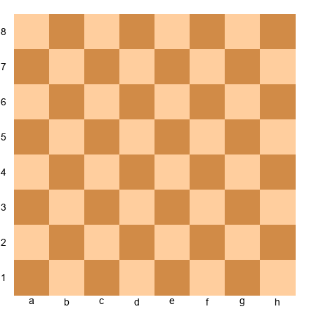

*Diagram 1.1: The empty chessboard. Dots represent dark squares. White plays from the bottom (ranks 1-2), Black plays from the top (ranks 7-8).*

## Files, Ranks, and Square Names

Every square on the board has a unique name, like an address. To name a square, you combine its **file** (column) and its **rank** (row).

**Files** are the vertical columns. They are labeled with lowercase letters from **a** to **h**, running left to right from White's perspective.

**Ranks** are the horizontal rows. They are numbered **1** to **8**, running from bottom to top (from White's side to Black's side).

To name any square, say the file letter first, then the rank number:

- The bottom-left square (from White's side) is **a1**
- The bottom-right square is **h1**
- The top-left square is **a8**
- The top-right square is **h8**
- The exact center-left is **d4** or **d5**
- The exact center-right is **e4** or **e5**

**Try this:** Point to each of these squares on your board and say the name out loud: **e4, d5, f3, c6, h8, a1**. If you can find them all without hesitation, you are ready to move on.

## The Center

Four squares sit at the heart of the board: **d4, d5, e4, and e5.** These are called the **center squares,** and they are the most important real estate on the board.

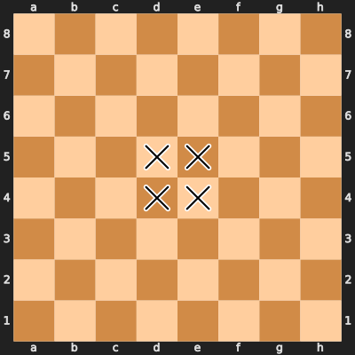

*Diagram 1.2: The four center squares (marked with *). Controlling these squares is one of the first goals of any chess game.*

Why does the center matter? A piece in the center can reach more squares than a piece on the edge. A knight on e4 controls eight squares. A knight on a1 controls only two. Throughout this book, you will hear the phrase "control the center" again and again. It starts here.

## Diagonals

A **diagonal** is a line of same-colored squares running from one corner of the board toward another. The longest diagonals run from a1 to h8 (dark squares) and from a8 to h1 (light squares). Each of these long diagonals crosses eight squares.

Diagonals matter because bishops and queens move along them. When someone says "the long diagonal," they mean one of those two eight-square diagonals. You will learn to love them.

**Try this:** Trace the diagonal from a1 to h8 with your finger. Now trace the one from a8 to h1. Notice that they cross at the center of the board. This is not a coincidence. The center is powerful because so many lines of movement intersect there.

---

🛑 **Rest Marker.** You now understand the board. Take a break if you need one. Next up: the pieces.

---

# The Pieces

*(Estimated reading time: 25 minutes | 1-2 Pomodoros)*

Chess has six types of pieces. Each type moves in a different way. We will cover every one, starting with the most important.

At the beginning of a game, each player has **16 pieces:**
- 1 King
- 1 Queen
- 2 Rooks
- 2 Bishops
- 2 Knights
- 8 Pawns

Let's meet them one at a time.

---

## The King (K)

The King is the most important piece on the board. If your King is trapped with no escape (checkmate), you lose the game. Everything you do in chess is ultimately about protecting your King and threatening your opponent's.

### How the King Moves

The King moves **one square in any direction**: up, down, left, right, or diagonally. One square. That is all.

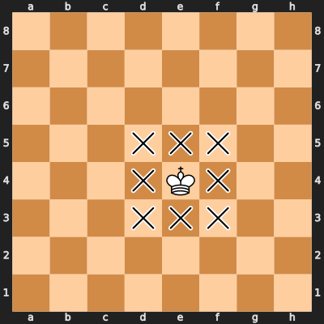

*Diagram 1.3: The King on e4. The "x" marks show every square the King can move to. Eight squares total from the center.*

There is one restriction: **the King cannot move to a square that is attacked by an opponent's piece.** The King can never walk into danger. If your King is currently attacked (this is called **check**), you *must* deal with the check on your very next move. We will cover check in detail in Chapter 2.

**Set up your board:** Place a White King on e4. Move it to each of the eight surrounding squares, one at a time. Move it back to e4 each time. Now place the King on a1 (the corner). How many squares can it move to? Only three. The corner is a trap for a King.

**Try this:** Place the King on h4 (the edge of the board). Count its legal moves. You should find five. The edge is better than the corner, but worse than the center. This is true for almost every piece.

---

## The Queen (Q)

The Queen is the most powerful piece on the board. She combines the movement of the Rook and the Bishop. Losing your Queen is usually (but not always) a disaster.

### How the Queen Moves

The Queen moves **any number of squares in any direction**: horizontally, vertically, or diagonally. She cannot jump over other pieces. If a friendly piece is in her path, she must stop before it. If an enemy piece is in her path, she can capture it by landing on that square (and removing the enemy piece from the board).

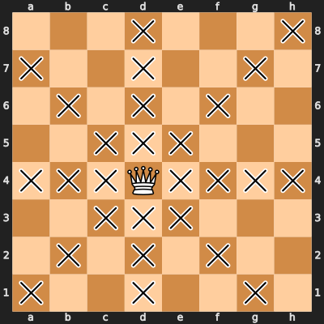

*Diagram 1.4: The Queen on d4. She can move to any square marked with "x". From the center, the Queen controls 27 squares.*

The Queen is powerful, but she is not invincible. She is worth about 9 points (we will cover piece values in Chapter 4). Because she is so valuable, putting her in danger early in the game is usually a mistake. Beginners often bring the Queen out first. Experienced players develop their other pieces first and bring the Queen out later when she can be safe and effective.

**Set up your board:** Place a White Queen on d4. Trace all the lines she can move along. Count the squares. Now place her on a1. How many squares can she reach? Far fewer. Like every piece, the Queen is strongest in the center.

**Try this:** Place the Queen on d4 and a Black pawn on d7. Can the Queen capture the pawn? Yes, by moving along the d-file. Now place a White pawn on d6 (between the Queen and the enemy pawn). Can the Queen still capture the Black pawn? No. The Queen cannot jump over the White pawn. She is blocked.

---

## The Rook (R)

The Rook (sometimes called the "castle" by beginners, though this is technically incorrect) is a powerful piece worth about 5 points.

### How the Rook Moves

The Rook moves **any number of squares horizontally or vertically.** It cannot move diagonally. Like the Queen, it cannot jump over other pieces.

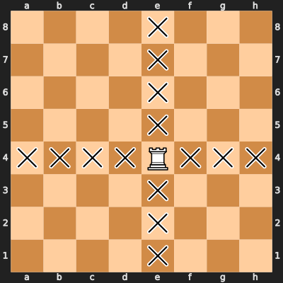

*Diagram 1.5: The Rook on e4. It can move to any square marked "x" along its rank (row) or file (column). 14 squares total.*

Notice something: the Rook controls 14 squares from any position on an empty board, whether it sits on e4 or a1. The Rook is the only major piece that does not care about being in the center (in terms of raw square count). However, Rooks still prefer **open files** (files with no pawns blocking them) and **the seventh rank** (your opponent's second row, where their pawns often sit).

**Set up your board:** Place a White Rook on a1. Move it to a8. Move it to h8. Move it to h1. Move it back to a1. You have just traced the edges of the board. Rooks love long, open lines.

**Try this:** Place a White Rook on e1 and White pawns on e2 and d1. How many squares can the Rook move to? The pawns block two of its four directions. The Rook can still move along the first rank to the right (f1, g1, h1) and cannot move up the e-file because e2 is blocked by its own pawn. Rooks need open lines to be effective.

---

## The Bishop (B)

The Bishop is a long-range piece worth about 3 points. It has one unique property that no other piece shares: **each Bishop is permanently locked to one color of square for the entire game.**

### How the Bishop Moves

The Bishop moves **any number of squares diagonally.** It cannot move horizontally or vertically. It cannot jump over other pieces.

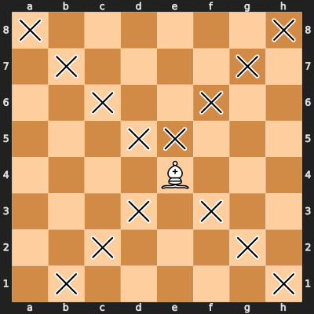

*Diagram 1.6: The Bishop on e4 (a dark square). It can only move to dark squares, marked with "x". This Bishop will NEVER touch a light square.*

Because the Bishop can only move diagonally, it stays on the same color square forever. A Bishop that starts on a light square can only ever visit light squares. A Bishop that starts on a dark square can only ever visit dark squares. This means a single Bishop can only ever reach **half the squares on the board.** That is both its limitation and its character.

At the start of the game, each player has two Bishops: one on a light square and one on a dark square. Together, the pair covers all 64 squares. This is why the **Bishop pair** (having both Bishops while your opponent has lost one) is considered an advantage. We will explore this concept in later chapters.

**Set up your board:** Place a White Bishop on c1 (its starting square). What color is c1? It is a dark square. Move the Bishop anywhere, in any number of moves you like. Can you ever get it to land on a light square? No. It is impossible. The Bishop is trapped on its color forever.

**Try this:** Place a White Bishop on f1 (a light square) and move it to c4. That is one move, traveling along the diagonal f1-c4. Now try to move it to d4. You cannot do it in a single move because d4 is a dark square. The light-squared Bishop cannot reach d4. Ever. Understanding this limitation is your first step toward understanding piece coordination.

---

🛑 **Rest Marker.** Two pieces left, then the rules. Good time for a break.

---

## The Knight (N)

The Knight is the most unusual piece in chess. It is the ONLY piece that can **jump over other pieces.** It moves in an "L" shape, and its movement confuses many beginners. But once you see the pattern, it clicks.

### How the Knight Moves

The Knight moves in an **L-shape: two squares in one direction (horizontally or vertically), then one square sideways.** Another way to think about it: the Knight always lands on a square that is the *opposite color* from the square it started on.

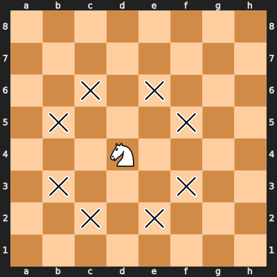

*Diagram 1.7: The Knight on d4. It can jump to any square marked "x". From the center, the Knight has 8 possible moves. Notice: every landing square is the opposite color from d4.*

The Knight is special for two reasons:

1. **It jumps.** The Knight does not care about pieces between its starting square and its landing square. It flies over everything. This makes the Knight extremely dangerous in crowded positions where other pieces are blocked.

2. **It alternates colors.** Every time a Knight moves, it changes square color. If it starts on a light square, it lands on a dark square. This means a Knight needs an even number of moves to return to a square of the same color.

The Knight's value is about 3 points, similar to a Bishop. In practice, the Knight is better in closed positions (lots of pawns blocking pieces) while the Bishop is better in open positions (clear diagonals). But at the beginner level, they are roughly equal.

**Set up your board:** Place a White Knight on b1 (its starting square). Move it to c3 (two squares up, one to the right). Now move it to e4. Now to f6. You are traveling across the board in a zigzag pattern. This is how Knights move through the position.

**Try this:** Place a White Knight on g1 and White pawns on f2, g2, and h2 (mimicking the opening position). Can the Knight move? Yes! It can jump to f3 or h3, right over the pawns. No other piece could do this. The Knight does not care about obstacles.

**Another exercise:** Place a Knight on a1. How many squares can it jump to? Only two: b3 and c2. Now place it on d4. It can reach eight squares. The Knight, like the King and Queen, is much stronger in the center than on the edge. There is an old chess saying: "A knight on the rim is dim."

---

## The Pawn (no letter symbol)

Pawns are the most numerous pieces (8 per side) and the most underestimated. They are the smallest and weakest piece, worth only 1 point. But pawns define the shape of the position, and they have one magical ability that no other piece has: **promotion.** We will cover that in Chapter 3.

### How the Pawn Moves

The Pawn is the only piece that moves differently from how it captures.

**Moving:** A Pawn moves **forward one square.** It cannot move backward, sideways, or diagonally. Forward only, always. From its **starting position** (rank 2 for White, rank 7 for Black), a Pawn has the option to move forward **two squares** on its very first move. After that, one square at a time.

**Capturing:** A Pawn captures **one square diagonally forward.** It cannot capture the piece directly in front of it. If a piece is directly in front of a Pawn, the Pawn is **blocked** and cannot move until that piece moves away.

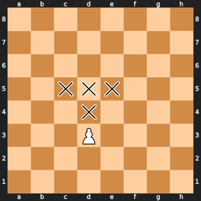

*Diagram 1.8: A White Pawn on d3. "m" = squares it can move to. "c" = squares it can capture on (c4 and e4, but only if an enemy piece is there).*

Notice that this Pawn is on d3, not its starting rank, so it can only move one square forward to d4. If it were on d2 (its starting square), it could move to either d3 or d4 in one move.

**Set up your board:** Place a White Pawn on e2 (its starting position). Move it two squares forward to e4. This is the most common first move in chess. Now try to move it backward. You cannot. Pawns never retreat.

**Try this:** Place a White Pawn on e4 and a Black Pawn on d5. The White Pawn can capture the Black Pawn by moving diagonally from e4 to d5 (removing the Black Pawn and taking its place). Now set it up again, but put the Black Pawn on e5 instead. Can the White Pawn capture it? No. The Pawn can only capture diagonally, and the Black Pawn is directly in front of it. Both Pawns are stuck until something changes.

Pawns have two more special abilities (en passant and promotion) that we will cover in Chapter 3. For now, the key facts are: forward only, one square at a time (two from the start), captures diagonally.

---

🛑 **Rest Marker.** You now know how every piece moves. That is a huge milestone. Take a break and celebrate. When you come back, we will learn the rules for setting up the board and playing a game.

---

# The Rules

*(Estimated reading time: 15 minutes | 1 Pomodoro)*

## Setting Up the Starting Position

At the beginning of every chess game, the pieces are arranged in the same way. Here is the starting position:

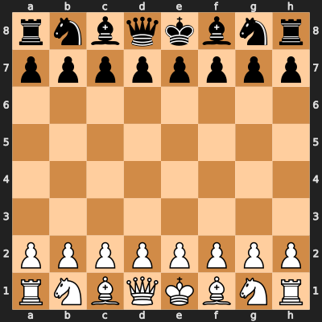

*Diagram 1.9: The starting position. Capital letters = White pieces. Lowercase = Black pieces. K=King, Q=Queen, R=Rook, B=Bishop, N=Knight, P=Pawn.*

### Setup Checklist

Follow these steps to set up the board correctly every time:

1. **Orient the board.** Light square in the bottom-right corner.
2. **Place the Rooks** on the corner squares: a1 and h1 (White), a8 and h8 (Black).
3. **Place the Knights** next to the Rooks: b1 and g1 (White), b8 and g8 (Black).
4. **Place the Bishops** next to the Knights: c1 and f1 (White), c8 and f8 (Black).
5. **Place the Queen on her own color.** White Queen on d1 (a light square). Black Queen on d8 (a dark square). Memory trick: "Queen gets her color."
6. **Place the King** on the remaining square: e1 (White), e8 (Black).
7. **Place the Pawns** on the second rank: a2 through h2 (White), a7 through a7 (Black).

**The most common setup mistake:** Swapping the King and Queen. Remember: **"Queen on her color."** The White Queen goes on the light square (d1). The Black Queen goes on the dark square (d8).

**Try this:** Clear your board entirely. Now set up the starting position from memory using the checklist above. Time yourself. If you can do it in under 30 seconds, you have it down.

## Who Goes First

**White always moves first.** After White makes a move, Black responds. Players alternate turns for the rest of the game. You can never skip a turn, and you can never make two moves in a row.

## The Touch-Move Rule

In tournament chess (and in many casual games), there is a rule called **touch-move:**

- If you touch one of your pieces, you must move it (if a legal move exists).
- If you touch one of your opponent's pieces, you must capture it (if a legal capture exists).
- Once you let go of a piece on a new square, the move is final.

This rule exists to prevent players from picking up pieces, seeing how the board looks, and then changing their minds. In casual games, many people play without touch-move, and that is fine. But learning to think before you touch the piece is a habit that will serve you well.

**Tip:** When you are thinking about your move, sit on your hands. Seriously. This is a real technique used by coaches. It prevents impulsive grabs while your brain is still working.

## How Games End

A chess game can end in several ways:

### Checkmate

**Checkmate** is the ultimate goal of chess. If your opponent's King is in **check** (attacked by one of your pieces) and there is no legal way to escape, the game is over. The player who delivered checkmate wins.

There is no need to actually capture the King. Once checkmate is reached, the game ends immediately. We will practice recognizing and delivering checkmate in Chapter 2.

### Stalemate (Draw)

**Stalemate** occurs when the player whose turn it is has **no legal moves,** but their King is NOT in check. This is a **draw**, meaning neither player wins. 

Stalemate is one of the trickiest concepts for beginners. It feels like the player with no moves should lose, but the rule says: if the King is not in check, it is a draw. Stalemate is actually a defensive resource. When you are losing badly, sometimes you can force a stalemate and save half a point. We will study this in Chapter 2.

### Draw by Agreement

At any point during a game, a player can offer a draw to their opponent. If the opponent accepts, the game ends in a draw. If the opponent declines, play continues.

### Draw by Repetition

If the same position occurs **three times** with the same player to move, either player can claim a draw. This prevents infinite loops.

### Draw by the 50-Move Rule

If **50 consecutive moves** pass without any pawn move or capture, either player can claim a draw. This prevents endlessly shuffling pieces.

### Draw by Insufficient Material

If neither player has enough pieces left to deliver checkmate, the game is a draw. For example, King vs. King is always a draw. King and Bishop vs. King is always a draw. King and Knight vs. King is always a draw.

### Resignation

A player can **resign** (quit) at any time, giving the win to their opponent. Players resign when they believe their position is hopeless. At the beginner level, you should almost never resign. Play it out. Your opponent might make a mistake. You might find a stalemate trick. Stranger things have happened.

### Time

In timed games, if your clock runs out of time, you lose (unless your opponent does not have enough material to checkmate you, in which case it is a draw).

---

## Chess Notation (Brief Introduction)

Chess players have a system for writing down moves called **algebraic notation.** This allows you to record your games, read game scores, and follow along with chess books like this one.

We will cover notation in full detail in the Appendix, but here are the basics so you can follow the rest of this book:

### Piece Letters

| Piece | Letter |
|-------|--------|
| King | K |
| Queen | Q |
| Rook | R |
| Bishop | B |
| Knight | N (not K, because K is the King) |
| Pawn | (no letter, just the square) |

### How to Write a Move

A move is written as the **piece letter** followed by the **destination square.**

- **Nf3** means "Knight moves to f3"
- **Bb5** means "Bishop moves to b5"
- **Qd7** means "Queen moves to d7"
- **Ke2** means "King moves to e2"
- **e4** means "Pawn moves to e4" (no letter for Pawns)

### Captures

When a piece captures, you add an **"x"** between the piece letter and the destination square:

- **Bxe5** means "Bishop captures the piece on e5"
- **Nxd4** means "Knight captures the piece on d4"
- **exd5** means "the e-pawn captures the piece on d5" (Pawn captures include the file the Pawn started on)

### Check and Checkmate

- A move that gives check adds a **"+"** at the end: **Bb5+** (Bishop to b5 with check)
- A move that delivers checkmate adds a **"#"** at the end: **Qh7#** (Queen to h7, checkmate)

### Special Notations

- **O-O** = Kingside castling (covered in Chapter 3)
- **O-O-O** = Queenside castling (covered in Chapter 3)
- **1-0** = White wins
- **0-1** = Black wins
- **½-½** = Draw

That is enough notation to follow along with this book. You will pick up the rest naturally as you play and study.

---

🛑 **Rest Marker.** You now know every rule of chess. From here, it is practice time. When you are ready, the exercises below will test everything you have learned.

---

# Exercises

The following 25 exercises test your understanding of the board, the pieces, and the rules. Work through them with a board in front of you. Try each one before checking the solution.

Difficulty guide:
- ★ = You should be able to solve this after reading this chapter
- ★★ = Requires careful thought or combining two concepts

---

**Exercise 1.1** ★
**Position:** Empty board.
**Task:** Name the following squares: the bottom-left corner from White's perspective, the top-right corner from White's perspective, and the four center squares.
**Hint 1:** The bottom-left corner for White is file a, rank 1.
**Hint 2:** The center squares are on files d and e, ranks 4 and 5.
**Hint 3:** Top-right from White's perspective is file h, rank 8.
**Solution:** Bottom-left = a1. Top-right = h8. Center squares = d4, d5, e4, e5. Why this works: Files go a-h left to right, ranks go 1-8 bottom to top, and you combine the two to name any square.

---

**Exercise 1.2** ★
**Position:** Empty board.
**Task:** What color is the square e4? What color is d4? What color is f6?
**Hint 1:** There is a pattern. If the file letter and rank number are both "odd" (a=1, c=3, e=5, g=7) or both "even" (b=2, d=4, f=6, h=8), the square is one color.
**Hint 2:** e is the 5th file (odd), 4 is even. Odd + even = dark square.
**Hint 3:** Try it: d is the 4th file (even), 4 is even. Even + even = light square.
**Solution:** e4 = dark square. d4 = light square. f6 = light square. Why this works: When the file number and rank number are both odd or both even, the square is light. When one is odd and one is even, the square is dark. (Or just look at your board!)

---

**Exercise 1.3** ★
**Position:** Empty board.
**Task:** Name all eight squares on the third rank (row 3), from left to right.
**Hint 1:** The third rank uses rank number 3.
**Hint 2:** Files go a through h.
**Hint 3:** Combine each file letter with the rank number 3.
**Solution:** a3, b3, c3, d3, e3, f3, g3, h3. Why this works: Every square on rank 3 shares the same rank number. The files provide the other half of each square name.

---

**Exercise 1.4** ★
**Position:** White King on d5.

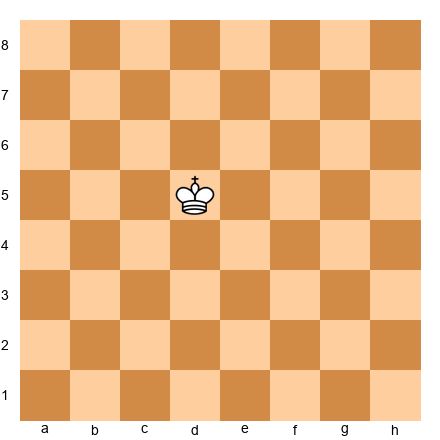

**Task:** List every square the King can move to from d5.
**Hint 1:** The King moves one square in any direction.
**Hint 2:** There are eight possible directions: up, down, left, right, and the four diagonals.
**Hint 3:** Check each direction from d5: up is d6, up-right is e6, right is e5, and so on.
**Solution:** c4, c5, c6, d4, d6, e4, e5, e6. Eight squares total. Why this works: From the center of the board, the King can move in all eight directions. No edges are blocking any direction.

---

**Exercise 1.5** ★
**Position:** White King on a1.

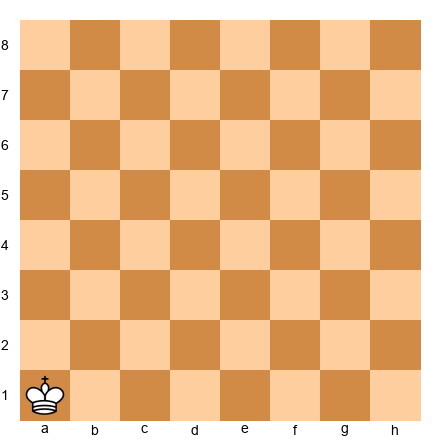

**Task:** How many legal squares can the King move to from a1?
**Hint 1:** The King is in the corner.
**Hint 2:** Three of the eight directions go off the edge of the board.
**Hint 3:** Actually, five of the eight directions go off the board. Only three squares are available.
**Solution:** Three squares: a2, b1, b2. Why this works: The corner limits the King to only three directions. This is why the corner is the worst place for a King (or almost any piece). The center gives maximum mobility.

---

**Exercise 1.6** ★
**Position:** White Queen on h1.

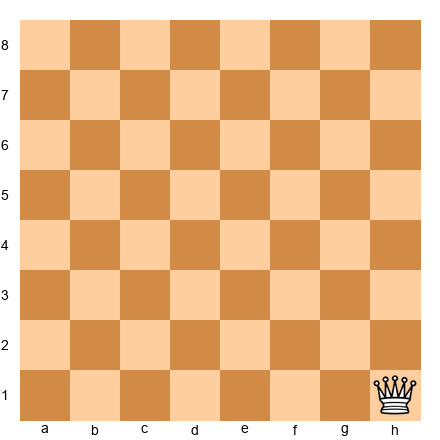

**Task:** How many squares can the Queen reach from h1? Count all of them.
**Hint 1:** From h1, the Queen can move along the first rank, the h-file, and one diagonal.
**Hint 2:** Along the first rank: a1, b1, c1, d1, e1, f1, g1 (7 squares). Along the h-file: h2 through h8 (7 squares).
**Hint 3:** Along the diagonal: g2, f3, e4, d5, c6, b7, a8 (7 squares).
**Solution:** 21 squares. Why this works: The Queen reaches 7 squares along the rank, 7 along the file, and 7 along the single available diagonal. Compare this to 27 squares from the center (d4 or e4). The corner costs the Queen 6 squares of reach.

---

**Exercise 1.7** ★
**Position:** White Rook on d4, White Pawn on d7, Black Pawn on d2.

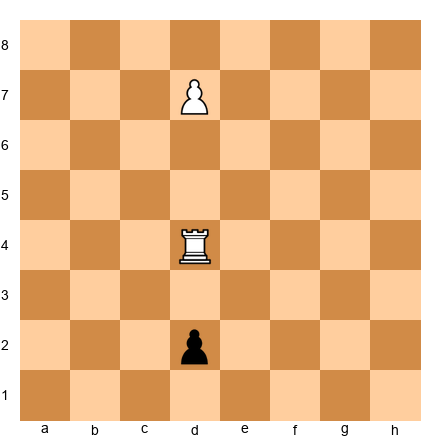

**Task:** How many squares can the Rook move to? List them.
**Hint 1:** The Rook moves along ranks and files but cannot jump over pieces.
**Hint 2:** Along the d-file going up, the Rook is blocked by the White Pawn on d7. It can reach d5 and d6, but not d7 (friendly piece).
**Hint 3:** Along the d-file going down, the Rook can reach d3 and d2 (capturing the Black Pawn). It cannot go past d2.
**Solution:** The Rook can move to: a4, b4, c4, e4, f4, g4, h4 (7 squares along the rank), d5, d6 (2 squares up the file), d3, d2 (2 squares down, with d2 being a capture). Total: 11 squares. Why this works: The Rook cannot pass through the friendly Pawn on d7, so its upward reach is limited. It can capture the enemy Pawn on d2 but cannot continue past it.

---

**Exercise 1.8** ★
**Position:** White Bishop on c1.

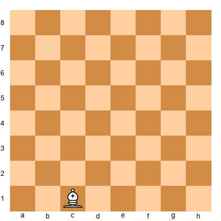

**Task:** What color squares can this Bishop ever visit? Can it ever reach the square e4?
**Hint 1:** What color is c1?
**Hint 2:** c1 is a dark square. Bishops stay on their starting color forever.
**Hint 3:** What color is e4? Check whether it matches.
**Solution:** The Bishop on c1 is on a dark square. It can only ever visit dark squares. e4 is also a dark square, so yes, this Bishop CAN reach e4 (for example, via c1-d2-e3-f4 or directly c1-e3-f4, then repositioning). Why this works: Bishops never change color. The key question is always: "Is the target square the same color as the Bishop?"

---

**Exercise 1.9** ★
**Position:** White Bishop on f1.

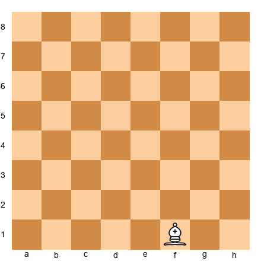

**Task:** Can this Bishop ever reach the square d4?
**Hint 1:** What color is f1? What color is d4?
**Hint 2:** f1 is a light square. d4 is also a light square.
**Hint 3:** Since both squares are the same color, the Bishop can eventually get there.
**Solution:** Yes. f1 is a light square, and d4 is a light square. The Bishop can reach d4 (for example, f1-e2-d3, then d3-c4 or other routes, eventually reaching d4 by traveling along light-square diagonals). Why this works: A Bishop can reach any square of its own color, given enough moves and an open path.

---

**Exercise 1.10** ★
**Position:** White Knight on g1.

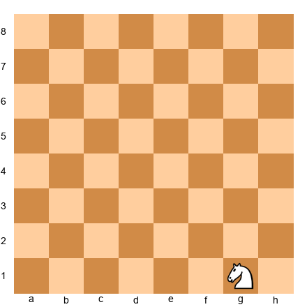

**Task:** What are the Knight's legal moves from g1?
**Hint 1:** The Knight moves in an L-shape: two squares in one direction, one square sideways.
**Hint 2:** From g1, try: two up and one left = f3. Two up and one right = h3.
**Hint 3:** Two left and one up = e2. Two right goes off the board. Those are all the options.
**Solution:** f3, h3, and e2. Three legal squares. Why this works: From the corner area, many L-shaped moves go off the board. In the starting position, each Knight has exactly two legal first moves (for g1: Nf3 or Nh3). The e2 square is also available here because there are no other pieces blocking.

---

**Exercise 1.11** ★
**Position:** White Knight on e4 (empty board).

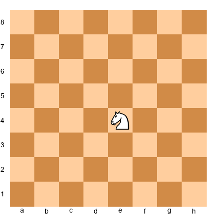

**Task:** List all eight squares the Knight can move to.
**Hint 1:** L-shape: two squares, then one sideways. Try each direction.
**Hint 2:** Two up, one left = d6. Two up, one right = f6. Continue with all other directions.
**Hint 3:** The eight squares form a ring around the Knight, two squares away.
**Solution:** c3, c5, d2, d6, f2, f6, g3, g5. Eight squares total. Why this works: From the center of the board (e4), no L-shaped moves go off the edge. This is the maximum. Compare this to only 2-3 moves from the corner or edge.

---

**Exercise 1.12** ★
**Position:** White Pawn on e2 (starting position, empty board).

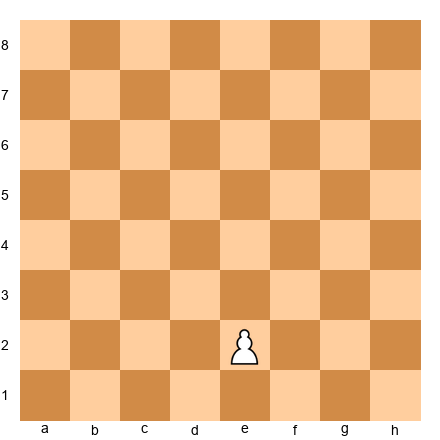

**Task:** What are the Pawn's legal moves?
**Hint 1:** The Pawn is on its starting rank (rank 2 for White).
**Hint 2:** From the starting rank, a Pawn can move one or two squares forward.
**Hint 3:** Forward for White means toward rank 8 (increasing rank numbers).
**Solution:** e3 (one square forward) or e4 (two squares forward). The Pawn cannot capture because there are no enemy pieces on d3 or f3. Why this works: From its starting square, a Pawn has the option of a single or double push. Once it has moved from its starting square, it loses the two-square option forever.

---

**Exercise 1.13** ★
**Position:** White Pawn on e5, Black Pawn on d6, Black Pawn on e6.

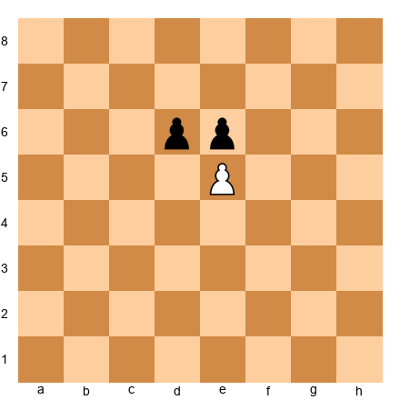

**Task:** Can the White Pawn move? Can it capture? List all legal options.
**Hint 1:** The Pawn moves forward (to e6), but is anything blocking that square?
**Hint 2:** The Black Pawn on e6 is directly in front of the White Pawn. The White Pawn is blocked and cannot advance.
**Hint 3:** But Pawns capture diagonally. Is there an enemy piece on d6?
**Solution:** The White Pawn cannot move to e6 (blocked by the Black Pawn). But it CAN capture the Black Pawn on d6 by moving diagonally from e5 to d6. One legal move: exd6. Why this works: Pawns move forward but capture diagonally. A Pawn blocked from advancing can still capture sideways.

---

**Exercise 1.14** ★
**Position:** Empty board.
**Task:** Set up the starting position from memory. Use the checklist from the chapter. Check your answer against Diagram 1.9.
**Hint 1:** Start with the corners: Rooks on a1, h1, a8, h8.
**Hint 2:** Queen on her color: White Queen on d1 (light square), Black Queen on d8 (dark square).
**Hint 3:** The order from corner inward is: Rook, Knight, Bishop, Queen/King.
**Solution:** Compare your board to the starting position FEN: `rnbqkbnr/pppppppp/8/8/8/8/PPPPPPPP/RNBQKBNR w KQkq - 0 1`. Every piece should match. If the King and Queen are swapped, remember: "Queen on her color." Why this works: Practicing setup from memory builds board familiarity. Tournament players must set up without a diagram.

---

**Exercise 1.15** ★
**Position:** White Queen on d1 (starting position, all pieces present).

**Task:** Can the White Queen move on the first turn of the game? Why or why not?
**Hint 1:** Look at what is surrounding the Queen on d1.
**Hint 2:** The Queen is on d1. What pieces are on c1, d2, and e1?
**Hint 3:** Bishops on c1 and f1, the King on e1, and Pawns on c2, d2, and e2. Every path is blocked.
**Solution:** No. The Queen on d1 is completely surrounded by friendly pieces (c1 Bishop, d2 Pawn, e1 King, and the Pawn wall). She has no legal move. The Queen must wait for Pawns and other pieces to move first, creating an opening. Why this works: In the starting position, only Knights (which jump) and Pawns have legal first moves. All other pieces are blocked.

---

**Exercise 1.16** ★
**Position:** Starting position.

**Task:** How many total legal first moves does White have at the start of a game?
**Hint 1:** Which pieces can move? Only Pawns and Knights (everything else is blocked).
**Hint 2:** Each of the 8 Pawns can move one or two squares forward. That is 16 Pawn moves.
**Hint 3:** Each Knight has two legal moves (b1 can go to a3 or c3; g1 can go to f3 or h3). That is 4 Knight moves.
**Solution:** 20 legal first moves. 16 Pawn moves (8 Pawns x 2 options each) + 4 Knight moves (2 Knights x 2 options each) = 20. Why this works: In the starting position, only Pawns and Knights can move. Pawns have 2 options each from their starting rank, and Knights jump over the Pawn wall.

---

**Exercise 1.17** ★★
**Position:** White King on e1, White Rook on a1 (empty board otherwise).

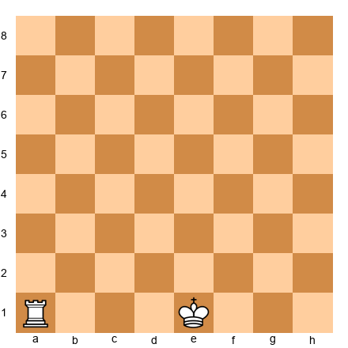

**Task:** Can the Rook and King together control all four edges of the board in this position? Which edge squares are NOT controlled?
**Hint 1:** The Rook on a1 controls the entire a-file (a1-a8) and the entire first rank (a1-h1). But wait, the King blocks the Rook from reaching squares past e1 along the first rank.
**Hint 2:** The King on e1 controls d1, d2, e2, f1, f2. The Rook controls a1-d1 (stopped by nothing before the King) and a1-a8.
**Hint 3:** The Rook covers the a-file and the first rank up to d1. The King covers a small area around e1. The h-file, the eighth rank, and most of the right side of the board are not covered.
**Solution:** No, they cannot control all four edges. The Rook covers the a-file (left edge) and the first rank up to the King (bottom edge partially). The King adds f1, f2. But the h-file (right edge), the eighth rank (top edge), and squares like g1, h1 are uncontrolled by either piece. Why this works: Two pieces are not enough to cover a 64-square board. This demonstrates why you need multiple pieces working together.

---

**Exercise 1.18** ★
**Position:** White Knight on a1 (empty board).

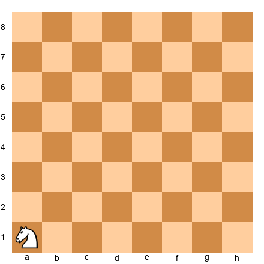

**Task:** How many squares can the Knight reach from a1?
**Hint 1:** Try all L-shaped moves from a1.
**Hint 2:** Two up, one right = b3. Two right, one up = c2.
**Hint 3:** All other L-shapes go off the board.
**Solution:** Two squares: b3 and c2. Why this works: The corner is the worst possible position for a Knight. It can reach only 2 squares (compared to 8 from the center). "A Knight on the rim is dim," and the corner is the worst rim of all.

---

**Exercise 1.19** ★
**Position:** White Bishop on d4 (empty board).

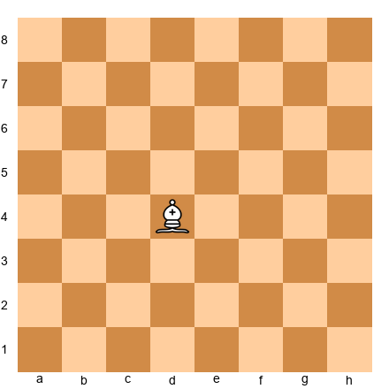

**Task:** How many total squares can the Bishop reach?
**Hint 1:** Count each diagonal direction separately: up-left, up-right, down-left, down-right.
**Hint 2:** Up-left from d4: c5, b6, a7 (3 squares). Up-right: e5, f6, g7, h8 (4 squares).
**Hint 3:** Down-left: c3, b2, a1 (3 squares). Down-right: e3, f2, g1 (3 squares).
**Solution:** 13 squares total. Up-left: 3, up-right: 4, down-left: 3, down-right: 3. Why this works: The Bishop is a long-range piece, but it can never reach the other color. From d4 (a light square), all 13 reachable squares are light squares.

---

**Exercise 1.20** ★★
**Position:** White Pawn on d4, Black Pawns on c5 and e5 and d5.

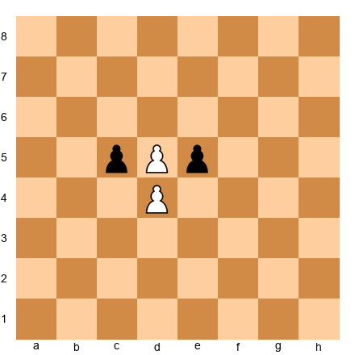

**Task:** There is a problem with this position. Can you spot it?
**Hint 1:** Look at d4 and d5. Both have Pawns on them.
**Hint 2:** Can a White Pawn on d4 and a Black Pawn on d5 coexist? Pawns move forward.
**Hint 3:** If the White Pawn is on d4 and the Black Pawn is on d5, neither Pawn can advance. They are "locked." This is actually legal! They block each other. But the FEN shows a White Pawn on d5, which is different.
**Solution:** Looking at the FEN more carefully: there is a White Pawn (P) on d4 and a White Pawn on d5. A player cannot have two Pawns on the same file in a normal game without a capture having cleared the way. The FEN is legal but unusual. The White Pawn on d4 is completely stuck from advancing since d5 has a friendly Pawn blocking it, but it CAN capture on c5 or e5 since those are Black Pawns on the diagonals. Legal moves: dxc5 or dxe5. Why this works: Pawns that are blocked from advancing can often still capture diagonally. Always check both the forward move AND the diagonal captures.

---

**Exercise 1.21** ★
**Position:** Empty board.
**Task:** What does the notation "Nf3" mean? What does "e4" mean? What does "Bxc6" mean?
**Hint 1:** The first letter (if capital) tells you which piece moves.
**Hint 2:** N = Knight, B = Bishop. No letter = Pawn.
**Hint 3:** The "x" in Bxc6 means a capture happened.
**Solution:** Nf3 = A Knight moves to the square f3. e4 = A Pawn moves to the square e4. Bxc6 = A Bishop captures whatever piece was on c6. Why this works: The piece letter comes first, then the destination square. Pawn moves skip the piece letter. An "x" means a capture.

---

**Exercise 1.22** ★★
**Position:** Starting position after the moves 1.e4 e5.

**Task:** After 1.e4 e5, how many pieces can White now move that could not move on the first turn?
**Hint 1:** The Pawn on e2 has moved to e4. What square did it free up?
**Hint 2:** The Queen on d1 can now move through e2 (since the Pawn left). Can the Queen reach any squares?
**Hint 3:** Also, the Bishop on f1 now has a clear diagonal (f1-e2-d3-c4-b5-a6).
**Solution:** Two new pieces can move: the Queen (through e2, can reach e2, f3, g4, h5) and the light-squared Bishop on f1 (can reach e2, d3, c4, b5, a6). Why this works: Moving a Pawn opens lines. The e4 Pawn freed up the diagonal for the Bishop and the Queen. This is why Pawn moves are so important in the opening: they open paths for your other pieces.

---

**Exercise 1.23** ★★
**Position:** White King on e1, Black Queen on d3 (otherwise empty board).

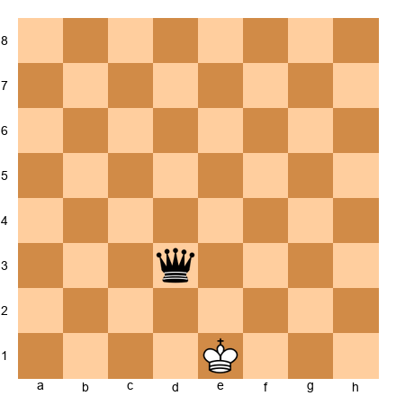

**Task:** How many legal moves does the White King have?
**Hint 1:** The King is on e1. List all adjacent squares: d1, d2, e2, f1, f2.
**Hint 2:** The King cannot move to a square attacked by the Black Queen. Which squares does the Queen on d3 attack?
**Hint 3:** The Queen on d3 attacks d1 (same file), d2 (same file), e2 (diagonal), f1 (diagonal), e3 (but that's not adjacent to e1), and many other squares. Check each of the King's 5 candidate squares.
**Solution:** The King's adjacent squares are d1, d2, e2, f1, f2. The Queen on d3 attacks: d1 (along d-file), d2 (along d-file), e2 (diagonal d3-e2), and f1 (diagonal d3-e2-f1). That leaves only f2 as a safe square. The King has 1 legal move: Kf2. Why this works: The King cannot move into check. You must check every adjacent square to see if it is attacked. This is the foundation of checkmate, which you will learn in Chapter 2.

---

**Exercise 1.24** ★★
**Position:** Starting position.

**Task:** In the starting position, how many pieces are on light squares and how many are on dark squares? Count both White and Black pieces.
**Hint 1:** Start with the first rank (White's pieces). a1 is dark, b1 is light, c1 is dark, d1 is light, e1 is dark, f1 is light, g1 is dark, h1 is light.
**Hint 2:** So on rank 1: 4 pieces on dark squares (a1, c1, e1, g1) and 4 on light squares (b1, d1, f1, h1). Rank 2 is the opposite pattern.
**Hint 3:** The same logic applies to ranks 7 and 8.
**Solution:** On rank 1: 4 pieces on dark, 4 on light. Rank 2: 4 Pawns on light, 4 Pawns on dark. Rank 7: 4 Pawns on dark, 4 Pawns on light. Rank 8: 4 pieces on light, 4 on dark. Total: 16 pieces on light squares and 16 pieces on dark squares. The starting position is perfectly balanced between light and dark. Why this works: The alternating pattern of the board means that every rank has exactly 4 light and 4 dark squares. With 8 pieces per rank (ranks 1, 2, 7, 8 are occupied), the distribution is perfectly even.

---

**Exercise 1.25** ★★
**Position:** White King on g1, White Rook on f1, White Pawns on f2, g2, h2, White Bishop on g5.

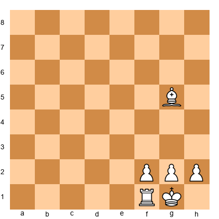

**Task:** This is a common setup after castling Kingside. Name every piece and the square it occupies. Then determine: can the Rook move? Can the Bishop move? Can any Pawn move?
**Hint 1:** Name them: King on g1, Rook on f1, Pawns on f2, g2, h2, Bishop on g5.
**Hint 2:** The Rook on f1 is blocked upward by the Pawn on f2. Can it move along the first rank?
**Hint 3:** The Rook can move along the first rank: e1, d1, c1, b1, a1 (leftward) but not past the King to the right.
**Solution:** King on g1, Rook on f1, Pawns on f2/g2/h2, Bishop on g5. The Rook CAN move along the first rank to the left (e1, d1, c1, b1, a1) but cannot go up (blocked by f2 Pawn) or right (blocked by the King on g1). The Bishop on g5 CAN move freely on its diagonals (f4, e3, d2, c1, h6, h4, f6, e7, d8). The Pawns CAN move: f3 or f4, g3 or g4 (g2 is on its starting rank), h3 or h4. Why this works: Even in a "cramped" position, most pieces have some moves available. The Rook needs an open file to be effective, which is why later chapters discuss opening files with Pawn exchanges.

---

🛑 **Rest Marker.** You have completed all 25 exercises. Well done. That was a serious workout for your chess brain.

---

# Key Takeaways

1. **The board has 64 squares** arranged in 8 files (a-h) and 8 ranks (1-8). Every square has a unique name (like e4 or d5). The center squares (d4, d5, e4, e5) are the most powerful positions on the board.

2. **Six types of pieces, each with unique movement.** King (one square, any direction), Queen (any number of squares, any direction), Rook (any number of squares, straight lines), Bishop (any number of squares, diagonals only, locked to one color), Knight (L-shape, jumps over pieces), Pawn (forward one square, captures diagonally, two squares from starting position).

3. **Games end by checkmate, stalemate, draw, resignation, or time.** Checkmate (King trapped with no escape) is the goal. Stalemate (no legal moves but not in check) is a draw, not a loss.

4. **Chess notation is the language of the game.** Piece letter + destination square. Captures use "x." Check uses "+." You will use notation throughout this book and your chess career.

5. **Your brain is built for this.** Pattern recognition, detail orientation, and deep focus are chess superpowers. Use the Pomodoro method, the pre-study checklist, and the thinking checklist to set yourself up for success.

---

# Practice Assignment

**This week, do the following:**

1. **Set up the starting position from memory** at least three times on three different days. Time yourself. Try to beat your previous time.

2. **Play 3 games** on Lichess (lichess.org, free, no account required). Use the 10+0 time control (10 minutes per side, no increment). Do not worry about winning or losing. Focus on making legal moves and using the thinking checklist before each move.

3. **After each game, ask yourself three questions:**
   - What was my best move? (Even if you lost, you did something right.)
   - What was my worst move? (This is where learning happens.)
   - What will I do differently next time? (One thing. Just one.)

4. **Solve 5 puzzles per day** on Lichess (under "Puzzles" in the menu). Start at the lowest difficulty. These are your daily pattern-building reps.

---

# ⭐ Progress Check

After completing this chapter and the practice assignment, you should be able to:

- [ ] Set up the starting position from memory in under 60 seconds
- [ ] Name any square on the board when someone points to it
- [ ] Describe how each of the six piece types moves
- [ ] Explain the difference between checkmate, stalemate, and draw
- [ ] Read basic chess notation (Nf3, e4, Bxc6+)
- [ ] Complete a 25-minute study session using the Pomodoro method

If you can check off all six boxes, you are ready for Chapter 2: Check, Checkmate, and Stalemate. If one or two feel shaky, go back and review that section. There is no rush.

---

# 🛑 Rest Marker

**You finished Chapter 1.**

That was 42 pages of foundational chess knowledge and a complete study framework for your brain. Take a real break. Not a "check my phone for two minutes" break. A real one. Stand up. Walk around. Drink some water. Pet an animal if one is nearby.

When you come back, Chapter 2 will teach you the three most important words in chess: check, checkmate, and stalemate. These concepts turn the rules you just learned into an actual game.

See you there.

*"Good stopping point. Come back refreshed."*

---

*Chapter 1 complete. 25 exercises. 0 annotated games. Rating range: Absolute beginner (0).*
*Next: Chapter 2: Check, Checkmate, and Stalemate*
