# Chapter 2: Check, Checkmate, and Stalemate

**Volume I: Foundations | Rating Range: Beginner (0–400)**

---

> *"Even a poor plan is better than no plan at all."*
> *Mikhail Chigorin*

---

## What You'll Learn

- What **check** means, and the three ways to escape it
- What **checkmate** means, and how to recognize it instantly
- What **stalemate** means, and why it is a draw, not a win
- Four classic checkmate patterns every beginner must know
- How to avoid accidental stalemates when you are winning

---

## Part 1: Check

### The King Is Under Attack

In Chapter 1, you learned how each piece moves. Now it is time to learn the most important rule in all of chess: **you are never allowed to leave your king in danger.**

**Check** means that one of your opponent's pieces is attacking your king right now. When your king is in check, you *must* deal with it immediately. You cannot ignore it. You cannot play a different move and hope it works out. The check must be answered before anything else.

Here is a simple way to think about it: if an enemy piece could capture your king on the very next move, your king is in check.

**Set up your board:**
Place a White rook on e1 and a Black king on e8. Remove everything else from the board.

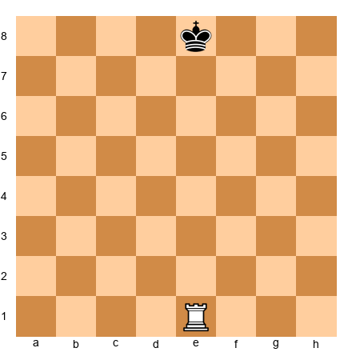

The rook on e1 attacks straight up the e-file all the way to e8, where the Black king stands. The Black king is **in check.** It is Black's turn, and Black must respond to this check right now. The king can move to f8, d8, f7, or d7 to escape.

---

### The Three Ways to Escape Check

When your king is in check, you have exactly three options:

1. **Move the king** to a safe square
2. **Block the check** by placing a piece between the attacker and your king
3. **Capture the attacking piece**

If none of these three works, the position is checkmate and the game is over. Let's try each escape method one at a time.

---

#### Escape Method 1: Move the King

The most straightforward response to check is to step the king to a square where it is no longer attacked.

**Set up your board:**
White king on a1, White rook on e1. Black king on e8. Nothing else.

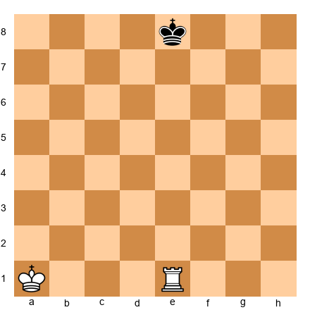

The rook on e1 gives check along the e-file. The Black king needs to step off the e-file to escape. It can move to d8, d7, f8, or f7. Any of those squares works because the rook does not attack them.

The king **cannot** move to e7, because that square is still on the e-file and the rook attacks it.

**Key idea:** When you move the king out of check, make sure the new square is truly safe. Look at every enemy piece that might attack that square before you commit.

---

#### Escape Method 2: Block the Check

Sometimes you do not have to move the king at all. If you can place one of your own pieces between the attacker and your king, the check is blocked.

**Set up your board:**
White king on a1, White rook on e1. Black king on e8, Black knight on c7. Nothing else.

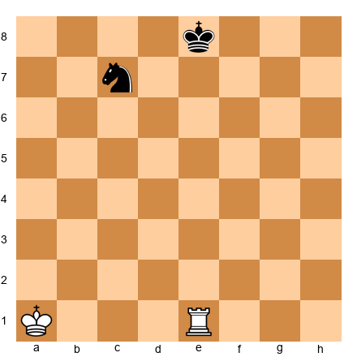

The rook on e1 checks the Black king along the e-file. But the Black knight on c7 can jump to e6, landing between the rook and the king. After ...Ne6, the rook's line of attack is interrupted. The king is safe.

**Key idea:** Blocking only works against pieces that attack in lines: rooks, bishops, and queens. You **cannot** block a check from a knight, because knights jump over pieces. You also cannot block a check from a pawn that is right next to you.

---

#### Escape Method 3: Capture the Attacker

The third option is the most satisfying: just take the piece that is giving check.

**Set up your board:**
White king on a1, White bishop on e5. Black king on h8, Black rook on a5. Nothing else.

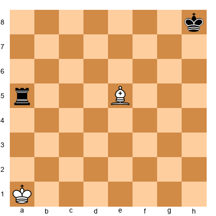

The White bishop on e5 gives check to the Black king along the diagonal (e5-f6-g7-h8). But the Black rook on a5 can capture the bishop: ...Rxe5. The attacker is gone, and the check is over.

**Key idea:** Capturing the attacker is often the best response, because you remove a dangerous enemy piece while saving your king in one move.

---

### Double Check: When Only the King Can Move

Sometimes, two pieces give check at the same time. This is called a **double check,** and it is one of the most powerful moves in chess.

Think about why. You cannot block two attacks at once. You cannot capture two pieces at once. The only option is to **move the king.**

**Set up your board:**
White king on a1, White rook on e1, White bishop on a4. Black king on e8. Nothing else.

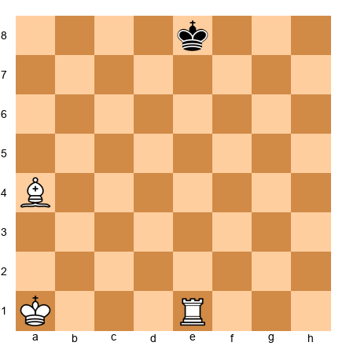

The bishop on a4 attacks along the diagonal a4-b5-c6-d7-e8, giving check. At the same time, the rook on e1 attacks along the e-file, also giving check. This is double check.

Black cannot block both attacks. Black cannot capture both pieces. The only option is for the king to move. It can go to f8, d8, or f7.

Double check is rare, but when it happens, it is almost always devastating.

---

### Discovered Check

A **discovered check** happens when one piece moves out of the way, uncovering an attack from a piece behind it. The piece that moves is not the one giving check. It is the piece that was hidden behind it.

**Set up your board:**
White king on a1, White rook on e1, White knight on e4. Black king on e8. Nothing else.

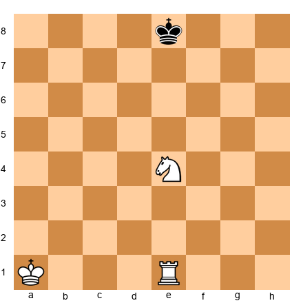

Right now, the rook on e1 cannot check the Black king because the White knight on e4 is blocking the e-file. But if the knight moves to *any* square (say Nd6 or Nf6 or Nc5), it clears the e-file, and the rook gives check.

The beauty of discovered check is that the knight can go wherever it wants. It can capture a piece, threaten the queen, or land on a strong square. Meanwhile, the Black king must deal with the rook's check first. You get to make two threats with one move.

**Pause and think:** Double check is a special kind of discovered check where the piece that moves ALSO gives check. Both pieces attack the king at the same time. That is why double check is so hard to answer.

---

🛑 **Rest Marker.** Good stopping point! You now understand check and the three ways to escape it. Come back with fresh eyes, or keep going if you are feeling sharp.

---

## Part 2: Checkmate

### The Goal of the Game

**Checkmate** means the king is in check AND there is no way to escape. The game is over immediately. The player who delivers checkmate wins.

Let's be very precise about what checkmate requires. ALL THREE of these must be true at the same time:

1. The king is in check (an enemy piece is attacking it)
2. The king cannot move to a safe square (every adjacent square is blocked or attacked)
3. No friendly piece can block the check or capture the attacker

If even one escape exists, it is just check, not checkmate.

---

### Recognizing Checkmate vs. "Almost Checkmate"

This skill trips up beginners at first, but it gets easier fast. The trick is to be systematic: check every escape, every block, every capture. Do not assume. Verify.

**Set up your board:**
White rook on a8, White king on g1. Black king on g8, Black pawns on f7, g7, h7. Nothing else.

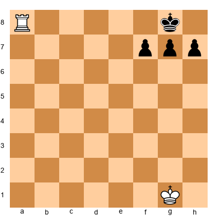

Is this checkmate? Let's go through the checklist:

**Is the king in check?** The rook on a8 attacks along the entire 8th rank. Between a8 and g8: b8, c8, d8, e8, and f8 are all empty. Yes, the rook attacks g8. The king is in check. ✓

**Can the king move?** Let's check every adjacent square:
- **f8:** Attacked by the rook along rank 8. ✗
- **h8:** Attacked by the rook along rank 8. ✗
- **f7, g7, h7:** Blocked by Black's own pawns. ✗

**Can anything block or capture?** No other Black pieces exist. ✗

**This IS checkmate.** The king is trapped behind its own pawns, and the rook delivers the killing blow along the back rank.

Now change one thing. Remove the pawn on f7:

If that pawn were gone, the king could escape to f7. That one pawn was the difference between checkmate and just a check.

**Lesson:** Always check every possible escape square before you declare checkmate.

---

### Common Checkmate Patterns for Beginners

Now let's learn four checkmate patterns that show up again and again. Master these, and you will win many games.

---

#### Pattern 1: Back Rank Mate

The **back rank mate** is the most common checkmate in beginner and intermediate games. It happens when a king is trapped on its back rank (rank 1 for White, rank 8 for Black) by its own pawns, and a rook or queen delivers check along that rank.

**Set up your board:**
White king on g1, White pawns on f2, g2, h2. Black king on a8, Black rook on e8. Nothing else.

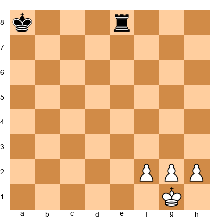

Black plays **1...Re1#.** The rook slides to e1, giving check along the first rank. The White king on g1 is trapped:
- f1 and h1 are both attacked by the rook along rank 1
- f2, g2, and h2 are blocked by White's own pawns

**Checkmate.** The king was boxed in by its own three pawns.

**How to prevent back rank mate:** Give your king an escape square! Push one of the pawns in front of your king forward one square (like h3 or g3). Chess players call this "giving the king luft" (a German word meaning "air"). One small pawn move early on can save your life later.

---

#### Pattern 2: Scholar's Mate (The 4-Move Checkmate)

**Scholar's Mate** is the first trap every beginner learns. It delivers checkmate in four moves.

**Set up your board to the starting position.** All pieces in their normal places.

**1. e4 e5**
Both sides push a center pawn. Normal.

**2. Bc4 Nc6**
White develops the bishop to c4, aiming at the f7 square. Why f7? Because it is the weakest point in Black's starting position. Only the king defends it.

**3. Qh5 Nf6??**
White brings the queen to h5, aiming at both e5 and f7. Now the queen AND the bishop both target f7. Black plays ...Nf6, trying to attack the queen, but this is a terrible mistake. Black needed to defend f7.

**4. Qxf7#**

The queen captures the f7 pawn with check. The king cannot take the queen because the bishop on c4 protects it. Every escape square is covered: e7, d7, and f8 are all attacked by the queen. **Checkmate.**

**How to prevent Scholar's Mate:** If your opponent plays Qh5, defend f7! Play **...g6** (kicks the queen away) or **...Qe7** (defends f7 directly). After you defend, your opponent has wasted time bringing the queen out early, and you will have the better position.

---

#### Pattern 3: Fool's Mate (The 2-Move Checkmate)

**Fool's Mate** is the fastest possible checkmate in chess. It takes only two moves.

**Set up your board to the starting position.**

**1. f3? e5**
**2. g4?? Qh4#**

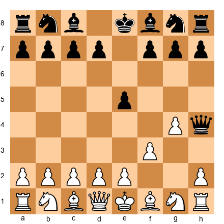

White's first two moves (f3 and g4) ripped open the diagonal from h4 to e1 and removed every pawn that could have defended it. Black's queen slides to h4 with check.

The White king has no escape: f2 is attacked by the queen (diagonally), e2 is blocked by the pawn, d1 is blocked by the White queen, and f1 is blocked by the bishop. **Checkmate in two moves.**

You will almost never see Fool's Mate in a real game. But it teaches a valuable lesson: **do not weaken the squares around your king by pushing the f-pawn and g-pawn early.**

---

#### Pattern 4: Smothered Mate

**Smothered mate** is one of the most beautiful patterns in chess. A knight delivers checkmate to a king that is completely boxed in by its own pieces.

**Set up your board:**
White knight on f7, White king on c1. Black king on h8, Black rook on g8, Black pawns on g7 and h7. Nothing else.

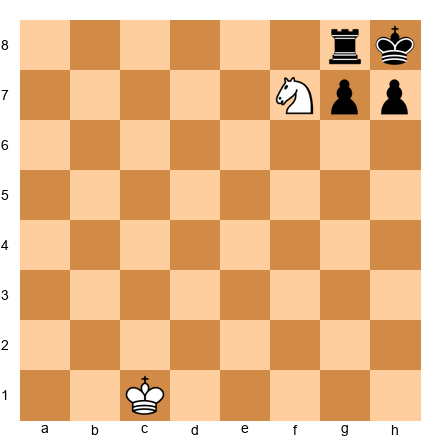

A knight on f7 attacks h8 (among other squares). The Black king on h8 is in check. Can it escape?
- **g8:** Occupied by Black's own rook. ✗
- **g7:** Occupied by Black's own pawn. ✗
- **h7:** Occupied by Black's own pawn. ✗

The king is literally surrounded by its own army. No piece can capture the knight, and you cannot block a knight's attack because knights jump over pieces. **Checkmate.**

In the classic combination leading to smothered mate, the attacking side sacrifices the queen on g8, forcing ...Rxg8, and then the knight delivers mate on f7. If you ever get the chance to play this pattern, it is one of the most thrilling moments in chess.

---

🛑 **Rest Marker.** Great progress! You now know four checkmate patterns that win real games. Take a break if you need one. The next section covers stalemate.

---

## Part 3: Stalemate

### No Legal Moves, But Not in Check

Here is the rule that surprises every beginner: **if it is your turn, you have no legal moves, AND your king is NOT in check, the game is a draw.** This is called **stalemate.**

Not a win for your opponent. Not a loss. A draw. Even if your opponent has a queen and a full army of pieces, if they accidentally stalemate you, the game is tied.

This feels unfair at first. But stalemate is a draw, and it has been this way for hundreds of years. Learning to spot it will save you from throwing away won games, and it might also save you from losing hopeless ones.

---

### Stalemate Example 1: King in the Corner

**Set up your board:**
White queen on b6, White king on c1. Black king on a8. Nothing else.

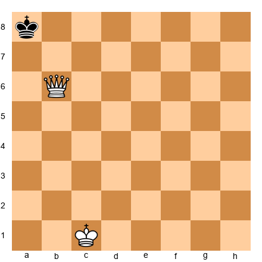

It is Black's turn. Is the king in check? The queen on b6 controls the b-file, the 6th rank, and several diagonals. But it does NOT attack a8. (Check for yourself: a8 is not on the b-file, not on the 6th rank, and not on any diagonal from b6.)

The king is **not** in check. ✓

Can the king move?
- **a7:** The queen attacks a7 (one square diagonally from b6). ✗
- **b8:** The queen attacks b8 (same file as b6). ✗
- **b7:** The queen attacks b7 (same file, one square away). ✗

Those are the only squares adjacent to a8. The king has **no legal moves** and is **not in check.** This is **stalemate.** The game is a draw.

White had a queen and was about to win, but played the queen to the wrong square and accidentally drew.

---

### Stalemate Example 2: The Pawn Problem

**Set up your board:**
White king on e6, White pawn on e7. Black king on e8. Nothing else.

It is Black's turn. The pawn on e7 attacks diagonally: d8 and f8. It does NOT attack e8 (pawns do not attack straight ahead). The White king on e6 controls d7 and f7. The king on e8 is NOT in check.

Can the king move?
- **d8:** Attacked by the pawn (diagonally). ✗
- **f8:** Attacked by the pawn (diagonally). ✗
- **d7:** Controlled by the White king. ✗
- **f7:** Controlled by the White king. ✗

No legal moves, no check. **Stalemate.** White was one step from promoting a pawn to a queen, but the game is a draw. This is one of the most common stalemate patterns in king-and-pawn endings.

---

### Why Stalemate Catches Beginners Off Guard

New players usually discover stalemate the hard way. They have a massive advantage, they chase the enemy king into a corner, they are about to deliver checkmate... and then the game is a draw.

The mistake is almost always the same: the winning side controls too many squares around the enemy king without actually giving check.

**The lesson:** When you have a big material advantage, slow down. Before every move, ask yourself: "After I make this move, will my opponent have at least one legal move?" If the answer is no and you are not giving check, you are about to stalemate them.

---

### The Stalemate Trap: When You Are Losing

Here is the flip side: if YOU are the one losing, stalemate is your best friend.

When you are down a queen and about to lose, look for ways to get stalemated. Sometimes you can sacrifice your last pieces or maneuver your king into a position where you have no legal moves.

If your opponent makes one careless move, you turn a total loss into a draw. At the beginner level, this happens more often than you might think.

---

### Stalemate Patterns to Avoid When Winning

**Trap 1: King in the corner with no moves.**
When you push the enemy king to the edge, make sure it always has at least one legal move until you are ready to deliver checkmate.

**Trap 2: The queen is too powerful.**
A queen controls so many squares that it can accidentally remove every legal move from the enemy king. When you have queen and king versus a lone king, keep your queen a few squares away until you are ready to mate.

**Trap 3: All enemy pieces are stuck.**
Sometimes the losing side has pawns that cannot move. If their king also has no moves, you have stalemate. Count ALL of your opponent's legal moves, not just the king's.

**Practical tip:** When you have a queen and king versus a lone king, push the enemy king to the edge, bring your king close, and deliver checkmate. Practice this until you can do it without stalemate. Chapter 5 covers this in full detail.

---

🛑 **Rest Marker.** You have finished all three theory sections! Check, checkmate, and stalemate are the foundation of everything in chess. Celebrate this. Then come back for the annotated games and exercises.

---

## Annotated Game 1: The Unguarded Back Rank

This short game fragment shows how a back rank mate unfolds in practice.

**Set up your board to this position:**
White king on g1, White rook on c1, White rook on d1, White pawns on f2, g3, h2. Black king on g8, Black rook on c8, Black bishop on e6, Black pawn on a7, Black pawns on f7, g7, h7.

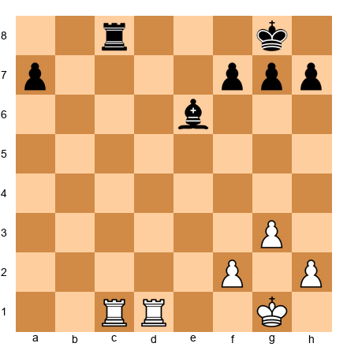

**White to move.** Notice the White king on g1 has a pawn on g3 instead of g2, so it has the escape square g2 if needed. But look at the Black king. It sits on g8, trapped behind pawns on f7, g7, and h7. No escape square on the back rank. Black's rook on c8 is the only piece guarding the 8th rank.

White has two rooks. Black has only one rook defending the back rank. This mismatch is the recipe for a back rank disaster.

**Pause and look:** How can White exploit the weak back rank?

**1. Rxc8+!**

White's rook from c1 captures the Black rook on c8 with check. The White rook on c8 attacks along the 8th rank toward g8. Between c8 and g8, the squares d8, e8, and f8 are all empty. The king is in check.

Can the king escape? No: f8 and h8 are both attacked by the rook along rank 8, and the pawns block f7, g7, h7.

Can anything block? Can anything capture the rook on c8? The bishop on e6 can! A bishop moves diagonally, and e6-d7-c8 is a valid diagonal. So Black plays the only move:

**1...Bxc8**

The bishop captures the rook on c8. The immediate danger seems over. But now the back rank has no rook defending it. The bishop on c8 cannot move along ranks and files, only diagonals.

**2. Rd8#!**

The second rook slides to d8, giving check along rank 8. Between d8 and g8, the squares e8 and f8 are empty. The king on g8 is in check.

Can the king move? f8 and h8 are attacked by the rook along rank 8. The pawns block f7, g7, h7. Can the bishop on c8 help? It sits to the LEFT of the rook on d8, not between the rook and the king. And bishops cannot capture along ranks (only diagonals), so it cannot take the rook on d8.

**Checkmate.**

**The key lesson:** Black's rook was the only piece guarding the back rank. When White sacrificed one rook to remove that defender, the second rook had a clear path to deliver mate. This is called a **deflection sacrifice:** you give up material to lure a defender away from its job.

**Critical position FEN:** `2b3k1/p4ppp/8/8/8/6P1/5P1P/6K1 b - - 0 1` *(after 2. Rd8#)*

---

## Annotated Game 2: The Stalemate Trap

This fragment shows what happens when the winning side gets careless.

**Set up your board to this position:**
White king on h6, White queen on f6, White pawn on g5. Black king on h8. Nothing else.

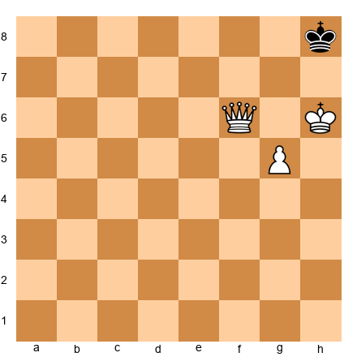

White is completely winning. White has a queen and a pawn, while Black has only a king trapped in the corner. Checkmate should be easy. White has three different checkmates available: Qf8#, Qd8#, and Qg7#.

**Pause and look:** Can you find one of the checkmates? Try before reading on.

The easiest is **Qf8#.** The queen moves to f8, checking the king on h8 along rank 8. The king cannot go to g7 (queen attacks it) or h7 (the White king on h6 controls h7). Nowhere to run. Checkmate.

But what if White does not see the checkmate and plays a "safe-looking" move instead?

**1. Qf7??**

White moves the queen to f7, perhaps thinking about pushing the pawn. But look at what happens to the Black king.

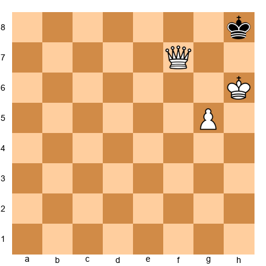

Is the king in check? The queen on f7 attacks along rank 7, the f-file, and diagonals. It attacks g8 (diagonally) and h7 (along rank 7). But it does NOT attack h8 directly. The king is NOT in check.

Can the king move?
- **g8:** The queen attacks g8 (diagonally from f7). ✗
- **g7:** The queen attacks g7 (along rank 7, and the White king controls it too). ✗
- **h7:** The White king on h6 controls h7, and the queen attacks it along rank 7. ✗

No legal moves. No check. **Stalemate!** The game is a draw.

White had checkmate in one move (Qf8#) but played Qf7 instead and accidentally drew. The queen controlled too many squares around the enemy king without actually giving check.

**The lesson:** When you are about to win, look for checkmate FIRST. Do not play "safe" moves that might accidentally remove all your opponent's legal moves.

---

🛑 **Rest Marker.** The annotated games are done. Excellent work following along on your board. Now it is time for exercises. You can do them all at once, or spread them out over several days. There is no rush.

---

## Exercises

### Section A: Is It Check, Checkmate, or Stalemate? (Exercises 2.1–2.10)

For each position, determine whether the king is in check, checkmate, stalemate, or none of these.

---

**Exercise 2.1** ★
**Position:** White king on a1, White rook on d1. Black king on d8. No other pieces. Black to move.

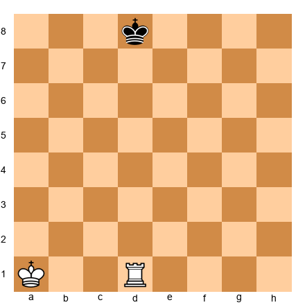

**Task:** Is the Black king in check, checkmate, or stalemate?
**Hint 1:** What does the rook on d1 attack?
**Hint 2:** The rook attacks along the d-file: d2, d3, d4, d5, d6, d7, d8.
**Hint 3:** The king is in check. Can it move to c8, e8, c7, or e7?
**Solution:** **Check.** The rook checks along the d-file. The king escapes to c8, e8, c7, or e7 (none of those squares are attacked by the rook or the White king). Why this works: the rook only controls the d-file and rank 1, so squares on other files are safe.

---

**Exercise 2.2** ★
**Position:** White rook on a8, White king on g1. Black king on g8, Black pawns on f7, g7, h7. Black to move.

**Task:** Is the Black king in check, checkmate, or stalemate?
**Hint 1:** The rook on a8 attacks along the entire 8th rank.
**Hint 2:** Can the king move to f8 or h8? Both are on rank 8.
**Hint 3:** f7, g7, and h7 are blocked by pawns. All rank-8 squares are attacked.
**Solution:** **Checkmate.** The rook checks along rank 8. The king cannot move to f8 or h8 (rook controls rank 8) and the pawns block f7, g7, h7. No piece can block or capture. This is a classic back rank mate.

---

**Exercise 2.3** ★
**Position:** White queen on b6, White king on c1. Black king on a8. No other pieces. Black to move.

**Task:** Is the Black king in check, checkmate, or stalemate?
**Hint 1:** Does the queen on b6 attack a8? Check the b-file, rank 6, and diagonals from b6.
**Hint 2:** a8 is NOT on the b-file, NOT on rank 6, and NOT on any diagonal from b6.
**Hint 3:** The king is not in check. Can it move to a7, b8, or b7?
**Solution:** **Stalemate.** The queen does not attack a8, so the king is not in check. But a7 (queen diagonal), b8 (queen file), and b7 (queen file) are all controlled. No legal moves, no check = stalemate. The game is a draw.

---

**Exercise 2.4** ★
**Position:** White king on a1, White bishop on c4. Black king on f7. No other pieces. Black to move.

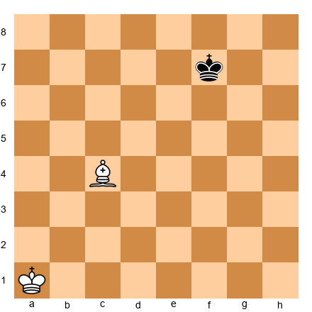

**Task:** Is the Black king in check, checkmate, or stalemate?
**Hint 1:** The bishop on c4 attacks along two diagonals.
**Hint 2:** One diagonal goes c4-d5-e6-f7. Does it reach f7?
**Hint 3:** Yes! The king is in check. But it has many escape squares.
**Solution:** **Check.** The bishop checks along the diagonal c4-d5-e6-f7. The king can escape to f8, e8, g7, e7, g6, or f6 (all safe from the bishop and the distant White king). Not checkmate.

---

**Exercise 2.5** ★
**Position:** White queen on g7, White king on h6. Black king on h8. No other pieces. Black to move.

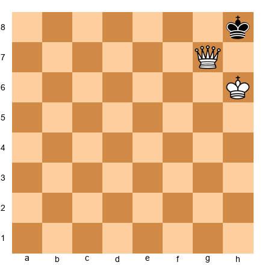

**Task:** Is the Black king in check, checkmate, or stalemate?
**Hint 1:** The queen on g7 attacks diagonally. Does it reach h8?
**Hint 2:** g7 to h8 is one square diagonally. Yes, check.
**Hint 3:** Can the king go to g8? The queen controls g8 (same file). h7? The White king controls h7.
**Solution:** **Checkmate.** The queen checks diagonally. g8 is attacked by the queen (g-file), and h7 is controlled by the White king on h6. No escape, no blocks, no captures.

---

**Exercise 2.6** ★
**Position:** White king on a1, White knight on f6. Black king on e8. No other pieces. Black to move.

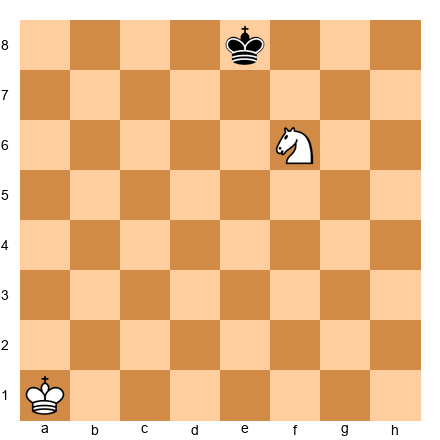

**Task:** Is the Black king in check, checkmate, or stalemate?
**Hint 1:** A knight on f6 attacks which squares?
**Hint 2:** From f6, the knight attacks d5, d7, e4, e8, g4, g8, h5, h7. Does it hit e8?
**Hint 3:** Yes! But can the king escape to f8, d8, or f7?
**Solution:** **Check.** The knight attacks e8. The king escapes to f8, d8, f7, or e7 (the knight attacks d7 but not these squares). Not checkmate.

---

**Exercise 2.7** ★★
**Position:** White rook on b8, White rook on a7, White king on g1. Black king on e8. No other pieces. Black to move.

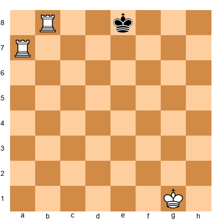

**Task:** Is the Black king in check, checkmate, or stalemate?
**Hint 1:** The rook on b8 attacks along rank 8. Does it reach e8?
**Hint 2:** Between b8 and e8: c8, d8 are empty. Yes, check.
**Hint 3:** Can the king move to d7, f7? The rook on a7 attacks the entire 7th rank.
**Solution:** **Checkmate.** The rook on b8 checks along rank 8 (c8, d8, e8 are all attacked). The rook on a7 controls the entire 7th rank, blocking d7, e7, and f7. The king has no escape: f8 is on rank 8 (attacked), d8 is on rank 8 (attacked). Classic two-rook "ladder" checkmate.

---

**Exercise 2.8** ★★
**Position:** White king on e6, White pawn on e7. Black king on e8. No other pieces. Black to move.

**Task:** Is the Black king in check, checkmate, or stalemate?
**Hint 1:** The pawn on e7 attacks d8 and f8. Does it attack e8?
**Hint 2:** Pawns attack diagonally, never straight ahead. e8 is NOT attacked.
**Hint 3:** The king is not in check. But can it move anywhere? Check d8, f8, d7, f7.
**Solution:** **Stalemate.** The pawn attacks d8 and f8 diagonally. The White king controls d7 and f7. The king on e8 is not in check, but has zero legal moves. Draw! This is the most common stalemate trap in king-and-pawn endings.

---

**Exercise 2.9** ★
**Position:** White king on d1, White pawn on c4. Black king on d5. No other pieces. Black to move.

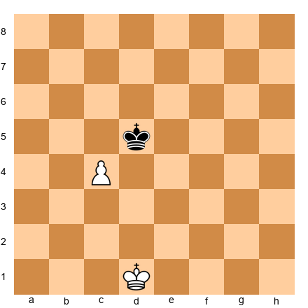

**Task:** Is the Black king in check, checkmate, or stalemate?
**Hint 1:** The pawn on c4 attacks which squares?
**Hint 2:** A White pawn on c4 attacks b5 and d5 (diagonally forward for White).
**Hint 3:** The king is in check from the pawn! But it has many escape squares.
**Solution:** **Check.** The pawn on c4 attacks d5 diagonally. The king can escape to c6, d6, e6, c5, d4, e5, e4, or even capture the pawn with Kxc4. Not checkmate.

---

**Exercise 2.10** ★★
**Position:** White queen on f5, White king on g1. Black king on h8, Black pawn on g7. No other pieces. Black to move.

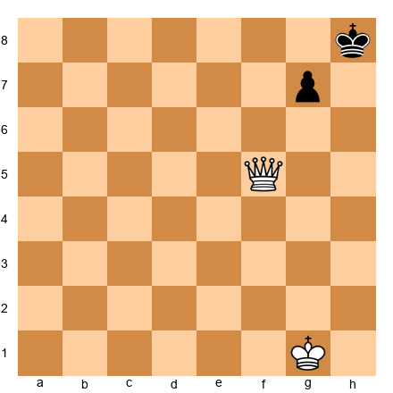

**Task:** Is the Black king in check, checkmate, or stalemate?
**Hint 1:** Does the queen on f5 attack h8?
**Hint 2:** f5 diagonals: e6, d7, etc. on one; g6, h7 on another. f5 along rank 5. f5 along f-file. None reach h8.
**Hint 3:** The king is NOT in check and NOT in stalemate (the g7 pawn can move to g6 or g5).
**Solution:** **None of the above.** The queen does not check the king, so it is not check or checkmate. And Black has legal moves (the g7 pawn can advance to g6 or g5), so it is not stalemate either. It is simply Black's turn to play a normal move.

---

### Section B: Find Checkmate in 1 Move (Exercises 2.11–2.25)

White to move. Find the move that delivers checkmate.

---

**Exercise 2.11** ★
**Position:** White rook on a1, White king on g1. Black king on g8, Black pawns on f7, g7, h7.

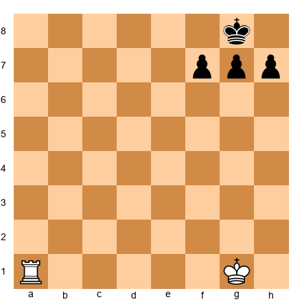

**Task:** Find checkmate in one move.
**Hint 1:** The Black king is trapped behind three pawns on the 8th rank.
**Hint 2:** What piece can reach the 8th rank and give check?
**Hint 3:** The rook can slide all the way from a1 to a8.
**Solution:** **1. Ra8#.** The rook delivers check along the 8th rank. The king cannot go to f8 or h8 (rook controls rank 8). Pawns block f7, g7, h7. Back rank mate!

---

**Exercise 2.12** ★
**Position:** White queen on c1, White king on g1. Black king on g8, Black pawns on f7, g7, h7.

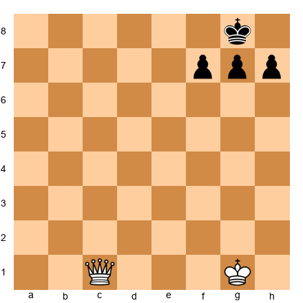

**Task:** Find checkmate in one move.
**Hint 1:** Same back rank weakness as the previous exercise.
**Hint 2:** The queen can also attack along ranks, like a rook.
**Hint 3:** Send the queen to the 8th rank where it checks along the entire row.
**Solution:** **1. Qc8#.** The queen delivers check along rank 8 (c8 to g8 is a clear line). f8 and h8 are controlled. Pawns block the 7th rank.

---

**Exercise 2.13** ★
**Position:** White queen on a2, White king on g1. Black king on h8, Black pawns on g7, h7.

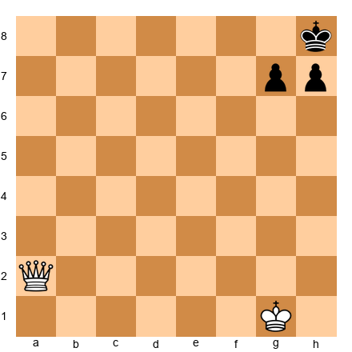

**Task:** Find checkmate in one move.
**Hint 1:** Can the queen reach the 8th rank?
**Hint 2:** The queen on a2 can go to a8 along the a-file.
**Hint 3:** From a8, the queen checks along rank 8 all the way to h8.
**Solution:** **1. Qa8#.** The queen checks along rank 8. g8 is attacked (rank 8), g7 and h7 are blocked by pawns. No escape.

---

**Exercise 2.14** ★
**Position:** White knight on h6, White king on g1. Black king on h8, Black rook on g8, Black pawns on g7, h7.

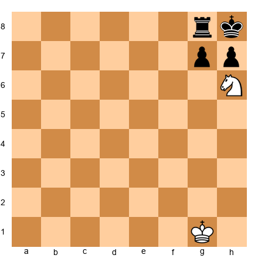

**Task:** Find checkmate in one move.
**Hint 1:** The Black king is boxed in by its own pieces.
**Hint 2:** What piece can jump over obstacles to deliver check?
**Hint 3:** A knight on h6 can jump to f7. From f7, it attacks h8.
**Solution:** **1. Nf7#.** The knight jumps to f7, attacking h8. The king is smothered: g8 has the rook, g7 and h7 have pawns. Classic smothered mate!

---

**Exercise 2.15** ★
**Position:** White rook on d1, White king on b1. Black king on b8, Black pawns on a7, b7, c7.

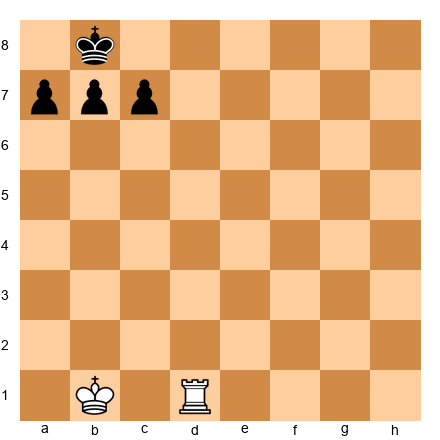

**Task:** Find checkmate in one move.
**Hint 1:** The Black king is trapped behind three pawns, just like a back rank mate.
**Hint 2:** The rook can reach the 8th rank along the d-file.
**Hint 3:** From d8, the rook checks along rank 8 toward b8.
**Solution:** **1. Rd8#.** The rook checks along rank 8. a8 is attacked by the rook. c8 is attacked by the rook. The pawns block a7, b7, c7. Checkmate.

---

**Exercise 2.16** ★
**Position:** White queen on e7, White king on g1. Black king on g8, Black pawns on f7, g7, h7.

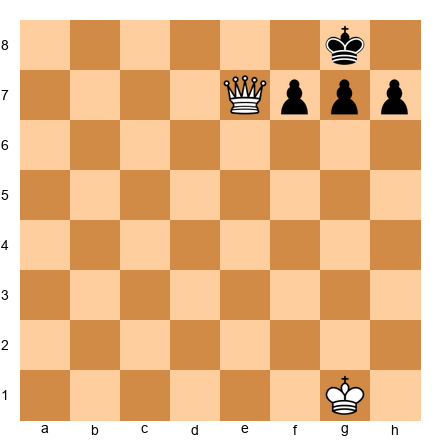

**Task:** Find checkmate in one move.
**Hint 1:** The queen is already very close to the Black king.
**Hint 2:** Where can the queen go to deliver check on the 8th rank?
**Hint 3:** Both Qe8 and Qd8 are checkmate. Find either one.
**Solution:** **1. Qe8#** (or 1. Qd8#). The queen delivers check along rank 8. The king cannot escape: f8 is attacked (rank 8), h8 is attacked (rank 8), and the pawns block the 7th rank. Both Qe8# and Qd8# work.

---

**Exercise 2.17** ★
**Position:** White queen on a1, White king on g1. Black king on g8, Black pawns on f7, g7, h7.

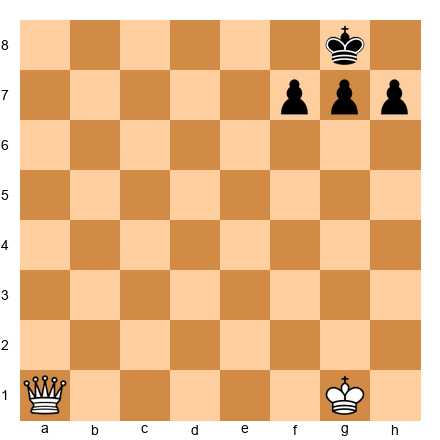

**Task:** Find checkmate in one move.
**Hint 1:** The queen on a1 can reach the 8th rank in one move.
**Hint 2:** Think about the a-file. The queen can slide from a1 to a8.
**Hint 3:** From a8, the queen attacks along the entire 8th rank.
**Solution:** **1. Qa8#.** The queen travels up the a-file to a8, then checks along rank 8 to g8. All escape squares are blocked. Back rank mate with the queen.

---

**Exercise 2.18** ★
**Position:** White queen on a1, White king on g1. Black king on h8, Black pawns on f7, g7, h7.

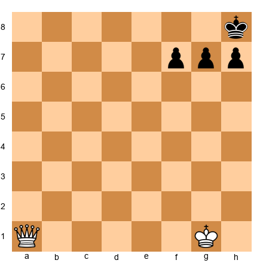

**Task:** Find checkmate in one move.
**Hint 1:** Same idea as 2.17, but the king is on h8 instead of g8.
**Hint 2:** Does Qa8 still work? Check if the queen on a8 attacks h8.
**Hint 3:** From a8, the queen attacks along rank 8: b8, c8, d8, e8, f8, g8, h8. Yes!
**Solution:** **1. Qa8#.** Even with the king on h8, the queen on a8 controls the entire 8th rank. g8 attacked. g7 and h7 blocked by pawns. Checkmate.

---

**Exercise 2.19** ★
**Position:** White queen on d1, White king on g1. Black king on g8, Black pawns on f7, g7, h7.

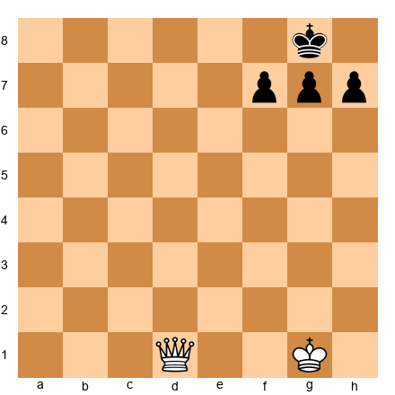

**Task:** Find checkmate in one move.
**Hint 1:** The queen needs to reach the 8th rank.
**Hint 2:** The queen on d1 can go to d8 along the d-file.
**Hint 3:** From d8, the queen checks along rank 8 to g8.
**Solution:** **1. Qd8#.** The queen checks along rank 8. f8 and h8 are both attacked. Pawns block f7, g7, h7. Checkmate.

---

**Exercise 2.20** ★★
**Position:** White king on d6, White pawn on d7, White rook on f1. Black king on d8. No other pieces.

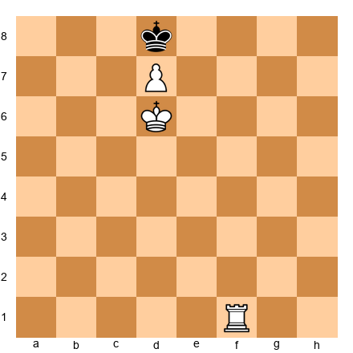

**Task:** Find checkmate in one move.
**Hint 1:** The pawn on d7 attacks c8 and e8 diagonally. The White king controls c7, d7, and e7.
**Hint 2:** The Black king is almost completely boxed in. One rook move finishes it.
**Hint 3:** Where can the rook deliver check on a square the king cannot escape from?
**Solution:** **1. Rf8#.** The rook checks on f8 (along rank 8 toward d8). The king cannot go to c8 (pawn attacks c8), e8 (pawn attacks e8), c7, d7, or e7 (White king controls all three). Checkmate.

---

**Exercise 2.21** ★
**Position:** White rook on h1, White king on a6. Black king on a8. No other pieces.

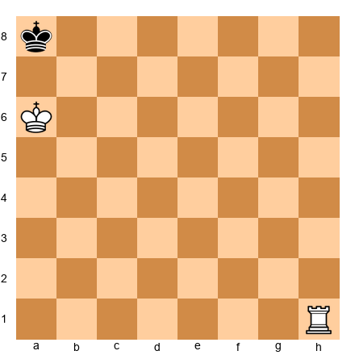

**Task:** Find checkmate in one move.
**Hint 1:** The Black king is in the corner with the White king nearby.
**Hint 2:** The rook on h1 can reach h8 along the h-file.
**Hint 3:** From h8, the rook checks along rank 8. The White king blocks b7.
**Solution:** **1. Rh8#.** The rook checks along rank 8 from h8 to a8. The king cannot go to b8 (rook controls b8) or b7 (White king controls b7 from a6). Checkmate.

---

**Exercise 2.22** ★
**Position:** White rook on c6, White king on b6. Black king on a8. No other pieces.

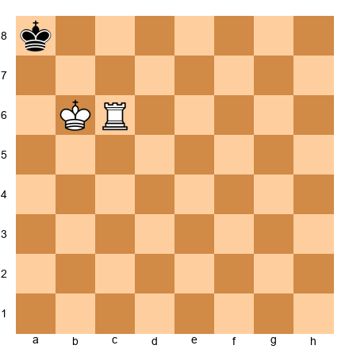

**Task:** Find checkmate in one move.
**Hint 1:** The White king on b6 controls a7 and b7.
**Hint 2:** The rook on c6 can reach c8.
**Hint 3:** From c8, the rook checks along rank 8 to a8.
**Solution:** **1. Rc8#.** The rook checks along rank 8. b8 is attacked by the rook. a7 and b7 are controlled by the White king. Checkmate.

---

**Exercise 2.23** ★★
**Position:** White rook on a7, White queen on b1, White king on g1. Black king on g8, Black pawns on f7, g7, h7.

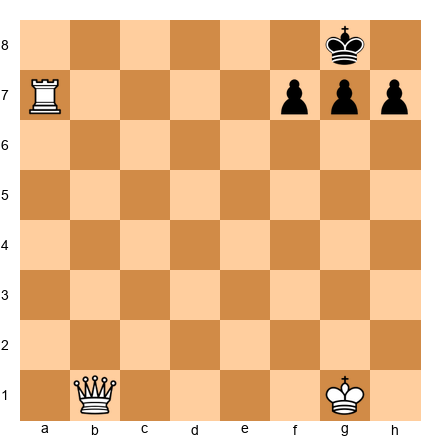

**Task:** Find checkmate in one move.
**Hint 1:** There are two different checkmate moves. Can you find both?
**Hint 2:** The rook on a7 can reach a8 (back rank mate). Or the queen on b1 can reach b8.
**Hint 3:** Both Ra8# and Qb8# deliver checkmate along the 8th rank.
**Solution:** **1. Ra8#** (or 1. Qb8#). Both moves deliver check along rank 8 with the king trapped behind its pawns. Two checkmates for the price of one position!

---

**Exercise 2.24** ★
**Position:** White queen on c3, White king on h1. Black king on g8, Black pawns on f7, g7, h7.

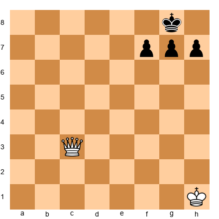

**Task:** Find checkmate in one move.
**Hint 1:** The queen needs to reach the 8th rank.
**Hint 2:** Can the queen go from c3 to c8? Yes, along the c-file.
**Hint 3:** From c8, the queen attacks along rank 8 to g8.
**Solution:** **1. Qc8#.** The queen checks along rank 8. f8 and h8 are attacked. The pawns block the 7th rank. Checkmate.

---

**Exercise 2.25** ★
**Position:** White rook on a2, White king on h1. Black king on h8, Black pawns on f7, g7, h7.

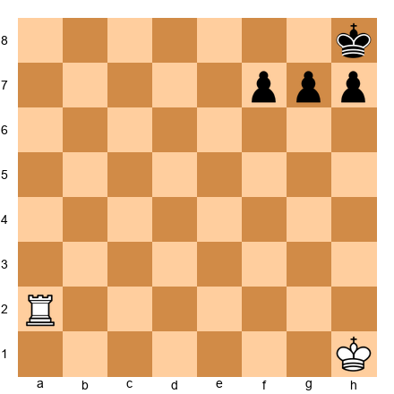

**Task:** Find checkmate in one move.
**Hint 1:** The rook on a2 can reach the 8th rank.
**Hint 2:** The rook travels up the a-file: a2, a3, ..., a8.
**Hint 3:** From a8, the rook checks along rank 8 to h8.
**Solution:** **1. Ra8#.** Back rank mate. The rook checks along the entire 8th rank. g8 is attacked. The pawns block g7, f7, h7. Checkmate.

---

### Section C: How Does the King Escape Check? (Exercises 2.26–2.30)

The king is in check. Find ALL the ways to escape.

---

**Exercise 2.26** ★
**Position:** White king on e1. Black king on e8, Black knight on f3. White to move (White is in check).

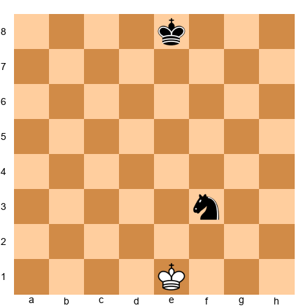

**Task:** The knight on f3 checks the White king. Find all legal moves.
**Hint 1:** Can you block a knight's check?
**Hint 2:** No! Knights jump over pieces, so blocking never works against a knight.
**Hint 3:** The king must move. Which squares around e1 are safe from the knight and the Black king?
**Solution:** The king can move to **d1, d2, f1, or f2.** (e2 is attacked by the knight from f3. Blocking is impossible against a knight.) Why this works: against a knight check, the king must move (unless you can capture the knight).

---

**Exercise 2.27** ★
**Position:** White king on d1. Black king on e8, Black bishop on a4. White to move (White is in check).

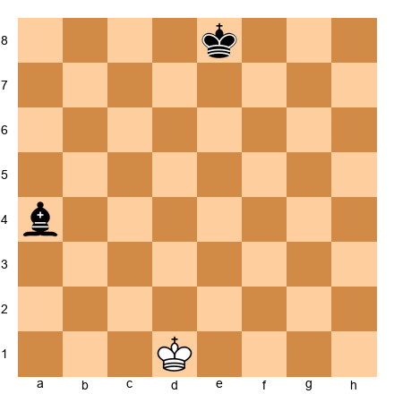

**Task:** The bishop on a4 checks the White king along the diagonal. Find all legal moves.
**Hint 1:** The king can move. But can it also block?
**Hint 2:** White has no pieces to block with (only the king). Can the king capture the bishop?
**Hint 3:** a4 is too far from d1 to capture. The king must move to a safe square.
**Solution:** The king can move to **c1, c2, e1, or e2.** (d2 is still on the a4-d1 diagonal, so the bishop attacks it.) The king cannot reach a4 to capture.

---

**Exercise 2.28** ★★
**Position:** White king on e1. Black king on e8, Black bishop on d2. No other pieces. White to move (in check).

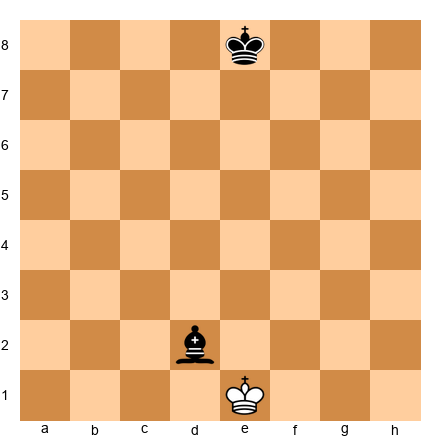

**Task:** The bishop on d2 checks the White king (d2 to e1 is diagonal). Find all legal moves.
**Hint 1:** Can the king capture the bishop?
**Hint 2:** d2 is adjacent to e1. Yes, the king can go to d2 and take the bishop!
**Hint 3:** What other moves are available? Check each adjacent square.
**Solution:** The king can move to **Kxd2** (capturing the bishop), **Kf2, Ke2, Kf1, or Kd1.** Five legal moves! Kxd2 is likely the best because it removes the attacker.

---

**Exercise 2.29** ★
**Position:** White queen on d1, White king on e1. Black king on d8. Black to move (Black is in check).

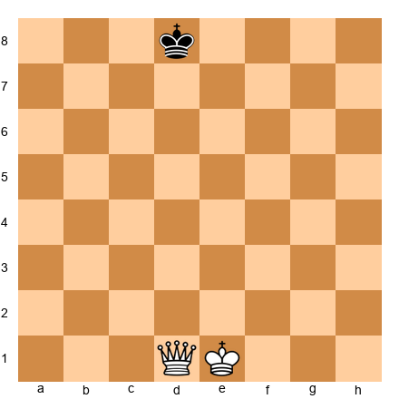

**Task:** The queen on d1 checks the Black king along the d-file. Find all legal moves.
**Hint 1:** Can the king step off the d-file?
**Hint 2:** c8, e8, c7, e7 are all off the d-file. But are any attacked by the queen?
**Hint 3:** The queen on d1 attacks the d-file and also diagonals (e2, f3...) and rank 1. Does it attack c8, e8, c7, or e7?
**Solution:** The king can move to **c8, e8, c7, or e7.** All four squares are off the d-file and not on any queen-controlled line from d1. Four escape routes.

---

**Exercise 2.30** ★★
**Position:** White king on e1, White bishop on f1. Black king on c5, Black rook on a1. White to move (in check).

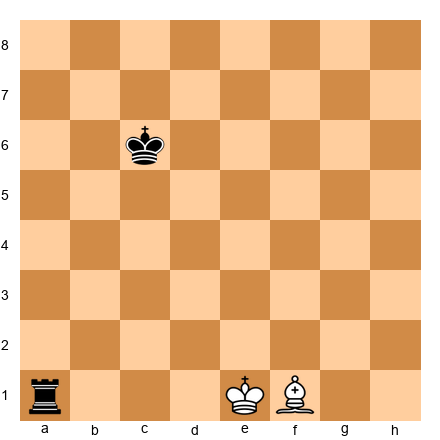

**Task:** The rook on a1 checks the White king along rank 1. Find all legal moves.
**Hint 1:** Can the king move? Can anything block?
**Hint 2:** Kf2 steps off rank 1. Ke2 steps off rank 1. What about the bishop on f1?
**Hint 3:** The king can move to f2 or e2. Can it go to d2? Check if anything attacks d2.
**Solution:** The king can move to **Kf2**, **Ke2**, or **Kd2.** The rook on a1 attacks all of rank 1 and the a-file, but d2 is on rank 2 (not rank 1) and is not on the a-file, so it is safe. All three escape squares are legal. Three escape routes.

---

### Section D: Avoid the Stalemate! (Exercises 2.31–2.35)

White is winning. Find a move that wins the game WITHOUT accidentally stalemating Black.

---

**Exercise 2.31** ★
**Position:** White king on b6, White queen on a5. Black king on a8. No other pieces. White to move.

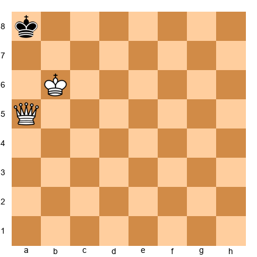

**Task:** Find a checkmate. Be careful: one natural-looking queen move stalemates!
**Hint 1:** Qb6 looks natural (queen next to king for support). But check what happens to Black's moves after Qb6.
**Hint 2:** After Qb6, the king on a8 has no legal moves and is NOT in check. Stalemate!
**Hint 3:** Instead of Qb6, look for a direct checkmate.
**Solution:** **1. Qa7#** (or 1. Kc7#). The queen on a7 checks the king on a8 along the a-file, and the White king controls b7 and b8. Alternatively, 1. Kc7# works: the king moves to c7, and this puts Black in checkmate because... wait, Kc7 does not give check. Let me re-examine. Actually, Kc7 creates a position where Black has no moves: a7 (controlled by queen on a5), b8 (hmm, is b8 controlled?). Since Kc7 does not give check, it could be stalemate. **The safe winning move is 1. Qa7#.** Do NOT play 1. Qb6?? which is stalemate.

---

**Exercise 2.32** ★
**Position:** White king on f6, White queen on e5. Black king on f8. No other pieces. White to move.

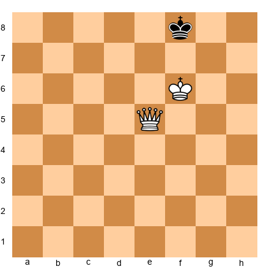

**Task:** Find checkmate. Avoid stalemate.
**Hint 1:** The queen on e5 has many powerful moves. But you need check, not just control.
**Hint 2:** Qe7 looks strong, but does it give check? And does it leave Black with legal moves?
**Hint 3:** Look for a queen move to the 8th rank that delivers checkmate.
**Solution:** **1. Qb8#** (or 1. Qe8#). The queen delivers check along rank 8. The king on f8 cannot go to g8 (queen controls it from rank 8), g7 (queen attacks diagonally or White king controls it), e8 (queen rank 8), e7 (White king controls it from f6). Checkmate. Why this works: the queen and king work together to cover all escape squares while delivering check.

---

**Exercise 2.33** ★★
**Position:** White king on g6, White queen on f5. Black king on h8, Black pawn on g7. No other pieces. White to move.

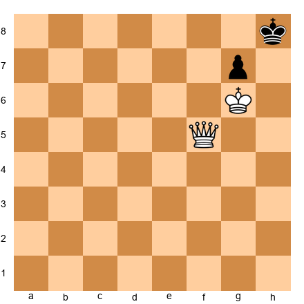

**Task:** Find checkmate. One move stalemates, another checkmates. Choose wisely!
**Hint 1:** Qf7 is tempting (attacks g7 and controls lots of squares). But what happens?
**Hint 2:** After Qf7, does Black have any legal moves? g7 cannot move (queen attacks g7 and queen blocks? Actually queen on f7 doesn't attack g7... wait, f7 to g7 is adjacent along rank 7. YES it does). Then check: Kh8, h7 controlled by Kg6. g8 controlled by Qf7 diagonal. g7 pawn blocked by queen. Stalemate!
**Hint 3:** Instead of Qf7, look for a direct checkmate on f8 or h6.
**Solution:** **1. Qf8#** (or 1. Qc8#). The queen on f8 checks the king on h8 along rank 8 (f8-g8-h8). The king cannot go to g8 (queen controls it), h7 (White king controls h7 from g6), and the g7 pawn blocks that square. Checkmate. Do NOT play 1. Qf7?? which is stalemate.

---

**Exercise 2.34** ★★
**Position:** White king on a6, White queen on e6. Black king on a8. No other pieces. White to move.

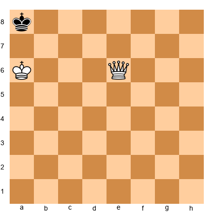

**Task:** Find checkmate. Several queen moves stalemate.
**Hint 1:** Moving the queen too close to a8 might take away all Black's moves without giving check.
**Hint 2:** You need the queen to give CHECK on a square where the king has no escape.
**Hint 3:** Try a queen move that reaches the 8th rank.
**Solution:** **1. Qe8#** (or 1. Qd8# or 1. Qa2#). The queen on e8 checks along rank 8. b8 is attacked by the queen. a7 and b7 are controlled by the White king. Checkmate.

---

**Exercise 2.35** ★
**Position:** White king on f6, White queen on g5. Black king on f8, Black pawn on f7, Black pawn on h7. White to move.

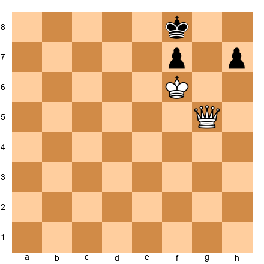

**Task:** Find the fastest checkmate. Do not let Black escape.
**Hint 1:** The queen is very close to the Black king.
**Hint 2:** Which square gives check while covering all escape squares?
**Hint 3:** Qg7 gives check from g7. After Qg7+, is it checkmate?
**Solution:** **1. Qg8#.** The queen moves to g8, checking the king on f8 (adjacent square). The king cannot go to e8 (queen controls rank 8), e7 (White king on f6 controls e7), or f7 (own pawn). The queen also controls g7 from g8. Checkmate.

---

### Section E: Find Checkmate in 2 Moves (Exercises 2.36–2.40)

White to move. Find the two-move sequence that forces checkmate.

---

**Exercise 2.36** ★★
**Position:** The same position from Annotated Game 1. White king on g1, White rook on c1, White rook on d1, White pawns on f2, g3, h2. Black king on g8, Black rook on c8, Black bishop on e6, Black pawn on a7, Black pawns on f7, g7, h7.

**Task:** Find checkmate in two moves (forced).
**Hint 1:** Black's back rank is weak. The rook on c8 is the only guard.
**Hint 2:** Remove the guard! Sacrifice a rook on c8.
**Hint 3:** After Rxc8+ Bxc8, what does the second rook do?
**Solution:** **1. Rxc8+ Bxc8 2. Rd8#.** The first rook sacrifices on c8, forcing the bishop to recapture (the only legal response). Then the second rook delivers back rank mate on d8. The bishop on c8 cannot block or capture because bishops move diagonally, and d8 is not diagonal from c8.

---

**Exercise 2.37** ★★
**Position:** White king on a1, White rook on b1, White rook on c1. Black king on a4. No other pieces.

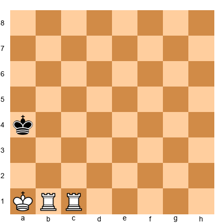

**Task:** Find checkmate in two moves.
**Hint 1:** The two rooks can work together like a staircase.
**Hint 2:** Give check with one rook to push the king toward the edge, then mate with the other.
**Hint 3:** Try Rc4+ first. The king must leave rank 4. Then the other rook delivers.
**Solution:** **1. Rc4+ Ka3 2. Ra4#.** After Rc4+, the king steps to a3 (or Ka5). If ...Ka3, then Ra4# checks along rank 4 and the a-file. The king cannot go to b3 (Rc4 still controls rank 4? No, it moved... actually after Rc4+ Ka3, the rooks are on b1 and c4. Then 2. Ra4#: but where does Ra4 come from? Rb1 to a4? That is not along a rank or file. Let me re-examine.) After 1. Rc4+ Ka3, White plays 2. Rb3#. The rook on b1 moves to b3, checking the king on a3 along the b-file? No, b3 to a3 is along rank 3. So Rb3+ checks along rank 3. King tries a2 (Rb3 controls rank 3, not a2. Ka1 controls a2). a4 (Rc4 controls a4 along rank 4). b2 (Ka1 controls b2? a1 adjacent: a2, b1, b2. YES Ka1 controls b2). So a2 and b2 are controlled by White king, a4 controlled by Rc4. Checkmate. **1. Rc4+ Ka3 2. Rb3#.** The two rooks work as a ladder, taking turns giving check to push the king to the edge.

---

**Exercise 2.38** ★★
**Position:** White king on g6, White queen on f5. Black king on h8, Black pawn on g7. White to move.

**Task:** Find checkmate in one move. Careful: one tempting move is a stalemate trap!
**Hint 1:** Qf7 looks natural, attacking g7. But after Qf7, does Black have any moves?
**Hint 2:** After Qf7, the king has no legal moves and is NOT in check. Stalemate!
**Hint 3:** Instead, deliver check on the 8th rank.
**Solution:** **1. Qf8#** (or 1. Qc8#). The queen checks along rank 8. g8 is attacked. h7 is controlled by the White king. g7 is Black's own pawn. Checkmate. Do NOT play 1. Qf7??, which is stalemate.

---

**Exercise 2.39** ★★
**Position:** White king on c6, White queen on e6. Black king on a8, Black pawn on a7. No other pieces.

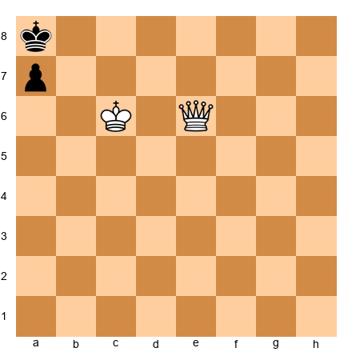

**Task:** Find checkmate. Several queen moves accidentally stalemate.
**Hint 1:** If you play a queen move that takes away all of Black's moves without giving check, it is stalemate.
**Hint 2:** You need the queen to give CHECK on a square where the king cannot escape.
**Hint 3:** Which queen move reaches the 8th rank while the White king covers b7?
**Solution:** **1. Qe8#** (or 1. Qd8#). The queen checks along rank 8. b8 is attacked by the queen. a7 is blocked by Black's own pawn. b7 is controlled by the White king. Checkmate.

---

**Exercise 2.40** ★★★
**Position:** Same as Annotated Game 2 starting position. White king on h6, White queen on f6, White pawn on g5. Black king on h8.

**Task:** Find checkmate in one move. There are three checkmates available. Can you find all three?
**Hint 1:** The queen on f6 can reach many squares. Look for checks on the 8th rank.
**Hint 2:** Qf8#, Qd8#, and Qg7# are all checkmate. Verify each one.
**Hint 3:** After Qg7#: the queen checks from g7 (diagonal to h8). King cannot go to g8 (Qg7 controls it). h7 (controlled by king h6). Checkmate.
**Solution:** **1. Qf8#** (queen checks along rank 8), **1. Qd8#** (queen checks along rank 8), or **1. Qg7#** (queen checks diagonally, king trapped). All three are checkmate. The trap to avoid is 1. Qf7?? which is stalemate. If you found all three, excellent pattern recognition!

---

## Key Takeaways

1. **Check** means the king is under attack and must be answered immediately. There are three escapes: move, block, or capture.
2. **Checkmate** means the king is in check with no escape. The game is over.
3. **Stalemate** means no legal moves and no check. The game is a **draw.**
4. The **back rank mate** is the most common checkmate pattern. Give your king "luft" (an escape square) to prevent it.
5. **Scholar's Mate** works in 4 moves if the opponent ignores the threat to f7. Defend f7 with ...g6 or ...Qe7 to stop it.
6. **Smothered mate** uses a knight against a king boxed in by its own pieces.
7. When winning with a big advantage, **check for stalemate** before every move. Make sure your opponent has at least one legal move unless you are delivering checkmate.
8. When losing, **look for stalemate** tricks. A draw is better than a loss.

---

## Practice Assignment

1. **Set up a board** and practice delivering the back rank mate pattern 5 times. Place the defending king behind three pawns and practice sliding a rook to the back rank.

2. **Play 5 games** on Lichess (lichess.org) or against a friend. In each game, pay special attention to back rank safety. Ask yourself after every move: "Is my back rank safe? Is my opponent's back rank weak?"

3. **Stalemate drill:** Set up a queen and king versus a lone king on a physical board. Practice delivering checkmate without stalemate. Do this at least 3 times until you can do it smoothly.

4. **Scholar's Mate defense:** Play the opening 1. e4 e5 2. Bc4 against a friend or computer. When your opponent plays 3. Qh5, practice defending with 3...g6 or 3...Qe7.

---

## ⭐ Progress Check

Answer these questions to test your understanding:

- [ ] Can you name the three ways to escape check?
- [ ] Can you explain the difference between checkmate and stalemate?
- [ ] Can you set up and deliver a back rank mate?
- [ ] Can you defend against Scholar's Mate?
- [ ] Can you identify when a position is stalemate vs. checkmate?

If you checked all five boxes, you are ready for Chapter 3! If not, review the sections you are unsure about. There is no rush.

---

🛑 **Rest Marker.** You have completed Chapter 2. Outstanding work. You now understand the three most important concepts in chess: check, checkmate, and stalemate. Everything that follows builds on this foundation. Take a break. You have earned it.

*"If you've made it this far, you already understand more about chess than most casual players ever will."*
