# Chapter 3: Special Moves — Castling, En Passant, Promotion

**Rating Range: Beginner (0–500)**

---

> *"You must take your opponent into a deep dark forest where 2+2=5, and the path leading out is only wide enough for one."*
> — Mikhail Tal

---

## What You'll Learn

- How to castle your king to safety (and when you should not)
- The strangest rule in chess: en passant, and exactly when you can use it
- How to promote a pawn into a queen, rook, bishop, or knight
- Why special moves exist and how they change the game
- How to spot moments when a special move wins on the spot

---

## Part 1: Castling

Castling is the only move in chess where two pieces move at the same time. Your king slides two squares toward a rook, and that rook jumps over the king to land on the other side. It looks strange the first time you see it. But once you understand it, you will use it in almost every game.

Castling does two things at once. It tucks your king behind a wall of pawns, keeping it safe. And it brings your rook toward the center, where it can join the fight. That two-for-one deal makes castling one of the best moves you can play in the opening.

There are two types of castling: kingside and queenside.

### Kingside Castling (O-O)

Kingside castling is the most common. Your king moves two squares toward the h-file rook, and that rook hops over to the other side.

**Set up your board:** Place the White king on e1 and a White rook on h1. Remove all pieces between them (f1 and g1 must be empty). Now slide the king from e1 to g1. Then pick up the rook from h1 and place it on f1. That is kingside castling.

For Black, it works the same way on the 8th rank. The king moves from e8 to g8, and the rook moves from h8 to f8.

**Before and after:**

| Piece | Before | After |
|-------|--------|-------|
| King  | e1     | g1    |
| Rook  | h1     | f1    |

Kingside castling is written as **O-O** in chess notation. Two capital letter Os separated by a hyphen.

### Queenside Castling (O-O-O)

Queenside castling works the same way, but toward the a-file rook. The king slides two squares in that direction, and the rook jumps over to the other side.

**Set up your board:** Place the White king on e1 and a White rook on a1. Remove all pieces between them (b1, c1, and d1 must be empty). Slide the king from e1 to c1. Then pick up the rook from a1 and place it on d1.

For Black: the king moves from e8 to c8, and the rook moves from a8 to d8.

**Before and after:**

| Piece | Before | After |
|-------|--------|-------|
| King  | e1     | c1    |
| Rook  | a1     | d1    |

Queenside castling is written as **O-O-O** in chess notation. Three Os.

Notice something: the king always moves exactly two squares when castling, no matter which side. But on the queenside, the rook travels three squares instead of two. That is because there is one extra square between the king and the a-file rook.

### The Five Rules of Castling

Castling is special, and special moves come with rules. All five of these conditions must be true for castling to be legal. If even one fails, you cannot castle.

**Rule 1: The king has not moved yet this game.**
Not even once. If your king moved to f1 on move 3 and then back to e1 on move 4, you have lost the right to castle. Forever. No take-backs.

**Rule 2: The rook has not moved yet this game.**
Same idea. If the rook you want to castle with has moved at any point, castling with that rook is gone. You can still castle with the other rook if it has not moved.

**Rule 3: No pieces between the king and the rook.**
Every square between them must be empty. For kingside castling, that means f1 and g1 (or f8 and g8). For queenside, that means b1, c1, and d1 (or b8, c8, and d8).

**Rule 4: The king is not currently in check.**
You cannot castle out of check. If someone is attacking your king right now, you need to deal with that first. You might be able to castle on a later turn once the check is resolved.

**Rule 5: The king does not pass through or land on a square attacked by an enemy piece.**
This one trips people up. During castling, the king crosses through one square and lands on another. Neither of those squares can be under attack. The rook, however, CAN pass through an attacked square. Only the king's path matters.

Here is a memory trick for the five rules:

> **"My king and rook stay still, the path is clear, I'm not in check, and no one's aiming at where I'm going."**

That single sentence covers all five conditions.

### Why Castle?

Two reasons, and both are important.

**King safety.** In the starting position, your king sits in the center of the board, right in the line of fire. Pieces develop, files open, and suddenly your king is vulnerable. Castling moves it to the side of the board, behind a row of pawns that act like a shield. Most attacks in chess target the king, and a castled king is much harder to attack than one stuck in the center.

**Rook activation.** Your rooks start in the corners, boxed in by knights and pawns. They need open files to be useful. Castling brings a rook toward the center, where it can control important files and support your other pieces. After castling, your rooks can also connect with each other along the back rank, protecting each other.

### When to Castle

A good rule for beginners: **try to castle within your first ten moves.** You do not need to rush it on move 4 or 5, but you should be working toward it. Develop your knights and bishops first (they need to get out of the way anyway), and then castle as soon as the path is clear.

If your opponent is already developing pieces aggressively, castle sooner rather than later. An uncastled king in an open position is an invitation for an attack.

### When NOT to Castle

Sometimes, rarely, castling is not the best choice. Here are a few situations:

- **The position is closed.** If pawns are locked in the center and files are shut, your king may actually be safe in the center. This is uncommon at the beginner level but worth knowing.
- **Castling into an attack.** If your opponent has already pushed pawns toward your kingside and is aiming pieces that way, castling kingside could walk your king into danger. Consider castling the other way, or keeping your king in the center for a moment.
- **The endgame has arrived.** If most of the pieces have been traded off, your king is actually stronger in the center, where it can help fight for pawns. In the endgame, the king is a warrior, not a target.

For now, at your level, castle in almost every game. The rare exceptions will become clear with experience.

🛑 **This is a natural stopping point. Take a break if you need one. The king is safe now, and so are you.**

---

## Part 2: En Passant

En passant is the most confusing rule in chess. If it does not make sense right away, that is completely normal. Read through this section slowly, set up your board, and walk through it step by step. By the end, you will have it.

The name comes from French and means "in passing." It describes a special pawn capture that can only happen under very specific conditions.

### How En Passant Works

Here is the setup. Your pawn is on the 5th rank (that means rank 5 for White, or rank 4 for Black). Your opponent has a pawn on its starting square, two files away or one file away from yours. On their turn, they push that pawn forward two squares, landing it right beside your pawn.

Normally, pawns capture diagonally. And normally, if an enemy pawn lands beside yours, you cannot take it because it is beside you, not diagonally in front of you. But en passant is the exception.

When an opponent's pawn advances two squares and lands directly beside your pawn on the 5th rank, you may capture it **as if it had only moved one square forward.** Your pawn moves diagonally to the square the enemy pawn "passed through," and the enemy pawn is removed from the board.

**Set up your board:** Place a White pawn on e5. Place a Black pawn on d7. Now move the Black pawn two squares forward from d7 to d5. It lands right beside your pawn on e5.

You can now capture en passant. Pick up your White pawn from e5, place it on d6, and remove the Black pawn from d5. Your pawn ends up on d6 (where the Black pawn would have been if it had only moved one square), and the Black pawn on d5 is gone.

That is en passant.

### The One-Move Rule

Here is the part that surprises people: **you can only capture en passant on the very next move.** If you do not take it immediately, the option disappears. You cannot wait a turn and then decide to capture en passant later. It is a "use it or lose it" rule.

This is the single most important thing to remember about en passant. The opportunity exists for exactly one move and then it is gone forever.

### Why Does This Rule Exist?

In the original version of chess, pawns could only move one square forward at a time. The two-square opening advance was added later to speed up the game. But this created a problem: a pawn could use the two-square advance to sneak past an enemy pawn that was already deep in enemy territory.

En passant was invented to fix this. It ensures that a pawn cannot use the two-square advance to dodge capture. If you could have captured the pawn had it only moved one square, you can still capture it, even though it jumped two.

Think of it this way: the pawn tried to sneak past your pawn. En passant is your pawn saying, "I saw that."

### Common Beginner Questions

**"Can I capture en passant whenever two pawns are side by side?"**
No. En passant only works when the enemy pawn has JUST advanced two squares on the previous move. If the pawn reached that square in any other way (moving one square at a time over two turns, for example), en passant does not apply.

**"Can my pawn capture en passant if it is on the 4th rank?"**
No. Your pawn must be on the 5th rank. For White, that is rank 5. For Black, that is rank 4. That is the only rank where en passant can happen.

**"Does en passant come up often?"**
More often than you would expect. Once you know the rule, you will start to see the opportunities. In some games, en passant is the winning move.

**Set up your board for one more example:** Place a White pawn on c5 and a Black pawn on b7. Move the Black pawn from b7 to b5 (two squares). Now your White pawn on c5 can capture en passant. Pick up the White pawn, move it to b6, and remove the Black pawn from b5.

Practice this a few times until the motion feels natural. Place pawns, advance two squares, capture diagonally to the "passed through" square, remove the enemy pawn.

🛑 **Good place to stop and practice. Set up five en passant positions on your board and capture each one. Once it feels automatic, keep reading.**

---

## Part 3: Promotion

When a pawn reaches the other end of the board, something wonderful happens. It transforms into a more powerful piece. This is called promotion, and it is one of the most exciting moments in chess.

### How Promotion Works

When your pawn reaches the 8th rank (for White) or the 1st rank (for Black), you MUST replace it with another piece. You cannot leave it as a pawn. You choose one of four options:

- **Queen** (most common)
- **Rook**
- **Bishop**
- **Knight**

You cannot promote to a king. And you cannot keep it as a pawn. It must become one of the four pieces listed above.

The new piece is placed on the square where the pawn arrived. The pawn is removed and the new piece takes its place. This all happens on a single move.

### Almost Always Choose Queen

The queen is the most powerful piece on the board. It can move in any direction, as far as it wants. In the vast majority of positions, promoting to a queen is the correct choice.

If you are ever unsure what to promote to, pick the queen. You will be right about 99% of the time.

**Set up your board:** Place a White pawn on e7 and a Black king on a8 (out of the way). White's king on g1. Now push the pawn from e7 to e8. Remove the pawn and replace it with a White queen. That is promotion.

### Underpromotion: When a Queen Is NOT the Best Choice

Sometimes, rarely, you should promote to a knight instead of a queen. This is called "underpromotion" because you are choosing a less powerful piece. But there is a reason: a knight can do something a queen cannot. It can give check from squares a queen cannot reach, and it can fork two pieces at once.

If promoting to a knight gives check and forks the enemy king and queen, that is better than getting a queen that does not give check.

**Set up your board:** Place a White pawn on e7, a Black king on c7, and a Black queen on g7. White king on g1.

If you play e8=Q (promote to queen), you get a queen, but the Black queen on g7 is still there. You have no immediate advantage.

If you play e8=N+ (promote to knight with check!), the knight on e8 attacks both the Black king on c7 and the Black queen on g7. The king must move, and then your knight captures the queen. You just won a queen by promoting to a knight instead of a queen.

This is rare, but when it happens, it is brilliant. Keep an eye out for knight promotion forks.

### Can You Have Two Queens?

Yes! If you promote a pawn to a queen, you will have two queens on the board at the same time. There is no limit. If you promote multiple pawns, you could theoretically have nine queens (the original plus eight promoted pawns). That will probably never happen in a real game, but it is legal.

In practice, most games are decided long before a second queen appears. But in endgames where both sides are racing to promote, having a new queen first is often the difference between winning and losing.

**Set up your board:** Place White pawns on a7 and c7, with the White king on e5 and the Black king on h8. Promote both pawns: a8=Q and c8=Q. Now White has two queens and a king against a lone king. That is an overwhelming advantage.

🛑 **Three special moves learned! Excellent work. This is a great place to rest. Come back fresh for the annotated games.**

---

## Annotated Game Fragment 1: The King That Forgot to Castle

This fragment shows what happens when one side castles and the other does not. Watch how king safety decides the game.

**Set up your board with the starting position.**

**1. e4 e5**
Both sides grab a share of the center. Standard and solid.

**2. Nf3 Nc6**
White develops a knight and attacks the e5 pawn. Black defends it with the knight.

**3. Bc4 Nf6**
White develops the bishop to an active square, eyeing the f7 pawn (a common target). Black develops a knight and attacks the e4 pawn.

**4. d3 h6?!**
White plays a solid move, protecting the e4 pawn. Black plays h6, which is not a terrible move, but it is slow. Black should be thinking about development and castling. This pawn move does not help with either.

**5. O-O Bc5**

**Pause and look.** White has castled. The king is tucked safely behind the f2, g2, and h2 pawns. The rook on f1 is now active and ready to work. Meanwhile, Black's king is still in the center on e8. Black has developed one bishop but has not started the castling process.

**6. c3 d6**
White prepares d4 to challenge the center. Black plays a slow move. Black should be castling. Every move spent not castling is a move closer to danger.

**7. d4 exd4**
White opens the center. This is exactly what Black's king does not want. When the center opens, the side with the uncastled king is usually in trouble.

**8. cxd4 Bb6**
The bishop retreats. Black is now three moves away from castling (at minimum: bishop out of the way, then O-O). But the center is open, and White is fully developed.

**9. d5! Ne7**
White pushes the pawn, gaining space and forcing the knight to retreat. Black is getting squeezed.

**10. Nc3 Ng4?**

**Pause and look.** Black sends the knight on an adventure instead of castling. This is a classic beginner mistake: going for an attack before your king is safe. Black should have played O-O this move.

**11. h3 Nf6 12. Bg5!**

**Set up your board with this position.**

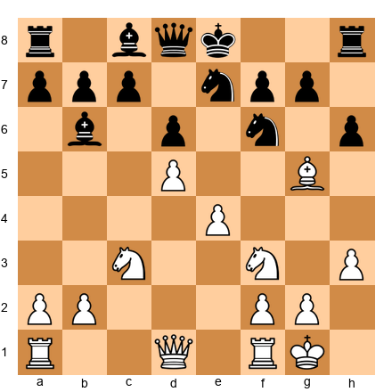

White pins the knight on f6 to the queen. Everything White has done has been purposeful: develop, castle, open the center, attack. Black's king is still on e8, and now the pin makes castling even harder. If Black castles kingside, the pin on the knight creates tactical problems.

This game illustrates a simple truth: **the side that castles first usually controls the game.** White castled on move 5. Black never castled at all. By move 12, White has a dominant position and Black is struggling to survive.

The lesson: castle early. Do not get distracted.

---

## Annotated Game Fragment 2: The Promotion Race

This fragment shows a pawn endgame where both sides race to promote. The side that promotes first, with the right timing, wins.

**Set up your board.**

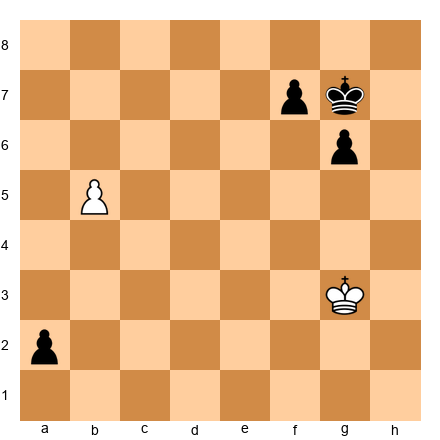

**Position:** White has a pawn on b5, king on g3. Black has a pawn on a2, king on g7, and a pawn on g6. Both sides have passed pawns racing toward promotion.

**Pause and look.** White's pawn on b5 needs three moves to promote (b6, b7, b8). Black's pawn on a2 needs just one move to promote (a1). But it is White's turn.

**1. b6 a1=Q**
White pushes. Black promotes! Black now has a queen. Things look bad for White, right?

**2. b7**
Not so fast. White's pawn is on b7, one square from promotion. Black has a brand new queen but needs to stop the pawn.

**2...Qa5**

**Pause and look.** The queen needs to get in front of the pawn or give check. Qa5 does not stop b8=Q. Can Black stop it?

**3. b8=Q**
White promotes too! Now both sides have queens.

**Set up your board with the new position.**

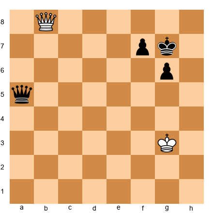

This is now a queen endgame. Black promoted first but could not stop White's pawn. White promoted second but is now equal in material.

The lesson here is about **timing.** In a promotion race, it is not always about who promotes first. It is about what you can do with your new queen. Can you give check? Can you stop the other pawn? Can you create threats?

In this position, the game is roughly equal, with both sides having a queen and king with one pawn. But imagine if White had promoted with check, forcing the Black king to move before Black's queen could set up. That small advantage in timing can decide the game.

**Key takeaway from both fragments:**
1. Castle early to protect your king (Fragment 1).
2. In pawn races, every tempo matters. Count the moves before promoting (Fragment 2).

🛑 **Take a break before the exercises. Get a drink, stretch, and come back ready to solve puzzles.**

---

## Exercises

### Castling Exercises

**Exercise 3.1** ★
**Position:** White: King on e1, Queen on d1, Bishop on f1, Knight on g1, Rook on h1, pawns on d2, e4, f2, g2, h2. Black: King on e8 with a standard setup minus the e-pawn.

**Task:** Can White castle kingside right now?
**Hint 1:** Look at the squares between the king on e1 and the rook on h1.
**Hint 2:** What piece is sitting on f1?
**Hint 3:** For castling, every square between king and rook must be empty.
**Solution:** **No.** The bishop on f1 is between the king and the rook. White cannot castle kingside until the bishop moves. **Why this works:** Rule 3 says no pieces can be between the king and the rook.

---

**Exercise 3.2** ★
**Position:** White: King on e1, Rook on h1, Bishop on d3, Knight on f3, pawns on a2 through d2, f2 through h2. Black: King on e8 with pieces developed.

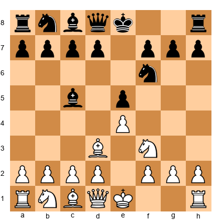

**Task:** Can White castle kingside right now?
**Hint 1:** Check the squares between the king and the h1 rook.
**Hint 2:** Is f1 empty? Is g1 empty?
**Hint 3:** Are all five castling conditions met?
**Solution:** **Yes!** The path is clear (f1 and g1 are empty), the king and rook have not moved, the king is not in check, and no enemy piece attacks f1 or g1. White can castle with O-O. **Why this works:** All five conditions are satisfied.

---

**Exercise 3.3** ★
**Position:** White: King on e1, Rook on h1, Bishop on d3, Knight on f3 (f1 and g1 are empty). Black: King on e8, Bishop on b4 giving check along the b4-e1 diagonal.

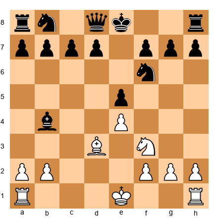

**Task:** Can White castle kingside right now?
**Hint 1:** Is the White king currently under attack?
**Hint 2:** Look at the Black bishop on b4. What diagonal does it control?
**Hint 3:** The diagonal b4-c3-d2-e1 reaches the king.
**Solution:** **No.** The Black bishop on b4 is giving check along the b4-c3-d2-e1 diagonal. You cannot castle while in check (Rule 4). White must deal with the check first. **Why this works:** You must resolve check before you can castle.

---

**Exercise 3.4** ★★
**Position:** White: King on e1, Rook on h1 (f1 and g1 empty). Black: King on e8, Bishop on b5 aiming at the a6-f1 diagonal.

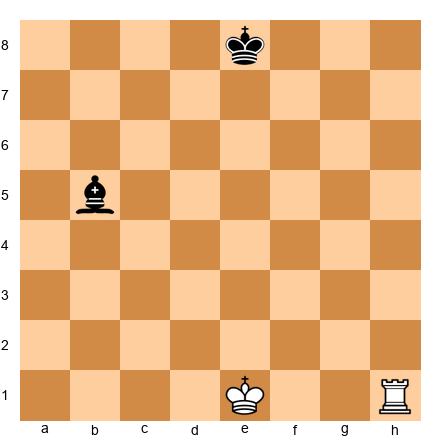

**Task:** Can White castle kingside?
**Hint 1:** The king is not in check. Good. But look at where the king travels during castling.
**Hint 2:** The king moves from e1 through f1 to g1. Is f1 safe?
**Hint 3:** The Black bishop on b5 controls the diagonal b5-c4-d3-e2-f1.
**Solution:** **No.** The Black bishop on b5 attacks f1. When castling kingside, the king passes through f1. Rule 5 says the king cannot pass through an attacked square. **Why this works:** Even though the king is not in check, it would move through danger on f1.

---

**Exercise 3.5** ★★
**Position:** White: King on e1, Rook on h1, Knight on f3 (g1 is empty). Black: King on e8, Rook on g8 controlling the g-file.

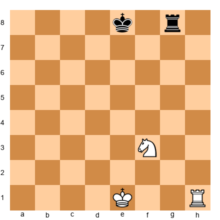

**Task:** Can White castle kingside?
**Hint 1:** The king would move from e1 to g1. Is g1 safe?
**Hint 2:** Look at the Black rook on g8. What file does it control?
**Hint 3:** The rook controls the entire g-file, including g1.
**Solution:** **No.** The Black rook on g8 attacks g1 through the open g-file. When castling, the king would land on g1, which is under attack. Rule 5 prohibits this. **Why this works:** The king cannot land on a square controlled by an enemy piece.

---

**Exercise 3.6** ★★
**Position:** White: King on e1, Rook on a1 (b1, c1, and d1 are empty). Black: King on e8, Rook on b3 controlling the b-file.

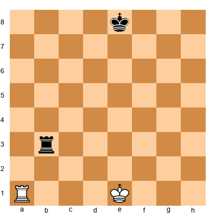

**Task:** Can White castle queenside?
**Hint 1:** The Black rook on b3 controls the b-file, including b1. Does this prevent queenside castling?
**Hint 2:** During queenside castling, which squares does the KING pass through? (Not the rook, the king.)
**Hint 3:** The king moves from e1 through d1 to c1. It does not pass through b1.
**Solution:** **Yes!** This is a common trick question. The rook on b3 attacks b1, but the KING never passes through or lands on b1. The king travels e1, d1, c1. Only the rook passes through b1. Rule 5 only applies to the king's path, not the rook's path. **Why this works:** The rook can pass through attacked squares; only the king's squares matter.

---

**Exercise 3.7** ★★
**Position:** White: King on e1, Rook on h1 (f1 and g1 empty). However, the game record shows that White's rook started on h1, moved to h3 on move 5, and returned to h1 on move 8.

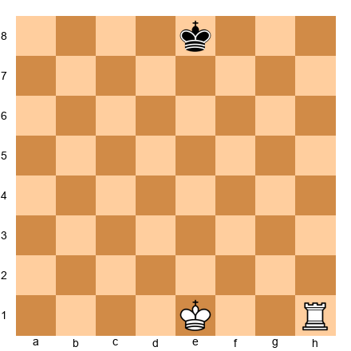

**Task:** Can White castle kingside?
**Hint 1:** The rook is on h1 and the king is on e1. The path is clear. But look at the game record.
**Hint 2:** Has the rook moved during this game?
**Hint 3:** Once a rook moves, castling rights with that rook are permanently lost, even if the rook returns to its starting square.
**Solution:** **No.** Even though the rook is back on h1, it moved earlier in the game. Rule 2 requires the rook to have NEVER moved. There are no take-backs. The castling right is gone forever. Notice the FEN shows "-" for castling rights, confirming this. **Why this works:** Castling tracks the entire game history, not just the current position.

---

**Exercise 3.8** ★★
**Position:** White: King on e1, Rook on h1 (f1 and g1 empty). Black: King on e8, Queen on d6. The position looks a bit scary with Black's queen in the center, but study the squares carefully.

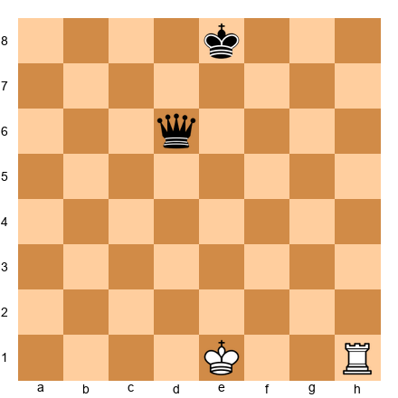

**Task:** Can White castle kingside?
**Hint 1:** Is the king in check? What squares does the Black queen on d6 attack?
**Hint 2:** The queen controls the d-file, the 6th rank, and several diagonals. Does it attack e1, f1, or g1?
**Hint 3:** Check each square: e1 (king is here, not under attack from d6), f1 (not on the queen's rank, file, or any diagonal from d6), g1 (not on any line from d6).
**Solution:** **Yes!** The Black queen on d6 looks threatening, but it does not attack e1, f1, or g1. The king is not in check, the path is clear, and no square is attacked. Castling is legal. **Why this works:** Always check the specific squares, not just how "scary" the enemy piece looks. Positions can be deceptive.

---

### En Passant Exercises

**Exercise 3.9** ★
**Position:** White pawn on e5. Black has just played d7-d5 on the previous move, and the Black pawn now sits on d5, right beside your pawn.

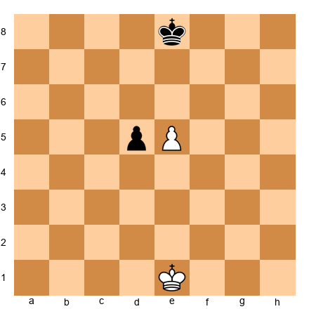

**Task:** Is en passant legal for White?
**Hint 1:** Is your pawn on the 5th rank?
**Hint 2:** Did the enemy pawn just advance two squares?
**Hint 3:** Look at the FEN. The en passant target square is listed as "d6."
**Solution:** **Yes!** Your pawn is on the 5th rank (e5), and Black's pawn just advanced two squares from d7 to d5. You can capture en passant with exd6, moving your pawn from e5 to d6 and removing the Black pawn from d5. **Why this works:** All en passant conditions are met, and the FEN confirms the target square is d6.

---

**Exercise 3.10** ★
**Position:** White pawn on e5, Black pawn on d5. The position looks identical to Exercise 3.9, but Black's pawn moved to d5 THREE moves ago, not on the last move.

**Task:** Is en passant legal for White?
**Hint 1:** When did the Black pawn arrive on d5?
**Hint 2:** En passant has a strict timing requirement. What is it?
**Hint 3:** Look at the FEN. What does the en passant field show?
**Solution:** **No.** The position looks the same as 3.9, but the Black pawn moved to d5 several moves ago. En passant can only be captured on the very next move after the two-square advance. The FEN confirms this: the en passant field shows "-" (no en passant available). **Why this works:** En passant is "use it or lose it." Miss your chance and it is gone.

---

**Exercise 3.11** ★★
**Position:** White pawns on c5 AND e5. Black has just played d7-d5. The Black pawn on d5 is beside BOTH White pawns.

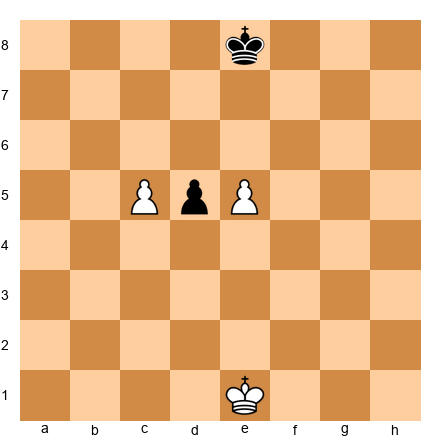

**Task:** Can White capture en passant? If so, with which pawn?
**Hint 1:** Both the c5 and e5 pawns are on the 5th rank, beside the d5 pawn.
**Hint 2:** Both pawns meet the en passant conditions.
**Hint 3:** White can choose either one, but must pick only one.
**Solution:** **Yes, with either pawn!** White can play cxd6 (moving the c5 pawn to d6) OR exd6 (moving the e5 pawn to d6). Both captures are legal en passant. You must choose one. You cannot capture with both. **Why this works:** Any pawn on the 5th rank that is adjacent to the pawn that just advanced two squares can capture en passant.

---

**Exercise 3.12** ★★
**Position:** White King on f5, White pawn on e5. Black King on e8, Black rook on h5, Black pawn has just played g7-g5, landing beside the White pawn.

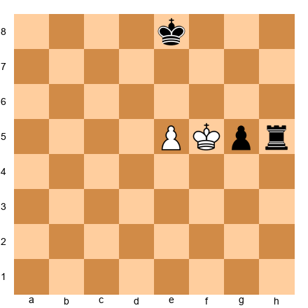

**Task:** Can White capture en passant with exg6?
**Hint 1:** All the normal en passant conditions look met. But is there something else to check?
**Hint 2:** What happens to the 5th rank after the pawn on e5 moves to g6 and the pawn on g5 is removed?
**Hint 3:** The rook on h5 would have a clear line to the king on f5 along the 5th rank.
**Solution:** **No!** If White plays exg6 en passant, the pawn leaves e5 and the captured pawn is removed from g5. This opens the 5th rank completely, and the Black rook on h5 would attack the White king on f5. You can never make a move that leaves your own king in check, not even en passant. **Why this works:** The "no exposing your king to check" rule overrides everything else, including en passant.

---

**Exercise 3.13** ★
**Position:** White pawn on d5, Black pawn on e5. The pawns are side by side on the 5th rank. But it is not Black's pawn that just moved. Black played Ng8-f6 last move.

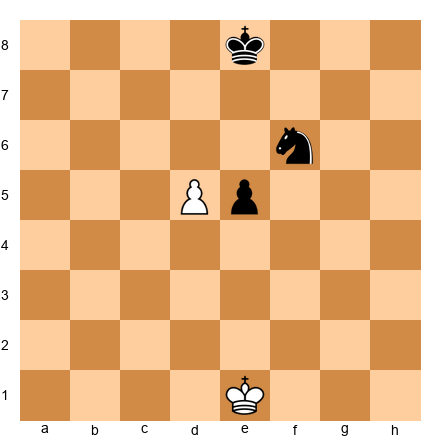

**Task:** Is en passant legal for White?
**Hint 1:** The pawns are beside each other. But what was Black's last move?
**Hint 2:** En passant requires the enemy pawn to have JUST advanced two squares.
**Hint 3:** Black's last move was a knight move, not a pawn move. The en passant field is "-".
**Solution:** **No.** Even though the pawns are side by side on the 5th rank, Black's pawn did not just advance two squares. En passant is only triggered by an immediate two-square pawn advance. Since Black's last move was Ng8-f6 (a knight move), no en passant is available. **Why this works:** The trigger for en passant is the two-square advance itself, not the resulting position.

---

### Promotion Exercises

**Exercise 3.14** ★
**Position:** White: King on g1, pawn on d7. Black: King on e8, Rook on b8.

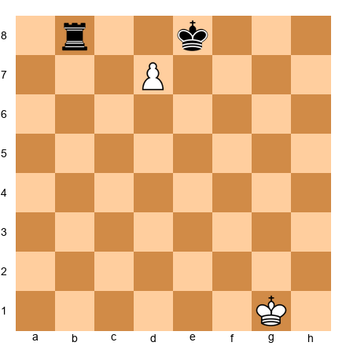

**Task:** White's pawn is one square from promotion. What should it promote to?
**Hint 1:** What is the strongest piece?
**Hint 2:** Does promoting to a queen create any problems here (stalemate, etc.)?
**Hint 3:** d8=Q+ gives check and attacks the rook on b8.
**Solution:** **Queen!** Play d8=Q+. The new queen gives check to the Black king and simultaneously attacks the rook on b8. After the king moves, White captures the rook and has a queen vs. nothing. **Why this works:** The queen is the strongest piece, and here it gives check while winning the rook.

---

**Exercise 3.15** ★★
**Position:** White: King on g1, pawn on e7. Black: King on c7, Queen on g7.

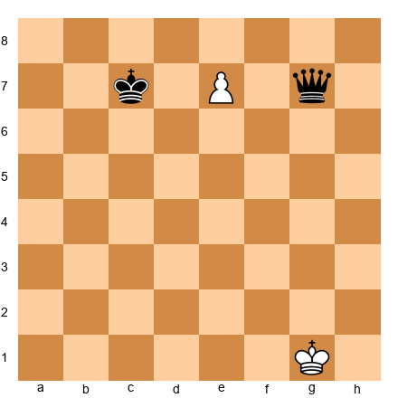

**Task:** What should the pawn promote to?
**Hint 1:** If you promote to a queen, do you win anything right away?
**Hint 2:** What piece can attack two squares at once in an L-shape?
**Hint 3:** A knight on e8 attacks both c7 and g7.
**Solution:** **Knight!** Play e8=N+. The knight on e8 gives check to the king on c7 and simultaneously attacks the queen on g7. This is a fork! The king must move, and then White plays Nxg7, winning the queen. Promoting to a queen would NOT create this fork. **Why this works:** The knight is the only piece that can fork from e8 to both c7 and g7. Underpromotion wins material.

---

**Exercise 3.16** ★
**Position:** White: King on h1, pawn on a7. Black: King on h8, no other pieces.

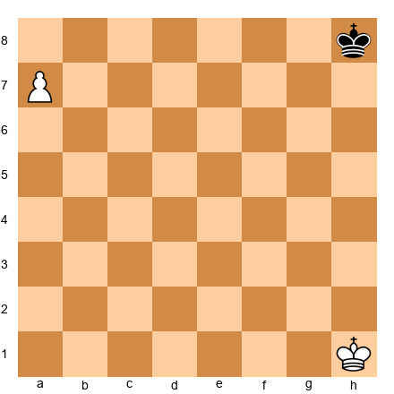

**Task:** What should the pawn promote to?
**Hint 1:** There are no enemy pieces to worry about.
**Hint 2:** You want the strongest possible piece.
**Hint 3:** A new queen will make checkmating the lone king straightforward.
**Solution:** **Queen!** Play a8=Q. With a queen and king against a lone king, checkmate is simple. There is no reason to underpromote here. The queen is always correct when there are no tricks to worry about. **Why this works:** When in doubt, promote to a queen. It is correct the vast majority of the time.

---

**Exercise 3.17** ★★
**Position:** White: King on g2, pawn on f7. Black: King on d6, Rook on c7.

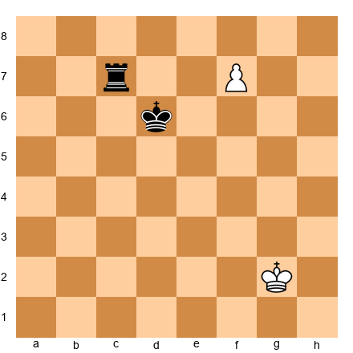

**Task:** What should the pawn promote to?
**Hint 1:** If f8=Q, the new queen is powerful, but check whether the rook can capture or trade immediately.
**Hint 2:** What if you promote to a knight? Where does a knight on f8 give check?
**Hint 3:** A knight on f8 attacks d7 and e6. The king on d6 can reach e6 in one move, but d7 is right next to the king. Does Nf8 fork anything?
**Solution:** **Knight!** Play f8=N+. The knight on f8 attacks e6 and d7. The king on d6 is adjacent to d7, which means... wait, does Nf8 check Kd6? A knight on f8 attacks d7, e6, g6, and h7. The king on d6 is NOT directly attacked (d6 is not a knight-hop from f8). So Nf8 is NOT check. In that case, **Queen** is correct: f8=Q. The queen on f8 is a powerful piece. If Black plays Rxf7+, White recaptures with Qxf7, and White has a queen against nothing. Actually, f8=Q puts pressure on the board, and after any rook move, White's queen dominates. **Why this works:** Always check if underpromotion gives a concrete advantage (check, fork, mate). If it does not, promote to queen.

---

### Find the Winning Move Exercises

**Exercise 3.18** ★
**Position:** White: King on e1, Rook on h1, Knight on f3, Bishop on c4, pawns on d4, e5, f2, g2, h2. Black: Queen on h4, Knight on g4, threatening Qxf2 mate.

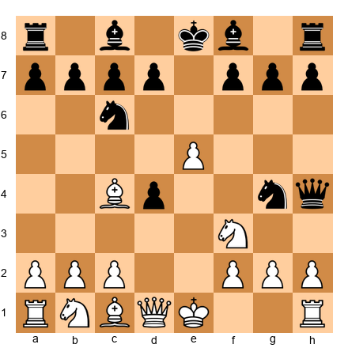

**Task:** Find the best move for White. Your king is in danger, but you have a special move available.
**Hint 1:** Your king is on e1 with f1 and g1 empty.
**Hint 2:** Black is threatening Qxf2#. You need to move your king immediately.
**Hint 3:** Castling moves the king to g1, behind the pawn wall, escaping all threats.
**Solution:** **O-O!** Castle kingside. The king escapes to g1, safely behind the f2, g2, and h2 pawns. Black's attack fizzles because the queen and knight cannot reach the king behind the pawn shield. The rook on f1 is now also active. **Why this works:** Castling solves both problems at once: king safety and piece development. It is the best defensive move on the board.

---

**Exercise 3.19** ★★
**Position:** White: King on g1, pawns on d5, f2, g2, h2. Black: King on g8, pawn has just played c7-c5, pawns on f7, g7, h7.

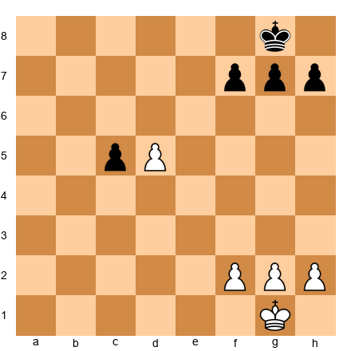

**Task:** Find the best move for White.
**Hint 1:** Black just played c7-c5. Your pawn is on d5. Does this trigger anything?
**Hint 2:** En passant! dxc6 captures the pawn and puts your pawn on c6.
**Hint 3:** A pawn on c6 is a dangerous passed pawn, only two squares from promotion.
**Solution:** **dxc6 (en passant)!** Capture the c5 pawn en passant. Your pawn lands on c6, creating a powerful passed pawn that is just two squares from the 8th rank. Black will struggle to stop it. **Why this works:** En passant here does not just capture a pawn. It creates a winning passed pawn. Always look for en passant opportunities that create strategic advantages.

---

**Exercise 3.20** ★
**Position:** White: King on e6, pawn on d7. Black: King on g8, Rook on a8.

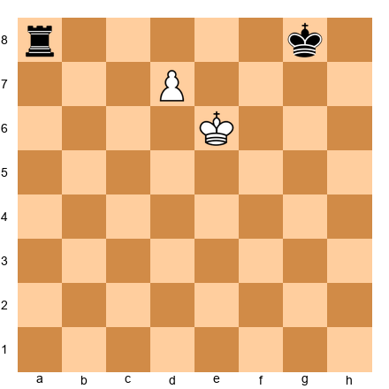

**Task:** Find the winning move for White.
**Hint 1:** The pawn on d7 is one square from promotion.
**Hint 2:** Push it! What should you promote to?
**Hint 3:** d8=Q wins a queen. The Black rook cannot stop it.
**Solution:** **d8=Q!** Promote to queen. The new queen dominates the board. The Black rook on a8 cannot capture on d8 because the White king on e6 protects that square (e6 to d7 is adjacent, and d8 is adjacent to... actually, let's check: Ke6 protects d7, but does it protect d8? e6 to d8 is a knight hop, not an adjacent square. So the queen on d8 is not directly protected by the king.) However, after d8=Q, White has a queen versus a rook, which is a huge material advantage. **Why this works:** A queen is worth about 9 points, a rook about 5. This material advantage is winning.

---

**Exercise 3.21** ★★
**Position:** White: King on e1, Rook on h1, Rook on a1, Bishop on g5 pinning a Black knight on f6, Knight on c3, pawns on d4, e4, f2, g2, h2. Black: King on e8, Queen on d7, Rook on a8, Rook on h8, Knight on f6, Bishop on e7, pawns on a7, b7, c7, d6, g7, h7.

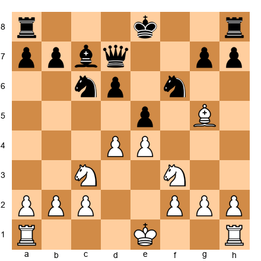

**Task:** White has an interesting castling opportunity. Find the best move.
**Hint 1:** White can castle either kingside or queenside. Which one puts more pressure on Black?
**Hint 2:** Look at the d-file. After queenside castling, the rook lands on d1, directly facing Black's queen on d7.
**Hint 3:** O-O-O puts the rook on d1 with tempo, pressuring the queen.
**Solution:** **O-O-O!** Castle queenside. The king goes to c1 (safe), and the rook lands on d1, putting immediate pressure on the Black queen on d7 along the semi-open d-file. This is castling "with tempo" because it gains time by threatening the queen. Black must respond to the pressure on d7 before doing anything else. **Why this works:** The best moves in chess do two things at once. This castle tucks the king to safety AND creates an immediate threat.

---

**Exercise 3.22** ★★
**Position:** White: King on g1, pawns on f5, g3, h4. Black: King on g8, pawns on f7, g7, h7. Black has just played g7-g5, trying to challenge White's pawn chain.

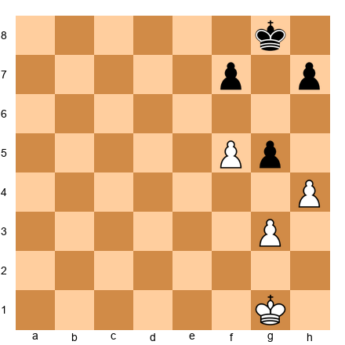

**Task:** Find the best move for White. Look carefully at the pawn structure.
**Hint 1:** Black just played g7-g5. Your pawn is on f5. What special capture is available?
**Hint 2:** fxg6 en passant. But is it good?
**Hint 3:** After fxg6, you also threaten gxh7+ or g7, creating two connected passed pawns.
**Solution:** **fxg6 (en passant)!** Capture en passant. After fxg6, White threatens gxh7 and gxf7+. Black cannot defend both sides. For example, after fxg6 fxg6, hxg5, White's g-pawn becomes a dangerous passer. Alternatively, after fxg6 hxg6, White plays h5, creating a passed pawn on the h-file. **Why this works:** The en passant capture blows open Black's pawn structure and creates winning passed pawns.

---

**Exercise 3.23** ★★
**Position:** White: King on a1, pawn on b7. Black: King on d8, Queen on a7, Rook on c8.

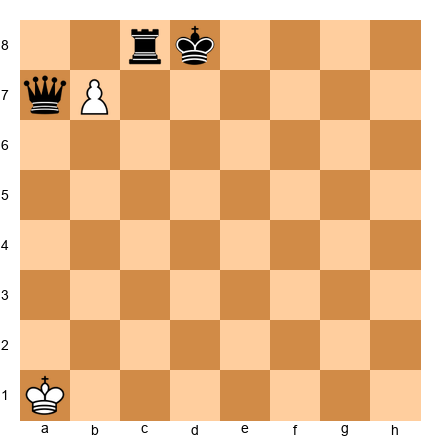

**Task:** The pawn on b7 is ready to promote, but Black's queen on a7 and rook on c8 are defending. Find the winning move.
**Hint 1:** b8=Q would be met by Rxc8... wait, no: b8=Q and the queen is on b8 while the rook is on c8. Can the rook capture?
**Hint 2:** What if you promote to knight? Where does a knight on b8 attack?
**Hint 3:** A knight on b8 attacks a6, c6, and d7. The king is on d8, adjacent to d7. Is that check?
**Solution:** **bxc8=Q+!** The pawn captures the rook on c8 and promotes to a queen with check. The king on d8 must move (Ke7 or Kd7). White now has a queen and is winning. Note that b8=Q (without capturing) fails because Rxb8 simply takes the new queen, and b8=N does not give check since a knight on b8 attacks a6, c6, and d7 — none of which is the king's square d8. The key is the capture-promotion. **Why this works:** Combining a capture with promotion gives White a huge material advantage.

---

**Exercise 3.24** ★
**Position:** White: King on e1, Rook on a1, Rook on f1, Queen on d2, Knight on c3, pawns on a2, b2, c2, e4, f2, g2, h2. Black has a balanced position.

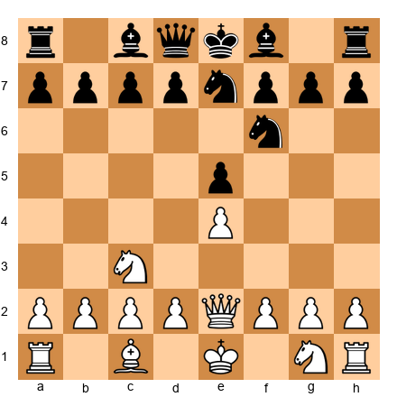

**Task:** Can White castle in this position? Examine both kingside and queenside.
**Hint 1:** For queenside castling, check if b1, c1, and d1 are empty.
**Hint 2:** Look at the first rank: Ra1, empty b1, Bc1... the bishop on c1 is in the way.
**Hint 3:** White cannot castle queenside right now because of the bishop on c1.
**Solution:** **White cannot castle in this position.** The bishop on c1 blocks queenside castling, and the knight on g1 blocks kingside castling. White needs to develop these pieces first. The lesson: develop your minor pieces (bishops and knights) early so that castling becomes available. **Why this works:** Rule 3 requires all squares between king and rook to be empty.

---

**Exercise 3.25** ★★
**Position:** White: King on e3, pawn on a6. Black: King on e6, pawn on h4. No other pieces. Both sides have passed pawns racing to promote.

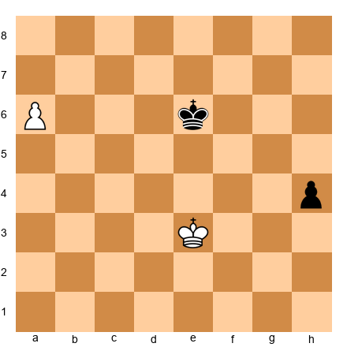

**Task:** Count the moves. Can White promote the a-pawn before Black promotes the h-pawn? Who wins the race?
**Hint 1:** White's pawn on a6 needs two moves to promote: a7, then a8=Q.
**Hint 2:** Black's pawn on h4 needs three moves to promote: h3, h2, h1=Q.
**Hint 3:** White promotes in two moves, Black in three. White promotes first! But then White needs to use the new queen to stop Black's pawn.
**Solution:** White wins the race. **1. a7 h3 2. a8=Q h2.** White has a queen. Now **3. Qf3!** (or any move that stops the h-pawn). The queen easily blocks the h-pawn and eventually captures it. White then uses the queen and king to deliver checkmate. **Why this works:** In promotion races, count the moves. The side that promotes first usually wins, as long as the new queen can stop the opponent's pawn. One tempo ahead is all it takes.

---

## Key Takeaways

1. **Castling** protects your king and activates your rook in a single move. Try to castle within your first ten moves in every game.

2. **All five castling conditions** must be met: king has not moved, rook has not moved, no pieces between them, not in check, and the king does not pass through or land on an attacked square.

3. **En passant** is a special pawn capture that can only happen immediately after an opponent's pawn advances two squares to land beside yours. It is a "use it or lose it" rule.

4. **Promotion** transforms a pawn into a queen, rook, bishop, or knight when it reaches the last rank. Promote to a queen in almost every situation.

5. **Underpromotion to a knight** is the most common exception, usually because it creates a fork or gives check.

---

## Practice Assignment

Complete these tasks with a real board or on a chess website:

1. **Castling drill.** Set up the starting position. Play a game against yourself (or a computer) where you must castle before move 8. Do this five times, alternating between kingside and queenside castling.

2. **En passant practice.** Set up a White pawn on e5 and practice capturing en passant with pawns landing on d5, f5, and c5. Repeat until the motion is automatic.

3. **Promotion practice.** Play five games (against a computer on easy difficulty) where your only goal is to get a pawn to the other side of the board. Do not worry about winning. Just practice pushing pawns and promoting them.

4. **Combination search.** Play three games online (any time control). In each game, look for at least one opportunity to use a special move. After the game, review whether you spotted every en passant and castling opportunity.

---

## ⭐ Progress Check

Answer these questions honestly:

- [ ] Can you castle kingside and queenside correctly, with the king and rook on the right squares?
- [ ] Can you name all five castling conditions from memory?
- [ ] Can you set up and execute an en passant capture without hesitation?
- [ ] Do you understand that en passant must be played immediately or the chance is lost?
- [ ] Can you promote a pawn and explain when to choose a knight over a queen?
- [ ] Can you spot a special move opportunity during a game (not just in exercises)?

If you checked four or more boxes, you are ready to move on. If not, go back and practice the sections that feel shaky. There is no rush. Every grandmaster learned these moves one at a time, just like you are doing right now.

---

🛑 **End of Chapter 3. Well done! You now know every legal move in chess. Every single one. That is a real achievement. Take a break. Go outside, get some fresh air, and let it sink in. When you come back, we will start putting it all together.**

---

*The Grandmaster Codex, Volume I: Foundations*
*Chapter 3 of 12*
