# Chapter 4: Piece Values and When to Trade

**Rating Range: Beginner (200-600)**

---

> *"You may learn much more from a game you lose than from a game you win. You will have to lose hundreds of games before becoming a good player."*
> — Jose Raul Capablanca

---

## What You'll Learn

- How many points each chess piece is worth, and why the king is priceless
- Why two bishops working together are stronger than you might expect
- How the value of a piece changes depending on where it sits and what surrounds it
- When trading pieces helps you win, and when it throws away your advantage
- How to count material at a glance and decide if a trade is smart or reckless

---

## Part 1: The Point System

Every chess piece has a value. Not a price tag you will find printed on the box, but a number that players have agreed on over hundreds of years of experience. These values help you answer one of the most common questions in chess: *Should I make this trade?*

The system is simple. The pawn is the smallest unit, worth one point. Everything else is measured in pawns.

| Piece  | Symbol | Value     |
|--------|--------|-----------|
| Pawn   | P      | 1 point   |
| Knight | N      | 3 points  |
| Bishop | B      | 3 points  |
| Rook   | R      | 5 points  |
| Queen  | Q      | 9 points  |
| King   | K      | Infinite  |

Look at that table for a moment. A knight is worth three pawns. A rook is worth five. A queen is worth nine, making it the most powerful piece you can trade. And the king? The king is worth everything. You cannot trade it, capture it, or give it away. If you lose your king, you lose the game. That is why its value is infinite.

### What These Numbers Mean in Practice

When you trade a piece, you want to come out even or ahead. If you give up a knight (3 points) and capture a rook (5 points), you gained 2 points of material. That is a good trade. If you give up a rook (5 points) and only capture a knight (3 points), you lost 2 points. That is a bad trade, unless you had a very good reason for it.

Here are some common trades and what they mean:

| You Give Up     | You Capture        | Point Change | Good Trade? |
|-----------------|--------------------|--------------|-------------|
| Pawn (1)        | Pawn (1)           | Even         | Depends     |
| Knight (3)      | Bishop (3)         | Even         | Depends     |
| Bishop (3)      | Rook (5)           | +2 points    | Yes!        |
| Knight (3)      | Pawn (1)           | -2 points    | Bad         |
| Rook (5)        | Bishop (3)         | -2 points    | Bad         |
| Queen (9)       | Rook + Bishop (8)  | -1 point     | Usually bad |
| Queen (9)       | Two Rooks (10)     | +1 point     | Usually good|

Notice the word "usually." These values are guidelines, not laws. A knight sitting on a perfect square in the center of the board can be worth more than a rook stuck behind its own pawns. Position matters. We will talk about that soon.

### The "Exchange"

Chess players have a special word for trading a minor piece (knight or bishop) for a rook. This is called "winning the exchange" or "losing the exchange."

- **Winning the exchange** means you gave up a knight or bishop (3 points) and captured a rook (5 points). You gained about 2 points.
- **Losing the exchange** means you gave up a rook (5 points) and only got a knight or bishop (3 points). You lost about 2 points.

You will hear this term constantly. "White won the exchange on move 14." "Black sacrificed the exchange for a strong attack." Now you know what it means.

### The Queen vs. Two Rooks

Is a queen worth more than two rooks? Let us do the math. A queen is 9 points. Two rooks are 10 points. So two rooks are technically worth more. But in practice, the queen is a single, flexible piece that can attack from any direction. Two rooks need coordination. They need open files and ranks to work together.

The short answer: two rooks are slightly stronger than a queen if they are active and coordinated. A queen is stronger if the rooks are passive or disconnected. At your level, do not worry too much about this. Just know that the trade is close to even.

### Three Minor Pieces vs. a Queen

Three knights and bishops (9 points total) against a queen (9 points) is another interesting matchup. Three minor pieces can be very powerful because they control many squares at once. A queen is one piece that can only be in one place. In most positions, three minor pieces have a slight edge, especially if they work together. But a lone queen can sometimes run circles around clumsy minor pieces.

Again, at your level, the key idea is: the math says it is roughly even, and the position decides who is better.

**Set up your board:** Place the starting position. Now remove White's queen and add a White knight on d4 and a White bishop on c4 (in addition to the pieces already there). White now has three extra minor pieces instead of a queen. Play a few moves and see how it feels. The minor pieces control a lot of squares, but they cannot strike across the whole board the way a queen can.

🛑 **Good stopping point. You now know the point values. Take a break if you need one, and come back ready to learn about the bishop pair.**

---

## Part 2: The Bishop Pair

Knights and bishops are both worth 3 points. So they should be equal, right? Not exactly. There is a hidden bonus that changes things: the bishop pair.

A single bishop can only ever reach half the squares on the board. A bishop that starts on a light square will spend the entire game on light squares. It will never touch a dark square. That means 32 squares on the board are forever off limits to that bishop.

But two bishops together? One covers the light squares and the other covers the dark squares. Together, they reach every square on the board. That combination is worth more than the sum of its parts.

### How Much Is the Bishop Pair Worth?

Chess experts have studied this for over a century. The general agreement is that the bishop pair gives you about half a point of extra value. So instead of 3 + 3 = 6, two bishops together are worth about 6.5 points. Some strong players value them even higher.

That half point might not sound like much. But in a close game, half a point is the difference between winning and drawing. It is roughly the value of having an extra half-pawn, and games are won and lost over single pawns all the time.

### Why the Bishop Pair Is Strong

**Set up your board:** Place a White bishop on c4 and a White bishop on f4. Now place a Black knight on c6 and a Black knight on f6. Clear everything else off the board except the kings (White king on e1, Black king on e8).

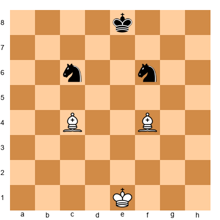

Look at what the bishops can do. The bishop on c4 controls the long diagonal from a2 to g8. The bishop on f4 controls the c1-h6 diagonal. Together, they create a web of long-range threats that stretches across the entire board. The knights? They control a few squares each, but they need several moves to cross from one side of the board to the other.

Now imagine pushing some pawns forward. If the center opens up and diagonals become clear, those bishops will only get stronger. Long, open diagonals are a bishop's dream. Knights cannot compete with bishops when the board opens up.

This is the heart of the bishop pair advantage. In open positions, with clear diagonals and few pawns blocking the way, two bishops dominate the board.

### When the Bishop Pair Does NOT Matter

The bishop pair is not always an advantage. If the position is closed, with pawns locked together and no open diagonals, the bishops have nowhere to aim. In those positions, knights can hop over the pawn chains and find strong outposts. A locked position with lots of pawns is a knight's paradise.

So the bishop pair bonus comes with a condition: you need open or semi-open positions to use it. If your opponent has the bishop pair, one of your best strategies is to keep the position closed. Lock up the pawns. Block the diagonals. Make those bishops feel like tall people in a low-ceiling room.

🛑 **Nice work. You understand the bishop pair now. Rest here if you like. The next section talks about how piece values change depending on the position.**

---

## Part 3: When Values Change

The point system is a starting guide. A helpful shortcut. But chess is more complicated than simple arithmetic. A piece's real value depends on where it sits, what surrounds it, and what the position demands. Let us look at the most important factors.

### Knights Love Closed Positions

A closed position has lots of pawns locked together in the center. The pawns form walls that block long-range pieces like bishops and rooks. But knights do not care about walls. Knights jump. They hop right over pawns, landing on squares that bishops can never reach.

**Set up your board:** Place White pawns on d4 and e5. Place Black pawns on d5 and e6. This creates a locked pawn chain in the center. Now place a White knight on d2 and a White bishop on c1.

The bishop on c1 is stuck. The pawns block its diagonals in almost every direction. It has no clear line to aim at. But the knight on d2? It can hop to f3, then to e5 or g5, jumping over the pawns into active squares. In this kind of position, the knight is clearly better than the bishop.

This is why trading a knight for a bishop is not always a good idea. If the position is closed, that knight might be worth 4 or even 5 points in practice, while the bishop is struggling to find useful work.

### Bishops Love Open Positions

An open position has few pawns in the center. The central files and diagonals are clear. Bishops can aim across the entire board, controlling squares from a distance.

**Set up your board:** Remove all the center pawns from the previous example. Now place a White bishop on c4 and a White knight on d2. With the center open, the bishop on c4 controls the long diagonal from a2 to g8. It pins, threatens, and attacks from far away. The knight on d2 is still a slow, short-range piece that needs several moves to reach the other side of the board.

In open positions, a bishop is often worth more than a knight. Some players estimate it at 3.25 or even 3.5 points in these situations.

### Rooks Need Open Files

A rook is worth 5 points, but only if it has something to do. A rook stuck behind its own pawns, with no open files to use, is like a sports car stuck in traffic. All that power, going nowhere.

**Set up your board:** Place a White rook on a1 with White pawns on a2, b2, and c2 in front of it. The rook has no open file. It cannot move forward. It is almost useless.

Now clear the a-pawn. Remove it from a2. Suddenly the a-file is open, and the rook on a1 has a highway stretching all the way to a8. That rook just went from a sleepy bystander to an active threat.

The lesson: put your rooks on open files. If there are no open files, make one by trading or pushing a pawn.

### A Rook on the Seventh Rank

There is a special bonus for rooks. When a rook reaches the seventh rank (the second-to-last row, where your opponent's pawns started), it becomes extremely powerful. From the seventh rank, a rook can:

1. Attack pawns that have not moved, eating them from the side
2. Cut off the enemy king, trapping it on the back rank
3. Work with another rook on the seventh rank to create deadly threats

**Set up your board:** Place a White rook on d7, a Black king on g8, and Black pawns on a7, b7, f7, g7, and h7. Look at how the rook attacks the a7, b7, and f7 pawns while also cutting the king off from the center. This rook is a monster.

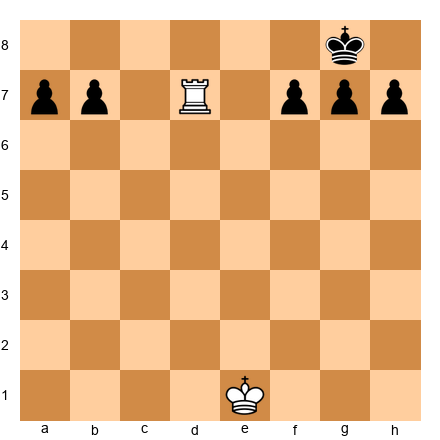

A rook on the seventh rank is often said to be worth an extra pawn, effectively making it a 6-point piece. Two rooks on the seventh rank together can win games almost by themselves.

### Connected Rooks

Two rooks that can see each other along a rank or file are called "connected rooks." They protect each other and double their power. Connected rooks on an open file can crash into the enemy position like a battering ram.

**Set up your board:** Place White rooks on d1 and e1. They are connected along the first rank and both aim down their respective files. Now imagine the d-file is open. Both rooks can swing over: Rd1, Red1. Two rooks on one open file is one of the most powerful setups in chess.

Connected rooks are stronger than two rooks working alone. Always try to connect your rooks after castling.

🛑 **This is a great place to pause. You have learned how position changes piece values. Come back fresh for the next section on trading.**

---

## Part 4: When to Trade

Knowing piece values is one thing. Knowing *when* to trade is where the real skill lives. Even if a trade is mathematically even, it might help one side more than the other. Here are the most important guidelines.

### Trade When You Are Ahead in Material

This is the single most important trading rule for beginners. If you have more material than your opponent, trade pieces. Every trade brings you closer to a simpler position where your extra material matters more.

Think about it this way. If you are up a full queen and the board has twenty pieces on it, your opponent still has plenty of weapons to create counterplay. But if you trade down to just your extra queen versus nothing? Game over. The fewer pieces on the board, the harder it is for the side with less material to fight back.

**The rule of thumb:** If you are up material, trade pieces (not pawns). If you are down material, trade pawns (not pieces), because you need your remaining pieces for counterplay.

Why not trade pawns when you are ahead? Because your extra piece needs something to attack. Pawns are targets. If all the pawns disappear, even an extra piece might not be enough to win. Keep the pawns on the board so your extra material has work to do.

### Trade When It Improves Your Pawn Structure

Sometimes a trade creates doubled pawns for your opponent or fixes your own damaged pawns. These trades are worth making even if the material stays equal.

**Set up your board:** Place a White bishop on g5 pinning a Black knight on f6. Black has pawns on f7, g7, and h7. If White plays Bxf6 and Black recaptures with gxf6, Black now has doubled f-pawns (pawns on f6 and f7) and an open g-file pointing at Black's king. White gave up a bishop for a knight (an even trade in points), but the damage to Black's pawn structure was worth it.

### Trade to Remove Your Opponent's Active Piece

If your opponent has one piece that is doing all the work, trade it off. Remove the star player. Without their best piece, your opponent's position often falls apart.

**Set up your board:** Place a Black knight on d5, right in the center of the board. It is protected by a pawn on e6 and attacks squares on c3, e3, f4, b4, f6, b6, c7, and e7. This knight is a monster. If you have a bishop that can take it, trade that bishop for the knight. Yes, it is an "even" trade in points, but removing that powerful knight is worth far more than 3 points.

### Do NOT Trade Your Good Pieces for Bad Ones

Every position has "good" pieces and "bad" pieces. A good bishop controls open diagonals. A bad bishop is blocked by its own pawns. A good knight sits on a strong outpost. A bad knight is stuck on the edge of the board.

Here is the key: do not trade YOUR good pieces for your OPPONENT'S bad pieces. That helps them, not you. If you have a beautiful bishop on a long diagonal and your opponent has a sad bishop trapped behind pawns, keep both bishops on the board. Your good bishop will keep causing problems while their bad bishop continues to suffer.

Trade your BAD pieces for their GOOD pieces whenever you can. That improves your position and weakens theirs.

### Do NOT Trade When You Are Behind in Material

If you are down material, you want chaos. You want complications. You want as many pieces on the board as possible, because more pieces mean more chances for your opponent to make a mistake.

Trading when you are behind simplifies the position, and a simple position with less material is almost always losing. If you are down a rook, the last thing you want is to trade queens and reach an endgame. You want to keep the queens on, aim them at the opponent's king, and hope for a swindle.

### Summary: Trading Checklist

Before making any trade, ask yourself:

1. **Am I ahead in material?** If yes, trade! Simplify.
2. **Am I behind in material?** If yes, avoid trades. Keep it complicated.
3. **Does this trade help my pawn structure?** If yes, consider it.
4. **Does this trade remove their best piece?** If yes, probably worth it.
5. **Am I trading my good piece for their bad piece?** If yes, stop! Do not do it.
6. **Does this trade help my opponent more than me?** If yes, find a different plan.

If you check this list before every trade, you will make better decisions than most players at your rating.

🛑 **Great stopping point. Get up, stretch, grab a snack. The trading rules are the most important part of this chapter, and you just learned them. Let them settle before continuing.**

---

## Part 5: Counting Material

Before you can decide whether to trade, you need to know who is ahead. Counting material quickly and accurately is a skill every chess player needs.

### The Quick Count Method

Do not add up every single piece on the board. That takes too long. Instead, count only the *differences*. Look at what each side has and cancel out the matching pieces.

**Example:**
White has: Queen, 2 Rooks, 1 Bishop, 1 Knight, 6 Pawns
Black has: Queen, 2 Rooks, 2 Bishops, 5 Pawns

Cancel out the matching pieces:
- Queens: even (cancel them out)
- Rooks: even (cancel them out)
- White has 1 Bishop + 1 Knight. Black has 2 Bishops. Cancel one bishop from each side. Left over: White has 1 Knight, Black has 1 Bishop. That is even (3 = 3).
- Pawns: White has 6, Black has 5. White is up one pawn.

Result: White is ahead by one pawn.

See how fast that was? You did not need to add up 9+5+5+3+3+6. You just looked at the differences. Practice this method, and you will be able to count material in seconds.

### When Material Does Not Matter

Sometimes a player is down material but has a winning position. This happens when:

1. **Checkmate is coming.** If you can force checkmate in three moves, it does not matter that your opponent has an extra queen. Checkmate ends the game.

2. **You have a strong attack.** A fierce attack on the enemy king can be worth more than a piece or two. If all your pieces are aimed at the opponent's king and their extra material is on the other side of the board doing nothing, your attack is what matters.

3. **You have a passed pawn about to promote.** A pawn one square away from becoming a queen is worth nearly 9 points. Material counts change fast when promotion is near.

4. **Your opponent's pieces are trapped or useless.** An extra rook that cannot move is worth zero in practical terms.

These are exceptions, not the rule. In the vast majority of positions, the side with more material wins. But knowing the exceptions helps you avoid panicking when the math does not tell the whole story.

---

## Part 6: A Preview of Sacrifices

Before we move on, let us talk about one of the most exciting ideas in chess: the sacrifice.

A sacrifice is when you give up material on purpose. You trade a piece for something less valuable, or you give up a piece for nothing at all. That sounds wild. Why would you do that?

Because sometimes what you get in return is worth more than the material you gave up. A sacrifice might give you:

- **A checkmate attack.** You sacrifice a knight to rip open the pawns around the enemy king, then your queen and rook deliver checkmate. The knight is gone, but so is the game.
- **A winning positional advantage.** You give up a pawn to get a dominant outpost for your knight, or to open a file for your rook. The pawn is gone, but your pieces become so powerful that you win the material back later, often with interest.
- **Time.** You sacrifice material to develop your pieces faster or to prevent your opponent from castling.

The difference between a sacrifice and a blunder is simple: a sacrifice gives you something real in return. A blunder gives you nothing. If you give up a piece and get checkmate, that is a brilliant sacrifice. If you give up a piece and get nothing, that is a mistake.

We will explore sacrifices in much greater depth in Chapter 6, when we study forks, pins, and tactical patterns. For now, just know that sacrifices exist, they are not mistakes when done with purpose, and they are one of the most beautiful parts of chess.

🛑 **Excellent work getting through all the theory. Take a good break here. When you come back, three annotated games will show you these ideas in action.**

---

## Annotated Game Fragments

These three short games show piece values and trading decisions in action. Set up each position on your board and play through the moves slowly. Read the commentary for every move. There is no rush.

---

### Game Fragment 1: "Trading Down to Win"

*This game shows the most important rule: when you are ahead in material, trade pieces to simplify.*

**Set up your board:**

White: King on g1, Queen on d3, Rook on d1, Knight on f3, Bishop on c4, Pawns on a2, b2, d4, f2, g2, h2

Black: King on g8, Queen on d7, Rook on d8, Knight on f6, Pawns on a7, b7, d6, f7, g7, h7

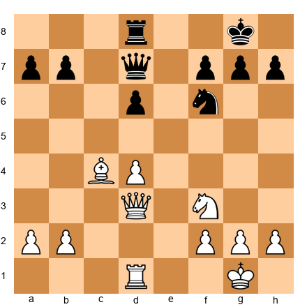

White has a Queen, Rook, Knight, and Bishop. Black has a Queen, Rook, and Knight. Count the material: White has an extra bishop. That is 3 points ahead. White should simplify.

**1. Qxd7**

White trades queens immediately. "Why would you give up your queen?" a beginner might ask. Because Black has to give up a queen too! After the trade, White still has the extra bishop. But now there are fewer pieces on the board, which makes it harder for Black to create counterplay.

**1... Rxd7**

Black recaptures with the rook. The queens are gone. Notice how much quieter the position feels. With queens off the board, there are fewer threats and fewer tricks. That is exactly what White wants.

**2. Rxd7 Nxd7**

White trades rooks too! Again, the trade is even (rook for rook), but every trade brings White closer to a simple endgame. Now the position has just minor pieces and pawns. White has a Bishop and Knight. Black has only a Knight. White's extra bishop will be the difference.

**Pause and look.** After just two trades, the board is nearly empty. White has Kg1, Nf3, Bc4, and six pawns. Black has Kg8, Nd7, and six pawns. White is ahead by a full bishop, and there is nothing Black can do about it. White will use the bishop and knight together to win Black's pawns, then promote a pawn to a queen.

**3. Nd2**

White repositions the knight toward the center. No rush. White is winning and can take time to improve the pieces.

**3... Kf8 4. Ne4**

The knight lands on a strong central square, attacking d6. Black's pawn on d6 is now a target.

**4... Ke7 5. Nxd6**

White captures a pawn. The extra bishop helped control the board while the knight moved in for the kill. White is now up a bishop AND a pawn. The rest is a matter of technique.

**What this game teaches:** When you are ahead in material, trade pieces. Queens first, then rooks. Reach a simple endgame where your extra material wins the game.

---

### Game Fragment 2: "Two Bishops Rule the Open Board"

*This game shows the bishop pair in action. In an open position with few center pawns, two bishops control everything.*

**Set up your board:**

White: King on g1, Rook on e1, Bishop on b2, Bishop on d3, Pawns on a2, b3, f2, g2, h2

Black: King on g8, Rook on e8, Knight on c6, Knight on d7, Pawns on a7, b6, f7, g7, h7

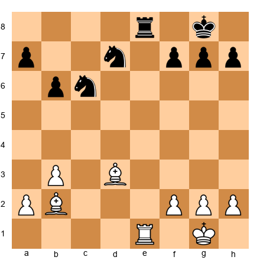

Look at this position carefully. The center is wide open. There are no pawns on d4, d5, e4, or e5. The board is a playground for long-range pieces. White has two bishops. Black has two knights.

**1. Bf5**

White moves the bishop from d3 to f5, aiming at the kingside. Now the bishop on f5 controls the c8-h3 diagonal, and the bishop on b2 controls the long a1-h8 diagonal. Together, they cover light squares and dark squares across the entire board.

**Pause and look.** Where can Black's knights go? The knight on c6 could go to d4 or e5, but both squares are exposed to White's bishops. The knight on d7 is passive, blocked by its own pieces. Knights need outposts (protected squares where they can sit safely), and this position has none for Black.

**1... Nd4 2. Rxe8+ Nxe8**

White trades rooks. Remember, trading is fine when your remaining pieces are better than your opponent's remaining pieces. White's two bishops in an open position are worth more than Black's two knights.

**3. Ba3**

The dark-squared bishop swings to a3, aiming at the f8 square and controlling the a3-f8 diagonal. Now both bishops cut across the board in different directions.

**3... Kf8?**

Black moves the king into the line of fire. The bishop on a3 now pins Black's king to the f8 square.

**4. Bh7!**

The light-squared bishop slides to h7, threatening to trap the knight on e8 (which cannot easily escape with the king stuck on f8). White's two bishops have created a net that the knights cannot escape.

**4... Ne6 5. Bb2**

White repositions the dark-squared bishop back to b2, controlling the long diagonal and keeping pressure on g7. White has total control of the board. The two bishops dominate both color complexes, and Black's knights have no good squares.

**What this game teaches:** In open positions, the bishop pair is a major advantage. Bishops aim across the whole board, while knights need outposts to be effective. If you have two bishops, open the position. If your opponent has two bishops, keep it closed.

---

### Game Fragment 3: "A Sacrifice That Wins the Game"

*This game shows that material is not everything. Sometimes giving up a piece wins faster than keeping it.*

**Set up your board:**

White: King on g1, Queen on d1, Rook on f1, Bishop on c1, Knight on g5, Pawns on a2, b2, c2, d4, e5, g2, h2

Black: King on g8, Queen on d8, Rook on f8, Bishop on c8, Knight on d5, Pawns on a7, b7, c7, e6, f7, g7, h6

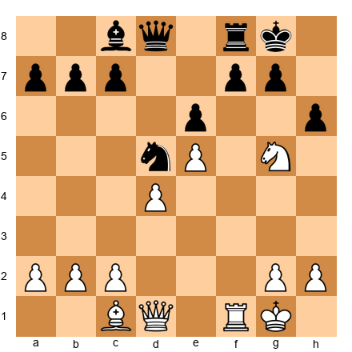

White has an interesting position. The knight on g5 is aiming at f7 and h7. The pawn on e5 supports the knight's aggression. Black's knight on d5 is strong, but Black's king looks a bit exposed after ...h6 pushed the pawn forward.

**1. Nxf7!**

A sacrifice! White gives up a knight (3 points) to capture the pawn on f7 (1 point). In pure material, White loses 2 points. But look at what happens.

**1... Rxf7**

Black captures the knight. Black is now up a piece. But look at the position.

**2. Qh5!**

The queen enters the attack, threatening Qxf7+ and other nasty moves. The f7-rook is now under pressure, and Black's king is exposed.

**Pause and look.** Black's king has a gaping hole on f7 (the pawn is gone). The queen on h5 threatens to capture on f7 with check. Black is up a knight, but White has a ferocious attack.

**2... Qe8**

Black tries to block the attack by putting the queen on e8, defending f7.

**3. Qxh6!**

White captures the h6 pawn with the queen. Now White threatens Qg6 or Qh7+ followed by Qh8 checkmate. The attack is overwhelming.

**3... Rf8 4. Qg6**

White plays Qg6, threatening Qh7 checkmate. Black cannot defend. The knight sacrifice on f7 ripped open the king's shelter, and White's queen and rook are too powerful.

**4... Nf4 5. Rxf4!**

White captures the knight, and now Rf4-f7 or Rf4-h4 are coming. Black's position is collapsing.

**What this game teaches:** A sacrifice is NOT a blunder when you get an attack in return. White gave up a knight (3 points) but got an unstoppable attack. The 3 points of material were worth much less than the checkmate threats White created. When you see a chance to open up your opponent's king, calculate carefully. Sometimes the best move is giving something away.

🛑 **Three games complete! That was a lot of chess. Take a solid break here. When you come back, 50 exercises are waiting. Do them in batches of 10. There is no hurry.**

---

## Exercises

Work through these at your own pace. Try each one before reading the hints. If you get stuck, read one hint at a time. Do not jump straight to the solution. Struggling is how your brain builds chess muscles.

### Section A: Who's Ahead in Material? (Exercises 4.1–4.10)

For each position, count the material for both sides using the point system. Then answer: who is ahead, and by how much?

---

**Exercise 4.1** ★
**Position:** White: King on e1, Queen on d1, Rook on a1, Bishop on c1, Knight on g1, Pawns on a2, b2, d4, f2, g2, h2. Black: King on e8, Queen on d8, Rook on a8, Knight on b8, Knight on g8, Pawns on a7, b7, d5, f7, g7, h7.

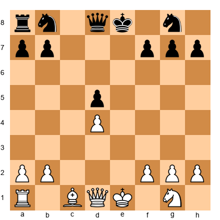

**Task:** Count the material for both sides. Who is ahead?
**Hint 1:** Write down each piece and its point value for White, then do the same for Black.
**Hint 2:** White has Q(9)+R(5)+B(3)+N(3) = 20 in pieces. Black has Q(9)+R(5)+N(3)+N(3) = 20 in pieces.
**Hint 3:** Both sides have 6 pawns (6 points each). Are the pieces equal too?
**Solution:** **Material is equal.** White has Q+R+B+N+6P = 26 points. Black has Q+R+N+N+6P = 26 points. Both sides have 26 points. No one is ahead. **Why this works:** Bishop and knight are both worth 3 points, so B+N = N+N in simple point counting.

---

**Exercise 4.2** ★
**Position:** White: King on g1, Queen on d2, Rook on e1, Rook on d1, Bishop on g2, Knight on f3, Pawns on a2, b2, c3, f2, g3, h2. Black: King on g8, Queen on c7, Rook on e8, Rook on d8, Bishop on e7, Pawns on a7, b7, c6, f7, g7, h7.

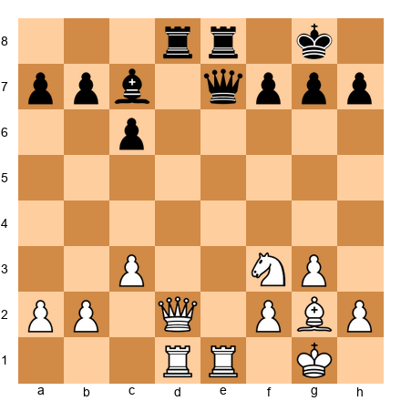

**Task:** Who is ahead in material?
**Hint 1:** Cancel matching pieces. Both sides have queens, two rooks. That is even.
**Hint 2:** White has B+N (6 points in minor pieces). Black has B (3 points in minor pieces).
**Hint 3:** White has 6 pawns, Black has 6 pawns. Even there. So the difference is in the minor pieces.
**Solution:** **White is ahead by 3 points (one knight).** White has an extra knight on f3 that Black does not match. All other pieces cancel out. **Why this works:** Use the cancellation method. Match pieces one-for-one, and whatever is left over is the difference.

---

**Exercise 4.3** ★
**Position:** White: King on g1, Queen on e2, Rook on a1, Bishop on b5, Pawns on a2, b2, d4, f2, g2, h2. Black: King on g8, Queen on e7, Rook on a8, Rook on f8, Pawns on a7, b7, d5, f7, g7, h7.

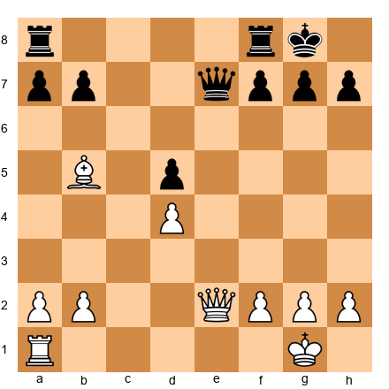

**Task:** Who is ahead in material, and by how much?
**Hint 1:** White has Q+R+B+6P. Black has Q+2R+6P. Cancel the queens and one rook each.
**Hint 2:** Left over: White has a Bishop (3). Black has a Rook (5).
**Hint 3:** Black's extra rook minus White's extra bishop = 5-3 = 2 points.
**Solution:** **Black is ahead by 2 points.** Black has the exchange (an extra rook vs. White's bishop). In other words, White has "lost the exchange." **Why this works:** R(5) - B(3) = 2 points in Black's favor.

---

**Exercise 4.4** ★
**Position:** White: King on g1, Queen on d1, Rook on a1, Rook on f1, Bishop on c4, Bishop on g5, Knight on c3, Pawns on a2, b2, d4, e4, f2, g2, h2. Black: King on g8, Queen on d8, Rook on a8, Rook on f8, Bishop on e7, Bishop on c8, Knight on f6, Pawns on a7, b7, c7, d6, e5, f7, g7, h7.

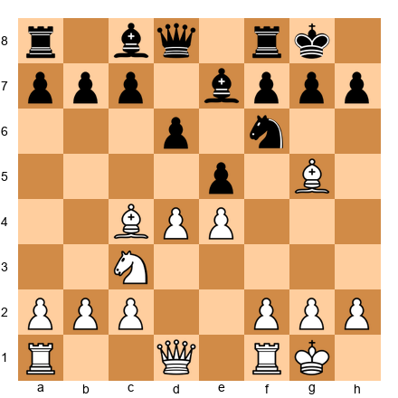

**Task:** Who is ahead in material?
**Hint 1:** Count White's pieces: Q+2R+2B+N = 9+10+6+3 = 28 in pieces, plus 8 pawns = 36.
**Hint 2:** Count Black's pieces: Q+2R+2B+N = 9+10+6+3 = 28 in pieces, plus 8 pawns = 36.
**Hint 3:** Both totals are the same.
**Solution:** **Material is exactly equal.** Both sides have a full army with the same pieces and the same number of pawns. No one is ahead. **Why this works:** In many games, material stays equal for a long time. The advantage comes from position, not points.

---

**Exercise 4.5** ★
**Position:** White: King on g1, Rook on e1, Bishop on d3, Knight on d4, Pawns on a2, b2, f2, g2, h2. Black: King on g8, Rook on e8, Bishop on c8, Pawns on a7, b7, f7, g7, h7.

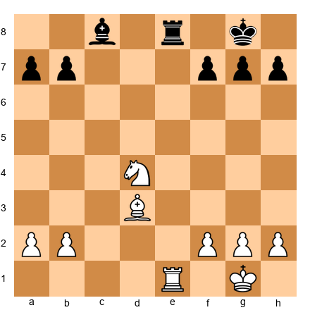

**Task:** Who is ahead, and by how much?
**Hint 1:** Cancel matching pieces: both have a rook and a bishop. That leaves...
**Hint 2:** White has an extra knight (3 points). Black has nothing to match it.
**Hint 3:** Pawns: White has 5, Black has 5. Even.
**Solution:** **White is ahead by 3 points (one knight).** After canceling matched pieces, White has an extra Nd4 with no equivalent on Black's side. **Why this works:** Cancellation makes it easy. R=R, B=B, pawns even. Only the knight is left over.

---

**Exercise 4.6** ★
**Position:** White: King on g1, Queen on c2, Rook on d1, Bishop on e3, Pawns on a2, b2, c3, f2, g2, h2. Black: King on g8, Queen on b6, Rook on d8, Knight on d5, Pawns on a7, b7, c7, f7, g7, h7.

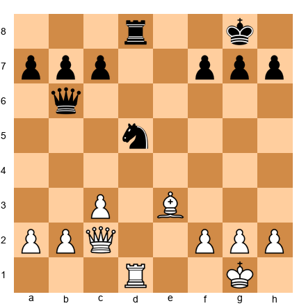

**Task:** Who is ahead in material?
**Hint 1:** Cancel queens and rooks. Both have one of each.
**Hint 2:** White has B(3)+6P. Black has N(3)+6P.
**Hint 3:** B = N = 3 points. Pawns are equal.
**Solution:** **Material is equal.** Bishop equals knight in the point system, both sides have one rook, one queen, and six pawns. **Why this works:** B(3) = N(3). The position might favor one side over the other, but the raw material count is even.

---

**Exercise 4.7** ★
**Position:** White: King on g1, Queen on e2, Rook on a1, Knight on f3, Pawns on a2, b2, d4, f2, g2, h2. Black: King on g8, Rook on a8, Rook on f8, Bishop on g7, Knight on c6, Pawns on a7, b7, d5, f7, g7, h7.

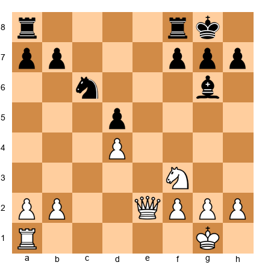

**Task:** Who is ahead, and by how much?
**Hint 1:** White has Q+R+N = 9+5+3 = 17 in pieces. Black has 2R+B+N = 10+3+3 = 16 in pieces.
**Hint 2:** White's queen (9) vs Black's extra rook + bishop (5+3=8). White is ahead by 1 point in pieces.
**Hint 3:** Pawns: White has 6, Black has 6. Even. So White leads by 1 point total.
**Solution:** **White is ahead by 1 point.** White's queen is worth more than Black's extra rook and bishop combined (9 vs 8). **Why this works:** Q(9) vs R+B(8) gives White a 1-point edge. This is a close material balance where position will matter a lot.

---

**Exercise 4.8** ★★
**Position:** White: King on g1, Queen on d2, Bishop on f1, Knight on d4, Pawns on a2, b2, c2, f2, g2, h2. Black: King on g8, Rook on a8, Rook on f8, Bishop on c8, Knight on f6, Pawns on a7, b7, c7, f7, g7, h7.

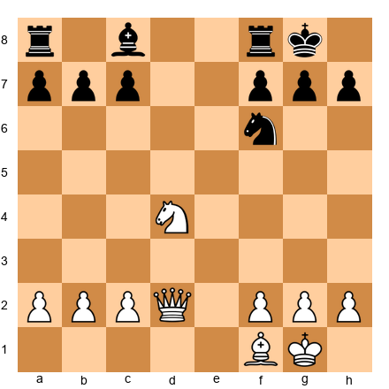

**Task:** Who is ahead and by how much?
**Hint 1:** White has Q+B+N = 9+3+3 = 15 in pieces. Black has 2R+B+N = 10+3+3 = 16 in pieces.
**Hint 2:** Black has 1 more point in pieces. But check pawns: White has 6, Black has 6. Even.
**Hint 3:** Black is slightly ahead. The two rooks (10) outweigh White's queen (9).
**Solution:** **Black is ahead by 1 point.** Black has two rooks (10 points) while White has a queen (9 points). The other pieces and pawns cancel out. **Why this works:** Two rooks (10) vs queen (9) = 1 point advantage for the rooks. But remember, this is close, and the queen can be dangerous if the position is open.

---

**Exercise 4.9** ★
**Position:** White: King on g1, Queen on a4, Rook on d1, Pawns on a2, b2, f2, g2, h2. Black: King on g8, Rook on d8, Bishop on c5, Knight on c6, Knight on e5, Pawns on a7, b7, f7, g7, h7.

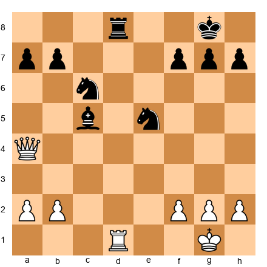

**Task:** Who is ahead in material?
**Hint 1:** White has Q+R = 14 in pieces plus 5 pawns. Black has R+B+N+N = 14 in pieces plus 5 pawns.
**Hint 2:** Q(9) = R(5)+B(3)+N(3)? That is 9 vs 11.
**Hint 3:** Wait. White has Q+R = 9+5 = 14. Black has R+B+2N = 5+3+3+3 = 14. The piece values are equal!
**Solution:** **Material is equal.** White has Q+R = 14 points in pieces. Black has R+B+2N = 14 points in pieces. Both have 5 pawns. Despite the very different piece combinations, the point count is identical. **Why this works:** A queen (9) equals a bishop and two knights (3+3+3=9). The rooks cancel each other.

---

**Exercise 4.10** ★★
**Position:** White: King on g1, Rook on c1, Rook on f1, Bishop on e2, Pawns on a2, b3, d4, f2, g2, h2. Black: King on g8, Queen on e7, Knight on d5, Pawns on a7, b7, e6, f7, g7, h7.

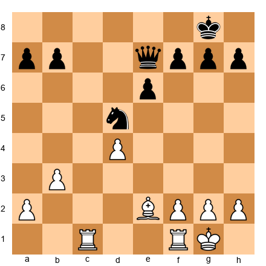

**Task:** Who is ahead and by how much?
**Hint 1:** White has 2R+B = 10+3 = 13 in pieces. Black has Q+N = 9+3 = 12 in pieces.
**Hint 2:** White leads by 1 point in pieces. Pawns: White has 6, Black has 6. Even.
**Hint 3:** White is ahead by 1 point total. Two rooks plus a bishop vs queen plus a knight.
**Solution:** **White is ahead by 1 point.** White's 2R+B (13) vs Black's Q+N (12) gives White a slim edge. **Why this works:** Two rooks (10) are worth more than a queen (9) by 1 point, and B=N, so the difference is that 1-point rook advantage.

---

🛑 **Ten exercises done! Great work. Take a break if you need one. The next set focuses on trading decisions.**

---

### Section B: Should You Make This Trade? (Exercises 4.11–4.25)

For each position, a trade is possible. Decide whether White should make it, and explain why.

---

**Exercise 4.11** ★
**Position:** White: King on g1, Queen on d4, Rook on e1, Bishop on c4, Pawns on a2, b2, f2, g2, h2. Black: King on g8, Queen on d7, Rook on e8, Knight on f6, Pawns on a7, b7, d6, f7, g7, h7. White is ahead by a full bishop. White can play Qxd7.

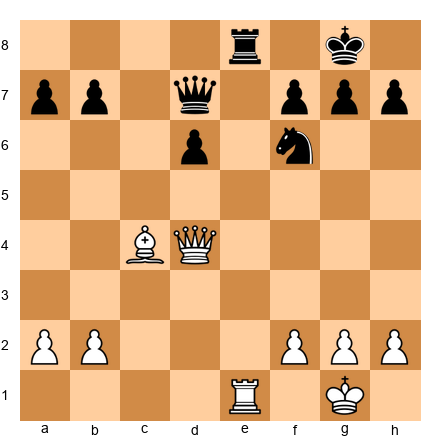

**Task:** Should White trade queens with Qxd7?
**Hint 1:** White is up a bishop (3 points). What does the "trade when ahead" rule say?
**Hint 2:** Trading queens simplifies. Fewer pieces means Black has less counterplay.
**Hint 3:** After Qxd7 Nxd7 (or Rxe1+ first), White still has the extra bishop and a simpler position to convert.
**Solution:** **Yes, trade queens!** White is ahead by 3 points. Trading queens removes Black's strongest attacking piece and brings the game closer to a simple endgame where the extra bishop will decide the game. **Why this works:** When ahead in material, simplify. Trading the most powerful remaining piece is usually the fastest route to victory.

---

**Exercise 4.12** ★
**Position:** White: King on g1, Queen on d1, Rook on e1, Knight on c3, Pawns on a2, b2, d4, f2, g2, h2. Black: King on g8, Queen on d8, Rook on e8, Rook on a8, Bishop on c5, Knight on f6, Pawns on a7, b7, d5, f7, g7, h7. White is down the exchange (has N where Black has an extra R). White can play Qd1xd5 capturing a pawn, but Black would recapture Qxd5 Nxd5.

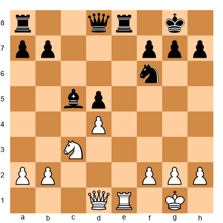

**Task:** Should White trade queens?
**Hint 1:** White is BEHIND in material. What does the rule say about trading when behind?
**Hint 2:** If White trades queens, the game simplifies. In a simple position, Black's extra rook will dominate.
**Hint 3:** White should avoid trading and look for complications instead.
**Solution:** **No, do not trade queens!** White is down material (Black has an extra rook vs White's knight). Trading queens simplifies the game and helps Black. White should keep the queens on the board and look for tactical chances. **Why this works:** When behind in material, keep pieces on. Complexity creates chances for your opponent to go wrong.

---

**Exercise 4.13** ★
**Position:** White: King on g1, Bishop on g5, Knight on f3, Pawns on d4, e5, f2, g2, h2. Black: King on g8, Knight on f6, Pawns on d5, e6, f7, g7, h7. White can play Bxf6, and Black would recapture gxf6.

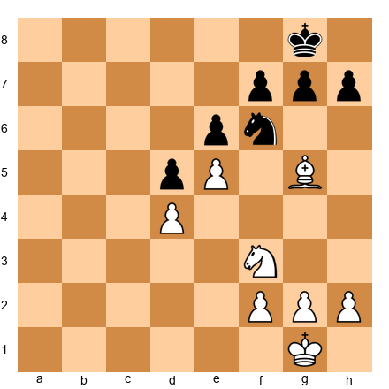

**Task:** Should White play Bxf6?
**Hint 1:** It is an even trade in points (bishop 3 = knight 3). So look at what else changes.
**Hint 2:** After gxf6, Black has doubled f-pawns (f6 and f7). That is damaged pawn structure.
**Hint 3:** After gxf6, the g-file opens toward Black's king. That could be useful for White later.
**Solution:** **Yes, this is a good trade.** Although B=N in points, after gxf6, Black gets doubled pawns and a weakened king. The trade damages Black's pawn structure and opens lines near Black's king. **Why this works:** Even trades can be excellent when they create weaknesses in your opponent's position. Doubled pawns and an open g-file are real problems for Black.

---

**Exercise 4.14** ★
**Position:** White: King on g1, Rook on d1, Rook on e1, Bishop on f4, Pawns on a2, b2, c2, f2, g2, h2. Black: King on g8, Rook on d8, Rook on e8, Bishop on d6, Pawns on a7, b7, c7, f7, g7, h7. Material is equal. White can trade bishops with Bxd6 cxd6 (or ...Rxd6).

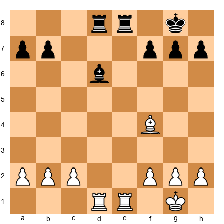

**Task:** Should White play Bxd6?
**Hint 1:** Is White's bishop "good" or "bad"? It is on f4, actively placed with open diagonals.
**Hint 2:** Is Black's bishop "good" or "bad"? It is on d6, also fairly active.
**Hint 3:** If White plays Bxd6 cxd6, Black gets a doubled d-pawn but also opens the c-file for the rook.
**Solution:** **This trade is about equal and depends on the plan.** If White wants to target the doubled d-pawns, Bxd6 cxd6 is reasonable. But White's bishop on f4 is active and useful. There is no clear advantage to trading here. **Why this works:** Not every trade needs to be made. When both bishops are roughly equal in activity, and the resulting pawn structure changes are mixed, keeping the tension can be better.

---

**Exercise 4.15** ★
**Position:** White: King on g1, Queen on e2, Rook on d1, Bishop on g2, Pawns on a2, b2, c3, e4, f2, g3, h2. White is up a full piece (extra bishop). Black: King on g8, Queen on e7, Rook on d8, Pawns on a7, b7, c6, d5, f7, g7, h7.

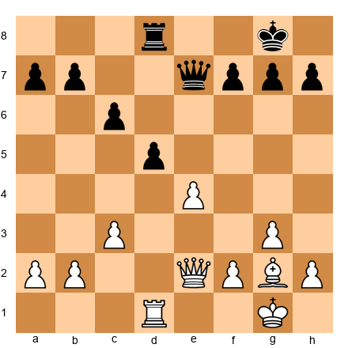

**Task:** White can play Rxd8+ Qxd8, Qxe7. Should White trade rooks and then queens?
**Hint 1:** White is up a bishop. Should White simplify?
**Hint 2:** Yes! Every trade makes the extra bishop more dominant.
**Hint 3:** After Rxd8+ Qxd8, White still has Q+B vs Q. Trading queens next leaves B+pawns vs pawns. Easy win.
**Solution:** **Yes, absolutely trade!** White is up a full piece. Trading rooks and queens leads to a simple endgame where White's extra bishop and pawns will crush Black's lone pawns. **Why this works:** When ahead in material, trade everything. A bishop and pawns vs just pawns is a textbook win.

---

**Exercise 4.16** ★★
**Position:** White: King on g1, Queen on h5, Rook on f1, Bishop on c4, Pawns on d4, e5, f2, g2, h2. Black: King on g8, Queen on d7, Rook on f8, Knight on e7, Pawns on c6, d5, f7, g7, h7. White has a strong attack. White can play Qxd7 trading queens.

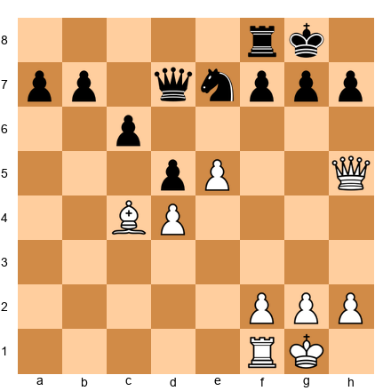

**Task:** Should White trade queens with Qxd7?
**Hint 1:** Material is roughly equal. White has Q+R+B. Black has Q+R+N. Same points.
**Hint 2:** But look at White's queen on h5. It is aiming at the kingside. Does White have attacking chances?
**Hint 3:** If White trades queens, the attack disappears. The resulting endgame is roughly equal.
**Solution:** **No, do not trade queens here.** White's queen on h5 creates threats against Black's king. Trading queens removes all attacking chances and leads to a dull, equal endgame. White should keep the queens on and press the attack with moves like Rf3 or Qg4. **Why this works:** Even when material is equal, do not trade away your attacking pieces. A queen aiming at the enemy king is worth keeping.

---

**Exercise 4.17** ★★
**Position:** White: King on g1, Queen on d2, Rook on d1, Bishop on e2, Knight on d4, Pawns on a2, b2, c2, f2, g2, h2. Black: King on g8, Queen on c7, Rook on d8, Bishop on b7, Knight on c5, Pawns on a7, b6, e6, f7, g7, h7. Material is equal. White can play Nxe6 fxe6. This improves Black's center pawns structure but damages the f-file.

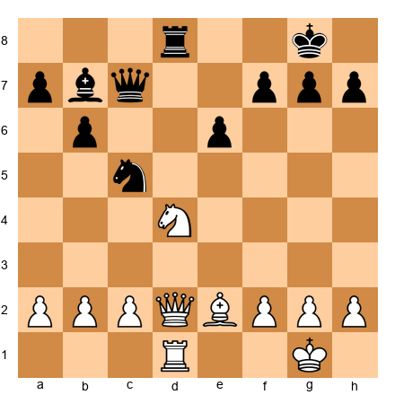

**Task:** Black's knight on c5 is very active, controlling d3, e4, a4, and b3. Should White play Nxc5, trading knights?
**Hint 1:** White's knight on d4 is also well-placed. Is White trading a good piece for a good piece?
**Hint 2:** After Nxc5 bxc5, Black gets an isolated c-pawn but opens the b-file for the rook.
**Hint 3:** More importantly, after Nxc5 bxc5, Black's bishop on b7 gains more scope on the long diagonal.
**Solution:** **Probably not.** Both knights are actively placed. Trading them mostly helps Black by opening the b-file and activating the b7 bishop. White's knight on d4 is at least as good as Black's knight on c5. **Why this works:** Do not trade active pieces for equally active pieces without a clear reason. The resulting changes (open b-file, stronger b7 bishop) favor Black.

---

**Exercise 4.18** ★★
**Position:** White: King on g1, Rook on e1, Bishop on d3, Pawns on a2, b2, c3, d4, f2, g2, h3. Black: King on g8, Rook on e8, Bishop on d6, Pawns on a7, b7, c6, d5, e4, f7, g7, h7. White can play Bxe4 dxe4, winning a pawn. But is this a good trade?

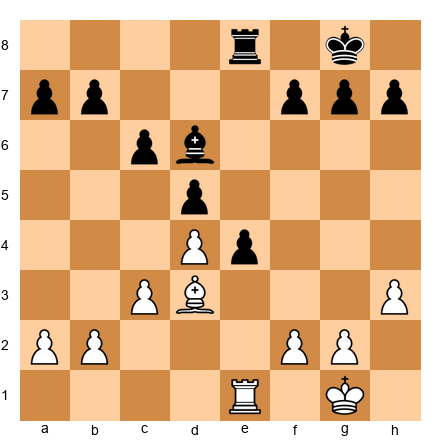

**Task:** Should White capture with Bxe4?
**Hint 1:** White's bishop is on d3 and Black has a pawn on e4. After Bxe4, Black recaptures dxe4. White gave up a bishop to grab a pawn. What are the point values?
**Hint 2:** White traded a bishop (3 points) for a pawn (1 point). That is a 2-point loss. Terrible trade!
**Hint 3:** White should keep the bishop and not trade it for a pawn.
**Solution:** **No! Do not play Bxe4.** White would lose a bishop (3 points) and only get a pawn (1 points). That is a 2-point loss. The bishop on d3 is valuable and should not be thrown away for a pawn. **Why this works:** Always check the value of what you give up vs. what you get. B(3) for P(1) = losing 2 points. Terrible trade.

---

**Exercise 4.19** ★★
**Position:** White: King on g1, Queen on c2, Rook on a1, Rook on f1, Bishop on b2, Bishop on d3, Pawns on a2, c3, d4, f2, g2, h2. White has the bishop pair. Black: King on g8, Queen on e7, Rook on a8, Rook on f8, Bishop on c8, Knight on d5, Pawns on a7, c6, d6, f7, g7, h7. The position is open. White can play Bxd5 cxd5, trading a bishop for Black's knight.

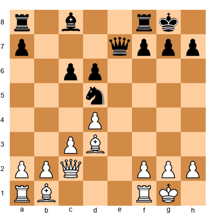

**Task:** Should White trade the bishop for the knight on d5?
**Hint 1:** White has the bishop pair. Trading a bishop for a knight destroys the bishop pair advantage.
**Hint 2:** The position is open. Open positions favor the bishop pair. Why give that up?
**Hint 3:** Keep both bishops! They work together to control the whole board. Find another plan.
**Solution:** **No, do not trade.** White has the bishop pair in an open position. That is a significant advantage (about 0.5 extra points). Trading one bishop for a knight throws away that advantage for no gain. **Why this works:** The bishop pair is worth more than its raw point value in open positions. Giving up one bishop for a knight converts a B+B(6.5) into B+N(6). Keep the pair.

---

**Exercise 4.20** ★
**Position:** White: King on f1, Queen on d2, Rook on d1, Bishop on c1, Pawns on a2, b2, c2, e4, f3, g2, h2. White has NOT castled and the king is on f1. Black: King on g8, Queen on a5, Rook on d8, Bishop on g4, Pawns on a7, b7, c7, e5, f7, g7, h7. Black's bishop on g4 pins the f3 pawn and is very active. White can play Rxd8+ Qxd8, Qxd8+ and trade everything.

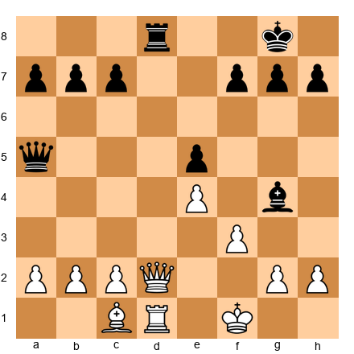

**Task:** Should White trade rooks and queens?
**Hint 1:** Count material. White has Q+R+B = 17. Black has Q+R+B = 17. Equal.
**Hint 2:** White's king is awkwardly placed on f1 (not castled). In a queen+rook middlegame, that could be dangerous.
**Hint 3:** Trading down to a bishop endgame removes the danger to White's king. Both bishops would remain, and the position simplifies.
**Solution:** **Yes, trading is a good idea.** White's king on f1 is exposed. Trading queens and rooks eliminates the danger. The resulting bishop endgame is roughly equal, which is better than risking an attack against the uncastled king. **Why this works:** Sometimes you trade not because you are ahead, but because you are in danger. Simplification can rescue a risky position.

---

**Exercise 4.21** ★★
**Position:** White: King on g1, Queen on e2, Rook on e1, Knight on d4, Pawns on a2, b2, c3, f2, g2, h2. Black: King on g8, Queen on b6, Rook on e8, Bishop on g7, Pawns on a7, b7, d5, f7, g7, h7. Material is equal. White can play Nf5, attacking the bishop and queen. But should White play Nxb6 axb6 instead?

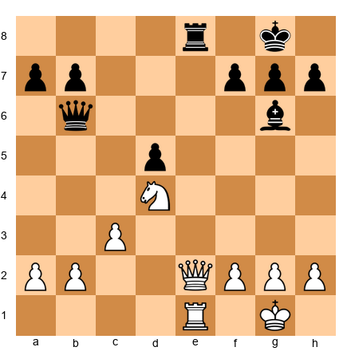

**Task:** Should White play Nd4-f5 (active move) or trade the knight for the queen's defense by playing into a sequence?
**Hint 1:** The knight on d4 is beautifully placed. Moving it to f5 attacks Black's bishop and threatens Nd6.
**Hint 2:** Nf5 keeps the knight active and creates threats. Do not trade an active piece when you have a strong move.
**Hint 3:** Keep the pressure. Active pieces should stay active.
**Solution:** **Play Nf5! Do not trade the knight away.** The knight on f5 will attack the bishop on g7 and threaten Nd6 forking the queen and rook. Active pieces create threats. Keeping them on the board is almost always better than trading them off for quiet equality. **Why this works:** Do not trade your most active piece unless you get something concrete in return. Nf5 creates real threats.

---

**Exercise 4.22** ★
**Position:** White: King on g1, Rook on c1, Bishop on e3, Pawns on a2, b3, c4, f2, g2, h2. Black: King on g8, Rook on c8, Knight on c6, Pawns on a7, b7, e6, f7, g7, h7. White can play Rxc6 bxc6, winning the exchange.

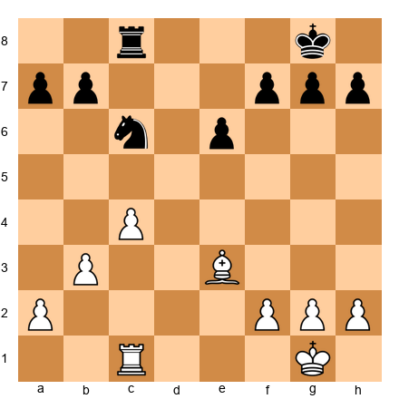

**Task:** Should White play Rxc6?
**Hint 1:** White trades R(5) for N(3). White gains 2 points. That is winning the exchange.
**Hint 2:** But wait. Is the rook doing something important? Is the knight doing something important?
**Hint 3:** After Rxc6 bxc6, White wins the exchange but Black opens the b-file. Still, +2 points is significant.
**Solution:** **Yes, win the exchange with Rxc6!** White gives up a rook (5) for a knight (3), gaining 2 points of material. The resulting position with an extra exchange is winning for White in most cases. **Why this works:** A 2-point material advantage is very significant. Unless Black gets a devastating attack in return, winning the exchange is almost always correct.

---

**Exercise 4.23** ★
**Position:** White: King on g1, Queen on h5, Rook on f1, Knight on g5, Pawns on c2, d4, e5, f2, g2, h2. Black: King on g8, Queen on d7, Rook on f8, Bishop on c8, Knight on e7, Pawns on c7, d5, f7, g7, h6. White has a strong attack. White can play Qxd7 trading queens.

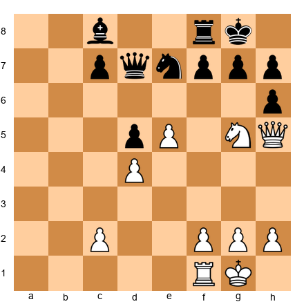

**Task:** Should White trade queens?
**Hint 1:** White has a knight on g5 and a queen on h5, both aiming at the kingside. That looks like an attack.
**Hint 2:** Trading queens removes the attacking piece (the queen). The attack would be over.
**Hint 3:** Keep the queen and look for Qxh6, Qg6, or Nxf7 sacrifices instead.
**Solution:** **No! Do not trade queens.** White has a powerful attack with Qh5 and Ng5 both targeting Black's king. Trading queens throws away all attacking chances. Instead, White should press the attack with moves like Qg6 or Nxf7. **Why this works:** Never trade your queen when you are attacking the enemy king, unless the trade leads to checkmate or wins even more material.

---

**Exercise 4.24** ★★★
**Position:** White: King on g1, Queen on d2, Rook on a1, Rook on e1, Bishop on d3, Knight on f3, Pawns on a2, b2, c3, d4, f2, g2, h2. Black: King on g8, Queen on c7, Rook on a8, Rook on e8, Bishop on g4, Knight on d5, Pawns on a7, b7, c6, e6, f7, g7, h7. Material is equal. Multiple trades are possible. White could play Nxd5, or Bxh7+, or simply develop with Re5.
**Task:** Should White trade knights with Nxd5 exd5 (or cxd5)?
**Hint 1:** White's knight on f3 is defending but also somewhat passive. Black's knight on d5 is a powerful centralized piece.
**Hint 2:** Trading the passive knight for the active knight is a good deal. White removes Black's best piece.
**Hint 3:** After Nxd5 cxd5 (or exd5), Black's pawn structure is slightly weakened too.
**Solution:** **Yes, trade knights with Nxd5.** White's knight on f3 is less active than Black's dominating knight on d5. Trading a less active piece for a more active one is good strategy. After Nxd5 exd5 (or cxd5), Black loses the powerful centralized knight and White's bishop on d3 gains more scope. **Why this works:** Trade your weaker pieces for your opponent's stronger pieces. White's Nf3 was adequate, but Black's Nd5 was outstanding. Removing it improves White's position.

---

**Exercise 4.25** ★★★
**Position:** White: King on g1, Queen on c2, Rook on d1, Rook on e1, Bishop on c1, Bishop on g2, Knight on e4, Pawns on a2, b2, c3, f2, g3, h2. Black: King on g8, Queen on d6, Rook on a8, Rook on f8, Bishop on e6, Knight on d7, Pawns on a7, b7, c5, f7, g7, h7. White can play Nxd6 Qxd6 (trading knight for the queen's position), or Nxc5 Nxc5. Several options exist.

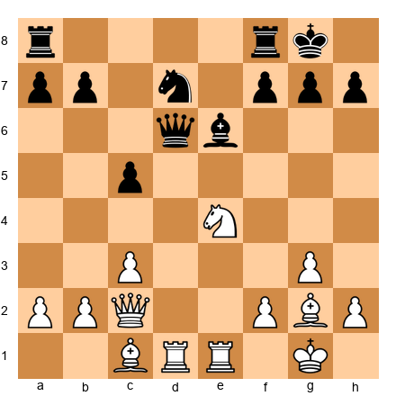

**Task:** White has many options. What is the best trading strategy?
**Hint 1:** White has two bishops (bishop pair) in a position that could open up. That is valuable.
**Hint 2:** Nxd6 removes a knight but also simplifies when White has the bishop pair advantage. Is that good?
**Hint 3:** Consider Nxc5: after Nxc5, White trades the knight (which does not contribute to the bishop pair) and removes a pawn that was holding Black's center together.
**Solution:** **Play Nxc5.** After Nxc5 Nxc5, White has traded the knight (a piece that was NOT part of the bishop pair) and removed Black's c5 pawn. White keeps both bishops, and the position opens up slightly, which favors the bishop pair. Trading the knight is perfect because it preserves the real advantage (the bishops). **Why this works:** When you have the bishop pair, trade knights, not bishops. The knight is not part of your bishop pair advantage, so trading it away keeps your best asset on the board.

---

🛑 **Twenty-five exercises complete! You are halfway through. This is an excellent place to stop and come back later. If you feel sharp, keep going.**

---

### Section C: Which Piece Is More Valuable HERE? (Exercises 4.26–4.35)

The point system says bishop = knight = 3 points. But the position changes everything. For each exercise, decide which piece is worth more in the specific position shown.

---

**Exercise 4.26** ★
**Position:** White: King on e1, Bishop on c4, Pawns on d4, e5, f4, g3. Black: King on e8, Knight on c6, Pawns on d5, e6, f5, g7. The center is locked with pawns on d4/d5 and e5/e6.

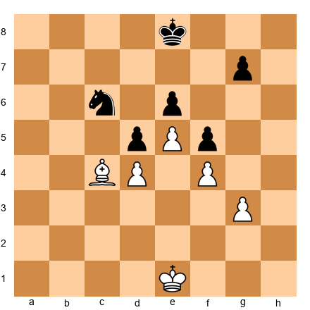

**Task:** Which is worth more here, the bishop or the knight?
**Hint 1:** Look at the center. Pawns on d4/d5 and e5/e6 create a locked chain.
**Hint 2:** The bishop on c4 has the d5 and e6 pawns in its way. Its diagonals are blocked.
**Hint 3:** The knight on c6 can jump to e7, d8, a5, b4, bypassing all pawns.
**Solution:** **The knight is worth more here.** The locked pawn chain blocks the bishop's diagonals, making it nearly useless. The knight can hop over the pawns to active squares. In this closed position, the knight is worth about 4 points while the bishop is worth about 2. **Why this works:** Knights thrive in closed positions. Bishops suffer when diagonals are blocked.

---

**Exercise 4.27** ★
**Position:** White: King on e1, Knight on d2, Pawns on c2, f2, g2. Black: King on e8, Bishop on g7, Pawns on c7, f7, g6. The center is completely open (no center pawns at all).

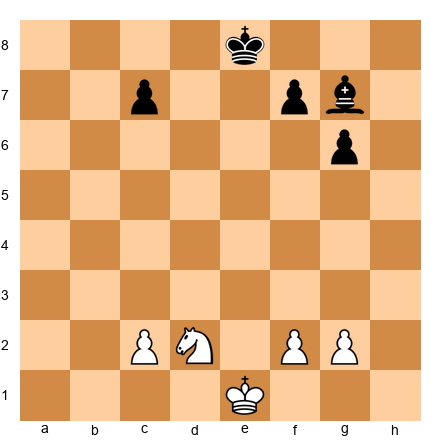

**Task:** Which is worth more here, the knight or the bishop?
**Hint 1:** The center is wide open. No pawns on d4, d5, e4, or e5.
**Hint 2:** The bishop on g7 controls the long diagonal from a1 to h8. It sees across the whole board.
**Hint 3:** The knight on d2 is passive and needs many moves to reach the action on the other side.
**Solution:** **The bishop is worth more here.** In this open position, the bishop controls the long a1-h8 diagonal and can influence the entire board. The knight is slow and clumsy in an open position. The bishop might be worth 3.5 points here, while the knight is about 2.5. **Why this works:** Bishops dominate in open positions where long diagonals are available.

---

**Exercise 4.28** ★
**Position:** White: King on g1, Rook on a1, Pawns on a2, b2, c2. The a-file has a White pawn on it. Black: King on g8, Rook on a8, Pawns on a7, b6, c7. Both rooks are on the a-file, but pawns block them.

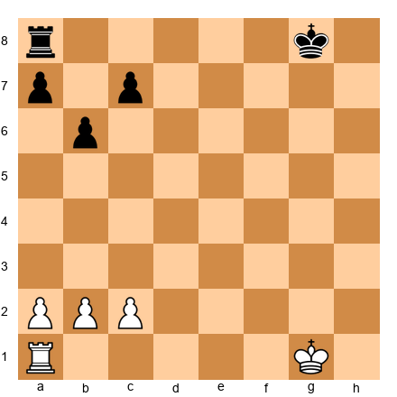

**Task:** Which rook is more active? Which rook is "worth more" in practical terms?
**Hint 1:** White's rook is on a1 behind the a2 pawn. The pawn blocks the rook.
**Hint 2:** Black's rook is on a8 behind the a7 pawn. Same problem.
**Hint 3:** Both rooks are equally stuck. Neither is more active than the other. But if either pawn were to move or be traded...
**Solution:** **Both rooks are equally passive.** Neither can use the a-file because their own pawns block them. In practical terms, both are worth less than their 5-point rating. The one that gets an open file first will suddenly become the stronger rook. **Why this works:** A rook's value depends entirely on having open files. Without one, a rook is an expensive decoration.

---

**Exercise 4.29** ★
**Position:** White: King on g2, Bishop on b2, Bishop on e2. Black: King on g7, Bishop on c8, Knight on f6. White has the bishop pair.

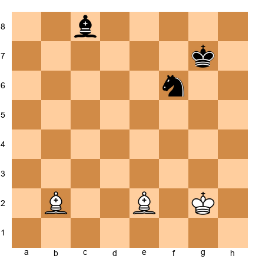

**Task:** Who has the better minor pieces, and why?
**Hint 1:** White has two bishops. Black has one bishop and one knight.
**Hint 2:** White's bishops cover both light and dark squares. Black's pieces cover mostly the same type of squares (the knight goes to both, but the bishop is limited to one color).
**Hint 3:** The bishop pair gives White about a 0.5-point advantage.
**Solution:** **White's bishop pair is better.** Two bishops cover all 64 squares between them. Black's bishop and knight are fine pieces, but they do not have the same combined reach. White holds roughly a half-point advantage from the bishop pair alone. **Why this works:** The bishop pair advantage is real and well documented. Two bishops complement each other in a way that bishop+knight cannot match.

---

**Exercise 4.30** ★
**Position:** White: King on g1, Knight on e5, Pawns on d4, f4, g3, h2. The knight is on a beautiful central outpost supported by pawns. Black: King on g8, Bishop on c8, Pawns on d5, e6, f7, g7, h7. The bishop is blocked by its own pawns.

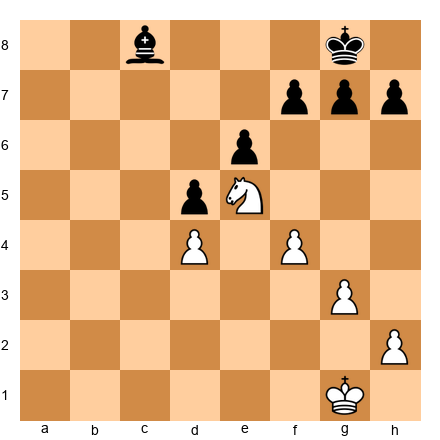

**Task:** Which is worth more, the knight on e5 or the bishop on c8?
**Hint 1:** The knight on e5 is in the center, supported by the d4 and f4 pawns. It cannot be chased away.
**Hint 2:** The bishop on c8 is stuck behind its own pawns on e6, d5, and f7. It has no good diagonals.
**Hint 3:** A well-placed knight on an outpost can be worth 5 points. A blocked bishop can be worth 1-2 points.
**Solution:** **The knight is worth MUCH more.** The knight on e5 is on a perfect outpost, protected by pawns, controlling important squares. The bishop on c8 is a "bad bishop" blocked by its own pawns with no active future. This knight might be worth 4-5 points in practice, while the bishop is worth 1-2. **Why this works:** Position changes everything. A knight on a permanent outpost is worth far more than a bishop trapped behind its own pawns.

---

**Exercise 4.31** ★★
**Position:** White: King on g1, Rook on d7, Pawns on a2, b2, f2, g2, h2. The rook is on the seventh rank. Black: King on g8, Rook on a8, Pawns on a7, b7, f7, g7, h7. Black's rook is on the back rank.

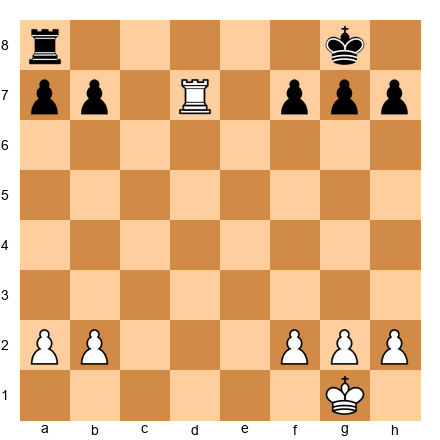

**Task:** Which rook is more valuable in this position?
**Hint 1:** White's rook is on the seventh rank, attacking b7 and f7.
**Hint 2:** Black's rook is stuck on a8, defending the a7 pawn passively.
**Hint 3:** A rook on the seventh rank is worth about a pawn more than a regular rook.
**Solution:** **White's rook on d7 is far more valuable.** It attacks multiple pawns from the seventh rank and pins Black's pieces to defensive duties. Black's rook on a8 is passive, defending the a-pawn. White's rook is effectively a 6-point piece here, while Black's rook is stuck playing defense. **Why this works:** A rook on the seventh rank is one of the most powerful setups in chess. It attacks pawns and restricts the enemy king.

---

**Exercise 4.32** ★★
**Position:** White: King on e1, Bishop on e2, Pawns on a2, b3, c4, d3, e4, f3, g2, h3. White has 8 pawns, many on light squares. Black: King on e8, Knight on f6, Pawns on a7, b6, c5, d6, e5, f7, g7, h6.

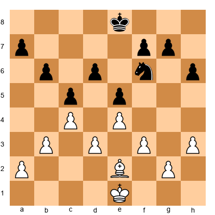

**Task:** Is White's bishop good or bad?
**Hint 1:** White's bishop is on e2, a light square. Look at where White's pawns are.
**Hint 2:** White's pawns are on a2, b3, c4, d3, e4, f3, g2, h3. Many of these are on light squares (b3, d3, f3, h3).
**Hint 3:** A "bad bishop" is one blocked by its own pawns on the same color squares. White's pawns are clogging up the light squares.
**Solution:** **White's bishop is bad.** It sits on e2 (a light square) and is blocked by its own pawns on b3, d3, f3, and h3, all of which are also on light squares. The bishop has very limited scope. Meanwhile, Black's knight on f6 is active and can hop to good squares. **Why this works:** When your pawns sit on the same color squares as your bishop, the bishop becomes "bad." It cannot move freely because its own pawns are in the way.

---

**Exercise 4.33** ★
**Position:** White: King on g1, Rook on d1, Rook on e1. Both rooks are connected on the first rank. Black: King on g8, Rook on a8, Rook on h8. Black's rooks are separated.

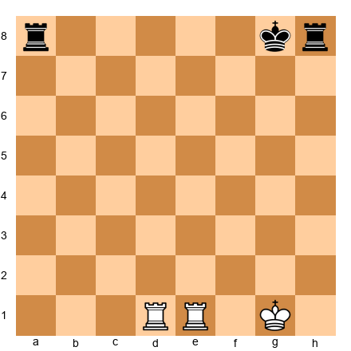

**Task:** Whose rooks are better positioned?
**Hint 1:** White's rooks can see each other on the first rank. They are connected and can support one another.
**Hint 2:** Black's rooks are on a8 and h8, on opposite corners. They cannot see each other because the king is in between.
**Hint 3:** Connected rooks are always stronger than disconnected rooks.
**Solution:** **White's rooks are better.** They are connected and can double on any file quickly (Rd7 and Re7, or both swing to the d-file). Black's rooks are disconnected, separated by the king on g8, and cannot easily coordinate. **Why this works:** Connected rooks protect each other and double their attacking power. Disconnected rooks fight alone.

---

**Exercise 4.34** ★★
**Position:** White: King on g1, Bishop on a1, Pawns on d4, e5, f4. The bishop is in the corner. Black: King on g8, Knight on d5, Pawns on e6, f5. The knight is in the center.

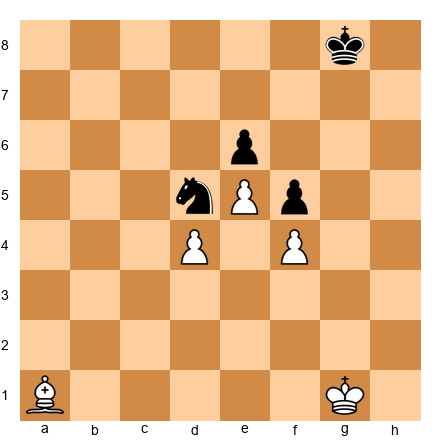

**Task:** Which minor piece is better here?
**Hint 1:** The bishop on a1 is on the long diagonal. But does it have targets?
**Hint 2:** The a1-h8 diagonal is mostly open, but the bishop aims at... empty squares. No Black pieces are in its path.
**Hint 3:** The knight on d5 is perfectly centralized, attacking c3, e3, b4, f4, b6, f6, c7, e7. It is a monster.
**Solution:** **The knight on d5 is much better.** It sits on a dominant central outpost, attacking 8 squares, and is protected by the e6 pawn. The bishop on a1, while on a long diagonal, has no real targets. The knight is worth about 4 points here, the bishop about 2-3. **Why this works:** Placement matters more than the piece's raw point value. A centralized knight on an outpost beats a corner bishop with no targets.

---

**Exercise 4.35** ★★★
**Position:** White: King on g1, Rook on d1, Bishop on f1, Knight on a1, Pawns on a2, b2, c3, f2, g2, h2. Black: King on g8, Rook on d8, Bishop on g7, Knight on e5, Pawns on a7, b7, c6, f7, g6, h7.

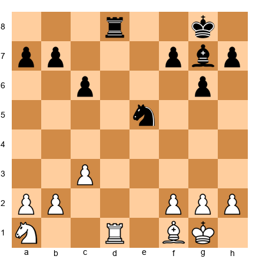

**Task:** Compare all four minor pieces. Rank them from most valuable to least valuable in this position.
**Hint 1:** Black's knight on e5 is perfectly centralized. Black's bishop on g7 controls the long diagonal.
**Hint 2:** White's bishop on f1 is passive, sitting on its starting square. White's knight on a1 is in the worst possible corner.
**Hint 3:** Active, centralized pieces are worth more. Passive, corner pieces are worth less.
**Solution:** **Ranking (best to worst): 1. Black's Ne5 (dominant outpost), 2. Black's Bg7 (active on long diagonal), 3. White's Bf1 (passive but has potential), 4. White's Na1 (worst possible square for a knight).** The position shows how placement changes value. Black's pieces are worth close to 4 points each. White's knight on a1 is worth about 1-2 points. **Why this works:** A knight in the corner controls only two squares. A knight in the center controls eight. Where a piece sits determines what it is worth.

---

### Section D: Find the Winning Trade (Exercises 4.36–4.45)

Each position has a trade that wins material or reaches a winning endgame. Find it.

---

**Exercise 4.36** ★
**Position:** White: King on g1, Queen on d5, Rook on e1, Pawns on a2, b2, f2, g2, h2. Black: King on g8, Queen on e7, Rook on e8, Knight on c6, Pawns on a7, b7, f7, g7, h7. White is up a pawn. White can trade queens.

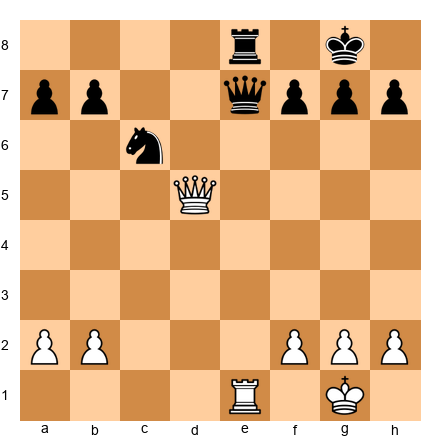

**Task:** Find the best trade for White.
**Hint 1:** White is up a pawn. What should White do when ahead?
**Hint 2:** White can play Qd7, which attacks the queen and threatens Qxe8+. Or White can play Qxe7 Rxe7, Rxe7.
**Hint 3:** The simplest winning plan is Qxe7 Rxe7, then Rxe7. White trades everything and is up a pawn in the endgame.
**Solution:** **Play Qxe7!** After Qxe7 Rxe7, Rxe7, White has traded queens and rooks, reaching a pawn endgame (or knight+pawn endgame) where the extra pawn wins. **Why this works:** When ahead in material, trade into a winning endgame. Even one extra pawn is enough to win when most pieces are off the board.

---

**Exercise 4.37** ★
**Position:** White: King on g1, Rook on e1, Bishop on d5, Pawns on a2, b2, f2, g2, h2, plus an extra pawn on c6. Black: King on g8, Rook on e8, Knight on d7, Pawns on a7, b7, f7, g7, h7.

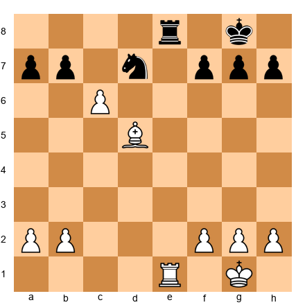

**Task:** White has an extra passed pawn on c6. Find the winning trade.
**Hint 1:** If White trades rooks, the passed c-pawn will be hard to stop.
**Hint 2:** Rxe8+ Nxe8, then the c-pawn marches forward.
**Hint 3:** After Rxe8+ Nxe8, White plays c7 and the pawn will promote.
**Solution:** **Play Rxe8+ Nxe8, then c7!** After trading rooks, the passed c-pawn on c7 is unstoppable. Black's knight cannot block it (Nd6 is met by Bxb7, and the pawn promotes). White wins. **Why this works:** Trade rooks when you have a passed pawn ready to promote. Without a rook to stop it, the pawn runs home.

---

**Exercise 4.38** ★
**Position:** White: King on g1, Queen on d4, Bishop on c4, Pawns on a2, f2, g2, h2. Black: King on g8, Queen on d8, Bishop on e6, Pawns on a7, f7, g7, h7. White can play Bxe6, winning a bishop for a bishop (even), but then Qxd8 would be possible depending on the recapture.

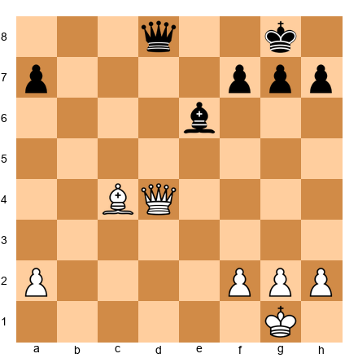

**Task:** Find the move that wins material.
**Hint 1:** What if White plays Bxe6 fxe6? Then look at the position. Is there a follow-up?
**Hint 2:** After Bxe6 fxe6, Black's f-file is open and the e6 pawn is weak. But more importantly...
**Hint 3:** After Bxe6, Black must deal with the threat. If fxe6, then Qd7! threatens Qe8 checkmate and also attacks the e6 pawn. Or just Qxd8 first, then Bxe6.
**Solution:** **Play Qxd8+ first!** After Qxd8+ Kf8 (or Kh8), White plays Bxe6 fxe6. White has traded queens and then captured a bishop for free. White ends up with B+4P vs 4P in the endgame, which wins easily. **Why this works:** Look for sequences. Trade queens first (when it forces a recapture), then grab the undefended piece.

---

**Exercise 4.39** ★
**Position:** White: King on g1, Rook on e1, Rook on d1, Bishop on g5, Pawns on a2, b2, c3, f2, g2, h2. Black: King on g8, Rook on e8, Rook on d8, Knight on f6, Pawns on a7, b7, c6, f7, g7, h6. Several trading sequences are possible. Find the best one.

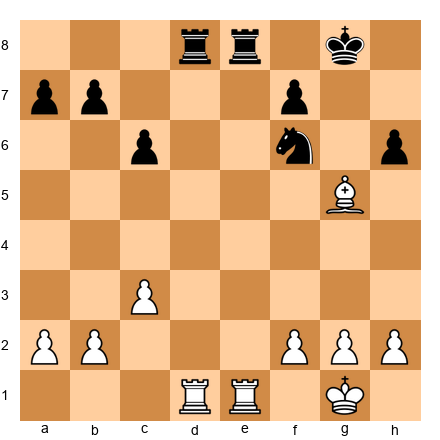

**Task:** White can play Rxd8 Rxd8, Rxd8+ Kxd8, then what? Or Bxf6 first? Find the right sequence.
**Hint 1:** If White plays Rxd8 Rxd8, Rxd8+ Kxd8, the bishop on g5 pins nothing because the king moved. White just traded rooks evenly.
**Hint 2:** Try Bxf6 first. After Bxf6 gxf6, White has traded B for N (even in points). But now...
**Hint 3:** After Bxf6 gxf6, White plays Rxd8 Rxd8, Rxd8+ Kxd8. White traded everything and Black has a damaged kingside with doubled f-pawns. That is a small advantage but not winning.
**Solution:** **The best sequence is Rxd8 Rxd8, Bxf6!** After trading one pair of rooks with Rxd8 Rxd8, White plays Bxf6! Now gxf6 (forced), and then Rxd8+ Kxd8. White traded B(3) for N(3), which is even, but Black ends up with doubled f-pawns and a weaker king position. The trade sequence matters. **Why this works:** The order of trades matters. By trading one rook first, White keeps the bishop active to inflict structural damage before completing the simplification.

---

**Exercise 4.40** ★★
**Position:** White: King on f1, Queen on e2, Rook on d1, Pawns on a2, b3, c4, e4, f2, g2, h2. Black: King on g8, Queen on a5, Rook on d8, Knight on d4, Pawns on a7, b7, e5, f7, g7, h7. Black's knight on d4 is threatening White's queen.

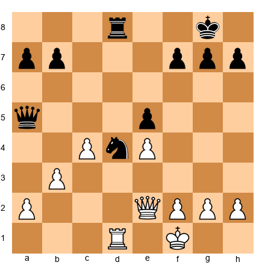

**Task:** Find the winning trade for White.
**Hint 1:** Black's knight on d4 is attacking White's queen on e2 and threatening Nc2+.
**Hint 2:** White should deal with the knight immediately. Rxd4! exd4 wins a knight for... a rook? No, Rxd4 captures the knight with the rook.
**Hint 3:** If White plays Rxd4, Black recaptures Rxd4 (rook takes rook). White traded R(5) for N(3) and then Black took back R(5). White loses the exchange. Instead, look for a move that deals with the knight while keeping material. Try Qb5, trading queens first.
**Solution:** **Play Qb5!** White moves the queen to b5, attacking Black's queen on a5 and threatening to trade queens. After Qxa5 Qxa5, White has simplified and the knight on d4 no longer has the queen to coordinate with. Then Rxd4 exd4 wins the knight cleanly. **Why this works:** Sometimes the winning trade requires preparation. Removing the enemy queen first makes capturing the knight safer and cleaner.

---

**Exercise 4.41** ★★
**Position:** White: King on g1, Queen on d1, Rook on f1, Bishop on c4, Pawns on a2, c3, d4, f2, g2, h2. Black: King on g8, Queen on d7, Rook on f8, Bishop on e6, Pawns on a7, b6, d5, f7, g7, h7.

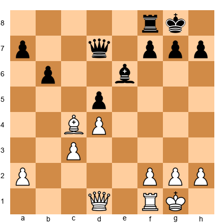

**Task:** Find the trade that wins a pawn.
**Hint 1:** The bishops on c4 and e6 are facing each other. What if White plays Bxe6?
**Hint 2:** After Bxe6 fxe6 (or Qxe6), Black's pawn structure changes. If fxe6, the d5 pawn is now undefended.
**Hint 3:** After Bxe6 fxe6, White plays Qxd5! winning the d-pawn. The queen attacks d5 and e6 at the same time.
**Solution:** **Play Bxe6! fxe6, then Qxd5!** White trades bishop for bishop (even), but then the d5 pawn is left unprotected. White picks it up with Qxd5, winning a pawn. **Why this works:** Trade the defender, then capture the target. The bishop on e6 was protecting d5. Remove the defender, then take the pawn.

---

**Exercise 4.42** ★
**Position:** White: King on g1, Rook on e1, Knight on d5, Pawns on a2, b2, f2, g2, h2. The knight is on a powerful outpost. Black: King on g8, Rook on e8, Bishop on f8, Pawns on a7, b7, c7, f7, g7, h7.

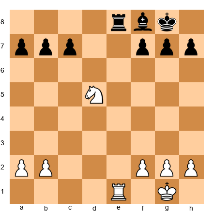

**Task:** Should White trade rooks with Rxe8?
**Hint 1:** After Rxe8 Bxe8, White has Knight vs Bishop with equal pawns.
**Hint 2:** The knight is on a dominant d5 outpost. The bishop on e8 (or f8) is passive.
**Hint 3:** In the resulting endgame, White's knight dominates Black's bishop. The trade is good.
**Solution:** **Yes, trade rooks with Rxe8!** After Rxe8 Bxe8, White's knight on d5 is far superior to Black's passive bishop. The resulting knight vs bishop endgame is clearly better for White. **Why this works:** Trade rooks when the resulting minor piece endgame favors you. White's dominating knight will win pawns in the endgame.

---

**Exercise 4.43** ★★
**Position:** White: King on g1, Queen on f3, Rook on d1, Pawns on a2, b2, c3, e5, f2, g2, h2. Black: King on g8, Queen on c7, Rook on d8, Bishop on d5, Pawns on a7, b7, e6, f7, g7, h7. White can play Rxd5 exd5, Qxd5 forking the rook and winning material, but let us verify.

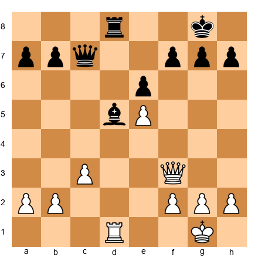

**Task:** Find the winning trade sequence.
**Hint 1:** Black's bishop on d5 is blocking the d-file. What if White removes it?
**Hint 2:** Rxd5! exd5, and now White's queen on f3 can attack the d5 pawn. Qxd5 captures.
**Hint 3:** After Rxd5 exd5, Qxd5, White has won the exchange (gave up R for B, gaining 2 points) and also has a powerful queen on d5.
**Solution:** **Play Rxd5! exd5, Qxd5, threatening Qxd8+.** After Rxd5 exd5, the queen captures on d5 with a powerful centralized position AND a direct threat against the rook on d8. Black must deal with the threat of Qxd8+. White ends up winning the rook or forcing a dominant position. **Why this works:** The tactic works because after removing the bishop defender, the queen on d5 attacks the d8 rook directly. White wins material through the sequence.

---

**Exercise 4.44** ★★★
**Position:** White: King on g1, Queen on d2, Rook on a1, Rook on f1, Bishop on g5, Pawns on a2, b2, c3, d4, f2, g2, h2. Black: King on g8, Queen on e7, Rook on a8, Rook on e8, Knight on f6, Knight on d5, Pawns on a7, b7, c6, e6, f7, g7, h7. White can play Bxf6, then Nxf6+ or Qxf6 or gxf6. Several recaptures.

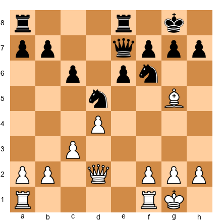

**Task:** Find the best trade for White.
**Hint 1:** Black has a powerful knight on d5 and a knight on f6. Which one is more dangerous?
**Hint 2:** Bxf6 removes one knight. After Bxf6 Qxf6 (or Nxf6 or gxf6), assess the result.
**Hint 3:** After Bxf6 Nxf6 (keeping the queen active), White has traded the bishop for a knight. But the real target was to remove a defender of d5. Now White can play c4, pushing the other knight away.
**Solution:** **Play Bxf6! followed by c4.** After Bxf6 Qxf6 (or Nxf6), White follows up with c4, challenging the knight on d5. The knight must retreat, giving White control of the center. The trade sequence removes a key defender and prepares to chase the other knight away. **Why this works:** Sometimes you trade one piece to attack another. Remove the f6 knight, then push c4 to dislodge the d5 knight. It is a two-step plan.

---

**Exercise 4.45** ★★
**Position:** White: King on g1, Rook on d1, Rook on e1, Knight on d5, Pawns on a2, b2, c3, f2, g2, h2. Black: King on g8, Rook on d8, Rook on e8, Bishop on e6, Pawns on a7, b7, c6, f7, g7, h7. White's knight on d5 is powerful. Black can play Bxd5. Should White recapture with cxd5 or with Rxd5?

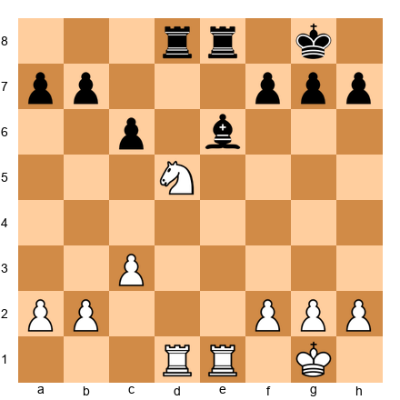

**Task:** After Black plays ...Bxd5, which recapture is better for White: cxd5 or Rxd5?
**Hint 1:** If cxd5, White gets a strong passed d-pawn on d5 but the c-file opens.
**Hint 2:** If Rxd5 cxd5, the material is even (R+N vs R+B already, now White gets a pawn back). White keeps two rooks active on the d-file.
**Hint 3:** Rxd5 is usually better because it keeps White's rooks active and maintains pressure down the d-file. After Rxd5 cxd5, both rooks control the open files.
**Solution:** **Recapture with Rxd5.** After Rxd5 cxd5, White's remaining rook on e1 is active, and the d-file rook on d5 puts pressure on Black. Taking with the pawn (cxd5) blocks White's own rook on d1. Keep the files open for your rooks. **Why this works:** Recaptures matter. Rxd5 keeps the rooks active. cxd5 blocks the rook. Active rooks are almost always worth more than an extra center pawn.

---

### Section E: Sacrifice or Blunder? (Exercises 4.46–4.50)

For each position, one side gives up material. Decide whether it is a brilliant sacrifice (with a real purpose) or a blunder (giving up material for nothing).

---

**Exercise 4.46** ★
**Position:** White: King on g1, Queen on d1, Rook on e1, Knight on f3, Pawns on a2, b2, c2, d4, f2, g2, h2. Black: King on e8, Queen on d8, Rook on a8, Bishop on c8, Knight on c6, Pawns on a7, b7, d5, e4, f7, g7, h7. White plays Nxe4. Is this a blunder?

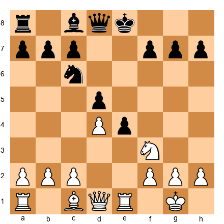

**Task:** White plays Nxe4, capturing a pawn with the knight. Is this a sacrifice, a blunder, or just a normal capture?
**Hint 1:** The knight was on f3, and it captures the e4 pawn. White wins a pawn (1 point) for free.
**Hint 2:** After Nxe4, is the knight safe? Can Black capture it? Black could play dxe4, and then what?
**Hint 3:** After Nxe4 dxe4, White captured a pawn (1 point) but lost the knight (3 points). Net result: White loses 2 points of material for nothing.
**Solution:** **Blunder!** After Nxe4?? dxe4, White has lost a knight (3 points) and only won a pawn (1 point). Net loss: 2 points. The knight moved to a square where it could be captured immediately. That is a blunder, not a sacrifice, because White gets nothing in return except a single pawn. **Why this works:** A real sacrifice gets something back (an attack, checkmate, a better position). This move gets nothing. It just loses a piece.

---

**Exercise 4.47** ★
**Position:** White: King on g1, Queen on h5, Rook on f1, Bishop on c4, Knight on g5, Pawns on c2, d4, e5, f2, g2, h2. Black: King on g8, Queen on e7, Rook on f8, Bishop on c8, Knight on d7, Pawns on a7, b7, d5, f7, g7, h6. White plays Nxf7! Rxf7, Bxd5.

**Task:** White plays Nxf7. Sacrifice or blunder?
**Hint 1:** After Nxf7 Rxf7, White has given up a knight (3) for a pawn (1). Down 2 points. But...
**Hint 2:** After Nxf7 Rxf7, White plays Bxd5! attacking the rook on f7. The rook must move, and White has B(3) capturing P(d5=1). But the bishop on d5 also forks the rook on f7 and targets b7.
**Hint 3:** After Nxf7 Rxf7, Bxd5, the bishop attacks the rook. Black plays Rf8, and White has won two pawns (f7 and d5) for a knight. But more importantly, the queen on h5 combined with the bishop creates a strong attack on the open kingside.
**Solution:** **Sacrifice!** White gives up a knight (3 points) but wins two pawns (2 points) and opens up Black's king. The queen on h5 and bishop on d5 create powerful threats against g8. The knight was worth 3 points, but the attack White gets is worth far more. **Why this works:** A sacrifice that opens the king AND wins material back is a great deal. White gets two pawns plus a strong attack for one knight. That is a real sacrifice with real compensation.

---

**Exercise 4.48** ★★
**Position:** White: King on g1, Queen on d1, Rook on e1, Bishop on g5, Knight on f3, Pawns on a2, b2, c2, d4, f2, g2, h2. Black: King on g8, Queen on d8, Rook on f8, Bishop on c8, Knight on f6, Pawns on a7, b7, c7, d5, e4, f7, g7, h6. Black plays ...hxg5?? (capturing the bishop with the h-pawn).

**Task:** Black plays ...hxg5. Is this a blunder?
**Hint 1:** Black captures the bishop on g5 with hxg5. Black wins a bishop (3 points).
**Hint 2:** But what happens after hxg5? Is there a reply that hurts Black?
**Hint 3:** After ...hxg5??, White plays Nxg5! Now the knight on g5 threatens f7, and Black's king is exposed with the h-file open. White has Qh5 coming with threats of Qh7 checkmate.
**Solution:** **Blunder by Black!** After hxg5?? Nxg5!, White's knight jumps into the attack. White threatens Qh5, then Qh7+ or Qxf7+. The open h-file and the knight on g5 create a devastating attack. Black won a bishop (3 points) but opened the floodgates to a mating attack. The "free" bishop was a trap. **Why this works:** Not every capture is a good idea. Taking the bishop opened the h-file and let White's knight into the attack. Black should have left the bishop on g5 and played a developing move instead.

---

**Exercise 4.49** ★★★
**Position:** White: King on g1, Queen on d1, Rook on a1, Rook on f1, Bishop on d3, Bishop on c1, Knight on f3, Pawns on a2, b2, c2, d4, f2, g2, h2. Black: King on g8, Queen on d8, Rook on a8, Rook on f8, Bishop on e7, Bishop on c8, Knight on f6, Pawns on a7, b7, c7, d5, e6, g7, h7. White plays Bxh7+! Kxh7, Ng5+ Kg8, Qh5.

**Task:** White plays Bxh7+. This is the famous "Greek Gift" sacrifice. Is it a real sacrifice?
**Hint 1:** After Bxh7+ Kxh7, Ng5+ Kg8 (or Kg6), Qh5. White has given up a bishop (3) for a pawn (1). Down 2 points.
**Hint 2:** But after Ng5+ Kg8, Qh5, White threatens Qh7 checkmate. Black must deal with this.
**Hint 3:** If Kg8 then Qh5 threatens Qh7#. Black plays Re8. White plays Qxf7+ Kh8, Qh5+ Kg8, Qh7+ Kf8, Qh8#. Checkmate! Or Black can try other defenses, but the attack is overwhelming.
**Solution:** **Brilliant sacrifice!** The "Greek Gift" (Bxh7+ followed by Ng5+ and Qh5) is one of the most famous sacrifice patterns in chess. White gives up a bishop (3 points) for a pawn (1 point), but the resulting attack against the exposed king is worth far more. In most versions of this pattern, White either forces checkmate or wins back the material with interest. **Why this works:** A sacrifice that leads to checkmate is the ultimate justification. Material means nothing if the king is trapped. This pattern appears in thousands of games, and you should learn to recognize it.

---

**Exercise 4.50** ★
**Position:** White: King on e1, Queen on d1, Rook on a1, Rook on h1, Bishop on f1, Knight on b1, Pawns on a2, b2, c2, d4, e4, f2, g2, h2. Black: King on g8, Queen on d8, Rook on a8, Rook on f8, Bishop on c5, Knight on f6, Pawns on a7, b7, c7, d6, f7, g7, h7. White has not castled. Black plays ...Bxd4. Is this a sacrifice, blunder, or normal capture?

**Task:** Black plays ...Bxd4, capturing White's d4 pawn with the bishop. Evaluate this move.
**Hint 1:** After Bxd4, Black's bishop captures a pawn (1 point). But the bishop is now on d4, in the center. Can White capture it?
**Hint 2:** White can play Qxd4, and then Black has traded B(3) for P(1). Net: Black lost 2 points. That is terrible.
**Hint 3:** After Bxd4 Qxd4, Black can play Nxe4, attacking the queen while also winning a pawn. The queen must move, and Black has captured two center pawns (d4 and e4) for a bishop. That is roughly even: B(3) for 2P(2), with a knight attacking from e4.
**Solution:** **This is a normal tactical sequence, not a sacrifice or blunder.** After Bxd4 Qxd4 Nxe4, Black has traded a bishop for two central pawns (B=3, two pawns=2). Black is down 1 point in material, but the open center and lead in development may compensate. This is a common positional pawn grab. It is not a brilliant sacrifice, and it is not a blunder. It is a calculated trade with positional compensation. **Why this works:** Not every material decision is clearly "sacrifice" or "blunder." Some trades give up material for positional compensation. Recognizing these "gray area" decisions is part of getting stronger at chess.

---

🛑 **All 50 exercises complete! Outstanding work. That is a serious accomplishment. You have practiced counting material, evaluating trades, comparing piece values, finding winning trades, and identifying sacrifices. Take a long break. You earned it.**

---

## Key Takeaways

1. **The point system (P=1, N=3, B=3, R=5, Q=9, K=infinite) is your starting guide for every trade.** It is not perfect, but it is right most of the time.

2. **The bishop pair is worth about 0.5 extra points.** Two bishops together control all 64 squares and are especially strong in open positions.

3. **Piece values change with position.** Knights love closed positions, bishops love open positions, rooks need open files, and a rook on the seventh rank is worth an extra pawn.

4. **When ahead in material, trade pieces (not pawns).** When behind, avoid trades and keep it complicated. This is the single most important trading rule.

5. **Trade your bad pieces for your opponent's good pieces, and never the other way around.** Remove their star player, keep yours.

6. **Counting material fast is about cancellation, not addition.** Match pieces one-to-one, and only count the leftovers.

7. **Sacrifices are NOT blunders when they come with a plan.** A sacrifice for checkmate, a strong attack, or a winning position is the highest art in chess.

---

## Practice Assignment

Complete these tasks with a real board, on a chess website, or with a chess app:

1. **Material counting speed drill.** Go to Lichess.org or Chess.com and watch three games in the "Live" section. Pause at random points and count the material in less than 10 seconds. Practice the cancellation method until it feels automatic.

2. **Bishop pair challenge.** Play three games (against a computer on an easy setting) where you try to keep your bishop pair for as long as possible. Notice how the two bishops work together in open positions.

3. **Trading practice.** Play five games where you focus on the trading rules. Before every trade, ask yourself the six questions from the Trading Checklist. After each game, review: did you trade at the right moments?

4. **Find the sacrifice.** Play through 10 games on a database (Lichess game explorer or the Chessgames.com archives). In each game, look for a moment where one player sacrificed material. Was it a real sacrifice or a blunder? What did the sacrificing player get in return?

---

## ⭐ Progress Check

Answer these questions honestly:

- [ ] Can you list the point value of every piece from memory?
- [ ] Can you explain why the bishop pair is worth extra and when it is NOT an advantage?
- [ ] Can you give an example of when a knight is better than a bishop, and vice versa?
- [ ] Can you explain the difference between "winning the exchange" and "losing the exchange"?
- [ ] Do you know when to trade (ahead in material) and when to avoid trading (behind in material)?
- [ ] Can you count the material in a position within 10 seconds using the cancellation method?
- [ ] Can you explain the difference between a sacrifice and a blunder?

If you checked five or more boxes, you are ready for Chapter 5. If not, go back and review the sections that feel weak. Spend extra time on the exercises that challenged you. There is no penalty for reviewing. Every grandmaster has read the same material dozens of times.

---

🛑 **End of Chapter 4. You now understand how much each piece is worth, when to trade, and when giving up material on purpose can be the best move in chess. That is a huge step forward. Take a break. Go for a walk. Let the ideas sink in. When you are ready, Chapter 5 will teach you how to deliver checkmate with just a king and queen, a king and rook, and more. The real endgame begins.**

---

*The Grandmaster Codex, Volume I: Foundations*
*Chapter 4 of 10*
