# Chapter 5: Basic Checkmates: K+Q, K+R, K+2B, K+B+N

**Volume I: Foundations | Rating Range: Beginner (300–700)**

---

> *"The hardest game to win is a won game."*
> -- Emanuel Lasker, Second World Chess Champion

---

## What You'll Learn

- How to checkmate with King and Queen against a lone King
- How to checkmate with King and Rook against a lone King
- How to checkmate with King and Two Bishops against a lone King
- How to checkmate with King, Bishop, and Knight against a lone King
- How to avoid accidental stalemate when you have an overwhelming advantage
- The step-by-step technique for each checkmate, practiced until it becomes automatic

---

## Why Learn Basic Checkmates?

You can win all the material in the world, but if you cannot deliver checkmate, the game is a draw.

That sentence is worth reading twice. Imagine playing a brilliant game. You sacrifice pieces, find clever tactics, and win your opponent's queen. You are up a full queen with nothing but kings left on the board. The game should be over. But then you spend thirty moves chasing the enemy king around the board, never quite trapping it. The clock runs out. Or worse, you accidentally stalemate your opponent and the game is drawn. All that beautiful play, wasted.

This happens. It happens to beginners every single day. And it is completely preventable.

Basic checkmates are the finishing moves of chess. Think of them like a martial artist's takedowns. You can know every punch, every kick, every block in the book. But if you cannot finish the fight when you have your opponent pinned, none of it matters. These techniques are the chess equivalent of learning to finish what you started.

There are four basic checkmates that every chess player must learn:

1. **King + Queen vs. King** (the easiest)
2. **King + Rook vs. King** (a bit harder)
3. **King + Two Bishops vs. King** (requires coordination)
4. **King + Bishop + Knight vs. King** (the hardest)

With practice, each one becomes automatic. You will not need to calculate during a game. Your hands will know what to do, just like tying your shoes. But you have to put in the practice first.

If you need to practice each technique 100 times before it clicks, that is completely normal. Every grandmaster alive today sat down and drilled these patterns until they could execute them without thinking. You are building the same foundation they built. Take your time. Be patient with yourself.

Let us begin with the easiest one.

---

## Part 1: King + Queen vs. King

### The Easiest Basic Checkmate

The queen is the most powerful piece on the board. She moves in any direction, as far as she wants, combining the power of a rook and a bishop in one piece. With that much firepower, checkmating a lone king should be straightforward. And it is, as long as you follow the technique and watch out for one dangerous trap: stalemate.

Here is the goal: push the enemy king to the edge of the board and then deliver checkmate on that edge. The queen alone cannot do it. You need your own king to help. The queen restricts the enemy king's movement, and your king walks over to assist with the final blow.

### The Box Method

The best way to think about this checkmate is the "box method." Imagine drawing a box around the enemy king on the board. The queen creates the walls of this box. Each move, you shrink the box. The enemy king has less and less room to move. Eventually the box is so small that the king is trapped on the edge, and you deliver checkmate.

Here is the step-by-step technique:

**Step 1: Use the queen to restrict the enemy king to a smaller area.**
Place your queen in the center of the board. From the center, the queen controls more squares than from anywhere else. The enemy king is now trapped in a smaller section of the board.

**Step 2: Shrink the box.**
Move your queen to push the enemy king toward an edge. Each queen move should reduce the number of squares available to the king. Do not chase the king wildly. Instead, cut off its escape routes calmly and methodically.

**Step 3: Bring your own king closer.**
Once the enemy king is restricted to a small area, start marching your king toward it. Your king needs to support the queen for the final checkmate.

**Step 4: Push the enemy king to the edge.**
Use your queen and king together to force the enemy king all the way to the edge of the board. Any edge will do: rank 1, rank 8, the a-file, or the h-file.

**Step 5: Deliver checkmate on the edge.**
With the enemy king on the edge and your king nearby, your queen delivers the final blow.

### STALEMATE WARNING

This is the number one mistake beginners make with King + Queen vs. King. You get so focused on chasing the enemy king that you accidentally leave it with **no legal moves** while it is **not in check.** That is stalemate, and stalemate is a draw. You just threw away a winning game.

The rule to remember: **always leave the enemy king at least one escape square until you are ready to deliver checkmate.** Do not suffocate the king with your queen unless you are delivering checkmate on that exact move.

A common stalemate trap:

**Set up your board:** White King on f6, White Queen on f7, Black King on h8.

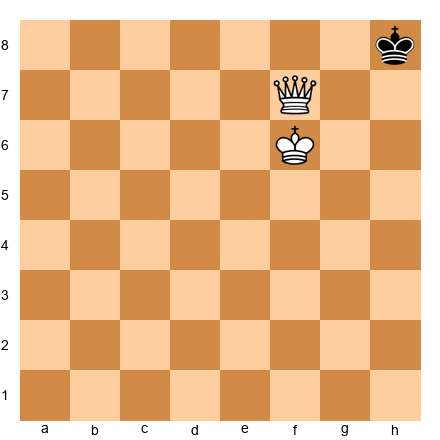

It is Black's turn. The Black king on h8 has three adjacent squares: g8, g7, and h7. Every single one is controlled:
- **g8:** controlled by the queen (diagonal f7-g8)
- **h7:** controlled by the queen (along rank 7, f7-g7-h7)
- **g7:** controlled by the queen (rank 7) and the king (adjacent f6-g7)

The king has no legal moves. But it is not in check. That is **stalemate.** The game is drawn.

To avoid this, White should have placed the queen somewhere that leaves the king at least one square to step to, and THEN set up the final checkmate.

### Complete Walkthrough

**Set up your board:** White King on e1, White Queen on d1, Black King on e8.

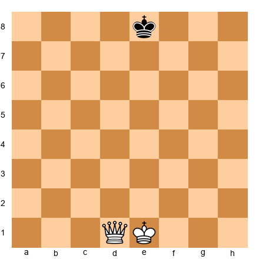

**1. Qd5** -- The queen centralizes. From d5, she controls the d-file, the 5th rank, and two long diagonals. The Black king cannot cross below rank 5.

**1...Kf8** -- The king retreats toward the kingside.

**2. Kd2** -- White brings the king forward. No rush. The queen has the restriction handled.

**2...Ke8** -- Black returns to e8.

**3. Kd3** -- The king continues its march.

**3...Kf8** -- Black shuffles.

**4. Ke4** -- The king reaches the 4th rank.

**4...Ke8** -- Black shuffles again.

**5. Ke5** -- The king arrives on the 5th rank, working alongside the queen.

**5...Kf8** -- Black goes to f8.

**6. Qd7** -- The queen seizes the 7th rank. The Black king is now trapped on the 8th rank alone. The box is one rank tall.

**6...Kg8** -- The only option. f7, e7, and e8 are all controlled by the queen.

**7. Ke6** -- The king advances to e6, closing in.

**7...Kf8** -- If 7...Kh8, then 8. Kf6 followed by 9. Qg7 checkmate.

**8. Qe7** -- A patient, careful move. The queen controls e8 and f8, while leaving g8 open so there is no stalemate.

**8...Kg8** -- Forced. The only legal square.

**9. Kf6** -- Everything is in place.

**9...Kh8** -- The only legal move. g8 is controlled by the queen (diagonal), g7 and h7 are controlled by the queen (rank 7) and the king (adjacent).

**10. Qg7 checkmate**

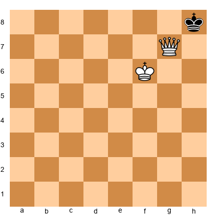

Checkmate! The queen checks the king diagonally (g7-h8). g8 is controlled by the queen along the g-file. h7 is controlled by the queen along rank 7. The king cannot capture the queen because she is protected by the king on f6. Game over in ten moves.

### Key Points for K+Q vs. K

- **Centralize your queen first.** The center gives maximum control.
- **Do not chase the king.** Restrict it. Cut off escape routes.
- **Bring your king forward.** The queen needs the king's help.
- **Watch for stalemate.** Always leave at least one legal move until you deliver the finishing blow.
- **Practice this 20 times.** Then practice it 20 more times.

🛑 **Good stopping point. You have learned the easiest basic checkmate. Practice it on your board several times before moving on. Come back fresh when you are ready for the rook.**

---

## Part 2: King + Rook vs. King

### A Step Up in Difficulty

The rook is a powerful piece, but it is not a queen. It controls ranks and files but cannot move diagonally. That single limitation makes this checkmate harder than K+Q vs. K. You need more patience, more precision, and a slightly different technique.

The good news: stalemate is much harder to achieve accidentally with a rook, so you can focus on the technique.

The goal is the same: push the enemy king to the edge and deliver checkmate there.

### The Staircase Technique

The best method is called the "staircase" or "ladder." Your rook cuts off the enemy king along a rank. Then you use your king to gain "opposition." Once you have opposition, the enemy king is forced to retreat. Then your rook cuts off the next rank. Step by step, like walking down a staircase, the king is pushed to the edge.

**Step 1: Cut off the enemy king along a rank or file using the rook.**

**Step 2: Bring your own king toward the enemy king and get opposition** (kings on the same file, one empty square between them).

**Step 3: When you have opposition and it is the enemy king's turn, it must step sideways.**

**Step 4: After the king steps sideways, use the rook to check and cut off the next rank.** This is one "step" of the staircase.

**Step 5: Repeat until the king is on the edge.**

**Step 6: Deliver checkmate on the edge** with the rook while your king covers the escape squares.

### Understanding Opposition

Two kings are "in opposition" when they stand on the same file with exactly one empty square between them. The side that must move first is at a disadvantage, because they must step sideways and give up the file.

**Set up your board:** White King on e4, Black King on e6.

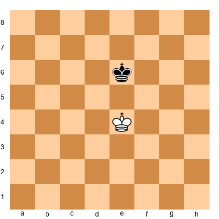

The kings face each other on the e-file with e5 between them. Neither can advance. Whoever moves first must step sideways.

In K+R vs. K, you want opposition when it is the enemy king's turn to move. That forces the king sideways, and then your rook seals off the next rank.

### Complete Walkthrough

**Set up your board:** White King on d5, White Rook on a1, Black King on d7.

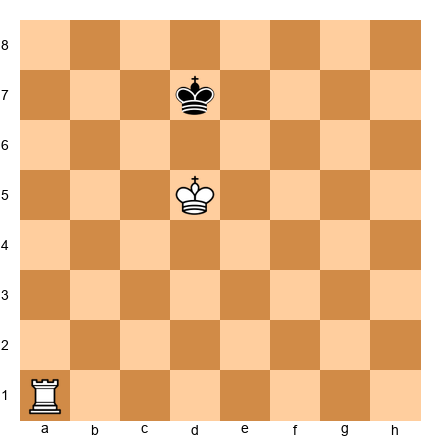

The kings are in opposition on the d-file. Time for the staircase.

**1. Ra7+** -- The rook checks along the 7th rank. The king must leave rank 7.

**1...Ke8** -- Retreats to rank 8. The rook now prevents the king from crossing below rank 7.

**2. Kd6** -- The king follows.

**2...Kf8** -- Steps sideways on the back rank.

**3. Ke6** -- The king advances, controlling d7, e7, and f7.

**3...Kg8** -- The only free square. f7 and g7 are blocked.

**4. Kf6** -- Following the king. Controls e7, f7, g7.

**4...Kh8** -- Pushed to the corner. The only free square.

**5. Kg6** -- Controls f7, g7, and h7.

**5...Kg8** -- The only legal move (h7 and g7 are controlled by the king).

**6. Ra8 checkmate**

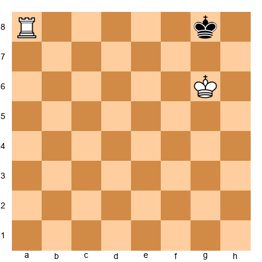

Checkmate! The rook checks along the 8th rank. f8 and h8 are covered by the rook. f7, g7, and h7 are covered by the king on g6. Every escape is sealed.

### Starting from Scratch

From the full starting position (Ke1, Ra1, Ke8), the process takes roughly 15 to 20 moves. The outline:

1. Move your rook to a central rank to cut off the enemy king.
2. March your king toward the center and toward the enemy king.
3. Whenever the enemy king steps onto the same rank as your rook, check it and push it back.
4. Re-establish opposition, then use the rook to cut off the next rank.
5. Repeat until the king is on the 8th rank.
6. Deliver checkmate on the edge.

**Tip:** When the enemy king approaches your rook to attack it, slide the rook to the other side of the board. It still controls the same rank from over there.

### Common Mistakes

**Mistake 1: Chasing the king with the rook.** The rook creates walls. The king does the pushing.

**Mistake 2: Forgetting to bring the king forward.** You cannot checkmate with a rook and a distant king.

**Mistake 3: Panicking when the king approaches the rook.** Just slide the rook to the other side.

**Mistake 4: Losing patience.** This checkmate takes more moves than K+Q. That is normal.

🛑 **The King + Rook checkmate is a real achievement. If you can do it consistently, you are ahead of many casual players. Rest here.**

---

## Part 3: King + Two Bishops vs. King

### Coordination Is the Key

This checkmate requires your two bishops to work as a team. Each bishop controls only one color of squares. One lives on light squares forever. The other lives on dark squares forever. Neither can cover the whole board alone.

But together, they form a wall. The two bishops working in tandem control both colors, creating a diagonal barrier the enemy king cannot cross.

### Why Two Bishops Can Checkmate

A single bishop can never cover squares of the other color. The enemy king can simply stand on a square the bishop cannot reach. But with two bishops on opposite colors, every square is threatened. They form a complete diagonal barrier.

The key insight: **the two bishops create a diagonal "wall" that pushes the enemy king toward a corner.** Your king helps seal off the escape, and checkmate is delivered in the corner.

### Step-by-Step Technique

**Step 1: Centralize both bishops.**
Place them on adjacent diagonals near the center. Together they create a barrier that cuts the board in half.

**Step 2: Use the bishops to drive the king toward a corner.**
Advance the barrier step by step. The king tries to stay central, but the wall forces it back.

**Step 3: Bring your king into the attack.**
Your king helps seal off squares the bishops cannot reach from their current positions.

**Step 4: Deliver checkmate in the corner.**
One bishop gives check on the long diagonal. The other bishop and the king control the remaining escape squares.

### The Diagonal Barrier

The strongest formation for the two bishops is side by side on adjacent diagonals: for example, bishops on d4 and e4, or c5 and d5. In this formation, they create overlapping zones of control that the enemy king cannot penetrate. Think of them as a pair of scissors closing in.

When you advance one bishop, advance the other to maintain the formation. Keep them working as a pair.

### The Checkmate Position

**Set up your board:** White King on b6, White Bishop on c6 (light squares), White Bishop on d6 (dark squares), Black King on a8.

Checkmate! The light-squared bishop on c6 checks along the diagonal (c6-b7-a8). The escape squares:
- **a7:** controlled by the king on b6 (adjacent)
- **b7:** controlled by the bishop on c6 (diagonal) and the king (adjacent)
- **b8:** controlled by the bishop on d6 (diagonal d6-c7-b8)

The king cannot capture the checking bishop on c6 because it is two squares away. Every escape is sealed.

Notice how each piece contributes: the light-squared bishop delivers the check, the dark-squared bishop covers the dark-squared escape (b8), and the king covers a7 and b7. Beautiful coordination.

### How You Get There

The full K+2B vs. K checkmate takes about 18 to 20 moves from a random position. There are three phases:

**Phase 1: Centralize.** Move both bishops toward the center and bring your king forward.

**Phase 2: Push the king to the edge.** Advance the diagonal wall step by step.

**Phase 3: Push the king to the corner and checkmate.** The final checkmate always happens in the corner.

Practice this on your board. Set up random positions and try to push the king to the corner using the diagonal barrier. It takes patience, but the technique will click with repetition.

🛑 **You have learned the concept behind the two-bishop checkmate. This is harder than the queen or rook checkmates and requires dedicated practice. Come back for the bishop and knight when you feel ready.**

---

## Part 4: King + Bishop + Knight vs. King

### The Hardest Basic Checkmate

This is the most difficult checkmate in this chapter, and one of the hardest techniques in all of chess. Do not panic if it takes you a long time to learn. Even experienced tournament players struggle with this one.

But here is the truth: if you learn this, you have achieved something genuinely impressive. This checkmate is a badge of honor.

### Why Is It So Hard?

The bishop and knight are fundamentally different pieces. The bishop glides along diagonals, covering long distances but stuck on one color forever. The knight hops in an L-shape, changing colors with every move but covering only a small area. Getting these two very different pieces to cooperate requires careful planning and precise execution.

And there is one more complication: **you can only deliver checkmate in a corner that matches your bishop's color.**

Read that again. If you have a light-squared bishop, you can only checkmate the enemy king in a light-squared corner (a1 or h8). If you have a dark-squared bishop, you can only checkmate in a dark-squared corner (a8 or h1).

### The Corner Problem

The defending king will naturally try to run to the "wrong" corner (the corner that does NOT match your bishop's color). If it gets there, you cannot checkmate. You must redirect it to the correct corner using a technique called the "W maneuver," where the knight zigzags to control key squares and prevent the king from retreating.

### The Checkmate Position

**Set up your board:** White King on b3, White Knight on c3, White Bishop on b2, Black King on a1.

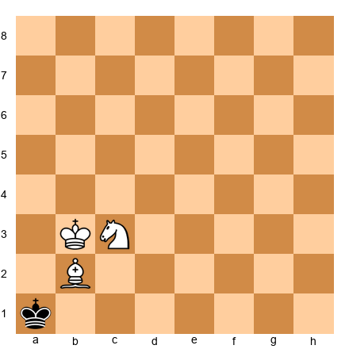

Checkmate! The bishop on b2 gives check along the diagonal (b2 to a1). The escape squares:
- **a2:** controlled by the knight on c3 (knight attacks a2)
- **b1:** controlled by the knight on c3 (knight attacks b1)
- **b2:** the bishop is there, protected by the king on b3 (adjacent)

Every piece contributes: the bishop checks, the knight covers both escape squares, and the king protects the bishop.

### Key Facts about K+B+N

- Checkmate is only possible in a corner matching the bishop's color
- Light-squared bishop: checkmate at a1 or h8
- Dark-squared bishop: checkmate at a8 or h1
- The full technique takes about 33 moves
- The 50-move rule applies: you must deliver checkmate within 50 moves of the last capture or pawn move, or the game is drawn
- This is an advanced beginner skill. Many players do not learn it until rating 1000+. That is perfectly fine.

### A Realistic Note

If you are between 300 and 700 right now, here is what matters: **know that K+B+N can checkmate, know that it only works in the bishop's corner, and know that it takes about 33 moves.** You can practice the full technique when you are ready.

There are excellent online trainers for this endgame. Search for "bishop and knight checkmate trainer" to find interactive practice tools.

🛑 **You have now seen all four basic checkmates. That is a tremendous amount of material. Take a real break. Come back for the demonstrations and exercises when you are refreshed.**

---

## Annotated Demonstration 1: King + Queen vs. King

**Set up your board:** White King on g1, White Queen on a4, Black King on d5.

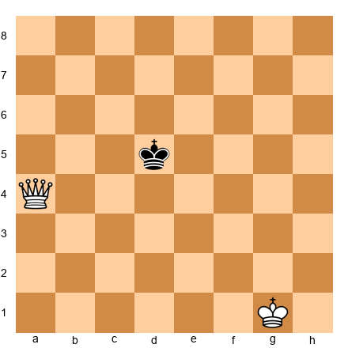

**1. Qd4+** -- The queen moves next to the king, giving check. The king must move.

**1...Ke6** -- Steps away from the queen.

**2. Qe4+** -- Another check. The queen follows.

**2...Kf7** -- Retreats further.

**3. Qe5** -- The queen centralizes on e5, cutting off the king's access to most of the board.

**3...Kg6** -- The king tries to stay away from the edges.

**4. Kf2** -- White brings the king forward. The queen has the restriction covered.

**4...Kf7** -- Retreats.

**5. Kf3** -- Continuing forward.

**5...Kg6** -- Holds the center.

**6. Kf4** -- The White king is now on the 4th rank.

**6...Kf7** -- Retreats again.

**7. Kf5** -- Both pieces are working together now.

**7...Kg8** -- The king retreats toward the corner.

**8. Qe7** -- The queen seizes the 7th rank. The king is trapped on rank 8.

**8...Kh8** -- The only square. g8 is controlled by the queen (diagonal), g7 and h7 by the queen (rank 7).

**9. Kf6** -- The king advances.

**9...Kg8** -- Forced back.

**10. Qg7 checkmate** -- The queen checks diagonally. g8 is sealed by the g-file, h7 by rank 7, and the king on f6 protects the queen. Ten moves, start to finish.

---

## Annotated Demonstration 2: King + Rook vs. King -- The Staircase

**Set up your board:** White King on d5, White Rook on a1, Black King on d7.

**1. Ra7+** -- The rook checks along rank 7. The king must leave.

**1...Ke8** -- Retreats to rank 8. The rook prevents crossing below rank 7.

**2. Kd6** -- The king follows.

**2...Kf8** -- Steps sideways.

**3. Ke6** -- White advances, controlling d7, e7, f7.

**3...Kg8** -- The only free square.

**4. Kf6** -- Following. Controls e7, f7, g7.

**4...Kh8** -- Pushed to the corner.

**5. Kg6** -- Controls f7, g7, h7.

**5...Kg8** -- Forced. The only legal move.

**6. Ra8 checkmate** -- The rook checks along the 8th rank. f8 and h8 are covered by the rook. f7, g7, h7 are covered by the king. Six moves of pure staircase technique.

---

## Annotated Demonstration 3: King + Two Bishops vs. King -- The Diagonal Wall

**Set up your board:** White King on c4, White Bishop on d4 (dark squares), White Bishop on e4 (light squares), Black King on c6.

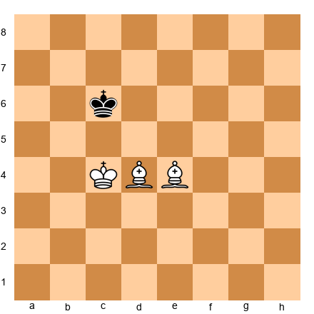

This demonstration shows the final phase, where the bishops drive the king into the corner.

**1. Bc5** -- The dark-squared bishop advances, controlling b6 and d6. The king cannot go forward.

**1...Kb7** -- The king retreats.

**2. Bd5+** -- The light-squared bishop checks along the diagonal (d5-c6-b7). The king must move toward the corner.

**2...Ka8** -- Forced toward the a8 corner.

**3. Kb6** -- The king advances, covering a7, b7, and c7.

From here the technique continues: the bishops tighten the diagonal wall while the king supports, driving the defending king into the corner. The final checkmate position looks like this:

**Set up your board (final position):** White King on b6, White Bishop on c6 (light), White Bishop on d6 (dark). Black King on a8.

This is checkmate. The bishop on c6 checks along the diagonal c6-b7-a8. Escapes: a7 is covered by the king, b7 is covered by the bishop on c6 and the king, b8 is covered by the bishop on d6 along the c7-b8 diagonal. All sealed.

The full process takes about 18 moves from a central position.

🛑 **Three demonstrations complete. Take a break before the exercises.**

---
## Exercises

Work through these exercises on your board or on a screen. Set up each position, find the solution, and then check your answer. If you get stuck, use the hints. There is no shame in using hints. That is what they are for.

---

### Section A: King + Queen vs. King (Exercises 5.1 – 5.20)

**Exercise 5.1** ★
**Position:** White: Kg6, Qf5. Black: Kh8.

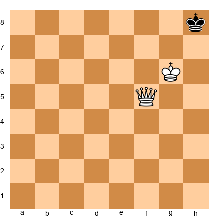

**Task:** Checkmate in 1 move.
**Hint 1:** The queen needs to reach a square that checks the king and covers g8.
**Hint 2:** The king on g6 already covers g7 and h7.
**Hint 3:** Move the queen to the 8th rank along the f-file.
**Solution:** **1. Qf8#** -- The queen checks along rank 8. g8 is covered by the queen. g7 and h7 are covered by the king. Why this works: the queen seals the back rank while the king blocks rank 7.

---

**Exercise 5.2** ★
**Position:** White: Ka6, Qe7. Black: Ka8.

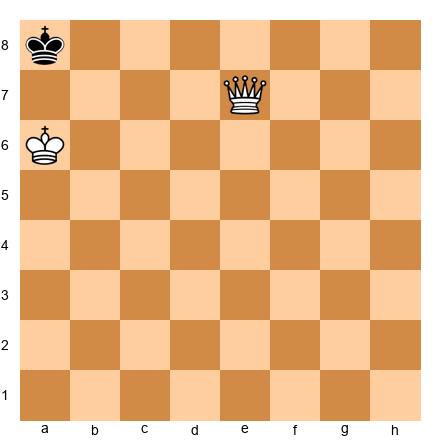

**Task:** Checkmate in 1 move.
**Hint 1:** The queen can reach a7 along rank 7.
**Hint 2:** On a7, the queen gives check along the a-file.
**Hint 3:** The king on a6 protects the queen on a7.
**Solution:** **1. Qa7#** -- The queen checks along the a-file. b8 is covered on the diagonal, b7 along rank 7. The king protects the queen.

---

**Exercise 5.3** ★
**Position:** White: Kb6, Qa5. Black: Ka8.

**Task:** Checkmate in 1 move.
**Hint 1:** Same mating square as Exercise 5.2.
**Hint 2:** The queen moves from a5 to a7 along the a-file.
**Hint 3:** Qa7#.
**Solution:** **1. Qa7#** -- Same pattern. The queen checks on the a-file. b8 covered by the diagonal, b7 by rank 7 and the king.

---

**Exercise 5.4** ★
**Position:** White: Kf7, Qg5. Black: Kh8.

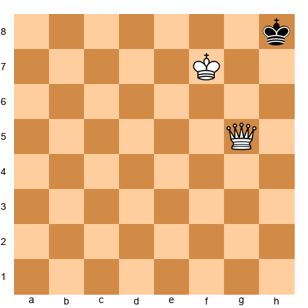

**Task:** Checkmate in 1 move.
**Hint 1:** The queen can reach g7.
**Hint 2:** On g7, the queen checks h8 diagonally.
**Hint 3:** The king on f7 protects g7 and covers g8.
**Solution:** **1. Qg7#** -- The queen checks diagonally. g8 is covered by the queen (g-file) and the king (f7-g8 adjacent). h7 is covered by the queen (rank 7).

---

**Exercise 5.5** ★
**Position:** White: Kc2, Qd3. Black: Ka1.

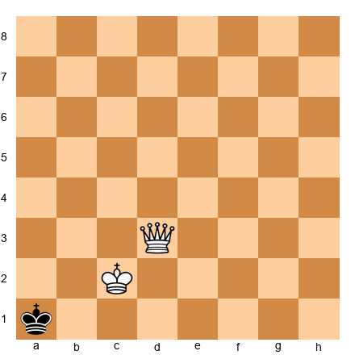

**Task:** Checkmate in 1 move.
**Hint 1:** Move the queen to b1.
**Hint 2:** On b1, the queen checks along rank 1.
**Hint 3:** a2 is covered by the diagonal. b2 is covered by the king.
**Solution:** **1. Qb1#** -- The queen checks along rank 1. a2 covered on the diagonal b1-a2. b2 covered by the king and the queen (b-file). The king protects the queen.

---

**Exercise 5.6** ★
**Position:** White: Kg2, Qf3. Black: Kh1.

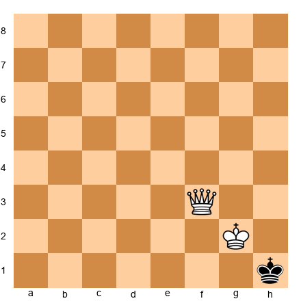

**Task:** Checkmate in 1 move.
**Hint 1:** The king covers g1 and h2.
**Hint 2:** The queen needs to check h1 along rank 1.
**Hint 3:** Qf1#.
**Solution:** **1. Qf1#** -- The queen checks along rank 1. g1 covered by the queen (rank 1) and the king (adjacent). h2 covered by the king (adjacent).

---

**Exercise 5.7** ★
**Position:** White: Kf3, Qe4. Black: Kh1.

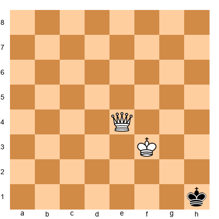

**Task:** Checkmate in 1 move.
**Hint 1:** The queen can reach g2 on the diagonal.
**Hint 2:** On g2, the queen checks h1 diagonally.
**Hint 3:** The king on f3 protects g2.
**Solution:** **1. Qg2#** -- The queen checks diagonally (g2-h1). h2 covered along rank 2. g1 covered on the g-file. The king protects the queen.

---

**Exercise 5.8** ★
**Position:** White: Kf2, Qe3. Black: Kh1.

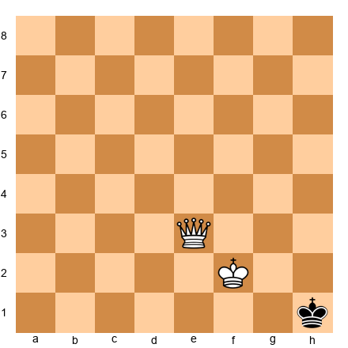

**Task:** Checkmate in 1 move.
**Hint 1:** Move the queen to g1.
**Hint 2:** The queen checks along rank 1.
**Hint 3:** h2 covered by the queen (diagonal g1-h2). g2 covered by the queen and king.
**Solution:** **1. Qg1#** -- The queen checks along rank 1. h2 covered on the diagonal. g2 covered on the g-file and by the king (adjacent). The king protects the queen (f2-g1 adjacent).

---

**Exercise 5.9** ★
**Position:** White: Kg6, Qh5. Black: Kh8.

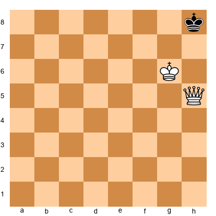

**Task:** Checkmate in 1 move.
**Hint 1:** The queen is one square from delivering a devastating check.
**Hint 2:** Qh7 checks along the h-file.
**Hint 3:** g8 is covered on the diagonal, g7 by the king.
**Solution:** **1. Qh7#** -- The queen checks along the h-file. g8 covered by the diagonal h7-g8. g7 covered by the king (adjacent). The king protects the queen (g6-h7 adjacent).

---

**Exercise 5.10** ★
**Position:** White: Kb3, Qa4. Black: Ka1.

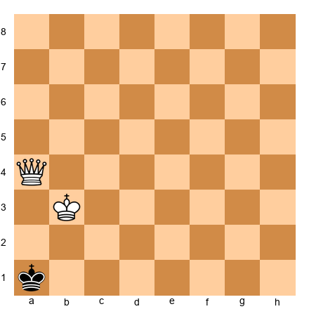

**Task:** Checkmate in 1 move.
**Hint 1:** The queen moves to a2.
**Hint 2:** Check along the a-file.
**Hint 3:** b1 covered by the diagonal, b2 by the king and rank 2.
**Solution:** **1. Qa2#** -- The queen checks along the a-file. b1 covered on the diagonal a2-b1. b2 covered along rank 2 and by the king. The king protects the queen (b3-a2 adjacent).

---

**Exercise 5.11** ★★
**Position:** White: Ke6, Qd5. Black: Ke8.

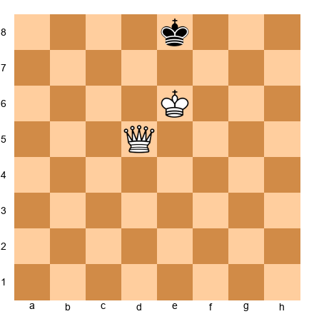

**Task:** Checkmate in 2 moves.
**Hint 1:** Check the king on d7 first.
**Hint 2:** After 1. Qd7+ Kf8, the king is in the corner area.
**Hint 3:** 2. Qf7#.
**Solution:** **1. Qd7+ Kf8** (the only legal move: d8, e7, f7 all controlled) **2. Qf7#** -- g8 covered on the diagonal, e8 on the diagonal, g7 and e7 on rank 7 and by the king.

---

**Exercise 5.12** ★★
**Position:** White: Kf6, Qe5. Black: Kh8.

**Task:** Checkmate in 2 moves.
**Hint 1:** Restrict the king to one square first.
**Hint 2:** 1. Qe7 leaves only Kg8 as a legal move.
**Hint 3:** 2. Qg7#.
**Solution:** **1. Qe7** (g7, h7, and f8 all controlled; only Kg8 is legal) **1...Kg8 2. Qg7#** -- checks along the g-file. f8 and h8 on the diagonal. f7 and h7 on rank 7.

---

**Exercise 5.13** ★★
**Position:** White: Kc7, Qd5. Black: Ka8.

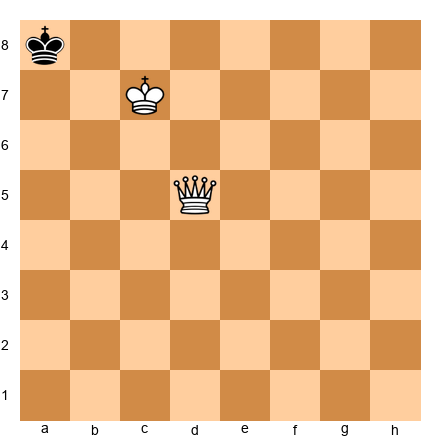

**Task:** Checkmate in 2 moves.
**Hint 1:** Check on the back rank first.
**Hint 2:** 1. Qd8+ Ka7 (b8, b7 controlled by Kc7).
**Hint 3:** 2. Qa5# (checks along the a-file; a6, a8 on the file; b6, b7, b8 by king/queen).
**Solution:** **1. Qd8+ Ka7 2. Qa5#** -- The queen checks along the a-file from a5. a6 and a8 covered on the file. b6 covered on the diagonal. b7 and b8 covered by the king.

---

**Exercise 5.14** ★★
**Position:** White: Kd6, Qc5. Black: Kd8.

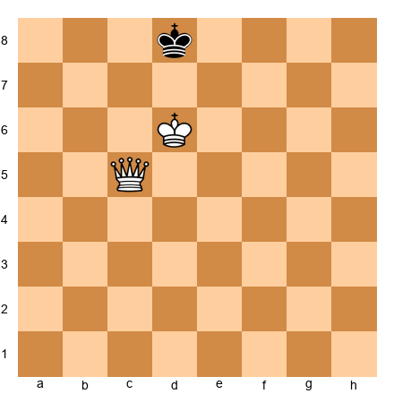

**Task:** Checkmate in 2 moves.
**Hint 1:** 1. Qc7 restricts the king to e8.
**Hint 2:** After 1...Ke8, all rank-7 squares are covered.
**Hint 3:** 2. Qe7#.
**Solution:** **1. Qc7 Ke8 2. Qe7#** -- d8 covered on the diagonal and by the king. f8 on the diagonal. d7 on rank 7 and by the king. f7 on rank 7.

---

**Exercise 5.15** ★★
**Position:** White: Kg6, Qf4. Black: Kh8.

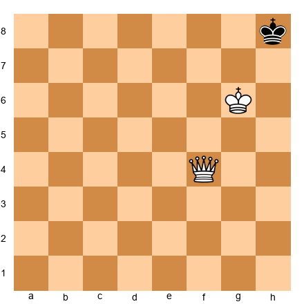

**Task:** Checkmate in 2 moves.
**Hint 1:** Check on the diagonal first.
**Hint 2:** 1. Qf6+ Kg8 (only legal move).
**Hint 3:** 2. Qf8#.
**Solution:** **1. Qf6+ Kg8** (g7 is covered by the king on g6; g8 is the only legal move) **2. Qf8#** -- The queen checks along rank 8. h7 covered by king. g7 covered by king. Checkmate.

---

**Exercise 5.16** ★★
**Position:** White: Kb3, Qc4. Black: Ka1.

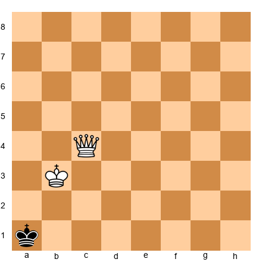

**Task:** Checkmate in 2 moves.
**Hint 1:** Check along rank 1 first.
**Hint 2:** 1. Qc1+ Ka2 (b1 and b2 covered by king and queen).
**Hint 3:** 2. Qb2#.
**Solution:** **1. Qc1+ Ka2 2. Qb2#** -- checks along rank 2 (b2-a2). a1 covered on the diagonal. a3 covered on the diagonal and by the king. b1 covered on the b-file.

---

**Exercise 5.17** ★★
**Position:** White: Kf6, Qg5. Black: Kf8.

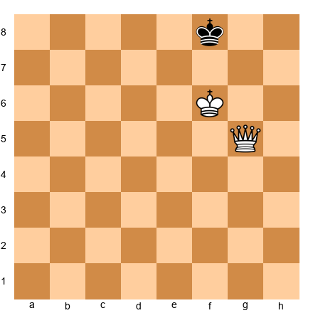

**Task:** Checkmate in 2 moves.
**Hint 1:** Restrict the king with a quiet queen move.
**Hint 2:** 1. Qe7 forces Kg8.
**Hint 3:** 2. Qg7#.
**Solution:** **1. Qe7 Kg8 2. Qg7#** -- same pattern as Exercise 5.12. The queen seals rank 7 and the g-file.

---

**Exercise 5.18** ★★
**Position:** White: Kg2, Qf4. Black: Kh1.

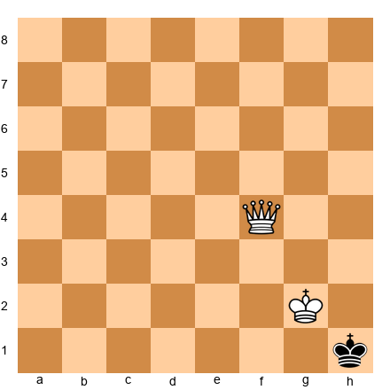

**Task:** Checkmate in 2 moves.
**Hint 1:** Check on rank 1 first.
**Hint 2:** 1. Qf1+ Kh2 (g1 covered by queen and king).
**Hint 3:** 2. Qg1#.
**Solution:** **1. Qf1+ Kh2 2. Qg1#** -- checks diagonally (g1-h2). h1 covered on rank 1. h3 covered by the king. g2 is the king's square. g3 covered by the king.

---

**Exercise 5.19** ★★
**Position:** White: Kb6, Qc4. Black: Ka8.

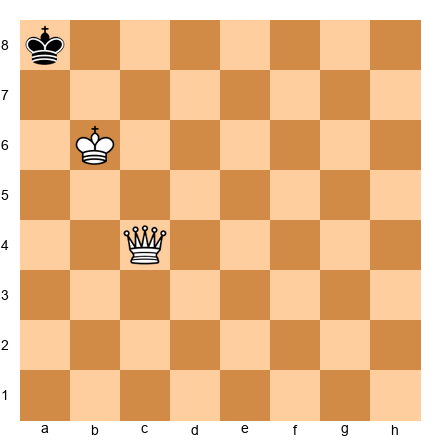

**Task:** Checkmate in 2 moves.
**Hint 1:** Check on the back rank.
**Hint 2:** 1. Qc8+ Ka7 (b8, b7 covered by king).
**Hint 3:** 2. Qb7#.
**Solution:** **1. Qc8+ Ka7 2. Qb7#** -- checks along rank 7 (b7-a7). a8 covered on the diagonal. a6 covered on the diagonal. b8 on the b-file. The king protects the queen.

---

**Exercise 5.20** ★★
**Position:** White: Kd6, Qe5. Black: Kd8.

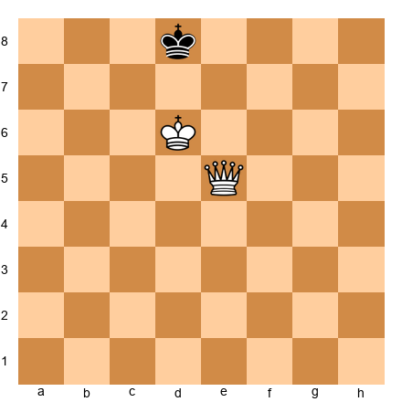

**Task:** Checkmate in 2 moves.
**Hint 1:** Restrict with 1. Qc7.
**Hint 2:** After 1...Ke8, the king is trapped.
**Hint 3:** 2. Qe7#.
**Solution:** **1. Qc7 Ke8 2. Qe7#** -- same pattern as Exercise 5.14.

---

### Section B: King + Rook vs. King (Exercises 5.21 – 5.40)

**Exercise 5.21** ★★
**Position:** White: Kb6, Rh1. Black: Ka8.

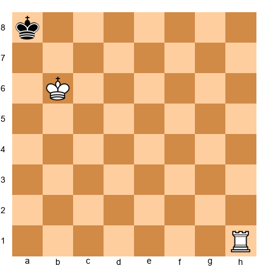

**Task:** Checkmate in 1 move.
**Hint 1:** The rook needs to reach the 8th rank.
**Hint 2:** Rh8 checks along the entire 8th rank.
**Hint 3:** The king on b6 covers a7 and b7.
**Solution:** **1. Rh8#** -- The rook checks along rank 8. a7 covered by king (adjacent). b7 covered by king (adjacent). b8 covered by rook (rank 8).

---

**Exercise 5.22** ★★
**Position:** White: Kg6, Ra1. Black: Kg8.

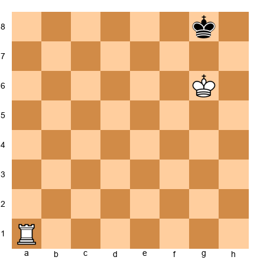

**Task:** Checkmate in 1 move.
**Hint 1:** Ra8# seals the 8th rank.
**Hint 2:** The king covers f7, g7, and h7.
**Solution:** **1. Ra8#** -- Rook checks along rank 8. f7, g7, h7 covered by king. f8, h8 covered by rook.

---

**Exercise 5.23** ★★
**Position:** White: Kc2, Rh3. Black: Ka1.

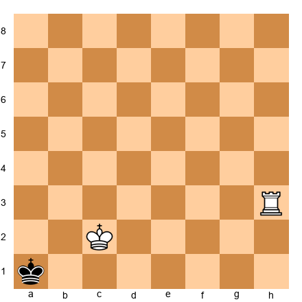

**Task:** Checkmate in 1 move.
**Hint 1:** The rook can reach the a-file from h3.
**Hint 2:** Ra3 checks along the a-file.
**Hint 3:** The king covers b1 and b2.
**Solution:** **1. Ra3#** -- The rook checks along the a-file. a2 covered by rook (a-file). b1 covered by king (adjacent c2-b1). b2 covered by king (adjacent).

---

**Exercise 5.24** ★★
**Position:** White: Kf6, Rd1. Black: Kf8.

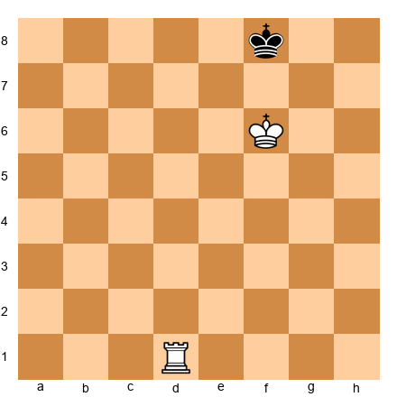

**Task:** Checkmate in 1 move.
**Hint 1:** The rook goes to the 8th rank.
**Hint 2:** Rd8# seals everything.
**Solution:** **1. Rd8#** -- Rook checks along rank 8. e7, f7, g7 covered by king. e8, g8 covered by rook.

---

**Exercise 5.25** ★★
**Position:** White: Ke6, Rh1. Black: Ke8.

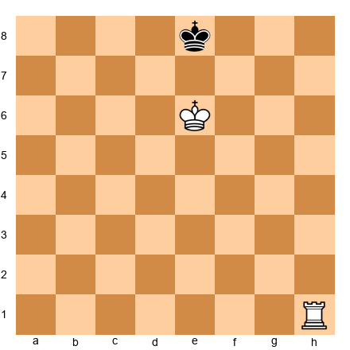

**Task:** Checkmate in 1 move.
**Hint 1:** Rh8# seals the 8th rank.
**Hint 2:** The king covers d7, e7, and f7.
**Solution:** **1. Rh8#** -- Rook checks along rank 8. d7, e7, f7 covered by king. d8, f8 covered by rook.

---

**Exercise 5.26** ★★
**Position:** White: Kb6, Rd1. Black: Ka8.

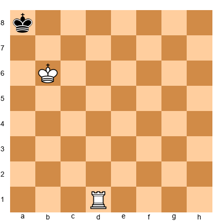

**Task:** Checkmate in 1 move.
**Hint 1:** Same pattern: rook to the 8th rank.
**Hint 2:** Rd8# checks along the rank.
**Solution:** **1. Rd8#** -- Rook checks along rank 8. b8 covered by rook. a7, b7 covered by king.

---

**Exercise 5.27** ★★
**Position:** White: Kg6, Rd1. Black: Kh8.

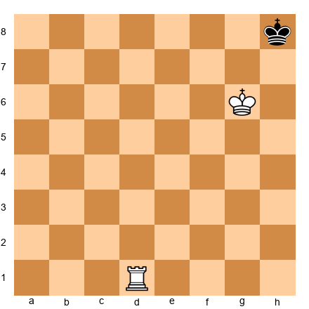

**Task:** Checkmate in 1 move.
**Hint 1:** Rd8# seals the 8th rank.
**Hint 2:** g7 and h7 covered by king. g8 covered by rook.
**Solution:** **1. Rd8#** -- Rook checks along rank 8. g8 covered by rook. g7, h7 covered by king.

---

**Exercise 5.28** ★★
**Position:** White: Kd6, Ra1. Black: Kd8.

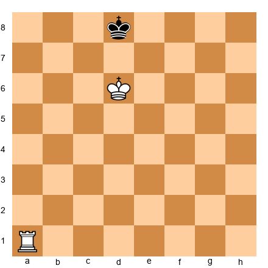

**Task:** Checkmate in 1 move.
**Hint 1:** Perfect opposition on the d-file. The rook finishes.
**Hint 2:** Ra8# seals the rank.
**Solution:** **1. Ra8#** -- Rook checks along rank 8. c7, d7, e7 covered by king. c8, e8 covered by rook.

---

**Exercise 5.29** ★★
**Position:** White: Kb6, Re1. Black: Kb8.

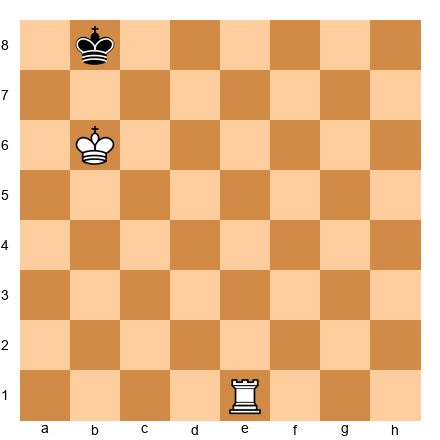

**Task:** Checkmate in 1 move.
**Hint 1:** Opposition on the b-file. Rook seals it.
**Hint 2:** Re8# checks along rank 8.
**Solution:** **1. Re8#** -- Rook checks along rank 8. a8, c8 covered by rook. a7, b7, c7 covered by king.

---

**Exercise 5.30** ★★
**Position:** White: Kh6, Ra1. Black: Kh8.

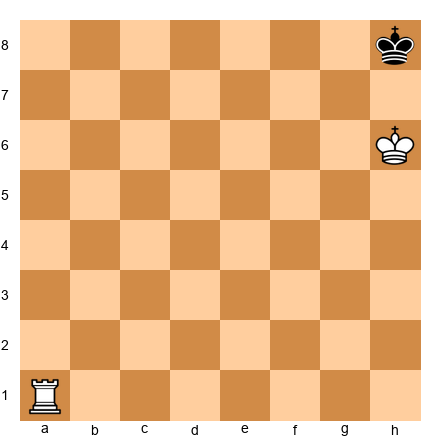

**Task:** Checkmate in 1 move.
**Hint 1:** Ra8# seals rank 8. King covers g7 and h7.
**Solution:** **1. Ra8#** -- Rook checks along rank 8. g8 covered by rook. g7, h7 covered by king.

---

**Exercise 5.31** ★★
**Position:** White: Kf5, Ra7. Black: Kh8.

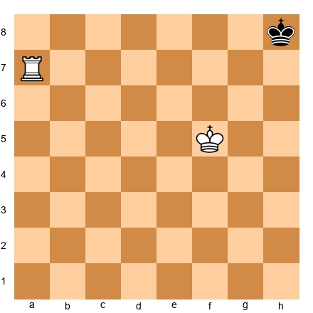

**Task:** Checkmate in 2 moves.
**Hint 1:** The king needs to step closer to cover h7 and g7.
**Hint 2:** 1. Kg6 (covers g7, h7, f7). Black has only Kg8 (h7 controlled by king, g7 controlled by king).
**Hint 3:** 2. Ra8#.
**Solution:** **1. Kg6 Kg8 2. Ra8#** -- After Kg6, the king on h8 can only go to g8. Then the rook seals rank 8 with the king covering f7, g7, h7.

---

**Exercise 5.32** ★★
**Position:** White: Kg6, Ra1. Black: Kh8.

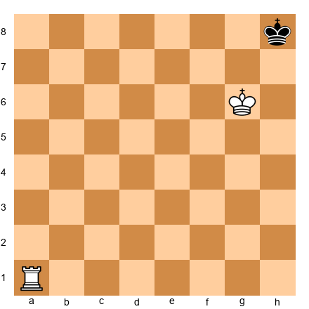

**Task:** Checkmate in 2 moves.
**Hint 1:** The king on h8 has only one legal move: Kg8 (g7, h7 controlled by king).
**Hint 2:** A "waiting move" with the rook does the trick. 1. Rb1 (or Rc1, Rd1, etc.) Kg8.
**Hint 3:** 2. Rb8# (or whichever file).
**Solution:** **1. Rb1 Kg8 2. Rb8#** -- The waiting move forces Black to play Kg8 (the only legal move). Then the rook delivers the back-rank checkmate.

---

**Exercise 5.33** ★★
**Position:** White: Ke5, Ra7. Black: Ke8.

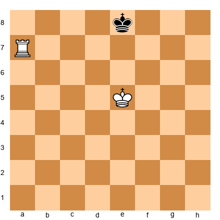

**Task:** Checkmate in 2 moves.
**Hint 1:** Advance the king to establish opposition.
**Hint 2:** 1. Ke6 (opposition). Black must go to d8 or f8.
**Hint 3:** After 1...Kd8 2. Ra8# (c7, d7, e7 covered by king). After 1...Kf8 the king escapes to g8. So only 1...Kd8 allows mate in 2.
**Solution:** **1. Ke6 Kd8 2. Ra8#** -- If Black plays 1...Kf8 instead, White continues with 2. Kf6 and mates next move. Against 1...Kd8, the rook seals rank 8 immediately.

---

**Exercise 5.34** ★★
**Position:** White: Kd5, Ra1. Black: Kd7.

**Task:** Checkmate in 3 moves.
**Hint 1:** Use the staircase: check along rank 7 first.
**Hint 2:** 1. Ra7+ Ke8 (forced to rank 8). Then bring the king forward.
**Hint 3:** 2. Kd6 Kf8 3. Ke6 and the staircase continues.
**Solution:** **1. Ra7+ Ke8 2. Kd6 Kf8 3. Ke6** and the technique continues until the rook delivers back-rank checkmate. This exercise illustrates the full staircase process from Demonstration 2.

---

**Exercise 5.35** ★★
**Position:** White: Kf6, Ra7. Black: Kf8.

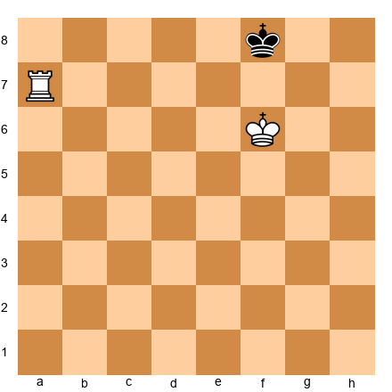

**Task:** Checkmate in 3 moves.
**Hint 1:** The king is on the back rank but not in a corner. Push it there.
**Hint 2:** 1. Ke6 threatens to establish opposition.
**Hint 3:** If 1...Ke8, play 2. Ra8# immediately. If 1...Kg8, continue with 2. Kf6 and checkmate follows shortly.
**Solution:** **1. Ke6** and the technique continues. If 1...Ke8, then 2. Ra8# is immediate checkmate. If 1...Kg8, the king chases with 2. Kf6 Kh8 3. Kg6 and Ra8# next move.

---

**Exercise 5.36** ★★
**Position:** White: Kb6, Rg7. Black: Ka8.

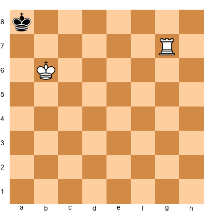

**Task:** Checkmate in 2 moves.
**Hint 1:** The rook needs to reach rank 8, but the king is on a8. Use a waiting move along rank 7.
**Hint 2:** 1. Rc7 covers the c-file and rank 7. From a8, only Kb8 is legal (a7 controlled by the king).
**Hint 3:** After 1...Kb8, play 2. Rc8#.
**Solution:** **1. Rc7 Kb8 2. Rc8#** -- The rook checks along rank 8. a8 covered by rook. a7 and b7 covered by king. c7 covered by king (b6 is adjacent to c7). Checkmate.

---

**Exercise 5.37** ★★
**Position:** White: Ke6, Ra1. Black: Ke8.

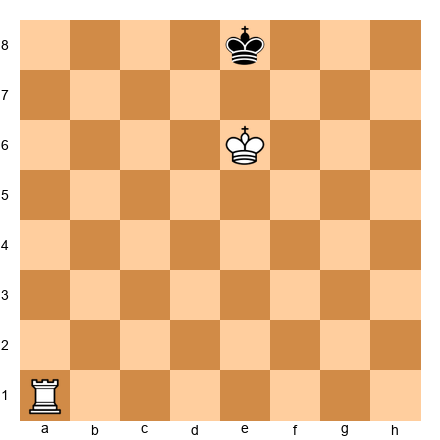

**Task:** Checkmate in 1 move.
**Hint 1:** Perfect opposition. Rook to the 8th rank.
**Solution:** **1. Ra8#** -- Identical to Exercise 5.25 but with the rook on a1 instead of h1. Rook seals rank 8. King covers d7, e7, f7.

---

**Exercise 5.38** ★★
**Position:** White: Kc6, Rh1. Black: Kc8.

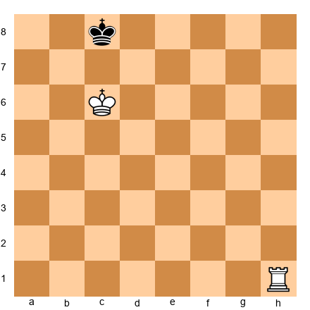

**Task:** Checkmate in 1 move.
**Hint 1:** Opposition on c-file. Rook seals rank 8.
**Solution:** **1. Rh8#** -- Rook checks along rank 8. b7, c7, d7 covered by king. b8, d8 covered by rook.

---

**Exercise 5.39** ★★
**Position:** White: Kg5, Ra7. Black: Kg8.

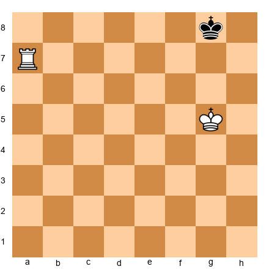

**Task:** Checkmate in 2 moves.
**Hint 1:** 1. Kg6 establishes control.
**Hint 2:** After Kg6, Black plays Kf8 or Kh8.
**Hint 3:** If Kh8: 2. Ra8#. If Kf8: White continues with 2. Kf6 and mates shortly.
**Solution:** **1. Kg6 Kh8 2. Ra8#** -- The king move forces Black to the corner, then the rook finishes. If 1...Kf8, the technique requires one or two more moves.

---

**Exercise 5.40** ★★
**Position:** White: Kf6, Ra7. Black: Kg8.

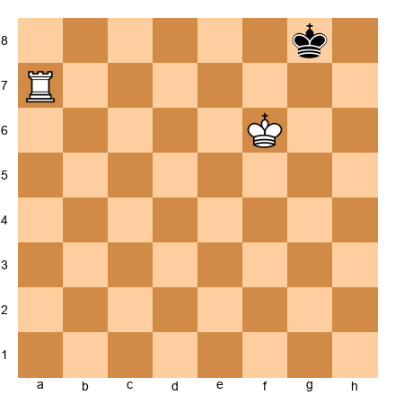

**Task:** Checkmate in 2 moves.
**Hint 1:** 1. Kg6 forces Black's king to h8 or f8.
**Hint 2:** If 1...Kh8: 2. Ra8# is immediate checkmate.
**Hint 3:** If 1...Kf8 instead, the technique continues with 2. Kf6 and eventually Ra8#.
**Solution:** **1. Kg6 Kh8 2. Ra8#** -- The king steps forward, forces the defending king to the corner, and the rook delivers the final blow. If 1...Kf8 instead, the technique continues with 2. Kf6.

---

### Section C: King + Two Bishops vs. King (Exercises 5.41 – 5.55)

These exercises focus on recognizing the checkmate pattern and understanding how the bishops cooperate. The two-bishop checkmate always ends in the corner.

---

**Exercise 5.41** ★★
**Position:** White: Kb6, Bc6, Bd6. Black: Ka8.

**Task:** Verify this is checkmate. Name the checking piece and the piece covering b8.
**Solution:** Bc6 checks a8 (diagonal c6-b7-a8). Bd6 covers b8 (diagonal d6-c7-b8). King covers a7 and b7. Checkmate.

---

**Exercise 5.42** ★★
**Position:** White: Kg6, Bf7, Bg7. Black: Kh8.

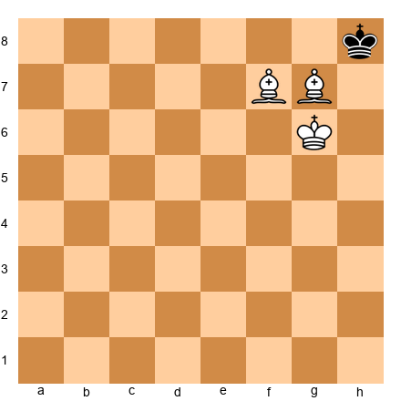

**Task:** Verify this is checkmate. Name the checking piece and the piece covering g8.
**Solution:** Bg7 checks h8 (diagonal g7-h8). Bf7 covers g8 (diagonal f7-g8). King covers h7. Checkmate.

---

**Exercise 5.43** ★★
**Position:** White: Kb6, Bc7, Bd5. Black: Ka8.

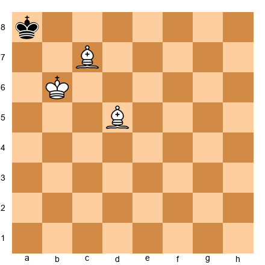

**Task:** Verify this is checkmate.
**Solution:** Bd5 checks a8 (diagonal d5-c6-b7-a8). Bc7 covers b8 (diagonal c7-b8). King covers a7 and b7. Checkmate.

---

**Exercise 5.44** ★★
**Position:** White: Kg6, Bg7, Bh5. Black: Kh8.

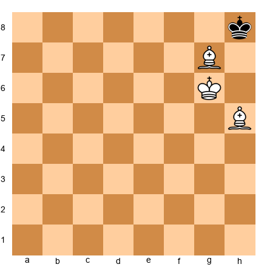

**Task:** Is this checkmate?
**Hint:** Which piece attacks h8?
**Solution:** Bg7 attacks h8 on the diagonal. Check! However, g8 is not covered: Bh5 does not control g8 (its diagonals go to g6 and g4), and Kg6 is not adjacent to g8. **g8 is free. Not checkmate!** Black escapes to g8.

---

**Exercise 5.45** ★★
**Position:** White: Kg6, Bf6, Bf7. Black: Kh8.

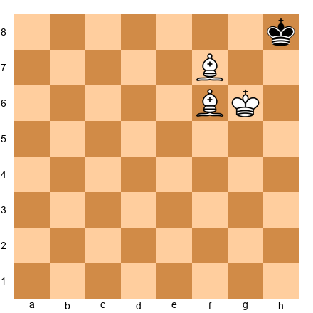

**Task:** White to play and checkmate in 1 move.
**Solution:** **1. Bg7#** (Bf6 to g7). Checks h8 on the diagonal. g8 covered by Bf7 (f7-g8). h7 covered by king (g6-h7). Bg7 protected by king. Checkmate!

---

**Exercise 5.46** ★★★
**Position:** White: Kb6, Bd5, Bc5. Black: Ka8.

**Task:** White to play and checkmate in 1 move.
**Hint:** Move the dark-squared bishop to create a discovered check from the light-squared bishop.
**Solution:** **1. Bd6#** (Bc5 to d6). Discovered check from Bd5 along the diagonal d5-c6-b7-a8. b8 covered by Bd6 (d6-c7-b8). a7 covered by king. b7 covered by Bd5. Checkmate!

---

**Exercise 5.47** ★★★
**Position:** White: Kg6, Bg5, Bf7. Black: Kh8.

**Task:** White to play and checkmate in 1 move.
**Hint:** Move the dark-squared bishop to f6 or g7.
**Solution:** **1. Bf6#** (Bg5 to f6). Checks h8 on the diagonal (f6-g7-h8). g8 covered by Bf7 (f7-g8). g7 covered by king (g6-g7). h7 covered by king (g6-h7). Checkmate!

---

**Exercise 5.48** ★★★
**Position:** White: Kb6, Bc6, Be5. Black: Ka8.

**Task:** Is this checkmate?
**Solution:** Bc6 checks a8 (c6-b7-a8 diagonal). a7: covered by king. b7: covered by Bc6 and king. b8: Be5 covers b8 along the e5-d6-c7-b8 diagonal. **Checkmate confirmed.**

---

**Exercise 5.49** ★★★
**Position:** White: Kh6, Bf7, Bf6. Black: Kh8.

**Task:** White to play and checkmate in 1 move.
**Solution:** **1. Bg7#** (Bf6 to g7). Checks h8 on the diagonal. g8 covered by Bf7 (f7-g8 diagonal). h7 covered by king (h6-h7 adjacent). Checkmate!

---

**Exercise 5.50** ★★★
**Position:** White: Ka3, Bb3, Bb2. Black: Ka1.

**Task:** Is this checkmate?
**Solution:** Bb2 checks a1 on the b2-a1 diagonal. Check! a2: covered by Bb3 (b3-a2 diagonal) and Ka3. But b1 is not covered by any piece -- Bb2's diagonals go to a1 and c1 (not b1), Bb3's diagonals go to a2 and c2 (not b1), and Ka3 is not adjacent to b1. **b1 is free. Not checkmate!**

---

**Exercise 5.51** ★★★
**Position:** White: Ka3, Bc3, Bb3. Black: Ka1.

**Task:** Is this checkmate?
**Solution:** Neither bishop gives check: Bc3's diagonals (b2, d2, b4, d4) do not include a1, and Bb3's diagonals (a2, c2, a4, c4) do not include a1. **Not checkmate** -- there is no check at all. The king can move to b1 (not controlled by any piece). This is not even stalemate.

---

**Exercise 5.52** ★★★
**Position:** White: Ka6, Ba7, Bb7. Black: Ka8.

**Task:** Is this checkmate or stalemate?
**Solution:** Bb7 checks a8 on the b7-a8 diagonal. Check! Escapes: a7 is occupied by Ba7 (protected by Ka6), and b8 is covered by Ba7 on the a7-b8 diagonal. **Checkmate!**

---

**Exercise 5.53** ★★★
**Position:** White: Ka6, Bb5, Ba7. Black: Ka8.

**Task:** Is this checkmate?
**Solution:** Neither bishop gives check: Bb5's diagonals (a6, c6, a4, c4) do not include a8, and Ba7 cannot check a8 because bishops do not move along files. No check means no checkmate. Can the king move? b8 is covered by Ba7 (a7-b8 diagonal). b7 is covered by Ka6 (adjacent). a7 is occupied by Ba7. No legal moves and no check. **Stalemate!** The game is a draw.

---

**Exercise 5.54** ★★★
**Position:** White: Kb6, Bd6, Bd5. Black: Ka8.

**Task:** Is this checkmate?
**Solution:** Bd5 checks a8 along the d5-c6-b7-a8 diagonal. a7: covered by king (b6 adjacent). b7: covered by Bd5 and king. b8: covered by Bd6 along the d6-c7-b8 diagonal. **Checkmate!**

---

**Exercise 5.55** ★★★
**Position:** Set up White: Ke1, Bc1, Bf1, and Black: Ke8.
**Task:** Practice driving the Black king to a corner and delivering checkmate using the diagonal barrier technique. This is an open-ended practice exercise with no single correct answer. The goal is to deliver checkmate in under 25 moves.
**Solution:** The key steps: (1) centralize both bishops side by side to form a diagonal wall, (2) advance the diagonal wall toward a corner one step at a time, (3) bring your king up to support the bishops, (4) deliver checkmate in the corner using the pattern from Exercise 5.41 (Kb6, Bc6, Bd6 vs. Ka8).

---

### Section D: King + Bishop + Knight vs. King (Exercises 5.56 – 5.65)

These exercises focus on recognizing the final checkmate pattern and understanding which corner is correct.

---

**Exercise 5.56** ★★★
**Position:** White: Kb3, Nc3, Bb2. Black: Ka1.

**Task:** Verify this is checkmate.
**Solution:** Bb2 checks a1 (diagonal b2-a1). a2: Nc3 attacks a2 (knight on c3 reaches a2). b1: Nc3 attacks b1. b2: bishop there, protected by king (b3-b2 adjacent). **Checkmate confirmed.**

---

**Exercise 5.57** ★★★
**Position:** White: Kg3, Nf3, Bg2. Black: Kh1.

**Task:** Verify this is checkmate.
**Solution:** Bg2 checks h1 on the g2-h1 diagonal. g1: covered by Nf3. h2: covered by Nf3 and Kg3. g2: Bg2 is there, protected by Kg3 (adjacent). **Checkmate confirmed.**

---

**Exercise 5.58** ★★★
**Position:** White: Ka3, Nc2, Bb1. Black: Ka1.

**Task:** Is this checkmate?
**Solution:** Nc2 checks Ka1 (c2 to a1 is a valid knight move). Check! However, the bishop on b1 is unprotected -- neither Ka3 nor Nc2 defends b1. The king escapes by capturing: **Kxb1** is legal. **Not checkmate.** This illustrates a common error: all pieces in the mating net must be protected or out of the king's reach.

---

**Exercise 5.59** ★★★
**Task:** In K+B+N vs. K, if you have a dark-squared bishop, which corners can you deliver checkmate in?
**Solution:** A dark-squared bishop can deliver checkmate in **a1** (dark square) or **h8** (dark square). These are the dark-squared corners.

---

**Exercise 5.60** ★★★
**Task:** In K+B+N vs. K, if you have a light-squared bishop, which corners can you deliver checkmate in?
**Solution:** A light-squared bishop can deliver checkmate in **a8** (light square) or **h1** (light square). These are the light-squared corners.

---

**Exercise 5.61** ★★★
**Position:** White: Kb6, Nc6, Bb7. Black: Ka8.

**Task:** Is this checkmate?
**Solution:** Bb7 checks a8 on the b7-a8 diagonal. b8: covered by Nc6 (knight on c6 attacks b8). a7: covered by Kb6 (adjacent). b7: occupied by bishop, protected by Kb6 (adjacent). **Checkmate confirmed!**

---

**Exercise 5.62** ★★★
**Position:** White: Kg6, Nf6, Bg8. Black: Kh8.

**Task:** Is this checkmate?
**Solution:** Bg8 does not check h8 -- g8 and h8 are on the same rank, and bishops do not move along ranks. Nf6 does not check h8 either (f6 attacks d5, d7, e4, e8, g4, g8, h5, h7 -- not h8). **No check. Not checkmate.**

---

**Exercise 5.63** ★★★
**Position:** White: Kf6, Nf7, Bg8. Black: Kh8.

**Task:** Is this checkmate?
**Solution:** Nf7 checks h8 (f7 attacks d6, d8, e5, g5, h6, h8). Check! However, the bishop on g8 is unprotected -- Kf6 is not adjacent to g8, and Nf7 does not attack g8. The king escapes by capturing: **Kxg8** is legal. **Not checkmate.** The bishop must be protected for the mating net to hold.

---

**Exercise 5.64** ★★★
**Task:** The Black king has reached h1 (a light-squared corner). You have a light-squared bishop. Is this the correct corner to deliver checkmate?
**Solution:** **Yes.** h1 is a light square. A light-squared bishop can deliver checkmate in the light-squared corners (a8 and h1). You are in the correct corner.

---

**Exercise 5.65** ★★★
**Task:** The Black king has reached h8 (a dark-squared corner). You have a light-squared bishop. Can you deliver checkmate here?
**Solution:** **No.** h8 is a dark square. A light-squared bishop cannot check a king on a dark-squared corner. You must drive the king out of h8 and redirect it to a8 or h1 using the W maneuver. This is the hardest part of the K+B+N technique.

---

### Section E: Find the Fastest Checkmate (Exercises 5.66 – 5.75)

These exercises use various material combinations. Find the fastest checkmate.

---

**Exercise 5.66** ★
**Position:** White: Kf6, Qe5. Black: Kf8.

**Task:** Find the fastest checkmate (mate in 2).
**Solution:** **1. Qe7 Kg8 2. Qg7#** -- Queen restricts, then finishes on the g-file.

---

**Exercise 5.67** ★
**Position:** White: Kg6, Qd1. Black: Kh8.

**Task:** Find the fastest checkmate (mate in 1).
**Solution:** **1. Qd8#** -- The queen checks along rank 8 (d8-e8-f8-g8-h8). g8 covered by the queen on rank 8. g7 and h7 covered by king. Checkmate!

---

**Exercise 5.68** ★★
**Position:** White: Ke6, Rh1. Black: Ke8.

**Task:** Find the fastest checkmate (mate in 1).
**Solution:** **1. Rh8#** -- Rook checks along rank 8. d7, e7, f7 covered by king. d8, f8 covered by rook.

---

**Exercise 5.69** ★★
**Position:** White: Kb6, Bc6, Bd6. Black: Ka8.

**Task:** This is already checkmate if it were Black's turn. What should White play?
**Hint:** Make a waiting move that maintains the checkmate threat.
**Solution:** **1. Be5** -- The dark-squared bishop moves from d6 to e5. Bc6 still checks a8 along the c6-b7-a8 diagonal. Be5 covers b8 along the e5-d6-c7-b8 diagonal. a7: covered by king. b7: covered by Bc6. **Checkmate!**

---

**Exercise 5.70** ★★
**Position:** White: Kg6, Qa1. Black: Kh8.

**Task:** Find the fastest checkmate.
**Solution:** **1. Qa8#** -- The queen moves to a8 along the a-file, then checks h8 along rank 8. g8 covered by queen (rank 8). g7 and h7 covered by king. Checkmate!

---

**Exercise 5.71** ★★
**Position:** White: Kf6, Rd1. Black: Kh8.

**Task:** Find the fastest checkmate.
**Hint:** The king covers g7 but not h7. Can you still mate?
**Solution:** 1. Rd8+ checks along rank 8, but h7 is not covered (Kf6 is not adjacent to h7 -- two files apart). The king escapes to h7. **Not checkmate in 1.** The fastest mate requires **1. Kg6** first (covering h7 and g7), then **2. Rd8#**. **Mate in 2.**

---

**Exercise 5.72** ★★
**Position:** White: Kb6, Qa7. Black: Kc8.

**Task:** Find the fastest checkmate.
**Solution:** **1. Qc7#** -- The queen moves to c7, checking along the c-file. d8 and b8 covered on diagonals. d7 and b7 covered along rank 7. Checkmate!

---

**Exercise 5.73** ★★
**Position:** White: Ke6, Qc5. Black: Ke8.

**Task:** Find the fastest checkmate.
**Solution:** **1. Qc8#** -- The queen checks along rank 8. d8 and f8 covered by queen on rank 8. d7 and f7 covered by king (adjacent). e7 covered by king (adjacent). Checkmate in 1!

---

**Exercise 5.74** ★★★
**Position:** White: Kd6, Qa5. Black: Kd8.

**Task:** Find the fastest checkmate.
**Hint:** Can the queen reach a square that checks the king and covers all escapes?
**Solution:** **1. Qa8#** -- The queen moves to a8 along the a-file, then checks along rank 8. c8 and e8 covered by queen on rank 8. c7, d7, e7 covered by king (adjacent). Checkmate!

---

**Exercise 5.75** ★★★
**Task:** From the checkmate position Kb3, Nc3, Bb2 vs. Ka1, trace backwards: what was White's last move to deliver this checkmate?

**Solution:** White's last move was moving the bishop to b2 (for example, from a3, c1, or c3). The bishop move delivers check on the b2-a1 diagonal. Before the move, the knight on c3 was already covering a2 and b1, and the king on b3 was already protecting the bishop's destination square.

---

### Section F: Avoid the Stalemate! (Exercises 5.76 – 5.80)

In each of these positions, White has an overwhelming advantage but must be careful not to stalemate the Black king. Find a winning move that is NOT stalemate.

---

**Exercise 5.76** ★★
**Position:** White: Kf6, Qe5. Black: Kh8. **Black to move.**

**Task:** It is Black's turn. Is this stalemate?
**Hint:** Can the Black king go to g8?
**Solution:** g8 is not controlled by the queen (Qe5 does not reach g8 on any diagonal, file, or rank) and Kf6 is not adjacent to g8. g8 is free. **Not stalemate.** Black plays Kg8.

---

**Exercise 5.77** ★★
**Position:** White: Kf6, Qf7. Black: Kh8. **Black to move.**

**Task:** Is this stalemate?
**Solution:** From h8: g8 (Qf7 diagonal f7-g8. Controlled!), g7 (Qf7 rank 7 and Kf6 adjacent. Controlled!), h7 (Qf7 rank 7. Controlled!). No legal moves and no check. **Stalemate! The game is a draw.**

---

**Exercise 5.78** ★★
**Position:** White: Ke6, Qd6. Black: Ke8. **White to move.**

**Task:** White wants to checkmate, not stalemate. Find the right move.
**Solution:** **1. Qd7+** is safe -- it gives check, so stalemate is impossible. After 1...Kf8, White plays 2. Qf7#. The key principle: **when in doubt, give check.** Check eliminates the possibility of stalemate.

---

**Exercise 5.79** ★★
**Position:** White: Kg6, Qg5. Black: Kh8. **White to move.**

**Task:** Find the winning move. Avoid stalemate.
**Hint:** Giving check is the safest way to avoid stalemate.
**Solution:** **1. Qf6+ Kg8 2. Qf8#** -- The queen checks on the f6-g7-h8 diagonal. After 1...Kg8, the queen delivers checkmate on f8 (checks along rank 8, with h7 and g7 covered by the king). Clean and stalemate-free.

---

**Exercise 5.80** ★★
**Position:** White: Ke6, Rg7. Black: Ke8. **White to move.**

**Task:** Deliver checkmate without stalemate.
**Hint:** The rook can reach the 8th rank in one move.
**Solution:** **1. Rg8#** -- The rook checks along rank 8. d8 and f8 covered by rook. d7, e7, f7 covered by king. Clean back-rank checkmate. No stalemate risk here because the rook gives check.

---

## Key Takeaways

1. **K+Q vs. K** is the easiest basic checkmate. Use the box method: centralize the queen, shrink the box, bring your king forward, deliver checkmate on the edge. Always watch for stalemate.

2. **K+R vs. K** uses the staircase technique. Cut off ranks with the rook, gain opposition with the king, push the enemy king back one rank at a time. The key position is your king covering three rank-7 squares while the rook seals rank 8.

3. **K+2B vs. K** requires the two bishops to work as a team. Place them side by side on adjacent diagonals to create a wall the enemy king cannot cross. Drive the king to a corner and deliver checkmate with the standard pattern (one bishop checks, the other covers the remaining escape).

4. **K+B+N vs. K** is the hardest basic checkmate. Remember: you can only checkmate in a corner that matches your bishop's color. The technique takes about 33 moves. This is an advanced skill that many players learn later.

5. **Stalemate is the biggest danger** in all of these endgames. Always make sure the enemy king has at least one legal move until you are ready to deliver checkmate. When in doubt, give check.

---

## Practice Assignment

Here is your practice plan for this chapter. Do as much as you can, and come back to the rest later.

**Week 1: K+Q vs. K**
- Set up the starting position (Ke1, Qd1 vs. Ke8) and deliver checkmate. Do this 10 times.
- Then set up random positions and practice. Goal: checkmate in 15 moves or fewer.
- Play the K+Q vs. K endgame against a computer set to the easiest level.

**Week 2: K+R vs. K**
- Set up the walkthrough position (Kd5, Ra1 vs. Kd7) and follow the staircase.
- Then set up the full starting position (Ke1, Ra1 vs. Ke8) and practice.
- Goal: checkmate in 25 moves or fewer.

**Week 3: K+2B vs. K**
- Study the checkmate position (Kb6, Bc6, Bd6 vs. Ka8) until you can set it up from memory.
- Practice driving the king to the corner from a central position. Use a computer if needed.
- Goal: checkmate in 30 moves or fewer.

**Week 4 (optional): K+B+N vs. K**
- Study the checkmate position (Kb3, Nc3, Bb2 vs. Ka1) until you can recognize it instantly.
- Use an online K+B+N trainer to practice the full technique.
- Goal: checkmate within the 50-move limit.

**Ongoing:** After each practice session, play one or two real games. You will be surprised how often these endings come up.

---

## ⭐ Progress Check

Answer these questions honestly. There is no grade, only self-awareness.

1. Can you deliver K+Q vs. K checkmate within 15 moves from any position? (Yes / Not yet)
2. Can you deliver K+R vs. K checkmate within 25 moves? (Yes / Not yet)
3. Can you explain the staircase technique in your own words? (Yes / Not yet)
4. Do you know what a stalemate trap looks like and how to avoid it? (Yes / Not yet)
5. Can you set up the K+2B checkmate position from memory? (Yes / Not yet)
6. Do you know which corners are correct for K+B+N? (Yes / Not yet)

**If you answered "Yes" to questions 1, 2, and 4**, you have a solid foundation in basic checkmates. The remaining techniques will come with time.

**If you answered "Not yet" to most questions**, that is completely fine. Go back to the sections you found hardest and practice again. Every expert was once a beginner who kept practicing.

---

🛑 **Chapter complete. You have worked through one of the most important chapters in this entire book. These checkmate techniques are the foundation of everything that follows. Without them, no amount of opening knowledge or tactical brilliance matters. You can deliver the final blow. Be proud of that.**

**Rest here. You have earned it. Come back for Chapter 6 when you are ready.**
