# Chapter 6: Elementary Tactics — Forks, Pins, Skewers, Double Attacks

**Rating Range: Beginner (400–800)**

---

> *"Chess is 99% tactics."*
> — Richard Teichmann

---

## What You'll Learn

- How to attack two pieces at once with **forks** (knight forks, queen forks, pawn forks)
- How **pins** freeze a piece in place and how to exploit that frozen piece
- How **skewers** force a valuable piece to move, winning the piece behind it
- How **discovered attacks** let one piece move while another attacks from behind
- How **removing the defender** and **overloading** set up every other tactic
- How to spot these patterns in your own games and punish your opponent's mistakes

This is the most important chapter in Volume I. Tactics win games. All the opening theory and endgame knowledge in the world means nothing if you cannot spot a knight fork or a deadly pin. The patterns you learn here will win you material, save your pieces, and put your opponents in positions they cannot escape.

Take your time with this chapter. Practice each pattern on your board. Come back to it again and again. These seven tactical weapons will serve you for as long as you play chess.

---

## Part 1: The Fork

A fork is one of the simplest and most powerful ideas in chess. One piece moves to a square where it attacks two or more enemy pieces at the same time. Your opponent can save one of them, but not both. You win material.

The fork is like being in two places at once. Your opponent has to choose which piece to save, and the other one is yours.

Every piece on the board can deliver a fork. But some pieces are better at it than others. Let's look at each one.

### The Knight Fork

The knight is the ultimate forking piece. Because it moves in an L-shape and jumps over other pieces, it can reach squares that other pieces cannot. A knight on a single square can attack a king on one side and a queen on the other, and there is nothing in between to block it.

This is why the knight fork is the most common tactic in chess at the beginner level. Learn to spot it, and you will win dozens of games.

**Set up your board:** Place a White knight on e5, a Black king on d7, and a Black queen on f7. Look at the knight. It attacks both the king and the queen at the same time. Black must move the king out of check. After the king moves, the knight captures the queen. White wins a queen for free.

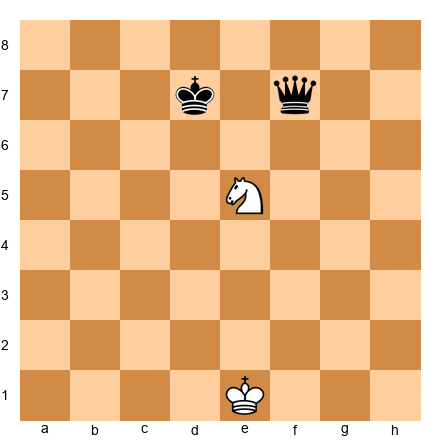

This is called a **royal fork** because it attacks the king and queen together. It is devastating. One simple knight move wins the most powerful piece on the board.

Now let's see how a knight fork appears in a real game situation.

**Set up your board:** Place White pieces: king on g1, queen on d1, rook on e1, knight on d4, pawns on a2, b2, f2, g2, h2. Place Black pieces: king on e8, queen on a5, rook on a8, bishop on c8, pawns on a7, b7, c7, f7, g7, h7.

White plays **Nc6!** The knight lands on c6, attacking the Black queen on a5 AND the Black rook on a8. No matter what Black does, White wins one of them.

**Why does this work?** The knight's L-shaped movement lets it attack pieces that are far apart. A queen, bishop, or rook attacks in straight lines, so the targets need to line up. But a knight can hit pieces that have no connection to each other. That makes knight forks hard to see coming and almost impossible to block.

**Key insight:** Knights can fork pieces even when those pieces are nowhere near each other. Watch for squares where your knight attacks two targets at once.

### Queen Forks

The queen is the most powerful piece on the board because it can move in all directions: along files, ranks, and diagonals. That means it can attack two pieces at once from many different angles.

**Set up your board:** Place a White queen on e4, a Black rook on a8, and a Black knight on h7. The queen attacks the rook along the diagonal and the knight along the rank. Black cannot save both.

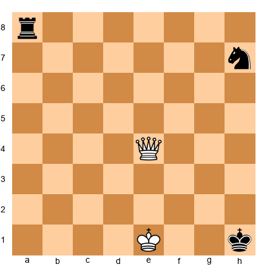

The queen fork is powerful, but there is a catch. Because the queen is so valuable, you must be careful not to fork two pieces only to have one of them capture your queen. Always check: is the square safe for my queen?

**Set up your board:** Place a White queen on d1, a Black king on f8, a Black rook on a4, and a Black bishop on h5. White plays **Qd8+**, checking the king. After the king moves, the queen can capture the rook on a4 next turn. This is a queen fork that starts with check, which makes it even stronger because the opponent MUST deal with the check first.

**Tip:** Queen forks that include a check are the best kind. Your opponent has no choice but to answer the check, which gives you time to collect the second target.

### Pawn Forks

Do not underestimate the humble pawn. A pawn captures diagonally, which means it can attack two pieces at once, one on each side. And because pawns are worth only one point, your opponent cannot trade for the pawn without losing material.

**Set up your board:** Place a White pawn on d4, a Black knight on c6, and a Black bishop on e6. White pushes **d5!** The pawn on d5 attacks both the knight on c6 and the bishop on e6. Black must move one, and White captures the other. A one-point pawn wins a three-point piece.

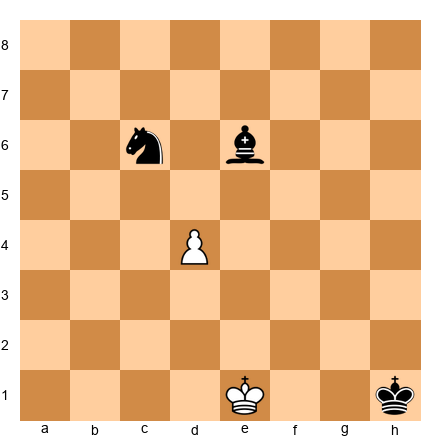

Pawn forks are easy to miss because we often ignore pawns. But a well-timed pawn push can win a piece and change the whole game.

### Rook and Bishop Forks

Rooks and bishops can deliver forks too, though they are less common than knight, queen, or pawn forks.

A **rook fork** happens when a rook moves to a rank or file where it attacks two pieces at once. Since rooks move in straight lines, the two targets must be on the same rank or the same file.

**Set up your board:** Place a White rook on a1, a Black knight on a4, and a Black bishop on a7. The rook attacks both pieces along the a-file. Black can move one, but the other falls.

A **bishop fork** works along diagonals. Place a White bishop on d5. If a Black rook sits on a8 and a Black knight sits on g8, the bishop attacks both along the diagonals. However, bishop forks are rare because both targets must sit on the same color diagonal.

### How to Set Up Forks

Forks do not appear out of nowhere. You create them. Here are three ways:

**1. Look for the forking square.** Before you move, scan the board for squares where your piece (especially a knight) would attack two targets. Then figure out how to get your piece there.

**2. Use threats to drive pieces to the right squares.** Sometimes your opponent's pieces are not on the right squares for a fork yet. You can use checks, captures, or threats to force them to the squares you need. A check forces the king to a specific square. A capture forces a recapture to a specific square. Use these forcing moves to set up your fork.

**3. Watch for back-rank patterns.** After castling, the king is usually on g1 or g8. Knights on f3 or c3 are common. Look at where a knight could land to fork the king, queen, and rooks.

**Memory aid:** When your opponent's king and queen are on the same rank, file, or close together, look for a knight fork. This is especially common after the opponent castles and brings the queen to the wrong square.

> **Milestone:** You have learned 1 of 7 tactical patterns. Forks alone will win you many games. But there is much more to come.

🛑 **This is a natural stopping point. Practice finding knight forks on your board for 10 minutes. Set up random positions and look for forking squares. When you are ready, keep going.**

---

## Part 2: The Pin

A pin is a tactic where one piece attacks an enemy piece, and that enemy piece cannot move (or should not move) because a more valuable piece sits behind it on the same line.

Think of it this way: your bishop stares down a diagonal. In its path, there is an enemy knight. Behind the knight, there is the enemy king. The knight is "pinned" in place. If the knight moves, the king would be in check, which is illegal. So the knight is stuck.

Pins come in two types, and understanding the difference matters.

### Absolute Pins

An **absolute pin** is a pin against the king. The pinned piece literally cannot move because doing so would expose the king to check, which is illegal in chess.

**Set up your board:** Place a White bishop on g5, a Black knight on f6, and a Black king on e7. The bishop pins the knight to the king. The knight cannot move at all. It is frozen in place.

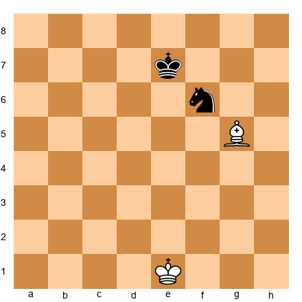

This is the strongest type of pin. The pinned piece is a sitting target. You can pile up attackers on it, and your opponent cannot simply move it out of the way.

**Why absolute pins are so strong:** The pinned piece does not really defend anything. Imagine the knight on f6 is "defending" the pawn on d5. Since the knight cannot move, can it really capture on d5? No, it cannot. So any piece the knight appears to defend is actually undefended. This is an essential concept.

### Relative Pins

A **relative pin** pins a piece against the queen, a rook, or another valuable piece (not the king). The pinned piece CAN legally move, but doing so would lose the more valuable piece behind it.

**Set up your board:** Place a White bishop on b5, a Black knight on c6, and a Black queen on d7. The bishop pins the knight to the queen. The knight CAN legally move, but if it does, the bishop captures the queen. So the knight "should not" move.

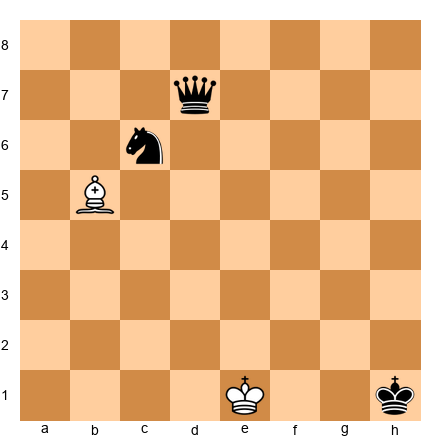

Relative pins are slightly weaker than absolute pins because the opponent might choose to move the pinned piece anyway if they see a strong enough reason. For example, if the knight on c6 could deliver checkmate by moving, the player might sacrifice the queen and move it anyway. But in most cases, a relative pin keeps the piece frozen just as effectively.

### Who Can Pin?

Only pieces that attack in straight lines can create pins. That means:

- **Bishops** (pin along diagonals)
- **Rooks** (pin along files and ranks)
- **Queens** (pin along files, ranks, and diagonals)

Knights and pawns cannot create pins because they do not attack in straight lines.

Bishops are the most common pinning piece because they often pin knights early in the game. The classic example: White plays Bg5, pinning the Black knight on f6 to the queen on d8. This happens in countless openings.

### How to Exploit a Pin

Creating a pin is only the first step. The real power comes from exploiting it. Here is how:

**1. Pile up on the pinned piece.** Once a piece is pinned, it cannot run away. So bring more attackers to target it. If you have a bishop pinning a knight, bring a pawn up to attack the knight too. Bring another piece. Eventually, the pinned piece will fall because the defender cannot add enough protection.

**Set up your board:** Place a White bishop on g5, a White pawn on f2, a Black knight on f6, and a Black king on g8, with Black pawns on f7, g7, h7. White plays **h4**, then **h5**, then eventually attacks the pinned knight with the pawn. The knight cannot escape. White wins it.

**2. Use the pin to win connected material.** Sometimes the pinned piece is protecting something else. Since it cannot actually move, whatever it was protecting is now undefended.

**3. Pin and win the exchange.** If you pin a knight to a rook, and the knight is worth 3 points while the rook is worth 5, you might be able to capture the knight and then also threaten the rook.

### How to Break a Pin

If your piece gets pinned, you need to know how to escape. Here are the main methods:

**1. Block the line.** Place a piece between the pinning piece and the valuable piece behind. This breaks the pin because the intermediate piece now blocks the attack.

**Set up your board:** Place a White bishop on g5 pinning a Black knight on f6 to the Black queen on d8. Black plays **Be7**, placing the bishop between the queen on d8 and the pinned knight. Now the knight is free to move because the bishop blocks the pin.

**2. Move the piece behind.** If a knight is pinned to the queen, move the queen to a safe square. The knight is no longer pinned because there is nothing valuable behind it.

**3. Attack the pinning piece.** If a bishop pins your knight, advance a pawn to chase the bishop away. For example, if the bishop sits on g5 pinning your knight on f6, play **h6** to attack the bishop. It must retreat, and the pin is broken.

**4. Counterattack.** Sometimes the best response to a pin is to ignore it and create a bigger threat. If your opponent wastes time exploiting the pin, you might find a tactic of your own.

### Classic Pin Examples

**The Opening Pin:** After 1.e4 e5 2.Nf3 Nc6 3.Bb5, White pins the knight on c6 to the king on e8 (in spirit, since the bishop actually threatens to capture on c6 and damage Black's pawn structure). This is the Ruy Lopez, one of the oldest openings in chess.

**The Bg5 Pin:** After 1.d4 d5 2.c4 e6 3.Nc3 Nf6 4.Bg5, White pins the knight on f6 to the queen on d8. This is one of the most common pins in all of chess. Black must decide how to deal with it.

**The Back-Rank Pin:** A rook on e1 can pin an enemy piece on e7 to the king on e8. Rook pins along files are powerful in the middlegame and endgame.

> **Milestone:** You have learned 2 of 7 tactical patterns. Forks and pins together will transform your game. Most games between beginners are decided by one of these two patterns.

🛑 **Good stopping point. You have covered forks and pins. Take a break, play a game online, and try to spot these patterns. Then come back for skewers.**

---

## Part 3: The Skewer

A skewer is the reverse of a pin. In a pin, the less valuable piece is in front and cannot move. In a skewer, the MORE valuable piece is in front and is forced to move, exposing the less valuable piece behind it for capture.

Think of a skewer like a shish kebab. The important piece is on the front of the stick and has to jump off, leaving the piece behind it to get eaten.

### How Skewers Work

**Set up your board:** Place a White bishop on a1, a Black king on d4, and a Black rook on f6. The bishop on a1 checks the king through the diagonal a1-d4-f6. The king MUST move out of check. After the king moves, the bishop captures the rook on f6. White wins a whole rook.

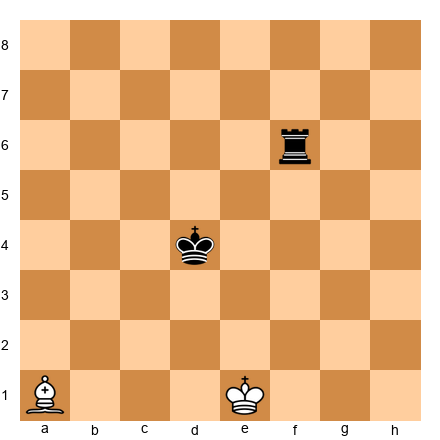

The key difference between a pin and a skewer:
- **Pin:** Less valuable piece in front, more valuable piece behind. The front piece is stuck.
- **Skewer:** More valuable piece in front, less valuable piece behind. The front piece must move.

### Bishop Skewers

Bishops are excellent skewering pieces because they control long diagonals. A bishop on one corner of the board can skewer pieces all the way on the opposite corner.

**Set up your board:** Place a White bishop on b1, a Black queen on d3, and a Black rook on f5. White plays **Ba2** (or the bishop is already aiming at d3-f5). The bishop attacks the queen. The queen must move. The bishop then captures the rook. White trades a threat for a rook.

The most common bishop skewer targets the king and a piece behind it. After the king steps out of check, the bishop gobbles up whatever was behind.

### Rook Skewers

Rooks skewer along files and ranks. The most common rook skewer happens on the back rank.

**Set up your board:** Place a White rook on a1, a Black king on a5, and a Black rook on a8. White plays **Ra1+** (or the rook is already on the first rank). Check to the king on a5. The king moves. The White rook captures the Black rook on a8.

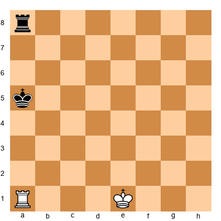

Rook skewers along ranks are also common. Place a White rook on h4, a Black queen on e4, and a Black bishop on b4. The rook attacks the queen along the 4th rank. The queen moves. The rook takes the bishop.

### Queen Skewers

The queen can skewer along files, ranks, and diagonals. But because the queen is so valuable, queen skewers usually target the king (giving check) and then capture the piece behind.

**Set up your board:** Place a White queen on a1, a Black king on d4, and a Black rook on g7. White plays **Qa1+** (the queen checks the king along the diagonal, and after the king moves, the queen captures the rook on g7). Actually, let's place the queen so this works on a clean diagonal.

Place a White queen on h1, a Black king on e4, and a Black rook on b7. The queen checks the king from h1 along the h1-e4 diagonal. After the king moves, the queen goes to b7 and takes the rook.

### When to Look for Skewers

Watch for these conditions:

1. **Two enemy pieces on the same line** (file, rank, or diagonal), with the more valuable one closer to your attacking piece.
2. **After a trade.** When pieces get traded, the board opens up. Open lines mean skewer opportunities.
3. **When the king is exposed.** An exposed king is a skewer target. Check the king, and whatever sits behind it on that line is yours.
4. **In the endgame.** With fewer pieces on the board, it is easier for bishops and rooks to find long, clear lines for skewers.

> **Milestone:** You have learned 3 of 7 tactical patterns. Already more than most casual players know. Forks, pins, and skewers are the "big three" of chess tactics.

🛑 **Take a break here if you need one. Three major patterns down, four to go. You are doing great.**

---

## Part 4: Discovered Attacks

A discovered attack is one of the most dangerous weapons in chess. The idea is simple: you move one piece out of the way, and the piece BEHIND it reveals an attack that was hidden.

The discovered attack is like a magic trick. Your opponent watches your moving piece while the real threat comes from behind. By the time they see it, it is too late.

### How Discovered Attacks Work

**Set up your board:** Place a White rook on e1, a White knight on e4, and a Black queen on e7. Right now, the knight on e4 blocks the rook's view of the Black queen. But if the knight moves (say, to d6, c5, f6, or any other square), the rook on e1 suddenly attacks the queen on e7. The queen is under attack from the rook, and the knight has moved to a completely different square where it might be creating a second threat.

That is the beauty of discovered attacks. The moving piece and the revealed piece create TWO threats at the same time. Your opponent can only deal with one.

### Discovered Check

When the revealed attack is a CHECK, it becomes a discovered check. This is brutal because checks must be answered immediately. The opponent has no time to deal with whatever the moving piece is doing.

**Set up your board:** Place a White bishop on c1, a White knight on d2, a Black king on h6, and a Black queen on a5. If the knight moves from d2, it reveals the bishop's diagonal from c1 toward h6, giving check. So the knight can move ANYWHERE and the bishop gives check. Suppose the knight jumps to **f3**, attacking the Black queen on a5. Black must answer the check from the bishop. Meanwhile, the queen on a5 is attacked by the knight. After Black deals with the check, White captures the queen.

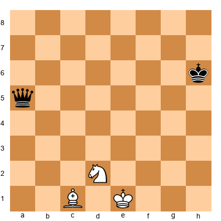

The moving piece gets a "free move" during a discovered check. It can capture a piece, give a second threat, or park itself on the best square available, all while the opponent is forced to deal with the check.

### Double Check

Double check is the most powerful form of discovered attack. Both the moving piece AND the revealed piece give check at the same time. The king is attacked from two directions simultaneously.

Here is what makes double check so devastating: you cannot block two checks at once, and you cannot capture two checking pieces at once. The ONLY way to escape a double check is to move the king. That means double check bypasses all normal defenses.

**Set up your board:** Place a White rook on e1, a White knight on e5, a Black king on e8, and various Black pieces around. The knight on e5 blocks the rook's attack on the king. If the knight moves to **f7** or **d7** or **g6** (giving check with the knight), the rook also gives check along the e-file. Both pieces check the king at the same time. Double check. The king must move.

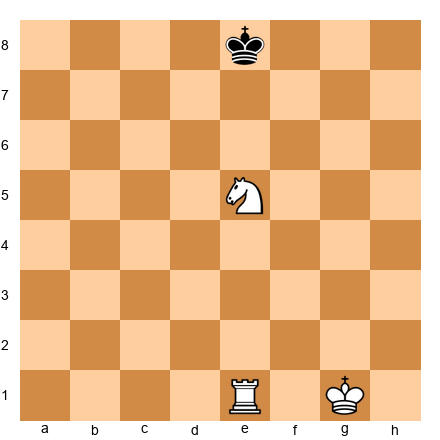

If White plays **Nd7+**, the knight checks from d7 and the rook checks along the e-file. Double check. Black's king must move. It cannot block both checks. It cannot capture both checking pieces.

Double check often leads to checkmate because the king is forced to specific squares where it may have no escape.

### How to Set Up Discovered Attacks

Look for these elements:

1. **A piece with a blocked line of attack.** Your rook, bishop, or queen is aimed at something valuable, but one of YOUR OWN pieces is in the way.
2. **A useful place for the blocking piece to go.** The piece that is blocking must have a good square to move to. Ideally, it creates its own threat (capture, check, or attack).
3. **A target for the revealed attack.** The piece behind must be attacking something valuable once the line opens.

**The battery setup:** A rook behind a knight on the same file, or a bishop behind a knight on the same diagonal, is a "battery." When the knight moves, the piece behind fires. Place your pieces in battery positions, and discovered attacks will appear naturally.

### The Power of the Discovered Attack

In practical play, discovered attacks win more games than almost any other tactic at the beginner level. Here is why:

1. They create two threats at once (the moving piece and the revealed piece).
2. When the revealed attack is check, the opponent has no time to save the other piece.
3. They are hard to see coming because the threat is hidden behind another piece.

Train yourself to look for discovered attacks by asking: "If I move THIS piece, does the piece behind it attack anything?" Make this a habit, and you will find discovered attacks your opponents never see coming.

> **Milestone:** You have learned 4 of 7 tactical patterns. Discovered attacks are what separate beginners from improving players. If you can spot these, you are growing fast.

🛑 **Discovered attacks take time to internalize. Stop here, solve a few puzzles with discovered checks online (Lichess has a great tactics trainer), and come back refreshed.**

---

## Part 5: Double Attacks

We have already seen specific types of double attacks: forks, skewers, and discovered attacks are all forms of creating two threats at once. But the principle deserves its own section because it is the foundation of ALL tactics.

**The core principle:** Create more threats than your opponent can handle. If you make one threat, your opponent deals with it. If you make two threats, they can deal with one but not both. You win.

Every tactic in chess boils down to this idea. A fork attacks two pieces with one move. A discovered check creates a check AND an attack on another piece. A skewer forces one piece to move, exposing another.

### How to Think About Double Attacks

When you are looking for tactics, do not search for specific pattern names. Instead, ask yourself:

1. **"Can I make a move that creates two threats?"**
2. **"Can I give check while also attacking another piece?"**
3. **"Can I capture a piece while also threatening something else?"**

If the answer to any of these questions is yes, you may have found a winning tactic. The name of the pattern (fork, pin, skewer, discovered attack) does not matter in the heat of the game. What matters is: does this move create more problems than my opponent can solve?

### Combining Double Attacks

Strong tactical players often combine multiple patterns in a single sequence. For example:

- **Pin + Fork:** Pin a piece to the king, then fork the pinned piece and another target.
- **Discovered attack + Skewer:** Move a piece to reveal an attack, and the revealed attack is a skewer.
- **Remove the defender + Fork:** Capture a defending piece, and now a fork is possible.

You will see these combinations in the annotated games later in this chapter. For now, remember the principle: tactics work together. One pattern sets up another.

---

## Part 6: Removing the Defender

Every well-placed piece has a job. A knight might defend a bishop. A pawn might protect a rook. A queen might guard a mating square. When you remove a defending piece, whatever it was protecting becomes vulnerable.

Removing the defender is often the "setup move" before a fork, pin, or checkmate. It is not flashy on its own, but it unlocks everything else.

### How It Works

**Set up your board:** Place a White queen on d1, a White bishop on c4, a Black pawn on f7, and a Black king on g8 (with Black pawns on f7, g7, h7 and a Black rook on f8). The pawn on f7 defends the square g6 and supports the rook. The rook on f8 defends f7. Everything is connected.

Now imagine White captures: **Bxf7+!** The bishop takes the f7 pawn. This removes a key defender. Suddenly, the king is exposed, the rook on f8 lost its support, and tactical opportunities appear everywhere.

### Common Patterns

**1. Capture the defender.** The most direct method. Take the piece that is doing the defending, and the thing it was protecting falls.

**2. Lure the defender away.** Attack the defending piece from another direction, forcing it to move to a square where it can no longer protect what it was guarding.

**3. Block the defender.** Place a piece in the path between the defender and what it protects. The defender is still on the board but can no longer do its job.

### How to Spot It

Ask yourself: "What is holding my opponent's position together?" Find the piece that is doing the most work, and target it. Remove it, and the rest of the position collapses.

In many beginner games, a single pawn or knight holds the entire defense together. Capture that piece, and you win material or deliver checkmate.

---

## Part 7: Overloaded Pieces

An overloaded piece is a piece trying to do two jobs at once. It is protecting one thing AND defending another, or guarding a square AND blocking an attack. When you attack an overloaded piece, it must abandon one of its duties to handle the other. Something falls.

### How It Works

**Set up your board:** Place a White rook on e1, a White queen on d3, a Black queen on d8, a Black king on g8, a Black rook on e8, and Black pawns on f7, g7, h7. The Black rook on e8 is doing two jobs: it defends the back rank (if it leaves, White plays Re8# checkmate) AND it sits on the e-file opposing the White rook.

Now, if White finds a way to force the rook to leave the e-file (say, by attacking it from another direction), the back rank becomes weak. The rook is overloaded.

### Recognizing Overloaded Pieces

Look for pieces that are:
- Defending two separate pieces at once
- Guarding against checkmate AND defending material
- Blocking a file AND protecting a pawn

When you see a piece doing double duty, find a way to attack it. Force it to choose one job, and the other job goes undone.

**Example:** A knight on f6 is defending the pawn on d5 AND protecting the h7 square from a queen invasion. If you capture the pawn on d5 with a piece the knight must recapture, the knight leaves f6. Now h7 is unprotected, and your queen invades.

**Tip:** Overloaded pieces are everywhere in chess. Start looking for them in your own games. Ask: "Is my opponent's piece doing two things at once? Can I force it to pick one?"

> **Milestone:** You have learned all 7 tactical patterns! Forks, pins, skewers, discovered attacks, double attacks, removing the defender, and overloaded pieces. You now have every tactical tool a beginner needs. The rest is practice.

🛑 **You have just finished the theory section for all seven tactical patterns. This is a major accomplishment. Take a real break. Go for a walk, get some water, stretch. When you come back, we will look at five brilliant games where grandmasters used these exact tactics to create masterpieces.**

---

## Annotated Master Games

Now let's watch grandmasters use the tactics you just learned. These five games feature forks, pins, skewers, discovered attacks, and combinations that changed chess history. Set up your board for each game and play through every move. At key moments, I will ask you to pause and find the tactic before I reveal it.

---

### Game 1 of 5: Legal vs Saint Brie (Paris, 1750)

**"Legal's Mate"**

This game is over 270 years old, and it is still taught today. It shows how a pin can be BROKEN by a spectacular sacrifice, leading to checkmate.

**Opening:** Philidor Defense (C41)
**Result:** 1-0

**Set up your board with the starting position.** White pieces on their normal squares, Black pieces on their normal squares. Follow each move carefully.

**1.e4 e5**

Both sides push their king's pawn two squares. Standard opening play.

**2.Nf3 d6**

Black plays the Philidor Defense, supporting the e5 pawn with the d-pawn. A solid but passive choice.

**3.Bc4 Bg4**

White develops the bishop to an aggressive diagonal aiming at f7. Black develops the bishop to g4, pinning the White knight on f3 to the White queen on d1. This looks like a good move for Black. The knight cannot move without exposing the queen, right?

**4.Nc3 g6?**

Black plays casually. This is a mistake. Black should have been more careful about the pin.

**⏸ Pause and look:** White has a bishop on c4 aiming at f7, a knight on f3 that is pinned, and a knight on c3. Black has a bishop on g4 that is pinning the knight. What if White ignores the pin entirely?

**5.Nxe5!!**

White moves the pinned knight! "But the queen is hanging!" you say. Yes, it is. The Black bishop on g4 can capture the White queen. But watch what happens.

**5...Bxd1**

Black takes the queen. A queen for a knight! Surely Black is winning? Not even close.

**6.Bxf7+ Ke7**

White's bishop captures on f7 with check. The king must move. It goes to e7 (the only legal square after ...Ke7, since d8 is blocked by the queen and f8 is blocked by the bishop).

**7.Nd5# Checkmate!**

After 1.e4 e5 2.Nf3 d6 3.Bc4 Bg4 4.Nc3 g6 5.Nxe5 Bxd1 6.Bxf7+ Ke7 7.Nd5#, the knight on d5 delivers check and the king has no escape: d8, e8, f8, and f6 are all covered.

**Tactical patterns in this game:**
- **Pin** (Black's Bg4 pins the knight to the queen)
- **Pin break** (White ignores the pin with Nxe5!!)
- **Discovered attack** (the knight moves from f3, but the real threat comes from the bishop on c4)
- **Sacrifice** (giving up the queen for a forced checkmate)

**Why this works:** Black's pin looked strong, but White found something more important than the queen: checkmate. Legal's combination teaches us that pins can be broken when there is a bigger threat. Never assume a pin is permanent.

**What to remember:** Before you feel comfortable about a pin you have created, always ask: "Can my opponent sacrifice the pinned piece and find something better?"

---

### Game 2 of 5: Reti vs Tartakower (Vienna, 1910)

**"The Most Elegant Three-Move Finish"**

This game features one of the most famous queen sacrifices in history, using a discovered attack and back-rank weakness.

**Opening:** Caro-Kann Defense (B15)
**Result:** 1-0

**Set up your board.**

**1.e4 c6 2.d4 d5 3.Nc3 dxe4 4.Nxe4 Nf6**

Standard Caro-Kann. Black develops naturally.

**5.Qd3!?**

An unusual queen move. White places the queen on d3 where it eyes the kingside.

**5...e5**

Black strikes at the center.

**6.dxe5 Qa5+**

Black checks, picking up the e5 pawn next.

**7.Bd2 Qxe5 8.O-O-O**

White castles queenside. The pieces are developing quickly.

**8...Nxe4??**

Black captures the knight on e4. This looks like a free piece! But it is a terrible blunder.

**⏸ Pause and look:** The Black king is on e8. The White queen is on d3. If the queen moves to d8, it would be check. And what is on d8? The Black queen is gone (it is on e5). There is nothing protecting d8 except the king itself. Look at the back rank. Is it weak?

**9.Qd8+!!**

White SACRIFICES the queen! Qd8 check. The king must capture.

**9...Kxd8**

The king takes the queen. Black is up a queen! But...

**10.Bg5+**

The bishop comes to g5 with check. This is a discovered attack: the bishop gives check, and the rook on d1 is now aiming at the king too. But more importantly, look at what happens next. If the king goes to c7 or e8...

**10...Kc7** (or 10...Ke8)

**11.Bd8# Checkmate!**

After 8...Nxe4 9.Qd8+! Kxd8 10.Bg5+:
- If 10...Kc7, 11.Bd8# (the bishop checkmates from d8, covering c7 and e7, with the rook supporting)
- If 10...Ke8, 11.Rd8# (the rook delivers back-rank mate)

**Tactical patterns in this game:**
- **Back-rank weakness** (Black's king has no escape squares)
- **Queen sacrifice** (Qd8+!! forces the king to a terrible square)
- **Discovered check** (Bg5+ reveals threats)
- **Checkmate pattern** (the combination is forced in only 3 moves)

**Why this works:** Black's back rank was completely undefended. The queen sacrifice forced the king into the open, and the discovered check finished the job. This game teaches a vital lesson: always keep an eye on back-rank weakness, especially when your king has not castled.

---

### Game 3 of 5: Lasker vs Thomas (London, 1912)

**"The King Hunt"**

This is one of the most spectacular games ever played. World Champion Emanuel Lasker sacrifices his queen and then hunts Black's king across the entire board, from h7 all the way to d1, delivering checkmate in the center.

**Opening:** Dutch Defense (A83)
**Result:** 1-0

**Set up your board.**

**1.d4 e6 2.Nf3 f5**

Black plays the Dutch Defense, controlling e4 with the f-pawn. But this weakens the king's position.

**3.Nc3 Nf6 4.Bg5 Be7 5.Bxf6 Bxf6**

White trades the bishop for the knight. Now the dark-squared bishop is gone, and the a1-h8 diagonal is weakened for Black.

**6.e4 fxe4 7.Nxe4 b6**

White opens the center. Black develops slowly.

**8.Ne5 O-O**

Black castles, putting the king on g8. The kingside is about to come under heavy fire.

**9.Bd3 Bb7 10.Qh5!**

White places the queen aggressively on h5, aiming at h7.

**⏸ Pause and look:** The queen on h5 threatens Qxh7#. The only defender of h7 is the king itself (and the f6 bishop indirectly). What can Black do?

**10...Qe7**

Black tries to defend. But the storm is coming.

**11.Qxh7+!!**

White SACRIFICES the queen! Takes the pawn on h7 with check. The king must capture.

**11...Kxh7**

**12.Nxf6+ Kh6**

The knight comes to f6 with check (double check from the knight and the discovered check from... actually, it is just the knight check here). The king goes to h6, running from the check.

**13.Neg4+ Kg5**

Another check from the knight on g4. The king runs to g5. The king is now in the middle of the board, completely exposed.

**14.h4+ Kf4**

White pushes the h-pawn with check. The king flees to f4. Incredible.

**15.g3+ Kf3**

Another pawn check. The king goes to f3. It has crossed the entire board.

**16.Be2+ Kg2**

The bishop checks from e2. The king goes to g2, right next to White's own rook on h1.

**17.Rh2+ Kg1**

The rook checks from h2. The king goes to g1.

**18.Kd2# (or O-O-O#)**

White plays king to d2, and it is checkmate! The king has moved to d2, and the Black king on g1 has no escape. The rook on h2 controls the second rank, the bishop on e2 covers f1, and the knight on f6 covers other squares.

Actually, the historical record shows 18.Kd2# as checkmate, with some sources recording it as 18.O-O-O# (queenside castling as the final move, which would be legal since neither the king nor the a1 rook has moved). Both deliver the same checkmate.

**Tactical patterns in this game:**
- **Queen sacrifice** (Qxh7+!! to strip away the king's pawn cover)
- **Discovered check** (Nxf6+ reveals the queen's line, though the queen has been sacrificed)
- **Double attacks** (every check forces the king forward while threatening more)
- **King hunt** (the king is chased from h7 to g1, covering nearly the entire board)

**Why this works:** Black's king had weak pawn cover (the f5 pawn was traded early, weakening the kingside). Lasker exploited this with a queen sacrifice that ripped open the king's shelter. Once the king was exposed, a series of checks drove it across the board to its doom.

**What to remember:** When your opponent's king is weakened (missing pawns in front of it, no defenders nearby), look for sacrifices that tear it open. A queen sacrifice sounds scary, but if it leads to checkmate, it is the best move on the board.

---

### Game 4 of 5: Paulsen vs Morphy (New York, 1857)

**"The Queen Sacrifice That Launched a Legend"**

Paul Morphy was the greatest player of his era, and this game shows why. His queen sacrifice (Qxf3!!) is one of the most celebrated moves in chess history. The combination that follows demonstrates how rapid development and open lines create unstoppable attacks.

**Opening:** Four Knights Game (C48)
**Result:** 0-1 (Morphy wins with Black)

**Set up your board.**

**1.e4 e5 2.Nf3 Nc6 3.Nc3 Nf6 4.Bb5 Bc5 5.O-O O-O**

Both sides develop quickly. A normal Four Knights opening.

**6.Nxe5 Re8**

White takes the e5 pawn with the knight. Black immediately plays Re8, pinning the knight to the king along the e-file and threatening to win it back.

**7.Nxc6 dxc6 8.Bc4 b5 9.Be2 Nxe4 10.Nxe4 Rxe4**

A series of exchanges. Black now has a rook actively placed on e4.

**11.Bf3 Re6 12.c3 Qd3!**

Black's queen comes to d3, a powerful centralized position. Morphy is building pressure.

**13.b4 Bb6 14.a4 bxa4 15.Qxa4 Bd7 16.Ra2 Rae8**

Both of Black's rooks are on the e-file. All of Black's pieces are developed and active. White's pieces are passive and tangled.

**⏸ Pause and look:** Compare the two positions. How many of White's pieces are actively placed? How many of Black's? Count them. Black has the queen on d3, both rooks on the e-file, bishops on b6 and d7. White has the queen on a4 (far from the action), the rook on a2 (doing nothing), and the bishop on f3 (passive). This development advantage is what Morphy will convert.

**17.Qa6**

White tries to generate counterplay.

**17...Qxf3!!**

Morphy sacrifices the queen! Black takes the bishop on f3 with the queen. White must capture.

**18.gxf3 Rg6+**

The rook comes to g6 with check. The king is exposed now (the g-pawn just moved to capture the queen, opening the g-file).

**19.Kh1 Bh3**

Black's bishop comes to h3, threatening Bg2# checkmate. The attack flows naturally.

**20.Rd1 Bg2+ 21.Kg1 Bxf3+**

The bishop gives a discovered check by moving to f3. The king must deal with it.

**22.Kf1 Bg2+ 23.Kg1 Bh3+ 24.Kh1 Bxf2**

Morphy is methodically dismantling White's position while keeping the king under constant pressure.

**25.Qf1 Bxf1 26.Rxf1 Re2 27.Ra1 Rh6 28.d4 Be3 0-1**

White resigns. The position is hopeless. Black's pieces dominate every part of the board.

**Tactical patterns in this game:**
- **Pin** (Re8 pins the knight to the king in the opening)
- **Queen sacrifice** (Qxf3!! opens the g-file for the rook)
- **Discovered check** (Bxf3+ reveals the rook's attack)
- **Development advantage** (Morphy's rapid development created the conditions for every tactic)

**Why this works:** Morphy understood that having all your pieces active and coordinated is worth more than any single piece, even a queen. His queen sacrifice opened lines that his rooks and bishops used to create an unstoppable attack. The lesson: develop ALL your pieces before you attack, and when the attack comes, even a queen sacrifice can be correct.

---

### Game 5 of 5: Byrne vs Fischer (New York, 1956)

**"The Game of the Century"**

A 13-year-old Bobby Fischer played this game against Donald Byrne, one of America's strongest players. Fischer's queen sacrifice on move 17 stunned the chess world and earned the game its legendary nickname. It remains one of the greatest games ever played.

**Opening:** Gruenfeld Defense (D92)
**Result:** 0-1 (Fischer wins with Black)

**Set up your board.**

**1.Nf3 Nf6 2.c4 g6 3.Nc3 Bg7 4.d4 O-O 5.Bf4 d5**

Fischer plays the Gruenfeld, challenging the center immediately.

**6.Qb3 dxc4 7.Qxc4 c6 8.e4 Nbd7 9.Rd1 Nb6 10.Qc5 Bg4**

Fischer develops with purpose. The bishop on g4 pins the knight on f3 to... well, it puts pressure on the knight and aims at the d1 rook behind it.

**11.Bg5?!**

White pins the Black knight on f6 to the queen on d8. Pins everywhere!

**11...Na4! 12.Qa3 Nxc3 13.bxc3 Nxe4!**

Fischer sacrifices a knight to destroy White's center. Bold play from a 13-year-old.

**14.Bxe7 Qb6!**

White captures the bishop on e7, but Fischer's queen comes to b6 with a powerful position.

**15.Bc4 Nxc3!**

Another piece enters the attack. Fischer is tearing White's position apart.

**16.Bc5 Rfe8+ 17.Kf1**

White's king cannot castle anymore. It sits on f1, awkwardly placed.

**⏸ Pause and look:** Fischer is about to play one of the most famous moves in chess history. Black has a knight on c3, a queen on b6, a rook on e8, and a bishop on g4. White's king is on f1, exposed. What would you play?

**17...Be6!!**

Fischer offers his QUEEN. The bishop moves to e6, and the queen on b6 is attacked by the bishop on c5. Fischer does not care. If White takes the queen with Bxb6, then ...Bxc4+ wins the bishop and forks the king and rook, and Black's attack continues with overwhelming force.

**18.Bxb6 Bxc4+ 19.Kg1 Ne2+ 20.Kf1 Nxd4+**

A beautiful sequence. Knight forks, discovered checks, and devastating tactics flow from every direction.

**21.Kg1 Ne2+ 22.Kf1 Nc3+ 23.Kg1 axb6 24.Qb4 Ra4 25.Qxb6 Nxd1**

Fischer has won massive material. The rest is technique.

**26.h3 Rxa2 27.Kh2 Nxf2 28.Re1 Rxe1 29.Qd8+ Bf8 30.Nxe1 Bd5 31.Nf3 Ne4 32.Qb8 b5 33.h4 h5 34.Ne5 Kg7 35.Kg1 Bc5+ 36.Kf1 Ng3+ 37.Ke1 Bb4+ 38.Kd1 Bb3+ 39.Kc1 Ne2+ 40.Kb1 Nc3+ 41.Kc1 Rc2# Checkmate.**

After 41...Rc2#, the king is on c1, the rook gives check from c2, and the knight on c3 and bishop on b4 cover the escape squares. Checkmate.

**Tactical patterns in this game:**
- **Pin** (Bg4 pins the knight, Bg5 pins the other knight)
- **Queen sacrifice** (Be6!! allows the queen to be captured)
- **Knight forks** (Ne2+, Nxd4+, and others throughout the combination)
- **Discovered checks** (multiple in the final sequence)
- **Overloaded pieces** (White cannot defend everything at once)

**Why this works:** Fischer saw further than his opponent at every turn. The queen sacrifice was not a wild gamble. It was a precise calculation. After Bxb6, Fischer had a sequence of checks and forks that won back more material than the queen was worth. The game teaches us that sacrifices must be backed by concrete calculation, not hope.

**What to remember:** A 13-year-old played this game. He did not have a computer. He did not have a coach sitting next to him. He had pattern recognition, calculation, and the courage to sacrifice his queen when he saw it was correct. You can develop these same skills. It starts with learning the patterns in this chapter.

🛑 **You have now studied five masterpieces of tactical chess. Take a real break before the exercise section. The next 140 problems will test everything you have learned. Come back with fresh eyes and a clear mind.**

---

## Exercises

140 exercises organized by tactical pattern. Set up each position on your board or load the FEN into a chess program. Try to solve before reading hints.

**Difficulty:** ★ = straightforward | ★★ = requires planning | ★★★ = deep combination

---

### Section A: Fork Exercises (6.1–6.35)

**Exercise 6.1** ★
**Position:** White: Ke1, Ne5. Black pieces on f8 and b8.

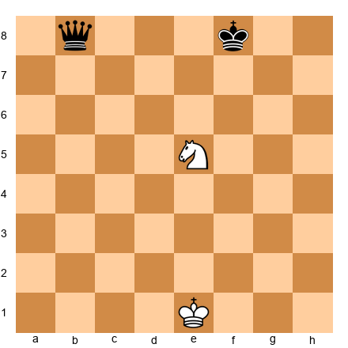

**Task:** White to move. Find the knight fork.
**Hint 1:** The knight on e5 can jump to d7.
**Hint 2:** Check what squares d7 attacks.
**Hint 3:** It hits f8 (king) and b8 (queen).
**Solution:** **1.Nd7+** Forks king on f8 and queen on b8. After the king moves, the knight captures.

---

**Exercise 6.2** ★
**Position:** White: Ke1, Nb3. Black pieces on d7 and a6.

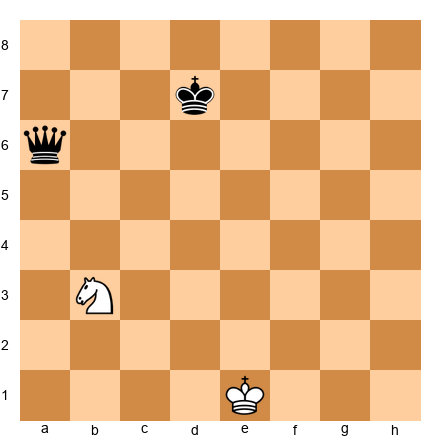

**Task:** White to move. Find the knight fork.
**Hint 1:** The knight on b3 can jump to c5.
**Hint 2:** Check what squares c5 attacks.
**Hint 3:** It hits d7 (king) and a6 (queen).
**Solution:** **1.Nc5+** Forks king on d7 and queen on a6. After the king moves, the knight captures.

---

**Exercise 6.3** ★
**Position:** White: Ke2, Nb5. Black pieces on e8 and a8.

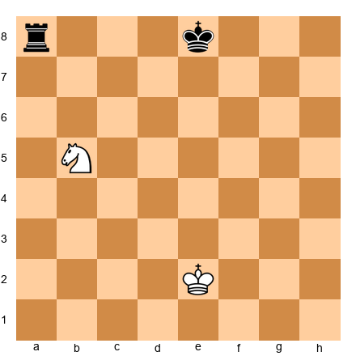

**Task:** White to move. Find the knight fork.
**Hint 1:** The knight on b5 can jump to c7.
**Hint 2:** Check what squares c7 attacks.
**Hint 3:** It hits e8 (king) and a8 (rook).
**Solution:** **1.Nc7+** Forks king on e8 and rook on a8. After the king moves, the knight captures.

---

**Exercise 6.4** ★
**Position:** White: Ke1, Ne5. Black pieces on d8 and h8.

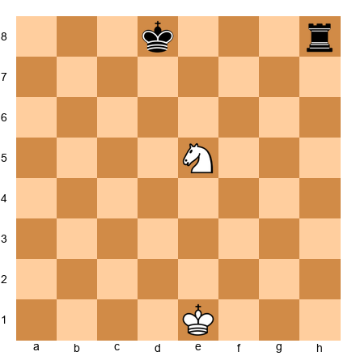

**Task:** White to move. Find the knight fork.
**Hint 1:** The knight on e5 can jump to f7.
**Hint 2:** Check what squares f7 attacks.
**Hint 3:** It hits d8 (king) and h8 (rook).
**Solution:** **1.Nf7+** Forks king on d8 and rook on h8. After the king moves, the knight captures.

---

**Exercise 6.5** ★
**Position:** White: Ke2, Nf3. Black pieces on e6 and h7.

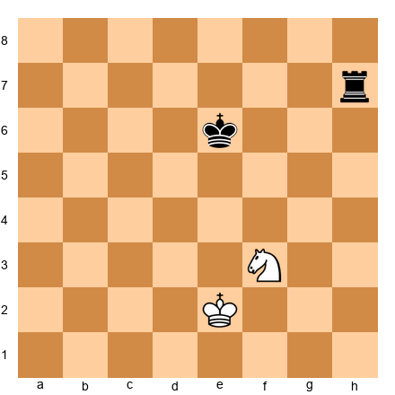

**Task:** White to move. Find the knight fork.
**Hint 1:** The knight on f3 can jump to g5.
**Hint 2:** Check what squares g5 attacks.
**Hint 3:** It hits e6 (king) and h7 (rook).
**Solution:** **1.Ng5+** Forks king on e6 and rook on h7. After the king moves, the knight captures.

---

**Exercise 6.6** ★
**Position:** White: Ke1, Ng3. Black pieces on e7 and h6.

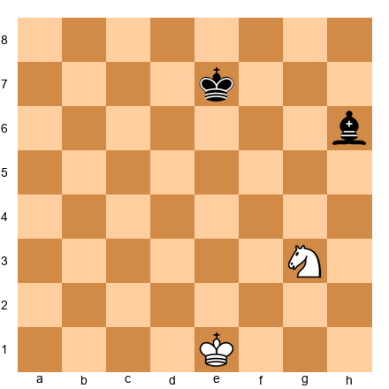

**Task:** White to move. Find the knight fork.
**Hint 1:** The knight on g3 can jump to f5.
**Hint 2:** Check what squares f5 attacks.
**Hint 3:** It hits e7 (king) and h6 (bishop).
**Solution:** **1.Nf5+** Forks king on e7 and bishop on h6. After the king moves, the knight captures.

---

**Exercise 6.7** ★
**Position:** White: Ke1, Ne4. Black pieces on a6 and d7.

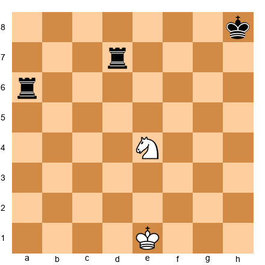

**Task:** White to move. Find the knight fork.
**Hint 1:** The knight on e4 can jump to c5.
**Hint 2:** Check what squares c5 attacks.
**Hint 3:** It hits a6 (rook) and d7 (rook).
**Solution:** **1.Nc5** Forks rook on a6 and rook on d7. Black saves one, White takes the other.

---

**Exercise 6.8** ★
**Position:** White: Ke1, Nd3. Black pieces on d7 and f7.

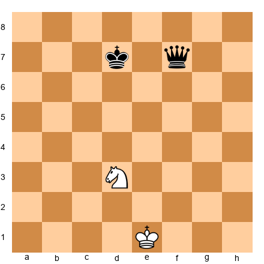

**Task:** White to move. Find the knight fork.
**Hint 1:** The knight on d3 can jump to e5.
**Hint 2:** Check what squares e5 attacks.
**Hint 3:** It hits d7 (king) and f7 (queen).
**Solution:** **1.Ne5+** Forks king on d7 and queen on f7. After the king moves, the knight captures.

---

**Exercise 6.9** ★
**Position:** White: Ke1, Ng4. Black pieces on f7 and g8.

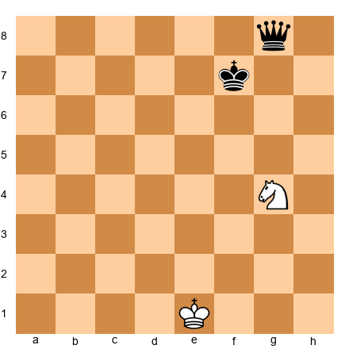

**Task:** White to move. Find the knight fork.
**Hint 1:** The knight on g4 can jump to h6.
**Hint 2:** Check what squares h6 attacks.
**Hint 3:** It hits f7 (king) and g8 (queen).
**Solution:** **1.Nh6+** Forks king on f7 and queen on g8. After the king moves, the knight captures.

---

**Exercise 6.10** ★
**Position:** White: Ke2, Nc4. Black pieces on d7 and a8.

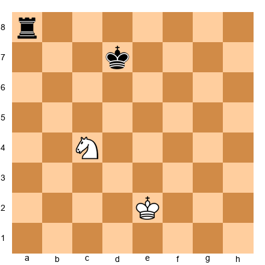

**Task:** White to move. Find the knight fork.
**Hint 1:** The knight on c4 can jump to b6.
**Hint 2:** Check what squares b6 attacks.
**Hint 3:** It hits d7 (king) and a8 (rook).
**Solution:** **1.Nb6+** Forks king on d7 and rook on a8. After the king moves, the knight captures.

---

**Exercise 6.11** ★
**Position:** White: Ke1, Nc4. Black pieces on c8 and e8.

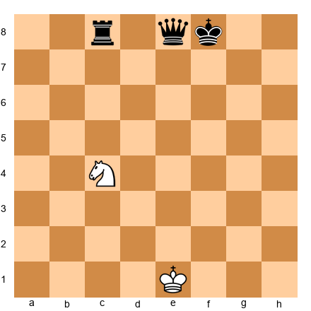

**Task:** White to move. Find the knight fork.
**Hint 1:** The knight on c4 can jump to d6.
**Hint 2:** Check what squares d6 attacks.
**Hint 3:** It hits c8 (rook) and e8 (queen).
**Solution:** **1.Nd6** Forks rook on c8 and queen on e8. Black saves one, White takes the other.

---

**Exercise 6.12** ★
**Position:** White: Ke1, Nd4. Black pieces on d8 and a7.

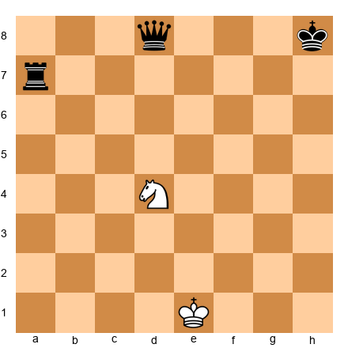

**Task:** White to move. Find the knight fork.
**Hint 1:** The knight on d4 can jump to c6.
**Hint 2:** Check what squares c6 attacks.
**Hint 3:** It hits d8 (queen) and a7 (rook).
**Solution:** **1.Nc6** Forks queen on d8 and rook on a7. Black saves one, White takes the other.

---

**Exercise 6.13** ★
**Position:** Qd1, Ka8, Rh5

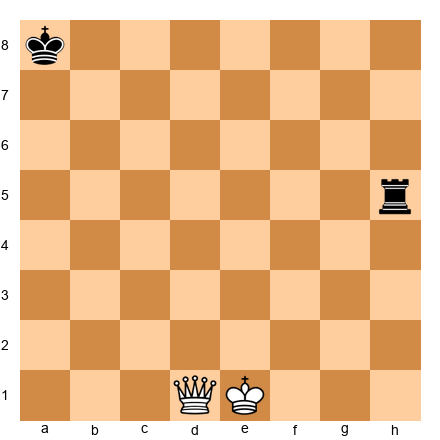

**Task:** Queen fork with check.
**Hint 1:** Qd5+ checks on the a8 diagonal and attacks h5 on the rank.
**Hint 2:** The queen attacks along ranks, files, and diagonals.
**Hint 3:** After the king moves, capture the loose piece.
**Solution:** **1.Qd5+** Check on the diagonal, rook falls on the rank.

---

**Exercise 6.14** ★
**Position:** Qb1, Kf5, Rb8

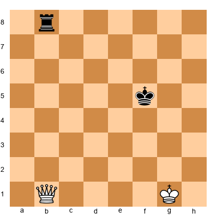

**Task:** Fork king and rook.
**Hint 1:** Qb5+ checks on the rank, rook on b8 via b-file.
**Hint 2:** The queen attacks along ranks, files, and diagonals.
**Hint 3:** After the king moves, capture the loose piece.
**Solution:** **1.Qb5+** Check, then Qxb8.

---

**Exercise 6.15** ★
**Position:** Qh1, Kd5, Rh8

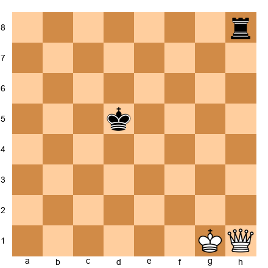

**Task:** Check and win the rook.
**Hint 1:** Qh5+ checks on the rank, rook on h8 via h-file.
**Hint 2:** The queen attacks along ranks, files, and diagonals.
**Hint 3:** After the king moves, capture the loose piece.
**Solution:** **1.Qh5+** Check on the rank, Qxh8 follows.

---

**Exercise 6.16** ★
**Position:** Qe1, Kd4, Ra8

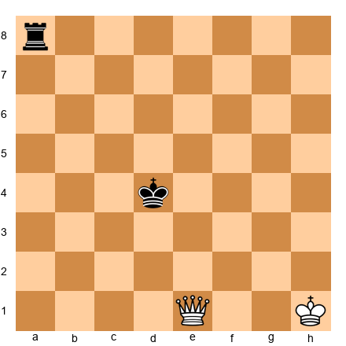

**Task:** Queen fork on the diagonal.
**Hint 1:** Qa1+ checks on the a1-d4 diagonal, rook on a8 via a-file.
**Hint 2:** The queen attacks along ranks, files, and diagonals.
**Hint 3:** After the king moves, capture the loose piece.
**Solution:** **1.Qa1+** Check on the diagonal, Qxa8 follows.

---

**Exercise 6.17** ★
**Position:** Qf3, Kc6, Rf8

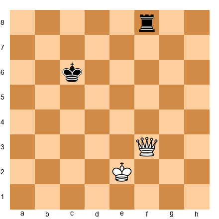

**Task:** Check and win the rook.
**Hint 1:** Qf6+ checks on the rank, rook on f8 via f-file.
**Hint 2:** The queen attacks along ranks, files, and diagonals.
**Hint 3:** After the king moves, capture the loose piece.
**Solution:** **1.Qf6+** Check, then Qxf8.

---

**Exercise 6.18** ★
**Position:** Qa1, Kd7, Rh7

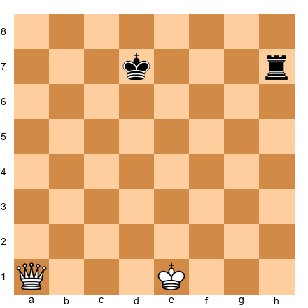

**Task:** Queen fork on the 7th rank.
**Hint 1:** Qa7+ checks on the rank, rook on h7 attacked.
**Hint 2:** The queen attacks along ranks, files, and diagonals.
**Hint 3:** After the king moves, capture the loose piece.
**Solution:** **1.Qa7+** Check on the 7th rank, Qxh7 follows.

---

**Exercise 6.19** ★
**Position:** White pawn on d4. Black pieces on c5 and e5.

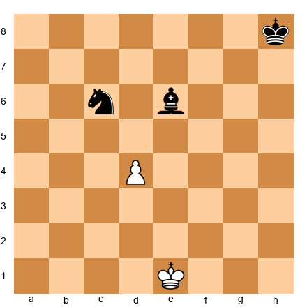

**Task:** White to move. Find the pawn fork.
**Hint 1:** The pawn on d4 advances to d5.
**Hint 2:** A pawn on d5 attacks c5 and e5.
**Hint 3:** Both squares have Black pieces.
**Solution:** **1.d5!** Pawn forks the pieces on c5 and e5.

---

**Exercise 6.20** ★
**Position:** White pawn on e4. Black pieces on d5 and f5.

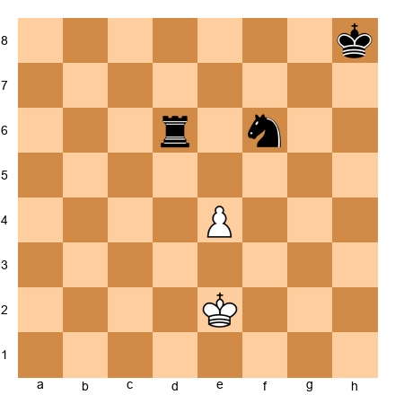

**Task:** White to move. Find the pawn fork.
**Hint 1:** The pawn on e4 advances to e5.
**Hint 2:** A pawn on e5 attacks d5 and f5.
**Hint 3:** Both squares have Black pieces.
**Solution:** **1.e5!** Pawn forks the pieces on d5 and f5.

---

**Exercise 6.21** ★
**Position:** White pawn on c4. Black pieces on b5 and d5.

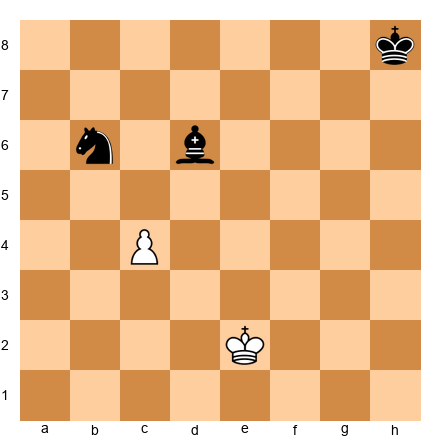

**Task:** White to move. Find the pawn fork.
**Hint 1:** The pawn on c4 advances to c5.
**Hint 2:** A pawn on c5 attacks b5 and d5.
**Hint 3:** Both squares have Black pieces.
**Solution:** **1.c5!** Pawn forks the pieces on b5 and d5.

---

**Exercise 6.22** ★
**Position:** White pawn on b4. Black pieces on a5 and c5.

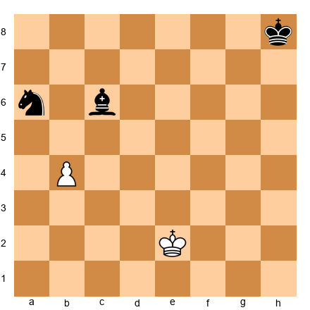

**Task:** White to move. Find the pawn fork.
**Hint 1:** The pawn on b4 advances to b5.
**Hint 2:** A pawn on b5 attacks a5 and c5.
**Hint 3:** Both squares have Black pieces.
**Solution:** **1.b5!** Pawn forks the pieces on a5 and c5.

---

**Exercise 6.23** ★★
**Position:** White: Kg1, Nd3. Black pieces include king and queen.

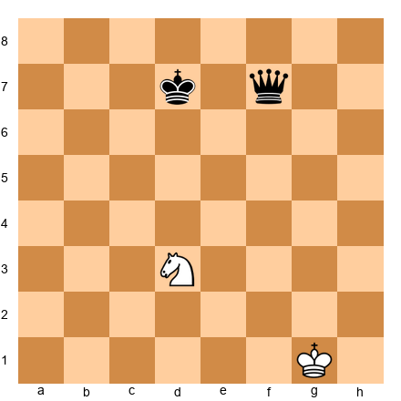

**Task:** White to move. Find the knight fork.
**Hint 1:** Ne5+ is the key move.
**Hint 2:** It attacks d7 and f7.
**Hint 3:** Calculate what each side wins and loses.
**Solution:** **1.Ne5+** Knight forks the king on d7 and queen on f7.

---

**Exercise 6.24** ★★
**Position:** White: Kg1, Ne2. Black pieces include king and queen.

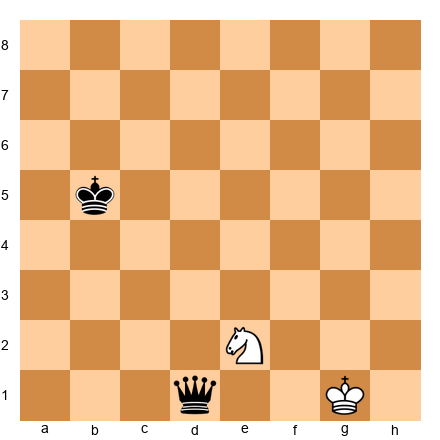

**Task:** White to move. Find the knight fork.
**Hint 1:** Nc3+ is the key move.
**Hint 2:** It attacks b5 and d1.
**Hint 3:** Calculate what each side wins and loses.
**Solution:** **1.Nc3+** Knight forks the king on b5 and queen on d1.

---

**Exercise 6.25** ★★
**Position:** White: Ke1, Ng5. Black pieces include king and queen.

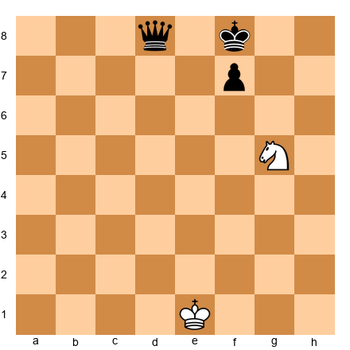

**Task:** White to move. Find the knight fork.
**Hint 1:** Ne6+ is the key move.
**Hint 2:** It attacks f8 and d8.
**Hint 3:** Calculate what each side wins and loses.
**Solution:** **1.Ne6+** Knight forks the king on f8 and queen on d8.

---

**Exercise 6.26** ★★
**Position:** White: Ka1, Ng4. Black pieces include king and queen.

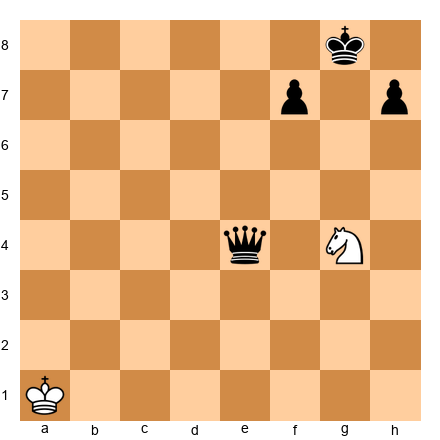

**Task:** White to move. Find the knight fork.
**Hint 1:** Nf6+ is the key move.
**Hint 2:** It attacks g8 and e4.
**Hint 3:** Calculate what each side wins and loses.
**Solution:** **1.Nf6+** Knight forks the king on g8 and queen on e4.

---

**Exercise 6.27** ★★
**Position:** White: Ke1, Ne5. Black pieces include rook and rook.

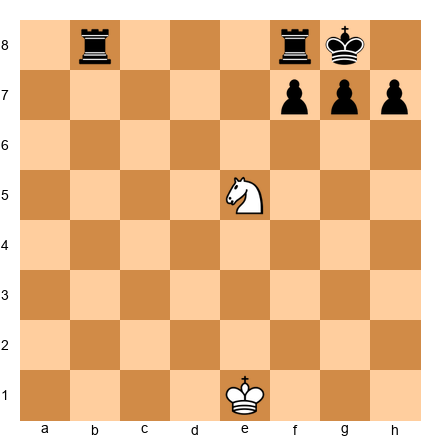

**Task:** White to move. Find the knight fork.
**Hint 1:** Nd7 is the key move.
**Hint 2:** It attacks b8 and f8.
**Hint 3:** Calculate what each side wins and loses.
**Solution:** **1.Nd7** Knight forks the rook on b8 and rook on f8.

---

**Exercise 6.28** ★★
**Position:** White: Ke1, Nh4. Black pieces include king and queen.

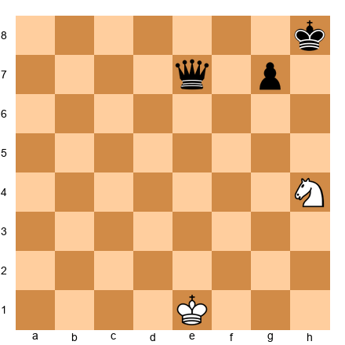

**Task:** White to move. Find the knight fork.
**Hint 1:** Ng6+ is the key move.
**Hint 2:** It attacks h8 and e7.
**Hint 3:** Calculate what each side wins and loses.
**Solution:** **1.Ng6+** Knight forks the king on h8 and queen on e7.

---

**Exercise 6.29** ★★★
**Position:** White: Kg1, Nd3. Black: Kd7, Qf7, Rc4.

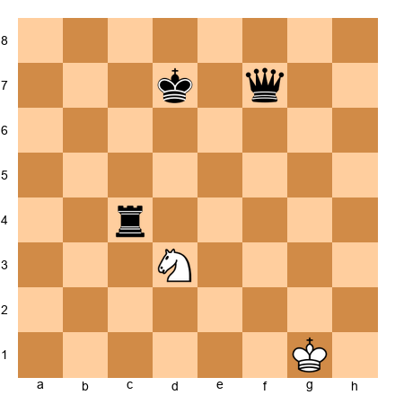

**Task:** TRIPLE fork!
**Hint 1:** Ne5+ checks the king.
**Hint 2:** e5 also attacks f7 and c4.
**Hint 3:** Three pieces at once!
**Solution:** **1.Ne5+** Triple fork! King on d7, queen on f7, rook on c4 all attacked. After king moves, Nxf7.

---

**Exercise 6.30** ★★★
**Position:** White: Ke1, Ne4. Black: Kf7, Rc8, Qe8.

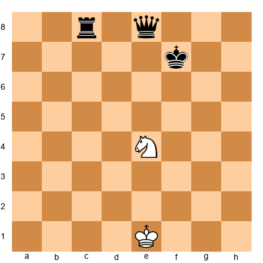

**Task:** Triple fork with check.
**Hint 1:** Nd6+ checks king on f7.
**Hint 2:** d6 attacks c8 and e8.
**Hint 3:** Three targets!
**Solution:** **1.Nd6+** King, rook, and queen all forked!

---

**Exercise 6.31** ★★
**Position:** White: Ke1, Na4. Black: Kd7, Qc8.

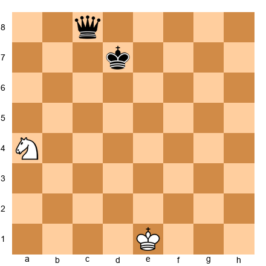

**Task:** Knight fork from the queenside.
**Hint 1:** Nb6+ checks.
**Hint 2:** b6 attacks c8.
**Hint 3:** Royal fork!
**Solution:** **1.Nb6+** Forks king and queen.

---

**Exercise 6.32** ★★
**Position:** White: Ke1, Nc4. Black: Kd8, Rc8, Qe8.

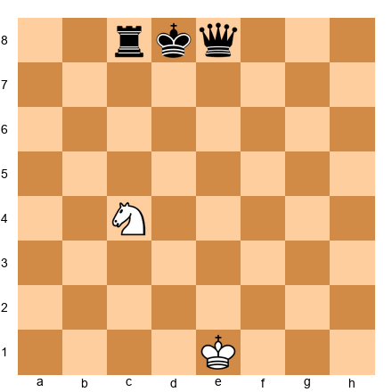

**Task:** Fork two major pieces.
**Hint 1:** Nd6 attacks c8 and e8.
**Hint 2:** Rook and queen forked.
**Hint 3:** Black loses a major piece.
**Solution:** **1.Nd6!** Forks rook on c8 and queen on e8.

---

**Exercise 6.33** ★
**Position:** White: Ke2, Pf4. Black: Kh8, Re6, Ng6.

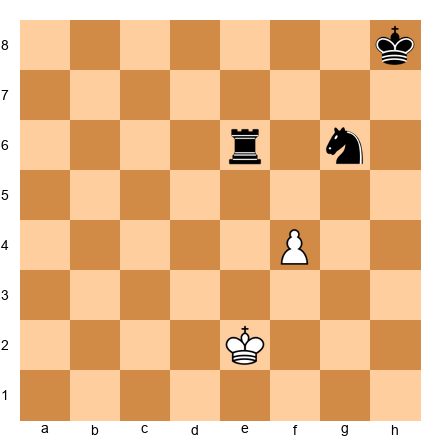

**Task:** Pawn fork.
**Hint 1:** f5 attacks e6 and g6.
**Hint 2:** Rook and knight forked.
**Hint 3:** One piece falls.
**Solution:** **1.f5!** Pawn forks rook and knight.

---

**Exercise 6.34** ★★★
**Position:** White: Ke2, Nc4. Black: Ka4, Ra8, Qc8.

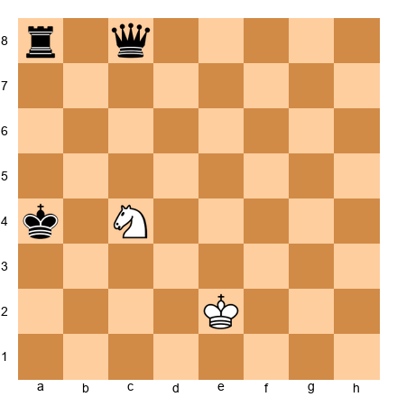

**Task:** TRIPLE fork!
**Hint 1:** Nb6+ checks king on a4.
**Hint 2:** b6 attacks a8 and c8.
**Hint 3:** King, rook, AND queen!
**Solution:** **1.Nb6+** Triple fork! King, rook, and queen attacked. After king moves, Nxc8.

---

**Exercise 6.35** ★★
**Position:** White: Ke1, Ng5. Black: Kf6, Qc3.

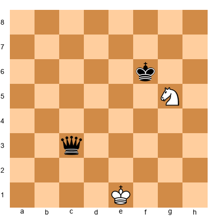

**Task:** Fork king and queen.
**Hint 1:** Ne4+ checks f6.
**Hint 2:** e4 attacks c3.
**Hint 3:** Royal fork!
**Solution:** **1.Ne4+** Forks king on f6 and queen on c3.

---

🛑 **35 fork exercises complete. Take a break before pins.**

---

### Section B: Pin Exercises (6.36–6.65)

**Exercise 6.36** ★
**Position:** See hint for piece placement.

**Task:** Capture the pinned piece.
**Hint 1:** Bg5 pins Nf6 to Ke7. Capture.
**Hint 2:** The piece cannot move without exposing the king.
**Hint 3:** Take it.
**Solution:** **1.Bxf6+** Captures the pinned piece.

---

**Exercise 6.37** ★
**Position:** See hint for piece placement.

**Task:** Capture the pinned piece.
**Hint 1:** Re1 pins Ne5 to Ke8. Capture.
**Hint 2:** The piece cannot move without exposing the king.
**Hint 3:** Take it.
**Solution:** **1.Rxe5** Captures the pinned piece.

---

**Exercise 6.38** ★
**Position:** See hint for piece placement.

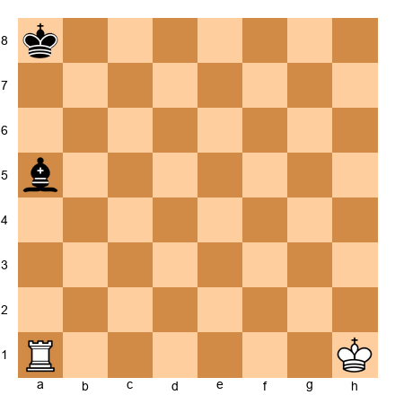

**Task:** Capture the pinned piece.
**Hint 1:** Ra1 pins Ba5 to Ka8. Capture.
**Hint 2:** The piece cannot move without exposing the king.
**Hint 3:** Take it.
**Solution:** **1.Rxa5** Captures the pinned piece.

---

**Exercise 6.39** ★
**Position:** See hint for piece placement.

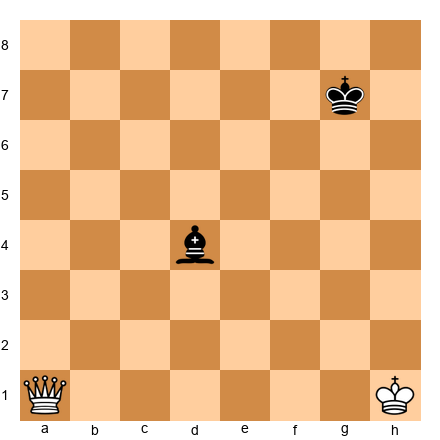

**Task:** Capture the pinned piece.
**Hint 1:** Qa1 pins Bd4 to Kg7. Capture.
**Hint 2:** The piece cannot move without exposing the king.
**Hint 3:** Take it.
**Solution:** **1.Qxd4+** Captures the pinned piece.

---

**Exercise 6.40** ★
**Position:** See hint for piece placement.

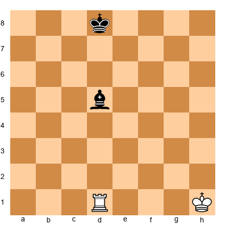

**Task:** Capture the pinned piece.
**Hint 1:** Rd1 pins Bd5 to Kd8. Capture.
**Hint 2:** The piece cannot move without exposing the king.
**Hint 3:** Take it.
**Solution:** **1.Rxd5+** Captures the pinned piece.

---

**Exercise 6.41** ★
**Position:** See hint for piece placement.

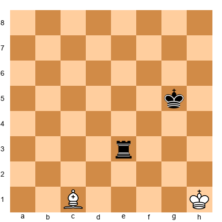

**Task:** Capture the pinned piece.
**Hint 1:** Bc1 pins Re3 to Kg5. Win the exchange.
**Hint 2:** The piece cannot move without exposing the king.
**Hint 3:** Take it.
**Solution:** **1.Bxe3** Captures the pinned piece.

---

**Exercise 6.42** ★
**Position:** See hint for piece placement.

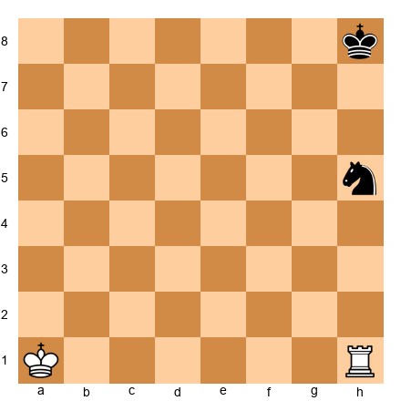

**Task:** Capture the pinned piece.
**Hint 1:** Rh1 pins Nh5 to Kh8. Capture.
**Hint 2:** The piece cannot move without exposing the king.
**Hint 3:** Take it.
**Solution:** **1.Rxh5+** Captures the pinned piece.

---

**Exercise 6.43** ★
**Position:** See hint for piece placement.

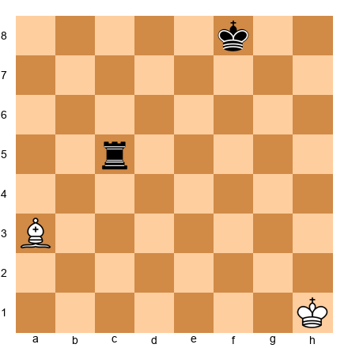

**Task:** Capture the pinned piece.
**Hint 1:** Ba3 pins Rc5 to Kf8. Win the exchange.
**Hint 2:** The piece cannot move without exposing the king.
**Hint 3:** Take it.
**Solution:** **1.Bxc5+** Captures the pinned piece.

---

**Exercise 6.44** ★
**Position:** See hint for piece placement.

**Task:** Capture the pinned piece.
**Hint 1:** Re1 pins Qe4 to Ke8. Win the queen!
**Hint 2:** The piece cannot move without exposing the king.
**Hint 3:** Take it.
**Solution:** **1.Rxe4** Captures the pinned piece.

---

**Exercise 6.45** ★
**Position:** See hint for piece placement.

**Task:** Capture the pinned piece.
**Hint 1:** Bb2 pins Nd4 to Kf6. Capture.
**Hint 2:** The piece cannot move without exposing the king.
**Hint 3:** Take it.
**Solution:** **1.Bxd4+** Captures the pinned piece.

---

**Exercise 6.46** ★★
**Position:** White: Ke1, Ba4, Pd2. Black: Ke8, Nc6.

**Task:** Pile up on the pinned knight with a pawn.
**Hint 1:** Ba4 pins Nc6 to Ke8.
**Hint 2:** d4 then d5 attacks the frozen knight.
**Hint 3:** The knight cannot escape.
**Solution:** **1.d4!** Preparing d5 to attack the pinned knight. It will be captured.

---

**Exercise 6.47** ★★
**Position:** White: Ke2, Bh3. Black: Kd7, Nf5.

**Task:** Create a pin.
**Hint 1:** Bg4 pins Nf5 to Kd7 (g4-f5-e6-d7 diagonal).
**Hint 2:** The knight is now frozen.
**Hint 3:** One bishop move does it.
**Solution:** **1.Bg4!** Pins the knight to the king. It cannot move.

---

**Exercise 6.48** ★★
**Position:** White: Ka1, Bc1. Black: Kh6, Nf4.

**Task:** Capture the pinned knight.
**Hint 1:** Bc1 pins Nf4 to Kh6 on the diagonal.
**Hint 2:** Absolute pin.
**Hint 3:** Take it.
**Solution:** **1.Bxf4+** Captures the pinned knight.

---

**Exercise 6.49** ★
**Position:** Black to move. White: Kh1, Ba4. Black: Ke8, Nc6, Bc8.

**Task:** Break the pin by blocking.
**Hint 1:** Ba4 pins Nc6 to Ke8.
**Hint 2:** Place a piece on d7 to block.
**Hint 3:** Bd7 interposes.
**Solution:** **1...Bd7!** Blocks the pin. The knight on c6 is free to move.

---

**Exercise 6.50** ★
**Position:** Black to move. White: Ka1, Bg5. Black: Ke7, Nf6.

**Task:** Break the pin by moving the king.
**Hint 1:** Bg5 pins Nf6 to Ke7.
**Hint 2:** Move the king off the line.
**Hint 3:** Kd6 works.
**Solution:** **1...Kd6!** King steps aside. Knight is free.

---

**Exercise 6.51** ★★
**Position:** Black to move. Bg5 pins Nf6 to Qd8.

**Task:** Chase the pinning bishop.
**Hint 1:** h6 attacks the bishop.
**Hint 2:** Bishop must retreat or capture.
**Hint 3:** If Bxf6, Qxf6 breaks the pin.
**Solution:** **1...h6!** Pawn kicks the bishop. Classic pin break.

---

**Exercise 6.52** ★★
**Position:** White: Kh1, Re1. Black: Ke8, Qe5.

**Task:** Win the pinned queen!
**Hint 1:** Re1 pins Qe5 to Ke8.
**Hint 2:** The queen is frozen.
**Hint 3:** Capture!
**Solution:** **1.Rxe5+** Takes the pinned queen! Massive material win.

---

**Exercise 6.53** ★★
**Position:** White: Ke1, Qd1. Black: Kh8, Nd5, Rd8.

**Task:** Capture the pinned knight.
**Hint 1:** Qd1 pins Nd5 to Rd8.
**Hint 2:** Relative pin.
**Hint 3:** Capture the knight.
**Solution:** **1.Qxd5** Takes the pinned knight.

---

**Exercise 6.54** ★★
**Position:** White: Kh1, Bb1, Ne4. Black: Kf5, Rd3.

**Task:** Discovered pin! Move the knight.
**Hint 1:** Bb1 aims at f5 through the d3-e4 line.
**Hint 2:** Ne4 blocks.
**Hint 3:** Move the knight. Rook becomes pinned!
**Solution:** **1.Nd2!** Reveals bishop's pin on the rook. The rook on d3 is now pinned to the king.

---

**Exercise 6.55** ★★★
**Position:** White: Ke1, Ba4, Re5. Black: Ke8, Nc6.

**Task:** Pin enables CHECKMATE!
**Hint 1:** Ba4 pins Nc6 to Ke8.
**Hint 2:** Rd8+ is check. Can the knight block? No!
**Hint 3:** Mate!
**Solution:** **1.Re8#** Checkmate! The knight is pinned and cannot capture. Pin + back-rank = mate.

---

**Exercise 6.56** ★
**Position:** White: Ka1, Re1. Black: Ke6, Be3.

**Task:** Capture the pinned bishop.
**Hint 1:** Re1 pins Be3 to Ke6.
**Hint 2:** Absolute pin.
**Hint 3:** Take it.
**Solution:** **1.Rxe3+** Captures the pinned bishop.

---

**Exercise 6.57** ★
**Position:** White: Kh1, Bc1. Black: Ke3, Nd2.

**Task:** Capture the pinned knight.
**Hint 1:** Bc1 pins Nd2 to Ke3.
**Hint 2:** Absolute pin.
**Hint 3:** Take it.
**Solution:** **1.Bxd2+** Captures the pinned knight with check.

---

**Exercise 6.58** ★★
**Position:** White: Kh1, Ba1. Black: Kg7, Nc3, Re5.

**Task:** Capture the knight, create a new pin.
**Hint 1:** Ba1 pins Nc3 on the long diagonal.
**Hint 2:** After Bxc3, the rook on e5 is also on this diagonal!
**Hint 3:** Double benefit.
**Solution:** **1.Bxc3** Takes the knight. Now the bishop pins the rook to the king!

---

**Exercise 6.59** ★★
**Position:** White: Kh1, Bc1. Black: Ka8, Ne3, Qg5.

**Task:** Capture piece pinned to the queen.
**Hint 1:** Bc1 pins Ne3 to Qg5.
**Hint 2:** Relative pin.
**Hint 3:** Capture.
**Solution:** **1.Bxe3** Takes the knight pinned to the queen.

---

**Exercise 6.60** ★★
**Position:** White: Ka1, Re1, Nd5. Black: Ke8, Re5.

**Task:** Pin + check combination.
**Hint 1:** Re1 pins Re5 to Ke8.
**Hint 2:** Nf6+ adds a check!
**Hint 3:** After king moves, Rxe5 wins.
**Solution:** **1.Nf6+** Check! The rook on e5 remains pinned. After Kd8, Rxe5 wins the rook.

---

**Exercise 6.61** ★★★
**Position:** White: Ka1, Ba4, Rd1. Black: Ke8, Nc6.

**Task:** Pin enables checkmate!
**Hint 1:** Ba4 pins Nc6 to Ke8.
**Hint 2:** Rd8 is check!
**Hint 3:** The knight cannot capture. Mate!
**Solution:** **1.Rd8#** Checkmate! The pinned knight cannot capture the rook.

---

**Exercise 6.62** ★★
**Position:** White: Ke1, Qd1, Bg5. Black: Kg8, Nf6, Qd8, Pf7,g7,h7.

**Task:** Exploit the pin.
**Hint 1:** Bg5 pins Nf6 to Qd8.
**Hint 2:** Centralize the queen.
**Hint 3:** Qd4 builds pressure.
**Solution:** **1.Qd4!** Centralizes with power. The pinned knight remains a target.

---

**Exercise 6.63** ★★★
**Position:** White: Ke1, Bh4, Pg4. Black: Kd8, Nf6.

**Task:** Attack the pinned knight with a pawn.
**Hint 1:** Bh4 pins Nf6 to Kd8 on the h4-d8 diagonal.
**Hint 2:** g5 attacks the frozen knight.
**Hint 3:** It cannot escape.
**Solution:** **1.g5!** Pawn attacks the pinned knight. Since it cannot move, it falls. Pin + pawn is deadly.

---

**Exercise 6.64** ★★
**Position:** White: Ke2, Bh3, Ng3. Black: Kd7, Nf5.

**Task:** Create a pin while the knight also attacks.
**Hint 1:** Bg4 pins Nf5 to Kd7.
**Hint 2:** The knight on g3 also eyes f5.
**Hint 3:** Two attackers on the pinned piece.
**Solution:** **1.Bg4!** Pins the knight. With the Ng3 also attacking f5, the knight will fall.

---

**Exercise 6.65** ★★★
**Position:** White: Ke1, Bc4, Qh3. Black: Kg8, Ne6, Pf7,g7,h7.

**Task:** Capture the knight.
**Hint 1:** Bc4 aims through e6 toward g8.
**Hint 2:** Pawn on f7 partially blocks.
**Hint 3:** Qxe6! wins the knight.
**Solution:** **1.Qxe6!** fxe6 Bxe6. White wins a knight and pawn with a powerful bishop.

---

🛑 **30 pin exercises complete. Take a break before skewers.**

---

### Section C: Skewer Exercises (6.66–6.85)

**Exercise 6.66** ★
**Position:** See hint for position.

**Task:** Find the skewer.
**Hint 1:** Ra1+ checks, Rxa8 follows.
**Hint 2:** The more valuable piece is in front. It must move.
**Hint 3:** Then capture the piece behind it.
**Solution:** **1.Ra1+** Skewer! Wins the rook.

---

**Exercise 6.67** ★
**Position:** See hint for position.

**Task:** Find the skewer.
**Hint 1:** Ra3+ checks on rank 3, Rxh3.
**Hint 2:** The more valuable piece is in front. It must move.
**Hint 3:** Then capture the piece behind it.
**Solution:** **1.Ra3+** Check, then Rxh3.

---

**Exercise 6.68** ★
**Position:** See hint for position.

**Task:** Find the skewer.
**Hint 1:** Ba2+ checks c4, Bxf7 follows.
**Hint 2:** The more valuable piece is in front. It must move.
**Hint 3:** Then capture the piece behind it.
**Solution:** **1.Ba2+** Bishop skewer. Wins the rook.

---

**Exercise 6.69** ★
**Position:** See hint for position.

**Task:** Find the skewer.
**Hint 1:** Qa7+ checks on 7th rank, Qxh7.
**Hint 2:** The more valuable piece is in front. It must move.
**Hint 3:** Then capture the piece behind it.
**Solution:** **1.Qa7+** Queen skewer. Wins the rook.

---

**Exercise 6.70** ★
**Position:** See hint for position.

**Task:** Find the skewer.
**Hint 1:** Ra1+ checks, Rxa7 wins the queen!
**Hint 2:** The more valuable piece is in front. It must move.
**Hint 3:** Then capture the piece behind it.
**Solution:** **1.Ra1+** Skewer wins the queen!

---

**Exercise 6.71** ★
**Position:** See hint for position.

**Task:** Find the skewer.
**Hint 1:** Bf3+ checks d5, Bxb7 wins queen!
**Hint 2:** The more valuable piece is in front. It must move.
**Hint 3:** Then capture the piece behind it.
**Solution:** **1.Bf3+** Bishop skewer. Wins the queen!

---

**Exercise 6.72** ★
**Position:** See hint for position.

**Task:** Find the skewer.
**Hint 1:** Ra5+ checks on rank 5, Rxh5.
**Hint 2:** The more valuable piece is in front. It must move.
**Hint 3:** Then capture the piece behind it.
**Solution:** **1.Ra5+** Skewer wins the queen!

---

**Exercise 6.73** ★★
**Position:** See hint for position.

**Task:** Find the skewer.
**Hint 1:** Rh1+ checks on h-file, Rxh8.
**Hint 2:** The more valuable piece is in front. It must move.
**Hint 3:** Then capture the piece behind it.
**Solution:** **1.Rh1+** Rook swings to h-file. Wins the queen!

---

**Exercise 6.74** ★★
**Position:** See hint for position.

**Task:** Find the skewer.
**Hint 1:** Bc6+ checks d5, Bxg2 wins rook.
**Hint 2:** The more valuable piece is in front. It must move.
**Hint 3:** Then capture the piece behind it.
**Solution:** **1.Bc6+** Diagonal skewer. Wins the rook.

---

**Exercise 6.75** ★
**Position:** See hint for position.

**Task:** Find the skewer.
**Hint 1:** Rh8+ checks on h-file, Rxh1.
**Hint 2:** The more valuable piece is in front. It must move.
**Hint 3:** Then capture the piece behind it.
**Solution:** **1.Rh8+** Rook swings. Wins the queen!

---

**Exercise 6.76** ★★
**Position:** See hint for position.

**Task:** Find the skewer.
**Hint 1:** Qa6+ checks, Qxa8.
**Hint 2:** The more valuable piece is in front. It must move.
**Hint 3:** Then capture the piece behind it.
**Solution:** **1.Qa6+** Queen skewer. Wins the rook.

---

**Exercise 6.77** ★★
**Position:** See hint for position.

**Task:** Find the skewer.
**Hint 1:** Bd4+ checks e5, Bxb2 wins rook.
**Hint 2:** The more valuable piece is in front. It must move.
**Hint 3:** Then capture the piece behind it.
**Solution:** **1.Bd4+** Bishop skewer from the corner!

---

**Exercise 6.78** ★★
**Position:** See hint for position.

**Task:** Find the skewer.
**Hint 1:** Be7+ checks c5, Bxa3 wins rook.
**Hint 2:** The more valuable piece is in front. It must move.
**Hint 3:** Then capture the piece behind it.
**Solution:** **1.Be7+** Bishop skewer. Wins the rook.

---

**Exercise 6.79** ★★
**Position:** See hint for position.

**Task:** Find the skewer.
**Hint 1:** Bb2+ checks d4, Bxf6 wins queen!
**Hint 2:** The more valuable piece is in front. It must move.
**Hint 3:** Then capture the piece behind it.
**Solution:** **1.Bb2+** Bishop skewer wins the queen!

---

**Exercise 6.80** ★★
**Position:** See hint for position.

**Task:** Find the skewer.
**Hint 1:** Qe3+ checks on e-file, Qxe8.
**Hint 2:** The more valuable piece is in front. It must move.
**Hint 3:** Then capture the piece behind it.
**Solution:** **1.Qe3+** Queen skewer. Wins the rook.

---

**Exercise 6.81** ★★★
**Position:** See hint for position.

**Task:** Find the skewer.
**Hint 1:** Qa2+ checks on diagonal, Qxg8.
**Hint 2:** The more valuable piece is in front. It must move.
**Hint 3:** Then capture the piece behind it.
**Solution:** **1.Qa2+** Diagonal skewer. Wins the rook.

---

**Exercise 6.82** ★★
**Position:** See hint for position.

**Task:** Find the skewer.
**Hint 1:** Re8+ checks, Rxe2 wins queen!
**Hint 2:** The more valuable piece is in front. It must move.
**Hint 3:** Then capture the piece behind it.
**Solution:** **1.Re8+** Rook skewer wins the queen!

---

**Exercise 6.83** ★★
**Position:** See hint for position.

**Task:** Find the skewer.
**Hint 1:** Rb1+ checks, Rxb8 wins queen!
**Hint 2:** The more valuable piece is in front. It must move.
**Hint 3:** Then capture the piece behind it.
**Solution:** **1.Rb1+** Rook skewer wins the queen!

---

**Exercise 6.84** ★★★
**Position:** See hint for position.

**Task:** Find the skewer.
**Hint 1:** Ra1+ checks, Rxa7 wins queen!
**Hint 2:** The more valuable piece is in front. It must move.
**Hint 3:** Then capture the piece behind it.
**Solution:** **1.Ra1+** Skewer wins the queen!

---

**Exercise 6.85** ★★★
**Position:** See hint for position.

**Task:** Find the skewer.
**Hint 1:** Bb2+ checks c3, Bxf6 wins queen!
**Hint 2:** The more valuable piece is in front. It must move.
**Hint 3:** Then capture the piece behind it.
**Solution:** **1.Bb2+** Bishop skewer wins the queen!

---

🛑 **Skewer exercises complete. Three major tactics mastered!**

> **Milestone:** Forks, pins, and skewers account for most tactical wins at the beginner level.

---

### Section D: Discovered Attack Exercises (6.86–6.110)

**Exercise 6.86** ★
**Position:** See hint for position.

**Task:** Find the discovered attack.
**Hint 1:** Re1 blocked by Ne4. Move knight, rook attacks queen.
**Hint 2:** The piece behind is blocked. Move the front piece.
**Hint 3:** Create a double threat if possible.
**Solution:** **1.Nf6!** Discovered attack on the queen.

---

**Exercise 6.87** ★
**Position:** See hint for position.

**Task:** Find the discovered attack.
**Hint 1:** Rd1 blocked by Bd4. Move bishop, rook attacks rook.
**Hint 2:** The piece behind is blocked. Move the front piece.
**Hint 3:** Create a double threat if possible.
**Solution:** **1.Be5!** Discovered attack on the d-file.

---

**Exercise 6.88** ★★
**Position:** See hint for position.

**Task:** Find the discovered attack.
**Hint 1:** Re1 aims at Ke8 through Ne5. Nc4 attacks Qa5!
**Hint 2:** The piece behind is blocked. Move the front piece.
**Hint 3:** Create a double threat if possible.
**Solution:** **1.Nc4+** Discovered check! Knight attacks queen. Queen is lost.

---

**Exercise 6.89** ★★
**Position:** See hint for position.

**Task:** Find the discovered attack.
**Hint 1:** Re1 blocked by Be4. Bc6 attacks Qb7!
**Hint 2:** The piece behind is blocked. Move the front piece.
**Hint 3:** Create a double threat if possible.
**Solution:** **1.Bc6+** Discovered check! Bishop attacks queen. Bxb7 follows.

---

**Exercise 6.90** ★★
**Position:** See hint for position.

**Task:** Find the discovered attack.
**Hint 1:** Rd1 aims at Kd8 through Nd5. Nb4 attacks Qa2!
**Hint 2:** The piece behind is blocked. Move the front piece.
**Hint 3:** Create a double threat if possible.
**Solution:** **1.Nb4+** Discovered check! Knight attacks queen.

---

**Exercise 6.91** ★
**Position:** See hint for position.

**Task:** Find the discovered attack.
**Hint 1:** Ba1 aims at Kg7 through Nc3. Move knight.
**Hint 2:** The piece behind is blocked. Move the front piece.
**Hint 3:** Create a double threat if possible.
**Solution:** **1.Ne4+** Discovered check from the bishop on the long diagonal!

---

**Exercise 6.92** ★★
**Position:** See hint for position.

**Task:** Find the discovered attack.
**Hint 1:** Re1 aims at Ke8. Nd6 ALSO checks e8!
**Hint 2:** The piece behind is blocked. Move the front piece.
**Hint 3:** Create a double threat if possible.
**Solution:** **1.Nd6++ DOUBLE CHECK!** Both knight and rook give check. Only the king can move.

---

**Exercise 6.93** ★
**Position:** See hint for position.

**Task:** Find the discovered attack.
**Hint 1:** Rh1 blocked by Bh4. Move bishop off h-file.
**Hint 2:** The piece behind is blocked. Move the front piece.
**Hint 3:** Create a double threat if possible.
**Solution:** **1.Be7+** Discovered check from the rook on the h-file!

---

**Exercise 6.94** ★★
**Position:** See hint for position.

**Task:** Find the discovered attack.
**Hint 1:** Re1 aims at Ke7 through Ne3. Nd5 attacks Qf4!
**Hint 2:** The piece behind is blocked. Move the front piece.
**Hint 3:** Create a double threat if possible.
**Solution:** **1.Nd5+** Discovered check! Knight attacks queen on f4. Queen is lost.

---

**Exercise 6.95** ★★
**Position:** See hint for position.

**Task:** Find the discovered attack.
**Hint 1:** Ba1 aims at Kg7 through Rd4. Move rook.
**Hint 2:** The piece behind is blocked. Move the front piece.
**Hint 3:** Create a double threat if possible.
**Solution:** **1.Rd7+** Discovered check from the bishop! Rook invades 7th rank.

---

**Exercise 6.96** ★
**Position:** See hint for position.

**Task:** Find the discovered attack.
**Hint 1:** Rd1 blocked by Nd4. Move knight.
**Hint 2:** The piece behind is blocked. Move the front piece.
**Hint 3:** Create a double threat if possible.
**Solution:** **1.Nc6!** Discovered attack on the rook on d8.

---

**Exercise 6.97** ★
**Position:** See hint for position.

**Task:** Find the discovered attack.
**Hint 1:** Rc1 blocked by Nc4. Move knight.
**Hint 2:** The piece behind is blocked. Move the front piece.
**Hint 3:** Create a double threat if possible.
**Solution:** **1.Nd6!** Discovered attack on the queen on c8.

---

**Exercise 6.98** ★
**Position:** See hint for position.

**Task:** Find the discovered attack.
**Hint 1:** Rf1 blocked by Bf4. Move bishop.
**Hint 2:** The piece behind is blocked. Move the front piece.
**Hint 3:** Create a double threat if possible.
**Solution:** **1.Bd6!** Discovered attack on the rook on f8.

---

**Exercise 6.99** ★★
**Position:** See hint for position.

**Task:** Find the discovered attack.
**Hint 1:** Ba1 aims at Kg7 through Nb2. Move knight.
**Hint 2:** The piece behind is blocked. Move the front piece.
**Hint 3:** Create a double threat if possible.
**Solution:** **1.Nd3+** Discovered check from the bishop!

---

**Exercise 6.100** ★★
**Position:** See hint for position.

**Task:** Find the discovered attack.
**Hint 1:** Re1 blocked by Be5. Bb2 attacks Qa1!
**Hint 2:** The piece behind is blocked. Move the front piece.
**Hint 3:** Create a double threat if possible.
**Solution:** **1.Bb2+** Discovered check! Bishop attacks queen. After king moves, Bxa1.

---

**Exercise 6.101** ★★
**Position:** See hint for position.

**Task:** Find the discovered attack.
**Hint 1:** Rd1 aims at Kd7. Bb6 attacks Ra7!
**Hint 2:** The piece behind is blocked. Move the front piece.
**Hint 3:** Create a double threat if possible.
**Solution:** **1.Bb6+** Discovered check! Bishop attacks rook. Bxa7 follows.

---

**Exercise 6.102** ★
**Position:** See hint for position.

**Task:** Find the discovered attack.
**Hint 1:** Rf1 blocked by Nf5. Move knight.
**Hint 2:** The piece behind is blocked. Move the front piece.
**Hint 3:** Create a double threat if possible.
**Solution:** **1.Ne3!** Discovered attack on the queen on f8.

---

**Exercise 6.103** ★★
**Position:** See hint for position.

**Task:** Find the discovered attack.
**Hint 1:** Rh1 aims at Kh8 through Nh5. Move knight.
**Hint 2:** The piece behind is blocked. Move the front piece.
**Hint 3:** Create a double threat if possible.
**Solution:** **1.Ng3+** Discovered check from the rook!

---

**Exercise 6.104** ★★
**Position:** See hint for position.

**Task:** Find the discovered attack.
**Hint 1:** Ba1 aims at Kf6 through Nc3. Move knight.
**Hint 2:** The piece behind is blocked. Move the front piece.
**Hint 3:** Create a double threat if possible.
**Solution:** **1.Ne4+** Discovered check from the bishop!

---

**Exercise 6.105** ★★★
**Position:** See hint for position.

**Task:** Find the discovered attack.
**Hint 1:** Re1 blocked by Be5. Bd4 attacks Qc3!
**Hint 2:** The piece behind is blocked. Move the front piece.
**Hint 3:** Create a double threat if possible.
**Solution:** **1.Bd4+** Discovered check! Bishop attacks queen on c3. Bxc3 follows.

---

**Exercise 6.106** ★★★
**Position:** See hint for position.

**Task:** Find the discovered attack.
**Hint 1:** Ba1 aims at Kg7 through Rd4. Rd7 invades!
**Hint 2:** The piece behind is blocked. Move the front piece.
**Hint 3:** Create a double threat if possible.
**Solution:** **1.Rd7+** Discovered check! Rook on the 7th rank is crushing.

---

**Exercise 6.107** ★★★
**Position:** See hint for position.

**Task:** Find the discovered attack.
**Hint 1:** Re1 through Ne4. Nd6 also checks!
**Hint 2:** The piece behind is blocked. Move the front piece.
**Hint 3:** Create a double threat if possible.
**Solution:** **1.Nd6++ DOUBLE CHECK!** Both pieces check. Only the king can move.

---

**Exercise 6.108** ★★
**Position:** See hint for position.

**Task:** Find the discovered attack.
**Hint 1:** Rg1 blocked by Bg4. Move bishop.
**Hint 2:** The piece behind is blocked. Move the front piece.
**Hint 3:** Create a double threat if possible.
**Solution:** **1.Bd7+** Discovered check from the rook!

---

**Exercise 6.109** ★★
**Position:** See hint for position.

**Task:** Find the discovered attack.
**Hint 1:** Ba1 through Rc3 to Ke5. Move rook.
**Hint 2:** The piece behind is blocked. Move the front piece.
**Hint 3:** Create a double threat if possible.
**Solution:** **1.Rc5+** Discovered check AND rook check. The king is attacked from two directions!

---

**Exercise 6.110** ★★★
**Position:** See hint for position.

**Task:** Find the discovered attack.
**Hint 1:** Re1 through Ne5. Nd3 is close to queen.
**Hint 2:** The piece behind is blocked. Move the front piece.
**Hint 3:** Create a double threat if possible.
**Solution:** **1.Nd3+** Discovered check! The knight repositions while Black answers the rook's check.

---

🛑 **Discovered attacks complete. Devastating when you learn to spot them.**

---

### Section E: Combined Tactics (6.111–6.130)

In these exercises, **name the tactic** AND find the winning move.

**Exercise 6.111** ★★
**Position:** See hint.

**Task:** Name the tactic AND find the winning move.
**Hint 1:** Tactic type: Knight fork.
**Hint 2:** Look for checks, captures, and threats.
**Hint 3:** One move solves it.
**Solution:** **Tactic: Knight fork..** **1.Nc6+** Forks king and queen.

---

**Exercise 6.112** ★★
**Position:** See hint.

**Task:** Name the tactic AND find the winning move.
**Hint 1:** Tactic type: Pin checkmate.
**Hint 2:** Look for checks, captures, and threats.
**Hint 3:** One move solves it.
**Solution:** **Tactic: Pin checkmate..** **1.Rd8#** Pinned knight cannot capture!

---

**Exercise 6.113** ★★
**Position:** See hint.

**Task:** Name the tactic AND find the winning move.
**Hint 1:** Tactic type: Skewer.
**Hint 2:** Look for checks, captures, and threats.
**Hint 3:** One move solves it.
**Solution:** **Tactic: Skewer..** **1.Ra1+** Skewer wins the queen.

---

**Exercise 6.114** ★★
**Position:** See hint.

**Task:** Name the tactic AND find the winning move.
**Hint 1:** Tactic type: Discovered attack.
**Hint 2:** Look for checks, captures, and threats.
**Hint 3:** One move solves it.
**Solution:** **Tactic: Discovered attack..** **1.Nd6!** Rook discovers attack on the queen.

---

**Exercise 6.115** ★★
**Position:** See hint.

**Task:** Name the tactic AND find the winning move.
**Hint 1:** Tactic type: Pawn fork.
**Hint 2:** Look for checks, captures, and threats.
**Hint 3:** One move solves it.
**Solution:** **Tactic: Pawn fork..** **1.d5!** Forks knight and bishop.

---

**Exercise 6.116** ★★
**Position:** See hint.

**Task:** Name the tactic AND find the winning move.
**Hint 1:** Tactic type: Pin capture.
**Hint 2:** Look for checks, captures, and threats.
**Hint 3:** One move solves it.
**Solution:** **Tactic: Pin capture..** **1.Rxe5** Captures the pinned knight.

---

**Exercise 6.117** ★★
**Position:** See hint.

**Task:** Name the tactic AND find the winning move.
**Hint 1:** Tactic type: Skewer.
**Hint 2:** Look for checks, captures, and threats.
**Hint 3:** One move solves it.
**Solution:** **Tactic: Skewer..** **1.Bf3+** Check, then Bxb7 wins the rook.

---

**Exercise 6.118** ★★
**Position:** See hint.

**Task:** Name the tactic AND find the winning move.
**Hint 1:** Tactic type: Discovered check.
**Hint 2:** Look for checks, captures, and threats.
**Hint 3:** One move solves it.
**Solution:** **Tactic: Discovered check..** **1.Nc4+** Discovered check! Knight attacks queen.

---

**Exercise 6.119** ★★
**Position:** See hint.

**Task:** Name the tactic AND find the winning move.
**Hint 1:** Tactic type: Pin capture.
**Hint 2:** Look for checks, captures, and threats.
**Hint 3:** One move solves it.
**Solution:** **Tactic: Pin capture..** **1.Bxf6+** Captures the pinned knight.

---

**Exercise 6.120** ★★★
**Position:** See hint.

**Task:** Name the tactic AND find the winning move.
**Hint 1:** Tactic type: Triple fork!
**Hint 2:** Look for checks, captures, and threats.
**Hint 3:** One move solves it.
**Solution:** **Tactic: Triple fork!.** **1.Ne5+** King, queen, and rook all attacked!

---

**Exercise 6.121** ★★
**Position:** See hint.

**Task:** Name the tactic AND find the winning move.
**Hint 1:** Tactic type: Bishop skewer.
**Hint 2:** Look for checks, captures, and threats.
**Hint 3:** One move solves it.
**Solution:** **Tactic: Bishop skewer..** **1.Bb2+** Check, then Bxf6 wins the queen.

---

**Exercise 6.122** ★★
**Position:** See hint.

**Task:** Name the tactic AND find the winning move.
**Hint 1:** Tactic type: Discovered check.
**Hint 2:** Look for checks, captures, and threats.
**Hint 3:** One move solves it.
**Solution:** **Tactic: Discovered check..** **1.Ne4+** Bishop discovers check.

---

**Exercise 6.123** ★★
**Position:** See hint.

**Task:** Name the tactic AND find the winning move.
**Hint 1:** Tactic type: Pin capture.
**Hint 2:** Look for checks, captures, and threats.
**Hint 3:** One move solves it.
**Solution:** **Tactic: Pin capture..** **1.Rxd5+** Takes the pinned bishop.

---

**Exercise 6.124** ★★★
**Position:** See hint.

**Task:** Name the tactic AND find the winning move.
**Hint 1:** Tactic type: Royal fork.
**Hint 2:** Look for checks, captures, and threats.
**Hint 3:** One move solves it.
**Solution:** **Tactic: Royal fork..** **1.Nc5+** Forks king and queen.

---

**Exercise 6.125** ★★★
**Position:** See hint.

**Task:** Name the tactic AND find the winning move.
**Hint 1:** Tactic type: Disc. check + queen.
**Hint 2:** Look for checks, captures, and threats.
**Hint 3:** One move solves it.
**Solution:** **Tactic: Disc. check + queen..** **1.Bb2+** Discovered check! After king moves, Bxa1 wins the queen.

---

**Exercise 6.126** ★★
**Position:** See hint.

**Task:** Name the tactic AND find the winning move.
**Hint 1:** Tactic type: Skewer.
**Hint 2:** Look for checks, captures, and threats.
**Hint 3:** One move solves it.
**Solution:** **Tactic: Skewer..** **1.Ra1+** Check, then Rxa8.

---

**Exercise 6.127** ★★
**Position:** See hint.

**Task:** Name the tactic AND find the winning move.
**Hint 1:** Tactic type: Queen fork.
**Hint 2:** Look for checks, captures, and threats.
**Hint 3:** One move solves it.
**Solution:** **Tactic: Queen fork..** **1.Qf6+** Check, then Qxf8.

---

**Exercise 6.128** ★★★
**Position:** See hint.

**Task:** Name the tactic AND find the winning move.
**Hint 1:** Tactic type: Double check!
**Hint 2:** Look for checks, captures, and threats.
**Hint 3:** One move solves it.
**Solution:** **Tactic: Double check!.** **1.Nd6++ Double check!** Only the king can move.

---

**Exercise 6.129** ★★★
**Position:** See hint.

**Task:** Name the tactic AND find the winning move.
**Hint 1:** Tactic type: Pin mate.
**Hint 2:** Look for checks, captures, and threats.
**Hint 3:** One move solves it.
**Solution:** **Tactic: Pin mate..** **1.Rd8#** Pinned knight cannot capture!

---

**Exercise 6.130** ★★★
**Position:** See hint.

**Task:** Name the tactic AND find the winning move.
**Hint 1:** Tactic type: Bishop skewer.
**Hint 2:** Look for checks, captures, and threats.
**Hint 3:** One move solves it.
**Solution:** **Tactic: Bishop skewer..** **1.Bc3+** Check. After king moves, Bxg7 wins the queen.

---

🛑 **Combined tactics complete!**

---

### Section F: Game Position Tactics (6.131–6.140)

Positions from real games. Find the tactic.

**Exercise 6.131** ★★
**Position:** Middlegame. Bg5 pins Nf6 to Qd8.

**Task:** Exploit the pin.
**Hint 1:** Study the position carefully.
**Hint 2:** Look for checks, captures, and threats.
**Hint 3:** Which tactic applies?
**Solution:** **1.Bxf6!** Captures the pinned knight.

---

**Exercise 6.132** ★★
**Position:** Knight invades f7.

**Task:** Find the knight fork.
**Hint 1:** Study the position carefully.
**Hint 2:** Look for checks, captures, and threats.
**Hint 3:** Which tactic applies?
**Solution:** **1.Nf7!** Forks queen on d8 and threatens rook.

---

**Exercise 6.133** ★★
**Position:** Classic pattern.

**Task:** Knight fork with check.
**Hint 1:** Study the position carefully.
**Hint 2:** Look for checks, captures, and threats.
**Hint 3:** Which tactic applies?
**Solution:** **1.Nc7+** Forks king on e8 and rook on a8.

---

**Exercise 6.134** ★★
**Position:** Pin on the e-file.

**Task:** Win the queen!
**Hint 1:** Study the position carefully.
**Hint 2:** Look for checks, captures, and threats.
**Hint 3:** Which tactic applies?
**Solution:** **1.Rxe7+** Captures the queen pinned to the king!

---

**Exercise 6.135** ★★
**Position:** Capture + pin combination.

**Task:** Win the exchange.
**Hint 1:** Study the position carefully.
**Hint 2:** Look for checks, captures, and threats.
**Hint 3:** Which tactic applies?
**Solution:** **1.Nxe7+ Rxe7** (or Kf8) then tactics follow.

---

**Exercise 6.136** ★★★
**Position:** Sacrifice on f7!

**Task:** Remove the defender.
**Hint 1:** Study the position carefully.
**Hint 2:** Look for checks, captures, and threats.
**Hint 3:** Which tactic applies?
**Solution:** **1.Bxf7+!** Kxf7 exposes the king. Follow-up attacks are decisive.

---

**Exercise 6.137** ★★
**Position:** Knight check in the endgame.

**Task:** Find the check.
**Hint 1:** Study the position carefully.
**Hint 2:** Look for checks, captures, and threats.
**Hint 3:** Which tactic applies?
**Solution:** **1.Nb5+** Check! The knight controls key squares.

---

**Exercise 6.138** ★★★
**Position:** Knight sacrifice!

**Task:** Tactical explosion.
**Hint 1:** Study the position carefully.
**Hint 2:** Look for checks, captures, and threats.
**Hint 3:** Which tactic applies?
**Solution:** **1.Nf6+!** gxf6 Bxf6. Open g-file, queen attacked. Devastating.

---

**Exercise 6.139** ★★
**Position:** Classic pin exploitation.

**Task:** Capture the pinned knight.
**Hint 1:** Study the position carefully.
**Hint 2:** Look for checks, captures, and threats.
**Hint 3:** Which tactic applies?
**Solution:** **1.Bxf6!** Bxf6 (or exf6 or Qxf6). White wins material or damages the pawn structure.

---

**Exercise 6.140** ★★★
**Position:** Knight wreaks havoc.

**Task:** Find the devastating knight move.
**Hint 1:** Study the position carefully.
**Hint 2:** Look for checks, captures, and threats.
**Hint 3:** Which tactic applies?
**Solution:** **1.Nd7!** Forks both rooks on d8 and f8. The knight wins the exchange at minimum.

---

---

## Key Takeaways

1. **Forks** attack two pieces at once. Knights are the best forking pieces because of their unique L-shaped movement.
2. **Pins** freeze a piece in place. Absolute pins (to the king) prevent the piece from legally moving. Exploit them by piling up attackers.
3. **Skewers** are the reverse of pins. Attack a valuable piece, force it to move, capture what is behind it.
4. **Discovered attacks** hide threats behind your own pieces. Move one piece to reveal an attack from the piece behind it. Discovered checks are devastating because the moving piece gets a "free move."
5. **Double check** is the ultimate weapon: both the moving piece and the revealed piece give check. Only the king can move.
6. **Removing the defender** and **overloading** set up every other tactic. Ask: "What is holding my opponent's position together?"
7. When you sit down at the board, always ask: "Can I create two threats with one move?"

---

## Practice Assignment

**At the board (30 minutes):**
1. Set up 10 random positions. For each, ask: "Is there a fork, pin, or skewer here?"
2. Play through all 5 annotated games one more time. At each critical moment, cover the next move and try to find it yourself.

**Online (30 minutes):**
1. Go to **lichess.org/training** and select "Fork" as the theme. Solve 20 puzzles.
2. Switch to "Pin" and solve 20 more.
3. Try "Skewer" for 10 puzzles.

**In your games (ongoing):**
1. After every game, review for moments where a fork, pin, or skewer was possible (by either side). Write down any you missed.
2. Train yourself to ask "Can I fork anything?" on every move. Make this a habit.

---

## ⭐ Progress Check

If you can confidently:
- Spot knight forks within 10 seconds
- Identify absolute vs. relative pins
- Recognize when pieces line up for a skewer
- See discovered attack setups before they happen

...then you are ready for Chapter 7. Your tactical vision is developing. You are no longer a true beginner.

**Estimated rating after mastering this chapter: 600–800**

---

�� **This is the end of the longest chapter in Volume I. You earned a real break. Go do something that is not chess. Take a walk. Listen to music. Sleep on it. When you come back, Chapter 7 will teach you opening principles and give you a system for the first moves. Well done.**

---

*Chapter 6 complete. 7 tactical patterns learned. 140 exercises solved. 5 master games studied.*
*You are building something real.*

