# Chapter 7: Opening Principles — Development, Center, King Safety

**Rating Range: Beginner (500–900)**

---

> *"Help your pieces so that they can help you."*
> — Paul Morphy

---

## What You'll Learn

- The **Three Golden Rules** of the opening: develop your pieces, control the center, and castle your king to safety
- Why **tempo** matters and how wasting moves in the opening puts you behind
- How the great Paul Morphy crushed opponents by following these simple principles better than anyone else
- The most common **opening mistakes** beginners make (and how to avoid every one of them)
- How to recognize when the opening is over and the middlegame has begun

Welcome to the chapter where chess starts making SENSE.

Up to now, you have learned how the pieces move, how to deliver checkmate, how to count material, and how to spot basic tactics. All of that matters. But now we answer the big question that every new player asks: **"What do I do at the start of the game?"**

The answer is simpler than you think. Three rules. That is all. Follow them, and you will have a solid position out of the opening in every single game. Break them, and your opponent will punish you.

Let's get started.

---

## Part 1: The Three Golden Rules of the Opening

Every chess opening, from the simplest to the most complex, follows the same three principles. Grandmasters follow them. Club players follow them. And from this chapter forward, you will follow them too.

**Rule 1: DEVELOP your pieces.** Get them off the back rank and into the action.

**Rule 2: CONTROL THE CENTER.** The squares d4, d5, e4, and e5 are the most important squares on the board.

**Rule 3: GET YOUR KING TO SAFETY.** Castle early.

That is the entire opening, distilled into three sentences. Everything else is detail. Let's explore each rule in depth.

🛑 **Before we begin: these rules are not suggestions. They are laws. Break them only when you have a specific, concrete reason. Until you reach a rating of 1200 or higher, treat them as absolute.**

---

## Part 2: Development — Get Your Pieces Into the Fight

### What Is Development?

"Development" means moving your pieces from their starting squares to active squares where they control territory, attack the opponent, and defend your own position. A piece sitting on its starting square is doing nothing. It is asleep. Your job in the opening is to wake up your army.

Think of it this way. At the start of the game, you have an army of 16 pieces, but most of them are trapped behind a wall of pawns. Your knights, bishops, rooks, and queen are all stuck. They cannot see the board. They cannot attack anything. They cannot defend anything.

Your first job is to open the door (by moving a pawn or two) and march your pieces out to strong squares. Every piece you develop is one more soldier on the battlefield. Every piece your opponent leaves at home is one less soldier defending their king.

### The Development Count

Here is a simple way to measure who is winning the opening: **count the developed pieces.**

A piece is "developed" if it has moved from its starting square to an active square. Pawns do not count (they open lines for your pieces, but they are not "pieces" in this context). Knights, bishops, rooks, and queens count.

If you have four pieces developed and your opponent has one, you have a massive advantage. You have a four-to-one lead in development. That means you can attack with four pieces while your opponent defends with one. The math is in your favor.

**Set up your board:** Place White pieces in this position: king on g1 (castled), rook on f1, knight on f3, knight on c3, bishop on c4, bishop on e3, queen on d2, rook on d1, pawns on a2, b2, c2, e4, f2, g2, h2. Place Black pieces in the starting position with only the pawn on e5 moved.

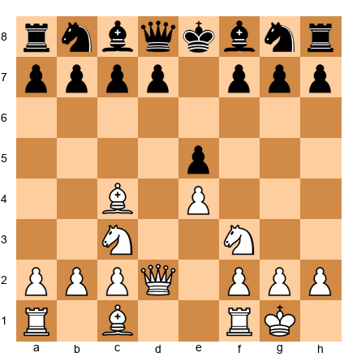

Look at this position. White has developed both knights, both bishops, the queen, and has castled. That is five pieces in the game and a safe king. Black has moved one pawn. Black is in serious trouble. White can launch an attack with five pieces against zero defenders.

This is what a **development lead** looks like. It is one of the most powerful advantages in chess.

### Knights Before Bishops (Usually)

When you start developing, bring your knights out first. Why?

**Knights are slow.** A knight takes several moves to cross the board. A bishop can fly from one corner to the other in a single move. So get the slow pieces moving first.

**Knights have obvious best squares.** For White, the knights almost always go to f3 and c3. For Black, they go to f6 and c6. You rarely have to think about where to put your knights. The answer is almost always the same.

**Bishops need more information.** A bishop's best square depends on where the pawns are and what your opponent does. Sometimes the bishop belongs on c4. Sometimes it belongs on b5. Sometimes it belongs on e2 or even on b2 after a fianchetto. You often need to see a few moves of the game before you know where the bishop should go.

So the general rule is: **knights first, then bishops.** Get your knights to f3 and c3 (or f6 and c6 for Black), then decide where your bishops belong.

**Set up your board:** White pieces: king on e1, queen on d1, rooks on a1 and h1, bishops on c1 and f1, knights on f3 and c3, pawns on a2, b2, c2, d4, e4, f2, g2, h2. Black pieces: starting position with pawns on d5 and e6.

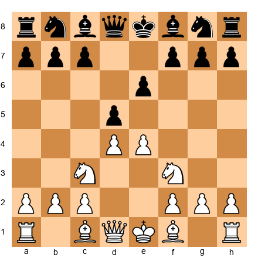

White has developed both knights to their best squares. Now White can see what Black does before choosing where to put the bishops. This is efficient, flexible development.

### Don't Move the Same Piece Twice

Every move in the opening is precious. Each move is a unit of time called a **tempo**. If you move the same piece twice, you have spent two tempi on one piece while your opponent developed two different pieces. You fell behind.

Of course, sometimes you MUST move a piece twice. If your opponent attacks your bishop, you might need to retreat it. If a capture forces your knight to a new square, that is fine. The rule is: **do not move the same piece twice unless you are forced to or unless you gain something concrete** (like winning material or giving a strong check).

Here is what happens when you break this rule:

**Set up your board:** Imagine White plays: 1.e4 e5 2.Nf3 Nc6 3.Bc4 Bc5 4.Bb5?! This looks reasonable, but White just moved the bishop twice (c4 then b5) while Black developed two pieces. White is now behind in development because of the wasted tempo.

The best players move each piece once to its ideal square and then move on to the next piece.

### Don't Bring the Queen Out Too Early

This is one of the most important rules for beginners, and one of the most commonly broken.

The queen is your most powerful piece. She is worth 9 points. She can move in any direction. She is amazing. And that is exactly why you should NOT bring her out early.

Why? Because your opponent will chase her around.

Every time your opponent develops a piece with a threat to your queen, two things happen: they develop a piece (good for them) and you waste a move running away with the queen (bad for you). Your opponent gets free development at your expense.

**Set up your board:** Watch this disaster unfold. White plays: 1.e4 e5 2.Qh5?! (bringing the queen out on move 2). Now Black plays 2...Nc6 (developing and defending). White plays 3.Bc4 (threatening mate on f7). Black plays 3...g6! (chasing the queen). White must retreat: 4.Qf3. Black plays 4...Nf6! (developing and attacking the e4 pawn). White plays 5.Qb3. Black plays 5...Nd4! Now the queen is being attacked again.

White has moved the queen THREE times and has only two pieces developed (queen and bishop). Black has moved the queen ZERO times and has three pieces developed (two knights and the g6 pawn opened the diagonal for the bishop). Black is ahead in development because White wasted time with the queen.

**The lesson:** Develop minor pieces (knights and bishops) first. The queen comes out later, usually after you have castled and connected your rooks.

### Tempo: The Currency of the Opening

Every move is a tempo. A tempo is a unit of time. In the opening, time is everything.

When you develop a piece, you spend one tempo. When your opponent develops a piece, they spend one tempo. If you waste a tempo (by moving a piece twice, retreating unnecessarily, or making a pointless pawn move), your opponent gains a tempo of advantage.

Three wasted tempi in the opening is like playing the game with one fewer piece. Your opponent will have three extra pieces in the fight, and you will be scrambling to catch up.

Here is how Morphy thought about it: every tempo is a chance to bring a new piece to a strong square. If you spend 8 tempi and develop 8 pieces (including castling), while your opponent spends 8 tempi and develops 4 pieces (because they moved some pieces twice), you have a 4-piece development lead. That is enough to launch a winning attack.

### How Morphy Exploited Development Leads

Paul Morphy was an American chess genius who played in the 1850s and 1860s. He understood development better than anyone in his era. His secret was simple: develop every piece to its best square as fast as possible, and then attack before the opponent has time to catch up.

Morphy did not play tricky openings. He did not try to surprise his opponents with unusual moves. He just developed his pieces, castled, connected his rooks, and then launched a devastating attack with his fully mobilized army against his opponent's half-developed forces.

We will study his most famous game (the Opera Game) in the annotated games section. For now, remember this: **Morphy won most of his games not because he was a better calculator or a deeper thinker, but because he understood that getting pieces out fast is the single most important goal of the opening.**

That understanding is available to you right now. Follow the Three Golden Rules, and you are playing the opening the way Morphy did.

🛑 **Good stopping point. You now understand development, tempo, and why the queen stays home. Take a five-minute break. Stretch. Then come back for center control.**

---

## Part 3: Center Control — Where the Battle Begins

### Why the Center Matters

Look at your chessboard. Find the four squares in the middle: **e4, d4, e5, d5.** These four squares are the most important territory on the board. Whoever controls them controls the game.

Why? Because pieces in the center can reach more squares.

**Set up your board:** Place a White knight on e4. Count how many squares it can move to. The answer is 8. A knight in the center controls the maximum number of squares.

Now move that knight to a1 (the corner). Count again. The answer is 2. A knight in the corner controls almost nothing.

The difference is dramatic. A centralized piece is four times more powerful than a piece stuck on the edge. This is true for every piece, not just knights.

There is a classic chess saying: **"A knight on the rim is dim."** It means a knight on the edge of the board (the a-file or h-file) is weak because it controls so few squares. Keep your pieces in the center where they shine.

### Occupying vs. Controlling the Center

There are two ways to fight for the center:

**Occupying the center** means placing your pawns on e4 and d4 (or e5 and d5 for Black). This is the classical approach. You plant pawns in the middle and say, "This territory is mine."

**Set up your board:** White pawns on e4 and d4. These pawns control four squares in Black's territory: c5, d5, e5, and f5. That is a wall of influence pushing into Black's half of the board.

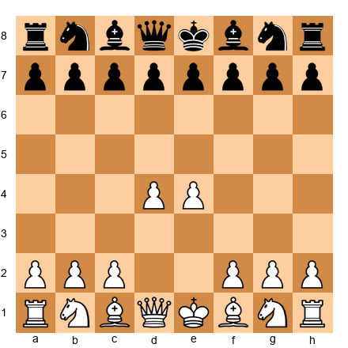

**Controlling the center** means using pieces (especially knights and bishops) to influence the center squares without placing pawns there. This is the hypermodern approach, developed in the 1920s by players like Nimzowitsch, Reti, and Alekhine.

For example, a bishop on g2 (after the moves g3 and Bg2) does not occupy the center, but it controls the long diagonal and stares right through d5 and e4. A knight on f3 controls d4 and e5 without occupying them.

**At the beginner level, the classical approach is better.** Put your pawns on e4 and d4 when you can. It is simpler, more direct, and gives your pieces clear squares to develop to. As you improve, you will learn when the hypermodern approach is stronger. For now, occupy the center with pawns.

### The Power of Central Pieces

Pieces in the center are stronger than pieces on the edges. We showed this with the knight, but it applies to all pieces.

**Set up your board:** Place a White bishop on d4. It controls 13 squares along two diagonals. Now move it to h1. It controls only 7 squares along one diagonal.

A queen in the center is a monster. A rook in the center (especially on an open file) can dominate the board. Even a king in the endgame wants to march to the center.

**The takeaway:** After you develop your pieces, try to place them on central squares (or squares that influence the center). A knight on e5 is almost always stronger than a knight on a3. A bishop on d3 aiming at the kingside is stronger than a bishop on b1 doing nothing.

### How to Fight for the Center

Here is your practical guide to center control in the first few moves:

**As White:**
1. Play **1.e4** (or 1.d4). Both moves occupy the center with a pawn.
2. If you played 1.e4, consider playing **d4** soon (or at least d3 to support e4).
3. Develop knights to f3 and c3, where they support your center pawns.
4. Develop bishops to active squares that influence the center.

**As Black:**
1. After 1.e4, play **1...e5** (the most direct response, fighting for the center immediately).
2. After 1.d4, play **1...d5** (same idea).
3. Develop knights to f6 and c6 to pressure White's center.
4. Look for chances to challenge the center with ...d5 or ...e5.

**Set up your board:** A typical position after 1.e4 e5 2.Nf3 Nc6 3.Bc4 Bc5. Both sides have developed two pieces and fought for the center. This is what a healthy opening looks like.

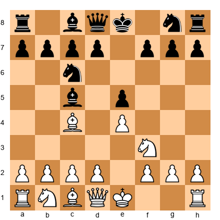

Both sides followed the rules. Both sides are developing. Both sides are fighting for the center. This is a fair, balanced position where the better player will win through tactics and strategy in the middlegame.

### Compare: Centralized vs. Edge Pieces

**Set up your board:** Position A: White knight on e5, White bishop on d3, White pawns on d4 and e4. Position B: White knight on a3, White bishop on a2, White pawns on a4 and h4.

Which army would you rather command? Position A, obviously. Those pieces in the center control the board. The pieces in Position B are on the rim, far from the action, controlling almost nothing. Edge pieces are dim. Central pieces are dominant.

🛑 **You now understand why the center matters. Take a break if you need one. King safety is next, and it is the rule that will save your games.**

---

## Part 4: King Safety — Castle Early, Castle Often

Well, you can only castle once. But do it EARLY.

### Why Castling Matters

Your king starts the game on e1 (or e8 for Black), right in the middle of the board. That is the most dangerous place for a king. The center is where the action happens. Files open, pieces swarm, tactics explode. Your king does NOT want to be in the middle of all that.

Castling does two things at once:

1. **It moves your king to the side of the board** (usually g1 after kingside castling), where it is tucked behind a wall of pawns and harder to attack.
2. **It brings your rook toward the center** (to f1 after kingside castling), where it can join the fight.

One move, two benefits. That is incredible efficiency. No other move in chess gives you this much value.

### Which Side to Castle

You can castle kingside (O-O) or queenside (O-O-O). For beginners, **kingside castling is almost always better.** Here is why:

- Kingside castling takes fewer moves to set up (you only need to move the knight and bishop off the back rank).
- The king ends up on g1 behind the pawns on f2, g2, and h2, which is a natural fortress.
- Queenside castling requires clearing three pieces (knight, bishop, and queen) and the king ends up on c1, where the a-pawn is sometimes undefended.

At the beginner level, aim to castle kingside by move 6 to 8. That is your goal. Develop two or three pieces, then castle.

### The Danger of an Uncastled King

What happens when you forget to castle? Let's see.

**Set up your board:** White has developed nicely and castled: king on g1, rook on f1, knight on f3, bishop on c4, pawns on d4 and e4. Black has NOT castled: king on e8, queen on d8, undeveloped pieces still on the back rank.

Now imagine White opens the e-file (perhaps after an exchange on e5). The White rooks can use the open e-file to attack the Black king directly. The Black king is stuck in the center with no shelter. Every check is a disaster because the king has nowhere to hide.

This happens in countless beginner games. One player castles, the other does not. The player who castled attacks down the center with rooks and pieces, and the uncastled king falls.

**The rule is simple: castle early. Do it before move 10 in every game.**

### Don't Weaken Your Castled Position

After you castle, your king sits behind a wall of pawns (usually f2, g2, and h2 for White). This wall is your king's shield. Do not move those pawns without a very good reason.

Every pawn you push in front of your king creates a weakness. The square the pawn used to protect is now undefended. Your opponent can use that weakness to launch an attack.

**Bad example:** After castling kingside, White plays h3, then g4, then h4. Now the pawns in front of the king are scattered and weak. The king is exposed. Black can target those weaknesses with pieces.

**Good example:** After castling kingside, White leaves the pawns on f2, g2, and h2 untouched. The king is safe behind its wall. White can focus on attacking in the center and on the other side of the board.

### The h3/h6 Question

One of the most common beginner questions: "Should I play h3 (or h6) to prevent my opponent's bishop from coming to g5 (or g4)?"

The answer is: **sometimes yes, sometimes no.**

**Play h3 when:**
- Your opponent's bishop on g4 is pinning your knight on f3 to your queen, and this pin is causing real problems.
- You need to prevent a specific tactical threat involving Bg4.

**Don't play h3 when:**
- You have not finished developing yet. Finish development first!
- There is no bishop threatening to come to g4. Don't waste a tempo preventing a move your opponent was not planning to make.
- You are using it as a "just in case" move. That tempo is better spent developing a piece.

The same logic applies to h6 for Black (preventing Bg5).

**General rule:** If you have to think about whether h3 is necessary, it probably is not. Develop a piece instead.

🛑 **You now know all three Golden Rules. Development. Center. King safety. That is the foundation of every good opening. Rest here if you need to. The next section covers the most common mistakes beginners make.**

---

## Part 5: Opening Mistakes to Avoid

Now that you know the right way to play the opening, let's look at the wrong ways. Every mistake below breaks one or more of the Three Golden Rules.

### Mistake 1: Moving the Same Piece Multiple Times

We covered this in the development section, but it deserves emphasis. Every time you move a piece that has already been developed, you are giving your opponent a free tempo. Two wasted tempi and you are behind. Three wasted tempi and you may be lost.

**Example:** 1.e4 e5 2.Nf3 Nc6 3.Bc4 Nf6 4.Ng5?! (moving the knight a second time to attack f7). This move looks aggressive, but it violates the principle of developing new pieces. After 4...d5! 5.exd5 Na5! (attacking the bishop) 6.Bb5+ c6 7.dxc6 bxc6 8.Be2 h6 9.Nf3 e4, Black has a strong center and a development lead. White's "tricky" knight excursion failed.

### Mistake 2: Bringing the Queen Out Too Early

We covered this too, but here is another example of why it fails.

**The Scholar's Mate Attempt:** 1.e4 e5 2.Bc4 (or 2.Qh5) with the idea of Qxf7#. This checkmate (called Scholar's Mate) works against players who have never seen it. Against anyone who knows the defense, it backfires badly.

After 1.e4 e5 2.Qh5 Nc6 3.Bc4 g6! 4.Qf3 Nf6 5.g4? (a terrible move, weakening the kingside) 5...Nd4! and Black is already better. White's queen has been pushed around, White's kingside is weak, and Black is developing with tempo.

**If your opponent tries Scholar's Mate on you:** Stay calm. Play ...Nc6 to defend e5, then ...g6 to chase the queen, then develop normally. You will be ahead in development and your opponent will be struggling.

### Mistake 3: Pawn Grabbing

"Pawn grabbing" means capturing pawns in the opening when you should be developing pieces. Yes, pawns have value. But in the opening, development has MORE value.

If your opponent offers you a pawn and you spend two moves capturing it while your opponent develops two pieces, you lost the trade. Two tempi of development is worth far more than one pawn.

**General rule:** Do not grab pawns in the opening unless you can do it WITHOUT falling behind in development. If capturing a pawn costs you a tempo or puts your piece on a bad square, leave the pawn alone and develop instead.

### Mistake 4: Not Castling

We have said it before and we will say it again: CASTLE EARLY. An uncastled king is a target. Every move you delay castling is a move your king spends in danger.

Some beginners think: "I will develop one more piece and THEN castle." Then they develop one more piece and think, "OK, one MORE piece." Before they know it, it is move 15, the king is still on e1, and the opponent has launched a devastating attack.

**Set a rule for yourself:** Castle before move 10, unless there is a very specific reason not to (like your opponent has played something unusual that demands an immediate response). In 95% of your games, castling by move 8 is the right plan.

### Mistake 5: Too Many Pawn Moves

In the opening, you should move one or two pawns (to open lines for your pieces and control the center) and then focus on developing pieces. Moving three, four, or five pawns before developing a single piece is a recipe for disaster.

Pawns cannot retreat. They are slow. They do not control as much territory as pieces. Every pawn move you make instead of a piece move is a tempo wasted on a slow, permanent decision.

**Good opening:** 1.e4 e5 2.Nf3 Nc6 3.Bc4 (two pawn moves, two piece moves so far. Efficient.)

**Bad opening:** 1.e4 e5 2.d3 d6 3.f4?! f5?! 4.g3?! (four pawn moves, zero piece moves. White's pieces are still asleep.)

### Mistake 6: Moving Edge Pawns Early

Moves like a4, h4, a5, or h5 in the first few moves are almost always bad. Edge pawns do not control the center. They do not help your pieces develop. They weaken your castled position (if you push the pawns in front of your king).

Save edge pawn moves for the middlegame and endgame, when they serve a specific purpose (like creating a passed pawn or gaining space on the wing). In the opening, focus on the center.

**Set up your board:** Compare two positions. In Position A, White has played 1.e4 d4 Nf3 Nc3 Bc4 (five strong opening moves). In Position B, White has played 1.a4 2.h4 3.a5 4.h5 5.Ra3 (five terrible opening moves). Position A is ready for battle. Position B is a joke.

🛑 **You now know the six biggest opening mistakes. If you avoid all of them, you will outplay most beginners. Take a break. The annotated games are next, and they bring all these principles to life.**

---

## Part 6: What to Do After the Opening

At some point, the opening ends and the middlegame begins. But when? How do you know the transition has happened?

### The Opening Is Over When...

Ask yourself these three questions:

1. **Have I castled?** If yes, your king is safe.
2. **Are my knights and bishops developed?** If yes, your minor pieces are in the game.
3. **Are my rooks connected?** (Two rooks can "see" each other across the back rank with nothing between them.) If yes, your army is fully mobilized.

When all three answers are "yes," the opening is over. You are in the middlegame.

### Now What?

Once the opening is complete, your goals shift:

**Look for tactics.** Now that your pieces are developed, start looking for forks, pins, skewers, and other tactical patterns from Chapter 6. Your developed pieces are weapons. Use them.

**Make a plan.** Ask yourself: "What weakness can I target in my opponent's position? What piece can I improve? Where should I attack?" Even a bad plan is better than no plan at all. (We will learn much more about planning in Volume II.)

**Improve your worst piece.** Look at your position and find your least active piece. Then find a way to make it better. Move it to a more central square, open a file for it, or trade it for an opponent's good piece.

**Connect your rooks and put them on open files.** Rooks are powerful on open files (files with no pawns blocking them). After the opening, look for open or half-open files and place your rooks there.

### The Transition Checklist

Before you launch any attack or start any plan, run through this checklist:

- [ ] King is castled
- [ ] Both knights are developed
- [ ] Both bishops are developed (or one has been traded)
- [ ] Rooks are connected
- [ ] No pieces are still on their starting squares

If any of these boxes are unchecked, finish your development FIRST. Then attack.

🛑 **Theory section complete. You now understand everything you need to play a good opening. The annotated games will show you these principles in action from the games of the greatest players in history.**

---

## Annotated Games

These five games demonstrate the Three Golden Rules in action. They span over a century of chess history, but the principles are the same in every one. Set up your board for each game and play through the moves. At the critical moments, pause and think before reading the annotation.

---

### Annotated Game 7.1: The Opera Game

**Paul Morphy vs. Duke Karl of Brunswick and Count Isouard**
Paris, 1858 (played at the Paris Opera House during a performance of *The Barber of Seville*)

This is the most famous teaching game in chess history. Morphy plays a perfect opening and destroys two opponents (the Duke and Count consulted on their moves together) with pure development and attacking power. Every move follows the Three Golden Rules.

**Set up your board:** Place all pieces in the starting position.

**Opening: Philidor Defense**

**1.e4 e5**

Both sides stake a claim in the center. So far, so good for both.

**2.Nf3 d6**

Morphy develops a knight (Golden Rule 1) and attacks the center (Golden Rule 2). The Duke and Count play the Philidor Defense with 2...d6. This move is passive. It defends the e5 pawn but blocks the dark-squared bishop on f8. Already, Black's development will be slightly slower.

**3.d4 Bg4?!**

Morphy pushes a second pawn to the center, challenging Black's e5 pawn. Black plays 3...Bg4, which develops a piece but pins the knight on f3 to the queen. The problem? Black should have dealt with the tension in the center first (3...exd4 was more natural).

**4.dxe5 Bxf3**

Morphy captures in the center, opening lines. Black captures the knight, giving up the bishop pair. This trade was not forced. Black's decision to exchange the bishop for the knight gives White a slight structural advantage.

**5.Qxf3 dxe5**

White recaptures with the queen. Normally, developing the queen early is bad, but here the queen MUST recapture (it is the only piece that can take on f3). Black recaptures in the center.

**6.Bc4 Nf6**

**⏸ Pause and look.** White has developed two pieces (queen and bishop) and both are aiming at f7, the weakest square in Black's position. Black has developed one piece (the knight on f6). White is already ahead in development.

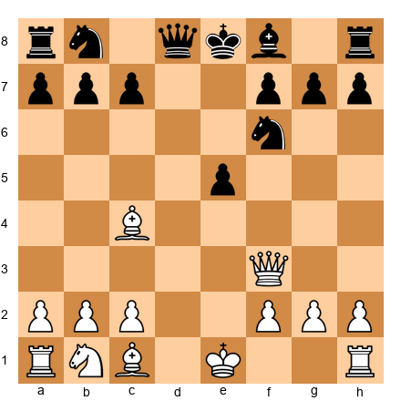

**7.Qb3 Qe7**

Morphy's queen attacks b7 AND maintains pressure on f7. Two targets with one move. Black blocks with the queen, but this is awkward. The queen on e7 blocks the bishop on f8, which means Black cannot develop the bishop and cannot castle. Notice how one bad decision leads to another.

**8.Nc3 c6**

Morphy develops another piece (Golden Rule 1). That is three pieces developed for White. Black plays a pawn move instead of developing. Black now has one piece developed (the knight on f6) to White's three.

**9.Bg5 b5?**

**⏸ Pause and look.** Morphy develops ANOTHER piece, and this one pins the knight on f6 to the queen. Black's position is getting worse with every move. Black tries a desperate counter with b5, hoping to chase the bishop from c4, but this weakens the queenside.

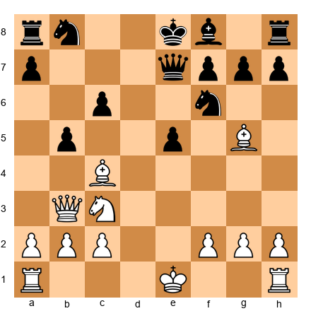

**10.Nxb5! cxb5 11.Bxb5+ Nbd7**

Morphy sacrifices a knight! After 10.Nxb5, the knight takes a pawn and attacks the Black queen and c7 simultaneously. After 10...cxb5 11.Bxb5+, White has a powerful check. The bishop pins the knight on d7 to the king. Black is in serious trouble.

**12.O-O-O Rd8**

**⏸ Pause and look.** Morphy castles queenside. Now his rook on d1 is directly aimed at Black's pinned knight on d7 and the rook on d8. Count the developed pieces: White has the queen, both bishops, both rooks active, and the king is safe. Black has a knight on f6, a knight on d7 (pinned), and nothing else. The development difference is overwhelming.

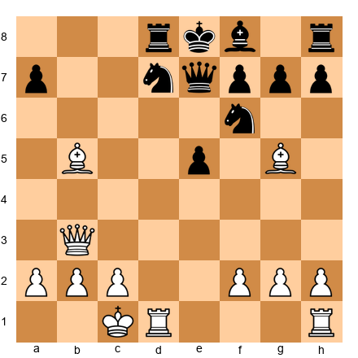

**13.Rxd7! Rxd7 14.Rd1 Qe6**

Morphy sacrifices a rook! 13.Rxd7 removes a defender. After 13...Rxd7 14.Rd1, the new rook enters with devastating effect. Black tries 14...Qe6 to block the pin and protect d7.

**15.Bxd7+ Nxd7**

The bishop captures on d7 with check. The knight must recapture.

**⏸ Pause and look.** Morphy is about to deliver one of the most beautiful checkmates in chess history.

**16.Qb8+!! Nxb8 17.Rd8#**

The queen sacrifices herself on b8! The knight is forced to capture. And then the rook delivers checkmate on d8. The king on e8 has nowhere to go. The f8 bishop blocks its only escape square.

**What this game teaches:**
- Morphy developed every piece before attacking. He never moved a piece twice without a concrete reason.
- The development lead was devastating. By move 12, Morphy had every piece in the game while Black had almost nothing.
- Sacrifices work when you have a lead in development. Morphy gave up material because his remaining pieces were enough to deliver checkmate.
- The Three Golden Rules won this game: development, center control, king safety (castling queenside brought the rook into the attack).

🛑 **The Opera Game is the greatest lesson in development ever played. Take a moment to appreciate it. Set it up again from the start and play through it one more time.**

---

### Annotated Game 7.2: The Immortal Game

**Adolf Anderssen vs. Lionel Kieseritzky**
London, 1851

If the Opera Game is the greatest lesson in development, the Immortal Game is the greatest example of what happens when you sacrifice everything for the attack. Anderssen gives up a bishop, both rooks, and his queen, and still delivers checkmate with just three minor pieces. This game is wild, chaotic, and unforgettable.

**Set up your board:** Starting position.

**Opening: King's Gambit**

**1.e4 e5 2.f4 exf4**

Anderssen plays the King's Gambit, sacrificing a pawn for fast development and an open f-file. Kieseritzky accepts the gambit.

**3.Bc4 Qh4+ 4.Kf1 b5?! 5.Bxb5 Nf6**

White develops the bishop. Black brings out the queen early (breaking our rule!) with check. White's king moves to f1, losing the right to castle. Black pushes b5, a speculative pawn sacrifice. White captures. Black develops a knight.

**⏸ Pause and look.** Both sides are breaking rules here. White cannot castle. Black brought the queen out early. This game is from 1851, before opening principles were fully understood. Watch what happens.

**6.Nf3 Qh6 7.d3 Nh5**

White develops the knight to its best square and chases the queen. Black retreats the queen (already moved it twice!) and then moves the knight to h5 (the rim!). Remember: "A knight on the rim is dim."

**8.Nh4 Qg5 9.Nf5 c6**

The knight dance continues. White's knight reaches the powerful f5 square. Black plays another pawn move instead of developing.

**10.g4! Nf6 11.Rg1!**

**⏸ Pause and look.** Anderssen ignores the attacked bishop on b5 and instead develops the rook with 11.Rg1! This is a key moment. Material does not matter as much as development and attacking chances. White would rather develop a new piece than save the bishop.

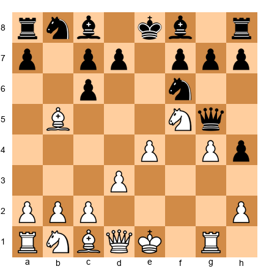

**11...cxb5 12.h4 Qg6 13.h5 Qg5 14.Qf3**

Black captures the bishop (winning material). White pushes the h-pawn, chasing Black's queen AGAIN. The queen has now moved five times. That is five tempi wasted on the queen while White developed pieces and advanced pawns with threats.

**14...Ng8**

The knight retreats all the way back to g8. It started on g8, went to f6, and now returns home. Two tempi completely wasted. Black's development is a disaster.

**15.Bxf4 Qf6 16.Nc3 Bc5**

White develops another piece. Black finally develops the bishop.

**17.Nd5! Qxb2 18.Bd6!**

White plays the powerful Nd5, attacking the queen from a commanding central square. Black captures the b2 pawn with the queen (pawn grabbing while behind in development!). White plays the stunning Bd6, blocking the Black king from castling and preparing a vicious attack.

**⏸ Pause and look.** Count the material. White has sacrificed a bishop AND is about to lose both rooks. But look at White's piece activity. The knight on d5 is dominant. The bishop on d6 controls critical squares. White's pieces are coordinated for attack. Black's pieces are scattered and uncoordinated.

**18...Bxg1 19.e5!**

Black captures the rook. White advances the e-pawn with tempo, opening lines.

**19...Qxa1+ 20.Ke2 Na6**

Black captures the other rook with check! White has now sacrificed BOTH rooks. But White's king steps to e2, and the attack continues.

**21.Nxg7+ Kd8 22.Qf6+! Nxf6 23.Be7#**

Anderssen delivers checkmate with just a bishop and two knights after sacrificing his queen, both rooks, and a bishop. The Black king on d8 is trapped. The bishop on e7 and the knight on g7 work together to seal every escape square.

**What this game teaches:**
- Development and piece activity can be worth more than material. Anderssen's pieces were active and coordinated. Kieseritzky's pieces were passive and scattered.
- Moving the queen early cost Kieseritzky dearly. The queen moved five times in the opening while Anderssen developed piece after piece.
- Pawn grabbing is dangerous. Black kept capturing pawns and rooks instead of developing pieces, and paid the ultimate price.
- "A knight on the rim is dim." Black's knight going to h5 and then back to g8 was a complete waste of time.

---

### Annotated Game 7.3: The Evergreen Game

**Adolf Anderssen vs. Jean Dufresne**
Berlin, 1852

This game has been called "evergreen" because its beauty never fades. Anderssen sacrifices a rook and then his queen to deliver a stunning checkmate. But look beneath the fireworks: the game is won by superior development and center control.

**Set up your board:** Starting position.

**1.e4 e5 2.Nf3 Nc6 3.Bc4 Bc5**

A classical opening. Both sides develop knights and bishops toward the center. Textbook play.

**4.b4!? Bxb4 5.c3 Ba5 6.d4 exd4 7.O-O**

Anderssen plays the Evans Gambit, sacrificing a pawn (and then another) for rapid development and open lines. After 7.O-O, White has sacrificed two pawns but has castled, placed a bishop on c4 aiming at f7, and opened the center.

**⏸ Pause and look.** Count the tempi. White has developed the knight, both bishops, castled, and pushed three center pawns. Black has developed the knight and bishop but has spent time capturing pawns. White's development is ahead.

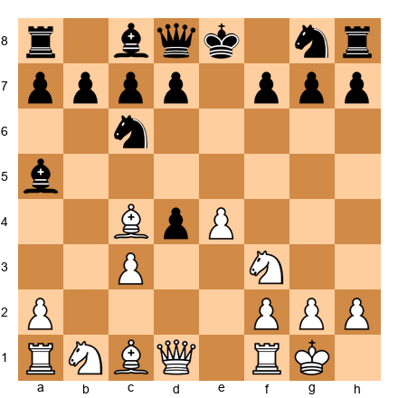

**7...d3?! 8.Qb3 Qf6 9.e5 Qg6**

Black tries to hold the extra pawn with d3, but this pawn is overextended and hard to defend. White develops the queen to b3, attacking b7 and f7. Black's queen comes out to f6 (early queen alert!) and then retreats to g6.

**10.Re1 Nge7 11.Ba3**

White brings the rook into the game and develops the bishop to a3, where it prevents Black from castling by targeting e7. Development, development, development.

**11...b5 12.Qxb5 Rb8 13.Qa4 Bb6**

Black pushes b5 to chase the queen, but White captures and maintains the pressure. Black's position is becoming cramped.

**14.Nbd2 Bb7 15.Ne4 Qf5**

White brings the knight into the game via d2-e4, a strong central square. Black finally develops the bishop to b7 and repositions the queen.

**16.Bxd3 Qh5**

White captures the overextended d3 pawn. The bishop on d3 is now powerfully placed.

**17.Nf6+! gxf6 18.exf6 Rg8**

**⏸ Pause and look.** White sacrifices the knight on f6! After gxf6, the e-pawn advances to f6 with devastating effect, cutting off the knight on e7 from defending. The pawn on f6 is a dagger aimed at Black's king.

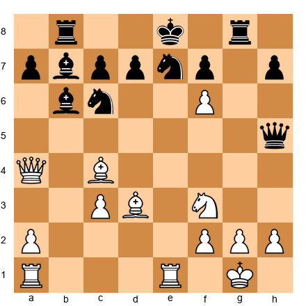

**19.Rad1! Qxf3!?**

White calmly develops the last rook into the game. Every single White piece is now active. Black captures the knight on f3 with the queen (if 19...Qxf3, this looks like Black is winning material, but...).

**20.Rxe7+! Nxe7 21.Qxd7+!! Kxd7 22.Bf5+ Ke8 23.Bd7+ Kf8 24.Bxe7#**

The finish is breathtaking. White sacrifices the rook with 20.Rxe7+! Then White sacrifices the QUEEN with 21.Qxd7+! After the king captures, 22.Bf5+ forces the king back, 23.Bd7+ drives it to f8, and 24.Bxe7 is checkmate. Two bishops deliver the final blow.

**What this game teaches:**
- Sacrificing pawns for development can be powerful (the Evans Gambit gives up material for tempo).
- When all your pieces are active and your opponent's are not, sacrifices become possible because you have more attackers than your opponent has defenders.
- The pawn on f6 (after Nf6+ gxf6 exf6) is a perfect example of how a well-placed pawn can destroy an opponent's king safety.
- Development wins games. Anderssen had every piece working. Dufresne did not.

🛑 **Three masterpieces down, two to go. Take a break if your brain is buzzing. That is a sign that you are learning.**

---

### Annotated Game 7.4: Morphy Shows the Way

**Paul Morphy vs. Adolf Anderssen**
Paris, 1858 (Casual Game)

Morphy vs. Anderssen: the two greatest attacking players of the 19th century, face to face. Morphy demonstrates his trademark style: develop every piece to its best square, gain a lead in development, and use that lead to win.

**Set up your board:** Starting position.

**1.e4 e5 2.Nf3 d6 3.d4 exd4 4.Qxd4 Nc6 5.Bb5 Bd7**

Morphy opens with 1.e4 (center control) and develops the knight (development). He pushes d4 to open the center. After the exchange, the queen recaptures on d4. This is one of the rare cases where the queen develops early because it recaptures on a central square. Black develops the knight and bishop.

**⏸ Pause and look.** Both sides are developing, but Morphy has a slight edge: his queen is centralized and his bishop is active on b5, pinning the knight to the king (or at least threatening Bxc6).

**6.Bxc6 Bxc6 7.Nc3 Nf6 8.O-O Be7**

Morphy trades the bishop for the knight, damaging Black's pawn structure (doubled c-pawns). He develops the second knight and castles. Black develops the remaining minor pieces.

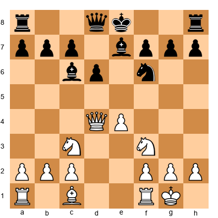

**9.Nd5! Bxd5 10.exd5 O-O**

Morphy plays the strong Nd5, centralizing the knight on the most powerful square on the board. Black exchanges it, and now White's d5 pawn is a wedge in Black's position. Black finally castles.

**11.Bg5 Re8**

White develops the last minor piece with a pin on the knight. Every White piece is now developed or actively placed.

**⏸ Pause and look.** Compare the positions. White: king is safe (castled), all pieces are developed, rooks can connect easily. Black: king is safe (castled), pieces are developed but passive, the d6 pawn is a weakness. White's development is more purposeful. Each piece aims at Black's position.

**12.Rfe1 Nd7 13.Bxe7 Qxe7 14.Rxe7! Rxe7 15.c4**

White places the rook on the open e-file (connecting the rooks) and trades pieces to simplify into a winning endgame. After 14.Rxe7, White has given up a rook for Black's queen trade, reaching an endgame where White's better pawn structure and more active pieces give a lasting advantage.

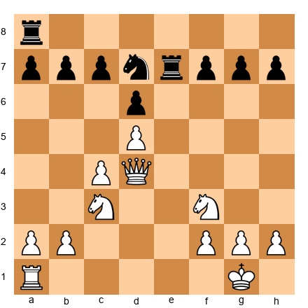

The game continued, and Morphy converted his positional advantage into a win. The exact continuation matters less than the lesson.

**What this game teaches:**
- Morphy did not need flashy sacrifices to win. He simply developed better, faster, and more purposefully than his opponent.
- Centralizing pieces (Nd5, queen on d4, rook on e1) gives your pieces maximum power.
- Sometimes the best use of a development lead is to trade into a favorable endgame, not to launch a direct attack.
- Even Anderssen, one of the greatest attackers in history, could not overcome Morphy's superior development.

---

### Annotated Game 7.5: Zukertort's Masterpiece

**Johannes Zukertort vs. Joseph Henry Blackburne**
London, 1883

This game is considered one of the finest positional masterpieces of the 19th century. Zukertort builds his position patiently, gains a development and space advantage, and then unleashes a stunning combination. The opening principles are quieter here, but no less powerful.

**Set up your board:** Starting position.

**1.c4 e6 2.e3 Nf6 3.Nf3 b6 4.Be2 Bb7 5.O-O d5 6.d4 Bd6**

A quiet opening. Both sides develop pieces and fight for the center. White plays the English Opening with a quick kingside castle. Black develops in a "Queen's Indian" setup with the bishop fianchettoed on b7.

**⏸ Pause and look.** By move 6, White has castled and developed two minor pieces. Black has developed two minor pieces but has not yet castled. White has a small advantage in king safety.

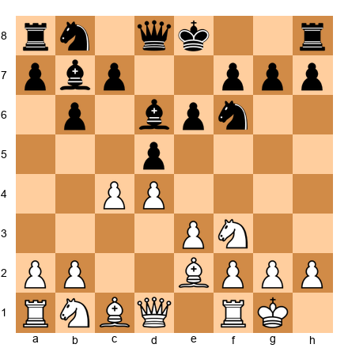

**7.Nc3 O-O 8.b3 Nbd7 9.Bb2 Qe7**

Both sides continue developing. White places the bishop on b2, controlling the long diagonal. Black castles (good!) and develops the remaining knight.

**10.Nb5 Ne4 11.Nxd6 cxd6 12.Nd2 Ndf6 13.f3 Nxd2 14.Qxd2 dxc4 15.Bxc4 d5 16.Bd3**

A series of exchanges simplifies the position, but White emerges with a subtle advantage. The White bishops on b2 and d3 are powerful, aiming at Black's kingside. Both rooks are ready to swing into action.

**17.Rae1 Rfc8 18.e4! Rac8**

**⏸ Pause and look.** Zukertort pushes e4! This central advance is the key to the game. White's center is surging forward, and the bishops come alive. The position is starting to open up, which favors the side with better piece coordination.

**19.e5 Ne8 20.f4 g6**

White's center pawns march forward (e4-e5, f4). Black's knight is pushed back to e8 (the rim! the starting square!). The development advantage is becoming an attacking advantage.

**21.Re3 f5 22.exf6 Nxf6 23.f5! Ne4 24.Bxe4 dxe4 25.fxg6 Rc2**

The center explodes. White's pawns rip open Black's kingside. After 25.fxg6, the pawn on g6 is a battering ram aimed at Black's king. Black tries to counterattack with Rc2, but it is too late.

**⏸ Pause and look.** White is about to deliver one of the greatest combinations in chess history.

**26.gxh7+ Kh8 27.d5+! e5 28.Qb4!**

The pawn on h7 delivers check, and the king retreats to h8. Then Zukertort reveals the hidden power of d5+ (a discovered check from the bishop on b2!). The queen swings to b4 with decisive threats.

**28...R8c5 29.Rf8+! Kxh7 30.Qxe4+ Kg7 31.Bxe5+ Kxf8 32.Bg7+ Kg8 33.Qxe7**

White wins decisively. The combination starting with 29.Rf8+! is a classic example of how superior development and central control lead to a winning attack. Black resigned.

**What this game teaches:**
- Even quiet openings require development and king safety. White castled early and developed every piece before attacking.
- Central pawn advances (e4, e5, d5) are powerful when supported by well-placed pieces.
- The bishop pair (Bb2 and Bd3/Be4) proved devastating on the open board.
- Patient development followed by a well-timed central advance is a winning strategy at every level.

🛑 **All five games complete. Each one demonstrates the Three Golden Rules. Development. Center control. King safety. Set up any of these games again whenever you want to remind yourself how the opening should be played.**

---

## Exercises

35 exercises covering the opening principles you learned in this chapter. Work through them on your board. Cover the solution and try to find the answer yourself before peeking.

**Difficulty guide:** ★ = straightforward, ★★ = requires thought, ★★★ = challenging

---

### Section A: What's the Best Developing Move? (Exercises 7.1–7.10)

---

**Exercise 7.1** ★
**Position:** White to play. White has played 1.e4 e5. All other pieces are on starting squares.

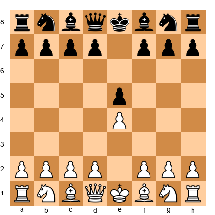

**Task:** What is White's best developing move?
**Hint 1:** Develop a knight first.
**Hint 2:** Which knight goes to which square? Think about center control.
**Hint 3:** The knight should attack the e5 pawn.
**Solution:** **2.Nf3!** Develops a knight, attacks the center (e5), and prepares to castle kingside. This is the most popular second move in chess history.

---

**Exercise 7.2** ★
**Position:** White to play after 1.e4 e5 2.Nf3 Nc6. All other pieces on starting squares.

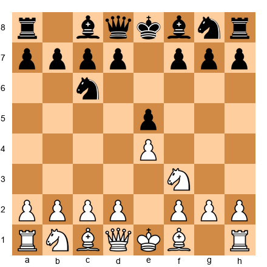

**Task:** What is White's best developing move?
**Hint 1:** Develop a minor piece.
**Hint 2:** A bishop move. Which bishop?
**Hint 3:** Aim it at a key target.
**Solution:** **3.Bc4** or **3.Bb5.** Both develop the bishop to an active diagonal. Bc4 aims at f7 (Black's weakest square). Bb5 puts pressure on the c6 knight. Both are excellent.

---

**Exercise 7.3** ★
**Position:** White to play. White has: king on e1, queen on d1, rooks on a1 and h1, bishops on c1 and c4, knights on f3 and b1, pawns on a2, b2, c2, d4, e4, f2, g2, h2. Black has developed normally.

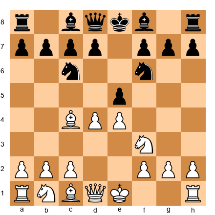

**Task:** Should White develop another piece or castle?
**Hint 1:** How many pieces has White developed?
**Hint 2:** Is the king safe?
**Hint 3:** Castling IS a developing move (it activates the rook).
**Solution:** **O-O!** (Castle kingside.) White has two pieces developed. Castling gets the king to safety AND brings the rook into the game. Golden Rule 3: castle early.

---

**Exercise 7.4** ★
**Position:** Black to play after 1.d4 d5 2.c4 e6 3.Nc3. Black has: king on e8, queen on d8, rooks on a8 and h8, bishops on c8 and f8, knights on b8 and g8, pawns on a7, b7, c7, d5, e6, f7, g7, h7.

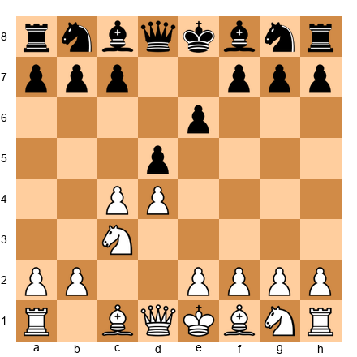

**Task:** What is Black's best developing move?
**Hint 1:** Develop a knight. Which one?
**Hint 2:** The knight should influence the center.
**Hint 3:** It should go to f6.
**Solution:** **3...Nf6!** Develops the knight to its best square, attacks e4, and prepares to castle. Classic development.

---

**Exercise 7.5** ★
**Position:** White to play. White has: king on e1, queen on d1, rooks on a1 and h1, bishops on c1 and e2, knight on f3, knight on c3, pawns on a2, b2, c2, d4, e4, f2, g2, h2. Black has a similar development.

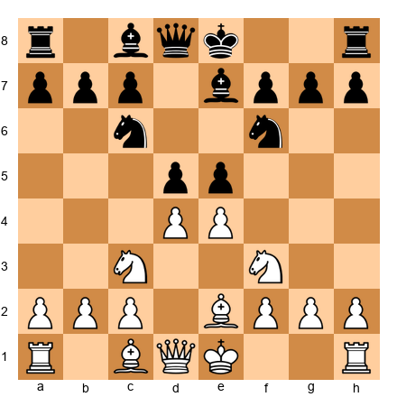

**Task:** What should White do?
**Hint 1:** All minor pieces are developed.
**Hint 2:** The king is still on e1.
**Hint 3:** Golden Rule 3.
**Solution:** **O-O!** Castle immediately. All minor pieces are out, so it is time to get the king to safety. Do not waste another move.

---

**Exercise 7.6** ★★
**Position:** White to play. White has: king on g1 (castled), rook on f1, rook on a1, bishop on c4, bishop on c1, knight on f3, queen on d1, pawns on a2, b2, c2, d4, e4, f2, g2, h2.

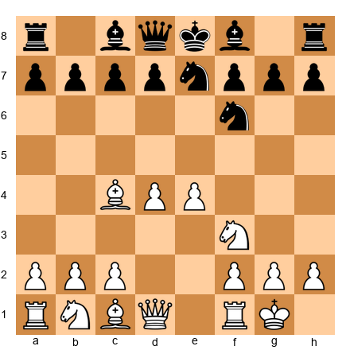

**Task:** White is ahead in development. What is the best way to increase the advantage?
**Hint 1:** A piece is still on its starting square.
**Hint 2:** The c1 bishop needs to join the game.
**Hint 3:** Where should it go? Think about pins and central influence.
**Solution:** **Bg5!** (or Nc3.) Bg5 develops the last minor piece and pins the f6 knight to the queen (once Black plays ...Qd8 or has the queen there). Nc3 also develops a piece. Both are strong. The key insight: develop the piece that is still asleep.

---

**Exercise 7.7** ★★
**Position:** Black to play. White has developed three pieces and castled. Black has: king on e8, queen on d8, rooks on a8 and h8, bishops on c5 and c8, knight on c6, knight on g8, pawns on a7, b7, d7, e5, f7, g7, h7.

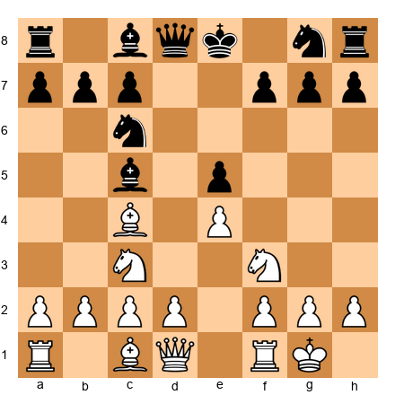

**Task:** What is Black's best developing move?
**Hint 1:** Which piece has not moved?
**Hint 2:** A knight is still on g8.
**Hint 3:** Where should it go?
**Solution:** **Nf6!** Develops the last knight to its ideal square, attacks e4, and prepares to castle. After Nf6 and O-O, Black will have completed basic development.

---

**Exercise 7.8** ★★
**Position:** White to play. White has castled and developed both knights and one bishop. The other bishop is still on c1.

**Task:** Which developing move is strongest?
**Hint 1:** The c1 bishop needs to move.
**Hint 2:** Think about where it can be most active.
**Hint 3:** Consider Be3 or Bg5.
**Solution:** **Be3!** Develops the bishop to an active square where it supports the center (d4 push), eyes the a7-g1 diagonal, and challenges Black's active bishop on c5. Bg5 is also playable, but Be3 is more flexible.

---

**Exercise 7.9** ★★★
**Position:** White to play in a complex position. White has: king on g1, queen on d1, rooks on a1 and f1, bishop on g5 (developed), bishop on d3 (developed), knight on c3, pawns on a2, b2, c2, d4, e4, f2, g2, h2. Black is castled with pieces on natural squares.

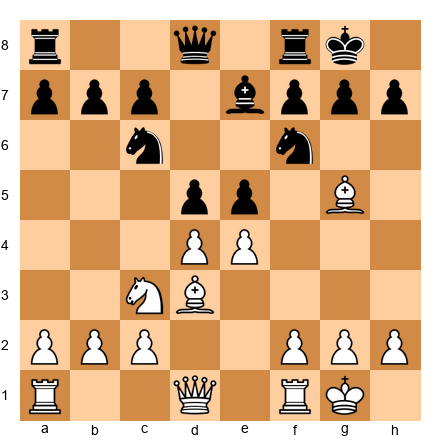

**Task:** White has good development. What is the best plan?
**Hint 1:** All minor pieces are out. What is still undeveloped?
**Hint 2:** The rooks are not connected.
**Hint 3:** How can you connect the rooks and finish development?
**Solution:** **Qe2** (or Qd2). Moving the queen off d1 connects the rooks along the back rank. Now both rooks can move to the best open files. This completes White's development: every piece is active, the rooks are connected, and the king is safe. Time for the middlegame!

---

**Exercise 7.10** ★
**Position:** Black to play after 1.e4 e5 2.Nf3 Nc6 3.Bc4 Nf6 4.d3 Bc5 5.O-O. Black has: king on e8, queen on d8, rooks on a8 and h8, bishops on c5 and c8, knights on c6 and f6, pawns on a7, b7, c7, d7, e5, f7, g7, h7.

**Task:** What should Black do?
**Hint 1:** Golden Rule 3!
**Hint 2:** Black has developed three pieces.
**Hint 3:** Castle!
**Solution:** **O-O!** Black has three pieces developed and can castle immediately. Do it! Get the king to safety and the rook toward the center.

---

🛑 **Ten developing move exercises done. Good work. Ready for more?**

---

### Section B: Which Side Has Better Development? (Exercises 7.11–7.15)

---

**Exercise 7.11** ★
**Position:** Count developed pieces for both sides.

**Task:** Who has better development?
**Hint 1:** Count White's developed pieces.
**Hint 2:** Count Black's developed pieces.
**Hint 3:** Are they equal?
**Solution:** **Equal development.** White has 2 pieces developed (Nf3, Bc4). Black has 2 pieces developed (Nc6, Nf6). Neither side has castled. Development is equal. The battle continues.

---

**Exercise 7.12** ★
**Position:** A lopsided development battle.

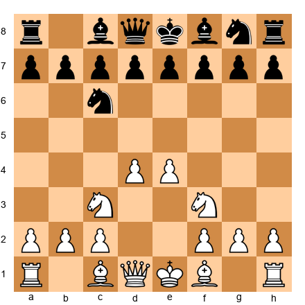

**Task:** Who has better development and by how much?
**Hint 1:** Count White's developed pieces.
**Hint 2:** Count Black's developed pieces.
**Hint 3:** What is the difference?
**Solution:** **White has much better development.** White: 2 knights developed plus 2 center pawns (4 moves spent productively). Black: 1 knight developed, 0 other pieces (1 move spent productively). White leads by 3 tempi. Black needs to catch up fast.

---

**Exercise 7.13** ★★
**Position:** White has castled and developed aggressively. Black has not castled.

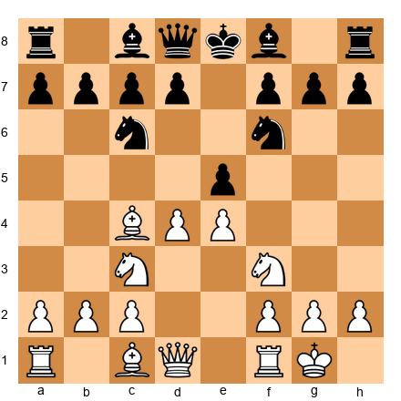

**Task:** Who has better development? What should Black do about it?
**Hint 1:** Count pieces for both sides, including castling.
**Hint 2:** White has castled. Black has not.
**Hint 3:** What is Black's most urgent move?
**Solution:** **White has better development.** White: 3 pieces developed + castled (4 productive moves). Black: 2 pieces developed, king still on e8 (2 productive moves). Black's most urgent move: **develop a bishop (Be7 or Bc5) and castle as soon as possible.** Every move Black delays castling, the danger grows.

---

**Exercise 7.14** ★★
**Position:** An unusual situation where Black is ahead.

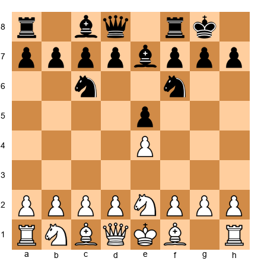

**Task:** Who has better development?
**Hint 1:** Count Black's developed pieces.
**Hint 2:** Count White's developed pieces.
**Hint 3:** Who has castled?
**Solution:** **Black has MUCH better development!** Black: 3 pieces developed (Nc6, Nf6, Be7) + castled = 4 productive moves. White: 1 piece developed (Ne2 on a mediocre square), has NOT castled = 1 productive move. Black leads by 3 tempi. White is in trouble and needs to develop urgently.

---

**Exercise 7.15** ★★★
**Position:** A tricky position where material and development disagree.

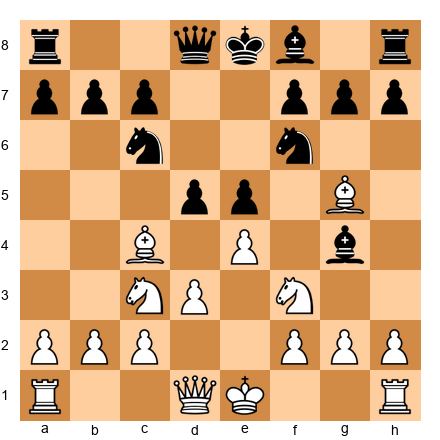

**Task:** Both sides have 3 pieces developed. Who has the better position, and why?
**Hint 1:** Development is equal. Look deeper.
**Hint 2:** Who can castle sooner?
**Hint 3:** Consider the pawn center and piece activity.
**Solution:** **White has the slightly better position** despite equal piece count. Reason: White can castle immediately (O-O), while Black's king is still in the center and will take at least one more move to castle (after ...Be7). White's center (d3+e4 vs d5+e5) is solid, and the Bg5 pin on the f6 knight creates real pressure. Small advantages add up.

---

### Section C: Find the Opening Mistake (Exercises 7.16–7.20)

---

**Exercise 7.16** ★
**Position:** Black has just played 3...Qf6 in the position below.

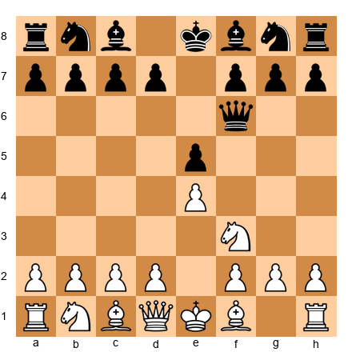

**Task:** What opening mistake did Black make?
**Hint 1:** Look at the queen.
**Hint 2:** Is this too early for the queen?
**Hint 3:** What square does the queen block?
**Solution:** **Black brought the queen out too early AND put it on f6, which blocks the f6 square for the knight.** The g8-knight's best square is f6, but the queen is sitting there. Black will have to move the queen again, wasting a tempo, and the knight will take extra time to develop.

---

**Exercise 7.17** ★
**Position:** White has played 1.e4 e5 2.Nf3 Nc6 3.Nf3-g5?! (moving the knight a second time).

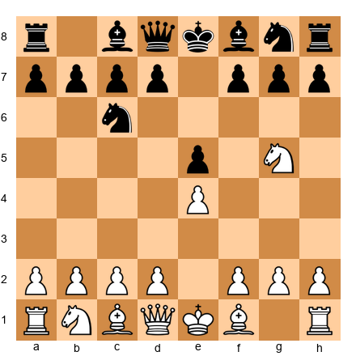

**Task:** What mistake did White make?
**Hint 1:** Where was the knight before?
**Hint 2:** How many times has the knight moved?
**Hint 3:** What principle did White violate?
**Solution:** **White moved the knight twice** (f3 then g5) instead of developing a new piece. This wastes a tempo. 3.Bc4, 3.Bb5, or 3.Nc3 would all develop a NEW piece. White fell behind in development for a speculative knight sally.

---

**Exercise 7.18** ★★
**Position:** White has played: 1.e4 e5 2.d3 d6 3.a3?! a6 4.h3?! h6.

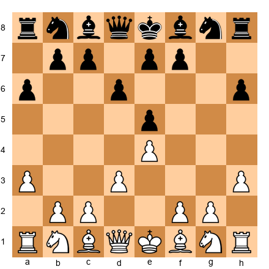

**Task:** BOTH sides made opening mistakes. What are they?
**Hint 1:** Count the developed pieces for each side.
**Hint 2:** How many pawn moves were played?
**Hint 3:** Not a single piece has been developed!
**Solution:** **Both sides made too many pawn moves and developed zero pieces.** After 4 moves each, neither side has a single knight or bishop in the game. Both players violated Golden Rule 1 (develop your pieces). They should have played Nf3, Nc6, Bc4, etc. instead of a3, h3, a6, and h6.

---

**Exercise 7.19** ★★
**Position:** Black has played 1.e4 e5 2.Nf3 Nc6 3.Bc4 Nd4?! (moving the knight a second time to attack the bishop).

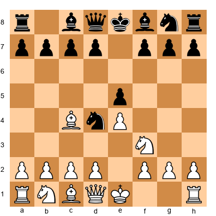

**Task:** What mistake did Black make? How should White respond?
**Hint 1:** Black moved the knight twice.
**Hint 2:** White can develop AND gain a tempo.
**Hint 3:** What happens after Nxd4?
**Solution:** **Black moved the c6-knight a second time to d4.** This wastes a tempo. White responds with **Nxe5!** (not Nxd4, which gives Black the tempo back). After Nxe5, White threatens Qh5 with a double attack on f7 and d4. Black's knight on d4 is misplaced and hard to defend. White gains material and development.

---

**Exercise 7.20** ★★★
**Position:** A common beginner trap. White played: 1.e4 e5 2.Qh5 (early queen!) Nc6 3.Bc4 g6?? (a natural-looking move, but...).

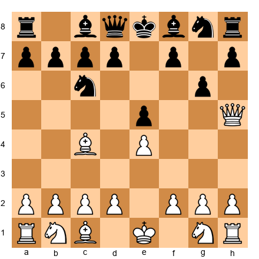

**Task:** White played the queen out early (a mistake in principle), but Black blundered. Find the winning move for White.
**Hint 1:** Look at the f7 square.
**Hint 2:** White's queen and bishop both target f7.
**Hint 3:** Is f7 defended?
**Solution:** **Qxf7#!!** Scholar's Mate! The queen captures on f7 with checkmate. The king on e8 cannot escape. This is why you must be alert even when your opponent makes an opening "mistake" like bringing the queen out early. Always check for tactics! (Note: 3...g6 was the blunder. The correct defense was 3...Qe7 or 3...Nf6 or even 3...Qf6.)

---

### Section D: Should White Castle Here? (Exercises 7.21–7.25)

---

**Exercise 7.21** ★
**Position:** White has: king on e1, both knights and bishops developed, rook on h1, queen on d1. Black has a similar setup. Nothing is threatening.

**Task:** Should White castle here?
**Hint 1:** Are White's minor pieces developed?
**Hint 2:** Is anything preventing castling?
**Hint 3:** Golden Rule 3.
**Solution:** **YES! Castle immediately with O-O.** All minor pieces are developed. Nothing prevents castling. There is no reason to delay. Get the king to safety now.

---

**Exercise 7.22** ★
**Position:** White has the king on e1 and only one piece developed (Nf3). The bishop on f1, knight on b1, bishop on c1 are all still home.

**Task:** Should White castle on this move?
**Hint 1:** CAN White castle right now?
**Hint 2:** What pieces are between the king and the rook?
**Hint 3:** The bishop on f1 blocks castling.
**Solution:** **White CANNOT castle yet.** The f1-bishop is in the way. White must develop the bishop first (Bc4, Bb5, or Be2) before castling is possible. Do so on the next move, then castle the move after.

---

**Exercise 7.23** ★★
**Position:** White has developed both knights and the light-squared bishop. The dark-squared bishop is still on c1. White CAN castle.

**Task:** Should White castle, or develop the c1-bishop first?
**Hint 1:** Is the king safe on e1 right now?
**Hint 2:** Is there any tactical danger?
**Hint 3:** Think about priorities. Which Golden Rule is most urgent?
**Solution:** **Castle! (O-O)** King safety comes first. The c1-bishop can be developed AFTER castling. If you wait to develop the bishop, your opponent might open the center and expose your king. Castle first, develop later. Safety is the priority.

---

**Exercise 7.24** ★★
**Position:** White has developed all pieces. The center is open. Black's pieces are aiming at White's uncastled king.

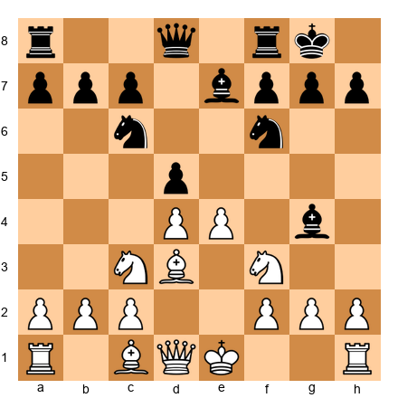

**Task:** White has a STRONG development but forgot to castle. Is this dangerous?
**Hint 1:** Look at the open e-file.
**Hint 2:** Black has a rook on f8 and a bishop on g4 pinning the knight.
**Hint 3:** If the center opens further, the king on e1 will be a target.
**Solution:** **YES, this is dangerous! White must castle immediately.** The Bg4 pin is annoying, and if Black manages to open the e-file with ...dxe4, the king on e1 could face a direct attack from the rook. White should play **O-O** right now, before it is too late. This is a perfect example of why you should not delay castling.

---

**Exercise 7.25** ★★★
**Position:** White has developed three pieces and can castle. But White also has a chance to play Nxe5, winning a pawn. Which is better?

**Task:** Should White castle (O-O) or grab the pawn (Nxe5)?
**Hint 1:** Is Nxe5 safe? What happens after Nxe5 Nxe5?
**Hint 2:** After Nxe5, Black can play ...d5! attacking the bishop.
**Hint 3:** After ...d5, Black gains the center and develops with tempo. Was the pawn worth it?
**Solution:** **Castle! (O-O)** is better. After Nxe5 Nxe5, Black plays d5! with a strong center, attacking the bishop on c4 and gaining a tempo. White has won a pawn but lost the center and the initiative. Castling keeps the position balanced and the king safe. Do not grab pawns when you can castle.

---

🛑 **Castling exercises done. You are over halfway through. Keep going, or take a break and come back.**

---

### Section E: What's White's Best Plan After the Opening? (Exercises 7.26–7.30)

---

**Exercise 7.26** ★
**Position:** White has castled, developed all pieces, and connected the rooks. The position is quiet.

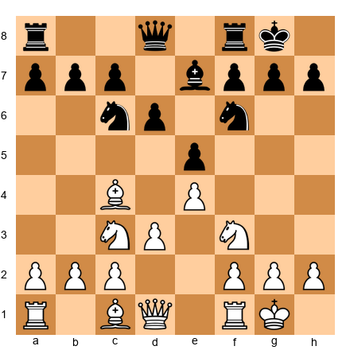

**Task:** The opening is over. What should White's first middlegame idea be?
**Hint 1:** Look for the least active White piece.
**Hint 2:** The c1-bishop is still on its starting square.
**Hint 3:** Where should it go?
**Solution:** **Develop the c1-bishop!** Play Be3 or Bg5. The bishop is the only piece still on its starting square. Placing it on e3 supports a future d4 push and controls key squares. After this, White's development is truly complete.

---

**Exercise 7.27** ★★
**Position:** White has fully developed. Black has a weakness on d6. Both sides have castled.

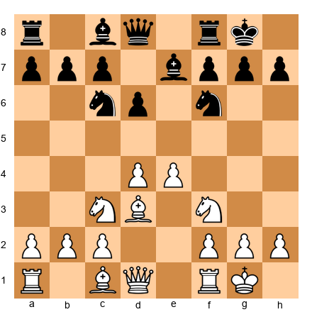

**Task:** What is White's best plan?
**Hint 1:** Look at Black's pawn structure.
**Hint 2:** The d6 pawn is a potential weakness.
**Hint 3:** How can White put pressure on d6?
**Solution:** **Target the weak d6 pawn.** White can play Bf4 (attacking d6 directly), followed by Qd2 or Nd5 to increase pressure. Placing a rook on d1 also adds to the pressure. When you see a weakness, aim your pieces at it. That is the beginning of a middlegame plan.

---

**Exercise 7.28** ★★
**Position:** Both sides have castled and developed. The center is locked (pawns on e4/d4 vs e5/d5). No immediate tactics.

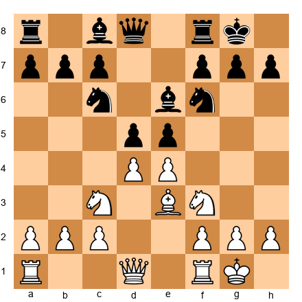

**Task:** What is White's best plan when the center is locked?
**Hint 1:** You cannot break through in the center (it is locked).
**Hint 2:** Where should you attack instead?
**Hint 3:** Think about the flanks (kingside or queenside).
**Solution:** **Attack on the flanks.** When the center is locked, look for a pawn advance on the kingside (f4, g4) or queenside (a3, b4, c5). White might play Nd2 followed by f4, trying to open lines on the kingside. The side with more space on a particular flank should attack there.

---

**Exercise 7.29** ★★★
**Position:** White has completed development and has an open e-file. Where should the rook go?

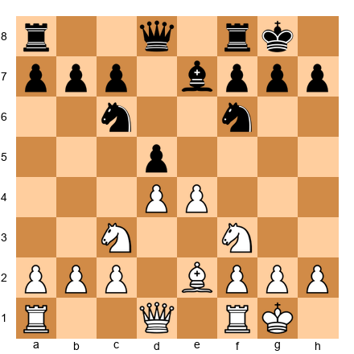

**Task:** Which rook goes to e1, and what is the strategic idea?
**Hint 1:** An open file is a highway for rooks.
**Hint 2:** The f1-rook can go to e1.
**Hint 3:** Once on e1, the rook pressures the e-file and the e7 bishop.
**Solution:** **Rfe1!** Place the f1-rook on the open e-file. This puts pressure on Black's e7 bishop and the entire e-file. The a1-rook stays on a1 for now, ready to swing to d1 or c1 as needed. Rooks belong on open files. Find them and use them.

---

**Exercise 7.30** ★★★
**Position:** White has completed development. Black's pieces are slightly passive. What is White's best improving move?

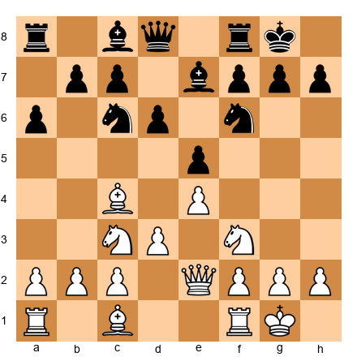

**Task:** Find the best plan for White.
**Hint 1:** White's worst piece might be the c1-bishop.
**Hint 2:** Is there a way to improve it?
**Hint 3:** Think about the d5 square and piece redeployment (Nd5, for example).
**Solution:** **Play a4! (preventing ...b5)** followed by **Bg5** (pinning the f6 knight) and potentially **Nd5** (placing a knight on the ideal outpost). White's plan is to prevent Black from expanding on the queenside (a4 stops ...b5) and then improve pieces. Bg5 creates the pin, and Nd5 occupies the best square on the board. This is proactive middlegame play.

---

### Section F: Punish the Early Queen (Exercises 7.31–7.35)

---

**Exercise 7.31** ★
**Position:** Black has played 2...Qh4 after 1.e4 e5, bringing the queen out on move 2.

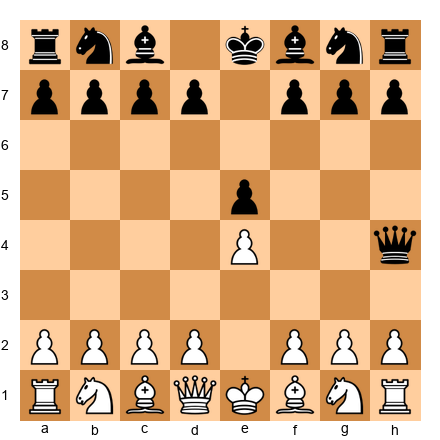

**Task:** How should White respond?
**Hint 1:** Develop a piece that attacks the queen.
**Hint 2:** A knight can go to a square that threatens the queen.
**Hint 3:** The knight also defends key squares.
**Solution:** **Nc3!** Develops a knight (Golden Rule 1) and prepares to chase the queen later. White can also consider Nf3, which directly attacks the queen and forces it to move. After Nf3, the queen must waste another tempo retreating. White gains development at the queen's expense.

---

**Exercise 7.32** ★
**Position:** White played 1.e4 e5 2.Qf3?! (queen out early). You are Black.

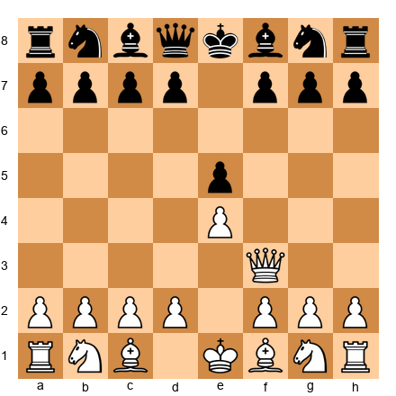

**Task:** How should Black develop while punishing White's early queen?
**Hint 1:** Develop a knight.
**Hint 2:** Put it on a square where it is protected and attacks the center.
**Hint 3:** Does the knight create any threats against the queen?
**Solution:** **Nf6!** Develops a knight to its best square, attacks the e4 pawn, and prepares to castle. If White plays Qxf7+, that is Scholar's Mate, so we must be careful. But after Nf6, Black defends against any immediate threats while developing naturally. White's queen on f3 is misplaced and will need to move again.

---

**Exercise 7.33** ★★
**Position:** White has played 2.Qh5 and 4.Qxf7+ Ke7 in a Scholar's Mate attempt gone wrong. Now White's queen is on f7 but the king is safe on e7.

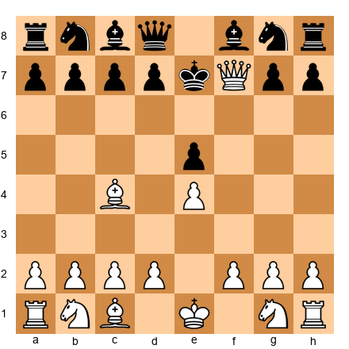

**Task:** Black's king moved to e7 to escape the check. How should Black continue to punish White's queen adventure?
**Hint 1:** The queen on f7 is advanced and has few safe squares.
**Hint 2:** Develop a piece that attacks the queen.
**Hint 3:** Nf6 does double duty.
**Solution:** **Nf6!** Attacks the queen (the knight on f6 threatens e4 and g4, limiting the queen's retreats) while developing. After the queen retreats, Black will develop rapidly with d5, Be6, Nbd7, etc. White wasted several tempi on the queen while Black develops with threats. Black is already better despite the king on e7.

---

**Exercise 7.34** ★★
**Position:** White has brought the queen to g4 on move 3, attacking g7.

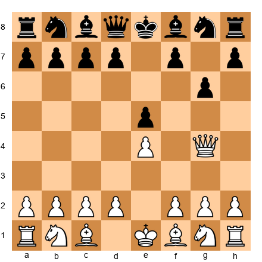

**Task:** Black played ...g6 to defend g7. Is there a better way to handle White's queen?
**Hint 1:** Developing while defending is ideal.
**Hint 2:** Instead of g6 (a pawn move that weakens the kingside), what knight move defends AND develops?
**Hint 3:** What about Nf6?
**Solution:** **Nf6 would have been better than g6.** After Nf6, the knight develops AND attacks the queen on g4, forcing it to retreat. Black develops a piece and gains a tempo. The move g6 defended g7 but weakened the kingside (the dark squares around the king are now weaker) and did NOT develop a piece. Lesson: when you can develop while defending, always choose development.

---

**Exercise 7.35** ★★★
**Position:** White brought the queen to h5 and the bishop to c4, threatening Scholar's Mate (Qxf7#). Black has defended with ...g6 and ...Bg7. Now the queen is stuck.

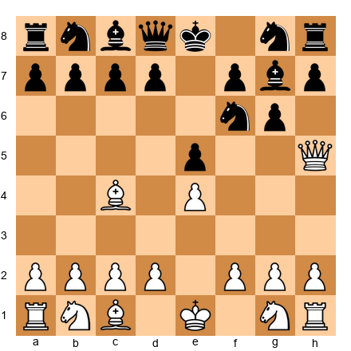

**Task:** White's queen is on h5 and the bishop is on c4. Black has defended well with g6, Nf6, and Bg7. Assess the position: who is better and why?
**Hint 1:** Count developed pieces for both sides.
**Hint 2:** White: queen (h5, misplaced) and bishop (c4). Black: knight (f6), bishop (g7).
**Hint 3:** Who will castle first? Who has more active minor pieces?
**Solution:** **Black is better!** White has the queen (on a poor square, it will be chased by ...Nf6-h5 or ...d6 and ...Be6) and the bishop. That is 2 pieces, but the queen counts as a weakness here because it is exposed and will waste more time retreating. Black has 2 pieces developed (Nf6 and Bg7), the pawn on g6 guards the king, and Black can castle next move (O-O). After castling, Black will play d5, kicking the c4 bishop, and suddenly White's "attacking" setup collapses. The early queen came out to play and accomplished nothing.

---

🛑 **All 35 exercises complete! Outstanding work. If you solved most of them, you truly understand opening principles.**

---

## Key Takeaways

1. **The Three Golden Rules** govern every opening: Develop your pieces, control the center (d4, d5, e4, e5), and castle your king to safety. Follow them in every game.

2. **Development is the most important factor in the opening.** A lead of 2-3 tempi in development can lead to a crushing attack. Count your developed pieces and compare them to your opponent's.

3. **Knights before bishops, and don't move the same piece twice.** Get your knights to f3/c3 (or f6/c6) first, then decide where the bishops belong. Every piece should move once to its best square.

4. **Don't bring the queen out early.** She will get chased around, and you will fall behind in development. Let the minor pieces do the early work.

5. **Castle before move 10** in every game. An uncastled king is a target. After castling, do not push the pawns in front of your king without a good reason.

6. **The opening is over when you have castled, developed your minor pieces, and connected your rooks.** Then it is time for the middlegame: look for tactics, make a plan, and improve your worst piece.

7. **Avoid the six deadly mistakes:** Moving a piece twice, bringing the queen out early, grabbing pawns, not castling, making too many pawn moves, and pushing edge pawns before developing.

---

## Practice Assignment

**At the board (20 minutes):**
1. Play through the Opera Game (Game 7.1) from memory. Try to remember every move. If you get stuck, check the notation and continue.
2. Set up the starting position and play the first 8 moves of a game as White, following all three Golden Rules. Then play 8 moves as Black. Check: did you follow every rule?

**Online (30 minutes):**
1. Go to **lichess.org** and play 3 games. In each game, focus on one Golden Rule:
   - Game 1: Focus on development. Count your developed pieces after every move.
   - Game 2: Focus on center control. Place your pawns on e4/d4 and keep your pieces centralized.
   - Game 3: Focus on castling early. Castle before move 8 no matter what.
2. After each game, review the opening. Did you follow the Three Golden Rules? Where did you break them?

**In your games (ongoing):**
1. Before every game, say to yourself: "Develop, center, castle." Make it a habit.
2. After every game, check: "Did I follow the Three Golden Rules? Where did I go wrong?"
3. When reviewing your games, look at the moment the opening ended. Were your rooks connected? Were all your pieces developed? If not, identify the move where you went wrong.

---

## ⭐ Progress Check

If you can confidently:
- Name the Three Golden Rules of the opening without looking them up
- Develop your pieces to natural squares (Nf3, Nc3, Bc4, Bg5, O-O) in the first 8 moves
- Castle before move 10 in most games
- Recognize when your opponent brings the queen out too early and punish it by developing with tempo
- Identify who has better development in any position by counting developed pieces
- Explain why "a knight on the rim is dim"

...then you are ready for Chapter 8. You now understand how to start a chess game. You know what the great masters knew: develop, control the center, and get your king to safety. The rest is practice.

**Estimated rating after mastering this chapter: 700–900**

---

🛑 **Chapter 7 complete. Seven chapters of Volume I done. You have come a long way from learning how the pieces move. You now understand rules, checkmates, tactics, and opening principles. That is a real chess foundation. Take a long break. Go outside. Play a game for fun. When you come back, Chapter 8 will deepen your understanding even further. Well done.**

---

*Chapter 7 complete. Three Golden Rules learned. 5 master games studied. 35 exercises solved.*
*You are no longer guessing in the opening. You have a plan.*
