# Chapter 8: Your First Repertoire -- London System and Pirc/Modern Basics

**Rating Range: Beginner (600–1000)**

---

> *"The opening is just the beginning of a long journey. Understand the ideas, and you will never get lost."*
> -- Anatoly Karpov

---

## What You'll Learn

- Why every chess player needs a **repertoire** and how to build your first one
- How to play the **London System** as White: a solid, principled setup you can use at any level
- How to play the **Pirc/Modern Defense** as Black against 1.e4: a flexible, fighting system
- The key **ideas and plans** behind each opening so you never feel lost after move 5
- How to handle your opponent's most common responses in both systems

This is the chapter where you stop guessing in the opening. You walk into every game with a plan. That changes everything.

---

## Part 1: Why You Need a Repertoire

### What Is an Opening Repertoire?

A repertoire is your set of prepared openings. It is the collection of systems you play as White and as Black. Think of it as your toolkit. A carpenter does not show up to a job wondering which tools to bring. The carpenter brings the same trusted tools every day, knows them inside and out, and gets the job done.

Your opening repertoire works the same way. You choose your systems. You learn the ideas behind them. You practice them in game after game. Over time, you know your openings so well that the first 5 to 10 moves feel natural. You spend your thinking time on the middlegame, where it matters most.

### The Problem with Improvising

Without a repertoire, you are making it up as you go from move 1. Every game starts with the same question: "What should I play?" You try one thing this game, something else next game, and you never build deep understanding of anything.

This is exhausting and unreliable. You waste mental energy in the opening, and you reach unfamiliar positions every single time. Your opponent might know the position well, but you are seeing it for the first time. That is a disadvantage you do not need.

### What You Need Right Now

At the beginner level, you need exactly two things:

1. **One system as White.** Something you play after 1.d4, regardless of what Black does.
2. **One system as Black.** Something you play against 1.e4, regardless of what White does.

That is all. Two openings. Two sets of ideas. Two structures you learn deeply.

We will cover Black's options against 1.d4 briefly at the end of this chapter and in full detail in Volume II. For now, we focus on the two systems that will carry you the furthest with the least memorization.

### Why These Two Systems?

We chose the **London System** (White) and the **Pirc/Modern Defense** (Black) for three reasons:

**1. They are SOLID.** These openings do not rely on tricks or traps. They follow sound principles: develop your pieces, control the center, castle your king to safety. If your opponent plays well, you still have a good position.

**2. They are PRINCIPLED.** Every move in both systems has a clear purpose. You will understand WHY you play each move, not just memorize a sequence. Understanding beats memorization every time.

**3. They are SCALABLE.** These are not "beginner openings" you will outgrow. World Championship contender Vladimir Kramnik played the London System at the highest level. Garry Kasparov used the Pirc Defense as a surprise weapon against the world's best players. You can play these openings at 600 rating or 2600 rating. The ideas work at every level.

### Understanding Over Memorization

Here is the most important idea in this entire chapter:

**Learn the IDEAS behind the moves, and the moves come naturally.**

You do not need to memorize 20 moves of theory. You need to understand what your pieces want to do and why they go to certain squares. When you understand the plan, you can figure out the right move even in positions you have never seen before.

A player who memorizes moves is helpless when the opponent deviates. A player who understands ideas adapts to anything.

We will learn both systems this way: idea first, then moves.

🛑 **Take a moment. You are about to learn your first real opening system. Once you learn the London System, you will have a plan for every single game you play as White. That is huge. Ready? Let's go.**

---

## Part 2: The London System as White

### What Is the London System?

The London System is a "system" opening. That means you play the same setup of pieces regardless of what your opponent does. Whether Black plays 1...d5, 1...Nf6, 1...e6, or 1...g6, your first seven or eight moves stay almost identical.

This is why the London is perfect for building a repertoire. One setup covers everything. You learn it once, and you can play it against any opponent, at any level, for the rest of your chess career.

The London System starts with 1.d4 and features an early Bf4. It was named after the 1922 London tournament where several top players adopted this setup. In the modern era, players like Kramnik, Rapport, and Carlsen have all used it at the highest level.

### The London Setup: Piece by Piece

**Set up your board.** Place all the pieces in the starting position. Now, play through the following moves for White, one at a time. We will explain each move as we go.

**Move 1: d4**

Push the d-pawn two squares. This is your first move in every London System game. You grab space in the center and open lines for your queen and your dark-squared bishop.

**Move 2: Bf4**

Develop your bishop to f4. This is the London bishop, and it is the signature move of the entire system.

**CRITICAL RULE:** Always play Bf4 BEFORE you play e3. If you play e3 first, the bishop gets trapped inside the pawn chain and cannot reach f4. The dark-squared bishop must come out first. This is the single most important move order detail in the London System.

The bishop on f4 controls the important c1-h6 diagonal. It watches over key central squares, supports your d4 pawn, and can become an attacking piece aimed at the enemy king later.

**Move 3: e3**

Support your d4 pawn with e3. Now the pawn on d4 is solid. It has backup. The e3 pawn also opens a diagonal for your light-squared bishop, which will go to d3 on the next move.

Notice: e3 comes AFTER Bf4. The bishop is already outside the pawn chain, free and active.

**Move 4: Nf3**

Develop your knight to its best square. Nf3 controls the center (d4, e5), develops a piece, and prepares castling. This is a move you already know from the principles in earlier chapters: develop knights toward the center.

**Move 5: Bd3**

Place your light-squared bishop on d3. This is an excellent square. The bishop aims at the kingside, particularly the h7 pawn near the enemy king. It supports a future e3-e4 pawn push. And it works well with the knight on f3 and the bishop on f4.

**Move 6: Nbd2**

Develop your other knight to d2. Why d2 instead of c3? Two reasons:

First, c3 is reserved for the c-pawn. You want to play c3 to support d4 and prepare possible queenside expansion with b4. If the knight sits on c3, the c-pawn is blocked.

Second, the knight on d2 is flexible. It can go to f3 later (after the other knight moves to e5). It can go to b3. It can even reroute through f1 to e5 or g3 for a kingside attack. The d2 square keeps all options open.

**Move 7: c3**

Push the c-pawn to c3. This solidifies your d4 pawn, gives your queen the c2 square, and prepares a possible b4 push for queenside space. Your pawn structure is now rock-solid: d4, e3, c3 form a triangle that is very hard to break.

**Move 8: O-O**

Castle kingside. Your king is safe. Your rook moves to f1, where it supports the f-file and connects with the other rook.

**You are fully developed.**

Here is what the ideal London setup looks like:

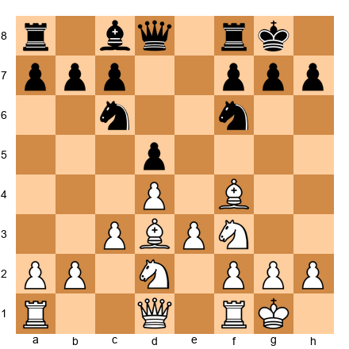

This FEN shows a typical London position against Black's standard setup. Look at your pieces:
- Pawns on c3, d4, e3: a fortress in the center
- Bishop on f4: controlling the dark diagonal
- Bishop on d3: aiming at the kingside
- Knight on f3: guarding d4 and e5
- Knight on d2: ready to reroute
- King castled safely on g1
- Rooks ready to connect on d1 and e1 (or f1)

Every piece has a job. Nothing is wasted. This is the beauty of the London System.

🛑 **Good stopping point. Set up this position on your board and study it. Get familiar with where every piece stands. When you can set up the London from memory, you are ready for the next section.**

---

### Key London Ideas and Plans

Now that you know the setup, let's talk about what to DO from this position. A solid setup means nothing if you do not have a plan.

#### Plan 1: The e3-e4 Pawn Break

This is your most common plan. You want to push the e-pawn from e3 to e4, opening the center and giving your pieces more room.

How to prepare it:
1. Play Qe2 (supporting e4)
2. Play Rae1 (putting the rook behind the e-pawn)
3. Push e4!

When e4 happens, the center opens up. Your bishops become active. Your knights can jump to powerful squares. And your opponent has to react to your aggression.

Sometimes you can play e4 without Qe2 and Rae1, if the position allows it. But preparing it first is safer and more reliable.

#### Plan 2: The Ne5 Outpost

The e5 square is often available for your knight. A knight on e5 is a monster. It sits deep in enemy territory, controls key squares (d7, f7, c6, d3), and is hard to remove.

The knight often goes from f3 to e5. When that happens, your other knight (on d2) can move to f3 to take over guarding duties. This "knight relay" is a common London technique.

A knight on e5 is especially strong when it cannot be chased away by a Black pawn on f6. Watch for opportunities to plant your knight there.

#### Plan 3: Kingside Attack

When Black castles kingside, you can sometimes launch a direct attack on the king. The plan involves:
1. h3 (securing space and preventing ...Ng4)
2. Qe2 or Qf3 (moving the queen toward the kingside)
3. g4 (aggressive pawn push)
4. Ne5 and Ndf3-g5 (bringing knights toward the king)

This is a more advanced plan, but at the beginner level, many opponents will not know how to defend against it. Even the threat of g4 can create panic.

#### Plan 4: Queenside Expansion

If the kingside is blocked, you can expand on the queenside:
1. b4 (grabbing space)
2. a4 (more space)
3. Qb3 (pressure on b7 and d5)

This plan works well when Black has played ...c5 and you have exchanged pawns, giving you a half-open c-file for your rook.

### Remembering the Plans

Here is a simple way to remember your four London plans:

1. **e4 break** -- open the center
2. **Ne5 outpost** -- plant a knight in enemy territory
3. **Kingside attack** -- go after the king with h3, Qf3, g4
4. **Queenside expansion** -- push b4, a4, grab space

In most games, you will use Plan 1 or Plan 2. Plans 3 and 4 are situational. But knowing all four gives you flexibility. When one plan is blocked, switch to another.

🛑 **Good place to pause. You now know the London setup AND the plans behind it. That puts you ahead of most players at your rating level. They know moves. You know ideas. Take a break, then we will look at how the London handles Black's most common responses.**

---

### London vs Common Black Responses

The beauty of the London is that your setup barely changes. But you do need to know how to handle a few common responses from Black.

#### London vs 1...d5 (The Most Common Response)

After 1.d4 d5, Black mirrors your pawn push. This is the most common response you will face. Your plan is unchanged: 2.Bf4, 3.e3, 4.Nf3, 5.Bd3, and continue with the full setup.

**Set up your board:** 1.d4 d5 2.Bf4 Nf6 3.e3 e6 4.Nf3 Bd6

Black develops the bishop to d6, attacking your London bishop. What do you do?

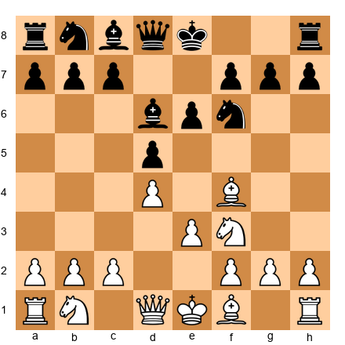

You have three good options:
- **Bg3:** Retreat the bishop. It stays on a good diagonal (c7-g3) and is safe.
- **Bxd6:** Trade bishops. This simplifies the position but gives you a comfortable game.
- **Bg5:** Some players sidestep to g5, pinning the knight.

The best choice for beginners is **Bg3.** It keeps the bishop active and avoids early trades. After ...Bxg3, you recapture with hxg3, opening the h-file for your rook. That h-file can become a weapon later in the game.

#### London vs 1...Nf6 (The Second Most Common)

After 1.d4 Nf6, Black develops a knight first. Your response: 2.Bf4, same as always.

Watch for one trick: Black might play ...Nh5, attacking your bishop on f4. Do not panic. You can play Bg5, Be5, or Bg3. If Black plays ...Nxg3, you get the open h-file, which is good for you.

**Key tip:** If Black plays ...Nh5 early, the knight is on the edge of the board. It will need to come back to the center. Black has spent two moves (Nf6, Nh5) just to trade your bishop. That is two moves not spent on development. You are fine.

#### London vs 1...c5 (Benoni-Style)

After 1.d4 c5, Black attacks your d4 pawn right away. Do not panic about the tension.

Play 2.d5 (grabbing space), 2.e3 (keeping things solid), or 2.c3 (supporting d4). For beginners, 2.d5 is the simplest. It grabs central space, and you continue with Bf4, e3, Nf3, and the rest of the London setup.

If Black plays ...cxd4, recapture with exd4 and keep your central pawn on d4. Your position remains solid.

#### London vs the King's Indian Setup (1...Nf6, 2...g6, 3...Bg7)

When Black fianchettoes the bishop to g7, be extra careful about your dark squares. Black's bishop on g7 is a powerful piece aimed at your queenside.

Your setup stays the same, but pay attention to:
- Keep the pawn on d4 well-supported (c3 is important)
- Consider h3 early to control the g4 square
- The knight on e5 is especially valuable in these positions

**Set up your board:** 1.d4 Nf6 2.Bf4 g6 3.e3 Bg7 4.Nf3 O-O 5.Be2 d6 6.h3 Nbd7 7.O-O

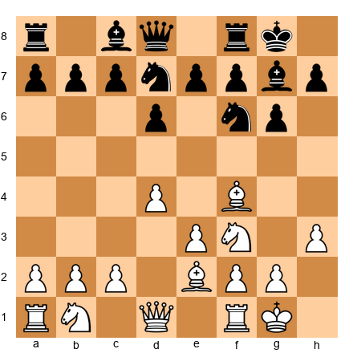

Notice White chose Be2 instead of Bd3 here. Against the King's Indian setup, Be2 is often better because Bd3 can be a target for ...Nh5 tricks and ...e5 pawn pushes. Be2 is more flexible and keeps the bishop out of danger.

This is a good example of adapting the London setup slightly without changing the fundamental ideas.

#### Move Order Summary

Here is your London move order checklist:

| Move | What to Play | Why |
|------|-------------|-----|
| 1 | d4 | Grab the center |
| 2 | Bf4 | The London bishop -- ALWAYS before e3 |
| 3 | e3 | Support d4, open line for Bd3 |
| 4 | Nf3 | Develop, guard d4/e5, prepare castling |
| 5 | Bd3 (or Be2) | Active diagonal, support e4 plan |
| 6 | Nbd2 | Flexible knight, keeps c3 open |
| 7 | c3 | Fortress the center, prepare Qc2 or b4 |
| 8 | O-O | King safety, connect rooks |

Follow this order in every game. Adjust only when Black forces you to (for example, if Black attacks your Bf4 early).

🛑 **You now know the London System inside and out. You have the setup, the plans, and you know how to handle Black's common responses. That is a complete opening system for White. Every time you sit down as White, you know exactly what to do. That confidence is worth more than any amount of memorization. Take a well-earned break.**

---

## Part 3: The Pirc/Modern Defense as Black

### What Is the Pirc/Modern Defense?

The Pirc Defense (pronounced "peerts") is named after Slovenian Grandmaster Vasja Pirc. The Modern Defense is its close cousin. Together, they give you a flexible, fighting system against 1.e4.

The basic idea: against 1.e4, you play 1...d6, 2...Nf6, 3...g6, 4...Bg7. You let White occupy the center with pawns and then attack that center from the sides.

This is called a "hypermodern" approach. Classical chess says: "Occupy the center with pawns." Hypermodern chess says: "Let your opponent occupy the center, then tear it apart." Both approaches work. The Pirc/Modern uses the hypermodern philosophy.

Why is this a good choice for your repertoire?

**Flexibility.** The Pirc/Modern setup works against almost anything White plays after 1.e4. White can play aggressively or quietly, and your basic setup stays the same.

**Fighting spirit.** This is not a passive defense. You are coiled like a spring, waiting for the right moment to strike with ...e5 or ...c5. When you strike, the position explodes into activity.

**Rich middlegames.** The Pirc/Modern leads to complex, interesting positions where understanding matters more than memorization. This is exactly what we want for building chess skills.

**Grandmaster approved.** Kasparov played it as a surprise weapon. Seirawan, Nunn, and many modern grandmasters have used it. It is a legitimate defense at every level.

### The Pirc/Modern Setup: Piece by Piece

**Set up your board.** Starting position. Black is playing against 1.e4.

**Move 1: ...d6** (after 1.e4)

Push the d-pawn one square. This modest move has big ideas behind it. It prepares ...Nf6 (attacking White's e4 pawn), keeps the center flexible, and opens a diagonal for the dark-squared bishop.

Why not 1...e5? There is nothing wrong with 1...e5. But it leads to open games where both sides need to know a lot of specific theory (Ruy Lopez, Italian Game, Scotch Game, and more). The Pirc sidesteps all of that. You play YOUR system, on YOUR terms.

**Move 2: ...Nf6** (after White plays 2.d4)

Develop the knight to f6. It attacks the e4 pawn and controls the center. White has to decide what to do about the attack on e4. Most commonly, White will play 3.Nc3 to defend it.

**Move 3: ...g6** (after White plays 3.Nc3)

Prepare to fianchetto the bishop. The g6 pawn also helps control the center (the f5 and h5 squares) and gives the king a safe shelter after castling.

**Move 4: ...Bg7**

Place the bishop on g7. This is your most powerful piece in the Pirc/Modern. The bishop on g7 is a monster on the long diagonal (a1-h8). It looks at the center, the queenside, and can even support kingside attacks. It applies constant pressure on White's d4 pawn.

As Nimzowitsch taught us, a piece can control the center without sitting in the center. The g7 bishop does exactly this. It controls d4 and e5 from a distance, like a sniper.

**Move 5: ...O-O**

Castle kingside. Your king is tucked safely behind the g6 pawn and the g7 bishop. This is a very solid defensive setup. The king on g8, with the bishop on g7 and pawn on g6, is hard to attack.

**After castling, your plan is to strike back.**

**Set up your board:** A typical Pirc position after 1.e4 d6 2.d4 Nf6 3.Nc3 g6 4.Nf3 Bg7 5.Be2 O-O

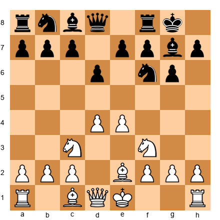

Look at Black's position. The setup is compact and solid. White has more space (pawns on d4 and e4), but Black's pieces are well-placed, and the g7 bishop is pointing right at the center.

Now Black needs a plan to fight back.

🛑 **You have the Pirc/Modern setup. Before we talk about plans, set this position up on your board. Get familiar with where every Black piece sits. This is your home base as Black against 1.e4. Come back when you are comfortable with it.**

---

### Key Pirc/Modern Ideas and Plans

#### The g7 Bishop: Your Best Friend

The bishop on g7 is the star of the Pirc/Modern. It sits on the long diagonal (a1 to h8) and pressures the entire center. Here is why it matters:

- It attacks White's d4 pawn
- It controls the e5 square
- It supports a future ...e5 or ...c5 push
- It defends the king along the diagonal

**Never trade this bishop unless you get something very valuable in return.** It is the heart of your position. Guard it. Use it. Build your plans around it.

#### Plan 1: Strike with ...e5

The most common Pirc counterattack is pushing ...e5 to challenge White's center.

When to play ...e5:
- After you have castled and developed your pieces
- When your knight is on d7 or c6 (supporting ...e5)
- When White does not have a strong response like d5

What happens after ...e5: If White plays dxe5, you recapture with dxe5, and the center opens up. Your g7 bishop becomes even more active on the open diagonal. If White does not take, you create tension in the center that works in your favor.

**Warning:** Do not play ...e5 too early. If you push ...e5 before you are fully developed, White might take advantage. Develop your pieces first, then strike.

#### Plan 2: Strike with ...c5

The other main counterattack comes from the queenside. Playing ...c5 attacks White's d4 pawn from a different direction.

When to play ...c5:
- When ...e5 is not available or not good yet
- When White has overextended in the center
- After moves like ...a6 (preparing ...b5) or ...Qa5 (putting pressure on White)

The ...c5 push is especially effective when White has played f3 or f4 (weakening the a7-g1 diagonal, which your g7 bishop covers).

#### Plan 3: The Rubber Band Principle

This is the most important strategic idea in the Pirc/Modern:

**Let White overextend, then snap back.**

Imagine a rubber band. The more you stretch it, the more forcefully it snaps back. In the Pirc/Modern, White has more space. White has pawns on d4 and e4, sometimes even on f4. This looks scary, but those pawns are stretched thin. They need pieces to support them.

Your job is to wait patiently, develop all your pieces, and then attack White's center at the right moment. When the center collapses, White's entire position falls apart.

This requires patience. It requires trust. You need to believe that your position is strong even when it looks cramped. If you have followed the Pirc setup correctly, you ARE strong. The counterattack will come.

#### Plan 4: ...b5 and Queenside Play

In some positions, you can expand on the queenside with ...a6, ...b5, and ...Bb7. This develops your last piece (the c8 bishop, which is often the hardest piece to develop in the Pirc), creates space on the queenside, and puts pressure on the center from yet another angle.

### Remembering the Plans

Here are your four Pirc/Modern plans:

1. **...e5 break** -- strike the center directly
2. **...c5 break** -- attack the center from the queenside
3. **Rubber band** -- let White overextend, then snap back
4. **...b5 expansion** -- develop the queen's bishop and grab queenside space

In most games, you will use Plan 1 or Plan 2. Plan 3 is the underlying philosophy that governs your timing. Plan 4 is for when the center is locked.

🛑 **You are doing great. You now have a complete opening system for Black too. Two systems: one as White (London), one as Black (Pirc/Modern). Take a break. When you come back, we will look at how the Pirc handles White's most common setups.**

---

### Pirc/Modern vs Common White Setups

Your basic Pirc setup (1...d6, 2...Nf6, 3...g6, 4...Bg7, 5...O-O) works against everything. But White has several ways to set up, and you should know the character of each one.

#### vs The Classical System (Nf3, Be2)

White plays: 1.e4 d6 2.d4 Nf6 3.Nc3 g6 4.Nf3 Bg7 5.Be2 O-O

This is the most common and solid setup for White. No fireworks, just steady development. Your plan: play ...c6 (supporting ...d5 or preparing ...b5), or play ...Nbd7 followed by ...e5 when ready.

**Set up your board:** 1.e4 d6 2.d4 Nf6 3.Nc3 g6 4.Nf3 Bg7 5.Be2 O-O 6.O-O c6 7.h3 Nbd7

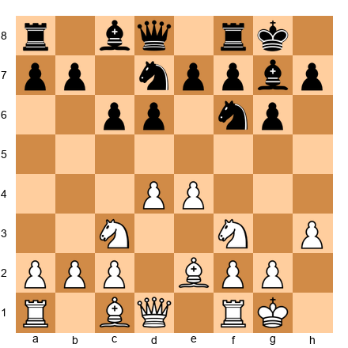

Black is solid. The knight on d7 prepares ...e5. The pawn on c6 supports the center. This is a comfortable position for Black with clear plans.

#### vs The Austrian Attack (f4)

White plays: 1.e4 d6 2.d4 Nf6 3.Nc3 g6 4.f4

This is aggressive. White pushes the f-pawn to f4, grabbing more space and preparing a kingside attack. This looks scary, but it has a weakness: the e1-a5 diagonal is weakened (no pawn on e3 or f2 to block it), and White's king is less safe.

Your plan: develop normally with ...Bg7, ...O-O, then look for ...c5 or ...e5 to strike back at the overextended center.

**Key tip:** Against the Austrian Attack, timing is everything. Strike back at the center before White builds up too much attacking force. Do not wait too long.

#### vs f3 Systems (Samisch-Type)

White plays: 1.e4 d6 2.d4 Nf6 3.f3

White supports e4 with f3, planning to build a big center with Be3 and Qd2. The f3 pawn is solid but takes away the f3 square from the knight.

Your plan: ...e5 is strong here. Push ...e5, challenge the center, and take advantage of the fact that White's knight cannot go to f3.

#### vs The Four Pawns Attack

White plays: 1.e4 d6 2.d4 Nf6 3.Nc3 g6 4.f4 Bg7 5.e5

White tries to push you off the board with pawns. This is the most aggressive approach, but it is also the most fragile. All those pawns need support, and if one falls, the whole structure can collapse.

Your plan: play ...dxe5, open the center, and use your pieces to exploit the holes White has created. The g7 bishop becomes a monster when the center opens.

#### What NOT to Play

**Do not play the Pirc/Modern against 1.d4.** The Pirc/Modern is designed to fight against 1.e4, where White has a pawn on e4 that you can target. Against 1.d4, the dynamics are different, and the Pirc setup is less effective.

Against 1.d4, you need a separate response. We cover this briefly in the next section and fully in Volume II, Chapter 18.

---

## Part 4: What About Black vs 1.d4?

You have your White system (London) and your Black system against 1.e4 (Pirc/Modern). But what about games where you are Black and your opponent plays 1.d4?

For now, at the beginner level, you have two simple options:

### Option 1: Queen's Gambit Declined (Solid)

Play 1.d4 d5, and after 2.c4, play 2...e6.

This is the Queen's Gambit Declined (QGD). It is one of the oldest and most respected defenses in chess. Your setup is straightforward: develop your knight to f6, your bishop to e7, castle kingside, and fight for the center.

You do not need to know a lot of theory here. Just play solid, develop your pieces, and wait for your chance to push ...c5 and free your position.

### Option 2: King's Indian Setup (Aggressive)

Play 1.d4 Nf6, and after 2.c4, play 2...g6 with the idea of 3...Bg7.

This is the King's Indian Defense. The setup is similar to your Pirc/Modern against 1.e4, with the fianchettoed bishop on g7. If you like the Pirc, you might enjoy the King's Indian too.

The King's Indian leads to sharper, more tactical games. It is a great weapon, but it requires more specific knowledge than the QGD. We will cover it in detail in Volume II, Chapter 18.

**For your first games as Black against 1.d4, the QGD (1...d5, 2...e6) is the safer choice.** It is solid, easy to learn, and teaches good positional habits. You can always switch to the King's Indian later when you are ready for more aggressive play.

🛑 **You now have a complete beginner repertoire: London System as White, Pirc/Modern as Black against 1.e4, and QGD as Black against 1.d4. Three systems. Three sets of ideas. That covers every possible game you will play. Take a moment to appreciate how far you have come in just one chapter.**

---

## Annotated Master Games

Now let's watch these ideas in action. The following five games show the power of methodical play, sound development, and the opening principles you have learned.

For each game, set up your board and play through every move. At key moments, pause and think about what you would play before reading on.

---

### Game 1 of 5: Emanuel Lasker vs Frank Marshall (New York, 1907)

**"The Power of Methodical Play"**

Emanuel Lasker was World Champion from 1894 to 1921, the longest reign in chess history. Frank Marshall was one of America's strongest players, famous for his brilliant tactical play. In this game from their World Championship match, Lasker demonstrates how patience and positional understanding defeat wild attacks.

**Opening:** French Defense, MacCutcheon Variation (C12)
**Result:** 1-0

This game is included not because it features the London or Pirc, but because it shows the PRINCIPLES behind both systems: methodical development, control of key squares, and exploiting an opponent who violates basic opening principles.

**Set up your board with the starting position.**

**1.e4 e6**

Marshall plays the French Defense. Black puts a pawn on e6, preparing ...d5 to challenge White's center. The French is a solid defense, but it locks in the light-squared bishop (on c8), which is a long-term problem for Black.

**2.d4 d5**

Both sides establish central pawns. The pawn tension in the center (e4 vs d5) is the heart of the French Defense. White must decide how to handle it.

**3.Nc3 Nf6**

White develops a knight to defend e4. Black develops a knight to attack e4. Both sides are following opening principles: develop pieces, fight for the center.

**4.Bg5 Bb4**

Lasker pins the Black knight on f6 to the queen. Marshall plays the MacCutcheon Variation, pinning the White knight on c3 to the king. Both sides are using pins, a tactic you learned in Chapter 6.

**5.Nge2 dxe4**

Black captures the e4 pawn. This is a critical moment.

**6.a3 Be7**

White forces the bishop to retreat. Black goes to e7, a modest square.

**7.Bxf6 gxf6**

⏸ **Pause and look:** White trades bishop for knight and damages Black's pawn structure. Black now has doubled f-pawns (f6 and f7). This is a permanent weakness. The h-file is half-open, and Black's king will have trouble finding safety.

**Opening principle:** Pawn structure matters. These doubled pawns will haunt Black for the rest of the game.

**8.Nxe4 f5**

White recaptures the pawn with the knight, placing it on a strong central square. Black pushes ...f5 to chase the knight, but this weakens the kingside further.

**9.N4c3 c6**

The knight retreats, and Black shores up the center. But look at Black's position: the kingside pawns are a mess, the bishop on c8 is still stuck, and castling kingside looks dangerous.

**10.Ng3 Bd6**

White reroutes the knight to g3, aiming at the weakened kingside. Black develops the bishop, but the position is already uncomfortable.

**11.Be2 Qc7 12.Nh5 Nd7 13.O-O Nf6 14.Nxf6+ Kf8**

⏸ **Pause and look:** After the knight trade on f6, Black must recapture with the king (14...Kf8) because the g-pawn is gone. The Black king on f8 has not castled and will not castle. It is stuck in the center, exposed and vulnerable.

**Opening principle:** King safety is everything. Black neglected to castle, and now it is too late.

**15.Bd3 Bd7 16.Re1 Rg8 17.Nh5 Be8 18.Qh5 Bxh5 19.Nxh5**

Lasker trades queens but keeps a powerful knight on h5. Even without queens, Black's position is terrible. The king is exposed, the pawns are weak, and White's pieces are far more active.

**20.f4 Kd8 21.g3 Kc8 22.Nf6 Re8 23.b4 Kb8 24.a4 a6 25.a5 Ka8 26.Rab1 Rb8**

Watch what Lasker does. He is not rushing. He improves his position piece by piece. The knight on f6 is dominant. The pawns on b4 and a5 grab queenside space. The rooks are centralized. Black is squeezed from every direction.

**Opening principle:** When you have a better position, there is no need to rush. Improve your pieces slowly. Your opponent will run out of good moves.

**27.Re3 Rg5 28.Rbe1 Qd8 29.Bc4 Re7**

⏸ **Pause and look:** White's pieces are perfectly coordinated. The rooks are doubled on the e-file. The bishop is active on c4. The knight on f6 dominates the position. Black has no counterplay.

**30.Bxe6! fxe6 31.Rxe6 1-0**

Lasker sacrifices the bishop to rip open the position. After Bxe6 fxe6, the rook recaptures on e6 with devastating effect. Black's position collapses completely. Marshall resigned.

**Positional patterns in this game:**
- **Pawn structure damage** (doubled f-pawns gave White a permanent target)
- **King safety neglect** (Black never castled and paid a terrible price)
- **Piece coordination** (White's pieces worked together like a machine)
- **Patience** (Lasker improved his position slowly before striking)

**Why this works:** Lasker did not need tricks or flashy sacrifices (until the very end). He followed basic principles: develop pieces, damage the opponent's structure, exploit weaknesses. Marshall's position looked playable on the surface, but every move made it slightly worse.

**What to remember:** When your opponent's king is stuck in the center, you do not need to launch a wild attack. Just keep developing, keep improving, and the winning blow will present itself.

---

### Game 2 of 5: Harry Nelson Pillsbury vs Georg Marco (Paris, 1900)

**"The Kingside Pawn Storm"**

Pillsbury was one of the greatest attacking players of the 19th century. In this game, he shows how to build a kingside attack from a quiet Queen's Gambit opening. The lesson: even in closed positions, you can create winning chances by systematically pushing your pawns toward the enemy king.

**Opening:** Queen's Gambit Declined (D53)
**Result:** 1-0

**Set up your board with the starting position.**

**1.d4 d5 2.c4 e6 3.Nc3 Nf6 4.Bg5 Be7**

Standard Queen's Gambit Declined. Both sides develop naturally. White pins the knight with Bg5. This is a classical setup that has been played thousands of times.

**5.e3 O-O 6.Nf3 b6**

Black castles and plays ...b6 to develop the bishop to b7. This is a reasonable plan, but it takes time.

**7.Bd3 Bb7 8.cxd5 exd5**

White trades in the center. After ...exd5, Black's pawn structure is symmetrical, but the light-squared bishop on b7 is blocked by its own pawn on d5. This is a subtle problem that will matter later.

⏸ **Pause and look:** Black's d5 pawn blocks the b7 bishop. This means White has a slight advantage because White's dark-squared bishop on g5 is active and pinning the knight, while Black's bishop on b7 is "biting into its own pawn." This concept is called a "bad bishop."

**9.Ne5 Nbd7 10.f4 c5**

Pillsbury plays Ne5, establishing a powerful knight in the center. Then f4, supporting the knight and building toward a kingside attack.

Black tries to counterattack with ...c5, hitting White's center from the side. Good idea in principle.

**11.O-O c4 12.Bc2 a5**

White castles. Black pushes ...c4, closing the queenside. But this has a drawback: Black no longer has ...c5 to challenge White's center. The queenside is locked, so the fight will happen on the kingside, where Pillsbury is already ahead.

**Opening principle:** When you close the queenside, the battle shifts to the kingside. If your opponent is already set up for a kingside attack, closing the queenside helps them, not you.

**13.Qf3 Re8 14.Qh3 Nf8**

White brings the queen to h3, pointing at the kingside. The h3 square is a powerful post for the queen in many Queen's Gambit positions. It pressures h7 and supports f5 or g4 pushes.

Black moves the knight to f8 to defend the kingside. But the knight on f8 is passive.

**15.Rf3!**

⏸ **Pause and look:** This is the key move of the game. Pillsbury lifts the rook from f1 to f3, where it can swing to the h-file (Rh3) or g-file (Rg3). This "rook lift" is a standard attacking technique that you will see again and again.

**15...Ne4 16.Bxe7 Qxe7 17.Rh3 f5**

Black trades the dark-squared bishops and tries to block the kingside with ...f5. But this weakens the e6 and g6 squares.

**18.Bxe4 fxe4**

The bishop on c2 captures the knight on e4, forcing Black to recapture with the f-pawn. Now Black's kingside is full of holes.

**19.g4 Qf6 20.g5 Qe7**

Pillsbury pushes g4 and g5, a full kingside pawn storm. The pawns march forward, opening lines toward Black's king. Black's queen retreats, trying to defend.

**21.Rg3 Kh8 22.Rf1 Re6 23.Rf2 Rae8 24.Rfg2 R8e7 25.Qh5 Bc8**

White doubles rooks on the g-file. The pressure is immense. Black's bishop retreats to c8, trying to defend, but there are too many weaknesses.

**26.Nxe4! dxe4 27.d5 Rd6 28.Nf7+! Rxf7 29.Qxf7 Qxf7 30.gxh7+ 1-0**

⏸ **Pause and look at the final combination:** Pillsbury sacrifices the knight on e4, then the knight on f7, and finally captures on h7 with a discovered check from the g-file. The combination wins decisive material.

**Attacking patterns in this game:**
- **Rook lift** (Rf3-h3 or Rf3-g3, a key attacking technique)
- **Pawn storm** (g4-g5, marching pawns toward the enemy king)
- **Knight sacrifice** (Nxe4 and Nf7+ to break through)
- **Systematic buildup** (Pillsbury did not rush; he built pressure methodically)

**Why this works:** Pillsbury understood that the queenside was closed, so he turned all his firepower toward the kingside. Every move brought another piece toward Black's king. By the time the final combination arrived, the position was already overwhelming.

**What to remember:** When one side of the board is closed, attack on the other side. Build your attack piece by piece. The rook lift (Rf1-f3-h3 or Rf1-f3-g3) is one of the most powerful attacking techniques you can learn.

🛑 **Two intense games. Take a break. Stretch. Move around. The next three games will be here when you get back.**

---

### Game 3 of 5: Siegbert Tarrasch vs Georg Marco (Dresden, 1892)

**"The Teacher of Germany"**

Tarrasch was called "the Teacher of Germany" because he believed chess could be taught through clear principles. This game is a perfect example. Every move follows classical logic: develop pieces, control open files, exploit weaknesses. It is chess as a science.

**Opening:** Ruy Lopez, Morphy Defense (C77)
**Result:** 1-0

**Set up your board with the starting position.**

**1.e4 e5 2.Nf3 Nc6 3.Bb5 a6 4.Ba4 Nf6**

The Ruy Lopez, one of the oldest and most respected openings in chess. White develops the bishop to b5 (then a4 after ...a6) to put pressure on the knight that defends e5. Black develops naturally.

**5.d3 d6 6.c3 Be7**

Both sides play solidly. White plays d3 (the closed Ruy Lopez), keeping the center stable. c3 prepares a future d4 push. Black develops the bishop.

**7.Nbd2 O-O 8.Nf1 b5 9.Bc2 d5**

Tarrasch reroutes the knight via d2-f1, heading for g3 or e3. This knight maneuver is a hallmark of the Ruy Lopez. Black pushes ...d5, challenging the center.

**10.Qe2 dxe4 11.dxe4 Be6 12.Ng3 Qd7**

The center opens slightly. Both sides develop. White's knight reaches g3, an active square eyeing f5.

⏸ **Pause and look:** White's knight on g3 aims at f5 and h5. The Nf5 jump would be powerful, attacking Black's e7 bishop and pressuring the kingside. This is the kind of knight maneuver that wins games at every level.

**13.O-O Rad8 14.Bg5 Qe8 15.Nh4 Bc8**

White castles and develops the bishop to g5, pinning the knight. The knight goes to h4, heading for f5.

Black retreats the bishop to c8. This is a sign that Black is running out of good moves. When a developed piece retreats to its starting square, something has gone wrong.

**16.Nhf5 Bxf5 17.Nxf5 Nd7 18.Bxe7 Nxe7 19.Qg4 Ng6**

White gets the knight to f5, and Black is forced to trade it. After the trades, White has a clear advantage: better piece placement, pressure on g7, and a strong pawn center.

**20.Nxg7!**

⏸ **Pause and look:** The knight captures on g7, sacrificing material. This is not a reckless attack. Tarrasch calculated that the open g-file and the weakened Black king will lead to a decisive attack.

**20...Kxg7 21.Qh5 Rh8 22.Rd1 Qf8 23.f4 exf4 24.Rxf4 Nde5**

Black tries to defend by bringing the knight to e5, but Tarrasch has too much firepower aimed at the exposed king.

**25.Rg4+ Kf6 26.Rf1+ Ke6 27.Rxg6+! fxg6 28.Qxg6+ Kd7 29.Bb3 Qf6 30.Qg4+ Kc6 31.e5 Qf5 32.Qe2 Ng6 33.Be6 Rd2 34.Qxb5+ 1-0**

The final combination is a series of checks and captures that win material and force resignation. Tarrasch's attack flows naturally from his superior piece placement.

**Classical principles in this game:**
- **Knight maneuvers** (Nd2-f1-g3-f5, a standard Ruy Lopez technique)
- **Piece activity** (every White piece had a clear purpose)
- **Exploiting the pin** (Bg5 pinning the knight, creating tactical opportunities)
- **King safety** (once Black's g-pawn was removed, the king was fatally exposed)

**Why this works:** Tarrasch played "by the book." He followed classical principles at every step. When Black gave him a weakness (the g7 pawn), he attacked it with everything he had. This game proves that principles work. You do not need genius to play good chess. You need good habits.

**What to remember:** As Tarrasch taught: "First, develop your pieces. Then, improve them. Then, attack the weakness." This is the recipe for winning chess.

---

### Game 4 of 5: A London System Model Game

**"The London in Action"**

This instructive game fragment shows how the London System works in practice. Follow the London setup move by move and watch how the ideas we discussed translate into a winning attack.

**Opening:** London System (D02)
**Result:** 1-0

**Set up your board with the starting position.**

**1.d4 d5 2.Bf4**

The London bishop comes out immediately. Before e3. This is the correct move order.

**2...Nf6 3.e3 e6 4.Nf3 Bd6**

Black develops the bishop to d6, attacking the London bishop. This is the most common challenge Black throws at you.

**5.Bg3!**

White retreats the bishop to g3 rather than trading. Why? Because after ...Bxg3, White recaptures with hxg3, opening the h-file for the rook. That open h-file is a weapon.

**5...O-O 6.Bd3 c5 7.c3 Nc6 8.Nbd2 Qe7**

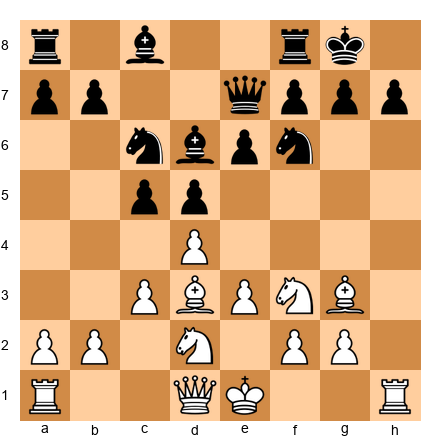

⏸ **Pause and look:** White has the complete London setup. Pawns on d4, e3, c3. Bishops on g3 and d3. Knights on f3 and d2. The king is ready to castle. Now what?

**9.O-O Bxg3 10.hxg3**

Black takes the bishop. White recaptures with the h-pawn, opening the h-file. The rook on h1 (now f1, but the h-file is open) has a clear line toward the enemy king.

**10...b6 11.Qe2 Bb7 12.e4!**

The e4 break! This is Plan 1 in action. White pushes e4, opening the center and activating the bishops.

**12...dxe4 13.Nxe4 Nxe4 14.Bxe4 Rad8 15.Rad1**

White recaptures on e4 with the knight, then the bishop recaptures on e4. Now the bishop on e4 is a monster, aiming at both sides of the board. White's rooks are centralized and active.

**15...cxd4 16.cxd4 Nb4?**

Black tries to create counterplay by jumping the knight to b4, but this loses time.

**17.Ng5! h6 18.Bh7+ Kh8 19.Qe4!**

⏸ **Pause and look:** White has a powerful attack. The bishop on h7 pins the king to the corner. The queen on e4 threatens Qxa8 and also eyes g6. The knight on g5 targets f7 and h7. All of White's pieces are coordinated in the attack.

**Opening principles demonstrated:**
- **Bf4 before e3** (correct London move order)
- **Bg3 instead of trading** (opening the h-file)
- **e4 pawn break** (Plan 1 executed perfectly)
- **Piece coordination** (bishop, queen, and knight all point at the king)

**Why this works:** White followed the London System recipe step by step. There was no need for memorized theory or brilliant sacrifices. The opening setup led naturally to a strong middlegame position. The e4 break opened the position at the right moment, and the attack played itself.

**What to remember:** Trust the London setup. Follow the plans. The attack will come.

---

### Game 5 of 5: A Pirc Defense Model Game

**"The Pirc Counterattack"**

This game fragment shows the Pirc/Modern Defense in action. Watch how Black waits patiently, lets White overextend, and then strikes back with devastating effect.

**Opening:** Pirc Defense, Classical Variation (B08)
**Result:** 0-1

**Set up your board with the starting position.**

**1.e4 d6 2.d4 Nf6 3.Nc3 g6 4.Nf3 Bg7 5.Be2 O-O**

The standard Pirc setup. Black has fianchettoed the bishop, castled, and is ready to start the counterattack.

**6.O-O c6 7.h3 Nbd7 8.Be3 Qc7**

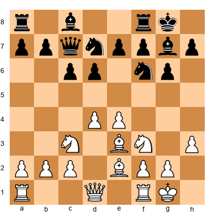

Black plays ...c6 (preparing ...d5 or ...b5), develops the knight to d7, and places the queen on c7. This is patient, solid play. Black is in no rush.

**9.Qd2 b5!**

Black expands on the queenside with ...b5. This gains space and prepares ...Bb7, developing the last minor piece.

**10.a3 Bb7 11.Bd3 a5**

The bishop reaches b7, where it pressures e4. Black also pushes ...a5 to keep the queenside active. White's center looks strong, but Black is building counterplay on both sides.

**12.Rfe1 e5!**

⏸ **Pause and look:** The central strike. Black plays ...e5, attacking White's d4 pawn directly. This is Plan 1 of the Pirc Defense in action. Black waited until fully developed, then struck at the center.

**13.dxe5 dxe5 14.Bc4 Rfd8 15.Qe2 Nc5**

After the center opens, Black's pieces come alive. The knight lands on c5, an aggressive outpost. The rooks are active. The g7 bishop breathes fire down the long diagonal.

**15...Nc5** is a strong move because the knight on c5 attacks the bishop on d3 or c4 and controls important central squares. Black's position is now at least equal and possibly better.

**Pirc principles demonstrated:**
- **Patience** (Black developed fully before striking)
- **...e5 break** (Plan 1, timed perfectly)
- **g7 bishop activated** (the long diagonal opens after ...e5)
- **Queenside expansion** (...b5, ...a5, ...Bb7 created counterplay)
- **Rubber band principle** (White had space, but Black snapped back)

**Why this works:** Black trusted the Pirc setup. Instead of panicking about White's space advantage, Black developed calmly and waited for the right moment. When ...e5 came, the whole position changed. The g7 bishop went from "looking at a wall of pawns" to "controlling the longest diagonal on the board."

**What to remember:** In the Pirc/Modern, patience is not weakness. Patience is preparation. When you strike, you strike with everything.

🛑 **You have now studied five games showing methodical play, kingside attacks, classical principles, the London System in action, and the Pirc counterattack. That is a lot of chess. Take a real break before the exercise section. Come back fresh.**

---

## Exercises

30 exercises testing your understanding of the London System and Pirc/Modern Defense. Set up each position on your board or load the FEN into a chess program. Try to solve before reading hints.

**Difficulty:** ★ = straightforward | ★★ = requires planning | ★★★ = deep combination

---

### Section A: London System Moves (Exercises 8.1 to 8.10)

**Exercise 8.1** ★
**Position:** White has played 1.d4. Black played 1...d5. White to move.

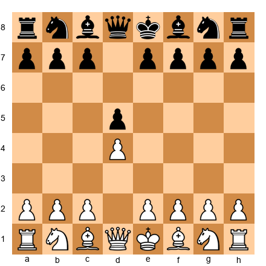

**Task:** What is the correct London System move? Choose between Bf4, e3, Nf3, or c4.
**Hint 1:** The London System's signature move comes first.
**Hint 2:** Which piece must come out BEFORE the e-pawn moves?
**Hint 3:** The dark-squared bishop needs to get outside the pawn chain.
**Solution:** **2.Bf4!** The London bishop comes out immediately. If you play e3 first, the bishop gets stuck behind the pawn. Always Bf4 before e3.

---

**Exercise 8.2** ★
**Position:** White: Kd1 area pieces after 1.d4 d5 2.Bf4. Black plays 2...Nf6. White to move.

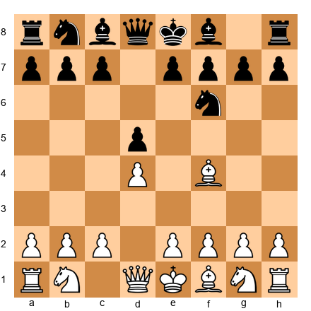

**Task:** What is White's next London System move?
**Hint 1:** Support the d4 pawn.
**Hint 2:** Open a diagonal for the light-squared bishop.
**Hint 3:** The move is e3.
**Solution:** **3.e3.** This supports d4 and opens the f1-a6 diagonal for the bishop to develop to d3. The standard London continuation.

---

**Exercise 8.3** ★
**Position:** After 1.d4 d5 2.Bf4 Nf6 3.e3 e6 4.Nf3 Bd6 5.Bg3 O-O 6.Bd3. White has played 6.Bd3. Black plays 6...c5. White to move.

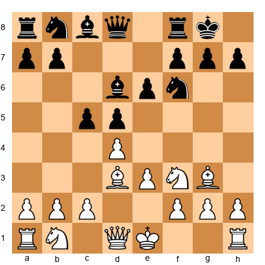

**Task:** What pawn move completes the London pawn triangle?
**Hint 1:** White needs to secure d4.
**Hint 2:** The move supports d4 and prepares Qc2 or b4.
**Hint 3:** c3 builds the pawn fortress.
**Solution:** **7.c3.** This creates the d4-e3-c3 pawn triangle. The center is solid. White can now develop Nbd2 and castle.

---

**Exercise 8.4** ★
**Position:** After 1.d4 Nf6 2.Bf4 g6 3.e3. Black plays 3...Bg7. White to move.

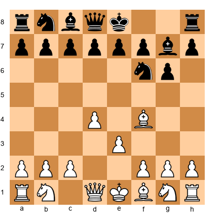

**Task:** What piece does White develop next in the London System?
**Hint 1:** A knight needs to come out.
**Hint 2:** Which knight square helps control the center and prepares castling?
**Hint 3:** Nf3 is the standard developing move.
**Solution:** **4.Nf3.** Develops a knight toward the center, controls e5 and d4, and prepares kingside castling. Standard London System development.

---

**Exercise 8.5** ★
**Position:** After 1.d4 d5 2.Bf4 Nf6 3.e3 c5 4.c3 Nc6 5.Nf3. Black plays 5...Qb6. White to move.

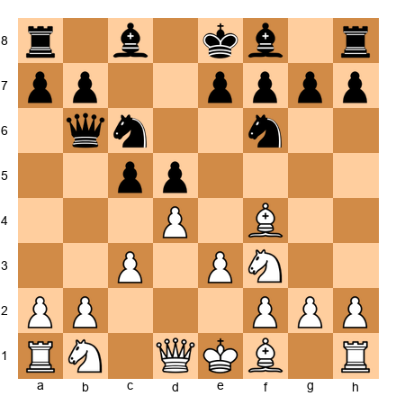

**Task:** Black threatens Qxb2. How does White continue development while handling the threat?
**Hint 1:** Develop the knight and defend b2 at the same time.
**Hint 2:** Which knight square protects the b-pawn?
**Hint 3:** Nbd2 defends b2 (the queen protects it through d2) and develops a piece.
**Solution:** **6.Nbd2!** Develops the knight and protects the b2 pawn indirectly (if ...Qxb2, Ra1 becomes active and Black's queen is trapped after Rb1). White continues with Bd3 and O-O next.

---

**Exercise 8.6** ★★
**Position:** London System middlegame. White: Kg1, Qd1, Ra1, Rf1, Bd3, Bg3, Nf3, Nd2. Pawns on a2, b2, c3, d4, e3, f2, g2, h2. Black: Kg8, Qd8, Ra8, Rf8, Bc8, Bg7, Nf6, Nc6. Pawns on a7, b7, c7, d5, e6, f7, g6, h7.

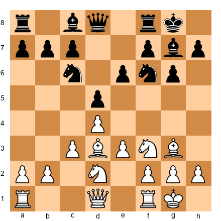

**Task:** White has a fully developed London position. What is the best plan?
**Hint 1:** White wants to open the center.
**Hint 2:** The standard London break is to push a pawn to e4.
**Hint 3:** Prepare e4 with Qe2, then Re1, then push e4.
**Solution:** **10.Qe2** preparing e4. After Qe2 and Re1, White can push e4 with full support. This is Plan 1 of the London System: the e3-e4 break. It opens the center and activates all of White's pieces.

---

**Exercise 8.7** ★★
**Position:** After 1.d4 d5 2.Bf4 Nf6 3.e3 e6 4.Nf3 Bd6 5.Bg3 Bxg3 6.hxg3. Black to move.

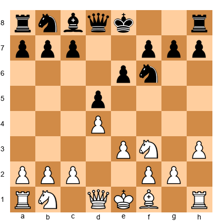

*(Note: After 6.hxg3, White has pawns on g3 and open h-file.)*

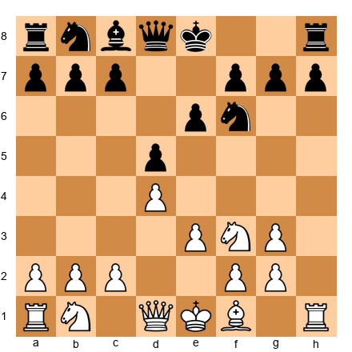

**Task:** Black traded the bishop with ...Bxg3 and White recaptured hxg3. Is this good for White or Black? Why?
**Hint 1:** Look at the h-file.
**Hint 2:** Is the h-file now open for a rook?
**Hint 3:** White's rook on h1 now has a clear path to h8. The doubled g-pawns look ugly but the open h-file is a weapon.
**Solution:** This trade **favors White.** The open h-file gives White's rook a clear attacking lane toward the enemy king. White can later play Bd3, O-O (or even leave the king on e1 temporarily to keep the h-rook active), Qe2, and launch a kingside attack using the h-file. The doubled g-pawns are a small cosmetic problem; the open file is a large strategic advantage.

---

**Exercise 8.8** ★★
**Position:** White has reached the ideal London setup. The position is solid. Black has played ...e6, ...Nf6, ...Be7, ...O-O, ...c5, ...Nc6, ...b6, ...Bb7. The center is closed.

**Task:** The queenside is becoming locked. What plan should White pursue?
**Hint 1:** When the queenside is closed, where should you attack?
**Hint 2:** Think about Plan 3: kingside attack.
**Hint 3:** Start with Qe2 or Qf3, then consider Ne5 and h3/g4.
**Solution:** White should attack on the kingside. Play **Ne5** (outpost in the center) and prepare a kingside attack with **Qf3** (or Qe2) followed by **h3** and **g4.** When the queenside is locked, the kingside is where the action happens.

---

**Exercise 8.9** ★
**Position:** After 1.d4 Nf6 2.Bf4 d5 3.e3 Bf5. Black has developed the bishop to f5. White to move.

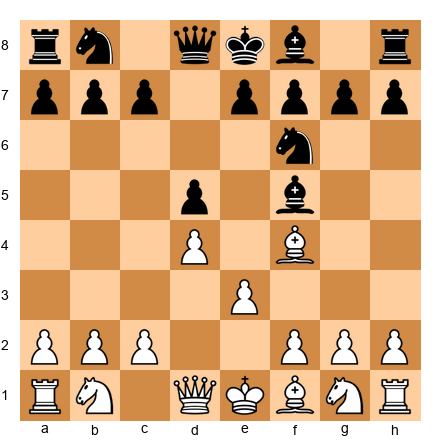

**Task:** Continue the London setup. What is White's next move?
**Hint 1:** Develop a knight.
**Hint 2:** The knight goes to its standard square.
**Hint 3:** Nf3 is always correct here.
**Solution:** **4.Nf3.** Develop the knight, control the center, prepare castling. Black's ...Bf5 does not change White's plan. Continue with Bd3 (offering a bishop trade or making Black move again), c3, Nbd2, O-O.

---

**Exercise 8.10** ★
**Position:** After 1.d4 d5 2.e3?? (mistake!) Now White wants to play Bf4 but the pawn on e3 blocks it.

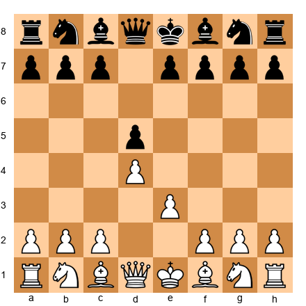

**Task:** Why is 2.e3 a mistake in the London System? What should White have played instead?
**Hint 1:** Look at the dark-squared bishop on c1.
**Hint 2:** Can it reach f4 now?
**Hint 3:** The e3 pawn blocks the bishop's path to f4.
**Solution:** After **2.e3, the bishop on c1 is locked inside the pawn chain.** It cannot reach f4 because the e3 pawn blocks it. White should have played **2.Bf4** first, developing the bishop to the active f4 square BEFORE playing e3. This is the single most important move order rule in the London System.

---

### Section B: Pirc/Modern Responses (Exercises 8.11 to 8.18)

**Exercise 8.11** ★
**Position:** White has played 1.e4. You are Black. What is the Pirc/Modern first move?

**Task:** Choose Black's first move in the Pirc/Modern Defense.
**Hint 1:** Not ...e5 (that is a different opening).
**Hint 2:** A modest pawn move that prepares the whole system.
**Hint 3:** d6 is the Pirc move.
**Solution:** **1...d6.** This prepares ...Nf6 (attacking e4), keeps the center flexible, and allows the dark-squared bishop to develop later. It is the starting move of the Pirc Defense.

---

**Exercise 8.12** ★
**Position:** After 1.e4 d6 2.d4 Nf6 3.Nc3 g6 4.Nf3. Black to move.

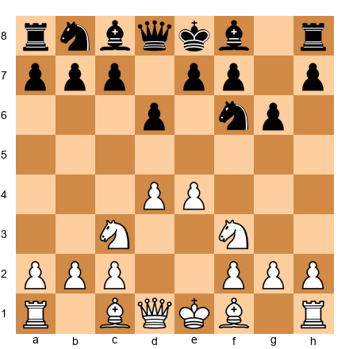

**Task:** What is Black's next move in the Pirc setup?
**Hint 1:** The dark-squared bishop needs to come out.
**Hint 2:** Where does the bishop go in the Pirc/Modern?
**Hint 3:** Bg7. Fianchetto.
**Solution:** **4...Bg7!** The bishop goes to g7, completing the fianchetto. This is the most powerful piece in the Pirc/Modern. It controls the long diagonal (a1-h8) and pressures White's center.

---

**Exercise 8.13** ★
**Position:** After 1.e4 d6 2.d4 Nf6 3.Nc3 g6 4.Nf3 Bg7 5.Be2 O-O 6.O-O. Black to move.

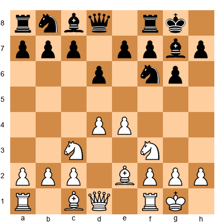

**Task:** What is a good move for Black to prepare a central counter-strike?
**Hint 1:** Think about supporting ...e5.
**Hint 2:** A knight needs to help.
**Hint 3:** Nbd7 supports ...e5.
**Solution:** **6...Nbd7.** The knight develops to d7 where it supports the coming ...e5 push. Black can also play ...c6 first (preparing ...b5 or ...d5). Both are good. The key idea is to prepare the central break.

---

**Exercise 8.14** ★★
**Position:** Pirc Defense. After 1.e4 d6 2.d4 Nf6 3.Nc3 g6 4.f4. White has played the Austrian Attack. Black to move.

**Task:** What should Black play against the Austrian Attack?
**Hint 1:** Continue with the Pirc setup. Do not panic.
**Hint 2:** Fianchetto the bishop as planned.
**Hint 3:** Bg7, then castle, then look for ...c5 or ...e5.
**Solution:** **4...Bg7.** Continue with the normal Pirc setup. After ...O-O, Black can strike back with ...c5 (targeting d4) or ...e5 (challenging the center directly). The Austrian Attack is aggressive but leaves White's king less safe (the f-pawn has moved, weakening the king's position). Black has good counter-chances.

---

**Exercise 8.15** ★★
**Position:** Pirc Defense. After 1.e4 d6 2.d4 Nf6 3.Nc3 g6 4.Nf3 Bg7 5.Be2 O-O 6.O-O Nbd7 7.e5?!

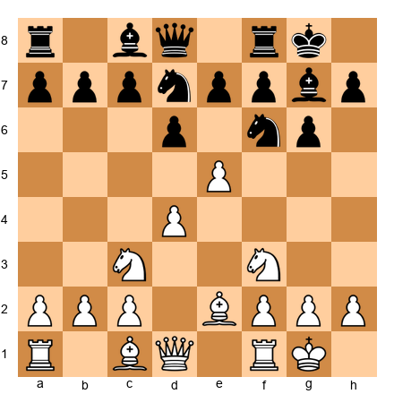

**Task:** White pushed e5 aggressively. How should Black respond?
**Hint 1:** White's e5 pawn is attacking your knight.
**Hint 2:** Take the pawn: ...dxe5.
**Hint 3:** After ...dxe5 dxe5, Black plays ...Ng4, attacking the e5 pawn and creating tactical chances. The g7 bishop becomes strong on the open diagonal.
**Solution:** **7...dxe5! 8.dxe5 Ng4.** Black opens the center and attacks the e5 pawn. The g7 bishop is now a monster on the long diagonal. White's e5 pawn is overextended and hard to defend. This is the "rubber band" in action: White pushed too far, and Black snaps back.

---

**Exercise 8.16** ★★
**Position:** Pirc Defense middlegame. Black has: Kg8, Qd8, Ra8, Rf8, Bb7, Bg7, Nf6, Nd7. Pawns on a7, b6, c6, d6, f7, g6, h7. White has the standard e4/d4 center with pieces developed.

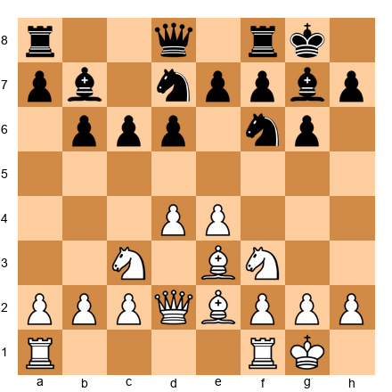

**Task:** Black is fully developed. What central break should Black play?
**Hint 1:** Both ...e5 and ...c5 are options.
**Hint 2:** With the bishop on b7 pressuring e4, which break creates more pressure?
**Hint 3:** ...e5 is the most direct challenge to White's center.
**Solution:** **9...e5!** This is the ideal moment to strike. Black is fully developed, the knight on d7 supports ...e5, and the bishop on b7 adds pressure to e4. After ...e5, the center opens and Black's pieces become very active, especially the g7 bishop.

---

**Exercise 8.17** ★
**Position:** After 1.e4 d6 2.d4 Nf6 3.Nc3 g6 4.Nf3 Bg7 5.Be2 O-O 6.O-O c6 7.a4 a5. White to move.

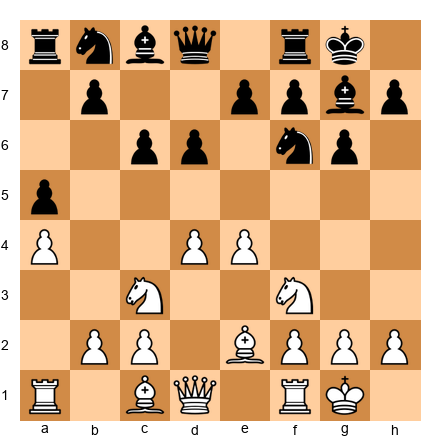

**Task:** Is Black's ...c6 and ...a5 setup reasonable? What is Black planning?
**Hint 1:** ...c6 supports the center.
**Hint 2:** ...a5 prevents b4 expansion.
**Hint 3:** Black is preparing ...b5 (if White does not play a4), or ...d5 (challenging the center), or ...Nbd7 followed by ...e5.
**Solution:** Yes, this is a reasonable Pirc setup. Black's **...c6** controls d5 and supports the center. **...a5** stops White from expanding with b4. Black's plan from here is to develop the knight to d7 and push **...e5** when ready. This is solid, patient play in the Pirc spirit.

---

**Exercise 8.18** ★★★
**Position:** Pirc Defense. Black has played the setup perfectly. White has an Austrian Attack with f4, and the position is tense.
After 1.e4 d6 2.d4 Nf6 3.Nc3 g6 4.f4 Bg7 5.Nf3 O-O 6.Bd3 Nbd7:

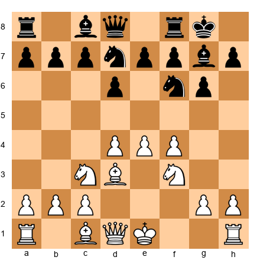

**Task:** White has not castled. How can Black exploit this?
**Hint 1:** White's king is in the center.
**Hint 2:** Opening the center is dangerous for the side that has not castled.
**Hint 3:** ...e5! opens the center immediately, punishing White for not castling.
**Solution:** **6...e5!** Opening the center while White's king is still on e1. After ...e5, White must deal with the central tension before castling. If dxe5 dxe5 fxe5, Black plays ...Ng4 with a strong attack. If White plays d5, Black gets ...c6 with counterplay. The principle: **open the center when your opponent's king is uncastled.**

---

### Section C: Find the Opening Mistake (Exercises 8.19 to 8.24)

**Exercise 8.19** ★
**Position:** After 1.d4 d5 2.e3 Nf6 3.Nf3 e6 4.Bd3 Bd6 5.O-O O-O.

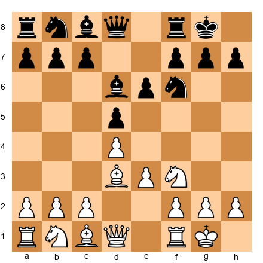

**Task:** White wanted to play the London System but made a critical move order error. What went wrong?
**Hint 1:** Look at the dark-squared bishop.
**Hint 2:** Where is it?
**Hint 3:** Still on c1. It never got to f4.
**Solution:** White played **2.e3 before Bf4.** The bishop is now trapped behind the pawn chain on c1. It has no way to reach f4. White has a solid but passive position with a "bad" dark-squared bishop stuck inside the pawn structure. The fix: always play **Bf4 before e3** in the London System.

---

**Exercise 8.20** ★
**Position:** After 1.e4 d6 2.d4 e5?!

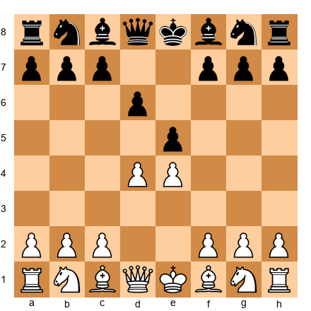

**Task:** Black played the Pirc move 1...d6 but then pushed 2...e5 immediately instead of 2...Nf6. What is wrong with this?
**Hint 1:** Look at what happens after 3.dxe5.
**Hint 2:** Can Black recapture easily?
**Hint 3:** After 3.dxe5 dxe5, Black has lost a pawn center (e5 pawn is now on e5 but was d6, and d6 is gone). More importantly, Black's queen is exposed if 3.dxe5 dxe5 4.Qxd8+ Kxd8. Black loses castling rights.
**Solution:** **2...e5?!** is premature because after **3.dxe5 dxe5 4.Qxd8+ Kxd8**, Black has lost the right to castle. The correct Pirc move order is **2...Nf6** first (developing a piece and attacking e4), then ...g6 and ...Bg7. Only push ...e5 after you are fully developed and castled.

---

**Exercise 8.21** ★★
**Position:** London System. After 1.d4 d5 2.Bf4 c5 3.e3 cxd4 4.exd4 Nc6 5.c3 Nf6 6.Bd3 Bg4 7.Nf3 e6 8.Nbd2 Bd6 9.Bxd6 Qxd6 10.O-O O-O. Black to move.

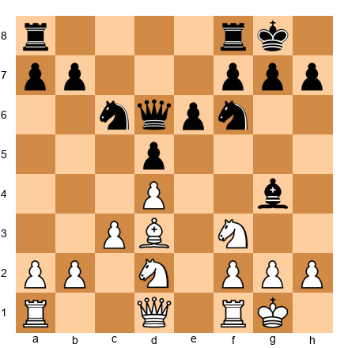

**Task:** This position looks fine for both sides, but Black made a strategic error on move 4. What was it?
**Hint 1:** Black traded pawns on d4.
**Hint 2:** What did the trade accomplish for Black?
**Hint 3:** By trading ...cxd4, Black opened the c-file but also released the tension. White's center (d4 + c3) is now very solid. Black could have kept the tension with ...Nc6 or ...Nf6 first, keeping White guessing about whether ...cxd4 is coming.
**Solution:** Black's error was **3...cxd4**, releasing the central tension too early. In the London System, White is happy to recapture with exd4 because it creates a strong pawn center (d4 + c3). Black should have kept the tension longer with **3...Nf6** or **3...Nc6**, developing pieces while keeping White uncertain about when or if the trade will happen.

---

**Exercise 8.22** ★★
**Position:** After 1.e4 d6 2.d4 Nf6 3.Nc3 g6 4.Nf3 Bg7 5.Bc4 O-O 6.O-O Bg4? 7.e5!

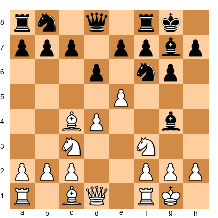

**Task:** Black played ...Bg4 and White responded with e5. Why is Black in trouble?
**Hint 1:** The knight on f6 is attacked by the e5 pawn.
**Hint 2:** Where can the knight go?
**Hint 3:** After ...dxe5 dxe5, the knight must move, and White gains time. Black developed ...Bg4 before completing the Pirc setup, and now the early e5 push punishes this.
**Solution:** Black is in trouble because **e5 attacks the knight on f6** and forces an awkward retreat. After **7...dxe5 8.dxe5 Nd5 9.Nxd5**, White has opened the center while Black is underdeveloped. The mistake was **6...Bg4?** too early. Black should have played **6...c6** or **6...Nbd7** first, following the Pirc setup. Develop your minor pieces to their standard squares before getting creative.

---

**Exercise 8.23** ★
**Position:** London System. After 1.d4 d5 2.Bf4 Nf6 3.e3 Nh5?!

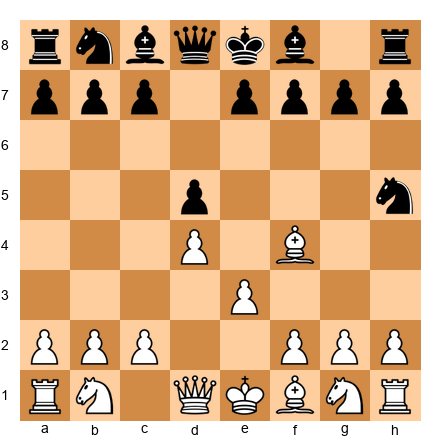

**Task:** Black played ...Nh5, attacking the London bishop. Should White be worried? What is the best response?
**Hint 1:** Where is Black's knight?
**Hint 2:** Is the edge of the board a good place for a knight?
**Hint 3:** The knight on h5 is far from the center and poorly placed.
**Solution:** White should NOT be worried. Play **4.Bg5** or **4.Be5** to keep the bishop active. The knight on h5 is on the edge of the board ("A knight on the rim is dim") and will need multiple moves to return to a useful square. Black has spent two moves (...Nf6, ...Nh5) just to try to trade one bishop. That is a waste of time. White can develop comfortably while Black's knight sits uselessly on h5.

---

**Exercise 8.24** ★★
**Position:** Pirc Defense. After 1.e4 d6 2.d4 Nf6 3.Nc3 g6 4.Nf3 Bg7 5.Be2 O-O 6.O-O e5? 7.dxe5 dxe5 8.Qxd8 Rxd8 9.Nxe5.

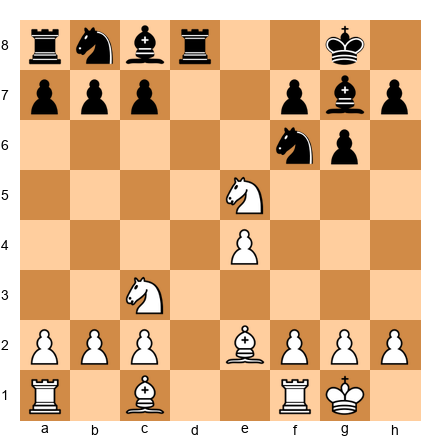

**Task:** Black pushed ...e5 too early and lost a pawn. What went wrong?
**Hint 1:** Black played ...e5 before fully developing.
**Hint 2:** After dxe5 dxe5, the d8 square was exposed for a queen trade.
**Hint 3:** After the queen trade, Nxe5 wins a pawn because Black's e5 pawn is no longer defended.
**Solution:** Black played **6...e5 too early**, before developing the queenside pieces. The correct Pirc approach is to play **6...Nbd7 first** (or 6...c6), then push ...e5 when the position is ready. The premature ...e5 allowed White to open the center, trade queens, and win a pawn with Nxe5. Remember the Pirc rule: **develop first, strike second.**

---

### Section D: Find the Plan (Exercises 8.25 to 8.30)

**Exercise 8.25** ★★
**Position:** London System middlegame. White: Kg1, Qe2, Ra1, Re1, Bd3, Bg3, Nf3, Nd2. Pawns on a2, b2, c3, d4, f2, g2, h2. The e-pawn is already gone (was traded or pushed). Black: Kg8, Qd8, Ra8, Rf8, Bc8, Bb4, Nc6, Nf6. Pawns on a7, b7, d5, e6, f7, g7, h7.

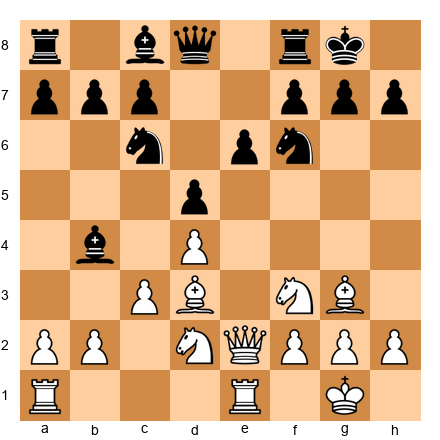

**Task:** White's London is fully set up and the queen is on e2. What is the best plan from here?
**Hint 1:** The queen on e2 supports what pawn break?
**Hint 2:** What is on e3 in a typical London? Nothing here because e-pawn already moved. But can you recreate the e4 break?
**Hint 3:** Play e4! The queen on e2 and rook on e1 both support it.
**Solution:** **12.e4!** The standard London break. With the queen on e2 and rook on e1, the e4 push is fully prepared. After ...dxe4 Nxe4, White's pieces are powerfully centralized. The bishop on d3, knight on e4, and queen on e2 all work together beautifully.

---

**Exercise 8.26** ★★
**Position:** Pirc Defense middlegame. Black has completed the setup. White has played Be3, Qd2, and is threatening Bh6, trading Black's powerful g7 bishop.

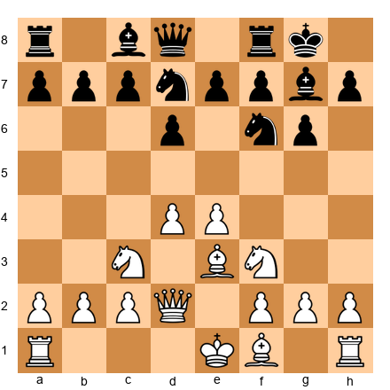

**Task:** White is threatening Bh6 to trade your g7 bishop. How do you prevent this?
**Hint 1:** If Bh6 Bxh6 Qxh6, your best piece is gone.
**Hint 2:** What move stops Bh6?
**Hint 3:** ...e5 immediately creates central tension. Or ...c6 preparing ...b5. But the direct answer to the Bh6 threat is ...Ng4, forcing the bishop to move.
**Solution:** **7...e5!** is the best response. This strikes at the center immediately, creating problems for White. After ...e5, White must deal with the central tension, and the Bh6 plan is sidelined. If 8.dxe5 dxe5, Black's position is active and the g7 bishop controls the long diagonal. Alternatively, **7...Ng4** also works tactically, hitting the Be3 and forcing a concession. The key lesson: the best defense is often a counter-attack in the center.

---

**Exercise 8.27** ★★
**Position:** London System. White has played the full setup and Black has a solid position. No immediate tactics exist. What do you do?

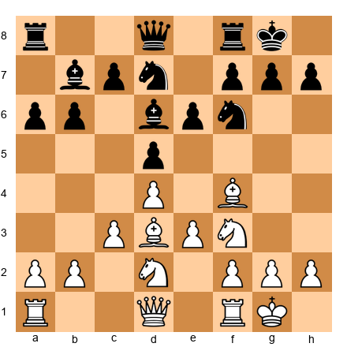

**Task:** The position is quiet. No tactics are available. What is White's plan?
**Hint 1:** Quiet positions require long-term plans.
**Hint 2:** Consider queenside expansion.
**Hint 3:** Plan 4: Push b4 and a4 to grab queenside space.
**Solution:** In this quiet position, White should pursue **queenside expansion: b4, a4, Qb3.** The center is stable, and the kingside is closed. White pushes b4 (gaining space), a4 (more space), and Qb3 (pressuring b7 and d5). This creates a space advantage on the queenside while keeping the center secure. Not every game is about attacking the king. Sometimes the right plan is to grab space and squeeze.

---

**Exercise 8.28** ★★★
**Position:** Pirc Defense. Black is in the Austrian Attack. White has pushed f4, e5, and is attacking aggressively. Black needs to find counterplay.

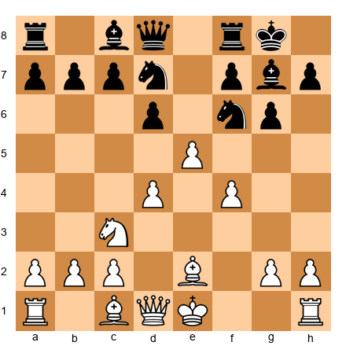

**Task:** White has pushed e5. Black needs to react. Find the best move.
**Hint 1:** The e5 pawn is advancing. Attack it.
**Hint 2:** ...dxe5 opens the center.
**Hint 3:** After ...dxe5 fxe5 (or dxe5), Black can play ...Ng4 or ...c5, creating tactical chances.
**Solution:** **7...dxe5! 8.fxe5 Nd5!** Black trades in the center and places the knight on the powerful d5 square. From d5, the knight controls many squares and cannot be easily chased. Black will follow with ...c5 to further challenge White's center. The position is now open, which favors Black's g7 bishop. This is the rubber band principle: White pushed too far, and Black's counterplay is strong.

---

**Exercise 8.29** ★★★
**Position:** London System. White has an established Ne5 outpost and strong piece placement. Black is cramped.

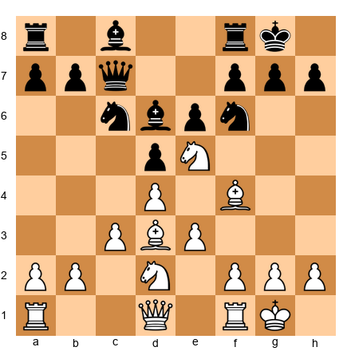

**Task:** White has a knight on e5 and all pieces well-placed. What is the best way to increase the pressure?
**Hint 1:** White has a knight on e5 and a knight on d2. Can they work together?
**Hint 2:** The knight on d2 can reroute to f3 (since the other knight left f3 for e5).
**Hint 3:** With Ndf3, White has both knights actively placed. Then consider f3 and e4 to open the center.
**Solution:** **12.Ndf3!** followed by preparing **e4.** The knight relay is complete: the d2 knight comes to f3, replacing the knight that went to e5. Now White has maximum piece activity. The plan is to push e4 (breaking open the center) when the time is right, with all pieces supporting the break. This knight relay (Nf3 to e5, Nd2 to f3) is one of the most important London System techniques.

---

**Exercise 8.30** ★★★
**Position:** Pirc Defense. Black has played the setup perfectly and is ready to execute the ...c5 break.

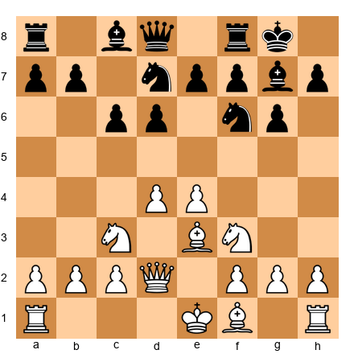

**Task:** Is now the right time for ...c5? Evaluate the position and decide.
**Hint 1:** Look at Black's development. Is everything in place?
**Hint 2:** White has not castled yet.
**Hint 3:** When your opponent has not castled, opening the center is powerful.
**Solution:** **Yes, 7...c5! is excellent here.** White has not castled, so opening the center is dangerous for White. After ...c5, if dxc5 dxc5, the center opens and White's king is exposed. If White plays d5, Black gets ...e6 with counterplay against the d5 pawn. The timing is perfect because: (1) Black is fully developed, (2) White's king is still in the center, and (3) the g7 bishop will come alive on the open long diagonal. This is the Pirc at its best: patient development followed by a perfectly timed central strike.

---

🛑 **You have completed all 30 exercises. That is serious work. If you got most of them right, you understand the London System and Pirc/Modern Defense at a deep level. If some were tricky, go back and review the relevant section. There is no rush.**

---

## Key Takeaways

1. **A repertoire gives you a plan for every game.** You need one system as White and one as Black. Stop improvising from move 1.

2. **The London System (1.d4, 2.Bf4, 3.e3, 4.Nf3, 5.Bd3, 6.Nbd2, 7.c3, 8.O-O)** gives you a solid, principled setup that works against everything Black can throw at you. Always play **Bf4 before e3.**

3. **The Pirc/Modern Defense (1...d6, 2...Nf6, 3...g6, 4...Bg7, 5...O-O)** gives you a flexible, fighting system against 1.e4. The g7 bishop is your strongest piece. Wait to be fully developed before striking with ...e5 or ...c5.

4. **Understanding beats memorization.** Learn the IDEAS behind each move (why d4? why Bf4 before e3? why Bg7? why wait for ...e5?). When you understand the plan, you can find the right move in positions you have never seen before.

5. **Both systems are scalable.** You will not outgrow them. The London and Pirc/Modern are played at the grandmaster level. They grow with you.

---

## Practice Assignment

### This Week:

1. **Play 5 games as White** using the London System. Follow the setup: 1.d4, 2.Bf4, 3.e3, 4.Nf3, 5.Bd3, 6.Nbd2, 7.c3, 8.O-O. After the setup, choose a plan (e4 break, Ne5 outpost, kingside attack, or queenside expansion) and pursue it.

2. **Play 5 games as Black against 1.e4** using the Pirc/Modern Defense. Follow the setup: 1...d6, 2...Nf6, 3...g6, 4...Bg7, 5...O-O. Wait until you are fully developed, then strike with ...e5 or ...c5.

3. **After each game, ask yourself these three questions:**
   - Did I follow the opening setup correctly?
   - Did I choose a plan and stick with it?
   - Where did I first feel unsure, and what should I have done?

4. **Write down one thing you learned** from each game. Just one sentence. After 10 games, read your notes. You will see patterns in your mistakes, and that is how you improve.

### On a Board:

Set up the London System ideal position from memory (no looking!). Then set up the Pirc/Modern ideal position from memory. If you can do both without checking, you have internalized these systems.

### With a Computer:

Load the five annotated games from this chapter into Lichess or Chess.com analysis. Play through them move by move. At each "Pause and look" point, stop and try to predict the next move before clicking.

---

## ⭐ Progress Check

Answer these questions honestly:

- [ ] Can I set up the London System from memory? (d4, Bf4, e3, Nf3, Bd3, Nbd2, c3, O-O)
- [ ] Do I understand why Bf4 must come before e3?
- [ ] Can I name at least two London System plans? (e4 break, Ne5, kingside attack, queenside expansion)
- [ ] Can I set up the Pirc/Modern Defense from memory? (d6, Nf6, g6, Bg7, O-O)
- [ ] Do I understand why the g7 bishop is so important?
- [ ] Do I know when to play ...e5 and when to play ...c5?
- [ ] Can I explain the "rubber band" principle?
- [ ] Did I solve at least 20 of the 30 exercises correctly?

**If you checked 6 or more boxes:** You are ready for Chapter 9. You have a real opening repertoire, and that puts you ahead of most players at your level.

**If you checked fewer than 6:** Review the sections you missed. Focus on the plans and ideas, not memorizing moves. Play a few more games with each system. You will get there.

**Your estimated rating after completing this chapter: 800–1000.** You now play the opening with a plan. That alone can gain you 100-200 rating points.

---

## 🛑 Rest Marker

**You have completed Chapter 8.**

This is a big one. You walked in without a repertoire, and you are walking out with three complete opening systems: the London System as White, the Pirc/Modern as Black against 1.e4, and a basic QGD against 1.d4.

That is not a small thing. Most players at your level are guessing in the opening. You are not guessing anymore. You have a plan. You have ideas. You know what your pieces want to do and why.

Go play some games. Feel the difference. When you sit down and play 1.d4, Bf4, e3 with confidence, you will know this chapter did its job.

Come back for Chapter 9 with fresh eyes and a full heart. The journey continues.

*"Chess is like a language. The opening is saying hello. Now you know how to introduce yourself."*

💙♟
