# Chapter 9: Basic Pawn Endgames: Opposition, Key Squares, Rule of the Square

**Volume I: Foundations | Rating Range: Beginner (600--1000)**

---

> *"In order to improve your game, you must study the endgame before everything else; for whereas the endings can be studied and mastered by themselves, the middle game and the opening must be studied in relation to the endgame."*
> -- José Raúl Capablanca, Third World Chess Champion

---

## What You'll Learn

- Why studying endgames FIRST is the fastest path to improvement
- How to win with King and Pawn against a lone King using **key squares**
- How **opposition** works and why the player who does NOT have to move holds the advantage
- How the **Rule of the Square** lets you instantly see whether a king can catch a runaway pawn
- How **pawn breakthroughs** let you sacrifice one pawn to promote another
- What **passed pawns**, **connected passed pawns**, and **outside passed pawns** are and why they win games
- The technique to convert a won pawn endgame into a new queen on the board

Pawn endgames are where chess becomes pure logic. No tricks. No flashy sacrifices. Just your king, your pawns, and your ability to calculate. If you master the patterns in this chapter, you will win dozens of games that other players at your level would draw or even lose. You will also learn to recognize when a trade of pieces leads to a winning pawn endgame, which gives you a powerful weapon in the middlegame.

Take your time with this chapter. Set up every position on your board. Move the pieces with your hands. Pawn endgames reward patience, and the knowledge you build here will last your entire chess career.

---

## Part 1: Why Study Endgames First?

Many chess teachers start with openings. They hand you a stack of variations to memorize. They show you the Italian Game, the Sicilian Defense, the Queen's Gambit. You memorize ten moves deep, play your opening perfectly, and then have no idea what to do when the smoke clears and you are left with a king and four pawns against a king and three pawns.

We take a different approach. **We start with endgames.** Here is why.

### Reason 1: Fewer Pieces, Clearer Logic

When you have a full board of 32 pieces, the possibilities are overwhelming. But strip the position down to a king, a pawn, and the opponent's king, and suddenly you can SEE the logic of chess. You can trace every variation. You can understand WHY a move works, not just memorize THAT it works.

Endgames teach you how pieces actually behave. You learn that the king is a fighting piece, not a coward hiding behind pawns. You learn that a single pawn can be worth more than life itself if it reaches the other side of the board. These lessons change how you think about the entire game.

### Reason 2: Endgame Knowledge Powers Your Middlegame

If you know that trading all the pieces leads to a won pawn endgame for you, then you know exactly what to do in the middlegame: trade everything. If you know that a particular pawn structure gives your opponent an outside passed pawn, you avoid that structure. Endgame knowledge tells you WHICH trades to make, WHICH pawns to keep, and WHICH positions to aim for.

A player who understands endgames sees the whole game differently. While your opponent is guessing, you are steering toward positions you already know how to win.

### Reason 3: Capablanca Told Us So

José Raúl Capablanca was the Third World Chess Champion and one of the most naturally gifted players in history. He lost only 34 serious games in his entire career. His endgame technique was considered the finest ever seen. And his advice was simple and clear: study the endgame before everything else.

He was right. The endgame is where theory meets practice. Where knowledge beats talent. Where the player who has done the work wins the game.

### Reason 4: Pawn Endgames Are Pure Calculation

In pawn endgames, there are no pieces to calculate complicated tactics with. No bishops firing across the board. No knights jumping to unexpected squares. Just kings and pawns. This means pawn endgames are decided by pure KNOWLEDGE and CALCULATION. If you know the patterns, you win. If you do not, you lose. There is no luck, no chaos, no bluffing. Just chess in its purest form.

That is why we start here. Learn these patterns, and you build a foundation that supports everything else.

🛑 **Good stopping point.** This was the "why." Now we get into the "how." Come back with your board ready.

---

## Part 2: King and Pawn vs. King (The Most Important Endgame in Chess)

This is it. The single most important endgame you will ever study. King and one pawn against a lone king. Can you promote that pawn to a queen? Or will the enemy king park itself in front of the pawn and stop it dead?

This position appears in HUNDREDS of your games. Every time you trade down to a single pawn advantage, you need to know the answer. Every time your opponent has one last pawn and you need to stop it, you need to know the answer. Get this right, and you win games you had no business winning. Get it wrong, and you throw away games you should have won.

Let us start with the most basic question: what happens when a pawn tries to walk to the other side of the board?

### The Pawn's Journey

A pawn starts its life on the second rank (for White) or the seventh rank (for Black). It wants to march all the way to the other side. If it reaches the eighth rank (for White) or the first rank (for Black), it promotes to a queen. A new queen on the board almost always means victory.

But the pawn cannot do this alone. It moves only one square at a time (after its optional two-square first move), and it cannot capture forward. If the enemy king stands in its path, the pawn is stuck. The pawn needs its own king to help clear the way.

This is the central drama of K+P vs K: your king fights the enemy king for control of the squares in front of the pawn, while the pawn inches forward behind its protector.

### The Two Outcomes

Every K+P vs K position has one of two outcomes:

1. **The pawn promotes.** Your king clears the path, the pawn marches through, becomes a queen, and you win.
2. **The pawn is stopped.** The enemy king blocks the pawn, your king cannot push it aside, and the game is drawn.

How do you tell which outcome will happen? That is what key squares and opposition are for.

---

## Part 3: Key Squares

Every pawn on the board has a set of **key squares** (some books call them "critical squares"). These are the magic squares for your king. If your king reaches one of these squares, the pawn WILL promote, no matter what the defender does.

Think of key squares as the finish line for your king, not your pawn. The pawn's finish line is the eighth rank. But the king's finish line is the key squares. Once your king crosses that line, the game is won.

### Key Squares for a Pawn on the 5th Rank

When your pawn is on the 5th rank, the key squares are the **three squares that are two ranks ahead of the pawn.**

**Set up your board:** Place a White pawn on e5. The key squares are d7, e7, and f7. These are the three squares on the 7th rank directly ahead of and beside the pawn.

```

```

If the White king can reach d7, e7, or f7, the pawn promotes. Period. No matter where the Black king is, no matter whose turn it is, the pawn will get through.

### Key Squares for a Pawn on the 2nd, 3rd, or 4th Rank

When your pawn is on the 2nd, 3rd, or 4th rank, the key squares are the **three squares that are one rank ahead of the pawn.** But there is a catch: for pawns this far back, the key squares are actually TWO ranks ahead of the pawn.

Let me be precise. For any pawn that has NOT yet reached the 5th rank, the key squares are the three squares on the **6th rank** (for a White pawn) in the same neighborhood as the pawn.

**Set up your board:** Place a White pawn on e4. The key squares are d6, e6, and f6.

```

```

**Set up your board:** Place a White pawn on e2. The key squares are STILL d6, e6, and f6. It does not matter where the pawn starts. For pawns on ranks 2 through 4, the key squares are always on the 6th rank.

```

```

### Why Do Key Squares Work?

When your king reaches a key square, it controls the critical squares in front of the pawn. The enemy king cannot block the pawn's path because your king is in the way. Your pawn marches up the board behind your king, and the enemy king gets shoved aside.

**Set up your board:** White king on e6, White pawn on e4, Black king on d8. White to move.

```

```

The White king is on e6, one of the key squares. Watch what happens:

1.e5 Ke8 2.Kd6! (maintaining control) Kd8 3.e6 Ke8 4.e7 Kf7 5.Kd7 and the pawn promotes on the next move.

The White king arrived at the key square FIRST. That made all the difference. The pawn walked right through.

### When the King Cannot Reach a Key Square

**Set up your board:** White king on e4, White pawn on e5, Black king on e7. Black to move.

```

```

Here the White king is NOT on a key square. It is behind the pawn. The Black king stands directly in the pawn's path. Let us see what happens:

1...Ke6! (Black blocks the pawn) 2.Kd4 Kd7! 3.Kd5 Ke7 4.e6 Ke8! 5.Kd6 Kd8 6.e7+ Ke8 7.Ke6 stalemate! The game is drawn.

Even though White had a pawn, the king could not reach a key square. The Black king held its ground, and the game ended in stalemate.

**The lesson:** It is not enough to have an extra pawn. Your king must reach a key square to win. If the enemy king blocks the key squares, the game may be drawn.

### Key Square Summary Table

| Pawn on Rank | Key Squares |
|:---:|:---:|
| 2nd rank (e.g., e2) | d6, e6, f6 |
| 3rd rank (e.g., e3) | d6, e6, f6 |
| 4th rank (e.g., e4) | d6, e6, f6 |
| 5th rank (e.g., e5) | d7, e7, f7 |
| 6th rank (e.g., e6) | d8, e8, f8 |

The pattern: for pawns on ranks 2--4, the key squares sit on the 6th rank. For pawns on the 5th rank, they jump to the 7th rank. For a pawn on the 6th rank, they are on the 8th rank (the promotion rank itself).

### The Rook Pawn Exception

There is one important exception. **A rook pawn (a-pawn or h-pawn) cannot win if the defending king reaches the corner.**

**Set up your board:** White king on b6, White pawn on a5, Black king on a8.

```

```

White plays a6, and Black plays Kb8. White plays a7, and Black plays Ka8. White must play either Ka6 (stalemate) or Kc7, letting Black play Kxa7. Either way, it is a draw.

The rook pawn fails because the board's edge acts like a wall. The White king cannot get around the Black king because there are no squares to the left of the a-file. Remember this: **rook pawns are tricky. When the defending king reaches the corner, the extra pawn often cannot win.**

🛑 **Rest here if you need to.** Key squares are a big concept. Let it settle, then come back for opposition.

---

## Part 4: Opposition

Opposition is one of the most beautiful concepts in chess. It is simple to understand but takes practice to use well. And once you understand it, you will see it everywhere.

### What Is Opposition?

**Opposition means the two kings face each other with exactly one square between them.** They can be on the same file (vertical opposition), the same rank (horizontal opposition), or even the same diagonal.

The critical rule: **The player who does NOT have to move has the opposition.**

Why? Because the player who MUST move has to step aside. Their king must leave the line, giving the other king access to the squares that were blocked.

Think of it like a standoff. Two kings stare each other down across one square. Whoever blinks first (moves first) loses the staring contest and has to step aside.

### Direct Opposition

Direct opposition is the most common type. The kings face each other on the same file or rank with exactly one empty square between them.

**Set up your board:** White king on e4, Black king on e6. One empty square (e5) between them.

```

```

If it is **White to move**, Black has the opposition. White must step aside: Kd4, Kf4, Kd5, or Kf5. No matter which way White goes, Black can maintain the block.

If it is **Black to move**, White has the opposition. Black must step aside, and White's king advances.

### Why Opposition Matters in K+P vs K

Opposition determines whether the stronger side's king can reach a key square.

**Set up your board:** White king on e4, White pawn on e3, Black king on e6. White to move.

```

```

White to move. Black has the opposition (kings face each other, Black does not have to move). What should White do?

If White plays Kd5, Black plays Kd7 (maintaining opposition). If White plays Kf5, Black plays Kf7. Black mirrors White's king and keeps it away from the key squares. If White pushes the pawn (e4), Black plays Ke5 and stands right in front of the pawn.

**This position is drawn.** White cannot break through because Black has the opposition.

Now change one thing. Same position, but **Black to move.**

```

```

Now White has the opposition. Black must step aside.

1...Kd6 2.Kf5! (White sidesteps and advances) 2...Ke7 3.Ke5 (White reclaims the center) 3...Kd7 4.Kf6! (heading for a key square) 4...Ke8 5.Ke6 (key square reached!) and the pawn will promote.

Or if Black tries: 1...Kf6 2.Kd5! Ke7 3.Ke5 Kd7 4.Kf6 Ke8 5.Ke6 and again White reaches a key square.

**Same position. Same pieces. Same pawn. The only difference is who has to move. That changes the result from a draw to a win.** That is the power of opposition.

### The Opposition Rule

Here is the rule in simple words:

**When the two kings face each other with one empty square between them, the player who does NOT have to move has the opposition. Having the opposition usually means your king will advance, because the other king must step aside.**

In K+P vs K:
- If the attacking king has the opposition, it can reach a key square. The pawn promotes. **Win.**
- If the defending king has the opposition, it can block the key squares. **Draw.**

### How to Take the Opposition

Sometimes you can maneuver your king to TAKE the opposition. The trick is to move your king so that both kings end up facing each other with one square between them, and it is your OPPONENT's turn to move.

**Set up your board:** White king on d4, White pawn on e3, Black king on d7. White to move.

```

```

White plays 1.Kd5! Now the kings face each other on the d-file with one square (d6) between them. It is Black's turn. Black has to step aside. White has the opposition.

1...Ke7 2.Ke5! (opposition again on the e-file!) 2...Kd7 3.Kf6! (sidestepping toward the key squares). White is winning.

The technique: advance your king toward the enemy king and try to arrive so that they face each other on your opponent's move.

### Distant Opposition (A Preview)

There is a more advanced concept called **distant opposition.** This is when the two kings are on the same line but separated by 3 or 5 squares (an odd number). The player NOT to move still has the advantage. Distant opposition can be converted into direct opposition through careful maneuvering.

We will not go deep into distant opposition in this chapter. For now, just know it exists. When you reach the 1200+ range, you will study it in detail. For now, mastering direct opposition gives you a massive advantage over nearly every opponent at your level.

🛑 **Rest here.** Opposition is subtle. Go back and set up each position again. Move the pieces. Switch sides. See what happens when Black has the opposition vs. when White has it. Feel the difference in your hands.

---

## Part 5: The Rule of the Square

Here is a situation that comes up all the time: your opponent has a passed pawn racing toward promotion, and your king is the only piece that can stop it. Will your king get there in time?

You could calculate move by move: the pawn goes here, then here, then here, and my king goes here, here, here, here... That is five or six moves of calculation. Under time pressure, with the clock ticking, that is a lot to work out.

Or you could use the **Rule of the Square** and know the answer instantly.

### How the Rule of the Square Works

Imagine the pawn is about to run. Draw an imaginary square from the pawn to its promotion square, extending sideways by the same number of squares.

Here is the method:

1. Count how many squares the pawn needs to reach the promotion rank. Include the square the pawn is on.
2. Draw a square using that number of squares on each side, with one corner on the pawn and one corner on the promotion square.
3. If the defending king can step INTO the square on its turn, the king catches the pawn.
4. If the defending king is OUTSIDE the square and cannot enter it, the pawn promotes.

That is it. No calculation needed. Just draw the square and check.

### Example 1: The King Catches the Pawn

**Set up your board:** White pawn on a5 (no White king needed for this exercise). Black king on e7. It is Black's move.

```

```

The pawn is on a5 and wants to reach a8. That is 3 squares (a5 to a6 to a7 to a8). Draw a square: a5-a8-d8-d5. This is a 4x4 square (from a5 to d5 along the 5th rank, and from a5 to a8 along the a-file).

The Black king is on e7. Can it step into the square? The square's boundary on the 7th rank goes from a7 to d7. The king is on e7, which is ONE square outside the boundary. But it is Black's move! Black plays 1...Kd7 or 1...Kd6, stepping into the square.

Once the king is inside the square, it will catch the pawn. The king can always move diagonally toward the pawn's path and arrive in time.

**Result: Black catches the pawn. Draw.**

### Example 2: The Pawn Escapes

**Set up your board:** White pawn on a5. Black king on f7. It is White's move.

```

```

Same square: a5-a8-d8-d5. The Black king is on f7, well outside the square. White pushes 1.a6. Now redraw the square for a pawn on a6: a6-a8-c8-c6. The Black king plays 1...Ke6, but that is still outside the new square. The pawn is faster.

White plays 2.a7. The square shrinks: a7-a8-b8-b7. The Black king is nowhere near it. 3.a8=Q. The pawn promotes.

**Result: The pawn promotes. White wins.**

### Example 3: Watch Out for the First Move

**Set up your board:** White pawn on b2. Black king on h8. White to move.

```

```

The pawn is on b2 and wants to reach b8. That is 6 squares. Draw the square: b2-b8-h8-h2. The Black king is on h8, which is RIGHT on the corner of the square.

But wait. It is White's move. White plays 1.b4 (the pawn can advance two squares from its starting position). Now the pawn is on b4, and the square is b4-b8-f8-f4. The Black king is on h8, OUTSIDE the new square.

The two-square first move changes everything. **When a pawn is still on its starting rank, it gets a "bonus" square of distance because of the two-square advance.** The Rule of the Square still works, but you must account for the first move being worth two squares instead of one.

**Practical tip:** When the pawn is on rank 2 (or rank 7 for Black), draw the square as if the pawn is one square further advanced. That accounts for the two-square first move.

### When the Rule Does NOT Work

The Rule of the Square assumes the pawn's path is clear. If there are pieces blocking the pawn's advance, or if the defending king has pieces helping it, the rule does not apply. It also does not account for checks, captures, or other tactics along the way.

Use the Rule of the Square for clean races between a pawn and a king. For positions with extra pieces on the board, you will need to calculate.

### Practice the Rule

Set up random positions with one pawn and one king (on opposite sides). Draw the square. Check if the king is inside or outside. Then play it out move by move to verify. Do this ten times, and the Rule of the Square will become automatic.

🛑 **Rest here.** The Rule of the Square is a tool you will use for the rest of your chess life. Practice it until it is instant.

---

## Part 6: Pawn Breakthroughs

Sometimes you face a position where your pawns seem blocked. Your opponent's pawns stand in the way, and neither side can advance. It looks like a dead draw.

But hidden inside some of these positions is a beautiful pattern called a **pawn breakthrough.** By sacrificing one pawn, you create a path for another pawn to sprint to the promotion square. The defender cannot stop both pawns at once, and one of them gets through.

Pawn breakthroughs are one of the most satisfying patterns in chess. They feel like magic the first time you see them.

### The Classic Three vs. Three Breakthrough

**Set up your board:** White pawns on a5, b5, c5. Black pawns on a7, b7, c7. No kings on the board yet (we will add them later). White to move.

```

```

(Place the Black king on c7 and the White king on e1 for a legal position, but focus on the pawns.)

Look at this position. Three White pawns vs. three Black pawns. Everything seems blocked. If White pushes a6, Black plays bxa6 and stops everything. Same with c6.

But watch this:

**1.b6!**

This is the breakthrough move. White sacrifices the b-pawn. Now Black has to choose:

**Option A: 1...axb6**
If Black captures with the a-pawn, White plays **2.c6!** Now if 2...bxc6, White plays 3.a6 and the a-pawn is a passed pawn that cannot be stopped. If 2...b6, White plays 3.c7 and the c-pawn promotes.

**Option B: 1...cxb6**
If Black captures with the c-pawn, White plays **2.a6!** Now if 2...bxa6, White plays 3.c6 and the c-pawn promotes. If 2...b6, then 3.a7 and the a-pawn promotes.

**Option C: 1...b6**
If Black pushes the b-pawn instead of capturing, White plays **2.c6!** Now 2...axb6 3.c7 promotes, or 2...a6 3.bxa6 and a6 will promote.

No matter what Black does, one of White's pawns gets through. The sacrifice of the b-pawn creates two passed pawns, and Black cannot stop both.

**This is the pawn breakthrough.** Sacrifice one, promote another. It is beautiful, logical, and completely forcing.

### Counting Tempi

A **tempo** (plural: tempi) is one move, one unit of time. In pawn races, counting tempi tells you who gets there first.

When two pawns are racing to promote, count the moves each pawn needs:

- White pawn on a5 needs 3 moves to reach a8 (a5-a6-a7-a8).
- Black pawn on h4 needs 4 moves to reach h1 (h4-h3-h2-h1).

White gets there first by one tempo. That means White promotes first, gets a queen, and uses it to stop Black's pawn or deliver checkmate.

**Counting tempi is essential in all pawn races.** When both sides have passed pawns running toward promotion, the player who gets there first usually wins. Count the moves. One tempo can be the difference between winning and losing.

### Breakthrough Conditions

Not every pawn formation allows a breakthrough. The classic breakthrough works when:

1. You have three connected pawns on the 5th rank.
2. Your opponent has three pawns on the 7th rank blocking yours.
3. No kings are close enough to interfere.

If the kings are involved, the position becomes more complex. But the idea remains the same: sacrifice one pawn to create two passers.

Look for breakthrough possibilities whenever you have three or more connected pawns facing your opponent's pawns. The pattern might be hiding in positions you thought were drawn.

🛑 **Rest here.** The breakthrough is a powerful concept. Set up the 3 vs. 3 position and play through all three options until you can do it without looking at the page.

---

## Part 7: Passed Pawns

A **passed pawn** is a pawn with no enemy pawns blocking it or able to capture it on adjacent files. In other words, the pawn has a clear road to the promotion square. No enemy pawn stands in its way on the same file, and no enemy pawn can attack it from a neighboring file.

Passed pawns are the most important pawns on the board. The great teacher Aron Nimzowitsch put it perfectly: **"A passed pawn is a criminal that must be watched by the police."** The "police" are your opponent's pieces. If they stop watching the passed pawn for even one moment, it runs to the promotion square and becomes a queen.

### How to Recognize a Passed Pawn

**Set up your board:** White pawns on a2, d5, f2. Black pawns on a7, e6, g7.

```

```

Look at the White pawn on d5. Is it a passed pawn?

- Is there a Black pawn on the d-file ahead of it? No.
- Is there a Black pawn on the c-file that could capture it? No.
- Is there a Black pawn on the e-file that could capture it? Yes. The Black pawn on e6 captures diagonally forward (toward rank 1) to d5 or f5. So the Black pawn on e6 CAN capture the White pawn on d5.

That means the White d5 pawn is NOT a passed pawn. There is a Black pawn on an adjacent file (e6) that can capture it.

Here is a clean example.

**Set up your board:** White pawns on a2, d5, f2. Black pawns on a7, b6, g7.

```

```

Now look at the White pawn on d5. No Black pawns on the c, d, or e files can stop it or capture it. The d5 pawn is a **passed pawn.** It has a clear road to d8.

### Connected Passed Pawns

**Connected passed pawns** are two passed pawns on adjacent files. They protect each other as they advance. One pawn covers the square the other needs to reach. This makes them extremely powerful and very difficult to stop.

**Set up your board:** White pawns on c5 and d5. No Black pawns on the b, c, d, or e files.

```

```

These two pawns support each other. If you play d6, the c5 pawn covers d6 from behind. If you play c6, the d5 pawn covers c6. The defending king cannot capture one without letting the other advance. Connected passed pawns on the 5th rank or beyond are often unstoppable, even without help from the king.

The saying is: **"Connected passed pawns on the 6th rank beat a rook."** That is how powerful they are.

### Protected Passed Pawn

A **protected passed pawn** is a passed pawn that is defended by another pawn. This pawn is especially strong because the opponent cannot simply capture it. The defending side must commit a piece to blockading it (standing in front of it to prevent its advance).

**Set up your board:** White pawns on c4 and d5. Black pawn on e6.

```

```

In the previous example, the e6 pawn could capture d5, so the d5 pawn was not truly passed. Here is a cleaner example.

**Set up your board:** White pawns on c4 and d5. No Black pawns nearby.

```

```

The d5 pawn is passed (no Black pawns on the c, d, or e files can stop it). The c4 pawn defends d5: if the opponent captures on d5, the c4 pawn recaptures. That is what makes it a "protected" passed pawn.

The key idea: a protected passed pawn ties down the opponent. They must keep a piece watching it at all times, which limits their options everywhere else on the board.

### The Endgame Plan With Passed Pawns

Here is the basic plan when you have a passed pawn in a king and pawn endgame:

1. **Create a passed pawn** (through captures, breakthroughs, or pawn advances).
2. **Advance the passed pawn** toward the promotion square.
3. **Support it with your king.** The king walks alongside the pawn, clearing the path.
4. **Promote and win.** A new queen usually decides the game.

If the opponent must use their king to stop your passed pawn, your king is free to attack their pawns on the other side of the board. This leads us to the next concept: the outside passed pawn.

🛑 **Rest here.** Passed pawns are the engine of winning endgames. Make sure you can spot them before moving on.

---

## Part 8: Outside Passed Pawns

An **outside passed pawn** is a passed pawn that is far away from the main group of pawns. It is on the "outside" of the position, away from the action.

Why is this valuable? Because the outside passed pawn acts as a **decoy.** When you push it toward promotion, the enemy king MUST leave the main battleground to stop it. While the enemy king runs across the board to deal with your outside passed pawn, YOUR king is free to gobble up the undefended enemy pawns.

It is a classic chess trick: threaten over HERE so you can win over THERE.

### Classic Outside Passed Pawn Example

**Set up your board:** White king on e4, White pawns on a4, f2, g2. Black king on e6, Black pawns on f7, g7. White to move.

```

```

White has an outside passed pawn on a4. Both sides have two kingside pawns. The plan:

1. **Push the a-pawn.** White plays a5, a6, a7.
2. **The Black king must chase it.** Black has to run to the queenside to stop the a-pawn from promoting.
3. **The White king attacks the kingside pawns.** While the Black king is busy on the queenside, the White king marches to f7 and g7 and captures Black's pawns.
4. **White wins.** The White king eats the kingside pawns and then promotes one of its own kingside pawns (or helps the a-pawn promote if the Black king gives up the chase).

This is the power of the outside passed pawn: it draws the enemy king away from the main front, letting your king dominate.

### How to Create an Outside Passed Pawn

Sometimes the outside passed pawn does not exist yet. You need to create it. Here are common methods:

1. **Trade pawns until one side is left with a pawn on the wing.** If you have pawns on both sides of the board and your opponent only has pawns on one side, you can create a passed pawn on the side where your opponent has no pawns.

2. **Sacrifice a pawn to create a passer.** Just like the breakthrough pattern, sometimes sacrificing a pawn leaves you with a dangerous outside passed pawn.

3. **Advance a pawn that your opponent must capture, leaving your other pawn as a passer.** The exact mechanism depends on the position, but the principle is: use pawn exchanges to create a distant passed pawn.

### The Decoy Principle

Here is the key strategic idea. In a king and pawn endgame, the king is the strongest piece. Whoever's king is more active (closer to the action, controlling more squares) has the advantage. The outside passed pawn forces the enemy king to become PASSIVE (running to stop the pawn), while YOUR king becomes ACTIVE (attacking the remaining pawns).

This is one of the most important endgame concepts for beginners to understand. Look for opportunities to create an outside passed pawn whenever you enter a pawn endgame.

🛑 **Rest here.** You have now learned all the major concepts in basic pawn endgames. The next sections bring everything together with real games and exercises.

---

## Part 9: Annotated Games and Demonstrations

### Game 16: Capablanca vs. Bernstein, Moscow 1914

This game shows how a world-class player simplifies into a winning pawn endgame. Capablanca trades pieces at exactly the right moment, enters a pawn endgame with a structural advantage, and converts with clean technique. Watch how he uses every concept from this chapter: opposition, key squares, and the power of a passed pawn.

**Set up your board with the starting position.**

**White:** José Raúl Capablanca
**Black:** Ossip Bernstein
**Event:** Moscow 1914
**Result:** 1-0

We join the game at the critical moment where Capablanca steers into the endgame.

**Teaching Position (from the game, simplified for instruction):**

Rather than show the full opening and middlegame (which involve concepts beyond this chapter's scope), let us study the endgame position that arose.

**Set up your board:** White king on d4, White pawns on a2, b3, c4, f4, g3, h2. Black king on d6, Black pawns on a7, b6, c5, f5, g6, h7. White to move.

```

```

**Understanding the position:**

Count the pawns: six vs. six. Material is equal. But look closer. Black's pawn on c5 is fixed (it cannot advance because White's pawn on c4 blocks it). White has a potential outside passed pawn on the a-file if the b-pawns are exchanged. And White's king is more active, sitting in the center with options to go to either side.

Capablanca's plan is clear:

1. Create an outside passed pawn on the queenside.
2. Force the Black king to chase it.
3. Break through on the kingside with the White king.

**1.a4!**

Capablanca starts by advancing the a-pawn. This prepares a4-a5, which will challenge Black's b6 pawn. If Black exchanges on a5, White recaptures with bxa5, and then White can create a passed pawn on the a-file.

**1...Ke6**

Black brings the king toward the center, but Capablanca is already a step ahead.

**2.a5!**

Pushing forward. Black must react.

**2...bxa5**

Black captures. Now the pawn structure on the queenside has changed.

**3.b4!**

This is the key move. White offers an exchange of pawns. If 3...cxb4, then White plays 4.c5, and the c-pawn becomes a dangerous passed pawn. If 3...axb4, then 4.c5+ and the c-pawn charges forward.

**3...cxb4**

**4.c5!**

Now White has a passed pawn on c5. This pawn is the "criminal" that Black's king must watch. It will march to c6, c7, c8 if unattended.

**4...Kd7 5.Kd5!**

Capablanca's king takes the opposition (well, it takes the central key squares). The White king controls the critical squares in front of the c-pawn.

**5...Kc7 6.Ke6**

White ignores the queenside for a moment and switches to attack the kingside! This is the outside passed pawn concept in reverse: the c5 pawn already forces Black's king to stay near the queenside. White's king goes east to eat pawns.

**6...Kxc5**

Black finally takes the c-pawn, but now the White king is deep in Black's territory.

**7.Kxf5 Kd4 8.Kxg6 Ke3 9.Kxh7**

White has captured three kingside pawns. Now White's f and g pawns will race to promote, and Black's a and b pawns cannot keep up.

This game illustrates the complete process: create a structural advantage, simplify into a pawn endgame, use the outside passed pawn as a decoy, and then win on the other side of the board.

**Key lessons from this game:**
- Trade pieces when you have a structural advantage in the endgame.
- Use a passed pawn (or the threat of one) to tie down the enemy king.
- Attack on the opposite side of the board from where the enemy king is busy.
- Capablanca's endgame technique is a model to follow: simple, logical, and devastating.

---

### Demonstration 2: The Rule of the Square in Action

This is a composed teaching position that shows how the Rule of the Square decides the game.

**Set up your board:** White king on h1, White pawn on a2. Black king on g8. White to move.

```

```

White's plan: push the a-pawn. Can the Black king catch it?

**Step 1: Draw the square.**

The pawn is on a2. It wants to reach a8. That is 6 squares. But the pawn gets a two-square first move, so count it as effectively being on a3. From a3 to a8 is 5 squares. The square is: a3-a8-f8-f3.

The Black king is on g8. Is it inside the square? The boundary runs from a8 to f8 along the 8th rank. The king is on g8, which is OUTSIDE the square (one square beyond f8).

**But it is White's move.** White plays 1.a4. Now the pawn is on a4. Redraw: a4-a8-e8-e4. Black plays 1...Kf7. Is the king inside? The boundary on the 7th rank runs from a7 to e7. The king is on f7, OUTSIDE the square.

White plays 2.a5. The pawn keeps running. Black plays 2...Ke6. Square from a5: a5-a8-d8-d5. King on e6 is outside. The pawn is going to promote.

3.a6 Kd7 (the a6 square is a6-a8-c8-c6; the king on d7 is outside it). The pawn promotes.

3...Kd6 4.a7 Kc7 5.a8=Q. The pawn promotes.

**The Black king was too far away.** The Rule of the Square showed this instantly at the start. No need to calculate all five moves.

**Now change the Black king's starting square.**

**Set up your board:** White king on h1, White pawn on a2. Black king on f7. White to move.

```

```

Same pawn, same White king. But the Black king is on f7 instead of g8.

Draw the square from a2 (with the first-move bonus, treat it as a3): a3-a8-f8-f3. The king is on f7. Is f7 inside the square? The square goes from f3 to f8 along the f-file. Yes! f7 is inside.

Even after 1.a4, the king enters the square. Black plays 1...Ke6, and the king is clearly inside the new square. The king will catch the pawn.

**Result: Draw.**

The difference between f7 and g8 is one square. One square decided the entire game. That is why the Rule of the Square is so valuable: it catches these close calls instantly.

---

### Demonstration 3: The Pawn Breakthrough (Three vs. Three)

This demonstration shows the classic pawn breakthrough in full detail.

**Set up your board:** White king on e1, White pawns on a5, b5, c5. Black king on e8, Black pawns on a7, b7, c7. White to move.

```

```

Both kings are far from the action. The pawns will decide this on their own.

**The position looks drawn.** Three White pawns face three Black pawns. If White pushes any pawn, Black captures. Nobody seems to make progress. But there is a breakthrough hiding in this position.

**1.b6!!**

The key sacrifice. White gives up the b-pawn.

**Line A: 1...axb6**

2.c6! bxc6 (forced, otherwise c7 promotes) 3.a6!

And now the a-pawn is a passed pawn with no Black pawns able to stop it. The a-pawn marches: a6-a7-a8=Q. Black cannot catch it because the Black king is too far away (check the Rule of the Square!).

**Line B: 1...cxb6**

2.a6! bxa6 (forced, otherwise a7 promotes) 3.c6!

Same idea, mirror image. The c-pawn runs free: c6-c7-c8=Q.

**Line C: 1...b6**

Black pushes instead of capturing. 2.c6! a6 3.bxa6 and the a-pawn promotes. Or 2...axb6 3.c7 and the c-pawn promotes.

**Every line wins for White.** The initial sacrifice of the b-pawn creates an unstoppable passed pawn. This is the pawn breakthrough in its purest form.

**Practice this position until you can play it from memory.** The 3 vs. 3 breakthrough comes up in real games more often than you might think.

🛑 **Rest here.** You have seen three complete demonstrations. Now it is time to test yourself with exercises.

---

## Part 10: Exercises

Work through these exercises with a board in front of you. Try to solve each one BEFORE reading the hints. If you get stuck, read one hint at a time. The solutions are at the end.

### Does the Pawn Promote? (K+P vs K, Key Squares)

---

**Exercise 9.1** ★
**Position:** White king on d5, White pawn on d4, Black king on d7. White to move.

<p align="center">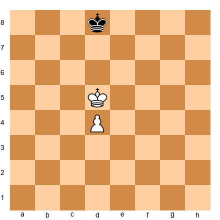</p>

**Task:** Does the pawn promote? Play it out.
**Hint 1:** Where are the key squares for a pawn on d4?
**Hint 2:** The key squares are c6, d6, and e6. Is the White king on one of them?
**Hint 3:** The White king is on d5, which is NOT a key square (it is on the 5th rank, but key squares for a d4 pawn are on the 6th rank). However, the king is very close. Think about opposition.
**Solution:** 1.Ke5! (Not 1.d5? Kd7! and Black has the opposition, draw.) 1...Kc7 (or 1...Ke7 2.d5 and White's king reaches a key square) 2.Ke6! (key square reached!) 2...Kd8 3.d5 Kc7 4.Kd7 and the pawn promotes. **The pawn promotes.** The key was 1.Ke5!, taking the opposition and heading for the key squares.

---

**Exercise 9.2** ★
**Position:** White king on e6, White pawn on e5, Black king on e8. White to move.

<p align="center">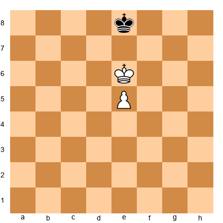</p>

**Task:** Does the pawn promote?
**Hint 1:** The White king is on e6. The pawn is on e5. What are the key squares for a pawn on e5?
**Hint 2:** Key squares for a 5th-rank pawn: d7, e7, f7. The White king is on e6, not yet on a key square.
**Hint 3:** White plays e6... but then what? Does the king reach a key square?
**Solution:** 1.e6 (the only try, since Kd6 or Kf6 gives stalemate concerns later). Now after 1...Kf8 (or Kd8), White continues 2.Kd7 (or Kf7), reaching a key square. The pawn promotes. **Yes, the pawn promotes.** But note: 1.Kd6? is also winning since after 1...Kd8 2.e6 Ke8 3.e7 Kf7 4.Kd7, White promotes.

---

**Exercise 9.3** ★
**Position:** White king on e5, White pawn on e4, Black king on e7. White to move.

<p align="center"></p>

**Task:** Does the pawn promote? Who has the opposition?
**Hint 1:** Kings face each other on the e-file with one square between them. Whose move is it?
**Hint 2:** It is White's move, so BLACK has the opposition.
**Hint 3:** White must step aside. Try Kd5 or Kf5. Can Black maintain the block?
**Solution:** White has the move, so Black has the opposition. After 1.Kd5 Kd7! (Black takes the opposition again) 2.e5 Ke7 3.e6 Ke8! 4.Kd6 Kd8 5.e7+ Ke8 6.Ke6 stalemate! **Draw.** Black's opposition holds the position. The pawn does not promote.

---

**Exercise 9.4** ★
**Position:** White king on f6, White pawn on e5, Black king on e8. White to move.

<p align="center">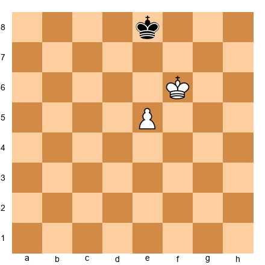</p>

**Task:** Does the pawn promote?
**Hint 1:** Key squares for a pawn on e5: d7, e7, f7.
**Hint 2:** Can the White king reach a key square on the next move?
**Hint 3:** White plays Ke6 or e6. Which one wins?
**Solution:** 1.Ke6! (takes the opposition) 1...Kd8 (or Kf8) 2.Kd7 (or Kf7), reaching a key square. The pawn promotes after e6, e7, e8=Q. **Yes, the pawn promotes.** Note that 1.e6? also works: 1...Kf8 2.e7+ Ke8 3.Ke6 stalemate! That would be a draw! So 1.Ke6 is the correct move. **Always advance the king before the pawn when possible.**

---

**Exercise 9.5** ★
**Position:** White king on b5, White pawn on a5, Black king on a7. White to move.

<p align="center">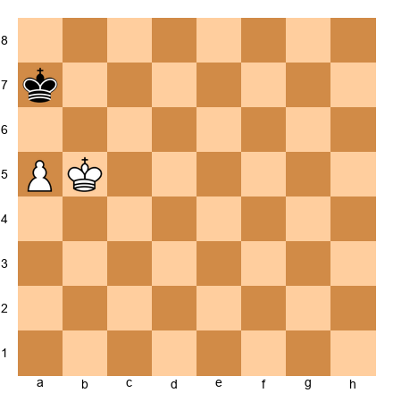</p>

**Task:** Does the rook pawn promote?
**Hint 1:** What is special about rook pawns?
**Hint 2:** The a-file is the edge of the board. Can the White king outflank the Black king?
**Hint 3:** White plays a6, Black plays Ka8. What happens next?
**Solution:** 1.a6 Ka8! 2.Ka6 (anything else lets Black take the pawn) and it is stalemate! Or 2.Kb6 Kb8 3.a7+ Ka8 4.Ka6 stalemate again. **Draw.** Rook pawns with the defending king in front are drawn because the attacking king cannot outflank (the board edge blocks it).

---

**Exercise 9.6** ★★
**Position:** White king on c4, White pawn on d4, Black king on d6. White to move.

<p align="center">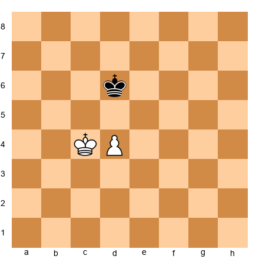</p>

**Task:** Does the pawn promote? Find the winning plan.
**Hint 1:** Key squares for d4: c6, d6, e6. Black's king is on d6, one of the key squares!
**Hint 2:** White needs to push Black off the key square. Can White use opposition?
**Hint 3:** White plays Kd4... no, that is not legal (same square). Try Kc5 or Kd3. Which one helps?
**Solution:** 1.Kc5! (threatening to go to c6 or d5) 1...Ke6 (if 1...Kd7, then 2.Kd5 and White controls the key squares) 2.Kc6! (White reaches a key square!) 2...Ke7 3.d5 Kd8 4.Kd6 Ke8 5.Ke6 Kd8 6.d6 Kc8 7.d7+ Kb8 (or Kd8) 8.Kd6 (or Ke7) and promotes. **The pawn promotes.**

---

**Exercise 9.7** ★★
**Position:** White king on e3, White pawn on d2, Black king on d5. Black to move.

<p align="center">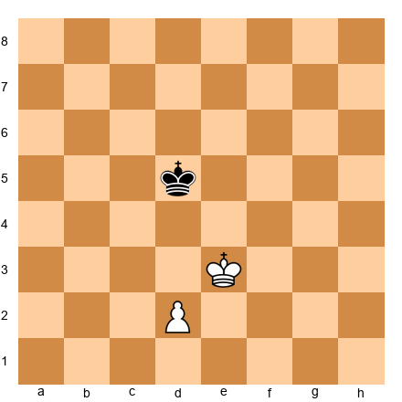</p>

**Task:** Can Black stop the pawn from promoting?
**Hint 1:** Key squares for d2: c6, d6, e6. Black is on d5, close but not ON a key square (from the defender's perspective, Black needs to reach d3 or the squares in front of the pawn).
**Hint 2:** Actually, think about this from the attacker's side. Can White's king reach a key square?
**Hint 3:** It is Black's move. Does Black have the opposition?
**Solution:** 1...Ke5! (taking the opposition!) 2.d4+ Kd5! (opposition again!) 3.Kd3 Kd6! (Black stays in front) 4.Ke4 Ke6 (opposition) 5.d5+ Kd6 6.Kd4 Kd7! 7.Ke5 Ke7 (opposition!) 8.d6+ Kd7 9.Kd5 Kd8! 10.Ke6 Ke8 11.d7+ Kd8 12.Kd6 stalemate! **Draw.** Black's perfect opposition play stops the pawn.

---

**Exercise 9.8** ★★
**Position:** White king on e1, White pawn on d5, Black king on d8. Black to move.

<p align="center">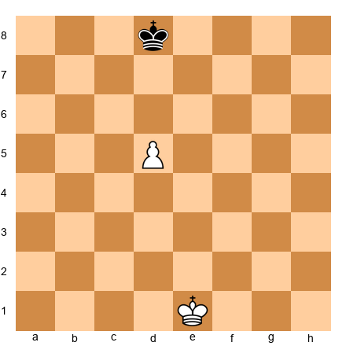</p>

**Task:** Can Black stop the pawn?
**Hint 1:** The pawn is on d5. Key squares: c7, d7, e7. Can the White king reach them before Black blocks?
**Hint 2:** Black plays 1...Kd7, standing right in front of the pawn. Can White break through?
**Hint 3:** After 1...Kd7, the White king is on e1, very far from the key squares. Count the moves.
**Solution:** 1...Kd7! (standing in front of the pawn) 2.Kd2 Kd6 3.Kd3 Kd7! (waiting) 4.Ke4 Ke7! 5.Ke5 Kd7 6.d6 Kd8! 7.Ke6 Ke8 8.d7+ Kd8 9.Kd6 stalemate. **Draw.** The White king is too far away to support the pawn. Black blocks and holds.

---

**Exercise 9.9** ★★
**Position:** White king on c5, White pawn on b4, Black king on b7. White to move.

<p align="center">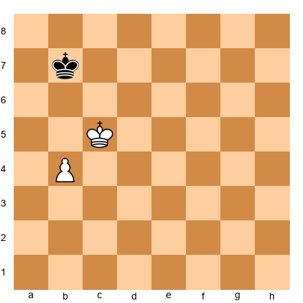</p>

**Task:** Does the pawn promote?
**Hint 1:** Key squares for b4: a6, b6, c6.
**Hint 2:** Can the White king reach a key square? It is on c5, one move from c6.
**Hint 3:** White plays 1.Kc6 or 1.Kb5. Which is better?
**Solution:** 1.Kb5! (taking the opposition) 1...Kc7 (or 1...Ka7 2.Kc6 and the king reaches a key square) 2.Ka6! (key square reached) 2...Kb8 3.Kb6 Kc8 4.Ka7 Kc7 5.b5 Kc8 6.b6 Kd7 7.b7 and 8.b8=Q. **The pawn promotes.**

---

**Exercise 9.10** ★★
**Position:** White king on g5, White pawn on h5, Black king on h7. White to move.

<p align="center">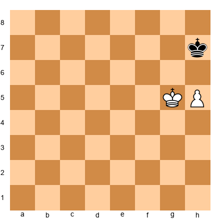</p>

**Task:** Does the rook pawn promote?
**Hint 1:** The h-pawn is a rook pawn. Remember the rook pawn exception.
**Hint 2:** Key squares for h5: g7, h7, (no i7 since the board ends). The Black king is ON h7.
**Hint 3:** Can White's king outflank? Or is the Black king stuck in front of the pawn near the corner?
**Solution:** 1.h6 Kh8! 2.Kf6 (trying to reach g7) Kg8! 3.Kg6 Kh8 4.h7 stalemate! Or 3.Ke7 Kh7 4.Kf7 Kh8 5.Kg6 Kg8 6.h7+ Kh8 7.Kh6 stalemate! **Draw.** The rook pawn draws because the board edge prevents outflanking. The defending king hides in the corner.

---

**Exercise 9.11** ★★★
**Position:** White king on b1, White pawn on e4, Black king on e6. White to move.

<p align="center">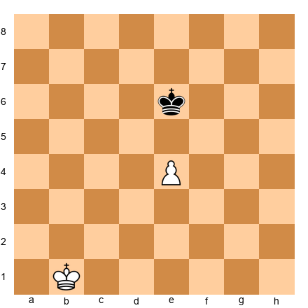</p>

**Task:** Can White win this position?
**Hint 1:** The Black king is directly in front of the pawn. The White king is far away on b1.
**Hint 2:** Key squares for e4: d6, e6, f6. Black is ON e6, a key square (from the defense perspective, Black is blocking).
**Hint 3:** Can the White king march from b1 to a key square before Black's king stops it? Count moves.
**Solution:** White's king needs to reach d6, e6, or f6. From b1, that is about 5-6 moves (Kc2-Kd3-Ke3-Kd4... etc). But every time White's king approaches, Black's king maintains opposition. After 1.Kc2 Kd6! 2.Kd3 Kd5! Black has the opposition and blocks. White cannot break through. **Draw.** The defending king arrived at the key squares first and holds the opposition.

---

**Exercise 9.12** ★★★
**Position:** White king on d5, White pawn on c4, Black king on c7. White to move.

<p align="center">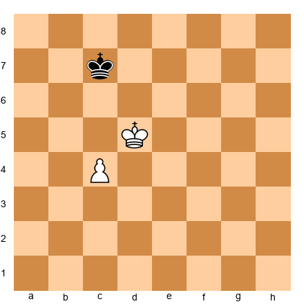</p>

**Task:** Does the pawn promote? Find the best plan.
**Hint 1:** Key squares for c4: b6, c6, d6.
**Hint 2:** The White king is on d5. Can it reach a key square?
**Hint 3:** 1.Kc5! puts the king one step from both b6 and c6. Then what does Black do?
**Solution:** 1.Kc5! Kd7 (if 1...Kb7 2.Kd6! reaching a key square) 2.Kb6! (key square!) 2...Kd6 3.c5+ Kd7 4.Kb7 and the pawn promotes after c6, c7, c8=Q. **The pawn promotes.**

---

**Exercise 9.13** ★
**Position:** White king on f5, White pawn on f4, Black king on f7. White to move.

<p align="center"></p>

**Task:** Does the pawn promote?
**Hint 1:** Kings face each other on the f-file with one square between them.
**Hint 2:** It is White's move, so Black has the opposition.
**Hint 3:** White must step aside. What happens after Ke5 or Kg5?
**Solution:** White has the move, so Black has the opposition. 1.Ke5 Ke7! (maintaining opposition) 2.f5 Kf7! 3.f6 Kf8! 4.Ke6 Ke8 5.f7+ Kf8 6.Kf6 stalemate. **Draw.** Black's opposition holds.

---

**Exercise 9.14** ★
**Position:** White king on f5, White pawn on f4, Black king on f7. Black to move.

<p align="center">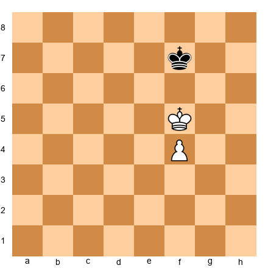</p>

**Task:** Same position as 9.13, but Black to move. Does the pawn promote now?
**Hint 1:** Now White has the opposition!
**Hint 2:** Black must step aside. What happens after Ke7 or Kg7?
**Hint 3:** After 1...Ke7 2.Kg6! (sidestepping to reach a key square).
**Solution:** 1...Ke7 2.Kg6! Kf8 3.Kf6 Ke8 4.Kg7! Ke7 5.f5 Ke8 6.f6 Kd7 7.f7 and f8=Q. **The pawn promotes!** One move of difference (who moves first) changes the result from draw to win.

---

**Exercise 9.15** ★★★
**Position:** White king on a4, White pawn on a3, Black king on a6. Black to move.

<p align="center">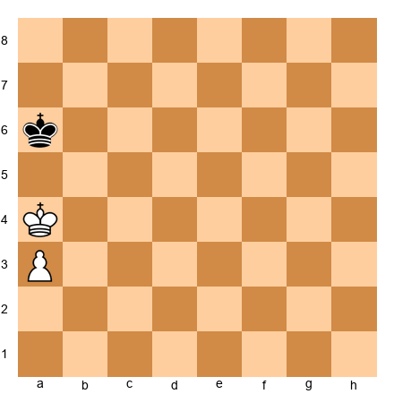</p>

**Task:** Does the rook pawn promote?
**Hint 1:** White has the opposition (Black to move, kings face each other on the a-file).
**Hint 2:** Normally, having the opposition means the attacker wins. But this is a rook pawn.
**Hint 3:** Black plays Ka7 or Kb6. Does the corner save Black?
**Solution:** 1...Kb6 2.Kb4 Ka6 3.Kc5 Ka5 4.a4 Ka6 5.Kb4 Kb6 6.a5+ Ka6 7.Ka4 Ka7 8.Kb5 Kb7 9.a6+ Ka7 10.Ka5 Ka8! 11.Kb6 Kb8 12.a7+ Ka8 13.Ka6 stalemate. **Draw!** Even with the opposition, the rook pawn cannot win because of the corner stalemate defense.

---

### Who Has the Opposition?

---

**Exercise 9.16** ★
**Position:** White king on d4, Black king on d6. White to move.

<p align="center">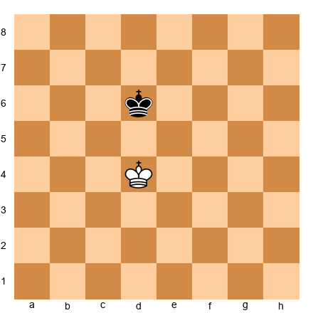</p>

**Task:** Who has the opposition?
**Hint 1:** Kings face each other on the d-file, one square apart (d5 is between them).
**Solution:** **Black has the opposition** (White must move). White must step aside.

---

**Exercise 9.17** ★
**Position:** White king on e3, Black king on e5. Black to move.

<p align="center">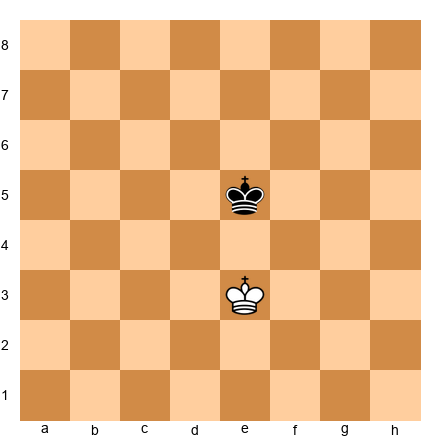</p>

**Task:** Who has the opposition?
**Solution:** **White has the opposition** (Black must move). Black must step aside.

---

**Exercise 9.18** ★
**Position:** White king on c1, Black king on c3. White to move.

<p align="center">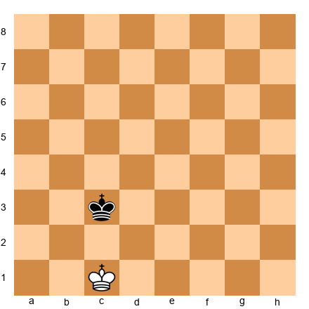</p>

**Task:** Who has the opposition?
**Solution:** **Black has the opposition** (White must move).

---

**Exercise 9.19** ★★
**Position:** White king on d3, White pawn on e3, Black king on d5. White to move.

<p align="center">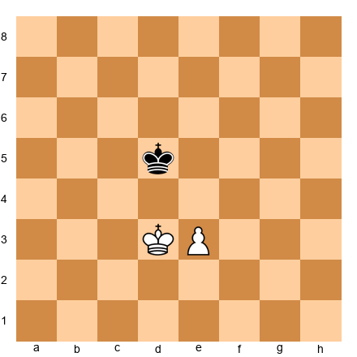</p>

**Task:** Who has the opposition? Can White win?
**Hint 1:** Kings face each other on the d-file. White must move.
**Hint 2:** Black has the opposition. But White has an extra tempo with the pawn!
**Hint 3:** White plays e4+! Does this change the opposition?
**Solution:** Black has the opposition, but White plays **1.e4+!** After 1...Kd6! 2.Ke3 Ke5 and Black regains the opposition. The pawn push did not change the situation. **Draw** with best play from Black.

---

**Exercise 9.20** ★★
**Position:** White king on e4, Black king on c4. White to move.

<p align="center">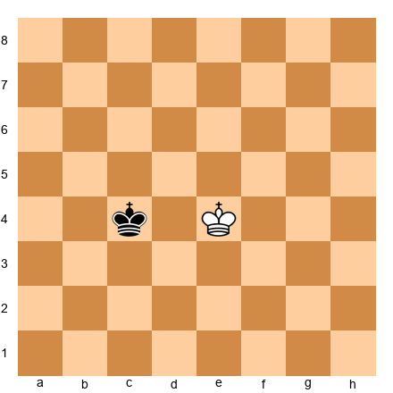</p>

**Task:** Who has the opposition? (They are on the same rank.)
**Hint 1:** The kings are on the same rank (4th rank), separated by one square (d4).
**Solution:** **Black has the opposition** (White must move). This is horizontal opposition.

---

**Exercise 9.21** ★★
**Position:** White king on d1, Black king on d5. White to move.

<p align="center">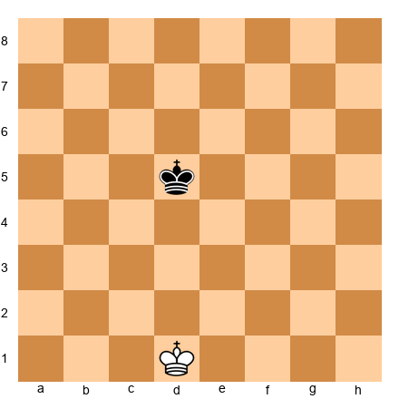</p>

**Task:** Who has the opposition? (Hint: count the squares between the kings.)
**Hint 1:** The kings are on the d-file, separated by d2, d3, d4 (three squares between them).
**Hint 2:** This is "distant opposition." With an odd number of squares between kings on the same line, the player NOT to move has it.
**Solution:** **Black has the distant opposition** (White must move, 3 squares between = odd number).

---

**Exercise 9.22** ★★
**Position:** White king on e5, Black king on g5. White to move.

<p align="center">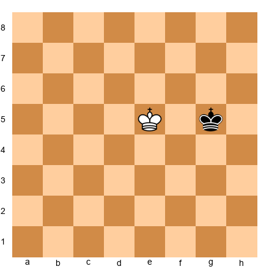</p>

**Task:** Who has the opposition?
**Hint 1:** The kings are on the same rank (5th rank), one square apart (f5 between them).
**Solution:** **Black has the opposition** (White must move). Horizontal opposition.

---

**Exercise 9.23** ★★★
**Position:** White king on d4, White pawn on e4, Black king on e6. White to move.

<p align="center">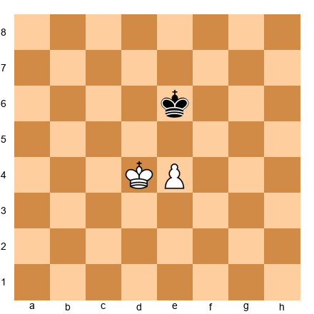</p>

**Task:** Black has the opposition. Can White use the pawn to gain the opposition?
**Hint 1:** White does not have the opposition (White must move). But the pawn on e4 gives White a tempo move.
**Hint 2:** Try 1.e5 or 1.Kc5. One of them works.
**Hint 3:** 1.Kc5! attacks from the side, forcing Black to respond.
**Solution:** 1.Kc5! Kd7 (Black must respond to the flank attack) 2.Kd5! (opposition regained!) 2...Ke7 3.Kc6! (key square!) Ke6 4.e5 Ke7 5.Kd5 Kd7 6.e6+ Ke7 7.Kf6! Ke8 8.e7 Kd7 9.Kf7 and promotes. **Win.** The outflanking maneuver Kc5-Kd5 breaks the opposition.

---

**Exercise 9.24** ★★
**Position:** White king on f3, Black king on f5. Black to move.

<p align="center">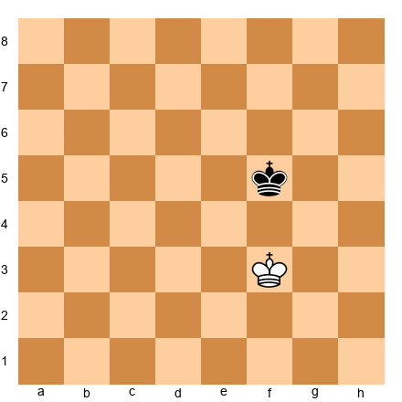</p>

**Task:** Who has the opposition? If you added a White pawn on e2, would White win?
**Solution:** White has the opposition (Black must move). With a White pawn on e2, White would win: Black must step aside, White's king advances toward the key squares, and the pawn supports the king. **White wins with the pawn.**

---

**Exercise 9.25** ★
**Position:** White king on g2, Black king on g4. Black to move.

<p align="center">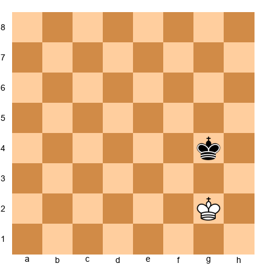</p>

**Task:** Who has the opposition?
**Solution:** **White has the opposition** (Black must move). Kings on the g-file, one square apart.

---

### Rule of the Square: Does the King Catch the Pawn?

---

**Exercise 9.26** ★
**Position:** White pawn on c5 (no White king). Black king on g7. Black to move.

<p align="center">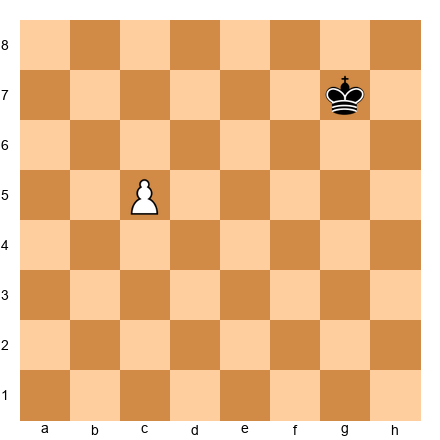</p>

**Task:** Does the Black king catch the pawn?
**Hint 1:** Draw the square: c5-c8-f8-f5.
**Hint 2:** The Black king is on g7, outside the square.
**Hint 3:** But it is Black's move! Black plays Kf6 or Kf7. Is that inside the square?
**Solution:** The square is c5-c8-f8-f5. The Black king on g7 is outside, but it is Black's move. Black plays 1...Kf7 or 1...Kf6, stepping inside the square. **The king catches the pawn. Draw.**

---

**Exercise 9.27** ★
**Position:** White pawn on b4 (no White king). Black king on g8. White to move.

<p align="center">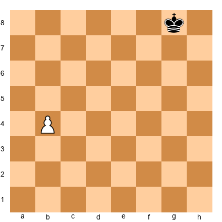</p>

**Task:** White pushes the pawn. Does the Black king catch it?
**Hint 1:** Pawn on b4, needs 4 moves to promote (b5, b6, b7, b8). Square: b4-b8-f8-f4.
**Hint 2:** Black king on g8 is outside the square.
**Solution:** 1.b5 and the square is b5-b8-e8-e5. Black king on g8 is still outside. **The pawn promotes.** The king is too far away.

---

**Exercise 9.28** ★
**Position:** White pawn on e5 (no White king). Black king on a8. Black to move.

<p align="center">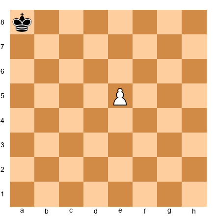</p>

**Task:** Does the Black king catch the pawn?
**Hint 1:** Draw the square from e5 to e8. The square extends 3 squares sideways toward the defending king.
**Hint 2:** The square is drawn as a geometric square from the pawn to the promotion square. From e5 to e8 is 3 squares, so the square extends 3 squares sideways: e5-e8-b8-b5 (toward the king on a8).
**Hint 3:** The king is on a8, just outside this square. But it is Black's move, so the king gets one step closer before the pawn advances.
**Solution:** 1...Kb7 (entering the square). After 2.e6 Kc6 3.e7 Kd7! The king reaches d7 and stops the pawn on e7. **The king catches the pawn! Draw.**

---

**Exercise 9.29** ★★
**Position:** White pawn on h5 (no White king). Black king on d8. Black to move.

<p align="center">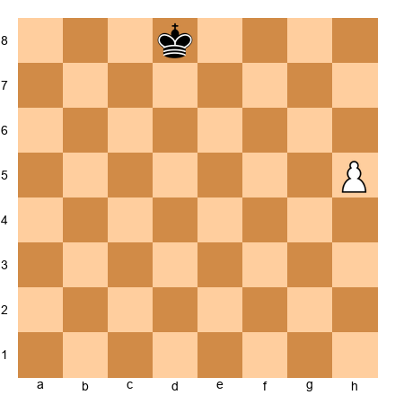</p>

**Task:** Does the Black king catch the h-pawn?
**Hint 1:** Square from h5: h5-h8. That is 3 squares. Square: h5-h8-e8-e5.
**Hint 2:** Black king on d8. Is d8 inside the square? The boundary is e8 on the 8th rank. d8 is one square outside.
**Hint 3:** But it is Black's move! Black plays 1...Ke7, entering the square (e7 is inside e5-e8-h8-h5).
**Solution:** 1...Ke7! Stepping inside the square. The king will now track the pawn diagonally and catch it. **The king catches the pawn. Draw.**

---

**Exercise 9.30** ★★
**Position:** White pawn on a2 (no White king). Black king on h6. White to move.

<p align="center">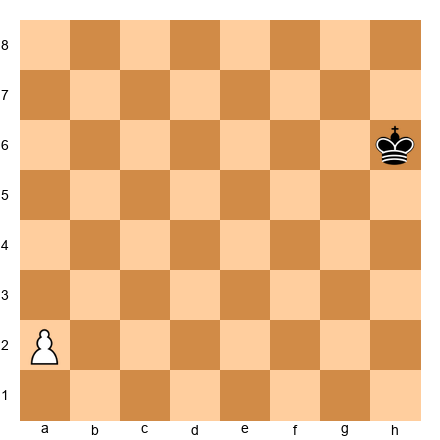</p>

**Task:** White plays a4 (two-square advance). Does the Black king catch the pawn?
**Hint 1:** After a4, treat the pawn as on a4. Square: a4-a8-e8-e4.
**Hint 2:** The Black king is on h6, way outside the square.
**Solution:** 1.a4 and the Black king is on h6, far outside the square (e4-e8 boundary). The pawn promotes easily. **The pawn promotes.**

---

**Exercise 9.31** ★★
**Position:** White pawn on d6 (no White king). Black king on a3. Black to move.

<p align="center">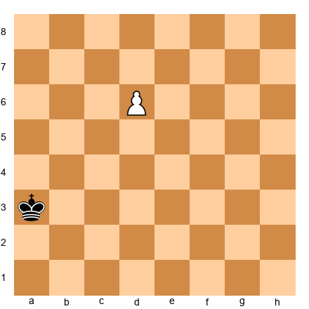</p>

**Task:** Does the Black king catch the pawn?
**Hint 1:** Square from d6: d6-d8 is 2 squares. Square: d6-d8-f8-f6 (or b8-b6 toward the king).
**Hint 2:** Toward the king: d6-d8-b8-b6. The king is on a3, far outside.
**Solution:** The king on a3 is nowhere near the square. **The pawn promotes.**

---

**Exercise 9.32** ★★★
**Position:** White pawn on g2 (no White king). Black king on c6. White to move.

<p align="center">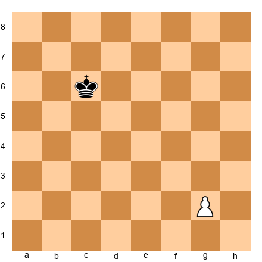</p>

**Task:** White plays g4. Does the Black king catch the pawn?
**Hint 1:** After g4, the pawn is on g4. Square: g4-g8-c8-c4.
**Hint 2:** The Black king is on c6. Is c6 inside the square? The square boundary runs from c4 to c8 along the c-file. c6 is between c4 and c8. YES, the king is inside!
**Solution:** 1.g4 and the Black king is on c6, inside the square (c4-c8 boundary). The king catches the pawn. **Draw.** But note: if it were 1.g3 instead (not the two-square advance), the square from g3 would be g3-g8-b8-b3. The king on c6 is inside. Same result: draw.

---

**Exercise 9.33** ★★
**Position:** White pawn on f2 (no White king). Black king on a7. White to move.

<p align="center">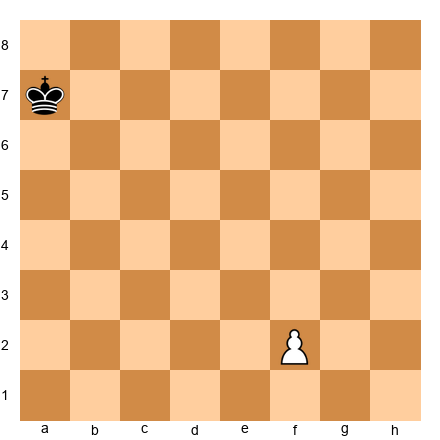</p>

**Task:** White plays f4. Does the Black king catch the pawn?
**Hint 1:** After f4, square: f4-f8-b8-b4.
**Hint 2:** The king is on a7, outside the b-file boundary.
**Solution:** The king on a7 is outside the square (b8 is the closest corner, and a7 is one file beyond). **The pawn promotes.**

---

**Exercise 9.34** ★★★
**Position:** White pawn on e2 (no White king). Black king on b5. White to move.

<p align="center">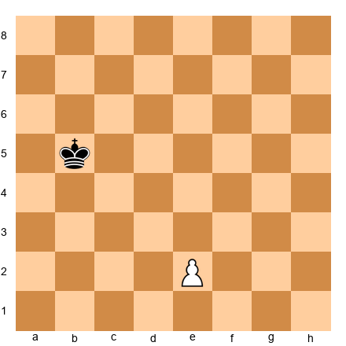</p>

**Task:** White plays e4. Does the Black king catch the pawn?
**Hint 1:** After e4, the pawn is on e4. Square: e4-e8-a8-a4.
**Hint 2:** The king is on b5. Is it inside the square a4-a8-e8-e4? The boundary on the 5th rank runs from a5 to e5. b5 is between a5 and e5. YES, the king is inside!
**Solution:** 1.e4 and the Black king on b5 is inside the square. The king catches the pawn. **Draw.**

---

**Exercise 9.35** ★
**Position:** White pawn on d5 (no White king). Black king on h8. Black to move.

<p align="center">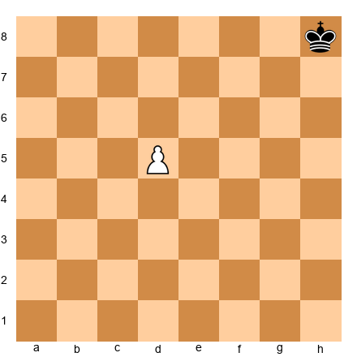</p>

**Task:** Does the Black king catch the pawn?
**Hint 1:** Square from d5: d5-d8. 3 squares. Square: d5-d8-g8-g5.
**Hint 2:** The king is on h8, one square outside g8.
**Hint 3:** It is Black's move. Black plays Kg7. Is g7 inside the square?
**Solution:** 1...Kg7. The square boundary includes g5-g8. g7 is inside! **The king catches the pawn. Draw.**

---

### Find the Pawn Breakthrough

---

**Exercise 9.36** ★★
**Position:** White pawns on a5, b5, c5. Black pawns on a7, b7, c7. White to move.

<p align="center">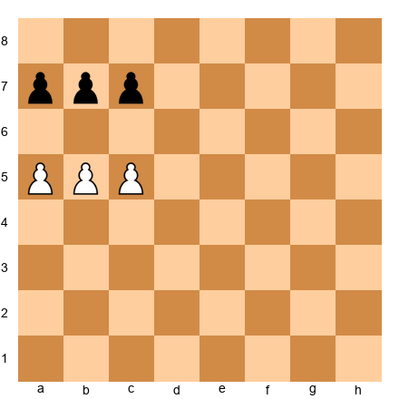</p>

**Task:** Find the breakthrough. Which pawn do you sacrifice?
**Hint 1:** Which pawn, if sacrificed, creates problems on both sides?
**Hint 2:** The middle pawn!
**Solution:** **1.b6!** After 1...axb6 2.c6! bxc6 3.a6 promotes. After 1...cxb6 2.a6! bxa6 3.c6 promotes. The middle pawn sacrifice is the key.

---

**Exercise 9.37** ★★
**Position:** White pawns on f5, g5, h5. Black pawns on f7, g7, h7. White to move.

<p align="center">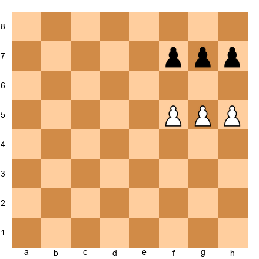</p>

**Task:** Find the breakthrough.
**Hint 1:** Same idea as 9.36, just on the kingside.
**Solution:** **1.g6!** After 1...fxg6 2.h6! gxh6 3.f6 promotes. After 1...hxg6 2.f6! gxf6 3.h6 promotes. Mirror image of the classic breakthrough.

---

**Exercise 9.38** ★★
**Position:** White pawns on a4, b4, c4. Black pawns on a5, b6, c5. White to move.

<p align="center">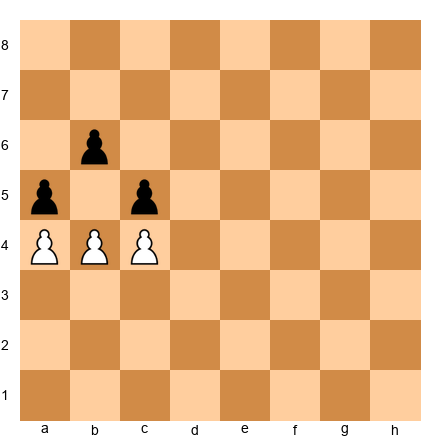</p>

**Task:** Is there a breakthrough?
**Hint 1:** Look at b4. Can White play b5?
**Hint 2:** 1.b5! axb4 (or cxb4) and then what?
**Hint 3:** After 1.b5, none of Black's pawns can capture it. What does that mean?
**Solution:** This pawn structure does not allow a clean breakthrough. The pawns are not in the classic symmetric formation. **No breakthrough exists.** This exercise shows that not every 3 vs. 3 pawn structure allows a breakthrough — the pawns must be positioned symmetrically (like 5th rank vs. 7th rank) for the classic pattern to work.

Here is a revised position that DOES work.

**Revised Position:** White pawns on a5, b5, c5. Black pawns on a7, b6, c7. White to move.

```

```

**Solution:** 1.c6! Black cannot capture: b6 only captures diagonally forward (toward rank 5), not backward to c6. And c7 is blocked from advancing to c6. So 1.c6 creates an immediate passed pawn. After 1...bxa5 2.c7 and the pawn promotes. **1.c6! wins.**

---

**Exercise 9.39** ★★★
**Position:** White pawns on b5, c5, d5. Black pawns on b7, c7, d6. White to move.

<p align="center">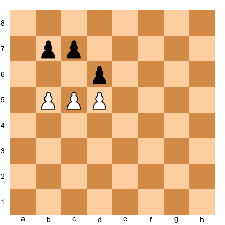</p>

**Task:** Find the winning pawn advance.
**Hint 1:** Black's d6 pawn blocks the d5 pawn. The c7 and b7 pawns block the c5 and b5 pawns (sort of).
**Hint 2:** Try 1.c6! breaking open the position.
**Solution:** 1.c6! bxc6 (if 1...b6 2.d6! cxd6 3.c7 promotes) 2.bxc6! and now the c6 pawn threatens c7. Black plays 2...d5 (no other useful moves), but the c-pawn is already too far advanced. After appropriate play, the c-pawn or the d-pawn will promote. **White wins.**

---

**Exercise 9.40** ★★
**Position:** White pawns on a5, b5, c4. Black pawns on a7, b7, c7. White to move.

<p align="center">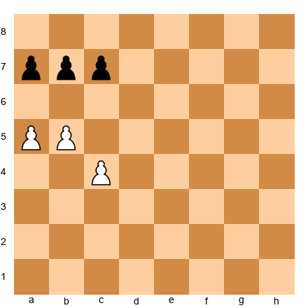</p>

**Task:** Can White break through?
**Hint 1:** The pawns are not all on the 5th rank. Can White still break through?
**Hint 2:** Try 1.b6! axb6 (or cxb6) and then 2.c5 or 2.a6.
**Solution:** 1.b6! cxb6 (c7 captures b6 diagonally) 2.a6! bxa6 (b7 captures a6 diagonally) 3.c5! and the c-pawn is a passed pawn heading to c8. If instead 1.b6! axb6 2.c5! and White breaks through similarly. **Yes, White breaks through.**

---

**Exercise 9.41** ★★
**Position:** White pawns on e5, f5, g5. Black pawns on e7, f7, g6. White to move.

<p align="center">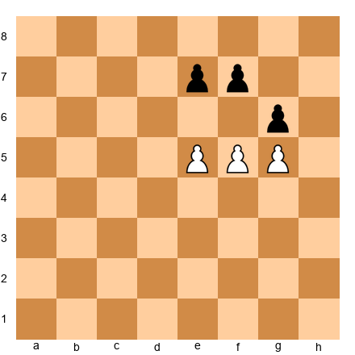</p>

**Task:** Find the breakthrough.
**Hint 1:** Black's g6 pawn blocks the g5 pawn. But what about f5 and e5?
**Hint 2:** 1.f6! breaks things open.
**Solution:** 1.f6! This works on both captures. If 1...gxf5 2.fxe7 and the e-pawn promotes. If 1...exf6 2.e6! fxe6 3.gxf6 and the f-pawn marches to f7, f8=Q (Black's g6 pawn cannot capture it since pawns only capture diagonally forward). **1.f6! wins.**

---

**Exercise 9.42** ★★★
**Position:** White pawns on a5, b5, c5. Black pawns on a6, b7, c7. White to move.

<p align="center">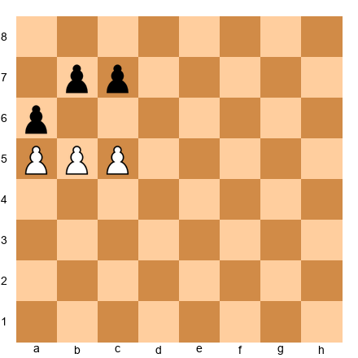</p>

**Task:** Can White break through? (This one is tricky.)
**Hint 1:** Black's a6 pawn blocks the a5 pawn. The b7 and c7 pawns are further back.
**Hint 2:** Try 1.b6! cxb6 and then what?
**Hint 3:** After 1.b6 cxb6, play 2.c6! bxc6 3.bxc6 and the c-pawn is on the 6th rank as a passed pawn.
**Solution:** 1.b6! cxb6 (if 1...axb5 2.bxc7 promotes) 2.c6! bxc6 (forced) 3.bxc6! and the c6 pawn will promote: c7, c8=Q. Black cannot stop it (a6 is stuck on a6, and there are no other Black pawns in the way). **White wins with the breakthrough.**

---

**Exercise 9.43** ★★★
**Position:** White pawns on a4, b4, c4. Black pawns on a6, b5, c6. White to move.

<p align="center">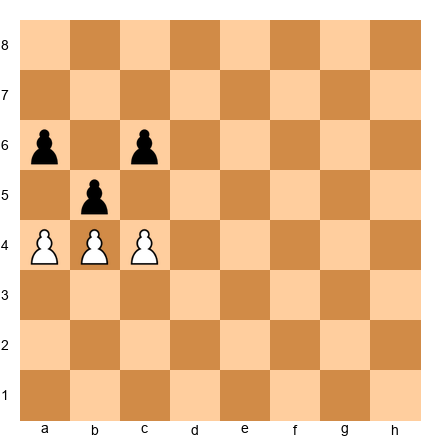</p>

**Task:** Is there a breakthrough?
**Hint 1:** The b-pawns are locked (b4 vs b5). But what about a4 and c4?
**Hint 2:** Try 1.a5! threatening to capture on a6 or push further.
**Solution:** 1.c5! bxc4 (b5 captures c4 diagonally). Now White has a4 and the b-pawns are locked with a5 vs a6. After 2.a5, the a-pawn is blocked by a6. **No clean breakthrough exists.** The pawns are not in the classic symmetric formation, and Black's structure is solid enough to hold. **Draw with best play.**

---

**Exercise 9.44** ★★
**Position:** White pawns on d5, e5, f5. Black pawns on d7, e7, f7. White to move.

<p align="center">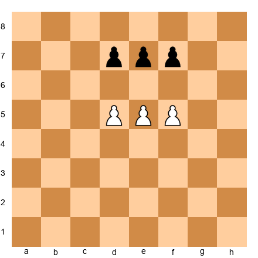</p>

**Task:** Find the breakthrough.
**Solution:** **1.e6!** The classic middle-pawn sacrifice. After 1...fxe6 2.f6! exf6 3.d6 promotes (or 3.d6 and nothing stops it). After 1...dxe6 2.d6! exd6 (or cxd6) 3.f6 promotes. **White wins.**

---

**Exercise 9.45** ★★★
**Position:** White pawns on b5, c5, d5. Black pawns on b7, c6, d7. White to move.

<p align="center">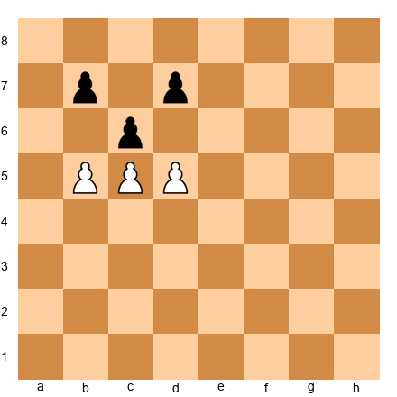</p>

**Task:** Can White break through?
**Hint 1:** The c-pawns are locked (c5 vs c6). Try breaking on the side.
**Hint 2:** 1.d6! threatens to advance further.
**Solution:** 1.d6! This is the breakthrough. The key: Black's c6 pawn captures diagonally forward (toward rank 5), so it can reach b5 or d5 but NOT d6. And Black's d7 pawn cannot advance to d6 because the White pawn blocks it. So the d6 pawn is unstoppable on its own. Black tries 1...b6 (the only attempt). 2.cxb6 cxb5 3.b7! and the pawn promotes. **White wins.**

---

### Win This K+P vs K Position (Full Technique)

---

**Exercise 9.46** ★
**Position:** White king on d6, White pawn on d5, Black king on d8. White to move.

<p align="center">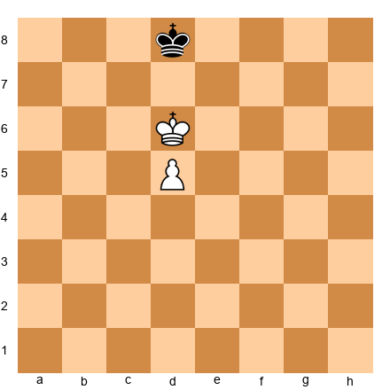</p>

**Task:** Win this position. Give the full sequence of moves.
**Solution:** 1.d6 (wait, the key is king first). Actually: 1.Ke6! Ke8 (or Kc8) 2.d6 Kd8 3.d7 Kc7 4.Ke7 and d8=Q. Or after 1.Ke6 Kc8 2.Ke7 Kc7 3.d6+ Kc8 4.d7+ Kc7 5.d8=Q+. **White wins.**

---

**Exercise 9.47** ★
**Position:** White king on e6, White pawn on d4, Black king on f8. White to move.

<p align="center">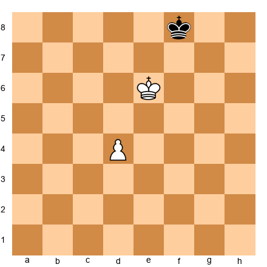</p>

**Task:** Win this position. The king is already on a key square!
**Solution:** The White king is on e6, a key square for the d4 pawn. 1.d5 Kg8 (or Ke8) 2.Kd7 (or Kf6) heading toward the promotion square. The pawn is escorted all the way. For instance: 1.d5 Ke8 2.d6 Kf8 3.d7 Kf7 4.Kd6! (or d8=Q? Let's check: 4.d8=Q works too since the king is on f7 and the queen on d8 wins easily.) **White wins.**

---

**Exercise 9.48** ★★
**Position:** White king on c3, White pawn on d3, Black king on d5. Black to move.

<p align="center">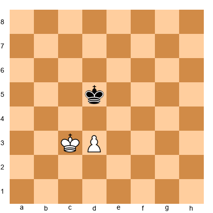</p>

**Task:** White wants to promote the pawn. Can Black stop it?
**Hint 1:** It is Black's move. Can Black take the opposition?
**Hint 2:** 1...Kd6! heads back toward the pawn. Can Black reach the key defensive squares?
**Solution:** 1...Kd6! (heading back toward the pawn) 2.Kc4 Kc6! (opposition!) 3.d4 Kd6 (staying in front of the pawn) 4.d5 Kd7! 5.Kc5 Kc7 (opposition!) 6.d6+ Kd7 7.Kd5 Kd8! 8.Ke6 Ke8 9.d7+ Kd8 10.Kd6 stalemate. **Draw.** Black's opposition holds.

---

**Exercise 9.49** ★★
**Position:** White king on f4, White pawn on e4, Black king on e6. White to move.

<p align="center"></p>

**Task:** Win this position.
**Hint 1:** White's king is on f4, next to the pawn. Can White reach a key square?
**Hint 2:** Key squares for e4: d6, e6, f6. Black is on e6!
**Hint 3:** White needs to push Black off the key square. Try 1.Kf5 or 1.Ke5.
**Solution:** 1.Kf5! (threatening Kf6, a key square) 1...Kd6 (or Ke7, which also works: 1...Ke7 2.Ke5 Kd7 3.Kf6 Ke8 4.Ke6 Kd8 5.e5 Kc7 6.Kf7... this is getting complex). After 1.Kf5 Kd6 2.Kf6! (key square reached!) 2...Kd7 3.e5 Ke8 4.Ke6 Kd8 5.Kf7 Kd7 6.e6+ Kd8 7.e7+ Kd7 8.e8=Q+. **White wins.**

---

**Exercise 9.50** ★★
**Position:** White king on b4, White pawn on c2, Black king on c6. White to move.

<p align="center">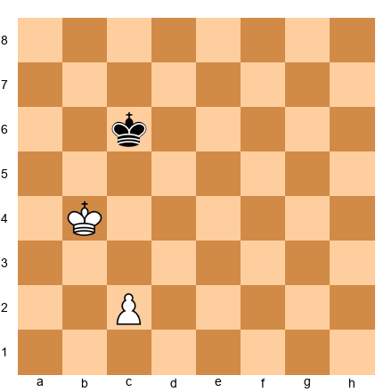</p>

**Task:** Win this position.
**Hint 1:** Key squares for c2: b6, c6, d6 (on the 6th rank). Black is already ON c6.
**Hint 2:** White needs to push Black off. Try 1.Kc4 (taking opposition!).
**Solution:** 1.Kc4! (opposition! c5 between the kings, Black to move) 1...Kd6 2.Kb5! (heading for b6, a key square) 2...Kc7 3.Kc5 Kb7 4.Kd6! (key square, using the other side) 4...Kc8 5.c4 Kb7 6.c5 Kc8 7.Kc6 (opposition) 7...Kb8 8.Kd7 Ka7 9.c6 Kb8 10.c7+ Ka7 11.c8=Q. **White wins.**

---

**Exercise 9.51** ★★★
**Position:** White king on g3, White pawn on h2, Black king on h5. White to move.

<p align="center">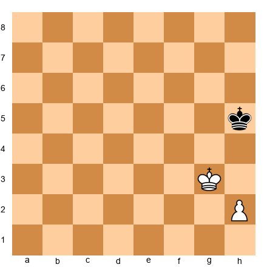</p>

**Task:** Can the rook pawn win?
**Hint 1:** The h-pawn is a rook pawn. Remember the exception.
**Hint 2:** Can the White king get in front of the pawn? It is on g3, which is next to the pawn.
**Hint 3:** Try 1.Kf4 Kh4 2.h3... does Black get drawn into the corner?
**Solution:** 1.Kf4! (heading to outflank) 1...Kh4! (staying close). The problem: if White advances the h-pawn, Black stays on h4/h5 and eventually reaches the h8 corner. After 1.Kf4 Kh4 2.Kf5 Kh5 3.Kf6 Kh6! White cannot make progress because the board edge prevents outflanking on the h-side. The game will eventually reach a position where h7+ forces Kh8 and Kh6 is stalemate. **Draw.** The rook pawn cannot win when the defending king can reach the corner.

---

**Exercise 9.52** ★★
**Position:** White king on d5, White pawn on c3, Black king on c7. Black to move.

<p align="center">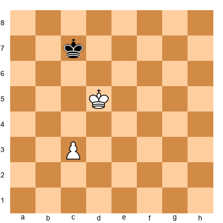</p>

**Task:** Can Black hold this position?
**Hint 1:** Key squares for c3: b6, c6, d6 (on the 6th rank). Can Black reach them?
**Hint 2:** It is Black's move. 1...Kd7! takes the opposition.
**Solution:** 1...Kd7! (opposition!) 2.c4 Kc7! 3.Kc5 (or Ke5, and then Black plays Kd7 again) Kd7 4.Kb6 Kd6! 5.c5+ Kd7! 6.Kb7 (going around) Kd8! 7.Kc6 Kc8 8.Kd6 Kb7 and Black captures the pawn or reaches opposition again. **Draw.** Black's opposition holds.

---

**Exercise 9.53** ★★★
**Position:** White king on c5, White pawn on d4, Black king on d7. White to move.

<p align="center">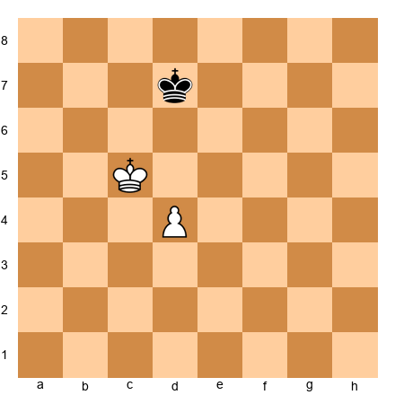</p>

**Task:** Win this position.
**Hint 1:** Key squares for d4: c6, d6, e6.
**Hint 2:** The White king is on c5. Can it reach c6?
**Solution:** 1.Kc6 is illegal (the kings would be adjacent). So White must outflank: 1.Kb6! Kd6 2.d5! (the pawn supports the advance) 2...Kd7 3.Kc5 Ke7 4.Kc6 Kd8 5.Kd6 Kc8 6.Ke7! Kc7 7.d6+ Kc8 8.d7+ and promotes. **White wins.** The outflanking maneuver via b6 is the key.

---

**Exercise 9.54** ★★★
**Position:** White king on e5, White pawn on e3, Black king on e7. White to move.

<p align="center"></p>

**Task:** Win this position. (White has the opposition with the pawn far back.)
**Hint 1:** White has the move but the kings face each other. Doesn't Black have the opposition?
**Hint 2:** Wait. It is White's move. Black has the opposition. But White has a tempo move: e4!
**Hint 3:** After 1.e4, the kings still face each other but NOW it is Black's move!
**Solution:** 1.e4! (the pawn move transfers the obligation to Black) 1...Kd7 (or Kf7) 2.Kf6! (heading for a key square). Now 2...Ke8 3.Ke6 Kd8 4.Kf7! Kd7 5.e5 Kd8 6.e6 Kc7 7.e7 and promotes. OR 1...Kd6 2.Kf6! (outflanking) 2...Kd7 3.Kf7 Kd8 4.Ke6 Ke8 5.e5 Kd8 6.Kf7 Kd7 7.e6+ Kd8 8.e7+ and promotes. **White wins.** The pawn push e4 was the key tempo gain.

---

**Exercise 9.55** ★★
**Position:** White king on d4, White pawn on d3, Black king on d6. White to move.

<p align="center"></p>

**Task:** Win this position.
**Hint 1:** Kings face each other. It is White's move, so Black has the opposition.
**Hint 2:** Use the pawn to change the turn! 1.d4!
**Solution:** 1.d4! (gaining a tempo) 1...Ke6 (if 1...Kd7 2.Ke5! with opposition) 2.Kc5! (outflanking) 2...Kd7 3.Kb6! Kd6 4.d5 Kd7 5.Kc5 Ke7 6.Kc6! and the key squares are reached. **White wins.** The d4 tempo move was essential.

---

### Is This Position Won or Drawn?

---

**Exercise 9.56** ★★
**Position:** White king on a5, White pawn on b5, Black king on b7. White to move.

<p align="center"></p>

**Task:** Won or drawn?
**Hint 1:** Key squares for b5: a7, b7, c7. Black is on b7, a key square!
**Hint 2:** White needs to push Black off b7. Can it?
**Solution:** 1.Ka6! (threatening Kb6 or Ka7) 1...Ka8 (if 1...Kc7 2.Ka7! and b6, b7, b8=Q) 2.b6 Kb8 3.b7 Kc7 4.Ka7 and b8=Q. **Won for White.**

---

**Exercise 9.57** ★★
**Position:** White king on c3, White pawn on h4, Black king on f5. Black to move.

<p align="center"></p>

**Task:** Won or drawn?
**Hint 1:** Rule of the Square! Draw the square for the h4 pawn.
**Hint 2:** h4-h8 = 4 squares. Square: h4-h8-d8-d4. The Black king is on f5, inside the square.
**Solution:** The Black king is inside the Rule of the Square. It catches the pawn. But wait, what about the White king on c3? Can it support the pawn? The White king is far from the h-pawn. 1...Kg4! and the Black king captures the pawn. **Drawn.** The White king is too far away to help.

---

**Exercise 9.58** ★★★
**Position:** White king on d4, White pawns on a4, g4. Black king on e6, Black pawn on g5. White to move.

<p align="center"></p>

**Task:** Won or drawn? (This tests outside passed pawn knowledge.)
**Hint 1:** The g-pawns are locked (g4 vs g5). White has an outside passed pawn on a4.
**Hint 2:** If the a-pawn runs, Black must chase it. What happens on the kingside?
**Hint 3:** Push a5, a6... Black's king must run to stop it. White's king captures g5.
**Solution:** 1.a5! Kd6 (heading toward the pawn) 2.Ke4! Kc5 3.Kf5! The Black king must decide: chase the a-pawn or defend the g-pawn. If 3...Kxa5 4.Kxg5 and the g-pawn promotes. If 3...Kb6 4.Kxg5 Kxa5 5.Kf6 Kb5 6.g5 Kc5 7.g6 Kd6 8.g7 and by the Rule of the Square, the king on d6 is outside the square of the g6 pawn (g6-g8-e8-e6). **The pawn promotes! Won for White.** The outside passed pawn decoy worked perfectly.

---

**Exercise 9.59** ★★★
**Position:** White king on e5, White pawn on e4, Black king on e7. Black to move.

<p align="center"></p>

**Task:** Won or drawn?
**Hint 1:** This is the same as Exercise 9.14 but from the full technique perspective.
**Solution:** White has the opposition (Black to move). 1...Kf7 (or Kd7) 2.Kd6! (outflanking) 2...Ke8 3.Ke6 Kd8 4.Kf7 Kd7 5.e5 Kd8 6.e6 Kc7 7.e7 and promotes. **Won for White.**

---

**Exercise 9.60** ★★★
**Position:** White king on d5, White pawns on b4, f4. Black king on e7, Black pawns on b5, f5. White to move.

<p align="center"></p>

**Task:** Won or drawn?
**Hint 1:** Both sides have two pawns. The b-pawns are locked (b4 vs b5). The f-pawns are locked (f4 vs f5). Can either side make progress?
**Hint 2:** Neither side has a passed pawn. Neither side can create a breakthrough (only one pawn on each side of the board, not three).
**Hint 3:** If the kings just maneuver, can either side win a pawn? The pawns are all defended.
**Solution:** This is a **draw.** Neither side can create a passed pawn. The pawns are locked on both sides. The kings maneuver, but neither can break through without losing its own pawn. A fortress position.

---

🛑 **Excellent work.** If you have completed all 60 exercises, you have trained your brain in patterns that many players never learn. Take a well-deserved break before the final sections.

---

## Key Takeaways

1. **Study endgames first.** Fewer pieces on the board means clearer logic. Endgame knowledge helps you make better decisions in the middlegame.

2. **Key squares determine everything in K+P vs K.** If your king reaches a key square, the pawn promotes. If it cannot, the game is likely drawn. Memorize where the key squares are for each pawn position.

3. **Opposition is about who must move.** When two kings face each other with one square between them, the side NOT to move has the advantage. In pawn endgames, the opposition decides whether the attacker's king reaches the key squares.

4. **The Rule of the Square is your instant calculator.** Draw a square from the pawn to its promotion rank. If the defending king can step inside the square, it catches the pawn. If not, the pawn promotes.

5. **Rook pawns are special.** An a-pawn or h-pawn often cannot win because the board edge prevents the attacking king from outflanking the defender. If the defending king reaches the corner, it is usually a draw.

6. **Pawn breakthroughs win "drawn" positions.** When three pawns face three pawns, sacrificing the middle pawn creates two passed pawns. The defender cannot stop both.

7. **Passed pawns are criminals.** They must be watched at all times. Create passed pawns, advance them, and promote them.

8. **Outside passed pawns are decoys.** They force the enemy king to chase them, leaving your king free to attack on the other side of the board.

---

## Practice Assignment

### At the Board (15 minutes per day for one week):

1. **Day 1-2:** Set up random K+P vs K positions. Identify the key squares. Play out both sides.

2. **Day 3-4:** Practice opposition. Set up K+P vs K positions and play both sides. Feel when the opposition wins vs. when it draws.

3. **Day 5:** Practice the Rule of the Square. Set up random king-vs-pawn races. Draw the square FIRST, then verify by playing it out.

4. **Day 6:** Set up the classic 3 vs 3 pawn breakthrough. Play it 10 times until you can do it blindfolded.

5. **Day 7:** Play 3 casual games and actively look for opportunities to enter favorable pawn endgames. Even if you do not find one, the awareness changes how you play.

### With Stockfish or Lichess:

1. Go to lichess.org/practice and complete the "Pawn Endgames" training module.
2. Set up a K+P vs K position against the engine. Practice winning the won positions AND holding the drawn positions.
3. Play rapid games (10+5 or 15+10) and deliberately try to trade into pawn endgames when you have a structural advantage.

### Self-Test:

Set up each of these positions and answer in under 10 seconds:

- K on e5, P on e4, Black K on e7. Who wins?
  - **Answer:** Depends on whose move it is! White to move = draw (Black has opposition). Black to move = White wins.

- K on d6, P on d5, Black K on d8. White to move. Win or draw?
  - **Answer:** Win. 1.Ke6! and the king reaches a key square.

- White pawn on c4, Black K on g7. Does the king catch the pawn?
  - **Answer:** Draw the square: c4-c8-g8-g4. King on g7 is inside. Yes, the king catches it.

---

## ⭐ Progress Check

If you can answer YES to these questions, you are ready to move on:

- [ ] I can identify the key squares for any pawn without looking them up.
- [ ] I can determine who has the opposition in a K vs K standoff.
- [ ] I can use the Rule of the Square to tell if a king catches a pawn within 5 seconds.
- [ ] I can execute the 3 vs 3 pawn breakthrough from memory.
- [ ] I understand why rook pawns are drawn when the defending king reaches the corner.
- [ ] I know what a passed pawn, connected passed pawn, and outside passed pawn are.
- [ ] I have practiced K+P vs K at the board at least 10 times.

**If you checked all seven boxes:** You have a better understanding of pawn endgames than most club players rated 1200. That is not an exaggeration. This knowledge will win you games for the rest of your life. Move on to Chapter 10.

**If you missed some:** Go back and practice the sections you struggled with. There is no rush. Capablanca spent years perfecting his endgame technique. You have time.

---

## 🛑 Rest Marker

**You have completed Chapter 9.** This was one of the most important chapters in the entire Codex. Pawn endgames are the foundation of all endgame play. Every rook endgame, every bishop endgame, every complex ending eventually reduces to a pawn endgame. If you understand pawns and kings, you understand the soul of chess.

Come back tomorrow with fresh eyes. The next chapter builds on everything you learned here.

*"The ending is the beginning of all chess wisdom."*

---

*Chapter 9 of The Grandmaster Codex, Volume I: Foundations*
*Written for players rated 600-1000*
*60 exercises, 3 annotated demonstrations*
*Estimated study time: 2-3 weeks at 15-20 minutes per day*
