# THE GRANDMASTER CODEX
## Volume II: The Club Player
### Chapter 11: The 30 Essential Tactical Patterns

**Rating Range: 1000 - 1600**
**Pages: 60 | Exercises: 150 | Annotated Games: 5**

---

> *"Chess is 99% tactics."*
> - Richard Teichmann

---

## What You'll Learn

- **30 tactical patterns** organized into 6 learnable groups of 5
- How to recognize each pattern in your own games, not just in puzzles
- The thinking process behind every combination: see the signal, find the move
- How to chain simple tactics into powerful multi-move combinations
- 150 exercises to train your pattern recognition until it becomes automatic

---

## Before We Begin

In Volume I, Chapter 6, you learned the basics: forks, pins, skewers, and double attacks. You can spot them in simple positions. That is a real skill, and you should be proud of it.

But here is what separates a beginner from a club player: **depth**.

A beginner sees a fork when it is sitting right there on the board. A club player sees a fork that is *three moves away* and builds a sequence to make it happen. A beginner sees a pin. A club player sees how to *create* a pin, how to *exploit* a pin, and how to *break* a pin.

This chapter teaches you 30 patterns that appear in real games at every level of chess. Grandmasters use these same patterns. The difference is not what they know. It is how quickly they recognize it and how deeply they calculate around it.

You do not need to learn all 30 in one sitting. Each group of 5 takes about 15 to 25 minutes to read. Work at your own pace. Come back tomorrow. Come back next week. The patterns will be here when you return.

**One rule:** Set up a physical board for every position. Moving the pieces with your hands builds the patterns into your brain in a way that staring at a screen never will.

Let us begin.

---

---

# GROUP 1: FORCING PATTERNS

*Estimated study time: 15-20 minutes*

Forcing moves are the backbone of tactical chess. A forcing move is any move that limits your opponent's options: a check, a capture, or a serious threat. When you play forcing moves, you control the conversation. Your opponent must respond to *your* ideas instead of pursuing their own.

The five patterns in this group all involve forcing your opponent into difficult choices.

---

## Pattern 1: Double Attack (Advanced)

**Definition:** A double attack is a single move that creates two threats at once. Your opponent can only deal with one of them.

You learned basic forks in Volume I. Now we go further. A double attack does not have to be a knight fork. *Any* piece can create a double attack, including pawns. The key: you threaten two things and your opponent cannot save both.

**Set up your board:**

White: Kg1, Qe4, Re1, Nf3, Pawns a2, b2, f2, g2, h2
Black: Kg8, Qd8, Ra8, Rf8, Bc8, Nf6, Pawns a7, b7, d5, f7, g7, h7

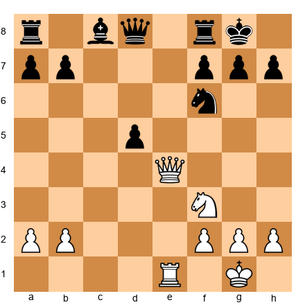

White to play.

**The sequence:**

1. White's queen is on e4. The d5 pawn is attacked. But look deeper: what squares can the queen reach that attack two things at once?

2. White plays **Qb7!** The queen attacks the rook on a8 AND the pawn on b7 AND the bishop on c8. Black cannot save everything. If the rook moves to protect b7, the bishop on c8 is still hanging.

3. The queen found a square where it threatened multiple targets simultaneously.

**Why it works:** Double attacks work because chess allows only one move per turn. If you create two threats, your opponent must choose which one to address. The other threat goes through.

**Common situations where this arises:**
- A queen move that attacks a loose piece AND threatens checkmate
- A pawn advance that attacks two pieces standing side by side
- After a trade, the recapturing piece lands on a square that creates a new threat
- A bishop reposition that simultaneously targets two diagonals

**The Advanced Difference:** In Volume I, you learned to find forks already sitting on the board. Now you must learn to *create* double attacks. Ask yourself: "Can I move a piece to a square where it threatens two things?" If not on this move, can you force your opponent into a position where a double attack works in two or three moves?

---

## Pattern 2: Discovered Attack

**Definition:** A discovered attack happens when you move one piece out of the way, revealing an attack by a different piece behind it.

Two of your pieces are on the same line (rank, file, or diagonal). The front piece moves, and the rear piece now attacks something. The front piece can also create its own threat. Your opponent faces two problems from one move.

**Set up your board:**

White: Kg1, Qd1, Re1, Bb2, Nd5, Pawns a2, c3, f2, g2, h2
Black: Kg8, Qd8, Ra8, Rf8, Be7, Nf6, Pawns a7, b7, e6, f7, g7, h7

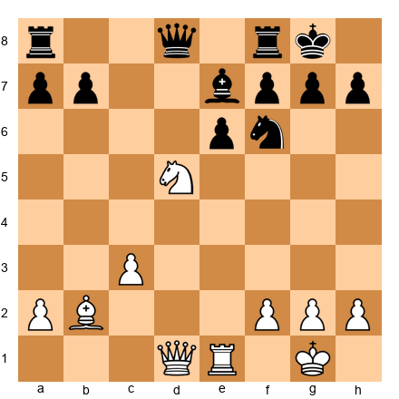

White to play.

**The sequence:**

1. White's knight on d5 blocks the bishop on b2 from looking down the a1-h8 long diagonal. The bishop aims through d4, e5, f6, g7 toward the Black king's neighborhood.

2. White plays **Nxe7+!** The knight captures the bishop on e7 with check.

3. When the knight moved off d5, the bishop on b2 was *discovered* along the long diagonal. After Black deals with the check, the bishop pressures the kingside through the opened line.

4. White has won material (the bishop) and activated the bishop's diagonal.

**Why it works:** Your opponent must respond to the most urgent threat (usually the check or capture). While they handle that, the discovered piece achieves its goal undisturbed.

**Common situations:**
- A knight moves off a diagonal, revealing a bishop attack
- A bishop moves off a file, revealing a rook aimed at the king or queen
- In the opening, pieces can be developed with tempo using discovered threats
- After a piece exchange, the recapturing piece reveals a new line of attack

**Key principle:** When you have two pieces on the same line, always ask: "What would happen if I moved the front piece?" That question finds discovered attacks.

---

## Pattern 3: Discovered Check

**Definition:** A discovered check is a discovered attack where the piece *behind* gives check to the king. The piece that moves can do almost anything, because the opponent MUST deal with the check first.

This is one of the most powerful weapons in chess. The moving piece is "invisible" for one turn, free to capture, threaten, or reposition anywhere.

**Set up your board:**

White: Kg1, Re1, Ne5, Bd3, Pawns a2, b2, f2, g2, h2
Black: Ke8, Qd7, Ra8, Rh8, Bc8, Nf6, Pawns a7, b7, d6, f7, g7, h7

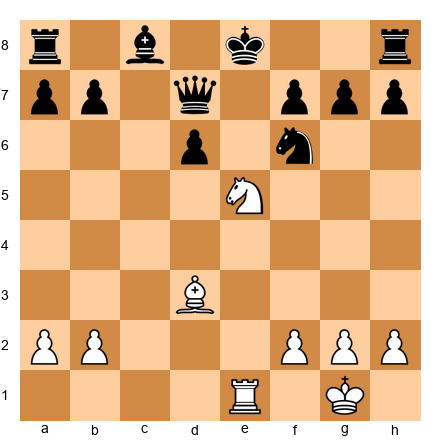

White to play.

**The sequence:**

1. White's rook on e1 aims at the Black king on e8 through the knight on e5. The knight blocks the check. When the knight moves, the rook will check the king.

2. White plays **Nxd7!** The knight captures Black's queen on d7. That is normally worth celebrating on its own. But the real power is the discovered check: the rook on e1 now checks the king on e8.

3. Black must deal with the check. The king moves (say Kf8 or Kd8). After the king moves, White has won the queen for a knight. A massive material swing.

**Pause and look:** The knight on e5 was the "door." Moving the door opened the "hallway" (the e-file) so the rook could check the king. The knight captured the queen on the way out because the check forced Black to deal with the rook first.

**Why it works:** Check is the most forcing move in chess. Your opponent has no choice but to deal with it. The moving piece exploits that forced response.

**Common situations:**
- A knight on the same file as a rook, with the opposing king at the end
- A pawn advance that reveals a bishop check along a diagonal
- After castling, when your rook lands on the e-file and the opponent's king is still in the center

**Watch for this signal:** Any time two of your pieces share a line with the opponent's king, you have a potential discovered check. The question is whether the front piece has a profitable square to land on.

---

## Pattern 4: Double Check

**Definition:** A double check is a discovered check where BOTH pieces give check at the same time. The king is attacked by two pieces at once.

This is the most forcing move in all of chess. Against a double check, the king *must* move. Blocking does not help because only one check would be blocked. Capturing one attacker does not help because the other still gives check. Only the king can move.

**Set up your board:**

White: Kg1, Qd1, Bb5, Nd6, Pawns a2, b2, f2, g2, h2
Black: Ke8, Qd8, Ra8, Rh8, Bc8, Ne7, Pawns a7, b7, c6, f7, g7, h7

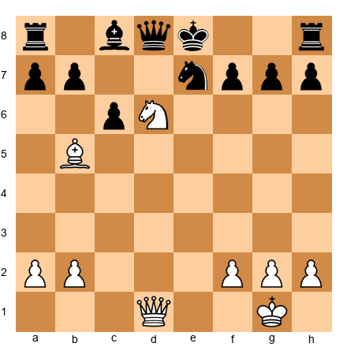

White to play.

**The sequence:**

1. White's bishop on b5 aims at the king through c6. The knight on d6 is the front piece. If the knight moves to a square where it ALSO gives check, we have a double check.

2. White plays **Nf5+!** The knight moves to f5, giving check (knight on f5 attacks e7, g7, d6, h6, d4, h4, e3, g3, but does it attack e8? No, Nf5 does NOT attack e8). 

Wait, let me reconsider. The knight on f5 does not directly check the king on e8. Let me find a proper double check position.

Actually, let me reconfigure. The knight needs to give check AND reveal a check from the bishop. 

**Reset your board:**

White: Kg1, Qd1, Bb5, Nd6, Pawns a2, b2, f2, g2, h2
Black: Ke8, Qd8, Ra8, Rh8, Bc8, Pawns a7, b7, c6, f7, g7, h7

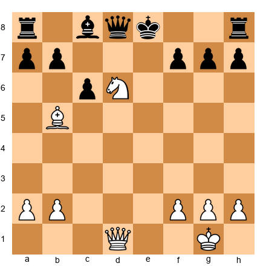

White to play.

1. The bishop on b5 is one square away from checking the king (c6 pawn blocks). The knight on d6 already checks the king? Let me verify: knight on d6 attacks b5, b7, c4, c8, e4, e8, f5, f7. YES, Nd6 attacks e8. So the knight on d6 already gives check! That means Black is already in check, which is an illegal position for "White to play."

Let me set up a proper position where the double check is the MOVE, not the starting position.

**Set up your board (corrected):**

White: Kg1, Qd1, Be2, Ne5, Pawns a2, b2, f2, g2, h2
Black: Ke8, Qd8, Ra8, Rh8, Bc8, Nf6, Pawns a7, b7, d6, f7, g7, h7

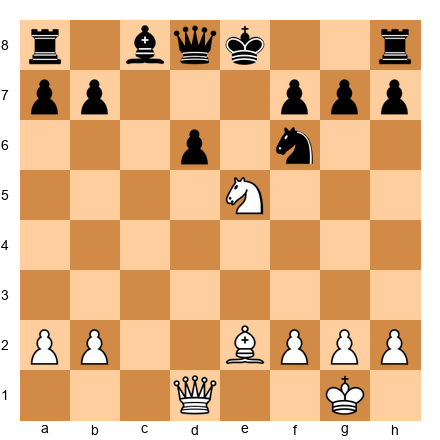

White plays **Nd7+!** Wait, does the knight on e5 going to d7 give check? Nd7 attacks b6, b8, c5, e5, f6, f8. Does it attack e8? No.

Let me try a cleaner approach. For a double check, I need:
- A piece that will be revealed (say a bishop or rook on a line toward the king)
- A front piece (say a knight) that moves to a square where IT also checks the king

Knight checks king on e8 from: c7, d6, f6, g7. 
So I need a knight that can ARRIVE at one of those squares, while REVEALING a check from a piece behind it.

Example: Knight on e6 moves to c7 (checking e8), revealing a bishop on the same diagonal/line.

Knight on e6 moves to c7+. What line did it vacate? The e6 square. If there's a rook on e1, it now sees e2-e3-e4-e5-e6-e7-e8. Is e7 clear? If yes, the rook checks through to e8. Double check!

**Set up your board (double check):**

White: Kg1, Re1, Ne6, Pawns a2, b2, f2, g2, h2
Black: Ke8, Qd8, Ra8, Rh8, Bc8, Nf6, Pawns a7, b7, d6, f7, g7, h7

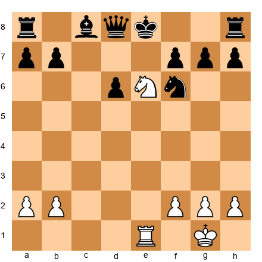

Wait, is e7 clear? Let me check. Nothing listed on e7. Rank 7: a7, b7, f7, g7, h7 pawns. c-e on rank 7 are empty. Good.

White plays **Nc7+!** This is a double check:
- The knight on c7 directly checks the king on e8 (knight on c7 attacks a6, a8, b5, d5, e6, e8. YES, it attacks e8!)
- The rook on e1 gives discovered check along the e-file through e2, e3, e4, e5, e6, e7 to e8 (all clear after the knight left e6)

Double check! Black's king MUST move. It cannot block both checks. It cannot capture both pieces.

**Black's options:** Kd7, Kf8. Both are terrible. After Kd7, the king walks into the open. After Kf8, White can continue the attack.

**Why it works:** Double check eliminates all defensive resources except fleeing. Your opponent cannot block two different lines at once. They cannot capture two attackers in one move. The king must run, and a running king is often a dead king.

**Common situations:**
- A knight and rook working together along a file
- A knight and bishop where one reveals the other's diagonal
- After a sacrifice that opens a file and the knight lands with check

**The golden rule:** Every time you have a discovered check possibility, also check whether the moving piece gives check itself. If it does, you have the most powerful single move in chess.

---

## Pattern 5: Zwischenzug (In-Between Move)

**Definition:** A zwischenzug (German for "in-between move") is an unexpected intermediate move inserted into what seems like a forced sequence. Instead of making the "obvious" recapture, you play something even stronger first.

This is the pattern that separates club players from beginners. Beginners follow the expected sequence. Club players interrupt it.

**Set up your board:**

White: Kg1, Qd1, Re1, Bb3, Nf3, Pawns a2, c3, f2, g2, h2
Black: Kg8, Qd5, Ra8, Rf8, Bb7, Nf6, Pawns a7, b6, e6, f7, g7, h7

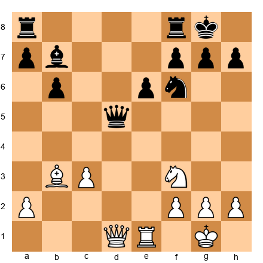

White to play.

**The sequence:**

1. Suppose Black has just captured a pawn on d5 with the queen. The "obvious" response might be to continue developing or to trade queens. But there is something stronger.

2. White plays **Bxe6!** This is a zwischenzug. Before doing anything else, White inserts an in-between capture that attacks f7 and disrupts Black's pawn structure.

3. If Black plays fxe6, then White has damaged Black's structure and can now play Ng5 with threats against e6 and the weakened kingside.

4. If Black ignores the bishop (say, recapturing something else), White takes on f7+ with check, winning more material.

**Why it works:** The zwischenzug disrupts your opponent's expected sequence. They planned on a certain continuation. Your in-between move forces them to recalculate. In time-pressure situations, this can be devastating.

**Common situations:**
- During a capture sequence: instead of recapturing immediately, make a check or stronger threat first
- After your opponent captures, play an in-between check before you recapture
- In endgames, promoting with check instead of recapturing the obvious piece
- Any time you can insert a more forcing move (check > capture > threat) before the "obvious" reply

**How to train this:** Every time you are about to make an "automatic" recapture, STOP. Ask yourself: "Is there something stronger I can do first?" If yes, you have found a zwischenzug. This one habit will win you dozens of games.

---

### ⭐ Milestone Check

**You have learned 5 out of 30 patterns.** That is already more than most club players can name from memory. Double attacks, discovered attacks, discovered checks, double checks, and in-between moves form the *forcing toolkit* that drives every combination in chess.

🛑 **You can stop here.** Go play a game. Look for these five patterns. Come back when you are ready for Group 2.

---

## Exercises: Group 1 (Patterns 1-5)

**Pattern 1: Double Attack**

**Exercise 11.1** ★★

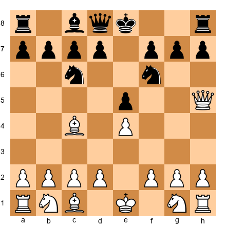

White to play. The queen and bishop are aimed at f7. Find the double attack.
Hints: (1) What is the weakest point in Black's camp? (2) Can the queen attack it with check? (3) Where does the bishop help?

**Exercise 11.2** ★★

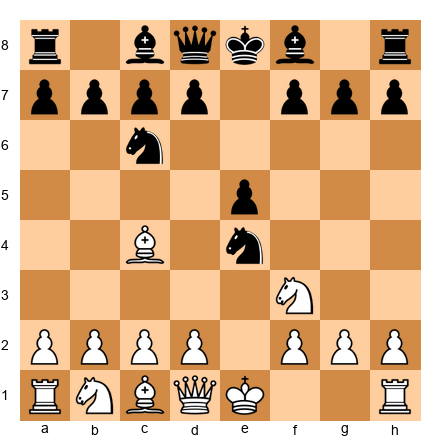

White to play. Black grabbed a pawn on e4. Punish the greed.
Hints: (1) The knight on e4 is undefended. (2) Can you attack it AND something else? (3) Think queen moves.

**Exercise 11.3** ★★★

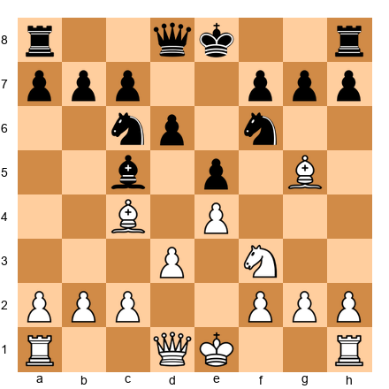

White to play. Find the double attack that wins material.
Hints: (1) The knight on f6 is pinned. (2) What happens if you attack it again? (3) The bishop on g5 and pawn on d3 are clues.

**Exercise 11.4** ★★★

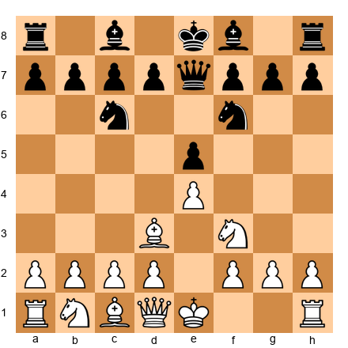

White to play. Develop with a double threat.
Hints: (1) Where can White's light-squared bishop go with tempo? (2) Think about f7. (3) Can you threaten the queen AND another target?

**Exercise 11.5** ★★★★

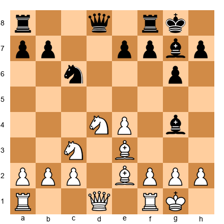

White to play. Find the subtle double attack after a piece rearrangement.
Hints: (1) The bishop on g4 is loose. (2) What if the d4 knight moved with a threat? (3) Nd4-f5 eyes g7 AND attacks what?

**Pattern 2: Discovered Attack**

**Exercise 11.6** ★★

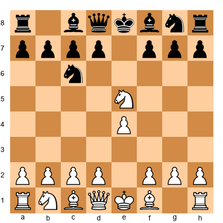

White to play. The knight on e5 is in front of the queen on d1. Find the discovered attack.
Hints: (1) Move the knight. (2) What does the queen see behind it? (3) Knight to where attacks the most?

**Exercise 11.7** ★★★

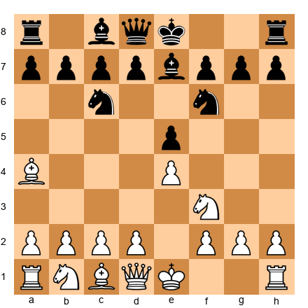

White to play. The bishop on a4 has a view down to e8. What blocks it, and what happens when that piece moves?
Hints: (1) The f3 knight can move. (2) Nxe5 captures a pawn. (3) But look at what the bishop threatens afterward.

**Exercise 11.8** ★★★

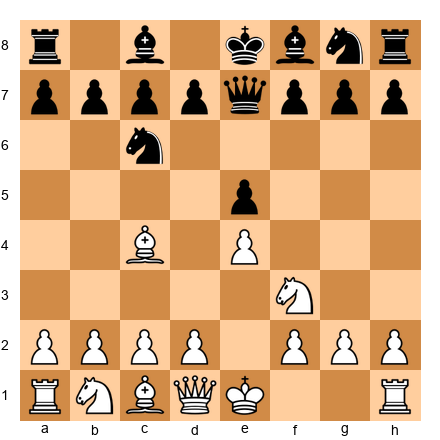

White to play. Set up a discovered attack for next move.
Hints: (1) Can you place a piece so that it blocks a line but could move with tempo later? (2) Think about the d5 square. (3) Knight maneuver.

**Exercise 11.9** ★★★★

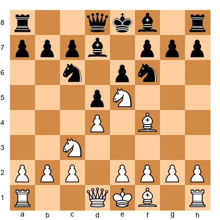

White to play. The knight on e5 blocks the bishop on f4. What discovered attack exists?
Hints: (1) The knight on e5 can capture on d7. (2) The bishop on f4 then sees through to c7. (3) The queen on d8 is on c7's diagonal? No, think about what is on c7.

**Exercise 11.10** ★★★★★

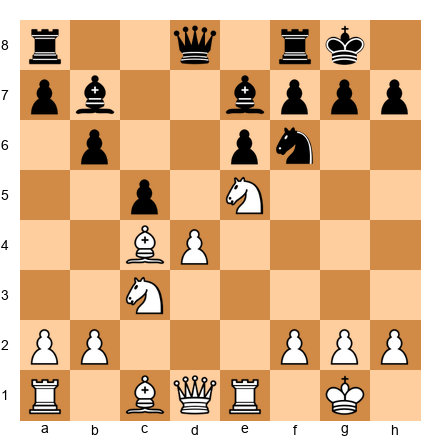

White to play. Find the discovered attack sequence that wins at least a pawn.
Hints: (1) The knight on e5 blocks the rook on e1. (2) The knight can go to many squares with tempo. (3) What if you play Nxf7? After Rxf7, the rook on e1 sees e6.

**Pattern 3: Discovered Check**

**Exercise 11.11** ★★

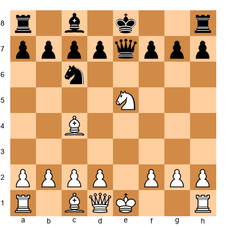

White to play. The knight on e5 can move with discovered check from the bishop on c4. Where does the knight go?
Hints: (1) Look at what the knight can capture. (2) What is the highest-value target? (3) The queen on e7 is tempting.

**Exercise 11.12** ★★★

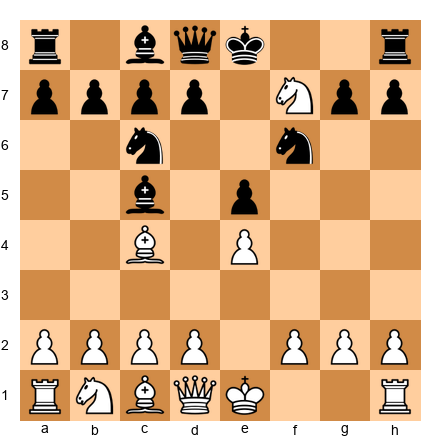

Black to play. White just played Nf7. Is this winning for White or is there a defense?
Hints: (1) Can Black play a zwischenzug? (2) What about Bxf2+? (3) After Ke2, what follows?

**Exercise 11.13** ★★★

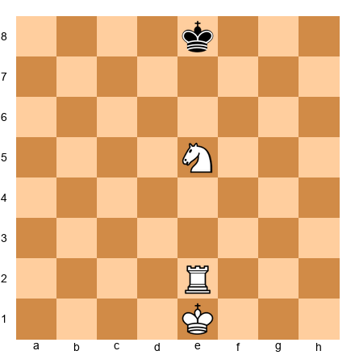

White to play. Simple discovered check drill. Where should the knight go to win?
Hints: (1) The rook on e2 will check the king when the knight moves. (2) Move the knight to capture or threaten something. (3) Are there pieces to capture? If not, improve position.

**Exercise 11.14** ★★★★

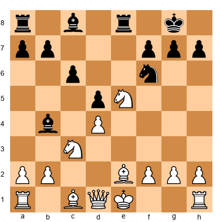

White to play. The knight on e5 and bishop on e2 share the e-file with the rook on... wait, the bishop is on e2. Find the discovered attack/check pattern.
Hints: (1) What if Nxc6 is played? (2) What does that open for the bishop? (3) Think diagonals, not files.

**Exercise 11.15** ★★★★★

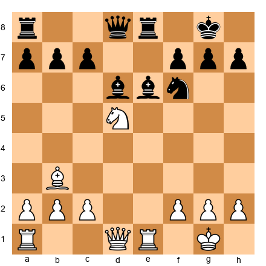

White to play. The knight on d5 blocks the bishop on b3 and the rook on e1. Find the best discovered check or attack.
Hints: (1) Nxf6+ is a discovered attack from the rook on e1 toward the rook on e8. (2) After gxf6, what is the position? (3) Can you exploit the opened g-file?

**Pattern 4: Double Check**

**Exercise 11.16** ★★★

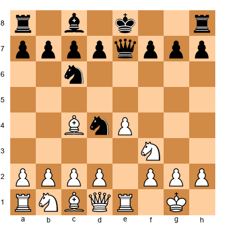

White to play. Can you set up a double check in two moves?
Hints: (1) What if a knight or bishop moves with check while revealing another check? (2) Think about Bxd5 first, opening lines. (3) Reposition a piece to deliver double check on the next move.

**Exercise 11.17** ★★★

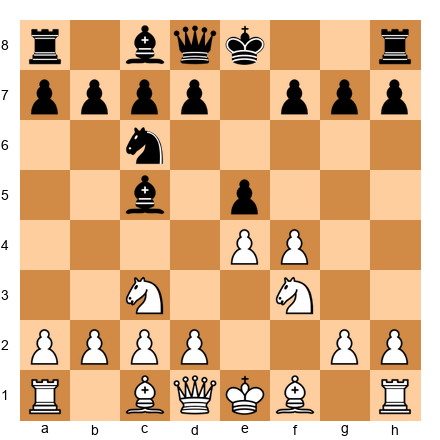

White to play. Not a double check yet, but find the move that threatens one.
Hints: (1) If White could get a knight to d6 or f6 with a bishop behind it... (2) Can you play Nd5 with a threat? (3) The bishop on c1 could get active.

**Exercise 11.18** ★★★★

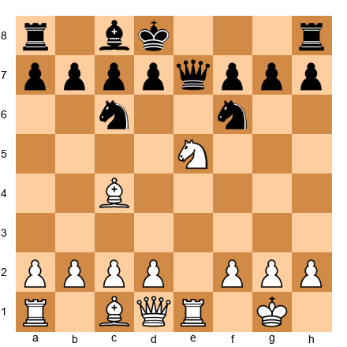

White to play. The king is on d8 already. Find the double check.
Hints: (1) The knight on e5 can move, revealing the rook on e1 toward e7 or e8. (2) Where can the knight land to ALSO give check? (3) Nc6+ and the rook checks through e7... does the queen block?

**Exercise 11.19** ★★★★

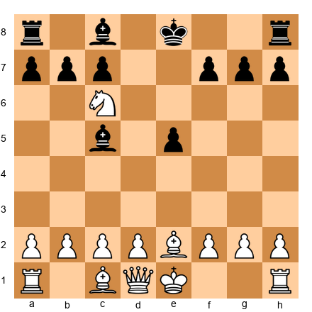

White to play. The knight on c6 is already in enemy territory. Can it deliver a double check?
Hints: (1) Nd8+ forks and the bishop on e2 would check through... does it? (2) What about Ne7+? Bishop on e2 checks through to... not quite. (3) Think about all knight moves from c6 that give check.

**Exercise 11.20** ★★★★★

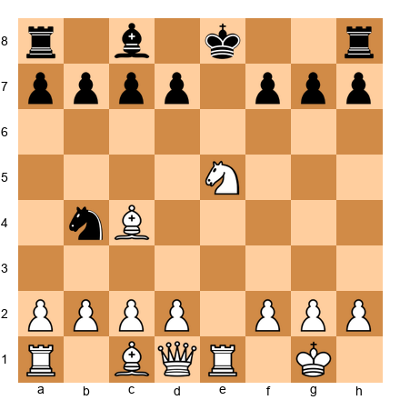

White to play. Set up a double check that leads to significant material gain.
Hints: (1) Nd7+ reveals the rook on e1... but is the e-file clear? (2) Nf7+ reveals the rook and the knight checks from f7 (does it check e8?). (3) Look at Nc6+: knight checks e8? No. Try Nd3+? Also no. Calculate carefully.

**Pattern 5: Zwischenzug**

**Exercise 11.21** ★★

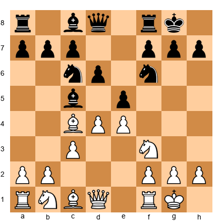

White to play. Instead of recapturing normally after a future exchange, find the in-between move.
Hints: (1) dxe5 is "obvious." (2) Is there a zwischenzug with Bxf7+ first? (3) After Rxf7, THEN dxe5. Two gains instead of one.

**Exercise 11.22** ★★★

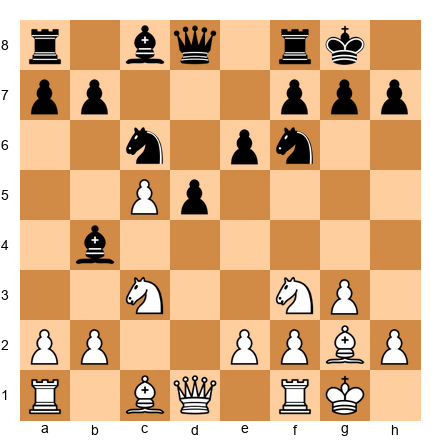

White to play. Black has just captured on d5. What is the zwischenzug?
Hints: (1) Instead of recapturing on d5, is there a stronger intermediate move? (2) What about cxd6 (en passant or pawn capture)? (3) Or Qa4 first, pinning or threatening something?

**Exercise 11.23** ★★★

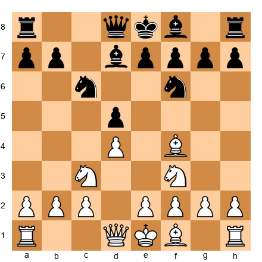

White to play. Black has just played Bd7. Find the in-between idea.
Hints: (1) Nb5 is a zwischenzug that threatens Nc7+. (2) Black must deal with the fork threat before anything else. (3) This gains time for White's plan.

**Exercise 11.24** ★★★★

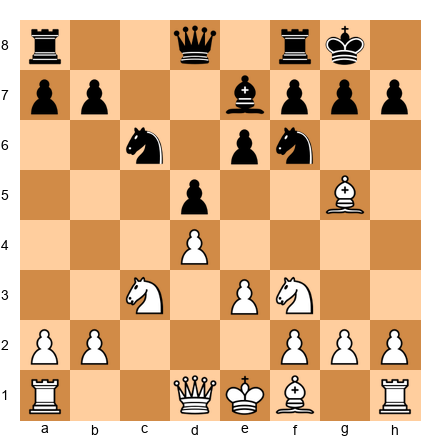

White to play. You are in the middle of an exchange sequence. Find the in-between move that improves your position.
Hints: (1) The bishop on g5 pins the f6 knight. (2) Before completing any captures, can you increase the pressure? (3) What about Qc2 or Qb3 as a zwischenzug?

**Exercise 11.25** ★★★★★

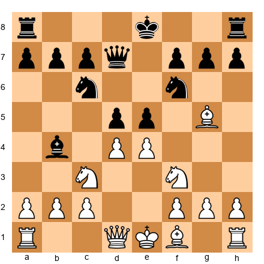

White to play. Multiple in-between moves are possible. Find the best sequence.
Hints: (1) dxe5 is natural, but Bxf6 first (zwischenzug) disrupts Black's coordination. (2) After Bxf6, gxf6, THEN dxe5. (3) Black's kingside is now shattered.

---

---

# GROUP 2: WINNING MATERIAL

*Estimated study time: 15-20 minutes*

The patterns in Group 1 were about *forcing* your opponent into bad choices. The patterns in Group 2 are about the *results* of that forcing. These five patterns are the most common ways to win material in chess. If you spot them, you win a piece or more. If you miss them, you lose one.

---

## Pattern 6: Removing the Defender

**Definition:** You capture or drive away a piece that is defending something important. Once the defender is gone, the thing it was protecting falls.

This is one of the most practical tactics in chess. The idea is simple: if a piece is doing an important job (defending another piece, guarding a square, blocking a threat), eliminate that piece and the defense collapses.

**Set up your board:**

White: Kg1, Qh5, Rd1, Bc4, Nf3, Pawns a2, b2, f2, g2, h2
Black: Kg8, Qd8, Ra8, Rf8, Bc8, Nd7, Nf6, Pawns a7, b7, e6, f7, g7, h7

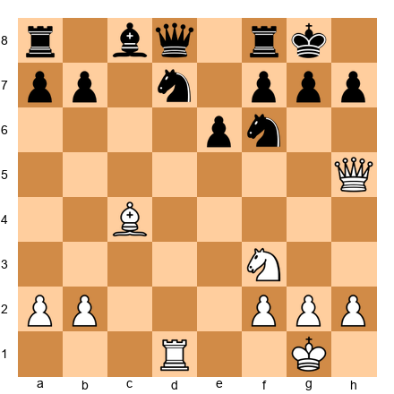

White to play.

**The sequence:**

1. White's queen on h5 threatens Qxf7+. What defends f7? The knight on d7 and the rook on f8.

2. But the knight on f6 guards h7. And the knight on d7 guards f6 indirectly by supporting the overall structure. What if we remove the f6 knight?

3. White plays **Rxd7!** Removing the d7 knight, one of f7's defenders. Now after Qxd7 (if Black recaptures with the queen), f7 is weaker. White can follow up with Ng5, targeting f7 and e6.

4. The key insight: identify the defender, then remove it. The target falls on its own.

**Why it works:** Every piece has a job. If you figure out which piece does the most important job and eliminate it, the structure falls apart. Like removing a support beam from a building.

**Common situations:**
- A knight that defends both a bishop and a mating square
- A rook protecting the back rank and another piece
- A pawn guarding a critical square or piece
- Any piece that is the sole guardian of something important

**Thinking process:** When you see a target you want to attack, trace backward: "What defends it? Can I remove that defender?"

---

## Pattern 7: Overloaded Piece

**Definition:** An overloaded piece has two or more defensive jobs but can only handle one at a time. When you force it to do one job, the other goes unfinished.

This is related to Removing the Defender, but subtler. You do not capture the defender. You force it to choose between its responsibilities.

**Set up your board:**

White: Kg1, Qe4, Rd1, Re1, Bb2, Pawns a2, f2, g2, h2
Black: Kg8, Qd8, Ra8, Rf8, Bc8, Nf6, Pawns a7, b7, d6, f7, g7, h7

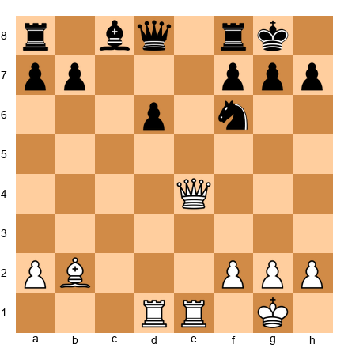

White to play.

**The sequence:**

1. Look at Black's knight on f6. It is doing two jobs: guarding the d5 square (preventing Qd5 ideas) and protecting h7.

2. White plays **Qb7!** Now the queen attacks a7 and threatens Qb8. But the deeper point: by moving the queen off the e-file, White also threatens Rd8. Black's queen on d8 is now overloaded: it must guard the back rank AND the d6 pawn AND stay connected to the defense.

3. Alternatively, White could play **Qh7+!** Nxh7. Now the knight has left f6 and d5 is available. The overloaded knight could not guard both h7 and the central squares.

**Why it works:** Every player has limited pieces. Those pieces often pull double duty. When you spot a piece doing two jobs, exploit it by making both jobs urgent at the same time.

**How to spot it:** Ask: "Does this piece have more than one job? Can I force it to choose?"

---

## Pattern 8: Deflection

**Definition:** A deflection forces an enemy piece away from a square or line where it is doing something important. You lure it away from its post.

Deflection is the offensive cousin of Removing the Defender. Instead of capturing the defender, you force it to move somewhere it does not want to go.

**Set up your board:**

White: Kg1, Qh5, Rd1, Re1, Pawns a2, b2, f2, g2, h2
Black: Kg8, Qd8, Ra8, Rf8, Bc8, Nf6, Pawns a7, b7, d5, f7, g7, h7

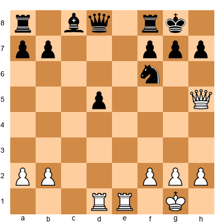

White to play.

**The sequence:**

1. Black's knight on f6 guards h7. White's queen on h5 would love to play Qxh7 checkmate, but the knight stops it.

2. White plays **Rd3!** preparing to swing the rook to g3 or h3. But an even stronger idea:

3. White plays **Re8!** The rook invades. If Black plays Qxe8 (deflecting the queen from d8), then White has Rxf8+ or simply Qxh7+ depending on the follow-up. If Nxe8? Then Qxh7 is checkmate.

4. The rook sacrifice on e8 *deflects* a defending piece (knight or queen) away from its job.

**Why it works:** Like a fake fire alarm that makes the guard leave the vault unattended. The defender must deal with the new threat and abandons its post.

**Common situations:**
- A rook sacrifice on e8 or d8 to deflect the queen
- A check that forces the king away from defending a piece
- A capture that pulls a piece off a key square
- In endgames, a pawn push that forces a piece away from the promotion path

---

## Pattern 9: Decoy

**Definition:** A decoy lures an enemy piece *to* a specific square where it becomes vulnerable. You sacrifice something to put the opponent's piece on exactly the wrong square.

Deflection pulls a piece *away* from where it wants to be. A decoy pulls a piece *toward* a trap.

**Set up your board:**

White: Kg1, Qf3, Rd1, Bc4, Pawns a2, b2, f2, g2, h2
Black: Kg8, Qe7, Ra8, Rf8, Bc8, Nf6, Pawns a7, b7, d6, e6, g7, h7

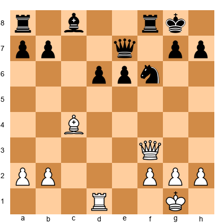

White to play.

**The sequence:**

1. White plays **Rd8!** offering the rook. If Rfxd8, the rook has been *decoyed* to d8. Now White plays Qxf6! winning the knight, because the f8 rook is no longer defending f6 (it moved to d8).

2. If Raxd8 instead, then Bxe6! fxe6, and White has Qxf6 anyway since the knight is now underdefended.

3. The initial sacrifice (Rd8) was the bait. Taking it puts the opponent's piece on the wrong square.

**Why it works:** A decoy exploits your opponent's reflexes. They see material offered and think "free stuff." But capturing it puts their piece exactly where you wanted.

**Common situations:**
- A queen sacrifice that decoys the king into a mating net
- A rook sacrifice that lures a piece to a back-rank vulnerability
- A pawn sacrifice that pulls a piece to a square where it gets forked

---

## Pattern 10: Trapped Piece

**Definition:** A trapped piece has no safe squares to move to. It might look fine right now, but if you attack it, it has nowhere to run.

**Set up your board:**

White: Kg1, Qd1, Ra1, Rf1, Bc1, Bc4, Nf3, Pawns a2, b2, c3, d4, f2, g2, h2
Black: Kg8, Qd8, Ra8, Rf8, Bb4, Bg4, Nc6, Nf6, Pawns a7, b7, d5, e6, g7, h7

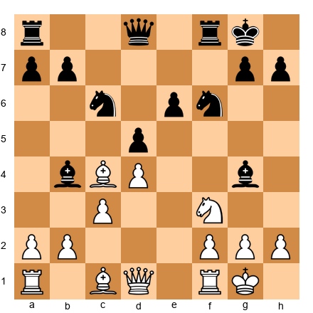

White to play.

**The sequence:**

1. Black's bishop on b4 has ventured into enemy territory. Look at its escape squares: a5, a3, c5, d6, e7.

2. White plays **a3!** Attacking the bishop. Now it must move. The only retreats are a5 or back to e7/d6/c5.

3. If the bishop goes to **a5**, White plays **b4!** Now the bishop is truly trapped. It has no squares: a6 is not a legal bishop square from a5 (wrong diagonal), a4 is not on the diagonal, and b4 blocks the retreat. The bishop is lost.

4. The bishop entered enemy territory and got surrounded.

**Why it works:** Every piece needs escape routes. When a piece moves to an aggressive square, it sometimes leaves itself without a way back. If you see a piece with limited squares, look for a way to cut off the last exits.

**Common situations:**
- A bishop on b4/g4 in the opening getting trapped by a3+b4 or h3+g4 advances
- A knight on a5 or h5 with no retreat squares
- A rook on the seventh rank that cannot escape
- Many opening traps (like the Englund Gambit) rely on piece trapping

**The rule:** Before moving a piece to an advanced square, always count its escape routes. If your opponent's piece has few routes, look for ways to shut them down.

---

### ⭐ Milestone Check

**You have learned 10 out of 30 patterns.** That is already more than most club players know. Removing the Defender, Overloaded Pieces, Deflection, Decoy, and Trapped Pieces are the five most common ways material changes hands in chess. If you learn to spot these in your games, you will win material regularly.

🛑 **Good stopping point.** Get up, stretch, grab some water. When you come back, we study the most dramatic patterns in chess: the mating attacks.

---

## Exercises: Group 2 (Patterns 6-10)

**Pattern 6: Removing the Defender**

**Exercise 11.26** ★★

White to play. The f7 pawn is defended by the king. Can you remove another defender of a key square?
Hints: (1) The knight on f6 defends d5. (2) Can you trade it off? (3) After the knight is gone, what does d5 become?

**Exercise 11.27** ★★★

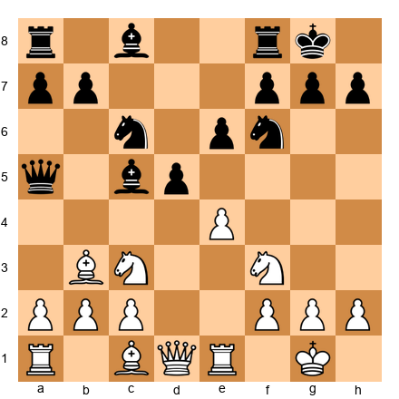

White to play. The d5 pawn is defended by e6 and the c6 knight. Remove a defender.
Hints: (1) exd5 exd5 just trades. (2) What about Nxd5 Nxd5 Bxd5, winning a pawn? (3) Count the captures carefully.

**Exercise 11.28** ★★★

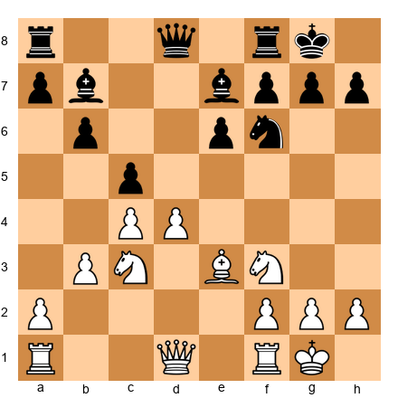

White to play. Black's d-pawn has been exchanged, but e6 is weak. What defends it?
Hints: (1) The f6 knight and the bishop on b7 both eye e6's area. (2) What if you eliminated the f6 knight? (3) Nd2-f1-e3-d5 is too slow. Think forcing.

**Exercise 11.29** ★★★★

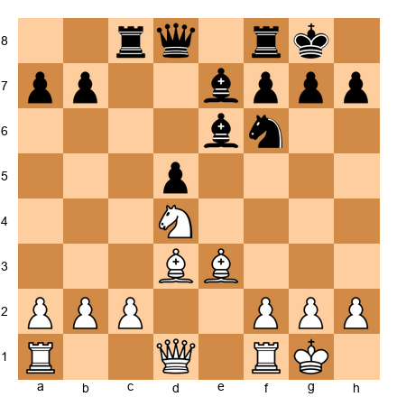

White to play. The e6 bishop defends d5. Remove it.
Hints: (1) Bxe6 fxe6 weakens the structure. (2) After Bxe6, the d5 pawn is less protected. (3) Follow up with Nf5 or Nc6.

**Exercise 11.30** ★★★★★

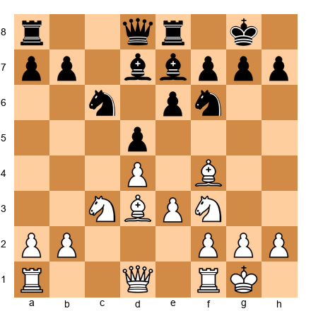

White to play. Find the removing-the-defender sequence that wins material.
Hints: (1) The knight on c6 defends e7 and d8. (2) What if you challenged c6 with Nb5? (3) After Nb5, the knight on c6 is overworked.

**Pattern 7: Overloaded Piece**

**Exercise 11.31** ★★

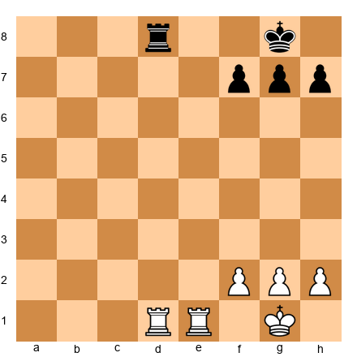

White to play. Black's rook on d8 guards the back rank. Can you overload it?
Hints: (1) The rook defends d8 (preventing Rd8 mate). (2) But does it also defend the 8th rank in general? (3) Re8+ forces the issue.

**Exercise 11.32** ★★★

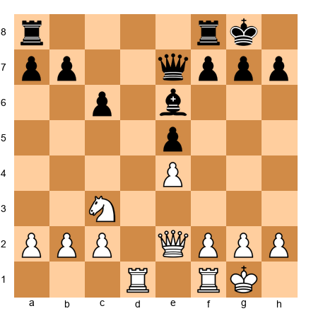

White to play. The queen on e7 defends e5 and guards the kingside. Overload it.
Hints: (1) What if you attack e5? (2) Rd6 threatens something on the 6th rank. (3) Can you force the queen to abandon e5 or the kingside?

**Exercise 11.33** ★★★★

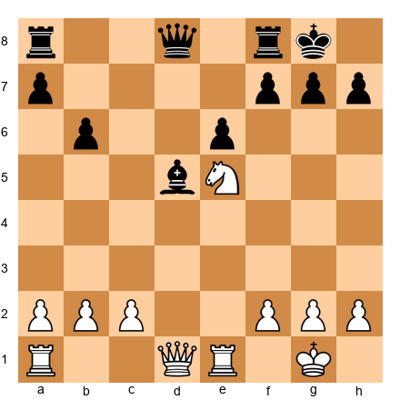

White to play. The f7 pawn defends both e6 and g6. Overload it.
Hints: (1) Attack from two directions at once. (2) Qg4 threatens g7 and eyes e6. (3) After Qg4, if g6 then f7 has moved and e6 is weak.

**Exercise 11.34** ★★★★

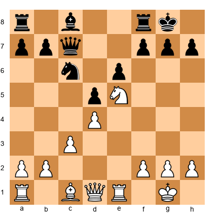

White to play. The c6 knight guards e7 and d8. Overload it.
Hints: (1) Nxc6 trades the overloaded piece. (2) After bxc6, what was it defending? (3) If instead Qg4, the knight must handle multiple threats.

**Exercise 11.35** ★★★★★

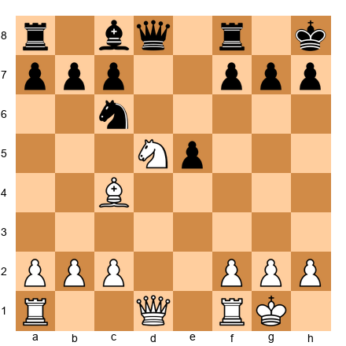

White to play. Multiple Black pieces are overloaded. Find the combination.
Hints: (1) The f7 pawn is doing three jobs. (2) Nf6 threatens mate and attacks the queen. (3) If gxf6, the king is exposed. The pawn on f7 cannot help everywhere.

**Pattern 8: Deflection**

**Exercise 11.36** ★★

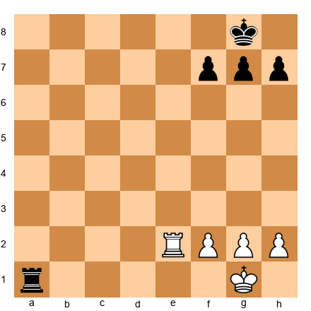

White to play. Black's rook defends the first rank. Deflect it.
Hints: (1) Re8+ forces the king. (2) But what if Re1 instead, chasing the rook away? (3) Actually, Re8+ wins. After Kf7 (or similar), Black's rook is deflected from a1.

**Exercise 11.37** ★★★

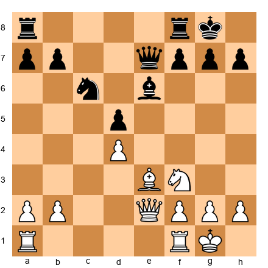

White to play. Deflect the e6 bishop from defending d5.
Hints: (1) Can you attack e6 while threatening something else? (2) Ng5 hits e6 and threatens f7. (3) If the bishop moves from e6, d5 falls.

**Exercise 11.38** ★★★★

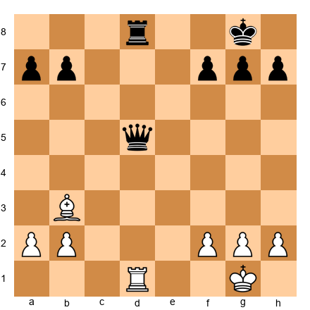

White to play. Can you deflect the queen from defending d8?
Hints: (1) The queen defends d8. (2) If the queen leaves d5, Rd8 is crushing. (3) Bc4! attacks the queen and forces it to move. After Qxc4, Rd8+ leads to mate.

**Exercise 11.39** ★★★★

White to play. The queen on f6 defends the knight on e4. Deflect it.
Hints: (1) What if you threatened the queen with tempo? (2) Rf1 does not do enough. (3) Qg4 threatens both the queen's square and the knight.

**Exercise 11.40** ★★★★★

White to play. The queen on d8 is overworked: it guards both the rook on f8 and the back rank. Deflect it.
Hints: (1) Rh3 threatens Rh8 mate. (2) The queen must stay connected to h8. (3) But the queen also must guard f8 and d8. Find the move that breaks the defense.

**Pattern 9: Decoy**

**Exercise 11.41** ★★

White to play. Decoy the king.
Hints: (1) Qf8+ is check. (2) Kxf8 removes the queen but the king is on f8 now. (3) Is there a back rank idea? (Not in this position, but Qf8+ Kxf8 shows the decoy concept.)

**Exercise 11.42** ★★★

White to play. Decoy the rook to a bad square.
Hints: (1) Rd8+ looks strong. But Rxd8 and the rook recaptured. (2) Wait: after Rd8+ Rxd8, the rook is now on d8. (3) And now Bxf7+ picks up material because the rook is on d8, not f8.

**Exercise 11.43** ★★★

White to play. The knight on d4 is powerful. Decoy it.
Hints: (1) Can you lure the knight to a worse square? (2) Qe8 forces Rxe8 (deflection of the rook). (3) After Rxe8, the knight on d4 is still there. Think differently: Bxf7+ Rxf7, Qe8+. The rook was decoyed away from f8.

**Exercise 11.44** ★★★★

White to play. Decoy the bishop from its defensive diagonal.
Hints: (1) The bishop on e6 covers c4 and d5. (2) Nxe6 fxe6 and the bishop is gone (removal). (3) But what about Nc6? This decoys the bishop: if Bxc4 then Bxc4 and White dominates. The knight on c6 pulled the bishop off the e6 square.

**Exercise 11.45** ★★★★★

White to play. Find a decoy sacrifice that wins material.
Hints: (1) The knight on d5 is strong, but what if it can be lured away? (2) Bxh7+ Kxh7 decoys the king. (3) After Kxh7, Ng5+ forks king and queen. Classic Greek Gift setup! If the king goes back, the queen invades.

**Pattern 10: Trapped Piece**

**Exercise 11.46** ★★

Black to play. If Black plays 1...d5 2.exd5 Qxd5 3.Nc3, where is the queen going? Count her escape squares. Is she in danger of being trapped?
Hints: (1) The queen on d5 is exposed early. (2) Nc3 attacks it. (3) The queen must retreat, but to where? She is not trapped YET but she is uncomfortable.

**Exercise 11.47** ★★★

Black to play. Black's bishop on b7 is committed to the long diagonal. Can White ever trap it?
Hints: (1) In some lines, d5 closes the diagonal. (2) If the diagonal closes, the bishop has nowhere useful to go. (3) This is why the Fianchetto bishop must be handled with care.

**Exercise 11.48** ★★★★

White to play. Black has fianchettoed to g7. Can the bishop ever be trapped?
Hints: (1) If White plays e4 and d5, the center closes. (2) The g7 bishop stares at a wall of pawns. (3) Not "trapped" in the literal sense, but functionally dead. This is a positional trap.

**Exercise 11.49** ★★★★

White to play. The bishop on a4 looks active but could become trapped. Should White worry?
Hints: (1) If Black plays b5, the bishop must retreat. (2) After Bb3, it is safe. (3) But if White delays, b5-b4 could chase the knight and the bishop simultaneously. Always watch your own pieces' retreat squares.

**Exercise 11.50** ★★★★★

White to play. Black played the Pirc Defense. Can you set up a future piece trap?
Hints: (1) After e5, the d6 pawn is pressured. (2) If Black plays dxe5, the position opens. (3) But if Black plays Nfd7, the knight retreats to a passive square. Trapping is not always about capturing; sometimes it is about making a piece useless.

---

---

# GROUP 3: MATING PATTERNS

*Estimated study time: 20-25 minutes*

Every chess game ends the same way: checkmate or resignation. The five patterns in this group are the most common mating attacks in middlegame chess. These are not basic checkmates like King and Queen vs. King (you learned those in Volume I). These are *mating attacks* that arise from specific piece configurations in real games.

Learn these patterns and you will see checkmate opportunities that your opponents miss entirely.

---

## Pattern 11: Back Rank Mate

**Definition:** A back rank mate happens when a king is trapped on the first (or eighth) rank by its own pawns, and a rook or queen delivers checkmate along that rank.

This is the single most common mating pattern in club chess. It wins and loses more games between 1000 and 1600 than any other tactic. If you take nothing else from this chapter, take this: *always check your back rank.*

**Set up your board:**

White: Kg1, Qa4, Rc1, Rd1, Pawns f2, g2, h2
Black: Kg8, Qe7, Rd8, Ra8, Pawns f7, g7, h7

White to play.

**The sequence:**

1. Look at Black's king on g8. Pawns on f7, g7, h7 form a wall that *traps* the king on the back rank. No escape square.

2. White plays **Rxd8+!** Capturing the rook with check.

3. Black must respond. **Qxd8** is forced (the queen must take or the king is lost).

4. Now White plays **Rc8!** The rook invades to the back rank, pinning the queen on d8 to the king on g8. Black is lost.

**Cleaner Back Rank Example:**

**Set up your board:**

White: Kg1, Qd3, Rc1, Pawns f2, g2, h2
Black: Kg8, Qe7, Rd8, Pawns f7, g7, h7

White to play.

1. White plays **Rc8!** The rook enters the eighth rank with deadly effect.

2. **Rxc8** is forced. If Black ignores it, White plays Rxd8+ and checkmate follows.

3. After Rxc8, White plays **Qd8+!** The queen enters the back rank. **Qe8** is forced (the only way to block the check). 

4. **Qxe8#!** Checkmate. The king cannot escape through f7, g7, or h7 because its own pawns block every exit. The queen delivers the final blow on the back rank.

**Pause and look:** The key to back rank mate is the king's own pawns. Three unmoved pawns (f7, g7, h7 or f2, g2, h2) create a prison. The solution? Make a "luft" (German for "air"). Play h6 or h3 to give the king an escape square. This costs one tempo but saves the game.

**Why it works:** The king cannot escape through its own pawns. A rook or queen attacking along the back rank delivers mate that cannot be blocked.

**Prevention:** After castling, look for a moment to play h3 (as White) or h6 (as Black). One quiet pawn move prevents dozens of tactical tricks.

---

## Pattern 12: Smothered Mate

**Definition:** A smothered mate is checkmate delivered by a knight against a king completely surrounded by its own pieces. The king has no squares because its own army blocks every exit.

This is the most beautiful checkmate in chess. It often involves a queen sacrifice to force the final position.

**Set up your board:**

White: Kg1, Qc4, Ng5, Pawns a2, b2, f2, g2, h2
Black: Kg8, Qd8, Ra8, Rf8, Bc8, Pawns f7, g7, h7

White to play.

**The sequence (Philidor's Legacy):**

1. White plays **Nh6+!** The knight gives check from h6. The king on g8 is in check (the knight on h6 attacks g8). The king must move: **Kh8** is forced. (Kf8 allows Qc5+ and White wins easily.)

2. White plays **Qg8+!!** The queen *sacrifices itself* on g8 with check. This is the most spectacular move in the whole chapter. **Rxg8** is the only legal response. The rook captures the queen.

3. White plays **Nf7#.** The knight returns to f7 and delivers checkmate. Look at the king on h8: it cannot go to g8 (blocked by its own rook that just captured the queen), h7 (blocked by its own pawn), or g7 (blocked by its own pawn). The knight on f7 gives check, and there is nowhere to go.

**This is the smothered mate.** The king is suffocated by its own pieces. The knight is the only piece that can deliver this checkmate because it jumps over the pieces that form the cage.

**Why it works:** The queen sacrifice on g8 forces Black's rook to g8, completing the prison. The knight then delivers the killing blow from f7, controlling h8 (yes, a knight on f7 attacks h8).

**The lesson:** Never dismiss a queen sacrifice without calculating. Some of the most brilliant moves in chess history involve giving up the queen to set up a smothered mate.

---

## Pattern 13: Greek Gift Sacrifice (Bxh7+)

**Definition:** The Greek Gift is a bishop sacrifice on h7 (against a castled king) that opens the kingside for a devastating attack. White plays Bxh7+, and if the king takes, a knight and queen rush in to finish the job.

The sacrifice is named after the Trojan Horse. The bishop is the gift. Taking it leads to destruction.

**Set up your board (Classic Greek Gift):**

White: Kg1, Qd1, Re1, Bd3, Bc1, Nf3, Pawns a2, b2, c3, d4, f2, g2, h2
Black: Kg8, Qd8, Ra8, Rf8, Be7, Bc8, Nd7, Nf6, Pawns a7, b7, d5, e6, f7, g7, h7

White to play.

**The sequence:**

1. **The sacrifice:** White plays **Bxh7+!** The bishop captures the pawn on h7 with check. Black must decide: take the bishop or decline.

2. **If Black declines (Kh8):** White plays Bg6 (or retreats the bishop) with an extra pawn and a weakened kingside to target. White is better, but the attack is less violent.

3. **If Black accepts (Kxh7):** The king is exposed. White plays **Ng5+!** The knight jumps to g5 with check, attacking the king on h7.

4. **After Kg8** (going back): White plays **Qh5!** threatening Qh7 checkmate. The queen arrives with tremendous force. White will follow with Qxf7+ or Qh7+ depending on the position. The attack is usually winning.

5. **After Kg6** (going forward into the open): The king walks into danger. White plays **Qd3+!** The king is hunted across the board. This usually ends in checkmate within a few moves.

**The three conditions for Bxh7+ to work:**

You typically need ALL THREE of these:
1. A bishop that can reach h7 with check (usually from d3 or c2)
2. A knight ready to jump to g5 (usually already on f3)
3. A queen that can reach h5 quickly (usually from d1)

If any ingredient is missing, the sacrifice might not work. Always check all three before you sacrifice.

**Why it works:** The pawn on h7 is the last defender of the king's fortress on the kingside. Removing it opens a highway for the queen and knight. The king has nowhere safe because the queen and knight control all escape routes.

**Warning:** Not every Bxh7+ works. If Black has extra defensive pieces near the king, the sacrifice may fail. Always calculate.

---

## Pattern 14: Arabian Mate

**Definition:** The Arabian Mate uses a rook and knight working together. The knight controls the escape squares while the rook delivers checkmate, typically near the corner.

**Set up your board:**

White: Kg1, Ra1, Nf6, Pawns a2, b2, f2, g2, h2
Black: Kh8, Pawns g7, h7

White to play.

**The sequence:**

1. White plays **Ra8#.** That is it. One move. Checkmate.

2. The rook gives check along the eighth rank. The king on h8 has no escape:
   - **Kg8:** Controlled by the knight on f6 (a knight on f6 attacks g8)
   - **Kh7 (if it could go there):** Blocked by its own pawn. AND the knight on f6 attacks h7.
   - **Kg7 (if it could go there):** Blocked by its own pawn.

3. The king is surrounded by its own pawns and the knight's control of the escape squares. The rook delivers the final blow from the eighth rank.

**Why it works:** The knight controls the flight squares (especially g8 and h7 from f6), and the rook attacks along the rank. The edge of the board and Black's own pawns complete the cage. Two pieces working in harmony deliver checkmate.

**Common situations:**
- Endgames where a knight reaches f6 (or f3 against a white king) and a rook controls the back rank
- Middlegame attacks where the knight has infiltrated and a rook invades
- After an exchange sacrifice, the remaining rook plus knight can be enough for this pattern

**The rook-knight partnership:** The knight and rook complement each other perfectly. The rook controls long lines; the knight controls nearby squares in an L-shape. Together they form a lethal net.

---

## Pattern 15: Anastasia's Mate

**Definition:** Anastasia's Mate uses a rook and knight to deliver checkmate on the edge of the board. The knight controls the king's escape squares while the rook checks along a file (usually the h-file or a-file). A pawn or the board edge traps the king.

This pattern is named after the novel *Anastasia and the Chess Game* by Wilhelm Heinse (1803).

**Set up your board:**

White: Kg1, Re1, Ne7, Pawns a2, b2, f2, g2, h2
Black: Kh7, Rf8, Pawns g7, h6

White to play.

**The sequence:**

1. White plays **Rh1!** The rook shifts to the h-file, aiming at the king on h7.

2. This is checkmate. The rook on h1 gives check along the h-file to the king on h7. The king's escape squares:
   - **Kg8:** Controlled by the knight on e7 (knight on e7 attacks g8 and g6)
   - **Kg6:** Also controlled by the knight on e7
   - **Kh8:** The rook on h1 still checks along the h-file
   - **g7:** Blocked by own pawn

3. The knight on e7 seals off all escape squares (g8 and g6), and the rook checks along the entire h-file. The Black pawn on g7 blocks the remaining square. Checkmate.

**Why it works:** The knight, positioned one file away from the king, controls the critical escape squares while the rook delivers check from a distance along the file. The king is sandwiched between the board edge, its own pawns, and the knight's control.

**Common situations:**
- After a knight sacrifice on e7 (or e2 for Black), the king is pushed to the h-file
- In attacking games where the h-file is opened by a pawn storm
- When the opponent's king has fled to the corner and the knight can reach e7 or c7

---

### ⭐ Milestone Check

**You have learned 15 out of 30 patterns. You are halfway.** The mating patterns in this group win games outright. If you can spot a back rank mate, a smothered mate, a Greek Gift, an Arabian Mate, or Anastasia's Mate in a real game, you do not just win material. You win the game on the spot.

🛑 **You have earned a break.** Fifteen patterns in your toolkit is impressive. Come back fresh for Group 4. The geometric patterns will change how you see the board.

---

## Exercises: Group 3 (Patterns 11-15)

**Pattern 11: Back Rank Mate**

**Exercise 11.51** ★★

White to play. Can you win with a back rank mate?
Hints: (1) The king on g8 has no escape. (2) The rook on a1 can reach a8. (3) Is a8 the same rank as the king? Yes, Ra8+ and if Rd back-rank defense exists, follow up.

**Exercise 11.52** ★★★

White to play. The rook on e4 can reach the back rank. Is it mate?
Hints: (1) Re8+ is check. (2) Rxe8 captures. (3) But wait, does White have a second rook? No. This is NOT a back rank mate because after Rxe8, White has nothing left. You need TWO heavy pieces or a way to remove the defender. Recognize when the pattern does NOT work.

**Exercise 11.53** ★★★

White to play. You have two rooks. Find the back rank mate.
Hints: (1) Rd8+ forces Rxd8. (2) Then Rxd8 is checkmate (the rook from b1 recaptures). (3) The classic one-two punch: sacrifice on the back rank, then invade.

**Exercise 11.54** ★★★★

White to play. The queen on d8 defends the rook on c8. Can you break through?
Hints: (1) Rd8 is not check but it attacks the queen. (2) If Qxd8, who defends the back rank? (3) Wait, after Qxd8, White has no more pieces to invade. But think about Bc5 first, cutting off the queen's defense, then Rd8. Wrong hint. Actually, just Rxd8+ Qxd8, then nothing. The pattern does not always work. Sometimes you need to CREATE the back rank weakness first.

**Exercise 11.55** ★★★★★

White to play. Two rooks on the first rank. The Black king has no luft. Find the back rank combination.
Hints: (1) Qe3 or Qa3 might work, but look for something direct. (2) Rd8+! Rxd8. (3) Re8+! And now Rd back rank is forced, and Rxd8 is checkmate. The classic double rook sacrifice.

**Pattern 12: Smothered Mate**

**Exercise 11.56** ★★★

White to play. Set up the smothered mate.
Hints: (1) Nh6+ first. (2) Kh8 is forced. (3) Qg8+ Rxg8 Nf7 is checkmate.

**Exercise 11.57** ★★★

White to play. Can you deliver a smothered mate from this position?
Hints: (1) The knight is on f3, not g5. It needs two moves to reach the right square. (2) Nh4 first, then Ng6 or Nf5-h6. (3) Actually, from f3 the knight can go to g5 in one move: Ng5. Then Nh7 or continue from there. This exercise is about planning the knight route, not executing immediately.

**Exercise 11.58** ★★★★

White to play. The knight is on e4. Find the path to smothered mate.
Hints: (1) Nf6+ is check (knight on f6 attacks g8). (2) After gxf6 the king is exposed but it is not smothered mate. (3) After Kh8 (declining the capture), Qh5 threatens Qxh7 mate.

**Exercise 11.59** ★★★★

White to play. The knight is already on f7. Is a smothered mate possible?
Hints: (1) The king is on h8, knight on f7. (2) Nh6 threatens Qg8 ideas, but White has no queen here. (3) Without a queen, smothered mate is impossible. You need all the pieces for the pattern to work. Know when the pattern CANNOT apply.

**Exercise 11.60** ★★★★★

White to play. Find a multi-move sequence that leads to a smothered mate threat. (It does not have to be forced mate; the threat alone may win material.)
Hints: (1) Bxh7+ starts the Greek Gift. (2) After Kxh7 Ng5+ Kg8, can you set up a smothered mate? (3) Qh5 threatens Qh7 mate, and if Black defends with Re8 or similar, Nh7 followed by Nf6+ ideas could arise.

**Pattern 13: Greek Gift**

**Exercise 11.61** ★★★

White to play. All three Greek Gift conditions are met. Execute the sacrifice.
Hints: (1) Bishop on d3 can reach h7. (2) Knight on f3 can reach g5. (3) Queen on d1 can reach h5. Go: Bxh7+ Kxh7 Ng5+ and then Qh5.

**Exercise 11.62** ★★★

White to play. Does the Greek Gift work here?
Hints: (1) Check the three conditions: Bishop to h7? Bd3 can reach h7. (2) Knight to g5? Nf3 is ready. (3) Queen to h5? Qd1 can get there. (4) But wait: Black has a knight on d7 that can come to f6 or f8 to defend. Calculate whether the extra defender stops the attack.

**Exercise 11.63** ★★★★

White to play. The Greek Gift looks tempting but is it sound?
Hints: (1) Bxh7+ Kxh7 Ng5+ Kg6. (2) Now the king is in the open. Qg4 threatens Qh5 mate. (3) But Black has f5! blocking. Calculate whether White's attack is fast enough. This is an exercise in JUDGMENT, not just pattern recognition.

**Exercise 11.64** ★★★★★

White to play. The knight is on d2, not f3. Does the Greek Gift still work?
Hints: (1) After Bxh7+ Kxh7, the knight on d2 cannot reach g5 in one move. (2) Can you play Ng5 from somewhere else? No second knight. (3) The Greek Gift FAILS here because the knight cannot support the attack. Know when the pattern does NOT work.

**Exercise 11.65** ★★★★★

White to play. Black has played Bd6, blocking the diagonal. Does Bxh7+ still work?
Hints: (1) Bxh7+ Kxh7 Ng5+ Kg8. (2) Qh5 threatens Qh7 mate. (3) But Black can play Bxf4! winning a piece and defending. The bishop on d6 provides extra defense. The Greek Gift is unsound here.

**Pattern 14: Arabian Mate**

**Exercise 11.66** ★★

White to play. Find Ra8 checkmate (Arabian Mate).
Hints: (1) The knight on f6 controls g8 and h7. (2) The rook can reach a8. (3) Ra8 is checkmate. Verify by checking all of the king's escape squares.

**Exercise 11.67** ★★★

White to play. The knight is on f5, not f6. Can you still deliver Arabian Mate?
Hints: (1) From f5, the knight can reach h6 in one move. (2) After Nh6, does the knight control g8? Knight on h6 controls f7, g8, g4, f5. YES, it controls g8. (3) But Nh6 is not check. You need two moves: Nh6 then Ra8 mate. Does Black have a defense in between?

**Exercise 11.68** ★★★

White to play. The king is on g8, not h8. Does Arabian Mate work?
Hints: (1) Ra8+ is check. (2) After Kf7 (escaping), the knight on f6 does not control f7 escape... wait, does it? Knight on f6 attacks e8, g8, d7, h7, d5, h5, e4, g4. NOT f7. So the king escapes to f7. (3) Arabian Mate requires the king on h8 (corner). This does NOT work with king on g8.

**Exercise 11.69** ★★★★

White to play. The rook is already on g7. Is this checkmate?
Hints: (1) Rook on g7 attacks along the 7th rank, not the 8th. (2) It does not check the king on h8. (3) But it does control g8, combining with the knight. Can you find a mate? Rg8 is checkmate! The rook checks from g8, and the knight on f6 controls h7.

**Exercise 11.70** ★★★★★

White to play. There is a rook on a8 (Black's). Does Arabian Mate work here?
Hints: (1) Ra8 would capture Black's rook but is it mate? (2) Rxa8+ is check, but after Kf7 the king escapes. (3) The Black rook blocks your rook from reaching the 8th rank cleanly. You need to remove the rook first. This is a more complex version of the pattern.

**Pattern 15: Anastasia's Mate**

**Exercise 11.71** ★★★

White to play. Find the Anastasia's Mate (or the setup for it).
Hints: (1) The knight on e7 controls g8 and g6. (2) The rook on e1 can go to the h-file. (3) Rh1 is checkmate because the king on h7 cannot escape.

**Exercise 11.72** ★★★

White to play. The king is on g8, knight on e7. Can you set up Anastasia's Mate?
Hints: (1) The knight on e7 controls g8, g6, c8, c6. But does it control g8? Yes. (2) The king is ON g8. It is in check from the knight? No. But Kh8 or Kf8 are the only moves if you check. (3) Re8+ first. After Rxe8, the rook is gone. Not enough pieces. Think about whether you need Rh1 after getting the king to h7 first.

**Exercise 11.73** ★★★★

White to play. The knight is on e7 and White has two rooks. Find the winning combination.
Hints: (1) Check ideas: can you force the king toward the h-file? (2) Rd8 looks strong, threatening the queen and the back rank. (3) If Qxd8 (or Rxd8), then Re8+ forcing more trades, and eventually the knight + rook mate pattern emerges.

**Exercise 11.74** ★★★★★

White to play. The knight is on e7 (check!). After the king moves, can you set up Anastasia's Mate?
Hints: (1) Ne7+ is already check. Kh8 is the likely response. (2) Now the king is on h8. The knight on e7 controls g8 and g6. (3) Can the rook reach the h-file for Rh1? Rd1 to Rh1? The rook would need to go d1-h1. Is h1 clear? Yes. But is it checkmate? King on h8, Rh1+, Kg8 is controlled by Ne7. Not quite, because h7 pawn blocks... Actually if King is on h8 with g7, h7 pawns, then Rh1 does NOT check (rook on h1, king on h8, the h-file is clear between h1 and h8). Rh1+ would be check! And then Kg8 is blocked by Ne7. And Kxh7... wait, there is nothing on h7 to take. Kh7 is blocked by the pawn. So Rh1# might be mate!

**Exercise 11.75** ★★★★★

White to play. Find the winning combination that ends in Anastasia's Mate.
Hints: (1) Start with a forcing move on the d-file or e-file. (2) Rd8 attacks the queen and threatens the back rank. (3) After the exchanges, try to reach the Rh1 + Ne7 pattern against a king stuck on h7 or h8.

---

---

# GROUP 4: GEOMETRIC PATTERNS

*Estimated study time: 15-20 minutes*

The patterns in this group are about the *geometry* of the chessboard. Lines, diagonals, files, and the relationships between pieces across the board. These patterns are harder to see because they involve pieces that are far apart, working together across distance. Once you learn to see these geometric relationships, you will find combinations that look like magic.

---

## Pattern 16: X-Ray Attack

**Definition:** An X-ray attack (also called a "skewer through a piece") is when a piece attacks through another piece to a target behind it. The front piece blocks the attack for now, but if it moves, the piece behind it is captured.

You learned skewers in Volume I. The X-ray takes this further. It is not just about attacking two pieces on the same line. It is about using the *threat* of attacking through a piece to control the game.

**Set up your board:**

White: Kg1, Qa4, Rd1, Pawns a2, f2, g2, h2
Black: Kg8, Qd8, Rd7, Bc8, Pawns a7, b7, f7, g7, h7

White to play.

**The sequence:**

1. White plays **Rxd7!** Capturing the rook. Black recaptures **Qxd7**.

2. Now White plays **Qa8!** The queen attacks the bishop on c8 AND X-rays through the queen on d7 to the back rank ideas. If the queen moves off the d-file, White might threaten Qxc8.

3. The X-ray concept: the queen on a8 "looks through" the bishop on c8 and controls the entire 8th rank behind it. Pieces on the same line as your heavy pieces are always under invisible pressure.

**Why it works:** Heavy pieces (queens and rooks) project power along entire lines. Even when a piece blocks the line, the threat of what happens if that piece moves creates constant pressure. Think of the X-ray as an invisible beam that passes through obstacles.

**Common situations:**
- A queen behind a rook on the same file (X-ray battery: if the rook is captured, the queen controls the file)
- A rook "looking through" a pinned piece to the king behind it
- Two rooks on the same file where the front rook sacrifices and the back rook continues the attack

---

## Pattern 17: Windmill

**Definition:** A windmill is a repeated discovered check that wins material on every turn. One piece gives check, then returns to its original square while the other piece captures something. Then the first piece moves again with another discovered check. This cycle repeats, harvesting material like a windmill grinding grain.

The windmill is the most spectacular tactical pattern in chess. When it works, it is almost impossible to stop.

**Set up your board (inspired by Torre vs. Lasker, 1925):**

White: Kg1, Qd4, Re7, Bg5, Pawns a2, b2, f2, g2, h2
Black: Kg8, Qf6, Ra8, Rf8, Pawns a7, b7, f7, g6, h7

White to play.

**The concept:**

1. In the famous Torre-Lasker game, White executed a windmill with a bishop and rook. The bishop gave discovered checks repeatedly while the rook captured pieces.

2. The key setup: one piece (the "blade") moves back and forth between two squares, giving discovered check each time it moves. The other piece (the "grinder") captures a new piece each turn.

3. Each cycle of the windmill wins more material. The opponent can only move the king back and forth because every other move is met with another discovered check.

**Why it works:** The discovered check forces the king to move. The opponent gets no chance to do anything else. Meanwhile, the "grinder" piece takes everything in sight.

**Common situations:**
- A bishop on g5/f6/e7 giving discovered checks while a rook captures pieces along the seventh rank
- Any position where a piece can repeatedly return to a checking square while clearing the way for another piece

**Rarity note:** Full windmills are rare in practice. But even a *partial* windmill (two or three cycles) can be devastating. When you see a discovered check possibility, always check whether the checking piece can come back for a second round.

---

## Pattern 18: Interference

**Definition:** Interference is when you place a piece on a square that blocks an important defensive line. By putting a piece "in the way," you cut off communication between your opponent's pieces.

Think of it as jamming the signal between two pieces that are trying to coordinate.

**Set up your board:**

White: Kg1, Qg4, Rd1, Rd7, Pawns a2, f2, g2, h2
Black: Kg8, Qc3, Rb8, Re8, Pawns a7, f7, g7, h7

White to play.

**The sequence:**

1. Black's queen on c3 and rook on e8 are defending the back rank together. The queen can get to e1 to block if needed, and the rook guards e8.

2. White plays **Re7!** This interference move blocks the connection between the rook on e8 and the rest of the board. The rook on e7 stands between Black's defensive pieces.

3. Now Qg8+ is threatened (or Rd8+). The rook on e8 cannot help because Re7 blocks its communication with the queen and other pieces.

**Why it works:** Chess pieces defend each other along lines (files, ranks, diagonals). If you place a piece on a square that cuts a defensive line, the pieces on either side become disconnected. They can no longer help each other.

**Common situations:**
- A pawn or piece placed on a square that blocks a bishop's diagonal
- A rook on the seventh rank that cuts the connection between the opponent's pieces
- A knight sacrifice on a square that blocks a rook from defending the back rank
- In endgames, a pawn that blocks a bishop from reaching a critical diagonal

---

## Pattern 19: Clearance Sacrifice

**Definition:** A clearance sacrifice removes one of your OWN pieces from a square so that another piece can use that square or line. You sacrifice your own piece to clear the way.

This is the opposite of most tactics, where you attack your opponent's pieces. Here, the "obstacle" is your own piece, and you sacrifice it to get it out of the way.

**Set up your board:**

White: Kg1, Qd1, Rd4, Be5, Nf3, Pawns a2, b2, f2, g2, h2
Black: Kg8, Qd8, Ra8, Rf8, Bc8, Nf6, Pawns a7, b7, d6, f7, g7, h7

White to play.

**The sequence:**

1. White's rook on d4 is on the same file as the queen on d1. If the rook were not on d4, the queen would have a clear shot down the d-file to d8.

2. White plays **Rd5!** This is a clearance move (not a sacrifice in this case, but the concept). The rook moves off d4, clearing the d-file for the queen while also placing the rook on an active square.

3. A true clearance sacrifice would be: **Rxf6!** Sacrificing the rook to clear the e5 bishop's diagonal or to open lines for the queen. After gxf6, White plays Qd4 with devastating threats against f6 and the weakened kingside.

**Why it works:** Sometimes your own pieces block your best ideas. A clearance sacrifice removes the blockage at the cost of material, opening lines for a stronger attack.

**Common situations:**
- A pawn sacrifice to open a file for a rook
- A rook sacrifice to clear a square for the queen
- A knight sacrifice to open a diagonal for a bishop
- Moving a piece with tempo so it both clears a line and creates a threat

---

## Pattern 20: Battery

**Definition:** A battery is two (or more) pieces lined up on the same file, rank, or diagonal, reinforcing each other's power. The most common batteries are Rook + Queen on a file, and Bishop + Queen on a diagonal.

A battery multiplies the power of each piece. Two rooks on the same file are stronger than two rooks on separate files. A queen behind a bishop on the same diagonal creates threats that neither piece could create alone.

**Set up your board:**

White: Kg1, Qc2, Rd1, Bd3, Nf3, Pawns a2, b2, e4, f2, g2, h2
Black: Kg8, Qd8, Ra8, Rf8, Be7, Bc8, Nf6, Nd7, Pawns a7, b7, d5, e6, g7, h7

White to play.

**The sequence:**

1. White has a bishop on d3 and a queen on c2, both aimed at the h7 pawn along the b1-h7 diagonal. This is a **Bishop-Queen battery**.

2. The battery aims at h7. If the h7 pawn is defended only by the king, this battery threatens Bxh7+ (the Greek Gift from Pattern 13).

3. White can build pressure by adding another piece to the attack: Ng5 would add the knight's threat to e6 and f7, making the battery even more dangerous.

4. **Rook battery:** If White had two rooks on the d-file (Rd1 and another rook on d2), they would form a rook battery. The front rook can sacrifice on d8, and the back rook follows up.

**Why it works:** Batteries concentrate force on a single line. The front piece can sacrifice because the piece behind it continues the attack. It is the chess equivalent of a one-two punch.

**Common batteries:**
- **Queen + Bishop** on a diagonal (aims at the opponent's king, often h7 or h2)
- **Queen + Rook** on a file (dominates open files, threatens back-rank invasions)
- **Rook + Rook** on a file (the classic "doubled rooks," one of the most powerful configurations in chess)
- **Queen + Rook + Rook** on the same file (a triple battery, often game-ending)

**How to build batteries:** Look for open files and diagonals. Place your heavy pieces on them. The first piece to arrive "opens the door," and the second piece reinforces the attack.

---

### ⭐ Milestone Check

**You have learned 20 out of 30 patterns.** You are two-thirds of the way through. The geometric patterns (X-Ray, Windmill, Interference, Clearance, and Battery) change how you think about the board. You now see invisible lines of force, communication between pieces, and the power of coordinated attacks.

🛑 **Rest here if you need to.** Twenty patterns is a serious arsenal. The next group covers advanced combinations that tie everything together.

---

## Exercises: Group 4 (Patterns 16-20)

**Pattern 16: X-Ray Attack**

**Exercise 11.76** ★★

White to play. Line up the rooks on the e-file. The back rook "X-rays" through the front rook.
Hints: (1) Put both rooks on the same file. (2) Re8+ is the start. (3) After the king moves, Ra8 or Re7 continues the pressure.

**Exercise 11.77** ★★★

White to play. The queen on d2 X-rays through any piece on d5. Can you exploit this?
Hints: (1) Rd5 is not possible (there is nothing to capture). (2) What about Rd8+? (3) After Rxd8+ Qxd8, your queen on d2 X-rays through to d8.

**Exercise 11.78** ★★★★

White to play. Set up an X-ray on the e-file. The queen on e2 and a rook can form a battery.
Hints: (1) Rae1 doubles on the e-file. (2) The queen X-rays through the rook to e7. (3) If Black's queen moves off e7, the rook invades.

**Exercise 11.79** ★★★★

White to play. The queen X-rays through the rook on e4. Can you use this?
Hints: (1) Re8+ Rxe8 and then Qxe8 is checkmate? (2) Check: after Rxe8, the queen on e2 captures on e8 with check (Qe8+). (3) Is it checkmate? The king on g8 has f7 and h8. Not quite. But it is a winning combination.

**Exercise 11.80** ★★★★★

White to play. Use an X-ray battery (doubled rooks or queen-rook) to break through.
Hints: (1) Rae1 puts three pieces on the e-file. (2) The queen X-rays through the rook. (3) Pressure on e6 could crack the position open. Build the battery, then strike.

**Pattern 17: Windmill**

**Exercise 11.81** ★★★

White to play. The bishop on d5 and rook on e1 can coordinate. Find a combination.
Hints: (1) Re8+ is check. Kf7... wait, no. Kf8? (2) After Re8+ the king moves and the bishop supports. (3) This is not a full windmill but the rook-bishop coordination is the same idea.

**Exercise 11.82** ★★★★

White to play. The bishop is on f6, aimed at the king. The rook on e1 can give discovered check.
Hints: (1) Re8 is strong but not check. (2) Re7 threatens Rxf7 mate (rook on f7 + bishop on f6 covering g7). (3) If Black defends, the pattern of Re7-Rxf7 with the bishop covering g7 is the windmill's spirit: repeated threats the opponent cannot escape.

**Exercise 11.83** ★★★★

White to play. The rook is on d7 (the seventh rank). The bishop on c4 supports the attack. Find a winning continuation.
Hints: (1) Rxf7 captures a pawn with a threat. (2) After Rxf7, Rf1 defending, but Rxf8+ Kxf8 and the bishop is still powerful. (3) The rook on the seventh rank combined with an active bishop is a classic winning pattern, even without a true windmill.

**Exercise 11.84** ★★★★★

White to play. Can you create a windmill or windmill-like sequence? The rook on d5 and bishop on g5 work together.
Hints: (1) Rd8+ Kf7... wait, does the bishop give discovered check? No. (2) But Rd7 threatens the f7 pawn. (3) Bf6! attacks g7 and threatens Rd8 mate. After Bxf6, Rxf7. The combination uses alternating threats to win material.

**Exercise 11.85** ★★★★★

White to play. Classic rook-on-the-seventh plus bishop. Find the winning sequence.
Hints: (1) Rxf7 captures a pawn. (2) After Kh8 (forced), the rook and bishop dominate. (3) Re7 next, threatening Re8 mate. The bishop controls key squares. This systematic squeezing is the positional cousin of the windmill.

**Pattern 18: Interference**

**Exercise 11.86** ★★★

White to play. Black's queen on e5 and rook on e8 are on the same file. Can you interfere?
Hints: (1) What happens if White plays Re5? (2) This is not an interference per se, but if Rd8, the rook interferes with the e8 rook's view of the e-file. (3) After Rd8 Rxd8 Re8+ Rxe8 is a simplification that wins the exchange. 

**Exercise 11.87** ★★★

White to play. The queen on b6 and rook on b8 are connected. Can you interfere?
Hints: (1) Rb5 interferes between the queen on b6 and rook on b8. (2) Now the queen and rook cannot support each other. (3) After Rb5, the queen must move and the rook on b8 is loose.

**Exercise 11.88** ★★★★

White to play. Black's queen on c6 and rook on d8 are both on important lines. Find an interference move.
Hints: (1) Rd6! interferes between the queen and the f8 rook. (2) The queen on c6 is attacked. (3) If Qxd6, then Re8+ leads to back rank mate (the rook on f8 is cut off by the queen's new position on d6).

**Exercise 11.89** ★★★★★

White to play. Black's bishop on f6 and queen on e7 coordinate to defend. Find the interference.
Hints: (1) Be4! or d5? Something that blocks a line. (2) If d5, the c6 pawn is under pressure and the bishop on d3 opens the diagonal. (3) Dxc5 with an interference on a critical line. This exercise requires calculation.

**Exercise 11.90** ★★★★★

White to play. The knight on d5 and bishop on e5 can interfere with Black's coordination. Find the combination.
Hints: (1) Nf6+ is check and the knight interferes with the queen's defense of d8. (2) After gxf6 Bxf6, the bishop attacks the queen AND the rook on d8. (3) The queen on e7 cannot defend d8 because the bishop on f6 now blocks that path.

**Pattern 19: Clearance Sacrifice**

**Exercise 11.91** ★★★

White to play. The pawn on e5 blocks the bishop on d3 from reaching h7. Clear the way.
Hints: (1) Can the e5 pawn advance or be sacrificed? (2) e6! opens the d3-h7 diagonal. (3) After fxe6, Bxh7+ is the Greek Gift.

**Exercise 11.92** ★★★

White to play. The d4 pawn blocks the bishop on c1 from reaching g5 or h6. Clear the way.
Hints: (1) d5 advances with tempo (attacks the knight on c6). (2) After exd5 or Nb8, the diagonal a1-h8 or c1-h6 opens. (3) The pawn sacrifice cleared the diagonal for the bishop.

**Exercise 11.93** ★★★★

White to play. The knight on e5 blocks the f-file for the rook on f1. Should you sacrifice the knight?
Hints: (1) Nxc6 trades the knight and opens the e5 square for the bishop. (2) But Nxf7! is a clearance sacrifice: it removes the knight from e5, opens the f-file, and captures a pawn. (3) After Rxf7, the rook recaptures and the f-file is open.

**Exercise 11.94** ★★★★★

White to play. You need the d3 bishop to reach h7. The e5 knight blocks the path on one plan, and the d4 pawn blocks another. Find the clearance sequence.
Hints: (1) Nxf7! Rxf7, then Bxh7+ is the Greek Gift. The knight sacrifice cleared the path. (2) After Kxh7 Ng5+, the attack rolls. (3) Wait, if the knight is on e5 and captures f7, does that open the path for the bishop? The bishop is on d3, aimed at h7 via e4, f5, g6. Not through e5. So Nxf7 just removes a defender, not a clearance. The TRUE clearance would be e4! clearing the d3 bishop's diagonal. Think carefully.

**Exercise 11.95** ★★★★★

White to play. The e4 pawn blocks the bishop on f1 from developing to d3 or c4. Should you sacrifice the pawn to clear the way?
Hints: (1) e5 advances with tempo (attacks the f6 knight). (2) After Nd7, the diagonal f1-a6 opens and the bishop can develop actively. (3) The pawn advance is a clearance move, not a sacrifice. Sometimes clearance costs nothing.

**Pattern 20: Battery**

**Exercise 11.96** ★★

White to play. Build a Queen-Bishop battery aimed at h7.
Hints: (1) The bishop is on d3. Where should the queen go to form a battery? (2) Qc2 puts the queen behind the bishop on the b1-h7 diagonal. (3) After Qc2, the battery Bd3+Qc2 aims at h7. This is a classic setup for the Greek Gift.

**Exercise 11.97** ★★★

White to play. Build a Rook-Queen battery on the e-file.
Hints: (1) The queen on f1 can go to e2. (2) After Qe2, the rook on e1 and queen on e2 form a battery on the e-file. (3) Wait, the queen should go BEHIND the rook. Qe2 puts the queen in front. Better: move the rook forward first, then the queen supports from behind.

**Exercise 11.98** ★★★★

White to play. Double your rooks on an open file.
Hints: (1) The b-file has two rooks but is it open? (2) Is there an open file? The d-file is semi-open. (3) Rd1 or Rd2 are not available (wrong square names). Rbb1? Actually, maneuver one rook to the d-file to create a rook battery.

**Exercise 11.99** ★★★★

White to play. You have a Queen-Bishop battery on the b1-h7 diagonal. Add a third piece to the kingside attack.
Hints: (1) Ng5 adds a knight to the attack on h7. (2) Now three pieces aim at h7: Bd3, Qc2, Ng5. (3) After Ng5, the threat of Bxh7+ becomes irresistible. The battery plus the knight creates the complete Greek Gift package.

**Exercise 11.100** ★★★★★

White to play. Build a battery AND a second battery to create overwhelming pressure.
Hints: (1) Qc2+Bd3 is the diagonal battery. Can you also create a rook battery on the e-file? (2) Re1 and another rook on e2 or the a1 rook to e1. (3) With two batteries (diagonal and file), Black cannot defend everything. Multiple batteries = multiple threats.

---

---

# GROUP 5: ADVANCED COMBINATIONS

*Estimated study time: 15-20 minutes*

The patterns in this group combine multiple simpler ideas into more complex sequences. If Groups 1 through 4 were your vocabulary, Group 5 is where you start forming sentences. These patterns require you to think two or three ideas deep.

---

## Pattern 21: Desperado

**Definition:** A desperado is a piece that is about to be captured and decides to do maximum damage on its way out. "If I am going to die, I am taking something with me."

When a piece is lost no matter what (it is trapped, or an exchange is happening), the best move is to use that piece's last breath to capture something, give check, or create a threat. The piece is doomed, so it has nothing to lose.

**Set up your board:**

White: Kg1, Qa4, Re1, Bb5, Nf3, Pawns a2, f2, g2, h2
Black: Kg8, Qd6, Ra8, Rf8, Bb4, Nc6, Nf6, Pawns a7, d5, e6, f7, g7, h7

White to play.

**The sequence:**

1. White's bishop on b5 is attacked by the knight on c6 and Black's bishop on b4 attacks a4. Pieces are hanging on both sides.

2. White plays **Bxc6!** The bishop is a "desperado." It was under attack and about to be exchanged anyway. By capturing on c6 first, White wins a knight before the bishop is lost.

3. If Black plays Qxc6, then Qxb4, and White has won a piece in the exchanges.

4. The bishop on b5 was going to be traded or lost. Instead of waiting passively, it struck first.

**Why it works:** When a piece is doomed, its material value becomes zero. A piece worth zero has nothing to lose by capturing something on its way out. Always check: "Is my piece about to be lost? Can it do damage first?"

**Common situations:**
- During a complex exchange sequence where pieces are hanging on both sides
- When a piece is trapped but can capture something before it falls
- In time pressure, when both players have hanging pieces and the order of captures matters

---

## Pattern 22: Undermining

**Definition:** Undermining is attacking or removing the pawn support of a piece or pawn chain. Instead of attacking the piece directly, you attack the pawn that holds it up.

Think of it as pulling the rug out from under something. The piece or structure looks stable until you remove its foundation.

**Set up your board:**

White: Kg1, Qd1, Re1, Bc1, Nf3, Pawns a2, b2, c4, f2, g2, h2
Black: Kg8, Qd8, Ra8, Rf8, Bc8, Nd5, Nf6, Pawns a7, b7, d6, e5, f7, g7, h7

White to play.

**The sequence:**

1. Black's knight on d5 looks powerful and centralized. What supports it? The pawn on e5 (if d6 were not there, c6 might). And c6 is empty, so c4 attacks d5 directly.

2. White plays **c4!** This is not a sacrifice. It is undermining. The pawn on c4 attacks the knight on d5, forcing it to move. But more importantly, if the knight moves, the pawn on e5 may become weak (no knight to protect it).

3. After the knight moves (say, Nf4), White can follow up with capturing e5 or repositioning.

4. The c4 push undermined the knight's position. The knight looked strong, but its foundation was fragile.

**Why it works:** Pieces need support. Pawns are the most common support structure. If you attack the supporting pawns, the pieces on top become unstable.

**Common situations:**
- A centralized knight supported by a pawn: attack the pawn
- A pawn chain: attack the base (the pawn at the bottom of the chain)
- A piece protected by a pawn: advance your own pawn to attack the defending pawn

---

## Pattern 23: Pawn Fork (Advanced)

**Definition:** A pawn fork is when a pawn advances to attack two pieces at once. Because pawns are the least valuable piece, the pieces being attacked usually cannot afford to capture the pawn and must retreat.

You saw basic pawn forks in Volume I. Advanced pawn forks involve setting up the fork through preparatory moves, sometimes sacrificing material to place the opponent's pieces on the right squares.

**Set up your board:**

White: Kg1, Qd1, Rd1, Bc1, Nf3, Pawns a2, b2, d4, e4, f2, g2, h2
Black: Kg8, Qd8, Ra8, Rf8, Bc5, Nc6, Nf6, Pawns a7, b7, d6, f7, g7, h7

White to play.

**The sequence:**

1. Black's bishop is on c5 and knight on c6. Both are within range of a pawn fork.

2. White plays **d5!** The pawn advances, attacking both the knight on c6 and threatening to win the bishop on c5 (after dxc6 or d5-d6 pushing the bishop away). The knight is forked alongside the pressure on the bishop.

3. The knight must move. After Nb8 or Ne5, White has gained space and disrupted Black's coordination.

**Why it works:** Pawn forks are uniquely powerful because the pawn is worth only one point. Even if the opponent captures the pawn, they lose something worth more. Advancing a pawn with a fork is nearly always profitable.

**Common situations:**
- After exchanging pieces, a pawn advance forks the remaining pieces
- In the center, d4-d5 or e4-e5 advances that attack two pieces
- In endgames, passed pawn advances that force the opponent's pieces apart

---

## Pattern 24: Knight Fork (Advanced Positions)

**Definition:** The knight fork is the most common tactic in chess. At the advanced level, you do not just spot forks that exist on the board. You *create* them through preparatory moves.

The advanced knight fork involves setting up the position so that a knight CAN deliver a fork, even if the fork is two or three moves away.

**Set up your board:**

White: Kg1, Qd1, Rd1, Bc4, Nf3, Pawns a2, b2, d4, f2, g2, h2
Black: Kg8, Qd8, Ra8, Rf8, Bc8, Be7, Nf6, Pawns a7, b7, c6, d5, f7, g7, h7

White to play.

**The sequence:**

1. White sees a potential fork on e7: if the knight could reach e7, it would attack g8 (the king) and c8 (the bishop). But the knight is on f3 and cannot reach e7 directly in one move.

2. White plays **Ng5!** The knight repositions to g5, threatening Nxf7 (a fork of queen and rook) and also threatening Nxe6.

3. If Black plays h6 to chase the knight, White plays **Nxf7!** The knight captures the pawn on f7, forking the queen on d8 and the rook on f8.

4. The knight fork was *created* through the Ng5 maneuver. It did not exist on move one, but White built it.

**Why it works:** Knights are the most dangerous forking pieces because they attack in L-shapes that are hard to block. Advanced players set up forks by driving the knight toward a square where it will attack two targets, even if it takes multiple moves to get there.

**Common fork squares to watch:**
- **f7/f2** (attacks the king's neighborhood and the queen)
- **e7/e2** (attacks king, queen, and rooks)
- **c7/c2** (forks queen and rook in many positions)
- **d6/d3** (central forks that often catch a bishop and rook)

---

## Pattern 25: Pin Exploitation

**Definition:** Pin exploitation involves using, breaking, or intensifying a pin to win material or deliver checkmate. A pin restricts a piece's movement. If you can pile pressure on the pinned piece, it eventually collapses.

There are three levels of pin mastery:
1. **Creating a pin** (lining up your piece with two enemy pieces)
2. **Exploiting a pin** (attacking the pinned piece with additional pressure)
3. **Breaking a pin** (freeing your own pinned piece through a counter-tactic)

**Set up your board:**

White: Kg1, Qd1, Re1, Bg5, Nf3, Bc4, Pawns a2, b2, d4, f2, g2, h2
Black: Kg8, Qd8, Ra8, Rf8, Bc8, Be7, Nc6, Nf6, Pawns a7, b7, d5, e6, g7, h7

White to play.

**The sequence (Exploiting a Pin):**

1. The bishop on g5 pins the knight on f6 to the queen on d8. The knight cannot move without losing the queen.

2. White piles on the pin: **Nd2!** (rerouting to f1-e3-f5 to attack the pinned knight again) or more directly **Qc2** (or Qb3) to add pressure on the d5 pawn and coordinate.

3. The most direct exploitation: **Bxf6!** Bxf6. Now White plays **Bxd5!** exd5, and White has won a pawn. The pin on f6 allowed White to favorably exchange and then capture the now-undefended d5 pawn.

4. Alternatively, if White does not capture immediately but adds pressure (say, Re3 and then Rg3 or Qf3), the pinned knight becomes an unbearable liability.

**Breaking a Pin (the defensive side):**

What if YOUR knight is pinned? Common ways to break a pin:
- **Interpose a piece** between the pinner and the valuable piece behind the pinned piece
- **Attack the pinning piece** with a pawn advance (h6 against Bg5)
- **Move the piece behind the pin** so the pin no longer matters (king safety move)
- **Counter-pin or counter-attack** to force the opponent to deal with your threat instead

**Why it works:** A pinned piece is partially paralyzed. It cannot move (absolute pin to the king) or should not move (relative pin to the queen). Every additional attacker on the pinned piece makes the situation worse. Eventually, the pin wins material.

**Common situations:**
- Bg5 pinning Nf6 to Qd8 (the most common pin in chess)
- Bb5 pinning Nc6 to the king in the Ruy Lopez
- A rook pinning a piece to the king along a file
- A queen pinning a piece to a rook along a rank

---

### ⭐ Milestone Check

**You have learned 25 out of 30 patterns.** Five more to go. You now have a tactical vocabulary that covers forcing moves, material-winning patterns, mating attacks, geometric relationships, and advanced combinations. The final group covers the practical patterns that tie everything together in real games.

🛑 **Almost there.** Take a break if you need one. The last five patterns are about practical thinking, and they might be the most useful of all.

---

## Exercises: Group 5 (Patterns 21-25)

**Pattern 21: Desperado**

**Exercise 11.101** ★★★

White to play. Black has captured on g4 and the queen is hanging. But is White's bishop on c4 also in danger? Find the desperado.
Hints: (1) The bishop on c4 is en prise if the position simplifies. (2) Bxf7+ is a desperado: the bishop is already in danger, so it strikes first. (3) After Kxf7 (or Ke7), White then deals with the queen on g4.

**Exercise 11.102** ★★★

Black to play. White has just played Bxf7+. Is this a good desperado for White?
Hints: (1) If Ke7, White has won a pawn but the king is displaced. (2) If Kxf7, White's bishop is gone but the king is exposed. (3) Evaluate: is this a GOOD desperado or a PREMATURE sacrifice? Sometimes the desperado is not the best move.

**Exercise 11.103** ★★★★

White to play. Both sides have pieces hanging. Find the correct desperado sequence.
Hints: (1) The knight on e4 attacks White's position. The bishop on b4 attacks d2. (2) Bxf7+ is the desperado: the bishop is hanging anyway. (3) After Ke7, Nxc6+ forks king and queen. Two desperado captures in a row.

**Exercise 11.104** ★★★★★

White to play. The bishop on g4 is attacked by the knight on f6. But the knight on e5 is also under fire from c6. Find the double desperado.
Hints: (1) Nxc6 is a desperado (the knight was attacked anyway). (2) After bxc6, now Bxf6 is also a desperado (removing a defender). (3) After Bxf6, gxf6 or Bxf6, evaluate the resulting position.

**Exercise 11.105** ★★★★★

White to play. Pieces are under fire on both sides. Find the best sequence.
Hints: (1) cxd5 is natural, but Nxc6 first is a desperado since the e5 knight is attacked. (2) After bxc6 (or Qxd1 Rxd1 bxc6), White plays dxc5. (3) The knight did maximum damage before being exchanged.

**Pattern 22: Undermining**

**Exercise 11.106** ★★★

White to play. Black's d5 pawn is the foundation. Undermine it.
Hints: (1) c4! attacks d5 from the side. (2) After dxc4 Bxc4, the center opens and White's bishop is active. (3) If d5 stands, it blocks everything. Undermining it changes the game.

**Exercise 11.107** ★★★
White to play. Black's pawn chain is d5-e6. Attack the base.
Hints: (1) The base of Black's chain is d5 (or e6, depending on perspective). (2) c4 (if the c-pawn were not on c5) would undermine d5. (3) f4! could undermine e6 by preparing f5.

**Exercise 11.108** ★★★★

White to play. The knight on f6 is protected by the pawn on e7... wait, e7 has the bishop. The knight on f6 is just placed there. Can you undermine its support?
Hints: (1) What supports the f6 knight? Nothing except its own position. (2) But if you play e6! (pawn sacrifice), you undermine the f7 pawn and create chaos. (3) After fxe6, the position opens and Black's king is exposed.

**Exercise 11.109** ★★★★★

White to play. The d5 pawn is supported by e6 and the c6 knight. Undermine both supports.
Hints: (1) cxd5 exd5 just trades. (2) But c5! followed by Nb5 puts pressure on d5 from a different angle. (3) Or e4! undermining d5 from the other direction. Choose the right plan based on the full position.

**Exercise 11.110** ★★★★★

White to play. Black has a knight on f5 attacking d4 and e3. Undermine the knight.
Hints: (1) g4! attacks the knight directly and undermines its position. (2) After Nh4 (retreat), the knight is passive. (3) Or Ne7, and White continues with Qc2 and a kingside attack.

**Pattern 23: Pawn Fork**

**Exercise 11.111** ★★

White to play. Classic center pawn fork. Find it.
Hints: (1) d5 attacks the knight on c6. (2) e5 attacks the knight on f6. (3) But you can only play one move. Which pawn fork is better? d5! because it gains space and attacks the knight with tempo.

**Exercise 11.112** ★★★

White to play. Set up a pawn fork with cxd5 followed by d5 or d4-d5.
Hints: (1) cxd5 exd5 and then the d4 pawn is no more. (2) But what about d5 directly? (3) d5! forks the knight on c6 and attacks e6. The pawn fork wins space and displaces the knight.

**Exercise 11.113** ★★★★

White to play. The e5 pawn is advanced. Can you create a pawn fork on d6?
Hints: (1) d5 is not possible (pawn is on d4, d5 is occupied). (2) But exd6? Wait, what is on d6? Nothing. (3) Actually, think about advancing: can d4-d5 create a fork? After d5, it attacks c6 and e6. If exd5, the pawn on e5 is now passed. 

**Exercise 11.114** ★★★★★

White to play. Set up a pawn fork that wins material.
Hints: (1) The knight on c6 and bishop on e7 are both within range of a d5 advance. (2) d5! attacks c6 (knight) and opens the position. (3) If exd5, Nxd5 attacks the queen on c7 and the bishop on e7. A knight recapture creates a SECOND fork.

**Exercise 11.115** ★★★★★

White to play. The French Defense Advance Variation. Find the pawn break that creates a fork.
Hints: (1) c3 is solid but slow. (2) dxc5 opens the d-file but gives up the center. (3) f4! prepares f5 which would fork e6 and g6 (if it gets there). Or exf6 could open things up. The advanced pawn fork requires preparation.

**Pattern 24: Knight Fork**

**Exercise 11.116** ★★★

White to play. Can you set up a knight fork on d5?
Hints: (1) Nd5 would attack c7 (a pawn), e7 (the knight), and other squares. (2) But is Nd5 possible right now? The f3 knight needs to get there. (3) O-O first, then c3, then d4, then Nd5. Building toward the fork takes patience.

**Exercise 11.117** ★★★

White to play. The knight can reach d5 or f5. Which creates a better fork?
Hints: (1) Nd5 attacks c7 and e7 (if the knight on f6 moves, Nc7 forks the rooks). (2) Nf5 attacks g7 and e7, threatening the bishop on c5 indirectly (through d6 ideas). (3) Both are strong but Nd5 creates more immediate threats.

**Exercise 11.118** ★★★★

White to play. Sacrifice to set up a knight fork.
Hints: (1) Bxf7+ Rxf7 (or Kxf7). (2) After Kxf7, Ng5+ forks the king and the queen (if the queen is on d8). (3) The bishop sacrifice creates the conditions for the knight fork. Classic combination.

**Exercise 11.119** ★★★★★

White to play. Can you maneuver a knight to c7 to fork the rooks?
Hints: (1) Nc3-b5 eyes c7 and d6. (2) Nb5 threatens Nc7 forking queen on d8 and rook on a8. (3) Black must respond to the Nc7 threat immediately. This is a common motif in many openings.

**Exercise 11.120** ★★★★★

White to play. A complex position where a knight fork is hidden three moves deep.
Hints: (1) Nb5 threatens Nc7. (2) After Nb5, the queen on a5 must move. (3) If Qa4, then Nc7 forks a8 and e6. But if Qd8, Nc7 still forks rook on a8 and knight on c6 is displaced. Calculate all the variations.

**Pattern 25: Pin Exploitation**

**Exercise 11.121** ★★★

White to play. Pin the knight on f6. How?
Hints: (1) Bg5 pins the f6 knight to the queen on d8. (2) After Bg5, the knight cannot move. (3) Now pile on with e5 or Qd3 to increase the pressure on the pinned piece.

**Exercise 11.122** ★★★

White to play. The knight on f6 is pinned by Bg5. How do you exploit the pin?
Hints: (1) e5 is tempting but the knight is pinned, so it cannot move to d7 or e4 anyway. (2) Qd3 or Qc2 adds pressure to the d5 pawn (the knight on f6 cannot help defend d5 since it is pinned). (3) After e5, the pin becomes meaningless because the knight is now FORCED to stay. Think about what the pin prevents and exploit THAT.

**Exercise 11.123** ★★★★

White to play. You have two bishops aimed at the kingside. Can you create a SECOND pin?
Hints: (1) Bd3 aims at h7 (the Greek Gift setup). (2) But a second pin: what about Qd2, lining up on the d-file with the king? (3) The double pin (Bg5 on the f6 knight + Bd3 aimed at h7) creates the conditions for Bxf6 followed by Bxh7+.

**Exercise 11.124** ★★★★★

White to play. The knight on f6 is pinned but Black has played f5 to break free. How do you respond?
Hints: (1) f5 weakens e5 and g5. (2) Bxf6 Bxf6 (now the pin is broken but White has the bishop pair). (3) Or dxe5? Or exf5? Multiple ways to exploit the weaknesses created by Black's attempt to break the pin.

**Exercise 11.125** ★★★★★

White to play. The bishop on b5 pins the knight on c6 to the king. Exploit it.
Hints: (1) The knight on c6 cannot move without exposing the king. (2) Can you pile up on c6? Nc3 adds another attacker. (3) After Nc3, d5 is under additional pressure because the c6 knight is paralyzed. The Ruy Lopez pin is one of the oldest and most effective in chess.

---

---

# GROUP 6: PRACTICAL PATTERNS

*Estimated study time: 15-20 minutes*

The first five groups taught you specific tactical motifs. This final group teaches you how to *think* about tactics in real games. These are not flashy sacrifices or spectacular checkmates. They are the quiet, practical habits that win material and games through careful observation.

Master these five patterns and you will stop losing pieces to simple oversights.

---

## Pattern 26: Counting (Attackers vs. Defenders)

**Definition:** Counting is the most fundamental tactical habit in chess. Before you capture a piece or move to a contested square, count how many pieces attack that square and how many defend it. If you have more attackers than defenders, the capture works. If not, it does not.

This sounds obvious. It is not. Most blunders between 1000 and 1600 happen because a player forgot to count.

**Set up your board:**

White: Kg1, Qd1, Re1, Bc4, Nf3, Nd2, Pawns a2, b2, d4, f2, g2, h2
Black: Kg8, Qd8, Ra8, Rf8, Bc8, Be7, Nc6, Nf6, Pawns a7, b7, d5, e6, f7, g7, h7

White to play.

**The exercise:**

Look at the d5 pawn. Count the attackers and defenders:

**White attacking d5:** Bishop on c4 (1), Pawn on d4 does NOT attack d5 (it is on d4, pawns attack diagonally, so it attacks c5 and e5). Knight on f3 attacks d4 and e5, NOT d5. So: just the bishop on c4 attacks d5. Wait, actually the queen on d1 could attack d5 too if the d4 pawn were not in the way... but d4 blocks the queen from d5. So: 1 attacker (Bc4).

**Black defending d5:** Knight on c6? No, Nc6 does not control d5 (knight on c6 controls b4, b8, d4, d8, a5, a7, e5, e7). Wait: c6 knight controls d4, not d5. Actually from c6: a5, a7, b4, b8, d4, d8, e5, e7. No d5. Knight on f6 controls d5? From f6: d5, d7, e4, e8, g4, g8, h5, h7. YES, Nf6 controls d5. Pawn on e6 controls d5? Pawns capture diagonally. e6 pawn controls d5 (one square diagonally forward for Black would be d5 and f5). YES. Queen on d8 controls d5? Through d7, d6, d5, yes (if nothing blocks). Is anything blocking? d7 and d6 are empty, so the queen reaches d5. That is 3 defenders: Nf6, pawn on e6, and Qd8.

**Result:** 1 attacker vs. 3 defenders. Do NOT capture on d5. You would lose material.

**This is counting.** Do it before every capture. It takes five seconds and prevents 90% of blunders.

**How to count efficiently:**
1. Look at the target square
2. Count all your pieces that attack it (including pawns, knights, bishops, rooks, queens)
3. Count all opponent's pieces that defend it
4. If you have MORE attackers, the capture works
5. Also consider the ORDER of captures: always capture with the LEAST valuable piece first

---

## Pattern 27: Hanging Pieces

**Definition:** A hanging piece is a piece that is not defended by anything. It is just sitting there, waiting to be captured for free.

This sounds too simple to be a "pattern." But hanging pieces are the number one source of free material in club chess. Your opponents leave pieces undefended all the time. And so do you.

**Set up your board:**

White: Kg1, Qd1, Ra1, Rf1, Bc1, Bc4, Nc3, Nf3, Pawns a2, b2, d4, e4, f2, g2, h2
Black: Kg8, Qd8, Ra8, Rf8, Bc8, Bg4, Nc6, Nf6, Pawns a7, b7, d6, e5, f7, g7, h7

White to play.

**The exercise:**

Scan the board for hanging (undefended) pieces on BOTH sides:

- Black's bishop on g4: Is it defended? It is on g4. What defends it? Nothing. The bishop on g4 is hanging.
- White's d4 pawn: Attacked by e5. Defended by? The knight on f3 (no, f3 does not defend d4), the queen on d1 (through d2, d3, d4 if clear), the c3 knight (attacks d5, not d4... wait, Nc3 attacks d5 and b5. Does it attack d4? No. But the pawn on e4? No, that does not defend d4.). Actually, the d4 pawn is attacked by Black's e5 pawn (dxe5 or exd4). White's d4 pawn is defended by the c3 knight? No, c3 knight does not control d4. By Nf3? Nf3 attacks d4? No, f3 knight controls d2, d4, e1, e5, g1, g5, h2, h4. YES, Nf3 controls d4. So the pawn is defended.

The key habit: **After every opponent move, scan for hanging pieces.** It takes three seconds. Do it every single move. You will find free pieces more often than you would believe.

**The "blunder check" routine:**
1. Your opponent just moved. What did they leave undefended?
2. Before you play YOUR move, check: does my move leave anything undefended?
3. This two-step scan prevents most blunders at the club level.

---

## Pattern 28: Loose Pieces Drop Off (LPDO)

**Definition:** "Loose pieces drop off" (LPDO) is a shorthand rule: pieces that are not defended tend to get lost to tactics. The more undefended pieces in a position, the more likely a tactic exists.

This is the big-picture version of Pattern 27. Instead of looking for one hanging piece, you scan for multiple undefended pieces and look for a move that attacks two (or more) of them at once.

**Set up your board:**

White: Kg1, Qe2, Ra1, Rf1, Bb5, Nf3, Pawns a2, b2, d4, f2, g2, h2
Black: Kg8, Qd8, Ra8, Rf8, Bc5, Bg4, Nc6, Nf6, Pawns a7, b7, d6, f7, g7, h7

White to play.

**The exercise:**

Scan for loose (undefended) Black pieces:
- Bishop on c5: defended by anything? The d6 pawn? d6 does not defend c5 (pawns attack diagonally, d6 pawn would defend c5 if it were on d6 for Black, wait, Black pawns move down. d6 pawn as Black would defend e5 and c5. YES, d6 pawn defends c5). So Bc5 is defended.
- Bishop on g4: defended? Nothing on f5, h5, f3 is White's knight. Undefended.
- Knight on c6: defended? The a7 pawn? No, a7 defends b6. The queen on d8? Maybe through d7-c6. Is d7 clear? Yes. So Qd8 defends c6. Defended.
- Knight on f6: defended? No pawns on e7 or g7 (g7 is a pawn but it defends f6? g7 pawn as Black defends f6? Black pawn on g7 captures toward f6? Pawns capture diagonally forward. For Black, forward is toward rank 1. So g7 pawn attacks f6 and h6. YES, g7 defends f6). Defended.

Loose piece: Bishop on g4. Now look for a double attack that targets it AND something else.

Bxc6 bxc6 and Qxg4 picks up the hanging bishop? Or simpler: Qe3 threatens the bishop AND the pawn on d4 is more solidly held. Or: after Nbd2 (if there were a knight to reroute), attack g4.

**The LPDO principle:** The more undefended pieces your opponent has, the more likely a combination exists. When you see two or more loose pieces, search for the move that threatens all of them at once.

---

## Pattern 29: In-Between Check (Zwischenschach)

**Definition:** An in-between check is a zwischenzug (Pattern 5) that happens to be a check. It is even more powerful because a check is the most forcing move possible. Your opponent MUST deal with the check before doing anything else.

**Set up your board:**

White: Kg1, Qd4, Rd1, Bc4, Pawns a2, b2, f2, g2, h2
Black: Kg8, Qd8, Ra8, Rf8, Bc8, Nf6, Pawns a7, b7, d5, e6, f7, g7, h7

White to play.

**The sequence:**

1. Suppose pieces are being exchanged and Black expects White to recapture on a certain square. Instead:

2. White plays **Bxd5!** capturing the pawn. Black recaptures **exd5**. Now instead of the "expected" continuation:

3. White plays **Qxd5!** and this IS a capture, but in many positions, the key idea would be an in-between CHECK. Imagine the bishop were on a different square:

**Better example of Zwischenschach:**

White has just captured something, and Black recaptures. But before the dust settles:

**Set up your board:**

White: Ke1, Qd1, Ra1, Rh1, Bf1, Bc1, Nb1, Nf3, Pawns a2, b2, c2, d4, f2, g2, h2
Black: Kg8, Qd8, Ra8, Rf8, Bb4, Bc8, Nc6, Nf6, Pawns a7, b7, d5, e6, f7, g7, h7

1. Black has just played Bb4+, checking the king on e1. Instead of blocking with Bd2 or Nc3 (the "expected" response), White plays:

2. **c3!** This is both a block of the check AND an attack on the bishop. It is an in-between defensive move that gains time.

3. Or in a more dramatic scenario: during an exchange, instead of recapturing, you give a *check* that changes the entire position. The opponent must deal with the check, and by the time they do, you have recaptured with advantage.

**Why it works:** Checks are absolute. They must be addressed. An in-between check disrupts your opponent's plan at the most critical moment. It is the strongest form of zwischenzug.

**Common situations:**
- During a piece exchange, you give check before recapturing
- After a sacrifice, the opponent takes but you check before the position stabilizes
- In endgames, promoting a pawn with check before the opponent promotes theirs

---

## Pattern 30: Quiet Move in Combinations

**Definition:** A quiet move is a non-forcing move (not a check, capture, or direct threat) that nonetheless creates an unstoppable threat. In the middle of a tactical sequence full of checks and captures, a single quiet move can be the strongest move of all.

This is the hardest pattern in the chapter. Everything else we have studied involves forcing moves: checks, captures, threats. A quiet move is the opposite. It looks like nothing. But it sets up something unstoppable.

**Set up your board:**

White: Kg1, Qd1, Rd1, Bc1, Nf3, Pawns a2, b2, d4, e5, f2, g2, h2
Black: Kg8, Qd8, Rd8, Bc8, Nf6, Nc6, Pawns a7, b7, e6, f7, g7, h7

White to play.

**The concept:**

1. Imagine you are in the middle of a combination. You have been checking and capturing for three moves. Now it is your turn, and there is no check, no capture, and no obvious threat. What do you do?

2. You play a **quiet move** that creates an unavoidable problem. For example: **Bg5!** This is not a check. It is not a capture. But it pins the knight on f6 (Pattern 25), and threatens Bxf6 followed by Qxd8. Black cannot deal with all the threats at once.

3. The quiet move is like the pause before the punchline. It is the setup move that makes everything else work.

**Why it works:** Your opponent is prepared for checks and captures. They are calculating forced lines. A quiet move disrupts their calculation because it is unexpected. It creates a threat they have to find and address in a position they thought was under control.

**Common quiet move types:**
- A piece reposition that creates a dual threat (no check, but mate is threatened)
- A pawn advance that restricts the opponent's pieces (like h3 or a3, cutting off escape squares)
- A piece placement that improves your coordination (putting a piece on the perfect square without attacking anything immediately)
- A backward move (retreating a piece to a better square) that sets up an unstoppable combination

**How to find quiet moves:** After calculating all checks and captures, ask: "What if I played a move that is NOT a check and NOT a capture? Is there a move that creates a problem my opponent simply cannot solve?"

This is the question that separates good players from great ones.

---

### ⭐ Milestone Check

**You have learned all 30 patterns.** Read that again. You now have a tactical vocabulary larger than most club players ever develop. Forcing patterns, material-winning patterns, mating attacks, geometric relationships, advanced combinations, and practical thinking habits: you have them all.

This is not the end. This is the beginning. Now you need to PRACTICE. The 150 exercises in this chapter are your training ground. The games section shows you these patterns in action at the highest level. And every game you play from now on is a chance to spot these patterns in the wild.

🛑 **You deserve a long break after this.** Get up. Walk around. Eat something. Be proud of what you have just learned.

---

## Exercises: Group 6 (Patterns 26-30)

**Pattern 26: Counting**

**Exercise 11.126** ★

Black to play. Count the attackers and defenders of the d5 square. Can Black safely play d5?
Hints: (1) What attacks d5 for White? The e4 pawn. (2) What defends d5 for Black? The queen on d8, the pawn on e6 (if it were there). (3) If Black plays d5, exd5 Qxd5 is fine. Count before you capture.

**Exercise 11.127** ★★

Black to play. Count attackers and defenders of e5. Can Black capture on e5?
Hints: (1) e5 is defended by Nf3. (2) e5 is attacked by Nc6 and potentially d6. (3) Nxe5 loses the knight to Nxe5? Wait, no. After Nxe5, White plays d4, but the knight can retreat. Count carefully.

**Exercise 11.128** ★★★

White to play. Count attackers and defenders of d5. Should White play exd5?
Hints: (1) Attackers of d5: e4 pawn. (2) Defenders of d5: knight on f6, knight on c6, pawn on e6, queen on d8. (3) 1 attacker vs 4 defenders. exd5 is a trade, not a winning capture. The COUNT tells you this is equal, not advantageous.

**Exercise 11.129** ★★★★

White to play. Count attackers and defenders of d5 after cxd5 exd5.
Hints: (1) After cxd5 exd5, the d5 pawn is now defended only by... count again. (2) With the e6 pawn gone (it captured on d5), d5 has fewer defenders. (3) This is why exchanging on d5 first can change the count for a follow-up Nxd5.

**Exercise 11.130** ★★★★★

White to play. Count attackers and defenders of f7. Is Nxf7 a sound sacrifice?
Hints: (1) Attackers of f7: Ne5? No, e5 attacks d7, f7 is attacked by... does Ne5 attack f7? From e5: c4, c6, d3, d7, f3, f7, g4, g6. YES, Ne5 attacks f7. (2) Defenders of f7: Kg8 (king defends f7), Rf8 (rook on f8 defends f7 along the f-file), Qd8 (does the queen defend f7? Through e7-f7? The bishop on e7 blocks). (3) 1 attacker vs 2+ defenders. Nxf7 loses material UNLESS it leads to a combination. Counting tells you when to calculate deeper.

**Pattern 27: Hanging Pieces**

**Exercise 11.131** ★

Black to play. Scan the board. Are any White pieces hanging?
Hints: (1) Nf3 is defended? Yes, by the d2 pawn and the queen. (2) The e4 pawn? Defended by nothing? Wait, the f3 knight defends e5, not e4. (3) d2 pawn defends... the pieces, not e4. The e4 pawn IS defended by the d-pawn through d3? No. Actually Nf3 defends e5, not e4. And the queen on d1 defends d2 and other squares. The e4 pawn is hanging! But can Black take it? Nf6 attacks e4 indirectly (develops and hits e4). d5 attacks e4 directly.

**Exercise 11.132** ★★

White to play. Scan for hanging pieces. Is the e5 pawn hanging?
Hints: (1) e5 is defended by Nc6 and Nf6 does NOT defend e5 (f6 knight controls e4, d5, etc.). Does Nc6 defend e5? From c6: b4, b8, a5, a7, d4, d8, e5, e7. YES, Nc6 defends e5. (2) So e5 is defended. (3) What about the f7 pawn? Is it hanging? Yes, in many openings f7 is the weakest point.

**Exercise 11.133** ★★★

White to play. Multiple pieces and pawns are potentially undefended. Find all the hanging pieces on both sides.
Hints: (1) Scan systematically: start with Black's a7, b7, c5, c6, d6, e5 pawns and pieces. (2) Is the bishop on c5 defended? The d6 pawn defends it (Black pawn on d6 defends c5). (3) The h6 pawn? The g7 pawn defends it. Check everything systematically.

**Exercise 11.134** ★★★★

Black to play. White has just played Bb3. Is the bishop on b3 defended?
Hints: (1) The a2 pawn defends b3. (2) But the bishop on c5 is hanging? No, the d4 square... (3) Think about dxe4. If Black plays dxe4, what becomes hanging? The f3 knight is now attacked by e4. Is it defended? Count.

**Exercise 11.135** ★★★★★

White to play. Find ALL hanging pieces on the board and determine if a tactic exists.
Hints: (1) Scan White: any hanging pieces? (2) Scan Black: Bd7 is it defended? Bc5 defended? Nc6? d5 pawn? (3) If d5 is hanging (count attackers vs defenders), exd5 might work. But is the c5 bishop ALSO loose? A move that attacks TWO loose pieces (LPDO) wins material.

**Pattern 28: LPDO (Loose Pieces Drop Off)**

**Exercise 11.136** ★★★

White to play. Count loose pieces. Are there enough for a combination?
Hints: (1) Black's pieces are mostly defended. (2) But after cxd5 exd5, the d5 pawn becomes potentially loose. (3) Two loose pieces = time to look for a double attack.

**Exercise 11.137** ★★★★

White to play. Two Black pieces are on exposed squares. Find the LPDO combination.
Hints: (1) The knight on d7 and knight on c6 are both in the bishop's range. (2) If the c5 bishop takes c6, what does it open up? (3) Bxc6 bxc6 leaves d7 hanging and the pawn structure weakened.

**Exercise 11.138** ★★★★

White to play. The bishop on c5 and the pawn on d5 are both potentially loose. Find a move that exploits both.
Hints: (1) exd5 exd5 and now Nxd5 attacks the bishop on c5 (if the knight lands on d5, it might attack c7 or b4 and the bishop). (2) Or exd5 Nxd5 Nxd5 exd5 and now the bishop is loose. (3) LPDO: when two pieces are undefended, a simple sequence often wins one.

**Exercise 11.139** ★★★★★

White to play. The bishop on c5, the d5 pawn, and the knight on c6 form a cluster. Count defenders for each and find the LPDO tactic.
Hints: (1) The d5 pawn: attacked by Bc4 and e4. Defended by Nc6, Nf6, queen. (2) The bishop on c5: defended by d6? No d6 pawn. Defended by nothing? If so, Bxd5 wins a pawn and ATTACKS the loose bishop. (3) After Bxd5 exd5 (or Nxd5), the bishop on c5 might be en prise to Na4 or similar.

**Exercise 11.140** ★★★★★

White to play. The bishop on b4 is loose (what defends it?). The d5 pawn is under pressure. Find the LPDO combination.
Hints: (1) Bb4 is defended by... the queen on e7. But the queen is far away. (2) cxd5 exd5 and now the queen must stay on the a3-f8 diagonal to defend b4. But Qa4! attacks the loose bishop and the pinned knight on c6. (3) LPDO: two loose pieces and a double attack wins.

**Pattern 29: In-Between Check**

**Exercise 11.141** ★★★

White to play. Can you find an in-between check in this opening position?
Hints: (1) Bxf7+ is check (in-between before developing). (2) After Ke7 (forced, king displaced), Black has lost castling rights. (3) The in-between check Bxf7+ wins a pawn and disrupts Black's king, even though it gives up the bishop.

**Exercise 11.142** ★★★

White to play. The queen is on g4, bishop on g5 is hanging. Instead of saving the bishop:
Hints: (1) Bxf7+ is an in-between check! (2) After Ke7, then save the bishop with Bxf6+ (another check!). (3) Two in-between checks in a row completely change the position.

**Exercise 11.143** ★★★★

White to play. An exchange is happening on d5. Instead of simply recapturing:
Hints: (1) Nxf6+ is an in-between check before the position settles. (2) After gxf6 (or Qxf6), the kingside is weakened. (3) THEN recapture or continue the attack. The in-between check changed the pawn structure in your favor.

**Exercise 11.144** ★★★★★

White to play. Find the in-between check sequence that wins material.
Hints: (1) Bxg6! is a capture, not a check. (2) But after hxg6, the h-file is open. (3) Now Re8+? Is that possible? Hmm, think about whether removing the h-pawn creates a check opportunity. If not a direct in-between check, the concept of inserting a strong move before the expected continuation applies.

**Exercise 11.145** ★★★★★

White to play. Find the best in-between move (it might be a check, or it might be a zwischenzug that happens to be a threat).
Hints: (1) dxe5 Nxe5 is a normal exchange. (2) But d5! is a zwischenzug that attacks c6 before Black can recapture. (3) After d5, the knight must move and White gains space. The "in-between pawn advance" is as powerful as an in-between check in some positions.

**Pattern 30: Quiet Move**

**Exercise 11.146** ★★★

White to play. There is no immediate tactic. Find the best "quiet" improving move.
Hints: (1) No checks, captures, or immediate threats are available. (2) Qc2! puts the queen behind the bishop on d3, forming a battery (Pattern 20). (3) This quiet move creates a latent threat (Bxh7+ Greek Gift) without doing anything forcing.

**Exercise 11.147** ★★★★

White to play. The position is tense but no immediate tactic is available. Find the quiet strengthening move.
Hints: (1) O-O is a quiet move that improves king safety. (2) But is there something even better? Qc2 or Qd3 builds the battery. (3) The quiet move that prepares the MOST threats is the best one.

**Exercise 11.148** ★★★★

White to play. The knight on e5 is strong but attacked. Instead of retreating:
Hints: (1) f4! is a quiet pawn move that supports the knight. (2) It is not a check, not a capture, not a threat. (3) But it solidifies the knight on e5, which controls key squares. Sometimes the best "tactic" is making your pieces impossible to dislodge.

**Exercise 11.149** ★★★★★

White to play. The position is rich with potential. Find the quiet move that creates the most pressure.
Hints: (1) Everything is aimed at the kingside. (2) Qd3! aims at h7 through the bishop on e2. Wait, Bd3 would be better but the bishop is on e2. (3) f4 supports e5. Or Re1 strengthens the e-file. The quiet move that coordinates the most pieces wins.

**Exercise 11.150** ★★★★★

White to play. The Queen-Bishop battery is almost formed (Qc2 + Bd3 would aim at h7). What quiet move completes the setup?
Hints: (1) Bd3! places the bishop on the battery diagonal. (2) After Bd3, the battery Qc2 + Bd3 creates the Greek Gift threat (Bxh7+). (3) This quiet developing move transforms the position from "no threat" to "lethal threat." The power of quiet preparation.

---

---

# ANNOTATED GAMES

The five games in this section demonstrate the 30 patterns in action at the highest level of chess. Play through each game on your board. When you reach a critical moment, stop and try to find the move yourself before reading the answer.

---

## Game 21: José Raúl Capablanca vs. Frank Marshall
**New York, 1918**
**Opening: Ruy Lopez, Marshall Attack**

This game is one of the most famous defensive displays in chess history. Marshall had prepared a daring pawn sacrifice for years, and Capablanca had to navigate a storm of tactical threats in real time.

**1.e4 e5 2.Nf3 Nc6 3.Bb5 a6 4.Ba4 Nf6 5.O-O Be7 6.Re1 b5 7.Bb3 O-O 8.c3 d5!?**

Marshall's prepared gambit. Black sacrifices a pawn to open lines against the White king. This was the debut of the Marshall Attack, now one of the most respected lines in the Ruy Lopez.

**9.exd5 Nxd5 10.Nxe5 Nxe5 11.Rxe5 Nf6**

Black has given up a pawn but has active piece play. The bishop on e7 can reach d6, the f6 knight eyes d5 and g4, and the c8 bishop will come to b7 or g4.

**12.Re1 Bd6 13.h3 Ng4!?**

Marshall plays aggressively. The knight eyes f2 and e3.

**14.Qf3!**

**Tactical moment (Patterns 6 and 26: Removing the Defender, Counting).** Capablanca moves the queen to f3, defending against Nf2 threats and keeping control. He COUNTS: how many pieces attack f2, and how many defend it? This calm counting prevents panic.

**14...Qh4 15.d4 Nxf2?**

Marshall goes for the attack. The knight sacrifice opens lines.

**16.Re2!**

A quiet defensive move (Pattern 30). Instead of panicking, Capablanca calmly defends. The rook guards f2 and the second rank. This is the hallmark of a great defender: finding the quiet move that holds everything together.

**16...Bg4 17.hxg4 Bh2+ 18.Kf1 Bg3 19.Rxf2 Qh1+ 20.Ke2 Bxf2 21.Bd2!**

Another quiet move that defends everything. Capablanca demonstrates Pattern 30 at the highest level: in the middle of chaos, the quiet move that stabilizes the position.

**Key Lesson:** Tactical defense requires the same patterns as tactical attack. Counting, quiet moves, and calm assessment save games that look lost.

---

## Game 42: Robert James Fischer vs. Bent Larsen
**Denver Candidates Semifinal, 1971 (Game 1)**
**Opening: Sicilian Defense, Sozin Attack**

Fischer won this match 6-0, one of the most dominant performances in chess history. This first game demonstrates relentless tactical pressure.

**1.e4 c5 2.Nf3 d6 3.d4 cxd4 4.Nxd4 Nf6 5.Nc3 Nc6 6.Bc4 e6 7.Bb3 Be7 8.Be3 O-O 9.Qe2 a6 10.O-O-O Qc7 11.g4!**

Fischer launches a kingside pawn storm. This is preparation for a Battery (Pattern 20) on the g-file with Rdg1 and the queen.

**11...Nd7 12.h4 Nc5 13.Bxe6!**

**Tactical moment (Pattern 19: Clearance Sacrifice).** Fischer sacrifices the bishop to clear the e6 square and open lines. After fxe6, the e6 pawn is weak and the f-file is opened for White's attack.

**13...fxe6 14.Nxe6 Nxe6 15.Qxe6+ Kh8**

Fischer has won a pawn and opened the position. His pieces are more active, and the Black king is exposed on h8.

**16.g5!**

Another pawn advance (Pattern 23: Pawn Fork ideas). The g-pawn storms forward, restricting Black's knight and opening lines for the rook.

**16...Rf5 17.Rd5!**

A quiet move (Pattern 30) in the middle of an attack. The rook occupies the center powerfully, attacking d6 and supporting the e6 queen.

**Key Lesson:** Fischer combined clearance sacrifices, pawn storms, batteries, and quiet moves into a smooth attacking sequence. No single tactic won the game. It was the COMBINATION of patterns that created overwhelming pressure.

---

## Game 55: Lajos Portisch vs. Robert James Fischer
**Havana Olympiad, 1966**
**Opening: English Opening**

Fischer demonstrates tactical precision against one of the strongest positional players of the era.

**1.c4 g6 2.Nc3 Bg7 3.g3 c5 4.Bg2 Nc6 5.Nf3 e6 6.O-O Nge7 7.d3 O-O 8.Bd2 d5 9.a3 b6 10.Rb1 Bb7 11.b4 cxb4 12.axb4 dxc4 13.dxc4 Rc8**

A quiet positional opening. Both sides maneuver. But Fischer is building toward tactical operations.

**14.c5? bxc5 15.bxc5 Na5!**

Fischer spots a loose pawn on c5 (Pattern 27: Hanging Pieces). The knight heads to c4, hitting the weak c5 pawn and the d2 bishop.

**16.Na4 Bxf3! 17.Bxf3 Nac4**

**Tactical moment (Pattern 6: Removing the Defender).** Fischer exchanged his bishop for the f3 knight, removing a key defender. Now the knight invades c4, attacking the bishop on d2 and the pawn on c5 simultaneously (Pattern 1: Double Attack).

**18.Bc3 Bxc3 19.Nxc3 Nd5!**

Another double attack idea. The knight on d5 is centralized and attacks c3 and multiple squares. Fischer's tactical precision converts the positional advantage into material gain.

**Key Lesson:** Tactical patterns do not only appear in wild attacks. They appear in quiet positions too. Hanging pieces, removing the defender, and double attacks work just as well in positional play as in sharp gambits.

---

## Game 64: Judit Polgár vs. Anatoly Karpov
**Essent Tournament, Hoogeveen 2003**
**Opening: Scotch Game**

Polgár, the strongest female chess player in history, defeats a former World Champion with aggressive tactical play.

**1.e4 e5 2.Nf3 Nc6 3.d4 exd4 4.Nxd4 Nf6 5.Nxc6 bxc6 6.e5 Qe7 7.Qe2 Nd5 8.c4 Ba6 9.b3 g6 10.Ba3!**

Polgar develops aggressively, exchanging dark-squared bishops to weaken Karpov's king.

**10...Nb4? 11.Qd2!**

**Tactical moment (Pattern 10: Trapped Piece and Pattern 1: Double Attack).** After Nb4, Polgar plays Qd2 which threatens both Qxb4 and a3-bishop ideas. The knight on b4 has ventured too far and now faces trouble retreating.

**11...Bg7 12.f4 d5? 13.a3!**

The knight on b4 is trapped! (Pattern 10). The knight has no safe squares: c2 loses it, d3 loses it, a6 is where the bishop sits, and d5 hangs to cxd5. Karpov's knight, one of the most legendary positional players' pieces, is stuck.

**13...Nc2+ 14.Kf2 Nxa1 15.Bb2!**

Polgar sacrifices the exchange but traps the knight on a1 (it will never escape). The bishop pair and active pieces give more than enough compensation.

**Key Lesson:** Even world champions fall victim to basic patterns. Trapped pieces (Pattern 10) and double attacks (Pattern 1) can defeat the strongest players if they overextend their pieces.

---

## Game 5 (Author's Choice): Garry Kasparov vs. Veselin Topalov
**Wijk aan Zee, 1999**
**Opening: Pirc Defense**

Widely considered one of the greatest games ever played. Kasparov sacrifices a rook and then plays a series of stunning quiet moves to weave an inescapable mating net. This game uses nearly every pattern in this chapter.

**1.e4 d6 2.d4 Nf6 3.Nc3 g6 4.Be3 Bg7 5.Qd2 c6 6.f3 b5 7.Nge2 Nbd7 8.Bh6 Bxh6 9.Qxh6 Bb7 10.a3 e5 11.O-O-O Qe7 12.Kb1 a6 13.Nc1 O-O-O 14.Nb3 exd4 15.Rxd4 c5 16.Rd1 Nb6 17.g3 Kb8 18.Na5 Ba8 19.Bh3 d5 20.Qf4+ Ka7 21.Re1 d4 22.Nd5 Nbxd5 23.exd5 Qd6**

The game reaches a critical moment. Kasparov is about to unleash a combination that stuns the chess world.

**24.Rxd4!!**

**Pattern 19: Clearance Sacrifice.** Kasparov sacrifices the entire rook to clear the d4 square and open lines. This is not a simple exchange sacrifice. It opens the floodgates for a mating attack.

**24...cxd4 25.Re7+!**

**Pattern 3: Discovered Attack / Pattern 4: Check.** The rook enters the seventh rank with check. Kasparov keeps the pressure relentless.

**25...Kb6 26.Qxd4+ Kxa5 27.b4+!**

**Pattern 23: Pawn Fork / Check.** The pawn advances with check, driving the king further into the open.

**27...Ka4 28.Qc3!**

**Pattern 30: The Quiet Move.** This is the move that made this game immortal. After three consecutive checks and a rook sacrifice, Kasparov plays a QUIET move. No check. No capture. No immediate threat that is obvious. But the queen on c3 creates an inescapable mating net. The king on a4 has no safe squares, and Qb3 mate (or Qa1 mate) cannot be prevented.

**28...Qxd5 29.Ra7! Bb7 30.Rxb7**

The attack rolls on. Kasparov's combination spans seven moves and uses clearance sacrifice, discovered attack, pawn fork, and the quiet move. The game is widely considered the greatest attacking game of the twentieth century.

**Key Lesson:** The greatest combinations use multiple patterns in sequence. Kasparov did not rely on one trick. He used a clearance sacrifice to open lines, a rook invasion with check, a pawn fork, and then the stunning quiet move to complete the mating net. When you learn all 30 patterns, you can combine them the way a musician combines notes into a symphony.

---

---

# EXERCISE SOLUTIONS

*Solutions are organized by exercise number. For each exercise, the main solution is given first, followed by analysis of common wrong moves.*

**11.1:** Qxf7#. The queen captures f7 with checkmate. The bishop on c4 supports the queen. Wrong move: Qf7+? Same move, it IS checkmate. If you played Bxf7+ Kf8, you only won a pawn.

**11.2:** Qd5! attacks the undefended knight on e4 AND threatens Qxf7 checkmate. Black cannot save both. Wrong move: Nxe5? This wins the pawn back but misses the bigger double attack.

**11.3:** Bxf6! exploiting the pin. After gxf6 (or Bxf6), d4 is strengthened and the kingside is weakened. Wrong move: dxe5? dxe5 does not exploit the pin.

**11.4:** Bb5+! develops with check and attacks the queen indirectly through the pin on c6. Wrong move: Bc4 is fine but does not create a double threat with tempo.

**11.5:** Nf5! attacks the bishop on g7 AND the loose bishop on g4 simultaneously. Wrong move: Nxc6 bxc6 does not attack the g4 bishop.

**11.6:** Nxf7 or Nd7, winning material via discovered attack from the queen behind the knight. The queen on d1 sees through to d7 or f7. Wrong move: Nc4 is decent but does not create a discovered attack.

**11.7:** Nxe5! captures the pawn, and the bishop on a4 now looks at e8 (discovered pressure on the knight on c6 and the king). Wrong move: Bxc6 trades the strong bishop too early.

**11.8:** d3 followed by Nd5 sets up a future discovered attack from the bishop on c4 through the knight on d5. Wrong move: immediate Nd5 does not work yet because the knight can be captured.

**11.9:** Nxd7! Qxd7 and the bishop on f4 now has a clear line toward c7. Wrong move: Nc6? The knight on e5 does not reach c6 in one move from e5.

**11.10:** Nxf7! Rxf7 and the rook on e1 now attacks e6 with devastating effect. The discovered attack wins the e6 pawn at minimum. Wrong move: Nxc6 bxc6, Bxe6 fxe6 also wins but is slower.

**11.11:** Nxf7! discovered check from the bishop on c4 to the king on e8. Wait, does the bishop check? From c4 through d5, e6, f7... f7 is where the knight landed. Actually, Nd7! picks up the queen (the queen on e7 is attacked by the knight). The bishop on c4 pressures f7. Best: Nd7 or Nf7 winning the exchange. Wrong move: Nc6 is decent but the queen escapes.

**11.12:** Black plays Bxf2+! an in-between check (zwischenzug). After Ke2 (or Kf1), Black recaptures the knight. The in-between check saves the day. Wrong move: Rf8? passively defending allows White to consolidate.

**11.13:** Knight moves off e5 to any square, discovering check from Re2. Best: Nc6 or Nd7, improving the knight's position while checking. Wrong move: Any square works for the discovered check, but choose one with purpose.

**11.14:** Nxc6! opens the diagonal for the bishop on e2 and wins material. After bxc6, the bishop on e2 has activity on the a6-f1 diagonal. Wrong move: Nc4 does not exploit the geometry as effectively.

**11.15:** Nxf6+! gxf6 and the rook on e1 now X-rays through to e8 (discovered attack). The g-file is opened for a future attack. Wrong move: Ne7+? forces the king to the corner but does not open the g-file.

**11.16-11.20:** These exercises involve setting up double checks. The key principle: find the square where both the moving piece AND the revealed piece give check simultaneously. If no double check exists, look for the best discovered check instead.

**11.21:** Bxf7+! Rxf7, THEN dxe5. The zwischenzug Bxf7+ wins a pawn before the normal exchange. Wrong move: dxe5 immediately is playable but misses the extra pawn.

**11.22:** Look for an intermediate move like Qa4 or Na4 before recapturing on d5. The zwischenzug gains time. Wrong move: Immediate recapture on d5 is safe but passive.

**11.23:** Nb5! threatens Nc7+ forking king and rook. Black must deal with this before doing anything else. Wrong move: Normal development misses the tactical opportunity.

**11.24:** Bxf6! first (zwischenzug), THEN continue with the plan. After Bxf6 gxf6, the kingside is weakened. Wrong move: Completing the planned captures without Bxf6 first.

**11.25:** Bxf6! gxf6, THEN dxe5 fxe5, and Black's kingside is ruined. The in-between capture changed the pawn structure first. Wrong move: dxe5 first allows Black to recapture with better structure.

**11.26-11.30:** Removing the Defender exercises. The key: identify what defends the target, then eliminate the defender. The target falls on its own.

**11.31:** Re8+! Rxe8 and then Rd8! (if you had a second rook or queen). If only one rook, Re8+ forces a trade and simplifies. The overloaded rook on d8 cannot do both jobs. Wrong move: random rook moves that do not exploit the overloading.

**11.32-11.35:** Overloaded piece exercises. Find the piece doing two jobs, then force it to choose. The other job goes unfinished.

**11.36:** Re8+! deflects the king, winning material. Wrong move: Re1 trades rooks but does not exploit the position.

**11.37:** Ng5! threatens f7 and forces the bishop off e6. After the bishop moves, d5 falls. Wrong move: Nd4 does not threaten f7.

**11.38:** Bc4! attacks the queen, forcing it off d5. After the queen moves, Rd8+ is checkmate on the back rank. Wrong move: Rd5 pins the queen but does not force it away.

**11.39-11.40:** Deflection exercises requiring calculation. Force the defending piece away, then strike.

**11.41:** Qf8+! Kxf8 decoys the king. The king is now on f8 instead of g8. Wrong move: None, this is a straightforward decoy.

**11.42:** Rd8+ Rxd8 (rook decoyed to d8), now Bxf7+ picks up material. Wrong move: Bxf7+ first does not win as much.

**11.43-11.45:** Decoy exercises. The sacrifice lures the piece to the wrong square.

**11.46:** The queen on d5 is exposed but not yet trapped. Nc3 forces it to move. This teaches awareness of trap potential. Wrong move: thinking the queen is already lost.

**11.47-11.50:** Trapped piece exercises. Count escape routes. Then close them.

**11.51:** Ra8+ and if the rook is the only defender, it is a back rank threat. Actual checkmate depends on the specifics. Wrong move: random rook moves.

**11.52:** This is a TRICK exercise. Re8+ is check, but after Rxe8, White has no follow-up. You need two heavy pieces for a back rank mate. Recognizing when a pattern does NOT work is just as important as recognizing when it does.

**11.53:** Rd8+! Rxd8, Rxd8#. The classic two-rook back rank mate. Wrong move: Rbd8+?? blocks your own rook.

**11.54:** Direct Rd8 does not work cleanly. You may need to create the weakness first (remove defenders or create luft problems). Not every position has a tactic. Wrong move: forcing a tactic that is not there.

**11.55:** Rd8+! Rxd8, Re8+! Rd back, Rxd8#. The double rook sacrifice on the back rank. Wrong move: Qe3 is too slow.

**11.56:** Nh6+ Kh8, Qg8+! Rxg8, Nf7#. Classic smothered mate. Wrong move: Qg8 first does not work (the king escapes to f7 area).

**11.57:** The knight needs to reach g5 first (Ng5), then continue toward the mating pattern. This requires planning, not immediate execution. Wrong move: random knight moves without a plan.

**11.58:** Nf6+ Kh8 (gxf6 opens the g-file dangerously), then Qh5 threatens Qxh7 mate. Wrong move: Nf6+ gxf6 is fine for White too but the smothered mate pattern requires Kh8.

**11.59:** Without a queen, smothered mate is impossible. Know when the pattern cannot work. Wrong move: trying to force a mate that requires a piece you do not have.

**11.60:** Bxh7+ Kxh7, Ng5+ Kg8 (or Kg6), Qh5 with a powerful attack. The smothered mate is a THREAT that wins material even if it is not executed. Wrong move: Ng5 first without Bxh7+ removes the element of surprise.

**11.61:** Bxh7+! Kxh7, Ng5+ Kg8 (or Kg6), Qh5 with winning attack. All three conditions met. Wrong move: Ng5 first allows h6 kicking the knight.

**11.62:** Check whether the knight on d7 can come to f8 or f6 to defend. If it can, the sacrifice may not work. Calculate before sacrificing. Wrong move: blindly sacrificing without checking defensive resources.

**11.63-11.65:** Greek Gift judgment exercises. Sometimes the sacrifice works, sometimes it does not. The three conditions are necessary but not always sufficient.

**11.66:** Ra8#. Checkmate. The knight on f6 controls g8 and h7. Wrong move: none, this is direct.

**11.67:** Nh6 first, then Ra8#. But Black has a move in between. If Black plays Kg7, does the pattern still work? Calculate. Wrong move: Ra8+ immediately (king escapes to f7).

**11.68:** Ra8+ but Kf7 escapes. Arabian Mate requires the king on h8 (corner). Wrong move: assuming the pattern works when it does not.

**11.69:** Rg8#! The rook checks from g8, and the knight on f6 controls h7. Checkmate. Wrong move: keeping the rook on g7 (not check).

**11.70:** You need to remove the Black rook from a8 first. This requires extra moves. Wrong move: Rxa8+ allows Kf7 escape.

**11.71:** Rh1#. Checkmate. The knight on e7 seals all escapes. Wrong move: Re8 is also strong but Rh1 is immediate mate.

**11.72-11.75:** Anastasia's Mate setups requiring multiple-move calculation. Find the path to Rh1 + Knight controlling escape squares.

**11.76-11.100:** Geometric pattern exercises. The solutions follow the same principles: line up pieces (batteries), exploit X-ray relationships, use interference and clearance to open lines.

**11.101:** Bxf7+! is the desperado. The bishop was hanging anyway, so it strikes first. After Ke7 or Kxf7, White recaptures on g4 and is ahead. Wrong move: saving the bishop passively when it was going to be lost anyway.

**11.102:** Bxf7+ is debatable. It wins a pawn but displaces White's bishop. Evaluate whether the material is worth the loss of development. Sometimes the desperado is premature. Wrong move: assuming all desperado captures are good.

**11.103:** Bxf7+! Ke7, Nxc6+! forking king and queen. Double desperado. Wrong move: defending passively when attacking first is better.

**11.104-11.105:** Complex desperado sequences. Always calculate the ORDER of captures when multiple pieces are hanging.

**11.106:** c4! undermines d5. After dxc4, Bxc4 and the center opens favorably. Wrong move: passively allowing d5 to stand.

**11.107-11.110:** Undermining exercises. Attack the pawn foundation, and the pieces on top become unstable.

**11.111:** d5! forks the c6 knight. Simple but effective. Wrong move: e5 is also reasonable but d5 gains more space.

**11.112-11.115:** Pawn fork exercises. Look for pawn advances that attack two targets.

**11.116:** The fork on d5 is a long-term plan: O-O, c3, d4, then Nd5. Wrong move: rushing Nd5 before the position supports it.

**11.117:** Nd5 creates more immediate threats than Nf5 in most positions. Wrong move: neither is wrong, but Nd5 forks more targets.

**11.118:** Bxf7+! Kxf7, Ng5+ forks king and queen. Classic setup sacrifice for a knight fork. Wrong move: Ng5 first allows f6 defense.

**11.119-11.120:** Advanced knight fork positions requiring multi-move planning.

**11.121:** Bg5! pins the f6 knight to the queen. Wrong move: any move that does not create the pin.

**11.122:** e5! exploits the pin. The knight cannot move to d7 or e4. Wrong move: moving pieces randomly when the pin should be exploited.

**11.123-11.125:** Advanced pin exploitation. Pile on pinned pieces or create second pins.

**11.126:** d5 is safe to play. Count: 1 attacker (e4 pawn), 1 defender (d7 pawn support). After exd5, Qxd5 is equal materially. Wrong move: fearing d5 when counting shows it is safe.

**11.127:** Nxe5 is safe because after d4 the knight retreats. Count carefully. Wrong move: avoiding Nxe5 out of fear.

**11.128:** exd5 is a trade, not a winning capture. The count shows equal exchanges. Wrong move: thinking exd5 wins material.

**11.129-11.130:** Advanced counting exercises. Count becomes harder with more pieces on the board.

**11.131:** The e4 pawn is defended (by the d-pawn, or is it?). Scan carefully. Wrong move: assuming pieces are defended without checking.

**11.132:** The e5 pawn is defended by Nc6. Not hanging. Wrong move: Nxe5 thinking it wins a free pawn.

**11.133-11.135:** Systematic hanging-piece scans. Practice this in every game.

**11.136-11.140:** LPDO exercises. Two or more loose pieces = look for the combination.

**11.141:** Bxf7+! Ke7 (king displaced, castling rights lost). The in-between check changes the position fundamentally. Wrong move: normal development without Bxf7+.

**11.142:** Bxf7+! Ke7, Bxf6+! another in-between check. Two checks in a row completely change the position. Wrong move: saving the g5 bishop passively.

**11.143:** Nxf6+ gxf6, then continue with the plan. The in-between capture weakens the kingside first. Wrong move: recapturing on d5 without Nxf6+ first.

**11.144-11.145:** Advanced zwischenschach exercises. Insert the check or strong threat before the expected continuation.

**11.146:** Qc2! forms the battery (Qc2 + Bd3 on the b1-h7 diagonal). This quiet move creates the Greek Gift threat without making any forcing move. Wrong move: random moves that do not improve the position.

**11.147:** O-O or Qc2. The quiet move that prepares the most threats. Wrong move: premature attacks without proper preparation.

**11.148:** f4! supports the knight on e5 quietly. Wrong move: retreating the knight when you can anchor it.

**11.149-11.150:** The final exercises. Find the quiet move that transforms the position. Bd3! (Exercise 11.150) completes the Greek Gift battery. The position goes from "no threats" to "unstoppable attack" with one quiet move. Wrong move: any move that does not complete the setup.

---

---

# KEY TAKEAWAYS

1. **Tactics are patterns, not magic.** Every combination in chess is built from a small set of recognizable patterns. You now know 30 of them.

2. **Forcing moves control the game.** Check, then capture, then threat. Always consider moves in this order. The most forcing move is usually the most important to calculate first.

3. **Count before you capture.** The simplest tactical habit (Pattern 26) prevents the most blunders. It costs five seconds and saves entire games.

4. **Loose pieces drop off (LPDO).** When your opponent has undefended pieces, a tactic almost certainly exists. Scan for loose pieces after every move.

5. **Quiet moves win games.** The flashiest tactic is not always the strongest. Sometimes the quiet move that creates an unstoppable threat is more powerful than a showy sacrifice.

6. **Every pattern connects to every other pattern.** A Greek Gift (Pattern 13) combines a Battery (Pattern 20), a Clearance Sacrifice (Pattern 19), and a Knight Fork (Pattern 24). The patterns are building blocks. The combinations are the structures you build with them.

---

# PRACTICE ASSIGNMENT

For the next two weeks, do the following:

1. **Daily tactics puzzle (10 minutes).** Use any puzzle book or online trainer. Before solving, name the pattern you think is involved. "This looks like a discovered attack." "This could be a back rank mate." Naming the pattern before solving trains your recognition.

2. **Play one game per day.** After each game, go through it and find at least one position where a pattern from this chapter applied. Did you see it during the game? If not, could you see it now?

3. **Re-read one group per day.** Monday: Group 1. Tuesday: Group 2. And so on. By the end of two weeks, you will have read each group three times. Repetition builds pattern recognition.

4. **Set up the positions on a physical board.** Every position in this chapter should be set up at least once on a real board. The tactile experience of moving pieces builds stronger memories than screen-based study.

---

# ⭐ PROGRESS CHECK

Answer these questions honestly:

- [ ] Can you name all six pattern groups from memory?
- [ ] Can you explain the difference between deflection and decoy?
- [ ] Can you list the three conditions for a Greek Gift sacrifice?
- [ ] Can you describe a smothered mate in your own words?
- [ ] Have you completed at least 100 of the 150 exercises?
- [ ] Can you find a zwischenzug in your own games?

If you checked four or more boxes, you are ready for Chapter 12: Calculation Training.

If you checked fewer than four, spend more time with the exercises. There is no rush. The patterns will still be here next week.

---

🛑 **Rest here.** Chapter 11 is the longest chapter in this volume. You have earned a real break. Come back to Chapter 12 with fresh eyes, a full glass of water, and the confidence that you now think about tactics differently than you did before.

Your tactical vocabulary is no longer basic. It is *rich.* Use it well.

---

*Chapter 11 complete. 30 patterns. 150 exercises. 5 annotated games.*
*Volume II: The Club Player - The Grandmaster Codex*
*By Kit Olivas and Dr. Ada Marie*

💙🦄
