# CHAPTER 12

## Calculation Training: Candidate Moves (The Kotov Method)

**Volume II: The Club Player | Rating Range: 1000–1600**
**Pages: 45 | Exercises: 80 | Annotated Games: 3**

---

> *"You must take your opponent into account. He too has a brain."*
> — Alexander Kotov, *Think Like a Grandmaster*

---

### What You'll Learn

- What calculation actually means, and why it is a skill you can train
- The Kotov Method: a step-by-step system for choosing moves
- How to identify candidate moves in any position
- How to build and prune a "tree of analysis" in your head
- Visualization exercises to strengthen your board sight
- The most common calculation mistakes and how to avoid them
- A practical pre-move checklist you can use in every game

---

## SECTION 1: What Is Calculation?

Here is a question most chess books never bother to answer:

**What does it actually mean to "calculate" in chess?**

You hear it constantly. "Calculate deeper." "I miscalculated." "She calculated twenty moves ahead." But nobody stops to define the word.

So let's define it right now.

**Calculation is the ability to visualize a sequence of moves in your mind, yours and your opponent's, and evaluate the resulting position without moving any pieces on the board.**

That is it. Nothing magical. Nothing reserved for geniuses. You picture a move. You picture the reply. You picture your next move. You keep going until you reach a position you can evaluate. Then you ask: "Is this good for me, bad for me, or about equal?"

If you can do that for one move ahead, you can calculate.

If you can do it for two moves ahead, you are already stronger than most beginners.

If you can do it for three to five moves ahead with accuracy, you are playing at club level or beyond.

The entire game of chess comes down to this skill, combined with pattern recognition. Patterns tell you *where* to look. Calculation tells you *what you find when you look there.*

---

### Seeing vs. Calculating

There is an important difference between *seeing* and *calculating*, and understanding it will save you a lot of frustration.

**Seeing** is instant recognition. You glance at a position and the move jumps out at you. "Oh, there's a fork on c7." That is pattern recognition. Your brain has stored thousands of positions, and when it recognizes a familiar shape, it fires a signal. You "just see it."

**Calculating** is deliberate. You do not recognize the answer. You work it out. You ask: "What if I play this? Then what does my opponent do? Then what do I do?" You follow the chain of moves until you reach a conclusion.

Here is the key insight:

**Strong players do not calculate more than you do. They calculate *less*, because their pattern recognition handles most of the work.**

A Grandmaster looking at a complex position does not calculate every possible move. That would take hours. Instead, their trained eye instantly filters out most moves and identifies two or three that "look right." Then they calculate only those two or three moves deeply.

This is what you are building in this chapter: the system for finding the right two or three moves to calculate, and the discipline to calculate them properly.

---

### Calculation Is Trainable

Some people believe you are either born with calculation ability or you are not. This is wrong.

Calculation is a skill. Like any skill, it improves with practice and weakens with neglect. A violinist who stops practicing loses dexterity. A chess player who stops calculating loses visualization accuracy.

The exercises at the end of this chapter are not optional. They are the point. Reading about calculation is useful. Doing calculation is where the growth happens.

If you work through even half of the exercises in this chapter, your board vision will be noticeably sharper within a month. That is not a promise. It is a pattern observed in thousands of improving players over more than a century of chess instruction.

---

**⏸ Pause here.** That is the foundation: calculation is seeing moves ahead in your mind, it works alongside pattern recognition, and it is a trainable skill. If that makes sense, continue. If it feels shaky, reread this section. There is no rush.

---

## SECTION 2: The Kotov Method

In 1971, the Soviet Grandmaster Alexander Kotov published a book called *Think Like a Grandmaster*. It became one of the most influential chess books ever written, and one chapter in particular changed how chess players think about calculation.

Kotov proposed a structured method for choosing moves. It is not the only method, and modern players have refined it, but the core framework remains powerful. If you learn nothing else from this chapter, learn this:

**The Kotov Method has four steps.**

---

### Step 1: Survey the Position

Before you calculate anything, stop and look. Ask yourself:

- Whose turn is it?
- What just happened? (What did my opponent's last move do?)
- What is the material balance? (Am I up, down, or equal in pieces?)
- Where are the kings? (Safe, exposed, castled, in the center?)
- What are the pawn structures? (Open files, weak pawns, passed pawns?)
- What pieces are active? What pieces are passive?
- Are there any immediate threats I need to deal with?

This takes ten to thirty seconds in a real game. It is not wasted time. It is the foundation that makes everything else possible.

Think of it like a pilot scanning instruments before takeoff. You do not fly the plane first and then check the gauges. You check the gauges so you know how to fly.

**The survey tells you what kind of position you have.** Is it sharp and tactical? Quiet and strategic? Are you attacking or defending? The answer to these questions determines what kind of candidate moves you should look for.

---

### Step 2: Identify Candidate Moves

This is the heart of the method.

After your survey, you generate a short list of moves worth calculating. Kotov called these **candidate moves**. The list should contain three to five moves. Not one. Not fifteen. Three to five.

Why three to five?

- Fewer than three and you risk missing something important.
- More than five and you will not have time to calculate them all properly. Your mental energy is finite.

How do you choose which moves belong on the list? We will cover this in detail in Section 3. For now, the principle is: **choose the moves that change the position the most.** Forcing moves. Active moves. Moves that create threats or solve problems.

Write down your candidates mentally (or physically, if you are training at home; there is no shame in writing them down on paper while you learn).

---

### Step 3: Calculate Each Candidate to Its Conclusion

Now you take each candidate move, one at a time, and follow it forward.

You ask: "If I play Move A, what is my opponent's best reply?" Then: "After that reply, what do I play?" You keep going until you reach a position you can evaluate.

This chain of moves is called a **variation** or a **line**. The collection of all your variations for all your candidate moves forms a shape that Kotov called the **tree of analysis.** The candidate moves are the main branches. The opponent's replies create sub-branches. And so on.

**The discipline here is critical.** You calculate Candidate A all the way to its conclusion. Then you evaluate: "This looks good / bad / unclear." Then you move on to Candidate B. Calculate it. Evaluate it. Then Candidate C.

You do NOT jump back and forth. You do not calculate two moves of Candidate A, get nervous, switch to Candidate B, get confused, switch back to Candidate A and forget where you were.

That is the most common calculation error in chess. And Kotov made it a rule:

---

### Kotov's Cardinal Rule

> **Calculate each candidate move ONCE, to its conclusion. Do not go back.**

This sounds rigid, and modern players have softened it a bit (sometimes new information from Candidate B genuinely changes your evaluation of Candidate A, and you need to recheck). But for developing players between 1000 and 1600, Kotov's rule is gold.

The reason? Going back and forth wastes time and creates confusion. You start mixing up lines. You remember a piece on e5 that was only there in Candidate A's variation, but now you are calculating Candidate B and you "see" the phantom piece. This leads to blunders.

One at a time. All the way through. Evaluate. Move on.

---

### Step 4: Compare Evaluations and Choose

You have now calculated three to five candidates, each to its conclusion. You have an evaluation for each: "good," "bad," "equal," "unclear."

Now you compare.

Which candidate leads to the best result? Play that one.

If two candidates look equally good, prefer the simpler one. The one with fewer things that can go wrong. The one that keeps the position under your control.

If ALL candidates look bad, you may need to reassess. Perhaps you missed a candidate move. Perhaps the position is worse than you thought, and your job is to find the move that limits the damage.

---

**Let's put it all together:**

| Step | Action | Time (approximate) |
|------|--------|-------------------|
| 1 | Survey the position | 10–30 seconds |
| 2 | List 3–5 candidate moves | 10–20 seconds |
| 3 | Calculate each candidate to conclusion | 1–5 minutes total |
| 4 | Compare evaluations, choose the best | 10–20 seconds |

That is the Kotov Method. Four steps. Survey. Candidates. Calculate. Choose.

You will not use this method on every single move. In quiet positions where the best move is obvious, you can play more quickly. But on **critical moves**, when the position is sharp, when there is a big decision to make, when the game could swing in either direction, this is your system.

---

🛑 **Rest marker.** You have learned the four-step Kotov Method. That is a complete unit. If you need a break, take one. Come back with fresh eyes.

---

## SECTION 3: Identifying Candidate Moves

The hardest part of the Kotov Method is Step 2: coming up with the right candidate moves. If your candidates are wrong (if the best move is not on your list), then it does not matter how deeply you calculate. You will miss it.

So how do you build a good list?

---

### The Forcing Move Priority

There is an order of priority that strong players use, sometimes without even thinking about it:

**1. Checks**
**2. Captures**
**3. Threats**

This is sometimes called the "CCT" rule: Checks, Captures, Threats.

Why this order?

- **Checks** are the most forcing moves in chess. Your opponent MUST respond to a check. That means you control the conversation. When you give check, your opponent's options shrink dramatically.

- **Captures** are the next most forcing. Your opponent has just lost material (or you have traded). The position changes. Your opponent's replies are limited because they must deal with the material imbalance.

- **Threats** are moves that promise something on the next move. They are not immediately forcing, but they put your opponent under pressure. "I threaten mate on h7. What are you going to do about it?"

When you survey a position and start looking for candidates, always ask these three questions first:

1. Can I give check? If so, what happens?
2. Can I capture something? If so, what happens?
3. Can I create a strong threat? If so, what happens?

This will catch the majority of tactical opportunities in your games.

---

### Quiet Candidate Moves

Here is where it gets harder.

Not every good move is a check, capture, or threat. Sometimes the best move is a quiet repositioning. A knight moving to a better square. A rook swinging to an open file. A pawn push that restricts the opponent's pieces.

Quiet moves are the hardest to find because they do not grab your attention the way a check or capture does. But they are often the difference between a good player and a strong player.

When you are building your candidate list, after you have looked at checks, captures, and threats, ask one more question:

**"Is there a move that makes my position better without forcing anything?"**

This might be:
- Improving your worst-placed piece
- Gaining control of an important square
- Preparing a future pawn break
- Putting a piece on a square where it serves two purposes at once

If such a move exists and the position is not immediately tactical, it belongs on your candidate list.

---

### When to Include "Weird" Moves

Every so often, a position calls for a move that looks wrong. A retreat when you expected to attack. A sacrifice that seems to give away material for nothing. A move that violates the principles you have learned.

These moves are the hardest to find because your brain is trained to reject them. "That can't be right. I'm moving my knight backward."

Here is the guideline: **If a "weird" move is a check, a capture, or creates a forcing threat, always consider it.** No matter how strange it looks. Your job in Step 2 is to generate candidates, not to judge them. Judgment happens in Step 3, when you calculate. In Step 2, be open-minded.

Some of the most beautiful moves in chess history looked absurd at first glance. They only made sense after calculation proved them right.

---

### Practice: Find the Candidates

Here is a habit that will accelerate your improvement faster than almost anything else:

**Before you read the analysis of any position in this book, stop. Look at the diagram. And write down YOUR candidate moves.**

Not the "right answer." Not what you think the book wants you to say. YOUR candidates.

Then read the analysis and compare. Did the best move appear on your list? If yes, good. If no, ask: "Why did I miss it? Was it a check I overlooked? A quiet move I did not consider? A 'weird' move I rejected too quickly?"

This habit of self-questioning builds stronger calculation instincts than any amount of passive reading.

---

**⏸ Pause and look.** Before continuing, practice right now. Turn to any exercise in this chapter, look at the diagram, and list three candidate moves before reading anything else. Just do it once. That is all. Then continue reading.

---

## SECTION 4: The Tree of Analysis

When you calculate a candidate move, you are building a tree in your mind. It starts with your move (the trunk). Your opponent's replies are the main branches. Your responses to those replies create smaller branches. And so on.

Let's look at what this tree looks like in practice.

---

### A Simple Tree

Imagine you have three candidate moves: A, B, and C.

For Candidate A, your opponent has two reasonable replies: A1 and A2.

- After A1, you play A1a. Evaluate: slightly better for you.
- After A2, you play A2a. Evaluate: equal.

For Candidate B, your opponent has one clear reply: B1.

- After B1, you play B1a. Evaluate: clearly better for you.

For Candidate C, your opponent has two replies: C1 and C2.

- After C1, you play C1a. Evaluate: worse for you.
- After C2, you play C2a. Evaluate: slightly better for you.

Your tree looks like this:

```
Position
├── Candidate A
│   ├── A1 → A1a → slightly better
│   └── A2 → A2a → equal
├── Candidate B
│   └── B1 → B1a → clearly better
└── Candidate C
    ├── C1 → C1a → worse
    └── C2 → C2a → slightly better
```

Now you compare. Candidate B leads to a clearly better position and the opponent has only one reasonable reply. That makes it the safest and strongest choice.

But wait: what about Candidate A? The worst case is "equal" and the best case is "slightly better." That is also solid.

Candidate C is risky because one of the opponent's replies leads to a worse position for you.

**Decision: Play Candidate B.** It gives the best result with the least risk.

This is what calculation looks like in practice. It is not about seeing twenty moves ahead. It is about seeing two or three moves ahead for each of three to five candidates, and then comparing.

---

### Branch Pruning

You do not need to follow every line to its ultimate conclusion. If you calculate two moves of a variation and realize it is clearly bad (you are losing your queen for nothing), you can stop. This is called **pruning.**

Pruning keeps the tree manageable. Without it, the number of possible variations explodes. After just three moves by each side, there can be thousands of possible positions. No human being calculates all of them. You prune the bad branches and focus your energy on the promising ones.

**How to prune wisely:**

- If a line results in obvious material loss with no compensation, stop calculating it.
- If a line leads to a position you have seen before and know is bad, stop.
- If a line requires your opponent to make a mistake to work, be suspicious. Assume they will find the best reply.

**How to prune badly (avoid this):**

- Stopping a line because it "feels" wrong without actually checking.
- Pruning a line because the first move looks weird, even though it might work.
- Assuming your opponent will play a weak move because "they probably won't see it."

---

### Depth vs. Breadth

This is one of the most practical decisions in calculation:

**Should you calculate one line very deeply, or should you calculate several lines to a moderate depth?**

The answer depends on the position.

**Go deep when:**
- The position is forcing (lots of checks, captures, and threats)
- You are considering a sacrifice and need to verify it works
- There is one critical line that determines whether your plan succeeds

**Stay broad when:**
- The position is quiet and strategic
- There are several reasonable plans, and you need to compare them
- No single move is forcing, and you are choosing between "good" and "slightly better"

Most of your games will require breadth more than depth. At the 1000–1600 level, games are decided by finding the right plan among several options, not by calculating fifteen-move forced variations. Save your deep calculation energy for the moments that demand it.

---

### The Horizon Effect

The **horizon effect** is when you stop calculating just before the critical move.

It happens to everyone. You calculate a line: "I play this, they play that, I play this, and... the position looks fine." You play the move. And then your opponent plays one more move that you did not consider, and everything falls apart.

The position was NOT fine. You just stopped looking one move too early.

This is one of the most frustrating errors in chess, and it has a simple (though not easy) fix:

**When you reach the end of a line and evaluate it as "fine," ask one more question: "What does my opponent do NEXT?"**

If their next move changes your evaluation (if it creates a threat you cannot handle), then you have not finished calculating. Go one move deeper.

This habit of asking "and then what?" is the single most powerful anti-blunder tool in chess.

---

**⏸ Pause and look.** The tree of analysis is a framework, not a cage. You do not need perfect trees. You need functional ones. A messy tree with the right answer beats an elegant tree with the wrong answer every time.

---

## SECTION 5: Visualization Training

Calculation depends on visualization. You need to be able to "see" positions in your head, to track where pieces are after imaginary moves without touching the board.

This is a learnable skill. Here are four types of exercises that build it. Start with the first and work your way up.

---

### Exercise Type 1: "What's on e4?"

Set up any position on your physical board. Study it for thirty seconds. Then look away.

Now ask yourself: "What piece is on e4?" (Or any square you choose.) Answer without looking.

Check. Were you right?

Repeat with different squares. Start with five squares per session. Work up to ten, then fifteen.

This exercise builds your ability to hold a snapshot of the board in your memory. It is the foundation for everything else.

**Progression:**
- Week 1: 5 squares per session, simple positions (few pieces)
- Week 2: 8 squares per session, middlegame positions
- Week 3: 10 squares per session, complex positions
- Week 4: 12–15 squares, any position

---

### Exercise Type 2: Color of Squares

Without looking at a board, answer: **What color is the square f3?**

If you do not have a trick for this, here is one: the a1-square is dark. Squares alternate colors along rows and columns. So a1 is dark, a2 is light, a3 is dark, and so on. If you count the file letter (a=1, b=2, c=3...) and the rank number, add them together: if the sum is even, the square is dark. If the sum is odd, the square is light.

f3: f is the 6th file, rank is 3. 6 + 3 = 9 (odd). So f3 is a light square.

Practice this until it is instant. Why? Because in calculation, you need to know if a bishop can reach a certain square. Bishops stay on one color. If you know the color of every square without thinking, you can track bishop movement in your head effortlessly.

---

### Exercise Type 3: Blind Positions

Set up a position. Study it. Now make a move IN YOUR HEAD. Do not touch the board.

Question: "After 1. Nf3, where are all the pieces?"

Rebuild the entire position from memory, including the new move, without looking. Then check.

Start with one move. When you can do that reliably, try two moves. Then three.

**This is hard.** Do not be discouraged if you make mistakes. Everyone does. The point is not to be perfect. The point is to train.

A useful sub-exercise: after making the imaginary move, ask specific questions.

- "Is the queen still defended?"
- "Which squares does the knight now control?"
- "Has this move created any new threats?"

These targeted questions are easier than reconstructing the entire board and they build the same skills.

---

### Exercise Type 4: Progressive Depth Training

This is the full workout.

Set up a tactical position from the exercises at the end of this chapter. Without moving pieces:

- **Level 1:** Calculate one move ahead. "If I play Nf3, what does my opponent play?"
- **Level 2:** Calculate two moves ahead. "After 1. Nf3 d5, what do I play?"
- **Level 3:** Calculate three moves ahead. Follow the full sequence.
- **Level 4:** Calculate four or five moves ahead in a forcing line.

When you can reliably calculate three moves ahead (your move, opponent's reply, your move, opponent's reply, your move), you are ready for most tactical situations at the club level.

Do not rush to Level 4. Accuracy at Level 2 is worth more than sloppy guessing at Level 4.

---

**Training Schedule (suggested):**

| Week | Drill | Time |
|------|-------|------|
| 1–2 | "What's on e4?" + Color of squares | 10 min/day |
| 3–4 | Blind positions (1-move) + the above | 15 min/day |
| 5–6 | Blind positions (2-move) + progressive depth Level 2 | 15 min/day |
| 7–8 | Progressive depth Level 3 + full exercises | 20 min/day |

---

🛑 **Rest marker.** Visualization training is tiring. That is normal. Your brain is building new pathways. If you are done for today, stop here. You have earned it.

---

## SECTION 6: Common Calculation Errors

Everyone makes calculation mistakes. Even Grandmasters. The difference between a strong player and a developing one is not that strong players never err. It is that they know WHERE errors tend to happen and they double-check those spots.

Here are the six most common calculation errors. Learn them. Watch for them. And when you catch yourself making one, do not feel bad. Feel proud that you noticed.

---

### Error 1: Forgetting the Opponent's Best Reply

This is the most common error at every level, and it has a simple cause: **you are so excited about your own move that you forget your opponent gets to play too.**

You find a beautiful attack. You see a sacrifice that leads to a mating pattern. You play it. And your opponent makes a calm, quiet move that defends everything, and suddenly your attack is gone and you are down material.

**The fix:** After every candidate move you calculate, ask: "What is the BEST thing my opponent can do in response?" Not the move you hope they will play. The move that hurts you the most. If your plan survives their best reply, it is a good plan. If it does not, it is not a plan. It is a wish.

---

### Error 2: Calculating Only Your Moves

This is a milder version of Error 1. You calculate a sequence ("I play here, then here, then here") and you are moving your own pieces through four or five moves without once stopping to ask what your opponent does in between.

Your visualization shows YOUR pieces gliding into perfect positions. Your opponent's pieces sit frozen in place like spectators.

This is called **hope chess.** You are hoping your opponent sits there and lets you execute your plan uninterrupted.

**The fix:** Force yourself to alternate. "I play this. THEY play this. I play this. THEY play this." Every single time. No exceptions. If you catch yourself skipping the opponent's moves, stop and restart the line.

---

### Error 3: The "Hope Chess" Trap

Dan Heisman, the famous chess teacher, coined this term. **Hope chess** is when you make a move and HOPE your opponent does not see the problem with it, instead of VERIFYING that your move is safe.

"I'll play here and hope they don't notice that my bishop is hanging."

This is not chess. This is gambling. And like gambling, it works just often enough to become a habit, until it stops working and you wonder why you keep losing.

**The fix:** Before every move, complete the Blunder Check (see Section 7). The check takes ten seconds. It catches ninety percent of blunders. There is no reason not to do it.

---

### Error 4: Missing Intermediate Moves (Zwischenzugs)

A **zwischenzug** (German for "in-between move") is a move that interrupts the expected sequence. You expect your opponent to recapture, but instead they play a check, or make a threat somewhere else, and THEN recapture.

Example: You capture a pawn. You expect your opponent to recapture. Instead, they give check. You deal with the check. THEN they recapture the pawn, but now they have gained a tempo and their pieces are better placed.

Zwischenzugs are among the most commonly missed moves in chess.

**The fix:** After every capture or exchange you calculate, ask: "Does my opponent have a stronger move BEFORE recapturing?" Especially look for in-between checks. Checks always take priority because they must be answered.

---

### Error 5: Phantom Pieces

This is a visualization error. During your calculation, you move a piece in your mind. Several moves later, you "see" that piece on its original square, forgetting that it has already moved.

Example: You calculate a line where your knight moves from f3 to e5. Five moves later, you evaluate the position and think: "My knight on f3 controls d4." But the knight is not on f3 anymore. It is on e5. The d4 square is unguarded. Your evaluation is wrong.

This gets worse as you calculate deeper, because you are tracking more mental changes.

**The fix:** At each step of your calculation, quickly verify the piece you are thinking about. "Where is my knight? Right, I moved it to e5 three moves ago." This takes practice. The visualization exercises in Section 5 are specifically designed to strengthen this skill.

---

### Error 6: Stopping Too Soon

We covered this in Section 4 as the "horizon effect," but it deserves emphasis here because it causes more lost points than any other error for improving players.

You calculate a three-move sequence. The final position looks fine. You play the first move. Two moves later, your opponent makes a fourth move that refutes everything.

**The fix:** When a line looks "fine," calculate one move further. Just one. Ask: "What does my opponent do next?" If the answer does not change your evaluation, you can stop with confidence. If it does, keep going.

---

**⏸ Pause and look.** You now know the six most common errors. Pick the one you think you make most often. Just one. Focus on fixing that one first. When you have it under control, come back and work on the next one.

---

## SECTION 7: Practical Calculation Tips

Theory is useful. Practice is essential. But there is a middle ground: practical habits that you can adopt right now, in your very next game, that will immediately reduce your blunders and improve your move selection.

---

### Tip 1: Take Your Time on Critical Positions

Not every move deserves five minutes of calculation. Some moves are obvious. Play them and save your time.

But some moves are critical. The position is sharp. Material is at stake. Your king is exposed. There is a sacrifice that might work.

**On critical moves, slow down.** Use the full Kotov Method. Survey. Candidates. Calculate. Compare. Then, and only then, move.

How do you know a position is critical? Here are the signals:

- You are considering a sacrifice or a pawn break
- Your opponent has just created a threat
- The evaluation of the position could swing drastically depending on your next move
- Multiple pieces are in contact (captures are available for both sides)
- Your instinct says "this feels important" (trust that instinct; it is often right)

---

### Tip 2: The Blunder Check

This is the single most important habit in this entire chapter.

**Before you make your move, after you have decided what to play, do one final check.**

Ask three questions:

1. **"Does this move hang a piece?"** (Am I leaving anything undefended?)
2. **"Does this move allow a check?"** (Can my opponent give check after I play this?)
3. **"Does this move allow a capture?"** (Am I allowing my opponent to take something for free?)

This check takes ten seconds. It catches the majority of blunders.

Many players do this automatically at higher levels. At the 1000–1600 level, you need to do it deliberately. Make it a habit. Tattoo it on the inside of your eyelids if you have to.

**Piece → Check → Capture.** Three questions. Ten seconds. Ninety percent of your blunders gone.

---

### Tip 3: The Complete Process

Here is the full pre-move process, from start to finish:

1. **Survey** the position (what is going on?)
2. **Identify** 3–5 candidate moves
3. **Calculate** each candidate to its conclusion
4. **Evaluate** each line
5. **Decide** on the best move
6. **Blunder check** (Piece? Check? Capture?)
7. **Move**

Steps 1–5 are the Kotov Method. Step 6 is the safety net. Step 7 is when you touch the piece.

You will not do all seven steps on every move. In quiet positions, you might go straight from Step 1 to Step 7. But for critical positions, this is the process. Learn it. Use it. Trust it.

---

### Tip 4: Write It Down

When you are training at home (not in a tournament), try writing down your candidate moves and calculations on paper before you look at the answer.

This sounds old-fashioned, but it works. Writing forces you to commit to your thinking. You cannot be vague on paper. You have to state: "My candidates are 1. Nf3, 2. d4, and 3. Bg5." Then: "For Nf3, the main line is..." And so on.

When you compare your written analysis to the book's analysis, you can see EXACTLY where your thinking went wrong. Did you miss a candidate? Did you calculate a line incorrectly? Did you evaluate a final position too optimistically?

This targeted feedback is how you improve fastest.

---

### Tip 5: Do Not Be Afraid of Mistakes

Calculation errors are normal. You will make them. Everyone does.

The goal is not perfection. The goal is to make fewer errors this month than last month. And fewer still next month.

If you solve an exercise incorrectly, that exercise just taught you more than the ones you got right. The wrong answer shows you where your blind spots are. That is valuable information.

---

## ANNOTATED GAMES

The following three games illustrate calculation in action. In each game, pay attention to the critical moments where calculation, not just intuition, determined the result.

For each game, the key positions are marked. When you reach a marked position: **STOP.** Cover the next line. Find YOUR candidate moves. Calculate. Then compare your analysis to what happened.

---

### Game 1: The Power of Candidate Moves

**José Raúl Capablanca vs. Aron Nimzowitsch**
**New York 1927**

Capablanca was known for his crystal-clear calculation. He rarely made mistakes because he always considered the right candidate moves, and he calculated them with mechanical precision.

**Set up your board:**

**Opening:** 1. c4 Nf6 2. Nf3 e6 3. d4 d5 4. e3 Be7 5. Bd3 O-O 6. O-O c5

This is a Queen's Gambit Declined structure. Both sides develop sensibly. Capablanca has the white pieces and a slight spatial advantage.

7. dxc5 Bxc5 8. Nc3 Nc6 9. a3 a6 10. b4 Ba7 11. Bb2 Qe7

**Stop here and survey the position.**

White has a queenside majority and active piece development. The bishop pair aims at the kingside and the long diagonal. Black's pieces are solidly placed but slightly passive. The bishop on a7 is temporarily out of the game.

**Capablanca's candidate moves at move 12:**

1. Qe2: Connecting rooks, overprotecting e4
2. Rc1: Placing a rook on the half-open c-file
3. cxd5: Opening the position to exploit the bishop pair

**Capablanca chose: 12. cxd5!**

Why? Because after 12...exd5 (forced, since 12...Nxd5? 13. Nxd5 exd5 14. Bxh7+ wins a pawn with attack), White achieves a classic IQP (isolated queen's pawn) structure for Black. The pawn on d5 becomes a target.

This is calculation in the service of strategy. Capablanca did not calculate twenty moves of tactics. He calculated two or three moves to confirm the pawn structure would be favorable, then played the move that created the right kind of position, one where his bishop pair and piece activity would dominate.

12...exd5 13. Be2!

Not the more natural Bf5 or staying on d3. Capablanca repositions the bishop to a square where it can later come to f3 or g4, pressuring d5 more effectively.

13...Bg4 14. Nd4 Bd7 15. Rc1 Rac8 16. Bf3

Now the bishop reaches the diagonal it wanted, and d5 is under enormous pressure. Every white piece has a purpose. Nothing is wasted.

The game continued with Capablanca methodically increasing the pressure until Nimzowitsch's position collapsed. The lesson: **accurate candidate move selection at move 12 set the stage for everything that followed.**

**Key Takeaway from Game 1:** Calculation is not always about finding brilliant sacrifices. Sometimes it is about calculating two or three moves to confirm that a strategic decision is sound. Capablanca calculated just enough to know 12. cxd5 was right, and then his positional understanding did the rest.

---

### Game 2: Calculation Under Fire

**Bobby Fischer vs. Reuben Fine**
**New York 1963 (Skittles game)**

Fischer was a ferocious calculator who could see deeply into tactical positions. This game shows what happens when one player calculates better than the other in a sharp position.

**Set up your board:**

**Opening:** 1. e4 e5 2. Nf3 Nc6 3. Bc4 Bc5 4. b4

The Evans Gambit. Fischer loved this opening because it creates sharp, forcing positions that reward accurate calculation.

4...Bxb4 5. c3 Ba5 6. d4 exd4 7. O-O dxc3 8. Qb3

White has sacrificed a pawn (and will sacrifice more material) for rapid development and an attack on f7. This is exactly the type of position where the Kotov Method shines: forcing moves everywhere, multiple candidate moves, and the need to calculate deeply.

8...Qe7 9. Nxc3

**Critical position. Stop here if you are Black. What are your candidate moves?**

Black must decide: develop, defend, or try to hold the extra material?

Fine played 9...Nf6, which is natural but allows White to build an overwhelming initiative.

10. Nd5! Nxd5 11. exd5 Ne5 12. Nxe5 Qxe5 13. Bb2

Now every white piece is developed and aimed at the black king, which is still in the center. Fine's extra pawn is meaningless against this kind of development lead.

13...Qg5 14. h4! Qxh4 15. Bxg7 Rg8 16. Rfe1+ Kd8 17. Qg3

White's attack is overwhelming. Fischer calculated this entire sequence before playing 10. Nd5. He saw that the piece activity and the exposed black king would be worth far more than the sacrificed material.

**Key Takeaway from Game 2:** In sharp positions, the player who calculates more accurately wins. Fischer's calculation was concrete: he verified that after the sacrifices, Black's king had no safe square. This is the Kotov Method in its purest form: identify forcing candidates, calculate each to its conclusion, and trust the result.

---

### Game 3: When Calculation Meets Creativity

**Mikhail Tal vs. Vasily Smyslov**
**Candidates Tournament 1959**

Tal was the supreme calculator-artist of chess. Where others saw confusion, Tal saw combinations. This game shows his ability to find candidate moves that other players would never consider.

**Set up your board:**

The position arose from a Sicilian Defense. By move 17, Tal had already sacrificed a pawn for attacking chances.

**Position after 17...Qb6** (key moment):


<p align="center">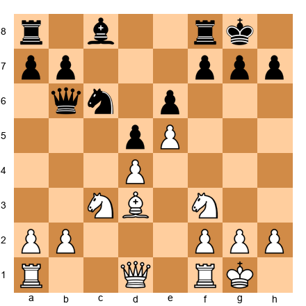</p>


**Set up your board.** White has a bishop on d3, knights on c3 and f3, pawns on d4 and e5. Black has a queen on b6, a knight on c6, pawns on d5 and e6.

**Stop. Find YOUR candidate moves for White before reading on.**

The position looks quiet. Most players would consider Qe2, a3, or Rb1, all reasonable developing moves.

Tal's candidate list was different. He looked at the position and asked: "Can I break through?"

18. Nxd5! exd5 19. e6!

A stunning pawn sacrifice. The e-pawn charges forward, opening lines toward the black king. After 19...fxe6, White plays 20. Bg6! and the h7 pawn becomes a target. The bishop on d3 was sleeping, and now, two moves later, it is the most dangerous piece on the board.

This is what calculation plus creativity looks like. Tal did not just find the "normal" candidates. He included a sacrifice on his list, a "weird" move that most players would dismiss, and then he calculated it thoroughly enough to prove it worked.

**Key Takeaway from Game 3:** Your candidate list should include moves that scare you. If a sacrifice is a check or creates a forcing threat, it belongs on the list. You do not have to play it. But you must consider it. Tal's genius was not that he saw things nobody else could see. It was that he was willing to LOOK where others refused to.

---

🛑 **Rest marker.** You have studied three annotated games. That is serious work. If your brain feels full, stop here. The exercises are not going anywhere.

---

## EXERCISES

**80 exercises in four groups. Work through them at your own pace.**

Some of these will take you two minutes. Some will take you ten. That is normal. The difficulty is not constant. It builds. Start with the exercises you can solve and push into the ones you cannot. Growth lives at the edge of your ability.

**For every exercise:**
1. Set up the position on your physical board
2. List your candidate moves BEFORE calculating
3. Calculate each candidate to its conclusion
4. Compare your answer to the solution

Solutions, hints, and wrong-move analysis are collected at the end of the volume.

---

### Group A: Find the Candidate Moves (Exercises 12.01–12.20)

*For each position, list the three best candidate moves. You do not need to calculate deeply. Just identify the right candidates. Difficulty: ★ to ★★*

---

**Exercise 12.01** ★


<p align="center"></p>


White to move. A standard opening position after 1. e4 Nf6 2. Nf3 Nc6. List three candidate moves.

⏱ ~2 min

💡 Hint 1: Think about controlling the center.
💡💡 Hint 2: White wants to occupy or support the d4 and e4 squares. What moves accomplish this?
💡💡💡 Hint 3: The three strongest candidates are d4, Nc3, and Bb5. Explain why each is reasonable.

---

**Exercise 12.02** ★


<p align="center"></p>


White to move. After 1. e4 Nf6 (the Alekhine Defense). List three candidate moves.

⏱ ~2 min

💡 Hint 1: Black's knight is on f6, attacking the e4 pawn. What do you do about it?
💡💡 Hint 2: You can defend e4, advance e5 to chase the knight, or ignore the threat and develop.
💡💡💡 Hint 3: The main candidates are e5, Nc3, and d3. Each leads to a different type of game.

---

**Exercise 12.03** ★


<p align="center">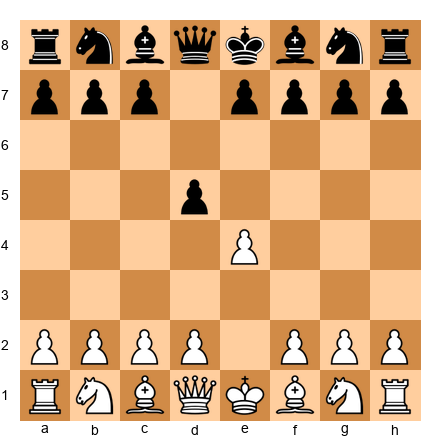</p>


White to move. After 1. e4 d5 (the Scandinavian Defense). List three candidate moves.

⏱ ~2 min

💡 Hint 1: There is a capture available. Should you take it?
💡💡 Hint 2: After exd5, Black must recapture. How? And what does that give you?
💡💡💡 Hint 3: The candidates are exd5 (most popular), Nc3, and e5. Each has a clear purpose.

---

**Exercise 12.04** ★


<p align="center"></p>


White to move. A standard position after 1. e4 e5 2. Nf3 Nc6. List three candidate moves.

⏱ ~2 min

💡 Hint 1: This is one of the most studied positions in chess. Three classical moves stand out.
💡💡 Hint 2: Think about developing a piece to attack the knight on c6, or controlling d4.
💡💡💡 Hint 3: The three main candidates are Bb5 (Ruy Lopez), Bc4 (Italian Game), and d4 (Scotch Game).

---

**Exercise 12.05** ★★


<p align="center"></p>


White to move. Italian Game, Giuoco Piano. Both sides are developed and castled. List three candidate moves and briefly explain why each is worth considering.

⏱ ~3 min

💡 Hint 1: Think about pawn breaks and piece repositioning.
💡💡 Hint 2: The three main candidates involve d4 (pawn break), a4 (queenside expansion), and Bg5 (piece pressure).
💡💡💡 Hint 3: The strongest is d4! It opens the center and activates all of White's pieces.

---

**Exercise 12.06** ★★


<p align="center">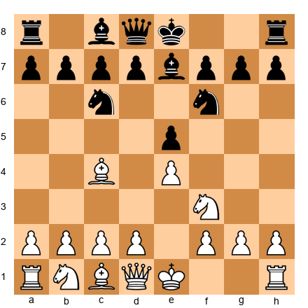</p>


White to move. Italian Game, Hungarian Defense setup. List three candidate moves.

⏱ ~3 min

💡 Hint 1: White needs to develop and fight for the center. What are the most active options?
💡💡 Hint 2: Consider d4, O-O, and c3 (preparing d4). Which comes first?
💡💡💡 Hint 3: The classical approach is d4 immediately, but c3 (preparing a strong d4) and O-O (safety first) are both sound.

---

**Exercise 12.07** ★★


<p align="center">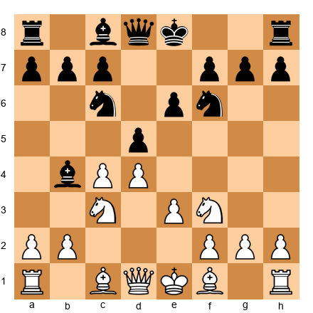</p>


White to move. Nimzo-Indian Defense structure. Black has pinned the knight on c3 with the bishop on b4. List three candidate moves.

⏱ ~3 min

💡 Hint 1: The pin on c3 is annoying. How can White deal with it or ignore it?
💡💡 Hint 2: Consider Bd3, a3, and Qc2. Each responds to the pin differently.
💡💡💡 Hint 3: Bd3 develops while overprotecting e4. a3 asks the bishop to commit (take or retreat). Qc2 prepares to recapture on c3 with the queen.

---

**Exercise 12.08** ★★


<p align="center">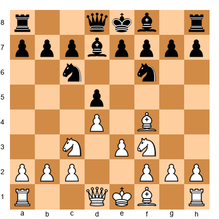</p>


White to move. London System. White has developed the bishop to f4 and the knight to f3. List three candidate moves.

⏱ ~3 min

💡 Hint 1: White's development is nearly complete. What is the best way to finish it?
💡💡 Hint 2: Consider Be2, Bd3, and h3. Each completes development in a different way.
💡💡💡 Hint 3: Bd3 is the most active. It develops toward the kingside and supports e4 ideas. Be2 is solid. h3 prevents Bg4 but is slower.

---

**Exercise 12.09** ★★


<p align="center"></p>


White to move. King's Indian / Pirc structure. Black has fianchettoed the bishop on g7. List three candidate moves.

⏱ ~3 min

💡 Hint 1: White's king is still in the center. What is the priority?
💡💡 Hint 2: Consider O-O-O, Bc4, and g4. Each leads to a very different type of game.
💡💡💡 Hint 3: O-O-O is the most common. It castles queenside and prepares a kingside pawn storm. Bc4 develops aggressively. g4 starts the attack immediately.

---

**Exercise 12.10** ★★


<p align="center">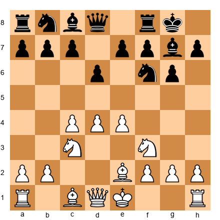</p>


White to move. King's Indian Defense setup. List three candidate moves.

⏱ ~3 min

💡 Hint 1: White is almost fully developed. What is the natural next step?
💡💡 Hint 2: O-O, Be3, and h3 are all reasonable. Explain the purpose of each.
💡💡💡 Hint 3: O-O is almost always correct here. Complete development before starting active operations.

---

**Exercise 12.11** ★★


<p align="center">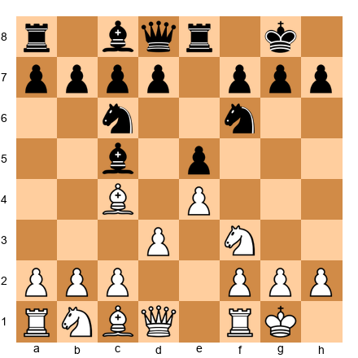</p>


White to move. Italian Game structure, Black has played Re8 early. List three candidate moves.

⏱ ~3 min

💡 Hint 1: Black's rook on e8 supports e5. How does this change White's plans?
💡💡 Hint 2: Consider Nc3, a4, and Bg5. Each develops a piece or creates a new threat.
💡💡💡 Hint 3: Nc3 is development. a4 prevents b5 and gains space. Bg5 pins the f6 knight and pressures e5 indirectly.

---

**Exercise 12.12** ★★


<p align="center">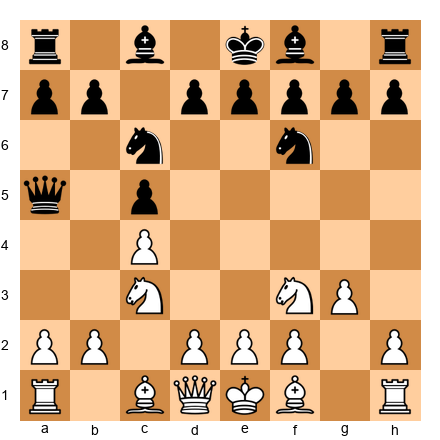</p>


White to move. English Opening structure. Black has an early queen sortie to a5. List three candidate moves.

⏱ ~3 min

💡 Hint 1: The queen on a5 looks active, but is it really threatening anything immediately?
💡💡 Hint 2: Consider Bg2, d4, and a3. Each continues White's development while addressing the queen.
💡💡💡 Hint 3: Bg2 is the most natural. It completes the fianchetto and aims at the center. The queen on a5 is not a serious threat yet.

---

**Exercise 12.13** ★★


<p align="center">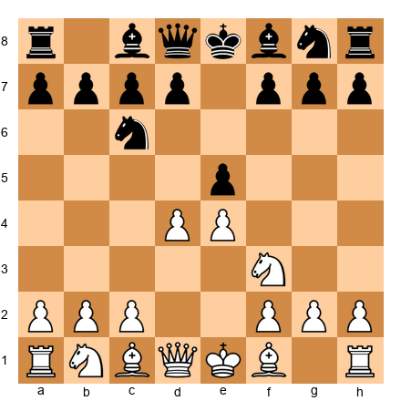</p>


Black to move. After 1. e4 e5 2. Nf3 Nc6 3. d4 (Scotch Game). List three candidate moves for Black.

⏱ ~3 min

💡 Hint 1: White is attacking the e5 pawn with d4. What should Black do about it?
💡💡 Hint 2: Consider exd4, d6, and Nf6. Each handles the central tension differently.
💡💡💡 Hint 3: exd4 is the most popular. It gives up the center but opens lines. d6 is solid. Nf6 counterattacks e4.

---

**Exercise 12.14** ★★


<p align="center">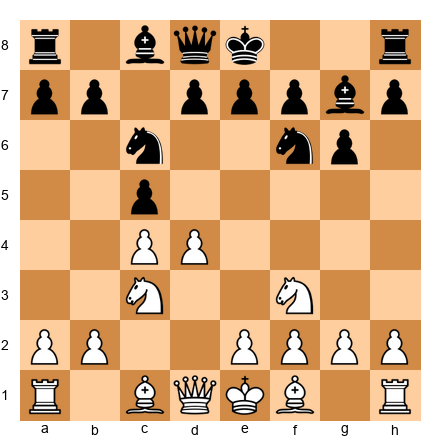</p>


White to move. Symmetrical English / Sicilian reversed. List three candidate moves.

⏱ ~3 min

💡 Hint 1: The center is balanced. White needs a plan.
💡💡 Hint 2: Consider e4, d5, and g3. Each leads to a completely different pawn structure.
💡💡💡 Hint 3: e4 grabs the center aggressively. d5 pushes Black's knight back. g3 prepares a fianchetto for a long strategic game.

---

**Exercise 12.15** ★★


<p align="center">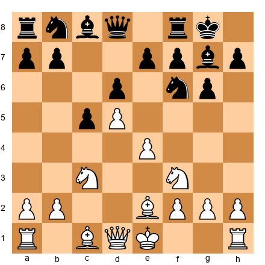</p>


White to move. King's Indian setup where White has pushed d5. List three candidate moves.

⏱ ~3 min

💡 Hint 1: The center is closed (pawn on d5 vs. d6). What kind of plans work in closed positions?
💡💡 Hint 2: Consider O-O, Bg5, and a4. The first completes development; the other two start flank operations.
💡💡💡 Hint 3: O-O is almost always correct before launching any plan. Safety first.

---

**Exercise 12.16** ★★


<p align="center">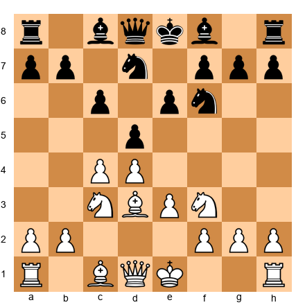</p>


White to move. Semi-Slav structure. List three candidate moves.

⏱ ~3 min

💡 Hint 1: Black has a solid pawn chain (e6-d5-c6). How does White challenge it?
💡💡 Hint 2: Consider O-O, e4, and Qc2. Each prepares for the central battle differently.
💡💡💡 Hint 3: O-O is safe. e4 is the thematic break but may be premature. Qc2 supports e4 while keeping options open.

---

**Exercise 12.17** ★★


<p align="center">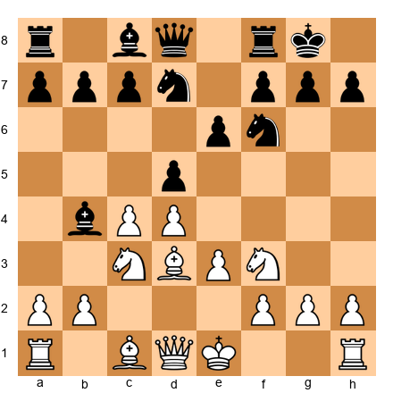</p>


White to move. Queen's Gambit Declined, Nimzo-Indian hybrid. List three candidate moves.

⏱ ~3 min

💡 Hint 1: Black's bishop on b4 pins the knight on c3, again. This is a recurring theme.
💡💡 Hint 2: Consider O-O, a3, and cxd5. Castling for safety, asking the bishop to commit, or resolving the center.
💡💡💡 Hint 3: O-O first, then deal with the pin. The king's safety is more urgent than the bishop question.

---

**Exercise 12.18** ★★


<p align="center">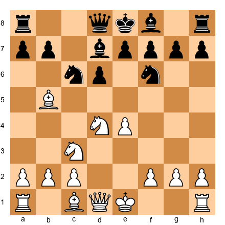</p>


White to move. Sicilian Defense, Rossolimo-like structure. List three candidate moves.

⏱ ~3 min

💡 Hint 1: The bishop on b5 is actively placed but potentially vulnerable. What is White's priority?
💡💡 Hint 2: Consider O-O, Bxc6, and f3. Each addresses the position differently.
💡💡💡 Hint 3: Bxc6 doubles Black's pawns and is a common strategic idea. O-O completes development. f3 supports e4 but weakens the kingside.

---

**Exercise 12.19** ★★


<p align="center">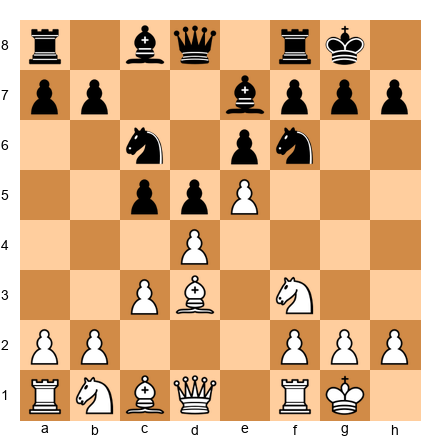</p>


White to move. French Defense structure with e5 push. List three candidate moves.

⏱ ~3 min

💡 Hint 1: White's pawn on e5 restricts the f6 knight. What should White do next?
💡💡 Hint 2: Consider Bf4, Nbd2, and Re1. Each supports the e5 pawn or prepares kingside play.
💡💡💡 Hint 3: Bf4 develops and supports e5. Nbd2 reroutes the knight toward the kingside. Re1 puts a rook behind the advanced pawn.

---

**Exercise 12.20** ★★


<p align="center">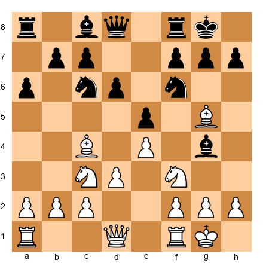</p>


White to move. Ruy Lopez-like middlegame. Both sides have developed. List three candidate moves.

⏱ ~4 min

💡 Hint 1: There are pins and counter-pins on the board. How does White exploit the situation?
💡💡 Hint 2: Consider Nd5, h3, and Bxf6. Each forces a decision from Black.
💡💡💡 Hint 3: Nd5 is the most active. It attacks the queen and the f6 knight simultaneously. h3 asks the bishop on g4 to declare its intentions. Bxf6 simplifies.

---

### Group B: Calculate to the End (Exercises 12.21–12.40)

*For each position, find the best move AND calculate the main variation to its conclusion. Show the full line. Difficulty: ★★ to ★★★*

---

**Exercise 12.21** ★★


<p align="center">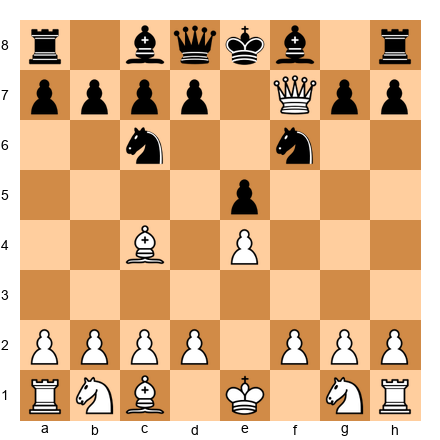</p>


Black to move. White has just played the Scholar's Mate attempt Qxf7+. But wait, this is a different position. White already has the queen on f7 and the bishop on c4. Black's king is on e8. Can Black survive? Calculate.

⏱ ~5 min

💡 Hint 1: Black is in check. What are the possible replies?
💡💡 Hint 2: Kd8 is the only legal move (Ke7 is not possible with the queen on f7). After Kd8, is Black lost or can Black fight back?
💡💡💡 Hint 3: This is actually a lost position for Black. The key line involves Qf8# or winning the rook. Calculate the consequences.

---

**Exercise 12.22** ★★


<p align="center"></p>


White to move. Black has played Qe7, blocking the bishop and defending e5. What is White's best continuation? Calculate three moves deep.

⏱ ~5 min

💡 Hint 1: Black's queen on e7 is solid but blocks the f8 bishop. How can White exploit this?
💡💡 Hint 2: Consider O-O (development), d4 (center), and Nc3 (development). Calculate each.
💡💡💡 Hint 3: O-O is safest and strongest. After O-O, White can follow with d4 next move when Black's bishop is still stuck.

---

**Exercise 12.23** ★★


<p align="center">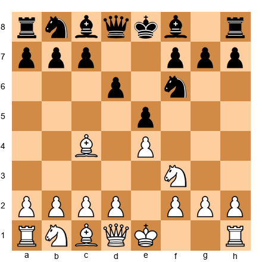</p>


White to move. Philidor Defense structure. Find the strongest continuation and calculate three moves deep.

⏱ ~5 min

💡 Hint 1: Black's pawn on d6 is solid but passive. How does White fight for the center?
💡💡 Hint 2: d4 is the main move. Calculate what happens after d4 exd4 and after d4 Nbd7.
💡💡💡 Hint 3: After d4 exd4 Nxd4, White has a strong center and active pieces. Calculate one more move in each line.

---

**Exercise 12.24** ★★


<p align="center">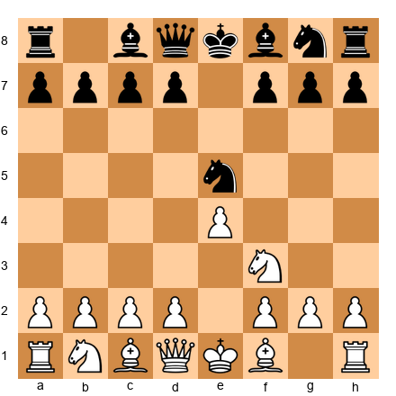</p>


White to move. After 1. e4 e5 2. Nf3 Nc6 3. Nxe5 Nxe5. White has won a pawn, but can it be held? Calculate.

⏱ ~5 min

💡 Hint 1: White took on e5 and Black recaptured. White is up a pawn. But is the e4 pawn safe?
💡💡 Hint 2: After d4, White solidifies the center and keeps the extra pawn. Calculate Black's best response.
💡💡💡 Hint 3: d4 is strong. After d4 Nc6 (or Ng6), White plays d5 or develops with Bd3. White keeps a healthy extra pawn.

---

**Exercise 12.25** ★★


<p align="center">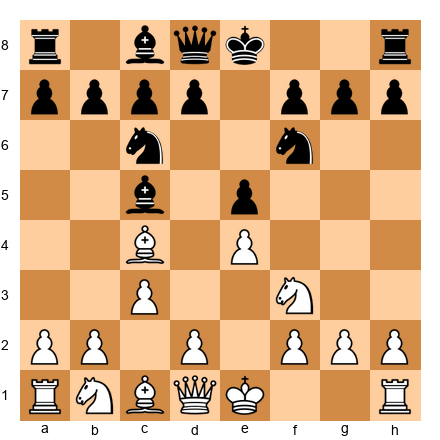</p>


White to move. Italian Game with an early c3. Calculate the consequences of d4.

⏱ ~5 min

💡 Hint 1: c3 was played to support d4. Now it is time to push. What happens?
💡💡 Hint 2: After d4 exd4 cxd4, calculate Black's best reply and where the pieces go.
💡💡💡 Hint 3: After d4 exd4 cxd4 Bb4+ (or Bb6), White plays d5 or Bd2. Calculate both.

---

**Exercise 12.26** ★★★


<p align="center">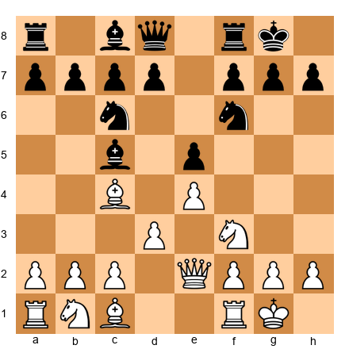</p>


White to move. Quiet Italian position. White has Qe2 and a knight on f3. Find the best plan and calculate four moves deep.

⏱ ~8 min

💡 Hint 1: The position is quiet. Think about piece repositioning rather than forcing moves.
💡💡 Hint 2: Consider c3 (preparing d4), Nbd2 (supporting e4 and heading to f1-g3), or a4 (queenside space).
💡💡💡 Hint 3: c3 followed by d4 is the most principled plan. Calculate: c3 d6, d4 Bb6, and then evaluate.

---

**Exercise 12.27** ★★★


<p align="center">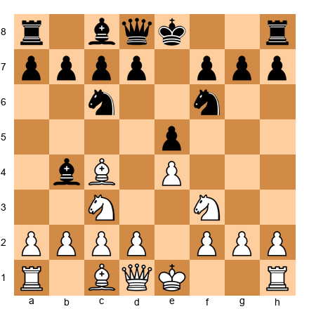</p>


White to move. Four Knights / Italian hybrid. Black has Bb4 pinning the knight. Calculate the consequences of Nxe5.

⏱ ~8 min

💡 Hint 1: Nxe5 is a tactical try. After Nxe5 Nxe5, is d4 possible?
💡💡 Hint 2: After Nxe5 Nxe5 d4, Black can play Bxc3+ or Nc6. Calculate both.
💡💡💡 Hint 3: After Nxe5 Nxe5 d4 Nc6 (or Bxc3+), the position opens favorably for White. Calculate the full sequence.

---

**Exercise 12.28** ★★★


<p align="center">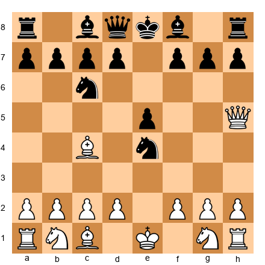</p>


White to move. A classic position from the Italian Game. White has Qh5 and Bc4, targeting f7. Black has played Nxe4. Can White win material? Calculate.

⏱ ~8 min

💡 Hint 1: White is threatening Qxf7 mate. But Black just took on e4. Is there a way to win?
💡💡 Hint 2: Consider Qxf7+. After Qxf7+ Ke7 (forced), what comes next?
💡💡💡 Hint 3: After Qxf7+ Ke7, White needs to keep the pressure. Look at d4, trying to open lines. Or Qf5, keeping threats alive.

---

**Exercise 12.29** ★★★


<p align="center">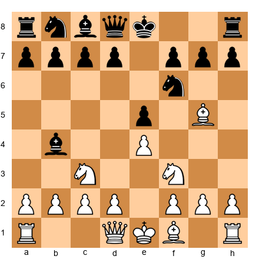</p>


White to move. Scotch Four Knights with Bg5. Calculate what happens after Nd5.

⏱ ~8 min

💡 Hint 1: Nd5 attacks the knight on f6 and the bishop on b4. What must Black do?
💡💡 Hint 2: After Nd5, Black can play Nxd5, Be7, or Ba5. Calculate each.
💡💡💡 Hint 3: After Nd5 Nxd5 exd5, the position opens and White's bishops become powerful. Calculate one more move.

---

**Exercise 12.30** ★★★


<p align="center"></p>


White to move. After 1. e4 e5 2. Nf3 Nc6. Calculate the consequences of 3. d4 exd4 4. Nxd4 and three more moves of each side's best play.

⏱ ~8 min

💡 Hint 1: This is the Scotch Game. After d4 exd4 Nxd4, Black can play Nf6, Bc5, or Nxd4.
💡💡 Hint 2: After 3. d4 exd4 4. Nxd4 Nf6 5. Nxc6 bxc6, evaluate: White has exchanged knights and Black has doubled c-pawns. Is this good for White?
💡💡💡 Hint 3: After 4. Nxd4 Bc5, the knight on d4 is attacked. Calculate 5. Be3, 5. Nb3, and 5. Nxc6. Which is best?

---

**Exercise 12.31** ★★★


<p align="center">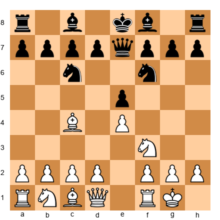</p>


White to move. After 1. e4 e5 2. Nf3 Nc6 3. Bc4 Nf6 4. O-O Qe7. Black delays castling. Find the strongest continuation and calculate.

⏱ ~8 min

💡 Hint 1: Black's queen on e7 blocks the bishop. This is a developmental problem. How do you exploit it?
💡💡 Hint 2: d4 is thematic. After d4, what happens if Black takes? What if Black does not take?
💡💡💡 Hint 3: After d4 d6 (defending e5), White plays d5! gaining space and kicking the knight. Calculate the consequences.

---

**Exercise 12.32** ★★★


<p align="center">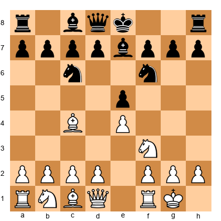</p>


White to move. Italian Game, Classical setup. Black has Be7 instead of Bc5. Find the best plan and calculate.

⏱ ~8 min

💡 Hint 1: With the bishop on e7 instead of c5, Black is playing more solidly. White needs an active plan.
💡💡 Hint 2: d4 is again the key break. Calculate d4 d6 and d4 exd4.
💡💡💡 Hint 3: After d4 d6 d5 Nb8 (the knight retreats), White has a large space advantage. This is the key position to evaluate.

---

**Exercise 12.33** ★★★


<p align="center">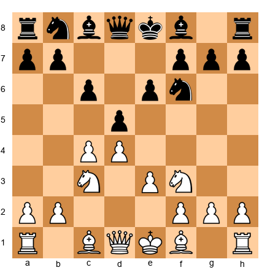</p>


White to move. Semi-Slav Defense. Calculate the consequences of the thematic central break with e4 or the developing move Bd3.

⏱ ~8 min

💡 Hint 1: e4 and Bd3 are both logical. Which should come first?
💡💡 Hint 2: Bd3 is more flexible. It develops a piece and prepares e4 for later. Calculate Bd3 dxc4 Bxc4.
💡💡💡 Hint 3: After Bd3, if Black plays dxc4 Bxc4, White has an active position. But if Black plays Nbd7 instead, White can push e4 under better circumstances.

---

**Exercise 12.34** ★★★


<p align="center">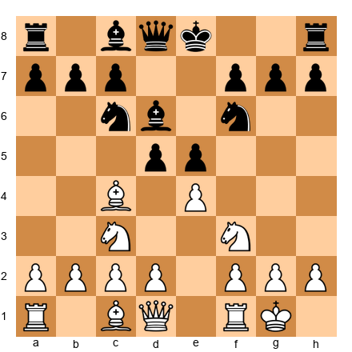</p>


White to move. A tactical position. Black has played d5 aggressively. Is there a tactic? Calculate.

⏱ ~8 min

💡 Hint 1: Black's d5 pawn attacks the bishop on c4 and the pawn on e4. But has Black left anything undefended?
💡💡 Hint 2: Look at exd5 and then check if Nxd5 leads to anything.
💡💡💡 Hint 3: After exd5 Nxd5 Nxd5 Qxd5, the queen is exposed. Can White exploit this with Bb5+ or a similar move?

---

**Exercise 12.35** ★★★


<p align="center">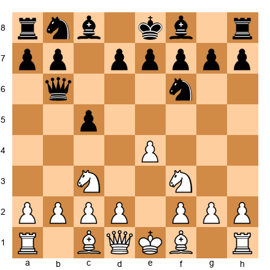</p>


White to move. Sicilian Defense with an early Qb6. Calculate three candidates each to depth 3.

⏱ ~8 min

💡 Hint 1: Black's queen is on b6, eyeing b2. Does White need to defend b2?
💡💡 Hint 2: Consider d4, e5, and Rb1. Calculate each to its conclusion.
💡💡💡 Hint 3: d4 opens the center and ignores the queen's pressure. After d4 cxd4 Nxd4, White has rapid development. Is b2 really hanging?

---

**Exercise 12.36** ★★★


<p align="center">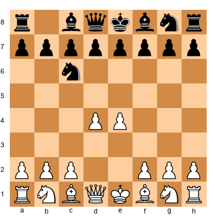</p>


Black to move. After 1. d4 Nc6 2. e4. An unusual opening. List candidates for Black and calculate each.

⏱ ~8 min

💡 Hint 1: White has a big center. Black needs to challenge it or develop and prepare to challenge it.
💡💡 Hint 2: Consider d5, e5, and Nf6. Each fights the center differently.
💡💡💡 Hint 3: e5 is the most active. It directly attacks d4. After e5 d5 Nce7, Black will reroute the knight to g6.

---

**Exercise 12.37** ★★★


<p align="center">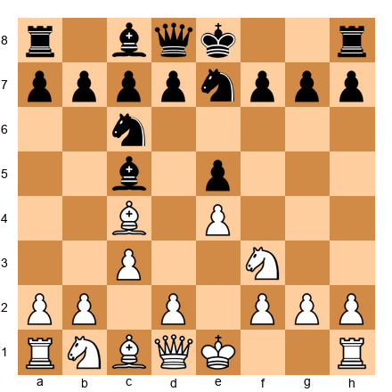</p>


White to move. Italian Game, Black has played Ne7 instead of Nf6. Calculate d4 and its consequences.

⏱ ~8 min

💡 Hint 1: d4 strikes at the center. After d4 exd4 cxd4, the bishop on c5 must retreat.
💡💡 Hint 2: After d4 exd4 cxd4 Bb6, White has a strong center. What is the next step?
💡💡💡 Hint 3: After d4 exd4 cxd4 Bb6 d5 Na5, White has gained significant space. Evaluate this position.

---

**Exercise 12.38** ★★★


<p align="center">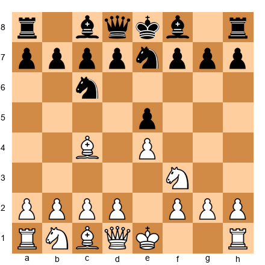</p>


White to move. Black has played Ne7 early. Calculate two different plans for White: aggressive (d4) and quiet (O-O), each to depth 3.

⏱ ~8 min

💡 Hint 1: Ne7 is unusual. It blocks the f8 bishop. White should try to punish the slow development.
💡💡 Hint 2: d4 exploits the lead in development. After d4 exd4 Nxd4, White stands well. But what about O-O followed by d4?
💡💡💡 Hint 3: Both plans are strong, but d4 is more energetic. Calculate: d4 exd4 Nxd4 Nxd4. Then what?

---

**Exercise 12.39** ★★★


<p align="center">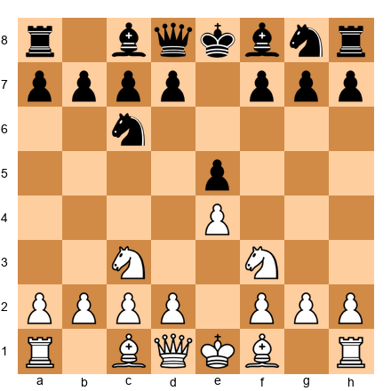</p>


White to move. Three Knights Game. Calculate two plans: d4 (Scotch-like) and Bb5 (Ruy Lopez-like), each to depth 3.

⏱ ~8 min

💡 Hint 1: Both d4 and Bb5 are strong. Which is more forcing?
💡💡 Hint 2: d4 exd4 Nxd4 leads to a Scotch structure. Bb5 leads to a Ruy Lopez structure but without d4 being played yet.
💡💡💡 Hint 3: d4 is more forcing and leads to clearer play. After d4 exd4 Nxd4 Nf6 (or Bc5), calculate.

---

**Exercise 12.40** ★★★


<p align="center">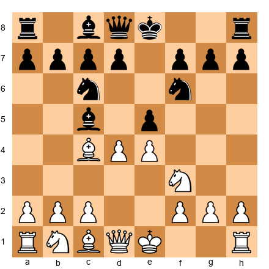</p>


Black to move. White has played d4 in the Italian Game. Calculate Black's three main responses: exd4, d6, and Nxe4. Which is best?

⏱ ~8 min

💡 Hint 1: exd4 opens the center. d6 keeps it closed. Nxe4 is a tactical try. Which suits your style?
💡💡 Hint 2: After exd4 Nxd4, the position is open. After Nxe4, calculate Nxe4 d5! This is a critical trick.
💡💡💡 Hint 3: exd4 is the safest. After exd4 Nxd4 Nxd4 (or Nf6), calculate two more moves.

---

### Group C: Visualization Drills (Exercises 12.41–12.60)

*These exercises train your ability to hold positions in your head. No board required for some, but use one to check your answers. Difficulty: ★ to ★★★*

---

**Exercise 12.41** ★

**What color is the square d4?**

Answer without looking at a board. Then check.

💡 Hint: d = 4th file. Rank = 4. Sum = 8 (even). What color is an even-sum square?

---

**Exercise 12.42** ★

**What color is the square f5?**

💡 Hint: f = 6th file. Rank = 5. Sum = 11 (odd). What color is an odd-sum square?

---

**Exercise 12.43** ★

**What color is the square a1?**

💡 Hint: This is the corner square. It is the reference square for the entire board.

---

**Exercise 12.44** ★

**What color is the square h1?**

💡 Hint: h = 8th file. Rank = 1. Sum = 9. Light or dark?

---

**Exercise 12.45** ★

**What color is the square c7?**

💡 Hint: c = 3rd file. Rank = 7. Sum = 10. Even or odd?

---

**Exercise 12.46** ★★

**Set up your board:** Place a White knight on e4. No other pieces.

**Question:** Without moving the knight, list every square it can reach in one jump. You should find eight squares. Write them down. Then check.

💡 Hint 1: A knight moves in an L-shape: two squares in one direction, one square perpendicular.
💡💡 Hint 2: From e4, the knight can reach: d2, f2, c3, g3, c5, g5, d6, f6.
💡💡💡 Hint 3: Count to make sure you have eight. If you have fewer, you missed one of the L-shapes.

---

**Exercise 12.47** ★★

**Set up your board:** Place a White bishop on d4. No other pieces.

**Question:** Without moving the bishop, list every square on the a1-h8 diagonal that the bishop controls. Then list every square on the g1-a7 diagonal.

💡 Hint 1: The a1-h8 diagonal goes through a1, b2, c3, d4, e5, f6, g7, h8.
💡💡 Hint 2: The g1-a7 diagonal goes through g1, f2, e3, d4, c5, b6, a7.
💡💡💡 Hint 3: The bishop controls all these squares (minus d4 itself, where it sits).

---

**Exercise 12.48** ★★

**Set up your board** with the following position:


<p align="center">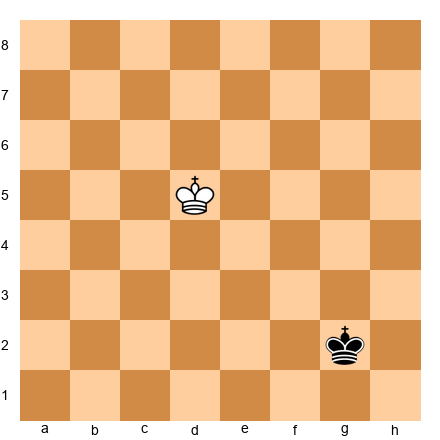</p>


White king on d5, Black king on g2. No other pieces.

**Question:** Can the White king reach f7 in three moves? Calculate without moving pieces.

💡 Hint 1: From d5, the king can move one square in any direction per move.
💡💡 Hint 2: d5-e6-f7 is two moves, but you need to check if Black's king interferes.
💡💡💡 Hint 3: Black's king on g2 is far away. Yes, Ke6-Kf7 is easily achieved in two moves. Three moves gives even more options.

---

**Exercise 12.49** ★★

**Mental exercise (no board needed):**

Imagine the starting position of a chess game. Now play the following moves in your head:

1. e4 e5 2. Nf3 Nc6 3. Bb5

**Question:** Where is every piece on the board after these three moves? List all 32 pieces and their squares.

⏱ ~3 min

💡 Hint 1: Only five pieces have moved from their starting squares: e-pawns, the f1-bishop, the g1-knight, and the b8-knight.
💡💡 Hint 2: White pieces that moved: pawn from e2 to e4, knight from g1 to f3, bishop from f1 to b5. All other white pieces are on their starting squares.
💡💡💡 Hint 3: Black pieces that moved: pawn from e7 to e5, knight from b8 to c6. All other black pieces are on their starting squares.

---

**Exercise 12.50** ★★

**Mental exercise:**

From the starting position, play: 1. d4 d5 2. c4 e6 3. Nc3 Nf6

**Question:** What pieces are on the third rank? List them all.

⏱ ~3 min

💡 Hint 1: Only knights are typically on the third rank this early.
💡💡 Hint 2: White has a knight on c3. Black has a knight on f6 (which is the sixth rank from White's perspective, or the third from Black's).
💡💡💡 Hint 3: Nc3 for White, Nf6 for Black. No other pieces are on the third or sixth ranks.

---

**Exercise 12.51** ★★

**Set up your board:**


<p align="center">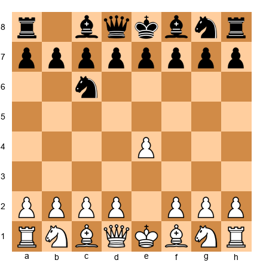</p>


After 1. e4 Nc6. Look at the position for 30 seconds. Then look away.

**Question:** What square is the Black knight on? What is the color of that square? What squares does the knight control from there?

💡 Hint 1: The knight went to c6.
💡💡 Hint 2: c = 3, rank = 6. Sum = 9 (odd). Light square. From c6, the knight controls: a5, b4, d4, e5, e7, d8, b8, a7.
💡💡💡 Hint 3: Wait, b8 and d8 are occupied (or were originally). The knight CONTROLS those squares even if pieces are on them.

---

**Exercise 12.52** ★★

**Mental exercise:**

From the starting position, play: 1. e4 e5 2. Nf3 Nc6 3. Bc4 Bc5 4. O-O

**Question:** Where is White's king after 4. O-O? Where is White's rook? Answer without a board.

💡 Hint 1: Castling kingside moves the king from e1 to g1 and the rook from h1 to f1.
💡💡 Hint 2: King is on g1, rook is on f1. The rook on a1 has not moved.

---

**Exercise 12.53** ★★★

**Set up your board:**


<p align="center"></p>


Study the position for 30 seconds. Look away.

**Question:** Now play 4. d4 in your mind. After 4. d4 exd4 5. Nxd4, describe the complete position: all pieces and pawns for both sides.

⏱ ~5 min

💡 Hint 1: Track what moved: White's d-pawn is gone (captured), Black's e-pawn is gone (captured on d4, then White's knight recaptured).
💡💡 Hint 2: After these exchanges, White has: Ke1, Bc4, Nd4, Bc1, Nb1, Ra1, Rh1, Qd1, pawns on a2, b2, c2, e4, f2, g2, h2.
💡💡💡 Hint 3: Black has: Ke8, Bc8, Nc6, Bf8, Ra8, Rh8, Qd8, Nf6, pawns on a7, b7, c7, d7, f7, g7, h7.

---

**Exercise 12.54** ★★★

**Mental exercise:**

From the starting position: 1. e4 c5 2. Nf3 d6 3. d4 cxd4 4. Nxd4

**Question:** How many pawns does each side have? Where are White's pawns? Where are Black's? Answer without a board.

⏱ ~4 min

💡 Hint 1: White started with 8 pawns and pushed e4 and d4. The d4-pawn was captured and recaptured by the knight.
💡💡 Hint 2: White has 7 pawns: a2, b2, c2, e4, f2, g2, h2. The d-pawn was captured.
💡💡💡 Hint 3: Black has 7 pawns: a7, b7, d6, e7, f7, g7, h7. The c-pawn was captured on d4.

---

**Exercise 12.55** ★★★

**Set up your board:**


<p align="center"></p>


Look at the position for 30 seconds. Look away.

**Now play the following sequence in your head:** 5. d4 d6 6. O-O O-O

**Question:** After 6. O-O O-O, describe the position. Where are both kings? Are both rooks on f1 and f8?

⏱ ~5 min

💡 Hint 1: Both sides castle kingside. White's king goes to g1, rook to f1. Black's king goes to g8, rook to f8.
💡💡 Hint 2: The d-pawn has been pushed to d4 and Black responded d6. So White has a pawn on d4, Black has a pawn on d6.
💡💡💡 Hint 3: Full description: White king g1, rook f1, rook a1. Pawn on d4 added. Black king g8, rook f8, rook a8. Pawn on d6 added. All other pieces in their previous positions.

---

**Exercise 12.56** ★★★

**Mental exercise:**

From the starting position: 1. d4 Nf6 2. c4 g6 3. Nc3 Bg7 4. e4 d6

**Question:** Name every piece that is NOT on its starting square. What square is it on?

⏱ ~4 min

💡 Hint 1: Count the moves. Eight half-moves have been played. That means eight pieces/pawns have moved from their starting positions.
💡💡 Hint 2: White: d-pawn to d4, c-pawn to c4, Nc3, e-pawn to e4. Black: Nf6, g-pawn to g6, Bg7, d-pawn to d6.
💡💡💡 Hint 3: Eight units have moved. Everything else is on its original square.

---

**Exercise 12.57** ★★★

**Set up your board:**


<p align="center"></p>


This is the key position from Exercise 12.05. Study it for 30 seconds. Look away.

**Now calculate in your head:** 1. d4 exd4 2. Nxd4 Nxd4 3. Qxd4

**Question:** After 3. Qxd4, what does the position look like? Describe: where is the queen? What has changed? How many knights does each side have?

⏱ ~5 min

💡 Hint 1: Track the exchanges. d4 was pushed and captured. The f3 knight recaptured on d4. Black's knight captured on d4. White's queen recaptured.
💡💡 Hint 2: After these exchanges: White lost the d-pawn (traded), the f3-knight (traded for Black's c6-knight via d4). White's queen is now on d4.
💡💡💡 Hint 3: White has one knight (on c3) and a queen on d4. Black has one knight (on f6) and no queen... wait, Black's queen is still on d8. Each side has lost one knight in the exchange.

---

**Exercise 12.58** ★★★

**Mental exercise:**

A White bishop is on c1. Can it reach h6 without being blocked, assuming no other pieces are on the board?

**Question:** What is the shortest path? How many moves does it take?

💡 Hint 1: The c1 bishop is on a dark square. Is h6 a dark square?
💡💡 Hint 2: h = 8, rank = 6. Sum = 14 (even). Dark square. Yes, the bishop can reach it.
💡💡💡 Hint 3: c1-d2-e3-f4-g5-h6 is one path (5 moves). But the bishop can also go c1-f4-h6 (wait, f4 to h6 is not a legal bishop move). Shortest: c1-e3-h6? No, e3 to h6 is not a diagonal. The shortest is: c1 to d2 to h6 in... let's see. c1 to h6: they share the c1-h6 diagonal? c1, d2, e3, f4, g5, h6. Yes! That IS a single diagonal. So the bishop goes from c1 to h6 in ONE move.

---

**Exercise 12.59** ★★★

**Set up your board:**


<p align="center">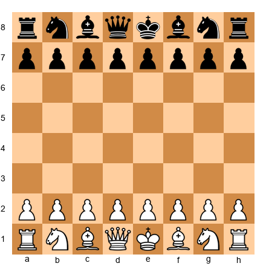</p>


Starting position. Play the following in your head: 1. e4 e5 2. Nf3 Nc6 3. Bb5 a6 4. Ba4 Nf6 5. O-O Be7 6. Re1 b5 7. Bb3 O-O

**Question:** This is the Ruy Lopez, Closed Defense. Without a board, answer: Where are White's bishops? Where is Black's a-pawn? Where is Black's b-pawn?

⏱ ~5 min

💡 Hint 1: The bishop went from f1 to b5 to a4 to b3 (after Black pushed it with a6 and b5). The other bishop is still on c1.
💡💡 Hint 2: Black's a-pawn is on a6 (played on move 3). Black's b-pawn is on b5 (played on move 6).
💡💡💡 Hint 3: White's bishops: Bb3 (light-squared) and Bc1 (dark-squared, undeveloped). White should plan to develop this bishop soon.

---

**Exercise 12.60** ★★★

**Mental exercise:**

Without a board, answer: If a knight starts on a1, what is the minimum number of moves to reach h8?

💡 Hint 1: a1 is a dark square. h8 is a dark square. Knights alternate colors with each move. So after an even number of moves, the knight is back on a dark square.
💡💡 Hint 2: The knight needs to cross the entire board. The most direct path: a1-b3-c5-d7-f8-h7... that does not quite reach h8.
💡💡💡 Hint 3: The minimum is 6 moves. One path: a1-b3-c5-e6-f8-g6-h8. But try to find a 6-move path yourself before checking.

---

### Group D: Full Calculation Practice (Exercises 12.61–12.80)

*For each position, apply the complete Kotov Method. Survey the position. List candidate moves. Calculate each. Choose the best move. Explain your reasoning. Difficulty: ★★★ to ★★★★*

---

**Exercise 12.61** ★★★


<p align="center"></p>


White to move. Italian Game, Giuoco Piano. Apply the full Kotov Method. Survey. List at least three candidates. Calculate each to depth 3. Choose the best.

⏱ ~10 min

💡 Hint 1: Survey first: material is equal, both sides are developed, both kings are safe. The position is roughly symmetrical. Who has more options?
💡💡 Hint 2: Candidates: d4 (central break), a4 (queenside expansion), Bg5 (piece pressure). Calculate each.
💡💡💡 Hint 3: d4 is the strongest because it opens lines for White's pieces, especially the bishops. After d4 exd4 Nxd4, evaluate the resulting position.

---

**Exercise 12.62** ★★★


<p align="center">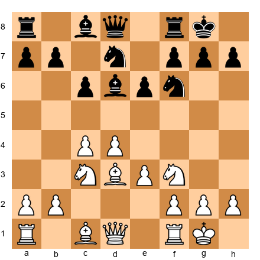</p>


White to move. Queen's Gambit Declined structure. Apply the full Kotov Method.

⏱ ~10 min

💡 Hint 1: Survey: Black has a solid but passive setup. The pawn chain e6-d5 (wait, d5 is not there; d6 is) limits Black's bishop on c8. White should aim to exploit the extra space.
💡💡 Hint 2: Candidates: e4 (central break), Qe2 (supporting e4), and b3 (developing the c1-bishop to b2). Calculate each.
💡💡💡 Hint 3: e4 is the thematic break but must be calculated carefully. After e4 dxc4 Bxc4, White opens lines. But what if Black plays e5 instead?

---

**Exercise 12.63** ★★★


<p align="center"></p>


White to move. King's Indian / Pirc position. White has not yet castled. Apply the full Kotov Method.

⏱ ~10 min

💡 Hint 1: Survey: White's king is in the center. This is the top priority. Castling must be considered.
💡💡 Hint 2: Candidates: O-O-O (castle queenside and prepare kingside attack), Bc4 (active development), Be2 (safe development). Calculate each.
💡💡💡 Hint 3: O-O-O is the most ambitious. After O-O-O, White can launch g4-g5 pawn storms against Black's king. Calculate Black's counterplay with a5 or b5.

---

**Exercise 12.64** ★★★


<p align="center">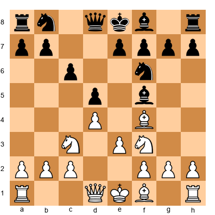</p>


White to move. London System. Both sides have developed bishops to f4/f5. Apply the full Kotov Method.

⏱ ~10 min

💡 Hint 1: Survey: symmetrical bishop development. White needs to complete development and find a plan.
💡💡 Hint 2: Candidates: Bd3 (challenging the f5 bishop), Be2 (safe), and Ne5 (aggressive centralization). Calculate each.
💡💡💡 Hint 3: Bd3 is the most interesting. It forces Black to make a decision about the bishop on f5. After Bd3 Bxd3 Qxd3, White has a small advantage due to better piece placement.

---

**Exercise 12.65** ★★★


<p align="center">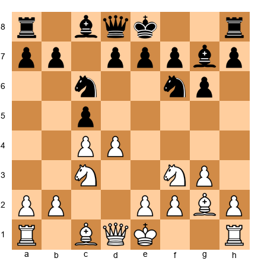</p>


White to move. English Opening / King's Indian reversed. Apply the full Kotov Method.

⏱ ~10 min

💡 Hint 1: Survey: both sides have fianchettoed. The center is contested (d4 vs. c5). Material is equal. Plans revolve around the central tension.
💡💡 Hint 2: Candidates: d5 (closing the center), dxc5 (exchanging), and O-O (safety first). Calculate each.
💡💡💡 Hint 3: O-O first is the safest and most flexible approach. After O-O O-O, White can choose between d5 and dxc5 with better information.

---

**Exercise 12.66** ★★★★


<p align="center">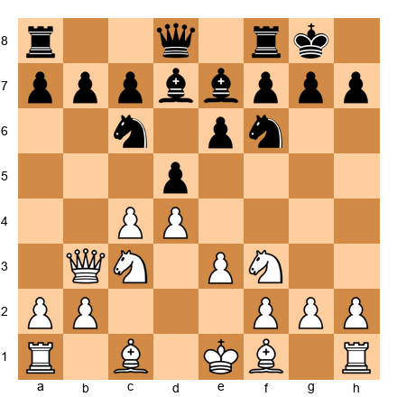</p>


White to move. Queen's Gambit, Tartakower-like structure. The queen has come to b3 early. Apply the full Kotov Method with extra depth (4 moves per line).

⏱ ~12 min

💡 Hint 1: Survey: White's queen on b3 puts pressure on d5 and b7. Black is solidly developed. The position requires strategic maneuvering.
💡💡 Hint 2: Candidates: cxd5 (resolve the center), Bd3 (develop), Be2 (develop). Each has different strategic implications.
💡💡💡 Hint 3: cxd5 exd5 (or Nxd5) changes the pawn structure fundamentally. Calculate both recaptures for Black and evaluate.

---

**Exercise 12.67** ★★★★


<p align="center"></p>


White to move. French Defense, advance variation. The pawn on e5 restricts Black. Apply the full Kotov Method with extra depth.

⏱ ~12 min

💡 Hint 1: Survey: White's e5 pawn is the anchor of the position. It restricts the f6-knight and controls d6. Black will try to undermine it with f6 or c4.
💡💡 Hint 2: Candidates: Bf4 (supporting e5), Nbd2 (heading for f1-g3-f5), and dxc5 (simplifying). Calculate each.
💡💡💡 Hint 3: Bf4 is the most natural, supporting e5 and developing. After Bf4, calculate Black's plan with c4 (pushing the bishop) and f6 (challenging e5).

---

**Exercise 12.68** ★★★★


<p align="center">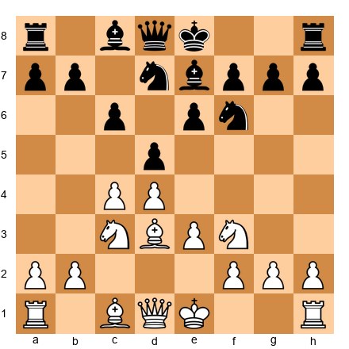</p>


White to move. Semi-Slav structure. A dense, strategic position. Apply the full Kotov Method with extra depth.

⏱ ~12 min

💡 Hint 1: Survey: Black has a solid pawn chain (c6-d5-e6). White wants to break through with e4. But is it time?
💡💡 Hint 2: Candidates: O-O (safety), e4 (the break), and Qc2 (preparing e4). Calculate each to depth 4.
💡💡💡 Hint 3: O-O first, then e4 next move, is the most reliable plan. Premature e4 can be met by dxe4 Nxe4 Nxe4 Bxe4, and Black has equalized.

---

**Exercise 12.69** ★★★★


<p align="center">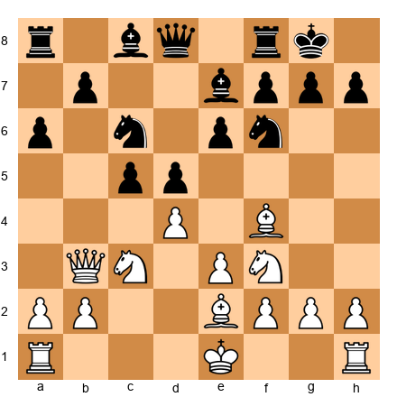</p>


White to move. London / Queen's Gambit hybrid. White has not yet castled. Apply the full Kotov Method.

⏱ ~12 min

💡 Hint 1: Survey: White's king is still in the center. Castling is urgent. But which side?
💡💡 Hint 2: Candidates: O-O (kingside safety), O-O-O (queenside with attacking chances), and dxc5 (simplifying). Calculate each.
💡💡💡 Hint 3: O-O is the safest. O-O-O is more ambitious but the queen on b3 may be exposed on the queenside. Calculate Black's a5-a4 push after O-O-O.

---

**Exercise 12.70** ★★★★


<p align="center">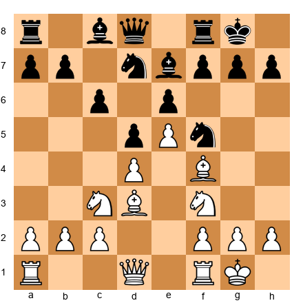</p>


White to move. A French/London hybrid where Black has a knight on f5. Apply the full Kotov Method.

⏱ ~12 min

💡 Hint 1: Survey: the knight on f5 is well-placed and pressures d4. White must decide whether to challenge it or play around it.
💡💡 Hint 2: Candidates: Bxf5 (eliminating the knight), Qe2 (supporting e5 and preparing action), Ne2 (rerouting to g3 to challenge the knight). Calculate each.
💡💡💡 Hint 3: Bxf5 exf5 gives Black a strong pawn on f5 and opens the e-file. Is that good for White? Calculate the resulting pawn structure carefully.

---

**Exercise 12.71** ★★★★


<p align="center">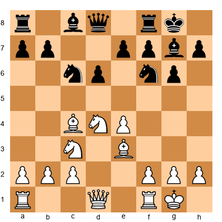</p>


White to move. Sicilian Dragon structure. White has the bishop pair and an active position. Apply the full Kotov Method.

⏱ ~12 min

💡 Hint 1: Survey: the dragon bishop on g7 is Black's pride. White should consider neutralizing it or attacking the kingside.
💡💡 Hint 2: Candidates: f3 (supporting e4 and preparing g4), Qd2 (connecting rooks and preparing Bh6), Bb3 (retreating the bishop to a safer diagonal). Calculate each.
💡💡💡 Hint 3: f3 followed by Qd2 and Bh6 is a classic anti-Dragon setup. Calculate: f3 first, then if Black plays a5, what does White do?

---

**Exercise 12.72** ★★★★


<p align="center">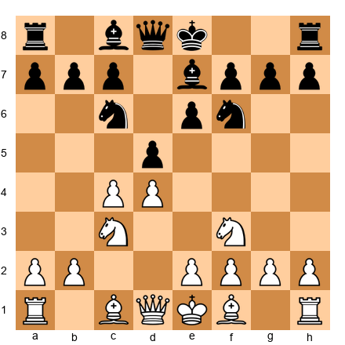</p>


White to move. Queen's Gambit Declined, Classical. Apply the full Kotov Method.

⏱ ~12 min

💡 Hint 1: Survey: a classic QGD position. Black is solid but slightly passive. White's plan is to develop and fight for e4.
💡💡 Hint 2: Candidates: Bg5 (pinning the knight), cxd5 (exchanging), and Bf4 (developing without pinning). Calculate each.
💡💡💡 Hint 3: Bg5 is the most classic and creates the most pressure. After Bg5, calculate both h6 (kicking the bishop) and O-O (ignoring the pin).

---

**Exercise 12.73** ★★★★


<p align="center">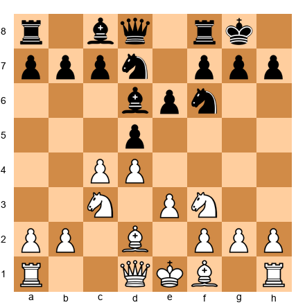</p>


White to move. A Colle System position. Apply the full Kotov Method.

⏱ ~12 min

💡 Hint 1: Survey: White's setup is compact but somewhat passive. The bishop on d2 is not ideally placed. How can White improve?
💡💡 Hint 2: Candidates: Bd3 (developing the last minor piece), Qc2 (preparing e4), and cxd5 (exchanging to open lines). Calculate each.
💡💡💡 Hint 3: Bd3 is natural. After Bd3, White is fully developed and can prepare the e4 break. Calculate: Bd3 O-O Qc2, and then e4 on the next move.

---

**Exercise 12.74** ★★★★


<p align="center">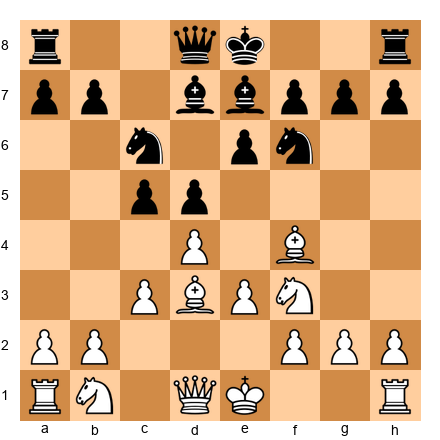</p>


White to move. London System middlegame. Apply the full Kotov Method.

⏱ ~12 min

💡 Hint 1: Survey: White has the London setup (Bf4, Bd3, Nf3, e3). Development is nearly complete. What is the plan?
💡💡 Hint 2: Candidates: Nbd2 (completing development), O-O (king safety), and c3 (supporting the center). Calculate each.
💡💡💡 Hint 3: O-O first, always. Then Nbd2, then prepare e4 or c4. Calculate: O-O O-O Nbd2 and evaluate.

---

**Exercise 12.75** ★★★★


<p align="center">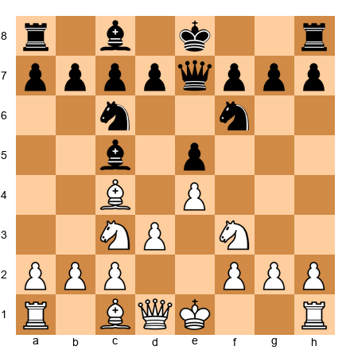</p>


White to move. Italian Game where Black has played Qe7 instead of castling. Apply the full Kotov Method. Is there a way to exploit Black's delayed castling?

⏱ ~12 min

💡 Hint 1: Survey: Black's king is still in the center. The queen on e7 blocks the f8-bishop. This is a developmental disadvantage.
💡💡 Hint 2: Candidates: O-O (complete development, prepare d4), Be3 (develop and prepare d4), and a4 (prevent b5, gain space). Calculate each.
💡💡💡 Hint 3: O-O followed by d4 is the most energetic. After O-O O-O d4, White opens the center with a lead in development. Calculate: d4 exd4 Nxd4 and evaluate.

---

**Exercise 12.76** ★★★★


<p align="center">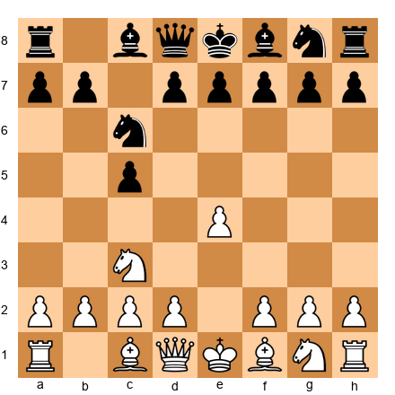</p>


White to move. Sicilian Defense, early stage. Apply the full Kotov Method.

⏱ ~12 min

💡 Hint 1: Survey: an Open Sicilian is on the horizon. White must decide: Nf3 (standard), f4 (Grand Prix Attack), or something else?
💡💡 Hint 2: Candidates: Nf3 (most flexible), f4 (aggressive), and Nge2 (preparing d4 with knight support). Calculate each to depth 3.
💡💡💡 Hint 3: Nf3 is the most tested and reliable. After Nf3, the game enters well-known Sicilian channels. f4 is more aggressive but commits early. Calculate Nf3 d6 d4 cxd4 Nxd4.

---

**Exercise 12.77** ★★★★


<p align="center"></p>


White to move. Nimzo-Indian Defense. Black has pinned the knight on c3 with the bishop. Apply the full Kotov Method.

⏱ ~12 min

💡 Hint 1: Survey: the bishop on b4 pins the c3-knight and challenges White's central control. White must respond to the pin while maintaining development.
💡💡 Hint 2: Candidates: Qc2 (Classical, prevents doubled pawns), e3 (Rubinstein, solid), and f3 (Sämisch, aggressive). Calculate each.
💡💡💡 Hint 3: Each response leads to a completely different type of game. Qc2 is the most popular at the club level because it is practical and solid. Calculate Qc2 O-O and then evaluate White's plans.

---

**Exercise 12.78** ★★★★


<p align="center"></p>


White to move. Ruy Lopez, Closed Defense. Black has driven the bishop back with a6 and b5. Apply the full Kotov Method.

⏱ ~12 min

💡 Hint 1: Survey: the bishop has retreated to b3. Black has a solid position with e5 controlling the center. White needs a long-term plan.
💡💡 Hint 2: Candidates: c3 (preparing d4), d4 (immediate central break), Re1 (supporting e4 and placing the rook on the open file). Calculate each.
💡💡💡 Hint 3: c3 is the most classic. It prepares d4 under optimal conditions. After c3, White plans d4 with the pawn protected by c3. Calculate c3 d6 d4 and evaluate.

---

**Exercise 12.79** ★★★★


<p align="center"></p>


White to move. King's Indian Defense, Classical. A rich middlegame is about to begin. Apply the full Kotov Method.

⏱ ~12 min

💡 Hint 1: Survey: White has a big center (c4, d4, e4). Black has the fianchettoed bishop on g7 and a flexible pawn structure. Both sides have long-term plans.
💡💡 Hint 2: Candidates: Be3 (natural development), d5 (closing the center, which leads to a typical KID pawn race), and h3 (preventing Bg4). Calculate each.
💡💡💡 Hint 3: Be3 is the most natural and keeps the most options. After Be3, Black usually plays e5 (challenging the center). Then d5 closes the center and the pawn race begins. Calculate Be3 e5 d5 and evaluate the resulting structure.

---

**Exercise 12.80** ★★★★


<p align="center"></p>


White to move. Sicilian Dragon / Pirc structure. A critical position. Apply the full Kotov Method. This is the final exercise. Bring everything together.

⏱ ~15 min

💡 Hint 1: Survey: White has a strong center (d4, e4) and active pieces. Black has the dragon bishop and a flexible position. The question is: how does White press the advantage?
💡💡 Hint 2: Candidates: Be3 (develop, support d4), Bg5 (pin the f6-knight), and f3 (support e4, prepare the Yugoslav Attack with Be3, Qd2, O-O-O). Calculate each to depth 4.
💡💡💡 Hint 3: Be3 followed by f3 and Qd2 is the Yugoslav Attack setup, the most aggressive and testing approach against the Dragon. Calculate: Be3 Ng4 (a common trick). What does White do? Bb5 is also worth considering to disrupt Black's coordination.

---

## Key Takeaways

1. **Calculation = visualization + evaluation.** You picture moves in your head and judge the resulting positions. It is a skill, not a talent.

2. **The Kotov Method gives you structure.** Survey → Candidates → Calculate → Compare → Choose. Use it on every critical move.

3. **The CCT rule finds candidates.** Checks first, then Captures, then Threats. After that, consider quiet improving moves.

4. **Kotov's Cardinal Rule: do not jump between lines.** Calculate each candidate to its conclusion, evaluate it, and move on. Mixing lines causes confusion and blunders.

5. **Prune wisely.** Stop calculating a line when it is clearly losing. But do not prune a line just because the first move looks strange.

6. **Visualization improves with practice.** Start with simple drills ("What's on e4?") and progress to multi-move blind calculation. Ten minutes a day is enough.

7. **The Blunder Check saves games.** Before every move: "Does this hang a piece? Allow a check? Allow a capture?" Ten seconds. Ninety percent of blunders caught.

---

## Practice Assignment

**This week, do the following:**

**Day 1–2:** Complete Exercises 12.01 through 12.10 (candidate moves). Focus on generating three candidates for each position before looking at the hints.

**Day 3–4:** Complete Exercises 12.21 through 12.30 (calculate to the end). Write down your full calculations before checking.

**Day 5–6:** Do visualization drills from Exercises 12.41 through 12.50. Spend 15 minutes each day on the "What's on this square?" and square color exercises.

**Day 7:** Play one slow game (at least 15 minutes per side). In that game, apply the Kotov Method on every move where you spend more than 30 seconds thinking. After the game, review: did you identify the right candidates? Did you calculate accurately? Where did you go wrong?

**Ongoing:** Before every move in every game, do the Blunder Check. Piece? Check? Capture? Make this automatic.

---

## ⭐ Progress Check

Answer honestly. There are no wrong answers here, only useful information about where you are.

- [ ] I can explain the four steps of the Kotov Method from memory
- [ ] I understand the CCT rule (Checks, Captures, Threats) for finding candidate moves
- [ ] I can calculate two moves ahead (my move, their reply, my move, their reply) with reasonable accuracy
- [ ] I know the six common calculation errors and can name at least three
- [ ] I have completed at least 40 of the 80 exercises in this chapter
- [ ] I use the Blunder Check before most of my moves in practice games
- [ ] I can identify the color of any square without looking at a board

**If you checked 5 or more boxes:** You have absorbed the core material. Move on to Chapter 13 with confidence.

**If you checked 3–4 boxes:** You are getting there. Spend another week on the exercises before moving forward. There is no penalty for taking your time.

**If you checked fewer than 3:** That is fine. This is a dense chapter. Go back to Section 2 (the Kotov Method) and reread it. Then work through the Group A exercises slowly. Calculation takes time to build. You are not behind. You are building the foundation.

---

🛑 **Rest marker.** You have finished Chapter 12.

This was one of the most important chapters in the entire Codex. The Kotov Method is a tool you will use for the rest of your chess life. It does not expire. It does not go out of style. It works at 1000 and it works at 2600.

Take a break. You have earned it. When you come back, Chapter 13 awaits: **Pawn Structures: The Skeleton of Your Position.**

See you at the board.

---

*"The player who calculates well fears no opponent."*
— adapted from classical chess wisdom

---

**End of Chapter 12**
**Volume II: The Club Player**
**The Grandmaster Codex — Kit Olivas & Dr. Ada Marie**
