# Chapter 13: Pawn Structures: The Skeleton of Your Position

**Volume II: The Club Player | Rating Range: 1000 - 1600**
**Pages: 50 | Exercises: 50 | Annotated Games: 5**

---

> *"Pawns are the soul of chess."*
> -- Francois-Andre Danican Philidor (1749)

---

## What You'll Learn

- How pawn structures define the character of every chess position
- The eight major pawn structure types and how to play with or against each one
- How to recognize key structures that arise from common openings
- How to build a plan based on the pawn skeleton in front of you
- How to convert a structural advantage into a winning position

---

## Part 1: Why Pawns Matter

### The Bones of the Position

Here is one of the most important ideas in this entire book:

**Pieces come and go. Pawns are forever.**

A knight can retreat. A bishop can redeploy. Even a queen can find a new diagonal. But once a pawn advances, it never goes backward. Every time you push a pawn, you are making a permanent decision. That decision shapes everything else on the board.

Think of it this way. Your pawns are the skeleton of your position. Your pieces are the muscles. You can have the strongest muscles in the world, but if the skeleton is crooked, the whole body suffers.

This metaphor runs deep:

- **A strong skeleton supports strong pieces.** Good pawn structure gives your pieces natural outposts, open files, and safe diagonals.
- **A weak skeleton creates lasting problems.** Bad pawn structure gives your opponent targets that never go away.
- **You cannot fix a broken skeleton mid-game.** Unlike pieces, pawns cannot move backward. Structural damage is usually permanent.

Philidor understood this in 1749, and his insight has only grown more powerful with time. Every World Champion since has echoed the same idea: understand the pawns, and you understand the position.

### What "Pawn Structure" Means

When we say "pawn structure," we mean the arrangement of pawns on the board *without considering the pieces*. Strip away every piece except the kings and pawns, and what remains is the skeleton.

Two positions with identical pawn structures but different piece placements will share the same fundamental character. The same plans will apply. The same weaknesses will exist. The same breaks will be available.

This is why pawn structure is the single most reliable guide to planning. Pieces change squares constantly. The pawn skeleton tells you what the position *is*.

### How to Study This Chapter

This chapter covers a lot of ground. You do not need to absorb it all in one sitting.

Here is a recommended approach:

1. **Read one pawn structure type per session.** There are eight types covered in Part 2. Each one is self-contained.
2. **Set up the example positions on your physical board.** This is not optional. You will remember far more if your hands move the pieces.
3. **Play through the annotated games slowly.** These are masterpieces chosen to illustrate each structure in action.
4. **Do the exercises in small batches.** Five at a time is plenty.

There is no rush. The concepts in this chapter will serve you for the rest of your chess career.

---

## Part 2: The Eight Pawn Structure Types

### Structure 1: The Isolated Pawn (IQP)

**Definition:** An isolated pawn is a pawn with no friendly pawns on either adjacent file. It cannot be protected by another pawn and must be defended by pieces.

The most important isolated pawn in chess is the isolated queen's pawn, or IQP, which sits on d4 (for White) or d5 (for Black) with no pawns on the c-file or e-file to support it.

**Set up your board:**

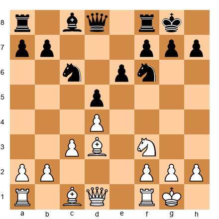

White has an isolated pawn on d4. No white pawns stand on c or e to protect it. Study this position carefully before reading on.

**Strengths of the Isolated Pawn:**

The IQP is not simply "weak." It carries real dynamic potential:

1. **Space advantage.** The pawn on d4 controls the central squares c5 and e5, giving White's pieces room to maneuver.
2. **Open and half-open files.** With no pawn on the c-file or e-file, White's rooks gain natural access to open lines.
3. **The outpost on e5.** A knight planted on e5 in front of an IQP can become a monster. It controls key squares and cannot easily be driven away.
4. **Attacking chances.** The d4-d5 advance can open the position at the right moment, creating tactical opportunities against Black's king.

**Weaknesses of the Isolated Pawn:**

1. **It needs piece protection.** The pawn on d4 cannot be supported by another pawn. Your pieces must babysit it.
2. **The square in front of it.** The d5 square is a natural blockading square. If Black plants a knight on d5, that knight becomes very powerful.
3. **Endgame liability.** As pieces get traded, the isolated pawn becomes harder to defend and easier to attack. In a pure endgame, it is usually a weakness.

**How to play WITH an isolated pawn:**

- Keep pieces on the board. Your advantage is dynamic, not static.
- Place a knight on e5 (or c5 for Black's IQP).
- Look for the d4-d5 break to open lines and create tactics.
- Attack the kingside. The open lines favor aggression.
- Avoid unnecessary piece trades. Every trade brings you closer to an endgame where the pawn becomes a target.

**How to play AGAINST an isolated pawn:**

- Blockade it. Place a piece (ideally a knight) on the square in front of the pawn.
- Trade pieces. Every piece exchange makes the isolated pawn weaker.
- Target the pawn directly with rooks and the queen.
- Head for the endgame. Time is on your side.
- Do not allow the d4-d5 break. If the pawn advances successfully, the dynamic advantages it creates can be decisive.

**A helpful rule of thumb:** The side with the IQP wants activity. The side against it wants simplification. If you remember nothing else about the isolated pawn, remember this.

---

🛑 **Rest here if you need to.** One structure per session is a perfectly good pace. Come back fresh for the next one.

---

### Structure 2: Doubled Pawns

**Definition:** Doubled pawns are two pawns of the same color stacked on the same file. They arise when a pawn captures toward the center (or away from it), landing on a file already occupied by a friendly pawn.

**Set up your board:**

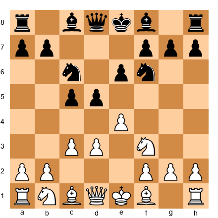

Now consider a position after Black plays ...Bxc3, doubling White's pawns:

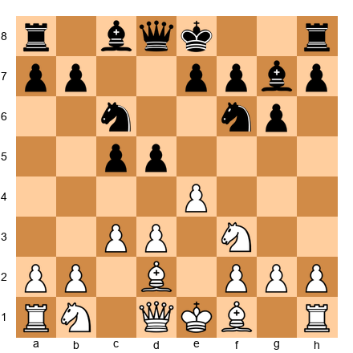

White has doubled c-pawns on c2 and c3 after a recapture. Study how this changes the pawn skeleton.

**When doubled pawns are BAD:**

1. **They cannot protect each other.** Two pawns on the same file are like two soldiers standing in a single-file line. Neither shields the other.
2. **They create a static target.** The opponent can pile pressure on the doubled pawns, especially if they sit on an open or half-open file.
3. **They reduce pawn mobility.** The rear pawn is blocked by the front pawn. You have two pawns but often the flexibility of only one.
4. **They create weak squares.** When pawns double, the adjacent squares they used to control become available to the opponent's pieces.

**When doubled pawns are ACCEPTABLE (or even good):**

Not all doubled pawns are disasters. Sometimes they bring real advantages:

1. **Extra open files.** When a pawn captures to create doubled pawns, it opens a file for a rook. In the Nimzo-Indian Defense (after ...Bxc3+, bxc3), White often welcomes doubled c-pawns because the b-file opens for the rook.
2. **Extra central control.** Doubled pawns on the c-file (c3 and c4) or e-file (e3 and e4) can control more central squares than two pawns on separate files.
3. **Bishop pair compensation.** Often, doubled pawns arise from a bishop-for-knight trade. The side with the doubled pawns may also have the bishop pair, which compensates in open positions.

**How to play WITH doubled pawns:**

- Use the open file your rook gained.
- If you have the bishop pair, open the position.
- Advance the front pawn if you can undouble.
- Keep the game dynamic. In quiet positions, the structural weakness will tell.

**How to play AGAINST doubled pawns:**

- Target them with pieces, especially rooks on the open or half-open file.
- Trade off the opponent's bishop pair if they have one.
- Steer toward the endgame, where static weaknesses matter most.
- Control the squares the doubled pawns can no longer guard.

**Key insight:** Whether doubled pawns are a strength or a weakness depends on the pieces remaining on the board and the character of the position. There is no universal rule. You must evaluate each case on its own merits.

---

### Structure 3: The Backward Pawn

**Definition:** A backward pawn is a pawn that cannot advance because the square in front of it is controlled by an enemy pawn, and it has no friendly pawn on an adjacent file that could advance alongside it or protect it. It is "left behind" by its neighbors.

**Set up your board:**

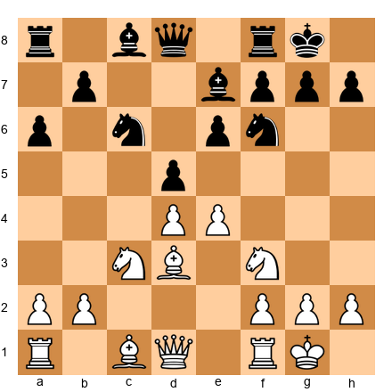

Look at Black's pawn on e6. If Black has played ...d5 and the e-pawn sits on e6, that pawn can become backward. It cannot advance to e5 (White controls that square with the d4 pawn), and the d-pawn has already advanced past it.

A clearer illustration:

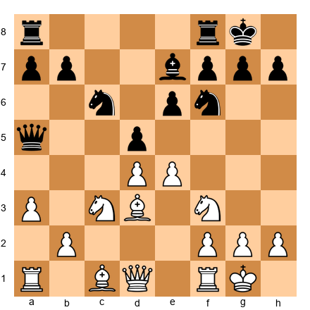

Here Black's e6 pawn is backward on the half-open e-file. White can target it with Re1, and the square e5 is a natural outpost.

**Strengths of this structure:** (for the side exploiting the backward pawn)

1. **The square in front of the backward pawn is an outpost.** A knight on e5, for instance, is beautifully placed and hard to dislodge.
2. **The half-open file targets the pawn.** A rook on the e-file points directly at e6, creating pressure.
3. **It restricts the opponent's plans.** The backward pawn ties pieces down to its defense.

**Weaknesses of having a backward pawn:**

1. **Permanent target.** The backward pawn sits on a half-open file and cannot advance. It requires constant piece protection.
2. **Lost outpost.** The square in front of the backward pawn belongs to the opponent's pieces. You cannot contest it with a pawn.
3. **Passive piece placement.** Your pieces may be stuck defending the backward pawn instead of pursuing active plans.

**How to play WITH a backward pawn (when you have one):**

- Try to advance it! If you can push e6-e5 (or wherever it sits), the weakness disappears.
- Generate counterplay elsewhere on the board. Do not let the opponent focus solely on the backward pawn.
- Trade the piece that blockades the square in front of it.
- Keep enough pieces to defend it without becoming passive.

**How to play AGAINST a backward pawn:**

- Occupy the square in front of it with a strong piece, ideally a knight.
- Apply pressure down the half-open file with a rook.
- Prevent the pawn from advancing. If it never moves, it stays weak forever.
- Combine pressure on the backward pawn with threats elsewhere.

---

### Structure 4: The Passed Pawn

**Definition:** A passed pawn is a pawn with no enemy pawn in front of it on the same file or on either adjacent file. Nothing can stop it from marching to the promotion square except enemy pieces.

Nimzowitsch gave us the perfect image: *"A passed pawn is a criminal that must be watched by the police."* The opponent must assign pieces to stop it, and those pieces cannot do anything else.

**Set up your board:**

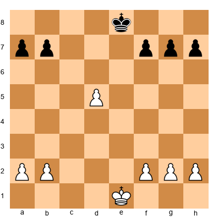

White's d5 pawn is passed. There is no black pawn on the c-file, d-file, or e-file that can block or capture it. It can march to d8 and become a queen, and only Black's pieces can try to stop it.

**Strengths of a passed pawn:**

1. **It creates a promotion threat.** The further it advances, the more dangerous it becomes.
2. **It ties down enemy pieces.** The opponent must "watch" the criminal. A rook or knight babysitting a passed pawn is a rook or knight not doing anything else.
3. **It becomes stronger as pieces come off.** In the endgame, a passed pawn can be the difference between winning and drawing.
4. **It creates a decoy.** Even if the passed pawn is eventually captured, the opponent's pieces are diverted, and you can strike elsewhere.

**Weaknesses of a passed pawn:**

1. **It can be blockaded.** A piece (especially a knight) placed directly in front of the passed pawn stops it cold. The blockader also enjoys a stable outpost.
2. **It can be weak if not supported.** A passed pawn far from its own pieces can be captured.
3. **Advancing too early can be fatal.** If the pawn charges forward without support, it becomes a target rather than a weapon.

**How to play WITH a passed pawn:**

- **Support it.** Place a rook behind the passed pawn. As the pawn advances, the rook's power increases.
- **Advance it at the right moment.** Do not rush. Prepare the advance with piece support.
- **Use it as a decoy.** Even if the opponent blockades it, their blockading piece is tied down. Attack elsewhere.
- **Trade pieces, but keep rooks.** Rooks and passed pawns are a deadly combination.
- **In king and pawn endgames, the passed pawn wins games.** Always calculate whether advancing it will cost your opponent more than it costs you.

**How to play AGAINST a passed pawn:**

- **Blockade it immediately.** Place a piece on the square in front of it. A knight is the ideal blockader because it still controls important squares while blocking.
- **Attack it from the front, not the side.** A rook in front of a passed pawn stops it and pins it down.
- **Eliminate it if possible.** Trading it off removes the threat entirely.
- **Do not let it advance to the sixth rank.** A passed pawn on the sixth rank is extremely dangerous. Stop it earlier.

**A useful saying:** "Every pawn is a potential queen." Treat your passed pawns with respect, and treat your opponent's passed pawns with urgency.

---

🛑 **Good stopping point.** You have learned four structure types. That is a solid session. Take a break and come back for the next four.

---

### Structure 5: Connected Pawns

**Definition:** Connected pawns are two or more pawns on adjacent files that can protect each other. They form a chain of mutual support.

**Set up your board:**

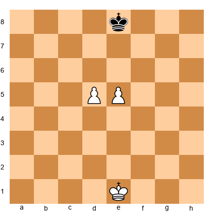

White has connected pawns on d5 and e5. Notice that d5 protects the e6 square, and e5 protects the d6 square. If one advances, the other can protect it. They work as a team.

Now compare:

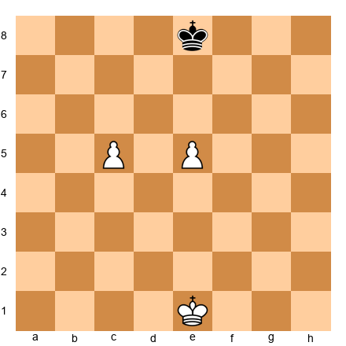

White has pawns on c5 and e5. These are NOT connected. There is a gap on d5. Neither pawn protects the other. They must fend for themselves.

**Strengths of connected pawns:**

1. **Mutual protection.** Each pawn guards the advance square of the other. This makes them very hard to stop, especially in the endgame.
2. **Control of a broad front.** Two connected pawns on the fifth rank control four squares on the sixth rank. That is a lot of territory.
3. **Advancing power.** Connected passed pawns rolling down the board are one of the most dangerous forces in chess. Two connected passed pawns on the sixth rank can defeat a rook.
4. **Flexibility.** You can choose which pawn to advance based on the situation.

**Weaknesses of connected pawns:**

1. **They can become targets if overextended.** Connected pawns pushed too far from their own pieces can be attacked and picked off.
2. **Blockade is still possible.** If the opponent places pieces in front of both pawns, their advance can be stopped.

**How to play WITH connected pawns:**

- Advance them together. Do not leave one behind.
- Support them with pieces from behind or beside.
- In the endgame, march them toward promotion. Connected passed pawns on the fifth or sixth rank are often unstoppable.
- Use the threat of one pawn's advance to create tactical opportunities for the other.

**How to play AGAINST connected pawns:**

- Blockade them with pieces. Place a piece in front of each pawn.
- Attack them from the side or rear with rooks.
- Eliminate one of the pair. Once one is captured, the surviving pawn is just an ordinary pawn.
- Do not let them reach the sixth rank together. Stop the advance early.

---

### Structure 6: Hanging Pawns

**Definition:** Hanging pawns are a specific type of connected pawn pair, typically on the c-file and d-file (c4 and d4 for White, or c5 and d5 for Black), sitting on the fourth rank with no friendly pawns on adjacent files. They hang in the center without pawn support from either side.

**Set up your board:**

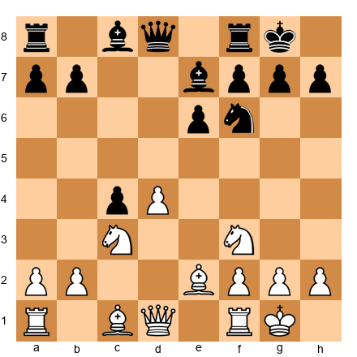

After a sequence of trades in the Queen's Gambit, White might end up with pawns on c4 and d4 with no pawn on b or e. These are hanging pawns.

A more typical hanging pawn position:

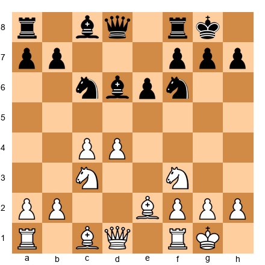

White's c4 and d4 pawns are hanging. They control the center but have no pawn neighbors.

**Strengths of hanging pawns:**

1. **Central control.** The pawn pair covers four key central squares (c5, d5, e5 for d4, and b5, c5, d5 for c4). That is a lot of territory.
2. **Dynamic potential.** Either pawn can advance (c4-c5 or d4-d5), opening lines for a piece attack.
3. **Piece activity.** The open lines beside the hanging pawns give rooks and bishops natural activity.

**Weaknesses of hanging pawns:**

1. **They can become targets.** If the opponent prevents both pawns from advancing, they become static weaknesses that must be defended by pieces.
2. **Advancing one weakens the other.** If d4-d5 is played, the c4 pawn becomes an isolated pawn. If c4-c5 is played, the d4 pawn becomes isolated.
3. **Pressure freezes them.** A well-placed knight or bishop in front of the hanging pawns can paralyze the entire center.

**How to play WITH hanging pawns:**

- Maintain the tension. Do not advance prematurely.
- Wait for the right moment to push d4-d5 or c4-c5 with maximum effect.
- Keep your pieces active. Hanging pawns shine in dynamic positions with many pieces.
- Look for tactical opportunities that arise when you advance one pawn.

**How to play AGAINST hanging pawns:**

- Apply pressure to both pawns simultaneously. Force the opponent to defend them.
- Provoke one pawn to advance, then target the remaining isolated pawn.
- Blockade the pawns. Place pieces on d5 and c5 (or the equivalent squares for Black).
- Trade off attacking pieces. Without piece activity, hanging pawns are just weaknesses.

**The fundamental tension of hanging pawns:** They are either a strength or a weakness, and the line between those two states is razor-thin. This makes hanging pawn positions among the most interesting in all of chess.

---

### Structure 7: The Pawn Chain

**Definition:** A pawn chain is a diagonal line of pawns, each protecting the one in front of it. The pawn at the back of the chain is called the *base*. The pawn at the front is the *tip* or *head*.

**Set up your board:**

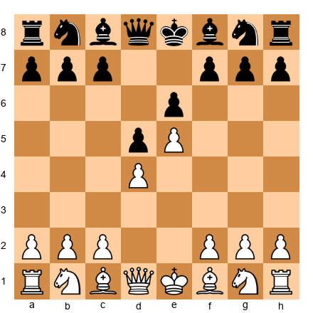

This is the French Defense structure after 1.e4 e6 2.d4 d5 3.e5. White has a pawn chain running from d4 to e5. Black has a pawn chain running from d5 to e6.

Study the chains carefully:

- **White's chain:** d4 (base) protects e5 (tip). The base on d4 is the vulnerable point.
- **Black's chain:** e6 (base) protects d5 (tip). The base on e6 is less exposed because it sits further from the action, but the d5 pawn is locked and cannot advance.

**Nimzowitsch's Rule: Attack the base of the chain.**

This is one of the most powerful strategic principles in chess. The tip of the chain is well-protected by the pawn behind it. The base is the weakest link because it has no pawn supporting it from behind. Attack the base, and the entire chain may crumble.

In the French structure above, Black will typically play ...c7-c5 to strike at d4, the base of White's chain. White might play f4-f5 to attack e6, the base of Black's chain.

**Strengths of a pawn chain:**

1. **Space advantage.** The side with the further-advanced chain controls more territory.
2. **Piece shelter.** Pieces behind the chain are protected from frontal attacks.
3. **Directional guide.** The chain tells you where to attack: on the side where your chain points.

**Weaknesses of a pawn chain:**

1. **The base is vulnerable.** Without pawn protection, the base depends entirely on piece defense.
2. **Reduced mobility.** Pawns locked in a chain cannot advance. The position becomes static.
3. **Bad bishop problem.** The bishop on the same color as the chain is often blocked by its own pawns.

**How to play WITH a pawn chain:**

- Attack on the side your chain points toward. If your chain points kingside (like e5 in the French), attack the kingside.
- Support the base. Do not let the opponent undermine it.
- Use the space advantage to maneuver pieces to strong squares.
- Activate the bishop that is NOT blocked by the chain.

**How to play AGAINST a pawn chain:**

- Attack the base. Nimzowitsch's rule is your guide.
- Undermine the chain with pawn breaks. In the French, ...c5 is Black's primary weapon.
- Exchange the "bad bishop." If your bishop is blocked by the chain, look to trade it or fianchetto it to a better diagonal.
- Do not attack the tip. The tip is the strongest point. Attacking it wastes time and effort.

---

### Structure 8: Pawn Islands

**Definition:** A pawn island is a group of connected pawns separated from other friendly pawns by at least one empty file. The fewer pawn islands you have, the healthier your pawn structure.

**Set up your board:**

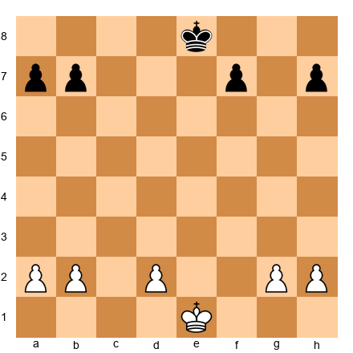

Count White's pawn islands:
- Island 1: a2, b2 (connected pawns on adjacent files)
- Island 2: d2 (alone)
- Island 3: g2, h2 (connected pawns on adjacent files)

White has **three pawn islands.** The d2 pawn is the most vulnerable because it is completely isolated.

Now count Black's pawn islands:
- Island 1: a7, b7 (connected)
- Island 2: f7 (alone)
- Island 3: h7 (alone)

Black also has **three pawn islands.** Both f7 and h7 are isolated.

In a position with equal material and three vs. two pawn islands, the side with fewer islands usually has a structural advantage.

**Why fewer pawn islands are better:**

1. **Fewer targets.** Each isolated island is a potential weakness. Fewer islands mean fewer weaknesses.
2. **Easier defense.** Connected pawns defend each other. Isolated islands each need piece protection.
3. **Greater flexibility.** A single group of connected pawns can advance as a team. Scattered islands lack coordination.

**How to use pawn islands in your thinking:**

When evaluating a trade or a pawn capture, count the resulting pawn islands for each side. If a trade gives your opponent more pawn islands than you, it is probably favorable for you structurally.

This is a simple rule with deep consequences. Many grandmasters use pawn island counts as a quick structural evaluation tool.

**Example evaluation:**

Before a trade: White has 2 islands, Black has 2 islands. Equal.
After a trade: White has 2 islands, Black has 3 islands. White is structurally better.

That extra island may not win the game on its own, but in an endgame, it can be decisive.

---

🛑 **You have now learned all eight pawn structure types.** That is a significant milestone. Take a break. You have earned it. When you return, we will see how these structures arise from real openings.

**Milestone: You have learned 8 of 8 pawn structure types. Well done.**

---

## Part 3: Key Pawn Structures from Common Openings

Understanding pawn structures in the abstract is valuable. But real chess positions arise from specific openings, and each opening produces its own characteristic skeleton. Once you learn to recognize these skeletons, you will know what to do in the middlegame before you even finish your development.

### The Carlsbad Structure

**Arises from:** Queen's Gambit Declined, Exchange Variation; Slav Defense

**Set up your board:**

The Carlsbad structure appears after White plays cxd5 and Black recaptures with ...exd5. The result is a symmetric pawn center with White's pawns on d4/e3 and Black's pawns on d5/e6 (or similar configurations).

**Key features:**

1. **Symmetric center.** Both sides have a pawn on d4/d5 and a pawn further back on e3/e6.
2. **Half-open c-file.** White typically has a half-open c-file after cxd5.
3. **The minority attack.** White's primary plan is to advance the queenside pawns (a4, b4, b5) to undermine Black's pawn structure. This is the famous *minority attack*, and we will study it in detail in Part 4.
4. **Black's kingside chances.** While White attacks on the queenside, Black often seeks counterplay by advancing on the kingside or building pressure in the center.

**How to play this structure as White:**

- Execute the minority attack: a2-a4, b2-b4, b4-b5.
- The goal is to exchange your b-pawn for Black's c-pawn, leaving Black with a weak, isolated pawn on d5 or a backward pawn on c6.
- Place rooks on the c-file after the queenside pawn exchange.
- Be patient. The minority attack is a slow plan, but it is very effective.

**How to play this structure as Black:**

- Consider ...Ne4 to establish a central outpost before White finishes the minority attack.
- Prepare ...f5 to generate kingside play.
- Use the semi-open e-file for rook activity.
- Do not panic when White pushes b4-b5. You have time to generate counterplay.

---

### The French Structure

**Arises from:** French Defense (1.e4 e6 2.d4 d5 3.e5)

**Set up your board:**

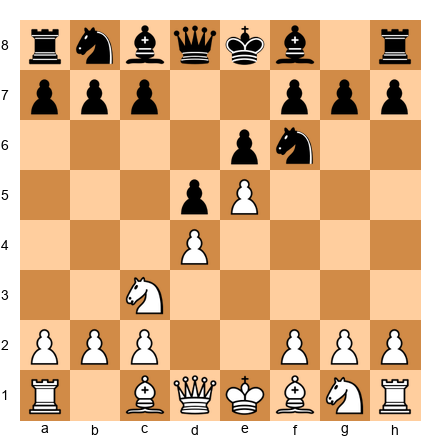

This is the classic pawn chain structure we studied earlier. White has pawns on d4 and e5 forming a chain pointing toward Black's kingside. Black has pawns on d5 and e6 forming a chain pointing toward White's queenside.

**Key features:**

1. **Locked center.** Neither side can easily advance central pawns. The action happens on the flanks.
2. **White attacks kingside.** The e5 pawn supports piece maneuvers toward Black's king. Plans include f4-f5, Qg4, Bd3-h5.
3. **Black attacks queenside.** The classic ...c5 break strikes at the base of White's chain (d4). Black may follow with ...Nc6, ...Qb6, ...cxd4 to open lines on the queenside.
4. **The bad bishop.** Black's light-squared bishop (on c8) is blocked by the e6 pawn. Solving this problem is one of Black's central tasks.

**Critical pawn breaks:**

- **For White:** f2-f4-f5 (attacking the base of Black's chain at e6)
- **For Black:** ...c7-c5 (attacking the base of White's chain at d4), and sometimes ...f7-f6 (striking at the tip)

---

### The Sicilian Structure

**Arises from:** Sicilian Defense (1.e4 c5)

**Set up your board:**

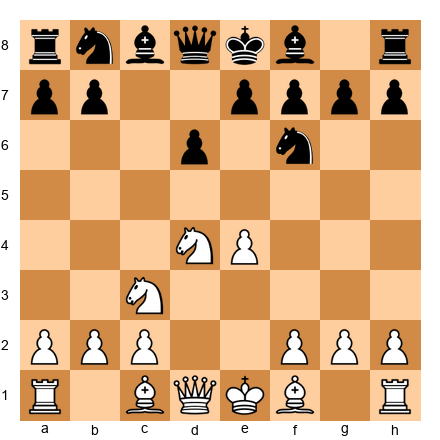

After 1.e4 c5 2.Nf3 d6 3.d4 cxd4 4.Nxd4, the typical Sicilian structure emerges. White has a pawn on e4; Black has a pawn on d6. The c-file is half-open for Black, and the d-file is half-open (or open) for White.

**Key features:**

1. **Asymmetric center.** White's e4 pawn vs. Black's d6 pawn creates an unbalanced fight. White has more central space; Black has a half-open c-file.
2. **White's space advantage.** The e4 pawn gives White more room on the kingside.
3. **Black's queenside counterplay.** Black typically plays ...a6, ...b5, and sometimes ...b4 to generate queenside activity.
4. **Dynamic imbalance.** Sicilian positions are sharp and tactical. The asymmetric pawn structure guarantees an unbalanced game.

**How to play this structure as White:**

- Use the space advantage for a kingside attack.
- Control the d5 square. A knight on d5 in the Sicilian is often very strong.
- Develop quickly and castle kingside (in Open Sicilians) or consider the English Attack with Be3, Qd2, O-O-O for a direct kingside pawn storm.

**How to play this structure as Black:**

- Use the half-open c-file for rook pressure.
- Advance the queenside pawns (...a6, ...b5, ...b4) to create counterplay.
- Time the ...d5 break carefully. When Black achieves ...d5, the position often equalizes or gives Black the advantage.
- Stay alert to tactical possibilities. Sicilian positions reward active play.

---

### The King's Indian Structure

**Arises from:** King's Indian Defense (1.d4 Nf6 2.c4 g6 3.Nc3 Bg7 4.e4 d6 5.Nf3 O-O 6.Be2 e5 7.d5)

**Set up your board:**

After 7.d5, the center locks. White has a pawn chain from c4-d5, pointing queenside. Black has a pawn chain from d6-e5, pointing kingside. The board splits into two battlefields.

**Key features:**

1. **Closed center.** The d5 and e5 pawns lock against each other. Neither side can easily open the center.
2. **Opposite flank attacks.** White plays on the queenside (c4-c5, a4, b4); Black plays on the kingside (f5, g5, h5, f4).
3. **The f5 break for Black.** Black's main weapon is ...f7-f5, striking at White's e4 pawn and opening the f-file for an attack on White's king.
4. **The c5 break for White.** White's main weapon is c4-c5, opening lines on the queenside and undermining Black's d6 pawn.

**Critical question:** Whose attack arrives first?

King's Indian positions are a race. White attacks on the queenside; Black attacks on the kingside. The player who breaks through first usually wins. This makes the King's Indian one of the most exciting and double-edged structures in chess.

**How to play this structure as White:**

- Push c4-c5 as quickly as possible. This is your primary break.
- Use the a-file and b-file after the queenside opens.
- Do not get distracted by Black's kingside threats. Your attack should arrive first if you play energetically.
- Consider the f3 pawn to reinforce e4 and support a potential g4 advance.

**How to play this structure as Black:**

- Push ...f7-f5 and aim for ...f4 to clamp down on the kingside.
- Once f4 is achieved, the g-file and h-file become your highways to White's king.
- The knight maneuver ...Nf6-d7-f6 (via c5 or to support ...f5) is standard.
- Trade your dark-squared bishop only if you get something significant in return. It is your best piece on the long diagonal.

---

### The London System Structures

**Arises from:** London System (1.d4 d5 2.Bf4, or 1.d4 Nf6 2.Bf4)

**Set up your board:**

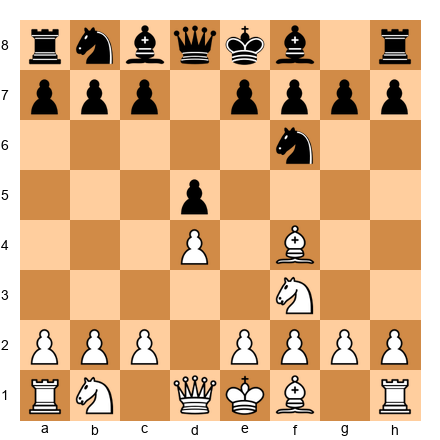

The London is a system opening, which means White plays the same setup regardless of Black's responses. The typical pawn structure features:

- White pawns on d4, e3, c3 (the "London pyramid")
- The dark-squared bishop developed outside the pawn chain to f4

After a few more moves, a typical London position looks like this:

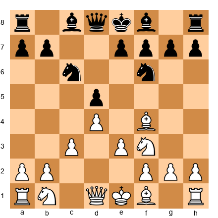

**Key features:**

1. **Solid, compact structure.** The c3-d4-e3 pyramid is extremely sturdy. It is hard to attack and gives White a reliable foundation.
2. **Clear piece development.** Bf4, Nf3, e3, Bd3, Nbd2, O-O. The London setup plays itself, which reduces the need for memorized theory.
3. **Flexibility.** White can choose later whether to play on the kingside (e3-e4), the queenside (c3-c4), or simply maintain the position.
4. **Risk of passivity.** If White plays too cautiously, the structure can become cramped. The e3 pawn blocks the dark-squared bishop's natural retreat.

**How to play this structure as White:**

- Complete your development before choosing a plan.
- Look for the e3-e4 break. If you can achieve e4 successfully, you gain central space and open lines for your pieces.
- Consider c3-c4 to challenge Black's center.
- The queen often goes to e2 or c2, supporting the e4 push.
- Connect your rooks and only then commit to a specific plan.

**How to play this structure as Black:**

- Challenge the center with ...c5. This is Black's most important break.
- Consider ...Qb6 to hit the b2 pawn and create queenside pressure.
- Develop the light-squared bishop actively (...Bf5 or ...Bg4).
- Do not be passive. If you allow White to play e4 undisturbed, the London can become dangerous.

---

🛑 **Rest marker.** You now understand how the major opening families produce their characteristic pawn skeletons. That is a powerful piece of knowledge. When you return, we will learn how to build plans based on what you see.

---

## Part 4: Planning Based on Pawn Structure

This is where the chapter comes together. You have learned the eight structure types. You have seen how they arise from common openings. Now we connect structure to *planning*.

The great positional players all share one skill: they look at the pawn skeleton and immediately know what to do. The pawns tell them which pieces to keep, which to trade, where to put the rooks, and where to attack.

You can develop this skill too. Here is a systematic method.

### Step 1: Which Pieces to Keep, Which to Trade

The pawn structure determines which pieces are good and which are bad.

**Bad bishops:** A bishop trapped behind its own pawns is a "bad bishop." In the French structure, Black's light-squared bishop is bad because the e6 and d5 pawns block its diagonal. If you have a bad bishop, consider trading it.

**Good knights:** A knight with a permanent outpost (a square protected by a pawn, where no enemy pawn can chase it away) is often stronger than a bishop. In positions with a locked center, knights outperform bishops.

**Good bishops:** In open positions with pawns on both sides of the board, bishops are typically stronger than knights. Their long-range power covers more ground.

**The trading principle:** Trade your bad pieces for your opponent's good pieces. If you have a bad bishop and your opponent has a good knight, try to exchange them. You improve your position and worsen theirs.

**Set up your board:**

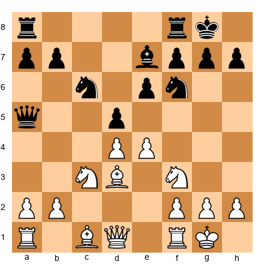

White's dark-squared bishop (on c1) is hemmed in by the e3 pawn (if it were on e3). Black's dark-squared bishop on e7 is passive. In this type of position, both sides might benefit from trading their passive bishops and keeping their active ones.

**A simple test:** For each minor piece, ask: "Is this piece working with the pawn structure or fighting against it?" Trade the ones fighting against it. Keep the ones working with it.

### Step 2: Where to Place Your Rooks

Rooks need open files. The pawn structure tells you exactly where those files are.

**Rule:** Place your rooks on open files (no pawns at all) or half-open files (only enemy pawns on the file).

In the Carlsbad structure, White's rooks belong on the c-file (half-open after cxd5). In the Sicilian, Black's rook belongs on the c-file (half-open after ...cxd4). In the French, both sides will fight for the c-file and e-file depending on how the pawn tension resolves.

**Behind passed pawns:** If you have a passed pawn, place a rook behind it (on the same file, further from promotion). As the pawn advances, the rook's scope increases. This is Tarrasch's rule, and it is remarkably reliable.

**The seventh rank:** A rook on the seventh rank (the second rank for Black) is almost always powerful. It attacks pawns from behind and restricts the enemy king. Look at the pawn structure to see if you can seize the seventh rank.

### Step 3: Where to Attack (Pawn Breaks)

A *pawn break* is a pawn advance designed to open lines or destroy the opponent's structure. The pawn skeleton tells you which breaks are available and desirable.

Every pawn structure has characteristic breaks:

| Structure | Key Break for White | Key Break for Black |
|-----------|-------------------|-------------------|
| Carlsbad | b4-b5 (minority attack) | ...f7-f5 or ...e6-e5 |
| French | f2-f4-f5 | ...c7-c5 |
| Sicilian | f2-f4, d4-d5 | ...d6-d5 |
| King's Indian | c4-c5 | ...f7-f5 |
| London | e3-e4 | ...c7-c5 |

**Timing a pawn break:**

Do not play a pawn break too early or too late. Ask yourself:

1. **Are my pieces ready?** A break works best when your pieces are positioned to exploit the lines that open.
2. **Can my opponent punish the break?** If the break leaves you with a weakness and your opponent can exploit it immediately, wait.
3. **Is the break structurally sound?** After the break, will the resulting pawn structure favor you?

If you answer yes to all three questions, play the break. If not, prepare further before committing.

### Step 4: The Minority Attack

The minority attack deserves special attention because it is one of the most instructive strategic plans in chess, and it arises frequently in the Carlsbad structure.

**The idea:** You advance a minority of pawns (usually two pawns on the queenside) against the opponent's majority (usually three pawns). The goal is NOT to win a pawn. The goal is to inflict structural damage.

**Set up your board:**

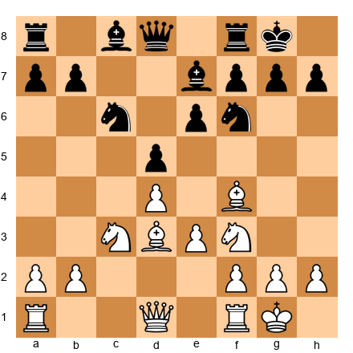

White plays a2-a4, then b2-b4, then b4-b5. When White's b-pawn reaches b5, it forces Black to make an uncomfortable choice:

1. **...axb5:** White recaptures with axb5, and now Black's c-pawn is backward on c6 (or c7), sitting on a half-open file. It becomes a permanent target.
2. **...cxb5:** White plays Nxb5, and now Black's d5 pawn is isolated. It becomes a permanent target.
3. **Black ignores it:** White captures on c6, and Black recaptures with ...bxc6, creating doubled, isolated c-pawns. Permanent targets.

No matter what Black does, the minority attack creates structural weaknesses. It is slow (taking 5-10 moves to execute), but extremely effective. The resulting weaknesses often decide the game in the endgame.

**How to execute the minority attack:**

1. Play a2-a4.
2. Play b2-b4.
3. Play b4-b5 when the time is right.
4. Open the a-file and b-file for your rooks.
5. Target the weaknesses that result.

**How to defend against the minority attack:**

1. Generate kingside counterplay before the attack arrives (...f5, ...Ne4, ...Bf6).
2. Consider ...a5 to prevent b4-b5, though this creates a weakness on b5.
3. Develop active piece play in the center to distract from the queenside.

### Step 5: Putting It All Together

Here is a five-step planning process you can use in any position:

1. **Identify the pawn structure.** What type is it? What opening family did it come from?
2. **Evaluate the pieces.** Which pieces are good? Which are bad? What should you trade?
3. **Find the open files.** Where should the rooks go?
4. **Identify the pawn breaks.** What breaks are available? Are your pieces ready for them?
5. **Form a plan.** Combine the above into a concrete sequence of moves.

This process takes practice. At first, it may feel slow. With repetition, it becomes second nature. You will look at a position and immediately see the plan that the pawn structure suggests.

---

🛑 **Good stopping point.** The theory section of this chapter is complete. When you return, we will see these ideas brought to life in five masterpiece games.

---

## Part 5: Annotated Games

### Game 24: Nimzowitsch vs Saemisch, Copenhagen 1923
*Theme: Blockade, Overprotection, and Positional Suffocation*

This game is one of the most celebrated positional masterpieces ever played. Nimzowitsch demonstrates his own theories of blockade and overprotection with brutal clarity. Watch how the pawn structure dictates every single decision.

**Set up your board.**

**1.d4 Nf6 2.c4 e6 3.Nf3 b6 4.g3 Bb7 5.Bg2 Be7 6.Nc3 O-O 7.O-O d5**

Both sides have completed their development. The position is classical and balanced. Black has a solid pawn structure with pawns on d5 and e6.

**8.Ne5**

A strong centralizing move. The knight on e5 controls critical squares and supports the coming pawn tension. Notice how the pawn structure (White's d4 and c4 against Black's d5 and e6) invites this kind of piece placement. The knight is headed for the heart of the position.

**8...c6**

Black supports the d5 pawn. This creates a small pawn chain: c6 supports d5, which is the structural anchor. But it also means Black's pieces are becoming a bit passive.

**9.cxd5 cxd5**

Now look at the structure. White has a pawn on d4; Black has a pawn on d5. The c-file is open. The position has a Carlsbad flavor, and Nimzowitsch is going to demonstrate how to exploit it.

**10.Bf4 a6 11.Rc1 b5 12.Qb3 Nc6**

Black develops the knight, but White's pieces are already better coordinated. Nimzowitsch's concept of "overprotection" is visible here: White's pieces support each other and control key squares redundantly.

**13.Nxc6 Bxc6 14.h3 Qb6 15.Kh2 Rab8**

White calmly improves the king's position. There is no rush. The pawn structure is stable, and White can slowly build pressure.

**16.Nd1**

This looks strange. The knight retreats to d1? But Nimzowitsch has a plan. The knight will reposition to a better square. Patience and maneuvering are the hallmarks of pawn-structure play.

**16...Nd7 17.Rxc6! Qxc6**

A key exchange. White gives up the rook for Black's active bishop. This looks like it costs material, but Nimzowitsch understands that Black's pawn structure is now rigid and the remaining pieces favor White.

**18.Nd2 Nb6 19.e3 Rfc8 20.Be5 f6 21.Bg3 f5 22.f3**

White builds a fortress around the center. Every pawn move is designed to control squares and restrict Black's pieces. This is overprotection in action: White's pieces and pawns guard the same key squares multiple times.

**22...Rc2 23.Re1 Bf6 24.Bf1 Rbc8 25.Bd3 R2c3 26.Bf2**

Black has rooks on open files, but they accomplish nothing. White's structure is airtight. The pawns on d4, e3, f3, g3, and h3 form a wall, and the pieces behind that wall are perfectly coordinated.

**26...Nc4 27.Nxc4 bxc4 28.Bc2 Qa4 29.Qb1 Rb3 30.Bb6 1-0**

The final move is quiet and devastating. Bb6 traps Black's queen. The rooks cannot help. The queen has no escape. Black resigns.

**What this game teaches about pawn structure:**

- A stable pawn center allows slow, methodical play
- Overprotection means your pieces support each other and key squares
- When the pawn structure is locked, piece maneuvering decides the game
- Patience is a weapon. Nimzowitsch never hurried.

---

### Game 25: Rubinstein vs Salwe, Lodz 1908
*Theme: Isolated Queen's Pawn Exploitation*

Many chess historians consider this the finest positional game ever played. Rubinstein takes a position with an isolated queen's pawn for his opponent and demonstrates, move by move, how to convert that structural weakness into a win. The rook maneuver Rd1-d4-h4 is one of the most beautiful ideas in chess history.

**Set up your board.**

**1.d4 d5 2.Nf3 e6 3.e3 c5 4.c4 Nc6 5.Nc3 Nf6 6.dxc5 Bxc5**

Black recaptures the pawn, but notice what has happened to the pawn structure. After a future exchange on d5, Black will be left with an isolated pawn on d5. The c-pawn is gone, so nothing on the c-file can support d5.

**7.a3 a6 8.b4 Bd6 9.Bb2 O-O 10.Qd2 Qe7**

Both sides develop naturally. White is already preparing to target the d5 pawn.

**11.Bd3 dxc4 12.Bxc4 b5 13.Bd3 Rd8 14.Qe2 Bb7 15.O-O Ne5**

Black tries to activate pieces. The knight on e5 is well-placed and centralized. But the structural weakness on d5 remains.

**16.Nxe5 Bxe5 17.f3**

White prepares e3-e4, which will challenge Black's central influence and reinforce control of d5. This quiet pawn move is deeply strategic.

**17...Rac8 18.e4**

Now White has a strong pawn on e4, which does two things: it controls d5 (preventing Black from placing a piece there easily) and it opens lines for White's pieces. Black's pawn structure, with the isolated d5 pawn gone after the earlier exchange, leaves Black without a central pawn presence.

**18...Bb8 19.e5 Nd7 20.Qe3 g6 21.Ne4**

The knight heads toward d6, a dream outpost. White's pieces are pouring into the gaps created by Black's structural weaknesses.

**21...Nf8 22.Nd6 Bxd6 23.exd6 Rxd6 24.Bc3 Rdc6 25.Bf6 Qd7**

White has traded the powerful knight for Black's bishop but gained the powerful bishop on f6. The dark squares around Black's king are compromised.

**26.Qe5 Rc2 27.Bf5!**

A stunning sacrifice. White gives up the bishop to destroy Black's pawn cover.

**27...exf5 28.Qxf5 Qxf5 29.Rxf5**

Even though queens are off the board, White's position is winning. The rook on f5 dominates, and the bishop on f6 paralyzes Black. This is pawn structure play at its finest: the structural weakness has been converted into a piece activity advantage, which now converts into a material advantage.

**29...Nd7 30.Bd4 Nb8 31.Rd1!**

Rubinstein's famous rook lift begins. The rook will swing to the fourth rank and then to h4.

**31...Rd8 32.Rf6 a5 33.Rd6 Rxd6 34.Rxd6 Rxd2 35.Rxb6 1-0**

Black's pawn structure has collapsed. The queenside pawns fall, and the endgame is hopeless.

**What this game teaches about pawn structure:**

- An isolated queen's pawn is a long-term target
- Piece activity can be used to exploit structural weaknesses
- The transition from middlegame to endgame is where structural advantages cash in
- Rubinstein's patience is the model: he never rushed, he just improved his position one step at a time

---

### Game 43: Capablanca vs Spielmann, New York 1927
*Theme: Structural Advantage Conversion with Effortless Technique*

Capablanca was the most efficient converter of small advantages in chess history. In this game, he turns a tiny structural edge into a winning position with moves that look almost too simple. That simplicity is the point. When the pawn structure favors you, the correct moves are often the obvious ones.

**Set up your board.**

**1.d4 d5 2.Nf3 Nf6 3.c4 e6 4.Nc3 c6 5.e3 Nbd7 6.Bd3 dxc4 7.Bxc4 b5 8.Bd3 a6**

A Semi-Slav structure. Black has expanded on the queenside with ...b5 and ...a6. This gains space but also creates potential weaknesses. The b5 and a6 pawns can become targets if the position opens.

**9.e4 c5 10.e5 cxd4 11.Nxb5!**

Capablanca strikes. This sacrifice shatters Black's queenside pawn structure. After this move, Black's pawns become scattered and weak.

**11...axb5 12.exf6 gxf6**

Look at Black's pawn structure now. The pawns on b5, d4, e6, and f6 are a mess. The f-pawns are doubled. The b5 pawn is isolated. The d4 pawn is passed but difficult to support. Black has four pawn islands to White's two.

This is structural devastation. Capablanca did not need to sacrifice a piece for a mating attack. He sacrificed a piece for a *pawn structure* advantage, knowing that his technique would be sufficient to convert it.

**13.O-O Qb6 14.Qe2 Bb7 15.a4!**

Targeting the weak b5 pawn immediately. White opens lines on the queenside where Black's structure is damaged.

**15...Bd5 16.Rd1 bxa4 17.Nd2 f5**

Black tries to stabilize, but the structural damage is too severe.

**18.Nb3 Bc5 19.Qh5 Rg8 20.Qxf5 Rg6 21.Bxg6 fxg6 22.Qe4 1-0**

Spielmann resigns. White is up material and Black's position is riddled with weaknesses. The pawn structure told the story from move 11 onward.

**What this game teaches about pawn structure:**

- Pawn structure advantages can justify material sacrifices
- Pawn islands matter: four islands against two is a structural disaster
- Capablanca's technique shows that when the structure favors you, simple moves are the strongest moves
- Doubled, isolated, and backward pawns combined create an undefendable position

---

### Game 48: Nimzowitsch vs Capablanca, New York 1927
*Theme: Simplicity Defeats Complexity*

In this game, two of the greatest chess minds of all time clash. Nimzowitsch, the great theorist, brings his complex strategic ideas. Capablanca, the great pragmatist, brings clarity and precision. The result is a masterclass in how clean pawn play defeats complicated plans.

**Set up your board.**

**1.c4 Nf6 2.Nf3 e6 3.d4 d5 4.e3 Be7 5.Nbd2 O-O 6.Bd3 c5**

Black immediately challenges the center. This is the most important pawn break in the Queen's Gambit family of structures. By playing ...c5, Capablanca opens lines and prevents White from establishing a dominant center.

**7.dxc5 Na6 8.O-O Nxc5 9.Bc2 b6 10.b3 Bb7**

Black has a harmonious setup. The bishop on b7 aims at the long diagonal. The knight on c5 is well-placed. Black's pawn structure is clean: pawns on b6, d5, and e6 with no weaknesses.

**11.Bb2 Rc8 12.Qe2 Qd7 13.Rfd1 Rfd8 14.Rac1 dxc4**

Capablanca opens the position at exactly the right moment. The pawn exchange on c4 opens the d-file and gives Black's pieces maximum activity.

**15.bxc4 Qe8 16.a3 Nce4**

The knight springs to e4, a powerful central outpost. From here it controls critical squares and cannot easily be driven away. This is pawn-structure thinking: the central pawn exchange created the outpost, and Capablanca was the first to occupy it.

**17.Nxe4 Nxe4 18.Nd4 Qa4!**

The queen enters the game with tempo, attacking the c4 pawn. Nimzowitsch's position, despite looking solid, is under pressure on every front.

**19.Bd3 Nc5 20.Bb1 Rxd4!**

A beautiful exchange sacrifice, but also a structural one. By removing the knight from d4, Capablanca eliminates the piece that held White's position together.

**21.exd4 Nd3 22.Bxd3 Qxd4 23.Be4 Bxe4 24.Qxe4 Qxe4 0-1**

White resigns. After the queen trade, Black's endgame is winning. The structural advantage (cleaner pawns, better piece placement, superior coordination) made the tactical blow on move 20 possible.

**What this game teaches about pawn structure:**

- Clean pawn structure enables tactical opportunities
- Opening the position at the right moment is a structural decision
- Central outposts created by pawn exchanges are powerful
- Simplicity and precision beat complexity when the structure is on your side

---

### Game 5 (Bonus): Karpov vs Unzicker, Nice Olympiad 1974
*Theme: The Minority Attack in Practice*

No chapter on pawn structures is complete without a game showing the minority attack executed to perfection. Karpov was the supreme master of this technique. In this game, he demonstrates how two queenside pawns can dismantle three.

**Set up your board.**

**1.d4 d5 2.c4 e6 3.Nf3 Nf6 4.Nc3 Be7 5.Bg5 O-O 6.e3 h6 7.Bh4 b6 8.cxd5 Nxd5 9.Bxe7 Qxe7 10.Nxd5 exd5**

The Carlsbad structure has appeared. White has pawns on d4 and e3; Black has pawns on d5 and e-pawn is now gone. The c-file is half-open. This is the ideal setup for the minority attack.

Count the pawn islands. White has two (a+b+c pawns, and d+e+f+g+h pawns). Black also has two. But the key difference is on the queenside: White has two pawns (a2 and b2) against Black's three (a7, b6, c7). Two against three. The minority is ready to march.

**11.Rc1 Be6 12.Qa4 c5 13.Qa3**

White immediately targets the c5 pawn. Karpov does not waste a single move.

**13...Rc8 14.Bb5 Qb7 15.dxc5 bxc5 16.O-O**

Now Black has an isolated pawn on c5 and an isolated pawn on d5. These are the fruits of the minority attack: Black's queenside has been shattered. The c5 pawn is a target on the half-open c-file, and the d5 pawn has lost its neighbor.

**16...Nd7 17.Be2 Nb6 18.Rc2 Rc6 19.Rfc1 Rac8 20.Nd2 Nd7 21.Nb3**

White piles pressure on c5. Every piece points at the weakness. Black's position is solid but passive; all of Black's energy is devoted to defending the c5 pawn.

**21...Nb6 22.Na5 Rc7 23.Nb3 Nc4 24.Qd3 f5**

Black tries to generate counterplay, but it is too late. The structural damage is done.

**25.Bxc4 dxc4 26.Nxc5 cxd3 27.Nxe6 1-0**

The final combination nets White a piece. But the game was won in the pawn structure, not in the tactics. The minority attack created the weakness on c5, and Karpov's patient pressure forced Black into an impossible defensive position.

**What this game teaches about pawn structure:**

- The minority attack is one of the most reliable strategic plans in chess
- Two pawns advancing against three can create lasting weaknesses
- Patience and precise piece placement convert structural advantage into victory
- The Carlsbad structure is a laboratory for learning positional play

---

🛑 **All five games complete.** Take a moment to appreciate what you have seen. Five different masters, five different structural themes, and all of them decided by the pawn skeleton. When you are ready, the exercises await.

---

## Part 6: Exercises

**How to use these exercises:** Attempt each exercise on your physical board before reading the hints. If you get stuck, read Hint 1. Still stuck? Read Hint 2. Only after trying all three hints should you read the solution. There is no shame in using hints. That is what they are for.

**Pacing:** Do five exercises per session. That is 10 sessions to complete all 50. A sustainable pace.

---

### Section A: Identify the Pawn Structure (Exercises 13.1 - 13.10) ★

*For each position, identify the pawn structure type and state whether the side to move should be happy or concerned about their structure.*

**Exercise 13.1** ★

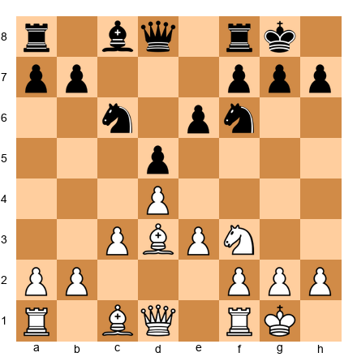

White to move. What pawn structure type is present? Is White's structure healthy?

*Hint 1:* Look at the white pawn on d4. Are there white pawns on the c-file or e-file that could support it?
*Hint 2:* The white pawn on e3 is behind the d4 pawn. Does this qualify as an adjacent pawn supporter?
*Hint 3:* Consider whether d4 is truly isolated or part of a chain.

**Solution:** White has a pawn chain (e3 supporting d4). This is NOT an isolated pawn because the e3 pawn sits on an adjacent file and can potentially protect d4 via e3-e4 or simply supports the center from behind. White's structure is healthy. The chain e3-d4 is solid, and White has no pawn weaknesses. The key strategic question is whether White can advance e3-e4 to gain central space.

---

**Exercise 13.2** ★

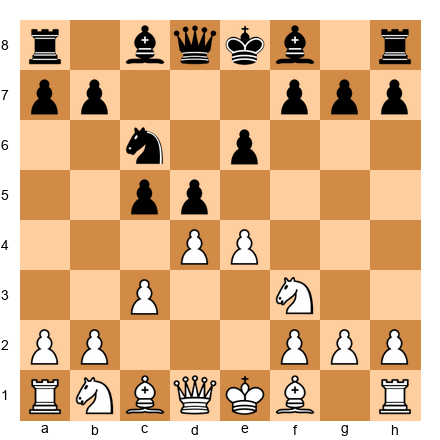

White to move. Identify the pawn structure.

*Hint 1:* Count each side's pawn islands.
*Hint 2:* Look at White's c3 and d4 pawns. Are they connected?
*Hint 3:* How does Black's c5 pawn relate to d5?

**Solution:** White has pawns on c3, d4, e4. These form a broad center with the c3 pawn supporting d4 and the e4 pawn adjacent. White has two pawn islands (a-b on one side, c-d-e-f-g-h on the other). Black has connected pawns on c5 and d5 challenging the center. This is a dynamic central battle. Black's connected c5-d5 pawns challenge White's center, and the resolution of this tension (whether ...cxd4 or ...dxe4 happens first) will determine the pawn structure for the rest of the game.

---

**Exercise 13.3** ★

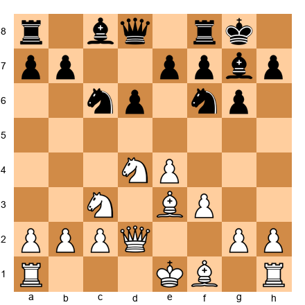

White to move. What structure type does Black have?

*Hint 1:* Focus on Black's pawns. Where are they?
*Hint 2:* Is there anything unusual about Black's pawn on d6?
*Hint 3:* This structure is characteristic of a specific opening. Which one?

**Solution:** This is a Sicilian structure. Black has pawns on a7, b7, d6, e7, f7, g6, h7. The key feature is Black's pawn on d6 against White's pawn on e4. The d6 pawn is slightly backward (it cannot easily advance to d5 because White controls that square with e4), but it is also the foundation of Black's position. Black will seek the ...d5 break as a liberating move. The half-open c-file (Black's c-pawn was traded for White's d-pawn) gives Black natural counterplay.

---

**Exercise 13.4** ★

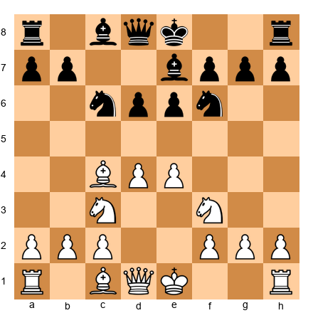

White to move. Name the pawn structure and identify the key pawn break for each side.

*Hint 1:* Compare White's e4 pawn with Black's d6 and e6 pawns.
*Hint 2:* What is the most important pawn advance Black is aiming for?
*Hint 3:* What about White? What central pawn advance would give White an advantage?

**Solution:** This is a classical open-game structure often arising from the Giuoco Piano or Italian Game family. White has the two-pawn center (d4 and e4) against Black's d6 and e6 pawns. Black's key break is ...d5, which would challenge White's center directly and free the position. White wants to prevent ...d5 or advance d4-d5 to gain space. White's d4-d5 break would lock the center favorably. Black's ...d6-d5 break would equalize. The battle revolves around who achieves their break first.

---

**Exercise 13.5** ★

Black to move. Name this pawn structure and state the strategic plan for both sides.

*Hint 1:* Look at the interlocking pawn chains.
*Hint 2:* Which side of the board does White's chain point toward?
*Hint 3:* What is the base of White's chain? How should Black attack it?

**Solution:** This is the French structure. White's pawn chain runs d4-e5 (base on d4, tip on e5). Black's chain runs e6-d5 (base on e6, tip on d5). White's plan: attack on the kingside where the chain points (f4, g4, or piece maneuvers to the kingside). Black's plan: attack the base of White's chain with ...c5. The classic ...c7-c5 break undermines d4 and opens queenside lines for Black's pieces. Black should also solve the problem of the "bad" light-squared bishop blocked by the e6 pawn.

---

**Exercise 13.6** ★

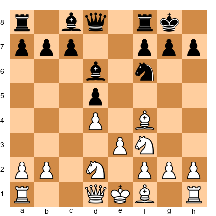

White to move. What type of pawn structure is this, and what system does it come from?

*Hint 1:* Look at White's pawn formation: d4 and e3. And the bishop on f4.
*Hint 2:* This is a system opening where White develops the dark-squared bishop before playing e3.
*Hint 3:* What is White's main central pawn break in this structure?

**Solution:** This is the London System structure. White has the characteristic d4-e3 pawn setup with the bishop developed to f4 before the e-pawn moved. White's main plan is to prepare and execute the e3-e4 break, gaining central space. The pyramid structure (if c3 is added: c3-d4-e3) is extremely solid. White should complete development (Bd3, O-O, Qe2 or Qc2) and then look for the right moment to play e4. Black should challenge this plan with ...c5 before White completes the setup.

---

**Exercise 13.7** ★

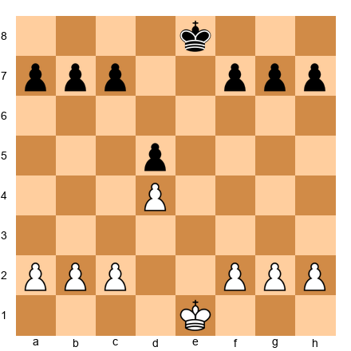

White to move. Count the pawn islands for each side.

*Hint 1:* Group each side's pawns into connected clusters.
*Hint 2:* A pawn island is a group of pawns on adjacent files with no gap.
*Hint 3:* Separate islands are separated by at least one empty file.

**Solution:** White has two pawn islands: a2-b2-c2 (three connected pawns) and d4-f2-g2-h2 (with a gap where e2 used to be, so d4 is actually isolated from f2). Wait. Let us recount. White's pawns: a2, b2, c2, d4, f2, g2, h2. The gap on e creates two islands: a2-b2-c2-d4 (connected, because c and d are adjacent files) and f2-g2-h2 (connected). White has **two pawn islands**. Black's pawns: a7, b7, c7, d5, f7, g7, h7. Same logic: a7-b7-c7-d5 (connected) and f7-g7-h7 (connected). Black has **two pawn islands**. The structure is symmetric.

---

**Exercise 13.8** ★

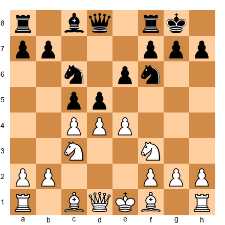

White to move. Black has just played ...c5 and ...d5. What structural tension exists?

*Hint 1:* White has pawns on c4, d4, and e4. Black has pawns on c5 and d5. Where are the collision points?
*Hint 2:* Consider what happens if White plays exd5, cxd5, or dxc5.
*Hint 3:* Each capture leads to a fundamentally different pawn structure.

**Solution:** There are three points of tension: d4 vs c5, c4 vs d5, and e4 vs d5. If White plays **exd5**, Black recaptures ...exd5 or ...Nxd5, potentially creating a Carlsbad-type structure or an IQP. If White plays **dxc5**, Black gets a half-open d-file and potential central majority. If White plays **cxd5**, the result depends on whether Black recaptures with ...exd5 (Carlsbad) or ...Nxd5 (different character). Each resolution creates a completely different game. This is why pawn tension is so important: the moment of capture defines the rest of the position.

---

**Exercise 13.9** ★

White to move. What happens to the pawn structure after 5.d4xe5?

*Hint 1:* If White captures on e5, which black piece recaptures?
*Hint 2:* After ...Nxe5, White's e4 pawn is still on the board. What is its status?
*Hint 3:* Consider the resulting pawn islands.

**Solution:** After dxe5 Nxe5, White has pawns on e4 and e5. Wait, that is not right. After dxe5, White has a pawn on e4 and has captured on e5. Black's knight recaptures on e5. So White has: a2, b2, c2, e4, f2, g2, h2 (the d-pawn is gone). White has two pawn islands: a2-b2-c2 and e4-f2-g2-h2. Black has: a7, b7, c7, d7, f7, g7, h7 (the e-pawn was captured). Black has two pawn islands: a7-b7-c7-d7 and f7-g7-h7. The structure is roughly equal in terms of islands, but White has an open d-file and a strong e4 pawn controlling d5. In practice, White usually does not capture this way; instead, White prefers to maintain the tension.

---

**Exercise 13.10** ★

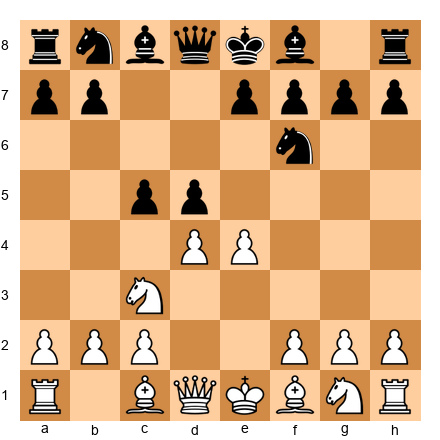

White to move. This position can lead to several major pawn structures depending on White's next move. Name at least two possible structures and the move that creates each one.

*Hint 1:* What happens after exd5? What about e5?
*Hint 2:* After exd5 ...Nxd5, we get an open center. After e5, we get a French-like chain.
*Hint 3:* Consider also dxc5 and cxd4.

**Solution:** (1) After **e5**, White creates a French-like pawn chain (d4-e5) with Black's chain on c5-d5. The center locks, and both sides play on opposite flanks. (2) After **exd5 Nxd5**, the center opens. White has a single d-pawn against Black's c5, creating a more tactical, open game. (3) After **dxc5**, Black might recapture with ...e6 and ...Bxc5, potentially reaching an IQP position if ...dxe4 follows. Each capture creates a fundamentally different game, which is why understanding pawn structure theory is so powerful: it tells you what kind of game you are creating with each decision.

---

🛑 **Rest here.** You have completed the first 10 exercises. That is a great start.

---

### Section B: Find the Pawn Break (Exercises 13.11 - 13.20) ★★

*For each position, find the correct pawn break and explain why it works.*

**Exercise 13.11** ★★

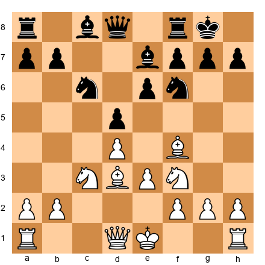

White to move. Find the best pawn break.

*Hint 1:* White's pawns are on d4 and e3. Which pawn can advance to open lines?
*Hint 2:* The e3-e4 push challenges Black's center directly.
*Hint 3:* Consider what happens after e4 dxe4 Nxe4. How does White's position improve?

**Solution:** **e3-e4!** is the key break. After e4 dxe4 Nxe4, White gets a powerful knight on e4, opens the position for the bishops, and gains central control. If Black does not capture (e4 d4?), White plays e5 with a strong central pawn. The e4 break transforms the London-type structure into an open, dynamic position where White's piece activity matters more than the pawn structure.

---

**Exercise 13.12** ★★

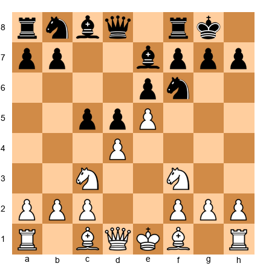

White to move. Black has played ...c5. What is the best response?

*Hint 1:* Black is attacking the base of White's chain at d4.
*Hint 2:* Should White defend d4 or ignore the attack and counterattack?
*Hint 3:* Consider f2-f4 to support the e5 pawn and prepare f4-f5.

**Solution:** White should play **f2-f4**, reinforcing the e5 pawn and preparing the f4-f5 break to attack the base of Black's chain at e6. This follows Nimzowitsch's principle: when your chain is attacked at the base, reinforce it and attack the opponent's base. After f4, White prepares f5 to undermine e6. If Black captures ...cxd4, White recaptures and maintains the strong e5 pawn with an improved position. White should NOT panic about the c5 push; instead, focus on the kingside where the chain points.

---

**Exercise 13.13** ★★

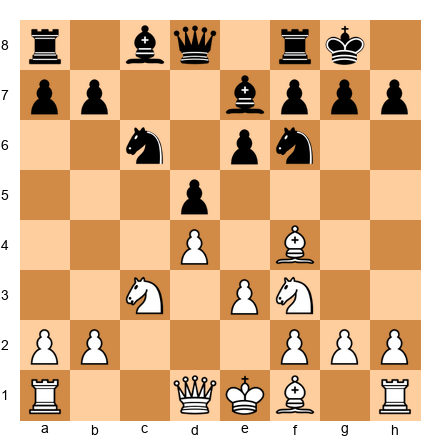

White to move. This is a Carlsbad structure. What is White's primary strategic plan?

*Hint 1:* White has two pawns on the queenside (a2 and b2). Black has three (a7, b7, c6).
*Hint 2:* What happens when a minority of pawns advances against a majority?
*Hint 3:* The plan begins with a2-a4, then b2-b4, then b4-b5.

**Solution:** **The minority attack.** White plays a2-a4, b2-b4, and then b4-b5. The b5 advance forces Black into an unpleasant choice: ...axb5 (leaving a backward c-pawn), ...cxb5 (leaving an isolated d-pawn), or allowing bxc6 (creating doubled c-pawns). All three outcomes create lasting structural weaknesses for Black. White should play this slowly and methodically, preparing with rooks on the c-file and supporting piece placement before the b5 advance.

---

**Exercise 13.14** ★★

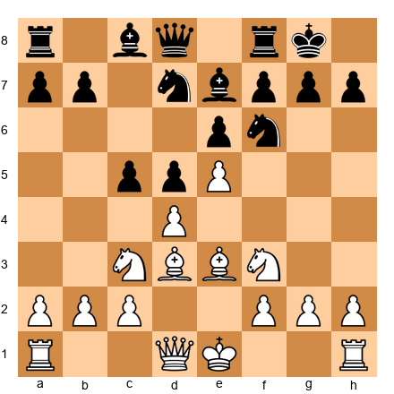

White to move. Find the pawn break that targets Black's chain.

*Hint 1:* Black's chain runs from e6 to d5 to c5. Where is the base?
*Hint 2:* Can White directly attack e6?
*Hint 3:* Consider f2-f4-f5 as a plan, not a single move.

**Solution:** White should prepare **f2-f4** followed by **f4-f5**, attacking the base of Black's chain at e6. After f5 exf5, the e5 pawn becomes a powerful passed pawn (or near-passed pawn), and lines open toward Black's king. This is the classic anti-French plan. White does not need to play f5 immediately; preparation with moves like Qd2, O-O, and piece repositioning comes first. The strategic idea is clear: attack the base, undermine the chain.

---

**Exercise 13.15** ★★

White to move. Black has a solid center. Find the pawn break that challenges it.

*Hint 1:* White's c4 pawn already attacks d5. Can White add more pressure?
*Hint 2:* Consider e2-e4.
*Hint 3:* After e4 dxe4 Nxe4, how does the center change?

**Solution:** **e2-e4!** is the key break, directly challenging Black's d5 pawn. After e4 dxe4 Nxe4, White has a strong centralized knight and open lines. If Black plays ...dxc4, White has a strong e4 pawn and open lines. If Black maintains the tension, White has gained space. The e4 break is the most aggressive and principled approach. It transforms a closed position into an open one where White's piece activity can shine.

---

**Exercise 13.16** ★★

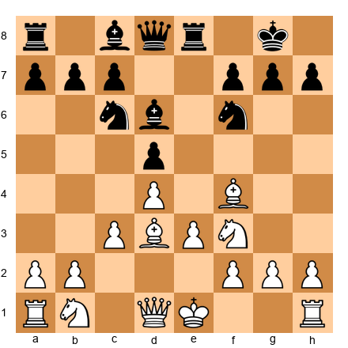

White to move. The center is stable. How does White open the position?

*Hint 1:* White's pawns are on c3, d4, e3. Which can advance?
*Hint 2:* The e3-e4 break is the natural central advance.
*Hint 3:* Before playing e4, should White develop further? Consider Nbd2 first.

**Solution:** White should prepare **e3-e4** with moves like Nbd2 followed by e4. After e4, if Black captures dxe4, White recaptures Nxe4 with a strong centralized knight. If Black does not capture, White can push e5 gaining space. The preparation is important: Nbd2 supports the e4 advance with an extra piece. Playing e4 prematurely (without Nbd2) risks losing the e-pawn if Black has enough pressure on it.

---

**Exercise 13.17** ★★

White to move. This is a Sicilian structure. What is Black's key pawn break, and how should White prevent it?

*Hint 1:* Black's most liberating move in the Sicilian is ...d5.
*Hint 2:* How does White's e4 pawn prevent ...d5?
*Hint 3:* If White plays f3 (already done) and Be2, how does that help control d5?

**Solution:** Black's key break is **...d6-d5**. When Black achieves ...d5, the game typically equalizes or even favors Black. White prevents this by maintaining the e4 pawn and controlling d5 with pieces (Nc3, possibly Nd5). White has already played f3, which supports e4. White should continue development with Be2, O-O, and maintain a grip on the d5 square. If Black ever plays ...d5, White should be prepared to meet it with exd5 followed by occupying d5 with a piece.

---

**Exercise 13.18** ★★

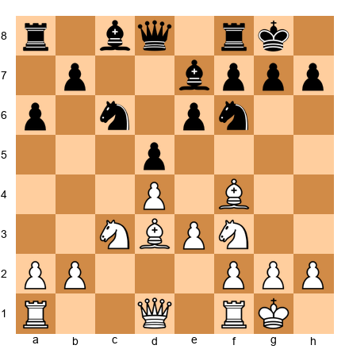

White to move. Execute the first move of the minority attack.

*Hint 1:* The minority attack begins with a pawn advance.
*Hint 2:* Which pawn advances first: a2 or b2?
*Hint 3:* a2-a4 prepares b2-b4-b5.

**Solution:** **a2-a4!** This is the standard first move of the minority attack. It prepares b2-b4 and eventually b4-b5. The a-pawn must advance first because after b2-b4, the a2 pawn needs to support the b4 pawn (or recapture if ...axb5 happens). The full plan: a4, then b4, then b5 at the right moment. It is a slow plan that requires patience, but it creates lasting structural damage to Black's queenside.

---

**Exercise 13.19** ★★

Black to move. This is a King's Indian structure. Find Black's key pawn break.

*Hint 1:* The center is locked. Black's chain points kingside.
*Hint 2:* What pawn advance opens the kingside for Black?
*Hint 3:* ...f7-f5 is the most important move in the King's Indian.

**Solution:** **...f7-f5!** This is the signature break in the King's Indian Defense. It attacks White's e4 pawn, opens the f-file for Black's rook, and prepares a kingside attack with ...f4, ...g5, ...h5, and further advances. After ...f5, if White captures exf5, Black recaptures ...gxf5 or ...Bxf5, opening lines toward White's king. If White does not capture, Black plays ...f4 to close the kingside and prepare a pawn storm. This break is the heart of Black's strategy.

---

**Exercise 13.20** ★★

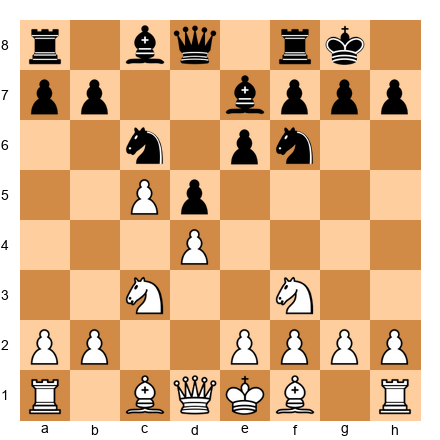

White to move. White has just played c4-c5. What did this accomplish, and is it good or bad?

*Hint 1:* After c5, White's c-pawn has advanced past Black's d-pawn. What kind of pawn has it become?
*Hint 2:* Does the c5 pawn create a passed pawn? Or does it just gain space?
*Hint 3:* Consider whether c5 weakens the d4 pawn.

**Solution:** The c4-c5 advance is **double-edged**. It gains queenside space and may restrict Black's dark-squared bishop (if on d6 or e7). It also prepares a queenside pawn storm with b4-b5-a4. However, it surrenders control of d5, giving Black a beautiful outpost for a knight. It also leaves the d4 pawn potentially weak since the c-pawn can no longer support it. Whether c5 is good or bad depends on whether White can use the queenside space advantage before Black exploits the d5 outpost. In general, c5 is a committal move that changes the character of the position permanently.

---

🛑 **Rest here.** Twenty exercises done. You are making excellent progress.

---

### Section C: Which Pieces to Trade? (Exercises 13.21 - 13.30) ★★ - ★★★

*For each position, determine which minor pieces should be traded and which should be kept. Explain your reasoning based on the pawn structure.*

**Exercise 13.21** ★★

White to move. White has a bishop on f4 and a bishop on d3. Black has a bishop on e7 and a knight on f6. Which of White's minor pieces is "bad"?

*Hint 1:* Look at White's pawns on d4 and e3. What color are those squares?
*Hint 2:* White's dark-squared bishop (f4) is outside the pawn chain. Is it blocked?
*Hint 3:* White's light-squared bishop (d3) might be blocked if the center closes.

**Solution:** Neither of White's bishops is truly "bad" in this position because the dark-squared bishop on f4 is already outside the pawn chain (developed before e3 was played, classic London System). The light-squared bishop on d3 aims at Black's kingside and supports the e4 break. White should keep both bishops. If forced to trade one, keep the dark-squared bishop (it is active and outside the chain). The light-squared bishop could be exchanged for Black's knight on f6 if it helps secure a kingside attack, but this should only be done for a specific tactical reason.

---

**Exercise 13.22** ★★

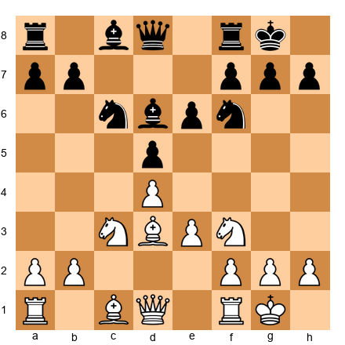

White to move. Black's bishop is on d6, aimed at the kingside. White's bishop is on c1, blocked by the e3 pawn. Which side benefits from trading dark-squared bishops?

*Hint 1:* White's dark-squared bishop is passive behind the e3 pawn.
*Hint 2:* Black's dark-squared bishop is active and aims at White's king.
*Hint 3:* Trading a bad piece for a good piece improves your position.

**Solution:** **White benefits from the trade.** White's dark-squared bishop on c1 is blocked by the e3 pawn and has no active role. Black's bishop on d6 is active and potentially dangerous on the b8-h2 diagonal. If White can trade the passive c1 bishop for Black's active d6 bishop, White removes a threat while also improving the relative quality of remaining pieces. White might achieve this with moves like Nh4-f5 (trading the knight for the bishop, which is not ideal) or simply maneuvering to force the trade.

---

**Exercise 13.23** ★★★

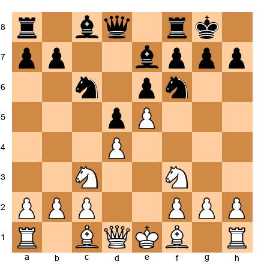

White to move. This is a French-type structure. Black has a light-squared bishop still on c8. Should Black trade this bishop or keep it?

*Hint 1:* Black's pawns are on d5 and e6. What color are those squares?
*Hint 2:* The bishop on c8 is blocked by its own pawns. What kind of bishop is this?
*Hint 3:* A bad bishop should be traded if possible.

**Solution:** Black's light-squared bishop on c8 is the classic "French bishop" problem. It is blocked by its own pawns on d5 and e6, both sitting on light squares. This bishop is *bad* and Black should actively seek to trade it. Common methods include ...b6 and ...Ba6 (trading it for White's light-squared bishop), ...Bd7-c6 (though this is passive), or even the maneuver ...Nh5-f4 combined with ...Bd7-e8-h5 in some variations. Solving the bad bishop problem is one of Black's central strategic tasks in the French structure. White, conversely, should avoid trading light-squared bishops because keeping them on preserves the imbalance.

---

**Exercise 13.24** ★★★

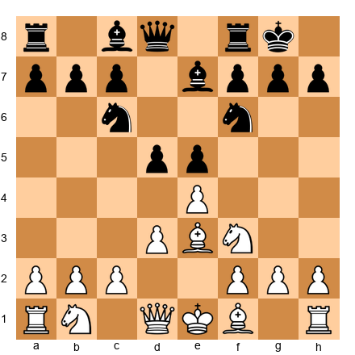

White to move. The center is closed (d3 and e4 vs d5 and e5). Which minor piece (bishop or knight) is more valuable for White in this structure?

*Hint 1:* In closed positions with locked central pawns, which piece navigates better?
*Hint 2:* Can White's bishops find open diagonals in this structure?
*Hint 3:* Knights jump over pawns. Bishops cannot.

**Solution:** **Knights are more valuable** in this closed position. The locked central pawns (d3/e4 vs d5/e5) restrict the bishops' diagonals. White's dark-squared bishop on e3 has limited scope (the e5 and d4 pawns block its best diagonals). White should look for knight outposts (f5, d5 if achievable) and keep the knights. If White can trade a bishop for one of Black's knights (especially a knight heading for a strong outpost), that can be favorable. In closed positions, always prefer knights unless the position is about to open up.

---

**Exercise 13.25** ★★

White to move. This is a Sicilian Dragon structure. Black has a powerful bishop on g7. Should White trade it?

*Hint 1:* The g7 bishop controls the long diagonal from a1 to h8.
*Hint 2:* In the Dragon, Black's dark-squared bishop is the most valuable piece.
*Hint 3:* If White trades this bishop, Black's kingside defense weakens significantly.

**Solution:** **Yes, White should trade it if possible.** Black's dark-squared bishop on g7 is the foundation of Black's defensive setup. It guards the long diagonal, supports the d4 square, and helps protect the king. Trading it (typically with Be3-d4 or Bc4-b3 combined with a kingside attack) removes Black's best defensive piece. In the Yugoslav Attack (Be3, Qd2, O-O-O, Bh6), White specifically aims to exchange this bishop with Bh6. The trade significantly weakens Black's kingside and dark-square control.

---

**Exercise 13.26** ★★★

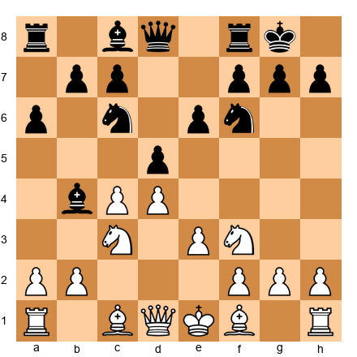

White to move. Black has a bishop on b4 pinning the c3 knight. After ...Bxc3+, White recaptures bxc3, getting doubled pawns. Should White welcome or avoid this trade?

*Hint 1:* After bxc3, White has doubled c-pawns but also an open b-file.
*Hint 2:* White's pawn center becomes c3-c4-d4-e3. How many central squares does this control?
*Hint 3:* This structure appears in the Nimzo-Indian Defense and has been tested thousands of times.

**Solution:** **White should welcome the trade.** After ...Bxc3+ bxc3, White gets doubled c-pawns but gains significant compensation: (1) the b-file opens for the rook, (2) the pawn pair c3+c4+d4 controls a massive number of central squares (b4, b5, c5, d5, e5), and (3) White often gains the bishop pair. The doubled pawns are not weak targets because they are well-protected and centrally placed. Many strong players (including Botvinnik and Petrosian) preferred this structure. The key: White should play for e3-e4 to open the position for the bishop pair.

---

**Exercise 13.27** ★★

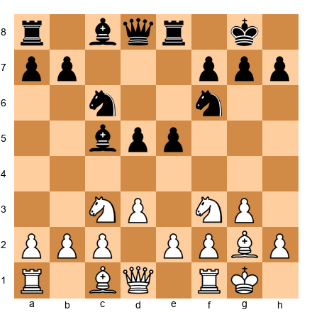

White to move. White has a fianchettoed bishop on g2 and a knight on c3. Black has a bishop on c5 and pawns on d5 and e5. Should White trade the g2 bishop for Black's knight?

*Hint 1:* The g2 bishop is aimed at the center (d5) along the long diagonal.
*Hint 2:* Is the g2 bishop currently active or blocked?
*Hint 3:* Black's d5 pawn blocks the g2 bishop's diagonal.

**Solution:** **Do not trade the g2 bishop yet.** Although the g2 bishop is currently blocked by Black's d5 pawn, it has long-term potential. If the d5 pawn ever moves or is exchanged, the bishop comes alive on the long diagonal. Trading it now would surrender that potential. Instead, White should prepare to challenge Black's center with d3-d4 or f2-f4, which would activate the g2 bishop. The bishop's power is latent, not absent. Be patient with it.

---

**Exercise 13.28** ★★★

White to move. Both sides have a bishop and a knight. The pawn structure is symmetric (d4 vs d5). Should White seek to trade bishops or knights?

*Hint 1:* In symmetric positions, which piece tends to be more useful for creating imbalances?
*Hint 2:* Consider where White's knight could go. Is there a natural outpost?
*Hint 3:* If White trades knights, the position becomes more static (bishop vs bishop). Is that good for White?

**Solution:** **White should keep the knights.** In a symmetric structure, knights can create imbalances by occupying outposts (e5 is the natural target for White's knight). Trading knights leads to a bishop endgame where the symmetric structure often produces a draw. The knight on f3 can reroute to e5 (or d2-f3-e5), creating pressure on Black's position. White's bishop on d3 supports the e4 break and eyes the kingside. Keep pieces on the board to maintain winning chances in an otherwise balanced structure.

---

**Exercise 13.29** ★★★

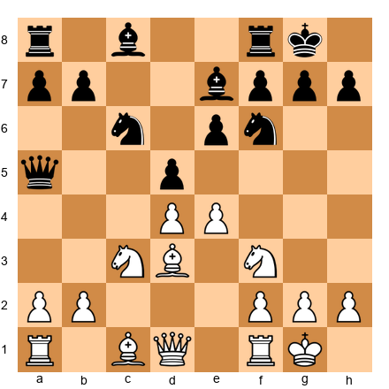

White to move. After e4, Black must make a decision. If ...dxe4 Nxe4 Nxe4 Bxe4, what pieces have been traded and who benefits?

*Hint 1:* After these trades, what remains on the board?
*Hint 2:* Black traded a knight for White's knight. Both sides still have one knight and two bishops.
*Hint 3:* After Bxe4, White's bishop is now on e4, a powerful central square. How does the pawn structure look?

**Solution:** After the sequence e4 dxe4 Nxe4 Nxe4 Bxe4, White has traded one knight pair. White's bishop on e4 is centrally dominant, aiming at both flanks. The pawn structure now shows Black without a d-pawn and White without an e-pawn. White has a d4 pawn; Black has an e6 pawn. White's structure is slightly better because the d4 pawn controls key central squares and the bishop on e4 is actively placed. The position favors White because the trades have simplified to a structure where White's remaining pieces are more active.

---

**Exercise 13.30** ★★★

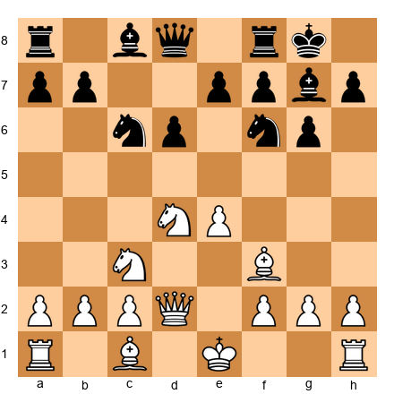

White to move. In this Sicilian structure, White has a bishop on f3. Black has a bishop on g7. If White plays Be2, preparing O-O, which bishop is better positioned?

*Hint 1:* Black's g7 bishop controls the long dark-square diagonal.
*Hint 2:* White's bishop on f3 (or e2) is passive compared to Black's fianchettoed bishop.
*Hint 3:* Consider trading White's "bad" bishop for Black's "good" bishop.

**Solution:** **Black's g7 bishop is better positioned.** It sits on the powerful a1-h8 diagonal, exerting influence across the board. White's bishop on f3 (or e2) is more passive, especially with the e4 pawn blocking its scope on the a8-h1 diagonal. White should consider either (1) trading bishops with Bh6 to eliminate Black's best piece, or (2) repositioning with Bc4 to aim at the f7 point. In Sicilian positions, the battle of the bishops often determines who has the initiative.

---

🛑 **Rest here.** Thirty exercises complete. You are more than halfway through. Take a real break.

---

### Section D: Plan Based on Structure (Exercises 13.31 - 13.40) ★★★

*For each position, create a 3-5 move plan based on the pawn structure.*

**Exercise 13.31** ★★★

White to move. Create a strategic plan based on this Carlsbad structure.

*Hint 1:* White has two queenside pawns (a2, b2) against Black's three (a7, b7, c6). What does this suggest?
*Hint 2:* Outline the minority attack: a4, b4, b5.
*Hint 3:* What should White's rooks do during and after the minority attack?

**Solution:** White's plan: (1) Play **a2-a4**, beginning the minority attack. (2) Play **b2-b4**, continuing the advance. (3) Prepare **b4-b5** by supporting with pieces. (4) After b5, target the resulting weakness on c6 (if ...axb5 axb5 Nxb5 or cxb5) by placing rooks on the c-file. (5) Use the a-file and c-file for rook penetration. This is the classic minority attack plan. It takes 8-12 moves to execute, but creates permanent structural damage. White's pieces should support this plan, not distract from it.

---

**Exercise 13.32** ★★★

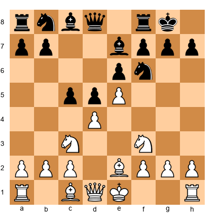

White to move. Create a kingside attacking plan based on this French structure.

*Hint 1:* White's chain (d4-e5) points toward the kingside. This is where White should attack.
*Hint 2:* Consider f2-f4-f5 as a long-term plan.
*Hint 3:* How can White's pieces support a kingside attack?

**Solution:** White's plan: (1) Castle kingside with **O-O**. (2) Play **f2-f4** to reinforce e5 and prepare the f5 break. (3) Develop pieces toward the kingside: Bd3 (or Bh5 in some lines), Qe1-g3 or Qe1-h4. (4) When the position is ready, play **f4-f5** to attack the base of Black's chain at e6 and open lines toward Black's king. (5) Look for Nxd5 or Bxh7+ sacrifices if Black's king is exposed. The attack should be methodical, not reckless. White has a structural advantage on the kingside and should use it patiently.

---

**Exercise 13.33** ★★★

White to move. This is a Yugoslav Attack position in the Sicilian Dragon. Create a plan for both sides.

*Hint 1:* White typically castles queenside and launches a kingside pawn storm.
*Hint 2:* Black attacks on the queenside with ...a5, ...b5, ...Rc8.
*Hint 3:* Whose attack arrives first is the critical question.

**Solution:** **White's plan:** (1) Castle queenside with **O-O-O**. (2) Push **g2-g4** and **h2-h4-h5** to attack Black's kingside pawn shelter. (3) Trade dark-squared bishops with Bh6 to weaken Black's king. (4) Open the h-file with hxg6 and attack on the h-file with Rdg1 or Rh1. **Black's plan:** (1) Play **...Rc8** to pressure the c-file. (2) Advance **...a5** and **...b5** to open lines on the queenside. (3) Play **...b4** to attack the c3 knight. (4) Infiltrate with rooks on the c-file. This is a race. Both plans are correct; execution and timing determine the winner.

---

**Exercise 13.34** ★★★

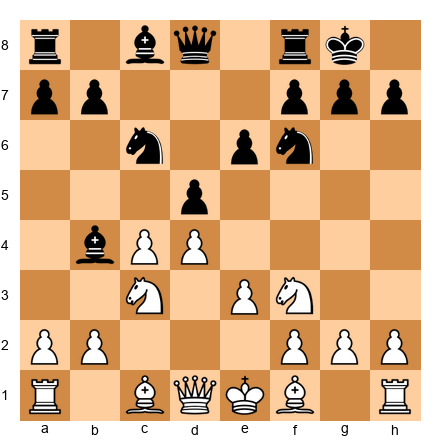

White to move. Black has a Nimzo-Indian structure. After ...Bxc3+ bxc3, create a plan for White.

*Hint 1:* After bxc3, White has doubled c-pawns but an open b-file and strong center.
*Hint 2:* White's plan should involve e3-e4 to use the bishop pair.
*Hint 3:* How should White use the open b-file?

**Solution:** White's plan after ...Bxc3+ bxc3: (1) Recapture with **bxc3**, accepting doubled pawns for central control. (2) Play **Bd3** and **O-O**, completing development. (3) Prepare **e3-e4** to open the center for the bishop pair. This is the critical break. (4) After e4, if ...dxe4 Bxe4, White has powerful bishops on open diagonals. (5) Use the open b-file with Rb1 to apply queenside pressure. White's doubled c-pawns are a small price for the massive central control and bishop pair.

---

**Exercise 13.35** ★★★

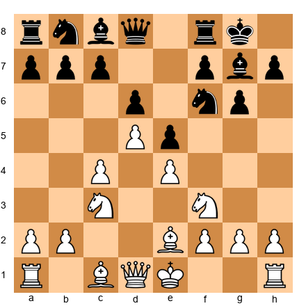

White to move. Create a queenside attack plan based on the King's Indian structure.

*Hint 1:* White's pawn chain (c4-d5) points toward the queenside. Attack there.
*Hint 2:* The c4-c5 break is White's primary weapon.
*Hint 3:* How should White prepare c5?

**Solution:** White's plan: (1) Castle with **O-O**. (2) Play **a2-a4** to support the c5 advance. (3) Play **Rb1** or **Ra1-b1** to prepare b2-b4. (4) Play **b2-b4** followed by **c4-c5**, the critical break. (5) After c5, if ...dxc5, play bxc5 and use the open b-file and c-file for rook penetration. The c5 break undermines Black's d6 pawn and opens lines on the queenside. White should execute this plan quickly because Black is simultaneously preparing ...f5 on the kingside.

---

**Exercise 13.36** ★★★

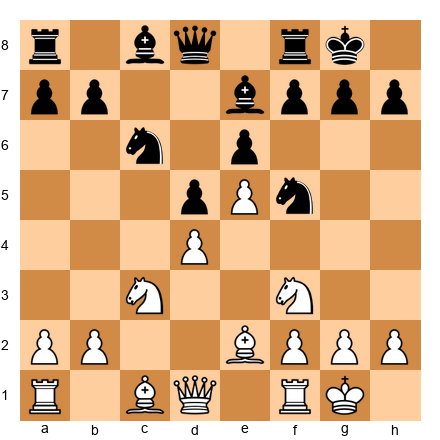

White to move. Black has placed a knight on f5. How should White respond based on the pawn structure?

*Hint 1:* The knight on f5 is in front of White's e5 pawn. Is it blockading?
*Hint 2:* Should White trade this knight or leave it alone?
*Hint 3:* Consider g2-g4 to drive the knight away, or Bd3 to challenge it.

**Solution:** White should **challenge the knight with Bd3**, preparing to trade it if Black allows it. The f5 knight is well-placed (blockading the e-pawn and eyeing key squares), so White should not ignore it. After Bd3, if ...Nxd3 cxd3 (or Qxd3), White has traded a bishop for the knight but has removed the blockader. Alternatively, White can play **g2-g4** to drive the knight away (...Nh4 Nxh4), but this weakens the kingside. The choice depends on whether White wants to maintain pawn structure (Bd3) or create complications (g4). In general, Bd3 is more solid and fits the positional character of the position.

---

**Exercise 13.37** ★★★

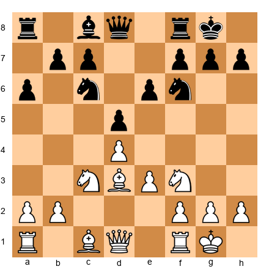

White to move. This is a symmetric d4/d5 structure. Create a plan that creates an imbalance.

*Hint 1:* Symmetric structures often lead to draws unless one side creates an imbalance.
*Hint 2:* How can White make the position asymmetric? Consider pawn breaks.
*Hint 3:* The minority attack (a4, b4, b5) creates structural asymmetry.

**Solution:** White's plan: (1) Play **a2-a4**, beginning the minority attack. The symmetric structure means White must create an imbalance, and the minority attack is the proven method. (2) Play **b2-b4** to prepare b5. (3) Execute **b4-b5** to break up Black's queenside. (4) After b5, play for the resulting weaknesses (backward c-pawn or isolated d-pawn). The minority attack turns a symmetric, potentially drawish structure into one where White has concrete targets. Without this plan (or an analogous kingside plan), the position tends toward equality.

---

**Exercise 13.38** ★★★

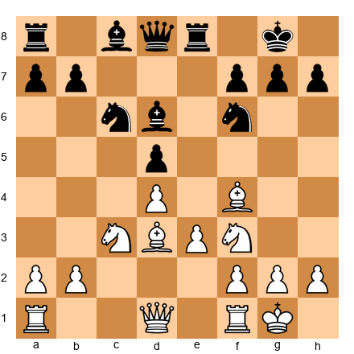

White to move. Black has developed the bishop to d6, challenging White's bishop on f4. Should White trade or retreat?

*Hint 1:* If Bxd6 Qxd6, what has changed structurally? Nothing. But what about piece activity?
*Hint 2:* After Bxd6, Black's queen comes to d6 with tempo and centralization.
*Hint 3:* Consider Bg3 instead. The bishop retreats but remains on the board.

**Solution:** **White should retreat with Bg3** rather than trade. After Bxd6 Qxd6, Black's queen centralizes powerfully on d6 with tempo (threatening nothing concrete but well-placed). By retreating to g3, White keeps the bishop pair (if White has one) and maintains the option of a later trade on more favorable terms. The g3 bishop also watches the h2-b8 diagonal, which can be important for defense. The pawn structure does not change with either move, but piece activity changes significantly. Bg3 keeps options open; Bxd6 helps Black's development.

---

**Exercise 13.39** ★★★

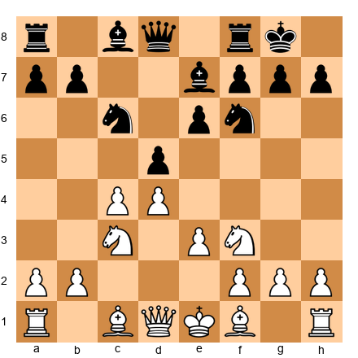

White to move. Pawns face off: c4 vs d5 and d4 vs e6. When should White capture cxd5?

*Hint 1:* If White plays cxd5 exd5, we get the Carlsbad structure. Is that good for White?
*Hint 2:* If White plays cxd5 Nxd5, the result is different. How?
*Hint 3:* Consider whether White can benefit more by maintaining the tension with a developing move.

**Solution:** **White should usually maintain the tension** rather than capture immediately. Playing cxd5 exd5 reaches the Carlsbad (fine for the minority attack but gives Black a clear plan too). Playing cxd5 Nxd5 allows Black a centralized knight. Instead, White can develop with **Bd3** or **Qc2**, maintaining pressure on d5 while keeping options open. The tension in the center is an asset: it forces Black to worry about multiple captures. The principle: do not resolve pawn tension without a concrete reason. Keeping the tension preserves flexibility.

---

**Exercise 13.40** ★★★

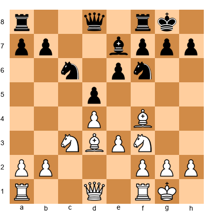

Black to move. White has set up a Carlsbad structure and is preparing the minority attack. What is Black's best defensive and counter-attacking plan?

*Hint 1:* Black cannot prevent the minority attack, but can generate counterplay elsewhere.
*Hint 2:* Consider ...Ne4 to centralize a knight before White's pawns march.
*Hint 3:* ...f5 prepares a kingside counter-attack.

**Solution:** Black's plan: (1) Play **...Ne4** immediately to establish a central outpost. The knight on e4 is powerful and cannot easily be driven away. (2) Prepare **...f7-f5** for a kingside attack. This creates threats against White's king while White is busy on the queenside. (3) If possible, play ...Bd6, challenging White's f4 bishop and aiming at the kingside. (4) Use the e-file for rook activity with ...Re8. The idea: counter the minority attack with central and kingside play. Black should not passively wait for White's queenside pawns to arrive.

---

🛑 **Rest here.** Forty exercises done. Only ten more to go. You are nearly finished.

---

### Section E: Convert Structural Advantage (Exercises 13.41 - 13.50) ★★★ - ★★★★

*These are the hardest exercises in this chapter. For each position, find the concrete way to convert a structural advantage into a tangible gain (material, attack, or winning endgame).*

**Exercise 13.41** ★★★

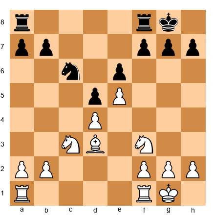

White to move. Black has a backward pawn on e6 and White has an advanced e5 pawn. Find a plan to exploit the backward pawn.

*Hint 1:* The e6 pawn is on a half-open file. Where should White's rook go?
*Hint 2:* Can White occupy e5 with a piece as well as a pawn?
*Hint 3:* Consider Nd2-f1-e3-d5 or Nf3-d2-e4 to reach strong squares near e6.

**Solution:** White's plan: (1) Play **Rf1-e1** to target e6 along the e-file. (2) Maneuver a knight to d5 or f5 to attack e6 with a piece. After **Nd2-e4** or **Nf3-d2-e4**, the knight reaches a powerful square. (3) Double rooks on the e-file with Rae1. (4) The combined pressure on e6 will force Black to defend passively, allowing White to create threats elsewhere or win the pawn. The backward pawn is a permanent weakness, and the systematic pressure will tell in the long run.

---

**Exercise 13.42** ★★★

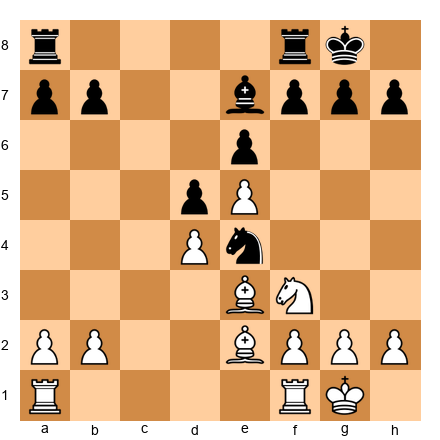

White to move. Black has a knight on e4, but White's structure (d4-e5) is strong. How does White convert the structural advantage?

*Hint 1:* The knight on e4 is centralized but lacks pawn support. Can White challenge it?
*Hint 2:* Consider Nd2 to trade the centralized knight.
*Hint 3:* After trading knights, the resulting structure favors White.

**Solution:** White plays **Nd2!** to challenge the knight on e4. After Nxd2 Bxd2 (or Qxd2), the centralized knight is gone and White's structural advantages become clearer: the e5 pawn restricts Black's position, the d4-e5 chain controls the center, and Black's dark-squared bishop on e7 is passive. White can then follow up with f2-f4 (supporting e5), Bf3 (controlling the long diagonal), and eventually a kingside attack or a push on either flank. Without the knight on e4, Black's position is cramped and difficult.

---

**Exercise 13.43** ★★★★

White to move. This is a simplified position with a Carlsbad-type structure. White has rooks, Black has rooks. How does White win?

*Hint 1:* The structure is d4 vs d5, e3 vs e6. It looks symmetric, but is it?
*Hint 2:* White's king can march to a better square. Where should the king go?
*Hint 3:* Consider the minority attack concept even in the endgame.

**Solution:** White should activate the king and look for a minority attack even in this simplified position. (1) Play **Kf1-e2-d3** to centralize the king. (2) Play **a2-a4** to begin the minority attack on the queenside. (3) Play **b2-b4** and prepare **b4-b5**. (4) After b5, if ...axb5 axb5, White targets c6 (or whatever weakness results). In rook endgames, the minority attack is especially powerful because rooks on open files penetrate easily. The king's activity matters enormously: a centralized king on d3 supports both the d4 pawn and the queenside advance.

---

**Exercise 13.44** ★★★★

White to move. Black's pawn on d5 is isolated. Find a concrete plan to win it.

*Hint 1:* The d5 pawn is isolated. What square should White occupy?
*Hint 2:* A knight on d4 would attack d5 from a stable outpost.
*Hint 3:* After Nf3-d4, the d5 pawn is under direct pressure. Add rooks on the d-file.

**Solution:** White's plan: (1) Play **Nd2-b3** or **Nf3-d4** (Nd4 is the ideal square for the knight, blockading d5 and attacking it simultaneously). (2) Play **Rd1** to put a rook on the d-file. (3) Play **Qd3** or **Qd2** to add queen pressure to d5. (4) If possible, double rooks on the d-file. (5) The combined pressure on d5 will force Black to tie all pieces to its defense. White can then switch the attack to the kingside or queenside, exploiting Black's passivity. The isolated d5 pawn is a target that does not go away.

---

**Exercise 13.45** ★★★★

White to move. Black has an IQP on d5 but active piece placement. How does White navigate this position?

*Hint 1:* Black's pieces are active, which compensates for the IQP. White should seek to trade pieces.
*Hint 2:* Every piece trade makes the IQP weaker.
*Hint 3:* After trading down, the d5 pawn becomes a target in the endgame.

**Solution:** White's strategy is **simplification.** (1) Play **a3** to force the bishop to commit (...Ba5 or ...Be7). (2) After the bishop retreats, play **b2-b4** to gain queenside space and chase the bishop further. (3) Trade minor pieces when possible. The fewer pieces on the board, the weaker the IQP becomes. (4) Aim for a rook endgame where the d5 pawn is a clear target. (5) In the endgame, use the d4 square as a blockade point for the king or a rook, and attack d5 with the remaining rook. Black's active piece play is the IQP's best defense. Remove the pieces, and the defense collapses.

---

**Exercise 13.46** ★★★★

White to move. White has a pawn chain d4-e5 and a bishop on g5. How does White convert the space advantage?

*Hint 1:* The e5 pawn cramps Black's position. Can White add pressure?
*Hint 2:* Consider f2-f4-f5 to attack the base of Black's chain at e6.
*Hint 3:* After f5 exf5, the e5 pawn becomes a powerful passed pawn.

**Solution:** White's plan: (1) Play **f2-f4** to reinforce the e5 pawn and prepare f5. (2) Centralize the rooks: **Rae1** and **Rf3** (or Rf2). (3) When ready, play **f4-f5!** This attacks e6, the base of Black's chain. After f5 exf5, White has a passed pawn on e5 that is extremely dangerous. (4) The bishop on g5 supports the attack by controlling the dark squares. (5) If Black does not capture on f5, White can play fxe6 fxe6, and the e6 pawn becomes a target on the open f-file. The space advantage and the pawn chain give White a clear path to victory.

---

**Exercise 13.47** ★★★★

White to move. Black has a backward pawn on b6 and a cramped position. How does White exploit this?

*Hint 1:* The b6 pawn is on a half-open file (White has no pawn on the b-file). How can White target it?
*Hint 2:* Play Rb1 to target b6 directly.
*Hint 3:* After Rb1, combine with Na4 (aiming at b6 and c5) for maximum pressure.

**Solution:** White's plan: (1) Play **Rb1** to target the backward b6 pawn. (2) Play **Na4** to attack b6 and aim for the c5 outpost. A knight on c5 is beautifully placed, attacking a7, b7, d7, and e6 simultaneously. (3) If Black plays ...Na5 to prevent Nc5, play **b4** to chase the knight and gain more queenside space. (4) The combined pressure on b6 and the potential infiltration via c5 give White a significant advantage. Black's position is cramped by the e5 pawn, and the backward b6 pawn adds a concrete target.

---

**Exercise 13.48** ★★★★

White to move. Black has just captured on e4 (dxe4 or ...pxe4). White has an isolated d4 pawn. Is White better or worse, and what is the plan?

*Hint 1:* White's d4 pawn is now isolated, but Black's e4 pawn is also advanced and potentially weak.
*Hint 2:* Can White blockade e4 and target it?
*Hint 3:* Consider Nd2 to attack e4, then Nc4 to pressure both e4 and d6.

**Solution:** The position is **dynamically balanced with chances for both sides.** White's d4 pawn is isolated, but Black's e4 pawn is also weak and overextended. White's plan: (1) Play **Nd2** to attack the e4 pawn. (2) After ...f5 (defending e4), play **f3!** to undermine e4 further. (3) If the e4 pawn falls, White's d4 pawn is no longer isolated (it could advance to d5). (4) Alternatively, play **Nc4** to reach a powerful outpost that attacks b6 and d6 squares. The lesson: not all isolated pawns are weaknesses. Sometimes the opponent's pawn structure is equally compromised.

---

**Exercise 13.49** ★★★★

White to move. A simplified Carlsbad endgame. White has f4 and d4 against Black's d5 and e6. How does White win?

*Hint 1:* White should use the king actively. King to f2-e3-d3.
*Hint 2:* The rook should aim for the c-file or seventh rank.
*Hint 3:* Consider the possibility of e3-e4 as a pawn break after proper preparation.

**Solution:** White's winning plan: (1) **Kf2-e2-d3** to centralize the king. (2) Play **Rc7** to seize the seventh rank, attacking b7 and a7. (3) From the seventh rank, the rook creates unbearable pressure on Black's queenside pawns. (4) Once the rook is active, consider **e3-e4** to open lines. After e4 dxe4+ Kxe4, White's centralized king and active rook should be decisive. (5) The f4 pawn supports e4 and controls e5, preventing Black's knight from reaching a good square. In rook endgames, an active rook on the seventh rank is often worth a pawn.

---

**Exercise 13.50** ★★★★

White to move. Black has an isolated d5 pawn. It is White's turn. Find the most precise plan to exploit the IQP.

*Hint 1:* White should blockade d5 with a piece. Which piece is the ideal blockader?
*Hint 2:* A knight on d4 blockades d5 and controls key central squares.
*Hint 3:* After Nd4, White can add pressure with Rac1, Qb3, and eventually target the d5 pawn with all pieces.

**Solution:** White's precise plan: (1) Play **Nf3-d4**, establishing the knight on the ideal blockading square. From d4, the knight controls b5, c6, e6, f5, f3, and b3. It is the best possible piece for blockading an IQP. (2) Play **Rac1** to target the c-file and potentially invade on c7. (3) Play **Qb3** to add queen pressure to d5 (and b7). (4) If possible, play **Rdc1** to double rooks on the c-file. (5) The combined pressure from the blockading knight, the rooks on the c-file, and the queen aiming at d5 will force Black into passive defense. White can then look for tactical opportunities or simply win the d5 pawn by accumulating pressure. This is the textbook method of exploiting an IQP, and it works at every level of chess.

---

## Key Takeaways

1. **Pawns are the skeleton of your position.** They define the character of the game, determine piece placement, and create lasting strengths and weaknesses. Every pawn move is permanent.

2. **Learn the eight structure types.** Isolated pawn, doubled pawns, backward pawn, passed pawn, connected pawns, hanging pawns, pawn chain, and pawn islands. Each has its own strengths, weaknesses, and plans.

3. **Recognize structures from openings.** The Carlsbad, French, Sicilian, King's Indian, and London structures each have characteristic plans. When you recognize the skeleton, you know what to do.

4. **Use the five-step planning process.** Identify the structure, evaluate the pieces, find the open files, identify the pawn breaks, and form a plan. This method works at every level.

5. **Structural advantages are patient advantages.** Unlike tactics, which reward speed, pawn structure advantages reward patience and precision. The weakness is not going anywhere. Take your time.

---

## Practice Assignment

**This week, do the following:**

1. **Play three games** (online or over the board) and after each game, identify the pawn structure that arose. Write down which of the eight types it most resembles.

2. **Find two master games** in any database (Lichess, Chess.com, or chessgames.com) that feature the Carlsbad structure. Play through them and identify the minority attack if White uses it.

3. **Set up the following position on your board and study it for 10 minutes:**

Answer these questions:
- What structure type is this?
- Which pieces are good and which are bad?
- What is White's best plan?
- What is Black's best counter-plan?
- Where should the rooks go?

Write down your answers before checking them against this chapter.

4. **Review your last 5 games** and count the pawn islands for each side at move 20. Which side had fewer islands? Did that side win?

---

## ⭐ Progress Check

Answer these five questions to test your understanding. If you get at least four correct, you have mastered this chapter's core concepts.

**Question 1:** What is an isolated pawn?
> A pawn with no friendly pawns on either adjacent file.

**Question 2:** According to Nimzowitsch, where should you attack a pawn chain?
> At the base (the rearmost pawn in the chain).

**Question 3:** In the Carlsbad structure, what is the name of White's primary strategic plan?
> The minority attack.

**Question 4:** Why is a passed pawn dangerous?
> It can promote to a queen, and the opponent must devote pieces to stopping it.

**Question 5:** What is the "trading principle" for minor pieces?
> Trade your bad pieces for your opponent's good pieces.

**Scoring:**
- 5/5: Outstanding. You have a strong grasp of pawn structure concepts.
- 4/5: Very good. Review the section you missed and move on.
- 3/5: Good foundation. Reread the relevant structure types before proceeding.
- 0-2/5: No shame in this. Reread the chapter with a board in front of you. These concepts take repetition to internalize.

---

🛑 **Rest here.** Chapter 13 is complete. You have learned one of the most important topics in chess. The concepts in this chapter will inform every game you play from here forward. Take a day off. You have earned it.

When you are ready, Chapter 14 awaits: *Piece Activity and Coordination*.

---

*Chapter 13 of The Grandmaster Codex*
*Volume II: The Club Player*
*Written by Kit Olivas and Dr. Ada Marie*
*Exercises: 50 | Annotated Games: 5 | Pages: 50*

