# Chapter 14: Piece Activity and Coordination

**Volume II: The Club Player | Rating Range: 1000 - 1600**
**Pages: 40 | Exercises: 40 | Annotated Games: 8**

---

> *"The beauty of a move lies not in its appearance but in the thought behind it."*
> -- Aaron Nimzowitsch

---

## What You'll Learn

- What makes a piece "active" versus "passive," and why this distinction wins games
- How pieces work together as a team, and why coordination beats raw material
- When two bishops dominate and when they do not
- How to judge whether a knight or a bishop is stronger in a given position
- How to activate rooks on open files and the seventh rank
- Where to place your queen and how to avoid early queen adventures
- When to trade pieces and when to keep them
- How to use outposts to plant pieces on squares your opponent cannot challenge

---

## Part 1: What Is Piece Activity?

### Active Pieces vs Passive Pieces

Here is a simple truth that separates improving players from stagnant ones:

**An active piece is worth more than a passive piece.**

This is not a metaphor. A knight stuck on a1 defending nothing, attacking nothing, and going nowhere is barely worth two pawns in practical terms. A knight on e5, controlling eight squares and threatening the opponent's position, is worth almost as much as a rook.

The same piece. The same material value on paper. But one is alive and the other is dead weight.

**An active piece** has the following qualities:

1. **It controls important squares.** Central squares, squares near the enemy king, or key outpost squares.
2. **It has mobility.** It can move to multiple good squares on the next turn.
3. **It coordinates with other pieces.** It supports teammates and participates in threats.
4. **It creates problems for the opponent.** Active pieces force the opponent to react rather than execute their own plans.

**A passive piece** has the opposite qualities:

1. **It sits on the edge or back rank.** It controls few squares and influences nothing.
2. **It is stuck.** It has one or zero good moves available.
3. **It works alone.** It does not connect with other pieces or support any plan.
4. **It is merely defending.** It babysits a weakness rather than creating threats.

### Why Activity Wins Games

Every World Champion understood this. Alekhine built attacks by activating every piece before striking. Fischer would systematically improve his worst piece until all five pieces were working together. Kasparov's pieces swarmed like a pack, each one reinforcing the others.

The reason is mathematical. You start the game with eight pieces (not counting pawns). If all eight are active, you are fighting with your full army. If two pieces are passive, you are effectively fighting with six pieces against your opponent's eight. That is a losing battle, no matter how good your position looks on paper.

Here is the key insight for club players:

**Before looking for tactics, ask yourself: "Is my worst piece active?"**

If the answer is no, your first job is to fix that. Find a better square for your worst piece. Once all your pieces are active and coordinated, tactics tend to appear on their own.

### How to Evaluate Activity

When you look at a position, run through this quick checklist for each of your pieces:

1. **Knights:** Are they on central squares (d4, e4, d5, e5) or outposts? Or are they stuck on the rim?
2. **Bishops:** Do they have open diagonals? Or are they blocked by their own pawns?
3. **Rooks:** Are they on open or half-open files? Or are they hiding behind their own pawns?
4. **Queen:** Is she on a useful square, supporting the team? Or is she exposed and vulnerable to harassment?

If you find a piece that fails this test, improving it is almost certainly your best move.

---

## Part 2: Piece Coordination

### The Whole Is Greater Than the Sum

Individual piece activity matters. But the real magic happens when pieces work *together*.

Two knights side by side on e5 and d5 are strong. But a knight on e5 supported by a bishop on b2, with rooks on the e-file and d-file, and the queen ready to join on f3? That is not four active pieces. That is a machine.

**Coordination** means your pieces reinforce each other's strengths and cover each other's weaknesses. A bishop alone cannot checkmate. A rook alone cannot control both an open file and a diagonal. But together, pieces cover every angle.

**Signs of good coordination:**

- Your pieces point in the same direction (toward the enemy king, toward a weakness, toward a promotion square).
- Multiple pieces can reach the same key square within one or two moves.
- Your pieces do not obstruct each other. They leave room for teammates to function.
- Removing one piece from the board would weaken two or three others, because they all depend on each other.

**Signs of poor coordination:**

- Your pieces point in different directions. One attacks the kingside while another drifts toward the queenside with no purpose.
- Your pieces are bunched up on the same squares, getting in each other's way.
- Your pieces work alone. Each one has its own project, and none of them amount to anything.

### How to Improve Coordination

When your pieces feel disconnected, try this three-step process:

1. **Pick a target.** It might be the enemy king, a weak pawn, or a key square. Every piece should know where it is headed.
2. **Reroute the straggler.** Find the piece that is furthest from the action and bring it toward the target. This often means a knight maneuver (Na3-c2-e3-d5) or a rook lift (Ra1-a3-g3).
3. **Create a battery.** Stack pieces on the same file, rank, or diagonal. Queen and bishop on the same diagonal. Two rooks on the same file. Queen behind a rook pointing at the enemy king.

The result of good coordination is that your opponent feels squeezed. Every move you make adds pressure. Every move they make is a defensive reaction. This is how positional advantages turn into winning attacks.

---

🛑 **Rest here if you need to.** The foundation is set. Come back fresh for the specific piece types.

---

## Part 3: The Bishop Pair

### When Two Bishops Dominate

The bishop pair is one of the most reliable advantages in chess. Two bishops working together control squares of both colors, and in open positions they can dominate knights.

**Why the bishop pair is strong:**

1. **Complementary coverage.** One bishop covers light squares, the other covers dark squares. Together, they leave no gaps.
2. **Long-range power.** In open positions, bishops can influence the game from one side of the board to the other. Knights need several moves to cross the board; bishops do it instantly.
3. **Endgame dominance.** In endgames with pawns on both sides of the board, the bishop pair is particularly powerful because of their ability to operate on both flanks simultaneously.

**Set up your board:**

White has two bishops (d3 and f4). Black has two knights (c6 and f6). If the position opens up, White's bishops will dominate. If the position stays closed, Black's knights may be just as good or better.

**When the bishop pair does NOT work:**

- **Closed positions.** When pawn chains block the diagonals, bishops become "tall pawns." Knights thrive in closed positions because they can hop over obstacles.
- **When bishops have no targets.** Two bishops with nothing to aim at are not better than two knights with strong outposts.
- **When one bishop is bad.** If one of your bishops is blocked by its own pawns, you effectively have a bishop and a tall pawn, not a real pair.

**How to play WITH the bishop pair:**

- Open the position. Trade pawns, create open lines, and give your bishops room to breathe.
- Avoid placing pawns on the same color as either bishop.
- Keep the position fluid. Bishops love positions where things are changing.

**How to play AGAINST the bishop pair:**

- Keep the position closed. Do not open lines for the bishops.
- Plant knights on strong outpost squares where they cannot be chased by pawns.
- Trade one of the bishops. Once one bishop is gone, the "pair" advantage disappears.
- Use your knights' ability to control squares of both colors.

---

## Part 4: Good Knight vs Bad Bishop

### The Eternal Debate

"Is a knight or a bishop better?" This is one of the oldest questions in chess, and the answer is always the same: **it depends on the position.**

**When knights are better:**

1. **Closed positions** with locked pawn chains. Knights jump over pawns; bishops cannot.
2. **When strong outposts exist.** A knight on d5 that cannot be driven away by a pawn is a monster.
3. **When the opponent's bishop is "bad."** A bishop blocked by its own pawns on the same color is a liability.
4. **In positions with fixed pawns on one side of the board.** Knights do not need open lines to be effective.

**When bishops are better:**

1. **Open positions** with few pawns blocking diagonals. Bishops control long lines and can switch from one side of the board to the other.
2. **Endgames with pawns on both sides.** A bishop can influence both flanks; a knight can only be on one side at a time.
3. **When there are no outposts for the knight.** Without a stable square, a knight wanders aimlessly.
4. **Against pawn majorities.** A bishop can help escort passed pawns more effectively than a knight in many cases.

### The "Bad Bishop"

A "bad bishop" is a bishop blocked by its own pawns. Specifically, it is a bishop on the same color as most of your pawns. Those pawns block the bishop's diagonals and reduce it to a mere spectator.

**Set up your board:**

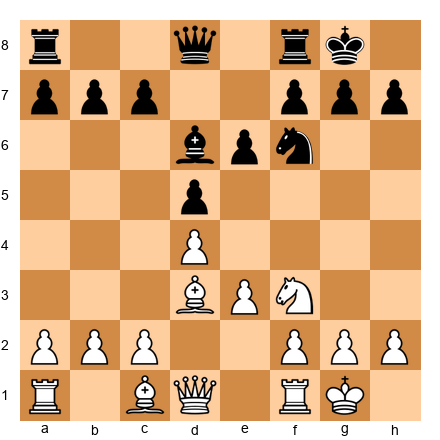

Look at Black's bishop on d6. Black's pawns on d5, e6, and likely c7 all sit on dark squares, which is the same color as the bishop's diagonals. The bishop is blocked by its own army. This is a "bad" bishop.

Now look at White's bishop on d3. White's pawns on d4 and e3 are also on dark squares, BUT the bishop sits on a light square (d3). It has an open diagonal (d3-h7). It is a "good" bishop.

**How to deal with a bad bishop:**

1. **Trade it.** If your bishop is bad, look for a way to exchange it for your opponent's good bishop or for a knight.
2. **Put it outside the pawn chain.** Before locking your pawns, develop the bishop to an active square. In the French Defense, Black often plays ...b6 and ...Ba6 to get the bad bishop outside the pawn chain.
3. **Change the pawn structure.** If you can advance or trade the pawns that block the bishop, it stops being bad.
4. **Use it as a defender.** A bad bishop is still useful if it defends key squares or pawns. It is not worthless, just limited.

**A common mistake:** Beginners assume that a "bad bishop" is always weak. This is not true. A bad bishop that defends critical squares is doing important work. The term "bad" refers to its attacking potential, not its overall value in every situation.

---

## Part 5: Rook Activity

### The Power of Open Files

Rooks are the pieces that benefit most from activation. A rook on a closed file does almost nothing. A rook on an open file can dominate the entire game.

**Three rules for rook activity:**

**Rule 1: Put rooks on open files.**

An open file is a file with no pawns of either color. A half-open file has no pawns of your color but has an enemy pawn on it (which becomes a target).

**Set up your board:**

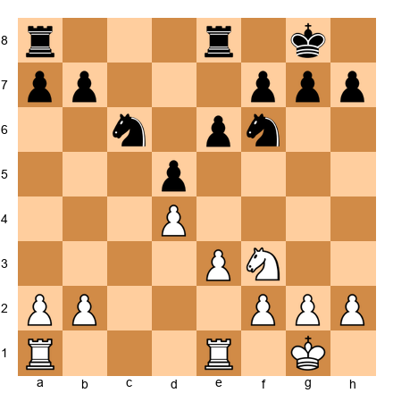

Both sides have rooks on the e-file. The e-file is open (no pawns on it). Whoever controls this file controls a highway into the opponent's position.

**Rule 2: Rooks belong on the seventh rank.**

A rook on the seventh rank (the second rank for Black) is one of the most powerful pieces in chess. It attacks pawns from behind (where they cannot defend each other), cuts off the enemy king, and threatens to create havoc.

**Set up your board:**

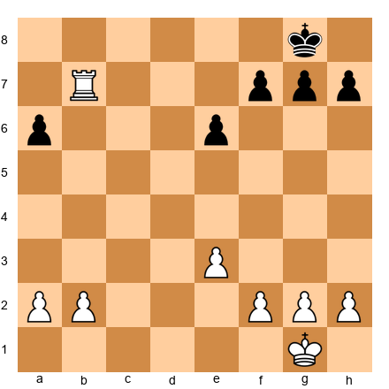

White's rook on b7 is on the seventh rank. It attacks the f7 and a7 pawns from behind. Black's king is confined to the back rank. This single rook placement gives White a huge advantage.

Tarrasch said it best: *"A rook on the seventh rank is sufficient compensation for a pawn."* He was not exaggerating.

**Rule 3: Doubled rooks are stronger than the sum of their parts.**

Two rooks on the same open file create irresistible pressure. The front rook advances; the rear rook supports. If the front rook is captured, the rear rook takes its place.

Two rooks on the seventh rank is almost always a decisive advantage. They attack everything, and the opponent cannot organize a defense.

---

## Part 6: The Queen

### Placement and Patience

The queen is your strongest piece. She combines the power of a rook and a bishop. But that power comes with a vulnerability: she is a high-value target.

**Three queen principles for club players:**

**Principle 1: Do not develop the queen too early.**

In the opening, every time your opponent attacks your queen with a minor piece or pawn, you lose a tempo retreating. Your opponent develops while you run.

**Set up your board:**

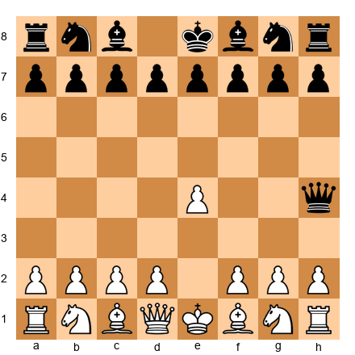

Black has brought the queen to h4 on move 2. This looks aggressive, but it is actually a mistake. After 3.Nc3 (or 3.Nf3), the queen will be harassed and will have to retreat. Meanwhile, White develops normally. The queen adventure has wasted Black's time.

**Exception:** If the queen move creates a concrete threat that cannot be easily met, it may be justified. But in 95% of cases, early queen sorties are punished by development.

**Principle 2: The queen works best behind other pieces.**

Place the queen where it supports your other pieces without being exposed. Behind a rook on an open file. Behind a bishop on a diagonal. Supporting a knight's advance.

The queen is too valuable to be the first piece into battle. Let your minor pieces and rooks lead the charge. The queen follows and delivers the finishing blow.

**Principle 3: In the endgame, the queen becomes an attacker.**

Once most pieces are off the board, the queen's vulnerability decreases. In queen endgames, centralize the queen, use it to attack weak pawns, and combine it with your king's advance.

---

## Part 7: Piece Exchanges

### When to Trade and When to Keep

Every trade changes the character of the position. Understanding *when* to trade is one of the most important skills in chess.

**Trade pieces when:**

1. **You are ahead in material.** Every trade brings you closer to a winning endgame. If you are up a pawn, trade pieces (but keep at least one pair of rooks to push your advantage).
2. **Your opponent has active pieces.** If your opponent's knight is beautifully placed on e4, trade it off. Remove the problem.
3. **You have a structural advantage.** Weak pawns are harder to defend with fewer pieces. If your opponent has an isolated pawn, trade down and target it in the endgame.
4. **You are cramped.** If your position is tight, trades create breathing room. Each piece that leaves the board gives your remaining pieces more space.

**Keep pieces when:**

1. **You are behind in material.** Your best chance is a middlegame attack with many pieces. Trading into an endgame a pawn down is usually losing.
2. **You have the initiative.** If your pieces are active and coordinated and your opponent is on the defensive, keep the pressure on. Do not simplify and let them escape.
3. **You have the bishop pair.** The more pieces on the board, the more open lines will eventually appear for your bishops.
4. **Your opponent is cramped.** If your opponent's pieces are tripping over each other, every piece on the board makes their life harder. Do not relieve their suffering.

### Silman's Imbalances: A Preview

Jeremy Silman introduced the concept of "imbalances" to help players evaluate positions. An imbalance is any difference between the two sides. These include:

- **Material:** One side has more pieces or pawns.
- **Piece activity:** One side's pieces are better placed.
- **Pawn structure:** One side has healthier pawns.
- **Space:** One side controls more territory.
- **Development:** One side has more pieces in play.
- **King safety:** One side's king is more exposed.
- **Control of key files or squares:** One side dominates open lines or outposts.

The player who best understands and exploits the imbalances in the position will win the game.

This is a concept we will explore in much greater depth in Volume III. For now, be aware that trading pieces is not a neutral act. Every trade shifts the imbalances. Before you trade, ask: "Does this trade make my imbalances better or worse?"

---

## Part 8: Outposts

### Planting Pieces on Strong Squares

An outpost is a square in enemy territory that is protected by one of your pawns and cannot be attacked by any enemy pawn. A piece placed on an outpost is like a fortress: stable, hard to remove, and projecting power deep into the opponent's position.

**Set up your board:**

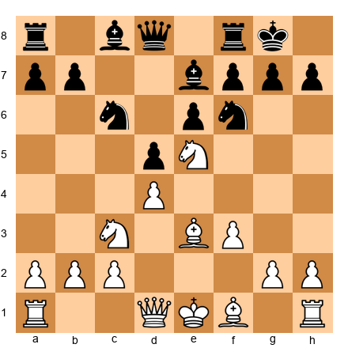

White has a knight on e5. This is an outpost. Black has no pawn on the d-file or f-file that could play ...d6 or ...f6 to chase it away. The knight on e5 controls d3, d7, c4, c6, f3, f7, g4, and g6. It is a monster.

**What makes a good outpost:**

1. **No enemy pawn can attack it.** This is the most important criterion. If a pawn can come and kick your piece off the square, it is not a true outpost.
2. **A friendly pawn supports it.** A pawn on d4 supports a knight on e5. A pawn on e4 supports a knight on d5. The pawn guarantees the piece can stay.
3. **The square is in or near the center.** Outposts on the edge of the board are less useful because they control fewer important squares.
4. **The piece on the outpost is hard to trade.** If the opponent can simply trade your outpost piece for their own minor piece, the advantage disappears.

**Knights love outposts more than bishops do.**

A knight on an outpost is at its maximum power. It controls up to eight squares and cannot be challenged by a pawn. A bishop on an outpost is less impactful because bishops need long diagonals to thrive; being "stuck" on one great square is not what bishops do best.

**How to create outposts:**

1. **Advance pawns to force the opponent's pawns to move.** If you play e4-e5 and your opponent responds ...d6, exd6, then the e5 square may become an outpost (if Black has no pawn on f7 to play ...f6).
2. **Trade the pawn that guards the square.** If Black has a pawn on f6 guarding e5, trade it off. After the f6 pawn disappears, e5 becomes an outpost.
3. **Provoke pawn advances.** Every time your opponent pushes a pawn, the square that pawn left behind can become an outpost. The move ...h6 weakens g5. The move ...g6 weakens f5 and h5.

**How to fight against outposts:**

1. **Do not advance pawns unless you must.** Every pawn move creates a potential outpost for your opponent.
2. **Trade the piece on the outpost.** If a knight lands on e5, trade it with your own knight or bishop.
3. **Challenge the supporting pawn.** If a pawn on d4 supports the outpost on e5, attack d4. Remove the support, and the outpost may fall.

---

🛑 **Good stopping point.** The theory is complete. When you return, eight masterpiece games await.

---

## Part 9: Annotated Games

### Game 26: Botvinnik vs Capablanca, AVRO Tournament 1938
*Theme: Piece Activity Through Deep Preparation*

This is one of the most celebrated games in chess history. Botvinnik prepared this game at home for months, and the result is a textbook example of how piece activity and coordination can overwhelm even the greatest natural talent. Capablanca was the third World Champion, famous for his effortless technique. Botvinnik beat him by out-preparing and out-coordinating him.

**Set up your board.**

**1.d4 Nf6 2.c4 e6 3.Nc3 Bb4 4.e3 d5 5.a3 Bxc3+ 6.bxc3 c5**

The Nimzo-Indian Defense. Black gives up the bishop pair but doubles White's c-pawns and gains time. This is a classic trade-off: structural damage for the bishop pair. Botvinnik understood that the bishop pair would be his primary weapon.

**7.cxd5 exd5 8.Bd3 O-O 9.Ne2 b6**

Capablanca develops naturally. The fianchetto of the bishop to b7 is logical but passive. Black's pieces will work from a distance.

**10.O-O Ba6 11.Bxa6 Nxa6**

An instructive exchange. Botvinnik trades his light-squared bishop for Black's. Why give up a bishop when you have the pair? Because the bishop on a6 was Black's most active minor piece. Without it, Black's remaining pieces lack targets and coordination. The knight on a6 is offside.

**12.Bb2 Qd7 13.a4 Rfe8 14.Qd3 c4**

Capablanca pushes ...c4, closing the queenside. This is a strategic decision that favors White in the long run. Now the position is semi-closed, and White can focus on the kingside where the bishop on b2 and the pieces can coordinate.

**15.Qc2 Nb8 16.Rae1 Nc6 17.Ng3 Na5 18.f3 Nb3**

The knight reaches b3, but it is a dead end. It attacks the c1 square (which is empty) and the a1 rook (which has already moved). Meanwhile, Botvinnik's pieces are pointing toward the kingside.

**19.e4 Qxa4 20.e5 Nd7 21.Qf2 g6**

This is the critical moment. White has pushed e5, gaining space and activating the bishop on b2 (which now has a clear diagonal toward g7/h8). Black's kingside is beginning to weaken.

**22.f4 f5 23.exf6 Nxf6 24.f5 Rxe1 25.Rxe1 Re8**

Botvinnik sacrifices a pawn structure for piece activity. After f5, the e-file opens, the bishop on b2 roars, and the knight on g3 springs to life.

**26.Re6!**

A magnificent rook move. The rook enters on the sixth rank, tying Black down. Notice the coordination: the rook on e6, the bishop on b2 aiming at the long diagonal, and the knight ready to jump to h5 or f5. Every white piece has a job. Every white piece points at Black's king.

**26...Rxe6 27.fxe6 Kg7 28.Qf4 Qe8 29.Qe5**

White's queen joins the attack. The pawn on e6 is a thorn, supported by nothing but projecting power. Black is paralyzed.

**29...Qe7 30.Ba3 Qxa3 31.Nh5+!**

The decisive blow. The knight sacrifice opens the king's position. After 31...gxh5 32.Qg5+ Kf8 33.Qxf6+ Kg8 34.e7, the pawn queens. Every white piece contributed to this finish.

**31...gxh5 32.Qg5+ Kf8 33.Qxf6+ Kg8 34.e7 Qc1+ 35.Kf2 Qc2+ 36.Kg3 Qd3+ 37.Kh4 Qe4+ 38.Kxh5 Qe2+ 39.Kh4 Qe4+ 40.g4 Qe1+ 41.Kh5 1-0**

Capablanca resigned. The pawn on e7 will promote, and Black cannot prevent it without losing the queen.

**What this game teaches about piece activity:**

- Preparation can create activity before the game even starts
- The bishop pair combined with open lines creates devastating coordination
- A single piece sacrifice can unlock the full power of a coordinated army
- Every piece must have a role in the plan

---

### Game 29: Fischer vs Petrosian, Candidates Match Buenos Aires 1971, Game 7
*Theme: Breaking Through with Active Pieces*

Tigran Petrosian was the most difficult player in history to beat. His defensive skills were legendary, and his prophylactic thinking made opponents feel like they were playing against a wall. Fischer broke through that wall in this match, and this game shows how relentless piece activity can crack even the tightest defensive setup.

**Set up your board.**

**1.e4 c5 2.Nf3 e6 3.d4 cxd4 4.Nxd4 a6 5.Bd3 Nc6 6.Nxc6 bxc6**

The Sicilian. Fischer plays White and immediately trades the knight, giving Black doubled c-pawns. But this is not about pawn structure. Fischer wants open lines for his pieces.

**7.O-O d5 8.c4 Nf6 9.cxd5 cxd5 10.exd5 exd5**

The center is open. Both sides have isolated d-pawns, but the key difference is piece activity. Fischer's pieces are going to find active squares faster.

**11.Nc3 Be7 12.Qa4+ Qd7 13.Re1 Qxa4 14.Nxa4**

Queens are off the board, but Fischer does not care. He is not looking for a mating attack. He is looking for piece domination. The knight heads to c5, and the rooks will seize the open files.

**14...Be6 15.Be3 O-O 16.Bc5 Rfe8 17.Bxe7 Rxe7**

Fischer trades the dark-squared bishops to simplify the position. Now the battle is about rooks, minor pieces, and pawns. And Fischer's pieces are better coordinated.

**18.b4 Kf8 19.Nc5 Bc8 20.f3 Reb7 21.Re5**

Look at the coordination. The knight on c5 is a monster: it controls a4, a6, b3, b7, d3, d7, e4, and e6. The rook on e5 centralizes and supports the knight. Fischer's pieces work as one.

**21...g6 22.Rae1 Ng8**

Petrosian is forced into pure passivity. His knight retreats to g8, his rook is stuck on a8, and his bishop is buried on c8. Three pieces doing almost nothing. Fischer has effectively neutralized half of Petrosian's army.

**23.Nd7+!**

The knight strikes. It forks the king on f8 and connects with the rooks for a decisive combination.

**23...Kg7 24.Ne5 Rd8 25.Nc6 Rd6 26.Nxa7 Bd7 27.Re7 1-0**

Petrosian resigned. The rook on the seventh rank combined with the dominant knight is too much. Notice: Fischer never launched a flashy attack. He simply made every piece active, coordinated them toward the center and seventh rank, and the position collapsed.

**What this game teaches about piece activity:**

- Active pieces beat passive pieces, even without a mating attack
- You do not need the queen to dominate with piece activity
- Centralizing pieces and seizing open files creates slow but unstoppable pressure
- Even the greatest defender cannot survive when all the opponent's pieces are working

---

### Game 31: Alekhine vs Reti, Baden-Baden 1925
*Theme: Piece Coordination as Art*

Alexander Alekhine is remembered as the most dynamic World Champion. His pieces seemed to move with a shared intelligence, each one supporting the others in a web of threats. This game against the hypermodern pioneer Richard Reti is a perfect illustration.

**Set up your board.**

**1.d4 Nf6 2.c4 e6 3.Nf3 d5 4.Nc3 Be7 5.Bg5 Nbd7 6.e3 O-O 7.Rc1 c6**

A solid Queen's Gambit Declined setup from Reti. Black is well-organized but passive. Alekhine will demonstrate how to build a coordinated attack against this type of position.

**8.Bd3 dxc4 9.Bxc4 Nd5 10.Bxe7 Qxe7 11.O-O Nxc3 12.Rxc3 e5**

Black tries to free the position with ...e5. This is the right idea in principle, but the timing allows Alekhine to seize the initiative.

**13.dxe5 Nxe5 14.Nxe5 Qxe5 15.f4!**

A strong pawn push. The queen is driven from its central perch, and White gains space on the kingside. Notice that White has already created a plan: the f-pawn advance supports a rook lift to the third rank, the bishop on c4 eyes f7, and the queen will swing to the kingside.

**15...Qe7 16.f5 Rd8 17.Qh5 g6**

Black weakens the kingside to block the f-pawn. But now the dark squares around Black's king (f6, g7, h6) are compromised.

**18.fxg6 hxg6 19.Qg5 Qxg5**

Black trades queens to relieve pressure. But Alekhine does not need the queen to show coordination.

**20.Rxf7!**

A rook sacrifice that demonstrates the power of piece coordination. The rook lands on f7, attacking the seventh rank. Combined with the bishop on c4 and the rook on c3, White's pieces form a net around Black's position.

**20...Rxd2 21.Rxf8+ Kg7 22.Rf4**

White has won the exchange and maintains an active rook. The bishop on c4 and rook on c3 continue to work together. Alekhine converted the advantage smoothly.

**What this game teaches about coordination:**

- Pieces coordinating toward the same target (the kingside) create unstoppable threats
- Rook lifts (swinging a rook from a file to a rank) are a key coordination technique
- Even after queens come off the board, piece coordination wins games
- A bishop, two rooks, and a plan can defeat any position

---

### Game 38: Karpov vs Unzicker, Nice Olympiad 1974
*Theme: The Positional Squeeze*

Anatoly Karpov was the master of the squeeze. He would restrict his opponent's pieces one by one until they had no useful moves. Then, with the opponent paralyzed, Karpov would strike. This game is the textbook example. Every piece Karpov moves improves its activity. Every move Unzicker makes reduces his.

**Set up your board.**

**1.d4 Nf6 2.c4 e6 3.Nf3 b6 4.e3 Bb7 5.Bd3 Be7 6.O-O O-O 7.Nc3 d5 8.cxd5 exd5**

A Queen's Indian structure. The position is symmetrical and balanced. But Karpov understands that in symmetrical positions, the player who achieves greater piece activity wins.

**9.b3 Nbd7 10.Bb2 c5 11.Qe2 Re8 12.Rac1 Rc8 13.Rfd1 Qb8**

Both sides develop logically. But notice how Karpov's pieces have slightly better coordination: rooks on c1 and d1 control the central files, the bishop pair (d3 and b2) cover both colors, and the queen supports everything from e2.

**14.dxc5 bxc5 15.Qf5!**

A brilliant queen move. The queen jumps to f5 where it targets d7, d5, and the kingside. Black's queen on b8 is far from the action, defending nothing important.

**15...g6 16.Qf4 Qxf4 17.exf4**

Karpov trades queens but emerges with a superior pawn structure and better piece activity. The f4 pawn controls e5, and White's rooks own the central files.

**17...Nh5 18.g3 Nhf6 19.Ne5 Nxe5 20.fxe5 Nd7**

White's pawn on e5 cramps Black's entire position. The knight on d7 is passive, the bishop on b7 bites on the d5 pawn (its own pawn!), and the rooks have no open files.

**21.f4 f6 22.Bc3**

Karpov redirects the bishop. Every move improves his position by a fraction. Black has no counterplay.

**22...fxe5 23.fxe5 Nf8 24.Bg2 Bc6 25.Nb5!**

The knight leaps to b5, threatening Nd6. The coordination is complete: the knight aims at d6, the bishops control the long diagonals, and the rooks dominate the center.

**25...Bxb5 26.Bxd5+ Kh8 27.Rd2 Rcd8 28.Be4 Rxd2 29.Bxd2 a5 30.Bc3 Rd8 31.Bxg6 1-0**

The final blow. The bishop captures on g6, exploiting the weakened kingside. Black's position collapses. Karpov never played a loud move. He simply improved, improved, improved, and then struck when the opponent had nothing left.

**What this game teaches about piece activity:**

- In symmetrical positions, the player with better coordination wins
- Improving your worst piece is more important than launching an attack
- A positional squeeze means reducing the opponent's activity while increasing your own
- When your opponent's pieces have no good moves, tactics will appear

---

### Game 44: Alekhine vs Marshall, New York 1924
*Theme: Active Pieces Create Their Own Tactics*

Frank Marshall was one of the most dangerous attackers of his era. Alekhine met fire with coordinated precision, demonstrating that organized piece activity beats uncoordinated aggression.

**Set up your board.**

**1.d4 Nf6 2.c4 e6 3.Nf3 d5 4.Nc3 Nbd7 5.Bg5 Be7 6.e3 O-O 7.Rc1 c6**

A standard Queen's Gambit Declined. Both sides develop normally.

**8.Bd3 dxc4 9.Bxc4 Nd5 10.Bxe7 Qxe7 11.O-O Nxc3 12.Rxc3 b6**

Black plays solidly. The position is balanced on the surface. But Alekhine has a plan: he will coordinate his pieces around the half-open c-file and the central squares.

**13.Qc2 Bb7 14.Rfc1 Rac8 15.Bd3 c5 16.Be4 Bxe4 17.Qxe4 cxd4 18.Nxd4**

White stands slightly better. The knight on d4 is centralized, the rooks double on the c-file, and the queen on e4 coordinates with everything. Black's pieces are functional but passive.

**18...Qb7 19.Qf3 Nc5 20.Rc4 Na6 21.b4**

White gains space on the queenside while maintaining central control. Each move adds a small improvement. The rook on c4 is active on both the c-file and the fourth rank.

**21...Rxc4 22.Rxc4 Rc8 23.Rxc8+ Qxc8 24.h3 Nb8 25.Qd3**

Even with rooks traded, White's advantage persists. The knight on d4 dominates, the queen is centralized, and the pawns are flexible. Alekhine converted smoothly in the endgame.

**What this game teaches:**

- Coordinated piece placement creates advantages that survive simplification
- Centralizing the knight and doubling rooks on an open file is a universal plan
- Small improvements compound into large advantages

---

### Game 56: Karpov vs Spassky, Montreal 1979
*Theme: Rooks on the Seventh Rank*

This game shows the terrifying power of a rook that reaches the seventh rank. Karpov's rook penetrated to the seventh, and Spassky's position disintegrated.

**Set up your board.**

**1.e4 e5 2.Nf3 Nc6 3.Bb5 a6 4.Ba4 Nf6 5.O-O Be7 6.Re1 b5 7.Bb3 O-O 8.c3 d6**

The Ruy Lopez, Closed variation. A classical opening battle.

**9.h3 Nb8 10.d4 Nbd7 11.Nbd2 Bb7 12.Bc2 Re8 13.Nf1 Bf8 14.Ng3 g6 15.Bg5 Bg7 16.Qd2 h6 17.Bh4 Nh5**

Black fights for space and activity, but Karpov's position is coiled and ready to spring.

**18.Nxh5 gxh5 19.Bxe7 Rxe7 20.dxe5 dxe5 21.b4 Qf6 22.a4**

Karpov opens lines on the queenside. The a-file and b-file will serve as highways for his rooks.

**22...Rd8 23.Qe3 bxa4 24.Rxa4 a5 25.Rea1 Bc6 26.R4a3 Nb6 27.Nd2**

White repositions, aiming for c4 with the knight and control of the open a-file.

**27...axb4 28.cxb4 Re8 29.Nc4 Nxc4 30.Qxc4 Rd2 31.Bb3 Bd7 32.Qc7!**

The queen reaches the seventh rank, mirroring what the rooks will do. The pressure is unbearable.

**32...Re7 33.Qc3 Red7 34.Ra7 Qd6 35.Rxd7! Rxd7 36.Ra8+ Kh7 37.Qe1**

White's rook on a8 dominates the back rank. The queen repositions to join the attack. Karpov won cleanly.

**What this game teaches:**

- Open files lead to the seventh rank
- A rook or queen on the seventh rank attacks everything from behind
- Opening queenside files with pawn advances is a standard technique

---

### Game 61: Hou Yifan vs Navara, Wijk aan Zee 2017
*Theme: Modern Piece Activity*

Hou Yifan, the strongest female player of her era and a four-time Women's World Champion, plays with a style that combines classical piece coordination with modern dynamism. This game demonstrates how active pieces create their own advantages.

**Set up your board.**

**1.e4 c5 2.Nf3 d6 3.d4 cxd4 4.Nxd4 Nf6 5.Nc3 a6 6.Be2 e5 7.Nb3 Be7 8.O-O O-O 9.Be3 Be6**

A Najdorf Sicilian. Both sides develop to standard squares. The battle will be about whose pieces find more active posts.

**10.Qd2 Nbd7 11.a4 Qc7 12.a5 Rfc8 13.Rfd1 Rab8 14.Bf3 Nc5**

Black centralizes the knight. White must decide how to generate activity.

**15.Nxc5 dxc5 16.Nd5 Bxd5 17.exd5 Nd7 18.c4**

Hou Yifan fixes the pawn structure and secures the d5 pawn as a support point. Her bishop on f3 and rooks can now coordinate along the central files.

**18...f5 19.Bg5 Bxg5 20.Qxg5 Nf6 21.b3 Qe7 22.Qd2 e4 23.Be2**

White retreats the bishop but maintains a solid grip. The passed d5 pawn ties down Black's pieces, and White's rooks will use the d-file.

**23...Rd8 24.Qc3 Nxd5 25.cxd5 Rxd5 26.Rxd5 Qe5 27.Qxe5 1-0**

Hou Yifan simplified into a winning endgame. The piece coordination that built pressure on d5 eventually won the pawn and the game.

**What this game teaches:**

- Passed pawns supported by active pieces create enduring pressure
- Piece activity is gender-neutral and era-neutral: the principles are the same
- Simplification from an active position leads to winning endgames

---

### Game 63: Koneru Humpy vs Harika, Kolkata 2015
*Theme: Outpost Domination*

Koneru Humpy, one of the strongest players in chess history, demonstrates how planting a piece on an outpost can dominate an entire position.

**Set up your board.**

**1.d4 Nf6 2.c4 e6 3.Nf3 d5 4.Nc3 Be7 5.Bf4 O-O 6.e3 c5 7.dxc5 Bxc5 8.Qc2 Nc6 9.a3 Qa5 10.Rd1 Be7**

A Queen's Gambit structure. Koneru Humpy builds a position aimed at the d5 square.

**11.Be2 dxc4 12.Bxc4 Nh5 13.Bg3 Nxg3 14.hxg3 Bd7 15.O-O**

White has a clean position with a powerful bishop on c4 and the d-file under control. The d5 square beckons as a potential outpost.

**15...Rad8 16.e4 Be8 17.e5 f5**

Black pushes ...f5 to control e4, but this creates a hole on e6 and weakens the d5 square permanently. Now no black pawn can ever contest d5.

**18.Nd5!**

The knight lands on the outpost. From d5, it controls b4, b6, c3, c7, e3, e7, f4, and f6. It cannot be removed by any pawn. This knight is worth nearly as much as a rook.

**18...exd5 19.Bxd5+ Kh8 20.Bxc6 Bxc6 21.Rxd8 Rxd8 22.Qxc6 Qxa3**

White has exchanged the outpost knight for structural gains: Black's pawn structure is ruined, and White's queen and pieces dominate.

**23.Qxb7 Qxb2 24.Qxa7 Qc2 25.Rd1 Rxd1+ 26.Qxd1**

White is a pawn up with an active queen. The conversion was straightforward.

**What this game teaches:**

- An outpost knight on d5 can dominate an entire position
- Forcing the opponent to capture your outpost piece often creates other advantages
- Women's chess at the highest level demonstrates the same principles as all great chess

---

🛑 **All eight games complete.** You have seen piece activity and coordination through the eyes of seven different champions spanning a century of chess. When you are ready, the exercises await.

---

## Part 10: Exercises

**How to use these exercises:** Attempt each exercise on your physical board before reading the hints. If you get stuck, read Hint 1. Still stuck? Read Hint 2. Only after trying all three hints should you read the solution. There is no shame in using hints. That is what they are for.

**Pacing:** Do five exercises per session. That is eight sessions to complete all 40. A sustainable pace.

---

### Section A: Identify Active and Passive Pieces (Exercises 14.1 - 14.10) ★

*For each position, identify the most active piece and the most passive piece on the board.*

**Exercise 14.1** ★

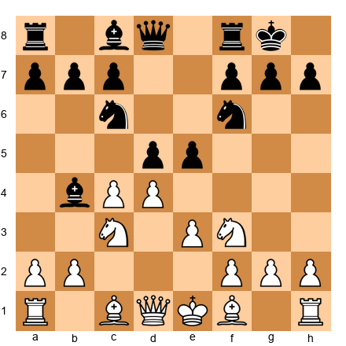

White to move. Identify White's most passive piece.

*Hint 1:* Look at each white piece. Which one has the fewest available squares?
*Hint 2:* The bishop on c1 is blocked by the pawn on e3.
*Hint 3:* Compare the c1 bishop to the knight on f3, which controls central squares.

**Solution:** White's most passive piece is the **bishop on c1**. It is blocked by the pawn on e3 and has no good diagonal available. White should prioritize developing this bishop, perhaps to b2 (after a3 and b3) or to d2 and then to e1-h4. The knight on c3 and knight on f3 are both active on central squares. Improving the worst piece (Bc1) is White's most important task.

---

**Exercise 14.2** ★

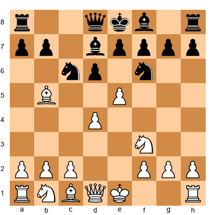

White to move. Identify Black's most passive piece.

*Hint 1:* Check each black piece's mobility and purpose.
*Hint 2:* The bishop on d7 is developed but has limited scope.
*Hint 3:* Compare it to the knight on f6, which controls central squares.

**Solution:** Black's most passive piece is the **bishop on f8**. It is still undeveloped and blocked by its own pawns. The bishop on d7 is at least on a useful diagonal, and the knights are on active squares. Black needs to find a way to develop the dark-squared bishop, perhaps with ...Be7 or ...g6 and ...Bg7.

---

**Exercise 14.3** ★

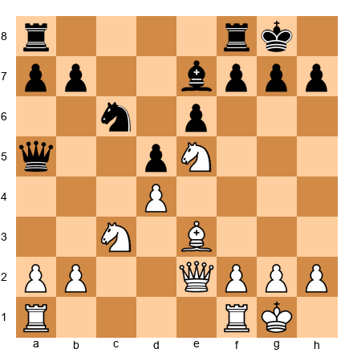

White to move. Identify White's most active piece.

*Hint 1:* Which piece controls the most important squares?
*Hint 2:* The knight on e5 sits in the center. Count the squares it controls.
*Hint 3:* Compare the e5 knight to the other pieces.

**Solution:** White's most active piece is the **knight on e5**. It controls c4, c6, d3, d7, f3, f7, g4, and g6. It sits on a central outpost and cannot be challenged by a pawn. It attacks Black's position from the heart of the board. The bishop on e3 and queen on e2 are supportive but less dominant.

---

**Exercise 14.4** ★

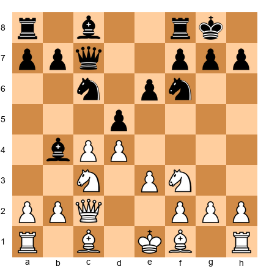

White to move. Which side has better piece coordination and why?

*Hint 1:* Count how many pieces are developed for each side.
*Hint 2:* Look at Black's pieces: knight on c6, knight on f6, bishop on b4, queen on c7. All active and pointing at White's center.
*Hint 3:* Look at White's pieces: Bc1 is undeveloped, Bf1 is undeveloped, the king has not castled.

**Solution:** **Black has better piece coordination.** Black has four pieces developed (two knights, a bishop, and the queen), all aimed at White's center. White has two knights out but both bishops are still on their starting squares, and the king has not castled. White's most urgent task is to develop (Bd3, O-O) before Black's coordination translates into a concrete advantage.

---

**Exercise 14.5** ★

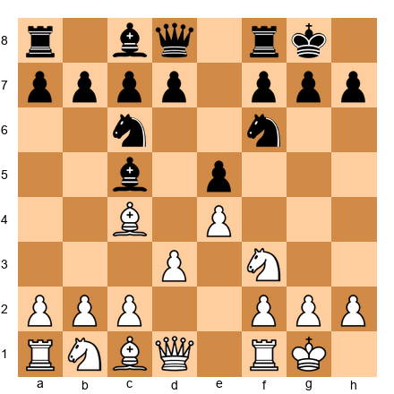

White to move. Evaluate the activity of all four bishops.

*Hint 1:* Start with White's bishops. Where do they point?
*Hint 2:* The c4 bishop eyes f7 (a sensitive square near Black's king). The c1 bishop is still at home.
*Hint 3:* Black's c5 bishop has an active diagonal. Black's c8 bishop is undeveloped.

**Solution:** **Bc4** is very active, aiming at f7 and controlling the center. **Bc1** is passive, still undeveloped and blocked by the d3 pawn. **Bc5** is active, placed on a strong diagonal putting pressure on f2 and d4. **Bc8** is passive, still at home with no open diagonal. Both sides have one "good" and one "bad" bishop. The first player to activate their passive bishop will gain an edge.

---

**Exercise 14.6** ★

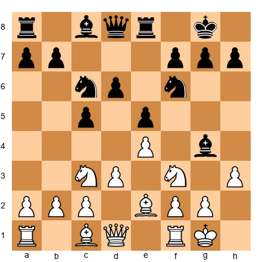

White to move. Is Black's bishop on g4 active or passive?

*Hint 1:* The bishop on g4 pins the knight on f3 against the queen on d1.
*Hint 2:* A pin is a form of activity. The bishop is creating a concrete threat.
*Hint 3:* But what happens after h3 and Black must decide where to put the bishop?

**Solution:** The bishop on g4 is **currently active** because it pins the f3 knight, creating a real problem for White. White has played h3 to challenge it. Now Black must decide: retreat with ...Bh5 (keeping the pin but allowing g4), trade with ...Bxf3 (giving up the bishop pair), or retreat to ...Be6 (losing the pin). Active does not mean permanent. The bishop is active NOW, but White's h3 forces a decision.

---

**Exercise 14.7** ★

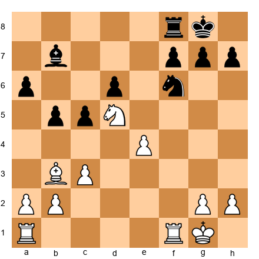

White to move. How active is White's knight on d5?

*Hint 1:* Can any pawn drive the knight from d5?
*Hint 2:* Count the squares the knight controls.
*Hint 3:* What targets does it threaten?

**Solution:** The knight on d5 is **supremely active.** It occupies a perfect outpost: no black pawn can challenge it (the c-pawn is on c5, and the e-pawn is gone). It controls b4, b6, c3, c7, e3, e7, f4, and f6. It threatens to jump into c7 (forking rook and king ideas) or e7+ (a check). Meanwhile, Black's knight on f6 is solid but cannot match the d5 knight's dominance. This is a textbook outpost.

---

**Exercise 14.8** ★

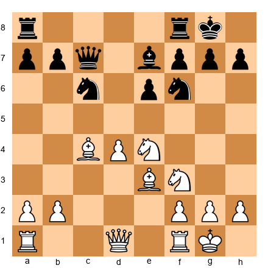

White to move. How do White's minor pieces compare to Black's?

*Hint 1:* Compare centralization. White has pieces on c4, e3, e4, f3. Black has pieces on c6, e7, f6.
*Hint 2:* Which pieces control more space?
*Hint 3:* Do White's pieces coordinate better?

**Solution:** White's minor pieces are **significantly more active**. The knight on e4 dominates the center, the bishop on c4 aims at f7, the bishop on e3 supports d4 and eyes the kingside, and the knight on f3 can jump to g5 or d2. Black's minor pieces are developed but defensive: the knight on c6 is blocked by the d4 pawn, the bishop on e7 is passive, and the knight on f6 is the only active defender. White's pieces all point at Black's kingside. This is coordination.

---

**Exercise 14.9** ★

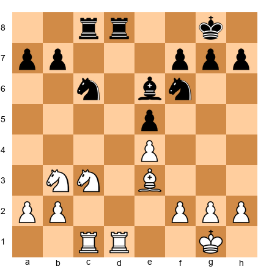

White to move. All pieces are developed. Which side's pieces are more active?

*Hint 1:* Both sides have identical material. Look at piece placement.
*Hint 2:* White's knight on b3 is less active than Black's knight on c6.
*Hint 3:* Evaluate the bishops: e3 (White) vs e6 (Black).

**Solution:** The position is roughly **equal in activity.** White has knights on b3 and c3, and a bishop on e3. Black has knights on c6 and f6, and a bishop on e6. Both sides have doubled rooks on the c/d-files. White's c3 knight is slightly better placed than the b3 knight, but Black's pieces are also well-coordinated. The side that improves their least active piece first (White should reroute the b3 knight to d2-f1-e3 or d2-c4) will gain the advantage.

---

**Exercise 14.10** ★

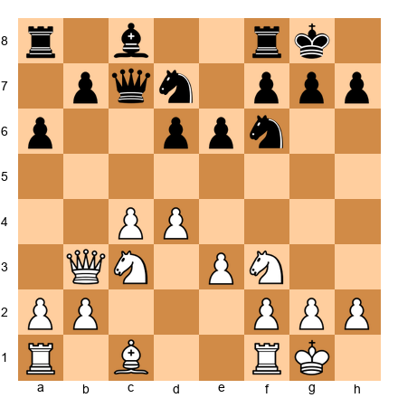

White to move. Evaluate Black's knight on d7. Is it active or passive?

*Hint 1:* Where can the d7 knight go?
*Hint 2:* It can go to b6, c5, e5, or f8. Are any of these squares strong?
*Hint 3:* Compare it to Black's knight on f6, which is already on a useful square.

**Solution:** The knight on d7 is **moderately passive.** It blocks the bishop on c8 and has no immediate strong square. The best destination is c5 or e5, but both require preparation. The f6 knight is more active because it controls d5 and e4. Black's priority should be to move the d7 knight to c5 (where it attacks d3 and eyes e4) or to b6 (where it pressures c4). The d7 knight is not terrible, but it is clearly Black's worst piece.

---

🛑 **Rest here.** You have completed the first 10 exercises. Good work.

---

### Section B: Bishop Pair and Knight vs Bishop (Exercises 14.11 - 14.20) ★★

*For each position, evaluate the minor piece battle and recommend a plan.*

**Exercise 14.11** ★★

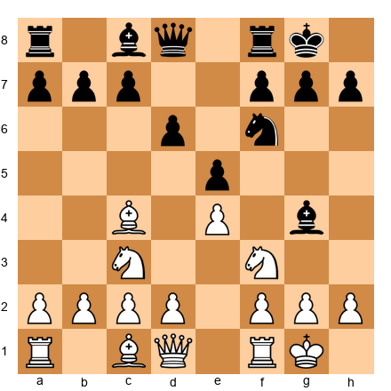

White to move. White has the bishop pair. How should White exploit it?

*Hint 1:* White has bishops on c4 and c1. Black has a bishop on g4 and a knight on f6.
*Hint 2:* To make the bishop pair strong, White needs open lines.
*Hint 3:* Consider d3-d4 to open the center.

**Solution:** White should play **d2-d4** (or prepare it with d3 first) to open the center. In open positions, the bishop pair dominates. After d4, lines open for both bishops: Bc4 controls the a2-g8 diagonal, and Bc1 can develop to g5 or e3 to target the kingside. Black should try to keep the position closed with ...d5 or trade one of the bishops quickly. White's plan: open the position, activate both bishops, and use their long-range power.

---

**Exercise 14.12** ★★

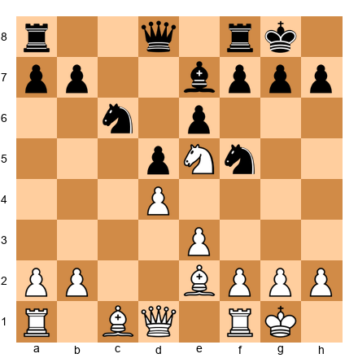

White to move. Black has two knights vs White's two bishops. Who stands better?

*Hint 1:* Look at the pawn structure. Is the position open or closed?
*Hint 2:* Black's pawns on d5 and e6 create a semi-closed center.
*Hint 3:* The knights on c6 and f5 are both well-placed. Do they have outposts?

**Solution:** The position is **roughly equal.** The center is semi-closed, which favors the knights. The knight on f5 has a beautiful outpost (guarded by nothing, attacking d4, e3, g3, h4). The knight on c6 pressures d4 and e5. White's bishops are on e2 (passive, not yet aimed at a target) and c1 (undeveloped). If White can open the position with e4 or f3+e4, the bishops will come alive. If Black can maintain the closed structure, the knights dominate. This is a dynamic balance where both sides must fight for the position type they prefer.

---

**Exercise 14.13** ★★

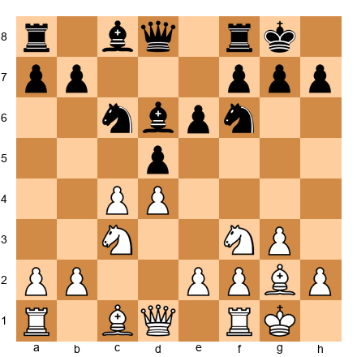

White to move. Is Black's bishop on d6 good or bad?

*Hint 1:* What color squares are Black's pawns on?
*Hint 2:* Black has pawns on d5 and e6 (light squares). The bishop on d6 is on a dark square.
*Hint 3:* Does the d6 bishop have an open diagonal?

**Solution:** Black's bishop on d6 is **good.** It sits on a dark square while Black's central pawns (d5, e6) are on light squares, meaning they do not block the bishop. The bishop has potential on the b8-h2 diagonal (pointing at White's kingside) and can support ...e5 or retreat to e7/c7. The real "bad" bishop in Black's position would be a light-squared bishop stuck behind the d5 and e6 pawns. The d6 bishop is flexible and active.

---

**Exercise 14.14** ★★

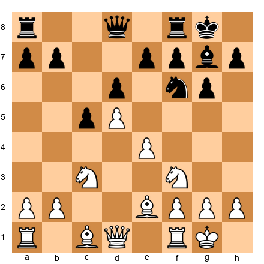

White to move. Is White's bishop on e2 good or bad? How can White improve it?

*Hint 1:* White's pawns on d5 and e4 are on dark and light squares respectively.
*Hint 2:* The bishop on e2 is blocked by the e4 pawn.
*Hint 3:* Can the bishop reroute to a better diagonal?

**Solution:** White's bishop on e2 is **passive.** The e4 pawn blocks its best diagonal, and it does not have an immediate target. White should improve it by playing **Bf1-d3** (aiming at the kingside via the b1-h7 diagonal) or **Bc4** (if the e4 pawn advances). Another plan is **Be2-f1-h3**, targeting the e6 square. The key insight: do not accept a passive bishop. Find a way to reroute it, even if it takes two or three moves.

---

**Exercise 14.15** ★★

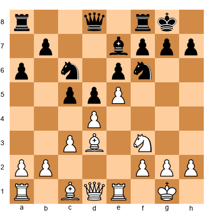

White to move. Black has a "bad" light-squared bishop stuck behind the pawn chain. What is White's strategic plan?

*Hint 1:* Black's pawns are on c5, d5, e6 (light squares). The light-squared bishop is on c8 (behind the chain).
*Hint 2:* White's bishop on d3 has a great diagonal (d3-h7).
*Hint 3:* White should maintain the pawn chain to keep Black's bishop passive.

**Solution:** White's plan is to **maintain the e5 pawn and exploit the bad bishop.** As long as the pawn chain (e5, d4, c3) stays intact, Black's light-squared bishop on c8 is stuck behind the e6 and d5 pawns. White should build a kingside attack using the bishop on d3 (aimed at h7), maneuver a knight to f4 or g5, and use the space advantage. Black will try to free the bishop with ...b6 and ...Ba6, or play ...f6 to break the chain. White should prevent both.

---

**Exercise 14.16** ★★

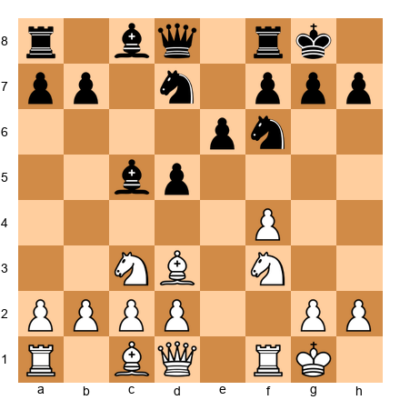

White to move. Both sides have a bishop and a knight. Evaluate the minor pieces.

*Hint 1:* White has a bishop on d3 and knight on c3. Black has a bishop on c5 and knight on d7.
*Hint 2:* Which bishop has a better diagonal?
*Hint 3:* Which knight has a better outpost available?

**Solution:** **White's bishop on d3 is slightly better** because it aims at the kingside (h7 diagonal) and supports the f4 pawn. Black's bishop on c5 is active, targeting f2, but is also exposed to attack (d4 push could challenge it). White's knight on c3 can jump to e4 or e2-g3. Black's knight on d7 is passive and needs to find a better square (e.g., ...Nc5 or ...Nf6). The minor piece battle is close, but White has a small edge in activity.

---

**Exercise 14.17** ★★

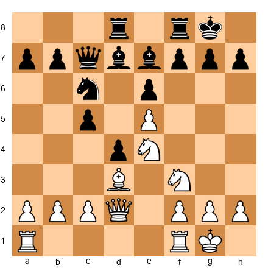

White to move. White has a knight on e4 and a bishop on d3. Where should the knight go?

*Hint 1:* The knight on e4 is well-placed but could be even better.
*Hint 2:* Can it reach d6? What would it control from there?
*Hint 3:* Nd6 would be an outpost (if no black pawn on e7 can advance past the e5 pawn to challenge it).

**Solution:** The knight should go to **d6.** After Nd6, the knight sits on an ideal outpost: the e5 pawn prevents ...e5 to challenge it, and no c-pawn can reach d6 either. From d6, it controls b5, b7, c4, c8, e4, e8, f5, and f7. It attacks Black's queen on c7 and the bishop on b7 simultaneously. Combined with the bishop on d3, this creates powerful coordination. The knight on d6 would be the dominant piece on the board.

---

**Exercise 14.18** ★★

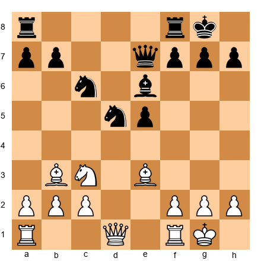

White to move. Black has a centralized knight on d5. How should White respond?

*Hint 1:* The d5 knight is powerful. Should White trade it or challenge it?
*Hint 2:* Nxd5 removes the strong knight. But what does Black get in return?
*Hint 3:* After Nxd5 Bxd5 (or ...exd5), evaluate the resulting position.

**Solution:** White should trade: **Nxd5 Bxd5 (or ...exd5).** After Nxd5 Bxd5 Bxd5, White has traded the powerful knight and now has the bishop pair in a position that can open up. After Nxd5 exd5, Black gets an isolated pawn on d5, which White can target. In both cases, removing the dominant knight improves White's position. The lesson: when your opponent has a powerful piece on an outpost, trading it is often the simplest and best solution.

---

**Exercise 14.19** ★★

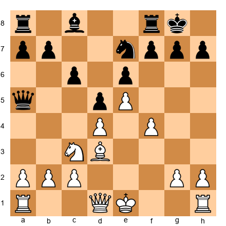

White to move. Black has a "bad" bishop on c8 and a knight on e7 that wants to reach f5. What should White do?

*Hint 1:* Black's knight aims for f5. Should White prevent it or allow it?
*Hint 2:* If the knight reaches f5, it will attack d4 and e3. This is dangerous.
*Hint 3:* Consider g2-g4 to prevent ...Nf5.

**Solution:** White should play **g2-g4!** to prevent ...Nf5. This is a pawn move that weakens the kingside slightly but eliminates Black's best piece improvement plan. Without access to f5, the knight on e7 remains passive. Meanwhile, Black's bishop on c8 stays locked behind the e6/d5 pawn chain. White can continue building with Qf3, O-O (or keep the king in the center in some lines), and prepare a kingside expansion with f5. Preventing the opponent's best piece from reaching its ideal square is a key strategic skill.

---

**Exercise 14.20** ★★

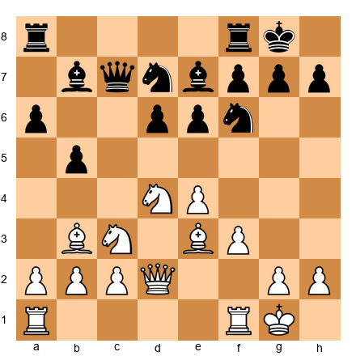

White to move. Evaluate the position and recommend whether White should trade dark-squared bishops.

*Hint 1:* White's bishop on e3 and Black's bishop on e7 are the dark-squared pair.
*Hint 2:* If White trades them (Bg5, Bxf6 or Be3-d4), what changes?
*Hint 3:* Who benefits from the trade?

**Solution:** White should **not trade dark-squared bishops** here. White's bishop on e3 supports the d4 knight and the kingside. Black's bishop on e7 is passive, doing little from its current square. Trading White's active bishop for Black's passive one is a bad deal. Instead, White should keep Be3 and use it as part of a kingside buildup with f4 and Qf2. If Black's bishop becomes more active later, then the trade might become desirable. The rule: trade your BAD pieces for their GOOD pieces, not the other way around.

---

🛑 **Rest here.** Twenty exercises done. You are halfway through.

---

### Section C: Rook Activity and Queen Play (Exercises 14.21 - 14.30) ★★★

*For each position, find the best way to activate the rooks or the queen.*

**Exercise 14.21** ★★★

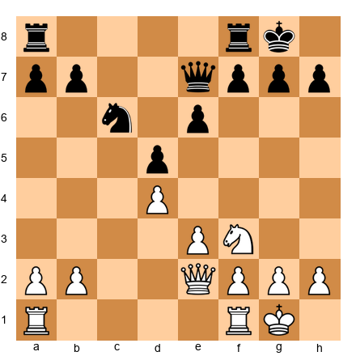

White to move. Both sides have undeveloped rooks. Find the best rook placement.

*Hint 1:* Which files are open or half-open?
*Hint 2:* The c-file is open and the e-file has tension. Where should the rooks go?
*Hint 3:* Rac1 and Rfe1 are natural. But which one first?

**Solution:** White should play **Rac1** first, targeting the open c-file. The c-file is fully open and offers immediate pressure on c6 (where Black's knight sits) and potential infiltration to c7. After Rac1, White follows with **Rfe1** or keeps the f-rook for potential kingside play. The e-file is half-open and less immediately useful. Always prioritize the most open file for your rooks. The rook on c1 is immediately active; a rook on e1 would need more preparation to become useful.

---

**Exercise 14.22** ★★★

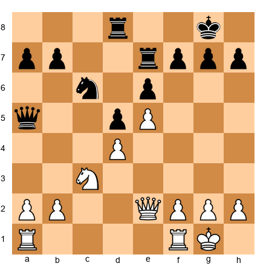

White to move. Black's rooks control the d-file and e-file. How does White contest?

*Hint 1:* White needs to fight for the open files.
*Hint 2:* Rac1 fights for the c-file (which is not controlled by Black).
*Hint 3:* Can White use a rook on f1 for a kingside plan?

**Solution:** White should play **Rac1**, opening a new front on the c-file rather than contesting files where Black is already established. Trying to fight for the d-file with Rad1 allows Black to double rooks and maintain control. By seizing the c-file, White creates counter-pressure against c6 and b7. The f1 rook can stay for now, potentially supporting f2-f4 later. The principle: when the opponent controls one file, take a different file rather than fighting over the same one.

---

**Exercise 14.23** ★★★

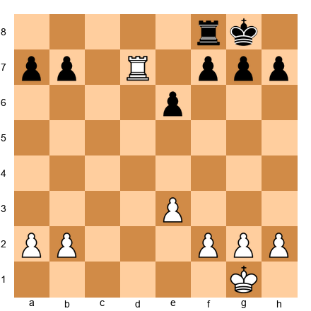

White to move. Your rook is on the seventh rank. How do you exploit it?

*Hint 1:* The rook on d7 attacks b7 and f7 from behind.
*Hint 2:* Can White attack both pawns at once?
*Hint 3:* Combine the rook with king activity.

**Solution:** White should keep the rook on the seventh rank and advance the king: **Kf2-e2-d3-c4.** The rook on d7 ties Black's rook to the defense of b7 or f7. While Black is busy defending, White's king marches forward. Once the king reaches c5 or d5, White can target the weak pawns with both king and rook. The rook on the seventh rank is a "pig" (an old chess term) that gobbles pawns. Do not move it off the seventh unless you have an even better square.

---

**Exercise 14.24** ★★★

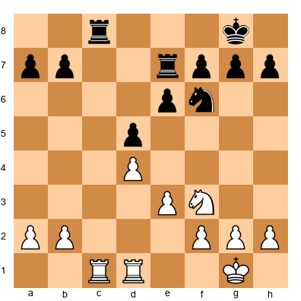

White to move. Demonstrate the power of doubled rooks on an open file.

*Hint 1:* The c-file is open. White has a rook on c1. How to double?
*Hint 2:* Rdc1 would double rooks. But is that the best file?
*Hint 3:* Consider which file gives White the most penetration points.

**Solution:** White should play **Rc2 followed by Rdc1**, doubling on the c-file. The doubled rooks aim to invade on c7 (the seventh rank). After Rc7, White's rook attacks b7 and a7 and ties Black to passive defense. Even better: after Rc7, if Black trades rooks (Rxc7 Rxc7), White has a single rook on the seventh rank, which is already a large advantage. Doubling rooks is not just about having two rooks on a file. It is about preparing infiltration.

---

**Exercise 14.25** ★★★

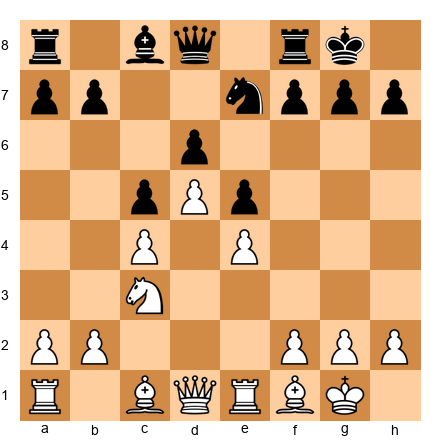

White to move. The queen has not moved from d1. Is this a problem?

*Hint 1:* The queen on d1 is behind the rooks. Is that bad?
*Hint 2:* The queen supports the d5 pawn and connects the rooks.
*Hint 3:* Would moving the queen to a more active square help right now?

**Solution:** The queen on d1 is **fine for now.** It connects the rooks, supports the d5 pawn, and is not blocking anything. Moving the queen prematurely (e.g., Qd3 or Qa4) might expose it to tactics. White should complete development first (perhaps Be3 or Bg5) and let the position dictate where the queen belongs. The lesson: the queen does not always need to be "active" in the middlegame. Sometimes the best queen move is no queen move at all.

---

**Exercise 14.26** ★★★

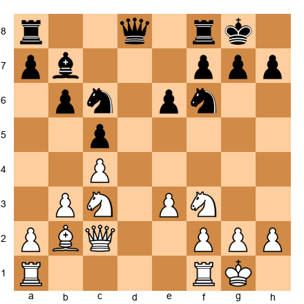

White to move. Plan a rook lift to bring a rook to the kingside.

*Hint 1:* A rook lift means moving a rook along a rank to an attacking file.
*Hint 2:* Can White play Ra3 and then Rg3 or Rh3?
*Hint 3:* After Ra1-a3-g3, the rook joins a kingside attack.

**Solution:** White should play **Ra3** followed by **Rg3** (or **Rh3**), executing a rook lift. The rook swings from the a-file (where it does nothing) to the g-file or h-file (where it attacks the kingside). Combined with the queen on c2 (which can shift to d3 or f5), the bishop on b2 (eyeing g7), and the knight on f3 (which can go to g5 or h4), this creates a coordinated attack. Rook lifts are one of the most powerful ways to activate a rook when no open file is available.

---

**Exercise 14.27** ★★★

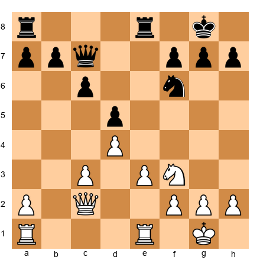

White to move. The e-file is half-open. Plan the rook placement.

*Hint 1:* White can seize the e-file with Re1 (already done) and Rae1 to double.
*Hint 2:* Is doubling on the e-file the best use of both rooks?
*Hint 3:* Consider: one rook on the e-file, one rook on the a-file (or b-file) for queenside pressure.

**Solution:** White should play **Rae1** to add control of the e-file, but then consider whether doubling is the best plan. A more flexible approach: keep one rook on e1 and use the other for **Ra1-a4** or **Rb1** to create queenside pressure alongside the c3 pawn's potential advance. The best plan often uses rooks on different files to create threats on two fronts. The opponent cannot defend everywhere. One rook on the e-file, one on the a-file, creates maximum headaches.

---

**Exercise 14.28** ★★★

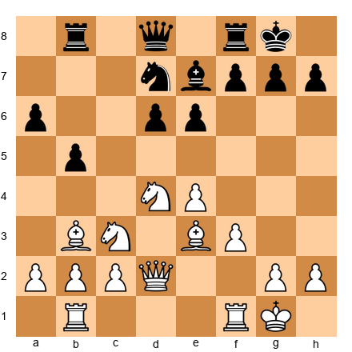

White to move. White's queen is on d2. Find a better square.

*Hint 1:* The queen on d2 is functional but not actively threatening anything.
*Hint 2:* Consider Qd2-f2 (supporting f4), or Qd2-h6 (threatening the kingside).
*Hint 3:* Where does the queen coordinate best with the other pieces?

**Solution:** White should consider **Qf2** (preparing f4 and supporting a kingside advance) or **Qd3** (supporting e4 and eyeing the kingside via h7). The best choice depends on the plan: if White wants to push f4, then Qf2 is ideal. If White wants to maintain flexibility, Qd3 centralizes the queen and targets both flanks. The queen should support the plan, not create its own. Avoid moving the queen to a square where it can be harassed (e.g., Qh6 might be met by ...Bf6 or ...g6 with tempo).

---

**Exercise 14.29** ★★★

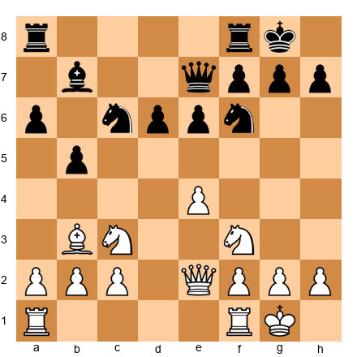

White to move. Should White trade queens with Qe2-d2-d8?

*Hint 1:* What is the material balance? Are there any structural advantages?
*Hint 2:* Who benefits from queens coming off?
*Hint 3:* If White has more active pieces, keeping the queen keeps the pressure.

**Solution:** White should **not trade queens.** White's pieces are more active (the bishop on b3 is stronger than the bishop on b7, and the queen on e2 supports a kingside advance). With queens on the board, White can generate kingside threats (e4-e5, Ng5, Qh5). If queens come off, the position becomes a quiet endgame where Black's solid structure makes winning difficult. The rule: keep queens on when you have more active pieces and attacking chances. Trade queens when you want a quiet endgame.

---

**Exercise 14.30** ★★★

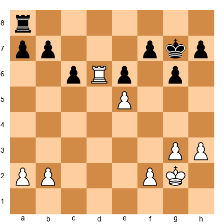

White to move. Your rook is on the sixth rank. Is this as good as the seventh?

*Hint 1:* The rook on d6 attacks c6 and e6 from the side. Is this active?
*Hint 2:* Would Rd7 (seventh rank) be better? It would attack a7, b7, and f7.
*Hint 3:* Compare the number of targets on rank 6 vs rank 7.

**Solution:** **Rd7 is better.** On d6, the rook attacks c6 (a pawn) and e6 (a pawn), but Black can defend both. On d7 (the seventh rank), the rook attacks a7, b7, and f7, which are harder to defend simultaneously. The rook also cuts off the black king from the d-file. Move the rook to the seventh: **Rd7.** The seventh rank is almost always superior to the sixth for a rook, because it attacks pawns from behind and restricts the king.

---

🛑 **Rest here.** Thirty exercises complete. One more set to go.

---

### Section D: Outposts and Piece Exchanges (Exercises 14.31 - 14.40) ★★★★

*For each position, find the best outpost, exchange, or coordination plan.*

**Exercise 14.31** ★★★★

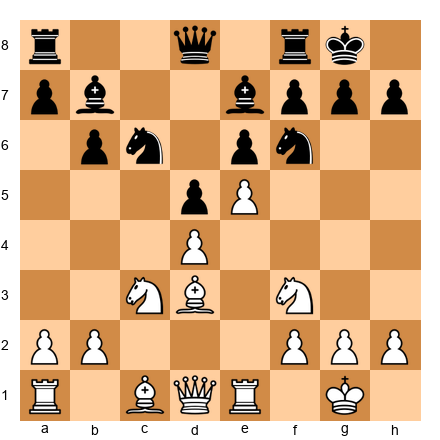

White to move. Find the best outpost for a knight.

*Hint 1:* The e5 pawn takes away Black's use of e5. But White can use other squares.
*Hint 2:* Can a knight reach f5 or d6?
*Hint 3:* After Nf3-h4-f5, the knight reaches f5 with no pawn able to challenge it.

**Solution:** White should maneuver a knight to **f5.** The route is Nf3-h4-f5 (or Nf3-g5-f3-h4-f5 in some variations). The f5 square is a perfect outpost: Black's g-pawn is on g7 and the e-pawn is on e6, so no pawn can drive the knight from f5. From f5, the knight attacks d6, e7, g7, h6, d4, e3, g3, and h4. It radiates power across the board. The knight on f5 combined with the bishop on d3 creates a fearsome battery aimed at the kingside.

---

**Exercise 14.32** ★★★★

White to move. Black has played ...b5. This creates a weakness. Where?

*Hint 1:* When a pawn advances, the squares it leaves behind can become weak.
*Hint 2:* The move ...b5 weakened the c5 square. Can a pawn recapture it?
*Hint 3:* Is c5 an outpost for White?

**Solution:** The move ...b5 weakened the **c5 square.** No black pawn can now guard c5 (the b-pawn has passed it, and the d-pawn is on d6). White should aim to plant a piece on c5. The ideal maneuver: **Nd4-b3-c5** or **Nc3-a4-c5.** A knight on c5 attacks a6, b3, b7, d3, d7, e4, and e6. It would be a permanent outpost that dominates the queenside and pressures the center. This is a classic example of provoking a pawn move to create an outpost.

---

**Exercise 14.33** ★★★★

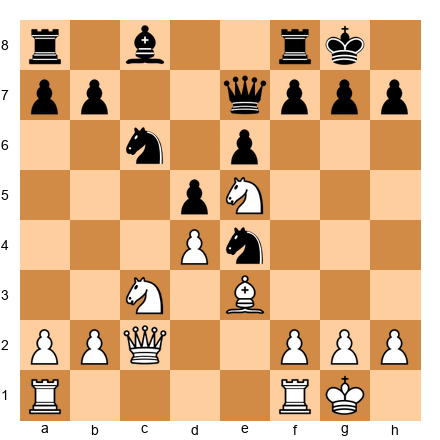

White to move. Both sides have centralized knights. Who has the better one?

*Hint 1:* White's knight is on e5. Black's knight is on e4. Compare their stability.
*Hint 2:* Can Black's knight be challenged? Can White's?
*Hint 3:* A pawn on d4 supports e5. What supports Black's knight on e4?

**Solution:** **White's knight on e5 is better.** It is supported by the d4 pawn and cannot be challenged by any pawn (Black has no f-pawn available to play ...f6 without weakening the kingside). Black's knight on e4 is powerful but less stable: White can play f3 to kick it, or Nxe4 to trade it off. The key difference is **pawn support.** White's outpost knight has a pawn behind it; Black's does not. White should maintain the e5 knight and challenge the e4 knight with f2-f3 or Nxe4 dxe4, creating an isolated pawn target.

---

**Exercise 14.34** ★★★★

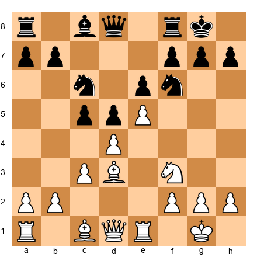

White to move. Should White exchange pawns on c5 or maintain the tension?

*Hint 1:* If dxc5, White opens the d-file but gives Black a pawn majority in the center.
*Hint 2:* If White maintains the tension, the e5 pawn cramps Black.
*Hint 3:* Consider that the tension keeps Black's pieces tied to defense.

**Solution:** White should **maintain the tension.** The e5 pawn cramps Black's position, restricts the f6 knight, and keeps Black's pieces passive. If White plays dxc5, Black gets a free d5 pawn with no cramp, and the position equalizes. By keeping the tension, White preserves the space advantage and can choose the right moment to break. Plans include Bf4 (supporting e5), Nbd2-f1-g3 (building kingside pressure), and Qe2 (connecting rooks). The principle: do not relieve tension unless you gain something concrete.

---

**Exercise 14.35** ★★★★

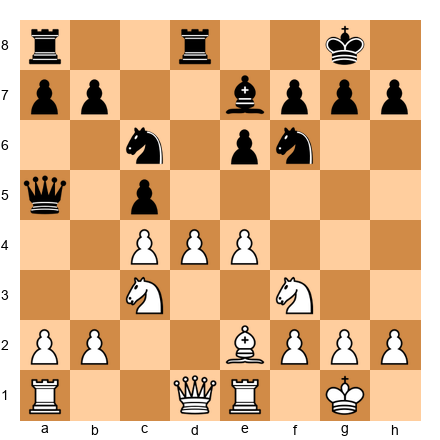

White to move. Which piece exchange would most benefit White?

*Hint 1:* Look at Black's most active piece. Which one causes White the most problems?
*Hint 2:* The queen on a5 pressures a2, c3, and d2.
*Hint 3:* Can White force a minor piece trade that improves the position?

**Solution:** White should trade the **c6 knight.** After Nd5 (threatening Nxe7+ and Nc7), Black must respond. If ...Nxd5 cxd5 (or exd5), White opens lines and gains a strong center. The c6 knight is Black's best-coordinated piece, supporting the c5 pawn and controlling d4 and e5. Removing it weakens Black's entire queenside structure. The lesson: when deciding which piece to trade, trade the opponent's piece that coordinates best with their other pieces.

---

**Exercise 14.36** ★★★★

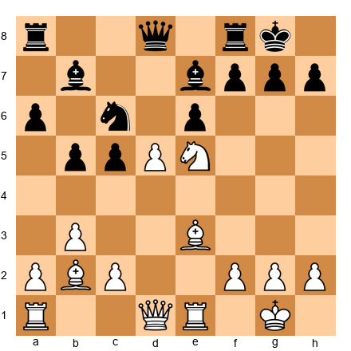

White to move. White has a knight on e5 and bishops on b2 and e3. Find the strongest coordination plan.

*Hint 1:* The knight on e5 is already dominant. What can the bishops add?
*Hint 2:* The bishop on b2 aims at the long diagonal toward g7.
*Hint 3:* Can White combine the knight on e5 with Qh5 and threats on the h-file?

**Solution:** White should play **Qh5**, threatening Qxh7 mate. The coordination is stunning: the knight on e5 controls f7 and g6 (covering escape squares), the bishop on b2 pins the g7 pawn (after ...f6, Nxg6 wins), and the queen delivers the blow from h5. If Black plays ...g6, then Nxg6 hxg6 Qxg6+ is devastating. If Black plays ...f6, the e5 knight moves with a discovered attack. Every piece works together. This is the power of coordination: three pieces create a mating threat.

---

**Exercise 14.37** ★★★★

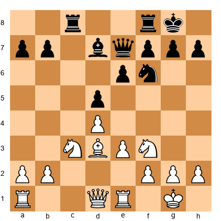

White to move. Plan a strategy to exploit better piece activity.

*Hint 1:* White's pieces are slightly better placed. How to increase the difference?
*Hint 2:* Can White target a specific weakness?
*Hint 3:* Ne5 centralizes the knight and puts pressure on d7.

**Solution:** White should play **Ne5**, centralizing the knight on its best possible square. From e5, it attacks d7 (the bishop), c6, f7, and g4. It also supports a potential advance of the c-pawn or a kingside buildup. After Ne5, White can follow with Qf3 (targeting f7 and d5), f2-f4 (supporting the knight and gaining space), or Rc1 (seizing the c-file). The plan is incremental: centralize, coordinate, then strike. Each move improves a piece by a small amount, and the cumulative effect is overwhelming.

---

**Exercise 14.38** ★★★★

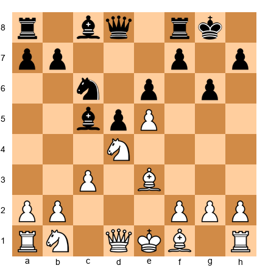

White to move. Black has a strong bishop on c5. How should White neutralize it?

*Hint 1:* The c5 bishop is Black's most active piece. It targets e3 and f2.
*Hint 2:* Can White trade it off?
*Hint 3:* Consider Bd4 or Na3-c2 to challenge it.

**Solution:** White should play **Bd4!** offering to trade dark-squared bishops. After ...Bxd4 cxd4, White's pawn structure changes, but the dark-squared bishop problem is solved. If Black retreats (...Bb6), White's bishop on d4 is even stronger than Black's on b6, controlling the long diagonal and central squares. The principle: when the opponent has one very active piece, challenge it directly. Either trade it (removing the advantage) or force it to a worse square. Do not let it sit unchallenged on a dominant post.

---

**Exercise 14.39** ★★★★

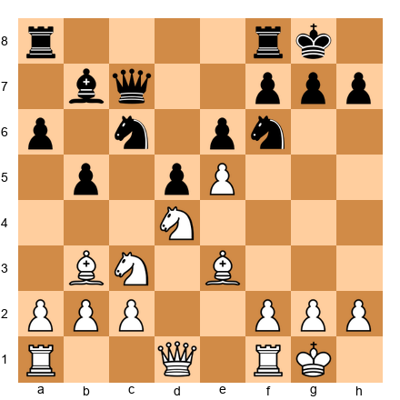

White to move. Design a three-move plan that maximizes piece coordination.

*Hint 1:* White has the e5 pawn cramping Black. What pieces should aim at the kingside?
*Hint 2:* f2-f4 supports e5 and prepares f5.
*Hint 3:* Qf3 aims at f7 and d5 (dual purpose). Rf1 prepares f4.

**Solution:** White's three-move plan: **(1) f2-f4** (supporting e5 and preparing f5), **(2) Qf3** (centralizing the queen with dual threats on f7 and d5), **(3) Rf1-f3** (preparing a rook lift to g3 or h3 for a kingside attack). After these three moves, White's pieces all point at the kingside: the bishop on b3 eyes f7, the queen on f3 targets the same square plus d5, the rook on f3 can swing to g3 or h3, and the knight on d4 supports f5 and controls key squares. This is total coordination. Every piece has a role, and every role supports the others.

---

**Exercise 14.40** ★★★★

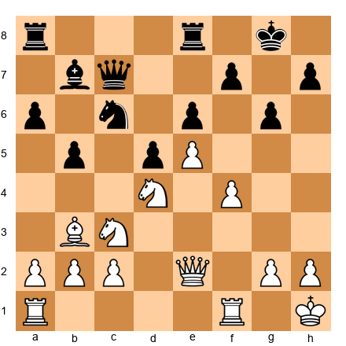

White to move. This position combines everything you have learned. Find the best move and explain why.

*Hint 1:* Look for the most forcing move that improves coordination.
*Hint 2:* Can a piece sacrifice open lines to the black king?
*Hint 3:* Consider Ndxb5! What happens after ...axb5 Nxb5?

**Solution:** White should play **Ndxb5!** After ...axb5 Nxb5, the knight arrives on b5 with devastating effect: it attacks c7 (where Black's queen sits) and d6 (an outpost). If the queen moves, Nd6 forks everything. But the deeper point is coordination: after Nxb5, the bishop on b3 is unblocked on the a2-g8 diagonal (aiming at f7), the queen on e2 can swing to h5 or g4 for a kingside attack, and the rooks can pour down the open a-file. The sacrifice works because it does not just win material. It activates EVERY remaining white piece simultaneously. That is the ultimate lesson of this chapter: piece activity and coordination are not separate concepts. They are one concept. Active pieces coordinate. Coordinated pieces become active. Build both, and your opponent's position will collapse under its own weight.

---

## Key Takeaways

1. **Active pieces are worth more than passive pieces.** A piece on a strong square does more than a piece hiding on the back rank, regardless of what the material count says.

2. **Improve your worst piece before looking for tactics.** If one of your pieces is doing nothing, making it active is almost always your best move. Tactics flow from good positions.

3. **Coordination multiplies power.** Two pieces aimed at the same target are stronger than two pieces working independently. Three pieces aimed at the same target can be unstoppable.

4. **The bishop pair favors open positions.** When you have two bishops, open the position. When you face two bishops, keep it closed.

5. **Knights love outposts. Bishops love open diagonals.** Place each piece where it thrives. A knight on an outpost is a fortress. A bishop on an open diagonal is a laser.

6. **Rooks need open files and the seventh rank.** An inactive rook is the saddest piece on the board. Give your rooks highways, and they will reward you.

7. **Trade when it helps your imbalances, keep when it hurts them.** Every exchange changes the position. Make sure the change favors you.

8. **Outposts are permanent advantages.** A piece on a square that cannot be challenged by a pawn is a long-term investment that pays dividends for the entire game.

---

## Practice Assignment

**This week, do the following:**

1. **Play three games** (online or over the board) and after each game, identify your most passive piece at move 15. Write down what you could have done to activate it sooner.

2. **Find one master game** in any database that features a knight planted on an outpost for at least 10 moves. Study how the outpost influenced the rest of the game.

3. **Set up the following position on your board and study it for 10 minutes:**

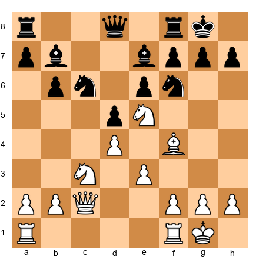

Answer these questions:
- Which side has more active pieces? Why?
- What is White's best outpost? What piece should go there?
- If you were Black, how would you improve your worst piece?
- Should White trade knights or keep them?
- Where should White's rooks go?

Write down your answers before checking them against this chapter.

4. **Review your last five games** and count how many moves it took to put both rooks on open or half-open files. If it took more than 15 moves, you are wasting your rooks. Practice getting them active earlier.

---

## Progress Check

Answer these five questions to test your understanding. If you get at least four correct, you have mastered this chapter's core concepts.

**Question 1:** What is the first thing you should do before looking for tactics?
> Ask if your worst piece is active. If not, improve it.

**Question 2:** What makes the bishop pair strong?
> Two bishops cover squares of both colors and dominate in open positions with their long-range power.

**Question 3:** Where do rooks belong?
> On open files and, when possible, on the seventh rank.

**Question 4:** What is an outpost?
> A square in enemy territory protected by your pawn that cannot be attacked by any enemy pawn. A piece on an outpost is stable and powerful.

**Question 5:** When should you trade pieces?
> When you are ahead in material, when your opponent has active pieces you want to remove, when you have a structural advantage, or when you are cramped and need space.

**Scoring:**
- 5/5: Outstanding. You understand piece activity deeply.
- 4/5: Very good. Review the section you missed and move on.
- 3/5: Good foundation. Reread the relevant sections before proceeding.
- 0-2/5: No worries. Reread the chapter with a board in front of you. These ideas take practice to internalize.

---

🛑 **Rest here.** Chapter 14 is complete. You now understand one of the most important concepts in chess: that pieces are not just material values on a page. They are living, breathing participants in a battle, and their activity and coordination determine who wins. Take a day off. You have earned it.

When you are ready, Chapter 15 awaits: *Basic Endgames*.

---

*Chapter 14 of The Grandmaster Codex*
*Volume II: The Club Player*
*Written by Kit Olivas and Dr. Ada Marie*
*Exercises: 40 | Annotated Games: 8 | Pages: 40*
