# Chapter 15: The Center: Static vs Dynamic

**Volume II: The Club Player | Rating Range: 1000 - 1600**
**Pages: 35 | Exercises: 30 | Annotated Games: 4**

---

> *"Whoever has the advantage in the center has the advantage everywhere."*
> — Siegbert Tarrasch (1862–1934)

---

## What You'll Learn

- Why the center matters beyond the basic principle of "control the center"
- The difference between a static center and a dynamic center, and how each changes your plans
- How to handle central pawn tension: when to capture, when to advance, and when to wait
- How a space advantage works and how to fight against one
- The hypermodern revolution: controlling the center without occupying it
- The most important pawn breaks in the center, and when to use them
- The iron rule: no flank attack without a stable center

---

## Before We Begin

In Volume I, you learned the most basic principle in chess: control the center. Put your pawns on e4 and d4 (or e5 and d5). Develop your pieces toward the middle of the board. This is correct. It is also incomplete.

Now that you are a club player, you need a deeper understanding. "Control the center" is the first sentence of a long conversation. This chapter is the rest of that conversation.

The center is not just a place to put your pawns. It is the engine that drives your entire game. A strong center supports attacks on either wing. A weak center invites counterplay from your opponent. A locked center demands patience and maneuvering. A fluid center demands precision and timing.

By the end of this chapter, you will look at the center of any position and understand what it is telling you. That understanding will change how you play every single game.

Set up your board. We have a lot of ground to cover.

---

## Part 1: The Center Revisited

### Why the Center Matters (The Real Reason)

You already know that the center is important. But why?

Here is the answer: **the center controls piece mobility.** A piece placed in the center reaches more squares than a piece placed on the edge. A knight on e4 reaches eight squares. A knight on a1 reaches two. This is geometry, not opinion.

But there is a deeper reason. The center is the crossroads of the board. Every piece that moves from one side to the other passes through the center. If you control the center, you control the traffic. Your pieces can move freely. Your opponent's pieces are stuck in traffic.

Consider this position:

White has a pawn on e4. That pawn controls d5 and f5. This means Black's knight on c6 cannot easily reach d5 or f5: two of the best squares on the board for a knight. One pawn, one move, and already the center is shaping Black's options.

Now imagine White adds a pawn on d4:

White's two center pawns now control c5, d5, e5, and f5. That is the entire fifth rank. Black's pieces have very limited access to these squares. White has a "classical center" and the advantage that comes with it.

**The principle:** Central pawns control squares. Those squares determine where pieces can and cannot go. This is why the center matters, not as an abstract idea, but as a practical reality that affects every piece on the board.

### Three Types of Center

Not every center is the same. Understanding which type of center you have tells you what to do next. There are three types:

1. **Static Center**: The pawns are locked (e.g., White e4 vs Black e5 with d4 and d5 blocked). Neither side can easily push. The game is about maneuvering pieces and attacking on the wings.

2. **Dynamic Center**: The pawns are fluid. Captures, advances, and tensions are still possible. The game is about timing your central break correctly.

3. **Open Center**: The central pawns have been exchanged. Piece activity is everything. Development speed and coordination matter enormously.

Most club games feature a mixture of these, or transition from one type to another. Learning to recognize which center you have, and which center your opponent wants, is a skill that separates improving players from stagnating ones.

---

🛑 **This is a good stopping point.** The ideas above are foundational. Let them settle before moving on.

---

## Part 2: The Static Center

### What a Static Center Looks Like

A static center occurs when the central pawns are locked. They face each other directly and cannot advance without being captured. The most classic example is the Ruy Lopez main lines where White has e4 and Black has e5, and neither pawn can move without significant consequences.

**Set up your board:**

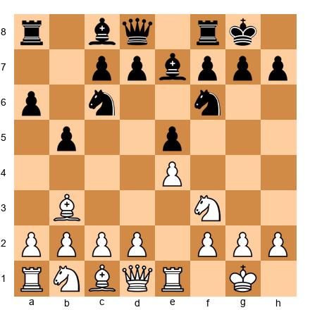

Look at the center. White has a pawn on e4. Black has a pawn on e5. Neither pawn can easily advance. The d-file is open, but neither side has pushed d4 or d5 yet. This center is relatively static. It is not going anywhere soon.

When the center is static, you know something critical: **the middle of the board is settled.** The battle will be fought elsewhere.

### The Rules of a Static Center

When the center is locked, four principles govern your play:

**1. Attack on the wing where you have more space.**

If your pawn chain points toward the kingside, attack on the kingside. If it points toward the queenside, attack there. The chain itself tells you where to go. This is Nimzowitsch's principle, and it is one of the most reliable rules in all of chess.

**2. Maneuver your pieces to the best squares.**

With the center locked, you have time. Use it. Transfer knights to outpost squares. Reroute bishops to better diagonals. Stack rooks on the file where the action will be. The center is not going to collapse while you reposition.

**3. Do not weaken your center.**

This is the trap. Your center is stable, and you are tempted to push a pawn for "activity." But if you weaken your center, your opponent will strike there while your pieces are on the wing. The static center is your foundation. Do not crack it.

**4. Watch for your opponent's pawn breaks.**

Your opponent follows the same rules. If you are attacking on the kingside, your opponent may be preparing a central or queenside break. Stay alert. A well-timed central break can demolish a flank attack.

### The Art of Piece Maneuvering

When the center is locked, piece placement becomes everything. There is no point in having a great pawn structure if your pieces are on the wrong squares.

Consider this position:

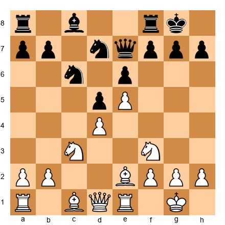

White has a pawn chain on d4-e5. The center is static. White's plan involves a kingside attack, but first the pieces must reach the right squares.

The knight on f3 is decently placed, but it could be better on g3 or even h4 to support a kingside push. The bishop on e2 is passive. It could redeploy to d3 where it eyes the kingside and supports a potential f4-f5 push. The queen might belong on d2 or even g4 to join the attack.

This kind of slow, purposeful piece improvement is the hallmark of strong play in static center positions. There is no rush. There is no tactic to find. There is only the steady process of putting every piece on its best square.

**A useful question to ask yourself:** "Which of my pieces is least active, and where does it want to be?" Answer this question, move that piece, and ask again. This is how masters navigate static centers.

### Flank Attacks with a Stable Center

When your center is secure, you are free to attack on the wing. The most common kingside attacking plan in positions with a locked center involves:

1. **f2-f4** (or ...f7-f5 for Black) to advance the f-pawn toward the enemy king.
2. **g2-g4** to support f5 and open the g-file.
3. **Piece redeployment**: knight to f3-h4 (or g3), bishop to the attacking diagonal, rooks to f1 and g1.

The key insight is that this attack only works because the center is stable. If the center were fluid, your opponent could strike in the middle while your pieces were committed to the wing. With a locked center, that counter-blow is not available.

This leads us to one of the most important rules in this chapter.

---

> **The Iron Rule:** Never attack on the flank until you are sure your center is stable. If your center is weak or under pressure, fix it first. Flank attacks without a stable center are strategic suicide.

---

This rule applies at every level of chess, from club games to World Championship matches. Violate it at your peril.

---

🛑 **Rest here if you need to.** The static center is a deep topic. Let it absorb before continuing.

---

## Part 3: The Dynamic Center

### What a Dynamic Center Looks Like

A dynamic center is one where the central pawns are not yet locked. They face each other with tension: one or both sides can capture, advance, or add reinforcement. The position is alive with possibilities, and every move in the center carries risk and reward.

**Set up your board:**

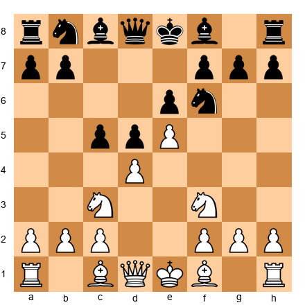

Look at the center. White has pawns on d4 and e5. Black has pawns on c5, d5, and e6. There is enormous tension. Black can play ...cxd4 or ...c4. White can play dxc5 or maintain. The e5 pawn is advanced and influential but potentially vulnerable.

This is a dynamic center. Nothing is settled. Every pawn move changes the character of the position.

### When to Push, When to Maintain

In a dynamic center, the critical question is: **should I resolve the tension, or should I maintain it?**

Here is the guiding principle:

**Maintain tension when it benefits you.**

Every unresolved pawn tension forces your opponent to consider multiple responses. They must ask: "Will my opponent capture? Will they advance? Should I capture first?" This uncertainty is an advantage. As long as the tension benefits you, meaning you are the one who can resolve it favorably, keep it alive.

**Resolve tension when you gain something concrete.**

Capture when the resulting structure favors you. Advance when the advance opens lines for your pieces or creates a passed pawn. Never resolve tension just because you are uncomfortable with the complexity. Discomfort is not a reason to make a structural commitment.

Here is a practical example:

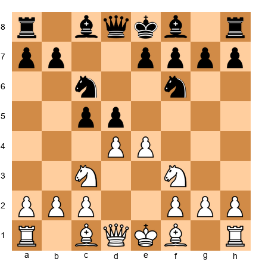

White has d4 and e4. Black has c5 and d5. White can play:

- **exd5**: Resolves the tension. After ...Nxd5, the center simplifies. This is fine but gives Black a central knight.
- **e5**: Advances. The pawn gains space but blocks the f1-bishop's natural diagonal and makes d5 a strong square for Black.
- **Developing move (Bb5, Be2, or Bg5)**: Maintains the tension. This is often the strongest choice. White develops a piece and keeps all options open.

The concept: **the player who maintains tension has more flexibility.** This does not mean you should never capture or advance. It means you should have a reason when you do.

### The Timing of Central Breaks

A central break is a pawn advance in the center that changes the pawn structure. The most common breaks are d4, d5, e4, e5, c4, c5, and f4/f5.

The timing of a break can be the difference between a brilliancy and a blunder. Too early, and your pieces are not ready to exploit the open lines. Too late, and your opponent has had time to prepare a defense.

**Three questions to ask before executing a central break:**

1. **Are my pieces developed and coordinated?** If your rooks are not connected or a key piece is still on its starting square, wait.
2. **Can my opponent punish the break immediately?** Calculate the consequences. If the break opens a line to your king, reconsider.
3. **Does the resulting structure favor me?** After the dust settles, will I have better piece placement, an outpost, or a passed pawn?

If you answer "yes" to all three, the break is likely correct.

---

## Part 4: Central Pawn Tension

### The Three Options

When your pawn faces an enemy pawn diagonally across the center (e.g., White d4 vs Black c5, or White e4 vs Black d5), you have three choices:

1. **Capture**: Take the enemy pawn.
2. **Advance**: Push past the enemy pawn.
3. **Maintain**: Leave the tension and play a different move.

Each option changes the position in a fundamentally different way. Understanding what each option does is one of the most important skills at the club level.

### Option 1: Capture

When you capture a central pawn, you change the pawn structure. You may gain a pawn, open a file, or create an imbalance. But you also relieve tension, and relieving tension usually helps your opponent by removing a decision from their plate.

**Capture when:**
- The resulting structure gives you a clear advantage (e.g., you create a passed pawn or saddle your opponent with an isolated pawn).
- You win material or gain a significant tactical advantage.
- Your opponent's recapture creates a weakness you can exploit.

**Do not capture when:**
- The tension is working in your favor and your opponent is uncomfortable.
- The recapture improves your opponent's piece placement (e.g., their knight recaptures on a central square).
- You have no clear plan for the resulting structure.

### Option 2: Advance

Advancing a pawn past its rival gains space and can be aggressive, but it is also a commitment. The advanced pawn cannot go back, and the square it left behind may become weak.

**Advance when:**
- You gain a significant space advantage.
- The advance opens lines for your pieces.
- You can support the advanced pawn and it will not become a target.

**Do not advance when:**
- The advanced pawn will be easily blockaded.
- You create weak squares behind the pawn that your opponent's pieces can use.
- You do not have enough pieces supporting the advance.

### Option 3: Maintain

Maintaining tension is the option most club players overlook, and it is often the strongest. By playing a move elsewhere, developing a piece, improving a piece's position, or creating a threat on another part of the board. You preserve all your options.

**Maintain when:**
- Your opponent is the one who must worry about the tension (they are the ones who need to respond).
- You can usefully improve your position while the tension exists.
- Neither capture nor advance gives you a concrete advantage right now.

**The great masters maintain tension as a weapon.** It is not laziness. It is not indecision. It is strategic discipline. The player who maintains tension is often the player who gets the better deal when the tension finally resolves.

---

> **A rule of thumb:** When in doubt, maintain the tension and improve a piece. You can always capture or advance later. You cannot un-capture or un-advance.

---

🛑 **Take a break here if you like.** Parts 1 through 4 are the core theory. The rest of the chapter builds on these ideas.

---

## Part 5: Space Advantage

### What Space Means

A space advantage means your pawns are more advanced than your opponent's, giving your pieces more room to maneuver behind them. Your opponent's pieces, by contrast, are cramped. They have fewer squares to choose from and less room to coordinate.

**Set up your board:**

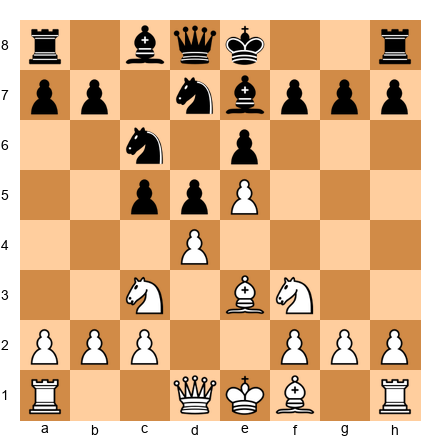

White has a pawn on e5. This pawn is further advanced than Black's pawns and controls the squares d6 and f6. Behind the e5 pawn, White has room for pieces: a knight on f3 or d4, a bishop on e3 or d3, rooks on central files. Black's pieces, meanwhile, are cramped. The knight on d7 has few good squares. The bishop on e7 is passive. Black needs to challenge the center to equalize.

### How to Use a Space Advantage

Having more space is only an advantage if you use it well. Here are the principles:

**1. Keep pieces on the board.** A space advantage matters most when there are many pieces competing for limited squares. If you trade everything, the cramping effect disappears. Avoid unnecessary exchanges when you have more space.

**2. Restrict your opponent.** Use your advanced pawns and well-placed pieces to control your opponent's best squares. Make it hard for them to reposition.

**3. Open lines at the right moment.** Eventually, you need to break through. A space advantage that never leads to action is just a pretty formation. Look for the right pawn break to open lines while your opponent's pieces are still tangled.

**4. Be patient.** This is perhaps the hardest lesson. A space advantage is a slow weapon. It does not deliver checkmate on its own. It creates the conditions for checkmate by making your opponent's defense increasingly difficult.

### How to Fight Against a Space Advantage

If your opponent has more space, do not panic. Cramped positions are uncomfortable, but they are not lost. Here is how to fight back:

**1. Exchange pieces.** Every piece you trade gives your remaining pieces more room. If you are cramped, actively seek favorable trades.

**2. Challenge the center.** Your opponent's space advantage is built on advanced pawns. If you can undermine those pawns with a pawn break, the advantage may evaporate.

**3. Do not make weaknesses.** When you are cramped, the temptation is to push pawns for "breathing room." This often creates holes that your opponent will exploit. Instead, keep your pawn structure solid and wait for the right moment to strike.

**4. Look for counterplay.** Even in a cramped position, there may be tactical opportunities. A sacrifice, a pin, a discovered attack. Any of these can turn the tables. Stay alert.

---

## Part 6: Hypermodern Ideas

### Controlling the Center Without Occupying It

In the early twentieth century, a group of chess thinkers led by Richard Reti, Aron Nimzowitsch, and Gyula Breyer challenged the classical dogma that you must occupy the center with pawns. Their argument: sometimes it is better to let your opponent place pawns in the center and then attack those pawns with pieces and flank pawns.

This was the hypermodern revolution, and its ideas are now a permanent part of chess theory.

### The Fianchetto

The most common hypermodern technique is the fianchetto, placing a bishop on g2 or b2 (for White) or g7 or b7 (for Black). A fianchettoed bishop does not sit in the center, but it controls the center from a distance. A bishop on g2 stares down the long a8-h1 diagonal, exerting powerful influence on the central squares d5 and e4.

**Set up your board:**

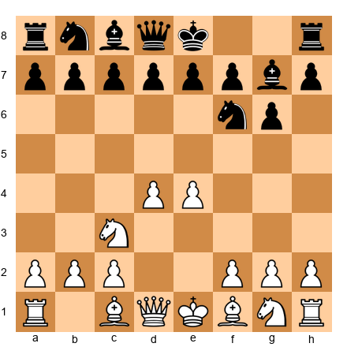

Black has fianchettoed the bishop to g7. The bishop does not occupy a central square, but it pressures d4 and the entire a1-h8 diagonal. If White plays carelessly, this bishop can become devastatingly powerful.

The hypermodern idea: let White build a big center with d4 and e4, and then attack it. Black's plan might include ...c5 to hit d4, or ...d6 and ...e5 to challenge the center directly. The fianchettoed bishop supports this counterattack from a safe distance.

### Piece Pressure Without Pawns

Another hypermodern concept is controlling central squares with pieces rather than pawns. A knight on e5 controls the center just as effectively as a pawn on e4, in some ways more effectively, because the knight is more flexible.

Consider:

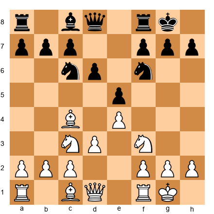

White has a pawn on e4 and d3, not the aggressive d4. But the knight on f3 can reach e5 or d4, the bishop on c4 targets f7, and the c3 knight can swing to d5. White is controlling the center with a combination of one pawn and three pieces. This is the Italian Game approach, and it is highly effective.

**The lesson:** You do not need two pawns in the center to control it. Sometimes one pawn (or even none) combined with active piece placement is stronger than a classical pawn center. The hypermodern masters proved this, and modern chess confirms it daily.

### When Classical Beats Hypermodern (and Vice Versa)

Neither approach is "better." They are tools. Use the right one for the position.

**Classical (pawns in the center) works best when:**
- You can maintain the center without it becoming a target.
- Your pieces coordinate well behind the pawn front.
- Your opponent lacks the pieces or structure to attack your center.

**Hypermodern (controlling from a distance) works best when:**
- Your opponent's center is overextended and can be attacked.
- A fianchettoed bishop controls a critical long diagonal.
- Piece activity matters more than pawn territory.

The best players blend both approaches. They are not dogmatic about either.

---

## Part 7: Pawn Breaks in the Center

### The Most Important Breaks

A pawn break is a pawn advance that opens lines, creates new structures, or challenges your opponent's formation. In the center, the most important breaks are:

**The d4 break** (for White, or ...d5 for Black)

This is the classic central break. It challenges a pawn on e5 (or c5) and opens the d-file. In many openings (the Italian, the Ruy Lopez, the Pirc), preparing and executing d4 (or ...d5) is White's (or Black's) primary strategic goal.

Example structure:

White's plan centers on playing d2-d4 at the right moment. The preparation might include c3 (to support d4), castling (king safety first), and Re1 (adding support to e4). When d4 comes, it will open the position for White's bishops and challenge Black's center.

**The e4 break** (or ...e5)

This break advances a pawn into the center, often challenging d5 or gaining space. In the French Defense, Black often struggles to achieve ...e5, and when it comes, it equalizes.

**The c4 break** (or ...c5)

This break challenges d5 (or d4) from the flank. It is a staple of Queen's Gambit and Sicilian structures. A well-timed c4 can crack open the center and create a powerful passed d-pawn.

**The f4 break** (or ...f5)

This is the most aggressive central break. It advances toward the enemy king and often accompanies a kingside attack. In the King's Indian Defense, Black's ...f5 is the signal that the kingside battle has begun. In the French Defense, White's f4-f5 attacks the base of Black's pawn chain.

**Warning:** f4 (or ...f5) weakens the king's shelter. Use this break only when the benefits outweigh the risks.

### How to Prepare a Pawn Break

A pawn break rarely works on its own. It needs preparation:

1. **Support the break with pawns.** If you want to play d4, make sure c3 or e3 supports it. An unsupported break can be refuted.
2. **Develop pieces to exploit the resulting open lines.** Before playing d4, ask: "If d4 works, are my rooks ready for the d-file? Is my bishop ready for the opened diagonal?"
3. **Calculate the consequences.** What happens after you advance? What captures are available? What structure results?
4. **Check your opponent's counter-breaks.** If you play on the wing, can your opponent play in the center? If you play in the center, do they have a prepared tactical response?

---

## Part 8: Center and the Wings

### The Connection

Here is the rule that ties everything together:

**The center determines the wings. Not the other way around.**

If your center is strong and stable, you can attack on either flank with confidence. Your opponent cannot strike back through the middle while you are occupied on the wing.

If your center is weak or under pressure, a flank attack is dangerous. Your opponent will break through the center while your pieces are committed elsewhere, and your position will collapse.

**Example:**

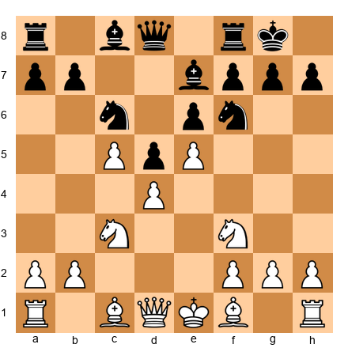

White has a powerful center with d4, e5, and c5. The center is strong and stable, Black cannot easily challenge it. White is free to launch a kingside attack with Bd3, Qe2, and eventually g4-g5 or f4-f5, knowing that the center is secure.

Now compare:

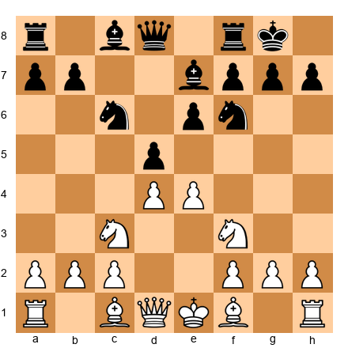

White has d4 and e4, but Black can play ...dxe4 at any moment. If White launches a kingside attack and Black responds with ...dxe4, the center opens and White's king may be exposed. White must either secure the center first (with e5 or by maintaining the tension carefully) or accept the risk.

**The practical takeaway:** Before starting a wing attack, always ask: "Is my center safe?" If the answer is no, fix the center first. The attack can wait. A collapsing center cannot.

---

🛑 **Theory complete.** Take a break before the annotated games. You have earned it.

---

## Annotated Master Games

The four games in this chapter all involve the center, how to control it, how to exploit it, and how it determines the outcome of the game.

---

### Game 28: Petrosian vs Spassky
**World Championship Match, Game 10, Moscow, 1966**
King's Indian Defense (E63) | Result: 1-0

| Field | Value |
|-------|-------|
| **White** | Tigran Petrosian |
| **Black** | Boris Spassky |
| **Event** | World Championship Match, Game 10 |
| **Site** | Moscow, 1966 |
| **Opening** | King's Indian Defense (E63) |
| **Result** | 1-0 |

**Why This Game Is Instructive:** Petrosian, the legendary "Iron Tigran," demonstrates the art of prophylaxis combined with central control. He builds a rock-solid center, prevents all of Spassky's counterplay, and then converts his structural advantages with a famous exchange sacrifice. This game teaches you that controlling the center is not always about attacking. Sometimes it is about making sure your opponent cannot do anything.

**The Moves:**

1.Nf3 Nf6 2.g3 g6 3.c4 Bg7 4.Bg2 O-O 5.d4 d6 6.Nc3 Nbd7 7.O-O e5 8.e4 c6

Both sides have established their central presence. White has the classical d4+e4 center. Black has played ...e5 to contest d4, and ...c6 to support a potential ...d5 break. The center is semi-static: White's pawns are firm on d4 and e4, while Black must decide how to challenge them.

9.h3 Qb6 10.d5!

**Key Moment.** Petrosian closes the center. By playing d5, he transforms the position from a dynamic center to a static one. The center is now locked: d5 vs c6 and e5. With the center fixed, Petrosian knows exactly where the battle lines are. He will maneuver on the queenside, while Black's kingside counterplay (the usual ...f5 break) is made more difficult.

This is the prophylactic mindset in action: close the center to reduce your opponent's options, then improve your position piece by piece.

10...cxd5 11.cxd5 Nc5 12.Ne1 Bd7 13.Nd3 Nxd3 14.Qxd3

White has traded off Black's active knight. Every favorable exchange in a closed center is a small victory. It gives White's remaining pieces more room to operate.

14...Rfc8 15.Rb1 Nh5

Spassky attempts to generate counterplay by relocating the knight, perhaps aiming for f4.

16.Be3 Qa6 17.Qxa6 bxa6

The queens are off the board. This favors White. Without queens, Black's attacking chances on the kingside are greatly reduced, and Petrosian can focus on his structural advantages: the d5 pawn secures space, and Black's doubled a-pawns are a long-term weakness.

18.Nd1 f5 19.f3 Bh6 20.Bf2

Petrosian calmly repositions. No rush. No fireworks. He is improving each piece methodically while Black struggles to create active play.

20...fxe4 21.fxe4 Bg5 22.Rc1 Bd2 23.Rxc8+ Rxc8

Black has traded a pair of rooks, but White's remaining pieces are better coordinated.

24.Ne3 Bxe3 25.Bxe3 Nf6

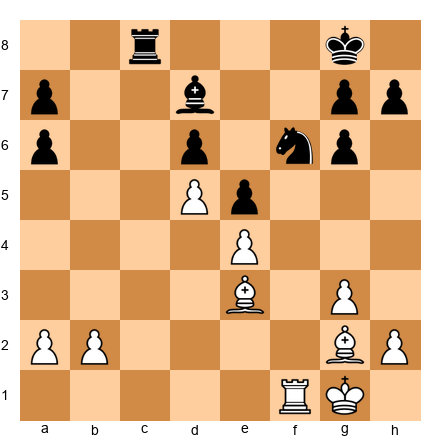

Study this position on your board. White's center (d5+e4) is like a wall. Black's pieces are passive. The bishop on d7 has no good diagonal. The knight on f6 is decent but has limited scope. Petrosian's structure does all the work.

26.b4 Rc3 27.Kf2 Ra3 28.Bc1 Rc3 29.Bd2 Ra3 30.a4 Nh5 31.Bc1 Rc3 32.Bd2 Ra3 33.Be1 Nf4 34.Bf1 Nd3+ 35.Bxd3 Rxd3 36.Bf2 a5 37.b5 Rd4 38.a3 Kf7 39.Ra1 Ke7 40.Be3 Rd3 41.Bc1 1-0

Spassky resigned. His position is lost due to the queenside weaknesses and the passivity of his pieces.

**Key Lesson:** A closed center gives the player with more space the luxury of time. Petrosian used that time to improve every piece, trade what needed trading, and slowly strangle his opponent. If you control the center and close it, you control the game.

---

### Game 36: Korchnoi vs Petrosian
**Candidates Match, Moscow, 1974**
English Opening (A36) | Result: 1-0

| Field | Value |
|-------|-------|
| **White** | Viktor Korchnoi |
| **Black** | Tigran Petrosian |
| **Event** | Candidates Match |
| **Site** | Moscow, 1974 |
| **Opening** | English Opening (A36) |
| **Result** | 1-0 |

**Why This Game Is Instructive:** Even the greatest defensive player in chess history can be broken when an opponent relentlessly targets the center. Korchnoi demonstrates how persistent central pressure creates opportunities elsewhere. The center determines the wings.

**The Moves:**

1.c4 g6 2.Nc3 Bg7 3.g3 c5 4.Bg2 Nc6 5.e3 e6

Black is playing a hypermodern setup, fianchettoed bishop, pieces aimed at the center, pawns held back. White chooses a restrained approach with e3 rather than the more ambitious d4.

6.Nge2 Nge7 7.d4 cxd4 8.exd4 d5

**Key Moment.** The center opens. With d4 and ...d5 both played, we have a symmetric pawn structure in the center. But symmetry can be deceptive. It is often the side with the initiative (White, in this case) who benefits more.

9.cxd5 Nxd5 10.O-O O-O 11.Nxd5 exd5

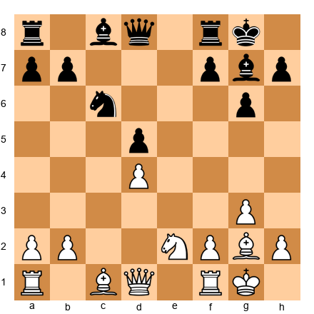

Set up this position. The center now has an isolated d-pawn for each side, White on d4, Black on d5. These symmetrical isolated pawns create a battle for the d4 and d5 squares. The question is: whose isolated pawn is a strength, and whose is a weakness? The answer depends on piece activity.

12.Nf4 Bf5

Petrosian develops the bishop to f5, an active square. But Korchnoi is about to demonstrate the power of centralized pieces.

13.Be3 Qd7 14.Rc1 Rfe8 15.Qb3 Na5 16.Qa4 Qxa4

The queens are exchanged, and now the endgame approaches. In the endgame, the side with the more active pieces and the ability to target the opponent's isolated pawn will prevail.

17.Rxc5 1-0

Petrosian resigned after Rxc5. White's centralized rook, active knight on f4, and coordinated minor pieces gave Korchnoi a decisive advantage. The d5 pawn was falling, and Black's pieces could not coordinate to defend it.

**Key Lesson:** Central pawn tension that resolves into symmetric isolated pawns is not truly equal. The side with more active pieces, better-placed knights, bishops on attacking diagonals, rooks on open files, wins the positional battle. Activity matters more than structure in these positions.

---

### Game 53: Petrosian vs Bronstein
**Amsterdam Candidates, 1956**
Nimzo-Indian Defense (E53) | Result: 1-0

| Field | Value |
|-------|-------|
| **White** | Tigran Petrosian |
| **Black** | David Bronstein |
| **Event** | Amsterdam Candidates |
| **Site** | Amsterdam, 1956 |
| **Opening** | Nimzo-Indian Defense (E53) |
| **Result** | 1-0 |

**Why This Game Is Instructive:** This is Petrosian's prophylactic masterpiece: a perfect demonstration of first restricting the opponent's plans, then improving your own position, and only then attacking. The center remains under White's control throughout, and that control determines everything.

**The Moves:**

1.d4 Nf6 2.c4 e6 3.Nc3 Bb4 4.e3 c5 5.Bd3 O-O 6.Nf3 d5 7.O-O dxc4 8.Bxc4 Nbd7

The Nimzo-Indian. Black has traded the d5 pawn for White's c4 pawn, clearing the center. The resulting position has a dynamic center: White has d4, Black has ...c5 and ...e6. The tension on d4 (challenged by ...c5) is critical.

9.Qe2 b6 10.d5!

**Key Moment.** Just as in Game 28, Petrosian plays d5 to close (or semi-close) the center. This pawn advance gains space, opens the a2-g8 diagonal for the bishop on c4, and limits Black's pieces. The center is now decided: White has a mobile d5 pawn that cramps Black's position.

10...exd5 11.Nxd5 Bxd5 12.Bxd5 Qc7

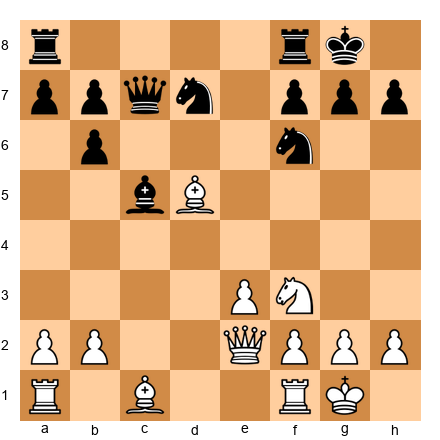

White has a powerful bishop on d5, occupying the center. This bishop controls the long diagonal and restricts Black's knight on d7. Petrosian's center is not defined by pawns here. It is defined by the dominance of a centralized piece.

13.Rd1 Bd6 14.Nd2 Nxd5 15.Qh5 N7f6 16.Qxd5 Rad8 17.Qf3 Be7 18.Nc4

White's pieces are beautifully coordinated. The knight heads to c4, targeting b6 and d6, while the queen controls the a8-h1 diagonal.

18...Nd5 19.b3 Bf6 20.Bb2 Bxb2 21.Nxb2 Rfe8 22.Nc4 Re6 23.Rac1 Qe7 24.a3 Rde8 25.Rd3 h6 26.Rcd1 Nf6 27.b4 cxb4 28.axb4 Ng4 29.Qxg4 1-0

Bronstein resigned. White's queenside pressure, centralized pieces, and superior pawn structure made the position hopeless.

**Key Lesson:** Prophylactic center control means restricting your opponent first, then improving your own position. Petrosian did not attack until Black had no counterplay. The center was the foundation: once White controlled it, the rest of the board followed.

---

### Game 4 (Supplementary): Nimzowitsch vs Salwe
**Karlsbad, 1911**
French Defense (C02) | Result: 1-0

| Field | Value |
|-------|-------|
| **White** | Aron Nimzowitsch |
| **Black** | Georg Salwe |
| **Event** | Karlsbad |
| **Site** | Karlsbad, 1911 |
| **Opening** | French Defense (C02) |
| **Result** | 1-0 |

**Why This Game Is Instructive:** This is one of the most famous games in chess history for illustrating the concept of the blockade and the battle for the center. Nimzowitsch, the father of hypermodern chess, shows how a central outpost and a blockading strategy can dominate a game.

**The Moves:**

1.e4 e6 2.d4 d5 3.e5

White establishes a pawn chain: d4-e5. The center is now semi-closed. White's space advantage on the kingside is balanced by Black's potential to attack the base of the chain with ...c5 and eventually ...f6.

3...c5 4.c3 Nc6 5.Nf3 Qb6 6.Bd3 Bd7

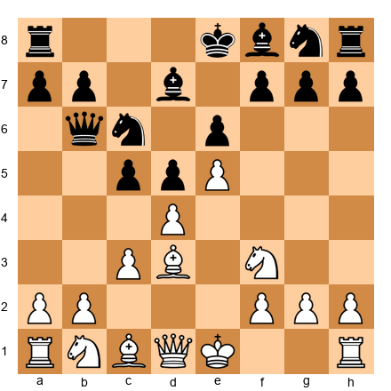

This is a classic French Defense position. The center is static (d4 vs ...d5, e5 fixed). According to our rules, the pawn chain d4-e5 points toward the kingside, so White should attack there. Black's chain ...d5-e6 points toward the queenside, so Black should attack there.

7.dxc5 Bxc5 8.O-O f6

Black challenges the e5 pawn, attacking the chain. This is the correct strategic idea, even though it has tactical risks.

9.b4 Be7 10.Bf4 fxe5 11.Nxe5 Nxe5 12.Bxe5 Nf6 13.Nd2

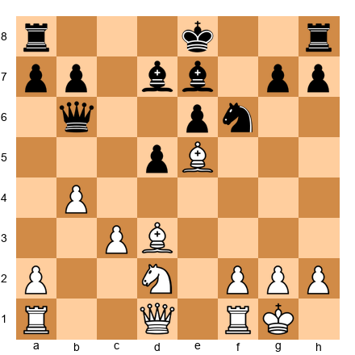

White has traded the e5 pawn but gained a powerful bishop on e5 and excellent development. The d5 pawn is now isolated, and the square d4 is a perfect blockading point.

13...O-O 14.Nf3 Bd6 15.Qe2 Qc7 16.Bd4

**Key Moment.** The bishop lands on d4. The blockading square. From d4, this bishop controls both central diagonals and prevents Black from ever advancing ...d5-d4. The blockade of the isolated pawn is complete.

16...Ne4 17.Ne5! Bxe5 18.Bxe5 Qc5 19.Bxe4 dxe4 20.Qxe4

White has won the d5 pawn and dominates the center. The game continued:

20...Rxf2 21.Qe5 Bc6 22.a4 Raf8 23.Rxf2 Rxf2 24.b5 Bd7 25.Qd6 1-0

Salwe resigned. White's central domination, achieved through the blockade and the powerful bishop, was decisive.

**Key Lesson:** A central outpost, especially the square in front of an isolated or backward pawn, is one of the most powerful tools in chess. Nimzowitsch built an entire philosophy around this idea. When you occupy the center with a well-placed piece, you control the game.

---

🛑 **Rest here if you want.** Four master games is a lot of chess. Let the ideas settle before tackling the exercises.

---

## Exercises

**Exercise Section: ~90 minutes for all 30 exercises** (or ~25 minutes for the ⚡ ADHD Quick Start set: Exercises 1, 5, 11, 18, 25)

Each exercise includes a diagram position (set up the FEN on your physical board), a difficulty rating, a time estimate, and three progressive hints. Solutions appear at the end of this volume.

The exercises are grouped into five sections matching the chapter's structure.

---

### Section A: Identify the Center Type (Exercises 15.1 – 15.6) ★ – ★★

*For each position, identify whether the center is static, dynamic, or open, and state which side benefits from the current center structure.*

**Exercise 15.1** ★ ⚡
⏱ ~1 min

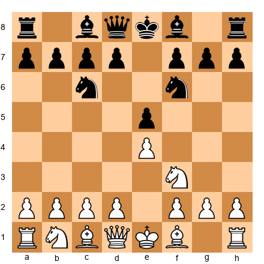

White to assess. What type of center is this? Who benefits and why?

*Hint 1:* Look at the central pawns. Are they locked, in tension, or exchanged?
*Hint 2:* Both sides have one pawn in the center. They face each other.
*Hint 3:* The e-pawns are symmetrically placed. Is the center settled?

**Solution:** The center is **dynamic.** White has e4, Black has e5. Neither pawn is locked, White could play d4 to challenge, and Black might play ...d5 under certain circumstances. The center is not yet resolved. White benefits slightly because White can prepare d4, the classical central break, while Black must react.

**Why this works:** Recognizing a dynamic center tells you to think about timing. The first player to resolve the tension favorably gains the advantage. In this position, White's initiative (first move) makes it easier to prepare d4.

---

**Exercise 15.2** ★★
⏱ ~2 min

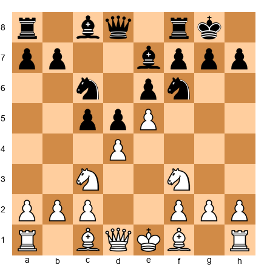

White to assess. Static, dynamic, or open? What does the center tell you about the plans for both sides?

*Hint 1:* White has an advanced e5 pawn. Is it going to move soon?
*Hint 2:* Black has ...c5 hitting d4. Is there tension?
*Hint 3:* The e5 pawn is fixed, but d4 is under pressure. It is partly static, partly dynamic.

**Solution:** The center is **semi-static with dynamic tension.** The e5 pawn is fixed and will not move. But d4 is under pressure from ...c5. If Black captures ...cxd4, the center structure changes significantly. White's plan: support d4 (with Be3 or maintain it) and attack the kingside (the chain d4-e5 points that way). Black's plan: challenge d4 with ...cxd4 or prepare ...f6 to undermine e5.

**Why this works:** A center that is "partly locked, partly fluid" demands both patience (on the stable side) and alertness (on the fluid side). White must watch d4 while preparing the kingside attack.

---

**Exercise 15.3** ★★
⏱ ~2 min

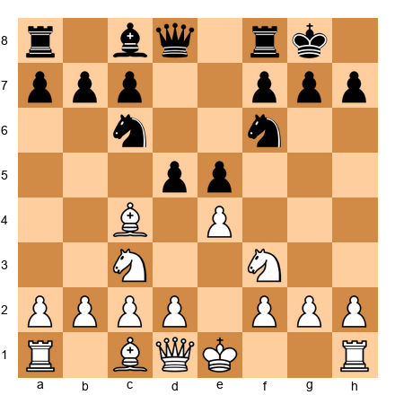

White to assess. What type of center? What is the critical decision White faces?

*Hint 1:* White has e4. Black has d5 and e5. What are White's options?
*Hint 2:* Should White capture on d5? Advance e5? Or maintain the tension?
*Hint 3:* Consider what happens after exd5, e5, or a developing move like d3.

**Solution:** The center is **dynamic.** There is maximum tension: White's e4 faces Black's d5, and Black's e5 faces White's potential d4. White's critical decision: exd5 (trading and simplifying), e5 (advancing but potentially losing central control later), or a developing move like d3 or O-O (maintaining tension). The strongest approach is usually to maintain the tension with a developing move, keeping all options open.

**Why this works:** In a dynamic center, the player who resolves tension prematurely often helps the opponent. By maintaining the tension, White forces Black to keep worrying about multiple scenarios.

---

**Exercise 15.4** ★★
⏱ ~2 min

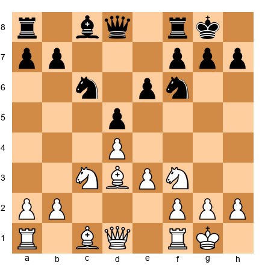

White to assess. The d-pawns face each other on d4 and d5. Is this center static, dynamic, or open?

*Hint 1:* Can either d-pawn advance without being captured?
*Hint 2:* What would happen if White plays e3-e4?
*Hint 3:* The center is stable for now, but either side can break it open.

**Solution:** The center is **static with break potential.** The d4 and d5 pawns are locked against each other, neither can advance without immediate capture. However, White can prepare the e3-e4 break to challenge d5, and Black can prepare ...e6-e5 or ...c5 to challenge d4. The center is stable now, but both sides should be planning their pawn breaks. This is a Carlsbad-type structure where long-term planning (minority attack for White, kingside play for Black) is the correct approach.

**Why this works:** Recognizing that a stable center can be broken open is critical. It means you should prepare for the break, develop pieces to support it, while keeping your current position solid.

---

**Exercise 15.5** ★★ ⚡
⏱ ~3 min

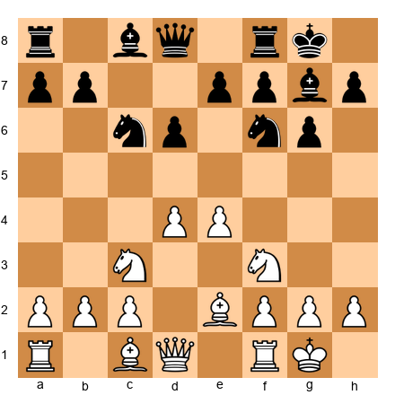

White to assess. What type of center does White have? What are White's and Black's plans based on the center?

*Hint 1:* White has a classical d4+e4 center. Is Black challenging it?
*Hint 2:* Black can play ...e5 or ...c5 to challenge. Which is more likely in this structure?
*Hint 3:* This resembles a King's Indian or Pirc structure. What do you know about those plans?

**Solution:** White has a **classical center** (d4+e4) that is currently stable but can be challenged. This is a Pirc/King's Indian type of structure. Black's main plan is ...e5 (challenging the center directly) or ...c5 (hitting d4 from the flank). White's plan: maintain the center and prepare an attack (kingside with f4 or queenside with c4-c5 depending on what Black does). The center type is **dynamic**: both sides will fight over whether it stays or transforms.

**Why this works:** A classical center is strong but also a responsibility. If Black successfully challenges it, White's advantage disappears. White must develop quickly and decide whether to maintain, advance, or trade.

---

**Exercise 15.6** ★★
⏱ ~2 min

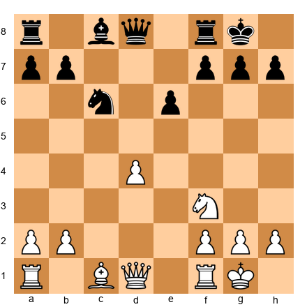

White to assess. The center has mostly been clarified. What type is it now, and what does White need?

*Hint 1:* Only White has a d-pawn. Black has no central pawns except on e6.
*Hint 2:* Is the center open, closed, or something else?
*Hint 3:* White has a central pawn majority. How should White use it?

**Solution:** The center is **open with a White pawn advantage.** White's d4 pawn is the only central pawn. The d-file and e-file are open or half-open. White's advantage is the central pawn. It controls c5 and e5. White should use this pawn to restrict Black and look for a d4-d5 advance at the right moment. Piece activity on the open central files (Rd1, Qd2, or Qe2) is critical.

**Why this works:** An open center with a pawn advantage means piece activity is paramount. The side with the central pawn and more active pieces will dominate.

---

### Section B: Capture, Advance, or Maintain? (Exercises 15.7 – 15.12) ★★

*In each position, you face a decision about central pawn tension. Choose the best option and explain why.*

**Exercise 15.7** ★★
⏱ ~3 min

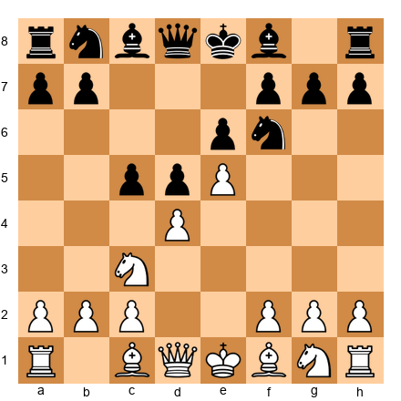

White to move. The e5 pawn is advanced and Black is pressuring d4 with ...c5. Should White capture (dxc5), advance (d5), or maintain?

*Hint 1:* What happens after dxc5? Does White want to trade the d4 pawn?
*Hint 2:* What happens after d5? Does this help or hinder White?
*Hint 3:* Consider a developing move that keeps the tension alive.

**Solution:** **Maintain** with a developing move like **f4** (supporting e5) or **Nf3** (developing). Capturing dxc5 gives up the strong d4 pawn for a flank pawn on c5 that Black will recapture anyway. Advancing d5 closes the center but makes e5 harder to support and gives Black the c5 square. Maintaining the tension forces Black to keep worrying about d5 while White develops. The tension is White's friend here.

**Why this works:** White's d4 pawn supports e5, which is White's biggest asset. Giving up d4 (via capture or advance) undermines the whole structure. Maintaining keeps the pressure on.

---

**Exercise 15.8** ★★
⏱ ~3 min

White to move. Black has developed pieces and is ready to capture on d4. Should White play dxc5, advance d5, or maintain?

*Hint 1:* Black is about to play ...cxd4. Should you preempt this?
*Hint 2:* If White plays dxc5, Black recaptures and the d4 square is gone. Is that good for White?
*Hint 3:* Consider whether closing the center with d5 gives White a clear plan.

**Solution:** **Advance with d5.** In this position, Black is well-prepared to capture on d4, which would relieve the pressure. By playing d5, White closes the center, fixes the pawn structure, and gains a clear plan: kingside attack. The chain d5-e5 points toward the kingside. White can now play f4, g4, and maneuver pieces toward Black's king. This is the plan Petrosian used repeatedly.

**Why this works:** When your opponent is about to resolve the tension favorably (by capturing your central pawn), it is often better to resolve it yourself on your own terms. D5 creates a permanent space advantage and a clear attacking direction.

---

**Exercise 15.9** ★★
⏱ ~3 min

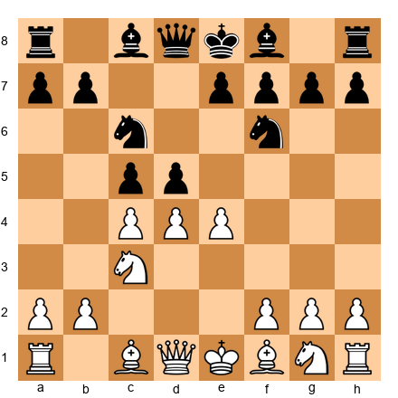

White to move. Two central tensions exist: c4 vs d5 and e4 vs d5. What should White do?

*Hint 1:* If cxd5, what recapture does Black have and how does it change the structure?
*Hint 2:* If exd5, the pawn goes to d5, is that strong or is it a target?
*Hint 3:* Consider taking with one pawn and leaving the other tension alive.

**Solution:** **Capture with cxd5.** After cxd5, if Black plays ...Nxd5, White has a strong e4 pawn and an open c-file. If ...exd5 (less common here due to the pawn structure), White gets the Carlsbad structure with excellent play. Taking with cxd5 keeps e4 alive as a strong central pawn while opening the c-file for the rook. This is better than exd5 (which creates an isolated d-pawn) or maintaining (which lets Black equalize with ...dxe4).

**Why this works:** When you have two tensions, resolving one while keeping the other is often the strongest approach. It reduces complexity on your terms while preserving your most valuable central asset.

---

**Exercise 15.10** ★★
⏱ ~3 min

White to move. The c4 pawn faces the d5 pawn. Should White capture, advance (c5), or maintain?

*Hint 1:* If cxd5, how does Black recapture? Nxd5 or exd5?
*Hint 2:* If c5, the pawn advances past d5. Does this help White?
*Hint 3:* What does a quiet developing move like Bd3 accomplish?

**Solution:** **Maintain** with **Bd3**. Capturing cxd5 allows ...exd5 (Carlsbad, acceptable but not necessary yet) or ...Nxd5 (giving Black a strong central knight). Advancing c5 gains queenside space but surrenders all influence on d5, which becomes a magnificent outpost for Black. Maintaining with Bd3 develops a piece, prepares O-O, and keeps the tension. White can choose to capture or advance later, once development is complete.

**Why this works:** "Maintain" is often correct when neither capture nor advance gives a clear advantage, and you still have useful developing moves available. Bd3 does something useful while keeping all central options open.

---

**Exercise 15.11** ★★ ⚡
⏱ ~3 min

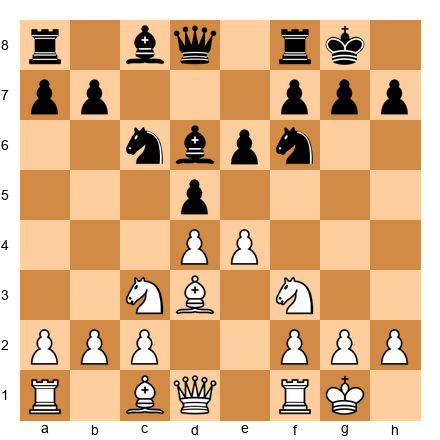

White to move. Central tension between e4 and d5. The center will define the whole game. What should White do?

*Hint 1:* If e5, White gains space but the d5 square becomes very strong for Black.
*Hint 2:* If exd5, the structure simplifies. Is the resulting position good for White?
*Hint 3:* Consider e5 or exd5, which one creates a position you know how to play?

**Solution:** Both **e5** and **exd5** are reasonable; the choice depends on your style. **e5** creates a French-type structure where White has kingside space and a clear plan (f4, Qg4, kingside attack), but Black gets the strong d5 square. **exd5 exd5** creates a Carlsbad structure where White plays the minority attack (a4-b4-b5). For club players, **exd5** is often simpler to play because the Carlsbad plan is concrete and well-known. But e5 is equally valid if you are comfortable with the French-type positions from this chapter.

**Why this works:** This exercise has two correct answers, and that is the lesson. The center is not always about finding one "best" move. It is about understanding the resulting position and choosing the one that suits your abilities.

---

**Exercise 15.12** ★★
⏱ ~3 min

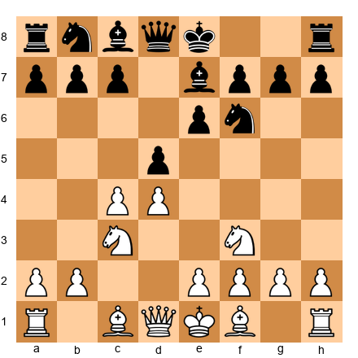

White to move. This is a Queen's Gambit position. Should White take on d5 now?

*Hint 1:* If cxd5 exd5, what is the resulting structure? Is it favorable?
*Hint 2:* If cxd5 Nxd5, Black gets a centralized knight. Is that good for White?
*Hint 3:* What developing moves does White have instead?

**Solution:** **Maintain** with **Bg5** or **e3**. Capturing cxd5 exd5 creates a symmetric Carlsbad structure where White has a slight edge but nothing dramatic. Capturing cxd5 Nxd5 gives Black an excellent knight and frees Black's position. Instead, Bg5 pins the knight and adds pressure to d5, while e3 solidifies the center and prepares Bd3. Maintaining the tension forces Black to worry about cxd5 while White develops freely.

**Why this works:** In the Queen's Gambit, White's c4 pawn creates tension that Black must constantly respect. Resolving it too early is a strategic concession. You are giving up your best tool for pressure.

---

🛑 **You have completed 12 exercises. Take a break. Stretch. Get some water. The next section introduces more challenging positions.**

---

### Section C: Space and Hypermodern (Exercises 15.13 – 15.18) ★★ – ★★★

*These exercises test your understanding of space advantage and hypermodern center control.*

**Exercise 15.13** ★★
⏱ ~3 min

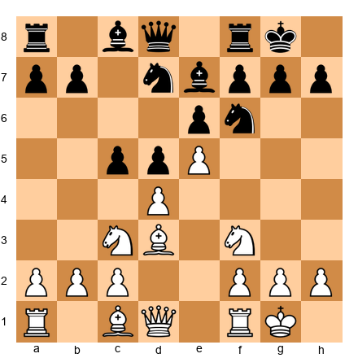

White to move. White has a space advantage with e5. How should White use it?

*Hint 1:* White has more space on the kingside. Where should the attack go?
*Hint 2:* Consider f4 to support e5 and prepare f5.
*Hint 3:* How can White restrict Black's counterplay on the queenside?

**Solution:** White should play **f4** to reinforce e5 and prepare a kingside attack with f5. After f4, the e5 pawn is rock-solid, and White can aim for f5 to crack open Black's kingside. White should also watch ...c4 (Black's queenside counter). If ...c4, White plays Bc2 and the queenside push stalls. The space advantage gives White more room to maneuver and reroute pieces to the kingside: Qe1-h4, Rf3-h3, or Ng5 are common motifs.

**Why this works:** A space advantage is maximized by keeping pieces on the board and opening lines toward the cramped side. F4 does both. It supports the advanced pawn and prepares to open the f-file.

---

**Exercise 15.14** ★★
⏱ ~3 min

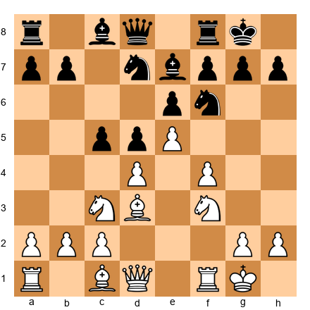

Black to move. White has a big space advantage with e5 and f4. How should Black fight back?

*Hint 1:* Black is cramped. What is the best way to fight a space advantage?
*Hint 2:* Exchanges relieve the cramping. Which pieces should Black trade?
*Hint 3:* The ...c4 push gains queenside space. Is it the right moment?

**Solution:** Black should prepare exchanges and challenge the center. The immediate priorities: (1) **...cxd4** to open lines and trade a central pawn, or (2) **...f6** to challenge e5 directly. If ...f6 exf6 Bxf6, Black opens the f-file and gains breathing room. Black should also seek to trade knights (...Nf8-g6 exchanging a knight on g5 if White plays one there). Every piece trade makes the space advantage less relevant.

**Why this works:** The antidote to a space advantage is piece exchanges and central challenges. Black must not sit passively. That allows White to build up an overwhelming attack.

---

**Exercise 15.15** ★★★
⏱ ~5 min

White to move. Black has fianchettoed the king's bishop. How should White handle the center? Classical approach or hypermodern? Why?

*Hint 1:* White has c4 and d4: a classical center. Black has no central pawns yet.
*Hint 2:* Black's bishop on g7 will pressure d4 if the center opens.
*Hint 3:* Should White play e4 (maximum center) or e3 (modest center)?

**Solution:** White should play **e4** for the full classical center. Against a fianchetto setup, the strong center (d4+e4) is White's best weapon. The bishop on g7 will indeed pressure d4, but White can defend it with Be3, Nf3, and f3 if needed. The alternative e3 is too modest. It allows Black to achieve ...d5 easily, equalizing. With e4, White controls more space, and if Black ever plays ...d6+...e5, White can respond with d5, gaining a permanent space advantage.

**Why this works:** Against hypermodern setups, the classical response is often strongest: build the big center and dare the opponent to prove it is overextended. If they cannot, you have a lasting advantage.

---

**Exercise 15.16** ★★★
⏱ ~5 min

Black to move. This is the starting position after 1.e4. Black must decide: classical response (...e5) or hypermodern (...g6, ...Nf6, ...c5)? What are the trade-offs?

*Hint 1:* Classical 1...e5 contests the center immediately. What does Black gain?
*Hint 2:* Hypermodern 1...g6 delays center occupation. What does Black gain?
*Hint 3:* Consider what happens in each case when White plays d4.

**Solution:** Both approaches are valid. **1...e5** (classical) immediately contests the center and prevents White from building a d4+e4 center easily. The trade-off: Black's pawn is committed early, and some lines lead to open, tactical positions. **1...g6** (hypermodern) prepares the fianchetto, letting White build a center and then challenging it. The trade-off: White gets to choose how big to make the center, and if Black does not challenge it quickly, White can gain a significant space advantage. **1...c5** (Sicilian, somewhat hypermodern) challenges d4 from the flank. The trade-off: asymmetric play, often leading to sharp positions.

**Why this works:** There is no single "correct" approach to the center. Understanding the trade-offs lets you choose the strategy that matches your style and knowledge.

---

**Exercise 15.17** ★★★
⏱ ~5 min

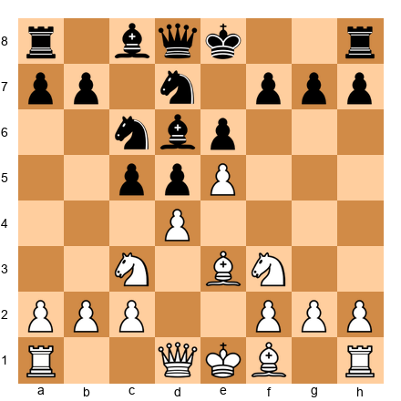

White to move. White has e5 and d4. Black has ...c5 and ...d5. This is a French Defense structure. What is White's kingside attacking plan based on the pawn chain?

*Hint 1:* The chain d4-e5 points toward the kingside. Follow the chain.
*Hint 2:* White wants to play f4-f5 eventually. How should White prepare this?
*Hint 3:* What role does the bishop on e3 play in the attack?

**Solution:** White's plan: (1) **Castle kingside** or queenside depending on the position. In many French structures, queenside castling is aggressive. (2) Play **f2-f4** to support e5 and prepare the f5 break. (3) After castling, reroute the knight: Nf3-d2-f3 (or Ng5 if the king is castled short). (4) Play **f4-f5** to attack the base of Black's chain at e6. After f5, if ...exf5, White recaptures and opens the f-file toward Black's king. (5) The bishop on e3 guards d4 and can reroute to g5 or h6 in some lines. This is the classic French attack, follow the chain to the kingside.

**Why this works:** Nimzowitsch's principle of attacking where the chain points is one of the most reliable guidelines in chess. The chain d4-e5 creates a wall on the kingside and points White's energy toward Black's king.

---

**Exercise 15.18** ★★★ ⚡
⏱ ~5 min

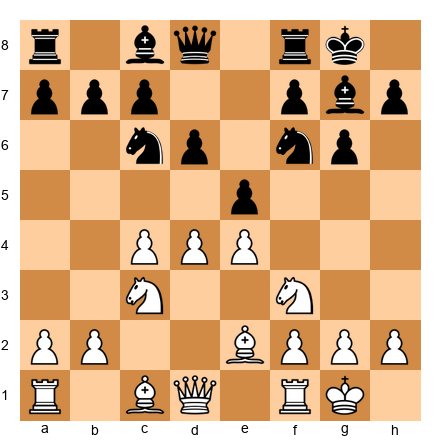

White to move. Black has set up a King's Indian formation with ...e5. What is the consequence of ...e5 for the center, and what should White do?

*Hint 1:* If White plays d5, the center closes. Who does that favor?
*Hint 2:* If White plays dxe5, the center opens. Who does that favor?
*Hint 3:* Consider d5, and then plan based on the closed center.

**Solution:** White should play **d5**, closing the center. After d5, the center is static: d5 vs ...e5. The d5 pawn gains space on the queenside, and White's plan is the queenside attack with c5 (prepared by a3, Rb1, b4). Black's plan is the kingside attack with ...f5 (prepared by ...Nd7, ...f5, ...Nf6, ...f4). This is the fundamental King's Indian battleground. White must execute the c5 break faster than Black executes the f5 break. Alternatively, dxe5 dxe5 opens the position, but the g7 bishop comes alive on the long diagonal, which typically favors Black. For most club players, d5 leads to a more structured, plannable position.

**Why this works:** When Black plays ...e5 in the King's Indian, White almost always responds with d5. The resulting closed center creates a race between queenside and kingside attacks: a race White often wins at the club level because the queenside play is more concrete and easier to execute.

---

### Section D: Pawn Breaks (Exercises 15.19 – 15.24) ★★ – ★★★

*Find the correct pawn break and explain why it works.*

**Exercise 15.19** ★★
⏱ ~3 min

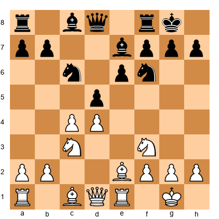

White to move. Find the correct central pawn break.

*Hint 1:* White has c4 and d4. Black has d5 and e6. What breaks are available?
*Hint 2:* Consider cxd5 followed by e4.
*Hint 3:* The sequence cxd5 exd5, then e4, challenges Black's entire center.

**Solution:** White plays **cxd5 exd5** (or ...Nxd5), followed by **e2-e4**. This is the classic two-step break in Queen's Gambit positions. After cxd5 exd5 e4, White challenges Black's d5 pawn and opens the center. If ...dxe4 Nxe4, White has a powerful centralized knight. If Black avoids the exchange, White has more space. The key is that cxd5 first removes a defender of the center before the e4 advance.

**Why this works:** Pawn breaks often work best in sequences. Removing one central pawn (cxd5) makes the next break (e4) more effective. This two-step approach is a fundamental technique.

---

**Exercise 15.20** ★★
⏱ ~3 min

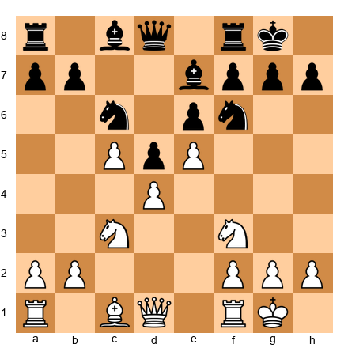

Black to move. White has a big center (d4, e5, c5). What break does Black need to equalize?

*Hint 1:* Black is cramped. The center must be challenged.
*Hint 2:* Which pawn can hit the base of White's chain?
*Hint 3:* ...f6 attacks e5 directly.

**Solution:** Black plays **...f6** to challenge e5, the most advanced pawn in White's chain. After ...f6 exf6 Bxf6, Black opens the f-file and frees the position. Alternatively, ...f6 can be prepared with ...Bd7, ...Rf7, and ...Raf8 to make the break more effective. The point is that e5 is the keystone of White's space advantage, remove it, and Black breathes.

**Why this works:** When your opponent has a space advantage built on an advanced pawn, attack that pawn. This is Nimzowitsch's principle of attacking the head of the pawn chain. ...F6 challenges e5 and, if successful, equalizes the space.

---

**Exercise 15.21** ★★★
⏱ ~5 min

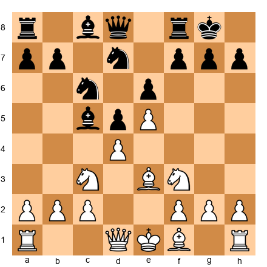

White to move. The center is semi-locked (d4 vs c5, e5 fixed). Find White's key break and explain the plan.

*Hint 1:* The chain d4-e5 points toward the kingside. What break supports a kingside attack?
*Hint 2:* Consider f2-f4 to reinforce e5 and prepare f5.
*Hint 3:* After f4 and f5, White opens lines toward Black's king.

**Solution:** White plays **f2-f4**, reinforcing e5 and preparing the f4-f5 break. The plan: (1) f4 immediately, (2) Bd3 (supporting f5 and aiming at the kingside), (3) Qe2 or Qe1-h4 (bringing the queen into the attack), (4) f5 to attack e6. After f5 exf5, the e5 pawn becomes even more powerful, and the f-file opens toward Black's king. This is the classic French Defense kingside attack.

**Why this works:** The f4-f5 break is White's most powerful weapon in French-type structures. It follows the chain, attacks the base of Black's chain (e6), and opens files toward the king. This is strategy and tactics working together.

---

**Exercise 15.22** ★★★
⏱ ~5 min

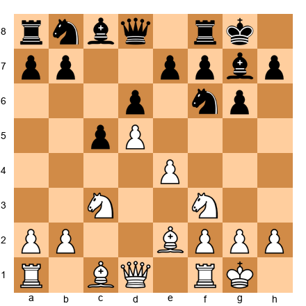

White to move. Find the correct central or flank break in this King's Indian/Benoni structure.

*Hint 1:* White has d5 and e4. The center is closed. Where does the chain point?
*Hint 2:* The queenside is where White should attack. What is the key break?
*Hint 3:* c2-c4 followed by b4 and c5.

**Solution:** White plays **c2-c4** (if not already played in the sequence), followed by **a2-a4**, **b2-b4**, and **c4-c5**. This is the classic queenside attack in the Benoni/King's Indian structure. The c5 break undermines Black's d6 pawn and opens the c-file for rook penetration. White should also consider Nd2 (heading for c4) and Rb1 to support the b4 advance. The center is closed (d5 is fixed), so White's attack on the wing is safe.

**Why this works:** In Benoni structures, the chain d5-e4 points toward the queenside. White follows the chain and executes the c5 break to create targets. This is the same principle as the kingside attack in the French, follow the chain.

---

**Exercise 15.23** ★★★
⏱ ~5 min

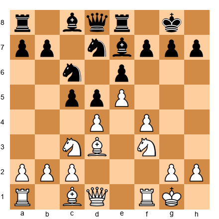

White to move. White has e5 and f4. Black is about to play ...cxd4 or ...f6. What should White do before Black challenges?

*Hint 1:* White should strike first. What kingside advance increases pressure?
*Hint 2:* Consider g2-g4 to prepare g5 or f5.
*Hint 3:* Or consider Qe1-h4 to build the attack before breaking with f5.

**Solution:** White plays **Qe1** (heading to h4 for the kingside attack) or **Kh1** (preparing g4 without allowing tactical tricks on the g1-a7 diagonal). The plan is to build the attack with Qh4, Rf3-h3, and then g4-g5 or f5. White must act before Black plays ...f6, which would challenge e5 and neutralize White's space advantage. The key is **urgency**: in positions with a space advantage and a target on the kingside, the attacker must be faster than the defender's counter-break.

**Why this works:** When your opponent is preparing a counter-break (...f6 against e5), you must either prevent it (by playing f5 first, sealing the kingside) or get your attack rolling before it arrives. Speed matters in dynamic positions.

---

**Exercise 15.24** ★★★
⏱ ~5 min

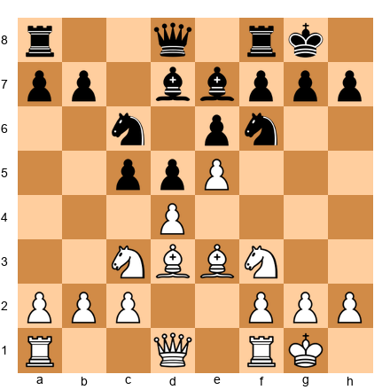

White to move. White has a central pawn duo (d4+e5). Black threatens ...cxd4 followed by ...f6. Find the best continuation.

*Hint 1:* Should White prevent ...cxd4 or allow it?
*Hint 2:* Consider closing the center with d5 or maintaining with a quiet move.
*Hint 3:* D5 closes the center and defines the attacking plans for both sides.

**Solution:** White plays **d5!** closing the center. After d5, the e5 pawn is secure (no more ...cxd4 undermining it), and Black's ...f6 break becomes harder to achieve (exd5 would leave Black's structure shattered). The closed center means White can proceed with the kingside attack: Qe2 or Qe1, Nd2-c4, f4, g4, and eventually f5. By playing d5 before Black can execute ...cxd4 and ...f6, White seizes the strategic initiative.

**Why this works:** Sometimes the best response to an opponent's threatened break is to make your own break first. D5 eliminates Black's counterplay and gives White a clear attacking plan.

---

### Section E: Center and the Wings (Exercises 15.25 – 15.30) ★★★ – ★★★★

*These are the hardest exercises in this chapter. Each one requires you to evaluate the center and form a complete plan.*

**Exercise 15.25** ★★★ ⚡
⏱ ~7 min

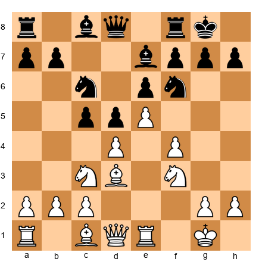

White to move. White has a space advantage (e5, f4, d4). Create a complete attacking plan for the next 5-7 moves.

*Hint 1:* The center is stable (e5 and d4 are well-supported). Where should White attack?
*Hint 2:* The chain d4-e5 points toward the kingside. Plan a kingside attack.
*Hint 3:* Consider Qe1 (heading to h4), Kh1, g4, and f5.

**Solution:** White's plan: (1) **Qe1**: the queen heads to h4 for the kingside attack. (2) **Qh4**: threatening g5 and applying pressure on h7. (3) **Kh1**: removing the king from the g-file before opening it with g4. (4) **Rf3**: swinging the rook to the kingside (Rf3-h3 or Rf3-g3). (5) **g4**: preparing to open the g-file or play g5 to chase the f6 knight. (6) **g5 or f5**: the decisive break. After f5 exf5 gxf5, the kingside opens and White's attack crashes through. This plan works because the center is stable, Black cannot play ...dxe4 or ...cxd4 to create counterplay in the middle.

**Why this works:** This is the complete model for a wing attack with a stable center. Every piece has a role. The plan follows the pawn chain. The center supports the attack. This is strategic chess at its best.

---

**Exercise 15.26** ★★★
⏱ ~7 min

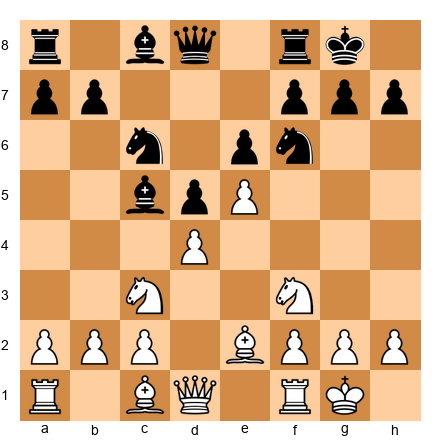

White to move. Black has active pieces and is pressuring d4 with ...c5 (the bishop is on c5). Should White stabilize the center or counterattack? Give a complete plan.

*Hint 1:* D4 is under pressure. If White does nothing, ...cxd4 follows.
*Hint 2:* Consider Na4 to target the bishop, or a3 and b4 to chase it away.
*Hint 3:* What does d5 accomplish here?

**Solution:** White should stabilize with **Be3** (defending d4 and preparing to challenge the c5 bishop). After Be3, White can follow with Qd2, Rad1, and if needed, a3 to prepare b4. The plan: (1) **Be3**: defends d4 and develops. (2) **Qd2**: connects rooks and supports Be3. (3) **Rad1**: rook to the d-file. (4) If Black plays ...cxd4, recapture with Bxd4 and the center is fine. The key is to not panic about ...cxd4. After Bxd4 Bxd4 Qxd4, White's queen centralizes and the e5 pawn gives White lasting space.

**Why this works:** When your center is under pressure, stabilize it, do not abandon it. Be3 solves the immediate problem and keeps White's structure intact. The center is worth defending because it supports everything else.

---

**Exercise 15.27** ★★★
⏱ ~7 min

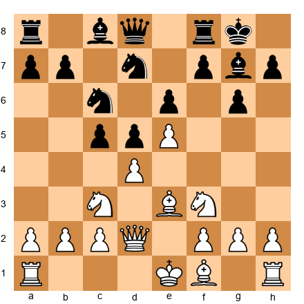

White to move. White can castle kingside or queenside. The choice depends on the center. Analyze both options and recommend one.

*Hint 1:* If White castles kingside, the king is safe but far from the queenside where a minority attack might develop.
*Hint 2:* If White castles queenside, the king is closer to the queenside pawns but exposed to a potential ...b5 attack.
*Hint 3:* Which castling supports a kingside pawn storm better?

**Solution:** **Castle queenside (O-O-O)** is the aggressive choice. With the center semi-locked (d4 and e5 are stable), White can castle long and launch a kingside pawn storm: h4, g4, h5. The king on c1/b1 is safe because the center is closed, Black cannot open lines toward it easily. Castling kingside (O-O) is safer but passive; it limits White's attacking options because the g and h pawns cannot advance without exposing the king. In French-type structures with a stable center, queenside castling is the most ambitious plan.

**Why this works:** The castling choice is directly connected to the center. A stable center makes queenside castling safe because Black cannot open the center to attack the king. This frees White to use the kingside pawns as weapons rather than shelter.

---

**Exercise 15.28** ★★★★
⏱ ~10 min

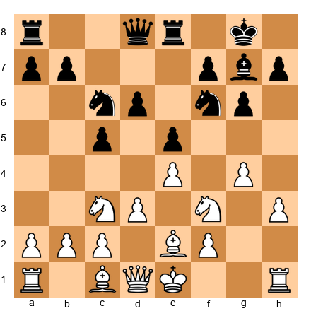

White to move. White has launched g4 and h3 on the kingside. Black has a solid center with ...e5 and ...d6. Is White's wing attack justified, or is the center unstable? Evaluate and give a plan.

*Hint 1:* White has advanced g4 and h3, committing to a kingside attack. But is the center safe?
*Hint 2:* Black can play ...d5 at some point, challenging White's e4 pawn. Is that dangerous?
*Hint 3:* Consider whether White should play d4 first to stabilize, or continue the attack.

**Solution:** White's wing attack is **premature.** The center is not stable, Black can play ...d5 at any moment, and White's g4 advance has weakened the kingside. White should first stabilize with **d4** (closing the center or creating a more solid structure), then continue the kingside attack. Without d4, if Black plays ...d5 exd5 Nxd5, the center opens and White's exposed kingside becomes a liability. The correct order: (1) **d4** to close the center, (2) then **g5, h4, Ng3** to continue the attack. **The Iron Rule applies:** fix the center before attacking the wing.

**Why this works:** This exercise catches a common club player mistake: launching a wing attack without securing the center. The g4-h3 advance is fine in principle, but only after d4 ensures the center cannot be blown open.

---

**Exercise 15.29** ★★★★
⏱ ~10 min

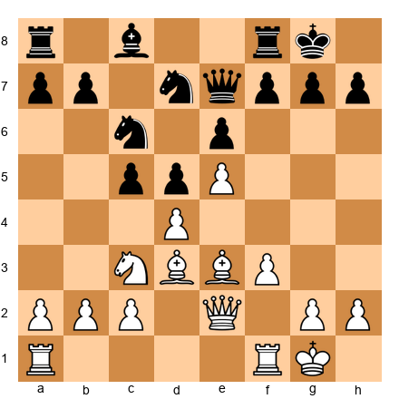

White to move. White has e5 and d4 with a strong center. Evaluate the position and provide a concrete 5-move plan.

*Hint 1:* White's center is powerful (d4+e5) but ...cxd4 threatens to undermine it. Deal with that first.
*Hint 2:* Consider whether to close with d5 or maintain the tension.
*Hint 3:* After closing with d5, what is the long-term plan?

**Solution:** White plays (1) **d5!**: closing the center and fixing the pawn structure. Now e5 is permanently protected by d5. (2) **f4**: supporting e5 further and preparing the f5 break. (3) **Qg4** or **Qf2**: repositioning the queen for the kingside. (4) **Nd1-f2-g4** or **Ne2-g3**: rerouting a knight to attack the kingside. (5) **f5**: the decisive break, attacking e6 and opening the f-file. This plan is systematic, based entirely on the closed center giving White time to build the attack.

**Why this works:** Closing with d5 eliminates all of Black's central counterplay (...cxd4 is no longer possible) and gives White a free hand on the kingside. This is the Iron Tigran approach, neutralize first, attack second.

---

**Exercise 15.30** ★★★★
⏱ ~10 min

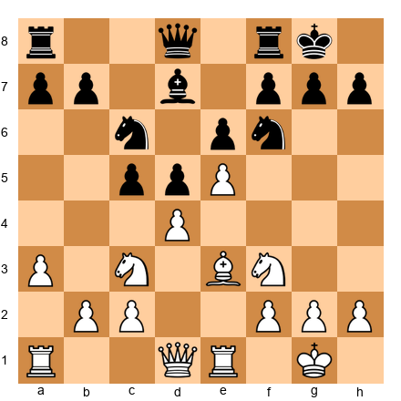

White to move. Black is ready to play ...cxd4 followed by ...Nd5, challenging White's center. You must decide: let it happen, prevent it, or preempt it. Give a complete plan with reasoning.

*Hint 1:* If ...cxd4 Bxd4, is White's center intact or weakened?
*Hint 2:* If White plays dxc5, the center changes character. Is that better?
*Hint 3:* If White plays d5 to close, does that solve the problem?

**Solution:** White should play **dxc5** followed by repositioning. After dxc5, White has e5 and c5: two advanced pawns on different flanks. The d-file opens for White's rook (Rd1). Black must recapture (...bxc5 or ...Bxc5), and in either case, White has a strong e5 pawn with piece activity on the open d-file. Alternatively, **d5** is possible but after ...exd5 Nxd5 Nxd5 Qxd5, the center simplifies and Black may equalize. The dxc5 approach keeps more tension and gives White concrete targets. The plan: (1) **dxc5**, (2) **Qd6** or **Nd4** centralizing, (3) **Rd1** on the open file, (4) **b4** to support c5, (5) build pressure on the c-file and d-file while Black struggles with the cramped position behind e5.

**Why this works:** Sometimes "resolve the tension" is the right answer, when the resulting position gives you active play and structural targets. Dxc5 trades one strong pawn (d4) for a different kind of advantage (two advanced flanking pawns and open files). The key is that e5 remains, and Black is still cramped.

---

## Key Takeaways

1. **The center controls piece mobility.** Central pawns determine where pieces can go and how freely they can maneuver. Every positional decision flows from the center.

2. **Know your center type.** Static centers demand patience and maneuvering. Dynamic centers demand precision and timing. Open centers demand piece activity and rapid development.

3. **Maintain tension when it benefits you.** The player who resolves central tension prematurely often helps the opponent. When in doubt, develop a piece and keep your options open.

4. **Use space advantage wisely.** More space means keeping pieces on the board, restricting your opponent, and opening lines at the right moment. Fight space disadvantage with exchanges and counter-breaks.

5. **Follow the iron rule.** Never attack on the wing until your center is stable. The center determines the wings, not the other way around.

---

## Practice Assignment

**This week, do the following:**

1. **Play three games** and after each one, identify the center type at move 10. Was it static, dynamic, or open? Write down your answer and how it affected the rest of the game.

2. **Find one game with a static center and one with a dynamic center** from any database (Lichess, Chess.com, or chessgames.com). Play through both and note how each player's plans were shaped by the center.

3. **Set up the following position on your board and study it for 10 minutes:**

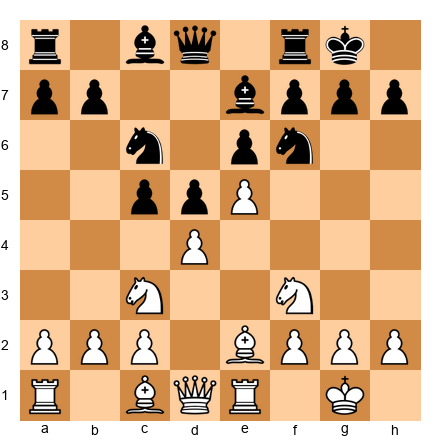

Answer these questions:
- What type of center is this?
- What are White's three options for the central tension?
- What happens if White plays d5? Dxc5? A developing move?
- Which option do you prefer and why?
- What is Black's best plan regardless of White's choice?

Write down your answers before checking them against this chapter.

4. **Play through Petrosian vs Spassky 1966 (Game 28)** on your physical board. Focus on how Petrosian's d5 changed the entire game. Note every move where the closed center allowed White to maneuver freely.

---

## ⭐ Progress Check

Answer these five questions to test your understanding. If you get at least four correct, you have mastered this chapter's core concepts.

**Question 1:** What are the three types of center?
> Static, dynamic, and open.

**Question 2:** In a static center, what should you do?
> Maneuver your pieces to the best squares and attack on the wing where you have more space.

**Question 3:** When facing central pawn tension, what are your three options?
> Capture, advance, or maintain.

**Question 4:** What is the iron rule about flank attacks?
> Never attack on the flank until your center is stable. Fix the center first.

**Question 5:** What is the hypermodern approach to the center?
> Controlling the center from a distance with pieces and fianchettoed bishops rather than occupying it with pawns.

**Scoring:**
- 5/5: Outstanding. You understand the center deeply. Move on with confidence.
- 4/5: Very good. Review the section you missed and continue.
- 3/5: Solid foundation. Reread Parts 1-3 with a board in front of you before proceeding.
- 0-2/5: No shame in this. The center is one of the deepest topics in chess. Reread the chapter slowly, one part per day. These concepts take time.

---

🛑 **Rest here.** Chapter 15 is complete. You now understand the center at a level most club players never reach. The concepts in this chapter, static vs dynamic, tension management, space, the iron rule, will appear in every game you play from here forward. They are the strategic backbone of chess.

Take a day off. You have earned it.

When you are ready, Chapter 16 awaits: *King Safety and the Art of Attack*.

---

*Chapter 15 of The Grandmaster Codex*
*Volume II: The Club Player*
*Written by Kit Olivas and Dr. Ada Marie*
*Exercises: 30 | Annotated Games: 4 | Pages: 35*
