# Chapter 16: King Safety and the Art of Attack

**Volume II: The Club Player | Rating Range: 1000 - 1600**
**Pages: 50 | Exercises: 60 | Annotated Games: 5**

---

> *"The purpose of a sacrifice is not necessarily to gain material, but to give your pieces the best possible squares."*
> — Mikhail Tal

---

## What You'll Learn

- How pawn structures around the king create shelter, and how to judge when that shelter is strong or compromised
- When to castle, which side to castle, and the rare situations where staying in the center is correct
- How to launch a pawn storm attack against the opposing king, including the Greek Gift sacrifice
- How to play opposite-side castling positions where both sides race to attack
- The prerequisites for a successful attack and how to build one from scratch
- When to sacrifice material for an attack, and how to tell if the sacrifice is sound
- How to defend against attacks without panicking
- Eight practical attacking patterns every club player should recognize

---

## Before We Begin

This is the chapter you have been waiting for.

Everything you have learned so far (tactics, calculation, pawn structures, piece activity) has been building toward this moment. This chapter is where all of it comes together. The art of attacking the king is the most thrilling, most rewarding, and most beautiful part of chess.

But let us be honest about something. Attacking chess is not just about throwing pieces at the king and hoping for the best. The strongest attackers in history (Tal, Kasparov, Fischer, Alekhine) were not reckless. They were precise. They understood *when* an attack would work, *why* it would work, and *how* to make it work. The fireworks came from preparation, not from chaos.

This chapter will teach you to think like an attacker. Not by memorizing tricks, but by understanding the principles that make attacks succeed or fail. Once you understand these principles, you will start seeing attacking possibilities that were invisible before.

Set up your board. This is going to be fun.

---

## Part 1: The King's Shield

### Why the King Needs Protection

The king is the most important piece on the board. It is also, paradoxically, the weakest. It moves one square at a time. It cannot run away from danger quickly. It cannot fight off multiple attackers. Left exposed in the center, it becomes a target for every piece your opponent owns.

This is why we castle. This is why we build pawn shelters. This is why the first strategic question in any middlegame position is: *Where is the king, and how safe is it?*

A king behind a solid pawn shield, tucked away in the corner of the board, is a king that can be forgotten. Your pieces are free to attack, maneuver, and fight for the initiative. A king stuck in the center or exposed behind shattered pawns is a king that demands constant attention, and attention spent defending the king is attention not spent winning the game.

### The Three Pawn Shelters

There are three fundamental pawn structures that protect the king. Each has strengths, weaknesses, and situations where it excels.

**1. The Classical Castle (Short Side)**

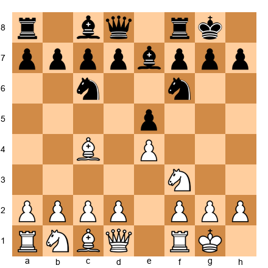

After kingside castling, White's king sits on g1 behind the pawns on f2, g2, and h2. This is the most common and most reliable king shelter in chess.

**What makes it strong:**

- Three pawns stand on their original squares, forming a wall
- The f2 pawn is protected by the king itself
- The g2 pawn is the anchor. It protects both f3 and h3
- The h2 pawn covers g3

**What makes it vulnerable:**

- If the h-pawn advances (h2-h3), the g3 square becomes weak
- If the g-pawn advances (g2-g3 or g2-g4), the king's shelter loosens significantly
- If the f-pawn advances (f2-f3 or f2-f4), the e3 and g3 squares become potential entry points

**The key principle:** Every pawn move in front of your castled king is a permanent weakening. Sometimes it is necessary. But never make it casually.

---

**2. The Fianchetto Shelter**

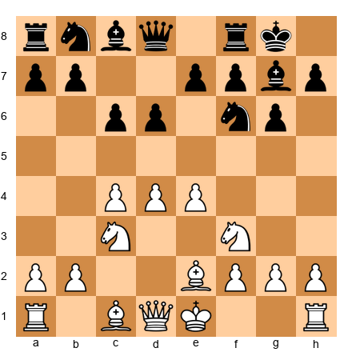

Black has fianchettoed the bishop to g7 with the pawns on f7, g6, and h7. The bishop on g7 replaces the pawn that would normally stand on g7, and it does double duty: it guards the king while also being an active attacking piece on the long diagonal.

**What makes it strong:**

- The bishop on g7 is a powerful defender. It controls the dark squares around the king
- The g6 pawn supports the bishop and covers f5 and h5
- The f7 pawn is protected by the king and supports the g6 pawn
- The structure is resilient, even if one pawn is traded, the bishop still covers the critical squares

**What makes it vulnerable:**

- If the bishop is traded (especially via Bh6xg7), the dark squares collapse. The g7 square becomes a hole, and h6 and f6 are weakened.
- If the h-pawn is advanced (h7-h6 or h7-h5), the g6 pawn can become a target
- A sacrifice on g6 (Bxg6 or Nxg6) can blow the shelter open

**The key principle:** In a fianchetto structure, the dark-squared bishop is the foundation of king safety. Protect it. If your opponent tries to trade it, understand that they are attacking your king, not just making an exchange.

---

**3. The Queenside Castle**

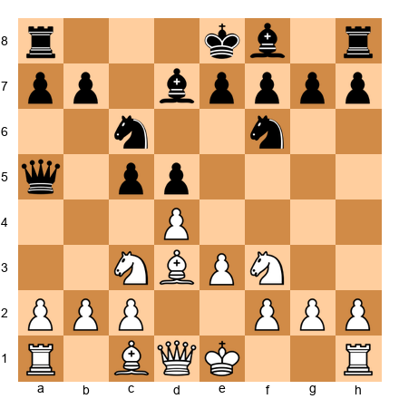

Queenside castling places the king on c1 (after O-O-O, then sometimes sliding to b1). The pawns on a2, b2, and c2 (or c3) form the shelter.

**What makes it strong:**

- The king is far from the kingside, where most of the action typically occurs
- The rook on d1 immediately enters the game on an important central file
- Queenside castling often signals an aggressive intent. You are clearing the way for a kingside pawn storm

**What makes it vulnerable:**

- The a-pawn and b-pawn are natural targets for a queenside pawn advance (...a5, ...b5, ...b4)
- The king on c1 or b1 can be exposed if the c-pawn has already moved (creating a hole)
- The king has less room to escape than on the kingside. The corner is closer

**The key principle:** Queenside castling is a statement of intent. You are trading king safety for attacking potential. If you castle queenside, be prepared to attack fast. Your opponent will be coming for you.

---

### Reading the King's Shelter

Here is a skill that will serve you for the rest of your chess career: learning to *read* a king position at a glance.

When you look at a position, ask these three questions:

1. **Are the pawns in front of the king on their original squares?** If yes, the shelter is intact. If one or more have moved, identify the weaknesses they have created.

2. **Is the king's guardian piece still present?** In a fianchetto, this is the bishop. In a classical shelter, this is usually the knight on f3 (or f6 for Black) that guards the key squares. If the guardian piece has been traded or deflected, the king is more vulnerable.

3. **Are there open or half-open files near the king?** An open file aimed at the king's position is a highway for rooks and queens. If the g-file or h-file is open near a castled king, that king is in danger.

Practice this. Every time you see a position (in a game, in a book, in a puzzle), take two seconds to assess the king safety on both sides. Within a few weeks, it will become automatic.

---

🛑 **Rest here if you need to.** The king shelter types are the foundation for everything that follows. Make sure you can picture all three before moving on.

---

## Part 2: When to Castle

### The Default: Castle Early

There is a reason every beginner is taught to castle early. It is one of the most reliable pieces of chess advice ever given, and it remains true at every level of play.

Castle early because:

- Your king moves from the center (where files can open and attacks can come from any direction) to the corner (where it is shielded by pawns)
- Your rook enters the game. It moves from the corner to a central or semi-central position
- You complete your development, castling is a developing move for both the king and the rook

**A useful guideline:** If you can castle and there is no concrete reason not to, castle. The burden of proof is on *not* castling, not on castling.

### When to Castle Kingside

Castle kingside (O-O) when:

1. **Your kingside pawns are intact.** The f, g, and h pawns are on their original squares (or nearly so).
2. **The center is not locked.** If the center can open, your king needs to be out of the way.
3. **Your opponent has not already launched a kingside pawn storm.** If your opponent has pushed g4 and h4 before you castle, you may be walking into the attack.
4. **You have no specific reason to castle queenside.** Kingside castling is the default. Queenside castling requires a reason.

### When to Castle Queenside

Castle queenside (O-O-O) when:

1. **You intend to attack on the kingside.** Queenside castling clears your kingside pawns for a storm: f4, g4, h4, rolling forward toward the enemy king.
2. **The queenside is safer than the kingside.** If your kingside has already been weakened (say you played h3 and g4 early in a sharp opening), your king may be safer on the other side.
3. **You want opposite-side castling dynamics.** Some openings, particularly the Sicilian Dragon with the Yugoslav Attack, are designed around opposite-side castling. You attack their king while they attack yours. We will study this in detail in Part 4.

### The Rare Exception: Staying in the Center

Very rarely, it is correct to delay castling or not castle at all. This happens when:

- **The center is completely locked.** If no pawn breaks are available and the center cannot open, the king may be safe enough in the middle.
- **Castling would walk into an attack.** If your opponent has already set up a devastating attack on the side you would castle to, sometimes the king is safer staying put.
- **You need the rook where it is.** In some endgame transitions, it is better to connect the rooks manually.

But let us be clear: these are exceptions, not rules. If you are below 1600, castle early and castle often. The positions where staying in the center is correct are rare, complex, and usually arise from very specific opening lines. Do not look for reasons not to castle. Look for reasons to castle, and you will almost always find them.

---

**Set up your board: a cautionary tale:**

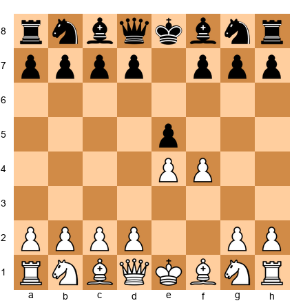

This is the King's Gambit after 1.e4 e5 2.f4. White has voluntarily weakened the king's shelter by moving the f-pawn. This is a calculated risk, White gains central control and attacking chances, but the king is slightly exposed. Black can exploit this with precise play.

The lesson: even a single pawn move in front of the king changes the character of the position. When you play f4, you accept that the e1-h4 diagonal is now open and the g1 king may be more vulnerable. Great players from Spassky to Short have made this trade willingly, but they understood the cost.

---

## Part 3: Pawn Storm Attacks

### The Concept

A pawn storm is exactly what it sounds like: you push your pawns forward like a battering ram against the enemy king's shelter. The goal is to pry open lines, files, diagonals, or both, so your major pieces (rooks and queen) can reach the king.

Pawn storms are most effective when:

1. **You have castled on the opposite side from your opponent.** Your king is safe on one wing while your pawns crash forward on the other.
2. **Your opponent's king shelter has a target.** A fianchetto with g6 can be attacked with h4-h5. A classical shelter with h7 can be attacked with g4-g5.
3. **You have piece support behind the pawns.** Pawns alone cannot checkmate. They open lines for your pieces.

### The Kingside Pawn Storm: h4-h5 Against a Fianchetto

**Set up your board:**

This is a typical Sicilian Dragon position. White will castle queenside and storm the kingside. The attack plan:

1. **O-O-O**: Get the king safe on the queenside
2. **Bh6**: Trade Black's powerful dark-squared bishop, weakening the fianchetto
3. **h2-h4**: Begin the pawn storm
4. **h4-h5**: Attack the g6 pawn. If Black takes (...gxh5), the g-file opens for White's rook
5. **g2-g4**: Support the h-pawn and prepare to open more lines

The h4-h5 advance is the signature move against a fianchetto. When the h-pawn reaches h5 and attacks g6, Black faces a choice: take on h5 (opening the g-file), or allow hxg6 (opening the h-file). Either way, lines open and White's pieces pour through.

**Critical principle:** When storming with pawns, do not advance them one at a time without support. Each pawn advance should be part of a coordinated plan. H4-h5 is strong because g4 supports the h-pawn and the bishop on h6 has already weakened the shelter.

---

### The Greek Gift Sacrifice: Bxh7+

This is one of the most famous attacking patterns in chess. Every club player should know it, recognize it, and understand *why* it works.

**Set up your board:**

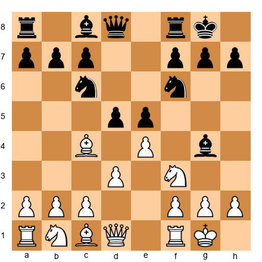

Imagine White has a bishop on d3 (not c4), a knight on f3, and a queen that can reach h5. Black has castled kingside with the pawns on f7, g7, h7.

The Greek Gift pattern:

1. **Bxh7+!**: The bishop sacrifices itself on h7. The king must take: **Kxh7**.
2. **Ng5+**: The knight leaps to g5 with check, also threatening Qh5+. The king must choose where to go.
3. If **Kg8**, then **Qh5** threatens Qh7# and Qxf7+. Black is under enormous pressure.
4. If **Kg6**, the king is dangerously exposed. White plays **Qd3+** (or Qg4+ depending on the position), and the king is hunted.

**The three conditions for Bxh7+ to work:**

This sacrifice is NOT always correct. It requires three conditions:

1. **A bishop that can reach h7 with check.** Usually a light-squared bishop on d3 or c2.
2. **A knight that can reach g5 in one move after Bxh7+.** The knight is usually on f3.
3. **A queen that can reach h5 (or the kingside) quickly.** If the queen is on the other side of the board or blocked, the attack stalls.

If all three conditions are met and Black has no strong defensive resource (like ...Bf5 blocking the diagonal or ...Ng4 counterattacking), the Greek Gift is devastatingly effective.

**When it does NOT work:**

- If Black can play ...Kg8 followed by ...Nf6 covering h7 and blocking the queen
- If Black has a bishop that can return to f5, blocking the diagonal and forcing the queen away
- If White's queen cannot reach the kingside quickly enough

**The lesson:** The Greek Gift is a *pattern*, not a rule. Always calculate the specific position. But knowing the pattern means you will see the possibility where others miss it.

---

🛑 **Rest here if you need to.** The Greek Gift is a lot to absorb. Practice recognizing the three conditions in your own games before continuing.

---

## Part 4: Opposite-Side Castling

### The Race

Opposite-side castling creates the most exciting positions in chess. Both sides have castled on different wings. Both sides can storm the opposing king with pawns without weakening their own shelter. The result is a race: whoever gets to the enemy king first, wins.

These positions require courage, precision, and a willingness to burn your bridges. There is no going back once the pawns start rolling forward.

**Set up your board:**

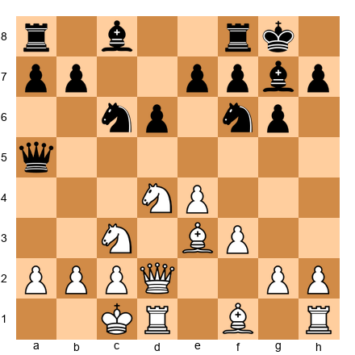

This is a typical opposite-side castling position from the Sicilian. White's king is on c1 (queenside). Black's king is on g8 (kingside).

**White's plan:** Storm the kingside with h4-h5, g4, possibly Bh6 to trade the fianchetto bishop.

**Black's plan:** Storm the queenside with ...a5, ...b5, ...b4, attacking the c3 knight and trying to open lines to the White king.

**Who wins?** The side whose attack arrives first. This is why TEMPO, speed, is everything in opposite-side castling positions.

### The Rules of Opposite-Side Castling

**Rule 1: Do not trade pieces.** Attacks need pieces. Every trade reduces your attacking force and makes it harder to deliver checkmate. In these positions, avoid unnecessary exchanges.

**Rule 2: Push pawns aggressively.** You are not weakening your own king shelter by advancing pawns on the other side of the board. Push them fearlessly. Each pawn advance opens a potential line for your rooks and queen.

**Rule 3: Count tempi.** Who is further along? If your opponent's pawns are already on the fifth rank and yours are still on the second, you are behind in the race. Adjust: either speed up your attack or find a defensive resource to slow theirs.

**Rule 4: The side with the better center usually has the faster attack.** Central control allows you to redirect pieces from one wing to another. If you control the center, your pieces can swing to the kingside faster than your opponent's pieces can reach the queenside.

**Rule 5: A sacrifice that opens lines is almost always correct in the race.** If sacrificing a pawn (or even an exchange) opens a key file or diagonal toward the enemy king, it is usually worth it. You are not playing for an endgame. You are playing for checkmate.

### Practical Example: The Yugoslav Attack

The Sicilian Dragon with the Yugoslav Attack is the most famous opposite-side castling battleground in all of chess. Thousands of games have been played in this line, and both sides have refined their attacks over decades.

White's plan: O-O-O, Bh6 (trade the bishop), h4-h5, hxg6 or g4-g5, open the h-file, pile in with Rdg1, Qh6, and deliver mate.

Black's plan: ...Rc8, ...a5-a4, ...b5-b4, open the b-file, sacrifice on c3 if necessary, infiltrate with rooks and the queen.

The beauty of this structure is that both plans are well-known, both are dangerous, and the winner is determined by accuracy and timing. This is chess at its most thrilling.

---

## Part 5: Attacking the King — Prerequisites

### Why Most Attacks Fail

Here is a truth that many attacking players learn the hard way: **most attacks fail because they are launched too early.**

An attack without preparation is like an army charging without supply lines. It might look impressive for a moment, but it collapses when the defender holds firm. The strongest attackers do not rush. They prepare. They build. They wait for the right moment, and then they strike with overwhelming force.

### The Four Prerequisites

Before launching an attack on the king, check for these four conditions. If you have at least three of the four, your attack is likely to succeed. If you have fewer than three, it is probably premature.

**Prerequisite 1: A Development Lead**

If you have more pieces in play than your opponent, you have a temporary advantage. Extra pieces mean extra attackers. The more pieces you can bring to the party, the more overwhelming the attack.

How to recognize this: Count the pieces that are actively participating in the attack (or can join within one or two moves) versus the pieces your opponent has available for defense. If you have a significant edge, say, four active attacking pieces against two defenders. The conditions are ripe.

**Prerequisite 2: Open Lines Toward the King**

Pieces need highways to reach the king. These highways are:

- **Open files** (for rooks and queens)
- **Open diagonals** (for bishops and queens)
- **Outpost squares** near the king (for knights)

If the position is closed (all pawns locked, no open files, no diagonals), an attack is nearly impossible. You need at least one open line, and ideally two or more.

**Prerequisite 3: Piece Coordination**

A single piece attacking the king is an annoyance. Two pieces are a threat. Three pieces are dangerous. Four or more pieces are devastating. The key is *coordination*: your pieces working together, each one supporting the others.

Look for positions where your queen, a rook, and a minor piece (bishop or knight) can all converge on the king's position within two or three moves. That kind of coordination is the foundation of a successful attack.

**Prerequisite 4: A Weakened Pawn Shield**

If the enemy king's pawn shelter is intact (f7, g7, h7 or f2, g2, h2), breaking through is difficult. But if the shelter is compromised: a pawn has advanced, a pawn has been captured, or a key defender has been traded. The king is more vulnerable.

Common weaknesses to look for:

- A missing h-pawn (creates targets on g7/g2 and h-file access)
- A pawn on h6 or h3 (the g6/g3 square is weakened)
- A pawn on g6 without a bishop on g7 (the dark squares are holes)
- The f-pawn has moved (the diagonal toward the king opens)

### Putting It Together

When you recognize that you have most of these prerequisites, it is time to attack. When you do not have them, your job is to *create* them: develop your remaining pieces, open files through pawn breaks or exchanges, coordinate your forces, and provoke weaknesses in the enemy king's shelter.

The best attackers do both: they prepare the attack AND they provoke the conditions that make it work. This is what separates a prepared assault from a premature charge.

---

## Part 6: The Sacrifice

### The Heart of Attacking Chess

Sacrificing material (giving up a pawn, a piece, an exchange, or even the queen) for an attack is the most dramatic act in chess. It is also the most misunderstood.

A sacrifice is not a gamble. It is an investment. You give up material now in exchange for something that material cannot buy: time, initiative, open lines, or a direct path to the king.

### Sound vs. Speculative Sacrifices

Not all sacrifices are created equal. Understanding the difference between a sound sacrifice and a speculative one will save you many painful losses.

**A sound sacrifice** is one where you can calculate to a concrete advantage. You give up the material and can see (through calculation) that you will win it back with interest, or force checkmate, or reach a position that is objectively winning.

Example: Sacrificing a bishop on h7 (the Greek Gift) when you can calculate that the king will be forced into the open and you have a forced sequence leading to checkmate or decisive material gain. You do not need to hope. You can *see* the result.

**A speculative sacrifice** is one where you cannot calculate to a concrete finish. You give up material because the resulting position *looks* dangerous for your opponent, but you cannot prove that the attack works. You are relying on practical chances: your opponent may not find the best defense, the complications may favor you, or the position may be so difficult to navigate that even a computer would struggle.

**When to play which:**

- If you can see a forced win, play the sound sacrifice. Always.
- If the position is complex and you believe your opponent will struggle to defend, a speculative sacrifice can be a powerful practical weapon, especially in time trouble or against a weaker defender.
- If you are not sure whether a sacrifice is sound or speculative, spend your calculation time on it. If you still cannot prove it works after serious thought, ask yourself: "What happens if the attack fails? Is the resulting position hopeless?" If the answer is yes, proceed with caution.

### Initiative as Compensation

There is a concept in chess that sits between "material advantage" and "positional advantage." It is called **initiative**.

Initiative means you are making the threats. Your opponent is reacting. Every move you play creates a problem that your opponent must solve. As long as you maintain the initiative, your opponent cannot execute their own plans. They are too busy surviving.

Initiative can compensate for material. A player with a knight less but three pieces bearing down on the enemy king, open files, and the constant threat of checkmate has enormous compensation. The extra material on the other side of the board is useless if it cannot get back to defend.

The great Mikhail Tal understood this better than anyone. He would sacrifice a piece, sometimes with no concrete follow-up in mind, simply because the resulting position gave him the initiative. His opponents, even World Champions, would drown in complications.

Here is what Tal taught us: **if your opponent must solve a new problem every move, they will eventually solve one wrong.**

---

## Part 7: Defending Against Attacks

### The Defender's Mindset

Defending is harder than attacking. This is a psychological truth, not just a chess truth. When you are under attack, your brain wants to panic. It wants to find the one magic move that saves everything. It wants to hide the king, run away, do *something*.

Stop. Breathe. Think.

The best defenders in history (Petrosian, Lasker, Carlsen) were calm under fire. They did not look for miracle moves. They looked for the best practical choice on every move. They knew that an attack, even a strong one, will eventually run out of steam if the defender makes no serious mistakes.

### The Four Tools of Defense

**Tool 1: Trade Attackers**

Every piece you trade reduces your opponent's attacking force. If your opponent has a queen, two rooks, and a bishop aimed at your king, and you can trade one of those rooks, the attack loses significant power.

The principle: trade attacking pieces, not defending pieces. If your knight on f6 is guarding your king, do not trade it for an enemy bishop on c4 unless you have a very good reason. But if your opponent's knight on e5 is a key attacker, exchanging it simplifies the defense.

**Tool 2: Return Material**

Sometimes the best defense is to give back the material your opponent sacrificed. If your opponent gave up a piece for an attack, and you can return that piece to reach a safe position, do it. You might end up with equality instead of a winning material advantage, but equality is infinitely better than getting checkmated.

Example: If your opponent sacrificed a bishop on h7 and you are under pressure, sometimes giving back the bishop (or a different piece) to close lines and neutralize the attack is the correct defensive approach.

**Tool 3: Create Counterplay**

Passive defense eventually loses. If you just sit and wait, your opponent will build up pressure until something breaks. Instead, look for ways to create your own threats.

Counterplay can take many forms:
- A counter-attack against the opponent's king (especially in opposite-side castling positions)
- A central pawn break that opens lines and creates threats in the middle
- A tactical shot that forces your opponent to deal with your threats instead of continuing the attack

The best defense is often a well-timed counter-punch.

**Tool 4: Do Not Panic**

This is the most important tool, and it is not a chess concept. It is a mental skill.

When you are under attack, your instinct is to play quickly and get out of danger. Resist this instinct. Sit on your hands. Look at the position objectively. Ask yourself: "What is my opponent actually threatening?" Often, the threats are fewer and less dangerous than they appear at first glance.

Many attacks are based on the hope that the defender will panic and make a mistake. If you stay calm and find accurate moves, the attack will often fizzle. Your opponent has invested material and time into this attack. If it fails, *they* are the one in trouble.

---

🛑 **Rest here if you need to.** The theory sections are dense. Take a break before the annotated games.

---

## Part 8: Practical Attack Patterns

Before we study the annotated games, here are eight attacking setups that every club player should recognize. These are not tricks. They are structural patterns that arise naturally from common positions. Knowing them means you will see the attack when it appears in your own games.

### Pattern 1: The Battery on the b1-h7 Diagonal

White places a queen on c2 (or b1) and a bishop on d3, both aimed at h7. If Black's knight leaves f6 or the h7 pawn is undefended, the threat of Bxh7+ (the Greek Gift) becomes real.

**Signal to watch for:** Queen and bishop aligned on the b1-h7 diagonal with a knight ready to jump to g5.

### Pattern 2: The Rook Lift

A rook swings from the first rank to the third rank (for White) or sixth rank (for Black), then slides sideways to join the attack on the kingside. For example: Ra1-a3-g3, placing the rook on the g-file where it attacks the g7 pawn and supports queen checks.

**Signal to watch for:** A rook that has no obvious file to use, but can reach the third rank with one move.

### Pattern 3: The Knight on f5 (or f4)

A knight on f5 is one of the most powerful attacking pieces in chess. It attacks the g7 and h6 pawns, supports queen infiltration on g3 or h4, and cannot easily be driven away (especially if there is no pawn to play ...g6 without weakening the king further).

**Signal to watch for:** The f5 square is uncontested by Black's pawns and pieces.

### Pattern 4: Queen and Knight Coordination

The queen and knight are the deadliest attacking duo. Their movement patterns complement each other. The queen covers long diagonals, ranks, and files, while the knight jumps to squares the queen cannot reach. Together, they create forks, double attacks, and checkmate threats that are almost impossible to defend against.

**Signal to watch for:** A knight within two hops of the enemy king and a queen that can support it.

### Pattern 5: The Sacrifice on f7 (or f2)

The f7 pawn (f2 for White) is the weakest point in the starting position. It is defended only by the king. Even after castling, f7 can be a target. A sacrifice on f7 (Bxf7+ or Nxf7) can drag the king out, open the f-file for a rook, and create immediate tactical threats.

**Signal to watch for:** The f7 pawn is defended only by the king, and you have two or more pieces that can converge on that square.

### Pattern 6: The h-file Attack

After the h-pawns are exchanged (hxg6 fxg6 or hxg6 hxg6), the h-file opens. A rook on h1 (or h8 for Black) can slide directly toward the enemy king. Combine with a queen on the h-file and the attack is often decisive.

**Signal to watch for:** Pawns have been exchanged on the h-file and your rook can reach it.

### Pattern 7: The Back Rank Weakness

When all the pawns are on the second rank in front of the king (f2, g2, h2), the king has no escape square. If the back rank is weakly defended (only the king and maybe one piece), a rook or queen infiltration on the first rank leads to checkmate.

**Signal to watch for:** The king is trapped behind its own pawns with no escape square. Your rook or queen can reach the back rank.

### Pattern 8: King Hunt

Rarely, the king can be dragged out of its shelter and hunted across the board. This requires overwhelming piece activity and often involves multiple sacrifices. The king, exposed and unprotected, is chased from square to square while checks and threats rain down.

**Signal to watch for:** The king's pawn shelter is gone, your pieces are fully developed and active, and there is no safe square for the king to hide.

This last pattern brings us to one of the most extraordinary games ever played: a game where the king did not merely escape the shelter. The king *attacked*.

---

## Annotated Games

### Game 27: Mikhail Tal vs. Bobby Fischer
**Candidates Tournament, Bled/Zagreb/Belgrade, 1959**
**Sicilian Najdorf (B87)**

*Theme: Sacrificial attack, when the initiative is worth more than material*

This game is a masterclass in what happens when the most fearless attacker of all time meets the most precise defender of his era. Tal's play in this game is a demonstration of sacrificial attacking chess at its most inspired.

**1.e4 c5 2.Nf3 d6 3.d4 cxd4 4.Nxd4 Nf6 5.Nc3 a6 6.Bc4**

Tal chooses the sharp 6.Bc4 against the Najdorf, aiming for quick development and direct pressure on f7. This is an aggressive choice, White develops the bishop actively and signals that tactics will follow.

**6...e6 7.Bb3 b5**

Fischer responds with characteristic ambition. The pawn advance ...b5 grabs queenside space and prepares ...Bb7, developing the bishop to an active diagonal.

**8.f4**

Tal wastes no time. The f4 advance is a declaration of intent: White will attack on the kingside. The pawn supports e5 and prepares to roll forward. Notice how quickly Tal establishes a pawn presence in the center and kingside. This is prerequisite preparation for an attack.

**8...b4 9.Na4 Nxe4**

Fischer takes the pawn, but this opens the position, exactly what Tal wants. When you take central pawns in sharp positions, you need to be prepared for the consequences. Every capture in an open position creates new lines, and new lines favor the side with better development.

**10.O-O**

Tal does not recapture the pawn. He castles, completing his development and preparing to bring every piece into the attack. This is a critical decision: Tal prioritizes piece activity and king safety over material. The pawn on e4 is not going anywhere, but Tal's attack might.

**Pause and study this position.** Tal has an open center, pieces ready to mobilize, and a king safely tucked away. Fischer has an extra pawn but his king is still in the center. The stage is set.

**The game continued with fierce tactical complications.** Tal sacrificed material to maintain the initiative, keeping Fischer under constant pressure. Every time Fischer tried to consolidate, Tal found a new threat. The attack was not based on a single sacrifice but on a *continuous stream* of aggressive moves, each one creating problems.

**What this game teaches us:**

1. **Development lead + open center = attacking conditions.** Tal recognized that his piece activity compensated for the missing pawn.
2. **Initiative is a real form of compensation.** Tal's pieces were active, coordinated, and threatening. Fischer's extra pawn could not help defend the king.
3. **Against a great defender, you must be relentless.** Fischer was the best defender alive. Tal knew that one quiet move would allow Fischer to consolidate. So Tal never played a quiet move.

This is the essence of sacrificial attacking chess: not a single brilliant sacrifice, but a sustained offensive where every move poses a new problem.

---

### Game 33: Paul Keres vs. Alexander Kotov
**Budapest Candidates Tournament, 1950**
**Nimzo-Indian Defense (E25)**

*Theme: Kingside attack with piece coordination*

Paul Keres was one of the most dangerous attackers in chess history. In this game, he demonstrates how a kingside attack should be built: patiently, methodically, and with devastating coordination.

**1.d4 Nf6 2.c4 e6 3.Nc3 Bb4 4.f3 d5 5.a3 Bxc3+ 6.bxc3**

The Nimzo-Indian with f3, known as the Saemisch Variation. White accepts doubled c-pawns in exchange for a powerful center and the bishop pair. The f3 pawn supports e4, preparing a massive central advance.

**6...c5 7.cxd5 Nxd5 8.dxc5**

White opens the position, which favors the bishop pair. The open center will give White's bishops and rooks room to operate.

**The middlegame saw Keres slowly build a kingside attack.** He developed every piece toward the kingside, established control of the center with his pawns, and then launched the decisive assault.

**What makes this game instructive is the patience.** Keres did not rush. He made sure that:

- His pieces were developed to their ideal squares
- The center was under his control
- Black's defenders were stretched thin
- The king's shelter had been weakened

Only when ALL of these conditions were met did Keres strike. The attack, when it came, was swift and decisive, but the preparation took many moves.

**What this game teaches us:**

1. **Attacks must be prepared.** Keres spent the middlegame building the prerequisites. He did not throw pieces at the king prematurely.
2. **The center controls the flanks.** Keres used his central pawn majority to restrict Black's counterplay while building the kingside offensive.
3. **Piece coordination wins attacks.** Every one of Keres's pieces contributed to the final assault. No piece was idle or misplaced.

---

### Game 35: David Bronstein vs. Miguel Najdorf
**Zurich Candidates Tournament, 1953**
**Nimzo-Indian Defense (E21)**

*Theme: Creative attack, finding resources others would miss*

David Bronstein was one of the most creative minds in chess history. He came within half a point of becoming World Champion in 1951, and his games are filled with ideas that were decades ahead of their time.

In this game against the great Najdorf, Bronstein demonstrates that attacking chess is not just about brute force. Sometimes the most dangerous attacks come from unexpected directions: a quiet move that suddenly changes the character of the position, a piece redeployment that catches the opponent off guard.

**1.d4 Nf6 2.c4 e6 3.Nc3 Bb4 4.Nf3 c5**

Another Nimzo-Indian, but the game quickly enters unique territory. Bronstein's creative play means that standard responses lead to non-standard positions.

**The critical moment in this game came when Bronstein found an attacking idea that was anything but obvious.** Where a conventional player would have continued with standard development, Bronstein found a way to redirect his pieces toward the king with startling speed.

**What this game teaches us:**

1. **Creativity beats routine.** Bronstein's opponents expected standard play. He gave them positions they had never seen before.
2. **Attacking ideas can come from anywhere.** Not every attack begins with an obvious pawn storm or sacrifice. Sometimes the strongest attack starts with a subtle piece redeployment.
3. **Study the positions, not just the moves.** Bronstein's genius was in understanding positions at a deeper level than his contemporaries. This understanding allowed him to find moves that others could not imagine.

---

### Game 40: Nigel Short vs. Jan Timman
**Tilburg, 1991**
**Alekhine Defense (B04)**

*Theme: The King March, when the king itself becomes an attacking piece*

This is one of the most extraordinary games in chess history, and it belongs in this chapter not because it follows the rules of king safety, but because it breaks every single one of them.

Nigel Short, one of the strongest players Britain has ever produced, played a game against Timman that chess players still talk about thirty years later. In this game, Short marched his king from g1 all the way up the board, not to escape danger, but to *participate in the attack*.

**1.e4 Nf6 2.e5 Nd5 3.d4 d6 4.Nf3 g6 5.Bc4 Nb6 6.Bb3 Bg7 7.Qe2**

A solid setup against the Alekhine Defense. White maintains the e5 pawn and develops naturally.

**The middlegame reached a position where Short had a significant advantage.** His pieces were active, his center was strong, and Timman's king was awkwardly placed. A normal grandmaster would have converted this advantage through standard technique, perhaps building a decisive attack, or transitioning to a winning endgame.

Short did something no one expected.

**Short played Kf1, then Ke2, then Kd3, then Kc4, marching his king up the board.** The king was not running from danger. It was walking *toward* the enemy position, sheltered behind its own central pawns and pieces.

**Set up your board at the key moment:**

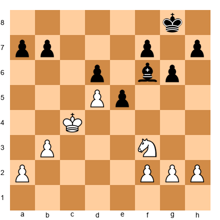

Look at this position. White's king is on c4. In the middle of the board. And it is *perfectly safe* because:

1. The position is simplified: few pieces remain
2. White's central pawns on d5 and e5 provide a shield
3. Black's remaining pieces cannot create threats against the exposed king
4. The king is actively supporting White's plans. It controls key squares and frees the other pieces

**This is the lesson, and it is profound:** King safety is not an absolute rule. It is a *principle* that must be evaluated in context. In a sharp middlegame with queens on the board, the king belongs behind its pawn shelter. But in a simplified position with few pieces, the king can become a powerful attacking piece.

**What this game teaches us:**

1. **Rules are guidelines, not laws.** The principle "keep your king safe" is excellent advice, but there are positions where the king is safer in the center (or even in enemy territory) than behind its own pawns.
2. **The king is a piece. Use it.** In positions with reduced material, the king's ability to control squares and support pawns makes it a valuable participant, not just a liability.
3. **Courage in chess means seeing what others cannot.** Short saw that his king was safe on c4: a square that looks absurdly dangerous at first glance. His ability to evaluate the position accurately, against all instinct, produced one of the most memorable games in history.

Play through this game on your board. It will change how you think about the king.

---

### Game 46: Garry Kasparov vs. Viswanathan Anand
**PCA World Championship, Game 10, New York, 1995**
**Ruy Lopez Open Defense (C80)**

*Theme: Overwhelming attack, when every piece joins the assault*

This game represents attacking chess at its highest level. Kasparov, widely considered the greatest player of all time, demonstrates what happens when all four attack prerequisites are met simultaneously: development lead, open lines, piece coordination, and a weakened pawn shield.

**1.e4 e5 2.Nf3 Nc6 3.Bb5 a6 4.Ba4 Nf6 5.O-O Nxe4**

The Open Defense of the Ruy Lopez. Black takes the e4 pawn, leading to sharp, tactical play. This is a bold choice by Anand. He was playing for a win with the Black pieces in a World Championship match.

**6.d4 b5 7.Bb3 d5 8.dxe5 Be6**

The position opens up dramatically. Pawns are being exchanged, lines are opening, and both sides need to navigate carefully. This is the kind of position where concrete calculation matters more than general principles.

**The middlegame saw Kasparov build a devastating attacking position.** He developed every piece toward the kingside, opened lines with precise pawn breaks, and coordinated his forces with surgical precision.

**What made Kasparov's attack irresistible was the coordination.** Every piece (the queen, both rooks, and the remaining minor pieces) contributed to the assault on Anand's king. There was no defensive resource that could handle the combined weight of Kasparov's entire army bearing down on one sector of the board.

**The key position:**

When all of Kasparov's pieces converged on the kingside, Anand's position collapsed rapidly. The attack was not based on a single sacrifice or a single threat. It was based on the overwhelming force of an entire army focused on one target.

**What this game teaches us:**

1. **Piece coordination is the ultimate weapon.** Kasparov did not win with a brilliant sacrifice (although there were tactical shots). He won because every piece worked together.
2. **Against the greatest player ever, even World Championship contenders can be overwhelmed.** Anand was one of the strongest players on the planet. Kasparov's preparation and execution were simply on another level.
3. **The attack follows naturally from the prerequisites.** Kasparov did not force the attack. He created the conditions (development, open lines, coordination, king weaknesses) and the attack materialized organically.
4. **Study how Kasparov positioned his pieces before the decisive blow.** The instructive part is not the finish. It is the buildup.

---

### Further Study: Additional Attacking Masterpieces

The following games from the Codex's master collection are directly relevant to this chapter. Each one is worth playing through on your board.

**Game 52: Tal vs. Botvinnik, World Championship Match, Game 6, 1960**
Tal demonstrates the exchange sacrifice, giving up a rook for a minor piece to shatter the king's pawn shelter. This technique is a foundation of attacking chess and remains one of the most powerful weapons in positions where the pawn structure around the king can be damaged.

**Game 60: Judit Polgar vs. Alexei Shirov, Buenos Aires, 1994**
Two of the most aggressive players of their generation battle in a Ruy Lopez where the attack develops with ferocious energy. Polgar's play demonstrates that attacking chess requires calculation AND intuition. The ability to sense that the attack is correct even before you can prove it.

**Game 65: Judit Polgar vs. Viswanathan Anand, Dos Hermanas, 1999**
Polgar defeats the World Champion in a Sicilian Scheveningen with an attacking display that showcases everything this chapter has taught you: pawn storms, piece coordination, sacrificial threats, and precise calculation. This game is proof that attacking chess, done right, can defeat anyone.

---

## Exercises

### Section A: Spot the Weakness in the King Position (Exercises 16.1 - 16.15)

*For each position, identify the weakness(es) in the indicated king's shelter and explain how they could be exploited.*

---

**Exercise 16.1** ★

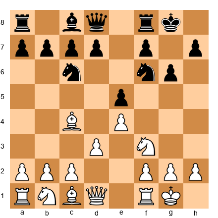

Black has castled kingside. Identify the weakness in Black's king position.

*Hint 1:* Look at the pawn on g6. What square does it weaken?
*Hint 2:* The dark squares f6 and h6, are they defended by pawns?
*Hint 3:* Where is Black's dark-squared bishop? Is it defending the king?

**Solution:** The fianchetto with g6 has weakened the dark squares around Black's king. The f6 and h6 squares are no longer defended by pawns. The dark-squared bishop is gone (likely traded or still on c8). Without the bishop on g7, the dark-square complex (f6, g7, h6) becomes porous. White should aim to exploit these weak dark squares with moves like Bh6, Qd2 (targeting h6), or maneuvering a knight to f5 or h5 via g3.

---

**Exercise 16.2** ★

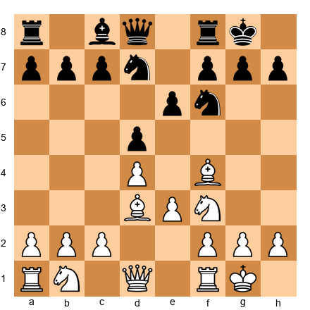

Black has castled kingside with a standard shelter (f7, g7, h7). Is Black's king safe?

*Hint 1:* Are all three shelter pawns on their original squares?
*Hint 2:* Look at the pieces. Is there a battery forming on the b1-h7 diagonal?
*Hint 3:* Can White play Bxh7+?

**Solution:** Black's pawn shelter looks intact, f7, g7, h7 are all in place. However, White has a bishop on d3 aimed at h7 and a knight on f3 ready to jump to g5. The Greek Gift conditions are partially met. Black should be aware of the Bxh7+ threat and may need to play ...h6 to prevent Ng5, or develop a piece to defend h7 (such as ...Re8 preparing ...Nf8). The king is *currently* safe but the potential threat must be respected.

---

**Exercise 16.3** ★

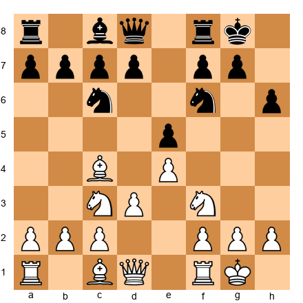

Black has played ...h6. What weakness has this created?

*Hint 1:* The h6 pawn no longer covers g7 jointly with g7 pawn, but what square is now weakened?
*Hint 2:* Look at the g6 square. Is it defended?
*Hint 3:* Can White exploit the weakened g6 square with a piece maneuver?

**Solution:** The move ...h6 weakens the g6 square. While h6 prevents Ng5 and Bg5, it creates a "hook" for a future pawn storm (g4-g5 attacking h6). The g6 square is no longer covered by a pawn on h7. White can aim to maneuver a knight to g6 (via e2-g3 or f3-h4-g6) where it would fork the f8 rook and pressure the king. Additionally, if White can play g4-g5, the h6 pawn becomes a target and the g-file may open. The move ...h6 is not necessarily bad, but it is a commitment that creates targets.

---

**Exercise 16.4** ★

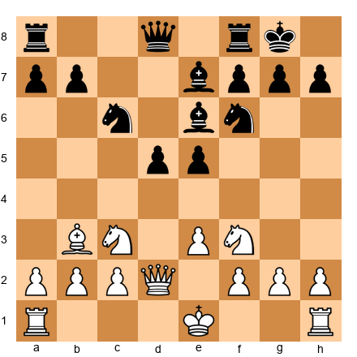

White has NOT yet castled. Evaluate both castling options for White.

*Hint 1:* If White castles kingside, where will the attack come from?
*Hint 2:* If White castles queenside, what is the pawn storm plan?
*Hint 3:* What does the queen on d2 suggest about White's plans?

**Solution:** White should castle queenside (O-O-O). The queen on d2 is already positioned for a kingside attack (supporting Bh6 or Qh6 later). After O-O-O, the rook immediately activates on d1, and White can prepare a kingside pawn storm with h4, g4, and h5. Castling kingside would be safer for the king, but it would place the king on the same side as Black's central pawn mass (d5, e5), limiting White's attacking options. The queen placement on d2 is the telling detail. It signals opposite-side castling intentions.

---

**Exercise 16.5** ★★

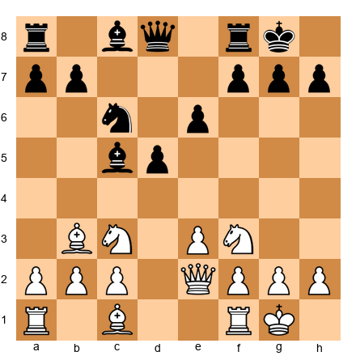

White has castled kingside. Black has a bishop on c5 aimed at f2. Is the f2 pawn a weakness?

*Hint 1:* The f2 pawn is defended by the king on g1. What happens if it is attacked again?
*Hint 2:* Can Black add pressure to f2 with ...Qb6 or ...Ng4?
*Hint 3:* If f2 falls, what happens to the king's shelter?

**Solution:** The f2 pawn is a latent weakness. It is currently defended by the king, but if Black plays ...Qb6 (adding a second attacker) or ...Ng4 (attacking f2 and threatening Nxh2), the pressure on f2 could become critical. If f2 falls or is sacrificed, the king's shelter is ripped open. The entire kingside structure (f2, g2, h2) depends on f2 as the foundation. White should play Kh1 to remove the king from the diagonal, or Na4 to challenge the bishop on c5.

---

**Exercise 16.6** ★★

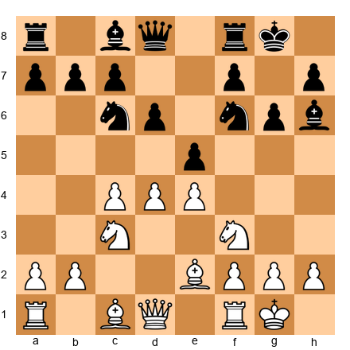

Black has played ...Bg7-h6. Is this bishop actively defending the king or has it abandoned its post?

*Hint 1:* The g7 square is now empty. What piece was guarding it?
*Hint 2:* Look at the dark squares: f6, g7, h6. How many are now weak?
*Hint 3:* Can White exploit the absence of the bishop from g7?

**Solution:** The bishop on h6 has abandoned its defensive post on g7. The critical dark-square diagonal (a1-h8) around the king is now unguarded. The g7 square is a hole, White can aim to place a piece there (especially after opening the position). White should consider d5 to open lines, followed by Nd4-f5 targeting g7 and h6. The bishop on h6 may look active, but it has left the king vulnerable. This is a common mistake: moving a defensive piece for "activity" without recognizing the cost.

---

**Exercise 16.7** ★★

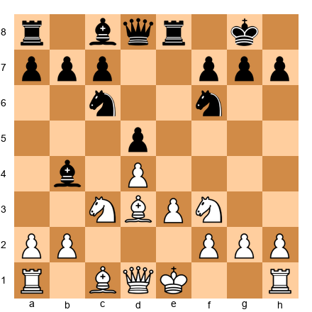

White has not castled. Black threatens ...Bxc3+ winning a piece. Should White castle now or deal with the threat first?

*Hint 1:* What happens after ...Bxc3+ bxc3? Is White's king safe enough to castle later?
*Hint 2:* If White castles immediately (O-O), does the threat on c3 still matter?
*Hint 3:* Consider that ...Bxc3+ creates doubled pawns but also opens the b-file.

**Solution:** White should castle immediately with O-O. After castling, the king is safe on g1 behind intact kingside pawns. If Black then plays ...Bxc3 bxc3, White has doubled c-pawns but gains the open b-file and a strong center. The king is safe on the kingside regardless of what happens on the queenside. The key lesson: when you can castle and improve your king safety, do it. Do not get distracted by threats that, upon examination, are not actually dangerous.

---

**Exercise 16.8** ★★

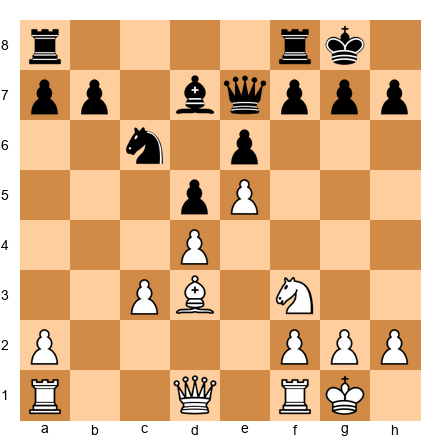

Black's king is safe but passive. White's pieces are more active. Does White have grounds for a kingside attack?

*Hint 1:* Count the pieces White can bring to the kingside in two moves.
*Hint 2:* Is there a pawn break that would open lines near Black's king?
*Hint 3:* Can the bishop on d3 participate in an attack on h7?

**Solution:** White has grounds for an attack. The bishop on d3 eyes h7. The knight on f3 can reroute to g5 or e5-g4. The queen can swing to h5 or c2 (joining the b1-h7 diagonal with the bishop). White's plan: Qc2 (creating the battery), Re1, Ng5 (if h6 is not played), or h4-h5 if Black plays ...g6. Black's position is solid but passive. The bishop on d7 and knight on c6 are not contributing to the defense of the kingside. This is a classic case where the prerequisites are partially met and White should build patiently.

---

**Exercise 16.9** ★★

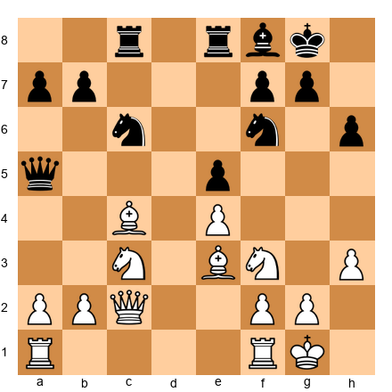

White's queen is on c2 and bishop is on c4. Assess the attacking potential.

*Hint 1:* The queen on c2 and bishop on c4 aim at different diagonals. Where should the bishop go?
*Hint 2:* If the bishop moves to d3, what diagonal does it join?
*Hint 3:* What is the classic battery along the b1-h7 diagonal?

**Solution:** White should reposition the bishop from c4 to d3 (via Bd3) to create the deadly b1-h7 diagonal battery with the queen on c2. After Bd3, the battery aims directly at h7. Combined with the knight on f3 (ready for Ng5), this creates the classic Greek Gift setup. White should also consider Re1 and Rad1 to bring the rooks into play. The attack is building. The battery, the knight, and the h3 pawn (which prevents ...Ng4) all contribute to a gathering storm on the kingside.

---

**Exercise 16.10** ★★

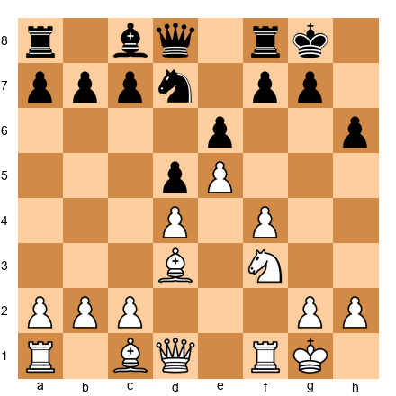

Black has played ...h6. Evaluate whether this weakens the kingside enough for White to attack.

*Hint 1:* The h6 pawn creates a "hook": a target for a pawn storm.
*Hint 2:* Can White play g4, f5, and eventually g5 to attack h6?
*Hint 3:* Where should White's pieces be positioned to support the pawn storm?

**Solution:** Yes, ...h6 creates a target. White can build a pawn storm: g4 (supporting f5), f5 (attacking e6 and preparing to redirect toward the kingside), and eventually g5 (attacking the h6 hook). White's plan: Qe1 (heading to h4 or g3), g4, f5, and then g5. When g5 hits h6, lines open directly toward the king. The bishop on d3 supports the attack by covering h7. The knight can reroute to e5 or g5 (after the h6 pawn is undermined). The key insight: ...h6 looks like a preventing move (stopping Ng5) but it creates a long-term target that White can exploit with patient preparation.

---

**Exercise 16.11** ★

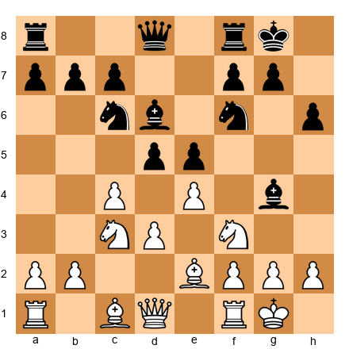

Identify ALL the weaknesses in Black's king position.

*Hint 1:* Start with the pawn structure: are f7, g7, h7 all intact?
*Hint 2:* The h6 pawn, what does it weaken?
*Hint 3:* Black has played ...g7 (not moved) but ...h6 is played. What is the impact?

**Solution:** Black's king weaknesses: (1) The h6 pawn weakens the g6 square, no pawn guards it now. (2) The h6 pawn is a "hook" for a g4-g5 pawn storm. (3) The g5 square could become accessible to a White knight. However, the g7 pawn is still in place and the f7 pawn is intact, so the shelter is only slightly compromised. Black's dark-squared bishop on d6 is not defending the king (it is on the wrong diagonal). Overall: Black's position is playable but requires vigilance. White should aim for a pawn storm or piece infiltration via g5/g6.

---

**Exercise 16.12** ★

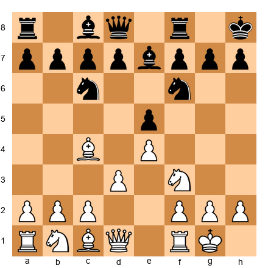

Black has castled kingside but the king is on h8 (after ...Kg8-h8). Why might Black have done this, and is the king safer or less safe?

*Hint 1:* On h8, the king is off the g-file. Why does that matter?
*Hint 2:* Does the king on h8 have an escape square?
*Hint 3:* Is the king more or less vulnerable to the Greek Gift on h8 vs g8?

**Solution:** Black played ...Kh8 to move the king off the g-file and the a2-g8 diagonal. On g8, the king is exposed to potential Bxf7+ sacrifices (the bishop on c4 aims at f7) and back-rank threats along the g-file. On h8, the king avoids these specific threats. However, the king on h8 has drawbacks: it is more vulnerable to h-file attacks (after h4-h5 or a sacrifice on h7), and it has fewer escape squares (only g8). Whether this is correct depends on the position. The key lesson: king moves in the castled position have trade-offs. Moving to h8 solves one problem but may create another.

---

**Exercise 16.13** ★★

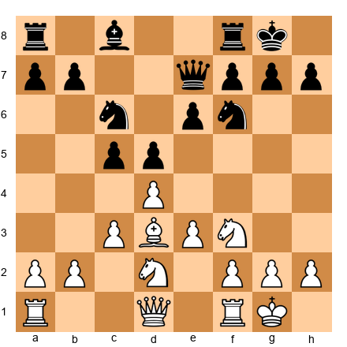

White has a bishop on d3. If Black plays ...e5, does this help or hinder White's kingside attack?

*Hint 1:* After ...e5, the e6 square is no longer defended by a pawn. What does this mean for White's pieces?
*Hint 2:* Does ...e5 open or close lines toward Black's king?
*Hint 3:* Think about the bishop on d3, does ...e5 improve or worsen its scope?

**Solution:** After ...e5, the e6 square becomes available for White's knight (Ne4-g5 or Nf3-e5-g4). The advance also opens the d3 bishop's diagonal, with no pawn on e6 blocking the way, the bishop's line toward h7 is clearer. However, ...e5 does close the center somewhat. On balance, ...e5 helps White's attack more than it helps Black's defense. The key weakness: the e6 square becomes an outpost, and the bishop on d3 gains scope toward the kingside. Black should prefer ...e5 only if there is a concrete tactical reason.

---

**Exercise 16.14** ★★

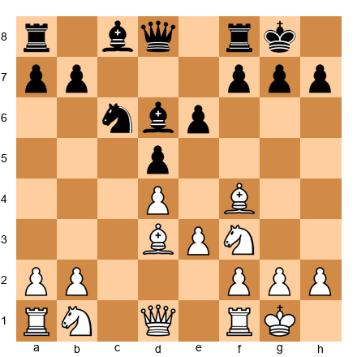

White has a bishop on f4 and a bishop on d3. Should White play Qc2, targeting h7, or Qe2, preparing e4?

*Hint 1:* Qc2 creates the battery on the b1-h7 diagonal. What does this threaten?
*Hint 2:* Qe2 prepares e3-e4, opening the center. Which is more forcing?
*Hint 3:* Can White do both? Is there a move order that achieves both goals?

**Solution:** White should play **Qc2** first. The battery along the b1-h7 diagonal creates an immediate threat of Bxh7+ (the Greek Gift). Black must respond to this threat, likely with ...h6 (which weakens g6), ...g6 (which weakens f6 and h6), or ...Re8 (preparing ...Nf8). Each of these responses weakens Black's position in some way. After Black responds, White can THEN prepare e3-e4 with Nbd2 and e4. The attacking threat (Qc2) should come first because it forces a concession; the positional plan (e4) can wait.

---

**Exercise 16.15** ★★

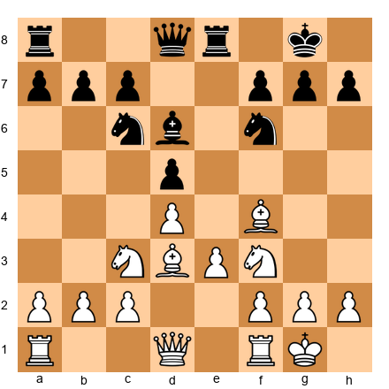

White wants to attack Black's king. Outline a three-move attacking plan.

*Hint 1:* What is the first piece White should reposition to aim at the kingside?
*Hint 2:* Where should the queen go to create a battery with the d3 bishop?
*Hint 3:* What supporting move prepares the final assault?

**Solution:** White's three-move plan: (1) **Qc2**: creating the battery on the b1-h7 diagonal, threatening Bxh7+. (2) After Black responds (say ...h6 to prevent Ng5), **Re1**: connecting the rooks and preparing to use the e-file. (3) **Ne5**: centralizing the knight on its most powerful square, where it supports Ng4 (if h6 was played) or threatens Bxh7+ followed by Qh7+ and Ng6. This plan follows the prerequisites: develop pieces toward the target, create threats, coordinate the forces. The attack will build from here.

---

🛑 **Rest here if you need to.** Fifteen exercises done. You have earned a break. Come back fresh for the attacking exercises.

---

### Section B: Find the Attacking Move (Exercises 16.16 - 16.30)

*For each position, find the strongest attacking move. All positions are White to move unless stated otherwise.*

---

**Exercise 16.16** ★★

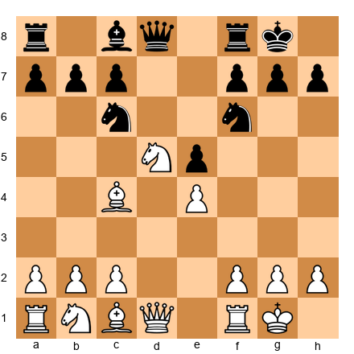

White has a knight on d5 and a bishop on c4. Find the strongest move.

*Hint 1:* The knight on d5 attacks f6. If the f6 knight moves, what is threatened?
*Hint 2:* Can White force the f6 knight to move?
*Hint 3:* What happens after Nxf6+ gxf6? Look at the open g-file.

**Solution:** **Nxf6+!** After ...gxf6, Black's kingside is shattered. The g-file is open, and Black's king is exposed behind the ugly f6 and h7 pawns. White can follow up with Qh5, threatening Qh6 and various mating attacks. If Black recaptures with the queen (...Qxf6), the queen is misplaced and White can continue developing with tempo. The key: this is not a material sacrifice. It is an exchange of knight for knight, but the structural damage is permanent and devastating.

---

**Exercise 16.17** ★★

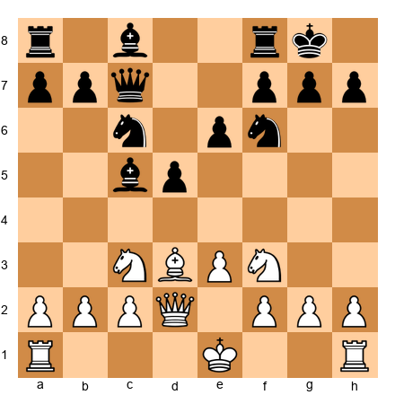

White has not castled. Find the most aggressive option.

*Hint 1:* White's queen is on d2. Where does it go after O-O-O?
*Hint 2:* Queenside castling activates the rook and prepares a pawn storm.
*Hint 3:* After O-O-O, what is White's attacking plan?

**Solution:** **O-O-O!** Queenside castling is the attacking move. It places the king safely on the queenside, activates the h1 rook (which will later swing to the kingside via g1 or h1), and signals a kingside pawn storm. After O-O-O, White's plan is h4, g4, h5, opening lines against Black's kingside shelter. The queen on d2 supports Qh6 infiltration. This is not a quiet castling move. It is the first move of an attack.

---

**Exercise 16.18** ★★

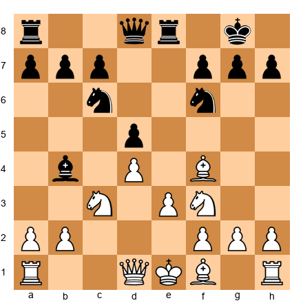

White has a bishop on f4. Find the move that targets Black's king.

*Hint 1:* The bishop on f4 aims at the a4-d8-h4 diagonal. Can it go to h6?
*Hint 2:* If the bishop reaches h6, what square does it attack near the king?
*Hint 3:* Bh6 threatens to trade the dark-squared bishop (if there is one) or to establish a piece near the king.

**Solution:** **Bd3!** Before going to h6, White needs to set up the attacking infrastructure. Bd3 aims the bishop at h7 (creating the battery potential with Qc2 later) and prepares O-O to complete development. The immediate Bh6 is tempting but premature, White has not castled yet and the king in the center is a liability. The correct sequence is Bd3, O-O, Qc2, and then consider Bh6 or a direct kingside attack. Preparation before attack, always.

---

**Exercise 16.19** ★★

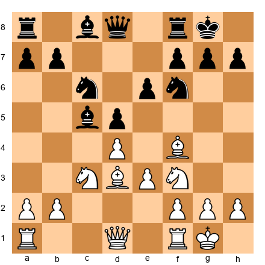

White has the classic setup: Bd3, Nf3, Bf4, and the queen on d1. Find the strongest continuation.

*Hint 1:* Which square should the queen go to?
*Hint 2:* The b1-h7 diagonal is open after the queen moves off d1.
*Hint 3:* Qc2 creates the battery. Is the Greek Gift threat real?

**Solution:** **Qc2!** This creates the devastating battery along the b1-h7 diagonal. The threat of Bxh7+ is now real. The bishop on d3 and queen on c2 aim at h7, and the knight on f3 is ready for Ng5. Black must react immediately. If Black does nothing, Bxh7+ Kxh7 Ng5+ followed by Qh5 or Qh7 leads to a powerful attack. This is the Greek Gift setup in its purest form. The battery is the trigger.

---

**Exercise 16.20** ★★

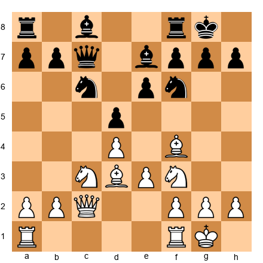

White has the battery in place (Qc2 + Bd3). Black has defended with ...Be7 and ...Qc7. Is the Greek Gift still playable?

*Hint 1:* After Bxh7+ Kxh7 Ng5+, can Black play ...Kg8?
*Hint 2:* If ...Kg8, then Qh5 threatening Qh7# and Qxf7+. Can Black defend?
*Hint 3:* What about ...Bxg5? Does this refute the sacrifice?

**Solution:** The Greek Gift is playable but requires careful calculation. After **Bxh7+ Kxh7 Ng5+ Kg8** (forced, ...Kg6 walks into Qd3+ with a mating attack) **Qh5**, White threatens Qh7# and Qxf7+. Black must play ...Bxg5 (removing the knight), and after Bxg5, White has opened the h-file and weakened Black's king. The attack continues with Qh7+ Kf8 Qh8+ Ke7 Qxg7, and White has a strong position. The Greek Gift does not lead to immediate checkmate here, but it wins material and creates a lasting attack. This is the typical "sound sacrifice" scenario.

---

**Exercise 16.21** ★★★

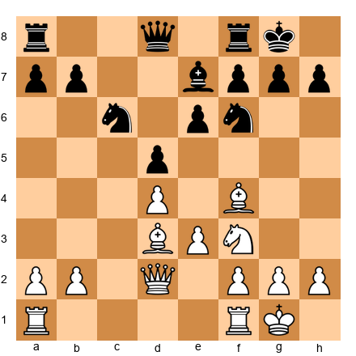

White's queen is on d2 (not c2). Find the move that creates the most dangerous threat.

*Hint 1:* The queen is not on the b1-h7 diagonal yet. How does it get there?
*Hint 2:* Can the queen go to c2 in one move? Or is there a more forcing option?
*Hint 3:* What about Qh6? Or Qg5?

**Solution:** **Qc2!** remains the strongest move. Even from d2, the queen's best destination is c2, creating the battery with the d3 bishop. After Qc2, the Greek Gift threat (Bxh7+) forces Black to react. Alternative queen moves like Qh6 look aggressive but are premature. The queen would be on the rim without sufficient support (no piece covers g7 or h7 yet). The battery is the foundation of the attack; flashy queen moves without support are just targets for counter-attack.

---

**Exercise 16.22** ★★★

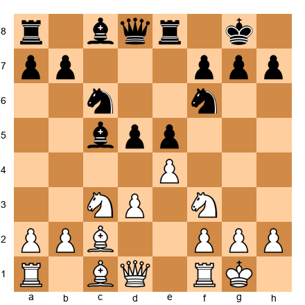

White has a bishop on c2 and a knight on f3. Find the attacking plan.

*Hint 1:* The bishop on c2 is on the b1-h7 diagonal. What does it need?
*Hint 2:* Where should the queen go to form the battery?
*Hint 3:* What preparatory move sets up the battery with tempo?

**Solution:** **d4!** is the attacking move. By challenging the center with d4 (or d3-d4 if needed), White opens lines and creates immediate central tension. If Black takes ...exd4, the position opens, perfect for the bishop on c2. After the center opens, Qd3 creates the battery on the b1-h7 diagonal (Bc2 + Qd3). The knight on f3 is ready for Ng5. The plan: open the center first, then attack the king. This is the correct order. The center must be favorable before the flank attack begins.

---

**Exercise 16.23** ★★★

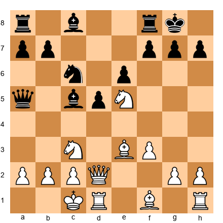

White has castled queenside with a knight on e5. Find the most threatening move.

*Hint 1:* The knight on e5 is powerfully placed. What is it attacking?
*Hint 2:* Can White add more pieces to the kingside attack?
*Hint 3:* Think about Bh6, what does it threaten if Black has a fianchetto?

**Solution:** **Bd3!** develops the last minor piece to an aggressive square, aiming at h7. After Bd3, White's position is fully mobilized: the knight on e5 controls the center and kingside, the bishop on d3 aims at h7, the bishop on e3 can swing to h6, and the queen on d2 supports the attack. The plan is Bh6 (trading the dark-squared defender), followed by Qh6, Ng4, and a decisive assault. Every piece has a role. This is what full coordination looks like.

---

**Exercise 16.24** ★★★

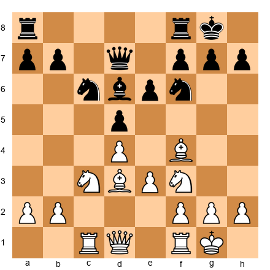

White has an active setup but Black is solid. Find a way to create threats.

*Hint 1:* Is there a pawn break that opens lines toward the king?
*Hint 2:* Consider e3-e4. What does it achieve?
*Hint 3:* After e4 dxe4, where does the bishop on d3 go?

**Solution:** **e4!** is the move. After ...dxe4 Bxe4, the bishop lands on e4, a dominant central square that also looks toward the kingside (h7 diagonal via e4-d3 or e4-h7). The position opens, favoring White's more active pieces. If Black does not take (...Nxe4? Nxe4 with threats), White gains space. The e4 break is the classic way to activate pieces in these structures. After the center opens, White's rooks enter the game via the c and e files, and the attack builds organically.

---

**Exercise 16.25** ★★★

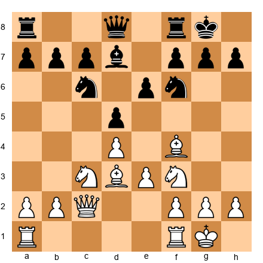

The battery is in place (Qc2 + Bd3). Black has played ...Bd7, not defending h7 directly. What is the strongest continuation?

*Hint 1:* Is the Greek Gift threat real now?
*Hint 2:* After Bxh7+ Kxh7 Ng5+, calculate three moves ahead for each king response.
*Hint 3:* What happens if ...Kg8? What happens if ...Kg6?

**Solution:** **Bxh7+!** The Greek Gift is decisive. After Kxh7 Ng5+ Kg8 (if ...Kg6, Qd3+ f5 Qg3 threatens Qh4 and Nh7, winning), Qh5 threatens Qxf7+ and Qh7#. Black must try ...Re8 or ...Nxd4, but after Qxf7+ Kh8 Qh5+ Kg8, White has a devastating attack with extra pawns and the exposed king. The bishop on d7 is too far from the kingside to help. The knight on c6 is on the wrong side of the board. The Greek Gift works because ALL three conditions are met: bishop on d3, knight on f3, queen on the b1-h7 diagonal.

---

**Exercise 16.26** ★★

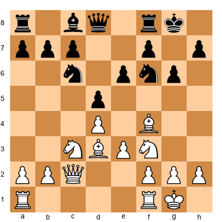

Black has a fianchetto setup (g6). The Greek Gift on h7 does not work (the g6 pawn covers h7 differently). What alternative attack does White have?

*Hint 1:* Against a fianchetto, the h-file is more useful than the b1-h7 diagonal.
*Hint 2:* Can White play Bh6 to trade the fianchetto bishop?
*Hint 3:* After Bh6, what pawn storm opens lines?

**Solution:** **Bh6!** Against a fianchetto, the correct plan is to trade the dark-squared bishop (removing the king's primary defender), then storm with h4-h5. After Bh6 Bg7 Bxg7 Kxg7, the dark squares around the king are weak. White follows with h4, h5, hxg6 (opening the h-file), and Qg5 or Qh2 to infiltrate. The bishop sacrifice on h7 does not work against g6 setups, so White adapts the plan: trade the defender, open the h-file, and attack on the dark squares. Flexibility in attack is essential.

---

**Exercise 16.27** ★★

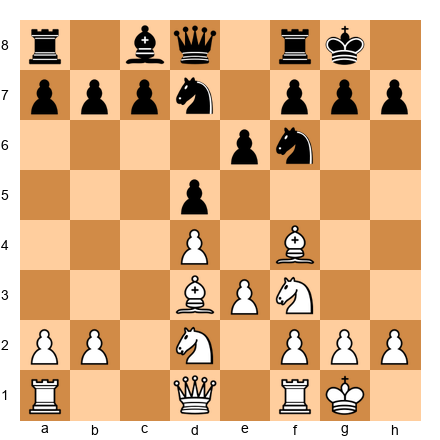

White has two knights (f3 and d2). Which knight should go to e5?

*Hint 1:* If Nf3-e5, which knight supports the e5 outpost?
*Hint 2:* If Nd2-e5 (via Ndf3-e5 is not possible), consider Nde4 or Ndf3.
*Hint 3:* Which knight is more valuable on f3 for the kingside attack?

**Solution:** The knight on f3 should stay on f3 (it is needed for the Ng5 maneuver and kingside attack). The knight on d2 should reroute toward e5 via **Ndf3** is impossible since a knight is already there. The correct plan is **Ne4!** (from d2), targeting f6 and supporting a future Ng5. After Ne4, the knight threatens Nxf6+ (shattering the kingside) or Ng5 (attacking h7). The f3 knight remains to support with Ng5 or to reinforce after Ne4. The principle: keep the knight that has the most kingside attacking potential on its current post. Reposition the other one.

---

**Exercise 16.28** ★★★

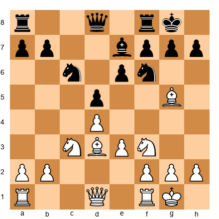

White has a bishop on g5, pinning the f6 knight. How does White exploit this pin?

*Hint 1:* The knight on f6 defends h7 and controls key squares. If it is eliminated, what happens?
*Hint 2:* Can White play Bxf6 Bxf6, then target the weakened kingside?
*Hint 3:* Or can White maintain the pin and build pressure with other moves first?

**Solution:** White should maintain the pin with a preparatory move: **Qc2!** Now the battery along b1-h7 is formed, and the f6 knight is pinned against the queen on d8. If Black breaks the pin with ...Be7-d6 or ...h6, White captures Bxf6 gxf6 (or ...Bxf6), destroying the pawn shelter. After Qc2, the combined threats of Bxh7+ (if the knight leaves f6) and Bxf6 (shattering the kingside) are almost impossible to meet. The pin is a tool, use it to set up the decisive strike, not as the strike itself.

---

**Exercise 16.29** ★★★

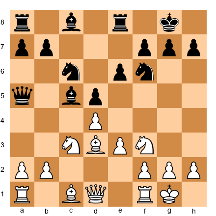

Black has a queen on a5 (far from the kingside) and a bishop on c5. White to play for an attack.

*Hint 1:* Black's queen is on a5, far from the defense. How many defenders does Black have near the king?
*Hint 2:* A defender deficit is one of the attack prerequisites. Is it met?
*Hint 3:* White should exploit the queen's absence immediately.

**Solution:** **Qc2!** Once again, the battery is the answer. With Black's queen on a5 (completely removed from kingside defense), the prerequisite of a defender deficit is met. After Qc2, the Bxh7+ threat is immediate and Black's queen cannot help. Black would need to play ...Nd7 (covering f6 and supporting h7 indirectly) or ...g6 (weakening the kingside further). The lesson: when your opponent's queen is on the wrong side of the board, attack immediately. The window may close if the queen returns.

---

**Exercise 16.30** ★★★

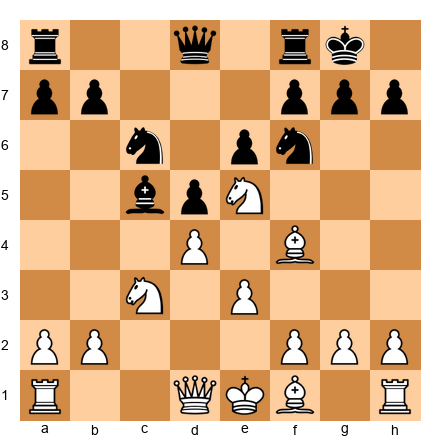

White has a knight on e5 and has NOT castled. Should White attack now or castle first?

*Hint 1:* White's king is in the center. Is this a problem?
*Hint 2:* The knight on e5 is powerful, but can White support it without castling?
*Hint 3:* What happens if White plays Bd3 followed by O-O and then Qf3?

**Solution:** **Castle first.** Despite the strong knight on e5, White's king in the center is a liability. If White tries to attack immediately (say Qf3 or Qg4), Black can counterattack in the center with ...Nxe5 dxe5 d4, exploiting the uncastled king. The correct sequence: **Bd3** (developing and aiming at h7), **O-O** (completing development and securing the king), then **Qf3** or **Qc2** to build the attack. The knight on e5 is not going anywhere. It is well-supported. But the attack requires a safe king first. Prerequisite 4 (weakened enemy pawn shield) means nothing if your own king is exposed.

---

🛑 **Rest here.** Thirty exercises complete. You are halfway through. Take a real break, walk, hydrate, stretch. The calculation exercises are demanding.

---

### Section C: Calculate the Sacrifice (Exercises 16.31 - 16.45)

*For each position, a sacrifice is possible. Determine if it is sound (forced advantage) or speculative (practical chances only). Calculate the main line.*

---

**Exercise 16.31** ★★★

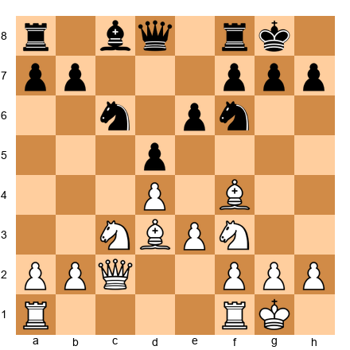

Is Bxh7+ sound in this position? Calculate the main line.

*Hint 1:* After Bxh7+ Kxh7 Ng5+, what are Black's king options?
*Hint 2:* If ...Kg8, then Qh5. Calculate two moves further.
*Hint 3:* If ...Kg6, can White play Qd3+ with a mating attack?

**Solution:** **Bxh7+ is sound.** After Kxh7 Ng5+ Kg8 (forced, ...Kg6 Qd3+ f5 Qg3 with Qh4 and Nh7 ideas wins for White) Qh5, White threatens Qh7# and Qxf7+. Black tries ...Re8, and White plays Qxf7+ Kh8 Qh5+ Kg8 Qh7+ Kf8 Qh8+ Ke7 Qxg7 with a raging attack and extra pawns. The sacrifice is sound because White gains a permanent attack AND recovers material. This is the textbook Greek Gift. All three conditions met, and no adequate defense exists.

---

**Exercise 16.32** ★★★

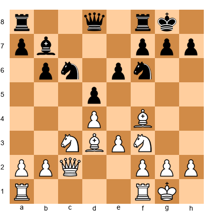

Black has a bishop on b7 (instead of d7). Is Bxh7+ still sound?

*Hint 1:* After Bxh7+ Kxh7 Ng5+ Kg8 Qh5, Black plays ...Re8. Now what?
*Hint 2:* Does Black have the defensive resource ...Nf6-d7 or ...Bf5?
*Hint 3:* The bishop on b7 does NOT help defend the kingside. Does that change anything?

**Solution:** **Bxh7+ is still sound.** The bishop on b7 is irrelevant to the kingside defense. After Kxh7 Ng5+ Kg8 Qh5, Black's defensive tries are the same: ...Re8 (Qxf7+ Kh8 Qh5+ Kg8 Qh7+ Kf8), or ...Nxd4 (exd4, and White's attack continues with an extra pawn and open lines). The b7 bishop is staring at a pawn chain and contributing nothing to the defense. This illustrates an important principle: when evaluating sacrifices, count the *relevant* defenders, not the total number of pieces.

---

**Exercise 16.33** ★★★

Same position as 16.31, but now it is Black's move and Black plays ...g6 (instead of waiting). White to play. Is Bxh7+ still viable?

*Hint 1:* After ...g6, the h7 pawn is protected by the g6 pawn. Does Bxh7+ still work?
*Hint 2:* What does ...g6 weaken?
*Hint 3:* Can White exploit the weakened f6 and h6 squares instead?

**Solution:** After ...g6, the Bxh7+ sacrifice does NOT work. The g6 pawn recaptures and the position is closed. However, ...g6 seriously weakens the dark squares. White should switch plans: **Bh6!** attacks the dark squares, threatening to infiltrate on g7 or force ...Re8 (the rook leaves f8). After Bh6, White follows with Qd2 (aiming at h6), Ng5 (targeting the weakened h7 and f7), and the attack redirects to the dark-square complex. The sacrifice is no longer the right approach, but the attack continues through different channels. Flexibility.

---

**Exercise 16.34** ★★★

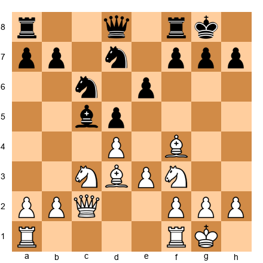

Black has played ...Nd7 (instead of ...Nf6). Is Bxh7+ sound WITHOUT the knight on f6 to worry about?

*Hint 1:* There is no knight on f6 defending h7. But the knight on d7 covers f6.
*Hint 2:* After Bxh7+ Kxh7 Ng5+, can Black play ...Kg6? What are the consequences?
*Hint 3:* Without a knight on f6, can Black block the queen's access to h5?

**Solution:** **Bxh7+ is very strong.** Without the f6 knight, h7 is defended only by the king. After Kxh7 Ng5+ Kg8 (if ...Kg6 Qd3+ f5 Qg3, and the king is dangerously exposed with no knight on f6 to provide a shield) Qh5, White threatens Qh7# directly. Black's knight on d7 is too far away to help (it cannot reach f6 in time). The sacrifice is sound and even stronger than the standard version because Black's primary defender (the f6 knight) is absent. Lesson: the absence of defensive pieces around the king is a green light for sacrifices.

---

**Exercise 16.35** ★★★★

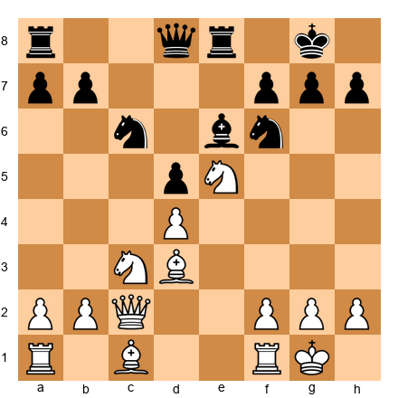

White has a knight on e5 and the battery (Qc2 + Bd3). Black has a bishop on e6 defending. Is the sacrifice on h7 sound despite the extra defender?

*Hint 1:* After Bxh7+ Kxh7 Ng5+, the knight attacks both the king AND the bishop on e6.
*Hint 2:* If ...Kg8, then Qh5. Does the bishop on e6 help defend?
*Hint 3:* After Qh5, White threatens Qh7# and Nxe6. Can Black handle both?

**Solution:** **Bxh7+ is sound.** After Kxh7 Ng5+ Kg8 Qh5, White threatens Qh7# AND Nxe6 (a double attack). Black cannot deal with both threats. If ...Bxg5, White plays Qh7+ Kf8 Qh8#. If ...Re7 (defending h7), Nxe6 fxe6, and White has won a bishop with a continuing attack. The knight on g5 simultaneously attacks the king AND the e6 bishop. This is the double attack principle from Chapter 11 applied to the sacrifice. The bishop on e6 looks like a defender, but the knight fork neutralizes it.

---

**Exercise 16.36** ★★★★

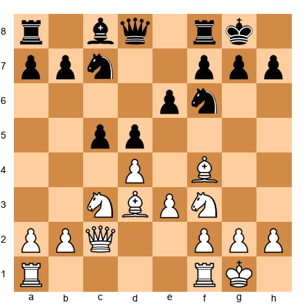

Black has played ...Nc7 (a passive square). Is now the time for Bxh7+?

*Hint 1:* The knight on c7 is on the wrong side of the board. Count Black's kingside defenders.
*Hint 2:* After Bxh7+ Kxh7 Ng5+, what are Black's options?
*Hint 3:* Only the f6 knight and the f8 rook are available for defense. Is that enough?

**Solution:** **Bxh7+ is decisive.** Black's knight on c7 is completely out of play. It cannot reach the kingside in fewer than three moves. After Kxh7 Ng5+ Kg8 Qh5, Black has only the f6 knight and the rook on f8 for defense. The knight is pinned to the defense of h7 (if it moves, Qh7#). The rook on f8 cannot help (it is blocked by its own pieces). White will follow with Rf3, swinging the rook to h3 or g3, and the attack is overwhelming. Lesson: when your opponent's pieces are misplaced, that is the moment to sacrifice.

---

**Exercise 16.37** ★★★

Black has played ...Bf5, blocking the b1-h7 diagonal. Is the sacrifice still viable?

*Hint 1:* The bishop on f5 directly blocks the Qc2-h7 battery.
*Hint 2:* Can White remove the f5 bishop first? How?
*Hint 3:* What about Bxf5 exf5, then exploiting the opened e-file?

**Solution:** The sacrifice on h7 does NOT work because the f5 bishop blocks the queen's access. White should instead play **Bxf5 exf5**, opening the e-file and weakening Black's pawn structure. After Bxf5, White can use the open e-file (Re1) and the weakness of the f5 pawn to build pressure. Alternatively, after Bxf5, the queen may find new routes to the kingside. This is a case where the defender found the right prophylactic move, and the attacker must adapt. Do not force a sacrifice that does not work. Find another path.

---

**Exercise 16.38** ★★★★

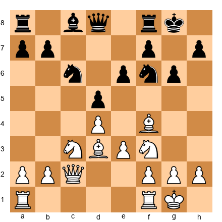

Black has a fianchetto shelter (g6, not g7 bishop). White cannot play Bxh7+. Find an alternative sacrifice.

*Hint 1:* The g6 pawn is a target. Can White sacrifice on g6?
*Hint 2:* After Bxg6 fxg6 Qxg6+, White has queen and knight near the king.
*Hint 3:* What follows Qxg6+ Kh8? Can White play Ng5 or Bh6?

**Solution:** **Bxg6!** is the alternative sacrifice. After fxg6 (if ...hxg6, Qxg6+ is similar) Qxg6+ Kh8, White plays Bh6 (threatening Bg7+ and Qh7#) or Ng5 (threatening Qh7# and Nf7+). The sacrifice rips open the f-file and the g-file simultaneously. White's queen on g6 and bishop on f4 (which can swing to h6) create mating threats. This is the fianchetto alternative to the Greek Gift: when the h-pawn is protected by g6, attack g6 instead. Same concept, different target.

---

**Exercise 16.39** ★★★★

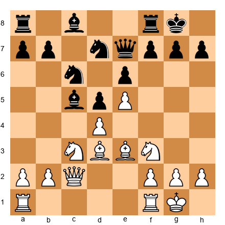

White has a pawn on e5, closing the center. Is a sacrifice on the kingside justified?

*Hint 1:* White's e5 pawn restricts the f6 square, Black's knight cannot go there.
*Hint 2:* With no knight on f6, h7 is less defended.
*Hint 3:* Can White play Bxh7+ even though the knight on d7 covers f6 indirectly?

**Solution:** **Bxh7+!** is strong. The e5 pawn controls f6, meaning Black's knight on d7 cannot reach f6 to defend. After Kxh7 Ng5+ Kg8 Qh5, the usual threats apply (Qh7#, Qxf7+). The knight on d7 is blocked from reaching f6 by White's own e5 pawn (the square is controlled). The e5 pawn is not just a space-gainer. It is an attacker, controlling key defensive squares. Lesson: advanced center pawns contribute to kingside attacks by restricting defensive piece maneuvers.

---

**Exercise 16.40** ★★★★

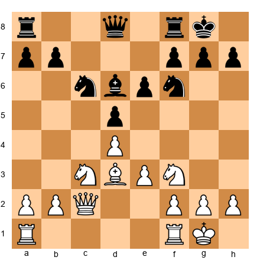

White has the full battery setup. Black has a knight on f6, bishop on d6, and bishop on c8 (passive). Find the winning sacrifice AND calculate to a decisive advantage.

*Hint 1:* Bxh7+ is the candidate move. After Kxh7 Ng5+, what are ALL of Black's options?
*Hint 2:* ...Kg8, ...Kg6, ...Kh6, evaluate each one.
*Hint 3:* For ...Kh6, what is the killing blow?

**Solution:** **Bxh7+! Kxh7 Ng5+** and now:
- **...Kg8:** Qh5, threatening Qh7# and Qxf7+. After ...Re8 Qxf7+ Kh8 Qh5+ Kg8 Qh7+ Kf8 Qh8+ Ke7 Qxg7, White wins decisively.
- **...Kg6:** Qd3+ (double attack on king and threatening Qh7) f5 Qg3 (threatening Qh4+ and Nh7) Kf6 Qg5#.
- **...Kh6:** Nxe6+ (discovered check from... wait, the knight moves to e6 from g5. This is Nxe6 attacking the queen and threatening f4+). Better: after ...Kh6 Nxf7+ (fork the king and queen if queen is on d8) Kg6 Nxd8. White wins queen for knight.

The sacrifice is fully sound. Every king move leads to a White advantage. This is the Greek Gift at its most powerful: a sound sacrifice with no defense.

---

**Exercise 16.41** ★★★

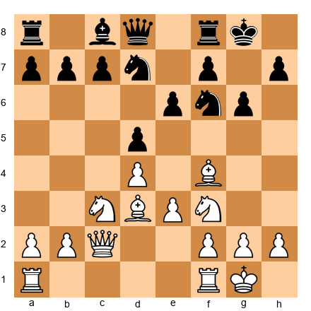

Black has ...g6 AND a knight on d7. Can White sacrifice on h7 anyway?

*Hint 1:* After Bxh7, Black does NOT have to take, ...Kh8 is possible.
*Hint 2:* If ...Kxh7, does Ng5+ still work with g6 weakened?
*Hint 3:* Is this sacrifice sound or speculative?

**Solution:** This sacrifice is **speculative**, not sound. After Bxh7, Black can play ...Kh8 (not taking the bishop), and the bishop on h7 is trapped and lost. If ...Kxh7 Ng5+ Kg7 (the king can go to g7 since g6 is protected), Black's position holds. The g6 pawn means the king has an escape route through g7 that does not exist in the standard Greek Gift. White should NOT sacrifice here. Instead, play Bh6 (targeting the fianchetto structure) and prepare a pawn storm. Know when the sacrifice does not work. This saves you from losing games, not just winning them.

---

**Exercise 16.42** ★★★

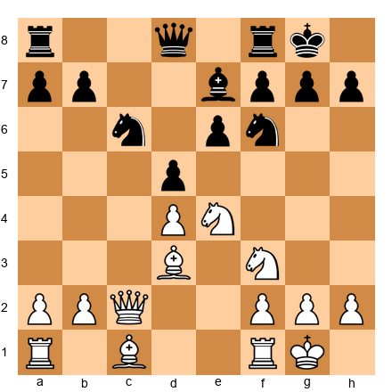

White has a knight on e4 (instead of the usual pawn). The knight on e4 attacks f6. Find the strongest move.

*Hint 1:* Nxf6+ is a forcing move. What happens after ...Bxf6?
*Hint 2:* What happens after ...gxf6?
*Hint 3:* One recapture weakens the king. Which one?

**Solution:** **Nxf6+!** After ...gxf6 (the key recapture, ...Bxf6 leaves the kingside intact), the g-file is torn open and the king is exposed. White follows with Qc1 or Qd2 (aiming for the kingside), Bh6 (the dark squares are devastated after ...gxf6), and Ng5 (targeting h7 through the ruined shelter). After ...Bxf6, the position is calmer but White maintains an edge with the bishop pair. The attacking player should always consider captures that damage the pawn shelter. ...gxf6 creates permanent kingside damage that cannot be repaired.

---

**Exercise 16.43** ★★★★

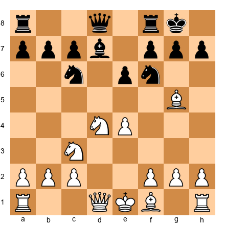

White has not castled and has a bishop on g5 pinning the f6 knight. Can White play e5 (attacking the pinned knight)?

*Hint 1:* After e5, the knight on f6 is attacked by the pawn AND pinned by the bishop.
*Hint 2:* If ...h6, White plays Bh4, maintaining the pin. Then what?
*Hint 3:* What happens to the knight on f6 if it cannot move?

**Solution:** **e5!** is strong. The f6 knight is pinned (bishop on g5 looks at the queen on d8) and now attacked by the pawn. If ...h6 Bh4 g5 (the only way to break the pin) Bg3, and White has provoked serious kingside weaknesses, g5, h6 are both advanced, the king's shelter is shattered. Alternatively, after e5, if ...Nd5 Bxd8 Nxc3 bxc3, White has won the queen for bishop and knight: a material gain. The pin combined with the pawn advance creates an irresolvable problem. This is "attack through positional pressure", no sacrifice needed, just relentless threats.

---

**Exercise 16.44** ★★★★

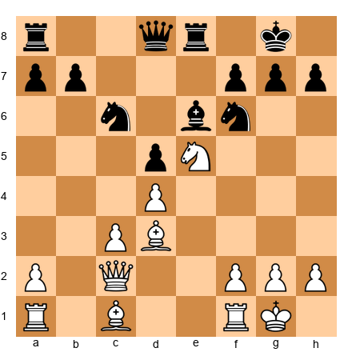

White has a knight on e5 and the Qc2 + Bd3 battery. Black has ...Be6 covering g4 and d5. Can White play Nxf7?

*Hint 1:* After Nxf7 Bxf7, what does White threaten on the b1-h7 diagonal?
*Hint 2:* The f7 pawn was defending the king. Without it, which squares are weak?
*Hint 3:* Is this sacrifice sound or speculative? Calculate.

**Solution:** **Nxf7!** is sound. After Bxf7 (if ...Kxf7, Qb3+ wins the bishop on e6 and opens the king), White plays Bxh7+! Kxh7 (forced, ...Kf8 Bg6 with Qh7 to follow) Qh5+ Kg8 Qxf7+ Kh7, and White has won two pawns with a continuing attack. The double sacrifice (Nxf7 followed by Bxh7+) is a combination of the f7 sacrifice pattern and the Greek Gift. These patterns can be *combined*: recognizing both patterns allows you to find combinations that use them in sequence.

---

**Exercise 16.45** ★★★★

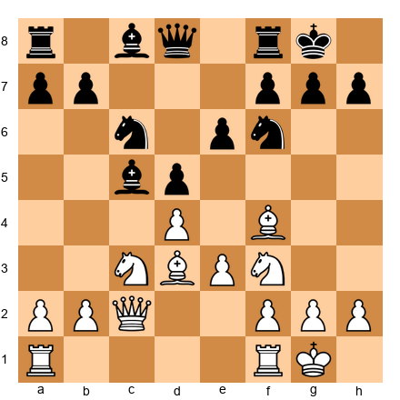

Full Greek Gift position. But this time, you must calculate ALL variations to their conclusion. Sound or speculative?

*Hint 1:* Bxh7+ Kxh7 Ng5+, analyze ...Kg8, ...Kg6, and ...Kh6 separately.
*Hint 2:* For each king move, calculate at least four moves ahead.
*Hint 3:* Is there any line where Black survives comfortably?

**Solution:** **Bxh7+ is fully sound.**
- **Kxh7 Ng5+ Kg8:** Qh5, threatening Qh7#. Re8 Qxf7+ Kh8 Qh5+ Kg8 Qh7+ Kf8 Qh8+ Ke7 Qxg7. White is up a pawn with a devastating attack.
- **Kxh7 Ng5+ Kg6:** Qd3+ f5 (only move) Qg3 (threatening Qh4 and Nh7, trapping the king) Qe7 Qh4, and ...Kf6 is met by Qh6+ Ke7 Nxe6, winning. White is winning.
- **Kxh7 Ng5+ Kh6:** Nxe6+ (discovered attack on the king from the queen on c2... actually, there is no discovered check here). Better: Nxf7+ Kg6 Qg6 (or Qd3+) with a mating attack since the king is in the open.

In ALL variations, White achieves a decisive advantage. This is the benchmark: when every variation leads to a White advantage, the sacrifice is sound. When even one variation gives Black comfortable equality, the sacrifice is speculative.

---

🛑 **Rest here.** The calculation exercises are the hardest in the chapter. You have worked your brain hard. Take a full break, at least 15 minutes, before the defense exercises.

---

### Section D: Defend This Position (Exercises 16.46 - 16.60)

*For each position, you are the defender. Find the best defensive move and explain your reasoning.*

---

**Exercise 16.46** ★★

Black to move. White has the Qc2 + Bd3 battery aimed at h7. How should Black defend?

*Hint 1:* The threat is Bxh7+. How can Black prevent it?
*Hint 2:* ...g6 defends h7 but weakens the dark squares. Is there a better option?
*Hint 3:* Can Black break the battery by attacking one of its pieces?

**Solution:** **...g6** is the most reliable defense. It prevents Bxh7+ entirely by covering h7 with the g6 pawn. Yes, it weakens the dark squares (f6, h6), but it eliminates the immediate mating threat. Black can follow up with ...Bg7 to reinforce the dark squares. Alternative defenses: ...Nd7 (rerouting the knight to f8 to defend h7) is too slow, White can sacrifice before the knight arrives. ...Re8 (preparing ...Nf8) is better but does not stop the immediate threat. The practical choice is ...g6, solve the immediate problem first, deal with the consequences later.

---

**Exercise 16.47** ★★

Black to move. The Greek Gift is threatened. Black's knight is on d7 (not great for defense). Find the best defensive setup.

*Hint 1:* Can the knight on d7 reach a better defensive square?
*Hint 2:* ...Nf8 covers h7 directly. Is it in time?
*Hint 3:* Are there other ways to defend h7?

**Solution:** **...Nf8!** The knight reroutes from d7 to f8, where it directly defends h7 and can later go to g6 (an active defensive square). After ...Nf8, the Bxh7+ sacrifice no longer works because the knight covers h7 from f8. If White plays Bxh7+ anyway, ...Nxh7 recaptures without any damage to the pawn shelter. This is the ideal defensive maneuver against the Greek Gift setup: the knight on f8 simultaneously defends h7 and remains flexible for future deployment.

---

**Exercise 16.48** ★★

Black to move. The battery is in place. Black's bishop is on d7 (passive). Find the best defensive move.

*Hint 1:* The bishop on d7 does not defend the kingside. Can it be improved?
*Hint 2:* ...Be8 covers h5. Does that help?
*Hint 3:* What about the active defense ...Nh5 (attacking the f4 bishop)?

**Solution:** **...Nh5!** This is an active defense. The knight attacks the bishop on f4, forcing White to deal with a threat instead of continuing the attack. After ...Nh5, if Bg5 (retreating to g5 to keep the bishop active), ...Qxg5, White has lost the dark-squared bishop. If Be5 Nxe5 Nxe5, Black has traded a pair of minor pieces, reducing White's attacking force. Active defense, creating your own threats while addressing the opponent's, is almost always better than passive defense. ...Nh5 challenges the attacker to respond.

---

**Exercise 16.49** ★★★

Black to move. White has the battery but no bishop on f4. The position is slightly less dangerous. What should Black do?

*Hint 1:* Without the dark-squared bishop, White's attack is slower.
*Hint 2:* Can Black use this time to create counterplay?
*Hint 3:* What about ...c5 (challenging the center) or ...Bd6 (actively developing)?

**Solution:** **...c5!** With White's dark-squared bishop absent, the attack is slower. Black should use this time to create central counterplay. After ...c5, Black challenges White's d4 pawn, threatens to open the c-file, and begins to seize the initiative in the center. Central counterplay is the best antidote to a flank attack. If White captures dxc5, Black recaptures with a piece and gains active play. If White ignores ...c5, Black plays ...cxd4 exd4, and the d4 pawn becomes a target. Fight fire with fire, meet a flank attack with a central counter.

---

**Exercise 16.50** ★★★

Black to move. White has just played Re1, building pressure in the center. Black's bishop is on g4, pinning the f3 knight. Should Black maintain the pin or trade?

*Hint 1:* The pin on the f3 knight prevents Ng5 and limits White's attacking options.
*Hint 2:* If Black plays ...Bxf3, White recaptures Qxf3. Does that help or hurt the defense?
*Hint 3:* After Qxf3, White's queen is on f3, is it better or worse for the attack?

**Solution:** **Maintain the pin.** After ...Bxf3 Qxf3, White's queen is on f3, perfectly placed for a kingside attack (it eyes f7, can swing to g3 or h5, and supports a future Bxh7+ if the position allows). Trading gives White exactly what the attack wants: the queen on an active square. Instead, Black should play **...Bh5** (maintaining the pin while retreating to a safe square) or **...d4** (challenging the center and gaining space). The pin on f3 is a valuable defensive resource. It prevents Ng5 and restricts White's options. Do not give it up without a concrete reason.

---

**Exercise 16.51** ★★★

Black to move. White is about to play Qc2, creating the battery. How does Black prevent this plan from being effective?

*Hint 1:* Once Qc2 is played, the Greek Gift becomes a real threat. Prevent it NOW.
*Hint 2:* What if Black plays ...Ne4, occupying the central square?
*Hint 3:* A knight on e4 blocks the Bd3's diagonal toward h7.

**Solution:** **...Ne4!** is an excellent prophylactic move. The knight on e4 blocks the d3 bishop's line toward h7, making the Greek Gift impossible. Even if White plays Qc2, the battery is blocked by Black's own knight. Additionally, the knight on e4 is a powerful piece in its own right. It controls d2, f2, d6, f6, c3, c5, g3, and g5. White must either accept the blockade or spend time removing the knight (Nxe4 dxe4, when the bishop on d3 must retreat). Prophylaxis, preventing the opponent's plan before it materializes, is the highest form of defense.

---

**Exercise 16.52** ★★★

Black to move. White has Qc2 and Bd3 (the battery), plus a bishop on d2 that can go to c1-f4 or a5. What is Black's most resilient defensive setup?

*Hint 1:* Black needs to cover h7 AND maintain active pieces.
*Hint 2:* Can Black combine ...Nf8 (defending h7) with ...Bd6 (preparing to trade dark-squared bishops)?
*Hint 3:* If Black trades dark-squared bishops, the attack on the dark squares weakens.

**Solution:** **...Bd6!** offers to trade dark-squared bishops. If White plays Bh6 (which the d2 bishop can reach via c1), ...Be7 covers the king. If White goes Bf4 Bxf4 exf4, the pawn on f4 is a weakness, not a strength, and the e-file opens for Black's rook. Black follows with ...Nf8 (defending h7) and ...Bd7-e8 (covering h5 and g6). The combination of trading a key attacking piece AND deploying the knight to f8 creates a strong defense. Multiple layers of defense are harder to break than a single one.

---

**Exercise 16.53** ★★★★

Black to move. Black has played ...Bf5 and ...h6. White cannot play Bxh7+ (Bf5 blocks) or Ng5 (h6 prevents). Has Black successfully neutralized the attack?

*Hint 1:* Black's defense looks solid. But is there a downside to ...h6?
*Hint 2:* Can White regroup and find a new attacking plan?
*Hint 3:* What should Black do NOW to consolidate?

**Solution:** Black has successfully neutralized the immediate Greek Gift threat. The bishop on f5 blocks the b1-h7 diagonal, and the h6 pawn prevents Ng5. However, Black must remain vigilant: ...h6 creates a long-term target (as discussed in the theory section), and White can regroup with Bxf5 exf5 (weakening the e-file), or Nh4 (challenging the f5 bishop). Black's best continuation is **...Bd6** (developing actively and preparing to trade dark-squared bishops) or **...Be4** (challenging the d3 bishop and occupying a strong central square). The defense is working, but Black must stay active. Passive defense eventually loses.

---

**Exercise 16.54** ★★★★

Black to move. Black has a knight on e4 AND a bishop on g4, both actively placed. White's Qc2 + Bd3 battery is blocked by the e4 knight. What should Black do next?

*Hint 1:* Black's pieces are well-placed defensively. What about counterplay?
*Hint 2:* ...Qf6 aims at f2 and supports the e4 knight.
*Hint 3:* ...f5 locks down the kingside but commits the pawn structure.

**Solution:** **...Qf6!** Black's defense is solid (the knight on e4 blocks the battery, the bishop on g4 pins the f3 knight). Now Black creates counterplay: the queen on f6 pressures f2 and supports the e4 knight. If White tries to remove the knight with Nxe4 dxe4 Bxe4, Black plays ...Bxf3 gxf3 Qxf3, and Black has a strong attack of their own against White's weakened kingside (the g2 pawn is gone and f3 is doubled). This is the ultimate defensive achievement: not just surviving the attack, but turning the tables. The best defense becomes an attack.

---

**Exercise 16.55** ★★

Black to move. Black has a fianchetto structure (g6). White has Bf4 and Bd3. Should Black play ...Bg7 or ...Nh5?

*Hint 1:* ...Bg7 places the bishop on its natural defensive square.
*Hint 2:* ...Nh5 attacks the f4 bishop but moves the knight from f6 (a key defensive square).
*Hint 3:* Which move improves Black's position more?

**Solution:** **...Bg7** is correct. The bishop on g7 is the foundation of the fianchetto defense. It guards the dark squares (f6, g7, h6, e5) and protects the king. Without the bishop on g7, the fianchetto shelter is incomplete. ...Nh5 is tempting (attacking the bishop), but it removes the knight from f6, where it defends h7 and h5 and controls e4 and d5. Moving the f6 knight in a position where the king needs defense is usually a mistake. Develop the bishop to its natural square first; then consider active ideas.

---

**Exercise 16.56** ★★★

Black to move. The battery is in place. Black has no good prophylactic moves. The best defense is a counter-blow. Find it.

*Hint 1:* When prophylaxis fails, counterplay is the answer.
*Hint 2:* What central break challenges White's center?
*Hint 3:* ...c5 attacks d4 and opens the c-file for Black's rooks.

**Solution:** **...c5!** When you cannot prevent the opponent's plan, create your own threats. After ...c5, Black challenges the d4 pawn, threatens to open lines in the center (where Black's pieces are better placed), and forces White to make a decision: take on c5 (opening lines for Black), advance to d5 (closing the center but giving Black the c5 square), or ignore it (allowing ...cxd4). Central counterplay is the universal remedy for a flank attack. If White is busy defending the center, the kingside attack slows down.

---

**Exercise 16.57** ★★

Black to move. White has the battery. Black has a queen on c7 and a bishop on d6. How does Black use these pieces defensively?

*Hint 1:* The bishop on d6 eyes h2. Is that relevant?
*Hint 2:* Can Black play ...Bxf4 exf4 and exploit the weakened kingside?
*Hint 3:* After ...Bxf4 exf4, the f4 pawn is exposed and the e-file opens.

**Solution:** **...Bxf4 exf4** is a good defensive exchange. By trading the dark-squared bishop, Black eliminates a potential attacking piece (the f4 bishop could have gone to h6 or supported a kingside advance). After exf4, White's pawn structure is compromised: the f4 pawn is isolated and the e-file opens for Black's rook. Black follows with ...Nd7 (heading to f8 to defend h7) and ...Qb6 (pressuring d4 and f2). The trade simplifies the position, fewer pieces means less attacking power for White. Trade attacking pieces, not defensive ones.

---

**Exercise 16.58** ★★★★

Black to move. White has the battery and Black has weakened the kingside with ...g6. Find the best defensive plan.

*Hint 1:* ...Nf8 defends h7. ...Bg7 defends the dark squares. Which comes first?
*Hint 2:* After ...Nf8 and ...Bg7, is Black's position secure?
*Hint 3:* Can Black then consider counterplay?

**Solution:** **...Nf8!** first, then ...Bg7. The knight on f8 directly defends h7, neutralizing the battery's threat. After ...Nf8, even if White plays Bh6, Black responds ...Bg7 Bxg7 Kxg7, and the king is adequately defended by the knight on f8 and the pawn on g6. The plan after defending: ...Bd7 (developing), ...Rc8 (activating the rook on the c-file), and ...c5 (central counterplay). Black's defense requires patience: first secure the king, then develop, then counterattack. This order is essential. Trying to counterattack before the king is safe is the most common defensive error.

---

**Exercise 16.59** ★★★★

Black to move. White has a knight on e5 AND the battery (Qc2 + Bd3). This is a very dangerous setup. Find the best defense.

*Hint 1:* The knight on e5 supports Ng4 or Nxf7. It also blocks the e-file.
*Hint 2:* Can Black remove the e5 knight? ...Nxe5 dxe5 opens the d-file but removes a piece near the king.
*Hint 3:* After ...Nxe5 dxe5 Nd7, the knight heads to f8 to defend. Is this good enough?

**Solution:** **...Nxe5!** is the best defensive move. After dxe5 **...Nd7** (heading for f8 to defend h7), Black has traded the powerful e5 knight and the remaining knight will reach f8 in one move. After ...Nd7-f8, the battery is neutralized. Yes, White has an e5 pawn and the d-file opens, but Black's king is safe and the position is manageable. The key insight: the e5 knight was the most dangerous piece in White's arsenal. Removing it, even at the cost of opening a file, is the correct defensive exchange. Remove the most dangerous attacking piece, even if it means accepting other concessions.

---

**Exercise 16.60** ★★★★

Black to move. White has a knight on c5 (attacking the queen on d7 and the e6 pawn) AND the battery (Qc2 + Bd3). Black is under pressure on both sides of the board. Find the defensive move that addresses BOTH threats.

*Hint 1:* The queen on d7 is attacked by the c5 knight. Where should the queen go?
*Hint 2:* If the queen moves to a safe square that ALSO defends the kingside, that solves both problems.
*Hint 3:* ...Qe8 defends h5 (preventing Qh5 ideas) and gets out of the knight's attack.

**Solution:** **...Qe8!** This single move addresses both problems: (1) The queen escapes the attack from the c5 knight. (2) The queen on e8 covers the h5 square, preventing White's queen from reaching h5 (a key attacking square in Greek Gift variations). From e8, the queen can also swing to g6 or f8 for additional defense if needed. Additionally, ...Qe8 prepares ...Nd7 (challenging the c5 knight) without leaving the queen exposed. This is multi-purpose defense at its best: one move that solves multiple problems. Always look for moves that address more than one issue.

---

🛑 **Rest here.** All sixty exercises complete. That was a significant amount of work. Take a full break. You have earned it.

---

## Key Takeaways

1. **The pawn shelter is the king's first line of defense.** Whether classical (f2, g2, h2), fianchetto (f7, g6 + Bg7), or queenside (a2, b2, c2), every pawn move in front of the king is a permanent weakening. Make them only when necessary.

2. **Castle early unless you have a concrete reason not to.** The burden of proof is on NOT castling. In the vast majority of positions, getting the king to safety and activating a rook is the right decision.

3. **Attacks require prerequisites.** Before launching an assault on the king, check for: development lead, open lines, piece coordination, and a weakened pawn shield. If you have three of four, attack. If you have fewer, prepare.

4. **The Greek Gift (Bxh7+) is a pattern, not a rule.** It requires three conditions: a bishop that can reach h7 with check, a knight that can jump to g5, and a queen that can reach h5. Always calculate, do not play it on autopilot.

5. **Sound sacrifices can be calculated. Speculative sacrifices rely on practical chances.** Know which one you are playing. Both have their place, but understanding the difference will save you from many painful losses.

6. **Initiative compensates for material.** If you are making the threats and your opponent is reacting, your attack may be worth more than the material you invested. But initiative is temporary. You must convert it before it evaporates.

7. **Defense has four tools: trade attackers, return material, create counterplay, and stay calm.** The best defense is often an active counter-punch, not a passive retreat. And the single most important defensive skill is staying calm under pressure.

8. **Know the eight practical patterns.** The battery on b1-h7, the rook lift, the knight on f5, queen-knight coordination, the f7 sacrifice, the h-file attack, back rank weakness, and the king hunt. Recognizing these patterns in your own games will transform your attacking play.

---

## Practice Assignment

**This week, do the following:**

1. **Play three games** (online or over the board). In each game, consciously evaluate the king safety on both sides after every castling move. Ask: "Are the prerequisites for an attack met?" Write down your assessment.

2. **Find two master games** with the Greek Gift sacrifice (Bxh7+) from any database (Lichess, Chess.com, or chessgames.com). Play through both games and verify that the three conditions were met before the sacrifice. Note whether the sacrifice was sound or speculative.

3. **Set up the following position on your physical board and study it for 15 minutes:**

Answer these questions:
- What are White's three most dangerous attacking ideas?
- How should Black defend against each one?
- If you were Black, what would your move be? Why?
- If you were White, what would your move be? Why?

Write down your answers before checking them against this chapter.

4. **Review your last 5 games** and identify any position where you or your opponent had an attack on the king. Ask: Were the prerequisites met? Was the attack well-timed? What could the defender have done differently?

5. **Find the Short vs. Timman 1991 game** (Game 40) in any database and play through it on your board. Pay special attention to the king march. Ask yourself at each move: "Is the king really safe here?" This game will change how you think about the king.

---

## ⭐ Progress Check

Answer these five questions to test your understanding. If you get at least four correct, you have mastered this chapter's core concepts.

**Question 1:** What are the three conditions required for the Greek Gift sacrifice (Bxh7+) to work?
> A bishop that can reach h7 with check, a knight that can jump to g5 in one move, and a queen that can reach h5 (or the kingside) quickly.

**Question 2:** Name the four prerequisites for a successful attack on the king.
> Development lead, open lines toward the king, piece coordination, and a weakened pawn shield.

**Question 3:** In a fianchetto structure, why is the dark-squared bishop on g7 so important?
> It defends the dark squares around the king (f6, g7, h6). If it is traded, the dark-square complex collapses and the king becomes vulnerable on those squares.

**Question 4:** What is the difference between a sound sacrifice and a speculative sacrifice?
> A sound sacrifice can be calculated to a concrete advantage: you can see the result. A speculative sacrifice relies on practical chances, where you believe the complications favor you, but you cannot prove the attack works.

**Question 5:** Name the four tools of defense when under attack.
> Trade attackers, return material, create counterplay, and do not panic.

**Scoring:**
- 5/5: Outstanding. You understand king safety at a level that will serve you for years.
- 4/5: Very good. Review the section you missed and move on with confidence.
- 3/5: Good foundation. Revisit the theory sections, pay special attention to the prerequisites and the defense tools.
- 0-2/5: This chapter covers a lot of ground. Reread the theory sections with a board in front of you. Focus on the four prerequisites and the Greek Gift conditions. These concepts take time to internalize, and there is no shame in needing multiple passes.

---

🛑 **Rest here.** Chapter 16 is complete. You have learned one of the most exciting and important topics in all of chess. The art of attack is the art of preparation, coordination, and courage, and the art of defense is the art of calm under fire.

Take a day off. Play a game just for fun. Let these ideas settle into your brain. When you come back, you will see attacking possibilities you never noticed before. That is the power of understanding king safety.

When you are ready, Chapter 17 awaits: *Endgame Foundations*.

---

*Chapter 16 of The Grandmaster Codex*
*Volume II: The Club Player*
*Written by Kit Olivas and Dr. Ada Marie*
*Exercises: 60 | Annotated Games: 5 | Pages: 50*
