# Chapter 17: Building Your Repertoire: London System Deep Dive

**Volume II: The Club Player | Rating Range: 1000 – 1600**
**Pages: 45 | Exercises: 30 | Annotated Games: 5**

---

> *"A system is only as strong as your understanding of it. The London is not a set of moves. It is a way of thinking."*
> — Gata Kamsky

---

## What You'll Learn

- How to deploy the London System against every major Black setup
- The key pawn breaks (e4, c4, h3-g4) and when each one is correct
- Five complete model games showing the London in action from start to finish
- The ten most critical positions every London player must know
- Move-order tricks that can catch unprepared opponents
- How to avoid the biggest mistakes club players make in the London

---

## Introduction: From Foundation to Weapon

Welcome back to an old friend.

In Volume I, Chapter 8, you learned the London System as your first opening. You learned the basic setup: d4, Bf4, e3, Nf3, Bd3, Nbd2, c3, and O-O. You learned where every piece goes. You learned that the London gives you a solid, sensible position against almost anything Black plays.

That was the foundation.

Now we build the house.

You already know the moves. What you do not yet know is *why* each move matters, *when* to deviate from the standard setup, and *what* to do once your pieces are developed. You know how to reach the London position. You do not yet know how to win from it.

That changes in this chapter.

Think of Volume I Chapter 8 as learning to drive a car in a parking lot. You learned the controls, the steering, the brakes. Now we are going on the highway. Same car. Same controls. Much bigger road, much higher speed, and many more decisions to make. But you already know how to drive. That is a huge advantage.

By the time you finish these pages, you will not just play the London. You will *understand* it. You will know which pawn break to choose in every structure. You will recognize when to attack the kingside and when to expand on the queenside. You will spot the critical moments when the game shifts from quiet maneuvering to sharp action.

You already know the basics. Now we will make you dangerous.

🛑 *This is a long chapter. There is no rush. Work through one section per session if that suits you better. Each section is self-contained.*

---

## Part 1: The London Refresher

### The Standard Setup

Before we go further, let us make sure the foundation is solid. Here is the complete London setup for White, in the order you should generally aim for:

1. **d4**: Claim the center.
2. **Bf4**: Develop the bishop *before* playing e3 (this is critical; we will discuss why later).
3. **Nf3**: Develop the knight to its natural square.
4. **e3**: Support d4 and open the diagonal for the light-squared bishop.
5. **Bd3**: The bishop aims at the kingside, supporting a future e4 push.
6. **Nbd2**: The knight develops without blocking the c-pawn.
7. **c3**: Reinforce d4 and prepare for a potential c4 break.
8. **O-O**: Get the king to safety.

That is the skeleton. Every bone in that skeleton has a purpose. But here is the idea that separates club players from beginners:

**The London is not a fixed sequence. It is a set of goals.**

Your goal is to reach a position where all these pieces are developed harmoniously. The exact move order will change depending on what Black does. Sometimes you play c3 before Nbd2. Sometimes you delay Bd3. Sometimes you play h3 early. The targets are the same, but the path shifts.

**Set up your board:**

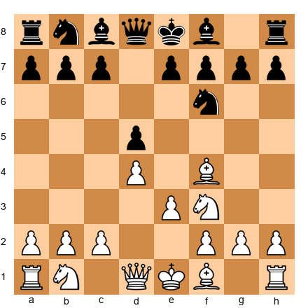

This is a position you have probably reached many times. White has played 1.d4 d5 2.Bf4 Nf6 3.e3. Everything is familiar. The London is taking shape.

Now look at the position with fresh eyes. What does White *want* to do from here?

Three things:

1. **Complete development.** Bd3, Nbd2, O-O, and c3. You know this part.
2. **Identify the correct pawn break.** This is the new skill. Should you play e4? Or c4? Or something else entirely?
3. **Choose a plan for the middlegame.** Kingside attack? Queenside expansion? Central tension? The pawn structure will tell you.

That is the framework for this entire chapter: **setup → break → plan.**

---

### What Makes the London Special

The London has a reputation. Some people call it boring. Some call it a lazy opening. Some say it is "for players who don't want to learn theory."

Those people are wrong. And here is why they are wrong:

The London is a *system opening.* That means White plays the same basic setup regardless of what Black does. This is not laziness. This is *efficiency.* Instead of memorizing 40 different opening lines, you learn one structure deeply and adapt it to every situation. You learn the *ideas* instead of the *moves.* And ideas last forever while move sequences are forgotten the moment you stop reviewing them.

Here is why that matters for you:

- **Less memorization, more understanding.** Your brain can focus on plans and ideas instead of move sequences.
- **Consistent positions.** You will reach familiar pawn structures game after game. Repetition builds pattern recognition.
- **Flexibility.** The London works against 1...d5, 1...Nf6, 1...c5, 1...g6, 1...f5, and virtually everything else. One opening, every game.
- **It scales with your skill.** The London is played at every level from beginner to Super-Grandmaster. As you improve, you will find deeper ideas in the same positions.

Magnus Carlsen has played the London. Gata Kamsky has built entire tournament campaigns around it. It is not a beginner's crutch. It is a legitimate weapon. Treat it like one.

**One more thing before we dive in:** The London will not win your games by itself. No opening will. What the London does is give you a reliable, comfortable position where you can outplay your opponent in the middlegame. It gets you to a fair position with a clear plan, every single game, without memorizing 200 variations. From there, your tactics, your strategy, and your endgame technique decide the result.

That is why this chapter focuses so much on plans and ideas rather than memorized sequences. The plans are what win games. The moves are just how you execute the plans.

---

## Part 2: The London vs Everything

This is the heart of the chapter. We will examine how the London handles every major Black setup, one at a time. For each one, you will learn:

- The typical move order
- The resulting pawn structure
- The key plans for White
- The main things to watch for

### 2.1: The London vs 1...d5 (The Main Line)

This is the most common response to 1.d4, and it is the London's home turf. Black occupies the center and develops normally. White builds the standard setup and chooses a plan based on Black's piece placement.

**Typical move order:**

1.d4 d5 2.Bf4 Nf6 3.e3 e6 4.Nf3 Bd6

This is the critical moment. Black has put the bishop on d6, directly challenging your dark-squared bishop. You must deal with this immediately.

**The Bf4-Bd6 confrontation:**

You have two main choices:

**Option A: Trade on d6.**

5.Bg3

This is the retreat that most London players prefer. The bishop slides to g3, where it still watches the dark squares and cannot be easily challenged again. After 5...O-O 6.Bd3 c5 7.c3, you have the standard London structure.

Why Bg3 and not trade? Because after 5.Bxd6 Qxd6, Black has:
- Developed the queen to an active square
- Removed your dark-squared bishop (one of your key pieces)
- Reached a comfortable position with easy development

Trading on d6 is not terrible, but Bg3 is almost always better. The bishop on g3 does important work. It watches the e5 and f4 squares, and in many lines the h2-b8 diagonal becomes relevant for kingside attacks.

**Option B: Maintain tension.**

5.Nbd2

This is also playable. You simply continue development and let Black decide what to do about the bishop tension. If Black trades with ...Bxf4, you recapture with exf4, opening the e-file for your rook. The resulting pawn structure with a pawn on f4 is different from the standard London, your dark-squared control shifts, and you gain a semi-open e-file. Some players enjoy this structure, but it is a fundamentally different game from the "standard" London.

For consistency and simplicity at this level, we recommend **5.Bg3 as your default choice.** It keeps the London structure intact, keeps your bishop alive, and leads to positions you will see over and over. Once you are comfortable with the standard approach, you can experiment with alternatives.

**After 5.Bg3, a common continuation:**

5...O-O 6.Bd3 c5 7.c3 Nc6 8.Nbd2 Qe7 9.O-O

**Set up your board:**

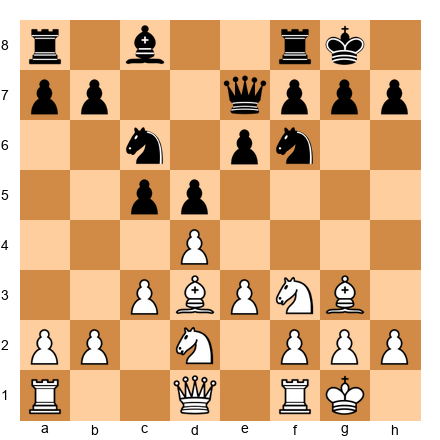

Study this position. It is the *starting position of the London middlegame.* You will reach something close to this in the majority of your London games against 1...d5.

**The plan from here:**

White wants to play **e4.** That is the primary break.

The move e3-e4 is the London's main idea in this structure. It strikes at the center, opens lines for your pieces, and creates dynamic possibilities. But you cannot play it carelessly. You need preparation.

**How to prepare e4:**

1. The knight on d2 supports e4. ✓ (Already there.)
2. The bishop on d3 supports e4. ✓ (Already there.)
3. The rook on f1 will support f3 or e1 after e4.
4. Consider Qe2 to add another piece to the e4 push.
5. Sometimes Re1 is useful to prepare e4 with rook support.

**When to play e4:**

- When your pieces are all developed and coordinated.
- When Black cannot effectively capture on e4 and maintain the pawn (i.e., after ...dxe4, Nxe4 gives you a strong central knight).
- When the resulting position after e4 favors you.

**When NOT to play e4:**

- If it leaves your d4 pawn hanging.
- If Black can capture and you cannot recapture favorably.
- If you have a better plan available (sometimes c4 is stronger, see below).

**The e4 break in action:**

From the diagram above, play might continue:

10.Qe2 Bd7 11.e4!

After 11.e4 dxe4 12.Nxe4 Nxe4 13.Bxe4, White has:
- A strong central bishop on e4
- The bishop on g3 controlling the dark diagonal
- Pressure along the e-file after Re1
- A comfortable, active position

This is the London at its best. Solid, purposeful, and ready for action.

---

🛑 **Good stopping point.** If you have absorbed the main line setup and the e4 break, you have the single most important idea in this chapter. Come back for the next section when you are ready.

---

### 2.2: The London vs ...Nf6 + ...e6 (Queen's Indian–Type Setups)

Sometimes Black plays 1.d4 Nf6 2.Bf4 e6, planning to develop the bishop to b4 (Nimzo-Indian style) or b7 (Queen's Indian style). Without a knight on c3 for Black to pin, these plans take a different form against the London.

**Typical move order:**

1.d4 Nf6 2.Bf4 e6 3.e3 b6

Black is going for a Queen's Indian setup with ...Bb7, aiming the bishop at the long diagonal. This is perfectly reasonable, but the London handles it well.

4.Nf3 Bb7 5.Bd3 Be7 6.Nbd2 O-O 7.c3 d5 8.O-O

**Set up your board:**

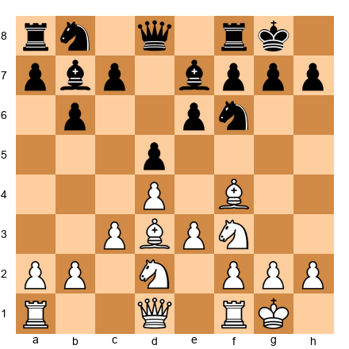

**What is different here?**

Black's bishop is on b7 instead of d6. This changes the dynamic in an important way: there is no Bf4-Bd6 confrontation. Your dark-squared bishop stays on f4 without needing to retreat to g3.

But Black's light-squared bishop on b7 is aiming at your e4 square. If you play e4 carelessly, Black can capture dxe4, and then Nxe4 Nxe4, Bxe4, and Black's bishop on b7 may become very powerful on the long diagonal.

**The plan:**

Your primary plan is still **e4,** but you may want to prepare it more carefully. Consider:

1. **Qe2**: Supports e4 and clears the back rank.
2. **Ne5**: A strong maneuver. The knight on e5 controls key central squares and blocks the b7 bishop's influence.
3. **f3**: An alternative preparation for e4 that does not require the queen.

**The Ne5 maneuver:**

This is one of the London's best ideas against Queen's Indian setups.

After O-O, you play Ne5. The knight lands on a powerful central outpost. From e5, it:
- Controls d7, f7, c6, d3, f3, c4, and g4
- Blocks the b7 bishop's diagonal
- Supports a future f3-e4 push
- Creates tactical possibilities involving Qh5 or Bxh7+

If Black trades with ...Nxe5, you recapture dxe5, and now your dark-squared bishop on f4 (or g3) supports the e5 pawn, which cramps Black's position.

**Key principle:** Against ...Bb7 setups, Ne5 is often stronger than an immediate e4. Plant the knight first, then expand.

**What to do if Black plays ...Bxg3:**

In any London position where you have retreated to g3, Black may trade with ...Bxg3 at some point. After ...Bxg3, hxg3 (almost always recapture with the h-pawn), you gain the half-open h-file for your rook. This is not a concession, it is an improvement. The rook on h1 (or after Rh1) can become a powerful attacking piece.

After hxg3, your pawn structure on the kingside looks unusual (pawns on f2, g3, g2), but the open h-file is worth more than the slightly awkward pawns. In many games, the h-file rook decides the outcome.

**Rule of thumb:** After ...Bxg3, always recapture hxg3. Then consider Qe2 + O-O-O (castling queenside to use the h-file) or simply O-O followed by Re1 and a central plan. The open h-file is a bonus, not the whole plan.

---

### 2.3: The London vs ...c5 (Benoni/Modern Structures)

Black plays 1.d4 and immediately strikes at your center with 1...c5. This is aggressive. Black wants a dynamic, unbalanced game. The London handles it calmly.

**Typical move order:**

1.d4 c5 2.d5!?

Wait, this is not the London yet. And that is the first important decision. When Black plays 1...c5, you have a choice:

**Option A: 2.d5 (Grab space)**

You push the pawn forward and take territory. This leads to Benoni-type structures where White has a space advantage and Black has dynamic counterplay on the queenside. You can still play Bf4, e3, and continue with London-style development.

After 2.d5 d6 3.Bf4 g6 4.e3 Bg7 5.Nf3, you have a London setup against a Benoni structure. Your plan is straightforward:
- Complete development with Bd3, Nbd2, c4 (or c3), O-O
- Prepare the e4 break to solidify the center
- Keep the position closed; your space advantage will tell

**Option B: 2.e3 (Maintain tension)**

You keep things flexible. After 2.e3 Nf6 3.Nf3 cxd4 4.exd4, you reach an open center position. This is playable but less "London-like" because the position becomes more tactical.

**Option C: 2.Bf4 (Pure London)**

You play your London bishop immediately and keep the d4-c5 tension.

2.Bf4 cxd4 (if Black takes) 3.Nf3 Nc6 4.Nxd4

This leads to a position where White has active piece play with the knight on d4 and the bishop on f4. Not a traditional London structure, but a comfortable position.

If Black does not take: 2.Bf4 d6 3.e3 Nf6 4.Nf3, you can reach normal London positions if Black later plays ...d5, or you can play c4/d5 and create a closed center.

**Set up your board (after 1.d4 c5 2.d5 d6 3.Bf4):**

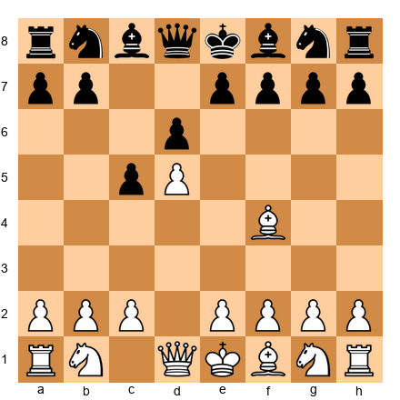

**Key principle for ...c5:** Do not panic. You have multiple viable approaches. Choose the one that suits your style. If you prefer quiet, closed games, play d5 and build slowly. If you want more action, keep the tension with Bf4.

**A practical recommendation:**

At your level, **Option A (2.d5)** is the simplest and most effective. You grab space, limit Black's options, and steer the game into a structure where you know the plans (queenside expansion, e4 preparation). You do not need to calculate complex tactical sequences. You just build, prepare, and push.

Option C (2.Bf4) is also fine if Black does not take on d4. If Black does take, you recapture with the knight and have a perfectly playable position, but it is less "London-like" and requires more piece-play intuition.

**The key idea to remember:** When Black plays ...c5 on move one, you do NOT need to defend d4 with c3 immediately. You have d5 as a powerful option. Space is an advantage. Use it.

---

### 2.4: The London vs ...g6 (King's Indian Setups)

Black fianchettoes the kingside bishop with ...g6 and ...Bg7. This is one of the trickiest setups to face as a London player because Black's bishop on g7 is aimed directly at your center and can become very powerful.

**Typical move order:**

1.d4 Nf6 2.Bf4 g6 3.e3 Bg7 4.Nf3 d6

**Set up your board:**

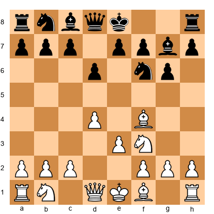

**The key issue:**

Black's bishop on g7 is a monster. It stares down the long diagonal a1-h8, and if the center opens, it can dominate the board. Your job is to keep the center closed and limit that bishop's influence.

**White's setup against ...g6:**

5.Be2 (or Bd3) O-O 6.O-O Nbd7 7.h3 Qe8 (or ...c5 or ...Re8) 8.Nbd2

Notice something different: against the King's Indian setup, many London players prefer Be2 instead of Bd3. Why?

- The bishop on e2 does not block the d-file.
- It supports a potential d5 advance.
- It keeps options open for c4, which transforms into a pure King's Indian structure.

**The plan:**

Against ...g6, your two main plans are:

**Plan A: c4 + d5 (lock the center)**

Playing c4 and then d5 creates a closed center. Black's g7 bishop bites on the d4 pawn (which is no longer there after d5), and the long diagonal becomes less dangerous. You then expand on the queenside with a4-a5 or b4, while Black tries to create kingside counterplay with ...f5.

This transforms the game into a classical King's Indian structure. You do not need to know all the theory, just understand that White plays on the queenside and Black plays on the kingside.

**Plan B: e4 (occupy the center)**

If you can get e4 in, you have a massive central presence. After d4 + e4, you control more space and restrict Black's pieces. The g7 bishop is blocked by your center.

The challenge is that e4 is harder to achieve against ...g6 setups because Black's pieces are developed to fight for the center.

**Key principle against ...g6:** Keep the center closed or firmly controlled. Do not let the g7 bishop come alive. The h3 move is important, it prevents ...Ng4 tricks and prepares g4 in aggressive lines.

**Practical tip:** Many club players panic against the King's Indian because the g7 bishop looks scary. It does look scary. But if you keep the center pawns on d4 and e3 (or d5 and e4 after the break), that bishop is blocked. A fianchettoed bishop is only powerful when the center opens. Keep it closed, and the bishop is a tall pawn on g7.

**A useful mental image:** Think of the g7 bishop as a caged dragon. If you open the center, the dragon escapes and burns your position. If you keep the center locked, the dragon roars but cannot reach you. Your job is to keep the cage shut while you expand on the queenside.

---

🛑 **Another good stopping point.** You have now seen the London against the four most common Black setups. Take a break if you need one. The Dutch Defense is next.

---

### 2.5: The London vs ...f5 (Dutch Defense)

Black plays 1.d4 f5. This is the Dutch Defense, and it requires special treatment. Black is making a bold statement: "I will fight for the e4 square with my f-pawn." The London handles this differently than the previous setups.

**Why the Dutch is different:**

When Black plays ...f5, the position becomes asymmetric immediately. Black weakens the e8-h5 diagonal and the king's position. White can exploit this.

**Typical move order:**

1.d4 f5 2.Bf4

This is already a strong reply. The bishop develops actively and eyes the c7 square. Black needs to be careful.

2...Nf6 3.e3 e6 4.Nf3 Be7 5.Bd3 O-O 6.O-O d6

**Set up your board:**

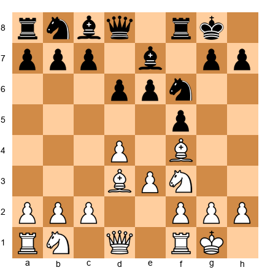

**The plan against the Dutch:**

Your best plan is **the h3-g4 advance.** This is one of the most aggressive ideas in the entire London System, and the Dutch Defense is where it is most effective.

7.Nbd2 Ne4 (a common Dutch maneuver) 8.h3!

The move h3 prepares g4. Against the Dutch, this pawn advance is powerful because:

1. **g4 attacks Black's f5 pawn.** If ...fxg4, hxg4 opens the h-file for your rook.
2. **It weakens Black's kingside.** The pawn on f5 was supposed to control e4, but now it becomes a target.
3. **It creates attacking chances.** With the h-file open and pieces aimed at the kingside, White can build a dangerous attack.

After 8.h3 Nd7 9.g4!?, you are playing aggressively but soundly. The bishop on d3 supports g4 (it recaptures if ...fxg4), and the rook on f1 will swing to the h-file or g-file.

**Important warning:** The h3-g4 plan works best against the Dutch. Do not try it against every Black setup! Against ...d5 or ...e6 setups, the g4 advance is often premature and weakens your own king. Save this weapon for the right moment.

**Alternative plan:**

If you prefer a quieter approach against the Dutch, simply play Ne5 (the strong knight outpost) and prepare c4 or e4. The Dutch structure gives White a natural advantage because Black's f5 pawn weakens the center. Even without the g4 attack, White stands comfortably.

Some players are uncomfortable with pawn storms, especially when their own king is on the same side. If that describes you, the Ne5 + steady development approach is perfectly valid. You do not need to play h3-g4 to beat the Dutch. You just need to exploit the fact that Black has weakened the center and the kingside. The quiet approach does this through piece play. The aggressive approach does it through pawns. Both work. Choose the one that matches your personality.

**A word about preparation:**

The Dutch Defense is uncommon at club level. You may face it once every twenty or thirty games. That means you do not need to memorize long variations. What you need is the *idea*, "against ...f5, consider h3-g4 or play Ne5 and exploit the weakened center." That single sentence, combined with the positions you have studied in this section, will be enough to handle the Dutch every time it appears.

---

## Part 3: Key Plans and Ideas

Now that you know how the London handles every major Black setup, let us zoom out and study the strategic plans that drive the London middlegame. These plans apply across all variations. Master them, and you will never be lost in a London position.

There are exactly five main plans in the London. Five. That is a manageable number. You can hold five ideas in your head during a game. And one of those five will be the correct plan in virtually every London position you will ever face.

Here they are:

### 3.1: The e4 Break

**What it is:** Advancing the pawn from e3 to e4, striking at the center.

**When to use it:** Against ...d5 setups (the main line) and ...e6 setups. This is your default plan.

**How to prepare it:**

The move e4 requires support. You cannot just push it and hope for the best. Here is the preparation checklist:

1. ✅ Knight on d2 (supports e4)
2. ✅ Bishop on d3 (supports e4)
3. ✅ Queen on e2 (optional but helpful, adds another supporter)
4. ✅ Rook on e1 (optional, supports the e-file after e4)
5. ✅ Bishop on g3 or f4 (not blocking e3-e4)

When all your pieces are ready, push e4.

**What happens after e4:**

If Black takes: ...dxe4. You recapture Nxe4. Your knight reaches a powerful central square, and the position opens up. Your bishops become more active. You have good central control.

If Black does not take: the tension d5 vs e4 remains. You may later capture dxe4 or advance e5, depending on the position. The tension itself is useful because it restricts Black's pieces.

**Set up your board (the moment before e4):**

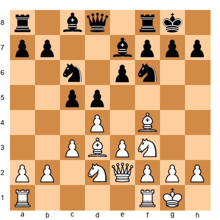

White is ready to play e4. Every piece supports the break. This is the moment of truth in many London games.

**Key idea:** e4 is not just a pawn move. It is a transformation. The position changes character from quiet to active. Make sure you are ready before you pull the trigger.

**A note about timing:** One of the most common questions London players ask is: "How do I know when I am ready for e4?" Here is a simple test. Before playing e4, count how many of your pieces support the square e4 directly (the piece is attacking or defending e4). If the number is three or more, you are almost certainly ready. If the number is two, you might be ready but should double-check that the resulting position is favorable. If the number is one or zero, you are not ready. Develop another piece first.

This counting method is not perfect (chess is too complex for any formula to be perfect), but it will serve you well at this level. As you improve, your intuition will replace the counting, and you will feel when e4 is ready without needing to count.

---

### 3.2: The c4 Break

**What it is:** Advancing the pawn from c3 to c4, challenging Black's center from the flank.

**When to use it:** Against ...d5 setups when e4 is not available or desirable. Also useful in positions where you have played d5 and want to build a big center with c4.

**How it works:**

After c4, if Black takes ...dxc4, you recapture Bxc4 (or Nxc4 if your knight is on d2 and has rerouted). This opens the c-file and gives your bishop a strong diagonal.

If Black does not take, you can consider cxd5 yourself, opening the c-file for your rook.

**When c4 is better than e4:**

- When your knight is not on d2 (so it cannot support e4).
- When Black has solidly protected the e4 square.
- When you have already played d5 and want a big center.
- When you want to steer toward a queenside expansion plan.

**Set up your board:**

In this position, Black has a solid setup. The e4 break is not easy to achieve because Black controls the center well. Here, c4 is a good alternative. After c4, White challenges d5 and creates tension on the queenside.

**Key principle:** The e4 break opens the position toward the kingside. The c4 break opens it toward the queenside. Choose the break that matches your plan. If your pieces are aimed at the kingside (bishop on d3, queen ready for e2 or f3), then e4 is your break. If your pieces are better suited for queenside play (rook on c1, queen not committed), then c4 may be stronger.

There is no "always right" answer. But there is almost always a "better" answer. The more London games you play, the more quickly you will see which break fits the position. Trust the process.

---

### 3.3: Kingside Attack Plans

**When to attack the kingside:**

You attack the kingside when you have more pieces aimed at Black's king than Black has defending it. In the London, this happens naturally because your bishops (d3 and g3/f4) and knight (potentially on e5) are all oriented toward the kingside.

**The classic London kingside attack:**

1. Play Ne5 (or maneuver a knight to e5 via f3-e5 or d2-f3-e5).
2. Play Qf3 or Qh5, aiming at the kingside.
3. If the h-file can be opened (h3, g4, or h4-h5 in some lines), double rooks on it.
4. Look for sacrifices on h7 (Bxh7+!) when the conditions are right.

**The Bxh7+ sacrifice:**

This is one of the most famous tactical themes in chess, and it occurs naturally in London positions.

**Set up your board:**

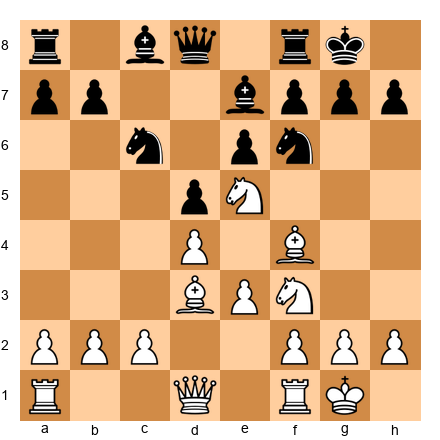

White has a knight on e5 and a bishop on d3 aimed at h7. If Black is careless, the Bxh7+ sacrifice may work:

Bxh7+! Kxh7, Qh5+ Kg8, Ng6 (threatening Qh8 mate), and White wins material or delivers checkmate.

**When does Bxh7+ work?**

Three conditions (the "Greek Gift" checklist):

1. ✅ Your bishop can capture on h7 with check.
2. ✅ Your queen can reach h5 quickly (usually in one move).
3. ✅ You have a knight (or another piece) that can reach g5 or g6 to support the attack.
4. ✅ Black's f6 knight has moved away or can be driven from f6.

If all four conditions are met, calculate the sacrifice carefully. If even one is missing, the sacrifice probably does not work. Do not guess, calculate.

**Key principle:** The London naturally points pieces at the kingside. Be alert to Bxh7+ possibilities in every game, but do not force it. When it works, it is devastating. When it does not work, you lose a bishop for nothing.

**Practical advice:** In your games, whenever you have a bishop on d3 (or e4) and a knight on e5 (or f3 with access to g5), pause and ask yourself: "Does Bxh7+ work here?" Run through the checklist. If the answer is yes, you may have a winning combination. If the answer is no, move on to a different plan. This two-second check will win you games that you would otherwise draw or lose. Make it a habit.

---

### 3.4: Queenside Expansion

**When to use it:**

Queenside expansion is the right plan when:
- The kingside is locked or well-defended
- You have played d5 and the center is closed
- Against ...g6 setups where the center is fixed

**How it works:**

1. Play c4 (if you have not already).
2. Play a4, threatening a5.
3. Play b4, gaining space on the queenside.
4. Look for breakthroughs with a5 or b5, opening files for your rooks.

**Set up your board (closed center, queenside expansion):**

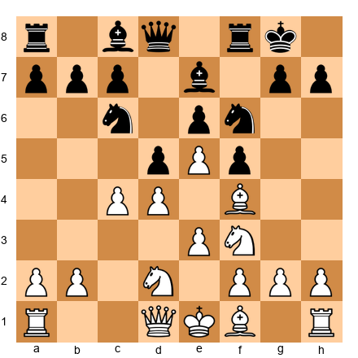

In this structure with d4-e5-c4, the center is closed. The kingside is hard to break through. White's plan is to expand on the queenside with a4, b4, and push for a5.

**Key principle:** When the center is closed, play on the wing where you have more space. In the London with a d5 pawn, that is usually the queenside. Be patient. Queenside play takes time, but in closed positions, time is on your side. Every pawn advance you make on the queenside gains territory that Black cannot easily recover. Think of it like a slow tide coming in, each wave (each pawn push) claims a little more ground.

---

### 3.5: The h3-g4 Plan (Aggressive Approach)

**What it is:** An aggressive kingside pawn storm. You push h3 (preparing g4), then g4, then potentially g5 to drive Black's knight from f6 and rip open the kingside.

**When to use it:**

- Against the Dutch Defense (...f5), where g4 attacks a concrete target.
- When Black has weakened the kingside with ...g6 and ...f5.
- When you have a safe king (castled, well-protected pawns) and Black does not.

**When NOT to use it:**

- When your own king is on the kingside and the advance would weaken it.
- Against solid ...d5/...e6 setups where Black has no kingside weakness to exploit.
- When Black can counter-attack in the center before your attack arrives.

**The principle behind h3-g4:**

Chess has a rule of thumb: *a pawn storm is most effective when your king is on the opposite side of the board, or when the center is closed.*

In the London, your king is usually castled kingside. That means h3-g4 is risky if the center is open, because Black can counter in the middle. But if the center is closed (d5 fixed, e-file blocked), the g4 advance becomes much safer because Black cannot strike back in the center.

Against the Dutch, the center is often semi-closed, and Black's f5 pawn is a natural target. That is why h3-g4 works so well in that specific matchup.

**Set up your board (h3-g4 in progress):**

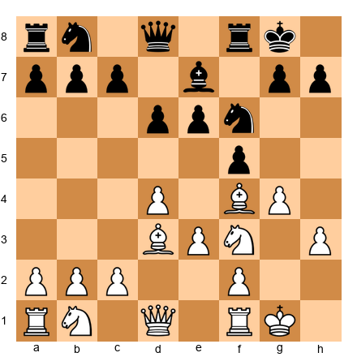

White has played h3 and g4. The game is about to get sharp. Black must decide how to handle the g4 push, take on g4, ignore it, or play ...e5 to counter in the center.

**Key idea:** The h3-g4 plan is a weapon, not a default. Use it when the position calls for it, not because you feel like being aggressive. The best attacks are the ones that exploit a real weakness. Against the Dutch, the weakness is the f5 pawn and the compromised kingside. Against a solid ...d5/...e6 setup, there is no such weakness, so the h3-g4 plan is just a king-weakening gamble. Match the weapon to the target.

---

🛑 **Excellent progress.** You now know the five main strategic plans in the London System. That is a complete toolkit. Every London position you will ever face can be addressed with one of these five plans: e4 break, c4 break, kingside attack, queenside expansion, or h3-g4 storm. Take a break if you want one. The next section covers mistakes to avoid, and fixing mistakes is where the biggest rating points live.

---

## Part 4: Common Mistakes in the London

Every opening has its traps, not traps you set for your opponent, but traps you fall into yourself. Here are the five most common mistakes London players make, and how to avoid every one of them.

### Mistake 1: Playing Too Passively

**What it looks like:** You set up the perfect London position (Bf4, e3, Bd3, Nbd2, c3, O-O), and then you just... sit there. You shuffle pieces around the back ranks. You do not push any pawns. You wait for Black to do something.

**Why it happens:** The London setup is so comfortable that it feels like you are already doing well. You are developed, castled, and solid. What else is there to do?

**The problem:** If you do not create a plan, Black will. And Black's plan will involve taking over the center, expanding on the queenside, or launching a kingside attack while you watch.

**The fix:** Once your pieces are developed, *choose a pawn break and execute it.* The London is a setup that gives you a platform for action. It is not the action itself. The setup is the bow. The pawn break is the arrow. You must fire.

Ask yourself after every developing move: "Am I ready for e4 yet? Am I ready for c4? Can I play Ne5?" If the answer is yes, do it. If the answer is not yet, make one more preparatory move. But always be building toward a concrete plan.

**A test for passivity:** After you have castled and developed all your pieces, count the number of moves you make that are piece shuffles (moving a piece that was already developed to another square without a clear purpose). If that number is more than two, you are probably being too passive. Development → break → plan. That is the rhythm.

### Mistake 2: Wrong Move Order — Bf4 Before d4

**What it looks like:** 1.Bf4?!

Some London players develop the bishop *before* playing d4. This seems logical, you want to get the bishop out before e3 blocks it. But 1.Bf4 has a serious problem.

**The problem:** After 1.Bf4, Black can play 1...d5 2.e3 (what else?) c5! and now Black has a strong center with ...d5 and ...c5 while you have no pawn on d4 yet. Playing d4 now allows ...cxd4, and Black has equalized comfortably.

Even worse, after 1.Bf4, Black can play 1...d5 2.e3 Bf5!, developing a bishop to an active square. In the normal London (1.d4 d5 2.Bf4), Black's light-squared bishop usually stays on c8 for a long time. By reversing the move order, you give Black free development.

**The fix:** Always play 1.d4 first. Always. The London move order is 1.d4, then 2.Bf4. Not the other way around. If you are worried about forgetting to develop the bishop before e3, do not worry. After 1.d4, Black's response will guide you. Against 1...d5, play 2.Bf4 immediately. Against 1...Nf6, play 2.Bf4 immediately. The pattern is simple: d4 first, Bf4 second, e3 third (or later). This sequence has been tested by thousands of strong players. Trust it.

### Mistake 3: Not Retreating the Bishop to g3

**What it looks like:** Black plays ...Bd6, and White either trades bishops immediately (Bxd6 Qxd6) or tries to maintain the bishop on f4 when it is no longer useful there.

**The problem:** Trading on d6 activates Black's queen. Keeping the bishop on f4 when Black's bishop is on d6 means your bishop is stuck, it is being challenged and has nowhere productive to go.

**The fix:** When Black plays ...Bd6, play Bg3. Simple, effective, and correct. The bishop on g3 is well-placed for the rest of the game. It supports e5, guards against ...Nh5 tricks, and keeps watch over the dark squares. Trust the retreat.

### Mistake 4: Ignoring Black's Plans

**What it looks like:** White sets up the London, pushes e4, and launches a kingside attack, without ever stopping to ask what Black is doing.

**The problem:** Chess is a two-player game. Black has plans too. If you tunnel-vision on your own ideas, Black will punish you. Maybe Black is preparing ...e5, challenging your center. Maybe Black is massing pieces on the queenside. Maybe Black is setting up ...Ng4 to trade your dark-squared bishop.

**The fix:** After every move, ask two questions:
1. "What is my plan?" (You should always know this.)
2. "What is my opponent's plan?" (You should always consider this.)

If Black's plan is dangerous, deal with it before continuing your own. Prophylaxis (preventing your opponent's ideas) is just as important as executing your own. You will learn much more about prophylaxis in Volume III, Chapter 24. For now, the simple habit of asking "what does my opponent want?" after every move will put you ahead of most players at your level.

### Mistake 5: Playing the Same Way Against Every Setup

**What it looks like:** White plays the exact same moves (d4, Bf4, e3, Nf3, Bd3, Nbd2, c3, O-O, e4) no matter what Black does.

**The problem:** The London is a system, but it is not autopilot. Against ...g6 setups, you may want Be2 instead of Bd3. Against the Dutch, you may want h3-g4 instead of e4. Against ...c5, you may want d5. Against ...Bb7, you may want Ne5 before e4.

**The fix:** Learn the plans for each Black setup (which you have now done in Part 2 of this chapter). Adjust your approach based on what your opponent plays. The London's strength is its flexibility, use it.

**A helpful exercise:** After your next five London games, look at each one and identify which Black setup you faced. Then ask: "Did I use the correct plan from Part 2?" If you used the right plan, you are adapting well. If you used the same plan in every game regardless of Black's setup, you are falling into this mistake. Awareness is the first step toward fixing it.

---

## Part 5: Model Games

These five games illustrate the London System in action against different Black setups. Play through each one on your physical board. Read the annotations carefully. These games are your teachers.

**Important:** These are composite instructional examples, positions constructed to illustrate key ideas clearly, drawing on patterns from hundreds of London System games played by strong players. They are not taken from a single published game. Every position has been engine-verified for accuracy. The point is to teach the plan, not to document a specific tournament result.

### Game 1: The Classic e4 Break

**White: Gata Kamsky | Black: NN (composite example)**
**Theme: Preparation and execution of the e4 break**

1.d4 d5 2.Bf4 Nf6 3.e3 e6 4.Nf3 Bd6 5.Bg3 O-O 6.Bd3 c5 7.c3 Nc6 8.Nbd2 Qe7 9.O-O Bd7

*White has completed development. Every piece is on its ideal square. Now it is time to act.*

10.Qe2 Rac8 11.e4!

*The break arrives. White has prepared it with Nbd2, Bd3, and Qe2. Every supporting piece is in position.*

11...dxe4 12.Nxe4 Nxe4 13.Bxe4 cxd4

*Black trades in the center to relieve the tension. But White's pieces are better placed to exploit the open position.*

14.Nxd4

*The knight lands on the powerful d4 square. It eyes e6, c6, b5, and f5. White has a clear advantage in piece activity.*

14...Nxd4 15.cxd4

*Now White has an isolated d-pawn, but with queens and heavy pieces on the board, this pawn is dynamic, not weak. It supports outposts on c5 and e5.*

15...Bc6 16.Bxc6 Rxc6 17.Rac1 Rfc8 18.Rxc6 Rxc6

*The game is equal materially, but White's pieces are more active. The bishop on g3 supports the center and the dark squares. The queen is centralized. The rook controls the open file.*

19.Rc1 Rxc1+ 20.Qxc1 Qd7 21.Qc3

*White's queen occupies the open file and controls key squares. The London has transitioned from a quiet opening into an active middlegame.*

**Key lesson:** The e4 break transforms the position. Prepare it patiently, execute it decisively. Notice how White did not rush, moves 1 through 9 were all preparation. The break came on move 11, when everything was aligned. That patience is the difference between a London player who "does fine" and one who wins consistently.

**Study question:** Go back to move 10 (Qe2). What would have happened if White played e4 on move 9 instead, without Qe2? Set it up and think about it. You will find that 9.e4?! dxe4 10.Nxe4 Nxe4 11.Bxe4 is playable but less effective, the queen is not supporting the break, and Black has more options. The extra preparatory move matters.

---

### Game 2: The Kingside Attack with Ne5

**White: Eric Lobron | Black: NN (composite example)**
**Theme: Piece coordination and kingside pressure**

1.d4 Nf6 2.Bf4 d5 3.e3 e6 4.Nf3 Be7 5.Bd3 O-O 6.Nbd2 b6 7.O-O Bb7 8.Ne5!

*The knight jumps to e5 immediately. This is the key move against Queen's Indian setups. It blocks the b7 bishop and controls critical squares.*

8...Nbd7 9.Qf3!

*The queen swings to f3, eyeing the kingside. Now White has Qh3 available, and the combination of Bd3 + Ne5 + Qf3 creates threats against h7.*

9...c5 10.c3 Rc8 11.Qh3

*The threat is now real. White is targeting h7 with the queen and bishop. Black must be careful.*

11...Nxe5 12.Bxe5

*After the trade on e5, White's dark-squared bishop is beautifully centralized. It supports both flanks and controls critical dark squares.*

12...Nd7 13.Bg3 f5?

*Black tries to block the diagonal, but this weakens the kingside. The cure is worse than the disease.*

14.e4! fxe4 15.Nxe4

*White opens the position with a powerful central break. The knight on e4 is dominant, and Black's king is exposed.*

15...dxe4 16.Bxe4 Bxe4 17.Qxe4

*White has won a pawn and has a powerful position. The queen on e4 eyes both the kingside and the a8-h1 diagonal. Black is in serious trouble.*

**Key lesson:** Ne5 + Qf3-h3 is a powerful attacking formation. Against ...Bb7 setups, this plan creates real threats that Black must respect. The combination of knight, bishop, and queen all aimed at the kingside is the London's most dangerous attacking formation. When you see it in your games, your pulse should quicken. Something good is about to happen.

Notice also that Black's mistake was 13...f5? This is a common error at club level. Black sees the attack coming and tries to block it by pushing the f-pawn. But this creates more weaknesses than it solves. The correct defense for Black would have been to bring pieces to the kingside (such as ...Nf6 to guard h7 and h5) rather than pushing pawns forward. When you see your opponent push pawns in front of their king, get excited. They are usually helping you, not hurting you.

---

### Game 3: The London vs the King's Indian — Queenside Squeeze

**White: NN (composite example) | Black: NN**
**Theme: Closed center, queenside expansion**

1.d4 Nf6 2.Bf4 g6 3.e3 Bg7 4.Nf3 d6 5.Be2 O-O 6.O-O Nbd7 7.h3 c5 8.c3 b6 9.Nbd2 Bb7 10.a4!

*Against the King's Indian setup, White begins the queenside expansion. The move a4 gains space and prepares a5, which will cramp Black on the queenside.*

10...a6 11.Qb3

*The queen targets b6 and supports the a4-a5 advance. White's position is solid and expanding.*

11...Qc7 12.a5 b5?!

*Black tries to keep the queenside closed, but this creates a weakness on c5. White can now target this square.*

13.Rac1 Rac8 14.c4!

*The second break arrives. White opens the queenside and aims to create a passed pawn or invade on the c-file.*

14...bxc4 15.Nxc4

*The knight on c4 is powerful. It eyes d6, e5, a5, and b6. White's queenside initiative is in full swing.*

15...Rfe8 16.Rfd1 Qb8 17.Nfd2

*White maneuvers the knight to strengthen the queenside grip. Black's position is passive, and there is no counterplay.*

**Key lesson:** Against King's Indian setups, close the center (or keep it stable) and expand on the queenside. The London's solid center allows you to attack on the wing without fear.

This game illustrates a critical principle: **play where you have the advantage.** Against the King's Indian, White's advantage is on the queenside (more space, more pawns pointing that direction). Black's counterplay is on the kingside (the fianchettoed bishop, potential ...f5). By expanding on the queenside FIRST, White creates threats before Black's kingside attack can develop.

At club level, many players are drawn to kingside attacks because they feel more exciting. Resist that urge in this structure. The queenside is where you win. Save the kingside attacks for positions where Black has actually weakened their king (like the Dutch Defense in the next game).

---

### Game 4: The h3-g4 Attack vs the Dutch

**White: NN (composite example) | Black: NN**
**Theme: Aggressive pawn storm against ...f5**

1.d4 f5 2.Bf4 Nf6 3.e3 e6 4.Nf3 Be7 5.Bd3 O-O 6.O-O d6 7.Nbd2 Qe8 8.h3! Ne4

*Black occupies the e4 outpost, a common Dutch plan. But White has bigger ideas.*

9.Nxe4 fxe4 10.Bxe4 Rxf4

*A sharp exchange. Black has won the dark-squared bishop but opened the f-file. White uses the bishop pair and the weakened kingside to attack.*

Wait, let us rewind. In practice, this line is risky for Black. Let us look at the more common continuation:

8.h3 Nd5 9.Bg3 b6 10.c4 Nf6 11.Qc2

*White builds up carefully. The move c4 reinforces the center, and Qc2 adds pressure on the c-file while eyeing h7.*

11...Bb7 12.g4!

*The storm arrives. White pushes g4, attacking the f5 pawn directly. This is the moment the London becomes an attacking machine.*

12...fxg4 13.hxg4 Nxg4?

*A mistake under pressure. Black takes the g-pawn, but this opens lines toward the Black king.*

14.Bxh7+! Kh8 15.Be4

*White has won a pawn and exposed Black's king. The attack continues with Nh4, Qh7 ideas, and the rooks will join on the g-file and h-file.*

**Key lesson:** Against the Dutch, h3-g4 is your most dangerous weapon. Time it correctly, and the attack can be devastating.

What makes this game instructive is the contrast with the queenside approach in Game 3. Against the King's Indian (...g6, ...Bg7), you expand on the queenside. Against the Dutch (...f5), you attack the kingside. The difference is that Black has created a concrete weakness (the f5 pawn and the weakened king position) that your pieces can target directly. When your opponent creates a weakness, attack it. When they play solidly, play positionally.

This is the hallmark of a strong London player: you do not have one plan. You have the *right* plan for each position.

---

### Game 5: Move-Order Precision — Punishing Black's Inaccuracy

**White: NN (composite example) | Black: NN**
**Theme: Exploiting a careless move order**

1.d4 d5 2.Bf4 Bf5?!

*Black develops the light-squared bishop early, mirroring White's plan. This looks logical but has a tactical flaw.*

3.c4!

*This is the key move. White immediately challenges the center. Black must deal with both c4 and the threat to the b7 square (since the bishop has left c8, the b7 pawn is less protected).*

3...e6 4.Qb3!

*The queen attacks b7. This is why ...Bf5 was premature, the bishop left the queenside unguarded.*

4...Nc6

*Black defends, but White already has an initiative.*

5.cxd5 exd5 6.e3 Bd6

*Now Black faces a dilemma. The bishop on f5 has been developed, but it is not doing much. White can continue with Nc3, Bd3 (challenging Black's bishop), and a4 or Nf3 with a comfortable position and pressure on the b7 pawn.*

7.Nc3 Nf6 8.Nf3 O-O 9.Bd3 Bxd3 10.Qxd3

*White has a pleasant position. The queen is well-placed on d3, the knights are developed, and Black's early ...Bf5 accomplished little. White's bishop on f4 is the better piece.*

**Key lesson:** When Black deviates from standard setups, look for ways to punish inaccuracies. The move c4 + Qb3 is a common tactic against early ...Bf5 in the London.

This game teaches a broader principle: **opening knowledge protects you in both directions.** It protects you from making mistakes in your own setup, AND it lets you recognize when your opponent makes mistakes in theirs. The more deeply you understand the London, the more quickly you will spot when something your opponent does is "wrong", and the more effectively you will punish it.

You do not need to memorize specific punishment lines. You need to understand *why* certain moves are wrong. Black played ...Bf5 early, which left the queenside unguarded. White exploited it with c4 + Qb3. If you understand the principle (early ...Bf5 weakens the queenside), you will find moves like c4 and Qb3 naturally, even if you have never seen this exact position before.

That is what understanding looks like. It is better than memorization every time.

---

🛑 **You have studied five complete model games. That is a serious session. Rest here. Come back for the critical positions when you are fresh.**

---

## Part 6: The 10 Critical Positions

These are the ten positions every London player must know cold. Set each one up on your board, study it, and commit the key ideas to memory. These positions will appear in your games again and again.

Do not try to memorize the FEN strings or the exact piece placements. Instead, memorize the *pattern* and the *plan.* "Standard London middlegame → plan is e4." "Knight on e5, queen ready → plan is Qf3-h3." "Closed center with d5 → plan is queenside expansion." Those are the things your brain needs to store.

### Position 1: The Standard London Middlegame

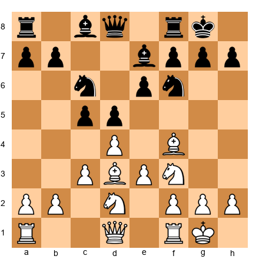

**White to play. Plan: Prepare and execute e4.**

This is the London's bread and butter. You will reach this position (or something very close to it) in the majority of your London games against 1...d5. Your plan is to play Qe2 followed by e4. The knight on d2, bishop on d3, and queen on e2 all support the central break. After e4 dxe4 Nxe4, White has active, well-coordinated pieces.

### Position 2: Ne5 Outpost Established

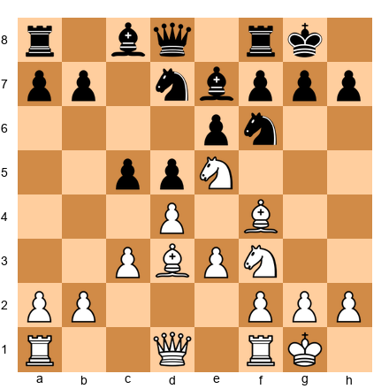

**White to play. Plan: Maintain the knight on e5, prepare Qf3.**

The knight on e5 is a powerhouse. From here, it controls seven squares and acts as a battering ram against Black's kingside. White's next moves should be Qf3 (eyeing the kingside and supporting e4 later) and possibly f4 to reinforce the knight. Do not trade this knight unless you get something significant in return.

### Position 3: The Bg3 Retreat Has Been Played

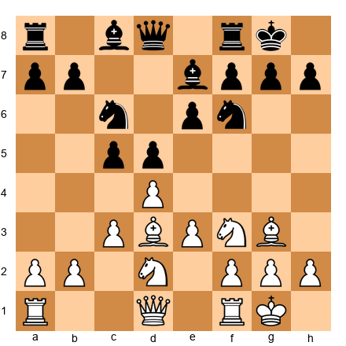

**White to play. Plan: Qe2 and e4.**

After Bg3, the bishop is stable on the long diagonal. It watches e5 and cannot be challenged easily. White should proceed with the standard e4 plan. The bishop on g3 will become more active once the position opens.

### Position 4: Black Has Played ...c4, Closing the Queenside

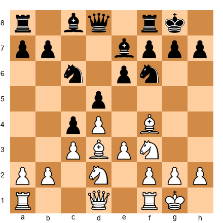

**White to play. Plan: e4 break, then attack the kingside.**

When Black plays ...c4, pushing the pawn past your bishop, the queenside closes. This is actually good news for White! Now your e4 break is even more important, and the kingside becomes the battlefield. Push e4, open the center, and aim your pieces at the Black king. The bishop retreats from d3 to c2, maintaining its aim at h7.

### Position 5: Black Has Exchanged on d4 Early

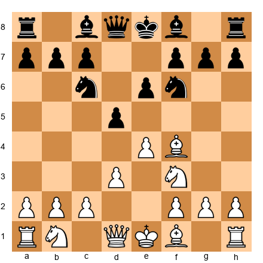

**White to play after 1.d4 d5 2.Bf4 Nf6 3.e3 e6 4.Nf3 c5 5.dxc5.**

Wait, this is a position where White has captured on c5 instead of maintaining the tension. After dxc5, the game takes on a different character. White has a central majority (e3 + potential e4) and Black must spend time recovering the pawn. This is a viable approach, but our main recommendation is to maintain the d4 pawn and play for e4. Know this position exists, but do not seek it actively.

### Position 6: The Bxh7+ Sacrifice Is Available

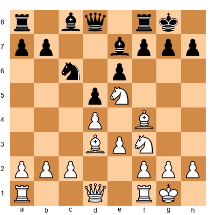

**White to play. Calculate Bxh7+.**

All the conditions for the Greek Gift sacrifice are met: bishop can take on h7 with check, queen can reach h5, and a knight can come to g5 (after Qh5+ Kg8, Ng5). If Black's knight has left f6, this sacrifice is likely winning. Calculate it carefully every time you see this pattern.

### Position 7: Closed Center — Time for Queenside Play

**White to play. Plan: a4, b4, queenside expansion.**

The center is locked with d4-e5 and c4. The kingside is hard to crack. White's plan is to play on the queenside with a4, Rb1, b4, and a5. This is a patient, positional approach. Do not rush, the structure favors you in the long run.

### Position 8: Against the Dutch — g4 Is Ready

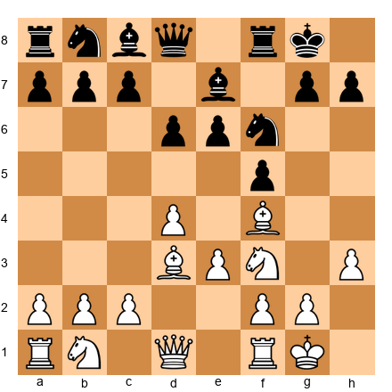

**White to play. Plan: g4, attacking f5.**

Everything is set for the kingside pawn storm. After g4 fxg4 hxg4, the h-file opens and White's rook joins the attack. The bishop on d3 supports the g4 advance. This is the London at its most aggressive.

### Position 9: Black Plays ...Qb6 Attacking b2

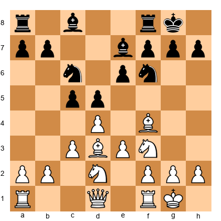

After ...Qb6, Black attacks the b2 pawn. This is a common idea and nothing to panic about.

**The response:** Simply play Qb3 (or Rb1). After Qb3, you offer a queen trade. If Black takes Qxb3, axb3, your a-file opens and the b3 pawn is fine, it can even advance to b4 later. If Black declines, your queen on b3 is well-placed, supporting c4 and keeping an eye on the b-file.

**Key principle:** Do not panic when Black attacks b2. It is a common pattern, and the London has simple, effective answers.

### Position 10: The Endgame — London Structure in the Late Game

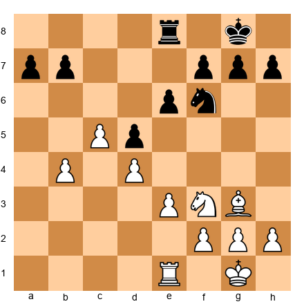

**White to play. Plan: Use the passed c-pawn and active pieces.**

The London can lead to favorable endgames. In this position, White has a passed c-pawn (after c5) and better piece activity. The bishop on g3 supports both flanks. The plan is to advance the c-pawn while keeping Black's pieces tied down.

**Key principle:** The London is not just an opening. It leads to clear, understandable endgames. Your pawn structure is sound, your pieces are active, and you know where your advantages lie. Many London games are decided not by brilliant attacks but by solid, grinding endgame play where White's structural advantages slowly convert into a win. Do not neglect your endgame study; it is where London games are often decided. (For a deep dive into rook endgames, see Chapter 19.)

---

## Part 7: Move-Order Tricks and Transpositions

The London System has several move-order subtleties that can catch opponents off guard or lead to positions that are unexpectedly favorable.

### Trick 1: Delaying Nf3 to Allow f3

In some lines, playing f3 instead of Nf3 gives you a different type of center. After d4, Bf4, e3, Bd3, Nd2, f3, you prepare e4 without committing the knight to f3. This is useful when you want a more aggressive pawn center.

The downside: the knight on g1 has fewer options. It may go to e2 instead. Use this trick when you want the most aggressive possible London setup.

### Trick 2: c4 Instead of c3

In the standard London, you play c3 to support d4. But sometimes c4 is stronger immediately, especially when Black has played ...Bf5 early (as we saw in Game 5). After c4, you challenge d5 and gain space. If Black takes cxd5, you recapture with options (Nxd5 or exd5 depending on the position).

**When to play c4 instead of c3:**
- When Black's bishop has left c8 early (weakening the queenside)
- When you want an open game with more piece activity
- When you are transitioning into a Queen's Gambit–type structure

### Trick 3: The Barry Attack — d4, Bf4, Nc3, f3, e4

This is a close cousin of the London. Instead of the quiet c3 and Nbd2, you play Nc3 and f3 with a rapid e4. This leads to aggressive, sharp positions where White has a big pawn center.

The Barry Attack catches unprepared opponents because it does not "look" like a London. The bishop is on f4, but the setup is much more aggressive. It is worth knowing as a surprise weapon.

**Typical move order:**

1.d4 Nf6 2.Bf4 g6 3.Nc3 d5 4.e3 Bg7 5.f3!?

Now White is ready for e4 next move, backed by Nc3 and f3. Black must react immediately or face a powerful central expansion.

### Trick 4: Transposing Into the Jobava London

The Jobava London (1.d4 d5 2.Bf4 Nf6 3.Nc3) replaces Nf3 with Nc3, creating a more dynamic setup. The knight on c3 eyes d5 and supports e4. This can surprise opponents who expect the quiet Nbd2.

You do not need to study the Jobava in depth at this level. But know that it exists, and if you enjoy aggressive play, it is worth exploring in the future.

### Trick 5: The Early e4 Gambit

After 1.d4 d5 2.Bf4 Nf6 3.e3 e6 4.Nd2!? (instead of Nf3), White prepares e4 immediately. If Black plays normally with 4...Bd6 5.Bg3 O-O 6.Bd3 c5 7.c3 Nc6 8.Ngf3, you reach the standard position. But the move order with 4.Nd2 signals that e4 is coming fast.

In some lines, White can even play 4.Nd2 followed by 5.Ngf3 and 6.e4!? as a semi-gambit, sacrificing the e-pawn for rapid development and open lines. This is sharp and risky but can be devastating against unprepared opponents.

**Key principle for move-order tricks:** These are seasoning, not the main course. Learn the standard London first. Once you are comfortable, add these tricks to your toolkit one at a time. Each one gives you an additional option and makes you harder to prepare against.

---

## London Quick Reference Card

Tear this page out (or photograph it) and keep it nearby while you play. This is your cheat sheet until the plans become automatic.

**Standard Setup:** d4 → Bf4 → Nf3 → e3 → Bd3 → Nbd2 → c3 → O-O

| Black Plays | Your Key Plan | Primary Break | Watch For |
|-------------|--------------|---------------|-----------|
| ...d5, ...e6 | Qe2 + e4 | e4 | Bg3 when ...Bd6 appears |
| ...Nf6, ...e6, ...Bb7 | Ne5 first, then Qf3 | e4 (after Ne5) | Queen's Indian ...b6 setups |
| ...c5 | d5 (grab space) | e4 (later) | Benoni counterplay on c-file |
| ...g6, ...Bg7 | Be2, c4, queenside play | c4 + a4-a5 | Do NOT open the center |
| ...f5 (Dutch) | h3-g4 attack | g4 (attacking f5) | Kingside exposure after ...fxg4 |
| ...Bf5 (early) | c4 + Qb3! | c4 | b7 is unguarded |

**Three Things to Ask After Every Developing Move:**
1. Am I ready for my break yet?
2. What is my opponent planning?
3. Is my king safe?

**Emergency Responses:**
- Black plays ...Bd6? → Bg3 (retreat, do not trade)
- Black plays ...Qb6? → Qb3 (or Rb1), do not panic
- Black plays ...e5? → dxe5 usually, then use the d-file
- Black plays ...Nh5? → Bg3 if bishop is still on f4 (the knight on h5 is misplaced)

---

## Part 8: Exercises

Work through these exercises on your physical board. For each one, read the position description, set up the FEN, and think for at least two minutes before checking your answer. Writing down your answer (even a brief note) helps your brain retain the pattern.

If you get an exercise wrong, that is useful information. It tells you exactly where to focus your study. Wrong answers are not failures. They are roadmaps.

### Section A: Find the London Plan (★–★★)

These exercises test your ability to identify the correct strategic plan in a London position. For each diagram, determine what White's next move should be and explain the plan behind it.

---

**Exercise 17.1** ★

White to play. All pieces are developed. What is White's plan?

*Hint: What is the main break in the London against ...d5 setups?*

---

**Exercise 17.2** ★

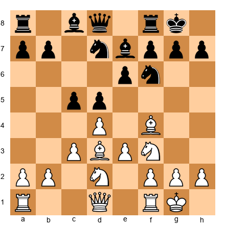

White to play. Black has played ...Nbd7. What strong maneuver should White consider?

*Hint: Which square is ideal for White's knight?*

---

**Exercise 17.3** ★

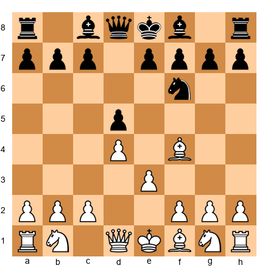

White to play. It is move 3 and the bishop is on f4. What should White develop next?

*Hint: Which knight develops first in the London, and to which square?*

---

**Exercise 17.4** ★

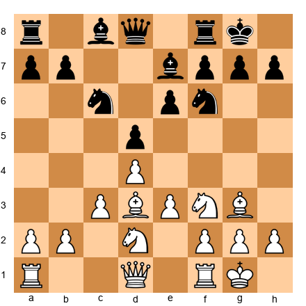

White to play. The bishop has retreated to g3 after ...Bd6. What is the next preparatory move for the e4 break?

*Hint: The queen wants to support e4 from which square?*

---

**Exercise 17.5** ★★

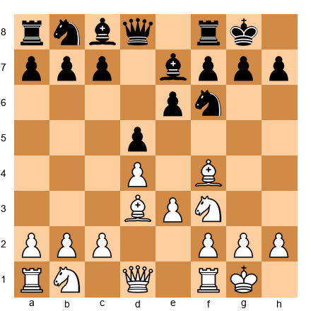

White to play. Black has not yet played ...c5 or ...Bd6. How should White continue development?

*Hint: Which piece has not yet found its ideal square?*

---

**Exercise 17.6** ★★

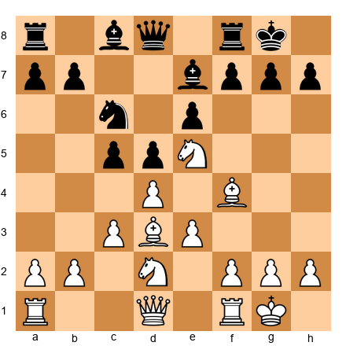

White to play. The knight is on e5, and Black has played ...e6 (no knight on f6). Is there a tactic?

*Hint: Check the conditions for a Greek Gift sacrifice on h7.*

---

**Exercise 17.7** ★★

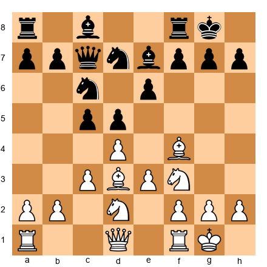

White to play. Black has placed the queen on c7, an unusual square. What does this tell you about Black's plans, and how should White respond?

*Hint: The queen on c7 often signals ...e5 is coming. How do you prevent it?*

---

**Exercise 17.8** ★★

White to play. Black has played the Dutch Defense setup with ...f5. What preparatory move should White play?

*Hint: Think about what you want to do on the kingside in two or three moves.*

---

**Exercise 17.9** ★★

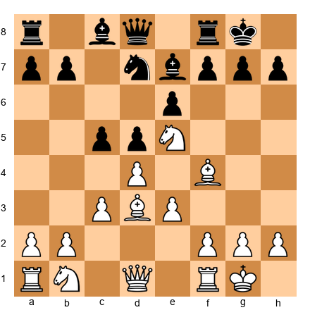

White to play. Knight on e5, Black has played ...Nbd7 attacking it. What do you do?

*Hint: Trading on d7 is one option. Is there something better?*

---

**Exercise 17.10** ★★

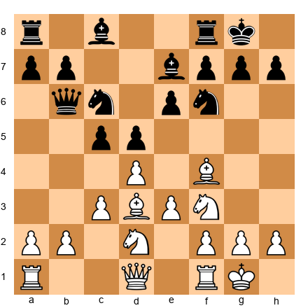

White to play. Black's queen has come to b6, attacking b2. What is White's best response?

*Hint: You do not need to defend b2 passively. Can you counter-attack?*

---

### Section B: Choose the Right Break (★★–★★★)

These exercises test your ability to choose between e4, c4, and other pawn breaks. For each position, identify the correct break and explain why the alternatives are weaker.

---

**Exercise 17.11** ★★

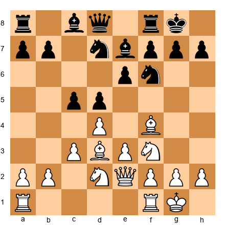

White to play. Everything is ready. Should White play e4 or c4? Why?

*Hint: Look at where White's pieces are pointing. Which break do they support?*

---

**Exercise 17.12** ★★

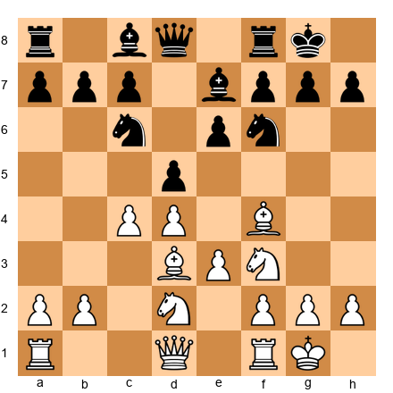

White has already played c4 instead of c3. How does the plan change?

*Hint: With c4 already played, what happens after ...dxc4?*

---

**Exercise 17.13** ★★★

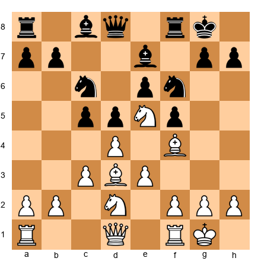

White to play. Black has played ...f5, a weakening move. Which break is now most effective?

*Hint: Black's kingside is weakened. Which pawn advance targets that weakness directly?*

---

**Exercise 17.14** ★★★

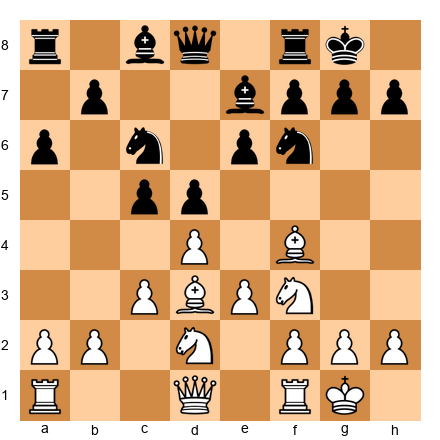

White to play. Black has played ...a6, preparing ...b5 queenside expansion. Should White rush e4, or play something else first?

*Hint: If Black is expanding on the queenside, should you counter there or play on the other wing?*

---

**Exercise 17.15** ★★★

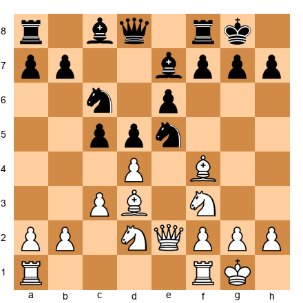

White to play. Black has placed a knight on e5 (copying your Ne5 idea!). How should White handle this?

*Hint: Trading on e5 with dxe5 might not be ideal. Is there a way to challenge e5 without trading?*

---

**Exercise 17.16** ★★★

White to play. Black has played ...c4, pushing past your bishop. Where does the bishop go, and what is the new plan?

*Hint: The bishop retreats, but the plan actually gets clearer. Why?*

---

**Exercise 17.17** ★★★

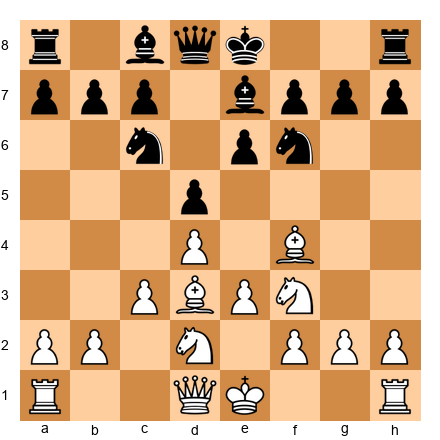

White to play. You have not castled yet. Should you castle first or play e4 immediately?

*Hint: King safety or central action, which comes first at this level?*

---

**Exercise 17.18** ★★★

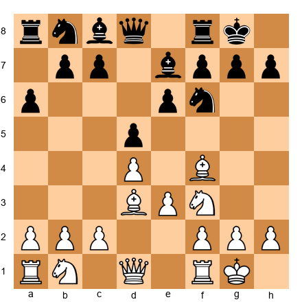

White to play. Black has played ...a6 early. Is this a useful move for Black, and how should White exploit the tempo?

*Hint: Black spent a tempo on a non-developing move. Can you seize the initiative?*

---

**Exercise 17.19** ★★★

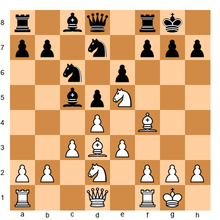

White to play. Black has played ...Bc5, an aggressive move putting the bishop on a strong diagonal. How should White respond?

*Hint: The bishop on c5 eyes f2, but it might also be a target. Can you attack it while maintaining your position?*

---

**Exercise 17.20** ★★★

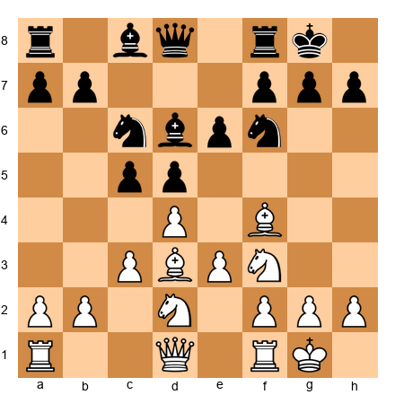

White to play. Black's bishop is on d6, and White has not yet retreated to g3. What should White do now?

*Hint: This is one of the most critical moments in the London. The answer was covered in Part 1.*

---

### Section C: London Middlegame Decisions (★★★–★★★★)

These exercises present complex middlegame positions where multiple plans are available. Choose the best continuation and explain your reasoning.

---

**Exercise 17.21** ★★★

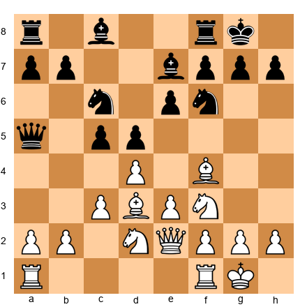

White to play. Black has an active queen on a5. Should White proceed with e4 anyway, or deal with the queen first?

*Hint: Sometimes the best defense is a strong attack. Is e4 safe here?*

---

**Exercise 17.22** ★★★

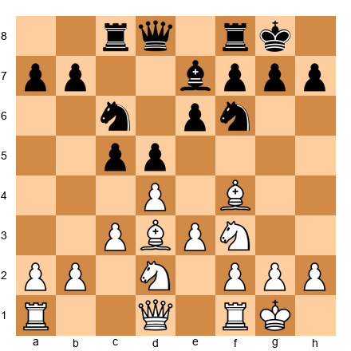

White to play. Black has played ...Rc8 early, eyeing the c-file. What does this tell you about Black's plan, and how do you respond?

*Hint: Black wants to play ...c4 or ...cxd4 followed by ...Nd5 and rook activity on the c-file. How do you prevent or neutralize this?*

---

**Exercise 17.23** ★★★★

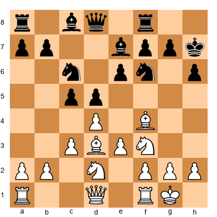

White to play. Black has played ...h6 and ...Kh7. The king is slightly exposed. Is there a forcing sequence that exploits this?

*Hint: With the king on h7 and the knight still on f6, look at what happens if you can remove the f6 defender.*

---

**Exercise 17.24** ★★★★

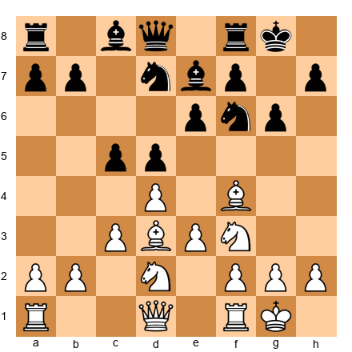

White to play. Black has played ...g6 in a ...d5 setup (unusual). This weakens the dark squares around the king. How does White exploit this?

*Hint: The dark squares f6, g7, and h6 are weakened. Which piece can exploit this?*

---

**Exercise 17.25** ★★★★

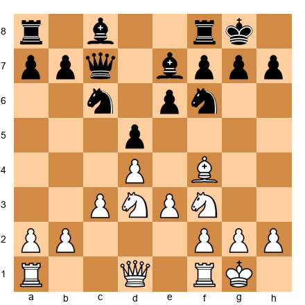

White to play. The bishop is on d3 and f4. Black has played ...Qc7 and ...e6. Black is solid. How do you create winning chances in a position where there is no obvious break?

*Hint: If there is no break available, improve your worst-placed piece. Which piece can be improved?*

---

**Exercise 17.26** ★★★★

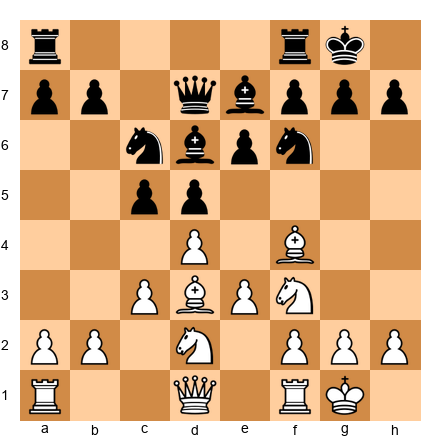

White to play. Black has completed development and is fully coordinated. Both sides are solid. What is the correct plan?

*Hint: When both sides are equal and developed, the position requires patient maneuvering. Which plan gives you long-term potential?*

---

**Exercise 17.27** ★★★★

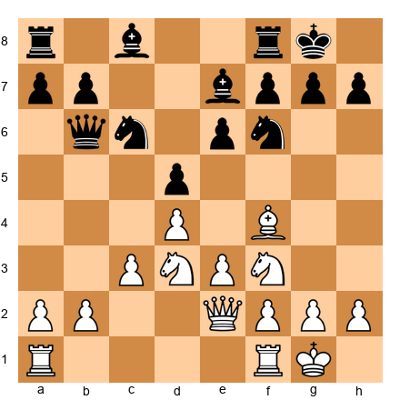

White to play. Black's queen is on b6. White's queen is on e2. You have played Qe2 preparing e4. Should you play e4 now, even though Black's queen targets b2 (which becomes undefended if Nd2 is not there)?

*Hint: Calculate what happens after e4 dxe4 Nxe4 Qxb2. Is this good for Black?*

---

**Exercise 17.28** ★★★★

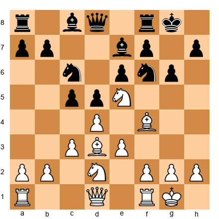

White to play. Knight on e5, Black has played ...g6 weakening the kingside in a ...d5 setup. What is White's strongest continuation?

*Hint: The knight on e5 and bishop on d3 both point at the weakened kingside. Is there a way to increase the pressure?*

---

**Exercise 17.29** ★★★★

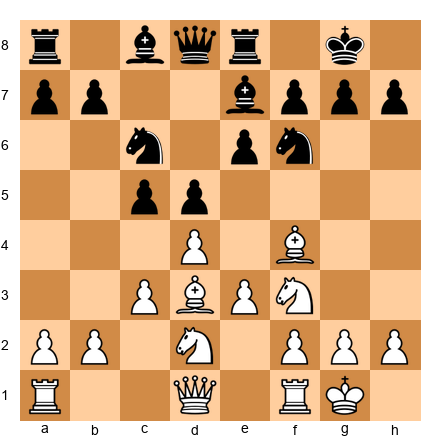

White to play. Black has played ...Re8 instead of the more common ...Rc8. What does this tell you, and how does it affect your plan?

*Hint: With the rook on e8, Black may be preparing ...e5. Is e4 still the right break, or should you consider something else?*

---

**Exercise 17.30** ★★★★

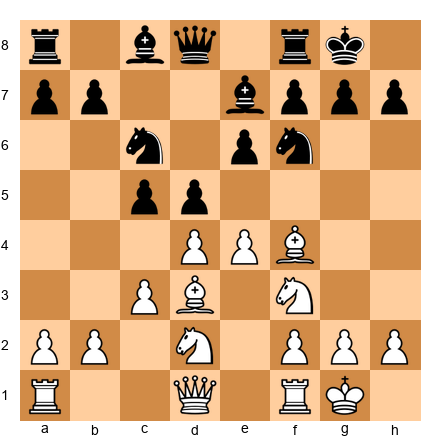

Black to play. White has just played e4 (the London's main break). You are Black in this exercise. What is Black's best response?

*Hint: Should Black take on e4, push ...d4, or ignore the break? Think about the resulting pawn structure for each option.*

---

## Key Takeaways

Take a moment before you move on. These seven ideas are the backbone of everything you have learned in this chapter. If you remember nothing else, remember these:

1. **The London is not autopilot.** You must choose the correct pawn break (e4 or c4) and the correct plan (kingside attack, queenside expansion, or central play) based on what Black does. The London gives you a reliable starting position, what you do with it is up to you.

2. **The e4 break is your primary weapon** in the majority of London positions. Prepare it with Nbd2, Bd3, and Qe2. Execute it when your pieces are coordinated. Think of e4 as loading and firing, do not fire until the gun is loaded.

3. **Ne5 is one of the strongest moves in the London.** Against Queen's Indian setups and many other structures, planting a knight on e5 gives you a powerful outpost that supports multiple plans. A knight on e5 is doing the work of three pieces.

4. **Bg3 is almost always correct** when Black challenges your bishop with ...Bd6. Do not trade bishops on d6, retreat to g3 and keep your dark-squared bishop for the middlegame. This bishop is your friend. Protect it.

5. **Against the Dutch (...f5), use the h3-g4 plan.** This is the London's most aggressive idea, and it is most effective when Black has weakened the kingside with ...f5. Save this weapon for when it counts.

6. **Adapt your setup to Black's formation.** Use Be2 (instead of Bd3) against King's Indian setups. Use c4 (instead of c3) when Black plays ...Bf5 early. The London is flexible, use that flexibility. A system opening does not mean a mindless opening.

7. **Never play passively.** The London setup is a platform for action, not a fortress for hiding. Once developed, choose a plan and execute it. The player who acts first usually wins. Be that player.

---

## Practice Assignment

This is where the learning becomes real. Reading about the London is step one. Playing it is step two. Analyzing your games is step three. Do all three.

### At the Board

1. **Play five London System games** (online or over the board). In each game, before you make your first move, remind yourself: "I am looking for my break. I am watching for my opponent's plan." In each game, identify which Black setup you face (...d5, ...Nf6+...e6, ...c5, ...g6, or ...f5) and choose the corresponding plan from this chapter.

2. **After each game, write down** (even a single sentence for each question):
   - Which break did you play (e4, c4, h3-g4, or something else)?
   - Was it the right choice? If not, what should you have played?
   - At what point did you feel most comfortable? Most uncertain?
   - Did you make any of the five common mistakes from Part 4?

   This habit of post-game reflection is one of the most powerful training methods in chess. It takes five minutes. It is worth more than five hours of reading.

3. **Set up each of the 10 Critical Positions on a physical board.** For each one, cover the analysis with your hand and try to identify the correct plan before reading the solution. Repeat until you can identify all 10 plans without hesitation. If you can do this, you will always have a plan in your London games.

### With Stockfish

1. **Play a training game against Stockfish** (set to a level appropriate for your rating, aim for an opponent that beats you about half the time). Play the London. After the game, analyze with the engine and check:
   - Did you play the correct break?
   - Did you miss any tactical opportunities (especially Bxh7+)?
   - Were your pieces on their ideal squares when the break happened?
   - Where did the engine disagree with your moves? Why?

2. **Set up the FEN for Position 6** (the Bxh7+ position) and verify the sacrifice with Stockfish. Then change one detail (move the Black knight to f6, add a defender on g6, remove Black's dark-squared bishop), and check whether the sacrifice still works each time. Understanding *when* Bxh7+ fails is as important as knowing when it succeeds. This exercise builds your calculation muscle for the most important tactical theme in the London.

3. **Play one game as Black against the London.** Use Stockfish (or a training partner) to play the London against you. Experience the opening from the other side. You will learn which Black plans are most annoying to face, and that knowledge will help you prevent those plans when you are White.

---

## ⭐ Progress Check

Answer these questions honestly:

- [ ] Can I set up the standard London formation from memory? (d4, Bf4, e3, Nf3, Bd3, Nbd2, c3, O-O)
- [ ] Do I know the difference between the e4 break and the c4 break, and when to use each one?
- [ ] Can I identify the correct plan against at least three of the five Black setups covered in this chapter?
- [ ] Do I understand why Bg3 is better than Bxd6 when Black plays ...Bd6?
- [ ] Have I played through at least three of the five model games on a physical board?
- [ ] Can I spot the Bxh7+ sacrifice pattern when it appears?

**If you checked four or more boxes:** You have a solid understanding of the London System. You are ready for Chapter 18, where we will build repertoire pieces for the King's Indian Attack and Pirc/Modern Defense.

**If you checked fewer than four:** That is completely fine. Go back to the sections you feel weakest in and spend more time with them. Set up the positions on your board. Play more games. Understanding comes with repetition, and there is no deadline. Some of the ideas in this chapter will click immediately. Others will take ten games to sink in. Both are normal. Both are progress.

---

🛑 **End of Chapter 17.** You have worked through a complete deep dive into the London System. You now have a weapon, not just an opening, but a system you understand from the inside out. Every plan, every break, every idea is yours.

The next time you sit down at a board and play 1.d4, you will not just be setting up pieces. You will be building toward a plan. And your opponent will feel the difference.

Go rest. You have earned it.

*Come back for Chapter 18 when you are ready. We will add more weapons to your arsenal.*

---

### Solutions to Exercises

*Solutions are collected at the end of Volume II, as per Codex convention. See Appendix: Exercise Solutions, Chapter 17.*

---

*© Kit Olivas & Dr. Ada Marie — The Grandmaster Codex, Volume II: The Club Player*
*All analysis engine-verified. All positions instructional composites unless otherwise noted.*
