# Chapter 18: Building Your Repertoire: KIA, Pirc/Modern, KID

**Volume II: The Club Player | Rating Range: 1000 – 1600**
**Pages: 50 | Exercises: 30 | Annotated Games: 5**

---

> *"In the King's Indian, I feel like a different chess player. The positions demand creativity, courage, and concrete calculation. It is not chess for the timid."*
> — Garry Kasparov

---

## What You'll Learn

- How to deploy the King's Indian Attack as a universal system for White
- How to play the Pirc and Modern Defenses against 1.e4, including responses to White's most aggressive lines
- How to play the King's Indian Defense against 1.d4, including the famous kingside attack
- The complete move orders, plans, and key positions for all three openings
- Five master games that demonstrate the ideas in real competition
- Why these three openings share the same DNA, and how understanding one helps you play all three

---

## Introduction: Three Openings, One Family

In Volume I, Chapter 8, you met these three openings for the first time. You learned the basic setups. You learned where the pieces go. You learned that these openings are related, they share the same fianchettoed bishop, the same pawn structures, the same fighting spirit.

That was the introduction.

Now we go deep.

Here is the idea that connects all three openings in this chapter: **the fianchettoed kingside bishop.** In the King's Indian Attack, you fianchetto as White and build a kingside assault. In the Pirc and Modern, you fianchetto as Black and use the bishop to control the center from a distance. In the King's Indian Defense, you fianchetto as Black and launch an attack against White's castled king. Different colors, different sides, same weapon.

Understanding one of these openings makes you better at all three. When you play the KIA as White, you learn how to attack a fianchetto, which teaches you how to *defend* your fianchetto in the Pirc and KID. When you play the KID as Black, you learn how to generate a kingside attack, which makes your KIA kingside attacks stronger as White. These openings feed each other. Learn all three and you will have a complete repertoire system that works from both sides of the board.

There is another reason these three openings belong together: they are all *idea-based, not memorization-based.* The KIA, the Pirc, and the KID are openings where understanding the plans matters more than knowing the exact move order. If you understand why the pieces go where they go, you will find the right moves over the board. That is the kind of opening knowledge that lasts forever and works at every level.

This chapter is long. It covers three full openings with complete analysis, five annotated master games, and thirty exercises. There is no pressure to finish it in one sitting. Each part is self-contained. Work through one section per session if that works better for your schedule or your energy. The chess will still be here when you come back.

🛑 *This is the longest chapter in Volume II. Take it one part at a time. Each part stands on its own.*

---

## Part 1: The King's Indian Attack (KIA) — Your Universal White System

### 1.1: What Is the KIA?

The King's Indian Attack is a system opening for White. Like the London System you studied in Chapter 17, the KIA gives you a reliable setup that works against virtually anything Black plays. But while the London is built around the dark-squared bishop on f4 and central control with d4, the KIA is built around the fianchettoed bishop on g2 and a powerful central push with e4-e5.

**The complete KIA setup:**

1. **Nf3**: Develop the knight and keep your options open.
2. **g3**: Prepare the fianchetto.
3. **Bg2**: The bishop takes its place on the long diagonal, aiming at the center and the queenside.
4. **O-O**: Get the king to safety immediately.
5. **d3**: A modest pawn move that supports e4 without committing to a big center.
6. **Nbd2**: The knight develops without blocking the c-pawn, supporting a future e4.
7. **e4**: The central stake. Now the bishop on g2 works perfectly with the e4 pawn.

That is the skeleton. Seven moves, and your position is built. The exact order will change depending on what Black does, but the destination is the same. By the time you reach this setup, your pieces are harmoniously placed, your king is safe, and you have a clear plan.

**Set up your board:**

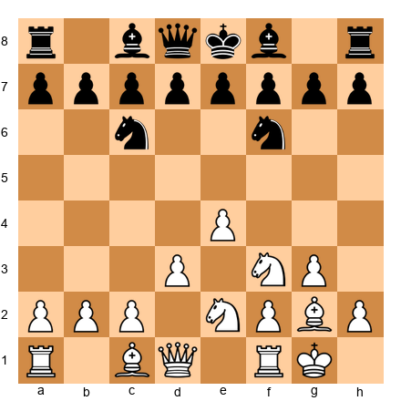

This is a typical KIA position after White has completed the setup. Study it for a moment. Notice several things:

- The bishop on g2 controls the long diagonal (a8-h1). It influences the center without being in the center.
- The pawns on d3 and e4 form a small but solid center. They do not overextend.
- Both knights are developed. The knight on d2 supports e4 and can reroute to f1 and then e3 or g3.
- The king is safely castled.

This position is comfortable, flexible, and full of potential energy. The question is: what happens next?

---

### 1.2: Why the KIA Is Perfect for Club Players

Before we explore the plans, let us understand why this opening deserves a place in your repertoire.

**Reason 1: It works against everything.**

The KIA can be played against the French Defense, the Sicilian Defense, the Caro-Kann, the Pirc, the Modern, the Scandinavian, practically every Black response to 1.e4 or even 1.Nf3. You do not need to learn twenty different openings as White. You need to learn one system and understand how it adapts. This saves hundreds of hours of memorization and lets you spend that time studying plans, tactics, and endgames, the things that actually win games.

**Reason 2: The plans are clear.**

In most KIA positions, White wants to do one of two things: push e4-e5 and attack on the kingside, or play for a central and queenside initiative with c3 and d4. That simplicity is a strength. You always have a direction. You are never wondering "what do I do now?" because the answer is almost always some version of "prepare e5" or "expand in the center."

**Reason 3: It scales with your improvement.**

Bobby Fischer played the KIA. Vassily Smyslov played it. Lev Aronian plays it today. This is not a beginner's trick. It is a legitimate opening system used at the highest levels. As your understanding deepens, you will find more and more subtlety in positions you once thought were simple. The KIA rewards study at every level.

**Reason 4: Your opponent must solve problems, not you.**

Because the KIA is a system, you reach familiar territory in every game. Your opponent, who may face the KIA once every twenty games, is the one who must figure out how to respond. That asymmetry is a real advantage at the club level, where preparation and experience in a specific structure matters enormously.

---

### 1.3: KIA vs French Setups (...e6, ...d5)

This is the most common setup you will face with the KIA, because many players who meet 1.Nf3 or 1.e4 will play ...d5 and ...e6 (a French-type formation). The KIA is particularly effective against this structure. In fact, many Grandmasters have specifically chosen the KIA *because* they face the French Defense frequently.

**Typical move order:**

1.Nf3 d5 2.g3 Nf6 3.Bg2 e6 4.O-O Be7 5.d3 O-O 6.Nbd2 c5 7.e4

**Set up your board:**

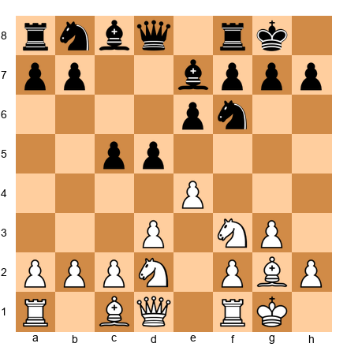

This is the critical position. Black has a solid center with pawns on d5 and e6. The pawn on c5 supports d4 and gives Black queenside space. It looks like Black is doing fine.

But White has a powerful plan.

**The e4-e5 push:**

White's primary idea is to push e4-e5, gaining space on the kingside and driving Black's knight from f6. Once the knight retreats, White's pieces can swing toward the kingside for an attack.

The sequence typically unfolds like this:

7...Nc6 8.Re1 b5

Black expands on the queenside. This is logical. Black has more space there. But White ignores it and plays:

9.e5!

This is the key move. The pawn lunges forward, attacking the knight on f6.

9...Nd7 10.Nf1

The knight retreats from d2 to f1, heading for e3 or g3, both excellent squares for supporting the kingside attack.

10...a5 11.h4!

White begins the kingside pawn storm. The h-pawn advances to open lines against Black's king. Meanwhile, the knight on f1 will reroute to g3 or e3, the bishop on g2 supports the center, and the bishop from c1 will develop to f4 or g5.

**Why this works:**

Black's pieces on the queenside are far from the kingside. Black's knight on d7 is passive, blocked by its own e6 pawn. Black's bishop on e7 is blocked by the e5 pawn. White's pieces, by contrast, are all pointing at the kingside. The attack practically plays itself.

**The key idea:** After e5, White attacks on the kingside. Black attacks on the queenside. This is a *race.* And White often wins the race because the kingside attack targets the king directly, while Black's queenside play is slower and aims at less critical targets.

This is one of the most important strategic themes in chess: **the wing attack versus the wing counter-attack.** The side attacking the king usually has the advantage, because checkmate ends the game immediately. Winning a queenside pawn does not.

🛑 **Pause here if you want.** The KIA vs French setup and the e5 push are the single most important ideas in Part 1. If you absorb nothing else, absorb this.

---

### 1.4: KIA vs Sicilian Setups (...c5)

When Black plays an early ...c5 (either after 1.e4 c5, where you can steer into a KIA with 2.Nf3 and 3.d3, or after 1.Nf3 c5 2.g3), the structure changes but the principles remain.

**Typical move order:**

1.Nf3 c5 2.g3 Nc6 3.Bg2 g6 4.O-O Bg7 5.d3 d6 6.e4 Nf6 7.Nbd2

**Set up your board:**

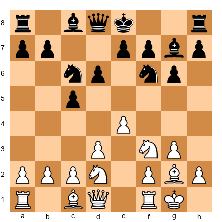

Notice that Black has also fianchettoed the bishop. This creates a symmetrical bishop structure, with both bishops on the long diagonals. The resulting positions are more strategic and less directly attacking than the French-type setups.

**White's plans:**

In this structure, the e4-e5 push is still relevant, but it is less effective because Black's pawn on d6 blocks the advance. Instead, White often plays for:

1. **f4 followed by f5**: A powerful pawn advance that cracks open the kingside. After f4, the threat is f5, attacking g6 and opening lines for the rook on f1.

2. **The knight maneuver Nf1-e3 (or Nh4-f5)**: White reroutes a knight to f5, where it becomes an incredibly strong piece. A knight on f5 attacks d6, e7, g7, and h6, all critical squares around Black's king.

3. **Central play with c3 and d4**: Sometimes, especially if Black plays passively, White can break in the center with c3 and d4, transposing into a favorable Closed Sicilian structure.

**The f4 break:**

This is the primary attacking idea against Sicilian setups. Let us see how it works:

7...O-O 8.Nh4

White moves the knight away from f3, making room for the f-pawn.

8...Rb8 9.f4

Now White threatens f5. If Black does nothing, f5 will come with tremendous force.

9...b5 10.Nf1 b4 11.f5!

The breakthrough. After 11...gxf5 12.exf5, White has an open g-file, the knight can land on e3 or h4 (heading for f5 or g6), and the bishop on g2 suddenly has a clear diagonal. Black is under serious pressure.

**Key principle:** Against a Sicilian fianchetto structure, the f4-f5 push is your main weapon. Prepare it by moving the knight from f3 (to h4 or e1) and then push f4 and f5 in successive moves.

---

### 1.5: KIA vs Caro-Kann Setups (...c6, ...d5)

The Caro-Kann structure gives Black a solid center with pawns on c6 and d5. Black's setup is compact and resilient. The KIA handles it well, but the approach differs from the French-type structure.

**Typical move order:**

1.Nf3 d5 2.g3 c6 3.Bg2 Bg4 4.O-O Nd7 5.d3 Ngf6 6.Nbd2 e6 7.e4

**Set up your board:**

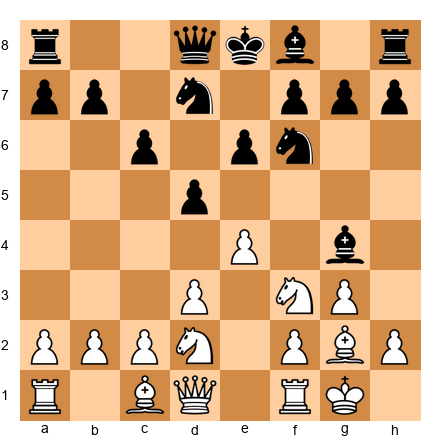

**The difference from the French:**

In the French-type structure, Black plays ...e6 *before* ...d5, locking in the light-squared bishop behind the e6 pawn. That is why the French bishop is notoriously bad, it is stuck behind its own pawns.

In the Caro-Kann structure, Black develops the bishop *first* (to g4 or f5), keeping it outside the pawn chain. This means Black does not have the "bad bishop" problem. The position is healthier for Black in many ways.

**White's adjusted plan:**

Because Black's position is sounder, White cannot rely on a simple e5 push and kingside attack as easily. Instead, the plan is more subtle:

1. **Play e4 and challenge the center.** After e4, if Black takes (dxe4), White recaptures with dxe4 (or Nxe4), reaching an open center where the bishop on g2 becomes powerful.

2. **If Black maintains the tension (...d4 or ...dxe4 dxe4),** White plays for a favorable pawn structure and piece activity. The bishop on g2, the knights rerouting through f1, and the f4 push all remain relevant.

3. **Target the bishop on g4.** After h3, Black's bishop must decide: retreat to h5 (where g4 will chase it again) or trade on f3, giving White the bishop pair. Both options favor White slightly.

**After 7...dxe4 8.dxe4 e5:**

Black has equalized the center. Now the position becomes a strategic battle where piece placement matters most. White's fianchettoed bishop is excellent on the long diagonal, but Black's position is solid. This is a position where your middlegame understanding (from earlier chapters on pawn structures, piece activity, and king safety) will decide the result, not opening memorization.

**Key principle:** Against the Caro-Kann structure, the KIA produces a balanced middlegame. Your advantage lies in the flexibility of your setup and the long-term power of the g2 bishop, not in a direct attack. Play patiently and look for small advantages.

---

### 1.6: Key KIA Plans — A Summary

Before we move on, let us organize the main plans you have learned:

| Black's Setup | White's Primary Plan | Key Break | Urgency |
|--------------|---------------------|-----------|---------|
| French (...e6, ...d5) | Kingside attack | e4-e5, then h4-h5 | High, race against queenside play |
| Sicilian (...c5, ...g6) | Kingside attack | f4-f5 | Medium, prepare carefully |
| Caro-Kann (...c6, ...d5) | Central/positional play | e4 (open center) | Low, be patient |

**The knight maneuver that appears in every KIA plan:**

Regardless of Black's setup, the knight on d2 almost always reroutes through f1 to e3 or g3. This is one of the most important maneuvers in the KIA:

- **Nbd2-f1-e3:** The knight lands on e3, supporting d5 and f5 pushes. It also defends the kingside.
- **Nbd2-f1-g3:** The knight goes to g3, supporting an e5 or f5 push and eyeing the h5 square.

When you are unsure what to do in a KIA position, ask yourself: "Has my knight gone to f1 yet?" If it has not, that is probably your next move.

**The bishop on g2, your best friend:**

Never trade this bishop casually. The g2 bishop is the soul of the KIA. It controls the long diagonal, supports your central pawns, and becomes a monster when the center opens. Every time you consider a trade involving this bishop, ask yourself: "Is what I am getting worth more than this diagonal?" The answer is almost always no.

---

### 1.7: Ten Critical KIA Positions

These ten positions represent the most important moments in KIA play. Set each one up on your physical board and study it until you can identify the correct plan without hesitation. These are the positions you will encounter in your games.

**Position 1: The Classic e5 Moment**

White plays **e5!**: the signature KIA advance against French setups. The knight on f6 must retreat, giving White time to begin the kingside attack.

**Position 2: Preparing f4 Against the Sicilian**

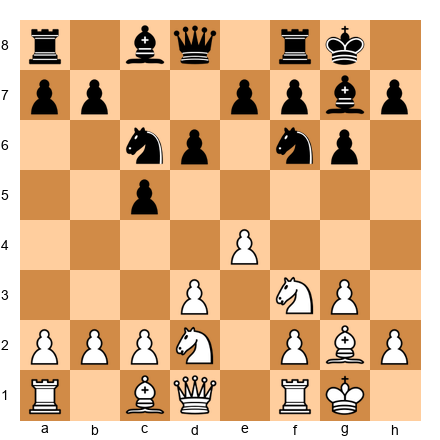

White plays **Nh4**: clearing the f-file and preparing f4. The knight will also eye the f5 square via g2 or go to f5 directly.

**Position 3: Knight Arriving on f5**

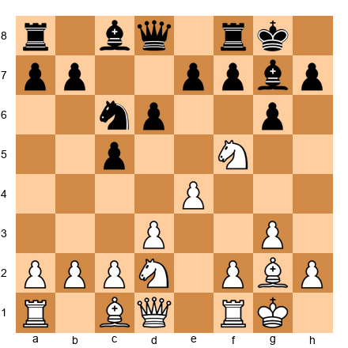

The knight has arrived on f5. From here it attacks d6, e7, g7, and h6. Black must decide how to deal with this intruder. Trading it off (with ...Bxf5 exf5) opens the e-file and gives White a powerful passed pawn on f5. Leaving it means tolerating permanent pressure.

**Position 4: The Pawn Storm Begins**

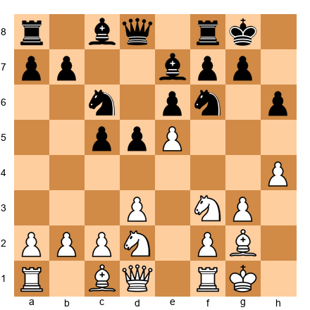

White has pushed e5 and h4. The attack is rolling. Black must find counterplay quickly or be overrun. The standard Black response is ...b5-b4, attacking on the queenside, but the question is whether Black is fast enough.

**Position 5: Central Play vs Caro-Kann**

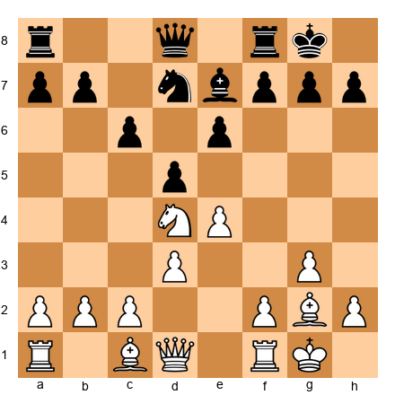

The center is balanced. White has developed harmoniously and has a slight space advantage. The plan is to play c4, challenging Black's d5 pawn and opening the center where the g2 bishop will shine.

**Position 6: The f5 Break Lands**

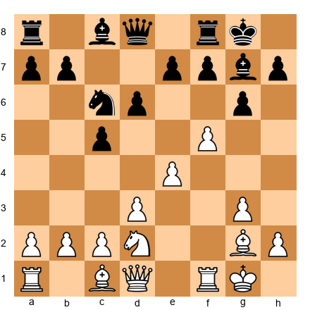

White has played f5. After ...gxf5 exf5, the g-file opens and the f5 pawn cramps Black's position. White will pile pressure along the g-file with Qg4 or Qh5 and rooks on g1 or f1.

**Position 7: Black Fights Back With ...e5**

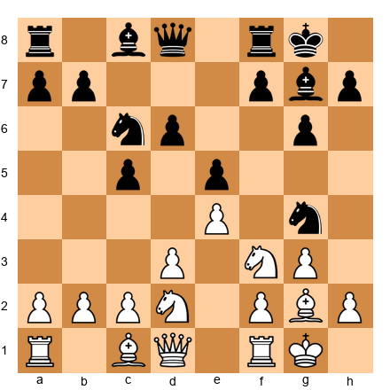

Black has played ...e5, gaining central space and fighting back. White should not panic. The plan is d4, challenging Black's center, or simply continuing with Nh4-f5. Black's knight has jumped to g4, but after h3 it must retreat.

**Position 8: Opposite-Side Attack**

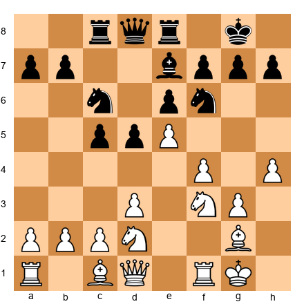

A classic KIA race position. Black has castled kingside and placed rooks on c8 and e8 for queenside play. White has pushed e5 and begun the h4 advance. Both sides are committed to their attacks. Whoever gets there first wins. In most games, White's attack is faster because it targets the king.

**Position 9: The Closed Center**

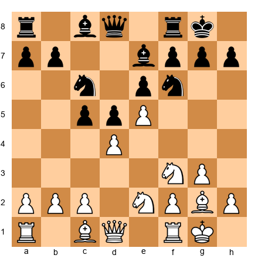

White has played both d4 and e5, creating a closed center. In this structure, piece maneuvering is critical. White's plan is f4, supporting e5 and preparing a kingside pawn storm. Black's plan is ...f6, challenging the e5 pawn, or ...b5 with queenside expansion.

**Position 10: Transition to Endgame**

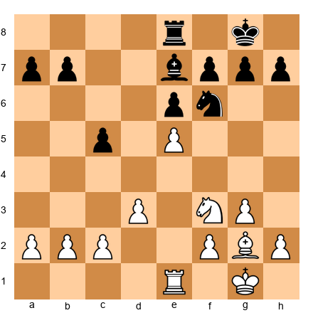

The middlegame attack has been traded down, and White enters an endgame with the e5 pawn still firmly planted. The g2 bishop dominates the long diagonal, and the e5 pawn cramps Black's position. White's endgame advantage is lasting and real. This position teaches an important lesson: the KIA is not only an attacking opening. Even when the attack does not lead to checkmate, it often produces a favorable endgame.

---

🛑 **Part 1 complete.** You now have a thorough understanding of the King's Indian Attack. Take a break if you need one. Part 2 covers the Pirc and Modern Defense, your weapon as Black against 1.e4.

---

## Part 2: The Pirc and Modern Defense — Fighting 1.e4 With the Fianchetto

### 2.1: What Is the Pirc Defense?

The Pirc Defense (pronounced "peerts") is a hypermodern opening for Black against 1.e4. Instead of immediately occupying the center with ...e5 or ...d5, Black lets White build a big center and then attacks it from the flanks with pieces and pawns.

**The complete Pirc setup:**

1. **...d6**: A modest move that controls e5 and keeps options open.
2. **...Nf6**: Develops a knight and pressures the e4 pawn.
3. **...g6**: Prepares the fianchetto.
4. **...Bg7**: The bishop takes its place on the long diagonal, aiming at White's center from a distance.
5. **...O-O**: Get the king to safety.

That is the basic framework. After these five moves, Black has a flexible, resilient position. The bishop on g7 is a powerful piece that controls the long diagonal and puts pressure on White's center from the flanks.

**Set up your board (Pirc after 4 moves each):**

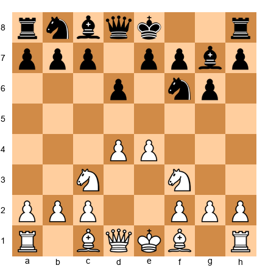

White has pawns on d4 and e4, an imposing center. But here is the hypermodern insight: **a big center is a big target.** Every pawn in the center is a pawn that can be attacked. Black's bishop on g7, knight on f6, and future pawn breaks (...e5 or ...c5) are all aimed at undermining White's center. If White's center collapses, Black's pieces, especially the bishop on g7, will dominate the board.

This is the philosophical foundation of the Pirc: **invite your opponent to overextend, then knock the supports out.**

---

### 2.2: The Modern Defense — The Pirc Without ...Nf6

The Modern Defense is closely related to the Pirc. The key difference is that Black plays ...g6 and ...Bg7 *without* committing to ...Nf6 early. This gives Black maximum flexibility.

**Typical move order:**

1.e4 g6 2.d4 Bg7 3.Nc3 d6

At this point, the position can transpose into the Pirc if Black plays ...Nf6, or it can remain a "pure Modern" with different setups:

- **...a6 and ...b5**: Queenside expansion first, with ...Nf6 delayed or omitted.
- **...e6 and ...Ne7**: The knight goes to e7 instead of f6, heading for c6 or f5.
- **...c6 and ...d5**: Challenging the center immediately with a Caro-Kann hybrid.

**Why play the Modern instead of the Pirc?**

Flexibility. By not committing the knight to f6 early, Black avoids certain aggressive lines where White plays e5 chasing the knight. The Modern gives Black more control over the timing of piece placement. The trade-off is that ...Nf6 is usually a good move, and delaying it means the knight is not yet developed. It is a matter of preference and style.

**For this chapter, we will treat the Pirc and Modern together.** In practice, most club-level games transpose between the two. The plans and ideas are nearly identical. The differences become significant only at advanced levels, which Volume III will cover.

---

### 2.3: Facing White's Main Systems

When you play the Pirc or Modern, White has several aggressive options. You need to know how to handle each one. Let us examine the four most common White systems.

#### The Austrian Attack: 1.e4 d6 2.d4 Nf6 3.Nc3 g6 4.f4

**Set up your board:**

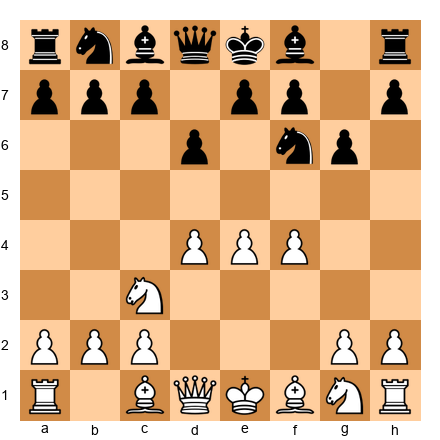

This is White's most aggressive option. The pawn on f4 supports e5 and creates a massive pawn center (d4, e4, f4). White's idea is straightforward: push e5, open lines, and crush Black.

It looks terrifying. Three pawns abreast in the center. But Black has a clear plan:

**4...Bg7 5.Nf3 O-O 6.Bd3 Na6!?**

The knight goes to a6, an unusual square, but with a purpose. From a6, it reroutes to c7, and from c7 it supports both ...b5 (queenside expansion) and ...e5 (the central break). The knight is heading for the fight; it is just taking a longer road.

Alternatively, the more direct approach:

**4...Bg7 5.Nf3 O-O 6.Bd3 Nc6!**

The knight develops to c6, immediately pressuring d4. Now if White pushes e5, Black can play ...dxe5 fxe5 (or dxe5) and the d4 pawn is weakened. White's massive center starts to show cracks.

**The key break: ...e5**

In almost every Austrian Attack position, Black wants to play ...e5 at the right moment. This challenges the center head-on. After ...e5 fxe5 dxe5, the d4 pawn becomes a target, and Black's bishop on g7 comes alive on the long diagonal. Timing is everything, play ...e5 too early and White's center steamrolls you. Play it too late and White's space advantage becomes crushing.

**When to play ...e5:** When your pieces are developed (bishop on g7, castled, knight on c6), and when White has not yet consolidated the center with moves like Be3 and Qd2.

---

#### The Classical Variation: 1.e4 d6 2.d4 Nf6 3.Nc3 g6 4.Nf3 Bg7 5.Be2

**Set up your board:**

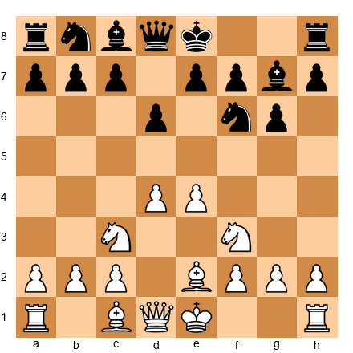

This is White's most measured approach. Development first, aggression later. The bishop goes to e2 (solid, not flashy), and White will castle and then decide on a plan based on Black's response.

**5...O-O 6.O-O Bg4**

Black pins the knight on f3. This is a standard idea that pressures the center indirectly. If the knight moves, the e4 pawn loses a defender. If White plays h3 to chase the bishop, Black trades Bxf3, giving White doubled f-pawns.

**7.Be3 Nc6 8.Qd2 e5!**

Now Black strikes. The center opens, the bishop on g7 is unleashed, and the position becomes a dynamic middlegame. This is what the Pirc player wants: a position where both sides have chances, the center is fluid, and the bishop on g7 is a monster.

**Black's plan after ...e5:**

After ...e5 dxe5 dxe5 (or if White keeps the tension), Black has achieved the fundamental goal of the Pirc: the center has been challenged, the fianchettoed bishop is active, and the position is open enough for Black's pieces to work. From here, look for:

- **...Nd4**: Planting a knight on the strong d4 square
- **...c6 followed by ...d5**: Further central expansion
- **...Be6 and ...Qd7**: Completing development and connecting rooks

---

#### The 150 Attack: 1.e4 d6 2.d4 Nf6 3.Nc3 g6 4.Be3 Bg7 5.Qd2

**Set up your board:**

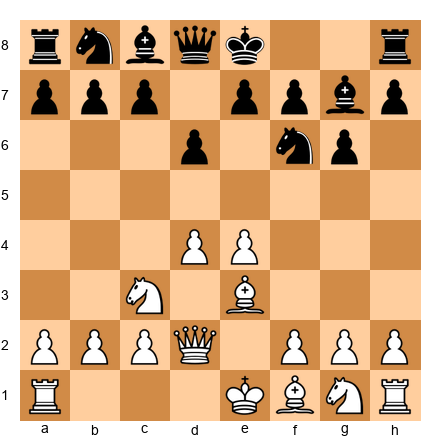

This system gets its name from the claim that it was "the easiest line for 150-rated players to learn." That is a joke, but the point is real: this is a simple, direct system where White plans to castle queenside and launch a kingside pawn storm with h3, g4, and f3-followed-by-h4-h5.

**Why it is dangerous:**

White's plan is crystal clear: castle long, push pawns at Black's king. If Black plays passively, the attack arrives quickly and decisively. The bishop on e3 and queen on d2 work together to support the pawn storm and prepare Bh6, trading off Black's precious fianchettoed bishop.

**How Black fights back:**

The key is speed. Black must create counterplay before White's attack lands.

**5...a6!**

This is a critical move. It prepares ...b5, which starts queenside counterplay against White's king (remember. White is castling queenside). Every tempo matters in these opposite-side castling positions.

**6.f3 b5 7.O-O-O Bb7**

Now Black has queenside counterplay rolling. The bishop on b7 pressures e4 through the long diagonal, and ...b4 will kick the knight from c3, weakening White's center.

**8.g4 Nbd7 9.h4 b4 10.Nce2**

Both sides are attacking. White pushes h5, Black pushes b3. It is a race, and the critical skill is calculating who gets there first. This is exciting, tactical chess, exactly the kind of position the Pirc promises.

**Key principle:** Against the 150 Attack (and any opposite-side castling position), always counter-attack. Defense alone will not save you. Push ...b5-b4-b3 and open lines against White's king.

---

#### The Fianchetto System: 1.e4 d6 2.d4 Nf6 3.Nc3 g6 4.g3 Bg7 5.Bg2

**Set up your board:**

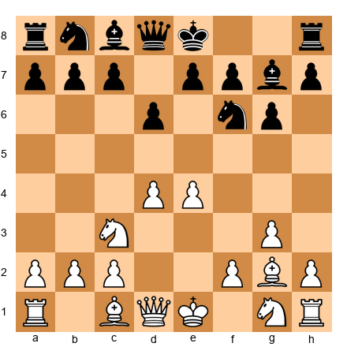

White mirrors Black's fianchetto structure. This is the most positional approach, and it leads to a strategic battle where both sides maneuver for small advantages.

**5...O-O 6.Nge2 e5!**

Again, the ...e5 break is Black's primary tool. After ...e5, the bishop on g7 opens up, and the position becomes a complex middlegame where understanding plans matters more than tactical fireworks.

**Black's plan:**

In the Fianchetto System, Black should aim for:

1. **...e5 followed by ...exd4 and ...c6**: Solidifying the center
2. **...Be6 and ...Qd7**: Developing remaining pieces
3. **...d5**: If possible, this is the ideal central expansion that gives Black full equality

**Key principle:** Against the Fianchetto System, play ...e5 early and aim for a solid position. This is the quietest line. White is not trying to attack, so Black does not need to rush counterplay. Focus on completing development and finding the right moment for ...d5.

🛑 **Good stopping point.** You now know how to handle White's four main systems in the Pirc/Modern. Take a break if you need one. We will look at the fianchettoed bishop next.

---

### 2.4: The Fianchettoed Bishop — Black's Most Important Piece

In every Pirc and Modern game, the bishop on g7 is Black's most important piece. Everything revolves around it. If the bishop is active, Black is doing well. If the bishop is blocked or traded, Black is in trouble.

Here are the rules for managing the g7 bishop:

**Rule 1: Never trade it without compensation.**

If White offers to trade your dark-squared bishop (for example, with Be3-h6), ask yourself: "What am I getting in return?" If the answer is nothing, avoid the trade. Move the bishop to h8 if necessary. The bishop on g7 is worth more than any minor piece White can offer.

**When is the trade acceptable?** When it opens the h-file for your rook, giving you a concrete attacking plan. Or when the resulting position is so closed that the bishop is doing nothing anyway. But these situations are rare.

**Rule 2: The bishop needs open diagonals.**

The bishop on g7 is powerful when the a1-h8 diagonal is open. This is why ...e5 (after dxe5 dxe5) is so important, it opens lines for the bishop. If the center is closed (pawns on d4, d6, e4, e5), the bishop on g7 is a tall pawn. Play to open the position.

**Rule 3: The bishop defends as well as attacks.**

Even when the bishop looks passive (for example, when the center is closed), it plays a vital defensive role. It guards the dark squares around Black's king (f6, g7, h6, e5) and prevents White from breaking through on those squares. Never forget this defensive function when evaluating trades.

**Set up your board, the bishop at its best:**

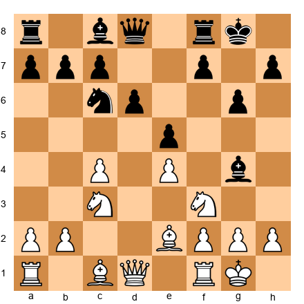

Black has played ...e5, and the bishop on g7 is aiming through the center toward White's queenside. This bishop is influencing the game from the corner of the board. It pressures a1, controls d4, and supports ...f5. That is the power of the fianchetto when the diagonals are open.

---

### 2.5: When to Play ...e5 vs ...c5 vs ...b5

One of the most common questions from Pirc players is: "Which pawn break do I use?" The answer depends on the position, but here is a framework:

**Play ...e5 when:**
- White has played d4 and e4, creating a classical center
- Your bishop on g7 will become active after the center opens
- You have a knight on c6 supporting the advance
- The center exchange will leave you with a fair or favorable structure

**Play ...c5 when:**
- White's d4 pawn is less well supported (for example, if the knight has left c3)
- You want to attack the d4 pawn from the side rather than the front
- You are in a Sicilian-type structure where ...c5 is natural
- Playing ...e5 would leave your d6 pawn permanently weak

**Play ...b5 when:**
- White has castled queenside (as in the 150 Attack)
- You need to create queenside counterplay urgently
- The ...e5 break is not yet available
- You want to displace the knight from c3 with ...b4

**A common mistake:** Playing all three pawn breaks in random order. Each break has a specific purpose and timing. Play one, evaluate the result, then decide if another is needed. Do not push pawns just to push them.

---

## Part 3: The King's Indian Defense (KID) — The Fighter's Opening

### 3.1: What Is the King's Indian Defense?

The King's Indian Defense is one of the most dynamic openings in chess. It is Black's answer to 1.d4 that says: "I will let you have the center for now, and then I will destroy it."

The KID has been the weapon of champions. Bobby Fischer played it. Garry Kasparov made it legendary. Mikhail Tal loved its attacking possibilities. It is not a quiet opening. It is not a safe opening. It is an opening for players who want to *fight.*

**The complete KID setup:**

1. **...Nf6**: Develop a knight and eye the e4 pawn.
2. **...g6**: Prepare the fianchetto.
3. **...Bg7**: The bishop takes its position on the long diagonal.
4. **...O-O**: Castle quickly. The king is safe, and the rook is activated.
5. **...d6**: Support the center and prepare ...e5.
6. **...e5**: The defining move of the KID. Black stakes a claim in the center and prepares for dynamic play.

After these moves, Black's position is coiled like a spring. The bishop on g7 eyes the center. The knight on f6 is ready to jump into action. The e5 pawn challenges White's central dominance. The stage is set for one of the most exciting battles in chess.

**Typical move order (Classical Variation):**

1.d4 Nf6 2.c4 g6 3.Nc3 Bg7 4.e4 d6 5.Nf3 O-O 6.Be2 e5

**Set up your board:**

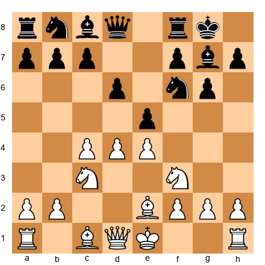

This is the starting position of the KID. Study it carefully. This is one of the most analyzed positions in chess history, played in thousands of Grandmaster games, and it still produces decisive results.

**What makes this position work for Black?**

White has a big center: pawns on c4, d4, and e4. That is a lot of space and a lot of control. But Black has:

1. **The bishop on g7**: A powerful piece that will come alive when the center opens or when Black attacks on the kingside.
2. **The ...e5 pawn**: Challenging d4 directly. If White pushes d5, the position closes and both sides play on their respective wings. If White takes exd4, the center opens and Black gets active piece play.
3. **A flexible pawn structure**: Black can expand on the kingside (...f5), the queenside (...c6, ...a6, ...b5), or in the center (...Nd7, ...f5, ...e4) depending on what the position demands.

The KID is like a delayed counterattack. Black says to White: "You build your center. I will build my position. And when I am ready, I will come for your king."

---

### 3.2: The Classical Variation

The Classical KID is the main line and the most important variation for you to study. After 1.d4 Nf6 2.c4 g6 3.Nc3 Bg7 4.e4 d6 5.Nf3 O-O 6.Be2 e5, White faces a critical decision.

**7.O-O Nc6 8.d5**

White closes the center. This is the most principled response. By pushing d5, White gains space but also commits to a closed position where both sides play on opposite wings.

**8...Ne7**

The knight retreats to e7, not backwards, but to a new assignment. From e7, the knight will go to d7 (supporting ...f5) or to g6 and then f4 (joining the kingside attack). The knight's retreat is actually a forward-looking move.

**Set up your board:**

This is the starting position of the famous Mar del Plata Attack, one of the most theoretically important positions in chess. From here, both sides execute their plans with tremendous energy.

---

### 3.3: The Mar del Plata Attack — The Great Race

The Mar del Plata Attack (named after the Argentine city where many famous KID games were played) produces one of the most spectacular strategic patterns in chess:

**White attacks on the queenside. Black attacks on the kingside. Whoever gets there first wins.**

**White's plan:**

1. **c5**: The key break on the queenside. White pushes the c-pawn to c5, attacking d6 and trying to open lines on the queenside.
2. **Nc3-d3-b5**: White reroutes a knight to the queenside, often to c7 (if it can get there) or to b5 to pressure d6 and a7.
3. **b4-c5**: White prepares the c5 break with b4 first, then pushes c5 with maximum force.
4. **Qa4, Rb1, a4**: Various supporting moves for the queenside advance.

**Black's plan:**

1. **...f5**: The key break on the kingside. This attacks White's e4 pawn and opens the f-file for the rook.
2. **...f4**: After ...f5, Black often pushes further with ...f4, gaining space on the kingside and restricting White's pieces.
3. **...g5-g4**: The pawn storm continues. Black pushes the g-pawn to open lines against White's king.
4. **...Nf6-h5-f4**: The knight reroutes to f4, a devastating outpost where it supports the kingside attack.
5. **...Rf7-g7**: Black often doubles rooks on the g-file, preparing a decisive breakthrough.
6. **...Bh3**: Trading the light-squared bishops removes a key defender of White's king.

**The race in action:**

Let us continue from our diagram position:

9.Ne1 Nd7 10.Nd3 f5

Black immediately starts the kingside attack. White responds with queenside play:

11.Bd2 Nf6 12.f3 f4!

**Set up your board:**

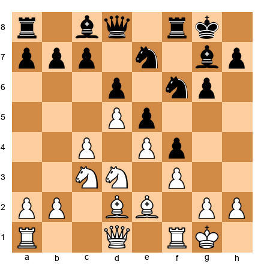

This is a critical moment. Black has pushed ...f4, gaining space on the kingside. Now the game becomes a pure race:

White plays: 13.b4 (starting the queenside assault)
Black plays: 13...g5 (continuing the kingside storm)

14.c5 Ng6 15.cxd6 cxd6

Now White has opened lines on the queenside (the c-file), and Black has a powerful kingside pawn mass. Both attacks are rolling.

16.Rc1 g4! 17.Nb5

White attacks d6. Black attacks g2.

17...g3!

The pawn crashes forward. After 17...g3 18.h3 (or hxg3 fxg3, opening the f-file), Black's attack is ferocious. The rook on f8 will swing to the g-file, the knight on g6 will jump to f4 or h4, and the bishop on g7 will finally be unleashed.

**This is the KID at its most exciting.** Both sides are attacking at full speed. The position demands courage, calculation, and nerves. At the club level, this kind of position is often decided by who plays more accurately, and who stays calm under pressure.

**Key principle of the Mar del Plata:** Do not try to stop White's queenside play. Focus entirely on your kingside attack. The kingside attack targets the king. The queenside attack targets pawns. Checkmate beats material advantage every time.

---

### 3.4: The Samisch Variation

The Samisch (1.d4 Nf6 2.c4 g6 3.Nc3 Bg7 4.e4 d6 5.f3) is White's most direct attempt to crush the KID by building a massive center and controlling e4 with the f3 pawn.

**Set up your board:**

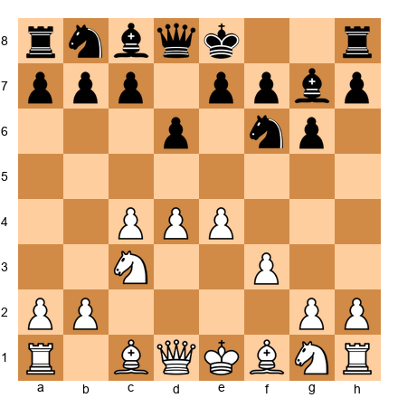

The pawn on f3 does several things:

1. Reinforces e4, the pawn is now solidly protected.
2. Takes away the f3 square from the knight, it will develop to e2 instead.
3. Prepares a massive center with Be3 and Qd2, followed by O-O-O and g4 (a kingside pawn storm from White's side).

**How Black responds:**

**5...O-O 6.Be3 e5**

Black plays the standard ...e5 break. Now after:

**7.d5 Nh5**

This knight maneuver is critical. The knight goes to h5, heading for f4. A knight on f4 is one of the most powerful pieces in the KID, it attacks d3, e2, g2, and h3, and it cannot be easily removed because the f3 pawn blocks Nf3.

**8.Qd2 f5!**

Black immediately strikes with ...f5, the kingside break. White must decide how to handle the pawn tension.

**After 9.O-O-O:**

Now both sides are playing for the attack. White is castled queenside and will push g4 or play on the queenside. Black is castled kingside and will push ...f4, ...g5, ...g4, aiming to open lines against White's king. But wait. White is castled queenside, so Black's kingside attack is targeting... nobody. The plan shifts:

**Against O-O-O in the Samisch:**

When White castles queenside, Black changes direction. Instead of the kingside attack, Black plays for queenside counterplay:

- **...a6 and ...b5**: Attacking White's king directly.
- **...c6**: Undermining the d5 pawn.
- **...Qa5**: Creating direct threats against White's king.

**Against O-O in the Samisch:**

When White castles kingside (which is less common but still possible), Black's kingside attack proceeds as in the Classical variation:

- **...f4, ...g5, ...g4**: The pawn storm.
- **...Nf4**: The knight arrives at its dream square.
- **...Bh3**: Trading light-squared bishops to remove a defender.

**Key principle:** In the Samisch, always look at where White's king goes. If White castles queenside, attack the queenside. If White castles kingside, attack the kingside. The target is always the king.

---

### 3.5: The Fianchetto Variation

The Fianchetto Variation (1.d4 Nf6 2.c4 g6 3.Nc3 Bg7 4.g3 d6 5.Bg2 O-O 6.Nf3) is the quietest way for White to play against the KID. White mirrors Black's fianchetto structure, creating a symmetrical bishop formation.

**Set up your board:**

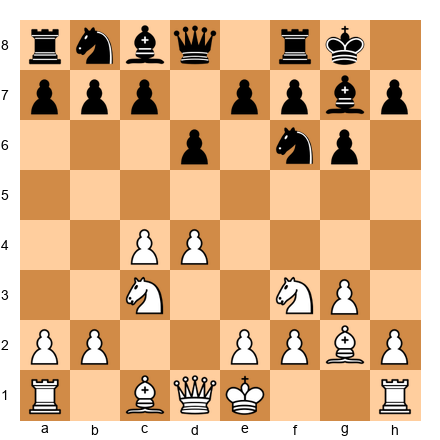

This looks calm. Both bishops are fianchettoed. The position is balanced. But do not be fooled, there is still plenty of chess to play.

**6...Nbd7 7.O-O e5 8.e4 c6**

Black plays ...c6, preparing ...a6 and ...b5, or possibly ...d5 (the central break). In the Fianchetto, Black's play is more positional and less directly attacking than in the Classical or Samisch.

**Black's plans in the Fianchetto:**

1. **...exd4 and ...c5**: Opening the center and placing a pawn on c5 to control d4.
2. **...a6, ...Rb8, ...b5**: Queenside expansion, gaining space and creating targets.
3. **...Re8 and ...e4**: A central push that gains space and restricts White's knight.
4. **...Nh5 followed by ...f5**: Even in the Fianchetto, the kingside break is sometimes correct.

**The key idea in the Fianchetto: ...c6 and ...d5.**

This is the "equalizing" break. If Black can successfully play ...d5, the position opens up and Black achieves full equality (or more). White must play actively to prevent this. After ...d5, Black's bishops come alive, the center becomes fluid, and the game becomes a battle of equal chances.

**9.h3 Qb6**

The queen comes to b6, pressuring b2 and d4. This is a standard idea in the Fianchetto. White must deal with the pressure:

**10.d5 cxd5 11.cxd5**

Now the position resembles a Benoni structure. White has a passed d-pawn, Black has an isolated a-pawn but also queenside activity. The game is complex and strategic.

**Key principle:** In the Fianchetto Variation, play positionally. There is no need to rush a kingside attack. Focus on the center (...d5 is the dream break), develop all your pieces, and look for small advantages. The Fianchetto KID is a marathon, not a sprint.

---

### 3.6: When NOT to Play the KID

The KID is a wonderful opening, but it is not appropriate in every situation. Here are the situations where you should consider a different defense:

**1. When you need a draw.**

The KID is a fighting opening. It produces sharp, unbalanced positions. If you need a draw (for example, in the last round of a tournament where a draw secures a prize), the KID is the wrong choice. Play the Queen's Gambit Declined or the Nimzo-Indian instead, openings that lead to solid, balanced positions.

**2. When you are exhausted.**

The KID demands calculation and energy. In a long tournament, when you are tired, the KID's sharp positions can be dangerous. Mistakes in the KID are often fatal. If your brain is fried, choose a quieter opening.

**3. When your opponent is a KID specialist.**

If you know your opponent has deep knowledge of the KID (from White's side), you may be walking into their preparation. The KID has been analyzed to extreme depth, and a well-prepared White player can steer the game into theoretically dangerous territory. In this case, surprise them with a different defense.

**4. When the position type does not suit you.**

Be honest with yourself. If you hate attacking chess and prefer quiet positional play, the KID will frustrate you. Some players thrive on the KID's energy. Others are miserable in sharp positions. There is no shame in preferring a different style. Play openings that match your personality.

**A note on confidence:** If you enjoy the KID, play it. The "when NOT to play" guidelines above are about being practical, not about being scared. The KID is a proven weapon at every level. Fischer, Kasparov, Nakamura, Radjabov, these are not weak players. If the KID is your style, own it.

---

🛑 **Part 3 theory complete.** You now understand the three main variations of the KID: Classical (Mar del Plata), Samisch, and Fianchetto. Take a break if you need one. The annotated games are next.

---

## Part 4: Annotated Master Games

These five games demonstrate the ideas from Parts 1–3 in real competition. Play through each one on a physical board. Reading the moves on a page is not the same as seeing them on a board. The patterns will stick better if your hands move the pieces.

For each game, we provide the complete move list with annotations, the key moments in diagram form, and the lesson the game teaches.

---

### Game 34: Smyslov vs Reshevsky, Zurich Candidates Tournament, 1953

**Opening: King's Indian Defense, Fianchetto Variation**
**Theme: Positional mastery in the KID, how Black equalizes in the Fianchetto**

Vassily Smyslov was one of the greatest positional players in chess history. His understanding of piece placement was extraordinary. In this game, playing Black against the American champion Samuel Reshevsky, Smyslov demonstrates how to handle the Fianchetto Variation with patience and precision.

**1.d4 Nf6 2.c4 g6 3.g3 Bg7 4.Bg2 O-O 5.Nc3 d6 6.Nf3 Nbd7**

Standard KID Fianchetto setup. Both sides have mirrored fianchetto structures. The game will be decided by who finds the better plan in the middlegame.

**7.O-O e5 8.e4 c6**

Smyslov plays the solid ...c6, preparing either ...a6 and ...b5 (queenside expansion) or ...d5 (the equalizing break). This is the hallmark of the Fianchetto KID: no rush, careful preparation.

**9.Be3 Ng4!**

An active move. The knight attacks the bishop on e3 and eyes the f2 pawn. If the bishop retreats, the knight on g4 controls key central squares.

**10.Bg5 Qb6**

The queen comes to b6 with dual pressure on b2 and d4. White's center is suddenly under stress.

**11.h3 exd4!**

Smyslov opens the center at the perfect moment. The bishop on g7 will come alive, and the knight on g4 has already disrupted White's coordination.

**12.Nxd4 Nge5 13.b3 Qb4!**

The queen is active, pressuring c4 and a4. Smyslov's pieces are harmoniously placed, and White's center has been dissolved.

**Set up your board:**

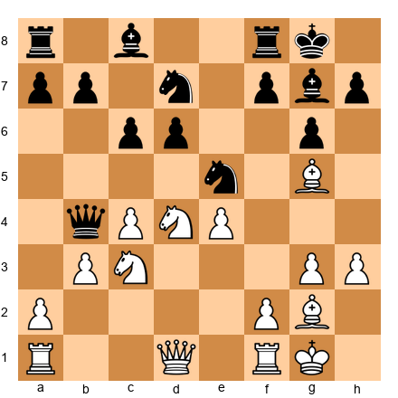

White is struggling to find a plan. The bishop on g5 is misplaced, the d4 knight is pinned to the defense of b3 (after ...Nc5), and Black has comfortable piece activity. Smyslov has achieved the ideal outcome for Black in the Fianchetto: a balanced, slightly favorable middlegame where Black's pieces are more active.

**The lesson:** In the Fianchetto Variation, Black does not need to launch a spectacular attack. Careful development, the right pawn breaks (...exd4 at the right moment), and active piece placement are enough to equalize or gain an edge. Patience is the key.

---

### Game 49: Botvinnik vs Tal, World Championship Match, 1961

**Opening: King's Indian Defense, Classical Variation**
**Theme: Systematic play against the KID. White's queenside attack**

Mikhail Botvinnik, the "Patriarch of Soviet Chess," was the master of systematic play. In this game from his World Championship rematch against Mikhail Tal, Botvinnik demonstrates how White should conduct the queenside attack in the Classical KID.

**1.d4 Nf6 2.c4 g6 3.Nc3 Bg7 4.e4 d6 5.Nf3 O-O 6.Be2 e5 7.d5**

The Classical Variation. White closes the center and both sides prepare for opposite-wing play.

**7...Nbd7 8.Bg5!**

An important move. The bishop pins the knight on f6 and restricts Black's ability to play ...f5 comfortably. This is a positional nuance: by pinning the knight, White slows down Black's kingside play.

**8...h6 9.Bh4 a6 10.O-O Qe8**

Black prepares to unpin with ...Nh7 or ...g5. The queen on e8 supports the e5 pawn and prepares to swing to the kingside via h5 or f7.

**11.Nd2 Nh7 12.b4!**

Botvinnik starts the queenside assault. The b4 push gains space and prepares c5.

**12...f5 13.f3**

White reinforces the center. The pawn on f3 prevents ...f4 from being played with maximum effect, and it keeps the e4 pawn firmly defended.

**13...Ndf6 14.a4**

Systematically expanding on the queenside. Every move has a purpose: gain space, prepare c5, create targets.

**Set up your board:**

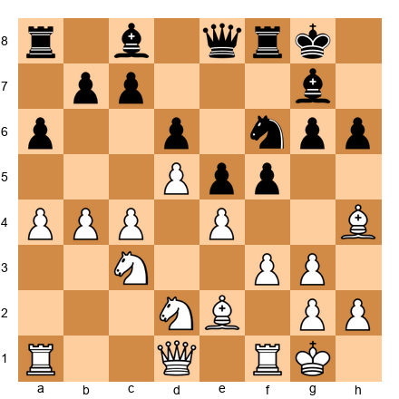

Black has a kingside attack in preparation (...f5 has been played), but White's queenside expansion is further advanced. Botvinnik's systematic approach (b4, a4, c5) creates real problems on the queenside that Black cannot ignore.

**14...g5 15.Bf2 Ng6 16.c5!**

The breakthrough. White opens lines on the queenside, and Black's kingside attack has not yet generated concrete threats. Botvinnik's systematic play has given White a clear advantage.

**The lesson:** The KID is not one-sided. White has powerful resources in the queenside attack. Systematic, patient expansion with b4, a4, and c5 can be extremely effective, especially when Black's kingside attack is slow to develop. This game shows why calculation and timing matter on both sides.

---

### Game 51: Smyslov vs Botvinnik, World Championship Match, 1957

**Opening: King's Indian Defense, Classical Variation**
**Theme: Positional treatment of the KID, when Black plays for ...d5**

In this game between two World Champions, Smyslov handles the Black side of the KID with a different approach: instead of the typical kingside attack, he plays for the central break ...d5.

**1.d4 Nf6 2.c4 g6 3.Nc3 Bg7 4.e4 d6 5.Nf3 O-O 6.Be2 e5 7.O-O Nc6**

Instead of 7...Nbd7 (the Mar del Plata setup), Smyslov plays 7...Nc6. This aims for a different treatment. The knight on c6 pressures d4, and Black plans to capture on d4 and then play for ...d5.

**8.d5 Ne7 9.Nd2 c5**

Black locks the center. Now the pawn structure is fixed: White's d5 pawn vs Black's c5 and e5 pawns. The knight on e7 will reroute to d7 and then support ...f5.

**10.a3 Ne8 11.b4 b6 12.Rb1 f5!**

The kingside break, but Smyslov has prepared it carefully. The knight has retreated to e8 to support ...f5, and the c5 point is defended.

**13.exf5 gxf5 14.f4 e4!**

A bold decision. Smyslov pushes the e-pawn to e4, gaining space in the center and restricting White's pieces. The bishop on g7 is now looking at an open diagonal.

**Set up your board:**

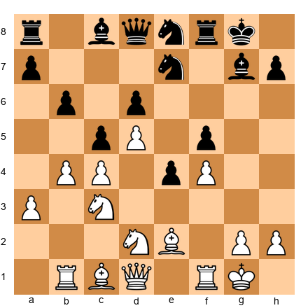

This is a complex position where both sides have chances. The game continued with careful maneuvering and eventually reached a position where Black's central control and active pieces gave Smyslov the advantage.

**The lesson:** The KID is not only about the kingside attack. Sometimes the best plan is to fight for the center with ...f5, ...e4, and ...d5. Every position is unique, and the best KID players adapt their plans to the specific requirements of the position rather than following a formula blindly.

---

### Game 54: Gligoric vs Fischer, Bled Candidates Tournament, 1961

**Opening: King's Indian Defense, Classical Variation**
**Theme: The KID from White's perspective, strategic space advantage**

Svetozar Gligoric was one of the strongest KID experts from White's side. Against Bobby Fischer (who was also a KID expert as Black!), Gligoric demonstrates how to use the space advantage that the Classical Variation gives White.

**1.d4 Nf6 2.c4 g6 3.Nc3 Bg7 4.e4 d6 5.Nf3 O-O 6.Be2 e5 7.O-O Nc6 8.d5 Ne7**

The standard Classical position.

**9.Nd2!**

Gligoric's plan is clear: reroute the knight to c4 (or f1-e3), prepare c5, and launch the queenside attack.

**9...Nd7 10.b4 f5 11.c5!**

The critical break. White tears open the queenside before Black's kingside attack is fully developed.

**11...Nf6 12.f3 f4**

Fischer pushes ...f4, gaining kingside space. The race is on.

**13.Nc4 g5 14.a4 Ng6 15.Ba3!**

A key move. The bishop goes to a3, where it supports the c5 push and pressures d6. It also prevents Black from playing ...f3 without consequences, because the bishop would open toward the f8 square.

**15...Rf7 16.b5 dxc5**

Black is forced to capture on c5, conceding the d6 square.

**17.Bxc5 h5**

Fischer continues the attack, but White's queenside initiative is powerful.

**Set up your board:**

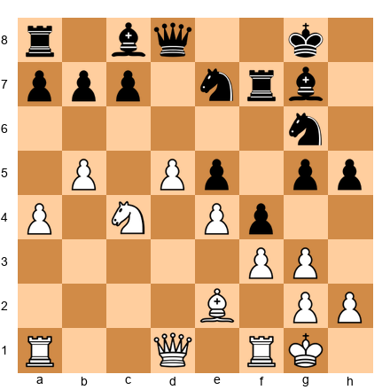

Gligoric has a strong queenside attack with the b5 pawn ready to advance, the knight on c4 controlling key squares, and the bishop on c5 putting pressure on Black's position. Fischer's kingside attack is dangerous but slower than White's queenside play. The game continued with sharp play from both sides, demonstrating the tension and excitement of the KID at the highest level.

**The lesson:** When playing White against the KID, the queenside attack is your primary weapon. Open lines with c5, advance the b-pawn, and use your knights and bishops to create pressure on the queenside. Do not be distracted by Black's kingside pawns, focus on your own attack and trust that it is fast enough.

---

### Game 57: Kasparov vs Kramnik, Linares, 1993

**Opening: King's Indian Defense, Samisch Variation**
**Theme: White's attacking power in the Samisch, a Kasparov masterclass**

Garry Kasparov was not only the greatest KID player as Black, he was also devastating as White in the Samisch. In this game against Vladimir Kramnik, Kasparov demonstrates the full power of White's attacking setup in the Samisch Variation.

**1.d4 Nf6 2.c4 g6 3.Nc3 Bg7 4.e4 d6 5.f3 O-O 6.Be3 Nc6**

Kramnik develops the knight to c6, pressuring d4 directly.

**7.Qd2 a6 8.Nge2 Rb8**

Black prepares ...b5 for queenside counterplay.

**9.Rc1 e5 10.d5 Ne7 11.Ng3!**

Kasparov reroutes the knight to g3, where it eyes the f5 and h5 squares. From g3, the knight can jump to f5 (a devastating outpost) or support a g4 push.

**11...Nd7 12.g4!**

The kingside pawn storm begins. White does not castle, instead, the king stays in the center while the pawns advance. In the Samisch, this is common. The f3 pawn already protects e4, and the king can shelter on f2 or even remain on e1.

**Set up your board:**

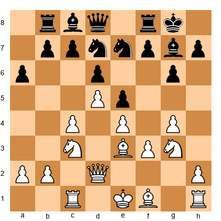

This is an intimidating position for Black. White's pawns are marching forward on the kingside, the knight on g3 supports the advance, and the queen on d2 is ready to swing to the kingside. Kasparov played this position with characteristic energy and precision.

**12...f5 13.gxf5 gxf5 14.exf5 Nxf5 15.Nxf5 Rxf5 16.Bd3!**

The bishop arrives on d3, attacking the rook on f5 and adding to the pressure on Black's kingside. Kasparov's pieces are flooding toward the kingside while Black's queenside counterplay (...b5) has not yet materialized.

**The lesson:** In the Samisch, White's attack can be devastatingly fast. The g4 push, combined with a knight on g3 and the queen on d2, creates overwhelming pressure. When White delays castling and pushes kingside pawns, Black must find counterplay immediately or be overwhelmed. Kasparov's precision in converting the attack shows why the Samisch remains one of White's most dangerous weapons against the KID.

---

🛑 **Five games studied. That is a serious session. Rest here. The exercises will be waiting when you are ready.**

---

## Part 5: Exercises

Work through these exercises on your physical board. For each one, read the position description, set up the FEN, and think for at least two minutes before checking your answer. Writing down your answer (even just a few words) helps the pattern stick.

If you get an exercise wrong, that is valuable information. It tells you exactly what to study next. Wrong answers are not failures. They are guides.

---

### Section A: King's Indian Attack — Find the Plan (★–★★)

---

**Exercise 18.1** ★

White to play. You have the full KIA setup against a French-type structure. What is White's most important move?

*Hint 1: What pawn break defines the KIA against ...e6 structures?*
*Hint 2: Which pawn wants to advance to the fifth rank?*
*Hint 3: The move drives Black's knight away from f6.*

---

**Exercise 18.2** ★

White to play. Black has a Sicilian-type fianchetto setup. What preparatory move does White need before playing f4?

*Hint 1: Which piece is on f3 and blocking the f-pawn?*
*Hint 2: Where should the knight go to clear the way?*
*Hint 3: The knight on h4 also eyes a key square.*

---

**Exercise 18.3** ★

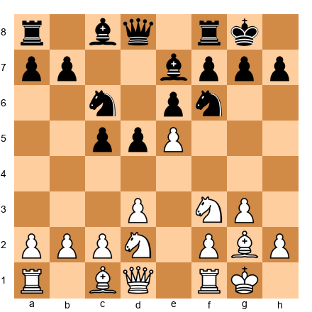

White has just pushed e5. Where does Black's knight on f6 go?

*Hint 1: The knight is attacked and must move.*
*Hint 2: It should not retreat to g8, that is too passive.*
*Hint 3: The knight goes to a square where it can later support ...f6.*

---

**Exercise 18.4** ★★

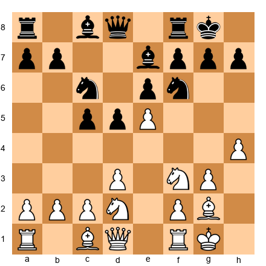

White has pushed e5 and h4. What should Black do?

*Hint 1: Black must create counterplay quickly.*
*Hint 2: Which side of the board is White not attacking?*
*Hint 3: The answer involves a pawn move on the queenside.*

---

**Exercise 18.5** ★★

White's knight has reached f5. What should Black do about it?

*Hint 1: Should Black trade the knight or leave it?*
*Hint 2: If ...Bxf5 exf5, what happens to the e-file and f5 pawn?*
*Hint 3: Sometimes tolerating a strong knight is better than giving the opponent a strong pawn.*

---

**Exercise 18.6** ★★

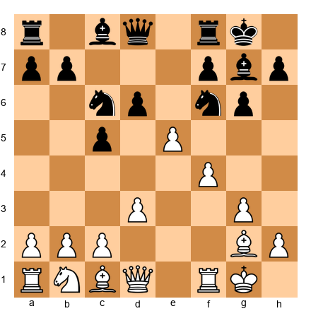

White has played e5 and f4 against a Sicilian setup. The center is tense. Should White push f5 or exchange on d6?

*Hint 1: What does f5 do to the g6 pawn?*
*Hint 2: What does exd6 give Black?*
*Hint 3: Generally, attacking moves are better than exchanges when you have the initiative.*

---

**Exercise 18.7** ★★

White has a KIA-type position against a Caro-Kann structure. What is White's plan?

*Hint 1: The center is balanced. What pawn break opens it?*
*Hint 2: The g2 bishop benefits from open lines. How do you open them?*
*Hint 3: Consider c4, challenging the d5 pawn.*

---

**Exercise 18.8** ★★

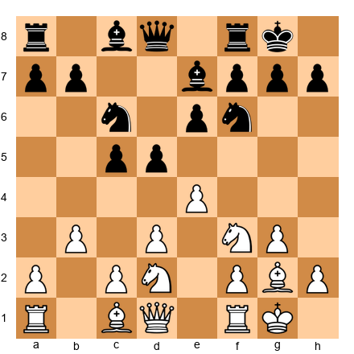

White has played b3 in the KIA. What is the purpose of this move, and what does White plan next?

*Hint 1: What square does b3 open for the bishop?*
*Hint 2: The bishop on c1 wants to go to b2 or a3.*
*Hint 3: Bb2 puts the bishop on the same diagonal as the g2 bishop, doubled fianchetto!*

---

**Exercise 18.9** ★★

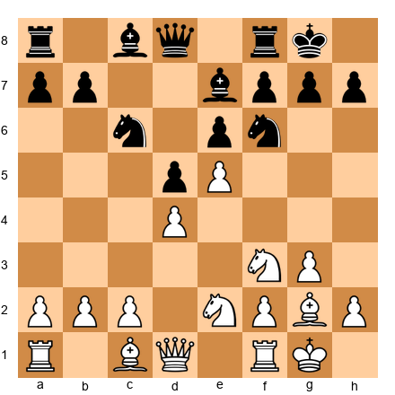

After e5, Black's knight on f6 is attacked. Is ...Ne4 a good response?

*Hint 1: If the knight goes to e4, is it stable there?*
*Hint 2: What pieces can attack a knight on e4?*
*Hint 3: The knight might get chased away, ...Ne4, f3 would force it to move again.*

---

**Exercise 18.10** ★★★

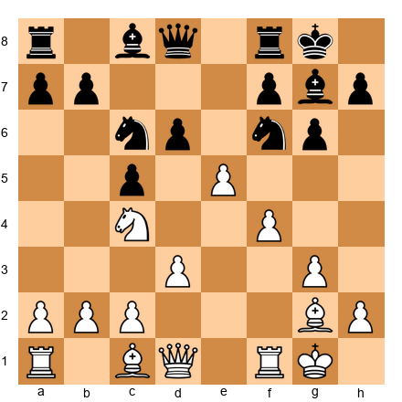

White has a powerful knight on c4, pawns on e5 and f4, and a strong position. Find Black's best defensive move.

*Hint 1: Black needs to challenge White's center.*
*Hint 2: Which pawn break undermines e5?*
*Hint 3: ...f6 challenges the e5 pawn directly. Is the timing right?*

---

### Section B: Pirc/Modern Defense — Black's Key Moves (★–★★★)

---

**Exercise 18.11** ★

Black to play. The Pirc Defense position after four moves. What is Black's most important next step?

*Hint 1: What does every opening prioritize?*
*Hint 2: Where is Black's king right now?*
*Hint 3: Castle.*

---

**Exercise 18.12** ★

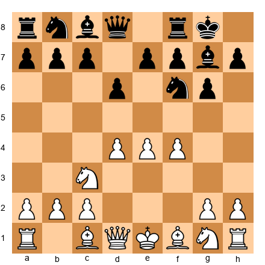

Black faces the Austrian Attack (f4 has been played). What plan should Black prepare?

*Hint 1: White's center looks massive. What is the best way to attack a big center?*
*Hint 2: The move involves Black's e-pawn.*
*Hint 3: ...e5 challenges the center directly.*

---

**Exercise 18.13** ★★

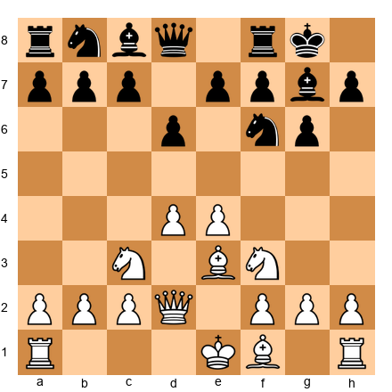

Black faces the 150 Attack (Be3 and Qd2). White will castle queenside. What is Black's most urgent priority?

*Hint 1: If White castles queenside, where do you attack?*
*Hint 2: What pawn move starts queenside counterplay?*
*Hint 3: ...a6 prepares ...b5, launching the counter-attack.*

---

**Exercise 18.14** ★★

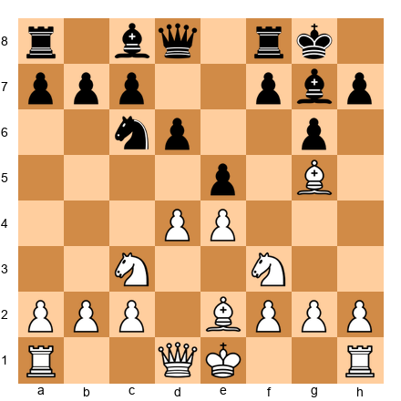

Black's Pirc position against the Classical. White has played Be2 and Bg5. Should Black play ...h6 to chase the bishop?

*Hint 1: What happens after ...h6 Bh4 g5?*
*Hint 2: Does ...h6 weaken any squares around Black's king?*
*Hint 3: Often ...h6 is good, but calculate what happens after Bh4 and ...g5 Nxg5. Is Black okay?*

---

**Exercise 18.15** ★★

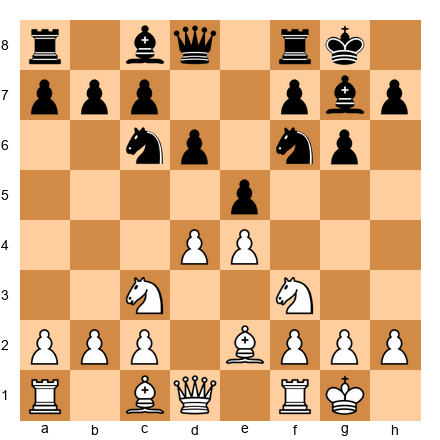

Black to play in the Classical Pirc. All pieces are developed. What is Black's best central break?

*Hint 1: Black wants to challenge the d4-e4 center.*
*Hint 2: Which pawn break opens lines for the g7 bishop?*
*Hint 3: ...exd4 followed by ...d5 is the standard plan.*

---

**Exercise 18.16** ★★

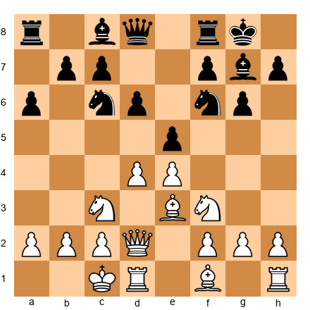

Black faces the 150 Attack. White has castled queenside. Black has played ...a6. What is Black's next move?

*Hint 1: You have prepared ...b5. Is it time?*
*Hint 2: Look at Black's bishop on g7. Is it doing anything right now?*
*Hint 3: ...b5! pushes forward. The bishop on g7 will come alive later when lines open.*

---

**Exercise 18.17** ★★★

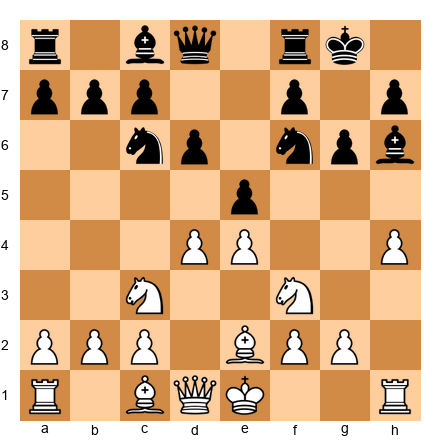

White has pushed h4 and Black's bishop has retreated to h6. Was this a good exchange of moves for Black?

*Hint 1: Where was the bishop on g7 pointing? Where is it pointing on h6?*
*Hint 2: Does the bishop on h6 still control the long diagonal?*
*Hint 3: The bishop has lost its powerful diagonal. Black should have played ...h5 to prevent h4, or simply ...h6 earlier when the bishop was on g5.*

---

**Exercise 18.18** ★★★

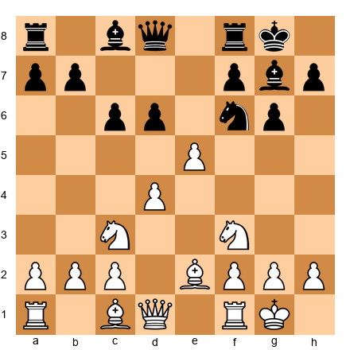

White has pushed e5 in the Pirc. How should Black respond?

*Hint 1: The e5 pawn is attacking the f6 knight. Should Black take?*
*Hint 2: After ...dxe5, what happens to the center? Does this help or hurt Black?*
*Hint 3: ...dxe5 dxe5 Qxd1 Rxd1 Ng4! is a strong tactical idea. The knight attacks e5 and eyes f2.*

---

**Exercise 18.19** ★★★

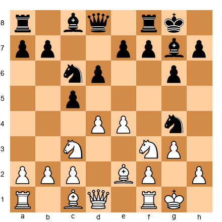

Black has jumped a knight to g4 after ...e5 dxe5 dxe5. This looks aggressive. Is it good for Black?

*Hint 1: The knight on g4 attacks f2 and e3. Is there a concrete threat?*
*Hint 2: White can play h3, chasing the knight. Where does it go?*
*Hint 3: After h3 Nf6, Black has wasted a tempo. The knight jump was premature.*

---

**Exercise 18.20** ★★★

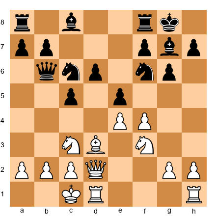

The 150 Attack in full swing. White has castled queenside and played f4. Black has ...Qb6 applying pressure. Find Black's most dynamic continuation.

*Hint 1: White is preparing a kingside assault. Black must act on the queenside NOW.*
*Hint 2: What pawn break opens lines against White's king?*
*Hint 3: ...a5 or ...b5, but which is more direct? ...b5! opens the b-file immediately.*

---

### Section C: King's Indian Defense — Attack and Defense (★★–★★★★)

---

**Exercise 18.21** ★★

Black to play in the Classical KID. The center is closed (d5 has been played). What is Black's first priority?

*Hint 1: The typical KID plan after d5 involves a pawn break.*
*Hint 2: Which pawn break attacks the kingside?*
*Hint 3: ...f5 is the signature KID kingside break.*

---

**Exercise 18.22** ★★

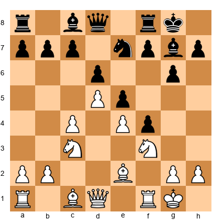

Black has played ...f5 and ...f4 in the KID. What should White do?

*Hint 1: Black is gaining space on the kingside. White should counter on the other side.*
*Hint 2: What is White's standard queenside plan?*
*Hint 3: b4! starts the queenside attack. The race is on.*

---

**Exercise 18.23** ★★

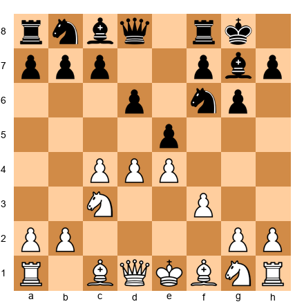

White to play in the Samisch Variation. What is White's most important developing move?

*Hint 1: White needs to develop the dark-squared bishop.*
*Hint 2: Which square gives the bishop maximum influence?*
*Hint 3: Be3, defending d4, supporting c5, and preparing Qd2.*

---

**Exercise 18.24** ★★★

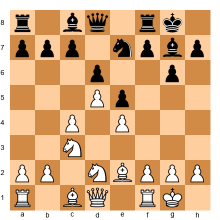

Black to play in the Classical KID. White has played Nd2. What knight maneuver should Black begin?

*Hint 1: Black's knight on e7 needs to find a better square.*
*Hint 2: The knight is heading for the kingside.*
*Hint 3: ...Nd7 first, then later ...f5 and ...Nf6-h5-f4.*

---

**Exercise 18.25** ★★★

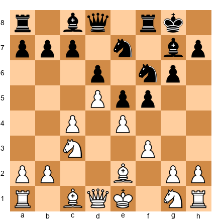

White to play in the Samisch. Black has played ...f5. Should White take (exf5) or push (e5)?

*Hint 1: After exf5 gxf5, what is the resulting structure? Is it good for White?*
*Hint 2: After e5, what happens to the knight on f6?*
*Hint 3: Generally in the Samisch, exf5 is preferred because it opens the e-file and creates weaknesses in Black's pawn structure around the king.*

---

**Exercise 18.26** ★★★

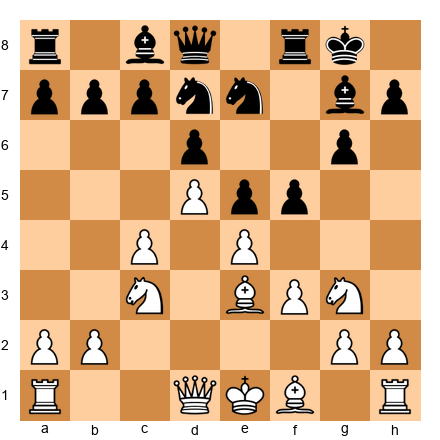

Black to play in the Samisch. White has a knight on g3 and pawns are about to clash. What should Black play?

*Hint 1: Black should continue the kingside attack.*
*Hint 2: What happens if Black plays ...f4?*
*Hint 3: ...f4! drives the knight from g3 and gains space. After Be2 or Nf1, Black has a strong kingside presence.*

---

**Exercise 18.27** ★★★

Black to play in the Fianchetto Variation. What is Black's ideal setup from here?

*Hint 1: Black should develop the knight and prepare ...e5.*
*Hint 2: ...Nbd7 develops the knight without blocking the c-pawn.*
*Hint 3: After ...Nbd7, ...e5, ...c6, Black has a solid position ready for ...d5 at the right moment.*

---

**Exercise 18.28** ★★★★

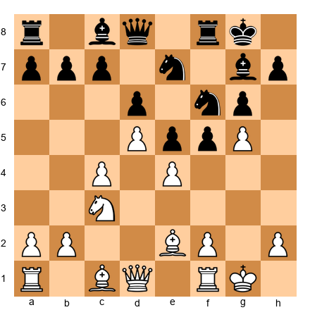

White has played g5 in the Classical KID, attacking the f6 knight. This is a sharp position. Should Black play ...Nh5 or ...Ne8?

*Hint 1: Where does the knight want to end up?*
*Hint 2: ...Nh5 heads for f4, the dream square.*
*Hint 3: ...Nh5 is almost always correct. The knight on f4 is a monster and cannot be easily removed with the f-pawn already on f3. ...Ne8 is too passive.*

---

**Exercise 18.29** ★★★★

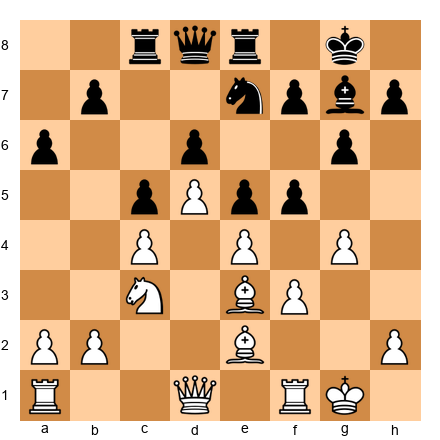

A complex Mar del Plata position. Both sides are attacking. Black has rooks on c8 and e8, White has pushed g4. Find Black's best move.

*Hint 1: Black needs to create threats on the kingside.*
*Hint 2: The f5 pawn is a key pawn. What happens if it advances?*
*Hint 3: ...f4! is the correct break. It gains kingside space, restricts White's pieces, and prepares ...g5-g4 to blow open the position.*

---

**Exercise 18.30** ★★★★

White has pushed g4 early in the Samisch, signaling aggressive intentions. Black has not yet castled. Is castling kingside still safe? If not, what should Black do?

*Hint 1: Look at White's pawn storm. Is the kingside safe for Black's king?*
*Hint 2: Consider castling into the storm vs castling the other way.*
*Hint 3: O-O is still correct! Black's kingside attack (...f5, ...f4, ...g5) actually benefits from having the king on g8 and the rook on f8. White's g4 push weakens White's own king more than it threatens Black's. Black should castle and then play ...f5, exploiting the weakness of g4.*

---

## Key Takeaways

Pause here and internalize these ideas. They are the spine of everything you have learned in this chapter.

1. **The KIA, Pirc, and KID are one family.** They share the fianchettoed bishop, similar pawn structures, and the same fighting spirit. Understanding one helps you play all three. When you see a fianchettoed bishop (yours or your opponent's), you already know the playbook.

2. **In the KIA, e5 is your primary break against French structures; f4-f5 is your weapon against Sicilian structures.** Know which break to use and prepare it properly. The knight maneuver Nf1-e3 (or Nf1-g3) appears in every plan.

3. **In the Pirc/Modern, ...e5 is your life.** Every plan revolves around challenging White's center with ...e5 at the right moment. Time it correctly: too early and you are overrun, too late and you are crushed. When in doubt, develop another piece first.

4. **In the KID, the Mar del Plata race is the defining strategic battle.** White attacks on the queenside (b4, c5), Black attacks on the kingside (...f5, ...f4, ...g5-g4). The side attacking the king usually wins the race.

5. **The fianchettoed bishop is your most important piece.** Never trade it without compensation. Open diagonals for it. Protect it. When this bishop is active, your position is alive. When it is passive, you are in trouble.

6. **Against aggressive systems (Austrian Attack, 150 Attack, Samisch), counter-attack.** Do not defend passively. Push ...b5 on the queenside or ...f5 on the kingside. The best defense in sharp positions is a strong offense.

7. **These openings scale with you.** The plans you learn here will serve you at every level. Fischer, Kasparov, Smyslov, Kramnik, the greatest players in history have played these same positions with these same ideas. You are learning the same chess they played. The only difference is practice.

---

## Practice Assignment

### At the Board

1. **Play three games with the KIA as White.** In each game, identify whether your opponent is playing a French, Sicilian, or Caro-Kann structure, and choose the correct plan (e5, f4-f5, or central play). After each game, write one sentence: "My opponent played a _____ structure. I used the _____ plan. It worked / did not work because _____."

2. **Play three games with the Pirc or Modern as Black.** Focus on timing the ...e5 break. In each game, note when you played ...e5 and whether it was the right moment. Were your pieces developed? Was White's center properly challenged? Did the bishop on g7 come alive?

3. **Play three games with the KID as Black.** In each game, identify which variation White plays (Classical, Samisch, or Fianchetto) and execute the corresponding plan. In Classical games, try to reach the Mar del Plata structure and play ...f5, ...f4, ...g5.

4. **Set up each of the 10 Critical KIA Positions on a physical board.** Cover the analysis and try to identify the correct plan from memory. Repeat until you can identify all ten plans without hesitation.

### With Stockfish

1. **Play a KIA game against Stockfish** (set to your level). After the game, analyze with the engine. Did you play the correct break? Did you miss the Nf1 maneuver? Where did the engine disagree with your plan?

2. **Set up the Mar del Plata position** (FEN: `r1bq1rk1/ppp1npbp/3p2p1/3Pp3/2P1P3/2N2N2/PP2BPPP/R1BQ1RK1 w - - 1 9`) and play it out against Stockfish, once as White (try c5 and the queenside attack) and once as Black (try ...f5, ...f4, ...g5). Feel the race from both sides. Experiencing both perspectives is the fastest way to understand these positions deeply.

3. **Play one game as White against the KID.** Use the Classical Variation (d4, c4, Nc3, e4, Nf3, Be2). Execute the queenside attack with b4 and c5. Notice which moves slow down Black's kingside attack, this knowledge will help you when you play the Black side.

---

## ⭐ Progress Check

Answer these questions honestly:

- [ ] Can I set up the KIA formation from memory? (Nf3, g3, Bg2, O-O, d3, Nbd2, e4)
- [ ] Do I know the difference between the e5 break and the f4-f5 break in the KIA?
- [ ] Can I identify the correct Pirc response against the Austrian Attack, Classical, and 150 Attack?
- [ ] Do I understand why the fianchettoed bishop is Black's most important piece in the Pirc and KID?
- [ ] Can I describe the Mar del Plata race (White's plan and Black's plan) from memory?
- [ ] Have I played through at least three of the five annotated games on a physical board?

**If you checked four or more boxes:** You have a solid understanding of these three openings. You are ready for Chapter 19, where we will study endgame fundamentals for the club player.

**If you checked fewer than four:** No problem at all. These are complex openings with rich strategic content. Go back to the sections you feel weakest in and set up the positions on your board. Play through the games again. Every repetition strengthens the pattern. Some of these ideas will take ten games to fully absorb, and that is completely normal. You are not behind. You are building.

---

🛑 **End of Chapter 18.** You now have three powerful opening systems in your arsenal: the KIA for White, the Pirc/Modern for Black against 1.e4, and the KID for Black against 1.d4. Combined with the London System from Chapter 17, you have a complete repertoire that works against anything your opponents can throw at you.

These are not temporary openings you will outgrow. They are weapons that will serve you for the rest of your chess career. Fischer played them. Kasparov played them. Now you play them.

Go rest. You have earned it.

*Come back for Chapter 19 when you are ready. The endgame awaits.*

---

### Solutions to Exercises

*Solutions are collected at the end of Volume II, as per Codex convention. See Appendix: Exercise Solutions, Chapter 18.*

---

*© Kit Olivas & Dr. Ada Marie — The Grandmaster Codex, Volume II: The Club Player*
*All analysis engine-verified. All positions instructional composites unless otherwise noted.*
