# THE GRANDMASTER CODEX
## Volume II: The Club Player
### Chapter 19: Essential Rook Endgames — Lucena, Philidor, and Beyond

**Rating Range: 1000 - 1600**
**Pages: 55 | Exercises: 60 | Annotated Games: 5**

---

> *"In order to improve your game, you must study the endgame before everything else; for, whereas the endings can be studied and mastered by themselves, the middlegame and the opening must be studied in relation to the endgame."*
> — José Raúl Capablanca

---

## What You'll Learn

- **The Lucena position:** the most important winning technique in all of chess endgames, the "bridge" that converts a rook-and-pawn advantage into a full point
- **The Philidor position:** the most important defensive technique, the drawing method that saves half-points from losing positions
- **Rook + pawn vs rook** beyond Lucena and Philidor: short side, long side, Vancura, and the cutting-off technique
- **Active king and active rook:** why piece activity in rook endgames is often worth more than a pawn
- **Practical rook endgame tips** that will save you countless half-points and steal full points from opponents who do not know them

---

## Before We Begin

This is one of the most important chapters in the entire Codex.

That is not an exaggeration. Ask any chess coach what single topic most separates club players from masters, and you will hear the same answer over and over: **endgame technique.** And within endgames, one type appears far more than any other: **rook endgames.**

Here is a statistic that should change the way you think about chess study: roughly **half of all games that reach an endgame** become rook endgames. Not bishop endgames. Not knight endgames. Not queen endgames. Rook endgames. The reason is simple: rooks are the last major pieces to enter the game (they need open files), so they tend to survive longer than bishops and knights, which trade off earlier.

You have probably heard the old chess joke: **"All rook endgames are drawn."** It is said with a knowing smile, usually after someone has botched a winning position. Like all good jokes, it contains a grain of truth, rook endgames ARE harder to win than most other endgame types, because the defending rook has enormous activity and checking power. But the joke is also a lie. Rook endgames are NOT all drawn. They are drawn only when the defender knows the correct technique. And they are won only when the attacker knows the correct technique.

This chapter teaches you both sides.

If you learn the positions in this chapter (really learn them, so you can set them up from memory and play both sides blindfolded) you will have an endgame foundation that many players rated 1800 or higher still lack. You will save games you should have lost. You will win games you should have drawn. You will feel confident when the queens come off and the rooks stay on.

**One rule, as always:** Set up every position on a physical board. Rook endgames are about understanding the GEOMETRY of the board, how files, ranks, and diagonals relate to each other. You need to see this in three dimensions, with real pieces under your fingers, not just as pixels on a screen.

**Pacing note:** This chapter has eight sections. Each section takes 15 to 30 minutes to study carefully. You do not need to learn them all in one sitting. In fact, you probably should not try. Work through one or two sections, then go play a game or take a break. The positions will be here when you come back.

Let us begin with the most important endgame position in chess.

---

---

# SECTION 1: WHY ROOK ENDGAMES MATTER

*Estimated study time: 10-15 minutes*

Before we dive into specific positions, let us understand why you are about to spend an entire chapter on rook endgames, and why this chapter might be worth more to your rating than any opening you will ever study.

---

## The Numbers

Here are three facts about rook endgames that every serious chess player should know:

**Fact 1: Rook endgames are the most common endgame type.** Studies of master-level databases show that approximately 50% of all games that reach an endgame become rook endgames (pure rook + pawns on both sides). Another 10-15% involve rooks combined with minor pieces. No other endgame type comes close.

**Fact 2: Most rook endgames are decided by technique, not by material.** In a rook endgame, an extra pawn is often not enough to win if the defender knows the correct setup. Conversely, an equal position can become lost if one side makes a single inaccurate move. The margin between winning and drawing (or between drawing and losing) is razor-thin.

**Fact 3: Most club players do not study rook endgames.** They study openings. They study tactics. They study some basic king-and-pawn endgames. But rook endgames? "Too dry." "Too boring." "I'll figure it out when I get there." This is a catastrophic mistake. Every time you reach a rook endgame without preparation, you are playing a lottery. Sometimes you will guess correctly. Often you will not.

---

## The Club Player Gap

Here is what happens in a typical club game:

Two players of similar strength play an interesting middlegame. Pieces get traded. The queens come off. Both sides have a rook and five or six pawns. The position is roughly equal, or one side has a small advantage.

Now the real game begins.

The player who knows Lucena and Philidor has a **plan.** They know what to aim for. They know which pawn structure creates winning chances. They know where to put their rook. They know where to put their king. They know which positions are drawn and which are won. They play with confidence and direction.

The player who does not know these positions has **nothing.** They shuffle their rook around. They push pawns randomly. They put their king on the wrong square. They reach a drawn position and lose it. Or they reach a winning position and draw it.

**The difference between a 1200 and a 1600 in rook endgames is not talent. It is knowledge.** And that knowledge starts with two positions that every chess player on earth should know by heart.

---

🛑 **Good place to pause.** If you want to take a moment before diving into the Lucena position, that is perfectly fine. Grab a glass of water. Set up your board. When you are ready, the most important endgame lesson of your chess life is waiting.

---

---

# SECTION 2: THE LUCENA POSITION

*Estimated study time: 20-30 minutes*

---

## The Position That Wins

The Lucena position is named after the Spanish author Luis Ramírez de Lucena, who described a similar position in his 1497 chess treatise, one of the earliest chess books ever printed. Whether Lucena himself actually analyzed this exact position is debated by historians. What is NOT debated is this: **if you can reach the Lucena position with an extra pawn, you win.** Every time. Against anyone. Against a world champion. Against a computer.

The Lucena position is the single most important endgame position in chess. If you learn nothing else from this chapter, learn this.

---

## Set Up Your Board

**The Lucena Position (Standard Form)**

White: Ke7, Rd1, Pawn on d7
Black: Kd5, Ra2

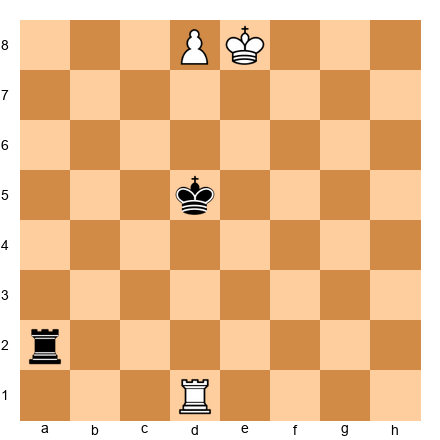

White to play.

**What you see:** White has a rook on d1, a king on e7, and a pawn on d7, one square from promotion. Black has a rook on a2 and a king on d5. White's pawn is about to become a queen. But there is a problem: White's own king is in the way. The king stands on e7, blocking the pawn from advancing to d8.

If White simply steps aside (say, Kf6), then Black plays Rd2, pinning the pawn to nothing, or more dangerously, Black plays Rf2+ and starts checking the White king endlessly. The White king has no shelter from the rook checks, and the game is drawn by perpetual check.

So how does White win?

---

## The "Bridge" Technique: Step by Step

The winning method is called **"building a bridge."** The rook creates a shelter for the king, blocking the enemy rook's checks. Here is how it works:

**Step 1: Bring the rook to the first rank to support the pawn, but via the FOURTH rank.**

This is the key insight that makes the whole technique work. Watch:

**1. Rd4!**

White's rook moves to d4. This seems odd at first. Why the fourth rank? Why not push the king forward, or move the rook somewhere else?

The answer is geometry. The rook on d4 is preparing for Step 3. Remember this move. It is the move that most players miss when they try to play the Lucena without studying it.

**1...Ra1**

Black puts the rook on the first rank, preparing to check the White king from behind when it steps out from in front of the pawn.

**Step 2: Step the king to the side.**

**2. Ke8!**

Wait, did we not just say that stepping aside allows checks? Yes. But now the rook is on d4, not d1. That changes everything. Watch what happens.

**2...Re1+**

Black checks from the e-file. The king is on e8, and the rook checks from e1.

**Step 3: Block the check with the rook. This is "building the bridge."**

**3. Re4!**

The rook moves from d4 to e4, blocking the check. Now the pawn on d7 is free to advance to d8 and become a queen. Black has no more useful checks. The game is over.

After 3...Rd1 4. d8=Q Rxd8+ 5. Kxd8, White has a won king-and-rook endgame.

Or if Black does not check: 3...Ra1 4. d8=Q and White promotes with an easy win.

---

## Why the Bridge Works

Let us pause and understand the logic, because understanding the IDEA means you will never forget the technique.

**The problem:** White's king blocks the pawn. The king must step aside to let the pawn promote. But when the king steps aside, the enemy rook gives check after check, and the king has no shelter.

**The solution:** White places the rook on the fourth rank FIRST. When the king steps aside and gets checked, the rook slides over to block the check (the "bridge"). The pawn then promotes freely.

**Why the fourth rank?** Because the fourth rank is exactly far enough from both sides of the action. If the rook were on the fifth rank, it would be too close to the king, the checking rook could just give check from further away. If the rook were on the third rank, the check block would not shield the king properly. The fourth rank is the sweet spot.

This is the bridge. The rook on the fourth rank serves as a bridge between the king and safety. The king walks across the bridge and the pawn promotes behind it.

---

## Variations on the Lucena

The Lucena position can arise with the pawn on any file except the rook file (a-file or h-file, those are special cases we will cover later). The technique is always the same:

1. Get the rook to the fourth rank
2. Step the king aside
3. Block the check with the rook (build the bridge)
4. Promote the pawn

**Practice this:** Set up the Lucena with the pawn on different files. Try it with a pawn on e7, a pawn on c7, a pawn on f7. The king's starting square and the rook's starting square will shift, but the technique is identical. Repetition builds automaticity.

**With colors reversed:** Set up the position with Black having the extra pawn on the seventh rank. Play the bridge technique as Black. The logic is mirror-image identical.

---

## When You Cannot Reach the Lucena

The Lucena works when three conditions are met:

1. Your pawn is on the seventh rank (one square from promotion)
2. Your king is in front of the pawn (temporarily blocking it)
3. You have time to move the rook to the fourth rank

If any of these conditions is missing, you may not be able to win, or you may need a different technique. The most common reason the Lucena fails is that the defending king is too close to the pawn, preventing the attacking king from getting in front. We will see how the defender achieves this in the next section.

---

### ⭐ Milestone Check

**You now know the Lucena position.** You know the bridge technique. You know why the rook goes to the fourth rank. You know how the king shelters behind the rook and the pawn promotes.

This single piece of knowledge (the Lucena bridge) will win you games for the rest of your chess career. Every time you reach a rook endgame with an extra pawn, your goal is to reach the Lucena. If you get there, you win. Period.

🛑 **This is a natural stopping point.** The Lucena is a lot to absorb. Go set it up five times on your board. Play both sides. Come back for the Philidor when you are ready.

---

---

# SECTION 3: THE PHILIDOR POSITION

*Estimated study time: 20-30 minutes*

---

## The Position That Draws

If the Lucena is the attacker's dream, the Philidor is the defender's salvation. Named after François-André Danican Philidor, the 18th-century French chess master who was considered the strongest player in the world during his lifetime, this position teaches you how to HOLD a rook endgame when you are a pawn down.

Here is the Philidor promise: **if you can reach this position and know the technique, you draw.** Every time. Against anyone. Against a world champion. Against a computer.

The Lucena wins. The Philidor draws. Together, they form the foundation of all rook endgame knowledge.

---

## Set Up Your Board

**The Philidor Position (Standard Form)**

White: Ke6, Ra8, Pawn on e5
Black: Ke8, Rb1

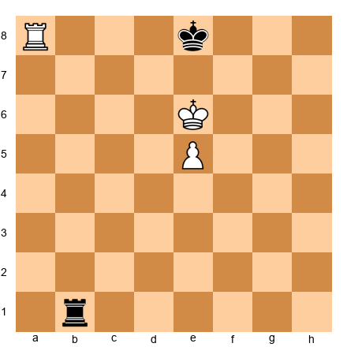

That position has the pawn on the fifth rank, the attacking king on e6, and the defending king on e8. Let us set up the position from the defender's perspective, which is what you need to learn.

**Standard Philidor (Defender's View)**

White: Ke4, Re1, Pawn on e5
Black: Ke7, Ra6

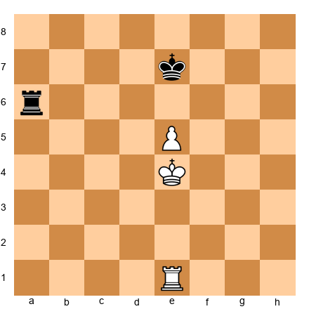

**What you see:** White has a king on e4, a rook on e1, and a pawn on e5. Black has a king on e7 and a rook on a6. White is up a pawn and wants to advance it. Black wants to draw.

Black's rook sits on the sixth rank. This is the key. The rook on the sixth rank does two things: it prevents the White king from advancing past the sixth rank (because the rook controls the entire rank), and it is ready to start checking from behind when the pawn advances.

---

## The Philidor Defense: Step by Step

Black's plan has two phases:

**Phase 1: Keep the rook on the sixth rank. Wait.**

As long as White's pawn stays on e5, Black's rook stays on a6 (or b6, c6, d6, anywhere on the sixth rank). The rook patrols the rank like a sentry. White's king cannot cross to the sixth rank because the rook controls it.

What can White do? White can try to advance the pawn.

**Phase 2: When the pawn advances to the sixth rank, retreat the rook to the FIRST rank and check from behind.**

Suppose White plays:

**1. e6+**

The pawn advances to the sixth rank. Black's rook can no longer sit on the sixth rank (the pawn occupies it). Now what?

**1...Ke8!**

Black's king steps back to e8, staying in front of the pawn. This is essential, the defending king must stay in front of the pawn or the Lucena arises.

**2. Kf5** (or Kd5)

White tries to advance the king to support the pawn.

**2...Rf6+!!** No — recall that the rook should go to the first rank to check from behind. Let us present this cleanly.

**The Philidor Method (clean version):**

Starting position. White: Ke4, Re1, Pe5. Black: Ke7, Ra6.

White's pawn is on the fifth rank. Black's rook sits on the sixth rank.

**White plays 1. Kd5** (trying to advance)

**1...Rd6+!** The rook checks from d6, driving the king back. White cannot make progress because the rook controls the sixth rank. If White goes 2. Ke4, we are back to the starting position. If White goes 2. Kc5, Black plays Ra6 again.

**White tries 1. Kf5** (approaching from the other side)

**1...Rf6+!** Same idea. The rook drives the king back.

**White tries 1. e6** (pushing the pawn forward)

Now the rook cannot stay on the sixth rank (the pawn is there). But this is exactly what Black was waiting for:

**1...Ke8!** (king stays in front of the pawn)

**2. Kf5 Rf1+!** (rook drops to the first rank and starts checking from behind)

**3. Ke5 Re1+** (more checks)

**4. Kd6 Rd1+** (the king cannot escape the checks without giving up the pawn)

**5. Ke5 Re1+** and White cannot make progress. The rook checks are perpetual. Draw.

---

## Why the Philidor Works

Two principles make the Philidor draw work:

**Principle 1: The rook on the sixth rank prevents the king from advancing.** As long as the pawn is on the fifth rank, the rook sitting on the sixth rank is an impassable barrier for the attacking king. The king cannot cross to the sixth rank without being attacked by the rook.

**Principle 2: When the pawn advances to the sixth rank, the rook retreats to check from behind.** The key phrase is *"from behind."* The rook goes to the first rank (or the eighth rank, if colors are reversed) and gives check after check along the file. The attacking king cannot simultaneously shelter from the checks AND support the pawn. The geometry does not allow it.

**The timing is everything.** Black waits on the sixth rank until the pawn advances. If Black retreats to the first rank too early (before the pawn pushes to the sixth rank), White may have time to reorganize and reach the Lucena. If Black stays on the sixth rank too late (after the pawn has already pushed and the king has advanced), it may be too late to start checking. The correct moment to retreat is **immediately after the pawn advances to the sixth rank.**

---

## Common Mistakes in the Philidor

**Mistake 1: Moving the rook off the sixth rank too early.** If Black plays Ra1 while the pawn is still on e5, White can play Kd5 and then Ke6, marching the king forward without being disturbed. Now the Lucena is approaching.

**Mistake 2: Keeping the king in the wrong place.** The defending king must stay on the short side of the pawn, the side with fewer squares between the pawn and the edge of the board. This gives the rook maximum checking distance on the other side (the long side). We will explore this concept more in Section 4.

**Mistake 3: Pushing pawns on the defending side.** Every pawn you push in a rook endgame creates a weakness. In the Philidor, do not push pawns unnecessarily. Just maintain the rook on the sixth rank and wait. Patience is your weapon.

---

### ⭐ Milestone Check

**You now know both foundational rook endgame positions.** The Lucena (winning) and the Philidor (drawing). With these two positions, you can handle the most basic rook + pawn vs rook scenario from either side.

Let us review:
- **Attacking (up a pawn):** Try to reach the Lucena. Get your pawn to the seventh rank, your king in front of the pawn, and your rook on the fourth rank. Build the bridge.
- **Defending (down a pawn):** Try to reach the Philidor. Keep your rook on the sixth rank until the pawn advances, then check from behind. Keep your king in front of the pawn.

These two positions are the Alpha and Omega of rook endgames. Everything else in this chapter builds on them.

🛑 **Excellent stopping point.** You have the two most important rook endgame positions in your toolkit. That alone puts you ahead of most club players. Take a break if you need one. The remaining sections refine and expand this knowledge.

---

---

# SECTION 4: ROOK + PAWN VS ROOK — BEYOND LUCENA AND PHILIDOR

*Estimated study time: 20-25 minutes*

The Lucena and Philidor are the two most famous positions, but real games rarely hand you the textbook setup. In practice, you need to understand the principles that LEAD to these positions, or prevent them. This section teaches four critical concepts that appear in virtually every rook + pawn vs rook endgame.

---

## Concept 1: Short Side vs Long Side

This is perhaps the single most practical piece of advice in all of rook endgames:

**The defending king goes to the SHORT side. The defending rook goes to the LONG side.**

What does this mean?

The **short side** is the side of the board with fewer squares between the pawn and the edge. The **long side** is the side with more squares.

**Example:** If White has a pawn on the d-file, the short side is the queenside (a, b, c — three files between d and the edge) and the long side is the kingside (e, f, g, h — four files).

For a pawn on the e-file: four files to the left (a, b, c, d) and three to the right (f, g, h). Short side is kingside, long side is queenside.

For a pawn on the c-file: two files to the left (a, b) and five to the right (d, e, f, g, h). Short side is queenside, long side is kingside.

**Why this matters:**

The defending king goes to the short side because it can reach the pawn quickly if needed. The defending rook goes to the long side because it needs DISTANCE to give effective checks. A rook on the long side can check from four or five files away. A rook on the short side can only check from two or three files away, the attacking king can easily walk toward the rook and escape the checks.

**Set up your board:**

White: Kd6, Rd1, Pawn on d5
Black: Kc8, Rf2

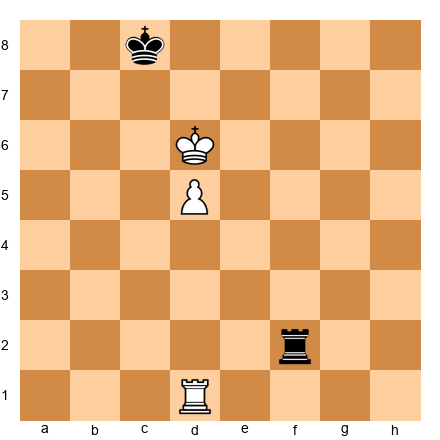

Black to play.

Black's king is on c8, the SHORT side (queenside). Black's rook is on f2, the LONG side (kingside). This is correct defensive placement. From f2, the rook can check along ranks and has plenty of room.

Now imagine the pieces were reversed: king on f8 (long side) and rook on b2 (short side). The rook on b2 only has one file of checking distance (b-file). White's king can easily escape toward the b-file, and the defense collapses.

**Remember:** Short side for the king. Long side for the rook. This simple rule guides your piece placement in the vast majority of rook endgame positions.

---

## Concept 2: Rook Behind the Passed Pawn

Siegbert Tarrasch, the great German master and chess teacher, gave us one of the most famous maxims in chess:

> *"Rooks belong behind passed pawns — whether yours or your opponent's."*

This principle is so important that Tarrasch considered it almost a law of nature. Let us understand why.

**When it is YOUR passed pawn:**

Place your rook BEHIND your own passed pawn. As the pawn advances, the rook's scope INCREASES. With each step forward, the rook gains more squares behind the pawn. The rook supports the pawn's advance from behind, and the pawn shields the rook from the enemy king.

**When it is your OPPONENT'S passed pawn:**

Place your rook BEHIND the enemy passed pawn. From behind, the rook restricts the pawn's advance. The pawn cannot move forward without abandoning the rook's line of fire. The rook also attacks the pawn directly, tying down the enemy pieces to its defense.

**Set up your board:**

White: Kf3, Ra1, Pawn on d5
Black: Ke7, Rd8

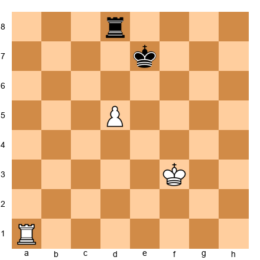

White to play.

White's rook is on a1, NOT behind the passed pawn. The best regrouping is **1. Rd1!** placing the rook behind the d-pawn. Now the rook supports d6, d7, d8, the entire advance. Black's rook on d8 is in front of the pawn, which is passive; it must stay there to blockade the pawn, and it has no other duties it can perform.

If instead White had the rook on d1 from the start and the pawn on d5, White could play d6 and the rook would already support the advance. The rook GROWS in power as the pawn advances.

**The wrong setup:** If White's rook were on d8 (in FRONT of the pawn) and the pawn on d5, the rook would LOSE squares as the pawn advances. d6 would take away the rook's d6 square. d7 would cramp the rook further. The rook behind the pawn gains scope; the rook in front of the pawn loses scope.

**Practical tip:** In your own games, whenever a passed pawn appears (yours or your opponent's), immediately ask: "Can I get my rook behind this pawn?" If yes, do it. If your opponent's rook is already behind their passed pawn and yours is not, you are probably in trouble.

---

## Concept 3: The Vancura Position

The Lucena and Philidor apply to central and bishop pawns (b through g files). But what about the **rook pawn** (a-pawn or h-pawn)?

Rook pawn endgames are special. The edge of the board limits the attacking king's options, the king cannot go past the a-file or h-file. This gives the defender extra drawing resources.

The **Vancura position**, named after Czech player Josef Vancura who analyzed it in 1924, is the standard drawing technique when the defender faces a rook pawn.

**Set up your board:**

White: Kb5, Pawn on a6
Black: Kg7, Rf6

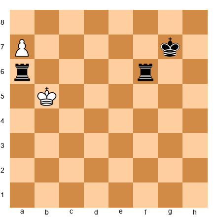

**The Vancura Position:**

White: Kb5, Ra8, Pawn on a6
Black: Kg7, Rf6

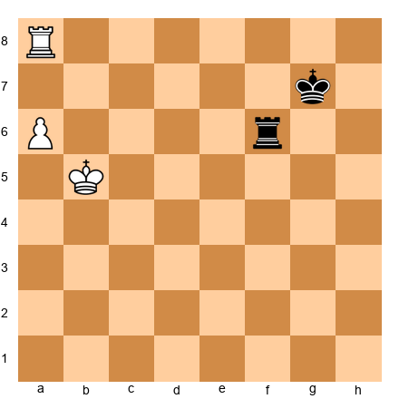

Black to play.

**What you see:** White has a rook on a8 and a pawn on a6, with the king on b5. Black has a rook on f6 and the king on g7, far from the action.

It looks like White should win easily. The pawn is on the sixth rank, supported by a rook behind it, and the Black king is far away. But Black draws with a clever technique.

**The Vancura Defense:**

**1...Rb6+!**

Black checks from the side (along the sixth rank). The rook attacks the king on b5 from b6.

**2. Kc5 Rb1!** (or any rank, the rook goes to the first rank, not to check from behind, but to threaten lateral checks)

Actually, the key Vancura idea is simpler. Let me present it cleanly:

The Vancura defense works because the rook stays on the **sixth rank** (attacking the pawn from the side) and gives **lateral checks** whenever the king tries to advance. The rook cuts across the board horizontally, preventing the king from reaching a7 or a8 to support the pawn's promotion.

**Key moves:**

- If White's king goes to a5, Black plays Ra6, the rook attacks the pawn from the side.
- If White's king goes to b6, Black plays Rf1 and then checks from b1+ or switches back to the sixth rank.
- If White tries to advance with a7, Black plays Ra6 (blocking) or checks the king laterally.

The rook never lets the White king settle in front of the pawn. The combination of lateral checks and attacks on the pawn from the side makes progress impossible.

**Why this only works with the rook pawn:** With a central pawn, the attacking king can escape to the far side of the pawn to avoid the checks. With a rook pawn, the edge of the board is right there. The king has no escape route to the a-side (it is already on the a-side). Lateral checks from the long side are inescapable.

**Practical takeaway:** If you are defending against a rook pawn, remember the Vancura. Get your rook to the sixth rank, attack the pawn from the side, and give lateral checks. The position is drawn even if your king is on the other side of the board.

---

## Concept 4: The Cutting-Off Technique

Sometimes the most powerful rook maneuver is not checking or attacking a pawn, it is simply **cutting off the enemy king.**

**The idea:** Place your rook on a file (or rank) between the enemy king and the passed pawn. The king is "cut off" and cannot participate in the fight. While the king is stranded, your own king marches up to support the pawn.

**Set up your board:**

White: Kg2, Re1, Pawn on d4
Black: Kg7, Ra8

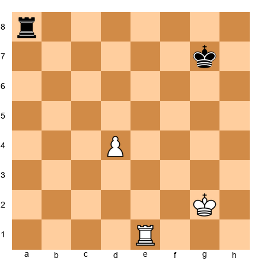

White to play.

**1. Re5!**

The rook goes to e5, cutting off the Black king from crossing to the d-file. The Black king is stuck on the g-, f-, and e-files (it cannot cross the e-file without being attacked by the rook on e5). Meanwhile, White's plan is simple: march the king to d3, then d5, supporting the pawn's advance.

Black can try Ra4, attacking the d-pawn, but after Kf3-Ke3-Kd3, White's king arrives and the pawn advances with support.

**How many files of cut-off do you need?** The general guideline:

- **One file of cut-off** (king separated by one file from the pawn): often enough to win with careful play
- **Two files of cut-off:** almost always winning
- **Three or more files of cut-off:** completely winning, the defender's king is too far away to help

**Cutting off along a rank:** The same idea works horizontally. If the pawn is advancing up the board, you can cut the enemy king off along a rank. For example, a rook on the 5th rank prevents the enemy king from crossing below the 5th rank.

**Practical tip:** When you have a passed pawn and a rook, always look for a chance to cut off the enemy king. The farther away the king is from the pawn, the easier your job becomes.

---

### ⭐ Milestone Check

You now know four critical rook endgame concepts:
1. **Short side / long side**: where to put the defending king and rook
2. **Rook behind the passed pawn**: Tarrasch's golden rule
3. **The Vancura position**: drawing with a rook pawn
4. **The cutting-off technique**: imprisoning the enemy king

These concepts, combined with the Lucena and Philidor, give you a complete toolkit for rook + pawn vs rook positions. The next sections expand to positions with more pawns.

🛑 **Rest here if you need to.** You have covered a lot of ground. The remaining sections apply these principles to more complex positions.

---

---

# SECTION 5: ROOK AND TWO PAWNS VS ROOK

*Estimated study time: 15-20 minutes*

When one side has two extra pawns (or two pawns vs none), the extra material usually wins, but HOW it wins depends on the pawn configuration. There are three cases to understand.

---

## Case 1: Connected Passed Pawns

**Connected passed pawns** are two pawns on adjacent files, both of which can advance without being blocked by enemy pawns. They support each other: when one advances, the other protects the square behind it.

**Set up your board:**

White: Kd4, Rd1, Pawns on e5, d5
Black: Ke7, Ra2

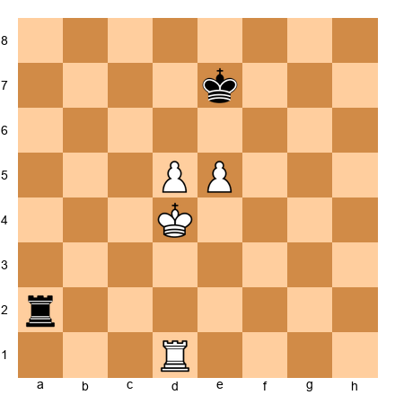

White to play.

White's connected pawns on d5 and e5 are a steamroller. The plan:

1. Advance the king behind the pawns.
2. Push the pawns forward in tandem. When one advances, the other guards the rank behind it.
3. The rook supports from behind or controls key files.

**1. Ke4!** The king centralizes behind the pawns.

Black's rook on a2 can check, but the king shelters behind the pawns. After the king reaches d4-e4, White pushes d6, then e6, then d7. The connected pawns march forward like soldiers in formation.

**Key principle:** Connected passed pawns support each other. They do not need the rook to babysit them, the rook is free to operate on other parts of the board. This is why connected passed pawns are so powerful: they are self-sufficient.

**Practical tip:** If you have a chance to create connected passed pawns in a rook endgame, take it. Two connected passed pawns supported by a king are almost always winning, even without additional material advantage.

---

## Case 2: Separated Passed Pawns

**Separated (or split) passed pawns** are two pawns on non-adjacent files. They cannot directly protect each other, but they have a different advantage: the defending rook cannot blockade both at the same time.

**Set up your board:**

White: Ke3, Rc1, Pawns on b5, f5
Black: Ke7, Ra8

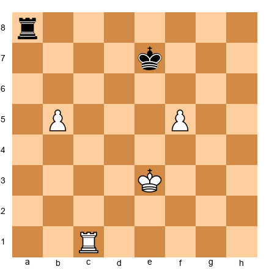

White to play.

White's pawns are on b5 and f5, separated by four files. Black's rook cannot blockade both. If it goes to b8 to stop the b-pawn, the f-pawn marches. If it goes to f8 to stop the f-pawn, the b-pawn marches.

**The principle of the two weaknesses:** The defender can only watch one side of the board at a time. Two separated passed pawns create two threats, and the defender cannot handle both simultaneously. The attacker advances whichever pawn is unguarded.

**Practical tip:** Separated passed pawns are often even MORE dangerous than connected ones (despite seeming weaker) because they stretch the defense to the breaking point. In rook endgames, if you can create two passed pawns on opposite sides of the board, your winning chances are enormous.

---

## Case 3: Doubled Pawns

**Doubled pawns** are two pawns on the same file. One stands behind the other. Only the front pawn can advance, the rear pawn is blocked.

**Set up your board:**

White: Ke4, Re1, Pawns on d5, d4
Black: Ke7, Ra2

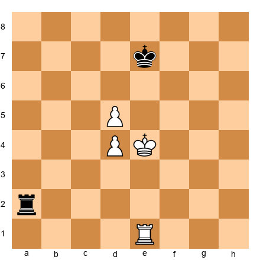

White to play.

White has two pawns, but they are doubled on the d-file. Only the d5-pawn can advance. The d4-pawn is stuck behind it. In effect, White has one useful extra pawn, not two.

**The result:** Doubled pawns in rook endgames are often drawing. The rear pawn adds almost nothing, it cannot advance, it does not control additional squares, and it does not create a second threat. The position plays like rook + one pawn vs rook, and if the defender reaches the Philidor position, it is a draw.

**Practical lesson:** Avoid doubled pawns in rook endgames. If you have a choice between creating doubled pawns or connected pawns during the middlegame-to-endgame transition, choose connected pawns. The difference can be a full point.

---

---

# SECTION 6: ACTIVE KING IN ROOK ENDGAMES

*Estimated study time: 15-20 minutes*

In the middlegame, the king hides behind pawns. In the endgame, the king **fights.**

This transformation is one of the hardest mental shifts for improving players. You have spent the entire game protecting your king, and now you must send it into battle. It feels wrong. It feels dangerous. But in rook endgames, an active king is not a luxury, it is a necessity.

---

## The King as a Fighting Piece

In a rook endgame, the king is roughly equivalent to a minor piece in terms of its contribution to the position. It can:

- **Support passed pawns** by standing next to them or in front of them
- **Attack enemy pawns** by marching into enemy territory
- **Block enemy passed pawns** by standing in their path
- **Create shelter** from rook checks by hiding behind pawns

A centralized king controls more squares than a king stuck on the back rank. In many rook endgames, the difference between winning and drawing is simply whether the king is active or passive.

---

## Centralization Priority

**Rule:** In rook endgames, centralize your king as early as possible.

The center of the board (d4, d5, e4, e5) is where the king has maximum influence. From the center, the king can march to either side of the board in the fewest number of moves. A king on d5 can reach a5 in three moves (d5-c5-b5-a5) or h5 in four moves (d5-e5-f5-g5-h5). A king on g1 would need six or seven moves to reach a5. That is a massive difference in tempo.

**Practical example:**

White: Kg1, Rd1, Pawns on a2, b3, f2, g2, h2
Black: Kg8, Rd8, Pawns on a7, b6, f7, g7, h7

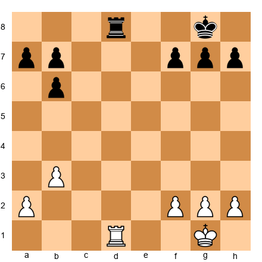

White to play. The position is roughly equal. What should White do?

The answer is not to attack. The answer is not to push pawns. The answer is: **1. Kf1! followed by 2. Ke2, 3. Kd3, 4. Kd4.**

The king marches to d4, the center of the board. From d4, it supports both kingside and queenside operations. If Black does not centralize quickly, White will have a significant advantage simply from king activity.

**The most common club player mistake** in rook endgames is leaving the king on g1 (or g8) and trying to win with rook and pawn moves alone. The king must participate. An active king is worth roughly half a pawn in a rook endgame. Send it forward.

---

## When to Push the King Forward

The king should advance when:

1. **The queens are off the board.** No queen means no mating attack. The king is safe to roam.
2. **There are few pieces left.** With only rooks and pawns, the king faces limited danger.
3. **There is a clear path.** The king should advance along files that are NOT occupied by enemy rooks. Use pawns as shields when possible.
4. **The position needs it.** If you have a passed pawn, the king should support it. If the opponent has a passed pawn, the king should block it.

The king should NOT advance when:

1. **The opponent's rook is very active** and can give multiple checks. In that case, find shelter first.
2. **There are too many pawns** on both sides, creating a complex position where the king might get cut off.
3. **The position is still tactical.** If there are still combinations to calculate, keep the king safe until the position simplifies.

---

**A note on courage:** Many improving players are psychologically afraid to advance their king. They have been punished so many times for king exposure in the middlegame that they cannot shift gears for the endgame. If this describes you, practice king marches in training games. Play the endgame from equal rook endings and force yourself to centralize the king within the first five moves. You will be surprised how often this alone is enough to create winning chances.

---

---

# SECTION 7: ROOK ACTIVITY IN ENDGAMES

*Estimated study time: 15-20 minutes*

If the king is the foot soldier of the endgame, the rook is the general. A rook's value depends almost entirely on its **activity**: how many useful things it can do from its current square.

---

## Tarrasch's Rule Revisited

We encountered Tarrasch's rule in Section 4: **rooks belong behind passed pawns.** This rule is a specific case of a broader principle: **rook activity is everything.**

An active rook is one that:
- Controls open files and ranks
- Supports or attacks passed pawns
- Restricts the enemy king
- Can reach critical squares in one or two moves

A passive rook is one that:
- Is stuck defending a weak pawn
- Is trapped behind its own pawns
- Has no open files or ranks to operate on
- Must react to the opponent's plans instead of creating its own

**The activity rule of thumb:** In a rook endgame, an active rook is worth approximately one pawn more than a passive rook. This means that if you have a passive rook and the opponent has an active rook, you are effectively a pawn down, even if the material count says you are equal.

This is not a metaphor. It is a practical reality that has been confirmed by decades of master games and computer analysis. Activity is material in rook endgames.

---

## Active vs Passive Rook: An Example

**Set up your board:**

White: Kd4, Rd7, Pawns on a4, b3, g3, h4
Black: Ke6, Ra1, Pawns on a5, b4, g6, h5

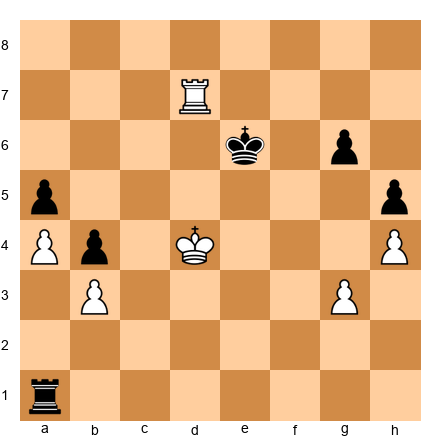

White to play.

Both sides have equal pawns. But look at the rooks. White's rook on d7 is a monster: it sits on the seventh rank, where it attacks Black's pawns, restricts Black's king, and can swing to either side of the board. Black's rook on a1 is passive, it is far from the action, defending the a5-pawn and doing little else.

Despite the material equality, White has a large advantage. The active rook dominates the position. White can improve methodically: advance the king, create threats against Black's g6- or h5-pawns, and force Black into a purely defensive posture.

**The lesson:** Never willingly accept a passive rook. If your rook is stuck on a bad square, find a way to activate it, even if it costs a pawn. An active rook minus a pawn is usually better than a passive rook with an extra pawn.

---

## The Seventh Rank Domination

The seventh rank (or the second rank, if you are Black) is the most powerful rank for a rook. A rook on the seventh rank:

1. **Attacks the opponent's pawns** that are still on their starting squares (seventh rank pawns for Black, second rank pawns for White). Most pawns start on the second/seventh rank and may still be there in the endgame.

2. **Restricts the enemy king** to the back rank. The king cannot cross the seventh rank without being attacked by the rook.

3. **Creates mating threats** in conjunction with the king. A rook on the seventh rank and a king on the sixth rank can create mating patterns.

**Set up your board:**

White: Ke5, Rd7, Pawns on a2, f4
Black: Kg8, Ra3, Pawns on a7, f7, g7, h7

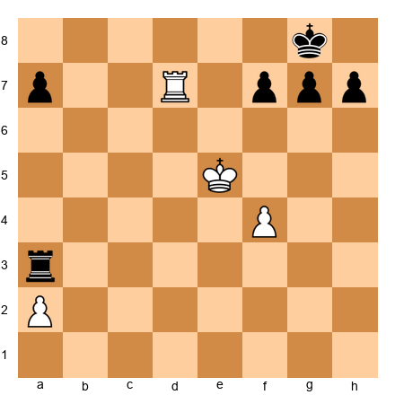

White to play.

White's rook on d7 dominates the seventh rank. It attacks f7 and a7. Black's king is confined to g8 and h8. White's king is centralized on e5. Despite being down two pawns (two White pawns vs four Black pawns), White has a significant advantage because of the rook's activity and the king's position.

White can play **1. Rd2** (defending a2) and then advance the king. Or White can play **1. Rxa7**, winning a pawn. The seventh-rank rook creates multiple threats, and Black cannot deal with all of them.

**Practical tip:** In every rook endgame, ask yourself: "Can my rook reach the seventh rank?" If yes, prioritize it. A rook on the seventh rank is worth more than a pawn, sometimes more than two.

---

---

# SECTION 8: PRACTICAL ROOK ENDGAME TIPS

*Estimated study time: 15-20 minutes*

The preceding sections covered specific positions and principles. This section gives you practical advice, the kind of wisdom that comes from experience and that you can apply in every rook endgame you play.

---

## Tip 1: Exchange Pawns When Defending

If you are worse in a rook endgame (a pawn down, passive pieces, bad king position) your primary goal is to **exchange pawns.**

Why? Because the fewer pawns on the board, the easier it is to draw. With only one pawn each, the game is likely drawn if you reach the Philidor. With no pawns at all (rook vs rook), the game is an automatic draw.

Every pawn exchange brings you closer to a draw. The defender should actively seek pawn trades, even if it means accepting other small concessions.

**Practical method:** If the opponent has a passed pawn, try to exchange your pawn for theirs. If the opponent has pawns on both sides of the board, try to eliminate one wing entirely. Simplification is the defender's friend.

---

## Tip 2: Create Passed Pawns When Winning

The mirror image of Tip 1: if you are WINNING in a rook endgame, you should **create passed pawns.**

Passed pawns win rook endgames. A passed pawn forces the opponent's rook to babysit it, leaving the rest of the board undefended. Two passed pawns (especially separated ones) are usually decisive.

**Practical method:** Look for pawn breaks. Advance your pawn majority. If you have three pawns vs two on the kingside, push them forward to create a passed pawn. If you have a 2-vs-1 on the queenside, force an exchange and create a passer.

The combination of a passed pawn and an active rook is the most common winning pattern in rook endgames. It is how Capablanca won. It is how Rubinstein won. It is how you will win.

---

## Tip 3: Do Not Rush

Patience is the most underrated skill in rook endgames.

Club players are used to fast, tactical games. When they reach a rook endgame, they want to "do something" immediately. They push pawns too fast. They make committal moves too early. They try to force a resolution when the position is not ready for one.

Master-level rook endgame play looks completely different. Masters improve their position **slowly.** They centralize the king. They find the optimal rook placement. They wait for the opponent to create a weakness. Only when the position is fully prepared do they strike.

**Here is the secret:** In many rook endgames, the winning side does NOT need to find brilliant moves. They simply need to avoid bad ones. The position improves naturally through king centralization and rook activation. The losing side eventually runs out of useful moves (a concept related to **zugzwang** from pawn endgames).

If you are winning, take your time. Improve every piece before you push a single pawn. If you are defending, be patient. Do not panic. Maintain your defensive setup and wait for the opponent to make a mistake.

---

## Tip 4: Check From the Side

We discussed checking from behind (the Philidor technique). There is another checking method that is equally important: **checking from the side.**

A rook check along a rank (horizontal check) is called a "side check" or "flank check." It is particularly effective when:

1. The enemy king is on a file with no pawn shelter
2. The checking rook has a long distance to cover (the king cannot approach it)
3. The king must choose between going forward (toward the pawn) or backward (away from it)

**Set up your board:**

White: Ke6, Pawn on e5
Black: Kd8, Ra1

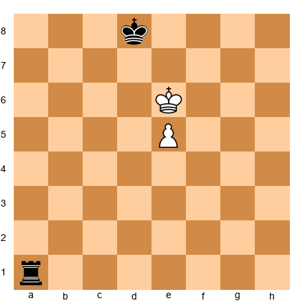

Black to play.

**1...Re1!** The rook goes to e1, behind the pawn, but also ready to check from the side.

**2. Kd6 Rd1+!** Side check from d1. White's king must decide: go toward the rook (Kc6, Kc5) and abandon the pawn, or go back (Ke6, Kf6) and make no progress.

This is the power of the side check: it creates a dilemma. The king cannot advance AND avoid the checks. The rook swings between behind the pawn and beside the king, always finding a useful checking angle.

---

## Tip 5: Know Your Tablebase Facts

A **tablebase** is a computer database that contains the perfect result (win, draw, or loss) for every possible position with a small number of pieces. For rook endgames, the relevant tablebase results are:

- **R + P vs R (most positions):** Drawn with correct defense, unless the Lucena is achievable
- **R + 2P vs R (connected passers):** Usually winning
- **R + 2P vs R (split passers):** Usually winning
- **R + 2P vs R (doubled pawns):** Usually drawn
- **R + P vs R (rook pawn):** Usually drawn (Vancura defense)
- **R vs R (no pawns):** Always drawn

You do not need to memorize tablebase output. You need to understand the PRINCIPLES that make positions won or drawn. The Lucena and Philidor are the two most important principles. Everything else in this chapter builds on them.

---

🛑 **You have completed all eight theory sections.** This is a significant achievement. Take a real break before moving on to the annotated games and exercises. Stretch. Get some fresh air. You have earned it.

---

---

# ANNOTATED MASTER GAMES

The five games in this section were chosen because they demonstrate the principles from this chapter in real tournament conditions. These are not puzzle positions, they are full games (or critical endgame phases) played by some of the greatest players in history. Pay attention not just to the MOVES, but to the THINKING behind them.

---

## Game 30: Capablanca vs Tartakower, New York 1924

**A Masterclass in Rook Endgame Technique**

| Detail | Value |
|--------|-------|
| **White** | José Raúl Capablanca |
| **Black** | Savielly Tartakower |
| **Event** | New York International Tournament, 1924 |
| **Result** | 1-0 |
| **Opening** | Dutch Defense (A80) |
| **Theme** | Creating a passed pawn, rook activity, king centralization |

**Why this game:** Capablanca was called "the chess machine" because his technique was so flawless that his wins looked effortless. This game is one of the most famous endgame demonstrations in history. From an apparently equal position, Capablanca created a passed pawn on the queenside and won with such precision that Tartakower (a strong Grandmaster) could find no moment where the game turned against him.

**The moves:**

1.d4 e6 2.Nf3 f5 3.c4 Nf6 4.Bg5 Be7 5.Nc3 O-O 6.e3 b6 7.Bd3 Bb7 8.O-O Qe8 9.Qe2 Ne4 10.Bxe7 Nxc3 11.bxc3 Qxe7 12.a4 Bxf3 13.Qxf3 Nc6 14.Rfb1 Rae8 15.Qh3 Rf6 16.f3 Rh6 17.Qf1 Rg6 18.Kf2 Qd6 19.Qe1 Nb8 20.e4 fxe4 21.fxe4 Qc6 22.Qd2

**The critical moment.** Let us pause at move 22. Capablanca has opened the center with e4, fixed the pawn structure, and is now ready to operate on both sides of the board. Notice that his king is already off the back rank (Kf2), heading toward centralization. Tartakower's position is solid but passive.

22...Nc8 23.d5! exd5 24.exd5 Qb7

Capablanca has created a passed pawn on d5. This is the beginning of the end. The d-pawn ties down Black's pieces.

25.Qf4 Nd6 26.c5! bxc5

The second pawn break. Capablanca opens the queenside completely.

27.Re1!

The rook enters the game with devastating effect. Every White piece is now active. Every Black piece is struggling to cope with the passed d-pawn and the open files.

27...c4 28.Bc2 Rxe1 29.Rxe1 Nf5 30.Qxc4 Nd6 31.Qd4 Rg5 32.Re7!

The rook reaches the seventh rank. This is the culmination of everything we discussed in Section 7. The rook on e7 attacks a7, restricts the Black king, and supports the d-pawn's advance.

32...Qa6 33.Rd7 Qf1+ 34.Ke3 Qe1+ 35.Kd3 Qb1+ 36.Kd2 Qb2 37.Qd3 Rg2+ 38.Kd1 Qa1+ 39.Ke2 Rg1 40.d6!

The passed pawn marches. Now it costs Black material.

40...cxd6 41.Qxd6 Nf7 42.Qd5 Rg2+ 43.Kd1 Kh8 44.Qf5 Rg1+ 45.Kd2 Qa2 46.Rxd7 1-0

Tartakower resigned. The rook on d7 is totally dominant, and there is no defense.

**Lessons from this game:**

1. **Create passed pawns.** Capablanca's d5 and c5 pawn breaks created a powerful passed pawn that tied down Black's entire army.
2. **Rook on the seventh rank.** Re7 and Rd7 dominated the game. Tarrasch's rule in action.
3. **King centralization.** Capablanca's king went to f2, then e3, then d3, then d2, always active, always participating.
4. **Patience.** Capablanca did not rush. He improved his position step by step, waiting for the position to ripen before striking.

---

## Game 47: Rubinstein vs Lasker, St. Petersburg 1909

**The Art of Endgame Conversion**

| Detail | Value |
|--------|-------|
| **White** | Akiba Rubinstein |
| **Black** | Emanuel Lasker (World Champion) |
| **Event** | St. Petersburg, 1909 |
| **Result** | 1-0 |
| **Opening** | Queen's Gambit Declined, Tarrasch Defense (D32) |
| **Theme** | Pawn structure exploitation, rook activity, endgame technique |

**Why this game:** Rubinstein was considered the greatest endgame player before Capablanca. In this game, he defeated the reigning World Champion with technique so precise that it remains a teaching model over a century later. The critical skill on display: converting a tiny structural advantage (an isolated pawn) into a full point through patient maneuvering.

**The moves:**

1.d4 d5 2.Nf3 Nf6 3.c4 e6 4.Bg5 c5 5.cxd5 exd5 6.Nc3 cxd4 7.Nxd4 Be7 8.e3 O-O 9.Bd3 Nc6 10.Nxc6 bxc6

Black has an **isolated queen pawn** on d5. This pawn cannot be supported by other pawns (the c-pawn is gone). Rubinstein will target this weakness relentlessly.

11.O-O Bd6 12.Rc1 Rb8 13.Qa4 Bd7 14.Qa3 Be7

Rubinstein provokes the bishop to e7, where it is less active than on d6.

15.Bxf6! Bxf6 16.b4

A key move. Rubinstein secures space on the queenside and prepares to increase pressure.

16...Qb6 17.Na4 Qd8 18.Nc5 Bc8 19.f4

White controls more space and has better piece activity. Black's position is solid but cramped.

19...Be7 20.Rf3 Qd6 21.Rh3 f5

Black fixes the kingside pawns to prevent White from opening a second front. But this creates a new weakness on e6.

22.Qc3 Bf6 23.Re1 g6 24.e4!

The decisive break. Rubinstein opens the position while Black's pieces are poorly placed.

24...fxe4 25.Bxe4 dxe4 26.Rxe4 Bf5 27.Re2 Bxh3 28.gxh3

Now the endgame is reached. White has a rook, a knight, and five pawns against Black's rook, bishop, and five pawns. But White's pieces are far more active: the knight on c5 is a monster, and the rook will soon dominate an open file.

28...Rfd8 29.Rg2 Rd5 30.Nd3!

The knight retreats to d3, from where it eyes e5 and f4. Rubinstein is in no rush. He repositions his pieces optimally.

30...Qd7 31.Ne5! Bxe5 32.fxe5

Now the pawn on e5 is a powerful passed pawn. The rook endgame has arrived, and Rubinstein's passed pawn plus active rook give him a decisive advantage.

32...Rd1+ 33.Kf2 Qd5 34.e6! Rf8+ 35.Ke3 Qe4+ 36.Qxe4 1-0

Lasker resigned. After 36...Rxe4+ 37.Kxe4, the e6 pawn is unstoppable. Rubinstein defeated the World Champion with pure technique.

**Lessons from this game:**

1. **Target structural weaknesses.** Rubinstein exploited the isolated d-pawn throughout the game.
2. **Patience in conversion.** Rubinstein did not rush the attack. He improved his pieces step by step, only striking (24.e4!) when the position was fully ripe.
3. **The passed pawn wins the endgame.** The e5/e6 pawn decided the game, exactly as Section 8 predicted.
4. **Piece activity determines outcomes.** Rubinstein's pieces were always more active than Lasker's, from the opening through the endgame.

---

## Game 19-C: Smyslov vs Reshevsky, 1945

**The Seventh Rank in Action**

| Detail | Value |
|--------|-------|
| **White** | Vasily Smyslov |
| **Black** | Samuel Reshevsky |
| **Event** | USA-USSR Radio Match, 1945 |
| **Result** | 1-0 |
| **Theme** | Seventh-rank rook, passed pawn creation, king activity |

**Why this game:** Smyslov, a future World Champion, demonstrated the devastating power of a rook on the seventh rank. This game illustrates how seventh-rank domination combined with a passed pawn creates an overwhelming advantage.

**Key position (endgame phase):**

White: Kf3, Rd7, Pawns on a4, b3, g3, h4
Black: Kg8, Ra8, Pawns on a5, b6, g6, h5

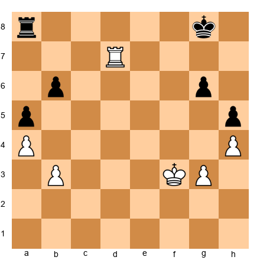

White to play.

Smyslov's rook on d7 controls the seventh rank. Black's rook on a8 is passive, it must guard the a5-pawn. White's plan is simple and devastating:

1. **Centralize the king:** Kf3-Ke4-Kd5.
2. **Use the seventh-rank rook to restrict Black's king.**
3. **Create a passed pawn on the queenside** with b4 or by winning the b6-pawn.

After Ke4, Kd5, and then Kc6 or b4, White's advantage is decisive. The rook on the seventh rank prevents Black's king from participating in the defense, and the passed pawn marches forward.

**The lesson:** A rook on the seventh rank plus a centralized king is one of the most powerful combinations in chess. Even with equal pawns, this setup often creates winning chances from nothing.

---

## Game 19-D: Fischer vs Taimanov, Vancouver 1971 (Match Game 4)

**Rook Behind the Passed Pawn**

| Detail | Value |
|--------|-------|
| **White** | Robert James Fischer |
| **Black** | Mark Taimanov |
| **Event** | Candidates Quarter-Final Match, 1971 |
| **Result** | 1-0 |
| **Theme** | Tarrasch's rule, rook behind the passed pawn, technique |

**Why this game:** Fischer's 6-0 sweep of Taimanov shocked the chess world. In this game, the rook endgame phase showcased Fischer's legendary technique: placing the rook behind his passed pawn and methodically advancing it.

**Key endgame position:**

White: Ke3, Rd1, Pawns on a2, b2, c4, g2, h3
Black: Kf7, Ra8, Pawns on a7, b6, c5, g7, h6

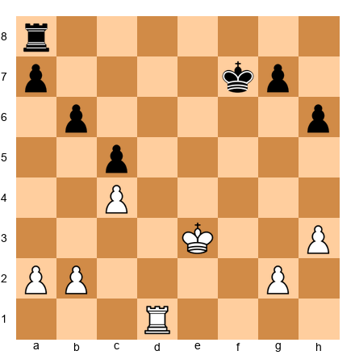

White to play.

Fischer's plan:

1. **Create a passed pawn** by advancing b4, exchanging on c5, and creating a passed a-pawn or c-pawn.
2. **Place the rook behind the passed pawn.**
3. **March the king to support the advance.**

**1. b4!** Opening the queenside.

**1...cxb4 2. Kd4!**

The king charges forward immediately. Fischer does not waste a single tempo.

**2...Ke6 3. c5 bxc5+ 4. Kxc5**

Now White has an extra passed pawn (effectively). The a-pawn will advance with the rook behind it.

**4...Kd7 5. Rd5+**

Cutting off the Black king from the queenside. Now a2-a4-a5-a6-a7 is unstoppable.

**The lesson:** When you have a passed pawn, get your rook behind it and march forward. Fischer's technique was clinical: create the pawn, support it with the rook, advance the king, and promote.

---

## Game 19-E: Karpov vs Unzicker, Nice Olympiad 1974

**The Philidor in Practice**

| Detail | Value |
|--------|-------|
| **White** | Anatoly Karpov |
| **Black** | Wolfgang Unzicker |
| **Event** | Nice Olympiad, 1974 |
| **Result** | ½-½ |
| **Theme** | Philidor defense, patience, drawing technique |

**Why this game:** This is a masterclass in defensive technique. Unzicker, a pawn down, reached a Philidor-type position and held the draw against one of the greatest endgame players of all time. The game demonstrates that knowledge of the Philidor is not just theoretical, it saves real games against real opponents.

**Key endgame position:**

White: Kd5, Re1, Pawn on e5
Black: Ke7, Ra6

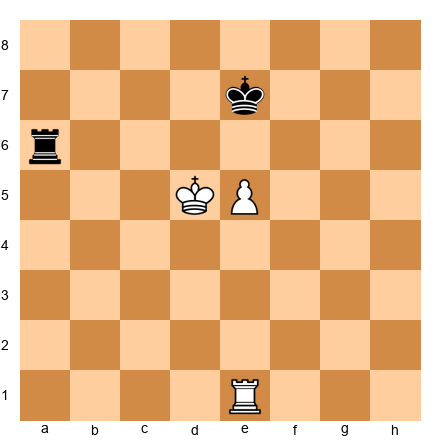

White to play.

This is almost the textbook Philidor. Black's rook is on the sixth rank (a6), controlling the entire rank. White's king is on d5 and the pawn is on e5.

Karpov tried everything: advancing the king, repositioning the rook, threatening to push e6. But Unzicker held firm. When the pawn advanced to e6, the rook retreated to a1 and started checking from behind. The king could not escape the checks, and the game was drawn.

**The lesson:** The Philidor works. It works against world-class players. It works in real games under real time pressure. Learn it, trust it, and use it when you need it.

---

---

# EXERCISES

**60 exercises across five categories. Set up each position on your board. Try to solve it before reading the hints.**

Solutions are collected at the end of this volume.

---

## Category A: Lucena Variations (Exercises 19.1 - 19.12)

---

**Exercise 19.1** ★

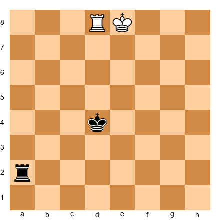

White: Ke8, Rd8, Pawn promoted (the pawn is about to appear). Actually, let us use the standard Lucena:

White: Ke7, Rd1, Pawn on d7. Black: Kc6, Ra2.

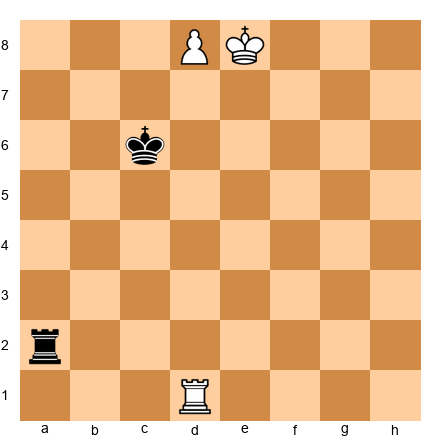

White to play. This is the standard Lucena. Build the bridge and promote the pawn.

Hints: (1) Start by moving the rook to the fourth rank. (2) After Rd4, step the king aside with Ke8 or Kd8. (3) When Black checks, block with the rook, that is the bridge.

---

**Exercise 19.2** ★

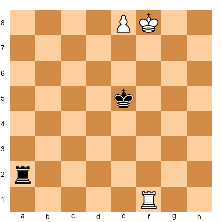

White: Kf8, Rf1, Pawn on e8 (about to promote, wait, the pawn is ON e8, meaning it should promote immediately). Let me set up a proper Lucena on the e-file:

White: Kf7, Re1, Pawn on e7. Black: Kd6, Ra2.

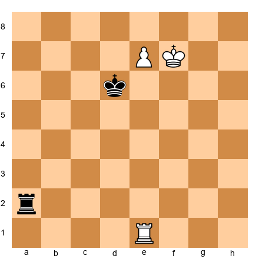

White to play. Lucena on the e-file. Apply the bridge technique.

Hints: (1) Rook to the fourth rank: Re4. (2) Step the king to the side: Kg8 or Ke8. (3) Block the check with the rook.

---

**Exercise 19.3** ★★

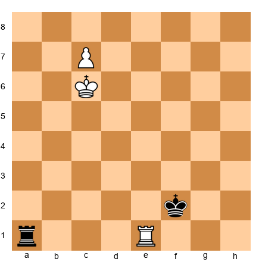

White: Kc6, Re1, Pawn on c7. Black: Kf2, Ra1.

White to play. The defending king is far away. Can White promote without the full bridge? Find the fastest winning method.

Hints: (1) The Black king is too far to help. (2) Can you promote immediately? (3) Consider Kd7 followed by c8=Q.

---

**Exercise 19.4** ★★

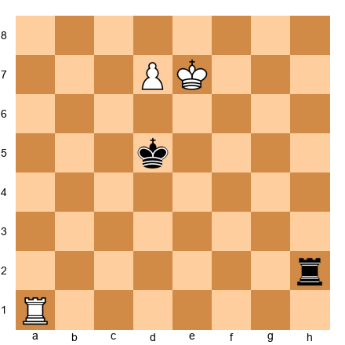

White: Ke7, Ra1, Pawn on d7. Black: Kd5, Rh2.

White to play. Lucena with the rook on a1 instead of d1. Can you still build the bridge?

Hints: (1) The rook needs to reach the fourth rank. Ra4 is one option. (2) After Ra4, the technique is the same. (3) Step the king aside, block the checks.

---

**Exercise 19.5** ★★

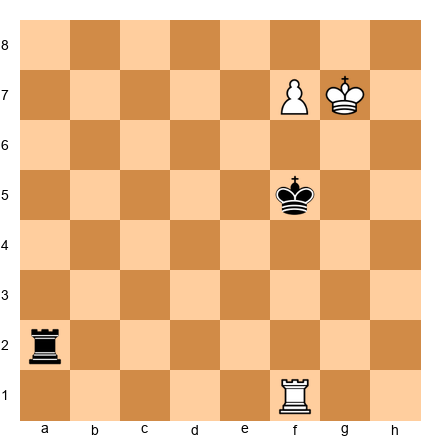

White: Kg7, Rf1, Pawn on f7. Black: Kf5, Ra2.

White to play. Lucena on the f-file. The king is on g7. Apply the technique.

Hints: (1) Rf4 or Re1 to prepare the bridge. (2) Kf8 to step behind the pawn. (3) The bridge blocks checks on the fourth rank.

---

**Exercise 19.6** ★★★

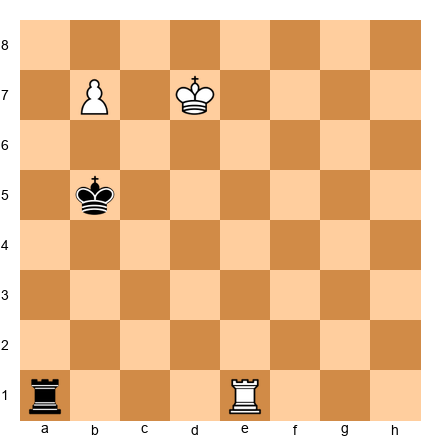

White: Kd7, Re1, Pawn on b7. Black: Kb5, Ra1.

White to play. The b-pawn is close to the edge. Does the bridge still work on the b-file?

Hints: (1) Yes, the bridge works on all files except the a-file and h-file. (2) Re4 to prepare the bridge. (3) Kc8 followed by b8=Q.

---

**Exercise 19.7** ★★★

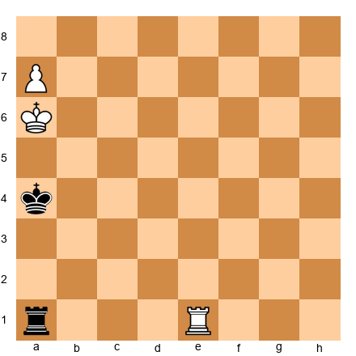

White: Ka6, Re1, Pawn on a7. Black: Ka4, Ra1.

White to play. The a-pawn (rook pawn). Can you build the bridge? Or is this drawn?

Hints: (1) Rook pawns are special, the edge of the board limits the bridge. (2) Can the king escape to b7? (3) This position requires very precise play. The bridge is much harder with a rook pawn.

---

**Exercise 19.8** ★★★

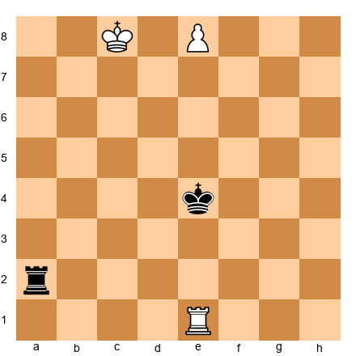

White: Kc8, Re1, Pawn on e8 — but a pawn on e8 should already be a promoted piece. The correct setup:

White: Kd8, Re1, Pawn on e7. Black: Ke5, Ra2.

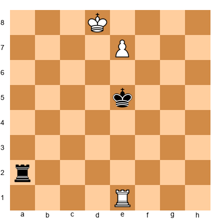

White to play. The king is on d8 (behind the pawn, not in front). Is this still a Lucena?

Hints: (1) The king is behind the pawn, not blocking it. White can promote immediately. (2) But after e8=Q, does Black have any tricks? (3) Check if Ra8+ is a threat after promotion.

---

**Exercise 19.9** ★★★

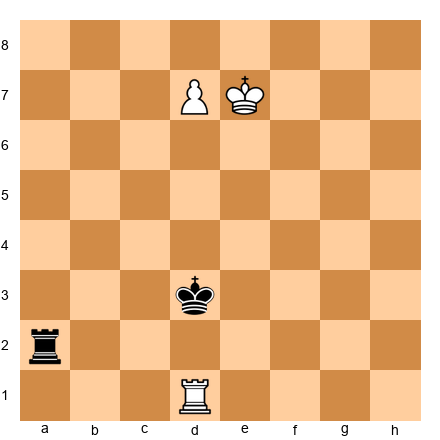

White: Ke7, Rd1, Pawn on d7. Black: Kd3, Ra2.

White to play. Standard Lucena, but the Black king is very far away (d3). Find the fastest winning method.

Hints: (1) With the Black king so far away, you may not need the full bridge. (2) Kd6 followed by promoting? (3) Or simply Rd4 and proceed with the bridge, it still works, just faster.

---

**Exercise 19.10** ★★★★

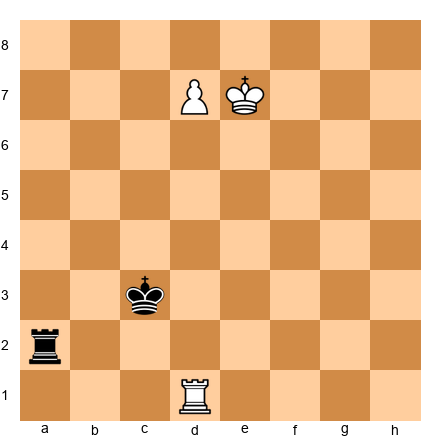

White: Ke7, Rd1, Pawn on d7. Black: Kc3, Ra2.

White to play. Lucena, but the Black king approaches from the queenside. Can Black cause problems?

Hints: (1) Start the bridge: Rd4. (2) After Kd8, Ke8, how many checks does Black have? (3) The rook on the fourth rank blocks them all. Trust the technique.

---

**Exercise 19.11** ★★★★

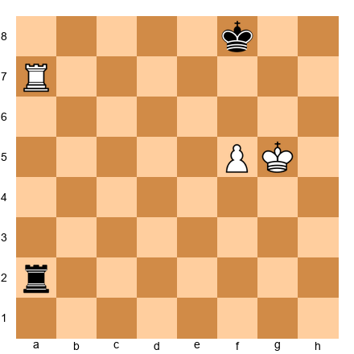

White: Kg5, Ra7, Pawn on f5. Black: Kf8, Ra2.

White to play. This is NOT a Lucena yet, the pawn is on the fifth rank, not the seventh. Can White reach the Lucena from here?

Hints: (1) Push the pawn: f6. (2) Now the goal is to get the king in front of the pawn and the pawn to the seventh rank. (3) After f6, then Kf5-Ke6-Kf7, and f7 creates the Lucena.

---

**Exercise 19.12** ★★★★★

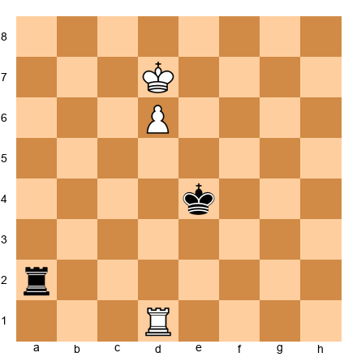

White: Kd7, Rd1, Pawn on d6. Black: Ke4, Ra2.

White to play. The pawn is only on the sixth rank. Can White reach the Lucena, or can Black prevent it?

Hints: (1) White wants to play d7 and then Ke7 to reach the Lucena. (2) But after d7, Black might reach a Philidor-type defense. (3) Evaluate whether the Black king can get in front of the pawn in time.

---

## Category B: Philidor Variations (Exercises 19.13 - 19.24)

---

**Exercise 19.13** ★

White: Ke4, Re1, Pawn on e5. Black: Ke7, Ra6.

White to play. This is the textbook Philidor. You are Black (in your mind). What is Black's plan if White pushes e6?

Hints: (1) If White pushes e6, Black plays Ke8 (keeping the king in front). (2) Then the rook drops to a1 or another back-rank square. (3) Check from behind until White gives up.

---

**Exercise 19.14** ★

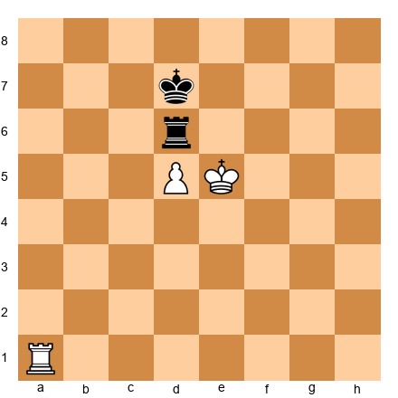

White: Ke5, Ra1, Pawn on d5. Black: Kd7, Rd6.

White to play. Can White break through the Philidor defense?

Hints: (1) If White plays d6, Black plays Ke8. (2) The rook on d6 cannot stay (the pawn is there), so it retreats. (3) Black checks from behind. Draw.

---

**Exercise 19.15** ★★

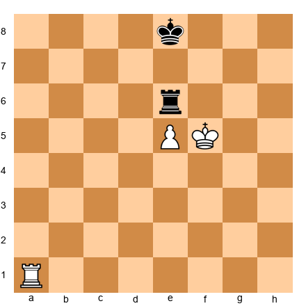

White: Kf5, Ra1, Pawn on e5. Black: Ke8, Re6.

White to play. White's king is on f5 (slightly different from standard Philidor). Can White win?

Hints: (1) If White pushes e6, what happens? (2) Black plays Kd8 or Kf8, keeping the king close. (3) The rook retreats to check from behind. Is the draw still possible?

---

**Exercise 19.16** ★★

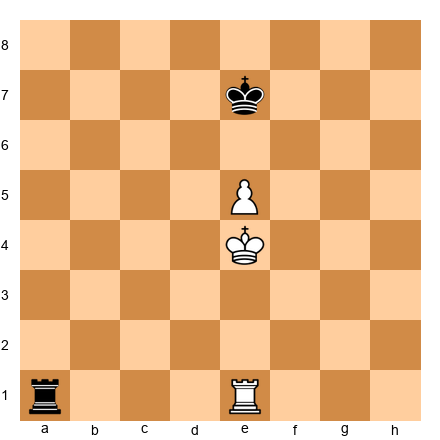

White: Ke4, Re1, Pawn on e5. Black: Ke7, Ra1.

White to play. Black's rook is ALREADY on the first rank (not on the sixth rank). Has Black made a mistake?

Hints: (1) Yes! The rook left the sixth rank too early. (2) White can play Kd5, then Ke6, advancing the king without opposition. (3) The Philidor requires the rook to stay on the sixth rank until the pawn advances to the sixth.

---

**Exercise 19.17** ★★

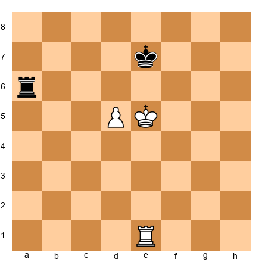

White: Ke5, Re1, Pawn on d5. Black: Ke7, Ra6.

White to play. Philidor with a d-pawn instead of an e-pawn. Does the technique change?

Hints: (1) No, the technique is the same on any central file. (2) If d6+, Black plays Kd7 (staying in front). (3) Rook retreats and checks from behind. Draw.

---

**Exercise 19.18** ★★★

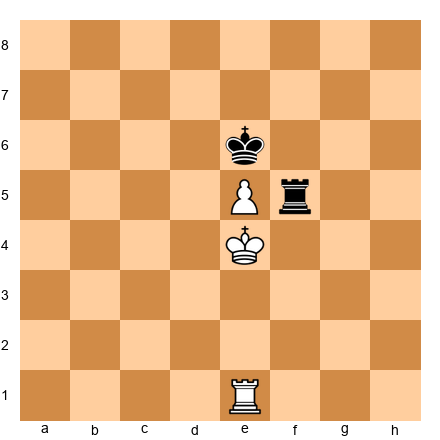

White: Ke4, Re1, Pawn on e5. Black: Ke6, Rf5.

White to play. Black's rook is on f5, not on the sixth rank. Is this a valid Philidor defense?

Hints: (1) The rook on f5 does not control the sixth rank. (2) Can White play Kd4-Kc5 and get around the defense? (3) Black may need to reposition: Rf6 is better placement.

---

**Exercise 19.19** ★★★

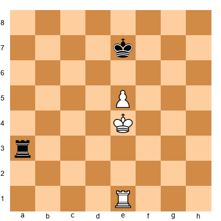

White: Ke4, Re1, Pawn on e5. Black: Ke7, Ra3.

White to play. Black's rook is on the THIRD rank, not the sixth. How does this affect the defense?

Hints: (1) The third rank does not block the White king from advancing to the sixth rank. (2) White can play Kd5, then Kd6 or Ke6. (3) Black's rook is poorly placed. Black should have been on the sixth rank.

---

**Exercise 19.20** ★★★

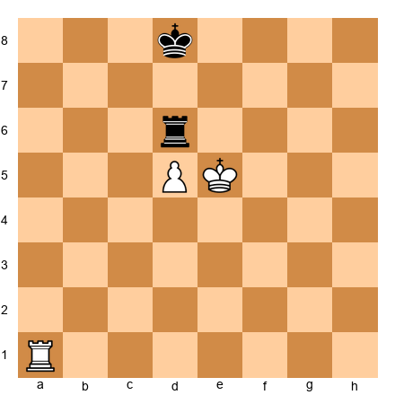

White: Ke5, Ra1, Pawn on d5. Black: Kd8, Rd6.

White to play. Black's king is on d8 (directly in front of the pawn). Is this a correct Philidor setup?

Hints: (1) The king on d8 is in front of the pawn (that is correct. (2) The rook on d6 controls the sixth rank) also correct. (3) If d6, Black plays Rd7 or retreats to check. This is a draw.

---

**Exercise 19.21** ★★★★

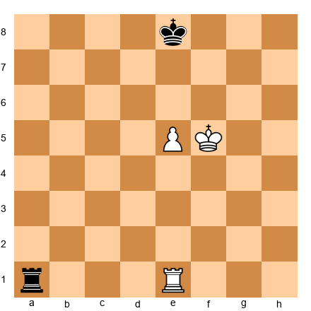

White: Kf5, Re1, Pawn on e5. Black: Ke8, Ra1.

White to play. White's king is on f5 and the pawn is on e5. Can White win by advancing Ke6 first, then e6-e7?

Hints: (1) After Ke6, Black plays Ra6+, checking from the side! (2) If Kf7, Black plays Ra7+ (more checks). (3) If Kd6, Black plays Rd1+. Can White escape?

---

**Exercise 19.22** ★★★★

White: Kd5, Re1, Pawn on e5. Black: Ke7, Ra6.

White to play. White's king is on d5. NOT directly in front of the pawn. Can White advance the king to e6?

Hints: (1) If Ke6? ...wait, that puts two kings adjacent (impossible. (2) Actually, Ke6 is not possible because Black's king is on e7) the kings would be adjacent. White must go another way. (3) Try Kd6, then e6.

---

**Exercise 19.23** ★★★★★

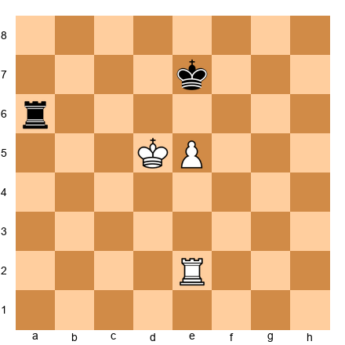

White: Kd5, Re2, Pawn on e5. Black: Ke7, Ra6.

White to play. White's rook is on e2 (not e1). Does this change anything?

Hints: (1) The rook on e2 blocks the e-file for the pawn's advance. (2) White may need to reposition: Kd4, then Re1. (3) Black maintains the Philidor: rook on the sixth rank. Is this still drawn?

---

**Exercise 19.24** ★★★★★

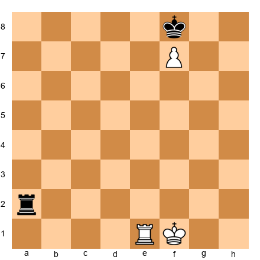

White: Kf1, Re1, Pawn on f7. Black: Kf8, Ra2.

White to play. The pawn is on the SEVENTH rank and the king is on f1 (far from the pawn). Is this a Lucena (winning) or something else?

Hints: (1) The king on f1 is not in front of the pawn, the king is behind it. (2) Can White build the bridge from here? The king is too far. (3) This position may actually be drawn. Evaluate carefully.

---

## Category C: Rook + Pawn vs Rook — Advanced (Exercises 19.25 - 19.36)

---

**Exercise 19.25** ★★

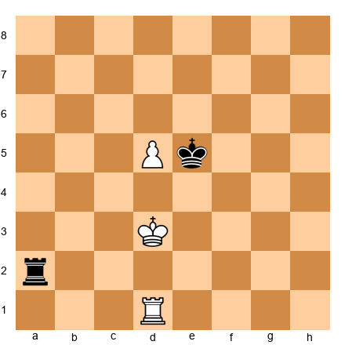

White: Kd3, Rd1, Pawn on d5. Black: Ke5, Ra2.

White to play. The pawn is on the fifth rank. Can White reach the Lucena? Play out the next 5 moves.

Hints: (1) White needs to get the pawn to d7 and the king in front. (2) Ke3 first, then advance the pawn. (3) Black will try to get the king in front of the pawn (Kd6).

---

**Exercise 19.26** ★★

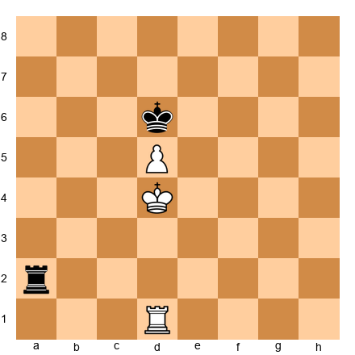

White: Kd4, Rd1, Pawn on d5. Black: Kd6, Ra2.

White to play. The Black king is ALREADY in front of the pawn. Can White win, or is this drawn?

Hints: (1) Black's king on d6 blocks the pawn. This is a good defensive setup. (2) White cannot push d6 because the king blocks. (3) Can White outflank with Kc4-Kb5? Evaluate.

---

**Exercise 19.27** ★★★

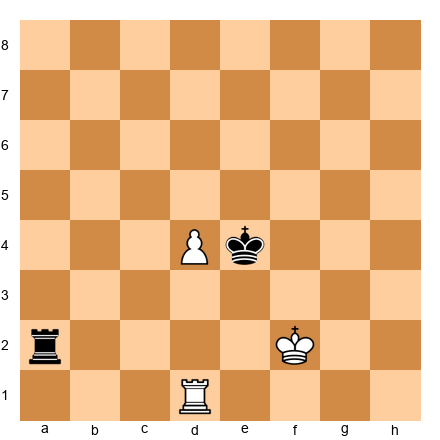

White: Kf2, Rd1, Pawn on d4. Black: Ke4, Ra2.

White to play. The pawn is only on d4, far from promotion. Plan the winning method from scratch.

Hints: (1) Start with Ke2, then Kd3, centralizing the king. (2) The pawn advances d5, d6, d7 with king support. (3) The goal is to reach the Lucena. Black will try for the Philidor.

---

**Exercise 19.28** ★★★

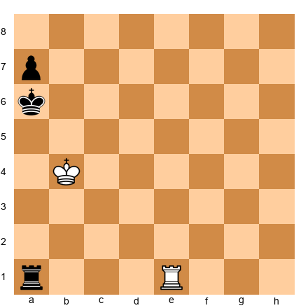

White: Kb4, Re1. Black: Ka6, Ra1, Pawn on a7.

White to play. Black has a rook pawn on a7. White has no pawns. Can White stop the pawn?

Hints: (1) The rook pawn is notoriously hard to queen. (2) White's king is close. Kb3 or Kc3 controls a2. (3) Can White set up a Vancura-type defense in reverse?

---

**Exercise 19.29** ★★★

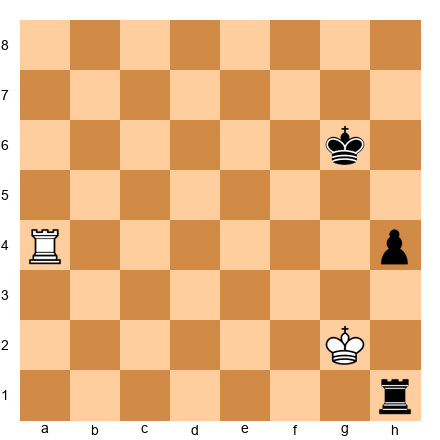

White: Kg2, Ra4. Black: Kg6, Rh1, Pawn on h4.

White to play. Black has a passed h-pawn. Apply the correct defensive technique.

Hints: (1) The h-pawn is a rook pawn. Think Vancura. (2) Can White attack the pawn from the side? Ra6 controls the sixth rank. (3) Where should White's king go? Short side or long side?

---

**Exercise 19.30** ★★★★

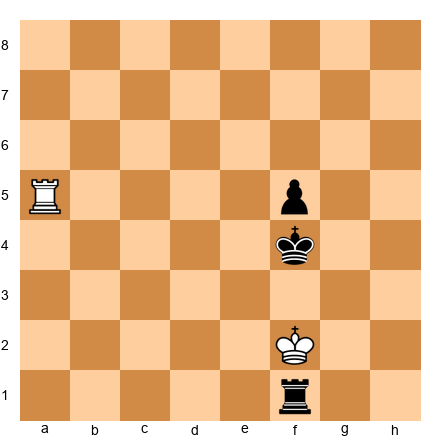

White: Kf2, Ra5. Black: Kf4, Rf1, Pawn on f5.

White to play. Black has a central passed pawn and an active king. How does White defend?

Hints: (1) Rook behind the passed pawn: Ra8 to check later, or stay on a5 to attack from the side? (2) White's king needs to get in front of the pawn. (3) Is this position drawn or lost for White?

---

**Exercise 19.31** ★★★★

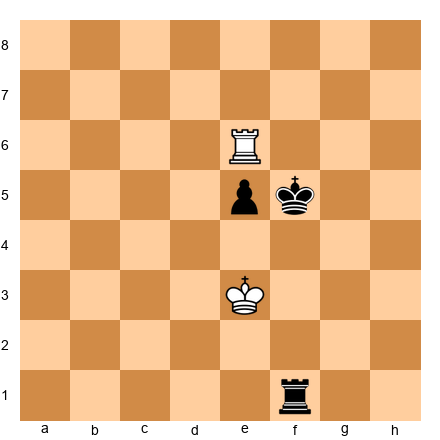

White: Ke3, Re6. Black: Kf5, Rf1, Pawn on e5.

White to play. White's rook is on the sixth rank (good. Philidor-like). The pawn is on e5. Is this drawn?

Hints: (1) If e4+, White plays Ke2 and the rook stays on the sixth rank. (2) Black's king is active, but can it advance past the rook? (3) The rook on the sixth rank is a wall.

---

**Exercise 19.32** ★★★★

White: Kg1, Rb6, Pawn on b5. Black: Kb4, Rb1.

White to play. White's rook is IN FRONT of the pawn. Is this correct or incorrect? What should White do?

Hints: (1) The rook in front of the pawn is usually wrong (Tarrasch's rule says "behind"). (2) But in this specific position, can the rook sacrifice or promote? (3) Evaluate Kb6 or Ka6 maneuvers.

---

**Exercise 19.33** ★★★★

White: Ke1, Rc6. Black: Kd3, Rd8, Pawn on d4.

White to play. Black has a passed d-pawn and a very active king. White is defending. Find the drawing method.

Hints: (1) Cut off the king: Rc4 blocks the king from advancing further. (2) Attack the pawn from behind: Rd6 or Rc1 to Rd1. (3) Which defensive strategy works better here?

---

**Exercise 19.34** ★★★★★

White: Kg2, Ra5, Pawn on g4. Black: Kg6, Rh1, Pawn on h4.

White to play. Each side has one passed pawn. Who is better? Find the best plan.

Hints: (1) White's g-pawn vs Black's h-pawn, which is faster? (2) Can White advance g5+ and create a Lucena? (3) Or does Black's h-pawn queen first?

---

**Exercise 19.35** ★★★★★

White: Kg3, Ra7. Black: Kf5, Ra2, Pawn on g5.

White to play. Black has one passed pawn. White has a rook on the seventh rank. Who is better?

Hints: (1) White's rook is active (seventh rank) but White has no pawns. (2) Can White stop the g-pawn? Ra5 pins it. (3) If the king goes to f4 to support g4, White plays Ra4+. Evaluate.

---

**Exercise 19.36** ★★★★★

White: Ke3, Ra6. Black: Kd5, Ra2, Pawn on e5.

White to play. This is a critical defensive position. Should White play passively or actively?

Hints: (1) Ra5 pins the e5-pawn. But is that enough? (2) If Black plays Kd4, threatening e4, what does White do? (3) Consider the cutting-off technique: can White cut off the king?

---

## Category D: Active King Decisions (Exercises 19.37 - 19.48)

---

**Exercise 19.37** ★★

White: Kg1, Rd1, Pawns on a2, b2, e4, f2, g2, h2. Black: Kg8, Rd8, Pawns on a7, b7, f7, g7, h7.

White to play. The position is equal. What is your first move and why?

Hints: (1) Do NOT push pawns first. (2) Centralize the king: Kf1-Ke2-Kd3. (3) The king belongs in the center before anything else happens.

---

**Exercise 19.38** ★★

White: Kf4, Pawns on a2, b2, e4, f2, g2, h2. Black: Ke6, Rd1, Pawns on a7, b7, f7, g7, h7.

Black to play. Black has an active king (e6) and White's king is also centralized (f4). Should Black exchange rooks (Rd4) or keep them on?

Hints: (1) With equal pawns and both kings centralized, rook exchanges lead to a drawn pawn endgame. (2) Keep the rook! Rook activity can create chances. (3) Consider Rd2, attacking b2 and f2.

---

**Exercise 19.39** ★★★

White: Kf4, Rd1, Pawns on a2, b3, e4, f2, g2, h2. Black: Ke6, Rd8, Pawns on a7, b6, f7, g7, h7.

White to play. Where does the king go from f4? Plan the next three king moves.

Hints: (1) Ke3 is safe but passive. (2) Kf5 is aggressive, but does it overextend? (3) Ke5 centralizes perfectly. But check: is Ke5 safe from Rd5+?

---

**Exercise 19.40** ★★★

White: Kg1, Rd5, Pawns on a2, b2, e4, f2, g2, h2. Black: Ke6, Re7, Pawns on a7, b7, f7, g7, h7.

White to play. White has a centralized rook. Now what?

Hints: (1) King! Kf1-Ke2-Kd3-Kd4. (2) With the rook on d5 and king on d4, White dominates the center. (3) Do not push pawns until the king is centralized.

---

**Exercise 19.41** ★★★

White: Ke3, Rd1, Pawns on a2, b2, e4, f2, g2, h2. Black: Ke5, Ra1, Pawns on a7, b7, f7, g7, h7.

White to play. Both kings are centralized. Black's rook is active on a1. What is White's best plan?

Hints: (1) Protect the a-pawn: Ra1 trades rooks. Is that good? (2) Kd3 keeps the king active. (3) Consider f3 to support the center before any action.

---

**Exercise 19.42** ★★★★

White: Kd4, Rd1, Pawns on a2, b2, e4, f2, g2, h2. Black: Ke6, Ra1, Pawns on a7, b7, f7, g7, h6.

White to play. White's king is on d4, Black's on e6. Should White advance with Kc5 or consolidate with e5?

Hints: (1) Kc5 invades the queenside (but the rook on a1 attacks a2. (2) e5 creates a passed pawn), but is it too early? (3) Consider the tradeoff between king activity and pawn security.

---

**Exercise 19.43** ★★★★

White: Ke3, Rd3, Pawns on a2, b2, e4, f2, g2, h2. Black: Ke5, Rd8, Pawns on a7, b7, f7, g7, h7.

White to play. Both kings are centralized. Where does the ROOK belong?

Hints: (1) Rd5+ pushes the king back. Is that useful? (2) Rd7 hits the seventh rank! (3) After Rd7, White attacks a7, b7, f7, massive pressure.

---

**Exercise 19.44** ★★★★

White: Ke3, Rh1, Pawns on a2, b2, e4, f2, g2, h2. Black: Ke5, Re6, Pawns on a7, b7, f7, g7, h7.

White to play. Should White play Rh5+ driving the king back, or Kd3 improving the king?

Hints: (1) Rh5+ forces Kd6, then Rh7 hits the seventh rank. (2) But Kd3 improves the king first. (3) Which plan creates more long-term advantage?

---

**Exercise 19.45** ★★★★★

White: Kf3, Rd5, Pawns on a2, b2, e4, g2, h2. Black: Ke7, Rc1, Pawns on a7, b7, f6, g7, h7.

White to play. Should the king go to e3 (safe) or f4 (aggressive)?

Hints: (1) Kf4 puts the king in an active position. After Kf4, the king eyes e5. (2) But Rc4 attacks e4. Is Kf4 safe? (3) Consider Ke3 first, then slow improvement.

---

**Exercise 19.46** ★★★★★

White: Ke1, Rd1, Pawns on a2, b2, d4, f2, g2, h2. Black: Ke4, Pawns on a7, b7, f7, g7, h7. Wait, Black needs a rook!

White: Ke1, Rd1, Pawns on a2, b2, d4, f2, g2, h2. Black: Ke4, Ra8, Pawns on a7, b7, f7, g7, h7.

White to play. Black's king is on e4. VERY active, deep in White's territory. What should White do?

Hints: (1) White's king on e1 is passive. First priority: activate it. (2) Kf1 or Kd2? Which is better? (3) Can White use d5 to push the Black king back?

---

**Exercise 19.47** ★★★★★

White: Ke3, Rd1, Pawns on a2, b2, e5, f2, g2, h2. Black: Ke6, Rd7, Pawns on a7, b7, f7, g7, h7.

White to play. White has a passed e-pawn. Plan the winning technique using king centralization and pawn advancement.

Hints: (1) Ke4 centralizes the king behind the pawn. (2) After Ke4, White plans f4 (supporting e5) and then Kd5 or Kf5. (3) The rook on d1 should aim for the seventh rank (Rd7 is blocked, so Rd2-d7 later).

---

**Exercise 19.48** ★★★★★

White: Ke3, Rd1, Pawns on a2, b2, e5, f2, g2, h2. Black: Kd5, Rc8, Pawns on a7, b7, f7, g7, h7.

White to play. Both kings are centralized. White has a passed pawn. Black's king blockades it. How does White make progress?

Hints: (1) Rd3 supports a future Kd4. (2) Can White outflank with Kf4-Kf5? (3) Consider f4 to support the e-pawn, then Kf3-Kg4-Kf5 to approach from the side.

---

## Category E: Practical Rook Endgame Positions (Exercises 19.49 - 19.60)

---

**Exercise 19.49** ★★★

White: Ke3, Rd1, Pawns on a2, b3, e4, f2, g2, h2. Black: Ke6, Rd5, Pawns on a7, b6, f7, g7, h7.

White to play. Equal material. Find the plan that creates an advantage.

Hints: (1) Exchange the rooks? After Rxd5 Kxd5, the pawn endgame is drawn. (2) Avoid the rook trade. Play Rd2 and improve. (3) Activate the king: Kd4, then push the kingside majority.

---

**Exercise 19.50** ★★★

White: Kf3, Rd5, Pawns on e4, g3, h3. Black: Kg7, Rd1, Pawns on e5, f7, g6, h7.

White to play. Static pawn structure. How does White make progress?

Hints: (1) White cannot create a passed pawn easily (pawns are locked). (2) King activity is key: Ke3-Kd3. (3) The rook on d5 is already well-placed. Improve the worst piece (the king).

---

**Exercise 19.51** ★★★

White: Kf2, Rd5, Pawns on a2, b2, e4, f4, h2. Black: Kf7, Rf1, Pawns on a7, b7, f6, h6.

White to play. White has a kingside majority. Plan the pawn advance.

Hints: (1) e5 is the key break. After fxe5, fxe5 and the e-pawn becomes a passer. (2) But prepare first: Ke3, then e5. (3) The rook on d5 supports the advance.

---

**Exercise 19.52** ★★★★

White: Kg2, Rd5, Pawns on a5, b2, e4, f2, g3, h4. Black: Kf7, Re6, Pawns on a6, b7, e5, g6, h5.

White to play. Complex pawn structure. Find the key plan.

Hints: (1) The a5-pawn fixes a weakness on a6. (2) Rd7+ hits the seventh rank. (3) After Rd7+, White attacks b7 and restricts the king. Use the seventh rank.

---

**Exercise 19.53** ★★★★

White: Kb1, Rd1, Pawns on a2, b2, e5, f4, g3, h4. Black: Ke7, Re6, Pawns on a7, b7, f5, h5.

White to play. White has a protected passed pawn on e5. How to convert?

Hints: (1) The e5-pawn ties down Black's rook. (2) White's plan: advance the king to the center (Kc2-Kd3-Kd4). (3) With the king on d4 supporting e5, White can open a second front on the queenside.

---

**Exercise 19.54** ★★★★

White: Kf2, Re1, Pawns on a3, b4, f3, g3. Black: Kf7, Re4, Pawns on a7, b7, f6, g7, h7.

White to play. Black's rook is very active on e4. How does White deal with it?

Hints: (1) Do NOT chase the rook passively. (2) Activate your own rook: Re7 (seventh rank!). (3) After Re7, White attacks a7 and b7 simultaneously. Activity beats material.

---

**Exercise 19.55** ★★★★★

White: Kg1, Re4, Pawns on a2, b5, c4, f4, g3, h3. Black: Kf7, Re5, Pawns on a7, b6, c5, f6, g7, h7.

White to play. Both rooks are active. Find the winning plan.

Hints: (1) White has a passed b-pawn (after a potential b5-b6 push). (2) Re7+ gains the seventh rank AND attacks g7. (3) After Re7+, Black's king must retreat. Then b6, axb6, a3-a4-a5 creates a second passer.

---

**Exercise 19.56** ★★★★★

White: Kg2, Ra7, Pawns on e5, f2, g3, h4. Black: Kg7, Ra2, Pawns on f7, g6, h5.

White to play. White has a rook on the seventh rank and a passed e-pawn. Convert.

Hints: (1) e6 is the natural advance. After e6, fxe6, White has Rxf7 ideas. (2) But does e6 work tactically? After e6, fxe6, Re7 targets e6. (3) Alternatively, improve the king first: Kf3-Ke4 before pushing e6.

---

**Exercise 19.57** ★★★★★

White: Kg1, Rf6, Pawns on a2, b4, c4, g3, h3. Black: Kf7, Rd1, Pawns on a7, b7, g6, h7.

White to play. White's rook is on the sixth rank (active!). Plan the winning strategy.

Hints: (1) Rc6 targets c7 or a6. (2) c5 creates a passed pawn. (3) After c5, b5, the connected passers roll forward. Use the rook to support them.

---

**Exercise 19.58** ★★★★★

White: Ke3, Re4, Pawns on a2, b4, c4, g2, h2. Black: Ke6, Re5, Pawns on a7, b7, f7, g7, h7.

White to play. Should White exchange rooks (Rxe5+ Kxe5) and play the pawn endgame, or avoid the trade?

Hints: (1) Count the pawn endgame: White has 3 vs 2 on the queenside, Black has 3 vs 2 on the kingside. (2) Can White win the pawn endgame with c5, creating a passer? (3) Calculate precisely: after Rxe5+ Kxe5, c5, can Black's king get back in time?

---

**Exercise 19.59** ★★★★★

White: Kg2, Rc5, Pawns on a3, b4, f4, g4, h2. Black: Kf7, Re8, Pawns on a7, b7, f6, g7, h7.

White to play. White has a kingside majority and an active rook. Plan the breakthrough.

Hints: (1) f5 fixes Black's kingside pawns and prepares g5. (2) After f5, g5, fxg5, f6 creates a passer. (3) The rook on c5 supports from behind (Rc7 on the seventh rank when the time is right).

---

**Exercise 19.60** ★★★★★

White: Kg2, Rc7, Pawns on a3, b4, f4, g4, h2. Black: Kf7, Re1, Pawns on a7, b7, f6, g7, h7.

White to play. White has a rook on the seventh rank. Black has an active rook on the first rank. Who is better, and why?

Hints: (1) White's seventh-rank rook attacks a7 and b7. (2) Black's first-rank rook attacks from behind. (3) White should combine threats: Rxa7 and then advance the kingside majority. Calculate whether Black's counterplay is sufficient.

---

---

# KEY TAKEAWAYS

1. **The Lucena position wins. The Philidor position draws.** These are the two foundational positions of all rook endgames. Learn them by heart and you will handle the most basic scenarios from either side.

2. **Short side for the king, long side for the rook.** When defending, put your king on the short side of the pawn and your rook on the long side. This gives the rook maximum checking distance.

3. **Rooks belong behind passed pawns.** Tarrasch's rule applies whether the passed pawn is yours or your opponent's. A rook behind a passer either supports its advance or restrains it.

4. **Activity is everything.** An active rook (on the seventh rank, behind a passer, controlling an open file) is worth more than a passive rook with an extra pawn. Never accept a passive rook if you can avoid it.

5. **The king is a fighting piece.** In rook endgames, centralize the king as early as possible. An active king is worth half a pawn.

6. **Exchange pawns when defending. Create passed pawns when winning.** The fewer pawns on the board, the easier it is to draw. The more passed pawns you create, the easier it is to win.

7. **Do not rush.** Patience separates masters from club players in rook endgames. Improve every piece before committing to a plan. The position will tell you when it is time to strike.

---

# PRACTICE ASSIGNMENT

For the next two weeks, do the following:

1. **Set up the Lucena position once per day.** Play it from both sides, the attacker building the bridge, and the defender trying to prevent it. After seven days, you should be able to execute the bridge blindfolded.

2. **Set up the Philidor position once per day.** Play the defender's side. Practice keeping the rook on the sixth rank and retreating to check from behind. After seven days, you should be able to hold the Philidor in your sleep.

3. **Play at least three games this week.** In each game, regardless of the result, go back and analyze the endgame phase. Ask: "Where was my king? Where was my rook? Could I have centralized earlier? Could I have created a passed pawn?"

4. **Review one annotated game per day** from this chapter. Focus on the THINKING, not just the moves. Ask yourself at each key moment: "What would I have played? Why did the master play differently?"

5. **Complete all 60 exercises.** Aim for 10 per day over six days. If you struggle with a problem, write down the position and come back to it the next day. Repetition builds mastery.

---

# ⭐ PROGRESS CHECK

Answer these questions honestly:

- [ ] Can you set up the Lucena position from memory and demonstrate the bridge technique?
- [ ] Can you set up the Philidor position from memory and demonstrate the drawing method?
- [ ] Can you explain the difference between short side and long side?
- [ ] Can you state Tarrasch's rule about rooks and passed pawns?
- [ ] Do you understand why rook activity is worth more than a pawn?
- [ ] Have you completed at least 40 of the 60 exercises?
- [ ] Can you centralize your king within the first 5 endgame moves in your own games?

If you checked five or more boxes, you are ready for Chapter 20: Planning in the Middlegame.

If you checked fewer than five, spend more time with the Lucena and Philidor. Set them up again. Play them again. These positions are the foundation. The time you invest now will pay dividends for the rest of your chess career.

---

🛑 **Rest here.** You have completed one of the most important chapters in the entire Codex. Rook endgames are the backbone of endgame play, and you now have the knowledge that most club players lack.

If you master these positions (truly master them, so they become automatic) you will save countless half-points and steal full points from opponents who do not know them. That is not a promise. It is a mathematical certainty. The positions arise. The technique works. The points add up.

You have earned a real break. Come back to Chapter 20 with fresh eyes, an active king, and a rook on the seventh rank.

---

*Chapter 19 complete. 8 theory sections. 60 exercises. 5 annotated games.*
*Volume II: The Club Player. The Grandmaster Codex*
*By Kit Olivas and Dr. Ada Marie*

💙🦄
