# Chapter 20: Planning in the Middlegame

**Volume II: The Club Player | Rating Range: 1000 - 1600**
**Pages: 40 | Exercises: 40 | Annotated Games: 5**

---

> *"Even a poor plan is better than no plan at all."*
> — Mikhail Chigorin (1850–1908)

---

## What You'll Learn

- What a plan actually is, and what it is not
- A six-step process for forming a plan in any position
- How to evaluate a position using a practical checklist
- The five types of middlegame plans and when to use each one
- Seven of the most common middlegame plans in chess
- When to abandon a plan and how to adapt without losing your way
- How world-class players think through planning decisions at the board

---

## Before We Begin

You have spent the last several chapters learning the building blocks of chess strategy: pawn structures, piece activity, the center, king safety, and openings. Each of those chapters gave you a lens for understanding a position. This chapter teaches you how to combine all those lenses into a single, clear picture, and then act on it.

That act is called a plan.

Without a plan, you are making random moves and hoping something good happens. That works against beginners. It does not work against anyone who knows what they are doing. The difference between a 1000-rated player and a 1600-rated player is not usually tactics. It is this: the 1600 player has a reason for every move.

This chapter will give you that reason. By the end, you will sit down at the board, look at any middlegame position, and know (not guess, know) what to do next. Not because you memorized a formula, but because you learned how to think.

Set up your board. This is one of the most important chapters in the entire Codex.

---

## Part 1: What Is a Plan?

### The Definition

A plan is a series of moves aimed at a specific goal.

That is it. Nothing magical. Nothing mysterious. A plan is simply: "I want to achieve X, and I will do it by playing moves A, B, and C."

Here are examples of plans:

- "I want to put my knight on d5 where it cannot be challenged. I will play Nc3-e2-g3-f5 or Nc3-d5 if the square opens."
- "I want to open the f-file for my rook. I will play f2-f4-f5 and then exchange pawns."
- "I want to create a passed pawn on the queenside. I will play a4, b5, and then push the a-pawn."

Notice what each of these has in common: a clear destination and a sequence of moves to get there. That is what separates a plan from a wish. A wish is "I hope something good happens on the kingside." A plan is "I will play f4, Qf3, Raf1, and f5 to open the f-file and attack the king."

### Short-Term Plans vs Long-Term Plans

Plans come in two sizes.

**Short-term plans** cover the next three to five moves. They are concrete, specific, and often involve a particular piece or pawn. "I will bring my knight from b1 to d5 via c3 and e4" is a short-term plan.

**Long-term plans** describe where the game is heading over the next ten, twenty, or even thirty moves. "I will gradually improve my pieces, advance my kingside pawns, and aim for a mating attack" is a long-term plan.

Both are essential. Long-term plans give your game direction. Short-term plans give your game precision. The best players always have both: a general idea of where the game is going, and a specific idea of what to do right now.

**For club players, short-term planning is more important.** If you can consistently find the right thing to do for the next three to five moves, you will improve faster than if you dream about grand strategies. Grand strategies come later. For now, focus on the next step.

### "A Bad Plan Is Better Than No Plan"

This famous principle has been attributed to many masters. Its truth is simple: a player with a plan (even a mediocre one) will coordinate their pieces toward a common goal. A player without a plan will scatter their pieces across the board, each one pursuing a different idea, accomplishing nothing.

When you follow a plan, your pieces work together. When you play without a plan, your pieces work alone. Coordinated pieces beat uncoordinated pieces. Every time.

This does not mean you should stubbornly follow a terrible plan. It means that having any direction is better than having no direction. If you sit at the board, evaluate the position, and choose a plan (even one that is not perfect) you will play better than someone who makes moves at random.

### How to Think When It Is Your Move

Before we dive into the planning process, here is a systematic approach for every move. This is not just for planning moves. This is for every single move you play.

**Step 1: What did my opponent just do?** Look at their last move. What does it threaten? What does it change about the position?

**Step 2: Are there any tactics?** Check for captures, checks, and threats. Both theirs and yours. Spend thirty seconds on this. If there is a tactic, it overrides any plan.

**Step 3: What is my plan?** If you already have a plan, ask: "Can I continue with my plan?" If yes, play the next move of your plan. If no, re-evaluate and form a new plan (using the process in Part 2).

**Step 4: Play the move and press the clock.**

This four-step routine takes less than a minute for routine positions and longer for critical positions. It keeps you disciplined and prevents the most common club player mistake: playing a move without knowing why.

---

🛑 **Good stopping point.** The concept of a plan is now in your head. Let it settle before we build the process.

---

## Part 2: The Planning Process

### The Six Steps

When you need a plan (at the start of the middlegame, after a major exchange, after your previous plan has run its course) use this six-step process. You do not need to spend ten minutes on it. With practice, you will run through these steps in sixty seconds.

### Step 1: Evaluate the Position

Before you can decide what to do, you need to understand where you stand.

Ask: **Who is better? Why?**

You do not need a precise numerical evaluation. You need a general sense. "I am slightly better because my pieces are more active." Or "My opponent is better because my king is exposed." Or "The position is roughly equal."

The next section (Part 3) gives you a complete evaluation checklist. For now, know that evaluation comes first. You cannot choose the right direction if you do not know where you are starting from.

### Step 2: Identify the Imbalances

An imbalance is any difference between the two sides. You learned this concept in Chapter 14 (Piece Activity). Now it becomes the foundation of your planning.

The key imbalances are:

1. **Material.** Does one side have more pieces or pawns?
2. **Piece activity.** Whose pieces are better placed?
3. **Pawn structure.** Who has weaker pawns? Who has a passed pawn?
4. **Space.** Who has more room to maneuver?
5. **King safety.** Whose king is more exposed?
6. **Development.** In the early middlegame, who has more pieces in play?

Every position has imbalances. Your plan should be based on exploiting your favorable imbalances and neutralizing your opponent's.

**Example:** You have more space and active pieces, but your opponent has a healthier pawn structure. Your plan should exploit your space and activity before your opponent can exploit their pawn structure advantage in the endgame. This probably means attacking.

**Example:** You have a better pawn structure and a solid position, but your opponent has more active pieces. Your plan should focus on exchanging pieces (to reduce the activity advantage) and heading toward an endgame where your structural advantage matters.

### Step 3: Determine What the Position Wants

This is the most subtle step, and it is the one that separates improving players from stagnating ones.

**The position itself tells you what to do.** You just have to learn to listen.

Look at the pawn structure. Where are the pawn breaks? If you can play e4-e5 or d4-d5, that might be your plan. If you can play f2-f4-f5, that might open a file for your rook.

Look at your pieces. Where do they want to go? If your knight is on c3 and the d5 square is available, the knight is asking to go to d5. If your rook is on a1 and the a-file is open, the rook is asking to go to a5 or a7.

Look at your opponent's weaknesses. Is there a backward pawn? An isolated pawn? A weak square? If so, the position is telling you to target it.

**Do not impose a plan on the position. Let the position suggest the plan.**

This is a skill that develops with experience. The more games you study, the more positions you analyze, the better your instinct becomes. But even as a club player, you can ask these questions and get useful answers.

### Step 4: Formulate a Plan Based on the Imbalances

Now you bring everything together.

You know who is better (Step 1). You know why (Step 2). You know what the position wants (Step 3). Now state your plan in plain language.

"My plan is to push f4-f5 to open the f-file, bring my rook to f3, and attack the kingside."

"My plan is to play b4-b5 to open the queenside, exchange pawns, and infiltrate with my rook on the b-file."

"My plan is to trade queens and bishops, reach an endgame where my better pawn structure wins."

The simpler the plan, the better. A plan you can express in one sentence is a plan you can execute without getting confused.

### Step 5: Execute the Plan While Watching for Tactics

Here is where most club players fail. They form a good plan and then forget about it after two moves because something shiny appeared on the other side of the board.

**Stay with your plan unless something forces you to change it.**

Execute the plan move by move. But (and this is critical) never stop checking for tactics. Before each move, run your tactical scan (Step 2 of the thinking process). If a tactic appears, take it. If not, play the next move of your plan.

A plan is a guide, not a prison. You follow it because it gives your moves purpose. But if your opponent blunders a piece, you take the piece. You do not say, "But that was not part of my plan." Tactics override strategy. Always.

### Step 6: Re-evaluate When the Position Changes

The position changes after every move. Most of these changes are small and do not affect your plan. But sometimes a major change occurs:

- A pawn exchange opens a new file
- A piece trade alters the balance of power
- Your opponent plays a surprising move that creates a new threat
- Your plan succeeds, and you need a new goal

When any of these happen, go back to Step 1. Re-evaluate. Re-assess the imbalances. Form a new plan.

**A plan is not a life sentence.** It is a working hypothesis. "Based on what I see, I think this is the best approach." When new information arrives, update your hypothesis.

---

🛑 **Good stopping point.** The six steps are your new framework. Practice them at the board before continuing.

---

## Part 3: The Evaluation Checklist

### Your Quick-Reference Guide

Every time you need to evaluate a position, run through this checklist. With practice, you will do it automatically.

**1. Material Count**

Count the pieces. Are both sides equal? Is someone up a pawn? A piece? Material tells you the baseline. If you are ahead, simplify toward an endgame. If you are behind, keep the position complicated and seek counterplay.

Standard values as a reminder: Pawn = 1, Knight = 3, Bishop = 3, Rook = 5, Queen = 9.

**2. King Safety**

Look at both kings. Is your king safe behind pawns with no holes? Is your opponent's king exposed? Are there open files or diagonals pointing at either king?

King safety is the single most important factor in the middlegame. An unsafe king overrides everything else. If your opponent's king is weak, your plan should involve attacking it. If your king is weak, your plan should involve defending it first.

**3. Piece Activity**

This is what you learned in Chapter 14. Are your pieces active or passive? Are your opponent's pieces active or passive? Count how many pieces on each side are genuinely participating in the game.

A useful shortcut: find each side's worst piece. Whoever has the worse "worst piece" is probably worse overall.

**4. Pawn Structure**

This is what you learned in Chapter 13. Look for:

- **Isolated pawns.** Weak because they cannot be defended by other pawns.
- **Doubled pawns.** Sometimes weak, sometimes acceptable.
- **Backward pawns.** Stuck behind their neighbors, often targets.
- **Passed pawns.** Potentially powerful, especially in endgames.
- **Pawn chains.** The base of a chain is a target.
- **Available pawn breaks.** Which pawn advances could change the structure?

**5. Space**

Who has more room? Space is measured by how far your pawns extend into enemy territory. More space means more room for your pieces to maneuver and more difficulty for your opponent's pieces to find good squares.

A space advantage is valuable, but it comes with a commitment. If you have more space, you need to use it. If your opponent has more space, you need to challenge it with a pawn break or simplify with exchanges.

**6. Development**

In the early middlegame, development still matters. If you have more pieces developed, you have a temporary advantage that you must exploit before your opponent catches up. If you are behind in development, avoid opening the position until your pieces are ready.

### Putting the Checklist Together

Here is a practice example:

**Set up your board:**

Run the checklist:

1. **Material:** Equal. Both sides have all pieces.
2. **King safety:** White has not castled yet but can castle queenside or kingside. Black has castled kingside and is secure for now.
3. **Piece activity:** White's knights are centralized (d4 and c3). White's bishop on e3 is well-placed. Black's pieces are developed but more passive, the bishop on g7 is blocked by the d6 pawn, and the knight on c6 is pinned against the queen's influence from d2.
4. **Pawn structure:** Both sides have healthy structures. White has a central pawn on e4 supported by f3. Black's d6 pawn is a potential target.
5. **Space:** White has a slight space advantage thanks to the e4 pawn.
6. **Development:** Roughly equal. White still needs to castle and develop the f1 bishop.

**Overall evaluation:** White is slightly better. More centralized pieces, more space, and Black's bishop on g7 is somewhat passive.

**What should the plan be?** White should castle (probably queenside to enable a kingside pawn storm), complete development (Bc4 or Be2), and consider a long-term plan of pushing on the kingside (g4-g5 if castled queenside) or targeting the d6 pawn.

That took about ninety seconds. With practice, it will take thirty.

---

## Part 4: Choosing the Right Plan

### Five Types of Plans

Not all plans are created equal. Different positions call for different approaches. Here are the five types of middlegame plans and when each one is appropriate.

### 1. Attacking Plans

**When to attack:** When you have one or more of the following advantages, better king safety (your king is safe, theirs is not), more active pieces pointed at the enemy king, a lead in development, or a space advantage on the kingside.

**What attacking plans look like:**

- Opening lines toward the enemy king (pawn breaks, piece sacrifices)
- Bringing pieces to attacking squares (rook lifts, knight transfers)
- Creating direct threats (mate threats, piece captures)
- Combining threats so the opponent cannot defend everything at once

**The golden rule of attacking:** You need at least three pieces aimed at the enemy king before the attack can succeed. Two pieces can harass. Three pieces can win. One piece attacking alone is not an attack, it is a suicide mission.

**Set up your board:**

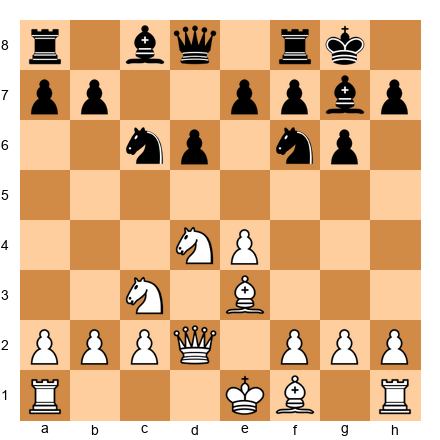

White has castled queenside in many variations of this structure. The plan is clear: push g2-g4-g5 to open lines on the kingside. The queen on d2 supports the advance. The bishop on e3 controls key squares. The knight on d4 is a rock. All three pieces point toward the kingside. This is an attacking plan.

### 2. Defensive Plans

**When to defend:** When your opponent has the initiative, when your king is under fire, or when you are worse and need to stabilize before looking for counterplay.

**What defensive plans look like:**

- Trading off the opponent's attacking pieces (especially queens)
- Blocking open files and diagonals pointing at your king
- Reinforcing weak points before they can be exploited
- Creating counterplay on the opposite wing to distract the attacker

**The golden rule of defense:** Defense without counterplay is losing slowly. Even when you are defending, look for moments to strike back. Exchange one of their attacking pieces. Open a file on the other side. Create a threat that forces them to pause.

As Lasker taught: the best defense often involves creating your own threats. Pure passive defense breaks down against persistent pressure.

### 3. Maneuvering Plans

**When to maneuver:** When the position is closed or semi-closed, when there are no immediate tactical opportunities, and when both sides need to improve their pieces before anything can happen.

**What maneuvering plans look like:**

- Transferring a knight from one side of the board to the other (Na3-c2-e3-d5)
- Rook lifts (Ra1-a3-f3 or -h3)
- Repositioning the queen to a better square
- Making small pawn moves to improve your structure while waiting for the right moment

**The golden rule of maneuvering:** Improve your worst piece. Then improve your next worst piece. Continue until all your pieces are on their best available squares. When everything is optimized, the position will often crack on its own.

Maneuvering games require patience. The temptation to "do something" and lash out with a premature pawn break is strong. Resist it. The right moment will come. When it does, you will be ready because all your pieces are in position.

### 4. Transition Plans

**When to transition:** When you have a lasting advantage (better pawn structure, an extra pawn, a better minor piece) that will grow larger in the endgame. Or when your middlegame advantage is fading and you need to lock in your gains.

**What transition plans look like:**

- Trading queens and several pieces to reach a favorable endgame
- Simplifying the position to reduce your opponent's counterplay
- Converting a middlegame attack into material gain rather than seeking checkmate
- Centralizing your king in preparation for the endgame

**The golden rule of transitions:** Transition when your advantage is structural, not when it is tactical. A structural advantage (better pawns, superior minor piece) grows in the endgame. A tactical advantage (more active pieces, threats) usually fades in the endgame.

### 5. Prophylactic Plans

**When to be prophylactic:** When your opponent has a clear plan that you need to prevent. When a waiting approach is best. When improving your own position can wait because your opponent is about to do something dangerous.

**What prophylactic plans look like:**

- Playing a move that prevents your opponent's best idea
- Overprotecting a key square or pawn before it is attacked
- Making a "mysterious" rook move that takes away your opponent's options
- Spending a tempo on king safety before the opponent can exploit it

**The golden rule of prophylaxis:** Ask yourself before every move: "What does my opponent want to do?" If their plan is dangerous, stop it first. Then pursue your own ideas.

The great Tigran Petrosian built his entire style around this principle. He would prevent his opponent's plans so thoroughly that they ran out of ideas, and then he would strike when they were disorganized. You do not need to play like Petrosian to benefit from this. You just need to ask one question: "What is my opponent planning?"

---

🛑 **Rest here if you need to.** The five plan types are a lot to absorb. Come back fresh for the specific plans.

---

## Part 5: Common Middlegame Plans

### Seven Plans Every Club Player Must Know

These are the plans you will use most often between moves 10 and 30. Learn them, recognize them, and practice them. They cover the majority of middlegame situations you will encounter.

### Plan 1: The Minority Attack

**What it is:** Advancing your pawns on the side where you have fewer pawns to create weaknesses in your opponent's pawn structure.

**When to use it:** In positions where the center is locked and you have a pawn minority on the queenside (typically two pawns against three).

**How it works:**

**Set up your board:**

Imagine a structure where White has pawns on a2 and b2 facing Black's pawns on a7, b7, and c6. White advances a2-a4, then b4-b5. When b5 hits c6, Black must decide how to capture. After ...cxb5, axb5, the c-file opens and Black is left with an isolated a-pawn or a backward b-pawn. White's rooks pour down the open files and attack the weakness.

The beauty of the minority attack is its inevitability. Black can delay it but rarely prevent it. Once the pawn arrives at b5, something has to give.

**Key idea:** You are not trying to promote a pawn. You are trying to create a weakness in your opponent's camp that you can target for the rest of the game.

### Plan 2: The Kingside Pawn Storm

**What it is:** Advancing your kingside pawns (f, g, and h) toward the enemy king to open lines for your pieces.

**When to use it:** When you have castled queenside and your opponent has castled kingside (opposite-side castling), or when the center is closed and you have a space advantage on the kingside.

**How it works:**

**Set up your board:**

White has castled queenside. Black has castled kingside. The center is stable. White's plan: g2-g4, h2-h4, g4-g5 (or h4-h5 depending on the structure). Each pawn advance opens a line or forces a concession from Black.

When the g-file or h-file opens, White's rooks swing over (Rdg1 or Rh1-h5). The queen on d2 can join the attack via h6 or g5. The bishop on e3 supports everything.

**Warning:** A kingside pawn storm works only when the center is stable. If the center is open, pushing your kingside pawns weakens your own king. Rule of thumb from Steinitz: no flank attack succeeds without a stable center.

### Plan 3: The Central Breakthrough

**What it is:** Advancing a central pawn (usually e4-e5 or d4-d5) to blow open the center and activate your pieces.

**When to use it:** When you have more centralized pieces, better development, or when your opponent is preparing a wing attack that a central break would disrupt.

**How it works:**

**Set up your board:**

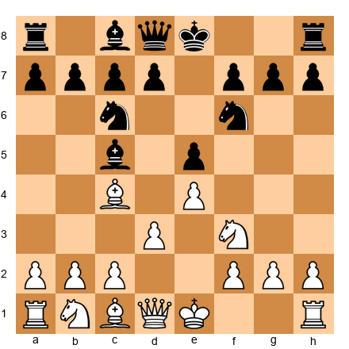

In many Italian Game structures, White prepares d2-d4 to strike at the center. After d4, exd4, Nxd4, the center opens and White's pieces (bishop on c4, knight on d4, rooks on the open d-file and e-file) spring to life.

The central breakthrough is the most powerful type of plan when it works. It activates multiple pieces simultaneously and often catches the opponent off guard.

**Key idea:** Prepare the break carefully. Do not push the pawn until your pieces are ready to exploit the open lines. A premature breakthrough can backfire.

### Plan 4: Piece Exchanges to Exploit an Advantage

**What it is:** Deliberately trading pieces to simplify the position and magnify a lasting advantage.

**When to use it:** When you are ahead in material, when you have a better pawn structure, or when your opponent's pieces are keeping the position complicated enough to give them counterplay.

**How it works:** This is not about mindlessly trading everything. It is about trading the right pieces.

**Trade their active pieces.** If your opponent has a strong knight on e4, exchange it. If their bishop controls a dangerous diagonal, trade it.

**Keep your good pieces.** If your bishop is better than their bishop, do not trade bishops. Trade something else.

**Aim for a favorable endgame.** Think about what the position will look like after the trades. Will you have a winning endgame? If yes, trade. If the endgame is unclear, maybe keep the pieces and look for more.

### Plan 5: Opening a File for Your Rooks

**What it is:** Creating an open file (a file with no pawns) so your rooks can enter the opponent's position.

**When to use it:** When your rooks are passive and have no open files to work with.

**How it works:** Find a pawn you can advance or exchange to clear a file. Then double your rooks on that file. Then penetrate to the seventh rank.

**Set up your board:**

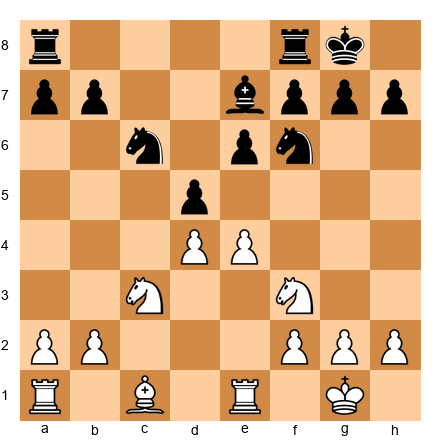

White can play e4-e5. After ...Nd7 (the knight retreats), the e-file becomes half-open. After a further ...dxe4 or exd5, a fully open file appears. White plays Re1, Rae1 (or Rd1 if the d-file opens), and the rooks come alive.

The principle: rooks without open files are like cars without roads. Give them a highway, and they dominate.

### Plan 6: Creating a Passed Pawn

**What it is:** Advancing a pawn past all opposing pawns so it can march toward promotion.

**When to use it:** When you can create a pawn that has no enemy pawn in front of it or on adjacent files. Especially powerful in endgames, but the process of creating it often begins in the middlegame.

**How it works:**

Exchange pawns on one wing to create a pawn majority on the other. Then advance that majority to create a passed pawn. A passed pawn ties down enemy pieces that must watch it, freeing your other pieces to operate elsewhere.

As Nimzowitsch wrote: "A passed pawn is a criminal that must be kept under lock and key. Powerful measures (the bishop guarding it, a knight blocking it, a rook behind it) are required to restrain it."

### Plan 7: Improving Your Worst Piece

**What it is:** Finding your least active piece and relocating it to a better square.

**When to use it:** Always. This is the universal plan. When you do not know what else to do, improve your worst piece. It is almost never wrong.

**How it works:** Scan your pieces. Find the one doing the least. Ask: where would this piece be better? Then reroute it.

Common examples:

- A knight on a3 goes to c2-e3-d5
- A bishop on c1 goes to d2-e3 or f4
- A rook on a1 goes to d1 or e1 via the back rank
- A queen on d1 repositions to e2 or c2

This is the plan that Karpov used more than any other. He would look at a position, find the piece that was not contributing, and spend two or three moves making it active. Then he would do the same with the next piece. By the time he was done, his position was a machine. His opponents' positions collapsed under the cumulative pressure.

**Set up your board:**

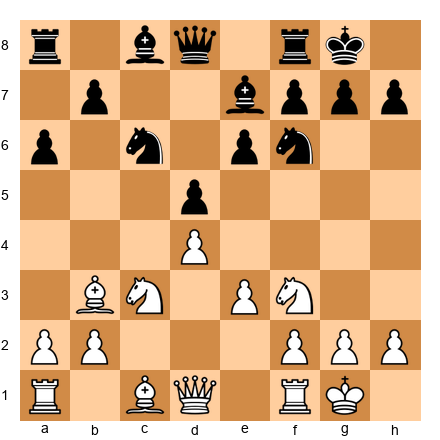

White's worst piece is the bishop on c1. It is blocked by the e3 pawn and does nothing. White's plan: Bd2 (freeing the rook), then Ba5 or Bb4 (putting the bishop on an active diagonal), or Re1 followed by e4 to open the center and let the bishop breathe. One piece improvement transforms the entire position.

---

🛑 **Rest here.** Seven plans are a lot to absorb. When you come back, five masterpiece games will show you how the best players in history used these ideas.

---

## Part 6: When Plans Change

### Recognizing When Your Plan Has Been Stopped

You are halfway through executing your plan. You were going to push f4-f5, open the f-file, and attack the kingside. Then your opponent plays ...e5, closing the center and blocking your f-pawn advance. Now what?

This happens in every game. No plan survives contact with the opponent unchanged. The question is not whether your plan will be disrupted. The question is what you do when it is.

**Signs that your plan has been stopped:**

1. The pawn break you were aiming for is no longer possible (the square is blocked or the advance would weaken your position).
2. Your opponent traded a key piece that your plan depended on.
3. Your opponent created a threat that you must address before continuing your plan.
4. The position has changed so much that your plan no longer makes sense.

When this happens, do not panic. Go back to Step 1 of the planning process. Re-evaluate. The position has changed, and it needs a new plan.

### Adapting to Your Opponent's Moves

Adaptation is not abandoning your plan. It is updating it.

**If your kingside attack is blocked,** shift your energy to the center or the queenside. Your pieces are already active. They just need a new target.

**If your opponent trades your best piece,** find a new best piece and build around it.

**If your opponent creates a threat,** deal with the threat in a way that also serves your plan. The ideal defensive move is one that defends against the threat and improves your position at the same time. This is called a "multi-purpose move," and it is one of the hallmarks of strong play.

### The Flexibility Principle

**Do not marry your plan.**

This is perhaps the most important piece of advice in this chapter. Plans are tools, not commitments. You pick one up, use it as long as it works, and put it down when it stops working.

The players who struggle the most with planning are not the ones who cannot form plans. They are the ones who cling to plans long after the position has changed. They fell in love with their idea, and they cannot let go.

Be flexible. Be willing to change direction. The best move in the position is always the best move in the position, regardless of what your plan said ten moves ago.

---

## Part 7: Annotated Games

### Game 38: Karpov vs Unzicker, Nice Olympiad 1974

*Theme: Improving the Worst Piece, The Art of Gradual Improvement*

Anatoly Karpov was the supreme master of quiet, methodical planning. He did not attack with fireworks. He improved his pieces, one by one, until his opponent's position crumbled under the weight of perfect coordination. This game is a textbook example.

**Set up your board.**

**1.e4 e5 2.Nf3 Nc6 3.Bb5 a6 4.Ba4 Nf6 5.O-O Be7 6.Re1 b5 7.Bb3 d6 8.c3 O-O 9.h3 Nb8**

The Breyer Variation of the Ruy Lopez. Black retreats the knight to b8, it looks bizarre to a beginner, but the idea is to reroute it to d7 where it supports ...c5 and does not block the c-pawn. This is a plan: the knight was not well-placed on c6 (it blocked Black's plans), so Black improves it.

**10.d4 Nbd7 11.Nbd2 Bb7 12.Bc2 Re8 13.Nf1 Bf8 14.Ng3 g6**

Both sides maneuver. White reroutes the knight from d2 to g3 where it supports a potential f4-f5 break and eyes the f5 and h5 squares. Black fianchettoes the bishop to g7 to protect the kingside.

**15.a4 c5 16.d5**

Karpov closes the center. This is a strategic decision: with the center locked, the game will be about piece maneuvering and wing play. Karpov is signaling that he wants a long, positional game, exactly the kind of game where his planning ability gives him the greatest edge.

**16...c4 17.Bg5 Nc5 18.Qd2 h6 19.Be3 Nc5 20.Nh2**

Notice what Karpov is doing. He is not attacking. He is repositioning his pieces. The knight goes from f3 to h2, freeing the f-pawn for a future advance. Every move has a purpose. Every piece is going somewhere specific.

**20...Qd7 21.b4 cxb3 22.Bxb3 Kh7 23.Nf3 Bg7 24.Qe2 Nfd7 25.Bd2 Qc7 26.Nh4**

The knight transfers to h4, eyeing f5. The bishop repositions from e3 to d2 to a5 (in some lines). The queen shifts to e2 to support the central e4 pawn and prepare Qf1-g2 if needed. Karpov is improving his worst piece with every single move.

**26...Nb6 27.Nhf5**

The knight arrives on f5. This is an outpost, Black cannot play ...gxf5 without catastrophically weakening the kingside. From f5, the knight supports a future attack and dominates the board.

**27...gxf5 28.Nxf5 Kh8 29.Nxg7 Kxg7**

Black captures, but the kingside pawn structure is now damaged. Karpov has achieved his goal: the king is exposed, the pawns are weak, and his remaining pieces are perfectly placed.

**30.f4 exf4 31.Bxf4 Qd7 32.Qf3 Be4 33.Qg3+ Kh8 34.Bg5 Nba4 35.Bxh6 Rg8 36.Qf4 Nc3 37.Bg5+ 1-0**

Unzicker resigned. The position is hopeless, White's pieces swarm the weakened kingside.

**What this game teaches about planning:**

- Karpov rarely "attacked." He simply improved his pieces until the attack played itself.
- Every piece found its best square through patient maneuvering.
- Closing the center was a strategic choice that favored the better planner.
- The worst piece at any given moment was always the next piece to be improved.

---

### Game 39: Capablanca vs Tartakower, New York 1924

*Theme: The Transition, Converting a Middlegame Advantage to a Winning Endgame*

José Raúl Capablanca was the third World Champion and perhaps the most naturally gifted chess player who ever lived. His specialty was clarity, the ability to see the simplest path to victory. This game shows how a small middlegame advantage, handled with precision, transforms into a winning endgame.

**Set up your board.**

**1.d4 e6 2.Nf3 f5 3.c4 Nf6 4.Bg5 Be7 5.Nc3 O-O 6.e3 b6 7.Bd3 Bb7 8.O-O Qe8 9.Qe2 Ne4**

The Dutch Defense. Black plays ...f5 to control e4 and aim for a kingside attack. Capablanca has a different plan: he will exploit the weakness of the e5 square and the light squares around Black's king.

**10.Bxe7 Nxc3 11.bxc3 Qxe7 12.a4 Bxf3 13.Qxf3 Nc6 14.Rfb1 Na5 15.Qh5**

Capablanca places the queen on h5 where it eyes the weakened kingside. Black's pawn on f5 controls e4 but leaves holes on e5, g5, and h5.

**15...Qf6 16.Qg5 Qxg5**

Black trades queens. This might seem like relief for Black, but Capablanca has planned for this. The endgame favors White because of the weak pawns on the queenside and the superior pawn structure.

This is the transition in action. Capablanca did not try to force a mating attack. He recognized that his advantage was structural, not tactical, and he steered the game into an endgame where that structure would win.

**17.hxg5 d6 18.f4**

White fixes the pawns, creating a stable structure. Now the long-term targets are clear: Black's pawns on a7, b6, and d6 are all potential weaknesses.

**18...Kf7 19.Kf2 Ke7 20.Ke2 Rab8 21.Kd2 Rh8 22.Kc2 Rb7 23.a5**

Capablanca advances on the queenside. The minority attack in action: the a-pawn charges forward to disrupt Black's pawn structure.

**23...Rhb8 24.axb6 axb6 25.Ra6 Nc6 26.Rd1 Rd7 27.Bf1 Ra7 28.Rxa7+ Nxa7 29.Bd3 Nb5 30.Bxb5**

Trades continue. Each trade brings the game closer to a pure pawn endgame, which White wins because of the superior structure.

**30...cxb5 31.Rb1 bxc4 32.Rxb6 Rd7 33.Rb4 c3 34.Kxc3 Rc7 35.Rb6 Rd7 36.Kc4 Kd8 37.Kc5 Kc8 38.Ra6 Kb7 39.Ra1 Kc7 40.Ra8 Kb7 41.Rg8 Ka6 42.Rxg7 Rd8 43.Kxd6 1-0**

Tartakower resigned. The pawns are indefensible.

**What this game teaches about planning:**

- Capablanca's plan evolved from middlegame pressure to endgame conversion.
- He recognized that the advantage was structural and chose the right plan: simplification.
- The minority attack created lasting weaknesses on the queenside.
- Clarity of thought (knowing what the position needs) is the essence of planning.

---

### Game 40: Petrosian vs Reshevsky, Zurich Candidates 1953

*Theme: Prophylactic Planning, Preventing the Opponent's Ideas*

Tigran Petrosian was the ninth World Champion and the greatest defensive player in chess history. His opponents would sit across from him and discover that every idea they wanted to play had already been prevented. This game shows prophylaxis as a complete planning philosophy.

**Set up your board.**

**1.Nf3 Nf6 2.c4 e6 3.d4 d5 4.Nc3 c6 5.e3 Nbd7 6.Bd3 dxc4 7.Bxc4 b5 8.Bd3 Bb7**

A Semi-Slav structure. Black develops normally, bishop to b7, pawns on c6 and e6. Solid, but Petrosian sees the plan behind it: Black wants to play ...c5, challenge the center, and activate the bishop on b7.

**9.e4 b4 10.Na4 c5 11.e5 Nd5 12.O-O cxd4 13.Re1**

Petrosian plays Re1 rather than recapturing on d4. Why? Because the d4 pawn is not going anywhere, and Re1 puts the rook on the open e-file, supporting the e5 pawn and preventing Black's king from finding safety. This is prophylaxis: preventing ...O-O from being comfortable.

**13...Be7 14.Nxd4 O-O 15.Qg4 g6**

Black weakens the kingside to defend against the queen's pressure. Petrosian forced this weakness without committing to an attack. Now f6 and h6 are permanently weak.

**16.Bh6 Re8 17.Nf5**

The knight leaps to f5, exploiting the weakened dark squares. Every move Petrosian has played in the last ten moves has been prophylactic or positional, not a single forcing move, yet Black is already in serious trouble.

**17...exf5 18.Qxf5 Nf8 19.Rad1 Qb6 20.Rd7**

The rook invades on the seventh rank. Combined with the queen on f5, the bishop on h6, and the knight ready on a4, White's pieces dominate.

**20...Bc5 21.Nb2 Rac8 22.Nd3 Ba7 23.Nf4 Ne6 24.Nxg6 1-0**

Reshevsky resigned. The knight sacrifice tears open the king's shelter.

**What this game teaches about planning:**

- Petrosian did not attack until Black's position was already compromised.
- Every "quiet" move prevented one of Black's ideas.
- Prophylactic planning creates positions where the opponent has no good moves.
- Patience is a weapon. Petrosian waited until the position was ripe, then struck.

---

### Game 41: Botvinnik vs Smyslov, World Championship 1954, Game 13

*Theme: The Central Breakthrough, Timing the d4-d5 Break*

Mikhail Botvinnik was the patriarch of Soviet chess and one of the most systematic thinkers to ever play. This game demonstrates how a central pawn break, timed correctly, can shatter a position.

**Set up your board.**

**1.d4 Nf6 2.c4 g6 3.g3 Bg7 4.Bg2 O-O 5.Nc3 d6 6.Nf3 Nbd7 7.O-O e5 8.e4 c6 9.Be3 Ng4 10.Bg5 Qb6**

The King's Indian setup. Black has pawns on c6, d6, and e5, a solid but passive structure. Black's plan is to play ...f5 and attack on the kingside. Botvinnik's plan: prevent ...f5 and prepare d4-d5.

**11.h3 exd4 12.Na4 Qa6 13.hxg4 b5 14.Nxd4 bxa4 15.Nxc6**

The center breaks open. After Nxc6, White's pieces flood into the gaps. The bishop on g2 looks down the long diagonal. The knight on c6 controls key squares. The rooks will find open files.

**15...Bb7 16.Nd4 Bxe4 17.Bxe4 Bxd4 18.Qxd4 Rae8 19.Bf3 Nc5 20.Rfe1**

White has the bishop pair, open lines, and a dominant center. Black's position is fundamentally compromised, the d5 square is an outpost for White, and the a4 pawn is weak.

**20...Rxe1+ 21.Rxe1 Qb7 22.Qd5 Qxd5 23.Bxd5 Nxa2 24.Bxa2 Rxf2**

Material is roughly equal, but White's bishop pair and active rook give a lasting advantage. Botvinnik converts methodically.

**25.Rd1 d5 26.cxd5 Rf5 27.Bd4 a5 28.d6 Rxg5 29.d7 Rd5 30.Bc6 1-0**

Smyslov resigned. The d7 pawn queens.

**What this game teaches about planning:**

- Botvinnik prepared the d-file breakthrough with precise piece placement.
- The central break activated the entire army simultaneously.
- Timing is everything, the break came when Black was not ready to deal with the consequences.
- A prepared central breakthrough is one of the most powerful weapons in chess.

---

### Game 42: Rubinstein vs Salwe, Lodz 1908

*Theme: Maneuvering and Piece Improvement, A Positional Masterclass*

Akiba Rubinstein was one of the finest positional players in history, a precursor to Capablanca and Karpov. This game is considered one of the greatest demonstrations of methodical planning ever played.

**Set up your board.**

**1.d4 d5 2.Nf3 c5 3.c4 e6 4.cxd5 exd5 5.Nc3 Nf6 6.g3 Nc6 7.Bg2 cxd4 8.Nxd4 Qb6**

An isolated queen's pawn (IQP) position. Black has an isolated d-pawn, it cannot be supported by another pawn. This pawn is both a strength (it controls c4 and e4) and a weakness (it can be blockaded and attacked). The plan for White: blockade the d-pawn, then target it.

**9.Nxc6 bxc6 10.O-O Be7 11.Na4 Qb5 12.Be3 O-O 13.Rc1**

White develops naturally, putting pieces on squares that support the plan: blockade d5 and attack it. The rook goes to c1 to pressure the c-file. The bishop on e3 supports d4 and eyes the queenside.

**13...Bg4 14.f3 Bd7 15.Nc5 Rfe8 16.Rf2**

Rubinstein's plan crystallizes. The rook on f2 will go to d2, doubling on the d-file. The knight on c5 is a monster outpost. Every piece points at the d5 pawn.

**16...Be6 17.Nxe6 fxe6**

Black's pawn structure is now ruined. The d5 and e6 pawns are both isolated, and they are on the same file, doubled and isolated. This is a dream for the attacking side.

**18.Qd3 Qa6 19.Qxa6 Rxa6**

Queens come off. Rubinstein does not mind, the endgame favors him enormously. The weak pawns will be permanent targets.

**19...Nd7 20.Bd4 Bf8 21.Rfc2 Nf6 22.Rc7 Nd7 23.R1c2**

White doubles rooks on the seventh rank. The plan has been executed to perfection: rooks on the seventh, bishop on d4 controlling the center, the d5 and e6 pawns under siege.

**23...Rd6 24.Bf1 a5 25.Bb5 Rdd8 26.Bxd7 Rxd7 27.Rxd7 Rxd7 28.Rc8+ Rd8 29.Rc2 Rd7 30.g4 Kf7 31.Rc8 Ke7 32.Ra8 Kd6 33.Ra6 Ke7 34.Kf2 e5 35.Be3 d4 36.Bc1 f3 37.Ke2 Rc7 38.Ba3+ Ke8 39.Rd6 1-0**

Salwe resigned. The weak pawns fall, and with them the game.

**What this game teaches about planning:**

- Rubinstein identified the target (the isolated d-pawn) and built his entire plan around attacking it.
- Every piece was placed on the ideal square for this specific plan.
- The transition to the endgame was deliberate, Rubinstein chose it because the endgame magnified his advantage.
- Great planning looks simple in hindsight. That simplicity is the result of deep understanding.

---

🛑 **Rest here.** Five games of world-class planning. Let them soak in before tackling the exercises.

---

## Part 8: Exercises

### Section A: Evaluate This Position (Exercises 20.1 – 20.10) ★-★★

*For each position, run through the evaluation checklist (material, king safety, piece activity, pawn structure, space, development). Write down who is better and why before reading the solution.*

**Exercise 20.1** ★

Evaluate the position. Who is better?

*Hint 1:* Check the material count first.
*Hint 2:* How many pieces has each side developed?
*Hint 3:* Who controls the center?

**Solution:** **White is slightly better.** Material is equal. Development is equal (two pieces each). But White's pawn on e4 controls d5 and f5, giving White more central space. Black's knights are well-developed but do not yet control the center as firmly. White's next moves (d4, Nc3) will establish a classical center. This is a small advantage (the game is far from decided) but White has the easier path forward.

---

**Exercise 20.2** ★

Evaluate the position. Who is better?

*Hint 1:* Count the developed pieces for each side.
*Hint 2:* What does the bishop on b4 do?
*Hint 3:* Who has more central space?

**Solution:** **The position is roughly equal.** White has more central space (pawns on c4 and d4), but Black has developed more harmoniously (bishop on b4 pins the knight, knight on f6 attacks e4). The Nimzo-Indian Defense (which this is) gives Black structural ideas (...Bxc3, doubling White's pawns) in exchange for the bishop. Neither side is clearly better, both have plans. This is a well-balanced opening.

---

**Exercise 20.3** ★

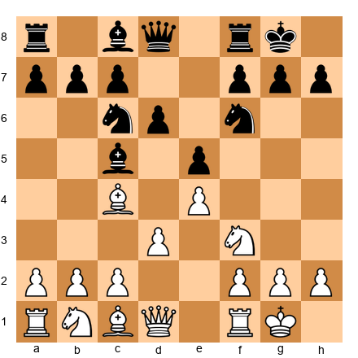

Evaluate the position. Who is better?

*Hint 1:* Material is equal. Focus on piece activity.
*Hint 2:* Compare White's bishop on c4 to Black's bishop on c5.
*Hint 3:* Whose pieces coordinate better for the center?

**Solution:** **Roughly equal with mutual chances.** Both sides have well-developed pieces. White's bishop on c4 targets f7, a classic Italian Game theme. Black's bishop on c5 targets f2 and controls the a7-g1 diagonal. White has a solid center with e4 and d3. Black has matched development. The game is about who executes their plan better, White may aim for d3-d4 (central breakthrough) while Black may aim for ...d5 (challenging the center).

---

**Exercise 20.4** ★★

Evaluate the position. Who is better?

*Hint 1:* Look at the pawn structures. Are there any weaknesses?
*Hint 2:* Compare the minor pieces. Who has the bishop pair?
*Hint 3:* Which side has more space?

**Solution:** **White is slightly better.** White has the bishop pair (Bd3 and Bf4), which is a long-term advantage if the position opens. White has slightly more space due to the d4 pawn controlling e5 and c5. Black's position is solid but passive, the knights on c6 and f6 are well-placed but have limited influence. White's plan should involve opening the position to exploit the bishop pair.

---

**Exercise 20.5** ★★

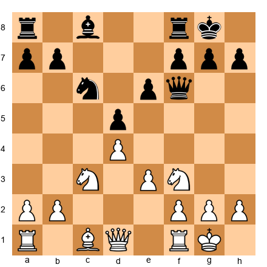

Evaluate the position. Who is better?

*Hint 1:* Material is equal. Look at pawn structure.
*Hint 2:* Black has an isolated d-pawn on d5. Is this a strength or a weakness?
*Hint 3:* How active are the pieces on each side?

**Solution:** **White is slightly better.** Black has an isolated pawn on d5 (it controls c4 and e4 (a strength) but cannot be supported by other pawns (a weakness). In the long run, White can blockade d5 (put a knight on d4) and pressure it with rooks on the d-file. Black's counterplay is piece activity) if Black's pieces are active enough, the isolated pawn's control of key squares compensates. Right now, the position is close to equal, but the long-term trend favors White.

---

**Exercise 20.6** ★★
Evaluate the position. Who is better?

*Hint 1:* The center is stable. Who has more space?
*Hint 2:* Black's knight on e7 seems passive. Where does it want to go?
*Hint 3:* Can White create a plan based on the pawn structure?

**Solution:** **White is slightly better.** White has a space advantage with the c4 and d4 pawns. Black's pieces are somewhat cramped, the knight on e7 wants to reach f5 or g6, and the bishop on c6 is blocked by the d5 pawn. White's plan: play cxd5 at the right moment to open the c-file and pressure Black's pawns, or maneuver pieces to exploit the space advantage. Black needs to find a way to break out with ...e5 or ...c5.

---

**Exercise 20.7** ★★

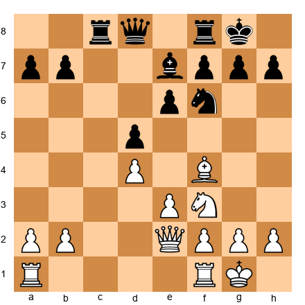

Evaluate the position. Who is better?

*Hint 1:* Material is equal. Check king safety.
*Hint 2:* Both kings are castled kingside. Neither is weak.
*Hint 3:* Focus on piece activity and pawn breaks.

**Solution:** **Equal.** Both sides have safe kings, solid pawn structures, and reasonably active pieces. White's bishop on f4 is slightly more active than Black's bishop on e7. But Black has rooks on the c-file and f-file, which are useful. The position is balanced, the plan for both sides is to find small improvements. White might aim for Rac1 (contesting the c-file) or Ne5 (centralizing). Black might aim for ...Nh5 (trading the bishop) or ...b6 and ...Bb7 (activating the light-squared bishop).

---

**Exercise 20.8** ★★

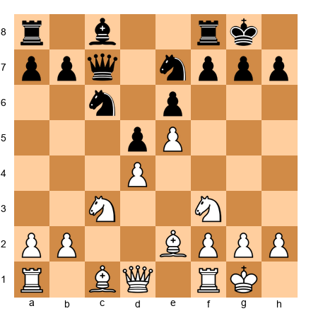

Evaluate the position. Who is better?

*Hint 1:* Look at the pawn chain: e5-d4 for White, d5-e6 for Black.
*Hint 2:* Which side has more space?
*Hint 3:* Where should White attack: kingside or queenside?

**Solution:** **White is slightly better.** White has a space advantage thanks to the e5 pawn, which restricts Black's knight on f6 from its natural square. The pawn chain points toward the kingside, suggesting White should attack there (f4-f5 or Ng5-f3-h4-f5 maneuvers). Black's plan is to challenge the base of the pawn chain with ...c5 or ...f6 to break the center. The side that executes their plan first will have the advantage.

---

**Exercise 20.9** ★★

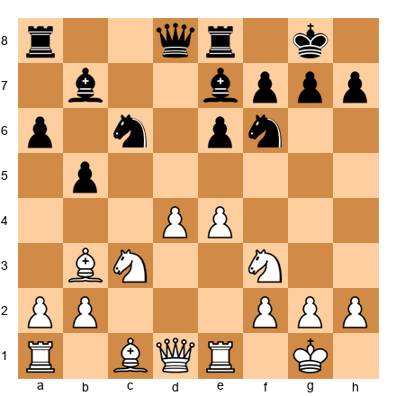

Evaluate the position. Who is better?

*Hint 1:* Material is equal. Focus on piece activity.
*Hint 2:* White has a strong center (e4 + d4). How can White use it?
*Hint 3:* Where is Black's weakest piece?

**Solution:** **White is slightly better.** The central pawns on e4 and d4 give White more space. The bishop on b3 is more active than the bishop on b7 (which is blocked by the e6 pawn). White can plan d4-d5 at the right moment to crack open the center. Black's knight on c6 is well-placed but can be challenged with d5. White's edge is small but concrete.

---

**Exercise 20.10** ★★

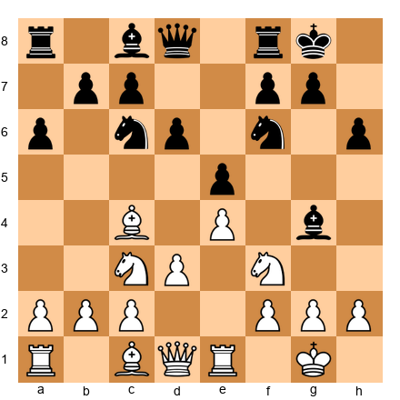

Evaluate the position. Who is better?

*Hint 1:* Count developed pieces. Who is more developed?
*Hint 2:* Black has a bishop on g4 pinning the knight on f3. Is this dangerous?
*Hint 3:* Evaluate the center and space.

**Solution:** **Approximately equal.** Both sides are well-developed. White has the classical center (e4 + d3 supporting the bishop on c4). Black has solid central presence with e5 and d6. The bishop on g4 pins White's knight, which is annoying but manageable (h3 or Be2 breaks the pin). Neither side has a clear advantage. The game will depend on planning: White might aim for d3-d4, while Black might prepare ...d5 or a kingside attack with ...Nh5, ...f5.

---

🛑 **Rest here.** Ten evaluations complete. You are training the most important skill in chess. Come back for the planning exercises.

---

### Section B: Find the Right Plan (Exercises 20.11 – 20.20) ★★-★★★

*For each position, identify the best plan for the side to move. State the plan in one sentence and then explain the first 2-3 moves that execute it.*

**Exercise 20.11** ★★

White to move. What is the right plan?

*Hint 1:* Look at the pawn structure. White has c4 and d4; Black has d5 and e6.
*Hint 2:* Can White play cxd5 to open the c-file?
*Hint 3:* After cxd5, where do White's rooks want to go?

**Solution:** **Plan: Open the c-file and exploit it with rooks.** White plays **cxd5 exd5** (or ...Nxd5), then develops with **Bd3, O-O,** and **Rc1**, placing a rook on the newly open c-file. The plan is to pressure Black's queenside along the c-file while developing the remaining pieces. The bishop goes to d3 where it supports the center and eyes the kingside. The queen can later come to b3 to add pressure on d5 and b7.

---

**Exercise 20.12** ★★

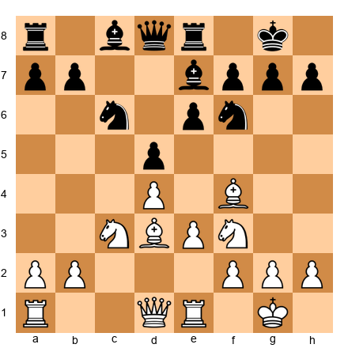

White to move. What is the right plan?

*Hint 1:* White has the bishop pair. How should White play to exploit this?
*Hint 2:* Should White keep the position closed or open it?
*Hint 3:* What pawn break opens the position?

**Solution:** **Plan: Open the position to activate the bishop pair.** White should prepare **e3-e4** (after repositioning if needed), or play **c2-c4** to challenge Black's d5 pawn. Opening the center gives the bishops long diagonals. White should avoid keeping the position locked, since bishops need open lines. After e4 dxe4 Nxe4, White's pieces are fully active and the bishop pair begins to dominate.

---

**Exercise 20.13** ★★

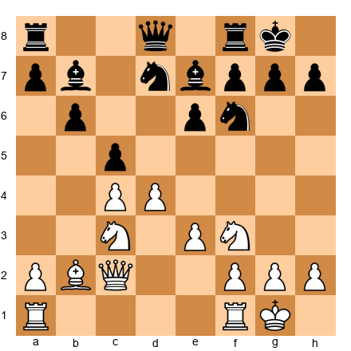

White to move. What is the right plan?

*Hint 1:* The center is fluid. Should White play d5 or dxc5?
*Hint 2:* If White plays d5, what happens to the bishop on b2?
*Hint 3:* What happens to the e-file if pawns are exchanged?

**Solution:** **Plan: Play d4-d5 to open the long diagonal for the bishop on b2 and create a central initiative.** After **d5**, the bishop on b2 comes alive on the a1-h8 diagonal. If Black plays ...exd5, then cxd5 gives White a strong passed pawn on d5. If Black plays ...e5, the center closes but the d5 outpost belongs to White. The queen on c2 supports the advance, and rooks can come to d1 and e1.

---

**Exercise 20.14** ★★★

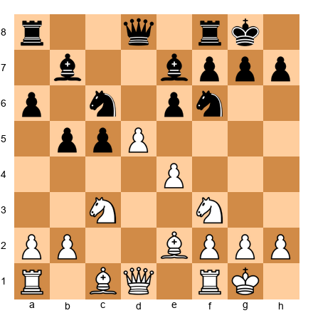

White to move. The center is locked (pawns on d5 and e4 vs e6). What is the right plan?

*Hint 1:* The center is locked. Where should White play: kingside or queenside?
*Hint 2:* White's pawns point toward the kingside (e4-d5 chain points toward e5-f6).
*Hint 3:* What kingside pawn break could White prepare?

**Solution:** **Plan: Launch a kingside attack with f2-f4-f5.** With the center locked, White should play on the wing where the pawn chain points, the kingside. White prepares with **Ng5** (pressuring e6), **Bd3** (supporting f5), and then **f4 followed by f5.** When f5 hits e6, a file opens toward Black's king. White's rooks swing to the f-file. This is a standard plan in King's Indian/French-type structures.

---

**Exercise 20.15** ★★★

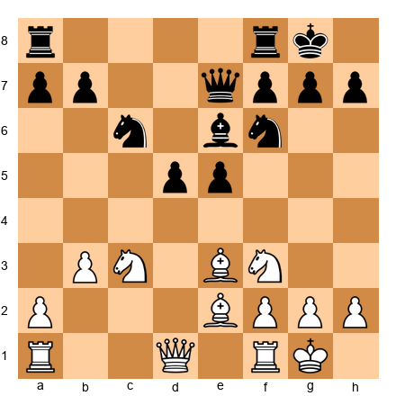

White to move. Black has a strong center (d5 + e5). What is the right plan?

*Hint 1:* Black's center is powerful. Should White attack it or work around it?
*Hint 2:* Can White play d3-d4 to challenge?
*Hint 3:* Consider the b3 pawn. Can it advance to b4-b5?

**Solution:** **Plan: Undermine Black's center with c2-c4 or b3-b4 followed by c4.** White should challenge the center, not with a frontal pawn push, but by attacking from the side. After **c4**, Black must decide how to defend d5. If ...dxc4, Nxc4 puts a knight on a great square and opens the position. If ...d4, the knight on c3 is pushed but the e4 square becomes available. Undermining a strong center is better than passively allowing it.

---

**Exercise 20.16** ★★★

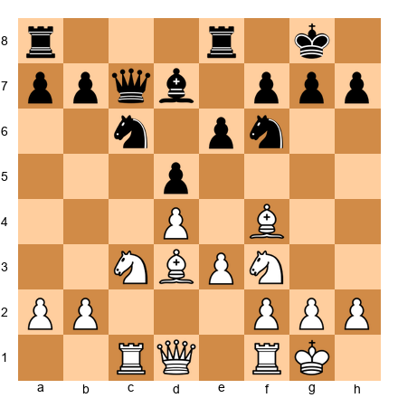

White to move. White's pieces are well-placed. What is the plan?

*Hint 1:* White has good piece placement. Which piece is the worst?
*Hint 2:* The queen on d1 is functional but could be more active.
*Hint 3:* Consider Qe2 (supporting e4 advance) or Qb1 (eyeing the b1-h7 diagonal).

**Solution:** **Plan: Improve the queen and prepare e3-e4 to open the center.** White plays **Qe2** (supporting e4 and connecting the rooks), then prepares **e4.** After e4, the center opens and White's bishop pair comes alive. The rook on c1 is already perfectly placed for the c-file. The rook on f1 supports f2-f4 if needed. Improving the worst piece (queen) and then executing the central break is the plan.

---

**Exercise 20.17** ★★★

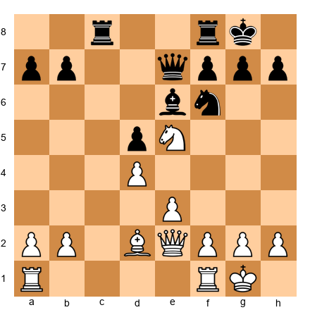

White to move. White has a knight on e5. What is the plan?

*Hint 1:* The knight on e5 is a powerful outpost. Should White trade it or keep it?
*Hint 2:* What does the knight on e5 control? How does it support other pieces?
*Hint 3:* Can White build around the knight with f4 and Rf3?

**Solution:** **Plan: Keep the knight on e5 and build a kingside attack around it.** The knight on e5 controls c6, d7, f7, and g4, key squares near Black's king. White plays **f2-f4** (supporting the knight and preparing f5), then **Rf3** (rook lift to the kingside), and then **Rh3 or Rg3** for a direct attack. The queen on e2 can shift to h5 or g4. The plan uses the knight as an anchor for the entire attack. Do not trade it.

---

**Exercise 20.18** ★★★

White to move. The center is locked (d5 vs d6). What is the plan?

*Hint 1:* With a locked center, play on the wings.
*Hint 2:* White's pawn chain points toward the queenside (d5 toward c6-b7).
*Hint 3:* Can White play a4-a5 to gain queenside space?

**Solution:** **Plan: Expand on the queenside with a2-a4, Rb1, and b2-b4.** In this Benoni-type structure, White typically plays on the queenside while Black plays on the kingside. White's plan: **a4** (gaining space), **Rb1** (supporting the b-pawn advance), and **b4** (challenging Black's c5 pawn). If ...cxb4, Nxb4 or axb4 opens the a-file and b-file for White's rooks. This is the standard plan in the Modern Benoni.

---

**Exercise 20.19** ★★★

White to move. This is a Sicilian Najdorf structure. What is the right plan?

*Hint 1:* White has castled kingside. Where should White attack?
*Hint 2:* Black is preparing ...b4 to chase the knight. Should White prevent it?
*Hint 3:* Can White play g4-g5 to attack the kingside?

**Solution:** **Plan: Launch a kingside attack with g2-g4, followed by g4-g5 to drive away the f6 knight.** In this type of Sicilian position, White often attacks on the kingside with **g4** (gaining space and preparing g5), followed by **g5** (forcing the knight from f6, weakening Black's kingside control). The queen on d2 supports Qh6 after the knight moves. The knight on d4 can go to f5 for a devastating outpost. This is an aggressive but well-established plan.

---

**Exercise 20.20** ★★★

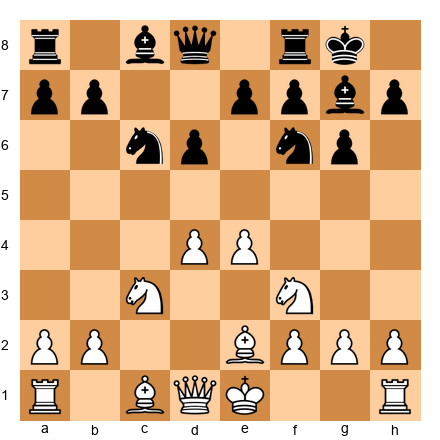

White to move. White has not yet castled. What is the right plan?

*Hint 1:* King safety first. Where should White castle?
*Hint 2:* Can White castle queenside and attack the kingside?
*Hint 3:* Is castling kingside safer or more ambitious?

**Solution:** **Plan: Castle kingside (for safety) and prepare a central or kingside plan.** Casting queenside is possible and leads to a sharp game (mutual pawn storms), but at the club level, **O-O** is safer and more practical. After castling, White's plan is **Re1** (supporting the e4 pawn), **Bf4 or Be3** (completing development), and then either **d5** (closing the center and playing on the wings) or **dxe5** if it opens favorable lines. Finish development, then choose a plan based on what Black does.

---

🛑 **Rest here.** Twenty exercises done. You are halfway through. Take a break before the decision exercises.

---

### Section C: Choose Between Two Plans (Exercises 20.21 – 20.30) ★★★

*For each position, two plans are presented. Choose the better one and explain why the other is inferior.*

**Exercise 20.21** ★★★

White to move. **Plan A:** Push f2-f4 to attack the kingside. **Plan B:** Push b2-b4 to expand on the queenside.

*Hint:* The center is locked (d5 vs e5). Where does White's pawn chain point?

**Solution:** **Plan B is correct.** White's pawn chain (d5-c4) points toward the queenside, which is where White should play. Plan A (f4) runs into ...exf4, opening the e-file against White's king, which is dangerous. Plan B (b4) is the standard King's Indian approach for White: expand on the queenside with b4-b5, open the c-file, and use the rooks to pressure Black's position. Black will attack on the kingside with ...f5, but White's queenside play is faster if executed correctly.

---

**Exercise 20.22** ★★★

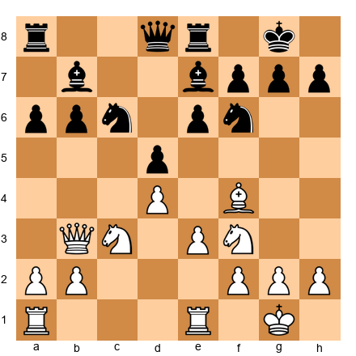

White to move. **Plan A:** Trade queens with Qb3-d1-d3 and aim for a favorable endgame. **Plan B:** Keep the queen active and prepare e3-e4 to open the center.

*Hint:* Is White's advantage structural or dynamic? Which plan suits the type of advantage?

**Solution:** **Plan B is correct.** White has more active pieces (the bishop on f4 is better than the bishop on b7 in this structure, and the queen on b3 puts pressure on the position). This is a dynamic advantage that favors keeping the pieces on. Plan A (trading queens) would eliminate White's activity advantage and lead to a dull endgame where Black's solid structure holds. Plan B keeps the tension and aims for e4, which opens the position and activates the bishop pair and the rooks.

---

**Exercise 20.23** ★★★

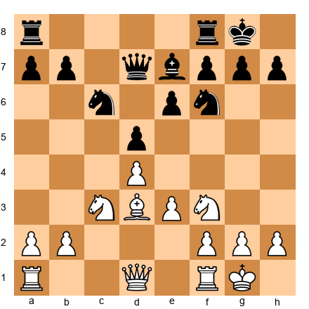

White to move. **Plan A:** Play Ne5 to centralize the knight and create threats. **Plan B:** Play e3-e4 to break open the center.

*Hint:* What happens after each plan? Which creates more lasting advantages?

**Solution:** **Plan A (Ne5) is correct.** After **Ne5**, the knight reaches a dominant central outpost, controlling c6, d7, f7, and g4. Black cannot easily remove it. This gives White a lasting positional advantage. Plan B (e4) is tempting but premature, after ...dxe4, Nxe4, Nxe4, Bxe4, the position simplifies and Black's solid structure makes it hard for White to create threats. Ne5 creates an imbalance (dominant knight) without releasing the tension.

---

**Exercise 20.24** ★★★

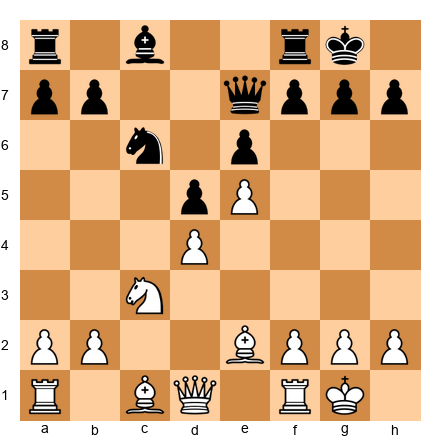

White to move. **Plan A:** Play f2-f4 to support e5 and prepare a kingside attack. **Plan B:** Play Bf4, Qd2, and Rac1 to improve pieces and play on the queenside.

*Hint:* The pawn on e5 gives White space. But which wing should White focus on?

**Solution:** **Plan B is correct.** White's space advantage with e5 restricts Black's knight on f6 (if it were still there) and limits Black's options. But f4 weakens the e4 square and the diagonal to White's king. Plan B is more flexible: **Bf4** develops the bishop, **Qd2** connects the rooks and supports the bishop, and **Rac1** activates the rook. White keeps options open on both wings rather than committing to a kingside attack that could backfire.

---

**Exercise 20.25** ★★★

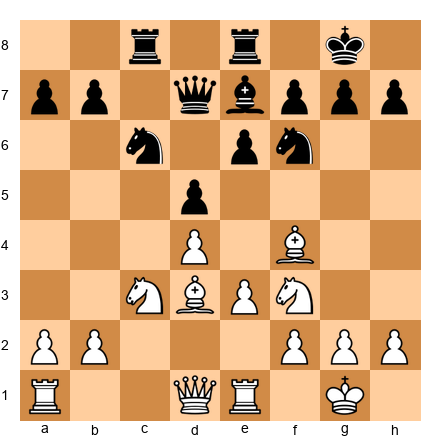

White to move. **Plan A:** Trade all minor pieces and aim for a rook endgame. **Plan B:** Maneuver the knight to e5 and build pressure.

*Hint:* Does White have any specific advantage to exploit in an endgame? Or is the middlegame more promising?

**Solution:** **Plan B is correct.** Trading everything leads to a roughly equal rook endgame with symmetric pawn structures, no advantage to convert. Plan B (maneuvering to Ne5) creates a dynamic imbalance. The knight on e5 would be a monster, and from there White can build on either wing. The lesson: do not simplify when you do not have a clear structural advantage. Keep pieces on when your position has potential for improvement.

---

**Exercise 20.26** ★★★

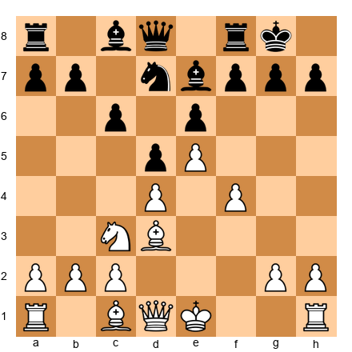

White to move. **Plan A:** Castle kingside and play a slow maneuvering game. **Plan B:** Castle queenside and launch a kingside pawn storm with g4-g5.

*Hint:* The center is locked (e5 vs d5). Opposite-side castling leads to sharp play. Is White ready for that?

**Solution:** **Both plans are viable, but Plan A is better for club players.** Plan B leads to a sharp, double-edged game where one mistake is fatal. Plan A (O-O) is safer and allows White to build slowly with Qe2, Bd2, and a later f5 when the time is right. At the 1000-1600 level, the safer plan with fewer ways to go wrong is typically the better practical choice. Choose the plan you can execute reliably over the plan that looks exciting but requires precise calculation.

---

**Exercise 20.27** ★★★

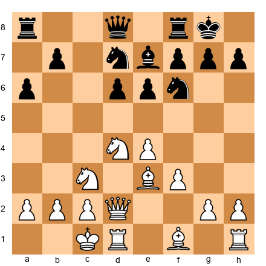

White to move. **Plan A:** Push g2-g4-g5 immediately for a kingside attack. **Plan B:** First play Kb1 and Bc4 to improve pieces, then consider g4.

*Hint:* Is White's king safe on c1? Should White improve it before attacking?

**Solution:** **Plan B is correct.** Plan A (immediate g4) is aggressive but neglects White's own king safety. The king on c1 is exposed to checks along the c-file and a-file. **Kb1** tucks the king into a safer corner, and **Bc4** develops the last minor piece to a strong square. Once the king is safe and the pieces are developed, then g4 is much more effective because White can focus entirely on the attack. Preparation before aggression.

---

**Exercise 20.28** ★★★

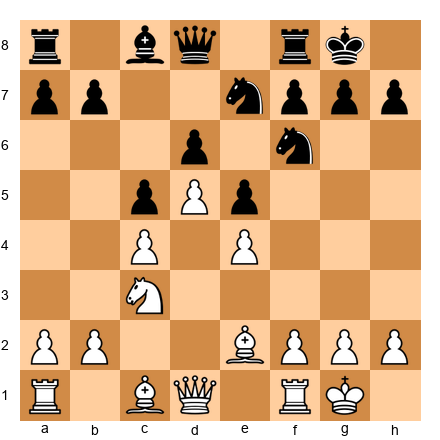

White to move. **Plan A:** Play f2-f4 to attack Black's e5 pawn. **Plan B:** Play b2-b4 to attack Black's c5 pawn.

*Hint:* Which pawn break is safer? Which one creates more problems for the opponent?

**Solution:** **Plan B (b4) is correct.** Plan A (f4) opens the f-file and creates tactical complications, after ...exf4, Bxf4, Black can activate pieces along the e-file and the c1-h6 diagonal may become weak. Plan B (b4) attacks Black's c5 pawn safely. After ...cxb4, White recaptures and opens the b-file with pressure. The queenside is where White's pawn chain points (d5-c4), making b4 the natural break. Follow the direction of your pawn chain.

---

**Exercise 20.29** ★★★

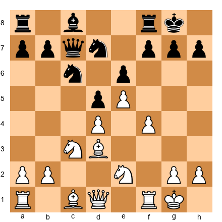

White to move. **Plan A:** Play f4-f5 to attack the kingside immediately. **Plan B:** Play Ng3 to reposition the knight and support f5 with better coordination.

*Hint:* Is f5 effective right now, or does White need more preparation?

**Solution:** **Plan B is correct.** Plan A (f5) is premature. After f5, Black can play ...exf5 and the position opens before White's pieces are ready. The knight on e2 is not participating in the attack. Plan B (**Ng3**) brings the knight to a better square where it supports f5 AND eyes the h5 and f5 squares. After Ng3, f5 becomes much more powerful because the knight can jump to h5 or f5 after the break. Prepare your pieces, then break through.

---

**Exercise 20.30** ★★★

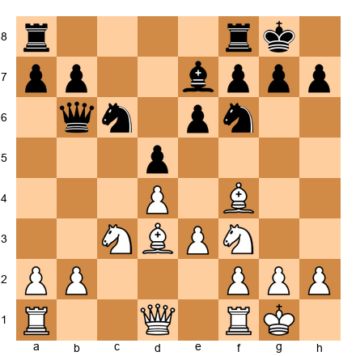

White to move. **Plan A:** Play a2-a4 to gain queenside space and restrict ...b5. **Plan B:** Play Qe2 to connect the rooks and prepare e3-e4.

*Hint:* Which plan addresses the position's needs? What does White's position "want"?

**Solution:** **Plan B (Qe2) is correct.** White's position is well-developed but the queen on d1 is passive. **Qe2** connects the rooks, supports a future e4, and adds flexibility (the queen can go to h5 or b5 later). Plan A (a4) is not bad, but it is slow and does not address White's main issue, the need to open the center before Black consolidates. After Qe2, White is ready for e4, which would activate the bishops and open the position. Address the key need first; peripheral operations can wait.

---

🛑 **Rest here.** Thirty exercises complete. One final set remains. Come back fresh.

---

### Section D: Execute the Plan (Exercises 20.31 – 20.40) ★★★-★★★★

*For each position, the plan is given. Find the correct move order (next 3-5 moves) to execute it.*

**Exercise 20.31** ★★★

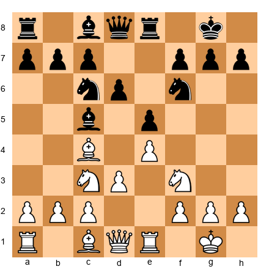

White's plan: Play d3-d4 to open the center. Find the correct move order.

*Hint 1:* Can White play d4 immediately?
*Hint 2:* After d4, how should White recapture?
*Hint 3:* Where should White's pieces go after the center opens?

**Solution:** White plays **d3-d4.** After **...exd4 Nxd4**, White has a strong knight on d4 and open lines. Next moves: **Bg5** (pinning the knight on f6), **Qf3** or **Qd3** (adding pressure to the center and kingside), and **Rad1** (controlling the d-file). The key is that d4 must be timed when White can recapture with the knight (not the pawn), keeping the center fluid and the pieces active. After Nxd4, the bishop on c4 eyes f7, the knight controls key squares, and the e-file is available for the rook.

---

**Exercise 20.32** ★★★

White's plan: Exploit the bishop pair by opening the position. Find the move order.

*Hint 1:* What pawn break opens the position?
*Hint 2:* Should White play e4 directly or prepare it?
*Hint 3:* After e4, what changes about the diagonals?

**Solution:** White prepares with **Qe2** (supporting e4 from behind), then plays **e3-e4.** After **...dxe4, Nxe4, Nxe4, Bxe4**, both bishops are active, the one on e4 controls the long diagonal, and the one on f4 controls the dark squares. The e-file opens for the rooks. Next: **Rad1** (centralizing the rook) and **Bc2** (aiming the bishop toward the kingside). The position has transformed from semi-closed to open, and the bishop pair dominates.

---

**Exercise 20.33** ★★★

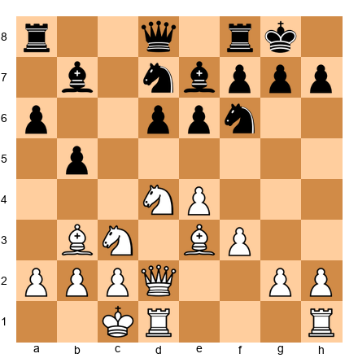

White's plan: Kingside pawn storm. Find the move order.

*Hint 1:* White has castled queenside. What is the first pawn to push?
*Hint 2:* g4 gains space and prepares g5.
*Hint 3:* After g5, what happens to Black's knight on f6?

**Solution:** White plays **g2-g4**, then **h2-h4**, then **g4-g5.** The knight on f6 must retreat (to e8, d7, or h5). After g5, the h-file or g-file opens, and White's rooks enter the attack (Rdg1, Rh1-h5). The queen on d2 shifts to h6 or g5. The key is the order: g4 first (gaining space safely), then h4 (supporting g5), then g5 (the breakthrough). Rushing g5 without h4 support can be premature.

---

**Exercise 20.34** ★★★

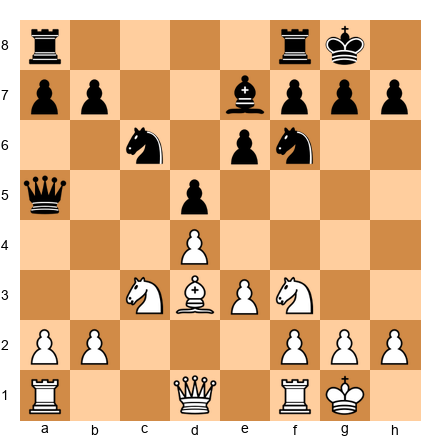

White's plan: Minority attack on the queenside with a2-a4, b2-b4, b4-b5. Find the move order.

*Hint 1:* Should White push a4 or b4 first?
*Hint 2:* After a4, what prepares b4?
*Hint 3:* Does White need to protect anything before advancing?

**Solution:** White plays **a2-a4** (gaining space and preparing b4), then **Rb1** (supporting the b-pawn advance), then **b2-b4.** After b4-b5, the b5 pawn hits c6 and forces a structural concession. If ...cxb5, axb5 opens the a-file and creates a weak pawn for Black. If ...Bxb5, Nxb5 wins a pawn. The queen on d1 can shift to b3 to add pressure on b7 and d5. The key is a4 first (a4 without b4 is safe; b4 without a4 loses the a-pawn to ...Qa2).

---

**Exercise 20.35** ★★★★

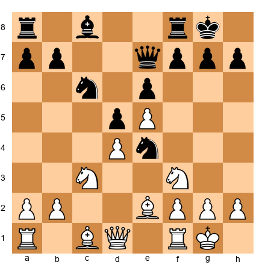

White's plan: Exploit the space advantage by improving pieces and preparing f4. Find the move order.

*Hint 1:* The knight on e4 is strong for Black. Should White trade it?
*Hint 2:* After Nxe4 dxe4, is that good for White?
*Hint 3:* Consider Bd3 to challenge the knight, or Nd2 to offer a trade on White's terms.

**Solution:** White plays **Nd2** (offering to trade the centralized knight on White's terms), then after **...Nxd2, Bxd2**, White continues with **f2-f4** (supporting e5 and gaining kingside space), **Bf3** (centralizing the bishop), and **Qe2** (connecting rooks and supporting e5). The trade Nxd2/Bxd2 is favorable because it activates White's bishop. Do NOT play Nxe4 dxe4, which gives Black a passed pawn on e4 and open lines for the bishop.

---

**Exercise 20.36** ★★★★

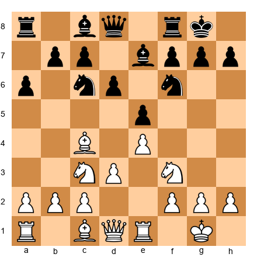

White's plan: Build a kingside attack with Nd5, f4, and piece coordination. Find the move order.

*Hint 1:* Should White play Nd5 immediately?
*Hint 2:* After Nd5, how should Black respond?
*Hint 3:* Consider a4 first to prevent ...b5 hitting the bishop.

**Solution:** White plays **a4** (preventing ...b5 and securing the bishop on c4), then **Nd5** (the knight occupies the ideal central outpost). If **...Nxd5, exd5, Ne7**, the knight is pushed to a passive square and White's bishop pair plus the d5 pawn give a lasting advantage. If Black does not take on d5, the knight stays as a monster. After Nd5, White plays **c3** (supporting d4 later), **Bg5** (pinning the f6 knight), and builds toward f4 for a kingside attack.

---

**Exercise 20.37** ★★★★

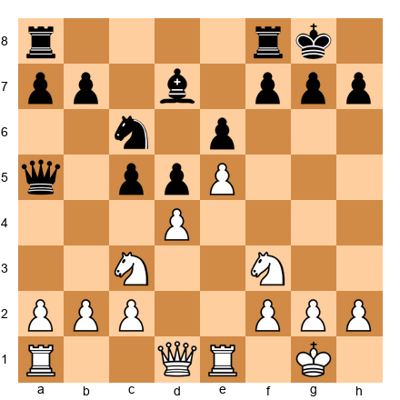

White's plan: Attack the d5 pawn by blockading it and doubling rooks on the d-file. Find the move order.

*Hint 1:* What piece blockades d5 most effectively?
*Hint 2:* Can a knight reach d4 to blockade?
*Hint 3:* After Nd4, where do the rooks go?

**Solution:** White plays **Nd4** (blockading the d5 pawn and establishing a powerful outpost, no Black pawn can attack d4 since the c5 and e5 pawns are gone or controlled). Then **Qd3** (supporting the knight on d4 and eyeing the kingside), **Rad1** (adding to the d-file pressure), and **f4** (supporting e5 and adding kingside threats). The plan is complete: the knight blockades d5, the rooks control the d-file, and the d5 pawn becomes a permanent weakness.

---

**Exercise 20.38** ★★★★

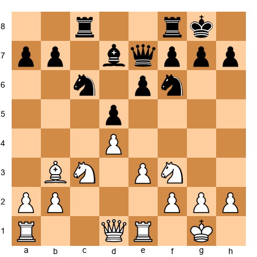

White's plan: Trade down into a favorable endgame where the bishop on b3 is better than the bishop on d7. Find the move order.

*Hint 1:* Which pieces should White trade, and which should White keep?
*Hint 2:* White wants to keep the bishop on b3 (it is more active than Black's bishop on d7).
*Hint 3:* Trading queens and one pair of rooks simplifies toward the right endgame.

**Solution:** White plays **Qd3** (centralizing and creating tactical motifs like Qb5), then **Rac1** (contesting the c-file), then seeks to trade one pair of rooks with **Rxc8 Rxc8, Rc1** (or simply allow the exchange on c1). After further simplification, White enters an endgame where the bishop on b3 dominates the bishop on d7. The b3 bishop has an open diagonal targeting d5, e6, and f7. The d7 bishop is passive, blocked by its own pawns. Patient endgame play wins.

---

**Exercise 20.39** ★★★★

White's plan: Castle queenside and launch a kingside pawn storm. Find the complete setup (next 5 moves).

*Hint 1:* Castle queenside first for king safety.
*Hint 2:* Then develop the bishop. Where does it go?
*Hint 3:* The pawn storm is g4-h4-g5. But preparation matters.

**Solution:** White plays **(1) O-O-O** (king safety + connecting rooks), **(2) Bc4** or **Be2** (developing the last minor piece (Bc4 is aggressive, targeting f7; Be2 is solid), **(3) h4** (beginning the storm) h4 is often played before g4 because it prevents ...Nh5 ideas), **(4) g4** (gaining space on the kingside), **(5) h5 or g5** depending on Black's response. If Black plays ...h5, White plays g5. If Black plays ...Nh5, White plays g4xh5. The storm aims to open the g-file or h-file for the rooks. The queen on d2 will join via h6 when the time is right.

---

**Exercise 20.40** ★★★★

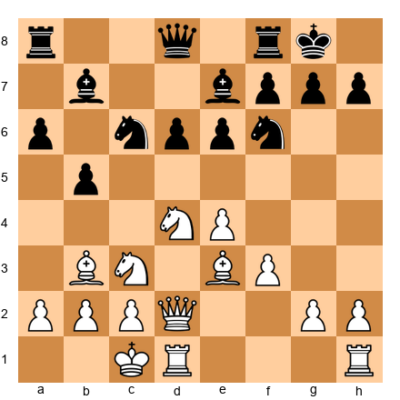

White's plan: Execute a complete attack. White wants to improve the worst piece, storm the kingside, and coordinate for a decisive blow. Find the sequence.

*Hint 1:* White's worst piece is the rook on h1. How can it join the attack?
*Hint 2:* g4 opens the possibility of Rdg1 or Rh1-h4-g4.
*Hint 3:* The knight on d4 is the anchor. Keep it.

**Solution:** White's five-move plan: **(1) g4** (the storm begins (gaining space, threatening g5, and opening the possibility of Rdg1), **(2) Rh1-g1** (the worst piece activates) the rook now supports g5 and eyes the g-file), **(3) g5** (the breakthrough (the f6 knight must move, weakening Black's kingside), **(4) Nd5** (the knight leaps to the ideal square, attacking e7 and f6, now that the f6 knight has moved), **(5) Qh6** (the queen enters the attack, threatening mate on g7). This is coordinated aggression: every piece has a role, the storm opens lines, and the knight sacrifice (or occupation) on d5 crowns the attack. This is planning at its finest) every move builds on the last, every piece supports the others, and the opponent faces problems on every square.

---

## Key Takeaways

1. **A plan is a series of moves aimed at a specific goal.** If you cannot state your plan in one sentence, it is not clear enough.

2. **Evaluate before you plan.** Run through the checklist: material, king safety, piece activity, pawn structure, space, development. Then decide.

3. **Base your plan on the imbalances.** Exploit your advantages. Neutralize your opponent's. Every position has imbalances, find them.

4. **The position tells you what to do.** Look at your pawn breaks, your piece placement, your opponent's weaknesses. The right plan emerges from the position itself.

5. **When in doubt, improve your worst piece.** This is the universal plan that is almost never wrong.

6. **A bad plan is better than no plan.** Coordinated pieces beat scattered pieces, even if the plan is imperfect.

7. **Do not marry your plan.** When the position changes, your plan must change with it. Flexibility wins games.

8. **Tactics override strategy.** Follow your plan, but never miss a tactic. A free piece is always more important than a long-term plan.

---

## Practice Assignment

**This week, do the following:**

1. **Play three games** (online or over the board). Before each middlegame move, state your plan to yourself in one sentence. Write it down if possible. After the game, review: did you follow your plans? Did they work? When did you change plans, and was it the right decision?

2. **Pick one of the five annotated games in this chapter** and replay it on a physical board. At each critical moment, cover the moves and try to find the plan yourself before reading the explanation.

3. **Practice the evaluation checklist.** Take any position from a book, a game database, or a paused online game. Run through all six evaluation points (material, king safety, piece activity, pawn structure, space, development) and write down your assessment. Then check with an engine. Repeat this five times.

4. **Find your default plan.** Over your three games this week, notice which plans you gravitate toward. Do you always attack? Always maneuver? Always try to trade into endgames? Knowing your tendencies helps you recognize when they are appropriate, and when they are not.

5. **Set up this position on your board and study it for 15 minutes:**

Answer these questions:
- Who is better and why?
- What are the imbalances?
- What are two possible plans for White?
- What is Black's best plan?
- What is White's worst piece, and how can it be improved?

Write your answers. Then review this chapter's principles and check your work.

---

## Progress Check

Answer these five questions to test your understanding. If you get at least four correct, you have mastered this chapter's core concepts.

**Question 1:** What are the six steps of the planning process?
> Evaluate the position, identify imbalances, determine what the position wants, formulate a plan, execute while watching for tactics, re-evaluate when the position changes.

**Question 2:** What should you do when your plan has been stopped by your opponent?
> Go back to Step 1. Re-evaluate the position and form a new plan based on the new circumstances.

**Question 3:** Name three of the seven common middlegame plans.
> Any three of: minority attack, kingside pawn storm, central breakthrough, piece exchanges to exploit an advantage, opening a file for your rooks, creating a passed pawn, improving your worst piece.

**Question 4:** What is the universal plan that is almost never wrong?
> Improve your worst piece. Find the piece doing the least and relocate it to a better square.

**Question 5:** When should you attack, and when should you transition to an endgame?
> Attack when you have better king safety, more active pieces aimed at the enemy king, or a lead in development. Transition to an endgame when your advantage is structural (better pawns, superior minor piece) rather than dynamic.

**Scoring:**
- 5/5: Outstanding. You understand planning deeply. Move on with confidence.
- 4/5: Very good. Review the section you missed and continue.
- 3/5: Good foundation. Reread Parts 2 and 4 before proceeding.
- 0-2/5: No worries. Planning is one of the hardest skills in chess. Reread the chapter with a board in front of you, and work through the exercises again.

---

🛑 **Rest here.** Chapter 20 is complete. You now have a framework for thinking about every middlegame position you will ever face. You do not need to be a genius to plan well. You need a method, and now you have one. Use it in every game, and you will see the difference.

When you are ready, Chapter 21 awaits.

---

*Chapter 20 of The Grandmaster Codex*
*Volume II: The Club Player*
*Written by Kit Olivas and Dr. Ada Marie*
*Exercises: 40 | Annotated Games: 5 | Pages: 40*
