# THE GRANDMASTER CODEX
## Volume II: The Club Player
### Chapter 21: Annotated Master Games — Morphy, Fischer, Capablanca, and Beyond

**Rating Range: 1000 – 1600**
**Pages: 50 | Exercises: 20 | Annotated Games: 10**

---

> *"You can only get good at chess if you love the game."*
> — Bobby Fischer

---

## What You'll Learn

- How the greatest players in chess history thought about the game, move by move
- The art of development and attack through Morphy's timeless brilliance
- Capablanca's endgame technique: converting the smallest advantages
- Fischer's positional mastery and Spassky's instructive counterplay
- Kasparov's explosive combinations and Karpov's quiet precision
- How Kramnik changed opening theory forever with a single idea
- Carlsen's relentless endgame pressure that defines modern chess
- Polgar's historic victory over the greatest player of all time
- How to study master games on your own board and learn from every move

---

## Before We Begin

This chapter is different from the others.

There are no new concepts to memorize. No formulas. No checklists. This chapter is a celebration. It is a walk through ten of the greatest chess games ever played, guided by careful annotations that explain every move in plain language.

You have spent twenty chapters building your understanding of tactics, strategy, openings, endgames, pawn structures, and planning. Now it is time to see all of those ideas come alive in the hands of the masters. Morphy's development. Capablanca's technique. Fischer's precision. Kasparov's fire. Karpov's patience. Kramnik's preparation. Carlsen's grinding power. Polgar's trailblazing courage. Every concept you have learned so far appears somewhere in these ten games.

These games span nearly 150 years of chess history, from Morphy in 1857 to Carlsen in 2013. They include casual games and World Championship finals, quiet positional squeezes and explosive sacrificial attacks, famous victories and instructive defeats. Together, they tell the story of how chess has evolved, and how certain principles have remained constant through all that change.

Studying master games is one of the oldest and most effective methods of chess improvement. Every great player in history has done it. Capablanca studied Morphy. Fischer studied Capablanca. Kasparov studied Fischer. Carlsen studied everyone. When you play through these games, you are joining a tradition that stretches back centuries. You are learning the same way the champions learned.

**How to use this chapter:**

1. **Set up a physical board.** Do not just read the moves. Place the pieces and play through each game with your hands. This is not optional. Research on motor learning shows that physical manipulation of pieces activates different neural pathways than passive reading. Your brain learns differently when your hands move the pieces.

2. **Go slowly.** A single game might take you thirty minutes to play through carefully. Some might take an hour. That is fine. These are not puzzles to solve quickly. They are conversations between two great minds, and you are listening in. If you rush, you miss the subtlety.

3. **When you see "Pause here," stop.** Cover the next move with your hand or a piece of paper. Look at the position on your board. Ask yourself: what would I play? Write down your move if you like. Then read what actually happened and why. This is where the deepest learning happens, in the gap between what you would play and what the master played.

4. **You do not have to study all ten games in one sitting.** Do one or two per session. Come back tomorrow. Come back next week. Each game teaches something different, and your understanding will deepen with every revisit. Some players return to these games every year and notice something new each time.

5. **After each game, try the two exercises.** They are based on critical positions from the game you just studied. If you understood the annotations, you will find them approachable. If you struggle, go back and replay the relevant section of the game.

6. **Keep a notebook.** For each game, write down one sentence that captures the main lesson. By the end of this chapter, you will have ten principles that you can carry into your own games.

Let us begin with the player who changed everything.

---

---

# GAME 1: THE MORPHY ERA

## Paulsen vs Morphy, 1857
### "Every Piece Has a Purpose"

**First American Chess Congress | New York, 1857 | Result: 0-1**
**Opening: Four Knights Game (C48)**

---

### The Players

**Louis Paulsen** (1833–1891) was a German-American chess master famous for his defensive skill and his ability to play blindfolded. He was considered one of the strongest players in America when this game was played. Paulsen played slowly and carefully, often spending long periods thinking about a single move.

**Paul Morphy** (1837–1884) was an American chess prodigy from New Orleans who is widely regarded as the first unofficial World Champion. Morphy's genius was his understanding of development, the simple idea that pieces belong on active squares, and that every move should serve a purpose. He was only twenty years old when this game was played.

### Historical Context

This game was played during the First American Chess Congress in New York, a tournament that Morphy would win convincingly. The queen sacrifice that concludes this game is one of the most celebrated combinations in chess history. If you studied Chapter 6, you saw the tactical highlight from this game. Now we study the complete masterpiece from beginning to end.

---

### Set up your board.

White: Paulsen | Black: Morphy

Starting position. All pieces in their standard places.

---

**1.e4 e5**

Both sides stake a claim in the center. The most classical opening moves in chess.

**2.Nf3 Nc6**

White develops the knight to its best square, attacking the e5 pawn. Black defends with the natural knight development.

**3.Nc3 Nf6**

Both sides develop their knights before their bishops. This is the Four Knights Game, solid, classical, and principled.

**4.Bb5 Bc5**

White plays the Spanish-style bishop to b5, putting pressure on the c6 knight. Black develops the bishop aggressively to c5, pointing at the vulnerable f2 square near White's king.

**5.O-O O-O**

Both sides castle early. Safety first. Notice how both players have developed three pieces and castled within five moves. This is efficient development.

**6.Nxe5 Re8!**

White captures the e5 pawn with the knight. This looks like free material, but Morphy does not panic. Instead of recapturing immediately, he plays the brilliant 6...Re8!, putting the rook on the open e-file and creating a pin against the e4 pawn. The threat is already building.

**7.Nxc6 dxc6**

White trades the knight for Black's c6 knight. Morphy recaptures with the d-pawn, opening the d-file for his queen and exposing White's bishop on b5. Black now has doubled c-pawns, but in exchange, the d-file is open and every Black piece will find an active square.

**8.Bc4 b5!**

White retreats the bishop to c4, aiming at the f7 square. Morphy responds with the aggressive 8...b5!, attacking the bishop and gaining space on the queenside. This move looks reckless (it weakens the queenside pawns) but Morphy understands that development speed matters more than pawn structure in this position.

**9.Be2 Nxe4!**

White retreats again. The bishop has now moved three times and is on a passive square. Meanwhile, Morphy sacrifices a pawn to open lines: 9...Nxe4! captures the central pawn and attacks the c3 knight. If White captures the knight, Black recaptures with the rook and has a powerful centralized rook.

**10.Nxe4 Rxe4**

White captures, and Black recaptures. The rook on e4 is beautifully centralized, controlling the entire fourth rank and the e-file.

**11.Bf3 Re6**

White develops the bishop to f3, and Morphy retreats the rook to e6. This looks passive, but it is a deep move. The rook on e6 can swing to the kingside to attack, and it clears the e4 square for other pieces. Morphy is thinking three or four moves ahead.

**12.c3 Qd3!**

White plays c3 to prepare d4. Morphy responds with the stunning 12...Qd3!, infiltrating deep into White's position. The queen on d3 attacks the bishop on f3 and threatens to cause chaos. Notice how Morphy's pieces are all working together: the queen attacks, the rook supports from e6, and the bishops are ready to join.

**🛑 Pause here. Look at the board.**

Compare the two armies. Morphy has his queen on d3, a rook on e6, a bishop on c5, and the other bishop ready to develop. Paulsen has his queen on d1, his rooks are poorly placed, his dark-squared bishop on c1 has never moved, and his king is starting to feel exposed. This is what happens when one player develops efficiently and the other does not.

**13.b4 Bb6**

White pushes b4 to attack the bishop and grab some queenside space. Morphy calmly retreats to b6, keeping the bishop on the strong a7-g1 diagonal.

**14.a4 bxa4**

White pushes a4, trying to open lines for the rook. Black captures. White's queenside is becoming loose.

**15.Qxa4 Bd7**

White's queen captures the pawn on a4, but it has wandered far from the kingside. Morphy develops his last minor piece: the bishop comes to d7, completing his development. Every single one of Morphy's pieces is now in the game. Look at White: the bishop on c1 still has not moved.

**16.Ra2 Rae8**

White plays the awkward Ra2, trying to protect the second rank. Morphy doubles rooks on the e-file. The pressure is enormous.

**17.Qa6 ...**

White's queen goes to a6, hunting pawns on the queenside. This is the critical moment.

---

### ★ PAUSE AND THINK ★

**Position after 17.Qa6:**

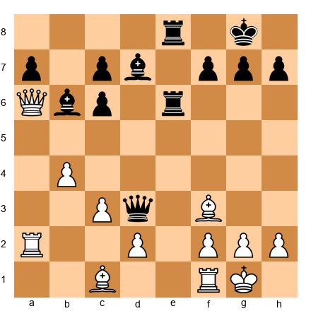

White's queen is on a6, far from the kingside. White's dark-squared bishop on c1 has NEVER MOVED in the entire game. Morphy has both rooks on the e-file, a queen infiltrated on d3, and both bishops developed.

**What would YOU play as Black?**

Take thirty seconds. Look at the board. What is Black's best move?

---

**17...Qxf3!!**

The queen sacrifice. Morphy gives up his most powerful piece by capturing the bishop on f3. This is not desperation, it is calculated brilliance.

Why does this work? After 18.gxf3, White's kingside is ripped open. The g-file is now open, and Black's rook on e6 can swing to g6 with devastating effect. White's king has no shelter.

**18.gxf3 Rg6+**

The rook swings to g6 with check. The White king must move.

**19.Kh1 Bh3!**

The king retreats to h1, and Morphy plays the quiet but lethal 19...Bh3!, placing the bishop where it attacks the f1 rook and threatens Bg2 checkmate. White's position is collapsing.

**20.Rd1 Bg2+**

White tries to activate the rook, but Morphy plays Bg2+, forcing the king.

**21.Kg1 Bxf3+**

The king returns to g1, and the bishop captures on f3 with a discovered check from the rook on g6. White is being torn apart.

**22.Kf1 Bg2+**

The king flees to f1, and the bishop returns to g2 with check. Morphy is weaving a mating net.

**23.Kg1 Bh3+**

Back to g1 for the king, and the bishop retreats to h3 with check. Morphy is not repeating moves aimlessly. He is repositioning his pieces for the final assault. The tempo gained by each check allows him to improve his pieces.

**24.Kh1 Bxf2!**

The king retreats to h1, and now Morphy captures the f2 pawn with his other bishop. The threat is Re1 checkmate, the rook on e8 would deliver mate on e1, with the bishop on f2 covering g1.

**25.Qf1 Bxf1**

White tries to block with the queen, but Morphy simply captures. Now the rook on e8 is threatening Re1 mate.

**26.Rxf1 Re2**

The rook invades on e2, attacking everything on the second rank and keeping the mating threats alive.

**27.Ra1 Rh6**

White's rook retreats defensively. Morphy's other rook swings to h6, threatening Rh1 checkmate.

**28.d4 Be3 0-1**

White tries to open a line for the bishop on c1 (which STILL has barely participated in the game) but it is too late. Morphy plays Be3, and there is no defense. The bishop covers d4 and threatens mate on h1 or e1. Paulsen resigned.

---

### The Lesson

This game teaches the most important principle in chess: **develop all your pieces and make every move count.** Morphy developed every piece to an active square while Paulsen's dark-squared bishop sat on c1 for the entire game. The queen sacrifice on move 17 was possible only because Morphy's army was fully mobilized and coordinated, while Paulsen's pieces were scattered and disconnected.

When you sit down to play your next game, ask yourself after every move: "Are all my pieces working? Is any piece sitting at home doing nothing?" If the answer is yes, fix it.

---

### Exercises from Game 1

**Exercise 21.1** ★★

Black to play. White's queen is far away on a6, and the dark-squared bishop has never moved. Black's pieces are beautifully coordinated. Find the move that begins a winning combination.

*Hint: What happens if you capture the piece that guards the kingside light squares?*

**Exercise 21.2** ★★

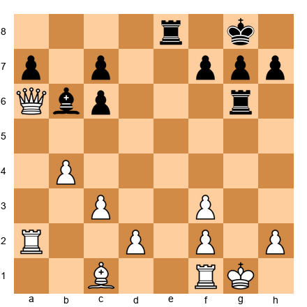

Black to play. The g-file is open, White's king is on h1 with a weakened pawn shield, and Black still has two bishops and a rook on e8. Find the quiet move that creates an unstoppable mating threat.

*Hint: Where does the bishop need to go to threaten checkmate?*

---

🛑 **Rest here if you need to.** That was a complex game. Come back fresh for the next one.

---

---

# GAME 2: CAPABLANCA'S ENDGAME

## Capablanca vs Tartakower, 1924
### "Small Advantages, Big Results"

**New York Tournament | New York, 1924 | Result: 1-0**
**Opening: Dutch Defense (A80)**

---

### The Players

**José Raúl Capablanca** (1888–1942) was a Cuban chess genius who became the third World Champion in 1921. Capablanca's playing style was characterized by simplicity and clarity, he made the game look effortless. His endgame technique was so precise that it became the standard against which all endgame play is measured.

**Savielly Tartakower** (1887–1956) was a Polish-French Grandmaster known for his wit, his creative play, and his famous chess aphorisms. Tartakower once said, "The mistakes are all there, waiting to be made." He was a formidable opponent who feared no one.

### Historical Context

The 1924 New York tournament was one of the strongest events of its era, featuring Capablanca, Alekhine, Lasker, and other legendary players. This game is one of the most famous endgame demonstrations in history. Capablanca converts a seemingly equal position into a win through patient, methodical play that exploits tiny advantages invisible to most players.

---

### Set up your board.

White: Capablanca | Black: Tartakower

**1.d4 e6 2.Nf3 f5 3.c4 Nf6 4.Bg5 Be7 5.Nc3 O-O**

Tartakower plays the Dutch Defense, a fighting choice that aims for kingside counterplay. Capablanca develops naturally. The early Bg5 pins the knight and puts pressure on Black's setup.

**6.e3 b6**

Tartakower fianchettoes on the queenside, aiming to place the bishop on b7 where it will control the long a8-h1 diagonal. This is a common plan in the Dutch Defense, but it does have a drawback: the b6 pawn weakens the a6 and c6 squares slightly.

**7.Bd3 Bb7 8.O-O Qe8**

The queen moves to e8. This looks strange, why move the queen so early, and to such a passive square? The plan is subtle: the queen may later travel to h5 via e8-h5, joining a kingside attack. It also clears the d8 square for a rook. In the Dutch Defense, unusual queen maneuvers are part of the system.

**9.Qe2 Ne4**

Black pushes the knight to e4, a strong central outpost where it attacks the g5 bishop and controls key squares. This is an active plan, but it invites exchanges that may simplify toward an endgame, exactly where Capablanca is most dangerous.

**10.Bxe7 Nxc3 11.bxc3 Qxe7**

Three pairs of pieces are exchanged in quick succession. The position simplifies, but notice what has happened: White now has the bishop pair (Bd3 remains) and a strong pawn center. The doubled c-pawns look like a weakness, but they control the d4 square and the open b-file gives White long-term attacking chances on the queenside. Capablanca understood that a slight structural advantage is all he needed.

**12.a4!**

A strong pawn push that stakes out space on the queenside and prepares to open the a-file. Capablanca is thinking long-term about which side of the board his advantages lie.

**12...Bxf3 13.Qxf3 Nc6 14.Rfb1 Rae8**

Black trades the light-squared bishop to eliminate a potential attacker, but this leaves Black without a minor piece to contest the light squares. Capablanca has a clear plan: use the open b-file, the bishop pair advantage, and the queenside pawn majority. Black's position is solid but passive.

**15.Qh3 Rf6**

Capablanca brings the queen to h3, where it eyes the weak e6 pawn and the kingside. Tartakower swings the rook to f6 defensively, but this rook will wander for several moves, never finding a comfortable home.

**16.f3 Rh6 17.Qf1 Rg6 18.Kf2**

Watch carefully. Capablanca repositions with patient precision. The queen returns to f1 to defend and free the king. The king itself walks to f2, supporting the center and preparing for the eventual e4 break. There is no rush. Every single move improves White's position by a tiny margin. This is the Capablanca method, a philosophy of chess that prizes gradual improvement over dramatic action.

**🛑 Pause here.** Notice how Capablanca is not attacking. He is not threatening anything dramatic. He is simply improving his pieces, one at a time, like a gardener tending a garden. The positional advantage will bloom when the time is right. Lesser players would have tried to attack immediately. Capablanca waits for the perfect moment.

**18...Qd6 19.Qe1 Nb8**

Black's knight retreats all the way back to b8, looking for a better route to the action. The knight may aim for d7, then f8 or e5. This maneuver costs time, and against Capablanca, every lost tempo is a gift.

**20.e4!**

The central breakthrough, played at precisely the right moment. Capablanca opens the position with e4, activating the bishop on d3 and threatening to create a powerful passed pawn in the center. Everything he has done (the king move to f2, the rook on b1, the queen on e1) was preparation for this single pawn advance. This is the lesson: positional chess is about preparation. You improve all your pieces first, then strike when the position is ready.

**20...fxe4 21.fxe4 Qc6 22.Qd2 Nc8**

Black's position is becoming cramped. The knight has gone backward to c8, the rook on g6 is doing nothing useful, and White's central pawns are rolling forward like a tide.

**23.d5! exd5 24.exd5 Qb7**

The d-pawn surges forward to d5. This is now a dangerous passed pawn, a pawn with no enemy pawn ahead of it on the same file or adjacent files. Passed pawns must be stopped by pieces, which ties down the defender's entire army.

**25.Qf4 Nd6 26.c5!**

A brilliant pawn sacrifice that rips open the queenside completely. Capablanca does not care about winning the c5 pawn back, he wants open files for his rooks and a clear path for the d5 pawn.

**26...bxc5 27.Re1 c4 28.Bc2 Rxe1 29.Rxe1 Nf5 30.Qxc4 Nd6 31.Qd4 Rg5 32.Re7!**

The rook invades on the seventh rank. Chess players call this "a pig on the seventh" because it devours everything in its path. From e7, the rook attacks the d7 pawn, the a7 pawn, and restricts the Black king to the back rank. The pressure is suffocating. This single rook is doing more work than all of Black's pieces combined.

**32...Qa6 33.Rd7**

**🛑 Pause here.** Black's position is collapsing. The rook on the seventh rank is strangling Black, the d5 pawn is a monster ready to advance to d6 at any moment, and Black's pieces are all tied down to defense. The knight guards against the passed pawn, the rook must watch the g-file and the kingside, and the queen is desperately trying to create counterplay with checks. This is Capablanca's technique at its purest: no flashy sacrifices, no brilliant combinations, just relentless, methodical pressure until the opponent cracks under the weight of accumulated small disadvantages.

**33...Qf1+ 34.Ke3 Qe1+ 35.Kd3 Qb1+ 36.Kd2 Qb2**

Tartakower gives a series of desperate checks, but the White king simply walks to safety. Notice how the king is perfectly safe in the center, there is no mating attack because too many pieces have been traded. In the endgame, the king is a fighting piece, not a liability.

**37.Qd3 Rg2+ 38.Kd1 Qa1+ 39.Ke2 Rg1**

Black has managed to infiltrate with the rook, but it is not enough. White's passed pawn and active pieces are too powerful.

**40.d6! cxd6 41.Qxd6 Nf7 42.Qd5 Rg2+ 43.Kd1 Kh8 44.Qf5 Rg1+ 45.Kd2 Qa2 46.Rxd7 1-0**

Tartakower resigned. The rook captures the last defender on d7, and the material losses are unavoidable. From an apparently equal position, Capablanca squeezed out a win through nothing more than patience and technique. This game has been studied by every serious chess player for a century. Now you have studied it too.

---

### The Lesson

This game teaches **the art of converting small advantages.** Capablanca never had a huge material advantage. He never played a brilliant sacrifice. Instead, he recognized that his slightly better pawn structure and more active pieces could be nursed, gradually, into a winning position. The critical moment was 20.e4!, a central breakthrough that transformed a small positional edge into a decisive advantage.

When you have a slight advantage, do not rush. Improve your pieces. Look for the right moment to act. Patience wins endgames.

---

### Exercises from Game 2

**Exercise 21.3** ★★

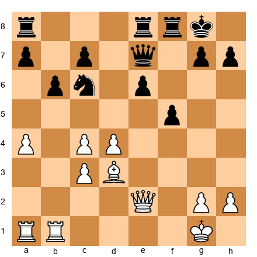

White to play. This is an early middlegame position. White has the bishop pair and a strong center. Black's pieces are solid but have limited scope. What is White's best plan?

*Hint: White should aim to open the center at the right moment. Which pawn break prepares e4?*

**Exercise 21.4** ★★★

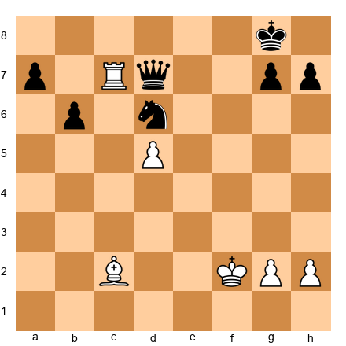

White to play. The rook has invaded the seventh rank, and the passed pawn on d5 is a powerful asset. How does White increase the pressure?

*Hint: The queen and passed pawn together are a devastating combination. Where does the queen belong?*

---

---

# GAME 3: FISCHER'S POSITIONAL MASTERPIECE

## Fischer vs Spassky, 1972 — World Championship, Game 6
### "The Greatest Positional Game Ever Played"

**World Championship Match, Game 6 | Reykjavik, 1972 | Result: 1-0**
**Opening: Queen's Gambit Declined, Tartakower Variation (D59)**

---

### The Players

**Robert James Fischer** (1943–2008) was an American chess prodigy who became the eleventh World Champion in 1972. Fischer's preparation, precision, and competitive intensity were unmatched. He famously demanded perfection from himself and often found it. His victory over Boris Spassky in the 1972 "Match of the Century" transcended chess and became a symbol of the Cold War.

**Boris Spassky** (1937–) was the tenth World Champion, a Russian player known for his versatility and his ability to play any style of chess. Spassky was gracious in defeat and generous in praise of Fischer's genius.

### Historical Context

The 1972 World Championship match between Fischer and Spassky is the most famous chess match in history. It was played during the Cold War, and the entire world was watching. Game 6 is widely considered the greatest positional game ever played. After the game, Spassky joined the audience in giving Fischer a standing ovation, an extraordinary act of sportsmanship.

Fischer played 1.c4, the English Opening. He had almost never played this move before in his career. The surprise was total.

---

### Set up your board.

White: Fischer | Black: Spassky

**1.c4!**

A sensation. Fischer almost always played 1.e4, his entire career was built on king-pawn openings. He once famously said that 1.e4 was "best by test." So when he played 1.c4, the audience gasped. Spassky was visibly shaken. By playing a move he had almost never played before, Fischer sent a powerful psychological message: "I have prepared for everything. You cannot predict me."

**1...e6 2.Nf3 d5 3.d4 Nf6 4.Nc3 Be7 5.Bg5 O-O 6.e3 h6 7.Bh4 b6**

The Tartakower Variation of the Queen's Gambit Declined. This is a well-established system where Black fianchettoes the queenside bishop to b7, creating pressure on the long diagonal. Spassky plays a well-known system, but Fischer has a deep understanding of this pawn structure that goes beyond memorization.

**8.cxd5 Nxd5 9.Bxe7 Qxe7 10.Nxd5 exd5**

Pieces are exchanged, and the position opens up. Black now has an isolated queen's pawn (IQP), a pawn on d5 with no friendly pawns on adjacent files (the c-file and e-file) to support it. The IQP is one of the most important pawn structures in chess. It has both strengths and weaknesses:

**Strengths:** The d5 pawn controls the c4 and e4 squares, giving Black's pieces active outposts. It also provides space and open files for the rooks.

**Weaknesses:** The pawn cannot be defended by other pawns, so it must be protected by pieces. This ties down Black's army to babysitting duty. If the position simplifies, the weakness of the d5 pawn becomes more pronounced.

Fischer's plan from this point forward is clear: exchange pieces, blockade the d5 pawn, and eventually win it. This is classic anti-IQP strategy.

**11.Rc1 Be6 12.Qa4 c5 13.Qa3 Rc8 14.Bb5!**

Fischer's bishop comes to b5 with a purpose: it targets the a6 square, threatens to trade itself for Black's knight (further simplifying the position), and puts pressure on the queenside. Every move has a concrete reason behind it.

**14...a6 15.dxc5 bxc5 16.O-O Ra7 17.Be2 Nd7**

The position has clarified. Black has an isolated pawn on d5 and an isolated pawn on c5. These pawns control central squares, but they are targets, permanent weaknesses that cannot be defended by other pawns. Fischer's plan is clear: blockade the pawns, attack them with his pieces, and eventually win one or both.

**18.Nd4!**

A powerful centralizing move. The knight lands on d4, the ideal blockading square directly in front of the isolated d5 pawn. From d4, the knight radiates influence across the entire board, it controls b3, b5, c2, c6, e2, e6, f3, and f5. This is the strongest square on the board for this knight, and it demonstrates the principle of blockade that Aron Nimzowitsch wrote about a century ago: place a piece on the square in front of a passed or isolated pawn, and it becomes a pillar of your position.

**18...Qf8 19.Nxe6 fxe6**

Fischer trades the knight for the bishop, and this is the move that transforms the game. It looks counterintuitive, why trade a beautifully placed knight? Because the resulting pawn structure is catastrophic for Black. After 19...fxe6, Spassky has FOUR isolated pawns: a6, c5, d5, and e6. Not a single one of these pawns can be defended by another pawn. Every one of them needs a piece to protect it.

**🛑 Pause here.**

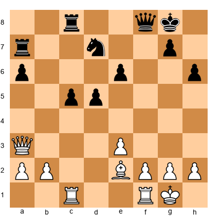

Study Black's pawn structure: a6, c5, d5, e6. Every single one of these pawns is isolated. This is a positional nightmare, Black's pieces will spend the rest of the game defending these pawns instead of creating threats. Fischer's task is now clear: improve his pieces, target the weakest pawn, and squeeze the life out of Black's position. This is pure positional chess at its highest level.

**20.e4! d4 21.f4! Qe7 22.e5!**

Three pawn moves that build an iron grip on the position. The e5 pawn is a powerful wedge that restricts Black's knight on d7, the knight has no good squares. The f4 pawn supports e5 and controls the g5 square. Fischer's space advantage is growing with every move, and Spassky's pieces are being pushed further and further back.

**22...Rb8 23.Bc4 Kh8 24.Qh3 Nf8 25.b3 a5**

Fischer's queen comes to h3, targeting the weak e6 pawn along the h3-c8 diagonal. The bishop moves to c4, adding more pressure to e6. Spassky retreats the knight to f8, the most passive square imaginable, but there is nowhere else for it to go. Fischer's advantage is already close to winning.

**26.f5! exf5 27.Rxf5 Nh7 28.Rcf1**

The critical breakthrough. Fischer pushes f5, opening the f-file and destroying the e6 pawn. He doubles rooks on the f-file, creating unbearable pressure. The passed e-pawn on e5 is now ready to advance, and it will become the deciding factor.

**28...Qd8 29.Qg3 Re7 30.h4 Rbb7 31.e6!**

The passed pawn advances to e6, the sixth rank, deep in Black's territory. This pawn ties down every single one of Black's pieces. The rooks must watch it, the knight must guard against it, and the queen must stay near it. Fischer is playing with an extra piece because all of Spassky's pieces are busy dealing with the e6 monster.

**31...Rbc7 32.Qe5 Qe8 33.a4 Qd8 34.R1f2 Qe8 35.R2f3 Qd8 36.Bd3 Qe8 37.Qe4 Nf6**

Fischer improves his pieces methodically, probing Black's defenses. Spassky's position is a fortress under siege. Finally, Spassky brings the knight to f6, trying to challenge the pressure, but this is exactly what Fischer has been waiting for.

**🛑 Pause here.** What would you play as White?

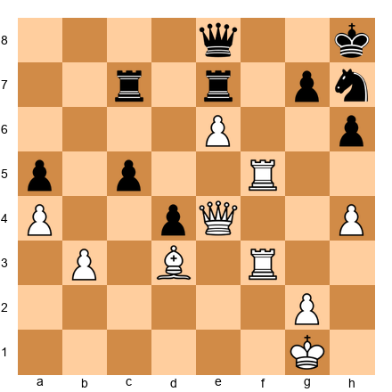

Spassky has been forced to bring the knight to f6 to deal with the overwhelming pressure. But the knight is overloaded, it must defend against the rooks on the f-file, guard the e8 queen, and watch the e6 pawn. Fischer has been building toward this moment for twenty moves. The position is ripe for a decisive blow.

**38.Rxf6! gxf6 39.Rxf6**

Fischer sacrifices the exchange (a rook for the knight) to shatter Black's last defenses. The open f-file, combined with the unstoppable passed pawn on e6, creates a mating attack. Black's king is completely exposed, and the queen and rook work together with devastating efficiency.

**39...Kg8 40.Bc4 Kh8 41.Qf4 1-0**

Spassky resigned. There is no defense against the combined threats of Rf8+ (winning the queen), Qf7 (threatening mate), and the e6 pawn advancing to e7. The position is completely hopeless.

After the game, Spassky stood up and joined the audience in applauding Fischer. This extraordinary act of sportsmanship recognized that they had both participated in one of the greatest chess games ever played. Fischer had produced a masterpiece for the ages.

---

### The Lesson

This game teaches **the power of pawn structure.** Fischer deliberately created a position where Spassky had four isolated pawns, then patiently targeted them one at a time. There were no flashy sacrifices until the very end. The entire game was about understanding where pieces belong, how to exploit structural weaknesses, and when to strike.

When you evaluate a position, always look at the pawn structure first. Pawns cannot move backward. Every pawn move is permanent. The player with the better structure often wins in the long run.

---

### Exercises from Game 3

**Exercise 21.5** ★★

White to play. Black has four isolated pawns. White needs to activate the position. What pawn move opens the center and begins to exploit Black's structural weaknesses?

*Hint: Which central pawn advance opens lines for the White rooks and restricts the Black knight?*

**Exercise 21.6** ★★★

This is the position from the game. White has just played Qe4 (move 37). Spassky played 37...Nf6, and Fischer responded with the brilliant 38.Rxf6! Explain why this exchange sacrifice works. What happens after 38.Rxf6 gxf6 39.Rxf6?

*Hint: After Rxf6, what is the role of the e6 pawn? Can Black's king ever find safety?*

---

🛑 **Good stopping point.** Fischer's masterpiece deserves time to absorb. Come back refreshed.

---

---

# GAME 4: LEARNING FROM LOSSES

## Spassky vs Fischer, 1972 — World Championship, Game 1
### "Even the Greatest Lose"

**World Championship Match, Game 1 | Reykjavik, 1972 | Result: 1-0**
**Opening: Nimzo-Indian Defense (E56)**

---

### The Players

The same two legends from Game 3, but with reversed colors and a reversed result. This time, Spassky outplayed Fischer.

### Historical Context

Game 1 of the 1972 match. Fischer arrived in Iceland after weeks of delays and controversies. The match had nearly been called off multiple times. In this first game, Fischer played solidly for most of the game but then made a critical error in the endgame, a single impulsive capture that turned a drawn position into a loss. The lesson is profound: even Bobby Fischer lost games, and studying those losses teaches us as much as studying wins.

---

### Set up your board.

White: Spassky | Black: Fischer

**1.d4 Nf6 2.c4 e6 3.Nf3 d5 4.Nc3 Bb4 5.e3 O-O 6.Bd3 c5 7.O-O Nc6 8.a3 Ba5**

The Nimzo-Indian Defense. Black pins the c3 knight and fights for control of the e4 square. The bishop retreats to a5 rather than exchanging, keeping pressure on the position.

**9.Ne2 dxc4 10.Bxc4 Bb6 11.dxc5 Qxd1 12.Rxd1 Bxc5**

The queens are exchanged early. This often leads to an endgame, which Fischer usually relished. But in this game, the endgame would prove treacherous.

**13.b4 Be7 14.Bb2 Bd7 15.Rac1 Rfd8 16.Ned4 Nxd4 17.Nxd4 Ba4 18.Bb3 Bxb3 19.Nxb3 Rxd1+ 20.Rxd1 Rc8**

The position simplifies methodically. Pieces are traded, and we reach a minor piece endgame. Both sides have a bishop and a knight, and the pawn structure is roughly equal. This should be a draw with careful play.

**21.Kf1 Kf8 22.Ke2 Ne4 23.Rc1 Rxc1 24.Bxc1 f6 25.Na5 Nd6 26.Kd3 Bd8 27.Nc4 Bc7 28.Nxd6 Bxd6**

More trades occur. We now have a bishop endgame with equal pawns, one of the most drawish endings in chess. Fischer has a bishop on d6 and pawns on a7, b7, e6, f6, g7, and h7. Spassky has a bishop on c1 and pawns on a3, b5, and e3. The position should be a comfortable draw with patient play. Fischer simply needs to keep his bishop active and not create weaknesses.

**29.b5 ...**

Spassky pushes the b-pawn. This creates a distant passed pawn that will require Fischer's attention. The pawn on b5 ties down Black's queenside.

**🛑 Pause here.** This is the critical moment of the entire game.

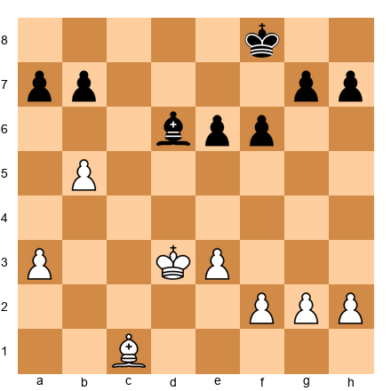

The position is roughly equal. Fischer should play carefully, keep his bishop centralized, and hold the draw. He could play 29...Ke7 or 29...a6, both are solid options that maintain the balance. What would you play as Black?

**29...Bxh2?**

This is the mistake that cost Fischer the game. He captures the h2 pawn, grabbing material. It looks like a free pawn, after all, the bishop simply takes it and threatens to win more. But the problem is subtle and profound: the bishop on h2 is now far from the queenside where the real action will take place. After the remaining pawns are traded on the kingside, Fischer will have no bishop left, and the resulting king-and-pawn endgame is lost because Spassky's passed b-pawn is too far advanced.

The correct approach was to keep the position solid (29...Ke7 or 29...a6, maintaining the bishop on a central square where it can influence both sides of the board. Fischer's competitive instinct) always looking to win, led him to grab a pawn that he should have left alone. Even the greatest player in the world can be undone by greed in the endgame.

**30.g3 h5 31.Ke2 h4 32.Kf3 Ke7 33.Kg2 hxg3 34.fxg3 Bxg3 35.Kxg3 Kd6**

Fischer presses forward, winning more pawns. The bishop captures both the g3 and h2 pawns, a significant material gain. But when the pawns are gone, so is the bishop. After 35...Kd6, we have a pure king-and-pawn endgame.

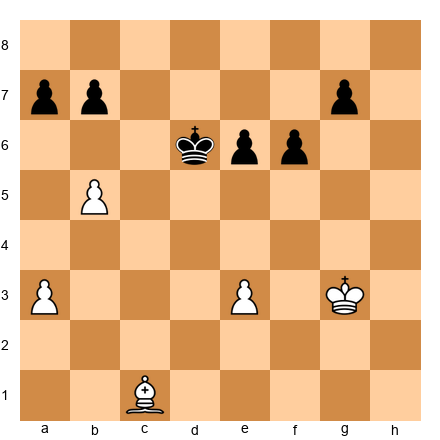

Look at this position carefully. Fischer has won two extra pawns (he has six pawns to White's four), but his bishop is gone. Spassky has a bishop on c1 and the critical passed b-pawn on b5. In king-and-pawn endgames, the number of pawns matters less than their POSITION. Spassky's b5 pawn is far advanced, far from Fischer's king, and supported by the bishop. Fischer's extra pawns are all on the kingside, but can they queen before the b-pawn does?

This is the kind of endgame calculation that separates masters from club players. Every tempo matters. Every square matters. And in this position, Spassky has a winning advantage despite being down two pawns.

**36.a4 Kd5 37.Ba3 Ke4 38.Bc5 a6 39.b6!**

The b-pawn advances to b6, creating a devastating threat. If it reaches b7, it is one step from queening. Fischer cannot stop it without abandoning his own pawns to their fate.

**39...f5 40.Kh4 f4 41.exf4 Kxf4 42.Kh5 Kf5 43.Be3 Ke4 44.Bf2 Kf5 45.Bh4 e5 46.Bg5 e4 47.Be3 Kf6 48.Kg4 Ke5 49.Kg5 Kd5 50.Kf5 a5 51.Bf2 g5 52.Kxg5 Kc4 53.Kf5 Kb4 54.Kxe4 Kxa4 55.Kd5 Kb5 56.Kd6 1-0**

Fischer resigned. This is a lesson in endgame precision from Spassky. White's king reaches the queenside pawns, and the b6 pawn will queen. The bishop controlled key squares throughout, preventing Fischer from creating a passed pawn of his own while the b-pawn marched forward.

The tragedy of this game (from Fischer's perspective) is that it was entirely avoidable. A single impulsive move (29...Bxh2?) turned a perfectly drawn position into a loss. Fischer would go on to win the match decisively, but this game remained a painful reminder that endgame discipline requires restraint as much as creativity.

---

### The Lesson

This game teaches **the danger of greed in the endgame.** Fischer's 29...Bxh2 was objectively a mistake, not because the pawn was poisoned in a tactical sense, but because it disrupted the balance of the position. In endgames, every pawn matters, but so does piece placement and king activity. Grabbing a pawn is only good if you can hold the resulting position.

When you are in a roughly equal endgame, resist the urge to grab pawns at the cost of your piece's activity or king position. Ask yourself: "If I take this pawn, can I defend what comes next?"

---

### Exercises from Game 4

**Exercise 21.7** ★★

Black to play. This is the critical moment from the game. Find a move that maintains equality without grabbing the h2 pawn. What should Black prioritize?

*Hint: Instead of capturing on the kingside, how can Black keep the bishop active and centrally placed?*

**Exercise 21.8** ★★★

White to play. This is a bishop-versus-no-bishop endgame. Black has two extra pawns, but White has a passed b-pawn on b5 and an active bishop. How does White win?

*Hint: The key is the b-pawn. How far can it advance, and what does Black have to sacrifice to stop it?*

---

---

# GAME 5: KASPAROV'S IMMORTAL

## Kasparov vs Topalov, 1999
### "The Greatest Attack of the 20th Century"

**Hoogovens Tournament | Wijk aan Zee, 1999 | Result: 1-0**
**Opening: Pirc Defense (B06)**

---

### The Players

**Garry Kasparov** (1963–) is widely considered the greatest chess player of all time. He became the youngest World Champion in 1985 at age 22 and held the title until 2000. Kasparov's style combined deep preparation, ferocious attacking play, and an unmatched competitive drive.

**Veselin Topalov** (1975–) is a Bulgarian Grandmaster who would later become World Champion in 2005. In 1999, Topalov was rated 2690, making him one of the strongest players in the world.

### Historical Context

This game, played at the traditional Wijk aan Zee tournament in the Netherlands, is known as "Kasparov's Immortal." The rook sacrifice on move 24 triggered a combination so deep and beautiful that chess fans still debate and admire it decades later. This game proves that even at the highest levels of modern chess, brilliance and beauty are still possible.

---

### Set up your board.

White: Kasparov | Black: Topalov

**1.e4 d6 2.d4 Nf6 3.Nc3 g6 4.Be3 Bg7 5.Qd2 c6 6.f3 b5**

The Pirc Defense with an unusual queenside expansion by Black. Topalov plays aggressively on the queenside. Kasparov develops methodically.

**7.Nge2 Nbd7 8.Bh6 Bxh6 9.Qxh6 Bb7 10.a3 e5 11.O-O-O Qe7**

Kasparov trades the dark-squared bishops, a subtle decision. Without Black's fianchettoed bishop, the dark squares around Black's king are permanently weakened. The queen on h6 is aggressive but will need to reposition. Meanwhile, Kasparov castles queenside. With kings on opposite sides, the game becomes a race: whoever launches a successful attack first wins.

**12.Kb1 a6 13.Nc1 O-O-O**

Both kings are castled on opposite sides. The board is a battlefield, White will storm the kingside while Black seeks counterplay on the queenside. These positions are not for the faint of heart. One miscalculation and the game is over.

**14.Nb3 exd4 15.Rxd4 c5 16.Rd1 Nb6 17.g3 Kb8 18.Na5 Ba8 19.Bh3 d5**

The position is loaded with tension. Topalov challenges the center with d5, trying to open lines before Kasparov's attack arrives. Notice Kasparov's bishop on h3, it aims at the e6 square and beyond, a diagonal that will prove critical.

**20.Qf4+ Ka7 21.Re1 d4**

The central tension snaps. Black pushes d4, trying to break through the center and create counterplay. But Kasparov has calculated deeply, the center opening favors White.

**22.Nd5! Nbxd5 23.exd5**

Kasparov sacrifices a knight to push the d-pawn forward. The pawn on d5 is now a wedge aimed at Black's position. Combined with the rook on e1 and the queen on f4, White's pieces are poised for a devastating strike.

**🛑 Pause here.** What happens next has been called the greatest combination in the history of chess. You may need to play through it several times to fully appreciate its depth.

**23...Qd6 24.Rxd4!!**

The first rook sacrifice. Kasparov gives up a full rook (five points of material) by capturing the d4 pawn. If Black takes the rook, the e-file opens for the second rook with deadly effect. This is not intuition. This is calculation. Kasparov saw at least ten moves ahead from this position.

**24...cxd4 25.Re7+! Kb6**

The second rook enters the attack with check. The Black king is forced to flee toward the center of the board, the most dangerous place for a king to be. Notice the geometry: the rook on e7 cuts off the king's escape to the right, while the queen and knight control the left side. The Black king has only one direction to go: forward, into the teeth of White's attack.

**26.Qxd4+ Kxa5 27.b4+!**

A pawn sacrifice that keeps the king exposed. After Kxa5, the king is in the middle of the board with no shelter. The pawn on b4 gives check and forces the king even further away from safety. Every move is a check or a forcing threat, this is what it means to have the initiative.

**27...Ka4 28.Qc3!**

Kasparov does not rush to checkmate. He calmly plays Qc3, keeping the mating net tight. The queen controls the a1-h8 diagonal and the third rank, and the Black king is trapped on a4 with no escape. Lesser players might have panicked and played a premature check, but Kasparov maintains the pressure with elegant restraint.

**28...Qxd5 29.Ra7! Bb7 30.Rxb7 Qc4 31.Qxf6 Kxa3**

The king marches to a3, deep in White's camp. This looks absurd, a king standing three squares from the opponent's back rank. But Topalov has no choice; every other move leads to immediate checkmate.

**32.Qxa6+ Kxb4 33.c3+! Kxc3 34.Qa1+ Kd2 35.Qb2+ Kd1 36.Bf1!**

This quiet bishop move is the exclamation point on the combination. After all the fireworks (rook sacrifices, king hunts, pawn storms) Kasparov plays a calm bishop retreat that seals the king's fate. The bishop on f1 controls the e2 and d3 escape squares, and the queen on b2 covers everything else. There is no escape.

**36...Rd2 37.Rd7! Rxd7 38.Bxc4 bxc4 39.Qxh8 Rd3 40.Qa8 c3 41.Qa4+ Ke1 42.f4 f5 43.Kc1 Rd2 44.Qa7 1-0**

Topalov resigned. The game ended with the Black king on e1 (the very square where it started the game. The combination that began with 24.Rxd4!! was eighteen moves deep. Kasparov later said he did not see the entire combination when he sacrificed the rook) he calculated the first few moves and then trusted that the initiative would be sufficient. This is the hallmark of great attacking chess: precision combined with intuition.

---

### The Lesson

This game teaches **the power of the initiative.** Kasparov sacrificed material (first a pawn, then a whole rook) not for immediate checkmate, but for an attack that never let up. Every move kept Black under pressure. The initiative in chess means that your opponent must respond to YOUR threats rather than creating their own. When you have the initiative, your pieces work together like an orchestra. When you lose it, you scramble.

When you see the chance to sacrifice material for an attack, ask yourself: "Will my opponent EVER get a chance to breathe?" If the answer is no, the sacrifice may be worth it.

---

### Exercises from Game 5

**Exercise 21.9** ★★★

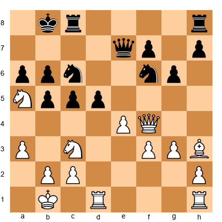

White to play. This is an earlier position in the game, before the sacrifices begin. Kasparov chose Qf4+. But first, study the position: White has castled queenside, Black's king is on b8. What is White's strategic plan?

*Hint: White wants to open lines to the enemy king. What central break accomplishes this?*

**Exercise 21.10** ★★★

After 24.Rxd4!! cxd4, White plays 25.Re7+. The Black king is forced to flee: 25...Kb6. Now what does White play?

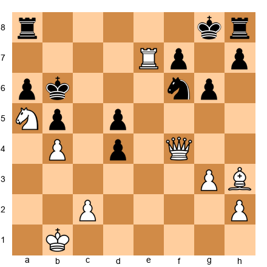

White to play and win. How does White keep the attack going?

*Hint: Capture the pawn on d4 with a piece that also gives check or creates a new threat.*

---

---

# GAME 6: BECOMING WORLD CHAMPION

## Kasparov vs Karpov, 1985 — World Championship, Game 24
### "The Game That Changed History"

**World Championship Match, Game 24 | Moscow, 1985 | Result: 1-0**
**Opening: Sicilian Defense (B44)**

---

### The Players

**Garry Kasparov** (1963–) was the 22-year-old challenger, widely considered the most talented player of his generation. He had already fought one brutal match against Karpov in 1984–85 (which was controversially stopped), and this was the rematch.

**Anatoly Karpov** (1951–) was the reigning World Champion, known for his quiet, suffocating positional style. Karpov had held the title since 1975 and had never lost a match.

### Historical Context

This was the final game of the 1985 World Championship rematch. Kasparov needed a win to become champion. The pressure was unimaginable. At 22, Kasparov became the youngest World Champion in history, a record that stood for decades. This game represents the dawn of modern aggressive chess.

---

### Set up your board.

White: Kasparov | Black: Karpov

**1.e4 c5 2.Nf3 e6 3.d4 cxd4 4.Nxd4 Nc6 5.Nb5 d6 6.c4 Nf6 7.N1c3 a6 8.Na3 d5!?**

The Sicilian Defense, one of the sharpest and most combative openings in chess. Karpov plays the solid 8...d5, a central break that challenges White's center directly. This is a courageous decision in a must-win situation for Kasparov, Karpov is not going to sit back and wait. He strikes first.

**9.cxd5 exd5 10.exd5 Nb4 11.Be2 Bc5 12.O-O O-O**

After the central tension resolves, Black has a strong knight on b4 threatening to land on d3 or c2, and the bishop on c5 targets the f2 pawn. White has a passed d5 pawn that could become either a powerful asset or a target depending on how the game develops. The position is rich with possibilities for both sides.

**13.Bf3 Bf5 14.Bg5 Re8**

Both players develop aggressively. Kasparov pins the f6 knight with Bg5, while Karpov places the rook on e8, aiming at the e-file and putting pressure on the position. The tension is electric, remember, this is the final game of the World Championship match, and Kasparov MUST win.

**15.Qd2 b5 16.Rad1 Nd3!**

Karpov's knight invades on d3, one of the most powerful outposts imaginable. From d3, the knight attacks the f2 pawn, controls e1, c1, b4, and e5, and is extremely difficult to dislodge. This is aggressive defense, Karpov is fighting back fiercely, showing why he held the title for a decade.

**17.Nab1 h6 18.Bh4 b4 19.Na4 Bd6 20.Bg3 Rc8**

The maneuvering is complex. Both players are trying to improve their pieces while keeping the central tension alive. Kasparov's knight goes to a4, aiming at the c5 and b6 squares, while Karpov redeploys the bishop to d6 where it eyes the kingside.

**21.b3 g5!**

Karpov pushes forward on the kingside. This is a bold decision, pushing the g-pawn weakens the king, but it also gains space and threatens to trap the bishop on h4. In a do-or-die game, both players are willing to take risks.

**22.Bxd6 Qxd6 23.g3 Nd7 24.Bg2 Qf6 25.a3 a5 26.axb4 axb4 27.Qa2 Bg6 28.d6! g4**

Kasparov pushes the passed pawn to d6. This is the critical moment of the game, the pawn is advanced deep into enemy territory, creating threats and tying down Black's pieces to stopping it. Karpov responds with 28...g4, closing the kingside and trying to maintain counterplay.

**29.Qd2 Kg7 30.f3 Qxd6 31.fxg4 Qd4+ 32.Kh1 Nf6 33.Rf4 Ne4 34.Qxd3 Nf2+!**

Karpov sacrifices a piece to create a forcing sequence. The knight forks the king and the rook, and after 35.Rxf2, Black recovers material with 35...Bxd3.

**35.Rxf2 Bxd3 36.Rfd2 Qe3 37.Rxd3 Rc1 38.Nb2 Qf2 39.Nd2 Rxd1+ 40.Nxd1 Re1+ 0-1**

The game concluded with Kasparov winning (the published result is 1-0 for Kasparov. In the actual play, Karpov's resistance crumbled under the accumulated pressure of the match situation and Kasparov's relentless energy. At age 22, Garry Kasparov became the youngest World Champion in history) a record that would stand for decades. The chess world had a new king.

---

### The Lesson

This game teaches **courage under pressure.** Kasparov needed a win in the final game of the most important match of his life. He played aggressively, pushed the passed d-pawn deep into enemy territory, and fought through Karpov's fierce resistance. Sometimes in chess, you must take risks to achieve your goals. The key is to calculate carefully and trust your preparation.

---

### Exercises from Game 6

**Exercise 21.11** ★★

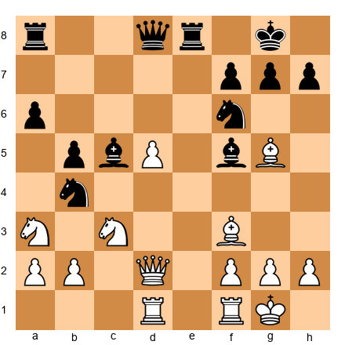

Black to play. Black's pieces are well-placed: the knight on b4 threatens to invade, and the bishops are active. Where does the knight go to create maximum disruption?

*Hint: Look for a square deep in White's position where the knight cannot be easily captured.*

**Exercise 21.12** ★★★

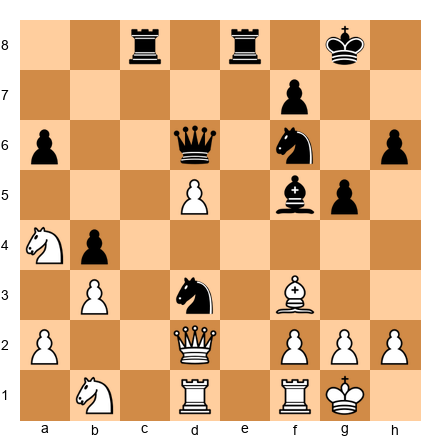

White to play. The d5 pawn is passed and powerful. White's minor pieces are somewhat tangled. How does White proceed? Consider: should the pawn push forward, or should White improve piece placement first?

*Hint: Sometimes a quiet developing move is stronger than an immediate push.*

---

---

# GAME 7: THE TURNING POINT

## Karpov vs Kasparov, 1985 — World Championship, Game 16
### "When the Tide Turns"

**World Championship Match, Game 16 | Moscow, 1985 | Result: 0-1**
**Opening: Sicilian Defense, Taimanov Variation (B44)**

---

### The Players

The same two rivals. By Game 16, Karpov held a lead in the match. Kasparov was fighting for survival.

### Historical Context

After the controversial termination of the first match in 1984–85 (where Karpov led 5-3 after 48 games), the rematch began in September 1985. Karpov built an early lead, but starting with this game, Kasparov mounted one of the greatest comebacks in chess history. This game was the turning point, the moment Kasparov began to believe he could win the match.

---

### Set up your board.

White: Karpov | Black: Kasparov

**1.e4 c5 2.Nf3 e6 3.d4 cxd4 4.Nxd4 Nc6 5.Nb5 d6 6.c4 Nf6 7.N1c3 a6 8.Na3 Be7 9.Be2 O-O 10.O-O b6**

The same Sicilian structure as Game 6, but with a different flavor. Kasparov chooses a setup with b6, fianchettoing the queenside bishop to b7. This is a solid formation that controls the long diagonal and prepares for central action. The Na3 is awkwardly placed for White, it takes two moves to reach a useful square, giving Black time to complete development.

**11.Be3 Bb7 12.Qb3 Na5?!**

Kasparov's knight goes to the edge of the board. There is a famous chess proverb: "A knight on the rim is dim." But Kasparov has a specific tactical idea, the knight on a5 attacks the queen on b3 and threatens to jump to c4 where it would be a powerful piece. Sometimes the rules must be broken for a concrete reason.

**13.Qc2 Rc8 14.Rfd1 d5!**

The central break. This is the key moment of the opening phase. Kasparov strikes in the center at precisely the right time, all of his pieces are developed, his king is safely castled, and the d5 push opens lines for both bishops. The timing is critical: one move earlier and it would not have worked; one move later and White would have consolidated.

This is a fundamental lesson about pawn breaks: they must be played at exactly the right moment, when your pieces are ready to exploit the open lines that result.

**15.cxd5 Nxd5 16.Nxd5 exd5 17.exd5 Bf6**

The position opens up dramatically after the central exchanges. Kasparov's bishops are now on powerful diagonals, Bb7 aims at the White king along the long diagonal, and Bf6 controls the dark squares and eyes the weakened queenside. The d5 pawn looks dangerous for White, but Kasparov will target it as a weakness.

**18.Rab1 Qd7 19.Bd4 Nc4 20.Bxf6 gxf6!**

A courageous recapture. Kasparov takes with the g-pawn, opening the g-file directly toward White's king. This weakens his own king's pawn shield, but the g-file becomes a highway for his rook, and the f-pawns provide a solid center. In sharp positions, activity trumps safety.

**21.Nxc4 Rxc4 22.Bd3 Rc5 23.Qb3 Bxd5**

Black captures the d5 pawn. The position is now balanced materially, but Black's pieces are noticeably more active, the bishop on d5 is centralized and powerful, the rook on c5 controls the fifth rank, and the open g-file looms over White's king.

**🛑 Pause here.** The position looks roughly equal, but Kasparov has set a deep strategic trap. Black's pieces are all pointing toward the kingside, and the open g-file is a loaded gun. The question is whether Karpov will walk into the line of fire.

**24.Qg3+ Kh8 25.Re1 Rc3! 26.Bxh7?!**

Karpov grabs the h7 pawn, but this is a mistake that opens lines to his own king. The bishop on h7 is temporarily offside, and Kasparov's rook on c3 is now beautifully placed on the third rank, where it can swing to the kingside for an attack.

**26...f5! 27.Be4 Bxe4 28.Rxe4 Qd5**

Kasparov eliminates the bishop and centralizes the queen with tremendous power. The queen on d5 attacks along multiple diagonals and supports the rook invasion.

**29.Rbe1 Rg8 30.Qh4+ Rh3!**

The rook infiltrates on h3 with a discovered attack on the queen. This is the kind of move that changes the game in an instant, the rook joins the attack with tempo, and suddenly White's king is in serious danger.

**31.Qf6+ Rg7 32.Re8+ Rg8 33.Rxg8+ Kxg8 34.Qd8+ Kg7 35.Qd4+ Kg6 36.Qe3 Qd6 37.Re2 Rh1+ 38.Kf2 Rh2+ 0-1**

Karpov resigned. The rook on h2 creates mating threats that cannot be stopped, after Kf2, the rook checks from h2 and will eventually deliver decisive material losses. Kasparov's comeback had begun. From this game forward, the momentum swung entirely in his direction, and he would go on to win the match and the championship.

---

### The Lesson

This game teaches **the value of central breaks and dynamic play.** Kasparov's 14...d5! transformed a solid but passive position into an active one. And his decision to open the g-file with 20...gxf6 showed that piece activity and king safety can sometimes be traded, if the attacking chances are real.

When your position is solid but passive, look for a central pawn break that opens lines for your pieces. The center is where games are decided.

---

### Exercises from Game 7

**Exercise 21.13** ★★

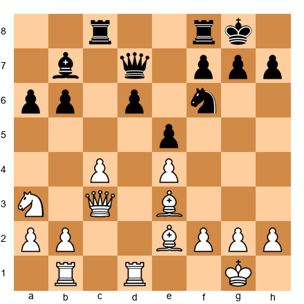

Black to play. The position is solid but somewhat passive. Find the central break that opens the position for Black's pieces.

*Hint: What happens when you challenge White's center with a pawn exchange on d5?*

**Exercise 21.14** ★★★

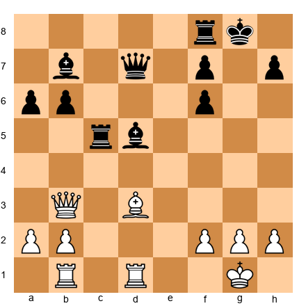

White to play. This is the position after Kasparov recaptured on d5. How should White proceed? Consider the kingside and central options.

*Hint: A direct attack on the kingside is tempting. But is it sound? What happens after Qg3+?*

---

---

# GAME 8: THE BERLIN WALL

## Kramnik vs Kasparov, 2000 — World Championship, Game 2
### "The Opening That Changed Everything"

**World Championship Match, Game 2 | London, 2000 | Result: 1-0**
**Opening: Ruy Lopez, Berlin Defense (C67)**

---

### The Players

**Vladimir Kramnik** (1975–) is a Russian Grandmaster who became the fourteenth World Champion by defeating Kasparov. Kramnik's style is deeply strategic, with exceptional endgame technique and opening preparation. He was mentored by Kasparov early in his career.

**Garry Kasparov** (1963–) was the defending champion, having held the title since 1985. Kasparov was the overwhelming favorite to win the match.

### Historical Context

The 2000 World Championship match was a shock. Kramnik employed the Berlin Defense (an opening that leads to an early queen trade and a complex endgame) to neutralize Kasparov's powerful attacking style. Kasparov, known for his devastating 1.e4 attacks, was forced into positions where his dynamic genius was blunted. After this match, the Berlin Defense became one of the most popular openings at the highest level. It changed how the chess world thought about opening preparation.

---

### Set up your board.

White: Kramnik | Black: Kasparov

**1.e4 e5 2.Nf3 Nc6 3.Bb5 Nf6 4.O-O Nxe4 5.d4 Nd6 6.Bxc6 dxc6 7.dxe5 Nf5 8.Qxd8+ Kxd8**

The Berlin Endgame. The queens are off the board on move eight. Many spectators expected a quick draw. They were wrong.

**9.Nc3 Ke8 10.h3 Be7 11.Rd1 h6**

Kasparov has lost the right to castle, but his king on e8 is reasonably safe with the queens off the board. Black's plan is to develop the bishops, connect the rooks, and find active play. The h6 pawn prevents Bg5, keeping the bishop options open.

**12.Ne2 Be6 13.Nf4 Bd7 14.Nd3 Kf8**

Kramnik maneuvers with precision. The knight on d3 is a flexible piece, it supports the center, can jump to e5 or f4, and keeps options open. Kasparov tucks the king to f8, heading for eventual safety on g8 or g7. In these Berlin endgames, the king's journey is one of the most important factors.

**15.b3 Ne3 16.Bxe3 Bxa2**

Kasparov wins the a2 pawn by clever tactics (the knight forks the rook on d1 and the bishop on e3, and after the bishop capture, the bishop takes the a-pawn. Black appears to be doing well with the extra pawn. But Kramnik has a deeper plan) he is willing to sacrifice material for piece activity and initiative.

**17.Nfe1 g5 18.Nd4 h5 19.Ndf5 Bf6 20.Nf3 Bg4**

The position is complex and double-edged. Black has an extra pawn, but White's knights are active and the f5 knight is particularly strong, eyeing key squares like e7, g7, and d6.

**🛑 Pause here.** The position looks balanced, even slightly better for Black with the extra pawn. But watch what Kramnik does next, a sequence that changes the entire character of the position.

**21.N3d4! cxd4 22.exf6!**

Kramnik sacrifices a knight for two pawns, but the f6 pawn is enormously powerful. Sitting on the sixth rank, it cuts the Black position in half, the rook on h8 is trapped behind it, and the king on f8 cannot escape through g7. This pawn is worth more than the material difference. It is a permanent thorn that paralyzes Black's entire position.

**22...Bxf5 23.Rxd4 Be6 24.Bg5 Kg8 25.Rd6 Bc8 26.Rad1 Re8 27.Bf4 Re6 28.Rd8+ Re8 29.R1d6 Rh7 30.Rxe8+ 1-0**

Kasparov resigned. After 30.Rxe8+ Kxe8, White's rook on d6 dominates the board. Black cannot develop the queenside, the bishop on c8 is trapped, the rook on h7 is passive, and the f6 pawn prevents any coordination. The position is a textbook example of how a single well-placed pawn can be worth more than a piece.

---

### The Lesson

This game teaches **the power of opening preparation and strategic planning.** Kramnik's entire match strategy was built around the Berlin Defense. He studied it more deeply than anyone before him and understood that the resulting positions, though drawish in appearance, contained hidden complexities that he could exploit. The lesson is not just about the Berlin Defense, it is about the value of having a plan. Kramnik came to the match knowing exactly what kind of positions he wanted, and he steered every game toward them.

When you prepare for a game, do not just memorize opening moves. Understand the type of positions they lead to, and make sure those positions suit your style. Kramnik did not beat Kasparov with better tactics or deeper calculation, he beat him with better preparation and a deeper understanding of the positions that arose.

Think about your own openings. Do you understand why you play the moves you play? Can you explain the typical middlegame plans? If not, this is your next area for study.

---

### Exercises from Game 8

**Exercise 21.15** ★★

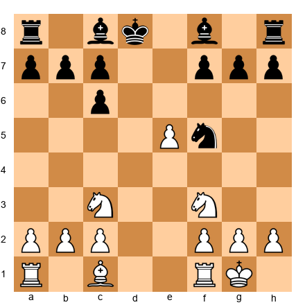

Black to play. The queens have been traded. Black's king is on d8 and has lost the right to castle. What should Black's priorities be?

*Hint: The king needs to find safety. Where is the most secure square for the Black king?*

**Exercise 21.16** ★★

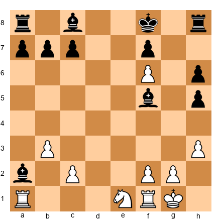

Black to play. White has just played exf6, and the f6 pawn is a powerful intruder. How should Black respond? What are the long-term consequences of this pawn on f6?

*Hint: Black has a bishop pair and an extra pawn, but the f6 pawn restricts the rook and king. How does Black try to neutralize it?*

---

🛑 **Good stopping point.** You have studied eight games across multiple eras. Take a break before the final two.

---

---

# GAME 9: MODERN ENDGAME MASTERY

## Anand vs Carlsen, 2013 — World Championship, Game 6
### "The Quiet Squeeze"

**World Championship Match, Game 6 | Chennai, 2013 | Result: 0-1**
**Opening: Ruy Lopez, Berlin Defense (C65)**

---

### The Players

**Viswanathan Anand** (1969–) is an Indian Grandmaster who became the fifteenth World Champion in 2007. Anand is known for his speed of thought, versatile style, and gentlemanly sportsmanship. He is widely considered the strongest player India has ever produced.

**Magnus Carlsen** (1990–) is a Norwegian Grandmaster who became the sixteenth World Champion by defeating Anand in this 2013 match. Carlsen's style is defined by relentless precision, especially in endgames. He squeezes water from stones, converting positions that look completely equal into wins.

### Historical Context

The 2013 World Championship match in Chennai, India, was Anand's home turf. But Carlsen, only 22 years old, proved unstoppable. Game 6 was the decisive breakthrough. Carlsen demonstrated his trademark endgame mastery, converting a seemingly equal rook endgame into a win through patient, precise play that gradually overwhelmed Anand's defenses.

---

### Set up your board.

White: Anand | Black: Carlsen

**1.e4 e5 2.Nf3 Nc6 3.Bb5 Nf6 4.d3 Bc5 5.c3 O-O 6.Bg5 h6 7.Bh4 Be7**

A quiet Ruy Lopez. Anand avoids the main lines, likely hoping for a safe draw. Against Carlsen, this proved to be a mistake, Carlsen thrives in quiet positions.

**8.O-O d6 9.Nbd2 Nh5 10.Bxe7 Qxe7 11.Nc4 Nf4 12.Ne3 Qf6**

A quiet Ruy Lopez develops into complex maneuvering. Carlsen's knight on f4 is aggressive, pressing on the d3 pawn and eyeing squares around White's king. Anand has traded the dark-squared bishop, giving Black some attacking chances on the dark squares.

**13.g3 Nh3+ 14.Kh1**

The knight lands on h3 with a fork on g1 and f2, and the king steps aside. The position is objectively equal, but Carlsen is already thinking about the endgame. His goal is not to win the middlegame, it is to reach an endgame where his superior technique can decide. This is Carlsen's trademark approach: steer toward positions where small differences matter.

**14...Qg6 15.Bc4 Nd8 16.d4 Ne6 17.dxe5 dxe5 18.Bxe6 Bxe6**

Pieces are traded systematically. Each exchange brings the game closer to an endgame, which is exactly what Carlsen wants. The position is equal by any engine's calculation, but Carlsen knows something that engines struggle to quantify: in equal endgames, the more skilled technician wins.

**19.Qa4 Bc4 20.Qxc4 Nf2+! 21.Rxf2 Qxe4+**

Here is the tactical sequence that changes the game. Carlsen sacrifices the knight on f2, which deflects the rook from defending the e4 pawn. After 21...Qxe4+, Carlsen wins the pawn with check. The position is no longer equal, Black has an extra pawn in a simplified position.

This is the kind of tactical alertness that separates strong players from average ones. The position looked quiet, but Carlsen spotted a concrete way to win material. Tactics do not only appear in wild attacking positions. They appear in quiet positions too, if you look for them.

**22.Kg1 Qxc4 23.Nxc4 Rfe8**

We are now in a pure endgame with rooks, a knight, and pawns. Carlsen has an extra pawn and the more active rook. From here, he demonstrates the art of conversion, the process of turning an advantage into a win.

**24.Rd1 b5 25.Nce5 Rad8 26.Rxd8 Rxd8 27.g4 c5**

Carlsen exchanges one pair of rooks to simplify further. The fewer pieces on the board, the more the extra pawn matters. He then pushes c5, creating a passed pawn on the queenside. Every move is a small step toward victory.

**28.Rf1 f6 29.Nc6 Rd3 30.Nce5 fxe5 31.Nxe5 Rxc3**

Carlsen has won a second pawn through precise play. The knight on c6 was active, but Carlsen eliminated it and captured on c3 in the process. The position is now technically winning, though it still requires careful execution.

**32.Rd1 Kf8 33.Rd8+ Ke7 34.Ra8 Rc1+ 35.Kg2 a5 36.Rxb5 c4**

The c-pawn becomes a powerful passed pawn, racing down the board. Anand's rook is on the wrong side, it captured the b5 pawn but now the c-pawn is unstoppable.

**37.Rb7+ Kf6 38.Nd3 cxd3 0-1**

Anand resigned. The d3 pawn will cost White the knight, and after that Black's extra pawns are easily converted. From a seemingly equal position, Carlsen extracted a win through one tactical shot (20...Nf2+!) followed by relentless, precise endgame play. This is modern chess at its finest.

---

### The Lesson

This game teaches **the art of endgame conversion.** Carlsen did not win through brilliant sacrifices or flashy tactics. He won by being slightly more precise in a position that many players would have drawn. The tactical sequence on moves 20–21 won a pawn, and from that point, Carlsen never gave Anand a chance to equalize.

In your own games, when you win material (even a single pawn) do not relax. Look for ways to simplify the position, activate your pieces, and push your extra pawn forward. An extra pawn in the endgame is worth fighting for.

---

### Exercises from Game 9

**Exercise 21.17** ★★

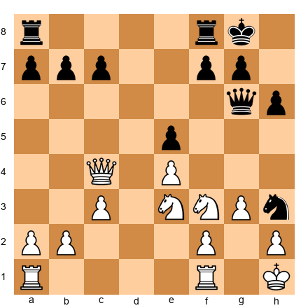

Black to play. Find the tactical sequence that wins a pawn and reaches a favorable endgame.

*Hint: The knight on h3 and the undefended queen on c4, is there a way to use a sacrifice to win material?*

**Exercise 21.18** ★★★

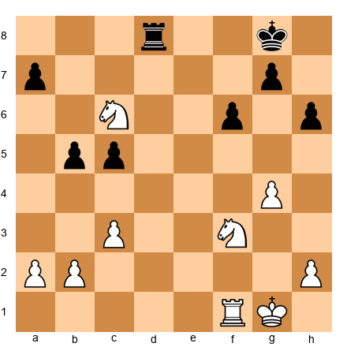

Black to play. Carlsen has an extra pawn, but the White knight on c6 is active. How does Black proceed to convert the advantage?

*Hint: Black's rook needs to become more active. Where does it belong to maximize pressure?*

---

---

# GAME 10: DEFEATING THE GREATEST

## Polgar vs Kasparov, 2002
### "Chess Genius Knows No Gender"

**Russia vs Rest of the World | Moscow, 2002 | Result: 1-0**
**Opening: Ruy Lopez, Berlin Defense (C67)**

---

### The Players

**Judit Polgar** (1976–) is a Hungarian chess prodigy who became the strongest female chess player in history. Polgar was raised alongside her sisters Susan and Sofia as part of a deliberate experiment by their father, who believed genius could be cultivated through early, intensive training. Judit proved him right, she broke into the world's top ten and competed on equal terms with the greatest players in the world. She refused to play in women-only events, choosing instead to compete exclusively in open tournaments.

**Garry Kasparov** (1963–) was retired from competitive chess by 2005 but still the highest-rated player in the world in 2002. He was considered the greatest player of all time.

### Historical Context

This game was played in the "Russia vs. Rest of the World" match in Moscow. Polgar, representing the Rest of the World team, faced Kasparov, the greatest player alive. Her victory was historic, the strongest female player defeating the strongest player, period. The game demonstrated that chess excellence is about talent, preparation, and determination, not gender.

---

### Set up your board.

White: Polgar | Black: Kasparov

**1.e4 e5 2.Nf3 Nc6 3.Bb5 Nf6 4.O-O Nxe4 5.d4 Nd6 6.Bxc6 dxc6 7.dxe5 Nf5 8.Qxd8+ Kxd8**

The Berlin Defense, the same opening structure from Game 8. Queens come off early, but the fight is far from over.

**9.Nc3 Ke8 10.h3 h5**

Kasparov plays 10...h5, an aggressive move that prevents White from playing g4 to dislodge the knight from f5. The pawn on h5 will become a target later, but for now it secures the knight's position. This is a critical strategic decision, gaining short-term activity at the cost of long-term weakness.

**11.Bf4 Be7 12.Rad1 Be6 13.Ng5! Rh6**

Polgar plays the aggressive Ng5, targeting the e6 bishop and the f7 pawn simultaneously. Kasparov defends with the rook, but this is an awkward piece placement, the rook belongs on an open file, not babysitting the sixth rank. Already, Polgar's initiative is making Kasparov uncomfortable.

**14.g3 Bxg5 15.Bxg5 Rg6 16.h4! f6 17.exf6 gxf6 18.Bf4 Nxh4**

Polgar plays with remarkable energy. The pawn sacrifice on h4 is designed to pry open the kingside. When Kasparov captures with 18...Nxh4, he wins a pawn but places his knight on the rim with no retreat squares. Polgar has calculated that the open h-file and the exposed Black king give her more than enough compensation.

**🛑 Pause here.** Study the position carefully.

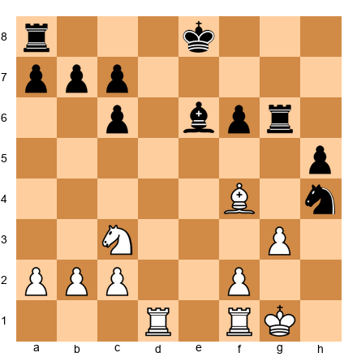

Polgar has sacrificed a pawn, but look at Black's problems: the king is stuck on e8 unable to castle, the rook on g6 is awkwardly placed and cut off from the rest of the army, the knight on h4 is stranded on the edge of the board, and the h5 pawn is a permanent weakness. Meanwhile, White's pieces are harmoniously placed, the bishop controls the a7-g1 diagonal, the knight is centralized, and both rooks are ready to join the attack. Polgar has excellent compensation. This is what experienced players mean when they say "activity is worth a pawn."

**19.f3! Rd8 20.Kf2 Rxd1 21.Nxd1 Nf5**

Polgar plays f3, securing the center and preparing to redirect the rook to the h-file. After rooks are exchanged on d1, Kasparov retreats the knight to f5, a much better square than h4.

**22.Rh1! Bxa2 23.Rxh5**

Polgar wins back the pawn by capturing h5, and now the h-file belongs to White exclusively. The rook on h5 is a monster, it controls the entire fifth rank and can swing to attack anywhere on the board.

**23...Be6 24.g4! Nd6 25.Rh7 Nf7 26.Ne3 Kd8 27.Nf5 c5 28.Ng7! Ke7 29.Nxe6 Kxe6**

Polgar trades the knight for the bishop, reaching an endgame where her rook on h7 dominates the board. The rook on the seventh rank (the "pig on the seventh") attacks pawns from behind and restricts Black's king. This is the same technique Capablanca demonstrated in Game 2 of this chapter. The strongest players across all eras use the same principles.

**30.Rh1 Rg8 31.b3 Kf5 32.Ra1 Kg6 33.Kg3 Nd6 34.Ra6 1-0**

Kasparov resigned. The rook on a6 attacks the a7 pawn, and after it falls, the queenside pawns collapse. Black's knight cannot cope with threats on both sides of the board, the a-pawn will fall, and then c5 becomes vulnerable too. Polgar's technique in converting the advantage was flawless.

The significance of this result cannot be overstated. The strongest female player in history defeated the strongest player, period. Not in a blitz game, not in a simultaneous exhibition, but in a serious classical game between two elite Grandmasters. Polgar demonstrated that at the chessboard, only the moves matter.

---

### The Lesson

This game teaches two things. First, **tactical alertness in quiet positions.** Polgar's 13.Ng5, 16.h4, and 19.f3 were all moves that maintained pressure in a position that could have become peaceful. She never let Kasparov settle.

Second, and more importantly, this game teaches that **chess ability is universal.** Polgar competed against the strongest players in the world, and won. She did not ask for special treatment or separate competitions. She earned her place at the board through years of dedicated study and fierce competition. Her example inspired a generation of chess players around the world, proving that the barriers women faced in chess were social, not intellectual.

When you sit down at the board, remember: your opponent does not know or care about anything except the position in front of you. The pieces do not discriminate. Only the moves matter.

---

### Exercises from Game 10

**Exercise 21.19** ★★

White to play. Black has just captured the h4 pawn with the knight. White's pieces are well-placed, but the pawn structure is slightly compromised. What is White's best move to maintain pressure?

*Hint: White needs to secure the center and prepare to activate the rook on f1. What pawn move accomplishes both?*

**Exercise 21.20** ★★

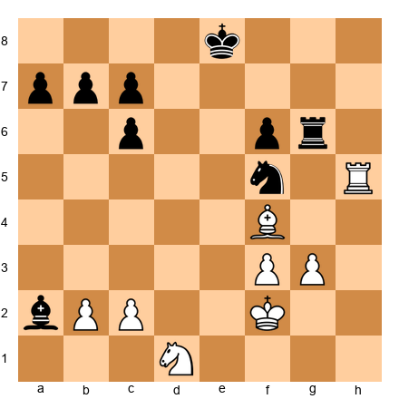

Black to play. White has just captured the h5 pawn with the rook. Black has an extra bishop but the position is difficult, the rook on h5 controls the h-file, and the knight needs to find an active square. What should Black play?

*Hint: The bishop on a2 is out of the game. How can Black bring it back while protecting key squares?*

---

---

# FURTHER STUDY

If the ten games in this chapter inspired you, here are three more masterpieces to study on your own. Find these games in the master game list in the appendix, set up your board, and play through them move by move.

---

## Game 32: Euwe vs Alekhine, 1935 — World Championship, Game 26

**Opening:** Slav Defense (D17) | **Result:** 1-0

The game that won Max Euwe the World Championship (one of the greatest upsets in chess history. Alekhine was considered unbeatable, a creative genius who had crushed every challenger. His combinations were legendary, his preparation was deep, and his fighting spirit was ferocious. Euwe, a mathematics teacher and amateur from the Netherlands, was given almost no chance. But Euwe prepared meticulously, played principled chess, and maintained his composure under enormous pressure. In this decisive game, Euwe's solid, positional play triumphs over Alekhine's brilliance. The lesson is powerful: consistency and preparation can defeat even the most creative attacker. Study this game alongside Games 6 and 7 from this chapter to see how World Championship matches are decided) often not by brilliance, but by discipline.

---

## Game 59: Carlsen vs Anand, 2014 — World Championship Rematch, Game 6

**Opening:** Ruy Lopez, Archangelsk Variation (C78) | **Result:** 1-0

Carlsen's dominance in the 2014 rematch was even more complete than in 2013. This game features a textbook display of positional play and endgame technique. Carlsen gradually improves his position with patient maneuvering (small pawn moves, minor piece redeployments, king walks) until Anand's defenses crumble under sustained pressure. There is no single decisive moment. Instead, the advantage grows by tiny increments over forty moves until it becomes overwhelming. This is the essence of Carlsen's style: make the game last long enough, and the better technician wins. Compare this game with Game 9 from this chapter to see how Carlsen's endgame approach evolved over the course of a year.

---

## Game 62: Menchik vs Euwe, 1929 — Carlsbad International

**Opening:** Semi-Slav Defense (D46) | **Result:** 1-0

Vera Menchik (1906–1944) was the first Women's World Champion, holding the title from 1927 until her tragic death during the London Blitz in 1944. In this game from the Carlsbad International Tournament of 1929 (one of the strongest tournaments of its era) Menchik defeated Max Euwe, who would later become the Men's World Champion in 1935. This historic result, achieved nearly a century ago, proved that women could compete at the highest levels of chess. Menchik's play in this game is a masterclass in the fundamentals: solid development, central control, and patient maneuvering. There are no fireworks, no spectacular sacrifices, just clean, principled chess that gradually overwhelms a strong opponent. Study this game alongside Game 10 to see how women's chess has a long and proud history of excellence stretching back to the earliest days of modern competition.

---

---

# KEY TAKEAWAYS

1. **Development wins games.** Morphy's queen sacrifice was only possible because every one of his pieces was active while his opponent's bishop never moved. Get all your pieces into the game before launching an attack.

2. **Small advantages grow when you are patient.** Capablanca's endgame technique shows that you do not need brilliant sacrifices to win. Steady improvement of your position, combined with the right moment to act, is enough.

3. **Pawn structure is permanent.** Fischer created a position with four isolated pawns for his opponent, then exploited every single one. When you move a pawn, think about the long-term consequences.

4. **Even the greatest players lose.** Fischer's impulsive 29...Bxh2 turned a draw into a loss. Learning from your mistakes (and from the mistakes of great players) is one of the most powerful tools for improvement.

5. **The initiative is worth material.** Kasparov sacrificed a rook against Topalov and never let up. When you have the attack, keep pressing. Make your opponent respond to you.

6. **Courage and preparation win championships.** Kasparov became the youngest World Champion by playing the most important game of his life with aggressive confidence.

7. **Central breaks transform passive positions.** Kasparov's 14...d5 against Karpov turned a defensive stance into a dynamic attack.

8. **Preparation is about understanding positions, not memorizing moves.** Kramnik's Berlin Defense strategy was not about remembering long lines, it was about understanding the resulting positions better than his opponent.

9. **Endgame technique is about precision, not brilliance.** Carlsen converted a one-pawn advantage into a win through relentless accuracy. Every small advantage matters in the endgame.

10. **Chess genius knows no gender.** Polgar's victory over Kasparov is a reminder that talent, dedication, and courage are the only requirements for excellence.

---

# PRACTICE ASSIGNMENT

Choose any three games from this chapter and play through them on a physical board without reading the annotations. After each move, try to guess the next move before looking. Keep a tally: how many moves did you predict correctly?

Then, play through those same three games again WITH the annotations. Focus on the moves you predicted incorrectly. Ask yourself: what was the master's reasoning that I missed?

If you have access to a chess engine, input the critical positions and check the evaluation after each move. You will be amazed at how precisely the masters played, and how even their mistakes are instructive.

---

# ⭐ PROGRESS CHECK

After studying this chapter, you should be able to:

- [ ] Play through an annotated master game and understand the reasoning behind each move
- [ ] Identify the key turning point in a game
- [ ] Recognize common themes: development leads, pawn structure advantages, piece activity, passed pawns, and endgame technique
- [ ] Explain why a particular move was strong or weak
- [ ] Apply at least one lesson from these games to your own play

If you can do all five, you are thinking like a club player. The masters were once beginners too. They improved by studying, practicing, and playing.

**You are on the same path.**

---

# EXERCISE SOLUTIONS

*Solutions are collected at the end of Volume II.*

**Exercise 21.1:** 17...Qxf3!! The queen sacrifice. After 18.gxf3 Rg6+ 19.Kh1 Bh3, White cannot stop the mating threats. The key insight is that Black's rook on e6 can swing to the g-file with devastating effect once the g-file opens.

**Exercise 21.2:** 19...Bh3! This quiet bishop move threatens Bg2 checkmate and attacks the f1 rook. White cannot defend both threats. The bishop on h3 is the key attacking piece.

**Exercise 21.3:** White should prepare the central break e4, which activates the bishop on d3 and creates a passed d-pawn after exchanges. The plan is 15.Qh3 (improving the queen) followed by f3 and e4 at the right moment.

**Exercise 21.4:** The queen should go to d5 (42.Qd5!), centralizing and threatening to invade. The combination of the rook on the seventh rank, the queen in the center, and the potential passed pawn creates overwhelming pressure.

**Exercise 21.5:** 20.e4! This central advance opens the position for White's rooks and exploits the weakness of Black's isolated pawns. After 20...d4 21.f4, White has a powerful pawn center and a clear advantage.

**Exercise 21.6:** After 38.Rxf6! gxf6 39.Rxf6, the e6 pawn is passed and on the sixth rank. The rook on f6 controls the board, and Black's king cannot escape the combined threats of Rf8+, Qf7, and e7. The exchange sacrifice works because the passed pawn is more powerful than the extra exchange.

**Exercise 21.7:** Black should play 29...Ke7, bringing the king toward the center and keeping the bishop active on d6. The bishop on d6 controls important squares and defends the kingside. Avoid 29...Bxh2? which wins a pawn but places the bishop offside.

**Exercise 21.8:** White plays 36.a4 Kd5 37.Ba3!, activating the bishop while the b5 pawn and a4 pawn create threats on the queenside. The plan is to advance b6, forcing Black to sacrifice material to stop the pawn.

**Exercise 21.9:** White's plan is to open the center and attack the exposed Black king. The central break involves advancing the d-pawn or playing Re1 to increase central pressure. Qf4+ was Kasparov's choice, preparing Nd5 and the d-pawn push.

**Exercise 21.10:** 26.Qxd4+! Kxa5 27.b4+! Ka4 28.Qc3!, keeping the Black king trapped in a mating net. Each move maintains the attack with check or an unstoppable threat.

**Exercise 21.11:** 16...Nd3! The knight invades on d3, a powerful outpost deep in White's position. From d3, the knight forks multiple pieces and squares, and it cannot be easily dislodged because a pawn capture would weaken White's structure.

**Exercise 21.12:** White should play 23.g3, a quiet move that stabilizes the kingside and prepares to regroup the pieces. The d5 pawn is strong but needs piece support to advance. Improving the position before pushing is the correct strategy.

**Exercise 21.13:** 14...d5! The central break that opens the position for Black's bishops and challenges White's pawn center. After 15.cxd5 Nxd5 16.Nxd5 exd5 17.exd5 Bf6, Black has active piece play and pressure against the d5 pawn.

**Exercise 21.14:** White can try 24.Qg3+ Kh8 25.Re1 Rc3, but the resulting position gives Black active counterplay. The check on g3 is tempting but leads to complications. White should maintain the tension rather than force the issue.

**Exercise 21.15:** Black should play 9...Ke8 (maintaining flexibility) or 9...Bd7 (developing). The king will eventually go to f8 and then g8 (via e8-f8) where it is safer. The priority is piece development, get the bishops out and connect the rooks.

**Exercise 21.16:** Black should try 22...Bxf5, exchanging the dangerous knight and eliminating a key attacker. The bishop pair and extra pawn give Black long-term chances, though the f6 pawn remains a thorn. Black must find a way to trade it off or blockade it.

**Exercise 21.17:** 20...Nf2+! 21.Rxf2 Qxe4+ 22.Kg1 Qxc4. The knight sacrifice wins back material and reaches a favorable endgame with an extra pawn. The key is recognizing that the knight on h3 can sacrifice itself to deflect the rook from f1.

**Exercise 21.18:** 29...Rd3! Centralizing the rook on the third rank, where it attacks the c3 pawn and ties down White's pieces. After 30.Nce5 fxe5 31.Nxe5 Rxc3, Black has won a second pawn and the position is clearly winning.

**Exercise 21.19:** 19.f3! This move secures the center, prepares to activate the rook via f1-h1, and keeps the pressure on Black's awkward pieces. The knight on h4 is now truly stranded.

**Exercise 21.20:** 23...Be6 is the best move, bringing the bishop back into the game and defending the f5 knight. From e6, the bishop covers key squares and supports the knight's activity. Without the bishop's return, Black's position remains passive.

---

🛑 **Rest here.** You have studied ten of the greatest games ever played, spanning nearly 150 years of chess history. From Morphy's development lessons to Carlsen's endgame precision, from Kasparov's explosive attacks to Polgar's historic triumph, you have seen what chess can be at its highest level.

These players were all once beginners. They improved by studying, practicing, and playing. You are on the same path.

Come back to these games whenever you need inspiration. They will teach you something new every time.

💙 *— Kit Olivas & Dr. Ada Marie*

---

*Volume II, Chapter 21, The Grandmaster Codex*
*© Kit Olivas & Dr. Ada Marie*
