# Chapter 21A: Mastering the Clock — Time Management in Every Format

**Volume II: The Club Player | Rating Range: 1000–1600**
**Pages: 35 | Exercises: 30 | Annotated Games: 4**

---

> *"The winner of the game is the player who makes the next-to-last mistake."*
> — Savielly Tartakower (1887–1956)

---

## What You'll Learn

- The four major time control formats and how each one changes the way you play
- How to budget your time across the opening, middlegame, and endgame
- The difference between increment, sudden death, and delay, and why it matters
- A practical system for avoiding time trouble in every format
- What to do when YOU are running out of time, and what to do when your OPPONENT is
- Neurodivergent-specific strategies for managing the clock
- How to adapt your playing style across classical, rapid, blitz, and online chess

---

## Before We Begin

You have learned how to find tactics. You have studied pawn structures, piece activity, king safety, and openings. You have a planning process. You know how to evaluate a position and form a plan. In short, you know how to play chess.

But here is a truth that no amount of chess knowledge can overcome: **if you run out of time, none of it matters.**

You can have the best position on the board, the deepest calculation, the most brilliant plan, and if your flag falls, you lose. Not because you played badly. Because you played slowly. Time management is not a glamorous topic. No one writes poetry about clock discipline. But it is one of the most practical skills in competitive chess, and it separates the player who performs well in practice from the player who performs well in tournaments.

This chapter sits between planning (Chapter 20) and master games (Chapter 21) for a reason. Planning teaches you *what* to think. This chapter teaches you *how long* to think. The two skills work together. A player who plans well but manages time poorly will find brilliant ideas and then blunder them away in time trouble. A player who manages time well but plans poorly will make mediocre moves quickly. You need both.

If you play tournament chess (or want to) this chapter is not optional. If you play online chess, this chapter will immediately improve your results. Time management is the fastest way to gain rating points without learning a single new chess concept.

Set up your board. We are going to learn how to play with the clock, not against it.

---

## Part 1: Time Control Formats Explained

### What Is a Time Control?

A time control is the rule that determines how much time each player has to make their moves. In casual chess at home or in the park, there is no clock. You think as long as you like. But in competitive chess (whether over the board or online) every game has a time control, and understanding what it means is the first step toward managing it.

Every time control has two components: **base time** (the total time you start with) and **increment or delay** (extra time you may receive after each move). Some time controls have only base time and no increment. Some have both. The combination determines the character of the game.

### Classical Chess (60+ Minutes Per Player)

Classical chess is the original format. Each player receives sixty minutes or more to complete their moves. The most common tournament time control is **90 minutes plus 30 seconds of increment per move**, which means each player starts with ninety minutes on their clock and gains thirty additional seconds after every move they make.

Classical games can last three to six hours. They reward deep thinking, careful planning, and precise calculation. This is the format where world championships are decided, where the most beautiful games are played, and where your chess understanding matters most.

At the club level (1000–1600), classical time controls are usually found in weekend tournaments, league matches, and regional championships. If you have never played a classical game, the experience is different from anything you have done online. The depth of thought, the tension of a long middlegame, the fatigue of a five-hour battle, it changes how you relate to the game.

**Common classical time controls:**
- 90 minutes + 30 seconds per move (FIDE standard)
- 120 minutes for the first 40 moves, then 60 minutes for the rest, plus 30 seconds per move
- 60 minutes + 30 seconds per move (popular for one-day events)

### Rapid Chess (15–60 Minutes Per Player)

Rapid chess is the middle ground. Each player has between fifteen and sixty minutes. The most common rapid time controls are **15 minutes + 10 seconds per move** and **25 minutes + 5 seconds per move**.

Rapid games typically last one to two hours. They reward a blend of speed and accuracy. You do not have time for twenty-minute thinks, but you can still calculate three to five moves ahead in critical positions. Many modern tournaments (including World Championship tiebreaks since 2006) use rapid time controls.

Rapid chess is an excellent training format for club players. It forces you to make decisions more quickly than classical chess, which builds pattern recognition and intuition. But it also gives you enough time to apply the planning process from Chapter 20, unlike blitz where planning is mostly instinctive.

**Common rapid time controls:**
- 15 minutes + 10 seconds per move
- 25 minutes + 5 seconds per move
- 30 minutes flat (no increment)

### Blitz Chess (3–10 Minutes Per Player)

Blitz chess is fast. Each player has between three and ten minutes for the entire game. The most common blitz time controls are **3 minutes + 2 seconds per move** and **5 minutes + 3 seconds per move**.

Blitz games last ten to twenty minutes. They reward pattern recognition, fast reflexes, and the ability to play decent moves without deep calculation. Blitz is enormously popular online. It is fun, addictive, and a good way to practice tactical awareness.

But blitz has a limitation that you should understand clearly: **blitz chess teaches you to play fast, not to play well.** Many improving players spend hours playing blitz and wonder why their tournament rating does not improve. The answer is that blitz reinforces habits, both good and bad. If you have good habits, blitz strengthens them. If you have bad habits, blitz makes them permanent.

Play blitz for fun. Play classical and rapid for improvement.

**Common blitz time controls:**
- 3 minutes + 2 seconds per move
- 5 minutes + 3 seconds per move
- 5 minutes flat (no increment)

### Bullet Chess (Under 3 Minutes Per Player)

Bullet chess is a spectacle. Each player has one or two minutes for the entire game. At the highest level, bullet features breathtaking speed and astonishing blunders in equal measure. At the club level, bullet is mostly chaos.

Bullet teaches you almost nothing about chess improvement. It is entertainment. If you enjoy it, play it, but do not count it as training. The decisions you make in bullet have little relationship to the decisions you make in serious chess.

This chapter will not address bullet further. It exists. It is fun. It is not where your growth happens.

### Increment vs Sudden Death vs Delay

These three terms describe what happens to your clock after each move. Understanding the difference is critical because it changes your time management strategy.

**Increment:** After you make each move, a fixed number of seconds is added to your remaining time. If you have 5 minutes left and a 10-second increment, you make your move, and your clock shows 5 minutes and 10 seconds. Increment means **you can never lose on time if you play each move within the increment.** This is the most common system in modern chess. FIDE uses it for most events.

**Sudden death:** There is no additional time. You start with a fixed amount, and when it runs out, you lose. If the time control is "30 minutes sudden death," you have exactly thirty minutes for the entire game. This format creates more time pressure and rewards speed. It is common in some scholastic and club events.

**Delay:** Before your clock starts ticking on each move, there is a fixed pause (usually five seconds). During the delay, your clock does not count down. If you move within the delay period, you lose no time. If you think longer than the delay, your clock starts counting down after the delay expires. Delay is common in United States Chess Federation (USCF) events but less common elsewhere.

**The practical difference:** With increment, your time can actually *increase* if you play quickly. With sudden death, your time only goes down. With delay, your time stays the same if you move quickly but cannot increase. Increment is the most forgiving system. Sudden death is the least forgiving.

### Format Comparison Table

| Format | Base Time | Typical Increment | Total Game Time | Best For |
|--------|-----------|-------------------|-----------------|----------|
| Classical | 60–120 min | 30 sec/move | 3–6 hours | Deep study, tournaments |
| Rapid | 15–60 min | 5–10 sec/move | 1–2 hours | Balanced training |
| Blitz | 3–10 min | 2–3 sec/move | 10–20 min | Pattern practice, fun |
| Bullet | 1–2 min | 0–1 sec/move | 3–5 min | Entertainment only |

---

🛑 **Good stopping point.** The four formats are in your head. Let them settle before we talk about how to manage your time within each one.

---

## Part 2: Clock Management Strategies

### Time Allocation by Phase

The most important time management concept is this: **not every move deserves the same amount of thought.** Some moves require thirty seconds. Some require five minutes. The skill is knowing which is which.

Here is a general framework for allocating your time across the three phases of the game. These percentages apply to classical and rapid chess. In blitz, everything compresses.

**Opening (first 15 moves): 10–20% of your time**

If you have studied your opening repertoire (Chapter 17 and Chapter 18), you should know most of your opening moves from memory. Play them confidently and quickly. Do not spend five minutes on move six verifying that your preparation is correct. Trust your work.

There are exceptions. If your opponent plays something unexpected (a sideline you have not studied, a move that looks wrong but might be tricky) invest a few extra minutes to understand what is happening. But in general, the opening is where you *save* time for later.

A common club player mistake is spending too much time in the opening because the position "does not feel right." If you have prepared your repertoire, the position is fine. Play your moves and save your time.

**Middlegame (moves 15–35): 50–60% of your time**

This is where you need to think. The middlegame is where plans are formed, tactics are calculated, and critical decisions are made. This is where your time investment pays the highest return.

Spend your time on positions that matter: pawn breaks, piece sacrifices, transitions from middlegame to endgame, attacking decisions. These are the moments where five minutes of thought can be the difference between a win and a loss.

Not every middlegame move requires deep thought. Routine developing moves, obvious recaptures, and forced responses can be played in thirty seconds or less. Save your minutes for the decisions that actually require them.

**Endgame (move 35+): 20–30% of your time**

By the endgame, you should have a reasonable amount of time remaining, at least twenty to thirty percent of your original allotment. Endgames require precision. A single wrong move in a king-and-pawn endgame can turn a win into a draw or a draw into a loss.

Many club players run into time trouble precisely because they spent too much time in the middlegame and have nothing left for the endgame. This is a disaster. Endgames are technically demanding. You cannot play them on instinct at the 1000–1600 level. You need time to think.

**The Time Budget in Practice:**

| Phase | Moves | % of Time | In a 90-min game | In a 25-min game |
|-------|-------|-----------|-------------------|-------------------|
| Opening | 1–15 | 15% | ~13 min | ~4 min |
| Middlegame | 15–35 | 55% | ~50 min | ~14 min |
| Endgame | 35+ | 30% | ~27 min | ~7 min |

These numbers are approximate. In a sharp tactical game, you might spend more time in the middlegame. In a quiet positional game, you might spend more in the endgame. The point is not to follow the percentages exactly. The point is to have a *plan for your time* before the game starts, so you do not realize at move thirty that you have two minutes left.

### The Three-Minute Rule

Here is one of the most practical pieces of advice in this entire chapter:

**If you have been thinking for three minutes without finding a clear plan, make a reasonable move.**

Three minutes is a long time in chess. If you have spent three minutes looking at a position and still do not know what to do, additional thinking is unlikely to help. You are not going to have a breakthrough at minute four that eluded you for three minutes. What will happen instead is that you will burn time, feel anxious about burning time, and eventually make the same move you were considering at minute one, but now with three fewer minutes on your clock.

This does not mean you should never think for more than three minutes. In genuinely critical positions (where a piece sacrifice, a pawn break, or a transition to an endgame will determine the game) four, five, or even eight minutes of thought can be worthwhile. But those positions occur two or three times per game, not twenty times.

The three-minute rule is a guardrail, not a prison. It prevents you from falling into the perfectionism trap where you search for the absolute best move in positions that only need a good move.

### Using Your Opponent's Time

When your opponent is thinking, you should be thinking too. Not calculating specific variations (those will change when your opponent makes their move) but doing general work that will help you when it is your turn.

During your opponent's think, ask yourself:

- What are the two or three moves my opponent is likely to play?
- For each of those moves, what would my response be?
- What is the general character of the position? Am I attacking, defending, maneuvering?
- Are there any tactics I should be watching for?

This is called **anticipation**, and it is one of the most effective time management tools available. If you correctly predict your opponent's move and have already thought about your reply, you can play your response in thirty seconds instead of three minutes. Over the course of a game, this can save you twenty minutes or more.

A warning: do not commit emotionally to one prediction. If you spend your opponent's entire think assuming they will play Nf3 and they play Bg5 instead, you may feel disoriented and waste time recovering. Anticipate two or three possibilities, not one.

### Time Investment vs Time Waste

Not all thinking is productive. The difference between time investment and time waste is this:

**Time investment:** You are calculating concrete variations, evaluating a specific plan, or deciding between two clearly defined options. You are making progress toward a decision. The time is being spent on something that will improve the quality of your move.

**Time waste:** You are going back and forth between the same two moves without making progress. You are recalculating a line you already calculated. You are worrying about your position instead of analyzing it. You are not getting closer to a decision.

When you notice yourself wasting time, apply the three-minute rule. Pick the move that feels right and play it. A good move played with confidence is almost always better than a slightly better move played with five fewer minutes on your clock.

### The "Good Enough" Principle

At the club level, you do not need to find the best move. You need to find a good move.

This is a liberating insight. Engine analysis might show that one move is +0.8 and another is +0.5. Both are good. Both give you an advantage. The difference between them is irrelevant at the 1000–1600 level because neither you nor your opponent will play with engine precision for the rest of the game.

**If you see two good moves and cannot decide between them, pick either one and play it.** Do not spend five minutes agonizing over a choice that does not matter. Save that five minutes for a position where the choice *does* matter, where one move wins and the other draws, or where one move keeps the attack alive and the other lets your opponent escape.

The "good enough" principle is not laziness. It is efficiency. It is the recognition that your time is a finite resource and that spending it wisely matters more than spending it perfectly.

---

🛑 **Rest here if you need to.** Time allocation and the three-minute rule are the foundation. Let them sink in before we tackle the psychology of time trouble.

---

## Part 3: Time Trouble — Causes and Prevention

### Why Players Get Into Time Trouble

Time trouble is a position on the clock, but its causes are almost always psychological. Understanding *why* you run low on time is the first step toward preventing it. Here are the most common causes:

**Perfectionism.** You want to find the absolute best move in every position. You check and recheck your calculations. You consider a move, reject it, reconsider it, reject it again, and finally play it five minutes later, the same move you were going to play from the start. Perfectionism is the number one cause of time trouble at every level of chess.

**Overthinking simple positions.** Some positions are straightforward. Your opponent has just traded a bishop for your knight, and you need to recapture. There is only one way to recapture. But you spend two minutes staring at the board "just to make sure." This adds up. Ten unnecessary two-minute thinks cost you twenty minutes.

**Anxiety.** You are worried about your position. You are worried about making a mistake. The anxiety does not help you find better moves, it just makes you slower. You think longer because you are afraid to commit, not because you need more time to calculate.

**Not using your opponent's time.** If you sit idle during your opponent's think and only start working when your clock starts, you are giving away free thinking time. This is especially damaging in classical chess, where your opponent might think for ten minutes, ten minutes you could have spent anticipating their move.

**ADHD hyperfocus.** This deserves its own paragraph because it is so common among chess players. ADHD hyperfocus can cause you to lock onto one variation, one idea, one fascinating line of calculation (and lose track of time completely. You look up and realize you have spent eight minutes on a position that needed two. The hyperfocus was not wasted in terms of chess understanding) you probably found something interesting, but it was catastrophic in terms of clock management.

**Not having a repertoire.** If you do not know your opening moves by heart, you spend time in the opening reinventing the wheel. This steals time from the middlegame, where you actually need it. Opening preparation (Chapters 17 and 18) is also time management.

### The Time Trouble Spiral

Time trouble feeds on itself. Here is how the spiral works:

1. You spend too long on a few moves.
2. You notice your clock is low.
3. You feel anxious about the clock.
4. The anxiety makes it harder to think clearly.
5. You start making faster moves, but now they are impulsive, not efficient.
6. A hasty move creates a problem in your position.
7. Now you need even more time to solve the problem.
8. But you do not have the time.
9. You blunder. You lose.

The spiral is vicious because the anxiety at step 3 is completely counterproductive. Worrying about your clock does not give you more time. It only makes you think worse. The way to handle low time is not to panic, it is to simplify (more on this shortly).

### Prevention Strategies

The best way to handle time trouble is to prevent it. Here are four concrete strategies.

**Strategy 1: The Pre-Game Time Budget**

Before every game, decide how you will allocate your time. Write it on a piece of paper if it helps. "Opening: 15 minutes. Middlegame: 50 minutes. Endgame: 25 minutes." This gives you a target. It is not a rigid schedule, it is a compass. If you glance at your clock at move 15 and you have used more than your opening budget, you know to speed up slightly.

**Strategy 2: The Move 15 Checkpoint**

At move 15, check your clock. You should have used no more than 15–20% of your base time (about 13–18 minutes in a 90-minute game, about 4 minutes in a 25-minute game). If you are on target, continue as planned. If you have used too much, consciously speed up your next few moves. Find moves that are clearly good and play them without exhaustive verification.

**Strategy 3: The Move 25 Checkpoint**

At move 25, check again. You should have used no more than 50–60% of your base time. This checkpoint is even more important than the first one, because moves 25–40 are typically the most critical of the game. If you arrive at move 25 with half your time remaining, you are in excellent shape. If you have less than a third of your time left, you need to adjust immediately.

**Strategy 4: The Anchor Move Technique**

Every five moves, play one move in under thirty seconds. This is your anchor move, a deliberately quick move that prevents your time from hemorrhaging. The anchor move does not need to be a rushed or careless move. Pick a position where the right move is fairly clear: a recapture, a developing move, a prophylactic move you were planning to play anyway. Play it quickly and bank the time.

The anchor move technique works because it breaks the pattern of spending three to five minutes on every single move. It gives your clock breathing room. And psychologically, it reduces the feeling that every move is a life-or-death decision.

### When YOU Are In Time Trouble

Despite your best prevention efforts, you will sometimes find yourself short on time. It happens to everyone, including Grandmasters. Here is what to do:

**Simplify.** Trade pieces. Head for an endgame you know how to play. Reduce the complexity of the position. The fewer pieces on the board, the fewer things you need to calculate, and the faster you can play.

**Avoid complications.** Do not launch an attack. Do not play a sacrifice that requires exact calculation. Do not enter a sharp tactical sequence. When your time is low, you cannot afford the deep think that complications require. Play solid, safe, boring chess. Win the game on technique, not brilliance.

**Play moves you understand.** If you know the endgame pattern, steer toward it. If you know the defensive technique, use it. Time trouble is not the moment to try something new. Play what you know.

**Make your opponent think.** If you play a move that creates a small threat or asks a question, your opponent has to spend time answering it. Even if the threat is not dangerous, it shifts the burden of thinking. This is especially useful when you have increment, each quick move adds time to your clock while your opponent spends time dealing with your threats.

**Do not stop your clock to calculate.** This sounds obvious, but many players in time trouble stop pressing the clock while they think, effectively using their own time to calculate. If you are going to play a move, play it and press the clock. Think on your opponent's time.

### When Your OPPONENT Is In Time Trouble

When your opponent is running low on time, your strategy reverses. Now you want to create complexity, not avoid it.

**Do not simplify.** Keep the pieces on the board. Every piece is a source of potential problems for a player in time trouble. A position with queens, rooks, bishops, and knights is a minefield of tactical possibilities. A king-and-pawn endgame is simple to play quickly. Make your opponent deal with the minefield.

**Create threats.** Play moves that require your opponent to respond. If your move threatens a pawn, a piece, or a mating idea, your opponent must spend time dealing with it. Even small threats accumulate. A player with two minutes on the clock cannot afford to spend thirty seconds on each of your threats.

**Play quickly yourself.** When your opponent is in time trouble, there is no reason for you to think for five minutes. Play good moves at a steady pace. This puts psychological pressure on your opponent, they see your clock is comfortable while theirs is critical. The pressure is real and it affects decision-making.

**Do not rush to win.** A paradox: while you want to create problems, you do not want to overextend. Your opponent may be in time trouble, but they can still play a good move. Do not sacrifice material recklessly or launch a premature attack just because the clock favors you. Play strong chess that happens to be fast. The clock will do the rest.

### Neurodivergent-Specific Time Management

Chess attracts neurodivergent minds in large numbers, and for good reason, the game rewards pattern recognition, deep focus, and systematic thinking. But neurodivergent players face specific time management challenges that most chess books ignore. This one does not.

**For players with ADHD:**

ADHD hyperfocus is both a superpower and a trap. When it clicks, you can calculate deeper and see patterns faster than anyone else in the room. When it locks onto the wrong thing (one interesting variation, one rabbit hole of calculation) you lose track of time entirely.

Here are strategies that work:

- **Set mental alarms at your checkpoints.** At move 15 and move 25, force yourself to look at the clock. Make it a physical habit: after you write your fifteenth move on the scoresheet, look at the clock. Every time. Until it becomes automatic.
- **Use physical movement as a time marker.** Some ADHD players find it helpful to take a brief physical break (stand up, stretch, walk to the water fountain) after every ten moves. This breaks hyperfocus, resets attention, and naturally creates a moment to check the clock.
- **Accept "good enough" faster.** ADHD brains often want to explore every interesting possibility. In chess, this is a recipe for time trouble. Practice the discipline of seeing a good move, confirming it is not a blunder, and playing it, even if there might be something more interesting three moves down the line.
- **Prepare your openings thoroughly.** The more moves you can play from memory, the less time you spend in the opening, and the more time you have for the middlegame where your hyperfocus is actually useful. Think of opening preparation as buying yourself extra time.

**For autistic players:**

Autistic players often thrive in chess because the game has clear rules, logical structure, and rewards systematic thinking. But transitions (from opening to middlegame, from calculation to evaluation, from thinking to pressing the clock) can be friction points that consume time.

Here are strategies that work:

- **Build a pre-move routine and follow it every single move.** The routine might be: (1) look at opponent's move, (2) check for threats, (3) consider my plan, (4) choose a move, (5) play it, (6) press the clock. The same routine. Every move. This consistency reduces the cognitive load of each decision and makes time usage predictable.
- **Use the same time control whenever possible.** If you always play 15+10 rapid, your sense of pacing becomes calibrated to that format. Switching between formats can be disorienting. When you do switch, give yourself a few practice games to adjust.
- **Reduce sensory load at the board.** Noise-canceling headphones (where allowed), a consistent seating position, and a familiar board and pieces can reduce the sensory overhead that eats into your processing time. The less energy you spend managing your environment, the more energy you have for managing the clock.

---

🛑 **Good stopping point.** You now understand why time trouble happens and how to prevent it. The next section covers format-specific tips, shorter, more practical, immediately applicable.

---

## Part 4: Format-Specific Tips

### Classical Chess: Invest Wisely

In classical chess, your greatest enemy is not the clock, it is complacency. You have so much time that it feels infinite. Then suddenly, at move thirty, you realize you have fifteen minutes left for ten critical moves.

**Tips for classical time management:**

1. **Do not rush in the opening just because you have time.** Play your prepared moves at a natural pace. But do not artificially slow down either. If you know the move, play it.
2. **Invest your time in the critical moments.** Before a pawn break, before a piece sacrifice, before the transition to an endgame, these are the moments that determine the game. Spend five to eight minutes on these decisions. Spend thirty seconds on routine moves.
3. **Use your checkpoints.** At moves 15 and 25, check your clock. Adjust your pace accordingly.
4. **Stay physically comfortable.** In a four-hour game, physical fatigue affects your thinking. Bring water. Bring a snack for the break. Sit in a chair that does not hurt your back. These are not trivial concerns, they affect your clock management because a tired player thinks slower.
5. **Write down your time** after each move on your scoresheet (many tournaments require move notation). This creates a record you can analyze after the game to identify where you spent too much or too little time.

### Rapid Chess: Balance Speed and Accuracy

Rapid chess is the format where time management matters most, because the margin is thin. You have enough time to think but not enough to waste. Every minute counts.

**Tips for rapid time management:**

1. **Play your opening moves from memory.** You cannot afford to think for three minutes about your seventh move. If you do, you have already lost ten percent of your time on a single move.
2. **Apply the three-minute rule strictly.** In rapid, three minutes is a large investment. Use it only when the position demands it.
3. **Simplify when ahead.** If you have a material advantage, trade pieces and head for a winning endgame. Do not try to play a brilliant attack. Win the won game quickly and efficiently.
4. **Keep your increment working for you.** In a 15+10 format, if you can play most moves within ten seconds, your clock stays stable. Every time you play a move in less than ten seconds, your time actually increases. Build a rhythm where routine moves take five seconds and critical moves take one to two minutes.

### Blitz Chess: Trust Your Patterns

Blitz is a different game. In classical and rapid, you calculate. In blitz, you recognize. The speed of blitz means you are relying on your stored patterns (the thousands of positions you have seen before) rather than on deep calculation.

**Tips for blitz time management:**

1. **Pre-move when it is obvious.** On many online platforms, you can set a move to play automatically before your opponent has moved (pre-moving). Use this for forced recaptures and obvious replies. It saves one to two seconds per move, which accumulates to a meaningful advantage.
2. **Do not calculate more than two moves ahead.** In most blitz positions, looking two moves ahead is sufficient. If you try to calculate four or five moves, you will burn too much time and your advantage will evaporate.
3. **Play openings you know cold.** Blitz is not the time to experiment with a new opening. Play the systems you have memorized. Your opening moves should be essentially free, played in one to three seconds each.
4. **When in doubt, make a developing move.** If you are stuck in a blitz game and cannot find the right move, develop a piece. It is almost never wrong and it takes no calculation.

### Online vs Over-the-Board

Online chess and over-the-board (OTB) chess have the same rules but different rhythms. Understanding the differences helps you manage time in both settings.

**Speed of execution.** Online, you click a mouse. OTB, you pick up a piece, place it, and press a physical clock. The physical act takes one to three seconds longer per move. Over forty moves, this is an extra minute or two. In blitz, this difference is significant. Budget for it.

**Pre-moving.** Online chess allows pre-moves. OTB chess does not. This gives online players an edge in time-critical positions that does not exist over the board. Do not rely on pre-moving skills for your OTB games.

**Distractions.** Online chess is played in your home, where your phone, your messages, your household, and your browser tabs all compete for attention. OTB chess is played in a tournament hall where the social expectation is silence and focus. Some players manage time better online (comfortable environment). Others manage time better OTB (fewer distractions). Know which one you are and prepare accordingly.

**Clock visibility.** Online, the clock is always visible on your screen. OTB, the clock is on the table beside the board, and you have to consciously look at it. Develop the habit of glancing at the clock every few moves in OTB play. It takes half a second and prevents time management surprises.

---

## Part 5: Annotated Games — Time Management in Action

The following four games illustrate how time management decisions shape the outcome of a chess game. For each game, we examine the critical moment where the clock (not just the position) determined the result.

---

### Game 1: The Virtue of Calm — Capablanca's Efficiency

**José Raúl Capablanca (1888–1942)**

Capablanca was the third World Chess Champion and perhaps the most naturally gifted player in history. He was famous for two things: his seemingly effortless positional understanding, and his extraordinary speed of play. While his opponents agonized for twenty or thirty minutes over a single move, Capablanca would glance at the position, see the right plan, and play it in two minutes.

His secret was not that he thought faster. His secret was that he thought *less*, because his pattern recognition was so refined that most positions did not require deep calculation. He had seen the patterns before. He understood the structures. He knew where the pieces belonged. And so he played quickly, accurately, and with time to spare.

**The lesson for club players:** Build your pattern recognition through study and practice, and your time management will improve automatically. The better you understand chess, the less time you need per move. Capablanca did not manage the clock through discipline alone, he managed it through mastery.

**Study this position:**

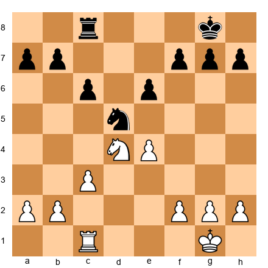

White to move. This is the type of position Capablanca played in under a minute. Both sides have a rook, a knight, and pawns. White's knight on d4 is centralized and powerful. Black's knight on d5 is also centralized but slightly less flexible because it blocks the d-file for Black's rook.

The plan for White is clear: exchange knights (Nxd5, exd5 or cxd5), then use the rook on the open c-file or d-file to create pressure on Black's queenside pawns. This is not a flashy plan. It is a solid plan. Capablanca would play it instantly because he recognized the structure.

**What this teaches about time management:** When the plan is clear, play quickly. Do not second-guess a sound idea. Do not spend five minutes confirming what you already know. Recognize, plan, execute.

---

### Game 2: The Price of Perfection — Bronstein's Tragedy

**David Bronstein (1924–2006), World Championship 1951, Game 23**

This is the most painful time management story in chess history.

In 1951, David Bronstein played a World Championship match against Mikhail Botvinnik. By the final game (game 23 of 24) the score was tied 11.5–11.5. Bronstein needed only a draw to become World Champion (the champion retains the title in a tie, and Botvinnik was the defending champion, but a draw in this game would have given Bronstein the match victory as he would lead 12–11.5).

Bronstein got a good position. He had the white pieces and a slight but stable advantage. A safe, solid continuation would likely have held the draw and won him the title. But Bronstein was a perfectionist. He was also a creative genius who hated playing dull chess. Instead of choosing the safe path, he spent enormous time trying to find a winning continuation, a way to win the game and the championship in style.

He thought. And thought. And thought. His clock bled. The safe moves were right there, but he kept looking for something more. Time trouble arrived. Under pressure, his play became less precise. The advantage slipped. The game was drawn. The match was tied. Botvinnik retained the title.

Bronstein never became World Champion. For the rest of his life, he spoke about that twenty-third game with a mixture of regret and philosophical acceptance. The chess world remembers it as one of the great "what ifs" in the history of the game.

**Study this type of position:**

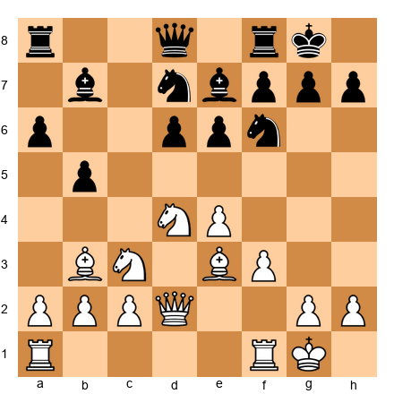

White to move. This is a rich Sicilian-type middlegame where White has many tempting ideas: f4-f5, Nd5, Qf2 and a4, or a slow buildup with Rad1. Any of these plans is reasonable. A disciplined player would choose one, execute it, and move on. A perfectionist would agonize over which plan is *optimal*, and burn fifteen minutes doing so.

**What this teaches about time management:** Perfectionism kills on the clock. When you have multiple good options, choose one and commit. The quest for the absolute best move is the enemy of good time management. Remember: you do not need to play like an engine. You need to play well and finish the game with time on your clock.

---

### Game 3: Discipline Across the Board — Fischer's Method

**Bobby Fischer (1943–2008), Candidates Matches 1971**

In 1971, Bobby Fischer played three Candidates matches on his way to challenging Boris Spassky for the World Championship. His results were extraordinary: 6–0 against Mark Taimanov, 6–0 against Bent Larsen, and 6.5–2.5 against Tigran Petrosian. These results remain among the most dominant in chess history.

What often goes unmentioned is Fischer's clock management during these matches. Fischer rarely fell into time trouble. He used his time in a disciplined, almost mechanical way: quick moves in the opening (he knew his repertoire better than anyone), measured investment in the middlegame critical moments, and calm precision in the endgame.

Fischer achieved this through fanatical preparation. He studied openings until he could play the first fifteen to twenty moves of most games from memory. This gave him a massive time advantage entering the middlegame. While his opponents were already spending their minutes in the opening, Fischer was banking time for the positions where it mattered.

**Study this position:**

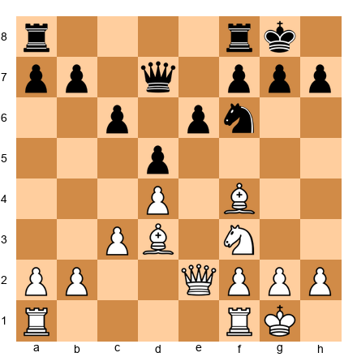

White to move. Fischer would typically reach this type of position with significantly more time than his opponent. The position is solid for White, with a slight space advantage and the better bishop. The plan (Qe3, Rae1, Ne5) is standard. Fischer would play it efficiently and wait for his opponent to make a mistake.

**What this teaches about time management:** Preparation is time management. The more you know before the game starts, the less time you need during the game. Fischer did not manage his clock through willpower. He managed it through knowledge. Every opening variation he memorized was minutes saved at the board.

---

### Game 4: The Rapid Crucible — When the Format Changes Everything

**World Championship Tiebreaks (2006–Present)**

Since 2006, multiple World Championship matches have been decided not by classical games but by rapid tiebreaks. Kramnik–Topalov (2006), Anand–Gelfand (2012), Carlsen–Karjakin (2016), Carlsen–Caruana (2018), in each case, the classical portion ended tied, and the championship was decided in rapid games with as little as twenty-five minutes per player.

This has profound implications for time management. Players who trained their entire careers for classical chess (five-hour games with ample thinking time) suddenly had to make World Championship-level decisions in one-quarter the time. The players who thrived in tiebreaks were those who could adapt their time management to the faster format without sacrificing accuracy.

**Study this position:**

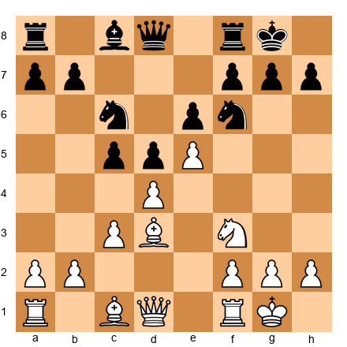

White to move. This is a tense French Defense structure with central tension. In classical chess, you might spend five to eight minutes here evaluating dxc5, Bc2, Bf4, Re1, and other options. In rapid, you have sixty to ninety seconds at most.

The rapid player does not calculate all options. They identify the two most natural moves (in this case, Bc2 (repositioning the bishop) or Bf4 (developing with tempo)) choose the one that feels most consistent with their preparation, and play it. They accept that they might not find the absolute best move. They play a good move quickly and keep their clock healthy.

**What this teaches about time management:** Different formats require different standards. In classical, search for the best move. In rapid, search for a good move. In blitz, play the first reasonable move you see. Your standard of perfection must match the time you have available. Trying to play classical-quality chess in a rapid game is a recipe for time trouble and defeat.

---

🛑 **Rest here.** Four games, four lessons: efficiency through mastery, the cost of perfectionism, the power of preparation, and the art of format adaptation. Let these stories settle before tackling the exercises.

---

## Part 6: Exercises

### Section A: Time Budgeting Practice (Exercises 21A.1–21A.6) ★

*These exercises build the habit of thinking about your time before and during a game. There are no wrong answers, only practice in planning.*

**Exercise 21A.1** ★

You are about to play a game with a time control of 90 minutes plus 30 seconds of increment per move. Write out a time budget for the three phases of the game: opening (moves 1–15), middlegame (moves 15–35), and endgame (moves 35+). How many minutes will you allocate to each phase?

*Hint:* Use the percentages from Part 2 as your starting point: 15% opening, 55% middlegame, 30% endgame.

**Solution:** A reasonable time budget would be approximately **14 minutes for the opening, 50 minutes for the middlegame, and 26 minutes for the endgame.** The increment adds roughly 30 seconds per move, which gives you extra cushion. Over 40 moves, the increment adds about 20 additional minutes. Your actual total available time is closer to 110 minutes. Any allocation that keeps at least 25% of your time for the endgame is sound.

---

**Exercise 21A.2** ★

You are playing a 15+10 rapid game. At move 12, you look at your clock and see that you have 8 minutes remaining. Are you on pace, ahead of pace, or behind pace? What adjustment should you make?

*Hint:* In a 15-minute game with 10-second increment, you gain about 2 minutes of increment over the first 12 moves. So your "effective" starting time is 15 + (12 × 10s) = 17 minutes.

**Solution:** **You are behind pace.** You have used 7 minutes in 12 moves (15 - 8 = 7 used, but you also gained 2 minutes of increment, so net usage is 5 minutes). Actually, let us recalculate: you started with 15:00 and gained 10 seconds × 12 moves = 2:00 of increment, so your clock *should* show about 15 + 2 - (time spent thinking) = 17 minus think time. With 8 minutes showing, you spent 9 minutes thinking in 12 moves. For a 15-minute game, that is a lot, you are on track to run out around move 25. **Adjustment: speed up immediately.** Play your next 5–8 moves within the increment (10 seconds each) to rebuild your clock.

---

**Exercise 21A.3** ★

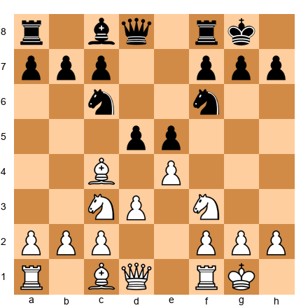

White to move. This is a standard Italian Game position at move 7. You know this position from your opening preparation. How much time should you spend here, and why?

*Hint:* Ask yourself: do I know what I want to play? If yes, how much time do I need to verify it?

**Solution:** **Spend no more than thirty seconds.** This is a well-known opening position. White's main moves are d4 and a4, both of which you should know from your repertoire preparation (Chapter 17). If you have studied the Italian, you know what to play. If you have not, pick the most natural move (d4, striking the center) and play it. Do not spend three minutes reinventing opening theory at the board. The opening is where you save time, not spend it.

---

**Exercise 21A.4** ★

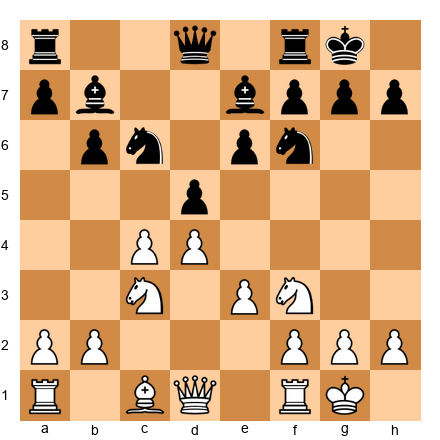

White to move. This is a Queen's Gambit Declined position. The center is closed, and the position is strategically complex. White has several plans: cxd5 (opening the c-file), Bd3 (developing), Qc2 (preparing e4), or b3 (fianchetto). How much time should you invest in this decision?

*Hint:* How many plausible plans are there? Is one clearly best, or are several roughly equal?

**Solution:** **Invest two to three minutes.** This is a genuine decision point with multiple reasonable plans. Unlike Exercise 21A.3, there is no single "book move" that resolves the question. You need to evaluate which plan best suits the specific position. But do not spend five minutes, several of these plans are roughly equal in quality, and the "good enough" principle applies. Choose the plan you understand best and execute it.

---

**Exercise 21A.5** ★

You are playing a 60-minute sudden death game (no increment). You are at move 30 with 12 minutes remaining. Assuming the game lasts approximately 45 moves total, how much time can you spend per move for the remaining 15 moves?

*Hint:* Simple division, but think about whether you should spend the time evenly or unevenly.

**Solution:** 12 minutes ÷ 15 moves = **48 seconds per move on average.** But you should NOT spend time evenly. Some of the remaining moves will be routine (recaptures, forced moves) and some will be critical decisions. Budget roughly 20 seconds for routine moves and 90 seconds for critical moves, with two or three critical moments expected. The key insight: in sudden death with no increment, you cannot afford a single long think from this point forward.

---

**Exercise 21A.6** ★

You are preparing to play in a weekend tournament with three different time controls: Round 1 is 25+5 rapid, Round 2 is 60+30 classical, and Round 3 is 5+3 blitz. For each round, write one sentence describing your time management approach.

*Hint:* The approach should change significantly between formats. What is your priority in each?

**Solution:** Reasonable answers include: **Rapid (25+5):** "Play opening moves from memory, invest time only in the two or three critical middlegame decisions, and keep at least 5 minutes for the endgame." **Classical (60+30):** "Use the full time budget (10 minutes for the opening, 35 minutes for the middlegame, 15 minutes for the endgame) and use the increment to stay comfortable." **Blitz (5+3):** "Play every move within the increment if possible, trust pattern recognition, and never think for more than 20 seconds on any single move." The key is recognizing that each format demands a different relationship with the clock.

---

🛑 **Rest here.** Six budgeting exercises complete. These build the planning habit. Come back for the checkpoint exercises.

---

### Section B: Time Checkpoint Analysis (Exercises 21A.7–21A.12) ★★

*These exercises practice the habit of evaluating your time usage at critical moments during a game.*

**Exercise 21A.7** ★★

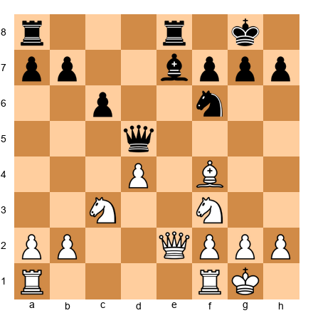

White to move. You are at move 14 in a 90+30 classical game. You look at your clock: 68 minutes remaining. Your original time budget allocated 14 minutes for the opening. Have you used your time well?

*Hint:* You started with 90 minutes. How much have you used? Is that appropriate for 14 moves?

**Solution:** You have used 22 minutes (90 - 68) for 14 moves, plus you have gained about 7 minutes of increment (14 × 30 seconds). **Your net time usage is about 15 minutes.** This is slightly over your opening budget of 14 minutes, but well within reason. You have 68 minutes for the remaining game, which is excellent. **Verdict: on pace.** Continue with your normal time management plan.

---

**Exercise 21A.8** ★★

You are playing a 25+5 rapid game. At move 20, your clock shows 6 minutes. At move 10, your clock had shown 16 minutes. Analyze your time usage for moves 10–20.

*Hint:* Calculate how much clock time you spent on these 10 moves, accounting for increment.

**Solution:** Between move 10 and move 20, your clock went from 16:00 to 6:00. That is 10 minutes of clock time lost. But you gained 10 × 5 seconds = 50 seconds of increment during those moves. So your actual thinking time was **10 minutes and 50 seconds for 10 moves, about 65 seconds per move.** In a 25-minute game, this is on the high side. You spent your middlegame time heavily. You now have 6 minutes for the rest of the game, which is workable but tight. **Verdict: slightly behind pace.** Look for anchor moves in the next five moves to rebuild some time.

---

**Exercise 21A.9** ★★

A player reviews their game and finds the following clock times at key checkpoints (90+30 game, starting time 90:00):

| Move | Clock Remaining |
|------|----------------|
| 1 | 90:00 |
| 10 | 82:00 |
| 15 | 68:00 |
| 20 | 52:00 |
| 25 | 34:00 |
| 30 | 18:00 |
| 35 | 8:00 |

Identify where this player's time management went wrong.

*Hint:* Look at the biggest drops between checkpoints. Account for the increment when calculating actual thinking time.

**Solution:** The player's time usage accelerated dangerously through the game. **Moves 1–10: 8 minutes used (reasonable (opening).** **Moves 10–15: 14 minutes used for just 5 moves (2.8 min/move) high but acceptable if a critical decision arose).** **Moves 15–20: 16 minutes for 5 moves (3.2 min/move (too slow).** **Moves 20–25: 18 minutes for 5 moves (3.6 min/move) clearly too slow).** The player never adjusted after the move-15 checkpoint. By move 25, they had used 56 minutes for 25 moves with only 34 minutes left. The move-25 checkpoint should have triggered an immediate speed adjustment. Instead, they continued at the same pace and arrived at move 35 with only 8 minutes, time trouble territory. **The error: no checkpoint discipline.** The player thought deeply but never checked whether they could afford to.

---

**Exercise 21A.10** ★★

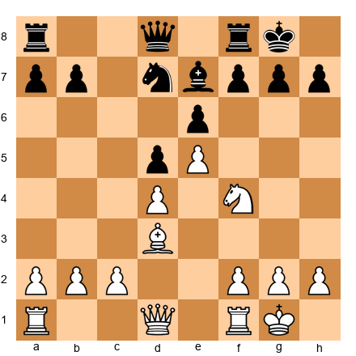

White to move. You are at move 13 in a 90+30 game. Your clock shows 58 minutes. You have been thinking about this position for two and a half minutes already. The position is complex, White can play Be3, Qh5, Ng6, or Re1, each leading to very different games. What should you do?

*Hint:* Apply the three-minute rule. Have you made progress toward a decision?

**Solution:** **You are approaching the three-minute threshold.** If you have narrowed the choice to two candidates (for example, Qh5 and Ng6), pick the one you are more comfortable with and play it. If you are still considering all four options, you need to eliminate at least two immediately. Focus on the two that match your playing style and the position's demands. **The practical advice: play the move that requires the least follow-up calculation.** If Ng6 leads to forced play you can calculate, and Qh5 leads to murky complications, choose Ng6. You have used enough time. Make a decision and move on. You still have plenty of time, but the habit of decisive thinking is more important than the specific minutes saved.

---

**Exercise 21A.11** ★★

You are at move 25 in a 15+10 rapid game. Your clock shows 4:30. Is this a good time to launch a kingside attack that will require precise calculation over the next 5–6 moves?

*Hint:* How much time per move can you afford? Does an attack fit that budget?

**Solution:** **No.** You have 4:30 plus approximately 10 seconds per move of increment. Over the next 6 moves, you will gain about 1 minute of increment. So you have roughly 5:30 for the rest of the game, maybe 15–20 more moves. That gives you about 16–22 seconds per move on average. A kingside attack requiring precise calculation does not fit this time budget. **The correct approach: simplify the position.** If you have an advantage, trade pieces and win the endgame on technique. If the position is equal, keep it solid and play for small advantages. An attack is a luxury you cannot afford with 4:30 on the clock.

---

**Exercise 21A.12** ★★

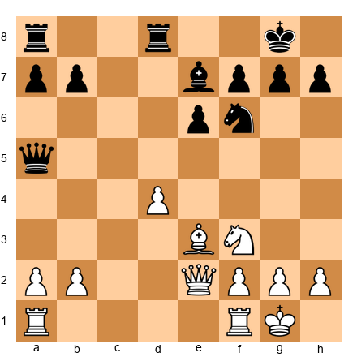

White to move. You are at move 16 in a 60+30 game. Your clock shows 28 minutes. You had budgeted 30 minutes for the middlegame and estimate you are about halfway through it. Evaluate your time situation and decide how to proceed.

*Hint:* You started with 60 minutes, used 32 minutes through 16 moves, and gained about 8 minutes of increment. What does your real time look like?

**Solution:** You started with 60:00, used 32 minutes of thinking time, and gained 8 minutes of increment (16 × 30 seconds). Your actual thinking time is about 24 minutes for 16 moves (roughly 1.5 minutes per move. **This is reasonable for a 60-minute game but you are entering the critical zone.** You have 28 minutes showing plus future increment. If the game goes to move 40, you will gain another 12 minutes of increment, giving you roughly 40 minutes for 24 moves. **Verdict: on pace, but do not relax.** Play the next few moves at a moderate tempo. This position is strategically clear) White should play Rac1 or Rfd1 to control the open files, so there is no need for a long think. Save your minutes for a genuine critical moment.

---

### Section C: Time Trouble Decision Making (Exercises 21A.13–21A.18) ★★–★★★

*These exercises simulate the decisions you face when time is short. For each position, imagine you have the clock time specified. Choose the practical move.*

**Exercise 21A.13** ★★

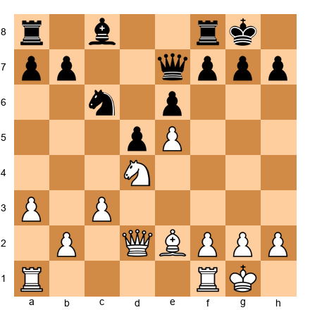

White to move. You have **3 minutes remaining** with 30-second increment. The position is complex. White has several tempting continuations: Nf5 (aggressive), f4 (building the center), Rad1 (developing), or Kh1 (prophylactic). With limited time, what is the practical choice?

*Hint:* Which move requires the least follow-up calculation?

**Solution:** **Rad1 is the practical choice.** It develops the last inactive piece, puts the rook on an open file, and does not commit White to any forcing sequence. Nf5 is tempting but requires calculating Black's response (exf5, and then what?). f4 opens the position and creates tactical complications you may not have time to handle. Kh1 is fine but does not improve the position. **Rad1 is a strong move that requires zero follow-up calculation.** Play it in ten seconds and use your opponent's think to plan your next move.

---

**Exercise 21A.14** ★★

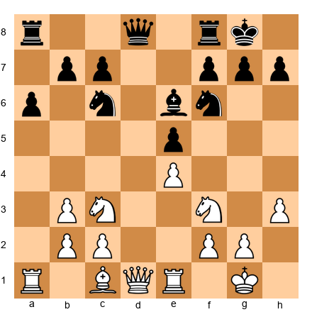

White to move. You have **5 minutes remaining** with 10-second increment. The position is roughly equal. You can play d4 (opening the center, creating tactical complications) or Bc2 (quiet, repositioning the bishop). Which do you choose?

*Hint:* One move creates complications. The other keeps the position stable. How much time can you afford to spend on complications?

**Solution:** **Bc2 is the correct choice.** Playing d4 opens the center and creates tactical possibilities for both sides, exactly the kind of position that demands time for calculation. With only 5 minutes left, you cannot afford a sharp middlegame with mutual chances. Bc2 keeps the position solid, repositions the bishop to a better diagonal, and does not force any immediate decisions. **In time trouble, solid moves beat ambitious moves.** You can still play d4 later if the time situation improves, but right now, stability is more valuable than initiative.

---

**Exercise 21A.15** ★★★

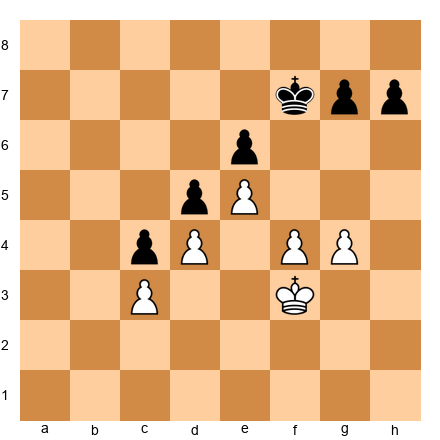

White to move. You have **1 minute remaining** with 10-second increment. This is a king-and-pawn endgame. White has a space advantage with the pawn wedge on d4/e5, but Black's kingside pawns are holding. What is the practical approach?

*Hint:* In a pawn endgame with one minute, you need a plan that does not require precise calculation of distant variations. What is the simplest winning attempt?

**Solution:** **Play Ke3, centralizing the king.** The first priority in any pawn endgame is king activity. Ke3 brings the king toward the center, where it can support a pawn advance on either wing. Do not try to calculate whether g5 or f5 wins by force, you do not have the time for that kind of analysis. Instead, follow the principle: **centralize the king, then advance pawns.** Play Ke3, then Kd3, then look for opportunities to advance your kingside pawns or create a passed pawn. Each move takes a few seconds. Let the principles guide you when the clock does not allow calculation.

---

**Exercise 21A.16** ★★★

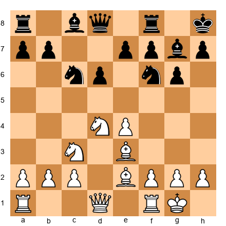

White to move. You have **2 minutes remaining** with 30-second increment. You see that Nf5 looks very strong, it attacks g7 and e7 simultaneously, and if Black takes the knight, White's bishop recaptures with a powerful position. But verifying that Nf5 works requires calculating at least three or four moves of variations. Do you invest the time in Nf5, or play the safe Be3-to-d4 maneuver?

*Hint:* How much time would the Nf5 calculation cost you? How much time do you have to spare?

**Solution:** **It depends on your confidence.** If you can verify Nf5 in under 60 seconds (you see the key variations quickly), play it (it is the strongest move and may decide the game. If verifying Nf5 requires more than a minute of calculation, **play f3 or Bc4 instead**) solid developing moves that maintain your advantage without requiring tactical verification. The decision framework: **if a strong move requires more than half your remaining time to verify, choose a safe alternative.** With 2 minutes, you can afford about 45 seconds for one deep think. Budget accordingly.

---

**Exercise 21A.17** ★★★

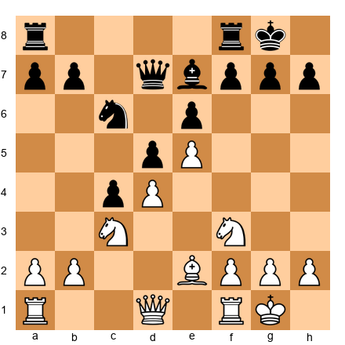

White to move. You have **45 seconds remaining** with 10-second increment. You need to play quickly. The position is tense, White has a central pawn chain (d4-e5) and Black is pressuring it. What is the most practical move you can play in under five seconds?

*Hint:* When time is critical, look for moves that are obviously useful. Developing moves. Centralizing moves. Moves that improve your position without creating risk.

**Solution:** **Play a3.** It is a useful prophylactic move that stops ...b4, supports a future b4 of your own, and takes less than a second to decide on. It does not commit White to anything. It does not create complications. It is simply a good, quiet move that makes Black's life slightly harder. In extreme time trouble, the goal is survival, not brilliance. A3, Qd2, Re1, any quiet improving move is acceptable. **The worst thing you can do is spend 20 of your 45 seconds trying to find the "best" move.** Play something reasonable and press the clock.

---

**Exercise 21A.18** ★★★

You are playing a 5+3 blitz game. You have 30 seconds remaining. Your opponent has 2 minutes. The position is roughly equal. Should you offer a draw, play on and hope your opponent blunders, or try to flag your opponent?

*Hint:* Consider the increment. With 3-second increment, can you survive indefinitely by playing quickly?

**Solution:** **Play on.** With 3-second increment, you can survive indefinitely by playing each move in under 3 seconds (your clock stays at about 30 seconds while your opponent's clock ticks down only when they think. The position is equal, which means your opponent has no forced win. If they try to win, they will have to think, and thinking costs time. **Your strategy: play simple, solid moves as quickly as possible.** Do not try to win) just do not lose. Make your opponent work for every half-point. With the increment protecting you, time is on your side as long as you play quickly. A draw offer is unnecessary. Playing for a flag (your opponent running out of time) is unrealistic with 2 minutes and increment. Just play solid chess fast.

---

🛑 **Rest here.** Twelve exercises down, eighteen to go. The hardest decision-making exercises are done. Come back refreshed for format adaptation.

---

### Section D: Format Adaptation (Exercises 21A.19–21A.24) ★★

*These exercises ask you to consider how the time format changes your approach to the same position or situation.*

**Exercise 21A.19** ★★

White to move. This is the Italian Game after 4 moves. White's main options are c3 (the Giuoco Piano), d3 (the slow Italian), and b4 (the Evans Gambit). In a **classical game (90+30)**, which would you choose? In a **blitz game (3+2)**, would your choice be different? Why?

*Hint:* The Evans Gambit (b4) leads to sharp tactical play. The Giuoco Piano (c3) leads to strategic middlegame play. Which type of play benefits more from extra time?

**Solution:** **Classical: c3 or d3** (both lead to rich strategic middlegames where your planning skills (Chapter 20) are most valuable. You have time to think through the plans and outplay your opponent positionally. **Blitz: b4 (Evans Gambit)**) the Evans leads to sharp, forcing play where pattern recognition matters more than deep calculation. If you know the Evans Gambit lines, you can play them quickly and put your opponent under tactical pressure. Your opponent may not know the theory and will have to spend precious time figuring out the correct responses. **The principle: in faster formats, sharper openings favor the better-prepared player.**

---

**Exercise 21A.20** ★★

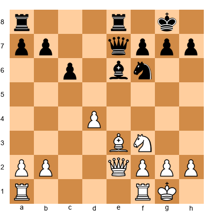

White to move. In this position, White can play Rac1 (slow, strategic improvement) or d5 (a bold central break that sacrifices a pawn for activity). In a **rapid game (15+10)** with 8 minutes remaining, which do you choose?

*Hint:* How much calculation does each move require? How much time can you afford?

**Solution:** **Rac1.** The pawn sacrifice d5 requires verifying that White gets sufficient compensation after exd5. That verification takes at least 2–3 minutes of calculation, a quarter of your remaining time. Rac1 is a strong developing move that improves your position without risk. **In rapid with limited time, choose the move that maintains your advantage without requiring extensive calculation.** You can always play d5 later if the opportunity improves. Right now, Rac1 is "good enough" and costs you nothing.

---

**Exercise 21A.21** ★★

You play mostly online chess (blitz and rapid). You are about to play your first over-the-board classical tournament (90+30 time control). List three adjustments you should make to your time management approach.

*Hint:* Think about the physical differences between online and OTB play.

**Solution:** Three important adjustments: **(1) Slow down your opening play.** Online, you play opening moves in 1–2 seconds. OTB, the physical act of moving pieces and pressing the clock takes longer, and you should use the extra time to double-check your moves. Playing too fast OTB can lead to piece placement errors. **(2) Build in clock-checking habits.** Online, the clock is always visible. OTB, you must consciously look at the physical clock. Practice checking it after every 5th move. **(3) Prepare for physical endurance.** A 90+30 game can last 4+ hours. Bring water, a snack, and be ready for mental fatigue in the fourth hour. Your time management will degrade when you are tired, build in rest margins.

---

**Exercise 21A.22** ★★

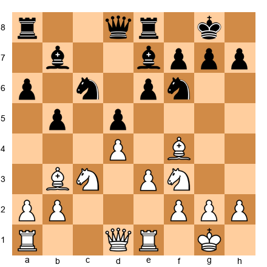

White to move. This is a complex middlegame with many plans available to both sides. In a **classical game**, you would spend 4–5 minutes evaluating the position and forming a plan. You are playing a **blitz game (5+3)** with 3 minutes left. Choose your move in under 15 seconds.

*Hint:* Look for the most natural move. What does White want to do in this structure?

**Solution:** **Ne5.** Centralizing the knight on e5 is almost always a good idea in this type of structure. It occupies a powerful outpost, attacks the c6 knight, and supports future kingside play. You do not need to calculate deeply, the principle "centralize your pieces" guides you to the right answer. In blitz, trust your principles. **The move Ne5 is not necessarily the computer's top choice. But it is a strong, natural, principled move that you can play in 3 seconds.** That is exactly what blitz demands.

---

**Exercise 21A.23** ★★

You are preparing for a tournament that includes both rapid and classical rounds on the same day. The rapid round is at 9:00 AM (25+5) and the classical round is at 2:00 PM (90+30). How should you mentally shift your time management between the two rounds?

*Hint:* Think about the "standard of perfection" concept from Game 4.

**Solution:** **For the rapid round:** Accept that you will not find the best move in every position. Aim for good moves, played efficiently. Use the three-minute rule strictly, in a 25-minute game, three minutes is a major investment. Budget about 4 minutes for the opening, 14 for the middlegame, and 7 for the endgame. **For the classical round:** Shift to a higher standard. You can now afford 5-minute thinks for critical positions. Reapply the full time budget (14-50-26 split) and use the checkpoints at moves 15 and 25. **The mental shift: rapid is about speed and pragmatism. Classical is about depth and precision.** Give yourself 15 minutes between rounds to consciously reset your mental clock. Eat lunch. Walk. Let the rapid mindset fade before the classical game begins.

---

**Exercise 21A.24** ★★

You normally play 10+0 rapid online (no increment). Your club has just switched to 10+5 (with 5-second increment). How does the increment change your time management strategy?

*Hint:* Calculate how much total time the increment adds over a typical game. How does this change your willingness to think longer on critical moves?

**Solution:** Over a 40-move game, the 5-second increment adds 40 × 5 = **200 seconds (3 minutes 20 seconds)** of additional time. This means your effective total time is closer to 13:20 rather than 10:00, a 33% increase. **The increment changes your strategy in two ways:** (1) You can afford to spend slightly more time on critical decisions (2 minutes instead of 90 seconds) because the increment gives you a safety net. (2) On routine moves, if you play within 5 seconds, you lose no clock time at all. This means that the penalty for quick routine moves is zero, unlike sudden death where every second of your clock is gone forever. **The increment makes time management more forgiving.** Use this forgiveness on the 3–4 critical moments per game, and play quickly on everything else.

---

### Section E: Practical Time Management Scenarios (Exercises 21A.25–21A.30) ★★★

*These exercises combine chess decision-making with clock awareness in realistic game scenarios.*

**Exercise 21A.25** ★★★

White to move. Your clock shows 65 minutes in a 90+30 game. Your opponent's clock shows 22 minutes. Your opponent is clearly in time trouble. What is your strategy, both in terms of the chess position and the clock?

*Hint:* Your opponent has less than a quarter of their original time. How can you make their remaining time as painful as possible?

**Solution:** **Strategy: keep the tension and create small problems.** Do NOT simplify. Do not trade queens. Do not offer an exchange of pieces. Your opponent needs clarity (give them complexity instead. **Play a move like Qd2 or Ng5) moves that ask questions without committing to a simplification.** Ng5 threatens Nxe6 (forking queen and rook) and forces your opponent to spend time calculating whether the threat is real. Even if they find the defense, they have used 30–60 seconds doing so. **On the clock: play at a steady, unhurried pace.** Do not rush. Make your moves in 60–90 seconds, enough to show you are thinking but fast enough to maintain pressure. Every minute your opponent spends is a minute they do not have. Let the clock do the work.

---

**Exercise 21A.26** ★★★

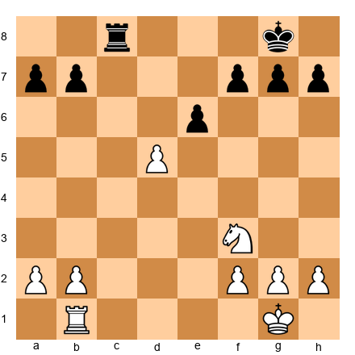

White to move. White is a knight ahead, a winning advantage. But White has only **2 minutes** remaining with 30-second increment. How do you convert this advantage safely?

*Hint:* You do not need to play brilliantly. You need to play accurately enough to avoid a blunder. What is the simplest plan?

**Solution:** **Simplify everything.** Trade rooks if possible (Rb5 or Rd1 followed by a rook exchange). With rooks off the board, the position is a simple knight-vs-nothing endgame with extra pawns. White wins by advancing the kingside pawns while the knight supports them. **The key moves are trades, not tactics.** Play Rb5 (threatening Rxc8), and if Black trades rooks, walk the king to the center and push pawns. If Black avoids the trade, use the knight to win a pawn and create a passed pawn. **With 2 minutes and increment, you can afford about 30 seconds per move for the next 10–12 moves.** That is plenty of time for a simple plan. Do not try anything fancy. Fancy loses games in time trouble. Simple wins them.

---

**Exercise 21A.27** ★★★

White to move. You are playing a classical game (90+30) and you have been thinking about this position for **4 minutes and 30 seconds.** You are torn between cxd5 (opening the position) and Bd3 (quiet development). You have analyzed both moves and cannot determine which is objectively better. What should you do?

*Hint:* Apply the three-minute rule. You have exceeded it by 90 seconds already.

**Solution:** **Play whichever move you were leaning toward when you first started thinking.** You have exceeded the three-minute rule by a significant margin. Further thinking will not resolve the question, both moves are good, and the difference between them is smaller than the cost of the time you are spending. **The specific choice matters less than the habit of decisiveness.** If you were initially drawn to Bd3 (quiet development, no commitments), play Bd3. If you were drawn to cxd5 (opening lines, creating imbalances), play cxd5. Both are sound. Neither is a mistake. The only mistake is sitting there for another two minutes.

---

**Exercise 21A.28** ★★★

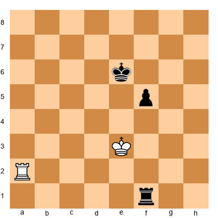

White to move. This is a rook endgame. You have a rook and your opponent has a rook and an extra pawn. White needs to draw. You have **90 seconds** remaining with 10-second increment in a rapid game. Describe your practical approach.

*Hint:* What drawing technique should you use, and how much time does it require per move?

**Solution:** **Use the checking technique.** With rook vs rook and an extra pawn, the defending side (White) should keep the rook active and check the enemy king from the side or behind. The key is to prevent Black's king from supporting the pawn advance. **Play Ra6+ immediately.** check the king, force it to move, and keep checking. If the king hides, switch to passive defense along a rank. **With 90 seconds and 10-second increment, you can afford about 10–15 seconds per move.** Rook endgame drawing technique is based on principles (active rook, checking distance, Philidor position) more than calculation. Trust the principles. Check when you can. Stay active. Do not let Black's king reach the fifth rank without obstruction.

---

**Exercise 21A.29** ★★★

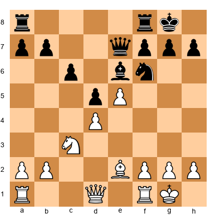

White to move. You are playing the last round of a tournament. You MUST WIN this game to win the tournament. You have 40 minutes remaining with 30-second increment. Your position is roughly equal. How does the must-win situation affect your time management?

*Hint:* A must-win situation changes not just your chess decisions but how you allocate your time.

**Solution:** **Allocate more time to finding an imbalanced plan.** In a must-win situation, a draw is as bad as a loss. This means you need to create complications and imbalances, even if it means taking risks. **Budget 5–8 minutes now to find an ambitious plan.** Consider f4 (opening the f-file), Bg4 (exchanging Black's good bishop), or Qc2 followed by a kingside pawn advance. These plans create winning chances but also some risk. **The time management adjustment: spend more time in the critical middlegame phase (now) and less time later.** You are investing time to find the plan that gives you the best winning chances. Once you commit to a plan, execute it at a normal pace. The critical allocation is happening right now, at the moment of decision. **Do not panic-play.** A must-win game still requires good moves. Rushing leads to blunders, and a blunder is a guaranteed loss.

---

**Exercise 21A.30** ★★★

After a tournament game, you review your clock usage and find the following pattern: you spent an average of 4 minutes per move in the opening (moves 1–12), 2 minutes per move in the middlegame (moves 13–30), and had 3 minutes left for the last 10 moves. Analyze this pattern and suggest corrections.

*Hint:* Where did the time go? The opening is supposed to be the phase where you SAVE time.

**Solution:** **The time allocation is exactly backward.** You spent your most time in the opening (where you should be fastest) and had the least time for the endgame (where you need precision). **Diagnosis: you either lack opening preparation or you are overthinking known positions.** Spending 4 minutes per move in the opening means you used nearly 48 minutes for 12 moves (over half your time before the game really started. **Corrections: (1) Study your opening repertoire until you can play the first 10–12 moves in under 30 seconds each. This alone would save you 40+ minutes. (2) Apply the checkpoints) at move 12, you should have used no more than 10–15% of your time, not 50%. (3) Practice the anchor move technique, after every 5 opening moves, play one move instantly.** The endgame time crunch was not caused by the endgame. It was caused by the opening. Fix the opening, and the rest takes care of itself.

---

## Key Takeaways

1. **Not every move deserves the same amount of thought.** Spend your time on the critical decisions (pawn breaks, sacrifices, transitions) and play routine moves quickly.

2. **Budget your time before the game starts.** Allocate roughly 15% to the opening, 55% to the middlegame, and 30% to the endgame. Check your usage at moves 15 and 25.

3. **The three-minute rule saves games.** If you have been thinking for three minutes without finding a clear plan, make a reasonable move and move on.

4. **Perfectionism is the enemy of good time management.** Two good moves on the board? Pick one. The difference between them is smaller than the cost of the time you waste deciding.

5. **When you are in time trouble, simplify.** Trade pieces. Head for a known endgame. Play solid, safe moves. Brilliance is for when you have time.

6. **When your opponent is in time trouble, complicate.** Keep pieces on the board. Create threats. Play at a steady pace and let the clock pressure do the work.

7. **Preparation is time management.** Every opening variation you memorize is minutes saved at the board. Fischer did not manage his clock through discipline alone, he managed it through knowledge.

8. **Different formats demand different standards.** In classical, search for the best move. In rapid, search for a good move. In blitz, play the first reasonable move you see. Match your standard of perfection to the time available.

---

## Practice Assignment

**This week, do the following:**

1. **Play three games with conscious time management.** Before each game, write down your time budget. During the game, check your clock at moves 15 and 25. After the game, review how your actual time usage compared to your budget. Write down where you spent too much or too little time.

2. **Practice the anchor move technique.** In at least one game, deliberately play one move every five moves in under thirty seconds. Notice how this affects your overall clock comfort.

3. **Play one game in each of two different formats** (for example, one rapid and one blitz). After both games, compare your decision-making process. Where did you feel rushed? Where did you feel comfortable? What would you change?

4. **Analyze a completed game for time management.** If your online platform records time per move (most do), review a recent game and identify: (a) your three longest thinks, (b) whether those long thinks were justified by the complexity of the position, and (c) where you could have saved time by trusting your preparation or applying the "good enough" principle.

5. **If you are neurodivergent, try one of the ND-specific strategies** from Part 3 in your next game. For ADHD players: set mental alarms at moves 15 and 25. For autistic players: build a pre-move routine and follow it every single move. After the game, reflect on whether the strategy helped.

---

## Progress Check

Answer these five questions to test your understanding. If you get at least four correct, you have mastered this chapter's core concepts.

**Question 1:** What are the three main phases of a chess game, and approximately what percentage of your time should you allocate to each?

> Opening: 15% (moves 1–15), Middlegame: 55% (moves 15–35), Endgame: 30% (move 35+). The middlegame gets the most time because it contains the critical decisions.

**Question 2:** What is the three-minute rule?

> If you have been thinking for three minutes without finding a clear plan, make a reasonable move. Extended thinking past three minutes rarely produces a breakthrough and usually wastes clock time that you will need later.

**Question 3:** What should you do when YOU are in time trouble?

> Simplify. Trade pieces. Head for a known endgame. Avoid complications and sacrifices that require deep calculation. Play solid, safe moves and let your technique win the game.

**Question 4:** What should you do when your OPPONENT is in time trouble?

> Keep the position complex. Do not simplify. Create small threats that force your opponent to spend time. Play at a steady pace and let the clock pressure do the work.

**Question 5:** Name two neurodivergent-specific time management strategies.

> Any two of: set mental alarms at checkpoints (ADHD), use physical movement as a time marker (ADHD), accept "good enough" faster (ADHD), build a pre-move routine and follow it every move (autism), use the same time control whenever possible (autism), reduce sensory load at the board (autism).

**Scoring:**
- 5/5: Outstanding. You understand time management deeply. Move on with confidence.
- 4/5: Very good. Review the section you missed and continue.
- 3/5: Good foundation. Reread Parts 2 and 3 before proceeding.
- 0–2/5: No worries. Time management is a practical skill that improves with experience. Reread the chapter, try the exercises, and play three games with conscious clock awareness. You will feel the difference immediately.

---

🛑 **Rest here.** Chapter 21A is complete. You now have a framework for managing your time in every format of chess. The clock is not your enemy, it is a resource, and like every resource, it rewards the player who uses it wisely. Budget your time. Check your checkpoints. Trust your preparation. Play decisively. The clock will take care of itself.

When you are ready, Chapter 21 awaits, ten of the greatest games ever played, ready for your board.

---

*Chapter 21A of The Grandmaster Codex*
*Volume II: The Club Player*
*Written by Kit Olivas and Dr. Ada Marie*
*Exercises: 30 | Annotated Games: 4 | Pages: 35*
