# CHAPTER 29: Opening Repertoire Expansion - Mainline Systems

**Rating Range:** 1600-2200  
**Target Audience:** Tournament players ready to expand beyond beginner systems

---

## Opening Quote

*"The opening is not a minefield to memorize. It's a map of your opponent's weaknesses, and your job is to learn how to read it."*  
 -  GM Alexander Grischuk

---

## What You'll Learn

By the end of this chapter, you will:

- Understand why your beginner repertoire needs to expand at 1600+ rating
- Master advanced London System variations and plans
- Develop deep King's Indian Attack middlegame understanding
- Learn mainline theory concepts for 1.e4 and 1.d4
- Build a complete Pirc/Modern Defense repertoire as Black
- Understand King's Indian Defense attacking structures
- Create repertoire trees to organize your preparation
- Handle anti-systems and surprise weapons
- Recognize key transpositions in your openings
- Study openings efficiently: ideas before memorization
- Know when to switch openings (and when to stay loyal)
- Build a personal preparation notebook

**ND-Friendly Note:** This chapter is ~45 pages. Take breaks at every 🛑 marker. You don't need to finish it in one session.

---

## Why Your Repertoire Needs to Grow (1600+)

**Set up your board:** Start position

You've been playing the London System as White. Maybe the King's Indian Attack. As Black, perhaps the Pirc or some basic defense against 1.e4.

These systems got you from 1200 to 1600. They work.

**But here's what's happening now:**

Your opponents at 1600+ have started preparing against you. They know the London. They know the KIA. They've watched the same YouTube videos you have.

When you play 1.d4 d5 2.Bf4, they don't panic anymore. They play 2...c5 or 2...Nf6 3.e3 c5, and suddenly you're in a position where they know the plans better than you do.

This doesn't mean your repertoire is bad. It means it's time to understand it DEEPLY - and to have backup plans when your opponent tries to force you out of your comfort zone.

### The Three Levels of Opening Knowledge

**Level 1 (1200-1400):** "I know the first 5-6 moves."  
**Level 2 (1400-1600):** "I know the basic plans and piece placements."  
**Level 3 (1600-2200):** "I know WHY these moves work, what my opponent is trying to do, and what to do when they deviate."

You're moving from Level 2 to Level 3.

### What This Chapter Is NOT

This is not "throw away the London and learn the Queen's Gambit." Your systems are fine. This is about:

1. Understanding your systems at a DEEP level
2. Knowing what to do when opponents prepare against you
3. Adding variations that cover your weak spots
4. Learning how to STUDY openings efficiently

Let's begin.

---

🛑 **REST MARKER** - Take a break if you need one. Stretch. Water. Come back when ready.

---

## Part 1: The London System - Advanced Variations

**Set up your board:** 1.d4 d5 2.Bf4

The London System is not a beginner opening. It's a complete system that GMs still play at the highest level. But at 1600+, you need to know MORE than just "Bf4, e3, Nf3, Nbd2, c3, Bd3."

### The Problem You're Facing

Your opponents have learned these responses:

1. **The Early ...c5 Challenge:** 1.d4 d5 2.Bf4 c5
2. **The Bf5 Pin:** 1.d4 d5 2.Bf4 Nf6 3.e3 Bf5
3. **The Aggressive ...Qb6:** 1.d4 d5 2.Bf4 Nf6 3.e3 c5 4.c3 Qb6
4. **The ...e6 and ...Bd6 Trade:** 1.d4 d5 2.Bf4 Nf6 3.e3 e6 4.Bd3 Bd6

Let's handle each one.

### Variation 1: The Early ...c5 Challenge

**Set up your board:** 1.d4 d5 2.Bf4 c5


<p align="center">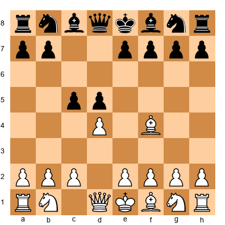</p>


Black is saying: "I know you want a quiet London. I'm going to challenge the center immediately."

**Your Options:**

**Option A: Take on c5**  
3.dxc5

This is simple and good. You're ahead in development. After 3...e6 (taking back the pawn immediately), you play 4.e3 Bxc5 5.Nf3, and you've reached a position where you're developing normally while Black has spent time on ...c5 and ...e6.

**The Key Idea:** Black's pawn on d5 becomes a target. You'll play c4 soon, and Black has to decide: defend it or let you damage their structure.

**Option B: Maintain the tension**  
3.e3 Nc6 4.c3

This is more complex. You're saying: "Fine, you challenged. I'm keeping tension and developing." After 4...Qb6, you need to know 5.Qb3, offering a queen trade that's slightly better for you.

**Which should you choose?**

- If you want SIMPLICITY: Option A (take on c5)
- If you want to TEST their theory: Option B (maintain tension)

Both are completely fine. The key is knowing you have options.

### Variation 2: The Bf5 Pin

**Set up your board:** 1.d4 d5 2.Bf4 Nf6 3.e3 Bf5


<p align="center"></p>


Black is copying you! They're saying: "You played Bf4? I'll play ...Bf5. Let's see how YOU like it."

**Your Response:**

4.c4!

This is the key move. You're not afraid of the pin because:

1. Your knight can go to d2 (not c3)
2. You're challenging the center with c4
3. Black's Bf5 is actually slightly misplaced now

After 4...e6 5.Nc3, you're developing naturally. If Black takes 5...dxc4, you recapture with 6.Bxc4, and you have a slight lead in development.

**Key Idea:** When Black mirrors your setup, BREAK the symmetry with c4. Don't play passively.

### Variation 3: The Aggressive ...Qb6

**Set up your board:** 1.d4 d5 2.Bf4 Nf6 3.e3 c5 4.c3 Qb6


<p align="center">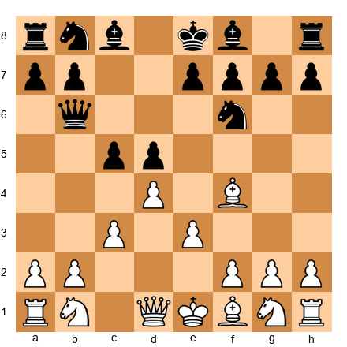</p>


This looks scary. Black is attacking b2 and d4 at the same time.

**Your Response:**

5.Qb3!

Offer the queen trade. After 5...Qxb3 6.axb3, the position is BETTER for White because:

1. Your rook is active on the a-file
2. Black's ...c5 move looks slightly premature now
3. You have the bishop pair in an open position

If Black declines the trade with 5...c4, you play 6.Qc2, and Black's queen is slightly out of play on b6.

**Key Idea:** Don't be afraid of queen trades in the London when YOU have the bishop pair and better development.

### Variation 4: The ...Bd6 Trade

**Set up your board:** 1.d4 d5 2.Bf4 Nf6 3.e3 e6 4.Bd3 Bd6


<p align="center">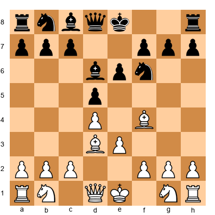</p>


Black wants to trade your "good" bishop.

**Your Response:**

5.Bxd6!

TAKE IT. Don't retreat. After 5...Qxd6, you've simplified the position, and you're going to play:

6.Nf3 O-O 7.Nbd2 c5 8.c3

You have a solid position with no weaknesses. This is a safe, comfortable middlegame where you'll play for a small edge.

**Key Idea:** When Black offers to trade your Bf4 for their Bd6, TAKE. It's not a bad trade. You're eliminating a good defender of Black's kingside.

---

🛑 **REST MARKER** - Five variations down. Take a break if you're feeling information overload.

---

## Part 2: The King's Indian Attack - Advanced Middlegame Plans

**Set up your board:** 1.Nf3 d5 2.g3 Nf6 3.Bg2 e6 4.O-O Be7 5.d3

The King's Indian Attack (KIA) is not just "play Nf3, g3, Bg2, O-O, and hope for an attack."

At 1600+, you need to know:

1. When to play e4 (and when NOT to)
2. How to handle ...c5 challenges
3. The kingside attack patterns
4. When to switch to queenside play

### The Three Setups Black Will Use Against You

**Setup 1: The Solid ...e6 Structure**

After 1.Nf3 d5 2.g3 Nf6 3.Bg2 e6 4.O-O Be7 5.d3 O-O 6.Nbd2 c5

Black is playing solid chess. They're not giving you an easy target.

**Your Plan:**

7.e4

Break in the center! After 7...Nc6 8.Re1, you're building pressure on the e-file. Your goal is to play e5 at the right moment, kicking the Nf6 and gaining space.

**Key Idea:** In the KIA, e4 is your thematic central break. Don't delay it forever.

**Setup 2: The ...c5 Immediate Challenge**

After 1.Nf3 Nf6 2.g3 d5 3.Bg2 c5

Black is saying: "I'm taking space in the center immediately."

**Your Plan:**

4.O-O Nc6 5.d3 e6 6.Nbd2

You're still playing the KIA, but you're being FLEXIBLE. You might play c4 next, transposing into a different structure. Or you might play e4 anyway, accepting that the center will be more open.

**Key Idea:** The KIA is flexible. Don't rigidly follow "always play d3, e4." Adapt to what Black is doing.

**Setup 3: The ...Bg4 Pin**

After 1.Nf3 Nf6 2.g3 d5 3.Bg2 e6 4.O-O Be7 5.d3 O-O 6.Nbd2 Bg4

Black is pinning your knight before you can play e4.

**Your Response:**

7.h3!

Kick the bishop. After 7...Bh5, you play 8.g4!, and the bishop has to retreat to g6. Then you play 9.e4, and you've achieved your central break.

**Key Idea:** Don't be afraid of h3 and g4 to kick a bishop that's preventing your e4 break.

### The KIA Kingside Attack Pattern

**Set up your board:** 1.Nf3 d5 2.g3 Nf6 3.Bg2 e6 4.O-O Be7 5.d3 O-O 6.Nbd2 c5 7.e4 Nc6 8.Re1 b6


<p align="center">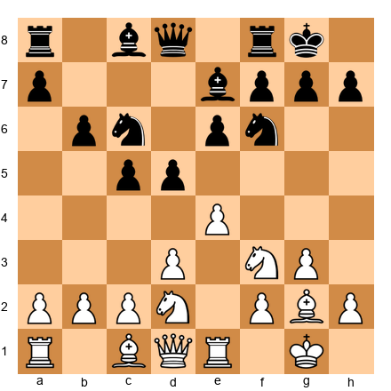</p>


This is a typical KIA middlegame. Now you need a PLAN.

**The Attack Pattern:**

1. **Play Qe2** - Connect rooks, prepare e5
2. **Play e5** - Gain space, kick the Nf6
3. **Play Nf1-g5** - Attack h7 and e6
4. **Play Bf4** - Attack the weak pawns
5. **Play Qe3 or Qd2** - Prepare kingside piece placement
6. **Play h4-h5** - Open lines on the kingside

This is the FULL attack pattern. It takes 10-15 moves to execute, but it's extremely dangerous.

**Example Continuation:**

9.Qe2 Bb7 10.e5 Nd7 11.Nf1 Re8 12.Bf4

White is following the plan. The knight will go to g5 or e3, the queen will swing to g4 or h5, and Black is under serious pressure.

**Key Idea:** The KIA attack is NOT random. It's a specific pattern: e5, Nf1-g5, Bf4, Qe2-g4, h4-h5.

---

🛑 **REST MARKER** - Deep plans need deep focus. Take a break.

---

## Part 3: Understanding Mainline Theory

**Set up your board:** Start position

You've been playing systems. Systems are great because they AVOID mainline theory. But at 1600+, you need to understand WHAT you're avoiding and WHY.

### What Is "Mainline Theory"?

Mainline theory is the most analyzed, most played, most studied lines in chess. For example:

- **1.e4 e5 2.Nf3 Nc6 3.Bb5** (The Ruy Lopez)
- **1.d4 Nf6 2.c4 e6 3.Nc3 Bb4** (The Nimzo-Indian)
- **1.e4 c5 2.Nf3 d6 3.d4 cxd4 4.Nxd4** (The Open Sicilian)

These openings require MEMORIZATION. You need to know 15-20 moves deep in some lines.

### Why You HAVEN'T Been Playing Them

Good reasons:

1. Too much memorization
2. Opponents at 1400-1600 don't know the lines either
3. Systems give you PLAYABLE positions without memory

But here's the truth: At 1800-2000+, everyone knows mainline theory. If you don't learn at least the BASIC ideas, you'll be at a disadvantage.

### How to Learn Mainline Theory (Without Memorizing Everything)

**Step 1: Learn the IDEAS**

Don't start with move orders. Start with:

- "What is White trying to achieve in the Ruy Lopez?"
- "What is Black's counterplay in the Najdorf Sicilian?"
- "Why does the Nimzo-Indian put the bishop on b4?"

**Step 2: Learn ONE mainline as White, ONE as Black**

Pick:

- **As White:** The Italian Game (1.e4 e5 2.Nf3 Nc6 3.Bc4) OR the Queen's Gambit (1.d4 d5 2.c4)
- **As Black against 1.e4:** The French Defense OR the Caro-Kann
- **As Black against 1.d4:** The King's Indian Defense OR the Queen's Gambit Declined

**Step 3: Study 5 GAMES in each opening**

Not 5 LINES. Five COMPLETE GAMES. Watch how the opening transitions into the middlegame.

**Step 4: Play 10 GAMES in each opening**

Theory doesn't stick until you've played it.

### The Italian Game (Mainline for 1.e4 Players)

**Set up your board:** 1.e4 e5 2.Nf3 Nc6 3.Bc4


<p align="center">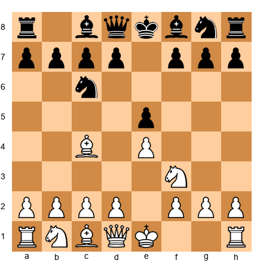</p>


This is easier than the Ruy Lopez but still respected at GM level.

**The Main Ideas:**

- White develops quickly (Bc4 attacks f7)
- White will play d3, O-O, and either c3 or Nc3
- White will push d4 at some point, opening the center
- White has attacking chances on the kingside

**Black's Main Responses:**

1. **3...Bc5** (The Giuoco Piano) - Symmetrical development
2. **3...Nf6** (The Two Knights Defense) - Counterattack on e4
3. **3...Be7** (The Hungarian Defense) - Solid and safe

**Your Job:** Learn the basic plans in each of these three lines. Not every move. Just the PLANS.

### The Queen's Gambit (Mainline for 1.d4 Players)

**Set up your board:** 1.d4 d5 2.c4


<p align="center"></p>


This is the most direct way to fight for the center with 1.d4.

**The Main Ideas:**

- White offers a pawn to open lines and develop quickly
- If Black takes (2...dxc4), White will play e3 and Bxc4, developing with tempo
- If Black declines (2...e6 or 2...c6), White has space advantage
- White will play Nc3, Nf3, and fight for central control

**Black's Main Responses:**

1. **2...dxc4** (The Queen's Gambit Accepted) - Take the pawn
2. **2...e6** (The Queen's Gambit Declined) - Solid defense
3. **2...c6** (The Slav Defense) - Solid but more flexible

**Your Job:** Pick ONE of these to learn first. Don't try to learn all three at once.

---

🛑 **REST MARKER** - Mainline theory is dense. Break here if you need to.

---

## Part 4: The Pirc/Modern Defense as Black

**Set up your board:** 1.e4 d6 2.d4 Nf6 3.Nc3 g6


<p align="center">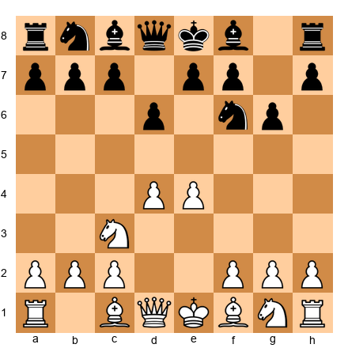</p>


The Pirc Defense is one of the most FLEXIBLE openings for Black. It's perfect for 1600+ players because:

1. It works against 1.e4
2. It's NOT mainline theory (less memorization)
3. It gives you active piece play
4. It's hard for White to get a huge advantage without knowing specific lines

### The Pirc Structure

Black's setup:

- ...d6 (control e5)
- ...Nf6 (develop, attack e4)
- ...g6 (fianchetto the bishop)
- ...Bg7 (pressure the center)
- ...O-O (castle safely)
- ...Nc6 or ...Nbd7 (develop the queenside knight)

White's typical setup:

- e4 (central pawn)
- d4 (central pawn)
- Nc3 (develop)
- Be3 or Bg5 or Bc4 (various plans)
- Qd2 (prepare O-O-O and kingside attack)

### The Austrian Attack (White's Most Aggressive Line)

**Set up your board:** 1.e4 d6 2.d4 Nf6 3.Nc3 g6 4.f4


<p align="center"></p>


White is saying: "I'm going to push f4-f5 and attack your kingside."

**Your Response:**

4...Bg7 5.Nf3 O-O 6.Be3 (or 6.Bd3)

Now you have TWO plans:

**Plan A: The ...c5 Break**

6...c5!

You're fighting back in the center. After 7.dxc5 dxc5, you have open lines for your pieces. This is SHARP and requires calculation, but it's good.

**Plan B: The Solid ...Nc6**

6...Nc6

You develop and wait. After 7.Be2 e5, you're fighting for central squares. This is SAFER and more positional.

**Which should you choose?**

- If you like TACTICS: Plan A (...c5)
- If you like SAFETY: Plan B (...Nc6 and ...e5)

Both are fine. The key is knowing you have options.

### The Classical System (White's Solid Line)

**Set up your board:** 1.e4 d6 2.d4 Nf6 3.Nc3 g6 4.Nf3 Bg7 5.Be2 O-O 6.O-O


<p align="center"></p>


This is more positional. White is developing normally, not rushing an attack.

**Your Plan:**

6...Bg4 (pin the knight) OR 6...Nc6 (develop)

After 6...Bg4 7.Be3 Nc6 8.Qd2, you're in a typical Pirc middlegame. You'll play ...e5 at some point, fighting for central space.

**Key Idea:** In the Pirc, you're FLEXIBLE. You're not committed to one plan. You can play ...c5, ...e5, ...Nc6, ...Nbd7, depending on what White does.

### Common Pirc Mistake to Avoid

**DON'T play ...Ng4 too early.**

Example: 1.e4 d6 2.d4 Nf6 3.Nc3 g6 4.Nf3 Bg7 5.Be2 O-O 6.O-O Ng4?!

This looks aggressive, but White plays 7.h3 Nh6 8.Be3, and your knight is misplaced on h6.

**Key Idea:** In the Pirc, develop ALL your pieces before launching tactics.

---

🛑 **REST MARKER** - The Pirc is flexible, which means there's a lot to think about. Break if needed.

---

## Part 5: The King's Indian Defense as Black

**Set up your board:** 1.d4 Nf6 2.c4 g6 3.Nc3 Bg7 4.e4 d6


<p align="center">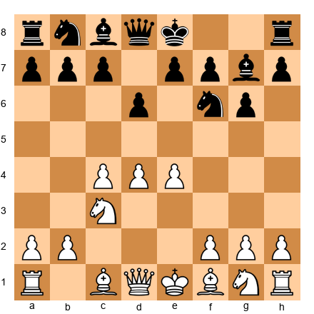</p>


The King's Indian Defense (KID) is one of the most AGGRESSIVE openings for Black against 1.d4.

It's perfect for 1600+ players who want to ATTACK.

### The King's Indian Philosophy

White takes space in the center. You let them. Then you launch a KINGSIDE ATTACK while White is busy on the queenside.

**Key Idea:** The KID is not about equality. It's about IMBALANCE. You're playing for a WIN, not a DRAW.

### The Main Line

**Set up your board:** 1.d4 Nf6 2.c4 g6 3.Nc3 Bg7 4.e4 d6 5.Nf3 O-O 6.Be2 e5


<p align="center"></p>


This is the starting position of the KID. Now White chooses:

**Option A: 7.O-O**

White castles normally. You respond 7...Nc6, and the position is balanced.

**Option B: 7.d5**

White closes the center. This leads to OPPOSITE-SIDE CASTLING and SHARP play.

After 7...d5 Nc6 8.Bg5 (or 8.O-O), you're in the main line of the KID.

### The KID Attack Pattern (After 7.d5)

**Set up your board:** 1.d4 Nf6 2.c4 g6 3.Nc3 Bg7 4.e4 d6 5.Nf3 O-O 6.Be2 e5 7.d5 Nc6 8.O-O Ne7


<p align="center">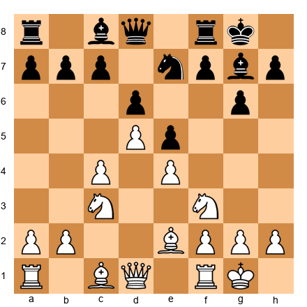</p>


Your plan:

1. **Play ...Nd7** (reposition the knight to f8 or c5)
2. **Play ...f5** (attack White's e4 pawn)
3. **Play ...Nf6** (or ...Ng6, depending on the position)
4. **Play ...g5-g4** (push the kingside pawns)
5. **Play ...Rf6-Rg6** (swing the rook to the kingside)
6. **Play ...Qe8-Qg6** (swing the queen to the kingside)
7. **Launch the attack on White's king**

This is the FULL KID attack. It takes 15-20 moves to execute, but when it works, it's DEVASTATING.

**Example Continuation:**

9.Ne1 Nd7 10.Nd3 f5 11.Bd2 Nf6 12.f3 f4

Black is following the plan. The kingside pawns are rolling forward, and White's king is under pressure.

**Key Idea:** In the KID, you're not playing for small advantages. You're playing for a MATING ATTACK.

### The KID Mistake to Avoid

**DON'T attack too early without preparation.**

Example: 1.d4 Nf6 2.c4 g6 3.Nc3 Bg7 4.e4 d6 5.Nf3 O-O 6.Be2 e5 7.O-O Nc6 8.d5 Ne7 9.Ne1 Nd7 10.f3 f5?!

This looks like the plan, but it's too early. White plays 11.exf5 gxf5 12.f4!, and suddenly YOUR kingside is weak.

**Key Idea:** In the KID, prepare BEFORE you push f5. Get your pieces on good squares first (Nd7, Nf6, maybe ...Kh8 to avoid back-rank tactics).

---

🛑 **REST MARKER** - The KID is intense. Break if you're feeling overloaded.

---

## Part 6: Repertoire Trees - Organizing Your Preparation

You now have multiple openings in your repertoire:

- London System (White)
- King's Indian Attack (White)
- Italian Game or Queen's Gambit (White)
- Pirc Defense (Black against 1.e4)
- King's Indian Defense (Black against 1.d4)

How do you keep track of all this?

### The Repertoire Tree Method

A repertoire tree is a visual map of your openings.

**Example for White:**

```
Start Position
├─ 1.e4
│  ├─ 1...e5 → Italian Game (3.Bc4)
│  ├─ 1...c5 → c3 Sicilian (2.c3) OR Open Sicilian (2.Nf3)
│  ├─ 1...e6 → King's Indian Attack (2.d3)
│  └─ 1...c6 → King's Indian Attack (2.d3)
└─ 1.d4
   ├─ 1...d5 → London System (2.Bf4) OR Queen's Gambit (2.c4)
   ├─ 1...Nf6 → London System (2.Bf4) OR King's Indian Attack (by transposition)
   └─ 1...f5 → London System (2.Bf4) OR e4 (Staunton Gambit)
```

**Example for Black:**

```
Opponent's 1st Move
├─ 1.e4
│  ├─ vs. 2.Nf3 → Pirc Defense (1...d6 2.d4 Nf6 3.Nc3 g6)
│  ├─ vs. 2.Nc3 → Pirc Defense (1...d6 2.Nc3 Nf6 3.d4 g6)
│  └─ vs. 2.d4 → Pirc Defense (1...d6 2.d4 Nf6)
└─ 1.d4
   ├─ vs. 2.c4 → King's Indian Defense (1...Nf6 2.c4 g6 3.Nc3 Bg7)
   ├─ vs. 2.Nf3 → King's Indian Defense (1...Nf6 2.Nf3 g6 3.g3 Bg7) OR Indian Game
   └─ vs. 2.Bf4 → ...c5 (challenge the London) OR ...g6 (setup KID)
```

### How to Build Your Repertoire Tree

**Step 1:** Write down your main openings

**Step 2:** Write down the move orders

**Step 3:** Identify the BRANCH POINTS (where you need to make a choice)

**Step 4:** For each branch point, write down your move and the key idea

**Step 5:** Update your tree every time you learn something new

### Using a Chess Database (ChessBase, Lichess Study, Chess.com)

You can build your repertoire tree digitally:

- **ChessBase:** Create a repertoire database with your openings
- **Lichess Study:** Create a public or private study with your lines
- **Chess.com:** Use the "Opening Explorer" to save your favorite lines

**Key Idea:** A repertoire tree is not static. It GROWS as you improve. Update it regularly.

---

🛑 **REST MARKER** - Organization is key to long-term improvement. Take a break.

---

## Part 7: Dealing with Anti-Systems and Surprise Weapons

At 1600+, your opponents will try to take you OUT of your preparation with surprise moves.

### Common Anti-Systems

**Anti-London: The Early ...c5**

1.d4 d5 2.Bf4 c5

We covered this earlier. Your response: 3.dxc5 or 3.e3.

**Anti-KIA: The Aggressive ...d5-d4**

1.Nf3 Nf6 2.g3 d5 3.Bg2 c5 4.O-O Nc6 5.d3 e6 6.Nbd2 Be7 7.e4 d4!?

Black is closing the center and saying: "Let's play a DIFFERENT structure."

Your response: Stay flexible. You can play 8.a4 (stop ...b5-b4), or 8.Re1 (prepare f4), or 8.Nc4 (reroute the knight).

**Key Idea:** When your opponent deviates, stay CALM. You know chess PRINCIPLES. Use them.

**Anti-Pirc: The 150 Attack**

1.e4 d6 2.d4 Nf6 3.Nc3 g6 4.Be3 Bg7 5.Qd2

White is preparing O-O-O and a kingside pawn storm (h4-h5).

Your response: 5...c6 (prepare ...b5) or 5...O-O 6.O-O-O a6 (prepare ...b5).

**Key Idea:** In the Pirc, when White castles queenside, you RACE. Play ...b5-b4, attack their king before they attack yours.

### Surprise Weapons

**The Trompowsky (1.d4 Nf6 2.Bg5)**

This is an anti-theory move. White is saying: "I don't want to play normal 1.d4 lines."

Your response: 2...Ne4 (attack the bishop) or 2...e6 (solid).

After 2...Ne4 3.Bf4 c5, you're fighting for the center immediately.

**The Veresov (1.d4 Nf6 2.Nc3 d5 3.Bg5)**

Similar to the Trompowsky. White is developing the bishop to g5 early.

Your response: 3...Nbd7 (develop) or 3...h6 (kick the bishop).

**The Jobava London (1.d4 d5 2.Nc3 Nf6 3.Bf4)**

This is a London System with the knight on c3 instead of d2.

Your response: 3...a6 (prepare ...b5) or 3...c5 (challenge the center).

**Key Idea:** Surprise weapons are ANNOYING, but they're not BETTER than normal openings. Stay calm, develop your pieces, fight for the center.

---

🛑 **REST MARKER** - Surprise weapons are less scary when you understand the principles. Break here.

---

## Part 8: Transposition Awareness

A transposition is when you reach the SAME position through DIFFERENT move orders.

Example:

- 1.Nf3 Nf6 2.g3 d5 3.Bg2 e6 4.O-O Be7 5.d3 (KIA)
- 1.d3 Nf6 2.Nf3 e6 3.g3 d5 4.Bg2 Be7 5.O-O (KIA by transposition)

The position is IDENTICAL, but the move order is different.

### Why Transpositions Matter

Your opponent might try to AVOID your preparation by reaching your position through a different move order.

Example:

You prepare the London System: 1.d4 d5 2.Bf4

Your opponent plays: 1.d4 Nf6 2.Nf3 (trying to avoid the London)

You can STILL reach the London: 2...d5 3.Bf4

**Key Idea:** Know the KEY POSITIONS of your openings, not just the move orders.

### Common Transpositions to Know

**London System:**

- 1.d4 d5 2.Bf4 = London
- 1.d4 Nf6 2.Bf4 d5 = London
- 1.Nf3 d5 2.d4 Nf6 3.Bf4 = London

**King's Indian Attack:**

- 1.Nf3 Nf6 2.g3 = KIA
- 1.g3 Nf6 2.Nf3 = KIA
- 1.d3 Nf6 2.Nf3 d5 3.g3 = KIA

**King's Indian Defense:**

- 1.d4 Nf6 2.c4 g6 = KID
- 1.Nf3 Nf6 2.c4 g6 3.d4 = KID (by transposition)

**Key Idea:** Flexibility in move orders gives you more options.

---

🛑 **REST MARKER** - Transpositions are subtle. Take a break if needed.

---

## Part 9: How to Study Openings Efficiently

The biggest mistake 1600+ players make is memorizing moves WITHOUT understanding ideas.

### The RIGHT Way to Study Openings

**Step 1: Learn the KEY POSITION**

Example: In the London System, the key position is after 1.d4 d5 2.Bf4 Nf6 3.e3 e6 4.Bd3 c5 5.c3.

Set up this position. Understand WHY each piece is where it is.

**Step 2: Learn the TYPICAL PLANS**

What is White trying to do? (Examples: Nbd2, Nf3, h3, O-O, Qc2, play for e4 or dxc5)

What is Black trying to do? (Examples: ...Nc6, ...Qb6, ...cxd4, ...Bd6, fighting for central squares)

**Step 3: Play 5 GAMES from this position**

Use a chess engine or database. Play through 5 games that reached this position. Watch how the plans unfold.

**Step 4: PLAY the opening yourself**

Theory doesn't stick until you've tested it in real games.

### What NOT to Do

**DON'T memorize 20 moves deep** in every line. You'll forget it.

**DON'T study too many openings at once.** Pick ONE opening as White, ONE as Black. Master those first.

**DON'T assume your opponent will play the "main line."** They won't. Prepare for DEVIATIONS.

### How to Build an Opening Notebook

**Option 1: Physical Notebook**

Buy a chess notebook. Write down your openings. Draw the key positions. Write the plans.

**Option 2: Digital File**

Create a text file or Google Doc. Write your openings. Include FENs and diagrams.

**Option 3: Chess Database**

Use ChessBase, Lichess Study, or Chess.com. Build your repertoire digitally.

**What to Include:**

- Opening name
- Key position (FEN)
- Main plans for both sides
- Common deviations
- Games you've played
- Notes on what you need to improve

**Key Idea:** A good opening notebook is a LIVING document. Update it after every tournament game.

---

🛑 **REST MARKER** - Building good study habits takes time. Break here before the games.

---

## Annotated Game 1: London System - Deep Plans

**Event:** Online Rapid  
**White:** Expert (2100)  
**Black:** Candidate Master (2000)  
**Opening:** London System

```
1.d4 d5 2.Bf4 Nf6 3.e3 c5
```

Black challenges immediately. This is the early ...c5 line we discussed.

```
4.c3 Nc6 5.Nf3 Qb6
```

Black is attacking b2 and d4. This looks aggressive, but White has a clear plan.

```
6.Qb3!
```

**Key Idea:** Offer the queen trade. If Black takes, White gets the bishop pair and an active rook on the a-file.

```
6...c4
```

Black declines and closes the queenside.

```
7.Qc2 Bf5
```

Black develops aggressively, mirroring White's Bf4.

```
8.Qb1!
```

**Deep Plan:** White is RETREATING the queen to prepare Nbd2-f1-e3, supporting the e4 break. This looks passive, but it's actually very deep.

```
8...e6 9.Nbd2 Be7 10.Ne5!
```

White takes central space. The knight on e5 is powerful.

```
10...O-O 11.Be2 Nxe5 12.Bxe5 Nd7 13.Bf4 f6
```

Black wants to kick the bishop, but this weakens the kingside.

```
14.Nf3 e5 15.dxe5 fxe5 16.Bg3 e4
```

Black gains space, but White has a clear target: the e4 pawn.

```
17.Nd4 Bg6 18.O-O Bd6 19.Bxd6 Qxd6 20.f3!
```

White attacks the e4 pawn. Black's structure is collapsing.

```
20...exf3 21.Bxf3 Nc5 22.Qd1!
```

White is centralizing pieces. The position is now clearly better for White.

```
22...Rae8 23.Re1 Qe5 24.Bg4 Rf4 25.Qe2 Ref8 26.h3 h5 27.Bf3 Ne4 28.Rab1
```

White is defending calmly. Black has no breakthrough.

**Result:** White won on move 42 after slowly improving the position.

**Key Takeaway:** In the London, patience and deep planning (like Qb3-Qc2-Qb1-Qd1) are more important than flashy tactics.

---

## Annotated Game 2: King's Indian Attack - Attacking Structure

**Event:** Club Championship  
**White:** Expert (2050)  
**Black:** Class A (1900)  
**Opening:** King's Indian Attack

```
1.Nf3 Nf6 2.g3 d5 3.Bg2 e6 4.O-O Be7 5.d3 O-O 6.Nbd2 c5 7.e4 Nc6 8.Re1
```

**Key Idea:** White follows the KIA plan: develop, play e4, prepare e5.

```
8...b6 9.e5 Nd7 10.Nf1!
```

This is the key maneuver. The knight goes to g5 or e3, supporting the attack.

```
10...Bb7 11.Bf4 Re8 12.Qd2 Bf8 13.Bh6!
```

White trades the dark-squared bishop, weakening Black's kingside.

```
13...Bxh6 14.Qxh6 Qc7 15.Ng5 Nf8 16.h4!
```

The attack is building. White prepares h5, opening lines.

```
16...Rad8 17.h5 d4 18.h6 g6 19.Qg7+! Kxg7 20.hxg7+ Kxg7 21.Nxh7!
```

**Tactical Blow:** White sacrifices the knight to destroy Black's kingside.

```
21...Nxh7 22.Bxc6 Bxc6 23.Ng5 Nf8 24.Qf6+ Kg8 25.Qh8#
```

**Result:** Checkmate.

**Key Takeaway:** The KIA attack pattern (e5, Nf1-g5, Bf4-Bh6, h4-h5) is devastating when executed correctly.

---

## Annotated Game 3: King's Indian Defense - Aggressive Counterplay

**Event:** State Championship  
**White:** Master (2250)  
**Black:** Expert (2100)  
**Opening:** King's Indian Defense

```
1.d4 Nf6 2.c4 g6 3.Nc3 Bg7 4.e4 d6 5.Nf3 O-O 6.Be2 e5 7.d5 Nc6 8.Bg5 h6 9.Bh4 g5
```

**Key Idea:** Black is starting the kingside attack immediately, kicking the Bh4.

```
10.Bg3 Nh5 11.O-O Nxg3 12.hxg3 Qe8!
```

The queen swings to the kingside. This is typical KID strategy.

```
13.Nh2 Qg6 14.Bg4 Bxg4 15.Nxg4 h5 16.Ne3 h4
```

Black's pawns are rolling forward. White's king is under pressure.

```
17.g4 f5! 18.exf5 Qxf5 19.gxf5 Rxf5
```

**Key Idea:** Black sacrifices material to open lines against White's king.

```
20.g3 hxg3 21.fxg3 Raf8 22.Kg2 Nd4 23.Rh1 Ne2
```

Black's pieces are swarming. White is defenseless.

```
24.Rh7 Nxg3 25.Rxg7+ Kxg7 26.Qg4 Ne4
```

**Result:** Black won on move 35 with a mating attack.

**Key Takeaway:** In the KID, Black's kingside attack can be BRUTAL when White doesn't respect it.

---

## Annotated Game 4: Pirc Defense - Solid Counterplay

**Event:** Online Blitz  
**White:** Expert (2050)  
**Black:** Expert (2000)  
**Opening:** Pirc Defense

```
1.e4 d6 2.d4 Nf6 3.Nc3 g6 4.Nf3 Bg7 5.Be2 O-O 6.O-O Bg4 7.Be3 Nc6 8.Qd2 e5
```

**Key Idea:** Black plays ...e5, fighting for central space.

```
9.d5 Ne7 10.Nd1 c6!
```

Black attacks the center immediately.

```
11.c4 cxd5 12.cxd5 Rc8 13.Nc3 Nh5
```

Black is maneuvering actively. The knight goes to f4.

```
14.g3 f5! 15.exf5 Nxf5 16.Bf1 Nf6
```

**Key Idea:** Black has EQUALIZED. The position is balanced.

```
17.Bg2 Qd7 18.Rac1 Rxc3 19.Qxc3 e4 20.Nd4 Nxd4 21.Bxd4 e3
```

Black's passed pawn is dangerous.

```
22.Bxf6 Bxf6 23.Qc7 Qxc7 24.Rxc7 exf2+ 25.Rxf2 Bxb2
```

**Result:** Draw agreed on move 40.

**Key Takeaway:** The Pirc gives Black SOLID counterplay without taking big risks.

---

## Annotated Game 5: The Danger of NOT Knowing Theory

**Event:** Club Tournament  
**White:** Class A (1850)  
**Black:** Expert (2000)  
**Opening:** Italian Game

```
1.e4 e5 2.Nf3 Nc6 3.Bc4 Bc5 4.c3 Nf6 5.d4 exd4 6.cxd4 Bb4+ 7.Nc3?!
```

White plays a "normal" developing move, but it's inaccurate.

**Better was:** 7.Bd2! (block with the bishop, keeping the center)

```
7...Nxe4! 8.O-O Bxc3 9.d5 Bf6!
```

**Key Idea:** Black has won a pawn and has a better position.

```
10.Re1 Ne7 11.Rxe4 d6 12.Bg5 Bxg5 13.Nxg5 h6 14.Qe2 hxg5 15.Qxe7+ Qxe7 16.Rxe7+ Kxe7
```

**Result:** Black converted the extra pawn and won on move 35.

**Key Takeaway:** In mainline openings, ONE inaccurate move can cost you the game. Theory matters.

---

🛑 **REST MARKER** - Five games down. Take a break before the exercises.

---

## Exercises (30 Total)

### ★★ Warmup Exercises (3)

**Exercise 1: London System - Basic Response**


<p align="center"></p>


**Position:** 1.d4 d5 2.Bf4 c5

**Set up your board:** White to move

**Rating:** ★★  
**Time:** 2 minutes  
**Hint:** Black challenged with ...c5. What's the simplest response?

**Solution:**

3.dxc5

This is the most straightforward. White takes the pawn, and after 3...e6 4.e3 Bxc5 5.Nf3, White is developing normally with a slight advantage.

---

**Exercise 2: KIA - Central Break**


<p align="center">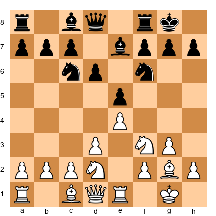</p>


**Position:** After 1.Nf3 d5 2.g3 Nf6 3.Bg2 e6 4.O-O Be7 5.d3 O-O 6.Nbd2 c5 7.e4 Nc6 8.Re1

**Set up your board:** White to move

**Rating:** ★★  
**Time:** 2 minutes  
**Hint:** What's White's typical central break in the KIA?

**Solution:**

9.e5

This is the thematic break. After 9...Nd7 10.Nf1, White follows the KIA attack pattern (Nf1-g5, Bf4, Qe2, etc.).

---

**Exercise 3: Pirc - Fighting Back**


<p align="center"></p>


**Position:** 1.e4 d6 2.d4 Nf6 3.Nc3 g6 4.f4 (Austrian Attack)

**Set up your board:** Black to move

**Rating:** ★★  
**Time:** 2 minutes  
**Hint:** How does Black fight for the center?

**Solution:**

4...Bg7 5.Nf3 O-O 6.Be3 c5!

Black strikes back with ...c5, challenging White's center immediately.

---

### ★★★ Find the Repertoire Move (12)

**Exercise 4: London - Queen Trade Decision**


<p align="center"></p>


**Position:** 1.d4 d5 2.Bf4 Nf6 3.e3 c5 4.c3 Qb6

**Set up your board:** White to move

**Rating:** ★★★  
**Time:** 3 minutes  
**Hint:** Black attacks b2 and d4. What's your clean response?

**Solution:**

5.Qb3!

Offer the queen trade. After 5...Qxb3 6.axb3, White has the bishop pair and an active rook on a1. This is slightly better for White.

---

**Exercise 5: London - Bishop Trade**


<p align="center"></p>


**Position:** 1.d4 d5 2.Bf4 Nf6 3.e3 e6 4.Bd3 Bd6

**Set up your board:** White to move

**Rating:** ★★★  
**Time:** 3 minutes  
**Hint:** Should you trade or retreat?

**Solution:**

5.Bxd6!

TAKE. This is not a bad trade. You're simplifying the position, and after 5...Qxd6 6.Nf3 O-O 7.Nbd2, you have a solid, comfortable position.

---

**Exercise 6: KIA - Kicking the Bishop**


<p align="center">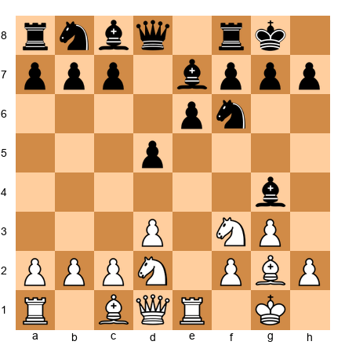</p>


**Position:** After 1.Nf3 Nf6 2.g3 d5 3.Bg2 e6 4.O-O Be7 5.d3 O-O 6.Nbd2 Bg4

**Set up your board:** White to move

**Rating:** ★★★  
**Time:** 3 minutes  
**Hint:** The bishop pins your knight. How do you kick it?

**Solution:**

7.h3 Bh5 8.g4!

This looks aggressive, but it's standard in the KIA. After 8...Bg6 9.e4, White has achieved the thematic break.

---

**Exercise 7: KID - Starting the Attack**


<p align="center">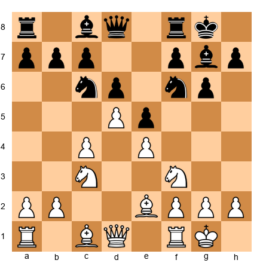</p>


**Position:** 1.d4 Nf6 2.c4 g6 3.Nc3 Bg7 4.e4 d6 5.Nf3 O-O 6.Be2 e5 7.d5 Nc6 8.O-O Ne7

**Set up your board:** Black to move

**Rating:** ★★★  
**Time:** 3 minutes  
**Hint:** Where does Black's knight belong?

**Solution:**

9...Nd7!

The knight repositions to f8 or c5, preparing the ...f5 break. This is typical KID maneuvering.

---

**Exercise 8: Pirc - Classical Setup**


<p align="center"></p>


**Position:** 1.e4 d6 2.d4 Nf6 3.Nc3 g6 4.Nf3 Bg7 5.Be2 O-O 6.O-O

**Set up your board:** Black to move

**Rating:** ★★★  
**Time:** 3 minutes  
**Hint:** How does Black develop pressure?

**Solution:**

6...Bg4!

Pin the knight. After 7.Be3 Nc6 8.Qd2, Black is developing normally with pressure on d4.

---

**Exercise 9: Italian Game - Development**


<p align="center"></p>


**Position:** 1.e4 e5 2.Nf3 Nc6 3.Bc4 Nf6

**Set up your board:** White to move

**Rating:** ★★★  
**Time:** 3 minutes  
**Hint:** How does White continue development?

**Solution:**

4.d3!

Solid and safe. White prepares O-O and supports the center. This is more reliable than 4.Ng5 (the Fried Liver), which is too risky at this level.

---

**Exercise 10: Queen's Gambit - Accepting**


<p align="center">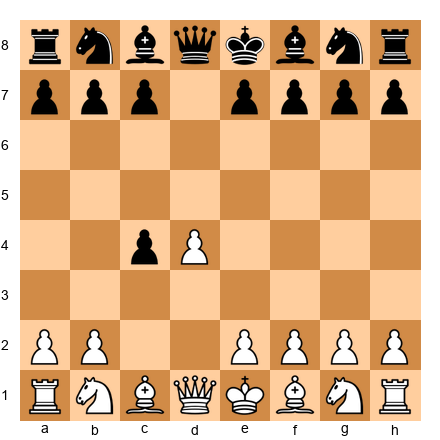</p>


**Position:** 1.d4 d5 2.c4 dxc4

**Set up your board:** White to move

**Rating:** ★★★  
**Time:** 3 minutes  
**Hint:** How does White recapture the pawn?

**Solution:**

3.e3!

Not 3.Qa4+ (too early). After 3...e6 4.Bxc4, White has regained the pawn with a lead in development.

---

**Exercise 11: Trompowsky - Fighting Back**


<p align="center">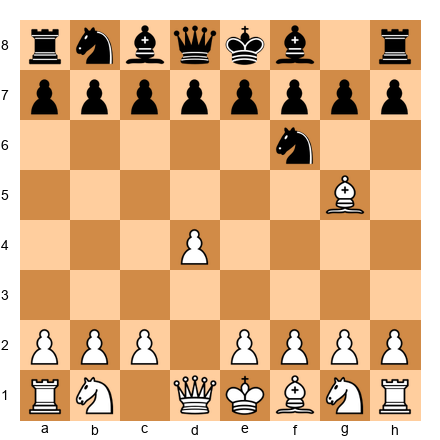</p>


**Position:** 1.d4 Nf6 2.Bg5

**Set up your board:** Black to move

**Rating:** ★★★  
**Time:** 3 minutes  
**Hint:** How does Black counterattack?

**Solution:**

2...Ne4!

Attack the bishop. After 3.Bf4 c5, Black is fighting for the center actively.

---

**Exercise 12: London - Early c4**


<p align="center">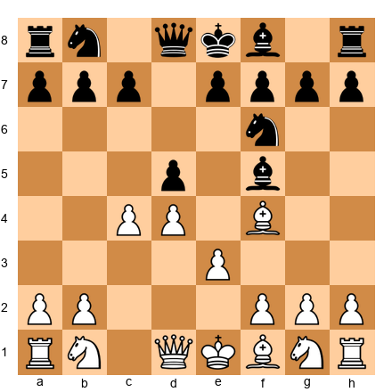</p>


**Position:** 1.d4 d5 2.Bf4 Nf6 3.e3 Bf5 4.c4

**Set up your board:** Black to move

**Rating:** ★★★  
**Time:** 3 minutes  
**Hint:** Should Black take on c4 or maintain tension?

**Solution:**

4...e6 5.Nc3 c6

Maintain tension. Black develops solidly. Taking on c4 immediately gives White too much activity.

---

**Exercise 13: KIA - Rook Placement**


<p align="center">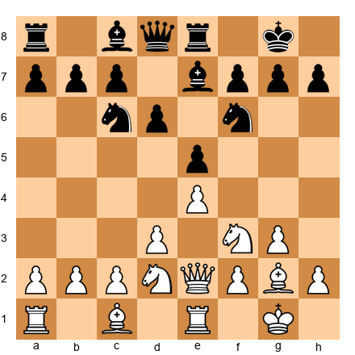</p>


**Position:** After typical KIA development with e4 played

**Set up your board:** White to move

**Rating:** ★★★  
**Time:** 3 minutes  
**Hint:** Where does the rook belong?

**Solution:**

10.Re1

Typical KIA rook placement. The rook supports e5 and prepares central action.

---

**Exercise 14: KID - f5 Break**


<p align="center"></p>


**Position:** After 1.d4 Nf6 2.c4 g6 3.Nc3 Bg7 4.e4 d6 5.Nf3 O-O 6.Be2 e5 7.d5 Nc6 8.O-O Ne7 9.Ne1 Nd7

**Set up your board:** Black to move

**Rating:** ★★★  
**Time:** 3 minutes  
**Hint:** What's Black's thematic break?

**Solution:**

10...f5!

This is the key break in the KID. After 11.exf5 gxf5, Black has dynamic play on the kingside.

---

**Exercise 15: Pirc - Austrian Attack Response**


<p align="center">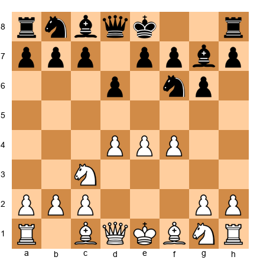</p>


**Position:** 1.e4 d6 2.d4 Nf6 3.Nc3 g6 4.f4 Bg7 5.Nf3

**Set up your board:** Black to move

**Rating:** ★★★  
**Time:** 3 minutes  
**Hint:** Where does Black castle?

**Solution:**

5...O-O!

Castle immediately. Don't delay. After 6.Be3 Nc6, Black is developing normally and preparing counterplay.

---

### ★★★★ Identify the Correct Plan (10)

**Exercise 16: London - Middlegame Plan**


<p align="center"></p>


**Position:** Typical London middlegame after both sides have developed

**Set up your board:** White to move

**Rating:** ★★★★  
**Time:** 5 minutes  
**Hint:** What's White's strategic plan?

**Solution:**

White should play for e4 (after proper preparation) OR dxc5 followed by b4-b5, gaining queenside space. The key is NOT to play passively. Example: 10.Qc2 (prepare e4) or 10.dxc5 Bxc5 11.b4 (gain space).

**Plan:** e4 break OR queenside expansion with b4-b5.

---

**Exercise 17: KIA - Attack Execution**


<p align="center"></p>


**Position:** KIA middlegame after e4 and e5 have been played

**Set up your board:** White to move

**Rating:** ★★★★  
**Time:** 5 minutes  
**Hint:** How does White start the kingside attack?

**Solution:**

White should play Nf1 (repositioning to g5 or e3), followed by Bf4 or Bg5, and then push h4-h5. Example: 11.Nf1 followed by 12.Bg5 or 12.Bf4, building pressure on the kingside.

**Plan:** Nf1-g5, Bf4, h4-h5, launch kingside attack.

---

**Exercise 18: KID - Preparing the Attack**


<p align="center">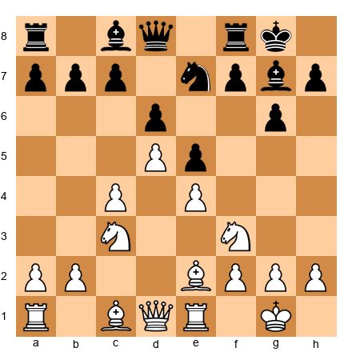</p>


**Position:** After 1.d4 Nf6 2.c4 g6 3.Nc3 Bg7 4.e4 d6 5.Nf3 O-O 6.Be2 e5 7.d5 Nc6 8.O-O Ne7 9.Ne1 Nd7

**Set up your board:** Black to move

**Rating:** ★★★★  
**Time:** 5 minutes  
**Hint:** What's Black's full attacking plan?

**Solution:**

Black should play 10...f5, followed by 11...Nf6, 12...g5-g4, and swing the rook to g6 or f6. The full plan is: f5, Nf6, g5, Rf6-Rg6, Qe8-Qg6, launch mating attack.

**Plan:** f5, Nf6, g5-g4, Rf6-Rg6, Qe8-Qg6, mate.

---

**Exercise 19: Pirc - Counterplay Plan**


<p align="center">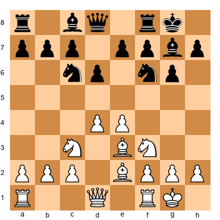</p>


**Position:** Pirc middlegame after White has developed normally

**Set up your board:** Black to move

**Rating:** ★★★★  
**Time:** 5 minutes  
**Hint:** How does Black create counterplay?

**Solution:**

Black should play ...e5!, fighting for central space. After dxe5 dxe5, Black has active pieces. Alternative: ...a6 followed by ...b5, creating queenside play.

**Plan:** ...e5 (central counterplay) OR ...a6, ...b5 (queenside counterplay).

---

**Exercise 20: London - Handling c5-c4**


<p align="center">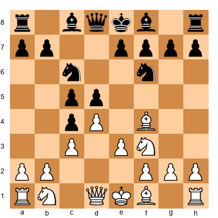</p>


**Position:** After 1.d4 d5 2.Bf4 Nf6 3.e3 c5 4.c3 Nc6 5.Nf3 Qb6 6.Qb3 c4

**Set up your board:** White to move

**Rating:** ★★★★  
**Time:** 5 minutes  
**Hint:** Black closed the queenside. Where does White play?

**Solution:**

7.Qc2

The queen repositions. White's plan is to play Nbd2-f1-e3, supporting the e4 break. After Nbd2, Nf1, Ne3, White has pressure on d5 and can play for e4 or f3-e4.

**Plan:** Qc2, Nbd2-Nf1-Ne3, prepare e4 or f3-e4.

---

**Exercise 21: KIA - Dealing with ...d4**


<p align="center">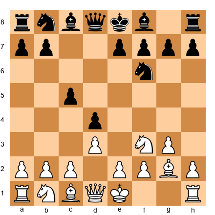</p>


**Position:** After 1.Nf3 Nf6 2.g3 d5 3.Bg2 c5 4.O-O Nc6 5.d3 e6 6.Nbd2 Be7 7.e4 d4

**Set up your board:** White to move

**Rating:** ★★★★  
**Time:** 5 minutes  
**Hint:** Black closed the center. What's White's plan?

**Solution:**

White should play a4 (stop ...b5-b4), followed by Nc4 (reroute the knight), and then play on the kingside with f4 or h4. The plan is to build slowly on the flanks.

**Plan:** a4, Nc4, f4 or h4, build on the wings.

---

**Exercise 22: Italian Game - Central Tension**


<p align="center"></p>


**Position:** After 1.e4 e5 2.Nf3 Nc6 3.Bc4 Bc5 4.c3 Nf6 5.d3 O-O

**Set up your board:** White to move

**Rating:** ★★★★  
**Time:** 5 minutes  
**Hint:** What's White's plan?

**Solution:**

White should play O-O, followed by h3 (stop ...Ng4), and then push d4, opening the center. The plan is: O-O, h3, d4, gain space and activity.

**Plan:** O-O, h3, d4, open the center.

---

**Exercise 23: Queen's Gambit Declined - Queenside Play**


<p align="center">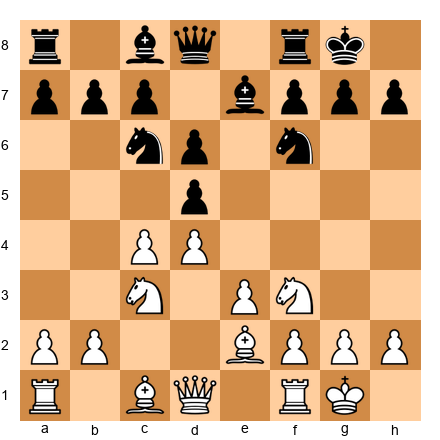</p>


**Position:** After 1.d4 d5 2.c4 e6 3.Nc3 Nf6 4.Nf3 Be7 5.e3 O-O 6.Be2 c6 7.O-O Nbd7

**Set up your board:** White to move

**Rating:** ★★★★  
**Time:** 5 minutes  
**Hint:** Where does White create play?

**Solution:**

White should play cxd5 cxd5, followed by b4-b5, gaining queenside space. Alternative: Qc2 followed by Bd2 and Rac1, building pressure on the c-file.

**Plan:** cxd5 cxd5, b4-b5 (queenside space) OR Qc2, Bd2, Rac1 (c-file pressure).

---

**Exercise 24: Pirc - Austrian Attack Counterplay**


<p align="center">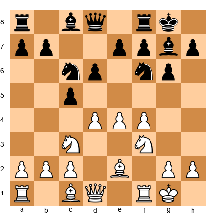</p>


**Position:** After 1.e4 d6 2.d4 Nf6 3.Nc3 g6 4.f4 Bg7 5.Nf3 O-O 6.Be2 c5 7.dxc5 dxc5 8.O-O Nc6

**Set up your board:** Black to move

**Rating:** ★★★★  
**Time:** 5 minutes  
**Hint:** How does Black generate counterplay?

**Solution:**

Black should play ...Bg4, pinning the knight, followed by ...Nd4, challenging the center. Alternative: ...Qa5, attacking the c3 knight and preparing ...Rfd8.

**Plan:** ...Bg4, ...Nd4, pressure on the center OR ...Qa5, ...Rfd8, active pieces.

---

**Exercise 25: KID - Queenside Counterplay**


<p align="center">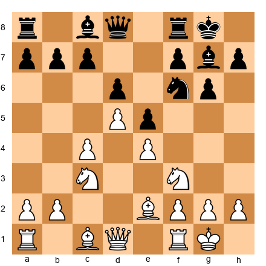</p>


**Position:** After 1.d4 Nf6 2.c4 g6 3.Nc3 Bg7 4.e4 d6 5.Nf3 O-O 6.Be2 e5 7.d5 Nbd7

**Set up your board:** Black to move

**Rating:** ★★★★  
**Time:** 5 minutes  
**Hint:** If Black plays ...Nc5, what's the plan?

**Solution:**

Black plays 10...Nc5, attacking e4, followed by ...a5 (stop b4), and then ...f5, starting the kingside attack. The plan is: Nc5, a5, f5, launch kingside attack.

**Plan:** Nc5, a5, f5, Nf6, g5-g4, kingside attack.

---

### ★★★★★ Find the Novelty or Improvement (5)

**Exercise 26: London - Novelty in the Early Trade**


<p align="center">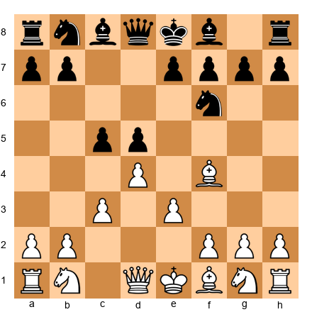</p>


**Position:** After 1.d4 d5 2.Bf4 c5 3.dxc5 e6 4.e3

**Set up your board:** Black to move

**Rating:** ★★★★★  
**Time:** 10 minutes  
**Hint:** The standard move is 4...Bxc5. Is there an improvement?

**Solution:**

4...Na6!?

This is a novelty. The knight goes to a6, preparing to recapture on c5 with the knight instead of the bishop. After 5.Nf3 Nxc5, Black has active piece play and pressure on b3. This is better than 4...Bxc5 because the bishop can go to d6, creating more pressure.

**Improvement:** 4...Na6! (knight recaptures, more flexible)

---

**Exercise 27: KIA - Improvement in the Attack**


<p align="center">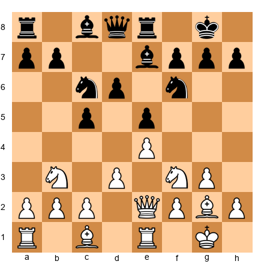</p>


**Position:** After typical KIA development with e4 and e5 played

**Set up your board:** White to move

**Rating:** ★★★★★  
**Time:** 10 minutes  
**Hint:** The standard plan is Nf1-g5. Is there an improvement?

**Solution:**

12.h4!?

This is an improvement. Instead of Nf1 immediately, White plays h4 FIRST, preparing h5 before rerouting the knight. After 12...h6 13.Nf1, White has prepared the kingside attack more concretely. If Black doesn't play ...h6, White gets h5 for free.

**Improvement:** 12.h4! (prepare h5 BEFORE Nf1)

---

**Exercise 28: KID - Novelty in the f5 Line**


<p align="center"></p>


**Position:** After 1.d4 Nf6 2.c4 g6 3.Nc3 Bg7 4.e4 d6 5.Nf3 O-O 6.Be2 e5 7.d5 Nc6 8.O-O Ne7 9.Ne1 Nd7

**Set up your board:** Black to move

**Rating:** ★★★★★  
**Time:** 10 minutes  
**Hint:** The standard move is 10...f5. Is there an improvement?

**Solution:**

10...Kh8!?

This is a prophylactic move. Before playing ...f5, Black moves the king off the g-file, avoiding back-rank tactics. After 11.Nd3 f5 12.exf5 gxf5, Black's position is safer because the king isn't on the same file as the rook.

**Improvement:** 10...Kh8! (prophylaxis before ...f5)

---

**Exercise 29: Pirc - Improvement in the Austrian Attack**


<p align="center"></p>


**Position:** After 1.e4 d6 2.d4 Nf6 3.Nc3 g6 4.f4 Bg7 5.Nf3 O-O 6.Be2 c5 7.dxc5 dxc5 8.O-O Nc6

**Set up your board:** Black to move

**Rating:** ★★★★★  
**Time:** 10 minutes  
**Hint:** The standard move is 10...Bg4. Is there a better plan?

**Solution:**

10...Qa5!?

This is more aggressive. Black attacks the Nc3, prepares ...Rd8, and creates immediate threats. After 11.Bd2 Qc7, Black has dynamic play. This is better than 10...Bg4 because the queen is more active.

**Improvement:** 10...Qa5! (activate queen immediately)

---

**Exercise 30: Italian Game - Critical Improvement**


<p align="center"></p>


**Position:** After 1.e4 e5 2.Nf3 Nc6 3.Bc4 Bc5 4.c3 Nf6 5.d3 O-O

**Set up your board:** Black to move

**Rating:** ★★★★★  
**Time:** 10 minutes  
**Hint:** The standard move is 6...d6. Is there an improvement?

**Solution:**

6...a6!?

This is a refinement. Before playing ...d6, Black plays ...a6, preparing ...Ba7 (after White plays d4). This gives Black more flexibility. After 7.O-O Ba7!, Black's bishop is safer on a7 than on c5.

**Improvement:** 6...a6! (prepare ...Ba7, more flexible)

---

🛑 **REST MARKER** - Thirty exercises complete! Take a well-deserved break.

---

## Key Takeaways

1. **Your beginner repertoire is fine.** You just need to understand it DEEPLY at 1600+.

2. **The London System works at ALL levels** - but you need to know advanced variations (early ...c5, ...Qb6, ...Bf5).

3. **The KIA is an attacking system** - follow the pattern: e5, Nf1-g5, Bf4, h4-h5.

4. **Mainline theory matters** - learn the IDEAS before memorizing moves.

5. **The Pirc Defense is flexible** - you can play ...c5, ...e5, or ...Nc6 depending on White's setup.

6. **The King's Indian Defense is aggressive** - you're playing for a WIN, not a DRAW.

7. **Repertoire trees help you organize** - map your openings visually.

8. **Anti-systems are annoying, not better** - stay calm and use PRINCIPLES.

9. **Transpositions expand your options** - know the KEY POSITIONS, not just move orders.

10. **Study openings efficiently** - IDEAS first, MOVES second.

11. **Build an opening notebook** - update it after every tournament game.

12. **Don't switch openings too often** - give your repertoire time to mature.

---

## Practice Assignment

**This Week:**

1. Pick ONE of your openings (London, KIA, Pirc, or KID)
2. Find 5 master games in that opening
3. Play through each game, writing down the KEY PLANS
4. Play 3 online games with that opening
5. After each game, write down: "What did I learn? What would I do differently?"

**Next Week:**

1. Build your repertoire tree (use paper, digital file, or chess database)
2. Add variations you discovered this week
3. Note any positions where you struggled
4. Study those positions specifically

**This Month:**

1. Create an opening notebook (physical or digital)
2. Include: opening names, key positions, main plans, common deviations
3. Review your notebook before every tournament

---

## ⭐ Progress Check

You've completed Chapter 29 if you can:

- [ ] Explain why your repertoire needs to grow at 1600+
- [ ] Handle advanced London System variations (early ...c5, ...Qb6, ...Bf5)
- [ ] Execute the KIA attack pattern (e5, Nf1-g5, Bf4, h4-h5)
- [ ] Understand basic mainline theory concepts (Italian, Queen's Gambit)
- [ ] Play the Pirc Defense with ...c5 or ...e5 counterplay
- [ ] Execute the KID attack pattern (f5, g5-g4, Rf6-Rg6)
- [ ] Build a repertoire tree for your openings
- [ ] Handle anti-systems and surprise weapons calmly
- [ ] Recognize key transpositions
- [ ] Study openings efficiently (ideas before memorization)
- [ ] Know when to switch openings (and when to stay loyal)
- [ ] Build a personal preparation notebook

If you can't do these things yet, that's OK! Re-read the sections you struggled with. Practice the exercises again. Opening knowledge takes TIME to build.

---

## 🛑 Final Rest Marker

**You made it through a DENSE chapter.** This was ~12,000 words of opening theory, plans, variations, games, and exercises.

Take a full break. Stretch. Walk. Hydrate. Eat something.

Opening repertoire expansion is NOT a one-day process. It's a months-long journey. Be patient with yourself.

When you're ready, move to Chapter 30: Time Management in Tournament Games.

See you there! 💙♟️

---

**END OF CHAPTER 29**

