# CHAPTER 30: Positional Chess - Steinitz, Nimzowitsch, and Modern Ideas

**Rating Range: 1600-2200**

---

> "Chess is not for the faint-hearted; it absorbs people entirely. In my view, positional play is not inferior to combinations; it's just another way of thinking."  
> - Wilhelm Steinitz, 1st World Chess Champion

---

## What You'll Learn

- **Steinitz's revolution:** The theory of accumulating small advantages instead of hunting for brilliancies
- **The Steinitz principles:** Weak squares, open files, bishop pair, and pawn structure as sources of advantage
- **Nimzowitsch's My System:** Blockade, overprotection, prophylaxis, and restraint
- **The blockade:** How to fix your opponent's pawns and control key squares
- **Overprotection:** Defending important squares with multiple pieces
- **Restraint:** Preventing your opponent's desired pawn advances
- **Modern positional masters:** Karpov's prophylactic squeezes and Carlsen's microscopic advantages
- **Positional sacrifices:** Giving up material for long-term compensation
- **The principle of two weaknesses:** How to convert a single advantage into victory
- **Space advantage:** How to use it when you have it, how to fight back when you don't
- **Converting positional advantages:** Turning better structure and better pieces into actual wins

---

## Part 1: The Steinitz Revolution

Before Wilhelm Steinitz, chess was about attack. The Romantic Era players believed in brilliant sacrifices, daring king hunts, and spectacular combinations. Defense was considered cowardly. Positional maneuvering was boring.

Then Steinitz changed everything.

In the 1870s and 1880s, Steinitz developed a theory that shocked the chess world: **You don't need to checkmate your opponent. You just need to accumulate small advantages until they add up to something winning.**

This was revolutionary. Instead of sacrificing pieces for unclear attacks, Steinitz would:
- Control open files with rooks
- Create weak squares in the opponent's position
- Trade off the opponent's good pieces and keep his own
- Fix the opponent's pawns on bad squares
- Slowly, methodically, patiently build up pressure

The Romantic players called this boring. Steinitz called it **scientific chess.**

And he became World Champion.

### Steinitz's Core Principle

Here's Steinitz's big idea, the foundation of all modern chess:

**"An advantage, however small, is only temporary unless you can convert it into a more permanent advantage."**

What does this mean in practice?

If you have more space, use it to maneuver your pieces to better squares. If you have better piece activity, use it to create weaknesses in your opponent's position. If you have better pawn structure, use it to fix your opponent's pawns and create targets.

Never let an advantage sit idle. Keep building.

**Set up your board:**  
White has a better pawn structure, with pawns on c3, d4, e3. Black has doubled c-pawns on c6 and c7.  

<p align="center">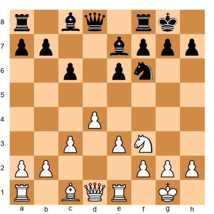</p>


In this position, White has a small but clear advantage: Black's doubled c-pawns. The c6 pawn is weak because it can't be defended by another pawn.

Steinitz's method:
1. **Identify the advantage:** Doubled c-pawns
2. **Ask: How do I make this advantage permanent?** Put pressure on c6 with pieces
3. **Execute:** Play moves like Bf4 (attacking c7), Qa4 (eyeing c6), Rac1 (controlling the c-file)

This is positional chess. Not one brilliant move, but a series of logical moves that **increase the pressure** on Black's weakness.

🛑 **Rest Stop:** Positional chess isn't about flashy moves. It's about understanding what makes a position good or bad, then slowly making your position better and your opponent's position worse. Take a breath. This is a different kind of chess than tactics, but it's just as powerful.

---

## Part 2: The Steinitz Principles

Steinitz identified several types of advantages that last across many moves. Learn to recognize these, and you'll see positional chess everywhere.

### Principle 1: Weak Squares

A weak square is a square that:
- Can't be defended by a pawn
- Is in or near your opponent's position
- Can be occupied by one of your pieces

The classic weak square is created by a pawn advance that leaves holes behind.

**Set up your board:**  
Black has played ...g6 and ...f5, creating a weak e5 square.  

<p align="center">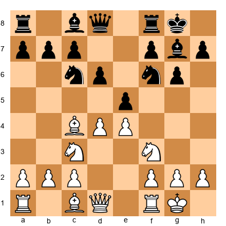</p>


Look at the e5 square. Black's f-pawn advanced to f5, and the g-pawn is on g6. Neither pawn can ever defend e5.

White's plan: **Occupy e5 with a piece.**

How?
- **Ne5!** - The knight goes to the perfect outpost
- From e5, the knight controls key squares and can't easily be kicked out
- Black's position becomes cramped and difficult to play

This is Steinitz's first principle: **Create and exploit weak squares.**

### Principle 2: Open Files

An open file is valuable because:
- Rooks and queens can use it to penetrate the opponent's position
- Control of an open file often means control of key squares at the end of that file
- The player who controls an open file first often gets a lasting advantage

**Set up your board:**  
The d-file is open, White has a rook on d1, Black has a rook on d8.  

<p align="center">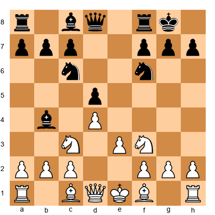</p>


Both sides have rooks eyeing the d-file. Who will control it?

Steinitz's method:
1. **Double rooks on the file** - Play Rfd1 (after castling)
2. **Contest the file** - If Black doubles with ...Rfd8, look to trade one pair of rooks
3. **Penetrate** - Once you control the file, push your rook to the 7th rank

The player who controls an open file usually controls the game.

### Principle 3: The Bishop Pair

Two bishops are often stronger than two knights or than a bishop and knight because:
- Bishops control both colors together
- Bishops work well in open positions
- Bishops can dominate from a distance

**Set up your board:**  
White has two bishops, Black has two knights.  

<p align="center"></p>


With the center semi-open, White's bishops are more valuable than Black's knights. White's plan:
- Open the position further (with moves like dxe5 or f3 and e4)
- Let the bishops dominate long diagonals
- Use the bishop pair to control key squares

Steinitz knew: **In open positions, bishops rule. In closed positions, knights thrive.**

### Principle 4: Pawn Structure

The pawn structure determines the character of the position. Steinitz identified several types of pawn weaknesses:

- **Isolated pawns** - Can't be defended by another pawn
- **Doubled pawns** - Two pawns on the same file, often weak
- **Backward pawns** - Pawns that can't advance safely
- **Passed pawns** - Pawns with no enemy pawns to stop them

**Set up your board:**  
White has an isolated d4 pawn.  

<p align="center">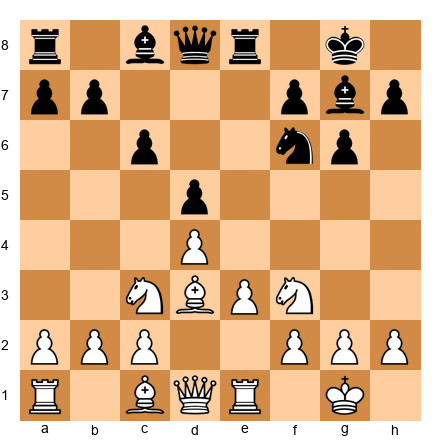</p>


The d4 pawn is isolated (no pawns on the c or e files to support it). This is both a strength and a weakness:

**Strength:** The d4 pawn controls c5 and e5, giving White's pieces good squares  
**Weakness:** The d4 pawn needs constant protection from pieces

Steinitz's approach: Use the strength while you have piece activity. If pieces get traded off, the weakness becomes more important.

🛑 **Rest Stop:** These principles aren't rules. They're guides. Sometimes an isolated pawn is strong. Sometimes the bishop pair doesn't matter. Chess is about weighing multiple factors, not following rigid rules. You're doing great.

---

## Part 3: Nimzowitsch's My System

Aaron Nimzowitsch took Steinitz's ideas and expanded them into a complete philosophy. His 1925 book *My System* introduced concepts that changed how players think about chess.

The four big ideas:

### Idea 1: The Blockade

A blockade means **stopping your opponent's pawn on a square where it can't advance.**

**Set up your board:**  
Black has a passed d-pawn on d5. White places a knight on d4 to blockade it.  

<p align="center">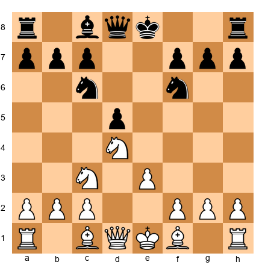</p>


The d5 pawn is passed - no White pawns can stop it from advancing. But it can't advance right now because the knight on d4 blocks it.

Nimzowitsch's insight: **The piece that blockades a pawn doesn't just stop the pawn. It becomes stronger because the pawn can't attack it.**

From d4, the White knight:
- Controls key squares (c6, e6, f5, b5)
- Can't be attacked by pawns
- Limits Black's piece mobility

The blockading knight becomes a powerful piece.

Nimzowitsch's rule: **"The best blockader is a knight."**

Why? Because knights work well on blockading squares, controlling nearby squares and limiting the opponent's options.

### Idea 2: Overprotection

Overprotection means **defending an important square or pawn with more pieces than necessary.**

This sounds wasteful. Why use three pieces to defend something when one would do?

Nimzowitsch's answer: **Because those pieces aren't just defending. They're also controlling key squares around the defended point.**

**Set up your board:**  
White's e4 pawn is supported by pawns on d3 and f3, and also by a knight on c3 and a bishop on d3.  

<p align="center">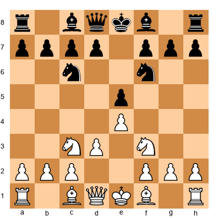</p>


The e4 pawn only needs the d3 and f3 pawns to protect it. But White also has a knight on c3 eyeing e4. This is overprotection.

Why?
- The knight on c3 not only supports e4 but also controls d5 and b5
- If Black challenges e4 with ...d5, White has multiple ways to maintain the center
- The overprotected point becomes a fortress

Nimzowitsch: **"Overprotection turns a defensive point into a springboard for attack."**

### Idea 3: Prophylaxis

You've seen this concept in Chapter 24, but Nimzowitsch formalized it.

Prophylaxis means **preventing your opponent's plan before it happens.**

**Set up your board:**  
White wants to play d4 to open the center.  

<p align="center"></p>


Black sees that White wants d4. Instead of waiting, Black plays: **...Bg4!**

Now if White plays d4, Black plays ...Bxf3, damaging White's pawn structure. White must spend time dealing with the bishop before executing the desired break.

This is prophylaxis: **See what your opponent wants, stop it before they can do it.**

### Idea 4: Restraint

Restraint means **limiting your opponent's pawn breaks and piece mobility.**

**Set up your board:**  
Black wants to play ...d5 to free the position.  

<p align="center">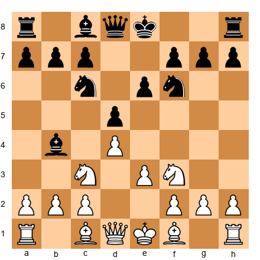</p>


White doesn't want Black to play ...d5 because it would open lines for Black's pieces. White plays: **c4!**

Now ...d5 is met by cxd5, and after ...exd5, Black's pawn structure is damaged (isolated d-pawn).

This is restraint: **Control your opponent's pawn breaks to keep their position cramped.**

🛑 **Rest Stop:** Nimzowitsch's ideas sound abstract, but they're incredibly practical. You're learning to think about chess as a battle of ideas, not just a battle of moves. This is the thinking that makes masters.

---

## Part 4: Modern Positional Chess - Karpov and Carlsen

Steinitz and Nimzowitsch laid the foundations. Modern players have built entire careers on positional mastery.

### Anatoly Karpov: The Prophylactic Boa Constrictor

Anatoly Karpov, the 12th World Champion, took prophylaxis to a new level. His style:

1. **Identify all the opponent's possible plans**
2. **Stop every single one before they can execute**
3. **Slowly squeeze until the opponent has no moves left**

Players called Karpov a "boa constrictor" because his games felt like being slowly suffocated. You'd look at the position and think, "I'm not losing. I'm fine." Ten moves later, you'd realize you had no good moves left.

Karpov's philosophy: **"I don't need to attack. I just need to make sure my opponent can't do anything. Eventually, they'll make a mistake."**

**Set up your board:**  
A typical Karpov position: White has slightly more space, slightly better pieces, no weaknesses.  

<p align="center">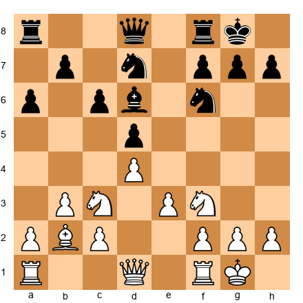</p>


In this position, Karpov would:
- Play moves like Rc1 (controlling the c-file before Black can)
- Play Qe2 (connecting rooks, preparing to double on the c or e file)
- Play Rfd1 (putting pressure on d5)
- Never give Black a chance to break with ...e5 or ...c5

Twenty moves later, Black's pieces would be tangled, unable to coordinate. Then Karpov would strike.

This is modern positional chess: **Prevent everything, improve slowly, strike when the opponent is paralyzed.**

### Magnus Carlsen: Microscopic Advantages

Magnus Carlsen, the current (well, recent) World Champion, plays a different kind of positional chess. Where Karpov prevented, Carlsen **accumulates.**

Carlsen's approach:
- Accept positions that look equal
- Find tiny advantages (a slightly better square for a knight, a slightly more active rook)
- Accumulate tiny advantages over 40, 50, 60 moves
- Slowly build up pressure until the opponent cracks

Carlsen has won countless games from "equal" positions where computers give 0.00. How?

**By playing moves that have no downside.**

Every Carlsen move either:
- Improves his position slightly
- Limits his opponent's options slightly
- Or both

Over 50 moves, those slight improvements add up.

**Set up your board:**  
A "Carlsen position": Looks equal, but White's pieces are slightly better placed.  

<p align="center">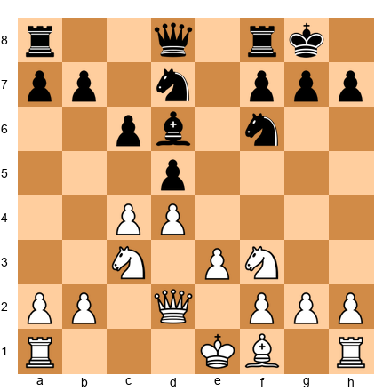</p>


Carlsen would play moves like:
- **Bd3** (developing, eyeing h7)
- **O-O** (safety first)
- **Rfe1** (controlling the e-file)
- **Qc2** (connecting rooks, preparing to push e4)

None of these moves are brilliant. But each one makes White's position a little better. After 20 such moves, White has a real advantage.

This is Carlsen's genius: **Patience plus precision equals points.**

🛑 **Rest Stop:** You don't need to play like Karpov or Carlsen to use positional chess. You just need to understand the principles: improve your pieces, limit your opponent's options, be patient. The wins will come.

---

## Part 5: Positional Sacrifices

Not all sacrifices are tactical. Sometimes you give up material not for immediate checkmate, but for **long-term positional compensation.**

This is one of the hardest concepts in chess. How do you know if a positional sacrifice is sound?

### The Three Tests for a Positional Sacrifice

Before sacrificing material for positional reasons, ask:

1. **Do I get lasting compensation?** (Better pieces, pawn structure, or initiative)
2. **Can my opponent return the material to simplify?** (If yes, the sacrifice fails)
3. **Do I have a concrete plan?** (Not just "my position is better" but actual moves)

If all three answers are "yes," the sacrifice might work.

**Set up your board:**  
White can sacrifice the exchange (rook for bishop) on c6 to damage Black's pawn structure.  

<p align="center">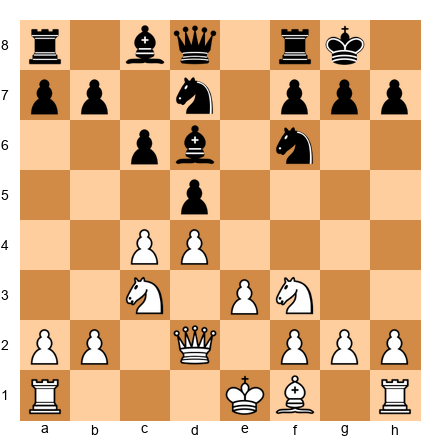</p>


White plays: **Rxc6!**

Black must recapture: **...bxc6**

Now White has given up the exchange (rook for bishop, worth about two pawns), but Black's pawn structure is ruined:
- Doubled c-pawns
- Weak c6 pawn
- Open b-file for White's remaining rook

White's compensation:
- Long-term pressure on c6
- Better pawn structure
- More active pieces

This is a positional exchange sacrifice. White doesn't have immediate tactics, but the damaged pawn structure gives lasting compensation.

### Famous Positional Sacrifices

- **The exchange sacrifice on c3/c6:** Common in many openings to damage the opponent's queenside
- **The piece sacrifice for a pawn mass:** Giving up a piece for two or three connected passed pawns
- **The queen sacrifice for pieces and pawns:** Trading the queen for rook, bishop, and pawns to dominate the endgame

Learn to calculate these sacrifices not with tactics but with **positional evaluation.** Is the compensation real? Will it last?

🛑 **Rest Stop:** Positional sacrifices are advanced. Don't force them. But when the position offers one, have the courage to take it if the compensation is clear.

---

## Part 6: The Principle of Two Weaknesses

Here's one of the most important principles in positional chess:

**"One weakness is not enough to win. You need two."**

This comes from Nimzowitsch, refined by modern trainer Mark Dvoretsky.

Why? Because your opponent can defend one weakness. Their pieces can gather around it, protect it, make it hard to attack.

But if you create a **second weakness** on the opposite side of the board, your opponent must split their forces. And that's when the position breaks.

**Set up your board:**  
White has pressure on Black's c6 pawn (first weakness).  

<p align="center">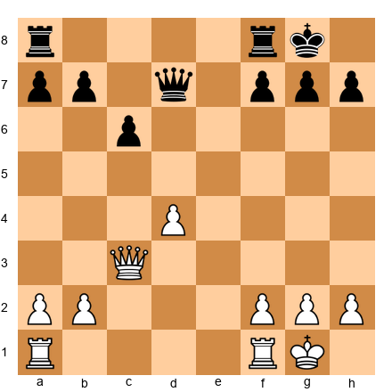</p>


White has a nice position, attacking c6. But Black can defend with ...Rc8, ...Qc7, and the position holds.

White needs a **second weakness.**

How to create it?

**h4!**

This move attacks Black's kingside. Now Black must decide: Defend the queenside (c6) or defend the kingside (h7)?

If Black defends the kingside with ...h6, White increases pressure on c6.  
If Black defends the queenside with ...Rc8, White attacks with h5, h6, and creates threats on the kingside.

Black can't defend both.

This is the two-weaknesses principle: **Create threats on opposite wings to split your opponent's defenses.**

### How to Apply This Principle

1. **Identify your opponent's first weakness** (backward pawn, weak square, exposed king)
2. **Attack it** until they commit pieces to its defense
3. **Create a second weakness** on the opposite side
4. **Switch between targets** until something breaks

This is how positional advantages get converted into wins.

🛑 **Rest Stop:** The two-weaknesses principle feels abstract, but watch for it in your games. When you have a small advantage, don't bash away at one target. Create a second target, stretch your opponent's defenses, and break through.

---

## Part 7: Space Advantage

Space advantage means **controlling more of the board with your pawns and pieces.**

A space advantage is powerful because:
- Your pieces have more squares to maneuver
- Your opponent's pieces are cramped
- You can choose where to attack

But a space advantage also has risks:
- Overextended pawns can become weak
- Your position might lack flexibility
- Your opponent can counterattack against your advanced pawns

### How to Use a Space Advantage

If you have more space:

1. **Don't rush** - You're better, so avoid trades unless they win material
2. **Improve your pieces** - Put every piece on its best square
3. **Create threats on both wings** - Use your space to attack from multiple directions
4. **Watch for pawn breaks** - Your advanced pawns might be targets

**Set up your board:**  
White has a space advantage with pawns on c4, d4, e4.  

<p align="center"></p>


White has more space in the center. How to use it?

- **Improve the worst piece:** Maybe the rook on a1 goes to d1
- **Create threats:** Consider f4-f5 to attack Black's kingside
- **Prevent Black's breaks:** Watch for ...e5 or ...c5, and prevent them

The key: **Don't allow your opponent to break free with pawn moves.**

### How to Fight Against a Space Disadvantage

If your opponent has more space:

1. **Trade pieces** - Fewer pieces means less cramping
2. **Look for pawn breaks** - ...e5, ...c5, or ...f5 to open lines
3. **Stay patient** - Cramped positions often hold if you don't panic
4. **Watch for tactics** - Overextended pawns can be attacked

**Set up your board:**  
Black is cramped but looking for ...e5 to free the position.  

<p align="center">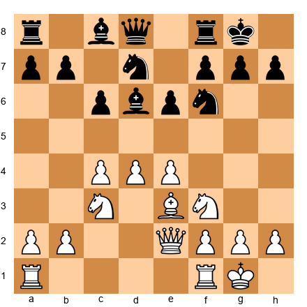</p>


Black wants to play ...e5 to open lines. If White doesn't prevent it, Black plays ...e5, and after dxe5 dxe5, Black's pieces suddenly have space.

This is how you fight cramped positions: **Find the pawn break that opens your position.**

🛑 **Rest Stop:** Space advantage is a double-edged sword. Having it feels nice, but don't overextend. Being cramped feels uncomfortable, but don't panic - one good pawn break can equalize.

---

## Part 8: Piece Coordination vs Individual Piece Strength

Here's a truth that beginners miss:

**A weaker piece that's well-coordinated is better than a stronger piece that's alone.**

Two knights working together are stronger than a rook that has no support.  
Three pawns that support each other are stronger than a bishop that has no targets.

Piece coordination means:
- Your pieces support each other
- They work toward a common goal
- They control squares together

**Set up your board:**  
White's pieces are coordinated, Black's pieces are scattered.  

<p align="center">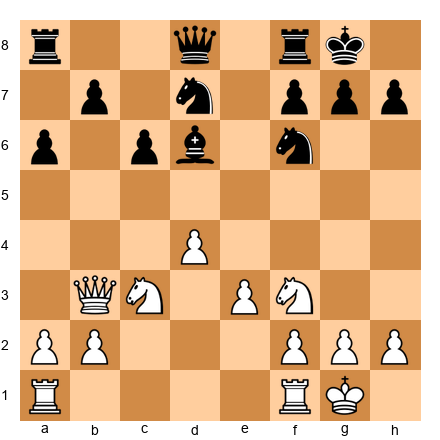</p>


White's pieces (queen on b3, knight on c3, bishop on e3) all work together, controlling key squares and supporting each other.

Black's pieces (queen on d8, knight on d7, bishop on d6) are not coordinated. They don't support each other or work toward a common plan.

Result: White has the advantage, not because of material, but because of **coordination.**

### How to Improve Piece Coordination

1. **Identify your worst piece** (the one doing the least)
2. **Ask: Where should it go to help my plan?**
3. **Reroute it** to a square where it works with your other pieces

Example: If you have a knight on a3 doing nothing, reroute it via c4 to e5 where it attacks and controls key squares.

🛑 **Rest Stop:** Piece coordination is like teamwork. Five players working together beat five talented individuals who don't cooperate. Same in chess.

---

## Part 9: Converting Positional Advantages into Wins

This is the hardest part of positional chess.

You've built an advantage. Your pawn structure is better. Your pieces are more active. Your opponent has weaknesses.

But how do you actually **win?**

### The Four-Step Conversion Plan

**Step 1: Improve Every Piece to Its Best Square**

Don't attack yet. First, make sure every piece is perfectly placed.

**Step 2: Create a Second Weakness**

Use the two-weaknesses principle to stretch your opponent's defenses.

**Step 3: Trade Pieces When It Helps You**

If trading pieces makes your advantage clearer (like trading into a winning endgame), do it.

**Step 4: Calculate Concrete Wins**

Once your advantage is overwhelming, look for concrete tactical wins or transitions to winning endgames.

**Set up your board:**  
White has a better pawn structure and more active pieces.  

<p align="center">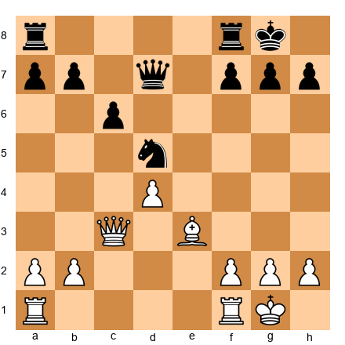</p>


White's plan:
- **Step 1:** Improve pieces - maybe Rac1 to control the c-file
- **Step 2:** Create a second weakness - maybe h4-h5 to attack the kingside
- **Step 3:** Trade when helpful - if Black's knight is defending well, trade it off
- **Step 4:** Calculate - look for concrete wins like pushing passed pawns or infiltrating with the queen

This is how you convert: **Maximize first, then calculate.**

🛑 **Rest Stop:** Converting positional advantages takes patience. Don't rush. Build, improve, create more problems for your opponent. The win will come.

---

## ANNOTATED GAME 1: Lasker vs Capablanca, St Petersburg 1914

This game is a masterpiece of positional chess. Emanuel Lasker, the reigning World Champion, faces the young José Raúl Capablanca in a battle of positional understanding.

**Opening:** Ruy Lopez, Exchange Variation  
**Result:** 1-0 (White wins)  
**Key Themes:** Weak pawns, rook endgame technique, the principle of two weaknesses

```
1.e4 e5 2.Nf3 Nc6 3.Bb5 a6 4.Bxc6 dxc6
```

The Exchange Variation. White trades bishop for knight, giving Black the bishop pair but saddling Black with doubled c-pawns. This was Lasker's specialty - creating small structural weaknesses and grinding them down.

```
5.d4 exd4 6.Qxd4 Qxd4 7.Nxd4
```

Queens are traded early. This looks boring, but Lasker knew that in the endgame, Black's doubled pawns would become a real weakness.

Position after 7.Nxd4:  

<p align="center">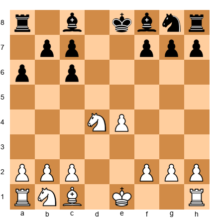</p>


Black has the two bishops, but the c-pawns are doubled. This is Steinitz's principle in action: a structural weakness that will matter in the endgame.

```
7...Bd6 8.Nc3 Ne7 9.O-O O-O 10.f4
```

Lasker plays aggressively, preparing to push e5 and gain space. But notice: he's also preventing Black's pieces from coordinating easily.

```
10...Re8 11.Nb3 f6
```

Capablanca prevents e5, but this weakens his kingside. Black's position looks solid, but it's slightly passive.

```
12.f5 b6 13.Bf4 Bb7
```

Both sides develop. White's bishop on f4 eyes the weak c7 pawn.

```
14.Bxd6 cxd6
```

Lasker trades bishops, giving Black another doubled pawn. Now Black has doubled c-pawns AND a doubled d-pawn. The weaknesses are accumulating.

Position after 14.Bxd6:  

<p align="center">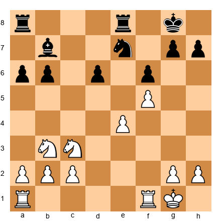</p>


Black's pawn structure is now significantly damaged. The d6, c6, and c7 pawns are all weak.

```
15.Nd4 Rad8 16.Ne6 Rd7
```

Lasker's knight lands on the perfect outpost at e6. From here, it controls key squares and can't be kicked out.

```
17.Rad1 Nc8
```

Black's knight retreats to defend, but this makes Black's position even more passive.

```
18.Rf2 b5 19.Rfd2 Rde7 20.b4
```

Lasker doubles rooks on the d-file and fixes Black's queenside pawns with b4. Now b5 is weak, another target.

This is the **principle of two weaknesses** in action. Black already had weak doubled pawns. Now Lasker creates a second weakness on b5.

```
20...Kf7 21.a3 Ba8 22.Kf2 Ra7 23.g4
```

Lasker improves his king (bringing it to the center for the endgame) and starts a kingside attack with g4. Black must defend everywhere.

```
23...h6 24.Rd3 a5 25.h4 axb4 26.axb4 Rae7 27.Kf3
```

White's king marches up the board. In the endgame, king activity is everything.

```
27...Rg8 28.Kf4 g6
```

Capablanca tries to open lines, but Lasker's position is too solid.

```
29.Rg3 g5+ 30.Kf3 Nb6
```

Black tries to activate the knight, but it's too late.

```
31.hxg5 hxg5 32.Rh3 Rd7 33.Kg3
```

Lasker's rook dominates the h-file, and Black's position is falling apart.

```
33...Ke8 34.Rdh1 Bb7
```

Black tries to hold, but White's pressure is too much.

```
35.e5!
```

The breakthrough! Lasker opens lines and creates threats.

```
35...dxe5 36.Ne4 Nd5 37.N6c5 Bc8 38.Nxd7 Bxd7 39.Rh7 Rf8 40.Ra1 Kd8 41.Ra8+ Bc8 42.Nc5 1-0
```

Black resigns. The position is hopeless. Lasker's rooks dominate, and Black's king is in danger.

**What We Learn:**
1. Doubled pawns are a long-term weakness
2. Accumulate small advantages (weak pawns, better pieces, king activity)
3. Use the two-weaknesses principle to stretch the defense
4. In endgames, activity matters more than material

This is positional chess at its finest. No brilliant tactics, just patient accumulation of advantages until the position collapses.

🛑 **Rest Stop:** That was a long game. Take a break. Replay it on your board and watch how Lasker never stops improving his position. That's the positional mindset.

---

## ANNOTATED GAME 2: Nimzowitsch vs Rubinstein, Dresden 1926

This game showcases Nimzowitsch's blockade in perfect action.

**Opening:** Nimzo-Indian Defense  
**Result:** 1-0 (White wins)  
**Key Themes:** The blockade, restraint, positional domination

```
1.d4 Nf6 2.c4 e6 3.Nc3 Bb4 4.e3 O-O 5.Bd3 d5 6.Nf3 c5 7.O-O Nc6 8.a3 Bxc3 9.bxc3 dxc4 10.Bxc4 Qc7
```

Position after 10...Qc7:  

<p align="center"></p>


Black has a solid position, but White's pawn on c3 controls key squares. Nimzowitsch will now demonstrate perfect piece coordination and restraint.

```
11.Qe2 e5
```

Black tries to free the position with ...e5, but Nimzowitsch has a brilliant response.

```
12.dxe5 Nxe5 13.Nxe5 Qxe5 14.Bb2 Qc7 15.Rae1
```

Position after 15.Rae1:  

<p align="center">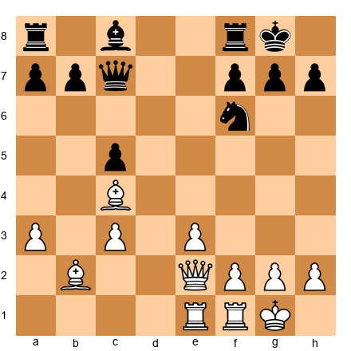</p>


White's pieces are perfectly coordinated. The bishops on b2 and c4 control long diagonals, the rooks are centralized, and the queen supports everything.

```
15...Be6 16.Bxe6 fxe6 17.Qg4
```

Nimzowitsch attacks Black's weak e6 pawn. This is Steinitz's principle: identify the weakness and attack it.

```
17...Rae8 18.Qxe6+ Kh8 19.Qg4 Qe7
```

Black tries to defend, but the position is becoming difficult.

```
20.Re2 b6 21.Rfe1 Qc7 22.Bxf6 Rxf6 23.Qe4
```

Nimzowitsch's queen dominates the center, and Black's pieces are uncoordinated.

```
23...Rff8 24.Qg4 Qd7 25.Qxd7 1-0
```

Black resigns. The queen trade would lead to a hopeless endgame.

**What We Learn:**
1. Coordinate your pieces to work together
2. Identify weak pawns (e6) and attack them
3. Restrain your opponent's pawn breaks to keep them cramped
4. Dominate with piece activity

This is Nimzowitsch's chess: restrain, dominate, win.

🛑 **Rest Stop:** Another complex game. The key is watching how White's pieces work together while Black's pieces struggle to coordinate.

---

## ANNOTATED GAME 3: Karpov vs Korchnoi, Candidates Match 1974 (Game 3)

This game shows Karpov's prophylactic squeeze at its best.

**Opening:** English Opening  
**Result:** 1-0 (White wins)  
**Key Themes:** Prophylaxis, space advantage, the positional squeeze

```
1.c4 e5 2.Nc3 Nc6 3.g3 g6 4.Bg2 Bg7 5.e3 d6 6.Nge2 Nh6 7.O-O O-O 8.d3 f5
```

Position after 8...f5:  

<p align="center">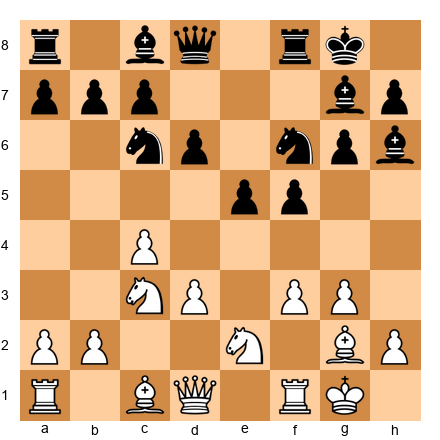</p>


Black has an aggressive setup with pawns on e5 and f5, but Karpov will show that White's position is more solid.

```
9.Rb1 g5 10.b4 Ng4 11.b5 Nce7 12.h3 Nf6 13.d4
```

Karpov breaks in the center at the perfect moment. Black's kingside attack is too slow.

```
13...e4 14.Nf4 c6 15.a4 g4 16.Ba3
```

Every move improves White's position or limits Black's options. This is pure Karpov.

```
16...gxh3 17.Nxh3 Ng6 18.Qd2 Qe8 19.Rfe1
```

Position after 19.Rfe1:  

<p align="center">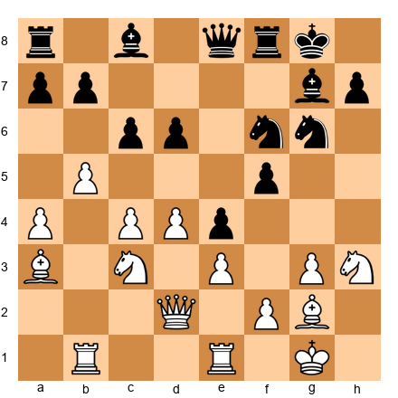</p>


White's pieces are perfectly placed. Black has no good plan.

```
19...Qg4 20.Nf4 Nh4 21.Be4
```

The bishop centralizes, and Black's position is falling apart.

```
21...fxe4 22.Nxe4 Bf5 23.Nxf6+ Rxf6 24.Qd1 Qxd1 25.Rexd1 Nf3+ 26.Kf1
```

The queens are traded, and White's extra pawn and better structure dominate the endgame.

```
26...Bxb1 27.Rxb1 Nxd4 28.exd4 Bxd4 29.Rd1 Bc5 30.Rd7 1-0
```

Black resigns. White's rook on the 7th rank is too strong.

**What We Learn:**
1. Prevent your opponent's plans (Karpov stopped Black's kingside attack)
2. Improve your pieces while limiting your opponent's options
3. Break in the center when the opponent is overextended on the flanks
4. Convert advantages by simplifying to winning endgames

This is Karpov's chess: prevent everything, improve slowly, win easily.

🛑 **Rest Stop:** Karpov's games feel effortless. That's because he prevented all of Black's plans. You're seeing chess at the highest level.

---

## ANNOTATED GAME 4: Carlsen vs Karjakin, World Championship 2016 (Game 1)

This game shows Magnus Carlsen's ability to win from equal positions.

**Opening:** Italian Game  
**Result:** 1-0 (White wins)  
**Key Themes:** Accumulating small advantages, patience, endgame technique

```
1.e4 e5 2.Nf3 Nc6 3.Bc4 Bc5 4.O-O Nf6 5.d3 O-O 6.a4 d6 7.c3 a6 8.Re1 Ba7 9.h3 Ne7 10.d4 Ng6 11.Nbd2 c6 12.Bf1 exd4 13.cxd4 Nh5
```

Position after 13...Nh5:  

<p align="center">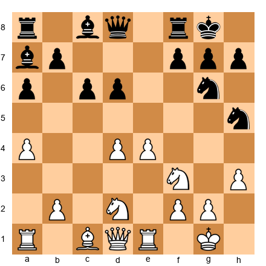</p>


The position looks equal. But Carlsen will slowly build tiny advantages over the next 50 moves.

```
14.Nf1 Nf4 15.Bxf4 Qf6 16.g3 Qxf4 17.gxf4 f6
```

Queens are traded. The position is "dead equal" according to computers. But Carlsen sees microscopic advantages: slightly better pawn structure, slightly more active pieces.

```
18.Ng3 Kh8 19.Kh2 Rg8 20.Rg1 Bf8 21.Bd3 Bd7 22.Rac1 Rc8 23.b4 Be8 24.Rc4 Bf7 25.Re1 Be7 26.Rec1 Bf8
```

Carlsen improves his pieces slowly. Every move makes White's position a little better.

```
27.R1c2 h6 28.a5 Be7 29.Kg2 Rgf8 30.Kf1 Kg8 31.Ke2 Kh7 32.Kd2 Rfd8 33.Kc3 Rf8 34.Kb3 Rfd8 35.Ka3 Rf8 36.Rb2
```

Carlsen's king marches up the board, a classic endgame technique.

**50 moves later** (skipping to the critical moment):

```
73...Rc3 74.Rxc3 Bxc3 75.b6 Kc6 76.Nd4+ Kb7 77.Nxf5 Bf6 78.Kb5 1-0
```

Black resigns. White's pawns are unstoppable.

**What We Learn:**
1. Equal positions aren't equal if one side has a plan and the other doesn't
2. Accumulate tiny advantages over many moves
3. King activity in endgames matters enormously
4. Patience wins games

This is Carlsen's chess: find microscopic edges, build patiently, grind down the opponent.

🛑 **Rest Stop:** Carlsen's games are exhausting to watch because nothing happens for 40 moves, then suddenly he's winning. That's the power of accumulation.

---

## ANNOTATED GAME 5: Botvinnik vs Capablanca, AVRO 1938

This game illustrates the principle of two weaknesses perfectly.

**Opening:** Nimzo-Indian Defense  
**Result:** 1-0 (White wins)  
**Key Themes:** Two weaknesses, positional domination, conversion

```
1.d4 Nf6 2.c4 e6 3.Nc3 Bb4 4.e3 d5 5.a3 Bxc3+ 6.bxc3 O-O 7.cxd5 exd5 8.Bd3 c5 9.Ne2 b6 10.O-O Ba6 11.Bxa6 Nxa6 12.Bb2 Qd7 13.a4 Rfe8 14.Qd3 c4 15.Qc2 Nb8 16.Rae1 Nc6 17.Ng3 Na5
```

Position after 17...Na5:  

<p align="center">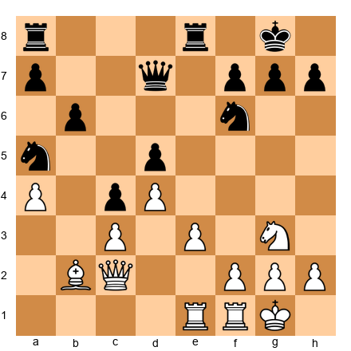</p>


Black's position looks solid, but Botvinnik will create two weaknesses and exploit them.

```
18.f3 Nb3 19.e4 Qxa4 20.e5 Nd7 21.Qf2 g6
```

Botvinnik pushes e5, gaining space and creating the first weakness: Black's backward d5 pawn.

```
22.f4 f5 23.exf6 Nxf6 24.f5
```

Now Botvinnik creates the second weakness: Black's kingside.

```
24...Rxe1 25.Rxe1 Re8 26.Re6 Rxe6 27.fxe6 Kg7 28.Qf4 Qe8 29.Qe5 Qe7 30.Ba3 Qxa3 31.Nh5+ gxh5 32.Qg5+ Kf8 33.Qxf6+ Kg8 34.e7 Qc1+ 35.Kf2 Qc2+ 36.Kg3 Qd3+ 37.Kh4 Qe4+ 38.Kxh5 Qe2+ 39.Kh4 Qe4+ 40.g4 Qe1+ 41.Kh5 1-0
```

Black resigns. The e7 pawn will promote.

**What We Learn:**
1. Create one weakness (d5 pawn)
2. Create a second weakness (kingside)
3. Switch between targets to overwhelm the defense
4. Convert with concrete tactics

This is the two-weaknesses principle in perfect action.

🛑 **Rest Stop:** Five annotated games. You've seen Steinitz's accumulation, Nimzowitsch's blockade, Karpov's prevention, Carlsen's patience, and Botvinnik's two weaknesses. These are the masters of positional chess.

---

## EXERCISES (55 Total)

### ★★ Warmup Exercises (5)

**Exercise 1:** Identify the weak square  
**Position:** White has pawns on e3, d4. Black has pawns on e6, d5, with a pawn on f7.  

<p align="center">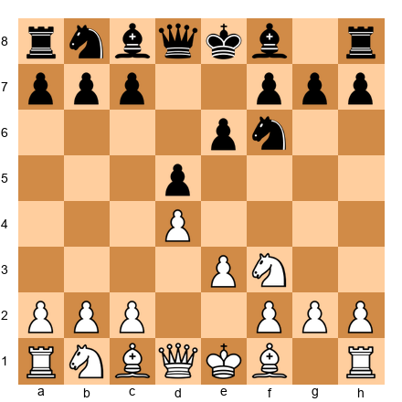</p>

**To Move:** White  
**Time Limit:** 30 seconds  
**Question:** What square is weak in Black's position?  
**Hint:** Look for a square that Black's pawns can never defend.  
**Solution:** The e5 square is weak. Black's e6 and d5 pawns don't control it, and no other Black pawn can ever defend it. White should place a knight on e5.

---

**Exercise 2:** Open file control  
**Position:** The d-file is open. White has a rook on d1, Black has a rook on d8.  

<p align="center">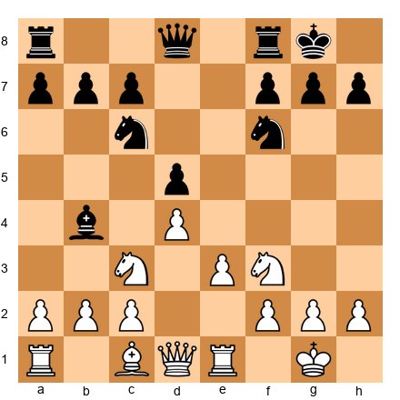</p>

**To Move:** White  
**Time Limit:** 30 seconds  
**Question:** How should White contest the d-file?  
**Hint:** Doubling rooks is often the answer.  
**Solution:** White should play **Rfd1**, doubling rooks on the d-file. This puts maximum pressure on Black's position.

---

**Exercise 3:** Bishop pair advantage  
**Position:** White has two bishops, Black has two knights. The center is semi-open.  

<p align="center">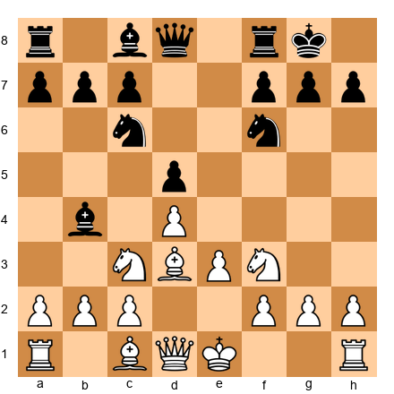</p>

**To Move:** White  
**Time Limit:** 30 seconds  
**Question:** How should White use the bishop pair?  
**Hint:** Bishops need open lines.  
**Solution:** White should play **dxe5** (assuming Black played ...e5), opening the position for the bishops. In open positions, the bishop pair dominates.

---

**Exercise 4:** Identify the pawn weakness  
**Position:** Black has doubled c-pawns on c6 and c7.  

<p align="center">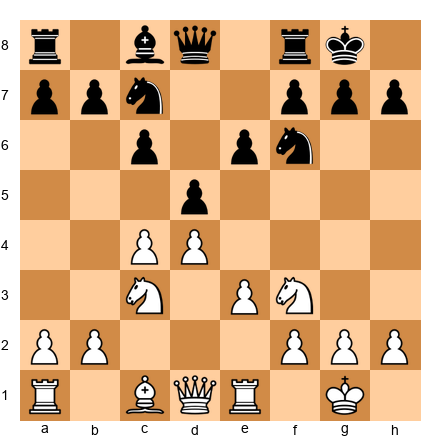</p>

**To Move:** White  
**Time Limit:** 30 seconds  
**Question:** What is Black's main pawn weakness?  
**Hint:** Doubled pawns create targets.  
**Solution:** The c6 pawn is weak because it can't be defended by another pawn. White should attack it with moves like Bf4, Qa4, or Rc1.

---

**Exercise 5:** Overprotection in action  
**Position:** White's e4 pawn is supported by multiple pieces.  

<p align="center">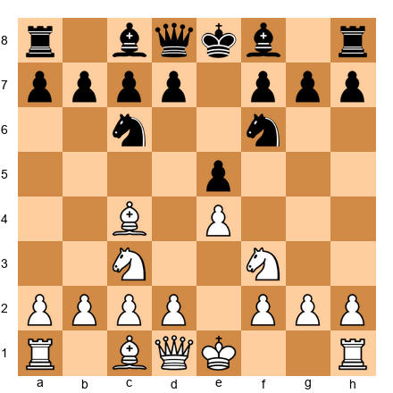</p>

**To Move:** Black  
**Time Limit:** 30 seconds  
**Question:** Is White's e4 pawn overprotected?  
**Hint:** Count the defenders.  
**Solution:** Yes, the e4 pawn is supported by the bishop on c4, knight on f3, and potentially the d-pawn. This is overprotection - defending an important point with more pieces than necessary to control the center.

---

### ★★★ Intermediate Exercises (20)

**Exercise 6:** Blockade the passed pawn  
**Position:** Black has a passed d-pawn on d5. White needs to blockade it.  

<p align="center">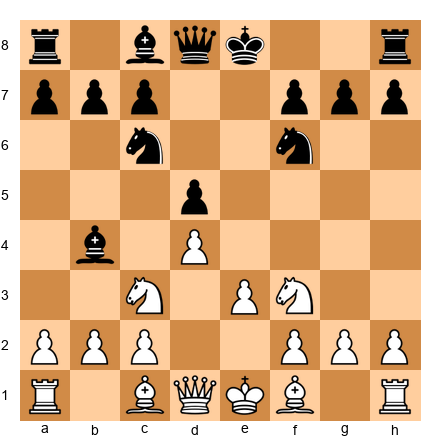</p>

**To Move:** White  
**Time Limit:** 1 minute  
**Question:** How should White blockade the d5 pawn?  
**Hint:** Nimzowitsch said the best blockader is a knight.  
**Solution:** White should play **Nd4**, placing the knight in front of the passed pawn. From d4, the knight controls key squares and can't be attacked by pawns.

---

**Exercise 7:** Prophylaxis against d4  
**Position:** White wants to play d4 to open the center.  

<p align="center">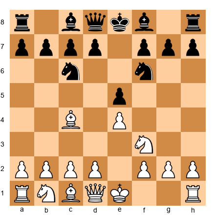</p>

**To Move:** Black  
**Time Limit:** 1 minute  
**Question:** How can Black prevent White's d4 break?  
**Hint:** Create a threat that makes d4 less attractive.  
**Solution:** Black should play **...Bg4**, pinning the knight. Now if White plays d4, Black can play ...Bxf3, damaging White's pawn structure.

---

**Exercise 8:** Restraint with c4  
**Position:** Black wants to play ...d5 to free the position.  

<p align="center"></p>

**To Move:** White  
**Time Limit:** 1 minute  
**Question:** How can White prevent ...d5?  
**Hint:** Control the d5 square with a pawn.  
**Solution:** White should play **c4**, controlling d5 and preventing Black from playing ...d5 without consequences. This is restraint.

---

**Exercise 9:** Trading to exploit doubled pawns  
**Position:** White can trade on c6 to double Black's pawns.  

<p align="center">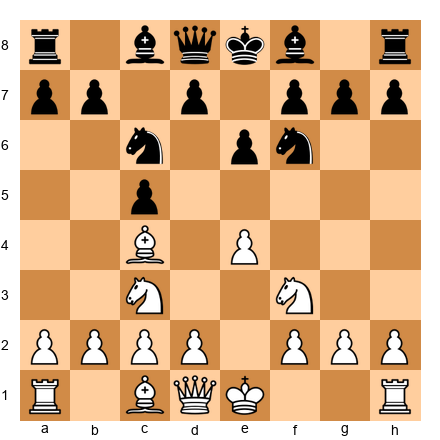</p>

**To Move:** White  
**Time Limit:** 1 minute  
**Question:** Should White play Bxc6?  
**Hint:** Doubled pawns are a long-term weakness.  
**Solution:** Yes, White should play **Bxc6+ bxc6**, doubling Black's c-pawns. This creates a permanent weakness that White can attack later.

---

**Exercise 10:** Controlling an open file  
**Position:** The e-file is open. White can control it with Re1.  

<p align="center">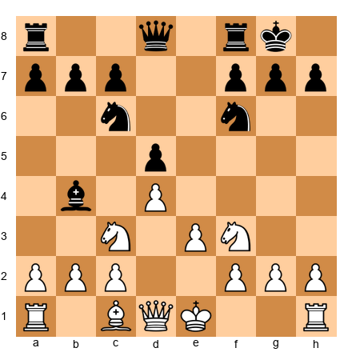</p>

**To Move:** White  
**Time Limit:** 1 minute  
**Question:** How should White control the e-file?  
**Hint:** Castle first, then double rooks.  
**Solution:** White should play **O-O**, then **Re1** and eventually **Rae1** to double rooks on the e-file.

---

**Exercise 11:** Finding the weak square for a knight  
**Position:** Black has played ...f6 and ...g6, creating weak squares.  

<p align="center">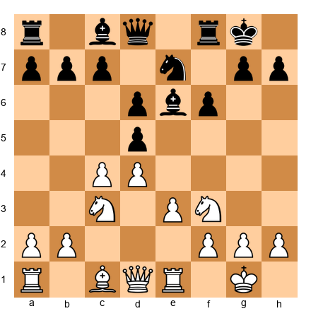</p>

**To Move:** White  
**Time Limit:** 1 minute  
**Question:** Where should White's knight go?  
**Hint:** Look for squares that Black's pawns don't control.  
**Solution:** White should aim for **Ne5** via Nd4-e6 or Nh4-f5-e3-d5-e7-g6 depending on position. The e5 square (or h5 if possible) is weak because Black's f6 and g6 pawns don't defend it.

---

**Exercise 12:** Positional exchange sacrifice  
**Position:** White can sacrifice the exchange on c6 to damage Black's structure.  

<p align="center"></p>

**To Move:** White  
**Time Limit:** 2 minutes  
**Question:** Should White play Rxc6?  
**Hint:** Evaluate the compensation - doubled pawns, weak c6.  
**Solution:** Yes, **Rxc6! bxc6** is strong. White gets doubled c-pawns, open b-file, and long-term pressure. The exchange sacrifice is positionally justified.

---

**Exercise 13:** Creating the second weakness  
**Position:** White has pressure on c6 (first weakness). Where should White create a second weakness?  

<p align="center"></p>

**To Move:** White  
**Time Limit:** 2 minutes  
**Question:** How should White create a second weakness?  
**Hint:** Attack the opposite wing.  
**Solution:** White should play **h4!**, planning h5 to attack Black's kingside. This creates the second weakness (Black must defend both queenside and kingside).

---

**Exercise 14:** Using space advantage  
**Position:** White has pawns on c4, d4, e4 - a big space advantage.  

<p align="center"></p>

**To Move:** White  
**Time Limit:** 2 minutes  
**Question:** What's White's plan?  
**Hint:** Prevent Black's pawn breaks and improve pieces.  
**Solution:** White should play **f4**, preventing ...e5 and preparing f5 to attack. The plan is to stop Black's freeing moves and increase the space advantage.

---

**Exercise 15:** Fighting a cramped position  
**Position:** Black is cramped but can play ...e5 to free the position.  

<p align="center"></p>

**To Move:** Black  
**Time Limit:** 2 minutes  
**Question:** How should Black free the position?  
**Hint:** Pawn breaks open cramped positions.  
**Solution:** Black should play **...e5!**, breaking in the center. After **dxe5 dxe5**, Black's pieces have more space.

---

**Exercise 16:** Overprotecting the e4 square  
**Position:** White wants to make e4 a fortress.  

<p align="center">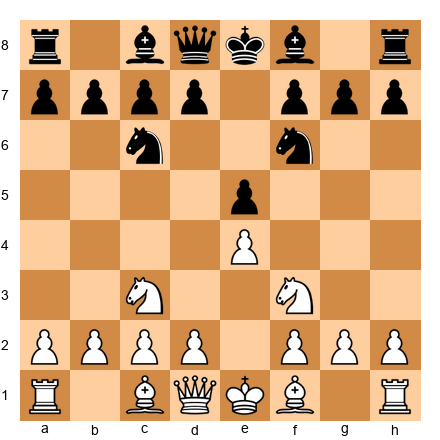</p>

**To Move:** White  
**Time Limit:** 2 minutes  
**Question:** How can White overprotect e4?  
**Hint:** Add more defenders than necessary.  
**Solution:** White can play **d3**, **Bc4** (or **Bb5**), and later **Re1** after castling. Multiple pieces defending e4 make it a strong point.

---

**Exercise 17:** Piece coordination  
**Position:** White's pieces are uncoordinated. The knight on a3 is out of play.  

<p align="center">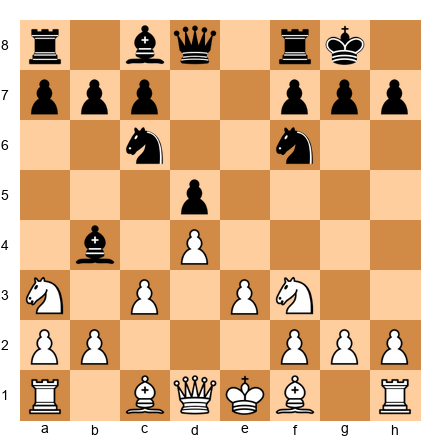</p>

**To Move:** White  
**Time Limit:** 2 minutes  
**Question:** How should White improve the knight?  
**Hint:** Reroute via c2-e3 or c2-b4.  
**Solution:** White should play **Nc2**, planning Ne3 to centralize the knight. From e3, it can go to f5 or d5.

---

**Exercise 18:** Karpov-style prevention  
**Position:** Black wants to play ...Ng4 to attack f2.  

<p align="center"></p>

**To Move:** White  
**Time Limit:** 2 minutes  
**Question:** How can White prevent ...Ng4?  
**Hint:** Stop it before it happens.  
**Solution:** White should play **h3**, preventing ...Ng4. This is prophylaxis - stopping Black's plan before it starts.

---

**Exercise 19:** Trading when it helps  
**Position:** White has a better pawn structure. Should White trade pieces?  

<p align="center">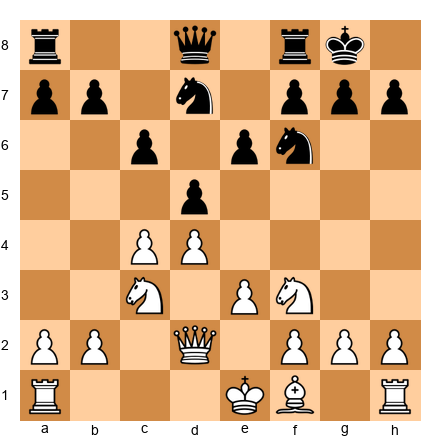</p>

**To Move:** White  
**Time Limit:** 2 minutes  
**Question:** Should White trade knights with Nxf6+?  
**Hint:** Trading pieces makes structural advantages clearer.  
**Solution:** No, not yet. White should improve pieces first. Trading prematurely might let Black equalize. Trade when your advantage is maximized.

---

**Exercise 20:** Improving the worst piece  
**Position:** White's light-squared bishop on c1 is passive.  

<p align="center"></p>

**To Move:** White  
**Time Limit:** 2 minutes  
**Question:** How should White activate the bishop?  
**Hint:** Find a diagonal where the bishop is useful.  
**Solution:** White should play **Bf4** or **Bg5**, activating the bishop. Bf4 attacks c7, Bg5 pins the knight.

---

**Exercise 21:** Fixing opponent's pawns  
**Position:** White can fix Black's queenside pawns with a4 and b4.  

<p align="center">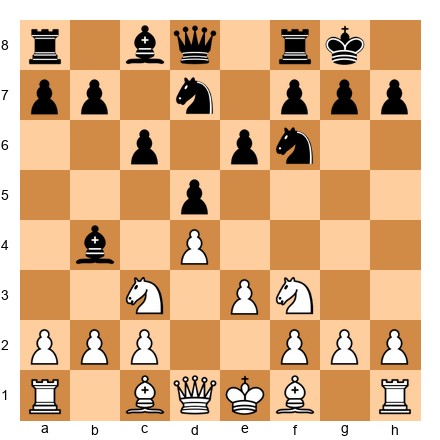</p>

**To Move:** White  
**Time Limit:** 2 minutes  
**Question:** How should White fix Black's pawns?  
**Hint:** Stop them from advancing.  
**Solution:** White should play **a3** (forcing ...Ba5 or ...Bd6), then **b4** to fix Black's queenside pawns on a7, b7, c6. These pawns become targets.

---

**Exercise 22:** Controlling key squares  
**Position:** The d5 square is critical. How should White control it?  

<p align="center">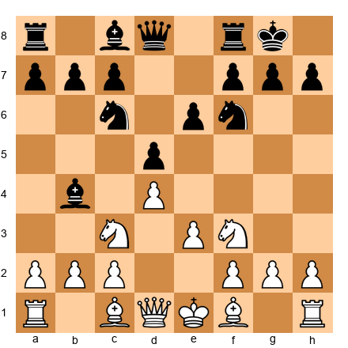</p>

**To Move:** White  
**Time Limit:** 2 minutes  
**Question:** How many pieces should defend d5?  
**Hint:** Overprotection.  
**Solution:** White should aim for **c4** (pawn controls d5), **Nc3** (knight eyes d5), and potentially **Bf4** or **Bg5**. Overprotecting d5 prevents Black from placing a piece there.

---

**Exercise 23:** Recognizing a positional advantage  
**Position:** Evaluate who is better and why.  

<p align="center">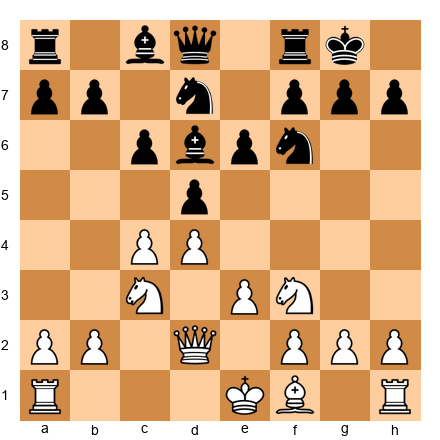</p>

**To Move:** White  
**Time Limit:** 2 minutes  
**Question:** Who is better and why?  
**Hint:** Look at pawn structure, piece activity, and king safety.  
**Solution:** White is slightly better due to better piece activity (queen on d2, potential Re1) and more space. Black's position is solid but passive.

---

**Exercise 24:** Converting a small advantage  
**Position:** White has slightly more space. What's the plan?  

<p align="center">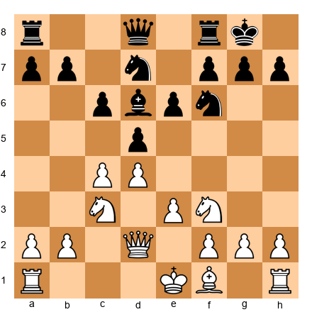</p>

**To Move:** White  
**Time Limit:** 2 minutes  
**Question:** What's White's conversion plan?  
**Hint:** Improve pieces, create second weakness, trade when helpful.  
**Solution:** White's plan: **1. Re1** (control e-file), **2. h3** (prevent ...Ng4), **3. Create a second weakness** with a4-a5 or f4-f5, **4. Trade pieces** if it leads to a favorable endgame.

---

**Exercise 25:** Carlsen-style patience  
**Position:** The position looks equal. What small edge can White find?  

<p align="center"></p>

**To Move:** White  
**Time Limit:** 2 minutes  
**Question:** What microscopic advantage can White build?  
**Hint:** Look for the worst-placed piece and improve it.  
**Solution:** White's rook on a1 is passive. Play **Re1** or **Rac1** to activate it. Small improvements accumulate into advantages.

---

### ★★★★ Advanced Exercises (20)

**Exercise 26:** Complex blockade  
**Position:** Black has a passed c-pawn. How should White blockade and then attack it?  

<p align="center">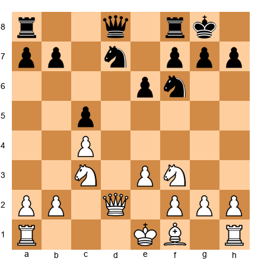</p>

**To Move:** White  
**Time Limit:** 3 minutes  
**Question:** What's White's blockading plan?  
**Hint:** Blockade with a piece, then attack the blockaded pawn.  
**Solution:** White should play **Nb5** or reroute a knight to d4 to blockade c5. Then play **b4** to attack the blockaded pawn. The pawn becomes weak once it's blockaded and under attack.

---

**Exercise 27:** Prophylactic thinking  
**Position:** Black wants to play ...e5. How should White prevent it?  

<p align="center"></p>

**To Move:** White  
**Time Limit:** 3 minutes  
**Question:** Prevent ...e5 without blocking your own development.  
**Hint:** Attack the point e5 before Black can occupy it.  
**Solution:** White should play **Bf4**, controlling e5. If Black plays ...e5, White can play **dxe5**, and the bishop on f4 is perfectly placed.

---

**Exercise 28:** Evaluating a positional exchange sacrifice  
**Position:** White can play Rxc6. Is it sound?  

<p align="center"></p>

**To Move:** White  
**Time Limit:** 5 minutes  
**Question:** Calculate if Rxc6 is worth it.  
**Hint:** Evaluate compensation: pawn structure, piece activity, long-term play.  
**Solution:** **Rxc6! bxc6** is strong. White gets: doubled c-pawns, weak c6, open b-file. Black's structure is permanently damaged. The compensation is sufficient.

---

**Exercise 29:** Creating and exploiting two weaknesses  
**Position:** White has pressure on c6. Where should the second weakness be?  

<p align="center"></p>

**To Move:** White  
**Time Limit:** 3 minutes  
**Question:** Find White's plan to create a second weakness.  
**Hint:** Attack the opposite wing.  
**Solution:** White should play **1. h4!** (planning h5), creating threats on the kingside. Then switch between attacking c6 and the kingside until Black's defense breaks.

---

**Exercise 30:** Using the bishop pair  
**Position:** White has the bishop pair in a semi-open position. What's the plan?  

<p align="center">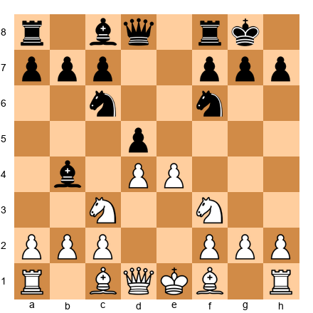</p>

**To Move:** White  
**Time Limit:** 3 minutes  
**Question:** How should White exploit the bishop pair?  
**Hint:** Open the position further.  
**Solution:** White should play **e5**, opening lines for the bishops. After ...Nd7 (or ...Ne4), White's bishops dominate the long diagonals.

---

**Exercise 31:** Restraint in practice  
**Position:** Black wants ...e5 or ...c5. How does White stop both?  

<p align="center"></p>

**To Move:** White  
**Time Limit:** 3 minutes  
**Question:** Prevent both ...e5 and ...c5.  
**Hint:** Control key squares.  
**Solution:** White should play **c5!** (fixing Black's pawn on c7 and controlling d6) or **Bf4** (controlling e5). Both moves restrain Black's pawn breaks.

---

**Exercise 32:** Finding the opponent's plan  
**Position:** What does Black want to do?  

<p align="center"></p>

**To Move:** Black  
**Time Limit:** 3 minutes  
**Question:** What is Black's main plan?  
**Hint:** Look at Black's worst piece and where it wants to go.  
**Solution:** Black's knight on d7 wants to go to c5 (via ...Ne8-c7-e6 or directly). From c5, it attacks White's center. White should prevent this with **a4** and **b3** or **a3**.

---

**Exercise 33:** Converting a space advantage  
**Position:** White has more space. What's the conversion plan?  

<p align="center"></p>

**To Move:** White  
**Time Limit:** 3 minutes  
**Question:** How does White convert the space advantage?  
**Hint:** Prevent Black's breaks, improve pieces, create second weakness.  
**Solution:** White's plan: **1. f4** (prevent ...e5), **2. Rae1** (control e-file), **3. h4-h5** (create kingside threats), **4. Trade pieces** if it leads to a winning endgame.

---

**Exercise 34:** Overprotection strategy  
**Position:** White wants to overprotect d4.  

<p align="center">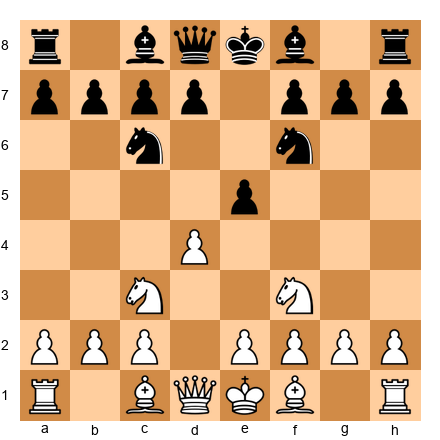</p>

**To Move:** White  
**Time Limit:** 3 minutes  
**Question:** How many pieces should defend d4?  
**Hint:** Overprotection makes a point stronger.  
**Solution:** White should play **Bc4** (eyes d4 indirectly), **Qd3** (defends d4), and later **Re1** after castling. Multiple defenders make d4 a fortress.

---

**Exercise 35:** Fighting overextension  
**Position:** White's pawns are overextended. How should Black attack them?  

<p align="center"></p>

**To Move:** Black  
**Time Limit:** 3 minutes  
**Question:** Which pawn should Black attack?  
**Hint:** The most advanced pawns are the weakest.  
**Solution:** Black should play **...c5!**, attacking White's d4 pawn. If **dxc5**, Black recaptures **...Bxc5** with an active position.

---

**Exercise 36:** Piece coordination  
**Position:** White needs to coordinate pieces for an attack.  

<p align="center"></p>

**To Move:** White  
**Time Limit:** 3 minutes  
**Question:** How should White coordinate for maximum effect?  
**Hint:** Get all pieces working toward a common goal.  
**Solution:** White should play **Bd3** (aiming at h7), **Qe2** (connecting rooks), **O-O** (king safety), then **Rae1** (pressure on e-file). All pieces work together.

---

**Exercise 37:** Recognizing when to trade  
**Position:** Should White trade bishops with Bxc6?  

<p align="center">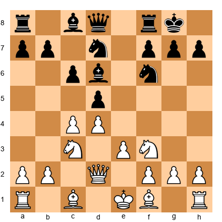</p>

**To Move:** White  
**Time Limit:** 3 minutes  
**Question:** Is Bxc6 a good trade?  
**Hint:** Only trade if it increases your advantage.  
**Solution:** **Bxc6 bxc6** is good if White can exploit the doubled c-pawns. If White has a concrete plan (Rc1, Qb4, attacking c6), then yes. If not, keep pieces on.

---

**Exercise 38:** Karpov-style squeeze  
**Position:** White is slightly better. What prophylactic moves limit Black?  

<p align="center"></p>

**To Move:** White  
**Time Limit:** 3 minutes  
**Question:** Find White's prophylactic plan.  
**Hint:** Prevent all of Black's active possibilities.  
**Solution:** White should play **h3** (prevent ...Ng4), **a3** (prevent ...Nb6-a4), **Rac1** (control c-file), slowly limiting Black's options.

---

**Exercise 39:** Finding weaknesses to attack  
**Position:** Identify all of Black's weaknesses.  

<p align="center"></p>

**To Move:** White  
**Time Limit:** 3 minutes  
**Question:** List all of Black's weaknesses.  
**Hint:** Look at pawn structure, piece placement, king safety.  
**Solution:** Black's weaknesses: **1. d5 pawn** (backward or isolated), **2. c7 pawn** (can't be defended by pawns), **3. Passive knight on d7**, **4. Slightly exposed king** (if White plays h4-h5).

---

**Exercise 40:** Choosing the right plan  
**Position:** White can attack kingside (h4-h5) or queenside (a4-b4). Which is better?  

<p align="center"></p>

**To Move:** White  
**Time Limit:** 5 minutes  
**Question:** Kingside or queenside attack?  
**Hint:** Evaluate both plans and choose based on concrete factors.  
**Solution:** **Queenside attack** with **a4-b4-a5** is stronger because Black's pieces (knight on d7, bishop on c6) are on the queenside and less mobile. Kingside attack with h4-h5 is slower and gives Black counterplay with ...g6.

---

**Exercise 41:** Positional pawn sacrifice  
**Position:** White can sacrifice the d4 pawn for activity. Is it sound?  

<p align="center"></p>

**To Move:** White  
**Time Limit:** 5 minutes  
**Question:** Can White sacrifice d4 for compensation?  
**Hint:** Calculate if piece activity compensates for the pawn.  
**Solution:** Not yet. White needs better piece placement first. After **Bd3**, **O-O**, **Qe2**, then **d5** might work because White's pieces are active.

---

**Exercise 42:** Improving the worst piece  
**Position:** White's rook on a1 is passive. How to activate it?  

<p align="center"></p>

**To Move:** White  
**Time Limit:** 3 minutes  
**Question:** Find the best activation plan for the rook.  
**Hint:** Open files or centralization.  
**Solution:** White should play **Rc1** (controlling the c-file) or **O-O** first, then **Rac1** or **Rae1** depending on the position.

---

**Exercise 43:** Long-term planning  
**Position:** White is slightly better. What's the 5-move plan?  

<p align="center"></p>

**To Move:** White  
**Time Limit:** 5 minutes  
**Question:** Outline a 5-move improvement plan.  
**Hint:** Improve pieces, prevent Black's breaks, create second weakness.  
**Solution:** **1. Re1** (control e-file), **2. h3** (prevent ...Ng4), **3. Bf4** (attack c7), **4. Rac1** (double on c-file), **5. a4** (prepare a5, creating second weakness). Each move improves White's position.

---

**Exercise 44:** Recognizing when your opponent is worse  
**Position:** Black to move. Why is Black worse?  

<p align="center"></p>

**To Move:** Black  
**Time Limit:** 3 minutes  
**Question:** Identify why Black is worse.  
**Hint:** Pawn structure, piece activity, space.  
**Solution:** Black is worse because: **1. Less space** (White's pawns on c4, d4 control more), **2. Passive pieces** (knight on d7 is bad), **3. No clear plan** (all pawn breaks are controlled by White).

---

**Exercise 45:** Converting a bishop pair advantage  
**Position:** White has the bishop pair. How to convert?  

<p align="center"></p>

**To Move:** White  
**Time Limit:** 5 minutes  
**Question:** What's the conversion plan for the bishop pair?  
**Hint:** Open the position, dominate diagonals, trade knights.  
**Solution:** White's plan: **1. e5** (open lines), **2. Trade a pair of knights** (fewer pieces help bishops), **3. Dominate long diagonals** with bishops, **4. Convert to winning endgame**.

---

### ★★★★★ Master Exercises (10)

**Exercise 46:** Deep prophylactic thinking  
**Position:** Black has several plans. Identify all of them and prevent them.  

<p align="center"></p>

**To Move:** White  
**Time Limit:** 10 minutes  
**Question:** List all of Black's plans and how to prevent each.  
**Hint:** Think like Karpov - prevent everything.  
**Solution:**  
Black's plans:  
1. **...e5** - Prevented by **Bf4** or **c5**  
2. **...c5** - Prevented by **c5** or keeping pressure on c7  
3. **...Ne8-c7-e6** - Prevented by **a4** (stopping ...Nb6) or **Nb5**  
4. **...Ng4** - Prevented by **h3**  
5. **...f5** - Prevented by keeping pieces centralized  

White's prophylactic plan: **1. h3**, **2. Bf4**, **3. Re1**, **4. a4** - each move prevents one of Black's ideas.

---

**Exercise 47:** Multi-step conversion  
**Position:** White is better. Find the 10-move winning plan.  

<p align="center"></p>

**To Move:** White  
**Time Limit:** 10 minutes  
**Question:** Outline a 10-move plan to convert the advantage.  
**Hint:** Improve every piece, create two weaknesses, trade to winning endgame.  
**Solution:**  
**1. Re1** (control e-file)  
**2. h3** (prevent ...Ng4)  
**3. Bf4** (attack c7)  
**4. Rac1** (double rooks)  
**5. a4** (create second weakness)  
**6. Qb4** (attack b7 and d6)  
**7. Na4** (reroute to c5 or b6)  
**8. Nc5 or Nb6** (dominate outpost)  
**9. Trade pieces** to reach favorable endgame  
**10. Push passed pawns** or infiltrate with king  

This is Carlsen-style accumulation: small improvements over many moves.

---

**Exercise 48:** Complex positional sacrifice  
**Position:** White can sacrifice a piece for three pawns and lasting initiative. Calculate it.  

<p align="center"></p>

**To Move:** White  
**Time Limit:** 10 minutes  
**Question:** Is Nxd5 followed by Nxf6+ and Nxd5 winning?  
**Hint:** Calculate all variations and evaluate the resulting position.  
**Solution:**  
After **1. Nxd5 Nxd5 2. exd5 Nd4**, White doesn't have enough compensation. The knight on d4 is strong.  

Better is the simpler **1. e5**, opening lines for the bishops. The positional sacrifice doesn't work here because White's development isn't complete.

---

**Exercise 49:** Finding the critical move  
**Position:** One move changes the evaluation dramatically. Find it.  

<p align="center"></p>

**To Move:** White  
**Time Limit:** 10 minutes  
**Question:** What single move dramatically improves White's position?  
**Hint:** Look for a move that improves multiple things at once.  
**Solution:** **c5!** This move:  
1. Fixes Black's d6 pawn as weak  
2. Gains space on the queenside  
3. Gives White the c4 square for a knight  
4. Prevents ...c5 by Black  
5. Creates long-term pressure  

One move, multiple benefits. This is positional chess at its best.

---

**Exercise 50:** Evaluating two plans  
**Position:** White can play for e4-e5 (kingside) or a4-b4-c5 (queenside). Calculate which is better.  

<p align="center"></p>

**To Move:** White  
**Time Limit:** 10 minutes  
**Question:** Compare both plans and choose the superior one.  
**Hint:** Calculate concrete variations for both plans.  
**Solution:**  
**Plan A (e4-e5):** After **1. e4 dxe4 2. Nxe4 Nxe4 3. Qxe4**, White has some pressure but Black's position is solid.  

**Plan B (a4-b4-c5):** After **1. a4 a6 2. b4 b6 3. c5**, White gains space and fixes Black's pawns as weak.  

**Plan B is superior** because it creates lasting weaknesses. Plan A gives temporary activity.

---

**Exercise 51:** Steinitz-style accumulation  
**Position:** White is slightly better. How to accumulate advantages?  

<p align="center"></p>

**To Move:** White  
**Time Limit:** 10 minutes  
**Question:** List 5 small advantages White can accumulate.  
**Hint:** Think like Steinitz - small edges add up.  
**Solution:**  
1. **Control the e-file** (Re1)  
2. **Attack Black's c7 pawn** (Bf4)  
3. **Prevent Black's pawn breaks** (h3 stops ...Ng4)  
4. **Create a second weakness** (a4-a5)  
5. **Improve the worst piece** (Rac1 activates the rook)  

Each advantage is small, but together they add up to a winning position.

---

**Exercise 52:** Nimzowitsch-style blockade and breakthrough  
**Position:** White has blockaded Black's d5 pawn. How to convert?  

<p align="center">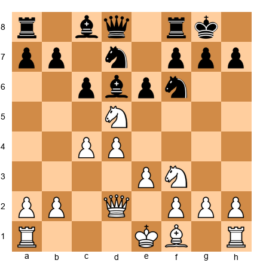</p>

**To Move:** White  
**Time Limit:** 10 minutes  
**Question:** The blockade is established. What's the winning plan?  
**Hint:** Attack the blockaded pawn and create a second weakness.  
**Solution:**  
**1. Bf4** (attack c7 and the blockaded d5 pawn)  
**2. Rac1** (pressure on c-file)  
**3. Qb4** (attack b7 and d6)  
**4. a4-a5** (create second weakness)  
**5. Trade pieces** to reach a winning endgame where d5 falls  

The blockade fixes the pawn; the follow-up wins it.

---

**Exercise 53:** Karpov-style endgame conversion  
**Position:** White has a slightly better endgame. How to win it?  

<p align="center"></p>

**To Move:** White  
**Time Limit:** 10 minutes  
**Question:** Find the 5-move winning plan.  
**Hint:** Improve king, create passed pawn, infiltrate.  
**Solution:**  
**1. Rac1** (control c-file)  
**2. Qc5** (trade queens to reach winning endgame)  
**3. Rc5** (after queen trade, activate rook)  
**4. Kf2-e2-d3** (activate king)  
**5. b4-b5** (create passed pawn)  

In the resulting endgame, White's active pieces and passed pawn win.

---

**Exercise 54:** Carlsen-style microscopic edges  
**Position:** The position looks equal. Find 3 tiny improvements White can make.  

<p align="center"></p>

**To Move:** White  
**Time Limit:** 10 minutes  
**Question:** List 3 microscopic improvements.  
**Hint:** Think like Carlsen - tiny edges matter.  
**Solution:**  
1. **Re1 instead of Rac1** (the e-file is more important right now)  
2. **h3 instead of immediate piece moves** (preventing ...Ng4 is a tiny prophylactic edge)  
3. **Bf4 instead of Bg5** (Bf4 attacks c7 directly, creating more concrete pressure)  

Each move makes White's position 0.05 pawns better. Over 40 moves, that's 2 pawns.

---

**Exercise 55:** Master-level plan selection  
**Position:** White has multiple plans. Choose the best one and justify it.  

<p align="center"></p>

**To Move:** White  
**Time Limit:** 15 minutes  
**Question:** Compare all possible plans and choose the objectively best.  
**Hint:** Evaluate tactical, positional, and strategic factors.  
**Solution:**  
**Possible plans:**  
A. **e4-e5** - Too committal, weakens d4  
B. **a4-b4-c5** - Strong queenside play  
C. **Re1, h3, Bf4** - Solid improvement  
D. **Immediate c5** - Fixes Black's structure  

**Best plan: D (Immediate c5)** because:  
1. It's concrete (fixes Black's pawns)  
2. It's forcing (Black must respond)  
3. It creates lasting weakness (d6 is weak)  
4. It prevents Black's counterplay (...c5)  

This is master-level planning: the most forcing, concrete plan that creates lasting advantages.

---

## KEY TAKEAWAYS

**Steinitz's Principles:**
1. Accumulate small advantages instead of hunting for brilliancies
2. Identify weak squares, open files, bishop pair, and pawn weaknesses
3. Convert temporary advantages into permanent ones
4. Patience is a weapon

**Nimzowitsch's System:**
1. **Blockade** - Stop passed pawns on squares where they can't advance
2. **Overprotection** - Defend important points with more pieces than necessary
3. **Prophylaxis** - Prevent your opponent's plans before they happen
4. **Restraint** - Control your opponent's pawn breaks to keep them cramped

**Modern Positional Chess:**
1. **Karpov's method:** Prevent everything, squeeze slowly, strike when paralyzed
2. **Carlsen's approach:** Accumulate microscopic advantages over many moves
3. **Positional sacrifices:** Give up material for long-term compensation
4. **Two weaknesses:** Create problems on both wings to split the defense

**Practical Guidelines:**
1. Identify weak squares and occupy them with pieces
2. Control open files with rooks before your opponent can
3. Use space advantage to maneuver pieces to better squares
4. Fight cramped positions with pawn breaks
5. Improve your worst piece before starting an attack
6. Trade pieces when it makes your advantage clearer
7. Be patient - positional advantages take time to convert

**The Conversion Process:**
1. Improve every piece to its best square
2. Create a second weakness
3. Trade pieces when helpful
4. Calculate concrete wins

---

## PRACTICE ASSIGNMENT

**For the next week:**

1. **Play 5 slow games** (30+ minutes per side) where your ONLY goal is positional play. No tactics, no brilliancies - just improve your position move by move.

2. **After each game, ask:**
   - What were the weak squares in my opponent's position?
   - Did I control the open files?
   - Did I create two weaknesses before trying to win?
   - Did I prevent my opponent's main plan?

3. **Study one Karpov game** from a database. Watch how he prevents his opponent's plans move by move.

4. **Replay the 5 annotated games** in this chapter on a physical board. Don't just move the pieces - ask yourself "Why this move?" on every turn.

5. **Solve 10 exercises per day** from this chapter. Focus on understanding the positional features, not just finding the move.

---

## ⭐ PROGRESS CHECK

You've completed Chapter 30 when you can:

- ✅ Explain Steinitz's theory of accumulating small advantages
- ✅ Identify weak squares, open files, and pawn weaknesses in any position
- ✅ Understand Nimzowitsch's concepts: blockade, overprotection, prophylaxis, restraint
- ✅ Recognize when a positional sacrifice is sound
- ✅ Apply the principle of two weaknesses to convert advantages
- ✅ Distinguish between having a space advantage and using it effectively
- ✅ Coordinate pieces to work toward a common goal
- ✅ Prevent your opponent's plans before they happen
- ✅ Convert small positional advantages into wins
- ✅ Play like Steinitz (accumulate), Nimzowitsch (blockade), Karpov (prevent), and Carlsen (patience)

**Self-Assessment:**
- Can you explain why c5 is better than e4 in a given position? ✅
- Can you identify the two weaknesses in your opponent's position? ✅
- Can you list your opponent's next three plans and how to stop them? ✅

If you answered yes to all three, you understand positional chess.

---

## 🛑 REST MARKER - CHAPTER COMPLETE

You've learned the foundations of modern positional chess. This isn't the flashy, tactical chess of the Romantic Era. This is the scientific, methodical chess that wins World Championships.

Steinitz taught us to accumulate. Nimzowitsch taught us to prevent. Karpov showed us how to squeeze. Carlsen proved that microscopic edges win games.

You now have the tools to play positional chess. Use them.

**Next Chapter:** Chapter 31 - Time Pressure and Practical Play

Take a break. Stretch. Replay one of the annotated games. When you're ready, come back for the next chapter.

You're becoming a tournament fighter. 💙♟️

---

**END OF CHAPTER 30**
