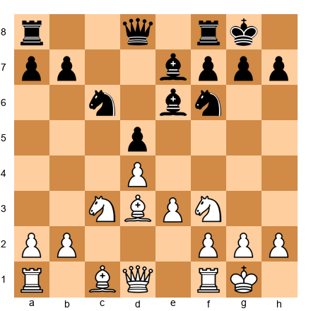
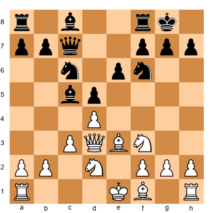
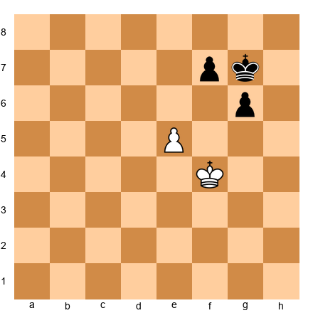
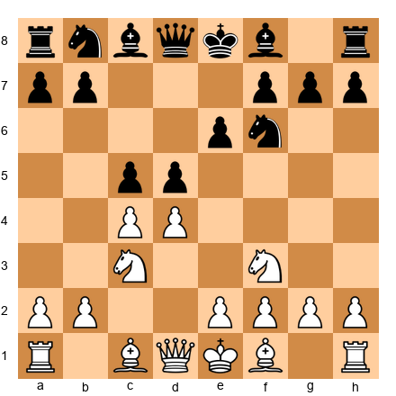
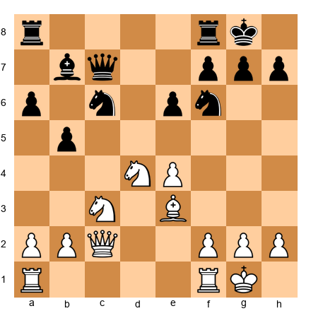

# THE GRANDMASTER CODEX
## Volume IV: The Expert
### Rating 2200 → 2400

---

# Welcome Back, Expert

---

> *"At this level, chess is no longer a game. It is an art, a science, and a mirror."*
> - David Bronstein

---

## You Are Here

```
VOLUME I:   Foundations     (0 → 1000)     ✅ Complete
VOLUME II:  The Club Player (1000 → 1600)  ✅ Complete
VOLUME III: The Tournament Fighter (1600 → 2200) ✅ Complete
VOLUME IV:  The Expert      (2200 → 2400)  ◀ YOU ARE HERE
VOLUME V:   The Final Push  (2400 → 2500+) ○ Ahead
```

You have arrived somewhere remarkable. If you have worked through the first three volumes of this Codex - truly worked through them, with a board in front of you and a notebook beside you - then you understand chess at a level that most players never reach. You can calculate tactical sequences, evaluate positions with confidence, and navigate complex middlegames. You have a tournament record. You have hard-won experience.

And now you feel it: the wall.

This volume exists because the climb from 2200 to 2400 is one of the hardest in chess. The tactics that won you games at 1800 no longer appear on the board. Your opponents prepare against you specifically. Winning a drawn endgame requires technique you may not yet possess. The openings you have relied on for years are starting to feel predictable.

We are past the basics. This is where chess becomes an art form. Let us study it like artists do.

---

## What Is Different About This Volume

**Depth, not breadth.** Previous volumes introduced many ideas. This volume deepens a smaller number of ideas to a level that separates experts from club players.

**Ambiguity, not clarity.** Many positions in this volume do not have a single "correct" answer. You will study positions where Grandmasters disagree, where engines offer three roughly equal moves, where the best choice depends on factors beyond the board - your opponent's psychology, the tournament situation, your own strengths and weaknesses. Welcome to real chess.

**Independence, not instruction.** This volume asks more of you than the previous three. We provide frameworks, annotated games, and positions to study. But the conclusions must increasingly be your own. A teacher can only take you so far. The final steps toward mastery are walked alone.

**Honesty.** This volume includes something the others did not: a frank conversation about the limits of self-study. Books alone will probably not make you a Grandmaster. Coaching, sparring partners, and tournament play matter enormously at this level. But a book can absolutely get you to Expert and National Master strength - and that is where we are headed.

---

## Readiness Check

Before beginning Volume IV, confirm that you can handle these five positions. Set up your board and solve each one without an engine. If you can solve at least three, you are ready.

**Position 1** (Strategic)

<p align="center"></p>


White to play. What is White's best plan? Identify the key imbalances and suggest a concrete sequence of 3–4 moves.

*Hint: Consider the pawn structure and minor piece placement.*

**Position 2** (Calculation)

<p align="center"></p>


White to play. Find the best continuation. Calculate at least 5 moves deep.

*Hint: The bishop on c5 looks active, but it is also a target.*

**Position 3** (Endgame)

<p align="center"></p>


White to play. Is this won, drawn, or lost? Prove it with exact play from both sides.

**Position 4** (Opening Preparation)

<p align="center"></p>


White to play. You are preparing for a tournament game. Your opponent plays the Semi-Slav. Name three reasonable plans for White and evaluate which one suits your playing style.

**Position 5** (Defensive)

<p align="center"></p>


Black to play. White threatens e5 and Nd5. How does Black defend while maintaining counterplay?

---

## How to Use This Volume

**Time per chapter:** 2–4 weeks of serious study.

**Equipment needed:** A physical board and pieces, a computer with engine access (Stockfish or Leela), a database program or Lichess account, and a notebook.

**Study method:** Read the theory sections with a board in front of you. Play through every annotated game move by move. Attempt exercises before checking solutions. Analyze your own games using the methods taught here.

**Exercise tiers remain:**
- **★★ Warmup** - Approachable entry points. Every chapter begins with these.
- **★★★ Essential** - Core competency. Complete all of these.
- **★★★★ Practice** - Deepen your understanding.
- **★★★★★ Mastery** - The hardest problems in this volume. Some may take 30–60 minutes.

**Three modes of study:**
1. **Print + Board:** Read the book, set up positions on your physical board.
2. **PGN + Software:** Load positions into your chess software. All positions include FEN strings.
3. **Lichess:** All annotated games will be available as Lichess Studies (link in appendix).

---

## Volume IV Milestone Rewards

| Milestone | Achievement |
|-----------|------------|
| 🥉 Complete Chapter 36 | "Deep Seer" - You calculate like a candidate |
| 🥈 Complete 300 exercises | "Ironclad" - Your chess endurance is formidable |
| 🥇 Complete Chapter 45 | "Expert Class" - You are ready for the Master title |
| 👑 Complete all 600 exercises | "The Expert's Expert" - Volume IV mastered |

---

🛑 **Rest here if you need to.** Take a breath. Refill your water. When you are ready, turn the page. The art form awaits.

---

*Volume IV: The Expert - Chapters 36–45*
*Target Rating: 2200 → 2400*
*Pages: ~550 | Exercises: 600 | Annotated Games: ~55*
