# Chapter 36: Expert-Level Calculation
## Visualization Training - Seeing 10+ Moves Deep

---

> *"I don't believe in psychology. I believe in good moves."*
> - Bobby Fischer

**Rating Range:** 2200–2400
**What You Will Learn:**
- How to calculate forcing sequences 10 or more moves deep
- Blindfold visualization techniques used by Grandmasters
- The difference between calculating and evaluating - and when to switch
- How to manage a branching calculation tree without losing your way
- Exercises that build raw calculation power

---

## You Are Here

```
Ch 36: Expert-Level Calculation   ◀ YOU ARE HERE
Ch 37: Complex Middlegame Strategy
Ch 38: Advanced Endgame Theory
Ch 39: Professional Opening Preparation
Ch 40: Practical Decision-Making Under Pressure
...
```

---

## 36.1 What Changes at 2200

Set up your board:

<p align="center">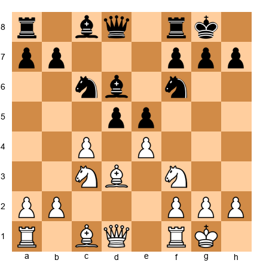</p>


At 1800, you might look at this position and say: "Roughly equal, some tension in the center." At 2200, that is no longer enough. You need to see concrete lines.

White can play 9.cxd5 Nxd5 10.Nxe5 Nxe5 11.Nxd5 - but after 11...Qh4! Black has real threats. Can you see why? The bishop on c1 is undefended after g2 comes under pressure. You must calculate 11...Qh4 12.g3 Qh3 13.f4 Nd3 14.Bxd3 - and now 14...Bxf4! opens lines toward the white king.

This is the depth required. Not "I think it is about equal." Rather: "After 11...Qh4 12.g3 Qh3 13.f4, I must deal with Nd3 and Bxf4, and the evaluation depends on whether 14.gxf4 Qg4+ leads to perpetual check or not."

That is expert-level calculation.

---

## 36.2 The Three Components of Deep Calculation

Calculation is not one skill. It is three skills working together:

### Component 1: Candidate Move Generation

Before calculating anything, you must identify the right moves to calculate. This is the Kotov method, refined for the expert level.

At your level, the candidate list should include:
1. **Forcing moves first:** Checks, captures, and threats - in that order
2. **Quiet moves that create imbalances:** Piece lifts, prophylactic retreats, pawn levers
3. **The "ugly" move:** The move that looks wrong but might work. Grandmasters regularly play moves that violate principles because they calculate that the concrete justification exists

**The discipline:** List your candidates BEFORE calculating any of them. If you start calculating immediately, you will fixate on the first reasonable line and miss a stronger alternative.

### Component 2: Visualization

Visualization is the ability to hold a position in your head and move pieces mentally. This is the bottleneck for most players between 2200 and 2400.

Set up your board:

<p align="center">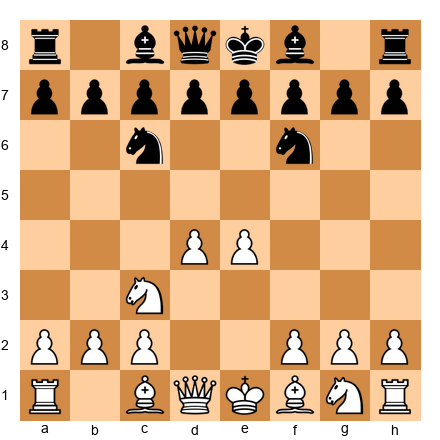</p>


Play the following moves in your head - do NOT move the pieces:
1...d5 2.e5 Ne4 3.Nxe4 dxe4 4.Be3 Bf5 5.c3 e6 6.Qa4

Now answer these questions without looking at the board:
- Where is the black knight?
- What square is the white queen on?
- Is the d4 pawn still on the board?
- Which side has more space?

If you answered: c6, a4, yes, White - your visualization is developing well. If you struggled, the exercises in this chapter will build this skill systematically.

### Component 3: Evaluation at the End of Lines

Calculation without evaluation is pointless. After you follow a line 8 moves deep, you must evaluate the resulting position accurately. This requires positional judgment that goes beyond calculation:

- **Material count** - Who has more pieces, and are they active?
- **King safety** - Whose king is more exposed?
- **Pawn structure** - Which side has weaknesses?
- **Piece activity** - Who has better-placed pieces?
- **Concrete threats** - Does either side have a decisive threat?

The mistake many players make at 2200: they calculate accurately but evaluate the final position incorrectly. They reach the end of a long line, see a roughly level position, and choose the wrong continuation because their positional judgment is off by half a pawn.

---

## 36.3 The Pruning Problem

At 2200, you cannot calculate every possibility. With an average of 30 legal moves per position and lines 10 moves deep, the total number of positions to examine is approximately 30^10 - a number so large it is meaningless. Even Stockfish, examining billions of positions per second, must prune its calculation tree.

The expert's advantage is knowing WHAT to prune.

### What to Calculate Deeply
- Forcing sequences where both sides have limited options
- Lines involving sacrifices (the refutation may be hidden)
- Positions where one side has a dangerous initiative
- Endgame transitions where the evaluation might flip

### What to Prune Early
- Quiet positions where general principles guide the assessment
- Lines where one side achieves a clearly superior version of a known structure
- Variations where one side commits a positional error with no tactical justification
- Moves that violate basic principles AND have no forcing follow-up

### The Danger of Over-Pruning

Set up your board:

<p align="center">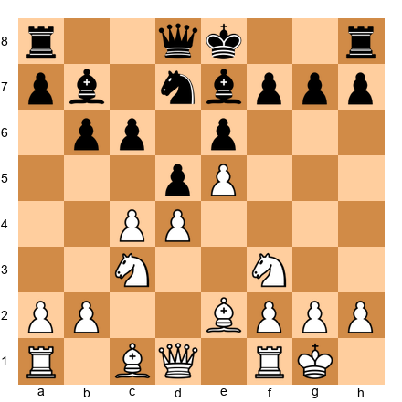</p>


White plays 9.Ng5. Most players at 2200 immediately prune 9...Bxg5 10.Bxg5 Qxg5 because Black wins a piece. But examine the line more deeply: after 10.Bxg5 f6 11.exf6 gxf6 12.Bh6, White has enormous compensation. The dark squares around Black's king are catastrophically weak.

This is why you must calculate ALL forcing continuations to sufficient depth before pruning. A line that looks bad on the surface may contain a deep refutation - or a deep justification.

### How to Avoid Bad Pruning

Bad pruning is one of the most common sources of missed moves at the expert level. Here are three techniques to reduce pruning errors.

**Technique 1: The "ugly move" check.** Before finalizing your candidate moves, spend 10 seconds considering the moves that look ugly or counterintuitive. Moving a piece backward, playing a seemingly passive move, or making an exchange that looks unfavorable - these moves are the ones your brain prunes first, and they are often the ones that contain the winning idea. Force yourself to consider at least one "ugly" candidate in every critical position.

**Technique 2: The defensive countercheck.** After generating your attacking candidate moves, generate one defensive candidate for your opponent. Ask: "What if my opponent plays the move I least want to see?" This often reveals a candidate move you need to consider - one that prevents your opponent's best defense before it happens.

**Technique 3: The intermediate move scan.** Intermediate moves (also called "in-between moves" or "zwischenzugs") are the most commonly pruned moves because they break the expected flow of a sequence. When calculating a forcing line, pause after each capture and ask: "Is there an intermediate move here - a check, a threat, or a counter-capture - that changes the outcome?" This three-second pause catches many pruning errors.

---

## 36.4 Comparative Calculation - Choosing Between Two Good Moves

At 1800, the challenge is finding *a* good move. At 2200, the challenge is choosing between *two* good moves. You see two candidate moves, both look reasonable, and you must determine which is better. This is comparative calculation, and it is one of the defining skills of the expert player.

### The Method

Instead of calculating each move independently and then comparing results, use the comparative method:

1. Calculate Move A to depth 5-6.
2. Note the resulting position and evaluate it.
3. Calculate Move B to the same depth.
4. Compare the two resulting positions directly. Which one would you rather play?

The direct comparison is the key. Do not try to assign numerical values to each position. Ask a simpler question: "In which of these two positions do I have more options? Which one gives my opponent more problems?"

### A Worked Example

Set up your board:

<p align="center">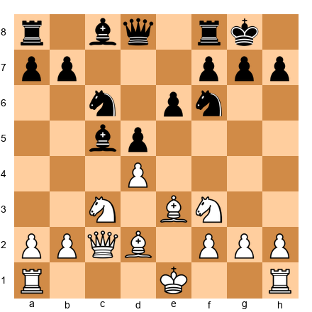</p>


Two moves look strong: 9.O-O-O and 9.dxc5.

**Move A: 9.O-O-O.** White castles queenside, creating opposite-side castling. This signals an aggressive approach. After 9...Qa5 10.Kb1, both sides will push pawns toward the opposing king. The position is sharp and double-edged. White needs to be prepared for a complex tactical fight.

**Move B: 9.dxc5.** White captures, opening the center. After 9...Bxc5 10.O-O, the position is more strategic. White has the two bishops (if Bxc5 is met by taking back) and a comfortable development lead. The play is calmer and more positional.

Compare the two resulting positions. In Position A, both sides have chances and the game could go either way. In Position B, White has a stable structural advantage with less risk.

Which is better? That depends on your style and the tournament situation. If you need a win, Position A offers more winning chances (and more losing chances). If a draw is acceptable, Position B gives a safe edge. The comparative method gives you a clear framework for the decision.

### When Comparative Calculation Fails

Sometimes two moves lead to positions that are too different to compare meaningfully. One leads to a sharp tactical battle; the other leads to a quiet endgame. They are apples and oranges.

In these cases, fall back on a different question: "Which position do I *understand* better?" If you are a tactical player who thrives in complications, choose the sharp path even if the quiet path might be objectively equal. If you are a patient positional player, choose the quiet path. Self-knowledge is a weapon.

---

## 36.5 The Technique of Blindfold Calculation

Grandmasters do not stare at the board to calculate. They visualize the position in their mind, move pieces mentally, and evaluate the resulting position before looking back at the physical board.

### The Progressive Training Method

This method builds visualization capacity over weeks and months. There is no shortcut.

**Level 1 - Follow the Line (★★ Warmup)**
Set up a position. Play a given sequence of 5 moves on your board. Then reset the position and replay the same 5 moves IN YOUR HEAD without moving pieces. Verify by playing them out.

**Level 2 - Extend the Line (★★★ Essential)**
Set up a position. A sequence of 8 moves is given. Play the first 4 on the board. Visualize the remaining 4 without moving pieces. What is the final position?

**Level 3 - Branch and Hold (★★★★ Practice)**
Set up a position. Calculate two different lines, each 6 moves deep. Hold BOTH final positions in your head simultaneously. Which is better for White?

**Level 4 - Full Blindfold (★★★★★ Mastery)**
From a given FEN, calculate a 10-move forcing sequence entirely in your head. Describe the final position. Then check with an engine.

---

## 36.6 The Calculation Clock - Managing Time During Analysis

At 2200, you can calculate deeper than most players at the board. That is a genuine strength. But it comes with a trap: you spend too much time calculating, and you run out of clock in positions where good judgment would have been faster than exact analysis.

Knowing when to calculate and when to stop is just as important as the calculation itself.

### How Long Should You Spend?

A useful guideline for classical chess with a 90-minute time control: you have roughly 2 to 3 minutes per move on average. Some moves deserve more. Some deserve less. The quiet moves where nothing is happening - developing a piece, making a standard recapture - should take 15 to 30 seconds. That buys you time for the critical moments, where you might spend 8 to 12 minutes on a single decision.

The mistake most 2200-level players make is spending 5 minutes on moves that deserve 30 seconds, and then having only 3 minutes left when the position demands 10. Keep a mental budget. If you have spent more than 3 minutes on a move and you are not in a critical position, stop. Play the move that feels right. Trust your training.

### The 3-Minute Rule for Candidate Moves

When you reach a position with multiple candidate moves - three or more reasonable options - use the 3-Minute Rule. Spend no more than 3 minutes on an initial scan of all candidates. During this scan, calculate each line to a depth of 3 to 4 moves. You are not trying to solve the position. You are trying to eliminate candidates.

After the 3-minute scan, you should have narrowed the field to one or two serious options. Now invest your deep calculation time on those remaining candidates. This prevents the common problem of calculating five different lines to moderate depth and choosing none of them with confidence.

Set up your board:

<p align="center">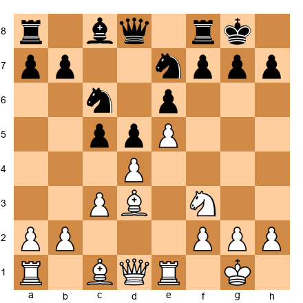</p>


This is a French Defense position. White has several ideas: the direct e5-e6 pawn sacrifice to open Black's kingside, the positional dxc5 to clarify the center, Bc2 followed by Qd3 to build a kingside attack, or simply Nbd2 to improve the worst-placed piece. Four candidate moves, all reasonable.

Your 3-minute scan might look like this. After 1.e6 fxe6, White opens the f-file but gives Black a solid center - this needs deep calculation to verify the attack works. After 1.dxc5, the position simplifies and White keeps the space advantage but the game becomes quieter. After 1.Bc2, White prepares Qd3 with a slow buildup. After 1.Nbd2, White improves the knight but does not commit to a plan.

Within 3 minutes, you should notice that 1.dxc5 and 1.Nbd2 are safe but unambitious. The real question is whether to play 1.e6 or 1.Bc2. Now spend your deep calculation time on those two lines only.

### When to Stop Calculating and Trust Your Judgment

Stop calculating when:

1. **You keep reaching the same conclusion.** If you have calculated a line three times and the answer keeps coming back the same, play it. Rechecking will not change the result.

2. **The position after your candidate move is clearly better, even if you cannot calculate to a forced win.** You do not need to see a checkmate. If your pieces are more active, your opponent's king is weaker, and you have no tactical problems - that is enough.

3. **You cannot find a refutation of your planned move.** At 2200, if you have spent 5 minutes looking for a problem with your intended move and cannot find one, the move is almost certainly good enough. Play it.

4. **Your clock is below 15 minutes in a critical phase.** Below this threshold, switch from calculation mode to pattern-and-judgment mode. Play the move that fits the position's character, even if you have not verified every detail.

### Clock Management in Calculation-Heavy Positions

Some positions demand heavy calculation - tactical middlegames, sharp pawn breaks, positions with multiple forcing lines. When you recognize one of these positions approaching, check your clock immediately. If you have less than 20 minutes for the next 15 moves, consider steering toward a simpler position rather than entering the complications. A slightly inferior but manageable position is better than a superior but impossible-to-calculate one when you are short on time.

When you do commit to a calculation-heavy phase, set a mental time limit before you start. "I will spend 8 minutes on this decision, and then I will play the best move I have found." Without a mental deadline, calculation expands to fill all available time, and you end up in time trouble regardless of how accurately you calculated.

The best tournament players at the expert level are not the deepest calculators. They are the players who calculate deep when it matters and play quickly when it does not. Learn the difference, and your results will improve.

---

## 36.7 Pattern-Based Calculation Shortcuts

At 2200, you should no longer calculate every position from scratch. That is how club players think. Expert players recognize patterns first and then calculate only the deviations - the moments where the position differs from the familiar template. This is faster, more accurate, and less tiring.

### How Pattern Recognition Speeds Up Calculation

Consider a simple example. You have seen dozens of back-rank mate threats in your chess career. When you reach a position where your opponent's king is on g8, there is no pawn on f7 or g7, and your rook is on the e-file, you do not need to calculate the entire mating sequence from the beginning. Your brain instantly recognizes the pattern: "back-rank motif is present." You skip the first three moves of calculation because you already know the setup. Your calculation begins at the point where this specific position differs from the standard pattern.

This is how grandmasters "see" tactics instantly. They are not calculating faster than you. They are calculating less, because patterns do the early work.

### Common Patterns That Let You Skip Steps

**Back-Rank Motifs.** When the opponent's king is trapped on the back rank (no escape squares, no defensive pieces covering the entry points), your first check should always be: "Can I get a rook or queen to the back rank with check?" If the answer is yes, calculate from that point forward. If the pattern is present, the combination is likely sound.

**Pin Exploitation.** When a piece is pinned to a king or queen, the pinned piece is functionally worth less than its normal value. Your shortcut: if a pin exists, check whether you can pile up pressure on the pinned piece. Can you attack it with a pawn? Can you add another attacker? The pattern tells you where to look. The calculation confirms whether it works in this specific position.

**Knight Forks on Weakened Squares.** When your opponent has weakened squares around their king or queen - especially squares like f2, f7, c2, c7 - check whether a knight can reach those squares with a fork. The pattern: two valuable pieces within a knight's jump of a weak square. The calculation: can the knight actually get there, and does it survive?

**Overloaded Defenders.** When one piece is defending two things at once, it cannot do both. The pattern recognition is: "That piece is doing too much." The calculation shortcut: remove one of its defensive duties with a sacrifice or threat, and the other collapses.

### The "If This Pattern, Check This Move" Rule

Train yourself to associate patterns with specific first moves to check. For example:

- If an enemy piece is pinned to the king → check if you can attack it with a pawn or add pressure
- If the enemy back rank is weak → check for rook or queen sacrifices that deflect defenders
- If the enemy king has no pawn cover → check for a queen or rook check that forces the king into the open
- If you have a knight near the enemy king → check every possible knight move, especially forks

This is not about memorizing rules. It is about building reflexes. When the pattern is present, your brain should automatically generate the first candidate move. Then you calculate from that starting point instead of searching blindly.

### Worked Example: Pattern Recognition in Action

Set up your board:

<p align="center">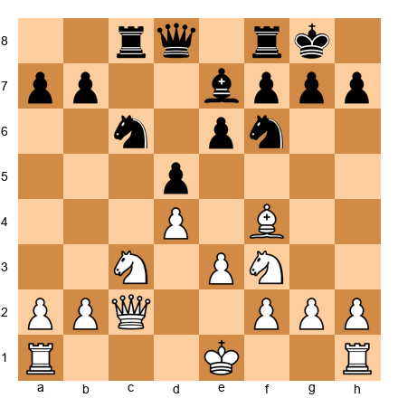</p>


This is a Carlsbad pawn structure - the kind of position you see in the Queen's Gambit Declined, the Caro-Kann Exchange, and similar openings. White has pawns on d4 and e3 facing Black pawns on d5 and e6.

A 2200 player who does not use pattern shortcuts might stare at this position for several minutes, trying to work out a plan from nothing. But an expert who recognizes the Carlsbad structure immediately knows several things:

**Pattern 1: The minority attack.** White can play a2-a3, b2-b4, and b4-b5 to attack Black's queenside pawns. This is the standard plan in this structure. You do not need to calculate it - you know it works on general principles. Your calculation starts only when you need to check the specific timing: "Can I start with a3 right now, or does Black have a tactic that punishes the slow approach?"

**Pattern 2: The kingside buildup.** White's bishop on f4 supports a possible Qc2-Bd3 battery aimed at h7. Another standard idea. You recognize it instantly and calculate only whether the specific piece placement allows it here.

**Pattern 3: The central break.** e3-e4 is a thematic push if White can prepare it properly. You know this break exists. The calculation is about timing: "If I play e4 now, does dxe4 give Black counterplay, or do I recapture favorably?"

Because you recognize all three plans from the pawn structure alone, your calculation is targeted. You spend zero time wondering "what should I do?" and all your time on "which of these three known plans works best right now?" This is the difference between a 1900 player and a 2200 player in the same position. The 1900 player searches. The 2200 player selects.

**Exercise:** Play through five games in the Carlsbad structure. After each game, list the plans both sides used. Within a few games, you will notice the same plans appearing over and over. Those are your shortcuts. The next time you reach this structure, you will calculate 50% less and play 50% better.

---

## 36.8 Annotated Game: The Power of Deep Calculation

### Game: Boris Spassky vs Tigran Petrosian
**World Championship Match Game 10, Moscow 1969**
**Result:** 1-0

Set up your board:
`1.d4 Nf6 2.c4 e6 3.Nf3 d5 4.Nc3 c5 5.cxd5 Nxd5 6.e4 Nxc3 7.bxc3 cxd4 8.cxd4 Bb4+ 9.Bd2 Bxd2+ 10.Qxd2 O-O 11.Bc4 Nc6 12.O-O b6 13.Rad1 Bb7`

Spassky has reached an isolated queen's pawn position. At first glance, Black appears comfortable - pieces are developed, the king is safe, and the isolated d-pawn is a target.

`14.Rfe1 Rc8 15.d5!`

This is the critical moment. Spassky advances the very pawn that Black was hoping to blockade and attack. Why does this work?

Calculate: after 15...exd5 16.Bxd5 Na5 - can you see that White's pieces flood the center? 17.Qf4! threatens Qc7 and the position opens dangerously for Black.

`15...exd5 16.Bxd5 Na5`

Black avoids the critical 16...Bxd5? 17.exd5 Na5 where the knight is sidelined and White's central dominance is crushing.

`17.Qf4 Bxd5 18.exd5 Qd6 19.Qd4!`

A key move. White centralizes the queen where it covers a7 (preventing Nc4) and supports the passed d-pawn. Spassky has calculated that the d-pawn, supported by active pieces, is stronger than the healthy pawn structure Black might establish.

`19...Rfd8 20.Re5`

The rook occupies the fifth rank with enormous power. It defends the d5 pawn, controls the e-file, and can swing to the kingside.

`20...Qf8 21.Rde1 Qd6 22.Nd2!`

The knight heads for e4, the ideal square. Spassky visualized this position from move 15 - the entire sequence was calculated before he pushed d5.

The game continued with Spassky's pieces dominating every sector of the board. Petrosian, one of the greatest defensive players in chess history, could not untangle his position.

`22...Rd7 23.Ne4 Qf8 24.Nf6+ gxf6 25.Qxf6`

Now the attack is decisive. The dark squares around Black's king have collapsed.

`25...Rc1 26.Re8!`

A beautiful finish. The point: 26...Rxe1+ 27.Rxf8+ Kg7 28.Qg5+ Kh6 29.Rf6+ and White wins. Spassky calculated this entire sequence - from the d5 push on move 15 to the rook lift on move 26 - approximately 11 moves of continuous, accurate calculation.

**Lesson:** Deep calculation is not about seeing everything. It is about identifying the critical moments - the points where the position transforms - and calculating those moments with absolute precision.

---

## 36.9 Annotated Game: Calculation Under Pressure

### Game: Garry Kasparov vs Anatoly Karpov
**World Championship Match Game 22, Leningrad 1986**
**Result:** 1-0

Set up your board:
`1.e4 c5 2.Nf3 e6 3.d4 cxd4 4.Nxd4 Nc6 5.Nb5 d6 6.c4 Nf6 7.N1c3 a6 8.Na3 b6 9.Be2 Bb7 10.O-O Be7 11.f4 O-O 12.Be3 Qc7`

A Sicilian Taimanov. Kasparov has built up a strong center with e4 and f4, supported by well-placed knights. Karpov's position is solid but slightly passive.

`13.Rc1 Rfd8 14.Qd2 Rab8 15.b3 Ba8 16.Rfd1 Bf8 17.Nc2 g6 18.Bf3 Bg7 19.Qe2 Nd7 20.Be3 Nce5 21.fxe5 dxe5`

After a series of maneuvering moves, the position has crystallized. Black has exchanged a knight for space but created a weakness: the d6 square is now available for White.

`22.Nd5!`

The decisive blow. Kasparov had seen this possibility many moves earlier. After 22...exd5 23.exd5+ the discovered check wins material. After 22...Qd8 23.Nf6+! forces a catastrophic weakening of Black's kingside.

Karpov resigned - proof that deep calculation combined with patient preparation.

**Lesson:** Calculation at the expert level often means calculating the consequences of a sacrifice 8 to 10 moves before you play it. Kasparov's Nd5 was "in the air" from move 17 onward. Every preceding move was designed to make it work.

---

## 36.10 The Blindfold Training Protocol

This section provides a structured 8-week training program for improving visualization and calculation depth.

### Week 1–2: Position Recall

After playing a game (online or over the board), close your eyes and try to reconstruct the final position from memory. Write down what you remember. Then check. How many pieces did you place correctly?

Target: 80% accuracy on the final position within 2 weeks.

### Week 3–4: Line Following

Take a game from this volume. Read the moves in notation only (do not set them up on a board). Visualize the entire game. At moves 10, 20, and 30, pause and sketch the position from memory.

Target: 60% accuracy at move 20 within 4 weeks.

### Week 5–6: Branch Calculation

Use the exercises in this chapter. For each tactical position, identify two candidate lines and calculate each to depth 6 without moving pieces. Evaluate both end positions. Then check with an engine.

Target: Correctly evaluate the better line in 70% of attempts.

### Week 7–8: Blindfold Puzzles

Solve tactical puzzles from a text description only - no diagram, no board. "White: Kg1, Qd1, Ra1, Rf1, Bc4, Nf3, pawns a2, b2, e4, f2, g2, h2. Black: Kg8, Qd8, Ra8, Rf8, Bc8, Nf6, pawns a7, b7, d6, e5, f7, g7, h7. White to play and win."

Target: Solve 50% of these puzzles correctly.

---

## 36.11 The Calculation Tree - How to Organize Your Thinking

At 2200, you will face positions where three or four moves look reasonable and each leads to branching variations. Without a system, your thinking wanders. You calculate a few moves of one line, jump to another, forget where you were in the first, and end up confused with the clock ticking.

The calculation tree is a mental framework that prevents this chaos.

### How It Works

Think of your calculation as a tree with branches. The root is the current position. Each candidate move is a main branch. Each opponent response creates a sub-branch. Your replies create sub-sub-branches.

The discipline is simple: **finish one branch before starting the next.**

Here is what that looks like in practice.

Set up your board:

<p align="center"></p>


You identify three candidate moves: 8.cxd5, 8.Qa4, and 8.Ne5.

**Branch 1: 8.cxd5 exd5 9.Bg5**

Follow this line. After 9...Be6, what does White do? 10.Bxf6 Bxf6 11.Nxd5. Evaluate: White has won a pawn but Black has the bishop pair and active pieces. Assessment: roughly equal, maybe a tiny edge for White. Note this and move on.

**Branch 2: 8.Qa4**

What does this threaten? It pressures a7 and eyes d7. Black plays 8...Bd7 or 8...Nb4. Calculate 8...Bd7 9.cxd5 exd5 10.Bf4. White has harmonious development and pressure on c7. Assessment: slight edge for White.

**Branch 3: 8.Ne5**

A central move. 8...Nxe5? No, that helps White after 9.dxe5 Nd7 10.cxd5. Better is 8...Bd7. After 9.cxd5 exd5, the knight on e5 is strong but can be challenged. Assessment: playable for both sides, complex middlegame.

**The verdict:** Branch 2 (8.Qa4) offers the most controlled advantage. You play it.

Notice what happened: you completed each branch before starting the next. You did not calculate 3 moves of Branch 1, then jump to Branch 2, then go back to Branch 1. You stayed disciplined. That discipline saves time and prevents confusion.

### The "Pause and Evaluate" Rule

At the end of every calculated line, stop and ask three questions:

1. **Material:** Who has more pieces, and are they active?
2. **King safety:** Whose king is more exposed?
3. **Activity:** Whose pieces are better placed?

These three questions take five seconds. They prevent the most common calculation failure: reaching the end of a line and not knowing whether the position is good for you or not.

### When the Tree Gets Too Wide

Sometimes a position has six or seven reasonable moves. You cannot calculate all of them deeply. This is where pruning meets the tree.

**Quick prune first:** Spend 30 seconds looking at all candidates. Eliminate any that lose material or violate basic principles without compensation. You should be down to three or four moves.

**Shallow scan next:** Calculate each remaining candidate two moves deep. Eliminate any that lead to clearly worse positions. You should be down to two or three moves.

**Deep calculation last:** Now calculate the remaining candidates to full depth. This is where you invest your time.

This funnel approach - wide at the top, narrow at the bottom - is how every strong player manages the calculation tree. You never calculate six lines to depth 10. You calculate six lines to depth 2, eliminate three, and calculate the remaining three to depth 8.

---

## 36.12 Annotated Game: The Art of Patient Calculation

### Game: Viswanathan Anand vs Veselin Topalov
**World Championship Match Game 1, Sofia 2010**
**Result:** 1-0

This game shows how calculation works in practice at the highest level. Every critical moment required Anand to choose between multiple paths and calculate the consequences accurately.

Set up your board:
`1.d4 Nf6 2.c4 e6 3.Nf3 d5 4.g3 dxc4 5.Bg2 a6 6.Ne5 c5 7.Na3 cxd4 8.Naxc4 Bc5 9.O-O O-O 10.Bg5`

Anand has chosen the Catalan, a system that rewards patience and deep calculation. White's bishop on g2 presses against the queenside, and the knight on c4 targets key squares.

`10...h6 11.Bxf6 Qxf6 12.Nd3 Bd6 13.Qa4 Nc6 14.Rac1 e5`

Black pushes for central space. This is a critical decision point. Topalov calculated that the advanced center gives him activity, but Anand has prepared a deep response.

`15.Nc5!`

This is the kind of move that separates expert-level calculation from master-level calculation. The knight jumps to c5, attacking b7 and controlling the a6-c4 diagonal. It looks simple, but Anand had to verify that Black cannot exploit the center immediately with ...e4 or ...d3.

After 15...e4, White has 16.Rfd1 and the d4 pawn is a target. After 15...Bxc5 16.Rxc5, the rook dominates the c-file. Anand calculated both branches and confirmed that the knight move was strong in every variation.

**Lesson:** Calculation at this level is not about flashy combinations. It is about verifying that your positional decisions are tactically sound. Anand's Nc5 was a positional move backed by concrete calculation.

---

## 36.13 The Forcing Move Hierarchy

When you sit at the board and face a complex position, where do you start looking? Expert players follow a hierarchy that saves time and catches opportunities.

### Level 1: Checks

Always look at checks first. A check forces your opponent to respond, which limits the tree dramatically. Many combinations start with an unexpected check.

This does not mean you should play checks randomly. It means you should consider them first to see if any lead somewhere useful.

### Level 2: Captures

After checks, look at captures. Captures change the material balance and often create forcing sequences. A capture that wins material is almost always worth calculating deeply.

### Level 3: Threats

After checks and captures, look at moves that create threats. A threat forces your opponent to address it, which gives you the initiative. The strongest threats are those that create two problems at once (double threats, discovered attacks, batteries on files or diagonals).

### Level 4: Improving Moves

Only after you have exhausted forcing possibilities should you look at quiet improving moves. These are moves that improve your position without creating an immediate threat: piece repositioning, pawn advances that gain space, king safety improvements.

Many players at 2200 make the mistake of looking at improving moves first. They think, "My knight would be better on e5," and they play it without checking whether the position contains a forcing opportunity they missed. The hierarchy prevents this.

### A Worked Example

Set up your board:

<p align="center">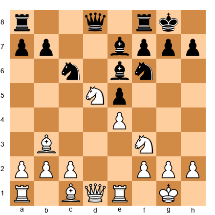</p>


**Checks:** 12.Nxf6+ is a check. After 12...Bxf6, White has exchanged a strong knight for a developed bishop. Is this good? Only if White has a follow-up. After 13.Bg5 Re8, the position is roughly equal. Not exciting.

**Captures:** 12.Nxe7+ is both a check and a capture. After 12...Qxe7 13.d4, White opens the center with tempo. But after 13...exd4 14.Nxd4 Nxd4 15.Qxd4, the position is level.

Wait. Go back to 12.Nxf6+. After 12...Bxf6, try 13.d4! now. This is not a check, not a capture, but it opens the center while the black knight on c6 is loose. After 13...exd4 14.e5! Bxe5 15.Nxe5 Nxe5 16.Rxe5, White has powerful activity with threats against f7.

The hierarchy led you to the checks and captures first, but the real idea was a quiet pawn push after the forced exchange. This is how the hierarchy works: it structures your search so you do not miss anything, even when the best move is not the most forcing one.

### Why This Matters for Your Development

At 2200, you already know about checks, captures, and threats. But do you follow the hierarchy *every time*? In every position? Under time pressure?

The answer, honestly, is probably not. You sometimes skip directly to the move that looks natural. And that is where you miss things.

Make the hierarchy a habit. At every critical moment, spend 10 seconds asking: "Are there any checks? Any captures? Any threats?" Only then consider quiet moves. This discipline will catch opportunities that your intuition misses.

---

## 36.14 Common Calculation Errors at the 2200 Level

### Error 1: Stopping Too Soon

You calculate a line to depth 7, see that you win a pawn, and play the move. But at depth 8, your opponent had a tactical shot that wins it back with interest. Always ask: "What does my opponent do AFTER my last calculated move?"

### Error 2: Selective Blindness

You calculate your intended line beautifully. You verify that it works. You play the move. And then your opponent plays a move you never considered - not because it was hard to find, but because you were so focused on your own plan that you forgot to check their best response.

**The cure:** At every branch point, explicitly ask: "What is my opponent's BEST move here?" Not their most natural move. Not the move you hope they play. Their best move.

### Error 3: Recalculating From Scratch

You spend 8 minutes calculating a position. You almost commit to a move. Then you think, "Wait, let me check one more time," and you restart the calculation from the beginning. You burn 16 minutes on a position that deserved 8.

**The cure:** Trust your first calculation unless you have a specific reason to doubt it. If you found the same answer twice, it is probably correct. Move.

### Error 4: Confusing Calculation with Worry

Calculation is concrete: "If I play Nf5, my opponent plays g6, I play Ne7+, the rook falls." Worry is abstract: "But what if they find something? There might be a defense I am not seeing."

Worry is not calculation. If you have calculated the line and found it sound, trust your work.

---

## 36.15 Advanced Calculation Patterns in Common Structures

Every opening creates its own set of recurring tactical patterns. If you know what combinations tend to appear in the positions you play, you can calculate faster and more accurately. You are not starting from zero each time. Instead, you recognize the pattern and then verify the details. This section covers the most common calculation challenges in three major opening families.

### Calculation in the Sicilian: Sacrifices on d5, e6, and f5

The Sicilian Defense produces more tactical complications than almost any other opening. As White, you often attack on the kingside while Black counterattacks on the queenside. The critical calculations frequently involve piece sacrifices on three key squares.

Set up your board:


<p align="center">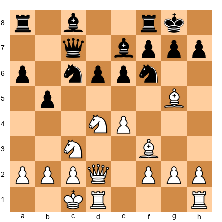</p>


This is a typical Sicilian Najdorf position. White has castled queenside and is ready for a kingside attack. Notice how the pieces point toward Black's king. The most common sacrificial themes here involve Nd5, Bxe6, and Nf5.

**The Nd5 sacrifice.** In this position, consider Nd5. After 12.Nd5 exd5 13.exd5, the knight on c6 must move, and the e7 bishop becomes vulnerable. The pawn on d5 also blocks Black's bishop on b7 (once it gets there) and opens the e-file for your rook. When calculating Nd5 sacrifices, always ask three questions. First, what happens after exd5 - does the pawn recapture create new targets? Second, what happens if Black ignores the sacrifice - can you take on e7 or f6 with a strong follow-up? Third, are there discovered attacks along the e-file once pieces start moving?

**The Bxe6 sacrifice.** Sacrificing a bishop on e6 is common when Black has castled kingside. After Bxe6 fxe6, Black's king position is permanently weakened. The f7 pawn is gone, creating a direct path to the king. Calculate this sacrifice in three stages: the immediate recapture, the follow-up check or attack, and the position after two or three more moves. If you have a rook on the d-file and a knight that can reach f5 or e6, the sacrifice is often strong.

**The Nf5 sacrifice.** This sacrifice attacks the e7 bishop and often threatens Nxg7 or Nd6. In the position above, if White plays Nf5, Black must deal with threats to both e7 and g7. Calculate whether gxf5 is possible - it often is not because of Bh6 or Qh6 ideas. The Nf5 sacrifice is strongest when Black's queen is on c7 (where it cannot defend the kingside) and when White's dark-squared bishop is active.

Practice calculating these three sacrifices in your own Sicilian games. Even when the sacrifice does not work, the process of checking it builds your pattern recognition for future games.

### Calculation in the Queen's Gambit: cxd5 vs. Keeping the Tension

The Queen's Gambit creates a very different calculation challenge. Here the question is rarely about sacrifices. Instead, you must calculate the consequences of pawn structure decisions that affect the next 20 moves.

Set up your board:


<p align="center">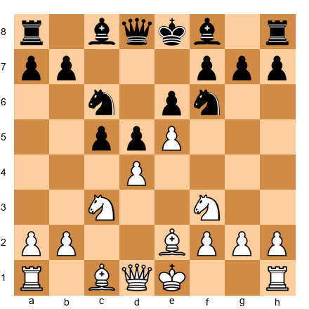</p>


This position arises from the French Defense structure but the calculation principles apply equally to the Queen's Gambit. White must decide whether to play exd5, keep the tension, or advance the center further. Each choice leads to fundamentally different positions that require different calculation approaches.

**When cxd5 (or exd5) is correct.** Take when the resulting pawn structure favors your piece placement. In this position, exd5 exd5 leads to a symmetrical structure where the first player to activate their pieces gets an edge. Calculate not just the pawn trade itself but the first four moves of piece development in the resulting position. Where do your bishops go? Can you play for an isolated queen pawn position where your pieces are more active than your opponent's?

**When keeping the tension is correct.** Maintaining the pawn tension works when your opponent must commit first. If you play a developing move like 0-0 instead of taking, Black must decide between dxe5 (opening the position when you might not want it open), d4 (closing the center and playing for a kingside attack), or maintaining the tension themselves. Calculate each of these responses. The one that gives Black the most trouble tells you whether keeping the tension is the right choice.

**The calculation framework.** In Queen's Gambit positions, your calculation trees are wider but shallower. Instead of calculating one line to depth 10, you are calculating three or four lines to depth 5. The key skill is comparing the resulting positions at the end of each line. Which one gives you better piece activity? Which pawn structure is more favorable? This type of comparative calculation is harder than deep tactical calculation because there is no clear "winning" line - just better and worse positions.

### Calculation in the King's Indian: The f5 Break

The King's Indian Defense is one of the most calculation-intensive openings in chess. As Black, your entire strategy revolves around timing the f5 pawn break correctly. As White, your calculation focuses on whether you can exploit the queenside before the kingside attack arrives.

Set up your board:


<p align="center"></p>


This is the Classical King's Indian. Black's plan involves f7-f5, but timing is everything. Play f5 too early and White opens the center with dxe5 before Black's attack develops. Play f5 too late and White's queenside attack with c5 and b4 crashes through first.

**Calculating the f5 break.** Before playing f5, calculate these lines. After f5 exf5 gxf5, is the e5 pawn secure? Can you follow up with f4, attacking the knight on f3 and opening lines toward White's king? After f5 and White plays dxe5, can you recapture in a way that keeps your attack alive? What happens if White ignores f5 and plays on the queenside - is your attack fast enough?

**The race calculation.** King's Indian positions often turn into a race: Black attacks the kingside while White attacks the queenside. Calculating a race requires counting tempi. How many moves does it take for your attack to create a serious threat? How many moves does your opponent need? If you need 4 moves and your opponent needs 5, you are winning the race. If you both need 4 moves, the player with the initiative (usually the one whose threats are harder to defend) has the advantage.

**A practical rule.** When calculating f5, count the pieces that will participate in your attack within 3 moves of playing f5. If three or more pieces can join the attack (rook to f8, bishop on g7, knight to f6 or g4, queen to h4 or g5), the break is likely strong. If only one or two pieces are ready, wait. Develop more pieces toward the kingside first, then launch the attack.

These opening-specific calculation patterns save you time on the clock and reduce errors. When you sit down to a game and reach a familiar structure, you are not inventing the wheel. You are checking whether the pattern you know applies to this specific position. That is the difference between a 2000-rated player who calculates everything from scratch and a 2200-rated player who recognizes the pattern and verifies the details.

### Calculation in the Caro-Kann: The Advance Variation Attacks

The Caro-Kann with 3.e5 creates positions where White's space advantage can turn into a direct kingside attack. The calculation challenges here are specific and worth studying separately.

Set up your board:


<p align="center">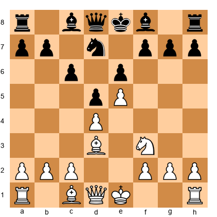</p>


White has a space advantage thanks to the e5 pawn. Black's light-squared bishop is still inside the pawn chain. The typical attacking plan for White involves short castling, playing Re1 and Bf4, and then launching a kingside attack with moves like Ng5 or h4-h5.

**The Bxh7+ sacrifice.** This is the classic Greek Gift sacrifice. After White plays Bd3 and castles, the question becomes: when does Bxh7+ work? You must calculate: 1.Bxh7+ Kxh7 2.Ng5+ and then verify whether Black can survive with Kg8, Kg6, or Kh6.

The key details that determine whether the sacrifice works: Is the queen able to reach h5 quickly? Is there a rook on e1 to support the attack? Can Black block with Nf6? Does Black have Qe7 to cover the e-file? Calculate each defensive try before committing.

**The h4-h5 pawn storm.** When the Bxh7+ sacrifice does not work immediately, White often plays h4-h5 to pry open lines on the kingside. Calculate whether h5 can be met by hxg6 (is the f7 pawn weak after this?) or whether Black should ignore it and play on the queenside.

**The c5 counter-break.** Black's main source of counterplay is c5, challenging White's center. Before playing any attacking move on the kingside, check whether Black has c5 available. If c5 opens the position and activates Black's pieces, your attack may be too slow. The calculation here is comparative: is your kingside attack faster than Black's queenside counterplay?

### Calculation in the Ruy Lopez: The Marshall Attack

The Marshall Attack is one of the most heavily analyzed gambits in chess, and it provides excellent calculation training because the critical variations are long and forcing.

Set up your board:


<p align="center">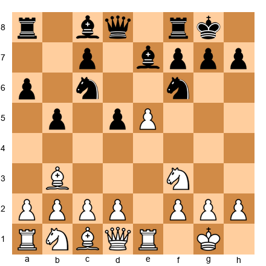</p>


After 8...d5 in the Ruy Lopez, Black sacrifices a pawn for activity and attacking chances. The resulting positions require White to calculate very precisely because Black's attack can become overwhelming if White makes even one inaccurate move.

The calculation training value of the Marshall comes from its forcing nature. Both sides have concrete threats that must be addressed. There are checks, captures, and pins on almost every move. This forces you to calculate deeply and accurately rather than relying on general principles.

Study the Marshall not to memorize the theory (though that is useful too) but to practice your calculation in positions where every move matters. Play through the main lines on a physical board, covering the moves and trying to find the next move before revealing it. This is deep calculation practice disguised as opening study.

---

## 36.16 The Mental Stamina Factor

Calculation is a physical activity disguised as a mental one. Your brain burns glucose. Your eyes fatigue from staring at the board. Your concentration degrades over time. Understanding and managing this degradation is part of becoming a stronger calculator.

### How Calculation Quality Degrades

Research on cognitive performance in competitive settings tells a clear story. Your ability to calculate accurately drops measurably after three hours of intense concentration. What you could calculate to depth 8 in the first hour, you might only manage to depth 5 or 6 in the fourth hour. This is not a failure of skill. It is a biological reality.

At the 2200 level, most of your games are at least 3 hours long, and many are 4 to 5 hours. This means you will spend a significant portion of every game calculating at reduced capacity. The players who handle this best are not the ones with the most natural talent. They are the ones who manage their energy most effectively.

### Conserving Calculation Energy

Not every position requires your deepest calculation. In the opening, if you know your preparation, you do not need to calculate deeply - you are following a prepared path. In quiet middlegame positions, you can rely on general principles and save your calculation energy for the critical moments. In straightforward endgames with a clear plan, you can play somewhat on autopilot.

The trick is recognizing when the critical moment arrives. Train yourself to notice the signals: a change in pawn structure, a piece entering an aggressive square, an opportunity for a combination. When you sense a critical moment approaching, take a deep breath, sit up straight, and invest your full calculation energy. Between critical moments, conserve.

This does not mean playing carelessly between critical moments. It means playing at 80% effort instead of 100%. You still check for basic tactics. You still follow your strategic plan. But you do not try to calculate every move to depth 10. You save that for when it matters.

### Physical Preparation for Calculation

The connection between physical fitness and chess performance is well documented. World champions from Kasparov to Carlsen have emphasized physical training as part of their chess preparation. Here is why it matters and what you can do about it.

**Sleep.** This is the single most important factor. Seven to eight hours of sleep the night before a tournament game improves your calculation accuracy more than any training exercise. Sleep deprivation degrades working memory - the mental workspace where you hold positions and variations. If your working memory is impaired, your calculation depth drops. Period. No amount of caffeine replaces sleep.

**Nutrition.** Your brain needs glucose to calculate. Eat a balanced meal 2 to 3 hours before your game. Avoid heavy meals that make you drowsy. During the game, keep a small snack available - a banana, some nuts, a piece of dark chocolate. Sip water regularly. Dehydration impairs cognitive function even before you feel thirsty. Studies on competitive cognitive performance have shown that even mild dehydration - losing just 1 to 2 percent of body water - reduces working memory capacity and reaction time. This is the equivalent of losing half a move of calculation depth.

**Caffeine.** Coffee and tea can help alertness, but the timing matters. Caffeine takes about 30 minutes to reach peak effect and lasts for 4 to 6 hours. If your game starts at 3 PM, a cup of coffee at 2:30 PM will carry you through the game. But if you drink coffee at 11 AM for a 3 PM game, the peak effect will have passed by the critical later stages. Also, be careful with excessive caffeine. More than 300mg (roughly three cups of coffee) can cause jitteriness, which hurts fine motor control and decision-making. One to two cups is the sweet spot for most people.

**Hydration timing.** Keep a water bottle at the board and sip regularly during the game - every 15 to 20 minutes. Do not wait until you feel thirsty. By the time you feel thirst, your cognitive performance has already declined. Many players report that they play their worst chess in games where they forgot to bring water to the board.

**Exercise.** Regular physical exercise - even 30 minutes of walking three times per week - improves blood flow to the brain and enhances cognitive stamina. You do not need to become a marathon runner. You need to move your body enough that sitting at a chess board for 5 hours does not exhaust you physically.

**Between rounds.** In multi-round tournaments, how you spend your time between games matters enormously. Do not analyze your just-completed game immediately after playing it. Your brain needs to recover. Take a walk. Get fresh air. Eat something. Do your analysis later in the evening when you have recovered, or better yet, the next morning.

### The Hour-by-Hour Strategy

Here is a practical framework for managing your calculation energy across a long game:

**Hour 1 (Moves 1-15 or so).** You are fresh. Use this energy wisely by spending it on preparation review and early middlegame planning. If a critical moment arises, you are at your sharpest. But do not waste this energy calculating obvious moves deeply.

**Hour 2 (Moves 15-30 or so).** This is typically where the most critical decisions happen - the transition from opening to middlegame, key pawn breaks, piece sacrifices. Your energy is still high. This is where you want to invest your deepest calculation.

**Hour 3 (Moves 30-40 or so).** You are starting to tire. If you are in time trouble, this is doubly dangerous. Rely more on pattern recognition and less on brute-force calculation. Make decisions faster on moves where the strategic direction is clear. Save your remaining energy for one or two truly critical moments.

**Hour 4 and beyond.** Your calculation is significantly impaired. If you have a winning position, simplify. If the position is equal, consider a draw if one is available. If you must continue playing a complex position, stand up, walk around, and physically refresh yourself before sitting down for the next move. Every minute spent away from the board at this stage is an investment in calculation quality for the remaining moves.

### The Pre-Game Warmup

Just as athletes warm up before competition, chess players should warm up their calculation before a game. A 10-minute warmup session before arriving at the board can noticeably improve your calculation quality in the early stages of the game.

**The warmup protocol.** Fifteen to twenty minutes before your game, solve 3 to 5 easy tactical puzzles (rated 200 points below your puzzle rating). The goal is not to challenge yourself. The goal is to activate your pattern recognition and get your brain into "chess mode." Solve them quickly - 30 seconds to a minute each. Then set them aside and mentally prepare for the game.

Some players prefer to warm up by replaying a short master game from memory. Others prefer to set up a position from their opening preparation and review the key variations. The specific warmup activity matters less than the act of warming up. The key is to have your chess brain engaged before you sit down at the board, not still waking up during moves 1 through 5.

**What to avoid.** Do not solve extremely hard puzzles as a warmup. If you spend 15 minutes struggling with a puzzle you cannot solve, you will arrive at the board feeling frustrated and mentally fatigued. The warmup should leave you feeling sharp and confident, not defeated.

Do not study new material as a warmup. Learning new ideas requires mental energy that you need for the game. Review familiar material instead. The warmup is about activation, not education.

### Breathing Techniques for Critical Moments

This may sound unusual in a chess book, but breathing techniques can measurably improve your calculation during critical moments. When you face a complex position that requires deep calculation, your stress response can actually impair your thinking. Your heart rate increases, your working memory narrows, and your calculation becomes shallower and less accurate.

A simple breathing technique counters this stress response. When you recognize a critical moment in your game, take three slow breaths before beginning your calculation. Inhale through your nose for 4 seconds, hold for 2 seconds, exhale through your mouth for 6 seconds. Repeat three times. This takes about 36 seconds and measurably reduces your heart rate and stress hormones.

After the three breaths, begin your calculation. You will notice that the position feels clearer, your candidate moves come more easily, and your calculation is more organized. The breathing does not make you smarter - it removes the interference that stress creates, allowing your full calculation ability to function.

Many strong players do this instinctively. They sit up, take a deep breath, and then begin analyzing the critical position. They may not think of it as a breathing technique, but the effect is the same. Making it deliberate and consistent gives you a reliable tool for maintaining calculation quality under pressure.

---

## 36.17 Building a Calculation Training Routine

Calculation is a skill, and like any skill, it improves with structured practice. Random puzzle solving helps, but a deliberate training program produces much faster results. Here is a complete system for improving your calculation accuracy and depth over time.

### Daily Training: 20 Minutes of Deep Puzzles

Every day, spend 20 minutes solving tactical puzzles with a specific focus on depth rather than speed. This is not about racing through 30 easy puzzles. This is about solving 3 to 5 hard puzzles where you must calculate at least 4 to 5 moves deep before committing to an answer.

**How to practice.** Set up a puzzle on a physical board if possible. Do not move the pieces. Calculate the entire solution in your head. Write down your calculated line before checking the answer. Compare your line to the solution. If you missed something, figure out where your calculation went wrong. Did you miss a defensive resource? Did you stop one move too soon? Did you consider the wrong candidate move?

**What difficulty level?** Use puzzles rated 200 to 300 points above your puzzle rating. If you are rated 2000 in puzzles, solve puzzles rated 2200 to 2300. These should take you 3 to 5 minutes each. If you are solving them in under a minute, they are too easy. If you cannot solve any of them in 20 minutes, they are too hard.

**Recommended sources.** Lichess puzzles (set to hard difficulty), the Woodpecker Method book by Axel Smith and Hans Tikkanen, or any tactics book organized by difficulty rather than by theme. The key is that you do not know what tactical pattern to expect. In a real game, nobody tells you "this position contains a pin." You need to practice finding the pattern yourself.

### The Endgame Calculation Drill

Tactical puzzles primarily test middlegame calculation - finding sacrifices, mating attacks, and material-winning combinations. But calculation is equally important in endgames, where a different type of precision is required.

Set up the following type of position for endgame calculation practice. Find a complex king and pawn endgame from a master game or from Dvoretsky's Endgame Manual. Calculate whether the position is won or drawn. The calculation here is different from middlegame tactics. You are not looking for a combination. You are evaluating whether a passed pawn can be promoted, whether a king can reach a critical square, or whether a zugzwang position can be reached.

Endgame calculation training develops a different muscle than middlegame calculation training. The lines are longer (sometimes 10 to 15 moves), the positions are quieter, and the key moves are often subtle. A one-square king move might be the difference between winning and drawing. This precision - the ability to calculate long, quiet sequences without losing the thread - transfers directly to your middlegame calculation because it strengthens your visualization and your patience.

Spend at least one day per week on endgame calculation instead of middlegame tactics. This ensures balanced development of your calculation skills.

### Using Calculation Training to Build Confidence

Many players at the 2200 level doubt their own calculations. They see the right move, they calculate the line, they verify it - and then they play a different move because they are not confident in their analysis.

Calculation training builds confidence by providing evidence of your ability. When you have solved 500 puzzles at the 2200+ difficulty level, you have concrete proof that your calculation works. When you have replayed 20 master games blindfold, you have evidence that your visualization is strong enough to see complex positions in your head.

This evidence matters because confidence is not abstract. It is based on experience. The more positions you have calculated successfully, the more you trust your calculation in a real game. The more you trust your calculation, the more likely you are to play the moves you calculate instead of retreating to "safe" moves that require no calculation.

The goal of calculation training is not just to calculate better. It is to calculate better AND to trust your calculations enough to play the moves they suggest. Both improvements happen together when you train deliberately.

### Weekly Training: Blindfold Game Replay

Once per week, replay one complete master game reading only the notation - without moving the pieces on a physical board or screen. This is perhaps the single most effective calculation exercise available.

**How to do it.** Choose a game that is 25 to 35 moves long (shorter games are easier to start with). Print or write out the notation. Sit with an empty board in front of you (or no board at all) and play through the game entirely in your head. At each move, visualize the position. If you lose the thread, go back a few moves and try again. Do not give up if it is hard. This is supposed to be hard.

**What this trains.** Blindfold replay trains your visualization - the ability to hold a complex position in your mind and manipulate it. Visualization is the foundation of all calculation. If you cannot clearly see the position three moves ahead, your calculation will be full of errors. By practicing blindfold replay, you stretch your visualization capacity.

**Progression.** Start with short games (15 to 20 moves). As you improve, work up to full-length games (40+ moves). Eventually, try replaying games in openings you do not know well - this forces you to calculate rather than relying on memorized patterns.

### Monthly Checkpoints: Deep Analysis Comparison

Once per month, test your calculation depth by solving five complex positions. Set a timer for 15 minutes per position. Write down your analysis, including all the lines you considered and your evaluation of the final position. Then compare your analysis with a strong engine (Stockfish at depth 30+).

**What to measure.** For each position, record three things. First, how deep did you calculate? Count the maximum number of moves in your longest calculated line. Second, was your evaluation correct? Did you correctly identify whether the position was winning, losing, or equal? Third, what did you miss? Write down the engine's best line and identify the specific move where your analysis diverged.

**Tracking progress.** Keep a log of your monthly results. Over 3 to 6 months, you should see your average calculation depth increase. A typical progression might look like this: Month 1 - average depth of 5 moves. Month 3 - average depth of 6 moves. Month 6 - average depth of 7 to 8 moves. If you are not seeing improvement, your daily training is too easy or you are not focusing on depth.

### The Calculation Journal

One of the most effective training tools is a calculation journal - a dedicated notebook where you record your calculation work. For each position you analyze (whether from a puzzle, a game, or a study), write down:

1. The position (FEN or a quick sketch).
2. Your candidate moves (all of them, before you start calculating).
3. Your calculated lines (the main line for each candidate move, as deep as you could go).
4. Your chosen move and why.
5. The correct answer (after checking).
6. What you missed, if anything.

This journal serves two purposes. First, it forces you to be explicit about your calculation process. Writing down your candidate moves before calculating prevents you from skipping moves that might be best. Writing down your lines prevents you from stopping your calculation too early because "it feels right."

Second, the journal creates a permanent record of your calculation ability over time. Flip back to entries from three months ago. Are you calculating deeper now? Are you finding better candidate moves? Are your evaluations more accurate? The journal tells you, objectively, whether your training is working.

Many strong players keep a journal like this throughout their career. It is one of the simplest and most effective training tools available. A notebook and a pen cost almost nothing. The discipline to use them costs effort. The results are worth it.

### The Four-Week Calculation Training Program

Here is a complete four-week program you can follow immediately. Adjust the difficulty to match your level.

**Week 1: Assessment.**
- Monday through Friday: Solve 5 tactical puzzles daily (20 minutes). Record your average solution depth and accuracy.
- Saturday: Replay one master game blindfold. Record how many moves you completed before losing the thread.
- Sunday: Rest. Do not think about chess.

**Week 2: Candidate Moves Focus.**
- Monday through Friday: Solve 5 puzzles daily, but before calculating any line, write down all candidate moves first. Practice generating candidates before calculating.
- Saturday: Replay one master game blindfold - choose a game in an opening you play.
- Sunday: Solve one complex position with 15 minutes on the clock. Write a full analysis and compare with the engine.

**Week 3: Depth Focus.**
- Monday through Friday: Solve 3 harder puzzles daily (25 minutes total). For each puzzle, calculate at least two lines to depth 6 or more before choosing an answer.
- Saturday: Replay one master game blindfold - choose a longer game (30+ moves).
- Sunday: Solve two complex positions (15 minutes each). Compare with engine and note where your calculation went wrong.

**Week 4: Integration.**
- Monday through Wednesday: Solve 5 puzzles daily at your normal difficulty. Focus on speed and accuracy together.
- Thursday: Replay one master game blindfold. Time yourself - how fast can you do it without losing the thread?
- Friday: Solve five complex positions (15 minutes each). This is your monthly checkpoint.
- Saturday: Play a rated game online or over the board. Apply everything you practiced.
- Sunday: Analyze your Saturday game without the engine for 20 minutes. Then check with the engine and compare.

**After Week 4.** Review your results. Compare your checkpoint scores from Week 4 with your assessment from Week 1. Adjust the difficulty up or down for the next cycle. If your accuracy improved but depth did not, focus the next cycle on harder puzzles. If your depth improved but accuracy dropped, focus on verifying your calculations more carefully.

**The long view.** Calculation improvement is slow. Expect visible progress after 2 to 3 months of consistent training. If you miss a few days, do not worry - just pick up where you left off. What matters is consistency over time, not perfection on any given day. The player who solves 5 puzzles a day for 6 months will outperform the player who solves 50 puzzles in one marathon session and then takes a month off.

---

## Exercises - Chapter 36

### ★★ Warmup Exercises (36.1–36.10)

**Exercise 36.1** (★★)

<p align="center"></p>

White to play. Find the best move and calculate 3 moves ahead.
*Hint: There is a natural developing move that also creates a tactical idea.*
⏱ ~5 min

**Exercise 36.2** (★★)

<p align="center">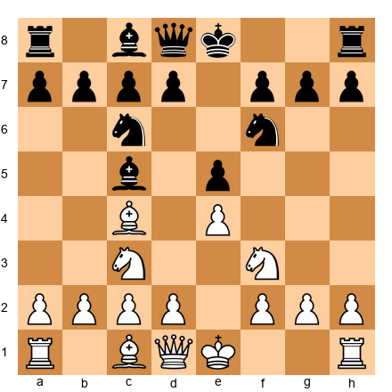</p>

White to play. What are the three most reasonable candidate moves? List them before calculating.
*Hint: All three involve central play.*
⏱ ~5 min

**Exercise 36.3** (★★)
Close your eyes. A standard position after 1.e4 e5 2.Nf3 Nc6 3.Bb5 a6 4.Ba4 Nf6 5.O-O. Without setting up the board, answer: On which square does White's light-squared bishop stand? What is the material balance?
⏱ ~2 min

**Exercise 36.4** (★★)

<p align="center">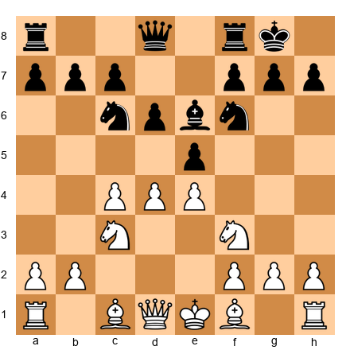</p>

White to play. Is cxd5 or d5 better? Calculate two moves after each to compare.
⏱ ~5 min

**Exercise 36.5** (★★)

<p align="center"></p>

Play the following moves in your head: 1...c5 2.Nf3 d6 3.d4 cxd4 4.Nxd4 Nf6 5.Nc3 a6 6.Be2. Where is the white knight that started on b1? What piece is on e2?
⏱ ~3 min

**Exercise 36.6** (★★)

<p align="center"></p>

Name three candidate moves for White. Which one would you choose and why?
⏱ ~5 min

**Exercise 36.7** (★★)

<p align="center">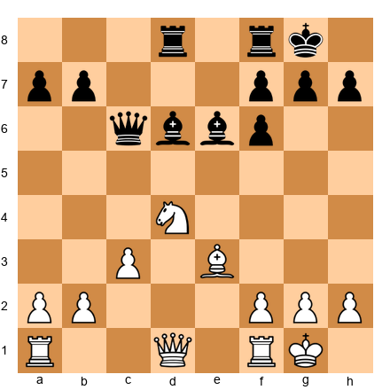</p>

White to play. How many pieces attack the d5 square? How many defend it? Should White occupy d5?
⏱ ~3 min

**Exercise 36.8** (★★)
Play through the Spassky-Petrosian game from section 36.5 on your board, up to move 15. Now close your eyes. Can you describe the position after 15.d5? Name the square of every white piece.
⏱ ~5 min

**Exercise 36.9** (★★)

<p align="center">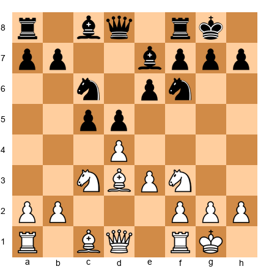</p>

White to play. Calculate 9.cxd5 exd5 10.dxc5 Bxc5 11.—. What is the position after these three half-moves? Describe it without looking at a board.
⏱ ~5 min

**Exercise 36.10** (★★)
Without a board, answer: in the starting position, how many squares can a knight on b1 reach in exactly two moves? List them.
⏱ ~3 min

---

### ★★★ Essential Exercises (36.11–36.35)

**Exercise 36.11** (★★★)

<p align="center">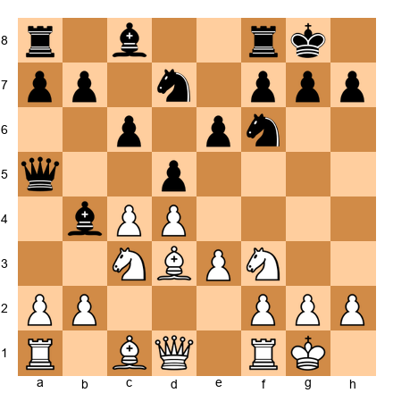</p>

White to play. Find the best plan. Calculate at least 5 moves deep in the critical line.
*Hint: How does White exploit the pin on the a5–e1 diagonal?*
⏱ ~10 min

**Exercise 36.12** (★★★)

<p align="center">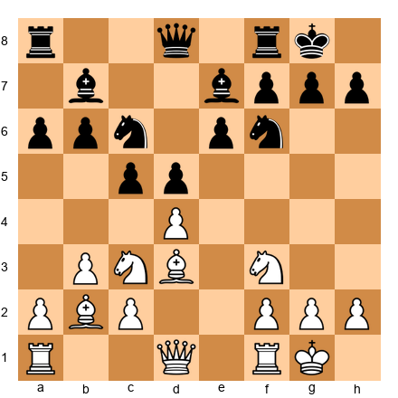</p>

White to play. Evaluate: should White play e4 immediately, or prepare it with Qe2 first? Calculate both lines to depth 5.
⏱ ~12 min

**Exercise 36.13** (★★★)

<p align="center">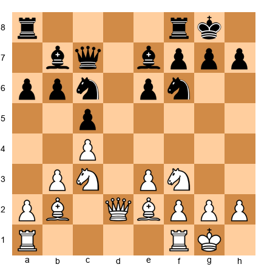</p>

White to play. This is a hedgehog structure. Find White's best plan and the first three moves of that plan.
*Hint: White should prepare a pawn break. Which one?*
⏱ ~10 min

**Exercise 36.14** (★★★)

<p align="center">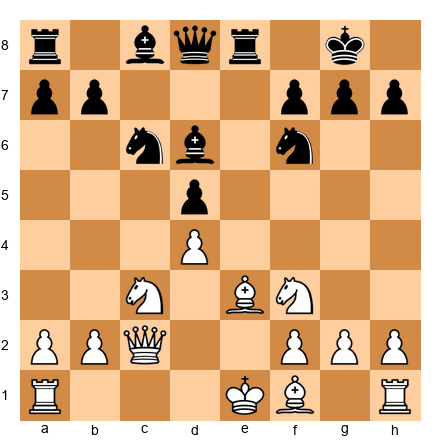</p>

White to play. Calculate 10.O-O-O and 10.Bd3. Which leads to a more favorable position after 5 moves?
⏱ ~12 min

**Exercise 36.15** (★★★)

<p align="center">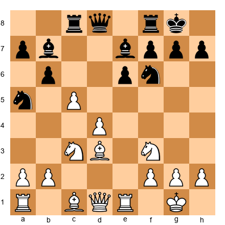</p>

White to play. Find the best continuation. The key tactical idea is hidden 4 moves deep.
*Hint: What happens if the c5 pawn advances?*
⏱ ~10 min

**Exercise 36.16** (★★★)
Blindfold exercise. Starting position: Sicilian Najdorf after 1.e4 c5 2.Nf3 d6 3.d4 cxd4 4.Nxd4 Nf6 5.Nc3 a6 6.Bg5 e6 7.f4 Be7 8.Qf3 Qc7 9.O-O-O Nbd7.
Without a board: Where is the black queen? How many pieces has Black developed? What is White's most natural plan?
⏱ ~5 min

**Exercise 36.17** (★★★)

<p align="center">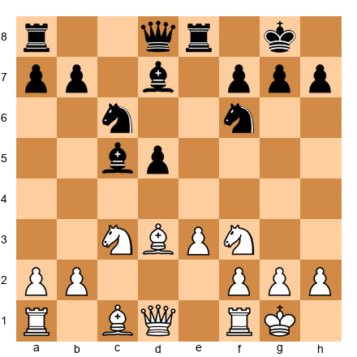</p>

White to play. The black pieces are actively placed but the center is fluid. Find a continuation that exploits the d5 pawn's vulnerability. Calculate 6 moves deep.
⏱ ~12 min

**Exercise 36.18** (★★★)

<p align="center">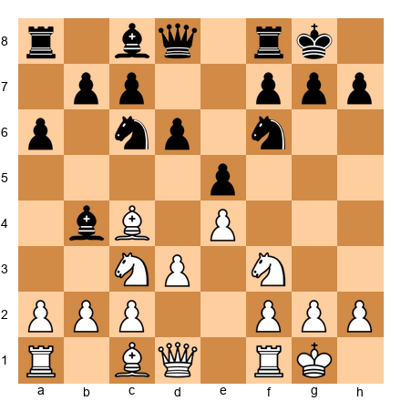</p>

White to play. You have three candidate moves: a3, Bg5, and h3. Evaluate each with 4 moves of calculation. Which is best?
⏱ ~15 min

**Exercise 36.19** (★★★)

<p align="center">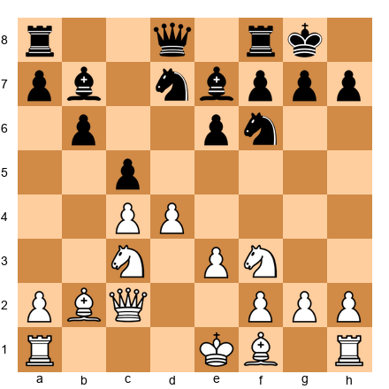</p>

White to play. Calculate 9.cxd5 - does White achieve an advantage? How deep must you calculate to be certain?
⏱ ~10 min

**Exercise 36.20** (★★★)

<p align="center">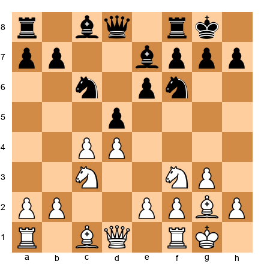</p>

Black to play. Find the best continuation and justify it with at least 6 moves of concrete calculation.
*Hint: Should Black maintain tension or resolve it?*
⏱ ~12 min

**Exercise 36.21** (★★★)

<p align="center">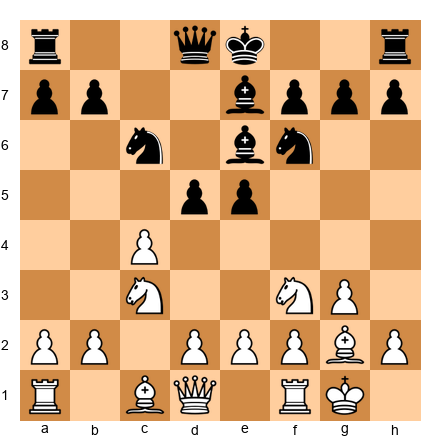</p>

White to play. Calculate 7.cxd5 Nxd5 8.Nxe5. Does this sacrifice work? Prove it to depth 8.
⏱ ~15 min

**Exercise 36.22** (★★★)

<p align="center">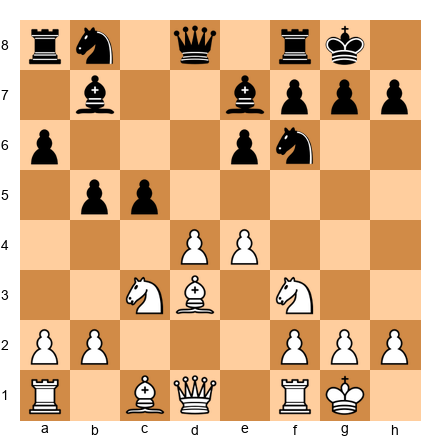</p>

White to play. Evaluate three pawn breaks: d5, e5, and f4. Calculate the consequences of each to depth 4.
⏱ ~15 min

**Exercise 36.23** (★★★)
Blindfold exercise. From memory, reconstruct the position after: 1.d4 d5 2.c4 e6 3.Nc3 Nf6 4.Bg5 Be7 5.e3 O-O 6.Nf3 Nbd7 7.Rc1 c6 8.Bd3 dxc4 9.Bxc4 Nd5 10.Bxe7 Qxe7.
Draw the position from memory. How many pieces are on the board? Check by setting it up.
⏱ ~8 min

**Exercise 36.24** (★★★)

<p align="center">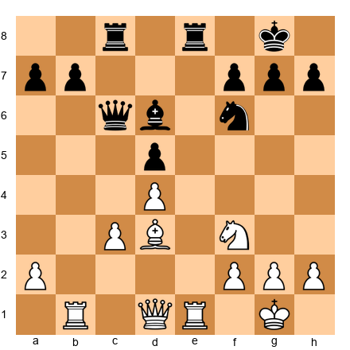</p>

White to play. This appears quiet, but there is a forcing sequence starting with a piece sacrifice. Find it and calculate to completion.
*Hint: Look at the e-file and the d5 pawn.*
⏱ ~12 min

**Exercise 36.25** (★★★)

<p align="center">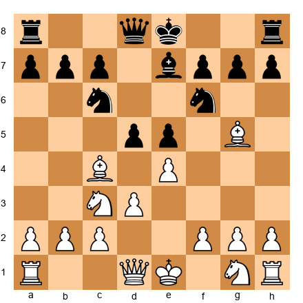</p>

White to play. This is a common position in the Italian Game. Generate four candidate moves, calculate each to depth 4, and choose the best. Explain why the others are inferior.
⏱ ~15 min

**Exercise 36.26** (★★★)

<p align="center">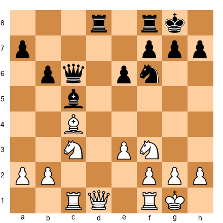</p>

White to play. Find the best plan. Is this a position for patient maneuvering or concrete action? Justify your answer with analysis.
⏱ ~10 min

**Exercise 36.27** (★★★)

<p align="center">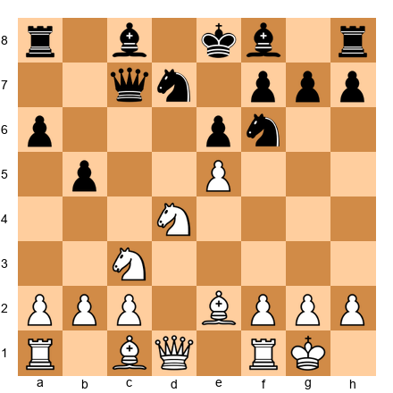</p>

White to play. Calculate 10.exf6 Nxf6 and compare with 10.Bf3. Which gives more concrete chances?
⏱ ~12 min

**Exercise 36.28** (★★★)
Blindfold exercise. You are told: "White has a rook on d1, a queen on e2, a bishop on e3, a knight on c3, and a king on g1. Pawns on a2, b2, d4, f2, g2, h2. Black has rooks on a8 and f8, queen on d8, bishop on e7, knight on f6, king on g8. Pawns on a7, b7, d5, e6, f7, g7, h7."
Without a board: What are White's two best candidate moves? What is the evaluation?
⏱ ~8 min

**Exercise 36.29** (★★★)

<p align="center">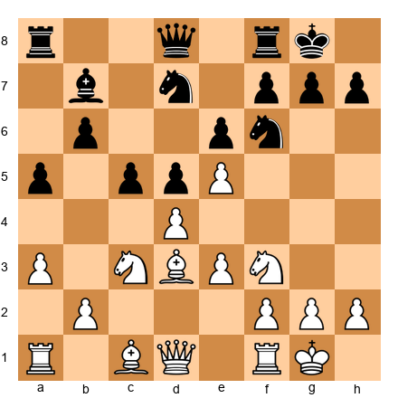</p>

White to play. Calculate 12.exf6 and 12.dxc5. Both change the pawn structure dramatically. Which transformation benefits White?
⏱ ~12 min

**Exercise 36.30** (★★★)

<p align="center">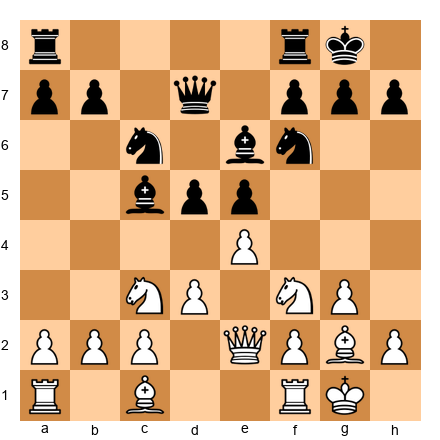</p>

White to play. This is a King's Indian reversed. Find the best plan. Calculate the first 5 moves of your chosen plan.
⏱ ~10 min

**Exercise 36.31** (★★★)

<p align="center">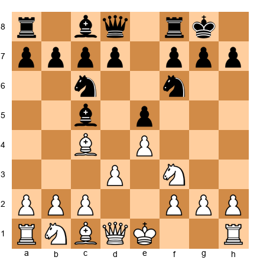</p>

White to play. Calculate 5.c3 and 5.O-O. After 5 moves in each line, which gives White a more comfortable position?
⏱ ~12 min

**Exercise 36.32** (★★★)

<p align="center"></p>

White to play. You are playing a King's Indian Attack. Find the best plan involving f5 or e5. When is each break appropriate?
⏱ ~10 min

**Exercise 36.33** (★★★)
Blindfold exercise. A knight starts on g1. It makes 4 moves: Nf3, Nd4, Nc6, Ne5. Without a board, what square is the knight on? Verify by tracing the path.
⏱ ~2 min

**Exercise 36.34** (★★★)

<p align="center"></p>

White to play. Calculate 11.dxe6 fxe6 12.e5 - does the pawn sacrifice lead to a lasting initiative? Prove it or refute it to depth 7.
⏱ ~15 min

**Exercise 36.35** (★★★)

<p align="center">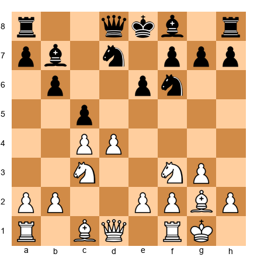</p>

White to play. Calculate 7.d5, 7.e4, and 7.b3. Determine the best move order to achieve White's optimal setup.
⏱ ~12 min

---

### ★★★★ Practice Exercises (36.36–36.55)

**Exercise 36.36** (★★★★)

<p align="center">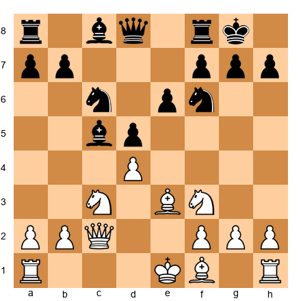</p>

White to play. Find the best continuation. The winning line requires calculation to depth 8.
*Hint: Consider a pawn break in the center that opens lines.*
⏱ ~20 min

**Exercise 36.37** (★★★★)

<p align="center">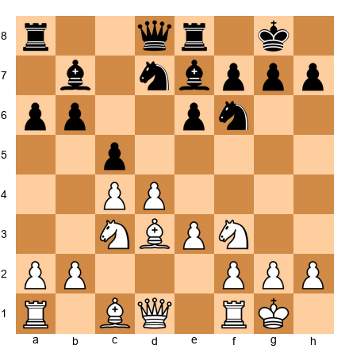</p>

White to play. Calculate the consequences of 10.d5 in exhaustive detail. Consider all of Black's reasonable responses and calculate each to depth 6.
⏱ ~20 min

**Exercise 36.38** (★★★★)
Blindfold exercise. Starting from the standard starting position, play the following moves in your head: 1.e4 e5 2.Nf3 Nc6 3.Bb5 a6 4.Ba4 Nf6 5.O-O Be7 6.Re1 b5 7.Bb3 d6 8.c3 O-O 9.h3 Na5 10.Bc2 c5 11.d4 Qc7 12.Nbd2 Nc6 13.dxc5 dxc5.
Now answer: Where is every white piece? Is the a-pawn still on a2? What is White's best plan?
⏱ ~15 min

**Exercise 36.39** (★★★★)

<p align="center">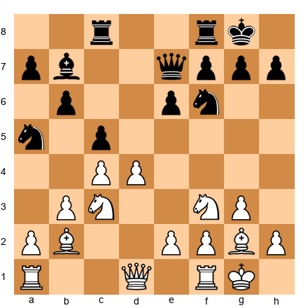</p>

White to play. Find a piece sacrifice that opens lines toward the black king. Calculate to the end of the forcing sequence.
*Hint: What if the knight on f3 could reach e5 with tempo?*
⏱ ~20 min

**Exercise 36.40** (★★★★)

<p align="center">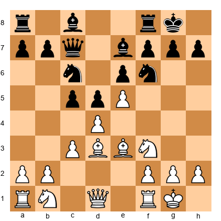</p>

White to play. Calculate 9.exf6 Bxf6 10.dxc5 and evaluate the resulting position after 5 more moves. Is White better? By how much?
⏱ ~15 min

**Exercise 36.41** (★★★★)

<p align="center">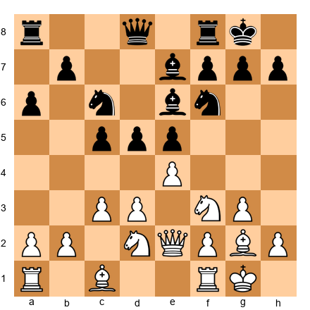</p>

White to play. This is a complex middlegame with many plans for both sides. Identify the three best candidate moves, calculate each to depth 6, and evaluate the resulting positions.
⏱ ~25 min

**Exercise 36.42** (★★★★)

<p align="center">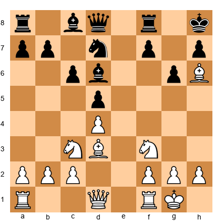</p>

White to play. White has sacrificed a pawn for an attack. Calculate the best continuation to force concrete gains. The line is approximately 9 moves long.
*Hint: The bishop on h6 is powerful but needs support.*
⏱ ~20 min

**Exercise 36.43** (★★★★)

<p align="center">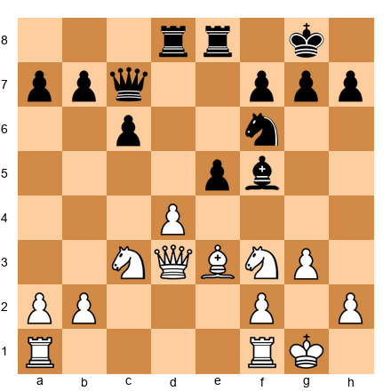</p>

White to play. Find the strongest continuation. The position looks quiet but contains a deeply hidden tactical idea involving a piece sacrifice on e5.
⏱ ~20 min

**Exercise 36.44** (★★★★)
Blindfold exercise. You are told a position verbally: "White king g1, queen d2, rooks a1 and f1, bishops c1 and e2, knight c3, pawns a2 b2 c4 d4 e3 f2 g2 h2. Black king g8, queen d8, rooks a8 and f8, bishops c8 and e7, knights b8 and f6, pawns a7 b7 c6 d5 e6 f7 g7 h7."
Without a board: Is this a Queen's Gambit Declined? What is White's best plan? What would you play?
⏱ ~10 min

**Exercise 36.45** (★★★★)

<p align="center">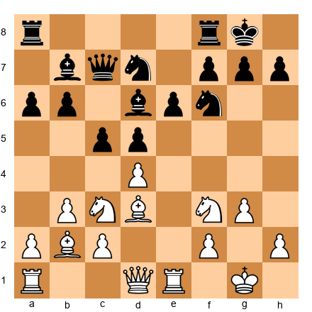</p>

White to play. You must choose between an immediate central break and patient maneuvering. Calculate both approaches and determine which offers better winning chances.
⏱ ~20 min

**Exercise 36.46** (★★★★)

<p align="center">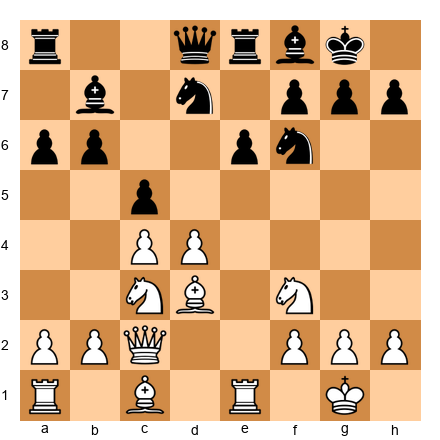</p>

White to play. Calculate 12.d5 exd5 13.cxd5 - does the pawn sacrifice lead to a lasting initiative? Analyze all critical defensive tries for Black.
⏱ ~20 min

**Exercise 36.47** (★★★★)

<p align="center">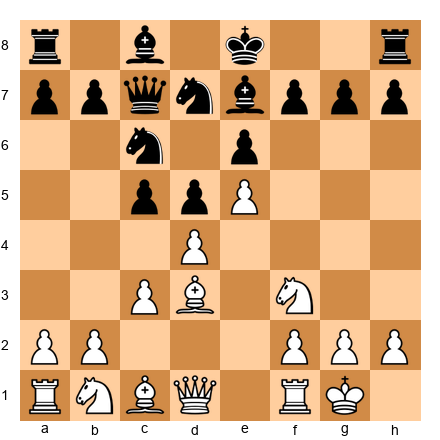</p>

White to play. The French Defense structure. Calculate 8.dxc5, 8.Nbd2, and 8.Re1. Which maintains the most tension and gives White the best long-term chances? Justify with analysis to depth 6.
⏱ ~20 min

**Exercise 36.48** (★★★★)

<p align="center">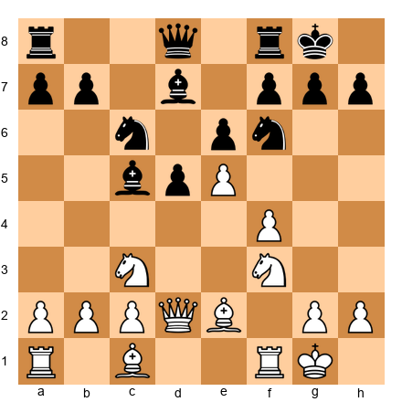</p>

White to play. Calculate 9.exf6 Qxf6 10.g3 and compare with 9.Bd3. Which gives White better attacking chances? Calculate at least 7 moves in the critical line.
⏱ ~20 min

**Exercise 36.49** (★★★★)
From the Kasparov-Karpov game in section 36.6, reconstruct the position after move 20 from memory. Then calculate what would happen if Karpov had played 20...Bxe5 instead of 20...Nce5. How deep must you calculate to determine the difference?
⏱ ~15 min

**Exercise 36.50** (★★★★)

<p align="center">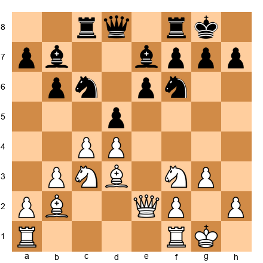</p>

White to play. Find the move that creates the most problems for Black. The idea is subtle and requires at least 6 moves of calculation to justify.
⏱ ~20 min

**Exercise 36.51** (★★★★)

<p align="center">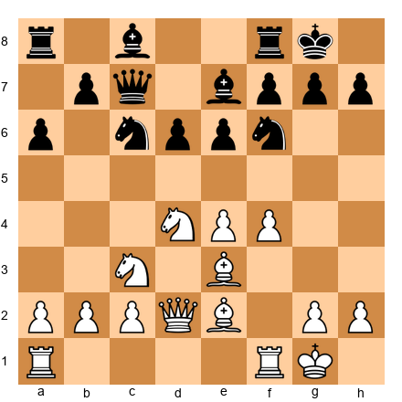</p>

White to play. You are in a typical Sicilian structure. Calculate the consequences of 10.f5 and determine whether it gives White a lasting attack.
⏱ ~20 min

**Exercise 36.52** (★★★★)
Blindfold exercise. Play through the following game fragment in your head: 1.d4 Nf6 2.c4 e6 3.Nf3 b6 4.a3 Bb7 5.Nc3 d5 6.cxd5 Nxd5 7.Qc2 Nxc3 8.bxc3 Be7 9.e4 O-O 10.Bd3.
Describe the position after move 10. What is White's pawn structure? Where are the weaknesses? What is Black's best plan?
⏱ ~10 min

**Exercise 36.53** (★★★★)

<p align="center">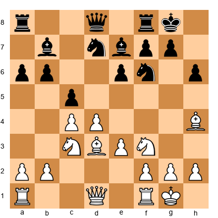</p>

White to play. Calculate 11.d5 in detail. After 11...exd5 12.cxd5 Nb8 - is White's d-pawn strong or weak? Prove your assessment with analysis to depth 8.
⏱ ~20 min

**Exercise 36.54** (★★★★)

<p align="center">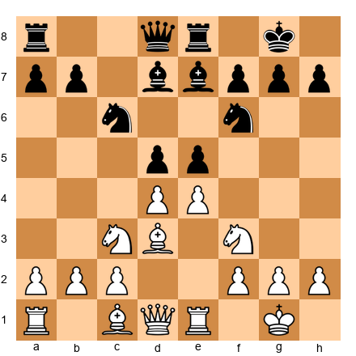</p>

White to play. The center is tense. Calculate 9.dxe5 dxe5 10.Bc4 and 9.exd5 Nxd5 10.Nxe5. Which sequence gives White better piece activity?
⏱ ~15 min

**Exercise 36.55** (★★★★)

<p align="center">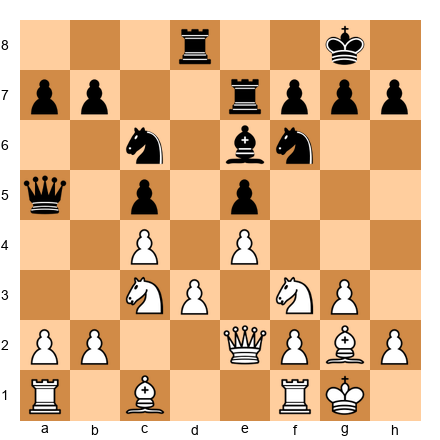</p>

White to play. This position requires both calculation and positional judgment. Find the best plan, calculate 6 moves, and evaluate whether the resulting position is better for White or dynamically balanced.
⏱ ~20 min

---

### ★★★★★ Mastery Exercises (36.56–36.65)

**Exercise 36.56** (★★★★★)

<p align="center"></p>

White to play. Find the strongest continuation. The winning idea involves a deep sacrifice that pays off approximately 10 moves later. Calculate every critical variation.
*Hint: The bishop on c5 is pinned to the queen. Exploit this.*
⏱ ~30 min

**Exercise 36.57** (★★★★★)

<p align="center"></p>

White to play. Find the move that creates an overwhelming initiative. The line branches into three critical variations, each approximately 8 moves deep. Calculate all three and determine which is best for White.
⏱ ~30 min

**Exercise 36.58** (★★★★★)
Full blindfold exercise. The following position is described verbally: "White has king on g1, queen on d1, rooks on a1 and e1, bishop on d3, knight on c3, pawns on a2, b2, d4, e5, f2, g2, h2. Black has king on g8, queen on d8, rooks on a8 and f8, bishops on c8 and e7, knight on d7, pawns on a7, b7, c7, d5, f7, g7, h7."
Without a board, find White's best move and calculate the next 8 moves. What is the evaluation?
⏱ ~30 min

**Exercise 36.59** (★★★★★)

<p align="center"></p>

White to play. This is a critical position in the French Winawer. Find the correct pawn sacrifice and calculate the resulting complications to depth 10. Engine evaluation will confirm whether your analysis is sound.
⏱ ~45 min

**Exercise 36.60** (★★★★★)

<p align="center"></p>

White to play. Calculate the consequences of 13.d5 with full variations. There are at least four critical responses for Black. Analyze each to depth 7 and determine the overall assessment.
⏱ ~40 min

**Exercise 36.61** (★★★★★)

<p align="center"></p>

White to play. Find the move that wins material by force. The combination is 12 moves long and involves multiple quiet intermediate moves.
⏱ ~45 min

**Exercise 36.62** (★★★★★)
Extreme blindfold exercise. From the standard starting position, play the following game in your head: 1.e4 c5 2.Nf3 d6 3.d4 cxd4 4.Nxd4 Nf6 5.Nc3 a6 6.Be2 e5 7.Nb3 Be7 8.O-O O-O 9.f4 b5 10.Bf3 Bb7 11.a3 Nbd7 12.Qe1 Qc7 13.Qg3 Rfe8 14.Be3 Bf8 15.Kh1.
Describe the position after move 15 as accurately as you can. Then verify by setting up the board.
⏱ ~20 min

**Exercise 36.63** (★★★★★)

<p align="center"></p>

White to play. Find and calculate the strongest continuation. The critical line involves a piece sacrifice, a quiet queen move, and a pawn breakthrough, all within 10 moves. There is only one path that works.
⏱ ~40 min

**Exercise 36.64** (★★★★★)
Reconstruct the full Spassky-Petrosian game (section 36.5) from memory - all 26 moves. Write them down without looking. Then check. How many moves did you get right?
Target: 80% accuracy.
⏱ ~20 min

**Exercise 36.65** (★★★★★)

<p align="center"></p>

White to play. This position comes from the Kasparov-Portisch game referenced in the game list. Find the best continuation and calculate all critical variations to depth 10+. The position rewards deep, patient analysis.
⏱ ~60 min

---

## Key Takeaways - Chapter 36

1. **Calculation is three skills:** candidate move generation, visualization, and evaluation at the end of lines. All three must be trained separately and together.
2. **Pruning is essential** but dangerous. Learn what to calculate deeply and what to dismiss - but never prune a forcing line before you have seen its consequences.
3. **Blindfold training** is the fastest path to improved visualization. Start with 5-move sequences and build to full games over weeks.
4. **Common errors at 2200** include stopping calculation too soon, selective blindness to opponent's best moves, recalculating from scratch, and confusing worry with analysis.
5. **Deep calculation in master games** shows that the best players see 10+ moves ahead at critical moments - but they do not calculate everything. They identify the moments that matter and invest their calculation there.

---

## Practice Assignment

1. Play three 15+10 rapid games this week. In each game, identify the one position where you needed to calculate deepest. Write down your calculation and check it with an engine afterward.
2. Do 10 minutes of blindfold puzzle training every day this week. Use the exercises from this chapter or Lichess puzzle mode with the board hidden.
3. Replay one annotated game from this chapter without moving pieces on the board. Visualize each move mentally.

---

⭐ **Progress Check:** You have completed Chapter 36. You have solved ___/65 exercises. If you solved 40 or more, your calculation is at the expert level. If you solved fewer, return to the Essential exercises and work through them again with a physical board.

🛑 **Rest here.** Calculation training is mentally exhausting. Come back to Chapter 37 with fresh eyes.
