# Chapter 37: Complex Middlegame Strategy
## The Seven Imbalances, Multi-Factor Evaluation, and the Art of the Plan

---

> *"Chess is the struggle against error."*
> - Johannes Zukertort

**Rating Range:** 2200–2400
**What You Will Learn:**
- How to evaluate positions using Silman's seven imbalances - and what changes at the expert level
- How to choose between competing strategic plans when multiple valid ideas exist
- How to transform one type of advantage into another - the hallmark of master-level play
- How to navigate the most common complex middlegame structures: IQP, hanging pawns, hedgehog, Maroczy bind, and Carlsbad
- When positional rules should be broken - and how to recognize those moments

---

## You Are Here

```
VOLUME IV: The Expert (2200 → 2400)

Ch 36: Expert-Level Calculation           ✅ Complete
Ch 37: Complex Middlegame Strategy        ◀ YOU ARE HERE
Ch 38: Advanced Endgame Theory
Ch 39: Professional Opening Preparation
Ch 40: Practical Decision-Making Under Pressure
Ch 41: The Art of Preparation
Ch 42: Dvoretsky-Level Endgames
Ch 43: Annotated GM Games: Modern Masterpieces
Ch 44: Deep Opening Systems
Ch 45: The Psychology of the Title Chase
```

---

## 37.1 Why Middlegame Strategy Changes at 2200

At 1600, you learned principles. At 1800, you learned when those principles conflict. At 2200, you face the real problem: the position contains four valid plans, two of them contradict each other, and your opponent has plans of their own.

This chapter is about navigating that complexity. We are past the basics. This is where chess becomes an art form.

Set up your board:

<p align="center"></p>


Look at this position. White has a space advantage in the center. Black has a solid pawn structure and well-placed minor pieces. Both sides have completed development. There is no tactic. No hanging piece. No fork.

What is the best plan for White?

The answer depends on at least seven factors - and those factors push in different directions. That tension is the subject of this chapter.

---

## 37.2 The Seven Imbalances at Expert Level

Jeremy Silman's framework of seven imbalances remains the most practical tool for middlegame evaluation. At the expert level, you already know the list. What changes is how you weight them against each other.

### Imbalance 1: Material

Material is the easiest imbalance to count and the hardest to evaluate correctly. A pawn is not always a pawn. A queen is not always worth nine points.

Set up your board:

<p align="center">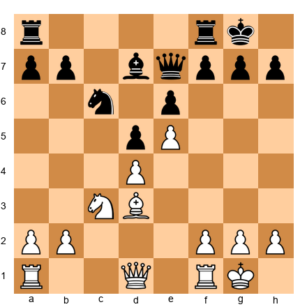</p>


Material is equal. But White's space advantage and the pawn chain on d4-e5 give the pieces more room. Black's light-squared bishop is restricted by its own pawns on d5 and e6. In material terms: even. In practical terms: White's pieces are worth more.

At your level, stop counting material as a number. Start counting it as a function of position.

### Imbalance 2: Pawn Structure

Every pawn move creates permanent changes to the position. Strong players know this instinctively. Expert players must know it precisely.

The key pawn structure questions at 2200+:
1. Which pawns are fixed and which are mobile?
2. Where are the pawn breaks?
3. Which squares have been weakened by pawn advances?
4. Does the structure favor bishops or knights?

Set up your board:

<p align="center">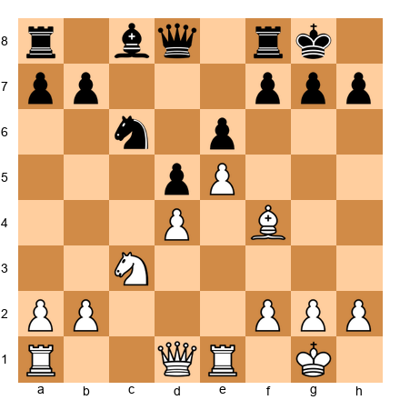</p>


The e5-d4 pawn chain is the backbone of White's position. It controls key central squares and restricts Black's pieces. But it also tells Black exactly where to attack: the base of the chain at d4, using ...c5, or undermining e5 with ...f6.

Pawn structure dictates strategy. Read the pawns before you read the pieces.

### Imbalance 3: Space

Space is not about occupying squares. It is about restricting your opponent's options while expanding your own.

Set up your board:

<p align="center">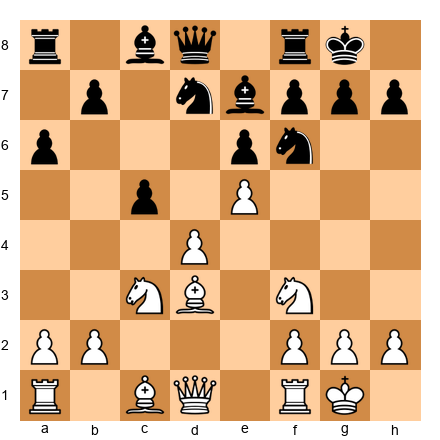</p>


White has more space - the pawns on d4 and e5 push Black's pieces behind the third rank. But space is only valuable if you can use it. If White cannot open the position or create threats, the space advantage means nothing. Black will maneuver behind the pawn chain and wait for White to overextend.

The expert's question about space: Can I use this space to create concrete threats? If not, my opponent may be fine despite being cramped.

### Imbalance 4: Piece Activity

The most dynamic of the seven imbalances. A piece that controls key squares, coordinates with allies, and threatens something concrete is an active piece. A piece that defends passively, lacks good squares, or is blocked by its own pawns is a passive piece.

Set up your board:

<p align="center"></p>


White's bishop on b2 controls the long diagonal. The queen on c2 eyes the kingside. The knight on c3 supports d5 and e4. These pieces work together.

Black's bishop on b7 stares at the e4 square but cannot reach it. The knight on d7 is passive - it blocks the bishop on e7 and has no clear path to an outpost. Black's pieces are developed but not coordinated.

Piece activity is not about where your pieces ARE. It is about what your pieces DO.

### Imbalance 5: King Safety

At the expert level, king safety is not binary - it is a spectrum. A king can be slightly exposed, moderately exposed, or critically exposed. The evaluation depends on whether the opponent can exploit the exposure.

Set up your board:

<p align="center">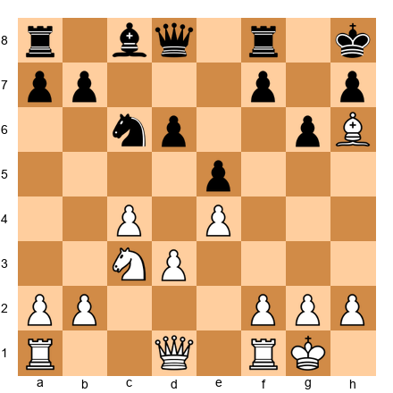</p>


Black's king on h8 looks safe - tucked in the corner. But the dark-squared bishop is gone (traded or captured), the kingside pawns have advanced, and the bishop on h6 exerts uncomfortable pressure. In terms of pure king safety, Black's king is adequate. In terms of the bishop on h6 and the missing dark-square defender, it is a structural weakness that may become dangerous.

The expert evaluates king safety by asking: Can my opponent open lines toward my king? If yes, king safety dominates the evaluation. If no, other factors matter more.

### Imbalance 6: Minor Piece Battles

Bishop vs. knight. Two bishops vs. bishop and knight. The minor piece battle is where expert-level chess separates from club-level chess.

Set up your board:

<p align="center">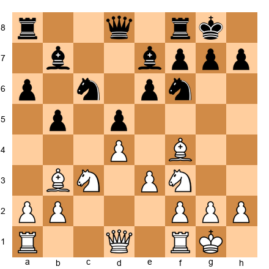</p>


White has two bishops. Black has two knights. Who stands better? It depends entirely on the pawn structure.

If the position stays closed with fixed pawns, Black's knights will dominate - they hop over pawns and find outposts. If the position opens with pawn exchanges, White's bishops will rake the board from corner to corner.

The player who controls the pawn structure controls the minor piece battle. This is why expert players make pawn moves with their minor pieces in mind. Every pawn advance is a vote for bishops or a vote for knights.

### Imbalance 7: Development and Initiative

At your level, you are rarely behind in development after the opening. But the initiative - the ability to dictate the flow of the game - is something you can gain, lose, and fight for throughout the middlegame.

Set up your board:

<p align="center">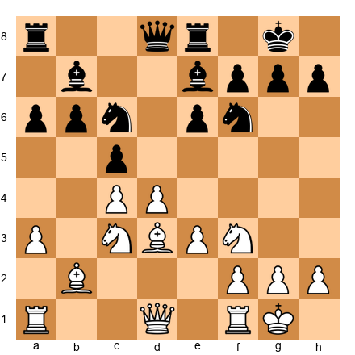</p>


Material is equal. Development is complete for both sides. But White has a small initiative because the pawn center on c4-d4 controls more space, and White can choose when and where to open the position. Black is solid but reactive.

The side with the initiative sets the agenda. The side without it must respond. At the expert level, trading initiative for material - or material for initiative - is a constant strategic decision.

---

## 37.3 Multi-Factor Evaluation: When Imbalances Conflict

Here is the hard part. In real games, imbalances rarely all point in the same direction. You might have more space but worse piece activity. You might have a better pawn structure but less king safety. You might have the initiative but be down material.

How do you weigh these against each other?

### The Hierarchy of Imbalances

There is no fixed formula, but there is a rough hierarchy that holds in most positions:

1. **King safety** - When one king is in danger, this dominates everything else
2. **Material** - A significant material advantage usually wins if the position stabilizes
3. **Piece activity and initiative** - Active pieces and the initiative can compensate for material
4. **Pawn structure** - Long-term pawn weaknesses matter most in simplified positions
5. **Space** - Matters most when the position is closed or semi-closed
6. **Minor piece battles** - Become decisive in the endgame
7. **Development** - Matters most in the opening and early middlegame

But this hierarchy shifts. In a sharp tactical position, initiative outweighs material. In a quiet endgame, pawn structure outweighs everything. The expert must sense which imbalances matter most in THIS position, not in the abstract.

### A Practical Framework

When evaluating a complex position, try this three-step process:

**Step 1: Identify all imbalances.** List what each side has. Be specific: "White has the bishop pair but a weak d-pawn. Black has knights well-placed on d5 and f4 but a cramped position."

**Step 2: Identify the critical imbalance.** Which single factor matters most in this specific position? Is someone's king in danger? Is there a passed pawn? Is the position opening or closing?

**Step 3: Evaluate the trajectory.** Is the critical imbalance increasing or decreasing? If White's king is exposed but Black cannot open lines, the exposure matters less with each move. If Black's d5 knight is about to be exchanged, the outpost advantage is temporary.

Set up your board:

<p align="center">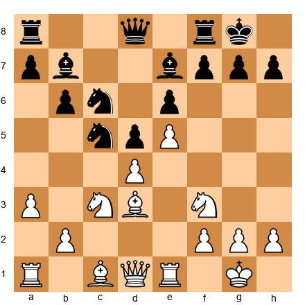</p>


Evaluate this position using the three-step process.

**Step 1:** White has more space (e5 pawn chain), an active bishop on d3, and pressure on the kingside. Black has a strong knight on d5, the bishop pair, a solid structure, and counterplay on the queenside.

**Step 2:** The critical imbalance is the battle between White's space and Black's knight on d5. If that knight stays, Black is fine. If White can remove it, the space advantage becomes crushing.

**Step 3:** The trajectory favors the side that controls the d5 square. If White plays Nxd5 and Black recaptures with the e-pawn, White gets a target on d5 and Black's bishop pair becomes active. If Black recaptures with the c-pawn, Black gets hanging pawns but more central control. The evaluation depends on concrete analysis of both captures.

This is expert-level evaluation. It is not about finding a number. It is about understanding the dynamics.

---

🛑 **Good stopping point.** The next section covers one of the most important concepts at the expert level - the battle of plans. Rest here if you need to.

---

## 37.4 The Battle of Plans

At the club level, you need A plan. At the expert level, you need to choose between COMPETING plans - and you need to understand your opponent's plans too.

### The Planning Framework

Every position offers multiple valid ideas. The expert's job is not to find the one correct plan but to select the plan that best suits the position AND disrupts the opponent's ideas.

Set up your board:

<p align="center">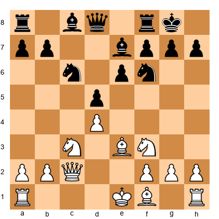</p>


White has at least four plausible plans:

**Plan A: Kingside Attack.** Castle queenside, push g4-g5, drive the knight from f6, storm the kingside. Aggressive and direct.

**Plan B: Central Pressure.** Castle kingside, play e4 (after preparation), open the center while Black is still organizing. Classical and sound.

**Plan C: Minority Attack.** Castle kingside, play b4-b5, create weaknesses in Black's queenside pawn structure. Slow but long-term.

**Plan D: Piece Pressure.** Castle kingside, maneuver pieces to optimal squares (Bd3, Rfe1, Rac1), maintain tension without committing. Flexible and patient.

Which plan is best? The answer depends on what Black is doing. If Black is preparing ...c5, Plan A may catch Black unprepared. If Black is preparing ...e5, Plan C may exploit the queenside. If Black is sitting still, Plan D keeps all options open.

The expert does not commit to a plan too early. The expert watches the opponent's setup and adapts.

### Petrosian's Question

Tigran Petrosian, the ninth World Champion, was a master of prophylactic thinking. His approach to planning was built on one question:

*"What does my opponent want to do?"*

Before choosing your plan, identify your opponent's plan. Then ask: Can I prevent it? Should I prevent it? Or should I ignore it and pursue something stronger?

Set up your board:

<p align="center">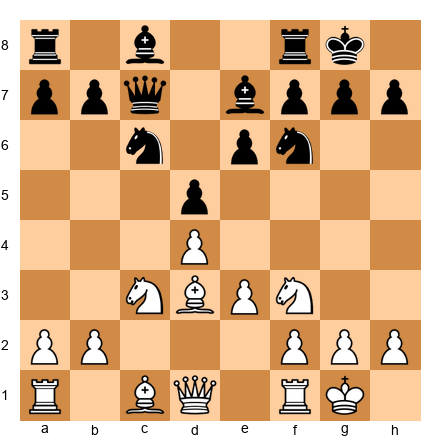</p>


Black's plan is clear: ...e5, challenging the center and activating the bishop on e7. If Black achieves ...e5 comfortably, the position equalizes.

White's prophylactic response: 10.e4! - playing e4 before Black can play ...e5. This is not White's "ideal" plan in a vacuum. But it is the right plan because it prevents Black's idea. After 10.e4 dxe4 11.Nxe4 Nxe4 12.Bxe4, White controls the center with a strong bishop.

The best plan is often the one that stops your opponent's best plan.

---

## 37.5 Transformation of Advantages

This is the concept that separates experts from strong club players. The ability to convert one type of advantage into another - a superior position into a material advantage, a space advantage into a kingside attack, a structural advantage into a winning endgame - is the hallmark of master-level play.

### The Principle

Advantages do not last forever. A space advantage can evaporate if your opponent finds a pawn break. A development advantage fades as the opponent catches up. Even material advantages can become meaningless if the position turns against you.

The master does not cling to one advantage. The master transforms it into a different advantage before it disappears.

### The Steinitz Method

Wilhelm Steinitz, the first World Champion, understood this better than anyone of his era. He would accumulate small positional advantages - a better bishop, a weak square, a superior pawn structure - and then transform them into a winning attack or a won endgame at precisely the right moment.

Set up your board:

<p align="center">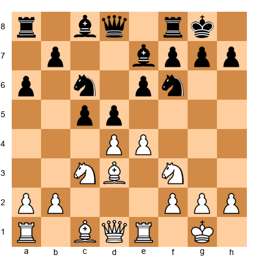</p>


White has more central space (e4-d4 vs. d5-c5). This is a temporary advantage - Black can challenge it with ...cxd4 and ...e5. White must transform this space into something lasting before Black neutralizes it.

10.e5 Nd7 11.Bf4 - now the space advantage has transformed into a piece activity advantage. The bishop on f4 is active, the knight on d7 is passive, and White's pieces control more of the board.

But the transformation is not complete. White must now convert piece activity into either a kingside attack or a won endgame. Piece activity alone is temporary.

### The Chain of Transformation

At the highest level, advantage transformation follows patterns:

1. **Development lead → Initiative → Attack → Material gain**
2. **Space advantage → Piece activity → Positional bind → Breakthrough**
3. **Better pawn structure → Superior endgame → Conversion**
4. **Material advantage → Exchange of pieces → Won endgame**
5. **King safety advantage → Attack → Forced concessions**

The expert recognizes which chain is possible in a given position and steers toward the next link.

---

## 37.6 Annotated Game: The Art of Transformation

### Game: Wilhelm Steinitz vs Mikhail Chigorin
**World Championship Match, Havana 1892**
**Result:** 1-0

This game demonstrates Steinitz's method of accumulating small advantages and transforming them at the critical moment.

Set up your board:
`1.d4 d5 2.Nf3 Bg4 3.c4 Bxf3 4.exf3 e6 5.Nc3 Nf6 6.Bd3 c6 7.O-O Be7 8.f4 O-O 9.b3 Nbd7 10.Bb2 Re8`


Steinitz has the bishop pair and more central space, but doubled f-pawns. Chigorin has a solid structure and all his pieces developed. The position appears roughly equal.

`11.Qc2 Nf8 12.Rae1 Ng6 13.Rxe6!`

A thematic exchange sacrifice. Steinitz transforms his spatial and piece-activity advantage into a direct attack. After 13...fxe6 14.Qxg6 Rf8 15.Re1, White's pressure against e6 and the open lines toward Black's king create lasting compensation.

The material deficit does not matter. What matters is that every remaining White piece participates in the attack, while Black's pieces are tangled in defense.

**Lesson:** Steinitz did not wait for the advantage to grow on its own. He transformed a positional plus (space, bishops, activity) into a tactical attack at the precise moment when the exchange sacrifice was sound. The transformation was the plan.

---

## 37.7 Complex Middlegame Structures

Every middlegame arises from a pawn structure. If you understand the structure, you understand the position. This section covers the five most important complex structures at the expert level.

### Structure 1: The Isolated Queen's Pawn (IQP)

Set up your board:

<p align="center"></p>


Wait - this is not yet an IQP position. The IQP arises after specific pawn exchanges. Let us see how it forms:


<p align="center">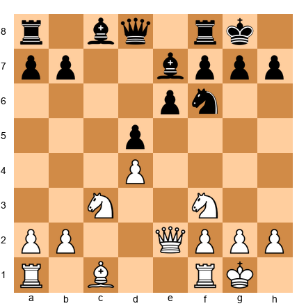</p>


Now White has an isolated d-pawn. The d4 pawn cannot be supported by another pawn. It is a permanent weakness - but also a permanent source of energy.

**The IQP holder's advantages:**
- The d5 square is a powerful outpost for pieces (especially a knight)
- The half-open c- and e-files provide active rook play
- The d4-d5 advance is always a threat, opening the position for an attack
- Pieces are naturally active because they are not blocked by their own pawns

**The IQP holder's disadvantages:**
- The d-pawn is a target, especially in the endgame
- If all pieces are exchanged, the pawn weakness often decides
- The d5 square is also an outpost for the opponent's pieces (if they can reach it)

**The strategic question:** Can the IQP holder attack before the opponent blockades and exchanges into an endgame?

Set up your board:

<p align="center">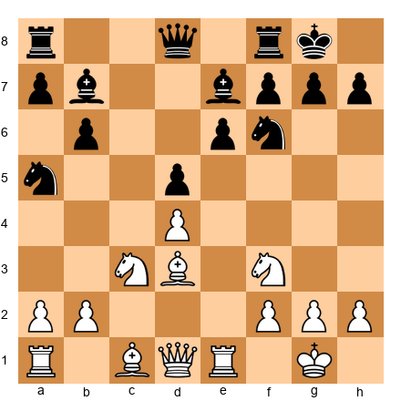</p>


White's plan is clear: d4-d5 at the right moment, backed by piece pressure on the e-file and the kingside. Bc2 followed by Qd3 creates a battery aimed at h7. If Black does not react, the d5 break will tear open the position.

Black's plan is also clear: blockade d5 with a knight, exchange minor pieces to reduce White's attacking potential, and steer toward an endgame where the isolated pawn is a target.

The battle between these two plans defines the IQP middlegame.

### Structure 2: Hanging Pawns

Set up your board:

<p align="center">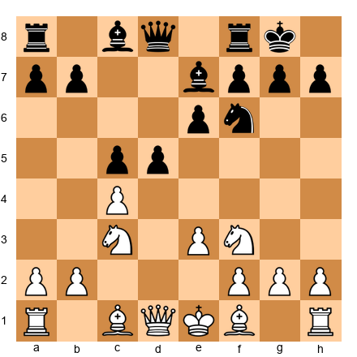</p>


After 7.cxd5 exd5, Black will have hanging pawns on c5 and d5. These pawns are side by side on the fourth rank with no pawn supporting either of them.


Hanging pawns are like a loaded weapon pointed at both players.

**If the pawns advance successfully:** They control enormous space and open lines for the pieces behind them. A timely d4 or c4 push can be devastating.

**If the pawns are blockaded or attacked:** They become twin weaknesses, requiring constant piece defense. The squares in front of them (d4 and c4, or d3 and c3) become outposts for the opponent.

The side playing against hanging pawns wants to:
1. Blockade one or both pawns
2. Force one pawn forward to create an isolani
3. Trade pieces to emphasize the pawn weaknesses

The side playing with hanging pawns wants to:
1. Maintain dynamic tension - do not advance prematurely
2. Prepare a pawn break at the right moment
3. Use the open lines and diagonals for active piece play

### Structure 3: The Hedgehog

Set up your board:

<p align="center">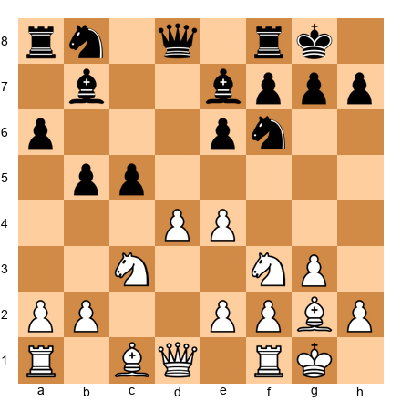</p>


The hedgehog is one of the most complex structures in chess. Black concedes space - pawns on a6, b5 (or b6), c5, d6, e6 - and builds a flexible setup behind them. White occupies the center with pawns on d4 and e4 (or c4) and appears to dominate.

But the hedgehog is deceptive. Black's pieces have tremendous latent energy. The position is like a coiled spring. At the right moment, Black strikes with ...b5, ...d5, or ...e5, and the position explodes.

**White's approach to the hedgehog:**
- Maintain the space advantage without overextending
- Prevent Black's pawn breaks by controlling the key squares (b5, d5, e5)
- Maneuver pieces to optimal squares - this can take many moves
- Look for a moment to strike with d5 or e5

**Black's approach in the hedgehog:**
- Be patient. The hedgehog rewards patience above all else
- Place pieces on their optimal squares: rooks on c8 and e8, queen on c7, bishop on e7, knight on d7 or f6
- Wait for White to overextend or commit, then strike
- The key breaks are ...b5, ...d5, and occasionally ...e5

Set up your board:

<p align="center">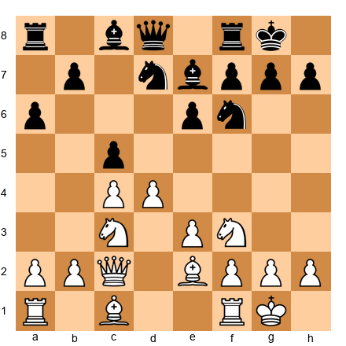</p>


This is a classic hedgehog. White has more space. Black is solid. The position can remain like this for 20 moves while both sides maneuver. This is where patience separates experts from club players.

### Structure 4: The Maroczy Bind

Set up your board:

<p align="center">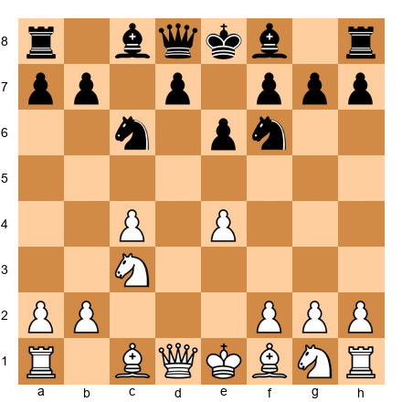</p>


The Maroczy Bind arises when White places pawns on c4 and e4, controlling the d5 square. It typically comes from the Sicilian Defense.


White's pawns on c4, d4, and e4 form a massive wall. The d5 square is firmly under White's control. Black's pieces, especially the knight, cannot easily reach d5.

**The bind's strength:** It restricts Black's piece activity and denies counterplay. White can build slowly, improve piece placement, and prepare a kingside attack or a central break.

**The bind's weakness:** The c4 and e4 pawns are spread out, and the d4 pawn can become a target. If Black achieves ...d5 or ...b5, the bind cracks.

**White's plan:** Maintain the bind, prevent ...d5 and ...b5, improve pieces, and exploit the space advantage.

**Black's plan:** Prepare ...b5 or ...d5 as a liberating break. Use the fianchettoed bishop to pressure the center from g7. Seek piece activity to compensate for less space.

The Maroczy Bind is a test of patience and technique. White must be methodical. Black must be resourceful.

### Structure 5: The Carlsbad Structure

Set up your board:

<p align="center"></p>


The Carlsbad structure arises from the Queen's Gambit Exchange Variation and similar openings. Both sides have pawn chains: White's d4-e3 and Black's d5-e6. The position is symmetrical in structure but not in character.

**White's minority attack:** White plays b4-b5, aiming to trade the b-pawn for Black's c-pawn. This creates an isolated pawn on d5 (or a backward pawn on c6 or c7), giving White a long-term target.

**Black's kingside play:** Black plays ...f5 or ...Ne4, aiming for a kingside attack. The knight often goes to e4, supported by ...f5, creating threats against White's king.

**The central tension:** White sometimes plays e4, challenging Black's center directly. This changes the character of the position from a slow strategic battle to a sharp tactical fight.

Set up your board:

<p align="center">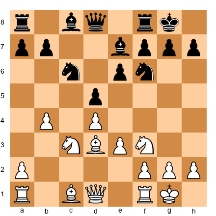</p>


White has already begun the minority attack with b4. Black must choose: allow the b5 advance and accept structural damage, or prevent it with ...a6 and ...b5 (which weakens different squares).

The Carlsbad structure forces both sides into long-term strategic commitments. There is no short-term solution. Every move matters for 30 moves or more.

---

🛑 **Rest here if you need to.** The next section introduces annotated master games that illustrate these structures in action. Come back with a clear head.

---

## 37.8 Annotated Game: The Hedgehog in Action

### Game: Anatoly Karpov vs Lev Polugaevsky
**USSR Championship, 1981**
**Result:** 1-0

Karpov was the greatest practitioner of patient positional chess. This game shows his prophylactic approach - always asking "what does my opponent want?" and preventing it before pursuing his own plans.

Set up your board:
`1.Nf3 c5 2.c4 Nf6 3.Nc3 e6 4.g3 b6 5.Bg2 Bb7 6.O-O Be7 7.d4 cxd4 8.Qxd4 d6 9.Rd1 a6 10.b3 Nbd7`


A perfect hedgehog setup for Black. Pawns on a6, b6, d6, e6 - all on the third rank. Pieces behind them, ready to spring.

`11.e4 Qc7 12.Bb2 O-O 13.Qe3 Rfe8 14.Nd4`

Karpov places his knight on d4, the ideal central square. From here it controls b5, c6, e6, and f5. It restricts Black's options enormously.

`14...Rac8 15.f3 Qb8 16.Re1 Bd8`

Polugaevsky is maneuvering behind his hedgehog wall. The bishop retreats to d8 to prepare ...Bc7, aiming at the kingside. This is typical hedgehog play - rearranging pieces while waiting for the right moment.

`17.Rad1 Bc7 18.Kh1 Nf8 19.Nf5!`

The critical moment. Karpov seizes the initiative by occupying f5 with the knight. This piece threatens g7 (after a potential Nh6+), supports e5, and cramps Black's kingside.

Polugaevsky was planning ...d5, the classic hedgehog break. Karpov's Nf5 makes that break far more difficult because after ...d5, the knight on f5 attacks e7 and controls key squares.

This is prophylaxis at the highest level. Karpov did not just play his own plan. He saw Black's plan (...d5) and neutralized it.

`19...N6d7 20.Qg5 e5`

Polugaevsky decides he must act. The e5 push challenges the center but creates a hole on d5. Both sides have something.

`21.Nd5 Bxd5 22.cxd5`

Now the position has transformed. The hedgehog is broken. White's pawn on d5 is a wedge in Black's position. The knight on f5 dominates. Black's bishop pair provides some compensation, but the structural damage is done.

`22...f6 23.Qg4 Kh8 24.Nh6!`

The knight finds an even better square. From h6, it threatens f7 and supports a future invasion via g8 or f5. Black's position is passive and difficult.

The game continued with Karpov methodically increasing pressure. Polugaevsky could not find active counterplay, and Karpov converted the positional advantage into a win.

**Lesson:** Karpov won this game by doing three things perfectly: (1) preventing Black's hedgehog break (...d5) at the right moment, (2) occupying dominant squares with his knight, and (3) transforming the position when the hedgehog structure collapsed. This is the prophylactic method in action.

---

## 37.9 Piece Coordination at the Highest Level

At the expert level, individual piece strength matters less than how pieces work together. A knight on a rim square is bad - unless it coordinates with a rook lift and a queen battery to create a mating attack.

### The Three Laws of Piece Coordination

**Law 1: Pieces must serve the same purpose.**

If your bishop is attacking the kingside and your rook is defending the queenside, they are not coordinated. Pieces work best when they share a goal - controlling a key square, supporting an attack, or defending a critical pawn.

Set up your board:

<p align="center">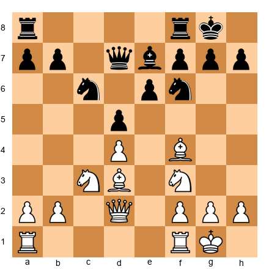</p>


White's pieces point in the same direction. The bishop on d3 and queen on d2 create a battery on the b1-h7 diagonal. The bishop on f4 controls dark squares, especially e5 and g5. The knight on f3 supports e5 and can jump to g5.

Every White piece contributes to kingside pressure. This is coordination.

**Law 2: Remove the piece that does not fit.**

Sometimes one piece is out of place - a bishop blocked by its own pawns, a knight with no outpost, a rook on a closed file. The solution is not always to improve that piece. Sometimes the solution is to exchange it for a piece that coordinates better with your remaining forces.

Set up your board:

<p align="center">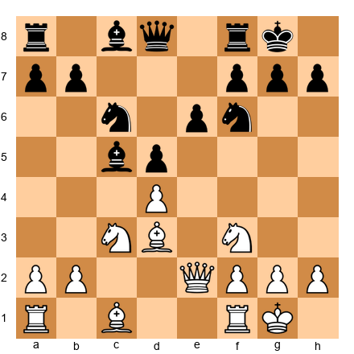</p>


White's dark-squared bishop (on c1) is the worst piece. It is blocked by its own pawns and has no clear path to activity. White should consider exchanging it - perhaps with Be3-g5 or Bd2-f4 - rather than trying to find a role for it.

An exchange that removes your worst piece while taking your opponent's good piece is one of the most powerful strategic tools available.

**Law 3: The collective is stronger than the sum.**

Two rooks on the seventh rank are not just "two rooks." They are a connected force that threatens checkmate patterns, wins pawns, and restricts the enemy king. A bishop and knight working together can control a diagonal AND an outpost in ways neither piece can alone.

Set up your board:

<p align="center">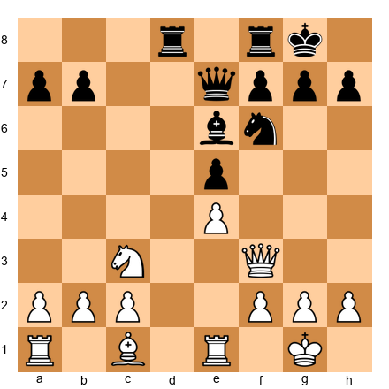</p>


White's queen and knight cooperate well - the queen can reach g4 or h5 to attack, while the knight supports from c3 (controlling d5 and e4). But the rook on e1 and the rook on a1 are disconnected. One defends, one does nothing.

The fix: Re1-e3-g3 brings a rook into the kingside attack. Now queen, knight, and rook all serve the same purpose.

---

## 37.10 Annotated Game: Supreme Piece Coordination

### Game: Emanuel Lasker vs William Napier
**Cambridge Springs 1904**
**Result:** 1-0

Lasker's genius lay in making all his pieces work together toward a common goal. This game is a masterclass in piece coordination.

Set up your board:
`1.e4 e5 2.Nf3 Nc6 3.Bb5 a6 4.Ba4 Nf6 5.d4 exd4 6.O-O Be7 7.e5 Ne4 8.Nxd4 O-O 9.Nf5 d5 10.exd6 Bxf5 11.dxe7 Qxe7`


The material is equal, but the position is rich in strategic themes. Black's knight on e4 is powerful. Black's bishop on f5 is active. But White has the bishop pair and more room to maneuver.

`12.Nc3 Nxc3 13.bxc3 Bd3 14.Re1 Qf6 15.Be3`

Lasker develops calmly. His plan: coordinate the two bishops with the queen and rooks to generate long-term pressure. The bishop on a4 eyes c6 and beyond. The bishop on e3 controls dark squares. The queen will centralize.

`15...Rae8 16.Bc5 Re5 17.Qd2`

Every White piece now works together. The dark-squared bishop on c5 controls the key diagonals. The light-squared bishop on a4 pins or pressures the queenside. The queen on d2 connects the rooks and supports both flanks.

Black's pieces are active on individual squares - the rook on e5, the bishop on d3 - but they do not coordinate with each other. The knight on c6 has no clear role.

`17...Rfe8 18.Bd6 Bf5 19.Bc4`

Lasker repositions the bishop to an even more active diagonal. The bishop on c4 attacks f7 directly, creating a concrete threat. The bishop on d6 dominates the center. The queen on d2 supports everything.

The game continued with Lasker systematically restricting Black's options until the position collapsed.

**Lesson:** Lasker's pieces all worked toward the same goals - controlling the center, pressuring f7, and restricting Black's counterplay. No piece was wasted. This is what complete piece coordination looks like in practice.

---

## 37.11 When to Break the Rules

Every positional principle has exceptions. The expert knows the rules AND knows when concrete calculation overrides them.

### The Rule-Breaking Framework

Before breaking a positional principle, ask three questions:

1. **Is there a concrete tactical justification?** - Breaking a rule for "general reasons" is usually wrong. Breaking it because you calculated a winning sequence is often right.

2. **Is the compensation real?** - If you sacrifice material, create a weakness, or violate a principle, is the compensation sufficient? Can you see concrete evidence, or are you hoping it will work out?

3. **Can your opponent refute it?** - The most common mistake when breaking rules: the player sees why their idea works but does not check whether the opponent can punish it.

### Example: Moving the King Before Castling

The principle says: castle early, keep the king safe. But sometimes keeping the king in the center is stronger.

Set up your board:

<p align="center">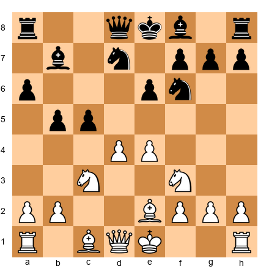</p>


White has not castled. The standard move is O-O. But consider 9.e5! Nd5 10.Nxd5 exd5 11.c3 - White keeps the king in the center because castling would waste a tempo, and the position demands immediate action in the center. The concrete justification: after e5, the position opens favorably for White, and the king is safe enough in the center because Black cannot open lines quickly.

### Example: Accepting a Bad Pawn Structure

The principle says: avoid doubled pawns and isolated pawns. But sometimes accepting structural damage gains something more valuable.

Set up your board:

<p align="center"></p>


After 4.Ng5?! (threatening Nxf7), Black can play 4...d5 5.exd5 Na5 - winning the bishop pair and disrupting White's plans. But what about 4.d3 followed by quiet development? Or consider the Bxf7+ sacrifice lines - they violate material principles but may generate an attack.

The point: rules exist because they are usually right. Break them only when you have calculated that the exception is concrete and sound.

### Example: Placing a Knight on the Rim

Set up your board:

<p align="center">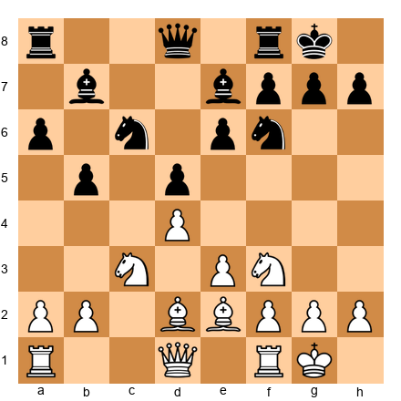</p>


"A knight on the rim is dim." But consider Na4 - the knight goes to the edge to attack the c5 square, pressure b6, and potentially invade on c5 or b6. The knight on a4 is not dim if it controls a key square and supports a concrete plan.

Context determines whether a move is good, not principles alone.

---

## 37.12 Annotated Game: Breaking the Rules with Precision

### Game: Akiba Rubinstein vs Carl Schlechter
**San Sebastian 1912**
**Result:** 1-0

Rubinstein was one of the greatest positional players in chess history. But he was also willing to break positional rules when concrete analysis demanded it.

Set up your board:
`1.d4 d5 2.Nf3 c5 3.c4 e6 4.cxd5 exd5 5.Nc3 Nc6 6.g3 Nf6 7.Bg2 Be7 8.O-O O-O 9.Bg5 cxd4 10.Nxd4 h6 11.Be3 Re8`


A Tarrasch Defense structure. Black has an isolated d-pawn. The standard approach for White is to blockade d5, exchange pieces, and win the pawn in the endgame. Rubinstein follows a different path.

`12.Qb3 Na5 13.Qc2 Bg4 14.Nf3`

Rubinstein retreats the knight to f3, a seemingly passive move. But the point is subtle: the knight on f3 supports e5 while keeping the d5 pawn as a target. White does not rush. White improves.

`14...Rc8 15.Qd2 Nc4 16.Qd3 Nxe3 17.Qxe3`

Black has traded the knight for the bishop. Normally, trading a knight for a bishop is good - you keep the "better" minor piece. But here, Rubinstein has gained something more: the e3 square is now occupied by the queen, which controls key central squares and supports a future e4 advance.

`17...Bb4 18.Rfd1 Bxc3 19.bxc3`

Rubinstein accepts doubled c-pawns - a clear structural concession. The rule says: avoid doubled pawns. But the concrete reality: White now has open b- and d-files for the rooks, and the bishop on g2 is enormously powerful on the long diagonal.

`19...Qe7 20.Nd4 Bh3 21.Bh1`

The bishop retreats to h1 - another move that looks passive but is strategically deep. From h1, the bishop controls the long diagonal and cannot be exchanged. White's plan: play e4, centralize everything, and exploit the open lines.

The game continued with Rubinstein systematically converting his active pieces and open lines into a winning position. Schlechter's isolated d-pawn, combined with White's superior piece coordination, proved too much.

**Lesson:** Rubinstein broke two "rules" in this game - he accepted doubled pawns and retreated a bishop to a corner square. Both moves were justified by concrete positional logic. The doubled pawns opened files. The bishop retreat preserved a powerful piece. Rules are guidelines. Concrete analysis is the final authority.

---

## 37.13 Prophylaxis Revisited: Thinking for Your Opponent

You first encountered prophylaxis in Volume III. At the expert level, prophylactic thinking is not a technique - it is a habit. It should be part of every evaluation.

### The Prophylactic Checklist

Before each move, ask:

1. **What is my opponent threatening?** - Not just tactical threats. Strategic plans too.
2. **What would my opponent play if it were their move?** - This is the Petrosian method. Imagine the position with the other side to move. What would they do? Can you prevent it?
3. **Does my move create any weaknesses?** - Every move gives and takes. What am I giving?
4. **Is there a useful waiting move?** - Sometimes the best strategy is to improve a small detail while forcing your opponent to reveal their plan.

### The Prophylactic Paradox

Here is the counterintuitive truth about prophylaxis: preventing your opponent's best plan is often stronger than pursuing your own best plan.

Set up your board:

<p align="center">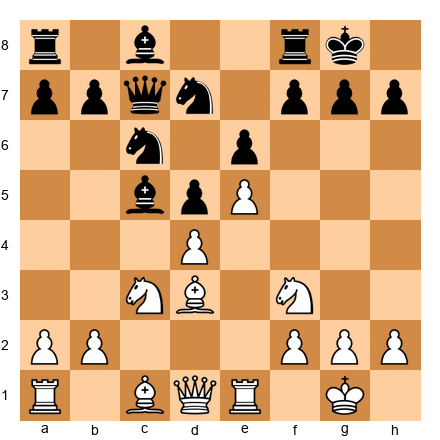</p>


White's natural plan is to attack the kingside: Qc2 (aiming at h7), Bxh7+ sacrifices, piece lifts. This is White's dream.

But what does Black want? Black wants to play ...f6, challenging the e5 pawn and opening lines for the bishop. If ...f6 succeeds, White's attack disappears.

The prophylactic response: 12.Bf4! - supporting the e5 pawn and making ...f6 more costly (after ...f6 exf6, the dark squares around Black's king weaken). This move is not flashy. It does not create immediate threats. But it neutralizes Black's best plan, and that is worth more than any speculative attack.

---

## 37.14 Static vs. Dynamic Evaluation

Every position has two evaluations: the static evaluation (how the position looks right now) and the dynamic evaluation (how the position is trending).

### Static Evaluation

Static evaluation counts what is visible: material, pawn structure, piece placement, king safety, space. It is a snapshot. If you froze the position and tallied up the pluses and minuses, you would get the static evaluation.

### Dynamic Evaluation

Dynamic evaluation considers what is happening: who has the initiative? Are pieces improving or deteriorating? Is the position opening or closing? Who benefits from the passage of time?

Set up your board:

<p align="center">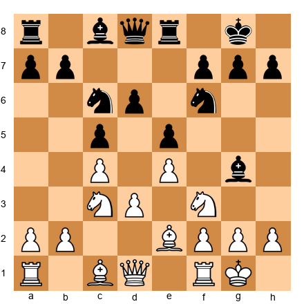</p>


**Static evaluation:** The position is roughly equal. Material is even. Both sides are developed. Pawn structure is symmetrical. A computer might say +0.1 - meaningless.

**Dynamic evaluation:** White's pieces are slightly better placed for a kingside attack. The bishop can go to g5, pinning the knight. The knight on c3 can reroute to d5. But Black has a strong grip on e5 and counterplay with ...Nd4.

The dynamic question: who benefits if the position opens? White - because the bishops will have more scope. Who benefits if the position stays closed? Black - because the knights have secure outposts.

The expert evaluates BOTH and steers the game toward the evaluation that favors them.

### When Static and Dynamic Disagree

The most interesting positions are those where the static evaluation says one thing and the dynamic evaluation says another.

Set up your board:

<p align="center">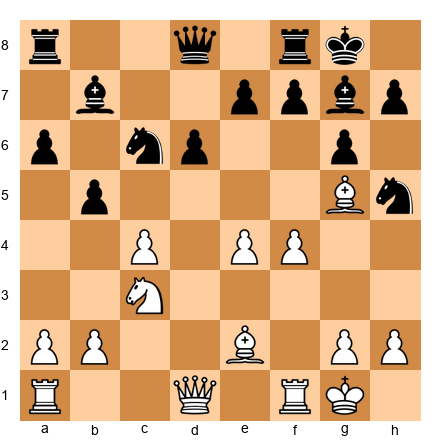</p>


**Static:** Material is equal. Black has a solid structure. White's pawns on e4 and f4 are advanced but not yet weaknesses.

**Dynamic:** White's pawns are surging forward. f5 is coming. If White plays f5 and opens the f-file, the bishop on g5 and the pieces behind it will generate a powerful attack. Black needs to act NOW - ...Bxc3 and ...f6 might be necessary to disrupt White's buildup.

When static and dynamic disagree, the dynamic evaluation is usually more important in the short term. The static evaluation takes over in the long term.

---

## 37.15 Annotated Game: Dynamic vs. Static Mastery

### Game: José Raúl Capablanca vs Efim Bogoljubow
**New York 1924**
**Result:** 1-0

Capablanca was the master of converting small static advantages into wins. This game shows his method: simplify when the static evaluation favors you, and avoid complications when you already have a long-term edge.

Set up your board:
`1.d4 Nf6 2.Nf3 e6 3.c4 d5 4.Bg5 Nbd7 5.e3 Be7 6.Nc3 O-O 7.Rc1 c6 8.Qc2 a6 9.a3 h6 10.Bh4 Re8 11.Bd3 dxc4 12.Bxc4 b5 13.Bd3 c5`


The static evaluation is roughly equal. Black has freed the position with ...c5. Both sides have active pieces. But Capablanca sees deeper.

`14.O-O Bb7 15.Rfd1 Qb6 16.dxc5 Nxc5 17.Be2`

A quiet retreat. The bishop on d3 was active, but Capablanca sees that the bishop is better on e2 - it no longer blocks the d-file, and it supports a future Nd4 or Bf3. This is transformation thinking. The bishop changes roles: from attacker to supporter.

`17...Nce4 18.Nxe4 Nxe4 19.Bxe7 Rxe7 20.Nd4`

Now the static advantage reveals itself. White's knight on d4 is superior to anything Black has. It sits on a perfect central square, cannot be driven away easily, and supports both flanks. Black's bishop on b7 is limited by its own pawns on e6 and b5.

Capablanca converted this small advantage - one slightly better piece - into a win over the next 20 moves through patient maneuvering and precise endgame technique.

**Lesson:** Capablanca did not seek a brilliant attack. He identified the one factor that gave him an edge (the knight vs. the bishop) and steered the game into a position where that factor was decisive. This is static evaluation in action: identify the long-term advantage and convert it.

---

## 37.16 The Art of Maneuvering

Sometimes there is no clear plan. The position is balanced, closed, or semi-closed. Neither side has an obvious break or attack. What do you do?

You maneuver.

Maneuvering is the art of improving your position without committing to a specific plan. You move pieces to slightly better squares, improve pawn placement, and wait for your opponent to create a weakness.

### The Rules of Maneuvering

**Rule 1: Improve your worst piece.** Find the piece that does the least and give it a better square. This alone can transform a position.

**Rule 2: Do not create weaknesses.** In a maneuvering phase, the side that creates a weakness first usually loses it.

**Rule 3: Be patient.** Maneuvering can take 10, 15, even 20 moves. If you rush, you will overextend.

**Rule 4: Watch your opponent.** When they move a piece, ask why. What square are they heading for? What plan are they preparing?

**Rule 5: Wait for the moment.** Maneuvering is not the plan - it is the prelude to the plan. At some point, the position will offer an opportunity. The key is being ready for it.

Set up your board:

<p align="center">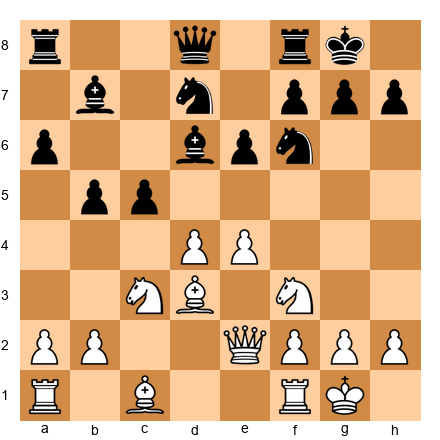</p>


White's position is good but not winning. There is no immediate break. What does White do?

White maneuvers: Rd1 (rook to the center), Bc2 (bishop to a safer diagonal that eyes the kingside), perhaps g3 and Bg5 (pinning the knight, creating pressure without committing). Each move improves White's position by a fraction.

Black maneuvers in response: ...Qe7, ...Rac8, ...Rc7 (doubling rooks), ...Bc8-b7-a8 (optimizing the bishop). Both sides improve quietly.

The player who maneuvers more accurately - finding the truly optimal squares for each piece - gains the edge when the position finally opens.

---

## 37.17 Middlegame Patterns for the Expert

At 2200, you have seen most tactical patterns. What separates the expert from the master is the depth of middlegame *strategic* patterns. These are recurring positional themes that appear across many openings and pawn structures.

### Pattern 1: The Minority Attack

When White has two queenside pawns against Black's three (a common result of the Queen's Gambit Exchange variation), White pushes b4-b5 to create a weakness in Black's pawn structure.

Set up your board:

<p align="center">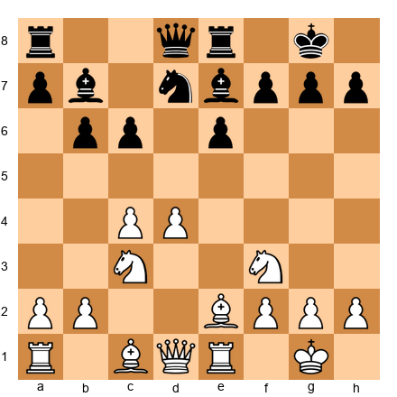</p>


White's plan: a2-a4, b2-b4, b4-b5. After b5, Black must choose between ...cxb5 (creating an isolated c-pawn) or ...axb5 (creating a backward b-pawn). Either way, White creates a target.

This pattern appears in the Queen's Gambit, the Carlsbad structure, and many symmetrical positions. At 2200, you should recognize it instantly and know both sides of the plan.

The defender's counter: attack in the center or on the kingside before the minority attack creates a weakness. Black often plays ...c5 to break in the center, or ...f5 to start kingside action.

### Pattern 2: The IQP (Isolated Queen's Pawn)

The isolated d-pawn is one of the most studied structures in chess. White's d4-pawn is isolated but gives White active piece play and control of the e5 and c5 outposts.


<p align="center"></p>


White's advantages: active pieces, space, outpost on e5 for a knight, attacking chances against the king.

White's weaknesses: the d4-pawn is a target. If Black can blockade it on d5 with a knight and trade pieces, the endgame favors Black because the isolated pawn is a permanent weakness.

The strategic decision: play for a middlegame attack (push the pawn with d4-d5 at the right moment, or use the piece activity to create threats), or accept a slightly worse endgame.

At 2200, the most common mistake is handling the IQP passively - keeping the pawn on d4 and allowing Black to trade pieces into a favorable endgame. If you have an IQP, you must play actively. The pawn is a strength in the middlegame and a weakness in the endgame. Use it while it matters.

### Pattern 3: The Hanging Pawns

Hanging pawns on c4 and d4 (or c5 and d5 for Black) control the center but are vulnerable because neither pawn defends the other.


<p align="center">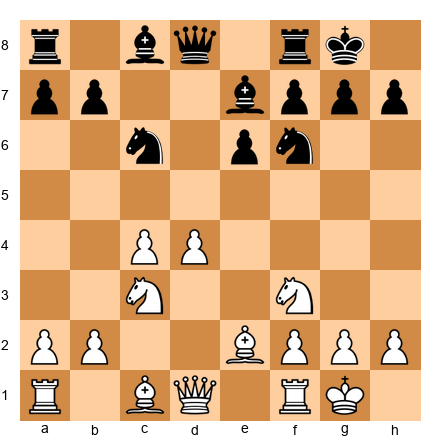</p>


White has hanging pawns on c4 and d4. They control central squares (c5, d5, e5) and support an active piece setup. But if Black can blockade them (put a knight on d5, for example), the pawns become targets rather than strengths.

The expert's approach: keep the pawns mobile. If one of them advances (d4-d5 or c4-c5), the remaining pawn becomes isolated - but the advance often comes with a gain of space or tempo that compensates. The key is timing: push when the advance gains something concrete (a tempo, a square, an open file), not when it merely creates a target.

### Pattern 4: The Passed Pawn in the Middlegame

A passed pawn in the middlegame creates a unique type of pressure. The opponent must devote pieces to stopping it, which weakens their position elsewhere.


<p align="center">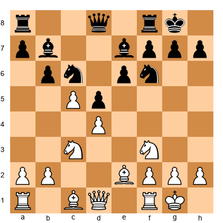</p>


White has a protected passed pawn on c5. Black must keep an eye on it constantly. If Black ignores it, White can push c5-c6, driving a wedge into Black's position. This means Black's pieces are always partially tied to stopping the c-pawn, which gives White freedom on the rest of the board.

**The principle:** a passed pawn in the middlegame is a long-term threat. You do not need to push it immediately. Its mere existence restricts the opponent. Use that restriction to improve your position elsewhere, and push the pawn only when it leads to concrete gains.

---

## 37.18 Positional Sacrifices

There are two kinds of sacrifices in chess. The first is a tactical sacrifice - you give up material because you have calculated a forced sequence that wins it back with interest. The second is a positional sacrifice - you give up material for compensation that cannot be measured in moves, only in the overall health of your position.

At the expert level, you must learn to play both. Most players at 2200 are comfortable with tactical sacrifices. They can spot a piece sacrifice that leads to checkmate in six moves. But positional sacrifices terrify them, because there is no clear finish line. You give up an exchange, and you have to play 20 more moves of good chess to prove it was correct. That uncertainty is exactly what makes positional sacrifices so powerful - your opponents fear them too.

### The Exchange Sacrifice for Positional Compensation

Tigran Petrosian was the greatest exchange sacrifice artist in chess history. He would give up a rook for a bishop or knight when the resulting position gave him one or more of the following: a strong outpost for the minor piece, complete control of a color complex (especially the dark squares), a blockaded position where the rook had no open files, or a structural advantage that would grow over time.

The key insight: an exchange sacrifice is not about losing material. It is about transforming the position. Your opponent has a rook, but if there are no open files for it, that rook is worse than a well-placed knight sitting on d5 or e4. The material count says you are down. The position says you are winning.

### When to Sacrifice a Pawn for Long-Term Pressure

Pawn sacrifices for positional compensation are even more common than exchange sacrifices. The typical scenario: you push a pawn to open a file, create an outpost, or expose the enemy king, knowing that you cannot win the pawn back immediately. If the compensation - an open line, a permanent weakness in your opponent's camp, or a lead in development - lasts longer than the material deficit matters, the sacrifice is correct.

The test is simple: after the sacrifice, does your opponent have a clear plan to use the extra pawn? If the answer is no - if the pawn sits on their side of the board doing nothing while you press with active pieces - then the sacrifice was sound.

### Tactical vs. Positional Sacrifices

Understand the difference clearly:

**Tactical sacrifice:** "I sacrifice a piece because after Nxf7 Kxf7, Qh5+ Kg8, Bxe6+ and I win the queen." There is a forced line. You can calculate to a definite conclusion.

**Positional sacrifice:** "I sacrifice the exchange because after Rxc6 bxc6, my bishop on d5 controls the board, his rook on a8 has no open file, and his doubled c-pawns are permanent weaknesses." There is no forced line. You evaluate the resulting position and judge that your compensation is sufficient.

The danger of positional sacrifices is that your judgment might be wrong. The reward is that when your judgment is right, you reach positions that your opponent has no idea how to play. Most players at 2200 have never defended against a well-executed exchange sacrifice. They do not know whether to trade pieces or keep them, whether to try to return the material or hold on to it. That confusion is part of your compensation.

### Worked Example: A Positional Exchange Sacrifice

Set up your board:

<p align="center">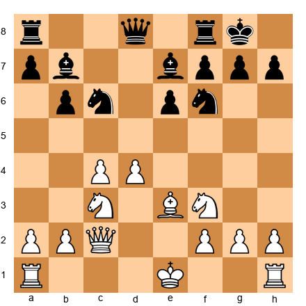</p>


This is a typical Queen's Gambit Declined structure. White has a solid center with pawns on c4 and d4. Black has developed normally with pieces on natural squares.

Imagine White plays Rxc6 here - sacrificing the exchange after, say, the rook arrives on c1 and the conditions are right. What does White get?

After Rxc6 bxc6, White has traded a rook for a knight. But look at what has happened. Black's pawn structure is shattered - doubled c-pawns on c6 and c7. Black's bishop on b7 is now blocked by its own pawn on c6. White's dark-squared bishop on e3 has no opposing bishop and controls d4, c5, and the entire diagonal. White's knight can settle on d5 via e2-d5 or a4-c5-d3-e5. The rook on a8 has no open file to use.

Material says Black is better. The position says White has a lasting advantage. A strong player will choose the sacrifice here because the positional compensation is permanent, and Black's extra material cannot be activated.

Study Petrosian's games - especially Petrosian vs. Fischer, Buenos Aires 1971, and Petrosian vs. Spassky, World Championship 1966 Game 10 - to see how the greatest master of this art made exchange sacrifices look like the most natural moves in the world.

---

## 37.19 The Art of the Pawn Break

Pawn breaks are the engines of middlegame action. A well-timed pawn break can open lines for your pieces, create weaknesses in your opponent's camp, or transform a closed position into an open one where your better-placed pieces dominate. A badly timed break can leave you with structural weaknesses, open files that your opponent controls, or a worse endgame.

At the expert level, the question is almost never "which pawn break exists?" You can see the thematic breaks. The question is "when is the right moment to play it?"

### Central Breaks

The most powerful pawn breaks are central ones: d4-d5, e4-e5, c4-c5, and their mirror images for Black.

**d4-d5** is the classic break in positions where White has a strong center. It opens the e-file, creates a passed pawn or a wedge on d5, and often forces Black's pieces into passive positions. The timing rule: play d4-d5 when your pieces are ready to exploit the opening of the position. If your rooks are not on central files and your knights are not supporting the advance, wait.

**e4-e5** is the attacking break in many King's Pawn openings. It drives back a knight from f6, opens diagonals for bishops, and often signals the start of a kingside attack. In the French Defense and similar structures, e5-e6 is the even sharper version - sacrificing a pawn to rip open Black's kingside.

**c4-c5** is Karpov's favorite break. It fixes Black's pawn structure, creates a passed pawn, and opens the c-file. It works best in positions where White already controls d5 and can follow up with pressure on the c-file and queenside.

### Wing Breaks

Wing breaks are slower but can be devastating when properly prepared.

**f4-f5** is the standard kingside break in the French Defense, King's Indian, and many other structures. It attacks Black's pawn on e6 (or e5), opens the f-file, and often leads to a direct kingside attack. The danger: it weakens e4 and e3, and if Black can trade pawns favorably, the resulting open position may favor the defender.

**b4-b5** is the queenside version. It attacks Black's pawn chain from the side, aims to open the b-file, and is the standard response to structures where Black has played ...a6 and ...b5. The minority attack - advancing a2-a3, b2-b4, and b4-b5 against a target on c6 - is one of the most reliable positional plans in chess.

**g4-g5 and h4-h5** are the most aggressive kingside breaks. They attack the pawn cover in front of the opponent's king and aim to open the g-file or h-file for rooks. These breaks are committal - once you push the g-pawn or h-pawn, there is no taking it back. Use them only when your own king is safe on the opposite wing.

### When to Break and When to Wait

Set up your board:

<p align="center">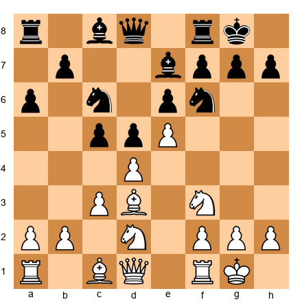</p>


This is a French Defense structure. White has two thematic pawn breaks available: f2-f4-f5 to attack the kingside, and dxc5 to simplify the center. Which one should you play, and when?

**f2-f4-f5:** This break opens the f-file, attacks e6, and creates kingside chances. But it requires preparation. Your knight on d2 needs to move (probably to f3 or e2 first, but it is already on f3 on the other knight). Your dark-squared bishop should be developed. Your rooks should be connected. If you push f4-f5 before your pieces are ready, Black will capture on f5 and your kingside will be open without enough attacking force to justify it.

**dxc5:** This break simplifies the center and wins a tempo if Black recaptures with a piece that you can attack. It is less ambitious but more solid. It gives White a clear advantage in space without the risks of a kingside attack. It is the right choice when your position is already good and you do not need to take risks.

### The Concept of Pawn Tension

Pawn tension exists when two pawns can capture each other but neither side has done so. In the position above, there is tension between White's d4 pawn and Black's c5 pawn. As long as this tension exists, both sides must account for the possibility of a capture on every move.

**Who benefits from maintaining tension?** Usually, the side with more space or better-placed pieces. As long as the tension exists, your opponent cannot fully commit to a plan because the pawn structure might change at any moment. If you are the one with the better position, keeping the tension forces your opponent to guess.

**Who benefits from resolving tension?** Usually, the side with a clear plan that requires a specific pawn structure. If you know exactly what you want to do after dxc5 or after cxd4, then capture and execute your plan. Resolving tension is correct when it leads to a position you understand better than your opponent.

The general rule: do not resolve pawn tension unless you have a specific reason. "I do not know what else to do" is not a specific reason. Maintaining tension keeps your options open and makes your opponent's planning harder. When you do break, make sure you know exactly why you are doing it and what you plan to do in the resulting position.

### Flank Breaks and Their Strategic Value

While central breaks get the most attention, flank breaks - h4-h5, a4-a5, b4-b5, f4-f5, g4-g5 - are equally important at the expert level. Flank breaks serve different purposes than central breaks. Where central breaks fight for control of the board's center, flank breaks typically aim to open files near the enemy king, create passed pawns on the wing, or fix weaknesses in the opponent's pawn structure.

**The f4-f5 break.** This is the classic kingside attack break. In positions where White has castled kingside and has pawns on e4 and f4, the f5 break opens the f-file and often creates an attack on the g6 pawn. It is strongest when Black has fianchettoed (bishop on g7 with pawns on g6 and f7) because f5 directly challenges the pawn chain defending the king.

**The h4-h5 break.** This break is used to pry open the h-file, especially when the opponent has a fianchettoed king. After h5 gxh5, the open h-file gives your rook direct access to the opponent's king. This break is common in the English Attack against the Sicilian and in many closed center positions where the kingside is the natural theater of attack.

**The a4-a5 break.** On the queenside, a4-a5 is used to fix Black's b-pawn and create hooks for a future b4-b5 break. It is a preparatory break rather than a direct attacking break. The value of a4-a5 is that it limits Black's queenside counterplay while preparing your own.

**The b4-b5 break.** This break aims to open the b-file and undermine Black's pawn structure on the queenside. It is common in Sicilian positions where White plays an early a4 and b4, and in Queen's Gambit positions where White targets the c6 pawn.

**Timing flank breaks.** The critical factor in timing a flank break is whether the center is stable. The classical rule - do not attack on the flank when the center is unstable - remains valid. Before launching h4-h5, ask: "Can my opponent open the center and counterattack while I am busy on the flank?" If the center is closed or your opponent has no way to challenge it, the flank break is safe. If the center can be opened, stabilize it first.

### Pawn Breaks and the Resulting Endgame

One aspect of pawn breaks that many expert-level players overlook is how the break affects the potential endgame. Every pawn break changes the pawn structure permanently. The structure that results from the break determines the character of the endgame you might reach.

Before playing a pawn break, ask: "If all the pieces come off after this break, is the resulting endgame good for me?" If the break creates an isolated pawn for you, the endgame might be worse. If the break creates a passed pawn for you, the endgame might be better. If the break fixes your opponent's pawn on a weak square, the endgame might be winning.

This forward-looking approach to pawn breaks is what separates expert-level strategic thinking from intermediate-level thinking. The intermediate player evaluates the break based on its immediate consequences. The expert evaluates it based on both immediate consequences and long-term structural effects.

---

## 37.20 Practical Middlegame Thinking: The Five-Question Method

There will be moments in your games when you have no idea what to do. The position is complex. There are no obvious tactics. Your opening preparation has ended. You are on your own.

This is normal. Even grandmasters face positions where the right plan is not obvious. The difference between a strong player and an average player is not that the strong player always knows the answer. It is that the strong player has a systematic way of finding the answer.

Here are five questions to ask, in order, whenever you are stuck. They will not solve every position, but they will give you direction in the vast majority of middlegame situations.

### Question 1: Are There Any Tactics?

Before anything else, check for tactics. Look for checks, captures, and threats - in that order. This takes 30 seconds to a minute and should become automatic.

Checks first, because they force your opponent to respond. Captures next, because they change the material balance. Threats last, because they create problems your opponent must solve.

If there are tactics available, calculate them. Everything else is secondary to a winning combination. Even in "quiet" positions, tactics hide in the details. A seemingly peaceful position can explode if you find the right move order.

### Question 2: What Is My Opponent's Plan?

If no immediate tactics exist, shift your attention to your opponent's side of the board. What are they trying to do? Where are their pieces pointing? What pawn break are they preparing?

This is the question most players skip, and it costs them games. Understanding your opponent's plan serves two purposes. First, it tells you what you need to prevent. Second, it sometimes reveals that you need to act quickly before their plan succeeds.

Look at your opponent's last two or three moves. What do they suggest? If your opponent just played a rook to the d-file and a knight toward e5, they are probably planning to pressure your d-pawn. If they played h6 and g5, they might be preparing a kingside pawn storm. Read their intentions and respond accordingly.

### Question 3: Which of My Pieces Is Worst Placed?

If there are no immediate tactics and no urgent defensive concerns, look at your own army. Find your worst piece - the one that is doing the least work - and figure out how to improve it.

This question comes from one of the most reliable principles in chess: improve your worst piece. A team is only as strong as its weakest member. If you have four beautifully placed pieces and one knight stuck on the rim, that knight is your priority.

Common signs of a badly placed piece: it has no squares to go to, it is blocked by its own pawns, it is not defending anything important, or it is far from the action. Rerouting one poorly placed piece can transform your entire position.

### Question 4: Are There Any Pawn Breaks Available?

Pawn breaks change the structure of the position. They open files, create passed pawns, and shift the balance of the game. If you cannot improve a piece and there are no tactics, look for a pawn break.

The most common pawn breaks are: pushing a central pawn to open the position, pushing a flank pawn to attack the enemy king, and pushing a pawn to create a passed pawn in an endgame.

The key question is timing. A pawn break that is strong now might not be strong in two moves (because your opponent can prepare for it), and a pawn break that looks premature now might become strong after one more preparatory move. Consider both "can I play the break now?" and "should I prepare it first?"

### Question 5: Should I Play for the Middlegame or Transition to the Endgame?

This is the question that separates experts from intermediates. Many players stay in the middlegame by default, never considering whether a transition to the endgame would be favorable.

Ask yourself: if I trade queens (or a pair of rooks, or the bishops), is the resulting position better for me or for my opponent? If you have a structural advantage (better pawn structure, an outside passed pawn, a better minor piece), the endgame might be your best friend. If you have a dynamic advantage (active pieces, attacking chances, initiative), staying in the middlegame is probably better.

### The Five Questions in Practice

Set up your board:


<p align="center">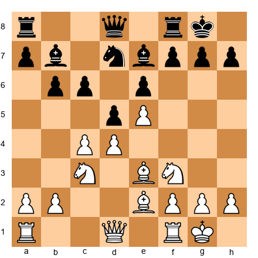</p>


This is a typical French Defense position where White has a space advantage and a closed center. Let us work through the five questions.

**Q1: Are there any tactics?** No immediate checks, captures, or threats that win material. The position is closed and quiet. Move on.

**Q2: What is my opponent's plan?** Black wants to play c5 to challenge White's center. The knight on d7 is heading for c5 or b6. The bishop on b7 supports a future dxc4 break. Black may also prepare f6 to attack the e5 pawn. White should consider whether to prevent c5 (perhaps with b3 or a4) or to prepare against it.

**Q3: Which piece is worst placed?** White's dark-squared bishop on e3 is decent but could be better. The queen on d1 is passive. White's best plan might involve Qd2 followed by Bh6 to trade dark-squared bishops (removing a key defender of Black's king). The knight on f3 could reroute to g5 or d2-f1-g3 to support a kingside attack.

**Q4: Are there any pawn breaks?** White can consider f4 to support the e5 pawn and prepare a kingside attack. White can also consider c5, fixing Black's queenside pawns and creating a permanent space advantage. Each break leads to a fundamentally different type of game.

**Q5: Middlegame or endgame?** White's space advantage is a middlegame weapon. In an endgame, the extra space matters less because there are fewer pieces to restrict. White should keep queens on the board and play for a kingside attack.

**Conclusion.** The five questions tell us that White should prepare f4 (pawn break), consider Qd2 (improve the worst piece), and keep the game in the middlegame. A reasonable plan is 10.Qd2 followed by Bh6, trading dark-squared bishops, and then f4 to start a kingside attack.

This took us about two minutes of structured thinking. Without the five questions, you might spend that same two minutes staring at the board without making progress. The system gives you a framework. The framework gives you direction.

---

## 37.21 When Strategy Meets Tactics

One of the most important ideas in chess is that strategy and tactics are not separate things. They are partners. Your strategic planning creates the conditions for tactics to appear. Your tactical awareness keeps your strategic plans honest.

### How Strategy Creates Tactics

When your pieces are well-placed, combinations appear naturally. This is not a coincidence. A knight on e5 supported by a pawn creates tactical potential against f7, d7, and g4. A rook on an open file creates tactical potential against the back rank. A bishop on a long diagonal creates tactical potential against the enemy king.

Set up your board:


<p align="center">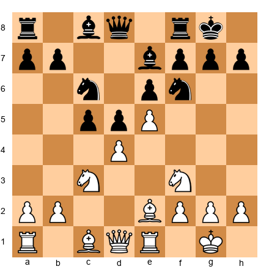</p>


In this French Defense structure, White has a strategic advantage: more space, better piece coordination, and a strong pawn on e5 that restricts Black's knight on f6. This strategic advantage creates tactical possibilities. If White plays Bg5, pinning the knight on f6, Black faces a concrete tactical problem. If White plays Ng5, targeting f7, Black must calculate whether the knight can be safely captured.

The strategic advantage did not magically create a combination. But it placed White's pieces on squares where combinations become possible. A knight on f3 and a bishop on e2 are strategically well-placed. They also happen to support tactical ideas involving Ng5, Bd3-Bxh7+, and pressure along the e-file.

### How Tactics Keep Strategy Honest

Here is the danger of pure strategic thinking: you make a beautiful plan, you execute it over several moves, and then your opponent plays a tactic that ruins everything.

In the position above, suppose White plays "strategically" by developing with Bd2, planning to double rooks on the e-file. It is a reasonable plan. But if White plays Bd2 without checking for tactics, Black might have dxc4 followed by Nd5, winning the e5 pawn with tactical tricks involving the pin on the c3 knight.

Every strategic move must pass a tactical test. Before playing any move - no matter how strategically sound it looks - spend 15 seconds checking for your opponent's tactical responses. Can they capture something? Can they play a check that disrupts your plan? Can they make a threat that forces you to abandon your strategy?

This 15-second tactical scan is not the same as deep calculation. You are not calculating a 10-move combination. You are just making sure the position does not blow up in your face. Think of it as looking both ways before crossing the street. It takes almost no time, but skipping it can be catastrophic.

### The Integration Principle

Strong players do not think "now I am playing strategically" and then later "now I am playing tactically." They think about both simultaneously, on every move.

When evaluating a candidate move, ask two questions. First, does this move improve my position strategically? (Does it place a piece on a better square, improve my pawn structure, or increase my control of key files or diagonals?) Second, is this move tactically safe? (Does it allow any checks, captures, or threats from my opponent?)

If the answer to both questions is yes, it is probably a strong move. If the move is strategically excellent but tactically dangerous, you need to calculate carefully before playing it. If the move is tactically safe but strategically pointless, look for a better option.

The best moves in chess are the ones that are both strategically strong and tactically sound. Training yourself to evaluate both dimensions simultaneously is what separates the expert from the intermediate player. The intermediate player thinks in one dimension at a time. The expert thinks in both, naturally, on every move.

---

🛑 **Excellent progress.** You have covered the core theory of complex middlegame strategy. The exercises that follow will test everything. Rest here and come back ready to work.

---

## Exercises - Chapter 37

### ★★ Warmup Exercises (37.1–37.10)

**Exercise 37.1** (★★)

<p align="center"></p>

White to play. Name the seven Silman imbalances and evaluate each one in this position. Which side does each favor?
*Hint: Start with material and work through the list systematically.*
⏱ ~5 min

**Exercise 37.2** (★★)

<p align="center"></p>

White to play. Identify three candidate plans for White. Do not calculate - just name the plans and explain the logic behind each.
*Hint: Think about kingside, center, and queenside independently.*
⏱ ~5 min

**Exercise 37.3** (★★)

<p align="center">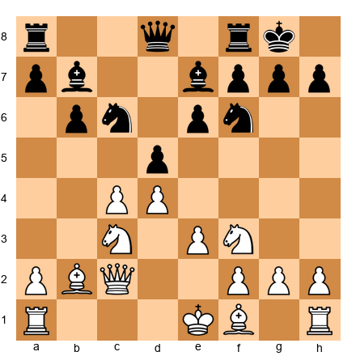</p>

White to play. What is Black's most likely plan in this position? How should White respond prophylactically?
*Hint: Think about what Black wants to do with the center pawns.*
⏱ ~5 min

**Exercise 37.4** (★★)

<p align="center"></p>

White has an isolated d-pawn. List three advantages and three disadvantages of the IQP in this specific position.
*Hint: Look at the d5 square, the half-open files, and the endgame implications.*
⏱ ~5 min

**Exercise 37.5** (★★)

<p align="center"></p>

This is a hedgehog structure. Which pawn break is Black aiming for? What should White do to prevent it?
*Hint: There are three possible breaks for Black. Identify the most dangerous one.*
⏱ ~5 min

**Exercise 37.6** (★★)

<p align="center">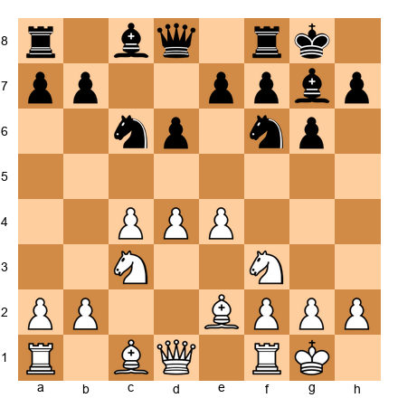</p>

This is a Maroczy Bind. What is Black's ideal pawn break? Why is it hard to achieve?
*Hint: The pawns on c4 and e4 control specific squares.*
⏱ ~4 min

**Exercise 37.7** (★★)

<p align="center"></p>

White has begun a minority attack in a Carlsbad structure. What is the goal of b4-b5? What kind of weakness does it create?
*Hint: Think about what happens to Black's c-pawn after b5 cxb5 axb5.*
⏱ ~4 min

**Exercise 37.8** (★★)

<p align="center"></p>

Evaluate the minor piece battle. White has two bishops; Black has two knights. Which pawn structure would favor White? Which would favor Black?
*Hint: Think about open vs. closed positions.*
⏱ ~5 min

**Exercise 37.9** (★★)

<p align="center"></p>

What does Black want to play next? Use Petrosian's method: imagine it is Black's move. What would Black play?
*Hint: Look at what Black's plan is in the center.*
⏱ ~4 min

**Exercise 37.10** (★★)

<p align="center">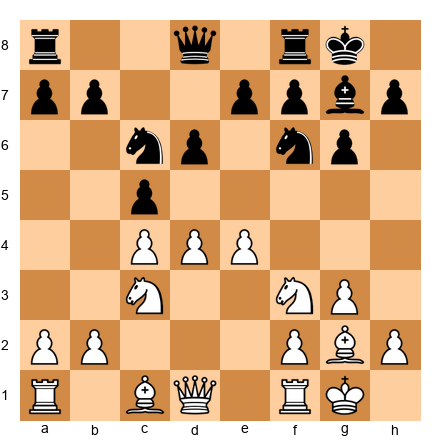</p>

This is a King's Indian / Maroczy Bind hybrid structure. Give a static evaluation and a dynamic evaluation of this position. Do they agree or disagree?
*Hint: Static looks at what is. Dynamic looks at what is happening.*
⏱ ~5 min

---

### ★★★ Essential Exercises (37.11–37.35)

**Exercise 37.11** (★★★)

<p align="center"></p>

White to play. Find the best plan and the first three moves of that plan. Calculate any forcing sequences to depth 5.
*Hint: The center is the battlefield. How does White challenge Black's setup?*
⏱ ~10 min

**Exercise 37.12** (★★★)

<p align="center"></p>

White has an IQP. Should White play d4-d5 now? Calculate the consequences of 13.d5 to depth 6. Compare with a slower approach.
*Hint: Check what happens after 13.d5 exd5 14.Nxd5 Nxd5 15.Bxh7+.*
⏱ ~12 min

**Exercise 37.13** (★★★)

<p align="center"></p>

White to play. After 7.cxd5 exd5, Black will have hanging pawns. Should White exchange? Evaluate the resulting position with hanging pawns.
*Hint: Consider whether White can blockade or attack the hanging pawns effectively.*
⏱ ~10 min

**Exercise 37.14** (★★★)

<p align="center">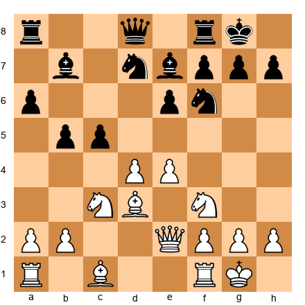</p>

White to play. This is a hedgehog where White has a big center. Find the best plan. Should White play d5 or e5? Which break is more effective?
*Hint: One break opens lines for White; the other may help Black.*
⏱ ~12 min

**Exercise 37.15** (★★★)

<p align="center"></p>

White to play. Black is in a Maroczy Bind. Find the best setup for White over the next 4 moves. Consider piece placement, not pawn breaks.
*Hint: Where should the queen, the dark-squared bishop, and the rooks go?*
⏱ ~10 min

**Exercise 37.16** (★★★)

<p align="center"></p>

White to play. The minority attack with b4 is underway. What is White's next move? Calculate the consequences of 11.b5 to depth 5.
*Hint: After 11.b5 Na5, does White gain or lose?*
⏱ ~10 min

**Exercise 37.17** (★★★)

<p align="center"></p>

White to play. All White's pieces point toward the kingside. Find the strongest continuation. How does White increase the pressure without overextending?
*Hint: Think about piece coordination. Which piece should move next?*
⏱ ~10 min

**Exercise 37.18** (★★★)

<p align="center">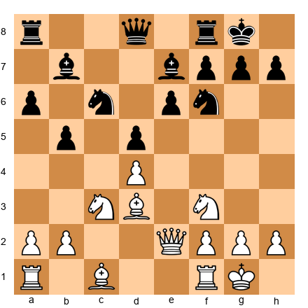</p>

White to play. Evaluate 12.e4. Does this pawn break work here? Calculate after 12.e4 dxe4 13.Nxe4 Nxe4 14.Bxe4. What is the resulting position?
*Hint: After the exchanges, check if White's bishops are well-placed.*
⏱ ~12 min

**Exercise 37.19** (★★★)

<p align="center"></p>

White to play. What is Black's best plan? Use Petrosian's question: "What does my opponent want?" Then find the best prophylactic response.
*Hint: Black wants to challenge the center. How?*
⏱ ~10 min

**Exercise 37.20** (★★★)

<p align="center"></p>

White to play. Give both a static and a dynamic evaluation. Then choose a plan that exploits the dynamic advantage.
*Hint: Who benefits if the position opens? Who benefits if it stays closed?*
⏱ ~12 min

**Exercise 37.21** (★★★)

<p align="center"></p>

White to play. This is a Queen's Indian structure. Compare 9.cxd5 with 9.d5. Which transformation is more favorable for White?
*Hint: One leads to an IQP, the other to a closed center. Which suits White's pieces?*
⏱ ~10 min

**Exercise 37.22** (★★★)

<p align="center"></p>

White to play. Your worst piece is the bishop on c1. Find a plan to improve it. What is the best route for this bishop?
*Hint: The bishop needs an open diagonal. How do you create one?*
⏱ ~10 min

**Exercise 37.23** (★★★)

<p align="center">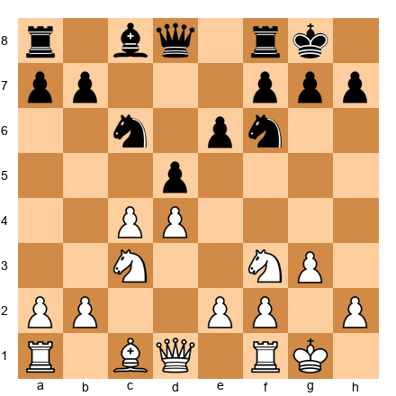</p>

White to play. Evaluate 8.cxd5 exd5 (Carlsbad structure) vs. 8.c5 (closing the center). Which transformation gives White better long-term chances?
*Hint: Consider what each structure does to the bishops and the pawn breaks.*
⏱ ~10 min

**Exercise 37.24** (★★★)

<p align="center"></p>

White to play. Find the best waiting move - a move that improves White's position without committing to a specific plan.
*Hint: Not every position requires a big decision. Sometimes a small improvement is best.*
⏱ ~8 min

**Exercise 37.25** (★★★)

<p align="center"></p>

White to play. The position is quiet. Give a full evaluation (imbalances, plans, trajectory) and suggest the best plan for White over the next 5 moves.
*Hint: Identify the critical imbalance first, then plan around it.*
⏱ ~12 min

**Exercise 37.26** (★★★)

<p align="center"></p>

White to play. White has a pawn on e5. Should White maintain it, advance it, or exchange it? Evaluate all three options.
*Hint: The e5 pawn restricts Black but may also become a target.*
⏱ ~10 min

**Exercise 37.27** (★★★)

<p align="center"></p>

White to play. Black has a Sicilian Dragon structure. White is in a Maroczy Bind. Find the best plan for White. What is the role of each White piece?
*Hint: Each piece should have a clear job. Assign roles.*
⏱ ~10 min

**Exercise 37.28** (★★★)

<p align="center">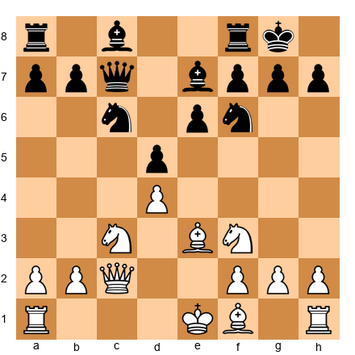</p>

White to play. This position appeared in the theory section. Black wants to play ...e5. Find the best prophylactic move and explain why it works.
*Hint: Review section 37.13 if needed, but try to find the answer independently first.*
⏱ ~8 min

**Exercise 37.29** (★★★)

<p align="center">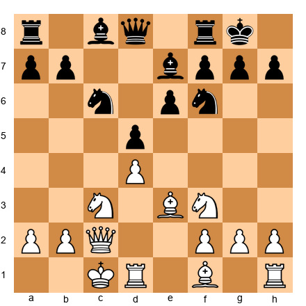</p>

White has castled queenside. Black has castled kingside. Identify the critical imbalance and suggest plans for both sides.
*Hint: Opposite-side castling changes the priority of every imbalance.*
⏱ ~10 min

**Exercise 37.30** (★★★)

<p align="center">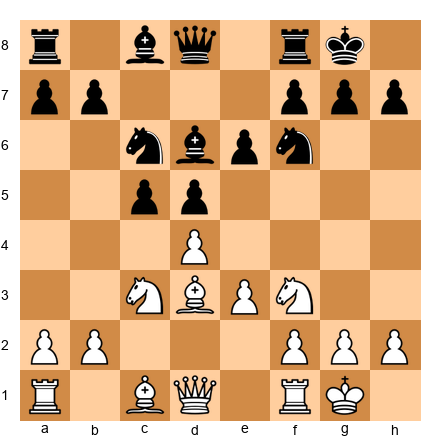</p>

White to play. Evaluate the position after 9.dxc5 Bxc5 10.e4. Is this a good transformation for White? Calculate to depth 5.
*Hint: After 10.e4, the position opens. Is that good for White or Black?*
⏱ ~12 min

**Exercise 37.31** (★★★)

<p align="center"></p>

White to play. White has played d5, locking the center. What is White's plan now? What should Black do in response?
*Hint: With the center locked, the action shifts to the flanks.*
⏱ ~10 min

**Exercise 37.32** (★★★)

<p align="center">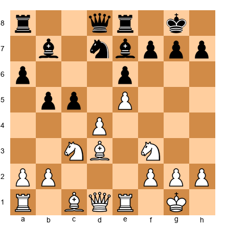</p>

White to play. Black has a knight on d7 that is blocking the bishop on b7. How can White exploit this coordination problem? Find a plan.
*Hint: If Black's pieces are tripping over each other, how do you make it worse?*
⏱ ~10 min

**Exercise 37.33** (★★★)

<p align="center">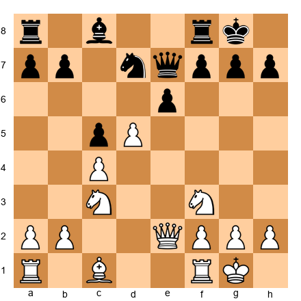</p>

White to play. Black has hanging pawns on c5 and e6 (after d5 is played, the pawn structure shifts). Evaluate: should White capture on e6 or maintain the tension?
*Hint: Capturing might relieve Black's cramp.*
⏱ ~10 min

**Exercise 37.34** (★★★)

<p align="center">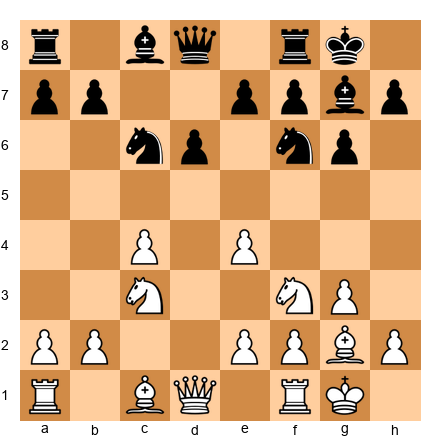</p>

White to play. This is a pure Maroczy Bind. Black will try to play ...d5 at some point. Find a setup for White that prevents ...d5 permanently (or makes it very costly).
*Hint: Control d5 with pieces, not just pawns.*
⏱ ~10 min

**Exercise 37.35** (★★★)

<p align="center"></p>

White to play. You have an IQP. Your opponent has blockaded d5. How do you generate play? Find a plan that does NOT involve d4-d5 immediately.
*Hint: The IQP is not the only source of activity. Look at the files and diagonals.*
⏱ ~10 min

---

### ★★★★ Practice Exercises (37.36–37.55)

**Exercise 37.36** (★★★★)

<p align="center"></p>

White to play. You must choose between four plans (see section 37.4). Evaluate all four. Calculate the first 5 moves of each. Which plan is objectively strongest?
*Hint: Consider what Black does in response to each plan. The best plan is the one Black struggles most against.*
⏱ ~20 min

**Exercise 37.37** (★★★★)

<p align="center"></p>

White to play. Evaluate the position using the three-step process from section 37.3. Identify all imbalances, find the critical one, and evaluate the trajectory. Then suggest the best move.
*Hint: The critical imbalance is not material. Look at piece activity and space.*
⏱ ~15 min

**Exercise 37.38** (★★★★)

<p align="center"></p>

White to play. White has the bishop pair. Find a plan to open the position and make the bishops dominant. Calculate the consequences of your chosen plan to depth 6.
*Hint: You need a pawn break. Which one opens lines for both bishops?*
⏱ ~18 min

**Exercise 37.39** (★★★★)

<p align="center"></p>

White to play. This is a hedgehog. Find the best plan for White over the next 7 moves. Your plan should involve piece improvement, prophylaxis, and preparation for a break.
*Hint: What does Black want? Prevent it. What is your worst piece? Improve it.*
⏱ ~18 min

**Exercise 37.40** (★★★★)

<p align="center"></p>

White to play. Evaluate 12.e4 dxe4 13.Nxe4 Nxe4 14.Bxe4 and then 12.Bg5 (a prophylactic/improving move). Which approach is better? Justify with calculation to depth 6.
*Hint: Compare the dynamic consequences of opening the center vs. maintaining tension.*
⏱ ~20 min

**Exercise 37.41** (★★★★)

<p align="center"></p>

White to play. The static and dynamic evaluations disagree (see section 37.14). Decide: should White open the position or keep it closed? Find the strongest continuation.
*Hint: Consider what happens after d4. Who benefits from the tension breaking?*
⏱ ~15 min

**Exercise 37.42** (★★★★)

<p align="center"></p>

White to play. This position demands a plan choice. Should White play 9.cxd5 (opening lines), 9.d5 (locking the center), or 9.a3 (waiting)? Evaluate each with 4 moves of analysis.
*Hint: Notice that 9.cxd5 doesn't actually capture anything - there's no pawn on d5 yet. Reconsider the pawn structure.*
⏱ ~15 min

**Exercise 37.43** (★★★★)

<p align="center"></p>

White to play. Black is about to play ...e5. You have two choices: prevent it (prophylaxis) or allow it and exploit the consequences. Analyze both approaches.
*Hint: If Black plays ...e5 and you take dxe5, what happens to the d5 pawn?*
⏱ ~18 min

**Exercise 37.44** (★★★★)

<p align="center"></p>

White to play. Before committing to 7.cxd5 (creating hanging pawns for Black), consider: is there a better way to handle the center? Evaluate 7.Be2 (quiet development) vs. 7.cxd5 (forcing the issue).
*Hint: Hanging pawns are double-edged. Are you ready to exploit them?*
⏱ ~15 min

**Exercise 37.45** (★★★★)

<p align="center">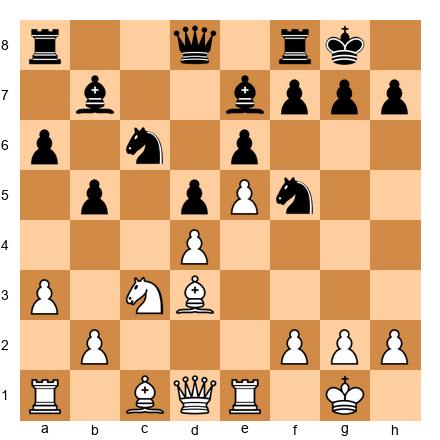</p>

White to play. Black has placed a knight on f5, blockading e5 and eyeing d4 and e3. How does White deal with this strong knight? Find a plan.
*Hint: Can you exchange it? Can you undermine its support? Can you ignore it and attack elsewhere?*
⏱ ~15 min

**Exercise 37.46** (★★★★)

<p align="center"></p>

White to play. You have a Maroczy Bind. Black is solid. Find a 5-move maneuvering plan that improves White's position without creating weaknesses.
*Hint: Improve your worst piece. Then improve the second worst.*
⏱ ~15 min

**Exercise 37.47** (★★★★)

<p align="center"></p>

White to play. This Carlsbad structure will be defined by the minority attack or central play. Decide which approach is better. Calculate the minority attack (b4-b5) to depth 5 and the central approach (e4) to depth 5.
*Hint: Both plans have merit. Which one gives White a clearer advantage?*
⏱ ~20 min

**Exercise 37.48** (★★★★)

<p align="center">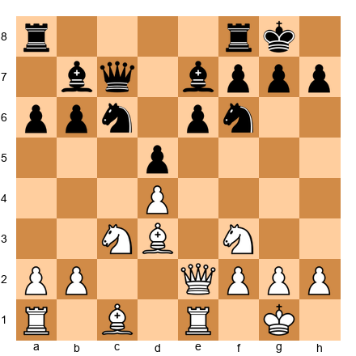</p>

White to play. Find a transformation: how can White convert the current position (with roughly equal material and structure) into a position with a clear advantage?
*Hint: Look for a way to change the pawn structure or force a favorable exchange.*
⏱ ~15 min

**Exercise 37.49** (★★★★)

<p align="center">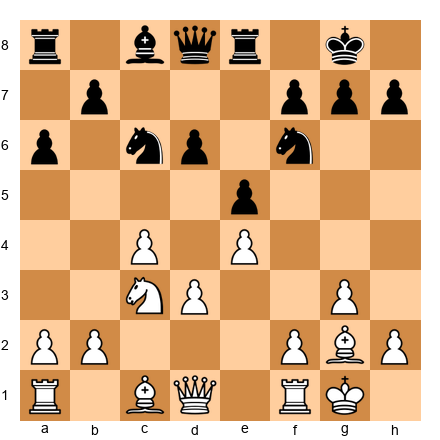</p>

White to play. The position is semi-closed. Both sides are maneuvering. Find White's best plan over the next 5 moves. Focus on piece improvement, not pawn breaks.
*Hint: Which White piece is most poorly placed? Where should it go?*
⏱ ~15 min

**Exercise 37.50** (★★★★)

<p align="center">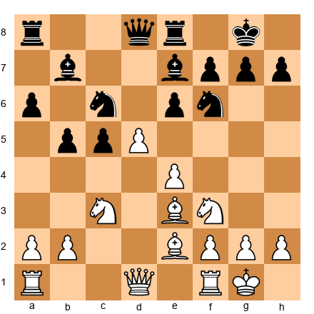</p>

White to play. The center is locked (d5 vs. e6). White should play on the kingside. Find a kingside plan and calculate the first 5 moves.
*Hint: f4-f5 is a natural break. But is now the right time?*
⏱ ~15 min

**Exercise 37.51** (★★★★)

<p align="center">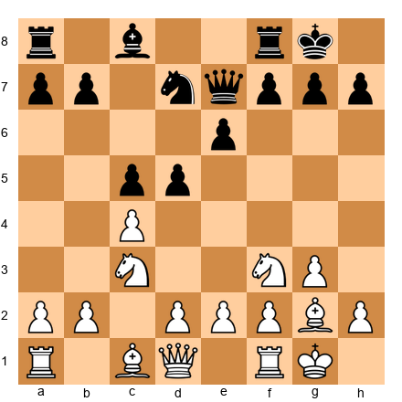</p>

White to play. Black has hanging pawns on c5 and d5. Create a plan to blockade and then attack them. Which piece targets which pawn?
*Hint: Control d4 first. Then attack from the flanks.*
⏱ ~15 min

**Exercise 37.52** (★★★★)

<p align="center"></p>

White to play. Black has grabbed a pawn on c4 (the Meran gambit idea). White has a development lead and central control. How does White exploit the initiative before Black consolidates?
*Hint: Speed matters. What is the fastest way to generate threats?*
⏱ ~15 min

**Exercise 37.53** (★★★★)

<p align="center"></p>

White to play. This is a late hedgehog. Black is fully set up. White must choose between patience and action. Evaluate 12.d5 (breaking through) and 12.Rfd1 (waiting). Which is better?
*Hint: If d5 is not yet correct, what preparation is still needed?*
⏱ ~18 min

**Exercise 37.54** (★★★★)

<p align="center"></p>

White to play. All imbalances favor White slightly. Find a plan that converts multiple small advantages into one decisive advantage. Calculate to depth 6.
*Hint: Multiple small advantages accumulate. The question is: where do they concentrate?*
⏱ ~20 min

**Exercise 37.55** (★★★★)

<p align="center"></p>

White to play. The position calls for a transformation. Evaluate three different pawn captures/exchanges and determine which resulting structure is best for White.
*Hint: The captures are dxc5, cxd5, and e4.*
⏱ ~18 min

---

### ★★★★★ Mastery Exercises (37.56–37.65)

**Exercise 37.56** (★★★★★)

<p align="center"></p>

White to play. This is the master position from the chapter introduction. Using everything you learned in this chapter - imbalances, plans, prophylaxis, transformation - give a comprehensive evaluation and suggest a full strategic plan. Calculate the first 6 moves of your plan.
*Hint: There is no single correct answer. The quality of your reasoning matters as much as the move you choose.*
⏱ ~25 min

**Exercise 37.57** (★★★★★)

<p align="center"></p>

White to play. Conduct a full imbalance analysis. Then identify a transformation sequence - a series of moves that converts White's current advantage type into a different, more durable advantage. Calculate to depth 8.
*Hint: The bishop pair is an advantage. But it is fragile. How do you make it permanent?*
⏱ ~30 min

**Exercise 37.58** (★★★★★)

<p align="center"></p>

White to play. The position is double-edged. White's IQP is both a strength and a weakness. Find the continuation that generates the maximum activity. If the attacking plan fails, what is the fallback?
*Hint: Great players always have a Plan B. What happens if your attack is repelled?*
⏱ ~25 min

**Exercise 37.59** (★★★★★)

<p align="center"></p>

White to play. This hedgehog has reached a critical moment. Black is about to play ...d5. Should White prevent it, allow it, or preempt it with e5? Analyze all three options with at least 6 moves of calculation each.
*Hint: Each option leads to a fundamentally different type of game.*
⏱ ~30 min

**Exercise 37.60** (★★★★★)

<p align="center"></p>

White to play. You have a Maroczy Bind. Your opponent is a strong positional player who will try to break free with ...d5. Design a 10-move plan that maintains the bind while gradually increasing your advantage. Calculate concrete lines where needed.
*Hint: The bind must be maintained with pieces, not just pawns. Which pieces control d5?*
⏱ ~30 min

**Exercise 37.61** (★★★★★)

<p align="center"></p>

White to play. This is a complex position where multiple plans compete. Evaluate the position using all seven imbalances. Then choose the one plan that best exploits the most critical imbalance. Calculate to depth 8.
*Hint: Some imbalances matter more in this specific position than others. Which one is decisive?*
⏱ ~30 min

**Exercise 37.62** (★★★★★)

<p align="center"></p>

White to play. Evaluate this position as if you were writing a book about it. Identify every relevant imbalance, every plausible plan, and every prophylactic consideration. Then suggest the best move and prove it with analysis.
*Hint: This exercise tests your ability to synthesize everything in this chapter.*
⏱ ~35 min

**Exercise 37.63** (★★★★★)

<p align="center"></p>

White to play. You have an IQP. The blockade on d5 is coming (the knight from a5 will go to c6-d5). You have approximately three moves to generate enough activity before the blockade settles. Find the most forcing continuation.
*Hint: Speed is everything. What is the fastest way to threaten the kingside?*
⏱ ~25 min

**Exercise 37.64** (★★★★★)

<p align="center"></p>

White to play. Your opponent has a strong centralized position. Your own pieces are slightly less active. Find a way to seize the initiative through a concrete sequence that changes the character of the position. Calculate to the end of the forcing sequence.
*Hint: Quiet positions sometimes require a violent solution.*
⏱ ~30 min

**Exercise 37.65** (★★★★★)

<p align="center"></p>

White to play. This is the hardest position in the chapter. The knight on f5 dominates. Black's structure is solid. White needs to find a long-term plan that addresses the knight, improves the worst piece, and generates winning chances. There may not be a forced win - but there is a path to a significant advantage.
*Hint: Sometimes you must exchange your opponent's best piece, even at a cost.*
⏱ ~40 min

---

## Key Takeaways

1. **Imbalances are the language of strategy.** At the expert level, you must evaluate all seven imbalances in every position and identify which one matters most right now.

2. **Plans compete.** The best plan is not the one that looks strongest in a vacuum - it is the one that suits the position, disrupts the opponent, and creates a concrete advantage.

3. **Transform your advantages.** Do not cling to one type of edge. Convert spatial dominance into piece activity, piece activity into material gain, material gain into a won endgame. The chain of transformation is the path to winning.

4. **Prophylaxis is not passive.** Asking "what does my opponent want?" is an aggressive act. Preventing the opponent's best plan is often stronger than pursuing your own.

5. **The rules are guidelines.** At this level, concrete analysis overrides positional principles. Break the rules when you have calculated that the exception is sound - but never break them out of laziness or hope.

---

## Practice Assignment

Choose three games from a database where a strong player (2400+) won with strategic play - no dramatic tactical finishes. For each game:

1. Identify the critical middlegame moment where the winning player chose a plan
2. List the competing plans that were available
3. Explain why the chosen plan was superior
4. Find one moment where the winner used prophylactic thinking
5. Identify one transformation of advantage (e.g., converting a space advantage into a kingside attack)

Do this with a physical board. Do not use an engine until you have completed your own analysis. Then compare your analysis with engine evaluation.

This assignment should take 3-5 hours spread over several days.

---

## ⭐ Progress Check

Answer honestly:

- [ ] Can you evaluate a position using all seven imbalances in under 5 minutes?
- [ ] Can you identify at least three competing plans in a complex middlegame position?
- [ ] Can you explain the concept of advantage transformation with a concrete example?
- [ ] Can you recognize the five complex middlegame structures (IQP, hanging pawns, hedgehog, Maroczy bind, Carlsbad) on sight?
- [ ] Can you apply Petrosian's prophylactic question ("What does my opponent want?") as a habit in your games?
- [ ] Can you distinguish between static and dynamic evaluation - and choose the right one for the position?

If you checked at least four boxes, you are ready for Chapter 38. If not, spend more time with the exercises. There is no shame in repetition - every Grandmaster has studied these concepts hundreds of times.

---

🛑 **Rest here.** Chapter 37 covers the most intellectually demanding material in Volume IV. Take at least a day before moving to Chapter 38. Play some blitz. Go for a walk. Let the ideas settle.

*The mark of an expert is not seeing deeper - it is seeing more clearly.* ♟

---

*Chapter 37 Complete - Complex Middlegame Strategy*
*Volume IV: The Expert (2200 → 2400)*
