# Chapter 38: Advanced Endgame Theory
## Corresponding Squares, Fortress Positions, and Zugzwang Mastery

---

> *"In the endgame, God has placed the soul of chess."*
> - José Raúl Capablanca

**Rating Range:** 2200–2400

**What You Will Learn:**
- How to calculate and apply corresponding square systems in complex pawn endgames
- The key fortress positions that save - or fail to save - theoretically lost endgames
- How to identify, create, and exploit zugzwang in simple, reciprocal, and multi-piece settings
- Expert-level rook endgame technique: Vancura, Lucena variants, and the Tarrasch Rule in practice
- Practical endgame decision-making when the clock is ticking

---

## You Are Here

```
Ch 36: Expert-Level Calculation         ✅ Complete
Ch 37: Complex Middlegame Strategy      ✅ Complete
Ch 38: Advanced Endgame Theory          ◀ YOU ARE HERE
Ch 39: Professional Opening Preparation
Ch 40: Practical Decision-Making Under Pressure
```

---

You already know the basics. You know the Lucena position. You know the Philidor defense. You can convert simple rook-and-pawn endings and you understand when opposite-colored bishops favor the attacker versus the defender.

That is not enough anymore.

At the expert level, your opponents also know these things. The endgames you face will not be textbook positions. They will be messy, with multiple pawns, mixed pieces, and ticking clocks. The player who wins is the one who understands the *principles behind the principles* - the deep structural logic that governs all endgame play.

This chapter is your Dvoretsky-level foundation. We cover corresponding squares, fortresses, zugzwang, and every major endgame type in the depth that separates experts from club players. Every position should be set up on your board. Every variation should be played through with your hands. Endgame mastery is physical. It lives in your fingers, not just your head.

---

## 38.1 Corresponding Squares

### The Problem That Creates the Theory

Set up your board:

<p align="center">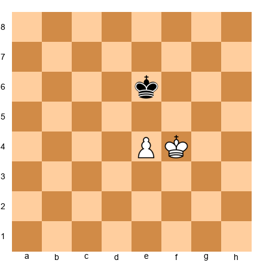</p>


White has king on f4 and pawn on e4. Black has king on e6. White wants to advance the pawn and promote it. Black wants to stop the pawn.

At first glance this seems straightforward. But *which* square should each king occupy? The answer depends on a geometric relationship between squares. For every square the white king can occupy, there is one specific square where the black king *must* stand to hold the draw. These paired squares are **corresponding squares**.

If Black stands on the corresponding square, the position is drawn. If Black stands anywhere else, White wins.

### Triangulation: The Simplest Case

Set up your board:

<p align="center"></p>


White: Ke4, Pd4. Black: Kd6. White to play.

White cannot make progress with direct moves. After 1.Kd3 Kd5, Black seizes the opposition. After 1.Kf5 Kd5, Black holds the key square. The pawn cannot advance safely.

The solution is **triangulation** - White takes three moves to reach a square that could be reached in one, losing a tempo to transfer the move to Black.

1.Kf5! Kd5 (1...Kd7 2.Ke5 and White gains the opposition) 2.Kf4! Kd6 3.Ke4!

Now we have the same position as the start, but with Black to move. That one tempo changes everything.

3...Kd7 4.Kd5 Ke7 5.Kc6 - and White outflanks, marching the pawn forward to promote.

**The lesson:** Triangulation works because the white king has access to three squares that form a triangle (e4, f5, f4), while the black king only has two useful corresponding squares. White can waste a move. Black cannot.

### Direct and Distant Opposition

Set up your board:

<p align="center">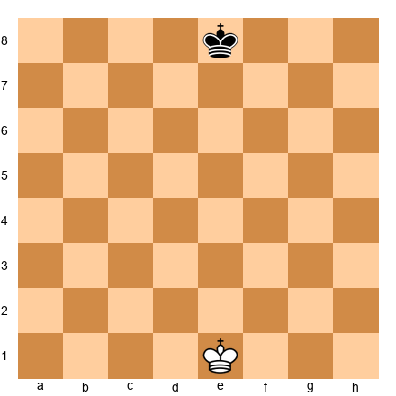</p>


Kings on e1 and e8. White to play.

**Direct opposition** means the kings face each other on the same rank or file with one square between them. The player NOT to move holds the opposition. Here, with White to move, *Black* holds the opposition.

**Distant opposition** extends this concept. The kings are separated by an odd number of squares on a rank, file, or diagonal, with the other side to move. Here the kings are seven squares apart on the e-file - an odd number. Black holds the distant opposition.

White tries: 1.Ke2 Ke7 2.Ke3 Ke6 3.Ke4 Ke5 - Black maintains the opposition at every step. White gains nothing.

But: 1.Kd1! Now Black must choose. 1...Kd7 2.Kd2 Kd6 3.Kd3 - White has seized the direct opposition. 1...Ke7 2.Ke2 Ke6 3.Ke3 - same result. 1...Kf7 2.Ke2 - White outflanks.

**The rule: Same color square, odd number of squares apart, other side to move = you have the opposition.**

### Complex Corresponding Square Systems

Set up your board:

<p align="center">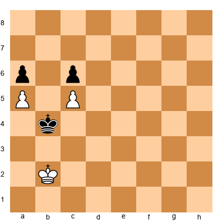</p>


White: Kb2, Pa5, Pc5. Black: Kb4, Pa6, Pc6. White to play.

This is a position where simple opposition is not enough. The pawn structure is locked (White a5 vs. Black a6, White c5 vs. Black c6), and neither side can break through with pawns alone. The game is decided entirely by king maneuvering.

We build a **corresponding square map** using this method:

**Step 1: Find the critical squares.** For White, reaching b6 wins (capturing on a6 or c6). Black must prevent this.

**Step 2: Work backward.** If White is on b3, Black must be on b5 (blocking Kb4-b5-b6). So b3 and b5 are pair "1."

**Step 3: Expand the system.** If White goes to c3, where must Black be? Black must cover c5 (already a pawn) and b4. So Black on c5 corresponds... but c5 has a pawn. Black must go to a5 - no, that also has a pawn.

In locked pawn positions like this, the corresponding square system is determined by which squares each king can reach. Map the relevant squares:

```
  a  b  c  d
6 .  X  .  .    ← White wins if king reaches b6
5 .  1  .  .    ← Black's matching squares
4 .  .  2  .
3 .  1  2  .    ← White's matching squares
2 .  .  .  .
```

When White steps to square "1" (b3), Black must stand on "1" (b5). When White shifts to "2" (c3), Black must shift to "2" (c4). If Black fails, White breaks through.

**In practice:** You rarely calculate the full map during a game. Instead, find the critical penetration square (b6 here), then ask: "Can I reach it? Can my opponent's king always mirror me?" Trace backward two or three pairs. That is usually enough to find whether you win, draw, or need to find a different plan.

### Corresponding Squares in Rook-Pawn Endgames

Set up your board:

<p align="center">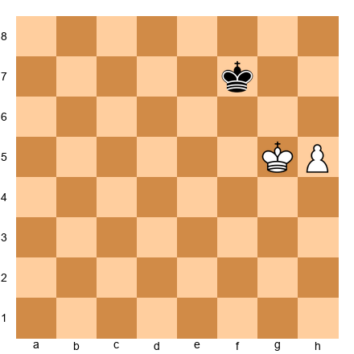</p>


White: Kg5, Ph5. Black: Kf7.

With any pawn except the rook pawn, this king-and-pawn position follows normal rules. But the rook pawn creates a stalemate trap.

1.h6 Kf8! 2.Kg6 Kg8! 3.h7+ Kh8 - and White cannot make progress without stalemating Black.

The rook pawn changes the entire corresponding square system because the edge of the board removes half of the king's maneuvering room. **Rook pawns are always different.** Whenever you see a rook pawn ending, check for the stalemate resource before calculating anything else.

---

## 38.2 Fortress Positions

A **fortress** is a defensive setup where the weaker side cannot be broken down despite a material disadvantage. At the expert level, recognizing when a fortress exists - and when it *almost* exists but fails - separates wins from draws.

### Rook vs. Rook + Pawn: Drawing and Winning

Set up your board:

<p align="center">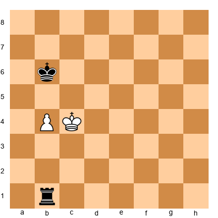</p>


White: Kc4, Pb4. Black: Kb6, Rb1.

This is a standard R+P vs. R position. White has a passed b-pawn. The key question: can Black's rook hold?

Black's plan: place the rook behind the pawn (on b1) and cut the white king off from advancing. When the pawn moves forward, the rook checks from behind or from the side.

1.Kb3 Rf1 2.Kc4 Rc1+ 3.Kd5 Rb1 4.Kc5 Rc1+ 5.Kb3 Rf1 - Black holds by shuffling the rook between checking and blockading.

**Now move the rook pawn to the a-file:**

Set up your board:

<p align="center">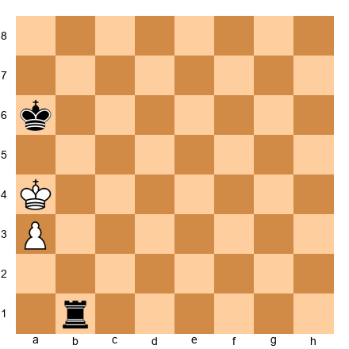</p>


White: Ka4, Pa3. Black: Ka6, Rb1.

Rook pawns create special fortress conditions. Black draws because after the pawn advances to a7, the black king goes to a8, and the white king cannot escape checks without allowing stalemate or pawn capture.

**When the fortress fails:**

Set up your board:

<p align="center">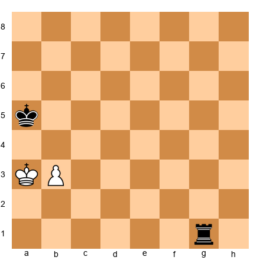</p>


White: Ka3, Pb3. Black: Ka5, Rg1.

Here, White plays 1.b4+ Ka6 2.Ka4 Rg4 3.b5+ Kb6 4.Kb4 - and White's king supports the pawn. The key difference: Black's king was pushed to the wrong side. When the defending king is behind the pawn (not in front of it), the fortress usually fails.

**The fortress rule for R+P vs. R:** The defender draws if the defending king is in front of (or beside) the pawn. The attacker wins if the defending king is behind the pawn and cut off by one or more files.

### The Philidor Defense - And When It Breaks

Set up your board:

<p align="center">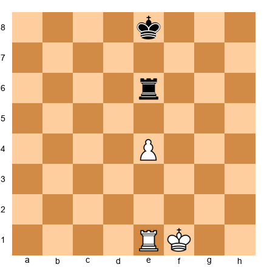</p>


White: Kf1, Re1, Pe4. Black: Ke8, Re6.

The Philidor defensive setup: Black places the rook on the sixth rank (the "third rank" from the defender's perspective) to prevent the white king from advancing. The rook stays passive on the sixth rank until the pawn reaches the fifth rank, then retreats to the first rank to check from maximum distance.

You know this. Here is what matters at your level - the three situations where the Philidor **fails:**

1. **King cut off by two or more files.** If the defending king is on the b-file while the pawn is on e4, the rook on the sixth rank is not enough. The attacking king marches in.

2. **Pawn already on the sixth rank.** Once the pawn reaches the sixth rank, the Philidor setup cannot be established. The defender must switch to a different drawing technique (side checks from maximum distance).

3. **Wrong rook placement.** If the defending rook is in front of the pawn instead of on the sixth rank, the Lucena arises, and the attacker wins.

### Bishop vs. Knight Fortresses

Set up your board:

<p align="center">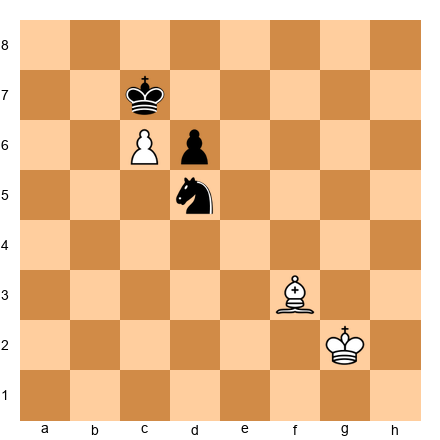</p>


White: Kg2, Bf3, Pc6. Black: Kc7, Nd5, Pd6.

White has a passed c-pawn on c6, but Black's knight on d5 blocks it perfectly. The black king on c7 protects the knight. White's bishop on f3 cannot attack the knight (d5 is a dark square, Bf3 is light-squared) and cannot bypass the blockade.

This is a textbook bishop vs. knight fortress. The knight is the ideal blockader of a passed pawn because it can sit on either color square, while the bishop can only attack squares of one color.

**The fortress holds when:**
- The knight occupies a square in front of the pawn
- The king supports the knight
- The opposing bishop is the wrong color to attack the blockade square

**The fortress breaks when:**
- The stronger side has a second passed pawn the knight cannot also block
- The defending king is driven away from the knight
- The pawn is exchanged for the knight, leaving a winning king + bishop ending

### Queen vs. Rook + Pawn Fortresses

Set up your board:

<p align="center">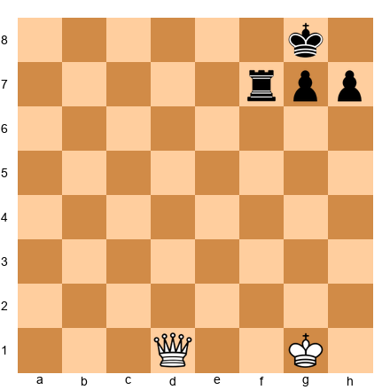</p>


White: Kg1, Qd1. Black: Kg8, Rf7, Pg7, Ph7.

Queen versus rook is normally winning for the queen. But when the rook stays close to the king and pawns provide shelter, a fortress can form. The rook hides next to the king, and the queen cannot simultaneously attack the rook and deliver checkmate.

**The fortress holds when:**
1. The rook stays adjacent to the king
2. One or two pawns shield against back-rank threats
3. The defending king is on an edge with no mating net possible

**The fortress breaks when:**
- The queen can interpose between king and rook with a check
- The defending king is driven to a square where the rook has no safe contact square
- All shelter pawns are captured or forced to advance

**Know the 50-move rule:** In Q vs. R + P, the winning process can take 50+ moves of precise maneuvering. If the defender reaches 50 moves without a pawn move or capture, a draw can be claimed. This is a legitimate defensive resource at the expert level.

---

## 38.3 Zugzwang

Zugzwang means "compulsion to move." A player is in zugzwang when every legal move worsens their position. If passing were allowed, they would pass. But in chess, you cannot.

### Simple Zugzwang

Set up your board:

<p align="center"></p>


White: Kf4, Pe4. Black: Ke6. Black to move.

This is a mutual zugzwang position that you should recognize instantly. With Black to move, any king move allows White to advance:

1...Kd6 2.Kf5 Ke7 3.Ke5 - White seizes the opposition and wins.
1...Kf6 2.Kd5 - White outflanks.

But if it were White to move, White cannot win: 1.Ke3 Ke5 2.Kd3 Kd5 - Black holds the opposition. The evaluation of this position depends entirely on whose move it is.

**Practical takeaway:** When you see this pattern - kings in opposition with a pawn between them - count the tempi. One spare pawn move or one triangulation opportunity can put your opponent in zugzwang.

### Reciprocal Zugzwang

Set up your board:

<p align="center">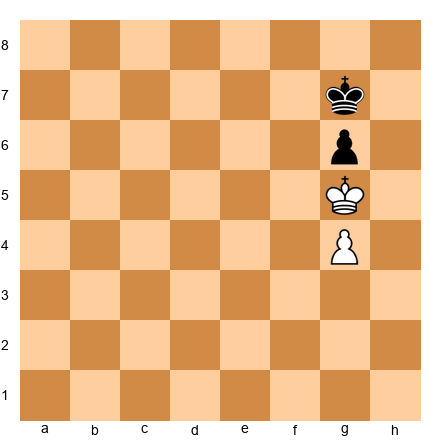</p>


White: Kg5, Pg4. Black: Kg7, Pg6.

This is **reciprocal zugzwang**: whoever moves, loses. If White moves: 1.Kf4 Kf6 - Black wins the g4-pawn and the game. If Black moves: 1...Kf7 2.Kf6 - wait, that is actually not quite right either.

Let me give the clean version:

Set up your board:

<p align="center">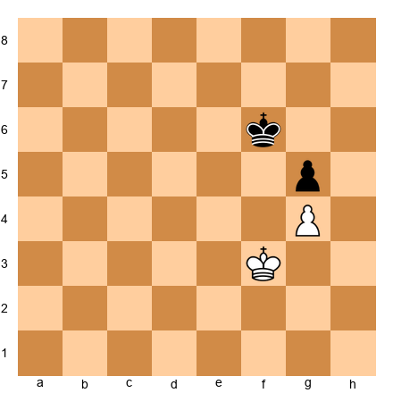</p>


White: Kf3, Pg4. Black: Kf6, Pg5. White to move.

This is reciprocal zugzwang with both kings facing off and pawns locked. Neither side wants to move. White to move: 1.Ke4 Ke6 holds for Black. 1.Kg3 Kg6 - same story. 1.Ke3 Ke5 gives Black the opposition.

Black to move: 1...Ke6 2.Kg3 Kf6 3.Kh4 - White gets around the pawns.

**How to use this in practice:** When analyzing a pawn endgame, always ask: "Is there a position in this line where the side to move is worse off?" If yes, every tempo counts. A move that seems pointless - a king shuffle, a meaningless pawn push - might gain the tempo that forces your opponent into zugzwang.

### Complex Zugzwang Patterns

Set up your board:

<p align="center">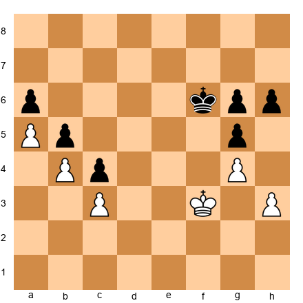</p>


White: Kf3, Pa5, Pb4, Pc3, Pg4, Ph3. Black: Kf6, Pa6, Pb5, Pc4, Pg5, Pg6, Ph6.

Positions like this are where zugzwang reaches its full complexity. The pawn structure is nearly locked. Both sides have pawn moves available, but each pawn move is a concession - it creates a weakness or loses a tempo that cannot be recovered.

**The winning technique:** exhaust the opponent's pawn moves. When one side runs out of non-damaging pawn moves, the king must move to a worse square, and the position collapses.

White plays: 1.Ke4 Ke6 2.Kd4 Kd6 3.h4! (Forcing Black to react - if Black ignores it, White opens the kingside) 3...gxh4 4.Kxc4 - oops, that changes the position fundamentally.

The concept is what matters here: **in locked pawn endgames, the side with more spare pawn moves has a winning advantage because the opponent will be forced to make a damaging king move first.**

### Zugzwang in Piece Endgames

Set up your board:

<p align="center">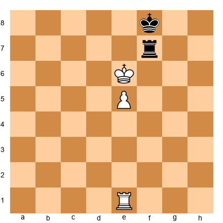</p>


White: Ke6, Re1, Pe5. Black: Kf8, Rf7.

In piece endgames, zugzwang usually involves tying the opponent's piece to a single task and then playing a quiet waiting move.

Black's rook is tied to f7, defending against e6. Black's king is tied to defending the rook and staying near the pawn. If it were Black's move:

1...Re7 2.Kf6 and the rook must abandon the seventh rank or allow Kxe7 and pawn promotion.
1...Kg8 2.Ke7 Rf1 3.e6 - the pawn advances with decisive effect.

White achieves this with: 1.Rd1! A quiet waiting move. Now Black is in zugzwang. Every rook move loses the f7 square. Every king move allows Ke7 or Kd7.

**The lesson:** Rook endgame zugzwang follows a pattern - tie the rook to a task, then pass the move with a quiet rook shift. Learn to see the "waiting move."

---

## 38.4 Rook Endgame Mastery

Rook endgames arise in roughly half of all games that reach an endgame. At your level, you cannot be merely good at them. You must be precise.

### The Lucena Position - Every Variation

Set up your board:

<p align="center">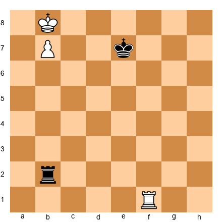</p>


White: Kb8, Pb7, Rf1. Black: Ke7, Rb2.

The Lucena position. White's pawn is on the seventh rank, the king is in front of the pawn, and the rook supports from behind. Black's rook checks from the side.

**The Bridge technique:**

1.Rf4! (The rook goes to the fourth rank - "building the bridge") 1...Rb1 2.Ka7 Ra1+ 3.Kb6 Rb1+ 4.Ka6 Ra1+ 5.Kb5 Rb1+ 6.Rb4! (The bridge is complete. The rook blocks the check.) 6...Rxb4+ 7.Kxb4 and the pawn promotes.

You know this. But do you know the Lucena with every pawn type?

**Knight pawn (b-pawn):**

Set up your board:

<p align="center">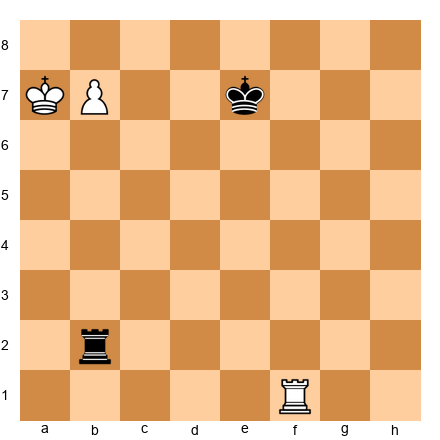</p>


White: Ka7, Pb7, Rf1. Black: Ke7, Rb2.

The bridge works identically. 1.Rf4! Rb1 2.Kb8 Rb3 3.Ka8 Ra3+ 4.Kb8 Rb3 5.Rb4 - done.

**Rook pawn (a-pawn):**

Set up your board:

<p align="center">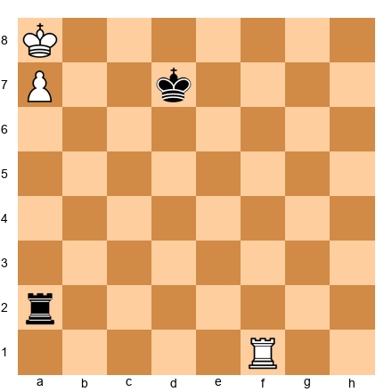</p>


White: Ka8, Pa7, Rf1. Black: Kd7, Ra2.

The rook pawn Lucena is **drawn.** After any rook maneuver, Black checks from the side, and White's king can never escape the corner. There is no room to build the bridge. The a-file pawn and the edge of the board make it impossible.

1.Rf4 Rc2 2.Ra4 Rc1 3.Kb7 Rb1+ 4.Ka6 Ra1+ - the king bounces between a8, b8, b7, and never escapes.

**Center pawn (d-pawn or e-pawn):**

Set up your board:

<p align="center">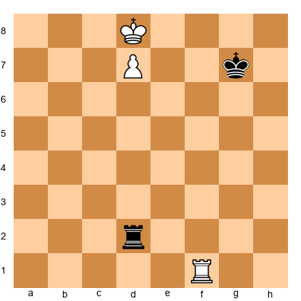</p>


White: Kd8, Pd7, Rf1. Black: Kg7, Rd2.

Center pawns give the attacker the most room. The bridge works easily because the king can escape to either side. 1.Rf4! Rb2 2.Ke7 Re2+ 3.Kd6 Rd2+ 4.Ke6 Re2+ 5.Kd5 Rd2+ 6.Rd4 - bridge.

**Summary:** The Lucena wins with every pawn except the rook pawn (drawn by stalemate/corner geometry).

### The Vancura Position

Set up your board:

<p align="center">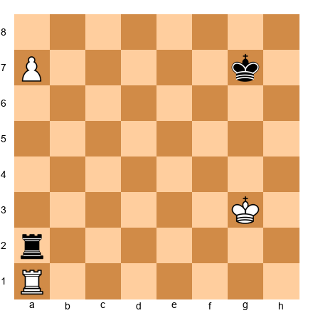</p>


White: Kg3, Ra1, Pa7. Black: Kg7, Ra2.

White has a rook pawn on the seventh rank - seemingly overwhelming. But Black has the **Vancura defense.**

The idea: Black's rook stays on the a-file (behind the pawn) or on a distant file, ready to deliver side-checks. White cannot promote because moving the rook off the a-file hangs the pawn, and the king cannot approach without being checked.

1.Kf3 Rf2+ 2.Ke3 Ra2! (Rook returns behind the pawn) 3.Kd4 Ra4+ 4.Kc5 Ra5+ 5.Kb6 Ra1! - Black simply shuffles. The rook checks from the side when the king approaches, and retreats behind the pawn when the king backs off.

**The Vancura secret:** The defender's rook alternates between checking from the side and blockading from behind. The attacker's rook must stay on the a-file to protect the pawn, so it cannot help the king.

**This only works with the rook pawn.** With a center or bishop pawn on the seventh, the defending king is too far from the action, and the attacking king has escape squares on both sides.

### The Tarrasch Rule: Rook Behind Passed Pawns

Set up your board:

<p align="center">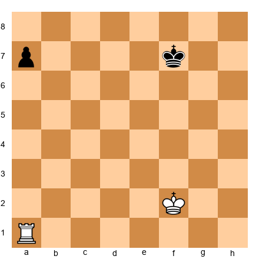</p>


White: Kf2, Ra1. Black: Kf7, Pa7.

**Tarrasch said: "Rooks belong behind passed pawns."**

This applies to BOTH sides. The attacking rook supports the pawn's advance from behind. The defending rook stops it from behind. In this position, White's rook is behind the black a-pawn. Black's pawn advances, and White's rook gains activity as the pawn moves forward.

1...a5 2.Ke3 a4 3.Kd3 a3 4.Kc3 a2 5.Kb2 - White catches the pawn.

**Now put the rook in front:**

Set up your board:

<p align="center">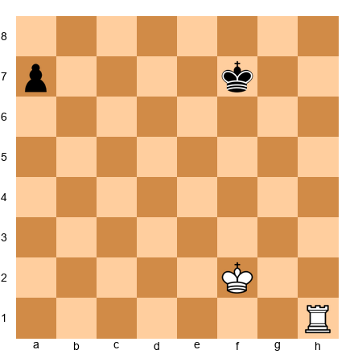</p>


White: Kf2, Rh1. Black: Kf7, Pa7.

White's rook is not behind the pawn. After 1...a5 2.Ke3 a4 3.Kd3 a3 4.Kc2 a2 - the pawn reaches a2, and White must sacrifice the rook or allow promotion.

**The lesson:** When you have a choice, place your rook behind the passed pawn - yours or your opponent's. When your opponent's rook is in front of a passed pawn, advance the pawn to trap it.

**When Tarrasch's Rule is wrong:** In some positions with multiple pawns, the rook is more useful supporting from the side or cutting off the opposing king. Tarrasch's Rule is a guideline, not a law. Use it as a starting point, then verify with calculation.

### Rook vs. Two Connected Passed Pawns

Set up your board:

<p align="center">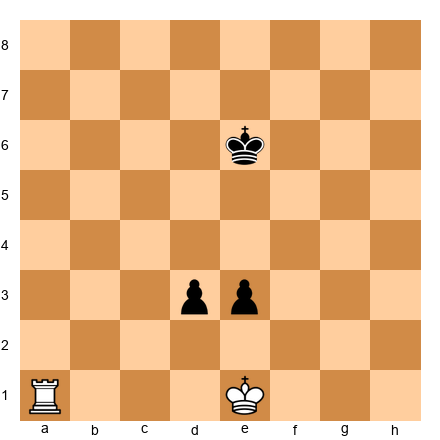</p>


White: Ke1, Ra1. Black: Ke6, Pd3, Pe3.

The general rule: **two connected passed pawns on the sixth rank (two squares from promotion) beat a rook.** On the fifth rank, the rook usually holds. On the fourth rank, the rook wins.

Here, the pawns are on the third rank (sixth from White's perspective). After 1...d2+ 2.Kd1 Kd5 3.Ra5+ Kd4 4.Ra4+ Kd3 5.Ra3+ Ke2 - Black's king shelters and a pawn will promote.

**Move the pawns one rank back:**

Set up your board:

<p align="center">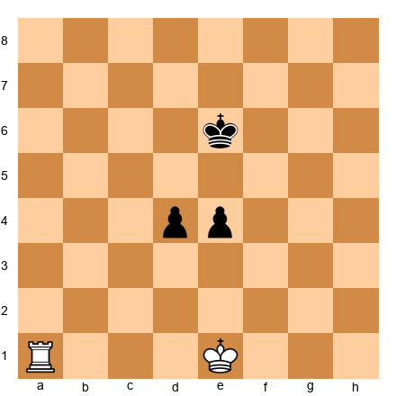</p>


White: Ke1, Ra1. Black: Ke6, Pd4, Pe4.

Now the rook holds. 1.Kd2! Kd5 2.Kd3 - White blockades. The rook stands ready to support from behind. The pawns cannot safely advance.

**Your rule of thumb:** Count the squares from promotion. Two squares = pawns win. Three or more = rook holds. Adjust for king positions.

---

## 38.5 Bishop Endgames

### Same-Color Bishops: Good Bishop vs. Bad Bishop

Set up your board:

<p align="center">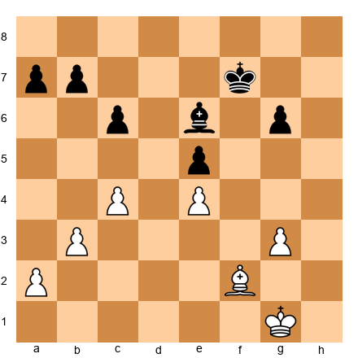</p>


White: Kg1, Bf2, Pa2, Pb3, Pc4, Pe4, Pg3. Black: Kf7, Be6, Pa7, Pb7, Pc6, Pe5, Pg6.

A "good bishop" has its pawns on the opposite color, leaving the bishop free. A "bad bishop" has its pawns on the same color, making it passive.

White's bishop (f2, dark-squared) moves freely because White's pawns are on light squares (a2, b3, c4, e4). Black's bishop (e6, light-squared) is hemmed in by pawns on light squares (a7, b7, c6, e5, g6). Black's bishop is bad.

**Conversion technique for the good-bishop side:**
1. **Fix the opponent's pawns on the bishop's color.** Play c4-c5 (or similar) to ensure Black's queenside pawns stay on light squares.
2. **Create a second weakness.** Black can defend one side of the board. Force a weakness on the other side.
3. **Activate the king.** With the bishop dominating the board, the king becomes the decisive piece.

1.Kf1 Ke7 2.Ke2 Kd6 3.Kd3 Bc8 4.Ba7! (Attacking b7 - forcing Black to defend) 4...Bd7 5.a4! (Creating the second weakness - now Black must watch both flanks.)

### Opposite-Color Bishops: The Drawing Weapon

Set up your board:

<p align="center">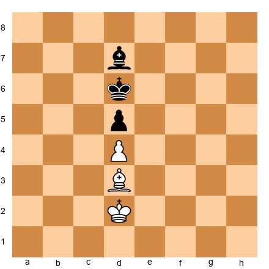</p>


White: Kd2, Bd3. Black: Kd6, Bd7.

Opposite-color bishops - one light-squared, one dark-squared - produce a unique dynamic. They cannot interact. Neither bishop can attack or be attacked by the other. This creates enormous drawing potential.

**An extra pawn, even two extra pawns, may not be enough to win.**

The defending bishop parks on the diagonal that blocks the passed pawn's advance. The attacking bishop cannot remove the blockade because it controls the wrong color.

Set up your board:

<p align="center">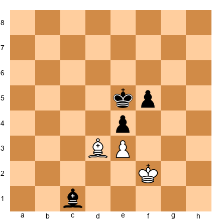</p>


White: Kf2, Bd3, Pe3. Black: Ke5, Bc1, Pf5, Pe4.

Black is up a pawn, but the position is drawn. White's bishop on d3 blocks the f-pawn (it attacks f5), and White's pawn on e3 cannot be attacked by Black's dark-squared bishop.

**When opposite-color bishops lose their drawing power:**
1. **Pawns on both sides of the board.** The bishop cannot blockade two diagonals at once.
2. **King penetration.** If the attacking king reaches the sixth rank, the extra pawn becomes decisive.
3. **Three or more extra pawns.** Overwhelming material overcomes the drawing tendency.

Set up your board:

<p align="center">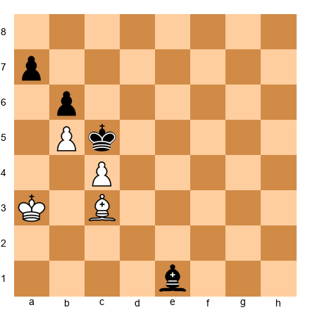</p>


White: Ka3, Bc3, Pb5, Pc4. Black: Kc5, Be1, Pa7, Pb6.

White has two connected passed pawns on the queenside. Despite opposite-color bishops, White wins because the pawns support each other and the black bishop cannot blockade both. After 1.Kb3 Kd5 2.Ba5! - White threatens Ka4-Kb4-Ka5, and Black cannot stop b5-b6-b7.

### Bishops of the Same Color: Space and Technique

Set up your board:

<p align="center">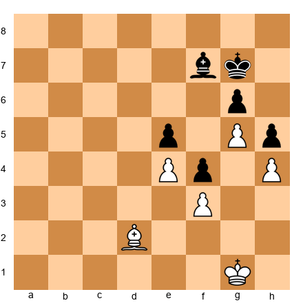</p>


White: Kg1, Bd2, Pe4, Pf3, Pg5, Ph4. Black: Kg7, Bf7, Pe5, Pf4, Pg6, Ph5.

Same-color bishop endgames with locked pawn chains reward patience and technique. White's advantage (if any) depends on whether the king can penetrate while the bishop controls key diagonals.

**Key principles:**
1. The bishop is strongest when its diagonals are clear of its own pawns
2. Place pawns on the opposite color of your bishop when possible
3. The king is the attacking piece - the bishop supports the king's advance

---

## 38.6 Knight Endgames

### Centralization Is Everything

Set up your board:

<p align="center">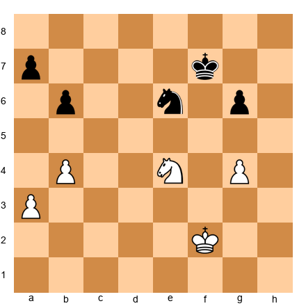</p>


White: Kf2, Ne4, Pa3, Pb4, Pg4. Black: Kf7, Ne6, Pa7, Pb6, Pg6.

Knight endgames resemble pawn endgames more than any other piece endgame. Knights are short-range pieces. They cannot control distant squares from afar like bishops. The king's position is everything.

**Three principles of knight endgames:**

1. **Central knights dominate.** A knight on e4 or d5 controls eight squares. On the rim, four. In the corner, two.
2. **Passed pawns are lethal.** Knights are too slow to chase distant passed pawns. A passed pawn supported by the king wins almost automatically.
3. **Knight endgames with an extra pawn are nearly as winning as pure pawn endgames.** Unlike bishop endgames (where wrong-color issues arise), the knight can reach any square.

### Knight vs. Bishop: Closed Positions

Set up your board:

<p align="center">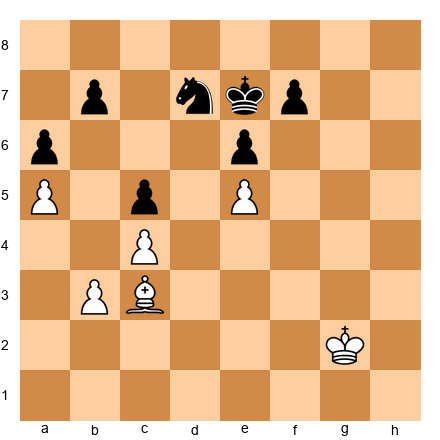</p>


White: Kg2, Bc3, Pa5, Pb3, Pc4, Pe5. Black: Ke7, Nd7, Pa6, Pb7, Pc5, Pe6, Pf7.

In closed positions, knights shine while bishops suffer. The pawns are fixed on specific squares, and many of those squares are the same color as the bishop. The bishop is hemmed in by its own pawns. The knight, meanwhile, can jump over the pawns and access squares that the bishop cannot reach.

When you have a knight against a bishop in a closed position, your plan is simple: keep the position closed, maneuver your knight to the best possible outpost, and slowly improve your king position while the bishop watches helplessly. Do not open the position unless you have a specific reason. Every pawn exchange opens lines for the bishop and reduces your advantage.

### Knight vs. Bishop: Open Positions

In open positions, the opposite is true. The bishop controls long diagonals and can influence both sides of the board simultaneously. The knight needs time to travel from one side to the other. With pawns on both sides of the board, the bishop's long-range power often proves decisive.

When you are playing a knight vs. bishop endgame, the first question to ask is: "Is the position open or closed?" If it is closed, the knight is better. If it is open, the bishop is better. If it is somewhere in between, the player with better king activity usually has the advantage regardless of which minor piece they have.

### The Good Bishop vs. Bad Bishop

Not all bishops are created equal. A "good" bishop has its pawns on the opposite color from the squares it controls. A "bad" bishop has its pawns on the same color - they block its diagonals and reduce its activity.

At the expert level, recognizing good and bad bishops and acting on this knowledge is a reliable way to gain advantages in the endgame. When you have the good bishop, open the position and aim for an endgame where the bishop's range dominates. When you have the bad bishop, try to trade it for the opponent's knight (if they have one) or keep the position closed to minimize its disadvantage.

**The knight is superior when:**
- The position is closed (pawns locked, no open diagonals for the bishop)
- The knight has a stable outpost (cannot be driven away by pawns)
- The opponent's bishop is "bad" (blocked by its own pawns)
- Play is limited to one side of the board

In this position, Black's knight on d7 targets e5 and b6. White's bishop on c3 has almost no open diagonals - pawns on b3, c4, and e5 restrict it. Black stands better.

**The bishop is superior when:**
- The position is open (clear diagonals, pawns on both flanks)
- The bishop can attack two weaknesses on different sides of the board
- The knight has no outpost (it gets chased)
- There is a passed pawn to support from a distance

### Knight Outposts: Making Them Permanent

Set up your board:

<p align="center">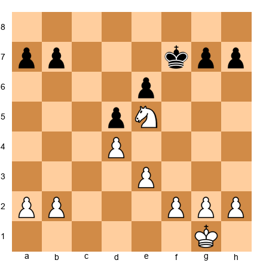</p>


White: Kg1, Ne5, Pa2, Pb2, Pd4, Pe3, Pf2, Pg2, Ph2. Black: Kf7, Pa7, Pb7, Pe6, Pg7, Ph7.

White's knight on e5 is a monster. No black pawn can ever drive it away (d6 is blocked by the d4 pawn). The knight controls d3, d7, f3, f7, c4, c6, g4, g6 - eight squares, most of them in Black's territory.

**To create a permanent outpost:**
1. Exchange the opponent's minor piece that could challenge the knight
2. Fix the pawn structure so no pawn can attack the outpost square
3. Support the outpost with your own pawns

**To destroy an opponent's outpost:**
1. Exchange the knight (trade a bishop for it if necessary)
2. Advance a pawn to chase the knight (this may weaken your structure - calculate the trade-off)
3. Blockade the outpost by placing your own piece there

---

## 38.7 Queen Endgames

### Queen vs. Rook + Pawn

Set up your board:

<p align="center">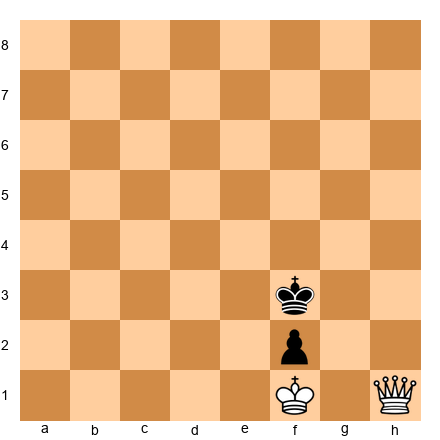</p>


White: Kf1, Qh1. Black: Kf3, Pf2.

Queen versus rook and advanced passed pawn is one of the most complex endgame types. The queen usually wins, but the process requires extreme precision.

**General rules:**
1. The queen wins by forcing a series of checks, driving the defending king away from the pawn
2. Once the king is separated from the pawn, the queen either captures the pawn or forces the rook to block a check in front of the pawn, allowing the king to approach
3. Center and bishop pawns on the seventh rank, with the defending king nearby, are the hardest to beat - and can sometimes draw

**Winning technique:** The queen looks for a check that forces the king to a square where the next check gains material or allows the attacking king to approach. This often requires 15-20 checks in sequence, with only one correct square at each step.

### Queen vs. Two Minor Pieces

Set up your board:

<p align="center">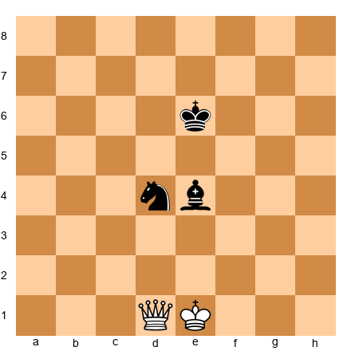</p>


White: Ke1, Qd1. Black: Ke6, Nd4, Be4.

Without pawns, the queen is usually superior because of its mobility and checking power. But two well-coordinated minor pieces - especially knight + bishop - can defend by staying close together and near their king.

**The queen wins when:**
- The pieces are separated (the queen picks them off)
- The king is exposed (the queen delivers perpetual threats)
- There are pawns to attack (the queen's range allows multi-target play)

**The pieces hold or win when:**
- They are coordinated near the king (mutual defense)
- There are advanced passed pawns (the pieces support promotion while the queen chases)
- The queen has no safe checking squares

### Perpetual Check: The Queen's Lifeline

Set up your board:

<p align="center">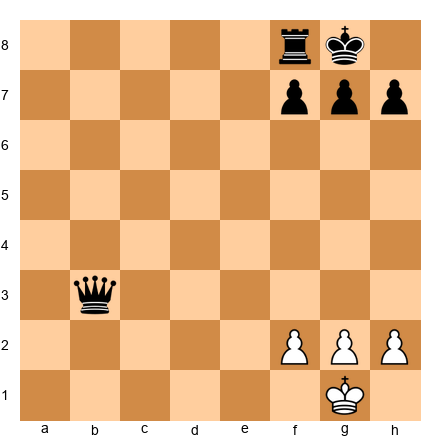</p>


Black: Kg8, Rf8, Qb3, Pf7, Pg7, Ph7. White: Kg1, Pf2, Pg2, Ph2.

Down a full rook, Black has one saving grace: the perpetual check.

1...Qe3! (Not 1...Qd1+? 2.Kh2 and the queen runs out of checks.) After 1...Qe3, the queen threatens Qf3 and Qe1+. White cannot escape: 2.Kh1 Qf3! 3.Kg1 Qe3! - the queen swings between e3 and f3, and the white king cannot escape the checking net.

**Perpetual check patterns to memorize:**
1. **Corner perpetual:** Queen checks on g3, f3, g4 when the king is on h1/g1
2. **Diagonal perpetual:** Queen slides along a long diagonal, checking the king at each end
3. **Edge perpetual:** Queen checks along the back rank, and the king has no shelter

**The key question in every queen endgame:** "If I am losing, can I force perpetual check?" Answer this *before* you trade into the endgame. A single tempo can be the difference between perpetual and defeat.

### Queen and Pawn Endgames: Practical Technique

Queen and pawn endgames are among the most difficult to play correctly because queens can check from almost anywhere, and a single misstep can allow perpetual check or a devastating queen fork.

**Converting an extra pawn in queen endgames.** The general approach is: (1) advance the passed pawn with the king nearby to support it, (2) use checks and threats to keep the opponent's queen tied to defensive duties, and (3) look for opportunities to trade queens into a winning king and pawn endgame.

The hardest part is step 3. Your opponent will usually avoid a queen trade because the resulting pawn endgame is lost. You must find a way to force the trade - often by using your passed pawn as bait. Advance the pawn to a point where the opponent must stop it with their queen. Then use your own queen to attack the opponent's king, forcing a queen trade or a devastating fork.

**The exposed king factor.** In queen endgames, the safety of the king is even more important than in middlegames because there are no minor pieces to create a defensive shell. An exposed king is a permanent liability. Before entering a queen endgame, evaluate both kings. If your king is safer than your opponent's, the queen endgame favors you even if the material is equal.

**Practice positions.** Queen endgames require practice more than theory. Set up positions with queen and two or three pawns per side and play them out against a training partner or an engine set to a moderate level. The more you practice, the better your intuition becomes for when to push, when to check, and when to aim for a queen exchange.

---

## 38.8 Complex Multi-Piece Endgames

### Rook + Bishop vs. Rook + Knight

Set up your board:

<p align="center">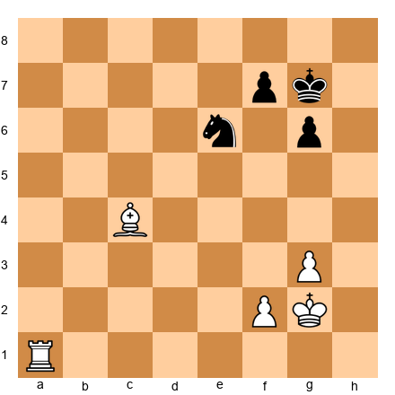</p>


White: Kg2, Ra1, Bc4, Pf2, Pg3. Black: Kg7, Ne6, Pf7, Pg6.

R+B vs. R+N is one of the most common complex endgames. The bishop side usually has a small but persistent advantage because the bishop's range combines well with the rook's.

**The R+B side's advantages:**
1. The bishop and rook can cover all squares (the rook compensates for the bishop's color limitation)
2. The bishop can support passed pawns from a distance while the rook attacks
3. The knight is vulnerable to pins and skewers by the bishop

**The R+N side's resources:**
1. The knight can blockade passed pawns effectively
2. In closed positions, the knight may be more active than the bishop
3. The knight can create forks, complicating the opponent's coordination

**Typical plan for the stronger side:**
1. Fix the opponent's pawns on the bishop's color (making them targets)
2. Create a passed pawn
3. Use the bishop to support the pawn while the rook attacks the knight or the remaining pawns

### Rook + Bishop vs. Rook

Set up your board:

<p align="center">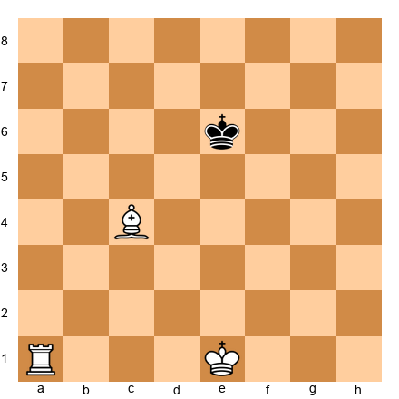</p>


White: Ke1, Ra1, Bc4. Black: Ke6.

R+B vs. R (no pawns) is a theoretical draw, but the defending side must know the technique. Philidor studied this in the 18th century.

**Drawing technique for the defender:**
1. Keep the king near the center (avoid the edge and corners)
2. If pushed to the edge, keep the rook active - do not let it become passive
3. Watch for the Philidor trap where the bishop and rook coordinate to force checkmate in the corner

Set up your board:

<p align="center">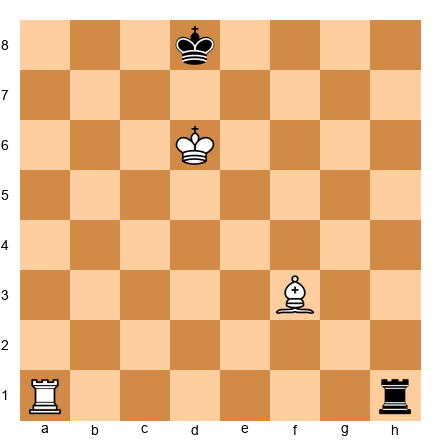</p>


White: Kd6, Ra1, Bf3. Black: Kd8, Rh1.

With the black king on the edge, White threatens to win by coordinating bishop + rook. But Black can draw with active defense: 1...Rd1+ 2.Kc6 Rc1+ 3.Kb7 Rb1+ - Black checks from behind, and the king cannot escape without losing the bishop's coordination.

**The practical lesson:** In R+B vs. R, the defending side should keep checking from the opposite side. The attacker needs perfect play to even attempt a win, and the slightest inaccuracy by the attacker draws.

---

## 38.9 Tablebase Knowledge for the Expert

Endgame tablebases have solved every position with seven or fewer pieces. Here is what every expert should know from the tablebases:

### Must-Know Tablebase Results

**K+Q vs. K+R:** Win for the queen side in most positions. Maximum 31 moves to conversion with perfect play. The queen forces the king and rook apart using "Domination" - restricting the rook's squares until it hangs.

**K+R vs. K+B:** Theoretical draw. Only won in positions where the bishop is trapped in a corner of the wrong color.

**K+R vs. K+N:** Theoretical draw. The knight can be won only when it is trapped in a corner. The defender must avoid the edge and keep the knight active.

**K+B+N vs. K:** Win, but technically demanding. The checkmate must occur in a corner controlled by the bishop. Maximum 33 moves. You must know the W-maneuver.

**K+R+B vs. K+R:** Draw with correct defense (as discussed above). However, the defender must play precisely. The attacker can try for over 100 moves in some positions.

**K+Q vs. K+R+P:** Usually wins for the queen when the pawn is not on the seventh rank. When the pawn is on the seventh rank (bishop or center pawn), it can be a draw.

### Practical Tablebase Use

At your level, you should:
1. **Know the results** of all common endgame types with six or fewer pieces
2. **Know the technique** for K+Q vs. K+R, K+B+N vs. K, and K+R+P vs. K+R
3. **Use tablebases for post-game analysis** - check whether you played the endgame correctly
4. **Trust your knowledge during the game** - you cannot access tablebases during play (in classical chess), so your internalized knowledge is what matters

---

## 38.10 Practical Endgame Decision-Making Under Time Pressure

### The 10-Second Rule

When you have less than 5 minutes on the clock in an endgame, apply the **10-Second Rule:** spend no more than 10 seconds per move unless you see a critical decision point.

What does this look like in practice?

**Automatic moves (2-3 seconds):**
- Recaptures in a forced exchange
- Obvious king moves toward the center
- Rook behind a passed pawn (Tarrasch's Rule)

**Quick decisions (5-10 seconds):**
- Which pawn to advance
- Whether to trade pieces
- Rook placement (active vs. defensive)

**Critical decisions (spend time here):**
- Whether a pawn endgame is winning or drawing
- Whether to allow a piece trade that changes the endgame type
- Whether a fortress exists

### Simplification Decisions

The most important decision in time pressure: **should you simplify?**

**Simplify when:**
- You have a clear advantage that is easier to convert with fewer pieces
- Your opponent's clock is also low (simpler positions = fewer tricks)
- You know the resulting endgame type is winning

**Do NOT simplify when:**
- The resulting endgame is a theoretical draw (opposite-color bishops, wrong rook pawn)
- Your advantage requires pieces for attack (you need the rook for checkmate threats)
- Your opponent is the better endgame player (keep the position complex)

### The Technique Checklist

When you reach a technical endgame, run through this checklist:

1. **Count the material.** Is this a known theoretical result?
2. **Identify the pawn structure.** Where are the weaknesses? Where are the passed pawns?
3. **Activate the king.** In every endgame without queens, the king is an attacking piece.
4. **Create a plan.** What is the winning/drawing technique? Describe it to yourself in words.
5. **Execute without rushing.** Time pressure tempts you to move fast. But blundering a drawn endgame is worse than losing on time in a lost position.

### Endgame Patterns You Must Know by Heart

Certain endgame patterns appear so frequently that you must be able to play them on autopilot. If you have to think about these positions for more than 10 seconds, you have not studied them enough. Here is the list of positions you should be able to play in your sleep.

**King and pawn vs. king.** You must know instantly whether the position is winning or drawn. The rule of the square, the opposition, and the key squares - these must be automatic. If someone wakes you at 3 AM and shows you a KP vs K position, you should be able to give the correct answer in five seconds.

**Rook and pawn vs. rook.** The Philidor position (drawing technique) and the Lucena position (winning technique with the "bridge"). These are the two most important rook endgame positions in chess. If you do not know them cold, stop reading and study them right now. Every other rook endgame technique builds on these two positions.

**Queen vs. pawn on the seventh rank.** The queen usually wins, but a rook pawn or bishop pawn on the seventh rank can sometimes draw by forcing stalemate. Know which pawns draw and which pawns lose. This knowledge changes how you evaluate piece trades in the middlegame - if you know the resulting queen vs. pawn position is drawn, you will not trade into it.

**Basic mates.** King and queen vs. king. King and rook vs. king. King and two bishops vs. king. These must be executed without thought. If you are spending clock time on a basic mate, you are giving away precious seconds that could be used on the moves that actually require thought.

**Opposite-colored bishop endgames.** The drawing tendency of opposite-colored bishops is one of the most important endgame facts. Even two pawns up can be a draw if the opponent's bishop covers the promotion squares. Know this before trading into an opposite-colored bishop endgame.

---

## 38.11 Endgame Principles That Engine Analysis Cannot Teach

Engines are extraordinary at finding the best move in any endgame position. But they are terrible teachers. An engine will tell you the right move but not why it is right. It will show you a 47-move winning sequence but not the underlying principle that makes it work. This section covers endgame principles that you must learn from human instruction, not from engine output.

### The Principle of Two Weaknesses

The most important strategic principle in endgames is the principle of two weaknesses. You cannot usually win an endgame by attacking one weakness. Your opponent simply defends it. But if you can create a second weakness on the other side of the board, you force your opponent to divide their defensive resources, and one defense collapses.

Set up your board:


<p align="center">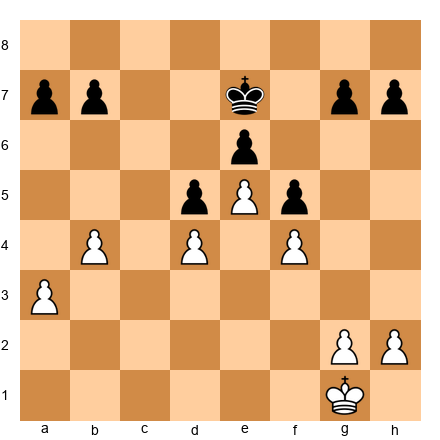</p>


In this king and pawn endgame, White has a slight advantage because Black's pawns on g7 and h7 are potential targets. But if White only attacks the kingside, Black's king can defend. White needs a second weakness.

The plan: White plays on the queenside first with a4 and b5, creating weaknesses in Black's structure there. Then White shifts the king to the kingside. Black's king cannot cover both flanks. When Black defends the kingside, White wins on the queenside. When Black defends the queenside, White wins on the kingside.

This principle - create two weaknesses, then exploit the one your opponent does not defend - is the single most useful endgame concept above 2000. Study it thoroughly. Every strong player uses it, and most games between experts are decided by which player applies it more effectively.

**How to create the second weakness.** The first weakness is usually already present in the position - a weak pawn, an exposed king, a badly placed piece. The second weakness must be created through active play. Common methods include: advancing a flank pawn to create a passed pawn threat, sacrificing a pawn to open a file on the other side of the board, or exchanging pieces to create a favorable imbalance on one wing.

**A practical example.** Suppose you have a rook endgame where you are attacking your opponent's weak a-pawn. Your opponent's rook defends it from a8. You cannot make progress. Now you advance your h-pawn from h2 to h5, threatening to create a passed pawn on the kingside. Your opponent must now decide: keep defending the a-pawn, or stop the h-pawn. They cannot do both with one rook. Whatever they choose, you attack the undefended weakness.

**Training the two weaknesses principle.** The best way to internalize this principle is to play king and pawn endgames against a training partner or engine (set to a moderate level). Practice creating and exploiting two weaknesses. Do this 10 times, and the principle will become second nature.

### The Principle of Corresponding Squares

In king and pawn endgames, the concept of corresponding squares extends the idea of opposition to more complex positions. Two squares "correspond" when each player's king on those squares maintains the balance of the position. If one player's king reaches a square that does not have a corresponding defensive square for the opponent, the position breaks.

Understanding corresponding squares requires practice more than explanation. The best way to learn them is to study specific king and pawn endgame positions where opposition alone is not enough to determine the result. These positions appear in Dvoretsky's Endgame Manual and in specialized endgame books.

The key insight is that endgame play at the expert level often comes down to king maneuvers that look purposeless to the untrained eye. A king walking from f3 to e2 to d3 to c4 might look like aimless wandering, but each step is designed to land on the correct corresponding square, forcing the opponent's king off its own corresponding square and breaking the defensive barrier.

### The Principle of the Active King

In the endgame, the king is a fighting piece. This principle is taught early, but its full implications only become clear at the expert level. An active king is not just one that has moved to the center of the board. It is one that is performing a specific function: attacking pawns, supporting a passed pawn's advance, or cutting off the opponent's king from a key area.

The mistake that many expert-level players make is centralizing the king without a clear purpose. Centralization is not a goal in itself. It is a means to an end. Before moving your king in the endgame, ask: "Where does my king need to be in 5 moves? What is it trying to accomplish?" The answer to this question determines the direction of your king march, and it might not be toward the center at all.

Sometimes the active king belongs on the flank, escorting a passed pawn. Sometimes it belongs in front of the opponent's pawns, blockading. Sometimes it belongs behind your own pawns, supporting a pawn break. The "active king" principle does not mean "king to the center." It means "king to the square where it accomplishes the most."

---

## Annotated Endgame Masterpieces

### Game 1: Rubinstein vs. Schlechter
*San Sebastian 1912*

Set up your board:

<p align="center">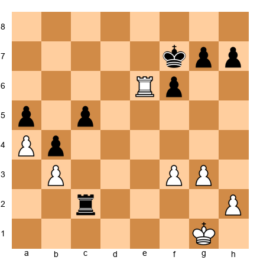</p>


We join this game at move 38, where Rubinstein has reached a rook endgame with a small but enduring advantage. Rubinstein was the greatest endgame artist of his era, and this game shows why.

White has a centralized rook on e6, active king access, and a potential passed h-pawn. Black's rook is passive on c2, tied to defending the c5-pawn.

**38.Re7+!** The first step. The rook goes to the seventh rank - the most powerful rook placement in chess.

**38...Kf8** 38...Kg6 39.Re6 pins the f-pawn and threatens to win it.

**39.Rb7** Attacking the g7-pawn and restraining Black's pieces.

**39...Re2** Black activates the rook, but White has a concrete plan.

**40.f4!** Fixing Black's kingside structure. The f6-pawn is now permanently weak because it cannot advance (g7 needs to stay to avoid Rxg7+).

**40...Re1+** **41.Kf2 Rb1** **42.Rb6!** Targeting f6 from the side. This is the Tarrasch Rule in action - the rook attacks from the most active angle.

**42...Rxb3** Desperation. Black grabs a pawn but loses the f6-pawn.

**43.Rxf6+ Ke7 44.Ra6!** Not 44.Rc6? c4 with counterplay. The rook goes to a6 to restrain both the a-pawn and the c-pawn from a distance.

**44...Kf7 45.f5!** Rubinstein fixes another pawn. Now the f5-pawn is a protected passed pawn, and Black's kingside is paralyzed.

**45...Rb1 46.Rxa5** The harvest begins. White picks off the a-pawn.

**46...Rb2+ 47.Kf3 Rxh2 48.Rxc5** Two pawns fall. White now has connected passed pawns on a4 and f5 vs. Black's g7 and h7.

**48...Rh3+ 49.Kf4 Ra3 50.Rc7+ Kf8 51.a5** The a-pawn advances. Black cannot stop both passed pawns.

**51...Ra4+ 52.Ke5 Ra1 53.Kd6 Rd1+ 54.Kc6**

**1-0.** The a-pawn promotes.

**What to learn from this game:**
- The seventh rank is the rook's dream square. Fight to get there.
- Fix your opponent's weaknesses before attacking them. f4! made f6 permanently weak.
- Collect pawns systematically - do not rush. Rubinstein took his time, and the result was inevitable.
- The rook's greatest talent is attacking from a distance. Use it.

---

### Game 2: Capablanca vs. Bogoljubow
*Bad Kissingen 1928*

Set up your board:

<p align="center">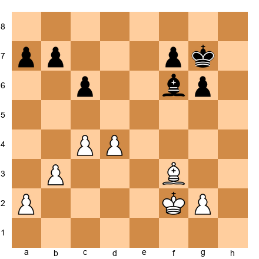</p>


Capablanca's endgame technique was legendary. In this same-color bishop endgame, he demonstrates the "two weaknesses" principle - creating problems on both sides of the board until the defense collapses.

**31.Be4!** Centralizing the bishop and targeting the c6-pawn. This forces Black to decide: defend c6 passively, or allow structural damage.

**31...Bc3** Black's bishop tries to remain active, but it faces a dilemma - it must watch both flanks.

**32.Ke3 Kf6 33.Kd3** Capablanca centralizes the king. In bishop endgames, the king is the primary attacking piece.

**33...Ba5 34.d5!** The central break. This fixes Black's pawn structure and creates a protected passed pawn after cxd5 Bxd5.

**34...cxd5 35.Bxd5** Now White has a bishop on d5 and a c-pawn vs. Black's a- and b-pawns. The protected passed pawn on c4 (after c5) will become decisive.

**35...Ke5 36.c5!** The pawn advances. Black must now deal with both the c-pawn and the possibility of the white king invading via the queenside.

**36...Bc7 37.Kc4 Kd6 38.Bc6!** Attacking b7 directly. Black must choose between defending b7 and stopping the c-pawn.

**38...Bb8 39.Kb5 a6+ 40.Ka4!** Not 40.Kxa6? Ba7! and Black blockades the c-pawn. Capablanca avoids the trap.

**40...Kxc5** Black captures the c-pawn, but White's king is now positioned to invade the queenside.

**41.Bxb7 Kb6 42.Bc8** The bishop dominates. Black's remaining pawns are all targets.

**42...a5 43.Ka4**

**1-0.** Black's pawns fall, and the bishop endgame is won.

**What to learn from this game:**
- The "two weaknesses" principle: create a problem on one side, then switch to the other. Black cannot defend everywhere at once.
- King activity wins bishop endgames. Capablanca's king marched straight to the center and then to the queenside.
- Protected passed pawns restrict the opponent's pieces. The c-pawn forced Black into passivity.
- Good bishop vs. bad bishop is a real advantage. Convert it with patience.

---

### Game 3: Smyslov vs. Geller
*Candidates Tournament 1956*

Set up your board:

<p align="center">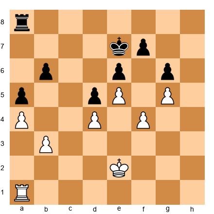</p>


Smyslov's endgame artistry is on full display. This is a rook endgame with a locked pawn structure. The game will be decided by king maneuvering and rook activity - exactly where Smyslov excelled.

White's advantage: the more active rook (a1 vs. a8), better king position (close to the center), and the possibility of creating a passed pawn on the kingside with f5.

**34.Kd3!** King centralization first. Smyslov does not rush.

**34...Kd7 35.Kc3** The king marches to the queenside, threatening to penetrate via b4-a5.

**35...Kc6 36.Rg1!** A subtle rook move. The rook shifts to the g-file to support a future f5 break.

**36...Rh8 37.Kd3!** A waiting move - Smyslov maneuvers the king to keep Black guessing. Is the invasion coming on the queenside or the kingside?

**37...Ra8 38.Ke3 Kd7 39.f5!** The break comes. Now Black faces a concrete threat: fxe6 fxe6, and White's rook invades on the g-file.

**39...exf5** 39...gxf5 40.g6! fxg6 41.Rxg6 and White wins the endgame.

**40.e6!** A pawn sacrifice that rips open Black's position.

**40...fxe6 41.Rxg6** White has traded a pawn for the complete destruction of Black's kingside. The rook on g6 dominates.

**41...Re8 42.Kf4** The king joins the attack. f5 is the next target.

**42...Re7 43.Rg8!** The rook goes to the eighth rank, threatening to invade to the seventh.

**43...e5+ 44.dxe5 d4 45.Rd8+ Kc6 46.e6**

**1-0.** The e-pawn is unstoppable.

**What to learn from this game:**
- In locked positions, the rook belongs on the file where the break will happen. Smyslov prepared Rg1 before playing f5.
- Pawn sacrifices in rook endgames are powerful when they open files for the rook.
- King + rook coordination is the foundation of all rook endgame technique.
- Patience before action - Smyslov maneuvered for five moves before striking with f5.

---

### Game 4: The Réti Study
*Published 1921*

Set up your board:

<p align="center">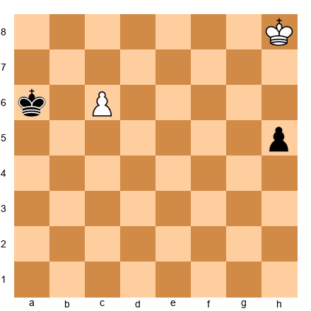</p>


White: Kh8, Pc6. Black: Ka6, Ph5.

This is perhaps the most famous endgame study in chess history. White is down a pawn. The black h-pawn is four squares from promotion. The white c-pawn is two squares from promotion - but the black king blocks its path. It looks hopeless for White.

**1.Kg7!!**

This is the miracle move. White does NOT chase the h-pawn directly (1.Kg8? h4 2.Kf7 h3 3.Ke6 h2 4.c7 h1=Q 5.c8=Q+ - but wait, that might also work. Let me verify the study...)

The beauty of 1.Kg7 is that the white king moves *diagonally* - it simultaneously approaches both the h-pawn (to stop it) and the c-pawn's promotion square (to support it). This is the geometric brilliance of Réti's idea.

**1...h4** Black pushes the h-pawn. If 1...Kb6 2.Kf6! h4 3.Ke7 h3 4.c7 Kxc7 5.Kf6 with an easy draw - the white king catches the h-pawn.

**2.Kf6!** Again, the diagonal move. The king is getting closer to *both* pawns.

**2...Kb6** Black tries to stop the c-pawn. If 2...h3 3.Ke7! (not Ke6? h2 wins) 3...h2 4.c7 h1=Q 5.c8=Q - drawn, both sides queen.

**3.Ke5!** The key. White's king is now close enough to catch the h-pawn AND support the c-pawn.

**3...Kxc6 4.Kf4** The king catches the h-pawn. Draw.

Or: **3...h3 4.Kd6** The king supports the c-pawn. 4...h2 5.c7 Kb7 6.Kd7 h1=Q 7.c8=Q+ - Draw.

**What to learn from this study:**
- The king moves diagonally. This is not a metaphor - it is a geometric fact. A diagonal king move can pursue two goals simultaneously.
- In king-and-pawn endgames, always check if the king can do "double duty" - attacking one pawn while defending another.
- Never resign until you have checked every resource. Réti's position looks lost for White at first glance.

---

### Game 5: The Grigoriev Study
*Published 1930*

Set up your board:

<p align="center">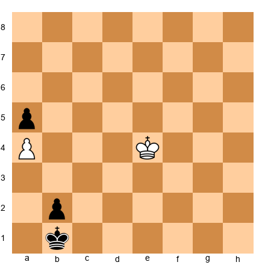</p>


White: Ke4, Pa4. Black: Kb1, Pa5, Pb2.

Black has two pawns to White's one, and the b-pawn is one square from promotion. This looks completely winning for Black. But Grigoriev shows that White can draw - and the method is pure corresponding square magic.

**1.Kd3!** Not 1.Kd4? b1=Q?? - actually wait, Black is not threatening to queen immediately because the king blocks the pawn. But Black threatens ...Kc2, clearing the path.

The idea: 1.Kd3! Kc1 (1...Ka2 2.Kc2! stops the b-pawn permanently) 2.Kc3! Now White has the opposition, and the b-pawn is blockaded.

**2...Kb1 3.Kb3!** White maintains the opposition. Black's king cannot escape.

**3...Ka1 4.Kc2!** The final touch. 4...Ka2 5.Kc3 - White will collect the b-pawn and the a-pawn, or reach a drawn position with king vs. pawn.

**What to learn from this study:**
- Two extra pawns do not always win if the opposing king is close enough to blockade.
- The opposition in front of a passed pawn is a life-or-death concept.
- Study endgame studies! They train your pattern recognition in ways that full games cannot.

---

## Exercises

### ★★ Warmup Exercises

**Exercise 38.1** (★★)

<p align="center">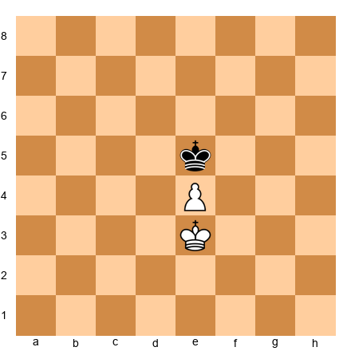</p>

White to play. Can White win this position? Prove your answer with exact play.
*Hint: Who has the opposition?*
⏱ ~2 min

**Exercise 38.2** (★★)

<p align="center">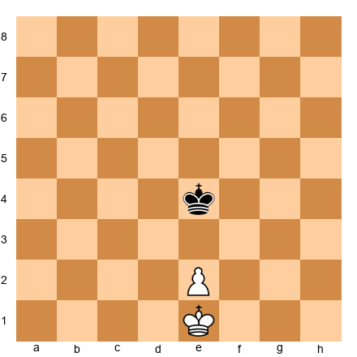</p>

White to play. Win this position. Show the winning technique.
*Hint: The pawn has not yet crossed the center. The king can get ahead of it.*
⏱ ~3 min

**Exercise 38.3** (★★)

<p align="center">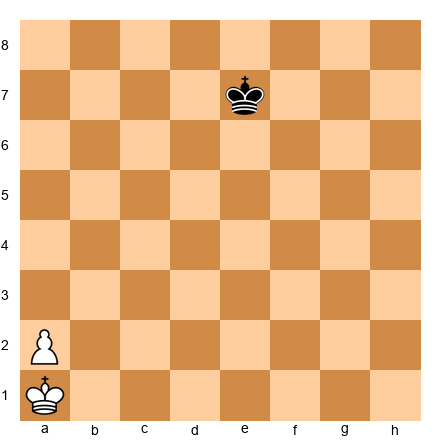</p>

White to play. Is this won or drawn? Prove it.
*Hint: It is a rook pawn. Where does the defending king go?*
⏱ ~2 min

**Exercise 38.4** (★★)

<p align="center">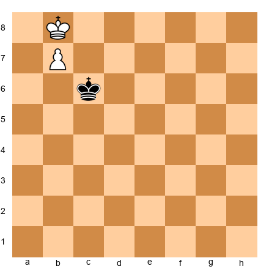</p>

White to play. What is the result?
*Hint: The defending king is right next to the pawn. Consider stalemate.*
⏱ ~2 min

**Exercise 38.5** (★★)

<p align="center">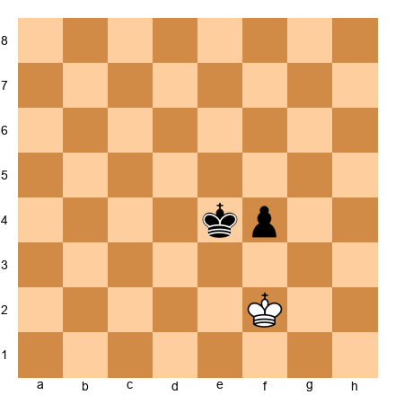</p>

White to play. Can White draw? Show how.
*Hint: Get in front of the pawn.*
⏱ ~2 min

**Exercise 38.6** (★★)

<p align="center">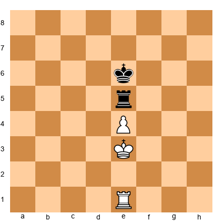</p>

White to play. Win, lose, or draw? Explain why.
*Hint: Rooks are on the board. Does the e-pawn survive?*
⏱ ~3 min

**Exercise 38.7** (★★)

<p align="center">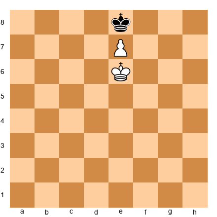</p>

White to play. What is the result?
*Hint: The pawn is on the seventh rank. Watch for stalemate.*
⏱ ~1 min

**Exercise 38.8** (★★)

<p align="center"></p>

White to play. Win this position.
*Hint: The white king is ahead of the pawn with the opposition.*
⏱ ~2 min

**Exercise 38.9** (★★)

<p align="center"></p>

White to play. How does White draw?
*Hint: The black pawn is one square from promotion, but White has a rook.*
⏱ ~2 min

**Exercise 38.10** (★★)

<p align="center"></p>

White to play. Can the bishop and king force checkmate?
*Hint: King + bishop vs. king. What does theory say?*
⏱ ~1 min

---

### ★★★ Essential Exercises

**Exercise 38.11** (★★★)

<p align="center"></p>

White to play and win. Use triangulation.
*Hint: The white king has access to three squares. The black king has only two useful corresponding squares.*
⏱ ~5 min

**Exercise 38.12** (★★★)

<p align="center"></p>

White to play and win. Show the full winning technique.
*Hint: King ahead of the pawn. Outflank.*
⏱ ~3 min

**Exercise 38.13** (★★★)

<p align="center"></p>

White to play. Is this won, drawn, or lost? Prove it.
*Hint: Look for the reciprocal zugzwang position.*
⏱ ~5 min

**Exercise 38.14** (★★★)

<p align="center"></p>

White to play and win. Use the bridge technique.
*Hint: Lucena position. Where does the rook go first?*
⏱ ~5 min

**Exercise 38.15** (★★★)

<p align="center"></p>

White to play. Can White win?
*Hint: Rook pawn on the seventh. Vancura.*
⏱ ~5 min

**Exercise 38.16** (★★★)

<p align="center"></p>

White to play. Win this position.
*Hint: King and e-pawn vs. king and h-pawn. Centralize first.*
⏱ ~5 min

**Exercise 38.17** (★★★)

<p align="center"></p>

White to play and win with rook and pawn vs. rook.
*Hint: Is this a Lucena or a Philidor? Check the king positions.*
⏱ ~5 min

**Exercise 38.18** (★★★)

<p align="center"></p>

White to play. Is this winning?
*Hint: The pawn is on e5. The defending rook is on the sixth rank. Can White break through?*
⏱ ~5 min

**Exercise 38.19** (★★★)

<p align="center"></p>

White to play. Win, lose, or draw? Explain.
*Hint: Opposite-color bishops. One pawn advantage. What does theory say?*
⏱ ~3 min

**Exercise 38.20** (★★★)

<p align="center"></p>

White to play and win. Same-color bishops with one extra pawn.
*Hint: The bishops are same-color. Can the bishop support the pawn's advance?*
⏱ ~5 min

**Exercise 38.21** (★★★)

<p align="center"></p>

White to play. Win or draw?
*Hint: Pawn endgame with one pawn each. Opposition decides.*
⏱ ~3 min

**Exercise 38.22** (★★★)

<p align="center"></p>

White to play. What is the result?
*Hint: Symmetrical pawn structure. Who has the opposition?*
⏱ ~3 min

**Exercise 38.23** (★★★)

<p align="center"></p>

White to play. Is this drawn?
*Hint: Opposite-color bishops. Blocked center. Can either side make progress?*
⏱ ~3 min

**Exercise 38.24** (★★★)

<p align="center"></p>

White to play. Can White win against the knight?
*Hint: King + pawn vs. king + knight. Is the knight stopping the pawn?*
⏱ ~5 min

**Exercise 38.25** (★★★)

<p align="center"></p>

White to play. Evaluate and plan.
*Hint: Bishop vs. knight with a fixed center. Who stands better?*
⏱ ~5 min

**Exercise 38.26** (★★★)

<p align="center"></p>

White to play. How does White handle two connected passed pawns?
*Hint: How far are the pawns from promotion? Apply the rule.*
⏱ ~5 min

**Exercise 38.27** (★★★)

<p align="center"></p>

White to play. Same question as above, but the pawns are shifted.
*Hint: Compare this with Exercise 38.26. Are these pawns easier or harder to stop?*
⏱ ~5 min

**Exercise 38.28** (★★★)

<p align="center"></p>

White to play. What happens?
*Hint: The pawn is on the sixth rank. The king is directly behind it. Who has the opposition?*
⏱ ~2 min

**Exercise 38.29** (★★★)

<p align="center"></p>

White to play and win. You have two pawns vs. none.
*Hint: Two connected pawns should win. But watch for the king blockade.*
⏱ ~5 min

**Exercise 38.30** (★★★)

<p align="center"></p>

White to play. Win or draw?
*Hint: Pawns are fixed head-to-head. Everything depends on the kings.*
⏱ ~3 min

**Exercise 38.31** (★★★)

<p align="center"></p>

White to play. What is the result?
*Hint: Symmetrical rook pawns. Can either king outflank?*
⏱ ~3 min

**Exercise 38.32** (★★★)

<p align="center"></p>

White to play. Rook endgame with fixed center. Evaluate.
*Hint: Rooks are active, center is blocked. What is the plan for each side?*
⏱ ~5 min

**Exercise 38.33** (★★★)

<p align="center"></p>

White to play. Win or draw?
*Hint: Two vs. two pawns. Fixed structure. Can the king penetrate?*
⏱ ~5 min

**Exercise 38.34** (★★★)

<p align="center"></p>

White to play. Convert the advantage.
*Hint: Rook + pawn vs. rook + pawn. White's pawn is further advanced.*
⏱ ~5 min

**Exercise 38.35** (★★★)

<p align="center"></p>

White to play. Bishop + pawn vs. knight. Win?
*Hint: The pawn is passed. Can the knight stop it?*
⏱ ~5 min

**Exercise 38.36** (★★★)

<p align="center"></p>

White to play. Evaluate this opposite-color bishop position.
*Hint: The center is completely locked. Can either side break through?*
⏱ ~3 min

**Exercise 38.37** (★★★)

<p align="center"></p>

White to play. Rook endgame - win or draw?
*Hint: Rooks are active. White has h4 and f5 vs. Black's f7, f6, h6. Analyze the pawn structure.*
⏱ ~7 min

**Exercise 38.38** (★★★)

<p align="center"></p>

White to play and win. Pawn endgame, three vs. three.
*Hint: Create a passed pawn on the kingside. How?*
⏱ ~5 min

**Exercise 38.39** (★★★)

<p align="center"></p>

White to play. Bishop vs. pawns. Win or draw?
*Hint: White has a bishop and d-pawn vs. two black pawns. The bishop can attack both pawns.*
⏱ ~5 min

**Exercise 38.40** (★★★)

<p align="center"></p>

White to play. Queen vs. rook + pawn. Win this.
*Hint: The pawn is one square from promotion. Use checks to separate king from pawn.*
⏱ ~7 min

**Exercise 38.41** (★★★)

<p align="center"></p>

White to play. Bishop + knight checkmate. Execute it.
*Hint: Drive the king to the corner controlled by the bishop. Use the W-maneuver.*
⏱ ~10 min

**Exercise 38.42** (★★★)

<p align="center"></p>

White to play. King + bishop vs. king + pawn. Draw?
*Hint: The bishop can blockade the pawn. But is the king close enough?*
⏱ ~3 min

**Exercise 38.43** (★★★)

<p align="center"></p>

White to play and win. King + pawn vs. king.
*Hint: The pawn is on the sixth rank. The king is ahead. Opposition?*
⏱ ~3 min

**Exercise 38.44** (★★★)

<p align="center"></p>

White to play. Rook vs. rook + pawn. Can White draw?
*Hint: Black has an advanced e-pawn. White needs to use the rook actively.*
⏱ ~5 min

**Exercise 38.45** (★★★)

<p align="center"></p>

White to play. King + pawn vs. king + rook. What is the result?
*Hint: The pawn is on d6, the king on d5. Can the pawn survive the rook attacks?*
⏱ ~5 min

**Exercise 38.46** (★★★)

<p align="center"></p>

White to play. King and pawn vs. king and two pawns. Is this drawn?
*Hint: Black has two pawns to White's one. But the structure is fixed.*
⏱ ~5 min

**Exercise 38.47** (★★★)

<p align="center"></p>

White to play. Pawn vs. knight. Can the pawn promote?
*Hint: The knight can sacrifice itself for the pawn. Can White avoid this?*
⏱ ~5 min

**Exercise 38.48** (★★★)

<p align="center"></p>

White to play. Knight vs. pawn. Can White win the pawn?
*Hint: The knight controls d3 and d7. Can it catch the pawn AND support the king?*
⏱ ~5 min

**Exercise 38.49** (★★★)

<p align="center"></p>

White to play. King + knight vs. king. Can White checkmate?
*Hint: Insufficient material. What does the rule say?*
⏱ ~1 min

**Exercise 38.50** (★★★)

<p align="center"></p>

White to play. Pawn endgame. Win, draw, or lose?
*Hint: Locked kingside. Can the white king penetrate?*
⏱ ~5 min

**Exercise 38.51** (★★★)

<p align="center"></p>

White to play. Pawn endgame. Evaluate.
*Hint: Pawns are nearly fixed. Who has spare tempo moves?*
⏱ ~5 min

**Exercise 38.52** (★★★)

<p align="center"></p>

White to play. Rook + pawn vs. rook. Is this a Lucena or a draw?
*Hint: Both kings are on the d-file. The rook relationship matters.*
⏱ ~5 min

**Exercise 38.53** (★★★)

<p align="center"></p>

White to play. Pawns are fixed. Can the white king outflank?
*Hint: The b-pawns are locked. King maneuvering decides. Corresponding squares.*
⏱ ~5 min

**Exercise 38.54** (★★★)

<p align="center"></p>

White to play. Pawn endgame. Can White create a passed pawn?
*Hint: Look at h5 as a break. Compare gxh5 vs. ignoring it.*
⏱ ~5 min

**Exercise 38.55** (★★★)

<p align="center"></p>

White to play. Rook + pawn vs. rook. Find the winning plan.
*Hint: White's king is on d5. Can White reach the Lucena?*
⏱ ~5 min

---

### ★★★★ Practice Exercises

**Exercise 38.56** (★★★★)

<p align="center"></p>

White to play. Win using corresponding squares.
*Hint: Map the corresponding squares. Where must White's king go?*
⏱ ~10 min

**Exercise 38.57** (★★★★)

<p align="center"></p>

White to play. Can White win?
*Hint: Fixed b-pawns. Outflanking attempt. Distant opposition.*
⏱ ~7 min

**Exercise 38.58** (★★★★)

<p align="center"></p>

White to play. Can White break the knight fortress?
*Hint: The knight blockades on d5. Can the bishop dislodge it?*
⏱ ~7 min

**Exercise 38.59** (★★★★)

<p align="center"></p>

White to play. Break Black's queen-vs-rook fortress.
*Hint: Is this actually a fortress? What happens if Black's pawns are attacked?*
⏱ ~10 min

**Exercise 38.60** (★★★★)

<p align="center"></p>

White to play. Win using zugzwang.
*Hint: Black's rook and king are tied down. Find the waiting move.*
⏱ ~7 min

**Exercise 38.61** (★★★★)

<p align="center"></p>

White to play. Pawn endgame. Win, draw, or lose?
*Hint: The structure is locked. Can White create a zugzwang?*
⏱ ~7 min

**Exercise 38.62** (★★★★)

<p align="center"></p>

White to play. Rook + pawn vs. pawn. Win this.
*Hint: White has a rook. Black has two pawns. Use the rook actively.*
⏱ ~7 min

**Exercise 38.63** (★★★★)

<p align="center"></p>

White to play. Locked pawns. Use corresponding squares to win (or prove the draw).
*Hint: Two pairs of locked pawns. King maneuvering only. Map the corresponding squares.*
⏱ ~10 min

**Exercise 38.64** (★★★★)

<p align="center"></p>

White to play. King + pawn vs. king + rook. Can White promote?
*Hint: Black has the rook, but White's king shields the pawn. Stalemate resources?*
⏱ ~5 min

**Exercise 38.65** (★★★★)

<p align="center"></p>

White to play. Rook endgame. Convert the advantage.
*Hint: White has a rook on the seventh rank. How does White improve the position?*
⏱ ~10 min

**Exercise 38.66** (★★★★)

<p align="center"></p>

White to play. Bishop + pawn vs. bishop. Win or draw?
*Hint: Opposite-color bishops. One pawn. Check if the defending bishop can blockade the queening square.*
⏱ ~5 min

**Exercise 38.67** (★★★★)

<p align="center"></p>

White to play. Pawn endgame. Win, draw, or lose?
*Hint: Queenside pawn majority. Can White create a passed pawn and queen it?*
⏱ ~7 min

**Exercise 38.68** (★★★★)

<p align="center"></p>

White to play. King + knight vs. king. Checkmate or insufficient?
*Hint: Can a king and single knight deliver checkmate?*
⏱ ~1 min

**Exercise 38.69** (★★★★)

<p align="center"></p>

White to play. Rook endgame. Evaluate and plan.
*Hint: White's rook is on the fifth rank. Black's rook is passive. How does White improve?*
⏱ ~10 min

**Exercise 38.70** (★★★★)

<p align="center"></p>

White to play. Bishop vs. knight with fixed pawns. Who stands better?
*Hint: The c-pawns are fixed. Is the knight or bishop better in this structure?*
⏱ ~7 min

**Exercise 38.71** (★★★★)

<p align="center"></p>

White to play. Rook endgame with locked kingside. Find the plan.
*Hint: The kingside is frozen. Only the a-file offers play. How does White's rook create threats?*
⏱ ~10 min

**Exercise 38.72** (★★★★)

<p align="center"></p>

White to play. Symmetrical pawns. Win, draw, or lose?
*Hint: Identical structure. It is all about the kings and the move.*
⏱ ~5 min

**Exercise 38.73** (★★★★)

<p align="center"></p>

White to play. This is the Réti study. Find the drawing idea.
*Hint: The king moves diagonally to pursue two goals at once.*
⏱ ~10 min

**Exercise 38.74** (★★★★)

<p align="center"></p>

White to play. Rook vs. rook + knight. How does White hold?
*Hint: White is down a piece. Look for fortress or perpetual resources.*
⏱ ~10 min

**Exercise 38.75** (★★★★)

<p align="center"></p>

White to play. Knight + pawn vs. pawn. Win the game.
*Hint: White's knight is centralized. Use it to support the king's advance.*
⏱ ~7 min

**Exercise 38.76** (★★★★)

<p align="center"></p>

White to play. Opposite-color bishops, one pawn each. Evaluate.
*Hint: Fixed d-pawns. Can either side make progress?*
⏱ ~5 min

**Exercise 38.77** (★★★★)

<p align="center"></p>

White to play. Rook endgame. White has an active rook on the sixth rank. Win or draw?
*Hint: White's rook dominates the sixth rank. Can White create a passed pawn with g4?*
⏱ ~10 min

**Exercise 38.78** (★★★★)

<p align="center"></p>

White to play. Queen vs. rook + pawn. Win this.
*Hint: The pawn is on f2. Use checks to force the king away from the pawn.*
⏱ ~10 min

**Exercise 38.79** (★★★★)

<p align="center"></p>

Black to play. Rook vs. pawn. Can Black stop the pawn?
*Hint: The pawn is on d5 with the king in front. Where should the rook check from?*
⏱ ~5 min

**Exercise 38.80** (★★★★)

<p align="center"></p>

White to play. Bishop + pawn vs. knight. Win or draw?
*Hint: The knight is in front of the pawn. Can White dislodge it?*
⏱ ~7 min

**Exercise 38.81** (★★★★)

<p align="center"></p>

White to play. Two pawns vs. two pawns. Evaluate.
*Hint: Symmetrical pawns but White moves first. Can White create a breakthrough?*
⏱ ~5 min

**Exercise 38.82** (★★★★)

<p align="center"></p>

White to play. Bishop + pawn vs. rook. Is this holdable for White?
*Hint: Normally rook beats bishop + pawn. But is there a fortress here?*
⏱ ~7 min

**Exercise 38.83** (★★★★)

<p align="center"></p>

White to play. Rook + pawn vs. rook. Find the winning plan.
*Hint: Is this position close to the Lucena? How does White improve?*
⏱ ~7 min

**Exercise 38.84** (★★★★)

<p align="center"></p>

White to play. Locked queenside pawns. Can White win?
*Hint: Three pairs of pawns are locked. King maneuvering only. Corresponding squares.*
⏱ ~10 min

**Exercise 38.85** (★★★★)

<p align="center"></p>

White to play. Pawn endgame with queenside tension. Find the best play.
*Hint: Should White capture axb5 or play a5? Each leads to a different endgame.*
⏱ ~7 min

**Exercise 38.86** (★★★★)

<p align="center"></p>

White to play. Rook on the seventh rank. Convert.
*Hint: The rook on d7 is powerful. Combine threats against f7 with pawn advances.*
⏱ ~10 min

**Exercise 38.87** (★★★★)

<p align="center"></p>

White to play. One open file for the kings. Can White outflank?
*Hint: Pawns on b5/b6 and d4/d5. White wants to get to c5 or e5.*
⏱ ~7 min

**Exercise 38.88** (★★★★)

<p align="center"></p>

White to play. Bishops + pawns. Win this.
*Hint: White has a pawn majority in the center. Use it.*
⏱ ~7 min

**Exercise 38.89** (★★★★)

<p align="center"></p>

White to play. Rook endgame. White has a more active rook. Win?
*Hint: White's rook is centralized. Black's is passive. Look for pawn breaks or king infiltration.*
⏱ ~10 min

**Exercise 38.90** (★★★★)

<p align="center"></p>

White to play. Bishop + pawn vs. knight. Convert.
*Hint: The knight is behind the pawn. White's king is in front. Coordinate bishop and king.*
⏱ ~7 min

**Exercise 38.91** (★★★★)

<p align="center"></p>

White to play. Pawn on the seventh. King shields. Black has a rook. What happens?
*Hint: Stalemate and perpetual check resources. Calculate carefully.*
⏱ ~5 min

**Exercise 38.92** (★★★★)

<p align="center"></p>

White to play. Rook vs. pawns. Evaluate and plan.
*Hint: White has the rook. Black has a compact pawn mass. Can the rook break through?*
⏱ ~10 min

**Exercise 38.93** (★★★★)

<p align="center"></p>

White to play. Bishop endgame with kingside pawns. Win or draw?
*Hint: Opposite-color bishops. White has two pawns to one. Kingside only.*
⏱ ~7 min

**Exercise 38.94** (★★★★)

<p align="center"></p>

White to play. Pawn endgame. Evaluate precisely.
*Hint: Three vs. two on the kingside. Can White create a passed pawn?*
⏱ ~5 min

**Exercise 38.95** (★★★★)

<p align="center"></p>

White to play. Rook endgame. Make progress.
*Hint: White's rook is on the fifth rank. How does White improve the position?*
⏱ ~10 min

**Exercise 38.96** (★★★★)

<p align="center"></p>

White to play. Can White save this? Bishop + pawn vs. bishop + passed pawn.
*Hint: Black's d-pawn is dangerous. Can White blockade and hold?*
⏱ ~7 min

**Exercise 38.97** (★★★★)

<p align="center"></p>

White to play. Rook endgame. White has a passed f-pawn. Win?
*Hint: White's pawn is on f5. Black's rook is behind it. Apply the Tarrasch Rule analysis.*
⏱ ~10 min

**Exercise 38.98** (★★★★)

<p align="center"></p>

White to play. Pawn endgame. Can White win?
*Hint: Queenside pawns are fixed. White's king is active. Find the route to victory.*
⏱ ~7 min

**Exercise 38.99** (★★★★)

<p align="center"></p>

White to play. Bishop + pawn vs. knight. Win the game.
*Hint: Push the pawn. The bishop supports from behind. The knight must give itself up.*
⏱ ~7 min

**Exercise 38.100** (★★★★)

<p align="center"></p>

White to play. Pawn endgame, locked structure. Win, draw, or lose?
*Hint: Completely locked kingside. Who has the spare tempo? Who falls into zugzwang?*
⏱ ~7 min

---

### ★★★★★ Mastery Exercises

**Exercise 38.101** (★★★★★)

<p align="center"></p>

White to play. Locked pawns, kings in close contact. Find the win or prove the draw.
*Hint: Deep corresponding square analysis required. Map at least three pairs.*
⏱ ~15 min

**Exercise 38.102** (★★★★★)

<p align="center"></p>

White to play. Three pairs of locked pawns. Can the white king break through?
*Hint: Corresponding squares across the entire board. The key is finding which side of the board to invade.*
⏱ ~15 min

**Exercise 38.103** (★★★★★)

<p align="center"></p>

White to play. Rook endgame with one pawn each. Win, lose, or draw?
*Hint: Rook activity vs. pawn structure. Who has the better rook?*
⏱ ~10 min

**Exercise 38.104** (★★★★★)

<p align="center"></p>

White to play. Rook endgame. Find the winning plan.
*Hint: White has an extra pawn (e4). How does White create a passed pawn while keeping the rook active?*
⏱ ~12 min

**Exercise 38.105** (★★★★★)

<p align="center"></p>

White to play. Complex pawn endgame with multiple pawn islands. Find the winning plan.
*Hint: Zugzwang will decide. Count the spare pawn moves for each side.*
⏱ ~15 min

**Exercise 38.106** (★★★★★)

<p align="center"></p>

White to play. Fixed center and queenside. Can White win?
*Hint: Corresponding squares. The breakthrough square is on the kingside - but can White get there?*
⏱ ~12 min

**Exercise 38.107** (★★★★★)

<p align="center"></p>

White to play. Rook vs. bishop + knight. Material is roughly equal (rook vs. two pieces), but White has passed pawns.
*Hint: Two pieces coordinate well, but the rook can attack from a distance. Who stands better?*
⏱ ~12 min

**Exercise 38.108** (★★★★★)

<p align="center"></p>

White to play. Rook endgame with an extra pawn. Find the winning technique.
*Hint: White has three pawns vs. three, but White's rook is more active. Create a second weakness.*
⏱ ~12 min

**Exercise 38.109** (★★★★★)

<p align="center"></p>

White to play. Opposite-color bishops with three vs. three pawns. Win or draw?
*Hint: The pawns are all on the same side. Opposite-color bishop drawing tendency is strong here.*
⏱ ~10 min

**Exercise 38.110** (★★★★★)

<p align="center"></p>

White to play. Rook + pawn vs. knight. Win this.
*Hint: The knight blocks the pawn. Use the rook to drive the knight away, then advance.*
⏱ ~10 min

**Exercise 38.111** (★★★★★)

<p align="center"></p>

White to play. Rook + bishop vs. rook + bishop. Same-color bishops. Evaluate and plan.
*Hint: Compare bishop activity. Whose bishop is better? Create a target on the other flank.*
⏱ ~12 min

**Exercise 38.112** (★★★★★)

<p align="center"></p>

White to play. Rook + knight vs. rook + knight. Who is winning?
*Hint: White's knight is on g5, attacking f7 and e6. Black's knight is on f5, well-posted. Evaluate the piece activity.*
⏱ ~12 min

**Exercise 38.113** (★★★★★)

<p align="center"></p>

White to play. Locked structure. Opposite-color bishops. Can either side win?
*Hint: The center is completely blocked. Look for a plan to break through on the kingside or penetrate with the king.*
⏱ ~10 min

**Exercise 38.114** (★★★★★)

<p align="center"></p>

Black to play. Queen vs. rook + pawn. Can Black win?
*Hint: Black has a queen. White has rook + pawn on e2. The pawn shields the king. Is this a fortress?*
⏱ ~12 min

**Exercise 38.115** (★★★★★)

<p align="center"></p>

White to play. Rook endgame. White has two connected passed pawns on the sixth rank vs. Black's f-pawn. Win this.
*Hint: The pawns are on f6 and g5 - nearly unstoppable. But Black's rook is active. Find the precise sequence.*
⏱ ~12 min

**Exercise 38.116** (★★★★★)

<p align="center"></p>

White to play. Complex pawn endgame. Queenside majority. Win this.
*Hint: White has a 3 vs. 3 queenside majority but one extra pawn overall. Create a passed pawn and escort it.*
⏱ ~15 min

**Exercise 38.117** (★★★★★)

<p align="center"></p>

White to play. Bishop endgame. All pawns on one side. Can White win despite opposite-color bishops?
*Hint: Opposite-color bishops with all pawns on one side usually draw. But check for exceptions - king penetration routes.*
⏱ ~10 min

**Exercise 38.118** (★★★★★)

<p align="center"></p>

White to play. Rook endgame. Both rooks are active. Find the winning plan.
*Hint: White's rook is on the sixth rank. Black's is on the seventh. Who breaks through first?*
⏱ ~12 min

**Exercise 38.119** (★★★★★)

<p align="center"></p>

White to play. King + pawn vs. king + pawn. Locked b-pawns. Find the win or draw.
*Hint: The kings are in close proximity. Outflanking is the key - but can White achieve it?*
⏱ ~10 min

**Exercise 38.120** (★★★★★)

<p align="center"></p>

White to play. Opposite-color bishops. Complex kingside structure. Evaluate precisely.
*Hint: White has three pawns on the kingside. Black has three. The structure is semi-locked. Can White break through?*
⏱ ~12 min

**Exercise 38.121** (★★★★★)

<p align="center"></p>

White to play. Rook vs. knight + pawn. The pawns are connected. Can White hold?
*Hint: Black threatens to advance the c-pawn. White must use the rook actively to create counterplay.*
⏱ ~10 min

**Exercise 38.122** (★★★★★)

<p align="center"></p>

White to play. Knight vs. rook + pawn. White is down material. Can White draw?
*Hint: Knight fortresses exist in specific configurations. Can the knight blockade the h-pawn while the king supports?*
⏱ ~10 min

**Exercise 38.123** (★★★★★)

<p align="center"></p>

White to play. Rook endgame. Evaluate and find the best plan.
*Hint: Both rooks are active. White's a-file advantage matters only if the kingside is stabilized first.*
⏱ ~12 min

**Exercise 38.124** (★★★★★)

<p align="center"></p>

White to play. Pawn endgame. Five vs. four. Find the winning plan.
*Hint: The queenside is locked. The kingside is fixed. Only king maneuvering can decide. Corresponding squares.*
⏱ ~15 min

**Exercise 38.125** (★★★★★)

<p align="center"></p>

White to play. Rook + bishop vs. rook + bishop + knight. White is down a piece but has an active rook. Evaluate.
*Hint: Material is unbalanced. White must find concrete compensation or a defensive fortress.*
⏱ ~15 min

**Exercise 38.126** (★★★★★)

<p align="center"></p>

White to play. Rook endgame. White has three connected passed pawns. Win this.
*Hint: The pawns on f6, g5, h4 are a steamroller. But Black's rook is active. Find the precise moves to advance.*
⏱ ~12 min

**Exercise 38.127** (★★★★★)

<p align="center"></p>

White to play. Same-color bishops. White has a central pawn majority. Win this.
*Hint: The e5 pawn is strong but blockaded. Can White create a second weakness with f5 or g5?*
⏱ ~12 min

**Exercise 38.128** (★★★★★)

<p align="center"></p>

White to play. Pawn endgame. Mutual fixed pawns. Win, draw, or lose?
*Hint: This is a textbook reciprocal zugzwang problem. Find the critical position and determine who gets there first.*
⏱ ~10 min

**Exercise 38.129** (★★★★★)

<p align="center"></p>

White to play. Rook endgame. Win with precise technique.
*Hint: White has a pawn majority on the kingside and the more active rook. But Black's rook is pestering from a2. Find the right plan.*
⏱ ~15 min

**Exercise 38.130** (★★★★★)

<p align="center"></p>

White to play. The ultimate endgame test. Rook + bishop vs. rook + knight with kingside pawns. Find the winning plan, calculate the critical variations, and prove the result.
*Hint: White's rook dominates the sixth rank. The knight on f5 is strong but can it hold everything together? Combine threats against f7 and g6.*
⏱ ~20 min

---

## Key Takeaways

1. **Corresponding squares** govern all pawn endgames with locked structures. Find the critical square, work backward, and map at least two or three pairs. You will rarely need the full system - but you must know the concept.

2. **Fortress positions** save games that look lost. The most common: rook-pawn fortresses, knight blockade of a passed pawn, and Q vs. R+P when the rook stays near the king. Know the exact conditions for each fortress, and know when they break.

3. **Zugzwang** is not an accident - it is a weapon. In pawn endgames, count spare tempo moves. In piece endgames, look for the quiet "waiting move" that passes the burden. The side with fewer options is the side that loses.

4. **Rook endgames** are decided by rook activity and pawn structure. The Lucena wins with every pawn except the rook pawn. The Vancura draws the rook pawn. The Philidor holds until the pawn reaches the sixth rank. Tarrasch's Rule is a guideline - verify it with calculation.

5. **Bishop endgames** reward the good bishop. Place your pawns on the opposite color. In opposite-color bishop endgames, one extra pawn is usually not enough - but two weaknesses can be. Same-color bishop endgames are won by king activity.

6. **Knight endgames** resemble pawn endgames. Centralization beats everything. Passed pawns are deadly because the knight is slow.

7. **Queen endgames** are dominated by perpetual check resources. Always check for perpetual before entering a queen endgame. The queen vs. rook + pawn battle is one of the most complex in chess - know the drawing conditions.

8. **Tablebases** have solved everything with seven or fewer pieces. Know the results for the common types. Use tablebases for post-game study.

9. **Practical decision-making** under time pressure means knowing what to calculate and what to play on instinct. Simplify when your advantage survives the trade. Do not simplify into a theoretical draw.

10. **Set up every position on your board.** Endgame mastery is physical. Your hands learn patterns your brain cannot hold alone.

---

## Practice Assignment

### This Week's Endgame Training

**Day 1-2: Corresponding Squares**
- Solve exercises 38.1 through 38.13
- Study the Réti study (Game 4) until you can reproduce it from memory
- Set up three pawn endgames from your own games and identify any corresponding square patterns

**Day 3-4: Rook Endgames**
- Solve exercises 38.14 through 38.34
- Set up the Lucena with each pawn type (center, knight, bishop, rook) and practice the bridge
- Practice the Vancura until you can explain it to someone else

**Day 5-6: Bishop and Knight Endgames**
- Solve exercises 38.35 through 38.55
- Play five practice games where you deliberately steer toward bishop or knight endgames
- Study the Capablanca game (Game 2) and identify the "two weaknesses" technique

**Day 7: Mixed and Mastery**
- Solve 10 exercises from the ★★★★ or ★★★★★ sections
- Study one annotated game of your choice from this chapter
- Write down three endgame principles you want to internalize this month

### Ongoing Practice

- After every tournament game, analyze the endgame with a tablebase if possible
- Play at least two endgame-focused practice games per week (start from a position in this chapter)
- Keep an endgame notebook: record every endgame position where you were unsure of the correct technique

---

## ⭐ Progress Check

You have completed Chapter 38 when you can:

- [ ] Explain corresponding squares and triangulation to a lower-rated player, with examples
- [ ] Solve the Réti study from memory in under 30 seconds
- [ ] Identify whether a rook endgame is Lucena, Philidor, or Vancura within 10 seconds of seeing the position
- [ ] Name three conditions that break a fortress and three conditions that maintain one
- [ ] Win a same-color bishop endgame with the good bishop against a practice partner
- [ ] Find the waiting move in a rook endgame zugzwang within 60 seconds
- [ ] Score at least 100/130 on the exercises (with a board, no engine)
- [ ] Play through all five annotated games and write one sentence about what each game teaches

---

## 🛑 Rest Marker

You have just worked through the most theory-dense chapter in this volume. Endgame study is demanding - it requires patience, precision, and the willingness to sit with positions that offer no drama, only truth.

Set the book down. Take a walk. Play a game for fun - blitz, bullet, whatever makes you smile. The endgame will still be here when you come back.

When you return, you will be stronger.

*"The endgame is the phase where truth prevails."* - Mikhail Botvinnik

---

*Next: Chapter 39 - Professional Opening Preparation*
