# Chapter 39: Professional Opening Preparation Methodology
## Beyond the London - Building a Professional Repertoire

---

> *"The ability to play chess is the sign of a gentleman. The ability to play chess well is the sign of a wasted life. But the ability to prepare openings well - that is the sign of a professional."*
> - Garry Kasparov, *How Life Imitates Chess*

**Rating Range:** 2200–2400

**What You Will Learn:**
- When to evolve beyond your first repertoire - and how to do it without losing rating points
- How to build a professional opening repertoire with at least two systems as White and two as Black
- The six-step method for learning any new opening system from scratch
- A twelve-month plan for expanding your repertoire from club to professional level
- Database research, engine-assisted preparation, and the art of finding novelties
- How to study a specific opponent and build a preparation file before a game
- The discipline of repertoire maintenance - keeping your openings sharp year after year

---

## You Are Here

```
Volume IV: The Master Class (2200–2400)

Ch 36: Expert-Level Calculation
Ch 37: Complex Middlegame Strategy
Ch 38: Advanced Endgame Theory
Ch 39: Professional Opening Preparation   ◀ YOU ARE HERE
Ch 40: Practical Decision-Making Under Pressure
Ch 41: The Art of Preparation: Opponent Dossiers
Ch 42: Deep Opening Systems
Ch 43: Annotated GM Games: Modern Masterpieces
Ch 44: The Psychology of the Title Chase
```

---

## 39.1 The Turning Point

You have reached a crossroads that every serious player faces exactly once.

Behind you is the repertoire that carried you from beginner to expert. The London System. The King's Indian Defense. The Pirc. The King's Indian Attack. These openings are friends. You know their structures the way you know the layout of your own home. You can play them half-asleep and still reach a reasonable middlegame.

But something has changed. You are losing games you should not be losing - not because your openings are bad, but because your opponents know exactly what you are going to play. At 2200, your games are in databases. Your opponents check them. They prepare specific lines against your pet systems. They arrive at the board with a plan, and you arrive with the same middlegame you have played three hundred times.

This chapter is about what comes next.

---

## 39.2 Understanding Versus Memorizing

Before we rebuild your repertoire, we must settle the most important question in opening study: What does it mean to "know" an opening?

There are two kinds of opening knowledge. The first is memorization - the ability to recite moves in sequence. "In the Catalan, after 1.d4 Nf6 2.c4 e6 3.g3 d5 4.Bg2 Be7 5.Nf3 O-O 6.O-O dxc4, White plays 7.Qc4." This is useful. It gets you through the first ten moves without thinking. But it is brittle. The moment your opponent deviates - plays 4...Bb4+ instead of 4...Be7, or 6...c6 instead of 6...dxc4 - your memorized sequence is worthless. You must now think, and you have no framework for thinking.

The second kind is understanding. You know that in the Catalan, White's fianchettoed bishop controls the long diagonal. You know that Black's plan of capturing on c4 creates a queenside pawn majority but surrenders the center. You know that White's compensation for the pawn is long-term pressure down the c-file and the diagonal a1–h8. You know these things because you have studied the structures, not because you have memorized a move order.

Understanding survives deviation. When your opponent plays something unexpected, you recognize the pawn structure, identify the imbalances, and find a reasonable plan - even if you have never seen the exact position before.

Set up your board:

<p align="center">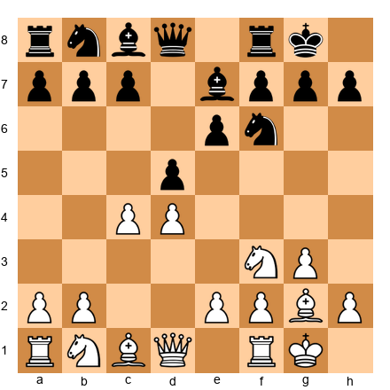</p>


This is a standard Catalan position. White has not yet captured on d5, and Black has not yet captured on c4. Look at it. What does White want? What does Black want?

If you answered "White wants to maintain central tension and exploit the long diagonal; Black wants to resolve the center favorably, perhaps with ...dxc4 followed by queenside expansion with ...b5" - you understand this opening. The specific move order matters far less than this structural understanding.

**The rule at 2200+:** For every opening you play, you should be able to explain the key ideas in three sentences without naming a single move. If you cannot do this, you have memorized the opening but you do not understand it.

---

## 39.3 When to Abandon the London and KID

"Abandon" is the wrong word. Nothing you have learned is wasted. The London System and the King's Indian Defense are legitimate weapons at every level - Rapport plays the London against super-GMs, and Radjabov has built a career on the KID. The question is not whether these openings work. The question is whether playing only these openings is holding you back.

Here are the signs that you have outgrown a single-system repertoire:

**Sign 1: Opponents above 2200 have specific preparation against your system.** You sit down at the board. Your opponent plays 1.d4, you play 1...Nf6, they play 2.c4, you play 2...g6, and they immediately play the Sämisch Variation with 3.Nc3 Bg7 4.e4 d6 5.f3 - not because they like the Sämisch, but because they checked your games last night and found that you score poorly against it. This will happen more and more often.

**Sign 2: Your games all follow the same script.** In the London System, your games reach the same middlegame structure: pawns on d4, e3, c3; bishop on f4; knight on f3 and d2. You win when your opponent makes a tactical mistake in this structure. You lose when they play accurately and exploit the lack of central tension. The outcomes feel predetermined.

**Sign 3: You avoid certain opponents.** You know that Player X is a Grünfeld specialist, and your London against the Grünfeld is shaky. So you avoid pairing with them, or you feel anxious before the game. This anxiety is your chess brain telling you that your repertoire has holes.

**Sign 4: You win with tactics, not with openings.** Your games follow a pattern: you emerge from the opening with a slightly passive but solid position, then wait for your opponent to blunder. At 2200, opponents blunder less. Your opening needs to give you something - an initiative, a structural advantage, a space edge - not just a survivable position.

**Sign 5: Your rating has plateaued for six months or more.** You play the same openings, get the same types of positions, and produce the same results. The definition of a plateau.

If three or more of these signs describe your current situation, it is time to expand.

### The Psychological Challenge

You have invested hundreds of hours in your current repertoire. You know every pawn structure, every piece maneuver, every typical endgame. Switching to a new opening means stepping into positions where you are, temporarily, a 1800-player in a 2200-player's body. Your calculation is expert-level, but your structural understanding of the new system is not. This hurts.

Expect a temporary rating drop of 50 to 100 points during the transition. This is normal. It lasts two to three months. The drop is not evidence that you made a mistake. It is evidence that you are growing. Every strong player has endured this.

**Reframe the transition:** You are not discarding your old repertoire. You are keeping it as a secondary weapon - a surprise you can deploy in rapid games, in must-win situations, or against opponents who will not expect it. Meanwhile, you are building something larger.

---

## 39.4 The Two-System Minimum

At 2200 and above, you need at least two systems as White and two responses as Black to each major first move. Here is why.

A single system as White means every opponent knows exactly what structure to prepare for. If you always play the London, a well-prepared 2200 player can steer the game into the one structure where they have analyzed twenty moves of theory at home. You are outgunned before move one.

Two systems as White means your opponent must prepare for both. They cannot know which you will choose until you make your first move. This uncertainty is a weapon in itself.

The same logic applies as Black. If you always play the KID against 1.d4, your opponent prepares the most critical anti-KID line and arrives at the board with a loaded weapon. If you can also play the Nimzo-Indian or the Queen's Gambit Declined, they must spread their preparation across multiple possibilities.

### The Architecture of a Professional Repertoire

Your repertoire should look like this:

**As White:**
- Primary system: A main-line opening (1.d4 with c4, or 1.e4 with full theory)
- Secondary system: Your old opening (London, KIA) as a surprise weapon

**As Black against 1.e4:**
- Primary defense: A fighting system (Sicilian, French, or Caro-Kann with full theory)
- Secondary defense: Your old system (Pirc, Modern) as a surprise weapon

**As Black against 1.d4:**
- Primary defense: A main-line system (Nimzo-Indian, QGD, Grünfeld, or Slav)
- Secondary defense: Your old system (KID, Modern) for specific situations

Notice the pattern. Nothing is thrown away. Your old openings become surprise weapons. Your new openings become your main armor.

---

## 39.5 Path A: The 1.d4 Player

If you have been playing the London System, you are already a 1.d4 player. The transition to a full 1.d4 repertoire is natural - same first move, deeper theory.

### Phase 1: Add the Queen's Gambit

The Queen's Gambit (1.d4 d5 2.c4) is the most direct evolution from the London. In the London, you play d4 and Bf4 and avoid early c4. In the Queen's Gambit, you play d4 and c4 immediately, challenging Black's center before they can settle into a comfortable setup.

Set up your board:

<p align="center">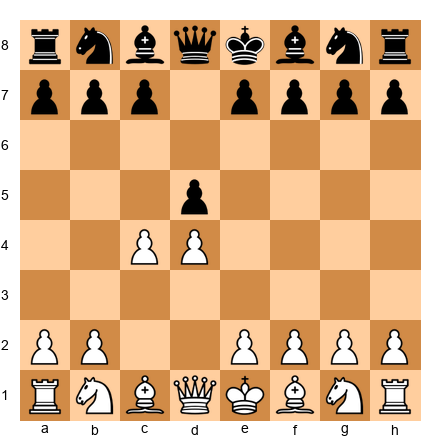</p>


After 1.d4 d5 2.c4, Black must make a fundamental decision. Accept the gambit with 2...dxc4? Decline it with 2...e6? Play the Slav with 2...c6? Each choice leads to a different world of pawn structures and plans.

As a former London player, you already understand d4 structures. The Queen's Gambit extends your understanding into territory where the center is more dynamic and the piece play is richer. You will face positions where both sides have serious chances - and that is exactly what you need at 2200.

**What to study first:** The Queen's Gambit Declined (1.d4 d5 2.c4 e6 3.Nc3 Nf6 4.Bg5 Be7 5.e3 O-O 6.Nf3). This is the most classical, most well-understood variation. The structures are logical. The plans are clear. The theory is deep but navigable. Start here.

### Phase 2: Add the Catalan

The Catalan (1.d4 Nf6 2.c4 e6 3.g3) is a positional masterpiece. White fianchettoes the king's bishop, creating long-term pressure on the queenside and the center. The Catalan suits patient players - and if you played the London for years, patience is one of your strengths.

Set up your board:

<p align="center">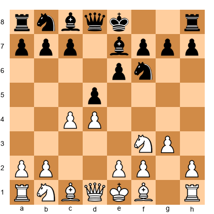</p>


After 1.d4 Nf6 2.c4 e6 3.g3 d5 4.Nf3 (or 4.Bg2), White aims for a setup where the bishop on g2, the pawn on d4, and the queenside pressure combine into a slow, grinding advantage. This is the opening of choice for Kramnik, Giri, and many modern top players.

The Catalan is an outstanding second weapon because it avoids the sharpest theoretical duels (the Grünfeld, the Nimzo-Indian) while still posing real problems for Black.

### Phase 3: Handling the KID from White's Side

Once you add c4 to your repertoire, you will face King's Indian Defense players - including players who play exactly the way you used to play. You need to know how to fight the KID from White's side.

The two main approaches:

**The Classical Variation** (1.d4 Nf6 2.c4 g6 3.Nc3 Bg7 4.e4 d6 5.Nf3 O-O 6.Be2 e5 7.O-O): This leads to the famous pawn structures where White pushes d5 and expands on the queenside while Black attacks on the kingside with ...f5. You know this structure from the Black side. Now you must learn it from White's perspective.

**The Sämisch Variation** (1.d4 Nf6 2.c4 g6 3.Nc3 Bg7 4.e4 d6 5.f3): An aggressive anti-KID system. White builds a massive center and often castles queenside. The play is sharp and concrete.

Set up your board:

<p align="center">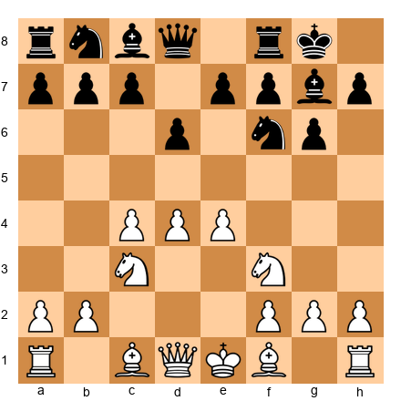</p>


This is the starting point of the Classical KID from White's side. After 6.Be2 e5 7.O-O Nc6 8.d5 Ne7, the battle lines are drawn. White plays on the queenside (c5 break), Black on the kingside (...f5). The side that breaks through first usually wins. Your KID experience gives you a deep understanding of Black's plans - now use that knowledge against your opponents.

---

## 39.6 Path B: The 1.e4 Transition

If you want to add an entirely new first move to your repertoire, 1.e4 is the biggest challenge and the biggest reward.

### Why 1.e4 Is Hard

After 1.e4, Black has more fighting options than after 1.d4. The Sicilian Defense alone has a dozen major variations, each with its own theory. The French Defense, the Caro-Kann, the Pirc, the Alekhine, the Scandinavian - you must have an answer to every one of them. This is why building a 1.e4 repertoire takes longer than building a 1.d4 repertoire.

### Why 1.e4 Is Worth It

The positions are more dynamic. The games are more tactical. The middlegames feature open files, piece activity, and direct attacks on the king. If your chess has been too positional - if you are winning grinding endgames but rarely producing attacking masterpieces - 1.e4 will transform your play.

### The Recommended Build Order

**Step 1: Start with 1.e4 e5 - the Italian or Spanish (Ruy Lopez).**

Set up your board:

<p align="center">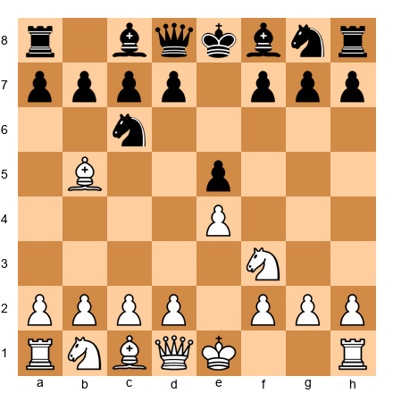</p>


The Ruy Lopez (1.e4 e5 2.Nf3 Nc6 3.Bb5) is the most principled opening in chess. It has been played at the highest level for over 150 years. The structures are rich, the ideas are deep, and the theory, while extensive, rewards understanding more than memorization. Start here because 1.e4 e5 is the most common reply to 1.e4 at all levels.

**Step 2: Learn the Open Sicilian.**

Above 2000, roughly 40 to 50 percent of your 1.e4 opponents will play the Sicilian Defense. You must be prepared for it. Playing a sideline like the Alapin (2.c3) or the Grand Prix (2.f4) is acceptable at 1800, but at 2200, you need the Open Sicilian (1.e4 c5 2.Nf3 followed by 3.d4 cxd4 4.Nxd4). This is where the real fight begins.

Set up your board:

<p align="center">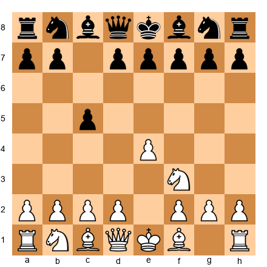</p>


You do not need to master every Sicilian variation at once. Start with one anti-Najdorf system (the English Attack with 6.Be3 and f3 is a good choice) and one anti-Sveshnikov line. Expand from there.

**Step 3: Prepare against the French and Caro-Kann.**

The French Defense (1.e4 e6) and the Caro-Kann (1.e4 c6) are solid, well-tested responses. You need one main line against each. Against the French, the Tarrasch Variation (3.Nd2) or the Advance (3.e5) are reliable choices. Against the Caro-Kann, the Advance (3.e5) or the Classical (3.Nc3 dxe4 4.Nxe4 Bf5) offer clear plans.

Choose one line against each and study it deeply. Do not try to learn two variations against the French and two against the Caro-Kann simultaneously. That path leads to confusion.

---

## 39.7 How to Learn a New Opening System

There is a method for this. It works whether you are learning the Sicilian Najdorf or the Catalan, the Grünfeld or the Ruy Lopez. It has six steps.

### Step 1: Study the Structures

Before you learn a single move, learn the pawn structures that arise from your new opening. What does the typical middlegame look like? Where are the pawns? Which pieces are strong and which are weak? What are the standard plans for both sides?

Set up three to five typical middlegame positions from the opening. Do not look at the move orders that produced them. Just study the structures. Identify the pawn breaks. Note which pieces belong on which squares. Understand where the play happens - kingside, queenside, or center.

This is the foundation. Everything else builds on it.

### Step 2: Play Through Twenty Master Games

Find twenty well-annotated master games in your new opening. Not games from online blitz - classical games between titled players, with move-by-move annotations that explain the plans and ideas.

Play through each game slowly. Set up a physical board if possible. At each move, pause and ask: What is the plan? Why this move and not another? When you reach the middlegame, identify the structural themes you studied in Step 1.

Twenty games is not arbitrary. Research on pattern recognition suggests that after studying twenty high-quality examples, you will recognize the common themes approximately 80 percent of the time. Fewer than twenty, and you will have gaps. More than twenty at this stage is unnecessary - you will encounter more examples through your own games.

### Step 3: Memorize the First Ten Moves of the Main Lines

Now - and only now - memorize move orders. Learn the first ten moves of the three or four main lines in your new system. Ten moves is enough to reach a playable middlegame position where your structural understanding takes over.

Do not memorize twenty moves. Do not memorize sidelines. Do not go down the rabbit hole. Ten moves in the main lines. That is your initial target.

### Step 4: Play It in Rapid Games

Play your new opening exclusively in rapid and blitz games for two to four weeks. Accept that you will lose games. Accept that your rating will dip. This practical experience is irreplaceable - no amount of study substitutes for actually reaching these positions under game conditions.

Track your results. After each game, note one thing you did well in the opening and one thing you did poorly. Do not analyze deeply at this stage. Just play, record, and observe.

### Step 5: Deepen Gradually

After your initial rapid-game phase, begin adding depth. Learn one new variation per week. Analyze your own games in the new opening with an engine, focusing on the moments where you left your preparation and had to think for yourself. Were your plans correct? Did you recognize the structural themes?

This is the longest phase. It lasts months. Resist the temptation to rush.

### Step 6: Build Your Personal Database

Create a database (a Lichess study, a ChessBase file, a simple text document - the format does not matter) containing your own games in the new system. This database is more valuable than any opening encyclopedia because it contains your mistakes, your insights, and your growth.

Review this database monthly. Look for patterns in your losses. Are you failing in the same structure repeatedly? That structure needs more study. Are you winning from a specific position? That position is your strength - steer games toward it.

---

## 39.8 The Twelve-Month Repertoire Expansion Plan

Expanding your repertoire is a project, not an event. Here is a realistic timeline for adding one major new opening system to your arsenal.

| Month | Goal | Activity |
|-------|------|----------|
| 1 | Study structures | Learn 5 typical middlegame positions. No move orders yet. |
| 2 | Master games | Play through 20 annotated games. Take notes on recurring themes. |
| 3 | Memorize main lines | Learn 10 moves in 3–4 main lines. Begin rapid play. |
| 4 | Rapid testing | Play 30+ rapid games. Accept rating fluctuations. Track results. |
| 5 | Analyze your games | Engine-check all your rapid games. Identify your 3 biggest gaps. |
| 6 | Deepen variations | Add 4–6 sidelines. Study your opponents' most common responses. |
| 7 | Begin classical play | Use the new opening in serious games. Review every game deeply. |
| 8 | Patch weaknesses | Study the specific variations where your results are worst. |
| 9 | Build dossiers | Create preparation files for opponents you face regularly. |
| 10 | Engine-test | Run deep engine analysis on your critical lines. Find improvements. |
| 11 | Consolidate | Play exclusively with your new repertoire. Measure your results. |
| 12 | Evaluate | Compare your results to your old repertoire. Decide: keep, modify, or restart. |

After twelve months, the new system is part of you. Maintain it with periodic review - two to three hours per month is sufficient once the foundation is solid.

---

🛑 **Rest Marker.** You have covered the philosophy and architecture of repertoire building. This is a natural stopping point. Come back with fresh eyes for the practical methodology that follows.

---

## 39.9 The Preparation Funnel

Professional opening preparation works like a funnel. At the top, you have broad knowledge - general principles, typical structures, standard plans. At the bottom, you have specific preparation - the exact line you will play against a specific opponent in a specific game.

```
┌─────────────────────────────────────┐
│  BROAD: General opening principles  │
│  Structures, plans, typical games   │
├─────────────────────────────────────┤
│  MEDIUM: Your repertoire lines      │
│  Main variations, key positions     │
├─────────────────────────────────────┤
│  NARROW: Opponent preparation       │
│  Their repertoire, their weaknesses │
├─────────────────────────────────────┤
│  POINT: Tonight's game plan         │
│  Exact line, planned novelty        │
└─────────────────────────────────────┘
```

Most players at 2200 skip the top of the funnel. They jump straight to specific lines and memorize move orders without understanding why those moves are played. This is backwards. The funnel must be filled from the top down.

**Broad knowledge** means understanding twenty or more pawn structures, knowing the plans associated with each one, and being able to navigate unfamiliar positions using structural reasoning. This is the product of the study you did in Volumes I through III.

**Medium knowledge** means knowing your own repertoire lines to a depth of twelve to fifteen moves, with a clear understanding of the resulting middlegame plans. This is the product of the six-step method described above.

**Narrow knowledge** means knowing what your specific opponent plays and having a plan to meet it. This is pre-game preparation, covered in the next sections.

**Point knowledge** is the exact line you will play tonight - including, if possible, a prepared novelty that your opponent has not seen before.

The funnel only works if the top is solid. If your broad knowledge is weak, your specific preparation will be fragile - one unexpected move from your opponent, and you are lost.

---

## 39.10 Database Research for Opening Preparation

At 2200, database research is not optional. Every serious opponent is using databases. If you are not, you are fighting with one hand tied behind your back.

### The Core Databases

There are three databases that matter:

1. **Lichess Opening Explorer** - Free, open, updated continuously. Contains millions of games at all levels. Use it for broad statistical analysis: What do players actually play in this position? What are the win rates?

2. **ChessBase / MegaBase** - The professional standard. Contains over ten million games, filtered by titled players. Use it for high-quality games, opening references, and novelty detection. If you can afford it, this is the single best investment in your opening preparation.

3. **Your personal database** - Your own games, annotated with your own analysis. This is the most underrated resource. Your opponents will study YOUR games in their databases. You should study them too.

### The Research Workflow

When preparing a specific opening line, follow this sequence:

**Step 1: Statistical overview.** Open the position in a database explorer. Look at the most common moves, the win rates for White and Black, and the number of games in the database. This tells you what is popular and what is successful.

**Step 2: Filter by strength.** Narrow the database to games between players rated 2200 and above. The statistics change dramatically. A move that scores 55% in the general database might score only 45% among experts. This filtered data is what matters for your preparation.

**Step 3: Find model games.** Identify three to five recent games by strong players in your chosen line. Play through them. Look at how the middlegame unfolds. Note any novelties or deviations from previous games.

**Step 4: Identify the critical positions.** In every opening line, there are two or three positions where both sides must make key decisions. These are the positions you must study in depth. Set them up on your board. Analyze them without an engine. Form your own opinion. Then check with an engine.

**Step 5: Look for your opponent's games.** If you know who you are playing tomorrow, search for their games in the database. What do they play against your opening? How do they handle the critical positions? Where have they made mistakes?

This workflow takes thirty to sixty minutes for a serious classical game. For rapid games, a ten-minute abbreviated version (Steps 1 and 5 only) is sufficient.

### The Opening Study Notebook

Keep a dedicated notebook (physical or digital) for your opening preparation. Each entry should follow a standard format:

**Date and opening.** "March 15, 2026 - Sicilian Najdorf, 6.Bg5."

**Position studied.** Write the FEN or the move sequence that leads to the position.

**Key ideas.** What are the main plans for both sides from this position? What are the critical pawn breaks? Which pieces should be exchanged and which should be kept?

**Engine analysis.** What does the engine say about the critical moves? Note only the significant findings - not every tenth-of-a-pawn evaluation, but genuine insights about the position's character.

**Questions for further study.** What remained unclear? What positions do you need to analyze more deeply? What opponent-specific preparation do you still need to do?

This notebook serves three purposes. First, it organizes your preparation so you can review it efficiently before tournaments. Second, it prevents you from studying the same material twice - you can check your notebook before diving into analysis and see whether you have already covered this position. Third, it creates a permanent record of your opening knowledge that grows over time.

After a year of consistent use, your opening notebook will contain your complete understanding of every opening you play. It will be more useful to you than any published book because it contains your own analysis, your own questions, and your own conclusions. No published book is written for your specific repertoire and your specific level of understanding. Your notebook is.

---

## 39.11 Engine-Assisted Preparation

The engine is the most powerful preparation tool ever created. It is also the most dangerous.

### How Engines Help

A modern engine like Stockfish, running at depth 35 or higher, plays at approximately 3500 Elo. It sees things no human can see. It catches tactical flaws in your analysis. It reveals hidden resources for the defending side. It tests the soundness of your prepared lines.

Set up your board:

<p align="center"></p>


In this Sicilian Dragon position, after 1.e4 c5 2.Nf3 d6 3.d4 cxd4 4.Nxd4 Nf6 5.Nc3 g6 6.Be3 Bg7 7.f3 O-O 8.Qd2, White plans the Yugoslav Attack: Bh6, O-O-O, and a kingside pawn storm. At depth 20, the engine evaluates this position as roughly equal. At depth 40, it prefers White by approximately +0.3. That small difference, invisible at shallow depth, represents a real practical advantage that White can exploit with correct play.

This is where engine analysis matters - finding the precise evaluations that distinguish between "playable for both sides" and "slightly better for one side" in your prepared lines.

### How Engines Hurt

The danger is dependency. "I just check Stockfish and play whatever it says." This sounds efficient. It is the opposite.

Engine evaluations are precise but context-free. The engine does not know whether YOU can play the resulting position. A position that Stockfish evaluates at +0.8 might be -1.0 for a human who does not understand the plan. The engine says "play Nd5" because it sees a twenty-move forcing sequence that leads to a winning endgame. You play Nd5 because the engine told you to. Your opponent deviates on move three of the sequence. Now what? You are lost because you followed a move without understanding its purpose.

### The Engine Protocol

Use this protocol every time you analyze an opening position with an engine:

1. **Analyze without the engine first.** Set up the position. Spend fifteen to thirty minutes forming your own evaluation and plan. Write it down.

2. **Turn on the engine.** Set the depth to 30 or higher. Let it run for at least two minutes on critical positions. Note the engine's top three moves and their evaluations.

3. **Compare.** Where did your analysis agree with the engine? Where did it disagree? The disagreements are where you learn.

4. **Ask why, not what.** The engine prefers 12.Nd5 over 12.Be3. Why? Play both moves. Examine the resulting positions. What does Nd5 achieve that Be3 does not?

5. **Test your understanding.** Turn off the engine. From memory, play the engine's preferred line. If you cannot remember it, you have not understood it. If you can remember it but cannot explain it, you have memorized without understanding.

6. **The "explain it to a friend" test.** If you cannot explain why the engine's move is best using words - not variations, but words describing the plan - then you should not play that move in a game.

### Depth Settings for Your Level

| Rating | Minimum Depth | Focus |
|--------|--------------|-------|
| 2000–2200 | 25–30 | Full analysis, compare candidate moves |
| 2200–2400 | 30–40 | Deep preparation, novelty testing |
| 2400+ | 40+ | Multi-engine verification, tablebase checks |

### Multi-Engine Comparison

At the 2200+ level, a single engine is not always sufficient. Different engines have different evaluation functions, and a position that one engine evaluates as equal might be preferred by another.

The practical approach: Use Stockfish as your primary engine. For critical positions - the positions where your entire preparation rests on a single evaluation - verify with a second engine (Leela Chess Zero is the strongest alternative). If both engines agree, you can trust the evaluation. If they disagree, study the position more deeply. The disagreement often reveals a subtle positional factor that requires human judgment.

---

## 39.12 The Novelty Notebook

A novelty is a new move in a known opening position - a move that has not appeared in the databases before. Finding novelties is one of the most creative aspects of chess preparation, and it is available to every player, not just Grandmasters.

### What Makes a Good Novelty

A good novelty is not just a new move. It is a new move that is also a good move - one that creates problems for your opponent that they cannot solve at the board.

The best novelties share three qualities:

1. **The novelty leads to positions your opponent has never seen.** If the resulting middlegame is a standard structure that your opponent knows well, the novelty's surprise value is wasted. The best novelties steer the game into unusual territory.

2. **The novelty is sound.** An unsound novelty is a trap. It works once, against an unprepared opponent, and then it is refuted. A sound novelty withstands engine scrutiny and remains playable even after your opponent has time to analyze it.

3. **You understand the resulting positions deeply.** If your novelty leads to a position you do not understand, you have surprised your opponent and yourself. This is worse than playing a known line that you understand well.

### How to Find Novelties

**Method 1: The database gap.** Search for a position that has been reached many times in the databases. Look at the moves that have been played. Are there any reasonable moves that have NOT been played? Set up the position and analyze the unexplored move with an engine. If it is sound, you may have found a novelty.

**Method 2: The engine suggestion.** Analyze a critical position in your repertoire at depth 35+. The engine's top move may differ from the move most commonly played in master practice. If the engine strongly prefers an unusual move, investigate it. The engine may have found what human players missed.

**Method 3: The structural analogy.** You know a plan that works in a similar pawn structure from a different opening. Can that plan be applied here? Structural analogies are the source of many creative novelties. A maneuver that is standard in the Ruy Lopez might be a novelty in the Italian Game because nobody has tried it in that specific context.

### The Notebook Itself

Keep a dedicated notebook (physical or digital) for your novelty ideas. For each novelty, record:

- **The position** (FEN notation)
- **The move** (your novelty)
- **The engine evaluation** (depth and score)
- **The idea** (why the move is good, in words)
- **The critical line** (the engine's main variation, 10–15 moves)
- **The status** (untested / tested in rapid / used in classical)

Review your novelty notebook before tournaments. A well-prepared novelty, deployed at the right moment, can win a game before the middlegame begins.

---

## 39.13 Preparing Against Specific Opponents

General preparation gets you to the board with a playable position. Opponent-specific preparation gets you to the board with an advantage.

### The Preparation Checklist

When you know who you are playing tomorrow, follow this checklist:

**1. Find their recent games.** Search the database for their last twenty to thirty games. Focus on classical games if the upcoming game is classical.

**2. Map their repertoire.** What do they play as White? As Black against 1.e4? As Black against 1.d4? List the openings and variations.

**3. Identify their comfort zone.** Which structures do they play most often? Where are their results strongest? This is their comfort zone - avoid steering the game there unless your preparation is deeper than theirs.

**4. Find their weaknesses.** Which structures do they score poorly in? Where have they lost recently? Are there specific middlegame types they seem to struggle with? An opponent who scores 3/10 in rook endgames is telling you something.

**5. Prepare a surprise.** Can you play a sideline they have never faced? A variation that avoids their main preparation? A move order that transposes into a structure they rarely play? The surprise does not need to be a novelty - it can be a well-known line that your specific opponent has never encountered.

**6. Prepare your first fifteen moves.** Based on your analysis, plan your first fifteen moves against their expected setup. Know the ideas, the plans, and the critical positions. Be ready for their two or three most likely responses.

### Time Investment

For a serious classical game: 30 to 60 minutes of specific preparation.
For a rapid game: 10 minutes maximum.
For a blitz game: None. Play your repertoire and react.

This time estimate assumes that your broad and medium knowledge (the top of the funnel) are already solid. If you are spending ninety minutes preparing for every game, your general opening knowledge has gaps that need filling.

### What to Do When You Cannot Prepare

Sometimes you do not know who your opponent is until the round starts. Sometimes the pairings come out 30 minutes before the game, leaving no time for specific preparation. Sometimes your opponent is unknown - an unrated player or someone from another federation whose games are not in any database.

**Against an unknown opponent.** Play your main repertoire. Do not try anything fancy. Your main repertoire is your strongest weapon because you understand the resulting positions most deeply. An unknown opponent is not necessarily weak - they might be a rising junior, a returning player, or a strong player from a region not well-represented in databases.

**Against a last-minute pairing.** If you have 30 minutes, focus on one thing: what does this opponent play against your first move? If you play 1.e4 and they play the Sicilian, which Sicilian? A 5-minute scan of their recent games tells you this. Then review your preparation against that specific Sicilian. Do not try to learn anything new. Just refresh what you know.

**Against a much higher-rated opponent.** Your preparation matters less because the higher-rated player will likely be prepared for your opening regardless. Focus instead on playing your best chess from move 1. Do not try to surprise them with an unusual opening unless you genuinely know it well. A surprise you do not understand is more dangerous to you than to them.

**Against a much lower-rated opponent.** Play your main repertoire, play solidly, and trust that your superior understanding will create advantages over the course of the game. Do not play "trick" openings trying to win quickly. If the trick fails, you are in an unfamiliar position against a player who might be stronger than their rating suggests.

---

## 39.14 Building Prep Files and Opponent Dossiers

At 2200+, every serious opponent has a file on you. They know your repertoire. They have studied your games. They have found your weaknesses.

You need files on them.

### The Opponent Dossier

Create a simple document for each opponent you face regularly (league opponents, tournament regulars, players in your rating pool). Each dossier contains:

**Header:**
- Name, rating, federation
- Date last updated

**Repertoire Map:**
- White openings (primary and secondary)
- Black vs 1.e4 (primary and secondary)
- Black vs 1.d4 (primary and secondary)

**Strengths:**
- What they do well (e.g., "strong in rook endgames," "dangerous attacker on the kingside")

**Weaknesses:**
- Where they struggle (e.g., "poor results in IQP positions," "tends to overpush in the opening")

**Key Games:**
- Links or references to three to five important games (their wins and their losses)

**My Plan:**
- What I will play against them as White
- What I will play against them as Black
- Specific variation or novelty to deploy

**Game Log:**
- Record of every game I have played against them, with brief notes

Update the dossier after every encounter. Over time, your files become a detailed map of your opposition - a map that gives you an edge before the first move.

### Managing the System

Keep your dossiers organized by tournament or league. Before a tournament, review the dossiers for all likely opponents. This review takes less time than the original preparation because the foundational analysis is already done.

The format does not matter. A text file works. A Lichess study works. A physical notebook works. What matters is that the information exists, is organized, and is accessible when you need it.

### Building Dossiers from Databases

The most efficient way to build an opponent dossier is to download their games from an online database. Lichess and chess.com both allow you to download a player's game history. ChessBase and SCID can search large databases by player name.

Here is the process:

**Step 1: Download their last 50 games.** Sort by date, most recent first. You want their current repertoire, not what they played five years ago.

**Step 2: Sort by opening.** Group the games by opening played. This immediately shows you their repertoire. If they played the Sicilian in 15 out of 25 games as Black, you know what to prepare against.

**Step 3: Look for weaknesses.** In each opening, note their results. If they score 65% in the QGD but only 40% in the Nimzo-Indian, the Nimzo is their weak spot. If they consistently misplay rook endgames, note that too.

**Step 4: Check their results against your openings.** What happens when they face your specific opening moves? If you play 1.e4 and they always respond with the French Defense, study their French games carefully. Look for positions where they went wrong. Those mistakes are likely to recur.

**Step 5: Summarize in the dossier.** Write a one-paragraph summary: "Opponent plays 1.e4 as White, Sicilian as Black. Strongest in tactical middlegames. Weakest in endgames, particularly rook endings. Uncomfortable against positional play. Tends to play too quickly in the opening. Prepare slowly and aim for a strategic middlegame."

This entire process takes 30 to 45 minutes per opponent. For opponents you face regularly, it is time well spent.

---

## 39.15 Repertoire Maintenance

A repertoire is not a fixed object. It is a living system that requires regular maintenance.

### The Quarterly Review

Every three months, review your entire repertoire. For each opening:

1. **Check your results.** What is your win rate over the last quarter? Is it improving, declining, or stable?

2. **Check for theoretical developments.** Has new theory appeared in your lines? Have top players introduced new ideas that change the evaluation of your key positions?

3. **Review your losses.** Where did you go wrong? Were the losses related to opening preparation, or to middlegame and endgame play? If the same opening weakness caused multiple losses, it needs immediate attention.

4. **Test with the engine.** Run your critical positions through the latest version of Stockfish. Engine evaluations change as software improves. A position you evaluated as equal two years ago might now be assessed as slightly worse.

### Adding New Lines

When you add a new variation to your repertoire, integrate it into your existing system. It should not be an isolated fragment - it should connect to your understanding of the broader opening complex.

For example, if you play the Catalan and you add a new line against the ...dxc4 variation, that line should be consistent with your general Catalan strategy. You should be able to explain how the new line fits into your overall plan for the opening.

### Pruning Old Lines

Sometimes a line in your repertoire stops working. The theory has moved against it, or your opponents have found the antidote. When this happens, prune it. Remove it from your active repertoire. Replace it with a better alternative.

This is not failure. This is maintenance. Even top Grandmasters regularly update their repertoires, dropping lines that are no longer effective and adding lines that solve new problems.

### The Repertoire Depth Chart

A useful organizational tool is the repertoire depth chart. For each opening you play, note how deep your preparation goes (measured in moves from the starting position) and how well you understand the resulting middlegame positions.

Create a simple table:

| Opening | Depth (moves) | Middlegame Understanding | Recent Results | Priority |
|---------|---------------|--------------------------|----------------|----------|
| 1.e4 - Ruy Lopez | 15-18 | Strong | 6/8 | Maintain |
| 1.e4 - Italian | 12-14 | Moderate | 3/5 | Study |
| 1.d4 - QGD | 10-12 | Moderate | 4/7 | Priority |

This chart tells you at a glance where your preparation is strong and where it needs work. Update it after every tournament. Lines with good results and deep preparation need minimal maintenance. Lines with poor results or shallow preparation need immediate attention.

The depth column is especially informative. If your preparation in the Ruy Lopez goes to move 18 but your Queen's Gambit preparation only reaches move 10, you are vulnerable in the QGD. An opponent who prepares against you will target your shallower opening. Either deepen your QGD preparation or switch to a line you know better.

### Keeping Up with Theory: A Realistic Approach

At the expert level, you cannot keep up with every theoretical development in every opening. There is too much new material published every month. You need a realistic system for staying current without drowning in information.

**Follow one or two theory databases.** Subscribe to a database service (ChessBase, chess24, or similar) and check for new games in your openings once per month. Focus on games between 2600+ rated players, since these are the ones most likely to contain genuine theoretical novelties.

**Follow three to five key players.** Choose players who play your openings. When they play a tournament, check their games in your opening lines. If a 2700-rated player plays a new move in your Sicilian Najdorf, that move deserves your attention. If an untitled player tries something unusual, it probably does not.

**Accept imperfection.** You will sometimes be surprised by a theoretical novelty that you did not know about. This is fine. It happens to Grandmasters too. The goal of staying current is not to know everything. It is to know enough that surprises are rare and manageable.

---

## 39.16 From Surprise Weapon to Main Repertoire

Your old openings - the London System, the King's Indian Defense, the Pirc - do not disappear. They undergo a transformation.

**As a main weapon,** the London System gave you a safe, reliable middlegame in every game. You knew the structures. You knew the plans. But your opponents also knew the structures and the plans. The element of surprise was gone.

**As a surprise weapon,** the London System becomes dangerous again. Your opponent prepares for your Queen's Gambit or your Catalan. They study your recent games and see that you have been playing 1.d4 d5 2.c4 for the last six months. They prepare the Slav Defense. They arrive at the board, confident and ready.

You play 1.d4 d5 2.Bf4.

Their preparation is useless. They are now playing a London System that they have not studied in months, against an opponent who has hundreds of games of experience in the structure. The surprise weapon has done its job - not by being theoretically superior, but by being unexpected.

### Guidelines for Deploying Surprise Weapons

1. **Use them sparingly.** If you play the London in every other game, it stops being a surprise. Once every ten to fifteen games is the right frequency.

2. **Use them in specific situations.** The surprise weapon is ideal when you are paired against a heavily booked opponent, when you need a draw with Black, or when you want to avoid a theoretical duel in a line where your opponent is better prepared.

3. **Keep them sharp.** Even if you only play the London once a month, review its key ideas occasionally. You do not need to study new theory - but you need to remember your own analysis.

4. **Do not use them in must-win situations.** When you must win, play your main repertoire. Your main weapons are deeper, more tested, and more likely to produce the complex positions that winning requires.

The transformation from main weapon to surprise weapon is the final stage of repertoire evolution. Your old openings served you well. In their new role, they will continue to serve you - differently, but effectively.

---

## 39.17 Preparation Mindset: The Night Before and Morning Of

Your opening preparation is only as good as your ability to recall it under pressure. This section covers the practical aspects of accessing your preparation during a tournament - the mental routines that connect study to performance.

### The Night-Before Review

The evening before a tournament game, spend 20 to 30 minutes reviewing your preparation for the expected opening. Do not try to learn anything new. Review what you already know. The goal is activation - moving your preparation from long-term memory into short-term memory so it is readily accessible the next day.

Focus on the key positions and the move orders that lead to them. Replay the critical variations on a board or screen. Do not obsess over details. If you do not know a line by the night before, you are not going to learn it in one evening. Stick to what you know and refresh it.

After the review, stop studying chess. Do something relaxing. Read a book, watch a show, take a walk. Your brain consolidates learning during sleep, and the best thing you can do for your preparation is sleep well.

### The Morning-Of Routine

On the morning of your game, spend 10 minutes with your preparation. This is a final activation pass - a quick scan of the main lines and the positions you expect to reach. Again, no new learning. Just refresh.

Some players prefer to do this 2 hours before the game. Others prefer 30 minutes before. Experiment to find what works for you. The key is to arrive at the board with your preparation fresh in your mind, not buried under hours of other activities.

If you do not know your opponent's likely opening, prepare two plans: one for the most likely scenario and one for the second most likely. Do not try to prepare for everything. Cover the most probable outcomes and trust your general chess knowledge for everything else.

### When Preparation Fails

Even the best preparation sometimes fails. Your opponent plays a move you did not study. They deviate on move 6 instead of following the main line to move 15. Your prepared position never appears on the board.

When this happens, do not panic. Take a deep breath. Remind yourself that you are a 2200-rated player who understands chess deeply. You do not need preparation to play good chess. You need it to play optimal chess - and there is a difference.

Shift from "prepared play" to "principled play." Develop your pieces to active squares. Secure your king. Control the center. Look for tactical opportunities. These principles do not require preparation. They require understanding, and you have plenty of that.

The players who handle preparation failures best are the ones who view preparation as a bonus, not a crutch. Your preparation gives you an edge when it works. When it does not work, you are still a strong player. Never forget that.

---

🛑 **Rest Marker.** You have covered the complete methodology of professional opening preparation. The annotated games that follow illustrate these principles in action at the highest level. Take a break before continuing.

---

## 39.17 Annotated Games: Opening Preparation in Action

The following five games illustrate the principles of professional opening preparation across nearly a century of world championship chess. Each game tells a story about preparation - its power when done well, and its limits when done poorly.

---

### Game 1: The Revenge Preparation

**Alexander Alekhine vs Max Euwe**
**World Championship Match, Game 2, 1937**
**Result:** 1-0

Alekhine lost his world title to Euwe in 1935. It was one of the greatest upsets in chess history - the brilliant but self-destructive Alekhine, debilitated by alcohol, falling to the solid but supposedly inferior Euwe. For two years, Alekhine prepared for the rematch. He stopped drinking. He studied Euwe's games obsessively. He rebuilt his opening repertoire with a single goal: to exploit every weakness he had identified in Euwe's play.

The 1937 rematch was a demolition. Alekhine won 10, lost 4, and drew 11. His preparation was so thorough that Euwe later admitted he felt outplayed before the games even began.

Set up your board:

<p align="center">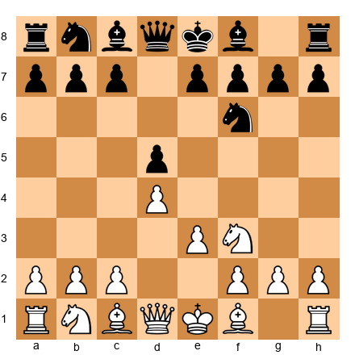</p>


`1.d4 d5 2.Nf3 Nf6 3.e3`

Alekhine chose a quiet system. This was deliberate. In the 1935 match, Alekhine had played sharp, tactical openings - and Euwe had navigated them successfully. For the rematch, Alekhine reversed his approach. He played solid, positional chess, denying Euwe the tactical complications where the Dutchman felt comfortable.

`3...e6 4.Bd3 c5 5.c3 Nc6 6.Nbd2 Bd6 7.O-O O-O 8.dxc5 Bxc5 9.e4`

Set up your board:

<p align="center">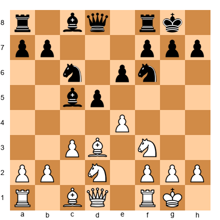</p>


Now the position opens. Alekhine has timed the e4 break precisely. After 9...dxe4 10.Nxe4 Nxe4 11.Bxe4, White has a slight but lasting edge - the bishop pair, a mobile kingside majority, and pressure along the d-file.

`9...Qc7 10.Qe2 dxe4 11.Nxe4 Nxe4 12.Bxe4 h6 13.Bc2`

White's bishop retreats to c2, where it aims at the kingside along the b1–h7 diagonal. This is a standard maneuver, but Alekhine's understanding of the resulting position was far deeper than Euwe's. He knew exactly which pieces to exchange, where to place his rooks, and how to exploit the slight structural advantage.

The game continued for another twenty moves. Alekhine ground Euwe down with precise technique, never allowing counterplay, converting the microscopic opening advantage into a full point.

**Preparation lesson:** Alekhine did not prepare a brilliant novelty. He prepared a strategic approach - quiet openings that denied Euwe's strengths and exploited his weaknesses. The deepest preparation is not always about moves. Sometimes it is about choosing the right type of game.

---

### Game 2: The Surprise Weapon

**Bobby Fischer vs Boris Spassky**
**World Championship Match, Game 13, Reykjavik 1972**
**Result:** 1-0

For twelve games, the chess world had watched Fischer play 1.e4 and 1.d4 in alternation. His opening choices were aggressive and direct - the Sozin Attack against the Sicilian, the Exchange Variation of the Ruy Lopez, sharp lines of the Queen's Gambit. Spassky's seconds prepared accordingly.

In Game 13, Fischer introduced a weapon nobody expected.

`1.e4 b6`

Spassky played the Owen Defense - a rare, offbeat system that avoids mainstream theory. Spassky was sending a message: I refuse to play your game. I will choose the battlefield.

But Fischer was prepared even for this.

`2.d4 Bb7 3.Bd3 f5`

Set up your board:

<p align="center">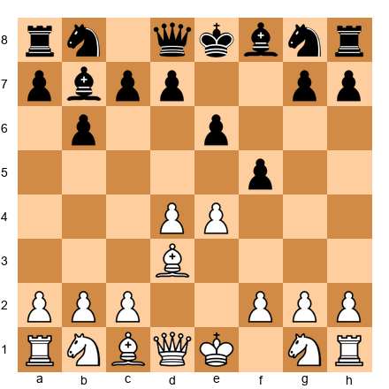</p>


This was a provocation. Spassky's 3...f5 attacks White's center but weakens the e6–h3 diagonal and the kingside light squares. Fischer responded with ruthless precision.

`4.exf5 Bxg2 5.Qh5+ g6 6.fxg6 Bg7 7.gxh7+`

Set up your board:

<p align="center">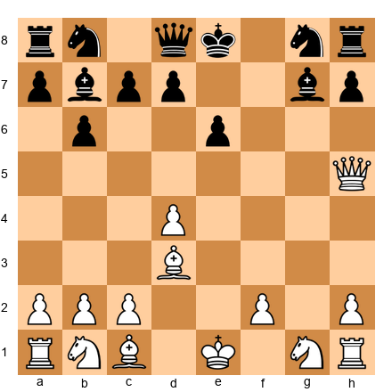</p>


Fischer's preparation was not about memorizing a specific line against the Owen Defense. It was about understanding open-game dynamics so deeply that he could punish any deviation from sound opening principles. Spassky's creative but dubious opening was demolished by Fischer's superior structural understanding.

`7...Kf8 8.Be3 Nc6 9.Nc3 Nf6 10.Qd1`

Fischer calmly retreated the queen. He was already a pawn ahead with a superior position. The rest of the game was a clinical demonstration of technique. Fischer converted the extra pawn without allowing Spassky any counterplay, winning in 43 moves.

**Preparation lesson:** Fischer did not have a prepared line against the Owen Defense. What he had was something more valuable - a depth of understanding that allowed him to respond correctly to any opening, even one he had rarely faced. This is the top of the preparation funnel at work: broad knowledge enabling precise responses.

---

### Game 3: The Prepared Sacrifice

**Vladimir Kramnik vs Peter Leko**
**World Championship Match, Game 14, Brissago 2004**
**Result:** 1-0

Going into the final game, Leko led 7–6 in the fourteen-game match. He needed only a draw to become world champion. Kramnik needed a win.

This was the most pressure-laden game in a generation of world championship chess. Kramnik knew that Leko would play solidly, aiming for the draw that would clinch the title. Kramnik's preparation team - including the legendary analyst Loek van Wely and other seconds - worked through the night to find a line where White could press for a win without taking unacceptable risks.

They found it in the Caro-Kann Defense.

`1.e4 c6 2.d4 d5 3.e5`

Set up your board:

<p align="center">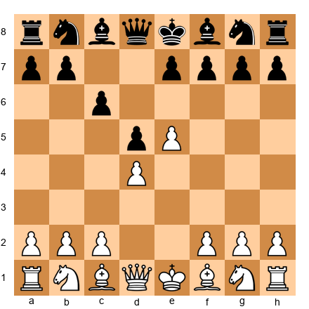</p>


The Advance Variation. Kramnik had prepared a specific plan that involved a pawn sacrifice for long-term positional compensation. His preparation was so deep that he spent almost no time on his first twenty moves - every move was played from memory.

`3...Bf5 4.Nf3 e6 5.Be2 c5 6.Be3 Qb6 7.Nc3 Nc6 8.O-O Qb4`

Leko's queen sortie was aggressive but committal. Kramnik had anticipated this.

`9.dxc5 Bxc5 10.Bxc5 Qxc5 11.Na4`

Set up your board:

<p align="center">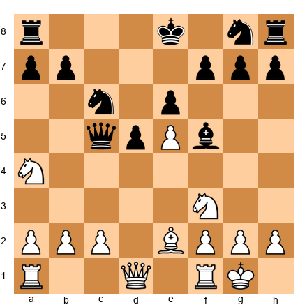</p>


The knight leaps to the edge of the board - normally a suspect idea. But here it attacks the queen and prepares Nd4, centralizing with tempo. Kramnik's preparation extended far beyond this point. He had analyzed the resulting positions at depth 40+ and knew that White's piece activity compensated for the structural concessions.

The game continued with Kramnik pressing relentlessly, using his preparation advantage to gain time on the clock and put Leko under practical pressure. By move 30, Kramnik had converted his preparatory edge into a tangible positional advantage. By move 40, the advantage was decisive.

Kramnik won the game and equalized the match at 7–7, retaining his title as champion.

**Preparation lesson:** Kramnik's team solved a specific problem - how to generate winning chances against a solid defense when the opponent needs only a draw. They found the answer through deep engine analysis of a specific variation, then verified that the resulting positions offered practical winning chances for a human player. This is the preparation funnel at its narrowest and most powerful: a specific answer to a specific problem.

---

### Game 4: The Limits of Preparation

**Fabiano Caruana vs Magnus Carlsen**
**World Championship Match, Game 10, London 2018**
**Result:** ½-½

The 2018 world championship was defined by preparation. Caruana arrived in London with the deepest opening preparation of any challenger in history. His team had spent months analyzing Carlsen's repertoire, finding improvements in critical lines, and preparing novelties for every major opening.

Game 10 showed both the power and the limits of this approach.

`1.e4 e5 2.Nf3 Nf6 3.Nxe5 d6 4.Nf3 Nxe4 5.Nc3`

The Petrov Defense - one of the most solid openings in chess. Carlsen had used it throughout the match to neutralize Caruana's preparation.

`5...Nxc3 6.dxc3 Be7 7.Be3 O-O 8.Qd2 Nd7 9.O-O-O Nf6 10.Bd3 c5 11.Rhe1`

Set up your board:

<p align="center">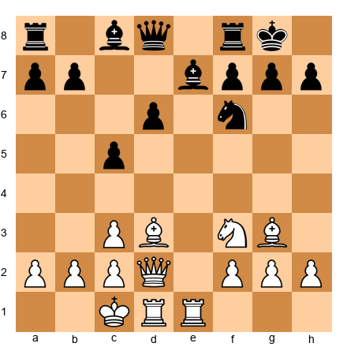</p>


Caruana had prepared this line deeply. His position was comfortable - the bishop pair, a slight space advantage, and active piece placement. But Carlsen was equally prepared. The world champion had studied this exact structure and knew the defensive resources.

`11...Be6 12.Kb1 Qa5 13.c4 Qxd2 14.Rxd2`

Both players had been following their preparation. The queens came off the board - not because the position demanded it, but because both sides had concluded, through deep home analysis, that the resulting endgame was the most principled continuation.

`14...a5 15.Ng5 Bc8 16.f3 Nd7 17.Nf1`

The game entered a long endgame where both sides maneuvered carefully. Despite Caruana's slight edge, Carlsen's defensive technique was impeccable. The game was drawn after 55 moves of precise play.

**Preparation lesson:** This game illustrates the modern preparation paradox. When both players are equally well-prepared, the opening advantage disappears. Caruana's preparation was outstanding - but Carlsen's was equally deep. The game was decided not by preparation but by who played better after the preparation ended. At the very highest level, opening preparation is a necessary condition for victory but not a sufficient one.

---

### Game 5: The Botvinnik Method

**Mikhail Botvinnik vs Mikhail Tal**
**World Championship Rematch, Game 1, Moscow 1961**
**Result:** 1-0

Botvinnik lost his title to Tal in 1960. The young Latvian wizard had dazzled the chess world with his wild sacrifices and tactical fireworks. Conventional wisdom said that Botvinnik, the methodical scientist, could not compete with Tal's creativity.

Botvinnik disagreed. For one year, he undertook the most systematic preparation campaign in chess history. He analyzed every game Tal had played. He identified patterns in Tal's decision-making. He discovered that Tal's sacrifices, while brilliant, often relied on the opponent's psychological collapse rather than objective soundness. Botvinnik prepared to meet fire with ice - to accept Tal's sacrifices, defend accurately, and demonstrate that the positions were objectively holdable.

`1.d4 Nf6 2.c4 g6 3.Nc3 Bg7 4.e4 d6 5.f3 O-O 6.Be3 e5 7.Nge2`

Set up your board:

<p align="center">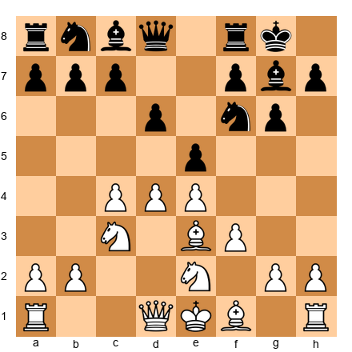</p>


Botvinnik chose the Sämisch Variation of the King's Indian - a closed, strategic system where tactics are secondary to long-term planning. This was a deliberate choice. In the first match, Tal had thrived in open, tactical positions. Botvinnik resolved to deny him those positions entirely.

`7...c6 8.Qd2 Nbd7 9.O-O-O a6 10.Kb1 b5`

Tal tried to create queenside counterplay, but Botvinnik was prepared for every standard plan.

`11.Nc1 bxc4 12.Bxc4 Nb6 13.Bb3 Be6 14.N1e2`

Set up your board:

<p align="center">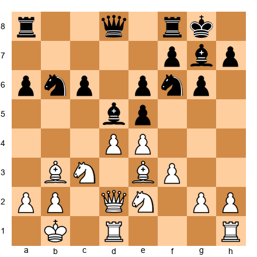</p>


White's position is a fortress. The king is safe on b1. The knights control key central squares. The bishops are actively placed. Tal looked at this position and found no cracks, no tactical targets, no way to generate the chaos he needed.

The game continued with Botvinnik methodically improving his position. Tal, uncomfortable in the strategic terrain, made small inaccuracies that Botvinnik exploited with precision.

`14...d5 15.exd5 cxd5 16.Bg5`

Botvinnik opened the position at the exact moment when it favored his pieces. The resulting middlegame was complex but strategically clear - White's pieces were better coordinated, and Tal's kingside was exposed. Botvinnik converted his advantage in 35 moves.

Botvinnik went on to win the rematch decisively, becoming the only player in history to regain the world championship twice. His systematic preparation against Tal remains the gold standard for opponent-specific preparation.

**Preparation lesson:** Botvinnik did not prepare specific moves. He prepared a strategy - a type of game that would neutralize Tal's greatest strength. He studied his opponent as a psychologist studies a patient, identifying patterns of behavior and designing a response. This is the deepest form of preparation: not "what should I play?" but "what kind of game should I play?"

---

## 39.18 Summary of the Five Games

| Game | Year | Preparation Type | Lesson |
|------|------|-----------------|--------|
| Alekhine–Euwe | 1937 | Strategic approach | Prepare the type of game, not just the moves |
| Fischer–Spassky | 1972 | Broad understanding | Deep structural knowledge defeats exotic openings |
| Kramnik–Leko | 2004 | Specific problem-solving | Target a specific need with targeted preparation |
| Caruana–Carlsen | 2018 | Mutual deep prep | When both sides are prepared, middlegame skill decides |
| Botvinnik–Tal | 1961 | Opponent study | Study the person, not just the position |

---

🛑 **Rest Marker.** The games are done. Take a break. The exercises that follow will test everything you have learned - from repertoire construction to opponent preparation to novelty discovery. Come back with a clear mind.

---

## Exercises

### ★★ Warmup Exercises (39.1–39.5)

**Exercise 39.1** (★★)
You have been playing the London System exclusively for two years. Your rating is 2150. Below is a summary of your last 30 games with the London: W15, D8, L7. Your losses include three games against the same opponent (rated 2250) who plays the Grünfeld setup against your London every time.

Question: Identify three signs from the scenario above that suggest you need to expand your repertoire. What is the first step you should take?

⏱ ~5 min

---

**Exercise 39.2** (★★)

<p align="center">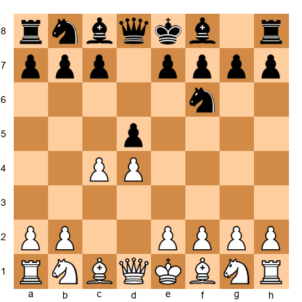</p>


This is the position after 1.d4 d5 2.c4 Nf6. You are transitioning from the London System to the Queen's Gambit.

Name three plans White has in this position. Do not name specific moves - describe the strategic ideas in words.

⏱ ~5 min

---

**Exercise 39.3** (★★)
List the six steps of the opening-learning method described in this chapter, in order, from memory. For each step, write one sentence explaining why it must come in that position (not earlier, not later).

⏱ ~5 min

---

**Exercise 39.4** (★★)

<p align="center"></p>


This position arises from the Tarrasch Defense (1.d4 d5 2.c4 e6 3.Nc3 c5 4.Nf3). Describe the pawn structure that will arise if White plays 5.cxd5 exd5. What is the name of this structure? What is Black's main weakness, and what is Black's main strength?

⏱ ~5 min

---

**Exercise 39.5** (★★)
You are preparing for a classical game tomorrow against an opponent rated 2230. You have access to an online database. Describe the five-step research workflow you should follow, in order. How much total time should you spend on this preparation?

⏱ ~5 min

---

### ★★★ Essential Exercises (39.6–39.20)

**Exercise 39.6** (★★★)

<p align="center"></p>


This is a Catalan position after 1.d4 Nf6 2.c4 e6 3.g3 d5 4.Nf3 Be7. White plays 5.Bg2. After 5...O-O 6.O-O dxc4, Black has captured the c4 pawn.

Explain White's compensation for the pawn in three sentences. Then name two plans White has for recovering the pawn.
*Hint: Think about the long diagonal and the c-file.*

⏱ ~8 min

---

**Exercise 39.7** (★★★)

<p align="center"></p>


After 1.e4 Nf6 (the Alekhine Defense), you have never faced this opening before. Using the six-step method from this chapter, describe what you would do in each step to learn this opening. Be specific - name which resources you would use and what questions you would ask at each stage.

⏱ ~10 min

---

**Exercise 39.8** (★★★)

<p align="center">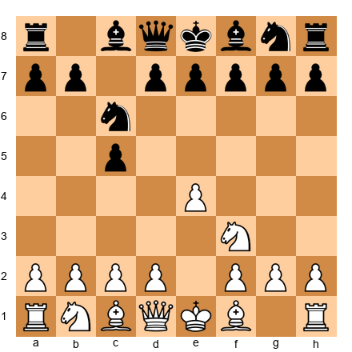</p>


You are building a 1.e4 repertoire and must choose an anti-Sicilian system for the position after 1.e4 c5 2.Nf3 Nc6. Compare two options:

Option A: The Open Sicilian (3.d4 cxd4 4.Nxd4)
Option B: The Closed Sicilian (3.Nc3 followed by g3 and Bg2)

For each option, list one advantage and one disadvantage. Then explain which option is better for a player transitioning from the London System, and why.

⏱ ~10 min

---

**Exercise 39.9** (★★★)
Your opponent has played the following openings in their last 20 games:
- As White: 1.e4 in 18 games, 1.d4 in 2 games
- As Black vs 1.e4: Sicilian Najdorf (15 games), French (3 games), Petrov (2 games)
- As Black vs 1.d4: Nimzo-Indian (12 games), Queen's Indian (5 games), KID (3 games)

You will play them tomorrow with the White pieces. Your repertoire includes both 1.d4 and 1.e4. Which first move do you choose, and why? What specific structure will you aim for?

⏱ ~8 min

---

**Exercise 39.10** (★★★)

<p align="center">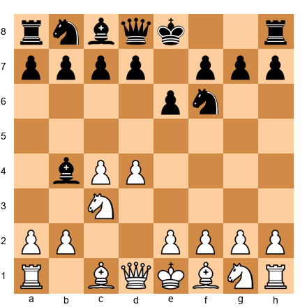</p>


This is the Nimzo-Indian Defense after 1.d4 Nf6 2.c4 e6 3.Nc3 Bb4. You are a 1.d4 player who has just added the Queen's Gambit to your repertoire.

Name three main systems White can play here (4.e3, 4.Qc2, 4.f3, 4.a3, etc.). For each system, describe the resulting pawn structure in one sentence. Recommend ONE system for a player transitioning from the London, and explain your recommendation.
*Hint: Consider which system best suits a player who values solid pawn structures.*

⏱ ~10 min

---

**Exercise 39.11** (★★★)
You are analyzing a position from your Catalan repertoire at home. You spend 20 minutes forming your own evaluation: "White is slightly better. The plan is to play Qc2, Rd1, and prepare e4." You then turn on the engine. Stockfish at depth 35 evaluates the position as exactly 0.00 (equal) and suggests a completely different plan involving a3, b4, and queenside expansion.

Describe what you should do next. What questions should you ask? Should you change your plan? Explain your reasoning.

⏱ ~8 min

---

**Exercise 39.12** (★★★)

<p align="center">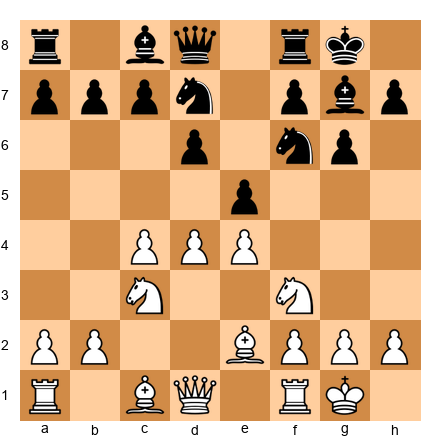</p>


This is a standard King's Indian Classical position. You used to play this as Black. Now, as part of your expanded 1.d4 repertoire, you must play it as White.

Describe White's main plan. Where should the pawns advance - kingside or queenside? What is the target of White's play? How does your experience as a KID player help you play this position from White's side?
*Hint: You know Black's plan. Now prevent it.*

⏱ ~10 min

---

**Exercise 39.13** (★★★)
Design a twelve-month plan for learning the Sicilian Najdorf from scratch. For each month (or two-month block), list the specific activity and the target outcome. Use the timeline template from section 39.8 as a guide.

⏱ ~12 min

---

**Exercise 39.14** (★★★)

<p align="center">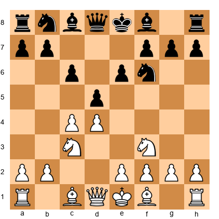</p>


This is the Slav Defense after 1.d4 d5 2.c4 c6 3.Nf3 Nf6 4.Nc3 e6 (the Semi-Slav). In a database search, you find:
- 5.Bg5 is the most common move (8,000 games, White scores 54%)
- 5.e3 is the second most common (6,500 games, White scores 52%)
- 5.g3 is rare (400 games, White scores 57%)

Based on these statistics, which move would you choose for your repertoire? Explain why raw win percentage is not the only factor. What other information would you want before making your decision?

⏱ ~8 min

---

**Exercise 39.15** (★★★)

<p align="center"></p>


You are building a 1.e4 repertoire and have reached this position (1.e4 e5 2.Nf3 Nc6). You must choose between the Ruy Lopez (3.Bb5) and the Italian Game (3.Bc4).

Compare the two openings using three criteria: (a) depth of theory required, (b) type of middlegame positions that result, (c) flexibility of resulting pawn structures. Which do you recommend for a player at 2200, and why?

⏱ ~10 min

---

**Exercise 39.16** (★★★)
You have a novelty notebook with five entries. One of your entries is:
- Position FEN: `r1bq1rk1/pp2bppp/2n1pn2/2pp4/3P4/2NBPN2/PP3PPP/R1BQ1RK1 w - - 0 9`
- Your novelty: 9.dxc5 (instead of the standard 9.a3)
- Engine evaluation at depth 30: +0.4
- Your notes: "Opens the d-file for the rook. After 9...Bxc5 10.e4 d4 11.Na4, the knight reaches c5 via a4."

Evaluate this novelty using the three criteria from section 39.12. Is it a good novelty? What additional analysis would you need before using it in a game?

⏱ ~10 min

---

**Exercise 39.17** (★★★)

<p align="center">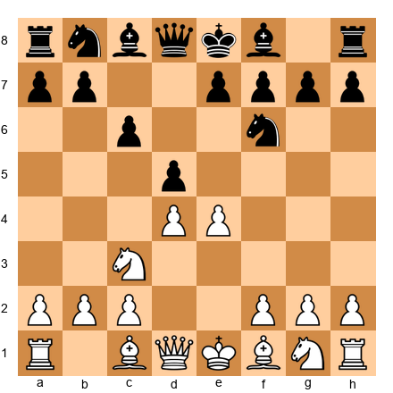</p>


This is the Caro-Kann Classical after 1.e4 c6 2.d4 d5 3.Nc3. After 3...dxe4 4.Nxe4, what are Black's two main choices? For each choice, describe the resulting pawn structure and White's plan. You are building a 1.e4 repertoire - which Black response would you prefer to face, and why?

⏱ ~8 min

---

**Exercise 39.18** (★★★)
Create an opponent dossier template. List the eight categories of information that every dossier should contain. For each category, write one sentence explaining what information to include and why it matters.

⏱ ~10 min

---

**Exercise 39.19** (★★★)

<p align="center">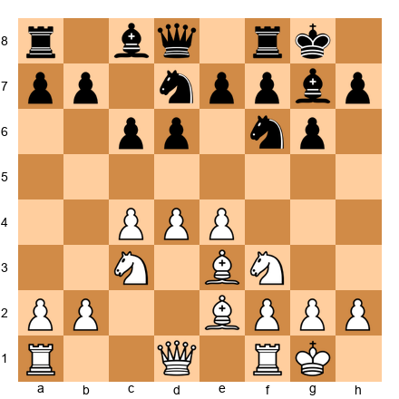</p>


You are White in a King's Indian Classical. Your opponent has played the standard ...Nbd7 system. You have prepared the plan of d5, c5, and queenside expansion. But your opponent now plays 8...e5.

This changes the pawn structure fundamentally. Describe how the position has changed. What is White's new plan? How does the pawn break ...f5 (by Black) change your calculations?

⏱ ~10 min

---

**Exercise 39.20** (★★★)
You maintain a repertoire of six openings (two as White, two as Black vs 1.e4, two as Black vs 1.d4). Describe a quarterly review process for keeping all six openings current. How much time should you spend per month on maintenance? What triggers an emergency review outside the quarterly schedule?

⏱ ~8 min

---

### ★★★★ Practice Exercises (39.21–39.35)

**Exercise 39.21** (★★★★)

<p align="center">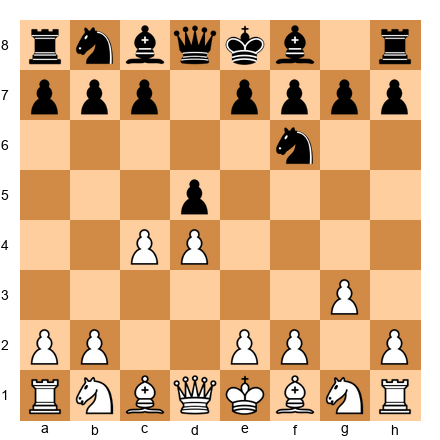</p>


This is a Catalan after 1.d4 d5 2.c4 Nf6 3.g3. Analyze three responses for Black: 3...e6 (mainline), 3...c6 (Slav-like), and 3...dxc4 (accepting the gambit). For each, describe the resulting position after five more moves of logical play. Which response is the most challenging for White to meet, and why?
*Hint: Consider the difference between accepting and declining the gambit.*

⏱ ~15 min

---

**Exercise 39.22** (★★★★)

<p align="center">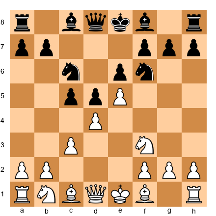</p>


This is the Advance French after 1.e4 e6 2.d4 d5 3.e5 c5 4.c3 Nc6 5.Nf3. You are White, building a 1.e4 repertoire.

Analyze the position without an engine. Identify White's main strategic ideas, Black's counterplay, and the key pawn breaks for both sides. Then describe how you would prepare this line for a classical game - what would you analyze at home, and what would you leave for over-the-board decision-making?
*Hint: The battle revolves around White's d4 pawn and Black's attempt to undermine it.*

⏱ ~15 min

---

**Exercise 39.23** (★★★★)
You are preparing for a tournament where you will play seven classical games over nine days. You have a list of twelve possible opponents. How do you allocate your preparation time? Do you prepare deeply for a few opponents or broadly for all twelve? Justify your approach.

Consider these constraints:
- You have four rest days (no games)
- You know pairings one day in advance
- You have access to a database and an engine

Design a preparation schedule for the entire tournament.

⏱ ~15 min

---

**Exercise 39.24** (★★★★)

<p align="center">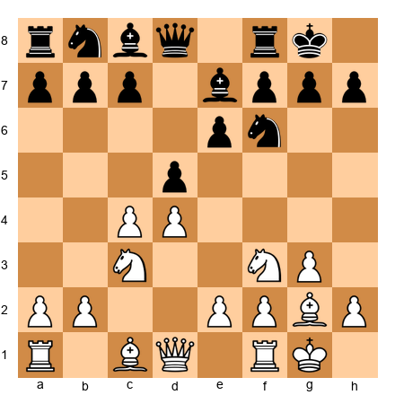</p>


This is a standard Catalan position. Black plays 6...dxc4. White must decide how to recover the pawn.

Analyze two approaches:
A) 7.Qc2 (threatening Qxc4)
B) 7.Ne5 (threatening Nxc4 and Bxb7)

For each approach, give the main line (5–7 moves) and evaluate the resulting position. Which gives White a more lasting advantage? Use concrete analysis, not generalities.
*Hint: After 7.Ne5, Black's best response involves ...Bd7.*

⏱ ~15 min

---

**Exercise 39.25** (★★★★)

<p align="center">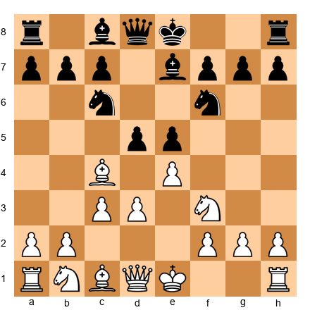</p>


This is an Italian Game Giuoco Piano after 1.e4 e5 2.Nf3 Nc6 3.Bc4 Nf6 4.d3 Be7 5.c3. You are transitioning to a 1.e4 repertoire.

Compare this position with the Ruy Lopez after 1.e4 e5 2.Nf3 Nc6 3.Bb5 a6 4.Ba4 Nf6 5.O-O Be7. What are the key structural differences? Which position offers more flexibility for White, and why? How would your preparation differ for each?
*Hint: Compare the influence of the bishops on c4 vs a4.*

⏱ ~15 min

---

**Exercise 39.26** (★★★★)
You have been playing the Queen's Gambit Declined with White for six months. Your results:
- Overall: W12, D8, L5 (64% score)
- Against the Exchange Variation (5.Bf4): W4, D2, L0
- Against the Lasker Defense (5...O-O 6.Nf3 h6 7.Bh4 Ne4): W2, D3, L4

Analyze this data. Where is your preparation strong? Where does it need improvement? Design a specific study plan to address the weakness. Be concrete - name the lines you would study and the resources you would use.

⏱ ~12 min

---

**Exercise 39.27** (★★★★)

<p align="center">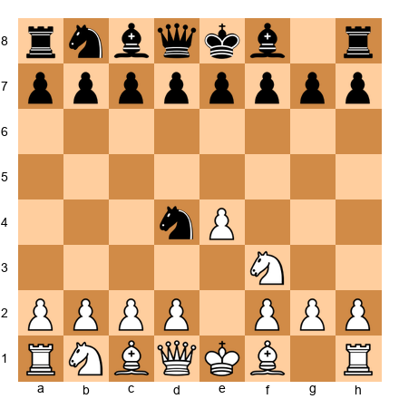</p>


An unusual position: after 1.e4 Nc6 2.Nf3 Nd4 (the Nimzowitsch Defense with an early ...Nd4). Your opponent plays this in every game. You have checked the database - this position appears in only 200 games, with White scoring 60%.

This is an off-beat opening. Describe your preparation approach. How do you handle an opening with very few database games? What resources would you use? How deep should your analysis go?
*Hint: With fewer database games, engine analysis becomes more important than statistical analysis.*

⏱ ~12 min

---

**Exercise 39.28** (★★★★)

<p align="center"></p>


You are White in a Sicilian Dragon. You intend to play the Yugoslav Attack (9.Bc4 Bd7 10.O-O-O). Your opponent has played this defense in their last eight games. In six of those games, their opponents castled queenside. In two games, their opponents castled kingside.

Based on this information, design a specific preparation plan. What should you look for in those eight games? What would you prepare differently than the "standard" Yugoslav Attack line?
*Hint: Focus on where your opponent has deviated from book moves and the results of those deviations.*

⏱ ~15 min

---

**Exercise 39.29** (★★★★)

<p align="center"></p>


Semi-Slav position. You analyze this at home with Stockfish at depth 35. The engine's top three moves are:
1. 5.Bg5 (eval: +0.25)
2. 5.e3 (eval: +0.20)
3. 5.g3 (eval: +0.15)

All three are very close in evaluation. Explain how you would choose between them for your repertoire. What factors beyond the engine evaluation should influence your decision? Name at least four factors.

⏱ ~10 min

---

**Exercise 39.30** (★★★★)
You are playing a nine-round Swiss tournament. After Round 4, your record is 3/4. Before Round 5, you learn that your opponent:
- Has played 1.d4 in all four games so far
- Lost badly in a Grünfeld in Round 2 (blundered in a complicated tactical position)
- Drew a long endgame in a QGD in Round 3
- Won quickly with a prepared novelty in a Nimzo-Indian in Round 4

You play Black. You have the Nimzo-Indian, KID, and Grünfeld in your repertoire. Which opening do you choose, and why? Design your 30-minute preparation plan for this specific game.

⏱ ~12 min

---

**Exercise 39.31** (★★★★)

<p align="center">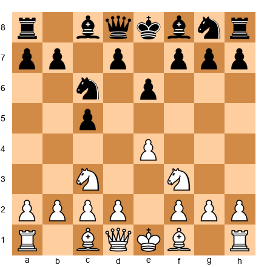</p>


This is a Sicilian after 1.e4 c5 2.Nf3 Nc6 3.Nc3 e6. You are building a 1.e4 repertoire and must decide: Open Sicilian (4.d4) or a system approach (4.g3, Bb2, Bg2)?

Analyze both options. For the Open Sicilian, describe what happens after 4.d4 cxd4 5.Nxd4 - what middlegame structures arise? For the system approach, describe White's plan with g3 and Bg2. Which requires more theoretical knowledge? Which is more likely to produce winning chances against a 2200-rated opponent?

⏱ ~12 min

---

**Exercise 39.32** (★★★★)
Your novelty notebook contains a prepared improvement in the Ruy Lopez Marshall Attack:


<p align="center">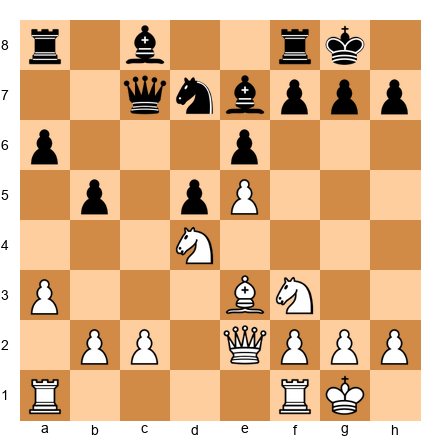</p>


After standard theory, you have found the move 14.c4!? (instead of the usual 14.Nd2). Your engine evaluates it at +0.45 at depth 38. In the database, 14.c4 has been played only twice, both in games below 2100.

Evaluate this novelty. What makes it promising? What could go wrong? How would you test it before using it in a serious game? What is your backup plan if the novelty fails?

⏱ ~15 min

---

**Exercise 39.33** (★★★★)
You are a 1.d4 player. In an upcoming tournament, you expect to face three opponents who all play the Grünfeld Defense (1.d4 Nf6 2.c4 g6 3.Nc3 d5). You have basic knowledge of the Exchange Variation (4.cxd5 Nxd5 5.e4 Nxc3 6.bxc3 Bg7) but have never studied it deeply.

Design a one-week intensive preparation plan for the Grünfeld Exchange Variation. Break it into daily sessions. Specify what you will study each day, how long each session should last, and what outcome you expect by the end of the week.

⏱ ~12 min

---

**Exercise 39.34** (★★★★)

<p align="center">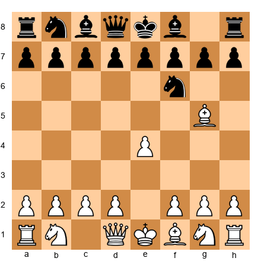</p>


After 1.e4 Nf6 2.Bg5 (the Trompowsky-like idea against the Alekhine), you face a rare sideline. Only 150 games in the database. Your opponent plays this in every game.

You have two options:
A) Spend 3 hours preparing specifically for this rare line
B) Spend 30 minutes and rely on your general understanding

Make a case for each option. Under what circumstances is (A) correct? Under what circumstances is (B) correct? How does the game's importance influence your decision?

⏱ ~10 min

---

**Exercise 39.35** (★★★★)

<p align="center">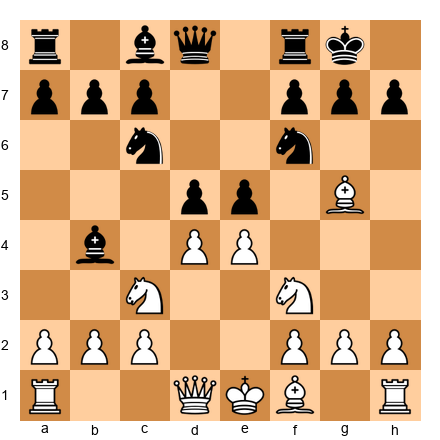</p>


You are playing a rapid tournament and face this position (a Scotch Four Knights type). You are out of your preparation - you have never studied this line.

Using only your structural understanding (no engine, no database), analyze the position. Identify the key structural features. Suggest a plan for White. Identify Black's best counterplay. Estimate the evaluation. Then describe how you would add this position to your preparation files after the game.

⏱ ~15 min

---

### ★★★★★ Mastery Exercises (39.36–39.45)

**Exercise 39.36** (★★★★★)
Design a complete opening repertoire for a player rated 2200 who has been playing the London System and King's Indian Defense their entire career. Specify:
- Primary and secondary openings as White
- Primary and secondary responses to 1.e4 as Black
- Primary and secondary responses to 1.d4 as Black
- A twelve-month implementation plan
- How the London and KID fit into the new repertoire as surprise weapons

Justify every choice. Explain why the chosen openings fit together as a coherent system.

⏱ ~25 min

---

**Exercise 39.37** (★★★★★)

<p align="center">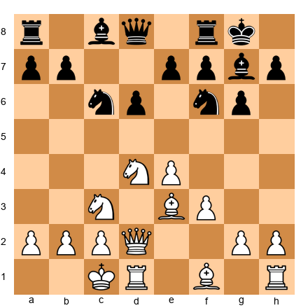</p>


You are White in a Sicilian Dragon, Yugoslav Attack. Your opponent has played this defense eight times in the database. You analyze their games and discover:
- In 5/8 games, they played ...d5 at some point (a common counter-thrust)
- In 3/8 games, they played ...Qa5 followed by ...Rfc8 (queenside pressure)
- They have never faced 9.O-O-O followed by an immediate 10.g4

Create a detailed preparation plan. Choose your specific approach, analyze the critical variations to depth 10, and describe your backup plan if your opponent deviates early.
*Hint: Consider whether provoking ...d5 or preventing it is more favorable for you.*

⏱ ~25 min

---

**Exercise 39.38** (★★★★★)
You are preparing for a world championship qualifier. Your opponent is rated 2380 and has a clearly defined repertoire:
- White: 1.e4, Open Sicilian, Italian Game, Advance French
- Black vs 1.e4: Sicilian Sveshnikov exclusively
- Black vs 1.d4: QGD Tartakower exclusively

You play both colors. Design a complete preparation package for the match (two games, one White, one Black). Specify:
- Your opening choice with White and the specific variation you will prepare
- Your opening choice with Black and the specific variation you will prepare
- Where you expect the critical moments to occur
- What novelties or improvements you would look for
- Time allocation for your preparation

⏱ ~30 min

---

**Exercise 39.39** (★★★★★)

<p align="center">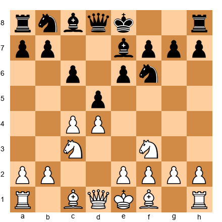</p>


This is the Meran Variation of the Semi-Slav (1.d4 d5 2.c4 c6 3.Nf3 Nf6 4.Nc3 e6 5.e3). After 5...Nbd7 6.Bd3 dxc4 7.Bxc4 b5, Black will play a sharp pawn advance on the queenside.

You are building a 1.d4 repertoire and must decide: Do you accept the Meran's complications (6.Bd3), or do you avoid them with an Anti-Meran system (6.Qc2)?

Analyze both options. For the Meran, describe the type of middlegame that arises after 6.Bd3 dxc4 7.Bxc4 b5 8.Bd3. For the Anti-Meran (6.Qc2), describe how the game typically develops. Which demands more memorization? Which offers more scope for understanding? Which suits a positional player better?

⏱ ~20 min

---

**Exercise 39.40** (★★★★★)
You have been using an engine for opening preparation for two years. You realize you have developed engine dependency - you cannot evaluate opening positions without checking Stockfish first. Your own evaluations, when tested against the engine, are off by an average of 0.5 pawns.

Design a six-week rehabilitation program to rebuild your independent judgment. Each week should have specific exercises, time commitments, and measurable goals. The program should gradually reintroduce engine use while maintaining independent evaluation habits.

⏱ ~20 min

---

**Exercise 39.41** (★★★★★)

<p align="center">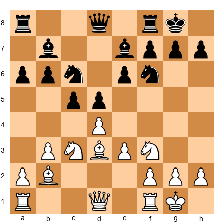</p>


This is a complex position from the Queen's Indian Defense. White has a flexible pawn center and the bishop pair. Black has solid development and pressure on d4.

Perform a complete preparation analysis of this position:
1. Evaluate the position without an engine (5 minutes)
2. Identify three candidate moves for White
3. Analyze each candidate to depth 6 (your own analysis)
4. Describe the resulting middlegame plans for both sides
5. Identify one potential novelty or improvement

Do this as a written exercise - record your thought process step by step. This is not about finding the right answer. This is about practicing the preparation method.

⏱ ~25 min

---

**Exercise 39.42** (★★★★★)
You are reviewing your repertoire at the quarterly checkpoint. You play:
- White: Catalan (primary), London (surprise weapon)
- Black vs 1.e4: Sicilian Najdorf (primary), Pirc (surprise weapon)
- Black vs 1.d4: Nimzo-Indian (primary), KID (surprise weapon)

In the last three months:
- Your Catalan results are strong (70% score)
- Your Najdorf results are mixed (50% score, two losses to the English Attack)
- Your Nimzo-Indian results are poor (40% score, three losses in the same variation)
- You have not played the London, Pirc, or KID at all

Analyze the data. What actions should you take for each opening? Prioritize your study time. How much time should you allocate to each opening per month? What should you study immediately versus what can wait?

⏱ ~15 min

---

**Exercise 39.43** (★★★★★)

<p align="center">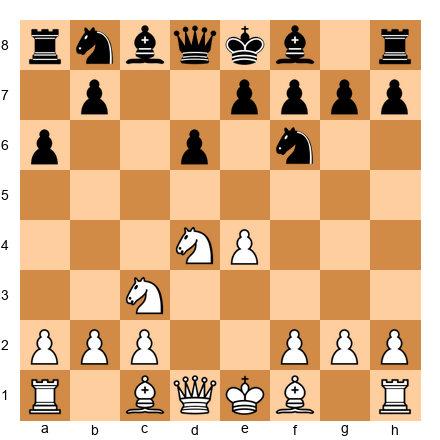</p>


This is the Sicilian Najdorf after 1.e4 c5 2.Nf3 d6 3.d4 cxd4 4.Nxd4 Nf6 5.Nc3 a6. You are building a 1.e4 repertoire and must choose an anti-Najdorf system.

Compare three systems:
A) 6.Bg5 (the Classical/Sozin complex)
B) 6.Be3 (the English Attack)
C) 6.Be2 (the Classical with Be2)

For each system, describe: the typical middlegame, the level of theoretical knowledge required, the types of positions that arise, and which system best suits a player who prefers strategic play over sharp tactics. Choose one and justify your decision with a concrete preparation plan.

⏱ ~20 min

---

**Exercise 39.44** (★★★★★)

<p align="center"></p>


After 1.e4 Nf6 2.e5 Nc6 (an unusual move order in the Alekhine Defense), you find that the database has only 45 games. Stockfish evaluates the position as +0.6 for White at depth 40.

You want to find a novelty in this position. Describe your complete novelty-hunting process:
1. What engine settings would you use?
2. How would you decide which moves to analyze deeply?
3. What criteria would you use to evaluate a potential novelty?
4. How would you test the novelty before using it in a game?
5. How would you document it in your novelty notebook?

⏱ ~20 min

---

**Exercise 39.45** (★★★★★)
Final synthesis exercise. Write a one-page "opening preparation philosophy" for yourself. This document should contain:
1. Your core belief about the role of openings in chess
2. Your personal balance between understanding and memorization
3. Your approach to engine use in preparation
4. Your policy on novelty hunting and deployment
5. Your opponent-preparation protocol
6. Your repertoire maintenance schedule
7. Your plan for the next twelve months of opening development

This is not a theoretical exercise. This is a practical document that you will use. Write it as though you will refer to it before every tournament for the next two years.

⏱ ~30 min

---

## Key Takeaways

1. **Understanding beats memorization.** For every opening you play, you should be able to explain the key ideas without naming a single move. If you cannot, your knowledge is brittle.

2. **Two systems minimum.** At 2200+, a single opening system is easy to prepare against. You need at least two systems as White and two as Black to keep your opponents guessing.

3. **The six-step method works.** Structures first, master games second, memorization third, practice fourth, deepening fifth, personal database sixth. The order matters.

4. **The funnel must be filled from the top.** Broad knowledge of pawn structures and plans makes specific preparation possible. Without the broad base, specific lines are fragile.

5. **Engines are tools, not teachers.** Always analyze without the engine first. When you turn on the engine, ask why, not what. If you cannot explain the engine's preference in words, you have not learned it.

6. **Your opponents have files on you.** You need files on them. Preparation is not a luxury at 2200 - it is a requirement.

7. **Repertoire maintenance is ongoing.** Quarterly reviews, engine updates, and honest assessment of your results keep your openings sharp.

8. **Nothing is wasted.** Your old openings become surprise weapons. Your new openings build on the structural understanding you gained from the old ones.

---

## Practice Assignment

This assignment has three parts. Complete them over the next two weeks.

**Part 1: Repertoire Audit (Days 1–3)**
Map your current repertoire. List every opening you play as White and as Black. For each opening, write three sentences explaining the key ideas - no moves, just plans and structures. Where you cannot write three sentences, you have found a gap that needs study.

**Part 2: Expansion Planning (Days 4–7)**
Choose one new opening to add to your repertoire. Follow Steps 1 and 2 of the six-step method: study five typical middlegame positions from the new system, then play through ten annotated master games. Take notes on the recurring themes.

**Part 3: Opponent Preparation (Days 8–14)**
Choose an opponent you will face soon (a league opponent, a tournament regular, or a training partner). Create a complete dossier following the template in section 39.14. Prepare a specific opening line against them. Play the game. Then update the dossier with the results.

This assignment is not about learning everything at once. It is about beginning the process. The twelve-month timeline starts now.

---

## ⭐ Progress Check

Answer these questions honestly:

- [ ] Can you explain the key ideas of every opening in your repertoire without naming specific moves?
- [ ] Do you have at least two systems as White and two responses as Black to each major first move?
- [ ] Can you describe the six-step method for learning a new opening from memory?
- [ ] Have you ever created an opponent dossier before a game?
- [ ] Do you have a novelty notebook with at least three entries?
- [ ] Can you analyze an opening position for fifteen minutes without turning on an engine?
- [ ] Do you review your repertoire at least once every three months?

If you answered "yes" to five or more questions, your preparation methodology is at a professional level. You are ready for the challenges of Volume IV.

If you answered "yes" to fewer than five, return to the sections where your answers were "no." Work through the relevant exercises. There is no shortcut to preparation discipline - but the methods in this chapter give you a clear path.

---

🛑 **Rest Marker.** This was one of the longest and most demanding chapters in the Codex. You have earned a break. Step away from the board. Go for a walk. Let the ideas settle. When you come back, you will bring with you not just knowledge but a system - a method for preparing at a level that matches your growing skill. That system will serve you for the rest of your chess career.

*"Chess is everything: art, science, and sport."* - Anatoly Karpov

💙🦄
