# Chapter 40: Practical Decision-Making Under Pressure
## When the Clock Is Ticking and the Stakes Are Real

---

> *"The winner of the game is the player who makes the next-to-last mistake."*
> - Savielly Tartakower

**Rating Range:** 2200–2400

**What You Will Learn:**
- The difference between the best move and the best *practical* decision - and why practical players outperform perfectionists
- Time management frameworks for expert-level play: when to invest the clock, when to move fast
- The three-candidate rule and the "good enough" principle
- Risk assessment in unclear positions - when to play for a win, when to take a draw
- How to handle must-win games, must-draw games, stronger opponents, and weaker opponents
- Recovery after a mistake - the mental reset that separates experts from amateurs
- Energy management during five-hour games and multi-round tournaments

---

## You Are Here

```
VOLUME IV - THE MASTER CLASS (2200–2400)

Ch 36: Expert-Level Calculation
Ch 37: Complex Middlegame Strategy
Ch 38: Advanced Endgame Theory
Ch 39: Professional Opening Preparation
Ch 40: Practical Decision-Making Under Pressure   ◀ YOU ARE HERE
Ch 41: The Art of Preparation
Ch 42: Dvoretsky-Level Endgames
Ch 43: Annotated GM Games - Modern Masterpieces
Ch 44: Deep Opening Systems
Ch 45: The Psychology of the Title Chase
```

---

## 40.1 The Practical Player's Edge

At 2200, you already calculate well. You understand strategy. You know your openings. So why do some 2200-rated players beat 2400s in tournament games while others lose to 2000s?

The answer is almost never about chess knowledge. It is about *decision-making under real conditions.*

Real conditions mean: a ticking clock, fatigue in round five of a weekend Swiss, the pressure of needing a win for a norm, an opponent who is playing faster than you expected. Real conditions mean making choices when you cannot see everything, cannot calculate everything, and cannot afford to sit there for twenty minutes on every move.

This chapter is about the skill that separates practical competitors from theoretical experts. It is the most undertrained skill in chess.

---

## 40.2 Best Move vs. Best Practical Decision

Set up your board:

<p align="center">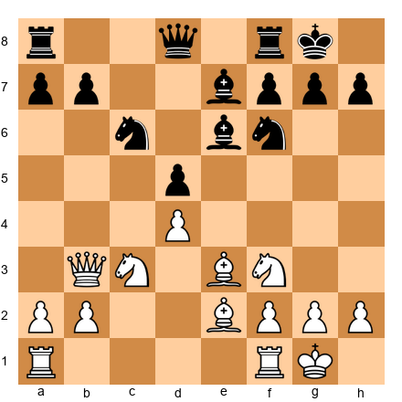</p>


White has a comfortable position. Stockfish at depth 40 might tell you the best move is something like 12.a4, expanding on the queenside with a slow plan. The evaluation: +0.3.

But you have 8 minutes left for 15 moves. Your opponent has 25 minutes. What do you play?

The practical decision is different from the engine's first choice. You need a move that is *good enough* and does not require deep calculation on the next several moves. You need a move that keeps the position stable while you play quickly.

12.Rfd1 is a practical choice. It develops your last piece to a natural square. It requires zero calculation. It maintains the tension. You play it in five seconds and keep your clock intact.

12.a4 might be objectively 0.1 pawns better. But if it leads to a position where you need to calculate a4-a5, Na4, and the resulting queenside play while your flag is hanging, it is *practically* worse.

**The principle:** The best move is the one that gives you the best chance of winning the *game*, not the best engine evaluation at move 12.

---

## 40.3 The Three-Candidate Rule

At 2200+, you know the Kotov method: list candidate moves, then calculate each one. But in practice, the Kotov method breaks down. Players list five or six candidates, start calculating the first, get lost in a variation, jump to the third candidate, then go back to the first - and burn fifteen minutes without a decision.

The three-candidate rule is a practical constraint: **identify no more than three candidate moves, then calculate each one to a fixed depth.**

### How It Works

1. **Spend 30–60 seconds scanning the position.** Identify your three most promising moves. If only two look reasonable, that is fine. If four look reasonable, eliminate the weakest one.

2. **Calculate each candidate to a consistent depth.** If you are giving each move a 5-move calculation, give all three that same depth. Do not go 12 moves deep on one candidate and 3 moves deep on another.

3. **Compare the resulting positions.** Which end position would you rather play? Not which is objectively best - which gives you the most comfortable game?

4. **Choose and move.** Once you have compared, commit. Do not go back and recalculate.

### Why Three?

Three is the right number because:
- One candidate is not enough - you might miss something better
- Two candidates is often sufficient, but sometimes a third option changes the picture
- Four or more candidates leads to decision paralysis, clock trouble, and inconsistent calculation depth

Set up your board:

<p align="center"></p>


This is a typical Italian Game position. White's candidates:
- **7.a4** - Gaining space on the queenside
- **7.Re1** - Supporting the e4 pawn, preparing for central play
- **7.Bg5** - Pinning the knight, creating tactical possibilities

Three candidates. Each is sound. Calculate each to about 5 moves deep. Compare the resulting positions. Choose the one that fits your style and the tournament situation.

If you are playing for a win, 7.Bg5 creates more tension. If you need a safe position with long-term chances, 7.Re1 is solid. If you want to avoid theory your opponent might know, 7.a4 sidesteps the main lines.

The three-candidate rule is not about finding the objectively best move. It is about making a high-quality decision in a reasonable amount of time.

---

## 40.4 The "Good Enough" Principle

Perfectionists lose rating points. This is a statistical fact. Players who spend too long searching for the best move run into time trouble, make hasty decisions in the final moves, and lose games they were winning.

The "good enough" principle is this: **if your first candidate move maintains your advantage or equality and creates no tactical problems, play it.**

You do not need the best move. You need a move that:
1. Does not lose material or allow a tactic
2. Improves your position or maintains the status quo
3. Does not commit you to a plan you cannot execute
4. Can be played with confidence

Set up your board:

<p align="center">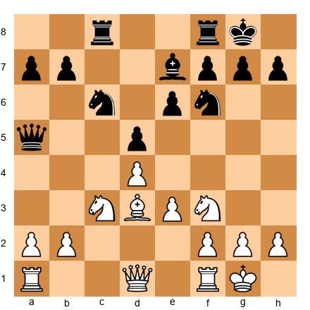</p>


White is slightly better. The bishop on d3 is well-placed, the knight on c3 supports d5 ideas, and Black's queen on a5 is slightly misplaced.

The perfectionist spends 12 minutes looking for the optimal plan. Should White play a3? Or Qe2? What about Bd2? Maybe Ne5 first?

The practical player asks: "Is there a simple, good move?" 13.Qe2 develops the queen to a natural square, connects the rooks, and keeps all options open. It is not necessarily the engine's top choice. It might be the second or third choice. But it is *good enough* - and it costs 30 seconds instead of 12 minutes.

**When to reject "good enough" and search deeper:**
- When you sense a tactical opportunity (checks, captures, threats)
- When the position is sharp and one mistake could be fatal
- When you have a significant time advantage
- When you recognize the position as a critical turning point

In all other situations, "good enough" is the right standard.

---

## 40.5 Time Management at the Expert Level

At lower levels, time management means "do not get into time trouble." At 2200+, time management is a strategic weapon.

### The Time Budget Framework

In a 90+30 time control (90 minutes for 40 moves, then 30 minutes for the rest, with 30-second increments), here is a professional time budget:

| Phase | Moves | Clock Target | Time Per Move |
|-------|-------|-------------|---------------|
| Opening | 1–12 | 75+ min remaining | 1–2 min avg |
| Early middlegame | 13–20 | 55+ min remaining | 2–3 min avg |
| Critical middlegame | 21–30 | 30+ min remaining | 3–5 min avg |
| Approach to time control | 31–40 | 5+ min remaining | 1–2 min avg |
| Second time control | 41+ | Use increment wisely | 30–60 sec avg |

### The Key Insight

Most games at the expert level are decided between moves 20 and 35. That is where complex middlegame decisions happen. That is where your time should be invested.

If you spend 15 minutes on move 8 because you forgot your opening preparation, you have stolen time from the phase of the game where time matters most. If you spend 5 minutes on move 37 in a routine position because you are a perfectionist, you may not have enough time for the critical decision at move 39.

**The rule:** Play the opening quickly (you should know it), play the endgame with the increment (technique should be automatic), and save your deepest thought for the middlegame decisions that actually determine the result.

### Monitoring Your Opponent's Clock

Your opponent's clock is information. At 2200+, you should glance at the opposing clock every 3–4 moves. Here is what to look for:

- **Opponent thinking long on a move?** They may be in unfamiliar territory. Consider playing a move that maintains the complexity.
- **Opponent playing instantly?** They are either in preparation or making obvious moves. If in preparation, be careful - they may have a surprise. If making obvious moves, the position may be simpler than you think.
- **Opponent low on time?** Do not rush to exploit this. Play solid, maintain the tension, and let *them* make the mistake under pressure. Avoid simplifications that give them an easy position to play quickly.

---

## 40.6 Playing with the Clock

When you have more time than your opponent, you have a practical advantage that has nothing to do with the position on the board. Here is how to use it.

### Maintain Complexity

Set up your board:

<p align="center">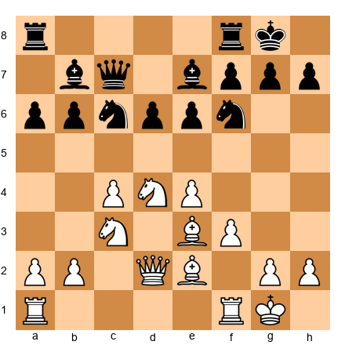</p>


You have 45 minutes. Your opponent has 12 minutes. The position is roughly equal. What is your strategy?

Do not simplify. If you trade pieces, the resulting endgame may be easy for your opponent to play quickly. Instead, maintain the tension. Play moves that keep all pieces on the board and create small decisions for your opponent on every move.

14.Rac1, for example, is a quiet move that maintains the tension. Black must decide how to react to the pressure on the c-file and the potential Nd5 ideas. Each of those decisions costs time.

### Choose Positions, Not Moves

When you have a time advantage, you are choosing the *type of position* you want to reach, not just the next move. You want positions where:
- Both sides have many reasonable options (decision fatigue for the opponent)
- The position is not forcing (no sequence of forced moves that your opponent can play quickly)
- Small inaccuracies accumulate into real disadvantages
- There is no single move that solves all of Black's problems

### Do Not Hurry

A common mistake: the player with more time starts playing fast to "keep the pressure on." This is wrong. Play at your normal pace. Your time advantage grows with every move your opponent spends thinking. If you start playing in 10 seconds per move, you are giving up your advantage for nothing.

---

## 40.7 Playing Against the Clock - Time Trouble Strategies

You are in time trouble. Five minutes for ten moves. Your heart is pounding. Your hands are shaking slightly. What do you do?

### Rule 1: Simplify When Possible

In time trouble, the most dangerous positions are complex middlegames with many pieces on the board. Every piece is a potential tactical threat you might miss. If you can trade down to a position with fewer pieces, your chances of surviving improve dramatically.

This does not mean you should give up your advantage to simplify. It means that if you have a choice between two equally good continuations - one complex and one simple - choose the simple one.

### Rule 2: Play Moves That Are Hard to Punish

Set up your board:

<p align="center">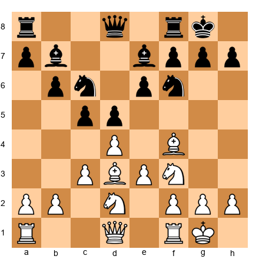</p>


You have 4 minutes. You need a move. Do not try to find the best move. Find a move that cannot be bad.

10.Re1 is almost impossible to punish. It puts the rook on a central file. It does not commit to any plan. It does not create any weaknesses. Even if it is not the engine's first choice, it cannot hurt you.

Avoid moves that create commitments: pawn pushes that weaken squares, piece placements that can be exploited, exchanges that change the pawn structure in unpredictable ways.

### Rule 3: Use Your Opponent's Time

When your opponent is thinking, you should be thinking about your next move. This seems obvious, but many players in time trouble waste their opponent's thinking time by panicking, fidgeting, or staring at the clock.

During your opponent's think time, identify one candidate move for each of the two or three most likely responses. When they play, you already have a candidate ready. This turns a 4-minute time scramble into a series of quick decisions with pre-calculated fallbacks.

### Rule 4: Make the Time Control

If you need to reach move 40 to get additional time, every decision before move 40 should be filtered through one question: "Does this move help me reach move 40 safely?" If a move is objectively slightly better but creates complications that could cause you to lose on time, it is the wrong move.

### Rule 5: Breathe

This is not a metaphor. Take one slow breath before each move. It takes three seconds. It prevents panic-induced blunders. Three seconds per move across ten moves is thirty seconds - a worthwhile investment for the mental clarity it provides.

---

## 40.8 Risk Assessment in Unclear Positions

Set up your board:

<p align="center">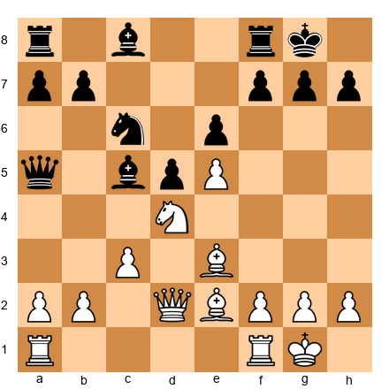</p>


White has a space advantage with the pawn on e5. Black has a solid structure and the bishop pair. The position is unclear. Should White play for an attack, or consolidate?

This depends on context - and at 2200+, you must account for factors beyond the board.

### The Risk Matrix

| Factor | Play for Win | Play for Draw |
|--------|-------------|---------------|
| Tournament standing | Behind in standings | Leading the tournament |
| Opponent's rating | Weaker opponent | Much stronger opponent |
| Color in remaining rounds | No more White games | More White games coming |
| Time on clock | More time than opponent | Less time than opponent |
| Position quality | Slight advantage | Slight disadvantage |
| Energy level | Fresh, early round | Exhausted, late in day |
| Norm situation | Need decisive results | Half-point keeps you on track |

### Practical Risk Tiers

**Low risk (take it):** Moves that improve your position without creating weaknesses. Playing for a win without risk. These are rare, but when they exist, there is no reason to hold back.

**Medium risk (take it if the context supports it):** Moves that create an imbalance - you gain something but give up something. A pawn sacrifice for initiative. A piece exchange that changes the character of the position. Take medium risks when you need a win or when you have a time advantage.

**High risk (take it only when necessary):** Moves that could lead to a losing position if your opponent finds the right response. A speculative sacrifice. A king march. Take high risks only in must-win situations or when you believe your opponent cannot handle the complications.

**Reckless (never take):** Moves that are objectively bad and rely on your opponent making a specific mistake. Hope chess. Even in must-win situations, reckless play almost always backfires at 2200+. Your opponents are too strong to rely on blunders.

### Applying the Matrix

In the position above, White might consider 13.f4, strengthening the e5 pawn and preparing a kingside attack. This is a *medium risk* move: it weakens the e3-g1 diagonal slightly and commits to a kingside plan.

If you are playing a weaker opponent and need a win, 13.f4 is the right practical choice. If you are playing a stronger opponent in a must-draw situation, 13.Qd1 is safer - repositioning the queen and keeping the position flexible.

The chess is the same in both cases. The decision is different because the *context* is different.

---

## 40.9 Tournament Situation Awareness

At 2200+, you are not playing individual games. You are playing a tournament. Every game is part of a larger strategic picture.

### Before the Round

Before you sit down, you should know:
1. **Your score and standing.** Are you competing for first place, fighting for a norm, or trying to gain rating?
2. **Your opponent's recent form.** Are they on a winning streak? Have they been struggling?
3. **The pairing situation.** Who will you face in the remaining rounds? What colors will you have?
4. **Your energy level.** Be honest with yourself. If you are exhausted, your strategy should account for that.

### The Three Tournament Modes

**Aggressive mode:** You need decisive results. You choose sharp openings, play for complications, and take calculated risks. This mode is appropriate when you are behind in a tournament, chasing a norm, or facing a much weaker opponent.

**Solid mode:** You are in a good position and need to maintain it. You choose reliable openings, play sound chess, and let your opponents take the risks. This mode is appropriate when you are leading a tournament or when a draw is a good result.

**Survival mode:** You are exhausted, tilted, or having a bad tournament. Your only goal is to stop the bleeding. Play the simplest chess you can. Avoid complications. Avoid time trouble. Get through the round and regroup.

### The Half-Point Trap

A common mistake at the expert level: treating every game as a must-win. At 2200+, draws against strong opponents are valuable. A player who scores +3 =4 -0 in a seven-round Swiss (7/10 performance) will almost always finish higher than a player who scores +4 =1 -2 (6.5/10 performance, but with losses).

Accept draws when they help your tournament position. Fight for wins when the situation demands it. The player who makes this distinction correctly gains rating points over time.

---

## 40.10 Critical Moment Recognition

Every game has 3–5 critical moments: positions where the evaluation can swing dramatically based on a single decision. Recognizing these moments - and investing time in them - is one of the most valuable skills at the expert level.

### Signals That You Are at a Critical Moment

1. **A forcing sequence has ended.** After a series of forced moves, you reach a position where you have genuine choices. This is almost always a critical moment.

2. **The pawn structure is about to change.** A pawn exchange or pawn push that alters the structure permanently deserves extra time. You cannot undo pawn moves.

3. **A piece exchange will change the character of the position.** Trading your active bishop for your opponent's passive knight might seem good, but it could give them counterplay. Think carefully.

4. **Your opponent has just played an unexpected move.** If you are surprised, slow down. Your preparation is over. You are on your own.

5. **You feel uncomfortable.** Your instinct that "something is wrong" is often correct. If a position feels dangerous, it probably is. Invest time.

Set up your board:

<p align="center">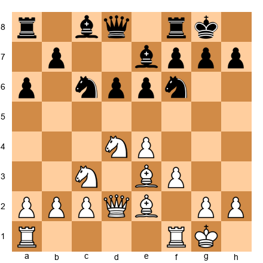</p>


This is a Najdorf Sicilian structure. White has several plans: Qd2-h6, g4-g5, f4-f5, or Nd5. Which one to choose?

This is a critical moment. Not because any of these plans is bad, but because each leads to a fundamentally different type of game. Choosing g4 commits you to a kingside attack. Choosing Nd5 might simplify the position. Choosing f4 maintains flexibility but delays concrete action.

Spend time here. This is a decision that will determine the next 15 moves.

### Signals That You Are NOT at a Critical Moment

1. **You have only one reasonable move.** If there is an obvious recapture or forced response, play it quickly. Save your time.

2. **The position is stable and your plan is clear.** If you are executing a known plan (doubling rooks, advancing a passed pawn), play the next step in the plan without agonizing.

3. **The position is a well-known theoretical ending.** If you know the technique, apply it. Do not reinvent the wheel on the clock.

---

## 40.11 Psychological Factors

Chess at 2200+ is a psychological contest as much as a technical one. The strongest calculation in the world means nothing if you cannot execute under pressure.

### The Mental Reset Between Moves

One of the most underrated skills at the expert level is the ability to reset mentally between moves. After a bad move, many players spiral into self-criticism: "Why did I play that? I'm so stupid. I'm going to lose." This internal dialogue destroys concentration and leads to more mistakes.

The mental reset works like this. After making a move that you realize is suboptimal, acknowledge it briefly ("That wasn't the best move") and then deliberately redirect your attention to the current position. The position on the board is the only thing that matters now. What you played three moves ago cannot be changed. What you play next can be.

Some players use a physical cue for the reset: touching the edge of the board, adjusting their chair, or taking a sip of water. The physical action interrupts the negative thought pattern and creates a transition to fresh analysis. Over time, the cue becomes automatic - you make a mistake, you take a sip, and you refocus.

This skill is not about suppressing emotions. You are allowed to feel frustrated. The skill is about not letting the frustration control your next move. Compartmentalize: feel the frustration, acknowledge it, and then set it aside until after the game. During the game, only the position matters.

### Playing Against Stronger Opponents

When you sit across from a 2500, your biggest enemy is not their chess skill. It is your own assumption that they will find the best move every time.

They will not. A 2500 is stronger than you, but they are not an engine. They miss things. They get tired. They have bad days. Your job is to:

1. **Play your normal chess.** Do not play passively because your opponent is higher-rated. Do not play recklessly because you think "only a gamble can work." Play the same quality chess you would play against anyone.

2. **Keep the game complex.** In simple positions, the stronger player's technique usually wins. In complex positions, both players can make mistakes. Complexity is the great equalizer.

3. **Watch their clock.** Strong players are not immune to time trouble. If they are thinking long, they are struggling. Do not assume they are finding brilliancies. They might be confused.

### Playing Against Weaker Opponents

This is harder than it sounds. Against a 1900, you should win. The pressure of "should" creates tension that does not exist against a peer.

1. **Do not try to crush them quickly.** Overambitious play against weaker opponents leads to overextension and blunders. Play solid chess and wait for their mistakes. They will come.

2. **Do not relax.** A 1900 can still play a brilliant combination. A 1900 can still hold a difficult endgame. Respect the position, even if you do not fear the opponent.

3. **Do not play down to their level.** If you play moves quickly because "they are only 1900," you will play sloppy moves. Maintain your standard thinking process.

### Must-Win Situations

You need a win in the last round. What do you do?

1. **Choose a sharp opening.** This is not the round for the London System. Play something that creates imbalances early: a Sicilian, a King's Indian, a gambit if it is in your repertoire.

2. **Avoid early queen trades.** Queens on the board create attacking chances. Without queens, grinding down a solid opponent is much harder.

3. **Do not force it.** The paradox of must-win games: the harder you try to force a win, the more likely you are to lose. Play good chess. Create problems. Let the win come to you.

### Must-Draw Situations

You need a half-point to secure a prize or a norm. How do you approach the game?

1. **Choose a solid opening.** The Berlin Defense, the Petroff, the Exchange Variation - openings that tend toward equality and require your opponent to take risks to create imbalances.

2. **Trade pieces when appropriate.** Fewer pieces on the board means fewer tactical complications and a higher draw probability.

3. **Do not offer a draw too early.** An early draw offer signals desperation and some opponents will reject it on principle. Play until the position is genuinely drawn, then offer.

4. **Do not play for a draw from move 1.** Playing too passively invites your opponent to build a risk-free advantage. Play normal, solid chess. The draw will follow from the position.

---

## 40.12 Recovery from Mistakes

You just blundered a pawn. Or you missed a tactic and lost the exchange. Or you played a terrible strategic move and your position is worse.

What you do in the next five minutes determines whether you lose the game or save it.

### The Three-Minute Rule

After a serious mistake, give yourself exactly three minutes to process it emotionally. During those three minutes, your opponent is probably thinking about how to exploit your mistake. Use that time to:

1. **Acknowledge the mistake internally.** "I blundered. I lost a pawn. That is a fact."
2. **Accept the new position.** The old position, where you were equal or better, no longer exists. The position on the board right now is the only one that matters.
3. **Evaluate the current position objectively.** You are down material. How much? Is there compensation? What is the practical chance of saving this game?

After three minutes, the emotional processing is over. You are now playing a new game from a worse position. Your job is to make it as difficult as possible for your opponent to convert.

### The Reset Technique

Set up your board:

<p align="center">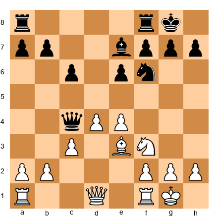</p>


Imagine you just blundered and allowed Black to win a pawn, arriving at this position where Black has an extra c-pawn. Your advantage is gone. What now?

Do not think about the move you missed. Think about *this position.* White still has a strong center with d4 and e4. The bishop on e3 is active. The knight on f3 supports both flanks. Black's extra pawn on c6 is doubled and weak.

The practical assessment: this position is worse for White, but it is not lost. If you play precisely, you have real chances to hold. If you play like someone who just blundered - rushed, emotional, trying to "get the pawn back" - you will lose.

### Practical Recovery Strategies

1. **Create counterplay.** When you are worse, passive defense usually loses slowly. Find an active plan, even if it involves further risk. An opponent who must deal with threats is more likely to make mistakes than one who can execute a plan in peace.

2. **Complicate the position.** If your opponent has a clear technical advantage, keep pieces on the board. An endgame where they are up material is usually lost. A middlegame where they are up material but under attack is unclear.

3. **Use your opponent's psychology.** After winning material, many players relax. They assume the game is over. This is when they are most vulnerable. If you play aggressively immediately after the mistake, you may catch them off guard.

4. **Watch the clock.** Your opponent may have spent time calculating the combination that won material. Their clock may be lower than expected. This is a practical factor.

---

## 40.13 Energy Management in Long Games

A five-hour game is an endurance event. Your body and your brain must function for the entire duration. At 2200+, the quality of your decisions in the fourth and fifth hours often determines the result.

### Physical Preparation

1. **Eat before the game.** A balanced meal 90 minutes before the round. Complex carbohydrates, protein, and fat. Avoid sugar spikes - they cause crashes.

2. **Bring water and a snack.** A banana, nuts, or a granola bar for hour three. Dehydration causes concentration loss before you notice it.

3. **Sleep.** This is obvious and ignored by almost every tournament player. Seven to eight hours the night before a game is worth more than any opening preparation.

### Mental Energy Conservation

Your brain consumes glucose when it works hard. Deep calculation is metabolically expensive. You cannot maintain maximum concentration for five hours straight.

**Hour 1–2 (Opening and early middlegame):** Your energy is highest. If the game reaches a critical position early, you can afford deep calculation.

**Hour 2–3 (Middlegame decisions):** Still strong, but the first signs of fatigue appear. This is where the three-candidate rule pays off - it prevents wasted energy on excessive analysis.

**Hour 3–4 (Late middlegame or endgame):** Fatigue is real. Focus on pattern recognition over deep calculation. Trust your training. Avoid the temptation to recalculate positions you have already evaluated.

**Hour 4–5 (Endgame or time scramble):** Conservation mode. Play known techniques. Avoid complications. If you reach a drawn endgame, execute the drawing technique and shake hands. Do not play on hoping for a miracle.

### The Walk

Between moves, stand up and walk. Leave the board for 30 seconds. Look at something far away. This resets your focus and reduces the mental fatigue that comes from staring at 64 squares for hours.

Every strong grandmaster does this. Carlsen walks. Kasparov paced. Fischer left the board constantly. It is not a distraction. It is a tool.

### The Tournament Arc: Managing Energy Across Multiple Games

In a multi-round tournament, energy management extends beyond a single game to the entire event. A typical weekend tournament might have five rounds over two days. A longer event might have nine rounds over a week. Planning your energy across the full arc of the tournament is part of competitive chess at the expert level.

**Round 1 games.** These are often the most dangerous because you are not yet "in the zone." Your mind is still transitioning from daily life to competitive chess mode. Play your most comfortable openings. Do not take unnecessary risks. Get a feel for the board and the tournament atmosphere.

**Middle rounds.** By rounds 3 and 4, you should be in your competitive rhythm. This is where you can take risks, play your sharpest openings, and push for wins. Your pattern recognition is at its peak because you have been immersed in chess thinking for a day or more.

**Last rounds.** Fatigue accumulates. Your calculation accuracy drops. If you are in contention for a prize, the pressure adds to the fatigue. In the last round, simplify when possible. Play positions you understand deeply. Avoid time trouble at all costs - your tired brain handles time trouble much worse than your fresh brain does.

**Between rounds.** The time between rounds is your recovery window. Do not spend it analyzing your game or studying theory. Eat. Walk. Nap if you can. Social interaction with other players is fine - it is relaxing and enjoyable. But do not turn the break into a study session. Your brain needs rest, not more work.

**The post-tournament review.** After the tournament is over, wait at least 24 hours before analyzing your games. This gives you emotional distance from the results. A loss that felt devastating during the tournament will feel manageable a day later. Your analysis will be more objective and more useful when you are not emotionally invested in proving that you "should have won."

---

## 40.14 The Practical Decision Framework - Synthesis

Here is a framework you can apply to any position, any time, any situation. Memorize it. Practice it until it becomes automatic.

### The Five Questions

1. **Is this a critical moment?** (If yes, invest time. If no, play a good-enough move.)
2. **What are my three candidates?** (List them. Do not calculate yet.)
3. **What does the clock say?** (Your time, their time, and how many moves until the time control.)
4. **What does the tournament say?** (Do I need a win, a draw, or just a solid game?)
5. **What is the simplest move that accomplishes my goal?** (Start there. Only reject it if something clearly better exists.)

This framework takes about 30 seconds to run through mentally. In a 4-hour game with 40 moves, that is 20 minutes of total framework time. The remaining time goes into actual calculation on the 5-8 moves that matter most.

---

## 40.15 The Post-Move Checklist

After you make a move and press the clock, most players simply wait for their opponent's response. Strong players use this time productively. Here is a post-move checklist that runs in about 10 seconds and catches errors that would otherwise go unnoticed until it is too late.

### The Three-Second Scan

The moment after you press the clock, scan the board for three things.

**First: did I hang anything?** Quickly check whether the move you just played left any of your pieces undefended, created a back-rank weakness, or allowed a fork, pin, or skewer. This sounds basic, but even 2200-rated players occasionally leave pieces hanging, especially in time pressure. A three-second scan catches these blunders before they become disasters.

**Second: does my opponent have a check?** Checks are the most forcing moves in chess. If your opponent has a check available, you need to be aware of it before they play it. Knowing it is coming allows you to prepare your response during their thinking time.

**Third: what is my opponent's most likely response?** Start thinking about your opponent's best move immediately. If you have already analyzed the position during your own turn, you should have a good idea of what they will play. If they play the expected move, you can respond quickly and save time. If they play something unexpected, the surprise will be less jarring because you were already thinking about the position.

### The Post-Move Reflection

After the three-second scan, use your remaining time (while your opponent thinks) for a broader reflection.

Ask yourself: "Is my position better, worse, or about the same as it was before my last move?" This simple question keeps you oriented. If your position is better, you are on the right track - look for ways to increase your advantage. If it is worse, figure out why and start looking for the best defensive setup. If it is about the same, ask whether there was a better move you missed.

This reflection takes 30 seconds to a minute and uses time that would otherwise be wasted watching your opponent think. Over a 40-move game, this disciplined use of your opponent's thinking time gives you an extra 20 to 30 minutes of productive analysis without using any of your own clock time.

---

## 40.16 The Art of Resignation

This is a topic that almost no chess book covers, but it matters for the serious player. Knowing when to resign - and how to resign with grace - is part of competitive maturity.

### When to Resign

The general rule at the expert level: resign when the position is clearly lost AND there are no practical chances of saving the game (no time trouble for your opponent, no complications available, no stalemate tricks).

If your opponent is an engine, you should resign when you are down a rook with no compensation. But your opponent is human, and humans make mistakes. The question is not "is this position lost with perfect play?" The question is "is there any realistic chance of saving this game?"

Against a strong opponent with plenty of time on the clock in a technically won position (like a queen and pawn up in a simple endgame), resign. You are wasting both players' time by continuing.

Against a weaker opponent, or in time trouble, or in a position with some remaining complexity, play on. There are chances. But play on with a plan for saving the game, not just hoping for a miracle.

### How to Resign

When you decide to resign, do it cleanly. Stop the clock. Extend your hand. Say "I resign" or "good game" or simply nod. Do not knock over the pieces, slam the clock, or storm away from the board. Your opponent played well enough to win. Acknowledge it.

After the game, if you want to analyze, offer to go over the game with your opponent. Most players are happy to discuss the game they just won. You will learn more from a post-game discussion with the player who beat you than from any other source.

If you are too emotional to analyze immediately, that is fine. Thank your opponent, leave the playing hall, and analyze the game later when you have calmed down. The game will still be there. The analysis will be more productive when you are not upset.

---

## Annotated Games

### Game 1: Magnus Carlsen vs Ian Nepomniachtchi
**World Championship Match, Game 9, Dubai 2021**
**Result:** 1-0 (136 moves)
**Theme:** Energy management, practical grinding, and the art of playing on when the position is drawn

This game is one of the longest in World Championship history. It illustrates a core principle of practical play: sometimes the best decision is to keep playing, keep creating small problems, and wait for your opponent's energy to fail.

**Opening: Petroff Defense (Russian Game)**

1.e4 e5 2.Nf3 Nf6 3.d4 Nxe4 4.Bd3 d5 5.Nxe5 Nd7 6.Nxd7 Bxd7 7.Nd2 Nxd2 8.Bxd2 Bd6

The Petroff is one of the most solid defenses in chess. Black's strategy is clear: trade pieces, equalize, and hold the draw. Nepomniachtchi is playing for a draw with the black pieces in a World Championship match. This is a reasonable strategy.

Set up your board:

<p align="center">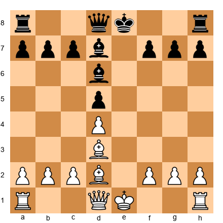</p>


**The practical question:** Should Carlsen accept the symmetrical, drawish structure? Or should he try to squeeze something from nothing?

9.O-O O-O 10.Qf3

A subtle move. Instead of the routine 10.Qe2, Carlsen places the queen on an active square where it eyes both the kingside and the d5 pawn.

10...Re8 11.Re1 Rxe1+ 12.Bxe1 Qe7 13.Bf2

Set up your board:

<p align="center">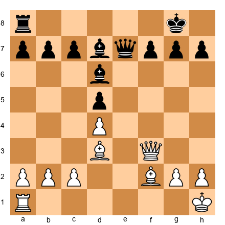</p>


**Practical lesson:** Carlsen is not trying to win this position by force. He is trying to create a position where Black must make small decisions on every move. Each decision is easy in isolation, but over 50 or 60 moves, the cumulative mental effort is exhausting.

The game continued through a long, maneuvering middlegame. Pieces were traded slowly. The position simplified - but never quite to a dead draw.

After extensive maneuvering, the game entered a rook and bishop vs. rook and bishop ending. Engines evaluated the position as 0.00 for dozens of moves. But Carlsen kept playing. He kept finding ways to create micro-problems.

**The critical decision point came around move 80.** Nepomniachtchi had to choose between several defensive setups. The position was still drawn with correct play, but "correct play" required precise calculation on every move. By this point, both players had been at the board for over six hours.

**Move 130+:** Nepomniachtchi finally cracked. A small inaccuracy turned a drawn position into a lost one. Carlsen converted with clinical precision.

**What this game teaches about practical decision-making:**
- A drawn position is only drawn if both players can maintain the required precision indefinitely. In practice, this is impossible.
- Energy management is a weapon. Carlsen's physical fitness and mental endurance were as important as his chess skill.
- The decision to play on in a "drawn" position is itself a practical choice. Carlsen assessed that his endurance advantage was worth more than the theoretical evaluation.
- Nepomniachtchi's decision to enter the Petroff - hoping for a quick draw - backfired because Carlsen turned it into a test of stamina rather than theory.

---

### Game 2: Boris Spassky vs Tigran Petrosian
**World Championship Match, Game 17, Moscow 1969**
**Result:** 1-0
**Theme:** Practical aggression in a must-win situation

By Game 17 of the 1969 World Championship, Spassky led the match. But Petrosian was a notoriously difficult opponent to beat - his defensive skill was legendary. Spassky needed to find a way to create genuine winning chances against the most solid player of his era.

**Opening: Sicilian Defense**

1.e4 c5 2.Nf3 d6 3.d4 cxd4 4.Nxd4 Nf6 5.Nc3 a6 6.Bg5 Nbd7

Set up your board:

<p align="center">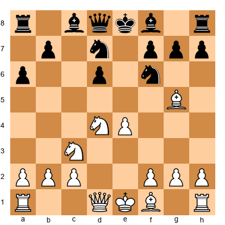</p>


Petrosian avoids the sharpest Najdorf lines. 6...Nbd7 is a practical choice: solid, flexible, and hard to attack directly. The practical player would approve.

7.Bc4 Qa5 8.Qd2 e6 9.O-O-O Be7 10.Bb3

**The practical calculation:** Spassky knows that Petrosian will defend brilliantly in quiet positions. The practical decision is to create a position where tactical fireworks are possible - where Petrosian's prophylactic style cannot prevent the storm.

10...O-O 11.Rhe1 Nc5

Set up your board:

<p align="center">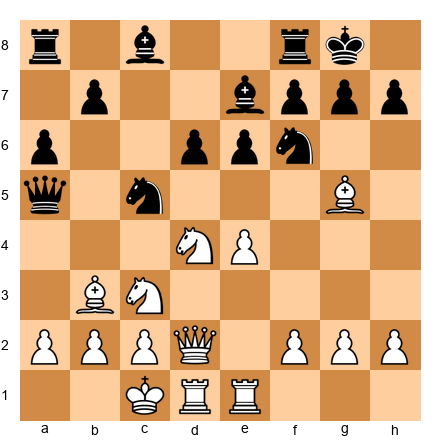</p>


12.f4

**The aggressive practical decision.** Spassky commits to a kingside attack. This is medium risk - the f4 push weakens the e3 square and the diagonal to the white king. But Spassky has decided that creating complications against Petrosian is the only practical way to win.

12...Bd7 13.e5 dxe5 14.fxe5 Nfd7

Spassky sacrificed a pawn for activity. The position is now sharp and double-edged - exactly what Spassky wanted and exactly what Petrosian wanted to avoid.

15.Qf4 Nxb3+ 16.Nxb3 Qc7 17.Nd4

**The practical insight:** Spassky is playing moves that are not necessarily the engine's top choices, but they create maximum practical problems. Each move forces Petrosian to find the correct defensive resource under the pressure of the World Championship.

The game continued with Spassky maintaining the initiative. Petrosian defended resourcefully, but the constant pressure eventually told.

**What this game teaches:**
- Against a defensive genius, the practical decision is to create chaos - even at the cost of material.
- A must-win situation changes the calculation. Moves that would be too risky in a must-draw scenario become necessary.
- The risk matrix is not static. It changes with every game in a match and every round in a tournament.

---

### Game 3: Bobby Fischer vs Boris Spassky
**World Championship Match, Game 6, Reykjavik 1972**
**Result:** 1-0
**Theme:** The practical surprise - playing outside your comfort zone

Game 6 is one of the most famous games in chess history. But its significance for practical decision-making is rarely discussed.

Fischer had played 1.e4 his entire career. Spassky's team had prepared exclusively against 1.e4. Fischer's practical decision before Game 6 was radical: play 1.d4 for essentially the first time in a World Championship game.

**Opening: Queen's Gambit Declined**

1.c4 e6 2.Nf3 d5 3.d4 Nf6 4.Nc3 Be7 5.Bg5 O-O 6.e3 h6 7.Bh4 b6 8.cxd5 Nxd5 9.Bxe7 Qxe7 10.Nxd5 exd5 11.Rc1 Be6 12.Qa4 c5 13.Qa3

Set up your board:

<p align="center">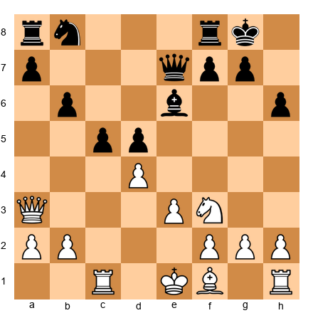</p>


**The practical decision that matters:** Fischer chose an opening he rarely played. Why? Because Spassky was unprepared for it. The objective quality of the opening mattered less than the practical advantage of surprise.

This is a principle that applies at every level from 2200 to 2800: an opening you understand reasonably well that your opponent is unprepared for is *practically* stronger than an opening you know perfectly that your opponent has studied all week.

13...Rc8 14.Bb5 a6 15.dxc5 bxc5 16.O-O Ra7 17.Be2 Nd7

Set up your board:

<p align="center">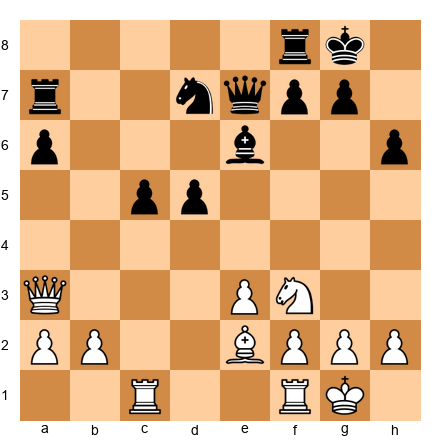</p>


18.Nd4

Fischer plays simple, strong chess. The knight goes to the best square. There is no deep calculation here - just good moves played quickly.

18...Qf8 19.Nxe6 fxe6 20.e4

**The breakthrough.** Fischer opens the position and creates weaknesses in Black's structure. The hanging pawns on c5 and d5, which looked dynamic, are now targets.

20...d4 21.f4 Qe7 22.e5 Rb8 23.Bc4 Kh8 24.Qh3

Set up your board:

<p align="center">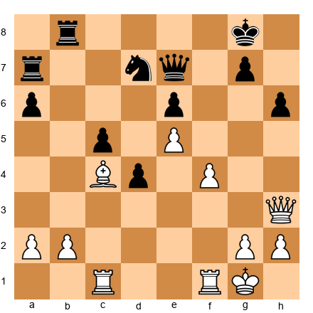</p>


From here, Fischer converted his advantage with precise play. The game is considered one of the greatest positional achievements in chess history.

**What this game teaches about practical decision-making:**
- Surprise is a legitimate weapon at any level. An unfamiliar opening can be more effective than a prepared one.
- Fischer did not need to play the Queen's Gambit at a grandmaster level. He needed to play it *well enough* that the positional themes - which are universal - carried him through.
- The "good enough" principle applies to opening selection, not just individual moves.
- Spassky was so shocked by 1.c4 that he spent extra time in the early moves, disrupting his time management for the entire game.

---

### Game 4: Garry Kasparov vs Anatoly Karpov
**World Championship Match, Game 24, Seville 1987**
**Result:** 1-0
**Theme:** Must-win pressure - playing your best chess when everything is on the line

Going into Game 24, Kasparov trailed by one point. He *had* to win this game to tie the match and retain his title. A draw meant losing the World Championship.

This is the ultimate must-win situation. How did Kasparov approach it?

**Opening: Ruy Lopez**

1.e4 e5 2.Nf3 Nc6 3.Bb5 a6 4.Ba4 Nf6 5.O-O Be7 6.Re1 b5 7.Bb3 d6 8.c3 O-O 9.h3 Bb7 10.d4 Re8 11.Nbd2 Bf8 12.a4 h6 13.Bc2 exd4 14.cxd4 Nb4 15.Bb1 c5 16.d5

Set up your board:

<p align="center">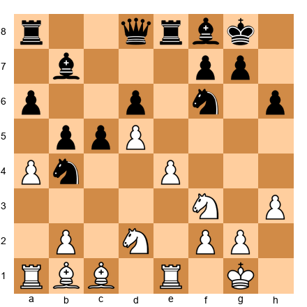</p>


**The practical decision:** Kasparov chooses 16.d5, closing the center. This creates a positional battle where piece maneuvering will decide the game. In a must-win situation, many players would choose a sharp, open position. Kasparov made the opposite choice - he chose a structure where his superior understanding of piece play could be demonstrated over many moves.

This is a sign of world-class practical thinking. Kasparov did not play for a quick kill. He played for a type of position where his strengths would be maximized, even though that meant a long, complex game.

16...Nd7 17.Ra3 f5 18.Rae3 Nf6 19.Nh2 Kh7 20.b3

The game developed into a tense maneuvering battle. Kasparov slowly improved his pieces while Karpov tried to find counterplay.

Set up your board:

<p align="center">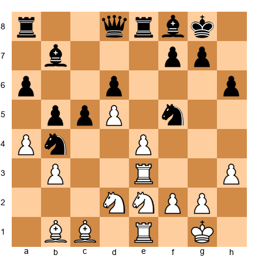</p>


Kasparov built up pressure on the kingside. His pieces were better coordinated, and he found a way to open lines toward Karpov's king.

**The critical moment:** With the match on the line, Kasparov sacrificed material to open the position. The sacrifice was not objectively necessary - he had other good options. But he calculated that the resulting complications would be harder for Karpov to navigate under the pressure of the match situation.

This is pure practical thinking: choosing the line that maximizes *practical* winning chances, not the line that the engine evaluates as best.

Kasparov won the game in brilliant style, tied the match, and retained his title.

**What this game teaches:**
- In must-win situations, choose positions that favor your strengths, not just sharp positions.
- Patience is sometimes the most aggressive strategy. Kasparov could have pushed for a quick kill and risked losing. Instead, he built his advantage slowly and struck when the position was ripe.
- Psychological pressure accumulates. Every quiet, strong move Kasparov played increased the weight on Karpov's shoulders. By the time the critical moment arrived, Karpov was already exhausted from the defensive effort.

---

### Game 5: Vladimir Kramnik vs Peter Leko
**World Championship Match, Game 14, Brissago 2004**
**Result:** 1-0
**Theme:** The last chance - practical decisions when elimination is one move away

Going into the final game of the 2004 World Championship match, Kramnik trailed by one point. Like Kasparov in 1987, he needed a win in the final game to tie the match and retain his title on tiebreaks.

**Opening: Sicilian Defense, Sveshnikov**

1.e4 c5 2.Nf3 Nc6 3.d4 cxd4 4.Nxd4 Nf6 5.Nc3 e5 6.Ndb5 d6 7.Bg5 a6 8.Na3 b5

Set up your board:

<p align="center">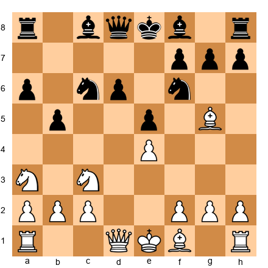</p>


**The practical decision:** Kramnik, known throughout his career as a quiet positional player, chose the Sveshnikov Sicilian - one of the sharpest openings in chess. Why? Because he needed a win. The practical context demanded a sharp, unbalanced game.

This is the opposite of what many players would expect from Kramnik. But great practical players adapt their style to the situation. Kramnik was not a "positional player" in the final game. He was a fighter.

9.Nd5 Be7 10.Bxf6 Bxf6 11.c3 Bg5 12.Nc2 Rb8 13.h4 Bh6 14.g3 O-O

Set up your board:

<p align="center">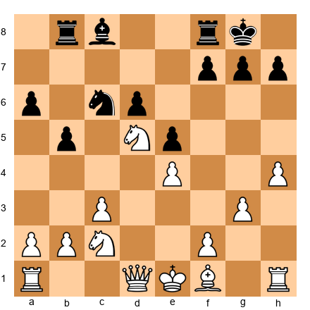</p>


15.Bg2 Be6 16.O-O Bg4 17.Qd3 Be6 18.f4

**The aggressive decision.** Kramnik pushes f4, opening the position and creating tactical possibilities. In his normal style, he might play Qd2 or a3, keeping the position closed. But the match situation demands action.

18...exf4 19.gxf4 f5

The position is now sharp and unbalanced. Both sides have weaknesses and chances. This is exactly the type of position Kramnik needed - one where a decisive result is likely.

The game continued with Kramnik pressing on the kingside and in the center. Leko defended tenaciously, but the pressure of knowing that a draw would win him the World Championship actually made it harder for him to play. Every move carried the weight of a potential coronation.

Kramnik eventually broke through and won, tying the match and retaining his title.

**What this game teaches:**
- Your opening choice must match the situation, not your default style. A positional player in a must-win game must play sharp chess.
- Pressure affects both players. The player who "only needs a draw" often plays worse than expected because the fear of losing something they almost had is paralyzing.
- The practical decision to play an unfamiliar but sharp opening is correct when the alternative (a slow, positional game that might end in a draw) is worse than the risk.

---

## Exercises

### ★★ Warmup (8 exercises)

---

**Exercise 40.1** (★★)

<p align="center">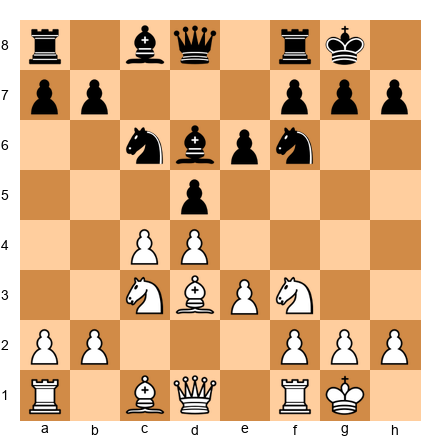</p>


Set up your board. White to play.

You have a comfortable position. Your opponent has 40 minutes on the clock. You have 38 minutes. There are no tactics in the position.

**Question:** Should you (A) spend 5 minutes looking for the best move, or (B) play a natural developing move like 8.Qe2 within 30 seconds?

**Hint:** Think about where your time will be needed later in this game.

⏱ 1 min

---

**Exercise 40.2** (★★)

<p align="center">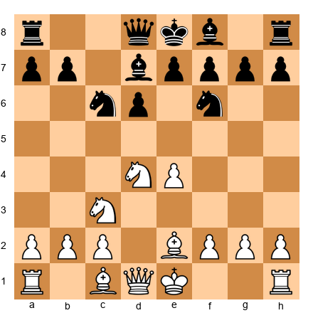</p>


Set up your board. White to play.

Name three candidate moves. Do not calculate any of them yet - just list them.

**Hint:** Look for natural developing moves, central control, and piece coordination.

⏱ 1 min

---

**Exercise 40.3** (★★)

<p align="center">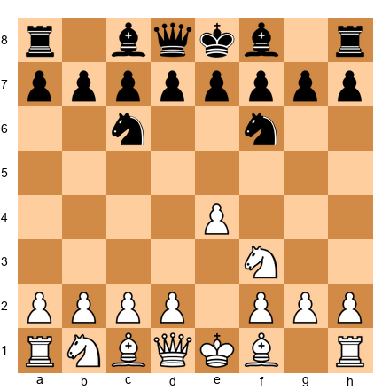</p>


Set up your board. White to play.

This is a standard position after 1.e4 Nc6 2.Nf3 Nf6. Your preparation ends here. You have two choices: (A) spend 8 minutes recalling your analysis, or (B) play a natural move like 3.Nc3 or 3.e5 within one minute.

**Question:** Which is the better practical decision, and why?

**Hint:** You will never get those 8 minutes back. Will this position be the critical moment of the game?

⏱ 1 min

---

**Exercise 40.4** (★★)

<p align="center">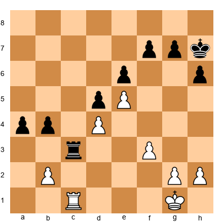</p>


Set up your board. White to play.

This is a rook endgame where you are slightly worse (Black has an extra a-pawn). You have 10 minutes left. Your opponent has 25 minutes.

**Question:** What is your practical priority - (A) finding a way to win back the pawn, or (B) creating a fortress?

**Hint:** Think about what is achievable with 10 minutes on the clock.

⏱ 1 min

---

**Exercise 40.5** (★★)

<p align="center">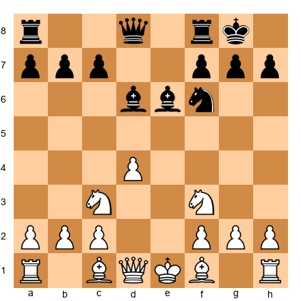</p>


Set up your board. White to play.

You are playing a 2400-rated opponent in round 1 of a tournament. The position is equal. Should you (A) play for complications, (B) play for a solid position, or (C) offer a draw?

**Hint:** It is round 1. You have many games left. Consider the risk matrix.

⏱ 1 min

---

**Exercise 40.6** (★★)

<p align="center"></p>


Set up your board. White to play.

You just realized you prepared the wrong opening for this opponent. They played 2...Nf6 (Petroff) and you expected the Italian. You have two choices: (A) spend 5 minutes adjusting your preparation, or (B) play 3.Nxe5 (the main line you know from general study) and continue.

**Question:** Which is the better time management decision?

**Hint:** What is the opportunity cost of spending 5 minutes here?

⏱ 1 min

---

**Exercise 40.7** (★★)

<p align="center">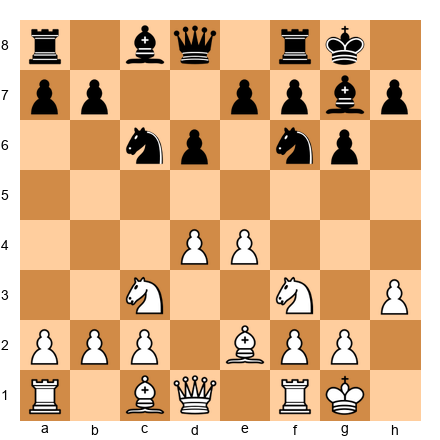</p>


Set up your board. White to play.

This is a King's Indian position. You are White, rated 2250. Your opponent is rated 2100. You need a win to tie for first place.

**Question:** Is 8.d5 (closing the center and playing on the queenside) or 8.Be3 (keeping tension) the better *practical* decision for your situation?

**Hint:** Against a lower-rated opponent, which position gives you more chances to outplay them?

⏱ 2 min

---

**Exercise 40.8** (★★)

<p align="center">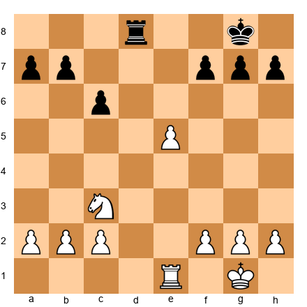</p>


Set up your board. White to play.

You just won a pawn (the e5 pawn is extra). Your opponent looks frustrated. You have 30 minutes; they have 18 minutes.

**Question:** What is your practical approach for the next 10 moves - (A) push for a quick finish, or (B) consolidate and let your advantages (material and clock) work together?

**Hint:** A frustrated opponent with less time will make their own mistakes. You do not need to force the issue.

⏱ 1 min

---

### ★★★ Essential (20 exercises)

---

**Exercise 40.9** (★★★)

<p align="center">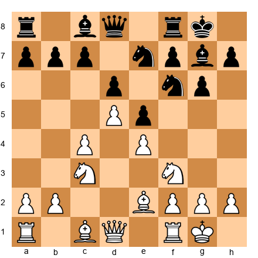</p>


Set up your board. White to play. **You have 3 minutes. Choose a move.**

This is a King's Indian with a closed center. List your three candidates. Calculate each to 3 moves deep. Choose the one that gives you the most comfortable position.

**Hint:** Consider the plans f4, Be3 + Qd2, and a queenside expansion with a3 + b4. Which one can you execute on autopilot for the next 5 moves?

⏱ 3 min

---

**Exercise 40.10** (★★★)

<p align="center">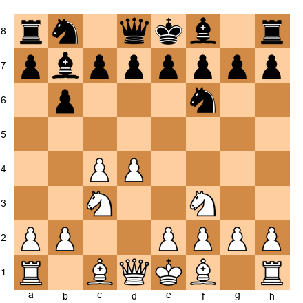</p>


Set up your board. White to play. **You have 3 minutes. Choose a move.**

This is a Queen's Indian structure. You have 50 minutes on the clock for 30 more moves. Your opponent has 15 minutes. How does their time situation affect your move choice?

**Hint:** Complexity is your ally. Look for moves that maintain the tension rather than simplify.

⏱ 3 min

---

**Exercise 40.11** (★★★)

<p align="center">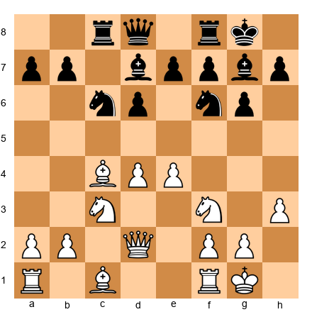</p>


Set up your board. White to play.

You have been thinking about 10.Bxf7+ for 4 minutes. The sacrifice looks promising but you cannot calculate it to a conclusion. You have 25 minutes left.

**Question:** Do you (A) play the sacrifice, (B) spend 5 more minutes calculating, or (C) play a safe move and save your time?

**Hint:** If you cannot see a clear win after 4 minutes of calculation, what are the chances you will see it after 9 minutes?

⏱ 2 min

---

**Exercise 40.12** (★★★)

<p align="center">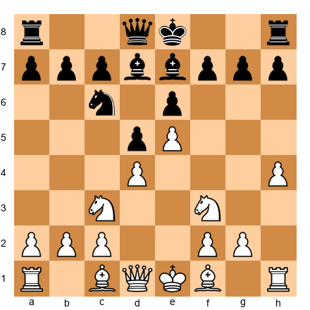</p>


Set up your board. White to play.

You are in a French Defense position. The structure is locked. Your opponent is a 2350-rated positional player who excels in maneuvering battles.

**Question:** Is 7.h5 (fixing the kingside and preparing a potential attack) or 7.Bd3 (developing naturally) the better practical decision *against this specific opponent*?

**Hint:** Playing to your opponent's strength is a poor practical decision, even if the move is objectively fine.

⏱ 3 min

---

**Exercise 40.13** (★★★)

<p align="center">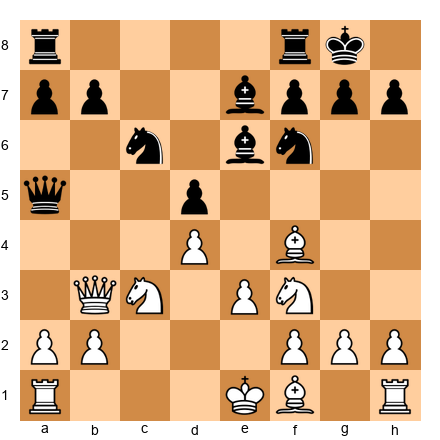</p>


Set up your board. White to play.

Your opponent just played ...Qa5. You see that 10.Nb5 threatens Nc7, forking the rooks. But you also see that after 10...Bb4+ 11.Kf2, the position becomes sharp.

**Question:** With 35 minutes for 20 moves, is the sharp continuation worth the risk?

Calculate 10.Nb5 Bb4+ 11.Kf2 to a depth of 5 moves. Then calculate 10.Be2 (a safe alternative) to the same depth. Which gives you a better *practical* position?

**Hint:** A king on f2 is not necessarily weak if you can castle later or if the activity compensates.

⏱ 3 min

---

**Exercise 40.14** (★★★)

<p align="center">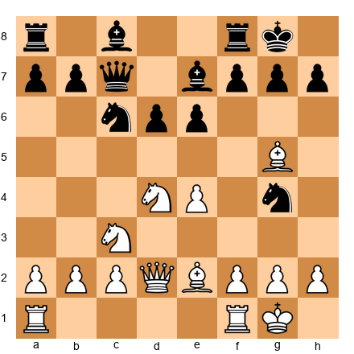</p>


Set up your board. White to play. **You have 3 minutes. Choose a move.**

Black has just played ...Ng4, threatening to win the dark-squared bishop. You must decide: retreat the bishop, or ignore the threat and play for the initiative?

List your three candidates. Make your decision.

**Hint:** Consider 10.Bxe7, 10.Bf4, and 10.Nf5. Each leads to a completely different game.

⏱ 3 min

---

**Exercise 40.15** (★★★)

<p align="center">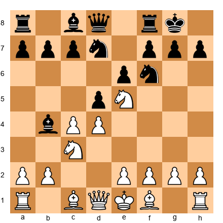</p>


Set up your board. White to play.

You have a Nimzo-Indian position. Your opponent offered a draw. You are rated 2220. They are rated 2380. The draw would be a good result on paper.

**Question:** In which of these tournament situations should you accept the draw?
A) You are in round 3 of 9, with a score of 2/2
B) You are in round 8 of 9, half a point behind the leader
C) You are playing for a norm and need 6.5/9, currently at 4.5/6

Evaluate each scenario independently.

**Hint:** Consider what the draw does for your overall tournament strategy in each case.

⏱ 3 min

---

**Exercise 40.16** (★★★)

<p align="center">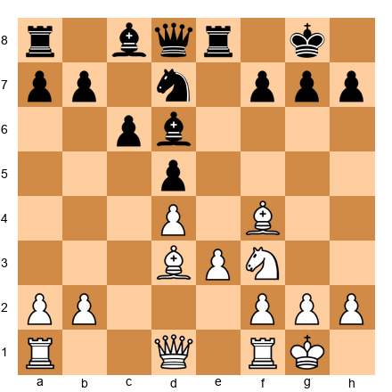</p>


Set up your board. White to play. **You have 3 minutes. Choose a move.**

The position is roughly equal. You have been playing for 2 hours. Your energy is dropping. Choose a move that maintains the position without requiring deep calculation for the next several moves.

**Hint:** What is the simplest plan that keeps White's position stable?

⏱ 3 min

---

**Exercise 40.17** (★★★)

<p align="center">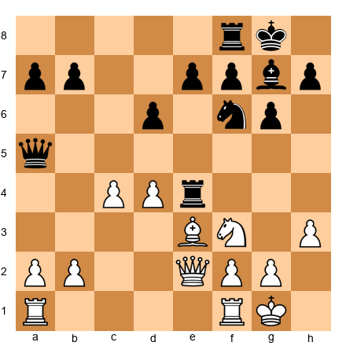</p>


Set up your board. White to play.

Black has just played ...Re4, centralizing the rook. You notice that the rook on e4 blocks ...e5, which would be Black's most natural break. Should you challenge the rook immediately or let it sit there?

**Question:** Is 17.Nd2 (attacking the rook) or 17.Qd3 (ignoring the rook and developing) the better practical decision?

**Hint:** Sometimes the best response to your opponent's plan is to let them have what they want - because what they want is not as good as they think.

⏱ 3 min

---

**Exercise 40.18** (★★★)

<p align="center">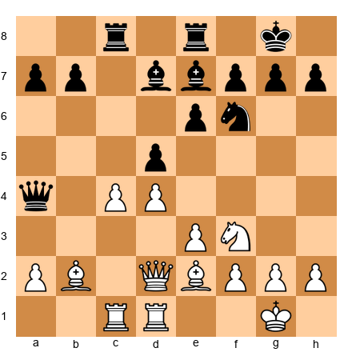</p>


Set up your board. White to play. **You have 3 minutes. Choose a move.**

You are slightly better. Black's queen on a4 is offside. Identify the practical plan that exploits this - a plan you can execute over the next 5 moves without deep calculation on each move.

**Hint:** Black's queen will need several moves to get back into the game. Can you create threats faster than the queen can return?

⏱ 3 min

---

**Exercise 40.19** (★★★)

<p align="center">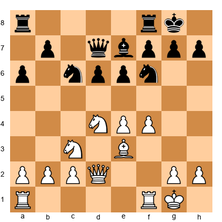</p>


Set up your board. White to play.

You are in a Sicilian Scheveningen position. You have been thinking about 12.f5 for 3 minutes. The position after 12.f5 e5 13.Nf3 is unclear. You cannot see a clear advantage.

You also see 12.Bf3, which is solid and maintains the status quo.

**Decision framework question:** Given that you have 40 minutes for 28 more moves, which move is the better *time management* decision? Show your reasoning using the three-candidate rule.

**Hint:** If 12.f5 leads to an unclear position that requires accurate play for 15 moves, how much time per move can you afford?

⏱ 3 min

---

**Exercise 40.20** (★★★)

<p align="center">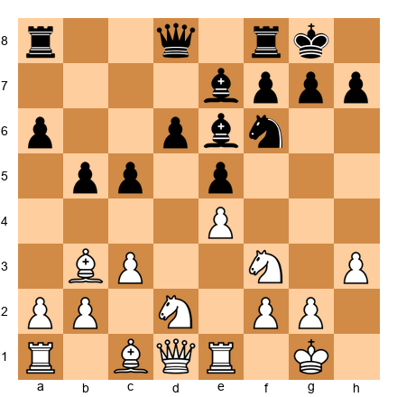</p>


Set up your board. White to play.

You blundered three moves ago and lost a pawn. The position is now worse for White. Your opponent is playing confidently and quickly.

**Question:** What is your recovery strategy? Describe your approach for the next 10 moves, including specific principles from section 40.12 of this chapter.

**Hint:** Do not try to win the pawn back immediately. Focus on activity and counterplay.

⏱ 3 min

---

**Exercise 40.21** (★★★)

<p align="center"></p>


Set up your board. White to play.

You are playing the last round. A win gives you clear first. A draw gives you a tie for second. A loss gives you nothing.

It is an Open Sicilian, King's Indian, Italian, or Ruy Lopez - your choice.

**Question:** Which opening would you choose and why? Consider both the objective quality and the practical factors (complexity, your preparation, your opponent's likely knowledge).

**Hint:** The best choice depends on your specific repertoire and your opponent's strengths. There is no universal answer. But there are universal principles.

⏱ 3 min

---

**Exercise 40.22** (★★★)

<p align="center">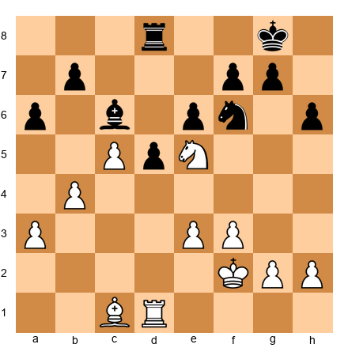</p>


Set up your board. White to play. **You have 3 minutes. Choose a move.**

You have a small advantage (more space, better knight vs bishop). It is hour 3 of the game. Your energy is fading.

**Question:** Play 28.Nd3 (centralize the knight, keep the game going) or 28.Nxc6 (trade knight for bishop, simplify)?

**Hint:** Think about how much longer this game will last with each choice. Is your advantage large enough to convert in a simplified position?

⏱ 3 min

---

**Exercise 40.23** (★★★)

<p align="center">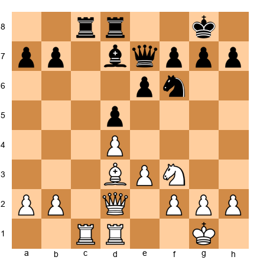</p>


Set up your board. White to play.

Your opponent has just offered a draw. The position is equal. You have 20 minutes left. They have 35 minutes.

**Question:** In which of these scenarios should you accept?
A) You are rated 2200, they are rated 2400, and a draw gains you 8 rating points
B) You are rated 2350, they are rated 2200, and you need a win for a norm
C) You are leading the tournament by half a point with 2 rounds to go

**Hint:** Think about both the practical position (equal, with less time) and the tournament situation for each scenario.

⏱ 2 min

---

**Exercise 40.24** (★★★)

<p align="center">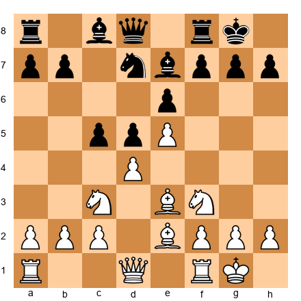</p>


Set up your board. White to play.

A French Defense position. You have studied this structure deeply and know that White should play for the f4-f5 break. But your opponent is a French Defense specialist rated 2380.

**Question:** Should you play your normal plan (which your opponent has seen hundreds of times) or try an unusual approach like 9.Na4 (which you have not studied deeply)?

**Hint:** Consider the tradeoff between playing the objectively best plan and playing a plan your opponent is less prepared for.

⏱ 3 min

---

**Exercise 40.25** (★★★)

<p align="center">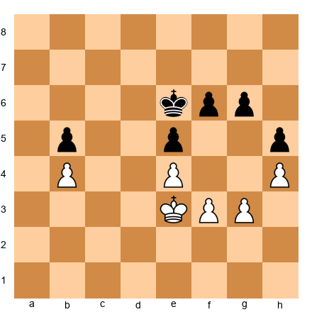</p>


Set up your board. White to play.

This is a king and pawn endgame. The position is objectively drawn with correct play. You have 5 minutes left. Your opponent has 2 minutes.

**Question:** Should you (A) play for the draw with careful, safe moves, or (B) create complex decisions for your opponent and hope they err in time trouble?

Calculate: does White have any way to create winning chances in this locked position?

**Hint:** In king and pawn endgames, there is often nothing you can do to create complexity. If the position is drawn, play for the draw quickly and cleanly.

⏱ 3 min

---

**Exercise 40.26** (★★★)

<p align="center">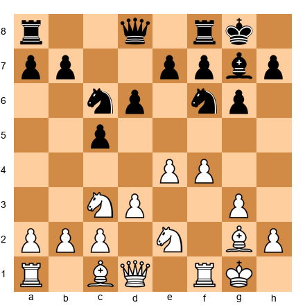</p>


Set up your board. White to play.

You are in a Closed Sicilian. It is move 9 and you have already used 20 minutes of your 90-minute allocation. This is too much time spent in the opening.

**Question:** For the next 5 moves, set a strict time budget: no more than 2 minutes per move. Choose your move for this position under that constraint.

**Hint:** When you are behind on time, play moves that are *safe and natural* rather than optimal. You need to catch up on the clock.

⏱ 2 min

---

**Exercise 40.27** (★★★)

<p align="center">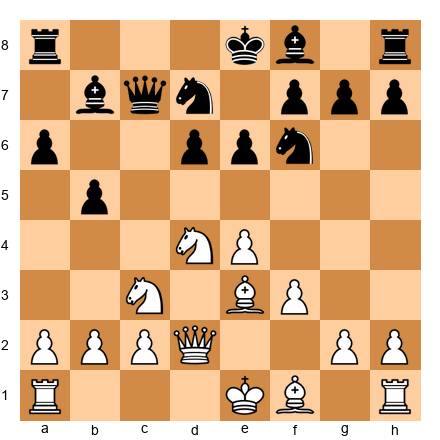</p>


Set up your board. White to play. **You have 3 minutes. Choose a move.**

This is a Sicilian Najdorf position. You have three candidate moves: 9.O-O-O, 9.Qf2, and 9.g4. Apply the three-candidate rule:

1. List the three candidates (done).
2. Calculate each to 3–4 moves deep.
3. Compare the resulting positions.
4. Choose.

**Hint:** 9.O-O-O is the most natural. 9.Qf2 is flexible. 9.g4 is aggressive. Which fits your tournament situation?

⏱ 3 min

---

**Exercise 40.28** (★★★)

<p align="center">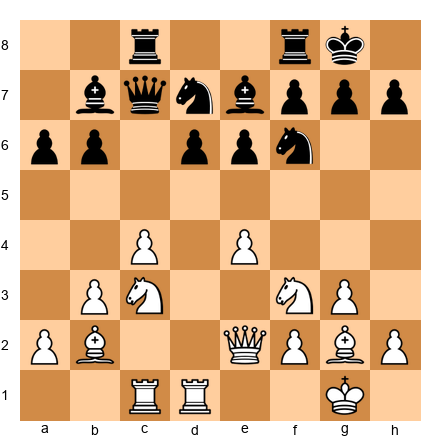</p>


Set up your board. White to play.

The position is quiet and maneuvering. Neither side has an obvious plan that leads to a quick advantage. This is hour 2 of the game. You feel your concentration slipping.

**Question:** Describe three things you can do *right now* to maintain your concentration and decision quality for the next hour.

**Hint:** At least one answer should involve something physical, not chess-related.

⏱ 2 min

---

### ★★★★ Practice (22 exercises)

---

**Exercise 40.29** (★★★★)

<p align="center">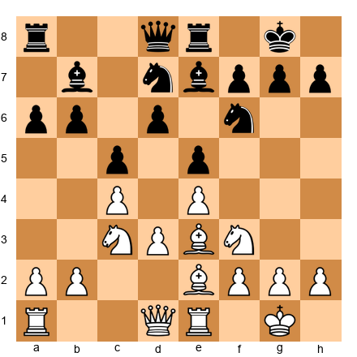</p>


Set up your board. White to play. **You have 3 minutes. Choose a move.**

You are rated 2280. Your opponent is rated 2420 and is a theoretical expert. The position is a well-known English Opening structure.

Apply the full practical decision framework from section 40.14:
1. Is this a critical moment?
2. What are your three candidates?
3. What does the clock say?
4. What does the tournament say?
5. What is the simplest move that works?

**Hint:** Against a stronger theoretical expert, moves that avoid the main theoretical lines may be practically stronger.

⏱ 3 min

---

**Exercise 40.30** (★★★★)

<p align="center">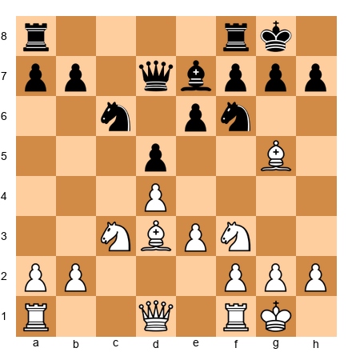</p>


Set up your board. White to play. **You have 3 minutes. Choose a move.**

This is a critical moment. The pawn structure is about to change depending on your choice. You can play 11.Bxf6 (trading the bishop for the knight, fixing the structure), 11.Qf3 (maintaining tension), or 11.Ne5 (aggressive centralization).

Each leads to a fundamentally different middlegame. Apply the three-candidate rule and choose. Explain why your choice is the best *practical* decision, not just the best *theoretical* move.

**Hint:** Which middlegame structure do you understand best? That is your strongest practical choice.

⏱ 3 min

---

**Exercise 40.31** (★★★★)

<p align="center">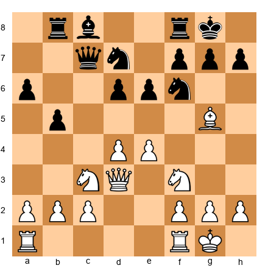</p>


Set up your board. White to play.

You are thinking about the sacrifice 12.Bxf6 Nxf6 13.e5 dxe5 14.dxe5 Nd5 15.Nxd5 exd5 16.Qxd5. After 5 minutes of calculation, you believe you are better in the resulting position, but you are not 100% certain.

**Question:** Your clock shows 32 minutes. Your opponent has 40 minutes. Do you play the sacrifice or the safe 12.a3?

**Hint:** Consider the principle: "If you cannot prove a sacrifice works, do not play it against a well-prepared opponent." But also consider: "Paralysis from uncertainty costs more than a slightly imperfect decision."

⏱ 3 min

---

**Exercise 40.32** (★★★★)

<p align="center">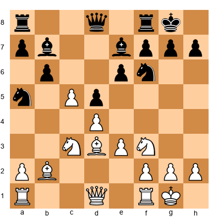</p>


Set up your board. White to play.

Your opponent played ...Na5, heading for c4. If the knight reaches c4, it will be strong. You can prevent it with 12.a3, but that is a slow move that does not address the position's dynamism.

You have 3 minutes. Apply the "good enough" principle. Is 12.a3 good enough, or does this position demand a more ambitious response?

**Hint:** Sometimes preventing your opponent's good move IS the best move. Prophylaxis is not passive - it is practical.

⏱ 3 min

---

**Exercise 40.33** (★★★★)

<p align="center">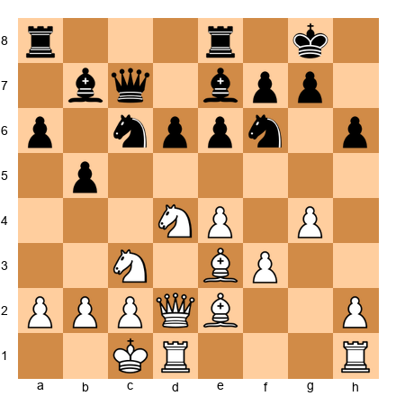</p>


Set up your board. White to play. **You have 3 minutes. Choose a move.**

Both sides have castled on opposite wings. You have started a kingside pawn storm with g4. Should you continue with 14.g5 (accelerating the attack) or 14.h4 (strengthening the attack before committing)?

**Question:** Apply the risk matrix. You are playing for first place and need a win. Does this change your decision?

**Hint:** 14.g5 is forcing but committal. 14.h4 is slower but keeps more options. The tournament situation might tip the balance.

⏱ 3 min

---

**Exercise 40.34** (★★★★)

<p align="center">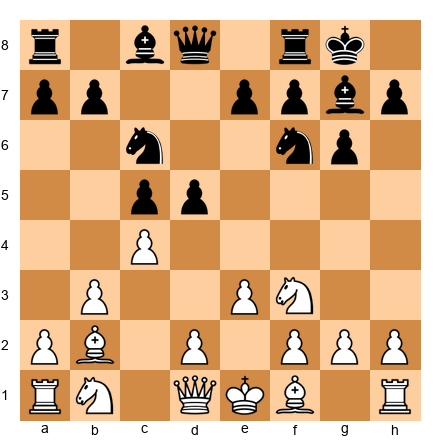</p>


Set up your board. White to play.

You have 35 minutes for 34 more moves. Your opponent has 8 minutes for 34 moves. Describe your practical strategy for exploiting the time advantage over the next 10 moves.

**Hint:** Your goal is not to find the best moves. Your goal is to create positions where your opponent must think on every move.

⏱ 3 min

---

**Exercise 40.35** (★★★★)

<p align="center"></p>


Set up your board. White to play. **You have 3 minutes. Choose a move.**

You notice a tactical idea: 14.Bxh7+ Nxh7 15.Qc2 with a discovered attack on h7. But you are not sure the sacrifice is sound. Your clock shows 28 minutes.

Apply the practical decision framework:
1. Can you calculate the sacrifice to a winning conclusion within your time budget?
2. If not, is the safe alternative good enough?
3. What is the cost of being wrong?

**Hint:** If the sacrifice is unsound, you lose a bishop for one pawn and your position collapses. The cost of being wrong is very high. How confident must you be before committing?

⏱ 3 min

---

**Exercise 40.36** (★★★★)

<p align="center"></p>


Set up your board. White to play.

You have not yet castled. You can castle kingside (safe, routine) or play 10.Qc2 (keeping castling options open, potentially more ambitious).

Your opponent is a well-known attacking player. You know from your dossier that they excel when the opponents' kings are on the same side.

**Question:** Does this information change your castling decision? If so, does 10.Qc2 followed by O-O-O become a practical consideration?

**Hint:** Playing against your opponent's strength is a losing strategy. Changing your king placement to avoid their preparation is a valid practical choice - IF you are comfortable in the resulting position.

⏱ 3 min

---

**Exercise 40.37** (★★★★)

<p align="center"></p>


Set up your board. White to play.

Your position is equal. It is round 7 of 9. You are in second place, half a point behind the leader. The leader has Black in this round.

**Question:** If the leader loses, a draw here gives you a share of first. If the leader draws, you need a win. You do not know the leader's result yet.

How does this uncertainty affect your decision-making? Should you play for a win, play for a draw, or play "normal chess"?

**Hint:** You cannot control the other board. Play the position in front of you. But be aware that your decision at move 25 might change depending on information you receive.

⏱ 3 min

---

**Exercise 40.38** (★★★★)

<p align="center"></p>


Set up your board. White to play. **You have 3 minutes. Choose a move.**

You have a slight space advantage. The position is stable. It is move 11 and you have used only 8 minutes from your 90. Your time management is excellent so far.

**Question:** Since you have time to spare, should you invest 5 minutes here looking for the optimal plan, or maintain your fast pace and save the time for later?

Apply section 40.10 (critical moment recognition). Is this a critical moment?

**Hint:** The pawn structure is stable. No immediate tactical threats exist. This is probably NOT a critical moment. Save your time.

⏱ 3 min

---

**Exercise 40.39** (★★★★)

<p align="center"></p>


Set up your board. White to play.

You just played a 6-hour game yesterday and lost. Today you feel tired and demoralized. It is round 5 of 9 and your score is 2/4 - below your expectations.

**Question:** What is your practical game strategy today? Are you in aggressive mode, solid mode, or survival mode? Explain your choice.

**Hint:** Review the three tournament modes from section 40.9. Honest self-assessment is more important than ambition when you are exhausted.

⏱ 2 min

---

**Exercise 40.40** (★★★★)

<p align="center"></p>


Set up your board. White to play. **You have 3 minutes. Choose a move.**

You are playing a Sicilian where both sides have castled on opposite wings. You have started g4 and are planning a kingside attack. Your opponent is looking uncomfortable.

Three candidates: 13.g5, 13.h4, and 13.Kb1 (improving the king before attacking).

**Question:** Apply the risk assessment framework. You are half a point ahead of the field. Does your tournament position make 13.Kb1 (safe but slower) more attractive than 13.g5 (aggressive but committal)?

⏱ 3 min

---

**Exercise 40.41** (★★★★)

<p align="center"></p>


Set up your board. White to play.

Your opponent has an unusual setup with ...Qf6. You have never seen this before. Your preparation is over.

**Question:** What is the correct practical response when your opponent surprises you with an unusual move?

Step 1: Pause. Take 30 seconds.
Step 2: Ask yourself - does the unusual move create any concrete threats?
Step 3: If no threats, play a normal developing move.
Step 4: If threats exist, address them.

Apply this process. What is your move?

**Hint:** The queen on f6 does not threaten anything immediate. A normal move like 8.Bd3 or 8.a3 is fine.

⏱ 3 min

---

**Exercise 40.42** (★★★★)

<p align="center"></p>


Set up your board. White to play. **You have 3 minutes. Choose a move.**

You have a very small advantage - slightly more space and better piece placement. The position is quiet. Your opponent has just played ...e6, solidifying the center.

This game will likely be decided by long-term maneuvering. Is this a "good enough" situation, or do you need to find a specific plan?

Choose a plan for the next 5 moves. Your plan should not require deep calculation on any individual move.

**Hint:** Look for piece improvement. Which of your pieces is on its worst square? Improve it first.

⏱ 3 min

---

**Exercise 40.43** (★★★★)

<p align="center"></p>


Set up your board. White to play.

You are playing a game in a team match. Your team is down 1.5–0.5 on the other boards. A win gives the team a chance at a draw. A draw loses the match.

**Question:** How does the team situation affect your decision-making? Be specific - describe how your opening choice, risk tolerance, and time management would change.

**Hint:** This is a must-win situation, but not because of your individual standing. The pressure is different. You are not playing for yourself.

⏱ 3 min

---

**Exercise 40.44** (★★★★)

<p align="center"></p>


Set up your board. White to play. **You have 3 minutes. Choose a move.**

You just noticed that you miscounted and you actually have one more move to make before the time control at move 40 than you thought. You have 12 minutes instead of "barely enough."

**Question:** Does this change your approach? How does suddenly having "extra" time affect your decision-making?

**Hint:** Be careful. The relief of having more time than expected can lead to complacency. Maintain your focus.

⏱ 3 min

---

**Exercise 40.45** (★★★★)

<p align="center"></p>


Set up your board. White to play.

You have a French Defense structure with the characteristic e5 pawn. You see two plans:

Plan A: Queenside play with a3, b4, preparing to open the b-file.
Plan B: Kingside play with Qg4, preparing f4 and an attack.

Both plans are valid. You have been analyzing for 4 minutes and cannot decide.

**Question:** What is the practical solution to decision paralysis? Apply the "choose and commit" principle from section 40.3.

**Hint:** The cost of *not deciding* is higher than the cost of choosing the slightly inferior plan. Both plans are sound. Pick one. Move.

⏱ 3 min

---

**Exercise 40.46** (★★★★)

<p align="center"></p>


Set up your board. White to play.

Your opponent has just equalized from a slightly worse opening. You played inaccurately in the opening and your advantage evaporated.

**Question:** How do you mentally adjust? Describe the three-minute reset from section 40.12, applied to this situation (losing an advantage rather than blundering material).

**Hint:** Losing an advantage is psychologically similar to making a mistake. The same recovery techniques apply.

⏱ 2 min

---

**Exercise 40.47** (★★★★)

<p align="center"></p>


Set up your board. White to play. **You have 3 minutes. Choose a move.**

Standard Queen's Gambit Declined structure. You have played this type of position many times. You know the typical plans: minority attack with b4-b5, central play with e4, or piece improvement with Re1 and Bf4.

**Question:** Given that you know this structure well, how much time should you spend here? Apply the critical moment test from section 40.10.

**Hint:** Familiar positions should be played quickly. Save your time for the unfamiliar moments that will come later.

⏱ 3 min

---

**Exercise 40.48** (★★★★)

<p align="center"></p>


Set up your board. White to play. **You have 3 minutes. Choose a move.**

Your opponent has the bishop pair in a semi-open position. If the position opens further, the bishops could become dominant. You need to decide: keep the position closed (play e3 and d4, maintain the structure) or accept the opening of the position and play for active piece play?

Apply the risk matrix from section 40.8. Your answer should depend on the tournament situation you assume.

**Hint:** Describe your decision for two scenarios: (A) you need a draw, (B) you need a win.

⏱ 3 min

---

**Exercise 40.49** (★★★★)

<p align="center"></p>


Set up your board. White to play. **You have 3 minutes. Choose a move.**

You see a long-term plan: double rooks on the c-file, then play e4 to open the center. This plan will take about 5–6 moves to execute.

Your opponent might see this plan coming. Should you execute it directly, or disguise your intentions with a few "multi-purpose" moves first?

**Hint:** At the expert level, your opponents can often guess your plan. Sometimes executing the plan quickly is better than disguising it - because disguise costs tempi.

⏱ 3 min

---

**Exercise 40.50** (★★★★)

<p align="center"></p>


Set up your board. White to play.

Your clock shows 15 minutes. Your opponent's clock shows 42 minutes. You are behind on time and the position is double-edged.

**Question:** Write out your time management plan for the next 10 moves. How much time can you afford per move? Which moves, if any, might deserve more than your average allocation?

**Hint:** 15 minutes for 24 moves (to the time control at move 40) means about 37 seconds per move, or slightly more with the 30-second increment. Identify the 2–3 moves where you might spend 2–3 minutes, and plan to play the rest on the increment.

⏱ 3 min

---

### ★★★★★ Mastery (10 exercises)

---

**Exercise 40.51** (★★★★★)

<p align="center"></p>


Set up your board. White to play.

**Comprehensive practical decision exercise.** You are rated 2280. Your opponent is rated 2340. It is round 6 of 9, and you are in third place, one point behind the leader. A win puts you in contention. A draw keeps you alive. A loss effectively ends your chances.

Write a complete analysis of this position using the practical decision framework:
1. Is this a critical moment?
2. Three candidates with 4-move calculations for each
3. Time assessment (assume you have 50 minutes, opponent has 45)
4. Tournament strategy assessment
5. Your chosen move with full justification

⏱ 10 min

---

**Exercise 40.52** (★★★★★)

<p align="center"></p>


Set up your board. White to play. **You have 5 minutes. Choose a move.**

You are playing a 2450 in the penultimate round. You need to win. The position is equal. How do you unbalance a position against a stronger opponent without taking reckless risks?

**Part 1:** List 3 candidate moves that create imbalances.
**Part 2:** For each, assess the risk tier (low, medium, high, reckless).
**Part 3:** Choose the move with the best risk-reward ratio for your situation.

**Hint:** An imbalance does not have to be tactical. A structural change (pawn exchange, piece trade) that creates an asymmetric position gives both sides chances - and in an asymmetric position, the player who understands the resulting structure better will win.

⏱ 5 min

---

**Exercise 40.53** (★★★★★)

<p align="center"></p>


Set up your board. White to play.

You have a slight edge in this QGD. Your opponent has been thinking for 8 minutes on their last move. They look uncertain.

**Part 1:** What does your opponent's long think tell you about the position?
**Part 2:** How should their uncertainty affect your decision-making?
**Part 3:** Choose a move that exploits their psychological state without being reckless.

**Hint:** A long think often means they are considering a concession (a trade, a structural change) they do not want to make. Maintain the pressure that is causing their discomfort.

⏱ 5 min

---

**Exercise 40.54** (★★★★★)

<p align="center"></p>


Set up your board. White to play. **You have 5 minutes. Choose a move.**

This is a Sicilian position where you have space but Black has a solid structure. You see three plans:

Plan A: 15.Nd2 followed by f4, attacking the center
Plan B: 15.Qe2 followed by Rad1, putting pressure on d6
Plan C: 15.a4, opening the queenside immediately

**Decision paralysis exercise.** You have already spent 3 minutes thinking. Apply the "choose and commit" principle. Make your choice within the next 2 minutes and write a one-sentence justification.

**Hint:** All three plans are approximately equal. The cost of spending 8 more minutes deciding is greater than the cost of choosing the "wrong" plan.

⏱ 5 min

---

**Exercise 40.55** (★★★★★)

<p align="center"></p>


Set up your board. White to play.

**Timed multi-decision exercise.** You will make decisions under simulated time pressure.

**Move 13:** You have 30 minutes for 27 moves. Choose a move in under 2 minutes.
**Assume your opponent plays 13...Nc6. Set up the resulting position mentally.**
**Move 14:** You now have 28 minutes for 26 moves. Choose a move in under 2 minutes.
**Assume your opponent plays 14...Nb4. Set up the resulting position mentally.**
**Move 15:** You now have 26 minutes for 25 moves. Choose a move in under 2 minutes.

Write down all three moves and your reasoning. Did you maintain a consistent quality of decision-making across all three moves?

**Hint:** The goal is not to find the best move each time. The goal is to find *good enough* moves quickly and consistently.

⏱ 6 min

---

**Exercise 40.56** (★★★★★)

<p align="center"></p>


Set up your board. White to play.

You are attacking on the kingside. The knight on h5 is a target. You see a tactical opportunity: 16.Bxh7!? If the sacrifice works, you win. If it does not, you lose a piece and probably the game.

You have calculated 16.Bxh7 Kxh7 17.Qd3+ Kg8 18.f5 to a depth of 6 moves. The position after 18...exf5 19.Rxf5 looks very strong for White, but you cannot see a forced win.

**Decision exercise:**
A) You are rated 2350 playing a 2200. Play or decline the sacrifice?
B) You are rated 2200 playing a 2350. Play or decline the sacrifice?
C) You need a draw to clinch the tournament. Play or decline?
D) You need a win or you finish last. Play or decline?

Give a separate answer for each scenario.

**Hint:** The same tactical opportunity has different practical values depending on the context. There is no universal answer.

⏱ 5 min

---

**Exercise 40.57** (★★★★★)

<p align="center"></p>


Set up your board. White to play. **You have 5 minutes. Choose a move.**

This is a Sicilian Scheveningen where you have opposite-side castling. You have been playing an attack, but your opponent has defended well. The position is now balanced.

You realize that your kingside attack is not breaking through. Do you:
A) Continue the attack (optimism bias - "it will work eventually")
B) Switch to a positional plan (acknowledge the attack has stalled)
C) Offer a draw (accept the balance)

**Question:** What is the practical cost of each option? Which has the best expected outcome?

**Hint:** Continuing a failed attack is one of the most common mistakes at the expert level. Recognizing when to switch plans is a sign of practical maturity.

⏱ 5 min

---

**Exercise 40.58** (★★★★★)

<p align="center"></p>


Set up your board. White to play.

**Full game planning exercise.** You are in a French Defense as White. Map out your practical plan for the next 15 moves.

For each 5-move block, specify:
- Your target time expenditure
- Your primary plan
- Your contingency if the primary plan is blocked
- Which moves in the block are critical (deserving extra time) vs routine

Write your plan in the format:
- Moves 8–12: [plan], [time budget], [critical move if any]
- Moves 13–17: [plan], [time budget], [critical move if any]
- Moves 18–22: [plan], [time budget], [critical move if any]

**Hint:** The French Defense typically involves kingside attacks with f4-f5, queenside minority attacks, or central breakthroughs with c3-c4 or f3-f4. Choose one and plan it.

⏱ 8 min

---

**Exercise 40.59** (★★★★★)

<p align="center"></p>


Set up your board. White to play.

**Energy management exercise.** It is 4:30 PM. You started the game at 1:00 PM. You have been playing for 3.5 hours. Your energy is low.

The position requires a strategic decision: 11.dxc5 (opening the position) or 11.a3 (quiet, maintaining tension). Normally you would analyze both for 5–8 minutes. But your mental energy is limited.

**Question:** How do you adapt your decision process when fatigued? Write out a simplified three-step process that takes no more than 3 minutes.

Then apply that process and choose your move.

**Hint:** When fatigued, rely on pattern recognition over calculation. Ask: "What would I play if this were a blitz game?" That instinctive answer is often correct.

⏱ 5 min

---

**Exercise 40.60** (★★★★★)

<p align="center"></p>


Set up your board. White to play.

**Final synthesis exercise.** Write your personal "Practical Decision-Making Protocol" - a checklist you will use in tournament games. This protocol should include:

1. Your pre-move checklist (what you verify before every move)
2. Your critical moment identification criteria (how you know when to invest time)
3. Your time management rules (how you allocate your clock across the game)
4. Your risk assessment process (how you decide between safe and ambitious options)
5. Your recovery plan (what you do after a mistake)
6. Your energy management strategies (how you maintain focus in long games)
7. Your psychological rules (how you handle different opponent types and tournament situations)

This is not a theoretical exercise. This is a practical document that you will bring to your next tournament. Write it as a one-page reference card.

Then, apply the protocol to this position and choose your move.

⏱ 15 min

---

## Key Takeaways

1. **The best move is the best practical decision.** Engine evaluations do not account for your clock, your energy, your tournament standing, or your opponent's psychology. You must.

2. **Three candidates, consistent depth, then choose.** The three-candidate rule prevents decision paralysis and ensures you spend your time where it matters most.

3. **"Good enough" is better than "perfect but late."** A solid move played quickly beats a brilliant move found in time trouble. Perfectionists lose rating points. Practical players gain them.

4. **Time is a resource, not a background element.** Budget your time. Invest it in critical moments. Conserve it in routine positions. Monitor your opponent's clock and adapt.

5. **Context changes the decision.** The same position demands different responses depending on the tournament situation, the opponent, the time on the clock, and your energy level. Learn to read the context, not just the board.

6. **Mistakes are not the end.** The three-minute reset - acknowledge, accept, evaluate - turns a blunder from a game-ending catastrophe into a temporary setback. Your opponent still has to convert.

7. **Energy is finite.** Eat, drink, walk, breathe. Your brain is an organ, and it runs on glucose and oxygen. Treat it accordingly.

8. **The five questions are your compass.** Critical moment? Three candidates? Clock? Tournament? Simplest good move? Run this framework on every decision and you will rarely go wrong.

---

## Practice Assignment

This assignment has three parts. Complete them over the next two weeks.

**Part 1: Timed Practice (Days 1–5)**

Play five 15+10 rapid games online. Before each game, print or write down the five questions from section 40.14. After each move, mentally run through the framework:
1. Is this a critical moment?
2. What are my three candidates?
3. What does the clock say?
4. What does the tournament say? (Treat each game as if it matters.)
5. What is the simplest move that works?

After each game, review your time usage. Did you spend the most time on the moves that mattered most? Or did you burn time on routine decisions?

**Part 2: Recovery Drill (Days 6–10)**

Play five more rapid games. In each game, intentionally blunder a pawn within the first 15 moves (play a move you know is bad). Then practice the recovery technique from section 40.12: the three-minute reset, the shift to active play, the psychological adjustment.

This sounds strange. It is one of the most effective training methods for practical play. By practicing recovery in low-stakes games, you build the habit of resilience that will save you in tournament play.

**Part 3: Game Analysis (Days 11–14)**

Take three of your recent tournament games - games where the result was decided by a practical decision rather than a tactical blunder. Annotate each game with a focus on:
- Where did you spend the most time? Was that the right place to invest?
- Did you miss a critical moment? What were the signals?
- Could a "good enough" move have saved you time without changing the result?
- Did you use any of the frameworks from this chapter, even intuitively?

Write one paragraph for each game summarizing the practical lessons.

---

## ⭐ Progress Check

Answer these questions honestly:

- [ ] Can you list the five questions in the practical decision framework from memory?
- [ ] Do you monitor your opponent's clock every 3–4 moves during tournament games?
- [ ] When you identify three candidates, do you calculate each to a consistent depth before choosing?
- [ ] Can you identify critical moments in your games - positions where you should invest extra time?
- [ ] After a blunder, can you mentally reset within three minutes and play the resulting position objectively?
- [ ] Do you have a time budget that you follow during tournament games?
- [ ] Do you bring water and a snack to every tournament game?
- [ ] Can you describe the difference between aggressive mode, solid mode, and survival mode?
- [ ] When a position is unclear, can you assess the risk level of a move (low, medium, high, reckless) before playing it?
- [ ] Do you adjust your playing style based on the tournament situation - or do you play the same way regardless?

If you answered "yes" to seven or more, your practical decision-making is at a professional level. You are making decisions the way titled players do.

If you answered "yes" to fewer than seven, you have identified the specific areas where this chapter's techniques can help you most. Return to the relevant sections and work through the exercises again. Practical skills are built through repetition, not just understanding.

---

🛑 **Rest Marker.** You have covered one of the most important topics in competitive chess - and one that almost no other book addresses directly. The frameworks in this chapter are not abstract theory. They are tools you will use in every game for the rest of your chess career.

Step away from the board. Take a walk. Let the ideas settle.

When you return, you will not just know more chess. You will know how to *play* chess - under pressure, against the clock, with everything on the line. That is what separates experts from everyone else.

*"In the end, it is not the strongest player who wins. It is the player who makes the best decisions when it matters most."*

💙🦄
