# Chapter 41: Studying with Engines Without Becoming Engine-Dependent
## The Human Filter - Using Stockfish and Leela as Partners, Not Crutches

---

> *"The engine can show you the truth. But if you cannot explain why the truth is true, you have learned nothing."*
> - Garry Kasparov, *Deep Thinking*

**Rating Range:** 2200–2400

**What You Will Learn:**
- How to recognize and cure "Engine Zombie" syndrome - the silent killer of expert-level improvement
- How Stockfish and Leela Chess Zero evaluate positions, and why their disagreements are more instructive than their agreements
- The correct workflow for post-game analysis: human first, engine second, synthesis third
- When to trust the engine's judgment and when to trust your own
- How to set engine depth and time for different analysis tasks
- Multi-engine analysis: running Stockfish and Leela side by side
- Using engines for opening preparation without becoming a memorization machine
- Engine-assisted endgame study with tablebases
- The "human filter" - translating centipawn evaluations into plans you can execute at the board
- The Botvinnik method of training without engines
- The 50/50 rule: half your study with engines, half without
- How top Grandmasters use engines in their preparation
- How to set up a home analysis environment on any budget

---

## You Are Here

```
Volume IV: The Master Class (2200–2400)

Ch 36: Expert-Level Calculation           ✅ Complete
Ch 37: Complex Middlegame Strategy        ✅ Complete
Ch 38: Advanced Endgame Theory            ✅ Complete
Ch 39: Professional Opening Preparation   ✅ Complete
Ch 40: Practical Decision-Making          ✅ Complete
Ch 41: Engines Without Dependency         ◀ YOU ARE HERE
Ch 42: Deep Opening Systems
Ch 43: Annotated GM Games
Ch 44: The Psychology of the Title Chase
Ch 45: Capstone - The Complete Expert
```

---

## 41.1 The Engine Zombie

You have met this player. You may be this player.

The Engine Zombie knows theory. They can recite the main line of the Najdorf Poisoned Pawn to move 25. They know that in the Catalan, 7...a6 scores 54% for White at depth 40. They know that Stockfish 16 evaluates the Exchange French at +0.31 after 4.Bd3.

Ask them *why* White is better in the Exchange French, and they stare at you.

The Engine Zombie has replaced understanding with data. They study chess the way a student might study for a history exam by memorizing dates but never reading the stories behind them. They know the answers. They do not know the questions.

Here is what happens to the Engine Zombie in a tournament game. They prepare a sharp line in the Sicilian. Their opponent deviates on move 11 with a sideline the engine never showed them. Now they must think. They must evaluate a position, form a plan, calculate candidates, and choose a move - all without the engine whispering the answer.

They cannot do it. Their rating says 2200, but their independent thinking stalled at 1800. The engine carried them the rest of the way. Now, alone at the board, they are exposed.

This chapter is about learning to use the strongest analytical tools in chess history without losing the ability to think for yourself.

---

## 41.2 How Engines Think

Before you can use an engine well, you must understand what it is doing.

A chess engine is a search algorithm paired with an evaluation function. The search explores possible move sequences. The evaluation scores the positions at the end of those sequences. The engine combines these two components to find what it believes is the best move.

### The Evaluation Score

The engine's primary output is a score, measured in centipawns. One centipawn equals one-hundredth of a pawn's value.

- **+0.00** means the engine considers the position equal
- **+1.00** means White is ahead by roughly one pawn's worth of advantage
- **-0.50** means Black has a slight edge
- **+3.00** means White is winning - equivalent to being a full piece ahead in practical terms
- **#5** means forced checkmate in 5 moves

Set up your board:

<p align="center"></p>


A typical IQP (Isolated Queen's Pawn) position from the Queen's Gambit Declined. Stockfish might evaluate this at +0.15. What does that mean?

It means White has a tiny advantage - so small that a human would call it "roughly equal with a slight pull." The isolated d4-pawn gives White space and piece activity, but it is also a long-term weakness. The engine's +0.15 reflects the balance between these factors.

**The trap:** A +0.15 evaluation does not mean White is "winning." It does not mean Black should panic. It means, in a perfect game between two flawless players, White's position is marginally preferable. In a practical game between humans, this difference is noise. Either side can win.

### Depth

Depth measures how many half-moves (plies) the engine has searched. At depth 20, the engine has looked roughly 10 moves ahead in its main line, with many shorter variations checked as well.

- **Depth 15–20:** Good for a quick blunder check. Takes a few seconds on modern hardware.
- **Depth 25–30:** Solid analysis. Most tactical shots are found. Takes 30 seconds to a few minutes.
- **Depth 35–40:** Deep analysis. Suitable for opening preparation and critical position study. Takes several minutes.
- **Depth 45+:** Research-grade depth. Used by professional secondants and engine testers. Can take hours per position.

The evaluation at depth 15 is not the same as the evaluation at depth 40. Engines often change their minds as they search deeper. A position that looks equal at depth 20 might reveal a hidden tactical resource at depth 35. **Never trust a shallow evaluation in a complex position.**

### Nodes

Nodes represent the number of positions the engine has examined. Modern engines search billions of nodes per minute on fast hardware. This number tells you how much work the engine has done but not how reliable the evaluation is. In quiet positions, fewer nodes produce reliable results. In sharp tactical positions, billions of nodes may not be enough.

### PV Lines (Principal Variations)

The PV line is the sequence of moves the engine considers best for both sides. Most engine interfaces let you display multiple PV lines - typically the top 3 to 5 best moves.

**Multi-PV is where the real learning happens.** If the engine shows five candidate moves and four of them evaluate within 0.10 of each other, the position is flexible. Many plans are roughly equal. Choose the one that fits your style. If the engine shows five candidates and one is +0.30 better than the rest, there is only one good move. Understand why.

---

## 41.3 Stockfish vs. Leela Chess Zero

You should be using two engines. Here is why.

**Stockfish** is a traditional alpha-beta search engine, enhanced by a neural network evaluation (NNUE). It searches enormous numbers of positions at high speed. Stockfish is tactically devastating. It finds sacrifices, combinations, and forcing sequences faster and more accurately than any human who has ever lived.

Stockfish's weakness: it can misjudge long-term positional factors that require deep strategic understanding. Positions with closed pawn structures, slow maneuvering, and prophylactic play sometimes confuse Stockfish at moderate depth. It may show +0.00 in a position where one side has a lasting bind that, in practice, wins 80% of the time between strong humans.

**Leela Chess Zero (Lc0)** is a neural network engine trained by self-play, modeled after DeepMind's AlphaZero. Leela does not search as many positions as Stockfish. Instead, it evaluates positions using pattern recognition learned from millions of games against itself.

Leela's strength: positional evaluation. In closed, strategic positions - especially endgames, blocked structures, and positions with long-term pawn weaknesses - Leela often finds plans that Stockfish overlooks. Leela "understands" positional chess in a way that resembles human intuition, because its training process is closer to how humans learn: through pattern recognition rather than brute-force search.

Leela's weakness: tactics. In sharp, open positions with many forcing lines, Leela searches fewer nodes and occasionally misses concrete tactical resources that Stockfish would find instantly.

### Where They Disagree

Set up your board:

<p align="center">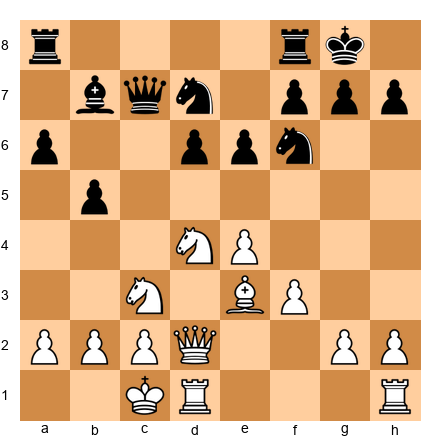</p>


A typical Sicilian Najdorf position. White has the Keres Attack setup with queenside castling and aggressive intentions. Black has a solid but somewhat passive structure.

In positions like this, Stockfish might evaluate +0.20 and suggest 13.g4, launching a direct kingside attack. Leela might evaluate +0.35 and suggest 13.Kb1, improving the king's safety before committing to an attack.

Both moves are strong. But Leela's suggestion - quiet prophylaxis before aggression - reflects a deeper strategic understanding that many human GMs would endorse. Stockfish's suggestion is tactically motivated and equally valid.

**The lesson:** When Stockfish and Leela disagree, you are standing at one of the most instructive moments in chess study. The disagreement forces you to think. Which evaluation is more trustworthy? Which plan would you choose as a human? Why does one engine see something the other misses?

These disagreements teach you more than a hundred positions where both engines agree.

---

## 41.4 The Correct Engine Analysis Workflow

Most players use engines wrong. They play a game, come home, load it into their software, press the "analyze" button, and watch the engine scroll through their moves. They see the red marks where they blundered. They nod. They close the file.

This is not analysis. This is letting the engine think for you.

Here is the correct workflow. It takes longer. It works.

### Step 1: Annotate the Game Yourself (No Engine)

Before touching the engine, sit down with your game and a board. Play through it move by move. At every critical moment - every position where you had to make a decision - write down:

1. What you were thinking during the game
2. What you considered playing and why
3. What you actually played and why
4. How you evaluate the resulting position

Be honest. Write down the moves you rejected and the reasoning behind the rejection. Write down the moments where you felt lost, the moments where you felt confident, and the moments where you had no idea what to do.

This is the Botvinnik method, and it remains the single most effective training technique in chess. We will discuss it in depth later in this chapter.

### Step 2: Identify Critical Positions

Mark the positions where the game changed direction. These are usually:

- The transition from opening to middlegame
- The moment where one side gained or lost the initiative
- Any tactical sequence longer than two moves
- The decision to enter or avoid an endgame
- Time-pressure decisions (if applicable)

These are the positions you will analyze with the engine. Not the entire game - just the critical moments.

### Step 3: Run the Engine on Critical Positions

Load the marked positions into your engine. For each position:

1. Set the engine to at least depth 25–30
2. Display 3 PV lines (Multi-PV = 3)
3. Note the engine's preferred move and its evaluation
4. Note the evaluation of the move you actually played
5. If they differ by more than 0.30, this is a significant moment - investigate further

### Step 4: Compare Human and Engine Analysis

Now the real work begins. For every position where your analysis and the engine's analysis disagree:

- Did you miss a tactical resource? If so, why? Was it a pattern you did not recognize, a calculation error, or a failure to consider all candidate moves?
- Did you misjudge the position strategically? Were your priorities wrong? Did you overestimate your attack, underestimate your opponent's counterplay, or misread the pawn structure?
- Or was your move actually fine, just not the engine's first choice? Many positions have multiple good moves. If your move evaluates within 0.15 of the engine's choice, you played well. Move on.

### Step 5: Write Down the Lesson

For every significant disagreement, write one sentence that captures what you learned. Not "I should have played Nf5" - that is a fact about this game. Instead: "I need to look for knight outpost sacrifices when the opponent's dark-squared bishop is exchanged." That is a principle you can apply to future games.

This five-step process takes 45 to 90 minutes per game. It is the most valuable hour you will spend in chess study. Players who follow this process improve faster than players who analyze ten games superficially with the engine doing all the thinking.

---

## 41.5 When to Trust the Engine

The engine is almost always right about tactics. If Stockfish says there is a forced win in a position, there is a forced win. Do not argue with the engine about concrete calculations. It calculates better than you. It calculates better than Kasparov. Accept this and use it.

The engine is usually right about short-term evaluations. If a position is +1.50 at depth 30, White is genuinely winning. Trust this assessment.

**But the engine is not always right about plans.**

Set up your board:

<p align="center"></p>


A closed Ruy Lopez structure. Stockfish at depth 20 might suggest 12.a4, striking at Black's queenside immediately. At depth 35, it might change its mind to 12.Nf1, beginning the classic knight maneuver Nf1-g3 to reinforce the kingside.

Both moves are reasonable. But the question "which plan is better for a human to play?" depends on factors the engine does not consider: your opponent's strengths, the time control, your comfort with the resulting structures, and your ability to calculate the ensuing complications.

### The Rule of Practical Evaluation

**Trust the engine when:**
- The position is tactical (forcing moves, sacrifices, combinations)
- The evaluation changes sharply with one move (e.g., from +0.30 to -1.50)
- You need to verify whether a sacrifice is sound
- You are checking for blunders in your game

**Trust yourself when:**
- The position is strategic and closed
- Multiple engine candidates evaluate within 0.20 of each other
- You need to choose between plans based on your playing style
- You are deciding how to handle a middlegame structure you have played many times
- The engine's suggested plan requires ten moves of precise play that you cannot realistically execute under tournament conditions

A plan that is objectively second-best but practically easy to execute is often superior to the engine's first choice that requires computer-like precision for fifteen moves.

---

## 41.6 Engine Depth Settings for Different Purposes

Not every analysis task requires depth 40. Using too much depth wastes time. Using too little produces unreliable results. Match your depth to your purpose.

### Quick Blunder Check: Depth 18–22

Use this to scan your game rapidly for tactical oversights. At this depth, the engine catches hanging pieces, missed forks, simple combinations, and one-move blunders. It takes a few seconds per position.

**What it misses:** Deep tactical resources, long forcing sequences, and subtle positional evaluations. A quick scan might show your position as +0.10 when deeper analysis reveals a hidden combination worth +2.00.

**When to use it:** During a fast review of blitz or rapid games. When checking a game where you already feel confident about the quality of play. When scanning an opponent's recent games before a tournament round.

### Standard Analysis: Depth 25–30

This is your default setting for serious game review. At this depth, Stockfish finds most tactical resources and provides reliable positional evaluations. It takes 30 seconds to a few minutes per position, depending on complexity.

**What it misses:** Some deep sacrificial ideas that only emerge at depth 35+. Rare endgame finesses. Certain fortress evaluations.

**When to use it:** Post-game analysis of your own tournament games. Studying annotated games from books. General training.

### Deep Analysis: Depth 35–40

Reserve this for critical positions - novelty testing in your opening repertoire, positions where you had a major decision during the game, and positions where the standard-depth evaluation seems unstable (the score keeps changing as depth increases).

**When to use it:** Opening preparation. Analyzing positions where you suspect the engine's initial evaluation is wrong. Investigating theoretical endgames.

### Research Depth: 45+

This is for professionals, engine testers, and opening analysts working on specific theoretical problems. Each position may take ten minutes to an hour. Unless you are testing a potential novelty in a World Championship preparation, you do not need this.

### A Note on Hardware

Depth is hardware-dependent. Depth 30 on a modern desktop with 8 cores takes far less time than depth 30 on a five-year-old laptop with 2 cores. The depths above assume a reasonably modern computer (4+ cores, 8+ GB of RAM). Adjust downward if your machine is slower.

---

## 41.7 Multi-Engine Analysis

Running Stockfish and Leela simultaneously on the same position is one of the most powerful analytical techniques available to the modern player. Here is how to do it.

### The Setup

Most chess interfaces (ChessBase, Lucas Chess, SCID, or the open-source Arena) allow you to run two engines at once. Set Stockfish as Engine 1 and Leela as Engine 2. Configure each to display 3 PV lines. Let both analyze the same position.

If you do not have a GUI that supports dual engines, you can run them in separate windows on the same position. The key is seeing both evaluations simultaneously.

### Reading the Disagreements

Set up your board:

<p align="center">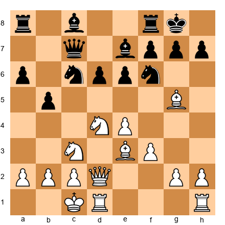</p>


A Sicilian English Attack position. Give this to both engines.

Stockfish (depth 30) might suggest 12.Nd5 with an evaluation of +0.45, planning to exchange Black's Nf6 and weaken the kingside dark squares.

Leela might suggest 12.Kb1 with an evaluation of +0.55, preferring to improve the king before committing to the central action. Leela's plan: Kb1, then Rg1, then g4 with a slow kingside build.

Both approaches are strong. But notice what each engine prioritizes:
- Stockfish: concrete central action *now*
- Leela: strategic preparation *first*, then action

**When the engines agree**, the evaluation is almost certainly correct. Move on.

**When the engines disagree by 0.10–0.30**, the position is nuanced. Study both plans. Choose the one that suits your playing style.

**When the engines disagree by more than 0.30**, something interesting is happening. One engine is seeing something the other is missing. Investigate. Let both engines run longer. The disagreement often resolves at higher depth - but sometimes it does not. These are the positions where you learn the most.

### Multi-Engine Opening Preparation

When preparing an opening line, run both engines on your planned novelty. If Stockfish approves but Leela does not (or vice versa), your novelty has a vulnerability that one engine's search style is better at detecting. Do not play a novelty that only one engine endorses. Wait until both agree, or understand deeply why they disagree.

---

## 41.8 Engines for Opening Preparation

Chapter 39 covered professional opening preparation. Here we focus specifically on the role of the engine in that process - and the traps that await you.

### The Memorization Trap

The most common mistake: you load a Catalan line into Stockfish, let it run to depth 40, and memorize the first 18 moves of its preferred variation. Then you play the Catalan in a tournament. Your opponent deviates on move 12.

You stare at the board. You know that after 12...dxc4 13.Qa4 Bd7 14.Qxc4 Bc6, Stockfish likes 15.Bg5 at +0.22. But your opponent played 12...Nd5 instead. You have never seen this position. You memorized a sequence. You did not learn an opening.

### The Correct Approach

**Step 1: Study the structures first.** Before opening the engine, play through 20 to 30 master games in your chosen opening. Identify the typical pawn structures, piece placements, and strategic plans for both sides. Understand what each side wants *in general.*

**Step 2: Identify critical branching points.** In most openings, there are 3 to 5 moves where the character of the game changes depending on the choice. These are the moments that matter. Find them.

**Step 3: Use the engine to check your analysis at the branching points.** After you have formed your own opinion about the critical positions, consult the engine. Does it agree with your assessment? If not, study the engine's preferred line and understand *why* it is better.

**Step 4: Prepare responses to common deviations.** Do not just prepare the main line. Prepare for your opponent's three or four most likely responses at each branching point. Understand the *ideas* behind each response, not just the moves.

**Step 5: Test your preparation in practice.** Play rapid games in your opening. When your opponent deviates from your preparation, note the position and analyze it later. This fills gaps in your knowledge organically.

### Novelty Testing

A novelty is a new move in a known position - something your opponent has not seen before. Engines are essential for testing novelties.

Set up your board:

<p align="center"></p>


A Sicilian Dragon position. Suppose you want to test whether 8.Bc4 (the Yugoslav Attack) can be improved with a different move order - say, 8.g4 first, delaying the bishop development.

Your process:
1. Set up the position after 8.g4
2. Let Leela analyze Black's best responses for 10 minutes each
3. For each major Black response, let Stockfish run to depth 35
4. Check: does White maintain an advantage in every line? Is there a refutation?
5. If both engines approve and the resulting positions are ones you understand, you have a playable novelty
6. If either engine finds a strong response that neutralizes White's idea, discard the novelty or refine it

---

## 41.9 Engine-Assisted Endgame Study

Engines and tablebases transform endgame study from guesswork into science. Here is how to use them.

### Tablebases

Endgame tablebases are complete solutions for positions with a limited number of pieces. The Syzygy tablebases solve every position with seven or fewer pieces on the board. They tell you whether the position is a win, draw, or loss - and the exact moves to achieve the result.

This is not an approximation. This is mathematical proof. A tablebase result is as certain as 2 + 2 = 4.

**How to use tablebases:**

1. **Post-game analysis.** When your game reaches an endgame with seven or fewer pieces, consult the tablebase. Did you convert a winning position? Did you hold a drawn one? If you made an error, study the tablebase's correction. The correct technique often reveals a principle you can apply to more complex positions.

2. **Pattern study.** Set up theoretical endgame positions (K+R+P vs. K+R, K+B+N vs. K, etc.) and check the tablebase. How many moves does it take to win? What is the winning technique? The tablebase shows you the truth - then your job is to find the principle behind the truth.

3. **Practical training.** Play endgame positions against the tablebase or against a strong engine. Start from a winning position and try to convert it. Start from a drawing position and try to hold it.

### Engine Analysis in Complex Endgames

When there are more than seven pieces on the board, tablebases cannot help. You must rely on engine analysis.

Set up your board:

<p align="center">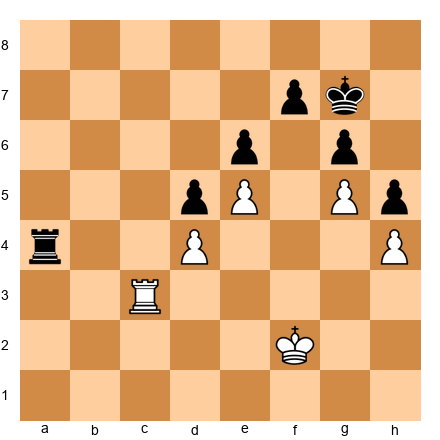</p>


A rook endgame with fixed pawns. White has a passed e-pawn that is blocked. Black has an active rook on the a-file. Is this won, drawn, or lost for either side?

The engine might evaluate this at +0.60 for White. But what does +0.60 mean in a rook endgame? At the expert level, you know that rook endgames are the hardest to convert. A +0.60 advantage with rooks and pawns might be a technical draw in practice.

This is where the human filter matters. The engine says White is better. Your job is to find the winning plan - and if you cannot find one, the position may be a practical draw regardless of the engine's evaluation.

### The Technique-First Approach

When studying an endgame with the engine:

1. **Evaluate the position yourself.** Identify the pawn structure, king activity, and piece placement. Form an opinion.
2. **Find a plan without the engine.** What would you play? Why?
3. **Check with the engine.** Does it agree? If not, study its plan.
4. **Play the position against the engine.** Take the side you want to practice and try to execute your plan. The engine will punish your mistakes instantly. This is the fastest way to improve your endgame technique.

---

## 41.10 The Human Filter

The engine speaks in centipawns. You think in plans.

This gap between machine evaluation and human understanding is the central problem of engine-assisted study. Bridging this gap is the skill that separates players who improve with engines from players who stagnate with engines.

### Translating Centipawns to Plans

When you see an engine evaluation, ask yourself three questions:

1. **Where does the advantage come from?** Is it structural (better pawn structure, bishop pair, outpost), dynamic (piece activity, initiative, attack), or material? The centipawn number tells you *how much* advantage exists. The position tells you *what kind* of advantage it is.

2. **What is the plan to increase the advantage?** A +0.50 advantage means nothing if you cannot find a way to make it grow. Look at the engine's top PV line. What does White (or Black) do over the next 5–10 moves? Can you identify a strategic theme - opening a file, creating a passed pawn, improving a piece?

3. **How would you explain this to a weaker player?** If you can explain why the engine's preferred move is strong in plain language, you have understood it. If you cannot explain it - if you can only say "the engine likes it" - you have not learned anything. Study the position until you can teach it.

### The "+0.00 That Is Not Equal"

Set up your board:

<p align="center">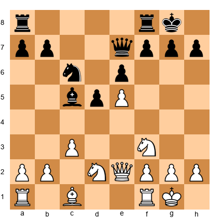</p>


A French Defense structure. White has space on the kingside with the pawn on e5. Black has a solid but cramped position. The engine might evaluate this at +0.05 - essentially equal.

But is it equal in practice? Black's pieces are restricted. The bishop on c5 looks active but has limited scope. Black's knights need squares that do not exist. White can slowly build with f4, Nf3-h4-f5, and pressure along the f-file.

Between two engines, this position is a draw. Between two humans at 2300, White wins more than 60% of the time. The engine's +0.05 is technically accurate but practically misleading.

**The human filter:** When the engine says a position is equal, ask yourself: "Which side would I rather play?" If one side has a clear plan and the other side is struggling to find one, the position is not equal in human terms.

### The "-0.50 That Is Not Losing"

Set up your board:

<p align="center">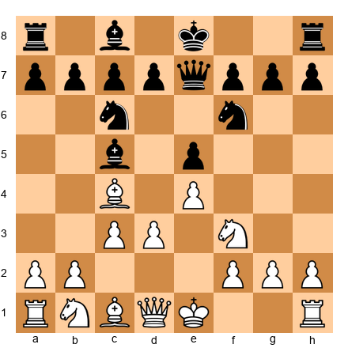</p>


An Italian Game where White has played d3 and c3. The engine might briefly show Black with a slight edge after a specific sequence because Black can exchange favorably in the center. But the resulting position is perfectly playable for White - the pawn structure is healthy, both sides have development, and the game is ahead of them.

A -0.50 evaluation at depth 20 in an open game does not mean you are losing. It means the engine found a sequence where your opponent gains a small, possibly temporary, advantage. In practice, your opponent must find that sequence, execute it precisely, and maintain the edge for 30 more moves. The probability of all three happening at the 2200–2400 level is lower than the engine's evaluation implies.

---

## 41.11 Training Without Engines: The Botvinnik Method

Mikhail Botvinnik - six-time World Champion, scientist, and the father of the Soviet chess school - trained his students with a method so effective that it produced Karpov, Kasparov, and Kramnik.

The core of the method is this: **analyze your own games deeply, without any assistance, before showing them to anyone or consulting any reference.**

### The Botvinnik Process

After a tournament game, Botvinnik required his students to:

1. **Write down everything they remembered about the game.** Not just the moves - the thoughts, the emotions, the time pressure, the doubts. The full experience.

2. **Analyze the game from scratch.** Set up the board. Play through the game. At every critical moment, stop and spend 15 to 30 minutes analyzing alternatives. Write down your analysis in full - main lines, sidelines, evaluations, and conclusions.

3. **Show the annotated game to a training partner or coach.** Discuss the analysis. Where do you disagree? Where did your partner find something you missed?

4. **Only then, check your analysis against published theory or strong players' analyses.** In Botvinnik's era, this meant consulting tournament bulletins. In our era, it means consulting the engine.

This process is painful. It takes 4 to 8 hours per game. It is the most effective training method ever devised.

### Why It Works

When you analyze without the engine, you are forced to think. You cannot outsource the evaluation to a machine. You must understand the position well enough to form your own judgment. When you later compare your analysis to the engine's, every disagreement becomes a learning moment - not because the engine was right (though it usually is), but because you now understand *why you were wrong.*

The player who learns from their own mistakes, with their own effort, retains the lesson. The player who watches the engine correct their mistakes, without personal effort, forgets the lesson by the next game.

### Adapting Botvinnik for the Engine Age

You are not going to spend 8 hours analyzing every game. You have a job, a life, and other interests. Here is the adapted version:

1. **After every serious game, spend 30 minutes analyzing without the engine.** Mark the critical moments. Write your analysis in a notebook or annotation file.

2. **Then run the engine on the critical positions.** Compare your analysis to the engine's. For every disagreement, ask: what did I miss, and why?

3. **Write one lesson per game.** One sentence that captures the most important thing you learned. Keep a running list of these lessons. Review it monthly.

This adapted process takes about 90 minutes per game. It is realistic, sustainable, and effective.

---

## 41.12 The 50/50 Rule

Here is the simplest guideline for balancing engine and non-engine study:

**Spend half your chess study time with an engine. Spend the other half without one.**

The engine half includes: post-game analysis (after your own annotation), opening preparation, novelty testing, and endgame verification.

The non-engine half includes: solving tactical puzzles from books, playing through annotated games without checking the engine's opinion, analyzing your games before turning on the engine, studying positional concepts and pawn structures from classic texts, and playing practice games where you analyze the critical moments immediately afterward using only your own thinking.

### Why 50/50?

Too much engine time makes you dependent. You lose the habit of independent thought. Your calculation skills atrophy because the engine does the calculating for you. You become the Engine Zombie.

Too little engine time makes you ignorant. You miss concrete improvements in your games. Your opening preparation falls behind. You develop incorrect evaluations that persist because nobody corrects them.

The 50/50 balance keeps both skills sharp. You think independently for half your study, building judgment and calculation. You verify and deepen your understanding with the engine for the other half, catching errors and filling gaps.

### A Sample Weekly Schedule

| Day | Activity | Engine? |
|-----|----------|---------|
| Monday | Solve 10 tactical puzzles from a book | No |
| Tuesday | Analyze your weekend game (30 min self, 30 min engine) | Half |
| Wednesday | Study a classic game - play through, annotate, form opinions | No |
| Thursday | Opening preparation - check lines with engine | Yes |
| Friday | Play 2 rapid games, quick engine review afterward | Half |
| Saturday | Tournament game | - |
| Sunday | Rest or play for fun | - |

This schedule devotes roughly equal time to engine-assisted and engine-free study. Adjust it to fit your life, but keep the balance.

---

## 41.13 How Top Grandmasters Use Engines

Understanding how professionals use engines will help you model your own practice.

### The Secondant Model

At the elite level, top players employ secondants - strong GMs who assist with preparation. The secondant's job is to use the engine systematically while the player focuses on understanding.

The workflow:
1. The player identifies upcoming opponents and decides on opening choices
2. The secondant runs deep engine analysis (depth 40+) on critical lines
3. The secondant presents findings to the player: "In the Grünfeld after 12...Rd8, Stockfish prefers 13.Bf4 but Leela suggests 13.Qb3. Here is why."
4. The player studies the positions, plays training games in the lines, and decides which approach to adopt
5. At the board, the player plays from understanding - not from memory of the engine's output

**The key insight:** Even at the world championship level, the player does not memorize engine lines. The player understands the resulting positions well enough to find reasonable moves even when the opponent deviates.

### Novelty Testing

Grandmasters use engines to test new ideas in known theoretical positions. The process:
1. Find a position where current theory recommends move X
2. Ask: what happens if I play move Y instead?
3. Run the engine at depth 35+ on the resulting position
4. Check all of Black's responses
5. If the novelty survives engine scrutiny, play it in a training game first
6. If it works in practice, deploy it in a tournament

The novelty is not the engine's move. The novelty is the player's idea - the engine merely verifies that it is not refuted.

### The Preparation Limit

Carlsen has said in interviews that he prepares openings to approximately move 15–20. After that, he relies on his understanding of the position. Caruana prepares deeper - sometimes to move 25–30 in sharp lines. Neither player memorizes the engine's preferred moves past the point where they feel they understand the position.

The lesson for you: prepare your openings to the depth where you feel comfortable navigating the resulting middlegame. That depth depends on the opening. In a Catalan, you might feel comfortable after move 12. In a sharp Najdorf, you might need to prepare to move 20. Do not prepare further than your understanding extends.

---

## 41.14 Where Engine and Human Disagree

These positions are gold. Study them.

### Type 1: The Quiet Move the Engine Hates

Set up your board:

<p align="center">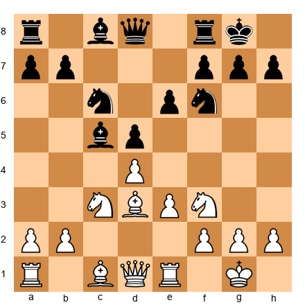</p>


In positions like this - solid, strategic, with balanced pawn structures - the engine might suggest a sharp central break for Black, such as 9...e5. But a strong human player might prefer 9...Qe7, a quiet developing move that maintains flexibility. The engine evaluates 9...Qe7 at -0.05 and 9...e5 at +0.05. Technically, the engine prefers e5. Practically, Qe7 is just as good - and it avoids the committal central pawn advance that the engine does not realize is hard to handle under tournament conditions.

### Type 2: The Long-Term Sacrifice

Set up your board:

<p align="center">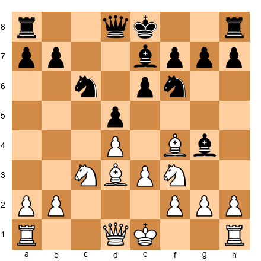</p>


In certain QGD positions, White can sacrifice a pawn with 7.Ne5 or offer structural concessions for long-term pressure. The engine might evaluate the sacrifice at -0.40 after best play. But in human games at the 2200–2400 level, the sacrifice succeeds 70% of the time because Black's defense requires 15 moves of precise play that most humans cannot find at the board.

**The engine evaluates the position. You evaluate the player.** A sacrifice that is objectively dubious but practically dangerous is often the right choice in a tournament game.

### Type 3: The Fortress the Engine Cannot See

Set up your board:

<p align="center">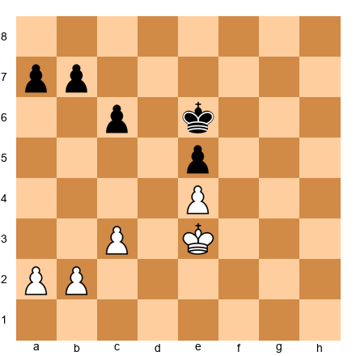</p>


A locked pawn endgame. The engine might evaluate this at +0.30 for White after deep analysis, suggesting that White can slowly outmaneuver Black. But a human who understands corresponding squares can see immediately that this position is a dead draw - neither king can break through. The engine's +0.30 reflects a search artifact, not a genuine advantage.

**The lesson:** In locked pawn endgames, trust your endgame knowledge over the engine's evaluation. You studied corresponding squares in Chapter 38. Use that knowledge.

---

## 41.15 Setting Up a Home Analysis Environment

Your analysis environment does not need to be expensive. Here is what you need at each budget level.

### Budget Setup (Free)

- **Engine:** Stockfish (free, open-source, strongest in the world)
- **GUI:** SCID vs. PC (free) or Lucas Chess (free)
- **Database:** Download free game databases from TWIC (The Week in Chess)
- **Tablebases:** Syzygy 5-piece tablebases (free download, about 1 GB)
- **Alternative:** Lichess.org has Stockfish analysis built in - free, instant, no installation required

This setup is sufficient for 95% of your analysis needs. Stockfish on a modern computer with a free GUI and database is stronger than the entire Soviet chess machine of the 1980s.

### Standard Setup ($0–100)

Everything above, plus:
- **Leela Chess Zero** (free, requires a GPU for best performance)
- **Syzygy 6-piece tablebases** (free download, about 150 GB - you need a large drive)
- **ChessBase Reader** (free) or a ChessBase subscription for database access
- A second monitor, if possible - engine on one screen, board on the other

### Professional Setup ($100–500)

Everything above, plus:
- **ChessBase 17 or similar** (paid software with advanced database features)
- **Syzygy 7-piece tablebases** (about 140 TB - requires dedicated storage; most players use the online Syzygy probe at lichess.org instead)
- **Fast multi-core CPU** (8+ cores significantly speeds up Stockfish)
- **GPU** (for Leela Chess Zero - a mid-range NVIDIA card is sufficient)
- **MegaBase or similar** (8+ million games for opening research)

### What Matters Most

The most important component is not the hardware. It is the *process*. A player with Stockfish on a five-year-old laptop who follows the correct analysis workflow will improve faster than a player with a $3,000 machine who lets the engine think for them.

The engine is a tool. The thinking is yours.

---

## 41.16 Engine-Guided Pattern Recognition

One of the most underused training methods combines engine analysis with human pattern recognition. Here is how it works.

### The Method

Choose a master game in an opening you play. Set up the position after move 15 - deep enough that both sides have committed to plans but early enough that the middlegame is still open.

Run Stockfish at depth 24 or higher. Look at the top three candidate moves. For each one, ask yourself:

1. **Why does the engine like this move?** What does it improve? What does it threaten?
2. **Would you have considered this move on your own?** If not, why not? What principle does it illustrate that you overlooked?
3. **Is there a pattern here that applies to other positions?** Can you describe the idea in words rather than moves?

The goal is not to memorize engine moves. The goal is to extract principles from engine analysis and add them to your positional vocabulary.

### Example

Set up your board:

<p align="center">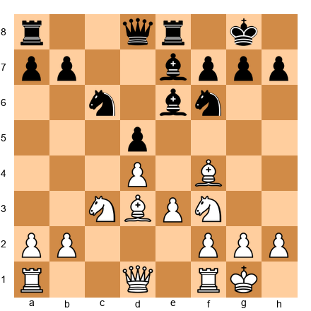</p>


Run Stockfish. It recommends 10.h3. Why?

Look at the position. White has a solid center, an active bishop on f4, and well-placed knights. Why does the engine like h3? It prevents ...Ng4, which would challenge the bishop on f4 or create pressure on e3. It also prepares a flexible setup where White can choose between Rc1, Qe2, or Ne5 without worrying about the knight jump. The move is quiet but removes one of Black's active ideas.

Would you have played 10.h3 on your own? Many 2200-level players would play 10.Rc1 or 10.Re1 or 10.Qe2 - all reasonable, but less precise. The engine's choice teaches a pattern: before committing to a plan, remove your opponent's most annoying reply. A small prophylactic move that costs nothing but takes away an active idea is almost always worth playing.

This pattern - "when in doubt, centralize the queen" - applies across hundreds of positions. You extracted it from one engine analysis, and now it belongs to your toolkit.

### Weekly Engine Pattern Work

Dedicate 30 minutes per week to this exercise. Choose one position from your own games or from a master game. Run the engine. Extract the pattern. Write it down in a notebook.

Over a year, you will have 52 new positional patterns in your vocabulary. Many of them will be ideas you never encountered in any book. The engine found them because it calculates everything. You extracted them because you asked the right questions.

This is the productive relationship between human and engine: the engine provides the moves, and you provide the understanding.

---

## 41.17 Common Engine Misunderstandings

Engines are powerful tools, but they are also widely misunderstood. At 2200, you are sophisticated enough to use engine analysis - but you may still fall into traps that lead you to wrong conclusions. Here are the most common misunderstandings and how to avoid them.

### "The Engine Says +0.5 But I Cannot Find the Plan"

This is the single most common complaint about engine analysis. Stockfish evaluates the position as slightly better for White, but when you stare at the board, you have no idea what to do. You try the engine's top move, and it does not make any sense to you. The position still looks equal.

Here is what is happening: the engine evaluates the position assuming *best play from both sides*. Its +0.5 means "if White plays perfectly and Black plays perfectly, White is slightly better." But perfect play might involve a 15-move maneuvering plan that no human would find at the board. The advantage is real, but it requires accuracy that you - and your opponent - will not achieve.

**What to do:** When the engine says +0.5 and you cannot see why, look at the second and third lines, not just the first. Often the difference between the engine's top move and its third choice is only 0.1 or 0.2 pawns. This means several plans are roughly equal, and you should pick the one you understand best - not the one the engine ranks highest. A move you understand and can follow up on is worth more in practice than the "best" move that leads to a position you do not know how to play.

### Why the Engine's Top Choice Changes Between Depths

You run Stockfish at depth 18 and it says the best move is Nf3. You let it run to depth 24 and now it says Bd3 is best. At depth 28, it switches back to Nf3. What is going on?

The engine is re-evaluating as it searches deeper. At shallow depths, it may miss a subtle defensive resource for the opponent, making one move look better than it is. At greater depths, it finds the resource and adjusts. This is normal and expected. It does not mean the engine is unreliable.

**What to do:** For opening analysis, always use depth 24 or higher. Below that, the evaluation is often unstable. For middlegame positions, depth 20 is usually sufficient unless the position is highly tactical. If the top move keeps changing between depths, it means the moves are very close in value - which means any of them is a reasonable choice.

### The Horizon Effect

In some positions, the engine evaluation is misleading because the real action happens beyond the engine's search depth. The engine might evaluate a position as equal because it cannot see - at its current depth - that a pawn will eventually promote 25 moves from now. Or it might evaluate a sacrifice as unsound because it cannot see the mating attack that arrives 12 moves later.

This is rare in modern engines at high depths, but it still happens in positions with locked pawn structures, very long-term plans, or unusual material imbalances. Fortress positions are a classic example - the engine may show +3 for one side, but the position is actually a draw because there is no way to break through.

**What to do:** When the engine evaluation does not match your positional understanding, investigate. Let the engine run longer. Check if the evaluation changes significantly between depth 24 and depth 30. If it does, the position is more complex than the initial evaluation suggested. If it stays stable, the engine is probably right and your understanding needs updating.

### When the Engine Recommends a Move No Human Would Play

Sometimes the engine's top choice is a move that looks bizarre - a king move in the middlegame, a pawn push that creates weaknesses, a retreat that seems to waste time. These moves are often correct in an objective sense but impractical for human play.

**What to do:** Look at the second and third engine lines. If the second-best move is only 0.1 pawns worse than the top choice, play the second-best move if it makes more sense to you. The 0.1 pawn difference is meaningless in a practical game. A move you understand will lead to better subsequent play than a move you chose only because the engine ranked it first.

The engine does not know that you need to understand your own moves. It does not care about followup plans or long-term understanding. You must apply that filter yourself. The engine shows you truth. Your job is to select the part of that truth you can actually use at the board.

---

## 41.18 Building Your Own Opening Book with Engine Help

At 2200, you should have a personalized opening repertoire - a set of lines you know well, understand deeply, and can play confidently against any opponent. Building this repertoire with engine assistance is one of the most productive uses of your analysis time.

### Step 1: Choose Your Lines

Start with the openings you already play. You do not need to switch to the "best" opening according to engines. You need to play openings you understand. If you play the Caro-Kann and enjoy it, your goal is to build the deepest possible Caro-Kann preparation, not to switch to the Sicilian because the engine likes it more.

For each opening, identify the critical lines - the ones where your opponents have given you trouble or where theory is sharp. These are where engine analysis adds the most value.

### Step 2: Run Deep Analysis on Critical Positions

For each critical position, set up the board and run Stockfish or Leela to depth 24 or higher. At each move, note:

- **The engine's top choice.** Write down the move and the evaluation.
- **The alternatives.** Write down the second and third choices and their evaluations.
- **Your assessment.** Before looking at the engine, write down what you think the best move is. Then compare. If you got it right, good - your understanding matches the engine. If you got it wrong, study why. What did you miss?

Do this for the first 15 to 20 moves of each critical line. Beyond move 20, the positions become too diverse to prepare in advance - you need general understanding more than specific preparation.

### Step 3: Organize Your Findings

Use whatever system works for you - a notebook, a Lichess study, a ChessBase database, or even a spreadsheet. The format does not matter. What matters is that you can find the information when you need it.

For each line, record:
- The move order
- The engine evaluation at key decision points
- Your notes on the plans for both sides
- Any tricky move orders or surprising ideas the engine found
- Your own assessment of how comfortable you feel in the resulting positions

### Step 4: Know When to Trust the Engine and When to Trust Yourself

The engine's opening evaluation tells you whether a line is objectively sound. But objective soundness is not the only thing that matters. A line that the engine evaluates as +0.3 for Black might be a terrible practical choice if the resulting positions are the kind you hate to play - dry, technical, with no winning chances.

Conversely, a line that the engine evaluates as only +0.1 for White might be perfect for you if the resulting positions are complex, unbalanced, and play to your strengths. The engine tells you what is correct. You decide what is right for your style.

### Step 5: Update Regularly

Opening theory changes. New games are played. New engine evaluations come out. Check your critical lines every few months. If a new idea has appeared that challenges your preparation, update your notes. If a new move has been played at the top level in one of your lines, analyze it and decide whether to adopt it or refute it.

The goal is not a static book of moves. The goal is a living document that grows with you. Every tournament, you will face positions that test your preparation. After the tournament, update your book with what you learned. Over time, your opening preparation will become a genuine competitive advantage - not because you memorized more moves than your opponent, but because you understood the positions better.

---

## 41.19 Engine Analysis Pitfalls at the Expert Level

Engine analysis is a powerful tool. But like any powerful tool, it can be misused. At the 2200 level, the most common problem is not that players use engines too little - it is that they use them in ways that actually harm their development. Recognizing these pitfalls is the first step toward using engines effectively.

### Pitfall 1: Obsessing Over Small Evaluation Differences

Stockfish says your position is +0.15. You make a move and the evaluation drops to +0.08. You panic, take the move back, and try something else. The new move evaluates at +0.22. You feel better.

Stop. This is nonsense. An evaluation difference of 0.15 is meaningless in practical terms. It represents roughly a 1% difference in winning probability. No human player in the history of chess has ever been precise enough for this to matter.

Meaningful evaluation thresholds look like this: 0.00 to 0.30 is approximately equal. 0.30 to 0.70 is a slight advantage. 0.70 to 1.50 is a clear advantage. Above 1.50 is usually winning with correct play. Below these thresholds, the specific number does not matter. A position at +0.18 and a position at +0.25 are the same thing in practice: roughly equal with a tiny edge.

When you use an engine, look for moves that are clearly wrong (dropping a full point or more in evaluation). Ignore moves that vary by tenths of a pawn. The engine's top three moves are often all playable. Choose the one that you understand, not the one with the highest decimal.

### Pitfall 2: The Engine Dependency Syndrome

Here is a test. Set up a complex middlegame position on your board. Now analyze it for 15 minutes without turning on the engine. Write down your assessment, your candidate moves, and your best line. Can you do it?

If this feels uncomfortable - if you feel anxious without the engine running, if you doubt every conclusion you reach, if you catch yourself thinking "I'll just check this one thing" - you have developed engine dependency.

Engine dependency is the chess equivalent of never doing math without a calculator. You can still get the right answers, but you lose the ability to think independently. And in a tournament game, you do not have a calculator. You are on your own.

The symptoms of engine dependency are: you cannot evaluate a position without engine confirmation, you distrust your own analysis even when it is correct, you spend more time watching the engine than thinking about the position, and you feel that your analysis is worthless until the engine validates it.

The cure is gradual. Start analyzing positions without the engine for short periods (5 minutes). Gradually increase the time. Keep a log of your independent analyses and compare them with the engine afterward. You will discover that your independent analysis is better than you think. And the mistakes you do make are more instructive than any engine line.

### Pitfall 3: Over-Reliance on Computer-Approved Moves

Some players reach a stage where they will only play moves that they have checked with an engine. Every opening line, every middlegame plan, every endgame technique must be engine-approved before they will use it in a game. This creates a rigid, fearful playing style that falls apart the moment they leave their preparation.

The problem is not that these players are checking moves with an engine. The problem is that they are not developing their own judgment. They know what the engine likes, but they do not know why. And when the engine is not available (which is always the case during a game), they are lost.

Use the engine to check your ideas, not to replace them. Form an opinion about a position first. Then check with the engine. If the engine disagrees, figure out why. The goal is to calibrate your judgment, not to replace it.

---

## 41.20 Creating Engine-Free Analysis Sessions

The Botvinnik method - named after the sixth World Champion Mikhail Botvinnik - is the gold standard for game analysis. Botvinnik analyzed his games deeply, writing down his thoughts and variations, and only then compared his analysis with other strong players (there were no engines in his time). We can adapt this method for the engine era.

### The 30-Minute Analysis Session

Here is how to structure a productive post-game analysis session that uses the engine correctly.

**Minutes 1 through 15: Human analysis.** Set up the game on your board. Play through it move by move. At each critical moment, stop and write down your thoughts. What were you thinking during the game? What alternatives did you consider? What would you play differently now? Write down specific variations - actual moves, not vague assessments.

Focus on three things during this phase. First, the critical moments - the turning points where the evaluation might have shifted. You will not know the exact turning points without the engine, but you can usually feel them: the moment you made a decision you were unsure about, the moment your opponent surprised you, the moment the position changed character.

Second, your calculation. At the critical moments, write down the lines you calculated during the game and the lines you are calculating now. Where do they differ? Are you seeing more clearly now (without time pressure) than you did during the game?

Third, your assessment. At the end of each critical variation, write down your evaluation: "White is better because..." or "Black has compensation for the pawn because..." Make your reasoning explicit. This is the part that teaches you the most.

**Minutes 15 through 30: Engine verification.** Now turn on the engine. Play through the game again, this time with the engine running. At each critical moment, compare the engine's analysis with yours.

Write down every significant disagreement. Not tiny evaluation differences (remember Pitfall 1), but genuine disagreements about the best move or the character of the position. For each disagreement, try to understand the engine's reasoning. What did you miss? Was it a tactical detail? A positional concept? A move you simply did not consider?

### The Extended Analysis Session (For Important Games)

Some games deserve more than 30 minutes of analysis. Tournament wins and losses, games that affected your rating significantly, and games where you faced a critical decision that you are still unsure about - these merit a longer, deeper analysis.

**The 60-minute extended session.** Add a third phase to the standard session. After the 15-minute human analysis and 15-minute engine check, spend an additional 30 minutes exploring the key positions more deeply. Set up the critical position on a board and analyze the engine's recommended line move by move. At each move, ask: "Why is this the best move? What does it accomplish? What happens if a different move is played instead?"

This deeper exploration is where the real learning happens. The 30-minute session tells you what you missed. The 60-minute session tells you why you missed it and how to avoid missing it in the future.

**Post-analysis summary.** At the end of an extended session, write a one-paragraph summary of the game. Include: the opening played, the critical moment, the mistake (if any), and the lesson learned. This summary becomes a permanent record that you can review before future tournaments.

Over time, your collection of post-analysis summaries becomes a personalized chess textbook. It contains the specific lessons that apply to your game, your openings, and your weaknesses. No published book can match this because no published book is written about you.

### The Engine Diary

Keep a dedicated notebook or document - your "engine diary" - where you record the most instructive disagreements between your analysis and the engine's analysis. Each entry should include: the position (FEN or diagram), your assessment, the engine's assessment, what you missed, and the lesson you learned.

Over time, patterns will emerge. Maybe you consistently miss backward knight moves. Maybe you overvalue bishops in closed positions. Maybe you underestimate the power of rook lifts. These patterns reveal your specific blind spots - the areas where targeted training will produce the biggest improvement.

Review your engine diary once a month. Look at the last 10 to 15 entries. Ask yourself: "Am I still making the same types of mistakes?" If yes, you need more targeted training on that weakness. If no, your analysis is improving.

### The Discipline Factor

The hardest part of this method is discipline. It is tempting to turn on the engine during the first 15 minutes. It is tempting to skip the human analysis entirely and go straight to the engine output. Resist this temptation.

The human analysis phase is where you learn. The engine verification phase is where you confirm what you learned. If you skip the first phase, you are just watching the engine think. That is entertainment, not training.

Set a timer for 15 minutes. Do not touch the engine until the timer goes off. Write your analysis in a notebook, not on a screen (this removes the temptation to click the "analyze" button). Make this a habit, and your independent analytical ability will improve rapidly.

---

## 41.21 Tablebases and Their Practical Use

A tablebase is a database that contains the complete solution to every chess position with a given number of pieces. The most commonly used tablebases - Syzygy tablebases - solve all positions with 7 or fewer pieces on the board. This means that for any position with 7 or fewer total pieces (including kings), the tablebase tells you with absolute certainty whether the position is a win, a draw, or a loss, and what the best move is.

### What Tablebases Tell You

Tablebases provide three types of information. First, the theoretical result: win, draw, or loss with best play from both sides. Second, the distance to a specific outcome - how many moves until conversion (mate, or a simpler winning position). Third, the best move in the position.

This information is perfect. Unlike engine evaluations, which are estimates, tablebase results are mathematically proven. If the tablebase says a position is drawn, it is drawn against any opponent, including God.

### When to Consult Tablebases

Tablebases are most useful in two situations.

**During post-game analysis.** When you reach an endgame with 7 or fewer pieces in your game, check the tablebase to see whether the final position was won, drawn, or lost. This tells you whether your endgame play was correct. If the tablebase says the position was drawn but you lost, you made an endgame error that you need to study. If the tablebase says the position was winning but you agreed to a draw, you missed a win.

**During endgame study.** When studying endgame theory, tablebases can verify whether a position you are analyzing is theoretically won or drawn. This is especially useful for complex endings like rook and bishop vs. rook, two knights vs. pawn, or queen vs. rook and pawn. These endings have complex theoretical results that are difficult to determine through calculation alone.

**During opening preparation.** This is a less obvious use, but it is valuable. When analyzing an opening line that leads to a simplified endgame, you can check the tablebase to see whether the resulting endgame is won, drawn, or lost. This helps you decide whether to aim for that endgame or avoid it. If the resulting endgame is a tablebase draw, there is no point in spending 30 moves trying to win it.

### Practical Tablebase Exercises

Here are three exercises to help you integrate tablebase knowledge into your play.

**Exercise 1: The rook and pawn ending.** Set up the position: White king on e1, White rook on a1, White pawn on e4. Black king on e8, Black rook on a8. Check the Syzygy tablebase on Lichess for this position. Is it a win, draw, or loss? Now move the pawn to e5 and check again. How does the pawn position change the result?

**Exercise 2: Knight and bishop mate.** Set up White king on a1, White knight on b1, White bishop on c1 against Black king on e5 (alone). The tablebase will confirm this is a win. Now practice the mating technique. It requires driving the king to the corner that matches the bishop's color. This is one of the hardest basic checkmate patterns, and knowing that it is always theoretically winning gives you the confidence to aim for this endgame in your games.

**Exercise 3: Queen vs. rook.** Set up White king on g1, White queen on d1 against Black king on a8, Black rook on b8. This should be a win for the queen, but the winning technique is not trivial. Use the tablebase to find the winning moves, then practice the technique until you can execute it without tablebase help.

### Accessing Tablebases

The most accessible tablebase is the Syzygy tablebase on Lichess. Go to lichess.org/analysis, enter a position with 7 or fewer pieces, and Lichess will show you the tablebase result automatically. This is free and requires no installation.

For offline use, you can download Syzygy tablebases and use them with a chess GUI like ChessBase, Arena, or SCID. The full 7-piece tablebases are large (approximately 140 GB for the WDL tables and more for the DTZ tables), but 5-piece and 6-piece tables are much smaller and cover the most common endgame types.

### How Tablebase Knowledge Affects Your Play

Knowing the theoretical result of common endgame positions changes how you play the middlegame. Here are three examples.

First, if you know that king, bishop, and knight vs. king is a forced win (with correct technique), you will not hesitate to trade down to this endgame when it gives you a winning advantage. Many players avoid this endgame because the winning technique is difficult to execute, but knowing it is won gives you the confidence to aim for it.

Second, if you know that king, rook, and pawn vs. king and rook is drawn in most (but not all) configurations, you will be more willing to sacrifice a pawn for activity in rook endgames, knowing that many rook-and-pawn-down positions are holdable.

Third, if you know that two bishops vs. knight is usually winning when there are pawns on the board, you will value the bishop pair more highly in positions where a trade to that ending is possible.

Tablebase knowledge does not replace endgame understanding. You still need to know the techniques for converting winning positions and defending drawn ones. But tablebases give you the confidence of absolute certainty: this position is won, and if I play correctly, I will win it.

---

## Annotated Games: Engine-Assisted Analysis in Action

The following three games demonstrate the principles of this chapter. Each game is presented as a case study in how to use engines for analysis - not just what the engine finds, but how a strong player interprets and applies the engine's output.

---

### Game 1: The Sacrifice Stockfish Approved and Leela Questioned

**Veselin Topalov vs Viswanathan Anand**
**Candidates Tournament, 2005**
**Sicilian Najdorf, English Attack**
**Result:** 1-0

Set up your board:

<p align="center"></p>


`1.e4 c5 2.Nf3 d6 3.d4 cxd4 4.Nxd4 Nf6 5.Nc3 a6 6.Be3 e6 7.f3 b5 8.Qd2 Nbd7 9.g4 h6 10.O-O-O Bb7 11.h4`

Set up your board:

<p align="center">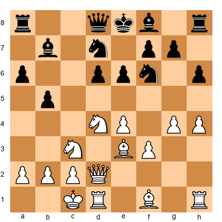</p>


This is a standard Sicilian English Attack. White has castled queenside and launched a kingside pawn storm. Black must generate queenside counterplay before White's attack arrives.

**11...d5** A sharp central counter-strike. Black opens the position before White's kingside pawns become threatening.

**12.exd5 Nxd5 13.Nxd5 Bxd5**

Set up your board:

<p align="center">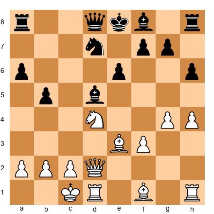</p>


Here is where the analysis becomes instructive. White must decide how to maintain the initiative.

**14.c4!?** A pawn sacrifice. White gives up the c-pawn to open lines toward Black's king, which is still in the center.

**14...bxc4 15.Bxc4 Bxc4 16.Qe2**

Set up your board:

<p align="center">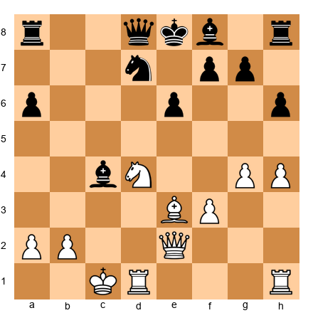</p>


**The engine analysis:** At this point, Stockfish evaluates the position at approximately +0.40 for White. The pawn sacrifice is objectively sound - White's piece activity and Black's undeveloped kingside provide full compensation. Leela, running simultaneously, gives +0.25 - slightly less enthusiastic. Leela sees Black's solid pawn structure and is less impressed by White's initiative.

The disagreement between +0.40 and +0.25 tells us: the sacrifice is sound, but Black has defensive resources. This is the kind of practical sacrifice that works well at the board because the defender must find precise moves.

**16...Bd5 17.g5 hxg5 18.hxg5 Rxh1 19.Rxh1**

White has sacrificed a pawn and traded rooks but now has a dominating position. The g5-pawn clamps down on Black's kingside, and White's pieces are far more active.

**19...Qc7 20.Kb1 Qc5 21.Nf5!**

Set up your board:

<p align="center">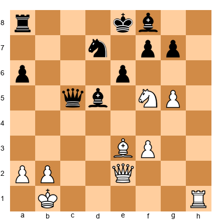</p>


The knight lands on f5 with devastating effect. It attacks e7 and g7 simultaneously, and the threat of Nd6+ is in the air.

**21...exf5 22.Qe5** White centralizes the queen with tremendous force. Black's king is caught in the middle with no safe square.

After a few more moves, White's attack proved decisive.

**What the engine taught us:**
- The pawn sacrifice 14.c4 was objectively sound. Stockfish confirmed this at depth 35. Without the engine, you might doubt the sacrifice - with it, you can study the resulting position with confidence.
- Leela's lower evaluation warned that Black had defensive chances. This is valuable - it tells the attacker not to overpress and the defender not to despair.
- The key position after 16.Qe2 is one every Najdorf player should study. Bookmark it. Set up the board. Play both sides against the engine.

**Preparation lesson:** Use the engine to verify that your sacrifices are sound, then study the resulting positions until you understand them without the engine. The sacrifice is the easy part. The follow-up play is where games are won and lost.

---

### Game 2: The Endgame the Engine Wanted to Draw

**Magnus Carlsen vs Sergey Karjakin**
**World Championship, New York 2016, Game 10**
**Ruy Lopez, Berlin Defense**
**Result:** 1-0

Set up your board:

<p align="center"></p>


`1.e4 e5 2.Nf3 Nc6 3.Bb5 Nf6 4.O-O Nxe4 5.d4 Nd6 6.Bxc6 dxc6 7.dxe5 Nf5 8.Qxd8+ Kxd8`

Set up your board:

<p align="center">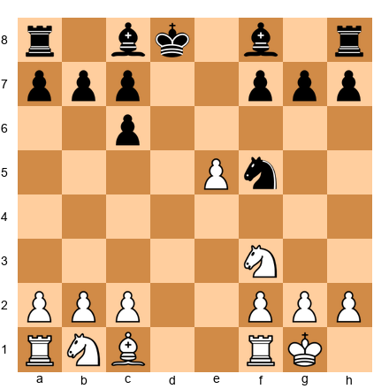</p>


The Berlin endgame - the system Kramnik used to dethrone Kasparov in 2000. Black has traded queens early. The engine evaluates this position at approximately +0.25 for White. At the Grandmaster level, this is considered "equal with a slight pull." Many Berlin endgames end in draws.

But Carlsen does not draw Berlin endgames. He grinds.

`9.h3 Be7 10.Nc3 Nh4 11.Nxh4 Bxh4 12.Be3 Ke7 13.Rad1 Be6`

Set up your board:

<p align="center">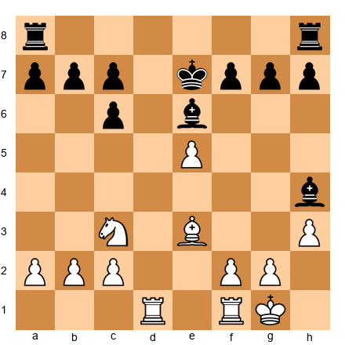</p>


The engine holds steady at +0.20 to +0.30. Both engines agree: this position is close to a draw with accurate play from Black. Stockfish sees no concrete path to a winning advantage. Leela agrees.

And yet Carlsen won this game. He won it because the position, while objectively drawn, requires Black to make 40 precise moves in a row. The engine can do this. A human cannot - not consistently, not under the pressure of a world championship match.

**14.f4 f6 15.g4 fxe5 16.f5 Bd7**

Set up your board:

<p align="center">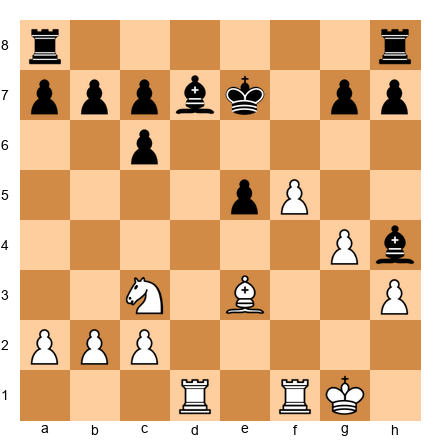</p>


White has advanced the kingside pawns aggressively. The engine still shows +0.30 - barely anything. But look at the position through human eyes. White has a clear plan: advance the kingside majority, open files toward Black's king, and create threats. Black's plan is... to defend. Accurately. For the next 25 moves.

**This is the human filter in action.** The engine says +0.30. The human says "White has a risk-free initiative, Black must defend precisely, and one mistake costs the game." These are different evaluations of the same position.

Carlsen continued to press for 30 more moves. Karjakin defended accurately for most of them - but not all. One inaccuracy on move 39 gave White a tangible advantage, and Carlsen converted.

**What the engine taught us:**
- The engine was technically correct: the position was close to drawn. But "close to drawn" and "drawn in practice" are different things.
- Carlsen's approach was to play the position, not the evaluation. He chose a plan that maximized practical problems for his opponent, even though the engine said the advantage was minimal.
- When studying this game with the engine, the key positions are not where the evaluation changes - they are where Black has only one good move. Count those positions. There are more than a dozen. That is why White wins.

**Preparation lesson:** In endgames where the engine says "equal," look at the practical demands on each side. The side with the simpler plan and fewer critical decisions often wins in practice, regardless of the engine's centipawn evaluation.

---

### Game 3: The Position Leela Understood Better

**Anatoly Karpov vs Garry Kasparov**
**World Championship, Moscow 1985, Game 16**
**Sicilian Scheveningen**
**Result:** 0-1

Set up your board:

<p align="center"></p>


`1.e4 c5 2.Nf3 e6 3.d4 cxd4 4.Nxd4 Nc6 5.Nb5 d6 6.c4 Nf6 7.N1c3 a6 8.Na3 d5`

Set up your board:

<p align="center">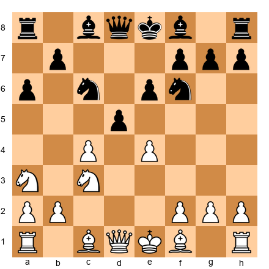</p>


Kasparov plays 8...d5, a thematic central strike in the Scheveningen. This move challenges White's center directly and was a prepared weapon for this specific game.

`9.cxd5 exd5 10.exd5 Nb4 11.Be2 Bc5 12.O-O O-O 13.Bf3 Bf5 14.Bg5 Re8 15.Qd2 b5`

Set up your board:

<p align="center">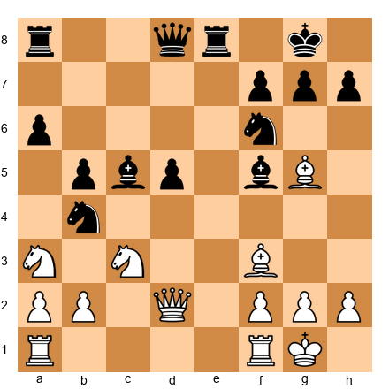</p>


This is the critical position. Look at it carefully before reading on.

**Stockfish analysis (depth 35):** +0.10. Nearly equal.

**Leela analysis:** +0.05 for White, with Black's position "trending toward comfortable equality."

At first glance, both engines agree: the position is about equal. But there is a deeper story.

Kasparov has piece activity, open lines for his rooks, and a centralized knight on b4. Karpov has the extra d5-pawn, but it is isolated and weak. In the game, Kasparov played with tremendous energy and precision over the next fifteen moves, gradually taking control of the position.

**16.Rad1 Nd3 17.Nab1**

Set up your board:

<p align="center">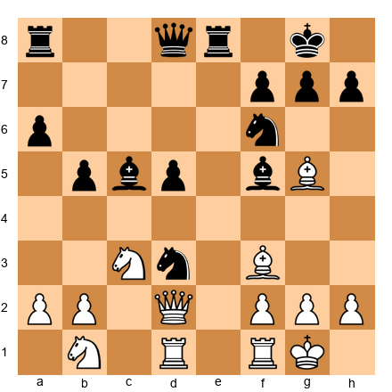</p>


Now Black has a knight on d3 - the famous "octopus knight." This piece dominates the board from its central outpost. It cannot be captured (the f2-pawn is needed), and it radiates influence in all directions.

**The engine lesson:** Stockfish at moderate depth still evaluates this as close to equal. But Leela at this point gives Black a slightly more favorable assessment, around -0.15 to -0.20. Leela "understands" that the octopus knight is a long-term asset whose value will grow as the game progresses.

This is a textbook example of a position where Leela's positional pattern recognition outperforms Stockfish's tactical search. The knight on d3 is not delivering a concrete tactical threat. It is exerting positional pressure that the neural network recognizes from thousands of similar patterns in its training data.

Kasparov went on to win a brilliant game, considered one of the finest in world championship history. The knight on d3 was never captured and remained a thorn in Karpov's position until the end.

**What the engine taught us:**
- Multi-engine analysis revealed a subtle truth: Leela valued Black's position slightly higher than Stockfish, foreshadowing the practical outcome.
- When studying this position with only Stockfish, you might conclude that both sides are fine. Adding Leela gives you the additional insight that Black's long-term piece placement is more valuable than the engine's tactical evaluation suggests.
- This type of position - with a dominant centralized piece whose value is hard to quantify tactically - is exactly where multi-engine analysis pays dividends.

**Preparation lesson:** When your pieces are beautifully placed but the engine says the position is equal, do not abandon your plan. The engine is evaluating the immediate position. You are playing the trend. Trust the trend when your pieces are better.

---

## Exercises

### ★★ Warmup Exercises

**Exercise 41.1** (★★)

<p align="center"></p>


White to play. Evaluate this position *without* an engine. Write down your evaluation in centipawns and your reasoning. Then check with an engine. How close were you?

*Hint: Consider the isolated queen's pawn, piece activity, and central control.*
⏱ ~5 min (3 min without engine, 2 min with engine)

---

**Exercise 41.2** (★★)

<p align="center"></p>


White to play. This is a standard QGD Tartakower position. Identify the three most important strategic themes for White without consulting an engine. Then run Stockfish at depth 25. Does the engine's preferred move align with the themes you identified?

*Hint: Think about the center, the light-squared bishop, and minority attack possibilities.*
⏱ ~5 min

---

**Exercise 41.3** (★★)

<p align="center"></p>


Evaluate this position. Is it won, drawn, or lost for White? Write your answer and reasoning. Then consult a Syzygy tablebase. Were you correct?

*Hint: Opposition and key squares.*
⏱ ~3 min

---

### ★★★ Essential Exercises

**Exercise 41.4** (★★★)

<p align="center"></p>


The Italian Game after 3...Bc4. Without an engine, analyze both 4.d3 and 4.d4. Which do you prefer and why? Write at least three lines of analysis for each. Then compare with Stockfish and Leela. Do the engines agree with each other? Do they agree with you?

*Hint: 4.d4 is sharper. 4.d3 is more flexible. Consider what kind of game you want.*
⏱ ~15 min (8 min without engine, 7 min with engine)

---

**Exercise 41.5** (★★★)

<p align="center">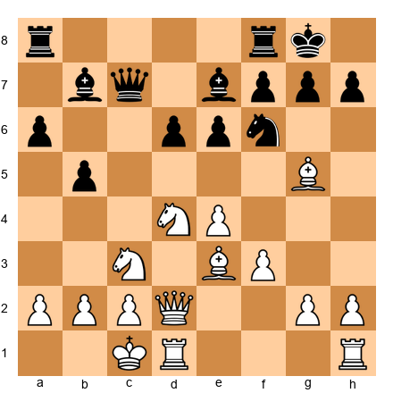</p>


A Sicilian Najdorf English Attack. Run Stockfish and Leela simultaneously on this position. Note the top three candidate moves for each engine. Where do they agree? Where do they disagree? Which engine's recommendation would you follow in a tournament game, and why?

*Hint: Pay attention to whether each engine suggests an immediate action or a prophylactic measure.*
⏱ ~10 min

---

**Exercise 41.6** (★★★)

<p align="center">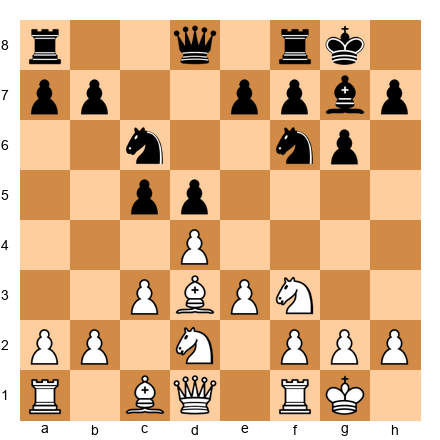</p>


A King's Indian Defense structure where Black has fianchettoed and played ...d5. Analyze this position without an engine for 10 minutes. Write down your evaluation, your preferred plan for White, and one concrete line supporting your plan. Then check with Stockfish at depth 30. Was your plan correct? Was there a better one?

*Hint: Central tension. White must decide whether to capture on d5 or maintain it.*
⏱ ~15 min

---

**Exercise 41.7** (★★★)

<p align="center">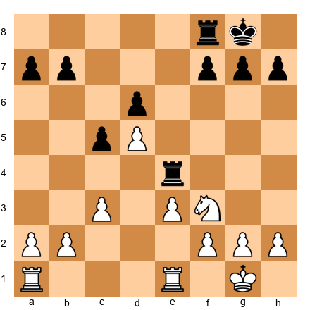</p>


Black to play. The engine evaluates this position at approximately -0.35. Your task: explain in plain language *why* Black has this advantage. Do not quote centipawns. Describe the pawn structure, piece activity, and any weaknesses. What is Black's plan?

*Hint: Think about the pawn structure on the queenside and the activity of Black's rooks.*
⏱ ~8 min

---

**Exercise 41.8** (★★★)

<p align="center"></p>


Italian Game, Giuoco Piano. Your task: set your engine to depths 15, 25, and 35 on this position. Record the preferred move and evaluation at each depth. Does the evaluation change? Does the preferred move change? What does this tell you about the reliability of shallow analysis?

*Hint: Some positions are stable across all depths. Others are not. Which type is this?*
⏱ ~10 min

---

**Exercise 41.9** (★★★)

<p align="center"></p>


A rook endgame. Evaluate this position without an engine. Is White winning, drawn, or lost? Write down your plan for White. Then check with an engine at depth 35. Then check with a tablebase probe (play the position down to 7 pieces if needed). How did your evaluation compare?

*Hint: Look at the passed e-pawn, the rook activity, and the king positions.*
⏱ ~12 min

---

**Exercise 41.10** (★★★)

<p align="center"></p>


You are analyzing this position from one of your games. You played 9...e5 during the game. After running the engine, you discover it prefers 9...Qe7.

Your task: do NOT just accept the engine's suggestion. Instead, compare both moves:
- What does 9...e5 achieve strategically?
- What does 9...Qe7 achieve?
- What does 9...e5 give up that 9...Qe7 preserves?
- In what types of positions would you prefer 9...e5 over 9...Qe7?

*Hint: 9...e5 commits to a central structure. 9...Qe7 maintains flexibility. Both have merits.*
⏱ ~10 min

---

**Exercise 41.11** (★★★)

<p align="center"></p>


QGD Exchange Variation. Run Stockfish on this position for 2 minutes at Multi-PV = 5 (five lines). List all five candidate moves and their evaluations. How large is the gap between the best and fifth-best move? If the gap is small (less than 0.20), what does that tell you about the position? If the gap is large (more than 0.50), what does that tell you?

*Hint: A small gap means many reasonable plans exist. A large gap means the position demands a specific approach.*
⏱ ~8 min

---

### ★★★★ Practice Exercises

**Exercise 41.12** (★★★★)

<p align="center"></p>


You are preparing the Catalan for your next tournament. This position arises after a standard move order. Your task:

1. Spend 10 minutes analyzing without an engine. Identify White's three best candidate moves and rank them.
2. Run Stockfish to depth 35. Compare its ranking to yours.
3. Run Leela on the same position. Does Leela agree with Stockfish?
4. For the move that both engines agree is best, play the next 5 moves of the engine's PV line on your board. Can you explain *why* each move is played?

*Hint: The Catalan is a positional opening. Understanding the plans matters more than memorizing the moves.*
⏱ ~25 min

---

**Exercise 41.13** (★★★★)

<p align="center"></p>


This is the French Defense structure from Section 41.10 - the "+0.00 that is not equal."

Your task: play this position as White against Stockfish (set to approximately 2200 strength if your software allows). Play 20 moves. Record your moves and the engine's responses. After the game, run full-strength Stockfish on the critical positions.

Questions to answer:
- Did the evaluation stay near +0.00 throughout?
- Did you find a plan that created practical problems for the engine?
- What was the most difficult moment in the game?

*Hint: Your plan should involve slow kingside expansion. f4, Nf3-h4-f5, and pressure down the f-file.*
⏱ ~30 min

---

**Exercise 41.14** (★★★★)

<p align="center">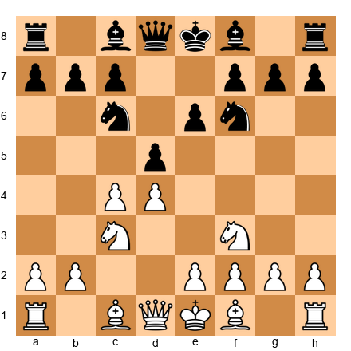</p>


Semi-Slav Defense. You are preparing a novelty in this line. Your usual continuation is 5.Bg5 (the standard Botvinnik System). But you want to test 5.e3 instead (the Meran).

Your task:
1. Run Stockfish at depth 35 on the position after 5.e3 Nbd7 6.Bd3 dxc4 7.Bxc4 b5
2. Identify Black's three main responses to 8.Bd3
3. For each response, determine whether White has a theoretical edge
4. Based on your analysis, decide: would you switch from the Botvinnik System to the Meran? Why or why not?

*Hint: Consider not just the engine's evaluation but the types of middlegames that arise. Which suits your style better?*
⏱ ~20 min

---

**Exercise 41.15** (★★★★)

<p align="center">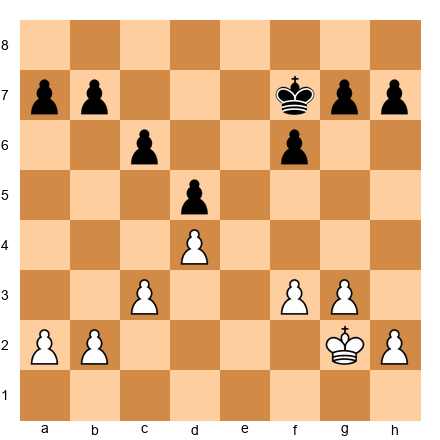</p>


A pure king-and-pawn endgame from a simplified position. Your task:

1. Without an engine, determine whether this position is won, drawn, or lost for White. Calculate the key variations.
2. Check with an engine. Were you right?
3. If you were wrong, identify exactly where your calculation went astray.
4. Play this position against the engine from both sides. Can you win as White? Can you draw as Black?

*Hint: Count pawn breaks. Who can create a passed pawn? Which king reaches the critical squares first?*
⏱ ~15 min

---

**Exercise 41.16** (★★★★)

<p align="center">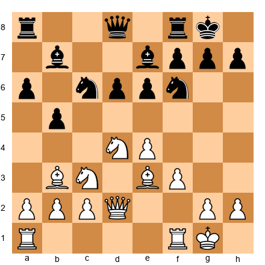</p>


A Najdorf Sicilian where you played White and chose 12.a4 in the game. After running the engine, you find it preferred 12.O-O-O.

Your task: analyze the consequences of both moves to depth 30 with Multi-PV = 3. Then answer:
- What does 12.a4 accomplish that 12.O-O-O does not?
- What does 12.O-O-O accomplish that 12.a4 does not?
- Which move creates more practical problems for Black at the 2200–2400 level?
- Write a one-paragraph summary of what you learned from this comparison.

*Hint: 12.a4 attacks the queenside but may weaken b4. 12.O-O-O signals kingside aggression. Different approaches for different players.*
⏱ ~15 min

---

**Exercise 41.17** (★★★★)

<p align="center">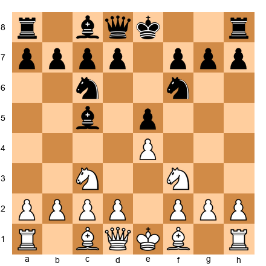</p>


Four Knights Italian. Your task is a Botvinnik-style exercise:

1. Set a timer for 15 minutes. Analyze this position without any engine. Write down your full analysis: candidate moves, main lines, evaluations, and conclusions.
2. When the timer ends, run Stockfish at depth 30.
3. Compare your analysis to the engine's. Identify every point of disagreement.
4. For each disagreement, write down *why* you made the error. Was it a calculation mistake, a positional misjudgment, or a failure to consider a candidate move?

This exercise trains your analytical process, not your chess knowledge.

*Hint: There are no shortcuts. Do the full 15 minutes without the engine.*
⏱ ~25 min

---

### ★★★★★ Mastery Exercises

**Exercise 41.18** (★★★★★)

<p align="center">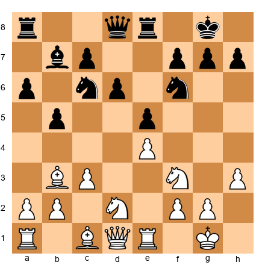</p>


A closed Ruy Lopez Breyer. This exercise simulates a full analysis session.

Your task:
1. Spend 20 minutes analyzing this position without an engine. Identify the key strategic themes for both sides. Propose a plan for Black. Calculate one critical variation at least 8 moves deep.
2. Run Stockfish and Leela simultaneously at depth 35+. Record both engines' top 3 moves and evaluations.
3. Where the engines disagree, study both lines. Which engine's plan do you prefer for a human game?
4. Find one position in the PV lines where a "quiet move" changes the evaluation by more than 0.20. Explain what the quiet move accomplishes.
5. Write a 200-word summary of your complete analysis, as if you were explaining this position to a student.

*Hint: The Breyer is a strategic opening where long-term planning matters more than concrete tactics. Leela may have insights that Stockfish misses here.*
⏱ ~45 min

---

**Exercise 41.19** (★★★★★)

<p align="center">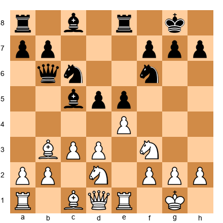</p>


Italian Game, center under tension. This exercise tests your ability to separate engine noise from genuine analysis.

Your task:
1. Run Stockfish at depths 20, 25, 30, 35, and 40. For each depth, record the preferred move and evaluation.
2. At which depth does the evaluation stabilize? (Define "stable" as the evaluation not changing by more than 0.05 between consecutive depths.)
3. If the preferred move changes between depths, identify the position at the end of the new PV line. What does the engine see at higher depth that it missed at lower depth?
4. Based on your findings, what is the minimum depth you would trust for analyzing this type of position?
5. Play this position as White against Stockfish set to 2300 strength. Did the engine's preferred move lead to a position you could handle? Or would a different move have been more practical?

*Hint: Positions with central tension often require deeper analysis because the tactical consequences of pawn breaks are hard to see at shallow depth.*
⏱ ~40 min

---

**Exercise 41.20** (★★★★★)

<p align="center">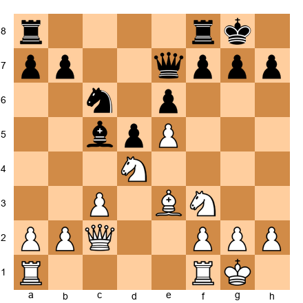</p>


Your task: conduct a complete Botvinnik-style analysis of this position.

1. Spend 25 minutes analyzing without an engine. Write down:
   - Your positional evaluation (who stands better and why)
   - Three candidate moves for Black, ranked in order of preference
   - A main line of at least 10 moves for your top choice
   - An evaluation of the resulting position after your main line

2. Run dual-engine analysis (Stockfish + Leela) at depth 35+ for 10 minutes. Record all findings.

3. Write a comparison:
   - Where did your analysis agree with the engines?
   - Where did it disagree?
   - What does the disagreement reveal about your chess thinking?
   - What is the single most important lesson from this exercise?

4. File the completed analysis in your notebook. Review it in one month and re-analyze the position without looking at your notes. Have you improved?

*Hint: This exercise is not about getting the right answer. It is about understanding your own thought process.*
⏱ ~50 min

---

## Key Takeaways

1. **The Engine Zombie is the cautionary tale.** Knowing engine lines without understanding the positions behind them produces a player who crumbles when the opponent deviates. Never memorize without understanding.

2. **Engines think in centipawns. You think in plans.** Your job is to bridge the gap - to translate the engine's numerical evaluation into a strategic plan you can execute at the board. This is the human filter.

3. **Use two engines.** Stockfish for tactical precision. Leela for positional understanding. When they disagree, you are standing at a learning opportunity. Study the disagreement.

4. **Follow the five-step workflow.** Annotate your game yourself, identify critical positions, run the engine on those positions, compare human and engine analysis, and write down what you learned. This process is worth more than any engine evaluation.

5. **Match depth to purpose.** Quick blunder check: depth 18–22. Standard analysis: depth 25–30. Deep preparation: depth 35–40. Do not waste time at unnecessary depth.

6. **The Botvinnik method is still the gold standard.** Analyze your games without an engine first. The effort of independent analysis is what produces lasting improvement. The engine is the teacher who checks your homework - but you must do the homework first.

7. **Follow the 50/50 rule.** Half your study time with an engine, half without. This balance maintains both your independent thinking and your access to objective truth.

8. **Trust the engine for tactics. Trust yourself for strategy.** The engine calculates better than you. But the engine does not play your opponent, manage your clock, or know your strengths. In strategic decisions where multiple moves are roughly equal, choose the move that fits your game.

9. **The "+0.00" is not always equal.** When the engine says a position is equal but one side has a clear plan and the other does not, the position is not equal in practice. Evaluate positions through human eyes, not engine eyes.

10. **The tool is not the craftsman.** A strong engine on a fast computer will not make you a strong player. A disciplined analysis process, applied consistently over months and years, will. The engine is a tool. The thinking is yours.

---

## Practice Assignment

### This Week's Engine Training

**Day 1: The Botvinnik Exercise**
Play one serious game (rapid, 15+10 or longer). After the game, spend 30 minutes analyzing it without any engine. Mark the critical positions. Write your analysis in a notebook or file.

**Day 2: Engine Verification**
Run Stockfish at depth 25–30 on the critical positions from your Day 1 game. Compare your analysis to the engine's. Write one lesson for every significant disagreement.

**Day 3: Multi-Engine Comparison**
Choose one critical position from your game. Run both Stockfish and Leela (or whatever second engine you have access to). Compare their evaluations and preferred moves. Write a paragraph explaining what you learned from the comparison.

**Day 4: Depth Experiment**
Take a complex middlegame position from one of the annotated games in this chapter. Run Stockfish at depths 15, 20, 25, 30, and 35. Record how the evaluation and preferred move change. At what depth does the evaluation stabilize?

**Day 5: Engine-Free Puzzle Session**
Solve 15 tactical puzzles from a book - no engine, no hints, no computer. Use a physical board if possible. Time yourself. This is pure calculation training, unassisted.

**Day 6: Opening Preparation**
Choose one opening line you play regularly. Set up the critical position (the moment where theory branches). Run both engines at depth 30+. Study the top three candidate moves for each engine. Pick one line and play it through on your board until you understand the resulting middlegame.

**Day 7: Rest**
Play a casual game, study a game from a tournament you enjoy, or take the day off entirely. Recovery is part of training.

### Ongoing Habits

- After every tournament game, follow the five-step analysis workflow from Section 41.4
- Keep a running list of one-sentence lessons from your engine comparisons
- Once per month, replay one of your older games without the engine and see if your analysis has improved
- Update your opening files quarterly with fresh engine analysis

---

## ⭐ Progress Check

You have completed Chapter 41 when you can:

- [ ] Analyze a game for 30 minutes without touching the engine and produce useful annotations
- [ ] Explain the difference between Stockfish and Leela's evaluation approaches to another player
- [ ] Run multi-engine analysis and interpret the results when the engines disagree
- [ ] Set appropriate engine depth for different analysis tasks without defaulting to maximum depth
- [ ] Translate an engine evaluation (e.g., "+0.45 after 15.Nd5") into a plain-language plan ("White should plant the knight on d5, targeting e7 and f6, then build pressure on the kingside")
- [ ] Identify at least three positions from your own games where the engine and your analysis disagreed - and explain why
- [ ] Prepare an opening line to the depth where you understand the resulting middlegame, not just the moves
- [ ] Use a Syzygy tablebase to verify an endgame evaluation
- [ ] Follow the 50/50 rule for at least two weeks and report whether your independent analysis has improved
- [ ] Score at least 16/20 on the exercises (completed honestly - self-analysis before engine, as specified)

---

## 🛑 Rest Marker

You have just studied the most important meta-skill in modern chess: learning how to learn.

The engine is the strongest analytical partner you will ever have. It sees more, calculates further, and makes fewer mistakes than any human in history. But it cannot think for you. It cannot teach you judgment, intuition, or the quiet confidence that comes from understanding a position in your bones.

The players who improve fastest are the ones who think first and verify second. They sit with the position. They struggle. They form opinions that are sometimes wrong. And then they learn from the corrections - not because the engine told them the answer, but because they did the work of finding their own answer first.

Go analyze a game. Your game. With your brain. The engine can wait.

*"He who analyzes blitz is stupid."* - Rashid Nezhmetdinov

---

*Next: Chapter 42 - Deep Opening Systems*
