# Chapter 42: The Art of Defense
## Exchange Sacrifices, Fortress Building, and the Will to Resist

---

> *"Some consider that when I play I am excessively careful, too cautious. I don't think so. I am simply not willing to make a mistake."*
> - Tigran Petrosian, 9th World Chess Champion

**Rating Range:** 2200–2400

**What You Will Learn:**
- Why defending feels harder than attacking - and how to overcome that psychological asymmetry
- The difference between active and passive defense, and when each one saves the game
- Petrosian's exchange sacrifice as a defensive weapon - giving up material to kill an attack
- Specific defensive plans and piece placements against kingside attacks
- Fortress building, stalemate tricks, and perpetual check resources that save lost positions
- Counter-attack as the highest form of defense - creating threats while under fire
- How to find the single move that holds when everything else loses

---

## You Are Here

```
Ch 36: Expert-Level Calculation         ✅ Complete
Ch 37: Complex Middlegame Strategy      ✅ Complete
Ch 38: Advanced Endgame Theory          ✅ Complete
Ch 39: Professional Opening Preparation ✅ Complete
Ch 40: Practical Decision-Making        ✅ Complete
Ch 41: The Art of Preparation           ✅ Complete
Ch 42: The Art of Defense               ◀ YOU ARE HERE
Ch 43: Annotated GM Games: Modern Masterpieces
Ch 44: Deep Opening Systems
Ch 45: The Psychology of the Title Chase
```

---

There is no more lonely feeling in chess than defending.

When you attack, every move carries a threat. The position sings. Your pieces point toward the enemy king, your pawns advance like an army, and you feel the game bending your way. Calculation flows easily because every line ends in a forcing sequence.

When you defend, the music stops. Your opponent has the initiative. Your pieces are tangled, your king is exposed, your pawns have been pushed backward. Every candidate move looks passive. The clock ticks louder. You cannot see where the attack ends because your opponent keeps finding new threats.

This psychological gap - the feeling that attack is creative and defense is suffering - is the single biggest reason players at your level lose games they should draw and draw games they should win. It is not a calculation problem. It is a mindset problem.

This chapter will change how you think about defense. Not because defense is glamorous - it is not - but because defensive mastery is the single most undervalued skill in practical chess. The player who defends well wins more points per tournament than the player who attacks brilliantly but collapses when the tables turn.

Tigran Petrosian understood this better than anyone who ever lived. So did Emanuel Lasker, who held the world championship for 27 years partly by making worse positions look equal and equal positions look unpleasant for his opponents. And in modern chess, Hou Yifan has shown that defensive precision can stand against the deepest preparation.

You already know how to attack. This chapter teaches you how to survive - and how to turn survival into victory.

---

## 42.1 The Psychology of Defense

### Why Defending Feels Harder

Set up your board:

<p align="center">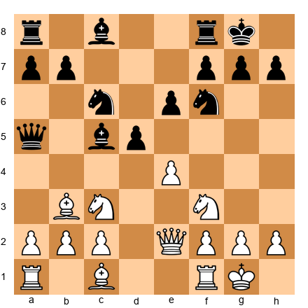</p>


White has a natural-looking position. Development is complete, the bishop is active on b3, the queen is centralized. But look closer. Black has ...d4 coming, the c5-bishop is strong, the queen on a5 pressures a2 and c3. White is not worse - but White must defend. The next few moves will determine whether White holds the balance or drifts into a passive position.

Most players, seeing this board, would feel a slight unease. Not because the position is bad - it is roughly equal - but because the burden of accuracy falls on White. Black has clear plans. White must react.

This is the core psychological challenge. When defending:

1. **You must find your opponent's threats before finding your own moves.** Attackers calculate their own ideas. Defenders must calculate *someone else's* ideas first.

2. **Defensive moves feel temporary.** Every defensive move seems to invite another attacking move. The defender wonders: "Am I just delaying the inevitable?"

3. **One mistake is fatal.** An attacker who plays the second-best move often keeps the advantage. A defender who plays the second-best move often loses.

4. **The clock punishes defenders.** Defensive calculation takes longer because you must verify that the opponent's threats are truly neutralized. Attackers verify that their threats work - a simpler task.

### How to Overcome the Asymmetry

The solution is not emotional. It is technical. Defenders who succeed at your level share three habits:

**Habit 1: Reframe the position.** Instead of thinking "I am defending," think "I am solving a puzzle." The attacker has created a problem. Your job is to solve it. This is a skill, not a suffering.

**Habit 2: Count the threats.** Before calculating any variation, ask: "How many threats does my opponent actually have?" Often the answer is one or two. Positions that *feel* crushing may have surprisingly few concrete threats. Name each threat specifically. "The threat is Bxh7+ followed by Ng5." Once you name the threats, they become manageable.

**Habit 3: Look for resource moves, not refutations.** You do not need to prove your opponent's attack is unsound. You need to find one move that holds. One move. That is enough.

---

## 42.2 Active Defense vs. Passive Defense

### The Two Schools

There are two ways to defend. Knowing which one to use - and switching between them at the right moment - separates experts from masters.

**Passive defense** means retreating, blocking, and covering threats. You move pieces to defensive squares, you plug holes, you wait for the attack to exhaust itself. Passive defense works when:
- Your opponent's attack is speculative (not enough pieces committed)
- The position is closed and your pawn chain is solid
- Exchanging pieces favors you (the fewer pieces, the fewer attacking chances)
- Time is on your side (your opponent must find a breakthrough before you consolidate)

**Active defense** means creating counter-threats while defending. You defend the immediate threat, but your defensive move also threatens something - a pawn, a piece, a back-rank weakness, a counter-attack on the opposite wing. Active defense works when:
- Passive defense leads to slow strangulation
- Your opponent's attack has a clear follow-up after every passive move
- You have active pieces that can participate in both defense and counter-attack
- The position is open enough that your counter-threats carry real weight

### Passive Defense: The Fortress Mentality

Set up your board:

<p align="center">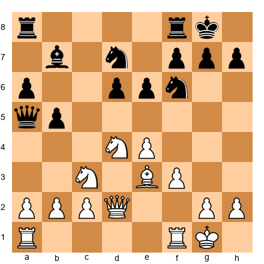</p>


White's center is solid but under pressure. Black has ...b4 coming, pushing the c3-knight to an inferior square. The queen on a5 is aggressive. Black's position is harmonious.

White could try passive defense: 14.a3, preventing ...b4. This holds for now, but after 14...Nc5, Black reroutes the knight to a more active square, and White still has no counter-play. A pure defensive move that creates no counter-threats invites the opponent to improve at leisure.

Passive defense is appropriate when the pawn structure is truly locked and the opponent cannot improve without taking a risk. In open positions like this one, passive defense is a slow death.

### Active Defense: The Counter-Punch

In the same position, consider 14.Nf5! This threatens Nxg7 and puts pressure on e7. Black cannot ignore it. Now 14...exf5 15.exf5+ gives White a dangerous attack. And 14...e5 weakens d5 permanently, giving White a new outpost.

The knight jump to f5 is not an "attack." It is active defense - creating a problem that demands Black's attention, buying time, and shifting the initiative. The opponent cannot both press the queenside and deal with f5 threats. Something has to give.

**The rule:** When passive defense allows your opponent to improve without risk, switch to active defense. When active defense costs too much material or weakens too many squares, stay passive. The defender's art is reading which moment calls for which approach.

### The Transition Point

Set up your board:

<p align="center"></p>


This is a typical Sicilian Dragon setup. Black's dragon bishop on g7 stares at the queenside. White is preparing to castle queenside and launch a kingside pawn storm.

If you are Black here, at what point do you switch from passive to active defense?

The answer: *before the pawn storm reaches you.* If White plays h4-h5 and you respond with ...h5 (passive), White opens lines with g4 (active). If instead you play ...Rc8 and ...Ne5, threatening ...Nc4 (active defense), White must deal with your queenside threats and may not have time to crash through on the kingside.

The transition point is the moment when passive defense can no longer prevent the opponent's plan. At that moment, you must generate counter-play or lose. Recognizing this moment is one of the most important skills at the 2200-2400 level.

---

## 42.3 Defensive Tactics

### Counter-Threats

The most common defensive tactic is the counter-threat: your defensive move simultaneously threatens something that your opponent must address. This forces the opponent to interrupt their attack.

Set up your board:

<p align="center">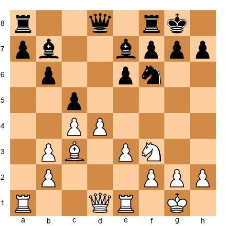</p>


Black is under pressure. White's center is strong and the bishop on c3 eyes the kingside. White is threatening d5, opening the position. Black's pieces are solid but passive.

13...Qc7! This defends the kingside (the queen covers g7 and f7) while pressuring the c3-bishop and preparing ...d6 or ...d5. If White plays d5, Black can respond with exd5 and develop counter-play against White's isolated c-pawn.

The counter-threat does not need to be a direct attack on the king. It can be pressure on a pawn, a threat to win material, or simply a move that restricts the opponent's options. The point is: your opponent cannot ignore it, and that buys you time.

### Exchange Sacrifices for Defense

This is Petrosian's signature weapon. The exchange sacrifice - giving a rook for a bishop or knight - is not always an attacking move. It is often the strongest *defensive* move on the board.

Set up your board:

<p align="center">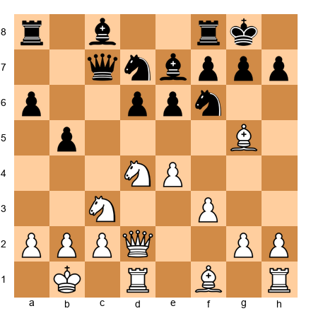</p>


White has a strong position. The knight on d4 is dominant, the bishop on g5 pins the f6-knight, and Nd5 is coming. Black is under real pressure.

In this type of position, Petrosian would often play (from Black's side) ...Rxc3! - sacrificing the exchange on c3 to eliminate White's strong knight, destroy the pawn structure, and remove the attacking force. After ...Rxc3 bxc3, White's attack is gone. The doubled c-pawns are weak. Black's remaining minor pieces are active. The knight or bishop that Black receives for the rook is often more useful than the rook in the resulting closed position.

**When to sacrifice the exchange for defense:**

1. **You eliminate the opponent's best attacking piece.** If the knight on d5 or the bishop on g5 is the heart of the attack, removing it - even at material cost - may kill the attack entirely.

2. **The resulting position is closed.** Rooks need open files. If the exchange sacrifice closes the position, the remaining rook may have nothing to do.

3. **You get a strong minor piece in return.** A knight on a central outpost or a bishop on a long diagonal can be worth more than a rook in a closed game.

4. **Your pawn structure improves.** If the exchange sacrifice damages the opponent's pawn structure (doubled pawns, isolated pawns, weak squares), the long-term compensation outweighs the material.

**When NOT to sacrifice the exchange:**

- The position is open and rooks control the key files
- You have no compensation - no outpost, no structural advantage, no better minor piece
- The opponent can simply trade down into a winning endgame

### Fortress Building

A fortress is a defensive structure that cannot be broken. The weaker side establishes a position where the opponent's material advantage is neutralized by geometry - the pieces cannot penetrate.

Set up your board:

<p align="center">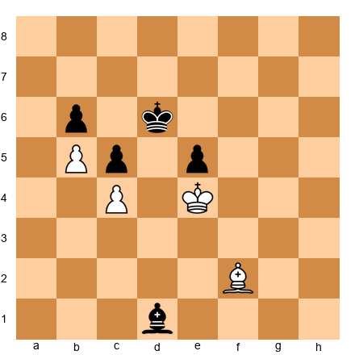</p>


White has bishop and two pawns. Black has bishop and two pawns. But the pawns are locked, and neither bishop can attack the other side's pawns (opposite-colored bishops). This is a textbook fortress. White cannot win because the black bishop controls the light squares that White needs, and the pawn structure prevents any breakthrough.

**The three requirements for a fortress:**

1. **The defending king is positioned in front of the passed pawn(s).** If the king blocks the path of the opponent's pawns, the fortress stands.

2. **The defending pieces cover the entry points.** Every square the opponent's king or pieces might use to infiltrate must be controlled.

3. **The opponent cannot change the pawn structure.** If the attacker can open a new file or create a new passed pawn, the fortress falls. The defender must ensure the pawn structure remains locked.

### Perpetual Check Resources

Set up your board:

<p align="center">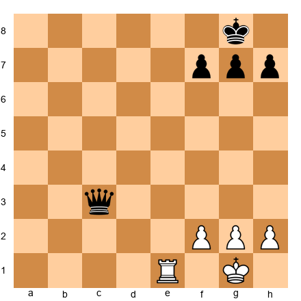</p>


Black is down a full exchange - a rook against a queen. But Black has a queen. And the white king is on g1 with pawns on f2, g2, h2. The queen can deliver perpetual check: ...Qd2, ...Qd1+, ...Qe2, shuttling back and forth. White cannot escape the checks without opening the king further.

Perpetual check is the defender's lifeline. At the expert level, you must see perpetual check possibilities *before* they arise. When your position is deteriorating, ask: "If I sacrifice to reach an endgame with my queen against their pieces, is there a perpetual?" Often the answer is yes.

**Perpetual check patterns to memorize:**

1. **Queen vs. rook + minor piece:** The queen almost always has a perpetual if the enemy king is exposed.

2. **Queen + knight cooperation:** The knight covers squares the queen cannot reach, creating a mating net that forces the opponent to allow a perpetual.

3. **Rook on the seventh rank:** Even without a queen, a rook on the seventh rank can deliver perpetual check to a king trapped on the back rank (with help from another piece).

---

## 42.4 Defending Against the Kingside Attack

### The Anatomy of a Kingside Attack

Before you can defend against a kingside attack, you must understand its components. Every kingside attack consists of:

1. **Piece deployment:** Pieces aimed at the kingside - typically queen + knight, or queen + bishop, or all three.
2. **Pawn leverage:** Pawns advancing to open lines (h4-h5 against ...g6, or g4-g5 against ...f6).
3. **A target:** Usually h7 (or h2), g7 (or g2), or f7 (or f2).
4. **An entry square:** The point where the attacking pieces break through - often h7, g6, or f7 after a sacrifice.

### Defensive Piece Placement

Set up your board:

<p align="center">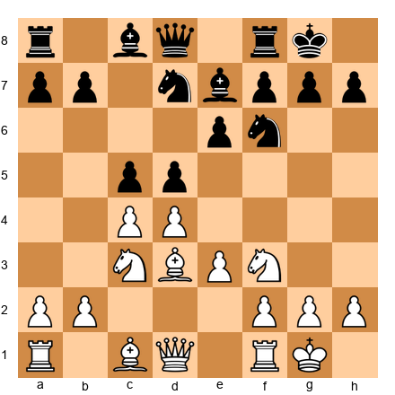</p>


This is a standard Queen's Gambit structure. Black has castled kingside. White's plan might involve Qc2, Bd3, and a kingside attack with e4. How does Black prepare?

**The defensive checklist for a kingside defense:**

1. **The f6-knight stays.** Unless there is an overwhelming reason to move it, the knight on f6 is the kingside's best defender. It covers h7, g4, e4, and d5 - every square that matters.

2. **The f-pawn stays on f7.** Moving it to f5 or f6 weakens the g6 and e6 squares. Leave it where it is unless you have a concrete reason to advance it.

3. **A knight on f8 or e8 is not a crime.** If the attack intensifies, retreating a knight to f8 creates a defender that covers g6, h7, and e6. This looks passive but is often the strongest defensive move.

4. **The rook belongs on e8 or f8.** A rook on e8 supports the e-pawn and prepares ...e5 (the counter-break). A rook on f8 supports the f-pawn if ...f5 becomes necessary.

5. **A bishop on f8 can be a hero.** If you have fianchettoed (Bg7), the bishop defends from g7. But even a bishop retreating to f8 to defend a weakened g7 square is perfectly acceptable.

### Defending the h-pawn

Set up your board:

<p align="center">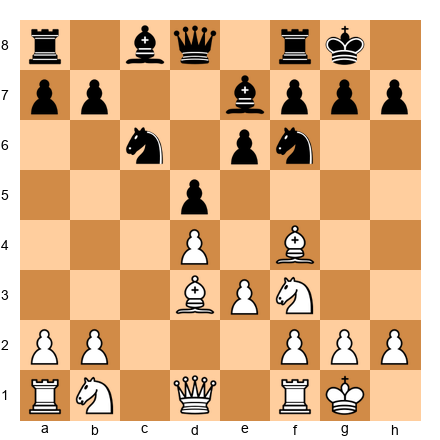</p>


White is preparing Qe2-Qe5, doubling on the e-file, and potentially Bxh7+ (the Greek Gift sacrifice). If Black's knight leaves f6, Bxh7+ Kxh7 Ng5+ may be devastating.

**How to stop the Greek Gift (Bxh7+):**

1. **Keep the knight on f6.** As long as the knight is there, Bxh7+ is unlikely to work because after Kxh7 Ng5+ Kg6, the knight defends from f6.

2. **Play ...h6.** This prevents Ng5 entirely and takes the Greek Gift off the table. The cost is a slight weakening of g6, but at the 2200-2400 level, this prophylactic move saves more games than it costs.

3. **Play ...g6.** This prevents Bxh7+ by removing the target. The cost is weakening the dark squares (f6, h6). Use this only if you have a dark-squared bishop to compensate.

4. **Have an escape route.** If the sacrifice does come, know in advance where your king goes. Kg8-f8 is often the escape. If you can reach f8 with your king, the attack usually fizzles.

### The Counter-Break: ...e5 and ...f5

Set up your board:

<p align="center">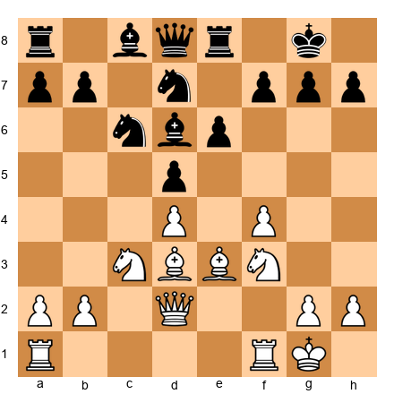</p>


White has launched a kingside pawn storm with f4. The e3-bishop and d3-bishop both aim at the kingside. It looks dangerous.

Black's counter-break: 13...e5! This opens the center when the opponent is attacking on the wing - the classic Steinitz principle. After 14.fxe5 Nxe5 15.Nxe5 Bxe5, Black's pieces suddenly become active. The bishop on e5 is powerful, and the d5-pawn is a rock in the center.

**The Steinitz principle in defense:** When your opponent attacks on the wing, counter in the center. This works because:
- Central breaks open lines that favor the defender (your king is central and safe after the break)
- The attacker's pieces, aimed at the wing, are poorly placed for a central fight
- The initiative shifts - the attacker must suddenly defend their center

---

## 42.5 The Petrosian Method: Prophylactic Defense

### Preventing the Attack Before It Starts

Tigran Petrosian won the World Championship in 1963 not by attacking brilliantly but by defending so well that his opponents' attacks never materialized. His method was **prophylaxis** - making moves that prevent the opponent's plan before it becomes a threat.

This is different from reacting to threats. Reactive defense says: "My opponent is threatening X. I will stop X." Prophylactic defense says: "My opponent *wants* to play X in three moves. I will make X impossible right now, before it becomes a threat."

Set up your board:

<p align="center">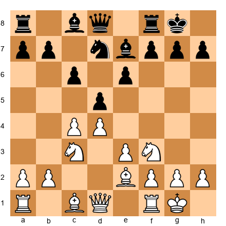</p>


This is a Semi-Slav position. White has not yet committed to a plan. A natural continuation for White would be b3 and Bb2, preparing e4, or perhaps Bd3 and e4 directly. Black has not yet been threatened.

A Petrosian-style move here: 8...h6!

This move does nothing offensive. It does not develop a piece, attack a pawn, or create a threat. But it does three things:

1. **Prevents Bg5.** The bishop on g5 would pin the f6-knight and create pressure on h7. Now that option is gone.

2. **Prepares ...Qc7 or ...Re8.** Without Bg5 to worry about, Black can develop freely.

3. **Creates luft.** The king on g8 now has h7 as an escape square if needed in the future.

**When is prophylaxis the right approach?**

- When the position is quiet and both sides are still developing
- When your opponent has a clear plan that would create problems if executed
- When no immediate action is required (no threats to address, no tactical shots available)
- When a small move now prevents a large problem later

**The cost of prophylaxis:**

Every prophylactic move is a tempo spent on prevention rather than action. If you play too many prophylactic moves, your opponent develops an initiative because you have spent time doing "nothing." The Petrosian skill is knowing which prophylactic moves are worth the tempo and which ones are unnecessary luxury.

### Prophylactic Exchanges

Petrosian's other prophylactic weapon was the exchange - trading pieces not to win material, but to remove the opponent's most dangerous attacking piece.

Set up your board:

<p align="center">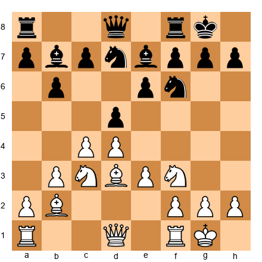</p>


White's pieces are well-placed: Bd3 eyes the kingside, Nf3 and Nc3 are active, Bb2 pressures the long diagonal. Black's pieces are solid but slightly passive.

10...Ne4! Trading the knight on c3 - not because it wins material, but because c3 is White's best-placed piece. After 11.Nxe4 dxe4 12.Bxe4 Bxe4, the position simplifies and White's attacking potential is reduced.

**Petrosian's rule:** Trade your opponent's best piece. Not your worst piece for their worst piece - that does nothing. Their best piece for any piece you have. The material stays equal, but the quality of their position drops.

---

## 42.6 Counter-Attack as the Best Defense

### When Defense Alone Is Not Enough

Sometimes passive defense and prophylaxis are insufficient. The opponent's attack is too strong, their pieces too well placed, and every passive move leads to a worse position. In these moments, the only defense is attack.

Set up your board:

<p align="center">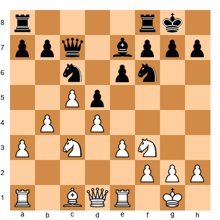</p>


White has a powerful queenside pawn chain (a3-b4-c5) and space advantage. Black is slightly cramped. If Black plays passively - say, ...Bd7, ...Rab8 - White will slowly improve with Bd3, Qc2, and prepare a kingside attack or a central break with e4.

The counter-attack: 14...e5! Black strikes in the center before White consolidates. After 15.dxe5 Nxe5 16.Nxe5 Qxe5, Black's pieces come alive. The queen is active on e5, the bishop will go to f6 or g5, and the d5-pawn is a protected passed pawn.

### The Wing Attack vs. Central Counter-Attack

This principle - counter in the center when attacked on the wing - is the defender's most powerful weapon at the expert level.

Set up your board:

<p align="center">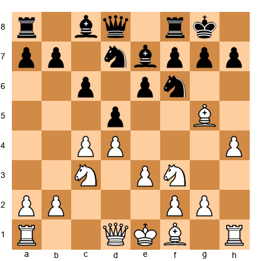</p>


White has played h4, signaling a kingside attack. The bishop on g5 pressures f6. White's plan is clear: h5, Qd3 or Qc2, and then h6 or g4-g5 to break open the kingside.

9...c5! Black does not wait. The central counter-attack challenges White's d4-pawn, and if White takes (dxc5), the position opens and White's undeveloped kingside attack falls apart. The h4-pawn looks foolish when the center is open.

**The calculation behind the counter-attack:**

You must verify that the counter-attack works *concretely*, not just generally. "Counter in the center" is a principle, not a guarantee. Check:

1. Does the central break actually work tactically? (Are there any tricks that refute it?)
2. After the exchanges, is my position actually better - or just different?
3. Can my opponent ignore the central break and keep attacking? (If yes, the counter-attack is too slow.)

### Counter-Attack on the Opposite Wing

When central counter-play is not available, the defender can strike on the opposite wing.

Set up your board:

<p align="center">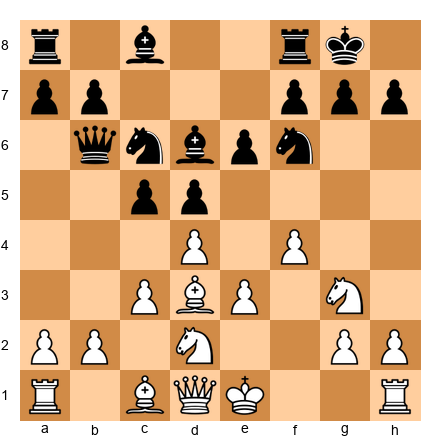</p>


White is attacking the kingside with f4, Nf3-g5, and Bd3. The center is locked (d4 vs. d5, e3 vs. e6). Central counter-play (...e5 or ...c4) is not available without preparation.

10...b5! The queenside counter-attack. Black threatens ...b4, attacking c3 and opening the b-file for the rook. White must decide: continue the kingside attack and risk a queenside collapse, or turn back to address the queenside threat and lose the initiative.

This is the defender's ideal outcome: the attacker must divide their attention. A chess player can only calculate so many things at once. When you create a problem on the opposite wing, you force the attacker to juggle two fronts - and juggling leads to mistakes.

---

## 42.7 Defending Worse Endgames

### The Art of the Half-Point

At the expert level, you will frequently reach endgames that are worse. Not lost - worse. A pawn down, a passive rook, a bad bishop. The opponent has a small but real advantage.

The question is not whether these endgames are theoretically drawn. The question is whether you can hold them *practically*. And the answer, more often than you think, is yes.

### Drawing Techniques in Worse Endgames

**Technique 1: Activity over material.**

Set up your board:

<p align="center">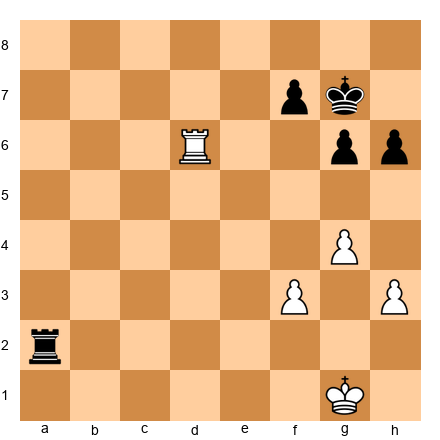</p>


White has rook and three pawns against rook and two pawns. White is up a pawn. But Black's rook is on the second rank - the most active possible position. Black's king is near the pawns.

Black draws by keeping the rook active. The rook on a2 attacks pawns from behind, threatens to create a passed a-pawn if White's rook leaves the d-file, and restricts White's king from advancing. Activity saves the game even when material says you should lose.

**Technique 2: The right pawn exchanges.**

When defending, trade pawns on the side where you are weaker. If your opponent has a queenside majority, exchange queenside pawns. Fewer pawns = fewer targets = easier defense.

The defender's goal in a worse endgame is to reach a position with pawns on only one side of the board. Same-side pawns are much harder to convert than pawns on both wings.

**Technique 3: The drawing fortress with opposite-colored bishops.**

Set up your board:

<p align="center">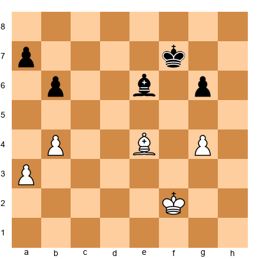</p>


Opposite-colored bishops. White has the same number of pawns. But even if one side is a pawn up, the fortress is often impenetrable. The bishop controls one color of squares; the opponent's bishop controls the other. Neither can attack the other's pawns.

**The rule:** With opposite-colored bishops and no other pieces, a one-pawn advantage is usually a draw if the defender's bishop covers the queening square of the passed pawn. A *two*-pawn advantage is often a draw if the pawns are on the same wing.

**Technique 4: King centralization.**

In every worse endgame, centralize your king before doing anything else. A centralized king is worth more than a pawn. It controls space, supports defensive pieces, and blocks the opponent's king from penetrating.

**Technique 5: The 50-move rule.**

This is a legitimate defensive resource. If your opponent cannot make progress without a pawn move or capture for 50 moves, you can claim a draw. At the expert level, some endgame advantages are real but insufficient under the 50-move rule. Know when this applies.

---

## 42.8 Defensive Resource Recognition

### The Three Lifelines

When your position is objectively lost, there are three resources that can save you. Memorize these patterns - they appear far more often than you think.

### Stalemate Tricks

Set up your board:

<p align="center">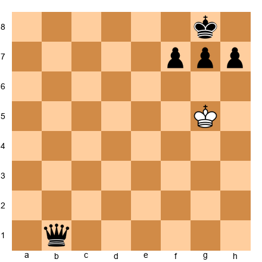</p>


White is hopelessly lost - a queen down with no pieces. But White's king is on g5. If Black plays carelessly - say, ...Qb5+? Kg6 ...Qb6+? - White may reach a position where the king has no legal moves and is not in check. Stalemate.

Even in positions with many pieces, stalemate tricks exist. The pattern to watch for:

1. Your king is trapped in a corner or on the edge with no legal moves
2. You can sacrifice your remaining pieces to reach a position with no legal moves
3. Your opponent must be forced to not deliver check - stalemate only works when you are NOT in check

Set up your board:

<p align="center">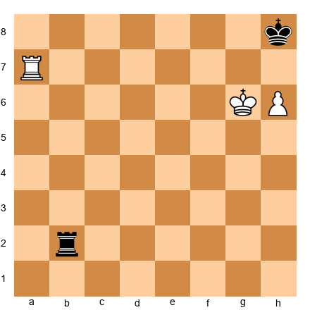</p>


White has rook and h-pawn against rook. The h-pawn is on h6, the white king is on g6, the black king is on h8. White is winning... unless Black plays ...Rg2+! forcing the white king to move. If Kf7, ...Rf2+ and the rook checks forever. If Kf6, ...Rf2+ again. The pawn on h6 blocks h7, and the king cannot escape the checks.

This is a perpetual check combined with a drawing mechanism in the rook endgame. Recognize the pattern: the defending rook delivers checks from a distance, and the pawn obstructs the attacking king's escape.

### Perpetual Check Patterns

Set up your board:

<p align="center">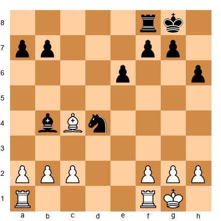</p>


White is down a full piece. The knight on d4 and bishop on b4 are strong, and Black's attack looks overwhelming. But what if White can give a check on d5 with the bishop, and after ...Kh8, check on f7, and after ...Kg8, back to d5? The bishop bounces between d5 and f7, delivering perpetual check. The king cannot escape the diagonal.

Not all perpetual patterns use the queen. Bishops, rooks, and even knights can deliver perpetual check when the geometry is right.

### Fortress Patterns

Set up your board:

<p align="center">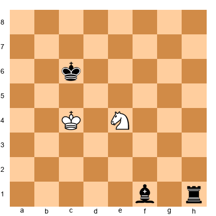</p>


White has a knight on e4. Black has bishop and rook. Normally, rook + bishop crushes a lone knight. But if the knight sits on a central square, the white king stays nearby, and the position is locked, the knight can create a fortress. The rook cannot deliver checkmate without the bishop's help, and the bishop's access is limited by the knight's coverage.

This is rare but important. When you are losing material, always check: "Can I build a fortress?" Even if the fortress holds for only 50 moves (triggering the draw rule), it is a full half-point saved.

---

## 42.9 The Critical Defensive Move

### Finding the Only Move

At the expert level, many games are decided by a single move - the move where only one option holds, and every other option loses. These are "critical defensive moves," and finding them under pressure is the ultimate test of defensive skill.

Set up your board:

<p align="center">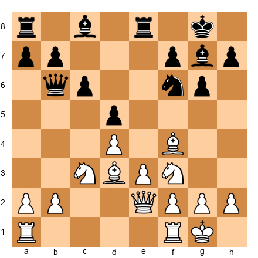</p>


White is threatening Bxh7+ (the Greek Gift). If Black plays a natural move like ...Bd7, White crashes through: Bxh7+! Kxh7 Ng5+ Kg8 Qh5, and the attack is devastating.

The only move: 14...Nh5! Moving the knight to h5 attacks the f4-bishop, breaks the pin on the f-file, and defends h7 indirectly - if White plays Bxh7+ now, Kxh7 Ng5+ Kg8, and the knight on h5 blocks the queen from reaching h5.

This is a hard move to find. It looks strange - the knight moves away from the center, away from the action. But it is the *only* move that holds. Everything else loses.

### How to Train "Only Move" Vision

1. **Eliminate losing moves first.** Before looking for the best move, cross off every move that loses by force. Often this leaves only one or two candidates.

2. **Check the weird moves.** The critical defensive move is often the move you would never consider in a normal position. Retreats, sideways moves, moves that look passive - check them all.

3. **Verify with a threat count.** After your candidate move, count how many threats your opponent still has. If the answer is zero (or all remaining threats can be met), you have found it.

4. **Trust your instinct - then verify.** If your instinct says "this position is holdable," it probably is. But instinct finds the *idea*; calculation finds the *move*. Do not play the instinctive move without calculating. Find the specific defensive resource.

---

## 42.10 Practical Matters: Time, Psychology, and Preparation

### Time Management While Defending

Defending consumes more clock time than attacking. This is not optional - it is a fact. The attacker calculates their own ideas. The defender must calculate *both* the attack and the defense.

**Practical time rules for defense:**

1. **Spend the time.** If you are defending a dangerous position, do not try to save time by playing quickly. A wrong defensive move loses the game. A correct defensive move that takes five minutes is worth every second.

2. **Find the critical moment.** Not every defensive move needs deep calculation. Some are obvious (recapture, block a check). Identify the *one move* where the game hangs in the balance, and spend your time there.

3. **Use your opponent's time.** When it is the attacker's turn, think about defense on their clock. Pre-calculate your responses to their most likely moves. When their move comes, you may already know the answer.

4. **Set a decision threshold.** If you have been thinking for more than 10 minutes about a defensive move, play the move that feels safest. Spending 15 or 20 minutes on a single defensive decision often leads to time trouble, which leads to more defensive errors, which leads to collapse.

### Psychological Resilience

The biggest danger when defending is not calculation error - it is resignation. Not the formal kind (tipping the king), but the mental kind. The moment you stop believing you can hold, you start playing weaker moves. You cut calculations short. You miss resources.

**How to stay resilient:**

1. **Remember the statistics.** At the 2200-2400 level, the conversion rate for "slightly worse" positions is far below 100%. Your opponents are not engines. They make mistakes too, especially when they believe they are winning and stop calculating carefully.

2. **Set micro-goals.** Do not try to "win the game from here." Try to "survive the next five moves." Then the next five. Break the defensive task into small, manageable pieces.

3. **Celebrate defensive moves.** When you find a good defensive resource, take a moment to appreciate it. Defensive moves deserve the same satisfaction as attacking moves. You solved a hard problem.

### Defending Against Computer-Prepared Attacks

In modern chess, your opponent may arrive at the board with a 30-move preparation assisted by Stockfish. They have memorized every variation of their attack. You are seeing the position for the first time.

**How to defend against preparation:**

1. **Deviate early.** If you suspect your opponent is in preparation (they are playing quickly with confidence in a sharp line), consider deviating from the main line even at a small positional cost. A slightly worse position that your opponent must play on their own is better than a theoretically equal position where they have memorized 30 moves.

2. **Simplify.** Prepared attacks require specific pieces on specific squares. If you can exchange a key piece, the preparation collapses. Trade queens early if possible - most preparation relies on queen activity.

3. **Play the position, not the theory.** If you are facing a prepared attack, do not try to remember counter-theory you studied six months ago. Look at the board. What does the position need? Defend based on principles, not memory.

4. **Trust your defensive understanding.** A 2300 player with solid defensive fundamentals can survive most prepared attacks from opponents of equal strength. Preparation gives an advantage in the opening, but the game lasts 40+ moves. The advantage of preparation fades by move 20.

---

## 42.11 The Fortress: When You Cannot Win But Can Draw

A fortress is a position where one side has a large material deficit but cannot be broken through. The defending side has arranged their pieces and pawns in a formation that the attacker cannot penetrate, no matter how much material they have.

At the expert level, knowing when a fortress is available - and knowing how to build one - saves half a point per tournament. That adds up to 10 to 20 rating points over a year.

### The Classic Fortress Patterns

**Rook vs. Bishop and Pawn:**

Set up your board:

<p align="center">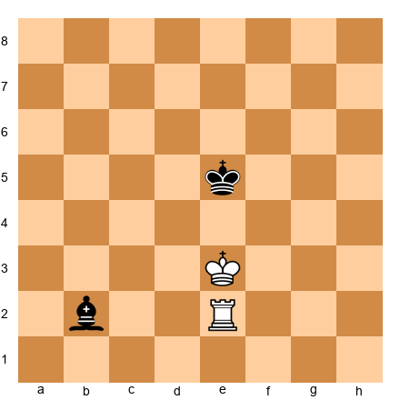</p>


White has a rook. Black has a bishop but no pawns. Despite the rook being much stronger than the bishop in general, with no pawns on the board, this position is a theoretical draw. The lone bishop cannot create a mating threat, and without passed pawns to push, neither side can make progress. The defending king stays centralized, and the bishop prevents the rook from creating anything decisive.

The fortress principle: if the defending side can keep the king active and prevent the creation of passed pawns, extra material alone is not enough to win.

**Opposite-Colored Bishops:**


<p align="center">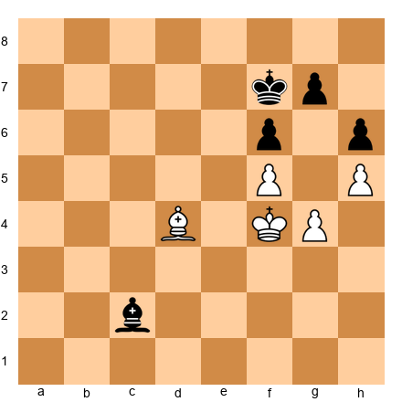</p>


White has a dark-squared bishop. Black has a light-squared bishop. The pawns are locked. Neither bishop can attack the opposing pawns because they sit on the wrong color. This is a dead draw. The material count is irrelevant.

At 2200, many players resign positions like this prematurely. They see that they are a pawn down and assume the position is lost. Study these patterns so you recognize fortress opportunities before resigning.

### When Fortresses Fail

Fortresses are not magic. They fail when:

- The attacking side has pieces that can reroute around the fortress
- The defending side's fortress requires a specific piece placement, and the attacker can force a trade of that piece
- The pawn structure can be changed by the attacker (pawns are not fixed)
- The defending king can be driven out of the fortress through zugzwang

Before committing to a fortress defense, verify that your opponent cannot break it. If they can, you need a different defensive plan.

### Building a Fortress Under Pressure

The hardest part of fortress construction is that it happens during the game, not before it. You are worse. You are losing material. Your opponent is pressing. And you need to find the setup that holds.

The method: work backward. Imagine the position you want to reach - the fortress configuration. Then calculate how to get there from your current position. What pieces do you need to trade? What pawns need to be fixed? Where does your king need to stand?

This requires visualization and calculation - the same skills from Chapter 36, applied to defense rather than attack. The best defenders think about fortress construction five to ten moves before they need it.

---

## 42.12 Defense in Specific Structures

Every pawn structure has its own defensive challenges. At 2200, you face the same structures repeatedly - the IQP, the minority attack, cramped positions from the French or Caro-Kann. Knowing the correct defensive plans for each structure saves you time and energy at the board.

### Defending the Isolated Queen's Pawn (IQP)

When you have the IQP (a pawn on d4 with no neighboring pawns to support it), your opponent's plan is simple: blockade the pawn on d5, trade pieces to reduce your attacking potential, and target the isolated pawn in the endgame. Your defense must prevent this plan from working.

**Step 1: Keep pieces on the board.** The IQP is a weakness in the endgame but a strength in the middlegame. Your pieces are active because the pawn on d4 controls c5 and e5, giving your knights and bishops excellent squares. As long as there are enough pieces for an attack, the IQP is an asset, not a liability. Avoid trading pieces unless you get something concrete in return.

**Step 2: Prevent the blockade.** Your opponent wants to put a knight or bishop on d5, blocking your pawn forever. You must either control d5 yourself or have a plan to remove any piece that lands there. Keep your own knight ready to challenge d5 (Nc3-e4 or Nf3-e5 are typical routes). If a piece does reach d5, consider whether a piece exchange there leaves you with a good or bad pawn structure.

**Step 3: Use the dynamic potential.** The d4-d5 break is always lurking. Even if you never play it, the threat of d5 forces your opponent to respect it. This ties down their pieces. Use that restriction to build an attack on the kingside, where your better-placed pieces can create threats.

### Defending Against the Minority Attack

Set up your board:

<p align="center">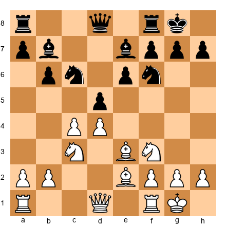</p>


In positions with the Carlsbad pawn structure (White pawns on c4/d4 vs. Black pawns on d5/e6), White often launches a minority attack - pushing a2-a3, b2-b4, and b4-b5 to create weaknesses in Black's queenside pawn chain. The standard result is that Black ends up with an isolated pawn on c6 or a backward pawn on c7, which White can target for the rest of the game.

Your defensive options:

**Counterplay on the kingside.** While White spends four to five moves advancing queenside pawns, you generate an attack on the other side of the board. Play ...Nf6-e4, ...Qd6 or ...Qc7 aimed at the kingside, ...f7-f5 if the position allows it. The race is: can you create a kingside threat before White creates a queenside weakness?

**Meet the break with ...a5.** Playing ...a5 before White plays b4 stops the minority attack in its tracks. The cost is that a5 weakens b5 and b6, and White may reroute their plan. But it buys time and prevents the standard queenside pawn damage.

**Accept the weakness, activate the pieces.** Sometimes the best defense is to let White create the weakness on c6 and then prove that the weakness does not matter because your pieces are so active. A knight on e4, a bishop on d6 aimed at the kingside, rooks on the f-file - these can generate enough play to compensate for the structural damage.

### Defending a Cramped Position

In the French Defense, the Caro-Kann, and many other openings, Black accepts a cramped position in exchange for a solid pawn structure. The challenge is that cramped positions feel uncomfortable. Your pieces step on each other. You cannot find good squares for your knights. Your bishop is blocked by your own pawns.

The key to defending a cramped position is knowing which piece to exchange and when. Every cramped position has one piece that is the source of the problem - usually a bishop blocked by its own pawns (the "bad bishop") or a knight that has no good square. If you can trade that specific piece for an active enemy piece, your remaining pieces suddenly have room to breathe.

The rule: trade the piece that is causing your congestion. Do not trade your best piece just because a trade is available. Do not trade all the pieces - that might leave you in a worse endgame. Trade the one piece that, once removed, unlocks the rest of your army.

The timing matters too. In many French Defense positions, Black plays ...Bxf1 or ...Bd7-e8-h5 to trade the bad light-squared bishop. The right moment is when the trade opens a file or diagonal for your other pieces, not when it simply removes a piece from the board.

---

## 42.13 The Psychology of Defense

Defense is harder than attack. This is not a matter of opinion - it is a structural fact about chess positions. The attacker has the initiative. The attacker chooses where to strike. The defender reacts, responds, and adapts. The attacker needs to find one winning idea. The defender must refute every idea.

This asymmetry means that defense is mentally exhausting in a way that attack is not. When you are attacking, you feel energized. When you are defending, you feel drained. Understanding this psychological reality is the first step to defending well.

### How to Maintain Focus During Long Defensive Phases

The biggest danger in defense is losing concentration. After ten moves of passive defense, your brain starts to drift. You stop checking for threats. You play mechanical moves. And then you blunder.

The solution is to break the defense into micro-goals. Instead of thinking "I need to hold this position for 30 moves," think "I need to find the best defensive move right now." Then do it again. And again. Each move is a small victory. Each threat you neutralize is progress. When you frame defense as a series of small wins rather than one long ordeal, your focus stays sharp.

Another technique: actively look for counterplay, even in worse positions. The best defenders - Petrosian, Lasker, Carlsen - do not just sit and wait. They defend while looking for the moment to strike back. Even a small counterattack forces your opponent to split their attention between pressing the advantage and dealing with your threat. This shift in dynamic is often enough to save the game.

### The Emotional Management of Defense

Defending a worse position triggers real emotions: frustration, anxiety, self-blame, and sometimes anger at yourself for getting into this position. These emotions are natural, but they are also dangerous. When you are frustrated, you make impulsive moves. When you are anxious, you calculate less accurately. When you are angry at yourself, you stop caring about the position and just want the game to end.

Here is a mental framework for managing emotions during defense.

**Step 1: Accept the situation.** You are worse. That is a fact. Wishing you had played differently ten moves ago does not change the current position. Accept where you are and focus entirely on what you can do now.

**Step 2: Find the bright spots.** Even in bad positions, there are usually positive elements. Maybe your king is still safe. Maybe one of your pieces is active. Maybe your opponent has a weakness you can eventually exploit. Find these bright spots and remind yourself that the game is not over.

**Step 3: Set a concrete defensive goal.** "I will not lose" is too vague. "I will keep my rook on the seventh rank and prevent the passed pawn from advancing past the fifth rank" is concrete. A concrete goal gives you something to work toward, which keeps you engaged and reduces the feeling of helplessness.

**Step 4: Embrace the challenge.** Some of the most memorable games in chess history are defensive masterpieces. Petrosian's prophylactic play, Lasker's swindles, Carlsen's endgame defenses - these are celebrated because defense is hard and doing it well is impressive. When you defend a difficult position successfully, you prove something about your character and your skill. Take pride in defending well. It is a sign of strength, not weakness.

### When to Offer a Draw

In tournament chess, knowing when to offer a draw from a worse position is a practical skill.

**Offer a draw when:** your opponent has used a lot of time and might accept to avoid risk; the position is objectively worse but practically holdable; you are playing against a higher-rated opponent who might take a safe half-point; there is a clear fortress setup that your opponent will eventually have to accept.

**Do not offer a draw when:** it is too early in the game (your opponent will decline and be annoyed); your position is actively losing (a draw offer from a losing position looks desperate); you have not yet demonstrated that the position is holdable (show that you can defend first, then offer).

The worst mistake is offering a draw repeatedly. One offer is reasonable. Two is borderline. Three or more is unprofessional and can lead to a warning from the arbiter.

### Active Defense vs. Hoping for a Mistake

There is a critical difference between active defense and passive hope. Active defense means finding moves that create problems for your opponent while addressing their threats. Passive hope means playing random moves and praying that your opponent blunders.

Active defense sounds like this in your inner monologue: "If I play Rd8, I defend d5 and threaten Rd1+ if they take on b7. That forces them to deal with my threat before continuing their plan."

Passive hope sounds like this: "I will play Rd8 because I do not know what else to do. Maybe they will make a mistake."

The difference is intention. Active defense has a reason behind every move. Passive hope has resignation behind every move. Train yourself to ask, after every defensive move: "What does this move accomplish beyond survival?" If the answer is nothing, look for a better move. There is almost always a way to defend with purpose.

---

## 42.14 Defense in Rook Endgames

Rook endgames are the most common type of endgame in chess. They arise in roughly half of all games that reach an endgame. This means that your defensive skills in rook endgames will be tested more often than in any other type of position. The good news: rook endgames have clear principles. The bad news: those principles are easy to state but hard to apply under pressure.

### The Three Principles of Rook Endgame Defense

**Principle 1: Activity of the rook matters more than pawns.** In rook endgames, a rook that is active - checking the enemy king, attacking pawns from behind, cutting off the king along a rank or file - is often worth more than an extra pawn. This means that when you are defending a rook endgame down a pawn, your first priority is not to protect your remaining pawns. Your first priority is to make your rook as active as possible.

Set up your board:


<p align="center">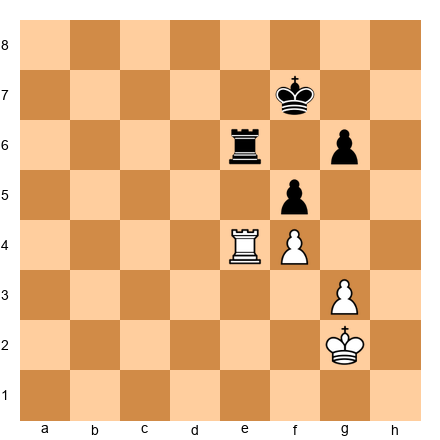</p>


In this position, both sides have a rook and two pawns. White has a rook on e4 and pawns on f4 and g3. Black has a rook on e6 and pawns on f5 and g6. White is slightly better because the f4 pawn is supported by the g3 pawn, creating a solid structure. But Black's rook on e6 is active, controlling the e-file and defending the f5 pawn simultaneously.

The key defensive principle here is activity. Black's rook on e6 is doing two jobs at once: it defends the f5 pawn and prevents White's king from advancing through the e-file. If Black instead played the rook passively to f6, White could advance the king to f3 and then e3, gradually improving the position. The active rook on e6 prevents this.

**Principle 2: Cut off the enemy king.** If you cannot make your rook active, your second priority is to cut off the enemy king from reaching your weak pawns. A rook on a file or rank that prevents the king from crossing is a powerful defensive tool.

Set up your board:


<p align="center">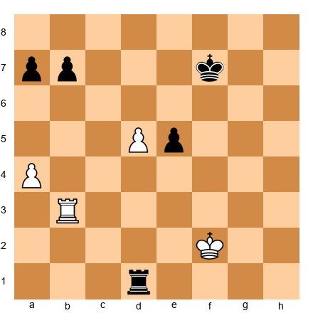</p>


Here, White has a passed pawn on d5, but Black's rook on d1 is behind it, and Black's king on f7 is well placed to block the pawn's advance. White's rook on b3 is somewhat passive. Black's defensive plan is straightforward: keep the rook behind the d-pawn (where it gains activity as the pawn advances, since each advance gives the rook more space), bring the king to d6 to blockade the pawn, and advance the queenside pawns for counterplay.

The critical defensive resource here is Black's rook placement behind the passed pawn. A rook behind a passed pawn, whether your own or your opponent's, is almost always well placed. This principle was articulated by Siegbert Tarrasch over a century ago, and it remains one of the most reliable rules in all of chess.

**Principle 3: Use checks from a distance.** When you are defending a rook endgame, one of your most powerful weapons is the ability to check the enemy king from far away. Long-range checks disrupt your opponent's coordination, force their king to waste time, and can sometimes lead to perpetual check draws.

The ideal defensive setup when you are down material is: rook on an open rank far from the enemy king, your own king active or at least safe, and the ability to deliver checks whenever the opponent tries to push their advantage. If the opponent's king is on the fourth rank and your rook is on the first rank, every advance by the king can be met with a check from three or more ranks away. These distant checks are much more effective than close checks because the king cannot approach your rook.

### Practical Rook Endgame Defense: The Philidor Position

Every player above 2000 should know the Philidor position cold. This is the basic drawn position when defending a rook endgame one pawn down.

The setup: your opponent has a king, rook, and pawn (usually on the fifth rank). You have a king and rook. Your king is on the promotion square. The drawing technique involves two stages. First, place your rook on the third rank to prevent the enemy king from advancing. Second, when the pawn advances to the sixth rank, switch your rook to the eighth rank and deliver checks from behind.

This technique is the foundation of all rook endgame defense. If you know the Philidor position, you know when a position is drawn. If you do not know it, you will lose drawn positions regularly. Study it, practice it, and make it automatic.

### The Lucena Position (and How to Avoid It)

The Lucena position is the winning technique for the side with the extra pawn. As a defender, your job is to prevent the Lucena position from arising. This means keeping your rook active and your king in front of (or near) the pawn.

If you find yourself in a position where the enemy pawn has reached the seventh rank, the enemy king is next to the pawn, and your king is cut off by one or more files, you are probably in a lost Lucena position. The best defense is to prevent this setup from occurring in the first place by keeping your rook behind the pawn and your king close to the action.

### When to Fight and When to Accept the Draw

Not every rook endgame down a pawn is drawn. Some positions are clearly lost - when your pawns are too weak, your rook is passive, and your king is far away. The skill is recognizing which positions are holdable and which are not.

General guidelines: rook endgames with all pawns on one side of the board are usually drawn, even one pawn down, because the defender's king can blockade and the attacker cannot create a passed pawn on the other side of the board. Rook endgames with pawns on both sides of the board are harder to defend because the attacker can create threats on both flanks, stretching the defender's rook and king.

When you recognize that a position is holdable, defend with energy and confidence. When you recognize that a position is lost, look for the best practical chance - perhaps a perpetual check, a stalemate trick, or a pawn race that your opponent might misjudge.

---

## 42.15 The Art of Practical Saving

At the 2200 level, you will regularly face positions that the engine evaluates as -2.0 or worse. Against a computer, these positions are lost. But against a human opponent, they are not. Your opponent can make mistakes, miscalculate, get into time trouble, or simply choose the wrong plan. Practical saving is the art of giving your opponent the maximum number of opportunities to go wrong.

### Principles of Practical Saving

**Keep pieces on the board.** When you are losing, every trade brings you closer to a clearly lost endgame. Pieces create complications. Complications create chances for your opponent to err. If your opponent offers to trade queens when they are winning, think carefully before accepting. The position with queens might be more uncomfortable, but it gives you more chances to create counterplay.

**Create multiple threats.** Even from a losing position, you can sometimes find moves that create threats. These threats may not be objectively dangerous, but they force your opponent to calculate. And when an opponent must calculate under pressure while protecting a winning advantage, they make mistakes.

**Aim for time trouble.** If you are losing but your opponent is spending a lot of time, play quickly and confidently. Make your moves without long pauses. This puts psychological pressure on your opponent and gives them less time to find the precise winning continuation. Many lost games have been saved in the opponent's time trouble.

**Play for counterattack.** The worst way to lose is passively, move by move, as your opponent slowly converts their advantage. If you are going to lose, go down fighting. Look for any counterattacking chance, even if it is objectively unsound. A counterattack forces your opponent to calculate under pressure, and it changes the psychological dynamic of the game from "I am winning, I just need to be careful" to "Wait, am I still winning?"

### The Draw Trap

One of the most effective practical saving techniques is the "draw trap." You offer your opponent a choice between a safe path that leads to a draw and a risky path that maintains the winning advantage. If your opponent is greedy or overconfident, they will choose the risky path and sometimes stumble.

For example, you might sacrifice a pawn to activate your rook and reach a position where your opponent can force a trade of rooks (leading to a drawn pawn endgame) or keep rooks on (maintaining the advantage but allowing you counterplay). Many opponents will keep rooks on, trying to win - and that is exactly what you want, because the more complex the position, the more chances you have.

### When to Accept Defeat

Not every lost position can be saved. If your opponent is playing precisely, your position has no counterplay, and the conversion is straightforward, the most practical decision may be to resign and save your energy for the next game. This is especially true in tournament play where you have another game in a few hours.

The rule of thumb: if you have been trying to save the position for 10 moves and your opponent has handled every complication correctly, the game is probably beyond saving. Continuing to play in a clearly lost position is not tenacity - it is stubbornness, and it wastes time and energy that you could use in your next game.

There is a difference between fighting spirit and denial. Fighting spirit says: "This position is difficult, but I will look for practical chances." Denial says: "I refuse to lose, so I will keep playing until my opponent gets annoyed and offers a draw." The first attitude earns respect and sometimes saves games. The second earns nothing and loses energy.

Know when to fight and when to tip the king. Both decisions take courage.

---

## 42.16 Defense Under Time Pressure

Time pressure is where defensive skill is tested most severely. When you have five minutes left for ten moves, every defensive decision must be fast and accurate. The margin for error disappears. This section covers specific techniques for defending effectively when the clock is your enemy as well as your opponent's pieces.

### The Quick Defensive Scan

When you have less than five minutes on your clock and your position is under pressure, you do not have time for deep calculation. Instead, use a rapid three-step defensive scan.

**Step 1: Check for immediate threats.** What is my opponent threatening to do on the very next move? If there is a checkmate threat, a piece hanging, or a back-rank weakness, deal with it first. This takes 5 to 10 seconds.

**Step 2: Find the most resilient move.** Look for a move that solves the immediate problem AND improves your position slightly. A move that only solves the immediate threat will leave you vulnerable to the next threat. A move that also activates a piece or improves your king safety gives you a better chance of surviving the time scramble.

**Step 3: Play it and move on.** Do not second-guess yourself in time pressure. If you found a move that passes Steps 1 and 2, play it. The cost of spending an extra 30 seconds looking for a slightly better move is far greater than the cost of playing a slightly imperfect move quickly.

### Common Time-Pressure Defensive Errors

The most common error in time pressure is not a tactical mistake - it is panic. You see that your position is worse, you see the clock ticking, and you freeze. You spend 90 seconds on a move that deserves 20 seconds, and now you have three minutes left instead of four. The panic feeds on itself.

The antidote is preparation. Before you reach time pressure, decide on a defensive strategy. If you are in a worse position with 10 minutes left, think: "What is the simplest way to defend this position? What are the main threats I need to watch for? What would a draw look like?" Having a defensive plan in mind before the time scramble begins gives you something to execute instead of something to invent.

Another common error is forgetting about the increment. In most modern time controls, you gain 30 seconds per move. This means that if you play quickly, you can actually gain time. In time pressure defense, play moves that are obviously correct in 5 to 10 seconds and bank the remaining 20 seconds. Over five moves, you have gained nearly two minutes. That can be the difference between surviving and losing.

### The Fortress Concept in Time Pressure

When you are in time pressure and down material, think about fortresses. A fortress is a defensive formation that cannot be broken regardless of how many moves the opponent has. If you can reach a fortress position, you can make your remaining moves quickly and confidently because every move maintains the same formation.

The simplest fortress is a rook behind a pawn with your king blocking the passed pawn. More complex fortresses involve bishop and pawns creating barriers that the opponent's pieces cannot penetrate. The value of knowing fortress patterns is that they give you a clear defensive target. Instead of defending move by move with no plan, you can say: "If I reach this fortress formation, the game is drawn. Every move I make should bring me closer to that formation."

Study the major fortress patterns from endgame theory and commit them to memory. In time pressure, you will not have time to calculate whether a position is a fortress. You need to recognize it instantly.

---

## Annotated Defensive Masterpieces

### Game 1: Petrosian vs. Fischer
*Candidates Match, Buenos Aires 1971, Game 3*

This is one of the most celebrated defensive games in chess history. Petrosian faced Fischer at the peak of Fischer's powers - Fischer was on his way to winning the World Championship - and demonstrated that even the greatest attacking player in history could be neutralized by perfect prophylactic defense.

Set up your board:

<p align="center"></p>


The game opened with a Semi-Tarrasch Defense. Fischer, playing Black, chose an active setup with an isolated queen's pawn - a structure he loved because it offered dynamic piece play and attacking chances.

**4.cxd5 exd5 5.Bg5** Petrosian pins the knight immediately. This is not aggressive - it is prophylactic. By pinning the knight, Petrosian prepares to exchange it, reducing Black's attacking forces.

**5...Be7 6.e3 O-O 7.Bd3 Nbd7 8.O-O Re8 9.Qc2**

Petrosian develops quietly. No sharp pawn thrusts, no aggressive piece placements. Every move improves his position by a small increment while making no concessions.

**9...c4!?** Fischer strikes. This closes the center and signals a kingside attack. The pawn on c4 pushes the bishop away from d3 and gives Black space on the queenside.

**10.Bf5!** Petrosian does not retreat passively. He re-routes the bishop to an active square where it pressures e6 and controls the light squares around Black's king. This is active defense - the bishop is both out of danger and performing a useful function.

**10...Nf8 11.Bxf6!** The prophylactic exchange. Petrosian removes Black's most dangerous attacking piece - the f6-knight that could jump to g4 or e4 to attack the kingside. Without this knight, Black's kingside attack loses its teeth.

**11...Bxf6 12.Bxc8 Rxc8 13.Nd2**

Petrosian has achieved his defensive goal: simplified the position, exchanged two pairs of minor pieces, and left Fischer with an isolated d-pawn and no attacking prospects. The game eventually reached an endgame where Petrosian's superior pawn structure gave him a lasting edge.

The game continued with careful maneuvering. Petrosian nursed his small advantage for another 30 moves until Fischer could no longer hold. **1-0.**

**What to learn from this game:**
- Prophylactic exchanges kill attacks. Petrosian did not try to out-attack Fischer - he removed the pieces Fischer needed for the attack.
- Quiet development is not passive. Every one of Petrosian's moves served a defensive purpose.
- The exchange sacrifice was not needed here - sometimes prevention is enough. Petrosian's defense was so thorough that Fischer never got a chance to attack at all.
- The isolated d-pawn, which Fischer counted on for dynamic play, became a permanent weakness after the exchanges.

---

### Game 2: Hou Yifan vs. Koneru Humpy
*Women's World Championship Match, Tirana 2011, Game 3*

Hou Yifan became the youngest Women's World Champion in history at age 16, and her defensive precision was central to her dominance. In this game, she demonstrated how to absorb pressure and convert a defensive stance into a winning counter-attack.

Set up your board:

<p align="center"></p>


Koneru Humpy, playing Black, had prepared an aggressive Slav-type setup with ...c5 and ...d5, aiming for active piece play. Hou Yifan, playing White, chose a solid formation - Bd3, Nbd2, O-O - that prioritized structure over ambition.

**8...c4 9.Bc2 b5** Koneru pushes forward on the queenside, gaining space and threatening ...b4 to kick the c3-knight.

**10.e4!** Hou Yifan strikes in the center while under queenside pressure. This is active defense at its best - rather than retreating from the queenside advance, she opens the center to exploit the fact that Black's pieces are committed to the queenside.

**10...dxe4 11.Nxe4 Nxe4 12.Bxe4** The exchanges favor White. The bishop on e4 is powerful, and the open e-file gives White's rook natural activity. Black's queenside space advantage suddenly looks less impressive because the center is open.

**12...Rb8 13.Qe2 Bb7 14.Bxc6!** A strong exchange - giving up the bishop pair to destroy Black's pawn structure. After 14...Bxc6, Black's pawns on b5 and c4 are weak, and the dark squares around Black's king are slightly compromised.

**14...Bxc6 15.Ne5 Bd5 16.a4!** The counter-attack on the queenside. Hou Yifan targets the overextended b5-pawn, and suddenly it is Black who must defend.

The game continued with Hou Yifan methodically converting her structural advantage. Koneru's pieces, which had been aggressively placed, were now awkwardly positioned for defense. **1-0** in 38 moves.

**What to learn from this game:**
- Active defense (e4!) is stronger than passive defense (a3?) when the opponent's pieces are committed to one wing
- A central counter-break when under wing pressure is the defender's most powerful weapon
- Structural damage matters more than space advantage in the long run
- Women's chess at the highest level produces games as instructive as any in the open World Championship

---

### Game 3: Lasker vs. Schlechter
*World Championship Match, Vienna 1910, Game 10*

Emanuel Lasker held the World Championship for 27 years - longer than anyone in history - and his defensive stubbornness was the primary reason. In this, the final and deciding game of his match against Carl Schlechter, Lasker was facing elimination. Schlechter led the match and needed only a draw to claim the title. Lasker had to win.

But Lasker's defensive genius turned the tables. He defended a worse position for 40 moves, waited for his opponent to overpress, and then struck.

Set up your board:

<p align="center">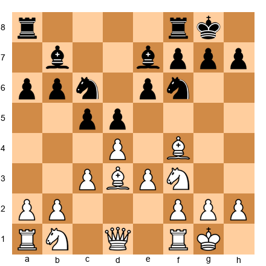</p>


Lasker played solidly through the opening, making no errors but gaining no advantage. The position was roughly equal, but Schlechter had the luxury of playing for a draw while Lasker needed to win.

**12.Nbd2 Qc7 13.Qe2 Rfd8 14.Rfd1** Both sides maneuver. The position is symmetrical and closed. Under normal circumstances, this would be a draw.

**14...Rac8 15.Rac1 Qb8 16.Bb1**

Lasker repositions the bishop to the a2-g8 diagonal via b1. This looks slow, but it prepares a kingside attack while maintaining the defensive structure. The bishop on b1 aims at h7 from a distance.

The game entered a tense middlegame where Schlechter, pressing for the draw that would win him the title, gradually overextended. Lasker's patient defense invited Schlechter to take risks - and eventually Schlechter pushed too far.

After 40 moves of maneuvering, Schlechter allowed Lasker to open the position. Lasker's pieces, which had been waiting patiently, suddenly surged forward. The attack was irresistible. **1-0.**

**What to learn from this game:**
- Defensive patience wins matches. Lasker waited for 40 moves without panicking.
- Inviting your opponent to overpress is a legitimate defensive strategy. If the opponent needs a win, they will take risks. Your job is to be ready when they miscalculate.
- A player who defends well under maximum pressure - where the match and the title are at stake - demonstrates the deepest form of competitive strength.
- The will to resist matters as much as technique. Lasker was objectively worse for long stretches. He held because he refused to accept the result.

---

### Game 4: Karpov vs. Kasparov
*World Championship Match, Moscow 1985, Game 24*

Anatoly Karpov's defensive technique was perhaps the most refined in chess history. In this game - the final game of the 1985 World Championship - Karpov defended a worse position with extraordinary tenacity, nearly saving a game that should have been lost.

Set up your board:

<p align="center">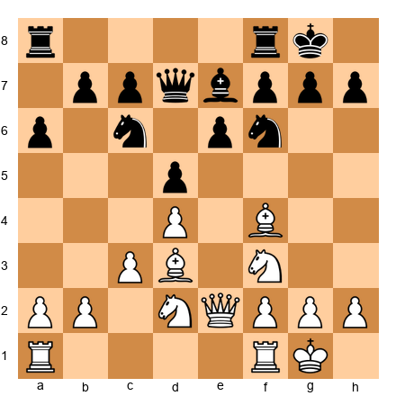</p>


Kasparov had prepared a sharp Nimzo-Indian Attack that put immediate pressure on Karpov's kingside. The young challenger was at the height of his powers, and this was the game that would decide the championship.

**12...dxc4 13.Bxc4 Nd5** Karpov exchanges the central tension. This is a classic defensive technique - resolve the pawn tension in a way that simplifies the position and reduces the opponent's attacking scope.

**14.Bg3 Ncb4 15.a3 Nxc4 16.Qxc4** Karpov trades pieces methodically. Each exchange removes a potential attacker from the board. After four exchanges in the center, the position is significantly simpler.

**16...a5 17.Nd2 Bd6** Karpov's bishop goes to d6, blocking the d-file and contesting the dark squares. This bishop serves a purely defensive function - it prevents White from occupying d6 with a knight and shields the kingside.

The game reached a complex endgame where Kasparov had a small but persistent advantage. Karpov defended for another 30 moves with remarkable precision, finding defensive resources at every turn. But Kasparov's technique was ultimately too strong, and he broke through to win the championship. **0-1.**

**What to learn from this game:**
- Defensive technique can be beautiful. Karpov's resistance in this game earned the admiration of the entire chess world.
- Simplification through exchanges is a powerful defensive strategy - reduce the number of attackers.
- Even when the defense ultimately fails, it demonstrates the right approach: every move should make the opponent's task as difficult as possible.
- At the highest level, defense is not about being passive - Karpov's moves were precise, purposeful, and tested every one of Kasparov's ideas.

---

### Game 5: Carlsen vs. Anand
*World Championship Match, Chennai 2013, Game 5*

Magnus Carlsen's defensive abilities are often overshadowed by his endgame technique and grinding style. But his ability to hold worse positions - to find defensive resources when most players would resign - is one of the foundations of his dominance.

Set up your board:

<p align="center">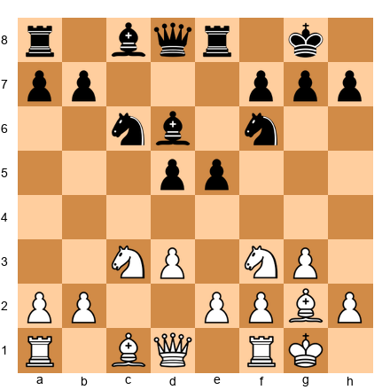</p>


In this game, Carlsen faced Anand's prepared Berlin Defense. The position was solid for Black, and Anand had a slight edge due to his central pawn presence (d5 and e5).

**10.e4 d4 11.Ne2 Ne7 12.Nd2** Carlsen reroutes his pieces. The knights head to d2 and e2, preparing f4. This is not an attack - it is prophylactic improvement. Each piece move has a purpose: f4 will challenge Black's center, and Nf3-d2-c4 puts pressure on d6.

**12...c5 13.f4 f6** Both sides maneuver around the central tension. The position is closed, and the player who breaks through first will have the advantage.

**14.f5!** Carlsen locks the kingside. This move looks anti-positional - it gives Black the e5 square - but it serves a defensive purpose. By fixing the kingside pawns, Carlsen ensures that Anand cannot attack there. The game will be decided on the queenside, where Carlsen's pieces are better positioned.

The game reached a complex middlegame where both sides had chances. Carlsen defended precisely on the kingside while building a queenside initiative. After 58 moves of tense play, Carlsen converted his advantage. **1-0.**

**What to learn from this game:**
- Locking a wing where the opponent is stronger is a legitimate defensive technique
- Prophylactic piece improvement (Nd2, Ne2) prepares both defense and counter-attack
- Even the World Champion must defend - defensive skill is not a weakness, it is a prerequisite for the title
- The best defenders do not just survive - they create winning chances from defensive positions

---

## Exercises

### ★★ Warmup Exercises

**Exercise 42.1** (★★)

<p align="center">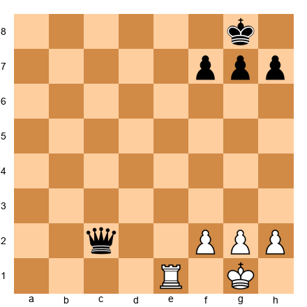</p>

Black to play. You are down a full exchange. Find a drawing resource.
*Hint: Where can the queen deliver perpetual check? Look at the exposed first rank.*
⏱ ~2 min

**Exercise 42.2** (★★)

<p align="center"></p>

Black to play. White is threatening Bg5, pinning the f6-knight. What prophylactic move prevents this?
*Hint: One simple move takes the Bg5 pin off the table forever.*
⏱ ~1 min

**Exercise 42.3** (★★)

<p align="center">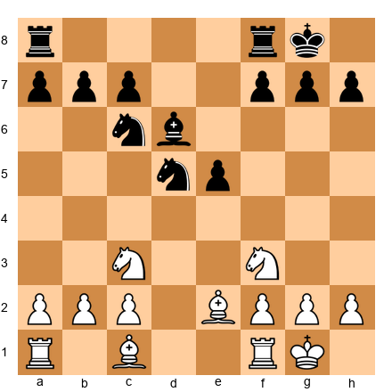</p>

White to play. Black's knight on d5 is dominant. How does White neutralize it?
*Hint: Trade it. Which piece can exchange on d5 most effectively?*
⏱ ~2 min

**Exercise 42.4** (★★)

<p align="center"></p>

White to play. Is this won, lost, or drawn?
*Hint: Both sides have one pawn. Who has the opposition?*
⏱ ~1 min

**Exercise 42.5** (★★)

<p align="center">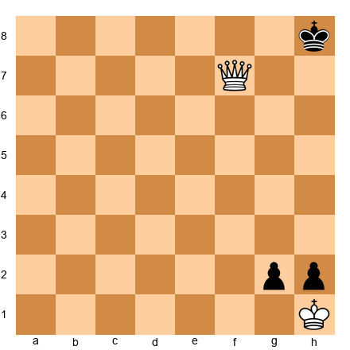</p>

White to play. You have a queen, but Black's pawns are about to promote. Find the drawing stalemate trick.
*Hint: After you take the g-pawn, what happens to the black king?*
⏱ ~2 min

**Exercise 42.6** (★★)

<p align="center">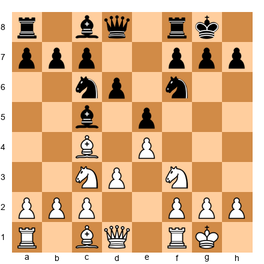</p>

Black to play. White is preparing d4. What counter-threat prevents White from executing this plan comfortably?
*Hint: What piece can Black put on a dangerous square that creates a dual-purpose move?*
⏱ ~2 min

**Exercise 42.7** (★★)

<p align="center">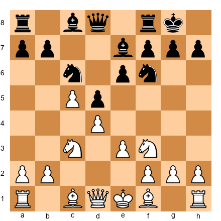</p>

Black to play. White has a strong center. What is the standard defensive break in this Slav structure?
*Hint: Attack the c5-pawn to undermine White's center.*
⏱ ~2 min

**Exercise 42.8** (★★)

<p align="center">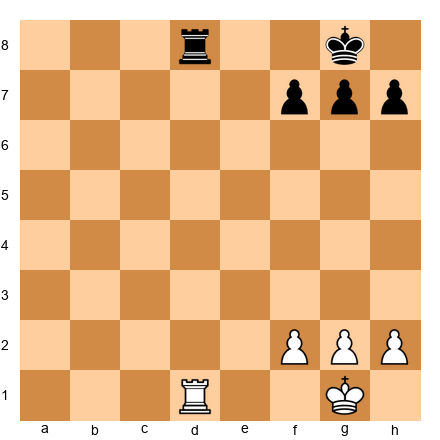</p>

White to play. Equal rook endgame, all pawns on one side. What is the most important defensive concept here?
*Hint: With pawns on only one side, what is the likely result?*
⏱ ~1 min

---

### ★★★ Essential Exercises

**Exercise 42.9** (★★★)

<p align="center"></p>

Black to play. This is a Sicilian Dragon. White is about to castle queenside and launch a kingside pawn storm. What is Black's most urgent defensive priority?
*Hint: Counter-attack on the queenside before White's attack develops. Which move starts it?*
⏱ ~3 min

**Exercise 42.10** (★★★)

<p align="center">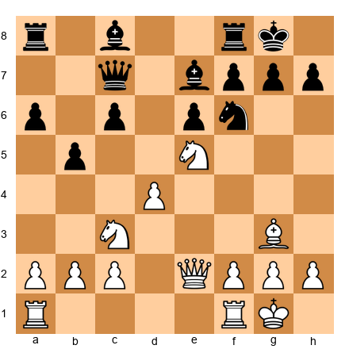</p>

Black to play. White's knight on e5 is threatening f7. Find the active defensive move.
*Hint: Can you attack the knight while simultaneously improving your position?*
⏱ ~3 min

**Exercise 42.11** (★★★)

<p align="center">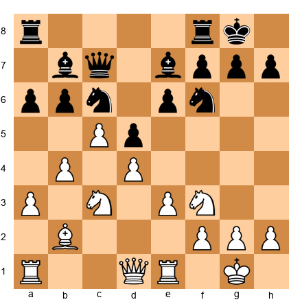</p>

Black to play. White has space on the queenside and a strong center. How does Black generate counter-play?
*Hint: The central break ...e5 is thematic. Does it work here?*
⏱ ~4 min

**Exercise 42.12** (★★★)

<p align="center">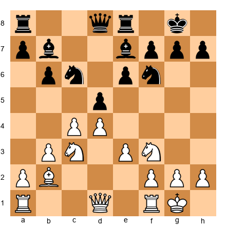</p>

Black to play. White is preparing e4. What prophylactic move prevents this plan from working?
*Hint: Place a piece on a square that controls e4.*
⏱ ~3 min

**Exercise 42.13** (★★★)

<p align="center">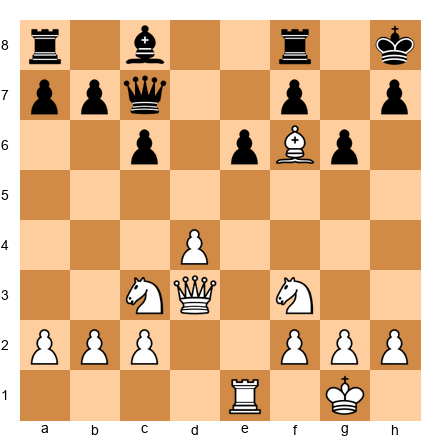</p>

Black to play. White has a bishop on f6, clamping down on the dark squares. How does Black defend against the dark-square pressure?
*Hint: Exchange the dangerous bishop. What piece can challenge it?*
⏱ ~3 min

**Exercise 42.14** (★★★)

<p align="center">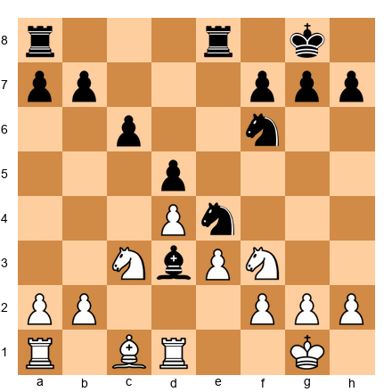</p>

White to play. Black has placed a bishop on d3, disrupting White's coordination. How does White defend and regroup?
*Hint: Can you exchange the intruder? What happens after Nxd3?*
⏱ ~3 min

**Exercise 42.15** (★★★)

<p align="center">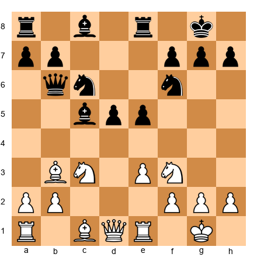</p>

White to play. Black has a strong center with d5 and e5. White's pieces are slightly passive. Find the defensive regrouping plan.
*Hint: The knight on f3 is blocked by e5. Where should it go?*
⏱ ~4 min

**Exercise 42.16** (★★★)

<p align="center">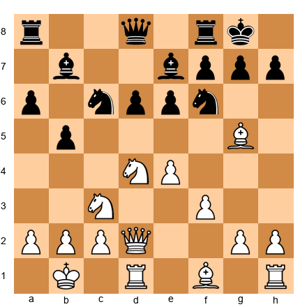</p>

Black to play. White is preparing a kingside attack with f4-f5. What is the standard exchange sacrifice that defuses the attack?
*Hint: Can Black sacrifice an exchange on c3 to destroy White's structure?*
⏱ ~4 min

**Exercise 42.17** (★★★)

<p align="center">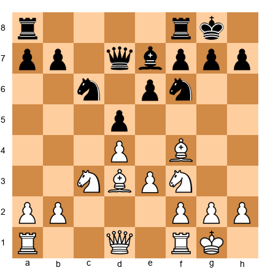</p>

Black to play. White has a well-placed bishop on f4 and threats of e4. Find the move that defends e4 while improving Black's pieces.
*Hint: A knight move to e4 challenges White's center directly.*
⏱ ~3 min

**Exercise 42.18** (★★★)

<p align="center">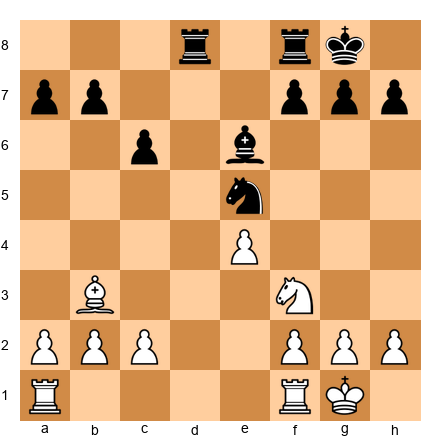</p>

White to play. Black's knight on e5 is well-posted and the bishop on e6 is solid. How does White improve without allowing Black's advantage to grow?
*Hint: Challenge the knight. What happens after Nxe5?*
⏱ ~3 min

**Exercise 42.19** (★★★)

<p align="center">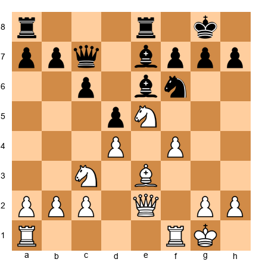</p>

Black to play. White has a strong knight on e5 and is pushing f4-f5. Find the defensive resource that neutralizes the e5-knight.
*Hint: Direct confrontation. What happens if you play ...Nd7?*
⏱ ~4 min

**Exercise 42.20** (★★★)

<p align="center">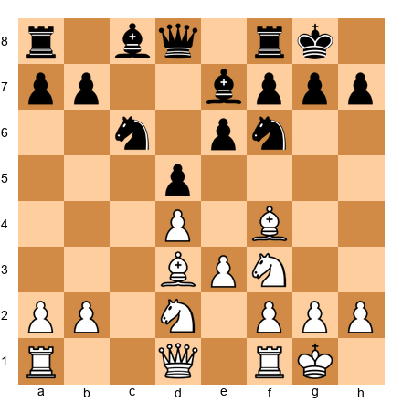</p>

Black to play. White is threatening Qe2 followed by e4. What is the best prophylactic defense?
*Hint: Prevent e4 from working. Consider ...Nh5, challenging the f4-bishop.*
⏱ ~3 min

**Exercise 42.21** (★★★)

<p align="center">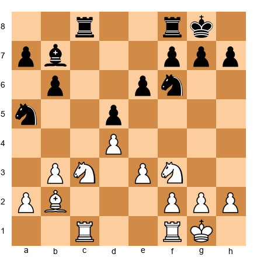</p>

Black to play. White is preparing Nd2-f1-g3-f5. What prophylactic move prevents this knight maneuver?
*Hint: Control the f5 square. How can Black do this with a pawn or piece?*
⏱ ~3 min

**Exercise 42.22** (★★★)

<p align="center">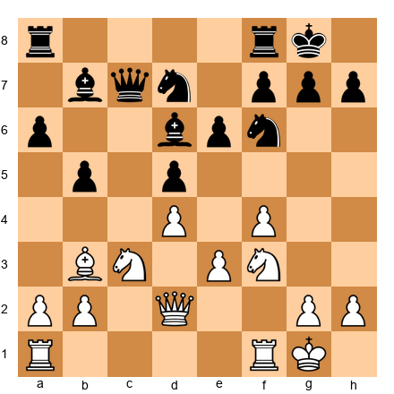</p>

Black to play. White has played f4, preparing f5. What is Black's most effective defensive strategy?
*Hint: The counter-break ...c5 or ...e5 challenges White's center. Which one works?*
⏱ ~4 min

**Exercise 42.23** (★★★)

<p align="center">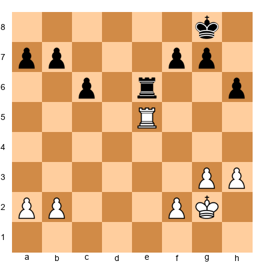</p>

White to play. Rook endgame, White is up a pawn (5 vs 4). How does White convert?
*Hint: Activate the king. Where should it go?*
⏱ ~5 min

**Exercise 42.24** (★★★)

<p align="center">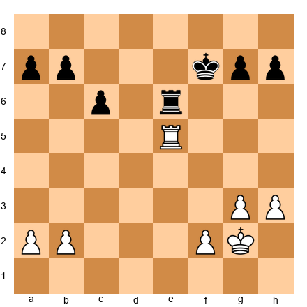</p>

Black to play. Same structure as 42.23, but you are the defender (down a pawn). How do you hold?
*Hint: Activate the rook. The second rank is your friend.*
⏱ ~5 min

**Exercise 42.25** (★★★)

<p align="center"></p>

Black to play. White is solidly placed. Black needs a defensive plan that maintains equality. Find the right piece setup.
*Hint: The bishop on d6 is passive. Can it go to a better diagonal?*
⏱ ~3 min

---

### ★★★★ Practice Exercises

**Exercise 42.26** (★★★★)

<p align="center"></p>

Black to play. White is threatening d4, opening the position for the two bishops. How does Black defend the center and neutralize the bishop pair?
*Hint: Trade one of the bishops. Which exchange is most effective?*
⏱ ~5 min

**Exercise 42.27** (★★★★)

<p align="center"></p>

Black to play. White has launched g4, threatening g5 and a kingside pawn storm. Find the defensive plan.
*Hint: Counter-attack on the queenside before the kingside storm reaches you. What is the key break?*
⏱ ~5 min

**Exercise 42.28** (★★★★)

<p align="center"></p>

Black to play. White has a strong center and well-placed pieces. Black must choose between ...e5 (locking the center) and ...d5 (challenging the center). Which is correct?
*Hint: Consider what happens after each move. Which one gives White fewer targets?*
⏱ ~7 min

**Exercise 42.29** (★★★★)

<p align="center"></p>

White to play. Black has a strong setup in the Italian Game. White must decide between aggressive (d4!?) and defensive (O-O, Be3) approaches. Which is better for maintaining balance?
*Hint: Sometimes the quiet move is strongest. What does White need before pushing d4?*
⏱ ~5 min

**Exercise 42.30** (★★★★)

<p align="center"></p>

Black to play. White has a strong central presence. Black's knight on a5 is offside. How does Black defend and regroup the knight?
*Hint: The knight needs a path back to the game. ...Nc4 or ...Nc6 - which is better?*
⏱ ~5 min

**Exercise 42.31** (★★★★)

<p align="center"></p>

White to play. Black's knight on d5 is powerful and the bishop on a6 pressures d3. How does White hold the position together?
*Hint: Can White trade the d5-knight? What are the consequences of Nxd5?*
⏱ ~5 min

**Exercise 42.32** (★★★★)

<p align="center"></p>

Black to play. White has a strong pawn on e5 and active pieces. Black must find the defensive setup that prevents White from breaking through.
*Hint: Block the e5-pawn's advance. Which square does the knight need to occupy?*
⏱ ~5 min

**Exercise 42.33** (★★★★)

<p align="center"></p>

Black to play. White is solidly placed but the position is closed. Black must find a way to avoid being slowly squeezed. What is the correct plan?
*Hint: Activity is the answer. What pawn break creates counter-play?*
⏱ ~7 min

**Exercise 42.34** (★★★★)

<p align="center"></p>

Black to play. White has an imposing center with e5 and f4. Black's knight on f5 is well-placed but can be challenged. Find the move that solidifies Black's defense.
*Hint: The d7-bishop needs activation. Where does it go?*
⏱ ~5 min

**Exercise 42.35** (★★★★)

<p align="center"></p>

Black to play. White has played f4, threatening f5. The position is a King's Indian type. Find the defensive counter-break.
*Hint: The classic ...e5 break. Does it work here? Calculate the consequences.*
⏱ ~7 min

**Exercise 42.36** (★★★★)

<p align="center"></p>

Black to play. White has a centralized queen on d4. Black's position is solid but passive. Find the move that challenges White's queen placement while maintaining defensive solidity.
*Hint: Can a rook move threaten something while defending?*
⏱ ~5 min

**Exercise 42.37** (★★★★)

<p align="center"></p>

Black to play. White's e5-pawn and f4-pawn form a strong duo. Black must find the correct defensive plan to undermine this center.
*Hint: ...c5 challenges the d4-knight. What happens after that?*
⏱ ~7 min

**Exercise 42.38** (★★★★)

<p align="center"></p>

White to play. Black's rooks control the d-file and 7th rank. How does White defend the position and prevent an invasion?
*Hint: A rook to the d-file contests Black's control. But which rook?*
⏱ ~5 min

**Exercise 42.39** (★★★★)

<p align="center"></p>

Black to play. White's pieces are harmoniously placed. Black must find the correct defensive setup that prevents White from gaining a lasting advantage.
*Hint: Exchange the d4-pawn tension. Which recapture is better for Black?*
⏱ ~5 min

**Exercise 42.40** (★★★★)

<p align="center"></p>

Black to play. White has played f4, threatening a kingside attack. What is Black's most precise defensive move?
*Hint: Challenge the center before the attack develops. ...cxd4 or ...c4 - which is better defensively?*
⏱ ~5 min

**Exercise 42.41** (★★★★)

<p align="center"></p>

Black to play. White has a Stonewall setup (d4+f4). Black must find the defensive plan that exploits the weakness on e4.
*Hint: The e4-square is weak because of f4. How does Black exploit it?*
⏱ ~5 min

**Exercise 42.42** (★★★★)

<p align="center"></p>

Black to play. White's bishop on f4 is active and Qe2 + e4 is coming. Find the prophylactic exchange that simplifies White's attacking potential.
*Hint: Exchange the f4-bishop with a piece that does double duty.*
⏱ ~5 min

**Exercise 42.43** (★★★★)

<p align="center"></p>

Black to play. White's queen on b3 targets b5 and d5. Black must defend both weaknesses simultaneously.
*Hint: A single piece move can protect both pawns. Which piece, which square?*
⏱ ~5 min

**Exercise 42.44** (★★★★)

<p align="center"></p>

Black to play. White has played g4, threatening g5 and a kingside attack. Find the most resilient defensive response.
*Hint: Should you stop g5 with ...h6, or prepare for it with a piece move?*
⏱ ~5 min

**Exercise 42.45** (★★★★)

<p align="center"></p>

Black to play. White's setup is powerful. Black needs a plan that addresses all of White's threats. What is the correct defensive priority?
*Hint: The d6-pawn is the weakness. How does Black protect it while keeping options open?*
⏱ ~7 min

---

### ★★★★★ Mastery Exercises

**Exercise 42.46** (★★★★★)

<p align="center"></p>

Black to play. White has a massive kingside buildup with e5, f4, g4, and Re3 aimed at the king. This position looks losing. Find the defensive resource that holds.
*Hint: Counter-attack in the center. The d4-knight is the key target. Can you force exchanges?*
⏱ ~10 min

**Exercise 42.47** (★★★★★)

<p align="center"></p>

Black to play. White's knight on e5 dominates the position. Black must find the precise sequence that neutralizes White's advantage without falling into a tactical trap.
*Hint: The exchange sacrifice ...Rxc3 is Petrosian-like. Does it work here?*
⏱ ~10 min

**Exercise 42.48** (★★★★★)

<p align="center"></p>

Black to play. White has a bishop on h6 aiming at g7, and the d4-knight is strong. This is a typical Sicilian attacking position. Find the only defensive move that holds.
*Hint: The bishop on h6 must be neutralized. Only one piece can do it. Which one?*
⏱ ~10 min

**Exercise 42.49** (★★★★★)

<p align="center"></p>

Black to play. White has a strong e5-knight and f4 threatening f5. Black must find the defensive plan that addresses both threats simultaneously.
*Hint: The knight on e5 must be challenged. But not with ...Nxe5 (fxe5 opens the f-file). Think deeper.*
⏱ ~10 min

**Exercise 42.50** (★★★★★)

<p align="center"></p>

Black to play. White has played e5, attacking the f6-knight. If the knight moves, Bxg7+ follows. Find the defensive resource.
*Hint: What if the knight does NOT move? Can Black sacrifice something to survive?*
⏱ ~12 min

**Exercise 42.51** (★★★★★)

<p align="center"></p>

Black to play. White has an e5-pawn cramping Black's position and a Bg5 pressuring the kingside. Find the defensive plan that frees Black's game.
*Hint: The bishop on c5 is Black's most active piece. Can it participate in defense AND counter-attack?*
⏱ ~10 min

**Exercise 42.52** (★★★★★)

<p align="center"></p>

Black to play. White has e5 and f4, a strong pawn duo. Black's knight on f6 is attacked. Find the retreat that maintains the best defensive prospects.
*Hint: Not all knight retreats are equal. One square defends and counter-attacks simultaneously.*
⏱ ~10 min

**Exercise 42.53** (★★★★★)

<p align="center"></p>

White to play. Black has a strong central pawn mass (c5, d5, e6) and active pieces. White must find the defensive regrouping that prevents Black from overwhelming the center.
*Hint: The c2-bishop is passive. Re-route it. But where - and in what order?*
⏱ ~10 min

**Exercise 42.54** (★★★★★)

<p align="center"></p>

Black to play. White has a dominant center and kingside attack brewing. This position requires a multi-move defensive plan. Outline the first three moves of the defense and explain why each is necessary.
*Hint: Break the center before the attack arrives. The sequence starts with a pawn break and continues with exchanges.*
⏱ ~15 min

**Exercise 42.55** (★★★★★)

<p align="center"></p>

Black to play. White has a bishop on h6 threatening to exchange on g7 and weaken the dark squares. The f4-pawn threatens f5. Find the comprehensive defensive plan.
*Hint: The bishop on h6 is dangerous only if it stays. Can you force it to retreat or exchange it? Then address f5.*
⏱ ~15 min

---

## Key Takeaways

1. **Defense is a skill, not a punishment.** The player who defends well earns more points per tournament than the player who only knows how to attack. Treat defensive positions as puzzles to solve, not sentences to endure.

2. **Active defense beats passive defense in open positions.** Create counter-threats. Force your opponent to deal with your ideas while you defend theirs. Passive defense works only when the position is truly closed.

3. **The exchange sacrifice is a defensive weapon.** Give up a rook for a knight or bishop when it removes the opponent's best attacking piece, closes the position, or damages their pawn structure. This is Petrosian's legacy.

4. **Counter in the center when attacked on the wing.** This principle saves more games at the expert level than any tactical pattern. An open center favors the defender when the attacker's pieces are committed to a wing assault.

5. **Prophylaxis prevents problems.** A small move now - h6, a6, a knight retreat - can prevent a large problem in five moves. Petrosian's method is not cowardice; it is precision.

6. **In worse endgames, prioritize activity over material.** An active rook on the seventh rank is worth more than an extra pawn. Keep your pieces active and your king centralized.

7. **Know your three lifelines: stalemate, perpetual check, fortress.** When the position is objectively lost, these defensive resources exist more often than you think. Look for them before resigning.

8. **Spend the time.** Defensive moves require more calculation than attacking moves. Do not rush. The five minutes you spend finding the right defensive move may be the five minutes that save the game.

9. **Psychological resilience is trainable.** Set micro-goals: survive five more moves, then five more. Your opponent makes mistakes too. Give them the chance to err.

10. **The best defense creates winning chances.** The goal of defense is not merely to survive. It is to survive in a position where the opponent must continue to play well - and where one mistake from them changes everything.

---

## Practice Assignment

### This Week's Defensive Training

**Day 1-2: Psychology and Active Defense**
- Solve exercises 42.1 through 42.8 (warmup)
- Study the Petrosian-Fischer game (Game 1) until you can explain the prophylactic exchange strategy
- Play three blitz games where you deliberately choose a slightly inferior opening and practice defending

**Day 3-4: Defensive Tactics and Exchange Sacrifices**
- Solve exercises 42.9 through 42.25 (essential)
- Study the Hou Yifan game (Game 2) and identify the moment active defense began
- Set up three positions from the "Defending Against the Kingside Attack" section and practice finding counter-breaks

**Day 5-6: Advanced Defense and Resource Recognition**
- Solve exercises 42.26 through 42.45 (practice)
- Study the Lasker-Schlechter game (Game 3) and the Karpov-Kasparov game (Game 4)
- Practice stalemate trick recognition: set up five queen-vs-pawn positions and find the stalemate resource

**Day 7: Mastery**
- Solve exercises 42.46 through 42.55 (mastery - these are hard; use a board, take your time)
- Study the Carlsen game (Game 5)
- Write down three defensive principles you want to internalize this month

### Ongoing Practice

- After every tournament game where you defended, analyze the defensive moments with an engine. Ask: "Was my defensive move the engine's first choice? If not, what did the engine find?"
- Play at least two "defense practice" games per week - start from a position where you are slightly worse and try to hold
- Keep a defensive resource notebook: record every position where you found (or missed) a stalemate trick, perpetual check, or fortress

---

## ⭐ Progress Check

You have completed Chapter 42 when you can:

- [ ] Explain the difference between active and passive defense with examples from this chapter
- [ ] Name three conditions that justify an exchange sacrifice for defensive purposes
- [ ] Find the counter-break (...e5 or ...c5) in at least three positions from the theory sections within 30 seconds
- [ ] Describe the Petrosian method of prophylactic defense and give two examples
- [ ] Identify stalemate, perpetual check, and fortress resources in positions from the exercises
- [ ] Play through all five annotated games and explain what each game teaches about defense
- [ ] Score at least 40/55 on the exercises (with a board, no engine)
- [ ] Hold a worse endgame against a practice partner for 30+ moves without making a losing mistake

---

## 🛑 Rest Marker

Defense is exhausting. Not just at the board - studying it takes emotional energy too. You have spent this chapter thinking about positions where you are worse, where your opponent is pressing, where the margin for error is zero.

That takes something out of you.

Set the book down. Play a game for fun - not to win, not to practice, just to enjoy chess. Play the King's Gambit. Sacrifice everything. Lose gloriously. Remember why you love this game.

When you come back, you will be stronger. Not because you memorized defensive patterns, but because you trained something deeper: the willingness to sit in a hard position and find a way. That is a skill that reaches far beyond chess.

*"The player who defends well has learned something that the attacker has not: that patience is a form of courage."* - Emanuel Lasker

---

*Next: Chapter 43 - Annotated GM Games: Modern Masterpieces*
