# Chapter 43: Converting Advantages - Technique
## From Better to Won: The Art of Finishing What You Started

---

> *"The winner of the game is the player who makes the next-to-last mistake."*
> - Savielly Tartakower

**Rating Range:** 2200–2400

**What You Will Learn:**
- What "converting an advantage" means at the expert level - and why having an advantage is only half the battle
- The five conversion paths and how to choose the right one for your position
- Nimzowitsch's principle of two weaknesses - how to stretch a defense until it breaks
- When to simplify and when to keep tension - the most misunderstood decision in practical chess
- How to win won positions without ever giving your opponent a chance to fight back

---

## You Are Here

```
Ch 36: Expert-Level Calculation         ✅ Complete
Ch 37: Complex Middlegame Strategy      ✅ Complete
Ch 38: Advanced Endgame Theory          ✅ Complete
Ch 39: Professional Opening Preparation ✅ Complete
Ch 40: Practical Decision-Making        ✅ Complete
Ch 41: The Art of Preparation           ✅ Complete
Ch 42: The Art of Defense               ✅ Complete
Ch 43: Converting Advantages            ◀ YOU ARE HERE
Ch 44: Deep Opening Systems
Ch 45: The Psychology of the Title Chase
```

---

You have been winning games your entire chess career. You win material through tactics. You win positional advantages through strategy. You outprepare opponents in the opening. You have earned countless advantages on the board.

And then you let them go.

Not always. Not most of the time. But enough. Enough that you look at your tournament results and see draws where you should have won, and even losses from positions where you were clearly better. You had the advantage. You knew you had the advantage. And somehow, the full point slipped away.

This is the most frustrating experience in chess. And at your rating - 2200 to 2400 - it is the single biggest obstacle between you and your next title.

The problem is not finding advantages. You are strong enough to do that consistently. The problem is *converting* them. Turning "better" into "winning" into "won." This is a separate skill from everything else you have learned. It requires patience, precision, and a kind of cold-blooded clarity that many talented players never develop.

Capablanca had it. Karpov had it. Carlsen has it to a degree the chess world had never seen before. Judit Polgar had it when it mattered most - the ability to take a small edge and grind it into a full point against the strongest players in the world.

This chapter teaches you what they all understood: an advantage is not a gift. It is a responsibility. And converting it is a technique that can be studied, practiced, and mastered.

---

## 43.1 What Converting an Advantage Means

At the club level, converting an advantage is simple. You win a piece, you trade everything, you push a pawn. The opponent resigns or gets mated. Done.

At 2200, nothing is that easy.

Your opponents are strong enough to resist. They find defensive resources. They create counterplay. They complicate the position. They force you to prove your advantage at every step. And if you make even one careless move - one wrong exchange, one premature pawn push, one moment of impatience - the advantage evaporates.

Converting an advantage means transforming one type of superiority into another, following a logical chain from the middlegame to a winning endgame or a decisive attack. It means making a series of correct decisions, each one small, each one bringing the game closer to a conclusion.

Set up your board:

<p align="center">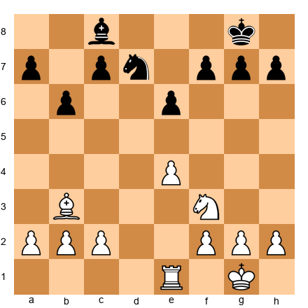</p>


White is up the exchange - a rook for a knight. At the club level, this would be a comfortable win. At 2200+, this is a technical challenge.

Why? Because Black's pawn structure is solid. The knight on d7 covers important squares. The bishop on c8 can activate to b7 or a6. Black has no immediate weaknesses to attack. If White plays randomly, Black can consolidate, trade off pieces, and the extra exchange may not be enough.

White needs a *plan*. Not just any plan - the *right* plan for this specific type of advantage. That is what conversion means: knowing what to do with what you have.

Here is the plan: White should fix a target (the e6 pawn is slightly weak), improve piece placement (Re1 to d1 or the knight toward d5), activate the king toward the center, and probe on both wings. The extra exchange wins not through a single blow but through accumulation - small advantages piling up until the defense collapses.

**The conversion equation:**

Advantage + Correct Plan + Patient Execution = Full Point

Remove any one of those three elements and the game ends in a draw. Or worse.

---

## 43.2 The Five Paths of Conversion

Not all advantages convert the same way. The path from "better" to "won" depends on *what kind* of advantage you have. At the expert level, you must recognize which path fits your position.

### Path 1: Material Advantage → Simplified Endgame

The most straightforward path. You are up material - a pawn, an exchange, a piece. The plan: trade pieces, reach an endgame where your extra material is decisive.

Set up your board:

<p align="center">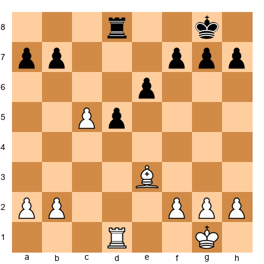</p>


White has a passed c-pawn on c5. Material is equal, but that passed pawn is worth nearly a full pawn in practical value. White's plan: advance the c-pawn while trading rooks. If rooks come off, the c-pawn queens. If rooks stay on, White uses the rook to support the pawn's advance while tying down Black's rook to defense.

Trade pieces when you are ahead in material. This is the simplest conversion path, and the one most players learn first.

### Path 2: Positional Advantage → Structural Damage → Endgame Grind

You do not have extra material, but your pieces are better placed, your pawn structure is healthier, or your opponent has chronic weaknesses. The plan: use your positional advantage to inflict permanent damage on the opponent's pawn structure, then convert that structural advantage in the endgame.

Set up your board:

<p align="center">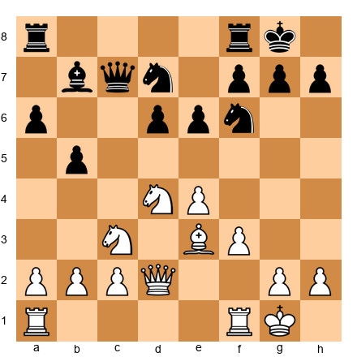</p>


White has a dominant knight on d4, better central control, and more space. But nothing is won yet. The conversion plan: provoke a structural weakness. White plays f4-f5, forcing Black to take (exf5) and creating either an isolated e-pawn or a hole on e6. Once the structure is damaged, White grinds in the endgame.

### Path 3: Initiative → Attack → Material

You have the initiative - your pieces are active, your opponent is passive, and you are threatening things. The plan: convert your temporary dynamic advantage into something permanent before it fades.

The initiative is a perishable asset. Unlike a passed pawn or a better structure, it disappears if you play passively. You must act. But "acting" does not mean "throwing pieces at the king." It means using your activity to win material, damage the structure, or force a favorable endgame.

### Path 4: Space Advantage → Restriction → Zugzwang

You control more of the board. Your opponent's pieces are cramped. The plan: restrict the opponent, take away all useful moves, and drive toward a position where any move your opponent makes worsens their position.

This is the path of Karpov and Petrosian. It is slow, it is quiet, and it is devastating.

### Path 5: Better Pieces → Favorable Exchange → Winning Endgame

Your pieces are more active than your opponent's. The plan: trade your worst piece for their best piece. This sounds counterintuitive - why would you trade when your pieces are better? Because after the trade, the *remaining* pieces are even more dominant.

Set up your board:

<p align="center">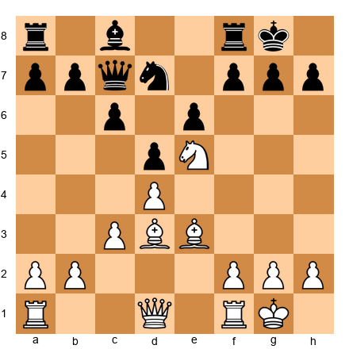</p>


White's knight on e5 is dominant. Black's knight on d7 is passive. If White trades dark-squared bishops with Bh6, the remaining pieces favor White enormously - the knight on e5 stays, and Black has no counter to it. The key exchange is not trading the best piece but trading the piece that *enables the opponent's defense*.

---

## 43.3 The Principle of Two Weaknesses

This is one of the most powerful ideas in chess strategy, and it separates experts from club players more than almost any other concept.

The principle is simple: **a single weakness can be defended. Two weaknesses, on opposite sides of the board, cannot.**

Aron Nimzowitsch understood this better than anyone in his era. He called it "the stretching of the defense." The idea: attack one weakness. The opponent defends it. Then create - or switch your attention to - a second weakness on the other side of the board. Now the opponent's pieces must cover both weaknesses simultaneously. Their defense stretches. Eventually, it tears.

Set up your board:

<p align="center">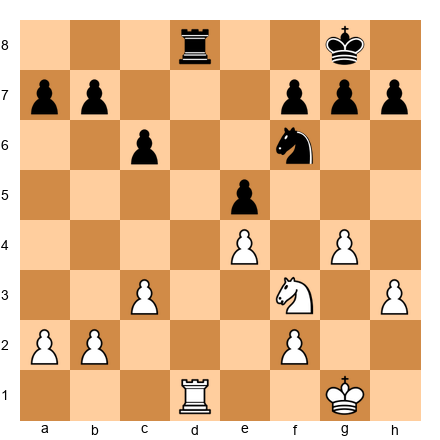</p>


White has a space advantage on the kingside (g4, h3) and the pawn on e5 is slightly weak. But if White attacks only e5, Black can defend with the knight on f6 and the rook on d8. One weakness is not enough.

White's plan: fix the e5 pawn as a target, then open a second front on the queenside. After a3-b4-b5, Black must defend both the e5 pawn and the queenside pawn breaks. The rook and knight cannot cover both flanks.

### How to Create Two Weaknesses

**Step 1: Fix the first weakness.** Do not allow the opponent to repair it. If the weakness is a backward pawn, prevent it from advancing. If it is a weak square, occupy it. If it is a bad piece, keep it bad.

**Step 2: Improve your position on the other wing.** Advance pawns, maneuver pieces, create pressure. You do not need to win immediately on the second front. You only need to force the opponent to divert a defender.

**Step 3: Switch.** Once a defending piece moves to the second front, return your attention to the first weakness. Now it is underdefended.

**Step 4: Repeat.** The opponent shifts back. You switch again. Each time, the defense erodes a little more.

Set up your board:

<p align="center">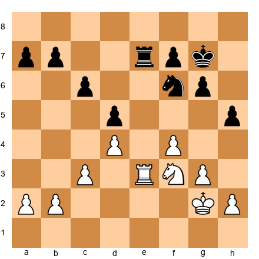</p>


White has a better structure - the d4 pawn is supported, the f4 pawn controls e5 and g5, and the knight on f3 is flexible. Black's d5 pawn is weak and the king is slightly exposed.

White's plan: pressure d5 (first weakness), then switch to the kingside with g4 or Kg3-h4 (second front). Black cannot defend d5 and the kingside with just a knight, rook, and king. Something will crack.

**The key insight:** you do not need to win either weakness. You need the opponent to stop being able to defend both.

---

## 43.4 Simplification Technique

At 2200, players misunderstand simplification more than almost any other concept. They know the rule - "trade when ahead" - but they apply it blindly, sometimes making their position worse.

Simplification is not about trading everything. It is about trading the *right* things at the *right* time.

### When to Trade

**Trade when your advantage is permanent.** If you have an extra pawn and the resulting endgame is winning, trade pieces. The fewer pieces on the board, the harder it is for your opponent to generate counterplay.

**Trade when your opponent's pieces are more active than yours.** If the opponent has one very strong piece - a knight on an outpost, a rook on the seventh rank - trade that specific piece. Remove the source of their counterplay.

**Trade when the resulting endgame is technically winning.** A rook endgame with an extra pawn may be winning, but it requires technique. A king-and-pawn endgame with an extra pawn is almost always winning. Knowing the difference determines whether the trade is correct.

### When NOT to Trade

**Do not trade when your advantage is dynamic.** If you have the initiative - active pieces, threats, time advantage - trading pieces kills the initiative. Dynamic advantages need pieces on the board to work.

Set up your board:

<p align="center">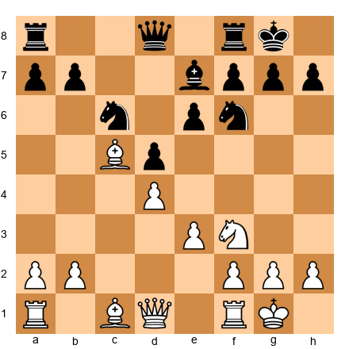</p>


White has an active bishop on c5 and more space. If White trades the bishop for the e7 bishop with Bxe7 Qxe7, the position simplifies to near-equality. White's advantage was the *active bishop*. Trading it away surrenders the advantage.

Instead, White should keep the bishop active and look for ways to increase the pressure.

**Do not trade when it activates your opponent's pieces.** Sometimes a trade opens a file for the opponent's rook or frees a cramped piece. Before every trade, ask: "What does my opponent's position look like *after* this exchange?"

**Do not trade your best piece.** This sounds obvious, but under time pressure, players routinely swap their most active piece because the opponent "offers" the exchange. Your opponent is offering the trade *because it helps them.* Ask why.

### The "Which Piece" Question

This is the heart of simplification technique. When you decide to trade, you must answer: *which piece do I trade, and for which of my opponent's pieces?*

The answer: **trade your worst piece for their best piece.** After the exchange, the average quality of your remaining pieces goes up, and theirs goes down.

Set up your board:

<p align="center">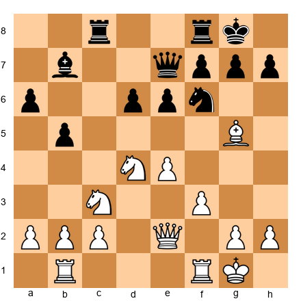</p>


White's pieces are all good, but the c3-knight is the least active - it has no clear target or outpost. Black's bishop on b7 is excellent - it eyes the long diagonal and supports a future ...d5 break. If White can arrange Nd5 to trade Black's f6-knight while keeping everything else, the position transforms.

The right exchange: Nd5, trading the d5-knight for the f6-knight, then later rerouting the c3-knight via Na4 if it reaches a useful square. The goal is not to remove pieces from the board - it is to improve the *relative quality* of what remains.

---

## 43.5 The Carlsen Squeeze

Magnus Carlsen changed how the chess world thinks about winning won positions. Before Carlsen, the conventional wisdom was: find the strongest move, convert the advantage efficiently, and finish the game. Carlsen showed that there is another way - slower, quieter, and even more effective.

The Carlsen method: **improve your position one small step at a time, never giving the opponent any counterplay, and wait for them to crack.**

This is not passive play. It is the opposite. Every Carlsen move in a winning position does one of three things:

1. **Improves a piece.** A rook moves from a decent square to a better one. A knight repositions. The king walks toward the center.

2. **Restricts the opponent.** A pawn advance takes away a square. A piece move covers an escape route. The opponent has fewer options after each of Carlsen's moves.

3. **Maintains the tension.** Carlsen does not rush to break through. He keeps the tension in the position, forcing the opponent to make difficult decisions on every move. Decisions mean chances for errors.

Set up your board:

<p align="center">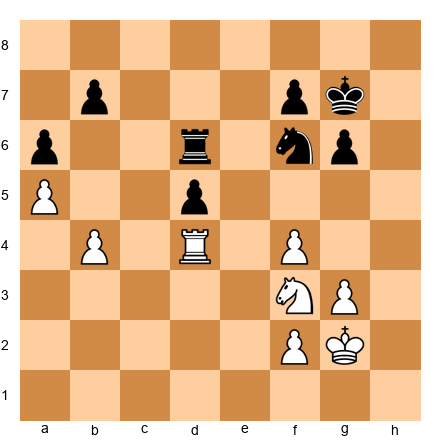</p>


White is slightly better. The passed a-pawn is fixed, the rook on d4 is well-placed, and the knight on f3 can reroute to e5 or d4. But "slightly better" is not "winning." At the club level, many players would either rush (pushing the a-pawn prematurely) or drift (playing aimlessly).

The Carlsen approach: improve everything first. Kg2-f3-e3, centralizing the king. Then Nd2-b3 or Ne5, improving the knight. Then probe: Rd2-c2, threatening to invade on c7. Black must react to each improvement. Eventually, something gives.

The key insight is that **Carlsen does not try to win the game. He tries to improve his position.** The win follows naturally from the accumulation of small improvements.

### Why the Squeeze Works

At the expert level, most games between equal opponents are decided by mistakes. Not blunders - subtle mistakes. A slightly misplaced piece. A passive move when an active one was needed. A time-wasting maneuver.

The squeeze works because every move the opponent must make is a chance for such a mistake. If you improve your position for 20 moves without ever giving your opponent an active plan, the probability that they play all 20 moves perfectly is low. Very low.

**This is a statistical reality.** You are not outplaying your opponent with brilliance. You are outplaying them with patience. You are giving them the maximum number of decisions, and each decision carries a small probability of error. Over enough decisions, the error comes.

### When the Squeeze Does Not Work

The squeeze requires a genuine advantage. If the position is objectively equal, no amount of squeezing will create a win against accurate play. The opponent can simply hold by mirroring your improvements.

The squeeze also fails when the position has forcing sequences. If the opponent can calculate a draw by repetition, a perpetual check, or a fortress, squeezing will not prevent it. The squeeze works in positions that are slightly favorable and sufficiently complex - positions where the number of reasonable choices is large and the penalty for the wrong choice is small but cumulative.

---

## 43.6 Converting Slight Advantages (±0.3 to ±0.8)

This is the hardest skill in chess. Not tactics. Not openings. Not even endgame technique. The ability to take a position where you are fractionally better - an engine says +0.4, you "feel" you are slightly more comfortable - and convert it into a full point.

At 2200, many players abandon these positions. "It is basically equal," they think, and they offer a draw or play without a clear plan. This costs them a point or two per tournament. Over a year, it costs them 50 to 100 rating points.

The difference between a 2200 and a 2500 is not that the 2500 finds advantages the 2200 misses. Both find roughly the same advantages. The difference is that the 2500 *converts* those marginal edges into wins at a higher rate.

### The Mindset

First, you must believe that +0.4 is worth playing for. Not always - if you need a draw to win a tournament, take it. But in most games, a slight advantage should be pressed. The effort of trying to convert has no downside: at worst, you practice endgame technique and draw. At best, your opponent cracks and you win.

### The Method

**Step 1: Identify what is slightly better.** Name it. "I have a better bishop." "I have a better pawn structure." "My king is more active." Be specific.

**Step 2: Ask what would make it clearly better.** What change would push +0.4 to +1.0? Usually the answer involves creating a second advantage or worsening the opponent's position.

**Step 3: Play the position, not the evaluation.** Do not think about the number. Think about the board. What does the position need?

Set up your board:

<p align="center">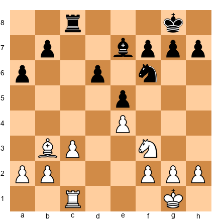</p>


White is slightly better. Why? The bishop on b3 is more active than the bishop on e7, which is blocked by its own pawns. White's c-file rook is on an open file; Black's is also on the c-file but serves a defensive function. The pawn structure is symmetrical except that Black's d6 pawn is slightly weak.

This is +0.3 to +0.5. Not close to winning. But with correct play, White can nurse this edge.

White's plan: double purpose. On one hand, probe the d6 pawn (Nd2-c4). On the other hand, prepare a kingside expansion (g3, Kg2, f4). Black must decide how to react, and every reaction creates a small concession.

**The golden rule of slight advantages:** do not force the issue. Your advantage is small. Forcing play will either simplify to a dead draw or create tactical complications where your slight edge is irrelevant. Instead, maneuver. Improve. Wait.

---

## 43.7 Technical Endgame Conversion

You have reached a winning endgame. Material is unequal, the structure is favorable, or you have a decisive positional advantage. Now you must convert.

This is where technique lives. And at 2200, technical endgame play is the single area where the most points are lost.

### Rook Endgames

Rook endgames occur in roughly half of all games that reach an endgame. They are the most common endgame type and the most technically demanding.

**Principle 1: Rook behind the passed pawn.** Whether your pawn or your opponent's, your rook belongs behind the passed pawn. Behind your own passed pawn, the rook supports its advance. Behind the opponent's passed pawn, the rook restricts it.

Set up your board:

<p align="center">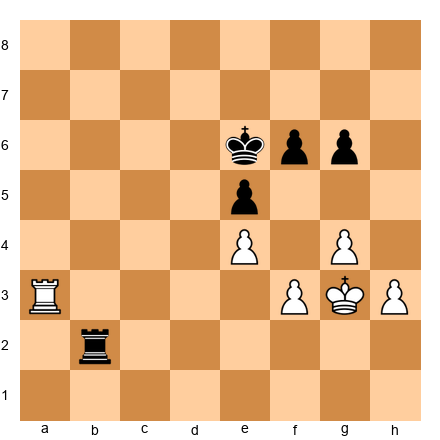</p>


White has a rook on a3 and Black has a rook on b2. The pawn structure is nearly locked. White needs to create a passed pawn on the h-file (h4-h5) while keeping the rook active. If White can get the rook behind a passed h-pawn, the position is winning. If White plays passively, Black's rook on the second rank creates constant threats.

**Principle 2: King activity wins rook endgames.** The king is a fighting piece in the endgame. In rook endgames, a centralized king is worth more than an extra pawn in many positions. Always activate your king before pushing pawns.

**Principle 3: The Lucena and Philidor positions are non-negotiable.** If you do not know these two positions cold - both the winning technique for Lucena and the drawing technique for Philidor - stop here. Go back to Chapter 38 and master them. No amount of middlegame skill will compensate for not knowing these fundamental structures.

### Minor Piece Endgames

**Bishop vs. Knight:** The bishop is generally better in open positions with pawns on both wings. The knight is better in closed positions with pawns on one wing. But at the expert level, the exceptions matter more than the rule.

Set up your board:

<p align="center">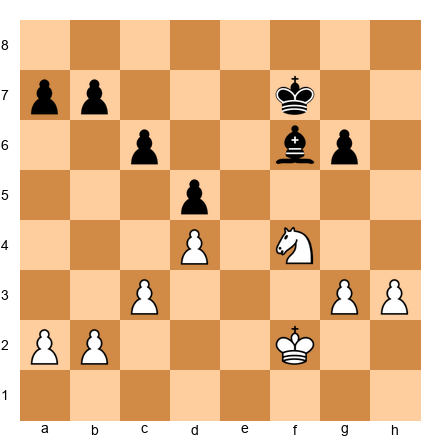</p>


White has a knight on f4 against Black's bishop on f6. The pawns are on both wings. In general, the bishop would be better here. But look at the pawn structure: all of Black's pawns are on dark squares, restricting the bishop. The knight can hop to e6, d3, or h5, reaching every weakness. In this specific position, the knight is equal or better.

**Same-colored bishop endgames:** These are often decisive despite the reputation of opposite-colored bishops as "drawing weapons." With same-colored bishops, the better bishop wins. The side with the more active bishop and better pawn placement will dominate the squares the bishop does not control.

### The Outside Passed Pawn

In king-and-pawn endgames and some rook endgames, an outside passed pawn wins by diverting the opponent's king. While the opponent's king chases the passed pawn, your king invades on the opposite wing and captures pawns.

Set up your board:

<p align="center">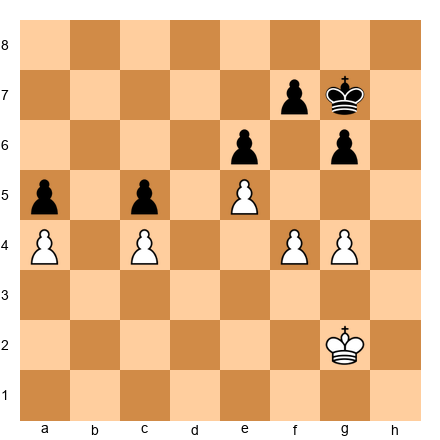</p>


White has pawns on a4, c4, e5, f4, g4. Black has pawns on a5, c5, e6, f7, g6. White's f4-g4 duo creates a potential outside passed pawn after f5. If White plays f5, either gxf5 gxf5 creates a passed f-pawn (outside) or exf5 gxf5 creates the same. Black's king must chase the f-pawn while White's king invades through the center.

### Opposite-Colored Bishop Middlegames

A common misconception: opposite-colored bishops always draw. In the endgame with no other pieces, this is often true. In the middlegame, opposite-colored bishops actually *favor the attacker.*

Why? Because the defender's bishop cannot contest the squares the attacker's bishop controls. If White has a light-squared bishop and attacks on the dark squares, Black's dark-squared bishop is powerless to defend those squares.

Set up your board:

<p align="center">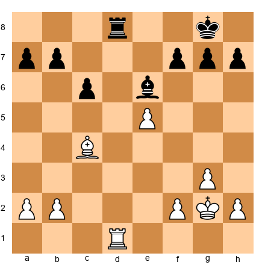</p>


White has a light-squared bishop on c4. Black has a dark-squared bishop on e6. White controls the d-file and has an advanced e5 pawn. Black's kingside pawns sit on dark squares (f7, g7, h7), which means they are safe from White's bishop but also block Black's bishop from defending the kingside.

White's plan is clear: double rooks (if possible) or bring the king into the attack. The light-squared bishop targets f7, and Black's dark-squared bishop cannot help. This is why opposite-colored bishops in middlegames are so dangerous for the attacker - the defender has a bishop that is functionally absent from the critical sector.

### The Technique of "Do Not Hurry"

One of the most valuable lessons for converting advantages comes from studying Karpov's games. Karpov rarely rushed. When he had an advantage, he improved every piece to its best possible square before committing to any action. He moved his king to safety. He doubled rooks on the right file. He fixed his pawn structure. Only when his position was as good as it could possibly get did he force the issue.

This method works because it puts maximum pressure on the defender before the critical moment arrives. By the time you finally act, your opponent has already used their best defensive resources just trying to survive the slow buildup. They have nothing left when the real blow comes.

**The practice version:** When you have an advantage, ask yourself: "Can I improve any piece?" If yes, improve it. Ask again. Keep improving until the answer is no. Only then look for a forcing continuation.

---

## 43.8 Common Conversion Errors at 2200

These are the mistakes that cost you games. Not tactical blunders - those happen at every level. These are *conversion-specific* errors that strong players make when they have an advantage and fail to bring it home.

### Error 1: Rushing

You see that you are better. You want to finish the game quickly. So you force a decision - push a pawn, sacrifice material, or start an attack that is not fully prepared.

Rushing turns a +1.0 advantage into a +0.3 advantage, or worse. The reason is simple: forcing sequences simplify the position, and simplification eliminates many of the small advantages you accumulated. Unless the forcing sequence leads to a concrete win, it is usually wrong.

**The cure:** before making a forcing move, ask: "Can I improve my position without forcing anything?" If the answer is yes, improve first. Force later.

### Error 2: Wrong Exchanges

This is the most common error at your level. You trade pieces because the opportunity arises, not because the trade helps you. Every trade changes the character of the position. Some trades help you. Some help your opponent.

**The test:** after the trade, is my advantage preserved, increased, or reduced? If you cannot answer this question before making the trade, do not make the trade.

### Error 3: Over-Complicating

You have a quiet positional advantage. Your opponent is suffering. And then you play a "creative" move that introduces tactical complications. Your opponent - who was suffering in the quiet position - suddenly perks up. Complications are their chance to escape.

**The rule:** when you are better in a quiet position, keep it quiet. Your opponent wants complications because complications create chances for counterplay. Deny them that.

### Error 4: Allowing Counterplay

This is the deadliest error. You are focused on your own plan - advancing your passed pawn, improving your pieces, preparing an attack - and you forget that your opponent is also playing chess. They find an active move. Suddenly you are defending. The initiative swings. Your advantage is gone.

**The cure:** prophylaxis. Before every move in a winning position, ask: "What is my opponent's best response?" If their best response creates counterplay, find a way to prevent it before executing your plan.

### Error 5: Clock Mismanagement

Many conversion failures happen not because of a chess mistake but because of a time mistake. You spend too long in the middlegame, arrive in a winning endgame with two minutes on the clock, and blunder.

**The rule:** when you reach a clearly winning position, speed up. Not in your play - in your decision-making. The moves are often simpler in winning positions. Trust your technique and save your time for any complications that arise.

---

## 43.9 The Middlegame-to-Endgame Transition

The transition from middlegame to endgame is one of the most powerful conversion tools available to you. Many advantages that are hard to convert in the middlegame become easy to convert once the queens come off and the endgame begins.

### When to Transition

**Transition when your advantage is structural.** If you have a better pawn structure - a passed pawn, a pawn majority, weak enemy pawns - the endgame amplifies these advantages. With queens on the board, pawn weaknesses can be disguised by tactical threats. Without queens, they are exposed.

**Transition when your pieces are better coordinated.** If your rooks are on open files and your minor pieces are on strong squares, an endgame magnifies this advantage. The opponent cannot hide behind tactical tricks; they must deal with the permanent realities of the position.

**Do not transition when your advantage is an attack.** If you have a dangerous attack on the enemy king, trading queens kills the attack. Only transition if the resulting endgame is *more* advantageous than the middlegame position you already hold.

### How to Transition

Set up your board:

<p align="center">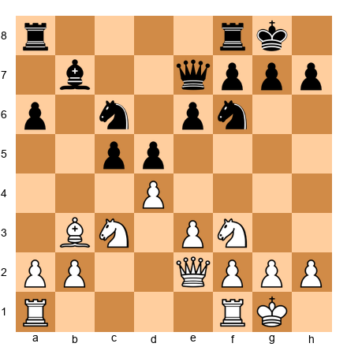</p>


White has a slight edge - better center, more space, active bishop on b3. If White plays Qd3 or Qe1 and continues the middlegame, the advantage is small but real. But watch what happens with the queen trade.

After dxc5 Qxe2 Nxe2, the queens are off. Now White has: better bishop (b3 vs b7 on a blocked diagonal), a passed c5 pawn, and better knight placement options. The advantage that was +0.3 in the middlegame is now +0.7 in the endgame.

The transition did not create an advantage. It *amplified* one that already existed.

### What to Keep, What to Trade

In the transition, you choose which pieces leave the board and which stay. This choice is as important as the decision to transition itself.

**Keep rooks when you have open files or a passed pawn.** Rooks and passed pawns are a winning combination. If you can support your passed pawn with a rook from behind, keep the rooks on.

**Keep bishops when the position is open.** Bishops shine in open positions with pawns on both wings. If the endgame will be open, keep your bishop.

**Trade knights when you have a bishop.** The bishop-versus-knight endgame with pawns on both wings usually favors the bishop. If you can trade knights off, the resulting endgame often gives the bishop side a lasting advantage.

**Trade the opponent's best piece.** If one of the opponent's pieces is holding the position together - a knight on a central outpost, a rook on an open file - target that piece for exchange.

---

## 43.10 Prophylaxis During Conversion

In Chapter 42, you learned about prophylaxis as a defensive tool. Now consider it from the other side: prophylaxis as a *conversion* tool. When you are converting an advantage, your opponent's main hope is counterplay. If you deny them counterplay - proactively, before it appears - the conversion becomes smooth.

### The Principle: "Lock the Back Door First"

Before pushing your passed pawn, before starting your attack, before beginning your plan - look at what your opponent wants to do. Then stop it.

Set up your board:

<p align="center">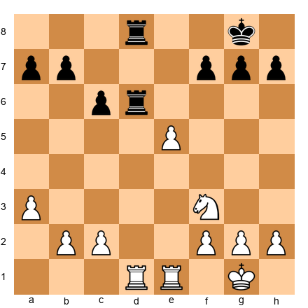</p>


White has a passed e5 pawn. The natural move is e6, advancing the pawn. But look at Black's rooks: they are on d8 and d6, ready to double on the d-file or swing to the e-file. If White plays e6 immediately, Black responds with ...Rd2, invading the second rank, and suddenly White is defending despite the passed pawn.

The prophylactic approach: first play Rd4, contesting the d-file and preventing the invasion. After Rd4, if Black trades rooks, the resulting single-rook endgame with the e5 pawn is clearly winning. If Black retreats, White proceeds with Re4 and then e6 from a position of safety.

**Lock the back door first. Then advance.**

### Prophylactic Moves During Conversion

1. **The quiet king move.** Moving your king to a safer square before beginning an active plan prevents back-rank tricks.

2. **The defensive pawn push.** Playing h3 or a3 before starting a queenside attack prevents annoying knight jumps or bishop pins.

3. **The piece rearrangement.** Moving a rook to a defensive file before transferring another piece to the attack ensures you are not caught off-guard.

4. **The exchange offer.** Offering to trade a piece that is enabling the opponent's counterplay - even if it means a slightly less "optimal" position - can kill all resistance.

These moves do not advance your plan directly. But they remove the opponent's options, and in a winning position, *removing the opponent's options is progress.*

---

## 43.11 The Clock as a Conversion Tool

At 2200, many won games are lost in time trouble. You have a winning position. You know the correct plan. But you have three minutes left, and your opponent has fifteen. The pressure reverses. You start making quick moves, hoping the advantage is large enough to survive sloppy play. Sometimes it is. Often it is not.

Time management during conversion is a separate skill from time management during the middlegame. Here are the principles.

### Play Simply When Ahead on Position, Behind on Clock

When you have a material or positional advantage but less time, simplify. Trade pieces. Head for an endgame where the winning technique is mechanical. Do not pursue the "most accurate" path - pursue the *clearest* path.

A rook endgame up a pawn might be technically harder than a queen endgame up a pawn. But the rook endgame has fewer pieces, fewer possible moves per position, and fewer opportunities for your opponent to create tricks. In time trouble, fewer options means fewer mistakes.

### Use Your Opponent's Clock

When you are winning and have adequate time, do not rush. Let your opponent think. Every minute they spend trying to find a saving resource is a minute that drains their clock without changing the evaluation. When they are low on time, they will start making mistakes. Those mistakes make conversion easier.

This is not gamesmanship. This is practical chess. If the position is winning and you have time, use it.

### The Increment Rule

In games with increment (the standard in modern classical chess), you always have at least 30 seconds per move. This changes conversion strategy. With increment, you can play long endgames without fear of flagging. Use this. Do not rush to finish the game in three moves when you can convert slowly over twenty moves, each played with the security of the increment.

Without increment, conversion speed matters. Simplify ruthlessly. Every piece trade reduces the complexity and makes your position easier to play with limited time.

### Practical Exercise

In your next tournament game, note the clock times whenever you reach a winning position. How much time did you have? How much did your opponent have? Did the time ratio affect your decisions? Write this down in your post-game analysis. Over time, you will see patterns in how time pressure affects your conversion rate.

---

## 43.12 The Conversion Checklist

When you realize you have an advantage, the first thing most 2200 players do is start looking for a winning combination. This is often a mistake. Before you search for the kill, you need to understand what you have. A five-step mental checklist will keep your conversion on track and prevent you from rushing into errors.

### Step 1: Name the Advantage

Before you can convert an advantage, you need to know what it is. There are four main types:

- **Material advantage.** You have more pieces or pawns.
- **Structural advantage.** Your opponent has weak pawns, isolated pawns, or a compromised king position.
- **Activity advantage.** Your pieces are on better squares, have more mobility, or coordinate better.
- **King safety advantage.** Your king is safer and your opponent's king is exposed.

Most advantages are combinations of these. You might be equal in material but have a structural advantage (a better pawn structure) and an activity advantage (your pieces are more coordinated). Name all the components. The more specific you are, the better your plan will be.

### Step 2: Is It Permanent or Temporary?

This is the most important question in conversion.

A **permanent** advantage does not go away with time. A better pawn structure is permanent - your opponent cannot undo doubled pawns or an isolated pawn. A material advantage is permanent (assuming you do not blunder it back). When your advantage is permanent, there is no rush. You can improve your position slowly, trade pieces when favorable, and grind.

A **temporary** advantage disappears if you do not act. An activity advantage can vanish if your opponent has time to regroup. A king safety advantage evaporates if the opponent manages to castle or reposition their king. When your advantage is temporary, you must act fast. Find the most forcing continuation and press your edge before it disappears.

### Step 3: What Does Your Opponent Want?

This is prophylaxis during conversion. Before you execute your own plan, take 30 seconds to ask: "If I gave my opponent a free move, what would they play?" Then deny it.

If your opponent wants to trade queens, keep the queens on. If they want to play ...f5 to free their position, prevent it with g4 or a piece on f5. If they want to reach an endgame where your extra pawn does not matter, avoid that endgame. Denying your opponent's best idea is often more effective than pursuing your own.

### Step 4: What Is the Simplest Path?

At 2200, you can calculate complex lines. But complexity is the enemy of conversion. Every complication gives your opponent a chance to find a saving resource. The simplest path - the one with the fewest branches, the fewest tactical risks, and the clearest end point - is almost always the correct one.

If you can trade queens and reach a winning endgame, do it. If you can trade a pair of rooks and simplify to a position where your extra pawn decides the game, do it. Do not look for the most brilliant continuation. Look for the most boring one. Boring wins are still wins.

### Step 5: What Could Go Wrong?

Before you commit to your conversion plan, spend one minute looking for counterplay. Can your opponent sacrifice a piece for a dangerous attack? Can they reach a fortress? Can they create a passed pawn that distracts you from your own plans?

If you find a real threat, address it first. If you find no threats, execute your plan with confidence. This final check prevents the most common conversion failure: walking into a trap because you were so focused on your own advantage that you forgot your opponent is still playing chess.

### Worked Example: The Checklist in Action

Set up your board:

<p align="center">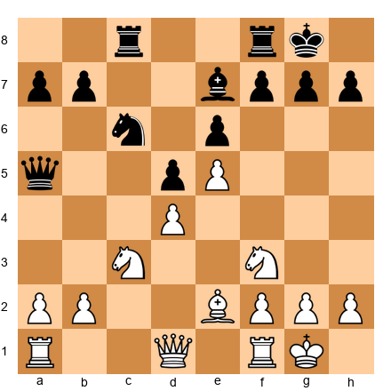</p>


**Step 1: Name the advantage.** White has a space advantage (pawn on e5 cramps Black's position), an activity advantage (the knight on f3 can go to g5 or d2-f1-g3-f5), and Black's queen on a5 is far from the kingside. No material advantage.

**Step 2: Permanent or temporary?** The space advantage is semi-permanent - Black cannot easily challenge e5 without concessions. The activity advantage is temporary - Black can regroup with moves like ...Bd8, ...Ne7, ...Ng6 to rearrange pieces. White should act before Black reorganizes.

**Step 3: What does Black want?** Black wants to play ...Ne7 to reroute the knight to f5 or g6, challenging the e5 pawn and freeing the position. Black also wants to play ...Bd8-b6 to put pressure on d4.

**Step 4: Simplest path.** White should prevent ...Ne7 (perhaps Qd3 or Bd3 aiming at h7) and look for a kingside buildup. The plan is Qd3, Bd1-c2, and Ng5 - simple, direct, and hard to meet.

**Step 5: What could go wrong?** Black's queen on a5 could create counterplay on the a-file or target a2. White should make sure a2 is not hanging before committing to the kingside plan. A quick a3 or Bd2 might be necessary first.

With the checklist complete, White has a clear plan and has accounted for Black's counterplay. This is conversion done right.

---

## 43.13 When NOT to Convert

There is a common belief that as soon as you have an advantage, you should simplify and convert it into a win. This is usually correct - but not always. Sometimes the best strategy is to maintain the advantage without converting it, keeping the pressure at its maximum level.

### When Premature Simplification Throws Away the Win

You are better in a complex middlegame. Your pieces are more active, your opponent is cramped, and you have multiple threats. Then you see a chance to trade queens and reach an endgame where you are up a pawn. You do it. And suddenly, the game is much harder than it was before.

Why? Because in the middlegame, your advantage was based on activity and pressure. Those advantages disappear when pieces come off the board. Your extra pawn might be doubled, or blockaded, or on the wrong side of the board. The endgame might be technically drawn despite the material deficit.

Before simplifying, ask yourself: "Is my advantage bigger now, or will it be bigger after the trades?" If the answer is now, keep the pieces on. The advantage you have is at its peak. Converting it into a smaller, different advantage is often a step backward.

### Keeping the Tension When Your Pieces Are More Active

When your pieces are more active than your opponent's, every piece trade reduces your advantage. If you have a knight on d5 and your opponent has a knight on b8, trading knights gives your opponent relief. Your d5-knight was worth more than their b8-knight. The trade equalizes something that was unequal in your favor.

The general rule: when you have the more active pieces, avoid trades unless the resulting position gives you a new, concrete advantage. Keep the pressure on. Your opponent will suffer as long as the active pieces stay on the board. Force them to make concessions - weakening a pawn, giving up a key square, misplacing a piece - before you simplify.

### The Prophylactic Check Before Converting

Before executing any conversion plan, perform a prophylactic check: ask yourself, "What is the worst thing my opponent can do while I am converting?" This is different from asking what their best move is. You are specifically looking for disruptive possibilities - sacrifices, counterattacks, tactical tricks, or stalemate resources.

Many games are thrown away because a player focuses entirely on their own conversion plan without noticing that the opponent has a last-ditch resource. You have seen the classic pattern: a player is two pawns up, carefully advancing their passed pawns, and then the opponent sacrifices a piece for two of the pawns and reaches a drawn position. The player with the advantage did everything right in their own plan. They just forgot to check what the opponent could do.

The prophylactic check takes 30 seconds. Before each conversion move, ask: "Does my opponent have any checks? Any captures that change the game? Any stalemate tricks? Any way to activate their pieces suddenly?" If the answer to all four is no, proceed with your plan. If any answer is yes, deal with the threat first.

This habit is simple but transformative. The players who convert most reliably are not the ones who calculate the longest or know the most theory. They are the ones who never forget to look at the position from the opponent's perspective before making their next move.

### When Your Opponent Is in Time Trouble

If your opponent has five minutes left and you have twenty, the last thing you want to do is simplify to a position with three pieces on the board. In a simple position, even a time-scrambled player can find the right moves. In a complex position, they cannot.

Keep pieces on the board. Create threats that require calculation. Force your opponent to find precise defensive moves under time pressure. Even if your advantage is small, the complexity of the position multiplies its practical value because your opponent does not have time to think clearly.

This is not about playing tricky moves or setting traps. It is about maintaining a level of complexity that favors the player with more time. If you simplify into a drawn rook endgame, your opponent will hold it in 30 seconds per move. If you keep the queens and minor pieces on, they will crack under the pressure of finding accurate moves with no time to think.

### The Bottom Line

Conversion is not always about simplifying. It is about choosing the path that maximizes your winning chances. Sometimes that means trading pieces. Sometimes it means keeping them. The decision depends on the specific position, the clock situation, and the type of advantage you hold. The player who always simplifies will win many games. The player who knows when not to simplify will win more.

---

## 43.14 Converting Material Advantages

Different types of material advantages require different conversion techniques. An extra pawn is not the same as an extra exchange, which is not the same as an extra piece. Understanding the specific conversion method for each type of advantage will save you time, reduce errors, and win more games.

### Extra Pawn: When It Wins and When It Draws

An extra pawn is the most common material advantage in chess, and it is also the most frequently mishandled. Many players assume that an extra pawn should be winning and then play carelessly, only to discover that the game ends in a draw. Others have the opposite problem - they assume an extra pawn is "nothing" and fail to convert positions that should be won.

The truth is somewhere in the middle. Whether an extra pawn wins depends less on the pawn itself and more on the surrounding pawn structure and piece activity.

**When the extra pawn wins.** A healthy extra pawn on the queenside with a passed pawn potential is usually winning. An extra pawn that creates an outside passed pawn in an endgame is very strong because it forces the opponent's king to chase the pawn, leaving the rest of the board undefended. An extra pawn in a position where you can trade down to a winning king and pawn endgame is decisive.

Set up your board:


<p align="center">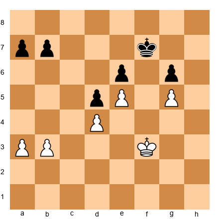</p>


White has an extra pawn (four pawns vs. three on the queenside). The winning plan is clear: advance the a-pawn and b-pawn to create a passed pawn. Black's king must stay near the kingside to prevent White's king from invading via e4. Once White creates a passed pawn on the a-file, Black's king cannot cover both sides of the board.

**When the extra pawn draws.** Doubled pawns, an isolated extra pawn that is easily blockaded, or an extra pawn in positions where the opponent has active pieces and counterplay - these often lead to draws. If your extra pawn is doubled or tripled, it may be functionally useless. If the pawn is blockaded by the opponent's king and you cannot make progress elsewhere, the advantage evaporates.

The most important question when you have an extra pawn is: "Can I create a passed pawn?" If yes, you are likely winning. If no, the position may be drawn. Before committing to a conversion plan, figure out where your passed pawn will come from.

### Exchange Advantage: Rook vs. Minor Piece

Having a rook against a minor piece (bishop or knight) is called "the exchange." It is worth roughly two pawns in material terms, but its actual value depends heavily on the position.

Set up your board:


<p align="center">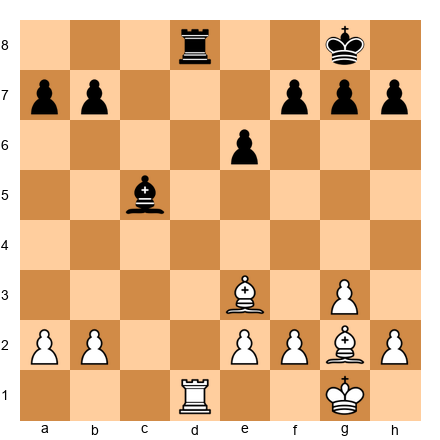</p>


In this position, White has a rook on d1 while Black has a bishop on c5 and a rook on d8. If we remove both rooks and leave White with rook vs. bishop (with pawns), the exchange advantage would be significant. But in this actual position, with rooks still on the board, the exchange advantage is less clear because Black's bishop is active and well-placed.

**Converting the exchange advantage.** The key is to use open files and the seventh rank. A rook on the seventh rank attacking pawns is enormously powerful. The general technique is: (1) trade the opponent's remaining rook if possible, (2) place your rook on the seventh rank, (3) attack the opponent's pawns from behind while advancing your own king, (4) create a passed pawn.

When you have rook vs. bishop, the rook is stronger in open positions and weaker in closed positions. If the position is closed, the minor piece can be nearly as strong as the rook because there are no open files. Open the position to maximize your rook's power.

When you have rook vs. knight, the rook dominates in endgames because the knight is slow. A rook can control an entire file or rank from one square; a knight needs multiple moves to cover the same distance. The technique is to create threats on both sides of the board, forcing the knight to move back and forth while your rook and king make progress.

### Extra Piece: Usually Winning, but Beware

Being a full piece up (bishop or knight for nothing) is almost always winning. The extra piece provides enough firepower to overwhelm the opponent's defenses. However, there are two specific dangers that can turn a won position into a disaster.

Set up your board:


<p align="center">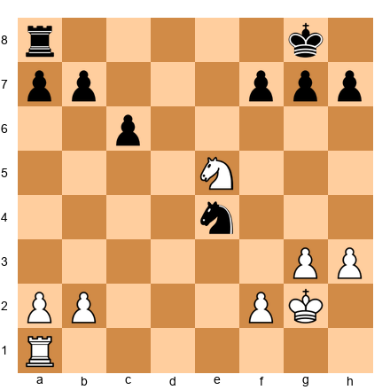</p>


**Danger 1: Stalemate traps.** When you are a piece up and trading down to a won endgame, watch for stalemate. This is especially common in queen endgames and when the opponent's king is trapped in a corner. Before capturing the opponent's last piece, check: if I take this piece, does my opponent have any legal moves? If not, it is stalemate and the game is a draw despite your extra piece.

The prevention is simple: before making the final capture, give the opponent's king a square to move to. This might mean playing a quiet move first (like advancing a pawn to give the king room) before delivering the final blow.

**Danger 2: Perpetual checks.** If the opponent has a queen or an active rook, they may be able to give perpetual check to your king, forcing a draw. A piece advantage means nothing if your king cannot escape the checks.

The prevention: when you are a piece up, prioritize king safety. Tuck your king into a corner where it is sheltered, or trade queens to eliminate the perpetual check possibility. Do not get greedy trying to win more material when you are already a piece up. Convert what you have.

**Danger 3: The wrong exchanges.** When you are a piece up, you want to trade pieces - but not all trades are equal. Trading your extra piece for one of your opponent's pieces eliminates your advantage. This sounds obvious, but in the heat of a game, it happens more often than you would think.

The rule: trade the pieces that are NOT your extra piece. If you have two knights and your opponent has one, trade one knight for the opponent's only knight - now you have an extra knight with no opposing minor piece to challenge it. Do not trade both knights and reach a position where your extra piece has vanished.

Also beware of "phantom trades" where you think you are simplifying but actually reach a position where your material advantage is less clear. For example, trading your extra bishop for two pawns might look like simplification, but it transforms "bishop ahead" into "bishop vs. two pawns" - a very different type of position that may not be winning at all.

### The General Conversion Framework for Material Advantages

Regardless of the type of material advantage, the conversion process follows a consistent pattern:

Step 1: Stabilize the position. Make sure there are no immediate tactics that could change the material balance.

Step 2: Improve your pieces. Before pushing for a win, make sure all your pieces are on their best squares.

Step 3: Create a passed pawn. In almost every material-up endgame, a passed pawn is your primary winning weapon.

Step 4: Advance the passed pawn with support. Use your king, rook, or extra piece to escort the pawn down the board.

Step 5: Promote or win more material. The passed pawn either promotes to a queen or forces the opponent to sacrifice material to stop it, increasing your advantage further.

This framework applies whether you are up a pawn, an exchange, or a piece. The details change, but the structure remains the same. Learn the framework, practice it in each type of position, and you will convert your advantages reliably.

---

## 43.15 The Zugzwang Weapon in Conversion

In endgames with limited material, zugzwang is one of the most powerful conversion tools available. Zugzwang occurs when the side to move has no good moves - every legal move worsens their position. If you can put your opponent in zugzwang, they effectively beat themselves.

### Recognizing Zugzwang Potential

Zugzwang is most common in positions where: (1) pieces are limited (usually kings and pawns, sometimes with one minor piece each), (2) the pawn structure is mostly fixed (neither side can easily change the structure), and (3) maneuvering room is limited (one side's pieces have few squares available).

Set up your board:


<p align="center">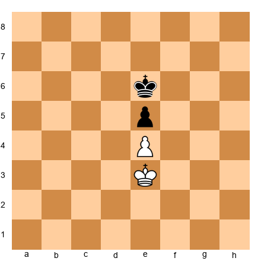</p>


This is the simplest example of a king and pawn endgame where zugzwang decides everything. With White to move, the game is drawn. Why? Because White must move the king, and any king move either abandons the e4 pawn or steps away from blocking Black's king.

If White plays Kf3, Black plays Kd5 and wins the e4 pawn. If White plays Kd3, Black plays Kf5 and wins the e4 pawn. If White plays Ke2, Black plays Ke5 (or Kd5 or Kf5) and invades.

But with Black to move from the same position, it is also drawn - Black faces the same problem. Ke6 allows White to invade with Kd4 or Kf4. Kd6 allows Kf4. Kf6 allows Kd4. The position is mutually drawn because whoever has the move is in zugzwang.

This demonstrates the fundamental nature of zugzwang: it is about the obligation to move. In most chess positions, having the move is an advantage. In zugzwang, it is a curse.

### The Triangle Technique

One of the most elegant zugzwang weapons is the "triangle" technique - also called "triangulation." This is a method for losing a tempo with your king, effectively passing the move to your opponent and putting them in zugzwang.

Set up your board:


<p align="center">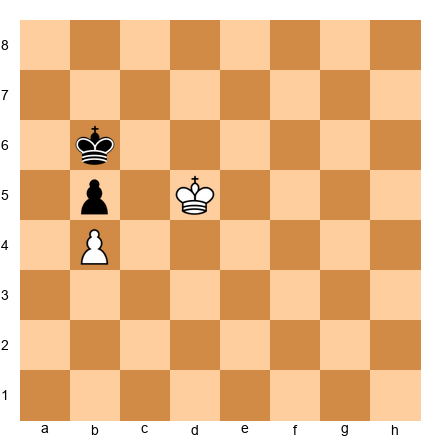</p>


In this position, the pawns are locked: White has a pawn on b4 and Black has a pawn on b5. Neither pawn can advance. The question is whether White's king can outflank Black's king and win the b5 pawn.

If White plays Kc5, Black plays Ka6 and holds the pawn. If White plays Kd6, Black plays Kb7 and holds. The direct approach does not work.

The triangle technique works like this. White plays Ke5 (moving away from the action temporarily). Now Black must respond. If Black plays Ka6, White plays Kd6, and now Black is in trouble - Kb7 is met by Kc5, winning the b5 pawn. If Black plays Kc7, White plays Ke6, threatening to invade on either side.

The key insight is that White's king has three squares available (d5, e5, d6 or similar) while Black's king has only two (b6 and a6, or b6 and c7). Because White can triangulate with three squares and Black can only move between two, White can always "lose a tempo" and put Black in zugzwang.

### Applying Zugzwang in Practice

Recognizing zugzwang potential requires asking a simple question: "If it were my opponent's move instead of mine, would I be winning?" If the answer is yes, look for a way to lose a tempo and hand the move to your opponent.

Common tempo-losing techniques include: king triangulation (as shown above), moving a rook back and forth on a file where your opponent cannot do the same, and waiting moves with pieces that do not change the essential character of the position.

Zugzwang is most common in king and pawn endgames, but it also appears in bishop endgames (where one side's bishop is restricted), knight endgames (where the knight is tied to defensive duties), and even rook endgames (though less frequently because rooks have more mobility).

The best way to develop your zugzwang sense is to study king and pawn endgames thoroughly. Every king and pawn endgame is ultimately decided by one of three factors: pawn structure, king activity, or zugzwang. When you understand all three, you will convert your endgame advantages with confidence.

### A Practical Exercise

Take the position from the triangle example above and practice both sides against a training partner or an engine set to a low depth. As White, try to win the b5 pawn using the triangle technique. As Black, try to hold the draw by staying close to the pawn.

Then try a similar exercise with different pawn structures. Place pawns on c4 and c5, or d4 and d5, and experiment with king maneuvers. The more you practice these positions, the more naturally you will recognize zugzwang potential in your tournament games.

---

## Annotated Games

### Game 1: Capablanca – Bogoljubow, New York 1924

**Theme: Material Advantage → Simplified Endgame**

José Raúl Capablanca's technique in converting advantages is still the gold standard a century later. His play was so clean, so logical, so free of wasted motion, that Réti called him "the chess machine." This game shows why.

Set up your board:

<p align="center">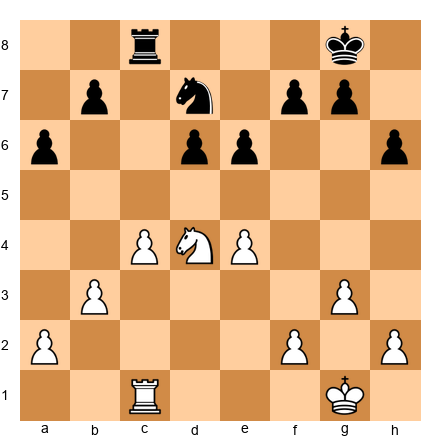</p>


Capablanca has a knight on d4 and a rook on c1 against Bogoljubow's knight on d7 and rook on c8. Material is equal. But Capablanca's position is superior for three reasons: the d4-knight is dominant, Black's d7-knight is passive, and Black's pawns on d6 and e6 are potential targets.

24.f4! Capablanca gains space on the kingside and supports the e4 pawn while restricting Black's knight from reaching e5 (where it would become active). This is not an attack - it is restriction.

24...Kf8 25.Kf2 Ke7 26.Ke3

Capablanca centralizes his king before doing anything else. He does not rush. He does not push pawns. He brings his strongest piece - the king - to the center of the board.


<p align="center">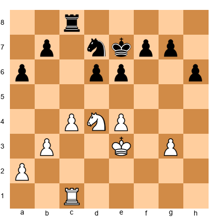</p>


26...Kd8 27.Rc2 Rc7 28.b4

Now Capablanca expands on the queenside. He has improved his king and secured the center. The next step is to create pressure on the other wing - the principle of two weaknesses in action.

28...Nb8 29.a4 Nc6

Bogoljubow tries to activate his knight, but the trade 30.Nxc6+ bxc6 leaves Black with a weak, isolated c6 pawn - a permanent target.


<p align="center">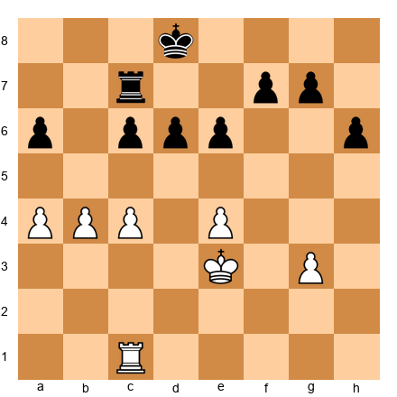</p>


After the knight trade, Capablanca has exactly what he wanted: a rook endgame where his rook and king can attack Black's fixed weaknesses. The a6 and c6 pawns are targets. The d6 pawn is backward. Black's rook must defend everything.

Capablanca won by gradually improving his position, switching between attacking the queenside and the center, and eventually winning a pawn. The game is a textbook on converting a positional advantage through patience and precision.

**What this game teaches:** do not rush. Improve your king, restrict the opponent's pieces, and create targets on both wings. The win comes from accumulation, not from a single blow.

---

### Game 2: Karpov – Unzicker, Nice Olympiad 1974

**Theme: Positional Advantage → Restriction → Slow Strangulation**

Anatoly Karpov's technique against Wolfgang Unzicker in 1974 is a clinic in the conversion method that bears his name: the Karpov squeeze.

Set up your board:

<p align="center">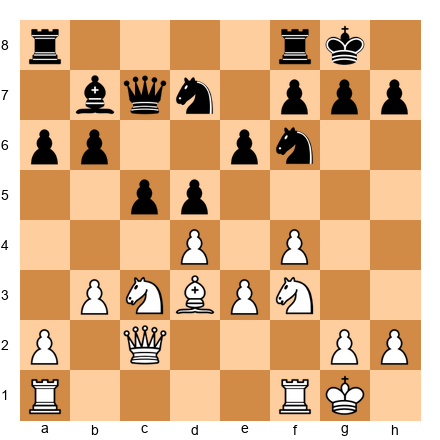</p>


Karpov has a typical edge in a Queen's Indian structure. More space in the center, the f4 pawn supporting e5 ambitions, and the bishop on d3 aiming at the kingside. But Black's position is solid. There is no weakness to target, no piece to attack.

13.Ne5! Karpov plants the knight on e5, the ideal outpost. From here, it controls d7, f7, c6, and g4 - four squares that matter for both attack and defense.

13...Ne4 14.Bxe4 dxe4


<p align="center">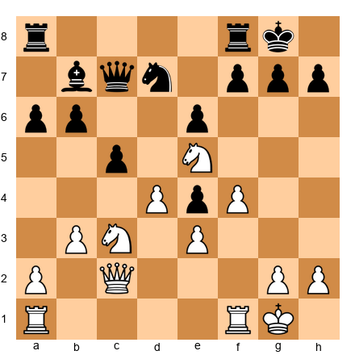</p>


Now the structure has changed. Black's e4 pawn looks like a strength - it is advanced and controls d3 and f3. But Karpov sees it as a weakness: it is isolated, hard to defend, and it blocks Black's own bishop on b7.

15.Nxd7 Qxd7 16.Qe2 Rfd8 17.a4

Karpov opens a second front. The a4 advance threatens a5, undermining the b6 pawn. Now Black must watch the a-file and the e4 pawn. Two weaknesses.


<p align="center">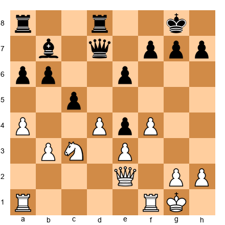</p>


Karpov continued to squeeze. He never forced anything. He improved his pieces one at a time - rook to a3, knight rerouted, king brought forward. Unzicker had no counterplay. Every move was a decision, and eventually, one of those decisions was the wrong one.

The game ended with Karpov winning a pawn and converting the resulting endgame with clean technique.

**What this game teaches:** restriction is a conversion method. If the opponent has no active plan, you can improve your position indefinitely. Eventually, the defense cracks - not from a brilliant sacrifice, but from the weight of sustained pressure.

---

### Game 3: Polgar, J. – Topalov, Dortmund 2004

**Theme: Initiative → Attack → Material Conversion (Women in Chess)**

Judit Polgar - the strongest female player in the history of chess, and one of the strongest players of any gender - showed throughout her career that she could match the world's best in both tactical brilliance and technical precision. This game demonstrates the latter.

Set up your board:

<p align="center">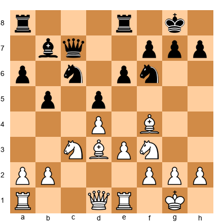</p>


Polgar has a standard IQP (isolated queen's pawn) position with White. The d4 pawn is isolated but provides space and piece activity. The bishop on f4 is active, the knight on f3 supports d4, and the bishop on d3 eyes the kingside.

12.Qe2 Bd6 13.Bxd6 Qxd6 14.Rad1

Polgar traded her dark-squared bishop, but she did it on her terms - she opened the position for her remaining pieces and ensured that Black's remaining pieces are slightly passive. The queen on d6 must defend d5 and watch the d-file.


<p align="center">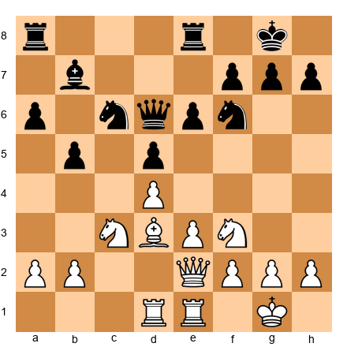</p>


14...Na5 15.Bb1 Nc4 16.Ne5

Polgar redirects her knight to the most aggressive square on the board. The knight on e5 threatens everything - f7, d7, c4.

16...Nxe5 17.dxe5 Qc5

Now Polgar has a passed e5 pawn and pressure on the kingside. Black's knight on f6 is kicked by e5, and the bishop on b7 has no targets.


<p align="center">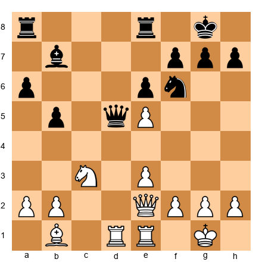</p>


18.Qf3 Nd7 19.Qg3

Polgar brings the queen to the kingside while maintaining pressure on d5. This is the transition: she is converting her initiative into a direct attack, and Black has no way to generate counterplay.

The attack did not win by force. What it did was win a pawn - the e6 pawn fell after sustained pressure. And then Polgar converted the extra pawn in the endgame with the precision that defined her career.

**What this game teaches:** conversion does not always mean "quiet technique." Sometimes the correct conversion is to press the initiative into an attack, win material, and *then* simplify. Polgar showed that the initiative itself is the advantage being converted - from dynamic energy into permanent material.

---

### Game 4: Kramnik – Leko, World Championship 2004, Game 14

**Theme: Converting Under Pressure - The Must-Win Situation**

Going into Game 14, the final game of their World Championship match, Vladimir Kramnik trailed Peter Leko by one point. He needed a win. With White. Against one of the most solid defenders in the world.

This is the ultimate test of conversion technique: not converting a large advantage in a quiet position, but *creating* an advantage in a must-win situation and then converting it under maximum pressure.

Set up your board:

<p align="center">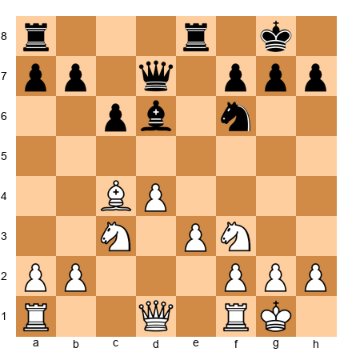</p>


Kramnik chose a sharp opening and steered toward a position with an isolated queen's pawn. This was a conscious choice - the IQP gave him piece activity and attacking chances, exactly what he needed in a must-win game.

12.Qe2 Nd5 13.Bxd5 exd5

Now the structure is fixed. White's d4 pawn is isolated, but it gives White a clear plan: piece activity and a kingside attack. Black will try to blockade and simplify. The game becomes a race between White's initiative and Black's defensive technique.


<p align="center">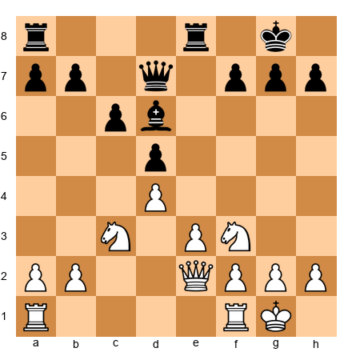</p>


14.Rad1 Qf5 15.Nd2 Rad8 16.f3

Kramnik prepares e4, the central break that will open lines for his pieces. This is slow, patient preparation - even in a must-win game, Kramnik did not rush.

16...Nd7 17.e4 dxe4 18.fxe4 Qh5


<p align="center">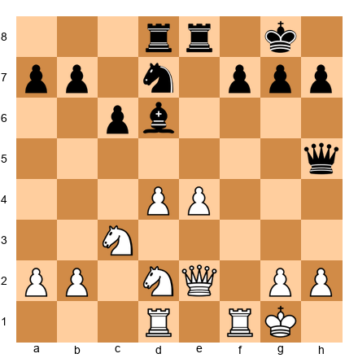</p>


The position has opened. White's central pawns on d4 and e4 are strong, and the pieces are flowing toward the kingside. Kramnik now had to convert this dynamic advantage into something concrete - and he did, with a series of accurate moves that increased the pressure until Leko cracked.

19.Nc4 Bb4 20.e5!

The break. The e-pawn surges forward, opening the position and cutting off Black's defensive coordination. The conversion from "initiative" to "attack" to "material" happened in a span of five moves.

Kramnik went on to win the game - and tie the match, retaining his title on tiebreak.

**What this game teaches:** conversion under pressure requires the same principles as conversion in calm positions: improve first, prepare fully, and strike only when the time is right. The must-win pressure changes the situation but not the method.

---

### Game 5: Carlsen – Nepomniachtchi, World Championship 2021, Game 6

**Theme: The Ultimate Conversion - 136 Moves of Precision**

This is the game that defined the 2021 World Championship. It lasted 136 moves - nearly eight hours of play. Carlsen held a slight advantage from the middlegame, nursed it through a rook endgame, and converted it with a combination of patience, technique, and relentless pressure.

Set up your board:

<p align="center">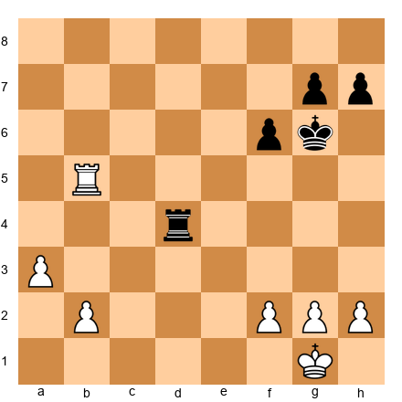</p>


Around move 40, the position reached this type of structure. White has a rook on the fifth rank, a passed a-pawn, and a slightly more active king position. Black's rook is active on d4, and the pawn structure is roughly equal.

At the club level, this might be assessed as "holdable for Black with precise play." At the World Championship level, with Carlsen pressing, "precise play" meant perfection over 90+ moves. And perfection over 90 moves is not humanly achievable.

Carlsen's method: advance the a-pawn one step. Improve the rook. Centralize the king. Wait for Nepomniachtchi to make a decision. Each decision carried a small risk. Over enough decisions, the risk materialized.


<p align="center">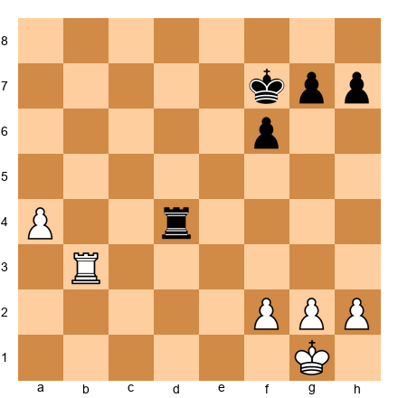</p>


By move 50, the a-pawn had advanced to a4. Carlsen's rook was active on the third rank. Black's rook was still on d4, trying to stop the pawn while staying active. The balance was precarious.

Then came the type of sequence that defines Carlsen's endgame play: a slow maneuver that forced Black to choose between two slightly inferior options. Neither option was losing by itself. But each choice narrowed Black's margin a little more.


<p align="center">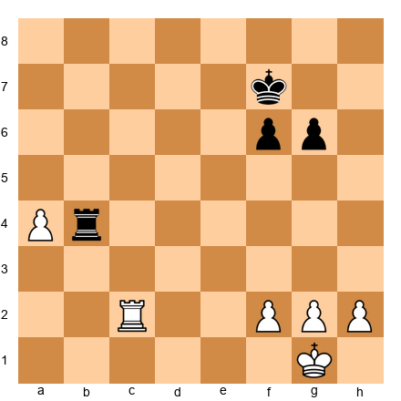</p>


By move 70, the advantage had grown. Black's rook was tied to the b-file, preventing the a-pawn's advance. White's rook was on c2, supporting the a-pawn and threatening to invade the seventh rank. The king was heading to the center.

The conversion took another 66 moves. Carlsen won a pawn, then another. The final position was a theoretically won king-and-pawn endgame.

**What this game teaches:** the Carlsen method is not about brilliance. It is about refusing to let an advantage go. If the position is +0.5, Carlsen does not accept a draw. He plays for +0.6. Then +0.7. Then +0.8. Each step is small. The accumulation is irresistible.

At your level, you will rarely need 136 moves. But the principle is the same: if you are better, do not let go. Keep pressing. Your opponent will make a mistake. They always do.

---

## Exercises

### ★★ Warmup Exercises

**Exercise 43.1** (★★)

<p align="center">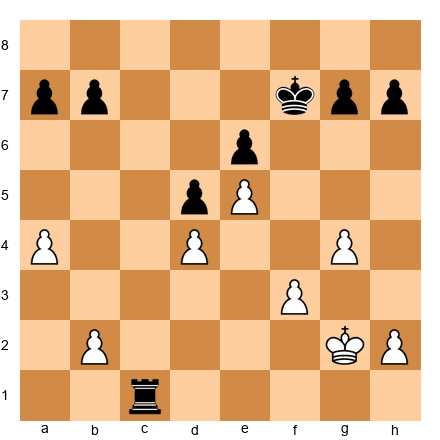</p>

Black to play. Black has an extra exchange (rook vs nothing). Find the simplest conversion plan.
*Hint: The rook belongs on the second rank. What does that accomplish?*
⏱ ~3 min

**Exercise 43.2** (★★)

<p align="center">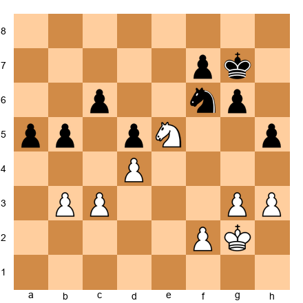</p>

White to play. White's knight on e5 is well-placed and Black's kingside pawns are weak. Find the move that fixes a second weakness.
*Hint: A pawn move that creates a target on the queenside.*
⏱ ~3 min

**Exercise 43.3** (★★)

<p align="center">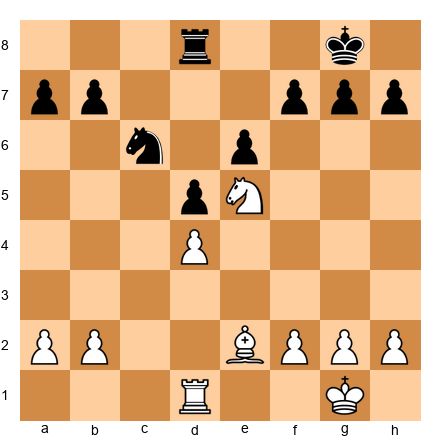</p>

White to play. White has a dominant knight on e5 and a rook on an open file. Find the exchange that simplifies to a winning endgame.
*Hint: Which piece is holding Black's position together?*
⏱ ~3 min

**Exercise 43.4** (★★)

<p align="center">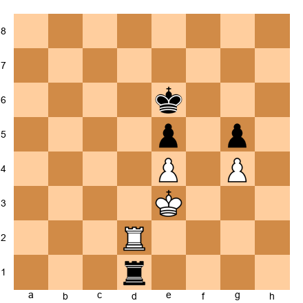</p>

White to play. Rook endgame with a locked pawn structure. How does White use the rook to create a winning position?
*Hint: The rook needs to get behind the opponent's weakness. Which file?*
⏱ ~3 min

**Exercise 43.5** (★★)

<p align="center">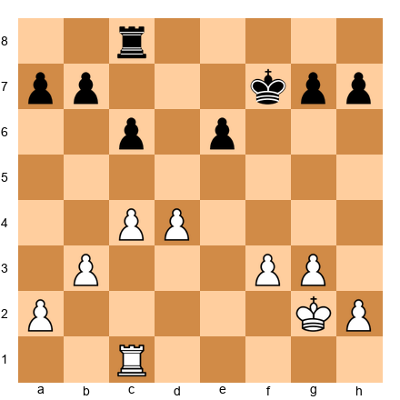</p>

White to play. White has a pawn majority on the queenside. What is the first step in converting it into a passed pawn?
*Hint: One pawn move starts the chain. Which one?*
⏱ ~3 min

**Exercise 43.6** (★★)

<p align="center">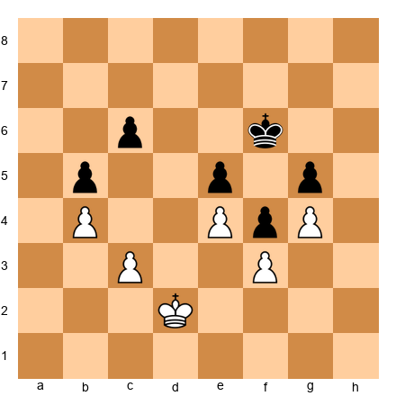</p>

White to play. King-and-pawn endgame. White is better but must find the right plan. Where should the king go?
*Hint: The king enters via the only open corridor. Which side?*
⏱ ~4 min

**Exercise 43.7** (★★)

<p align="center">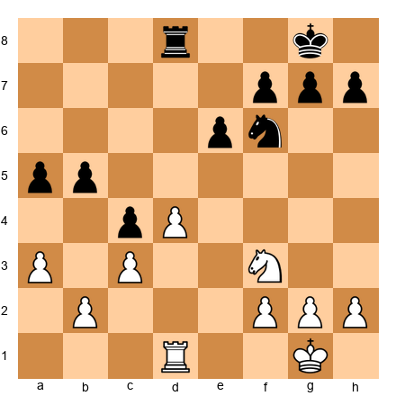</p>

White to play. White has a central pawn on d4 and Black has a weak c4 pawn. Find the winning plan.
*Hint: The knight wants to blockade. Which square?*
⏱ ~4 min

**Exercise 43.8** (★★)

<p align="center">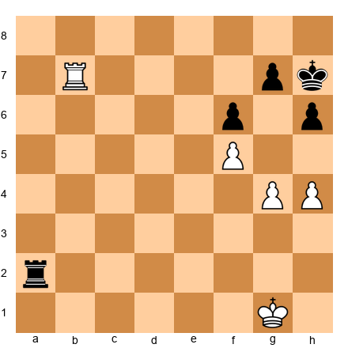</p>

White to play. White has a rook on the seventh rank and a passed f-pawn. Find the winning continuation.
*Hint: The rook on the seventh rank restricts the king. Now advance.*
⏱ ~3 min

---

### ★★★ Essential Exercises

**Exercise 43.9** (★★★)

<p align="center">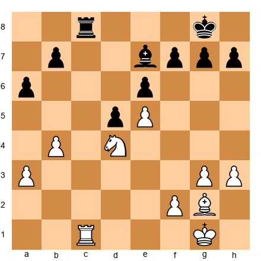</p>

White to play. White has a strong knight on d4 and the e5 pawn cramps Black's position. Find the plan that creates a second weakness.
*Hint: The b4 and a3 pawns are ready to advance. To where?*
⏱ ~5 min

**Exercise 43.10** (★★★)

<p align="center">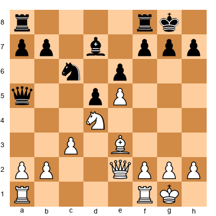</p>

White to play. White has more space and better piece coordination. Find the move that begins the conversion process.
*Hint: One piece is not contributing fully. Which piece, and where does it go?*
⏱ ~5 min

**Exercise 43.11** (★★★)

<p align="center">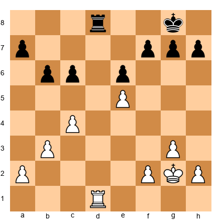</p>

White to play. White has a passed e5 pawn. What is the correct way to support it?
*Hint: The rook must support the pawn. But from where - in front or behind?*
⏱ ~5 min

**Exercise 43.12** (★★★)

<p align="center">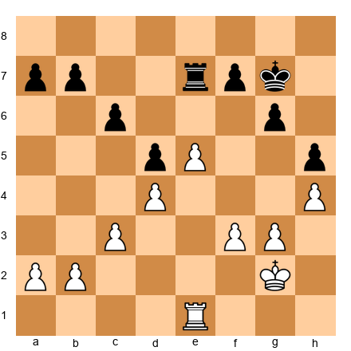</p>

White to play. White has a space advantage with e5 and d4. The kingside is locked. Find the plan.
*Hint: The breakthrough comes on the queenside. How does b4 work?*
⏱ ~5 min

**Exercise 43.13** (★★★)

<p align="center">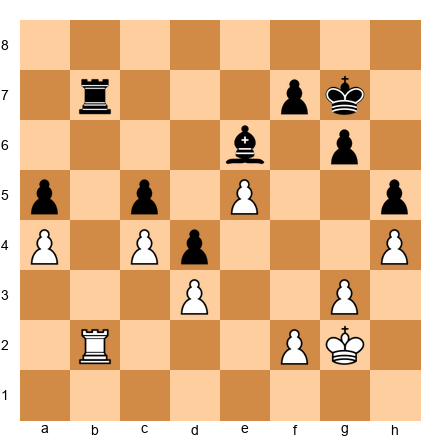</p>

White to play. White's e5 pawn is strong but Black's bishop on e6 blocks it. Find the maneuver that gets around the blockade.
*Hint: The rook can do what the pawn cannot - go around the bishop.*
⏱ ~7 min

**Exercise 43.14** (★★★)

<p align="center"></p>

White to play. White's pieces are slightly more active. Find the exchange that improves White's advantage.
*Hint: Which of Black's pieces is the best defender? Target it.*
⏱ ~5 min

**Exercise 43.15** (★★★)

<p align="center"></p>

White to play. Black's knight on e4 is well-placed. Should White trade it or leave it?
*Hint: What does the position look like after Nd2, challenging the knight?*
⏱ ~5 min

**Exercise 43.16** (★★★)

<p align="center"></p>

White to play. White has a central advantage. Which piece should be traded, and how?
*Hint: Black's d7-bishop is the only piece covering key light squares. Remove it.*
⏱ ~5 min

**Exercise 43.17** (★★★)

<p align="center"></p>

White to play. King-and-pawn endgame. White's king is slightly better placed. Find the winning plan.
*Hint: This is a two-weakness position. Fix the kingside, then penetrate on the queenside.*
⏱ ~7 min

**Exercise 43.18** (★★★)

<p align="center"></p>

White to play. White has an IQP on d4. Should White transition to the endgame with Qe7 or keep queens on?
*Hint: Assess the endgame after the queen trade. Is d4 a weakness or a strength?*
⏱ ~5 min

**Exercise 43.19** (★★★)

<p align="center"></p>

Black to play. Black's rook is active on e1. White's king is exposed. Find the winning technique.
*Hint: The rook on the first rank threatens invasion. Combine it with a king march.*
⏱ ~5 min

**Exercise 43.20** (★★★)

<p align="center"></p>

White to play. White has a knight on d4 and the e5 pawn is strong. Find the right plan.
*Hint: Switch the attack from one wing to the other. Which wing is weaker?*
⏱ ~5 min

**Exercise 43.21** (★★★)

<p align="center"></p>

White to play. White has two rooks against Black's rook and knight. How does White use the extra material?
*Hint: Rooks double on the seventh rank. But first, prepare.*
⏱ ~7 min

**Exercise 43.22** (★★★)

<p align="center"></p>

White to play. Same-colored bishop endgame. White's bishop is passive on d2. Find the correct activation plan.
*Hint: The bishop goes to c3, then the king invades. But which side?*
⏱ ~7 min

**Exercise 43.23** (★★★)

<p align="center"></p>

White to play. White has more space and a better bishop. Find the right conversion plan.
*Hint: The c5 pawn is a target after a well-timed b4.*
⏱ ~5 min

**Exercise 43.24** (★★★)

<p align="center"></p>

White to play. White has a slight advantage in piece activity. What is the correct simplification?
*Hint: Trading one pair of rooks clarifies the advantage. Which rook pair?*
⏱ ~5 min

**Exercise 43.25** (★★★)

<p align="center"></p>

White to play. King-and-pawn endgame. White has a fixed kingside and a queenside majority. Find the winning breakthrough.
*Hint: The king goes to the queenside, and the pawns break through with b4.*
⏱ ~7 min

---

### ★★★★ Practice Exercises

**Exercise 43.26** (★★★★)

<p align="center"></p>

White to play. White has a kingside pawn storm starting. How does White convert the space advantage into a concrete plan?
*Hint: The knight on d4 can reroute to f5. What does that achieve?*
⏱ ~7 min

**Exercise 43.27** (★★★★)

<p align="center"></p>

White to play. White has a strong center with d3-bishop and e4-f4 duo. Find the conversion that leads to a winning attack or endgame.
*Hint: e5 is the thematic break. Calculate the consequences.*
⏱ ~7 min

**Exercise 43.28** (★★★★)

<p align="center"></p>

White to play. White's knight on e5 dominates. Find the multi-move plan that wins a pawn.
*Hint: The knight moves, the rook invades. In which order?*
⏱ ~7 min

**Exercise 43.29** (★★★★)

<p align="center"></p>

White to play. White has a queenside pawn majority and two rooks on open files. Find the correct conversion technique.
*Hint: Exchange one pair of rooks, then push the queenside pawns.*
⏱ ~7 min

**Exercise 43.30** (★★★★)

<p align="center"></p>

White to play. White's bishop on f4 is slightly better than Black's bishop on b7. How does White amplify this advantage?
*Hint: Fix the e6 pawn as a target. Then probe on both wings.*
⏱ ~7 min

**Exercise 43.31** (★★★★)

<p align="center"></p>

White to play. King-and-pawn endgame. White has a slight structural advantage. Find the winning plan.
*Hint: The king goes to d3, then to c3 and b4. The a-file opens.*
⏱ ~7 min

**Exercise 43.32** (★★★★)

<p align="center"></p>

White to play. White has the bishop pair against bishop and knight. How does White open the position to make the bishops dominant?
*Hint: A pawn break in the center or on the wing opens lines for the bishops.*
⏱ ~7 min

**Exercise 43.33** (★★★★)

<p align="center"></p>

White to play. White's e5 pawn cramps Black. Find the move that prevents Black from freeing the position.
*Hint: Black wants to play ...Nd5. How do you stop it?*
⏱ ~5 min

**Exercise 43.34** (★★★★)

<p align="center"></p>

White to play. White has a Stonewall-like setup. How does White convert the space advantage?
*Hint: The knight reroutes to e5 via d2. Calculate the full maneuver.*
⏱ ~7 min

**Exercise 43.35** (★★★★)

<p align="center"></p>

White to play. Rook endgame. White's rook is slightly more active. Find the plan that converts this into a winning advantage.
*Hint: The king walks to e3 and d3. The rook stays aggressive on b6.*
⏱ ~7 min

**Exercise 43.36** (★★★★)

<p align="center"></p>

White to play. Roughly equal material. White's bishop on d3 faces Black's bishop on c5. Find the plan that turns a minimal edge into a real advantage.
*Hint: The knight can outmaneuver the bishop in this structure. Where does it go?*
⏱ ~7 min

**Exercise 43.37** (★★★★)

<p align="center"></p>

White to play. Rook endgame with a fixed structure. White's g4-h4 pawns create potential. Find the winning idea.
*Hint: g5 breaks open the kingside. When is the right time?*
⏱ ~7 min

**Exercise 43.38** (★★★★)

<p align="center"></p>

White to play. White has a French Defense structure with a strong e5 pawn. Find the plan that increases the advantage.
*Hint: f5 is the thematic break. Calculate whether it works now or needs preparation.*
⏱ ~7 min

**Exercise 43.39** (★★★★)

<p align="center"></p>

White to play. White has a rook on d3 and a knight on g3. Find the maneuver that wins material or creates a decisive advantage.
*Hint: The knight goes to f5. How does White prepare this?*
⏱ ~5 min

**Exercise 43.40** (★★★★)

<p align="center"></p>

White to play. White has a rook on c6 and a queenside pawn majority. Find the winning plan.
*Hint: The rook controls the sixth rank. Now the king advances.*
⏱ ~7 min

**Exercise 43.41** (★★★★)

<p align="center"></p>

White to play. White has a kingside pawn majority with f4, g4. Find the correct plan to create a passed pawn.
*Hint: f5 is the break. But first, is the king safe enough?*
⏱ ~5 min

**Exercise 43.42** (★★★★)

<p align="center"></p>

White to play. White has a typical Sicilian structure with strong central control. How does White convert the space advantage?
*Hint: The queen trade favors White. How can White force or encourage it?*
⏱ ~7 min

**Exercise 43.43** (★★★★)

<p align="center"></p>

White to play. White has a strong pawn duo on c5 and e5. Find the winning plan.
*Hint: The c5 pawn is a thorn. Support it and restrict Black's pieces.*
⏱ ~7 min

**Exercise 43.44** (★★★★)

<p align="center"></p>

White to play. Rook endgame. White must convert a slight structural edge. Find the correct technique.
*Hint: Fix Black's queenside pawns, then activate the king.*
⏱ ~7 min

**Exercise 43.45** (★★★★)

<p align="center"></p>

White to play. White has a strong center with d4 and e5. Find the conversion plan.
*Hint: The knight reroutes to e4 or a4. Which is better?*
⏱ ~7 min

---

### ★★★★★ Mastery Exercises

**Exercise 43.46** (★★★★★)

<p align="center"></p>

White to play. White has a dominant knight on e5, but Black's position is solid. Find the multi-move conversion plan that wins.
*Hint: The knight moves from e5 to open the e-file. Then the rook invades. Calculate the full sequence.*
⏱ ~10 min

**Exercise 43.47** (★★★★★)

<p align="center"></p>

White to play. Bishop endgame. Both sides have bishops on the same color. White's bishop is slightly more active. Find the winning plan.
*Hint: Create a passed pawn on the queenside with c5, then use the bishop to dominate the diagonal.*
⏱ ~10 min

**Exercise 43.48** (★★★★★)

<p align="center"></p>

White to play. White has a queenside majority and two rooks. Black has doubled rooks on the c-file. Find the plan that converts the majority.
*Hint: Exchange one pair of rooks, then advance the c-pawn. But which rook to trade?*
⏱ ~10 min

**Exercise 43.49** (★★★★★)

<p align="center"></p>

White to play. King-and-pawn endgame. Both kings are active. Find the only winning plan.
*Hint: The a-pawn is the key. Advance it to create a second front while the kingside is locked.*
⏱ ~10 min

**Exercise 43.50** (★★★★★)

<p align="center"></p>

White to play. White has a knight on e4 and two rooks. Find the conversion plan that uses the knight's flexibility.
*Hint: The knight goes to c5 or g5. Which one leads to a winning advantage?*
⏱ ~10 min

**Exercise 43.51** (★★★★★)

<p align="center"></p>

White to play. White has a strong pawn center and the rook on e3. Find the plan that breaks through.
*Hint: g5 opens lines, but the timing must be exact. What preparation is needed?*
⏱ ~10 min

**Exercise 43.52** (★★★★★)

<p align="center"></p>

White to play. Knight vs knight endgame with rooks. White's knight on f4 is slightly better placed. Find the long-term winning plan.
*Hint: The knight hops to e6. What does that force? And what comes after?*
⏱ ~12 min

**Exercise 43.53** (★★★★★)

<p align="center"></p>

White to play. White has a strong center and Black's king is slightly exposed. Find the conversion plan.
*Hint: The rook enters via the c-file to c5 or c7. Which is better, and why?*
⏱ ~10 min

**Exercise 43.54** (★★★★★)

<p align="center"></p>

White to play. King-and-pawn endgame with a nearly locked position. Find the winning breakthrough.
*Hint: Zugzwang is the weapon. How does White lose a tempo to put Black in zugzwang?*
⏱ ~12 min

**Exercise 43.55** (★★★★★)

<p align="center"></p>

White to play. White has a powerful center and active pieces. This position requires a full conversion plan - from this middlegame to a winning endgame. Outline the plan in three stages.
*Hint: Stage 1: Improve pieces. Stage 2: Trade queens on favorable terms. Stage 3: Win the endgame using the passed e-pawn and better bishop. Find the specific moves for Stage 1.*
⏱ ~15 min

---

## Key Takeaways

1. **An advantage is not a win.** Converting an advantage is a separate skill from gaining one. The best players in history - Capablanca, Karpov, Carlsen - were great not because they found better advantages but because they converted them at a higher rate.

2. **Know the five conversion paths.** Material → simplification. Positional → structural damage. Initiative → attack. Space → restriction. Better pieces → favorable exchange. Identifying which path fits your position is the first step.

3. **Two weaknesses beat one.** A single weakness can be defended. Create a second weakness on the other side of the board and the defense must stretch until it tears. This is the most reliable conversion method in chess.

4. **Trade the right pieces, not all pieces.** Simplification is not about removing pieces from the board. It is about removing *their best* pieces while keeping *your best* pieces. Every exchange should make your remaining position stronger relative to theirs.

5. **The Carlsen method works.** Improve one small step at a time. Do not force the issue. Give the opponent as many decisions as possible. Each decision carries a small probability of error. Over enough decisions, the error will come.

6. **Slight advantages are worth fighting for.** The difference between a 2200 and a 2500 is not tactical brilliance. It is the willingness and ability to press a +0.4 edge for 40 moves. Practice this. It is where your rating points live.

7. **Prophylaxis is a conversion tool.** Before executing your plan, ask: "What is my opponent's counterplay?" Then prevent it. Lock the back door before you push forward.

8. **Do not rush.** The most common conversion error at 2200 is impatience. You see the advantage, you want to finish the game, and you force a decision prematurely. Resist this. The advantage will not disappear if you spend one more move improving your position.

9. **Technical endgame knowledge is non-negotiable.** You cannot convert an advantage if you cannot win a won endgame. Rook endgames, minor piece endgames, king-and-pawn endgames - these are the final exam, and there is no partial credit.

10. **Study the masters of conversion.** Capablanca for clean technique. Karpov for the squeeze. Carlsen for relentless pressure. Polgar for converting under fire. Watch how they handle winning positions. Then practice doing the same.

---

## Practice Assignment

### This Week's Conversion Training

**Day 1–2: Foundations of Conversion**
- Solve exercises 43.1 through 43.8 (warmup)
- Study the Capablanca–Bogoljubow game (Game 1) until you can explain each conversion decision
- Play three practice games from a position where you are up a pawn (set up a position, play from there against an engine or training partner)

**Day 3–4: Two Weaknesses and Simplification**
- Solve exercises 43.9 through 43.25 (essential)
- Study the Karpov–Unzicker game (Game 2) and the Polgar–Topalov game (Game 3)
- Practice identifying "two weakness" structures: find five positions from your own games where creating a second weakness would have helped

**Day 5–6: Advanced Conversion and the Squeeze**
- Solve exercises 43.26 through 43.45 (practice)
- Study the Kramnik–Leko game (Game 4) and the Carlsen–Nepomniachtchi game (Game 5)
- Play five slow games (15+10 or longer) and focus specifically on conversion in any winning position - do not rush, do not force

**Day 7: Mastery**
- Solve exercises 43.46 through 43.55 (mastery - these are hard; use a board, take your time)
- Review your recent tournament games and identify every position where you had an advantage but failed to convert. For each, determine: which conversion path was correct? Where did you go wrong?
- Write down three conversion principles you want to internalize this month

### Ongoing Practice

- After every tournament game where you had a winning advantage, analyze the conversion phase with an engine. Ask: "Was my conversion plan correct? Did I rush? Did I allow counterplay?"
- Play at least two "conversion practice" games per week - start from a position where you are clearly better and try to win against an engine set to maximum difficulty
- Keep a conversion notebook: record every position where you succeeded or failed at conversion, and note which path you used and which errors you made

---

## ⭐ Progress Check

You have completed Chapter 43 when you can:

- [ ] Name the five conversion paths and give an example of each from this chapter
- [ ] Explain the principle of two weaknesses and demonstrate it on a board
- [ ] Correctly assess whether to simplify or keep tension in at least five positions from the exercises
- [ ] Describe the Carlsen squeeze method and explain why it works
- [ ] Identify common conversion errors (rushing, wrong exchanges, allowing counterplay) in your own games
- [ ] Convert a won rook endgame against a training partner or engine without a single inaccuracy
- [ ] Play through all five annotated games and explain what each game teaches about conversion
- [ ] Score at least 40/55 on the exercises (with a board, no engine)
- [ ] Convert a slight advantage (±0.5) in a slow practice game against an opponent within 100 rating points of you

---

## 🛑 Rest Marker

Converting advantages is tiring in a way that attacking and defending are not. Attacking is adrenaline. Defending is survival. But converting - converting is discipline. It asks you to be patient when you want to be decisive, careful when you want to be bold, and precise when you want to be creative.

If you feel mentally drained after studying this chapter, that is normal. Conversion technique works a different part of your chess brain than tactics or strategy. It works the part that says "not yet" when every instinct says "now."

Step away from the board. Go outside. Do something that has nothing to do with chess. Let the ideas settle.

When you return, you will notice something: the next time you reach a winning position in a game, you will not rush. You will look at the board, identify the advantage, choose the right conversion path, and play with the calm confidence of someone who knows exactly how to finish. That feeling - the feeling of knowing you will win because you know *how* to win - is worth every hour you spent on this chapter.

*"Chess is the art of analysis."* - Mikhail Botvinnik

---
