# Chapter 44: Great Players and Their Ideas
## Kasparov, Karpov, Fischer - Deep Studies

---

> *"You can learn more from one master game than from ten average ones."*
> - Rudolf Spielmann

**Rating Range:** 2200–2400

**What You Will Learn:**
- How Garry Kasparov combined deep preparation with explosive tactical play to dominate chess for twenty years
- How Anatoly Karpov's prophylactic, squeezing style accumulated small advantages until resistance became impossible
- How Bobby Fischer's classical clarity and refusal to compromise raised the standard of professional chess forever
- How Judit Polgar proved - with wins against every living World Champion - that chess has no gender
- How to identify and absorb the strategic ideas behind each player's style, and apply them in your own games
- Why studying great players is not about memorizing their moves, but understanding their decisions

---

## You Are Here

```
Ch 36: Expert-Level Calculation         ✅ Complete
Ch 37: Complex Middlegame Strategy      ✅ Complete
Ch 38: Advanced Endgame Theory          ✅ Complete
Ch 39: Professional Opening Preparation ✅ Complete
Ch 40: Practical Decision-Making        ✅ Complete
Ch 41: Engines Without Dependency       ✅ Complete
Ch 42: The Art of Defense               ✅ Complete
Ch 43: Annotated GM Games               ✅ Complete
Ch 44: Great Players and Their Ideas    ◀ YOU ARE HERE
Ch 45: The Psychology of the Title Chase
```

---

There are many strong chess players. There are very few who change the game itself.

This chapter studies three who did. Garry Kasparov, Anatoly Karpov, and Bobby Fischer did not just win games - they introduced ways of thinking that became permanent parts of chess. Their approaches were radically different. Kasparov attacked with controlled fury. Karpov squeezed the life from positions. Fischer played with merciless objectivity. Each method worked because it was built on deep understanding, not tricks.

Studying these players is not about worship. It is about theft. You are here to steal their ideas - to take the tools they built and add them to your own game. A player rated 2200 who absorbs Karpov's prophylactic thinking will gain rating points. A player who internalizes Kasparov's preparation habits will win more games before they start. A player who adopts Fischer's clarity will stop making unnecessary concessions.

This chapter also includes a section that most chess books leave out: the contribution of women players to chess at the highest level. Judit Polgar's career is not a footnote. It is a wrecking ball aimed at every excuse the chess world ever made.

Let us begin with the man who many consider the strongest player in history.

---

## 44.1 Garry Kasparov - The Dynamic Attacker

### "Chess Is Mental Torture"

Garry Kasparov held the world number-one ranking from 1984 to 2005. Twenty years. No other player has sustained that kind of dominance.

His style was built on three pillars:

1. **Preparation so deep that the middlegame was already mapped.** Kasparov did not just prepare opening moves. He prepared entire strategic plans, calculating specific middlegame positions ten or fifteen moves deep while his opponents were still figuring out what opening he had chosen.

2. **Controlled aggression in the middlegame.** Kasparov did not attack recklessly. He maintained tension, kept his pieces active, and waited for the moment when one precise tactical blow would crack the position open. He was a boxer who jabbed for forty minutes before throwing the knockout punch.

3. **Tactical precision under pressure.** When the position became sharp, Kasparov calculated faster and deeper than anyone. His ability to see concrete variations under time pressure was unmatched.

### The Kasparov Method

If you want to play like Kasparov, you need to understand what he did differently from every player who came before him.

**Deep preparation as a weapon.** Before Kasparov, opening preparation meant knowing the first ten or twelve moves of your favorite systems. Kasparov changed that. He and his team of seconds - often including other grandmasters - would prepare specific variations to the twentieth move and beyond. He would analyze his opponents' tendencies, find positions they were uncomfortable with, and steer the game toward those positions through preparation.

This is something you can do at your level. You do not need a team of grandmasters. You need a database, an engine, and the discipline to study your opponents' games before a tournament. If your opponent always plays the King's Indian, prepare a specific line that leads to a position where you are comfortable and they are not. That is the Kasparov method, scaled to your level.

**Maintaining tension.** Many players rush to resolve the position - to trade pieces, simplify, or force a premature crisis. Kasparov did the opposite. He kept the tension alive, maintaining multiple threats simultaneously. He understood that a position with unresolved tension is harder for the opponent to navigate than a position where the lines are clear.

When you have the initiative, resist the urge to cash in immediately. Keep your opponent guessing. Maintain pressure on multiple fronts. Make them decide which threat to address - and punish whatever they leave unattended.

**The computer revolution.** Kasparov's 1997 match against IBM's Deep Blue was a turning point in chess history. Though he lost the match, his willingness to face the machine - and to later embrace computer analysis as a training tool - helped usher chess into the modern era. Every player today benefits from Kasparov's vision that humans and computers could work together.

### Style Analysis: Controlled Aggression

Set up your board:


<p align="center"></p>


This is a typical Kasparov position - a French Defense structure where White has space and a pawn on e5. A quiet player might just develop pieces and wait. Kasparov would immediately ask: where is the attack?

The pawn on e5 cramps Black's position. The d3-bishop aims at the kingside. The knight on f3 can jump to g5 or support a pawn advance with h4-h5. Kasparov's thinking in this type of position was always forward: what is the fastest way to build threats against the king while maintaining structural integrity?

This is not wild aggression. Notice that White's pawn structure is solid. The center is secure. The attack is built on a foundation, not on hope. That is what separates Kasparov's aggression from amateur attacking play. He attacked from strength, not from desperation.

---

### Game 1: Kasparov vs Karpov
**World Championship Match 1986, Game 22**
**London/Leningrad | October 1986 | Result: 1-0**
**Opening: English Opening / Grünfeld Structure (A34)**

This game came at a critical moment in the third Kasparov-Karpov match. The score was tight. Every game mattered. Kasparov needed a win, and he needed it from a position of controlled strength - not a gamble.

**1.c4 e6 2.Nc3 d5 3.d4 Be7 4.Nf3 Nf6 5.Bg5 h6 6.Bxf6 Bxf6 7.e3 O-O 8.Qc2 c6**

Karpov chooses a solid, classical setup. He does not challenge the center aggressively. He builds a fortress and waits for Kasparov to overextend.

This is the fundamental tension of all Kasparov-Karpov games. Kasparov wants dynamic play with imbalances. Karpov wants solidity and small advantages. The entire game is a war between these two philosophies.

**9.Rd1 Nd7 10.Bd3 dxc4 11.Bxc4 e5**


<p align="center">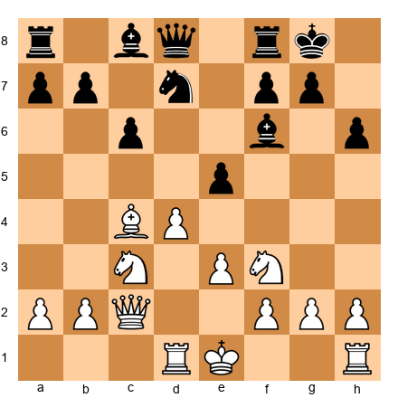</p>


Black releases the central tension. The position opens slightly. This suits Kasparov. He has better development, his bishop is actively placed on c4, and his rook is already on the d-file.

**12.O-O Qe7 13.dxe5 Nxe5 14.Nxe5 Bxe5 15.f4!**

This is the move that defines Kasparov's approach. Instead of quiet development, he gains space immediately. The f4-pawn pushes the bishop away and prepares e4-e5 advances. Kasparov is not content with a small edge. He wants to expand.

**15...Bf6 16.e4 Be6 17.Bxe6 Qxe6**


<p align="center">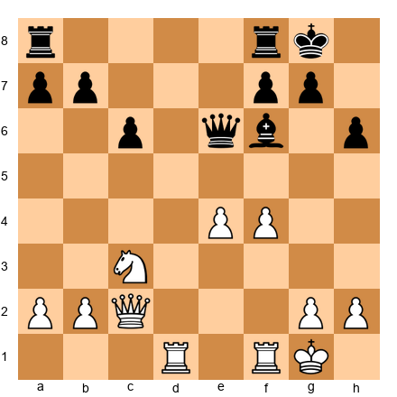</p>


Look at this position carefully. White has a powerful pawn center (e4 and f4), two active rooks, and a centralized queen. Black's pieces are solid but passive. The bishop on f6 does not have a clear function. Black's rooks are not connected to any attacking plan.

Kasparov's advantage is structural. He built it move by move, without a single risky decision. This is what "controlled aggression" means - creating a position where the attack builds itself.

**18.f5 Qe7 19.e5 Bd8 20.Qe4**

The queen joins the attack. White threatens both e6 and Qg4 with pressure against g7. Black has no counterplay. Every move Kasparov plays increases the pressure without creating weaknesses.

**20...Bc7 21.Rd7 Qe8 22.Qg4**


<p align="center">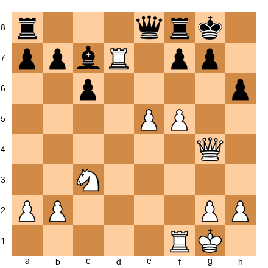</p>


The rook on d7 cuts Black's position in half. The queen on g4 threatens f5-f6 with a devastating opening of lines. Black is strangled - too many threats to address with too few resources.

Karpov found no defense. The game continued:

**22...Bxe5 23.f6! Bxf6 24.Rxf6 gxf6 25.Rd6 Qe1+ 26.Qf1**

And Black's position collapsed. Kasparov had converted a small structural advantage into a winning attack through relentless, methodical pressure. No wild sacrifices. No speculative gambles. Just steady, crushing improvement of his position until resistance was impossible.

**What This Game Teaches You:**

Kasparov's controlled aggression is not about throwing pieces at the king. It is about building a position where every piece contributes to the attack, and then increasing the pressure until the opponent's defenses crack. The key was f4-f5 followed by e4-e5 - advancing the center pawns to restrict Black's pieces before launching the decisive combination.

At your level, this means: do not attack until your pieces are coordinated. Build your position first. Expand in the center. Push the opponent backward. Then - and only then - strike.

---

### Game 2: Kasparov vs Portisch
**Niksic 1983 | Result: 1-0**
**Opening: Queen's Indian Defense (E12)**

Kasparov was twenty years old at the Niksic tournament. He scored 11/14 and dominated a field of elite grandmasters. This game against Lajos Portisch - one of the strongest positional players in the world - became an instant classic.

**1.d4 Nf6 2.c4 e6 3.Nf3 b6 4.Nc3 Bb7 5.a3 d5 6.cxd5 Nxd5 7.Qc2 Nxc3 8.bxc3 Be7 9.e4 O-O 10.Bd3 c5 11.O-O Qc8**


<p align="center">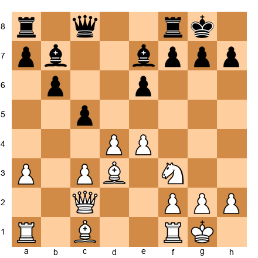</p>


Black's plan is clear: trade the light-squared bishops with ...Ba6, then attack the weakened c3-c4 pawn structure. This is a standard positional approach. Portisch was one of the best in the world at this kind of slow, grinding strategy.

But Kasparov had no intention of playing a slow game.

**12.Qe2 Ba6 13.Rd1**

Not the quiet 13.Bxa6. Kasparov keeps the tension. The bishop on d3 aims at h7, and Kasparov is already thinking about a kingside attack, not a queenside endgame.

**13...Bxd3 14.Rxd3 cxd4 15.cxd4 Nc6 16.Rd1**

The d4-pawn is isolated, but it controls e5 and c5. In Kasparov's hands, an isolated d-pawn is not a weakness - it is a launching pad. The pieces that support it (rooks on d1 and the open c-file, the knight heading to e5 or f5) gain active squares around it.

**16...Rd8 17.e5!**


<p align="center">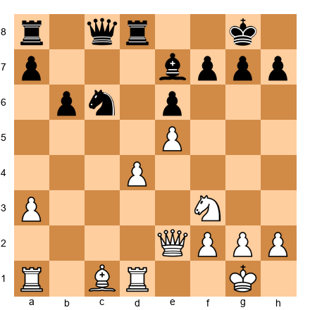</p>


This is a Kasparov move. The pawn charges forward, gaining space, opening diagonals for the bishop, and cramping Black's pieces. After e5, Black's knight on c6 is cut off from the kingside. The f6-square is denied to the knight. And White's minor pieces suddenly aim at the black king.

**17...Nb4 18.Bf4 Nd5 19.Bg3 Qc6 20.Nd2**

The knight heads to e4, where it supports the e5-pawn and joins the kingside attack. Every white piece is finding a role in the assault.

**20...Nb4 21.Ne4 Nd5 22.Qg4**


<p align="center">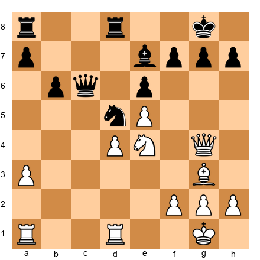</p>


The queen enters the attack. Now White threatens Nf6+, Qh5, and various tactical shots. Black's position is solid in structure but suffocating in activity. This is the Kasparov paradox: the position looks manageable on the surface, but every defensive move leads to a worse position.

**22...Kf8 23.Qh5!**

Threatening Nf6 with devastating effect. The combination of the queen on h5, the knight on e4, and the bishop on g3 creates interlocking threats that Black cannot address.

**23...g6 24.Qh6+ Kg8 25.Nf6+! Bxf6 26.exf6**

And the game was decided. White's queen and f6-pawn create an unstoppable mating attack. The bishop on g3 controls the dark squares. Portisch resigned shortly after.

**What This Game Teaches You:**

Watch how Kasparov used the e5-pawn push to transform the position. Before e5, the game was a standard Queen's Indian with balanced chances. After e5, it became a kingside attack. The pawn thrust gained space, restricted Black's pieces, and opened lines for White's attack - all in one move.

At your level, look for pawn thrusts that change the character of the position. A single advance like e4-e5 or d4-d5 can turn a quiet game into a sharp one. The key is timing: push the pawn when your pieces are ready to exploit the new lines.

---

### Game 3: Kasparov vs Piket
**Tilburg 1989 | Result: 1-0**
**Opening: King's Indian Attack (A07)**

Against the young Dutch grandmaster Jeroen Piket, Kasparov demonstrated another facet of his style: the ability to create something from nothing.

**1.Nf3 d5 2.g3 c6 3.Bg2 Bg4 4.c4 e6 5.cxd5 exd5 6.O-O Nf6 7.d3 Be7 8.Nbd2 O-O 9.b3 Nbd7 10.Bb2 Re8 11.Re1 a5**


<p align="center">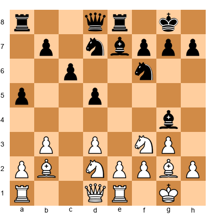</p>


This is a quiet position. Both sides are developed. There are no immediate tactical threats. Many players at your level would drift here - playing moves without a plan, waiting for something to happen.

Kasparov never drifted. He always had a plan.

**12.h3 Bh5 13.Qc2 Qb6 14.a3 Bf8 15.e4!**

There it is. The central thrust that opens the position for White's pieces. The bishop on g2 will come alive on the long diagonal, the knight can go to f1-e3 or to c4, and the e-file becomes a source of pressure.

**15...dxe4 16.dxe4 Nc5 17.e5 Nd5 18.Nc4 Qc7 19.Nfd2**


<p align="center">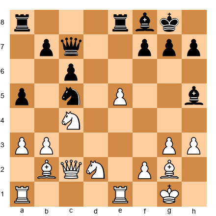</p>


Look at the coordination. The knight on c4 eyes d6 and e5. The knight on d2 can reach e4 or f3. The bishop on b2 supports e5 and aims at the kingside. The bishop on g2 controls the long diagonal. Every piece has a purpose.

This is what separates a grandmaster's quiet position from an amateur's quiet position. The grandmaster's pieces all point in the same direction.

Kasparov's pieces tightened the grip move by move. Black could not find counterplay against the e5-pawn because all of White's pieces defended it while also creating threats. The game ended in a tactical finish where Kasparov broke through on the kingside after establishing complete dominance.

**What This Game Teaches You:**

Even in quiet positions, you must play with a plan. Kasparov's plan was simple: push e4, establish the e5-pawn, and use it as a base for piece activity. He executed this plan with no wasted moves. Every piece was redeployed to serve the central strategy.

At your level, the most common mistake in quiet positions is playing random developing moves. Instead, ask: where is my pawn break? Where should my pieces be to support that break? Move your pieces to those squares before pushing the pawn.

---

### Game 4: Kasparov vs Browne
**Banja Luka 1979 | Result: 1-0**
**Opening: Queen's Gambit Declined (D55)**

Kasparov was sixteen years old when he played this game. He had just earned his grandmaster title. Walter Browne was a six-time US Champion - experienced, tough, and dangerous in tactical positions.

The young Kasparov did not care.

**1.d4 Nf6 2.c4 e6 3.Nf3 d5 4.Nc3 Be7 5.Bg5 h6 6.Bxf6 Bxf6 7.e3 O-O 8.Qc2 c6 9.Bd3 Nd7 10.O-O-O**


<p align="center">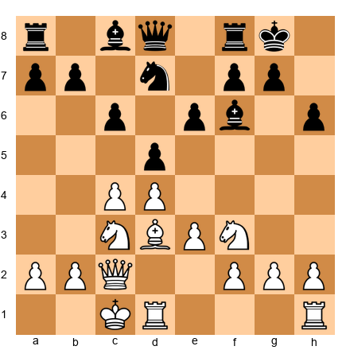</p>


Castling queenside. Kasparov signals his intention immediately: the kingside pawn storm is coming. Castling opposite sides means a race - White attacks on the kingside, Black attacks on the queenside, and the player who gets there first wins.

This is a brave decision from a sixteen-year-old. Opposite-side castling leads to wild, tactical games where one mistake is fatal. But Kasparov trusted his calculation. He knew that if the position became complicated, he would outplay his opponent.

**10...dxc4 11.Bxc4 e5 12.h4!**

No hesitation. The pawn storm begins immediately. While Black is still working out his queenside counterplay, Kasparov is already prying open the kingside.

**12...exd4 13.Nxd4 Ne5 14.Bb3 Qe7 15.g4**


<p align="center">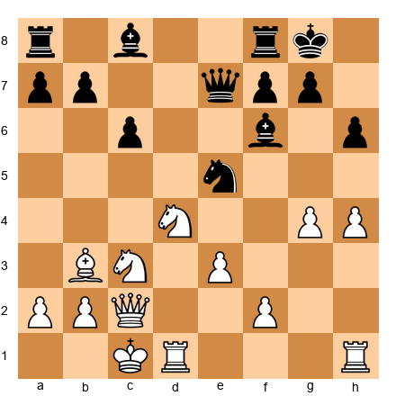</p>


The pawns march forward: h4, g4, and soon g5 or h5. Black's kingside is about to be ripped open. The bishop on b3 points at f7 like a sniper. The knight on d4 controls the center and supports the attack.

This is the Kasparov style at its purest: fast, forceful development followed by a direct assault. Browne fought hard, but the attack was too well-coordinated. The pawns opened lines, the pieces poured through, and the young Kasparov finished the game with a decisive tactical combination.

**What This Game Teaches You:**

When you castle opposite sides, every tempo matters. Kasparov wasted no time on unnecessary prophylaxis. He pushed his pawns immediately because he understood the position demanded speed, not caution.

At your level, the biggest mistake in opposite-side castling is hesitation. Once you commit to a pawn storm, push the pawns. Every move you spend on quiet maneuvering is a move your opponent uses to organize their own attack.

---

## 44.2 Anatoly Karpov - The Positional Boa Constrictor

### "Chess Is Everything: Art, Science, Sport"

If Kasparov was a boxer, Karpov was a python.

Anatoly Karpov did not attack in the traditional sense. He did not sacrifice pieces for a mating attack. He did not launch wild kingside storms. Instead, he maneuvered. He restricted. He squeezed. He accumulated tiny advantages - a slightly better piece, a slightly weaker pawn, a slightly more passive position for his opponent - until the position was won.

His opponents often could not point to the moment they went wrong. The position just... deteriorated. Move by move, option by option, Karpov removed their possibilities until all that remained was surrender.

### The Karpov Method

Karpov's approach was built on three principles:

**1. Prophylaxis.** Before making his own plan, Karpov asked: what does my opponent want to do? Then he prevented it. This does not sound exciting. It is devastatingly effective.

Prophylactic thinking means that your opponent's plans never materialize. They prepare ...e5, and you play a move that makes ...e5 impossible or disadvantageous. They prepare ...Nf4, and you control the f4-square before they get there. By the time they run out of plans, you have improved your position in small ways - and those small improvements have added up to a decisive advantage.

**2. Exploitation of small advantages.** Karpov was the greatest player in history at converting tiny edges. A slightly better pawn structure. A marginally more active bishop. A minor weakness on b6 or d5. These advantages would be invisible to most players. To Karpov, they were winning chances.

He exploited these edges through patient maneuvering. He would reposition his pieces to the optimal squares, often spending ten or fifteen moves just improving his position without making any concrete threats. Then, when the position was perfectly arranged, he would convert with technical precision.

**3. Endgame mastery.** Karpov's endgame play was immaculate. He understood that many small advantages in the middlegame translate into winning advantages in the endgame. A weak pawn that is merely annoying in the middlegame becomes a losing liability in the endgame. Karpov played to reach endgames where his small edges were decisive.

### Style Analysis: The Squeeze


<p align="center">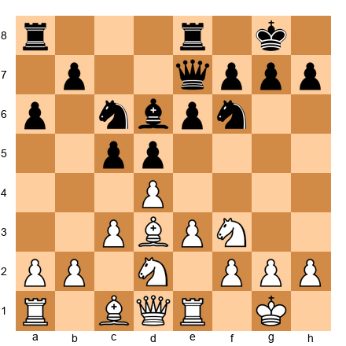</p>


This is a position Karpov loved. Both sides are fully developed. The position is closed. There are no immediate tactical threats. An aggressive player would look at this and think: "Nothing is happening."

Karpov would look at this and see a winning plan.

The d5-pawn is potentially weak because it can be challenged by dxc5 followed by pressure on d5. The c6-knight has limited mobility. Black's dark-squared bishop is blocked by the pawn chain e6-d5-c5. Karpov would maneuver his pieces to target the d5-pawn: Nf1-g3, Bd2-a5 or c1-d2-e1-g3, Qd1-e2 or c2, doubling rooks on the d-file.

Over ten or fifteen moves, Black's position would become worse and worse without any obvious mistake. That is the Karpov squeeze: death by a thousand cuts.

---

### Game 5: Karpov vs Polugaevsky
**USSR Championship, Moscow 1981 | Result: 1-0**
**Opening: Caro-Kann Defense (B17)**

Lev Polugaevsky was one of the sharpest tactical players in Soviet chess. Against Karpov, his tactical gifts counted for nothing - because Karpov never gave him a position where tactics mattered.

**1.e4 c6 2.d4 d5 3.Nc3 dxe4 4.Nxe4 Nd7 5.Nf3 Ngf6 6.Nxf6+ Nxf6 7.Bc4 Bf5 8.O-O e6 9.Qe2 Bg4**


<p align="center">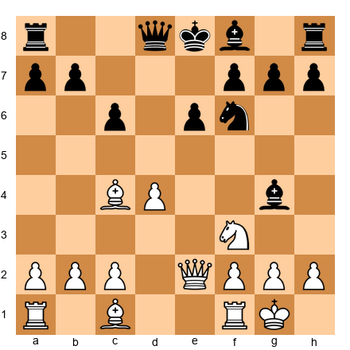</p>


A solid Caro-Kann setup for Black. Polugaevsky has no weaknesses. His pieces are developing naturally. By most standards, this position is equal.

But Karpov saw advantages that Polugaevsky did not.

**10.Ne5 Bh5 11.Qf3 Bg6 12.Nxg6 hxg6 13.Bf4**

The bishop pair. In a position with a semi-open structure, two bishops are a long-term advantage. Most players would not think much of this. Karpov understood it was the beginning of the end.

**13...Bd6 14.Bxd6 Qxd6 15.Rfe1 Nd5 16.c3 Qf4 17.Qe2**


<p align="center">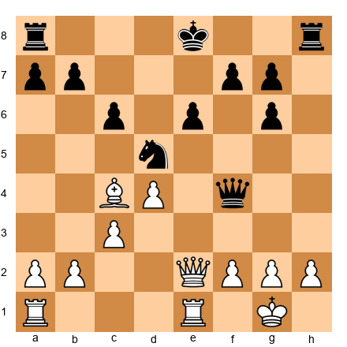</p>


Notice what Karpov has done. He has:
- Traded Black's good bishop (the one on f5/g6)
- Kept his own powerful bishop on c4, pointing at the weak e6-pawn
- Forced the knight to a less stable position on d5
- Maintained pressure without creating any weaknesses in his own position

Black's position is not bad. But it is slightly worse. And "slightly worse" against Karpov meant a long, slow defeat.

The game continued with Karpov gradually improving his position. He doubled rooks on the e-file. He probed Black's queenside. He exploited the fact that Black's knight - while centralized - had no stable support. Move by move, Polugaevsky's options narrowed. Each exchange favored Karpov because Black's remaining pieces had less scope. The endgame was technically won for White, and Karpov converted with surgical precision.

**What This Game Teaches You:**

Karpov did not do anything flashy. He traded the right pieces, kept the pressure steady, and waited for his opponent to crack. The key concept is piece exchange selection: Karpov always traded the pieces that helped his opponent while keeping the pieces that helped himself.

At your level, before every exchange, ask: who benefits from this trade? If your opponent's bishop is more active than yours, do not trade it - restrict it. If your opponent's knight is their best piece, exchange it. Think like Karpov: every trade should make your position better and theirs worse.

---

### Game 6: Karpov vs Miles
**European Team Championship, Skara 1980 | Result: 0-1**
**Opening: St. George Defense (B00)**

This is not a game Karpov won. It is a game Karpov lost - and it teaches you something essential about the limits of any style.

**1.e4 a6!?**

Tony Miles played 1...a6 against the reigning World Champion. The St. George Defense. A move that looks like a beginner's mistake. The entire chess world was stunned.

Why did Miles do this? Because he understood Karpov's weakness. Karpov's method depends on predictability. He studies his opponent's openings, prepares specific lines, and steers the game into structures he knows better than anyone. Miles removed all of that with one move. There is no preparation for 1...a6. There is no theory. Karpov was on his own from move one.

**2.d4 b5 3.Nf3 Bb7 4.Bd3 Nf6 5.Qe2 e6 6.a4 c5**


<p align="center">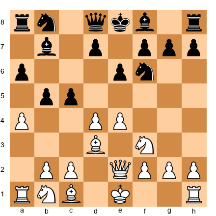</p>


This is chaos. Karpov did not know this structure. He did not have fifteen moves of preparation ready. He was forced to think at the board - which he could do brilliantly - but without the framework of familiar patterns that made his prophylactic style so effective.

**7.dxc5 Bxc5 8.Nbd2 b4 9.e5 Nd5 10.Ne4 Be7 11.O-O Nc6**

Miles developed his pieces to active squares. He was not playing for a theoretical advantage. He was playing for confusion. And it worked. Karpov made several uncharacteristic decisions, including passive piece placements and a premature pawn structure commitment.

The game continued with Miles seizing the initiative on the queenside while Karpov's e5-pawn became a target rather than a strength. Miles maneuvered with energy and confidence, and Karpov - uncharacteristically - could not find the prophylactic moves to contain the chaos.

Miles won in 46 moves.

**What This Game Teaches You:**

Two lessons here. First: every system has a counter. Karpov's prophylactic method was the strongest positional approach in history, but it struggled against unpredictable, creative play that fell outside prepared patterns. If you face an opponent whose preparation is much deeper than yours, consider playing something unusual. Force them to think at the board instead of relying on memorized patterns.

Second: courage matters. Miles was rated far below Karpov. He could have played a safe, solid defense and hoped for a draw. Instead, he played 1...a6 - a move that every pundit would ridicule if it lost. He trusted his understanding of chess over his fear of embarrassment. Sometimes the bravest move is the best move.

---

### Game 7: Karpov vs Spassky
**Candidates Semifinal, Leningrad 1974, Game 9 | Result: 1-0**
**Opening: Caro-Kann Defense (B17)**

Against the former World Champion, Karpov demonstrated the full power of the squeeze.

**1.e4 c6 2.d4 d5 3.Nc3 dxe4 4.Nxe4 Nd7 5.Bc4 Ngf6 6.Ng5 e6 7.Qe2 Nb6 8.Bb3 a5**

Spassky is trying to gain space on the queenside. But each move he makes on the flank takes time away from development. Karpov understood this.

**9.a4 h6 10.N5f3 c5 11.dxc5 Bxc5 12.Ne5 Nbd7**


<p align="center">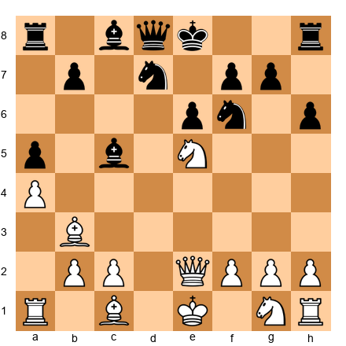</p>


Karpov has a knight on e5 - the most powerful outpost on the board. From e5, it radiates influence in every direction: it controls d7, f7, d3, c4, c6, g4, g6. Spassky's pieces are tangled. His knight on d7 is passive. His bishop on c5 looks active but has no targets.

**13.Nf3 O-O 14.O-O b6 15.Rd1 Qc7 16.c3**

Simple, solid, purposeful. Karpov secures his center, prepares to develop the bishop from c1, and maintains pressure. There is no rush. Spassky is not going anywhere.

**16...Bb7 17.Bg5 Rfe8 18.Rac1 Nd5 19.Qe4**


<p align="center">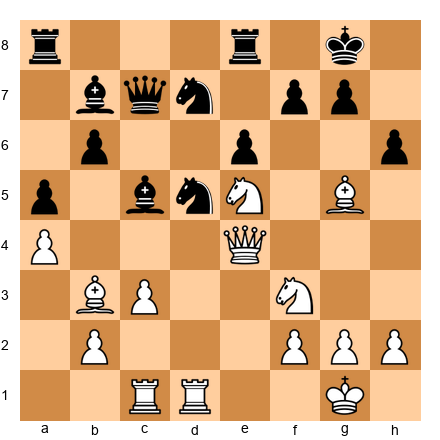</p>


Every white piece is on its best square. The queen controls the center. The rooks are doubled on the c- and d-files. The knights and bishop coordinate in a web of pressure. Black has no active plan.

Karpov slowly tightened the grip over the next fifteen moves. He traded pieces at the right moments, always keeping his most useful ones. Spassky's position became gradually more passive. By the time the endgame arrived, Karpov's structural advantages were decisive.

**What This Game Teaches You:**

Karpov's handling of the knight on e5 is a masterclass in outpost play. The knight occupied the strongest square on the board, and every other piece was arranged to support it. Karpov did not rush to convert the advantage - he improved his other pieces first, then traded down into a winning endgame.

At your level, when you have a strong outpost, do not abandon it. Build your position around it. Improve every other piece before looking for a tactical breakthrough. The outpost is your anchor.

---

## 44.3 Bobby Fischer - The Complete Player

### "I Don't Believe in Psychology. I Believe in Good Moves."

Bobby Fischer did not play mind games. He did not try to confuse his opponents with irregular openings. He did not rely on tricks or surprises. He simply played the best moves - with a clarity and directness that no one before or since has matched.

Fischer's approach to chess was classical in the deepest sense. He believed in open games, active pieces, sound pawn structures, and objective play. He prepared his openings thoroughly, but not to surprise - to play positions he understood better than anyone. He did not avoid sharp lines. He welcomed them, because he trusted his calculation.

### The Fischer Method

**1. Objective play.** Fischer did not play for style. He played for the truth of the position. If the best move was a quiet defensive retreat, he played it without ego. If the best move was a wild sacrifice, he played that too. He did not have a "style" in the way Kasparov or Karpov did - he had a principle: find the best move and play it.

This is harder than it sounds. Most players have preferences. They avoid positions they dislike, even when those positions are objectively best. Fischer had no such weakness. He played what the position demanded.

**2. Universal opening repertoire.** Fischer played 1.e4 with White - always. He played the Najdorf Sicilian and the King's Indian Defense with Black - usually. But within these systems, he knew everything. His preparation was not deep in the Kasparov sense (one specific line analyzed to move thirty). It was broad: he understood every typical structure, every standard plan, every piece maneuver that arose from his openings.

This gave him a structural advantage. His opponents needed to prepare specific lines against Fischer. Fischer just needed to understand the positions - and he understood them better than anyone.

**3. Endgame precision.** Fischer's endgame play was flawless. He understood that many games at the highest level are decided in the endgame, and he worked harder at endgame study than any of his contemporaries. His rook endgames were textbook. His minor-piece endgames were decisive. He converted small advantages with the inevitability of a mathematical proof.

### Style Analysis: Classical Clarity


<p align="center"></p>


This is a Classical Sicilian / Dragon position. Fischer loved this type of game. The structure is clear: White has a space advantage and will attack on the kingside. Black has a solid pawn chain and will counter on the queenside.

Fischer's approach as White was direct. Castle queenside. Push the h-pawn and g-pawn. Open files against the black king. No tricks. No delays. Just a clear plan executed with precision.

What made Fischer different from other attacking players was his willingness to trade queens when it served his purposes. If the queens came off and he had a better endgame, he played for the endgame. He did not fall in love with his attacks. He fell in love with correct play.

### His Contributions

Fischer's impact on chess went beyond the board.

**Professionalism.** Fischer demanded that chess players be treated as professionals - with proper prize funds, proper playing conditions, and proper respect. His battles with FIDE over match conditions transformed how chess tournaments were organized. Before Fischer, grandmasters were poorly paid. After Fischer, the best players could make a living from the game.

**Physical fitness.** Fischer swam, played tennis, and stayed physically active. He understood that chess is mentally exhausting and that physical fitness supports mental stamina. Today, every top player trains physically. Fischer was among the first to take this seriously.

**Opening theory.** Fischer contributed important ideas to the Najdorf Sicilian, the King's Indian Defense, the Ruy Lopez, and many other openings. His analysis of the Exchange Variation of the Ruy Lopez revived the line for White at the top level. His treatment of the Nimzo-Indian and the Grünfeld showed new ways to handle classical structures.

**Chess960.** Fischer invented Chess960 (originally called Fischer Random Chess) as a response to what he saw as the over-reliance on memorized opening theory in modern chess. He believed that the best chess was played when both players had to think from the first move, not recite memorized lines. Chapter 44A covers Chess960 in detail. Fischer's vision has proven prescient - Chess960 has grown steadily and is now part of the official FIDE calendar.

### Fischer's Relevance for the Expert Player

Of the three great players covered in this chapter, Fischer may be the most immediately useful for the expert-level player. Here is why.

Kasparov's style requires extraordinary tactical vision that most players cannot match. Karpov's style requires a level of patience and positional sensitivity that takes decades to develop fully. Fischer's style - objective play, deep understanding of a limited repertoire, and strong endgame technique - is the most accessible path to improvement for the 2200-level player.

The Fischer approach says: play the best move. Understand your openings deeply. Study endgames seriously. Trust your calculation. Avoid playing for tricks. These principles are simple to state and effective at every level. They do not require genius. They require discipline, study, and honest self-assessment - exactly the qualities that this book has been building throughout.

---

### Game 8: Spassky vs Fischer
**World Championship 1972, Game 13 | Reykjavik | Result: 0-1**
**Opening: Alekhine's Defense (B04)**

Fischer surprised the chess world by playing the Alekhine's Defense - 1.e4 Nf6 - in several games of the 1972 match. This was unusual for Fischer, who typically played the Sicilian or the King's Indian with Black. The surprise was strategic: Spassky's preparation was focused on Fischer's main openings, and the Alekhine threw him off balance.

**1.e4 Nf6 2.e5 Nd5 3.d4 d6 4.Nf3 g6 5.Bc4 Nb6 6.Bb3 Bg7 7.Nbd2 O-O 8.h3 a5**


<p align="center">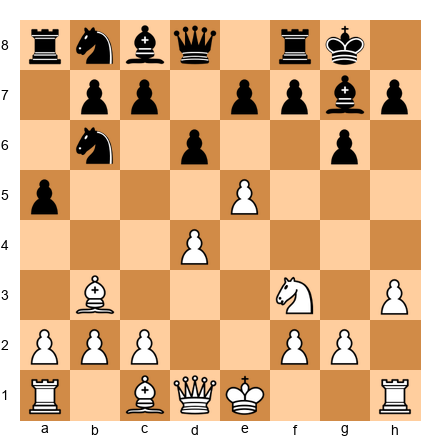</p>


Fischer's play is characteristic: solid development, no weaknesses, and the advance of the a-pawn to gain queenside space. The bishop on g7 is a long-range weapon that will exert pressure on White's center once the d4-pawn is challenged.

**9.a4 dxe5 10.dxe5 Na6 11.O-O Nc5 12.Qe2 Qe8**

Fischer reroutes his queen. It looks odd, but the queen on e8 supports ...e6, prepares ...Nbd7 to attack the e5-pawn, and keeps options open for ...Qe7 or ...Qb5. Every move has a purpose.

**13.Ne4 Nbxa4 14.Bxa4 Nxa4 15.Re1 Nb6**


<p align="center">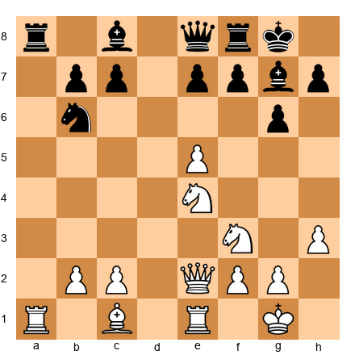</p>


Fischer has won a pawn. He achieved this not through tactics but through accurate positional play - his pieces were better placed than Spassky's, and the extra pawn fell naturally.

The rest of the game was a Fischer masterclass in technique. He consolidated his extra pawn, traded pieces when it suited him, and reached an endgame where the extra material was decisive. Spassky pressed for counterplay but found nothing against Fischer's precise defense.

**What This Game Teaches You:**

Fischer's choice of the Alekhine's Defense shows that opening preparation is not just about playing your best openings - it is about playing openings your opponent is not prepared for. Fischer understood that the Alekhine would disrupt Spassky's preparation, and he was willing to play a less familiar opening to gain that psychological and practical advantage.

At your level, having one surprise weapon in your repertoire - an opening you have studied but rarely play - can be worth several rating points in a critical game.

---

### Game 9: Petrosian vs Fischer
**Candidates Semifinal, Buenos Aires 1971, Game 7 | Result: 0-1**
**Opening: Sicilian Defense, Taimanov Variation (B46)**

Fischer's 1971 Candidates run was the most dominant performance in chess history. He beat Mark Taimanov 6-0, Bent Larsen 6-0, and then defeated Tigran Petrosian - one of the greatest defensive players ever - in the semifinal. This game shows how Fischer broke through Petrosian's legendary fortress.

**1.e4 c5 2.Nf3 e6 3.d4 cxd4 4.Nxd4 Nc6 5.Nc3 d6 6.Be2 Nf6 7.O-O Be7 8.Be3 O-O 9.f4 Bd7**


<p align="center">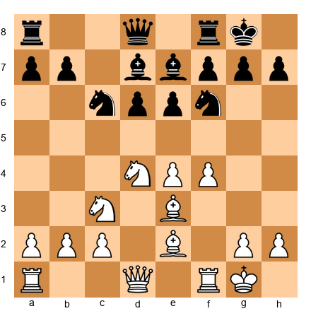</p>


A standard Sicilian Scheveningen / Taimanov structure. White has more space and a potential kingside attack. Black's position is solid but cramped. Petrosian, as White, would normally thrive in this kind of position - slowly improving his pieces, preventing Black's counterplay, squeezing.

But Fischer was not a player who could be squeezed.

**10.Qe1 Nxd4 11.Bxd4 Bc6 12.Qg3 a6 13.Rae1 b5**

Fischer counterattacks on the queenside. While Petrosian is thinking about prophylaxis, Fischer is thinking about activity. The advance ...b5 threatens ...b4, kicking the knight from c3 and opening lines for the bishop on c6.

**14.a3 Qb8 15.Bd3 Re8 16.Kh1 Bf8 17.Qh3 b4!**


<p align="center">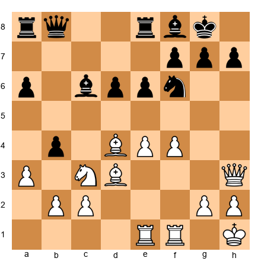</p>


Fischer strikes at the right moment. The pawn advance ...b4 challenges White's central knight and threatens to undermine White's entire structure. Petrosian now faces a choice: accept weakened pawns on the queenside or allow Fischer to gain activity.

**18.axb4 Qxb4 19.Nd1 Qa5**

Fischer's queen is active on a5, his pieces are coordinated, and he has created concrete threats. Petrosian - the supreme defender - could not find a way to contain all of Fischer's ideas simultaneously. The position gradually turned in Fischer's favor, and he won the endgame with characteristic precision.

**What This Game Teaches You:**

Fischer did not try to outplay Petrosian at Petrosian's game. He did not try to squeeze. He played his own game: active, direct, concrete. He found the right moment for ...b5 and ...b4, and the queenside counterattack disrupted Petrosian's plans before they could develop.

At your level, this lesson is critical: do not play your opponent's game. Play your game. If you are facing a defensive expert, attack. If you are facing an attacker, slow the game down. The strongest move is the one that suits your strengths, not the one that accommodates your opponent's.

---

### Game 10: Fischer vs Larsen
**Candidates Semifinal, Denver 1971, Game 1 | Result: 1-0**
**Opening: Sicilian Defense, Sozin Attack (B88)**

Bent Larsen was not an easy opponent. He was a top-ten player, a creative attacker, and one of the strongest non-Soviet players in the world. Fischer beat him six games to zero.

This first game of the match set the tone.

**1.e4 c5 2.Nf3 d6 3.d4 cxd4 4.Nxd4 Nf6 5.Nc3 Nc6 6.Bc4 e6 7.Bb3 Be7 8.Be3 O-O 9.Qe2 a6 10.O-O-O Qc7**


<p align="center">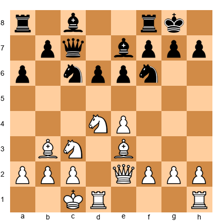</p>


Fischer has set up the Sozin Attack - one of his trademark weapons. Castling queenside, the bishop aimed at f7 from b3, and the entire kingside ready to storm forward. This is Fischer territory.

**11.g4!**

Fischer wastes no time. The g-pawn advances, beginning the attack. Against most opponents, this would be risky - the pawn advance weakens the white king's defenses. But Fischer calculated that the attack would arrive before Black's queenside counterplay could become dangerous.

**11...Nd7 12.h4 Nc5 13.g5**


<p align="center">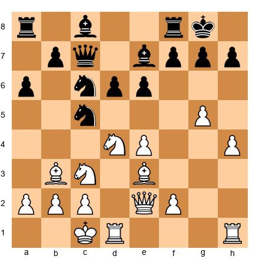</p>


The pawns roll forward. h4, g5, and soon h5 or g6. Black's kingside is under immense pressure. Fischer's plan is simple and direct: open lines and deliver checkmate.

**13...b5 14.Nxc6 Qxc6 15.Bd5!**

The bishop occupies the commanding d5-square, pressing against e6 and connecting with the attack. Fischer's pieces work in harmony - each one supporting the others while contributing to the assault.

Larsen fought, but the attack was too well-constructed. Fischer broke through on the kingside, sacrificed material to open the h-file, and delivered a mating attack. The game ended in under 30 moves.

**What This Game Teaches You:**

Fischer's handling of the Sozin Attack demonstrates the power of a well-understood system. He did not need to calculate twenty moves of theory. He understood the plans, the piece placements, and the pawn breaks so deeply that the correct moves came to him instantly.

At your level, this is the argument for depth over breadth in your opening repertoire. Know a few openings deeply rather than many openings superficially. When you understand the plans behind your moves, you will play them faster, more accurately, and with more confidence.

---

## 44.4 What the Three Teach Together

Kasparov, Karpov, and Fischer represent three philosophies of chess. Each one works. And at the expert level, you can learn from all three to build a complete game.

### The Synthesis

Here is a practical framework for integrating their lessons into your own play:

**From Kasparov, take the aggression.** When you have the initiative, do not let it slip. Push forward. Create threats. Force your opponent to react. The initiative is a temporary advantage that must be used before it expires.

**From Karpov, take the patience.** When you have a positional advantage, do not rush. Improve. Restrict. Squeeze. A small advantage, nursed correctly, becomes a large one.

**From Fischer, take the objectivity.** Do not play for a style. Play for the best move. If the best move is aggressive, be Kasparov. If the best move is quiet, be Karpov. If the best move is a simple trade into a winning endgame, be Fischer. The position decides, not your preferences.

### Diagnostic: Which Style Are You Missing?

Ask yourself these questions about your last twenty games:

1. **When you had the initiative, how often did you convert it into a win?** If the answer is rarely, you need Kasparov's lesson: aggression must be concrete and immediate.

2. **When you had a small positional advantage, how often did you let it slip?** If the answer is often, you need Karpov's lesson: patience is a weapon.

3. **When the position demanded a quiet endgame grind, did you avoid it because you found it boring?** If yes, you need Fischer's lesson: objectivity means playing what the position requires, not what you enjoy.

Most players at 2200 have one of these three areas as a clear weakness. Identifying it is the first step toward the Master level.

### The Modern Standard: Magnus Carlsen

No discussion of great players is complete without acknowledging the player who combined all three approaches more effectively than anyone in history.

Magnus Carlsen plays like Kasparov when attacking, like Karpov when maneuvering, and like Fischer when simplifying. His ability to switch between styles within a single game is unprecedented. He can launch a kingside assault, realize the attack is not working, shift into positional mode, grind his opponent for thirty moves, and convert a microscopic endgame advantage as if it were a simple checkmate exercise.

What makes Carlsen relevant for your study is not his talent - that cannot be taught. It is his method. Carlsen prepares deeply but relies on understanding more than memorization. He plays a wide variety of openings because he understands the resulting positions, not because he has memorized the lines. He rarely makes tactical errors because his positional play keeps him out of dangerous complications.

If you study one modern player alongside the three historical greats, make it Carlsen. His games from 2013 to the present are a masterclass in complete chess.

---

## 44.5 Other Giants: Tal, Petrosian, Smyslov

The three players covered in the previous sections - Kasparov, Karpov, and Fischer - represent the most studied champions in chess history. But they are not the only ones who reshaped how we think about the game. Three other World Champions deserve special attention for the expert-level player, because each one mastered a dimension of chess that the others did not.

### Mikhail Tal - The Magician of Attack

Mikhail Tal played chess like a man setting fire to his own house and then daring his opponent to find the exit. He sacrificed pieces the way other players developed them - casually, confidently, sometimes without full calculation. His opponents knew the sacrifices were coming. They still could not stop them.

Tal became World Champion in 1960 at age 23 by defeating Botvinnik in a match that shocked the chess world. Botvinnik was the great scientist of chess - methodical, prepared, precise. Tal overwhelmed him with chaos. In game after game, Tal sacrificed material, created impossible complications, and forced Botvinnik into positions where calculation alone was not enough.

**What Tal teaches you:** the value of the initiative over material. At 2200, you have been trained to count pieces and evaluate positions in terms of material balance. Tal forces you to reconsider. A piece down but with three pieces aimed at the enemy king is sometimes better than material equality with passive pieces. Tal's games show you what compensation looks like when it is working at full power.

**The lesson to absorb:** when you sacrifice, commit fully. Half-hearted sacrifices - where you give up a pawn but then play passively - are the worst of both worlds. If you sacrifice, follow up with the most aggressive moves available. Make your opponent prove that the sacrifice was unsound. Most of the time, they cannot.

**Recommended game to study:** Tal vs. Larsen, Candidates 1965, Game 10 - the "Magician's Symphony." Tal sacrifices a piece on move 17 for an attack that is not fully calculable but is practically unstoppable. Study it not for the specific moves but for the way Tal evaluates the resulting positions. He sees that his pieces are active, Black's king is exposed, and Black's extra piece has no useful square. That judgment - "my compensation is sufficient because of activity and king safety" - is what you are trying to learn.

### Tigran Petrosian - The Iron Tigran

If Tal was fire, Petrosian was water. He did not attack. He prevented. He did not create threats. He removed them before they existed. Petrosian was the greatest prophet of prophylaxis in chess history, and his exchange sacrifices changed how an entire generation thought about material.

Petrosian was World Champion from 1963 to 1969. His style was so quiet that casual observers thought he was passive. He was not. He was the most dangerous kind of player - the one who takes away everything you want to do, move by move, until you realize you have no plan, no counterplay, and no hope. By the time Petrosian struck, the game was already over. The attack was just a formality.

**What Petrosian teaches you:** prevention is stronger than cure. At 2200, you spend most of your energy creating your own plans. Petrosian teaches you to spend half that energy stopping your opponent's plans. Ask yourself before every move: "What does my opponent want to do? Can I stop it without making any concession?" If you can, stop it. Your own plan can wait.

**The lesson to absorb:** the exchange sacrifice is a positional weapon, not a tactical one. Petrosian would give up a rook for a bishop or knight when the resulting position gave him structural control, piece dominance, or a permanent grip on a color complex. He did not calculate long forced lines. He evaluated the resulting positions and judged that his compensation was permanent. This kind of judgment - trusting that long-term factors outweigh short-term material - is the hardest thing to learn in chess, and Petrosian is the best teacher.

**Recommended game to study:** Petrosian vs. Spassky, World Championship 1966, Game 10. Petrosian sacrifices the exchange on move 24 to secure permanent control of the dark squares. The position is not won immediately - it takes another 30 moves. But from the moment of the sacrifice, Spassky has no active plan, no counterplay, and no way to use his extra material. This game is a masterclass in how patience and positional judgment win chess games.

### Vassily Smyslov - The Artist of Endgames

Vassily Smyslov was World Champion from 1957 to 1958, and he remained a world-class player for four more decades. His chess was the most natural of any champion - simple, clear, and beautiful. Where Kasparov overwhelmed you with force and Karpov squeezed you with technique, Smyslov made it look like the pieces simply wanted to stand on the squares he chose for them.

Smyslov was a trained opera singer, and his chess had the same quality as his music - harmony. His pieces worked together in a way that felt inevitable. His bishops were alive, moving to exactly the right diagonals at exactly the right moments. His endgame technique was so clean that Botvinnik - normally the most confident player in the world - said that Smyslov was the most difficult opponent he ever faced in endgames.

**What Smyslov teaches you:** piece harmony and the art of natural moves. At 2200, you often find yourself choosing between several reasonable moves without knowing which is best. Smyslov's games show you how to recognize the move that puts each piece on its ideal square - the square where it works best with all the other pieces. This is not something you can calculate. It is something you develop through pattern recognition and study.

**The lesson to absorb:** endgames are won by technique, not tricks. Smyslov did not need flashy combinations to win endgames. He won them by putting his king on the right square, advancing his pawns at the right moment, and trading pieces when the resulting position was favorable. His endgames are the best study material for any player who wants to improve their technique. They teach you that chess can be beautiful without being complicated.

**Recommended game to study:** Smyslov vs. Ribli, Candidates 1983. Smyslov was 62 years old and still competing for the World Championship. He outplayed a strong grandmaster in a bishop endgame that most players would have drawn. The way Smyslov maneuvered his bishop and king - each move improving the position by the smallest possible amount - is the purest expression of endgame technique you will find anywhere. Watch it and ask yourself: "Would I have found these moves?" If the answer is no, study it until the answer is yes.

### What the Three Teach Together

Tal teaches you to attack without fear. Petrosian teaches you to defend without anxiety. Smyslov teaches you to play the endgame without impatience.

If you are weak in calculation and initiative, study Tal. If you are weak in prophylaxis and positional judgment, study Petrosian. If you are weak in endgame technique and piece coordination, study Smyslov.

A complete player at the expert level should study all three. Together with Kasparov, Karpov, and Fischer, these six champions cover every dimension of chess mastery. There is no weakness in your game that one of them cannot help you fix.

---

## 44.6 The Women Who Changed Chess

### Judit Polgar - "Chess Has No Gender"

There is no polite way to say this, so we will say it directly: for most of chess history, women were excluded, patronized, and told they could not compete with men.

Judit Polgar destroyed that lie.

She was never Women's World Champion. She refused to compete in women's events, considering them second-class. Instead, she played in open tournaments - against the strongest players in the world - and she won. She defeated every living World Champion of her era: Kasparov, Karpov, Spassky, Fischer (by forfeit), Anand, Topalov, and Kramnik. She reached a peak ranking of number eight in the world. Not number eight among women. Number eight among all players on Earth.

Her weapons were fearlessness and firepower. She played the sharpest openings - the Sicilian Najdorf, the King's Indian, aggressive Ruy Lopez lines - and she calculated with stunning precision. She did not play "women's chess." She played chess. And she played it better than almost everyone alive.

### Polgar's Legacy

Judit Polgar proved three things that matter for every chess player reading this book:

**1. Chess ability has nothing to do with gender.** The difference in average ratings between men and women in competitive chess is entirely explained by participation rates. When more women play, the strongest women reach the highest levels. This is statistics, not biology.

**2. The "Polgar experiment" worked.** Judit's father, Laszlo Polgar, believed that genius is made, not born. He raised all three of his daughters - Susan, Sofia, and Judit - as chess prodigies. All three became among the strongest women players ever. Judit surpassed even her father's expectations. The experiment proved that systematic training, starting early, produces extraordinary results regardless of gender.

**3. Courage is a skill.** Judit did not play it safe. She could have dominated women's chess for decades. Instead, she chose to compete against the strongest men, knowing she would face sexism, condescension, and pressure that no male player would endure. She chose the harder path because she believed in herself, and she was right to.

### Hou Yifan - The Modern Standard

If Polgar broke the barrier, Hou Yifan showed that the breakthrough was permanent. The Chinese player became Women's World Champion at age 16 and went on to achieve a peak rating of 2686 - one of the highest ever recorded by a woman.

Like Polgar before her, Hou Yifan eventually moved away from women's chess to compete primarily in open events. Her playing style is notable for its positional depth and endgame precision. Where Polgar overwhelmed opponents with tactical firepower, Hou Yifan often outplays them in quiet positions through superior understanding.

Hou Yifan has also become an advocate for chess education, holding positions at universities and promoting chess as an educational tool. Her career demonstrates that top-level chess and academic achievement are not mutually exclusive - a message that matters for every young player considering their future.

### What the Women's Game Teaches All Players

Studying Polgar's and Hou Yifan's games is valuable regardless of your gender. Polgar's games teach tactical boldness and fighting spirit. Hou Yifan's games teach positional sophistication and patient technique. Both players' careers teach the importance of self-belief and the willingness to compete at the highest level available.

The chess world has a long way to go on gender equity, but the players discussed here have already proven that ability knows no gender. Their games deserve study on their merits - not as curiosities, but as some of the finest chess played by anyone.

---

### Game 11: Polgar vs Kasparov
**Russia vs Rest of the World, Moscow 2002 | Result: 1-0**
**Opening: Sicilian Defense, Sveshnikov Variation (B33)**

This is the most famous game in women's chess history. Judit Polgar - the strongest woman player ever - defeats Garry Kasparov - widely considered the strongest player ever - with the White pieces.

The background matters. Kasparov had been publicly dismissive of women's chess. He had made statements suggesting women could not compete at the highest level. Polgar's victory was not just a chess game. It was a statement.

**1.e4 c5 2.Nf3 Nc6 3.d4 cxd4 4.Nxd4 Nf6 5.Nc3 e5 6.Ndb5 d6 7.Bg5 a6 8.Na3 b5 9.Bxf6 gxf6 10.Nd5 f5**


<p align="center">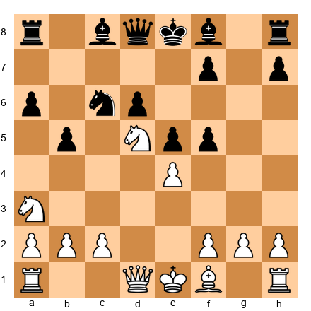</p>


The Sveshnikov Sicilian - one of the sharpest openings in chess. Both sides have committed to concrete play. White has a powerful knight on d5. Black has the bishop pair and a mobile pawn center. Theory has been analyzed to great depth in this line, and both players knew it well.

**11.Bd3 Be6 12.O-O Bxd5 13.exd5 Ne7 14.c4 bxc4 15.Nxc4 Bg7**


<p align="center">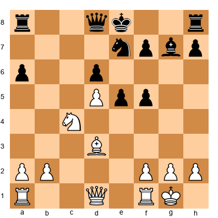</p>


The position is dynamically balanced. White has the d5-pawn, which cramps Black. The knight on c4 is active. Black has the bishop pair and potential kingside counterplay with ...f4 and ...e4.

This is the kind of position that separates preparation from understanding. Both players knew the theory. The question was who understood the resulting positions more deeply.

**16.Qa4+ Qd7 17.Qa3 O-O 18.Rfe1 Rae8**

Polgar plays with quiet precision. She does not rush to attack. She improves her pieces, maintains pressure on the d6-pawn, and waits for Kasparov to commit. This is not the stereotypical "women's chess" of cautious play - this is high-level grandmaster chess, where patience and timing are weapons.

**19.Rac1 f4 20.Qxa6**

Polgar grabs a pawn. This looks risky - the queen is far from the kingside - but Polgar had calculated that Black's attack was not fast enough to compensate for the material.

**20...e4 21.Bf1 Ng6 22.Qa3 f3**


<p align="center">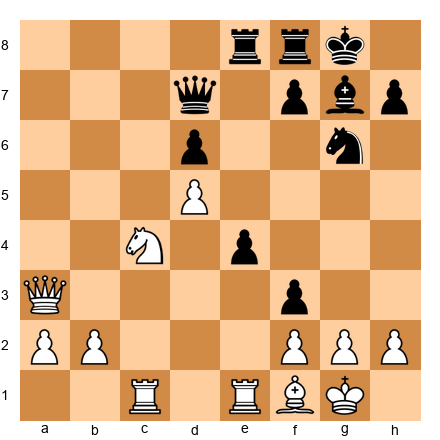</p>


Black's pieces are aimed at the white king. The f3-pawn threatens to open lines. The knight on g6 can jump to h4 or f4. It looks dangerous for White.

But Polgar was not afraid. She calculated the variations precisely and found that White's material advantage, combined with her own counterplay, was sufficient.

**23.g3 Qf5 24.Qb3 Kh8 25.Nd2**

Polgar defends accurately, blocks the threats, and keeps her extra pawn. The game continued with both sides playing at the highest level, but Polgar's material advantage and accurate defense eventually proved decisive. Kasparov resigned on move 42.

**What This Game Teaches You:**

Polgar's victory over Kasparov was not a fluke or a blunder exploitation. It was a game played at the highest level by both sides, and Polgar won because she played better. Her opening preparation was equal to Kasparov's. Her calculation was sharp. Her nerve was steel.

The lesson: respect every opponent. Judge a player by their moves, not by their name or their gender.

---

### Game 12: Polgar vs Leko
**Tilburg 1996 | Result: 1-0**
**Opening: Sicilian Defense, Najdorf Variation (B90)**

Peter Leko was one of the strongest players in the world - a future World Championship challenger. This game shows Polgar's tactical brilliance at its purest.

**1.e4 c5 2.Nf3 d6 3.d4 cxd4 4.Nxd4 Nf6 5.Nc3 a6 6.Be2 e5 7.Nb3 Be7 8.O-O O-O 9.Be3 Be6 10.Qd2 Nbd7**


<p align="center">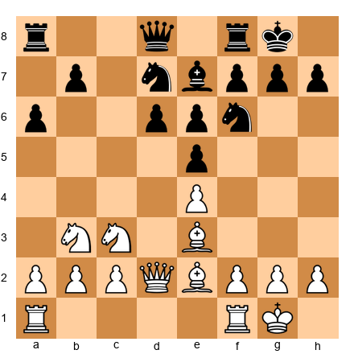</p>


A classical Najdorf setup. White will play on the queenside and in the center; Black will look for ...d5 or a kingside attack. The position is balanced, but both sides have real chances.

**11.a4 Qc7 12.a5 Rfc8 13.Rfd1 Rc4**

Black's rook comes to c4, putting pressure on the e4-pawn and controlling the c-file. This is an aggressive idea - the rook is active but potentially vulnerable.

**14.Nd5! Bxd5 15.exd5 Rxc2?!**


<p align="center">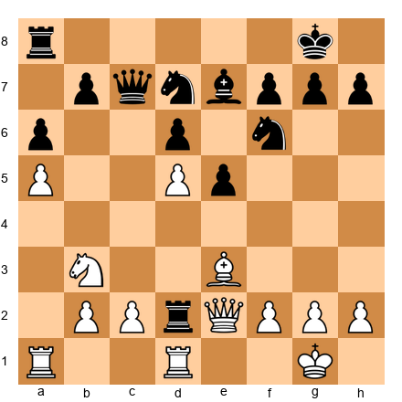</p>


Black captures the c2-pawn. It looks like Black has won material, but the rook on c2 is now in enemy territory. Polgar saw further.

**16.Qd3! Rc4 17.Bb6 Qc8 18.Nd2 Rc2 19.Ne4**

The knight enters the fray, targeting d6 and f6. Black's pieces are tangled - the rook on c2 is trapped between defending d2 and retreating. White's pieces converge.

**19...Nxe4 20.Qxe4 Bf6 21.Qg4**


<p align="center">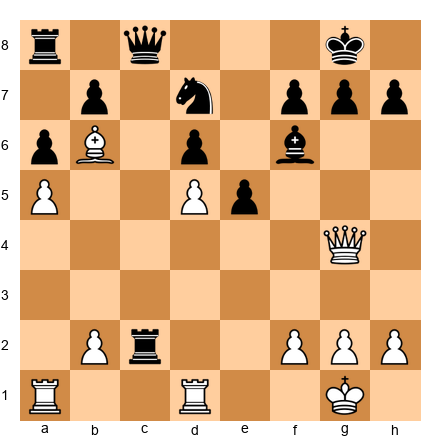</p>


The queen shifts to the kingside. Now White threatens Qxd7, Bxd8, and various tactical ideas. Black is under pressure on both flanks. Polgar's bishop on b6 controls the dark squares while the queen operates on the light squares. The coordination is devastating.

Polgar converted the advantage with precise tactical play, finishing the game with an attack on the exposed black king while the rook on c2 remained passive and out of play.

**What This Game Teaches You:**

Polgar punished Black's greedy pawn grab by exploiting the misplaced rook. In chess, material is important - but piece activity is more important. A rook that captures a pawn but ends up trapped behind enemy lines is not worth the material it won.

At your level, before grabbing a pawn, always ask: where will my piece be after I take it? If the piece ends up passive, misplaced, or trapped, the pawn is not worth taking.

---

### Women in Chess: An Honest History

Chess has no gender. But chess culture, for a long time, did.

For most of the twentieth century, women were actively discouraged from competing in open tournaments. Separate women's titles were created - Woman Grandmaster (WGM), Woman International Master (WIM) - with lower standards than the corresponding open titles. The message was clear: women play a different, lesser game.

This was wrong. It was always wrong.

The evidence is overwhelming. When women are given equal training, equal competition, and equal respect, they reach the highest levels. Judit Polgar proved this. Hou Yifan proves it today.

### Hou Yifan - The Modern Pioneer

Hou Yifan became the youngest Women's World Champion in history at age sixteen. But like Polgar before her, she chose to leave the women's circuit and compete in open events. She earned the full Grandmaster title through open competition. She reached a peak rating of 2686 - higher than most male grandmasters will ever achieve.

Her style is a blend of Karpov's positional understanding and Fischer's clarity. She plays classical, principled chess with deep strategic preparation. She does not rely on tactics or tricks. She outplays her opponents through superior understanding of the position.

In 2017, Hou Yifan protested the poor organization of the Women's World Championship by playing a deliberate joke opening (1.g4) in the final round. She was not throwing a game. She was making a statement: that women's chess deserves better conditions, better prize funds, and better respect. She was right.

### Ju Wenjun - The Champion

Ju Wenjun has been the Women's World Champion since 2018. Her style is patient and technical - she excels in complex middlegames and precise endgames. She has defended her title multiple times against strong challengers, demonstrating the consistency and mental toughness that define a champion.

### Lei Tingjie - The Rising Force

Lei Tingjie challenged for the Women's World Championship in 2023 and has established herself as one of the strongest players in the world, male or female. Her aggressive, dynamic style brings Kasparov-like energy to every game. She represents the new generation of women players who compete in open events as a matter of course, not as a statement.

### Vaishali Rameshbabu - The Trailblazer

Vaishali Rameshbabu became India's third female Grandmaster in 2024. Her brother, Praggnanandhaa, is a top-ten player, and the Rameshbabu family has produced two elite players through the same formula: early training, serious competition, and unwavering family support. Vaishali's rise demonstrates that the path to the top is the same regardless of gender - it requires talent, work, and opportunity.

### "Chess Has No Gender"

Here is the truth: there is no biological reason why women should play chess worse than men. The rating gap between men and women in competitive chess is a product of participation rates, not ability. In any activity, the more participants there are, the more extreme the tails of the distribution become. With millions of male chess players and far fewer female players, the statistical pool of potential top players is simply larger for men.

As participation rates equalize - and they are equalizing, rapidly - the rating gap narrows. The next Judit Polgar may already be training. The next Fischer or Kasparov may be a woman. When she arrives, she will not be a "women's player." She will be a chess player.

This matters for you as a reader. Every time you sit down at the board, you face a mind - not a gender, not a nationality, not an age. The pieces do not care who moves them. The board does not know your name. Only the moves matter.

Play the board. Respect the opponent. Judge by the game.

---

## 44.7 The Modern Era: What Today's Elite Teach Us

The engine revolution changed chess permanently. Starting in the late 1990s with Deep Blue's victory over Kasparov, and accelerating through the 2010s with the rise of neural network engines like AlphaZero and Leela Chess Zero, the way top players prepare, play, and think about chess has been transformed. Understanding these changes helps you appreciate the game you are playing today.

### The Computer Preparation Era

Before engines, top players prepared openings by studying games and analyzing with other strong players. This process was slow, creative, and full of personality. Kasparov's preparation differed from Karpov's because they thought about chess differently. Each player's opening repertoire reflected their individual understanding.

Today, preparation looks very different. Every serious player at the top level uses engine analysis to prepare opening lines that are objectively as strong as possible. This has led to an explosion of theoretical knowledge. Lines that were considered playable in the 1990s have been refuted. New ideas in well-known openings are discovered and then refuted within weeks. The pace of theoretical change has accelerated beyond anything previous generations could have imagined.

For the expert-level player, this means two things. First, keeping up with the latest theoretical developments in your openings is more important than ever. A line that was considered safe a year ago may have been demolished by new engine analysis. Second, understanding the ideas behind your openings matters more than memorizing specific moves, because your opponent may deviate from theory early and you will need to think for yourself.

### The AlphaZero Effect

In December 2017, DeepMind's AlphaZero played 100 games against the strongest traditional chess engine, Stockfish. AlphaZero won 28 games, drew 72, and lost none. But the real shock was not the result - it was how AlphaZero played.

AlphaZero played chess that looked human. It sacrificed pawns for long-term positional compensation. It kept pieces active rather than grabbing material. It played openings that traditional engines considered slightly inferior but that led to positions with more practical potential. It played the King's Indian Defense as Black - an opening that Stockfish evaluated as slightly worse for Black - and won brilliantly.

For the chess world, AlphaZero's games were a revelation. They showed that the "best" way to play chess was not necessarily the way traditional engines played (grab material, calculate deeply, win the endgame). There was another path: piece activity, dynamic compensation, and strategic pressure. This validated what many human players had always felt - that the beauty and creativity of chess were not just romantic notions but genuine competitive advantages.

For the expert player, AlphaZero's lessons are directly applicable. Do not be afraid to sacrifice a pawn for activity. Do not automatically grab material if it means placing your pieces passively. Value piece coordination and king safety over raw material count. These principles were always part of good chess, but AlphaZero proved them against the strongest opposition imaginable.

### The Anti-Computer Style

One of the most interesting developments in modern chess is the emergence of players who deliberately choose positions that engines evaluate as "equal" but that are practically difficult for humans to handle.

The logic is straightforward. If you play the engine's top choice in every position, you will reach positions that are objectively best but that both you and your opponent understand equally well (because both of you prepared with the same engine). Instead, some players deliberately choose the engine's second or third choice - moves that are slightly less optimal but that lead to positions their opponents are less prepared for.

Magnus Carlsen has been the master of this approach. He frequently steers games into positions where the engine evaluates the position as dead equal, but where there are 40 more moves of maneuvering required. In these positions, the player with better understanding, better stamina, and better practical skills wins - and Carlsen excels in all three areas.

For the expert player, this teaches an important lesson: you do not need to play the "best" move in every position. You need to play the move that gives you the best practical chances. Sometimes the objectively second-best move leads to a position where your opponent is more likely to go wrong, and that makes it the practically best move.

### The New Generation

The players born in the 2000s represent the first generation that grew up with engines from the very beginning of their chess education. They never knew a world without Stockfish. This has produced a distinctive playing style that is worth studying.

Dommaraju Gukesh became the youngest World Champion in history in 2024, at the age of 18. His play is characterized by extraordinary tactical sharpness combined with a willingness to accept positions that look uncomfortable to older players. He trusts his tactical ability to navigate complications that previous generations would have avoided.

Rameshbabu Praggnanandhaa has shown similar traits - a willingness to play sharp, double-edged positions and a tactical accuracy that comes from growing up solving engine-generated puzzles. Nodirbek Abdusattorov burst onto the scene by winning the World Rapid Championship, showing that the new generation is particularly strong in faster time controls.

What characterizes these players is not just their tactical ability. It is their comfort with complexity. They do not try to simplify positions to make them manageable. They thrive in complicated positions because they have trained their tactical vision from childhood using the most powerful analytical tools in history.

### Rapid and Blitz as Serious Chess

For most of chess history, classical time controls (4+ hours per game) were considered "real chess," and faster time controls were treated as casual entertainment. That has changed dramatically.

The World Rapid and Blitz Championships now carry significant prestige. Online rapid and blitz events offer substantial prizes. Many top players take faster time controls as seriously as classical chess, with dedicated preparation and specific strategies for rapid and blitz play.

For the expert player, rapid and blitz are valuable training tools. They force you to rely on pattern recognition and intuition rather than deep calculation, which strengthens these skills for classical play. They also expose weaknesses that are hidden in classical games - if you consistently lose in a particular type of position in blitz, that position is probably a weakness in your classical play as well, masked by the extra thinking time.

The key insight from the modern era is that chess is broader than it has ever been. The game rewards both deep preparation and creative thinking, both tactical sharpness and positional understanding, both classical depth and rapid intuition. The most complete players are the ones who develop all of these skills.

### What You Can Learn From Each Generation

The history of chess is a history of ideas building on each other. Each generation solved problems that the previous generation struggled with, and in doing so, created new problems for the next generation to solve.

From the Romantic Era (1850-1920), learn the power of initiative and attack. Players like Morphy and Anderssen showed that rapid development and piece activity can overwhelm even a material advantage. When you are behind in development in your own games, remember how the Romantic players punished this deficit.

From the Classical Era (1920-1960), learn the importance of pawn structure and strategic planning. Capablanca, Alekhine, and Botvinnik demonstrated that a sound pawn structure creates a permanent advantage that can be exploited move after move. When you are choosing between two acceptable moves in a quiet position, consider which one leads to a better pawn structure.

From the Hypermodern Era (1920-1940), learn that controlling the center is not the same as occupying the center. Nimzowitsch and Reti showed that allowing your opponent to build a big center and then undermining it can be even stronger than building your own. This insight remains relevant whenever you face an opponent who pushes pawns to the center aggressively.

From the Soviet School (1948-1990), learn the value of systematic preparation and deep opening study. The Soviet players dominated world chess for four decades through disciplined study, comprehensive preparation, and continuous improvement. Their methods - studying with strong partners, analyzing games deeply, maintaining opening files - remain the foundation of professional chess training.

From the Computer Era (1997-present), learn to question received wisdom. Engine analysis has overturned many "established" positional rules. Not every passed pawn should be pushed. Not every isolated pawn is weak. Not every bishop pair is superior to bishop and knight. The engine era teaches us to evaluate each position on its own merits rather than applying rules mechanically.

---

## 44.8 Learning From the Masters: A Practical Guide

Reading about great players is enjoyable, but the real benefit comes from studying their games carefully. Here is a practical system for extracting maximum value from master game study.

### How to Study a Master Game Properly

Most players "study" a master game by replaying it on a screen, reading the annotations, and moving on. This is better than nothing, but it is not much better. You retain maybe 10% of what you see.

Here is a more effective method.

**Step 1: Play through the opening without annotations.** Replay the first 10 to 15 moves. At each move, before looking at the annotation, try to guess the next move. Write down your guess and your reasoning. Then check the actual move. When your guess differs from the actual move, figure out why. What did the master see that you did not?

**Step 2: Stop at the critical position.** Every master game has at least one critical position - a moment where the outcome of the game was decided. When you reach this position, cover the remaining moves and analyze it yourself for 10 minutes. Write down your analysis: what moves do you consider? What is your evaluation? What plan do you recommend?

**Step 3: Compare your analysis with the master's.** Now read the annotation for the critical position. How does the master's analysis compare with yours? Did you find the same key moves? Did you evaluate the position the same way? Where did your thinking diverge?

**Step 4: Replay the endgame with attention to technique.** The endgame is where conversion happens. Watch how the master handles the transition from middlegame to endgame, how they improve their pieces, and how they create and advance passed pawns. This is where you learn the most practical technique.

### The Five-Game Deep Study Method

Choose one player from this chapter. Study five consecutive games from a single tournament or match. This is not about seeing five random games - it is about understanding how a player thinks across a sequence of games.

In five consecutive games, you will see how the player handles different opening systems, how they respond to different opponent styles, and how they adapt their approach when a strategy works (or does not work). You will notice recurring themes: Kasparov often builds powerful pawn centers, Karpov often restricts the opponent's pieces, Fischer often trades into favorable endgames. These themes are not accidents - they are reflections of each player's deep understanding.

After studying five games, write a one-page summary of what you learned. What are this player's recurring themes? What principles do they follow most consistently? What would you add to your own game based on what you observed?

### Building a Model Game Collection

For each opening you play, find 5 to 10 master games that demonstrate the typical plans, structures, and ideas. These are your "model games" - the games you return to when you need to refresh your understanding of an opening.

A good model game shows: the standard pawn structure and piece placement, the typical middlegame plans for both sides, the critical pawn breaks and how they change the position, and the type of endgame that tends to arise.

Store your model games in a Lichess study, a ChessBase database, or even a notebook. Review them before playing a tournament game in that opening. This review takes 10 to 15 minutes and refreshes your understanding of the plans and ideas far more effectively than memorizing an extra five moves of theory.

### Recommended Starting Points

If you want to begin studying the players discussed in this chapter, here are good places to start.

**Kasparov:** Study his 1985 World Championship match against Karpov. The games are well-annotated in many sources, and they showcase Kasparov's aggressive, dynamic style at its peak. Focus on games 16 and 24, which are among the most dramatic in championship history.

**Karpov:** Study his 1974 Candidates match against Spassky. This match shows Karpov's positional style in its purest form - before his epic rivalry with Kasparov forced him to expand his approach. Notice how Karpov slowly squeezes his opponents without ever taking obvious risks.

**Fischer:** Read "My 60 Memorable Games" - Fischer's own annotations of his best games. Fischer's annotations are famously honest and instructive. He does not hide his mistakes. He explains his thinking at each critical moment, including what he missed and what he would do differently.

**Tal:** Read "The Life and Games of Mikhail Tal" - Tal's autobiography with annotated games. Tal's writing is funny, insightful, and brilliantly honest about the creative process of attacking chess. His annotations explain not just the moves but the psychology behind them.

**Petrosian:** Study his games from the 1960s, when his prophylactic style was at its peak. Petrosian's games teach you more about prevention and restraint than any other player in history. Focus on how he anticipates his opponents' plans before they are even formed.

**Modern players:** For Carlsen, study his 2013 World Championship match against Anand. For the younger generation, Lichess and chess24 have extensive video coverage of Gukesh's and Praggnanandhaa's recent games, with expert commentary that explains their decision-making process.

### Creating a Study Schedule for Master Games

Master game study should be a regular part of your training, not something you do only when you feel like it. Here is a sustainable schedule that integrates master game study into your weekly routine.

**Monday or Tuesday: Study one game from your opening.** Find a master game in an opening you play. Go through it using the four-step method described above. This keeps your opening knowledge fresh and deepens your understanding of the plans and ideas.

**Thursday or Friday: Study one game from a different era or style.** Choose a game from a player whose style is different from yours. If you are a tactical player, study a Karpov game. If you are a positional player, study a Tal game. This broadens your understanding and adds new ideas to your toolkit.

**Weekend: Optional deep study.** If you have extra time, spend 30 to 45 minutes doing a deep study of a game from a tournament book. The deep study means analyzing every move yourself before reading the annotations. This is the most time-consuming but also the most educational form of master game study.

This schedule adds about 90 minutes per week of master game study. Over a year, that is roughly 100 master games studied carefully. The cumulative effect on your chess understanding is enormous.

### The Danger of Hero Worship

One final note about studying great players: do not try to play like them. Kasparov's style works for Kasparov because of his extraordinary tactical vision. Karpov's style works for Karpov because of his extraordinary patience and positional sense. Fischer's style works for Fischer because of his extraordinary opening preparation and endgame technique.

You are not Kasparov, Karpov, or Fischer. You are you. Study their games to understand their ideas, not to copy their style. Take what works for your game and leave the rest. The goal is to become the best version of yourself, not a poor imitation of someone else.

The strongest version of your chess is the one that combines ideas from many sources: a bit of Kasparov's tactical sharpness, a bit of Karpov's prophylaxis, a bit of Fischer's precision, a bit of Tal's creativity, a bit of Petrosian's restraint. Take the best from each and build your own style. That is what the great players themselves did - they learned from their predecessors and then forged something new.

---

## Exercises

### ★★ Warmup

**Exercise 44.1 - The Kasparov Punch**


<p align="center">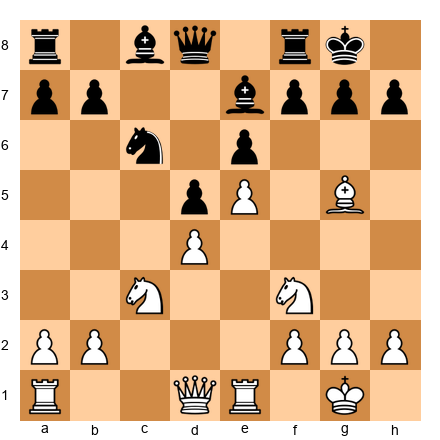</p>


White to play. Kasparov-style question: how does White increase the pressure on Black's kingside before Black can consolidate?

*Hint: Think about which piece is pinned and how to exploit the pin.*

---

**Exercise 44.2 - The Karpov Squeeze**


<p align="center">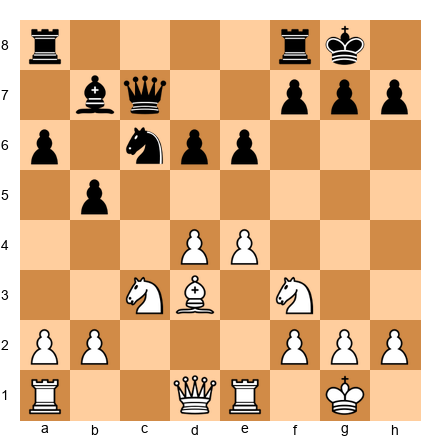</p>


White to play. Karpov-style question: Black's position is solid but slightly passive. What quiet improving move maintains the pressure and restricts Black's counterplay?

*Hint: Look at the weakest square in Black's camp. Which piece can target it?*

---

**Exercise 44.3 - The Fischer Endgame**


<p align="center">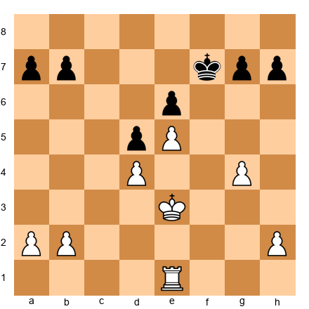</p>


White to play. Fischer-style question: White has a better rook and better pawn structure. What is the plan to convert this advantage?

*Hint: Which file should the rook use? Where should the king go?*

---

### ★★★ Essential

**Exercise 44.4 - Central Explosion**


<p align="center">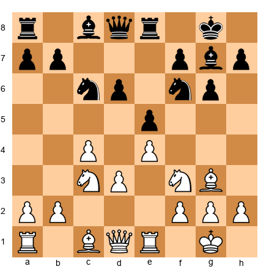</p>


White to play. Find the move that opens the center and exploits Black's slightly loose king position. Think like Kasparov.

*Hint: One pawn advance changes everything.*

---

**Exercise 44.5 - The Prophylactic Move**


<p align="center">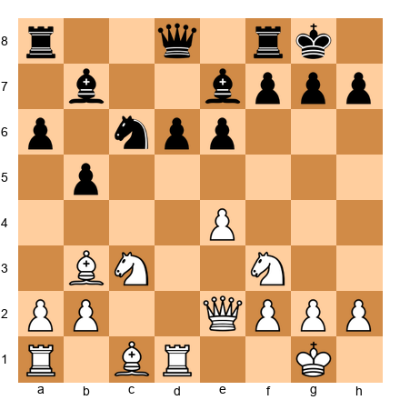</p>


White to play. Black is preparing ...d5. What prophylactic move prevents this advance while improving White's position?

*Hint: Karpov would control the d5-square before Black gets there.*

---

**Exercise 44.6 - Rook Lift**


<p align="center"></p>


White to play. How does White prepare an attack against Black's kingside in this Sicilian Dragon structure? What is the first step?

*Hint: Your attack needs pieces on the kingside. How do you get them there quickly?*

---

**Exercise 44.7 - Piece Exchange Decision**


<p align="center">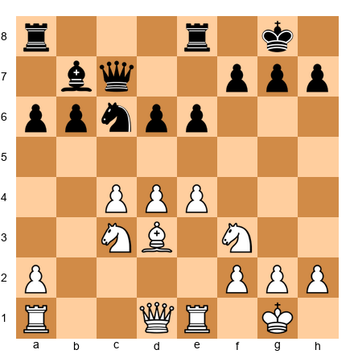</p>


White to play. Black's knight on c6 and bishop on b7 are both reasonably placed. Which exchange should White aim for, and why? Think like Karpov.

*Hint: Which Black piece is more dangerous in the long run?*

---

**Exercise 44.8 - The Better Endgame**


<p align="center">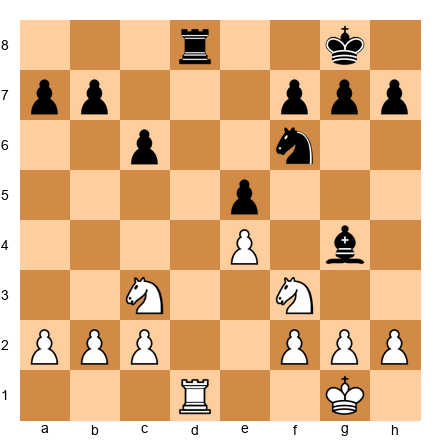</p>


White to play. The position is roughly equal, but White can steer toward a slightly better endgame. How?

*Hint: Fischer would trade the right piece and play for the better pawn structure.*

---

**Exercise 44.9 - Initiative vs Material**


<p align="center">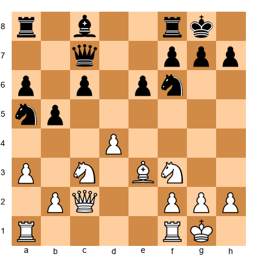</p>


White to play. Black has grabbed a pawn on a5 but the knight is offside. How does White exploit the initiative?

*Hint: The knight on a5 is far from the kingside. What does that allow White to do?*

---

**Exercise 44.10 - The Classical Break**


<p align="center">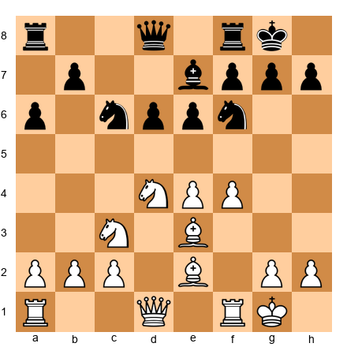</p>


Black to play. Fischer's favorite plan in this type of Sicilian. What is the standard break?

*Hint: Black needs to challenge White's center. There is a classical way to do it.*

---

### ★★★★ Practice

**Exercise 44.11 - The Kasparov Buildup**


<p align="center">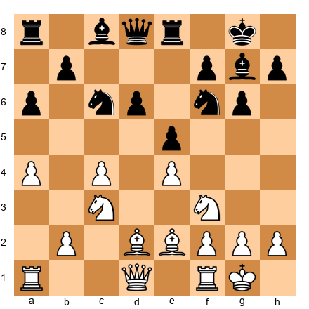</p>


White to play. The position is closed and both sides are maneuvering. Find the plan that creates a long-term kingside attacking setup. Two moves - what are they?

*Hint: Which piece is not contributing to the kingside? Where should it go?*

---

**Exercise 44.12 - Prophylaxis in Action**


<p align="center">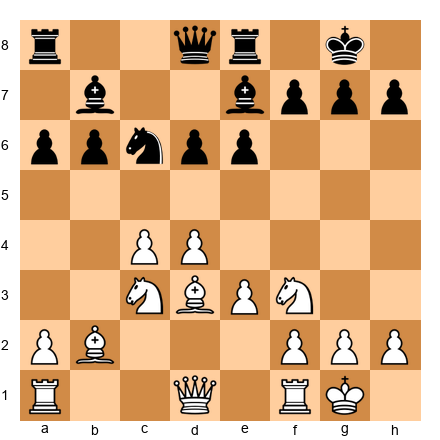</p>


White to play. Black is planning ...d5 to free the position. White has two prophylactic options. Find the stronger one.

*Hint: One prophylactic move is passive (blocking). The other is active (creating a threat while preventing ...d5). Karpov always preferred the active one.*

---

**Exercise 44.13 - Fischer's Precision**


<p align="center">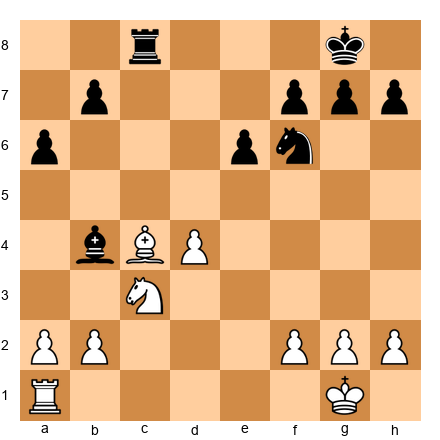</p>


White to play. White has an isolated d-pawn and Black has pressure on it. But the bishop on c4 and the knight on c3 are well-placed. How does White maintain equality - or more?

*Hint: Fischer would not defend the d-pawn passively. He would use it.*

---

**Exercise 44.14 - Attack on Opposite Flanks**


<p align="center"></p>


White to play. Opposite-side castling. What is the first move of White's kingside attack? Think about the fastest way to open lines.

*Hint: Which pawn can advance without weakening White's king position?*

---

**Exercise 44.15 - The Quiet Crusher**


<p align="center">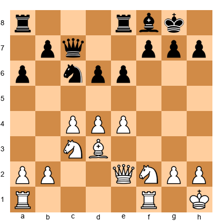</p>


White to play. Karpov-style position. Black has no weaknesses but is passive. Find the maneuver that slowly tightens the grip.

*Hint: A knight on f5 would dominate the position. How many moves does it take to get there?*

---

**Exercise 44.16 - Polgar's Tactics**


<p align="center">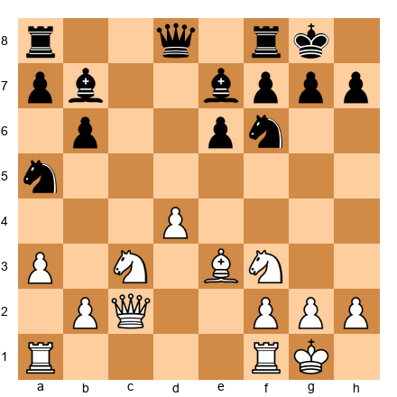</p>


White to play. Black's knight on a5 is misplaced. White has a strong center and better-coordinated pieces. Find the tactical shot that exploits the knight's absence from the kingside.

*Hint: The knight is on a5. The king is on g8. Where should your attack go?*

---

**Exercise 44.17 - Structural Conversion**


<p align="center">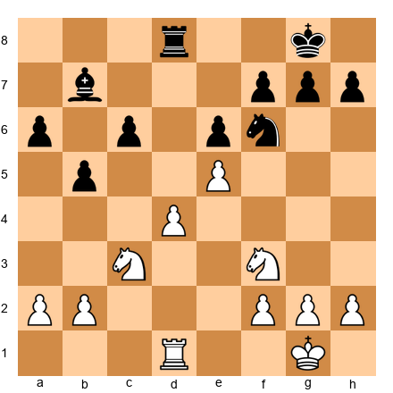</p>


White to play. The e5-pawn restricts Black's knight. How does White use this structural advantage to create a winning plan?

*Hint: The knight on f6 is pinned to the defense of d5 and h7. Which piece can exploit this?*

---

### ★★★★★ Mastery

**Exercise 44.18 - The Deep Calculation**


<p align="center">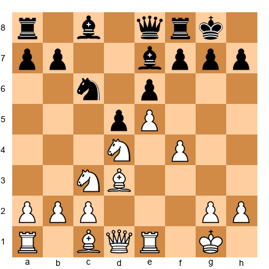</p>


White to play. This position requires deep calculation - five to seven moves ahead. White has a powerful center and an attack brewing. Find the strongest continuation and calculate the main line.

*Hint: Kasparov's approach: sacrifice a pawn to open lines for the bishop. But which pawn, and how?*

---

**Exercise 44.19 - Positional Mastery**


<p align="center">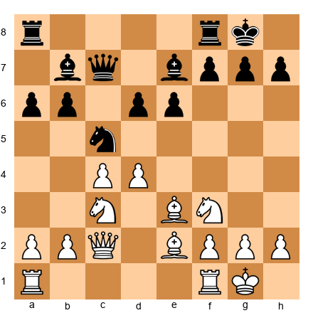</p>


White to play. A Karpov-style challenge. The position is symmetrical in structure but White has a slight space advantage. Find the plan that converts this edge into a lasting advantage over the next five moves.

*Hint: The key is not one move but a plan. What piece should be improved, and what target should White create?*

---

**Exercise 44.20 - The Complete Player**


<p align="center">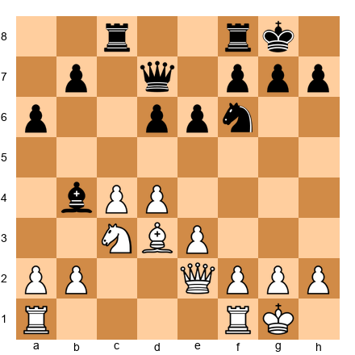</p>


White to play. This position can be handled tactically (Kasparov-style), positionally (Karpov-style), or with classical clarity (Fischer-style). Find the best move and explain which approach it represents and why it is strongest here.

*Hint: The best move works on multiple levels. It improves a piece, creates a threat, and prepares a favorable endgame. It is the Fischer approach - the objectively best move, regardless of style.*

---

## Key Takeaways

1. **Kasparov teaches controlled aggression.** Build your position, maintain tension, and attack only when your pieces are coordinated. The attack should arise from structural strength, not from hope.

2. **Karpov teaches prophylactic thinking.** Before making your plan, ask what your opponent wants. Prevent their best ideas, then improve your position in small steps. Accumulate advantages until resistance is impossible.

3. **Fischer teaches classical clarity.** Find the best move and play it, regardless of style preferences. Know your openings deeply. Play precise endgames. Trust the position, not psychology.

4. **Polgar teaches courage.** Play the hardest competition you can find. Choose the sharper line. Refuse to accept limitations that others try to impose on you.

5. **Every great player had a method.** The method was not their moves - it was their way of thinking about positions. You can absorb their methods and add them to your own approach.

6. **Chess has no gender.** Judge every player - including yourself - by the quality of their moves, nothing else.

---

## Practice Assignment

This week, study one full game from each player:

1. **Kasparov game.** Choose any Kasparov game from a database. Play through it slowly. At each move, ask: what is Kasparov attacking? How is he maintaining tension? Where is the controlled aggression?

2. **Karpov game.** Choose any Karpov game. At each move, ask: what is Karpov preventing? What small advantage is he accumulating? When does the position become winning, and can you identify the exact move where the balance tipped?

3. **Fischer game.** Choose any Fischer game. At each move, ask: is this the most direct and honest move? Where does Fischer refuse to compromise? How does he convert the advantage in the endgame?

4. **Polgar game.** Choose any Judit Polgar game against a top-ten opponent. Study it with the same attention you gave the other three. Notice the quality of play. Notice how it compares.

Write a one-paragraph analysis of each game, describing what you learned about the player's style. Save these notes - they will be useful when you develop your own opening repertoire in the next chapters.

---

## ⭐ Progress Check

After completing this chapter, you should be able to:

- [ ] Explain Kasparov's method of controlled aggression and identify it in a game
- [ ] Explain Karpov's prophylactic approach and use it to improve a quiet position
- [ ] Explain Fischer's classical clarity and apply it to opening and endgame decisions
- [ ] Name three contributions Judit Polgar made to chess history
- [ ] Describe the difference between attacking style (Kasparov), positional style (Karpov), and universal style (Fischer)
- [ ] Solve at least 15 of the 20 exercises correctly
- [ ] Identify which player's style most closely matches your own natural tendencies

If you checked all boxes, you are ready for Chapter 45.

If you struggled with the exercises, go back and replay the annotated games in this chapter. Pay attention to the positions where you missed the key idea. Understanding comes through repetition, not speed.

---

## 🛑 Rest Here

You have just studied three of the greatest chess minds in history and the woman who proved the game belongs to everyone.

That is a lot to absorb. Let it settle.

Come back tomorrow. Replay one game. Solve one exercise. Let the ideas become part of how you see the board.

*"The main thing in chess is not how many moves ahead you can see, but how well you understand the position in front of you."*

Good stopping point. Come back refreshed.

---

*Chapter 44 of The Grandmaster Codex - Volume IV: The Master Class*
*Written for Kit Olivas by Ada Marie 💙🦄*
