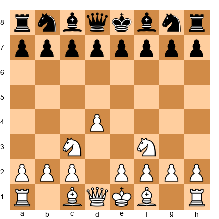
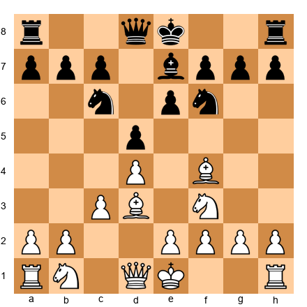
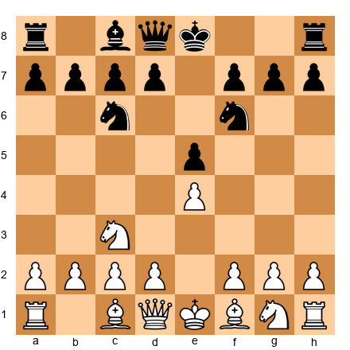
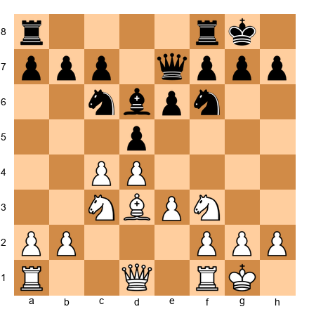
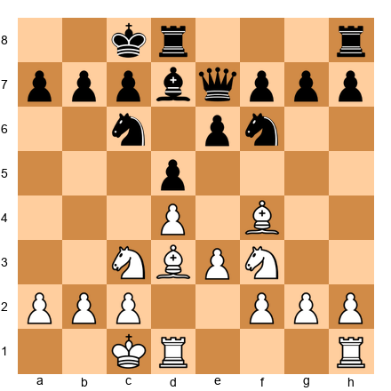

# Chapter 44A: Chess960 - Pure Chess Without the Theory

---

> *"I don't believe in psychology. I believe in good moves."*
> - Bobby Fischer

> *"Chess is finished. It's all just memorization and pre-arrangement. Let's start with a random position and play chess from move one."*
> - Bobby Fischer, announcing Chess960 in Buenos Aires, 1996

**Rating Range:** 2200+ (introduced here, playable at any level)

**What You Will Learn:**
- What Chess960 is, how it works, and why Bobby Fischer created it
- How the 960 possible starting positions force you to think from the first move
- How castling works when the pieces start on unfamiliar squares
- The universal strategic principles that apply regardless of starting position
- How to use Chess960 as a training tool to sharpen your standard chess
- How the best players in the world approach positions with no theory to guide them

---

## You Are Here

```
Ch 36: Expert-Level Calculation         ✅ Complete
Ch 37: Complex Middlegame Strategy      ✅ Complete
Ch 38: Advanced Endgame Theory          ✅ Complete
Ch 39: Professional Opening Preparation ✅ Complete
Ch 40: Practical Decision-Making        ✅ Complete
Ch 41: Engines Without Dependency       ✅ Complete
Ch 42: The Art of Defense               ✅ Complete
Ch 43: Annotated GM Games               ✅ Complete
Ch 44: Great Players and Their Ideas    ✅ Complete
Ch 44A: Chess960 / Fischer Random       ◀ YOU ARE HERE
Ch 45: The Expert Plateau
```

---

You have spent the last nine chapters building expert-level skills: deep calculation, strategic planning, professional preparation, and the ability to play without engine dependency. You have studied the ideas of the greatest players in history.

Now we strip all of that preparation away.

In Chess960, there is no memorized opening. No Najdorf Sicilian. No Berlin Wall. No Catalan. The pieces start on randomized squares, and from the very first move, you must think for yourself.

This is not a gimmick. Bobby Fischer invented this format because he believed chess was drowning in memorization. He was right about the problem, even if the chess world took decades to listen. Today, the FIDE World Fischer Random Chess Championship is one of the most prestigious events on the calendar. Magnus Carlsen, Wesley So, and Hikaru Nakamura have all competed at the highest level in this format. It tests something that standard chess sometimes lets you hide from: raw understanding.

If you have built your chess knowledge on principles rather than memorized lines, Chess960 will feel natural. If you have been leaning on preparation as a crutch, this chapter will expose exactly where your understanding has gaps.

Either way, you will come out of it a stronger player.

---

## 44A.1 What Is Chess960?

### The Rules

Chess960 - also called Fischer Random Chess - uses the same board, the same pieces, the same movement rules, and the same winning conditions as standard chess. The only difference is the starting position.

Before each game, the back-rank pieces are placed randomly. There are exactly 960 legal starting arrangements, which gives the format its name.

Three constraints govern the randomization:

1. **The bishops must be on opposite-colored squares.** One bishop on a light square, one on a dark square - just like standard chess.

2. **The king must start between the two rooks.** This ensures that castling is always possible on both sides.

3. **Pawns start on their normal squares.** The second rank for White, the seventh rank for Black.

4. **Black's position mirrors White's.** Whatever arrangement White receives, Black gets the same setup across the board.

Everything else about the game is identical to standard chess. Once the pieces are placed, the game proceeds normally. The only special consideration is castling, which we will cover next.

Position 518 in the Chess960 numbering system is the standard chess starting position. You already know that one. The other 959 positions are what make this format interesting.

### Castling in Chess960

This is the single most confusing aspect of Chess960 for new players. Read this section carefully.

In standard chess, castling is simple because the king and rooks always start on the same squares. In Chess960, the king and rooks can start anywhere on the back rank (subject to the king-between-rooks constraint), so the mechanics of castling look different - but the result is always the same.

**The rule:** After castling, the king and rook end up on the same squares they would in standard chess, regardless of where they started.

- **Kingside castling (O-O):** The king ends on g1 (or g8), and the rook ends on f1 (or f8).
- **Queenside castling (O-O-O):** The king ends on c1 (or c8), and the rook ends on d1 (or d8).

The conditions for castling are the same as standard chess:

- Neither the king nor the castling rook has moved.
- No pieces stand between the king's starting square and its destination, or between the rook's starting square and its destination.
- The king does not pass through or land on a square attacked by an enemy piece.
- The king is not currently in check.

Here is where it gets strange. Consider a starting position where the king is on b1 and a rook is on f1. If White castles kingside, the king moves from b1 to g1, and the rook moves from f1 to... f1. The rook does not move at all, because it is already on the correct destination square. This is legal. The king simply slides across to g1, and the rook stays put.

In another position, the king might start on f1 and a rook on a1. If White castles queenside, the king moves from f1 to c1, and the rook moves from a1 to d1. Now both pieces have moved, but the king traveled four squares instead of the usual two.

In rare cases, the king can even start on g1. If it castles kingside, the king stays on g1, and the rook moves to f1. The king does not move at all.

The destination is always the same. The path to get there varies. That is the key principle.

**Notation:** Castling is always written as O-O (kingside) or O-O-O (queenside), based on which side the rook was on relative to the king - not based on how many squares the king travels.

### Why This Matters

The castling rule means that in some starting positions, castling is trivially easy - perhaps only one piece needs to move out of the way. In other positions, castling requires clearing three or four pieces from the path, which might take ten or more moves. This creates a fundamentally different strategic dynamic.

In standard chess, castling typically happens between moves five and ten. In Chess960, you might castle on move three, or you might not be able to castle until move fifteen. Sometimes the king is already reasonably safe without castling. Sometimes castling is the single most urgent priority.

This forces you to evaluate king safety from first principles rather than following a standard routine. That is exactly the point.

---

## 44A.2 Why Bobby Fischer Invented It

### The Problem Fischer Saw

Bobby Fischer was the eleventh World Chess Champion, and many consider him the most naturally gifted player in the history of the game. His 1972 match against Boris Spassky in Reykjavik remains the most famous chess event ever held.

Fischer retired from competitive chess in 1975 and watched the game change from a distance. What he saw troubled him.

The Soviet chess machine had dominated world chess for decades through a system of organized preparation. Teams of grandmasters prepared opening novelties for their top players. Lines were analyzed to the twentieth move and beyond. By the time Fischer returned to public life in the 1990s, the problem had deepened. Computer databases and engines meant that a well-prepared player could play fifteen or twenty moves of theory before thinking for themselves.

Fischer believed this was killing chess. He called it "pre-arranged chess" - games decided not by who understood the position better, but by who had memorized deeper into their home preparation.

He was not entirely wrong. At the top level, opening preparation has always been a significant factor. But Fischer's complaint went deeper than mere convenience. He believed that when games are decided by memory rather than understanding, chess loses its essence as a battle of minds.

### The 1996 Announcement

On June 19, 1996, in Buenos Aires, Argentina, Bobby Fischer publicly announced his new chess variant. He called it "Fischer Random Chess." The name "Chess960" came later, coined by Hans-Walter Schmitt based on the number of legal starting positions.

Fischer's proposal was simple: randomize the back-rank pieces before each game. No preparation possible. No memorized lines. Just chess.

The chess world's reaction was mixed. Some grandmasters embraced the idea. Others dismissed it as a novelty that would never gain traction. The establishment was slow to act.

### FIDE Recognition

It took more than two decades, but in 2019, FIDE officially launched the World Fischer Random Chess Championship. The first champion crowned under the official FIDE banner was Wesley So, who defeated Magnus Carlsen in the final. The event was held in Bærum, Norway, and it attracted global attention.

Since then, the Fischer Random Championship has become an annual event. Major tournaments regularly include Chess960 rapid and blitz events alongside their classical programs. Lichess and Chess.com both offer rated Chess960 play. The format has moved from curiosity to mainstream.

Fischer did not live to see his invention gain official recognition. He died in 2008 in Reykjavik, Iceland - the same city where he became World Champion thirty-six years earlier. But his creation is now a permanent part of competitive chess.

---

## 44A.3 The Philosophy: Understanding vs. Memorization

Fischer's critique was not just about openings. It was about what we value in chess.

Consider two players sitting down for a standard game. Player A has spent forty hours this month memorizing a sharp line in the Anti-Marshall. Player B has spent the same forty hours studying pawn structures, piece activity, and endgame technique. If the game enters the Anti-Marshall line, Player A has a massive advantage - not because they understand more, but because they remember more.

Chess960 eliminates that advantage. Both players face a position they have never seen before. The one who wins will be the one who understands chess better, not the one who has memorized more.

This does not mean that opening preparation in standard chess is worthless. It is not. Preparation is a legitimate skill, and at the top level it is essential. But preparation without understanding is fragile. The moment your opponent deviates from your line, your memorized moves are useless. All you have left is your understanding.

Chess960 trains that understanding directly.

There is a saying among grandmasters who play both formats: "Standard chess tests your preparation. Chess960 tests your chess." That distinction matters. The best players in both formats - Carlsen, So, Nakamura - are players with deep positional understanding. They do not rely on preparation alone, and that is precisely why they excel when preparation is taken away.

This chapter sits in Volume IV for a reason. You need a strong foundation in standard chess - the principles of development, central control, king safety, pawn structure, piece activity, endgame technique - before Chess960 can teach you anything. If you do not understand why knights belong on outpost squares, randomizing the starting position will not help you.

But if you have built that foundation, Chess960 will test it in ways that standard chess never can.

---

## 44A.4 Strategic Principles Without Memorized Openings

This is the core of the chapter. When the pieces start on unfamiliar squares, you must rely on universal principles. These are the same principles you have studied throughout the Codex - but here, they are the only tools you have.

### Universal Opening Principles

These apply in every Chess960 position, without exception:

**1. Develop pieces toward the center.** Knights belong on active squares. Bishops need open diagonals. Rooks need open files. These ideas do not change because the starting position changed.

**2. Control the center with pawns.** The squares e4, d4, e5, and d5 are still the most important squares on the board. Occupying them, or controlling them from a distance, gives your pieces maximum scope.

**3. Castle when practical.** King safety remains a priority. If your king is exposed, find a way to tuck it away. If your king is already tucked behind pawns and pieces, castling might be less urgent - or even counterproductive.

**4. Connect your rooks.** Once your minor pieces are developed, your rooks should see each other across the back rank. Connected rooks can support each other and contest open files.

**5. Do not move the same piece twice without reason.** Tempo matters in Chess960 just as it does in standard chess. Every move you spend repositioning a piece you already moved is a move your opponent can use to develop a new piece.

These are not new ideas. You know all of them. The difference is that in Chess960, you cannot fall back on memorized moves that follow these principles automatically. You must apply them consciously, from move one, in a position you have never encountered.

### Position-Specific Thinking

When you see a Chess960 starting position for the first time, ask yourself five questions before making your first move:

**1. Which pieces can develop easily?** Some pieces will have clear paths to active squares. A bishop on c1 or f1 may already have an open diagonal. A knight on b1 or g1 can reach c3 or f3 in one move, just like standard chess. Identify the pieces that are ready to play.

**2. Which pieces are stuck?** In some starting positions, pieces block each other. A bishop behind a wall of pawns needs those pawns to move first. A rook hemmed in by the king needs the king to castle before the rook can enter the game. Find the bottleneck and plan around it.

**3. How fast can you castle?** Count the pieces between your king and its castling destination. If only one piece needs to move, castling is easy. If three pieces are in the way, castling will take time, and you may need to keep your king safe by other means.

**4. Where is the center going to be contested?** Look at both sides' pawn structures and piece placements. If your opponent's bishop aims at e4, you might avoid pushing e4 early. If your knight can reach a strong central post quickly, prioritize that development.

**5. What are the opponent's problems?** Your opponent faces the same challenges you do. If their bishop is trapped in a corner, you have time. If their king is exposed, you can accelerate your development to exploit it.

This five-question framework works in every Chess960 position. It is not a set of memorized responses. It is a thinking process.

### Common Chess960 Patterns

Certain piece placements create recurring problems. After playing enough Chess960 games, you will start recognizing these patterns.

**The corner bishop.** When a bishop starts on a1 or h1 (or a8/h8), it is completely blocked by its own pawns. Activating it requires moving at least two pawns - typically the b-pawn and the pawn on the long diagonal. This takes time. If your opponent has a corner bishop and you do not, you have a temporary development advantage. Use it.

**Adjacent rooks.** When both rooks start next to each other (say, on d1 and e1), they are already connected - but they may block the king from castling efficiently. Decide early whether to separate them by developing the king to one side, or to keep them together and find another way to activate your position.

**The king on the wing.** If the king starts on b1 or g1, it is already on a semi-castled square. Castling might not be necessary. Instead, you can develop pieces without spending tempo on king safety. This gives you a head start in the opening - but only if you are aware of the advantage.

**Central king.** If the king starts on d1 or e1 (the standard position), castling is usually a high priority. The center opens faster than the wings, and a king on d1 or e1 is exposed to files and diagonals that will open as pawns advance.

**Knights on the rim.** Knights that start on a1 or h1 (yes, this happens) are on the worst possible squares. Getting them to active central squares takes at least two moves. Prioritize this development - a knight on a1 is doing nothing for your position.

### The Thinking Framework

Here is a practical framework for the first phase of any Chess960 game. Commit this to memory:

**Phase 1 (Moves 1–5): Survey and Develop**
- Assess the starting position using the five questions above.
- Move pawns to open diagonals for bishops and create central space.
- Develop at least one knight toward the center.
- Identify which side to castle on (if castling is practical).

**Phase 2 (Moves 6–12): Consolidate and Connect**
- Complete minor piece development.
- Castle (or ensure king safety by other means).
- Connect the rooks.
- Establish a pawn center or contest the opponent's center.

**Phase 3 (Move 12+): Play Chess**
- From here, the game proceeds like any standard middlegame.
- The opening is over. Pawn structures, piece activity, plans - everything you know applies.

The first two phases are where Chess960 differs from standard chess. Phase 3 is identical. A strong middlegame player will find that once the opening phase is complete, they are on familiar ground.

### Common Mistakes in the Chess960 Opening

Even experienced standard chess players make specific, avoidable mistakes when first playing Chess960. Recognizing these mistakes before you make them will save you games.

**Moving the same piece twice.** In standard chess, moving the same piece twice in the opening is usually bad because it wastes time. In Chess960, this rule applies even more strongly because you start from positions where some pieces are already on reasonable squares. If your bishop starts on c1 and you play it to d2, then to e3, you have spent two moves on a piece that might have been fine staying on c1 for another few moves while you developed other pieces.

**Ignoring the center for premature attacks.** Some players see an unusual starting position and immediately look for tactical tricks - "Maybe I can attack f7 on move 3!" In Chess960, early attacks almost always fail because both sides have fully defended starting positions. The correct approach is to develop peacefully and build a strong center before thinking about attacks.

**Delaying king safety.** In standard chess, you usually castle within the first 10 moves. In Chess960, castling is sometimes available early and sometimes requires significant preparation (because the rook and king might be far apart). Some players delay castling indefinitely, thinking "I'll get to it later." This is dangerous. If your king is in the center and the position opens, you can be caught in a crossfire. Make king safety a priority even when castling requires extra moves.

**Over-valuing the pair of bishops.** In standard chess, the bishop pair is usually a long-term advantage. In Chess960, both bishops might start on the same side of the board or on awkward squares. The bishop pair is still generally good, but it is not automatically better than bishop and knight in every Chess960 position. Evaluate each position on its merits rather than applying standard chess generalizations.

---

🛑 *Good stopping point. The principles above are the foundation. Come back fresh for the games.*

---

## 44A.5 Annotated Chess960 Games

The following four games illustrate how top players apply universal principles in positions with no opening theory. Pay attention to the thinking process, not the specific moves. The positions are unique - you will never face the exact same starting arrangement. What carries over is the method.

---

### Game 1: Wesley So vs. Magnus Carlsen
**FIDE World Fischer Random Championship 2019 | Final, Game 4**
**Starting Position 164 - Rapid (25+10)**
**Result: 1-0**

Starting arrangement (White): R N B K Q B N R → rearranged as:
**B Q N N K R B R** (back rank: a1=B, b1=Q, c1=N, d1=N, e1=K, f1=R, g1=B, h1=R)

*Note: The Chess960 position number determines the exact arrangement. For instructional purposes, the critical positions are shown with diagrams below.*

Wesley So entered this championship final as the underdog. Carlsen was the reigning classical, rapid, and blitz World Champion. But in Chess960, preparation counts for nothing. The board is level.

**The Opening Phase**

So's approach was methodical. With the bishops on a1 and g1 - both initially blocked - the first priority was pawn moves to activate them. The knights on c1 and d1 could reach natural squares (c3 and d3 via e2 or f3) within two moves.

So played d3 and e4 early, opening the diagonal for the g1-bishop and creating a classical pawn center. He developed the c1-knight to e2 and then to g3, aiming at the kingside. The d1-knight went to f3 via e2 (after the first knight moved away).

Carlsen mirrored a similar approach, but So's development was more harmonious. By move 8, So had a knight on f3, a bishop on the a2-g8 diagonal, and a clear plan to castle kingside.

**The Critical Position**

After 12 moves of development, So reached a position where his pieces were active, his king was safe, and his rooks were connected. Carlsen's position was solid but slightly passive - his g8-bishop was still partially blocked, and his knight on a6 was out of play.


*White to play.*

So found the right plan: he advanced on the queenside with a4 and b4, gaining space and restricting Carlsen's knight on a6. The knight had nowhere useful to go. It was trapped on the rim - not because of a tactical trick, but because So's spatial advantage denied it access to c5 or c7.

**The Lesson**

So won this game because he followed principles more efficiently than Carlsen. Both players knew the same principles. But So's development was slightly more coordinated, and that small edge compounded over thirty moves. In Chess960, there are no theoretical advantages to compensate for sloppy development. Every move must earn its place.

**What This Game Teaches You:**

Wesley So treated an unfamiliar starting position like a puzzle to be solved with basic tools. Open diagonals for bishops. Knights toward the center. Pawns to control space. Castle when ready. He did not try anything exotic. He just played sound chess, faster and more accurately than his opponent.

At your level, that approach will win most Chess960 games. Do not look for brilliancies. Look for efficient development and harmonious piece coordination.

---

### Game 2: Magnus Carlsen vs. Hikaru Nakamura
**Champions Showdown: Chess960 2018 | St. Louis**
**Starting Position 532 | Rapid (25+5)**
**Result: 1-0**

Starting arrangement:
**R K B N Q N B R** (a1=R, b1=K, c1=B, d1=N, e1=Q, f1=N, g1=B, h1=R)

This is a fascinating starting position. The king is on b1 - already tucked away on the wing. Castling queenside would put the king on c1, barely moving it. Castling kingside would slide it all the way to g1, a dramatic relocation.

The queen starts on e1, centralized and powerful from the first moment. Both knights start on the back rank (d1 and f1), ready to develop in one move.

**Carlsen's Approach**

Carlsen recognized that his king on b1 was already reasonably safe behind the a-pawn and b-pawn. He chose not to castle at all in the early phase. Instead, he focused on rapid piece development: Nd3, Nf3, and then e4 to open the c1-bishop's diagonal.

This is an important lesson. In standard chess, castling is almost automatic. In Chess960, you must evaluate whether castling is worth the tempo. If the king is already safe, spending a move (and clearing a path) to castle may be wasted effort.

Nakamura, by contrast, had a king on b8 and invested three moves clearing pieces to castle queenside. Those three moves gave Carlsen a significant development lead.

**The Tactical Moment**


*White to play.*

Carlsen played **e5!**, chasing the f6-knight and seizing space. After ...Nd5, he continued with **c4**, kicking the knight again. Within two moves, he had pushed Black's pieces backward while expanding his control of the center.

This pawn advance worked because Carlsen's pieces were already developed to support it. The knight on d3 reinforced e5. The knight on c3 (after Nf3-c3 in some lines) controlled d5. The position was not about memorized theory - it was about piece coordination and central control.

**The Endgame**

Carlsen converted his spatial advantage into a won endgame through patient maneuvering. He traded pieces when it favored him, kept his pawns advanced, and used his king actively. Nakamura defended well but could not undo the structural damage from the opening phase.

**What This Game Teaches You:**

Two things stand out. First, Carlsen's decision not to castle. He evaluated the position and decided his king was safe enough. That saved him two or three tempi, which he used for piece development. Second, the e5 pawn thrust - a standard idea from classical chess - worked perfectly in an unfamiliar position because the supporting pieces were in place.

When you play Chess960, carry your standard chess ideas with you. The positions are new. The principles are not.

---

### Game 3: Instructive Example - The Corner Bishop Problem
**Training Position | SP-721**
**Constructed for illustration**

Starting arrangement:
**N R K B B N Q R** (a1=N, b1=R, c1=K, d1=B, e1=B, f1=N, g1=Q, h1=R)

This position presents a common Chess960 challenge: both bishops start on the back rank, and the d1-bishop is completely blocked by the d2-pawn. The e1-bishop has slightly more freedom (the e-pawn can open its diagonal), but development is awkward.

Meanwhile, the queen on g1 is powerful but also in the way - it blocks the g-pawn, which blocks the h1-rook. This is a tangled position that requires careful untangling.

**Phase 1: Identify the Bottleneck**

The bottleneck is the d1-bishop. It cannot move until the d-pawn advances. But pushing d3 or d4 first means moving a pawn before any pieces are developed. That is normally a violation of opening principles - but in Chess960, sometimes you must break standard rules to solve specific problems.

**The Right Approach:**

**1.d4** - Opens the diagonal for the d1-bishop immediately. This is the priority.

**1...d5** - Black faces a similar problem and solves it the same way.

**2.Bf3** - The bishop enters the game. It eyes the center and the kingside.

**2...e6 3.e4!** - Now the e1-bishop has a diagonal too. After dxe4, Bxe4, and both bishops are active.


*Black to play.*

**Phase 2: Development Continues**

After the bishops are free, the knights need active squares. The a1-knight is on the rim - it needs two moves to reach a useful post (a1-c2-e3 or a1-b3). The f1-knight can go to e3 or g3.

The queen on g1 needs to move to let the h-pawn advance or the h1-rook enter the game. Qe3 or Qf2 are natural squares.

By move 10, a well-played position might look like a normal middlegame: bishops on active diagonals, knights on central or semi-central squares, king castled or safe, rooks beginning to connect.

**The Lesson:**

When pieces start on bad squares, your first task is to identify which piece is the most restricted and free it. Do not try to play around the problem. Solve it. In this position, the d1-bishop was the bottleneck. Once it was freed, the rest of the development fell into place naturally.

**What This Game Teaches You:**

Prioritization. In standard chess, development follows a comfortable routine. In Chess960, you must diagnose which piece needs help the most and make that your first project. The player who untangles faster gets an advantage that often lasts the entire game.

---

### Game 4: Instructive Example - When Castling Is Everything
**Training Position | SP-45**
**Constructed for illustration**

Starting arrangement:
**R N Q B K N B R** (a1=R, b1=N, c1=Q, d1=B, e1=K, f1=N, g1=B, h1=R)

Notice that the king is on e1 - the same as standard chess. But the queen is on c1, and the bishops are on d1 and g1. The queen blocks the d1-bishop, and the g1-bishop is trapped behind the g-pawn.

In this position, castling kingside requires moving the f1-knight and the g1-bishop - two pieces in the way. Castling queenside requires moving the queen and the d1-bishop - also two pieces.

Both sides want to castle. But the player who castles first will have a significant advantage in safety and rook activity. This game is a race.

**The Race**

White plays aggressively to clear the kingside path:

**1.Nf3** - Develops a piece and clears f1 for the bishop.

**1...d5 2.g3!** - Fianchettoing the g1-bishop. After ...Bg7, the bishop is on a powerful diagonal, and the path to castle kingside is clear (only the bishop on g1 needed to move - the knight already left f1).

Wait - the knight left f1 on move 1, and the bishop leaves g1 with the fianchetto plan (Bg2 after g3). But the bishop starts on g1, and the fianchetto means moving it to g2 - that requires g3 first, then Bg2.

**2...Nf6 3.Bg2 e6 4.O-O!**


*Black to play.*

White has castled on move four. The king is safe. The f1-rook is active. The g2-bishop rakes across the long diagonal. White achieved this by making every move count: the knight developed and cleared the path, the pawn opened the fianchetto square, the bishop developed to a powerful diagonal, and the king tucked away.

Black, meanwhile, is still figuring out how to develop the c8-bishop and clear a castling path. This tempo advantage is real and lasting.

**The Middlegame**

With an early castling advantage, White can play aggressively in the center. d4, followed by c4, creates a strong central presence while Black is still developing. The rook on f1 can swing to the center via e1 or d1. White's pieces are coordinated; Black's are still coming out.

**What This Game Teaches You:**

Speed matters. In Chess960, the player who solves the development puzzle faster often gains a lasting advantage. When you see a starting position, your first thought should be: "How quickly can I castle and connect my rooks?" If you can do it in four or five moves, that is excellent. If it takes ten moves, you may already be worse.

This does not mean you should castle at all costs. Sometimes the cost is too high - too many weakening pawn moves, or developing pieces to bad squares just to clear the path. But when you can castle efficiently, the advantage is worth pursuing.

---

## 44A.6 Chess960 as a Training Tool

You do not need to be a Chess960 specialist to benefit from playing it. Used correctly, it is one of the most effective training tools available to any serious player.

### What Chess960 Teaches You

**1. The difference between knowing and understanding.**

In standard chess, you might play Nf3, d4, c4, g3, Bg2, O-O on autopilot in the Catalan. You know the moves. But do you understand why each move is played in that order? Chess960 forces that understanding. When the pieces start on random squares, you cannot play by habit. You must understand why the knight goes to f3 (controls the center, prepares castling), why d4 before c4 (occupies the center before expanding), why g3 before Bg2 (opens the diagonal before developing the bishop). These reasons apply in every position. Chess960 teaches you to see the reasons, not just the moves.

**2. Calculation from move one.**

In standard chess, the first ten to fifteen moves often pass quickly - both players following known lines. In Chess960, every move requires fresh calculation. There is no autopilot phase. This trains your ability to calculate in unfamiliar positions, which is exactly the skill you need when your opponents deviate from theory in standard games.

**3. Piece activity as a universal principle.**

When you cannot follow a memorized sequence, you must rely on a simple question: "Where is the best square for this piece?" That question is the foundation of all positional chess. Chess960 trains you to ask it more often and more carefully.

**4. Adaptability.**

At the expert level and above, your opponents will surprise you. They will play unusual lines, sidestep your preparation, and force you into unfamiliar territory. Chess960 trains you to handle surprise positions calmly and effectively. If you can develop a coherent plan from a random starting position, you can certainly handle an unexpected opening deviation.

**5. King safety evaluation without standard patterns.**

In standard chess, you learn that castling kingside with pawns on f2, g2, h2 creates a safe king. In Chess960, the king might start on b1 or g1, and the "safe" pawn shelter might look completely different. This forces you to evaluate king safety from first principles rather than pattern matching. After a few months of Chess960, your ability to assess king safety in non-standard positions improves dramatically - and this skill transfers directly to standard chess positions where the usual pawn shelter has been disrupted by an attack.

### How to Integrate Chess960 into Your Training

**Play one or two Chess960 games per week.** Lichess offers rated Chess960 in rapid, blitz, and bullet time controls. Play at least rapid (15+10 or 10+5) so you have time to think about the opening phase properly. Blitz Chess960 is fun but not as instructive.

**Analyze your Chess960 games afterward.** Ask yourself: which principles guided my play? Where did I feel lost? Where did I find the right plan? The analysis is where the learning happens, not the game itself.

**Use Chess960 as a warm-up before standard games.** Playing one Chess960 game before a standard chess session sharpens your calculation and forces your brain into "active thinking" mode. You cannot coast through a Chess960 opening. That mental engagement carries over into your standard play.

**Do not replace standard chess with Chess960.** They are complementary. Standard chess teaches opening theory, deep preparation, and the ability to exploit specific structural knowledge. Chess960 teaches adaptability, principled thinking, and raw calculation. You need both.

**Study your standard openings differently after playing Chess960.** You will start to see the principles behind the moves, not just the moves themselves. Your Sicilian preparation will feel richer because you understand why each piece goes where it does. Your endgame technique will feel more natural because you have practiced playing without a script.

---

## 44A.7 Tournament Play Considerations

### The FIDE World Fischer Random Championship

The first unofficial Fischer Random events were held in the early 2000s. Lékó, Svidler, and Aronian were among the early champions of various events. But the format gained serious institutional support only in 2019, when FIDE launched the official World Fischer Random Chess Championship.

**Champions:**

| Year | Champion | Runner-Up | Location |
|------|----------|-----------|----------|
| 2019 | Wesley So | Magnus Carlsen | Bærum, Norway |
| 2022 | Wesley So | (event format varied) | Reykjavik, Iceland |

Wesley So's dominance in Chess960 is remarkable. He has won multiple Fischer Random events and is widely regarded as the strongest Chess960 player in the world. His success is built on exactly the qualities this chapter emphasizes: deep positional understanding, efficient development, and patient, principled play.

Magnus Carlsen has also excelled in Chess960 events, winning the unofficial 2018 Champions Showdown: Chess960 event in St. Louis. His ability to switch between standard and Chess960 at the highest level demonstrates that the two formats reward the same fundamental skills.

Hikaru Nakamura's speed and tactical brilliance translate well to Chess960, particularly in faster time controls where calculation speed is paramount.

### Time Controls

Most serious Chess960 events use rapid or blitz time controls:

- **Rapid Chess960:** 15+10 or 25+10 - allows time to think through the unfamiliar opening.
- **Blitz Chess960:** 3+2 or 5+3 - popular online, extremely demanding.
- **Classical Chess960:** Rare, but some events use 60+30 or similar controls.

For training purposes, play rapid. The opening phase of Chess960 requires genuine thought, and you will not learn much if you are blitzing through it on instinct.

### How Chess960 Ratings Compare to Standard Ratings

Your Chess960 rating will typically be close to your standard rating, but there can be significant variation. Players who rely heavily on opening preparation tend to underperform in Chess960. Players with strong positional understanding and calculation tend to perform at their standard rating or above.

If your Chess960 rating is significantly lower than your standard rating, that is diagnostic information. It suggests that you may be relying on memorized openings more than you realize. Use that knowledge to redirect your training.

### The Future of Chess960

Fischer Random is no longer a novelty. It is becoming a permanent part of competitive chess at the highest level. FIDE has committed to regular World Championships. Major events like the Champions Chess Tour include Chess960 segments. Online platforms report growing player pools in Chess960 formats.

For the serious student, this means Chess960 skills are no longer optional. They are part of a complete chess education. The player who understands chess deeply enough to play well in any starting position has an advantage over the player who relies on memorized opening sequences - not just in Chess960, but in standard chess as well.

The principles do not change. The board is the same. The pieces move the same way. Only the starting position differs. If your chess understanding is built on principles rather than memorization, Chess960 is not a different game. It is the same game with a new beginning.

### Common Mistakes in Chess960 Openings

Even experienced players make predictable errors when transitioning to Chess960. Recognizing these patterns will save you games.

**Mistake 1: Castling too early.** In standard chess, castling in the first ten moves is almost always correct. In Chess960, the king may already be safely placed, and castling might actually worsen your king's position. Before castling, ask: is my king safer where it is, or will castling expose it to an open file?

**Mistake 2: Moving the same piece twice.** Players often develop a single piece to an ideal square, then spend another move refining its placement. In Chess960's unfamiliar positions, this happens more frequently because the "right" square is not obvious on the first move. The solution: commit to a reasonable square and develop another piece. Speed of development matters more than perfection of piece placement.

**Mistake 3: Ignoring the center.** Some players, disoriented by the unfamiliar starting position, play moves on the wings and neglect central control. The center is just as important in Chess960 as in standard chess. If you control the center, your pieces work together. If you do not, they work in isolation.

**Mistake 4: Overthinking the first move.** You have 30 seconds on the clock and you are staring at an unfamiliar position, paralyzed by choices. The remedy: identify the center, develop a piece toward it, and move. Your first move in Chess960 does not need to be perfect. It needs to be reasonable. Move quickly, then invest your thinking time on the positions that truly matter.

### Online Chess960 Platforms and Resources

If you want to play Chess960 seriously, here are the best platforms and resources available.

**Lichess.** Lichess offers Chess960 with full rating system, puzzle support, and analysis tools. It is the most popular platform for Chess960 and the one recommended for regular play. The player pool is large enough that you can find games at any time control within a few minutes. Lichess also hosts regular Chess960 tournaments - both arena-style and Swiss-format.

**Chess.com.** Chess.com also supports Chess960 with rated play. The interface is slightly different from Lichess, but the game itself is identical. Chess.com occasionally hosts featured Chess960 events with commentary.

**Books and articles.** There are relatively few dedicated Chess960 books, which reflects the format's still-growing popularity. The best current resource is studying grandmaster Chess960 games from tournament databases. Lichess has a small but growing collection of Chess960 studies created by strong players.

**YouTube and streaming.** Several strong players regularly stream Chess960 games on YouTube and Twitch. Watching a 2700-rated player think through a Chess960 opening in real time is one of the most educational experiences available. You can see how they apply the same principles discussed in this chapter - centralization, king safety, piece development - in unfamiliar positions.

---

## 44A.8 Adapting Standard Chess Skills to Chess960

One of the best things about Chess960 is that you do not need to learn a new game. You already have the skills. The challenge is applying them in positions where the starting pieces are unfamiliar but the underlying principles remain the same.

### Your Opening Knowledge Still Applies

You might think that your Sicilian Defense preparation is useless in Chess960. It is not. The specific move orders are gone, yes - there is no 1.e4 c5 2.Nf3 d6 when the knight might start on a1. But the structural knowledge is completely transferable.

When a Chess960 game produces a position where Black has a pawn on c5 and White has a pawn on e4, the resulting pawn structure is a Sicilian structure. The same plans apply: Black wants counterplay on the c-file, White wants a kingside attack, the d5 square is a key battleground. Your years of Sicilian experience tell you exactly how to handle this structure, even though the game started from position number 518 instead of the standard starting position.

The same is true for every opening you know. If the game produces a position with pawns on d4, c4, e3 for White and d5, e6, c6 for Black, you are in a Queen's Gambit Declined structure. Your QGD knowledge - minority attack, the Carlsbad plan, the role of the light-squared bishops - applies directly.

### Transferable Skills from Standard Chess

The skills that transfer completely to Chess960, without any modification:

**Pawn structure knowledge.** Every pawn structure you have studied - the IQP, the Carlsbad, the French chain, the hedgehog, the Maroczy Bind - appears in Chess960 games. The pieces may start on unusual squares, but within 10 to 15 moves, the pawn structure will resemble something you have seen before. Recognize it, and your standard chess knowledge takes over.

**Piece activity principles.** Knights belong in the center. Bishops need open diagonals. Rooks belong on open files. Queens are strongest in the center or aimed at the enemy king. None of this changes in Chess960. The difference is that you cannot rely on memorized development sequences - you must apply these principles fresh in every game.

**King safety patterns.** The castled king position (king on g1, pawns on f2, g2, h2) is familiar to every chess player. In Chess960, you may not always reach this exact configuration. But the underlying principle - the king needs a shelter of pawns, and the pawn cover should not be weakened without good reason - is universal.

### Assessing King Safety Without the Standard Castled Position

This is the biggest adjustment for standard chess players in Chess960. In standard chess, you castle kingside, your king goes to g1, and you know exactly how safe it is based on the pawn cover and the presence of attacking pieces. In Chess960, your king might end up on b1, d1, f1, or stay in the center.

The assessment process is the same - you just cannot do it on autopilot. Ask yourself three questions:

**1. Does my king have a pawn shield?** Whether the king is on g1 or b1, it needs pawns in front of it. If your king is on d1 with pawns on c2, d2, and e2, that is a decent shelter. If the pawns have moved, the king is exposed.

**2. Are the files near my king open?** Open files near the king invite rook attacks. If your king is on f1 and the g-file is open, you have a problem - just as you would in standard chess with a king on g1 and an open g-file.

**3. Can my opponent bring heavy pieces toward my king?** If their queen and rooks can reach your king's neighborhood within two or three moves, the safety is questionable regardless of where the king sits.

The positions are unfamiliar, but the evaluation method is identical. Train yourself to run through these three questions in every Chess960 game, and you will assess king safety as accurately as you do in standard chess - it will just take a few extra seconds of conscious thought.

### A Practical Example

Suppose you reach a Chess960 position where your king has castled to c1 (a common outcome when the rook starts on a1 and the king starts on d1). The pawn structure around your king is a2, b2, c2. This is similar to a standard queenside castling position. You know from standard chess that a2-a1 casting is safe as long as the a- and b-files remain closed. Apply the same logic here: keep the a-file and b-file closed, do not push the a-pawn or b-pawn without reason, and watch for pawn breaks like ...b5 or ...a5 that could open lines toward your king.

Your standard chess experience is giving you everything you need. Chess960 just asks you to think about it consciously instead of playing on autopilot. That conscious thinking, in turn, makes you a better standard chess player. The skills flow both ways.

---

## 44A.9 Chess960 in Your Training Arsenal

Chess960 is not just an alternative format for casual play. Used deliberately, it is one of the most effective training tools available. Here is a weekly protocol that integrates Chess960 into your standard training without taking over your schedule.

### The Weekly Chess960 Protocol

**Monday: Play one 15+10 Chess960 game on Lichess.** Choose the 15+10 time control because it gives you enough time to think carefully without dragging the game out. Play the game seriously - do not treat it as a throwaway. Try to apply the principles from this chapter: develop toward the center, secure your king, activate your pieces in the order that makes sense for this specific starting position.

**Tuesday: Analyze the Chess960 game.** Spend 20 to 30 minutes going through your Monday game. What principles guided your play? Where did you feel uncertain? Were there moments when your standard chess knowledge helped you find a good move? Were there moments when you had to think from scratch because your usual patterns did not apply?

Write down one concrete lesson from the game. It might be: "I should have castled earlier because my king was exposed on g1" or "My knight development was slow because I tried to reach its standard square instead of adapting to the new setup." These lessons accumulate over time and build your chess understanding.

**Wednesday through Sunday: Standard chess training.** The rest of the week is your normal training routine - tactics, opening study, endgame practice, and standard-format games. The Chess960 work is a supplement, not a replacement.

### How Chess960 Improvements Transfer

After 2 to 3 months of consistent Chess960 practice, you will notice improvements in your standard chess that seem unrelated to Chess960. Here is why.

Your opening play becomes more flexible. Instead of panicking when your opponent plays an unfamiliar move in the opening, you handle it calmly because you are used to thinking from scratch in Chess960. You evaluate the position, identify the key principles, and find a reasonable plan. This is exactly the skill that Chess960 trains.

Your piece development becomes more efficient. In Chess960, you learn to develop pieces to the squares that make sense for the specific position, not the squares that "should" be correct based on opening theory. This trains you to evaluate piece placement independently, which improves your middlegame play in standard chess.

Your calculation in unbalanced positions improves. Chess960 regularly produces positions that look strange and unbalanced. Working through these positions strengthens your ability to handle unusual structures in standard chess - the positions that arise when openings go off-book.

### Skills Chess960 Develops That Standard Play Does Not

Standard chess training reinforces pattern recognition in familiar structures. Chess960 training develops something different: the ability to evaluate and plan in unfamiliar structures. Both skills matter, but the second one is harder to train through standard play alone.

Chess960 also trains flexible thinking about king safety, piece coordination, and pawn structure in ways that standard openings do not. When your rook starts on b1 and your bishop starts on a1, you must think creatively about how to get your pieces into play. This creative problem-solving carries over directly to standard chess positions where the usual approaches do not work.

---

## 44A.10 The Future Player: Combining Standard and Chess960

The trend in professional chess is clear: Chess960 is becoming more important every year. Magnus Carlsen has been a vocal advocate for Chess960 as a serious competitive format. World Chess960 Championships are now regular events with strong fields and significant attention.

Many top grandmasters now compete seriously in both standard and Chess960 formats. Hikaru Nakamura, Wesley So, and Carlsen himself have all won major Chess960 events while remaining competitive in standard chess. This suggests that the two formats complement each other rather than competing for the same skill set.

For the expert player, the lesson is straightforward: becoming strong in both formats makes you a more complete chess player. Your standard chess benefits from the pattern-breaking thinking that Chess960 requires. Your Chess960 benefits from the deep positional and tactical understanding that standard chess study develops.

There is also a practical advantage in standard chess tournaments. When your opponent plays an unexpected opening, many players panic. They spend too much time, make nervous moves, and fall behind on the clock. But if you have Chess960 experience, unexpected positions feel normal. You have been dealing with unusual piece placements for months. An unfamiliar opening is just a mild version of what you handle every Monday evening.

The future of chess belongs to players who are comfortable in both worlds: the deep, theory-heavy world of standard chess and the creative, adaptable world of Chess960. Start building that flexibility now, and you will be ahead of the curve.

### Practical Tips for Starting Chess960

If you have never played Chess960, here is how to begin without feeling overwhelmed.

**First session: just play.** Go to Lichess, select Chess960, and play a 15+10 game. Do not worry about playing well. Just experience the format. Notice what feels different and what feels the same. Most players find that the middlegame and endgame feel very familiar - it is only the first 5 to 10 moves that feel strange.

**Second session: watch a game.** Before playing your next Chess960 game, watch a strong player (2500+) play a Chess960 game on Lichess TV or YouTube. Notice how they handle the opening. They are not following memorized theory. They are applying principles - develop toward the center, get the king to safety, connect the rooks. This is exactly what you should do.

**Third session and beyond: play and analyze.** Play a game, then analyze it using the principles from this chapter. Over time, you will develop your own Chess960 opening habits. Some starting positions will feel comfortable quickly. Others will challenge you every time. That challenge is the point - it is building your chess understanding with every game.

---

🛑 *Solid stopping point. When you return, the exercises will test everything you have learned.*

---

## Exercises

### ★★ Warmup

---

**Exercise 44A.1** ★★

Chess960 Starting Position: **R B N K Q B N R** (a1=R, b1=B, c1=N, d1=K, e1=Q, f1=B, g1=N, h1=R)

The king is on d1. The queen is on e1. Both bishops are on b1 and f1.

**Question:** How many pieces must move before White can castle kingside? How many for queenside? Which side should White castle on, and why?

*Hint: Count the pieces between the king and its destination for each side.*

---

**Exercise 44A.2** ★★

Chess960 Starting Position: **B R K N N Q B R** (a1=B, b1=R, c1=K, d1=N, e1=N, f1=Q, g1=B, h1=R)

The king is on c1. The rooks are on b1 and h1.

**Question:** If White castles kingside, which squares do the king and rook end up on? What is the minimum number of moves needed to make kingside castling possible?

---

**Exercise 44A.3** ★★

In a Chess960 game, you reach this position after 6 moves:


<p align="center"></p>


This is actually a standard chess position. But imagine the starting position placed both knights on a1 and h1 instead of b1 and g1.

**Question:** If both knights started on the rim (a1 and h1), how many moves would it take to reach c3 and f3? How does this compare to the standard starting position? What does this tell you about development speed in Chess960?

---

**Exercise 44A.4** ★★

You sit down for a Chess960 game. The starting position has your bishop on a1 (a dark-squared bishop on a dark corner square), completely blocked by your own pawns.

**Question:** Write out a plan (2–4 moves) to activate this bishop. What pawn moves are required? Which other pieces might need to move first?

---

### ★★★ Essential

---

**Exercise 44A.5** ★★★

Chess960 Starting Position: **Q R B B N N K R** (a1=Q, b1=R, c1=B, d1=B, e1=N, f1=N, g1=K, h1=R)

The king is on g1 - already on its kingside castling destination square.

**Question:** Does White need to castle at all? If White castles kingside, what happens? (Remember: the king ends on g1 and the rook on f1.) What is White's best opening strategy in this position - castle anyway, or focus on other priorities?

---

**Exercise 44A.6** ★★★

Consider this Chess960 middlegame position:


<p align="center"></p>


White has a standard-looking position, but arrived here from a Chess960 opening.

**Question:** Evaluate this position. What are White's strengths? What should White's plan be for the next five moves? Focus on universal principles - not any specific opening theory.

---

**Exercise 44A.7** ★★★

Chess960 Starting Position: **N N R K B B R Q** (a1=N, b1=N, c1=R, d1=K, e1=B, f1=B, g1=R, h1=Q)

Both knights start on a1 and b1. The queen starts on h1.

**Question:** Which piece is the most urgently in need of development? Write a development plan for the first 6 moves, justifying each move with a principle from this chapter.

---

**Exercise 44A.8** ★★★

You are playing a Chess960 game and your opponent castles on move 3. You have not yet developed a single piece.

**Question:** Are you necessarily worse? What factors determine whether early castling gives a real advantage or is just a wasted tempo? Give two scenarios - one where early castling helps, and one where it is premature.

---

**Exercise 44A.9** ★★★


<p align="center"></p>


This position could arise in either standard chess or Chess960.

**Question:** Without knowing whether this is standard chess or Chess960, plan White's next 4 moves using only universal principles. Do not reference any opening name or theory. Explain your reasoning for each move.

---

**Exercise 44A.10** ★★★

Chess960 Starting Position: **R K R B B N N Q** (a1=R, b1=K, c1=R, d1=B, e1=B, f1=N, g1=N, h1=Q)

The king is on b1, sandwiched between rooks on a1 and c1.

**Question:** If White castles queenside (O-O-O), the king goes to c1 and the a1-rook goes to d1. But the c1-rook is in the way. Can White castle queenside? If not, what must happen first? If White castles kingside instead, describe the full sequence.

---

**Exercise 44A.11** ★★★

After 10 moves of a Chess960 game, you reach this position:


<p align="center"></p>


Both sides have castled, developed their minor pieces, and established pawn centers. The position looks like a standard Queen's Gambit Declined structure.

**Question:** From this point forward, does it matter that this game started as Chess960? What standard chess plans apply here? Name two candidate plans for White and explain why they work.

---

**Exercise 44A.12** ★★★

You play five Chess960 games on Lichess. In every game, you struggle with the same problem: your bishops are slow to develop because they start behind pawns.

**Question:** What general strategy can you adopt to solve the "blocked bishop" problem in Chess960? Write three practical rules for bishop development that apply regardless of starting position.

---

### ★★★★ Practice

---

**Exercise 44A.13** ★★★★

Chess960 Starting Position: **R B Q K N N B R** (a1=R, b1=B, c1=Q, d1=K, e1=N, f1=N, g1=B, h1=R)

White's king is on d1 - exposed in the center. Both knights are on e1 and f1, blocking the kingside. The queen is on c1, blocking the b1-bishop.

**Question:** Write a complete 10-move development plan for White. For each move, explain: (a) which piece you are developing or which pawn you are moving, (b) why this move is more urgent than the alternatives, and (c) how it contributes to your overall plan.

---

**Exercise 44A.14** ★★★★

You are playing a Chess960 rapid game. Your opponent - a strong player rated 2300 - plays an unfamiliar opening structure that you have never seen. By move 8, you realize you have no idea what the "correct" plan is.

**Question:** Describe, in detail, the mental process you should follow when you have no theoretical guidance. Use the five-question framework from Section 44A.4. Apply it to this FEN position:


<p align="center"></p>


---

**Exercise 44A.15** ★★★★

Compare these two positions:

**Position A (Standard Chess):**

<p align="center"></p>

(After 1.e4 in standard chess)

**Position B (Chess960 - SP-534):**
A starting position where the queen is on a1, the king on e1, and the bishops on c1 and f1. After White plays 1.e4.

**Question:** In Position A, Black has many well-known responses (1...e5, 1...c5, 1...e6, etc.), all backed by decades of theory. In Position B, Black must decide on a response using only principles. Write Black's best response to 1.e4 in Position B, and explain your reasoning. Then reflect: which thinking process - theoretical or principled - produces a deeper understanding of why certain responses work?

---

**Exercise 44A.16** ★★★★

A Chess960 game reaches the following position:


<p align="center"></p>


Both sides have castled queenside. The pawn structures are symmetrical. No player has an obvious advantage.

**Question:** This is a "dead equal" position with no theoretical guidance. How does an expert-level player create winning chances from here? Name three concrete ideas White can pursue, ranked by risk level (safe, moderate, ambitious). Explain the trade-offs of each approach.

---

**Exercise 44A.17** ★★★★

You decide to use Chess960 as a training tool. You will play three Chess960 rapid games per week for one month.

**Question:** Design a post-game analysis protocol specifically for Chess960 games. What questions should you ask yourself after each game? What should you write down? How should this analysis differ from your standard chess post-game analysis? Create a template with at least six specific questions.

---

### ★★★★★ Mastery

---

**Exercise 44A.18** ★★★★★

Chess960 Starting Position: **R N K R B B N Q** (a1=R, b1=N, c1=K, d1=R, e1=B, f1=B, g1=N, h1=Q)

The king is on c1. Rooks on a1 and d1. Bishops on e1 and f1. Knights on b1 and g1. Queen on h1.

**Part A:** Write complete development plans for both sides (first 10 moves each), assuming both players follow sound principles.

**Part B:** Identify which side has the easier development path, and explain why.

**Part C:** At what point does this Chess960 game start to "feel" like a standard chess middlegame? What markers indicate the transition?

---

**Exercise 44A.19** ★★★★★

Wesley So has said that Chess960 teaches you to "trust your chess understanding."

**Question:** Write a 200-word essay (not a game analysis - an essay) on the following topic: *How does Chess960 expose the difference between a player who understands chess and a player who has memorized chess?* Use examples from this chapter and from your own experience.

---

**Exercise 44A.20** ★★★★★

Here is a controversial claim: *"A player who can consistently perform well in Chess960 at a given rating level has a stronger chess foundation than a player who performs well only in standard chess at the same rating."*

**Question:** Do you agree or disagree? Construct an argument for both sides, using at least three specific examples or principles from this chapter. Then state and defend your own position. There is no right answer - this is a test of your ability to think critically about chess training methodology.

---

## Key Takeaways

1. **Chess960 removes memorization and tests understanding.** The 960 possible starting positions guarantee that you face a position you have never prepared for. What remains is your raw chess ability - the principles, the calculation, the judgment.

2. **Universal principles are universal for a reason.** Central control, piece activity, king safety, and efficient development work in every Chess960 position. If you know these principles deeply, you can play any starting position competently.

3. **Castling in Chess960 always ends on the same squares.** Kingside: king to g1, rook to f1. Queenside: king to c1, rook to d1. The starting squares change; the destinations do not.

4. **Chess960 is a training tool, not a replacement.** Use it to sharpen your understanding, expose weaknesses in your thinking, and break the habit of autopilot play. But continue to play and study standard chess alongside it.

5. **The best Chess960 players are the best chess players.** Carlsen, So, and Nakamura dominate both formats because they have deep understanding, not because they have different skills for different formats. Principled play is principled play.

---

## Practice Assignment

**This Week:**

1. **Play three Chess960 rapid games on Lichess** (15+10 time control). After each game, write down: (a) which pieces were hardest to develop, (b) when you castled and whether it was the right time, and (c) one principle from this chapter that guided a specific decision.

2. **Analyze one of your games without an engine first.** Spend fifteen minutes reviewing your moves and writing down why you played each one. Then turn on the engine and compare. Focus on the opening phase - did your development plan make sense?

3. **Review one game by Wesley So or Magnus Carlsen from a Fischer Random Championship event.** Annotate the first fifteen moves yourself before reading any commentary. Ask: what principles guided their play?

---

## ⭐ Progress Check

You are ready to move on when you can:

- [ ] Explain the rules of Chess960, including castling, to another player without hesitation
- [ ] Sit down at a random Chess960 starting position and produce a coherent development plan within two minutes
- [ ] Play three Chess960 rapid games without feeling lost in the opening phase
- [ ] Identify which of your standard chess skills transfer directly to Chess960 and which do not
- [ ] Articulate why Bobby Fischer created this format and what problem it was designed to solve

If you checked all five boxes, you have absorbed this chapter. You are not just a standard chess player anymore. You are a chess player - full stop.

---

🛑 *Rest here. You have earned it. When you come back, Chapter 45 will address the hardest challenge of all: breaking through the expert plateau.*

---

*"I play against pieces, not people."*
- Bobby Fischer

💙🦄
