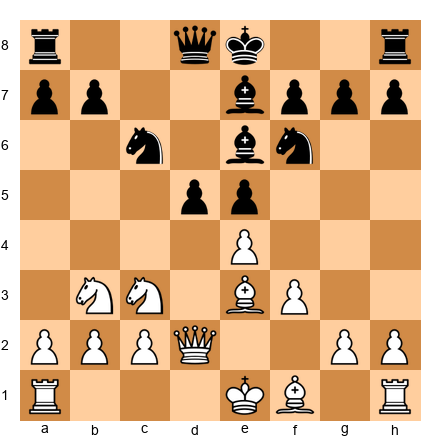
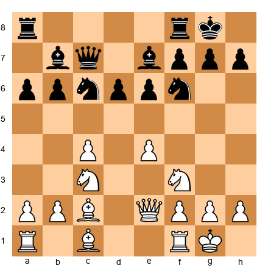
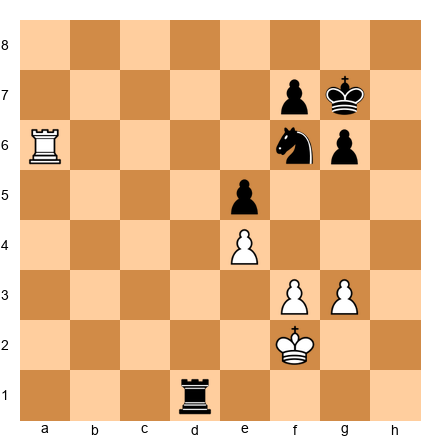
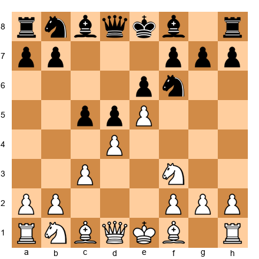
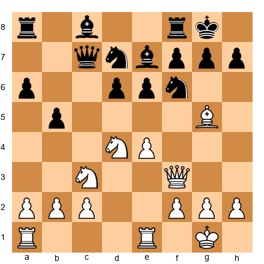

# THE GRANDMASTER CODEX: VOLUME V: THE GRANDMASTER

## Rating 2400+

---

# VOLUME BRIDGE: FROM MASTER TO GRANDMASTER

## Welcome Back

You have climbed further than almost anyone dares.

Four volumes ago, you learned how the pieces moved. You studied your first checkmates, learned to count material, built your first opening repertoire. Then you grew. You mastered the 30 tactical patterns. You learned prophylaxis and pawn structures. You survived your first tournaments and stared down clock pressure. In Volume IV, you entered the world of masters. Dvoretsky-level endgames, opponent preparation, blindfold calculation, and the psychology of the title chase.

Now you are here.

If you have worked through Volumes I through IV with honest effort, you stand among the strongest two percent of competitive chess players in the world. Your rating. whether formal or estimated. places you in the territory where Grandmaster norms become possible. Where your name appears on pairing sheets next to titled players. Where every game is a conversation between two deeply prepared minds.

This volume will not hold your hand. But it will walk beside you.

---

## Readiness Check

Before beginning Volume V, confirm you can handle these five positions. They are drawn from the core material of Volumes III and IV. If you can solve at least four of the five within the suggested time, you are ready.

**Readiness Exercise 1 (★★★★): ⏱ 8 minutes**

*Tactical Calculation*

Set up your board:


<p align="center"></p>


White to play. Find the combination that wins material. Calculate to the end. no guessing.

**Hint 1:** Look at the d5 pawn. How many pieces defend it? How many attack it?
**Hint 2:** Consider Nxd5. What happens after each recapture?
**Hint 3:** After 9.Nxd5 Nxd5 10.exd5 Bxd5 11.Nxd5 Qxd5 12.Bc4, the queen is trapped against the uncastled king.

**Solution:** 9.Nxd5! Nxd5 10.exd5 Bxd5 11.Nxd5 Qxd5 12.Bc4 Qd7 13.Bb5: White wins a pawn with a superior position. The pin on the c6 knight creates lasting pressure.

---

**Readiness Exercise 2 (★★★★): ⏱ 10 minutes**

*Positional Evaluation*


<p align="center"></p>


White to play. This is a typical Hedgehog structure. Identify the three key strategic plans available to White and rank them by urgency.

**Solution:** (1) d4: central space grab, most urgent because it secures a lasting space advantage. (2) Nd5: the knight outpost, strong but requires preparation (Bg5 or Be3 first). (3) f4-f5: kingside expansion, longer-term plan. The Hedgehog requires patience. White should play d4 followed by piece centralization before attempting tactical breaks.

---

**Readiness Exercise 3 (★★★★): ⏱ 15 minutes**

*Complex Endgame*


<p align="center"></p>


White to play. Evaluate this rook endgame. Is it won, drawn, or lost for White? Find the best plan for both sides.

**Solution:** The position is drawn with correct play from both sides. White's plan is Ra7 pinning the f7 pawn, then Ke3-d3 activating the king. Black should play Rd4 to attack the e4 pawn and use the knight to block White's king advance. The key resource is Nh5, covering both f4 and g3. After Ra7 Rd4: the position is dynamically balanced.

---

**Readiness Exercise 4 (★★★★): ⏱ 10 minutes**

*Opening Preparation*


<p align="center"></p>


White to play. This is the Advance French. Without looking at a database, explain White's strategic goals in three sentences. Then suggest a move and explain why.

**Solution:** White's goals: (1) Maintain the e5 wedge that cramps Black's kingside. (2) Develop the dark-squared bishop actively before playing a4 or f4. (3) Prepare a kingside attack using f4, Be3, and Qg4 while Black struggles to activate the c8 bishop. Best move: 5.Bd3: developing naturally while maintaining the pawn chain. The bishop eyes the kingside from d3 and supports the f4 advance.

---

**Readiness Exercise 5 (★★★★★): ⏱ 20 minutes**

*Grandmaster Calculation*


<p align="center"></p>


White to play. This is a critical Najdorf Sicilian position. Find the strongest continuation. Calculate at least 5 moves deep on each candidate.

**Hint 1:** White has a strong central presence. How can you open lines toward Black's king?
**Hint 2:** Consider sacrifices on d5 or e6.
**Hint 3:** 12.Ndxb5! axb5 13.Nxb5 Qb8 14.Bxf6 leads to a powerful initiative.

**Solution:** 12.Ndxb5! axb5 13.Nxb5 Qb8 14.Bxf6 Nxf6 (14...Bxf6 15.Nd4 with domination) 15.e5 dxe5 16.Rxe5: White has a pawn for the exchange but enormous pressure on the e-file and the weak squares around Black's king. The knight on b5 is a monster. Practical winning chances are enormous at any level.

---

## Scoring

| Score | Assessment |
|-------|-----------|
| 5/5 | You are ready. Dive in |
| 4/5 | You are ready. Review the topic you missed from the relevant earlier volume |
| 3/5 | Almost ready. Spend 2-3 weeks revisiting Volume IV's exercise sections, then return |
| 2/5 or less | Not yet ready. This is not failure: it means Volume IV has more to teach you. Go back with fresh eyes |

---

## What Makes Volume V Different

Volumes I through IV taught you chess. Volume V teaches you how to be a chess player.

The distinction matters. A chess player at the 2400+ level does not simply know more patterns or calculate deeper. although you will do both here. A Grandmaster-level player has internalized chess to the point where the game becomes an extension of thought itself. You do not calculate candidate moves. you *feel* which lines deserve attention and then verify with calculation. You do not evaluate positions with a checklist. you *sense* the imbalances and then articulate them to confirm your intuition.

This volume will develop that intuition. It will also confront you with questions that previous volumes avoided:

- **What role does AI play in modern chess?** Chapter 49 examines the neural network revolution honestly. what engines have given us, what they have taken, and how to use them without losing your own chess identity.

- **What does World Championship preparation actually look like?** Chapter 50 pulls back the curtain on the most intense competition in chess.

- **What happens to your mind under elite pressure?** Chapter 51 addresses the psychology of competing against the strongest players alive.

- **What will you contribute to chess?** Chapter 52 asks the question that separates players from Grandmasters. A Grandmaster does not just play. they leave something behind.

And Chapter 54. the final chapter of the entire Codex. asks the biggest question of all: What does chess mean?

---

## An Honest Word About the GM Title

You deserve honesty, because this book has never lied to you.

**No book: not this one, not any: can make you a Grandmaster by itself.**

The Grandmaster title requires three GM norms in FIDE-rated tournaments, a peak rating of 2500, and years of competitive experience against titled opponents. It requires coaching, sparring partners, tournament travel, and a support system. It requires a degree of commitment that resembles professional athleticism more than casual study.

This book gives you everything a book *can* give:

- **Deep strategic and tactical knowledge** spanning the entire spectrum from beginner to expert
- **3,000 exercises** that build your pattern recognition, calculation, and evaluation skills
- **200 annotated master games** from every era of chess history
- **A complete opening repertoire** from first principles to Grandmaster-level understanding
- **Mental and physical preparation frameworks** used by the world's best players
- **A neurodivergent-first design** that makes every concept accessible to every brain

What it cannot give you is the lived experience of sitting across the board from a titled player at 11 PM, in a foreign city, with a GM norm on the line, your clock ticking down, and your hand shaking as you reach for the piece.

That experience belongs to you. Go earn it.

But know this: **everything you need to understand chess at the Grandmaster level is in these five volumes.** The knowledge is here. The rest is yours.

---

## How to Use This Volume

### Three Modes

As with every volume, you can work through this material in three ways:

| Mode | How | Best For |
|------|-----|----------|
| **Print + Board** | Physical book, physical board. Set up every position | Deep study. The best way to internalize positions |
| **PGN + Software** | Load the companion PGN files into Lichess, ChessBase, or SCID. Step through games and exercises on screen | Computer-assisted analysis. Cross-reference with engines |
| **Lichess Studies** | Access the official Codex Lichess studies for interactive versions of all annotated games | Mobile study, collaborative analysis, quick review |

### Pacing

This volume is not meant to be rushed. A reasonable pace is **one chapter per month**, with daily work on exercises and analysis. Some exercises in this volume will take an hour or more. Some games deserve multiple sessions of study.

There is no deadline. There is no exam. There is only the work, and the growth that follows.

---

## You Are Here 🗺️

```
Volume I: Foundations      ████████████████████ COMPLETE ✓
Volume II: Club Player     ████████████████████ COMPLETE ✓
Volume III: Tournament     ████████████████████ COMPLETE ✓
Volume IV: Master Class    ████████████████████ COMPLETE ✓
Volume V: The Grandmaster  ░░░░░░░░░░░░░░░░░░░ YOU ARE HERE → Ch 46
```

---

*"The chess pieces are the block alphabet which shapes thoughts; and these thoughts, although making a visual design on the chess-board, express their beauty abstractly, like a poem."*
: Marcel Duchamp

🛑 **Rest here if you need to.** You have earned the right to take your time. When you are ready, turn the page to Chapter 46.

