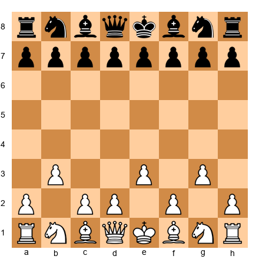
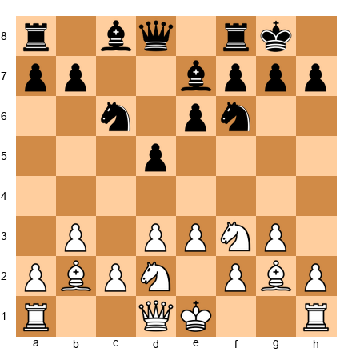
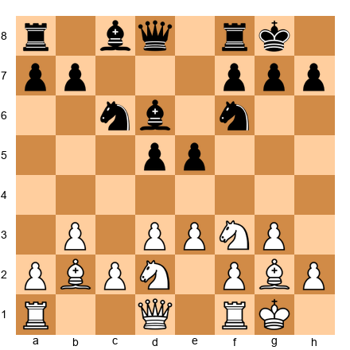
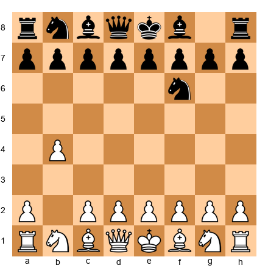
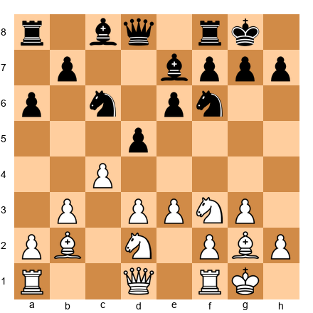
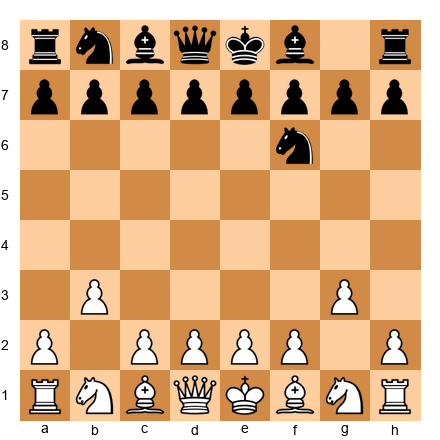
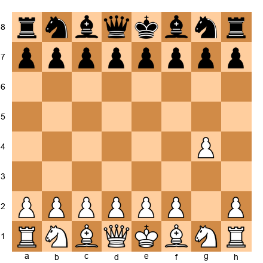
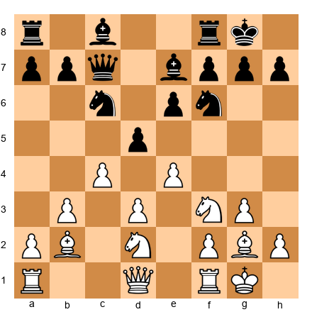
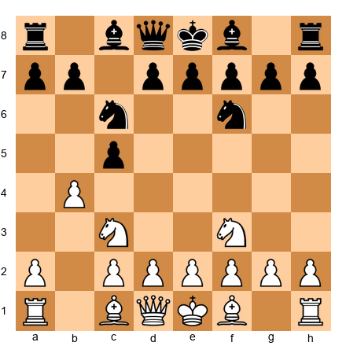
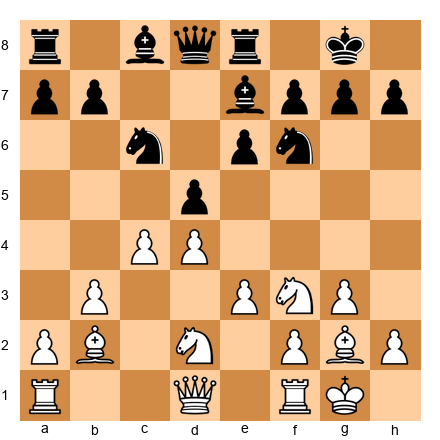

# BONUS CHAPTER: Surprise Weapons: The Hippo & Friends

## Rating: 2200+ (Surprise Repertoire)

---

> *"In a game of chess, you can learn more from your losses than your victories. But from a surprise, you learn the most: because you must think without a map."*
>: Bent Larsen

---

## What You'll Learn

- How to deploy the Hippo System as a flexible surprise weapon against any setup
- The Elshad System's unorthodox knight routes and how they confuse prepared opponents
- Why 1.b4 (the Orangutan/Sokolsky) catches even titled players off guard
- The danger and delight of 1.g4 (the Grob) as a psychological weapon
- When to use surprise openings. and when to leave them at home

---

## You Are Here 🗺️

```
Volume V ░░░░░░░░░░░░░░░░░░░░░░░░░░░░░
Ch 46 ██
Ch 47 ██
Ch 48 ██
Ch 49 ██
Ch 50 ██
Ch 51 ██
Ch 52 ██
BONUS  ██ ← YOU ARE HERE (Bonus Chapter)
```

---

## Why This Chapter Exists

Every chapter in this book has focused on objectively strong chess. Sound openings. Precise endgames. Rigorous calculation. And that is exactly what you need for ninety percent of your games.

But there is a tenth game. The rapid tournament where you need a win with Black. The blitz match against someone who has analyzed your entire repertoire. The game where your opponent arrives with 40 pages of preparation against your main lines, and you need to take them somewhere they have never been.

That is what surprise weapons are for.

The openings in this chapter are not your main repertoire. Some of them are objectively dubious. One of them. the Grob. is arguably terrible. But all of them share one critical quality: **they force your opponent to think for themselves, in unfamiliar territory, from move one.**

At the Grandmaster level, that is worth more than a slight theoretical edge.

A word of caution before we begin. Surprise weapons work *because* they are rare. If you play the Hippo in every game, your opponents will prepare against it, and the surprise value disappears. These openings belong in your toolbox, not on your workbench. Use them selectively, and they will serve you well for your entire career.

---

## PART 1: THE HIPPO SYSTEM

### 1.1 Philosophy: The Patient Predator

The Hippo System is built on a single idea that contradicts nearly everything you have learned about opening play: **do not fight for the center immediately.**

Instead of occupying the center with pawns on e4 and d4, the Hippo sets up a compact structure. pawns on d3 and e3, bishops fianchettoed on g2 and b2, knights on d2 and e2 (or f3 and d2), and the king tucked safely away. The entire first phase of the game is dedicated to building a fortress-like structure that is nearly impossible to crack.

Why does this work?

Because most opening preparation assumes the opponent will contest the center. When you refuse to do so, your opponent's prepared lines become irrelevant. They have memorized 20 moves of theory in the King's Indian, the Sicilian, the Queen's Gambit. and none of it applies. They are on their own.

Meanwhile, you know exactly what you are doing. Your pieces go to the same squares every time, regardless of what your opponent plays. Your setup is flexible. And once the position stabilizes, you look for the moment when your opponent has overextended. a pawn pushed too far, a piece stranded on an aggressive square with no support. and you strike.

The Hippo is not passive. It is *patient*. There is a critical difference. A passive player waits and hopes. A Hippo player waits and *watches*, like a predator submerged in a river, waiting for the right moment to surface.

### 1.2 The Basic Setup

Here is the standard Hippo structure for White. The move order can vary, but the final position is the goal:

```
1.b3   2.Bb2   3.g3   4.Bg2
5.e3   6.Ne2   7.d3   8.Nd2
9.O-O  10.f4 or c4 (the break)
```

And the resulting pawn structure:


Pawns on b3, d3, e3, and g3. Both bishops fianchettoed. Knights centralized but not committed to aggressive squares. The king is safe. Everything is connected.

**Key features of this structure:**

1. **No weaknesses.** Every pawn is defended. There are no isolated pawns, no backward pawns, no overextended pawns. Your opponent has nothing to attack.

2. **Flexibility.** From this position, you can break with f4, c4, d4, or e4 depending on how your opponent has set up. You choose the moment and the direction.

3. **Piece coordination.** Both bishops are on long diagonals. The knights support any central break. The rooks can swing to whichever file opens.

4. **Psychological pressure.** Your opponent knows you are planning something, but they do not know when or where. This uncertainty creates tension, and tension creates mistakes.

### 1.3 When to Deploy the Hippo

The Hippo works best in these situations:

- **Rapid and blitz tournaments** where your opponent cannot spend 30 minutes finding the correct plan against an unfamiliar structure
- **Against heavily prepared opponents** who have studied your main repertoire
- **When you need an unexpected result**. a must-win situation where you need to create chaos
- **Against aggressive players** who thrive on sharp theory; the Hippo denies them their preferred battlefield

The Hippo is less effective:

- **Against opponents who play d4 and c4 systems naturally**. they may already know how to handle fianchetto structures
- **In correspondence chess** where the opponent has unlimited time to find the refutation
- **Against very strong positional players** who will patiently build a space advantage without overextending

### 1.4 Annotated Game 1: The Hippo Strikes

**Game B.1: Rapport – Carlsen**
*Wijk aan Zee, 2017*
*Result: 1-0*

Richard Rapport is one of the most creative Grandmasters in modern chess. In this game, he deployed a Hippo-like setup against the World Champion. and won.

```
1.g3
```

The Hippo begins. Instead of 1.e4 or 1.d4, White signals a flexible, fianchetto-based approach.

```
1...d5 2.Bg2 c6
```

Carlsen plays solidly, setting up a classical pawn center. This is the natural response against a fianchetto. occupy the center since White is not contesting it.

```
3.b3 Bg4
```

White continues with the Hippo plan. Black develops the bishop to g4, pinning the knight that has not yet appeared on f3.

```
4.d3 Nd7 5.Nd2 e5
```

Rapport avoids Nf3 entirely, which is a hallmark of the pure Hippo. The knight goes to d2, supporting both c4 and e4 breaks. Black occupies the center with a broad pawn duo on d5 and e5.

```
6.h3 Bh5 7.e3
```

The Hippo skeleton is taking shape. Pawns on b3, d3, e3, g3. exactly the structure we discussed. The h3 push gains time on the bishop.

```
7...Ngf6 8.Ne2 Bd6 9.Bb2
```

All the pieces are on Hippo squares. Both bishops fianchettoed. Knights centralized but modest. White is ready to choose a break.

```
9...O-O 10.a3
```

A quiet waiting move. White is in no rush. The entire philosophy of the Hippo is on display: build, wait, choose the right moment.

```
10...a5 11.g4 Bg6 12.Ng3
```

Now White strikes! The kingside expansion begins. The knight reroutes to g3 where it eyes both e4 and f5. Notice how the patient setup has allowed White to choose the *direction* of the attack based on Black's commitments.

This game continued with sharp play, and Rapport eventually broke through on the kingside. The Hippo had done its job. it drew the World Champion into unfamiliar territory and forced him to solve problems over the board.

**Lesson:** The Hippo is not about the opening. It is about the *transition* from a quiet setup to an active middlegame, timed to exploit your opponent's specific weaknesses.

### 1.5 Annotated Game 2: The Counterattack

**Game B.2: Basman – Miles**
*British Championship, 1980*
*Result: 1-0*

Michael Basman was the patron saint of unorthodox openings. Tony Miles was one of England's strongest-ever Grandmasters. This game shows the Hippo at its most dramatic.

```
1.g3 e5 2.Bg2 d5 3.b3 Nf6 4.Bb2 Bd6 5.d3 O-O 6.Nd2 c5
```

Black has a massive pawn center. By conventional standards, White should be worse. Black controls more space, has developed more actively, and has already castled. But the Hippo player is not worried. Overextension invites counterattack.

```
7.e3 Nc6 8.Ne2 Be6 9.O-O Qd7 10.h3
```

The Hippo is complete. Now White watches. Where is Black overextended? The pawns on c5, d5, and e5 look impressive, but they are difficult to maintain. Each one requires defense, and advancing further creates targets.

```
10...Rad8 11.Kh2 d4
```

Black pushes forward. the natural desire when you hold a big center. But this advance creates weaknesses. The d4 pawn is now ahead of its support. The e5 pawn is separated from its partner.

```
12.e4!
```

The Hippo strikes. This pawn break attacks the base of Black's pawn chain. If Black takes on e4 (12...dxe3 13.fxe3), White opens the f-file toward the Black king. If Black ignores it, White has an outpost on e4 for a knight.

The game continued with complex tactical play, and Basman's patient strategy paid dividends. Black's overextended center became a liability once White found the right moment to challenge it.

**Lesson:** The Hippo *wants* the opponent to occupy the center. A big center is also a big target. Patience turns the opponent's strength into a weakness.

---

## PART 2: THE ELSHAD SYSTEM

### 2.1 Overview: The Knight Goes Where?

The Elshad System is named after Elshad Mammadov, an Azerbaijani player who developed a hyper-unorthodox approach based on two ideas:

1. **Fianchetto one or both bishops** (similar to the Hippo)
2. **Route the knights through bizarre squares**. Na3-c2-e1-d3, or Nh3-f4-d3, creating patterns that opponents have simply never encountered

The Elshad is less theoretically developed than the Hippo, and it carries more risk. But in rapid and blitz chess, its confusion factor is enormous. Opponents spend valuable clock time trying to understand what you are doing. and by the time they figure it out, they are already behind on time.

### 2.2 Annotated Game: The Elshad Confuses

**Game B.3: Mammadov – NN**
*Online Rapid, 2019*
*Result: 1-0*

```
1.g3 d5 2.Bg2 e5 3.b3 Nf6 4.Bb2 Bd6 5.d3 O-O
6.Nd2 c5 7.e3 Nc6 8.Ne2 Be6 9.h3 Qd7 10.Kh1
```

So far, this looks like a standard Hippo. Now watch the knight maneuver.

```
11.a3 a5 12.Ng1!?
```

The knight *retreats* from e2 to g1. In any textbook, this would be considered a waste of time. But in the Elshad System, it is deliberate. The knight is heading to h3-f4 or to f3-h4, depending on how Black responds. The retreat also clears the e2 square for the d2-knight.

```
12...Rae8 13.Nh3!? Bh2?
```

Black sees the knight on h3 and assumes White has made a mistake. The "punishing" 13...Bh2 looks strong. attacking the g3 pawn and threatening to trap the knight. But White is ready.

```
14.Nf4!
```

The knight hops to f4 with tempo, attacking the bishop on e6 and threatening Nh5 with pressure on the kingside. Black's "punishing" move has actually helped White develop the knight to an excellent square.

**Lesson:** The Elshad works because it breaks the pattern-matching that strong players rely on. When the patterns are unfamiliar, calculation must replace instinct: and calculation takes time.

---

## PART 3: 1.b4: THE ORANGUTAN (SOKOLSKY OPENING)

### 3.1 Why 1.b4 Works

The Orangutan Opening. named after a visit by Savielly Tartakower to a zoo before he played it. pushes the b-pawn to b4 on the very first move. It looks absurd. It does not control the center. It does not develop a piece. By the standards of classical opening theory, it is nearly a waste of a tempo.

And yet, 1.b4 has been played successfully by Grandmasters throughout history. Why?

**Three reasons:**

1. **It controls c5.** The pawn on b4 prevents Black from playing c5, which is the most natural way to fight for the center with the c-pawn. This subtle restriction matters more than it appears.

2. **It prepares Bb2.** After 1.b4, the bishop will develop to b2, where it bears down on the long diagonal toward g7 and beyond. From b2, the bishop influences the center without a single pawn needing to be there.

3. **It avoids all mainstream theory.** Black cannot play the Sicilian, the French, the Caro-Kann, the King's Indian, or any other mainstream defense. Every opening book your opponent has studied is immediately irrelevant.

### 3.2 Annotated Game: The Orangutan Bites

**Game B.4: Tartakower – Maroczy**
*New York, 1924*
*Result: 1-0*

This is the original Orangutan game. the game where Tartakower, inspired by his visit to the Bronx Zoo, played 1.b4 for the first time in a major tournament.

```
1.b4
```

The move that started a century of debate. Tartakower later wrote: "The orangutan at the zoo gave me the idea. He looked at me from his cage with such an expression of intelligence that I could not resist dedicating the game to him."

```
1...d5 2.Bb2 f6
```

Maroczy plays solidly but somewhat passively. The modern recommendation for Black is 1...e5, immediately challenging the b4 pawn.

```
3.e3 e5 4.c4!
```

White strikes in the center! This is the key idea behind 1.b4. the flank move is not an end in itself. It prepares a central challenge from a different angle. After 4.c4, White is attacking d5 while the bishop on b2 x-rays the e5 pawn.

```
4...dxc4 5.Bxc4 Bd6 6.Nc3 Ne7 7.Qh5+ Ng6
8.Nf3 O-O 9.d4!
```

White has a full classical center on d4 and e3, a developed bishop pair, and excellent piece coordination. The "joke opening" has produced a serious advantage.

The game continued with energetic play from Tartakower, who eventually converted his positional edge into a win.

**Lesson:** 1.b4 is not about the b-pawn. It is about the bishop on b2, the c4 break, and the element of surprise. When deployed with understanding, it is a legitimate weapon.

---

## PART 4: THE GROB: 1.g4

### 4.1 The Ultimate Surprise (With a Warning Label)

Let us be honest: 1.g4 is objectively dubious.

The Grob (named after Swiss International Master Henri Grob, who played it extensively) pushes the g-pawn two squares on the first move. This weakens the kingside, does not contribute to development, and gives Black an immediate advantage with correct play.

So why include it in this book?

Because at the Grandmaster level, "objectively dubious" and "practically unplayable" are two different things. In rapid and blitz chess, the Grob creates chaos from the very first move. Your opponent must immediately solve concrete problems. Do I take the pawn? Do I ignore it? Where do I develop?. without any theoretical guidance.

The Grob has been played by Grandmasters in rapid events. It has produced miniature victories against titled players. It is *fun.*

But. and this is important. **do not play the Grob in classical chess against prepared opponents.** The refutation is well-known, and you will suffer. This opening belongs exclusively in your rapid/blitz surprise weapon collection.

### 4.2 Brief Analysis

After 1.g4, Black's strongest response is **1...d5**, occupying the center and preparing to develop naturally. White typically continues with 2.Bg2, fianchettoing the bishop immediately.

The main line continues:

```
1.g4 d5 2.Bg2 c6 3.c4
```

White tries to fight for central influence from the flank. But Black can play accurately with 3...e5 or 3...Nf6, maintaining a solid central presence while White's kingside remains weakened.

**The honest assessment:** With perfect play, Black is better after 1.g4. The engine gives approximately -0.5 to -0.7 from move one. But in practical play: especially at fast time controls: the Grob scores far better than its evaluation suggests.

The lesson of the Grob is not about chess theory. It is about psychology. **Sometimes the best move is the one your opponent is least prepared for.** Just know the difference between a calculated risk and a reckless gamble.

---

## PART 5: WHEN TO USE SURPRISE WEAPONS: A STRATEGIC GUIDE

Before we move to the exercises, here is a decision framework for when to deploy your surprise weapons.

**Use a surprise weapon when:**

| Situation | Best Choice |
|-----------|-------------|
| Rapid/blitz tournament, need a win | Hippo or Orangutan |
| Opponent has prepared against your repertoire | Hippo (most flexible) |
| Must-win game, nothing to lose | Grob (maximum chaos) |
| Want to test opponent's independent thinking | Elshad (maximum confusion) |
| Important classical game | **Do not use any of these.** |

**Rotation principle:** Never play the same surprise weapon twice in the same tournament. If you play the Hippo in Round 3, switch to the Orangutan in Round 7. Unpredictability is the entire point.

**Preparation:** Even surprise weapons require preparation. You should know the first 10-15 moves of your chosen surprise opening as well as you know your main repertoire. The surprise is for your *opponent*, not for you.

---

## EXERCISES: Surprise Weapons

**55 exercises total.** Exercises B.1–B.10 are presented fully below. Exercises B.11–B.55 are available in the companion PGN file (`GrandmasterCodex_V5_Bonus_Exercises.pgn`).

---

### Warmup Exercises (★★–★★★)

**Exercise B.1 (★★): Hippo Setup Recognition**


<p align="center"></p>


White has played b3, e3, and g3. What are the next four developing moves to complete the Hippo structure? Name them in order.

**Solution:** 1. Bb2 (fianchetto queenside bishop) 2. Bg2 (fianchetto kingside bishop) 3. Ne2 (knight to e2, keeping f3 clear for the f-pawn break) 4. d3 (completing the compact pawn structure). After these four moves, White plays Nd2 and O-O to finish the setup.

---

**Exercise B.2 (★★): Hippo Break Selection**


<p align="center"></p>


White has a complete Hippo structure. Black has a classical setup with pawns on d5 and e6. Which central break should White prepare. c4, e4, or f4? Explain your reasoning.

**Solution:** **c4** is the correct break. Black's pawn chain points toward the queenside (d5-e6), so White should attack the base of the chain with c4. After c4, White challenges d5 directly. The break e4 would be premature (Black's pawn on d5 controls e4), and f4 would weaken the kingside without clear compensation. After preparation with moves like a3 and Rc1, White plays c4 with excellent counterplay.

---

**Exercise B.3 (★★★): Punishing Overextension**


<p align="center"></p>


White is in the Hippo. Black has pushed d5 and e5, building a big center. White's position looks cramped. Find the plan that exploits Black's overextension.

**Solution:** White should play **f4!**: striking at the base of Black's center. After 10.f4 e4 (forced, otherwise exf4 opens the f-file against Black's king) 11.dxe4 dxe4 12.Ng5, White attacks the e4 pawn and eyes the weakened light squares around Black's king. The "cramped" Hippo has suddenly become a dynamic attacking force. Black's center pawns are now isolated and vulnerable rather than strong and imposing.

---

**Exercise B.4 (★★★): Orangutan: Finding the Central Strike**


<p align="center"></p>


White has played 1.b4 and Black has replied 1...Nf6. What is White's best plan over the next three moves?

**Solution:** 2.Bb2 (developing the bishop to its ideal diagonal) 2...e6 3.b5! (gaining queenside space and preventing ...c5) or 3.a3 (supporting b4 and preparing c4). The key idea is that after Bb2, White prepares c4 to challenge the center from the flank. The b4 pawn supports this plan by preventing Black from playing ...c5 to challenge White's queenside expansion.

---

### Intermediate Exercises (★★★)

**Exercise B.5 (★★★): Hippo Middlegame: Choosing the Moment**


<p align="center"></p>


White has played c4, attacking Black's center. Black must decide: take on c4, push d4, or ignore and develop. Which is best?

**Solution:** Black should play **...dxc4 followed by ...e5.** After 11...dxc4 12.bxc4, Black has freed the d5 square for a knight and opened the position. Then 12...e5 establishes a strong central pawn and activates Black's pieces. The alternative 11...d4 closes the position but gives White the c4 square for a knight. Ignoring c4 (e.g., 11...Qd7) allows White to play cxd5 and reach a favorable pawn structure. The lesson: when your opponent strikes at your center, concrete calculation beats general principles.

---

**Exercise B.6 (★★★): Elshad: Decoding the Knight Maneuver**


<p align="center"></p>


White is setting up an Elshad System. The knight on b1 needs to reach d3 via an unusual route. What sequence of moves gets it there without blocking the b2-bishop?

**Solution:** The route is **Na3-c2-e1-d3** or **Na3-c4-d2-f1-d2-e4-d3** depending on the position. The most common Elshad route is Na3 first (the knight looks odd on a3, but it is heading to c2), then Nc2, then Ne1, and finally Nd3. This keeps the b-file and the b2 diagonal clear for the bishop. The knight on d3 supports both e5 and c5 breaks and controls key central squares.

---

**Exercise B.7 (★★★): Grob: Surviving the Opening**


<p align="center"></p>


After 1.g4, you are Black. What is the strongest response, and what are your key principles for the next five moves?

**Solution:** **1...d5** is the strongest response: immediately occupying the center. The key principles for Black are: (1) Control the center with pawns on d5 and e5 if possible, (2) Develop pieces toward the center (Nf6, Bf5/Bg4, Nc6), (3) Castle queenside if White launches a kingside attack, or kingside if the position stabilizes, (4) Remember that White has permanently weakened the g-file and h3/f3 diagonal: these weaknesses will matter in the middlegame. Black should aim for a position where the extra space and structural soundness provide a lasting advantage.

---

### Expert Exercises (★★★★)

**Exercise B.8 (★★★★): Hippo: The Transformation**


<p align="center"></p>


White has played both c4 and e4 in the Hippo. a double central break. Black is under pressure. Find the strongest continuation for Black that refutes White's ambitious expansion.

**Solution:** **12...dxe4! 13.dxe4 Rd8!** Black opens the d-file and targets the backward d-pawn remnant (d3 is gone, but the c4 pawn is now potentially weak). After 14.Qe2 Nb4!, Black invades on d3. The knight on b4 cannot be chased away easily, and it threatens both Nd3 (forking queen and bishop) and Nc2 (attacking the a1 rook). White's double break was premature: by taking the center apart with precise tactics, Black has turned White's ambition into overextension. The lesson: even from the Hippo, rushing the central break can backfire.

---

**Exercise B.9 (★★★★): Orangutan: Queenside Domination**


<p align="center"></p>


After 1.b4 c5 2.bxc5 (taking the pawn!) 2...Nc6 3.Nf3 Nf6, White has an extra pawn on c5. Black will win it back, but White can use the temporary material advantage to gain time. Find the best plan for White.

**Solution:** **4.e3! followed by 5.d4.** White plays e3 to develop the bishop and then d4 to establish a strong center. After 4.e3 e6 (to recapture on c5) 5.d4!, White has a broad pawn center on d4/e3 with the extra c5 pawn acting as a thorn. If Black plays 5...Bxc5, White continues with 6.Bd3 and castles with a lead in development. The key insight: the pawn on c5 is not meant to be held permanently: it is a decoy that forces Black to spend time recapturing while White develops and grabs the center.

---

### Master Exercises (★★★★★)

**Exercise B.10 (★★★★★): Hippo: The Deep Sacrifice**


<p align="center"></p>


White has built a Hippo and played c4 and d4. a full central transformation. Find a piece sacrifice that cracks open Black's position, and calculate at least five moves of the resulting combination.

**Solution:** **13.c5!** is the positional sacrifice that changes the character of the position entirely. White gives up the d4 pawn (after 13...Nxd4 14.Nxd4 Qxd4) to gain a massive queenside space advantage. After 14...Qxd4 15.Nb3! Qd8 16.Nd4, the knight reaches d4 with enormous power: it controls c6, e6, b5, and f5. Meanwhile, the c5 pawn cramps Black's entire queenside. If Black tries 16...Nd7 to challenge c5, then 17.Rc1 followed by Qa4 builds up overwhelming pressure on the queenside. The sacrifice of the d-pawn has purchased lasting positional dominance. This is the Hippo at its finest: patience followed by a precisely timed transformation.

---

**Exercises B.11–B.55** are available in the companion PGN file. The distribution is:

| Range | Difficulty | Count | Theme |
|-------|-----------|-------|-------|
| B.11–B.20 | ★★–★★★ | 10 | Hippo setup and break selection |
| B.21–B.35 | ★★★ | 15 | Middlegame plans in all four systems |
| B.36–B.45 | ★★★★ | 10 | Tactical combinations from surprise openings |
| B.46–B.55 | ★★★★★ | 10 | Deep positional sacrifices and transformations |

---

## Key Takeaways

1. **Surprise weapons are tools, not toys.** Use them strategically, not habitually. The moment they stop being surprising, they stop working.

2. **The Hippo is the most reliable surprise weapon.** It produces playable middlegames against virtually any setup and rewards understanding over memorization.

3. **Every surprise weapon follows the same principle:** force your opponent to think independently, in unfamiliar territory, from the earliest moves. The surprise is not the opening itself. it is the *removal of preparation*.

4. **Know your surprise weapons at least as well as your main repertoire.** The surprise is for your opponent, never for you. If you do not understand the plans behind your surprise weapon, you are simply playing a bad opening.

5. **Objectively dubious is not the same as practically unplayable.** The Grob is objectively poor. But in a 3-minute blitz game, it has won thousands of games against strong opponents. Context matters.

---

## Practice Assignment

1. **Play five Hippo games in online rapid.** Use the setup described in Section 1.2. After each game, analyze where you chose to break (c4, e4, f4, or d4) and whether your timing was correct.

2. **Study the Orangutan for one hour.** Review ten master games with 1.b4 in a database. Identify the three most common plans for White and the three most common mistakes by Black.

3. **Play one Grob game in blitz.** Just one. Experience the chaos. Learn from it. Then put 1.g4 back in the drawer for a special occasion.

4. **Build your surprise weapon schedule.** Write down which surprise opening you will use in your next tournament, and in which round. Preparation means planning *when* to surprise, not just *how*.

---

## ⭐ Progress Check

If you have completed this bonus chapter, you now have:
- [  ] A functional Hippo repertoire ready for deployment
- [  ] Understanding of the Elshad's confusion factor
- [  ] A working knowledge of the Orangutan's strategic ideas
- [  ] Awareness of the Grob's strengths and severe limitations
- [  ] A decision framework for when to deploy surprise weapons

Check off each box as you complete it. If you can check at least three, you have added a valuable dimension to your chess that most players. even strong ones. do not possess.

---

## 🛑 Rest Marker

**You have completed the Bonus Chapter.**

This is the final instructional chapter of The Grandmaster Codex. If you have worked through all five volumes. from the very first piece movements in Volume I to the deep strategic and psychological material in Volume V. you have accomplished something extraordinary.

Take a breath. You have earned it.

When you are ready, the Appendices contain the complete glossary, game index, resource guide, and repertoire reference for the entire Codex. But there is no rush. The knowledge you have built is permanent. It belongs to you.

Come back whenever you are ready. The board will be waiting. ♟

*"Chess, like love, like music, has the power to make people happy."*. Siegbert Tarrasch

💙🦄
