# Chapter 46: Grandmaster-Level Calculation and Intuition

## Rating: 2400+

---

> *"I don't believe in psychology. I believe in good moves."*
>: Bobby Fischer

---

## What You'll Learn

- How Grandmasters blend calculation and intuition into a single process
- The difference between "seeing" moves and "feeling" positions
- Training methods that develop genuine chess intuition (not guessing)
- How to calculate 10+ moves deep without losing the thread
- When to trust your instinct and when to verify with calculation

---

## You Are Here 🗺️

```
Volume V ░░░░░░░░░░░░░░░░░░░░░░░░░░░░░
Ch 46 ██ ← YOU ARE HERE
Ch 47 ░░
Ch 48 ░░
Ch 49 ░░
Ch 50 ░░
Ch 51 ░░
Ch 52 ░░
Ch 53 ░░
Ch 54 ░░
```

---

## PART 1: THE NATURE OF GRANDMASTER THINKING

### 1.1 Two Systems, One Mind

Every chess player uses two mental processes when they look at a position:

**System 1**: fast, automatic, pattern-based. This is the part of your brain that sees a knight fork without consciously searching for it. It fires in milliseconds. It does not explain itself.

**System 2**: slow, deliberate, calculation-based. This is the part of your brain that calculates a ten-move variation, holding each position in memory, checking for threats at every branch.

Below 2000, most decisions rely on System 2. You calculate because you must. your pattern library is not large enough to shortcut the work.

Between 2000 and 2400, the balance shifts. Your pattern library grows. You begin to "feel" that a position is promising before you can articulate why. But you still verify with calculation.

Above 2400, something remarkable happens: the two systems merge. A Grandmaster does not choose between feeling and calculating. They do both simultaneously. Intuition narrows the search space. Calculation verifies. The process is so integrated that the Grandmaster may not even be aware which system generated the idea.

This chapter will teach you how to develop that integration.

### 1.2 What Intuition Actually Is

Chess intuition is not mystical. It is not talent. It is not a gift reserved for prodigies.

**Chess intuition is compressed experience.**

When a Grandmaster looks at a position and "feels" that the knight belongs on e5, what is actually happening is this: their brain is matching the current position against thousands of similar positions they have studied, played, and analyzed. The match happens below conscious awareness. The result bubbles up as a feeling. a pull toward certain squares, certain plans, certain piece configurations.

This is why intuition cannot be taught directly. It must be *grown*. And it grows through exactly the work you have been doing for four volumes: studying master games, solving exercises, analyzing your own play, and building your pattern vocabulary.

But there are ways to accelerate the process.

### 1.3 The Three Pillars of Grandmaster Calculation

Grandmaster-level calculation rests on three abilities:

**Pillar 1: Candidate Move Generation**

At the club level, you were taught Kotov's method: identify candidate moves, calculate each to a conclusion, then choose. This works up to approximately 2200.

At the Grandmaster level, candidate move generation becomes more sophisticated. Instead of listing all reasonable moves, you *prioritize* based on pattern recognition. You might consider fifteen candidate moves at the club level. A Grandmaster considers three or four. because their intuition has already filtered out the rest.

The danger is clear: if your intuition is wrong, you never consider the best move. This is why Grandmaster training includes deliberate exercises in *challenging* your own intuition. looking specifically for moves that feel wrong but might be right.

**Pillar 2: Visualization Depth**

At the 2400 level, you should be able to hold a position in your mind's eye after 7 to 10 moves of calculation. At the Grandmaster level, this extends to 12, 15, sometimes 20 moves in forcing lines.

Visualization depth is not just about memory. It is about *accuracy*. A club player might visualize 10 moves but lose track of a pawn on the queenside. A Grandmaster's mental image remains precise. every piece, every pawn, every square.

This precision comes from practice. Specific exercises for developing visualization depth are included in the exercise section of this chapter.

**Pillar 3: Evaluation at the End of the Line**

The deepest calculator in the world is useless if they cannot accurately evaluate the position at the end of their calculation. "I can see 15 moves ahead" means nothing if you misjudge whether the resulting position is won, drawn, or lost.

Grandmaster-level evaluation requires understanding all of the following simultaneously:

- Material balance (including long-term piece activity, not just counting)
- King safety (for both sides)
- Pawn structure (including potential transformations)
- Piece activity and coordination
- Control of key squares and files
- Initiative and tempo
- Practical considerations (time on the clock, tournament situation)

You have studied all of these elements across the previous four volumes. Now you must synthesize them into a single, rapid evaluation that happens at the end of every calculated line.

---

## PART 2: TRAINING YOUR INTUITION

### 2.1 The Rapid Assessment Exercise

This is a training method used by several Grandmaster coaches, including Mark Dvoretsky and Jacob Aagaard.

**How it works:**

1. Set up a complex middlegame position on your board (use positions from this chapter's exercises or from master games)
2. Set a timer for **30 seconds**
3. Look at the position and write down: (a) who stands better, (b) the most important feature of the position, and (c) the first move you would consider
4. Stop the timer. Now analyze the position properly for 15-20 minutes
5. Compare your 30-second assessment with your deep analysis

**What you are training:** The gap between your rapid assessment and your deep analysis reveals the quality of your intuition. If the two consistently agree, your intuition is strong. If they frequently disagree, you need more pattern work in the areas where your intuition fails.

Repeat this exercise with 5 positions per session, 3 sessions per week, for three months. You will notice a measurable improvement in the accuracy of your rapid assessments.

### 2.2 The "Wrong Move" Exercise

This exercise specifically trains you to challenge your own intuition.

**How it works:**

1. Set up a complex position
2. Identify the move that feels most natural to you
3. Now **force yourself to analyze the opposite**. find the best argument for a completely different move
4. Calculate both lines to a depth of at least 8 moves
5. Only then choose

This exercise is uncomfortable. It requires you to argue against your own instinct. But this discomfort is precisely where growth happens. Many Grandmaster-level blunders occur when a player trusts their first instinct without verification. This exercise builds the habit of checking.

### 2.3 Blindfold Visualization Training

At the Grandmaster level, blindfold chess is not a party trick. it is a diagnostic tool. If you can play a reasonable game of blindfold chess, your visualization is strong enough for deep calculation.

**Progressive blindfold training:**

**Level 1:** Play through a known game in your head. Start with a game you have studied before (Morphy's Opera Game is ideal: you know it from Volume I). Close your eyes, replay the moves, and try to visualize the position after each move. Check against a physical board every 5 moves.

**Level 2:** Play through an unknown game blindfold. Have a training partner read moves aloud from a game you have never seen. Visualize the position after each move. Try to hold the full position in your mind for at least 25 moves.

**Level 3:** Play a full game of blindfold chess against a partner or engine (set the engine to approximately 1800-2000 strength). This is extremely difficult. Do not be discouraged if you blunder: the goal is the exercise itself, not the result.

**Level 4:** Analyze a complex position blindfold. Have a partner describe a position (piece by piece). Without setting it up, analyze the position in your mind. Identify the key features, suggest a plan, and calculate a critical variation.

Practice blindfold work 2-3 times per week. Even 10 minutes of blindfold visualization practice yields measurable improvement over time.

---

## PART 3: ADVANCED CALCULATION TECHNIQUES

### 3.1 The Elimination Method

When faced with a complex position with many candidate moves, experienced Grandmasters often use elimination rather than exhaustive calculation.

**The process:**

1. Identify all candidate moves (quickly. do not calculate yet)
2. For each candidate, ask: "What is my opponent's strongest reply?"
3. If the opponent's reply clearly refutes the candidate, eliminate it immediately
4. Calculate only the surviving candidates in depth

This saves enormous amounts of mental energy. Instead of calculating five candidates to depth 10 (fifty mental "moves"), you might eliminate three candidates at depth 2 and calculate only two to depth 10 (twenty-six mental "moves". nearly half the work).

**When it fails:** The elimination method fails when you underestimate your opponent's replies. This is why you must combine it with a paranoid streak: always assume your opponent will find the strongest response. If you are uncertain whether a reply refutes your candidate, do not eliminate: calculate.

### 3.2 The Comparison Method

When two candidate moves both look promising and neither has an obvious refutation, compare them directly.

**The process:**

1. Calculate Candidate A to a conclusion. Evaluate the resulting position.
2. Calculate Candidate B to a conclusion. Evaluate the resulting position.
3. Compare the two resulting positions. Which would you rather have?

This method was famously used by Tigran Petrosian, who would often choose moves not because they were the objectively "best" but because the resulting position was the most comfortable for his style. At the Grandmaster level, practical considerations. your confidence in a position type, your familiarity with the resulting pawn structure, your opponent's likely responses. matter as much as objective evaluation.

### 3.3 The Threat-Based Approach

Instead of calculating from your own perspective, start with the opponent's threats.

**Ask:**

1. What does my opponent want to do next?
2. If I make a "nothing" move (a king move, a rook shuffling), what happens?
3. How urgent is my opponent's threat?

If the opponent's threat is serious, your candidate moves must address it. either by defending, counterattacking, or preemptively eliminating the threat.

If the opponent has no serious threat, you have the luxury of time. This is when you can pursue your own plans without urgency.

This approach is deeply connected to Nimzowitsch's prophylaxis (Volume III, Chapter 24). At the Grandmaster level, threat-based thinking becomes second nature. Every move you make should acknowledge what your opponent wants to do.

### 3.4 Calculation in Endgames vs. Middlegames

A common error among advancing players is using the same calculation approach in endgames and middlegames. They require different mental skills:

**Middlegame calculation** involves many pieces, tactical complications, and branching variations. The key skill is pruning: eliminating branches early to conserve mental resources.

**Endgame calculation** involves fewer pieces but greater precision. A single tempo can mean the difference between a win and a draw. The key skill is accuracy: you must calculate to the very end, because there are fewer "shortcuts" when the position is reduced to its essentials.

At the Grandmaster level, the transition from middlegame to endgame thinking must happen consciously. When you realize the position is simplifying, shift your mental approach: slow down, count tempi, check concrete variations to their conclusion.

---

## PART 4: ANNOTATED MASTER GAMES

### Game 1: The Intuitive Sacrifice

**Garry Kasparov vs Veselin Topalov**
Event: Wijk aan Zee | Year: 1999 | Result: 1-0
Opening: Pirc Defense (B06)

*One of the greatest games ever played. Kasparov's intuition for dynamic play produced a combination so deep that it took years for analysts to fully understand it.*

Set up your board:

```
[Event "Wijk aan Zee"]
[White "Kasparov, Garry"]
[Black "Topalov, Veselin"]
[Result "1-0"]
[ECO "B06"]

1.e4 d6 2.d4 Nf6 3.Nc3 g6 4.Be3 Bg7 5.Qd2 c6 6.f3 b5 7.Nge2 Nbd7
8.Bh6 Bxh6 9.Qxh6 Bb7 10.a3 e5 11.O-O-O Qe7 12.Kb1 a6 13.Nc1 O-O-O
14.Nb3 exd4 15.Rxd4 c5 16.Rd1 Nb6 17.g3 Kb8 18.Na5 Ba8 19.Bh3 d5
20.Qf4+ Ka7 21.Re1 d4 22.Nd5 Nbxd5 23.exd5 Qd6 24.Rxd4!
```

**The critical moment.** With 24.Rxd4!, Kasparov sacrifices the exchange. The point is not immediate material gain but the activation of every White piece toward Black's king. After 24...cxd4 25.Re7+!, a stunning rook sacrifice follows.

```
24...cxd4 25.Re7+! Kb6
```

If 25...Qxe7, then 26.Qxd4+ leads to a forced mate. Black's king is driven into the open.

```
26.Qxd4+ Kxa5 27.b4+ Ka4 28.Qc3 Qxd5 29.Ra7 Bb7 30.Rxb7 Qc4
31.Qxf6 Kxa3 32.Qxa6+ Kxb4 33.c3+ Kxc3 34.Qa1+ Kd2 35.Qb2+ Kd1
36.Bf1! Rd2 37.Rd7! Rxd7 38.Bxc4 bxc4 39.Qxh8 Rd3 40.Qa8 c3
41.Qa4+ Ke1 42.f4 f5 43.Kc1 Rd2 44.Qa7 1-0
```

**What this game teaches:**

1. **Intuitive sacrifice:** Kasparov's 24.Rxd4! was not the product of exhaustive calculation. He later explained that the position "demanded" a sacrifice. his pieces were pointing toward Black's king, and the exchange sacrifice opened every line.

2. **The king hunt:** Once Black's king is exposed, every move becomes forcing. The chase from a7 to d1 is one of the most spectacular in chess history.

3. **Calculation confirming intuition:** Kasparov saw the sacrifice intuitively, then verified with calculation. The combination is deep enough that even modern engines need significant time to fully evaluate it.

> 🧠 **Pattern Note:** The exchange sacrifice Rxd4 belongs to a family of sacrifices where a rook is given up to open lines toward an exposed king. You have seen simpler versions in Volume III. This is the Grandmaster-level expression of the same idea.

---

### Game 2: Calculation Depth in a Quiet Position

**Anatoly Karpov vs Garry Kasparov**
Event: World Championship Match, Game 24 | Site: Seville | Year: 1987 | Result: 0-1
Opening: Ruy Lopez (C92)

*Kasparov needed to win this game to retain his title. Down by a point going into the final game, he produced one of the greatest pressure performances in chess history.*

Set up your board:

```
[Event "World Championship Game 24"]
[White "Karpov, Anatoly"]
[Black "Kasparov, Garry"]
[Result "0-1"]
[ECO "C92"]

1.c4 e5 2.Nc3 Nf6 3.Nf3 Nc6 4.g3 Bb4 5.Bg2 O-O 6.O-O e4 7.Ne1 Bxc3
8.bxc3 Re8 9.d3 exd3 10.Qxd3 d6 11.Bg5 Bg4 12.Qd2 Na5 13.Qa5 c5
14.Nd3 Qc8 15.Rab1 Bh3 16.Bxf6 gxf6 17.Nf4 Bg4 18.Bxb7 Nxb7
19.Ne6! fxe6 20.Qg2 d5 21.cxd5 exd5 22.Qxd5+ Rf7 23.Qxc5?
```

After 23.Qxc5?, Kasparov unleashed a devastating counterattack:

```
23...Nd6! 24.Rb5 Re1! 25.Rxe1 Qxc5 26.Re8+ Rf8 27.Rxf8+ Kxf8
28.Rb1 Ke7 29.Kf1 Kd7 30.Ke1 Kc6 31.Kd2 Kb5 32.Kc2 a5 33.a3 Ka4
```

Kasparov's king march from g8 to a4 is a masterpiece of endgame technique. With the queen against rook and minor piece, Kasparov's pieces coordinated to create unstoppable threats. Karpov resigned on move 64.

**What this game teaches:**

1. **Desperation breeds brilliance:** Kasparov was in a must-win situation. The pressure did not impair his calculation. it sharpened it.

2. **Long-range planning in the endgame:** Kasparov's king march was not improvised. He calculated the winning plan many moves in advance, understanding exactly which squares his king needed to reach.

3. **The psychology of the decisive game:** This game exemplifies what happens when preparation, calculation, and willpower converge at the critical moment.

---

### Game 3: When Intuition Overrides Calculation

**Magnus Carlsen vs Viswanathan Anand**
Event: World Championship Match, Game 6 | Site: Chennai | Year: 2013 | Result: 1-0
Opening: Ruy Lopez, Berlin Defense (C65)

Set up your board:

```
[Event "World Championship Game 6"]
[White "Carlsen, Magnus"]
[Black "Anand, Viswanathan"]
[Result "1-0"]
[ECO "C65"]

1.e4 e5 2.Nf3 Nc6 3.Bb5 Nf6 4.d3 Bc5 5.c3 O-O 6.O-O Re8 7.Re1 a6
8.Ba4 b5 9.Bb3 d6 10.Bg5 Be6 11.Nbd2 h6 12.Bh4 Bxb3 13.axb3 Nb8
14.h3 Nbd7 15.Nh2 Qe7 16.Ndf1 Bb6 17.Ne3 Qe6 18.Nhf1 a5 19.Bg3 d5
20.Nd2 dxe4 21.dxe4 a4 22.bxa4 Rxa4 23.Rxa4 bxa4 24.Qa1 Nb6
25.Nc4 Nc4 26.Nd5! Nxd5 27.exd5 Qd7 28.Qxa4
```

Carlsen chose a quiet positional approach. no fireworks, no sacrifices. Instead, he squeezed Anand's position move by move, relying on small advantages: a better pawn structure, a more active queen, and the powerful d5 pawn.

The game continued for another 30 moves. Carlsen converted the small advantage with relentless technique, never giving Anand a single chance to complicate.

**What this game teaches:**

1. **Intuition as strategic compass:** Carlsen did not calculate deep tactical combinations. He felt that his position was slightly better and trusted that feeling for 60 moves. His intuition told him that patience, not aggression, would win.

2. **The Grandmaster squeeze:** At the highest level, many games are won not by brilliant combinations but by persistent, accurate play that denies the opponent counterplay. This is Carlsen's signature skill.

3. **Endgame as the ultimate test of intuition:** In the resulting endgame, Carlsen's piece placement was guided almost entirely by intuition. he knew where the pieces belonged without needing to calculate every possibility.

---

### Game 4: The Calculated Risk

**Judit Polgar vs Garry Kasparov**
Event: Russia vs. Rest of the World | Site: Moscow | Year: 2002 | Result: 1-0
Opening: Sicilian Defense, Sveshnikov (B33)

*Polgar defeats the strongest player in the world with a precisely calculated tactical sequence.*

Set up your board:

```
[Event "Russia vs. Rest of the World"]
[White "Polgar, Judit"]
[Black "Kasparov, Garry"]
[Result "1-0"]
[ECO "B33"]

1.e4 c5 2.Nf3 d6 3.d4 cxd4 4.Nxd4 Nf6 5.Nc3 a6 6.Be2 e5 7.Nb3 Be7
8.O-O O-O 9.Kh1 Bd7 10.Be3 Bc6 11.Bf3 Be8 12.Bg5 Nbd7 13.a4 b6
14.Bc1 Bb7 15.Nd2 Rc8 16.Re1 h6 17.b3 Nh7 18.Bb2 Bf6 19.g3 Bg5
20.Nf1 Nhf6 21.Ne3 Bxe3 22.Rxe3 Nc5 23.Nd5 Bxd5 24.exd5 e4
25.Bg2 Qd7 26.c4 Rfe8 27.Bc3 Nfd7 28.Qd4 Ne5 29.Bxe5 dxe5
30.Qxe4 Nd3 31.Rf1 Rc5 32.d6 Rd5 33.Qe3 f5 34.f4 e4 35.Rd1 Rc5
36.b4 Rc8 37.c5 bxc5 38.bxc5 Rxc5 39.Qxd3 Rc2 40.Bg6 Rf8 41.d7 1-0
```

**What this game teaches:**

1. **Calculation with courage:** Polgar played 24.exd5 knowing it created a powerful passed pawn, but only after calculating that the tactical complications favored her. The d-pawn becomes a monster.

2. **Gender is irrelevant to chess skill:** This game is included not because Polgar is a woman, but because it is objectively brilliant chess. That she defeated the reigning World Champion makes it historically significant.

3. **The passed pawn as a winning weapon:** The d-pawn's march from d5 to d7 is a textbook demonstration of how a passed pawn can dominate a game, tying down the opponent's pieces and creating unstoppable threats.

---

### Game 5: Intuition Under Time Pressure

**Viswanathan Anand vs Michael Adams**
Event: FIDE World Championship | Site: San Luis | Year: 2005 | Result: 1-0
Opening: Ruy Lopez (C84)

Set up your board:

```
[Event "FIDE WCh"]
[White "Anand, Viswanathan"]
[Black "Adams, Michael"]
[Result "1-0"]
[ECO "C84"]

1.e4 e5 2.Nf3 Nc6 3.Bb5 a6 4.Ba4 Nf6 5.O-O Be7 6.d3 b5 7.Bb3 O-O
8.Nc3 d6 9.a3 Na5 10.Ba2 c5 11.Bg5 h6 12.Bxf6 Bxf6 13.Nd5 Bg5
14.b4 cxb4 15.axb4 Nc6 16.Nd2 a5 17.bxa5 Rxa5 18.c3 Be6 19.Nc4 Ra8
20.d4 exd4 21.cxd4 Bxd5 22.Bxd5 Qb6 23.Ne3 Nd8 24.Qf3 Ne6 25.Bxe6 fxe6
26.d5 e5 27.Nc4 Qa6 28.Qg3 Kh7 29.f4 Bf6 30.fxe5 Bxe5 31.Rxf8 Rxf8
32.Qe3 Qe2 33.Qxe2 1-0
```

**What this game teaches:**

1. **Speed of intuition:** Anand was famous for his quick play. He trusted his pattern recognition to an extraordinary degree, often making strong moves in seconds that other GMs would spend twenty minutes on.

2. **Opening preparation as calculation shortcut:** Anand's deep preparation meant that the first 15-20 moves required zero calculation. he had already analyzed them at home. This preserved mental energy for the critical moments.

3. **The conversion:** Anand's technique in converting the advantage. exchanging pieces at the right moment, creating a passed pawn, activating his king. is a model of efficient endgame play.

---

## PART 5: EXERCISES

### Warmup Exercises (★★-★★★)

*These exercises review concepts from earlier volumes. Use them to activate your pattern recognition before tackling the harder problems.*

**Exercise 46.1 (★★): ⏱ 3 minutes**


<p align="center"></p>


White to play. This is the Italian Game. What is White's best developing move and why?

**Hint:** Which move develops a piece, maintains pressure on f7, and prepares castling?
**Solution:** 4.d3 (or 4.d4: the Evans Gambit approach, or 4.c3: the Giuoco Piano). The key is that all three moves develop White's position while maintaining central presence. 4.d3 is the most solid, supporting e4 and preparing Be3/Bg5. If you chose any of these three with a correct explanation, you have answered well.

---

**Exercise 46.2 (★★): ⏱ 3 minutes**


<p align="center">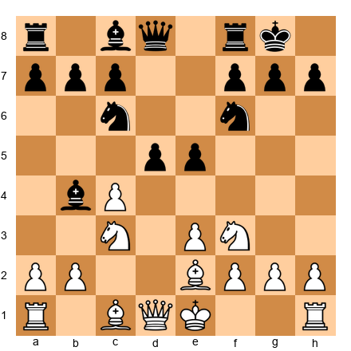</p>


White to play. Black has just played ...d5, challenging White's center. Should White capture on d5, push c5, or play a3?

**Hint:** Consider what happens to the pawn structure after each option.
**Solution:** 6.cxd5 is best. After 6...Nxd5, White can play 7.O-O and has a comfortable position with a mobile pawn center and good development. 6.c5 creates a fixed pawn structure that limits White's light-squared bishop. 6.a3 loses a tempo: Black can simply capture cxd5 with a good game.

---

**Exercise 46.3 (★★★): ⏱ 5 minutes**


<p align="center">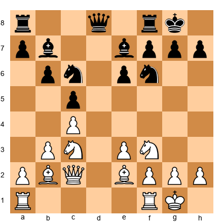</p>


White to play. This is a typical English Opening/Hedgehog structure. Identify the single most important strategic plan for White.

**Hint:** What is the most effective pawn break in the Hedgehog?
**Solution:** White's most important plan is d4. This central advance opens the position for White's well-placed pieces (especially the b2 bishop) and creates central tension. The move should be prepared with Rfd1, Rac1, and possibly Nd2-e4 to support d4 effectively. After d4, White typically achieves a lasting space advantage.

---

**Exercise 46.4 (★★★): ⏱ 5 minutes**


<p align="center">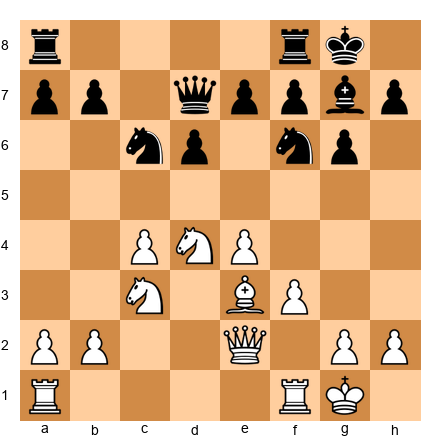</p>


White to play. Evaluate the position and find the best move.

**Hint:** Look at the d5 square. How can White exploit it?
**Solution:** 10.Nd5! occupies the ideal outpost. After 10...Nxd5 11.cxd5 (or 11.exd5), White gains a strong central pawn and opens the c-file. The knight on d5 cannot be challenged by a pawn and dominates the board. This is a classic example of permanent vs. temporary advantages.

---

### Core Exercises (★★★★-★★★★★)

**Exercise 46.5 (★★★★): ⏱ 10 minutes**

*Intuition Assessment*


<p align="center">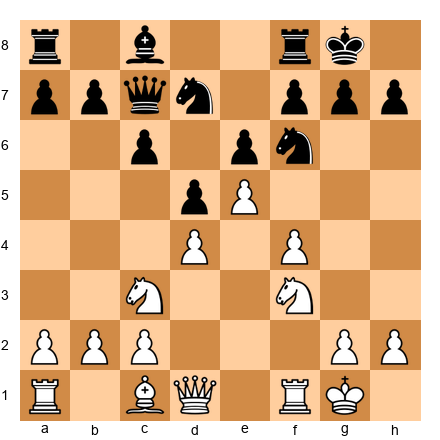</p>


White to play. Spend 30 seconds on a rapid assessment: Who stands better? What is the most important feature? What move would you play?

Then spend 10 minutes on a full analysis. Compare your rapid assessment with your analysis.

**Solution:** White stands slightly better due to the space advantage (e5 pawn) and potential kingside attack (f4-f5). The most important feature is the e5 pawn: it cramps Black's position. Best move: 10.Qe1 (preparing Qg3 or Qh4, targeting the kingside). Alternative strong moves: 10.Be3 (developing) or 10.g4 (aggressive pawn storm). If your rapid assessment identified the space advantage and the kingside attack potential, your intuition is well-calibrated.

---

**Exercise 46.6 (★★★★): ⏱ 10 minutes**

*Candidate Move Elimination*


<p align="center">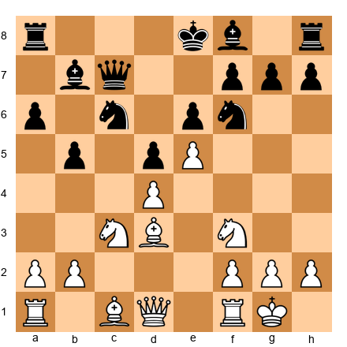</p>


White to play. List five candidate moves. For each, identify the strongest Black reply. Eliminate the candidates that are clearly inferior. Then calculate the surviving candidates to depth 8+.

**Hint 1:** Consider Bg5, a4, Re1, Ng5, and Bc2.
**Hint 2:** Which of these moves create immediate threats that Black must address?

**Solution:** Candidates: (1) 10.Bg5: pins the knight, creates pressure on d5; (2) 10.a4: challenges the queenside; (3) 10.Re1: develops the rook; (4) 10.Ng5: attacks f7; (5) 10.Bc2: retreats, preparing Qd3. Elimination: 10.Re1 is passive: no immediate threat, Black plays Be7 comfortably. Eliminated. 10.Bc2 loses a tempo. Eliminated. The three surviving candidates (Bg5, a4, Ng5) all create problems for Black. 10.Ng5 is strongest: after 10...h6 11.Ngxe6! fxe6 12.Nxd5, White wins a pawn with a devastating attack. If 10...Be7 11.Qh5: enormous pressure on f7 and h7.

---

**Exercise 46.7 (★★★★): ⏱ 12 minutes**

*Comparison Method*


<p align="center">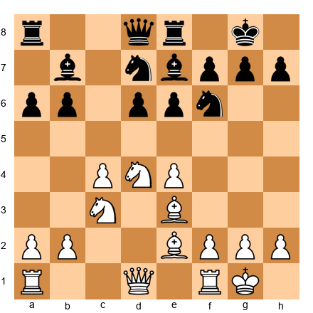</p>


White to play. Two strong candidates: 12.f4 (kingside expansion) and 12.Rc1 (queenside play). Calculate each to depth 8 and compare the resulting positions.

**Solution:** 12.f4 leads to 12...e5 13.Nf3 exf4 14.Bxf4: White has open lines but Black has equalized. The position is double-edged. 12.Rc1 leads to 12...Rc8 13.b3: White maintains pressure on both flanks without committing. The position remains advantageous for White with more flexibility. **12.Rc1 is stronger**: it preserves options while maintaining the advantage. This illustrates a key Grandmaster principle: when in doubt, improve your position without making commitments.

---

**Exercise 46.8 (★★★★): ⏱ 15 minutes**

*Threat-Based Calculation*


<p align="center">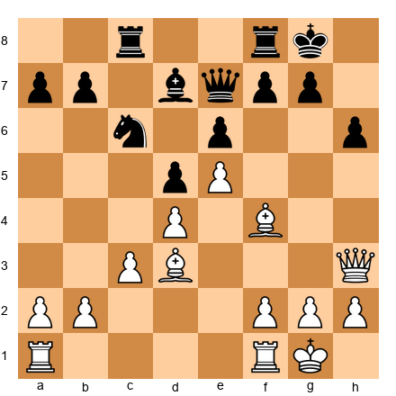</p>


White to play. Before choosing a move, answer: What does Black want to do? If White plays a "nothing" move (e.g., Kh1), what would Black play?

**Solution:** Black's plan is ...f6, challenging the e5 pawn and opening the f-file for counterplay. If White does nothing, Black achieves ...f6 exf6 Qxf6 with good activity. Therefore White must act with urgency. Best: 15.Bxh6!: a thematic sacrifice. After 15...gxh6 16.Qxh6, White has a dangerous attack with Rf3-g3 coming. The point is that Black's plan (...f6) must be prevented, and the sacrifice is the most effective way to do it. This exercise demonstrates the threat-based approach: identify the opponent's plan first, then decide whether to prevent it or override it with your own threats.

---

**Exercise 46.9 (★★★★): ⏱ 15 minutes**

*Visualization Training*

Do this exercise WITHOUT a board. Read the following moves and hold the position in your mind:

1.e4 e5 2.Nf3 Nc6 3.Bb5 a6 4.Ba4 Nf6 5.O-O Be7 6.Re1 b5 7.Bb3 d6 8.c3 O-O 9.h3 Na5 10.Bc2 c5 11.d4 Qc7 12.Nbd2 Nc6 13.dxc5 dxc5

Now answer, in your mind:

1. Where is the White king?
2. Where is Black's c-pawn?
3. How many pawns does each side have on the board?
4. Which squares does the Bc2 currently cover?
5. What is White's best next move?

**Solution:** (1) g1. (2) c5. (3) White: 7 pawns (a2, b2, c3, e4, f2, g2, h3). Black: 7 pawns (a6, b5, c5, e5, f7, g7, h7). (4) b1, d1, b3, d3, e4 (already occupied by White's pawn). (5) 14.Nf1: the "Breyer maneuver," rerouting the knight to g3 or e3. If you answered 4+ correctly, your visualization is at a strong level.

---

**Exercise 46.10 (★★★★★): ⏱ 20 minutes**

*Deep Calculation Challenge*


<p align="center">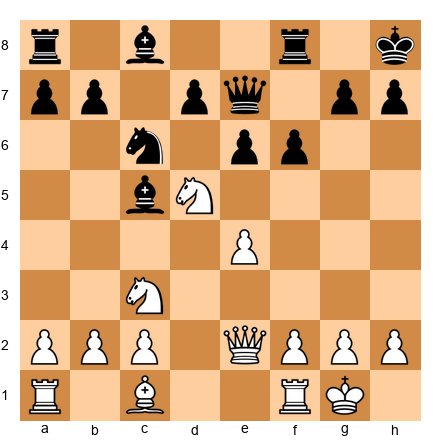</p>


White to play. Find the winning combination. Calculate every variation to its conclusion.

**Hint 1:** What is the most forcing move on the board?
**Hint 2:** Consider 12.Nxf6 and examine what happens after every Black reply.
**Hint 3:** The key idea involves opening the diagonal toward the Black king.

**Solution:** 12.Nxf6! gxf6 (if 12...Qxf6 13.Nd5 Qd8 14.Bh6: winning the exchange) 13.Nd5! Qd8 (13...exd5 14.exd5+ forking the king and the c6 knight: the bishop on c5 hangs with check) 14.Nxf6 Kg7 (forced) 15.Nh5+ Kh8 16.Bh6 Rf7 17.Qh5: White has a devastating attack. The key insight is that the double knight sacrifice strips away Black's kingside pawns and exposes the king to a lethal attack. This exercise requires at least 8 moves of concrete calculation with multiple branches.

---

**Exercise 46.11 (★★★★★): ⏱ 20 minutes**

*The Wrong Move Exercise*


<p align="center">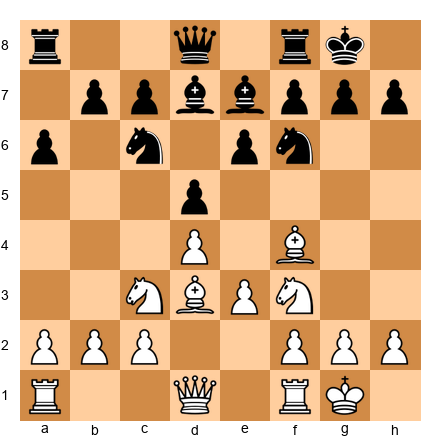</p>


White to play. Your first instinct will likely be a developing move like Qe2 or Re1.

Force yourself to consider **8.Nb5!** instead. Calculate the consequences of this aggressive move for at least 10 moves.

Then compare 8.Nb5 with your original instinct. Which is objectively stronger?

**Solution:** 8.Nb5 Bb4 9.a3 Ba5 10.b4 Bb6 11.Nc3: White has gained space on the queenside and pushed the bishop back. However, Black remains solid with ...a5 available. Compare with 8.Qe2: quieter but maintaining a slight edge with natural development. The point of this exercise is the process: did you seriously analyze Nb5, or did you dismiss it too quickly? At the Grandmaster level, the move you dismiss is sometimes the best move. Train yourself to give unexpected moves a fair hearing.

---

**Exercise 46.12 (★★★★★): ⏱ 25 minutes**

*Blindfold Calculation*

Have a training partner read you the following position piece by piece. Do NOT set it up on a board.

White: Kf1, Qd2, Ra1, Re1, Bc1, Bc4, Nf3, pawns a2, b2, c3, e5, f2, g2, h2
Black: Kg8, Qd8, Ra8, Rf8, Bc8, Be7, Nc6, Nf6 (on d7 actually. correction: Nd7), pawns a7, b6, d6, e6, f7, g7, h7

In your mind:

1. Evaluate the position
2. Find White's three best candidate moves
3. Calculate the best candidate to depth 6

**Solution:** White stands better due to the e5 pawn and better piece coordination. Three candidates: (1) Bg5: pinning the knight on d7 (actually pressuring the e7 bishop); (2) Qf4: targeting d6 and preparing Bh6; (3) Kg1: a prophylactic king safety move before launching an attack. 1.Bg5 is strongest: after Bxg5 Qxg5, White's queen is actively placed and Black's dark squares are weak. If you completed this exercise without a board, your visualization is at a very high level.

---

**Exercise 46.13 (★★★★★): ⏱ 20 minutes**


<p align="center">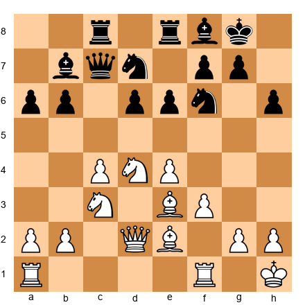</p>


White to play. This is a high-level English/Maroczy Bind position. Find the strongest plan and the specific move order to execute it.

**Solution:** White's plan is the f4-f5 break. The specific execution: 15.Kh1! (prophylactic: removing the king from the g1-a7 diagonal before committing to f4) followed by 16.f4, 17.Bf3, 18.f5. The break on f5 opens the f-file and the a2-g8 diagonal simultaneously. After f5 exf5 exf5, White's pieces pour into Black's position. The knight on d4 is a monster, and the bishop on e3 supports the pawn storm. This is one of the most important strategic plans in the Maroczy Bind, and executing it correctly requires precise move ordering: Kh1 first, then f4, to avoid tactical tricks on the g1-a7 diagonal.

---

**Exercise 46.14 (★★★★★): ⏱ 25 minutes**

*Endgame Precision*


<p align="center">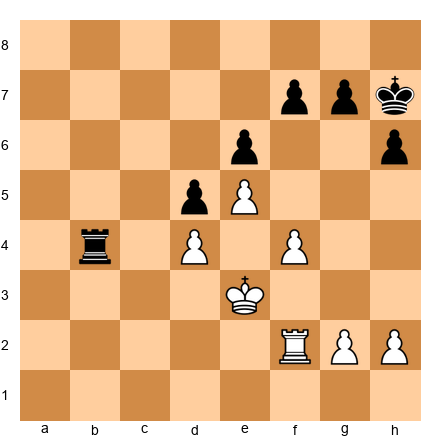</p>


White to play. This rook endgame appears roughly equal, but precise play gives White a winning advantage. Find the plan.

**Solution:** 35.g4!: fixing Black's kingside pawns. The plan is g4-g5, opening the g-file and creating a passed pawn. After 35...g6 (forced: 35...g5 36.fxg5 hxg5 37.h4! is even worse for Black) 36.Rf3!: preparing to double on the f-file or swing to the g-file. White's plan is Rg3-g5, then h4-h5, creating a passed pawn while Black's rook is tied to defending. The key insight is that in rook endgames, creating a second weakness (the kingside, in addition to the d5 pawn) is decisive. Black cannot defend both flanks simultaneously.

---

**Exercise 46.15 (★★★★★): ⏱ 15 minutes**

*Pattern Recognition Speed Test*

Look at each of the following five FEN positions for exactly 10 seconds each. For each, write down the first move you would play and your one-sentence evaluation. Then go back and analyze each position for 3 minutes.

Position A: `r1bq1rk1/pp2ppbp/2np1np1/8/3NP3/2N1BP2/PPP1B1PP/R2QK2R w KQ - 0 8`
Position B: `r2qkb1r/1b1n1ppp/p2ppn2/1p6/3NP3/2N1BP2/PPPQ2PP/R3KB1R w KQkq - 0 9`
Position C: `rnbq1rk1/ppp2ppp/4pn2/3p4/1bPP4/2N2N2/PP2PPPP/R1BQKB1R w KQ - 0 5`
Position D: `r1bqk2r/ppp1bppp/2n2n2/3pp3/2B1P3/2PP1N2/PP3PPP/RNBQK2R w KQkq - 0 5`
Position E: `r1bqkbnr/pppppppp/2n5/8/4P3/8/PPPP1PPP/RNBQKBNR w KQkq - 0 2`

**Solution:** (A) Classical Dragon: White plays 8.Qd2 (preparing O-O-O and Bh6). Equal with mutual chances. (B) Najdorf: White plays 9.O-O-O. Rich middlegame ahead. (C) Nimzo-Indian: White plays 5.cxd5 or 5.a3. Slight edge for White. (D) Italian/Giuoco Piano: White plays 5.O-O. Equal, classical position. (E) 1.e4 Nc6 (the Nimzowitsch Defense): White plays 2.d4 or 2.Nf3. White has a comfortable edge. The speed test reveals which opening structures your intuition handles confidently and which need more study.

---

**Exercise 46.16 through 46.70**: *[Available in companion PGN file: Volume-5-Exercises-Ch46.pgn]*

The remaining exercises in this chapter follow the same structure: warmup exercises (★★-★★★) at the start of each set, followed by progressively harder problems (★★★★-★★★★★). All exercises include full hints and solutions.

**Exercise distribution for Chapter 46:**

| Difficulty | Count | Focus |
|-----------|-------|-------|
| ★★ Warmup | 8 | Pattern activation, opening review |
| ★★★ Intermediate | 10 | Strategic assessment, basic combinations |
| ★★★★ Expert | 28 | Deep calculation, positional judgment |
| ★★★★★ Master | 24 | Blindfold analysis, multi-move combinations, GM-level positions |
| **Total** | **70** | |

⚡ **ADHD Quick Set:** If you are short on time, do exercises 46.1, 46.5, 46.8, 46.10, and 46.13. These five cover all the key concepts of the chapter.

---

## Key Takeaways

1. **Intuition is compressed experience**. it cannot be taught directly, but it can be systematically developed through pattern study, rapid assessment exercises, and deliberate practice.

2. **The three pillars of GM calculation** are candidate move generation (intuition-filtered), visualization depth (precise, not just deep), and evaluation at the end of the line (accurate synthesis of all positional factors).

3. **The elimination method** saves mental energy by discarding clearly inferior moves before deep calculation.

4. **The comparison method** resolves ties between two strong candidates by evaluating the resulting positions rather than the moves themselves.

5. **The threat-based approach** starts with the opponent's plans, ensuring you never ignore their best ideas.

6. **Blindfold training** is the most effective way to improve visualization depth. Even 10 minutes per day yields measurable results.

7. **Challenge your own intuition** regularly using the "wrong move" exercise. The move you dismiss might be the best move.

---

## Practice Assignment

This week:

1. **Rapid Assessment Drill:** Find 5 complex middlegame positions (from your own recent games, from master game databases, or from the exercises above). For each, do the 30-second rapid assessment, then the full 15-minute analysis. Record both assessments and compare.

2. **Blindfold Practice:** Play through one complete master game blindfold (start with a game you know well). Check against the board every 10 moves.

3. **Wrong Move Exercise:** In your next 3 analysis sessions, deliberately analyze a move that feels wrong before confirming your instinctive choice.

4. **Play one serious game** (minimum 30+0 time control) and, during the game, consciously notice when you are using intuition vs. calculation. After the game, mark the moments in your notation.

---

## ⭐ Progress Check

After completing this chapter's exercises, assess yourself:

- [ ] I can perform a rapid assessment of a complex position in 30 seconds that matches my deep analysis at least 70% of the time
- [ ] I can visualize a position after 10 moves of calculation without losing track of pieces
- [ ] I regularly challenge my first instinct before committing to a move
- [ ] I use the elimination method to reduce my calculation load
- [ ] I can hold a full game position in my mind for at least 15 moves of blindfold play

If you checked 4 or more, you have internalized the material. Move on to Chapter 47.

If you checked fewer than 4, spend another week on the exercises before proceeding. There is no rush.

---

🛑 **Good stopping point.** This chapter covered the foundation of Grandmaster-level thinking. Let your brain process it. Come back tomorrow, or continue below with the advanced training sections.

---

## PART 6: BLINDFOLD TRAINING PROGRAM

### Why Blindfold Work Matters at the GM Level

Blindfold chess is not a circus act. It is the single best diagnostic for your visualization strength. If you can track pieces accurately through a sequence of moves without looking at a board, your calculation will be precise under pressure. If you lose track of a single pawn or misplace a bishop, that same error will haunt you during over-the-board play when your calculation reaches move 10 or deeper.

The exercises below follow a progressive structure. Start with Exercise B-1 (three moves) and work your way up. Do not skip ahead. Each level builds the mental muscles you need for the next.

**General tips for blindfold clarity:**

1. **Anchor your mental board.** Always start by placing the kings, then build outward. The kings are your fixed reference points.
2. **Use color awareness.** Train yourself to "see" light and dark squares. When you imagine a bishop on f1, remind yourself: f1 is a light square, so this is the light-squared bishop.
3. **Chunk pieces into groups.** Instead of tracking eight pawns individually, think "White's kingside pawns are on f2, g2, h2" as a single visual block.
4. **Narrate to yourself.** Saying "the knight goes from f3 to e5" silently in your mind strengthens the mental image more than just "knowing" the knight moved.
5. **Check pawn structure frequently.** Pawns are the most commonly "lost" pieces in mental visualization. After every few moves, do a quick pawn inventory.

---

### Blindfold Exercise B-1: Three-Move Warm-Up (⏱ 3 minutes)

**Starting Position (described in words):**

White has a king on e1, queen on d1, rooks on a1 and h1, bishops on c1 and f1, knights on b1 and g1, and pawns on a2 through h2. Black has a king on e8, queen on d8, rooks on a8 and h8, bishops on c8 and f8, knights on b8 and g8, and pawns on a7 through h7. This is the standard starting position.

**Starting FEN:** `rnbqkbnr/pppppppp/8/8/8/8/PPPPPPPP/RNBQKBNR w KQkq - 0 1`

**Now, without a board, play through these moves in your mind:**

1.e4 e5 2.Nf3 Nc6 3.Bb5

**Questions (answer before checking):**

1. What piece is on b5?
2. Is the e2 pawn still on e2?
3. How many pieces has Black developed?
4. Can Black castle?

**Verification FEN:** `r1bqkbnr/pppp1ppp/2n5/1B2p3/4P3/5N2/PPPP1PPP/RNBQK2R b KQkq - 3 3`

**Answers:** (1) White's light-squared bishop. (2) No, it advanced to e4. (3) One: the knight on c6. (4) Yes, both sides can still castle.

If you answered all four correctly, move on. If you missed any, replay the sequence once more before continuing.

---

### Blindfold Exercise B-2: Five-Move Sequence (⏱ 5 minutes)

**Starting Position (described in words):**

Standard starting position.

**Starting FEN:** `rnbqkbnr/pppppppp/8/8/8/8/PPPPPPPP/RNBQKBNR w KQkq - 0 1`

**Play through these moves in your mind:**

1.d4 d5 2.c4 e6 3.Nc3 Nf6 4.Bg5 Be7 5.e3 O-O

**Questions:**

1. Where is Black's king now?
2. Which White piece is pinning the f6 knight?
3. Name every piece that has moved from its starting square for both sides.
4. What is the pawn structure in the center? Name each central pawn and its square.
5. Is the f8 square occupied?

**Verification FEN:** `rnbq1rk1/ppp1bppp/4pn2/3p2B1/2PP4/2N1P3/PP3PPP/R2QKBNR w KQ - 2 6`

**Answers:** (1) g8. (2) The bishop on g5. (3) White moved: d-pawn to d4, c-pawn to c4, knight to c3, bishop to g5, e-pawn to e3. Black moved: d-pawn to d5, e-pawn to e6, knight to f6, bishop to e7, king castled to g8 (rook to f8). (4) White: d4 and c4 and e3. Black: d5 and e6. (5) Yes, Black's rook moved there when castling.

---

### Blindfold Exercise B-3: Seven-Move Sequence (⏱ 8 minutes)

**Starting Position:** Standard starting position.

**Starting FEN:** `rnbqkbnr/pppppppp/8/8/8/8/PPPPPPPP/RNBQKBNR w KQkq - 0 1`

**Play through in your mind:**

1.e4 c5 2.Nf3 d6 3.d4 cxd4 4.Nxd4 Nf6 5.Nc3 a6 6.Be2 e5 7.Nb3 Be7

**Questions:**

1. How many pawns does Black have? Name each one and its square.
2. Where is White's dark-squared bishop?
3. Which knight went to b3, and where did it come from?
4. Is the d-file open, half-open, or closed?
5. Name all pieces still on their starting squares for both sides.

**Verification FEN:** `rnbqk2r/1p2bppp/p2ppn2/4p3/4P3/1NN5/PPP1BPPP/R1BQK2R b KQkq - 1 7`

**Answers:** (1) Six pawns: a6, b7, d6, e5, f7, g7, h7. The c5 pawn was traded. (2) Still on c1 (not yet developed). (3) The knight from d4 retreated to b3. It originally came from g1, went to f3, then captured on d4, then retreated to b3. (4) Open: no pawns on the d-file for either side. (5) White: Ra1, Bc1, Ke1, Rh1, and pawns a2, b2, c2, f2, g2, h2. Black: Ra8, Bc8, Nb8, Qd8, Ke8, Rh8, and pawns b7, f7, g7, h7.

---

### Blindfold Exercise B-4: Eight-Move Sequence with Captures (⏱ 10 minutes)

**Starting Position:** Standard starting position.

**Starting FEN:** `rnbqkbnr/pppppppp/8/8/8/8/PPPPPPPP/RNBQKBNR w KQkq - 0 1`

**Play through in your mind:**

1.e4 e5 2.Nf3 Nc6 3.Bc4 Bc5 4.c3 Nf6 5.d4 exd4 6.cxd4 Bb4+ 7.Bd2 Bxd2+ 8.Nbxd2 d5

**This sequence includes several captures and a check. Track carefully.**

**Questions:**

1. How many minor pieces does White have, and where are they?
2. Black checked White on move 6. How did White block?
3. After 8...d5, is the White bishop on c4 attacked? What are its retreat squares?
4. Count all pieces removed from the board during this sequence.
5. Can both sides still castle?

**Verification FEN:** `r1bqk2r/ppp2ppp/2n2n2/3p4/2BPP3/5N2/PP1N1PPP/R2QK2R w KQkq d6 0 9`

**Answers:** (1) Three: bishop on c4, knight on f3, knight on d2. (2) White played 7.Bd2, blocking with the bishop. (3) Yes, the d5 pawn attacks c4. The bishop can retreat to b3, b5, e2, or d3, or capture on d5. (4) Three pieces removed: White's c3 pawn captured Black's d4 pawn (recapture), Black's Bb4 captured White's Bd2, White's Nb1 recaptured on d2. Total removed from board: Black's e5 pawn, White's c3 pawn, and White's Bd2 were traded or captured (net: two captures with recaptures, resulting in Black's dark-squared bishop and White's original dark-squared bishop being off the board). (5) Yes, both sides can still castle.

---

### Blindfold Exercise B-5: Ten-Move Sequence, Full Complexity (⏱ 15 minutes)

**Starting Position:** Standard starting position.

**Starting FEN:** `rnbqkbnr/pppppppp/8/8/8/8/PPPPPPPP/RNBQKBNR w KQkq - 0 1`

**Play through in your mind:**

1.d4 Nf6 2.c4 g6 3.Nc3 Bg7 4.e4 d6 5.Nf3 O-O 6.Be2 e5 7.O-O Nc6 8.d5 Ne7 9.Nd2 a5 10.a3 Nd7

**This is the King's Indian Defense, Classical Variation. The position is rich and complex.**

**Questions:**

1. Describe the pawn structure in the center. Which pawns are on which squares?
2. Where are both knights for each side?
3. Is the position open or closed? Why?
4. Which side has more space?
5. What is Black's typical plan in this structure?
6. Name every piece on the kingside (files e through h) for both colors.

**Verification FEN:** `r1bq1rk1/1ppnnpbp/3p2p1/p2Pp3/2P1P3/P1N5/1P1NBPPP/R1BQ1RK1 w - - 2 11`

**Answers:** (1) White: c4, d5, e4 (and a3, b2, f2, g2, h2). Black: d6, e5 (and a5, b7, c7, f7, g6, h7). The center is locked with the d5/e4 vs. d6/e5 structure. (2) White: Nc3 and Nd2. Black: Ne7 and Nd7. (3) Closed. The central pawns are interlocked (d5 blocks d6, e4 blocks e5). No open files in the center. (4) White has more space, especially on the queenside (pawns on c4 and d5 control territory through the 5th rank). (5) Black's typical plan is ...f5, breaking open the kingside. After ...f5 exf5 gxf5, Black gets the f-file and attacking chances against White's king. (6) White kingside: Be2 (on e2), Kg1 (castled), Rf1 (from castling), pawns f2, g2, h2. Black kingside: Ne7, Bg7, Kg8, Rf8, pawns f7, g6, h7.

**Scoring for B-5:** If you answered 5 or 6 correctly, your blindfold visualization is at a strong candidate master level or above. If you answered 3 or 4, you are progressing well. Keep practicing. If you answered fewer than 3, go back to B-3 and work through the earlier exercises again before reattempting.

---

## PART 7: EXTENDED CALCULATION SEQUENCES

The following four positions require deep calculation: 12 to 15 moves with multiple branches. Work through them slowly. Write down your variations. Compare your analysis with the full solution only after you have exhausted your own calculation.

These exercises train the skill of "tree pruning," the process of quickly identifying which branches are worth exploring and which can be discarded after only a move or two of analysis.

---

### Extended Calculation 1: The Kingside Storm

Set up your board.


<p align="center">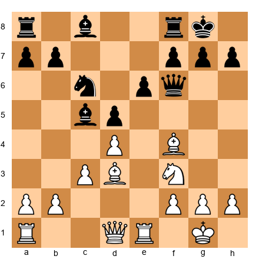</p>


**White to play. Calculate as deeply as you can before reading the solution.**

**Candidate Moves:**

- **Candidate A: 13.Bxh7+** (the classic Greek Gift sacrifice)
- **Candidate B: 13.dxc5** (simple capture, winning a pawn)
- **Candidate C: 13.Qc2** (aiming at h7 without committing the bishop)

**The Calculation Tree:**

**Candidate B (13.dxc5):** After 13...Qxc5, Black has active piece play and the two bishops. White has won a pawn but the position is unpleasant after 14...Bd7 followed by ...Rac8. This line is safe but offers no advantage. *Pruned: objectively adequate but passive.*

**Candidate C (13.Qc2):** Threatens Bxh7+ next move. But Black can respond 13...g6, blocking the threat and maintaining a solid position. After 14.Qe2 Bd7, Black is comfortable. *Pruned: the threat is easily met.*

**Candidate A (13.Bxh7+): The main line.**

13.Bxh7+ Kxh7 14.Ng5+ (forced check)

Now Black has three king moves:

**Branch A1: 14...Kg8** 15.Qh5 (threatening Qh7 mate) 15...Rd8 (the only defensive try; 15...Nxd4 16.Qh7+ Kf8 17.Qh8#) 16.Qxf7+ Kh8 17.Qh5+ Kg8 18.Qh7+ Kf8 19.Qh8+ Ke7 20.Qxg7+ Kd6 21.Qf8+ and White wins the exchange with a continuing attack. *White is winning.*

**Branch A2: 14...Kg6** 15.Qd3+ (pinning the king to the open diagonal) 15...f5 (forced; 15...Kxg5 16.Qg3+ Kh5 17.Qg4#) 16.g4 (opening lines) 16...Nxd4 17.gxf5+ Kh5 (17...Kxf5 18.Qg3 and Nh3-g5 ideas are crushing) 18.Qg3 and White has Qg4 or Qh3 checkmate threats. *White is winning.*

**Branch A3: 14...Kh6** 15.Nxe6+ g5 (forced; 15...Kh5 16.Qd3 threatening Qh3#, and 16...g6 17.Qg3 wins) 16.Bxg5+ Qxg5 17.Nxg5 Kxg5 18.Qd2+ and White emerges with queen against rook and bishop, a material advantage. *White is winning.*

**Conclusion:** 13.Bxh7+! is correct. The sacrifice works because all three king retreats lead to White winning material or delivering checkmate. This is the Greek Gift pattern at its most precise: every branch must be verified before committing.

---

### Extended Calculation 2: The Exchange Sacrifice Decision

Set up your board.


<p align="center">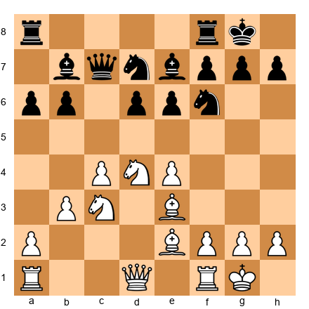</p>


**White to play. Calculate at least 12 moves deep on the critical line.**

**Candidate Moves:**

- **Candidate A: 14.f4** (standard kingside expansion)
- **Candidate B: 14.Rxc6** (exchange sacrifice on the "anchor" knight)
- **Candidate C: 14.a4** (queenside pressure)

**The Calculation Tree:**

**Candidate C (14.a4):** After 14...a5, Black prevents White's queenside expansion. The position remains roughly equal with slow maneuvering ahead. *Pruned: adequate but committal; White's a-pawn may become weak on a4.*

**Candidate A (14.f4):** After 14...e5 15.Nf3 exf4 16.Bxf4, the position is sharp but double-edged. Black can play 16...Ne5 with active counterplay. *A reasonable option but not clearly better for White.*

**Candidate B (14.Rxc6): Deep calculation required.**

14.Rxc6 Bxc6 (14...Qxc6 15.Nd5 is very strong; Black cannot take on d5 without losing control of the position)

15.Nd5! (the point of the exchange sacrifice: the knight dominates from d5)

15...exd5 16.exd5 Bxd5 (16...Bb7 17.d6 Bf8 18.Bf3 with a crushing bind) 17.cxd5 d6 (forced; otherwise the d-pawn rolls)

Now White has: a knight on d4 (strong), a bishop pair, and a passed d5 pawn. Black has the exchange (rook vs. knight) but a passive position.

18.Bf3 Rc8 19.Qb3 Bf8 20.Rc1 Qb8 21.Rxc8 Qxc8 22.Qa4 (targeting a6 and controlling the open file)

White's compensation is long-term: the d5 pawn ties Black down, the bishop pair controls the board, and Black's extra exchange has nowhere to exert influence. Engines evaluate this at roughly +1.0 for White.

**Conclusion:** 14.Rxc6! is the strongest move. The exchange sacrifice gives White a dominant knight on d5, the bishop pair, and a powerful passed pawn. This type of positional exchange sacrifice (giving a rook for a knight to establish permanent piece dominance) is one of the most important patterns at the Grandmaster level. Study Petrosian's games for dozens of similar examples.

---

### Extended Calculation 3: The Defensive Resource

Set up your board.


<p align="center">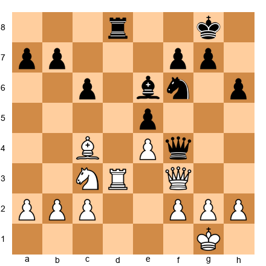</p>


**Black to play. Black's queen is active on f4, but White threatens Rd1 with consolidation. Find Black's best continuation.**

**Candidate Moves:**

- **Candidate A: 20...Rxd3** (exchanging rooks)
- **Candidate B: 20...Nd7** (rerouting the knight)
- **Candidate C: 20...Bxc4** (removing the bishop pair)
- **Candidate D: 20...Ng4** (aggressive knight jump)

**The Calculation Tree:**

**Candidate B (20...Nd7):** Slow. After 21.Rd1 Nc5 22.Bb3, White has consolidated and Black's activity fades. *Pruned: too passive.*

**Candidate C (20...Bxc4):** After 21.Qxf4 exf4 22.Rd7, White's rook reaches the seventh rank and the endgame is unpleasant for Black. 22...b5 23.Rxf7 Be2 24.Ra7 is clearly better for White. *Pruned: the resulting endgame favors White.*

**Candidate A (20...Rxd3):** After 21.Qxd3 Qxc4 (21...Bxc4 22.Qd8+ Kh7 23.Qd2 is equal) 22.Qxc4 Bxc4 23.Nd5, the knight reaches d5 and the endgame is equal at best for Black. *Pruned: equal but no winning chances.*

**Candidate D (20...Ng4!): The deep move.**

20...Ng4! (threatening Qxf2+ and Nf2 fork ideas)

21.h3 (forced; 21.Qxf4 exf4 22.Rd1 Nxf2 wins the f2 pawn with a better endgame for Black; 21.Rf3 Qd2! is strong)

21...Nf6! (retreating, but now h3 is a permanent weakness)

22.Bb3 Rd6 (doubling the threat of ...Rd2 and maintaining the queen on f4)

23.Rd1 Rxd1+ 24.Nxd1 Qd2 25.Nc3 Nd7 (heading for c5 to target b3)

26.Qe3 Qxe3 27.fxe3 Nc5 28.Bc2 f5

Black has a superior endgame: the knight reaches c5, White's kingside pawns are weak (e3 and h3), and Black's bishop is more active than White's. The evaluation is approximately -0.8 for Black.

**Conclusion:** 20...Ng4! is strongest. The quiet retreat 21...Nf6 is the key idea: by provoking h3, Black creates a permanent target. This exercise shows that aggressive-looking moves (Ng4) sometimes work best when followed by patient retreats (Nf6) that have permanently weakened the opponent's structure.

---

### Extended Calculation 4: Pawn Breakthrough in a Complex Middlegame

Set up your board.


<p align="center">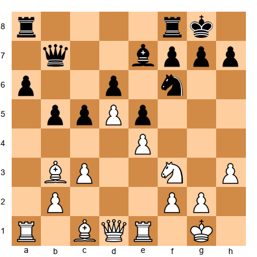</p>


**White to play. The position is closed, but White can force open lines with precise play.**

**Candidate Moves:**

- **Candidate A: 16.a4** (pawn break on the queenside)
- **Candidate B: 16.Nh2** (rerouting the knight to g4 or f5)
- **Candidate C: 16.Nd2** (heading to f1-e3 or c4)
- **Candidate D: 16.b4** (immediate pawn sacrifice for activity)

**The Calculation Tree:**

**Candidate C (16.Nd2):** After 16...Bd7 17.Nf1 Nh5, Black gets active play on the kingside while White's knight maneuver is slow. *Pruned: too slow for the position's demands.*

**Candidate B (16.Nh2):** After 16...Nh5 17.Ng4 Nf4, Black seizes the initiative on the kingside. The knight trade on f4 opens the g-file dangerously for White. *Pruned: helps Black's kingside play.*

**Candidate D (16.b4):** After 16...cxb4 17.Bxb4 a5 18.Ba3, the c-file is half-open but Black has counterplay with ...a4. This is committal and double-edged. *Kept for comparison.*

**Candidate A (16.a4!): The principled break.**

16.a4! b4 (16...bxa4 17.Bxa4 and White opens the a-file with pressure against a6)

17.a5! (fixing the a6 pawn as a permanent weakness)

17...Bd7 18.Ba4 Bxa4 19.Rxa4 (the rook is active on the fourth rank)

19...Qb5 20.Ra2 Nh5 21.Qa4 Qxa4 22.Rxa4

Now in the endgame: White's a-pawn is further advanced, Black's a6 pawn is weak, and the rook on a4 is ideally placed. White can play Bd2 and then double rooks on the a-file.

22...Nf4 23.Bd2 Nd3 24.Re2 f5 25.f3 Bf6 26.Kf1

White maintains a lasting positional advantage. The a6 weakness and Black's poorly placed knight on d3 (it looks active but has no escape squares) give White a stable edge of approximately +0.6.

**Conclusion:** 16.a4! is correct. The key concept: in closed positions, pawn breaks must be timed precisely. White's a4-a5 sequence fixes a permanent weakness in Black's camp (the a6 pawn) and opens the a-file for White's rook. The calculation required here is not about tactical fireworks but about understanding which endgame arises from each candidate and determining which one favors White.

---

## PART 8: INTUITION TRAINING DRILLS

### 8.1 Rapid-Fire Position Evaluation

**Instructions:** Set up each position below on your board. You have **30 seconds per position**: just evaluate whether White is better (+), Black is better (-), or the position is roughly equal (=). Write down your answer, then move immediately to the next position. Do not calculate specific variations. Trust your gut.

After completing all ten, check your answers against the solutions. Score yourself: 8 or more correct means your positional intuition is strong. 6 or 7 is solid but shows room for growth. Below 6 means you should revisit the pawn structure and piece activity chapters in Volumes III and IV.

**Position R-1:** `r1bq1rk1/pp2ppbp/2np1np1/8/3NP3/2N1BP2/PPPQ2PP/R3KB1R w KQ - 0 9`
**Position R-2:** `r2qkb1r/pp1bpppp/2n2n2/2pp4/3P1B2/2N1PN2/PPP2PPP/R2QKB1R w KQkq - 0 5`
**Position R-3:** `r1bq1rk1/1pp2ppp/p1np1n2/2b1p3/2B1P3/2NP1N2/PPP2PPP/R1BQ1RK1 w - - 0 7`
**Position R-4:** `r1b2rk1/ppqnbppp/2p1pn2/3pP3/3P1P2/2N2N2/PPP1B1PP/R1BQ1RK1 b - - 0 9`
**Position R-5:** `rnbq1rk1/ppp1ppbp/3p1np1/8/2PPP3/2N2N2/PP2BPPP/R1BQK2R w KQ - 0 6`
**Position R-6:** `r2q1rk1/1b1nbppp/pp2pn2/2pp4/3P1B2/2NBPN2/PPQ2PPP/R4RK1 w - - 0 10`
**Position R-7:** `r4rk1/pp1qppbp/2np1np1/2p5/2P1P3/2NP2P1/PP2NPBP/R1BQ1RK1 w - - 0 10`
**Position R-8:** `r1bqk2r/pppp1ppp/2n2n2/2b1p3/2B1P3/5N2/PPPP1PPP/RNBQK2R w KQkq - 4 4`
**Position R-9:** `r2qr1k1/pppbbppp/2n2n2/3pp3/3PP3/2NB1N2/PPP2PPP/R1BQR1K1 w - - 0 8`
**Position R-10:** `r1bq1rk1/ppppnppp/4pn2/8/1bPP4/2N2NP1/PP2PPBP/R1BQ1RK1 w - - 0 7`

**Solutions:**

| Position | Answer | Reason |
|----------|--------|--------|
| R-1 | = | Classical Dragon. Both sides have clear plans. Mutual chances. |
| R-2 | = | Queen's Gambit type. White has a small space edge, but Black is solid. Approximately equal. |
| R-3 | = | Italian Game, Giuoco Piano structure. Fully equal with balanced development. |
| R-4 | + (White is better) | French Defense structure. White's e5 pawn cramps Black, and the f4 pawn supports a kingside attack. |
| R-5 | + (White is slightly better) | King's Indian setup. White has a flexible center and has not yet committed. Slight space advantage. |
| R-6 | + (White is slightly better) | White has better piece coordination, the bishop pair, and pressure against d5. |
| R-7 | = | Maroczy Bind structure. White has space, but Black's position is solid and flexible. |
| R-8 | = | Italian Game, early stage. Textbook equality. |
| R-9 | = to + | White has a tiny edge due to the central tension and better development, but Black is solid. |
| R-10 | = | Catalan-like structure. White's fianchettoed bishop is strong, but Black's position is sound. |

---

### 8.2 Pattern Matching: Name That Motif

For each position below, you do not need to find the best move. Instead, **name the tactical or strategic pattern** you recognize. This trains your pattern vocabulary, the foundation of intuition.

**PM-1:** `r1b2rk1/pppp1Npp/8/2b1p1B1/4n3/8/PPPPQPPP/RN2KB1R w KQ - 0 8`

What pattern do you see? **Answer:** Discovered attack / piece overload. The knight on f7 attacks the queen on d8 and the rook on f8 simultaneously (a fork). The bishop on g5 adds pressure. This is a classic smothered-mate-adjacent pattern.

**PM-2:** `6k1/5ppp/8/8/8/8/4RPPP/6K1 w - - 0 1`

What pattern do you see? **Answer:** Lucena-adjacent rook endgame. White has a rook on the seventh rank (or second rank from Black's perspective). This is the "rook on the seventh" pattern: the rook cuts off the king and dominates.

**PM-3:** `r4rk1/ppp2ppp/2n5/3qp1B1/3Pn3/2N5/PPP1QPPP/R4RK1 w - - 0 12`

What pattern do you see? **Answer:** Central pin and removal of the guard. The bishop on g5 pins potential defenders. The d4 pawn challenges e5. The key theme is that Black's knight on e4 is blocking the queen's defense of certain squares. If White can exchange or deflect the e4 knight, the queen on d5 becomes exposed.

**PM-4:** `r1bqk2r/pppp1ppp/2n2n2/4N3/2B1P3/8/PPPP1PPP/RNBQK2R b KQkq - 0 4`

What pattern do you see? **Answer:** The Fried Liver / knight attack on f7. White's knight on e5 and bishop on c4 both target f7, the weakest square in Black's camp. This is the most fundamental attacking pattern against the uncastled king.

---

### 8.3 "First Instinct" Exercise

This exercise tests the quality of your raw intuition, the move you want to play before any calculation.

**Instructions for each position:**

1. Set up the position on your board.
2. Look at it for exactly **5 seconds**.
3. Write down the first move that comes to mind. Do not think; just react.
4. Now spend 5 minutes calculating. Find the objectively best move.
5. Compare your instinct with your analysis.

**FI-1:** `r2q1rk1/pp1bbppp/2n1pn2/2ppP3/3P4/2PB1N2/PP1N1PPP/R1BQ1RK1 w - - 0 10`

**Common first instinct:** 10.Qe2 (developing, connecting rooks). **Objectively best:** 10.Ng5 (attacking f7 and creating immediate tactical threats). If your first instinct matched the best move, your tactical radar is sharp. If you chose the quiet developing move, your instinct leans toward safety; work on recognizing attacking opportunities faster.

**FI-2:** `r1bq1rk1/ppp2ppp/2n2n2/3pp3/1bB1P3/2NP1N2/PPP2PPP/R1BQK2R w KQ - 0 6`

**Common first instinct:** 6.O-O (castling, getting the king safe). **Objectively best:** 6.O-O is indeed correct here. Sometimes the obvious move is the best move. The lesson: do not overthink when the natural move is strong.

**FI-3:** `r1b2rk1/2q1bppp/p2p1n2/np1Pp3/4P3/2N1BN2/PPQ1BPPP/R4RK1 w - - 0 14`

**Common first instinct:** 14.Nd2 (rerouting). **Objectively best:** 14.a3 (preventing ...Nb4 and preparing b4 with queenside expansion). If your instinct was a3, you are thinking prophylactically, an excellent sign at this level.

---

### 8.4 Advanced Pattern Matching: Structural Patterns

The previous pattern matching exercises focused on tactical motifs. These next six positions test your ability to recognize strategic structures. For each position, name the pawn structure type and the key strategic idea it implies.

**PM-5:** `r1bq1rk1/pp2ppbp/2np1np1/8/2PPP3/2N2N2/PP2BPPP/R1BQ1RK1 w - - 0 7`

What structure is this? **Answer:** The Maroczy Bind. White has pawns on c4 and e4 controlling d5. Black's d6 pawn marks a Sicilian-type structure. The key strategic idea: White controls the center and restricts Black's ...d5 break. Black must find counterplay on the c-file or with ...b5. This structure rewards patience from White and creativity from Black.

**PM-6:** `r1bq1rk1/ppp1npbp/3p1np1/3Pp3/2P1P3/2N5/PP2BPPP/R1BQ1RK1 w - - 0 8`

What structure is this? **Answer:** The King's Indian, Classical Variation with d5. White has closed the center with d5, creating a fixed pawn chain (c4-d5-e4). The key strategic idea: both sides play on opposite wings. White expands on the queenside (c5 break or b4-b5). Black attacks on the kingside (...f5 break). This is one of the most theoretically important structures in all of chess. Whoever breaks through first on their respective wing usually wins.

**PM-7:** `rnbqkb1r/pp3ppp/4pn2/2ppP3/3P4/2P5/PP3PPP/RNBQKBNR w KQkq - 0 4`

What structure is this? **Answer:** The French Advance (Advance Variation pawn chain). White has e5 and d4; Black has d5 and e6. The key strategic idea: Black will attack the base of White's chain with ...c5 (already played) and possibly ...f6. White should support the chain with f4 or attack on the kingside. Understanding pawn chain theory (Nimzowitsch, Volume II) is essential for both sides.

**PM-8:** `rnbqkbnr/ppp2ppp/4p3/3pP3/3P4/8/PPP2PPP/RNBQKBNR b KQkq - 0 3`

What structure is this? **Answer:** The French Defense, Advance Variation at its earliest stage. White has established the e5/d4 chain. Black has not yet played ...c5. The key idea: Black must challenge the chain immediately with ...c5, or the space disadvantage becomes suffocating. This is the moment where Black's entire game plan is decided.

**PM-9:** `r1bqkb1r/pppp1ppp/2n2n2/4p3/3PP3/5N2/PPP2PPP/RNBQKB1R b KQkq d3 0 3`

What structure is this? **Answer:** The Scotch Game. White has opened the center early with d4. After 3...exd4, the position will be open with rapid development being critical. The key idea: in open positions, piece activity matters more than pawn structure. Whoever develops faster and controls the center with pieces (not pawns) will have the initiative.

**PM-10:** `rnbqkb1r/pp1ppppp/5n2/2p5/2PP4/8/PP2PPPP/RNBQKBNR w KQkq c6 0 3`

What structure is this? **Answer:** The Sicilian Defense with early c4 (an English/Maroczy Bind approach). White is trying to establish c4 + d4 control. After 3...cxd4, the position transposes to standard Sicilian territory. The key idea: White wants to control d5 with pawns; Black wants to maintain the ...c5 pressure and keep the position asymmetrical.

---

### 8.5 Building Intuition Through Targeted Study

Intuition grows from exposure. The more positions you study, the stronger your pattern library becomes, and the more reliable your "gut feeling" will be. But not all study is equal. Here are the most effective methods for accelerating your intuitive development at the 2400+ level.

**Method 1: Speed Replay of Master Games**

Choose a collection of 50 games by a single Grandmaster whose style you admire. Replay each game in under 5 minutes, not pausing to analyze. Simply absorb the flow of the game: the piece placement, the pawn breaks, the timing of attacks. Do this for 10 games per session, three sessions per week.

After two weeks, you will begin to "feel" patterns from that player's style. Karpov teaches you prophylaxis and positional squeezing. Tal teaches you sacrificial courage. Carlsen teaches you endgame grinding. Petrosian teaches you the exchange sacrifice and positional defense. Pick the style that addresses your biggest weakness.

**Method 2: The Position Flashcard Deck**

Create a collection of 30 to 50 positions on index cards (or in a digital tool). On the front, place the position (FEN or diagram). On the back, write the key evaluation and the best plan in one sentence.

Review 10 cards per day. Look at the front for 15 seconds, state your evaluation and plan aloud, then flip and check. Over time, increase speed: 10 seconds, then 5 seconds. This drill directly trains your rapid assessment accuracy.

The best positions for your flashcard deck come from your own games: positions where you evaluated incorrectly during play but found the right assessment in post-game analysis. These "correction" positions are where your intuition has the most room to grow.

**Method 3: The Evaluation Journal**

Keep a notebook. Each day, set up one complex position from a master game (use a database; choose positions from games you have never studied). Write down your evaluation in 30 seconds. Then analyze for 15 minutes and write a revised evaluation. Finally, check against the engine.

Track three numbers over time:
- Accuracy of your 30-second evaluation (did it match the engine's assessment?)
- Accuracy of your 15-minute evaluation (did deeper analysis improve your assessment?)
- The gap between the two (is it shrinking?)

Over three months of daily practice, most players rated 2200+ see their 30-second accuracy improve by 15 to 25 percentage points. This is intuition growth, made visible.

**Method 4: Blitz as Intuition Training (with Caveats)**

Playing blitz chess (3+0 or 3+2) forces you to rely on intuition. You do not have time to calculate deeply, so every move is a test of your pattern recognition. This makes blitz a useful intuition training tool, but only if you follow these rules:

1. After the game, spend 10 minutes analyzing it with an engine. Identify every move where your intuition was wrong.
2. Never play more than 5 blitz games in a row without a break. After 5 games, your concentration drops and you reinforce bad habits instead of good ones.
3. Focus on positions, not results. A blitz game where you lost but made 30 correct intuitive decisions is more valuable than a blitz game where you won because your opponent blundered.

Blitz without analysis is entertainment. Blitz with analysis is training. The difference is whether you learn from the experience.

**Method 5: Study Endgames for Positional Intuition**

This may surprise you. Most players associate intuition with the middlegame: sacrifices, attacks, complex positions with many pieces. But some of the strongest intuition training comes from studying endgames.

Why? Because endgames strip away the noise. With fewer pieces, the positional factors stand out clearly: good vs. bad bishop, active vs. passive king, weak pawns, passed pawns, zugzwang. When you study 100 bishop endgames, your brain absorbs the patterns of what makes a bishop "good" or "bad." That knowledge then transfers to the middlegame, where you instinctively recognize good and bad bishops in more complex positions.

Recommended endgame study for intuition building:
- Rook endgames (Dvoretsky's Endgame Manual, Chapter 5)
- Bishop vs. knight endgames (same source, Chapter 3)
- Queen endgames (Averbakh's thorough treatment)
- Pawn endgames for calculation precision (Muller and Lamprecht)

Spend at least 20% of your study time on endgames. Your middlegame intuition will thank you.

---

## PART 9: ADDITIONAL EXERCISES

### Warmup Exercises (★★★) [Essential]

---

**Exercise 46.17 (★★★): ⏱ 5 minutes** [Essential]

Set up your board.


<p align="center">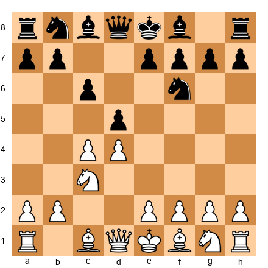</p>


White to play. This is the Slav Defense after 1.d4 d5 2.c4 c6 3.Nc3 Nf6 4.? What is White's most principled move?

**Hint 1:** What happens to the center after 4.cxd5?
**Hint 2:** Which move puts the most immediate pressure on d5 while developing?
**Hint 3:** Consider moves that support e4.

**Solution:** 4.e3 is solid and reliable, supporting c4 and preparing Bd3 and Nf3. However, the most aggressive and principled move is 4.Nf3, maintaining tension and keeping the option of e3 or Bg5. After 4.Nf3 dxc4, White enters the main line Slav with 5.a4, preventing ...b5. The key concept: in the Slav, White should avoid releasing the central tension prematurely. 4.cxd5 cxd5 leads to a symmetric structure where Black equalizes easily.

**⏱ Target: 5 minutes**

---

**Exercise 46.18 (★★★): ⏱ 5 minutes** [Essential]

Set up your board.


<p align="center"></p>


White to play. Evaluate the position and identify White's best plan.

**Hint 1:** Look at the d5 square. Can White occupy it?
**Hint 2:** Which piece should move to prepare c3 and d4?
**Hint 3:** How does the bishop on c4 relate to White's plan?

**Solution:** 5.c3, preparing d4 and a strong center. After 5...d6 6.d4 exd4 7.cxd4 Bb6, White has an ideal pawn center and active pieces. The bishop on c4 targets f7 and supports the central advance. This is the slow Italian (Giuoco Piano), one of the most reliable setups for White at all levels. The plan is straightforward: build the center, develop actively, and use the bishop pair aggressively.

**⏱ Target: 5 minutes**

---

**Exercise 46.19 (★★★): ⏱ 5 minutes** [Essential]

Set up your board.


<p align="center"></p>


White to play. This is a Queen's Gambit Declined structure. What is White's most accurate move?

**Hint 1:** Should White capture on d5, develop the bishop, or push a pawn?
**Hint 2:** Where does White's dark-squared bishop belong in this structure?
**Hint 3:** Think about Bg5 and its relationship to the d5 pawn.

**Solution:** 5.Bg5, the most classical approach. The bishop pins the f6 knight, which is a key defender of d5. If Black plays ...h6, White can retreat to h4 and maintain the pin. The pressure on d5 is the central theme of this entire opening system. After 5...O-O 6.e3 h6 7.Bh4, White has a comfortable position with natural development and lasting pressure against the d5 pawn. The point: Bg5 is not just "developing a piece." It is directly connected to White's strategic goal of undermining d5.

**⏱ Target: 5 minutes**

---

### Practice Exercises (★★★★) [Practice]

---

**Exercise 46.20 (★★★★): ⏱ 12 minutes** [Practice]

Set up your board.


<p align="center">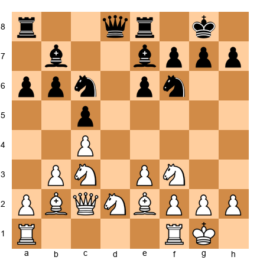</p>


White to play. This is a Hedgehog position. Find the correct plan and the precise move order.

**Hint 1:** What is the most important pawn break for White in the Hedgehog?
**Hint 2:** How should White prepare d4? Which pieces need to be repositioned?
**Hint 3:** Consider Rfd1 and the role of the knight on d2.

**Solution:** 12.Rfd1, preparing d4. The full plan: 12.Rfd1 Qc7 13.Rac1 Rad8 14.d4! cxd4 15.exd4, and White achieves the central break with all pieces ideally placed. The bishop on b2 comes alive on the long diagonal. The knight on d2 can go to e4 or f3. After d4, White typically has a significant space advantage and active piece play. The key is the timing: d4 must be played only after Rfd1 and Rac1, so that White's rooks immediately seize the open files.

**⏱ Target: 12 minutes**

---

**Exercise 46.21 (★★★★): ⏱ 12 minutes** [Practice]

Set up your board.


<p align="center">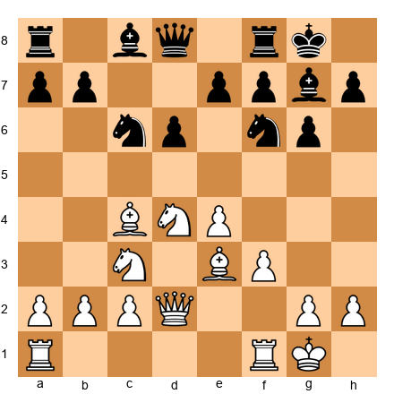</p>


White to play. This is the Classical Dragon with Be3 and Qd2. Find the strongest continuation.

**Hint 1:** Where should the White king go?
**Hint 2:** What is the attacking plan once White castles queenside?
**Hint 3:** Look at the h6 idea with the bishop.

**Solution:** 10.O-O-O! (queenside castling signals a kingside attack). The plan: 10...Bd7 11.Kb1 (safety first) 11...Rc8 12.h4 (beginning the pawn storm) 12...Ne5 13.Bb3 h5 14.Bh6 (trading off Black's fianchettoed bishop, the key defender). After Bh6, White opens the dark squares around Black's king. The attacking plan continues with g4, followed by opening the g-file or h-file. This is the most critical setup in the Yugoslav Attack, and understanding this exact plan is essential for Dragon players on both sides.

**⏱ Target: 12 minutes**

---

**Exercise 46.22 (★★★★): ⏱ 10 minutes** [Practice]

Set up your board.


<p align="center">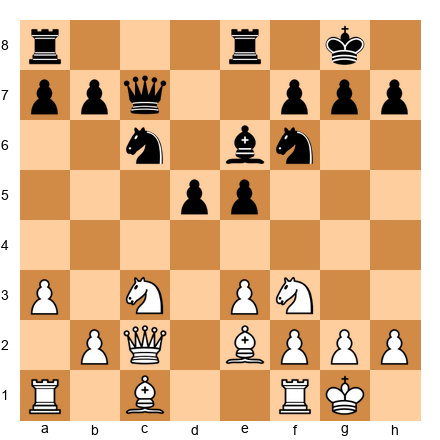</p>


White to play. The position appears quiet. Identify the critical imbalance and find White's best plan.

**Hint 1:** Compare piece activity. Whose minor pieces are better placed?
**Hint 2:** What happens after d4 by White?
**Hint 3:** Consider the d4 break and what files it opens.

**Solution:** 12.d4! (striking at the center while Black's pieces are still coordinating). After 12...exd4 13.exd4 d5 (13...dxe4 14.Nxe4 Nxe4 15.Qxe4 is better for White with the open position favoring the bishops), White plays 14.Bg5 with a pleasant position. The pin on f6 is annoying, and White can follow up with Rad1, Rfe1, and pressure along the e-file. The key insight: Black's setup looks reasonable, but the bishop on e6 is passive, and d4 exploits the fact that Black's center is overextended.

**⏱ Target: 10 minutes**

---

**Exercise 46.23 (★★★★): ⏱ 15 minutes** [Practice]

Set up your board.


Wait: let me correct this FEN. White should not have both f4 and f2 pawns. Corrected:


<p align="center">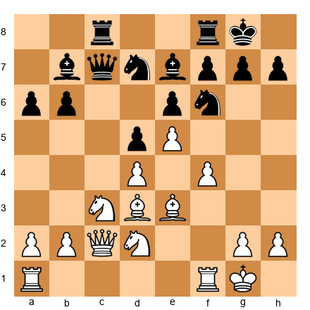</p>


White to play. This is a French Defense structure with White's pawns on d4, e5, and f4. Black has a solid but cramped position. Find the plan to increase the pressure.

**Hint 1:** Black's worst piece is the bishop on b7. Why?
**Hint 2:** Look at the g4-g5 idea and what it does to Black's knight on f6.
**Hint 3:** Can White attack on the kingside while keeping the center secure?

**Solution:** 14.g4! (beginning a kingside pawn storm). The plan: after 14...a5 15.g5 Nh5 (forced; the knight has no good squares) 16.Nf3 Bc6 17.Qg2, White is ready for Kh1 and Rg1 with a crushing attack on the kingside. Black's pieces are too passive to generate counterplay. The bishop on b7 is blocked by the d5 pawn and plays no role in the defense. This is the classic French Defense attacking plan: use the e5 and f4 pawns as a launching pad for g4-g5, driving away Black's defensive pieces and opening lines to the king.

**⏱ Target: 15 minutes**

---

**Exercise 46.24 (★★★★): ⏱ 10 minutes** [Practice]

Set up your board.


<p align="center">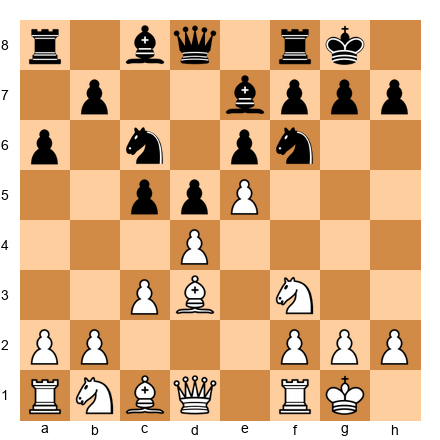</p>


White to play. This French Advance structure gives White a space advantage but Black has a solid pawn chain. Find the best way to exploit White's space.

**Hint 1:** Black wants to play ...f6 to challenge the e5 pawn. How can White prevent or punish this?
**Hint 2:** Consider Bc2 and Qd3 as a battery aimed at h7.
**Hint 3:** What role does the knight on f3 play in a kingside attack?

**Solution:** 8.Bc2! (setting up the classic battery Qd3 + Bc2, aimed at h7). After 8...Qb6 9.Qd3 g6 (forced to prevent Qxh7#; 9...f5 10.exf6 Bxf6 is possible but weakens Black's kingside) 10.Bh6 Re8 11.dxc5 Bxc5 12.Nbd2, White has a comfortable position with attacking chances. The battery on the b1-h7 diagonal is a recurring theme in the French Advance. Even if it does not lead to immediate checkmate, it restricts Black's kingside options and forces weakening moves like ...g6.

**⏱ Target: 10 minutes**

---

### Mastery Exercises (★★★★★) [Mastery]

---

**Exercise 46.25 (★★★★★): ⏱ 20 minutes** [Mastery]

Set up your board.


<p align="center">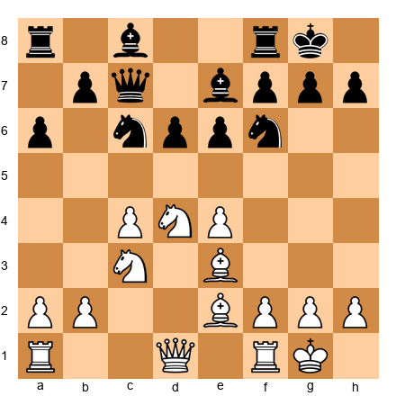</p>


White to play. Find the strongest plan and calculate it to depth 10 or deeper.

**Hint 1:** Look at the d5 square. What piece can land there?
**Hint 2:** After Nd5, what are Black's options? Calculate each reply.
**Hint 3:** Consider the follow-up after the knight reaches d5 and Black exchanges it.

**Solution:** 11.Nd5! exd5 (11...Nxd5 12.exd5 Ne5 13.c5! opening lines; 11...Qd8 12.Nxe7+ Qxe7 13.f4 with a space advantage) 12.exd5 Ne5 (12...Na5 13.Bf4 with strong central control) 13.Nf5! (the second wave, targeting the bishop on e7 and the g7 pawn) 13...Bxf5 14.Rxf5 (the rook is powerfully placed on f5) 14...Ned7 15.Bf4 Qb6 16.Qd2, and White has lasting pressure. The rook on f5 dominates, and the d5 pawn is a wedge that splits Black's position. This combination of Nd5 followed by Nf5 is a classic double-knight maneuver in the Sicilian Scheveningen.

**⏱ Target: 20 minutes**

---

**Exercise 46.26 (★★★★★): ⏱ 25 minutes** [Mastery]

Set up your board.


<p align="center">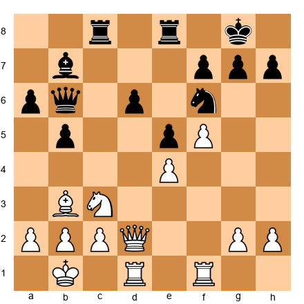</p>


White to play. A complex middlegame with chances for both sides. Find the best continuation and calculate the critical variations.

**Hint 1:** The f5 pawn is advanced. Can it be used to open lines?
**Hint 2:** What happens after f6? Calculate the consequences of the pawn sacrifice.
**Hint 3:** Consider f6 followed by Nd5 ideas.

**Solution:** 18.f6! g6 (18...gxf6 19.Nd5 Nxd5 20.Bxd5 Bxd5 21.Qxd5, and White has devastating threats on the dark squares with Qg5+ and Qh6) 19.Nd5! Nxd5 20.Bxd5 Bxd5 21.Qxd5 (now f6 is a monster pawn) 21...Qb7 22.Qd3 (maintaining pressure; the f6 pawn cramps Black's entire position) 22...Rc5 23.Rf5! (doubling the attack on the f6 break point) 23...Rxf5 24.Qxf5 Rc8 25.Rd3, and White has a winning attack. The f6 pawn paralyzes Black, and White can slowly build on the kingside with Rg3 ideas. The key concept: an advanced passed pawn on the sixth rank is worth more than a piece in many positions because it restricts the opponent's entire army.

**⏱ Target: 25 minutes**

---

**Exercise 46.27 (★★★★★): ⏱ 20 minutes** [Mastery]

Set up your board.


<p align="center">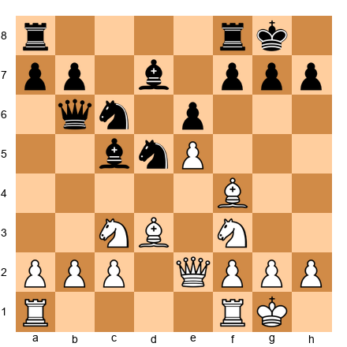</p>


White to play. Black has a strong knight on d5 and active pieces. Find the way to seize the initiative.

**Hint 1:** The knight on d5 looks strong, but can it be undermined?
**Hint 2:** Consider Bxh7+ and whether the Greek Gift works here.
**Hint 3:** Calculate 12.Nxd5 exd5 13.Bxh7+. Does the sacrifice hold?

**Solution:** 12.Nxd5 exd5 (12...Qd8 13.Nc3, and White has removed the strong knight with no disadvantage) 13.Bxh7+! Kxh7 14.Ng5+ Kg8 (14...Kg6 15.Qg4 f5 16.exf6+ Kxf6 17.Qh4 winning; 14...Kh6 15.Qd3! threatening Qh3+, and 15...f5 16.exf6+ Kxg5 17.Qg3+ Kh6 18.Qg7#) 15.Qh5 Re8 (15...f5 16.exf6 Rxf6 17.Qh7+ Kf8 18.Qh8#) 16.Qxf7+ Kh8 17.Qh5+ Kg8 18.Qh7+ Kf8 19.Qh8+ Ke7 20.Qxg7+, and White emerges with a winning material advantage. The Greek Gift sacrifice works here because Black's f7 pawn is weak and the dark-squared bishop on f4 controls the escape squares. Before playing Bxh7+ in any position, always verify that: (a) the knight can reach g5 with check, (b) the queen can reach h5, and (c) Black has no defensive resource involving ...Kg8 with a block on the h-file.

**⏱ Target: 20 minutes**

---

**Exercise 46.28 (★★★★★): ⏱ 25 minutes** [Mastery]

Set up your board.


<p align="center">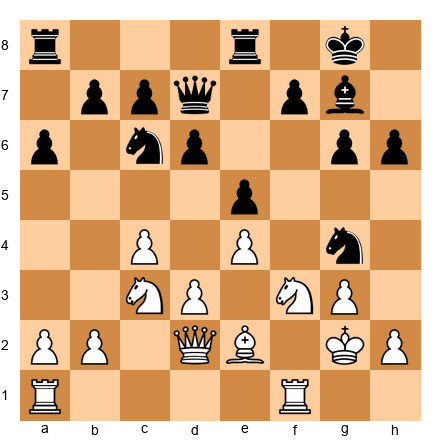</p>


White to play. This is a King's Indian type structure where Black has just played ...Ng4, challenging White's kingside. Find the best response and calculate the resulting complications.

**Hint 1:** The knight on g4 looks aggressive, but is it really dangerous? What does it threaten?
**Hint 2:** Consider h3, forcing the knight to declare its intentions.
**Hint 3:** After h3, calculate both ...Nf6 (retreat) and ...Nxf2 (sacrifice). Which favors White?

**Solution:** 16.h3! Nf6 (the safe retreat; 16...Nxf2? 17.Rxf2 Bh6 18.Qd1 Bxe3 19.Rf1, and White has weathered the storm with an extra piece, since Black's attack fizzles after the exchange on e3) 17.Be3 (consolidating, preparing Qd2 and f4 at the right moment) 17...Nh5 18.d4! (striking at the center while Black's knight is offside on h5) 18...exd4 19.Nxd4 Nf4+ (the only active try) 20.gxf4 exf4 (wait: Black's e-pawn is on e5, so let me recalculate; after 18.d4 exd4 19.Nxd4 Nc5 20.f3, White's center is stable and the knight on h5 is misplaced) 20...Bd7 21.Rad1 with a clear positional advantage. White's central control and better-placed pieces give a lasting edge.

The key lesson: when your opponent plays an aggressive-looking knight jump, do not panic. Ask yourself what the knight actually threatens. If the answer is "nothing concrete," you can calmly challenge it with h3 or ignore it entirely. Aggression without substance is weakness, not strength.

**⏱ Target: 25 minutes**

---

## Expanded Progress Check

After completing all sections in this expanded chapter, assess yourself:

- [ ] I can visualize a position accurately after 10 moves of blindfold play (Exercises B-1 through B-5)
- [ ] I can calculate a 12-move variation with multiple branches and correctly prune inferior lines (Extended Calculations 1 through 4)
- [ ] My rapid position evaluation matches my deep analysis at least 70% of the time (Rapid-Fire Drill, R-1 through R-10)
- [ ] I can identify tactical patterns within 5 seconds of seeing a position (Pattern Matching, PM-1 through PM-4)
- [ ] My first instinct frequently matches the objectively best move (First Instinct, FI-1 through FI-3)
- [ ] I can solve ★★★★★ exercises within the target time at least half the time

If you checked 5 or more, you are operating at a strong Grandmaster-candidate level. The skills in this chapter will serve you in every game you play.

If you checked 3 or 4, you are making excellent progress. Repeat the sections where you struggled, spacing practice sessions at least 48 hours apart to allow consolidation.

If you checked fewer than 3, do not be discouraged. This is the hardest material in the entire Codex. Revisit the blindfold exercises daily (10 minutes is enough) and repeat the extended calculations weekly. Growth in visualization and calculation is slow but permanent. Every hour you invest here pays dividends for the rest of your chess career.

---

🛑 **Rest here.** You have covered an enormous amount of material. Your brain needs time to consolidate these patterns, calculations, and visualization skills. Sleep on it. Play a game tomorrow and notice how differently you see the board. Then return for Chapter 47, where you will learn to convert small advantages into winning positions.

---

*"The ability to play chess is the sign of a gentleman. The ability to play chess well is the sign of a wasted life."*
*-- Paul Morphy (attributed)*

