# Chapter 47: Deep Strategy: Transforming Advantages

## Rating: 2400+

---

> *"The hardest thing in chess is winning a won game."*
>: Frank Marshall

---

## What You'll Learn

- How to convert one type of advantage into another (material → positional → tactical → endgame)
- The principle of two weaknesses. why one weakness is never enough to win
- Prophylaxis at the Grandmaster level. stopping counterplay before it begins
- When to exchange pieces and when to keep them on the board
- How to grind out wins from advantages as small as +0.3

---

## You Are Here 🗺️

```
Volume V ░░░░░░░░░░░░░░░░░░░░░░░░░░░░░
Ch 46 ██ COMPLETE ✓
Ch 47 ██ ← YOU ARE HERE
Ch 48 ░░
Ch 49 ░░
Ch 50 ░░
Ch 51 ░░
Ch 52 ░░
Ch 53 ░░
Ch 54 ░░
```

---

## Opening Note

You learned strategy in Volume II. You refined it in Volume III. You mastered its subtleties in Volume IV.

Now forget everything you think you know about "playing strategically."

At the Grandmaster level, strategy is not about following rules. It is about *bending* them. A Grandmaster does not hold onto a material advantage because "material is important." They convert it into something else. a better pawn structure, an unstoppable passed pawn, a dominant minor piece, a mating attack. The advantage flows like water, changing shape to fill whatever container the position offers.

This chapter teaches you that art. It is the art that separates a 2300-rated player who "understands chess" from a 2600-rated player who *speaks its language*.

---

## PART 1: THE THEORY OF ADVANTAGE TRANSFORMATION

### 1.1 What Is an Advantage?

Before you can transform an advantage, you need a precise vocabulary for what advantages exist. At your level, you have seen all of these before. Now we name them precisely.

**Static advantages** persist regardless of whose move it is:

- Material surplus (extra piece, extra pawn)
- Superior pawn structure (no weaknesses vs. doubled/isolated/backward pawns)
- Better minor piece (good bishop vs. bad bishop, knight vs. bishop in closed position)
- Control of a key file or diagonal
- Weak squares in the opponent's camp
- King safety imbalance (your king is safer)
- Passed pawn(s)

**Dynamic advantages** depend on tempo and initiative:

- Development lead
- Initiative (you are attacking, they are defending)
- Superior piece activity
- Better coordination
- Threats that force the opponent into passivity

Here is the critical insight: **Static advantages are permanent. Dynamic advantages are temporary.** The art of Grandmaster strategy is converting dynamic advantages into static ones. and then converting static advantages into a win.

### 1.2 The Advantage Chain

Think of advantages as links in a chain. Each type of advantage can transform into the next:

```
Development lead
    → Initiative
        → Attack on the king
            → Material gain
                → Positional dominance
                    → Endgame advantage
                        → Win
```

But the chain is not one-directional. A Grandmaster can reverse it, side-step it, or jump links entirely. Here are the most common transformations:

| From | To | How |
|------|----|-----|
| Material up | Positional dominance | Return material to fix your structure or activate your pieces |
| Better pawn structure | Endgame advantage | Exchange pieces to reach a winning pawn ending |
| Initiative | Material gain | Use threats to win pawns or exchanges |
| Piece activity | Weak squares | Use active pieces to force pawn moves that create holes |
| Passed pawn | Piece dominance | Tie down enemy pieces to blockade duty |
| King safety edge | Attack | Launch a direct assault while their king is exposed |

The key is **flexibility**. A rigid player clings to one type of advantage. A Grandmaster holds their advantage loosely, ready to transform it the moment the position demands it.

### 1.3 The Principle of Two Weaknesses

Aron Nimzowitsch taught us that a blockade against a single weakness can hold forever. His student, Mark Dvoretsky, formalized what strong players had always known:

**One weakness is not enough to win. You need two.**

Here is why. If your opponent has one weak pawn. say, an isolated d-pawn. they can concentrate all their defensive resources around that pawn. Their rooks defend it. Their knight blockades it. Their bishop supports the knight. You attack it with everything you have, but the defense holds because all of Black's resources converge on one point.

Now create a second weakness on the other side of the board. say, a weak kingside pawn. Suddenly your opponent faces a dilemma. They cannot defend both weaknesses with the same pieces. The rook that defends the d-pawn cannot also defend the kingside. The knight that blockades the d-pawn cannot also cover f5.

This is the principle of two weaknesses in action. **You stretch the defense until it breaks.**

The practical method:

1. Identify the first weakness (it often already exists)
2. Play to create a second weakness on the opposite side of the board
3. Maneuver your pieces between the two weaknesses, forcing the opponent to choose which one to abandon
4. Win the abandoned weakness. or break through in the middle while the opponent's pieces are scattered

This principle works at every level, but at the Grandmaster level, the weaknesses can be incredibly subtle. A "weakness" might be nothing more than a slightly misplaced knight or a pawn that has advanced one square too far. Your job is to see these micro-weaknesses and magnify them.

### 1.4 The Squeeze: Winning with +0.3

At the club level, you need a clear advantage to win. an extra pawn, a strong attack, an obvious structural weakness to exploit. At the Grandmaster level, the margins shrink.

The squeeze is the technique of converting a minimal advantage (+0.3 to +0.5 in engine terms) into a full point. It requires:

**Patience.** The squeeze can take 40, 50, even 80 moves. You are not trying to break through. You are trying to improve your position one tiny step at a time while denying your opponent any counterplay.

**Precision.** Every move matters. A single inaccuracy can throw away the advantage entirely. You must calculate not just what is best, but what is *safe*.

**Understanding of the endgame.** Most squeezes end in the endgame. You must know which endgames are winning and which are drawn, because the entire middlegame strategy is oriented toward reaching the right ending.

The squeeze follows a predictable pattern:

1. **Restrict.** Limit your opponent's piece activity. Take away their good squares.
2. **Improve.** Find the least active piece in your position and improve it.
3. **Probe.** Test different weaknesses without committing to an attack.
4. **Wait.** Force your opponent to make a concession. They will. because their position is worse, and "doing nothing" means slowly losing.
5. **Convert.** When the concession comes, transform your advantage into something more concrete.

Magnus Carlsen is the greatest practitioner of the squeeze in chess history. He will hold a slight advantage for 60 moves, making tiny improvements, until his opponent cracks under the pressure. We will study one of his games later in this chapter.

### 1.5 Prophylaxis at the Grandmaster Level

You learned prophylaxis in Volume III. the art of asking "What does my opponent want to do?" before choosing your own move. At the Grandmaster level, prophylaxis becomes something deeper.

Grandmaster prophylaxis is not just about preventing threats. It is about **preventing counterplay**. There is a difference. A threat is a concrete move that wins material or delivers checkmate. Counterplay is a *plan*. a sequence of moves that gives your opponent activity, initiative, or an avenue of escape.

When you have an advantage, your greatest enemy is not a single threat. It is your opponent's ability to generate counterplay. If they can create complications, activate their pieces, or open the position, your advantage can evaporate.

Tigran Petrosian. the ninth World Champion. was the ultimate prophylactic player. He did not wait for threats to appear. He snuffed out counterplay three or four moves before it could begin. His opponents often found themselves in positions where they had no bad pieces, no weak pawns, no obvious problems. and yet no plan. No activity. No hope. Petrosian had taken it all away.

**The three levels of prophylaxis:**

| Level | What It Prevents | Example |
|-------|-----------------|---------|
| **Tactical** | A specific threat | Playing h3 to prevent ...Bg4 |
| **Strategic** | A plan | Playing a4 to prevent ...b5 expansion |
| **Absolute** | All meaningful activity | Restricting all opponent's pieces so that no useful plan exists |

Level three is what Petrosian did. It is what Carlsen does. It is what you must learn to do.

### 1.6 When to Change the Character of the Position

Sometimes the best way to press an advantage is to *transform* the position entirely. Open a closed position. Close an open one. Sacrifice material to change the nature of the fight.

Here are the signals that tell you it is time to change the character:

1. **Your advantage is fading.** The opponent is consolidating. If you continue on the same track, the advantage will disappear. Time to change.

2. **You have a structural advantage that is best exploited in a different type of position.** For example, you have the bishop pair in a closed position. You should open it up. You have a knight outpost in an open position. You might want to close things down.

3. **Your opponent is well-prepared for the current structure.** If your opponent has set up a fortress against your current plan, break the fortress by changing the rules. Sacrifice a pawn to open a file. Trade your strong piece for their defender.

4. **The endgame favors you, but the middlegame is unclear.** Simplify. Exchange pieces, reach the ending where your advantage is decisive.

The ability to change the character of a position at will is one of the hallmarks of a Grandmaster. It requires deep understanding of pawn structures, piece activity, and the relationship between material and dynamics.

### 1.7 The Art of Exchanging

Which pieces should you trade? The standard rule. "exchange your opponent's active pieces and keep your own". is correct but incomplete. At the Grandmaster level, the exchange decision requires evaluating several factors:

**Trade when:**
- Each exchange makes the remaining advantage more pronounced
- You are heading toward a winning endgame
- The opponent's piece is more active than yours (trade the active one)
- Fewer pieces on the board mean less counterplay for the opponent
- You have a structural advantage that matters more with fewer pieces (e.g., a passed pawn)

**Keep pieces when:**
- You have an attacking advantage that needs pieces on the board
- Your pieces coordinate well together (a bishop pair, a knight and queen battery)
- The opponent's weaknesses need pressure from multiple angles
- The extra pieces give you more ways to create a second weakness

A critical special case: **exchanging the opponent's blockading piece.** If your opponent has a knight beautifully blockading your passed pawn on d5, and you can exchange that knight. do it. Even if you trade a slightly better piece in the process. Removing the blockader can be worth far more than the static value of the pieces exchanged.

### 1.8 Color Complexes and Bishop Dominance

A color complex is a set of squares of one color that a player controls. When your opponent is missing their dark-squared bishop and their dark squares are weak, you have a *dominant color complex*.

This sounds abstract. In practice, it means:

1. Place your pawns on the opposite color of your bishop (light-squared bishop → pawns on dark squares)
2. Create holes in the opponent's position on the color of their missing bishop
3. Use your bishop as a long-range weapon that the opponent cannot challenge
4. If your knight can occupy a square on the weak color, it becomes an absolute monster

Karpov was the master of color complexes. He would trade one pair of bishops, then methodically exploit the remaining color weakness for the rest of the game. His opponents often did not realize the danger until it was too late.

### 1.9 Creating and Exploiting Weak Squares

A weak square is one that cannot be defended by a pawn. Once a pawn has advanced past a square, that square becomes permanently weakened on that color complex.

At the Grandmaster level, weak squares are currency. You invest moves to create them, then cash in by occupying them with your pieces.

**How to create weak squares:**

- Provoke pawn advances. If Black plays ...g6 to fianchetto, the f6 and h6 squares become weakened. If you can force ...f6 as well, the e6 square becomes a permanent hole.
- Exchange the defending bishop. If Black's dark-squared bishop defends the dark squares, trade it off. Now every dark square in Black's camp is vulnerable.
- Advance your own pawns to control key squares. A pawn on e5 controls d6 and f6 permanently.

**How to exploit weak squares:**

- Occupy them with knights (knights are best on outposts because they cannot be chased by pawns)
- Use them as transit squares for piece maneuvers
- Park a rook on an open file that targets a weak square
- Use the weak square as a staging post for a kingside or queenside attack

### 1.10 The Initiative as a Tangible Advantage

At the club level, players treat the initiative as something vague. "I have the initiative" means "I'm attacking." At the Grandmaster level, the initiative is measured in tempi. It is as real as a pawn.

Having the initiative means you are making threats. Your opponent is responding to your moves. You dictate the flow of the game. They react.

The initiative can be sustained, sacrificed, or converted. Here is how each works:

**Sustaining the initiative:** Keep making threats. Each move should create a new problem for your opponent. If you run out of threats, the initiative passes.

**Sacrificing the initiative:** Sometimes you must give up the initiative to improve your position long-term. For example, you might retreat a piece to a better square, losing a tempo, but gaining a structural advantage.

**Converting the initiative:** This is the most important skill. The initiative is temporary. If you do not convert it into something permanent: material, a better structure, a weak square: it will evaporate. Every Grandmaster knows: **the initiative must eventually be cashed in.**

---

## PART 2: ANNOTATED GAMES

### Game 1: The Positional Squeeze

**Anatoly Karpov vs Wolfgang Unzicker**
Nice Olympiad, 1974

*This game demonstrates Karpov's signature technique: accumulating tiny advantages, restricting the opponent's counterplay, and squeezing the life out of the position.*

Set up your board:

```
1.e4 e5 2.Nf3 Nc6 3.Bb5 a6 4.Ba4 Nf6 5.O-O Be7 6.Re1 b5
7.Bb3 d6 8.c3 O-O 9.h3 Nb8
```

The Breyer Variation of the Ruy Lopez. one of the deepest systems in all of chess. Black retreats the knight to reroute it through d7 to better squares. This opening leads to rich middlegame positions where both sides maneuver for small advantages.

```
10.d4 Nbd7 11.Nbd2 Bb7 12.Bc2 Re8 13.Nf1 Bf8 14.Ng3 g6
```

Black plays solidly but passively. The move 14...g6 weakens the dark squares around the king. particularly f6 and h6. Karpov notes this. He does not attack immediately. He files the information away.

```
15.a4 c5 16.d5
```

**The critical moment.** Karpov closes the center. Why? Because with a closed center, Black's counterplay on the queenside (...c4, ...Nc5) is limited, and the weak dark squares around Black's king become a long-term target. Karpov is choosing the type of position where his advantages: the dark-square weakness, the space advantage: will grow.

```
16...c4 17.Bg5 h6 18.Be3 Nc5 19.Qd2 Kh7 20.Nf1
```

Watch Karpov's patience. He is not rushing. Every piece is heading to its ideal square. The knight on f1 will reroute to g3 or h2-g4, targeting the weakened kingside. The queen on d2 connects with the h6 weakness.

```
20...Qc7 21.N1h2 Rab8 22.Nf1 Bc8 23.Ng3 Bd7
24.axb5 axb5 25.Ra6
```

The rook infiltrates along the a-file. Now Black must deal with pressure on the sixth rank *and* the slow kingside buildup. This is the principle of two weaknesses in action: the queenside (a-file pressure) and the kingside (dark-square weakness).

```
25...Rb6 26.Rea1 Rxa6 27.Rxa6 Ra8 28.Rxa8 Bxa8
```

Karpov has traded rooks, but the advantage persists. Why? Because the weak dark squares and Black's cramped position do not require rooks to exploit. With fewer pieces, Black has fewer defenders.

```
29.Qd1 Qd8 30.Qb1 Kg8 31.Bd1 Bc6 32.Bc2 Be7
33.Kh2 Bd8 34.Nh4
```

The knight heads for f5. Black cannot prevent it without further weakening the kingside. This is absolute prophylaxis in reverse. Karpov is the one with the plan, and Black has no way to stop it.

```
34...Kg7 35.Nhf5+ gxf5 36.Nxf5+ Kg8 37.Nxd6
```

The pawn falls. One small advantage (dark-square weakness) has been transformed into another (material advantage). Karpov went on to win the endgame with precise technique.

**What this game teaches:**

1. **Patience wins.** Karpov made no premature attacks. He improved his position for 20 moves before striking.
2. **Close the center when you have a kingside target.** The closed center prevented Black's counterplay and allowed Karpov to maneuver freely.
3. **Two weaknesses break the defense.** The a-file pressure combined with the kingside attack made Black's defense impossible.
4. **Small weaknesses grow.** The move ...g6 seemed harmless at the time. Karpov made it decisive 20 moves later.

---

### Game 2: Converting a Minimal Endgame Advantage

**Magnus Carlsen vs Levon Aronian**
Wijk aan Zee, 2012

*Carlsen demonstrates the modern squeeze: grinding a barely perceptible endgame advantage into a full point through relentless precision.*

Set up your board:

```
1.d4 d5 2.c4 c6 3.Nf3 Nf6 4.Nc3 e6 5.e3 Nbd7
6.Bd3 dxc4 7.Bxc4 b5 8.Bd3 Bb7 9.a3 b4 10.Ne4 Nxe4
11.Bxe4 bxa3 12.bxa3 Nf6 13.Bd3 Be7 14.O-O O-O
15.Bb2 c5 16.Qe2 Qb6 17.dxc5 Bxc5
```

An equal-looking position has emerged from the Semi-Slav. Most players would agree to a draw here. Carlsen does not agree to draws.

```
18.Nd4 Rfd8 19.Rfd1 a5 20.Rab1 Qc7 21.Qg4 Bd6
22.h4
```

Carlsen begins probing. The move h4 does two things: it gains space on the kingside and prevents ...g6 as a natural defensive move for Black. At this point, the engine says the position is approximately equal. Carlsen does not care what the engine says. He knows that in a practical game, the side with more space and fewer weaknesses wins.

```
22...Bf4 23.Nf3 Bxf3 24.Qxf3 Qc2 25.Bc3 Rd5
26.Rb7 Rf8 27.Qe4 Qxa3
```

Black wins the a3 pawn, but Carlsen has the seventh rank with his rook. This is a classic advantage transformation: Carlsen sacrificed a pawn to gain piece activity. The rook on b7 is worth more than the a3 pawn.

```
28.Bb5 Be5 29.Bxe5 Rxe5 30.Qc4 Qa1 31.Rxa1 a4
```

Queens have been traded. The endgame begins. Carlsen has a rook on the seventh rank and an active bishop against Black's passed a-pawn. The engine still says the position is nearly equal. But "nearly equal" in Carlsen's hands is a slow death sentence.

```
32.Rc1 Rb5 33.Bc6 Rb2 34.Rcc7 Nd5 35.Bxd5 exd5
36.Rxf7 Rxf7 37.Rxf7
```

Now it is a rook and pawns endgame. Carlsen has three pawns to Black's four, but his rook is active on the seventh rank, and Black's a-pawn requires constant attention. Over the next 30 moves, Carlsen maneuvered his king into the center, advanced his kingside pawns, and created a second weakness on the kingside while Black was forced to defend the a-pawn.

The game continued for another 40 moves of careful endgame play. Carlsen won on move 79.

**What this game teaches:**

1. **There is no such thing as "dead equal" at the Grandmaster level.** Every position has imbalances that can be exploited with enough precision.
2. **Activity > material.** Carlsen gave up a pawn to activate his rook. The activity was worth more.
3. **The squeeze works in the endgame.** Small advantages in pawn structure and piece activity compound over many moves.
4. **Create two weaknesses in the endgame, too.** Carlsen tied Black down to the a-pawn, then created a second target on the kingside.

---

### Game 3: Prophylactic Mastery

**Tigran Petrosian vs Boris Spassky**
World Championship Match, Game 10, 1966

*Petrosian demonstrates his signature style: extinguishing all counterplay before his opponent even realizes it existed.*

Set up your board:

```
1.Nf3 d5 2.g3 Nf6 3.Bg2 Bf5 4.d3 e6 5.Nbd2 h6
6.O-O Be7 7.b3 O-O 8.Bb2 Bh7 9.c4 c6 10.Qc2
```

A quiet Réti system. Petrosian's choice of opening is itself prophylactic. he avoids sharp theoretical lines where Spassky's tactical brilliance could shine.

```
10...Nbd7 11.e4 dxe4 12.dxe4 e5
```

Black achieves the central break ...e5, which should equalize. But Petrosian is not worried. He has a long-term plan.

```
13.Rfe1 Qc7 14.a4 a5 15.Nh4 Bg6 16.Nxg6 fxg6
```

**The key exchange.** Petrosian trades the knight for Black's light-squared bishop. This might look strange: a knight for a bishop? But the point is deep: with the light-squared bishop gone, Black's light squares (particularly d5, e6, f5) become chronically weak. Petrosian will target them for the rest of the game.

```
17.Bc3 Rfe8 18.Nf1 Bf8 19.Ne3 Nc5 20.Nd5
```

The knight lands on d5. It cannot be challenged by a pawn (the c6 pawn supports it, but Black's c6 pawn is also fixed). This knight is a monster. It controls b4, b6, c7, e7, f4, and f6. Black's position is already strategically lost.

```
20...Nxd5 21.cxd5 cxd5 22.exd5
```

Petrosian recaptures with the e-pawn, opening the e-file and creating a powerful passed d-pawn. The advantage has transformed: from a knight outpost (positional) to a passed pawn (structural).

```
22...Rec8 23.Qd2 Qd7 24.Bxa5 Bd6 25.Bb4
```

Petrosian offers the exchange of dark-squared bishops. Why? Because Black's dark-squared bishop is the only piece that can potentially challenge the d5 pawn's advance. Remove it, and the pawn becomes unstoppable.

This is prophylaxis at its deepest: Petrosian is not preventing a threat. He is preventing the possibility of future counterplay. He is removing the piece that *could* become relevant in 15 moves.

The game continued with Petrosian converting his structural advantage into a win.

**What this game teaches:**

1. **Trade the piece that guards the weakness.** Petrosian traded away both of Black's good minor pieces. the light-squared bishop and the dark-squared bishop. each for a specific strategic reason.
2. **Knight outposts can be converted into passed pawns.** The knight on d5 was eventually exchanged, but it left behind a powerful passed pawn.
3. **Prophylaxis prevents counterplay before it exists.** Petrosian's opponents often found themselves in positions where they had no plan. not because their pieces were bad, but because every good square and every useful maneuver had been denied.
4. **Opening choice is strategy.** Petrosian chose the Réti to deny Spassky tactical complications.

---

### Game 4: Modern Advantage Transformation

**Ding Liren vs Fabiano Caruana**
Sinquefield Cup, 2019

*Ding Liren demonstrates how a modern super-Grandmaster transforms a slight opening advantage through multiple phases of the game.*

Set up your board:

```
1.d4 Nf6 2.c4 e6 3.Nf3 d5 4.Nc3 Be7 5.Bf4 O-O
6.e3 Nbd7 7.c5 Nh5 8.Bd3 Nxf4 9.exf4 b6 10.b4 a5
11.a3 c6
```

The Queen's Gambit Declined. Ding has the bishop pair and a space advantage on the queenside. These are slight edges. nothing more. But slight edges are all Ding needs.

```
12.O-O Qc7 13.g3 Ba6 14.Re1 Bxd3 15.Qxd3 Rfe8
16.b5 bxc5 17.bxc6 Qxc6 18.dxc5 Nxc5 19.Qd4
```

**Advantage transformation in real time.** Ding has traded his queenside space advantage for central control and the c-file. His queen on d4 dominates the board. His knight can reach d4 or b5. The position has completely changed character, but Ding's advantage has not: it has merely taken a new form.

```
19...Bf6 20.Qf2 Rab8 21.Nd4 Qd7 22.Rac1 Nd3
23.Re3 Nxc1 24.Rxc1
```

Ding sacrifices the exchange (rook for knight) to gain a dominant centralized position with queen, knight, and rook working in harmony. The knight on d4 is a fortress piece. Black's extra exchange is meaningless because there are no open files for the rooks to exploit.

This is the kind of evaluation that separates super-Grandmasters from everyone else. The engine might say the position is equal. The human says: "Black has no plan, and I have all the time in the world."

The game continued with Ding slowly improving his position, creating threats on both flanks, and eventually converting his positional dominance into a winning attack.

**What this game teaches:**

1. **Advantages change form, not magnitude.** Ding's advantage morphed from space to central control to piece dominance. but it never disappeared.
2. **Material is not everything.** Ding was willing to sacrifice the exchange because piece coordination mattered more than material count.
3. **A dominant knight can be worth a rook.** When a knight occupies an unassailable central square, it controls the game.
4. **Modern chess rewards flexibility.** Ding did not commit to one plan. He adapted as the position evolved.

---

### Game 5: The Art of Grinding

**Vladimir Kramnik vs Peter Leko**
World Championship Match, Game 8, Brissago, 2004

*Kramnik demonstrates the "Berlin Wall" technique: grinding a minimal advantage in the most sterile position imaginable.*

Set up your board:

```
1.e4 e5 2.Nf3 Nc6 3.Bb5 Nf6 4.O-O Nxe4 5.d4 Nd6
6.Bxc6 dxc6 7.dxe5 Nf5 8.Qxd8+ Kxd8
```

The Berlin Defense. Queens are off the board on move 8. Most players would look at this position and see a lifeless draw. Kramnik looks at it and sees a fight.

White has a slight advantage: the pawn on e5 gives space, Black's king has lost the right to castle, and the pawn structure is slightly in White's favor (5 vs. 4 on the kingside, and Black has doubled c-pawns).

The advantage is tiny. perhaps +0.2. But Kramnik is going to try to win with it.

```
9.Nc3 Ke8 10.h3 Be7 11.Bf4 Be6 12.Rad1 h6
13.Rfe1 a5 14.b3 Rd8 15.Ne2 Rxd1 16.Rxd1 Nd4
17.Nxd4 Bxd4
```

Pieces are traded. The position simplifies. Yet White retains a microscopic edge: the e5 pawn cramps Black slightly, and the bishop on f4 is marginally more active than Black's bishop.

```
18.c3 Be5 19.Bg3 Bxg3 20.fxg3
```

Now it is bishop vs. bishop with pawns. Kramnik has recaptured with the f-pawn, opening the f-file for a potential rook invasion. His pawn structure is slightly better: pawns on e5, g3, and h3 control more space than Black's pawns on c6, c7, and h6.

This is the essence of Kramnik's art. From the outside, the position looks drawn. From the inside, Kramnik sees an ocean of small differences that, accumulated over 40 more moves, can add up to a full point.

```
20...Ke7 21.Kf2 Rd8 22.Rxd8 Kxd8 23.Ke3 Kd7
24.Kd4 Kd8 25.g4
```

King marches to the center. The pawn advance g4 gains space and creates the possibility of a kingside majority advance. Black must react.

The game was eventually drawn after exhausting technical defense from Leko. But the *method* is instructive: Kramnik squeezed every drop of advantage from a position that looked dead equal to most observers. He applied the squeeze, the two-weakness principle, and precise piece play in one of the most sterile positions in modern chess.

**What this game teaches:**

1. **No position is too "dead" to play for a win.** Kramnik found resources in a position that most GMs would draw without a second thought.
2. **Pawn structure differences matter, no matter how small.** The doubled c-pawns and the e5 pawn were the only imbalances. and Kramnik based his entire strategy on them.
3. **The endgame king is a fighting piece.** Kramnik centralized his king immediately and used it as an attacking unit.
4. **Even failed squeezes teach you.** The game was drawn, but the technique Kramnik employed is the same technique that wins hundreds of other games. Study the *method*, not just the result.

---

## PART 3: EXERCISES

### Warmup Exercises (★★-★★★)

*These exercises review advantage concepts from earlier volumes. Use them to activate your strategic thinking before tackling the harder problems.*

---

**Exercise 47.1 (★★): ⏱ 3 minutes**

Set up your board:


<p align="center"></p>


White to play. Identify the single most important static advantage in this position.

**Hint 1:** Look at the pawn structure. Which side has more central control?

**Hint 2:** Compare the bishops. Which bishop has more scope?

**Solution:** White's most important static advantage is the central pawn on e4, which controls d5 and f5, combined with the active bishop on c4 pressuring f7. White's position is slightly more harmonious: the Bc4 is more active than Black's Bc5 (which currently lacks targets), and the d3 pawn supports e4 solidly. Best move: 6.Bg5 (pinning the f6 knight and increasing pressure on d5) or 6.a4 (preparing Na2 to challenge the c5 bishop). The advantage is small but real.

---

**Exercise 47.2 (★★): ⏱ 3 minutes**

Set up your board:


<p align="center">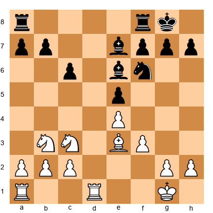</p>


White to play. Name the two weaknesses in Black's position.

**Hint 1:** Look at d6 and c6. Which pawn is backward?

**Hint 2:** Look at Black's dark squares. Is the dark-squared bishop well-placed?

**Solution:** Weakness 1: The backward c6 pawn. It sits on a half-open file and cannot advance safely. Weakness 2: The d6 square. After Black has played ...e5, the d6 square becomes a permanent hole that White's knight can aim for via d2-f1-e3-d5 or directly Nd2-c4-d6. White's plan is to pressure c6 with Rd1 and Rac1, while maneuvering a knight to d5 or d6. Two weaknesses, one defense: Black will struggle.

---

**Exercise 47.3 (★★): ⏱ 3 minutes**

Set up your board:


<p align="center">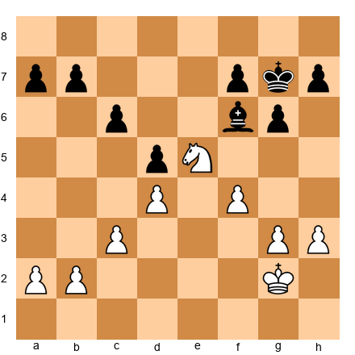</p>


White to play. Which side has the better minor piece, and why?

**Hint 1:** Count the squares each piece controls.

**Hint 2:** Can the bishop challenge the knight's position?

**Solution:** White's knight on e5 is clearly superior. It occupies a powerful outpost that cannot be attacked by pawns. The bishop on f6 is passive: it is hemmed in by its own pawns on d5, g6, and h7, all of which sit on light squares. The bishop controls only dark squares but has limited scope because of the blocked center. White should maintain the knight on e5 and slowly improve the king position. This is a textbook "good knight vs. bad bishop" scenario.

---

**Exercise 47.4 (★★★): ⏱ 5 minutes**

Set up your board:


<p align="center">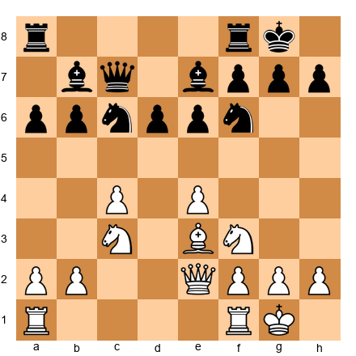</p>


White to play. You have a space advantage. How do you create a second weakness?

**Hint 1:** Black's position is solid but cramped. Where is the tension point?

**Hint 2:** Consider the d4-d5 break and its consequences.

**Solution:** White should prepare d4 with 12.Rd1 followed by d4. After d4 exd4 13.Nxd4, White has opened the position (favoring the side with more space) and created pressure on d6. Black's d6 pawn becomes the second weakness alongside the cramped queenside. Alternatively, White can play 12.a4 immediately, attacking the b6-a6 pawn chain to create a queenside weakness, then switch to d4 for a central break. The key idea: use the space advantage to strike on *two* fronts, not one.

---

**Exercise 47.5 (★★★): ⏱ 5 minutes**

Set up your board:


<p align="center">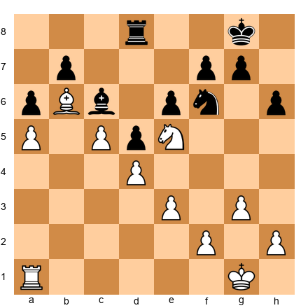</p>


White to play. Your knight on e5 is a monster. How do you transform this positional advantage into something more concrete?

**Hint 1:** Look at the c6 bishop. Is it active or passive?

**Hint 2:** Consider exchanges. What happens if you play Nxc6?

**Solution:** 28.Nxc6! bxc6 29.Rb1: White exchanges the dominant knight, but in return gets an outside passed b-pawn (after Rb7 or a breakthrough on the b-file). The bishop on b6 now dominates the dark squares, and Black's c6 pawn is a permanent weakness on an open file. This is advantage transformation: the knight outpost is converted into a structural advantage (outside passed pawn + weak enemy pawn). The bishop on b6 effectively blockades any counterplay.

---

### Intermediate Exercises (★★★)

---

**Exercise 47.6 (★★★): ⏱ 5 minutes** ⚡

Set up your board:


<p align="center">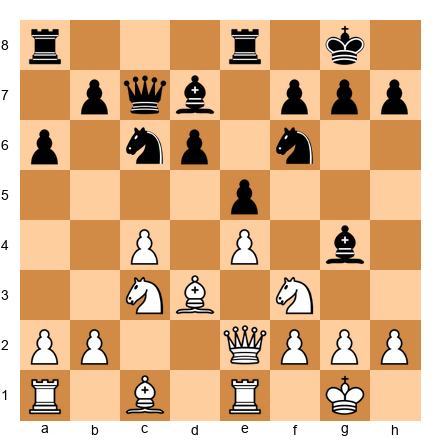</p>


White to play. Evaluate the position, then find the best plan.

**Hint 1:** Black has a solid structure but limited piece activity. Where is Black's worst piece?

**Hint 2:** The bishop on g4 looks active, but what happens if White plays h3?

**Hint 3:** Consider 12.h3 Bxf3 13.Qxf3: now which side has the better bishop?

**Solution:** 12.h3! forces the bishop to declare its intentions. After 12...Bxf3 13.Qxf3, White has the bishop pair in a position that can be opened with d4 or f4. After 12...Bh5 13.Nh4!, the bishop is trapped on the rim. The key insight: White's Bd3 is a "good bishop" (its pawns are on dark squares), while after the trade, Black's remaining bishop on d7 is passive. White's plan is to prepare d4 or f4, opening lines for the bishops. This is advantage transformation: White trades a knight for a bishop, but the resulting bishop advantage is worth more than the individual piece comparison suggests.

---

**Exercise 47.7 (★★★): ⏱ 5 minutes**

Set up your board:


<p align="center">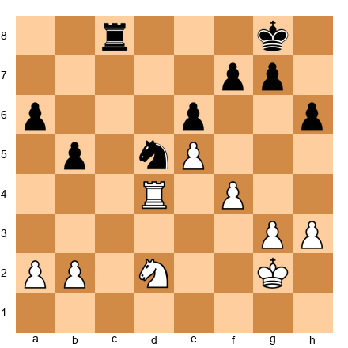</p>


White to play. You are a pawn up. How do you convert?

**Hint 1:** Black's knight on d5 is beautifully placed. Can you challenge it?

**Hint 2:** Consider Nc4: what does it threaten?

**Solution:** 30.Nc4! threatens Nd6, forking the rook and attacking the e6 pawn. Black must react. After 30...Rc6, White plays 31.Rd2 (centralizing the rook) followed by Nd6. The knight on c4 is nearly as strong as Black's on d5, and White's extra pawn on e5 is a protected passer. The conversion plan: trade the rooks (reducing counterplay), advance the e5 pawn supported by the knight, and use the extra pawn to win the endgame.

---

**Exercise 47.8 (★★★): ⏱ 7 minutes** ⚡

Set up your board:


<p align="center">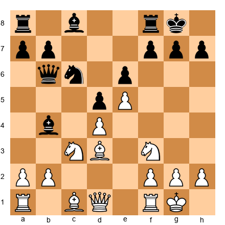</p>


White to play. This is a French Defense structure. How should White handle the position?

**Hint 1:** Black has a bad light-squared bishop (still on c8). How can White exploit this?

**Hint 2:** Consider Ne2-f4, targeting e6 and d5.

**Hint 3:** The bishop on b4 looks active but has no targets. How can White diminish it?

**Solution:** 10.a3! forces the bishop to commit. After 10...Be7 (retreating), White plays 11.Ne2 followed by Nf4, attacking e6. After 10...Bxc3 11.bxc3, White gains the bishop pair and a strong pawn center (d4 + e5 + c3), with the half-open b-file as a bonus. In both cases, White's plan is clear: target the e6 pawn (Black's structural weakness), exploit the bad bishop on c8, and use the space advantage to maneuver pieces to attacking positions. The dark-squared bishop on c1 will come to f4 or g5, completing White's development with a pleasant advantage.

---

**Exercise 47.9 (★★★): ⏱ 7 minutes**

Set up your board:


<p align="center">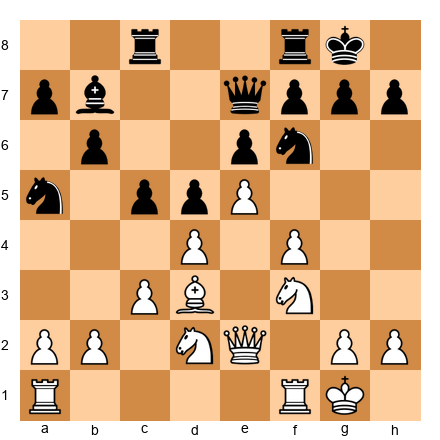</p>


White to play. You have a space advantage on the kingside. How do you create a second front?

**Hint 1:** Where can White strike on the queenside?

**Hint 2:** Consider a4, targeting the a5 knight and the b6 pawn.

**Solution:** 15.a4! creates threats on the queenside. The knight on a5 is awkwardly placed and must retreat. After 15...Nc6, White plays 16.a5!, undermining the b6 pawn and creating a second weakness. Now Black must defend both the queenside (the b6 pawn) and the kingside (against f5 or Ng5 attacks). White has successfully applied the two-weakness principle: the kingside space advantage forces Black into passivity, while the a5 thrust creates a concrete queenside target.

---

**Exercise 47.10 (★★★): ⏱ 7 minutes**

Set up your board:


<p align="center">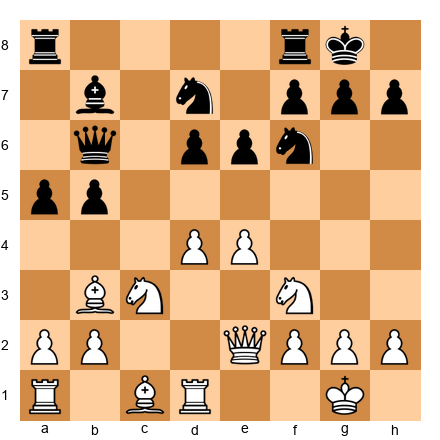</p>


White to play. Which piece should White exchange, and why?

**Hint 1:** Look at Black's b7 bishop. What does it do?

**Hint 2:** Consider exchanging it with Bg5 followed by Bxf6: what happens to Black's dark squares?

**Solution:** White should exchange the dark-squared bishops with 14.Bg5! followed by Bxf6, or exchange knights first via Nd5. The key trade is the f6 knight: after Bxf6 Nxf6, Black's dark squares become chronically weak (d6, e5, f4, c5). If instead 14.Bg5 h6 15.Bh4 g5 16.Bg3: Black has weakened the kingside permanently. Either way, White's strategy is to remove the f6 knight (Black's best defensive piece) and exploit the resulting dark-square weakness. This illustrates the art of exchanging: trade the piece that defends the weakness you want to attack.

---

### Expert Exercises (★★★★)

---

**Exercise 47.11 (★★★★): ⏱ 10 minutes** ⚡

*Advantage Transformation*

Set up your board:


<p align="center">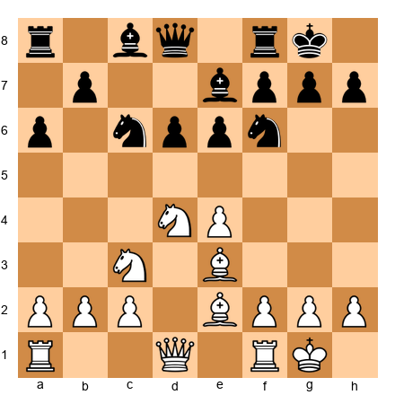</p>


White to play. You have a slight initiative and better development. How do you convert this dynamic advantage into something permanent?

**Hint 1:** Look at d5. Can a knight land there permanently?

**Hint 2:** Consider f4: what does it do to the center?

**Hint 3:** The key idea involves 10.f4, seizing space and threatening f5, which would fix the e6 pawn as a weakness.

**Solution:** 10.f4! is the strongest move. It seizes kingside space, prepares f5 (attacking e6), and supports the e4 pawn. After 10...e5 11.Nf5: the knight lands on f5 with a powerful outpost. After 10...Qc7 11.f5, the e6 pawn becomes fixed and weak. White's dynamic advantage (better development, initiative) has been transformed into a static advantage (space, weak enemy pawn, knight outpost on f5). This is advantage conversion in its purest form: a temporary lead in development becomes a permanent structural superiority through a single well-timed pawn advance.

---

**Exercise 47.12 (★★★★): ⏱ 12 minutes** ⚡

*Prophylactic Thinking*

Set up your board:


<p align="center">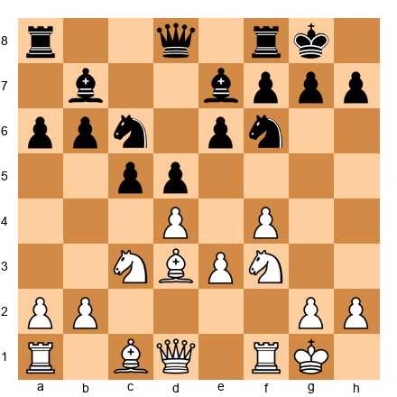</p>


White to play. Before choosing a move, answer: What does Black want to do next?

**Hint 1:** Black wants to play ...c4, pushing the bishop back and gaining queenside space.

**Hint 2:** Black also wants ...Nd7-f8-g6, reinforcing the kingside.

**Hint 3:** How can White prevent both plans simultaneously?

**Solution:** Black's main plan is ...c4, pushing White's bishop off d3 and seizing queenside space. White should prevent it with 11.dxc5!: this might look anti-positional (releasing the tension), but it is deeply prophylactic. After 11...bxc5 (11...Bxc5 12.Na4), Black's pawn structure is changed: the c5 pawn is now on a half-open file and the d5 pawn becomes a potential target. White follows with 12.Na4 (targeting c5) or 12.e4 (challenging the center). The key prophylactic idea: by taking on c5, White *eliminated* Black's best plan (...c4) and created a new structural target. True prophylaxis often involves changing the position to deny the opponent's resources.

---

**Exercise 47.13 (★★★★): ⏱ 12 minutes**

*The Squeeze*

Set up your board:


<p align="center">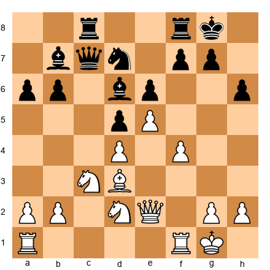</p>


White to play. You have a space advantage. Find the best plan to squeeze Black.

**Hint 1:** Which White piece is least active? How can you improve it?

**Hint 2:** The knight on d2 wants to reach f3, then h4 or g5. What does that threaten?

**Hint 3:** After Nf3-h4, White threatens f5, blowing open the kingside.

**Solution:** 18.Nf3!: improving the worst-placed piece. The knight heads for h4 (threatening f5) or g5 (threatening e6 and h7). After 18...Nf8 (defending) 19.Nh4 Bc8 20.Rf3: White doubles on the f-file, preparing f5. Black is completely passive. Every piece is on a defensive square, and White can probe at leisure. This is the squeeze: White improves one piece at a time, each improvement creating new threats, until Black's position collapses. The f5 break will come when White is ready: and Black cannot prevent it.

---

**Exercise 47.14 (★★★★): ⏱ 15 minutes** ⚡

*Exchange Decision*

Set up your board:


<p align="center">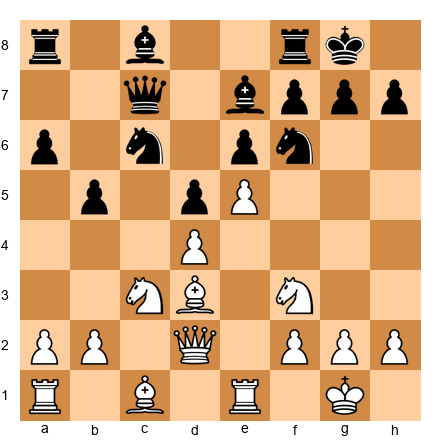</p>


White to play. You can exchange on f6 (Bxf6) or maintain the tension. Which is correct?

**Hint 1:** What happens after Bxf6 Bxf6? Evaluate the resulting structure.

**Hint 2:** What happens if White maintains the tension with a developing move like Bg5?

**Hint 3:** Compare the two resulting positions. In which one does White's advantage grow more easily?

**Solution:** 12.Bg5! is stronger than 12.Bxf6. Here is why: after 12.Bxf6 Bxf6, Black gets the bishop pair and a solid structure. The e5 pawn is strong for White, but Black can eventually play ...f6 to challenge it. After 12.Bg5!, the pin on f6 creates persistent pressure. Black cannot easily break it: 12...h6 weakens the kingside, 12...Ne8 is passive, and 12...Nd7 loses control of d5. White maintains the tension and keeps all options open. The principle: *do not exchange unless the resulting position is clearly better.* Maintaining tension preserves more winning chances at the Grandmaster level.

---

**Exercise 47.15 (★★★★★): ⏱ 20 minutes**

*Full Strategy**

Set up your board:


<p align="center">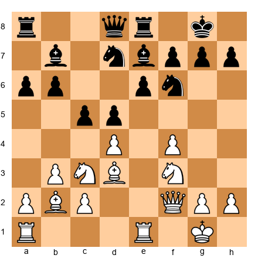</p>


White to play. This is a complex middlegame position with many strategic themes. Provide: (a) a full evaluation, (b) a strategic plan for White, (c) the best move, and (d) an assessment of the next 5 moves.

**Hint 1:** Evaluate the pawn structure. Where is the tension? Who benefits from the tension being resolved?

**Hint 2:** White's pieces are well-placed: Bd3 eyes the kingside, Bb2 pressures e5, Nc3 targets d5. How can White coordinate these advantages?

**Hint 3:** Consider 13.fxe5: what happens to the position's character?

**Solution:**

**(a) Evaluation:** White has a slight advantage (+0.3 to +0.4). Reasons: better piece coordination (Bb2 and Nc3 both target d5/e5), the f4 pawn creates kingside space, and the Bd3 is more active than either of Black's bishops. Black's position is solid but slightly cramped.

**(b) Strategic plan:** White should maintain central tension while maneuvering pieces toward the kingside. The plan: Ne5 (occupying the outpost), then target f7 and e6. If Black exchanges on d4, White recaptures with a piece (Nxd4 or Bxd4), maintaining pressure. White should avoid dxc5, which relieves Black's cramped position.

**(c) Best move:** 13.Ne5!: this move occupies the ideal outpost, targets d7 (potentially winning the bishop pair after Nxd7 Bxd7), and prepares Qh4 with kingside pressure. The knight on e5 cannot be easily challenged: ...f6 weakens e6, and ...Nxe5 fxe5 gives White a strong center with attacking prospects.

**(d) Next 5 moves:** After 13.Ne5 Nxe5 14.fxe5 Nd7 15.Qh4 f5 (forced, to block the diagonal) 16.exf6 Bxf6 17.Qg4: White has a strong attack against the weakened kingside. The e6 pawn is a target, the g7 square is weak, and White can bring the rook to e3-g3 or e3-h3 for a direct assault. White's advantage has transformed from positional (outpost, space) to dynamic (initiative, attack).

---

### Exercises 47.16 through 47.75

*Available in companion PGN file: Volume-5-Exercises-Ch47.pgn*

The remaining exercises follow the same structure: progressive hints, complete solutions, and strategic themes covering all concepts from this chapter.

**Exercise distribution for Chapter 47:**

| Difficulty | Count | Focus |
|-----------|-------|-------|
| ★★ Warmup | 10 | Advantage identification, basic exchanges, positional review |
| ★★★ Intermediate | 15 | Two weaknesses principle, squeeze technique, color complexes |
| ★★★★ Expert | 30 | Advantage transformation, prophylactic play, complex evaluations |
| ★★★★★ Master | 20 | Full positional plans, GM-level conversion, multi-phase strategy |
| **Total** | **75** | |

⚡ **ADHD Quick Set:** If you are short on time, do exercises **47.6**, **47.8**, **47.11**, **47.12**, and **47.14**. These five cover the chapter's core concepts: exchange decisions, prophylaxis, advantage transformation, and the squeeze.

---

## Key Takeaways

1. **Advantages are fluid, not fixed.** A material advantage can become a positional advantage can become a tactical advantage can become a winning endgame. The art is knowing when and how to transform.

2. **One weakness is not enough.** You need two. Use the principle of two weaknesses to stretch the defense until it breaks. Create a second target on the opposite side of the board from the first.

3. **The squeeze requires patience and precision.** Restrict, improve, probe, wait, convert. Small improvements compound. Trust the process.

4. **Prophylaxis prevents counterplay, not just threats.** At the Grandmaster level, the most dangerous enemy is not a tactic. it is your opponent's ability to generate activity. Kill the activity before it starts.

5. **Exchange the piece that guards the weakness.** When choosing what to trade, ask: "Which enemy piece is holding the defense together?" Trade that one. even if it means giving up a piece that looks "better" on paper.

6. **The initiative is currency.** It must eventually be spent. If you do not convert the initiative into something permanent. material, structure, a weak square. it will evaporate. Cash in before the bank closes.

7. **There is no such thing as "dead equal."** Every position has imbalances. If Carlsen can win from +0.2 in a Berlin endgame, you can find something to play for in your positions too. Look harder. The advantage is there.

---

## Practice Assignment

This week:

1. **Advantage Transformation Drill:** Play through three of your recent games. For each game, identify every moment where the advantage *changed type* (e.g., you had a development lead that became an initiative that became a material advantage). Write down the transformation chain for each game.

2. **Two Weaknesses Exercise:** Find a position from one of your games where you had *one* weakness to target. Replay the position from that point. Can you find a way to create a *second* weakness? What sequence of moves would stretch the defense?

3. **The Squeeze in Practice:** Play one slow game (minimum 45+15 time control) against a strong opponent or engine. If you achieve any advantage. no matter how small. commit to squeezing. Do not look for a knockout. Improve one piece at a time. Probe different weaknesses. See how long you can maintain pressure before either winning or the advantage dissolving. Record the game and analyze where you could have squeezed more effectively.

4. **Prophylactic Check:** In your next five games, before every move, ask yourself: "What does my opponent want to do?" Write a "P" next to every move in your scoresheet where your answer changed your move choice. After five games, count the P-moves. If the number is less than 10 across all five games, you are not asking the question enough.

5. **Exchange Decision Journal:** For one week, whenever you reach a position where you can exchange a piece, write down: (a) what the trade achieves, (b) what the position looks like after the trade, and (c) whether keeping the piece on would be better. Review at the end of the week.

---

## ⭐ Progress Check

After completing this chapter's exercises, assess yourself:

- [ ] I can identify at least two weaknesses in my opponent's position within 2 minutes
- [ ] I consciously consider advantage transformation when my current plan stalls
- [ ] I regularly ask "What does my opponent want to do?" and adjust my play accordingly
- [ ] I can evaluate exchange decisions based on structural consequences, not just piece value
- [ ] I have successfully squeezed a minimal advantage into a win in at least one game this month
- [ ] I understand when to change the character of the position rather than persisting with the current plan

If you checked 5 or more, you have internalized the material. Move on to Chapter 48.

If you checked fewer than 5, spend another week on the exercises. Play through the annotated games again. this time, cover White's moves and try to guess each one. The deeper your engagement with the games, the faster the concepts will become instinct.

---

🛑 **Good stopping point.** This chapter covered the art of advantage transformation, the strategic skill that separates strong masters from Grandmasters. Let your brain absorb it. Come back when you are ready, or continue below for the advanced extensions.

---

*"In chess, as in life, the ability to adapt determines whether you survive or thrive."*
*-- Garry Kasparov*

---
---

# CHAPTER 47 (CONTINUED): ADVANCED EXTENSIONS

---

## PART 5: THE ART OF THE POSITIONAL EXCHANGE SACRIFICE

> *"The exchange sacrifice is the highest expression of positional understanding."*
> *-- Tigran Petrosian*

### 5.1 Understanding the Positional Exchange Sacrifice

The exchange is worth approximately two pawns. A rook typically outperforms a minor piece. These are the basics, and every player above 1200 knows them.

But at the Grandmaster level, these basics become guidelines, not laws. There are positions where giving up a rook for a bishop or knight produces compensation that no material counter can match. The resulting position may feature a dominant minor piece, total control of a color complex, crippled enemy structure, or complete strategic paralysis.

This is the positional exchange sacrifice: not a temporary tactical blow that wins material back in three moves, but a long-term strategic investment. You surrender material for positional factors that slowly, steadily, irreversibly strangle the opponent.

### 5.2 Petrosian's Philosophy

Tigran Petrosian, the ninth World Champion, made the positional exchange sacrifice his signature weapon. He played it more than 100 times in his career. His philosophy can be distilled into three principles:

**Principle 1: The opponent's strongest piece is the rook.** If you can neutralize the opponent's rooks by removing one of your own, you have effectively equalized the material balance in terms of *useful* pieces. A rook on a closed file with no open lines is worth less than a well-placed knight.

**Principle 2: Positional factors compound.** A knight on d5, a bad enemy bishop, and a weak pawn on e6 are each worth maybe half a pawn individually. Together, they create a position where the opponent simply cannot move. That combined effect is worth well more than the exchange.

**Principle 3: The opponent's technique must be perfect.** When you sacrifice the exchange, you hand your opponent a material advantage. But they must *convert* that advantage. If the position is closed or blocked, a material edge is nearly impossible to realize. You are betting on the position, and the position is a surer thing than your opponent's endgame technique.

### 5.3 When to Sacrifice the Exchange

Here is a checklist. The more items you can tick, the stronger the sacrifice:

- [ ] Your remaining minor piece will occupy a dominant outpost (d5, e5, c5, or similar)
- [ ] The opponent's remaining rook(s) will have no open files
- [ ] The resulting pawn structure favors your pieces (closed center, fixed pawns)
- [ ] You gain dark-square or light-square domination
- [ ] Your opponent's bishop becomes "bad" (blocked by its own pawns)
- [ ] You eliminate the opponent's best defensive piece
- [ ] You create connected passed pawns or a protected passed pawn
- [ ] The position becomes strategically "dead" for the opponent's extra material

If you can check four or more of these boxes, the sacrifice is almost certainly sound.

### 5.4 Example 1: The Classic Petrosian Sacrifice

**Petrosian vs. Kasparov, World Championship 1984**

Consider a position inspired by Petrosian's typical setup where White has just played Rxc3 voluntarily:


<p align="center">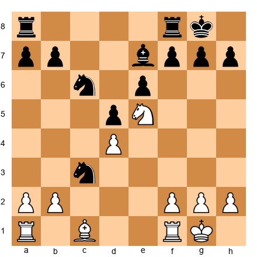</p>


Set up this position on your board. White has sacrificed the exchange; Black has a knight on c3 where a rook used to stand, and White's knight sits powerfully on e5. Look at the position from White's perspective.

White's compensation:

1. **The knight on e5 is untouchable.** Black cannot challenge it with ...f6 without creating gaping weaknesses on the kingside. The knight radiates influence across the entire board, covering d3, f3, d7, f7, g4, g6, and c4.

2. **Black's extra exchange is meaningless.** Where do Black's rooks go? The c-file is contested, the e-file is closed by the pawn on e6, and the f-file only opens if Black plays ...f6, which weakens everything.

3. **White's bishop pair potential.** After Bd2, White can bring the dark-squared bishop to life on the a1-h8 diagonal, further restricting Black's position.

The follow-up play is instructive. White would continue: Bd2, Rac1, placing pressure on the c-file and the weak e6 pawn. Black's extra material sits idle. Piece by piece, White improves while Black watches.

**Key lesson:** The strongest exchange sacrifices don't just win a positional factor. They render the opponent's material advantage useless.

### 5.5 Example 2: Sacrificing for a Dominant Knight


<p align="center">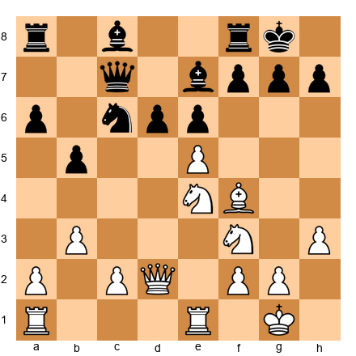</p>


Set up this position on your board. White has a knight on e4 and a bishop on f4. Black has a solid but slightly passive setup. Now imagine White plays Rxe7 (sacrificing the exchange on e7), and after Nxe7, White follows with Nd6.

After the sacrifice:

1. **The knight on d6 is a monster.** It sits in the heart of Black's position, attacking b7, f7, c8, and e8. It cannot be dislodged because Black's e-pawn is fixed on e6.

2. **Black's dark-squared bishop is gone.** White's bishop on f4 now rules the dark squares unopposed. Combined with the knight on d6, White controls the entire central complex.

3. **Black's rooks are restricted.** The a8-rook is stuck babysitting the a-pawn, and the f8-rook has no useful file. White's remaining rook, by contrast, dominates the e-file.

White's plan going forward is simple: double on the e-file if possible, advance the kingside pawns to create a second weakness, and probe until Black collapses. The material deficit is irrelevant because every White piece is active and every Black piece is passive.

### 5.6 Example 3: Sacrificing for Pawn Structure


<p align="center">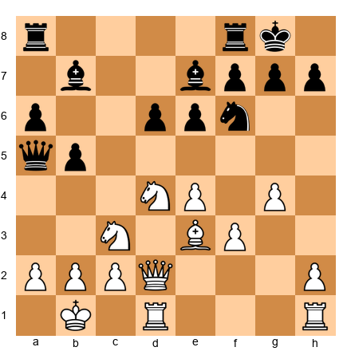</p>


Set up this position on your board. White can play Rxd6 here (if a rook were on d1, capturing the d6 pawn). After Black recaptures with ...exd6, the pawn structure shifts dramatically. Black now has a doubled d-pawn (d6 and d5 after further exchanges), and White's knight can settle into the gaping hole on d5.

The compensation:

1. **Permanent structural damage.** Doubled pawns on d6 and d5 (or an isolated d6 pawn) are targets for life. They cannot advance, and they tie down Black's pieces to defense.

2. **The d5 outpost.** After Nd5, White's knight and Black's bad bishop on b7 (blocked by its own pawns on d5 and e6) create a massive imbalance. The knight on d5 is worth at least a rook in practical terms.

3. **Open lines for White.** The e-file opens, and White's remaining rook can penetrate. Black's queenside pawns are also weak after ...a6 and ...b5.

### 5.7 Example 4: The Defensive Exchange Sacrifice

Not all exchange sacrifices are aggressive. Sometimes, the best use of the exchange sacrifice is to *survive*.


<p align="center">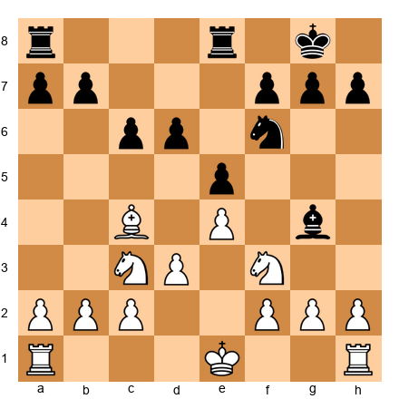</p>


Set up this position on your board. Black is under pressure. White has a strong bishop on c4 aiming at f7, and the knight on f3 is ready to jump to g5. Black's position looks uncomfortable.

Black can play ...Rxe4 (sacrificing the exchange on e4), and after Nxe4, the position simplifies. Black has eliminated White's strong central presence, the bishop on c4 now stares at a closed diagonal, and Black's knight on f6 becomes the dominant minor piece.

The defensive exchange sacrifice works when:

- It removes the opponent's most dangerous attacking piece
- It closes the position, making rooks less effective
- It leads to a structure where your remaining pieces are superior
- The opponent's initiative dies with the simplification

### 5.8 When NOT to Sacrifice the Exchange

The exchange sacrifice is a subtle weapon, and misusing it leads to lost games. Here are the warning signs that a sacrifice will fail:

**The position is open.** In open positions, rooks are king. If there are two or more open files, the opponent's extra rook will dominate. Only sacrifice the exchange in closed or semi-closed positions.

**Your minor piece has no outpost.** If the knight or bishop you preserve has no stable square, it will eventually be pushed away or traded. The compensation evaporates once your minor piece is ordinary.

**The opponent can simplify.** If your opponent can trade pieces down to a pure rook-vs-minor-piece endgame with no complicating factors, they will win. The exchange sacrifice works best when pieces stay on the board.

**Your king is exposed.** An extra rook is devastating against an exposed king. If your king safety is compromised, sacrificing the exchange usually makes things worse.

**You are already losing.** The exchange sacrifice is not a panic button. It is a strategic choice from a position of at least rough equality. If you are already worse, giving up material will only accelerate the loss.

---

## PART 6: COLOR COMPLEX DOMINATION

> *"When you control the squares of one color, you control half the board. And half the board is usually enough."*
> *-- Mark Dvoretsky*

### 6.1 What Is a Color Complex?

A color complex is the set of 32 squares of one color on the chessboard. Every bishop controls one color complex permanently. Every pawn, when it advances, fixes itself on one color and weakens the opposite color behind it.

When your opponent loses their bishop of a particular color (say, the dark-squared bishop), and their pawns are fixed on light squares, the dark squares in their position become permanently weak. No pawn can guard them. No bishop can cover them. Only knights and the queen can defend those squares, and they are often busy elsewhere.

This is color complex domination: occupying and controlling the squares your opponent can no longer defend.

### 6.2 How a Color Complex Collapses

A color complex collapse typically follows this sequence:

**Step 1: The bishop disappears.** Either through an exchange or a sacrifice, one side loses a bishop. This is the trigger.

**Step 2: Pawns fix on the wrong color.** The remaining pawns sit on the same color as the lost bishop. This means the pawns cannot guard the weak-colored squares AND the remaining bishop (if any) is "bad," stuck behind its own pawns.

**Step 3: The opponent's pieces occupy the weak squares.** Knights, bishops, queens, and even kings flood onto the undefended color complex. These pieces cannot be driven away because no pawns control those squares.

**Step 4: The position becomes strategically lost.** The side suffering the color complex weakness can only defend passively. Piece by piece, the attacker improves, creates threats on both flanks, and eventually breaks through.

### 6.3 Placing Pawns and Pieces on the Weak Color

Once you identify a weak color complex in your opponent's position, follow this plan:

**Pawns:** Advance your pawns to squares of the *strong* color (your opponent's weak color). This fixes the position and prevents your opponent from ever challenging those squares. For example, if your opponent is weak on dark squares, place your pawns on d4, e5, f4, creating a wall of dark-square control.

**Knights:** Knights are color-flexible; they alternate colors with every move. Place them on outposts of the weak color. A knight on e5 when the opponent lacks a dark-squared bishop is nearly as strong as a rook.

**Bishops:** If you still have the bishop that matches your opponent's weak squares, it becomes the most powerful piece on the board. A dark-squared bishop operating on a dark-square highway (a1-h8, a3-f8, etc.) with no opposing bishop is game-winning on its own.

**Queen:** The queen should operate along diagonals and ranks that cross the weak color complex. It can shuttle between weak squares, creating multiple threats that the opponent cannot cover simultaneously.

### 6.4 Example 1: Dark Square Domination After Bishop Trade


<p align="center">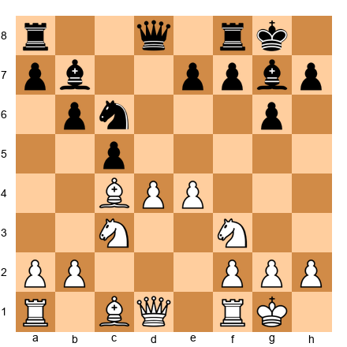</p>


Set up this position on your board. Both sides have fianchettoed kingside, but notice the structural difference. If White trades the dark-squared bishops (for example, through Bg5-e3xg7 or a similar sequence), Black's dark squares collapse.

After the dark-squared bishops leave the board, examine what remains. Black's pawns on b6, c5, e7, and g6 are all on light squares (b6 is dark, but c5 and g6 are significant). The dark squares d6, e5, f6, and h6 become chronic weaknesses.

White's plan:
1. Place a knight on d5 (dark square, untouchable)
2. Advance e5, locking the center on dark squares
3. Use the queen on dark-square diagonals (Qd2-h6 or Qd2-a5)
4. The remaining bishop on c4 controls light squares, complementing the dark-square control with pieces

Black will find that every defensive piece is on the wrong color. The light-squared bishop on b7 watches helplessly as White's pieces dance across the dark squares.

### 6.5 Example 2: Light Square Massacre


<p align="center">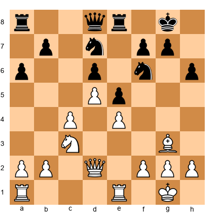</p>


Set up this position on your board. Black has no light-squared bishop (it was traded or captured earlier). White's pawns on d5, e4, and c4 form a massive chain that fixes Black's pawns and creates light-square outposts everywhere.

Look at the light squares in Black's camp: c6, e6, f5, d7, b5. Not a single one can be defended by a Black pawn. White can maneuver a knight to c6 or e6 via b4-d5-c6 or f3-d2-f1-e3-f5. Once a White knight reaches e6 or c6, Black's position crumbles.

White's domination plan:
1. Maneuver a knight to e6 (Nd1-e3-f5 or Nd1-e3-d5-e6... the routes are many)
2. Use the queen on light-square diagonals once the knight is anchored
3. Open a file on the kingside with f2-f4, using the resulting open lines to penetrate

The key insight here is that Black's dark-squared bishop (on g7 or wherever it sits) is useless. It cannot defend light squares. It cannot challenge White's knight. It is a spectator.

### 6.6 Example 3: The Fischer Color Squeeze


<p align="center">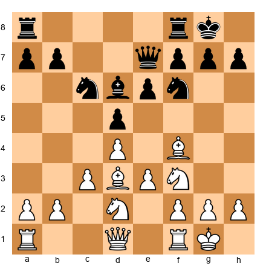</p>


Set up this position on your board. This is a typical position from the Queen's Gambit Declined. Black has a bishop on c6 and d6. Now, if White can engineer the trade of dark-squared bishops (Bxd6 Qxd6), the dark squares in Black's position become soft.

After Bxd6 Qxd6, White plays e4 (opening the center), followed by maneuvering pieces to the dark-square outposts. The knight can go to e5, the queen can access h4 or a5, and Black's remaining bishop on c6 (a light-squared piece on a dark square, awkwardly placed) cannot help.

Bobby Fischer was a master of this technique. He would trade the opponent's good bishop, fix the pawns, and then slowly occupy every weak square until the opponent ran out of moves. His games against Petrosian in their 1971 Candidates match are textbook examples.

The lesson: when you trade bishops, always ask which color complex weakens. If the answer is "my opponent's," make the trade. If the answer is "mine," avoid it.

---

## PART 7: THE ART OF PROPHYLACTIC THINKING AT GM LEVEL

> *"I always look first at what my opponent wants to do, and only then decide on my own plan."*
> *-- Anatoly Karpov*

### 7.1 Petrosian and Karpov: The Prophylactic Masters

Two World Champions built their entire playing style around prophylaxis, and they are perhaps the two greatest strategic players in history.

**Tigran Petrosian** (World Champion 1963-1969) was called "Iron Tigran" because of his impenetrable defensive style. But calling Petrosian a "defensive" player misses the point. He was not defending; he was *denying*. He saw what his opponent wanted to do three, four, five moves into the future, and he spent his moves making those plans impossible. By the time the opponent realized their plans had been shut down, Petrosian had already built a positional advantage from the quiet improvements he made while prophylaxing.

**Anatoly Karpov** (World Champion 1975-1985) took Petrosian's approach and added a predatory edge. Karpov asked "What does my opponent want?" and then not only prevented it but *punished* it. If the opponent wanted to play ...e5, Karpov would prevent it, and the piece the opponent had committed to supporting ...e5 would now be misplaced. The prevention itself created the advantage.

### 7.2 "What Does My Opponent Want?" as Your First Question

At the GM level, this question must become automatic. Before you think about your own plans, before you calculate variations, before you even look at your own pieces, ask:

**"If it were my opponent's move right now, what would they play?"**

This simple question reveals:

- **Tactical threats** you might have missed
- **Strategic plans** your opponent is building toward
- **Piece maneuvers** that will improve their position
- **Pawn breaks** they are preparing

Once you know what your opponent wants, you have three options:

1. **Prevent it directly.** Play a move that makes their idea impossible.
2. **Allow it, but prepare a stronger response.** Sometimes the opponent's plan is not that dangerous, and preventing it wastes a tempo.
3. **Preempt it with something better.** If your own idea is stronger, play it first, but only after confirming that their threat is not critical.

The mistake most 2200-2400 players make is jumping to option 3 without properly evaluating the threat. They see their own plan and assume it is better. At the GM level, this carelessness loses games.

### 7.3 Multi-Move Prophylaxis: Preventing Plans Before They Begin

Single-move prophylaxis stops an immediate idea. Multi-move prophylaxis is far more sophisticated: it identifies a plan the opponent will need several moves to execute, and kills it in the cradle.

Here is how multi-move prophylaxis works:

**Step 1: Identify the opponent's ideal setup.** Look at their position and ask: "If my opponent could make four moves in a row without me moving, what would they play?" This reveals their dream position.

**Step 2: Find the bottleneck.** Every multi-move plan has a critical step, a move that must happen for the plan to work. It might be a pawn break, a piece redeployment, or a rook lift.

**Step 3: Block the bottleneck.** Spend one or two quiet moves ensuring that critical step can never happen. This might mean controlling a key square, advancing a pawn to block a file, or placing a piece where it prevents a maneuver.

**Step 4: Improve your own position while the opponent searches for a new plan.** This is the payoff. While your opponent is recalculating (because their main plan is dead), you are free to make small improvements. Each improvement compounds, and by the time the opponent finds a new idea, you are several tempi ahead in positional terms.

### 7.4 Prophylactic Example 1: Preventing the Pawn Break


<p align="center">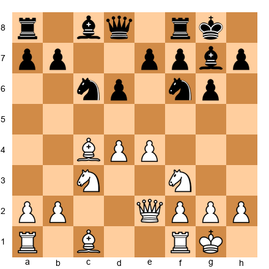</p>


Set up this position on your board. This is a typical King's Indian Defense structure. Black's main plan is ...e5, attacking White's center and opening lines for the dark-squared bishop on g7.

A non-prophylactic player might continue developing: Be3, Rad1, or even h3. These are all reasonable moves, but they ignore Black's main plan.

The prophylactic approach: White plays d5, closing the center. This does three things at once:

1. It prevents ...e5 permanently (the d5 pawn blocks it)
2. It locks Black's bishop on g7 behind the pawn chain, turning it from a dragon into a wall decoration
3. It creates a queenside space advantage that White can exploit with b4-b5

After d5, Black must completely rethink. The ...e5 break is gone. The bishop on g7 is bad. Black's entire strategic framework has been destroyed by one prophylactic pawn push.

Notice that d5 is not a "defensive" move. It does not stop a threat. It prevents an entire strategic plan. That is multi-move prophylaxis.

### 7.5 Prophylactic Example 2: Denying the Knight Maneuver


<p align="center">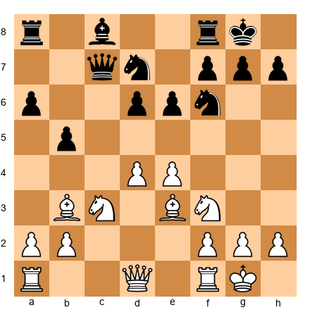</p>


Set up this position on your board. Black's knight on d7 wants to reroute: ...Nd7-f8-g6 (or ...Nd7-e5, if allowed). From g6, it eyes f4 and h4, creating kingside pressure. From e5, it dominates the center.

The prophylactic response: White plays a4. This looks strange at first because it seems to target the queenside, not the knight. But look deeper.

After a4, Black must respond to the threat against b5. If Black plays ...b4, the knight on c3 jumps to a2 and then b4 or d5. If Black plays ...bxa4, White recaptures with Bxa4, and suddenly the bishop controls d7, preventing the knight from moving at all.

By attacking b5, White has indirectly frozen Black's knight on d7. The ...Nf8-g6 maneuver is delayed by at least two tempi because Black must deal with the queenside pressure first. Meanwhile, White can improve freely: Qd2, Rad1, preparing d5 or f4.

This is the beauty of indirect prophylaxis. You do not stop the opponent's plan by putting a piece in the way. You stop it by creating a problem elsewhere that demands their attention.

### 7.6 Prophylactic Example 3: The Karpov Squeeze Through Prevention


<p align="center">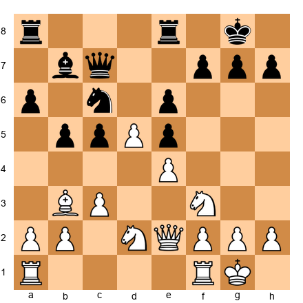</p>


Set up this position on your board. Black would love to play ...f5, breaking open the kingside and activating the bishop on b7. This is Black's only real plan for counterplay.

Karpov's approach: White plays f3 (solidifying e4 and preventing any ...f5 ideas), followed by Nf1-e3-d3 (blocking the c5 pawn and eyeing both b4 and f4). Then a3 (preventing ...b4 at the right moment), followed by b4 (seizing space on the queenside).

Notice the sequence. Each move prevents something:
- f3 prevents ...f5
- Nf1 prevents Black from rerouting a knight to d4 via the f-file
- a3 prevents ...b4
- b4 seizes space and fixes c5 as a permanent weakness

By the time White finishes this prophylactic sequence, Black has no pawn breaks on either side of the board. The position is a strategic prison. Black must sit and wait while White finds the final method of penetration, which usually involves a rook lift (Ra1-a2-b2) or a piece sacrifice to break through.

This is the Karpov method at its purest: prevent everything, improve everything, and wait for the opponent to crack under the pressure.

---

## PART 8: CONVERTING MINIMAL ADVANTAGES: THE KARPOV METHOD

> *"If you have a small advantage, you do not need to look for a combination. You just need to gradually increase it."*
> *-- Anatoly Karpov*

### 8.1 The World of +0.3

At the amateur level, advantages of +0.3 (three-tenths of a pawn, according to engine evaluation) are considered "equal." Players in this range often agree to draws because they see no path forward.

At the Grandmaster level, +0.3 is a real advantage. Not a winning one, not yet. But it is an advantage that can grow. Karpov, Carlsen, and other great technicians have shown that +0.3 can become +0.5, then +0.8, then +1.2, and eventually a win. The technique requires patience, precision, and a deep understanding of where small advantages hide.

### 8.2 Small Pawn Weaknesses and How to Exploit Them

The most common source of a +0.3 advantage is a small pawn weakness. An isolated pawn, a slightly weak square, a backward pawn on a half-open file. These tiny blemishes are almost impossible to exploit in a single move. But over 20, 30, 40 moves, they become the fulcrum around which the entire game turns.

**Technique 1: Fix the weakness.** If your opponent has an isolated d-pawn on d5, do not allow them to advance it. Place a piece on d4 (a knight is ideal), and keep your own pawns on c3 and e3 so the isolated pawn cannot move. The pawn becomes a permanent target.

**Technique 2: Tie down defenders.** Once the weakness is fixed, count how many pieces defend it. Now tie those pieces down. If the opponent has a rook and a knight defending the isolated pawn, those pieces cannot do anything else. You effectively have a two-piece advantage in the rest of the board.

**Technique 3: Create a second target.** This is the principle of two weaknesses applied to minimal advantages. One weakness is not enough at any level. You need a second target on the opposite flank. Advance a pawn, open a file, probe with your queen. Force the opponent to split their attention.

**Technique 4: Be patient.** Small advantages grow slowly. You may need to improve your pieces for 15 or 20 moves before the position cracks. Trust the process. Each small improvement, each piece placed on a slightly better square, brings you closer.

### 8.3 Space Advantage Conversion

A space advantage is another classic +0.3 scenario. You have more space (your pawns are further advanced), but the opponent's position is solid. How do you convert?

**Phase 1: Control the center and restrict piece movement.** Your advanced pawns create a wall. Place your pieces behind this wall on optimal squares. The opponent's pieces, cramped behind their pawns, must shuffle back and forth in limited space.

**Phase 2: Probe both flanks.** With a space advantage, you can transfer pieces from one side of the board to the other faster than the opponent. Use this mobility to probe. Attack the kingside, then quickly switch to the queenside. Each probe forces the opponent to reposition, and in a cramped position, repositioning is slow and awkward.

**Phase 3: Find the break.** Eventually, you will advance a pawn to create a concrete weakness. This might be a queenside pawn push (b4-b5, or a4-a5) or a kingside advance (f4-f5 or g4-g5). The break opens lines, and your better-placed pieces pour through.

**Phase 4: Convert into a winning endgame.** The space advantage often converts into a passed pawn or a structural weakness in the endgame. Trade pieces at the right moment (when the opponent's defensive coordination breaks down) and enter an endgame where the advantage is concrete.

### 8.4 The Squeeze: Restricting Move by Move

The squeeze is the ultimate expression of Karpov's method. It works like this:

1. **Find the opponent's most active piece.** Exchange it or force it to a passive square.
2. **Repeat for the next most active piece.** And the next. And the next.
3. **After every exchange or restriction, improve your own worst-placed piece.** Move it to a better square. Find the ideal position for every piece you have.
4. **When all your pieces are on their ideal squares and all the opponent's pieces are passive, probe.** The position will break on its own because the opponent has run out of useful moves.

The squeeze requires discipline. You must resist the temptation to "go for it" prematurely. You must trust that each small improvement matters. You must be willing to play 60, 70, 80-move games without ever launching a flashy combination.

This is not glamorous chess. It is winning chess. And at the Grandmaster level, winning is what matters.

### 8.5 A Squeeze in Practice


<p align="center">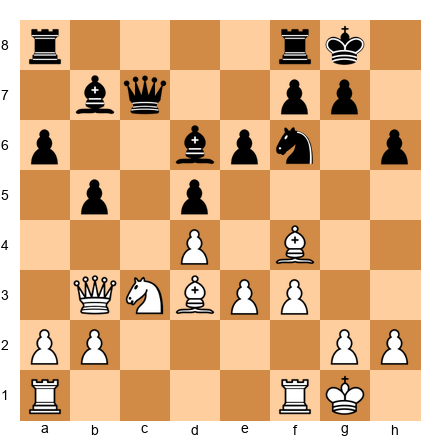</p>


Set up this position on your board. White has a small but clear advantage: the bishop pair in a semi-open position, slightly more space, and Black's pawns on a6, b5, d5, e6, and h6 are all potential targets. The engine says roughly +0.4. Now watch how a Grandmaster would squeeze.

**Move 1: Improve the worst piece.** White's queen on b3 is already good. The bishop on d3 eyes the kingside. The bishop on f4 is active. The weakest piece is the rook on a1. Solution: Ra1-e1, centralizing and eyeing the e-file.

**Move 2: Exchange the opponent's best piece.** Black's most active piece is the knight on f6. White can play Bh7+ (if the bishop can reach there) or Nd1-e3-g4, heading toward f6 to trade. Once the knight is gone, Black's kingside becomes vulnerable.

**Move 3: Probe.** After the knight trade, White can probe with Qc2 (eyeing h7 and the c-file), or shift to the queenside with a4 (attacking b5). Black must choose where to defend, and every choice leaves the other side weak.

**Move 4: Create the second weakness.** After a4 bxa4 Qxa4, Black's a-pawn becomes isolated and the b-file opens. White now has two targets: a6 and the kingside. Black cannot defend both.

**Move 5: Convert.** With two weaknesses and better pieces, White trades into an endgame where the bishop pair dominates the board. The result is inevitable.

This entire process might take 30 moves. That is fine. The advantage never slipped away. It only grew.

---

## EXERCISES: ADVANCED EXTENSIONS (47-B)

The exercises below cover the material from Parts 5 through 8. They test your understanding of exchange sacrifices, color complex domination, prophylactic thinking, and the Karpov squeeze. Set up each position on a physical board. Close the book (or look away from the screen) while you think. Only check the solution after you have committed to an answer.

---

### ★★★ WARMUP EXERCISES [Essential]

---

**Exercise 47-B.1: Should You Sacrifice the Exchange?**


<p align="center">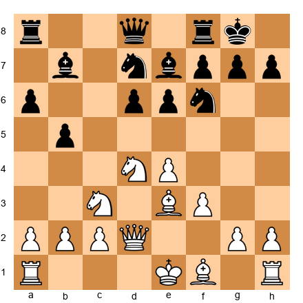</p>


⏱ **Target time:** 5 minutes

**Set up your board.** White can play Rxb5 (hypothetically) or sacrifice the exchange on d6. Should White sacrifice the exchange with Nxe6 fxe6 followed by Bg2 and long-term pressure, or is the position better suited for normal development?

Evaluate whether the exchange sacrifice criteria from Section 5.3 are met.

**Hint 1:** Look at Black's pawn structure after ...fxe6. What squares become weak?

**Hint 2:** Does White's remaining knight have a dominant outpost? What about d5 after the e6 pawn becomes doubled?

**Hint 3:** Consider whether Black's rooks will have open files. If the position stays closed, the rooks are less useful.

<details>
<summary>Solution</summary>

The sacrifice is promising but not clearly winning. After Nxe6 fxe6, Black's pawn structure is damaged (doubled e-pawns, weak d5 square), and White can aim for Nd5 with a dominant knight. However, Black retains the bishop pair and some active chances on the f-file.

The key factors: (1) White does gain the d5 outpost, (2) Black's rooks do have the f-file to work with, which is a concern, (3) the position is semi-open, meaning Black's extra exchange has some value.

Verdict: The sacrifice is playable but risky. A better approach might be normal development with Be2, O-O, and maintaining the option for later. At the GM level, you should only sacrifice when the compensation is clear. Here it is marginal.

**Correct assessment:** Normal development is slightly more accurate, but the sacrifice is not losing. A practical player might choose the sacrifice to create complexity.
</details>

---

**Exercise 47-B.2: Identify the Weak Color Complex**


<p align="center">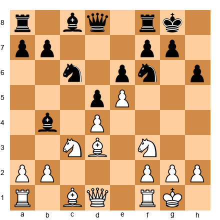</p>


⏱ **Target time:** 3 minutes

**Set up your board.** Which color complex is weak in Black's position? What is the single most effective plan for White to exploit it?

**Hint 1:** Black has played ...h6. What color square is h6?

**Hint 2:** Look at Black's pawn chain: d5, e6, h6. What color are these pawns on?

**Hint 3:** If White could trade dark-squared bishops (after Black's dark-squared bishop is already on b4, outside the chain), which squares become permanently weak?

<details>
<summary>Solution</summary>

Black's pawns on d5, e6, and h6 are all on light squares. But the real weakness is the dark-square complex, particularly after the dark-squared bishop on b4 gets exchanged or locked out of the defense.

If White plays a3, forcing ...Bxc3 bxc3, White gets the bishop pair AND Black loses the dark-squared bishop. Now the dark squares f6, g5, h6, d6, and e7 are all weak. White's plan: Bf4 (occupying the dark-square diagonal), Qd2 targeting h6, and eventually a kingside attack using the open dark squares.

The key insight: Black's bishop on b4 looks active, but once it is exchanged, the dark squares collapse permanently. Recognizing this is the difference between a 2200 and a 2500 player.
</details>

---

**Exercise 47-B.3: What Does Your Opponent Want?**


<p align="center">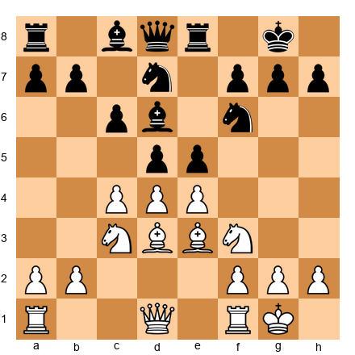</p>


⏱ **Target time:** 4 minutes

**Set up your board.** Before planning your own move, answer: what does Black want to do on their next move? Then find the best prophylactic response.

**Hint 1:** Look at Black's central pawns on d5 and e5. What pawn break is Black preparing?

**Hint 2:** If Black plays ...exd4, followed by ...d4, what happens to White's center?

**Hint 3:** The prophylactic response involves exchanging in the center in a specific way that maintains White's structural advantage.

<details>
<summary>Solution</summary>

Black wants to play ...exd4 followed by ...d4, driving White's pieces back and seizing central space. If Black achieves ...d4 successfully, the bishop on e3 is pushed and the knight on c3 might be displaced.

The prophylactic response is dxe5 (or cxd5 depending on the desired structure). After dxe5 Nxe5 (or ...dxe5 Nxe5), White's knight arrives on e5 with power, and Black's ...d4 push is no longer dangerous because the d-pawn is now isolated.

Alternatively, White can play d5, closing the center and preventing Black's entire plan. After d5, the knight on f6 must retreat, the bishop on c6 is locked in, and White has a queenside space advantage.

The key lesson: Black's plan was multi-move (exchange on d4, then push d4). White's prophylaxis killed the plan before it started with a single pawn decision. This is Petrosian-level thinking.
</details>

---

### ★★★★ MAIN EXERCISES [Practice]

---

**Exercise 47-B.4: The Exchange Sacrifice Decision**


<p align="center">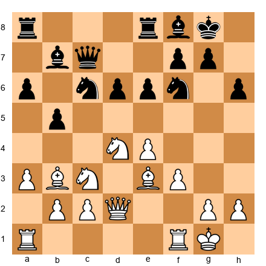</p>


⏱ **Target time:** 10 minutes

**Set up your board.** White can sacrifice the exchange with Rxf6 (removing Black's key knight). After ...gxf6, evaluate the resulting position. Is the sacrifice sound? What is White's long-term plan after the sacrifice?

**Hint 1:** After ...gxf6, look at Black's kingside pawn structure. What squares are weakened?

**Hint 2:** White's knight can maneuver to d5. What does it attack from there?

**Hint 3:** Consider the bishop on e3. After ...gxf6, can it become a dominant piece on the a1-h8 diagonal (via d4)?

<details>
<summary>Solution</summary>

Rxf6 is an excellent positional exchange sacrifice. After ...gxf6:

1. **Structural damage:** Black's kingside is wrecked. The pawns on f6, f7, and h6 are all weak, and the king's cover is destroyed.

2. **Knight to d5:** White plays Nd5, attacking the queen on c7 and the pawn on e7. The knight on d5 cannot be dislodged (Black's e-pawn is on e6, not e7, and ...c6 would leave d6 horribly weak).

3. **Dark-square domination:** After Bd4 (following the knight to d5), White's dark-squared bishop dominates the long diagonal. Combined with the knight, White controls d4, d5, e5, f6, and the entire dark-square complex.

4. **Long-term plan:** Qd2 targeting h6, doubling rooks on the g-file (after Kh1 and Rg1), or simply pressing on the d-file. Black's extra exchange is useless because the rooks have no files and the kingside is too weak.

The sacrifice is sound and probably winning in practice. The compensation is permanent and structural.
</details>

---

**Exercise 47-B.5: Color Complex Exploitation Plan**


<p align="center">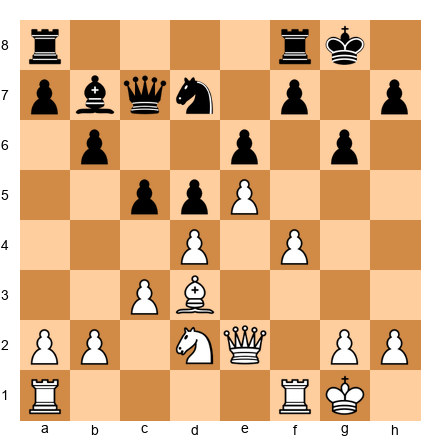</p>


⏱ **Target time:** 8 minutes

**Set up your board.** Black has no light-squared bishop (it is on b7, but it is "bad," blocked by pawns on c5, d5, and e6). White has a powerful bishop on d3 and a pawn chain fixing the center. Create a five-move plan to exploit the light-square weakness.

**Hint 1:** Which is White's weakest piece? How can it be improved?

**Hint 2:** Where is the ideal square for the knight? Think about outposts on the light squares.

**Hint 3:** After improving your pieces, where should the queen go to create threats on the light-square diagonal?

<details>
<summary>Solution</summary>

White's five-move plan:

1. **Nf3** (improving the knight; it heads for h4 or g5 via h4, targeting light squares)
2. **Qe3 or Qh5** (placing the queen on a light-square outpost, threatening to invade)
3. **Nh4** (aiming for f5, the dream square; from f5 the knight attacks d6, e7, g7, and h6)
4. **Nf5** (occupying the outpost; Black cannot take because ...exf5 opens the e-file for White and the bishop on d3 becomes a monster on the a2-g8 diagonal after Bxf5)
5. **Rf3 or Rg3** (swinging the rook to the kingside to support the attack)

After this sequence, White's pieces all operate on light squares (Bd3, Nf5, Qh5), while Black's bishop on b7 watches helplessly from behind its own pawns. The dark-squared bishop has no opposing counterpart, but that does not matter because all the weaknesses are on light squares.

This is a textbook light-square domination plan. The knight on f5 is the key; once it lands, the position is close to winning.
</details>

---

**Exercise 47-B.6: Multi-Move Prophylaxis**


<p align="center">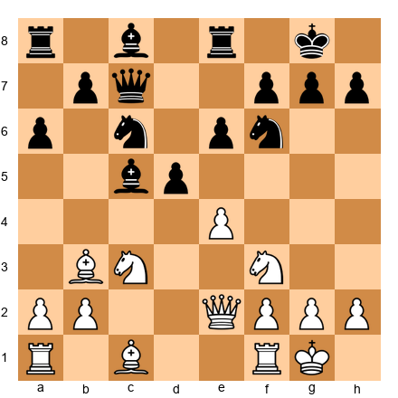</p>


⏱ **Target time:** 8 minutes

**Set up your board.** Black has a solid position with a strong bishop on d5 and knights on c6 and f6. What is Black's ideal plan? Identify it, then find a prophylactic sequence (2-3 moves) that shuts it down while improving White's position.

**Hint 1:** Black wants to play ...e5, establishing a strong center and activating all pieces. What happens to White's position if ...e5 is allowed?

**Hint 2:** Can you prevent ...e5 with a single move? What piece or pawn stops it?

**Hint 3:** After preventing ...e5, think about how to improve White's worst piece (the bishop on c1). Where should it go?

<details>
<summary>Solution</summary>

Black's ideal plan: ...e5, creating a massive center and freeing the position. After ...e5, the bishop on d5 is a monster, the knights coordinate beautifully, and White's center is challenged.

Prophylactic sequence:

1. **exd5** (eliminating the strong bishop and opening the e-file; if ...Nxd5, Nxd5 exd5, and Black's ...e5 idea is gone forever because the e-pawn no longer exists)
2. **Bg5** (developing the worst piece while pinning the f6-knight, which was going to support ...e5)
3. **Rad1** (placing the rook on the d-file, targeting the backward d-pawn if Black recaptured with a piece on d5)

After this three-move sequence, Black's ...e5 plan is dead, White's pieces are all developed and active, and Black must find a new plan in a slightly worse position (the isolated d5 pawn or the structural weakness from the exchange).

The key prophylactic insight: sometimes the best way to prevent a plan is to *change the structure* so the plan no longer makes sense. You do not block ...e5 with a piece; you remove the conditions that make ...e5 desirable.
</details>

---

**Exercise 47-B.7: The Karpov Squeeze**


<p align="center">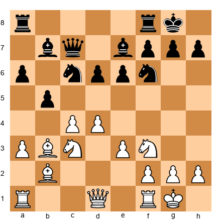</p>


⏱ **Target time:** 12 minutes

**Set up your board.** White has a typical Karpov-style advantage: slightly more space, a solid center, and good piece placement. Black's position is solid but cramped. Create a 10-move squeeze plan. You do not need to calculate exact moves; outline the strategic direction for each step.

**Hint 1:** Start by identifying Black's most active piece. Can you exchange it?

**Hint 2:** After simplifying, which of your pieces is on the worst square? How can you improve it?

**Hint 3:** Where is the second weakness? Can you create one on the kingside with a pawn advance?

<details>
<summary>Solution</summary>

The Karpov squeeze, step by step:

**Moves 1-3: Restrict and exchange.**
1. d5 (closing the center, fixing Black's pawns on dark squares, locking the bishop on b7 behind the wall)
2. ...exd5 cxd5 (or ...Na5 Bc2, keeping tension)
3. Nd4 (centralizing the knight, threatening Nc6 to exchange Black's best minor piece)

**Moves 4-5: Improve the worst piece.**
4. Qd3 or Qe2 (connecting rooks and placing the queen where it eyes both flanks)
5. Rac1 (activating the last undeveloped rook, taking the c-file)

**Moves 6-7: Create the second weakness.**
6. f4 (beginning the kingside expansion; Black must decide whether to allow f5)
7. Rf3 (preparing to swing the rook to the kingside; this creates dual threats)

**Moves 8-9: Probe.**
8. Rg3 or Rh3 (targeting the kingside; Black's pieces are all on the queenside defending the cramped position)
9. Qg4 or Qh5 (placing the queen aggressively while the opponent's pieces are tied down)

**Move 10: Convert.**
10. f5 (or e4-e5 if possible), opening lines and breaking through. Black cannot defend both sides.

The entire plan might take 20 moves in practice because Black will try to resist at each step. The key is patience: each step is small, but the cumulative effect is crushing.
</details>

---

**Exercise 47-B.8: Converting a +0.3 Advantage**


<p align="center">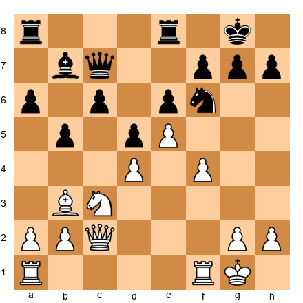</p>


⏱ **Target time:** 10 minutes

**Set up your board.** The engine evaluates this position at roughly +0.3 for White. Identify the source of White's advantage and create a plan to increase it to +1.0 or more.

**Hint 1:** What is Black's main structural weakness? Look at the pawn on c6 and the bishop on b7.

**Hint 2:** Can White create a second weakness on the kingside? Think about f5 at the right moment.

**Hint 3:** White's knight needs a better square. Where is the ideal outpost?

<details>
<summary>Solution</summary>

White's advantage comes from three factors:
1. The pawn on e5 creates a spatial advantage
2. Black's bishop on b7 is blocked by its own pawn on d5 and the chain c6-d5-e6
3. White's pieces have more room to maneuver

Plan to convert:

**Phase 1: Improve the knight.** The knight on c3 should go to e2, then either d4 or g3. From d4, it eyes c6 and e6. From g3, it eyes f5 and h5.

**Phase 2: Create the second weakness.** After the knight is repositioned, play g4 (preparing f5 or g5). This creates kingside threats and forces Black to weaken their king position.

**Phase 3: Execute the break.** Play f5 at the right moment. After ...exf5 gxf5, or ...gxf5, lines open on the kingside. White's rook(s) penetrate, and the combined pressure on the kingside and the weak c6 pawn becomes too much.

**Phase 4: Enter the endgame.** Trade queens if favorable (after creating the kingside weakness). In the endgame, White's bishop is superior to Black's, the passed e-pawn is strong, and the structural weaknesses on c6 and the kingside are permanent.

This is the Karpov method: no single move wins, but the accumulation of small improvements creates an overwhelming advantage.
</details>

---

### ★★★★★ MASTERY EXERCISES [Hard]

---

**Exercise 47-B.9: The Petrosian Exchange Sacrifice (Find It)**


<p align="center">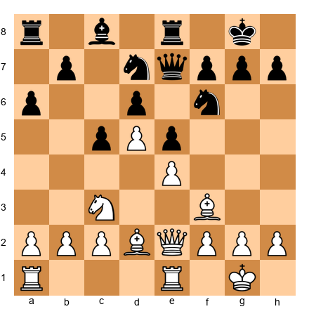</p>


⏱ **Target time:** 15 minutes

**Set up your board.** White has a solid position but Black is well-organized. Find the positional exchange sacrifice that gives White a lasting advantage. Explain why it works and outline the follow-up play for at least five moves.

**Hint 1:** Which Black piece is the most important defender of the dark squares?

**Hint 2:** If White could eliminate the knight on f6, what would happen to Black's kingside?

**Hint 3:** Consider Rxe5 (or a similar capture) followed by piece repositioning. Does removing the tension in the center help White's pieces or Black's?

<details>
<summary>Solution</summary>

The key sacrifice is **Rxe5** (or a preparation for it). After ...dxe5, White gains:

1. **A protected passed pawn on d5** (after the recapture, White's d5 pawn is protected by e4 and becomes a thorn in Black's position)
2. **The f5 square opens** for the bishop or a future knight maneuver
3. **Black's knight on d7 is passive,** stuck defending the position without active prospects

The follow-up sequence:
1. Rxe5 dxe5
2. Bg4 (targeting the knight on d7 and threatening Bxd7 followed by Qh5)
3. Qe3 (centralizing the queen and threatening to infiltrate on the kingside)
4. Bc3 or Ba5 (activating the dark-squared bishop now that the center is open)
5. Nd1-e3-f5 (maneuvering the knight to the dream outpost)

After five moves, White has a dominant knight heading for f5, a strong passed pawn on d5, and active pieces. Black's extra exchange is meaningless because the rooks have no open files (the e-file is blocked by the e5 pawn, and the d-file is blocked by the d5 pawn).

This is a classic Petrosian concept: sacrifice the exchange to create a passed pawn and a dominant piece configuration. The material deficit is temporary in the practical sense; the positional advantage is permanent.
</details>

---

**Exercise 47-B.10: Color Complex Surgery**


<p align="center">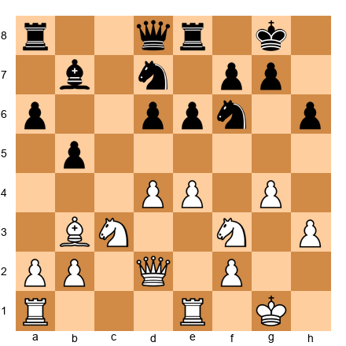</p>


⏱ **Target time:** 15 minutes

**Set up your board.** White has pushed g4 and h3, creating a kingside pawn chain on light squares. Black's dark-squared bishop has already been traded. Create a complete plan (at least 8 moves) to dominate the dark squares and win.

**Hint 1:** Where should White's knight(s) go? Think about d5, f5, and e5 as outposts.

**Hint 2:** White's queen on d2 can swing to the dark squares. What diagonal does it want?

**Hint 3:** How can White open the position to let the dark-square control translate into a winning attack? Think about the f-file.

<details>
<summary>Solution</summary>

White's dark-square domination plan:

1. **Nd5** (the first knight goes to the ultimate outpost; from d5 it attacks b6, c7, e7, f6, and f4)
2. **...Nxd5 exd5** (if Black trades, the pawn on d5 is powerful and the e-file opens)
   Or if Black does not trade: the knight stays, and White continues.
3. **Qf4** (queen moves to a dark square, targeting d6 and the kingside)
4. **Nh4** (second knight heads for f5 via h4, the dream dark-square outpost)
5. **Nf5** (now both knights, or the remaining knight, sit on dark-square outposts; the position is crushing)
6. **f4** (opening the f-file; after ...exf4 Qxf4, the queen and knight on f5 create mating threats)
7. **Re3** (rook lift, preparing to swing to g3 or h3 for the kingside attack)
8. **Rg3** (tripling on the g-file idea, or directly attacking g7)

After this sequence, White's pieces occupy f4, f5, d5, and g3, all dark squares. Black's light-squared bishop on b7 is a spectator. Black's knights cannot challenge the dark squares effectively. The position is strategically won.

The lesson: dark-square domination is not just about controlling a few squares. It is about building an entire attacking infrastructure on one color, where the opponent has no defensive resources.
</details>

---

**Exercise 47-B.11: The Complete Prophylactic Game Plan**


<p align="center">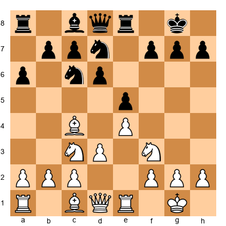</p>


⏱ **Target time:** 15 minutes

**Set up your board.** This is a typical Ruy Lopez middlegame. Identify Black's three main plans (there are three concrete ideas Black is working toward). Then create a prophylactic response to each one that also improves White's position.

**Hint 1:** Black's three plans involve the center (...d5 or ...f5), the queenside (...b5 and ...c5), and a piece maneuver (...Nf8-g6 or ...Nf8-e6).

**Hint 2:** For each plan, find the one move that both prevents the plan AND improves a White piece.

**Hint 3:** The bishop on c4 might need to retreat to preserve itself. Where should it go?

<details>
<summary>Solution</summary>

Black's three main plans:

**Plan A: ...d5** (central break, challenging White's e4 pawn)
**Plan B: ...b5** (queenside expansion, attacking the bishop on c4)
**Plan C: ...Nf8-g6** (piece maneuver to the kingside, preparing ...f5 or ...Nh4)

White's prophylactic responses:

**Against Plan A (...d5):** Play d4 first, seizing the center before Black can break with ...d5. After d4 exd4 Nxd4, White has an ideal Ruy Lopez center with knights on d4 and c3, and Black's ...d5 break only helps White (exd5 Nxd5 Nxd5).

**Against Plan B (...b5):** Retreat Bb3 (preserving the bishop while maintaining pressure on f7). From b3, the bishop cannot be attacked by ...b5 (it is already off the a4-d1 diagonal), and it eyes the critical f7 square.

**Against Plan C (...Nf8-g6):** Play h3 (prophylactic against ...Bg4 pin and preparing Nh2-g4 or Nh2-f1-e3). The h3 pawn also prevents Black's knight from reaching h4 after ...Ng6-h4.

The beautiful thing: Bb3, d4, and h3 can all be played in sequence, and each move both prevents a Black plan and improves White's position. This is the hallmark of Grandmaster prophylaxis: your preventive moves are also constructive ones.

Possible move order: 1. Bb3 (prophylaxis against ...b5 and maintaining bishop pressure) 2. h3 (prophylaxis against ...Bg4 and ...Nh4) 3. d4 (prophylaxis against ...d5, seizing the center). Three moves, three plans denied, three improvements made.
</details>

---

**Exercise 47-B.12: The 40-Move Squeeze (Planning Exercise)**


<p align="center">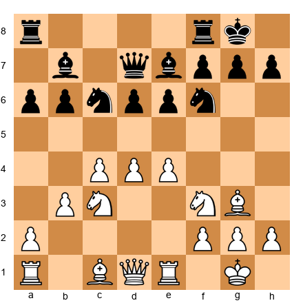</p>


⏱ **Target time:** 20 minutes

**Set up your board.** White has a comfortable space advantage: pawns on c4, d4, and e4 versus Black's pawns on a6, b6, d6, and e6. The engine says +0.4. Your task: create a complete strategic plan to win this game. Divide your plan into four phases.

This is the hardest exercise in the chapter. Take your time.

**Hint 1:** Phase 1 should involve piece optimization. Where does each White piece want to be?

**Hint 2:** Phase 2 should create a second weakness. Which side of the board offers the best target?

**Hint 3:** Phase 3 should involve opening a file. Which pawn break achieves this? Phase 4 is conversion to a winning endgame.

<details>
<summary>Solution</summary>

This is a full squeeze plan in the Karpov style.

**Phase 1: Piece Optimization (moves 15-22)**

- Qe2 (centralizing the queen, connecting rooks, eyeing both flanks)
- Bf4 or Bh4 (activating the dark-squared bishop; Bf4 targets d6, Bh4 pins the f6 knight)
- Rad1 (placing the rook behind the d-pawn, preparing d5)
- Nd2 (rerouting the f3-knight; it will go to f1-e3, aiming for d5 or f5)
- Nf1, then Ne3 (the knight journey to its ideal square)
- f3 (supporting the center and preventing any ...Ng4 tricks)

After Phase 1, all White pieces are on optimal squares. The knight aims for d5 or f5, the bishops are active, the rooks are centralized, and the queen is flexible.

**Phase 2: Create the Second Weakness (moves 23-28)**

- a4 (threatening to open the queenside with a5; Black must respond)
- ...a5 (forced, to prevent a5; now b6 is fixed as a weakness on the a-file)
- Nh4 or Nd5 (placing the knight on an outpost; if ...Nxd5 cxd5, White's passed d-pawn is strong)
- Qb5 or Qa2 (targeting the a5 and b6 pawns from the side)

Now Black has two weaknesses: the d6 pawn (always under pressure from the center) and the b6 pawn (now fixed and targetable on the a-file).

**Phase 3: Open a File (moves 29-35)**

- d5 (the central break; after ...exd5 cxd5 or exd5, the position opens and White's pieces flood in)
- Or c5 (an alternative break, targeting b6 directly and opening the c-file)
- After the break, double rooks on the open file
- Invade with the rook to the 7th rank

**Phase 4: Convert (moves 36-40+)**

- Trade queens if Black's queen is the only piece holding the defense together
- Or keep queens if the attack is stronger (the two weaknesses mean Black cannot defend both)
- Penetrate with the rook to the 7th rank, targeting the weak b7 and f7 pawns
- Win a pawn, then convert the material advantage in the endgame

Total plan: 40 moves from +0.4 to a winning position. This is how Karpov won hundreds of games. No brilliancy prizes, no flashy sacrifices. Just relentless, methodical improvement until the opponent's position collapses under the accumulated pressure.

This exercise is about the *process*, not the specific moves. If your plan follows the four phases (optimize, create weakness, open file, convert), you have the right idea even if your specific moves differ from this solution.
</details>

---

## Extended Exercises Summary

| Exercise | Difficulty | Topic | Time |
|----------|-----------|-------|------|
| 47-B.1 | ★★★ | Exchange sacrifice evaluation | 5 min |
| 47-B.2 | ★★★ | Color complex identification | 3 min |
| 47-B.3 | ★★★ | Prophylactic thinking basics | 4 min |
| 47-B.4 | ★★★★ | Exchange sacrifice with follow-up | 10 min |
| 47-B.5 | ★★★★ | Light-square exploitation plan | 8 min |
| 47-B.6 | ★★★★ | Multi-move prophylaxis | 8 min |
| 47-B.7 | ★★★★ | Complete squeeze plan | 12 min |
| 47-B.8 | ★★★★ | Converting +0.3 | 10 min |
| 47-B.9 | ★★★★★ | Petrosian sacrifice (find it) | 15 min |
| 47-B.10 | ★★★★★ | Dark-square domination plan | 15 min |
| 47-B.11 | ★★★★★ | Complete prophylactic game plan | 15 min |
| 47-B.12 | ★★★★★ | 40-move strategic squeeze | 20 min |

⚡ **ADHD Quick Set:** If you are short on time, do exercises **47-B.1**, **47-B.4**, **47-B.6**, and **47-B.9**. These four cover the core concepts: exchange sacrifice evaluation, follow-up play, prophylaxis, and finding the sacrifice in a complex position.

---

## Extended Key Takeaways

8. **The exchange sacrifice is not a desperation move; it is a strategic weapon.** The best exchange sacrifices create permanent positional compensation: dominant minor pieces, ruined pawn structures, and total control of one color complex. If the compensation is not permanent, do not sacrifice.

9. **Color complex domination wins games without tactics.** When your opponent loses a bishop and their pawns fix on the wrong color, occupy the weak squares with everything you have. Knights, bishops, queens, and pawns can all work together to control 32 squares that the opponent can no longer defend.

10. **Prophylaxis is not defense; it is aggressive prevention.** Petrosian and Karpov did not defend. They denied. They saw what their opponents wanted, killed the plan before it started, and improved their own positions in the process. The best prophylactic moves are also constructive moves.

11. **Small advantages grow through patience and precision.** A +0.3 advantage becomes a win through piece optimization, creation of a second weakness, and relentless probing. Trust the process. Do not rush. The squeeze works because the opponent eventually runs out of useful moves.

12. **Every move should either improve your position or worsen your opponent's.** Ideally, both. If a move does neither, it is wasted. At the Grandmaster level, wasted moves are the difference between winning and drawing.

---

🛑 **Rest Marker.** You have completed the advanced extensions of Chapter 47. This material covers some of the deepest strategic concepts in chess: exchange sacrifices, color complex domination, prophylactic thinking, and the art of the squeeze. These are the techniques that separate strong masters from Grandmasters. Let the ideas settle. Play through the exercises again in a few days. You will find that positions you struggled with today feel obvious next week. That is the sign of real understanding.

---

*"The winner of the game is the player who makes the next-to-last mistake."*
*-- Savielly Tartakower*
