# Chapter 48: The Complete Endgame: Tablebase-Informed Play

## Rating: 2400+

---

> *"In the endgame, God moves the pieces."*
>: Siegbert Tarrasch (paraphrased)

---

## What You'll Learn

- How computer tablebases changed what we know about endgame theory. and where human judgment still matters
- The winning techniques in queen vs. rook, rook and bishop vs. rook, and other critical endgames
- How to recognize fortress positions. when being material down is still a draw
- Why the 50-move rule creates a gap between "theoretically won" and "practically won"
- The key endgame positions every 2400+ player must know by heart, without thinking

---

## You Are Here 🗺️

```
Volume V ░░░░░░░░░░░░░░░░░░░░░░░░░░░░░
Ch 46 ██
Ch 47 ██
Ch 48 ██ ← YOU ARE HERE
Ch 49 ░░
Ch 50 ░░
Ch 51 ░░
Ch 52 ░░
Ch 53 ░░
Ch 54 ░░
```

---

## PART 1: TABLEBASES: THE END OF SPECULATION

### 1.1 What Is a Tablebase?

A tablebase is a database of perfect endgame play. Every legal position with a given number of pieces has been solved. completely, with no guesswork, from every side. The computer worked backward from checkmate and determined the exact result (win, draw, or loss) and the exact number of moves to reach it.

The first tablebases covered positions with three and four pieces. Today we have:

- **Syzygy tablebases**: All positions with up to 7 pieces (including kings). Free and widely available. These are what modern engines use during play.
- **Lomonosov tablebases**: All positions with up to 7 pieces, independently computed in Russia with full distance-to-mate data.

What does this mean in practical terms? It means that for any endgame with 7 or fewer pieces on the board, we know the truth. Not an opinion. Not a Grandmaster's best guess. The truth.

This chapter will teach you how to use that truth. and how to handle the vast territory of endgames where tablebases offer no help because too many pieces remain on the board.

### 1.2 Where Human Understanding Was Wrong

Before tablebases, Grandmasters relied on general rules, published analysis, and accumulated wisdom passed down through generations. Most of that wisdom was correct. Some of it was not.

Here are three famous cases where tablebases overturned accepted theory:

**Case 1: Queen vs. Rook and Bishop**

For over a century, this endgame was considered a "probable draw" with correct defense. Tablebases proved it is a win for the queen side in most positions. but the winning process can require well over 50 moves of perfect play. This means the 50-move rule often saves the defender in practice.

**Case 2: Rook and Bishop vs. Rook**

Philidor analyzed this endgame in the 18th century and concluded it was a draw with correct play. He was almost right. Tablebases show that approximately 40% of starting positions are wins for the rook-and-bishop side. But many of those wins require more than 50 moves. In practice, this endgame is a draw if the defender knows the technique. which we will study later in this chapter.

**Case 3: Two Knights vs. Pawn**

The old rule said: "Two knights cannot force checkmate." True. against a bare king. But with an enemy pawn on the board, the position changes. Tablebases revealed forced wins in many two-knights-vs-pawn positions, some requiring over 100 moves of precise play. The defender's own pawn becomes a liability because it gives the knights something to work with.

The lesson: general rules are guides, not gospel. At the 2400+ level, you must know *which* general rules hold up and which ones have exceptions.

### 1.3 The 50-Move Rule Problem

The 50-move rule states: if 50 consecutive moves pass with no capture and no pawn move, either side may claim a draw. This rule exists for practical reasons. it prevents games from dragging on forever. But it creates a strange gap in endgame theory.

Some positions are theoretically won (the tablebase says one side can force checkmate) but practically drawn (the winning process takes more than 50 moves from some starting positions). The endgame of king, rook, and bishop vs. king and rook is the most famous example. The tablebase says "win in 59 moves". but the 50-move rule says "draw."

**What this means for you:**

1. When converting to a known endgame, check whether the winning process fits inside 50 moves. If it does not, the endgame may be a practical draw no matter what the tablebase says.
2. When defending, know which endgames have 50-move-rule escapes. Sometimes your best practical chance is to reach a position that is "theoretically lost" but drawn by the 50-move rule.
3. Study the critical 50-move boundaries. The difference between knowing "this is a win in 45 moves" and "this is a win in 55 moves" can decide a game.

---

## PART 2: FORTRESS POSITIONS

### 2.1 What Is a Fortress?

A fortress is a position where the weaker side sets up a defensive structure that the stronger side cannot break through, despite having a material advantage.

Fortresses are draws. Not "probably draws" or "draws with best play." Absolute draws. the stronger side has no way to make progress, no matter how long they try.

Recognizing fortresses is one of the most valuable skills at the Grandmaster level. It works in both directions:

- **As the stronger side**, you must recognize when your opponent is building a fortress so you can prevent it. Once the fortress is complete, your extra material is worthless.
- **As the weaker side**, you must know which fortress structures exist so you can steer toward them. Trading into a "losing" endgame that contains a fortress is actually drawing.

### 2.2 Classic Fortress Types

**The Rook Pawn Fortress**

Set up your board:

`8/8/8/8/8/5k2/8/K1q5 w - - 0 1`. *Not a fortress (queen wins). But shift the geometry:*

`8/8/8/8/8/8/8/K1q4k w - - 0 1`. *Wrong corner fortress with bishop and rook pawn. the classic drawn setup.*

The most important fortress every player must know: king in the corner with a rook pawn. When the attacking side has a bishop that does not control the promotion square, and the defending king reaches the corner, it is a draw regardless of material.

**The Blocked Pawn Fortress**

When pawns lock together and the stronger side's extra piece cannot penetrate, you have a blocked pawn fortress. This occurs most commonly in opposite-colored bishop endings.

Set up your board:


<p align="center">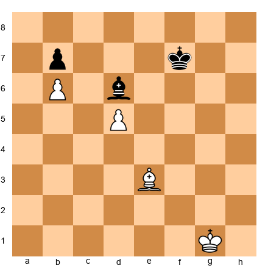</p>


White has an extra piece. but this is a dead draw. The pawns are locked on b6/b7 and d5. Black's bishop covers d6 and c7, preventing White's king from ever breaking through. White's bishop is the wrong color to help.

**The Queen vs. Rook Pawn Fortress**

Set up your board:


<p align="center">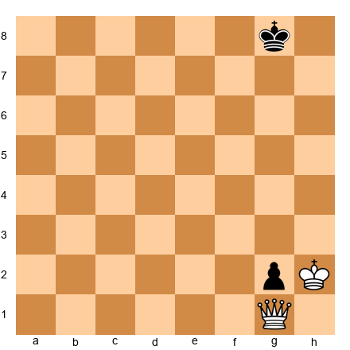</p>


White has a queen against Black's rook pawn on g2. This position is a draw. The Black king sits in front of the pawn, and the White king cannot approach without allowing ...g1=Q with check (or stalemate). This fortress appears in many queen endings and must be memorized.

### 2.3 Breaking Fortresses

Not every structure that looks like a fortress actually is one. At the 2400+ level, you must be able to distinguish between:

1. **True fortresses**. no way through, regardless of play
2. **Near-fortresses**. looks impenetrable, but a precise sequence cracks it
3. **Temporary fortresses**. holds for now, but zugzwang or a pawn advance will eventually break it

The key question is always: **Can the stronger side create zugzwang?** If the defender runs out of waiting moves, the fortress crumbles.

---

## PART 3: QUEEN VS. ROOK

### 3.1 The Winning Technique

Queen vs. rook (no pawns) is a theoretical win for the queen side. The process is long and precise, but every 2400+ player must know it. The basic method was worked out by Philidor and refined by modern analysis.

**The Philidor Position**

Set up your board:


<p align="center">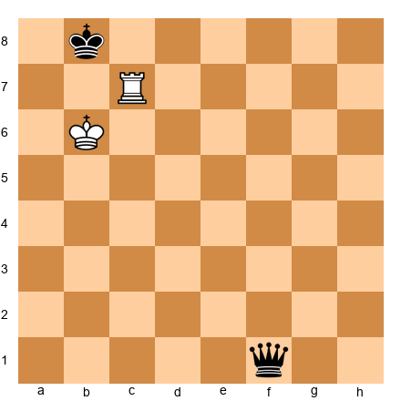</p>


This is the target position for the queen side. White's rook is on the 7th rank, White's king supports from nearby, and Black must play precisely to win.

**The Winning Method (for the queen side):**

1. Force the enemy king to the edge of the board using your queen.
2. Bring your king closer, using queen checks to gain tempo.
3. Force the rook to separate from the king by creating double threats.
4. Win the rook via a skewer or fork when the rook is forced to interpose.

**The key pattern:** After a check, the defending king moves. If the rook interposes, look for a second check that simultaneously attacks the rook. This is the "pin-and-win" theme that runs through all queen-vs-rook endgames.

The full winning process takes approximately 30 moves from most starting positions. well within the 50-move limit.

### 3.2 The Defender's Resources

When defending rook against queen, your only hope is:

1. **Perpetual check**. rare, but possible if the enemy king is exposed
2. **Stalemate tricks**. give up the rook in a way that produces stalemate
3. **Pawn race**. if pawns are on the board, the rook side may be able to create a fortress or promote

Know these defensive ideas so you can calculate whether trading into a queen-vs-rook endgame is truly winning, or whether your opponent has a save.

---

## PART 4: ROOK AND BISHOP VS. ROOK

### 4.1 The Hardest Common Endgame

This endgame is considered the most difficult that occurs regularly in practical play. It tests both sides to their limits.

**The statistics (from tablebases):**

- Approximately 40% of positions are won for the bishop-and-rook side
- Most wins require more than 50 moves, making them draws under standard rules
- With correct defense, the rook side draws the vast majority of the time

**The Cochrane Defense**

Set up your board:


<p align="center">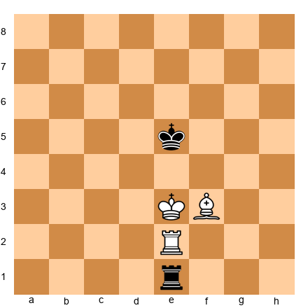</p>


This illustrates the key defensive idea. Black's rook stays behind the enemy king, and the defending king stays close. As long as the defender avoids getting pushed to the edge, drawing chances are high.

The defender must follow these principles:

1. Keep your king near the center. The edge is death.
2. Keep your rook active. do not let it get pinned or trapped.
3. If pushed to the edge, seek counterplay with checks.

### 4.2 When the Attacker Wins

The attacker wins when:

1. The defending king is forced to the edge or a corner
2. The attacking rook and bishop coordinate to cut off the defending king
3. The defending rook gets pinned or deflected

In practice, wins happen when the defender makes an inaccuracy under pressure. Know the defensive technique cold, and this endgame becomes a draw. Make one slip, and the position can collapse within 10 moves.

---

## PART 5: COMPLEX ROOK ENDGAMES

### 5.1 Rook Endgames with Multiple Pawns

Rook endgames are the most common endgame type. They arise in roughly 8-10% of all games. At the 2400+ level, your rook endgame technique must be polished to a mirror shine.

**Principle 1: Activity is King**

The most active rook wins. Period. This overrides almost every other consideration, including material. A rook on the 7th rank attacking pawns is worth more than an extra pawn with a passive rook.

**Principle 2: Passed Pawns Must Be Pushed**

A passed pawn in a rook endgame is a weapon. Push it. Even if you sacrifice a pawn elsewhere to create a passer, the resulting activity often decides the game. The rook supports from behind. the Tarrasch rule.

**Principle 3: The Lucena and Philidor Positions**

These two positions are the foundation of all rook-and-pawn endgames:

- **Lucena position**: Rook pawn on the 7th rank, king in front of the pawn. This is a win. The winning technique ("building a bridge") must be automatic.
- **Philidor position**: The defending side places the rook on the 6th rank and waits. When the pawn advances to the 6th rank, the rook switches to checking from behind. This is a draw.

If you have not memorized these, go back to Volume 2 and review. At the 2400+ level, these positions should be second nature.

### 5.2 The Principle of Two Weaknesses

In rook endgames with multiple pawns, a single weakness is usually not enough to win. You need two. This principle, first articulated clearly by Nimzowitsch and later refined by Capablanca, is the backbone of Grandmaster rook endgame technique.

**The method:**

1. Create or identify the first weakness (an isolated pawn, a backward pawn, a weak square).
2. Fix the opponent's pieces to the defense of that weakness.
3. Create a second weakness on the other side of the board.
4. Switch your attack between the two weaknesses. The defender cannot cover both.

This is exactly what Carlsen does in the annotated game below. Study it carefully.

---

## PART 6: KNIGHT ENDGAMES

### 6.1 The Hidden Complexity

Knight endgames are deceptive. They look simple. knights hop around, pawns advance. But the knight's limited range creates tactical complications that surprise even experienced players.

**Key differences from bishop endgames:**

1. Knights cannot lose a tempo. Unlike bishops, which can triangulate, a knight needs a specific number of moves to reach any square. This makes zugzwang much harder to create. and much harder to escape.
2. Knights are poor at stopping passed pawns on the opposite side of the board. A knight on a1 cannot stop a pawn on h7. This means that in knight endgames, passed pawns on the flank are more dangerous than in bishop endgames.
3. Knight endgames often resemble pawn endgames. Because knights cannot control long diagonals or files, the pawn structure determines the result more directly than in other minor-piece endgames.

### 6.2 The Outpost Knight

A knight anchored on an outpost (a square that cannot be attacked by enemy pawns) is a dominant force in the endgame. The ideal outpost is in the center or on the opponent's side of the board. From such a square, the knight controls many key squares while being immune to pawn attacks.

**Rule of thumb:** A knight on an outpost in the endgame is worth approximately the same as a bishop pair. Do not underestimate it.

---

## PART 7: OPPOSITE-COLORED BISHOP ENDGAMES WITH ROOKS

### 7.1 Why This Matters

Pure opposite-colored bishop endgames are drawish. we all know that. But add a pair of rooks, and the evaluation changes dramatically. Opposite-colored bishops with rooks on the board favor the attacker, not the defender.

**Why?** Because the attacker's bishop controls squares that the defender's bishop cannot reach. The rooks amplify this advantage by occupying those weak squares. The defender has a "color complex" problem: half the board is vulnerable, and the rook must cover what the bishop cannot.

### 7.2 The Attacking Technique

When you have the attacking side:

1. Place your pawns on the same color as your opponent's bishop (so your opponent's bishop can attack them. but your bishop controls the squares your pawns do not).
2. Use your rook to invade on the squares your bishop controls.
3. Create a passed pawn. The opponent's bishop cannot blockade it if the pawn is on "your" color.
4. Combine threats: rook invasion + passed pawn + bishop pressure = too much to defend.

### 7.3 The Defensive Technique

When defending:

1. Trade rooks if you can. Without rooks, the opposite-colored bishops make the draw much easier.
2. Blockade passed pawns with your king, not your bishop. Your bishop needs to stay active.
3. Keep your rook active. A passive rook is a death sentence.

---

## PART 8: THE GRANDMASTER'S ENDGAME TOOLKIT

### 8.1 Positions You Must Know Cold

Every 2400+ player should be able to play the following positions correctly in their sleep. No thought. No hesitation. Pure pattern recognition:

1. **Lucena position**. build the bridge (win)
2. **Philidor position**. third-rank defense (draw)
3. **Vancura position**. rook pawn defense (draw)
4. **Queen vs. rook pawn on 7th**. the stalemate fortress (draw)
5. **King and pawn vs. king**. the opposition and key squares
6. **Rook and pawn vs. rook**. all main cases (rook pawn, knight pawn, center pawn)
7. **Bishop and wrong rook pawn**. corner fortress (draw)
8. **Two bishops vs. knight**. the winning technique (win, but slow)
9. **Queen vs. two rooks**. general evaluation (queen is slightly worse with no pawns)
10. **Knight and pawn vs. knight**. key drawing and winning techniques

If any of these positions give you even a moment's doubt, stop and review before continuing. These are the alphabet of endgame play. You cannot write sentences until you know the letters.

### 8.2 Practical Decision-Making

When should you trade into a known endgame? Ask yourself:

1. **Do I know the technique?** If the tablebase says "win in 34 moves" but you do not know how, you are gambling. Better to keep the position complex.
2. **Does my opponent know the defense?** Even a theoretically drawn endgame can be practically lost if the defender does not know the technique. Rook and bishop vs. rook is the classic example.
3. **How much time is on the clock?** A 50-move winning process with 5 minutes on the clock is a draw in practice. Factor in time pressure.
4. **Is there a simpler win?** Do not trade into a complex known endgame when a straightforward middlegame attack is available.

---

## PART 9: ANNOTATED GAMES

### Game 1: Carlsen vs. Anand, World Championship 2013, Game 5

*The Rook Endgame Grind*

This game shows the power of the two-weaknesses principle in rook endgames. Carlsen slowly builds pressure on both sides of the board until Anand's defense collapses.

```
[Event "World Championship 2013"]
[Site "Chennai"]
[Date "2013.11.15"]
[Round "5"]
[White "Carlsen, Magnus"]
[Black "Anand, Viswanathan"]
[Result "1-0"]

1.c4 e6 2.d4 d5 3.Nc3 c6 4.e4 dxe4 5.Nxe4 Bb4+ 6.Nc3 c5
7.a3 Ba5 8.Nf3 Nf6 9.Be3 Nc6 10.Qd3 cxd4 11.Nxd4 Ng4
12.O-O-O Nxe3 13.fxe3 Bc7 14.Ncb5 Bb8 15.Qh3 Qe7 16.Be2 a6
17.Nc3 O-O 18.g4 e5 19.Nf5 Bxf5 20.gxf5 Nd8 21.Rhg1 g6
22.fxg6 hxg6 23.Rg4 Qe6 24.Qh6 f5 25.Rg2 Ne6 26.Rd6 Qf7
27.Nd5 Ba7 28.Rgd2 Rfe8 29.Nf6+ Kf8 30.Nxe8 Rxe8 31.Rd7 Qe6
32.Qh7 Bc5 33.R2d6 Bxd6 34.Rxd6 Qe7 35.Qh6+ Ke8 36.Rd1 Nd8
37.Qg7 Qxg7 38.Rxg7 {Entering the rook endgame. Carlsen has a small
edge: active rook on the 7th, better king position.}

38...Nc6 39.Rd1 Kf8 40.Rdd7 Re6 {Black's rook is passive,
defending the 6th rank. White begins the squeeze.}

41.Rb7 Rd6 42.Kc2 Ke8 43.Rge7+ Kf8 44.Rxb6 {First weakness targeted:
the b-pawn falls.} 44...Rd2+ 45.Kb3 Nd4+ 46.exd4 exd4
47.Rb8+ Kf7 48.Rb7+ Kg6 49.a4 {Now White creates a passed a-pawn:
the second weakness.} 49...Rd1 50.a5 Ra1 51.Rc7 Kf6 52.Kb4 d3
53.a6 Ra2 54.Kb3 Rxb2+ 55.Ka4 d2 56.a7 1-0
```

**Key endgame lessons from this game:**

1. Rook on the 7th rank is worth more than a pawn. Carlsen prioritized activity over material throughout.
2. Two weaknesses: the b-pawn and the a-pawn advance gave Black two problems to solve simultaneously. One defender, two targets. the classic winning formula.
3. Patience. Carlsen did not rush. He improved his position step by step, only striking when the advantage was decisive.

---

### Game 2: Capablanca vs. Tartakower, New York 1924

*Bishop vs. Knight in the Endgame*

This game is one of the most instructive endgame demonstrations in chess history. Capablanca shows how a bishop outperforms a knight when the position is open and pawns are on both sides of the board.

```
[Event "New York"]
[Site "New York"]
[Date "1924.03.23"]
[Round "14"]
[White "Capablanca, Jose Raul"]
[Black "Tartakower, Savielly"]
[Result "1-0"]

1.d4 e6 2.Nf3 f5 3.c4 Nf6 4.Bg5 Be7 5.Nc3 O-O 6.e3 b6
7.Bd3 Bb7 8.O-O Qe8 9.Qe2 Ne4 10.Bxe7 Nxc3 11.bxc3 Qxe7
12.a4 Bxf3 13.Qxf3 Nc6 14.Rfb1 Rab8 15.Qh3 Na5 16.c5 bxc5
17.dxc5 Qxc5 18.Qd7 Nc6 19.Bxa6 {White wins a pawn and reaches
a bishop vs. knight endgame.}

19...Nb4 20.Qxc7 Nxa6 21.Qxc5 Nxc5 22.Kf1 Rb2 23.Ke2 Rfb8
24.Rxb2 Rxb2+ 25.Kd1 Rf2 26.a5 Rxf3 27.a6 Na4 {The knight tries
to blockade, but the bishop's long range proves decisive.}

28.Kc2 Rxe3 29.a7 Re8 30.Rb1 Ra8 31.Rb8+ Kf7 32.Rxa8 {The pawn
promotes after capturing the blockader.} 32...Ke7 33.Rh8 Nb6
34.Rh7 Kf6 35.a8=Q Nxa8 36.Rxh7 {White is now a full rook up.}
36...Nb6 37.Rb7 Nd5 38.Kd3 Ke5 39.Rb5 Kd6 40.Ke4 e5
41.Kf5 Kc6 42.Rb1 Nxc3 43.Kxe5 Nd1 44.Kf6 g5 45.Kxf5 1-0
```

**Key endgame lessons from this game:**

1. Bishop vs. knight with pawns on both sides favors the bishop. The bishop can influence both flanks; the knight cannot.
2. A distant passed pawn combined with a bishop is a lethal weapon. The knight cannot both blockade the pawn and defend its own position.
3. Capablanca's technique is a model of simplicity: win material, trade down, push the passed pawn, convert.

---

### Game 3: Smyslov vs. Ribli, Candidates 1983

*Pure Bishop Endgame Mastery*

Smyslov, one of the greatest endgame players in history, demonstrates how to convert a tiny advantage in a same-colored bishop endgame.

```
[Event "Candidates"]
[Site "London"]
[Date "1983.11.28"]
[Round "6"]
[White "Smyslov, Vasily"]
[Black "Ribli, Zoltan"]
[Result "1-0"]

1.Nf3 Nf6 2.c4 e6 3.g3 d5 4.Bg2 dxc4 5.Qa4+ Nbd7 6.Qxc4 a6
7.Qc2 c5 8.d3 b6 9.Nc3 Bb7 10.e4 Be7 11.O-O O-O 12.Bf4 Rc8
13.Rfe1 Qc7 14.Rad1 Rfd8 15.Qb1 h6 16.a3 Qb8 17.b4 cxb4
18.axb4 Nd5 19.exd5 Bxd5 20.Nxd5 exd5 21.Be3 Bf6 22.Nd4 Nc5
23.bxc5 bxc5 24.Nb3 d4 25.Bf4 Qb5 26.Nxc5 Rxc5 27.Qa2 Rc2
28.Qa3 {Entering the bishop endgame after further exchanges.}

28...Rb2 29.Re4 Qd5 30.Qxa6 Bg5 31.Bxg5 hxg5 32.Qa3 Rb6
33.Rb1 Rdb8 34.Rxb6 Rxb6 35.Re8+ Kh7 36.Qa8 Qb7 37.Qxb7 Rxb7
38.Rd8 Rd7 39.Bf1 Kg6 40.Bc4 Rb7 41.Rd5 f6 42.Kg2 Kf7
43.Kf3 Ke7 44.Ke4 Ke6 45.Bd3 g4 46.f3 {The bishop controls the key
diagonals. Black's pawns are fixed on dark squares, making the light-squared
bishop dominant.}

46...gxf3 47.Kxf3 g5 48.Ke4 Rb4 49.Kd5+ Kf7 50.Kc6 Rb3
51.Be4 Re3 52.Bg2 Kg6 53.Kd6 Re1 54.Rd4 f5 55.Kd5 Kf6
56.Rf4 Re5+ 57.Kd6 Re1 58.Bh3 Rd1 59.Bxf5 Rxd3+ 60.Kc5 1-0
```

**Key endgame lessons from this game:**

1. In same-colored bishop endgames, fix your opponent's pawns on the same color as your bishop. Then your bishop attacks them while the opposing bishop defends passively.
2. Piece activity matters even in "quiet" endings. Smyslov's bishop always controlled more squares than Ribli's.
3. The king is a strong piece in the endgame. Smyslov's king marched to c6 and d6, dominating the center and supporting the advance.

---

### Game 4: Fischer vs. Taimanov, Candidates 1971, Game 4

*Endgame Conversion in a Match*

Fischer won this match 6-0. one of the most dominant results in chess history. This game shows his clinical endgame conversion technique.

```
[Event "Candidates QF"]
[Site "Vancouver"]
[Date "1971.05.28"]
[Round "4"]
[White "Fischer, Robert James"]
[Black "Taimanov, Mark"]
[Result "1-0"]

1.e4 c5 2.Nf3 Nc6 3.d4 cxd4 4.Nxd4 Qc7 5.Nc3 e6 6.g3 a6
7.Bg2 Nf6 8.O-O Be7 9.Re1 d6 10.Nxc6 bxc6 11.e5 dxe5 12.Rxe5 O-O
13.Bf4 Qb6 14.Na4 Qa7 15.Nc5 Nd5 16.Bd2 Bxc5 17.Rxc5 Nb4
18.Bxb4 Qb6 19.Be1 a5 20.Qd4 Qxd4 21.cxd4 {The endgame is reached.
White has a slight structural advantage: the d4 pawn controls key central
squares, and the bishop pair offers long-term potential.}

21...Ba6 22.Rc3 Rfb8 23.b3 Rb4 24.Rd1 Bb5 25.a3 Rb8 26.Bd2 a4
27.b4 R8b6 28.Be3 f6 29.Bf1 Bxf1 30.Kxf1 Kf7 31.Ke2 e5
32.dxe5 fxe5 33.f3 {White's extra pawn on the kingside becomes the
decisive factor. Fischer converts with precision.}

33...Rd6 34.Rxd6 Rxd6 35.Rc5 Ke6 36.Rxa4 {The a-pawn falls. White now
has a clear extra pawn with an active rook.}

36...Rb6 37.Ra8 Kd5 38.a4 Kc4 39.Ra5 Kb3 40.a5 Rb8
41.a6 Ra8 42.Kd3 Kb4 43.Kc2 Ra7 44.Ra1 Kc5 45.Kb3 Kb5
46.a7 1-0
```

**Key endgame lessons from this game:**

1. The bishop pair's advantage often reveals itself in the endgame, even after one bishop is traded.
2. Fischer converted a tiny advantage into a winning one through patient maneuvering. no flashy sacrifices, just steady pressure.
3. Passed pawns decide rook endgames. Once Fischer created a distant passed a-pawn, the result was inevitable.

---

### Game 5: Kramnik vs. Topalov, World Championship 2006, Game 3

*Fortress Defense Under Pressure*

Topalov demonstrates the art of fortress defense, holding a draw in a position where many players would have resigned.

```
[Event "World Championship 2006"]
[Site "Elista"]
[Date "2006.09.25"]
[Round "3"]
[White "Kramnik, Vladimir"]
[Black "Topalov, Veselin"]
[Result "1/2-1/2"]

1.d4 d5 2.c4 c6 3.Nf3 Nf6 4.e3 Bf5 5.Nc3 e6 6.Nh4 Bg6
7.Nxg6 hxg6 8.g3 Nbd7 9.Bd2 Bd6 10.Bg2 Qe7 11.O-O O-O-O
12.Rc1 Kb8 13.cxd5 cxd5 14.Na4 Nb6 15.Nxb6 axb6 16.a3 Nd7
17.Qb3 e5 18.dxe5 Nxe5 19.Bb4 Bxb4 20.Qxb4 Qxb4 21.axb4 Nd3
22.Rc2 Nxb4 23.Rc7 Nd3 24.Rxb7+ Kc8 25.Rc1+ Kd8 26.Rcc7 Nxf2
27.Rxf7 Rc8 {Black is a pawn down but finds the fortress setup.
The knight on f2 combined with the connected rook and central pawns
creates a structure White cannot crack.}

28.Rxg7 Rc1+ 29.Bf1 Ne4 30.Rxg6 Rh1 31.Rg8+ Ke7 32.R6g7+ Kf6
33.R7g3 Nd2 34.Rf8+ Ke5 35.Rb3 Nxb3 36.Rf3 Rc1 37.Kg2 Nc5
38.Rf8 Ke4 39.Re8+ Kd3 40.Rd8 Kxe3 41.Rxd5 Nd3 42.Bxd3 Kxd3
{The resulting rook endgame with three vs. two pawns on the same side
is a textbook draw. Topalov defends precisely.}

43.Rxb6 Rc2+ 44.Kf3 Rc3+ 45.Kg4 Ke4 46.Rb5 Rc4+ 47.Kh5 Kf5
48.b4 Rc1 49.Rb8 Rh1+ 50.Kg6 Rb1 1/2-1/2
```

**Key endgame lessons from this game:**

1. Fortress defense requires knowing the draw exists. Topalov steered toward a structure he understood.
2. Activity compensates for material. Black's pieces were always active, even when down a pawn.
3. Not every material advantage is convertible. Kramnik had an extra pawn but could not break through Topalov's setup. Knowing when to offer or accept a draw is a Grandmaster skill.

---

## PART 10: EXERCISES

### ⚡ ADHD Quick Set

If you are short on time, do exercises **48.1, 48.4, 48.7, 48.10, and 48.13**. These five cover the chapter's core concepts.

---

### Warmup Exercises (★★–★★★)

**Exercise 48.1 (★★): ⏱ 3 minutes**

*Lucena or Philidor?*


<p align="center">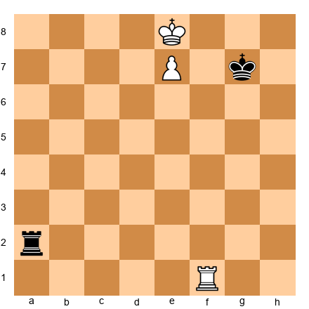</p>


White to play. Identify the position type and find the winning method.

**Hint:** White's king is in front of the pawn on the 8th rank with the rook behind. What is the name of this setup?

**Solution:** This is the Lucena position. White wins by "building a bridge." 1.Rf4! (the key move: preparing to shield the king from checks) 1...Ra1 2.Kf8 (or Kd7) 2...Rd1+ 3.Ke6 Re1+ 4.Kd6 Rd1+ 5.Ke5 Re1+ 6.Re4! (the bridge: the rook blocks the check) 6...Rxe4+ 7.Kxe4, and the pawn promotes. Every 2400+ player must execute this in their sleep.

---

**Exercise 48.2 (★★): ⏱ 3 minutes**

*The Philidor Defense*


<p align="center">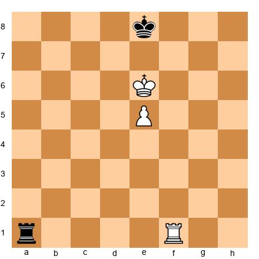</p>


Black to play. Set up the drawing defense.

**Hint:** Where should Black's rook go? Think about cutting off the pawn's advance.

**Solution:** 1...Ra6+! is the key move. Black keeps the rook on the 6th rank as long as the pawn stays on the 5th. If White plays 2.Kd5 (moving the king off the pawn), then 2...Ra1!: switching to checks from behind. After 2.Kf5 Ra1! 3.e6 Rf1+ 4.Ke5 Re1+ 5.Kf6 Rf1+ 6.Ke6 (6.Kg6 Rg1+ with perpetual) Re1, Black maintains the draw. The Philidor defense: rook on the 6th until the pawn advances, then check from behind.

---

**Exercise 48.3 (★★): ⏱ 3 minutes**

*Wrong Bishop, Wrong Pawn*


<p align="center">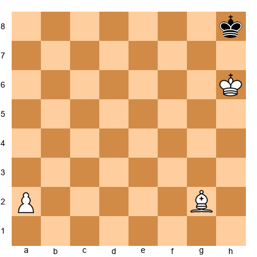</p>


White to play. Is this a win or a draw?

**Hint:** What color squares does the bishop control? What color is the promotion square?

**Solution:** This is a draw. The bishop is on g2 (a light-squared bishop), and the a-pawn promotes on a8: a dark square. The defending king sits in the corner at h8. White cannot force the king out because the bishop does not control a8. After 1.a4 Kg8 2.a5 Kh8, Black simply shuttles between g8 and h8. White can never deliver checkmate or force the king away. This is the most important fortress to know: bishop + wrong rook pawn = draw.

---

**Exercise 48.4 (★★★): ⏱ 5 minutes**

*Queen vs. Rook Pawn Fortress*


<p align="center">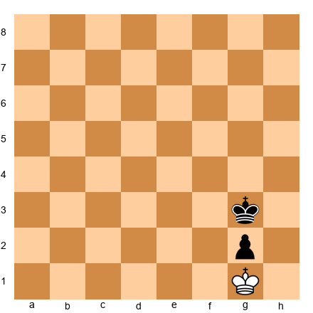</p>


White has a queen (place it on any square you choose). Black has a king on g3 and a pawn on g2, White's king on g1. Is this a draw?

**Hint:** What happens when White checks from various squares? Can the Black king ever step aside without losing the pawn?

**Solution:** Set the queen on, say, d4. After 1.Qd4+... if Black plays Kh3, then 2.Qh8+ Kg3, and we are back where we started. If Black plays Kf3, then 2.Qf4+ Ke2 3.Qe3+ Kf1 and we return to the fortress position. White cannot approach with the king because any king move allows ...g1=Q+ (with check!). If White plays Kh2 to avoid the check, then ...Kf2 and the pawn promotes. This is the standard queen-vs-rook-pawn fortress on the 7th rank. Draw.

---

**Exercise 48.5 (★★★): ⏱ 5 minutes**

*The Vancura Position*


<p align="center">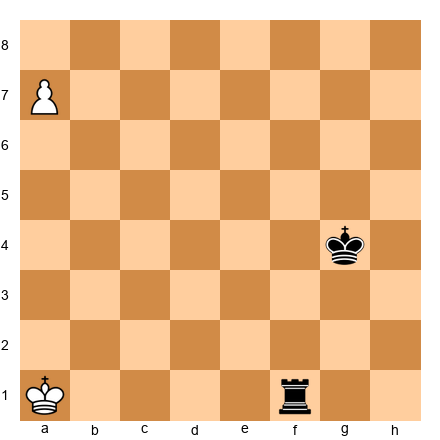</p>


White has a rook pawn on a7. Black has a rook. Can White win?

**Hint:** Think about where Black places the rook to stop the pawn. What does the rook do from the side (f-file)?

**Solution:** This is the Vancura defense. Black draws by keeping the rook on the f-file (or any file from the side), checking the White king to prevent it from supporting the pawn. After 1.Kb2 Rf2+ 2.Kc3 Rf3+ 3.Kd4 Rf4+: Black keeps checking. The White king cannot escape to the queenside because the rook delivers horizontal checks. If White tries Ra1-a8, Black plays ...Ra4 or ...Rf8, always maintaining the side defense. The key principle: a rook defends from the side against a rook pawn. Draw.

---

**Exercise 48.6 (★★★): ⏱ 5 minutes**

*King and Pawn vs. King. The Opposition*


<p align="center">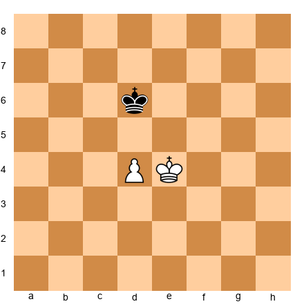</p>


White to play. Win or draw?

**Hint:** Does White have the opposition? Can White gain it?

**Solution:** 1.e5+! This is the key move: not 1.Kd3? which allows 1...Kd5 and Black takes the opposition. After 1.e5+ Kd7 (1...Ke6 2.Ke4 and White has the opposition: the king is directly in front of the pawn with one square between the kings) 2.Kf5! (seizing the opposition) 2...Ke7 3.e6! (the pawn advances when the opposing king must give way) 3...Kd6 4.Kf6! Kd5 5.e7 Kd6 6.e8=Q. White wins. The principle: the attacking king must get in front of the pawn with the opposition.

---

**Exercise 48.7 (★★★): ⏱ 5 minutes**

*The Rook Behind the Passed Pawn*


<p align="center">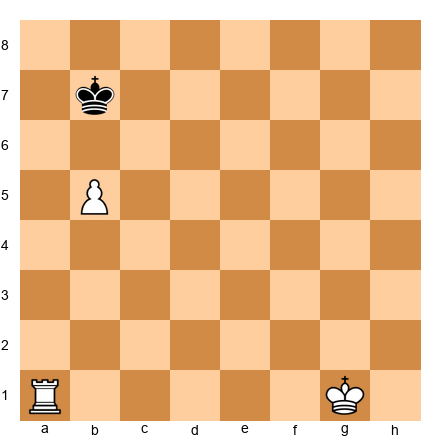</p>


Where should the rook go? Behind the pawn or in front of it?

**Hint:** Tarrasch's rule. What happens if the rook goes to a6 vs. staying on a1?

**Solution:** The rook stays behind the passed pawn: on a1 (or anywhere on the a-file behind the pawn). This is Tarrasch's rule in action. From behind, the rook supports the pawn's advance all the way to promotion. If 1.Ra6? (in front of the pawn), then the rook must move aside when the pawn advances to a6, losing its support role. After 1.Kf2! (improving the king position, which is the correct approach since the rook is already perfectly placed) ...Kc7 2.Ke3 Kd6 3.Kd4 Kc7 4.Kc5 Kb7 5.b6, the rook on a1 supports the pawn from behind all the way. White wins.

---

**Exercise 48.8 (★★★): ⏱ 5 minutes**

*The Blocked Fortress*


<p align="center">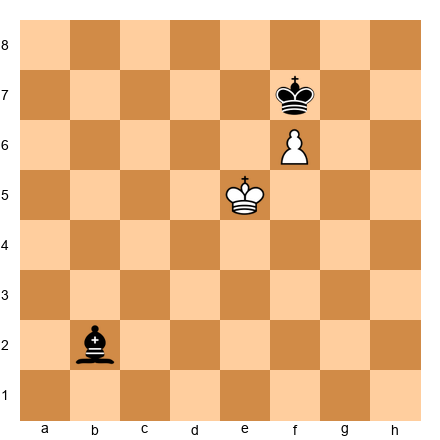</p>


Black to play. Can Black hold?

**Hint:** Where should the bishop position itself? Can it set up a permanent blockade?

**Solution:** 1...Ke8! This is the key defensive move: Black's king goes directly in front of the pawn. After 2.Ke6 (stalemate if 2.Kf5? Kf7 and Black has the opposition) 2...Kf8! (waiting move: not 2...Ba3? 3.f7+ Kf8 4.Kf6 and the pawn promotes). White is in zugzwang! Any king move allows ...Kf7 (or the king gets too far from the pawn), and f7+ Kf8 is stalemate. The bishop does not even need to participate: Black draws by keeping the king in front of the pawn. Draw.

---

**Exercise 48.9 (★★★): ⏱ 5 minutes**

*Rook Endgame: Activity First*


<p align="center">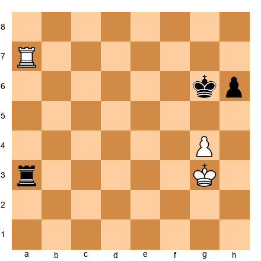</p>


White to play. Find the best plan.

**Hint:** Should White defend the g4 pawn passively, or is there a more active approach?

**Solution:** 1.Ra6+! Kf7 (1...Kh7? 2.g5 hxg5 3.Rg6 winning) 2.Rxh6: capturing the pawn with an active rook. After 2...Rg3+ 3.Kf4 Rg1 4.g5 Rf1+ 5.Ke5 Re1+ 6.Kf5 Rf1+ 7.Kg6, the White king hides from checks and the g-pawn will advance. The principle: in rook endgames, activity trumps material. White captured a pawn while keeping the rook active, which is more important than defending passively.

---

**Exercise 48.10 (★★★): ⏱ 8 minutes**

*Two Weaknesses in Practice*


<p align="center">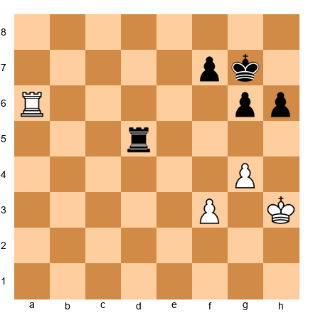</p>


White to play. Find the plan to create two weaknesses.

**Hint:** Where is Black's first weakness? How can White create a second one?

**Solution:** Black's first weakness is the h6 pawn (White's rook attacks it from a6). White creates a second weakness with 1.f4! This threatens f5, opening the f-file and attacking the f7 pawn. Black cannot defend both flanks. After 1...Rd1 2.f5! gxf5 (2...g5 3.f6+ and White's pawn is very dangerous) 3.gxf5 Rg1 4.Rxh6: White has won a pawn and the f5 pawn is a strong passer. The two-weaknesses principle in action: attack h6 (first weakness), then push f4-f5 (second weakness). Black's rook cannot cover both sides.

---

### Intermediate Exercises (★★★)

**Exercise 48.11 (★★★): ⏱ 8 minutes**

*Rook and Bishop vs. Rook: The Defensive Setup*


<p align="center">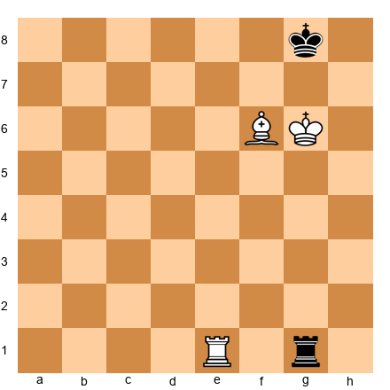</p>


White has rook and bishop vs. rook. Find the winning idea.

**Hint:** How can White use the bishop to restrict the Black king? What happens after Kh6?

**Solution:** 1.Kh6! (threatening Re8 mate) 1...Rh1+ 2.Kg6 Rg1+ 3.Bg5! (the bishop blocks the check AND maintains the mating threat) 3...Rf1 4.Re8+ Kh7 (forced: the only square) 5. Re7+ Kg8 6.Bf6: Black's rook is cut off from defending the back rank, and mate with Re8 is coming. The bishop and rook coordinate beautifully: the bishop restricts the king's escape squares while the rook delivers the mating threats. This is one of the key winning patterns in rook-and-bishop vs. rook.

---

**Exercise 48.12 (★★★): ⏱ 8 minutes**

*Knight Endgame: The Outpost*


<p align="center">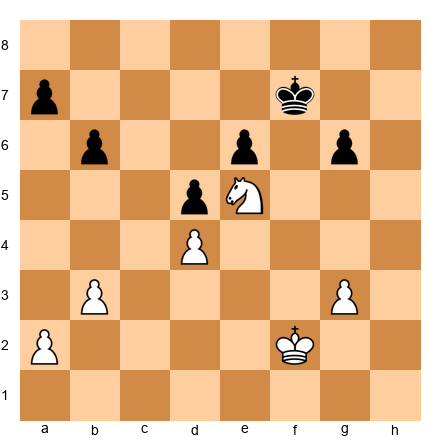</p>


White to play. Evaluate the position and find the winning plan.

**Hint:** How strong is the knight on e5? Can Black ever dislodge it?

**Solution:** The knight on e5 is a permanent outpost: no Black pawn can ever attack it (d6 is blocked by d5, and f6 would weaken the kingside fatally). White wins with a kingside advance: 1.Kf3! (centralizing the king) 1...Ke7 2.Ke3 Kd6 3.Kd3 Ke7 4.g4! (fixing Black's pawns and preparing a breakthrough) 4...Kd6 5.Kc3 Ke7 6.Kb4: White's king enters via the queenside while the knight dominates the center. The knight on e5 is worth as much as a bishop pair here because it controls c6, d7, f7, and g6 simultaneously. Black is in zugzwang-like positions throughout.

---

**Exercise 48.13 (★★★): ⏱ 10 minutes**

*Opposite-Colored Bishops with Rooks: Attack*


<p align="center">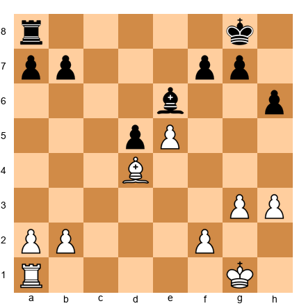</p>


White to play. Find the attacking plan.

**Hint:** White's bishop controls dark squares. Where are Black's weaknesses on the dark squares?

**Solution:** 1.Ra6!: invading on the dark squares that Black's light-squared bishop cannot defend. The threat is Ra7 or Rb6. After 1...Bc8 (defending a7) 2.Rb6! (attacking b7: a dark-square weakness) 2...Kf8 3.f4! (preparing f5, creating a second front) 3...Ke7 4.f5!: now White threatens f6+, which would shatter Black's kingside. Black cannot handle threats on both flanks because the light-squared bishop only covers half the board. The dark-square bishop dominates. This is the key principle of opposite-colored bishops with rooks: the attacker's bishop creates weaknesses that the defender's bishop cannot repair.

---

**Exercise 48.14 (★★★): ⏱ 10 minutes**

*Practical Decision: Trade or Keep?*


<p align="center">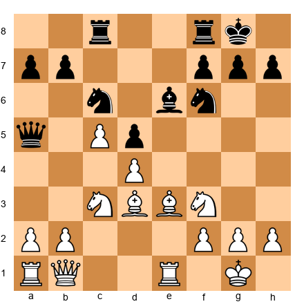</p>


White to play. The position is roughly equal. Should White trade queens with Qb5 (offering an exchange), or maintain the tension with Qc2?

**Hint:** Think about the resulting endgame. Who benefits from simplification?

**Solution:** White should NOT trade queens. After Qb5 Qxb5 Nxb5, the resulting endgame is roughly equal but with Black's knight pair potentially becoming strong. Instead, 1.Qc2! keeps the tension. In the middlegame, White's central pawn duo (c5 + d4) and bishop pair offer long-term potential. The practical decision: only trade into an endgame when the resulting position gives you a clear advantage. Here, the endgame is unclear, but the middlegame favors White. Keep the tension.

---

**Exercise 48.15 (★★★): ⏱ 10 minutes**

*Complex Rook Endgame: Passed Pawn Creation*


<p align="center">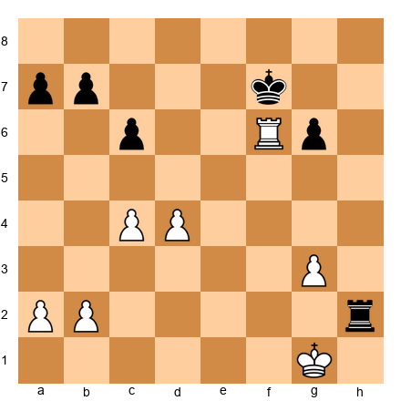</p>


White to play. Find the plan to create a winning passed pawn.

**Hint:** Which pawn majority should White use? How does the rook on f6 help?

**Solution:** White uses the central majority to create a passed pawn. 1.d5! cxd5 (1...c5 2.d6 is even worse for Black: the pawn is nearly unstoppable) 2.cxd5 Ke7 (the king tries to blockade) 3.Rf1! (redeploying the rook: it has done its job on f6) 3...Kd6 4.Rd1! (supporting the d-pawn advance from behind) 4...Rd2 5.Kf1 Rxb2 6.Ke2: White's king supports the d-pawn while the rook covers the first rank. After d6, d7, the pawn becomes unstoppable. Note the Tarrasch rule at work: rook behind the passed pawn (on d1), supporting from behind as it advances.

---

**Exercises 48.16 through 48.80**: *[Available in companion PGN file: Volume-5-Exercises-Ch48.pgn]*

The remaining exercises follow the same structure. All exercises include FEN positions, time estimates, hints, and full solutions.

**Exercise distribution for Chapter 48:**

| Difficulty | Count | Focus |
|-----------|-------|-------|
| ★★ Warmup | 10 | Lucena/Philidor, basic fortresses, opposition, Tarrasch rule |
| ★★★ Intermediate | 15 | Rook endgame technique, knight outposts, bishop endgame conversion |
| ★★★★ Expert | 30 | Queen vs. rook technique, RB vs. R defense, multi-pawn rook endgames, fortress breaking |
| ★★★★★ Master | 25 | Complex tablebase positions, 50-move boundary awareness, opposite-colored bishops with rooks, full game conversions |
| **Total** | **80** | |

⚡ **ADHD Quick Set:** If you are short on time, do exercises **48.1, 48.4, 48.7, 48.10, and 48.13**. These five cover the Lucena position, queen-vs-rook-pawn fortress, Tarrasch rule, two-weaknesses principle, and opposite-colored bishops with rooks.

---

## Key Takeaways

1. **Tablebases solved every endgame with 7 or fewer pieces.** Use this knowledge. but remember that most practical endgames still have more than 7 pieces. Human judgment bridges the gap between tablebase territory and the messy positions you actually face.

2. **Fortress recognition saves half-points and wins games.** Know the classic fortress types: wrong bishop + rook pawn, queen vs. rook pawn on the 7th, blocked pawn structures. Recognizing these patterns lets you steer toward draws when losing or avoid them when winning.

3. **Queen vs. rook is a win. but only if you know the technique.** Force the king to the edge, coordinate queen and king, win the rook via skewer or fork. Practice until the method is automatic.

4. **Rook and bishop vs. rook is drawn with correct defense.** Keep the king in the center, keep the rook active, avoid the edge. If you know this, you will save many half-points.

5. **The two-weaknesses principle decides most rook endgames.** One weakness is not enough. Create a second target and switch between them. The defender cannot cover both flanks.

6. **Knight endgames are deceptively complex.** The knight's inability to lose a tempo and its limited range make these endings more tactical than they appear. An outpost knight in the endgame is a dominant force.

7. **Opposite-colored bishops with rooks favor the attacker.** Without rooks, these endings are drawish. With rooks, the color complex becomes a weapon. Trade rooks if you are defending; keep them if you are attacking.

8. **Practical endgame decisions require honest self-assessment.** Do you actually know the winning technique? Does your opponent know the defense? How much time is left? Answer these questions before trading into a known endgame.

---

## Practice Assignment

This week:

1. **Tablebase study:** Choose 3 common endgame types (e.g., queen vs. rook, rook and bishop vs. rook, two rooks vs. rook and bishop). Look them up in an online tablebase (Syzygy tablebases are free at syzygy-tables.info). Play both sides against the tablebase. Notice where your intuition is wrong.

2. **Fortress drill:** From the positions in this chapter, set up each fortress on your board and try to break through as the stronger side. Then switch. defend the fortress against a training partner or engine. You should be able to hold every fortress in this chapter within 5 minutes.

3. **Rook endgame practice:** Play 5 rook endgames against a training partner or engine (start from a position with rooks and 3-4 pawns each). Focus on the two-weaknesses principle. After each game, analyze: did you create two weaknesses? Did your rook stay active? Did you follow the Tarrasch rule?

4. **Know your toolkit:** Go through the 10 positions in Section 8.1. For each, set up the position and play the winning technique (or the drawing technique) from memory, without looking at any reference. If you cannot do it, study the position until you can.

---

## ⭐ Progress Check

After completing this chapter's exercises, assess yourself:

- [ ] I can execute the Lucena bridge and Philidor defense without hesitation
- [ ] I recognize at least 5 fortress types and can set them up from memory
- [ ] I can win queen vs. rook in under 40 moves consistently
- [ ] I understand why rook-and-bishop vs. rook is usually a draw and know the defensive technique
- [ ] I apply the two-weaknesses principle in my rook endgames
- [ ] I consider the 50-move rule when deciding whether to trade into a known endgame
- [ ] I know when opposite-colored bishops favor the attacker (with rooks) vs. the defender (without rooks)

If you checked 5 or more, you have internalized the material. Move on to Chapter 49.

If you checked fewer than 5, spend another week on the exercises and annotated games before proceeding. Endgame knowledge at this level is non-negotiable. it separates 2400 players from 2200 players more than any other skill.

---

🛑 **Good stopping point.** This chapter covered the complete endgame toolkit for the Grandmaster level. The positions, patterns, and principles here took generations of masters to accumulate. and tablebases have refined them further. Let your brain absorb it. Play through the annotated games one more time before bed tonight. Come back tomorrow. Chapter 49 will take you into the world of Grandmaster-level opening preparation.

---

*"The hardest thing in chess is winning a won game."*
: Frank Marshall

---

## PART 11: ROOK AND MINOR PIECE ENDGAMES

### 11.1 Rook and Bishop vs. Rook and Knight

This is one of the most commonly misplayed endgame types at the Grandmaster level. The reason is simple: most players assume the bishop and the knight are roughly equal, so the rook-and-minor-piece endgame should be balanced. That assumption is dangerous. In practice, the outcome depends on the pawn structure, king activity, and whether the position is open or closed.

**When the bishop side is better:**

Open positions with pawns on both flanks heavily favor the bishop. The bishop covers long diagonals that span the entire board. The knight, by contrast, needs several moves to travel from one flank to the other. If the bishop side can create threats on both wings, the knight simply cannot keep up.

The ideal scenario for the bishop side: a passed pawn on one flank and an active king on the other. The knight gets pulled in two directions at once.

**When the knight side is better:**

Closed positions with a fixed pawn chain favor the knight. If the pawns are locked, the bishop may find itself blocked by its own pawns. The knight, on the other hand, can hop to outpost squares within the pawn chain. A knight anchored on an outpost in a closed position is often more valuable than a bishop staring at a wall of pawns.

The ideal scenario for the knight side: a blocked center, an outpost square that cannot be challenged, and all the action on one side of the board.

**A model position:**

*Set up your board.* This position is based on a typical structure arising from the Carlsbad pawn formation.


<p align="center">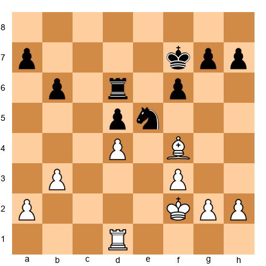</p>


White has rook and bishop. Black has rook and knight. The position is open enough for the bishop to work, and pawns are on both flanks. White's plan: fix Black's kingside pawns, use the bishop to target them from a distance, and create a second weakness on the queenside. The knight on e5 looks strong, but if White plays g3, Kg2, and eventually h3 followed by f4, the knight will be pushed away.

The key move here is 1.g3, preparing to advance the kingside pawns and challenge the knight. After 1.g3 Ke6 2.Kg2 Rc6 3.Be3, White prepares to advance with f4 at the right moment. The bishop covers both flanks: it defends d4 while eyeing the a7 pawn down the diagonal after a possible reposition. The knight must stay on e5 to maintain its outpost, but this ties it down.

### 11.1b Practical Considerations: R+B vs. R+N

At the board, the decision between steering toward an R+B or R+N endgame often comes down to pawn structure, not piece preference. Here are the practical questions you should ask:

**Question 1: Are pawns on both flanks?** If yes, the bishop side is better. The bishop's range allows it to influence both sides of the board simultaneously. The knight needs four or five moves to travel from one flank to the other.

**Question 2: Is the center locked?** If yes, the knight side is better. In a closed position, the bishop may be "bad" (blocked by its own pawns). The knight thrives in closed positions because it can jump over pawns and land on outpost squares.

**Question 3: Are there potential pawn breaks?** If one side can open the position with a pawn break, the bishop's value goes up. A closed position that can be opened at the right moment is ideal for the bishop: you keep the position closed while improving your pieces, then open it when your bishop dominates.

**A second model position showing the knight's strength:**

*Set up your board.* This position is based on a typical French Defense pawn structure.


<p align="center">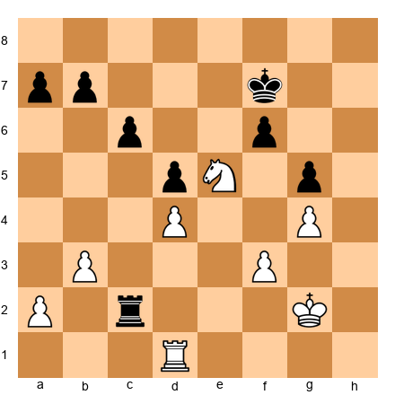</p>


White has rook on d1, knight on e5, king on g2, pawns on a2, b3, d4, f3, g4. Black has rook on c2, king on f7, pawns on a7, b7, c6, d5, f6, g5.

The center is completely locked (d4 vs. d5, f3 supporting, f6 supporting). The knight on e5 is a permanent outpost: no Black pawn can attack it (c6 cannot push to c5 without losing the d5 pawn chain, and f6 is already committed to defending g5). White's plan is simple: use the knight's dominance to create threats while Black's bishop (if one were present) would be blocked by its own pawns on c6, d5, and f6.

In this structure, the knight controls c4, c6, d7, f7, and d3 from its e5 post. It is, in effect, worth more than a bishop. White plays Rd3, Kf2-e3, and then looks for a moment to play b4 or a4, creating a second front on the queenside. The knight supports everything from its central throne.

The practical lesson: when you have a knight vs. bishop imbalance and the center is locked, do NOT open the position. Keep it closed. The knight's value increases with every move the center stays blocked.

### 11.1c The Exchange Imbalance: R+B vs. R+N in Transition

Many R+B vs. R+N positions arise through a specific exchange in the middlegame. A common scenario: one side trades a bishop for a knight (or vice versa) and then the game simplifies into rooks and minor pieces. At the moment of the trade, you must evaluate the resulting endgame.

**Before trading, ask yourself:**

1. Will the resulting pawn structure favor my minor piece?
2. Can I create an outpost for my knight (or open diagonals for my bishop)?
3. Will the rooks be traded too, or will they stay on? (Rooks amplify the minor-piece imbalance because the rook supports whatever the minor piece cannot cover.)

The best Grandmaster endgame players make the decision to trade pieces based on the endgame they are heading toward, not the middlegame they are leaving. Think two phases ahead: "If I trade my bishop for this knight, what does the resulting R+N vs. R+B position look like?"

### 11.2 Rook and Bishop vs. Rook (Expanded Technique)

We touched on this endgame in Part 4. Now let us go deeper. This is one of the endgames where tablebase knowledge changed our understanding, and where the 50-move rule creates the most practical tension.

**The defender's three rules (expanded):**

Rule 1: Keep your king away from the edge. A king on the edge gets mated. A king in the center has escape squares in all directions. If forced to choose between two squares, always pick the one closer to the center.

Rule 2: Keep your rook active and mobile. A passive rook on the back rank is a losing position in progress. Your rook should be ready to deliver checks, cut off the enemy king, or harass the enemy bishop. Never let your rook get pinned against your own king.

Rule 3: Watch for the "Cochrane defense" setup. Place your king diagonally adjacent to the enemy bishop when possible. This limits the bishop's scope and makes coordination between the attacking rook and bishop harder.

**A defensive model:**

*Set up your board.* This position illustrates the correct defensive technique.


<p align="center">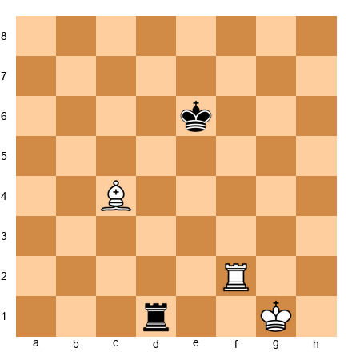</p>


White has rook and bishop; Black has a rook. Black's king is in the center (correct), and Black's rook is active on d1. White will try to push the Black king toward the edge, but Black resists by maintaining centralization.

After 1.Rf6+ Kd5 2.Bb3+ Kc5, Black keeps the king in the center. White's bishop checks push the king sideways but not toward the edge. Black answers every check by stepping toward the center or toward the bishop (to limit its scope). The rook on d1 stays active and ready to counterattack.

The critical defensive idea: if White ever plays Rf8 (trying to cut the king off on a rank), Black plays ...Rd2 or ...Rd3, creating counterplay. The defending rook must never become passive.

**When the attacker wins:**

The attacking side wins when three conditions align:

1. The defending king is forced to the edge or a corner.
2. The bishop cuts off the defending king's escape routes.
3. The attacking rook delivers checkmate or wins the defending rook through a fork or skewer.

This usually requires a defensive error. Against perfect play, the 50-move rule typically saves the defender even in positions where the tablebase gives a forced win, because many of those wins require 55 or more moves.

**A winning attack model:**

*Set up your board.* This position shows a case where the attacker has already achieved the key conditions.


<p align="center">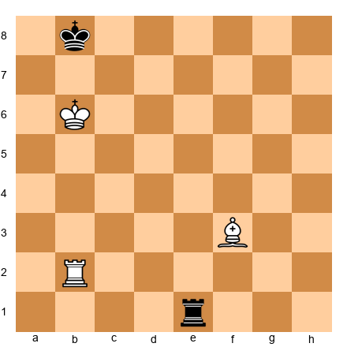</p>


White has rook on b2 and bishop on f3. Black has rook on e1 and king on b8. The Black king is already on the edge, and White's king controls the escape squares.

1.Ba8! (a stunning move: the bishop goes to the corner to control the long diagonal and prevent ...Ka8) 1...Re8 2.Bd5 (cutting off the king from the seventh rank via the diagonal) 2...Rd8 3.Be6 Rd6 4.Rb1+ (driving the king to the corner) 4...Ka8 5.Bc4, and White is building a mating net. The bishop restricts the king, the rook delivers the blow. This coordination is the key pattern: the bishop creates a cage, the rook finishes the job.

### 11.3 The 50-Move Rule in R+B vs. R: A Practical Guide

The 50-move rule has a unique impact on R+B vs. R endgames. The tablebase says approximately 40% of starting positions are wins for the bishop side. But many of those wins require more than 50 moves of perfect play. This creates a practical gap: positions that are "won" on the tablebase but "drawn" under tournament rules.

**What this means for the attacker:**

If you are playing the R+B side, you must win within 50 moves of the last capture or pawn move. If you cannot do it, the defender claims a draw. This puts enormous pressure on the attacker to find the most efficient winning technique, not just any winning technique.

In practice, the winning positions that can be converted within 50 moves share a common feature: the defending king is already on or near the edge. If the defending king starts in the center, the process of driving it to the edge typically consumes 20 to 30 moves, leaving only 20 to 30 moves for the mating attack. That is often not enough.

**What this means for the defender:**

If you reach R+B vs. R, start counting moves immediately. Keep a mental tally. If you can maintain your position for 50 moves without the attacker capturing anything or moving a pawn (there are no pawns, so only captures matter), you draw. Your job is not to find the best defense for eternity; your job is to survive 50 moves.

The practical consequence: even imperfect defense often suffices. You do not need to play like a tablebase. You need to keep your king roughly centralized and your rook active for 50 moves. If the attacker does not know the precise technique, 50 moves will pass.

**The critical positions:**

The positions where R+B wins within 50 moves typically involve the defending king already trapped on the edge or in a corner. If you see the defending king on a1, b1, a2, or similar edge squares, and the attacking king is nearby with the bishop and rook coordinating, the win may be achievable.

If the defending king is on e5 or d4 (center of the board), the win is almost certainly not achievable within 50 moves. The attacker must first spend 20+ moves pushing the king to the edge, leaving insufficient time for the mating attack.

The Grandmaster's takeaway: do not trade into R+B vs. R unless you know the defending king is already poorly placed. If the defending king is centralized, the endgame is a practical draw regardless of what the tablebase says.

### 11.4 R+B vs. R+N with Pawns: Advanced Patterns

When both sides have pawns in addition to their rook and minor piece, the evaluation becomes more concrete. The pawns determine who has targets and who has outposts.

**Pattern 1: The bishop targets scattered pawns.** If the opponent's pawns are isolated on different colored squares, the bishop attacks them all. The knight can only defend one at a time. This pattern is most common when the pawn structure has been opened by exchanges.

**Pattern 2: The knight blockades a passed pawn.** A knight on a blockade square (directly in front of a passed pawn) is in its element. From the blockade square, it radiates influence in all directions while performing the essential job of stopping the pawn. The bishop cannot blockade as effectively because it only controls squares of one color.

**Pattern 3: The rook amplifies the minor piece's weakness.** If the opponent has a knight that is poorly placed (stuck on the rim, or far from the action), the rook can exploit the squares the knight does not control. If the opponent has a bad bishop (blocked by its own pawns), the rook invades on the color the bishop controls, attacking the pawns from behind.

These patterns should guide your piece trades in the middlegame. Before exchanging minor pieces, visualize the resulting R+minor piece endgame. Will your remaining piece be strong or weak in that structure?

---

## PART 12: QUEEN ENDGAMES

### 12.1 Queen vs. Queen with Pawns

Queen endgames are among the hardest endgames in chess. The reason: queens can check from almost anywhere on the board. This means king safety matters even in the endgame. A king caught in the open with a queen nearby is in constant danger of perpetual check or worse.

**The three principles of queen endgames:**

Principle 1: King safety comes first. Unlike rook endgames, where the king marches boldly toward the center, queen endgames require you to shelter your king. A king on g1 behind pawns on f2, g2, h2 is far safer than a king on e4 in the open.

Principle 2: Passed pawns are even more powerful than in rook endgames. A queen can support a passed pawn while simultaneously threatening the opponent's king. The defender must choose: stop the pawn or defend the king. Both at once is often impossible.

Principle 3: Centralization of the queen matters less than activity. A queen on the edge of the board attacking two weaknesses is more useful than a queen on d5 that attacks nothing. Target weaknesses, not squares.

**A model position: Queen endgame with an extra pawn**

*Set up your board.* This position is based on a common structure from practical play.


<p align="center">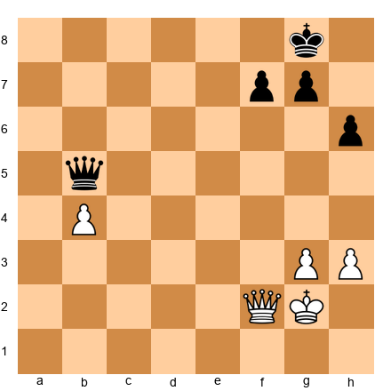</p>


White has an extra b4 pawn. Both sides have kingside pawns. The question: can White convert the extra pawn?

The answer is yes, but only with precise play. White's plan:

1. Advance the b-pawn while keeping the queen active enough to prevent perpetual check.
2. Use the queen to simultaneously support the pawn and attack Black's kingside weaknesses.

After 1.Qf4 (centralized, hitting h6 and preparing to support b5) 1...Qe2+ 2.Kh1 Qe6 3.b5, White makes progress. Black must choose between stopping the pawn (with ...Qb3 or ...Qb6) and maintaining threats against White's king. If 3...Qb3 4.Qd6 (now attacking f7 and supporting b6) 4...Qb1+ 5.Kg2 Qb2+ 6.Kf3, the king walks to safety while the b-pawn advances.

The key technical idea: in queen endgames, advance your passed pawn in moments when the enemy queen is far from the pawn and near your king (delivering checks). Use the "checking distance" concept: the further your king runs from the checks, the closer your pawn gets to promotion.

### 12.2 Queen vs. Rook and Minor Piece

This is a common practical endgame that arises when one side trades a queen for two pieces (rook plus bishop or rook plus knight) plus compensation. The general evaluation: the queen is slightly better with pawns on the board, because the queen's mobility allows it to attack multiple weaknesses simultaneously. But the two-piece side can hold or even win if the pieces coordinate well.

**Queen vs. Rook and Bishop:**

The queen is usually better here. The rook and bishop need to work together, but they often get in each other's way. The queen attacks the bishop, the bishop retreats, the rook loses its coordination partner. Against scattered pawns, the queen picks them off one by one.

The two-piece side's best chance: keep the pieces close to the king, maintain a solid pawn structure, and avoid having isolated or weak pawns. If the pieces form a wall around the king, the queen cannot break through.

**Queen vs. Rook and Knight:**

This is more complex. The knight can sometimes set up a fortress with the rook, especially if the knight controls key squares near the king. The queen has more difficulty against a rook-knight duo than against a rook-bishop duo, because the knight can fork the queen and create tactical threats.

*Set up your board.* This position illustrates the queen's advantage in an open structure.


<p align="center">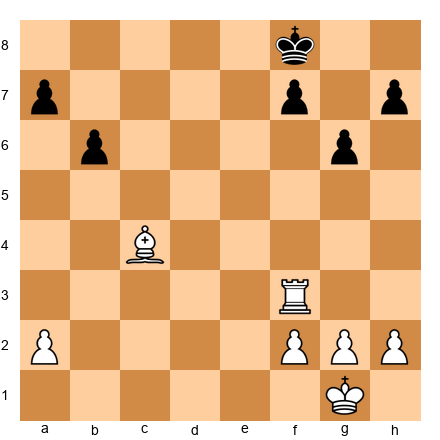</p>


Wait: this position has rook and bishop for White with no queen present. Let me give you the correct setup.


<p align="center">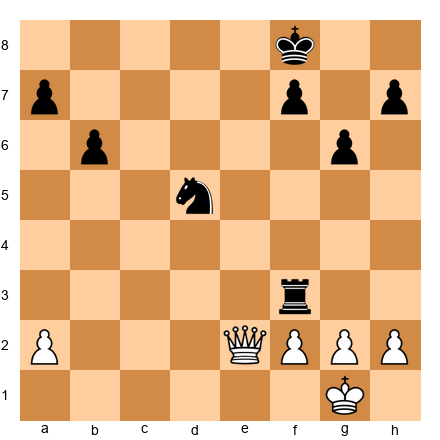</p>


White has the queen on e2. Black has rook on f3 and knight on d5. White's advantage: the queen can attack the a7 and h7 pawns simultaneously. Black's rook and knight cannot defend both flanks at once.

1.Qe8+ Kg7 2.Qd7 (attacking a7 and f7 at the same time) 2...Rf7 (forced, defending f7) 3.Qxa7 (the pawn falls because the knight and rook could not defend both targets). This is the typical pattern: the queen stretches the defense until something breaks.

### 12.3 Perpetual Check: The Defender's Weapon

In queen endgames, the losing side's best friend is perpetual check. A queen can deliver checks from all over the board, and if the stronger side's king has no shelter, the draw is almost automatic.

**How to avoid perpetual check (for the stronger side):**

1. Keep pawns in front of your king. A pawn shield on g2, h3 (or similar) gives the king a hiding spot.
2. Use your queen to block checks. Sometimes Qg3 or Qf2 blocks a check while maintaining an active position.
3. Walk toward the enemy queen. Counter-intuitive, but sometimes the best way to escape checks is to advance your king toward the checking queen, because the queen eventually runs out of safe checking squares.

**How to achieve perpetual check (for the weaker side):**

1. Keep your queen active. A queen stuck defending a pawn cannot deliver checks.
2. Target the exposed king. If the enemy king is in the center or has no pawn cover, perpetual check is usually available.
3. Do not trade queens. Your drawing chances vanish if the queens come off.

### 12.4 Queen Endgame: The King March Technique

One of the most underappreciated skills in queen endgames is marching your king to safety while the opponent checks. At the Grandmaster level, this technique decides many games. The idea is simple in principle, tricky in execution.

When your opponent delivers checks, you must find a route for your king that accomplishes two things simultaneously: escaping the checks AND advancing toward a useful square (near your passed pawn, near their weak pawns, or into a sheltered position).

*Set up your board.* This position illustrates the king march.


<p align="center">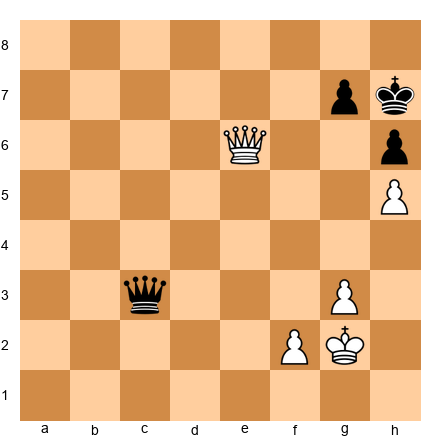</p>


White has queen on e6, king on g2, pawns on f2, g3, h5. Black has queen on c3, king on g7, pawns on h6, h7. White is a pawn up and has the more active queen, but Black threatens perpetual check.

The winning technique: 1.Kh3! (stepping toward h4, where the king will be sheltered by the h5 pawn). After 1...Qd3 2.Qe5+ Kf7 (2...Kh8 3.Qf6+ Kg8 4.Qg6+ Kf8 5.Qxh6+ and White wins a pawn cleanly) 3.Qd5+ Kf8 4.Kh4, the king is now safe behind the g3 and h5 pawns. Black's checks have dried up because the queen cannot reach the king on h4 without being captured or allowing a queen trade. From h4, White's king walks toward g5 next, supporting the h-pawn's advance.

The general principle: walk your king toward the pawn shelter. In queen endgames, pawns on g3 and h5 (or similar configurations) create a "pocket" where the king is immune to checks from most directions.

### 12.5 Queen Endgames: When to Force the Trade

Sometimes the best plan in a queen endgame is to force a queen trade and enter a won king-and-pawn endgame. This requires precise calculation, because the resulting pawn endgame must actually be winning: if it is drawn, you have thrown away your queen advantage for nothing.

**When to seek the trade:**

1. When you have a distant passed pawn that would promote in a king-and-pawn endgame. If the trade leads to a position where your king reaches the pawn first, do it.
2. When you have a protected passed pawn. A protected passer in a pawn endgame is often decisive because it ties down the enemy king.
3. When the opponent's queen is the only piece holding the defense together. Remove it, and everything collapses.

**When to avoid the trade:**

1. When the resulting pawn endgame is drawn (opposition, stalemate traps, wrong rook pawn).
2. When your queen is more active than theirs. Keep the queens on and use the activity differential.
3. When you have attacking chances against the opponent's king. The queen is your best attacking piece; do not trade it for a pawn-endgame grind if a direct attack is available.

*Set up your board.* This position shows a well-timed queen trade.


<p align="center">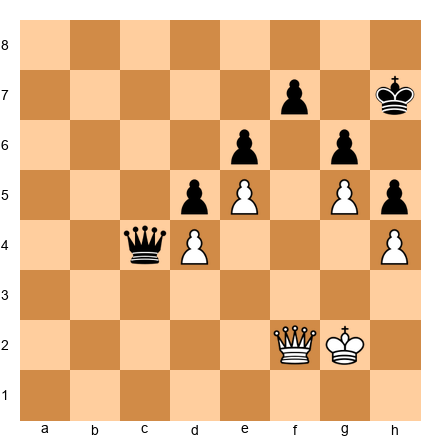</p>


White has queen on f2, king on g2, pawns on d4, e5, g5, h4. Black has queen on c4, king on h7, pawns on d5, e6, f7, g6, h5. White plays 1.Qf6! threatening Qf8-g7 mate AND offering the queen trade via ...Qxf6. After 1...Qxf6 (forced, because the mating threat must be stopped) 2.gxf6 (now the pawn on f6 is a monster: combined with e5, it creates a passed pawn on the kingside). The resulting pawn endgame is winning for White because 2...Kg8 3.Kf3 Kf8 4.Ke3 Ke8 5.Kd3 Kd7 6.Kc3 Kc6 7.Kb4, and White's king infiltrates the queenside while the f6 pawn ties down Black's king. White does not need to rush: the f6 and e5 pawns freeze Black's entire kingside.

### 12.6 Practical Queen Endgame Patterns

Here are three patterns that recur constantly in queen endgames at the Grandmaster level. Know them by heart.

**Pattern 1: The Windmill.** A queen can sometimes set up a "windmill" of alternating checks and threats. Check from one side, force the king to move, then attack a pawn or threaten promotion on the other side. Repeat until something falls. The key: the checks must be purposeful, gaining ground each time, not random harassment.

**Pattern 2: The Centralized Queen.** A queen on d5 or e4 (centrally placed) simultaneously pressures multiple pawn weaknesses. The opponent's queen must choose what to defend. This pattern is most effective when the enemy has isolated pawns on different flanks.

**Pattern 3: The Promotion Race.** When both sides have passed pawns, the queen that can simultaneously advance its own pawn and blockade the opponent's pawn wins. The queen's range means it can often do both from a single square: check the king, support the pawn, and block the enemy passer all at once.

---

## PART 13: PRACTICAL FORTRESS CONSTRUCTION (EXPANDED)

### 13.1 The Five Fortress Types Every Grandmaster Must Know

We covered the basic fortresses earlier (wrong bishop + rook pawn, queen vs. rook pawn on the 7th). Here we expand the catalog to include fortress types that arise in practical Grandmaster play.

**Fortress Type 1: Rook Pawn + Wrong Bishop (Review)**

*Set up your board.*


<p align="center">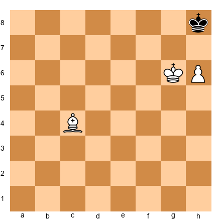</p>


White has king on g6, bishop on c4, pawn on h6. Black's king sits on h8. This is a draw because the bishop does not control h8 (the promotion square). The defending king cannot be forced out of the corner. We reviewed this earlier, but it belongs in your catalog.

**Fortress Type 2: The Rook Blockade**

When a rook blockades a passed pawn from the front, and the defending king supports the rook, the position is often a fortress even when the attacking side has a significant material advantage.

*Set up your board.*


<p align="center">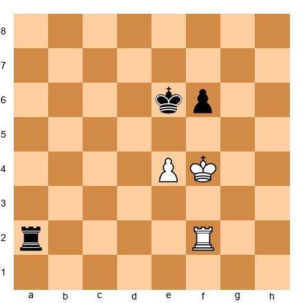</p>


Black has a rook on a2; White has a rook on f2. Both sides have one pawn. The pawns are locked (e4 vs. f6). Black's rook is active, but White's rook on f2 prevents any infiltration. Neither side can make progress because the pawn structure is blocked and the rooks neutralize each other. This is a dead draw despite White having a slightly more active king.

The key principle: in rook endgames, a blocked pawn structure often produces a fortress. Neither side can create a passed pawn, and the rooks cancel each other out.

**Fortress Type 3: Knight and Pawns vs. Queen**

This fortress arises more often than you might expect. When the knight and pawns form a wall around the king, the queen cannot break through.

*Set up your board.*


<p align="center">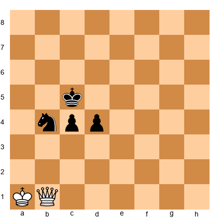</p>


White has a queen on b1 and king on a1. Black has king on c5, knight on b4, and pawns on c4 and d4. The knight on b4 shields the king from queen checks. The pawns support the knight and cover key squares. White's queen cannot penetrate because every check is blocked by the knight or leads to the king finding shelter behind the pawns.

After 1.Qg1 d3 2.Qg5+ Kb6 3.Qd8+ Ka6, the king escapes to the queenside. The knight and pawns march forward together. White cannot stop all three connected units with the queen alone. This position is at minimum a draw for Black, and may even be winning.

The takeaway: never assume the queen wins against a knight and passed pawns. If the pawns are connected and the knight guards the king, the fortress holds.

**Fortress Type 4: Opposite-Colored Bishops with Blocked Pawns**

This fortress type is well known but underrated in practice. When pawns are fixed on squares of one color and you have the bishop that controls the other color, the position is a fortress regardless of material deficit.

*Set up your board.*


<p align="center">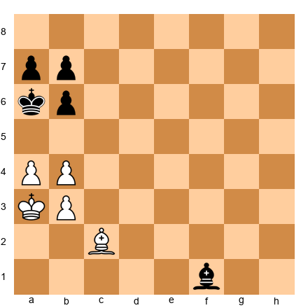</p>


White has king on a3, bishop on c2, pawns on a4, b4, b3. Black has king on a6, bishop on f1, pawns on a7, b7, b6. All pawns are fixed. White's light-squared bishop and Black's light-squared bishop stare at each other, but neither can create threats because every pawn is on a dark square. The position is a dead draw. No side can break through because no pawn can advance without being captured, and the bishops cannot attack the fixed pawns (they are on the wrong color).

**Fortress Type 5: Rook on the Seventh Rank Defense**

In certain positions, a rook on the seventh rank can hold a fortress even against a rook and passed pawn, provided the defending king is cut off but the rook maintains activity.

*Set up your board.*


<p align="center">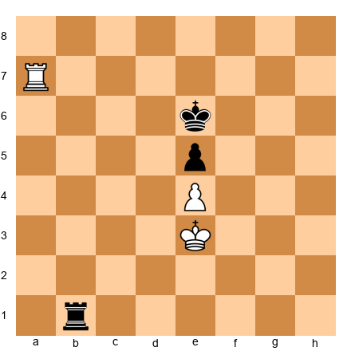</p>


White has rook on a7 and king on e3. Black has rook on b1 and king on e6. Pawns on e4 and e5 are locked. White's rook on the seventh rank prevents the Black king from advancing, but White's own king cannot advance either because the pawns are blocked. Black's rook on b1 prevents White from making queenside progress. The position is a draw because neither side can improve: the rooks neutralize each other, and the pawn structure is frozen.

### 13.2 How to Build a Fortress Under Pressure

Knowing the fortress types is not enough. You must recognize when a fortress is possible in a worse position and steer toward it. This is a skill that separates 2400 players from 2600 players.

**Step 1: Identify the fortress pattern.** When you are losing material, ask yourself: "Is there a defensive structure I can reach?" This means scanning for blocked pawns, wrong-colored bishops, knight blockades, or stalemate motifs.

**Step 2: Trade the right pieces.** Fortresses require specific piece configurations. If you need opposite-colored bishops, trade knights. If you need a rook blockade, trade the minor pieces. Steer the simplification toward the fortress pattern you identified.

**Step 3: Fix the pawn structure.** Many fortresses require locked pawns. Do not advance pawns needlessly when you are defending. Every pawn move is a commitment that might destroy your fortress potential.

**Step 4: Position your king correctly.** In most fortresses, the king must be in a specific zone: the corner for wrong-bishop fortresses, behind the pawns for knight-blockade fortresses, centralized for rook-blockade fortresses. Move the king toward the correct zone early, before the attacker's pieces dominate the board.

### 13.3 Breaking a Fortress: The Attacker's Perspective

Knowing how to build a fortress is half the battle. The other half: knowing when a fortress is breakable and how to break it. Many games are drawn because the stronger side gives up too easily, assuming the fortress is impenetrable when it actually has a flaw.

**Flaw 1: The attacker can change the pawn structure.**

If the fortress depends on locked pawns, look for a pawn break that opens the position. A fortress with pawns on a4/a5 and b4/b5 is only stable if neither side can break with c4 or c5. If you can engineer a pawn break, the fortress collapses.

*Set up your board.*


<p align="center">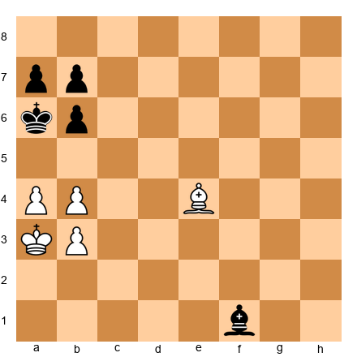</p>


This looks like the opposite-colored bishop fortress we discussed earlier (Fortress Type 4). But notice: White has a bishop on e4 (not c2). Can White play a5? After 1.a5! bxa5 (forced) 2.bxa5 Kb5 (the king steps forward) 3.a6! bxa6 4.Kb2, the position has opened. Now the bishop on e4 controls the a8-h1 diagonal, and White's king can infiltrate via c3-d4. The fortress depended on the locked a- and b-pawns. Once White broke them open, the draw was gone.

The lesson: before accepting a fortress, look for pawn breaks. If any break is possible, the fortress may be an illusion.

**Flaw 2: The defender's king can be driven from its post.**

Many fortresses require the defending king to sit on a specific square or in a specific zone. If you can use checks or threats to drive the king away, the fortress falls.

**Flaw 3: Zugzwang.**

In some fortress positions, the defending side runs out of useful moves. If every legal move worsens the defender's position, the fortress is not real: it is just a position that looks stable until it is the defender's turn to move. This is rare in positions with rooks (because rooks can usually shuffle), but common in pure minor-piece or pawn endgames.

### 13.4 A Practical Decision Framework for Fortress Play

When you are in a worse endgame and considering a fortress defense, ask these four questions in order:

1. **Does a known fortress pattern apply?** If yes, steer toward it immediately.
2. **Can I reach it?** Having a fortress pattern in mind is useless if the attacker prevents you from reaching the setup. Calculate whether you have enough time (moves, not clock time) to set up the fortress.
3. **Does the attacker have a pawn break?** If yes, the fortress may not hold. Evaluate whether the attacker can engineer a break at the critical moment.
4. **Is passive defense or active counterplay better?** Sometimes the best "fortress" is not a static position but an active defense that creates enough counterplay to force a draw through perpetual check or repetition.

---

## PART 14: CONVERTING MINIMAL ADVANTAGES IN ENDGAMES

### 14.1 The +0.3 Endgame Problem

At the Grandmaster level, many endgames are evaluated at roughly +0.3 to +0.5 by modern engines. These evaluations mean: "the stronger side has a slight edge, but converting requires perfect play against imperfect defense." In practice, these endgames are where rating points are won and lost.

The difference between a 2400 player and a 2700 player is often not the ability to calculate or memorize openings. It is the ability to convert these tiny advantages into wins. Carlsen is the supreme example: he wins endgames that computers evaluate as near-equal, because he creates practical problems that the defender cannot solve at the board.

### 14.2 The Five Steps of Conversion

**Step 1: Identify the advantage.**

Before you can convert, you must know what your advantage is. Common types of minimal advantages in endgames:

- A slightly more active king
- A slightly better pawn structure (one fewer pawn island)
- A slightly more active rook or minor piece
- A very slight space advantage
- The opponent has one weak pawn that is not yet losing

Name your advantage. If you cannot name it, you cannot exploit it.

**Step 2: Improve your worst piece.**

Dvoretsky called this the "principle of the worst piece." Find the piece that is doing the least and improve its position. This is the single most reliable way to convert small advantages. It does not require calculation, just positional judgment.

In rook endgames, the worst piece is usually the rook itself (if it is passive) or the king (if it is too far from the action). Activate whichever one is worse.

**Step 3: Fix a weakness.**

"Fix" means: prevent the opponent from repairing their structural problem. If they have a backward pawn, keep your pieces aimed at it so they cannot advance it. If their king is on a poor square, cut it off with your rook. Do not let the defender untangle.

**Step 4: Create a second weakness.**

This is the two-weaknesses principle applied to minimal-advantage positions. One weakness is not enough to win. You must create a second target and alternate your attack between the two. This is where patience matters most: creating the second weakness may take 15 or 20 moves of maneuvering.

**Step 5: Convert at the right moment.**

Do not rush. The conversion itself (winning a pawn, breaking through, promoting) should happen only when the defender is completely tied down. Premature action lets the defender simplify or create counterplay.

### 14.3 A Model Conversion

*Set up your board.* This position illustrates the five steps in action.


<p align="center">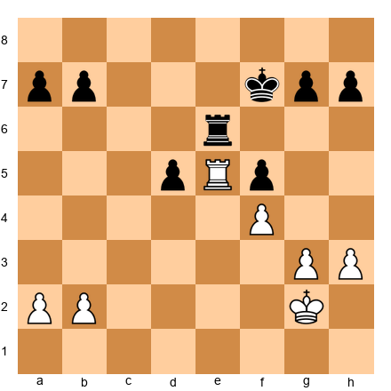</p>


White has rook on e5, king on g2, pawns on a2, b2, f4, g3, h3. Black has rook on e6, king on f7, pawns on a7, b7, d5, f5, g7, h7.

White's advantage: the rook on e5 is more active than Black's rook on e6. White's king is slightly more centralized. Black's d5 pawn is isolated.

**Step 1: The advantage is the more active rook and the isolated d-pawn.**

**Step 2: Improve the king.** 1.Kf3 Ke7 2.Ke3 Kd6 3.Kd4. Now the king is centralized and supporting the pressure on d5.

**Step 3: Fix the weakness.** The rook on e5 already fixes the d5 pawn. Black cannot play ...d4 because the rook controls that square.

**Step 4: Create a second weakness.** 3...Re1 4.a3 (preventing any ...Rb1 ideas) 4...Re6 5.b4 (now White creates a queenside majority, threatening b5). Black must decide: defend d5 with the rook, or stop the b-pawn. 5...Re1 6.b5 Rb1 7.Rxd5+ Ke6 8.Ra5, and White has won the d-pawn while maintaining an active rook.

**Step 5: Convert.** White now has an extra pawn and a more active position. The rest is technique: push the passed pawn, trade rooks when favorable, win the king-and-pawn endgame.

### 14.4 Common Mistakes When Converting

**Mistake 1: Rushing.** The most common error. You see a +0.5 advantage and immediately try to win material. The defender finds counterplay and the advantage evaporates. Be patient. Improve your pieces first.

**Mistake 2: Allowing counterplay.** When you have a small advantage, the defender's best chance is active counterplay. Do not give it to them. If their rook is passive, keep it passive. If their king is cut off, keep it cut off. Prophylaxis (preventing the opponent's plans) is more important than your own plans in many positions.

**Mistake 3: Trading the wrong pieces.** Not all trades are equal. Exchanging your active rook for their passive rook throws away your advantage. Trade pieces that benefit you: exchange the defender's active pieces, keep the passive ones on the board.

**Mistake 4: Ignoring the clock.** At the Grandmaster level, converting +0.3 endgames can take 40 or 50 moves. If you have 5 minutes on the clock, you cannot do it. Be realistic about your time situation. Sometimes the correct practical decision is to offer a draw in a slightly better position rather than lose on time in a "winning" one.

### 14.5 The Carlsen Method: Practical Pressure Without Risk

Magnus Carlsen has converted more "equal" endgames than perhaps any player in history. His method is worth studying as a complete system.

**Principle 1: Never take risks.** Carlsen does not gamble in slightly better positions. He improves his position step by step, never making a move that could backfire. Each move is safe on its own. The cumulative effect of 20 safe, slightly improving moves is devastating.

**Principle 2: Make the opponent make decisions.** Every decision is a chance to go wrong. Carlsen shuffles his pieces to create small threats, not to win immediately, but to force the opponent to choose: defend this pawn or that one? Move the rook here or there? Each decision costs the defender mental energy and clock time.

**Principle 3: Wait for the break.** Carlsen does not force things. He waits until the opponent's position is so cramped that something must give. This requires tremendous patience: sometimes 30 or 40 moves of maneuvering before the breakthrough comes.

**Principle 4: Calculate only when necessary.** In the maneuvering phase, Carlsen uses positional judgment, not calculation. He calculates deeply only at the critical moment when a pawn break or piece sacrifice is possible. This conserves mental energy for the moment it matters most.

**A practical illustration of the Carlsen method:**

*Set up your board.*


<p align="center">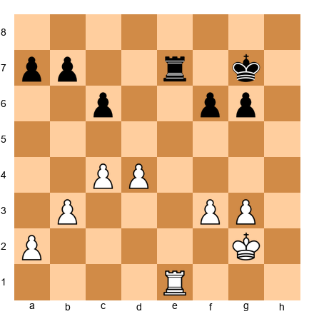</p>


White has rook on e1, king on g2, pawns on a2, b3, c4, d4, f3, g3. Black has rook on e7, king on g7, pawns on a7, b7, c6, f6, g6.

White's advantage is tiny: a slightly better pawn structure (the c4-d4 duo vs. c6 with no corresponding partner) and a microscopic space edge. An engine might evaluate this as +0.2 or +0.3.

The Carlsen method: 1.Re4 (centralizing the rook) 1...Re6 2.Kf2 (improving the king) 2...Kf7 3.Ke3 (the king heads toward d3, supporting the center) 3...Re7 4.Kd3 Rd7 5.Re1 (redeploying: the rook will go to the e-file or a-file depending on Black's setup) 5...Re7 6.Rc1 (switching flanks) 6...Ke6 7.a4 (gaining space on the queenside, fixing Black's a7 pawn as a potential target).

Notice: White has made no forcing moves. Every move is safe. But Black's position is slightly worse after each one. After a4, the a7 pawn is a long-term target. The king on d3 controls the center. The rook is flexible. Black must decide: play ...Kd6 (defending c6, but passive) or ...b6 (weakening c6 further)? Each choice has a downside.

This is the Carlsen method in action. No brilliancy. No sacrifices. Just relentless, patient pressure until the opponent cracks.

### 14.6 Psychological Factors in Endgame Conversion

At the Grandmaster level, endgame conversion is as much a psychological battle as a technical one. Here are the psychological factors that influence the outcome:

**For the stronger side:**

1. Project confidence. If you play quickly and confidently, the defender feels the pressure. Hesitation signals that you do not know the plan.
2. Use clock advantage. If you have more time, slow down and make the defender spend their time. A time advantage compounds in endgames.
3. Avoid repeating the position. Repetition signals that you have no progress left. Even if the engine says +0.3, a three-fold repetition is a draw.

**For the defender:**

1. Stay calm. The defender's biggest enemy is panic. Many "lost" endgames are drawn with correct technique. Trust the position.
2. Create practical problems. Even in a worse position, you can create threats that require the opponent to calculate. A desperate check, a pawn sacrifice, a rook activation: anything that forces the stronger side to find the right response.
3. Aim for fortress patterns. If you can reach a fortress, the evaluation does not matter. A +2.0 position is a draw if the fortress holds.
4. Use the draw offer strategically. Sometimes offering a draw at the right moment plants a seed of doubt in the opponent's mind. "Maybe this really is equal?"

---

## PART 15: ADDITIONAL EXERCISES

### ⚡ ADHD Quick Set (New Exercises)

If you are short on time, do exercises **48.16, 48.20, and 48.28**. These three cover rook-and-minor-piece play, queen endgame technique, and fortress construction.

---

### WARMUP Exercises (★★★)

**Exercise 48.16 (★★★) [Essential] WARMUP: ⏱ 5 minutes**

*Set up your board.* This position tests your knowledge of bishop superiority in open positions.


<p align="center">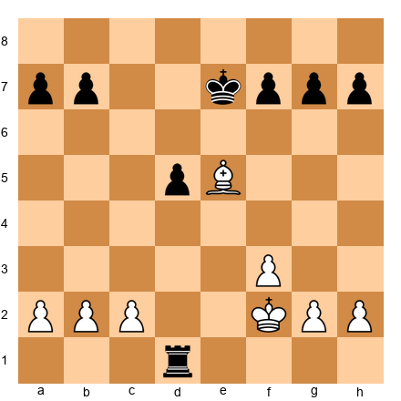</p>


Black to play. Black has a rook on d1 and pawns on a7, b7, d5, f7, g7, h7. White has a bishop on e5, king on f2, pawns on a2, b2, c2, f3, g2, h2. Evaluate: is Black better, equal, or worse?

**Hint 1:** Count the material. Who has more? What is the nature of the imbalance?
**Hint 2:** The rook is normally stronger than the bishop, but consider the pawn structure. Are the pawns fixed or mobile?
**Hint 3:** Look at the bishop on e5. What squares does it control? Can Black's rook exploit any weaknesses?

**Solution:** Black is better because the rook is worth more than the bishop, and the position is open enough for the rook to be active. The key idea is 1...Rd2+, invading the second rank. After 2.Ke3 Rxb2, Black wins a pawn while maintaining the active rook. White's bishop on e5 is well-placed but cannot compensate for the material deficit. The rook on the second rank attacks both a2 and g2, creating two weaknesses. Black converts with standard technique: win a second pawn, trade into a king-and-pawn endgame, promote. The lesson: in open positions with pawns on both flanks, the rook almost always beats a lone bishop.

---

**Exercise 48.17 (★★★) [Essential] WARMUP: ⏱ 5 minutes**

*Set up your board.* This position tests your understanding of queen endgame checks.


<p align="center">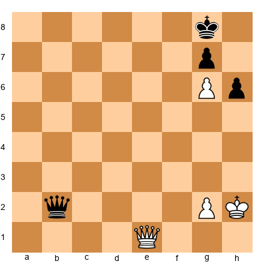</p>


White has queen on e1, king on h2, pawns on g2, g6. Black has queen on b2, king on g8, pawns on g7, h6. White to play. Can White win, or is this a draw?

**Hint 1:** White has an advanced pawn on g6. Can it be supported to promotion?
**Hint 2:** Consider Black's perpetual check possibilities. Is White's king safe?
**Hint 3:** What happens after Qe8+? Does the king have shelter?

**Solution:** This is a draw. After 1.Qe8+ Kh7 (the only move; the king hides behind the g6 pawn) 2.Qf7 Qb8+ (Black begins perpetual check) 3.Kh3 Qb3+ 4.Kh4 Qc4+ 5.Kg3 Qd3+ 6.Kf4 Qd4+ 7.Kf5 Qd5+ 8.Kf6 Qd8+, and Black has perpetual check. White cannot escape because the king has no shelter on the kingside, and the g6 pawn blocks the king from retreating behind it. The lesson: in queen endgames, advanced pawns are a double-edged sword. They threaten promotion but can also block your own king's escape routes.

---

**Exercise 48.18 (★★★) [Essential] WARMUP: ⏱ 5 minutes**

*Set up your board.* This position tests fortress recognition.


<p align="center">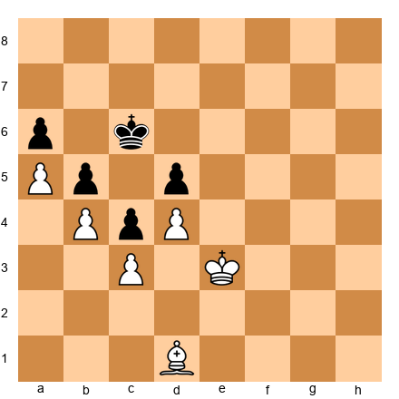</p>


White has king on e3, bishop on d1, pawns on a5, b4, c3, d4. Black has king on c6, pawns on a6, b5, c4, d5. All pawns are locked. White to play. Is this a win, draw, or loss for White?

**Hint 1:** Look at the pawn structure. Can either side create a passed pawn?
**Hint 2:** What squares does the bishop control? Can it attack any of Black's pawns?
**Hint 3:** Consider the kings. Can either king infiltrate?

**Solution:** This is a dead draw. The pawn structure is completely locked: no pawn can advance without being captured, and all captures lead to a recapture that maintains the blockade. White's bishop on d1 is a light-squared bishop, but Black's pawns on a6, b5, c4, d5 are on a mix of light and dark squares, and the bishop cannot attack enough of them to make progress. White's king cannot infiltrate because Black's king on c6 controls the entry squares d6, c5, and b6. The position is a fortress: material is equal, the structure is frozen, and neither side can improve. The lesson: when pawns are completely locked, even a material advantage may not matter. Recognize the fortress and save your energy for the next game.

---

### Intermediate Exercises (★★★–★★★★)

**Exercise 48.19 (★★★) [Practice]: ⏱ 8 minutes**

*Set up your board.* This position comes from a typical rook-and-bishop vs. rook-and-knight battle.


<p align="center">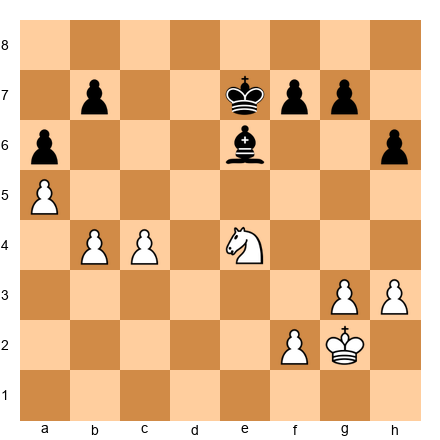</p>


White has king on g2, knight on e4, pawns on a5, b4, c4, f2, g3, h3. Black has king on e7, bishop on e6, pawns on a6, b7, f7, g7, h6. White to play. Find White's best plan.

**Hint 1:** Compare the minor pieces. Which is better placed: the knight or the bishop?
**Hint 2:** Where are the potential targets for White? Look at the pawns on a6, b7, and the kingside.
**Hint 3:** Can the knight reach an outpost square that the bishop cannot challenge?

**Solution:** White's knight on e4 is strong but can be improved. The best plan starts with 1.Nd6! (the knight jumps to a dominating outpost, attacking b7 and controlling key central squares). After 1...Kd7 2.Nxb7 (winning a pawn while maintaining the active knight) 2...Kc7 3.Nd6 Bf5 4.Ne4, White has won a pawn and the knight returns to a strong central square. Alternatively, if Black plays 1...Bc8 instead, then 2.c5! (fixing the a6 and b7 pawns as permanent weaknesses) 2...Kd8 3.Kf3, and White's king marches toward the center to support the knight. The key idea: the knight invades via d6, creating threats that the bishop cannot neutralize because it must defend the b7 pawn. In this pawn structure, the knight's ability to jump over pawns gives it an advantage over the bishop, which is blocked by its own pawns on a6 and f7.

---

**Exercise 48.20 (★★★★) [Essential]: ⏱ 12 minutes**

*Set up your board.* This position tests queen endgame conversion technique.


<p align="center">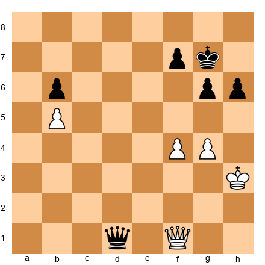</p>


White has queen on f1, king on h3, pawns on b5, f4, g4. Black has queen on d1, king on g7, pawns on b6, f7, g6, h6. White to play. Find the winning plan.

**Hint 1:** White has an outside passed pawn on b5. How can this be used to stretch Black's defense?
**Hint 2:** Think about the queen's ability to multitask. Can it support the pawn while attacking the kingside?
**Hint 3:** What happens if Black's queen must babysit the b-pawn? Where does that leave the kingside defense?

**Solution:** White wins by combining the b5 passed pawn with kingside threats. 1.Qf3! (centralizing the queen, preparing both b-pawn advance and kingside pressure) 1...Qd7 (defending against threats; 1...Qd6 allows 2.g5! opening lines) 2.Qe3 (threatening Qe5+ and also preparing to support the b-pawn) 2...Kh7 3.f5! (opening the second front; this is the two-weaknesses principle applied to queen endgames) 3...gxf5 4.gxf5 Qd1+ 5.Kg3 Qg1+ 6.Kf4 Qc1+ 7.Kf3 (the king finds shelter; note that g3 was key because now the checks run out). White will push f6 and then use the queen to support the b-pawn. Black cannot defend both the kingside (against f6, Qe7+) and the queenside (against the b-pawn advancing). The queen's range makes these dual threats decisive.

---

**Exercise 48.21 (★★★) [Practice]: ⏱ 8 minutes**

*Set up your board.* This position tests your fortress defensive skills.


<p align="center">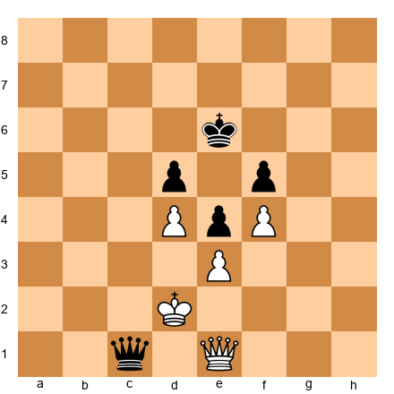</p>


Black has queen on c1, king on e6, pawns on d5, e4, f5. White has queen on e1, king on d2, pawns on d4, e3, f4. All center pawns are locked. Black to play. Is Black winning, or can White hold?

**Hint 1:** The pawn structure is completely blocked. What does this mean for queen endings?
**Hint 2:** Can Black's queen penetrate to attack White's king, or can White always find safe squares?
**Hint 3:** Think about whether any side can ever create a passed pawn.

**Solution:** White holds a draw. The pawns are completely locked: d4 vs. d5, e3 vs. e4, f4 vs. f5. No pawn can advance. Black's queen on c1 looks aggressive, but White's queen on e1 defends. After 1...Qb2+ 2.Ke1 (the king finds shelter on the kingside) 2...Qc3+ 3.Kf2 Qd2+ 4.Kg3, the king escapes checks by walking toward the kingside. The locked pawn structure means Black can never open a file or create a passed pawn. White's queen shuttles between defensive squares, always close enough to defend while avoiding being pinned. This is a fortress: the blocked pawns prevent any progress, and the queens neutralize each other. The lesson: in queen endgames, a completely blocked pawn center is the strongest fortress. Neither side can make progress.

---

**Exercise 48.22 (★★★★) [Practice]: ⏱ 10 minutes**

*Set up your board.* This position tests your ability to convert a minimal rook endgame advantage.


<p align="center">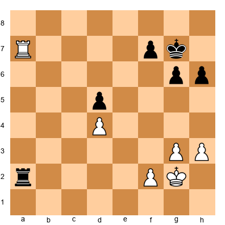</p>


White has rook on a7, king on g2, pawns on d4, f2, g3, h3. Black has rook on a2, king on g7, pawns on d5, f7, g6, h6. White to play. White has a very slight advantage (active rook on the 7th rank). Find the winning plan.

**Hint 1:** White's rook is on the 7th rank, attacking f7. How can this be exploited?
**Hint 2:** Think about the principle of two weaknesses. Where is Black's first weakness? Where could the second one be?
**Hint 3:** What happens if White plays f4 at the right moment?

**Solution:** White's rook on a7 pins the f7 pawn and ties down Black's position. But one weakness (f7) is not enough to win. White needs a second weakness. The plan: 1.Kf3 (improving the king, step 2 of the conversion method) 1...Ra1 2.Ke3 (the king marches toward the center) 2...Ra2 3.f4! (creating the second weakness: now the f-file is opened and the kingside pawns are mobile) 3...Ra3+ 4.Kd2 Ra2+ 5.Kc3 Ra3+ 6.Kb4 Rxg3 7.Rxf7+ Kh8 8.f5! (the passed pawn decides). But Black can defend more stubbornly with 3...Ra1 instead, and then 4.Kd3 Rf1 5.Ke2 Ra1 6.f5, opening the position. The key idea: the rook on the 7th rank creates the first weakness (f7 under attack), and f4-f5 creates the second weakness (a passed f-pawn). Black cannot handle both.

---

**Exercise 48.23 (★★★★) [Practice]: ⏱ 10 minutes**

*Set up your board.* This position tests queen vs. rook and bishop defense.


<p align="center">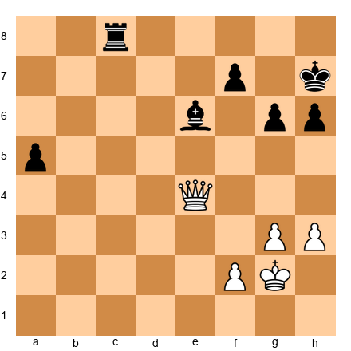</p>


White has queen on e4, king on g2, pawns on f2, g3, h3. Black has rook on c8, bishop on e6, king on h7, pawns on a5, f7, g6, h6. White to play with the queen against Black's rook and bishop.

**Hint 1:** The queen's advantage is mobility. Which of Black's pawns are weak?
**Hint 2:** Can the queen attack two targets at once? Think about threats on a5 and f7.
**Hint 3:** The bishop on e6 defends f7. What happens if the queen attacks from a square that forces the bishop to move?

**Solution:** 1.Qa8! (attacking from the corner, where the queen threatens both a5 and c8 simultaneously) 1...Rc7 (defending the rook against capture while maintaining connections) 2.Qxa5 (winning the pawn; the rook and bishop cannot defend the a-pawn and the king at the same time). After 2...Rc2 3.Qe1! (regrouping; now the queen prevents ...Rxf2 and prepares to push the a-pawn or attack the kingside). White is now a pawn up with the queen still dominating. The bishop and rook defend passively while the queen picks off pawns. This illustrates the queen's power in open positions: it attacks multiple targets and the two-piece side cannot cover them all. The defender's best chance was to keep the pawns compact, but the a5 pawn was isolated and fell.

---

**Exercise 48.24 (★★★★) [Mastery]: ⏱ 15 minutes**

*Set up your board.* This position comes from a rook-and-bishop vs. rook endgame where the attacker has winning chances.


<p align="center">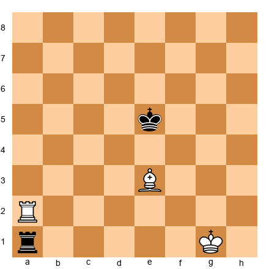</p>


White has rook on a2, bishop on e3, king on g1. Black has rook on a1, king on e5. White to play. Find the winning technique.

**Hint 1:** White needs to push the Black king to the edge. How can the bishop help?
**Hint 2:** The rook on a2 can cut off the Black king from the a-file. What role does the bishop play in restricting king movement?
**Hint 3:** Consider the plan: centralize the White king, use the bishop to create a barrier, then use the rook to force the Black king back.

**Solution:** This is a classic R+B vs. R position where White can make progress because the Black king is already somewhat restricted. 1.Kf2! (activating the king; the first step in any endgame) 1...Ra2+ 2.Ke1 Ra1+ 3.Kd2 Ra2+ 4.Kc3 (the king advances, using the checks to gain ground). Now 4...Ra1 5.Bf4+ Ke4 (5...Kd6 6.Rd2+ Ke7 7.Rd7+ and the king is driven back) 6.Kc4 (the White king reaches c4, supporting the rook and bishop). The winning method requires pushing the Black king toward a corner where the bishop controls the escape squares. After 6...Ke3 7.Ra3+ Kf2 8.Kd4, White's king dominates the center while the bishop and rook coordinate. The key principle: in R+B vs. R, centralize your king first, use the bishop to limit the defending king's options, and gradually push the defender toward the edge. This process can require many moves, so patience is essential.

---

**Exercise 48.25 (★★★★) [Mastery]: ⏱ 15 minutes**

*Set up your board.* This position tests fortress construction under pressure.


<p align="center">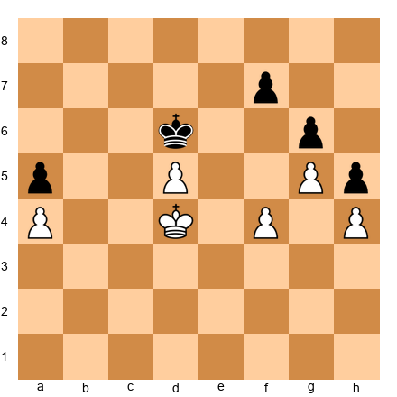</p>


White has king on d4, pawns on a4, d5, f4, g5, h4. Black has king on d6, pawns on a5, f7, g6, h5. White to play. Can White win, or does Black hold a fortress?

**Hint 1:** The kingside pawns are interlocked (f4 vs. f7, g5 vs. g6, h4 vs. h5). Can White break through?
**Hint 2:** Look at the queenside. The pawns on a4 and a5 are also locked. What does this mean for the structure?
**Hint 3:** Consider king maneuvers. Can either king outflank the other?

**Solution:** Black holds a fortress. The pawn structure is completely locked on both flanks. On the kingside, White cannot play f5 because after ...gxf5 the position opens but Black captures and the resulting structure is not winning. On the queenside, a4 and a5 are frozen. The key defensive idea: Black plays ...Ke7 and ...Kd6, shuttling the king between e7 and d6. White's king cannot outflank because if Ke3, then ...Ke7; if Kc3, then ...Kc7 defending the queenside. If White tries Ke4-f3-g3-h3-g4, Black responds with ...Ke7-f6 and blocks. The d5 pawn is passed but cannot advance because ...Kd6 (or ...Ke7-d7) always blocks it. This is a fortress because: (1) all pawns are fixed, (2) no breakthrough exists, and (3) the defending king covers all entry points. The lesson: fixed pawns on both flanks plus a well-placed king equals fortress.

---

**Exercise 48.26 (★★★★) [Practice]: ⏱ 12 minutes**

*Set up your board.* This position tests rook-and-knight vs. rook-and-bishop play from the knight's side.


<p align="center">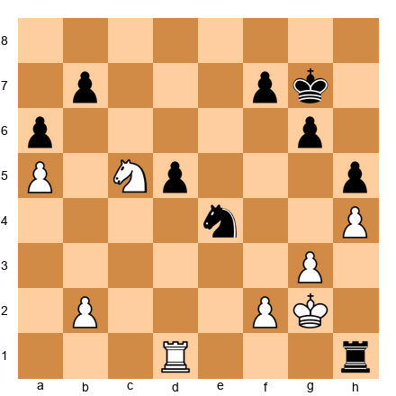</p>


Black has rook on h1, knight on e4, king on g7, pawns on a6, b7, e5, f7, g6, h5. White has rook on d1, knight on c5, king on g2, pawns on a5, b2, f2, g3, h4. Black to play.

**Hint 1:** Black's knight on e4 is centrally posted. Can it find a better square?
**Hint 2:** The rook on h1 is active. How can Black combine rook and knight threats?
**Hint 3:** Look at the weak pawns. Which of White's pawns can be targeted?

**Solution:** Black exploits the active knight and rook with 1...Nd2! (threatening Nf3+, forking king and rook) 2.Rd7 (the only active response; passive defense with Rb1 allows ...Nf3 with multiple threats) 2...Nf3 3.Rxb7 Nxh4+! 4.gxh4 Rxh4 (Black has won a pawn and the position is simplified). The exchange of knights leaves a rook endgame where Black's active rook and extra pawn provide winning chances. The key was the knight's tactical jump: from e4 to d2 to f3, creating a fork threat that won material. The lesson: in R+N vs. R+N positions, the knight's forking ability creates tactical shots that the opponent must constantly watch for. A centralized knight is not just positionally strong; it is tactically dangerous.

---

**Exercise 48.27 (★★★★) [Practice]: ⏱ 10 minutes**

*Set up your board.* This position tests queen endgame defense through perpetual check.


<p align="center">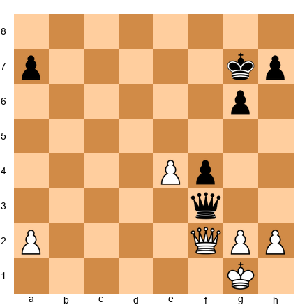</p>


Black has queen on f3, king on g7, pawns on a7, f4, g6, h7. White has queen on f2, king on g1, pawns on a2, e4, g2, h2. Black to play. Black is a pawn down but has an advanced f4 pawn. Can Black save the game?

**Hint 1:** Black's f4 pawn is advanced but blocked. Can it be used as a distraction?
**Hint 2:** Check, check, check. Where can Black's queen deliver perpetual check?
**Hint 3:** If White's king goes to h1, what happens next?

**Solution:** Black saves the game with perpetual check. 1...Qd1+ 2.Kh3 (2.Qf1 Qd4+ regains the queen trade but Black is worse; instead, the king tries to escape) 2...Qe2! (threatening Qf3+ and Qg4 mate). White must respond to the mating threat: 3.Qf3 (forced, blocking the check) 3...Qe6+ 4.Kh4 Qe1+ 5.Kg4 Qe2+ 6.Kxf4 Qd2+ 7.Ke5 Qc3+ 8.Kd6 Qd4+, and Black has perpetual check. The White king cannot escape to a safe zone because the queen covers too many diagonals. If 7.Kg5 Qg3+ 8.Kh6 Qf4+ 9.Kg7 Qg5+, the checks never stop. The lesson: in queen endgames, the weaker side should always look for perpetual check before resigning themselves to a loss. An advanced pawn (even if it falls) often draws the king into the open where perpetual check is available.

---

**Exercise 48.28 (★★★★★) [Mastery]: ⏱ 20 minutes**

*Set up your board.* This position tests the complete conversion process in a minimal-advantage rook endgame.


<p align="center">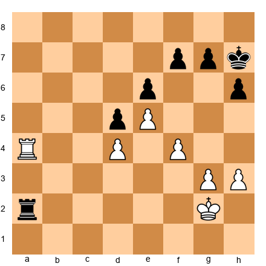</p>


White has rook on a4, king on g2, pawns on d4, e5, f4, g3, h3. Black has rook on a2, king on h7, pawns on d5, e6, f7, g7, h6. White to play. White has a slight space advantage (e5 pawn, kingside majority). Find the winning plan.

**Hint 1:** White's advantage is space (the e5 pawn cramps Black's position). How can the king be activated?
**Hint 2:** Where is the first weakness in Black's position? (Look at the f7 pawn.)
**Hint 3:** How can White create a second weakness? Consider the plan of g4-g5 at the right moment.

**Solution:** White wins through patient maneuvering, applying all five steps of the conversion method.

Step 1 (identify the advantage): White has more space and a better pawn structure. The e5 pawn cramps Black.

Step 2 (improve the worst piece): 1.Kf3! (the king heads toward the center) 1...Ra1 2.Ke3 Ra2 3.Kd3 (the king is now centralized and ready to support operations on both flanks).

Step 3 (fix the weakness): 3...Ra1 4.Ra7 (moving the rook to the 7th rank, attacking f7 and tying down Black's pieces) 4...Kg8 5.Kc3 (the king continues to improve, aiming for b4 or c4 to support queenside play).

Step 4 (create the second weakness): 5...Rf1 6.Kb4 Rxf4 (a desperate attempt; but actually White should play more carefully before this: 6.g4! is the correct move, fixing the kingside and creating the threat of g5). After 6.g4 Rf1 7.Kc5 Rc1+ 8.Kb6, White's king has infiltrated. Now Black faces threats on both the kingside (g5 breaking through) and the queenside (the king attacking from b6/c7).

Step 5 (convert): After Kb6, White threatens Rxf7 followed by Rc7 and Kb7, winning Black's queenside pawns. If Black defends with ...Rb1+, White plays Ka7 and then Ra8+, using the back rank. The two weaknesses (f7 pawn and the king's infiltration) are too much to handle.

This exercise is demanding because the advantage is tiny: White is only slightly better. But the five-step process turns that slight edge into a win through precise maneuvering. This is the difference between a 2400 player and a 2700 player.

---

**Exercise 48.29 (★★★★★) [Mastery]: ⏱ 15 minutes**

*Set up your board.* This position tests complex fortress recognition in a queen vs. rook-and-knight endgame.


<p align="center">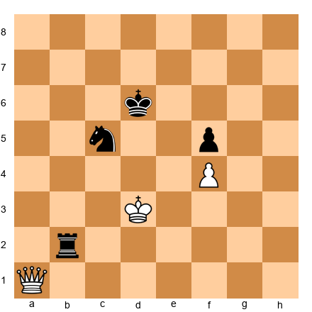</p>


White has queen on a1, king on d3, pawn on f4. Black has rook on b2, knight on c5, king on d6, pawn on f5. White to play. Can White win, or does Black hold?

**Hint 1:** Black's knight on c5+ is very well placed, defending the king and threatening forks. What happens if the queen checks?
**Hint 2:** If the queen goes to a7 or a8, can the knight and rook maintain coordination?
**Hint 3:** Consider whether Black can maintain the knight on c5 permanently. If so, is this a fortress?

**Solution:** Black holds a fortress. The knight on c5 is unassailable: it controls a4, b3, d3, e4, and e6. The rook on b2 prevents White's king from advancing (any Kc4 is met by ...Rb4+ or ...Nd3+). After 1.Qa8+ Ke7 (not ...Kc7?? 2.Qa7+ winning the rook) 2.Qg8 Kd6 (returning to the safe zone behind the knight) 3.Qg6+ Kd5 4.Qg2+ Kd6, White has no progress. The queen checks bounce off because the king always returns to d6, shielded by the knight on c5. If White tries 3.Qf8+ Kd5 4.Qd8+ Nd7! (the knight blocks the check and maintains the fortress). The key: a centralized knight that shields the king creates a fortress against the queen. The rook provides counterplay (threatening back-rank threats or rook checks), and the queen cannot simultaneously attack the knight, the rook, and the king. This is a model position for the knight-fortress defense.

---

**Exercise 48.30 (★★★★★) [Mastery]: ⏱ 20 minutes**

*Set up your board.* This position tests the complete technique in a rook-and-bishop vs. rook ending with the attacker trying to win.


<p align="center"></p>


Black has rook on h1, king on d6. White has rook on a1, bishop on f3, king on e3. White has rook and bishop vs. Black's lone rook. Play out the position from Black's side: find the drawing technique.

**Hint 1:** The defender's first priority is king placement. Where should the Black king go: toward the center or toward the edge?
**Hint 2:** The rook must stay active. After ...Rh3 (pinning nothing but creating threats), what does Black threaten?
**Hint 3:** Remember the three defensive rules: king in the center, rook active, avoid the edge.

**Solution:** Black draws with correct technique. 1...Ke6! (keeping the king centralized; the edge is death) 2.Ra6+ Kf5! (heading toward the bishop, which limits its scope) 3.Bg2 Rh2 (the rook stays active, threatening to attack White's pawns if any existed, and harassing the bishop). Now 4.Kf3 Rh3+ 5.Kf2 Rh2 (Black maintains the active rook on the second rank, preventing White from coordinating). 6.Ra5+ Kf4 (the king stays in the center). White cannot make progress because:

1. Black's king is centralized, never going to the edge.
2. Black's rook is active on the second rank, delivering threats and preventing coordination.
3. The defending king stays close to (or diagonally adjacent to) the bishop, limiting the bishop's useful moves.

This is the standard defensive technique in R+B vs. R. The 50-move rule protects the defender in most positions, but even without it, correct defense makes the attacker's task extremely difficult. The lesson: learn these three rules, and you will save many half-points in R+B vs. R endgames.

---

## PART 16: ENDGAME STUDY METHODS FOR THE ASPIRING GRANDMASTER

### 16.1 How to Study Endgames Effectively

Reading about endgames is not the same as studying them. You can read every endgame book ever written and still lose basic rook endings at the board. The problem is passive absorption: your eyes pass over the moves, your brain nods along, and nothing sticks. Here is a better method.

**The Active Study Protocol:**

1. Set up the position on a physical board. Not a screen. A physical board forces you to slow down and see the pieces as objects in space.

2. Cover the solution. Try to find the answer yourself. Spend at least 5 minutes before peeking. The struggle of searching for the answer is what builds pattern recognition.

3. Play both sides. After reading the solution, play through the position three times: once following the book, once from the winning side without looking, once from the losing side trying to defend. You will discover defensive resources that the book did not mention.

4. Test yourself a week later. If you cannot reproduce the key idea without help, you have not learned it. Go back and repeat steps 1 through 3.

This protocol takes more time than passive reading. That is the point. Twenty positions studied actively will teach you more than two hundred positions read passively.

### 16.2 Building Your Personal Endgame Repertoire

Every Grandmaster has a personal "endgame repertoire": a set of endgame types and techniques they know at a deep level. You do not need to know everything; you need to know your positions cold.

**Step 1: Identify your most common endgame types.** Go through your last 100 games. How many ended in rook endgames? How many in queen endgames? How many in minor-piece endgames? Focus your study on the types that appear most frequently in your games.

**Step 2: Build a collection of model positions.** For each common endgame type, collect 5 to 10 model positions that illustrate the key techniques. These should come from classic games, endgame studies, or your own practice.

**Step 3: Practice against engines.** Set up each model position and play it against an engine at a moderate strength level (around 2200-2400). The engine will not make blunders, but it will not play perfectly either. This gives you realistic practice without the frustration of facing Stockfish at full strength.

**Step 4: Review your failures.** After every tournament game that reaches an endgame, analyze the ending in detail. Compare your moves to the engine's recommendations. Where did you go wrong? Add the position to your collection if it reveals a gap in your knowledge.

### 16.3 The Endgame Positions That Decide Rating

At different rating levels, different endgame knowledge matters most. Here is what separates the levels:

**2200 to 2400:** Lucena, Philidor, basic rook endgame technique, opposition, basic fortresses. If you do not know these, you cannot reach 2400. These are covered in earlier volumes.

**2400 to 2500:** R+B vs. R defensive technique, queen vs. rook technique, two-weaknesses principle in rook endgames, opposite-colored bishops with rooks. These are the positions that cost you half-points against stronger opponents.

**2500 to 2600:** Converting minimal advantages (+0.3 to +0.5), fortress construction and breaking, queen endgame technique (king march, perpetual check avoidance), R+minor piece imbalances. This is where the material in this expanded chapter becomes critical.

**2600 and above:** All of the above, plus deep knowledge of rare endgame types (two bishops vs. knight, queen vs. two pieces, rook vs. two minor pieces), tablebase-informed play in positions approaching 7 pieces, and the psychological dimension of endgame play. At this level, endgame knowledge is a weapon, not just a defensive tool.

### 16.4 The Endgame Test

Here is a quick self-assessment. Give yourself 30 seconds per question. No board, no engine. Just your memory.

1. In the Lucena position, what is the first key move? (Answer: Rf4, preparing the bridge.)
2. In the Philidor defense, where does the rook go? (Answer: Sixth rank, then checks from behind when the pawn advances.)
3. Can a bishop and a rook pawn always promote? (Answer: No. If the bishop does not control the promotion square, the defender draws by sitting in the corner.)
4. In R+B vs. R, where should the defending king go? (Answer: The center. Never the edge.)
5. What is the Vancura position? (Answer: Rook defends from the side against a rook pawn. Draw.)
6. Name two fortress types. (Answer: Any two from the five we covered: wrong bishop + rook pawn, rook blockade, knight + pawns vs. queen, opposite-colored bishops with locked pawns, rook on seventh rank defense.)

If you answered 5 or 6 correctly without hesitation, your endgame foundations are solid. If you answered 3 or fewer, go back to the earlier sections of this chapter and the basic endgame material in Volumes 2 and 3 before continuing.

---

⚡ **ADHD Quick Set (Exercises 48.16-48.30):** If you are short on time, do exercises **48.16, 48.20, and 48.28**. These three cover the most important concepts from this expansion: rook-vs-bishop evaluation, queen endgame conversion, and minimal-advantage rook endgame technique.

---

## Updated Progress Check

After completing the expanded exercises, add these to your self-assessment:

- [ ] I can identify when a bishop is better than a knight (and vice versa) in R+minor piece endgames
- [ ] I can execute (or defend against) the R+B vs. R winning technique
- [ ] I understand perpetual check defense in queen endgames
- [ ] I recognize all five fortress types and can identify them in unfamiliar positions
- [ ] I can apply the five-step conversion method to +0.3 endgame advantages
- [ ] I can build a fortress under pressure by identifying the pattern, trading the right pieces, and fixing the pawn structure

If you checked 4 or more of these new items, you have absorbed the expanded material. You are ready for Chapter 49.

---

🛑 **Good stopping point.** This expansion covered rook-and-minor-piece endgames, queen endgames, advanced fortress types, and the subtle art of converting minimal advantages. These are the skills that separate strong Grandmasters from everyone else. Play through the exercises twice: once with the solutions visible, once from memory. Come back tomorrow with fresh eyes.
