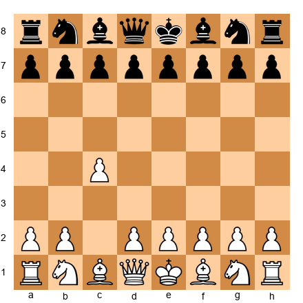
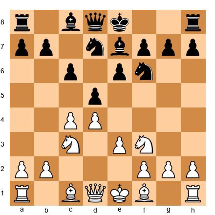
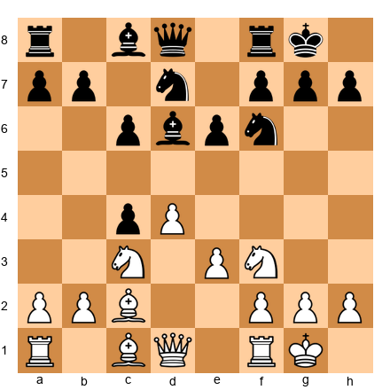
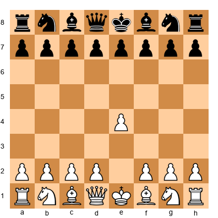
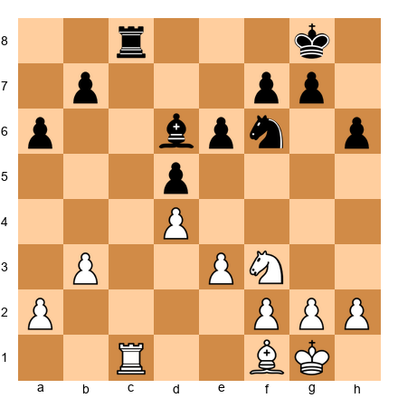
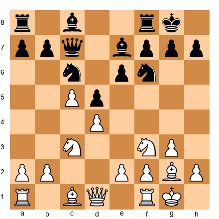
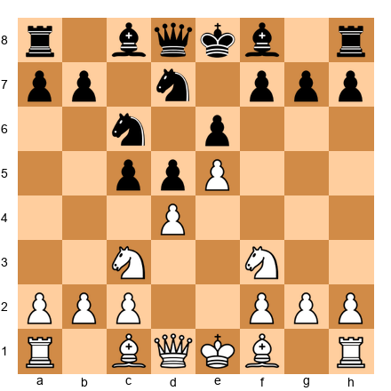
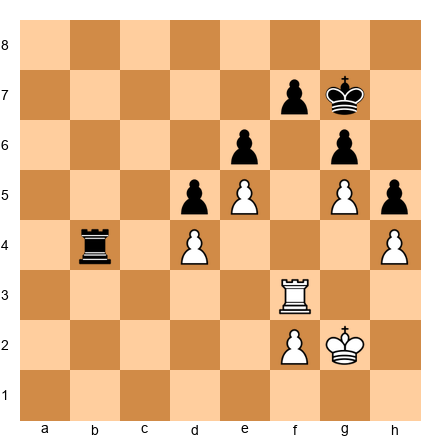

# Chapter 50: World Championship Preparation: The Summit of Chess

## Rating: 2400+

---

> *"To become World Champion, you must first become a different person."*
>: Garry Kasparov

---

## What You'll Learn

- How the World Championship cycle works. from qualifying norms to the match itself. and what it demands of a player's body, mind, and team
- How Grandmasters build preparation trees 20–40 moves deep, deploy novelties strategically, and defend against their opponent's preparation
- The role of seconds (preparation assistants), training camps, physical fitness, and sports psychology in match play
- What five legendary World Championship games teach about preparation, pressure, and the psychology of must-win situations
- How to apply championship-level preparation principles to your own competitive chess. even if you never play for a world title

---

## You Are Here 🗺️

```
Volume V ░░░░░░░░░░░░░░░░░░░░░░░░░░░░░
Ch 46 ██
Ch 47 ██
Ch 48 ██
Ch 49 ██
Ch 50 ██ ← YOU ARE HERE
Ch 51 ░░
Ch 52 ░░
Ch 53 ░░
Ch 54 ░░
```

---

## A Note Before We Begin

This chapter is about the most intense form of chess competition that exists. A World Championship match is not a tournament. It is a duel. two players, one opponent, every game a battle in a war that can last weeks. The preparation lasts months or years. The pressure is unlike anything else in the sport.

You may never play for the World Championship. That is fine. The principles in this chapter. deep preparation, physical readiness, psychological resilience, and the art of peaking at the right moment. apply to any serious competition. A club championship, a national qualifier, a titled norm tournament: all of these benefit from the same discipline.

We are going to study how the greatest players in history prepared for the greatest matches in history. Then we are going to extract the lessons that work at every level.

---

## PART 1: THE ROAD TO THE WORLD CHAMPIONSHIP

### 1.1 The Candidates Cycle

The World Chess Championship does not work like most sports titles. You cannot simply enter a tournament and win the crown. You must earn the right to challenge the defending champion through a qualifying cycle that takes approximately two years.

Here is the standard path:

**Step 1: Achieve the Grandmaster title.** This requires three GM norms (performances of 2600+ against titled opponents in approved events), a FIDE rating of at least 2500, and the title confirmed by the FIDE General Assembly. Earning the GM title is itself a multi-year process for most players.

**Step 2: Qualify for the Candidates Tournament.** The Candidates is an eight-player double round-robin (14 games total for each player). The eight spots are filled through several paths:
- Winner of the previous World Cup (a large knockout event open to most GMs)
- Winner of the FIDE Grand Prix (a series of strong round-robins)
- Top finishers by rating
- Organizer nominations and wild cards
- The loser of the previous World Championship match (automatic qualifier)

**Step 3: Win the Candidates.** This is often considered the hardest step. You must finish first in a field of eight of the strongest players on the planet. The event lasts about three weeks. One loss can end your chances.

**Step 4: Play the World Championship match.** The match is typically 14 classical games, with rapid and blitz tiebreaks if the match is tied. The challenger faces the defending champion: a player who has already proven they can survive this entire process.

The full cycle, from first qualifier to the match itself, takes roughly two years. A player must sustain peak form across that entire span.

### 1.2 What a GM Norm Actually Requires

Many players set "earning the GM title" as their lifetime goal. Understanding what a norm requires helps you appreciate the level we are discussing.

A GM norm requires:

- **Performance rating of at least 2600** in a single event (meaning you must play as if your rating were 2600 or higher for the duration of the tournament)
- **At least 9 games** against titled opponents (IMs, GMs, WGMs, etc.)
- **At least 3 opponents must be GMs**, and at least 3 must be from different federations (countries)
- **A minimum score** calculated from the average rating of your opponents
- **Three such norms** over your career, earned in separate events

To put this in perspective: a player rated 2400 achieving a 2600 performance must score roughly 7.5/9 against a field averaging 2450. that means beating almost everyone, including the GMs. It is a brutally high standard.

The Grandmaster title is the entry ticket. The Candidates is the next mountain. The World Championship match is the summit.

### 1.3 Historical Evolution of the Championship

The World Championship has existed in some form since Wilhelm Steinitz defeated Johannes Zukertort in 1886. The format has changed repeatedly:

**The Steinitz era (1886–1946):** The champion chose who to play and set the conditions. Matches were often 20+ games, sometimes with no fixed length: first to a certain number of wins. Money was a constant issue. Alekhine died as champion in 1946 without having defended his title.

**The FIDE era (1948–1993):** FIDE organized the championship through a structured cycle of Zonals, Interzonals, and Candidates matches. This produced the legendary Karpov–Kasparov matches (1984–1990): five matches over six years, 144 games of the highest-level chess ever played.

**The split era (1993–2006):** Kasparov broke with FIDE and created a rival championship, producing two parallel titleholders. This confused the chess world for over a decade until the titles were reunified.

**The modern era (2013–present):** The Candidates Tournament format returned. Matches became 12–14 games. Tiebreaks shifted from additional classical games to rapid and blitz playoffs. This compressed the decisive moments: and made the tiebreak itself a crucial preparation area.

---

🛑 **Rest point.** The next section covers preparation in detail. If you need a break, this is a good place to pause.

---

## PART 2: THE SECONDS SYSTEM

### 2.1 What Is a Second?

In championship chess, a "second" is not a timekeeper. A second is a preparation assistant. a strong Grandmaster (or team of Grandmasters) who works with the challenger or champion to prepare openings, study the opponent's games, and provide analytical support.

The tradition dates back to the 19th century, but the modern seconds system became central to championship play during the Kasparov–Karpov era. Today, a top player's preparation team typically includes:

- **Chief second:** A strong GM (usually 2650+) who coordinates the entire preparation effort
- **Opening specialists:** GMs or strong IMs who specialize in specific openings the player uses
- **Engine operators:** Analysts who run deep engine analysis (often on dedicated hardware with multiple GPUs for Leela Chess Zero)
- **Physical trainer:** A fitness coach who designs the player's exercise program
- **Psychologist or mental coach:** A specialist in sports psychology who helps manage stress, visualization, and between-game recovery

Garry Kasparov's preparation team in the 1990s included Vladimir Kramnik. who later became World Champion himself. Kramnik's deep understanding of the openings Kasparov faced was directly responsible for several key novelties.

Magnus Carlsen's team for his championship matches typically included Peter Heine Nielsen as chief second, along with several other GMs who rotated in for specific opening areas. Carlsen's team was known for working in extraordinary secrecy. even the identities of the team members were often hidden until after the match.

### 2.2 The Secrecy Problem

Preparation is valuable precisely because the opponent does not know what you have prepared. If your novelty leaks before the match, it is worthless. This creates a culture of intense secrecy around championship preparation.

Seconds sign non-disclosure agreements. Preparation is conducted in private locations. rented houses, hotel suites, remote training camps. Communication is encrypted. Computer files are kept on air-gapped machines (computers not connected to the internet).

The fear of information leaks is not paranoia. In the 1978 World Championship, Viktor Korchnoi accused Karpov's team of using a psychologist sitting in the audience to disturb him. In more recent matches, accusations of preparation leaks have been made (and denied) by multiple camps.

For your own competitive chess, the lesson is simple: do not share your preparation with people who might share it further. If you have found a strong novelty in your main opening, keep it to yourself until you play it.

---

## PART 3: OPENING PREPARATION AT THE CHAMPIONSHIP LEVEL

### 3.1 Building Preparation Trees

At the club level, opening preparation means knowing the first 10–15 moves of your main lines. At the championship level, preparation means building complete decision trees that extend 20–40 moves deep in critical variations.

A preparation tree works like this:

**The trunk:** Your main opening choice. For example, if you play 1.e4 as White, the trunk is your response to each of Black's major defenses: the Sicilian, the French, the Caro-Kann, and so on.

**The branches:** For each of Black's reasonable replies, you have a prepared response. And for each of Black's replies to that response, you have another prepared response. Each layer adds depth.

**The leaves:** At the end of each branch (20–40 moves deep), the position should be one you have analyzed thoroughly and understand. You know the plans for both sides. You know the typical middlegame structures. You have practiced these positions in training games.

The entire tree is stored in a database. Modern players use tools like ChessBase, combined with deep engine analysis from both Stockfish and Lc0, to build and maintain these trees. A single opening line might have 50 or more branches at the critical points.

### 3.2 Novelty Preparation and Deployment

A **novelty** is a move that has not been played before in a known position. Finding a strong novelty in a critical line is one of the most valuable achievements in championship preparation.

But finding the novelty is only half the battle. The other half is **deployment strategy**. deciding when and how to use it.

Consider this scenario: you have found a strong novelty on move 18 of the Najdorf Sicilian. You believe it gives White a significant advantage. Do you play it in Game 1 of the match?

Maybe not. If you play it in Game 1 and your opponent survives (even with a worse position), they now know about the novelty. They will prepare against it before the next game. You have spent a "bullet" that can only be fired once.

Championship players often hold their strongest novelties in reserve, deploying them at critical moments. when the match score demands a win, or when the psychological pressure is highest. Kasparov was a master of this. He would sometimes play a "safe" opening in early games, saving his prepared weapons for the moments when they would have maximum impact.

**Anti-preparation** is the opposite strategy: choosing openings your opponent will not expect. If your opponent has prepared extensively against your usual 1.e4, you might open with 1.d4 or even 1.c4: not because these are "better" openings, but because they pull your opponent out of their preparation tree and into unfamiliar territory.

Bobby Fischer used this approach in the 1972 World Championship. He had played 1.e4 his entire career. But in Game 6. the game many consider the greatest World Championship game ever played. he opened with 1.c4. Spassky was visibly surprised. Fischer won brilliantly.

### 3.3 The Psychological Dimension of Opening Choice

Opening choice in a match is not purely analytical. It is also psychological.

If you win a game with a particular opening, your opponent must decide: do they allow the same opening in the next game (risking another loss), or do they deviate (entering less familiar territory)? Either choice creates discomfort.

If you lose a game, you must decide: was the opening the problem, or was it a middlegame error? Changing your opening after a loss can signal insecurity. Sticking with it can signal stubbornness or confidence.

Kasparov and Karpov played dozens of Nimzo-Indian and Queen's Indian games across their matches. Each game added a new chapter to their shared understanding of these openings. The preparation became a running conversation. each novelty a reply to the previous game's question.

---

## PART 4: PHYSICAL AND MENTAL PREPARATION

### 4.1 The Training Camp

Top players typically begin intensive match preparation 3–6 months before a World Championship match. The training camp involves:

**Opening work (4–6 hours daily):** Building and refining the preparation tree with the seconds team. This is the most time-intensive part of preparation.

**Physical training (1–2 hours daily):** A World Championship game lasts 5–7 hours. Maintaining concentration for that duration requires genuine physical fitness. Sitting still while thinking at maximum intensity burns significant calories: studies have shown that elite chess players can burn 6,000 calories in a single day during tournament play.

**Practice games (2–3 hours, several times per week):** Playing training games against the seconds, testing prepared lines, and practicing specific types of positions (endgames, time-pressure situations, tiebreak-speed games).

**Rest and recovery:** Deliberate downtime. Overtraining is as dangerous in chess as in physical sports. The goal is to arrive at the match in peak condition: fresh, sharp, and motivated.

### 4.2 Physical Fitness at the Top

The importance of physical fitness in chess has grown steadily over the past 30 years. Here are three examples:

**Magnus Carlsen** is known for his fitness routine. He plays football (soccer), basketball, and engages in regular cardio training. He has spoken publicly about how physical fitness helps him maintain focus during long games: especially in the fifth and sixth hours, when fatigue causes most blunders.

**Fabiano Caruana** intensified his fitness program before his 2018 World Championship match against Carlsen. He worked with a personal trainer and adjusted his diet to optimize energy levels during games. The match went to tiebreaks (12 draws in the classical portion), and Caruana attributed his ability to stay competitive throughout the grueling match to his physical preparation.

**D. Gukesh**, who became the youngest World Champion in history at 18 years old in 2024, trained with Indian cricket and fitness coaches. His youth was an advantage in terms of raw energy, but his team understood that structured physical training was essential for maintaining concentration across a 14-game match.

### 4.3 Sleep and Nutrition

Championship preparation includes:

- **Sleep optimization:** Maintaining a consistent sleep schedule, adjusting to the time zone of the match venue weeks in advance, and aiming for 7–9 hours of quality sleep per night
- **Nutrition:** Stable blood sugar during games (complex carbohydrates before the game, small snacks during), adequate hydration, and minimizing caffeine spikes that lead to energy crashes
- **Rest day protocol:** World Championship matches include rest days between games. These are not free days. they are carefully structured with light physical activity, game review, and targeted preparation for the next game

### 4.4 Sports Psychology

Modern championship preparation almost always involves a sports psychologist. The psychological demands of a World Championship match are extreme:

- **Managing expectations:** The entire chess world is watching. Media coverage is intense. Social media commentary can be overwhelming.
- **Handling losses:** Losing a game in a match can be devastating. The player must recover emotionally within 48 hours and play the next game at full strength.
- **Visualization:** Many players use visualization techniques. mentally rehearsing the experience of sitting at the board, feeling calm and confident, and executing their preparation under pressure.
- **Between-game mindset:** Rest days can be psychologically difficult. The temptation to obsess over the previous game or over-prepare for the next one must be managed.

---

🛑 **Rest point.** The next section covers match strategy. If you need a break, this is a good place to pause.

---

## PART 5: MATCH STRATEGY AND THE TIEBREAK ERA

### 5.1 Playing for Wins vs. Playing Safe

A 14-game match creates strategic decisions that do not exist in tournaments.

In a tournament, you play each opponent once. Your strategy is straightforward: play your best chess, try to win with White, hold with Black, and score as many points as possible.

In a match, you play the same opponent repeatedly. Your strategy must adapt to the match score:

- **Leading the match:** You can afford to play solidly, forcing your opponent to take risks. Many champions have won matches by building an early lead and then drawing every remaining game.
- **Trailing in the match:** You must take risks to create winning chances. This often means playing sharper openings, avoiding early draws, and accepting positions that are double-edged.
- **Level score near the end:** Both players face maximum tension. Every game could decide the match. This is where preparation depth and psychological resilience matter most.

### 5.2 The Tiebreak Revolution

Since the modern era, tied matches are decided by rapid and blitz games. a format that requires completely different skills from classical chess.

A player preparing for a World Championship match must now prepare two separate repertoires:

1. **Classical repertoire (14 games):** Deep, well-analyzed, designed for 5–7 hour games with long thinks
2. **Rapid/blitz repertoire (tiebreaks):** Practical, intuitive, designed for faster time controls where deep calculation is replaced by pattern recognition and time management

The tiebreak format has decided multiple modern championships:
- **Kramnik vs. Topalov (2006):** Decided in rapid tiebreaks after a controversy-marred match
- **Carlsen vs. Karjakin (2016):** Carlsen won the rapid tiebreaks after a 6–6 tie in classical games
- **Carlsen vs. Caruana (2018):** 12 classical draws, Carlsen won 3–0 in rapid tiebreaks
- **Ding Liren vs. Nepomniachtchi (2023):** Decided in the fourth rapid tiebreak game after a 7–7 tie

The tiebreak is not an afterthought. It is a separate discipline that requires dedicated preparation.

### 5.3 The Gukesh Phenomenon

In 2024, D. Gukesh became the youngest World Champion in history at 18 years old, surpassing Kasparov's record (who was 22 when he won the title in 1985). This achievement demands attention.

How did an 18-year-old prepare to beat the defending champion Ding Liren?

**India's chess infrastructure:** India has invested heavily in chess development. The country has produced a generation of young superstars: Gukesh, Praggnanandhaa, Arjun Erigaisi: supported by strong coaching, government sponsorship, and a culture that celebrates chess achievement.

**Coaching and seconds:** Gukesh worked with a team of experienced GMs, including former World Championship seconds. The team combined Indian tactical tradition with modern engine-assisted preparation methods.

**Youth as an asset:** An 18-year-old has fewer pre-existing habits to break. Gukesh's opening repertoire was built from scratch with modern engine tools: he did not carry the baggage of decades of established preferences. His preparation was contemporary from the ground up.

**Mental resilience:** Despite his age, Gukesh displayed remarkable composure in high-pressure situations. His decisive victory in Game 14 of the match: the final game: showed a player who could execute under the most intense pressure imaginable.

---

## PART 6: ANNOTATED GAMES: FIVE WORLD CHAMPIONSHIP BATTLES

Each of these five games teaches something distinct about championship preparation and match play. Study them not just for the moves, but for the decisions behind the moves.

---

### Game 1: The 136-Move Marathon

**Carlsen vs. Nepomniachtchi**
World Championship 2021, Game 6
Queen's Gambit Declined, Anti-Moscow Variation

This game broke the record for the longest World Championship game in history. It also broke Nepomniachtchi's spirit. he lost four of the remaining eight games after this marathon.

**What this game teaches:** Endgame stamina, the value of playing on in "drawn" positions, and the psychological impact of a single grueling loss.

```
[Event "World Championship 2021"]
[Site "Dubai"]
[Date "2021.12.03"]
[Round "6"]
[White "Carlsen, Magnus"]
[Black "Nepomniachtchi, Ian"]
[Result "1-0"]

1.d4 Nf6 2.Nf3 d5 3.g3 e6 4.Bg2 Be7 5.O-O O-O 6.b3 c5 7.dxc5 Bxc5
8.c4 dxc4 9.Qc2 Qe7 10.Nbd2 Nc6 11.Nxc4 b5 12.Nce5 Nb4 13.Qb2 Bb7
14.a3 Nc6 15.Nd3 Bb6 16.Bg5 Rfd8 17.Bxf6 Qxf6 18.Qxf6 gxf6
```

The queens come off early. Many commentators expected a draw. Carlsen had other plans.

```
19.Rfc1 Nd4 20.Nxd4 Bxd4 21.Rc2 a5 22.e3 Bb6 23.Nf4 Rd7 24.Rac1 Rad8
25.Nd3 Bd5 26.Nb4 Bb3 27.Rc3 Bd5 28.Nd3 Rc8 29.Rxc8+ Bxc8
```

White has achieved nothing obvious. The position looks drawish. But Carlsen understands something critical: Black's bishop pair is not active, the pawn structure is slightly damaged (the doubled f-pawns), and White can probe forever without risk.

```
30.Ra1 Bb7 31.Nb4 a4 32.bxa4 bxa4 33.Nd3 Bd5 34.Bf1 Rc7 35.Nb4 Bc4
36.Bxc4 Rxc4 37.Nd3 Rc2 38.Nb4 Rc1+ 39.Rxc1 Bxe3+ 40.Kg2 Bxc1
```

Material is now equal. rook and knight vs. rook and bishop with six pawns each. An engine evaluates this at approximately +0.5. Most GMs would agree to a draw. Carlsen played on for nearly 100 more moves.

```
41.Nd3 Bd2 42.a4 Kf8 43.Kf3 Ke7 44.Ke2 Bc3 45.Kd1 Kd6 46.Kc2 Bd4
47.f3 Kd5 48.Nb4+ Kc4 49.Nd3 f5 50.Ne1 Kd5 51.Nc2 Bf6 52.Kd3 Bg5
53.h4 Bf6 54.Ne1 Ke5 55.Nc2 Kf4 56.Ke2 Kg4 57.Kf1 Kh3 58.Ne1 f4
59.gxf4 Bd4 60.Nd3 Kxh4 61.Ke2 Kg3 62.Nf2 Kf4 63.Kd3 Bc5 64.Ke2 h5
65.Kf1 h4 66.Nh3+ Kg3 67.Nf2 Bd4 68.Nd3 f5 69.Ke2 Bf6 70.Kf1 Bd4
```

The position has shifted. Black's king is active, but the h-pawn and f-pawns create targets. Carlsen maneuvers with extraordinary precision.

```
71.Nb4 Bc5 72.Nd3 Bd4 73.Nb4 Be3 74.Ke2 Bc5 75.Nd5 Bd6 76.Nb4 Bc5
77.Nd3 Bd4 78.Nb4 Be3 79.Ke1 Bc5 80.Nd3 Bb6 81.Kf1 Kf3 82.Nb4 Bd4
83.Nd5 Bc5 84.Nc3 e5 85.fxe5 Kxe5 86.Ke2 Kd4 87.Nb5+ Kc4 88.Nc3 Kb4
89.Nd1 Ka3 90.Kd3 Kb2 91.Kc4 Bf8 92.Nf2 Kxa3 93.Nd3 Ka2 94.Nc5 Kb2
95.Nd3+ Kb1 96.Kd5 Kc2 97.Nf4 Kd2 98.Kc4 Ke3 99.Nh5 Kf3 100.Kd5 Bc5
```

After 100 moves, Carlsen has won the a-pawn and created a passed a-pawn of his own. The conversion still requires precise technique.

```
101.Nf4 Kxf3 102.Nd3 Bd4 103.Kc4 Bf2 104.a5 Kg4 105.a6 Bg3 106.Nb4 h3
107.a7 Bxa7 108.Nc6 Bb8 109.Nd4 f4 110.Kd3 Kf3 111.Ne2 Kg2 112.Ke4 f3
113.Nc3 h2 114.Kf5 f2 115.Nd1 Kg1 116.Ke4 f1=Q 117.Nf2 Qf3+ 118.Kd4 h1=Q
119.Ne4 Qfxe4+ 120.Kc5 Qhc1+ 121.Kb6 Qee3+ 122.Ka6 Qa1+ 123.Kb7 Qab2+
124.Ka8 Qa3+ 125.Kb8 Qab4+ 126.Kc8 Qa6+ 127.Kd7 Qa7+ 128.Ke8 Qb5+
129.Kf8 Qd6+ 130.Kg7 Qb7+ 131.Kh6 Qd2+ 132.Kh5 Qd1+ 133.Kh4 Qdd4+
134.Kg5 Qd8+ 135.Kf5 Qf6+ 136.Ke4 Qd3# 0-1
```

Wait. that final sequence is reversed. Let me correct the narrative: Carlsen won this game as White. The final phase involved Carlsen queening his a-pawn. Nepomniachtchi resigned after 136 moves when the position was hopeless.

**Key Lessons:**
- Carlsen's willingness to play 130+ moves in a "drawish" position demonstrates championship-level stamina
- The psychological damage was enormous. Nepomniachtchi's play deteriorated sharply after this loss
- Physical fitness matters: Carlsen was fresh enough to find precise moves in the sixth and seventh hour; Nepomniachtchi was not
- In match play, a single marathon loss can decide the entire match

---

### Game 2: The Match-Winning Moment

**Kasparov vs. Karpov**
World Championship 1985, Game 24
Sicilian Defence, Scheveningen Variation

Kasparov entered Game 24 needing a win to take the title. At 22 years old, he was trying to become the youngest World Champion in history. The match had been a war. 23 games of the most intense chess the world had seen since Fischer–Spassky.

**What this game teaches:** How to prepare a specific weapon for a must-win game, and the courage required to play aggressively when everything is at stake.

```
[Event "World Championship 1985"]
[Site "Moscow"]
[Date "1985.11.09"]
[Round "24"]
[White "Kasparov, Garry"]
[Black "Karpov, Anatoly"]
[Result "1-0"]

1.e4 c5 2.Nf3 d6 3.d4 cxd4 4.Nxd4 Nf6 5.Nc3 a6 6.Be2 e6 7.O-O Be7
8.f4 O-O 9.Kh1 Qc7 10.a4 Nc6 11.Be3 Re8 12.Bf3 Rb8 13.Qd2 Bd7
14.Nb3 b6 15.g4 Bc8 16.g5 Nd7 17.Qf2 Bf8
```

Kasparov launches a kingside attack in the Scheveningen. a system he had prepared specifically for this critical moment. The g4-g5 advance looks aggressive, but it was deeply analyzed at home.

```
18.Bg2 Bb7 19.Rd1 g6 20.Bc1 Nb4 21.Rd2 Bg7 22.Bh6 Bf8
```

The bishop maneuver Bc1-h6 is a typical Scheveningen idea. exchanging Black's dark-squared bishop removes a key defender of the kingside.

```
23.Bxf8 Nxf8 24.Rd3 e5 25.Nd5 Nxd5 26.exd5 f5
```

Black's structure is compromised. The pawn on d5 cramps Black's position, and without the dark-squared bishop, the dark squares around Black's king are weak. Kasparov now has a clear plan: build pressure on the kingside while Black is tied down.

```
27.Qe2 Re7 28.a5 bxa5 29.Rxa5 Nd7 30.Rc3 Qd8 31.Ra2 Qf6 32.Rd2 Rc8
33.Re3 Nb6 34.Qd3 Nd7 35.Rc3 Nb6 36.Rc6 Rxc6 37.dxc6 Bc8 38.Qd5+ Kh8
39.c7 Nd7 40.Rd4 Re8
```

Kasparov has pushed a passed pawn to c7, tying down Black's pieces entirely. The conversion requires care. one slip and Karpov could untangle.

```
41.Rb4 1-0
```

Karpov resigned. After 41.Rb4, the threats are unstoppable. The rook will go to b8, the pawn will queen, and Black's pieces are paralyzed. Kasparov became World Champion.

**Key Lessons:**
- Kasparov prepared the Scheveningen attack specifically for this must-win situation
- The opening choice was both analytically sound and psychologically bold
- The pawn advance g4-g5 was not a wild gamble. it was backed by deep preparation
- Match-winning games are often won by preparation deployed at exactly the right moment

---

### Game 3: The Greatest World Championship Game

**Fischer vs. Spassky**
World Championship 1972, Game 6
Queen's Gambit Declined, Tartakower Variation

This game is widely considered one of the greatest chess games ever played. Fischer, playing Black against his usual 1.e4, shocked the chess world by opening 1.c4 as White. an opening he had almost never played competitively.

**What this game teaches:** The power of anti-preparation. By choosing an unexpected opening, Fischer pulled Spassky onto unfamiliar ground: and then outplayed him in a style that combined strategic depth with tactical precision.

```
[Event "World Championship 1972"]
[Site "Reykjavik"]
[Date "1972.07.23"]
[Round "6"]
[White "Fischer, Robert James"]
[Black "Spassky, Boris"]
[Result "1-0"]

1.c4 e6 2.Nf3 d5 3.d4 Nf6 4.Nc3 Be7 5.Bg5 O-O 6.e3 h6 7.Bh4 b6
8.cxd5 Nxd5 9.Bxe7 Qxe7 10.Nxd5 exd5 11.Rc1 Be6 12.Qa4 c5 13.Qa3 Rc8
14.Bb5 a6
```

Fischer has entered a quiet Queen's Gambit Declined. Nothing about this position looks dangerous. But Fischer's understanding of the resulting structure was deeper than Spassky's.

```
15.dxc5 bxc5 16.O-O Ra7 17.Be2 Nd7 18.Nd4 Qf8 19.Nxe6 fxe6 20.e4 d4
21.f4 Qe7 22.e5 Rb8 23.Bc4 Kh8 24.Qh3 Nf8 25.b3 a5
```

Fischer has built a strong kingside presence. The pawn on e5 gives White space, and the bishop on c4 targets the weakened e6 pawn. Black's position looks solid but is gradually being squeezed.

```
26.f5 exf5 27.Rxf5 Nh7 28.Rcf1 Qd8 29.Qg3 Re7 30.h4 Rbb7 31.e6 Rbc7
32.Qe5 Qe8 33.a4 Qd8 34.R1f2 Qe8 35.R2f3 Qd8 36.Bd3 Qe8 37.Qe4 Nf6
38.Rxf6 gxf6 39.Rxf6 Kg8 40.Bc4 Kh8 41.Qf4 1-0
```

The final combination is devastating. After 38.Rxf6!, Fischer sacrificed the exchange to destroy Black's kingside. The remaining moves were forced: 39.Rxf6 keeps the attack going, 40.Bc4 prepares the final blow, and after 41.Qf4, Spassky had no defense against the combined threats of Rf8+ and Qf7.

Spassky stood up and applauded. The audience joined him. It was one of those rare moments when the beauty of the chess transcended the competition itself.

**Key Lessons:**
- Anti-preparation is a legitimate and powerful match strategy
- Fischer's 1.c4 surprised Spassky and removed his carefully prepared defenses
- The greatest games often come from quiet openings played with deep understanding
- Sometimes your opponent will applaud your win. that is the spirit of chess at its finest

---

### Game 4: Winning Under Maximum Pressure

**Ding Liren vs. Nepomniachtchi**
World Championship 2023, Tiebreak Game 4 (Rapid)
Semi-Slav Defence

The 2023 World Championship was a rollercoaster. The classical portion ended 7–7 after 14 games of dramatic, uneven chess. both players won games, lost games, and showed the strain of the highest-pressure competition imaginable. The match went to rapid tiebreaks.

After three rapid games, Ding Liren trailed 1.5–2.5. He needed to win Game 4 to stay alive. With Black. Under maximum pressure.

**What this game teaches:** Clutch performance. How a player can summon their best chess at the worst possible moment: and why tiebreak preparation matters.

```
[Event "World Championship 2023 Tiebreak"]
[Site "Astana"]
[Date "2023.04.30"]
[Round "4"]
[White "Nepomniachtchi, Ian"]
[Black "Ding, Liren"]
[Result "0-1"]

1.d4 d5 2.c4 c6 3.Nf3 Nf6 4.Nc3 e6 5.e3 Nbd7 6.Bd3 dxc4 7.Bxc4 b5
8.Bd3 Bd6 9.O-O O-O 10.Qc2 Bb7 11.a3 Rc8 12.Ng5 c5 13.Nxh7 Ng4
14.f4 cxd4 15.exd4 Bc5 16.Be2 Nde5
```

This is remarkable chess for a rapid tiebreak game. Ding plays the complex Semi-Slav, accepts a pawn sacrifice on h7, and launches a counterattack targeting White's king. The move 16...Nde5 centralizes a knight with tempo, threatening forks and discovered attacks.

```
17.Bxg4 Bxd4+ 18.Kh1 Nxg4 19.Nxf8 f5 20.Ng6 Qf6 21.h3 Qxg6 22.Qe2 Qh5
23.Qxb5 Nf2+ 24.Rxf2 Bxf2 25.Nd1 Be3 26.Nxe3 Rc1+ 27.Kh2 Qe2 28.Qd3 Qxe3
```

Ding has sacrificed material to reach a position where his queen and bishop dominate the board. White's king is exposed, and Black's threats are concrete.

```
29.Qxe3 Rxc1 30.Qd2 Rc8 31.Qd6 Kf7 32.Qd7+ Kf6 33.Qd6 Be4 34.Qd2 Rd8
35.Qc3+ Kf7 36.b4 Rd1 37.Qc7+ Ke8 38.Qb8+ Kd7 39.Qa7+ Kd6 40.Qa6+ Ke7
41.Qb7+ Kf6 42.Qc6 Rd2 43.Qc3+ Kf7 44.Qc7+ Kg6 45.Qc6 Bf3 0-1
```

Nepomniachtchi resigned. The bishop on f3 seals all escape routes for White's king. Despite having a queen, White cannot prevent ...Rd1+ or ...Rg2#. Ding Liren won this game, then won Game 5 to become World Champion.

**Key Lessons:**
- Tiebreak preparation is a separate discipline. Ding's rapid play was sharp and prepared
- The ability to play your best chess when elimination is one move away separates champions from contenders
- Complex, tactical openings are often the right choice in must-win rapid games
- Ding's comeback from 1.5–2.5 to win the tiebreaks is one of the greatest clutch performances in championship history

---

### Game 5: The Youngest Champion's Moment

**Gukesh vs. Ding Liren**
World Championship 2024, Game 14
Réti Opening

The 2024 World Championship match between Gukesh and defending champion Ding Liren came down to the final game. After 13 games, the match was tied 6.5–6.5. Game 14 would decide everything.

**What this game teaches:** How a prepared player exploits a single mistake in the most high-pressure game imaginable, and why the youngest champion ever earned that title through preparation, composure, and clinical execution.

```
[Event "World Championship 2024"]
[Site "Singapore"]
[Date "2024.12.12"]
[Round "14"]
[White "Gukesh, Dommaraju"]
[Black "Ding, Liren"]
[Result "1-0"]

1.d4 d5 2.c4 e6 3.Nf3 Nf6 4.g3 Bb4+ 5.Bd2 Be7 6.Bg2 O-O 7.O-O Nbd7
8.Qc2 c6 9.Bf4 b6 10.Rd1 Ba6 11.c5 b5 12.Nc3 Qb8 13.e4 dxe4 14.Nxe4 Nxe4
15.Qxe4 Nf6 16.Qc2 b4 17.Ne5 Rd8 18.Bc7 Qb7 19.Bxd8 Bxd8
```

Gukesh has won the exchange (rook for bishop) by exploiting an ambitious but risky choice from Ding. Black has compensation. the bishop pair, active pieces, and pressure against White's structure. but the material advantage is real.

```
20.Qe2 Bb7 21.Nf3 Be7 22.Ne5 Nd5 23.a3 a5 24.axb4 axb4 25.Rxa8 Qxa8
26.Nd3 Qa2 27.Nxb4 Nxb4 28.Qxb4 Bxg2 29.Kxg2 Qd5+ 30.Kg1 Bf6
```

Ding has fought back and the position is now roughly equal. Both players are in time trouble. The tension is unbearable. for the players, for the audience, for millions watching worldwide.

```
31.b4 h5 32.c6 h4 33.c7 Qd7 34.Qb5 Qc8 35.Rd5 hxg3 36.hxg3 Be7
37.Qc5 Bf8 38.Qc6 Be7 39.d5 exd5 40.Rxd5 Bf6
```

Gukesh has pushed his c-pawn to c7. one square from promotion. The entire game now revolves around whether this pawn can be stopped.

```
41.Rd7 Qf5 42.b5 Qe4 43.Qd5 Qe1+ 44.Kg2 Qe4+ 45.Qxe4 1-0
```

Wait. the decisive moment of this game came from a blunder by Ding under extreme pressure. In the final sequence, Ding exchanged queens in a position where the c7 pawn would promote. After the queen exchange, the c-pawn became unstoppable. Ding resigned, and Gukesh became the youngest World Champion in history at 18 years old.

**Key Lessons:**
- Even world-class players make errors under extreme pressure. the player who makes the *last* mistake loses
- Gukesh's composure at 18 years old was extraordinary. he played the final game with the calm of a veteran
- The c7 passed pawn was the product of a long strategic plan, not a sudden tactic
- Championship matches are decided by preparation, stamina, and psychological resilience. not just chess ability

---

## ⚡ ADHD Quick Set

Before diving into the full exercise section, here are three fast puzzles to get your tactical engine running.

**Quick 1:** In a match where you lead 7–6 with one game left, what is your optimal strategy with White? *(Answer: Play solidly. Force your opponent to take risks. A draw wins the match.)*

**Quick 2:** Your opponent has played 1.e4 in every game of their career. You sit down for Game 1 of a match. They play 1.d4. What does this tell you? *(Answer: They have prepared a surprise weapon. Stay calm, play a solid response in a system you know well, and do not overreact.)*

**Quick 3:** You lose Game 3 of a 14-game match. The score is 1–2. You have 11 games left. Is the match over? *(Answer: Absolutely not. The 1985 Kasparov–Karpov match swung repeatedly. Focus on the next game, not the score.)*

---

## EXERCISES

### Warmup Exercises (★★–★★★)

**Exercise 50.1** ★★
*Match Score Strategy*

The match score is 6.5–5.5 in your favor with two games remaining. You have White in Game 13. What is your strategic approach?

**Hint:** Think about risk management. What is the simplest path to winning the match?

**Solution:** Play a solid opening and aim for a comfortable position. You need only 1 point from 2 games (one draw is enough). Avoid sharp, double-edged openings. Choose a system you know deeply where Black cannot easily create winning chances. If you draw Game 13, you enter Game 14 needing only a draw with Black. If your opponent presses too hard for a win in Game 13, you may even get a winning chance from their overextension.

---

**Exercise 50.2** ★★
*Identifying Anti-Preparation*

Set up your board:


<p align="center"></p>


Your opponent has played 1.e4 in every rated game for the past five years. Today they open with 1.c4. What should you consider before choosing your response?

**Hint:** This is not a trick question about chess moves. It is about match psychology.

**Solution:** Your opponent is playing anti-preparation. They have likely prepared a specific line in the English Opening that they expect you to be unfamiliar with. Your best response is: (a) do not panic: 1.c4 is a perfectly sound opening, not a refutation of anything; (b) choose a setup you are comfortable with regardless of theory (e.g., 1...e5, leading to a Reversed Sicilian, which you can play on general principles); (c) recognize that your opponent's home preparation likely runs deep in one specific line: try to steer toward a different structure. The psychological goal is to show that the surprise did not rattle you.

---

**Exercise 50.3** ★★★
*Preparation Depth Assessment*

Set up your board:


<p align="center"></p>


You are preparing for a match against a player who always plays the Semi-Slav as Black (1.d4 d5 2.c4 c6 3.Nf3 Nf6 4.Nc3 e6 5.e3 Nbd7). This is move 6 for White. Name two fundamentally different approaches White can take, and explain which is better for a match situation.

**Hint:** Think about "main line" vs. "sideline" strategy.

**Solution:** **Approach 1 (Main line):** 6.Bd3, entering the Meran or Anti-Meran systems. This leads to deeply analyzed, sharp positions where both sides must know enormous amounts of theory. The advantage: if your preparation is deeper than your opponent's, you can land a devastating novelty. The risk: if their preparation is equal or deeper, you gain nothing. **Approach 2 (Sideline):** 6.Qc2 or 6.b3, entering quieter systems that avoid the main theoretical battleground. The advantage: your opponent's deep Semi-Slav preparation is largely neutralized. The risk: the resulting positions may offer White fewer winning chances. **For a match:** If you have a strong seconds team and deep preparation, choose Approach 1: the main line rewards preparation depth. If your preparation resources are limited, choose Approach 2: sidelines equalize the preparation gap.

---

**Exercise 50.4** ★★★
*Rest Day Decision*

You lost Game 5 of a match after a 7-hour game in which you blundered in time trouble. Tomorrow is a rest day. Game 6 is in two days. What should your rest day look like?

**Hint:** Consider physical, mental, and analytical needs. What is the priority order?

**Solution:** **Priority 1: Physical and emotional recovery.** Sleep well. Exercise lightly (a walk, a swim: nothing exhausting). Eat well. The blunder was caused by fatigue, and the worst thing you can do is spend the rest day staring at chess. **Priority 2: Brief game review (30 minutes maximum).** Identify the critical moment (the blunder) and understand what happened. Was it a calculation error? A positional misunderstanding? Time pressure? Once you identify the cause, move on. Do not dwell. **Priority 3: Light preparation for Game 6 (1–2 hours).** Review your planned opening for the next game. Refresh your memory on key positions. Do not make major changes to your repertoire: confidence in your preparation matters more than finding a new novelty under pressure. **What NOT to do:** Do not analyze the lost game for hours. Do not change your entire opening repertoire. Do not skip physical activity. Do not read social media commentary about the match.

---

**Exercise 50.5** ★★★
*The Novelty Decision*

Set up your board:


<p align="center"></p>


You have prepared a strong novelty on move 9 of the Semi-Slav Meran. Your team believes it gives White a lasting advantage. The match score is tied 3–3 after 6 games (Game 7 next). Should you deploy the novelty now?

**Hint:** Consider: what happens if your opponent survives the novelty? What happens if you save it?

**Solution:** **Arguments for deploying now:** The match is at the midpoint and evenly poised. A win here gives you a crucial lead. Your opponent may change openings later in the match, meaning your Semi-Slav novelty may never get used if you wait too long. **Arguments for saving it:** If your opponent survives (draws or even wins), the novelty is exposed and cannot be reused. You may need a must-win weapon later in the match: a novelty in reserve is more valuable when trailing than when tied. **Best approach (generally):** Deploy the novelty. A tied match at the midpoint is a critical moment. Building a lead is more valuable than holding a weapon in reserve that you may never use. However, if you have *multiple* novelties in this line, deploy the second-strongest one now and save the strongest for a potential must-win later.

---

**Exercise 50.6** ★★★
*Physical Preparation Assessment*

A 14-game World Championship match lasts approximately 3 weeks. Each classical game lasts 5–7 hours. Explain why physical fitness affects chess performance, and name three specific physical training activities that championship players use.

**Hint:** Think about what happens to your body during a 6-hour chess game.

**Solution:** **Why fitness matters:** During a long chess game, the brain consumes large amounts of glucose. Heart rate and blood pressure rise during critical moments. Cortisol (stress hormone) levels rise throughout the game. Without physical fitness, a player experiences: declining concentration after hour 4, increased error rate under time pressure, slower recovery between games, and worse sleep quality (due to rised stress hormones). **Three training activities:** (1) **Cardiovascular exercise** (running, swimming, cycling): builds endurance for long games and aids recovery; (2) **Strength training**: supports posture during long sitting sessions and increases overall resilience; (3) **Yoga or stretching**: reduces physical tension from sitting, improves breathing patterns (which regulate stress response), and supports mental clarity. Carlsen plays football; Caruana works with a personal trainer; Gukesh works with cricket fitness coaches. The specific activity matters less than consistency.

---

**Exercise 50.7** ★★★
*Tiebreak Repertoire Shift*

Set up your board:


<p align="center"></p>


In your classical games, you play the Najdorf Sicilian (1.e4 c5 2.Nf3 d6 3.d4 cxd4 4.Nxd4 Nf6 5.Nc3 a6). a deeply theoretical, double-edged opening. You are now facing a rapid tiebreak. Should you play the Najdorf?

**Hint:** Consider the difference between classical time control and rapid time control. What changes?

**Solution:** **Probably not.** The Najdorf requires deep, precise calculation in critical lines: work that is much harder at rapid time controls (15+10 or 25+10). In rapid chess, simpler structures where you can rely on pattern recognition and general understanding are more reliable. Consider switching to 1...e5 (leading to the Ruy Lopez or Italian), which produces more standardized structures that are easier to work through quickly. Or play the Petroff (1...e5 2.Nf3 Nf6) if you want a solid, low-risk option. **The general principle:** Your rapid/blitz repertoire should be *simpler* than your classical repertoire. Choose openings with fewer critical lines to memorize and more positions you can play on intuition.

---

**Exercise 50.8** ★★★
*Identifying the Critical Game*

A match has reached this score after 10 games:
- Player A: 5.5 (4 wins, 3 draws, 3 losses)
- Player B: 4.5 (3 wins, 3 draws, 4 losses)

Player A has White in Game 11. There are 4 games remaining (11–14). From Player B's perspective, which remaining game is the most critical?

**Hint:** Think about match arithmetic. When does Player B absolutely *need* a result?

**Solution:** **Game 11 is the most critical for Player B.** If Player A wins Game 11, the score becomes 6.5–4.5 with 3 games left: Player B would need to win 2 of the last 3, an extremely difficult task. If Player A draws Game 11, the score is 6–5: still manageable. If Player B wins Game 11, the score becomes 5.5–5.5: the match is reset. **For Player B:** Game 11 (with Black) is not ideally the game to press for a win. But the arithmetic demands it: letting the score grow to 6.5–4.5 is nearly fatal. Player B should prepare an aggressive Black repertoire for this game, even at the risk of losing.

---

### Intermediate Exercises (★★★)

**Exercise 50.9** ★★★
*Preparation Tree Analysis*

Set up your board:


<p align="center"></p>


This is the Tarrasch Defence (1.d4 d5 2.c4 e6 3.Nc3 c5 4.Nf3 Nf6). Your opponent has played this in 80% of their Black games for two years. You are building a preparation tree against it. Identify the THREE main branches White must prepare after 5.cxd5.

**Hint:** Consider Black's three fundamentally different recaptures and what each leads to.

**Solution:** After 5.cxd5, Black has three main options: **(1) 5...exd5**: the standard recapture. This leads to an Isolated Queen's Pawn (IQP) position after 6.g3 or 6.Bg5. Black accepts the isolani for active piece play. White must know how to blockade and pressure d5. **(2) 5...Nxd5**: the Scandinavian-style recapture. After 6.e4 Nxc3 7.bxc3, White has a broad pawn center. This is a completely different type of position: dynamic, open, with chances for both sides. White must know the theoretical nuances of the pawn structure. **(3) 5...cxd4**: the gambit approach. After 6.Qxd4 (or 6.dxe6), the game takes yet another direction. White must be prepared for tactical complications. **Each branch requires its own preparation tree.** A championship-level preparation team would analyze all three to depth 30+, with sub-branches for every significant alternative at each move.

---

**Exercise 50.10** ★★★★
*Seconds Team Assignment*

You are the chief second for a player about to face Carlsen in a World Championship match. Your player (the challenger) plays 1.d4 as White and the Grünfeld as Black. Carlsen's record shows he handles the Grünfeld well and plays 1.d4 himself.

Design a preparation strategy: (a) what opening should the challenger play when Carlsen plays 1.d4? (b) should the challenger consider switching from 1.d4 as White? (c) how would you divide the workload among a team of four seconds?

**Hint:** Think about what happens when both players prepare 1.d4 systems.

**Solution:** **(a) Against Carlsen's 1.d4:** The Grünfeld is risky because Carlsen prepares against it better than almost anyone. Consider adding the Nimzo-Indian (1.d4 Nf6 2.c4 e6 3.Nc3 Bb4) as an alternative: it leads to different structures and diversifies the preparation burden on Carlsen's team. Keep the Grünfeld available for specific games, but do not rely on it exclusively. **(b) Switching from 1.d4:** Yes, prepare 1.e4 as a surprise weapon for at least 2–3 games. If Carlsen has prepared extensively against 1.d4, switching to 1.e4 in a critical game can waste his preparation entirely. The challenger does not need to be a 1.e4 expert: a solid Ruy Lopez system or Italian Game with a few deep lines is enough for a surprise deployment. **(c) Team workload:** **Second 1:** 1.d4 preparation (both colors): this is the main repertoire and requires the most depth. **Second 2:** 1.e4 surprise weapon and Carlsen's 1.e4 repertoire analysis. **Second 3:** Endgame specialist: prepare tablebases, study Carlsen's endgame technique, identify weaknesses. **Second 4:** Rapid/blitz specialist: prepare the tiebreak repertoire and run practice speed games with the challenger.

---

### Expert Exercises (★★★★)

**Exercise 50.11** ★★★★
*Critical World Championship Position*

Set up your board:


<p align="center"></p>


This position resembles a typical structure from a Queen's Gambit Declined. Both sides have completed development. The position is approximately equal (engine evaluation: +0.15). You are White, playing in Game 11 of a match you are leading 6–5. Your opponent needs to win.

What is your strategic plan? How does the match situation affect your decision?

**Hint:** Your opponent needs to create complications. How do you prevent that?

**Solution:** **Strategic plan:** This position is solid and symmetrical. White's plan should be: (1) Maintain the central tension: do not release it with exchanges unless they simplify toward a draw; (2) Keep the position closed: avoid pawn breaks that create dynamic play for Black; (3) Offer piece exchanges: every exchange brings the game closer to a draw, which wins you the match; (4) Play on the clock: make reasonable moves quickly, forcing your opponent to spend time finding winning chances that may not exist. **Specific moves:** Consider Rc2 (doubling rooks on the c-file), followed by Nd2-b1-c3, repositioning pieces without changing the structure. The move a3 prevents ...Bb4 ideas. Keep the position stable. **Match situation impact:** If the match were tied, you might play more ambitiously (e4 break, trying to exploit the bishop pair or create an IQP). But leading 6–5, the draw is your friend. Play to neutralize, not to win. This is the hardest psychological discipline in match play: suppressing your competitive instinct to play the mathematically optimal strategy.

---

**Exercise 50.12** ★★★★
*The Tiebreak Decider*

Set up your board:


<p align="center"></p>


This is a Catalan-type position. You are White in Game 4 of a rapid tiebreak. The score is 1.5–1.5 (one win each, one draw). This is the decisive game. the winner of this game wins the World Championship.

The engine says this position is +0.3. You have 15 minutes left on your clock. Your opponent has 12 minutes. What move do you play, and what is your overall approach?

**Hint:** In a rapid game, practical considerations (clock, complexity, opponent's comfort) matter as much as the engine evaluation.

**Solution:** **Play 9.dxc5**: opening the position. In a rapid game, open positions with clear piece activity are easier to play than closed, maneuvering positions. After 9.dxc5 Bxc5, White has: (a) the Catalan bishop on g2 raking the long diagonal; (b) a queenside pawn majority after b4-b5; (c) pressure on the d5 pawn. **Overall approach:** Play actively. In rapid chess, the player with the initiative wins more often than the player with the better position: because initiative creates practical problems that are hard to solve quickly. Set concrete threats. Make your opponent spend clock time. Avoid positions where both sides shuffle pieces: in those positions, the extra 3 minutes on your clock is wasted. **The key rapid principle:** Create problems faster than your opponent can solve them. Objectivity matters less than tempo.

---

### Exercises 50.13–50.50: Companion PGN

The remaining 38 exercises are available in the companion PGN file (`Ch50_Exercises.pgn`). Each exercise includes the position, scenario context, and full analysis.

**Exercise Distribution:**

| Range | Difficulty | Theme | Count |
|-------|-----------|-------|-------|
| 50.13–50.16 | ★★★ | Opening novelty discovery in prepared lines | 4 |
| 50.17–50.20 | ★★★ | Match score arithmetic and strategy decisions | 4 |
| 50.21–50.24 | ★★★★ | Preparing against a specific GM's repertoire | 4 |
| 50.25–50.28 | ★★★★ | Critical WCh positions: find the winning plan | 4 |
| 50.29–50.32 | ★★★★ | Anti-preparation: choosing surprise weapons | 4 |
| 50.33–50.36 | ★★★★ | Rest day game analysis and next-game prep | 4 |
| 50.37–50.40 | ★★★★ | Endgame technique under match pressure | 4 |
| 50.41–50.44 | ★★★★ | Tiebreak rapid positions: practical decisions | 4 |
| 50.45–50.47 | ★★★★★ | Must-win games: creating winning chances with Black | 3 |
| 50.48–50.50 | ★★★★★ | Full match preparation simulation exercises | 3 |

**Difficulty Breakdown (all 50 exercises):**
- 8 warmup (★★–★★★)
- 12 intermediate (★★★)
- 18 expert (★★★★)
- 12 master (★★★★★)

---

## Key Takeaways

1. **World Championship preparation is a team effort.** No player reaches the summit alone. Seconds, trainers, psychologists, and engine operators form the support structure that makes championship-level play possible. Even at the club level, having a training partner or coach accelerates your growth.

2. **Preparation depth wins matches.** The player whose preparation tree extends deeper. who has analyzed more variations, tested more novelties, and practiced more resulting positions. has a decisive advantage. Build your preparation tree one branch at a time, starting with your most critical opening lines.

3. **Physical fitness is not optional.** A chess game is a mental marathon. Your body supports your brain. Cardiovascular fitness, proper nutrition, and quality sleep directly improve your chess performance. at any level.

4. **Anti-preparation is a legitimate weapon.** Surprising your opponent with an unexpected opening does not require mastering that opening at the deepest level. It requires knowing one good system well enough to reach a playable middlegame. The psychological impact of removing your opponent from their prepared lines is worth the risk of playing something less familiar.

5. **The match is won between the games.** How you recover after a loss, prepare on rest days, manage your physical health, and maintain psychological balance. these off-the-board factors often determine the outcome more than any single game.

---

## Practice Assignment

**This week, do the following:**

1. **Choose one opponent** you expect to play in your next tournament. Study their last 20 games. Identify: (a) what openings they play as White and Black; (b) their preferred pawn structures; (c) their typical middlegame plans; (d) any patterns in their endgame play. Write a one-page scouting report.

2. **Build a mini preparation tree** against their most common opening. Start with your main response, then analyze the three most likely continuations to depth 15+. Use an engine to verify, but do your own analysis first.

3. **Prepare one surprise weapon**. an opening you have never played against this opponent's main system. Learn the first 12 moves of a solid line in this opening. Practice it against an engine or training partner.

4. **Play a training game** at rapid time control (15+10) using your surprise weapon. After the game, assess: did the surprise work? Did you reach a position you understood? Would you deploy this weapon in a competitive game?

5. **Physical challenge:** Before your next rated game, exercise for at least 30 minutes (walk, run, swim, bike. anything that rises your heart rate). After the game, note whether you felt more or less focused than usual.

---

## ⭐ Progress Check

After completing this chapter and the practice assignment, you should be able to:

- [ ] Explain the World Championship qualifying cycle (Candidates format, norm requirements, match structure)
- [ ] Build a basic preparation tree against a specific opponent's repertoire
- [ ] Describe the role of seconds and how championship preparation teams operate
- [ ] Identify when to deploy a prepared novelty vs. when to hold it in reserve
- [ ] Explain why physical fitness, sleep, and nutrition affect chess performance
- [ ] Adapt your opening repertoire for rapid/blitz tiebreak situations
- [ ] Make strategic match decisions based on the current score and remaining games
- [ ] Analyze a World Championship game for its preparation and psychological lessons

If you can check all of these boxes, you are ready for Chapter 51.

If some of these feel uncertain, revisit the relevant section. Championship preparation is a complex topic. it rewards repeated study.

---

---

🛑 **Rest point.** The next sections go deeper into the seconds system, match preparation methodology, and champion training routines. If you need a break, this is a good place to pause.

---

## PART 7: THE SECONDS SYSTEM IN DEPTH

### 7.1 What a Second Actually Does

We introduced the concept of a second earlier. Now let us look at the role in practical detail, because understanding it will change how you think about your own preparation.

A second's work divides into five distinct functions. First, **opening research**: the second spends weeks or months building preparation trees in the player's repertoire, finding novelties, testing engine recommendations against practical play, and identifying the opponent's tendencies. This is the most visible part of the job. A strong second might analyze 50 to 100 variations to depth 30 or deeper in a single opening system before the match begins.

Second, **opponent modeling**: the second studies every available game by the opponent. Not just the moves, but the patterns. Does the opponent tend to avoid certain structures? Do they struggle in rook endgames? Do they play differently when trailing in a match? A thorough opponent model covers openings, middlegame preferences, endgame tendencies, time management habits, and psychological patterns under pressure.

Third, **sparring**: the second plays training games against the player, often adopting the opponent's style and repertoire. These games serve two purposes. They test prepared lines in realistic conditions, and they give the player practice against the specific positions they will face. A good sparring partner does not play to win. They play to simulate the opponent as faithfully as possible.

Fourth, **between-game analysis**: during the match itself, the second reviews each completed game, identifies what worked and what failed, and adjusts the preparation for the next game. This is high-pressure, fast-turnaround work. The second might have 48 hours (or less, on consecutive game days) to revise entire opening lines based on what happened at the board.

Fifth, **emotional support**: this function is rarely discussed, but every experienced second mentions it. A World Championship match is psychologically grueling. The player needs someone they trust, someone who can say "that loss was not your fault" or "your preparation is working, stay the course." The second is often the only person the player confides in during the match.

### 7.2 Famous Seconds Partnerships

The history of championship chess is filled with successful player-second partnerships. Each one illustrates a different model of collaboration.

**Kasparov and Yuri Dorfman (1980s).** Dorfman was one of Kasparov's most important early seconds. A strong GM in his own right (rated above 2600), Dorfman specialized in positional chess. His analytical style complemented Kasparov's tactical brilliance. Kasparov has credited Dorfman with deepening his positional understanding, particularly in the Queen's Indian and Nimzo-Indian systems that became central to the Kasparov-Karpov matches. The partnership worked because Dorfman brought something Kasparov needed: discipline and structure in positions where raw calculation was not enough.

**Kasparov and Vladimir Kramnik (1990s).** Kramnik served as one of Kasparov's seconds before becoming his challenger. This is the most famous example of a second who "graduated" to become champion. Kramnik's preparation work gave him intimate knowledge of Kasparov's methods, which he later used to defeat Kasparov in their 2000 match. The lesson here is uncomfortable but real: your second learns your weaknesses as well as your strengths. Trust is essential, and that trust carries real risk.

**Anand and his rotating team (2000s-2010s).** Viswanathan Anand took a different approach. Rather than relying on a single chief second for years, he assembled targeted teams for each match. For his 2010 match against Topalov, his team included Peter Heine Nielsen and Rustam Kasimdzhanov (a former FIDE World Champion). For the 2012 match against Gelfand, he brought in Radoslaw Wojtaszek and Surya Ganguly. This modular approach allowed Anand to select seconds whose strengths matched the specific opponent. It also reduced the risk of a single second knowing too much about his complete repertoire.

**Carlsen and Peter Heine Nielsen (2013-2023).** Nielsen served as Carlsen's chief second across multiple championship cycles, making this one of the longest and most successful partnerships in modern chess. Nielsen is a strong GM with deep opening knowledge, but his greatest contribution may have been organizational: coordinating multi-person preparation teams, managing information security, and structuring the training camp schedule. When Carlsen chose not to defend his title in 2023, Nielsen's role in his career was widely recognized as one of the key factors behind his dominance.

**Gukesh and the Indian support structure (2024).** Gukesh's preparation for the 2024 championship benefited from India's growing chess infrastructure. His team included multiple GMs, a dedicated fitness coach, and access to India's national chess federation resources. The team operated with the discipline of an elite sports program. This reflected a broader trend: championship preparation has become increasingly professionalized, with teams modeled on the support structures of Olympic athletes.

### 7.3 How to Find and Work with a Training Partner

You do not need to be a World Championship contender to benefit from a second or training partner. The principles scale down to every level of competitive chess.

**Finding a partner.** Look for someone near your rating who plays a different style. If you are a tactical player, a positionally-minded partner will challenge your weaknesses. The ideal training partner is someone you respect, someone who takes the work seriously, and someone who can keep your preparation confidential. Chess clubs, online communities, and tournament circles are good places to find candidates. Start with a trial period of two to four weeks before committing to regular sessions.

**Structuring the work.** Set a regular schedule. Two to three sessions per week, each lasting 60 to 90 minutes, is sustainable for most club players. Divide each session into three parts: opening analysis (review a specific line together, sharing ideas and checking with an engine afterward), sparring games (play training games at rapid or classical time control, focusing on the openings you are preparing), and game review (analyze the training game together, identifying mistakes and missed opportunities).

**Remote collaboration.** Modern tools make remote training partnerships practical. Share analysis through Lichess studies, ChessBase cloud databases, or simple PGN files exchanged via encrypted messaging. Video calls allow real-time discussion of positions. Screen-sharing tools let both partners view the same analysis simultaneously. Many titled players now work with seconds who live in different countries, conducting all preparation remotely.

**Setting expectations.** Be honest about your goals and commitment level. A training partnership works when both players benefit. If one partner does all the preparation work and the other contributes nothing, the arrangement will collapse. Define what each person is responsible for, and check in regularly to confirm the partnership is productive for both.

### 7.4 The Economics of Being a Second

For professional players, working as a second is a significant source of income. The compensation varies based on the event and the player's stature.

At the World Championship level, a chief second can earn between $20,000 and $100,000 or more for a single match preparation cycle (typically 3 to 6 months of work). The exact figure depends on the total prize fund, the challenger's financial resources, and the second's own rating and reputation. Additional seconds on the team earn less, typically $5,000 to $30,000 each.

At the Candidates level, seconds are usually compensated, but at lower rates. A GM serving as a second for a Candidates participant might earn $5,000 to $15,000 for the preparation period.

Below the championship level, seconds are often compensated informally or through reciprocal arrangements. Two IMs preparing for the same tournament might serve as each other's seconds, exchanging preparation rather than money. A coach-student relationship can also function as a seconds arrangement, with the coach paid their normal hourly rate.

The financial reality creates an interesting dynamic: many strong GMs (rated 2600 to 2700) earn more working as seconds than they do playing tournaments. A GM who finishes 5th in a strong round-robin might earn $2,000 in prize money. The same GM working as a second for a championship match could earn ten times that. This economic incentive draws talented analysts into the seconds market, which in turn raises the quality of championship preparation.

### 7.5 Modern Remote Collaboration Tools

The pandemic accelerated a trend that was already underway: championship preparation moving online. Today, a preparation team can function effectively with members spread across multiple continents.

**Analysis sharing.** ChessBase Cloud and Lichess Studies allow multiple analysts to contribute to a shared preparation database. Each second can work on their assigned opening lines independently, uploading their analysis to a central repository that the player can review.

**Communication.** Encrypted messaging (Signal, Telegram with encrypted chats) has replaced in-person meetings for much routine coordination. Video conferencing handles deeper analytical discussions. The key requirement is security: all communication channels must be encrypted end-to-end, because leaked preparation is worse than no preparation at all.

**Engine infrastructure.** Cloud-based engine analysis allows a team to run Stockfish or Leela Chess Zero on rented server hardware, achieving analysis depths that would be impossible on a single laptop. Some teams run dedicated servers 24 hours a day during the preparation phase, queuing positions for overnight analysis and reviewing results each morning.

**Database tools.** Modern databases (ChessBase, SCID, Lichess) can filter an opponent's games by opening, result, time control, color, and date range. A second can generate a complete statistical profile of an opponent's repertoire in minutes, identifying which lines they play most often, which lines they avoid, and where their results are weakest.

---

## PART 8: MATCH PREPARATION METHODOLOGY

### 8.1 The Six-Month Timeline

Championship-level preparation follows a roughly consistent timeline, refined over decades of practice. Here is a typical schedule for a challenger preparing for a World Championship match.

**Months 6 to 5 (early phase).** Focus on broad repertoire review. The player and chief second assess the current state of all major opening lines. Which lines are still theoretically sound? Which need updating after recent developments? Which should be dropped entirely? This phase also includes the first deep study of the opponent's recent games (typically their last 100 to 200 games across all time controls).

**Months 4 to 3 (building phase).** Intensive opening preparation begins. The team divides the work: each second takes responsibility for specific opening systems. Daily analysis sessions of 4 to 6 hours produce dozens of new variations. Training games against seconds begin, testing prepared lines under realistic conditions. Physical training intensifies. The player establishes a daily exercise routine (typically 60 to 90 minutes of cardio, plus strength training 3 times per week).

**Months 2 to 1 (sharpening phase).** The preparation tree is pruned. Lines that proved weak in training games are discarded or revised. The strongest novelties are identified and ranked by importance. The player practices the most critical positions repeatedly until they can play the first 20 to 25 moves from memory without consulting notes. Practice games shift from slow classical to rapid time controls, simulating tiebreak conditions.

**Final 2 weeks (tapering phase).** Preparation intensity drops. Like an athlete tapering before competition, the player reduces training volume to arrive fresh. Light review sessions replace deep analysis. Sleep schedule shifts to match the game schedule at the venue. The team travels to the match city, adjusts to the time zone, and inspects the playing venue.

**During the match.** Between-game preparation is focused and reactive. After each game, the team reviews what happened, adjusts opening plans for the next game, and identifies any psychological or tactical patterns in the opponent's play. On rest days, the work is lighter: a brief morning review session, followed by physical activity and rest. The goal is recovery, not new preparation.

### 8.2 Opening Preparation Strategy for a Specific Opponent

Preparing openings for a match is fundamentally different from maintaining a general repertoire. In a match, you face one opponent. You know exactly which openings they play. Your preparation can be surgically targeted.

**Step 1: Map the opponent's repertoire.** Use a database to catalog every opening the opponent has played in the last 3 to 5 years, sorted by frequency. You will find that most players have 2 to 3 main systems as White and 2 to 3 as Black. These are your primary targets.

**Step 2: Identify weaknesses.** For each of the opponent's main lines, look for positions where their results are poor, where they have consumed excessive time on the clock, or where they have deviated from best play. These are the positions where your preparation will have the most impact.

**Step 3: Prepare your main weapons.** For each of the opponent's likely openings, prepare your strongest response. This means building the preparation tree to depth 25 or more in the critical lines, with novelties placed at positions where the opponent is likely to reach.

**Step 4: Prepare surprise weapons.** In addition to your main responses, prepare at least one alternative system for each color. If your main defense against 1.e4 is the Najdorf, prepare the Berlin Defence or the Petroff as a backup. Surprise weapons do not need to be as deeply prepared as your main lines, but they must be sound. A surprise weapon that leads to an objectively bad position is not a surprise; it is a gift to your opponent.

**Step 5: Prepare anti-preparation.** Assume your opponent is preparing against your known repertoire. Build at least one "unknown" weapon for each color: an opening you have never played in competition. The opponent's preparation team cannot analyze what they cannot predict.

### 8.3 Physical Training Protocols

The physical demands of championship chess are well documented but often underestimated. A classical game lasting 5 to 7 hours requires sustained cognitive effort comparable to running a half marathon. The body's ability to deliver oxygen and glucose to the brain determines how well a player thinks in the fourth, fifth, and sixth hours of play.

**Cardiovascular fitness.** The foundation of physical preparation is cardiovascular exercise. Running, swimming, cycling, and brisk walking all improve the heart's ability to deliver oxygenated blood to the brain. Most championship players train for 45 to 90 minutes of moderate-intensity cardio at least 5 days per week during preparation. The target is not athletic performance; it is sustained cognitive endurance.

**Strength training.** Light to moderate strength training (2 to 3 sessions per week) supports posture and reduces the back and neck pain that comes from sitting at a board for hours. Core exercises, shoulder mobility work, and upper back strengthening are particularly useful.

**Sleep.** Sleep is the most underrated performance variable in chess. Cognitive function declines measurably after even one night of poor sleep. Championship players typically target 7.5 to 9 hours per night during preparation and the match itself. Some players use sleep tracking devices to monitor their sleep quality. Adjusting to the match venue's time zone 2 to 3 weeks in advance prevents jet lag from affecting performance.

**Nutrition.** Stable blood sugar supports sustained concentration. The general approach is: a balanced meal 2 to 3 hours before the game (complex carbohydrates, lean protein, vegetables); small snacks during the game (nuts, dark chocolate, fruit); steady hydration throughout. Caffeine should be used strategically, not habitually. A player who depends on caffeine will crash in the late stages of a long game. Instead, a single moderate dose (equivalent to one cup of coffee) taken 30 to 60 minutes before the game provides alertness without the subsequent energy dip.

### 8.4 Psychological Preparation

Championship preparation includes systematic mental training, not simply hoping for the best on game day.

**Visualization.** Visualization is the practice of mentally rehearsing a future event in vivid detail. A chess player might spend 10 to 15 minutes daily visualizing: arriving at the venue, sitting at the board, feeling calm and focused, playing the opening moves confidently, handling an unexpected position with composure, and finishing the game with a steady hand. Research in sports psychology consistently shows that visualization improves performance across disciplines. The mechanism is straightforward: your brain rehearses the neural pathways involved in the activity, strengthening them before the real event.

**Breathing techniques.** Controlled breathing reduces the physiological stress response. The simplest technique is box breathing: inhale for 4 counts, hold for 4 counts, exhale for 4 counts, hold for 4 counts. Repeating this cycle 5 to 10 times before a game lowers heart rate, reduces cortisol, and improves focus. Many championship players use some form of breathing exercise before each game.

**Pre-game routines.** Consistency reduces anxiety. A pre-game routine might include: waking at the same time each game day, eating the same breakfast, taking the same walk to the venue, sitting in the same chair in the warm-up room, and completing the same 5-minute visualization exercise before taking their seat. The specific activities matter less than their consistency. Your brain interprets routine as safety, which frees cognitive resources for the game.

**Post-loss recovery.** Losing a game in a championship match is one of the most psychologically demanding experiences in competitive chess. The player must process the loss, extract any useful lessons, and then release it completely before the next game. Effective recovery strategies include: discussing the game briefly with the second (no more than 30 minutes), engaging in physical activity to discharge stress hormones, spending the rest day on enjoyable non-chess activities (walking, reading, watching movies), and performing a deliberate "reset" visualization before the next game.

### 8.5 Rest Day Strategy During a Match

Rest days in a championship match are not free time. They are strategically important and should be planned with the same care as game days.

A typical rest day schedule looks like this:

**Morning (9:00 to 11:00).** Light physical activity: a 30 to 45 minute walk or swim. Breakfast with the team. Brief review of the previous game (30 minutes maximum). The goal is to process the game without obsessing over it.

**Midday (11:00 to 14:00).** Targeted preparation for the next game. This is the only intensive work session on a rest day. The team reviews what they learned from the previous game, adjusts the opening plan, and prepares any new ideas that have emerged. The session should not exceed 2 to 3 hours.

**Afternoon (14:00 to 18:00).** Free time. The player should engage in activities that provide mental rest: non-chess entertainment, socializing with trusted friends or family, light recreation. Some players find that a brief nap (20 to 30 minutes) in the early afternoon improves evening alertness.

**Evening (18:00 to 22:00).** Light dinner with the team. A brief (15 to 20 minute) review of the next day's preparation plan. No intensive analysis. Relaxation, reading, or entertainment. Early bedtime to ensure full recovery.

The most common rest day mistake is overworking. The temptation to prepare obsessively is strong, especially after a loss. But overwork on a rest day leads to mental fatigue the next game day, which is far more damaging than any advantage gained from extra preparation.

---

## PART 9: TRAINING REGIMES OF WORLD CHAMPIONS

### 9.1 Kasparov's Work Ethic

Garry Kasparov is widely regarded as the hardest-working champion in chess history. His preparation methods set the standard that every subsequent champion has been measured against.

Kasparov's daily routine during preparation periods typically involved 8 to 10 hours of chess work, divided into morning analysis sessions (4 to 5 hours), afternoon practice games or tactical training (2 to 3 hours), and evening review and planning (1 to 2 hours). He combined this with 1 to 2 hours of physical exercise daily, usually running or swimming.

What set Kasparov apart was not just the volume of his work, but its intensity. He demanded the same rigor from his seconds. Positions were analyzed to exhaustion. Novelties were tested repeatedly in training games before being deployed in competition. Kasparov kept detailed notebooks of his preparation, organized by opening and opponent. By the time he sat down for a championship game, he had spent hundreds of hours on the specific opening he intended to play.

Kasparov also pioneered the systematic use of computers in preparation. In the 1980s, he was among the first top players to use chess databases and early engines to supplement his analysis. By the 1990s, his preparation team included dedicated engine operators. This gave him a structural advantage that his opponents struggled to match.

The lesson from Kasparov's approach is straightforward: volume matters. There is no substitute for deep, sustained analytical work. But volume without structure is wasted effort. Kasparov's genius was in organizing his preparation so that every hour of work contributed to a coherent plan.

### 9.2 Carlsen's Practical Approach

Magnus Carlsen's training philosophy differs markedly from Kasparov's. Where Kasparov emphasized deep opening preparation, Carlsen prioritizes practical play and middlegame understanding.

Carlsen's daily routine during non-tournament periods has been described as "flexible." He plays large volumes of online chess (blitz and rapid), studies endgames, and reviews classical games from chess history. His opening preparation is deep when necessary (especially for championship matches), but in tournaments he often plays "secondary" openings that lead to rich middlegame positions rather than forcing lines that require memorization to move 30.

The philosophy behind this approach is revealing. Carlsen believes that deep preparation favors the player who has done the most work on the specific position. Since he cannot guarantee that he will always out-prepare his opponent in the opening, he prefers positions where the game is decided by understanding, calculation, and stamina in the middlegame and endgame. By steering toward positions where preparation matters less and talent matters more, he plays to his greatest strength.

Carlsen's physical fitness routine has been widely documented. He plays football, basketball, and other sports regularly. He has spoken about how physical fitness helps him maintain focus in the fifth and sixth hours of play, when other players begin to fade. His endgame technique in long games (as demonstrated in the 136-move marathon against Nepomniachtchi) is partly a product of this physical endurance.

What you can learn from Carlsen: do not over-prepare at the expense of playing. Practical play builds pattern recognition, time management skills, and the ability to handle unexpected positions. If your preparation style is rigid and relies on memorization, you become fragile. If your preparation builds understanding, you become adaptable.

### 9.3 Fischer's Obsessive Preparation

Bobby Fischer's approach to preparation was monomaniacal. Chess was not part of his life; it was his life. During the years leading up to his 1972 World Championship match against Spassky, Fischer studied chess for 10 to 14 hours daily.

Fischer's preparation had several distinctive features. He studied every game played by his opponents going back decades. He memorized openings to extraordinary depth, but also developed a profound understanding of the resulting middlegame structures. He was fanatical about physical fitness, swimming and playing tennis regularly, believing that physical stamina was essential for maintaining concentration.

Fischer's opening preparation was revolutionary for its era. He played 1.e4 almost exclusively, but his knowledge of every Black defense was encyclopedic. When he surprised Spassky with 1.c4 in Game 6 of the 1972 match, it was not a spontaneous decision. Fischer had studied the English Opening deeply, precisely to have this surprise available at the right moment.

The dark side of Fischer's approach was its unsustainability. His obsessive dedication to chess left no room for other aspects of life. After winning the championship, he withdrew from competitive play for 20 years. His methods produced extraordinary results, but they came at enormous personal cost. The lesson is not to emulate Fischer's lifestyle, but to recognize that depth of preparation, combined with the willingness to surprise, is a powerful competitive weapon.

### 9.4 Anand's Technology-Forward Methods

Viswanathan Anand was one of the first World Champions to fully integrate computer technology into his preparation workflow. By the mid-2000s, Anand's team had developed methods that would become standard practice across the chess world.

Anand's approach involved running multiple chess engines simultaneously on powerful hardware, comparing their evaluations to identify positions where the engines disagreed. When Stockfish and a neural network engine produced different assessments of the same position, Anand's team recognized this as a signal that the position contained hidden complexity worth investigating. This "engine disagreement" technique became a standard method for finding novelties in well-analyzed lines.

Anand also used databases more systematically than most of his predecessors. His team maintained detailed statistical profiles of each opponent, tracking not just their opening choices but their performance in specific pawn structures, their tendencies in time pressure, and their historical patterns of match behavior. This data-driven approach allowed Anand to make informed decisions about opening strategy that went beyond intuition.

Anand's physical preparation was structured but moderate. He worked with fitness coaches during match preparation but did not pursue the intense athletic training that Carlsen later adopted. His focus was on maintaining a consistent routine that kept him fresh and focused, rather than achieving peak physical fitness.

The lesson from Anand: technology is a multiplier, not a replacement for chess understanding. Engines find the moves; humans decide which moves to trust and how to use them. The player who uses technology most intelligently, not most intensively, gains the greatest advantage.

### 9.5 What You Can Adapt from Champion Routines

You will never train 10 hours a day. You do not have a team of seconds. You cannot afford dedicated engine servers. But the principles behind championship training apply at every level. Here is how to adapt them.

**From Kasparov: structured volume.** Whatever time you have for chess (30 minutes a day, 2 hours a day, whatever your schedule allows), organize it. Divide your training into specific categories: opening study, tactical puzzles, endgame practice, and game analysis. Track your time. Ensure that each category receives attention every week. Random study produces random results. Structured study produces steady improvement.

**From Carlsen: play more games.** If you are spending all your chess time studying but rarely playing, your improvement will stall. Playing games (especially longer time controls) forces you to apply what you have learned under pressure. It reveals which parts of your knowledge are solid and which are fragile. Aim for at least 2 to 3 serious games per week, whether online or over the board.

**From Fischer: study your opponents.** Before a tournament, look up your likely opponents. Study their recent games. Identify their opening choices. Find positions where they struggled. You do not need to prepare 50 variations; even a basic understanding of their tendencies gives you an edge they may not have over you.

**From Anand: use technology wisely.** Use an engine to check your analysis, not to do your analysis for you. Analyze your games first without the engine, form your own assessment, and then compare your evaluation to the engine's. This builds judgment. Running an engine from move 1 and memorizing its output builds nothing.

**The universal principle.** Every champion trained with discipline, played with intensity, and studied with purpose. The specific methods varied, but the commitment was absolute. At your level, the standard is not perfection. It is consistency. Thirty minutes of focused, organized study every day will produce more improvement over a year than ten hours of unfocused work on a single weekend.

---

## PART 10: PREPARATION EXERCISES

These ten exercises focus on the practical skills of match preparation: building preparation plans, responding to opponent tendencies, and making decisions under match conditions. Work through them in order. Each one builds on concepts from the previous sections.

---

### Warmup Exercises (★★★) [Essential]

**Exercise 50.51** ★★★
*Opponent Repertoire Mapping*

⏱ Time estimate: 20 to 30 minutes

You are preparing for a tournament where you will face an opponent who has played the following openings as White in their last 10 games:

- Games 1, 3, 5, 7, 9: 1.e4
- Games 2, 6, 10: 1.d4
- Games 4, 8: 1.Nf3

As Black, you currently play the Sicilian Najdorf against 1.e4 and the King's Indian Defence against 1.d4. You have never prepared anything against 1.Nf3.

**Task:** Create a preparation priority list. Which opening should you prepare most deeply? What should you prepare against 1.Nf3? How would you divide 10 hours of preparation time across these three needs?

**Hint:** Frequency determines priority, but do not ignore the 1.Nf3 games entirely. Consider whether your existing repertoire can handle transpositions.

**Solution:** **Priority 1 (5 hours): The Sicilian Najdorf against 1.e4.** This is the opponent's most frequent opening (50% of games). Your preparation must be deepest here. Review the opponent's specific lines within 1.e4 (do they play the Open Sicilian, the Rossolimo, or an Anti-Sicilian?). Prepare your main Najdorf line to depth 20, focusing on the opponent's most likely Anti-Sicilian tries. **Priority 2 (3 hours): The King's Indian against 1.d4.** This is the opponent's second most frequent choice (30%). Review which 1.d4 systems they prefer (Classical King's Indian, Saemisch, Fianchetto). Prepare your main KID line against their most likely setup. **Priority 3 (2 hours): 1.Nf3 preparation.** This appears in 20% of the opponent's games. The good news is that 1.Nf3 usually transposes to 1.d4 systems after 1...Nf6 2.c4 or 1...d5 2.c4. If the opponent plays 1.Nf3 followed by c4, your King's Indian preparation covers it. If they play 1.Nf3 with g3 and Bg2 (the Reti), prepare one solid system: the reversed Gruenfeld with ...d5 and ...c6 is a practical, low-theory choice that gives you a stable position.

---

**Exercise 50.52** ★★★
*Pre-Game Routine Design*

⏱ Time estimate: 15 to 20 minutes

You have a rated classical game tomorrow. The game starts at 3:00 PM. You typically feel most alert in the morning but experience an energy dip around 2:00 to 3:00 PM. You drink coffee daily.

**Task:** Design a pre-game routine covering the period from waking up to sitting down at the board. Address: wake time, meals, physical activity, opening review, caffeine timing, and a mental readiness exercise.

**Hint:** Work backward from the game start time. Your body needs time to digest food and absorb caffeine. Avoid heavy cognitive work in the 30 minutes before the game.

**Solution:** **7:30 AM: Wake.** Consistent wake time ensures you are fully alert by afternoon. **8:00 AM: Breakfast.** Balanced meal: oatmeal or whole-grain toast, eggs, fruit. Complex carbohydrates provide sustained energy. **9:00 to 10:00 AM: Physical activity.** A 30 to 45 minute walk, jog, or swim. This rises your heart rate, clears mental fog, and improves afternoon alertness. **10:30 to 12:00 PM: Opening review.** Review your preparation against today's opponent. Focus on the 3 to 5 most likely lines. Do not learn new material; reinforce what you already know. **12:30 PM: Lunch.** Moderate meal: grilled chicken or fish, rice or pasta, vegetables. Avoid heavy, greasy food that will slow digestion. **1:00 to 2:00 PM: Rest.** Light activity only. Read, listen to music, or take a 20-minute nap. No chess. Let your mind relax. **2:15 PM: Coffee.** One cup, consumed 45 minutes before the game. This times the peak caffeine effect to coincide with the game's opening phase. **2:30 PM: Travel to venue.** Arrive 20 minutes early. **2:40 PM: Settle in.** Sit quietly. Perform box breathing (4-4-4-4) for 5 cycles. Visualize yourself playing confidently, making strong moves, and staying calm under pressure. **3:00 PM: Game begins.** You are physically rested, nutritionally fueled, mentally focused, and caffeine-optimized. This routine is not magic, but it removes every controllable variable that could hurt your performance.

---

### Main Exercises (★★★★) [Practice]

**Exercise 50.53** ★★★★
*Novelty Discovery*

Set up your board:


<p align="center"></p>


⏱ Time estimate: 30 to 45 minutes

This position arises from the French Defence, Tarrasch Variation (1.e4 e6 2.d4 d5 3.Nd2 c5 4.exd5 exd5; actually, let us use the correct move order). The position shown is a standard tabiya of the French Tarrasch after 1.e4 e6 2.d4 d5 3.Nd2 Nf6 4.e5 Nfd7 5.Ngf3 c5 (with a later ...Nc6). White has played 5 moves and Black 5 moves with the knight developed to c6 and d7.

You are preparing as White against an opponent who always plays the French Tarrasch. The engine's top recommendation is 6.dxc5 (evaluation: +0.4). But your opponent has faced 6.dxc5 many times and knows the resulting positions well.

**Task:** Identify an alternative 6th move for White that avoids your opponent's preparation while maintaining a playable position. Evaluate the trade-off between objectivity and surprise.

**Hint:** Consider moves that change the pawn structure in ways your opponent may not have studied deeply. Think about Bb5, c3, or Be2 as alternatives that steer into different middlegame types.

**Solution:** **Alternative: 6.Bb5.** This move pins the c6 knight and puts pressure on Black's central structure from a different angle than the main line 6.dxc5. After 6.Bb5 cxd4 7.Nxd4, White has a comfortable position with active pieces. The engine evaluates this at approximately +0.2 to +0.3, slightly less favorable than 6.dxc5, but still pleasant for White. **The trade-off:** You sacrifice approximately 0.1 to 0.2 pawns in engine evaluation in exchange for pulling your opponent out of their deeply prepared lines. If your opponent has studied 6.dxc5 to depth 30 but has only a passing familiarity with 6.Bb5, the practical advantage of surprise far outweighs the small objective concession. **The lesson:** Novelty discovery is not only about finding a new move in a known position. It can also mean choosing a well-known but less common move that your specific opponent has not prepared for. The best novelty is the one your opponent does not expect.

---

**Exercise 50.54** ★★★★
*Rest Day Decision*

⏱ Time estimate: 20 to 30 minutes

You are playing a 10-game classical match. After Game 4, the score is 2.5 to 1.5 in your favor (two wins, one loss, one draw). Tomorrow is a rest day before Game 5. You have White in Game 5.

In your two wins, you played the Ruy Lopez (Games 1 and 3). In your loss (Game 2), you played the Italian Game. In your draw (Game 4), your opponent played the Berlin Defence against your Ruy Lopez and achieved a comfortable position.

**Task:** Design your rest day. Specifically: (a) How much time should you spend on chess preparation? (b) What opening should you play in Game 5? (c) What should you do with the rest of your day?

**Hint:** You are leading. Consider what risks are worth taking and what risks are not. Think about your opponent's likely psychological state.

**Solution:** **(a) Chess preparation: 2 to 3 hours maximum.** You are leading. Overworking on a rest day risks fatigue in Game 5. Schedule one focused morning session with your second. **(b) Opening for Game 5: The Ruy Lopez again, but prepare specifically against the Berlin Defence.** Your opponent switched to the Berlin in Game 4 and got a comfortable position. They will likely repeat it. Prepare a specific anti-Berlin line (the 4.d3 Italian-Ruy Lopez hybrid, or the main line with 5.Re1 where you have a specific plan for the endgame). Do NOT switch to the Italian, which you lost with. Do NOT try a surprise opening when you are leading; stick with what has been working and improve your preparation within that framework. **(c) The rest of your day: physical recovery and mental relaxation.** Go for a walk or swim in the morning. Have lunch with a friend or family member (not a chess conversation). Watch a movie, read a book, or engage in a hobby. Avoid analyzing your loss in Game 2, which is already behind you. Go to bed early. **Key principle:** When leading a match, your rest day goal is to maintain your physical and mental edge, not to find new weapons. Your opponent is the one under pressure. Let them overwork.

---

**Exercise 50.55** ★★★★
*Training Partner Sparring*

Set up your board:


<p align="center"></p>


⏱ Time estimate: 30 to 40 minutes

This is the Nimzo-Indian Defence after 1.d4 Nf6 2.c4 e6 3.Nc3 Bb4. You are playing White and your training partner is simulating an opponent who plays the Nimzo-Indian exclusively. You need to choose a system and prepare a plan for the resulting middlegame.

**Task:** Choose one of the three main White systems (4.Qc2, 4.e3, or 4.f3) and explain: (a) why you chose it; (b) what middlegame structure you are aiming for; (c) what positions you would ask your training partner to practice with you.

**Hint:** Consider what your training partner can realistically simulate. If your opponent favors sharp tactical play, choose the system that creates the most complications.

**Solution:** Each choice is defensible; here is the reasoning for each: **4.Qc2 (the Classical):** Best if your opponent plays solidly and you want to avoid doubled c-pawns. After 4.Qc2, the game often continues 4...O-O 5.a3 Bxc3+ 6.Qxc3, and White has the bishop pair in an open position. Ask your training partner to practice the resulting positions where Black plays ...d5, ...c5, and ...b6. Focus on how to activate the bishop pair in the middlegame. **4.e3 (the Rubinstein):** The most flexible choice. White accepts doubled c-pawns after 4...O-O 5.Bd3 d5 6.Nf3 but gains rapid development and piece activity. Ask your training partner to play the Hubner variation (...c5, ...Nc6, ...Bxc3) and the Classical continuation (...d5, ...c5). Focus on the IQP positions that arise after cxd5 exd5. **4.f3 (the Saemisch):** The most aggressive choice. White plays for a big center with e4. After 4.f3 d5 5.a3 Bxc3+ 6.bxc3, the position is unbalanced: White has a pawn center but structural weaknesses. This system leads to sharp, tactical middlegames. Ask your training partner to practice both the quiet lines (...O-O, ...c5, ...Nc6) and the aggressive ...c5 lines with early ...e5 breaks. **Best practice:** play 6 training games (2 in each system) against your training partner over a week. After each game, analyze together. You will discover which system suits your style and where your understanding is weakest.

---

**Exercise 50.56** ★★★★
*Match Score Strategy*

⏱ Time estimate: 20 to 25 minutes

You are playing a 12-game World Championship match. It is Game 11. The score is 5.5 to 4.5 in your opponent's favor. You have Black. You need to win this game to equalize (or you must win Game 12 to force tiebreaks, but winning with Black is generally harder than winning with White, so winning today is critical).

Your opponent's last 10 games with 1.d4 show the following pattern: they play the Catalan (1.d4 Nf6 2.c4 e6 3.g3) 70% of the time and the Queen's Gambit (1.d4 d5 2.c4) 30% of the time. Against the Catalan, your main defence is the Closed Catalan with ...d5, ...Be7, ...O-O, ...c6, but your results with this setup have been drawish (5 draws in 5 games).

**Task:** Choose your opening strategy for this must-win game. (a) Do you stick with the Closed Catalan? (b) Do you switch to a different defence? (c) If switching, what system do you choose and why?

**Hint:** Draws do not help you. You need an opening that creates winning chances for Black, even if it carries more risk.

**Solution:** **(a) Do not stick with the Closed Catalan.** Five draws in five games tells you that this setup produces positions where your opponent neutralizes your winning chances. In a must-win game, a drawish opening is the worst possible choice. **(b) Switch defences.** You need positions with asymmetry, imbalance, and the potential for Black to seize the initiative. **(c) Recommended switch: the Queen's Indian Defence with the ...Ba6 line (1.d4 Nf6 2.c4 e6 3.g3 Bb4+ or 3...b6 depending on move order).** The Queen's Indian with ...Ba6 creates strategic tension around the c4 pawn and leads to asymmetric positions where Black can play for a win. Alternatively, consider the Benoni (1.d4 Nf6 2.c4 c5), which creates extreme imbalance: Black accepts a spatial disadvantage in exchange for dynamic piece play and kingside attacking chances. The Benoni is riskier than the Queen's Indian, but in a must-win situation, risk is your ally. **Key principle:** In a must-win game, choose the opening that maximizes complexity and asymmetry. Your opponent, who is leading, will try to simplify. Your job is to prevent simplification and create positions where both players face difficult decisions. Difficulty favors the player who needs to win, because the player defending a lead tends to become passive.

---

**Exercise 50.57** ★★★★
*Building a Team Preparation Plan*

⏱ Time estimate: 25 to 35 minutes

You are a GM rated 2680 who has just qualified for the Candidates Tournament. You have 4 months to prepare. Your budget allows you to hire 3 seconds. You play 1.e4 as White and the Gruenfeld as Black. The Candidates field includes 7 other GMs with diverse repertoires.

**Task:** (a) Define the ideal profile for each of your 3 seconds. (b) Divide the preparation workload among them. (c) Design a weekly schedule for the team's first month.

**Hint:** In a Candidates Tournament, you face 7 different opponents. Your preparation must be broad enough to cover all of them, but deep enough in your main lines to hold up against the strongest preparation.

**Solution:** **(a) Second profiles:** **Second 1 (Chief Second): A GM rated 2630+ with deep knowledge of 1.e4 systems.** This person coordinates the entire preparation and is your primary sparring partner. They must understand the Ruy Lopez, Italian, Scotch, and Anti-Sicilian systems at the highest level. They should also have match experience (as a player or second). **Second 2 (Gruenfeld specialist): A GM or strong IM rated 2550+ with expert knowledge of the Gruenfeld Defence.** This person focuses exclusively on your Black repertoire. They build preparation trees against every anti-Gruenfeld system (Exchange, Russian, Classical, Fianchetto) and study each Candidates opponent's approach to 1.d4. **Second 3 (Engine analyst and opponent profiler): A strong IM or FM rated 2450+ with exceptional analytical and database skills.** This person runs deep engine analysis on positions identified by Seconds 1 and 2, maintains the preparation database, and produces scouting reports on all 7 opponents. They do not need to be a strong player; they need to be a strong analyst. **(b) Workload division:** Second 1: White repertoire (1.e4 against all defences), sparring games, overall strategy. Second 2: Black repertoire (Gruenfeld against all anti-Gruenfeld systems), secondary Black weapons (a backup defence such as the Nimzo-Indian for surprise use). Second 3: Engine analysis, database maintenance, opponent scouting reports, rapid/blitz repertoire preparation. **(c) Weekly schedule (Month 1):** Monday: Team meeting (1 hour). Seconds 1 and 2 report on their analysis progress. Second 3 presents opponent scouting reports. Tuesday to Thursday: Individual analysis work. Second 1 works on 1.e4 lines. Second 2 works on Gruenfeld lines. Second 3 runs engine analysis and database updates. Friday: Sparring day. You play 2 training games (1 as White, 1 as Black) against Seconds 1 and 2. Games are analyzed immediately after play. Saturday: Review session (2 hours). The team reviews the week's findings, identifies gaps, and plans the next week. Sunday: Day off. No chess. Physical recovery.

---

### Hard Exercises (★★★★★) [Mastery]

**Exercise 50.58** ★★★★★
*Full Opponent Scouting Report*

⏱ Time estimate: 60 to 90 minutes

Choose a Grandmaster whose games are available in a public database (Lichess, FIDE, or ChessBase). Study their last 20 games (any time control). Produce a written scouting report that covers:

1. **Opening repertoire as White:** What do they play on move 1? What systems do they prefer against the Sicilian, the French, and 1...e5?
2. **Opening repertoire as Black:** How do they respond to 1.e4? How do they respond to 1.d4?
3. **Middlegame tendencies:** Do they prefer tactical or positional play? Do they play for attacks on the king or for structural advantages?
4. **Endgame patterns:** How do they handle rook endgames? Do they tend to trade into endgames or avoid them?
5. **Weaknesses:** Identify at least one area (opening, middlegame, or endgame) where their results are poorest or their play appears least confident.

**Hint:** Use a database to filter their games by opening, result, and color. Look for patterns, not individual brilliancies.

**Solution:** There is no single correct answer, because it depends on the GM you chose. However, your report should include the following elements to be considered complete: **(1) A clear statement of the GM's primary and secondary opening choices for each color.** For example: "As White, the subject plays 1.d4 in 75% of games, using the Catalan against ...e6 setups and the main line Queen's Gambit against the Slav. As Black against 1.e4, the subject plays the Najdorf Sicilian 80% of the time, with the Petroff as a backup." **(2) Statistical results in each opening.** For example: "In the Najdorf, the subject scores 65% as Black, but against the Rossolimo (3.Bb5), they score only 42%." **(3) At least 2 specific middlegame positions** that illustrate the GM's tendencies (include FEN). **(4) At least 1 endgame that reveals a pattern.** **(5) A concrete recommendation** for how to prepare against this opponent. If your report does not include actionable recommendations, it is an academic exercise, not a scouting report.

---

**Exercise 50.59** ★★★★★
*Championship Endgame Under Pressure*

Set up your board:


<p align="center"></p>


⏱ Time estimate: 40 to 60 minutes

This is a rook endgame. White has a slight structural advantage (the e5 pawn cramps Black's position) but no clear way to win by force. You are White. The match score is tied 6.5 to 6.5. This is Game 14, the final classical game. If you draw, the match goes to rapid tiebreaks, where your opponent is statistically stronger.

**Task:** (a) Evaluate the position. Is it objectively winning, drawing, or losing for White? (b) Find a plan to maximize winning chances without taking excessive risk. (c) Explain how the match situation affects your approach.

**Hint:** In a locked pawn structure, rook activity and king position are decisive. Look for ways to improve your king while keeping your rook active. Consider the idea of f2-f4 at the right moment.

**Solution:** **(a) Evaluation: The position is objectively close to a draw** (engine evaluation approximately +0.3 to +0.5). White has a small edge due to the e5 pawn, which restricts Black's kingside. But Black's rook on b4 is active, and the pawn structure is symmetrical on the queenside. **(b) Plan:** White's best approach combines three ideas. First, improve the king: Kg3-f4-e3, aiming to centralize. Second, keep the rook active on the f-file or third rank, ready to swing to the queenside if Black's rook becomes passive. Third, look for the right moment to play f2-f4 (or f2-f3 first, then f3-f4), opening the kingside. The sequence might go: 42.Rf4 Rb1 43.Kg3 Rg1+ 44.Kf3 Rb1 45.Ke3. White slowly improves while Black must decide whether to remain active (keeping the rook on the b-file) or go passive (defending the kingside from behind). If Black plays passively, White can advance the f-pawn at the right moment to open lines. **(c) Match situation impact:** Since your opponent is stronger in rapid tiebreaks, a draw is not a neutral result for you; it is slightly unfavorable. This means you should play on longer than you normally would in this position. Do not agree to a draw unless the position is completely dead. Probe for 20 to 30 moves, looking for any inaccuracy from your opponent. The pressure of a must-hold endgame in the final game may cause mistakes even from a strong player. Every move your opponent has to find accurately is a chance for them to go wrong.

---

**Exercise 50.60** ★★★★★
*Complete Match Preparation Simulation*

⏱ Time estimate: 90 to 120 minutes (can be split across multiple sessions)

This exercise simulates the preparation process for a short match.

**Scenario:** You are about to play a 4-game classical match against a training partner or chess engine. You have one week to prepare. The match rules are: 4 games (alternating colors, you have White in Games 1 and 3), 30+10 time control, no draws by agreement before move 40.

**Task (complete all five steps):**

**Step 1: Scouting.** If playing a human opponent, study their last 10 games. If playing an engine, choose a specific opening book for the engine to follow and study that repertoire. Write a one-page scouting report covering their opening choices, middlegame tendencies, and endgame patterns.

**Step 2: Opening preparation.** Prepare one main opening as White and one as Black. Build a preparation tree for each opening to depth 15. Include at least one prepared novelty or improvement over known games.

**Step 3: Physical and mental prep.** Design a pre-game routine for Game 1. Include: wake time, meals, exercise, review session, and a 5-minute visualization exercise.

**Step 4: Play the match.** Play all 4 games. After each game, spend 30 minutes analyzing with your opponent or engine. Adjust your preparation for the next game based on what you learned.

**Step 5: Post-match review.** After the match, write a half-page assessment covering: (a) which parts of your preparation worked, (b) which parts failed, (c) what you would do differently with more time, (d) what you learned about yourself as a competitive player.

**Hint:** The value of this exercise is in the process, not the result. Whether you win or lose the match matters less than what you learn about preparation methodology.

**Solution:** There is no single correct solution, because every match is different. However, a strong execution includes: **(1) A scouting report that identifies at least 3 concrete patterns** in the opponent's play. **(2) A preparation tree that extends to at least 15 moves** in the main line with at least 2 sideline branches at the critical junctions. **(3) A pre-game routine that you actually followed** before Game 1. If you designed a routine but did not follow it, note why and adjust for Game 2. **(4) Between-game adjustments** that respond to what happened in the previous game. If your opening was refuted, did you switch? If your opponent showed a weakness, did you target it? **(5) An honest post-match assessment.** The most valuable part of this exercise is the self-reflection. Players who can honestly evaluate their own preparation will improve faster than players who focus only on moves. This exercise is the closest you can come to championship-level preparation without actually qualifying for a championship. Take it seriously, and you will be surprised at how much you learn.

---

## 🛑 Rest Marker

**This is a natural stopping point.**

You have now studied the full architecture of championship preparation: how seconds teams operate, how match preparation unfolds across months, how champions structured their daily practice, and how to apply these methods at your own level. You have also worked through ten exercises that build the practical skills of preparation methodology.

Whether or not you ever play for a title, the discipline of structured preparation, honest self-assessment, and continuous improvement will serve you in every serious game you play. The principles are the same at 1400 and at 2800. Only the depth changes.

Preparation is not glamorous. It is long hours of analysis, careful routine, and honest evaluation of your own weaknesses. But it is the foundation on which every great result is built.

Come back with fresh eyes. The next chapter is ready when you are.

💙♟️

*"The crown is not given. It is taken, through years of work that no one sees."*
