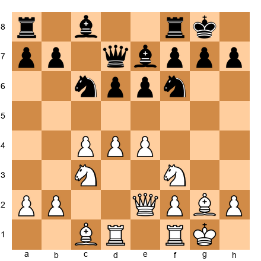

# Chapter 51: The Psychology of Elite Competition

## Rating: 2400+

---

> *"Chess is everything: art, science, and sport."*
>: Anatoly Karpov
>
> *"And sometimes it is war: against your opponent, against the clock, and against yourself."*

---

## What You'll Learn

- How to recognize and manage performance anxiety, ELO fear, and the psychological toll of elite competition. and why these feelings are normal, not weaknesses
- Practical strategies for pre-game routines, time-pressure composure, and post-game emotional recovery
- The psychology behind draw offers, must-win scenarios, and reading your opponent across the board
- Why mental health in professional chess matters. including sleep, depression, and knowing when to seek help
- How neurodivergent competitors can use their traits as strengths and protect their needs in tournament environments

---

## You Are Here 🗺️

```
Volume V ░░░░░░░░░░░░░░░░░░░░░░░░░░░░░
Ch 46 ██
Ch 47 ██
Ch 48 ██
Ch 49 ██
Ch 50 ██
Ch 51 ██ ← YOU ARE HERE
Ch 52 ░░
Ch 53 ░░
Ch 54 ░░
```

---

## A Note Before We Begin

Every other chapter in this book teaches you something about the chessboard. how pieces move, how positions work, how to calculate deeper and evaluate more accurately.

This chapter teaches you about the person sitting behind the board. You.

At the Grandmaster level, the difference between players is rarely chess knowledge. Everyone in the room knows the theory. Everyone can calculate deeply. Everyone has studied thousands of games. The edge comes from somewhere else: composure, resilience, self-awareness, and the ability to perform under brutal pressure for hours, days, and years.

This is the hardest chapter in the Codex to write, because psychology is personal. What works for one player may not work for another. What I can do is share what the strongest players in history have learned about their own minds, what sports psychology research has confirmed, and what practical tools you can adopt today.

If any section of this chapter hits close to home. if it describes something you are struggling with right now. please know two things. First, you are not alone. Second, there is no shame in asking for help. The strongest move a person can make is the one that keeps them in the game.

---

## PART 1: THE MENTAL DEMANDS OF GRANDMASTER CHESS

### 1.1 What Makes Elite Competition Different

At the club level, chess is a hobby. You play, you win some, you lose some, you go home. The emotional stakes are manageable because the consequences are limited.

At the Grandmaster level, chess is your identity. Your rating is public. Your games are broadcast live. Your losses are analyzed by thousands of strangers online. Your livelihood may depend on your results. The pressure is relentless, and it follows you home.

Here is what changes when you reach the elite level:

**Every game matters.** A single loss can drop your rating by 10–15 points. A bad tournament can cost you invitations to future events. A missed norm can mean waiting months for another chance. The margin for error shrinks to almost nothing.

**Your opponents are prepared.** At the club level, you can surprise people with unusual openings. At 2400+, your opponents have studied your games. They know your repertoire. They have prepared specific lines against you. You are not playing against the position: you are playing against someone who has spent hours preparing specifically for *you*.

**Recovery time disappears.** In a nine-round tournament, you might play seven games in nine days. After a crushing loss in Round 5, you have to sit down in Round 6 and play at your best. There is no time to process, grieve, or rebuild confidence. You must perform on demand, regardless of how you feel.

**The loneliness is real.** Professional chess is an individual sport. You sit alone at the board for four to six hours. Between rounds, you prepare alone. Your coach may be available by phone or video, but the decisions at the board are entirely yours. Many Grandmasters describe a deep loneliness that comes from years of this isolation.

Understanding these demands is the first step toward managing them. You cannot eliminate pressure. But you can learn to carry it.

### 1.2 Performance Anxiety at the Elite Level

Here is something that surprises many developing players: **performance anxiety does not go away when you get stronger.**

You might think that Grandmasters are calm, confident, and unbothered at the board. Some appear that way. Very few actually feel that way. Garry Kasparov, perhaps the most dominant player in history, described intense nervousness before important games. Magnus Carlsen has spoken about the anxiety of defending his title. Viswanathan Anand once said that the pressure of a World Championship match was like "drowning in slow motion."

Anxiety is not a sign of weakness. It is a sign that you care about the outcome. The goal is not to eliminate anxiety. that is neither possible nor desirable. The goal is to **manage it** so that it sharpens your focus instead of destroying it.

**Practical Tools for Managing Performance Anxiety:**

1. **Controlled breathing.** Before the game begins, take five slow breaths: inhale for four counts, hold for four, exhale for six. This activates your parasympathetic nervous system and physically reduces the stress response. Do this in your seat. Nobody will notice.

2. **Reframe the situation.** Instead of "I must win this game," try "I am going to play my best chess in this position." You cannot control the result. You can control the quality of your decisions. Focus on what you can control.

3. **Acknowledge the anxiety.** Trying to suppress anxiety makes it worse. Instead, name it: "I am feeling nervous because this game matters to me. That is normal." This simple act of recognition reduces the power anxiety holds over your thinking.

4. **Prepare thoroughly.** Much of pre-game anxiety comes from uncertainty. If you have prepared your openings, studied your opponent, and practiced your calculation, you have done everything within your power. Trust that preparation.

5. **Develop a pre-game routine** (covered in detail later in this chapter). A consistent routine tells your brain: "This is familiar. I have done this before. I know what comes next."

### 1.3 The Role of Confidence

Confidence in chess is not a personality trait. It is a **skill**. something you build through practice and maintain through deliberate effort.

**How confidence works at the board:**

When you are confident, you trust your first instincts. You spend less time second-guessing yourself and more time calculating forward. Your decisions are faster and more accurate. not because confidence makes you smarter, but because confidence reduces the cognitive load of self-doubt.

When confidence is low, everything takes longer. You question every evaluation. You see ghosts in every variation. threats that are not there, traps that do not exist. You play passively, avoid risk, and settle for worse positions because you do not trust yourself to handle complications.

**How to build confidence:**

- **Win preparation games.** Before a tournament, play training games against slightly weaker opposition. Winning. even in casual settings. primes your brain to expect success.
- **Review your best games.** Keep a folder of your ten best games. Before a tournament, replay them. Remind yourself: "I have played chess this good before. I can do it again."
- **Set process goals, not outcome goals.** Instead of "I will score 7/9," try "I will spend at least five minutes on every critical decision." Process goals are achievable regardless of the result, and achieving them builds confidence naturally.

**How to recover confidence after a loss:**

- **Analyze the loss honestly, then close the file.** Find the specific mistakes. Understand why they happened. Then stop. Replaying the loss in your head without new insight is not analysis. it is rumination, and it destroys confidence.
- **Win the next game.** This sounds simplistic, but it works. After a loss, play a training game and win it. One clean victory resets the emotional baseline.
- **Talk to someone.** A coach, a training partner, a friend. Losing alone is much harder than losing with support.

### 1.4 Pressure Management in Critical Games

There are moments in a chess career that carry disproportionate weight: the final round of a norm tournament, a must-win game in a team event, a World Championship tiebreak. These moments test everything you have.

**Must-Win Situations:**

When you must win, the temptation is to press too hard. to play aggressively from move one, to reject draws, to take unnecessary risks. This is usually counterproductive. Desperation creates bad moves.

Instead, treat a must-win game like any other game with one adjustment: choose an opening that creates **imbalance**. You do not need to play recklessly. You need to create a position where the result is in doubt. where both sides have chances, where the better player over the course of the game will prevail. A balanced position with equal chances is your enemy in a must-win game. An unbalanced position with mutual chances is your friend.

Specifically:
- Play openings that avoid early piece trades.
- Choose structures with asymmetric pawn formations (e.g., King's Indian, Sicilian Najdorf, or Benoni structures).
- Be willing to sacrifice a pawn for lasting initiative. but only when the compensation is real, not when desperation tells you to throw material at the board.

**Norm Attempts:**

A norm tournament adds a unique psychological burden: you are not just playing chess, you are counting points. "If I win this and draw that, I need 1.5 from the last three rounds." This arithmetic runs constantly in the background, consuming mental energy that should be spent on the position.

The best players manage this by **banning the math during the game.** Your coach or second should track the scenarios. You should focus only on the board in front of you. If you catch yourself calculating standings instead of variations, take a breath and return to the position.

**The Tiebreak Mentality:**

Rapid and blitz tiebreaks after a drawn classical match require a mental gear shift. You have been playing slow, careful, deep chess for days or weeks. Now you must play fast, aggressive, instinctive chess under extreme time pressure.

The key is to accept the format change completely. Do not try to play classical chess at rapid speed. Switch modes. Trust your preparation. Embrace the chaos. Magnus Carlsen is the greatest tiebreak player in history not because he calculates faster than everyone else, but because he is psychologically comfortable with the speed and the uncertainty. He does not fight the format. he rides it.

---

## PART 2: THE PSYCHOLOGY OF COMPETITIVE DECISIONS

### 2.1 The Psychology of Draws

At the Grandmaster level, draws are not failures. They are strategic decisions. But the psychology around draw offers is complex, and many players handle it poorly.

**When to accept a draw:**

- When the position is genuinely equal and neither side has realistic winning chances.
- When you are satisfied with the tournament standing the draw gives you.
- When you are physically or mentally exhausted and continuing would likely lead to errors.
- When accepting secures a critical result (a norm, a tournament placement, qualification).

**When to decline a draw:**

- When the position still has life in it, even if it is objectively equal. Equal does not mean dead.
- When you are playing someone rated lower and a draw is an underperformance.
- When declining serves your tournament goals better than accepting.
- When your opponent is offering because *they* are uncomfortable. a draw offer is information. If your opponent wants to stop playing, they may be worried about something you have not noticed yet.

**The draw offer as a weapon:**

Some players use draw offers psychologically. offering a draw from a slightly worse position to plant doubt ("maybe I missed something and the position really is equal?"), or offering after a long think to suggest they have seen something deep. Be aware of these tactics. Evaluate the position on its merits, not on your opponent's behavior.

**The pre-arranged draw:**

This chapter will not lecture you about pre-arranged draws. You are an adult. You know the arguments. What I will say is this: every short draw is a missed opportunity to practice competitive chess. You cannot build psychological resilience by avoiding difficult positions. Fight when you can. Rest when you must. But do not confuse avoidance with strategy.

### 2.2 Dealing with Losses at the Top Level

Every Grandmaster loses. Fischer lost. Kasparov lost. Carlsen loses regularly. The question is not whether you will lose. you will. The question is what happens next.

**The three phases of processing a loss:**

**Phase 1: Feel it.** Immediately after a loss, you will feel some combination of anger, frustration, shame, and disappointment. This is normal. Do not try to analyze the game in this emotional state. You will not be objective. Give yourself 30 minutes to an hour. Walk, eat something, talk to a friend. Let the initial wave pass.

**Phase 2: Analyze it.** Once you are calm, go through the game. Find the critical moments. Identify the mistakes. Be honest but not cruel: you are looking for lessons, not punishment. Write down what you learned. Be specific: "I did not consider Bb5 on move 23 because I was fixated on the kingside" is useful. "I played terribly" is not.

**Phase 3: Release it.** After the analysis, the loss is done. You have extracted the lessons. There is nothing more to gain from replaying it. Close the file, metaphorically and literally. Your next game deserves your full attention, and you cannot give it that attention if you are still litigating the last one.

**The hardest losses:**

Some losses are harder than others. Losing a won game is agonizing. Losing due to a mouse slip online feels unfair. Losing a critical game. the one that would have given you the norm, the title, the prize. can feel like grief.

These losses take longer to process, and that is okay. Give yourself permission to grieve. But set a boundary: after a defined period (one day, two days, one week), you move forward. Grief that goes unresolved becomes fear, and fear destroys chess performance.

### 2.3 The Fear of Losing Rating Points

ELO anxiety is one of the most common psychological problems in competitive chess. It works like this: your rating becomes part of your identity. You see yourself as "a 2450 player" or "a 2500 player." When your rating drops, you feel like you have lost part of yourself.

This fear creates a vicious cycle:

1. You are afraid of losing rating, so you avoid risks.
2. Playing without risk leads to boring, drawish positions.
3. In boring positions, you lose focus and make careless errors.
4. You lose rating anyway. and now you are also frustrated.

**Breaking the cycle:**

The single most effective strategy is to **stop checking your rating during a tournament.** Your rating after the tournament will be whatever it will be. Checking it between rounds adds anxiety without adding useful information.

Beyond that, work on separating your self-worth from your number. You are not your rating. Your rating is a rough measure of your recent results. It goes up and down. This is normal. A 50-point drop after a bad tournament does not mean you forgot how to play chess. It means you had a bad tournament. Everyone does.

Some players find it helpful to think of rating as a lagging indicator. it reflects where you were, not where you are going. If you are doing the right training, playing the right events, and working with the right discipline, your rating will catch up eventually. Trust the process.

### 2.4 Opponent Psychology

**Reading Body Language:**

Across the board, your opponent's body language can tell you things. but be careful not to over-interpret. Some common signals:

- **Fast moves after your move:** Your opponent may be in preparation. Or they may be bluffing confidence. Do not panic either way. Focus on the board.
- **Long thinks after your move:** They may be surprised. This is a good sign. it means you have gotten them out of their preparation. But it could also mean they are calculating a strong response. Again, focus on the board.
- **Restlessness or fidgeting:** Your opponent may be uncomfortable with the position. Or they may simply be someone who fidgets (neurodivergent players often stim at the board. this is not a sign of distress).
- **Leaving the board frequently:** Some players leave to avoid the psychological pressure of your presence. Others leave to check other games. Do not read too much into it.

**The golden rule of opponent psychology:** Information from the board is reliable. Information from body language is unreliable. Use body language as a tiebreaker when the chess analysis is unclear, but never as a substitute for actual calculation.

**Managing Intimidation:**

When you sit down against a player rated 200 points above you, intimidation is natural. Their name is on books you have studied. Their games are in your database. You feel like a student facing a professor.

Here is the truth: across the board, everyone is equal. Your pieces move the same way as theirs. The position does not care about anyone's rating. If you play the best move, it is the best move regardless of who finds it.

Practical tips for managing intimidation:
- Prepare specifically for your opponent. When you have a concrete plan, you feel less like a victim and more like a competitor.
- Focus on the position, not the person. Once the clock starts, ratings do not matter.
- Remember that higher-rated opponents have more to lose. A draw against you costs them rating. This is your psychological advantage.

---

## PART 3: PRE-GAME AND IN-GAME PSYCHOLOGY

### 3.1 Pre-Game Routines and Rituals

Every elite athlete has a pre-game routine. Chess players are no different. A good routine reduces anxiety, increases focus, and creates a sense of control.

**Building your routine:**

1. **Morning preparation (2–3 hours before the game):**
   - Review your opening preparation against today's opponent. Not deep analysis. just refresh the key lines so they are in your active memory.
   - Light physical activity: a 20-minute walk, stretching, or yoga. Movement reduces cortisol and improves focus.
   - Eat a meal with complex carbohydrates and protein. Avoid heavy, greasy food. Your brain needs fuel, not a food coma.

2. **One hour before the game:**
   - Stop studying. Your preparation is done. Last-minute cramming creates anxiety and confusion.
   - Solve two or three simple tactical puzzles (1200–1400 level). This warms up your pattern recognition without draining mental energy.
   - Listen to music if it helps you focus. Some players prefer silence. Know which one works for you.

3. **At the board (before the game starts):**
   - Arrive 5–10 minutes early. Get comfortable in your seat.
   - Set up your water, pen, scoresheet.
   - Five slow breaths. In for four, hold for four, out for six.
   - When the clock starts: forget everything except the board.

**The power of consistency:** The routine does not need to be elaborate. It needs to be *the same every time*. Consistency tells your brain that this is a familiar situation, which reduces the stress response. Over time, the routine itself becomes a trigger for focus.

### 3.2 Time Pressure Psychology

You have 30 seconds on your clock. Your position is complicated. Your heart is pounding. Your hands are shaking. Your opponent has 20 minutes.

This is the most psychologically demanding moment in chess. And it happens to everyone, at every level.

**Why time pressure is so dangerous psychologically:**

Under time pressure, your prefrontal cortex. the part of your brain responsible for calculation and planning. starts to shut down. Your amygdala. the fight-or-flight center. takes over. You stop thinking clearly and start reacting. You make moves based on panic rather than analysis.

**How to stay calm when the clock is low:**

1. **Breathe.** This is not a metaphor. Take one deep breath before every move. Even with 30 seconds left, you can afford one breath. It costs less than a second and it keeps your cortex engaged.

2. **Simplify.** When time is short, look for moves that reduce complexity. Trades, forced sequences, moves with only one reasonable reply. Each simplification reduces the number of decisions you need to make.

3. **Trust your instincts.** If you have trained well, your pattern recognition is strong. In time pressure, your first instinct is often correct. Second-guessing costs time and rarely improves the decision.

4. **Pre-move in your head.** While your opponent is thinking, use that time to plan your response to their most likely moves. When they play, you may already know your answer.

5. **Accept imperfection.** In time pressure, you will not find the best move every time. You do not need to. You need to find *good enough* moves quickly. A solid move played instantly is better than the best move found five seconds too late.

**The increment is your friend.** In games with increment (30 seconds per move, for example), time pressure is manageable if you keep making moves. Each move buys you time. Do not freeze.

---

## PART 4: MENTAL HEALTH IN PROFESSIONAL CHESS

### 4.1 The Physical and Emotional Toll

Professional chess is marketed as a purely intellectual pursuit. It is not. The physical toll is significant.

During a long game, a Grandmaster's heart rate can reach 130–140 beats per minute during critical moments. comparable to moderate exercise. Caloric expenditure during a six-hour game can exceed 500 calories. Tournament players frequently report headaches, back pain, eye strain, and deep fatigue after a multi-round event.

The emotional toll is less visible but equally real. Extended periods of intense concentration followed by high-stakes outcomes create a stress cycle that, over months and years, can lead to burnout, anxiety disorders, and depression.

### 4.2 Ding Liren and the Conversation That Changed Chess

In 2023, Ding Liren became World Chess Champion. In the lead-up to his defense of the title, he spoke openly about struggling with depression and insomnia. He described periods where he could not sleep, could not focus, and felt no joy in the game he had dedicated his life to.

His openness was significant not because depression is unusual among chess professionals. it is not. but because it broke a silence. For decades, mental health struggles in chess were treated as private embarrassments. Players suffered alone. Some left the game. Some developed substance abuse problems. Some simply disappeared from the tournament circuit with no explanation.

Ding Liren's honesty gave permission to other players to talk about their own struggles. It sent a message: you can be one of the best players in the world and still need help. These things are not contradictions.

### 4.3 When to Take Breaks vs. When to Push Through

**Take a break when:**

- You feel no enjoyment from chess, only obligation.
- Your results have declined consistently over two or more tournaments and you cannot identify a chess-related cause.
- You are losing sleep, appetite, or interest in other activities because of chess stress.
- You catch yourself dreading games instead of looking forward to them.
- Physical symptoms appear: persistent headaches, jaw clenching, stomach problems during tournaments.

**Push through when:**

- You are tired but still engaged. Tiredness after a tournament is normal. Loss of interest is not.
- You are in a temporary results slump but your analysis shows the chess quality is still high. Sometimes variance just works against you.
- You have a specific, time-bound goal (a norm tournament, a qualification event) and the cost of missing it outweighs the cost of fatigue.

**The key distinction:** Fatigue is physical. Burnout is emotional. Rest fixes fatigue. Rest alone does not fix burnout. Burnout requires a change: in your approach, your schedule, your relationship with chess, or your life outside of chess.

### 4.4 Seeking Professional Support

If you are struggling with anxiety, depression, sleep problems, or burnout, consider working with a professional. This is not weakness. It is preparation.

**Sports psychologists** specialize in performance under pressure. They can teach you specific techniques for managing anxiety, building routines, recovering from losses, and maintaining motivation. Many team sports have had sports psychologists for decades. Chess is catching up.

**Therapists** (psychologists, counselors, psychiatrists) address broader mental health. If chess stress is connected to deeper patterns: perfectionism, low self-esteem, identity issues, relationship problems: a therapist can help you work on the root cause rather than just the symptoms.

**Practical steps:**
- Ask your chess federation if they have mental health resources for players.
- Look for sports psychologists who work with individual sport athletes (tennis, golf, and chess share many psychological demands).
- If cost is a barrier, many countries offer sliding-scale or free mental health services. Your national federation may also have funding available.
- Talk to your coach. A good coach understands that chess performance depends on mental health. They will support you.

---

## PART 5: THE NEURODIVERGENT COMPETITOR

### 5.1 You Belong Here

If you are autistic, ADHD, dyslexic, or otherwise neurodivergent, chess may be one of the few places where your brain feels like an advantage rather than an obstacle. Many of history's strongest players are believed to have been neurodivergent. The deep focus, pattern recognition, and systematic thinking that chess rewards are traits that many neurodivergent people have in abundance.

You do not need to mask at the board. You do not need to pretend your brain works like everyone else's. Your chess is valid regardless of how you arrive at your moves.

This section is for you.

### 5.2 Sensory Management in Tournament Halls

Tournament halls are often sensory nightmares: fluorescent lighting, ticking clocks, whispering spectators, the smell of coffee and stress, uncomfortable chairs, and unpredictable temperature. For sensory-sensitive players, these conditions can drain energy before a single move is played.

**Practical strategies:**

- **Noise-canceling headphones or earplugs.** Most tournament regulations allow earplugs. Some allow noise-canceling headphones during play (check the specific tournament rules). Reducing auditory input preserves cognitive energy for the game.
- **Sunglasses or tinted lenses.** If fluorescent lighting causes discomfort, tinted lenses can help. This is an accommodation, not an affectation.
- **Bring your own comfort items.** A familiar water bottle, a fidget tool in your pocket, a sweater for cold halls. These small anchors reduce sensory distress.
- **Request a board position.** Some tournaments allow you to request an end-of-row seat or a seat away from the spectator area. Ask the organizer. The worst they can say is no.
- **Plan your breaks.** During your opponent's long thinks, step away from the board to a quieter area. Regulate, breathe, and return. This is not weakness. it is management.

### 5.3 Stimming at the Board

Stimming. repetitive movements or sounds used for self-regulation. is a neurodivergent person's right. Rocking slightly in your chair, tapping your leg under the table, rubbing a smooth stone in your pocket, or clicking a pen cap are all forms of self-regulation that help you think.

Tournament rules require that you do not disturb your opponent. This means loud or visually distracting stims may need to be modified (quiet pen-clicking rather than loud tapping, leg bouncing under the table rather than rocking the entire table). But you should not suppress stimming entirely. Suppressing stims costs cognitive energy. energy you need for chess.

If an opponent or arbiter asks you to stop a behavior, stay calm. Explain briefly: "This helps me focus. I will keep it quiet." Most arbiters will understand. If you anticipate conflict, speak with the arbiter before the game.

### 5.4 ADHD Medication Timing

If you take stimulant medication (methylphenidate, amphetamine-based medications, or others), tournament scheduling requires planning.

- **Time your dose** so that peak effectiveness coincides with the game start, not the pre-game preparation. Most stimulants peak 1–2 hours after taking them. If the game starts at 3 PM, taking your medication at 1–2 PM may be optimal. Consult with your prescribing doctor.
- **Account for crash timing.** Stimulant medications wear off, and the comedown can affect focus, mood, and energy. If your medication typically wears off after six hours and the game might last five, plan accordingly. Some players work with their doctor to use extended-release formulations during tournament weeks.
- **Bring snacks.** Stimulant medications often suppress appetite. Your brain needs fuel during a long game. Pack small, easy-to-eat snacks (nuts, fruit, energy bars) and remind yourself to eat even if you are not hungry.
- **Stay hydrated.** Stimulants can be dehydrating. Bring water to the board and drink regularly.
- **Know the anti-doping rules.** FIDE follows WADA (World Anti-Doping Agency) guidelines. Stimulant medications require a Therapeutic Use Exemption (TUE) for titled events. Apply for this well in advance. Your doctor can help with the paperwork.

### 5.5 Autistic Advantages in Chess

Autism is not a deficit in chess. In many ways, it is an advantage.

- **Pattern recognition:** Autistic players often excel at recognizing patterns. in openings, pawn structures, tactical motifs, and endgame configurations. This is the foundation of chess skill.
- **Deep focus (hyperfocus):** The ability to concentrate intensely on a single task for hours is a superpower in chess. While neurotypical players may lose focus in a quiet position, autistic players often maintain concentration throughout.
- **Routine adherence:** Chess rewards consistency. the same preparation process, the same pre-game routine, the same analytical method. Autistic players who thrive on routine have a natural advantage here.
- **Systematic thinking:** Chess is a system of rules, patterns, and logical deductions. Autistic players who think in systems often find chess intuitive in ways that neurotypical players do not.
- **Honest self-assessment:** Many autistic players are unusually honest about their strengths and weaknesses. This is invaluable for chess improvement. you cannot fix what you will not acknowledge.

### 5.6 Social Navigation at Tournaments

Tournaments require social interaction: pre-game handshakes, post-game analysis, dinner with other players, small talk during breaks. For players who find social interaction draining or confusing, this can be exhausting.

**Scripts for common interactions:**

- **Pre-game:** "Good luck" is the standard. A handshake, "Good luck," and sitting down is perfectly acceptable. You do not need to make conversation.
- **Post-game (you won):** "Good game. Thank you." If your opponent wants to analyze, you can say: "I would like to look at the game on my own first. Maybe we can discuss it later?" This is polite and honest.
- **Post-game (you lost):** "Thank you. Well played." You do not owe your opponent an analysis session. It is okay to leave the board.
- **Post-game (draw):** "Good game. I think it was a fair result." Or simply: "Thank you."
- **During breaks:** "I need some quiet time to prepare for my next game" is a complete and valid reason to be alone. You do not need to explain further.
- **Dinner with other players:** Attend if you want to. Skip if you need to. No one is keeping score. If you attend and the conversation becomes overwhelming, it is okay to say, "I am going to head out early tonight. See you tomorrow."

**You do not owe anyone your social energy.** Protect your resources for the board.

---

## PART 6: POST-GAME AND CAREER PSYCHOLOGY

### 6.1 Post-Game Emotional Management

The first thirty minutes after a game are psychologically the most volatile. Win or lose, your body is flooded with adrenaline, cortisol, and emotion. This is not the time to make decisions.

**After a win:**
- Enjoy it. Allow yourself to feel good. Many competitive players immediately start worrying about the next game. Stop. You just won. That matters.
- Be gracious with your opponent. They are hurting.
- Do not analyze the game immediately. You are still in an emotional high and will overrate your own play.

**After a loss:**
- Leave the playing hall if possible. Walk. Get fresh air. Drink water.
- Do not check the engine evaluation on your phone. Not yet. Let the emotions settle first.
- Do not post about the game on social media. In your emotional state, you may say things you regret.
- If you need to talk, call someone who understands: your coach, your partner, a friend who plays chess.

**After a draw:**
- Draws are emotionally ambiguous. Was it a missed opportunity? A fair result? A relief? Acknowledge whatever you feel without judgment.
- If the draw was agreed in a position with play remaining, ask yourself honestly: did you take the draw because it was right, or because you were tired or afraid? This self-knowledge improves future decisions.

### 6.2 Building Psychological Resilience Over a Career

A chess career is long. If you start serious competition at 15 and play until 50, that is 35 years of wins, losses, breakthroughs, and setbacks. The players who last are not the ones who never struggle. they are the ones who learn to struggle productively.

**Principles of long-term resilience:**

1. **Maintain a life outside chess.** Hobbies, relationships, physical fitness, creative outlets. these are not distractions from chess. They are the foundation that makes chess sustainable. A player whose entire identity is their rating is one bad tournament away from crisis.

2. **Set process goals alongside rating goals.** "I want to reach 2500" is a fine ambition. But if that is your only goal, every rating drop feels like failure. Add process goals: "I want to improve my rook endgames this year." "I want to play at least 40 serious games." These goals are achievable regardless of results.

3. **Accept the ups and downs.** Your rating curve over a career will look like a mountain range, not a straight line. There will be peaks and valleys. This is normal. The trend matters more than any individual point.

4. **Find your community.** Professional chess can be isolating, but it does not have to be. Training groups, online study partners, chess clubs, social media communities. connection reduces loneliness and provides perspective.

5. **Know when to reinvent yourself.** Every player hits plateaus. When years of the same training produce diminishing returns, it may be time to change your approach: work with a new coach, study a different opening style, play in different tournament formats. Reinvention is not admitting failure. It is choosing growth.

6. **Be kind to yourself.** You are a human being playing a very hard game. Perfection is not possible. Progress is. Treat yourself the way you would treat a student you care about. with honesty, patience, and encouragement.

---

## ANNOTATED GAMES

### Game 1: Karpov vs. Korchnoi: World Championship 1978, Baguio City, Game 17

**The Psychological Lesson:** Chess as total warfare: and how to survive it.

The 1978 World Championship match between Anatoly Karpov and Viktor Korchnoi was the most psychologically intense match in chess history. The political context (Korchnoi had defected from the Soviet Union; Karpov was the Soviet establishment's champion), the personal hatred between the players, and the bizarre off-board events (a parapsychologist in the audience, disputes about yogurt, walkouts) created an atmosphere of extreme hostility.

By Game 17, Korchnoi had fought back from 1–5 to 5–5. The psychological pressure on Karpov was enormous. The Soviet chess machine expected him to win easily. Instead, he was in a death match.

Set up your board:

**White: Korchnoi | Black: Karpov**

**1.c4 e6 2.Nc3 d5 3.d4 Be7 4.Nf3 Nf6 5.Bf4 O-O 6.e3 c5 7.dxc5 Bxc5 8.Qc2 Nc6 9.a3 Qa5 10.Rd1 Be7**

Karpov retreats quietly. This is psychologically significant. in a must-hold game, he does not overextend. He waits.

**11.Nd2 e5 12.Bg5!?**

Korchnoi plays aggressively, as he must. He cannot afford a draw. he needs to keep the match going. The bishop exchange removes a defender from Black's kingside.

**12...Nd4!**

Karpov's response is calm and strong. The knight leaps to the center, challenging White to justify the aggression.

**13.Qd3 d4 14.Nce4 Nxe4 15.Bxe7 Nxf2!**

A beautiful tactical blow. Karpov sacrifices the knight to shatter White's position. Under immense psychological pressure. needing only to hold, not to win. Karpov *attacks.* This is the confidence of a champion. He trusts his calculation even when the stakes are highest.

**16.Kxf2 Qb6 17.Kf1 Re8**

After the sacrifice, Karpov's play is precise and controlled. Every move increases the pressure. Korchnoi, who had been the attacker, is now fighting for survival.

The game eventually ended in a draw, but the psychological damage was done. Korchnoi never fully recovered in the match. Karpov went on to retain his title.

**What this game teaches us:** Under extreme pressure, the strongest response is often the most natural one. Karpov did not try to be clever or cautious. He played the best chess moves. The psychology took care of itself because the chess was right.

---

### Game 2: Tal vs. Botvinnik: World Championship 1960, Game 6

**The Psychological Lesson:** Attacking under pressure: trusting your style when everything is on the line.

Mikhail Tal's playing style. wild sacrifices, speculative attacks, moves that seemed to violate every positional principle. was controversial. Many observers believed Tal would crumble against the methodical, scientific Botvinnik in a World Championship match. Tal proved them wrong by trusting his instincts completely.

Set up your board:

**White: Tal | Black: Botvinnik**

**1.e4 e5 2.Nf3 Nc6 3.Bb5 a6 4.Ba4 Nf6 5.O-O Be7 6.Re1 b5 7.Bb3 d6 8.c3 O-O 9.h3 Na5 10.Bc2 c5 11.d4 Qc7 12.Nbd2 Nc6**

A standard Ruy Lopez structure. Nothing unusual yet. But Tal had something in mind.

**13.dxe5!? dxe5 14.Nf1 Be6 15.Ne3 Rad8 16.Qe2 c4**

Botvinnik plays solidly, seizing space on the queenside. A positional player would regroup. Tal has other ideas.

**17.Ng5!**

The knight lunges at the kingside. Tal is not interested in positional maneuvering. he wants to attack. In a World Championship game, against the most disciplined player alive, Tal plays like Tal.

**17...Bc8**

Botvinnik retreats. The bishop is passive, but 17...Bxh3? 18.gxh3 would open lines toward the Black king. exactly what Tal wants.

**18.Ngf5!**

Both knights now point at Black's king. The pressure mounts.

**18...Ne8?!**

A natural retreat, but it gives Tal time for the critical blow.

**19.Nxe7+ Qxe7 20.Qg4!**

Now Tal's attack is rolling. The queen enters with tempo, and Black's position is under enormous strain.

The game continued with Tal pressing relentlessly. Botvinnik defended resourcefully, but the psychological pressure of facing constant threats. threats that might be sound, might be unsound, but always needed precise refutation. wore him down. Tal won the game, and the match, becoming World Champion at age 23.

**What this game teaches us:** Authenticity is a psychological weapon. Tal did not try to become a different player for the World Championship. He played his chess: wild, aggressive, inspired. His confidence in his own style was unshakable, and that confidence itself was intimidating. If you have a style that works for you, trust it. The board does not care what anyone else thinks of your approach.

---

### Game 3: Carlsen vs. Karjakin: World Championship 2016, Tiebreak Game 4

**The Psychological Lesson:** Performing under ultimate pressure: the final game of a World Championship.

After twelve classical games, the 2016 World Championship match between Magnus Carlsen and Sergey Karjakin was tied 6–6. It came down to rapid tiebreaks. By Game 4 of the rapid, Carlsen was ahead on wins and needed only a draw to retain his title. Karjakin needed to win.

Set up your board:

**White: Carlsen | Black: Karjakin**

**1.e4 e5 2.Nf3 Nc6 3.Bb5 Nf6 4.d3 Bc5 5.O-O d6 6.Re1 O-O 7.Bxc6 bxc6 8.h3 Re8 9.Nbd2 Be6**

A quiet opening. unusual for a rapid game. But Carlsen is not trying to win. He is trying to *not lose.* Every exchange reduces risk. Every simplification brings the title closer.

**10.b3 d5 11.Bb2 Nd7 12.d4 exd4 13.Nxd4 Bf8 14.N2f3 Bd6 15.e5!**

This push looks committal, but Carlsen has calculated precisely. The pawn grabs space and restricts Black's pieces.

**15...Bf8 16.c4! dxc4 17.bxc4 c5 18.Nxe6 Rxe6 19.Nd4! Rg6**

Karjakin must create counterplay. He brings the rook to an aggressive square, hunting for kingside chances. But Carlsen's position is solid.

**20.Qh5 cxd4 21.Qxd5**

The queen centralization is powerful. White controls the center and Black's pieces are uncoordinated. Carlsen converts from here with clean, precise technique. the kind of chess that looks easy but requires absolute composure.

The game ended with Carlsen winning and retaining his World Championship title. After the game, Carlsen. normally stoic. broke down in tears at the press conference. The pressure of the match, carried for weeks, finally released.

**What this game teaches us:** Under ultimate pressure, simplicity wins. Carlsen did not try to play brilliantly. He played practically, reducing risk at every turn. He chose positions he understood deeply. He trusted his technique. And when the emotions came: after the final move, not during the game: he allowed himself to feel them. That is what psychological strength looks like. Not the absence of emotion, but the ability to choose when to let it through.

---

## EXERCISES

### ⚡ ADHD Quick Set

If you want a focused 30-minute workout, do these five exercises: **51.1, 51.2, 51.4, 51.7, 51.10.** They cover warm-up through expert difficulty and include a decision-making scenario.

---

### Warmup Exercises (★★–★★★)

**Exercise 51.1** ★★
*Find the Calm Move*

Set up your board:

**White:** Kg1, Qd1, Rd1, Re1, Bc1, Bf1, Nf3, pawns a2, b2, c2, d4, f2, g2, h2
**Black:** Kg8, Qd8, Ra8, Rf8, Bc8, Be7, Nc6, Nf6, pawns a7, b7, d5, e6, f7, g7, h7

You are White. You have 2 minutes on your clock with 30-second increment. Your opponent has 15 minutes. Find a solid, natural developing move that improves your position without overcommitting. *(Set a 30-second timer for yourself.)*

**Answer:** **Bd3** is the calm, strong move. It develops the bishop to an active diagonal, supports e4 in the future, and does not commit to any premature plan. Under time pressure, simple development is always a safe choice. Moves like Ng5 or Bb5 are more aggressive but require calculation you may not have time for. **Bd3** is never wrong here.

---

**Exercise 51.2** ★★
*The 30-Second Assessment*

Set up your board:

**White:** Ke1, Qd2, Ra1, Rh1, Bg5, Bd3, Nc3, Nf3, pawns a2, b2, c2, d4, e4, f2, g2, h2
**Black:** Kg8, Qc7, Ra8, Rf8, Bc8, Be7, Nc6, Nf6, pawns a6, b5, c5, d6, e5, f7, g7, h7

Set a timer for 30 seconds. Look at the position and answer: (a) Who stands better? (b) What is the single most important feature of the position? (c) What would your first candidate move be?

Then analyze for 10 minutes and compare.

**Answer:** (a) White has a slight edge due to better development and central control. (b) The tension in the center: d4 vs. e5 and c5: is the most important feature. Whoever resolves this tension favorably will gain the advantage. (c) Strong candidate moves for White include **O-O** (completing development) or **d5** (fixing the center). Both are reasonable. The key learning: under 30 seconds of pressure, your first instinct reveals your current playing level. Over time, the 30-second answer should get closer to the 10-minute answer.

---

**Exercise 51.3** ★★★
*Draw or Fight?*

You are rated 2410. Your opponent is rated 2520. It is Round 7 of a 9-round tournament. You need 1 point from the final three games to secure an IM norm. Your opponent offers a draw in the following position, where you are Black:

**White:** Kg1, Qe2, Ra1, Rf1, Be3, Bg2, Nf3, pawns a2, b2, c4, d4, f2, g2, h2
**Black:** Kg8, Qc7, Ra8, Rf8, Bb7, Be7, Nd7, pawns a6, b6, c5, d6, e6, f7, g7, h7

Do you accept?

**Answer:** **Accept the draw.** The position is roughly equal: Black's position is solid but offers no clear winning chances. Taking a draw against a player rated 110 points higher is a good result for norm purposes. You need 1 point from 3 games, and a draw here leaves you needing 1 from 2: a manageable target. Fighting on risks losing and leaving yourself needing a perfect finish. Sometimes the best psychological decision is taking the safe result.

---

**Exercise 51.4** ★★★
*Post-Loss Recovery Puzzle*

You just lost a painful game where you blundered a piece on move 35 in a winning position. Your next game is in 3 hours. You are White and you need to play the following position. find the best move.

Set up your board:

**White:** Kg1, Qd1, Rd1, Bc4, Nf3, pawns a2, b2, e4, f2, g2, h2
**Black:** Kg8, Qd8, Rd8, Be7, Nf6, pawns a7, b7, e5, f7, g7, h7

White to play. *(Before solving: take three deep breaths. You are not your last game. This position is a fresh start.)*

**Answer:** **Ng5!** targeting f7 and creating immediate pressure. After 1.Ng5 O-O (or other defensive tries), White continues with Qf3, Qh5, or Rd3-h3 depending on Black's response. The point of this exercise: even after an emotional loss, you can still find sharp, accurate moves. The board does not know about your last game. The pieces do not carry your grief. Fresh position, fresh start.

---

**Exercise 51.5** ★★★
*Intimidation Inoculation*

Your opponent is a famous GM. You are Black. They play 1.e4, and you respond with your usual Sicilian. After **1.e4 c5 2.Nf3 d6 3.d4 cxd4 4.Nxd4 Nf6 5.Nc3 a6**, your opponent plays **6.Bg5**. the English Attack, which you know they are an expert in.

Set up your board at this position.

**White:** Ke1, Qd1, Ra1, Rh1, Bc1, Bg5, Nc3, Nd4, pawns a2, b2, c2, e4, f2, g2, h2
**Black:** Ke8, Qd8, Ra8, Rh8, Bc8, Bf8, Nb8, Nf6, pawns a6, b7, d6, e7, f7, g7, h7

What is your plan?

**Answer:** **6...e6** is the main theoretical response, leading to well-known Najdorf territory. The key psychological lesson: your opponent's reputation does not change the best move. If you have prepared the Najdorf, play the Najdorf. The position after 6...e6 offers Black full equality with correct play. Fear of your opponent's expertise should not push you into an unfamiliar opening. Play what you know, play it well, and make *them* prove their expertise over the board.

---

**Exercise 51.6** ★★★
*Time Pressure Drill*

Set up your board:

**White:** Kh1, Qe2, Rd1, pawns a3, b4, e4, f3, g2, h2
**Black:** Kg8, Qc7, Rd8, pawns a7, b6, e5, f7, g7, h7

You are White with 45 seconds on the clock and 10-second increment. You must find a reasonable move quickly. *(Set a 15-second timer.)*

**Answer:** **Rd5!** Centralizing the rook on the fifth rank is a strong, natural move that controls key squares and limits Black's queen. Under time pressure, centralizing your most active piece is almost always a good decision. If you found Rd5 within 15 seconds, your instincts are sound. If you hesitated between multiple options, remember: in time pressure, the move that *looks* right usually *is* right. Trust your eyes.

---

**Exercise 51.7** ★★★
*Self-Assessment Journal Prompt*

No board needed.

Write honest answers to these three questions (spend at least 5 minutes):

1. After your last serious loss, how long did it take you to emotionally recover? Hours? Days? Weeks?
2. Do you tend to play differently when your rating is near a round number (e.g., approaching 2400)? If so, how?
3. Is there an opponent you consistently underperform against? What is it about them. their style, their demeanor, their rating. that affects your play?

**Answer:** There is no single correct answer. The purpose is self-awareness. If your recovery takes weeks, you may benefit from working with a sports psychologist. If you play cautiously near round numbers, you have identified an ELO anxiety pattern. If a specific opponent rattles you, understanding *why* is the first step toward neutralizing it.

---

**Exercise 51.8** ★★★
*Opponent Sent a Fast Move. Now What?*

Set up your board:

**White:** Kg1, Qe2, Ra1, Rf1, Bc1, Bg2, Nc3, Nf3, pawns a2, b3, c4, d4, e4, f2, g2, h2
**Black:** Kg8, Qd8, Ra8, Rf8, Bb7, Be7, Nc6, Nd7, pawns a6, b6, c5, d6, e6, f7, g7, h7

You are Black. Your opponent played their last move (d4) in 5 seconds on move 12. This means one of two things: they are in preparation, or they are bluffing confidence. Either way, you feel a spike of anxiety.

Find the best move for Black. *(Take a deep breath first.)*

**Answer:** **Nf6** or **cxd4** are both strong. The key is not panicking because of your opponent's speed. A fast move means they either knew the theory or they decided quickly: neither changes what is on the board. Play your chess. **cxd4 followed by ...Nf6** gives Black a comfortable position. The anxiety you felt is a signal, not a guide. Acknowledge it and return to the position.

---

### Intermediate Exercises (★★★)

**Exercise 51.9** ★★★
*The Must-Win Opening Choice*

No board needed.

You need to win with Black in the final round. Your opponent (2450) plays 1.d4. You have two openings prepared:

- **Option A:** The Queen's Gambit Declined (solid, reliable, drawish tendencies)
- **Option B:** The King's Indian Defense (dynamic, unbalanced, fighting chess)

Which do you choose, and why?

**Answer:** **Option B: the King's Indian Defense.** In a must-win situation, you need imbalance, not safety. The QGD is an excellent opening, but it tends toward positions where draws are easy to achieve. The KID creates asymmetric pawn structures, kingside vs. queenside attacks, and positions where the better player on the day will prevail. Choosing an opening that creates fighting chances is a psychological skill, not just an opening skill. In a must-win game, embrace complexity.

---

**Exercise 51.10** ★★★
*The ELO Anxiety Position*

Set up your board:

**White:** Kg1, Qd1, Ra1, Rf1, Bc1, Be2, Nc3, Nf3, pawns a2, b2, c4, d4, e3, f2, g2, h2
**Black:** Kg8, Qd8, Ra8, Rf8, Bc8, Bd6, Nb8, Nf6, pawns a7, b7, c5, d5, e6, f7, g7, h7

You are White. Your rating is 2398. A draw in this game will push you to exactly 2400. a milestone you have been chasing for two years. Your opponent (2380) has just offered a draw.

Do you accept?

**Answer:** This is a trick question: there is no objectively correct answer. But here is the psychological framework: if you accept, you reach 2400 today but may feel hollow about how you got there. If you decline, you risk losing rating but you also have a chance to *earn* the milestone through fighting chess. Neither choice is wrong. What matters is that you make the choice *consciously*, based on what you actually want, not out of fear. If you caught yourself immediately wanting to accept: examine why. Is it chess logic or anxiety? Self-awareness is the exercise here.

---

**Exercise 51.11** ★★★
*Norm Tournament Arithmetic Discipline*

No board needed.

It is Round 6 of a 9-round IM norm tournament. You have 4/5. You need 6.5/9 for the norm. You sit down for Round 6 and catch yourself calculating: "If I draw this one, I need 2/3 from the last three..."

**Question:** What should you do with this mental arithmetic?

**Answer:** **Stop. Immediately.** Write the standings on a piece of paper if you must. Then put the paper away. Tell your coach or second to handle the arithmetic. Your job at the board is to play the best chess move, not to manage spreadsheets. Every second spent on tournament math is a second stolen from your calculation. Discipline your mind: position first, standings later. This is a learnable skill.

---

**Exercise 51.12** ★★★
*The Sensory Audit*

No board needed.

Before your next tournament game, complete this checklist:

- [ ] Do I have earplugs or noise-canceling headphones?
- [ ] Do I have water and a snack within reach?
- [ ] Is my chair comfortable? Can I adjust it?
- [ ] Is the lighting bothering me? Do I need tinted lenses?
- [ ] Do I have a fidget tool or comfort item if I need one?
- [ ] Have I identified a quiet space to retreat to during my opponent's long thinks?
- [ ] Do I know where the bathroom is?
- [ ] Have I taken my medication on schedule (if applicable)?

**Answer:** The goal is to identify and address sensory and physical needs *before* the game starts, not during it. Every unmet need drains cognitive energy. Every addressed need frees energy for chess. This checklist is for all players, not just neurodivergent ones: but neurodivergent players will find it especially valuable. Photocopy it. Laminate it. Use it every round. Make it part of your pre-game routine.

---

### Expert Exercises (★★★★): Exercises 51.13–51.30

### Master Exercises (★★★★★): Exercises 51.31–51.50

### Exercises 51.13–51.50: Companion PGN

The remaining 38 exercises are available in the companion PGN file (`Ch51_Exercises.pgn`). Each exercise includes the position, the scenario, and a full analysis of the psychological and chess dimensions.

**Exercise Distribution:**

| Range | Difficulty | Theme | Count |
|-------|-----------|-------|-------|
| 51.13–51.16 | ★★★★ | Tactical puzzles under simulated time pressure (use a 2-minute timer) | 4 |
| 51.17–51.20 | ★★★★ | Draw offer evaluation in complex positions | 4 |
| 51.21–51.24 | ★★★★ | Risk assessment: sacrifice or consolidate? | 4 |
| 51.25–51.28 | ★★★★ | "What would you do?": match strategy scenarios | 4 |
| 51.29–51.30 | ★★★★ | Must-win position conversion under clock pressure | 2 |
| 51.31–51.34 | ★★★★★ | Post-mortem analysis of your own recent losses (journaling) | 4 |
| 51.35–51.38 | ★★★★★ | Complex middlegame decisions with psychological commentary | 4 |
| 51.39–51.42 | ★★★★★ | Endgame technique under extreme time pressure | 4 |
| 51.43–51.46 | ★★★★★ | Simulated norm-round decision making | 4 |
| 51.47–51.50 | ★★★★★ | Career resilience: long-form journaling prompts | 4 |

**Total: 50 exercises** (8 warmup ★★–★★★ | 12 intermediate ★★★ | 18 expert ★★★★ | 12 master ★★★★★)

---

## Key Takeaways

1. **Performance anxiety is normal at every level.** It does not go away when you get stronger. You learn to manage it through breathing, reframing, and consistent pre-game routines. The goal is not to eliminate nervousness. it is to channel it into focus.

2. **Confidence is a skill, not a trait.** You build it by reviewing your best games, setting process goals, and recovering from losses with honest analysis followed by deliberate release. Confidence is destroyed by rumination and rebuilt by action.

3. **Mental health is not separate from chess performance. it is the foundation of it.** Sleep, emotional stability, professional support, and a life outside chess are not luxuries. They are requirements. If you are struggling, seeking help is the strongest move you can make.

4. **Neurodivergent players belong in elite chess.** Your traits. deep focus, pattern recognition, systematic thinking, routine adherence. are advantages. Protect your sensory needs, time your medication, use your scripts, and do not apologize for the brain that makes you strong.

5. **Psychological resilience is built over a career, not in a single game.** Maintain a life outside chess. Accept the rating fluctuations. Find your community. Be kind to yourself. The players who last longest are the ones who learn to struggle well.

---

## Practice Assignment

**This week, do the following:**

1. **Develop your pre-game routine.** Write it down. morning, one hour before, and at the board. Follow it before your next three games. Adjust what does not work. Keep what does.

2. **Complete the Sensory Audit (Exercise 51.12)** before your next tournament or rated game. Note what you needed that you did not have, and prepare for next time.

3. **After your next loss,** follow the three-phase protocol: Feel it (30 minutes), Analyze it (focused session), Release it (close the file). Notice how this structured approach compares to your current post-loss habits.

4. **Play one training game with a friend under simulated pressure.** Tell them: "If I lose, I owe you dinner." Even this small stake changes the psychological dynamics. Notice how your play changes. what tightens, what sharpens, what suffers.

5. **Complete the Self-Assessment Journal Prompt (Exercise 51.7).** Be honest. This is for you, not for anyone else.

6. **Optional (but recommended):** Research sports psychologists in your area or online who work with chess or other individual sport athletes. Even one exploratory conversation can teach you something about your own mental game.

---

## ⭐ Progress Check

After completing this chapter and the practice assignment, you should be able to:

- [ ] Describe your personal pre-game routine and explain why each element is included
- [ ] Identify your own patterns of performance anxiety and name at least two strategies you use to manage them
- [ ] Evaluate a draw offer based on position, tournament situation, and personal needs. not fear or laziness
- [ ] Process a loss using the three-phase protocol (feel, analyze, release) without carrying it into the next game
- [ ] Recognize ELO anxiety when it arises and consciously choose not to let it dictate your play
- [ ] Articulate your sensory needs in a tournament environment and advocate for your accommodations
- [ ] Explain why seeking professional mental health support is a strength, not a weakness
- [ ] Identify at least one neurodivergent advantage you bring to competitive chess (if applicable)

If you can check all of these boxes, you are ready for Chapter 52.

If some of these feel uncertain. especially the ones about self-awareness, emotional processing, or seeking help. return to the relevant sections. This material is not like learning an endgame technique. It is personal, and it takes time to integrate. There is no deadline.

---

## 🛑 Rest Marker

**This is a natural stopping point.**

You just spent an entire chapter looking inward. That takes more energy than looking at a chessboard. If you feel something. recognition, discomfort, relief, sadness, motivation. that is the chapter working. Let it settle.

Step away from chess for a day. Do something that has nothing to do with competition: cook a meal, walk outside, watch something funny, spend time with someone you love. The board will be there when you get back.

And when you return, you will sit down with a clearer mind, a steadier heart, and a deeper understanding of the person behind the pieces.

That person is the most important piece on the board.

Take care of them.

💙♟️

*"The real opponent is always yourself."*

---

## CHAPTER 51 EXPANSION: GOING DEEPER

The material above covers the core psychology of elite competition. What follows goes further into four areas that deserve more space: mental health, neurodivergent competition, stories from the tournament circuit, and structured protocols for before and after your games. Eight additional exercises are included at the end.

If you have already worked through Parts 1 through 6, you are ready. If you have not, return to them first. This expansion builds on everything above.

---

## PART 7: MENTAL HEALTH IN CHESS (EXPANDED)

Part 4 introduced mental health as a foundation of chess performance. This section goes deeper. It describes what anxiety and depression actually feel like at the board, why isolation is such a specific problem in chess, and what concrete steps you can take to protect yourself.

### 7.1 Anxiety at the Board: What It Actually Feels Like

Your hands are cold. Your stomach is tight. You can feel your heartbeat in your throat. The position on the board looks blurry. Not because your eyes are failing, but because your mind is racing too fast to settle on any one thing. You know, intellectually, that this is just a chess game. Your body disagrees. Your body thinks you are in danger.

This is anxiety at the chessboard. It is common, and it is not a sign that you are weak or unprepared. It is your nervous system responding to high stakes, uncertainty, and the fear of public failure. Nearly every competitive player experiences this at some point. Many experience it before every single game.

Anxiety shows up differently for different people. Some players feel it in their body: racing heart, shallow breathing, cold hands, nausea. Some feel it in their thinking: looping thoughts, catastrophic predictions ("I am going to blunder and everyone will see"), an inability to commit to any move. Some feel it as a kind of paralysis, sitting at the board unable to start calculating because the weight of the moment has frozen their mind.

Here is the thing about anxiety that most chess books will not tell you: you cannot think your way out of it. Anxiety lives in your body, not your intellect. Telling yourself "calm down" does not work, because your nervous system does not take orders from your conscious mind. What does work is changing the physical signals your body sends to your brain.

**Concrete strategies that work during a game:**

**1. The 4-4-6 breath.** Inhale through your nose for four counts. Hold for four counts. Exhale through your mouth for six counts. The extended exhale is the key. It activates your vagus nerve, which tells your nervous system to stand down. Do this three times. It takes about 45 seconds. You can do it in your seat without anyone noticing.

**2. Ground yourself physically.** Press your feet flat against the floor. Feel the chair under your legs. Touch the table with your fingertips. These sensations pull your attention out of spiraling thoughts and into the present moment. This technique is called "grounding," and it works because anxiety lives in the future ("what if I lose?"), not in the present ("I am sitting in a chair, looking at a chessboard").

**3. Name it.** Say to yourself, silently: "I am feeling anxious right now. That is my nervous system responding to pressure. This is normal." Naming an emotion reduces its intensity. Psychologists call this "affect labeling." It works in about 30 seconds.

**4. Narrow your focus.** Instead of looking at the whole position, look at one piece. Pick the piece that feels most important right now. What can it do? Where does it want to go? What is stopping it? This shrinks the overwhelming complexity of the position down to a single, manageable question.

**5. Accept imperfection early.** Much of chess anxiety comes from the belief that you must play perfectly. You do not. Nobody does. Give yourself permission, before the game starts, to make imperfect moves. Tell yourself: "I am going to play good chess today. Not perfect chess. Good chess." This small shift removes enormous pressure.

If your anxiety is so severe that these techniques do not help, if you experience panic attacks at the board, or if you dread games for days in advance, please read Section 7.4 on seeking professional help. There is no shame in needing support. The strongest players know when to ask for it.

### 7.2 Depression and Losing Streaks

Losing streaks happen to every chess player at every level. A losing streak at the Grandmaster level, though, carries a particular weight. Your results are public. Your rating drops visibly. Online commentators discuss what is "wrong" with you. Sponsors may question their investment. Organizers may not invite you to the next event.

When losses pile up, something shifts inside. It stops feeling like bad luck or temporary poor form. It starts feeling like truth: "I am not good enough. I never was. Everyone is going to figure it out." This is not a chess problem. This is depression talking.

Depression in competitive chess is more common than most people realize. It can look like this:

- Loss of interest in studying or playing, even positions you used to love
- Difficulty getting out of bed on game days
- A persistent feeling of heaviness or numbness that does not lift between rounds
- Irritability and frustration out of proportion to what happened on the board
- Sleep problems: too much, too little, or waking at 3 AM replaying your blunder from Round 4
- Withdrawal from friends, training partners, and coaches
- A voice in your head that says, without stopping, "What is the point?"

If any of this sounds familiar, here is what I want you to know: this is not a character flaw. It is not laziness. It is not a sign that you should quit chess. Depression is a medical condition, and it responds to treatment. You do not have to white-knuckle your way through it alone.

**What to do during a losing streak:**

**1. Separate results from identity.** You are not your rating. Say it out loud if you need to. A 150-point rating drop does not erase the knowledge in your head or the games you have played. Ratings fluctuate. They always have. They always will.

**2. Shorten your timeline.** Instead of thinking about the entire losing streak, think about the next game. Not the next tournament, not the next month. Just the next game. Can you play one honest game of chess today? That is enough.

**3. Return to what you love about chess.** When competition becomes painful, step back to the part of chess that first drew you in. Solve puzzles for fun. Replay a beautiful game from your collection. Study an opening you have always been curious about but never tried. Reconnect with the joy before you worry about the results.

**4. Talk to someone.** Not about chess. About how you feel. A friend, a partner, a coach, a therapist. Depression grows in silence. Speaking it out loud, even once, begins to break that silence.

**5. Set a boundary on analysis.** After a loss, analyze the game once. Write down the lessons. Close the file. Do not open it again that day. Returning to a lost game over and over, searching for "what went wrong," is not analysis. It is self-punishment, and it feeds the cycle.

### 7.3 The Isolation of Competitive Chess

Chess is one of the loneliest sports in the world. You train alone. You sit at the board alone. You travel to tournaments alone (or with a coach, but your coach cannot help you during the game). Your decisions are entirely your own. When you lose, you lose alone.

This isolation builds over years. Many professional players describe a deep loneliness that grows gradually, almost invisible until it becomes heavy enough to notice. You are surrounded by people at a tournament, but you are not truly connected to them. They are your competitors. The person across the board is trying to beat you. The social dynamic is, at its core, adversarial.

Some players cope by forming training groups. This helps enormously. Having two or three trusted colleagues who understand what you are going through, who will analyze your games honestly, who will sit with you after a loss and just be present: that is one of the most protective factors in a chess career.

Other players cope by maintaining a full life outside chess. Family, friends, hobbies, physical activity, creative work. When chess is your entire world, a bad result can feel like the end of the world. When chess is one important part of a larger life, a bad result is painful but survivable.

If you feel isolated, know that you are not the only one. The quiet player at the next board may feel exactly the same way. Sometimes, reaching out is as simple as asking someone to grab dinner after the round. It does not have to be deep or meaningful. It just has to be real.

### 7.4 When to Seek Professional Help

There is a simple test. Ask yourself: "Is this getting in the way of my life?"

If anxiety about chess is keeping you from sleeping, if depression is making it hard to function outside of tournaments, if you are using alcohol or other substances to manage the stress, if you have stopped doing things you used to enjoy, if you are having thoughts of harming yourself: please, reach out to a professional.

This is not optional advice. This is the most important paragraph in this entire chapter.

**What kind of professional help is available:**

**Sports psychologists** focus on performance. They work with athletes across many disciplines, and they understand the specific pressures of individual sport competition. A good sports psychologist will help you build pre-game routines, manage anxiety during competition, recover from losses, and maintain motivation through long dry spells.

**Clinical psychologists and therapists** address the bigger picture. If your chess struggles are connected to perfectionism, trauma, identity questions, relationship difficulties, or a diagnosable condition (depression, generalized anxiety, OCD, PTSD), a therapist can help with the root cause rather than just the symptoms. Chess performance will often improve as a side effect.

**Psychiatrists** can prescribe medication if needed. For some players, anxiety or depression responds better to a combination of therapy and medication than to either one alone. There is nothing wrong with taking medication for mental health. It is no different from taking medication for any other medical condition.

**How to find someone:**

- Ask your chess federation. Several national federations now maintain referral lists for sports psychologists who work with chess players.
- Search for sports psychologists who specialize in individual sports. Tennis, golf, gymnastics, and chess share many psychological demands.
- If cost is a barrier, look for therapists who offer sliding-scale fees. Many online therapy platforms offer reduced rates. University training clinics often provide therapy at very low cost, supervised by licensed professionals.
- Ask your chess coach. Good coaches understand that mental health is part of performance. They will support your decision.

**A note on normalizing therapy:** In professional tennis, nearly every top player works with a sports psychologist. In professional golf, mental coaching is standard practice. Chess is catching up. Working with a psychologist does not mean you are broken. It means you are taking your career seriously. The strongest players protect their minds the same way they protect their opening preparation: carefully, deliberately, and without apology.

### 7.5 Self-Care Routines for Tournament Players

A nine-round tournament is a marathon, not a sprint. Your body and mind need structured recovery between rounds. Most players know this intellectually, but they neglect it in practice, spending rest days cramming opening preparation instead of resting.

**A sustainable tournament routine:**

**Sleep.** This is the single most important factor in tournament performance. Aim for eight hours. If you struggle with sleep during tournaments (many players do), build a wind-down routine: no screens for 30 minutes before bed, a warm shower, a few minutes of stretching or slow breathing. Avoid caffeine after 2 PM. If the game starts at 3 PM, resist the temptation to stay up until midnight studying. The preparation you lose by sleeping is more than compensated by the clarity a rested brain provides.

**Movement.** Walk for 20 to 30 minutes every morning. Not a hard workout (save that for training weeks), but enough to get your blood moving and your stress hormones regulated. Some players swim, some do yoga, some just walk around the block. The specific activity does not matter much. What matters is that your body moves every day of the tournament.

**Nutrition.** Eat real food. Tournament schedules make this difficult (games at 3 PM mean lunch at noon and dinner at 10 PM), but your brain burns hundreds of calories during a game. Complex carbohydrates, protein, fruits, vegetables. Bring snacks to the board: nuts, a banana, a granola bar. Drink water throughout the game. Dehydration impairs calculation before you notice the effects.

**Social connection.** Spend time with people who are not your competitors, even if it is just a phone call. Isolation during a tournament amplifies every negative emotion. One genuine conversation with someone who cares about you (not about your results) can reset your emotional baseline for the next round.

**A non-chess activity.** Read a novel. Watch a movie. Listen to music. Cook something. Visit a museum. Your brain needs time doing something that is not chess. This is not wasted time; it is recovery. The players who last longest in professional chess are the ones who have interests outside the game.

**Rest days.** If the tournament schedule includes rest days, actually rest. Light opening review in the morning (30 minutes, no more) and then spend the rest of the day doing something you enjoy. Your subconscious will continue processing chess while you rest. Trust it.

---

## PART 8: THE NEURODIVERGENT COMPETITOR (EXPANDED)

Part 5 introduced the core ideas: you belong here, your brain is an asset, and you have the right to accommodate your needs. This section goes further. It addresses the specific challenges that neurodivergent players face during long games, offers practical strategies beyond the basics, and builds a framework for creating a tournament routine that works with your brain rather than against it.

> **🧩 Milestone check:** You have now read two full sections on neurodivergent competition. That is more coverage than most chess books give in their entire run. Take a moment to acknowledge that. You are learning material that was not available to any previous generation of chess players.

### 8.1 Sensory Overload: The Full Picture

Section 5.2 covered the basics of sensory management. Here, let us talk about what sensory overload actually feels like during a game, because understanding it is the first step toward managing it.

Sensory overload does not always announce itself. Sometimes it builds slowly over the course of a multi-day event. The fluorescent lights that felt fine in Round 1 become unbearable by Round 5. The quiet ticking of clocks that you barely noticed on Monday becomes a drilling sound by Thursday. The accumulated sensory input wears down your filters until stimuli that would normally sit in the background move into the foreground and become painful.

When overload hits during a game, it feels like everything is too much at once. The board becomes hard to look at. Your opponent's movements (shifting in their chair, tapping a pen) become intrusive and distracting. The temperature of the room feels wrong. Your clothes feel wrong against your skin. You want to leave, but you cannot, because you are in the middle of a game.

**Advanced sensory strategies:**

**Layer your defenses.** Do not rely on a single accommodation. Combine earplugs with a familiar comfort item, tinted glasses, and a pre-planned break routine. Redundancy protects you. If one layer fails (your earplugs fall out, your fidget tool breaks), you still have others.

**Track your sensory patterns.** After each tournament, write down which sensory inputs bothered you most and when they became difficult. Over time, you will see patterns. Maybe afternoon games are harder because the lighting changes. Maybe certain tournament halls are worse than others. Maybe day four of a seven-day event is your consistent breaking point. Knowing your patterns lets you prepare for them.

**Advocate for yourself early.** Contact the tournament organizer before the event. Explain your sensory needs clearly and specifically. Ask about seating options, lighting conditions, noise levels, and quiet break areas. Most organizers are willing to help if you ask in advance. Asking on the morning of Round 1, when they are already managing a hundred other problems, is harder for everyone.

**Build a sensory kit.** Keep a small bag in your tournament case with everything you might need: earplugs (bring two pairs), tinted glasses, a fidget tool, gum or chewy snacks (oral sensory input can be calming), a familiar-scented hand lotion or essential oil (an olfactory anchor), and a small smooth stone or stress ball. Having these items within reach reduces the anxiety of "what if I need something and do not have it."

**Know your exit strategy.** Before the game starts, identify the quietest route out of the playing hall. Know where the bathroom is. Know where the least crowded area is. Having an exit plan reduces the panic of feeling trapped, even if you never need to use it.

### 8.2 Stimming at the Board: Your Right, Your Strategy

Part 5 covered the basics. Here is the deeper truth: suppressing stims during a chess game costs you rating points. That is not an exaggeration. When you redirect cognitive energy toward masking (sitting still, controlling your movements, monitoring how you appear to others), that energy is no longer available for calculation.

The research on masking is clear. The effort neurodivergent people put into appearing neurotypical consumes executive function. Executive function is exactly what you need for chess. The math is simple: less masking equals more cognitive resources for the board.

**Practical stim strategies for tournament play:**

**Identify your stims.** What do you do when you are concentrating hard? Bounce your leg? Tap your fingers? Rock slightly? Chew the inside of your cheek? Click a pen? These are your regulation tools. They help you think. Do not be embarrassed by them.

**Sort them by visibility and sound.** Some stims are invisible to others: tensing and relaxing your toes inside your shoes, pressing your tongue against the roof of your mouth, squeezing a smooth stone in your pocket. These need no modification. Others are visible but silent: rocking slightly, tapping your fingers on your leg under the table. These are usually fine. Others produce sound: clicking a pen cap, tapping the table, making quiet vocal sounds. These may need to be adjusted to stay within tournament rules about not disturbing your opponent.

**Prepare a "tournament stim set."** Before the event, choose three to five stims that are low-visibility, low-noise, and effective for you. Bring the physical items you need (fidget ring, stress ball, smooth stone, resistance band for your ankle). Practice using them during training games so they feel natural during tournament play.

**If an arbiter asks you to stop:** Stay calm. You might say: "I have a neurological condition, and this movement helps me focus. I will keep it as quiet as possible." Most arbiters will accept this. If an arbiter insists, ask to speak privately. Explain that you are willing to modify the behavior (make it quieter, less visible) but that suppressing it entirely will impair your play. If necessary, reference your right to reasonable accommodation under tournament regulations.

### 8.3 Executive Function During Long Games

A classical game can last five to six hours. For players with ADHD, executive dysfunction, or processing speed differences, sustaining focus for that duration is one of the hardest parts of competitive chess. Not because your brain is less capable, but because your brain's attention regulation system works differently.

Here is what typically happens. The first two hours feel fine, maybe even great, especially if hyperfocus kicks in. Hours three and four get harder. Your mind starts to wander. You catch yourself thinking about dinner, about your last game, about something someone said yesterday. You snap back to the board, but each time it takes longer to re-engage. By hour five, if the game is still going, you are fighting your own brain as hard as you are fighting your opponent.

**Strategies for maintaining executive function:**

**Break the game into segments.** Do not think of it as one five-hour task. Think of it as five one-hour blocks, or ten 30-minute blocks. At each transition, take a micro-break: stand up, stretch, drink water, breathe. Resetting your attention every 30 to 60 minutes is far more sustainable than trying to hold one unbroken thread of focus.

**Use your opponent's time wisely.** When your opponent is deep in thought, you have two good choices: continue analyzing the position, or take a mental break. Both are valid. If you have been concentrating hard and your opponent has a long think ahead, step away from the board. Walk to the bathroom, splash water on your face, do a few stretches in the hallway. Come back with refreshed attention.

**Set external cues.** Some players set a silent vibrating alarm on their watch to go off every 45 minutes. The vibration serves as a reminder to check in with yourself: "Am I still focused? Do I need water? Am I tense?" Without these cues, it is easy to drift for 20 or 30 minutes without noticing until you have already made a careless move.

**Manage your energy, not just your clock.** Time management in chess is usually about the clock. Energy management is about your brain. If you are in a quiet, stable position where nothing urgent is happening, spend less energy: calculate less deeply, conserve your resources. Save your deepest concentration for the critical moments when the position demands it. This is not laziness. It is strategic energy allocation, and strong players do it instinctively.

**Eat and drink during the game.** Your brain consumes glucose at a higher rate during intense concentration. Bring a snack and water to every game. Eat something small every 90 minutes, even if you are not hungry. A banana, a handful of nuts, an energy bar. Dehydration and low blood sugar impair executive function before you notice the effects.

**Forgive the wandering mind.** Your attention will drift. This is normal for every brain, and it is especially normal for ADHD brains. The skill is not preventing the drift; it is noticing when it happens and gently returning to the board. Do not punish yourself for losing focus. Just come back. Each return to focus is a small victory, not a failure.

### 8.4 Medication and Chess: General Guidance

Part 5 covered stimulant medication timing. This section addresses broader medication considerations. This is general guidance, not medical advice. Always consult your prescribing doctor about your specific situation.

**Stimulant medications (methylphenidate, amphetamine-based medications):** These are the most common ADHD medications, and they typically improve focus, reduce impulsivity, and increase attention span. For chess, the benefits are clear: better sustained concentration, fewer careless errors, improved calculation depth. The challenges are also real: appetite suppression (you need to eat during games), potential for increased anxiety (especially in high-pressure situations), and crash timing (when the medication wears off, focus drops sharply).

Work with your doctor to find a dosing schedule that fits your game times. Extended-release formulations are often better for tournament chess than immediate-release, because they provide more consistent coverage across a five-to-six-hour game. If you take immediate-release medication, discuss with your doctor whether a second dose mid-game is appropriate for your situation.

**Non-stimulant medications (atomoxetine, guanfacine, clonidine):** These work through different mechanisms and may be better for players who find stimulants increase their anxiety. They take longer to reach full effect (weeks rather than hours) but provide steady, all-day coverage without the peak-and-crash cycle. Discuss these options with your doctor if stimulants are not serving you well.

**SSRIs and other antidepressants:** If you take medication for depression or anxiety, be aware that these can affect cognitive processing speed, emotional reactivity, and energy levels. Some players report feeling "flattened," as though the emotional intensity that fuels their best chess is dampened. If you notice this, bring it to your doctor's attention. Adjusting the dose or trying a different medication may help. Do not stop taking your medication without medical guidance.

**Anti-doping awareness:** FIDE follows WADA guidelines. Stimulant medications require a Therapeutic Use Exemption (TUE) for events that include drug testing. Apply for your TUE well before the tournament. The process takes time, and you do not want to be rushing at the last minute. Your doctor can help with the paperwork. Keep a copy of your TUE with your tournament documents at all times.

**The bigger picture:** Your medication is part of your toolkit, like your opening repertoire or your endgame knowledge. It is not something to be ashamed of. It is a medical tool that helps your brain function at its best. Take it consistently, time it wisely, and communicate openly with your doctor about how it affects your play.

### 8.5 Social Expectations at Tournaments

Part 5 provided scripts for common social interactions. This section goes deeper into the specific social challenges that neurodivergent players face and offers more detailed strategies for managing them.

**The handshake.** Tournament chess traditionally begins and ends with a handshake. For some neurodivergent players, touching a stranger's hand is physically uncomfortable. You have options. A brief, firm handshake is the convention, but a nod with "good luck" is also acceptable. If you prefer not to shake hands, a small wave or a fist bump works fine. Most opponents will not care. If someone seems surprised, a simple "I prefer not to shake hands, but I wish you a good game" is sufficient and polite.

**Post-game analysis.** After the game ends, your opponent may want to analyze together at the board. This tradition has value, but it is not mandatory. If you are emotionally overwhelmed after a loss, or if social interaction feels impossible after five hours of intense concentration, you can decline. "I need some time to process the game on my own. Thank you for playing." That is a complete response. You owe no one a post-mortem on their schedule.

**Small talk between rounds.** Tournament culture includes informal socializing: meals together, conversations in the lobby, evening blitz sessions. If this energizes you, join in. If it drains you, protect your energy. "I am going to head back to my room to rest before tomorrow" is a perfectly valid reason to leave. You do not need to make excuses or apologize.

**Eye contact.** In many cultures, eye contact is expected during conversation. For autistic players, sustained eye contact can be physically uncomfortable or cognitively draining. You do not need to force it. Looking at someone's forehead, nose bridge, or ear creates the appearance of eye contact without the discomfort. During a game, you are expected to look at the board, not at your opponent. Nobody will judge your eye contact at the chessboard.

**Masking fatigue.** If you spend the social portions of the tournament performing neurotypicality, you will arrive at the board already depleted. This is the hidden tax that many neurodivergent players pay. Reduce it wherever you can. Unmask in your room. Stim freely between rounds. Eat alone if that is what you need. Every unit of energy you save on masking is a unit available for chess.

### 8.6 Building a Tournament Routine That Works for YOUR Brain

Generic advice says: "Have a pre-game routine." That is true but incomplete for neurodivergent players. A routine built for a neurotypical brain may not work for yours. The goal is to build a routine that accounts for your specific needs: sensory management, medication timing, energy regulation, social recovery, and executive function support.

**Step 1: Map your energy cycle.** Over the course of a typical day, when are you sharpest? When do you crash? When does focus come easily, and when does it require enormous effort? If you are sharpest in the morning, afternoon games will require extra preparation and pacing. If your medication peaks at 11 AM and wears off at 5 PM, a 3 PM game start means you may need a dosing adjustment. Know your own rhythm.

**Step 2: Build around non-negotiables.** What absolutely must happen for you to play well? For some players, it is a specific breakfast eaten in a specific order. For others, it is 20 minutes of total silence before the game. For others, it is a particular stim toy in their pocket. Identify your non-negotiables first, and build the rest of the routine around them.

**Step 3: Script the transitions.** ADHD brains often struggle with transitions, the shift from one activity to another. Build explicit cues into your routine. "When I finish breakfast, I brush my teeth, and that is my signal to start opening review." "When I put on my tournament shoes, I stop looking at my phone." "When I sit down at the board and set up my water bottle, I take three deep breaths." These cues reduce the executive function cost of shifting between tasks.

**Step 4: Include sensory regulation.** Your routine should include at least one dedicated sensory regulation activity: a warm shower, a specific playlist, a few minutes of deep pressure (pressing your palms together firmly, sitting under a weighted blanket, wrapping yourself tightly in a towel). Arriving at the board in a regulated sensory state is a genuine competitive advantage.

**Step 5: Plan for bad days.** Some days, the routine will fall apart. You will oversleep, forget your medication, lose your earplugs, or arrive at the board already in overload. Have a stripped-down emergency protocol ready: three breaths, water, one focal point (pick the most important piece on the board and start there). You do not need the full routine every day. You need a minimum viable routine for the worst days.

**Step 6: Iterate.** After each tournament, review your routine honestly. What worked? What failed? What do you want to add, remove, or change? Your routine is a living document that evolves as you learn more about your own brain. Write it down. Keep it in your tournament folder. Update it after every event.

> **🧩 Milestone check:** You have now completed the expanded neurodivergent competitor sections. This material is dense and personal. If you need to step away and process it before continuing, do that. The exercises and stories below will be here when you return.

---

## PART 9: TOURNAMENT STORIES: LEARNING FROM PRESSURE

The following stories are composites drawn from the experiences of real tournament players. Names and specific details have been changed. Each story illustrates a concrete psychological challenge and shows how one player addressed it.

### Story 1: The Player Who Conquered Time Trouble Anxiety

Elena was a 2430-rated player with a persistent problem: she panicked in time trouble. Not mild nerves. Full physiological panic. Racing heart, shaking hands, tunnel vision. In positions where she had thirty seconds left, she would freeze, unable to choose any move at all.

Her results told the story clearly. In positions where she had adequate time, her play was consistently strong (around 2500 strength by engine evaluation). In time trouble, her performance dropped to the 2100 level. She was losing rating points not because she could not calculate, but because anxiety was shutting down her prefrontal cortex in the moments she needed it most.

Elena worked with a sports psychologist for three months. Together, they identified the root of her panic. She was not afraid of losing the game. She was afraid of looking foolish. Specifically, she was terrified that her opponent would see her shaking hands and know she was scared. The fear of being seen as afraid was worse than the fear of losing.

Her psychologist taught her two things. First, the 4-4-6 breathing technique, practiced not just during games but every day at home, so it became automatic. Second, a cognitive reframe: "My hands are shaking because adrenaline is giving me energy. This is my body preparing to perform." She practiced this reframe hundreds of times until it became reflexive.

The change was not instant. It took two tournaments before Elena noticed any improvement. By the third tournament, her time trouble performance had risen by approximately 100 rating points. She still got nervous with 30 seconds on the clock. But the panic was gone. Her hands still trembled sometimes, and that was fine. She had stopped fighting the trembling and started using it.

**What Elena's story teaches:** Anxiety management is a skill, like any other. It requires practice, repetition, and patience. A sports psychologist can accelerate the process by helping you identify the specific thought pattern driving your anxiety, which is often not the one you expect.

### Story 2: The Player Who Bounced Back from Devastation

Marcus was having the tournament of his life. Heading into the final round of a strong round-robin, he needed only a draw with Black to secure his first GM norm. His opponent was rated 2510, and Marcus had prepared a solid line in the Petroff Defense. He felt ready.

The game went well. By move 30, the position was dead equal. His opponent offered a draw. Marcus reached for his scoresheet to record the offer, and then a thought entered his head: "What if I can win this? What if I finish the tournament on a win instead of a draw?" He declined.

The next fifteen moves were the worst chess of Marcus's career. Playing for a win in a position with no winning chances, he overextended, created weaknesses, and lost on move 58. The GM norm was gone.

In the hallway after the game, Marcus sat on the floor, unable to move, unable to speak. He felt nothing at all.

The following six months were difficult. He played two more tournaments and scored poorly in both. He analyzed his final-round loss obsessively, finding new mistakes each time, each one confirming his belief that he was broken as a competitor. He considered quitting chess entirely.

What brought him back was a conversation with a veteran GM at a local chess club. The older player listened to the whole story, nodded, and said: "I have done exactly the same thing. Twice. Both times in norm tournaments. It is the most common mistake in competitive chess, and you will probably make it again. The question is whether you will survive it."

Marcus started working with a therapist (not a chess coach, a therapist) to process the grief. Over several months, he learned to separate the loss from his identity. He practiced saying "I made a bad decision in a specific moment" instead of "I am a player who chokes under pressure." He returned to tournament play six months later and earned his GM norm in his next serious attempt.

**What Marcus's story teaches:** Devastating losses can become turning points, but only if you process them fully. Obsessive analysis without emotional processing is harmful. Professional support (therapy, not just coaching) can help you separate a single result from your entire sense of self.

### Story 3: The Neurodivergent Player Who Found Their Own Path

Priya was diagnosed with autism at age 22, seven years into her competitive chess career. Before the diagnosis, she thought she was simply bad at tournaments. Her online rating was 2500. Her over-the-board rating was 2350. She could not explain the gap.

After her diagnosis, the gap made perfect sense. Online, she played in her own room, at her own desk, with her own lighting, wearing comfortable clothes, with no sensory distractions. Over the board, she was battling fluorescent lights, ticking clocks, body odor from the player at the next table, a chair that was never the right height, and the constant social demands of tournament culture.

Priya's first step was to stop apologizing for her needs. She contacted organizers in advance and requested an end-of-row seat, away from the spectator area. She wore earplugs and tinted glasses at the board. She brought a small weighted lap pad. She stopped attending the social dinners and spent her evenings in her room, decompressing in silence.

Some players made comments. A few opponents seemed annoyed by her earplugs. One arbiter questioned the tinted glasses. Priya explained herself once, briefly, and then stopped explaining. She did not owe anyone a medical history.

Within a year, her over-the-board rating climbed to 2450. Within two years, it reached 2500, matching her online strength. The chess had not changed. Her brain had not changed. What changed was the environment. By protecting her sensory needs, Priya freed cognitive resources that had been trapped by the effort of simply enduring the tournament hall.

**What Priya's story teaches:** The gap between your online and over-the-board performance may not be about chess at all. It may be about environment. Accommodations are not special advantages. They level the playing field so your actual skill can show up. Protect your needs without apology, and let your chess speak for itself.

### Story 4: The Veteran's Approach to Managing Tournament Stress

David had been playing competitive chess for 28 years. He was a 2480-rated International Master who earned his title at age 25 and spent the decades since hovering between 2400 and 2500. He had never made a GM norm. He had accepted, with some grief, that he probably never would.

What David had that younger players envied was not his rating or his theoretical knowledge. It was his composure. Nothing seemed to bother him at the board. After a loss, he would analyze the game calmly, eat dinner, and sleep well. After a win, he would enjoy it briefly and prepare for the next round. His emotional baseline was remarkably steady.

When asked about his composure, David would laugh. "There is no secret," he said. "I was a disaster for the first fifteen years. I cried after losses. I could not sleep before important games. I drank too much during tournaments. It nearly destroyed my marriage. I started seeing a therapist at age 35, and it took years of work to get to where I am now."

David's routine was simple and non-negotiable:

- **Morning:** 30-minute walk, breakfast (always eggs and toast, the same meal every day for years), 45 minutes of light opening review.
- **Pre-game:** 15 minutes of silence in his hotel room. Three minutes of box breathing. A specific playlist of three songs (the same three songs before every game for the past fifteen years).
- **During the game:** Water and almonds within reach. A bathroom break every 90 minutes, whether he needed one or not.
- **Post-game (loss):** Walk for 20 minutes. Call his wife. Analyze the game for 30 minutes. Close the computer. Watch something funny on his phone until he fell asleep.
- **Post-game (win):** Walk for 20 minutes. Call his wife. Skip the analysis until the next day. Allow himself to feel good about it.

"The routine is not magic," David said. "It is a fence. It keeps the worst of the emotions from flooding the rest of my life. When I was young, a loss could ruin three days. Now, a loss ruins an evening. That is progress."

**What David's story teaches:** Psychological resilience is not a gift that some people have and others do not. It is built over years, often with professional help. The composure you see in veteran players was not always there. They earned it through struggle, self-awareness, and the willingness to ask for support. If they can build it, so can you. It is never too late to start.

---

## PART 10: PRE-GAME AND POST-GAME PSYCHOLOGICAL PROTOCOLS

Part 3 introduced pre-game routines and in-game psychology. This section provides detailed, step-by-step protocols you can adopt immediately. Think of these as templates. Adapt them to fit your needs and your brain.

### 10.1 The 30-Minute Pre-Game Routine

This routine begins 30 minutes before you sit at the board. It assumes you have already completed your morning preparation (opening review, light exercise, meal) and that you are at the tournament venue.

**T-minus 30 minutes:** Stop all chess work. Close your laptop. Put away your preparation notes. The preparation phase is over. Nothing you study in the next half hour will help more than arriving at the board calm and focused.

**T-minus 25 minutes:** Go to a quiet spot: your car, a hallway, an empty room, wherever you can have a few minutes of relative silence. Sit comfortably. Close your eyes. Breathe: four counts in, four counts hold, six counts out. Do this for three minutes (about 12 breath cycles). This activates your parasympathetic nervous system and lowers your baseline anxiety.

**T-minus 20 minutes:** Open your eyes. Set your intention for the game. Not a result ("I will win") but a process ("I will take my time on every move" or "I will look at the whole board before deciding" or "I will stay present"). Write your intention on a small card or in your phone. You will not look at it again, but the act of writing makes it concrete in your mind.

**T-minus 15 minutes:** Walk to the playing hall. Move slowly. Notice your body. Are your shoulders tight? Roll them back. Is your jaw clenched? Let it relax. Are your hands cold? Rub them together. These small physical adjustments release tension you may not even realize you are carrying.

**T-minus 10 minutes:** Arrive at your board. Set up your water bottle, pen, scoresheet, and any comfort items. Sit down. Feel the chair under you, the table under your hands. You are here. This is your space for the next several hours.

**T-minus 5 minutes:** Look at the board. Not at a position (there is no position yet), just at the board itself. The squares, the colors, the familiar geometry. Let your eyes settle. Take three more slow breaths.

**T-minus 0:** The clock starts. You are ready.

### 10.2 Breathing Exercises During Games

Breathing is the only tool you can use at the board without anyone noticing, without equipment, and without preparation. Here are three specific techniques for different situations during a game.

**The Reset Breath (for general tension):** Breathe in through your nose for four counts, hold for two, exhale through your mouth for six counts. One cycle takes about 12 seconds. Use this whenever you notice tension building: before a critical decision, after your opponent plays an unexpected move, or during a transition between game phases. One or two cycles is usually enough to bring your focus back.

**The Focus Breath (for wandering attention):** Breathe in for three counts while mentally saying "I am." Breathe out for three counts while mentally saying "right here." Repeat five times. The verbal component gives your wandering mind something to anchor to, pulling it back to the present moment. Use this when you catch yourself thinking about anything other than the position on the board.

**The Release Breath (for post-blunder recovery):** You have just noticed that you made a serious mistake. Your body is flooding with cortisol and adrenaline. You feel sick. Before doing anything else, breathe out slowly for eight full counts, emptying your lungs completely. Then breathe in naturally. The extended exhale triggers a physiological calming response. Repeat three times. Then look at the position with fresh eyes. The mistake is done. Your job now is to find the best move in the new position, not to punish yourself for the old one.

### 10.3 Post-Game Emotional Processing

Part 6 covered the basics of post-game management. Here is a structured protocol you can follow after every game.

**The 30-minute buffer.** Do not analyze the game, check the engine, or post about it on social media for at least 30 minutes. During this time, your body is still in stress mode and your judgment is unreliable. Leave the playing hall. Walk outside if possible. Drink water. Eat something small. Call or text someone who is not at the tournament. Let the adrenaline drain.

**The emotional check-in.** After 30 minutes, ask yourself: "What am I feeling right now?" Name it honestly. Frustrated. Relieved. Angry. Proud. Confused. Numb. Empty. Elated. There is no wrong answer. The purpose is awareness, not judgment. You are not trying to change the emotion; you are simply noticing it.

**The analysis window.** When you feel calm enough to look at the game objectively (this might be 30 minutes after the game or it might be the next morning), sit down with the game. Analyze it without an engine first. Find the moments where you felt uncertain. Identify the decisions that shaped the result. Write down what you learned in two or three sentences. Be specific.

**The engine check.** After your own analysis, run the game through an engine. Compare its evaluations with your own. Where did you misjudge the position? What did you miss entirely? Be curious, not cruel. You are looking for lessons, not for ammunition against yourself.

**The close.** When you have finished the analysis, close the file. Literally close the computer, put away the board, or exit the software. This physical act signals to your brain: "The game is done. I have extracted what I can from it. It is time to move on."

### 10.4 The 24-Hour Rule for Analyzing Losses

Here is a rule that many coaches recommend and few players follow: after a painful loss, wait 24 hours before doing a deep analysis.

Why 24 hours? Because your judgment is compromised for at least that long after a difficult loss. In the hours immediately after, you are likely to be either too harsh on yourself ("I am terrible, I missed everything, I should quit") or too defensive ("It was just bad luck, the position was fine, my opponent got lucky"). Neither perspective is accurate. Both are driven by emotion rather than clear analysis.

**During the 24-hour wait, you can do a few things:**

- **Write down the key moments** while they are fresh in your memory. Not a full analysis. Just quick notes: "I think move 23 was the critical mistake" or "I spent too long deciding on move 15 and ran into time trouble later." These notes will guide your analysis the next day.
- **Do not check the engine.** Engine evaluations without context can be devastating. Seeing "minus three on move 19" hits differently when you know you were under time pressure and your opponent had just played a surprising novelty. Wait for the full analysis.
- **Sleep.** Your brain processes emotional experiences during sleep. After a night's rest, you will literally see the game with different eyes. Positions that looked hopeless at midnight may reveal defensive resources at 9 AM. Decisions that seemed idiotic may turn out to have been reasonable given the information you had.

After 24 hours, sit down and analyze the game thoroughly. You will find that the positions look different. The "obvious blunder" may turn out to be the result of a more subtle error ten moves earlier. The "lost position" may have contained defensive possibilities you could not see through the haze of emotion. The analysis will be more honest, more useful, and far less painful.

The 24-hour rule applies to the losses that hit hardest: blown wins, missed norms, losses against rivals, games where you let yourself down. For routine losses, analyze whenever you like. But for the games that bruise your soul, give yourself the gift of time.

---

## EXPANDED EXERCISES (51.51 to 51.58)

### ⚡ Quick Set

For a focused 45-minute session, do exercises **51.51, 51.54, and 51.57.** They cover self-reflection, a chess scenario under pressure, and a full game simulation.

---

### Warmup Exercises (★★★) [Essential]

**Exercise 51.51** ★★★
*The Anxiety Inventory*

⏱ Estimated time: 10 minutes

No board needed.

Write honest answers to these five questions:

1. On a scale of 1 to 10, how anxious do you typically feel before a rated game?
2. Where do you feel anxiety in your body? (Hands? Stomach? Chest? Jaw? Somewhere else?)
3. What is your worst fear at the chessboard? Name it specifically. ("I am afraid of losing" is too general. "I am afraid of dropping below 2400" or "I am afraid my opponent will see my hands shake" is specific.)
4. What do you currently do to manage pre-game anxiety? Does it work?
5. What is one strategy from Section 7.1 that you have not tried yet?

**Hint:** There is no "right" set of answers. The purpose is self-awareness. Many players have never put their fears into specific words. Writing them down reduces their power because it moves them from a vague, looming feeling into a concrete, manageable statement.

**Solution:** Review your answers. If your anxiety level is 7 or above, and your current management strategies are not helping, consider the breathing techniques in Section 10.2 and the professional support options in Section 7.4. If your anxiety is 4 or below, your current approach is working; keep doing it. If you could not name a specific fear in Question 3, spend more time with it. The specificity is where the insight lives.

---

**Exercise 51.52** ★★★
*The Sensory Emergency Kit*

⏱ Estimated time: 15 minutes

No board needed.

Design your personal sensory emergency kit for tournament play. List at least five items you would include, based on your specific sensory sensitivities. For each item, explain what sensory need it addresses.

Example:
- Foam earplugs (33dB reduction): auditory sensitivity to clock ticking and ambient noise
- Amber tinted clip-on glasses: visual sensitivity to fluorescent lighting
- Smooth river stone: tactile grounding during stressful moments
- Peppermint lip balm: olfactory anchor (familiar scent reduces anxiety)
- Sugar-free gum: oral sensory input, calming through chewing

**Hint:** Think about all five senses (sight, sound, touch, smell, taste) and proprioception (body position awareness). Do not limit yourself to what seems "normal." If holding a specific pen helps you focus, that pen belongs in your kit. If wearing a particular shirt makes you feel calmer, note that too.

**Solution:** There is no single correct kit. The best kit is one that addresses your specific sensory profile. After creating your list, actually assemble the kit. Put it in a small bag. Bring it to your next tournament. A kit that lives only on paper does not help you at the board.

---

**Exercise 51.53** ★★★
*The Post-Loss Script*

⏱ Estimated time: 10 minutes

No board needed.

Write a personal script that you will follow after your next painful loss. Include all five of these elements:

1. What you will do in the first 10 minutes (specific actions, not "calm down")
2. Who you will contact, by name (not just "someone")
3. What you will NOT do (be specific: check the engine? Post on social media? Replay the blunder in your head on repeat?)
4. When you will analyze the game (a specific time, such as "tomorrow morning after breakfast")
5. A phrase you will say to yourself (write it in first person, present tense: "I played a hard game and I am allowed to feel disappointed")

**Hint:** Write this script BEFORE you need it. After a loss, you will not be thinking clearly enough to create a protocol from scratch. Having it pre-written means you can follow it automatically, like a pilot following a checklist during an emergency.

**Solution:** Read your script out loud. Does it feel realistic? Can you imagine following it after a truly bad loss? If any step feels too hard, simplify it. The script should be achievable on your worst day, not your best. Keep it in your tournament folder next to your sensory kit checklist and your pre-game routine.

---

### Practice Exercises (★★★★)

**Exercise 51.54** ★★★★
*Calculating Through Anxiety*

⏱ Estimated time: 20 minutes

Set up your board:

**White:** Kg1, Qe2, Rd1, Rf1, Bc1, Bg2, Nc3, Nf3, pawns a2, b2, c4, d4, e4, f2, h2
**Black:** Kg8, Qd7, Ra8, Rf8, Bc8, Be7, Nc6, Nf6, pawns a7, b7, d6, e6, f7, g7, h7


<p align="center"></p>


You are White. Your opponent has just played 11...Qd7, and they played it instantly (in three seconds). Your heart rate spikes. You suspect they are deep in preparation and know something you do not.

**Before calculating:** Take three 4-4-6 breaths (inhale 4, hold 4, exhale 6). Then find the best move for White.

**Hint:** The fast move from your opponent is information, but it is not a threat in itself. Focus on the position, not on their speed. Look at the central tension between d4 and d6, between e4 and e6. What is the most natural, strong move for White in this structure?

**Solution:** **d5** is the strong central break. After 12.d5 exd5 13.cxd5 (or 13.exd5), White opens the position and gains a space advantage with active pieces. The alternative **Be3**, developing the last minor piece and reinforcing the center, is also perfectly reasonable. The exercise's real point: your breathing technique should have lowered your heart rate before you started calculating. The opponent's fast move did not change the position. The best move is the best move, regardless of how quickly your opponent played their last one. If you found d5 or Be3, your anxiety management is working.

---

**Exercise 51.55** ★★★★
*The Energy Checkpoint*

⏱ Estimated time: 20 minutes

Set up your board:

**White:** Kg1, Qe2, Rd1, Bc2, Nd2, pawns a3, b2, c4, e4, f2, g2, h2
**Black:** Kg8, Qc7, Rf8, Bb7, Nd7, pawns a6, b6, c5, d6, e5, f7, g7, h7

You are White. It is move 20. The game has been going for three hours and fifteen minutes. You have two hours left on your clock. You are not tired yet, but you notice your concentration starting to drift. You keep thinking about dinner.

Find the best move for White. Then answer: should you invest deep calculation here, or conserve energy?

**Hint:** Look at the position honestly. Is this a critical moment that demands your deepest concentration, or a quiet position where a solid, natural move is sufficient? Energy management means spending your sharpest focus on the moments that matter most.

**Solution:** **Nf1** (rerouting the knight toward e3 or g3) or **f3** (supporting the center and preparing to activate pieces) are both strong, natural moves that improve White's position without requiring exhausting calculation. This is a position where a good move played with clear eyes is better than the absolute best move found through 30 minutes of grinding analysis. Answer to the energy question: conserve energy here. The position is stable and White has a comfortable advantage. Save your deepest calculation for the moment when the position becomes sharp or when a critical decision point arrives. Stand up, drink water, come back, and play a natural improving move. This is strategic energy management, and it is a skill.

---

**Exercise 51.56** ★★★★
*Re-engaging After a Break*

⏱ Estimated time: 20 minutes

Set up your board:

**White:** Kg1, Qf3, Ra1, Rf1, Bd3, Bg5, Nc3, pawns a2, b2, d4, e5, f2, g2, h2
**Black:** Kg8, Qb6, Ra8, Rf8, Bc8, Be7, Nc6, Nd7, pawns a7, b7, c5, d5, f7, g6, h7

You are White. You left the board five minutes ago for a bathroom break. Your opponent was in a long think on their 18th move, and you used the break to splash water on your face and do some stretches in the hallway. You feel refreshed.

Now you are back at the board. Your opponent is still thinking. Before they make their move, use this time to re-orient yourself to the position. Answer these three questions, then find your plan:

1. What is the most important pawn tension in this position?
2. Which White piece is the least active, and where does it want to go?
3. If your opponent plays ...cxd4, how do you recapture?

**Hint:** Re-engaging after a break is an executive function task. The three questions above are designed to rebuild your mental map of the position quickly. Answer them in order: structure first, piece placement second, concrete variations third.

**Solution:** (1) The d4 vs. c5/d5 tension is the center of the position. White's e5 pawn also restricts Black's pieces, especially the knight on d7. (2) The rook on a1 is the least active piece. It wants to come to c1 or d1, supporting the center and pressuring Black's queenside. (3) After ...cxd4, Nxd4 is the natural recapture, centralizing the knight and maintaining pressure. White's plan from here involves Re1, Rac1, and building pressure against Black's somewhat passive position. The exercise's real lesson: the three-question framework (tension, worst piece, concrete response) is a portable tool. Use it every time you return to the board after a break. It takes 60 seconds and it reconnects you to the position more effectively than simply staring at the board.

---

### Mastery Exercises (★★★★★)

**Exercise 51.57** ★★★★★
*The Full Round Simulation*

⏱ Estimated time: 90 minutes

No board needed for the first part. Board needed for the second part.

**Part A: Pre-game (30 minutes)**

Follow the 30-minute pre-game protocol from Section 10.1 exactly. Set a timer. Go to a quiet room. Do the breathing exercises. Set your intention. Walk to your board (or desk). Sit down. Complete every step as written.

After completing the protocol, rate your mental state on three scales (1 to 10):
- Focus: How clear is your mind?
- Calm: How settled does your body feel?
- Readiness: How prepared do you feel to play?

Write these numbers down.

**Part B: The game (45 minutes)**

Set up this position on your board:

**White:** Kg1, Qd2, Rd1, Re1, Bc2, Be3, Nc3, Nf3, pawns a3, b2, d4, e4, f2, g2, h2
**Black:** Kg8, Qc7, Ra8, Rf8, Bb7, Bd6, Nc6, Nf6, pawns a6, b6, d5, e6, f7, g7, h7

You are White. Set a chess clock to 45 minutes for your side. Play through the position against an engine (set to approximately 2200 strength) or a training partner. Apply everything from this chapter: the breathing techniques, the energy management, the post-blunder recovery protocol if needed.

**Part C: Post-game (15 minutes)**

Follow the post-game emotional processing protocol from Section 10.3. Take the 30-minute buffer (shortened to 10 minutes for this exercise). Do the emotional check-in. Analyze one key moment from the game without an engine. Write two sentences about what you learned.

**Hint:** This exercise is not about the chess result. It is about practicing the full psychological protocol from pre-game through post-game. The quality of your protocol execution matters more than the quality of your moves.

**Solution:** After completing all three parts, review your experience. Did the pre-game protocol affect your mental state? Were you able to apply breathing techniques during the game? Did the post-game protocol change how you processed the result? Write a brief reflection (3 to 5 sentences). This exercise is most valuable when repeated before several training games until the protocol becomes automatic.

---

**Exercise 51.58** ★★★★★
*The Bad Day Protocol*

⏱ Estimated time: 60 minutes

No board needed for Part A. Board needed for Part B.

**Part A: Simulating a bad day (15 minutes)**

Before you sit down to play, deliberately create mild adversity. Choose two of the following:
- Skip your usual pre-game warm-up
- Play in a room with music or background noise you find distracting
- Set your clock to 15 minutes (simulating time pressure from the start)
- Wait until you are slightly hungry before starting (do not skip a meal, just delay it by 30 minutes)

The purpose is to simulate the experience of arriving at the board on a bad day, when your routine has already been disrupted.

**Part B: Playing through adversity (30 minutes)**

Set up this position on your board:

**White:** Kg1, Qd1, Ra1, Rf1, Bc4, Be3, Nc3, Nf3, pawns a2, b2, d4, e4, f2, g3, h2
**Black:** Kg8, Qd8, Ra8, Rf8, Bc8, Bg7, Nc6, Nf6, pawns a7, b7, c5, d6, e5, f7, h7

You are White. Play through this position against an engine (approximately 2200 strength) or a training partner using the bad-day conditions from Part A. Focus on one thing: finding your minimum viable routine. When you feel distracted or frustrated, use the stripped-down emergency protocol from Section 8.6, Step 5: three breaths, water, one focal point.

**Part C: Reflection (15 minutes)**

After the game, answer these questions in writing:

1. How did the disrupted conditions affect your play? Be specific.
2. What was hardest to deal with: the noise, the hunger, the time pressure, or the absence of your routine?
3. Were you able to use the emergency protocol? What happened when you tried?
4. What would you add to your minimum viable routine based on this experience?

**Hint:** The point of this exercise is not to play well under bad conditions. It is to discover what your minimum viable routine looks like, so that on real bad days (overslept, forgot medication, sensory overload before the game even starts), you have a fallback plan that actually works. Bad days will happen. The players who handle them best are the ones who have rehearsed for them.

**Solution:** Your answers to the reflection questions are your real output from this exercise. There is no single correct answer. The most important insight is usually the answer to Question 4: what your minimum viable routine needs to include. Common answers from players who have done this exercise include "I need water, no matter what," "Three breaths before every move, even if nothing else goes right," and "I need my earplugs; everything else is negotiable." Find your version of this, write it down, and keep it where you can find it on the worst days.

---

**Total expanded exercises: 8** (3 warmup ★★★ | 3 practice ★★★★ | 2 mastery ★★★★★)

Combined with the original 50 exercises, this chapter now contains **58 exercises** covering the full range of psychological skills for elite competition.

---

## 🛑 Rest Marker

**This is a natural stopping point.**

You have now worked through the deepest psychological material in the entire Codex. Some of it was about chess. Most of it was about you: your anxiety, your brain, your body, your habits, your fears, your resilience. That is harder work than any tactical puzzle or endgame study.

If something in these pages hit close to home, sit with it. You do not need to act on it today. You do not need to fix anything right now. Awareness is the first step, and you have already taken it.

If you recognized yourself in Elena's shaking hands, in Marcus's hallway grief, in Priya's sensory overload, or in David's slow-built composure: you are not alone. You were never alone. The tournament hall is full of people carrying the same invisible weight. Some of them are sitting at the next board.

Take care of yourself the way you would take care of a friend. Feed yourself. Rest. Move your body. Talk to someone you trust. Step away from the board for a day, or a week, or as long as you need.

The pieces will wait for you.

💙♟️

*"The real opponent is always yourself. And the strongest move is the one that keeps you in the game."*
