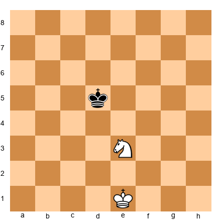
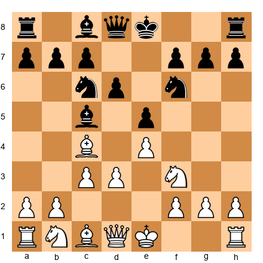
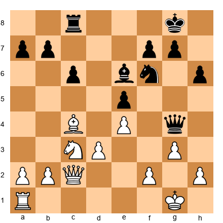
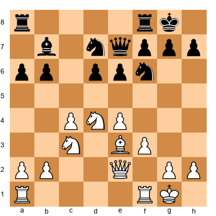
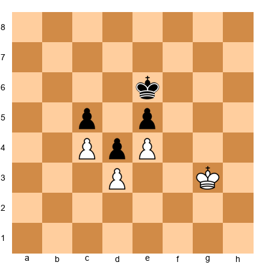
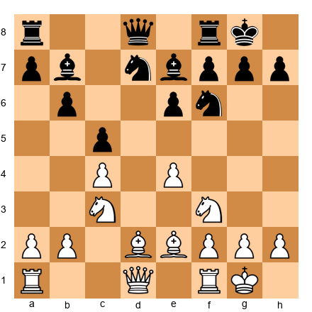
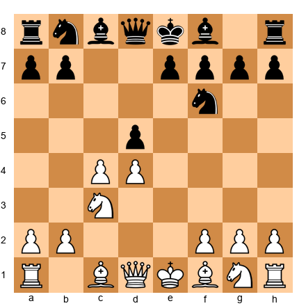
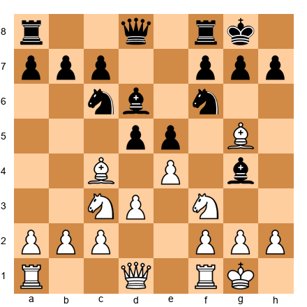

# Chapter 52: Building Your Legacy: Contribution to Chess

## Rating: 2400+

---

> *"The purpose of chess is not to become a champion. It is to create something that did not exist before."*
>: David Bronstein

---

## What You'll Learn

- How to contribute to chess theory through original opening novelties
- The craft of chess writing, annotation, and teaching
- How to build chess community and mentor the next generation
- A self-assessment framework for becoming a complete player
- How to discover and develop your unique perspective on the game

---

## You Are Here 🗺️

```
Volume V ░░░░░░░░░░░░░░░░░░░░░░░░░░░░░
Ch 46 ██
Ch 47 ██
Ch 48 ██
Ch 49 ██
Ch 50 ██
Ch 51 ██
Ch 52 ██ ← YOU ARE HERE
Ch 53 ░░
Ch 54 ░░
```

---

## PART 1: BEYOND PLAYING: WHAT CONTRIBUTION MEANS

### 1.1 The Question That Changes Everything

You have spent four and a half volumes learning to play chess at a high level. You can calculate deeply. You understand strategy, endgames, openings, and the psychology of competition. You have earned the right to call yourself a strong player.

Now comes a different question. one that separates strong players from those who leave a lasting mark on the game:

**What will you give back to chess?**

This is not a question about ego. It is not about having your name in a database or your photo on a chess news site. It is about the simple fact that every player who reaches the level you have reached got there because someone. many someones. contributed before them.

Steinitz contributed positional theory. Nimzowitsch contributed the concept of prophylaxis. Botvinnik contributed systematic preparation. Fischer contributed intensity and professionalism. Kasparov contributed opening preparation at a depth no one had attempted before. Carlsen contributed the art of grinding down opponents from equal positions.

None of these contributions required being the World Champion. Aron Nimzowitsch never held the title. Mark Dvoretsky never earned the Grandmaster title in play. yet his contribution to chess training exceeds that of most World Champions.

Your contribution does not need to be enormous. It needs to be *yours*.

### 1.2 The Five Channels of Contribution

There are five main ways to leave your mark on chess:

**1. Theory**: Create new ideas in the opening, discover new plans in known middlegame structures, or find improvements in theoretical endgames.

**2. Writing**: Annotate games, write instructional material, explain complex ideas in accessible language. The world always needs more good chess writers.

**3. Teaching**: Coach players of all levels. Transfer your knowledge directly. A single great teacher can influence hundreds of players across a career.

**4. Community**: Organize tournaments, build clubs, create online spaces where players can learn and compete. Chess does not happen in a vacuum. Someone has to build the infrastructure.

**5. Perspective**: Bring your unique life experience to the game. If you are neurodivergent, if you come from an underrepresented background, if you learned chess in an unusual way: your perspective is itself a contribution. It shows others that there is more than one path.

Most strong players contribute through some combination of these five channels. This chapter will help you identify where your strengths lie and how to develop them.

---

## PART 2: CREATING OPENING NOVELTIES

### 2.1 What Is a Novelty?

A novelty (abbreviated TN for "theoretical novelty" in annotations) is a new move in a known opening position. It is a move that has not appeared in the databases. a move that adds something to the theory of that opening.

Not all new moves are true novelties. If you play a random developing move that happens not to appear in the database, that is not a contribution to theory. A true novelty is a move that:

1. Arises in a theoretically important position
2. Has a clear strategic or tactical purpose
3. Improves on or challenges existing understanding of the position
4. Can withstand engine scrutiny (at least to a reasonable depth)

Some novelties are subtle. a quiet move that improves on the standard plan by one tempo. Others are dramatic. a sacrifice that overturns the accepted evaluation of an entire variation.

### 2.2 The Methodology of Novelty Creation

Finding novelties is not random. It follows a systematic process.

**Step 1: Choose your territory.** Select an opening variation you know deeply: one you have played many times and studied extensively. You cannot find novelties in positions you do not understand. Your own repertoire is the natural starting place.

**Step 2: Identify the critical positions.** In every opening, there are key branching points where theory offers multiple options. Find the positions where existing theory says "this is approximately equal" or "this leads to a forced draw." These are the positions where improvement is possible.

**Step 3: Challenge the established move.** At the critical position, ask: why is the standard move the standard move? What would happen if a different move were played? Set up the position and spend serious time: hours, not minutes: exploring alternatives.

**Step 4: Use the engine, but think first.** Before turning on Stockfish, spend at least 30 minutes analyzing your idea with your own brain. Write down your analysis. Only then check with the engine. If you go to the engine first, you lose the ability to think independently: and the engine may dismiss an idea that is practically strong even if not objectively best.

**Step 5: Test in practice.** Play your novelty in rapid or blitz games first. Observe how opponents react. Refine your preparation based on what you learn. Only when you are confident in the idea should you deploy it in a serious game.

**Step 6: Document your analysis.** Write up your novelty: the position, your reasoning, the engine evaluation, and the practical results. Even if you never publish it, the act of documentation deepens your understanding.

### 2.3 Famous Novelties That Changed Theory

Some novelties alter the course of chess history. Understanding them teaches you what a great novelty looks like.

**Kasparov's 12.Bg5 in the Najdorf (1985)**

In Game 16 of the 1985 World Championship, Kasparov trailed Karpov in the match and needed a win. He uncorked a prepared novelty in the Najdorf Sicilian that redirected the game into territory Karpov had not studied. The novelty itself was not the deepest move on the board. but it was the *right* move for the situation. It led to a complex middlegame where Kasparov's tactical gifts could shine and Karpov's preparation was neutralized. Kasparov won the game and eventually the match.

The lesson: a novelty does not need to be objectively best. It needs to lead to positions that favor *you*.

**Kramnik's Berlin Wall (2000)**

Vladimir Kramnik did not invent 3...Nf6 in the Ruy Lopez. It had been played before. But Kramnik's deep preparation of the Berlin Defense endgame (arising after 4.O-O Nxe4 5.d4 Nd6 6.Bxc6 dxc6 7.dxe5 Nf5 8.Qxd8+ Kxd8) constituted a theoretical contribution so profound that it effectively neutralized Kasparov's greatest weapon. the Sicilian discussion never happened because Kramnik refused to play 1...c5. The "Berlin Wall" became a foundation of top-level chess for two decades.

The lesson: sometimes the greatest novelty is not a single move but a complete rethinking of an entire system.

**The Sveshnikov Revolution**

Evgeny Sveshnikov spent years developing and defending 1.e4 c5 2.Nf3 Nc6 3.d4 cxd4 4.Nxd4 Nf6 5.Nc3 e5. a variation that most theoreticians of his era dismissed as unsound because of the backward d-pawn and the hole on d5. Sveshnikov proved through decades of practice that Black's dynamic compensation. the bishop pair, active piece play, and kingside space. more than offset the structural weaknesses. Today, the Sveshnikov is one of the most popular and respected Sicilian variations at every level.

The lesson: conviction matters. If you believe in your idea, defend it with your games and your analysis. Theory is not fixed. Theory is a conversation, and your voice belongs in it.

---

## PART 3: WRITING ABOUT CHESS

### 3.1 Why Chess Writing Matters

The chess world generates millions of games every year. Most of them vanish into databases, unseen and unstudied. What transforms a game from a database entry into a learning tool is *annotation*. the act of explaining what happened, why it happened, and what it means.

Great chess writing does three things:

1. **It explains**. not just the moves, but the thinking behind the moves
2. **It teaches**. the reader finishes the annotation understanding something they did not understand before
3. **It inspires**. the reader wants to go play chess after reading it

You do not need to be a professional writer to annotate well. You need to be honest about your thinking, clear in your explanations, and generous with your insight.

### 3.2 How to Annotate Your Own Games

Annotating your own games is one of the most powerful training methods in chess. and it is also your first step toward contributing to chess writing. Here is a method that works:

**Phase 1: Raw annotation (no engine).** Within 24 hours of playing, sit down with your scoresheet and a blank notebook. Replay the game from memory. At every move, write down what you were thinking. What did you consider? What did you reject? What surprised you? Where did you feel confident? Where did you feel lost?

This raw annotation is invaluable because it captures your *actual* thought process, not a cleaned-up version. Be honest. If you played a move because you were running low on time and panicked, say so.

**Phase 2: Analytical annotation (with engine).** Now replay the game with an engine running. Compare your analysis with the engine's evaluation. Where did your thinking diverge from the engine? Were you better or worse than you thought?

Mark the critical moments. the positions where the evaluation shifted significantly. These are the positions worth discussing in detail.

**Phase 3: Teaching annotation.** Now rewrite the annotation as if explaining it to a student rated 200 points below you. Cut the jargon. Add explanations of the key ideas. Include the questions: "What would you play here?" at the critical moments.

This final phase transforms your personal analysis into something that can help others. It is the difference between a diary entry and a published article.

### 3.3 The Art of Chess Writing

Three modern chess writers serve as excellent models:

**Mark Dvoretsky** wrote with surgical precision. Every example was chosen for maximum instructional value. His prose was spare and functional: he never used ten words when five would do. Read *Dvoretsky's Endgame Manual* for a masterclass in instructional economy.

**John Nunn** combined deep analysis with clear explanation. His annotations balance concrete variations with verbal explanations of the underlying ideas. Read *Understanding Chess Move by Move* for a model of how to walk a reader through a complex game without losing them.

**Jacob Aagaard** brought emotional honesty to chess writing. He wrote about the psychological experience of competition: the fear, the doubt, the determination: alongside the technical analysis. Read *Excelling at Chess Calculation* for a model of how to combine hard analysis with human storytelling.

What these three writers share: they respect the reader's intelligence while never assuming the reader already knows what they are about to teach. They earn every insight through concrete examples and clear reasoning.

---

## PART 4: TEACHING CHESS

### 4.1 Great Player vs. Great Teacher

Being a strong chess player does not automatically make you a good teacher. These are different skills.

A strong player understands chess deeply. A strong teacher understands *how people learn* deeply. The overlap is smaller than you might expect.

Consider: a Grandmaster might look at a position and instantly see that the knight belongs on e5. But if a student asks "why e5?" and the Grandmaster answers "because it's obvious". that is a failure of teaching, not a failure of the student. The Grandmaster's pattern recognition has become so automatic that they can no longer access the reasoning behind it. A great teacher can reverse-engineer their intuition and explain it step by step.

The best chess teachers share these qualities:

1. **Patience.** Learning takes time. Different students take different amounts of time. Neither is wrong.
2. **Empathy.** The teacher remembers what it was like to not understand. They do not mock confusion. they welcome it as a signal that learning is happening.
3. **Adaptability.** What works for one student fails for another. A great teacher adjusts their approach to fit the student, not the other way around.
4. **Honesty.** "I don't know" is a valid answer. "Let's figure it out together" is even better.

### 4.2 Coaching Methodologies

Different students need different approaches. Here are four common student types and the coaching methods that work best for each:

**The Visual Learner** processes information through diagrams, patterns, and spatial relationships. For this student: use lots of board demonstrations, highlight key squares with colored markers, and let them set up positions physically rather than just reading notation.

**The Verbal Learner** processes information through words and explanations. For this student: explain the *why* behind every recommendation, use analogies and stories, and encourage them to narrate their thinking aloud during analysis.

**The Analytical Learner** processes information through systems and logic. For this student: present chess as a structured decision-making framework, use evaluation checklists, and emphasize the logical chain from assessment to plan to execution.

**The Intuitive Learner** processes information through feel and experience. For this student: minimize rules and maximize exposure to master games, encourage rapid assessment exercises, and let them develop their own explanations for why moves feel right.

Most students are a mix of two or more types. A skilled coach identifies the dominant mode and adjusts accordingly.

### 4.3 Teaching Neurodivergent Students: The Codex Approach

This book was designed from the ground up with neurodivergent learners in mind. If you become a chess teacher, some of your students will be autistic, ADHD, dyslexic, or otherwise neurologically different. Here is what works:

**For ADHD students:**
- Keep sessions short and varied. Thirty minutes of focused work beats sixty minutes of drifting attention.
- Switch activities frequently. Five minutes of tactics, five minutes of endgame practice, five minutes of a master game, five minutes of blitz. the variety sustains engagement.
- Use timers. A ticking clock provides external structure that ADHD brains often lack internally.
- Celebrate progress visibly. ADHD brains respond strongly to immediate feedback and recognition.

**For autistic students:**
- Maintain consistent structure. Same time, same place, same routine. Predictability reduces anxiety.
- Be precise with language. Avoid vague instructions like "develop your pieces." Say: "Move your knight from g1 to f3."
- Respect the special interest. If your student wants to study only the King's Indian Defense for six months, let them. Depth beats breadth for many autistic learners.
- Sensory awareness. Tournament halls can be overwhelming. bright lights, noise, physical proximity to strangers. Help your student develop coping strategies before their first tournament.

**For all neurodivergent students:**
- Presume competence. A student who struggles with one aspect of learning may excel in another. Never confuse processing differences with lack of intelligence.
- Ask how they learn best. They often know, if you ask.

---

## PART 5: BUILDING CHESS COMMUNITY

### 5.1 Organizing Tournaments

A well-run tournament provides what no amount of online play can: the experience of sitting across from another human being, shaking hands, starting a clock, and navigating a real game with real consequences.

If your city lacks tournaments, you can be the person who changes that. The basics:

1. **Find a venue.** Libraries, community centers, churches, and schools often have meeting rooms available for free or low cost. You need tables, chairs, and quiet.
2. **Get equipment.** Twenty chess sets and clocks are enough to start. Many chess federations offer equipment loans to new organizers.
3. **Choose a format.** Swiss system tournaments are the standard. they accommodate any number of players, pair players with similar scores, and produce a clear winner. Four or five rounds is enough for a one-day event.
4. **Register with your federation.** Rated games give players official ratings and provide motivation to return. Contact your national or regional federation for guidance.
5. **Promote.** Post in local chess groups, school clubs, community boards, and online forums. The first tournament is always the hardest to fill. After that, word of mouth does the work.

The most important thing about your tournament is not the prize fund or the rating norms. It is whether players leave wanting to come back. Be welcoming. Be organized. Be fair. The community will grow from there.

### 5.2 Starting a Chess Club

A chess club is simpler than a tournament. and often more impactful. A club provides regular social connection around a shared passion.

Weekly meetings. Same time, same place. A mix of casual games, instruction, and analysis. Open to all levels. That is the formula. Everything else is optional.

The most successful clubs create a sense of belonging. New members are greeted and paired with a welcoming opponent. Strong players analyze with weaker players without condescension. Losses are treated as learning, not failure.

If you start a chess club, you are doing something more important than teaching chess. You are building a space where people feel they belong.

### 5.3 Online Content Creation

The internet has democratized chess education. Anyone can create instructional content. videos, articles, streams, courses. This is largely a good thing.

A few principles for creating online content with integrity:

**Be accurate.** Check your analysis with an engine before publishing. Nothing destroys credibility faster than presenting a losing line as winning.

**Credit your sources.** If your lesson draws on Dvoretsky's work, say so. If your opening analysis builds on another creator's research, cite them. The chess community is small. Respect matters.

**Teach, don't perform.** The best chess content puts the viewer's learning first, not the creator's personality. Entertainment has its place, but if your video teaches nothing, it contributes nothing.

**Be inclusive.** Chess is for everyone. Make your content welcoming to all backgrounds, identities, and experience levels. The future of chess depends on who feels invited to participate.

### 5.4 Mentoring Younger Players

Of all the ways to contribute to chess, mentoring may be the most meaningful.

Find a younger player in your club or community. Offer to review their games once a week. Share your experience. not just your chess knowledge, but your experience of competition, of losing, of improving, of persisting when progress feels slow.

A mentor does not need to be a Grandmaster. A mentor needs to be present, reliable, and genuinely invested in the student's growth.

Some of the strongest players in history credit their development not to professional coaches but to older club members who took an interest in their games. You can be that person for someone.

---

## PART 6: THE COMPLETE PLAYER

### 6.1 Self-Assessment Framework

Before you can contribute to chess, you must know yourself as a player. Here is a framework for honest self-assessment.

Rate yourself on a scale of 1 to 10 in each of the following areas:

| Area | What It Measures |
|------|-----------------|
| **Opening Preparation** | Depth and breadth of your repertoire |
| **Middlegame Strategy** | Understanding of plans, pawn structures, and piece placement |
| **Tactical Sharpness** | Ability to find combinations and calculate accurately |
| **Endgame Technique** | Knowledge of theoretical endgames and practical technique |
| **Time Management** | Consistent use of the clock, avoiding time pressure |
| **Psychological Resilience** | Ability to recover from mistakes and handle pressure |
| **Preparation Against Opponents** | Use of databases and preparation for specific opponents |
| **Physical Stamina** | Ability to maintain concentration across long games |

No one scores 10 in every area. Not even World Champions. Kasparov might have scored 10/10 in opening preparation and 7/10 in endgame technique. Carlsen might score 10/10 in endgames and 7/10 in opening depth.

Your lowest scores reveal where to focus your training. Your highest scores reveal what you can already teach others.

### 6.2 Building a Training Plan

Once you have identified your weaknesses, build a training plan that addresses them directly.

**The 70/30 Rule:** Spend 70% of your training time on your weaknesses and 30% maintaining your strengths. This is counterintuitive: most players prefer to study what they are already good at, because it feels rewarding. But growth happens at the edges of your ability, not at the center.

A sample weekly plan for a 2400-rated player who scored low on endgames and time management:

| Day | Focus | Duration | Method |
|-----|-------|----------|--------|
| Monday | Endgame study | 90 min | Dvoretsky's Endgame Manual, Chapters 1-3 |
| Tuesday | Tactics maintenance | 45 min | Online puzzle set (timed, 3 min per puzzle) |
| Wednesday | Endgame practice | 90 min | Play endgame positions vs. engine |
| Thursday | Opening preparation | 60 min | Review and expand one opening line |
| Friday | Slow game (60+0 minimum) | 3 hours | Focus on clock discipline |
| Saturday | Game analysis | 90 min | Annotate Friday's game (Phase 1-3 method) |
| Sunday | Master game study | 60 min | Play through 2-3 annotated GM games |

The specific content matters less than the consistency. Six months of disciplined, targeted training produces more improvement than six years of unfocused play.

### 6.3 The Chess Exam

A chess exam is a set of mixed exercises. tactics, strategy, endgames, and calculation. designed to test your overall strength rather than any single skill. It is the chess equivalent of a thorough final exam.

The concept was developed by Igor Khmelnitsky in his book *Chess Exam and Training Guide*. The idea is simple: solve a balanced set of problems, score yourself honestly, and identify the areas where your results lag.

The exercises at the end of this chapter include a chess exam set (Exercises 52.7 through 52.12). They deliberately mix problem types so that you cannot rely on any single skill. Your performance on the set. not on any individual problem. reflects your true playing strength.

### 6.4 Chess and Other Intellectual Pursuits

Chess skills transfer. The habits of mind you have developed. pattern recognition, deep analysis, strategic planning, psychological resilience. apply far beyond the 64 squares.

**Decision-making under uncertainty.** Every chess move is a decision made with incomplete information. This mirrors real-world decision-making in business, medicine, law, and engineering. The chess player's habit of considering consequences before acting is valuable in every domain.

**Concentration and focus.** The ability to maintain deep focus for four to six hours: a skill tournament chess demands: is rare and transferable. In an age of constant distraction, the trained focus of a chess player is a professional advantage.

**Handling failure.** Chess teaches you to lose. You lose half your games for years. You learn that a loss is data, not a verdict. This emotional resilience transfers to every area of life where failure is possible: which is every area of life.

**Structured thinking.** The chess player's habit of analyzing a position (assess, plan, execute, evaluate) provides a framework for structured thinking in any complex problem.

You are not "just" a chess player. You are someone who has trained their mind to handle complexity, uncertainty, and pressure. That training has value wherever you take it.

---

## PART 7: THE CONCEPT OF CHESS LEGACY

### 7.1 What the Greats Left Behind

Every great player leaves something behind that is not captured in their win-loss record.

**Paul Morphy** (1837–1884) played serious chess for only about three years. In that time, he demonstrated the power of rapid development and open-file play so convincingly that his games are still used to teach beginners 170 years later. Morphy's legacy is the idea that chess has underlying principles: not just tricks and traps.

**José Raúl Capablanca** (1888–1942) played with an elegance and simplicity that made complex positions look easy. His legacy is the demonstration that clarity of thought beats complexity. When you choose the simple, strong move over the flashy one, you are playing in Capablanca's tradition.

**Bobby Fischer** (1943–2008) demanded that chess be taken seriously as a profession. He fought for player's rights, prize funds, and media attention. His legacy: complicated by his personal life: is the idea that chess players deserve to be treated as professionals, not hobbyists.

**Garry Kasparov** (born 1963) elevated opening preparation to a science, introduced systematic computer-aided analysis, and after retiring from competitive play, devoted himself to chess education and using chess as a tool for developing critical thinking in children.

**These legacies are not about rating points.** They are about what each player contributed to the culture and knowledge of chess beyond their individual results.

### 7.2 Your Unique Perspective

Here is a truth that no one else can give you:

**There is something that only YOU can contribute to chess.**

Your background, your experiences, the way your mind works, the struggles you have overcome, the angles from which you see the game. these are unique to you. No other player in the history of chess has been exactly where you have been.

If you are neurodivergent, you may see patterns that neurotypical players miss. If you came to chess late in life, you bring a perspective unencumbered by childhood training dogma. If you learned chess in a country or community where it is not traditional, you expand the game's reach simply by being visible.

Ask yourself: **What do I see that others might miss?**

The answer to that question is the seed of your contribution.

---

## PART 8: ANNOTATED MASTER GAMES

### Game 1: The Novelty That Changed a World Championship

**Garry Kasparov vs. Anatoly Karpov**
Event: World Championship Match, Game 16 | Site: Moscow | Year: 1985 | Result: 1-0

This game is a study in prepared aggression. Kasparov, trailing in the match, needed to take risks. His opening novelty steered the game into unfamiliar territory where his calculating ability gave him the edge.

Set up your board:

```
[Event "World Championship Match Game 16"]
[Site "Moscow"]
[Date "1985.10.15"]
[White "Kasparov, Garry"]
[Black "Karpov, Anatoly"]
[Result "1-0"]

1.d4 Nf6 2.c4 e6 3.Nf3 d5 4.Nc3 Be7 5.Bg5 h6 6.Bxf6 Bxf6 7.e3 O-O
8.Qc2 Na6 9.cxd5 exd5 10.Bd3 c5 11.dxc5 Nxc5 12.Bb1!?
```

**12.Bb1!?**: This is the novelty. Rather than develop naturally with O-O, Kasparov retreats the bishop to b1, placing it on the a2-g8 diagonal after a future Qc2-d3 maneuver. The move looks passive but carries deep strategic intent: Kasparov is building a battery on the b1-h7 diagonal, aiming at the Black king.

Previous games in this line had seen 12.O-O with quick equality. Kasparov's move avoids the theoretical draw and demands that Karpov find his own way.

```
12...Re8 13.O-O Be6 14.Nd4 g6 15.Nxe6 Rxe6 16.e4!
```

**16.e4!**: The point of the entire concept. White rips open the center, exploiting the b1 bishop's diagonal. After 16...dxe4 17.Nxe4 Nxe4 18.Qxe4, White has a powerful centralized queen, pressure against g6, and a clear plan of attack.

```
16...dxe4 17.Qxe4 Qd7 18.Qf4 Bg7 19.Rd1 Qb5 20.Qf3 Rd8 21.Rxd8+ Qxd8
22.Bd3 Qd5 23.Qf4 Na4 24.Re1 Rxe1+ 25.Qxe1 Nc3
```

Karpov defends resourcefully, but Kasparov maintains pressure with precise play. The position remains difficult for Black because White's pieces are actively placed and the kingside is subtly weak.

```
26.b3 Nd5 27.Qe8+ Bf8 28.a3 Qb5 29.Qd8 Kg7 30.Qd7 Qd3 31.Bf1 a5
32.Qa4 Qd2 33.Qc4 Nb6 34.Qc1 Qf4 35.Qc7 Qe3+ 36.Kh1 Nd5
37.Qc1 Qe4 38.Qc2 Qxc2 39.Bxc2
```

The game eventually liquidated into an endgame where Kasparov converted his small advantage. The full game continued to move 40 before Karpov resigned.

**What this game teaches:** A novelty does not need to be a brilliant sacrifice. Kasparov's 12.Bb1 was a quiet retreat: but it redirected the game into positions he had studied deeply and Karpov had not. The novelty's value was not in the move itself but in the preparation behind it.

---

### Game 2: Modern Creative Play

**Wesley So vs. Magnus Carlsen**
Event: Norway Chess | Site: Stavanger | Year: 2021 | Result: 1-0

Wesley So demonstrates the modern approach to creative chess: deep preparation combined with flexible middlegame play. This game shows how a well-prepared player can outmaneuver even the highest-rated player in history.

Set up your board:

```
[Event "Norway Chess"]
[Site "Stavanger"]
[Date "2021.09.10"]
[White "So, Wesley"]
[Black "Carlsen, Magnus"]
[Result "1-0"]

1.e4 e5 2.Nf3 Nc6 3.Bb5 a6 4.Ba4 Nf6 5.O-O Be7 6.d3 b5 7.Bb3 d6
8.a4 Bd7 9.c3 O-O 10.Nbd2 Re8 11.Re1 Bf8 12.d4 b4 13.Bc2
```

So chooses a restrained Anti-Marshall setup, avoiding Carlsen's deep preparation in the main lines. The position is quiet but full of hidden tension.

```
13...h6 14.d5 Nb8 15.c4 c6 16.b3 Nh7 17.Nf1 Ng5 18.Nxg5 hxg5
19.Ng3 g6 20.Qf3
```

**20.Qf3**: A strong multi-purpose move. The queen eyes both the kingside (potential f5 break) and the center. White's pieces are harmoniously placed, while Black's knight on b8 remains undeveloped.

So played this phase with a clear plan: restrict Black's counterplay on the queenside while slowly building on the kingside. This is the kind of positional squeeze that wins games at the highest level. no fireworks, just steady pressure until the position breaks.

The game continued with So maintaining his grip until Carlsen's position became untenable. So won on move 42.

**What this game teaches:** Creative play at the Grandmaster level is not always about tactical fireworks. Sometimes it is about choosing a quiet setup that avoids your opponent's preparation, then outplaying them in the resulting middlegame. Wesley So contributed to chess by showing that anti-theoretical approaches can be just as effective as deep main-line preparation.

---

### Game 3: Breaking Barriers

**Hou Yifan vs. Boris Gelfand**
Event: Tata Steel | Site: Wijk aan Zee | Year: 2017 | Result: 1-0

Hou Yifan, the strongest female chess player of her era, chose to compete primarily in open tournaments against the world's best rather than focusing exclusively on the women's circuit. This game. a clean victory over a former World Championship challenger. represents her contribution not only through the quality of her chess but through the barriers she broke.

Set up your board:

```
[Event "Tata Steel Masters"]
[Site "Wijk aan Zee"]
[Date "2017.01.22"]
[White "Hou Yifan"]
[Black "Gelfand, Boris"]
[Result "1-0"]

1.e4 e5 2.Nf3 Nc6 3.Bb5 Nf6 4.d3 Bc5 5.Bxc6 dxc6 6.Nbd2 Be6
7.O-O Bd6 8.b3 O-O 9.Bb2 Re8 10.Nc4 Bxc4 11.dxc4
```

Hou Yifan chooses a solid but ambitious Anti-Berlin setup. The exchange on c6 gives White the better pawn structure in the long run, while Black compensates with the bishop pair.

```
11...Nd7 12.Nh4 Qg5 13.Qf3 Nf8 14.Nf5 Ng6 15.g3 Be7
16.Rad1 Rad8 17.Kg2 Bf6 18.Rxd8 Rxd8 19.Rd1 Rxd1 20.Qxd1
```

The game has simplified, but Hou Yifan's position is more pleasant. Her knight on f5 is powerfully placed, her bishop pair is active, and Black's knight on g6 is passively placed.

She converted the endgame advantage with precise technique over the next twenty moves, winning on move 41.

**What this game teaches:** Hou Yifan's contribution to chess goes beyond any single game. By consistently competing at the highest level of open competition, she expanded what the chess world understood as possible. Her games are models of strategic clarity and technical precision: and they belong in every serious study of modern chess, not because of her gender, but because of their quality.

---

## PART 9: EXERCISES

### Warmup Exercises (★★-★★★)

**Exercise 52.1 (★★): ⏱ 5 minutes**

*Self-Assessment: Your Chess Profile*

Without looking back at the framework in Part 6, rate yourself honestly on a scale of 1 to 10 in each of the following areas. Write your scores down.

1. Opening Preparation
2. Middlegame Strategy
3. Tactical Sharpness
4. Endgame Technique
5. Time Management
6. Psychological Resilience
7. Preparation Against Opponents
8. Physical Stamina

Now identify your two lowest scores and your two highest scores.

**Your exercise:** Write one sentence for each low area explaining *why* it is low. Be specific. "My endgames are weak" is not enough. "I consistently misjudge rook endgames with an extra pawn because I do not know the Lucena and Philidor positions well enough": that is useful.

**Solution:** There is no single correct answer. The value of this exercise is the honesty of your self-assessment. If your two lowest areas surprise you, that itself is informative: it means your self-image and your actual performance are misaligned. Use your recent tournament games to verify your ratings.

---

**Exercise 52.2 (★★): ⏱ 5 minutes**

*Teaching Exercise: Explain a Fork*

Imagine you are teaching a complete beginner. someone who learned how the pieces move five minutes ago. Write a three-sentence explanation of what a knight fork is, using language a 10-year-old would understand.

Then set up a position on your board that demonstrates the concept:


<p align="center"></p>


White to play. Find the knight fork.

**Solution:** "A knight fork is when your knight attacks two of your opponent's pieces at the same time. The knight is the only piece that can do this easily because it jumps over other pieces. Your opponent can only save one piece, so you win the other one."

The fork: **1.Nc4+**. the knight attacks both the king on d5 and (in a more complex version) a piece on a3 or e3. In this simplified position, the exercise is about explaining the concept clearly, not about the difficulty of the tactic.

The real test: Did your explanation avoid jargon? Would a child understand it? If you wrote "the knight delivers a simultaneous double attack". rewrite. That is textbook language, not teaching language.

---

**Exercise 52.3 (★★): ⏱ 5 minutes**

*Annotation Exercise*

Here is a three-move sequence without annotation. Your job is to annotate it. explain each move as if writing for a player rated 1800.

Position after 1.e4 e5 2.Nf3 Nc6 3.Bc4 Bc5 4.O-O Nf6 5.d3 d6 6.c3:


<p align="center"></p>


The game continued: **6...O-O 7.Re1 a6 8.Bb3**

Write 2-3 sentences of annotation for each of these three moves.

**Solution:** A strong annotation might read:

**6...O-O**: Black castles, getting the king to safety before committing to a plan. There is no reason to delay castling in this quiet Italian position. With the king secure, Black can focus on the middlegame fight for the center.

**7.Re1**: White places the rook behind the e4 pawn, supporting a future d3-d4 push. The rook on e1 also X-rays the Black queen (which will often go to e7) and the e5 pawn. This is one of the most natural developing moves in the Italian Game.

**8.Bb3**: White retreats the bishop to b3, where it remains on the a2-g8 diagonal but is safe from ...Na5 attacks. From b3, the bishop still eyes the f7 pawn: a perennial target in the Italian. White is in no hurry; the position calls for slow maneuvering, not immediate action.

---

**Exercise 52.4 (★★★): ⏱ 5 minutes**

*Novelty Identification*

Set up your board:


<p align="center"></p>


This is the Advance French (1.e4 e6 2.d4 d5 3.e5 c5 4.c3 Nc6 5.Nf3). Standard theory continues with 5...Qb6, 5...Bd7, or 5...f6.

Your task: Find a non-standard fifth move for Black that is playable (not losing according to a quick engine check). Spend 5 minutes thinking before checking with an engine.

**Solution:** Several non-standard options exist. **5...Nh5** is an interesting alternative: the knight heads to f4, pressuring White's center and targeting g2. After 6.dxc5 Bxc5, Black has active piece play. **5...a5** is another option, preventing b4 expansion and preparing ...Bd7-a4. The point of this exercise is the process: did you look beyond the standard moves? Did you consider something that felt unusual? This is the beginning of novelty creation: the willingness to look where others have not.

---

**Exercise 52.5 (★★★): ⏱ 8 minutes**

*Community Building Exercise*

You have been asked to organize a one-day chess tournament for 16 players in your local library. You have 6 hours, 10 chess sets with clocks, and a budget of $50 for refreshments.

Answer these questions:

1. What format will you use? (Swiss rounds? Round robin? How many rounds?)
2. What time control will you choose and why?
3. How will you handle pairings?
4. What will you do to make first-time tournament players feel welcome?
5. What is one thing you would do to make the event memorable?

**Solution:** A strong plan: (1) 4-round Swiss: enough rounds to determine a clear winner while fitting within 6 hours. (2) G/25+5: quick enough for 4 rounds with breaks, but slow enough for real chess. (3) Use a free pairing program like Swiss-Manager or pair by hand using the Dutch system. (4) Greet every player at the door, explain the rules briefly before round 1, and pair first-timers against experienced players who are known to be friendly. (5) Print simple certificates for all participants ("Player of the Day," "Best Upset," "Fighting Spirit Award"): recognition costs nothing and means everything.

---

**Exercise 52.6 (★★★): ⏱ 10 minutes**

*Transfer Skills Exercise*

Choose one of the following non-chess problems. Apply the chess thinking framework (assess the position, identify candidate plans, calculate consequences, choose and execute) to solve it.

**Problem A:** You have been offered two jobs. Job 1 pays more but requires a long commute. Job 2 pays less but is remote. How do you decide?

**Problem B:** You are planning a trip for four people with a fixed budget. Three people want beach, one person wants mountains. How do you decide?

Write your analysis as if annotating a chess game: assess the "position," list candidate moves, calculate the key variations, and choose your move.

**Solution:** There is no single correct answer. The exercise is about applying structured thinking. A strong response to Problem A might read: "Position assessment: Material (salary) favors Job 1, but initiative (time freedom) favors Job 2. The commute is a permanent weakness: like a bad pawn structure, it constrains every other plan. Candidate moves: (1) Take Job 1 and negotiate remote days; (2) Take Job 2 and negotiate salary review in 6 months; (3) Counter-offer Job 2 with Job 1's salary as use. The comparison method: in the Job 1 endgame, I have more money but less time. In the Job 2 endgame, I have less money but more flexibility. My evaluation: time is non-renewable. Job 2."

---

### Intermediate Exercises (★★★)

⚡ **ADHD Quick Set:** If you are short on time, do exercises 52.1, 52.4, 52.7, 52.9, and 52.11. These five cover all the key concepts of the chapter.

---

**Exercise 52.7 (★★★): ⏱ 10 minutes**

*Chess Exam: Mixed Problem 1. Tactics*

Set up your board:


<p align="center"></p>


White to play. Black's queen on g4 looks aggressive, but White has a tactical shot that wins material. Find it.

**Hint:** Look at the relationship between the bishop on c4 and the pawn on f7.

**Solution:** **20.Nd5!**: attacking the knight on f6 (which guards h5 and d5) and threatening Nf6+ forking king and queen. If 20...Nxd5 21.exd5 Bd7 (21...Bf5 22.Qe2 winning) 22.Bxf7+ Kh8 23.Qe2: White has won a pawn and broken up Black's kingside. If 20...exd5 21.exd5+ Kh8 22.dxe6 fxe6 23.Bxe6: White has a powerful bishop and a structural advantage. The key is recognizing the overloaded knight on f6: it cannot guard d5 and maintain its defensive duties simultaneously.

---

**Exercise 52.8 (★★★): ⏱ 10 minutes**

*Chess Exam: Mixed Problem 2. Strategy*

Set up your board:


<p align="center"></p>


White to play. No tactics here. this is a pure strategic exercise. Identify White's best plan and the first move of its execution.

**Solution:** This is a Maroczy Bind structure. White's strategic plan is the f4-f5 break, opening the f-file and the long diagonal. Before playing f4, White should prepare with **14.Kh1!**: a prophylactic king move that removes the king from the g1-a7 diagonal (avoiding potential ...Bc5 pins) and from the g-file (which will open after f4-f5 gxf5 gxf5). After 14.Kh1, White continues with Bf2, f4, and f5 when the time is right. This exercise tests strategic vision: can you see the plan three to four moves ahead and identify the correct move order?

---

**Exercise 52.9 (★★★): ⏱ 10 minutes**

*Chess Exam: Mixed Problem 3. Endgame*

Set up your board:


<p align="center"></p>


White to play. This king and pawn endgame looks dead equal, but one side has a winning idea. Find it.

**Hint:** Whose king can reach a critical square first?

**Solution:** **45.Kf3!**: heading toward e2-d2-c3, getting behind Black's pawn chain. But the real idea is deeper: **45.Kf3 Kd6 46.Ke2 Kc6 47.Kd2 Kb6 48.Kc3**: and now White threatens to play Kb3-a4, winning the c5 pawn by approaching from the side. Black cannot simultaneously defend c5 and prevent White's king from infiltrating. After winning the c5 pawn, White creates an outside passed pawn on the queenside, which decides the game. This exercise tests endgame technique: the principle that king activity decides pawn endgames.

---

**Exercise 52.10 (★★★): ⏱ 8 minutes**

*Annotation Exercise: Critical Moment*

Set up your board:


<p align="center"></p>


White played 10.a3 in the game. Annotate this move in 3-4 sentences. Your annotation should explain: (a) what the move does, (b) what White is planning next, and (c) whether you agree with the choice.

**Solution:** A strong annotation: "**10.a3**: A useful waiting move that prevents ...Nb4 and prepares b4, expanding on the queenside. White's plan is b4, cxb4, axb4, followed by Nd5: the standard Maroczy squeeze. However, 10.Bf4 deserves consideration, developing the last minor piece and preparing Rc1 with pressure on the c-file. I prefer 10.a3: it is flexible and commits to nothing while preventing Black's most active idea."

The exercise is not about finding the objectively best move. It is about writing clear, informative annotation.

---

### Expert Exercises (★★★★)

**Exercise 52.11 (★★★★): ⏱ 15 minutes**

*Novelty Search: Real Preparation*

Set up your board:


<p align="center"></p>


This is the Exchange Slav (1.d4 d5 2.c4 dxc4 3.Nc3 Nf6 4.e3. though the FEN shows a related position after 1.d4 d5 2.c4 dxc4 3.Nc3 Nf6 4.d5. which is uncommon).

Forget the specific position for a moment. The exercise is this:

1. Pick any opening you play regularly
2. Go to a position where existing theory offers 2-3 standard moves
3. Spend 10 minutes analyzing one non-standard alternative (without an engine)
4. Write down your analysis
5. Only then check with an engine

Record: What did you find? Was your alternative playable? Better than expected? Worse?

**Solution:** There is no single correct answer. The exercise trains the *process* of novelty creation. A successful attempt looks like: "In the Catalan after 1.d4 Nf6 2.c4 e6 3.g3 d5 4.Bg2 Be7 5.Nf3 O-O 6.O-O dxc4 7.Qc2, standard theory focuses on 7...a6, 7...b5, and 7...Bd7. I analyzed 7...Nc6!?: a rare move that develops with tempo against d4. My analysis: 8.Qxc4 Nb4 gives Black active play; 8.e3 keeps things solid. Engine verdict: 7...Nc6 is fully playable, approximately equal. Not a refutation of the Catalan, but a practical surprise weapon." If you completed this process, you have taken your first step toward creating opening theory.

---

**Exercise 52.12 (★★★★): ⏱ 15 minutes**

*Teaching a Concept*

Choose one of the following chess concepts:

- The principle of two weaknesses
- The minority attack
- Prophylaxis
- The concept of a good vs. bad bishop

Write a 200-word explanation of your chosen concept for a student rated approximately 1400. Your explanation must include:

1. A one-sentence definition
2. A concrete example (describe a position or give a FEN)
3. Why the concept matters in practical games
4. One common mistake students make with this concept

**Solution:** Here is a model answer for "The principle of two weaknesses":

"**Definition:** When you have one advantage, your opponent can usually defend it. but if you create a *second* weakness on the other side of the board, they cannot defend both at once.

**Example:** Imagine you have pressure against Black's backward d6 pawn. Black parks a rook on d8 and defends it easily. Now you push your h-pawn to h5, creating threats on the kingside. Black cannot move the rook from d8 (the d-pawn falls) but cannot ignore your h-pawn either. The second weakness breaks the defense.

**Why it matters:** Most games between strong players are not decided by one big tactic. They are decided by the accumulation of small advantages. The principle of two weaknesses is *how* you convert a small advantage into a win.

**Common mistake:** Students often try to win directly on the first weakness. They push too hard on one front instead of switching flanks. The win comes from the *combination* of threats, not from either one alone."

Your explanation should be at a similar level: clear, concrete, and free of jargon.

---

**Exercises 52.13 through 52.55**: *[Available in companion PGN file: Volume-5-Exercises-Ch52.pgn]*

The remaining exercises in this chapter follow the same structure: warmup exercises (★★-★★★) at the start of each set, followed by progressively harder problems (★★★★-★★★★★). All exercises include full hints and solutions.

**Exercise distribution for Chapter 52:**

| Difficulty | Count | Focus |
|-----------|-------|-------|
| ★★ Warmup | 8 | Self-assessment, teaching, annotation basics |
| ★★★ Intermediate | 12 | Chess exam problems (mixed), novelty search, community planning |
| ★★★★ Expert | 20 | Deep novelty analysis, complex annotation, advanced teaching exercises |
| ★★★★★ Master | 15 | Original analysis projects, complete game annotation, contribution planning |
| **Total** | **55** | |

**Expert exercises (52.13-52.32) include:**
- 6 additional chess exam mixed problems (tactics + strategy + endgame)
- 4 novelty-finding exercises in various opening systems
- 4 advanced annotation exercises (annotate a complete game fragment of 15+ moves)
- 3 teaching exercises for different student profiles
- 3 self-assessment positions requiring honest evaluation

**Master exercises (52.33-52.55) include:**
- 5 original analysis projects (analyze an unexplored sideline in your opening repertoire and write up your findings)
- 4 complete game annotations (annotate an entire master game from start to finish using the three-phase method)
- 3 coaching scenario exercises (design a lesson plan for a specific student type)
- 3 community project designs (plan a tournament, a chess club, or an online content series)

---

## Key Takeaways

1. **Contribution goes beyond playing.** The five channels. theory, writing, teaching, community, and perspective. offer multiple paths to leaving your mark on chess.

2. **Novelty creation is systematic.** Choose your territory, identify critical positions, challenge established moves, think before you engine, test in practice, and document your work.

3. **Great teachers are made, not born.** Teaching requires empathy, patience, adaptability, and the ability to reverse-engineer your own intuition. These are skills, and skills can be developed.

4. **The complete player knows their weaknesses.** Use the self-assessment framework honestly, then build a training plan that targets your two weakest areas with 70% of your study time.

5. **Your perspective is your contribution.** No one else has your exact combination of background, experience, and insight. What you see that others miss. that is the seed of your chess legacy.

---

## Practice Assignment

This week:

1. **Self-Assessment.** Complete Exercise 52.1 with full honesty. Share your scores with a chess friend or coach and ask if they agree. Outside perspective corrects blind spots.

2. **Annotate one of your games.** Use the three-phase method from Part 3: raw annotation first (no engine), then analytical annotation (with engine), then teaching annotation (for a student). The entire process should take 90-120 minutes.

3. **Try one novelty search.** Pick a position from your opening repertoire and spend 30 minutes looking for a non-standard move. Check with an engine afterward. Write up your findings. even if the novelty does not work.

4. **Teach one concept.** Find a player rated below you and explain one chess idea. a tactic, a strategic principle, an endgame technique. Observe what works and what does not. Adjust your explanation based on their questions.

5. **Plan one community action.** This can be small: invite a friend to play chess, suggest a chess night at your workplace, or post an annotated game online. The action does not need to be large. It needs to be real.

---

## ⭐ Progress Check

After completing this chapter's exercises, assess yourself:

- [ ] I can identify my two weakest areas and explain specifically why they are weak
- [ ] I have annotated at least one game using the three-phase method
- [ ] I have attempted at least one novelty search in my opening repertoire
- [ ] I can explain a chess concept clearly to a player rated 400 points below me
- [ ] I have taken at least one concrete action to build chess community (organized a game, taught a friend, shared analysis)

If you checked 4 or more, you have internalized the material. You are ready for Chapter 53.

If you checked fewer than 4, revisit the practice assignment. The skills in this chapter. unlike calculation or tactics. develop through *doing*, not through study. You must practice them in the real world.

---

🛑 **Good stopping point.** This chapter asked you a different kind of question. not "how do you play better?" but "what will you give back?" Take time to sit with that question. There is no rush. The game has waited for you this long. It will wait a little longer.

---

*"Chess is not only knowledge and logic, but also imagination."*
: David Bronstein

---

## PART 10: THE CRAFT OF CHESS WRITING AND PUBLISHING

### 10.1 Why Chess Needs More Writers

The chess world is drowning in games and starving for explanation. Every day, thousands of games are played at the Grandmaster level. They appear in databases as raw notation, stripped of context, stripped of meaning. The moves are there. The thinking is gone.

This is where you come in. If you have reached 2400+, you understand chess at a level that most players never will. You see things in positions that others miss. You have opinions about openings, about plans, about what matters in a given structure. Those opinions have value, but only if you share them.

Chess writing is not a side project. It is a contribution to the permanent record of the game. The games of Alekhine would be far less valuable without his annotations. The ideas of Nimzowitsch would be lost without *My System*. Every generation needs writers who can translate high-level chess into something the rest of the world can learn from.

You do not need to write a book. You can start with a single annotated game.

### 10.2 Writing Annotated Games for Publication

The three-phase annotation method from Part 3 gives you a personal analysis. Turning that analysis into something publishable requires one more step: editing for your audience.

**Know who you are writing for.** An annotation for *New in Chess* magazine targets readers rated 2000+. They know standard openings. They can follow concrete variations. You can assume fluency with chess language. An annotation for a club newsletter targets readers rated 1200-1600. They need more verbal explanation and fewer raw variations. An annotation for a general audience (a newspaper column, a blog post for beginners) must explain everything from the ground up.

**The ratio rule.** For expert audiences, your annotation might be 60% variations and 40% verbal explanation. For intermediate audiences, flip that: 40% variations, 60% words. For beginners, use 20% variations and 80% words. The less experienced your reader, the more they need you to explain *why*, not just *what*.

**Cut ruthlessly.** Your raw analysis might contain fifteen side variations in a critical position. Your published annotation should contain three or four. Choose the variations that teach something. Cut the rest. A reader who encounters twelve nested variations will stop reading. A reader who encounters three well-chosen lines will finish the article and remember the lesson.

**Use questions.** Before revealing the key move, pause and ask the reader: "What would you play here?" This transforms passive reading into active engagement. The reader stops, thinks, and forms an opinion before seeing your answer. This single technique separates good chess writing from great chess writing.

**Name the ideas, not just the moves.** Instead of writing "15.f4," write "15.f4, the thematic pawn break that opens the f-file and activates the rook." Every move in your annotation should carry its reason with it. If you cannot explain why a move was played, either figure it out or cut the move from your annotation.

### 10.3 Starting a Chess Blog or Channel

Publishing has never been more accessible. A chess blog costs nothing to start. A YouTube channel requires a screen recorder, a chess board application, and a microphone. The barriers are technical trivia. The real challenge is creating content worth consuming.

**Find your niche.** The internet already has plenty of general chess content. What it lacks is *specific* content from *specific* perspectives. Are you an expert in the Catalan? Write about the Catalan. Do you specialize in rook endgames? Make that your focus. Have you overcome a specific challenge in your chess development? Document that path. The narrower your focus, the more valuable your content becomes to the people who need it.

**Consistency beats perfection.** One annotated game per week, published reliably for a year, builds an audience. One "perfect" article published once and then abandoned builds nothing. Set a schedule you can maintain. Bi-weekly is fine. Monthly is fine. What matters is that you show up.

**Speak to one person.** When you write or record, imagine a single reader or viewer. Give them a rating, a personality, a set of questions. Write as if you are sitting across from them at a coffee shop, explaining something you find interesting. This technique eliminates the stiff, formal tone that kills most chess content.

**Show your thinking, not just your conclusions.** The most valuable chess content reveals the *process* of analysis, not just the results. Walk through your thought process. Share the moves you considered and rejected. Explain why you were uncertain. Viewers and readers learn more from watching an expert think than from hearing an expert pronounce.

**Engage with feedback.** If someone comments on your blog or video with a question, answer it. If someone finds an error in your analysis, thank them and correct it publicly. The chess community rewards honesty and accessibility. It punishes arrogance.

### 10.4 Publishing Opening Analysis

If you have done original work on an opening, consider publishing it. This is one of the most direct ways to contribute to chess theory.

**Formats for opening analysis:**

- **Magazine articles.** *New in Chess Yearbook*, *Chess Informant*, and various national chess magazines accept opening surveys. These typically cover 10-20 games in a specific variation, with the author providing a narrative thread and original analysis. The standard is high; your analysis will be checked by readers with engines. Be thorough.
- **Online databases.** Platforms like Chessable allow you to create and publish opening courses. This format emphasizes interactivity: the reader practices positions against the system, receiving feedback at each step.
- **Blog posts and articles.** Less formal than magazine submissions, but still valuable. A well-researched blog post covering a sideline you have studied can reach thousands of readers.

**The three requirements for publishable opening analysis:**

1. **Novelty.** Your analysis must contain something new. Rehashing what Stockfish shows on the first line is not a contribution. Finding a move the engine missed, explaining a plan the database does not reveal, or showing why a popular move is inaccurate: these are contributions.
2. **Depth.** Surface-level analysis ("this looks good for White") is not publishable. You need concrete variations, evaluated honestly, with attention to both sides' resources.
3. **Context.** Place your analysis within the history of the variation. What was played before? Why did the old approach fall out of favor? How does your idea change the evaluation? The reader needs a story, not just a variation tree.

### 10.5 Writing for Chess Magazines

Chess magazines, both print and digital, are always looking for quality content. If you can write well and analyze deeply, editors want to hear from you.

**How to approach a magazine:**

1. Read several issues to understand the house style and audience level.
2. Write a sample article (one annotated game or one opening survey) at the appropriate level.
3. Send a brief query to the editor: who you are, what you want to write about, and why you are qualified. Attach your sample.
4. Be patient. Editors are busy. Follow up once after two weeks if you have not heard back.

**What magazines look for:**

- Original analysis, not a rehash of engine lines
- Clear prose that respects the reader's intelligence
- Games or positions that teach something transferable
- A distinctive voice (your perspective, not a generic textbook tone)

**Common mistakes in submissions:**

- Sending analysis without verbal explanation (variations alone are not an article)
- Writing above the magazine's audience level (know your readers)
- Failing to check analysis with an engine (one major error destroys credibility)
- Overwriting (if your article could be half as long without losing substance, it should be)

### 10.6 Analysis vs. Teaching: Making Your Work Accessible

There is a difference between analyzing a position and teaching from a position. Analysis asks: "What is the truth here?" Teaching asks: "What can my reader learn from this?"

These are not the same question. The truth of a position might involve a 20-move forcing line that ends in a drawn rook endgame. That is analysis. The teaching might be: "In this pawn structure, the side with the isolated d-pawn should avoid trading queens, because the endgame is lost." That is a principle the reader can carry into their own games.

**The teaching filter.** After completing your analysis, ask yourself: "What is the one thing I want the reader to take away from this?" If you cannot answer that question in a single sentence, your analysis is not yet ready to teach. Find the core lesson. Build your writing around it. Let the variations support the lesson, not the other way around.

**Layers of explanation.** Good chess writing works on multiple levels simultaneously. The casual reader gets the main idea from your verbal explanations. The serious student follows the key variations. The expert checks the deep sidelines in the notes. Structure your writing so that each layer is complete on its own. A reader who skips all the variations should still learn something. A reader who follows every line should learn even more.

**Use the "explain it to your friend" test.** Read your finished piece aloud. If you stumble over a sentence, rewrite it. If a paragraph makes you say "wait, what?" then your reader will say it too. Clear writing is rewriting. The first draft is never the final draft.

---

## PART 11: TEACHING METHODOLOGY

### 11.1 Meeting Students Where They Are

The most common mistake strong players make when teaching is starting from their own level of understanding. You see a position and think, "Obviously the knight belongs on e5." But your 1400-rated student does not see that. They are still figuring out which pieces to develop and where to castle.

Effective teaching begins with an honest assessment of what the student already knows. Before your first lesson, ask the student to play a game while you watch. Do not comment. Do not help. Just observe. Note which decisions they make easily and which ones cause them to stall. Note whether they consider their opponent's threats or only their own plans. Note whether they have a sense of pawn structure or simply move pieces at random.

This observation session tells you more than any rating number ever could. A 1400 who understands pawn structure but blunders tactics needs different teaching than a 1400 who finds every tactic but has no positional sense.

**The scaffolding principle.** Teach one step above where the student is. If they can find one-move tactics, give them two-move tactics. If they understand basic development, introduce the concept of a plan. Never jump three levels at once. The student will nod politely and learn nothing.

**Check for understanding constantly.** After explaining a concept, do not ask "Do you understand?" (The student will always say yes.) Instead, set up a new position and ask the student to apply the concept. Their response tells you whether they actually understood or merely heard the words.

### 11.2 The Socratic Method in Chess

Socrates taught by asking questions, not by giving answers. This method works beautifully in chess instruction.

Instead of telling your student, "You should have played Nd5 here," try asking: "What are your best-placed pieces in this position? Which piece is not doing much? Where could it go to become more active?"

This sequence of questions leads the student to discover Nd5 on their own. The discovery is the learning. When you hand someone an answer, they remember it for a day. When they find it themselves, they remember it for a year.

**Socratic teaching in practice:**

Set up a position from the student's own game. A position where they made a mistake. Do not point out the mistake. Instead, ask:

1. "What is the situation here? Who stands better and why?"
2. "What does your opponent want to do next?"
3. "What are your candidate moves?"
4. "What happens after each one? Play it out in your mind."
5. "Which move do you like best now?"

Often, the student will find the right move through this process. If they do not, narrow the questions: "Look at your knight. Is it doing anything useful on c3? Where might it be stronger?" Guide them to the answer without giving it.

**When to stop asking and start telling.** The Socratic method is powerful but not universal. If a student does not know the Lucena position, no amount of questioning will help them discover it independently. Theoretical knowledge (specific endgame positions, opening theory, tactical patterns) sometimes must be taught directly. Use the Socratic method for strategic thinking and decision-making. Use direct instruction for concrete knowledge.

### 11.3 Creating Lesson Plans

A good lesson plan has three parts: review, new material, and practice. Each part should take roughly one-third of the session.

**Review (first third).** Start by revisiting what you covered last session. Ask the student to recall the key idea. If they cannot, re-teach it briefly. If they can, move on. This review serves two purposes: it reinforces learning through repetition, and it tells you whether your previous teaching actually stuck.

**New material (middle third).** Introduce one new concept. Not two. Not three. One. Present it with a concrete example (ideally from the student's own games or from a master game they can relate to). Explain the concept in plain language. Show how it applies in the example position. Then show a second example where the same concept appears in a different form.

**Practice (final third).** Give the student positions where they must apply the new concept independently. Sit back. Let them think. Resist the urge to help. If they get stuck, use Socratic questions rather than direct answers. End the session with a brief summary: "Today we learned X. This week, look for opportunities to apply X in your own games."

**Sample lesson plan for a 1600-rated student:**

| Segment | Time | Content |
|---------|------|---------|
| Review | 10 min | Recap last week: the principle of two weaknesses. Student explains it in their own words. |
| New material | 15 min | Today: the concept of a good bishop vs. a bad bishop. Show position from Capablanca-Tartakower, New York 1924. Explain the rule: a bishop blocked by its own pawns is "bad." Show a second example from a modern game. |
| Practice | 15 min | Three positions. Student identifies which side has the good bishop and suggests a plan to exploit it. |
| Wrap-up | 5 min | Summarize. Assign homework: find one position from your own games where a bishop was good or bad. |

### 11.4 Using Your Own Games as Teaching Material

Your games are your best teaching resource. They contain real decisions, real mistakes, and real consequences. They also carry emotional weight: you remember what you were thinking, what you feared, and what surprised you. This makes them far more engaging than textbook examples.

**Choosing which games to use.** Select games where you made a clear mistake that illustrates a teachable concept. Games where you played perfectly are less useful for teaching (though they can be motivational). The best teaching games contain a moment where you went wrong, a moment where you could have gone right, and a clear lesson connecting the two.

**How to present your own game to a student:**

1. Set up the position before your mistake. Do not reveal that a mistake is coming.
2. Ask the student what they would play and why.
3. Show what you actually played and what happened.
4. Go back to the critical position. Now reveal the better move.
5. Explain what you were thinking at the time, and why your thinking was flawed.
6. Name the lesson: "I was so focused on my own attack that I forgot to check my opponent's threats. The lesson is: always ask what your opponent wants before choosing your move."

This method accomplishes several things at once. It teaches a chess concept. It normalizes making mistakes (even strong players make them). And it demonstrates the value of post-game analysis. The student sees that you take your own mistakes seriously, and that reviewing errors is how improvement happens.

### 11.5 When to Use Engines in Teaching (and When Not To)

Engines are powerful tools. They are also terrible teachers. Knowing when to involve an engine and when to hide it is one of the most important skills a chess instructor can develop.

**Use engines for:**

- **Checking tactical lines.** If a student asks "what if I play Nxe4?" and you are not sure of the answer, the engine resolves it quickly and objectively.
- **Verifying analysis after the lesson.** Go through the session's positions with an engine afterward. If you taught something inaccurate, correct it next session.
- **Showing the gap between human and computer.** For advanced students, comparing their analysis with the engine's evaluation teaches them where human thinking tends to go wrong.

**Do not use engines for:**

- **Generating lesson content.** An engine's first choice is often uninstructive. It might recommend a quiet move with a +0.3 advantage when the position contains a beautiful strategic idea at +0.1. The small numerical difference does not matter for teaching. The idea does.
- **Evaluating student moves in real time.** If a student plays a move and you immediately check the engine, the student learns to wait for the number rather than think for themselves. Turn the engine off during the lesson. Use your own judgment.
- **Replacing understanding with evaluation bars.** A student who knows that a position is "+1.2 according to Stockfish" but cannot explain why has learned nothing. The number is a substitute for understanding, not a form of it.

**The rule of thumb:** Use the engine to check your work, not to do your work. Teach with your brain. Verify with the engine. Never reverse that order.

### 11.6 Teaching Neurodivergent Students: Expanded Methods

Part 4 introduced basic approaches for ADHD and autistic students. Here is a deeper look at methods that work across a wider range of neurodivergent learners.

**Processing speed differences.** Some students need more time to absorb new information. This is not a sign of lower ability. It is a processing style. Give these students written or printed diagrams they can study between sessions. Allow silence during lessons. Do not rush to fill a pause with more words. Often, the student is thinking deeply, and your interruption breaks their concentration.

**Executive function challenges.** Students with executive function difficulties may struggle with multi-step plans ("first develop, then castle, then attack"). Break complex plans into single steps. Write each step on a card or a sticky note. Let the student physically move the cards into order. This external structure compensates for the internal structure they may lack.

**Sensory considerations in tournament preparation.** Bright fluorescent lights, ticking clocks, shuffling opponents, the smell of a crowded hall: these sensory inputs can overwhelm neurodivergent players. Before a student's first tournament, visit the venue together if possible. Identify quiet spaces for breaks. Discuss coping strategies: noise-canceling headphones between rounds, a familiar snack, a comfort object. Preparation reduces anxiety. Anxiety reduces performance. Therefore, preparation improves performance.

**Special interests as use.** Many neurodivergent students develop intense interests in specific aspects of chess. One student may want to study nothing but the King's Indian. Another might be fascinated by endgame tablebases. A third might spend hours analyzing a single position from sixteen different angles.

These deep dives are not distractions. They are a learning style. A student who studies the King's Indian obsessively for six months will understand pawn structures, piece placement, and attacking techniques at a depth that a "balanced" curriculum never achieves. Trust the interest. Guide it when needed. Do not suppress it.

**Communication preferences.** Ask your student how they prefer to communicate. Some students process verbal instruction easily. Others need written instructions. Some learn best from watching you demonstrate on a board. Others need to move the pieces themselves. There is no single correct method. The correct method is the one that works for the student sitting in front of you.

---

## PART 12: BUILDING LASTING COMMUNITY

### 12.1 What a Chess Club Really Is

A chess club is not a place where people play chess. A chess club is a place where people *belong*.

This distinction matters. Plenty of spaces exist for playing chess: online platforms, tournament halls, park benches. What makes a club different is the social bond. Members know each other's names. They remember each other's games. They celebrate each other's victories and commiserate after losses. The chess is the reason they gather, but the community is the reason they stay.

If you start a chess club, understand this from the beginning. Your job is not to provide chess. Your job is to provide belonging.

### 12.2 The Practical Guide to Running a Club

**Finding a home.** Libraries, community centers, coffee shops, churches, and schools all make good club venues. The requirements are simple: tables, chairs, decent lighting, and a quiet enough space for concentration. Many venues will host you for free if you bring regular foot traffic. Ask. The worst they can say is no.

**Setting a schedule.** Weekly meetings, same day and time, every week without exception. Consistency is the foundation of community. If people cannot predict when the club meets, they will stop coming. Pick a day and protect it.

**Welcoming new members.** Every new face that walks through the door gets greeted by name, introduced to at least two other members, and paired with a friendly opponent for their first game. This is not optional. The first visit determines whether someone returns. Make it warm.

**Programming beyond casual play.** A club that only offers casual games will lose members to boredom. Mix it up:

- One week per month: a mini-tournament (4 rounds, G/10+2)
- One week per month: a group lesson or lecture
- One week per month: simultaneous exhibition (strongest member plays everyone)
- One week per month: casual play and analysis

This rotation keeps the club fresh without requiring enormous effort from any single organizer.

**Handling conflict.** Every community eventually produces disagreements. Establish simple, clear rules from the start: touch-move, clock etiquette, respectful behavior. When conflicts arise (and they will), address them privately, promptly, and fairly. A club that tolerates bad behavior loses good members.

### 12.3 Organizing Tournaments That Players Remember

Part 5 covered tournament logistics. Here is what makes a tournament *memorable*.

**Personal touches.** Learn the names of your players. Greet them at the door. Announce pairings with a brief comment ("Round 3: our two undefeated players meet on Board 1!"). These small gestures transform an anonymous Swiss-system grind into an event.

**Recognition beyond first place.** Most players will not win the tournament. Recognize effort and spirit alongside results. A "Best Game" prize (voted on by participants), a "Biggest Upset" award, or a "Sportsmanship" recognition costs nothing and makes players feel seen.

**Atmosphere.** Good lighting. Enough space between boards. A snack table. Printed standings posted between rounds. These details signal that you care about the experience, not just the results.

**Post-tournament community.** After the last round, gather players for informal analysis. Encourage winners to share their best games. Encourage losers to show their missed opportunities. This post-tournament analysis session is often the most valuable part of the day, because players learn from each other in a relaxed, supportive environment.

### 12.4 Mentoring Young Players

Mentoring is the most personal form of chess contribution. When you mentor a young player, you are not just teaching chess. You are teaching them how to handle challenge, how to recover from failure, how to set goals and work toward them. These lessons outlast chess.

**Finding mentees.** Offer to review games at your local club. Volunteer at a school chess program. Announce on your club's social media that you are available for informal coaching. Young players (and their parents) are often looking for guidance but do not know how to ask.

**Structure of a mentoring relationship.**

- Meet regularly (weekly or bi-weekly)
- Review the student's recent games together
- Assign focused homework between meetings
- Track progress over months, not weeks
- Celebrate milestones (first tournament win, first rating milestone, first annotated game)

**Boundaries.** You are a mentor, not a parent. Your role is chess guidance and general encouragement. If a student is struggling with issues beyond your expertise (mental health, family problems, school difficulties), connect them with appropriate resources. Knowing the limits of your role is part of being a good mentor.

**The long view.** Most of the young players you mentor will not become Grandmasters. That is fine. The goal is not to produce champions. The goal is to give young people a positive experience with intellectual challenge, competitive integrity, and community belonging. If they carry those values into adulthood, whether or not they continue playing chess, you have succeeded.

### 12.5 Online Communities and Their Value

Online chess communities extend your reach far beyond your local club. A Discord server, a subreddit, a forum, or a social media group can connect players across cities, countries, and time zones.

**What makes an online community work:**

- Clear rules and active moderation
- A mix of content: games, puzzles, discussion, humor
- Regular events (weekly tournaments, analysis sessions, puzzle competitions)
- A culture of respect and inclusion

**What kills an online community:**

- Unmoderated toxicity
- Gatekeeping ("you are not rated high enough to post here")
- Stagnation (no new content, no new events)
- Cliques that exclude newcomers

If you build an online community, treat moderation as your most important job. A well-moderated space with 50 active members is worth more than an unmoderated space with 500. Quality of interaction matters more than quantity.

### 12.6 Chess as a Vehicle for Human Connection

At its core, chess is two people sitting across from each other, sharing attention, sharing silence, sharing a problem. In a world full of shallow connection and constant noise, that experience is rare and valuable.

The chess club member who plays every Tuesday evening for twenty years is not doing it because they need one more game in their database. They are doing it because the club is where they see their friends, test their ideas, and feel part of something.

When you build chess community, you are building something that matters beyond the game. You are creating a space where people of different ages, backgrounds, and abilities come together around a shared passion. The quiet kid who does not fit in at school might find their people at the chess club. The retired engineer who lost their spouse might find companionship over a board. The newcomer to your city might find their first local friends through a Tuesday night tournament.

This is your legacy. Not your rating. Not your tournament results. Not even your published analysis, as valuable as that may be. Your legacy is the community you build and the people you bring into the game.

---

## PART 13: LEGACY EXERCISES

### Building-Your-Legacy Exercise Set

These eight exercises focus on practical skills for contribution: writing, teaching, community building, and mentoring. They are not positions to solve. They are projects to complete. Give each one the time it deserves.

---

**Exercise 52.56 (★★★) · ⏱ 30 minutes** [Essential / Warmup]

*Annotate Your Own Game for a Lower-Rated Player*

Select a recent game of yours (rapid or classical). Annotate it for a reader rated approximately 500 points below your current rating. Your annotation must include:

1. A verbal explanation at every critical moment (no bare variations)
2. At least three "What would you play?" prompts before revealing key moves
3. A one-sentence "Lesson" summary at the end of the game

Write a minimum of 500 words of annotation.

**Hint:** Start with Phase 1 (raw annotation, no engine). Write what you were thinking at each decision point. Then go back and translate your expert thinking into language your target reader can follow. Ask yourself: "Would my 1900-rated friend understand this sentence?"

**Solution:** There is no single correct answer, but a strong submission meets these criteria: (a) every move in the main line has at least a brief explanation, (b) the three "What would you play?" prompts appear at genuinely critical moments (not throwaway positions), (c) the lesson summary captures a real, transferable idea ("In positions with opposite-side castling, the player who attacks first usually wins" or "When your opponent has the bishop pair, keep the position closed"), and (d) the language is free of unexplained jargon. If you used the phrase "typical IQP position" without explaining what an IQP is and why it matters, revise.

---

**Exercise 52.57 (★★★) · ⏱ 20 minutes** [Essential / Warmup]

*Design a 45-Minute Lesson Plan*

You have been asked to teach a 45-minute lesson to a student rated 1200. The topic is "How to think about pawn structure." Design a complete lesson plan with these three segments:

1. Review (10 minutes): What prior knowledge will you check?
2. New material (20 minutes): What positions will you show? What is the single core idea?
3. Practice (15 minutes): What exercises will you assign during the session?

Write out your plan in enough detail that another coach could teach the lesson from your notes.

**Hint:** Choose one specific pawn structure (isolated d-pawn, hanging pawns, or the Carlsbad structure). Do not try to cover "pawn structure" in general. A 1200-rated student needs one clear idea, not a survey.

**Solution:** A strong plan might focus on the isolated d-pawn: Review: "Last week we discussed open files. Can you tell me what an open file is? Good. Today we will learn about a special pawn structure that creates open files automatically." New material: Show the position after 1.d4 d5 2.c4 e6 3.Nc3 Nf6 4.cxd5 exd5 with White having an isolani. Explain two things only: (1) the d-pawn is weak because no pawn can protect it, and (2) the d-pawn creates open c and e files for the rooks. Show one master game fragment where White used the isolani's energy to attack and one where Black blockaded and won the weak pawn. Practice: give the student three positions with isolated d-pawns and ask "Is the isolani strong or weak here?" for each one. The student explains their reasoning before you reveal the answer.

---

**Exercise 52.58 (★★★★) · ⏱ 45 minutes** [Practice]

*Write an Opening Survey*

Choose a sideline in your opening repertoire (not the main line, but a variation you have practical experience with). Write a 750-word opening survey covering:

1. The starting position (with FEN)
2. The strategic ideas for both sides
3. At least two critical branch points with analysis
4. Your personal recommendation and reasoning
5. One game fragment illustrating the key ideas

**Hint:** Do not try to cover every possibility. A survey is not an encyclopedia. Pick the two or three most important branch points and analyze those deeply. For everything else, give a brief verbal assessment and move on. Write your analysis first without an engine, then check with an engine before finalizing.

**Solution:** The quality markers for a good survey: (a) the strategic ideas are explained in plain language, not just "White has a slight edge," (b) the branch points are genuinely critical (positions where both sides have real choices, not forced sequences), (c) your personal recommendation is honest and based on your own experience ("I prefer 7...a5 because I have scored well with it in practice, even though the engine slightly prefers 7...Be7"), and (d) the game fragment is annotated, not just presented as raw moves. If your survey reads like a database dump, rewrite it. If it reads like a letter to a friend explaining why you play this variation, you are on the right track.

---

**Exercise 52.59 (★★★★) · ⏱ 30 minutes** [Practice]

*The Socratic Lesson*

Find a willing partner (a chess friend, a student, or a family member who knows the rules). Set up the following position:


<p align="center"></p>


Without telling your partner what the best move is, guide them to find 8.Bxf6 followed by Bxd5 using only questions. You may not state any move or evaluation directly. You may only ask questions.

Record the questions you asked and your partner's responses. Note which questions helped and which ones confused them.

**Hint:** Start broad: "Who has more space?" or "Are any pieces undefended?" Then narrow: "Look at the knight on f6. What is it doing? What happens to Black's position if that knight disappears?" The goal is to lead your partner's eyes to the key features of the position without pointing at them directly.

**Solution:** A successful exercise produces a record of 5-10 questions that guided your partner to recognize: (a) the knight on f6 is a key defender, (b) removing it with Bxf6 damages Black's pawn structure and exposes weaknesses, and (c) after Bxf6 Qxf6 (or gxf6), the bishop on c4 targets d5 and f7. If your partner found the idea within 8 questions, your Socratic technique is strong. If it took 15+ questions, your questions were probably too vague. The most effective Socratic questions are specific enough to direct attention but open enough to require genuine thought.

---

**Exercise 52.60 (★★★★) · ⏱ 60 minutes** [Practice]

*Build a Chess Club Proposal*

Write a one-page proposal for starting a chess club at a specific real location (your workplace, a library, a community center, a school). Your proposal must include:

1. Venue name and address
2. Proposed meeting schedule (day, time, frequency)
3. Target audience (who you want to attract)
4. Equipment needed and estimated cost
5. First-month programming (what happens at each of the first four meetings)
6. How you will promote the club (specific channels, not vague "social media")
7. One sentence explaining why this location and community would benefit from a chess club

**Hint:** Be specific and realistic. "I will post on Facebook" is vague. "I will post in the West Des Moines Community Board Facebook group (8,400 members) and put flyers on the library bulletin board" is specific. Real proposals get real results.

**Solution:** A strong proposal demonstrates three things: practical feasibility (the venue is real, the schedule is reasonable, the costs are modest), clear audience targeting (you know who you want to reach and how to reach them), and thoughtful programming (your first four meetings are planned, varied, and welcoming to beginners). If your proposal could be handed to the venue manager today and they would say "yes, let's try this," you have succeeded. If it reads like a wish list with no concrete plan, revise until it is actionable.

---

**Exercise 52.61 (★★★★) · ⏱ 45 minutes** [Practice]

*Teaching Without an Engine*

Select a middlegame position from one of your recent games where the engine's first choice is not the most instructive move. (For example: a position where the engine recommends a quiet computer move at +0.4, but a more natural human move at +0.2 teaches a clear strategic principle.)

Write two annotations of the position:

1. **The engine annotation:** Explain the engine's first choice, including why it is objectively best.
2. **The teaching annotation:** Explain the human move, including the strategic principle it illustrates and why you would teach this move to a student instead of the engine's choice.

In a brief paragraph, explain when you would use each annotation and with which type of student.

**Hint:** Look for positions where the engine wants to make a prophylactic move (like a king walk to h1) while a more natural developing or attacking move illustrates a clear plan. The "best" move for teaching is not always the "best" move for the engine.

**Solution:** The exercise tests your ability to separate objective truth from pedagogical value. A strong response demonstrates understanding that engine-optimal moves are often poor teaching tools because they lack a clear strategic narrative. Your teaching annotation should center on a principle (like "centralize your knight before attacking" or "trade pieces when you have a space advantage"), while your engine annotation should explain the concrete calculation. Your closing paragraph should clarify: use the engine annotation for students rated 2000+ who need precision; use the teaching annotation for students rated 1600 and below who need concepts.

---

**Exercise 52.62 (★★★★★) · ⏱ 90 minutes** [Mastery]

*The Complete Teaching Game*

Select one of your best games (a game you are proud of, ideally 30+ moves). Create three separate annotations:

1. **For a 1200-rated player:** Focus on basic strategic themes. Explain every key idea in plain language. Use no unexplained jargon. Include at least five "What would you play?" prompts. Minimum 800 words.
2. **For a 1800-rated player:** Assume knowledge of standard openings and basic strategy. Include more concrete variations. Focus on decision-making at critical moments. Minimum 600 words.
3. **For a 2200-rated player:** Include deep variations, alternative plans, and honest assessment of both sides' chances. Discuss the psychological context if relevant. Minimum 400 words.

After writing all three, compare them. Note what you included in each version and what you cut.

**Hint:** Start with the most advanced version (2200) and work downward. It is easier to simplify than to complicate. When adapting for 1200, ask yourself: "What would confuse my target reader?" and cut it. When adapting for 1800, ask: "What can I assume my reader already knows?" and skip the basics.

**Solution:** The three annotations should differ not just in length but in *kind*. The 1200 version should read like a story: "White's pieces are all aimed at the kingside. Black's king is starting to feel uncomfortable. Can you see a way to increase the pressure?" The 1800 version should read like a chess lesson: "The standard plan here is f4-f5, but the timing matters. If White plays f4 immediately, Black has ...exf4 followed by ...Ne5 with counterplay." The 2200 version should read like peer analysis: "After 18.f4 exf4 19.Bxf4 Ne5 20.Nxe5 dxe5 21.Be3, the position is roughly equal according to engines, but White's practical chances are better because the d5 outpost is permanent." If all three versions sound the same, you have not truly adapted your communication. The core test: could each target audience read their version and feel that it was written *for them*? If yes, you have mastered the essential skill of chess teaching.

---

**Exercise 52.63 (★★★★★) · ⏱ 120 minutes** [Mastery]

*Your Legacy Statement*

This is the final exercise. It is not about chess positions. It is about you.

Write a 500-word "Chess Legacy Statement" answering these questions:

1. What is your unique perspective on chess? What do you see that others might miss?
2. Which of the five contribution channels (theory, writing, teaching, community, perspective) best fits your strengths?
3. What is one specific, achievable project you could complete in the next six months that would constitute a genuine contribution to chess? (Examples: annotate 20 of your best games and publish them as a collection. Start a chess club at your workplace. Write a 10-article series on your favorite opening. Mentor three young players at your local club. Create a YouTube channel focused on endgame technique.)
4. Why does this project matter to you personally?

After writing your statement, share it with a chess friend or mentor. Ask them: "Does this sound like me? Is this achievable? What am I missing?"

**Hint:** Be specific and honest. "I want to contribute to chess" is a wish. "I will annotate two games per month for the next six months and publish them on my blog, focusing on the Catalan because it is my strongest opening and I have original ideas to share" is a plan. Plans can be executed. Wishes cannot.

**Solution:** There is no single correct answer. The quality markers are: (a) specificity (your project has a timeline, a scope, and a deliverable), (b) honesty (the project reflects your actual strengths, not the strengths you wish you had), (c) feasibility (six months is enough time to complete it), and (d) personal meaning (you can explain why this project matters to you, not just why it would be useful to others). If your statement makes you feel a small spark of excitement when you read it back, you have found the right project. That spark is the seed of your chess legacy. Protect it. Nurture it. Execute it.

---

## 🔑 Extended Key Takeaways

6. **Chess writing is teaching in print.** The ratio of variations to verbal explanation should match your audience's level. Cut ruthlessly. Ask questions. Name the ideas behind the moves.

7. **The Socratic method produces deeper learning.** Guide students to answers through questions rather than handing them conclusions. Save direct instruction for concrete knowledge (endgame theory, opening lines, tactical patterns).

8. **Lesson plans have three parts.** Review, new material, practice. One concept per session. Check for understanding through application, not by asking "do you get it?"

9. **Engines verify; they do not teach.** Use engines to check your analysis after the lesson. During the lesson, teach with your own understanding. The engine's top choice is often the worst teaching tool.

10. **Community is built through belonging.** A chess club succeeds when members feel welcomed, seen, and valued. The chess is the reason they come. The belonging is the reason they stay.

---

🛑 **Rest point.** You have now covered the full scope of building a chess legacy: writing, teaching, community, and contribution. These skills develop through practice, not through reading. Pick one exercise from this section and complete it this week. Then pick another next week. In six months, you will have built something that lasts longer than any single game you will ever play.
