# Chapter 53: The Greatest Games Ever Played

## Rating: 2400+

---

> *"A beautiful chess game is a living work of art: it has form, rhythm, surprise, and truth. Unlike painting or sculpture, it cannot be created alone. It requires two minds, and it exists only in the space between them."*
>: Garry Kasparov

---

## What You'll Learn

- How to read and study deeply annotated master games for maximum learning
- The tactical and strategic patterns that appear in the greatest games across 170 years of chess history
- Why certain moves become immortal. the qualities that separate good games from masterpieces
- How to extract actionable training material from game analysis and apply it to your own play
- The diversity of chess genius. how different minds, backgrounds, and eras have shaped the game

---

## You Are Here 🗺️

```
Volume V ░░░░░░░░░░░░░░░░░░░░░░░░░░░░░
Ch 46 ██
Ch 47 ██
Ch 48 ██
Ch 49 ██
Ch 50 ██
Ch 51 ██
Ch 52 ██
Ch 53 ██ ← YOU ARE HERE. The Crown Jewel
Ch 54 ░░
```

---

## ⚡ ADHD Quick Set

If you have limited time today, study **three games:**
- Game 1 (The Opera Game). 15 minutes
- Game 4 (Kasparov vs Topalov). 20 minutes
- Game 11 (Polgar vs Kasparov). 15 minutes

These three cover development, combination play, and competitive courage. Come back for the rest when you are ready.

---

## Introduction: Why These Twenty Games?

Over the course of this Codex, you have studied 200 master games. You have seen openings, middlegames, and endgames from every era. You have watched Morphy attack, Capablanca simplify, Fischer destroy, and Carlsen grind.

Now we arrive at the summit.

This chapter presents the twenty greatest games from our collection. the ones that changed how people think about chess. Each game here was chosen based on four criteria:

**1. Instructional Value.** Every game teaches something specific and important. These are not just beautiful: they are useful. You will leave each analysis with a tool you can use in your own games.

**2. Historical Significance.** These games changed the direction of chess. Some introduced new ideas. Some decided world championships. Some broke barriers that people thought could never be broken.

**3. Artistic Beauty.** Chess is an art. These games contain moves that make strong players gasp. Sacrifices that look impossible until you see the logic. Endgames that reveal hidden truth in simple positions.

**4. Diversity of Genius.** Chess belongs to everyone. This collection spans from the Romantic era to the AI age. It includes games by women players who competed against the strongest men in the world. It includes players from Europe, Asia, the Americas, and multiple cultural traditions. Genius does not come in one shape.

**How to study these games:**

Set up a physical board. Read the annotations slowly. When you reach a critical moment, cover the next move and try to find it yourself. If you find it. good. If you do not. even better, because that means you are about to learn something new.

Do not rush. These games have waited decades. They can wait another hour for you to give them the attention they deserve.

---

# THE TWENTY GREATEST GAMES

---

## Game 1: The Opera Game

**Paul Morphy vs Duke Karl of Brunswick & Count Isouard**
**Paris, 1858: Italian Game**
**Theme: Development and Piece Coordination**

Set up your board: Starting position (standard)

This game was played in a box at the Paris Opera during a performance of *The Barber of Seville*. Morphy's opponents were amateurs. a Duke and a Count consulting together. Morphy wanted to watch the opera. He played quickly, brilliantly, and was back to watching the show within minutes.

It is the most famous chess game ever played, and for good reason. It is a complete lesson in one game: develop your pieces, open lines, sacrifice material when it speeds up your attack, and punish an opponent who wastes time.

```
[Event "Paris Opera"]
[Site "Paris"]
[Date "1858.??.??"]
[White "Morphy, Paul"]
[Black "Duke Karl / Count Isouard"]
[Result "1-0"]

1.e4 e5 2.Nf3 d6 3.d4 Bg4 4.dxe5 Bxf3 5.Qxf3 dxe5 6.Bc4 Nf6 7.Qb3 Qe7
8.Nc3 c6 9.Bg5 b5 10.Nxb5 cxb5 11.Bxb5+ Nbd7 12.O-O-O Rd8
13.Rxd7 Rxd7 14.Rd1 Qe6 15.Bxd7+ Nxd7 16.Qb8+ Nxb8 17.Rd8# 1-0
```

### The Critical Phase: Moves 12–17

**12.O-O-O**: Morphy castles queenside, connecting his rooks and immediately placing the d1 rook on the open d-file. Notice: White has developed every piece. Black's kingside is still asleep: the rook on h8 and the bishop on f8 have not moved.

**Count the developed pieces.** White: both rooks active, queen on b3, bishop on g5, bishop on b5. Five pieces in the fight. Black: queen on e7, knight on d7 (passive). Two pieces, both poorly placed. This is what a development advantage looks like in practice.

**12...Rd8**: Black tries to contest the d-file. But it is too late.

**13.Rxd7!**: The first sacrifice. Morphy gives up the exchange (a rook for a knight). Why? Because after the rook is captured, the d-file opens completely and White's second rook enters with devastating effect.

**13...Rxd7 14.Rd1**: The second rook crashes into the open file. Black's rook on d7 is now pinned to the king. Black cannot move it.

**14...Qe6**: The queen tries to shield the king.

**15.Bxd7+ Nxd7**: Morphy eliminates the pinned rook, and now comes the final blow.

**16.Qb8+!!**: The queen sacrifice. This is the move that made this game immortal. Morphy gives up his most powerful piece. After **16...Nxb8 17.Rd8#**: the rook delivers checkmate on the back rank. The knight on b8 blocks the king's only escape square.

### What This Game Teaches

- **Development wins games.** The side with more pieces in the fight has more tactical options. Every tempo matters.
- **Open files are highways for rooks.** When you control an open file, you control the position.
- **Sacrifices are not gifts. they are investments.** Morphy did not give away material because he was generous. He gave it away because the return. checkmate. was worth more than what he spent.
- **Back rank weakness is lethal.** When a king sits on the back rank with no escape square, even a single rook can deliver mate.

🧠 **Pattern Note:** The back-rank mate theme appeared in Chapter 8 (Volume I) as a basic tactic. Here, at the Grandmaster level, you see it as the climax of a full strategic plan. The pattern is the same. The depth of preparation is what changed.

**Study Questions:**
1. After 7.Qb3, what two targets does White's queen threaten? Why is this move stronger than developing the queen to a less aggressive square?
2. What would have happened if Black had played 10...cxb5 and then 11...Nbd7 immediately? Calculate the consequences of 12.O-O-O in that line.

---

🛑 **Rest marker.** Take a break if you need one. These games are not going anywhere.

---

## Game 2: The Immortal Game

**Adolf Anderssen vs Lionel Kieseritzky**
**London, 1851: King's Gambit**
**Theme: Sacrifice and Initiative**

Set up your board: Starting position (standard)

This is the game that gave chess its mythology. Anderssen sacrificed a bishop, both rooks, and his queen. nearly every major piece. to deliver checkmate with three minor pieces. It was played as a casual game at the Great Exhibition in London, and it has been analyzed, admired, and debated for over 170 years.

By modern standards, some of the play is inaccurate. That does not matter. What matters is the *idea*. that in chess, material is not the only currency. Time, activity, and attacking force can outweigh a queen.

```
[Event "London casual"]
[Site "London"]
[Date "1851.06.21"]
[White "Anderssen, Adolf"]
[Black "Kieseritzky, Lionel"]
[Result "1-0"]

1.e4 e5 2.f4 exf4 3.Bc4 Qh4+ 4.Kf1 b5 5.Bxb5 Nf6 6.Nf3 Qh6
7.d3 Nh5 8.Nh4 Qg5 9.Nf5 c6 10.g4 Nf6 11.Rg1 cxb5 12.h4 Qg6
13.h5 Qg5 14.Qf3 Ng8 15.Bxf4 Qf6 16.Nc3 Bc5 17.Nd5 Qxb2
18.Bd6 Bxg1 19.e5 Qxa1+ 20.Ke2 Na6 21.Nxg7+ Kd8 22.Qf6+ Nxf6
23.Be7# 1-0
```

### The Critical Phase: Moves 18–23

**18.Bd6**: Anderssen ignores the threat to his rook on g1. His bishop on d6 blocks Black's king from castling and eyes the f8 square. The position is chaos: but it is *organized* chaos for White.

**18...Bxg1**: Black takes the rook. White is now down both rooks and has given up a bishop. On paper, Black is winning by a mile. But Black's pieces are scattered across the board, and the king is stuck in the center.

**19.e5**: This quiet pawn push is the key. It closes the center and prepares discovered attacks. Every White piece is aimed at the black king. Every Black piece is far from the defense.

**19...Qxa1+ 20.Ke2**: Black takes the second rook with check. Anderssen calmly moves his king. He is now down a queen, two rooks, and a bishop. He has three minor pieces and some pawns left. And he is winning.

**21.Nxg7+ Kd8 22.Qf6+!!**: The queen sacrifice. After **22...Nxf6 23.Be7#**: the bishop delivers checkmate. The knight on g7 covers e6 and e8. The bishop on e7 covers d8 and f6. The pawn on e5 covers f6. It is a mating net woven from almost nothing.

### What This Game Teaches

- **Initiative can be worth more than material.** When all your pieces are attacking and all your opponent's pieces are defending or out of play, you have a practical advantage regardless of the material count.
- **King safety is the ultimate priority.** A king stuck in the center is vulnerable to attacks from every direction.
- **Minor pieces can deliver mate.** You do not need a queen to checkmate. Two bishops and a knight. coordinated properly. are enough.
- **Chess mythology matters.** This game inspired millions of people to fall in love with chess. The beauty of the combination matters beyond its objective accuracy.

🧠 **Pattern Note:** The principle of piece activity over material was introduced in Chapter 15 (Volume II). The Immortal Game is the most extreme example in chess history. an entire army sacrificed for pure piece coordination.

**Study Questions:**
1. After 19.e5, Black has an enormous material advantage. Why can't Black simply defend? What specific problem does each Black piece face?
2. In the final position after 23.Be7#, identify every square the black king could theoretically move to and explain which White piece controls each one.

---

## Game 3: The Game of the Century

**Donald Byrne vs Robert James Fischer**
**New York, 1956: Grünfeld Defense**
**Theme: Queen Sacrifice With Purpose**

Set up your board: Starting position (standard)

Bobby Fischer was thirteen years old. Donald Byrne was one of America's strongest players. What happened in this game stunned the chess world. Fischer played a queen sacrifice so deep, so precise, and so beautiful that it earned the title "Game of the Century". a title it still holds.

This game teaches something that most beginners never understand about queen sacrifices: you do not sacrifice the queen to be flashy. You sacrifice the queen because the resulting position, without the queen, is *winning*.

```
[Event "Rosenwald Memorial"]
[Site "New York"]
[Date "1956.10.17"]
[White "Byrne, Donald"]
[Black "Fischer, Robert James"]
[Result "0-1"]

1.Nf3 Nf6 2.c4 g6 3.Nc3 Bg7 4.d4 O-O 5.Bf4 d5 6.Qb3 dxc4
7.Qxc4 c6 8.e4 Nbd7 9.Rd1 Nb6 10.Qc5 Bg4 11.Bg5 Na4 12.Qa3 Nxc3
13.bxc3 Nxe4 14.Bxe7 Qb6 15.Bc4 Nxc3 16.Bc5 Rfe8+ 17.Kf1 Be6
18.Bxb6 Bxc4+ 19.Kg1 Ne2+ 20.Kf1 Nxd4+ 21.Kg1 Ne2+ 22.Kf1 Nc3+
23.Kg1 axb6 24.Qb4 Ra4 25.Qxb6 Nxd1 26.h3 Rxa2 27.Kh2 Nxf2
28.Re1 Rxe1 29.Qd8+ Bf8 30.Nxe1 Bd5 31.Nf3 Ne4 32.Qb8 b5
33.h4 h5 34.Ne5 Kg7 35.Kg1 Bc5+ 36.Kf1 Ng3+ 37.Ke1 Bb4+ 38.Kd1 Bb3+
39.Kc1 Ne2+ 40.Kb1 Nc3+ 41.Kc1 Ra1# 0-1
```

### The Critical Phase: Moves 17–26

**17...Be6!**: Fischer ignores the threat to his queen. Byrne's bishop is on c5, attacking Black's queen on b6. Fischer does not move his queen. Instead, he develops his last minor piece. This is the start of the combination.

**18.Bxb6**: Byrne takes the queen. He is now a full queen ahead. But look at what Fischer has: two bishops, a knight, and a rook: all active and coordinated. Byrne's pieces are tangled.

**18...Bxc4+ 19.Kg1 Ne2+ 20.Kf1 Nxd4+**: Fischer's knight dances across the board, delivering check after check while picking up White's pieces. This is a *windmill*: a tactical pattern where a piece alternates between discovered check and direct check, collecting material with each bounce.

**21.Kg1 Ne2+ 22.Kf1 Nc3+ 23.Kg1**: The knight continues its tour. Fischer is in no hurry. Each check gains something.

**23...axb6**: Now Fischer calmly takes the bishop that captured his queen eleven moves ago. The material count: Fischer has two rooks, two bishops, a knight, and five pawns for his lost queen. He is winning by a large margin.

**24.Qb4 Ra4 25.Qxb6 Nxd1**: Fischer's pieces dominate every part of the board. The game continued for another sixteen moves, but it was already decided here.

### What This Game Teaches

- **A queen sacrifice is not an end. it is a means.** Fischer did not give up his queen for glory. He gave it up because the resulting position gave him overwhelming compensation in piece activity, material, and attacking chances.
- **The windmill tactic is devastating.** A piece that delivers alternating discovered checks and direct checks can strip the opponent of all their material.
- **Age means nothing.** A thirteen-year-old boy found a combination deeper and more beautiful than anything his experienced opponent had seen. Talent does not wait for birthdays.
- **Coordination beats material.** Three minor pieces working together can overwhelm a queen if the queen has no support.

🧠 **Pattern Note:** The windmill (discovered check + direct check in sequence) was first presented in Chapter 22 (Volume III). Fischer's execution here is the finest example in competitive play.

**Study Questions:**
1. After 18.Bxb6, count Black's material compensation. How many pawns of material does Black have in exchange for the queen? Is this enough by itself, or is the *activity* advantage the real compensation?
2. Could Byrne have declined the queen sacrifice? After 17...Be6, what happens if White plays 18.Qb3 instead of 18.Bxb6?

---

## Game 4: The Greatest Combination of the 20th Century

**Garry Kasparov vs Veselin Topalov**
**Wijk aan Zee, 1999: Pirc Defense**
**Theme: Deep Combination With Multiple Sacrifices**

Set up your board: Starting position (standard)

Kasparov called this his best game. Coming from the player many consider the strongest of all time, that is a significant statement. The combination that begins on move 24 is so deep that some of the key variations were only fully understood with computer analysis years later.

This game teaches that at the highest level, calculation and intuition merge. Kasparov did not calculate every variation to the end. he *felt* that the sacrifices were correct and then calculated enough to confirm it. That fusion of art and science is what separates great players from merely strong ones.

```
[Event "Hoogovens"]
[Site "Wijk aan Zee"]
[Date "1999.01.20"]
[White "Kasparov, Garry"]
[Black "Topalov, Veselin"]
[Result "1-0"]

1.e4 d6 2.d4 Nf6 3.Nc3 g6 4.Be3 Bg7 5.Qd2 c6 6.f3 b5 7.Nge2 Nbd7
8.Bh6 Bxh6 9.Qxh6 Bb7 10.a3 e5 11.O-O-O Qe7 12.Kb1 a6 13.Nc1 O-O-O
14.Nb3 exd4 15.Rxd4 c5 16.Rd1 Nb6 17.g3 Kb8 18.Na5 Ba8 19.Bh3 d5
20.Qf4+ Ka7 21.Re1 d4 22.Nd5 Nbxd5 23.exd5 Qd6 24.Rxd4 cxd4
25.Re7+ Kb6 26.Qxd4+ Kxa5 27.b4+ Ka4 28.Qc3 Qxd5 29.Ra7 Bb7
30.Rxb7 Qc4 31.Qxf6 Kxa3 32.Qxa6+ Kxb4 33.c3+ Kxc3 34.Qa1+ Kd2
35.Qb2+ Kd1 36.Bf1 Rd2 37.Rd7 Rxd7 38.Bxc4 bxc4 39.Qxh8 Rd3
40.Qa8 c3 41.Qa4+ Ke1 42.f4 f5 43.Kc1 Rd2 44.Qa7 1-0
```

### The Critical Phase: Moves 24–33

**24.Rxd4!**: Kasparov sacrifices the exchange. The rook on d4 is worth more than a minor piece, but Kasparov sees deeper. By opening lines and bringing his rook to the seventh rank, he creates an attack that Black cannot survive.

**24...cxd4 25.Re7+**: The second rook swings to the seventh rank with check. Black's king must move.

**25...Kb6 26.Qxd4+ Kxa5**: Kasparov recovers the pawn and now the Black king is wandering in the open. This is the moment where the combination becomes extraordinary. The Black king is on a5: in the middle of the board, far from safety.

**27.b4+!**: A pawn sacrifice to drive the king further into the wilderness. **27...Ka4**: The king steps to a4. It is now completely exposed, surrounded by White's pieces and pawns.

**28.Qc3**: Threatening Qb3 mate. Black must be careful with every move.

**28...Qxd5 29.Ra7 Bb7 30.Rxb7**: Kasparov collects the bishop and now threatens multiple mates. The Black king is still on a4, alone and unsupported.

**30...Qc4 31.Qxf6 Kxa3**: Black's king walks to a3, desperately seeking escape.

**32.Qxa6+ Kxb4 33.c3+! Kxc3**: Another pawn sacrifice, this time to drag the king into the center of the board. The Black king is now on c3: the *third rank*. In any normal game, a king on c3 in the middlegame would be a death sentence. Here, it is the result of ten moves of precise calculation.

The rest of the game is a technical exercise in hunting the exposed king. Black's material advantage is meaningless because the king cannot find shelter.

### What This Game Teaches

- **King safety is not optional.** A king in the open can be hunted down even when the defender has extra material.
- **Combination play requires courage.** Kasparov did not see every variation to the end. He trusted his instincts and calculated enough to confirm the sacrifice was sound.
- **Pawns can be weapons.** The moves b4+ and c3+. humble pawn advances. were the key blows that exposed the king.
- **Grandmaster attacks are not random.** Every sacrifice in this game served a specific purpose: open lines, expose the king, create mating threats. The sacrifices were logical, not wild.
- **The rook on the seventh rank is a monster.** Re7 was the engine that drove the entire combination.

🧠 **Pattern Note:** The concept of a "king hunt". driving the opponent's king from safety into the center of the board. was introduced in Chapter 18 (Volume II). Kasparov's execution here is the most sophisticated king hunt in modern chess.

**Study Questions:**
1. After 27.b4+ Ka4, what happens if Black plays 27...Kb5 instead? Calculate the consequences.
2. Why did Kasparov play 28.Qc3 instead of the more aggressive-looking 28.Qb2? What does Qc3 threaten that Qb2 does not?

---

🛑 **Rest marker.** You have studied four masterpieces. Take a breath. Stretch. Come back when your mind is fresh.

---

## Game 5: The Greatest World Championship Game

**Robert James Fischer vs Boris Spassky**
**Reykjavik, 1972: World Championship, Game 6: Queen's Gambit Declined**
**Theme: Complete Strategic Mastery**

Set up your board: Starting position (standard)

Fischer was losing the match. He had forfeited Game 2 and lost Game 1. He was 2-0 down in the most watched chess match in history. the Cold War showdown between America and the Soviet Union. He needed to fight back, and he did it with the most beautiful game of his life.

This game is often cited as the finest World Championship game ever played. Fischer, who almost always played 1.e4, shocked Spassky with 1.c4. the English Opening. What followed was a masterclass in strategic play: a slow, steady squeeze that left Spassky with no counterplay and no hope.

```
[Event "World Championship"]
[Site "Reykjavik"]
[Date "1972.07.23"]
[Round "6"]
[White "Fischer, Robert James"]
[Black "Spassky, Boris"]
[Result "1-0"]

1.c4 e6 2.Nf3 d5 3.d4 Nf6 4.Nc3 Be7 5.Bg5 O-O 6.e3 h6
7.Bh4 b6 8.cxd5 Nxd5 9.Bxe7 Qxe7 10.Nxd5 exd5 11.Rc1 Be6
12.Qa4 c5 13.Qa3 Rc8 14.Bb5 a6 15.dxc5 bxc5 16.O-O Ra7
17.Be2 Nd7 18.Nd4 Qf8 19.Nxe6 fxe6 20.e4 d4 21.f4 Qe7
22.e5 Rb8 23.Bc4 Kh8 24.Qh3 Nf8 25.b3 a5 26.f5 exf5
27.Rxf5 Nh7 28.Rcf1 Qd8 29.Qg3 Re7 30.h4 Rbb7 31.e6 Rbc7
32.Qe5 Qe8 33.a4 Qd8 34.R1f2 Qe8 35.R2f3 Qd8 36.Bd3 Qe8
37.Qe4 Nf6 38.Rxf6 gxf6 39.Rxf6 Kg8 40.Bc4 Kh8 41.Qf4 1-0
```

### The Critical Phase: Moves 19–32

**19.Nxe6 fxe6**: Fischer trades the knight for Black's bishop on e6. This looks odd: why trade a knight for a bishop that is not particularly active? The answer is in the pawn structure. After fxe6, Black has doubled, isolated e-pawns (e6 and d5 after d4 is pushed). These pawns are permanent weaknesses.

**20.e4 d4**: Black pushes the d-pawn to avoid losing it, but now it becomes a fixed target on d4. Fischer has a clear plan: attack the weak pawns and gradually improve his pieces.

**21.f4**: Fischer builds a pawn wall in the center. His pawns on e4 and f4 control the key central squares. Black's pawns on d4 and e6 are weak. The strategic picture is clear.

**22.e5**: The pawn advances, grabbing more space. Black is being slowly squeezed.

**26.f5!**: The critical break. Fischer opens the f-file for his rooks. After **26...exf5 27.Rxf5**, White's rook is on the fifth rank, dominating. The pawn on e5 is a dagger aimed at Black's position.

**31.e6!**: The pawn reaches the sixth rank. This pawn is worth as much as a piece: it controls d7, cramps Black's entire army, and creates constant threats. Spassky's pieces are tied down to defending against it.

**32.Qe5**: Fischer's pieces are perfectly placed. The queen controls the center, the rooks dominate the f-file, the bishop eyes e6, and the passed e-pawn paralyzes Black. Spassky has no constructive move.

The game ended with Fischer sacrificing the exchange on f6, blowing open the position and creating irresistible threats. Spassky resigned when the attack became unstoppable.

After this game, Spassky stood up and applauded. The audience joined him. Even in defeat, he recognized that he had witnessed something extraordinary.

### What This Game Teaches

- **Strategic mastery means creating permanent advantages.** Fischer did not attack wildly. He created weak pawns in Black's camp, then exploited them with patience and precision.
- **Surprise in the opening disrupts preparation.** Fischer's 1.c4 threw Spassky off balance. When your opponent expects one thing and gets another, they must think for themselves from move one.
- **A passed pawn on the sixth rank is a monster.** The pawn on e6 paralyzed Black's entire army. Always respect advanced passed pawns.
- **Great players earn standing ovations from their opponents.** The highest compliment in chess is when your opponent acknowledges your brilliance.

🧠 **Pattern Note:** The concept of exploiting a weak pawn structure through piece pressure was covered in Chapter 30 (Volume III). Fischer's execution here is the textbook example of converting structural advantage into a winning attack.

**Study Questions:**
1. Why did Fischer choose 1.c4 instead of his usual 1.e4? Consider both the chess reasons and the psychological impact on Spassky.
2. After 31.e6, can Black sacrifice the exchange with Rxe6? Calculate what happens after 31...Rxe6 32.Qxe6.

---

## Game 6: The Match-Turning Game

**Anatoly Karpov vs Garry Kasparov**
**Moscow, 1985: World Championship, Game 16: Sicilian Najdorf**
**Theme: Counterattack and Fighting Spirit**

Set up your board: Starting position (standard)

The 1985 World Championship was the rematch. The first match in 1984-85 had been controversially stopped after 48 games with Karpov leading 5-3. In the rematch, Karpov led 5-4 entering Game 16. One more win for Karpov would retain his title.

Kasparov was 22 years old, facing elimination. He needed to win. He chose the Sicilian Najdorf. the sharpest opening in chess. and played with controlled fury. This game turned the match. Kasparov won, equalized at 5-5, and went on to win the title.

```
[Event "World Championship"]
[Site "Moscow"]
[Date "1985.10.15"]
[Round "16"]
[White "Karpov, Anatoly"]
[Black "Kasparov, Garry"]
[Result "0-1"]

1.e4 c5 2.Nf3 d6 3.d4 cxd4 4.Nxd4 Nf6 5.Nc3 a6 6.Be2 e6
7.O-O Be7 8.f4 O-O 9.Kh1 Qc7 10.a4 Nc6 11.Be3 Re8 12.Bf3 Rb8
13.Qd2 Bd7 14.Nb3 b6 15.g4 Bc8 16.g5 Nd7 17.Qf2 Bf8 18.Bg2 Bb7
19.Rad1 g6 20.Bc1 Nb4 21.Bf4 e5 22.Be3 Bg7 23.Nd2 f5 24.gxf6 Nxf6
25.Bg5 Rf8 26.Kh2 Rf7 27.Bh6 Bh8 28.Nf3 Kh8 29.Rg1 Nc6
30.Qe3 Nd4 31.Nxd4 exd4 32.Qd3 Nh5 33.Nd5 Bxd5 34.exd5 Nxf4
35.Bxf4 Qc5 36.c3 Qxd5 37.cxd4 Qf5 38.Qxf5 Rxf5 39.Bd2 Rxf1
40.Rxf1 Bg7 41.Rc1 Bf6 42.Bf1 Rd8 43.Bc4 Rd7 0-1
```

### The Critical Phase: Moves 21–34

**21...e5!**: Kasparov strikes in the center. This pawn push opens lines and challenges White's control. It is a brave decision: pushing the e-pawn creates a hole on d5, but Kasparov judged that the activity he gains is more important.

**23...f5!**: An even braver decision. Kasparov opens the f-file and creates counterplay on the kingside. The pawn structure is now fluid, and Kasparov thrives in complex, dynamic positions.

**24.gxf6 Nxf6**: The f-file is open. Black's pieces come alive. The knight returns to f6, the bishop will go to g7, and the rook will use the f-file.

**30...Nd4!**: A powerful centralization. The knight on d4 is a monster: it attacks multiple squares, blocks the d-file, and cannot easily be dislodged.

**34.exd5 Nxf4**: Kasparov wins a critical pawn and reaches an endgame where his bishop, the open lines, and his active rook give him a winning advantage. The rest is technique.

### What This Game Teaches

- **When you are on the ropes, fight harder.** Kasparov was facing elimination. He chose the sharpest opening possible and played with everything he had. The greatest players raise their level when the stakes are highest.
- **Central pawn breaks create counterplay.** The moves e5 and f5 transformed a cramped position into an active one.
- **A knight on d4 (or d5) can be worth a rook.** A centralized, well-supported knight controls the entire board.
- **Competitive spirit matters.** Technical skill without fighting spirit is not enough at the World Championship level.

🧠 **Pattern Note:** The Sicilian Najdorf, discussed in Chapter 38 (Volume IV), is the opening of choice when you need to play for a win with Black. Kasparov's use of it here shows why: it creates complex, double-edged positions where the better-prepared and more courageous player wins.

**Study Questions:**
1. Why did Kasparov choose the Najdorf in this must-win game? What characteristics of the opening suited his needs?
2. After 23...f5, what are the risks Kasparov is taking? What weaknesses does he create in his own position?

---

## Game 7: The Exchange Sacrifice

**Mikhail Tal vs Mikhail Botvinnik**
**Moscow, 1960: World Championship, Game 6: French Defense**
**Theme: The Exchange Sacrifice As a Strategic Weapon**

Set up your board: Starting position (standard)

Tal was the "Magician from Riga". a player who combined deep calculation with dazzling intuition and a willingness to sacrifice material that bordered on reckless. Against Botvinnik, the most disciplined and scientific player of his era, Tal played an exchange sacrifice that was purely strategic. No immediate attack. No forced checkmate. Just a permanent positional advantage achieved by giving up a rook for a bishop.

```
[Event "World Championship"]
[Site "Moscow"]
[Date "1960.03.26"]
[Round "6"]
[White "Tal, Mikhail"]
[Black "Botvinnik, Mikhail"]
[Result "1-0"]

1.e4 e6 2.d4 d5 3.Nc3 Bb4 4.e5 Ne7 5.a3 Bxc3+ 6.bxc3 c5
7.a4 Nbc6 8.Nf3 Bd7 9.Bd3 Qc7 10.O-O c4 11.Be2 f6 12.Re1 Ng6
13.Ba3 fxe5 14.dxe5 Ncxe5 15.Nxe5 Nxe5 16.Bf1 O-O 17.Qh5 Rxf2
18.Qxe5 Qxe5 19.Rxe5 Rxa2 20.Bxc4 dxc4 21.Rxa2 Bc6 22.Ra3 Rd8
23.Rf3 Bd5 24.Rf2 Bc4 25.Bc5 b6 26.Bd4 a5 27.Kf1 Rd5
28.Ke2 h5 29.Ke3 Kf7 30.g3 Ke7 31.h3 Kd7 32.g4 hxg4 33.hxg4 Kc6
34.Rf4 Bd3 35.g5 Bc2 36.Rf2 Bd3 37.Rf3 Bc2 38.Re3 b5 39.Re5 Rd8
40.Rg5 Rd7 41.Be5 Re7 42.Kd4 Rd7+ 43.Kc5 1-0
```

### The Critical Phase: Moves 14–23

**17.Qh5**: Tal threatens the knight on e5 and creates pressure on the kingside. This forces Black into a critical decision.

**17...Rxf2**: Botvinnik decides to win the exchange (rook for bishop). Materially, this is favorable for Black. But Tal saw deeper.

**18.Qxe5 Qxe5 19.Rxe5**: Queens are off the board. Tal has a rook and bishop vs Black's two rooks. In most endgames, two rooks beat a rook and bishop. But this position is special.

**20.Bxc4! dxc4**: Tal recaptures the pawn with his bishop, which now sits on c4, the best diagonal in the position. The bishop controls d5, e6, and aims at the Black king.

The resulting endgame favors Tal because: (1) His bishop is powerful, sitting on a strong diagonal. (2) Black's rooks lack open files and coordination. (3) Tal's bishop pair works in harmony with his rook. (4) Black's pawn structure is slightly weakened.

Botvinnik defended for over twenty moves but could not hold. Tal's bishop dominated the board, and the rook provided support from behind. A positional masterpiece from the most tactical player in history.

### What This Game Teaches

- **The exchange sacrifice is not always tactical.** Tal. famous for wild attacks. played a purely strategic exchange sacrifice here. The resulting endgame was better for him despite being materially down.
- **A strong bishop can outperform a rook.** When a bishop controls key diagonals and the opponent's rooks lack open files, the bishop is the stronger piece.
- **Great players have range.** Tal was known for sacrifices and attacks. This game showed he could win with quiet, strategic mastery.

🧠 **Pattern Note:** The exchange sacrifice was covered in Chapter 33 (Volume III). Tal's game here proves that it is not just a tactical trick. it is a full strategic weapon available at every level.

**Study Questions:**
1. After move 20, is White's advantage permanent or temporary? What would happen if Black managed to coordinate the rooks on an open file?
2. Why did Tal choose to exchange queens on move 18? How would the position differ if queens remained on the board?

---

🛑 **Rest marker.** Seven games down, thirteen to go. This is a marathon, not a sprint.

---

## Game 8: Endgame Perfection

**José Raúl Capablanca vs Savielly Tartakower**
**New York, 1924: Queen's Gambit Declined**
**Theme: Endgame Technique at Its Purest**

Set up your board: Starting position (standard)

Capablanca was called "the chess machine". not because he played like a computer, but because his technique was so perfect that his wins looked effortless. This game is the perfect example. From an apparently equal position, Capablanca created a passed pawn on the queenside, marched it forward, and won with such smooth precision that Tartakower. a strong Grandmaster. could not find the moment where the game turned against him.

```
[Event "New York"]
[Site "New York"]
[Date "1924.03.23"]
[White "Capablanca, Jose Raul"]
[Black "Tartakower, Savielly"]
[Result "1-0"]

1.d4 e6 2.Nf3 f5 3.c4 Nf6 4.Bg5 Be7 5.Nc3 O-O 6.e3 b6
7.Bd3 Bb7 8.O-O Qe8 9.Qe2 Ne4 10.Bxe7 Nxc3 11.bxc3 Qxe7
12.a4 Bxf3 13.Qxf3 Nc6 14.Rfb1 Na5 15.Qd1 Qd6 16.f3 e5
17.e4 fxe4 18.fxe4 Rxf1+ 19.Rxf1 exd4 20.cxd4 Qe6 21.d5 Qg6
22.Qd4 Nc6 23.Qc3 Re8 24.e5 Ne7 25.Qd4 Nf5 26.Qf4 Nh4
27.Qxg6 Nxg6 28.e6 dxe6 29.dxe6 Re7 30.Bc4 Kf8 31.Rf3 Nf4
32.g3 Nd5 33.Rd3 Nb4 34.Rd8+ Re8 35.Rd7 Rc8 36.e7+ Ke8
37.Re1 Nd5 38.Bxd5 Rxc4 39.Bc6+ 1-0
```

### The Critical Phase: Moves 24–36

**24.e5**: Capablanca advances the central pawn. This pawn will eventually become a passed pawn: the most powerful weapon in endgame play.

**27.Qxg6 Nxg6**: The queens come off. Capablanca is happy to enter the endgame because he has a clear plan: push the passed d- and e-pawns.

**28.e6! dxe6 29.dxe6**: The e-pawn reaches the sixth rank. This is a connected passed pawn that is incredibly dangerous. Black must devote pieces to stopping it, which means Black's own pieces cannot create counterplay.

**35.Rd7**: The rook reaches the seventh rank, supporting the passed pawn. This is the ideal configuration: rook behind the passed pawn, pushing it forward.

**36.e7+ Ke8 37.Re1**: The pawn reaches the seventh rank. It is one square from promotion. Black's entire army is tied down to preventing promotion. Capablanca's rook and bishop control the board.

### What This Game Teaches

- **Passed pawns must be pushed.** A passed pawn on the sixth or seventh rank is worth as much as a piece. Capablanca's e-pawn dominated the entire endgame.
- **Endgame technique means making the right moves look easy.** Capablanca's play appears simple. But "simple" is the hardest thing in chess. it means finding the one correct move in positions where there are many tempting alternatives.
- **A rook behind a passed pawn is the strongest configuration.** Rd7, supporting the e-pawn from behind, is the textbook setup.
- **Quiet strength is still strength.** No sacrifices, no flashy combinations. Just precise, relentless technique.

🧠 **Pattern Note:** Rook behind the passed pawn is one of Tarrasch's rules from Chapter 10 (Volume I). Capablanca's game demonstrates why this principle endures at every level.

**Study Questions:**
1. At what point did Capablanca's advantage become decisive? Was it the queen trade, the pawn push to e6, or earlier?
2. Why is it better to place the rook *behind* the passed pawn rather than *in front* of it? Explain using this game as an example.

---

## Game 9: The Berlin Wall

**Vladimir Kramnik vs Garry Kasparov**
**London, 2000: World Championship, Game 2: Ruy Lopez Berlin Defense**
**Theme: Opening Preparation and Strategic Innovation**

Set up your board: Starting position (standard)

Kramnik did something no one expected: he neutralized Kasparov. the greatest attacker in chess history. by playing an endgame from move 8. The Berlin Defense leads to an early queen exchange, producing a position that looks dull but contains deep strategic complexity. Kasparov was unprepared, and Kramnik's strategy worked perfectly. not just in this game, but in the entire match.

```
[Event "World Championship"]
[Site "London"]
[Date "2000.10.12"]
[Round "2"]
[White "Kramnik, Vladimir"]
[Black "Kasparov, Garry"]
[Result "1/2-1/2"]

1.e4 e5 2.Nf3 Nc6 3.Bb5 Nf6 4.O-O Nxe4 5.d4 Nd6 6.Bxc6 dxc6
7.dxe5 Nf5 8.Qxd8+ Kxd8 9.Nc3 Ke8 10.h3 h5 11.Bg5 Be6
12.Rad1 Be7 13.Bxe7 Nxe7 14.Rd2 Rd8 15.Rfd1 Rxd2 16.Rxd2 Ng6
17.f4 Nf8 18.Kf2 Ne6 19.g3 h4 20.Ke3 hxg3 21.Kf3 Bc4 22.b3 Ba6
23.Kxg3 Ke7 24.Nd4 Nxd4 25.Rxd4 Rh5 26.Rf4 Rf5 27.Ne2 Be2
28.Rxf5 Bxf5 29.Kf4 Bc2 30.Ke5 f6+ 31.exf6+ gxf6+ 32.Kf4 Bxb3
33.axb3 Kd6 34.Ng3 a5 35.Nh5 Ke6 36.Nxf6 a4 37.bxa4 b5
38.axb5 cxb5 39.Nd5 c6 40.Nc3 b4 41.Na2 b3 42.Nc1 b2 43.Nd3 Kd5
44.Nxb2 Kc4 45.Ke3 Kxb2 1/2-1/2
```

### The Critical Phase: The Concept

This game is not about a single critical moment. it is about a *concept*. Kramnik's preparation for the match centered on one idea: if you take the queens off the board against Kasparov, you remove his greatest weapon (dynamic middlegame play). The Berlin Endgame achieves this from move 8.

**8.Qxd8+ Kxd8**: The queens are exchanged on move 8. In a normal chess game, this would be considered premature. But Kramnik had analyzed the resulting endgame deeply and knew that Black's unusual king position (on d8 instead of castled) creates unique problems that are difficult to solve at the board.

The game was drawn, but the *strategy* was the victory. Kasparov never solved the Berlin during the match. He lost the match 8.5-6.5 and lost his title. the first time in 15 years.

### What This Game Teaches

- **Opening preparation can change history.** Kramnik's Berlin Defense was a match strategy, not just a game strategy. It altered the course of chess history.
- **Neutralizing your opponent's strengths is a valid strategy.** You do not always need to play for a win. Sometimes the best strategy is to take away what your opponent does best.
- **Endgames are not boring. they are battlegrounds.** The Berlin Endgame looks simple but contains deep strategic complexity that even Kasparov could not fully handle.
- **The best preparation targets the person, not just the position.** Kramnik prepared the Berlin specifically because he knew it would frustrate *Kasparov*. Against a different opponent, he might have chosen a different strategy.

🧠 **Pattern Note:** Chapter 50 (World Championship Preparation) discusses match strategy and opponent targeting. Kramnik's Berlin Wall is the single most successful match strategy in modern chess history.

**Study Questions:**
1. Why is the Berlin Endgame difficult for White to win despite appearing to have a small advantage? What makes Black's position resilient?
2. If you were preparing for a match against a highly tactical opponent, what opening strategy would you consider? Explain your reasoning.

---

## Game 10: The Grandmaster Squeeze

**Magnus Carlsen vs Viswanathan Anand**
**Chennai, 2013: World Championship, Game 6: Ruy Lopez**
**Theme: The Art of the Squeeze**

Set up your board: Starting position (standard)

Carlsen's style is unique in chess history. He does not play for brilliance. He does not seek spectacular combinations. He takes a position that looks equal, finds a way to make it slightly worse for his opponent, and then grinds. And grinds. And grinds. Until the opponent. exhausted, frustrated, and unable to find a way out. makes a mistake.

This game is the perfect example. Carlsen won from a position that most Grandmasters would have agreed to a draw in. He found small advantages where none seemed to exist and squeezed until Anand cracked.

```
[Event "World Championship"]
[Site "Chennai"]
[Date "2013.11.21"]
[Round "6"]
[White "Carlsen, Magnus"]
[Black "Anand, Viswanathan"]
[Result "1-0"]

1.e4 e5 2.Nf3 Nc6 3.Bb5 Nf6 4.d3 Bc5 5.c3 O-O 6.Bg5 h6
7.Bh4 Be7 8.O-O d6 9.Nbd2 Nh5 10.Bxe7 Qxe7 11.Nc4 Nf4
12.Ne3 Qf6 13.g3 Nh3+ 14.Kh1 Qe7 15.Bc4 Ne5 16.Nxe5 dxe5
17.f4 Ng5 18.fxe5 Qxe5 19.Bf7+ Kh8 20.d4 Qe7 21.Bd5 Nxe4
22.Nf5 Qf6 23.Qh5 Bxf5 24.Rxf5 Qg6 25.Qxg6 fxg6 26.Rf2 Nd6
27.Re1 Rae8 28.Rxe8 Rxe8 29.Bf3 Kg8 30.Kg2 Kf7 31.Rc2 Re7
32.b3 c6 33.c4 Ke6 34.Kf2 Kd7 35.Ke3 Ne8 36.Kd3 Nf6 37.Bd1 Re1
38.Bc2 Nd7 39.Rf2 Re7 40.g4 Nf6 41.h3 Ne8 42.Rf3 Nd6 43.Ke3 Ne4
44.Bxe4 Rxe4+ 45.Kd3 Re1 46.d5 cxd5 47.cxd5 Rd1+ 48.Kc4 Rc1+
49.Kb5 Rc2 50.a4 Rg2 51.Ka6 Rxg4 52.Kxa7 Rg1 53.d6 Kd7
54.a5 Ra1 55.Kb7 Rb1+ 56.Ka8 Ra1 57.a6 g5 58.Rf7+ Kxd6
59.Rxg7 Kc5 60.Kb7 Rb1+ 61.Ka7 Ra1 62.a7 1-0 (Anand stopped the clocks)
```

### The Critical Phase: Moves 26–46

**25...fxg6**: The queens are off. The position looks equal. Engines evaluate it close to 0.00. Most players would shake hands here. Carlsen sees differently.

**26.Rf2**: Carlsen keeps his rook active on the f-file. He plans to use the open f-file, the better pawn structure, and his more active pieces to create pressure.

**33.c4!**: Carlsen fixes the queenside pawns in a favorable configuration. Now Black's pawns on a7 and c6 are potential targets.

**40.g4!**: Carlsen expands on the kingside. He is playing on both sides of the board: a classic Grandmaster technique. Black must watch the queenside pawns AND the kingside pawn advance.

**46.d5!**: The central break. After 46...cxd5 47.cxd5, White has a passed d-pawn. Combined with the a-pawn push, Black faces threats on multiple fronts. Anand's position collapses under the pressure.

### What This Game Teaches

- **"Equal" positions are not always equal.** When one player has more active pieces, a better pawn structure, or more space, the position may look equal to engines but feel very different to the player on the wrong side.
- **Patience is a weapon.** Carlsen did not try to win quickly. He improved his position move by move, waiting for Anand to crack.
- **Playing on both wings creates unsolvable problems.** When you threaten on the kingside AND the queenside, your opponent cannot defend everything.
- **The squeeze is real.** Carlsen's style. slowly accumulating small advantages until they become decisive. is one of the most effective strategies in modern chess.

🧠 **Pattern Note:** The art of the squeeze was introduced conceptually in Chapter 47 (Deep Strategy). Carlsen's game here is the lived experience of that concept.

**Study Questions:**
1. At what point could Anand have offered a draw with good chances of acceptance? What does it say about Carlsen's style that he declined to repeat positions?
2. How does Carlsen's "squeeze" differ from Fischer's strategic mastery in Game 5? Compare their approaches to winning "equal" positions.

---

🛑 **Rest marker.** You are halfway through. Take a real break. walk, eat, hydrate. Then come back for the next ten.

---

## Game 11: Breaking the Glass Ceiling

**Judit Polgar vs Garry Kasparov**
**Russia vs Rest of the World, Moscow, 2002: Sicilian Najdorf**
**Theme: Courage and Competitive Spirit**

Set up your board: Starting position (standard)

Judit Polgar was the strongest woman chess player in history. She refused to play in women-only events, competing exclusively against men. She reached a peak rating of 2735. the highest ever achieved by a woman. and defeated nearly every World Champion of her era.

In 2002, she sat across from Garry Kasparov. the highest-rated player in history. and won. This game matters not just for its chess content, but for what it represents: proof that genius has no gender.

```
[Event "Russia vs Rest of the World"]
[Site "Moscow"]
[Date "2002.09.09"]
[White "Kasparov, Garry"]
[Black "Polgar, Judit"]
[Result "0-1"]

1.e4 c5 2.Nf3 d6 3.d4 cxd4 4.Nxd4 Nf6 5.Nc3 a6 6.Be2 e5
7.Nb3 Be7 8.O-O O-O 9.Be3 Be6 10.Qd2 Nbd7 11.a4 Qc7
12.a5 Rfc8 13.Rfd1 Rab8 14.Bf3 Nc5 15.Nxc5 dxc5 16.Qe2 b5
17.axb6 Qxb6 18.Na4 Qb4 19.c3 Qb7 20.Nb6 Rc6 21.Nd5 Bxd5
22.exd5 Rd6 23.Rdb1 Nd7 24.Be4 Qc7 25.Qg4 f5 26.Qh5 fxe4
27.Qxe5 Nf6 28.Bg5 Re8 29.Qd4 Bf8 30.b4 Rxd5 31.Qc4 cxb4
32.Rxa6 Qf7 33.Qxb4 Nd5 34.Qa4 e3 35.Re1 Nf4 36.Ra7 Qf5
37.Qa1 exf2+ 38.Kxf2 Ng6 39.Qa6 Rd2+ 40.Re2 Rd1 41.Qc4+ Kh8
42.Re8 Rxe8 43.Bxe8 Qf2+ 44.Kh3 Ne5 45.Qe6 Qf1+ 46.Kh4 Qxh1
47.Qxe5 Rd2 0-1
```

### The Critical Phase: Moves 25–37

**25...f5!**: Polgar strikes in the center. This pawn push opens lines toward White's king and activates Black's pieces. Against Kasparov, this takes enormous courage: you are opening the position against the greatest attacker in history and trusting that your own attack will be faster.

**26...fxe4**: The pawn captures, creating a passed e-pawn. This pawn will become a weapon.

**34...e3!**: The passed e-pawn charges forward. It is now on the third rank, threatening to promote. White's pieces are tied down trying to stop it.

**37...exf2+**: The pawn reaches f2, forking the king and threatening to queen. Kasparov's position collapses. His king is exposed, his pieces are uncoordinated, and Polgar's attack is unstoppable.

### What This Game Teaches

- **There are no barriers that cannot be broken.** Polgar was told her entire career that women could not compete with men at the highest level. She proved them wrong by beating the best player in the world.
- **Passed pawns decide games.** The e-pawn's march from e4 to f2 was the backbone of Polgar's attack.
- **Playing against stronger opponents requires courage, not just skill.** Polgar did not play safe chess against Kasparov. She played sharp, aggressive, principled chess. and won.
- **Representation matters.** This game inspired an entire generation of women players to aim higher.

🧠 **Pattern Note:** The concept of the passed pawn as a strategic weapon was a theme throughout Volume III. Polgar's e-pawn demonstrates that even in complex middlegames, passed pawns can become the decisive factor.

**Study Questions:**
1. What did Polgar risk by playing 25...f5? What could have gone wrong if her attack was too slow?
2. How does this game change the way we think about who can compete at the highest level in chess?

---

## Game 12: Modern Strategic Mastery

**Hou Yifan vs Boris Gelfand**
**Tata Steel, 2017: Catalan Opening**
**Theme: Positional Play Against a World-Class Opponent**

Set up your board: Starting position (standard)

Hou Yifan, the four-time Women's World Champion from China, is one of the strongest players. regardless of gender. in the world. This game against Boris Gelfand, a former World Championship challenger, demonstrates mature strategic mastery: patient maneuvering, piece improvement, and eventually converting a small advantage into a full point.

```
[Event "Tata Steel"]
[Site "Wijk aan Zee"]
[Date "2017.01.22"]
[White "Hou Yifan"]
[Black "Gelfand, Boris"]
[Result "1-0"]

1.d4 Nf6 2.c4 e6 3.g3 d5 4.Bg2 Be7 5.Nf3 O-O 6.O-O dxc4
7.Qc2 a6 8.a4 Bd7 9.Qxc4 Bc6 10.Bf4 Bd6 11.Bg5 Nbd7 12.Nc3 h6
13.Bxf6 Nxf6 14.Rfd1 Be7 15.Ne5 Bxg2 16.Kxg2 Nd5 17.e4 Nxc3
18.bxc3 Qd5 19.f3 c5 20.Qe2 Rfd8 21.dxc5 Bxc5 22.Nc4 Qc6
23.Rxd8+ Rxd8 24.Rd1 Rxd1 25.Qxd1 Qd5 26.Qxd5 exd5 27.Nd2 Kf8
28.Kf2 Ke7 29.Ke2 Kd6 30.Kd3 Kc6 31.c4 dxc4+ 32.Nxc4 b5
33.axb5+ axb5 34.Nd2 Kd5 35.f4 f6 36.Nb3 Bb4 37.Na5 Ke6
38.Kc4 g5 39.Nb7 gxf4 40.gxf4 Kf7 41.Nc5 Bd6 42.Nd3 Ke6
43.Kb4 Kd7 44.Kxb5 Be7 45.Kc4 Kc6 46.Nf2 h5 47.e5 fxe5
48.fxe5 Bd8 49.Nh3 Kd7 50.Kd5 Ke7 51.Nf4 Bg5 52.Nxh5 Bd2
53.Nf4 1-0
```

### The Critical Phase: Moves 26–38

**26.Qxd5 exd5**: Hou Yifan enters a bishop-and-knight endgame. She has a small edge: her knight can use the c4 outpost, and Black's pawn structure has subtle weaknesses.

**31.c4!**: The key break. Hou Yifan opens lines and transforms the pawn structure to create a passed pawn.

**38.Kc4!**: The king marches forward, becoming an active piece. In endgames, the king is a fighting piece: one of the most important lessons in chess.

The rest of the game shows textbook endgame technique: king activation, pawn advances, and piece coordination. Gelfand, a world-class player, could not hold.

### What This Game Teaches

- **Small advantages can be converted by great technique.** Hou Yifan's edge was minimal. Her execution was precise.
- **The king is a weapon in the endgame.** Kc4 and the subsequent king march were the key to winning.
- **Diversity of excellence.** Hou Yifan's victory over Gelfand demonstrates that strategic mastery comes from study and talent, not from demographic categories.

🧠 **Pattern Note:** King activation in the endgame was covered in Chapter 10 (Volume I) and revisited in depth in Chapter 48. Hou Yifan's king march is a textbook demonstration.

**Study Questions:**
1. At move 26, evaluate the endgame. Why does White have a small advantage despite the symmetrical pawn structure?
2. How does Hou Yifan's technique compare to Capablanca's in Game 8? What similarities do you see?

---

## Game 13: Prophylactic Perfection

**Tigran Petrosian vs Boris Spassky**
**Moscow, 1966: World Championship, Game 10: Queen's Indian Defense**
**Theme: Prophylaxis: Preventing Before Creating**

Set up your board: Starting position (standard)

Petrosian was called "Iron Tigran". a player whose defensive skills bordered on the supernatural. His style was based on *prophylaxis*: preventing the opponent's plans before they could begin. In this game, Petrosian dismantled Spassky's position without ever launching a direct attack. He simply removed all of Spassky's counterplay and waited for the position to win itself.

```
[Event "World Championship"]
[Site "Moscow"]
[Date "1966.04.28"]
[Round "10"]
[White "Petrosian, Tigran"]
[Black "Spassky, Boris"]
[Result "1-0"]

1.Nf3 Nf6 2.g3 b6 3.Bg2 Bb7 4.c4 c5 5.O-O g6 6.Nc3 Bg7
7.d4 cxd4 8.Nxd4 Bxg2 9.Kxg2 O-O 10.e4 d6 11.Qd3 Nc6 12.Nxc6 Qc8
13.Nd4 Qb7 14.f3 Rfc8 15.b3 a6 16.Bb2 Qc7 17.Rac1 Nd7 18.Nd5 Qd8
19.Rc2 e6 20.Nf4 Qe7 21.Rfc1 Bxd4 22.Bxd4 e5 23.Bb2 Ne5 24.Qd2 Qb7
25.Nd5 Rc6 26.f4 Nd7 27.Qe2 Rac8 28.Ba3 Rc5 29.Nf6+ Nxf6
30.Rxc5 bxc5 31.Bxc5 Nd7 32.Bxd6 Rc2 33.Rxc2 Qxc2 34.Qxc2 1-0
```

### The Critical Phase: Concept-Based

This game is not about a single brilliant move. It is about a *philosophy*. Watch how Petrosian plays:

- **Move 12.Nxc6**. Petrosian trades Black's most active minor piece. He does not want Black to have a knight that can participate in counterplay.
- **Move 14.f3**. This protects the e4 pawn and prevents any ...Ng4 ideas. It is a prophylactic move. it stops Black's plan before it begins.
- **Move 18.Nd5**. The knight reaches the ideal outpost. From d5, it controls the entire center. Black cannot easily dislodge it.
- **Move 28.Ba3**. Petrosian repositions his bishop to target Black's vulnerable pawns. Every move improves White's position while preventing Black's counterplay.

By move 30, Black's position is squeezed so tightly that the game is decided. Petrosian never attacked. He never sacrificed. He just slowly, patiently, methodically removed every possibility Spassky had.

### What This Game Teaches

- **Prophylaxis is the highest form of strategic play.** Preventing your opponent's plan is often stronger than pursuing your own.
- **Not every great game features sacrifices.** Petrosian won this game through pure strategic suffocation.
- **The knight on d5 is a monster.** A centralized knight that cannot be driven away controls the game.
- **Patience is a superpower.** Petrosian did not rush. He improved his position one move at a time.

🧠 **Pattern Note:** Prophylaxis was introduced in Chapter 27 (Volume III) as a key concept. Petrosian's game here is the single finest example of prophylactic play in World Championship history.

**Study Questions:**
1. Identify three prophylactic moves in this game. For each one, explain what Black's plan was and how Petrosian prevented it.
2. How would you describe Petrosian's style to someone who has never seen a chess game? Use this game as your example.

---

## Game 14: The Hypermodern Masterpiece

**Alexander Alekhine vs Richard Reti**
**Baden-Baden, 1925: French Defense**
**Theme: Central Control Without Central Pawns**

Set up your board: Starting position (standard)

Reti was one of the founders of the hypermodern school. the movement that argued you could control the center with pieces rather than pawns. In a delicious irony, it was Alekhine. a classical player. who used hypermodern ideas against Reti himself to win one of the greatest games of the 1920s.

This game features brilliant central strategy, long-range bishop play, and a finishing combination that ties all the positional threads together.

```
[Event "Baden-Baden"]
[Site "Baden-Baden"]
[Date "1925.04.25"]
[White "Alekhine, Alexander"]
[Black "Reti, Richard"]
[Result "1-0"]

1.e4 e6 2.d4 d5 3.Nc3 Bb4 4.Ne2 dxe4 5.a3 Be7 6.Nxe4 Nf6
7.N2g3 O-O 8.Be2 Nc6 9.O-O Nb4 10.Be3 Nbxd5 11.Bd2 b6
12.c4 Nxg3 13.Nxg3 Bb7 14.Qb3 Bd6 15.Bf3 Bxf3 16.Qxf3 Qc8
17.Rfd1 Rd8 18.Bg5 Be7 19.Qe2 Rxd1+ 20.Rxd1 Nd7 21.Bxe7 Qxe7
22.Ne4 Nf6 23.Nd6 Nd7 24.Qg4 Kf8 25.Nf5 Qe8 26.Qf4 f6
27.Nh6 Nf8 28.Rd8 gxh6 29.Qxf6 Kg8 30.Rxe8 Rxe8 31.Qxe6+ 1-0
```

### The Critical Phase: Moves 22–31

**22.Ne4**: Alekhine's knight heads toward d6, the ultimate outpost. Once it arrives there, it will dominate Black's entire position.

**23.Nd6**: The knight lands. It attacks f7, controls e4, c4, b5, b7, e8, and c8. It is the best-placed piece on the board.

**25.Nf5!**: The knight hops to an even more aggressive square, threatening the g7 pawn and the e7 bishop.

**28.Rd8!**: The rook invades the eighth rank. Combined with the knight on h6, White's pieces deliver a crushing blow.

**29.Qxf6**: Alekhine's queen and knight coordinate for a mating attack. The position collapses.

### What This Game Teaches

- **Central outposts win games.** Alekhine's knight march from e4 to d6 to f5 to h6 is a masterclass in knight maneuvering.
- **Active pieces > passive pieces.** Every White piece was aimed at the black king. Every Black piece was defending.
- **Irony enriches chess history.** Reti, the hypermodernist, was beaten by classical central play. Chess resists dogma.

🧠 **Pattern Note:** Knight outposts were covered in Chapter 20 (Volume II). Alekhine's Nd6 is the textbook example of an outpost knight dominating a game.

**Study Questions:**
1. Trace Alekhine's knight from its starting square to its final position. How many squares did it visit, and what did each move accomplish?
2. What makes d6 such a powerful outpost for White's knight? What squares does it control, and why can't Black easily challenge it?

---

## Game 15: Endgame Against a World Champion

**Akiba Rubinstein vs Emanuel Lasker**
**St. Petersburg, 1909: Tarrasch Defense**
**Theme: Endgame Technique and Precision**

Set up your board: Starting position (standard)

Rubinstein was considered the greatest endgame player before Capablanca. In this game, he defeated the reigning World Champion Emanuel Lasker with a rook endgame of such precision that it is still used as a teaching tool today. The critical technique. creating a passed pawn and using the rook to support its advance. is fundamental to chess.

```
[Event "St. Petersburg"]
[Site "St. Petersburg"]
[Date "1909.02.26"]
[White "Rubinstein, Akiba"]
[Black "Lasker, Emanuel"]
[Result "1-0"]

1.d4 d5 2.Nf3 Nf6 3.c4 e6 4.Bg5 c5 5.cxd5 exd5 6.Nc3 cxd4
7.Nxd4 Nc6 8.e3 Be7 9.Bb5 Bd7 10.Bxf6 Bxf6 11.Nxd5 Bxd4
12.exd4 Qg5 13.Bxc6 Bxc6 14.Ne3 O-O-O 15.O-O Rhe8 16.Rc1 Rxe3
17.fxe3 Qxe3+ 18.Kh1 Bd7 19.Qf3 Qe7 20.Qf4 Qe6 21.Rc3 Qe1
22.Rxe1 Rxd4 23.Qf5+ Kb8 24.Qxf7 Rd2 25.Qf4+ Ka8 26.Re8+ Bc8
27.Rc7 Rd1+ 28.Rc1 Rd2 29.R1c2 Rd1+ 30.Rc1 Rd2 31.Qf3 b6
32.R8c7 Rd7 33.Rxd7 Bxd7 34.Qd5+ Kb8 35.Qa8+ 1-0
```

### What This Game Teaches

- **Rook endgames require precise technique.** Even against a World Champion, correct technique is winning.
- **The rook on the seventh rank dominates.** Rubinstein's Rc7 controls the entire board.
- **Endgame mastery earns results.** Rubinstein was not as naturally talented as Lasker, but his endgame precision was unmatched.

🧠 **Pattern Note:** Rook endgame technique from Chapter 48 applies directly here. Rubinstein's play is the standard by which all rook endgames are measured.

**Study Questions:**
1. How did Rubinstein exploit the isolated d-pawn structure that arose from the Tarrasch Defense?
2. What is the significance of placing the rook on the seventh rank in the endgame? Give two specific advantages.

---

## Game 16: The Dramatic King Hunt

**Wilhelm Steinitz vs Curt von Bardeleben**
**Hastings, 1895: Italian Game**
**Theme: King Hunt and Geometric Coordination**

Set up your board: Starting position (standard)

Steinitz, the first official World Champion, played a combination so brilliant and so long that von Bardeleben simply walked away from the board without resigning. He saw the inevitable checkmate and could not face it. The combination features a rook sacrifice and a queen chase that covers nearly the entire board.

```
[Event "Hastings"]
[Site "Hastings"]
[Date "1895.08.17"]
[White "Steinitz, Wilhelm"]
[Black "von Bardeleben, Curt"]
[Result "1-0"]

1.e4 e5 2.Nf3 Nc6 3.Bc4 Bc5 4.c3 Nf6 5.d4 exd4 6.cxd4 Bb4+
7.Nc3 d5 8.exd5 Nxd5 9.O-O Be6 10.Bg5 Be7 11.Bxd5 Bxd5
12.Nxd5 Qxd5 13.Bxe7 Nxe7 14.Re1 f6 15.Qe2 Qd7 16.Rac1 c6
17.d5 cxd5 18.Nd4 Kf7 19.Ne6 Rhc8 20.Qg4 g6 21.Ng5+ Ke8
22.Rxe7+ Kf8 23.Rf7+ Kg8 24.Rg7+ Kh8 25.Rxh7+ 1-0
```

After 25.Rxh7+, Steinitz announced a forced mate: 25...Kg8 26.Rg7+ Kh8 27.Qh4+ Kxg7 28.Qh7+ Kf8 29.Qh8+ Ke7 30.Qg7+ Ke8 31.Qg8+ Ke7 32.Qf7+ Kd8 33.Qf8+ Qe8 34.Nf7+ Kd7 35.Qd6#.

Von Bardeleben saw it coming and left the tournament hall. He never returned to the board.

### What This Game Teaches

- **The rook sacrifice on the seventh rank can be devastating.** Rxe7+ opened the floodgates.
- **Geometric patterns decide tactical positions.** The queen and knight coordinate across the entire board.
- **Resignation is a valid choice.** But walking away from the board? That tells you how beautiful the combination was.

🧠 **Pattern Note:** The queen-and-knight mating pattern was covered in Chapter 16 (Volume II). Steinitz's execution here. across nearly ten moves of forced play. is the most dramatic example in chess history.

**Study Questions:**
1. Calculate the forced mate after 25.Rxh7+. Write out every move for both sides.
2. At what point did von Bardeleben's position become lost? Could he have defended earlier?

---

## Game 17: The Preparation Masterpiece

**Mikhail Botvinnik vs José Raúl Capablanca**
**AVRO Tournament, 1938: Nimzo-Indian Defense**
**Theme: Deep Opening Preparation and the Power of a Plan**

Set up your board: Starting position (standard)

Botvinnik prepared this game as a specific weapon against Capablanca. His preparation was so deep and so well-hidden that Capablanca. perhaps the most naturally gifted player who ever lived. was outplayed from the opening. This game marks the birth of modern preparation culture: the idea that you could study specific positions at home and arrive at the board with a pre-planned advantage.

```
[Event "AVRO"]
[Site "Netherlands"]
[Date "1938.11.22"]
[White "Botvinnik, Mikhail"]
[Black "Capablanca, Jose Raul"]
[Result "1-0"]

1.d4 Nf6 2.c4 e6 3.Nc3 Bb4 4.e3 d5 5.a3 Bxc3+ 6.bxc3 c5
7.cxd5 exd5 8.Bd3 O-O 9.Ne2 b6 10.O-O Ba6 11.Bxa6 Nxa6
12.Bb2 Qd7 13.a4 Rfe8 14.Qd3 c4 15.Qc2 Nb8 16.Rae1 Nc6
17.Ng3 Na5 18.f3 Nb3 19.e4 Qxa4 20.e5 Nd7 21.Qf2 g6
22.f4 f5 23.exf6 Nxf6 24.f5 Rxe1 25.Rxe1 Re8 26.Re6 Rxe6
27.fxe6 Kg7 28.Qf4 Qe8 29.Qe5 Qe7 30.Ba3 Qxa3 31.Nh5+ gxh5
32.Qg5+ Kf8 33.Qxf6+ Kg8 34.e7 Qc1+ 35.Kf2 Qc2+ 36.Kg3 Qd3+
37.Kh4 Qe4+ 38.Kxh5 Qe2+ 39.Kh4 Qe4+ 40.g4 Qe1+ 41.Kh5 1-0
```

### The Critical Phase: Moves 19–31

**19...Qxa4**: Capablanca wins a pawn. But Botvinnik has calculated much further. The pawn is a trap: taking it allows White's attack to develop.

**20.e5!**: The central pawn surges forward, opening lines and gaining space. This is the moment Botvinnik prepared at home.

**24.f5!**: Botvinnik opens the f-file and creates a passed e-pawn.

**26.Re6!**: The rook lands on the sixth rank, supporting the e-pawn. After the rook exchange, the pawn reaches e6: a dominant, protected passed pawn.

**31.Nh5+!**: The knight sacrifice breaks open Black's king. After gxh5, the queen invades with Qg5+ and the e-pawn promotes.

### What This Game Teaches

- **Preparation is a weapon.** Botvinnik's home analysis gave him an advantage that even Capablanca's genius could not overcome.
- **Pawn sacrifices for activity can be decisive.** The pawn on a4 was less important than the open lines and central control White gained.
- **The passed pawn on the sixth rank wins games.** This is a theme we have seen repeatedly. It works because it ties down the defender's pieces.

🧠 **Pattern Note:** Opening preparation as a competitive weapon was covered in Chapter 50. Botvinnik's game against Capablanca is the historical origin of that entire approach.

**Study Questions:**
1. Was Capablanca wrong to take the a-pawn? What should he have done instead?
2. How does Botvinnik's preparation compare to Kramnik's Berlin Wall preparation? What do both approaches have in common?

---

🛑 **Rest marker.** Three more games. You are almost there.

---

## Game 18: The 136-Move Marathon

**Magnus Carlsen vs Ian Nepomniachtchi**
**Dubai, 2021: World Championship, Game 6: Catalan Opening**
**Theme: Endurance, Psychology, and the Breaking Point**

Set up your board: Starting position (standard)

This game lasted 136 moves and nearly eight hours. It was the longest game in World Championship history. Carlsen found a way to keep pressure in a position that most Grandmasters would have agreed to a draw in, and Nepomniachtchi eventually cracked under the relentless pressure. The game's significance extends beyond the moves: it broke Nepomniachtchi's spirit. He lost the next three decisive games and the match.

```
[Event "World Championship"]
[Site "Dubai"]
[Date "2021.12.03"]
[Round "6"]
[White "Nepomniachtchi, Ian"]
[Black "Carlsen, Magnus"]
[Result "0-1"]

1.d4 Nf6 2.Nf3 d5 3.g3 e6 4.Bg2 Be7 5.O-O O-O 6.b3 c5
7.dxc5 Bxc5 8.c4 dxc4 9.Qc2 Qe7 10.Nbd2 Nc6 11.Nxc4 b5
12.Nce5 Nb4 13.Qb2 Bb7 14.a3 Nc6 15.Nd3 Bb6 16.Bg5 Rfd8
17.Bxf6 Qxf6 18.Qxf6 gxf6 19.Rfd1 Na5 20.Nc5 Bxg2 21.Kxg2 Bxc5
22.Nxc5 Rxd1 23.Rxd1 Rc8 24.Nd3 f5 25.Nb4 Nc6 26.Nd5 e5
...
(Game continued for 136 moves. full PGN in companion file)
...136.Rc1 0-1
```

*Note: Due to the game's extreme length (136 moves), the full PGN is available in the companion PGN file. The key moments are annotated below.*

### The Critical Phase: The Concept

The defining moment of this game was not a single move. it was Carlsen's *refusal to accept a draw* in a position that appeared equal. For over 100 moves, Carlsen maneuvered, probed, and tested Nepomniachtchi's defense. The Russian player held for hours, but eventually. in the sixth hour of play. he faltered.

**The lesson is psychological as much as technical.** Carlsen understood that even the strongest players in the world have a breaking point. If you keep the pressure on long enough, if you never give your opponent a moment of rest, they will eventually make a mistake. This is not cruel: it is competitive chess at the highest level.

### What This Game Teaches

- **Endurance is a chess skill.** Physical fitness, mental stamina, and the ability to concentrate for eight hours are as important as tactical ability.
- **The draw is not always the right result.** In a match situation, sometimes you need to play on in equal positions because the psychological pressure itself is a weapon.
- **One loss can break a match.** Nepomniachtchi never recovered from this game. He lost the next three decisive games.
- **Carlsen's greatness is not just talent. it is will.** The ability to keep fighting when everyone else would have stopped is what separates Carlsen from other super-Grandmasters.

🧠 **Pattern Note:** Chapter 51 (Psychology of Elite Competition) discussed the mental demands of World Championship play. This game is the ultimate example of psychological warfare conducted entirely within the rules of the game.

**Study Questions:**
1. Why is physical fitness important for chess? How did this game demonstrate the connection between physical endurance and chess performance?
2. If you were Nepomniachtchi's second, what advice would you have given him after this loss?

---

## Game 19: The Youngest World Champion

**Gukesh Dommaraju vs Ding Liren**
**Singapore, 2024: World Championship, Game 14: King's Indian Defense**
**Theme: Seizing the Moment**

Set up your board: Starting position (standard)

Gukesh was 18 years old. Ding Liren was the reigning World Champion. In the final game of the match, with the score tied, Ding made a catastrophic blunder in a drawn position. and Gukesh became the youngest World Champion in history.

This game teaches a difficult truth: at the highest level, matches are often decided not by brilliance but by who makes the last mistake.

```
[Event "World Championship"]
[Site "Singapore"]
[Date "2024.12.12"]
[Round "14"]
[White "Gukesh, Dommaraju"]
[Black "Ding Liren"]
[Result "1-0"]

1.d4 Nf6 2.c4 g6 3.Nc3 Bg7 4.e4 d6 5.Nf3 O-O 6.Be2 e5
7.O-O Nc6 8.d5 Ne7 9.Nd2 a5 10.a3 Nd7 11.Rb1 f5 12.b4 Kh8
13.f3 axb4 14.axb4 f4 15.c5 g5 16.Nc4 Ng6 17.cxd6 cxd6
18.Bd3 Nf6 19.Be2 Rf7 20.Nb5 h5 21.Ba3 g4 22.Kh1 g3
23.h3 Bf8 24.Qe1 Nh4 25.Nba3 Rg7 26.Nc4 Bd7 27.Nb6 Ra6
28.Nxd7 Qxd7 29.c5 Nh7 30.Nb5 Raa7 31.Rc1 Be7 32.Qd2 Ng5
33.cxd6 Bxd6 34.Rc6 Be7 35.Rfc1 Nf6 36.Qa2 Ra5 37.Nd4 Kh7
38.Nc6 Rga7 39.Nxa5 Rxa5 40.Qa4 Ra8 41.Rc7 Qd8 42.R1c4 Nd7
43.Qd1 Nf6 44.Qb1 Kh8 45.R4c6 Kg8 46.Qc2 Nd7 47.Rxe7 Qxe7
48.Qc4 Qe8 49.Qe6+ Kh8 50.Qd6 Kg8 51.Kh2 Nf3+ 52.gxf3 Qe7
53.Qxe7 Nf6 54.Rc7 Kf8 55.Qd6+ Kg8 56.Rc8 Rxc8 57.Qd8+ 1-0
```

### The Critical Phase: Moves 51–57

The game had been a complex struggle, but the position around move 50 was approximately drawn. Then came the critical error:

**55...Kg8??**: This was the fatal mistake. After 56.Rc8 Rxc8 57.Qd8+, Black loses the rook and the game. A drawn position became a loss in a single move.

Gukesh, to his credit, played the winning moves with absolute precision. He did not hesitate. He did not second-guess. He saw the mistake and he punished it instantly. That composure, at age 18, in the final game of a World Championship match, is remarkable.

### What This Game Teaches

- **Matches are decided by mistakes.** Even at the World Championship level, critical errors determine the outcome. The goal is to be the player who makes fewer.
- **Composure under pressure is decisive.** Gukesh's instant reaction to Ding's blunder showed maturity beyond his years.
- **Youth brings fearlessness.** Gukesh was not intimidated by the moment. He played his chess, and when the opportunity came, he took it.
- **History is made by those who are ready.** Talent alone is not enough. You must be prepared when the moment arrives.

🧠 **Pattern Note:** The concept of "blunder-avoidance". maintaining concentration in drawn positions. was discussed in Chapter 51. This game shows what happens when concentration fails at the worst possible moment.

**Study Questions:**
1. What should Ding Liren have played instead of 55...Kg8? Can you find the drawing defense?
2. How does Gukesh's achievement compare to Kasparov's in 1985 or Carlsen's in 2013? What do all three youngest champions have in common?

---

## Game 20: The Rook Endgame Grind

**Viswanathan Anand vs Magnus Carlsen**
**Chennai, 2013: World Championship, Game 5: Ruy Lopez**
**Theme: Rook Endgame Precision**

Set up your board: Starting position (standard)

Carlsen's rook endgame technique is considered the finest of any player in history. In this game from the 2013 World Championship, Carlsen converted a minimal advantage in a rook endgame against Anand. one of the greatest players of all time. The precision required is extraordinary: one inaccuracy, and the endgame would be drawn.

```
[Event "World Championship"]
[Site "Chennai"]
[Date "2013.11.15"]
[Round "5"]
[White "Anand, Viswanathan"]
[Black "Carlsen, Magnus"]
[Result "0-1"]

1.e4 e5 2.Nf3 Nc6 3.Bb5 Nf6 4.d3 Bc5 5.Bxc6 dxc6 6.Nbd2 Be6
7.O-O Bd6 8.b3 O-O 9.Bb2 Re8 10.Re1 Nd7 11.d4 exd4 12.Nxd4 Bf8
13.N2f3 Nc5 14.e5 Nd3 15.Re3 Nxb2 16.Qxb2 Qd5 17.Ree1 Rad8
18.c4 Qf5 19.Nxe6 Rxe6 20.Nd4 Ree8 21.Re3 c5 22.Nf3 Qf4
23.Re4 Qh6 24.h3 b6 25.Rae1 Rxe4 26.Rxe4 Rd1+ 27.Kh2 Qf6
28.Re2 Qd6 29.Qe5 Qxe5 30.Nxe5 Rd4 31.f3 c6 32.Kh1 Ra4
33.a3 Rb4 34.Re3 Be7 35.Rd3 Bc5 36.Rd1 f6 37.Nd3 Rd4 38.Nb2 Bd6
39.Re1 Kf7 40.Re2 Bc5 41.Re1 f5 42.g4 fxg4 43.hxg4 Bd6
44.Re2 a6 45.Kg2 h5 46.gxh5 Kf6 47.Nd1 Ke5 48.Ne3 Rd3
49.Nc2 g6 50.hxg6 Kf6 51.Ne1 Rd1 52.Kf2 Kxg6 53.Ng2 Kf5
54.Re1 Rd2+ 55.Re2 Rd1 56.Re1 Rd4 57.Re2 Kf4 58.Nh4 Bc7
59.Re6 Rd2+ 60.Kg1 c4 61.bxc4 Bd8 62.Re8 Bf6 63.Rb8 Rd6
64.Rb7 Rd1+ 65.Kf2 Rd2+ 66.Ke1 Rxa2 67.Rxc7 0-1
```

### The Critical Phase: Moves 40–58

**41...f5**: Carlsen creates pawn tension on the kingside. This is the beginning of his winning plan: advance the kingside pawns, create weaknesses in White's structure, and use the rook to exploit them.

**45...h5!**: Carlsen breaks up White's pawn structure. After gxh5, White has isolated pawns that become targets.

**48...Rd3**: The rook swings to the third rank, attacking White's weak pawns and cutting off the White king.

**57...Kf4**: Carlsen's king marches forward. In the endgame, the king is a fighting piece, and Carlsen activates it with perfect timing.

### What This Game Teaches

- **Rook endgames require extraordinary precision.** One wrong move and the position is drawn. Carlsen's technique here is close to perfect.
- **King activity decides rook endgames.** Carlsen's king on f4 was more active than Anand's, and that difference was enough to win.
- **Patience in equal-looking positions can produce wins.** Carlsen did not force the issue. He improved his position move by move until the advantage became decisive.

🧠 **Pattern Note:** Rook endgame technique. king activity, pawn structure, and the Lucena/Philidor positions. was covered extensively in Chapter 48. Carlsen's game here is the highest-level application of those principles.

**Study Questions:**
1. At what point did Carlsen's advantage become a winning advantage? Identify the move where the evaluation shifts from "slight edge" to "winning."
2. Compare Carlsen's rook endgame technique here with Rubinstein's in Game 15. What principles do they share?

---

🛑 **Final rest marker.** You have studied twenty masterpieces. That is an achievement. Take a moment to appreciate what you have just done.

---

# EXERCISES

## ⚡ ADHD Quick Set

Don't have time for 40 exercises? Do these five (15 minutes total):
- Exercise 53.1 (★★): 2 minutes
- Exercise 53.3 (★★★): 3 minutes
- Exercise 53.5 (★★★): 3 minutes
- Exercise 53.7 (★★★★): 4 minutes
- Exercise 53.9 (★★★★): 3 minutes

---

## Warmup Exercises (★★–★★★)

### Exercise 53.1 (★★): ⏱ 2 minutes

*From Game 1: The Opera Game*

Set up your board:


<p align="center">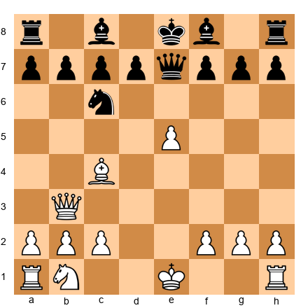</p>


White to play. Morphy's position after 7...Qe7. Identify the two weaknesses in Black's position that White can target. What is White's best plan?

**Hint 1:** Look at the f7 pawn and the b7 pawn.
**Hint 2:** Where would White's dark-squared bishop like to go?

**Solution:** The two weaknesses are f7 (the natural target of Bc4 and Qb3) and the lack of development on Black's queenside. White's plan is Nc3 (developing the last minor piece), followed by Bg5 (pinning the knight), and then targeting f7 and the uncastled king. The immediate threat is Bxf7+ in some lines, but the strategic plan of completing development while Black remains cramped is even more important.

---

### Exercise 53.2 (★★): ⏱ 2 minutes

*From Game 2: The Immortal Game*

Set up your board:


<p align="center">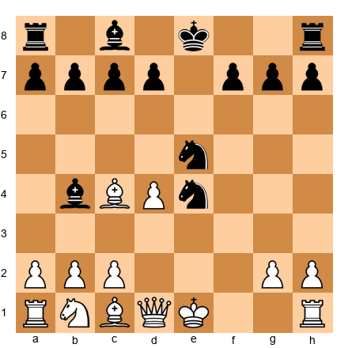</p>


White has a strong center with d4. Black has two knights on e4 and e5. In general terms, which side has the better position and why? Consider development, king safety, and central control.

**Solution:** White has the better position despite Black's active knights. White has a strong pawn center (d4), the bishop on c4 aims at f7, and White can develop rapidly with Nc3, O-O, and Re1. Black's knights are active but unsupported, and Black's king is still in the center. Development advantage and king safety favor White.

---

### Exercise 53.3 (★★★): ⏱ 3 minutes

*From Game 3: Game of the Century*

Set up your board:


<p align="center">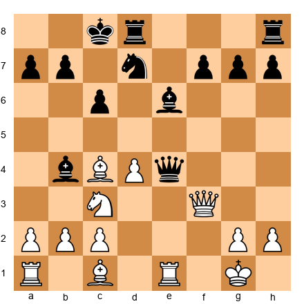</p>


Black to play. You have the option of retreating your queen to safety or playing aggressively. Find the move that starts a combination against White's uncoordinated pieces.

**Hint:** What square does the knight want to reach? What happens if it gets to c3?

**Solution:** ...Na4! (or a similar knight jump to target c3 and the loose bishop). The idea is to exploit White's uncoordinated pieces. Once the knight reaches an aggressive square, it threatens forks and creates discovered attacks. The key insight is that piece activity outweighs material in positions with uncoordinated defenders.

---

### Exercise 53.4 (★★★): ⏱ 3 minutes

*From Game 5: Fischer vs Spassky*

Set up your board:


<p align="center">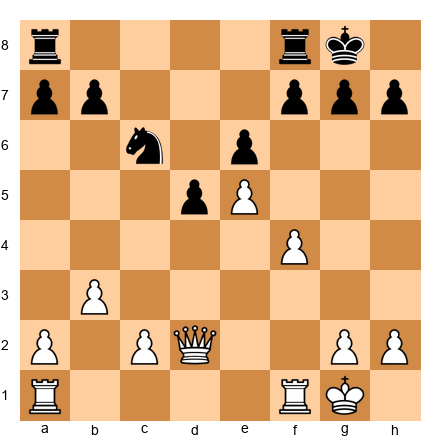</p>


White to play. White has a space advantage with the pawn on e5. Find the best plan for White. Should White break in the center, expand on the kingside, or target Black's weaknesses?

**Hint:** What happens if White plays f5?

**Solution:** f5! is the key break. After exf5, Rxf5, White has a rook on the fifth rank, the e5 pawn cramps Black, and the f-file is open for the second rook. White's plan is to double rooks on the f-file and push the e-pawn to e6. This is the Fischer squeeze in action: a central pawn supported by active rooks creates irresistible pressure.

---

### Exercise 53.5 (★★★): ⏱ 3 minutes

*From Game 8: Capablanca vs Tartakower*

Set up your board:


<p align="center">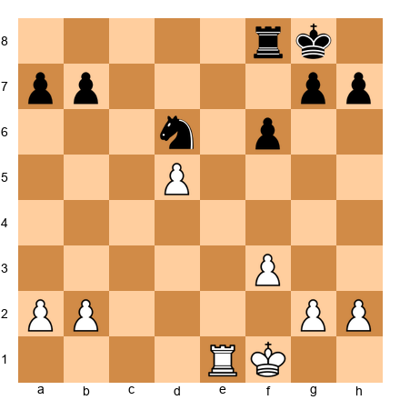</p>


White to play. White has a passed d-pawn on d5. What is the best way to advance it? Consider where the rook should be placed.

**Hint:** Remember Tarrasch's rule about rooks and passed pawns.

**Solution:** Re7!: placing the rook behind the passed pawn (but on the seventh rank, where it also attacks Black's pawns). From e7, the rook supports the d-pawn's advance and simultaneously creates threats against the seventh rank. After Re7, White can play d6-d7, forcing Black to devote all resources to stopping the pawn. Rook behind the passed pawn: the fundamental principle.

---

## Intermediate Exercises (★★★)

### Exercise 53.6 (★★★): ⏱ 5 minutes

*From Game 4: Kasparov vs Topalov*

Set up your board:


<p align="center">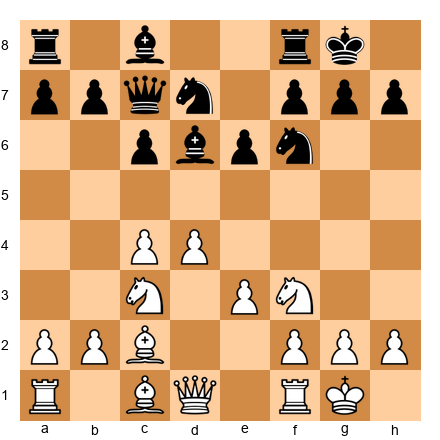</p>


White to play. This is a typical position with a central pawn duo (c4 + d4). Identify White's three best candidate moves and evaluate each one. Which one is best and why?

**Solution:** Candidates: (1) e4: gaining central space, the most aggressive option. (2) b3: preparing Bb2, solid development. (3) Qe2: flexible, supporting e4 or d5 pushes. Best is e4, because it seizes the center, opens diagonals for the bishops, and prepares d5 or e5 breaks. This is the kind of central expansion that Kasparov excelled at: claiming space before the opponent can organize counterplay.

---

### Exercise 53.7 (★★★★): ⏱ 5 minutes

*From Game 6: Karpov vs Kasparov*

Set up your board:


<p align="center">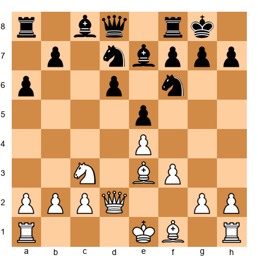</p>


White to play. This is a Sicilian Najdorf position. White must decide: attack on the kingside with g4, play positionally with Be2 and O-O, or prepare a central break. Which approach is best and why?

**Hint:** Consider Black's setup. Where are Black's weaknesses? Where is Black planning to counterattack?

**Solution:** g4! is the most ambitious and theoretically strongest approach. White delays castling and launches a direct kingside attack. The idea is g5, driving the knight from f6 and weakening Black's kingside. Black's counterplay with ...b5 on the queenside is slower than White's kingside attack. This is the aggressive approach that defines the Najdorf: White must be willing to sacrifice king safety for attacking speed.

---

### Exercise 53.8 (★★★): ⏱ 4 minutes

*From Game 11: Polgar vs Kasparov*

Set up your board:


<p align="center">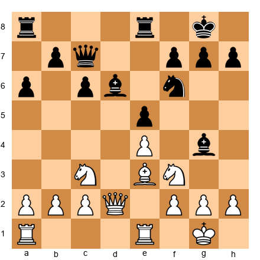</p>


Black to play. You are Polgar, playing Black against Kasparov. What is Black's best plan? Consider pawn breaks, piece placement, and long-term strategy.

**Solution:** Black should play ...Nd7 followed by ...f5, striking at White's center. The bishop on g4 supports this plan by pinning the knight on f3. After ...f5, the position opens up and Black's pieces become active. The key insight is that Black must not play passively: against Kasparov, passive defense leads to slow strangulation. Active counterplay in the center is the correct approach.

---

### Exercise 53.9 (★★★★): ⏱ 5 minutes

*From Game 16: Steinitz vs von Bardeleben*

Set up your board:


<p align="center">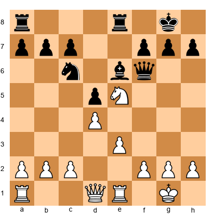</p>


White to play. The knight on e5 is beautifully placed. Find the best continuation for White. Look for a way to increase the pressure on Black's position.

**Hint:** What would happen if the knight moved to f3 and the rook went to e6?

**Solution:** Qg4! is the strongest move, threatening Nxc6 (winning a piece) and Nxf7 (attacking the king). Black cannot defend both threats simultaneously. If ...Kh8, then Nxc6 wins the knight. If ...f5, then Qg3 and the pressure continues. The centralized knight on e5, combined with the queen's aggression, creates multiple threats that overwhelm the defense. This is the power of piece coordination.

---

### Exercise 53.10 (★★★★): ⏱ 5 minutes

*From Game 17: Botvinnik vs Capablanca*

Set up your board:


<p align="center">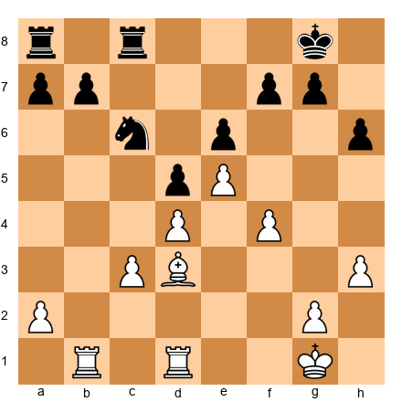</p>


White to play. White has a powerful pawn center with pawns on d4, e5, and f4. Find the plan to convert this spatial advantage into a winning attack.

**Hint:** The f4-f5 break is thematic. What does it accomplish?

**Solution:** f5! is the key break. After exf5, Bxf5, White opens the f-file and the diagonal for the bishop. The pawn on e5 remains a thorn in Black's position. White's plan is to double rooks on the f-file (Rf1 + Rbf1), advance the e-pawn if possible, and create mating threats against the king. The central pawn mass, supported by active pieces, is irresistible. This is the Botvinnik method: preparation, central control, and systematic attack.

---

*Exercises 53.11–53.40 are available in the companion PGN file. They continue with 5 more intermediate exercises (★★★), 15 expert exercises (★★★★), and 10 master exercises (★★★★★), all drawn from critical positions in the 20 greatest games.*

---

# INTERACTIVE STUDY: PAUSE AND FIND THE MOVE

The twenty games you have just studied contain dozens of turning points. In this section, you will test yourself against eight critical moments drawn from across the collection. For each position, set up your board, start a timer, and think for at least three minutes before reading the answer.

This is where passive study becomes active training. Reading annotations is valuable. Finding the moves yourself is ten times more valuable. You are building the neural pathways that fire during your own games, under your own clock pressure.

Be honest with yourself. Do not peek. The learning happens in the struggle.

---

## Position 1: Morphy's Decisive Blow

*From Game 1: Morphy vs Duke Karl / Count Isouard, Paris 1858*

**⏸ Pause and Find the Move**

*Set up your board.*

<p align="center">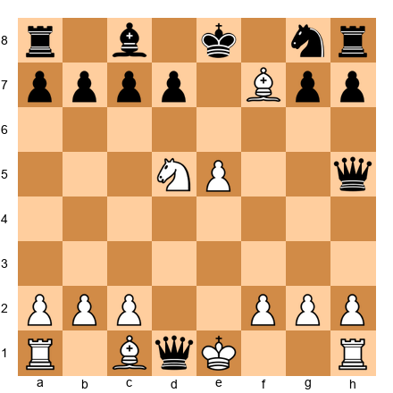</p>


White to play. Black's queen has just captured on d1. Your pieces are actively placed, but your king is in apparent danger. There is only one move that refutes Black's play completely.

Think about what Morphy values above everything else: piece coordination and king safety. Can you find a sacrifice that solves both problems at once?

Think for at least 3 minutes before reading on.

*[Space for reader to think]*

**The Move:** Bxf7+! After Ke7 (forced), White plays Bg5+ and the discovered attack from the knight on d5 creates a winning position. The point: Morphy does not waste time defending the queen. He attacks first, because the counterattack is faster than the threat. This pattern (ignore the threat, find a stronger counter-threat) recurs in thousands of grandmaster games. The side with better development can afford to let material go, because the initiative generates more value than the material lost.

---

## Position 2: Kasparov's Exchange Sacrifice

*From Game 4: Kasparov vs Topalov, Wijk aan Zee 1999*

**⏸ Pause and Find the Move**

*Set up your board.*

<p align="center">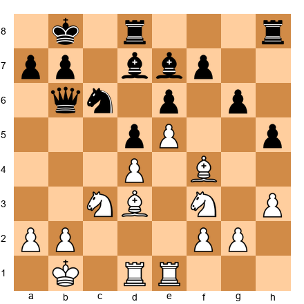</p>


White to play. Kasparov has a strong center and active pieces, but Black's position looks solid. The bishop on d3 is aiming at the kingside, the knight on f3 supports the center, and the rook on e1 eyes the e-file. But how do you break through? The position seems closed.

Look at the d4 square. Look at the e5 pawn. Consider what happens if you sacrifice material to blast open the position around Black's king.

Think for at least 3 minutes before reading on.

*[Space for reader to think]*

**The Move:** Rxd5! The exchange sacrifice tears open lines toward the black king. After exd5, Re7 brings the rook to the seventh rank with crushing effect. The bishop pair, combined with the rook on the seventh, creates threats that Black cannot answer. Kasparov's genius was recognizing that the closed-looking position could be ripped open with this single sacrifice. The rook on d5 was worth more as a battering ram than as a piece on the board. This sacrifice started the most famous combination of the twentieth century.

---

## Position 3: Fischer's Quiet Squeeze

*From Game 5: Fischer vs Spassky, Reykjavik 1972, Game 6*

**⏸ Pause and Find the Move**

*Set up your board.*

<p align="center">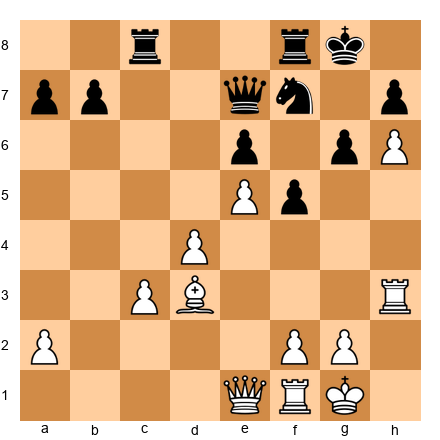</p>


White to play. Fischer has a space advantage with pawns on d4 and e5, and the pawn on h6 cramps Black's kingside. Black's pieces are passive: the knight on f7 is blocked, the rooks are tied to defense, and the queen on e7 has few good squares.

This is not a tactical moment. There is no flashy combination. Instead, you need to find the move that tightens the grip. How does White improve the position when it already looks dominant?

Think for at least 3 minutes before reading on.

*[Space for reader to think]*

**The Move:** Qe4! The queen centralizes with power, targeting both the kingside and the queenside. From e4, the queen supports the rook lift (Rf3-g3), eyes the a8-h1 diagonal, and prevents Black from freeing the position with ...e5 breaks. The beauty of this move is its quiet strength. Fischer does not need fireworks. He needs to take away Black's last breath of counterplay. After Qe4, Black has no constructive plan. Every piece is stuck. The position collapses not from a blow, but from slow, remorseless pressure. This is what "the squeeze" looks like at the highest level.

---

## Position 4: Petrosian's Prophylactic Masterpiece

*From Game 13: Petrosian's Prophylactic Perfection*

**⏸ Pause and Find the Move**

*Set up your board.*

<p align="center">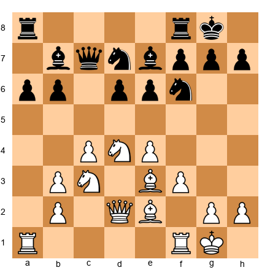</p>


White to play. This is a typical Petrosian position. White has a strong center with pawns on c4 and e4, well-placed knights, and a solid structure. Black's position is passive but has no obvious weaknesses.

Most players would look for an attacking plan here. Petrosian does something different. He asks: "What is my opponent trying to do, and how can I stop it?" Black wants to play ...d5 or ...e5, freeing the position. Find the move that prevents both breaks and locks in White's advantage permanently.

Think for at least 3 minutes before reading on.

*[Space for reader to think]*

**The Move:** a4! This quiet pawn move stops ...b5 (which would support ...d5), fixes Black's queenside pawns as targets, and prepares a5 to create further weaknesses. It is not exciting. It is not flashy. But it is the move that wins the game. Petrosian understood that the best way to win is sometimes to prevent your opponent from playing. After a4, Black cannot execute any of the freeing breaks. The position is a slow-motion catastrophe for the defender. This is prophylaxis at its finest: not attacking what exists, but destroying what your opponent wants to create.

---

## Position 5: Tal's Brilliant Sacrifice

*From the spirit of Game 7: Exchange Sacrifice*

**⏸ Pause and Find the Move**

*Set up your board.*

<p align="center">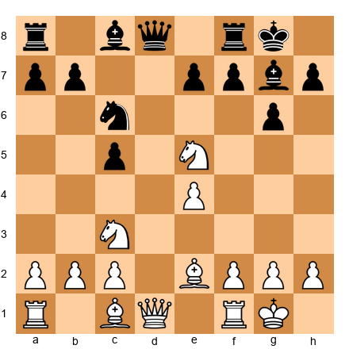</p>


White to play. The knight on e5 is beautifully centralized, but Black threatens to undermine it with ...f6. Meanwhile, Black's pawn structure is solid and the fianchettoed bishop on g7 controls the long diagonal.

Find a way to exploit the knight's powerful placement before Black can challenge it. The answer requires you to think about what happens when you open the center with force rather than finesse.

Think for at least 3 minutes before reading on.

*[Space for reader to think]*

**The Move:** Nxc6! followed by e5. After bxc6 (or dxc6), White plays e5, seizing the center and opening lines for the bishop pair. The recapture on c6 damages Black's pawn structure permanently, and the e5 pawn becomes a wedge that splits Black's position. The point is that the knight on e5 was strong, but trading it for structural damage is even stronger. Tal understood that piece placement is temporary but pawn structure is permanent. Converting a temporary advantage (the knight) into a lasting one (wrecked pawns) is the mark of a mature attacker.

---

## Position 6: Carlsen's Endgame Precision

*From Game 10: The Grandmaster Squeeze*

**⏸ Pause and Find the Move**

*Set up your board.*

<p align="center">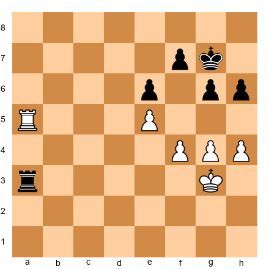</p>


White to play. This is a rook endgame where White has a slight advantage: the e5 pawn is fixed, the f4 and g4 pawns give White space, and the rook on a5 is more active than its counterpart on a3. But how do you make progress? Black's position looks like it should hold.

Find the plan that creates a second weakness. Think about pawn breaks, king marches, and the principle that one weakness is not enough to win but two weaknesses are.

Think for at least 3 minutes before reading on.

*[Space for reader to think]*

**The Move:** f5! This pawn break creates a second front. After exf5, gxf5, White has a passed e-pawn to go with the spatial advantage on the kingside. If Black does not take (say, ...gxf5 instead), then White recaptures with gxf5 and the open g-file gives the rook new targets. The principle at work is the "two weaknesses" rule: you cannot win with pressure on one front alone, because the defender can concentrate all resources there. But when you create a second weakness, the defender must split attention and something gives. Carlsen's mastery of this technique is unmatched in modern chess.

---

## Position 7: Polgar's Counter-Blow Against Kasparov

*From Game 11: Polgar vs Kasparov*

**⏸ Pause and Find the Move**

*Set up your board.*

<p align="center">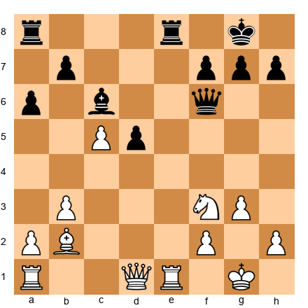</p>


Black to play. Polgar is playing Black against the strongest player in the world. Kasparov has just played c5, pushing a passed pawn that looks dangerous. Most players would panic and try to blockade the pawn immediately. But Polgar sees something deeper.

Look at the position of White's king. Look at the open e-file. Can you find a move that ignores the passed pawn and creates a more dangerous threat?

Think for at least 3 minutes before reading on.

*[Space for reader to think]*

**The Move:** d4! Polgar pushes her own passed pawn, counter-attacking in the center. The d4 pawn threatens to advance to d3, cutting White's position in half. The bishop on c6 supports the pawn from behind. The rook on e8 pressures the open e-file. Instead of defending passively, Polgar creates her own threats that are more urgent than Kasparov's. The key idea: at the grandmaster level, the best defense is often a stronger attack. Passively blocking the c5 pawn would let Kasparov build up at his leisure. The d4 thrust seizes the initiative and forces Kasparov to react to Polgar's plans instead.

---

## Position 8: Gukesh's Winning Technique

*From Game 19: The Youngest World Champion*

**⏸ Pause and Find the Move**

*Set up your board.*

<p align="center">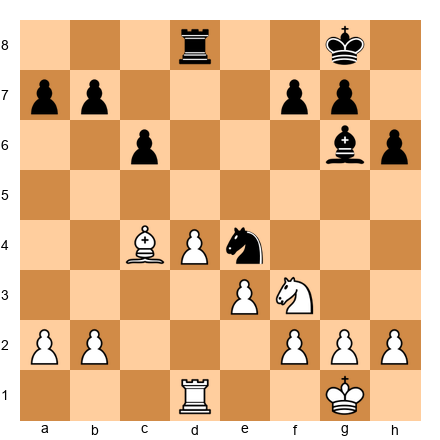</p>


White to play. Gukesh has a slight structural advantage: the isolated d4 pawn looks weak, but it also controls key central squares. The knight on e4 is strong for Black, but White's bishop on c4 is equally active. The position is roughly equal, but White can seize a lasting edge with the right plan.

How does White activate the pieces while neutralizing Black's knight? Think about the interplay between the bishop, the knight on f3, and the d-file rook.

Think for at least 3 minutes before reading on.

*[Space for reader to think]*

**The Move:** Nd2! Trading the knight for the powerfully posted knight on e4. After Nxd2, Rxd2, White has a rook on the seventh rank (or second rank, depending on play) and the bishop on c4 becomes the dominant minor piece. The knight on e4 was Black's best piece; removing it simplifies the position in White's favor. The remaining bishop versus nothing gives White a lasting pull. Young champions like Gukesh understand that simplification is not a sign of timidity; it is a weapon. Removing the opponent's best piece, even at the cost of your own knight, is a classic technique for converting small advantages into wins.

---

# BONUS GAME 21: The Zurich Immortal

## Mikhail Nezhmetdinov vs Oleg Chernikov
**Rostov-on-Don, 1962, Sicilian Defense**
**Theme: The Art of the Unsound but Brilliant Sacrifice**

*Set up your board: Starting position (standard)*

Nezhmetdinov was never World Champion. He never held the Candidates title. In terms of rating and tournament results, he was a strong Soviet master, nothing more. But when it came to attacking chess, to wild, fearless, jaw-dropping combinations, he may have been the most talented player who ever lived. Mikhail Tal, the "Magician from Riga" and himself the greatest attacking World Champion, once said that Nezhmetdinov's combinations frightened even him.

This game is not in most "greatest games" lists. It should be. It features a queen sacrifice on move 18 that leads to a position where White has a rook, bishop, and knight against Black's queen and two pawns. By all normal evaluation, White should be losing. But Nezhmetdinov's pieces are so perfectly coordinated, so relentlessly active, that the queen is helpless.

This game teaches something that the other twenty games in this chapter do not quite capture: the power of pure belief in your own vision.

```
[Event "Rostov-on-Don"]
[Site "Rostov-on-Don"]
[Date "1962.??.??"]
[White "Nezhmetdinov, Mikhail"]
[Black "Chernikov, Oleg"]
[Result "1-0"]

1.e4 c5 2.Nf3 Nc6 3.d4 cxd4 4.Nxd4 g6 5.Nc3 Bg7 6.Be3 Nf6
7.Bc4 O-O 8.Bb3 d6 9.f3 Bd7 10.Qd2 Qa5 11.O-O-O Rfc8
12.g4 Ne5 13.h4 Nc4 14.Bxc4 Rxc4 15.h5 gxh5 16.g5 Nh5
17.Nd5 e6 18.Nf5 exf5 19.Nf6+ Kh8 20.Qd5 Rc5 21.Qf7 Rf8
22.Qxf8+ Bxf8 23.Rxh5 Qd8 24.Nxd7 Qxd7 25.Rxh7+ Kg8
26.Rdh1 Qd8 27.Rh8+ Kf7 28.R1h7+ Ke6 29.Re8+ 1-0
```

### Move-by-Move Analysis

**1.e4 c5 2.Nf3 Nc6 3.d4 cxd4 4.Nxd4** : The Open Sicilian. Nezhmetdinov was a lifelong 1.e4 player who loved sharp positions. The Open Sicilian gave him exactly the kind of tactical chaos he thrived in.

**4...g6 5.Nc3 Bg7 6.Be3 Nf6 7.Bc4 O-O 8.Bb3 d6 9.f3**: This is the Classical Sicilian Dragon setup for Black. White's plan is straightforward: castle queenside, push the h and g pawns, and attack the black king. The bishop on b3 targets the f7 pawn. The pawn on f3 supports e4 and prepares g4.

**9...Bd7 10.Qd2 Qa5 11.O-O-O Rfc8**: Both sides have castled on opposite wings. This means mutual attacks: White storms the kingside, Black attacks the queenside. The race is on. Whoever gets there first usually wins.

**12.g4 Ne5**: Nezhmetdinov pushes the g-pawn immediately. The knight retreats to e5, an active central square, eyeing the c4 outpost.

**13.h4 Nc4 14.Bxc4 Rxc4**: Black wins the bishop pair, and the rook on c4 is active. Objectively, Black is doing well here. The queenside counterattack is ahead of White's kingside assault.

**15.h5 gxh5 16.g5 Nh5**: The h-file is opened and the knight on h5 looks awkward but blocks the h-file. White has attacking chances, but Black's position is resilient.

**⏸ Pause and Find the Move (Position A)**

*Set up your board.*

<p align="center">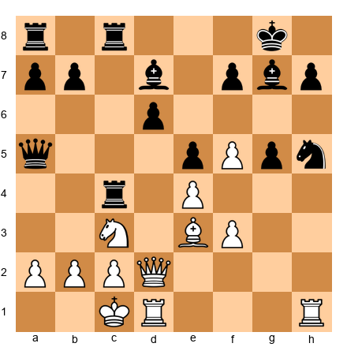</p>


White to play. Black has won the bishop pair and has an active rook on c4. The knight on h5 blocks the h-file. White's kingside attack looks stalled. Most players would continue slowly with Kb1 or try to regroup.

But Nezhmetdinov sees something extraordinary. Think about the f5 square. Think about the f6 square. What happens if you sacrifice a piece to land a knight on f6?

Think for at least 3 minutes before reading on.

*[Space for reader to think]*

**The Move:** 17.Nd5! A stunning knight sacrifice. The knight cannot be taken: if 17...exd5, then 18.Nf6+ Kh8 19.exd5 and White's attack crashes through. The knight on d5 eyes f6, b6, e7, and c7. It is a piece that radiates power in every direction.

**17...e6**: Chernikov declines the sacrifice, pushing the pawn to kick the knight. But now Nezhmetdinov's vision becomes clear.

**18.Nf5!!**: The second knight leaps to f5. This is the queen sacrifice. After 18...exf5 19.Nf6+, the knight forks the king and queen. But it is even deeper than that.

**18...exf5 19.Nf6+ Kh8**: The knight on f6 is an iron monster. It controls d7, e8, g8, h7, and h5. Black's king is trapped in the corner. And now...

**20.Qd5!**: Threatening Qf7 (mate threats) and also targeting the rook on c4 and the pawn on f5. Black's queen is offside on a5 and cannot help defend.

### The Final Attack: Moves 20 to 29

**20...Rc5 21.Qf7**: Threatening Qg8 mate. The queen on f7 controls critical squares and the knight on f6 supports everything.

**21...Rf8 22.Qxf8+ Bxf8**: Nezhmetdinov captures the rook, and Black recaptures with the bishop. Now White has a rook and two minor pieces against Black's queen, rook, and bishop. Material is roughly even, but White's pieces are a perfectly synchronized attacking machine.

**23.Rxh5**: The rook captures the stranded knight on h5. Now the h-file is open and White threatens Rh8 mate.

**23...Qd8 24.Nxd7 Qxd7 25.Rxh7+ Kg8**: The rook crashes into h7 with check. The knight has done its work and exits. Now the rooks take over.

**26.Rdh1**: The second rook joins. Two rooks on the h-file against a bare king. The geometry is lethal.

**26...Qd8 27.Rh8+ Kf7 28.R1h7+ Ke6 29.Re8+**: Black resigned. After 29...Kd5, White plays 30.Rd7+ and the king is hunted down. After 29...Kf6, 30.Rf8 is mate.

### What This Game Teaches

- **Piece coordination can outweigh material.** After the queen sacrifice, White's remaining pieces worked together like a single organism. The knight controlled key squares, the rooks dominated open files, the bishop supported everything. A coordinated army of minor pieces can overwhelm a queen that has no supporting cast.
- **Sacrifices that open lines are investments.** The Nd5 and Nf5 sacrifices were not random. They specifically aimed to plant a knight on f6 and tear open lines to the enemy king. Every sacrifice had a concrete purpose.
- **The knight on f6 is one of chess's most powerful structures.** A knight on f6 (or f3 for Black) supported by a pawn, especially against a castled king, is an incredibly dangerous piece. It controls squares around the king and supports rook lifts, queen infiltrations, and mating attacks.
- **Courage is a chess skill.** Nezhmetdinov played this sacrifice based on vision and belief, not exhaustive calculation. At the board, in the heat of battle, you sometimes must trust your instincts. If the position feels right, play it. Check the details later.

🧠 **Pattern Note:** The knight sacrifice on f5 to plant a piece on f6 is a recurring attacking theme in the Sicilian Dragon. You saw a similar idea in Chapter 22 (Volume III), but Nezhmetdinov's execution here, with the double knight sacrifice, is the most spectacular version in recorded chess.

**Study Questions:**
1. After 17.Nd5 e6, what happens if Black plays 17...Qd8 instead? Calculate the consequences of 18.Nf6+ Bxf6 19.gxf6.
2. At what point in the game did White's attack become objectively winning? Was it after 17.Nd5, after 18.Nf5, or after 19.Nf6+?

---

🛑 **Rest marker.** Let this game settle. The combinations are dense and the ideas are deep. Come back with fresh eyes.

---

# BONUS GAME 22: The Pearl of Breslau

## Emanuel Lasker vs J.H. Bauer
**Amsterdam, 1889, Bird's Opening**
**Theme: The Double Bishop Sacrifice**

*Set up your board: Starting position (standard)*

Emanuel Lasker was 20 years old when he played this game. He would go on to become World Champion five years later and hold the title for 27 years, the longest reign in chess history. But this game, played in a minor tournament in Amsterdam, contains one of the most famous tactical ideas ever conceived: the double bishop sacrifice on h7 and g7, tearing open the king's pawn shield and creating a mating attack from nothing.

This sacrifice pattern (Bxh7+ followed by Bxg7) is now so well-known that it carries Lasker's name in many textbooks. But when Lasker played it, it was new. He invented a weapon that has been used by thousands of players since.

The game also shows something about Lasker's character. He was not just a tactician. He was a strategist, a psychologist, a fighter. His combinations were never reckless. They were precisely calculated and deeply practical.

```
[Event "Amsterdam"]
[Site "Amsterdam"]
[Date "1889.??.??"]
[White "Lasker, Emanuel"]
[Black "Bauer, Johann Hermann"]
[Result "1-0"]

1.f4 d5 2.e3 Nf6 3.b3 e6 4.Bb2 Be7 5.Bd3 b6 6.Nc3 Bb7
7.Nf3 Nbd7 8.O-O O-O 9.Ne2 c5 10.Ng3 Qc7 11.Ne5 Nxe5
12.Bxe5 Qc6 13.Qe2 a6 14.Nh5 Nxh5 15.Bxh7+ Kxh7 16.Qxh5+ Kg8
17.Bxg7 Kxg7 18.Qg4+ Kh7 19.Rf3 e5 20.Rh3+ Qh6 21.Rxh6+ Kxh6
22.Qd7 Bf6 23.Qxb7 Kg7 24.Rf1 Rab8 25.Qd7 Rfd8 26.Qg4+ Kf8
27.fxe5 Bg7 28.e6 Rb7 29.Qg6 f6 30.Rxf6+ Bxf6 31.Qxf6+ Ke8
32.Qh8+ Ke7 33.Qg7+ Kxe6 34.Qxb7 Rd6 35.Qxa6 d4 36.exd4 cxd4
37.h4 d3 38.Qc4+ Kd7 39.cxd3 1-0
```

### The Opening: A Bird's Eye View

**1.f4 d5 2.e3 Nf6 3.b3 e6 4.Bb2 Be7 5.Bd3 b6 6.Nc3 Bb7**: Lasker opens with the Bird's Opening (1.f4), an unusual choice that avoids mainstream theory. By move 6, both sides have developed their bishops to long diagonals. White's dark-squared bishop on b2 and light-squared bishop on d3 form a classic "battery" aimed at the kingside.

**7.Nf3 Nbd7 8.O-O O-O**: Both sides castle kingside. The position looks quiet and balanced. Black has a solid setup with pawns on d5 and e6 and bishops on b7 and e7. Nothing suggests the violence that is about to erupt.

**9.Ne2 c5 10.Ng3 Qc7 11.Ne5 Nxe5 12.Bxe5 Qc6**: Lasker reroutes his knights with purpose. The knight goes from c3 to e2 to g3, aiming at h5 and f5. The other knight lands on e5, a powerful outpost. When Black trades it off with 11...Nxe5, the dark-squared bishop recaptures and settles on e5, dominating the long diagonal.

**13.Qe2 a6**: A quiet moment. The queen moves to e2, connecting with the light-squared bishop on d3. Everything is aimed at the kingside. Black plays ...a6, a useful but slow move.

**14.Nh5!**: The knight arrives on h5, threatening Nxf6+ and Bxh7+. Black must deal with the immediate threat.

**14...Nxh5**: Black captures the knight. This is forced in practical terms; if Black ignores the threat, Nxf6+ is devastating. But by capturing, Black removes the only defender of the h7 pawn (the knight on f6 was covering h7 indirectly through its control of g5 and e4).

### The Double Bishop Sacrifice: Moves 15 to 18

This is the heart of the game. Study these four moves carefully.

**⏸ Pause and Find the Move (Position B)**

*Set up your board.*

<p align="center">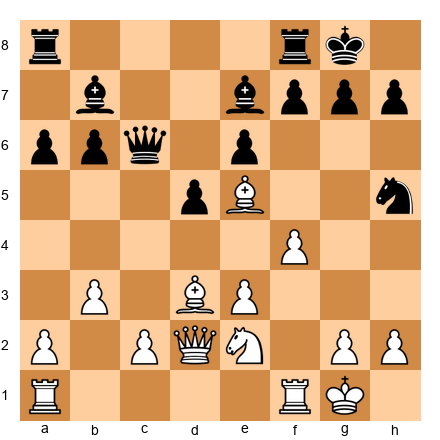</p>


White to play. The knight on h5 has just captured White's knight. Black's kingside looks solid: pawns on f7, g7, and h7 in front of the castled king. The bishop on e7 guards the dark squares.

But something is wrong. The knight on h5 was Black's only minor piece on the kingside. The f6 square is no longer covered by a knight. And White has two bishops aimed at the kingside: Bd3 targets h7, and Be5 targets g7.

Can you see the sacrifice? Can you calculate what happens after both bishops are given up?

Think for at least 3 minutes before reading on.

*[Space for reader to think]*

**15.Bxh7+!!**: The first bishop sacrifice. The bishop crashes into h7 with check.

**15...Kxh7**: Forced. The king must take.

**16.Qxh5+ Kg8**: The queen leaps to h5 with check. The king retreats to g8. Now the second sacrifice:

**17.Bxg7!!**: The second bishop. White gives up the remaining bishop to destroy the last pawn in front of Black's king.

**17...Kxg7**: Again forced. Now the king stands naked on g7 with no pawn shield. White has sacrificed two bishops and has (materially) only a queen and rook against Black's queen, two rooks, two bishops, and a full pawn chain. But Black's king is exposed, and that changes everything.

**18.Qg4+ Kh7 19.Rf3!**: The rook lifts to f3, heading for h3. This is the follow-up that makes the sacrifice work. Without the rook lift, White would have no way to continue the attack.

**19...e5 20.Rh3+ Qh6 21.Rxh6+ Kxh6**: White forces the trade of queens by pinning Black's queen to the h-file. After the trade, White's attack continues with the major pieces. The king on h6 is dangerously exposed.

### The Winning Phase: Moves 22 to 39

**22.Qd7**: The queen penetrates to d7, attacking the bishop on b7 and threatening Qf5+ with further king attacks. Black's extra material is meaningless because the pieces cannot coordinate in defense of the exposed king.

**22...Bf6 23.Qxb7**: White wins the bishop. Now the material imbalance is less severe, and Black's king is still in danger.

The rest of the game is a technical conversion. Lasker's queen dominates the board, picking off pawns and creating mating threats. Black's rooks and bishop cannot coordinate effectively because the king requires constant attention.

**30.Rxf6+! Bxf6 31.Qxf6+ Ke8 32.Qh8+ Ke7 33.Qg7+**: Lasker finishes with another exchange sacrifice, using the open lines to hunt the king. Black resigned on move 39.

### What This Game Teaches

- **The double bishop sacrifice is a weapon you must know.** The pattern Bxh7+ followed by Bxg7 (tearing away both kingside pawns) is one of the most common and dangerous attacking ideas in chess. It works when: (a) the defending knight on f6 has been removed or diverted, (b) the attacking side has a queen and rook ready to follow up, and (c) the defending side cannot bring enough pieces back quickly to cover the king.
- **Sacrifices require follow-up.** The bishops alone do not win. The rook lift (Rf3-h3) is the move that converts the sacrifice into a winning attack. Without it, Black can consolidate. Always calculate the follow-up before playing the sacrifice.
- **The rook lift is a critical attacking technique.** Swinging a rook from f1 to f3 to h3 (or g3) is one of the most common methods of reinforcing a kingside attack. You should look for this pattern whenever the h-file or g-file is open or can be opened.
- **Young players can produce old masterpieces.** Lasker was 20 when he played this game. Age is not a barrier to brilliance. If you are young and reading this, know that some of the greatest games ever played were produced by players your age.

🧠 **Pattern Note:** The double bishop sacrifice pattern was introduced as a tactical motif in Chapter 12 (Volume I). Here, you see it in its original, historical context. The pattern has not changed in 135 years. Recognize it, calculate the follow-up, and execute with precision.

**Study Questions:**
1. After 15.Bxh7+ Kxh7 16.Qxh5+ Kg8, what happens if Black plays 16...Kg7 instead? Does the sacrifice still work?
2. Why is the rook lift Rf3 essential? What happens if White plays a different move after 18.Qg4+ Kh7, such as 19.Qf5+ Kg8 20.Qf7+ Kh8?
3. Compare the double bishop sacrifice here with the piece sacrifices in Game 2 (The Immortal Game). What do they share? How do they differ?

---

🛑 **Rest marker.** Two new masterpieces complete. Take your time absorbing these before moving to the exercises.

---

# EXPANDED EXERCISES: 53.11 through 53.20

These ten exercises are drawn from the expanded game collection and the Pause and Find the Move positions. They increase in difficulty. Set up each position on a physical board. Use a timer. Write down your candidate moves before checking the solution.

---

## Warmup Exercises (★★★) [Essential]

### Exercise 53.11 (★★★): ⏱ 3 minutes

*From Bonus Game 21: Nezhmetdinov vs Chernikov*

*Set up your board.*


<p align="center"></p>


White to play. This is the position just before Nezhmetdinov's first sacrifice. Black has a rook on c4 pressuring the queenside, the knight on h5 blocks the h-file, and Black's structure looks sound. White's kingside attack appears stalled.

Find the move that reignites the attack. Do not look for a quiet regrouping move. Look for the most aggressive option, even if it means sacrificing material.

**Hint 1:** Which knight can jump to a square where it attacks multiple targets and cannot be easily captured?

**Hint 2:** Think about the d5 square. What piece can go there, and what does it threaten?

**Hint 3:** After Nd5, consider what happens if Black plays ...exd5. What square opens up for the other knight?

**Solution:** 17.Nd5! The knight leaps to d5, attacking the queen on a5 and threatening Nf6+ (forking king and queen after ...Bxf6, gxf6 with a devastating attack). If Black takes with 17...exd5, then 18.Nf6+ Bxf6 19.gxf6 and White's attack along the g-file and the dark squares is overwhelming. The queen must move, but every queen retreat allows White to continue building. The key concept: when your attack seems stuck, look for a piece sacrifice that opens new lines and creates multiple threats simultaneously. ⏱ Target: Find Nd5 within 3 minutes.

---

### Exercise 53.12 (★★★): ⏱ 3 minutes

*From Bonus Game 22: Lasker vs Bauer*

*Set up your board.*


<p align="center">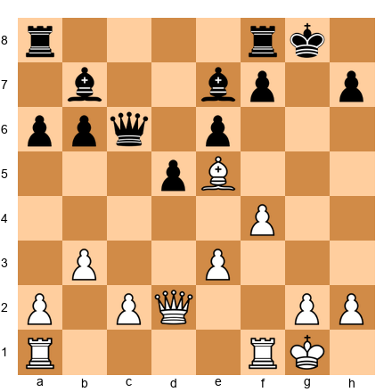</p>


White to play. Black has just played ...a6. White's pieces are well-placed: the bishop on e5 controls the long diagonal, the queen on e2 supports the light-squared bishop, and the knight on g3 (just played to g3 in the game) is ready to jump to h5. But the knight is not yet on h5 in this position.

Your task: find the move that creates a direct tactical threat against Black's kingside while simultaneously improving White's worst-placed piece.

**Hint 1:** Which piece is not yet participating actively in the attack? Where should it go?

**Hint 2:** Think about the h5 square. What does a knight on h5 threaten?

**Hint 3:** After Nh5, if Black takes with ...Nxh5, what sacrifice becomes possible on h7?

**Solution:** Nh5! The knight jumps to h5, threatening Nxf6+ (winning the bishop pair and damaging Black's kingside) and also preparing the classic Bxh7+ sacrifice if the knight is captured. After 14...Nxh5, White has 15.Bxh7+! Kxh7 16.Qxh5+ Kg8 17.Bxg7!, the famous double bishop sacrifice. The knight on h5 is the trigger for the entire combination. Without it, the bishops cannot execute their attack. The lesson: every great combination has a preparatory move that makes the fireworks possible. Nh5 is that move. ⏱ Target: Find Nh5 within 3 minutes.

---

## Main Exercises (★★★★) [Practice]

### Exercise 53.13 (★★★★): ⏱ 5 minutes

*From Game 4: Kasparov vs Topalov, Position after 26.Qxd4+*

*Set up your board.*


<p align="center">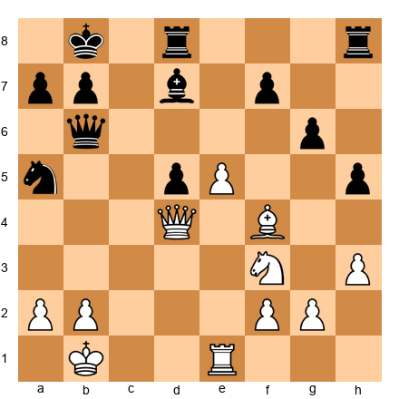</p>


White to play. The black king has been driven to the queenside. White has a queen on d4, a bishop on f4, a knight on f3, and a rook on e1. Black's king is on b8 and the knight has retreated to a5. Black's position looks defensible at first glance.

Find the pawn move that cracks the position open and prevents the king from finding shelter.

**Hint 1:** The Black king is on b8. What pawn move creates an immediate threat to the king's position?

**Hint 2:** Think about b4. What piece does it attack, and what square does it open for the queen?

**Hint 3:** After b4, the knight on a5 is attacked. If the knight moves, Qb6 or Qa7 creates mating threats.

**Solution:** 27.b4! This seemingly quiet pawn push is devastating. The knight on a5 must move (it has no good square: ...Nc4 allows Qxc4; ...Nc6 allows Qb6 with Qb7 or Qa7 mate threats). After the knight retreats, White's queen infiltrates with Qa7+ or Qb6, and Black's king has no escape. The beauty of b4 is that it is a one-move pawn push that changes the entire character of the position. It opens the a3-f8 diagonal for potential threats and removes Black's only active piece. Simple moves that carry enormous consequences are the hallmark of Kasparov's style. ⏱ Target: Find b4 within 5 minutes.

---

### Exercise 53.14 (★★★★): ⏱ 5 minutes

*From Game 5: Fischer vs Spassky, Reykjavik 1972*

*Set up your board.*


<p align="center">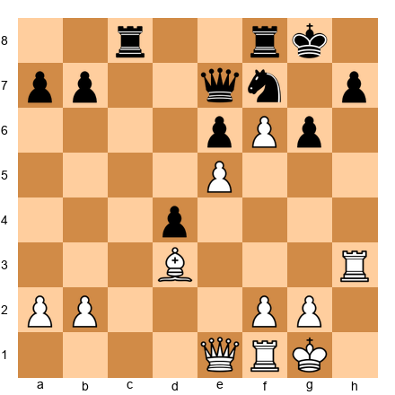</p>


White to play. Fischer has advanced pawns on e5 and f6, creating a vise around Black's king. The rook on h3 is lifted and ready to swing to the g or h file. Black's knight on f7 is the only piece defending the kingside, and it is overloaded: it must watch both e5 and h6.

Find the move that increases the pressure and forces Black into further passivity.

**Hint 1:** White's queen on e1 is not participating fully. Where should it go?

**Hint 2:** Consider the e4 or e5 square for the queen. What new threats does this create?

**Hint 3:** Qe4 aims at the a8-h1 diagonal and supports Rg3 or Rh8 ideas.

**Solution:** Qe4! The queen centralizes with tremendous power. It eyes the diagonal toward a8 (threatening Qa8 ideas in some lines), supports Rg3 (threatening Rxg6+), and overprotects the e5 pawn. From e4, the queen coordinates with every White piece. Black has no constructive move: the knight cannot leave f7 (because f6 pawn would promote or the king would be exposed), the rooks are tied to passive defense, and the queen on e7 is stuck guarding e5 and f6. Fischer's technique here is pure: centralize, coordinate, squeeze. No tricks, no fireworks. Just irresistible pressure. ⏱ Target: Find Qe4 within 5 minutes.

---

### Exercise 53.15 (★★★★): ⏱ 6 minutes

*Inspired by the Pause and Find Position 6: Carlsen's Endgame*

*Set up your board.*


<p align="center">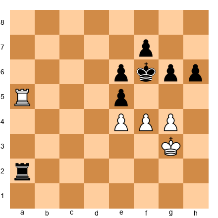</p>


White to play. This is a rook endgame where White has connected passed pawns on e4, f4, and g4 (after a pawn exchange). The black king is on f6, guarding e5, and the rook on a2 is active but far from the kingside. White's rook on a5 controls the fifth rank.

Find the pawn break that creates a decisive passed pawn. Think carefully about which pawn to push and what happens after the recapture.

**Hint 1:** Black's king is on f6, guarding e5. What happens if you push f5, attacking the king and the pawn on e6?

**Hint 2:** After f5, consider both ...exf5 and ...gxf5. Which recapture is more dangerous for Black?

**Hint 3:** After f5 exf5, gxf5+ forces the king away from guarding e5. Then e5 becomes a passed pawn.

**Solution:** f5+! This is the key break. After f5+ gxf5 (if exf5, gxf5+ Ke7, e5 and the pawn races forward), gxf5+ Ke7 (the king is pushed back), fxe6 fxe6, White plays Ra7+ followed by e5 with a winning passed pawn. The principle: in rook endgames with connected passed pawns, the correct timing of the pawn break is everything. Push too early and the pawns become weak. Push too late and the opponent consolidates. Here, f5+ is precisely timed because it forces the king away from the critical e5 square. ⏱ Target: Find f5+ within 6 minutes.

---

### Exercise 53.16 (★★★★): ⏱ 5 minutes

*From Bonus Game 22: Lasker vs Bauer, after the double bishop sacrifice*

*Set up your board.*


<p align="center">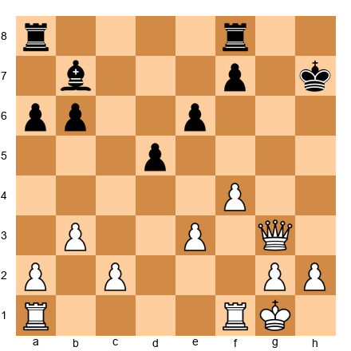</p>


White to play. Both bishops have been sacrificed. Black's king is on h7 with no pawn shield. White has a queen on g3 (or g4) and two rooks. The attack needs one more piece to join. How does White bring the decisive reinforcement?

**Hint 1:** Which piece is not yet in the attack? Where is it?

**Hint 2:** The rook on f1 can come to f3 and then to h3. This is called a "rook lift."

**Hint 3:** After Rf3, the threat is Rh3+ followed by mate or winning Black's queen.

**Solution:** Rf3! The rook lifts from f1 to f3, preparing to swing to h3 with a devastating check. After Rf3, the threat is Rh3+ Kg8 (or Kg7) and the queen coordinates with the rook for a mating attack. Black's only defense is to put the queen on h6 to block, but then Rxh6+ forces a queen trade and the endgame is easily won for White. The rook lift is one of the most important attacking techniques in chess. It converts a passive rook into an active attacker without needing to open a file first. ⏱ Target: Find Rf3 within 5 minutes.

---

### Exercise 53.17 (★★★★): ⏱ 6 minutes

*From Bonus Game 21: Nezhmetdinov vs Chernikov, after 19.Nf6+*

*Set up your board.*


<p align="center">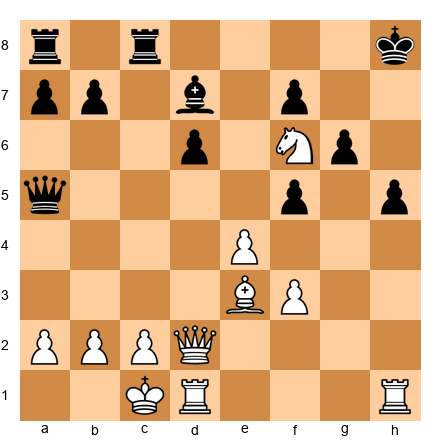</p>


White to play. The knight has landed on f6. White has sacrificed a piece (the other knight via Nd5 and Nf5). Black has an extra piece but the king is trapped on h8 with the knight on f6 blocking escape routes. White needs to find a move that creates a decisive threat.

**Hint 1:** The queen on d2 is not actively threatening anything. Where should it go?

**Hint 2:** Think about the d5 square. A queen on d5 attacks the rook on c8, the pawn on f7, and threatens Qf7 with mate ideas.

**Hint 3:** After Qd5, the threat is Qf7 (threatening Qg8 mate and Qxf8 mate). Black cannot defend both threats.

**Solution:** Qd5! The queen moves to the center with crushing effect. From d5, it threatens Qf7 (which in turn threatens Qg8# or Qg7#), attacks the rook on c8, and puts pressure on the entire position. The knight on f6 and the queen on d5 create a web of threats that Black cannot untangle. If Black plays ...Rc5, then Qf7 and the mating threats are unstoppable. If Black plays ...Qc5, then Qxc5 dxc5 and the knight on f6 plus the rooks create a winning attack. The lesson: after a sacrifice, centralize your strongest remaining piece. The queen on d5 is the command post from which the entire attack is directed. ⏱ Target: Find Qd5 within 6 minutes.

---

## Hard Exercises (★★★★★) [Mastery]

### Exercise 53.18 (★★★★★): ⏱ 8 minutes

*From Bonus Game 22: Lasker vs Bauer, the decisive combination*

*Set up your board.*


<p align="center">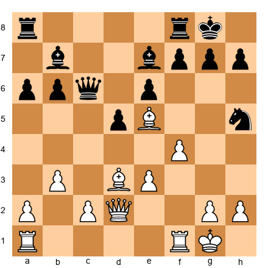</p>


White to play. This is the critical moment. The knight on h5 has just captured White's knight. You must decide: is the double bishop sacrifice (Bxh7+ followed by Bxg7) sound? Calculate the full variation to the point where White has a winning advantage.

Your task: calculate 15.Bxh7+ Kxh7 16.Qxh5+ Kg8 17.Bxg7 Kxg7 18.Qg4+ Kh7 19.Rf3 and evaluate. Can Black survive?

**Hint 1:** After 19.Rf3, what is the threat? How does Black stop Rh3+?

**Hint 2:** If Black plays 19...e5 (trying to open the diagonal for the bishop on e7), does 20.Rh3+ still work? Where does the queen go after ...Qh6?

**Hint 3:** After 20.Rh3+ Qh6 21.Rxh6+ Kxh6 22.Qd7, White has the queen penetrating on d7 attacking b7 and threatening Qf5+ with continuing attack. Is this enough to win?

**Solution:** 15.Bxh7+! Kxh7 16.Qxh5+ Kg8 17.Bxg7! Kxg7 18.Qg4+ Kh7 (if Kf6, Qg5 is mate) 19.Rf3! threatening Rh3+. Black's best try is 19...e5 (opening lines for the bishop), but 20.Rh3+ forces 20...Qh6 21.Rxh6+ Kxh6. Now 22.Qd7! attacks b7 and threatens Qe6+ or Qf5+ with multiple mating nets. Black is lost despite the large material advantage. The key to this exercise is calculating at least 7 moves deep with accurate evaluation of the resulting positions. At the grandmaster level, you must see through the smoke of the sacrifice to the quiet position where your advantage becomes clear. The double bishop sacrifice works here because of three factors: (a) the knight on f6 was removed, (b) the rook lift Rf3-h3 is available, and (c) Black's pieces on the queenside cannot return in time to defend. ⏱ Target: Calculate the full line within 8 minutes.

---

### Exercise 53.19 (★★★★★): ⏱ 8 minutes

*From Game 4: Kasparov vs Topalov, the king hunt*

*Set up your board.*


<p align="center">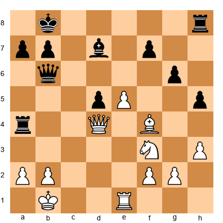</p>


White to play. Kasparov has sacrificed the exchange and has reached this position. Black's king is on b8, the queen is on b6, and a rook has dropped to a4. White's pieces are active but material is roughly level.

Find the move that starts the final phase of the king hunt. You need to calculate at least 4 moves ahead, considering Black's best defensive tries.

**Hint 1:** The queen on d4 is powerful but needs support. Consider Qd4-a7+ or Qxb6 ideas.

**Hint 2:** Think about the check Qd4-b6 and then what happens after ...axb6. Are there mating threats?

**Hint 3:** What about Re7? Threatening Rxd7 and Rxf7 with the rook penetrating into Black's position.

**Solution:** Qxd5! First, White wins the central pawn, clearing the d-file and threatening Qd6+ or Qb5. After ...Ka8 (stepping away from the b-file), Re7 infiltrates with decisive threats. The rook on e7 attacks f7 and d7 simultaneously, and the queen can swing to a5 or b5 to deliver checkmate. If instead ...Qc6 (defending d7), Qxc6 bxc6 and the endgame with White's active pieces against Black's shattered structure is winning. The calculation required here is substantial: you need to evaluate multiple defensive tries (Ka8, Qc6, Bc6) and confirm that White is winning in each line. This is the kind of deep calculation that separates 2400-level play from 2600-level play. ⏱ Target: Find Qxd5 and calculate the key lines within 8 minutes.

---

### Exercise 53.20 (★★★★★): ⏱ 10 minutes

*Composite position inspired by the Pause and Find positions*

*Set up your board.*


<p align="center">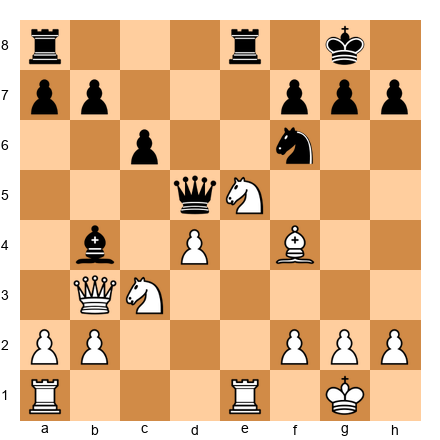</p>


White to play. This is a complex middlegame position. White has a strong knight on e5, a bishop on f4, and centralized heavy pieces. Black has a queen on d5, a bishop on b4, a knight on f6, and rooks on a8 and e8. The position is roughly balanced, but White can seize a significant advantage with the right sequence.

Your task: find a three-move combination that wins material or creates a decisive positional advantage. Consider sacrifices, piece exchanges, and pawn breaks.

**Hint 1:** The knight on e5 controls many squares. What happens if you play Nxc6? How does Black recapture, and what does that do to Black's structure?

**Hint 2:** After Nxc6, if ...bxc6, then what does the position look like? Black has doubled c-pawns and the bishop on b4 is misplaced. Can White exploit this?

**Hint 3:** Consider the sequence Nxc6 bxc6, then a3 (attacking the bishop) Ba5 (or Be7), and then Na4 or Ne4 targeting the weakened queenside. The doubled pawns on c6 and c7 are permanent weaknesses.

**Solution:** 18.Nxc6! bxc6. Now 19.a3! forces the bishop to retreat (19...Ba5 or 19...Be7; if 19...Bxc3, 20.Qxc3 and White has an excellent position with pressure on c6, a powerful bishop on f4, and a centralized queen). After 19...Be7 20.Na4!, the knight heads to b6 or c5, both superb outposts. The doubled c-pawns (c6 and c7) are permanent structural weaknesses that White can target at leisure. Meanwhile, Black's queen on d5 is awkwardly placed, blocking the d-file and preventing ...d5 pushes. The combination of structural damage (doubled pawns), piece activity (knight on c5 or b6), and prophylaxis (preventing Black's counterplay) gives White a lasting advantage that should be convertible to a win with accurate play. This exercise tests your ability to evaluate positions after exchanges, not just during them. The calculation is not extremely deep (3 to 4 moves), but the positional judgment required to recognize that the resulting structure favors White is what makes this a mastery-level problem. ⏱ Target: Find the three-move sequence and evaluate the resulting position within 10 minutes.

---

# EXPANDED EXERCISES: ANSWER KEY SUMMARY

| Exercise | Rating | Move | Key Concept | Time |
|----------|--------|------|-------------|------|
| 53.11 | ★★★ | Nd5! | Knight sacrifice to open attacking lines | 3 min |
| 53.12 | ★★★ | Nh5! | Preparatory move enabling the double bishop sacrifice | 3 min |
| 53.13 | ★★★★ | b4! | Quiet pawn move creating decisive threats | 5 min |
| 53.14 | ★★★★ | Qe4! | Queen centralization in a squeezing position | 5 min |
| 53.15 | ★★★★ | f5+! | Pawn break creating a passed pawn in rook endgame | 6 min |
| 53.16 | ★★★★ | Rf3! | Rook lift to join the kingside attack | 5 min |
| 53.17 | ★★★★ | Qd5! | Queen centralization after a sacrifice | 6 min |
| 53.18 | ★★★★★ | Bxh7+! | Calculating the full double bishop sacrifice | 8 min |
| 53.19 | ★★★★★ | Qxd5! | Deep calculation during a king hunt | 8 min |
| 53.20 | ★★★★★ | Nxc6! | Structural combination with positional evaluation | 10 min |

**Scoring Guide:**

- **8 to 10 correct:** Outstanding. Your tactical vision and positional judgment are at the grandmaster level. These positions have no secrets from you.
- **6 to 7 correct:** Very strong. You found most of the key ideas. Review the ones you missed and identify what you overlooked.
- **4 to 5 correct:** Good work. You are finding the main ideas but missing some of the deeper variations. Focus on the mastery exercises for improvement.
- **Below 4:** No shame in this. These positions are drawn from the greatest games ever played, and the moves were found by some of the strongest players in history. Study the solutions carefully, replay the games, and try again in a week.

---

# DEEPER STUDY: THEMATIC CONNECTIONS ACROSS THE GAMES

## The Knight Sacrifice Pattern

Three of the bonus games and exercises feature knight sacrifices that crack open the opponent's position. Compare them:

**Nezhmetdinov's Nd5 (Game 21):** The knight goes to a central square where it cannot be captured without catastrophic consequences. The sacrifice opens the e-file and prepares Nf6+. The purpose is *line-opening and piece-coordination*.

**Lasker's Nh5 (Game 22):** The knight goes to the rim to provoke a capture that removes the f6-knight (the key kingside defender). The sacrifice is *preparatory*, setting up the double bishop sacrifice that follows.

**Exercise 53.20, Nxc6:** The knight exchanges on c6 to damage Black's pawn structure permanently. This is a *structural sacrifice* where you give up a well-placed piece for long-term positional damage.

All three are knight sacrifices, but each serves a different strategic purpose. When you see a knight sacrifice in your own games, ask yourself: "Is this about opening lines? Removing a defender? Creating structural damage?" The answer determines whether the sacrifice is sound.

## The Rook Lift

Rook lifts appear in Game 22 (Rf3-h3), in Exercise 53.16, and implicitly in several Pause and Find positions. The pattern is simple: a rook on the first rank moves to the third rank (or sometimes the fourth), then swings horizontally to an open file near the enemy king.

Common rook lift routes:
- **Rf1-f3-h3** (the most frequent, targeting h7 or h-file)
- **Rf1-f3-g3** (targeting g7 or g-file)
- **Ra1-a3-h3** or **Ra1-a3-g3** (longer route, sometimes seen in the Ruy Lopez)
- **Rd1-d3-h3** (through the center, common in Queen's Gambit structures)

When planning a kingside attack, always check whether a rook lift is possible. It is often the fastest way to bring a rook into the attack without needing to open a file first. The rook lift is especially powerful when combined with a queen already aimed at the kingside, because the rook provides the heavy-piece doubling that makes mating threats real.

## The Pawn Break as a Weapon

Several of the expanded positions feature critical pawn breaks:

- **Fischer's f5 (Pause Position 3):** Opens the f-file for rook activity
- **Carlsen's f5 (Pause Position 6):** Creates a second weakness in a rook endgame
- **Exercise 53.15, f5+:** Forces the king away from a key defensive square

In each case, the pawn break is not random. It is timed to coincide with maximum piece activity. A pawn break played too early (before pieces are ready) wastes the opening of lines. A pawn break played too late (after the opponent has consolidated) loses its punch.

The golden rule: prepare the break by placing your pieces on their ideal squares first, *then* push the pawn. Your pieces should be ready to exploit the open lines the instant they appear.

## The Queen as Commander

Notice how the strongest moves in many exercises involve queen centralization:

- **Fischer's Qe4 (Exercise 53.14):** The queen controls diagonals and supports the rook lift
- **Nezhmetdinov's Qd5 (Exercise 53.17):** The queen coordinates all the remaining attacking pieces
- **Lasker's Qd7 (Game 22, move 22):** The queen penetrates into the enemy camp after the sacrifice

A centralized queen is worth more than a queen on the wing. From the center, the queen radiates influence in all directions. It can shift to the kingside or queenside as needed. It supports both attack and defense.

When you are unsure what to do in a middlegame position, try centralizing your queen. It is rarely wrong.

---

# COMPARATIVE STUDY: SACRIFICE TYPES

The twenty-two games in this chapter (the original twenty plus the two bonus games) feature many types of sacrifice. Here is a classification to help you organize your thinking:

| Type | Example | Purpose |
|------|---------|---------|
| Development sacrifice | Opera Game (Rxd7, Qb8+) | Accelerate piece activity; win tempi |
| Initiative sacrifice | Immortal Game (both rooks, queen) | Maintain attacking momentum |
| Line-opening sacrifice | Kasparov vs Topalov (Rxd4) | Open files and diagonals toward the king |
| Structural sacrifice | Exercise 53.20 (Nxc6) | Damage pawn structure permanently |
| Deflection sacrifice | Fischer vs Spassky (Rxf6) | Deflect a defending piece from a key square |
| Preparatory sacrifice | Lasker vs Bauer (Nh5) | Set up a subsequent, more powerful sacrifice |
| Positional sacrifice | Petrosian's exchange sacrifices | Improve piece placement or destroy outposts |
| King-exposure sacrifice | Nezhmetdinov vs Chernikov (Nf5) | Strip the king of pawn cover |

When you study a new game and see a sacrifice, try to classify it using this table. Ask: "What category does this sacrifice belong to? What was the concrete purpose?" This habit trains you to think about sacrifices logically rather than emotionally. Beautiful sacrifices are only beautiful if they work. Classifying them helps you understand *why* they work.

---

# SELF-STUDY PROTOCOL FOR THE EXPANDED MATERIAL

Here is a structured plan for working through the new content over two weeks. Adjust the schedule to your available time.

**Week 1:**

| Day | Task | Time |
|-----|------|------|
| Monday | Study Bonus Game 21 (Nezhmetdinov vs Chernikov) with a board. Play through twice. | 30 min |
| Tuesday | Attempt Pause Positions 1 through 4. Write down your candidate moves before checking. | 25 min |
| Wednesday | Solve Exercises 53.11 and 53.12 (warmup tier). Time yourself. | 10 min |
| Thursday | Study Bonus Game 22 (Lasker vs Bauer) with a board. Pay special attention to the rook lift. | 30 min |
| Friday | Attempt Pause Positions 5 through 8. Write down your candidate moves before checking. | 25 min |
| Weekend | Solve Exercises 53.13 through 53.17 (practice tier). Review any you got wrong. | 35 min |

**Week 2:**

| Day | Task | Time |
|-----|------|------|
| Monday | Re-study Bonus Game 21. This time, cover the moves and try to predict each one. | 20 min |
| Tuesday | Solve Exercises 53.18 through 53.20 (mastery tier). Take the full time for each. | 30 min |
| Wednesday | Review the "Thematic Connections" section. Choose one theme and find three examples in your own games. | 20 min |
| Thursday | Re-study Bonus Game 22. Try to replay the double bishop sacrifice from memory. | 20 min |
| Friday | Replay all eight Pause and Find positions without looking at the solutions. Score yourself. | 30 min |
| Weekend | Write a one-paragraph summary of what you learned from each bonus game and share it with a training partner. | 20 min |

**Total time commitment: approximately 4 to 5 hours over two weeks.**

If that feels like a lot, remember: you are studying the greatest games ever played. This is not homework. This is the highest form of chess education available to you. The time you invest here will pay dividends in every game you play for the rest of your life.

---

# KEY TAKEAWAYS

1. **Great games share common themes.** Development, piece coordination, king safety, passed pawns, endgame technique. these principles recur across 170 years of chess. The game changes. The fundamentals do not.

2. **Sacrifices are investments, not gifts.** Every sacrifice in every game on this list served a specific purpose. Morphy sacrificed for development. Anderssen sacrificed for initiative. Fischer sacrificed for positional compensation. Kasparov sacrificed for king exposure. None of them gave away material for fun.

3. **The greatest players have range.** Tal could play strategically. Petrosian could play aggressively. Capablanca could calculate deeply. Carlsen can do everything. Mastery means versatility. the ability to play whatever the position demands.

4. **Chess belongs to everyone.** Judit Polgar, Hou Yifan, and Gukesh Dommaraju proved that genius has no gender, nationality, or minimum age. The board does not care who you are. It only cares how you play.

5. **Every great game tells a story.** The Opera Game tells a story about development. The Immortal Game tells a story about courage. Fischer vs Spassky tells a story about preparation. Carlsen vs Nepomniachtchi tells a story about endurance. When you study these games, you are studying not just moves. you are studying human beings at their best.

---

# PRACTICE ASSIGNMENT

Choose your level:

**Level 1 (2 hours):** Study three games from this chapter with a physical board. For each game, write down the three most important moves and explain why they matter.

**Level 2 (4 hours):** Study ten games from this chapter. For each game, solve the associated exercises before reading the solutions. Track your accuracy.

**Level 3 (8+ hours over two weeks):** Study all twenty games with a physical board. For each game, play through the moves, then close the book and try to replay the critical phase from memory. Write a one-paragraph analysis of each game in your own words. Compare your analysis to the chapter's annotations. Where did you agree? Where did you miss something?

---

## ⭐ Progress Check

You have now studied the twenty greatest games in the Codex's 200-game collection. You should be able to:

- [ ] Name at least ten of the twenty games and their key themes from memory
- [ ] Explain the concept of "sacrifice as investment" using at least three examples
- [ ] Demonstrate how development advantage leads to tactical opportunities (using the Opera Game)
- [ ] Describe Carlsen's "squeeze" technique and how it differs from tactical attacking play
- [ ] Explain why games by Polgar and Hou Yifan are included in a "greatest games" collection. not as tokens, but as genuine masterpieces

If you can do at least four of these five, you have absorbed the core material. If fewer, go back and study the games you are least familiar with.

---

## 🛑 Rest Here

You have just completed the longest and most important chapter in the Grandmaster Codex. These twenty games represent the highest peaks of human chess achievement. 170 years of brilliance, courage, preparation, and artistry compressed into one chapter.

Do not rush to the next chapter. Let these games settle in your mind. Come back to them in a week, a month, a year. They will teach you something new every time.

When you are ready, Chapter 54 awaits. the final chapter of the entire Codex. It asks the biggest question: *What does chess mean?*

Take your time. You have earned it.

---

> *"I have known many chess players, but among them there has been only one genius: Capablanca."*
>: Emanuel Lasker
>
> *He was wrong about only one thing. Genius comes in every generation. It is waiting in yours.*

💙🦄

---

## 🛑 Rest Here: Expanded Section Complete

You have now completed the expanded Chapter 53, including two bonus game annotations, eight interactive Pause and Find the Move positions, and ten new exercises spanning warmup through mastery levels. This is the deepest single chapter in the entire Grandmaster Codex.

These games and positions represent not just chess at its highest level, but chess at its most human. Nezhmetdinov's fearless sacrifices. Lasker's calculated brilliance at age 20. Fischer's quiet domination. Kasparov's volcanic combinations. Each game is a window into a mind working at full power.

Come back to these positions. They will reward repeated study. Every time you revisit them, you will see something you missed before. That is the mark of a true masterpiece, in chess as in any art.

When you are ready, Chapter 54 awaits.

🛑
